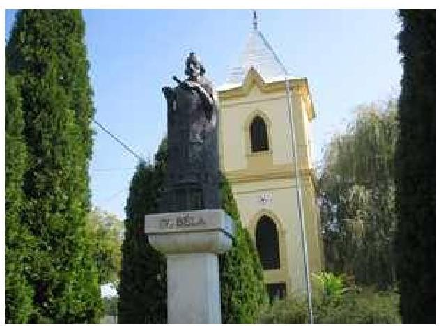
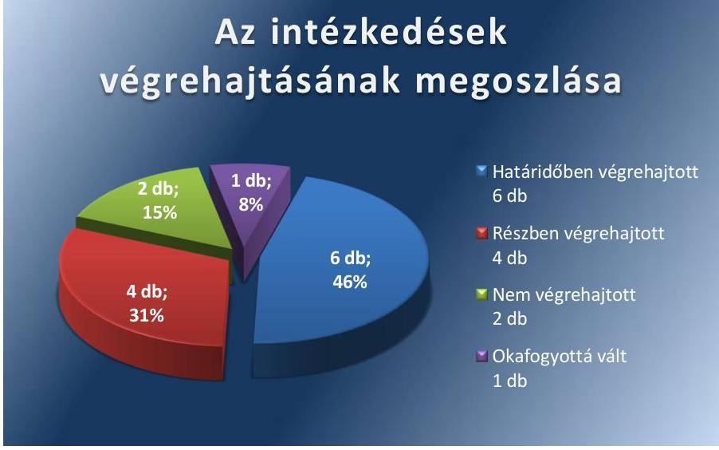
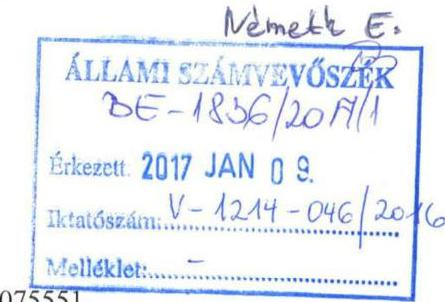
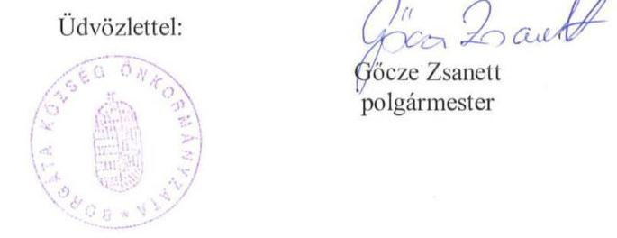

# Jelentés 

## Utóellenőrzések

Borgáta Község Önkormányzata vagyongazdálkodása
szabályszerűségének utóellenőrzése 2017.

---

# Jelentés 

## Utóellenőrzések

Borgáta Község Önkormányzata vagyongazdálkodása
szabályszerűségének utóellenőrzése
2017. január 26. nap

---

# AZ ELLENŐRZÉST FELÜGYELTE: 

DR. NÉMETH ERZSÉBET felügyeleti vezető

## AZ ELLENŐRZÉST VEZETTE ÉS A VÉGREHAJTÁSÁÉRT FELELŐS:

KEREKES PÉTER ellenőrzésvezető

## A PROGRAM ÖSSZEÁLLÍTÁSÁÉRT FELELŐS:

JANIK JÓZSEF LÁSZLÓ osztályvezető

## A TÉMÁHOZ KAPCSOLÓDÓ KORÁBBI SZÁMVEVŐSZÉKI JELENTÉSEK:

- címe: Jelentés az önkormányzati vagyongazdálkodás szabályszerűségi ellenőrzéséről - Borgáta
- sorszáma: 14060

Jelentéseink az Országgyűlés számítógépes hálózatán és az Interneten a www.asz.hu címen is olvashatóak.

IKTATÓSZÁM: V-1214-044/2016
TÉMASZÁM: 2248
ELLENŐRZÉS-AZONOSÍTÓ SZÁM: V075551

---

# TARTALOMJEGYZÉK 

■ ÖSSZEGZÉS ..... 5
■ AZ ELLENŐRZÉS CÉLJA ..... 6
■ AZ ELLENŐRZÉS TERÜLETE ..... 7
■ AZ ELLENŐRZÉS HÁTTERE, INDOKOLTSÁGA ..... 8
■ FÓKUSZKÉRDÉS ..... 9
■ ELLENŐRZÉS HATÓKÖRE ÉS MÓDSZEREI ..... 10
■ MEGÁLLAPÍTÁSOK ..... 12
■ MELLÉKLETEK ..... 15
I. Sz. melléklet: Az ÁSZ 14060 számú jelentéséhez kapcsolódó intézkedési terv végrehajtása ..... 15
■ FÜGGELÉK: ÉSZREVÉTELEK ..... 19
■ RÖVIDÍTÉSEK JEGYZÉKE ..... 21

---

.

---

# ÖSSZEGZÉS 

Az Állami Számvevőszék az utóellenőrzés során megállapította, hogy Borgáta Község Önkormányzata a vagyongazdálkodása szabályszerűségével kapcsolatban vállalt intézkedési tervét többségében végrehajtotta. A korábbi számvevőszéki jelentés javaslatait az ellenőrzött összességében jól hasznosította, ugyanakkor a gazdálkodási jogkörök szabályozására, valamint az analitikus nyilvántartások vezetésére vonatkozó feladatokat nem az intézkedési tervnek megfelelően hajtotta végre.

## Az ellenőrzés társadalmi indokoltsága

Az Állami Számvevőszék stratégiájában célul tűzte ki a számvevőszéki munka hasznosulásának javítását. Ezzel összhangban ellenőrzi, hogy az ellenőrzött szervezetek megvalósították-e a korábbi ellenőrzései által feltárt hibák, hiányosságok és szabálytalanságok megszüntetése céljából kialakított intézkedési terveikben foglaltakat. A rendszeres utóellenőrzések hozzájárulnak a szükséges intézkedések tényleges végrehajtásához, ezáltal a közpénzügyek rendezettségének javulásához.

## Főbb megállapítások, következtetések

Borgáta Község Önkormányzatának polgármestere a Képviselő-testület által elfogadott intézkedési tervet határidőn túl küldte meg az Állami Számvevőszék részére.

Az intézkedési tervben meghatározott 13 feladatból hatot határidőben végrehajtottak: elkészítették a pénzkezelési, etikai, közbeszerzési és a leltározási szabályzatot, amely tartalmazta az üzemeltetők leltározási kötelezettségére vonatkozó utalást is, valamint a vagyongazdálkodási tervet. Négy feladatot részben hajtottak végre: nem gondoskodtak teljes körűen a közérdekű adatok közzétételéről, a számviteli politikát nem a jogszabálynak megfelelően egészítették ki, a vagyonkimutatásukat csak részben rendezték, valamint az elvégzett mennyiségi leltárfelvételnek nem volt szabályos kiértékelése. Két feladatot nem hajtottak végre: a gazdálkodási jogkörök szabályozását nem a hatáskörrel rendelkező jegyző kiadmányozta, valamint az analitikus nyilvántartások folyamatos vezetéséről nem gondoskodtak. Egy feladat pedig okafogyottá vált, mert az önkormányzati adósságrendezés miatt a módosításra javasolt szerződés megszűnt.

Az intézkedési tervben rögzített feladatok végrehajtásáról nem a jogszabályban előírt nyilvántartást vezették.
Az utóellenőrzés megállapította, hogy a jegyző a megtett intézkedésekkel javította az Önkormányzat vagyongazdálkodásának szabályszerűségét és a felelős vagyongazdálkodást, ugyanakkor még nem számoltak fel minden, a korábbi számvevőszéki jelentésben feltárt hiányosságot.

---

# AZ ELLENŐRZÉS CÉLJA 

Az ellenőrzés célja annak értékelése volt, hogy a számvevőszéki jelentésben ${ }^{1}$ foglalt intézkedést igénylő megállapításokkal és javaslatokkal összhangban készített intézkedési tervben meghatározott feladatokat az ellenőrzött szervezet végrehajtotta-e.

---

# **AZ ELLENŐRZÉS TERÜLETE**

## **Borgáta Község Önkormányzata**

Borgáta Község Vas megyében, a Celldömölki járásban helyezkedik el. Állandó lakosainak száma a KSH által közzétett népességi adatok szerint 2016. január 1-jén 171 fő volt. A polgármester³ a 2014. évi önkormányzati választások óta tölti be tisztségét. A Képviselő-testület ⁴ – a polgármesterrel együtt – öttagú, munkáját az önkormányzati SZMSZ szerint Ügyrendi Bizottság segíti. A jegyző⁵ 2013. január 1-től látja el feladatait. Az Önkormányzat⁵ gazdálkodási feladatait 2013. január 1-jétől Jánosháza Város Önkormányzata és Borgáta Község Önkormányzata által Jánosházi Közös Önkormányzati Hivatal néven alapított közös hivatal látja el. A hivatal székhelye Jánosháza.

Az Önkormányzat a 2015. évi éves költségvetési beszámoló szerint 205,6 millió Ft bevételt ért el, valamint 155,4 millió Ft kiadást teljesített. Az Önkormányzat 2015. december 31-i könyvviteli mérleg szerint 838,0 millió Ft eszközvagyonnal rendelkezett, amelyből 764,0 millió Ft volt a nemzeti vagyonba tartozó befektetett eszközök állománya.

Az Önkormányzat vagyongazdálkodása szabályszerűségének ellenőrzését az ÁSZ⁶ a 2009. január 1. és 2012. december 31. közötti időszakra végezte el, az erről szóló 14060 számú jelentését 2014. április 11-én tette közzé. Az utóellenőrzés az ÁSZ jelentésben a jegyző részére megfogalmazott intézkedést igénylő megállapításokra és javaslatokra készített intézkedési tervben foglalt feladatok végrehajtásának ellenőrzésére, illetve értékelésére terjedt ki.

---

# AZ ELLENŐRZÉS HÁTTERE, INDOKOLTSÁGA 

AZ ÁSZ TV. ${ }^{7}$ 33. § (1) bekezdése értelmében a számvevőszéki jelentések intézkedést igénylő megállapításaihoz és javaslataihoz kapcsolódóan az ellenőrzött szervezet vezetője intézkedési tervet köteles összeállítani, és az ÁSZ részére megküldeni. Az intézkedési tervben foglaltak megvalósítását - az ÁSZ tv. 33. § (7) bekezdésében foglaltak alapján - az ÁSZ utóellenőrzés keretében ellenőrizheti. Az intézkedések megvalósulásának értékelése során az ÁSZ figyelembe veszi az ellenőrzött szervezetek működési feltételeiben, valamint a jogszabályi előírásokban bekövetkezett változásokat.

AZ INTÉZKEDÉSI TERVEK-ben foglalt feladatok hiányos, illetve késedelmes végrehajtása, valamint megvalósításának elmaradása azt mutatja, hogy az ellenőrzések során feltárt hibák, hiányosságok és szabálytalanságok megszüntetése nem kapott kellő hangsúlyt. Ez a szabályszerű működés és a felelős vezetői magatartás vonatkozásában kockázatot hordoz. E kockázatok feltárásával az ÁSZ utóellenőrzési rendszere fokozza a fegyelmet, és igazolja, hogy a közpénzzel való szabályos gazdálkodás felelőssége elől nem lehet kitérni.

## AZ UTÓELLENŐRZÉS NÉGY SZINTEN HASZNOSULHAT:

- A társadalom szintjén az utóellenőrzés jelzi, hogy a számvevőszéki ellenőrzés megállapításainak van következménye: a hiányosságok megszüntetésére az ellenőrzött szervezet által meghatározott intézkedések végrehajtását is számon kéri az ÁSZ.
- Az ellenőrzött terület szintjén az utóellenőrzés tájékoztatást nyújt a terület döntéshozóinak a hiányosságok kiküszöbölésének jó gyakorlatairól, ezzel lehetőséget biztosítva arra, hogy az ÁSZ ellenőrzési megállapításai, javaslatai a terület nem ellenőrzött szervezeteinek a működése során is hasznosuljanak.
- Az ellenőrzött szervezet szintjén az utóellenőrzés feltárja, hogy a szervezet az intézkedések végrehajtásával hasznosította-e a korábbi ellenőrzési jelentésben a hiányosságok megszüntetése, illetve a kockázatok kezelése érdekében megfogalmazott javaslatokat.
- Az ÁSZ szintjén az utóellenőrzés visszacsatolást ad az ellenőrzési jelentések hasznosulásáról, az intézkedések elmaradása vagy részleges megvalósulása a további ellenőrzésekhez kockázati jelzésként szolgál.

---

# FÓKUSZKÉRDÉS 

1. Az Önkormányzat az intézkedési tervben foglaltakat az előírt határidőben végrehajtotta-e?

---

# ELLENŐRZÉS HATÓKÖRE ÉS MÓDSZEREI 

## Az ellenőrzés típusa

Megfelelőségi ellenőrzés.

## Az ellenőrzött időszak

Az utóellenőrzés alapját képező számvevőszéki jelentés közzétételének napjától (2014. április 11.) az ellenőrzésről szóló kiértesítő levél keltének napjáig (2016. július 18.) tartó időszak.

## Az ellenőrzés tárgya

Az ÁSZ tv. 2011. július 1-jei hatálybalépését követően a számvevőszéki jelentésben foglalt intézkedést igénylő megállapításokkal és javaslatokkal összhangban - Önkormányzat által - készített intézkedési tervben foglaltak végrehajtásának ellenőrzése.

Az ellenőrzés kiterjed minden olyan körülményre és adatra, amely az ÁSZ jogszabályban meghatározott feladatainak teljesítéséhez, valamint a program végrehajtása folyamán felmerült újabb összefüggések feltárásához szükséges

## Az ellenőrzött szervezet

Borgáta Község Önkormányzata

## Az ellenőrzés jogalapja

Az ÁSZ az Országgyűlés pénzügyi és gazdasági ellenőrző szerve. Az ÁSZ tv.ben meghatározott feladatkörében ellenőrzi a központi költségvetés végrehajtását, az államháztartás gazdálkodását, az államháztartásból származó források felhasználását és a nemzeti vagyon kezelését. Az ÁSZtv. 1. § (3) bekezdése szerint az ÁSZ általános hatáskörrel végzi a közpénzekkel és az állami és önkormányzati vagyonnal való felelős gazdálkodás ellenőrzését. Az ÁSZtv.33. §(7) bekezdése alapján az ÁSZtv.33. §(1)-(2) bekezdése szerinti intézkedési tervben foglaltak megvalósítását az ÁSZ utóellenőrzés keretében ellenőrizheti.

---

# Az ellenőrzés módszerei 

Az ÁSZ az utóellenőrzést a nemzetközi standardokat irányadónak tekintve az ellenőrzési program ellenőrzési kérdései, az ellenőrzött időszakban hatályos jogszabályok, az ellenőrzés szakmai szabályok és módszertanok figyelembevételével, önállóan végezte.

Az ÁSZ az ellenőrzés ideje alatt az Önkormányzattal történő kapcsolattartást az ÁSZ SZMSZ-ének ${ }^{8}$ vonatkozó előírásai alapján biztosította.

Az utóellenőrzés megállapításait elsősorban az ÁSZ rendelkezésére álló, valamint az ellenőrzött szervezetektől elektronikusan bekért dokumentumok alapozták meg.

Az ellenőrzési bizonyítékként felhasználható adatforrások közé tartoznak egyrészt a szakmai programban felsorolt adatforrások, másrészt minden - az ellenőrzés folyamán feltárt, az ellenőrzés szempontjából információt tartalmazó - dokumentum.

Az intézkedési tervekben előírt feladatoknak, azok végrehajthatósága, illetve végrehajtása szempontjából az alábbiak szerint értékelte az ÁSZ:
"határidőben végrehajtott" a feladat, ha a teljesítés dokumentáltan, az intézkedési tervben előírt határidőben és tartalommal megtörtént;
"határidőn túl végrehajtott" a feladat, ha annak teljesítése az intézkedési tervben meghatározott módon, de az előírt határidőn túl történt meg;
"részben végrehajtott" a feladat, ha végrehajtása teljes körűen az intézkedési tervben előírt módon nem történt meg;
"nem végrehajtott" a feladat, ha a végrehajtás nem történt meg, vagy amennyiben a teljesítést nem dokumentálták;
"okafogyottá vált" a feladat, ha végrehajtására - meghatározott esemény bekövetkezése, továbbá külső körülmény, a működést érintő feltétel változása miatt - már nincs szükség, illetve lehetőség, és egyértelműen megállapítható, hogy az intézkedést szükségessé tevő körülmény a jövőben nem fordulhat elő;
"nem időszerű" az a feladat, amelynek ellenőrzési időszakon belüli végrehajtására azért nem került (kerülhetett) sor, mert az intézkedés alapjául szolgáló esemény nem következett be, de annak jövőbeni előfordulása lehetséges, a végrehajtása nem volt esedékes, vagy a végrehajtás határideje még nem járt le.
Az ellenőrzés lefolytatásához az ellenőrzött szervezet a tanúsítványok elektronikus kitöltésével, valamint az ÁSZ által kért dokumentumok elektronikus megküldésével szolgáltatott adatokat, amelyek valódiságát és teljes körűségét az ellenőrzött szervezet vezetője által tett teljességi és hitelességi nyilatkozat igazolta. Az így rendelkezésre bocsátott adatok, információk kontrollja az ellenőrzés keretében történt.

---

# MEGÁLLAPÍTÁSOK 

## 1. Az Önkormányzat az intézkedési tervben foglaltakat az előírt határidőben végrehajtotta-e?

Összegző megállapítás

Az Önkormányzat az intézkedési tervében meghatározott 13 feladatból hatot határidőben végrehajtott, négyet részben hajtott végre, kettőt nem hajtott végre, egy feladat pedig okafogyottá vált Az intézkedési tervben rögzített feladatok végrehajtásáról nem a jogszabályban előírt módon vezették a nyilvántartást.

Az ÁSZ a 14060 számú jelentésében a jegyző részére tíz javaslatot fogalmazott meg. A Képviselő-testület az ÁSZ részére megküldött intézkedési tervében a hiányosságok, szabálytalanságok megszüntetésére 13 feladatot határozott meg a jegyzőnek címezve.

Az intézkedési tervben rögzített feladatok végrehajtásáról nem a $\mathrm{Bkr}^{9}$. 14. § (1) bekezdése előírásainak megfelelő módon vezettek nyilvántartást.

Az intézkedési tervben vállalt feladatok végrehajtási kategóriák szerinti megoszlását az 1. ábra szemlélteti.

## Az intézkedések végrehajtásának megoszlása

Forrás: ÁSZ
Az intézkedési tervben meghatározott feladatokat, határidőket, a feladatok végrehajtásáért felelős személyeket és a feladatok végrehajtását az I. számú melléklet mutatja be.

---

# HATÁRIDŐBEN VÉGREHAJTOTT feladatok: 

1. A jegyző az intézkedési tervben meghatározott tartalommal határidőre elkészítette az Önkormányzat pénzkezelési szabályzatát ${ }^{10}$.
2. A jegyző az Önkormányzat leltározási szabályzatát ${ }^{11}$ összhangba hozta a Számv. tv. ${ }^{12}$ rendelkezéseivel.
3. A jegyző a koncesszióba, vagyonkezelésbe adott eszközök leltárazásának szabályozásával kiegészítette az Önkormányzat leltározási szabályzatát, így az már megfelelt az Áhszz ${ }^{13}$ erre vonatkozó rendelkezéseinek.
4. A jegyző az intézkedési tervben előírtaknak megfelelően közbeszerzési szabályzatban ${ }^{14}$ rendezte a beszerzések lebonyolításával kapcsolatos eljárásrendet, amely tartalmazta a közbeszerzési értékhatár alatti és a közbeszerzések hatálya alá nem eső beszerzések szabályozását is.
5. A jegyző elkészítette az Nvtv ${ }^{15}$.-ben előírtaknak megfelelően az

 Önkormányzat közép- és hosszú távú vagyongazdálkodási tervét.
6. Az intézkedési tervben meghatározott tartalommal a jegyző elkészítette a szervezet minden szintjére meghatározott etikai szabályzatot ${ }^{16}$.

## RÉSZBEN VÉGREHAJTOTT feladatok:

7. A jegyző kiegészítette az Önkormányzat számviteli politikáját ${ }^{17}$ az intézkedési tervben meghatározott tartalommal, azonban nem határozta meg, hogy mit tekint a számviteli elszámolás, az értékelés szempontjából lényegesnek, jelentősnek, nem lényegesnek, nem jelentősnek.
8. A jegyző az intézkedési tervben előírt közzétételi kötelezettségének az ellenőrzött időszakban részben tett eleget. Az adatok közzétételét az Önkormányzat honlapján, valamint a Nemzeti Jogszabálytár és a Közadattár honlapokon teljesítette, de nem gondoskodott teljes körűen az Info tv. 1. mellékletében meghatározott adatok közzétételéről, frissítéséről, karbantartásáról.
9. A jegyző intézkedett, hogy az Önkormányzat vagyonkimutatása tartalmazza az Áhsz-ben előírt tartalmi elemek közül a mérlegben szereplő eszközöket és kötelezettségeket, de nem gondoskodott arról, hogy a vagyonkimutatás tartalmazza a 0-ára leírt eszközöket is.
10. A jegyző intézkedett a leltározás – ide értve az üzemeltetésre átadott eszközök leltározását is – végrehajtásáról, azonban a felvett leltárak kiértékelését az intézkedési tervben vállalt feladat ellenére nem végezték el.

## NEM VÉGREHAJTOTT feladat:

11. Az Önkormányzat gazdálkodási szabályzatát ${ }^{18}$ az Ávr ${ }^{19}$.-ben és az intézkedési tervben előírtakkal ellentétben nem a hatáskörrel rendelkező jegyző, hanem a polgármester kiadmányozta.

---

12. A jegyző nem intézkedett, hogy az Áhsz-ben előírtaknak megfelelően teljes körűen elkészítsék a 2014. évi analitikus nyilvántartásokat, mert az előirányzatok és a kötelezettségek nyilvántartásairól nem szolgáltattak adatot, valamint nem vezették folyamatosan az analitikus nyilvántartásokat a 2015-2016-os évekre.

# OKAFOGYOTTÁ VÁLT feladat: 

13. Az intézkedési tervben szereplő, inkasszós jogot tartalmazó szerződés módosítása okafogyottá vált, mivel a Magyar Állammal kötött tartozásátvállalási szerződés alapján az Önkormányzat készfizető kezesség és garanciavállalás szerződése, és ezzel egyidejűleg az ezzel kapcsolatos fizetési kötelezettségei megszűntek.

---

# MELLÉKLETEK

## I. SZ. MELLÉKLET: AZ ÁSZ 14060 SZÁMÚ JELENTÉSÉHEZ KAPCSOLÓDÓ INTÉZKEDÉSI TERV VÉGREHAJTÁSA

|  Sorszám | Intézkedési terv alapján elvégzendő feladat | Az intézkedési tervben meghatározott határidő | Az intézkedési tervben megjelölt felelős | A feladat végrehajtása  |
| --- | --- | --- | --- | --- |
|   | 1. | 2. | 3. | 4.  |
|  Határidőben végrehajtott feladat |  |  |  |   |
|  1. | „1. b) El kell készíteni a Számv. tv. 14. § (5) bekezdés d) pontjának előírásai szerinti pénzkezelési szabályzatot." | 2014. 10. 31. | Jegyző | A jegyző az intézkedési tervben előírt határidőben és tartalommal elkészítette az Önkormányzat pénzkezelési szabályzatát. A szabályzat megfelelő a Számv. tv. 14. § (5) bekezdés d) pontja előírásainak.  |
|  2. | „2. a) Összhangot kell teremteni az Áhsz.: ${ }^{20} 37 . \S$ (7) bekezdésében előírtak és a leltározási szabályzatban foglaltak között." | 2014. 10. 31. | Jegyző | A jegyző az intézkedési tervben előírtak szerint módosította az Önkormányzat leltározási szabályzatát. A módosított szabályzatban foglaltak összhangban állnak a Számv. tv. 69. § (3) bekezdésében előírtakkal.  |
|  3. | „2. b) Ki kell egészíteni a leltározási szabályzatot az üzemeltetőre vonatkozó, az Áhsz.: 37. § (4) bekezdésében előírt leltározási kötelezettségre való utalással." | 2014. 10. 31. | Jegyző | A jegyző az Áhsz.: 22. § (2) bekezdés a) pontjában meghatározott tartalommal kiegészítette az Önkormányzat leltározási szabályzatát, amely ennek következtében tartalmazza, hogy a koncesszióba, vagyonkezelésbe adott eszközöket a működtető, vagyonkezelő által elkészített és hitelesített leltárral kell alátámasztani.  |
|  4. | „4. El kell készíteni az Ávr. 13. § (2) bekezdés b) pontjában előírtaknak megfelelően a beszerzések lebonyolításával kapcsolatos eljárásrendet." | 2014. 08. 31. | Jegyző | Az Ávr. 13. § (2) bekezdés b) pontjában előírtaknak megfelelően a jegyző elkészítette az Önkormányzat közbeszerzési szabályzatát a beszerzések lebonyolításával kapcsolatos eljárásrendre, amely tartalmazza a közbeszerzési értékhatár alatti beszerzések és a közbeszerzések hatálya alá nem tartozó beszerzések szabályozását is.  |
|  5. | „5. El kell készíteni az Nvtv. 9. § (1) bekezdés szerinti közép- és hosszú távú vagyongazdálkodási tervet." | 2014. 08. 31. | Jegyző | Az intézkedési tervben előírt határidőben és az Nvtv. 9. § (1) bekezdésben előírtaknak megfelelően a jegyző elkészítette az Önkormányzat közép- és hosszú távú vagyongazdálkodási tervét, melyet Borgáta Község Önkormányzatának Képviselő-testülete a 18/2013. (VI. 26.) számú határozattal fogadott el.  |
|  6. | „10. Meg kell határozni a Bkr. 6. § (1) bekezdés c) pontjában foglaltaknak megfelelően az etikai elvárásokat." | 2014. 08. 31. | Jegyző | Az intézkedési tervben előírt határidőben és a Bkr. 6. § (1) bekezdés c) pontjában előírtaknak megfelelően a jegyző elkészítette a szervezet minden szintjére meghatározott etikai szabályzatot.  |
|  Készben végrehajtott feladat |  |  |  |   |
|  7. | „1. a) Ki kell egészíteni a számviteli politikát az Áhsz.: 8. § (5)-(8) bekezdéseiben előírtaknak megfelelően." | 2014. 08. 31. | Jegyző | A jegyző kiegészítette az Önkormányzat számviteli politikáját az intézkedési tervben meghatározottak szerint a beszerzett és az előállított immateriális javak, tárgyi eszközök  |

---

|  8. | „6. Intézkedni kell az Info. tv. ${ }^{21}$ 1. számú mellékletében meghatározott adatok közzétételéről." | 2014. 08. 31. | Jegyző | Az intézkedési tervben megjelölt felelős  |
| --- | --- | --- | --- | --- |
|  9. | „7. Intézkedni kell arról, hogy az önkormányzat vagyonkimutatása tartalmazza az Áhsz.; 44/A § (3) bekezdésében előírt tartalmi elemeket is." | 2014.10.31 | Jegyző | Az Önkormányzat 2014. évről készült, a Képviselő-testület által 6/2015. (V. 13.) önkormányzati rendelettel elfogadott zárszámadásának részét képező vagyonkimutatás az intézkedési tervben meghatározottaknak részben felelt meg. Az Önkormányzat vagyonkimutatása a mérlegben szereplő eszközöket és kötelezettségeket tartalmazta, azonban nem tartalmazta a 0-ára leírt eszközöket, ezért a vagyonkimutatás nem felelt meg az elkészítésekor hatályos Áhsz.; 30. § (3) a) pontjában foglaltaknak.  |
|  10. | „8. b) El kell végezni az Áhsz.; 37 §-ában foglaltaknak megfelelő leltározás - ide értve az üzemeltetésre átadott eszközök leltározását is valamint el kell végezni a felvett leltárak kiértékelését." | 2014.12.31 | Jegyző | Az Önkormányzat a feladatot részben hajtotta végre, mert a leltározási bizonylatok alapján a mennyiségi leltárfelvételt és az üzemeltetésre átadott eszközök leltározását 2013. december 31-i fordulónappal 2013. november 29-én elvégezte, azonban a felvett leltárak kiértékelését - dokumentumokkal igazoltan - nem végezte el.  |
|  11. | „3. Intézkedni kell az Ávr. 13. § (2) bekezdés a) pontjában foglaltaknak megfelelően a gazdálkodási jogkörök szabályzatának kiadmányozásáról." | 2014. 08. 31. | Jegyző | Nem végrehajtott feladat  |
|   |  |  |  | Az Ávr. 13. § (2) bekezdés a) pontjában foglaltak ellenére az Önkormányzat 2014. január 1-től hatályos gazdálkodási szabályzatát és a 2016. január 1-től hatályos gazdálkodási szabályzatát nem a hatáskörrel rendelkező jegyző, hanem a polgármester kiadmányozta.  |

---

|  1. | Intézkedési terv alapján elvégzendő feladat | Az intézkedési tervben meghatározott határidő | Az intézkedési tervben megjelölt felelős | A feladat végrehajtása  |
| --- | --- | --- | --- | --- |
|  1. |  | 2. | 3. | 4.  |
|  12. | „8. a) El kell készíteni és folyamatosan vezetni kell az Áhsz. ${ }_{1} 47 . \S$ (1) bekezdésében előírtaknak megfelelően az analitikus nyilvántartásokat." | 2014.08.31., azt követően folyamatos | Jegyző | A jegyző nem intézkedett, hogy az Áhsz: 45.§ (1) és (3) bekezdésekben előírtaknak megfelelően teljes körűen elkészítsék a 2014. évi analitikus nyilvántartásokat, mert az előirányzatok és a kötelezettségek nyilvántartásairól nem szolgáltattak adatot, valamint nem vezették folyamatosan az analitikus nyilvántartásokat a 2015-2016-os évekre.  |
|  13. | „9. Módosítani kell az inkasszós szerződés módosítását annak érdekében, hogy az abban foglaltak megfeleljenek az Ávr. 145. § (2) bekezdésében foglalt előírásoknak." | 2014.08.31 | Jegyző | Az Önkormányzat 2008. évben szennyvízkezeléssel kapcsolatos feladatok megoldására négy önkormányzattal társulás keretében szennyvíztisztító rendszer kiépítése érdekében kötvényt bocsátott ki, mellyel kapcsolatban 2008. február 15-én inkasszós jogot tartalmazó készfizető kezesség és garanciavállalás szerződést kötött.
A Magyar Állam a Káld és Térsége Környezetéért Önkormányzati Társulással és a Raiffeisen Bank Zrt.-vel a 2014. február 28-án kötött tartozásátvállalási szerződés keretében a Társulás kötvénykibocsátás miatt keletkezett, az átvállalás napján fennálló fizetési kötelezettségét átvállalta. Az intézkedési tervben szereplő inkasszós jogot tartalmazó szerződés módosítása a tartozásátvállalási szerződés alapján a fizetési kötelezettségek átvállalása és az azokat biztosító mellékkötelezettség, biztosíték, fedezet, illetve biztosítéki szerződés megszűnése miatt okafogyottá vált.  |

---

.

---

# FÜGGELÉK: ÉSZREVÉTELEK 

A jelentéstervezetet a Számvevőszék 15 napos észrevételezésre megküldte az ellenőrzött szervezet vezetőjének az ÁSZ tv. 29. §*(1) bekezdése előírásának megfelelően.

Az ellenőrzött szervezet vezetője az ÁSZ tv. 29. § (2) bekezdésében foglalt észrevételezési jogával nem élt, a jelentéstervezetre észrevételt nem tett.

[^0]
[^0]:    * 29. § (1) Az Állami Számvevőszék az ellenőrzési megállapításait megküldi az ellenőrzött szervezet vezetőjének vagy az általa megbízott személynek, és annak, akinek személyes felelősségét állapította meg.
    (2) Az ellenőrzött szervezet vezetője és a felelősként megjelölt személy az ellenőrzés megállapításaira tizenöt napon belül írásban észrevételt tehet.
    (3) Az Állami Számvevőszék az észrevételre a beérkezésétől számított harminc napon belül írásban válaszol. A figyelembe nem vett észrevételeket köteles a jelentésben feltüntetni, és megindokolni, hogy azokat miért nem fogadta el.

---

# Borgáta Község Önkormányzata 

9554 Borgáta
Kossuth tér 7.
Szám: 2671/2/2016.
Melléklet: -

Hiv.sz.: V075551.
Tárgy: Tájékoztatás.

## Állami Számvevőszék

Domokos László Elnök Úr részére
Budapest
Pf. 54
1364

Tisztelt Elnök Úr!

Tájékoztatom, hogy a V075551. számú jelentéstervezetben foglaltakkal egyetértek, a jelentéstervezettel kapcsolatban észrevételt nem kívánok tenni.

Jánosháza, 2017. január 3.

---

# RÖVIDÍTÉSEK JEGYZÉKE 

${ }^{1}$ számvevőszéki jelentés
${ }^{2}$ polgármester
${ }^{3}$ Képviselő-testület
${ }^{4}$ jegyző
${ }^{5}$ Önkormányzat
${ }^{6}$ ÁSZ
${ }^{7}$ ÁSZ tv.
${ }^{8}$ ÁSZ SZMSZ
${ }^{9}$ Bkr.
${ }^{10}$ pénzkezelési szabályzat
${ }^{11}$ leltározási szabályzat
${ }^{12}$ Számv. tv.
${ }^{13}$ Ahsz $_{2}$
${ }^{14}$ közbeszerzési szabályzat
${ }^{15}$ Nvtv.
${ }^{16}$ etikai szabályzat
${ }^{17}$ számviteli politika
${ }^{18}$ gazdálkodási szabályzat
${ }^{19}$ Ávr.
${ }^{20}$ Ahsz.
${ }^{21}$ Info tv.
${ }^{22}$ 305/2005. (XII. 25.) Korm. rendelet

Az Állami Számvevőszék 2014. április 11-én nyilvánosságra hozott 14060 számú jelentése
Borgáta Község Önkormányzatának polgármestere
Borgáta Község Önkormányzatának Képviselő-testülete
Jánosháza Város Önkormányzata és Borgáta Község Önkormányzata által
Jánosházi Közös Önkormányzati Hivatal néven alapított közös hivatal jegyzője
Borgáta Község Önkormányzata
Állami Számvevőszék
2011. évi LXVI. törvény

 az Állami Számvevőszékről, hatályos 2011. július 1-jétől

Állami Számvevőszék Szervezeti és Működési Szabályzata
370/2011. (XII. 31.) Korm. rendelet a költségvetési szervek belső
kontrollrendszeréről és belső ellenőrzéséről
Borgáta Község Önkormányzata Pénzkezelési Szabályzata (hatályos: 2014. január 1-jétől, majd 2016. január 1-jétől)
Borgáta Község Önkormányzata Leltározási és leltárkészítési szabályzata (hatályos: 2014. január 1-jétől, majd 2016. január 1-jétől)
2000. évi C. törvény a számvitelről (hatályos: 2001. január 1-jétől)
4/2013. (I. 11.) Korm. rendelet az államháztartás számviteléről (hatályos 2014. január 1-jétől)
Borgáta Község Önkormányzatának Közbeszerzési szabályzata (hatályos: 2014. január 1-jétől)
2011. évi CXCVI. törvény a nemzeti vagyonról

Jánosházi Közös Önkormányzati Hivatal Etikai Szabályzata (hatályos: 2013. október 1-jétől)
Borgáta Község Önkormányzata Számviteli Politikája (hatályos: 2014. január 1-jétől, majd 2016. január 1-jétől)
Borgáta Község Önkormányzata Gazdálkodási Szabályzata (hatályos: 2014. január 1-jétől, majd 2016. január 1-jétől)
368/2011. (XII. 31.) Korm. rendelet az államháztartásról szóló törvény végrehajtásáról
249/2000. (XII. 24.) Korm. rendelet az államháztartás szervezetei beszámolási és könyvvezetési sajátosságairól (hatálytalan: 2014. január 1-jétől)
2011. évi CXII. törvény az információs önrendelkezési jogról és az információszabadságról
305/2005. (XII. 25.) Korm. rendelet a közérdekű adatok elektronikus közzétételére, az egységes közadatkereső rendszerre, valamint a központi jegyzék adattartalmára, az adatintegrációra vonatkozó részletes szabályokról (hatályos: 2006. január 1-jétől)

---

# ÁLLAMI SZÁMVEVŐSZÉK 

1052 Budapest, Apáczai Csere János utca 10.
Levélcím: 1364 Budapest 4. Pf. 54
Telefon: +36 14849100 Telefax: +36 14849200
www.asz.hu
