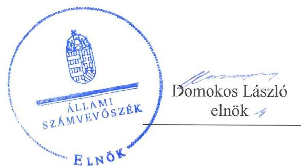
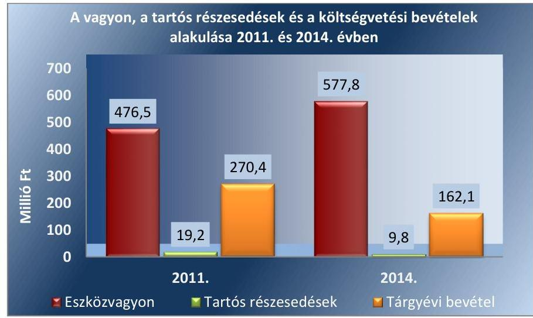
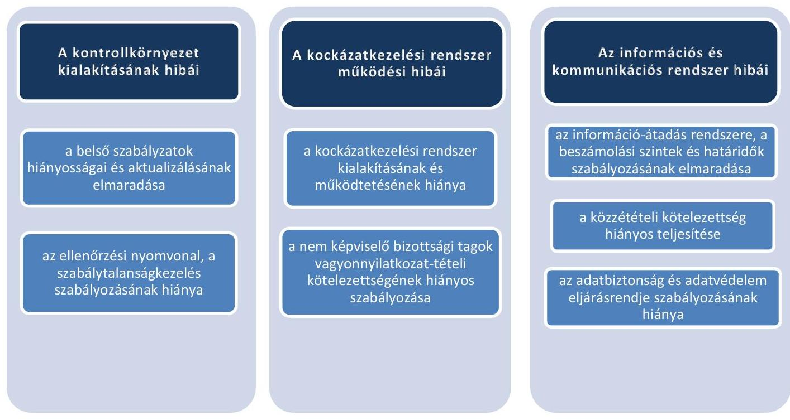

# Jelenetés 

## Önkormányzatok belsö kontrollrendszere

Az önkormányzatok belső kontrollrendszere kialakításának és múködtetésének ellenőrzése - Kaposszerdahely 2017.

---

# J elentés 

## Önkormányzatok belsó kontrollrendszere

Az önkormányzatok belső kontrollrendszere kialakításának és múködtetésének ellenőrzése - Kaposszerdahely
2017. O2. hó O2. nap

---

# AZ ELLENŐRZÉST FELÜGYELTE:

- RENKŐ ZSUZSANNA felügyeleti vezető
- AZ ELLENŐRZÉST VEZETTE ÉS A VÉGREHAJTÁSÁÉRT FELELŐS:
  - HORVÁTH JÓZSEF ellenőrzésvezető
  - A PROGRAM ÖSSZEÁLLÍTÁSÁÉRT FELELŐS:
    - JANIK JÓZSEF LÁSZLÓ osztályvezető

**IKTATÓSZÁM:** V-1041-143/2016

**TÉMASZÁM:** 2075

**ELLENŐRZÉS-AZONOSÍTÓ SZÁM:** V071813, V073813

Jelentéseink az Országgyűlés számítógépes hálózatán és az Interneta a www.asz.hu címen is olvashatóak.

---

# TARTALOMJEGYZÉK 

■ ÖSSZEGZÉS ..... 5
■ AZ ELLENŐRZÉS CÉLJA ..... 6
■ AZ ELLENŐRZÉS TERÜLETE ..... 7
■ AZ ELLENŐRZÉS HÁTTERE, INDOKOLTSÁGA ..... 8
■ A JELENTÉS LÉNYEGES KÉRDÉSKÖREI ..... 11
■ ELLENŐRZÉS HATÓKÖRE ÉS MÓDSZEREI ..... 12
■ MEGÁLLAPÍTÁSOK ..... 15
■ JAVASLATOK ..... 31
■ MELLÉKLETEK ..... 35
I. Sz. melléklet: Értelmező szótár ..... 35
II. Sz. melléklet: Az integritás érvényesítése érdekében kialakított és múködtetett kontrollrendszer ..... 36
■ FÜGGELÉK: ÉSZREVÉTELEK ..... 39
■ RÖVIDÍTÉSEK JEGYZÉKE ..... 41

---

.

---

# ÖSSZEGZÉS 

Kaposszerdahely Község Önkormányzata belső kontrollrendszere kialakításának és müködtetésének hiányosságai miatt a közpénzfelhasználás szabályossága nem volt biztositott, a befektetési tevékenységek szabályszerü végzését nem támogatta. Az Önkormányzat beszámolója nem a valóságnak megfelelően mutatta be a befektetett közvagyon nagyságát. Az Önkormányzat az integritás szemlélet érvényesülésében nem tett erőfeszitéseket.

## Az ellenőrzés társadalmi indokoltsága

Magyarország Alaptörvénye az önkormányzatoktól is elvárja a kiegyensúlyozott, átlátható és fenntartható költségvetési gazdálkodás elvének érvényesítését. A korábbi évek ellenőrzési tapasztalatai, az önkormányzatok által betöltött társadalmi szerep, az általuk kezelt közpénz nagysága, a nemzeti vagyon átruházására vagy hasznosítására vonatkozó döntéseik sokrétüsége egyaránt indokolttá tették a számvevőszéki ellenőrzések folytatását. A belső kontrollrendszer kialakítása és müködtetése nélkül nem valósitható meg a közpénzek, a közvagyon szabályos, gazdaságos, hatékony és eredményes felhasználása.

## Főbb megállapítások, következtetések, javaslatok

A belső kontrollrendszer kialakítása és müködtetése nem volt szabályszerű, így nem segítette elő a szabálykövető múködést és gazdálkodást, a szervezeti célok elérését. A kontrolltevékenységek nem megfelelő müködtetése akadályozta a hibák megelőzését, feltárását. A teljesítésigazolási és az érvényesítési jogkörök szabálytalan gyakorlása növelte a jogosulatlan kifizetések kockázatát. Nem mérték fel és nem határozták meg a Hivatal tevékenységében, gazdálkodásában rejlő kockázatokat, az Önkormányzat befektetési tevékenységével összefüggő kockázatokat sem elemezték, ezáltal nem volt biztosított a vagyonnal való felelős gazdálkodás.

A befektetési döntéseket, melyeket az ellenőrzött időszakot megelőzően hoztak meg, megalapozó célszerűségi, gazdaságossági, eredményességi számításokkal nem támasztották alá. A részesedésekkel kapcsolatos kockázatok kezelésére nem dolgoztak ki intézkedéseket. Az Önkormányzat Bizottságai nem kísérték figyelemmel a vagyon változásának alakulását, nem értékelték a vagyonváltozást előidéző okokat.

A befektetések számviteli elszámolása, nyilvántartása nem felelt meg a jogszabályi előírásoknak. Az értékvesztés elszámolását dokumentumokkal nem támasztották alá, a részvények leltározását nem végezték el.

Az integritás szemlélet érvényesülése érdekében az Önkormányzat nem tett erőfeszítéseket.

---

# AZ ELLENŐRZÉS CÉLJA 

Az ellenőrzés célja annak megállapítása, hogy az önkormányzat belső kontrollrendszerének kialakítása, továbbá egyes elemeinek működtetése biztosította-e a közpénz felhasználás szabályosságát. Az erőforrásokkal való szabályszerű és hatékony gazdálkodáshoz szükséges követelmények érvényesítése, számonkérése, ellenőrzése meg-történt-e az önkormányzatnál. A belső kontrollrendszer kialakítása és működtetése támogatta-e az integritás szemlélet érvényesülését. Az ellenőrzés során értékeljük a belső kontrollrendszer kialakításának és működtetésének szabályszerűségét. Feltárjuk azokat a lényeges szabályozási és múködési hiányosságokat, amelyek miatt az ellenőrzött kulcskontrollok nem nyújtottak elegendő védelmet a lehetséges hibákkal szemben. Rámutatunk arra, ha a kulcskontrollok valamely hibát nem előznek meg, nem tárnak fel, vagy nem javítanak ki, valamint minősítjük múködésük megfelelőségét.

Ellenőrizzük, hogy az önkormányzat egyes befektetési döntései és azok végrehajtása, elszámolása megfelelt-e a vonatkozó jogszabályoknak és belső szabályozásoknak, a kialakított kontrollrendszer támogatta-e a befektetési tevékenység szabályszerűségét.

---

# **AZ ELLENŐRZÉS TERÜLETE**

## **Kaposszerdahely Község Önkormányzata**

A Somogy megyében található Kaposszerdahely község állandó lakosainak száma 2015. január 1-jén 1040 fő volt. Az Önkormányzat¹ az ellenőrzött időszakban hét tagú Képviselő-testülettel rendelkezett. A Képviselő-testület² munkáját a 2014. évi önkormányzati választást megelőzően három, majd ezt követően két állandó bizottság³ segítette.

A Polgármester⁴ a 2010. évi önkormányzati választások óta töltötte be tisztségét. A Jegyző⁵ 2007. július 1. óta látta el feladatait. A Hivatal 2011. január 1. és 2015. április 30. között a három szervezeti formában (Kaposszerdahely Község Önkormányzata Polgármesteri Hivatal, Bárdudvarnok, Kaposszerdahely Községek Körjegyzőség, Bárdudvarnoki Közös Önkormányzati Hivatal⁶) látta el feladatait. Az Önkormányzathoz tartozik a Kaposszerdahelyi-Bárdudvarnoki Óvoda intézmény. A településen az ellenőrzött időszakban Roma Nemzetiségi Önkormányzat működött.

Az Önkormányzatnak gazdasági társaságban többségi részesedése nem volt.

A Hivatal nem tagolódott szervezeti egységekre, elkülönült gazdasági szervezettel nem rendelkezett. A gazdasági szervezet feladatait a Hivatal látta el. A Hivatalban foglalkoztatott köztisztviselők száma 2014. év végén nyolc fő volt.

Az Önkormányzat a 2014. évi éves költségvetési beszámoló szerint 162 056 ezer Ft költségvetési bevételt ért el, valamint 158 611 ezer Ft költségvetési kiadást teljesített. Az eszközvagyon értéke 2014. december 31-én 577 802 ezer Ft volt, a költségvetési évben esedékes kötelezettség állomány 1961 ezer Ft volt, a költségvetési évet követően esedékes kötelezettség állomány 3256 ezer Ft-ot tett ki.

1. ábra

*Forrás: a 2011. és a 2014. évi éves költségvetési beszámolók*

---

# AZ ELLENŐRZÉS HÁTTERE, INDOKOLTSÁGA 

Az ÁSZ tv. ${ }^{7}$ szerint az ÁSZ ${ }^{8}$ feladata a jól irányított állam kiépítésének elősegítése. Az ÁSZ Stratégiájában ezért hangsúlyos szerepet szánt annak, hogy szilárd szakmai alapon álló, értékteremtő ellenőrzéseivel előmozdítsa a közpénzügyek átláthatóságát, rendezettségét. A számvevőszéki ellenőrzés nemzetközi alapelvei is rögzítik, hogy a megfelelő belső kontrollrendszer minimálisra csökkenti a hibák és szabálytalanságok kockázatát.

A belső kontrollrendszer azt a célt szolgálja, hogy a költségvetési szervek működésük és gazdálkodásuk során a tevékenységeket szabályszerűen, gazdaságosan, hatékonyan, eredményesen hajtsák végre, teljesítsék elszámolási kötelezettségeiket és megvédjék az erőforrásokat a veszteségektől, a károktól és a nem rendeltetésszerű használattól. A belső kontrollrendszer magában foglalja mindazon szabályokat, eljárásokat, gyakorlati módszereket és szervezeti struktúrákat, kockázatkezelési technikákat, kontrolltevékenységeket, amelyek segítséget nyújtanak a szervezetnek céljai eléréséhez. A belső kontrollrendszer szabályozása háromszintű a törvényi előírásokat az Áht. 2 és a Mötv., a rendeleti szintű szabályozást az Ávr. és a Bkr. ${ }^{9}$ tartalmazza, amelyeket útmutatói szinten az NGM által kiadott standardok és kézikönyvek támogatnak.

Az ellenőrzött időszak meghatározása lehetőséget teremtett a 2014. október 12-i önkormányzati választásokat megelőző és követő ciklus belső kontrollrendszere működésének elkülönült értékelésére, valamint a változások nyomon követésére.

A BELSŐ KONTROLLRENDSZER kialakításának és működtetésének általános értékelése mellett a teljesítésigazolás és érvényesítés kontrollok kiemelt ellenőrzésének szükségességét alátámasztja, hogy 2012. évtől a pénzügyi folyamatokban kulcsszerepet betöltő belső kontrollok rendszere módosult és azok működtetésében az önkormányzatoknál hiányosságok mutatkoztak a 2012. év óta elvégzett ÁSZ ellenőrzések alapján.

Az önkormányzatok belső kontrollrendszerének ellenőrzése az ÁSZ "jó kormányzással" kapcsolatos stratégiai céljainak megvalósítását is szolgálja. Az ÁSZ célja, hogy javuljon az ellenőrzött önkormányzatok belső kontrollrendszerének szabályozottsága, működésének megfelelősége, hozzájárulva ezzel az egyensúlyi helyzet fenntarthatóságának biztosításához, azaz az adósság újratermelődésének megakadályozásához. Az ÁSZ ellenőrzés nem csupán a közvetlenül ellenőrzött önkormányzatokat segíthetik, hanem a „jó gyakorlat" elterjesztésével azok az önkormányzatok is átvehetik a pozitív példákat, ahol nem végez ellenőrzést az ÁSZ.

Az MNB három befektetési szolgáltató tevékenységi engedélyét 2015. első felében visszavonta és kezdeményezte a vállalkozások felszámolását a működéssel kapcsolatos szabálytalanságok, hiányosságok miatt. A befektetési vállalkozások problémás helyzetbe kerülése jelentős veszteségekhez vezetett számos önkormányzat esetében. A korábbi évek ellenőrzési tapasztalatai alapján fennáll a lehetősége annak, hogy az önkormányzatok

---

befektetési döntései, továbbá a döntések végrehajtása és számviteli elszámolása nem voltak teljes mértékben szabályszerűek, a belső kontrollrendszer és a kapcsolódó külső ellenőrzések sem működtek minden esetben megfelelően. Az ÁSZ 2015 májusában felkérést kapott a Kormánytól arra, hogy vizsgálja meg, az érintett befektetési vállalkozásoknál értékpapír portfolióval rendelkező önkormányzatok szabályszerűen jártak-e el a szabad pénzeszközeik befektetésekor.

A nemzeti vagyonról szóló törvény szerint a nemzeti vagyonnal felelős módon, rendeltetésszerűen kell gazdálkodni. A nemzeti vagyongazdálkodás feladata a nemzeti vagyon rendeltetésének megfelelő, átlátható, hatékony és költségtakarékos működtetése, ugyanakkor értékének megőrzését, értéknövelő használatát, hasznosítását, gyarapítását is elvárja.

# AZ ÖNKORMÁNYZATOK ÁTMENETILEG SZABAD 

PÉNZESZKÖZEINEK BEFEKTETÉSÉT jogszabály nem tiltja, a pénzpiaci szolgáltatók közül az önkormányzatok a kínált szolgáltatás és annak költségei alapján, szabadon választhatnak, a veszteséges gazdálkodás kockázatai és következményei azonban az önkormányzatokat terhelik. A szabad pénzeszközök felelős hasznosítása összhangban áll az önkormányzati gazdálkodás alapelveivel.

A közintézmények integritás alapú kultúrájának kialakítása, megerősítése és működése szorosan összefügg a belső kontrollrendszer működésével, ezért az ellenőrzés kiterjed annak értékelésére is, hogy a belső kontrollrendszer kialakítása és működtetése hogyan hatott az integritás szemlélet érvényesülésére.

Az államháztartás önkormányzati alrendszerében a 2014. év elején öszszesen 3177 települési önkormányzat működött: a 23 kerülettel rendelkező főváros, 345 város, 2691 község és 117 nagyközség volt. A belső kontrollrendszer kialakítása és működtetése ellenőrzését az ÁSZ által lefolytatott, kisebb településeket is érintő ellenőrzéseinek tapasztalatai, valamint a közérdekú bejelentések kockázati szempontú értékelése alapozták meg. Ezek a községek, nagyközségek gazdálkodásának, belső kontrollrendszere kialakításának és múködésének hiányosságaira mutattak rá. Az ellenőrzések helyszíneinek kiválasztása során az ÁSZ célzott adatfeldolgozáson alapuló kockázatelemző rendszerére támaszkodik. Ez elősegíti, hogy azokon a területeken végezzen ellenőrzéseket, összpontosítva erőforrásait, ahol a valódi kockázatok, az aktuális problémák vannak. Az ellenőrzések helyszíneinek kiválasztása során a kockázatelemzés konkrét szempontjait az ellenőrzési programban rögzített ellenőrzési cél, az ellenőrzött időszak, az ellenőrzés által érintett fókuszterületek és a főbb ellenőrzési kérdések határozzák meg.

## AZ ELLENŐRZÉS VÁRHATÓ HASZNOSULÁSA

NÉGY SZINTEN valósul meg.

- A törvényalkotás számára összegzett tapasztalatok állnak rendelkezésre a belső kontrollrendszer önkormányzati területen való kialakításáról, működtetéséről és hatásairól.
- Az ellenőrzött számára az ellenőrzés visszajelzést ad a belső kontrollrendszer kialakításában és múködésében lévő hiányosságokról, javaslataival hozzájárul azok kiküszöböléséhez.

---

- Más szervezetek is hasznosíthatják az ellenőrzés megállapításait és javaslatait a rendezett gazdálkodási keretek kialakításához.
- A társadalom számára jelzi, hogy közpénz nem maradhat ellenőrizetlenül, az ÁSZ értékteremtő rend kialakításához és megőrzéséhez hozzájáruló tevékenysége pozitív hatással lesz a szervezetről kialakított összkép formálásában.
Az ÁSZ az ellenőrzéseivel hozzájárul ahhoz, hogy az egyes önkormányzati befektetésekkel kapcsolatos kockázatok, a szabályozási és kontroll mechanizmusok fejlesztésével mérsékelhetők legyenek. Feltárja az önkormányzati befektetési tevékenységet meghatározó szabályozások összhangjának hiányosságait, a szabályozással nem érintett gazdálkodási területeket, valamint az egyes befektetési tevékenységek esetleges szabálytalanságait.

Az ellenőrzés megállapításaival összefüggő javaslatok hasznosítása esetén javulhat az önkormányzat gazdálkodásának, egyes befektetési tevékenységének szabályozottsága, valamint a „jó gyakorlatok" terjesztésén keresztül azok az önkormányzatok is átvehetik a pozitív példákat, ahol nem végez ellenőrzést az ÁSZ.

---

# A JELENTÉS LÉNYEGES KÉRDÉSKÖREI 

1. Az önkormányzat belső kontrollrendszerének kialakítása és müködtetése szabályszerű volt-e 2014. január 1. és 2015. április 30. között, valamint a belső kontrollrendszer egyes pillérei támogatták-e a befektetési tevékenység szabályszerű végzését 2011. január 1. és 2015. április 30. között?
2. Az egyes befektetésekkel kapcsolatos döntéshozatal és a döntések végrehajtása szabályszerű volt-e?
3. Az egyes befektetések számviteli elszámolása, nyilvántartása szabályszerű volt-e?
4. Az erőforrásokkal való szabályszerű és hatékony gazdálkodáshoz szükséges követelmények érvényesitése, számonkérése, ellenőrzése megtörtént-e az önkormányzatnál?
5. Az önkormányzat belső kontrollrendszerének kialakítása és müködtetése támogatta-e az integritás szemlélet érvényesülését?

---

# ELLENŐRZÉS HATÓKÖRE ÉS MÓDSZEREI 

## Az ellenőrzés típusa

Megfelelőségi ellenőrzés, a befektetési tevékenység esetében szabályszerűségi ellenőrzés.

## Az ellenőrzött időszak

A belső kontrollrendszer kialakításának és működtetésének ellenőrzése a 2014. január 1. és 2015. április 30. közötti időszakra terjedt ki. Ezen belül a belső kontrollrendszer kialakításának és működtetésének megfelelőségét a 2014. január 1. és október 12., valamint a 2014. október 13. és 2015. április 30. közötti időszakra vonatkozóan külön-külön értékeltük. Az önkormányzatok egyes befektetési tevékenységeinek ellenőrzése tekintetében az ellenőrzött időszak a 2011. január 1. - 2015. április 30. közötti időszak. Ezen felül az önkormányzat befektetésekkel kapcsolatos döntés-előkészítésének és döntéshozatalának szabályszerűségét a 2011. január 1. előtti időszakra visszanyúlóan is ellenőriztük, amennyiben a 2014. június 30-án, illetve 2015. április 30-án meglévő befektetéseire 2011. január 1-je előtt került sor. Az integritás szemlélet érvényesülését a 2014. évre vonatkozó adatszolgáltatás alapján értékeltük.

## Az ellenőrzés tárgya

A helyi önkormányzatnak, mint éves költségvetési beszámoló készítésére kötelezett szervezetnek és polgármesteri hivatalának belső kontrollrendszere. Az erőforrásokkal való szabályszerű és hatékony gazdálkodáshoz szükséges követelmények érvényesítése, számon kérése, ellenőrzése. Az integritás szemlélet érvényesülése.

Az önkormányzat 2014. június 30-án, illetve 2015. április 30-án meglévő értékpapírokban megtestesülő befektetései, lekötött betétei, valamint az önkormányzat üzleti vagyonába tartozó ingatlanok, kulturális javak (műtárgyak, műalkotások, stb.), illetve a feladatellátást nem szolgáló egyéb értéktárgyak (pl. ékszerek, befektetési nemesfém).

## Az ellenőrzött szervezet

Kaposszerdahely Község Önkormányzata
Bárdudvarnoki Közös Önkormányzati Hivatal

---

# Az ellenőrzés jogalapja 

Az ÁSZ tv. 1. § (3) bekezdésében foglaltak alapján az ÁSZ általános hatáskörrel végzi a közpénzekkel és az állami és önkormányzati vagyonnal való felelős gazdálkodás ellenőrzését. Az ÁSZ tv. 5. § (2) bekezdése alapján az államháztartás gazdálkodásának ellenőrzése keretében az ÁSZ ellenőrzi a helyi önkormányzatok gazdálkodását, valamint az ÁSZ tv. 5. § (6) bekezdése alapján ellenőrzése során értékeli az államháztartás számviteli rendjének betartását és a belső kontrollrendszer múködését.

## Az ellenőrzés módszerei

Az ellenőrzést a nemzetközi standardokat irányadónak tekintve az ellenőrzési program ellenőrzési kérdései, az ellenőrzött időszakban hatályos jogszabályok, az ellenőrzés szakmai szabályok és módszertanok figyelembe vételével végeztük.

Az ellenőrzés lefolytatásához az Önkormányzat a tanúsítványok kitöltésével, valamint az ÁSZ által kért dokumentumok elektronikus megküldésével szolgáltatott adatokat. A rendelkezésre bocsátott adatok, információk kontrollja és a munkalapok kitöltése az ellenőrzés keretében történt. A jelentésben használt fogalmak magyarázatát az I. számú melléklet, az integritás érvényesítése érdekében kialakított és múködtetett kontrollrendszer minősítését a II. számú melléklet tartalmazza.

A belső kontrollrendszer jogszabályi előírások szerinti kialakításának és múködtetésének szabályszerűségét az erre irányuló ellenőrzési kérdésekre adott válaszok összesítése alapján külön-külön értékeltük a 2014. január 1. és október 12., valamint a 2014. október 13. és 2015. április 30. közötti időszakra. A belső kontrollrendszert egy-egy ellenőrzött időszakra pillérenként (kontrollkörnyezet, kockázatkezelési rendszer, kontrolltevékenységek, információs és kommunikációs rendszer, monitoring rendszer) és öszszesítetten is értékeltük.

## A BELSŐ KONTROLLRENDSZER EGYES PILLÉRE-

INEK KIALAKÍTÁSA ÉS MŰKÖDTETÉSE „szabályszerü volt", amennyiben az értékelt területen az elért és elérhető pontok százalékban kifejezett, egész számra kerekített hányadosa meghaladta a 84\%ot, „részben szabályszerű volt", ha 61-84\% közé esett, „nem szabályszerű volt", ha nem haladta meg a 60\%-ot. A belső kontrollrendszer összesített értékelése megegyezett a pillérenként (kontrollterületenként) alkalmazott százalékos értékelésekkel, a következő eltérésekkel. A kontrollrendszer egésze esetében a „szabályszerü" értékelésnek a százalékos értéken felül további feltétele volt, hogy egyik kontrollterület sem kaphat „nem szabályszerű" értékelést, a „részben szabályszerű" értékelés további feltétele volt, hogy legfeljebb egy ellenőrzött kontrollterület lehet „nem szabályszerű" értékelésú. Az összesített értékelés a százalékos értéktől függetlenül „nem szabályszerű volt", ha az ellenőrzött kontrollterületek közül több mint egynek „nem szabályszerű volt" az értékelése.

---

# A GAZDÁLKODÁS FOLYAMATÁBAN A KÉT 

KULCSKONTROLL - teljesítésigazolás, érvényesítés - működésének megfelelőségét a személyi juttatásokkal, a dologi kiadásokkal, a beruházási, felújítási kiadásokkal, az ellátottak pénzbeli juttatásaival kapcsolatos kifizetésekkel és az egyéb múködési, felhalmozási célú kiadásokkal kapcsolatos kifizetéseket mintavétellel ellenőriztük. A mintavétel során külön értékeltük a 2014. január 1. és 2014. október 12. közötti időszakban és a 2014. október 13. és 2015. április 30. közötti időszakban teljesített kifizetéseket. „Megfelelőnek" értékeltük a gazdálkodási jogkörök gyakorlását, amennyiben 95\%-os bizonyossággal a teljes sokaságban a hibaarány legfeljebb 10\%, részben megfelelőnek" értékeltük, ha a hibaarány felső határa 10-30\% között volt, „nem megfelelőnek" pedig akkor, ha a mintavételi eredmények alapján a sokaságbeli hibaarány felső határa meghaladta a $30 \%$-ot.

Az integritás szemlélet érvényesülésének értékelése az önkormányzat által kitöltött tanúsítvány alapján történt.

---

# MEGÁLLAPÍTÁSOK

## 1. Az önkormányzat belső kontrollrendszerének kialakítása és müködtetése szabályszerű volt-e 2014. január 1. és 2015. április 30. között, valamint a belső kontrollrendszer egyes pillérei támogatták-e a befektetési tevékenység szabályszerű végzését 2011. január 1. és 2015. április 30. között?

|  Összegző megállapítás | A belső kontrollrendszer kialakítása és müködtetése 2014. január 1. és 2015. április 30. közötti időszakban nem volt szabályszerű. A belső kontrollrendszer egyes pillérei közül a kontrollkörnyezet, a kockázatkezelési rendszer, valamint az információs és kommunikációs rendszer nem támogatta a befektetési tevékenységek szabályszerű végzését a 2011. január 1. és 2015. április 30. közötti időszakban.  |
| --- | --- |
|  |   |

1. táblázat

|  A BELSŐ KONTROLLRENDSZER KIALAKÍTÁSÁNAK ÉS MŰKÖDTETÉSÉNEK ÖSSZESÍTETT ÉRTÉKELÉSE |  |  |   |
| --- | --- | --- | --- |
|  Megnevezés | A gazdálkodás egészét érintően | A befektetési tevékenységet érintően |   |
|   | 2014. január 1-től
2014. október 13-ig | 2014. október 13-tól
2015. április 30-ig | 2014. január 1-től
2015. április 30-ig  |
|  Kontrollkörnyezet | nem szabályszerű | nem támogatta |   |
|  Kockázatkezelési rendszer | nem szabályszerű | nem támogatta |   |
|  Kontrolltevékenységek | nem szabályszerű | n.a. |   |
|  Információs és kommunikációs rendszer | nem szabályszerű | nem támogatta |   |
|  Monitoring | nem szabályszerű | n.a. |   |
|  BELSŐ KONTROLLRENDSZER | NEM SZABÁLYSZERŰ | NEM TÁMOGATTA |   |

1. számú megállapítás

Az Önkormányzatnál a kontrollkörnyezet kialakítása és müködtetése 2014. január 1. és 2015. április 30. közötti időszakban nem volt szabályszerű. A kontrollkörnyezet 2011. január 1. és 2015. április 30. között nem támogatta a befektetési tevékenység szabályszerű végzését.

AZ ÖNKORMÁNYZAT SZERVEZETI ÉS SZABÁLYOZÁSI KERETEIT 2011. január 1. és 2013. december 31. között az

---

Ötv. ${ }^{10}$ és az Mötv. ${ }^{11}$ előírásainak részben szabályszerűen, a 2014. január 1. és 2015. április 30. közötti időszakban nem szabályszerűen alakították ki.

A Képviselő-testület által elfogadott Önkormányzati SZMSZ ${ }_{1-3}$-ben ${ }^{12}$ szabályozták az önkormányzati szervek - a Képviselő-testület, valamint a Bizottságok - jogállását, feladatait. Az Önkormányzati SZMSZ ${ }_{1-3}$ tartalmazta a hatáskörök átruházásának lehetőségét, de az Mötv. 53. § (1) bekezdés b) pont előírása ellenére nem rendelkeztek az átruházott hatáskörök felsorolásáról. Az Önkormányzati SZMSZ ${ }_{2-3}$-ben a Mötv. 53. § (1) bekezdés k) pontjában foglaltak ellenére nem rendelkeztek a Jegyzőnek a jogszabálysértő döntések, működés jelzésére irányuló kötelezettségéről.

A Hivatal szervezeti felépítését, működési rendjét, engedélyezett létszámát, feladatait az Áht. ${ }_{1}$ és az Áht. ${ }_{2}$ előírásai szerint a Képviselő-testület által jóváhagyott Hivatali SZMSZ ${ }_{1-3}{ }^{13}$ tartalmazta.

A Hivatali SZMSZ ${ }_{1-3}$ azonban nem tartalmazta az alábbiakat:
a Hivatali SZMSZ ${ }_{1-3}$ a nevesített munkakörökhöz tartozó feladat- és hatásköröket, - a Jegyző kivételével - azok gyakorlásának módját, a helyettesítés rendjét és a felelősségi szabályokat az Ámr. 20. § (2) bekezdésének h), valamint az Ávr. 13. § (1) bekezdésének g) pontjaiban foglaltak ellenére;
a Hivatali SZMSZ ${ }_{2,3}$-nél az ellátandó, és a kormányzati funkció szerint besorolt alaptevékenységek megjelölését az Ávr. 13. § (1) bekezdés c) pontjában foglaltak ellenére;
a Hivatali SZMSZ ${ }_{3}$ az Ávr. 13. § (1) bekezdés i) pontjában foglaltak ellenére a Hivatalhoz rendelt költségvetési szerv (Kaposszerdahelyi Bárdudvarnoki Óvoda) feltüntetését.
Az Önkormányzat, illetve a Hivatal szervezeti kereteit, a feladat- és hatásköreit előíró Önkormányzati SZMSZ ${ }_{1-3}$ és Hivatali SZMSZ ${ }_{1-3}$ (jogszabályi előírás hiányában) nem tartalmaztak előírásokat a befektetési tevékenységekkel kapcsolatos jog- és hatáskörökre, valamint felelősségi szabályokra vonatkozóan.

A Hivatal 2012. január 1. - 2015. április 30. között a Kttv. 231. § (1) bekezdésében foglaltakkal ellenére nem határozta meg a hivatásetikai alapelvek részletes tartalmát, valamint az etikai eljárás szabályait.

A Hivatal az ellenőrzött időszakban nem rendelkezett elkülönült szervezeti egységekkel és gazdasági szervezettel. A Jegyző, valamint a Hivatal pénzügy-számviteli területen dolgozó köztisztviselők a 2014. január 1. és 2015. április 30. közötti időszakban rendelkeztek munkaköri leírással, azonban a Kttv. ${ }^{14}$ 226. § (1) bekezdésének alkalmazása mellett a Kttv. 75. § (1) bekezdésének d) pontjában foglaltak ellenére a munkakör betöltésével kapcsolatos - végzettségre, szakképesítésre, tapasztalatra, képességekre vonatkozó - követelményeket a Jegyző́ nem határozta meg. A pénzügyi és számviteli tevékenység végzésére megbízott köztisztviselő rendelkezett az Ávr.-ben foglaltaknak megfelelő végzettséggel, szakképesítéssel és a könyvviteli szolgáltatás körébe tartozó tevékenység ellátására jogosító engedéllyel.

Az Önkormányzat rendelkezett az Ötv. és az Mötv. által előírt, a Képvi-selő-testület által elfogadott Gazdasági program ${ }_{1,2}$-mal ${ }^{15}$. A Gazdasági Program $_{2}$-ot az Mötv. 116. § (5) bekezdésében foglaltak ellenére határidőn túl, a Képviselő-testület alakuló ülését követő hat hónap után fogadta el. Az önkormányzat közép- és hosszú távú fejlesztési és vagyonhasznosítási

---

elképzeléseit a 2013. évben elfogadott Vagyongazdálkodási tervben rögzítették.

A Képviselő-testület az önkormányzati vagyonnal történő gazdálkodás szabályait a Htv. ${ }^{16}$ előírásával összhangban, a teljes vagyoni körre kiterjedően - az Ötv.-ben és az Mötv.-ben foglaltak szerint az alábbi hiányosságok mellett a Vagyonrendelet ${ }_{1,2}$-ben ${ }^{17}$ szabályozta.

A Vagyonrendelet ${ }_{1}$ az Áht. ${ }^{18}$ 108. § (1) bekezdés, és az Nvtv. ${ }^{19}$ 11. § (16) bekezdésében foglaltak ellenére nem tartalmazta azt az értékhatárt, amely felett csak nyilvános pályázat útján lehet a vagyont értékesíteni, kezelésbe adni, a használat jogát átadni.

Az Önkormányzat helyi rendeletben nem szabályozta:
—_ 2011. december 31-ig az Áht. ${ }_{1}$ 108. § (2) bekezdésében foglaltak ellenére az Önkormányzat tulajdonában lévő vagyon ingyenes átruházásának módját és eseteit, valamint
—az Áht. ${ }_{1}$ 108. § (2) bekezdéssel és az Áht. ${ }_{2}{ }^{20}$ 97. § (2) bekezdéssel ellentétben a követelésről való lemondás módját és az eseteit.
A vagyonnal való gazdálkodási hatáskörökről, beleértve a keletkezett bevételi többletek pénzintézeti lekötéssel történő hasznosításának jogát is - a Polgármester hatáskörébe utalt bérleti szerződések megkötésének kivételével - a Képviselő testület döntött. Az átruházott hatáskör gyakorlójának beszámolási kötelezettségét az éves költségvetési rendeletekben határozták meg.

Az Önkormányzat az Áht. ${ }_{1,2}$ előírásának megfelelően évente rendeletben állapította meg költségvetését, melyet Áht. 12. § (1) bekezdésben foglaltak ellenére mellékszámításokkal dokumentáltan nem támasztottak alá. A költségvetési rendeletetek tartalmazták az Önkormányzat költségvetési bevételeit és költségvetési kiadásait előirányzat-csoportok, kiemelt előirányzatok, állami feladatok bontásban. 2014. évben az Áht. ${ }_{2}$ 23. § (2) bekezdés ab) pontjában foglaltak ellenére a kötelező és az önként vállalt feladatok megbontása nem történt meg. A vagyonhasznosítással kapcsolatos eljárási szabályokat az Önkormányzat a Vagyonrende-let ${ }_{1,2}$-ben határozta meg.

A szabad pénzeszközök hasznosítására vonatkozóan az éves költségvetési rendeletben foglaltak szerint a Képviselő-testület - 2011. évben 100 eFt, 2012-2015. évekre 250 eFt erejéig - hatalmazta fel a Polgármestert.

A HIVATAL BELSŐ SZABÁLYOZÁSÁT a Jegyző kialakította, amelyek az alábbi hiányosságokat tartalmazták:

A Számviteli politika ${ }^{21}$ nem tartalmazta:
a Számv. tv. 14. § (4) bekezdésében foglaltak ellenére, hogy az Önkormányzat mit tekint a számviteli elszámolás, az értékelés szempontjából lényegesnek, jelentősnek, nem lényegesnek, nem jelentősnek,
—az Áhsz. ${ }_{2}$ 50. § (7) bekezdésében előírtak ellenére az általános költségek szakfeladatokra és az általános kiadások tevékenységekre történő felosztásának módját, a felosztáshoz alkalmazott mutatókat, vetítési alapokat.

---

A Számlarend ${ }_{1}{ }^{22}$ nem tartalmazta
a Számv. tv. 161. § (2) bekezdés a) pontjában foglaltak ellenére az alkalmazásra kijelölt számla számjelét és megnevezését (számlatükör), továbbá
az Áhsz. 49. § (3) bekezdésében, valamint 2014. január 1-jétől az Áhsz. 51. § (3) bekezdésében foglaltak ellenére az analitikus nyilvántartások formáját, tartalmát, azok vezetésének módját, a kapcsolódó főkönyvi nyilvántartásokkal való egyeztetését és annak dokumentálását, valamint az elszámolások bizonylati rendjét.
A Számlarend ${ }_{2}$ nem tartalmazta:
a Számv. tv. 161. § (3) bekezdésében foglaltak ellenére a főkönyvi és analitikus nyilvántartások kapcsolatának, értékadatok egyeztetésének pontos előírásait;
az Áhsz. 51. § (3) bekezdésében foglaltak ellenére a részletező nyilvántartások vezetés módját, a kapcsolódó számlákkal való egyeztetését, dokumentálását, az összesítő bizonylatok elkészítésének rendjét, a bizonylatok tartalmai és formai követelményeit.
A Pénzkezelési szabályzat ${ }_{3}{ }^{23}$ nem tartalmazta:
a Számv. tv. 14. § (8) bekezdésében foglaltak ellenére a pénzkezelés személyi feltételeit, továbbá
az Áhsz. 50. § (6) bekezdésben előírtaktól eltérően határozták meg a napi készpénz záró állomány maximális értékét.
A Leltározási szabályzat ${ }_{2}{ }^{24}$ nem határozta meg
az Áhsz. 2 22. § (2) és Számv. tv. 69. § (3)-(4) bekezdéseinek előírásai ellenére az elvégzendő leltározás gyakoriságát, módját, valamint
a Számv. tv. 69. § (3)-(4) és Áhsz. 2 22. § (2) bekezdéseinek előírásai ellenére a törvényben biztosított választási lehetőségek közül az alkalmazott megoldást.
A gazdálkodásra vonatkozó szabályzatok (Számviteli politika ${ }_{2}$, Számlarend ${ }_{1,2}$, Pénzkezelési szabályzat ${ }_{3}$, Leltározási szabályzat ${ }_{2}$ ) az ellenőrzött időszakban nem tértek ki a befektetési tevékenységgel kapcsolatos előírások meghatározására.
2011. szeptember 1-től a Ber. 17. §. (2), valamint a Bkr. 6. § (3) bekezdésében foglaltak ellenére nem készítettek a Hivatal múködési folyamatainak szöveges, táblázatokkal vagy folyamatábrákkal szemléltetett leírását különösen a felelősségi és információs szinteket és kapcsolatokat, irányítási és ellenőrzési folyamatokat, azok nyomon követését és utólagos ellenőrzését - tartalmazó ellenőrzési nyomvonalat.

A Hivatal 2011. január 1. és 2015. április 30. között az Ámr. 156. § (3) és a Bkr. 6. § (4) bekezdéseiben foglaltak ellenére nem rendelkezett Szabálytalanságkezelési eljárásrenddel.

A Hivatal 2011. szeptember 1-jétől nem rendelkezett a Számv. tv. 14. § (5) bekezdés b) pontjában foglaltak ellenére Értékelési szabályzattal. A Hivatal az ellenőrzött időszakban a Számv. tv. 161. § (2) bekezdés d) pontjában foglaltak ellenére nem készített Bizonylati rendet.

Az Mvtv. ${ }^{25}$ 2. § (3) bekezdésében foglaltak ellenére nem szabályozták az egészséget nem veszélyeztető, biztonságos munkavégzés követelményei megvalósításának módját.

---

A Tvtv. ${ }^{26}$ 19. § (1) bekezdésében foglaltak ellenére a Hivatal nem rendelkezett Tűzvédelmi szabályzattal.

A szabályozási hiányosság következtében a kontrollkörnyezet nem támogatta a befektetési tevékenységek szabályszerű végzését.
1.2. számú megállapítás

Az Önkormányzat 2011. január 1. és a 2015. április 30. közötti időszakban, nem alakított ki és nem múködtetett megfelelő kockázatkezelési rendszert, nem történt meg a kockázatok felmérése és nem dolgozott ki kockázatmérséklő intézkedéseket.

A KOCKÁZATKEZELÉSI RENDSZERT - mely a szervezeti felépítésének megfelelő 2011. január 1. és 2015. április 30. közötti időszakban az Ámr. 157. §, a Bkr. 3. § b) pontja és a Bkr. 7. § (1) bekezdésében foglaltak ellenére nem alakítottak ki és nem működtettek.

Az ellenőrzött időszakban az Önkormányzat az Ámr. 157. § (2)-(3) bekezdéseiben és a Bkr. 7. § (2) bekezdésében előírtakkal ellentétben nem mérte fel a tevékenységében, gazdálkodásában rejlő kockázatokat, nem készítetett kockázatelemzést, nem határozta meg az egyes kockázatokkal kapcsolatban a szükséges intézkedéseket, valamint azok teljesítésének folyamatos nyomon követési módját. A konkrét kockázatok meghatározásának hiányában nem történt meg a részesedésekkel kapcsolatos kockázatok azonosítása és felmérése.

## A VAGYONNYILATKOZAT-TÉTELI KÖTELEZETTSÉGGEL JÁRÓ MUNKAKÖRÖKET a Jegyző 2014. január 1.

és 2015. április 30. közötti időszakban a Hivatal köztisztviselői vonatkozásában a Hivatali SZMSZ ${ }_{1-3}$-ben határozta meg. Az önkormányzati bizottságok nem képviselő tagjainak vagyonnyilatkozat-tételi kötelezettségét - a Vnytv. ${ }^{27}$ 4. § d) pontjában foglaltak ellenére a 2014. január 1. és 2015. április 30. közötti időszakban - nem szabályozták.

A Polgármester és a képviselők vagyonnyilatkozatai nyilvántartásával és ellenőrzésével kapcsolatos feladat ellátására az Önkormányzati SZMSZ ${ }_{1-3}$ az Ügyrendi, Összeférhetetlenségi és Gazdasági Bizottságot ${ }^{28}$ jelölte ki.

A Bizottság a benyújtott nyilatkozatokat írásban átvette, arról a Mötv. szerint - a nem képviselő bizottsági tag kivételével - nyilvántartást vezetett, mely szerint kötelezettségüknek a képviselők, az érintett köztisztviselők a jogszabály szerinti határidőben eleget tettek.

Az őrzésért felelős a Vnytv. 11. § (6) bekezdésében foglaltak ellenére a képviselők vagyonnyilatkozatának átadására, nyilvántartására, a személyes adatok védelmére vonatkozó további szabályokat 2014. évre nem, csak 2015. január 1-jétől határozta meg.

A Képviselőket és a vagyonnyilatkozat-tételre kötelezett köztisztviselőket vagyonnyilatkozat tételi kötelezettség fennállásáról és esedékességéről a Vnytv. szerint tájékoztatták. A nem képviselő bizottsági tag tájékoztatása a Vnytv. 8. § (4) bekezdése előírásai ellenére nem történt meg.

---

### 1.3. számú megállapítás

Az Önkormányzatnál 2014. január 1. és 2015. április 30. közötti időszakban a kontrolltevékenység kialakítása és múködtetése nem volt szabályszerű. A pénzügyi folyamatokban kulcsszerepet betöltő teljesítésigazolás és érvényesítés belső kontrollok múködtetése nem felelt meg a jogszabályokban és a belső szabályzatokban foglaltaknak.

A KONTROLLTEVÉKENYSÉGEK KIALAKÍTÁSA az Önkormányzatnál és a Hivatalnál 2014. január 1. és 2015. április 30. közötti időszakban nem felelt meg a Bkr. 8. § (2) bekezdésében foglaltaknak, mert az Önkormányzat és a Hivatal egyes tevékenységeire (beszerzések lebonyolítása, támogatások elszámolása és befektetési tevékenység) vonatkozóan nem biztosították a folyamatba épített előzetes, utólagos és vezetői ellenőrzést.

A GAZDÁLKODÁS RÉSZLETES RENDJÉT 2014. január 1. és 2015. április 30. közötti időszakban az Áht. 2 10. § (5) bekezdésében foglaltak ellenére nem szabályozták. 2014. január 1. és 2015. április 30. közötti időszakban az Ávr. 53. § (2) bekezdésében foglaltak ellenére nem szabályozták az előzetes írásbeli kötelezettségvállalást nem igénylő kifizetések rendjét.

A GAZDÁLKODÁSI JOGKÖRÖK tekintetében a pénzügyi ellenjegyzési és érvényesítési feladatra a Hivatal kiadási előirányzatai terhére vállalt kötelezettségeknél az Ávr.-nek megfelelően a Jegyző írásban kijelölte a Hivatal állományába tartozó köztisztviselőt. A pénzügyi ellenjegyzési és érvényesítési feladatra kijelölt köztisztviselő rendelkezett az előírt végzettséggel, illetve pénzügyi, számviteli képesítéssel. A teljesítésigazolásra jogosultak kijelölése megfelelt a jogszabályi előírásoknak.

A teljesítésigazolásra és érvényesítésre kijelölt személyekre vonatkozóan nem határozták meg:
— az Ávr. 13. § (2) bekezdés a) pontjában foglaltak ellenére a gazdálkodási jogkörök gyakorlásának módját, eljárási és dokumentációs részletszabályait, valamint az ezeket végző személyek kijelölésének rendjével kapcsolatos, jogszabályban nem szabályozott belső előírásokat, feltételeket;
— az Ávr. 13. § (5) bekezdésében foglaltak ellenére a gazdasági feladatot ellátó alkalmazottak helyettesítésének rendjét.
A pénzügyi folyamatokban kulcsszerepet betöltő teljesítésigazolás és érvényesítés belső kontrollok múködésének ellenőrzése során feltárt hiányosságok a következők voltak.

A teljesítésigazolás során:
— a dologi, a beruházási és felújítási kiadások 100 ezer Ft alatti tételei tekintetében az Ávr. 57. § (1) bekezdésében foglaltak ellenére aláírásával nem igazolta a teljesítést, ezáltal nem történt meg a kiadások jogosságának és összegszerűségének, ellenszolgáltatást is magában foglaló kötelezettségvállalás esetében a teljesítés ellenőrzése;
— a dologi kiadások, a beruházási és felújítási kiadások, valamint az ellátottak juttatásai és az egyéb múködési, felhalmozási célú kiadások

---

esetében az Ávr. 57. § (3) bekezdése ellenére az igazolás dátumának feltüntetése nélkül igazolták a kifizetéseket;

- a személyi juttatásoknál és a dologi kiadásoknál az Ávr. 57. § (3) bekezdésében foglaltak ellenére a teljesítést az igazolás dátumának és a teljesítés tényére történő utalás megjelölésével, az arra jogosult személy aláírásával nem igazolták.
Az érvényesítés során:
- a személyi juttatásoknál dokumentum (tételes kifizetési jegyzék) hiányában az Ávr. 58. § (1) bekezdése előírásai ellenére nem ellenőrizték az összegszerűséget, a fedezet meglétét;
- a dologi kiadásoknál, az ellátottak juttatásai és az egyéb múködési, felhalmozási célú kiadásoknál az Ávr. 58. § (3) bekezdésében foglaltak ellenére nem tüntették fel az érvényesítés dátumát;
- az ellátottak juttatásainál nem rendelkeztek az Ávr. 58. § (4) bekezdésében foglaltak szerinti kijelöléssel;
- a személyi juttatások, a dologi kiadások, a beruházási és felújítási kiadások, az ellátottak juttatásai és az egyéb múködési, felhalmozási célú kiadások esetében - az Ávr. 58. § (2) bekezdésében foglaltak ellenére - nem jelezték az utalványozónak a megelőző ügymenetben, a jogszabályokban, belső szabályzatokban foglalt előírások be nem tartását, így a kötelezettségvállalás elmaradását és a teljesítésigazolás hiányosságait.
A kontrolltevékenység kialakítása és múködtetése a 2014. január 1. és 2015. április 30. közötti időszakban ez előzőekben felsorolt hiányosságok következtében nem volt szabályszerű.

Az Önkormányzatnál az információs és kommunikációs rendszer kialakítása és múködtetése a 2011. január 1. és 2015. április 30. közötti időszakban nem volt szabályszerű, az nem támogatta a befektetési tevékenységek szabályszerű végzését.

AZ INFORMÁGIÓ ÁTADÁS RENDJÉT, a szervezeten belülre és kívülre történő információáramlás rendszerét a 2011. január 1. és a 2015. április 30. közötti időszakban - az Ámr. 159. § (1) bekezdése és a Bkr. 3. § d) pontja és 9. § (1) bekezdése ellenére - az Önkormányzatnál és a Hivatalnál nem alakították ki. Az Ámr. 159. § (2), és a Bkr. 9.§ (2) bekezdésében meghatározott beszámolási rendszereket, beszámolási szinteket, határidőket, módokat nem szabályozták. Jogszabályi előírás hiányában belső szabályzatban nem határoztak meg a részesedésekkel kapcsolatos tájékoztatási, beszámolási kötelezettséget és a két részvénytársaságban lévő részesedés alakulásáról az ellenőrzött időszakban értékelést, elemzést nem készítettek. Az éves zárszámadások során a beszámolókban - a mérlegértéken kívül - nem adtak számot a részesedések alakulásáról.

AZ ADATOK BIZTONSÁGÁNAK, VÉDELMÉNEK érvényre juttatásához szükséges eljárási szabályokat a Jegyző kialakította. Az Önkormányzat az Avtv. ${ }^{29}$ és az Info tv. ${ }^{30}$ előírásainak megfelelően rendelkezett a jegyző által aláírt Adatvédelmi Szabályzat ${ }_{1,2}$-tal ${ }^{31}$. Abban nem határozták meg azonban az Info tv. 7.§ (2) és (3) bekezdéseinek megfelelően az adatok biztonságának, védelmének érvényre juttatásához szükséges eljárási szabályokat.

---

Az Adatvédelmi szabályzat ${ }_{1}$ kizárólag a személyes adatok nyilvántartásával kapcsolatos adatvédelmi szabályokat tartalmazta. Az Adatvédelmi szabályzat ${ }_{2}$-ban az Info. tv. előírásainak megfelelően előírták az adatok biztonságának, védelmének érvényre juttatásához szükséges személyi és tárgyi feltételeket, követelményeket, de az ezek elérését biztosító eljárási szabályok meghatározása nem történt meg. Nem gondoskodtak az lkr. ${ }^{32} 8 . \S$ (2) bekezdésének megfelelően az üzemeltetés és az adatbiztonság olyan szabályozásáról, amely alapján a feladatok, hatáskörök pontosan meghatározásra kerülnek és végrehajthatók.

# A KÖZZÉTÉTELI KÖTELEZETTSÉG RENDJÉRŐL az 

Eisztv. 4. § (3) bekezdésében, valamint az Info. tv. 35. § (3) bekezdésében foglaltak ellenére 2012. december 31-éig nem rendelkeztek.

A 2013. január 1-től hatályos Adatvédelmi szabályzat ${ }_{2}$ a Hivatalra vonatkozóan tartalmazta a kötelezően közzéteendő adatok körét, azonban - a költségvetésére és a zárszámadásra vonatkozó adatok kivételével - az Info. tv. 35. § (3) bekezdésében foglaltak ellenére nem rendelkezett a nyilvánosságra hozatala rendjének részletes szabályairól.

Az Önkormányzat az Info. tv. 33. § (1) és (3) bekezdései szerinti elektronikus közzétételi kötelezettségének az ellenőrzött időszakban a hatályos rendeletek közzétételével részben eleget tett, mert honlapján kialakította az Info. tv. 1. számú mellékletének megfelelő szerkezetű elektronikus felületet, azonban az adatok feltöltése és annak a folyamatos aktualizálása hiányosan történt meg, mivel többek között a költségvetési és zárszámadási adatok, a szerv alaptevékenységére, feladatára és hatáskörére vonatkozó adatok frissítése, más közérdekű adatok (pl. rendeletek, jegyzőkönyvek) nem kerültek feltöltésre.

A Hivatal az Ltv. ${ }^{33}$ 9. § (4) bekezdésében foglaltak ellenére 2013. február 11-éig nem rendelkezett Iratkezelési szabályzattal. A 2013. február 12ei hatállyal kiadott Iratkezelési szabályzat ${ }^{34}$ az Ltv. 10. § (1) bekezdés c) pontjában foglaltakkal ellentétben a megyei Levéltár és a megyei Kormányhivatal egyetértését nem tartalmazta.
1.5. számú megállapítás

Az Önkormányzatnál a szervezeti tevékenységek és célok elérésének folyamatos és eseti nyomon követésére a 2014. január 1. és a 2015. április 30. közötti időszakban monitoring-rendszert nem alakítottak ki és nem múködtettek. A 2011. január 1. és a 2015. április 30. közötti időszakban a belső és külső ellenőrzések nem terjedtek ki a részesedések számviteli elszámolásának ellenőrzésére.

MONITORING RENDSZERT, mely az operatív tevékenységek keretében megvalósuló folyamatos és eseti nyomon követéséből, valamint az operatív tevékenységektől függetlenül működő belső ellenőrzésből áll az Önkormányzatnál a szervezeti tevékenységek és célok megvalósításának nyomon követésére az ellenőrzött időszakban a Bkr. 10. §-ában foglaltak ellenére nem alakítottak ki.

A Jegyző 2014. évre vonatkozóan a Bkr. 1. számú mellékletében foglaltaknak megfelelően értékelte az Önkormányzat belső kontrollrendszerének minőségét, melyben a kockázatkezelési tevékenységet jelölte meg fejlesztendő területnek.

---

# A BELSŐ ELLENŐRZÉSI FELADATOK ELLÁTÁSÁ- 

RÓL a Jegyző 2014. május 19-ig az Áht., a Bkr. előírásai szerint belső ellenőr foglalkoztatásával gondoskodott. 2014. május 20. és 2015. április 30. között a belső ellenőrzési feladatok ellátása - a megbízott belső ellenőr halála miatt - a Bkr. 15. § (1) bekezdésében előírtak ellenére nem történt meg.

Az Önkormányzat nem rendelkezett 2011. január 1. - 2013. október 31. között a Ber. 5. § (1) bekezdése, illetve a Bkr. 17. § (1) bekezdésében foglaltak ellenére ellenőrzési kézikönyvvel.

Az Önkormányzat 2013. november 1-jétől hatályos, a Hivatal vezetője által jóváhagyott ellenőrzési kézikönyvvel rendelkezett, melyben foglaltak biztosították a belső ellenőrzés funkcionális és szervezeti függetlenségét.

Az Önkormányzat 2014. és 2015. évben nem rendelkezett a Bkr. 30. § (1) bekezdés szerinti belső ellenőrzési vezető által készített, a Bkr. 29. § (1) bekezdése alapján a költségvetési szerv vezetője által jóváhagyott stratégiai ellenőrzési tervvel.

Az Önkormányzat 2014. évben rendelkezett a Bkr. szerinti a Képviselőtestület által elfogadott éves ellenőrzési tervvel, melynek elkészítéséhez azonban a Bkr. 22. § (1) bekezdés b) pontja, a 29. § (1) bekezdése és a 31. § (2) bekezdése szerinti kockázatelemzést dokumentáltan nem készítettek. A 2015. évre a Bkr. 29. § (1) és a 31. § (1) bekezdéseiben foglaltak ellenére éves ellenőrzési terv nem készült.

Az Önkormányzatnál 2014. január 1. és a 2015. április 30. közötti időszakban belső ellenőrzési feladatokat nem végeztek, ennek hiányában a Bkr. 47. § (1) bekezdésében meghatározottak szerinti nyilvántartást nem vezettek, éves (összefoglaló) ellenőrzési jelentést nem készítettek, ezzel nem tettek eleget a Bkr. 48. § ba) és bb) alpontjai, 49. § (1) és (3) bekezdései, valamint az 56. § (8) bekezdésében foglalt előírásoknak.

A KÜLSŐ ELLENŐRZÉST 2011. január 1. és a 2015. április 30. időszakban a Somogy megyei Kormányhivatal végzett, melynek alapján két esetben jogalkotásra vonatkozó törvényességi felhívást adott ki. A Képvi-selő-testület megalkotta a hiányzó önkormányzati rendeleteket, melyről a Jegyző határidőben tájékoztatta a Kormányhivatalt a megtett intézkedésekről, a Kormányhivatal a tájékoztatást elfogadta és lezárta az eljárást. Az ellenőrzések nem terjedtek ki az Önkormányzat részesedéseinek nyilvántartására, értékelésére, leltározására, azzal kapcsolatosan megállapítást nem fogalmaztak meg, intézkedést igénylő javaslatot nem tettek.

Az Önkormányzat belső kontrollrendszerével kapcsolatban feltárt hibákat a 2. ábra foglalja össze.

---

# AZ ÖNKORMÁNYZAT BELSŐ KONTROLLRENDSZERÉVEL KAPCSOLATBAN FELTÁRT HIBÁK 

A kulcskontrollok müködtetésének hiányosságai, valamint monitoring rendszer hiánya (belső ellenőrzés) következtében nem tárták fel a kockázatokat és a szabálytalanságokat.

A belső kontrollrendszer nem biztosította a szabályszerű, átlátható, elszámoltatható, a kockázatokat minimalizáló vagyongazdálkodást.

---

# 2. Az egyes befektetésekkel kapcsolatos döntéshozatal és a döntések végrehajtása szabályszerű volt-e? 

Összegző megállapítás
2.1. számú megállapítás
2. táblázat

## BEFEKTETÉS-ÁLLOMÁNY (NEM KÖZFELADAT-ELLÁTÁSI CÉLLAL)

| Befektetés | 2014.06.30.-2015.04.30. |
| :-- | --: |
|  | (eFt) |
| EHEP | 8811,0 |
| Közvil Zrt. | 864,5 |
| Összesen | 9675,5 |

Forrás: Önkormányzat adatszolgáltatása

Az Önkormányzatnál a 2011. január 1. és a 2015. április 30. közötti időszakban a meglévő részesedések vonatkozásában a döntéshozatal és a döntések végrehajtása az EHEP részvényeknél megfelelt a jogszabályi előírásoknak, a KÖZVIL részvények esetében dokumentumok hiányában nem volt megítélhető. A döntések végrehajtása a tulajdonosi joggyakorlás elmaradása következtében részben szabályszerűen történt.

Az Önkormányzat a 2011. január 1. és a 2015. április 30. közötti időszakban meglévő részesedéseivel kapcsolatos döntés-előkészítés és döntéshozatal az EHEP részvények vonatkozásában megfelelt a jogszabályi előírásoknak, a KÖZVIL részvények esetében dokumentumok hiányában nem volt megítélhető.

## A BEFEKTETÉSI CÉLÚ DÖNTÉS-ELŐKÉSZÍTÉS ÉS

DÖNTÉSHOZATAL az Önkormányzat tartós részesedéseit érintette. Az Önkormányzat 2014. június 30-án, illetve 2015. április 30-án meglévő befektetett pénzügyi eszközeinek állománya 8811 ezer Ft EHEP ${ }^{35}$ részvényből, valamint 864,5 ezer Ft értékű KÖZVIL Zrt. ${ }^{36}$ részvényből tevődött össze (lásd 2. táblázat). A részvénytársaságok nem az Önkormányzat köz-feladat-ellátásával kapcsolatos tevékenységet végeztek.

Az Önkormányzat az ellenőrzött időszakban befektetési céllal vásárolt, üzleti vagyonba tartozó ingatlannal, kulturális javakkal, illetve a feladatellátást nem szolgáló egyéb értéktárgyakkal (pl. ékszerek, befektetési nemesfém), forgatási célú, illetve hitelviszonyt megtestesítő értékpapírral, államkötvénnyel, lekötött betéttel nem rendelkezett.

A Képviselő-testület 1997. évben az Ötv. előírásainak megfelelően határozatban döntött arról, hogy az EHEP Rt-ben részvényt jegyez, és ezzel egyidejűleg felhatalmazta a Polgármestert a részvényjegyzésre. A befektetések az Önkormányzat kötelező feladatainak ellátását nem veszélyeztették. Az EHEP részvények fedezetét az Önkormányzat tulajdonában lévő DÉDÁSZ ${ }^{37}$ és KÖGÁZ ${ }^{38}$ részvények biztosították. Az EHEP Rt-ben megvalósuló tulajdonszerzésre vonatkozóan - jogszabályi előírás hiányában - célszerűségi, gazdaságossági, hatékonysági és eredményességi számítások nem készültek.

Az EHEP részvényeken kívül az Önkormányzat az ellenőrzött időszakban 864,5 ezer Ft összegben nyilvántartott, 3250 ezer Ft névértékű törzsrészvénnyel rendelkezett a KÖZVIL Zrt.-ben. A beszerzésekre a 2011. január. 20-án készített kimutatás szerint 2003-2010. évek között került sor, a döntésekre vonatkozóan dokumentum nem állt rendelkezésre. Ennek következtében a döntéshozatal és a döntések végrehajtása nem volt megítélhető.

Az Önkormányzatnál a Bkr. 7. § (1) és (2) bekezdéseivel ellentétben az egyes befektetésekkel kapcsolatos kockázatok kezelésére vonatkozóan nem dolgoztak ki intézkedéseket.

---

Az ellenőrzött időszakban hatályos Önkormányzati SZMSZ ${ }_{1,3}$-ek szerint az Önkormányzat Ügyrendi, Összeférhetetlenségi és Gazdasági Bizottságának, az Önkormányzati SZMSZ ${ }_{2}$ szerint a Gazdasági Bizottság feladata többek között az, hogy „folyamatosan figyelemmel kíséri a költségvetési gazdálkodást, javaslatot terjeszt a testület elé a félévi, valamint a háromnegyedévi költségvetési beszámolók elfogadására". Ezzel ellentétben az Önkormányzat Ügyrendi Bizottsága - az Ötv. 92. § (13) bekezdésének b) pontjának és az Mötv. 120. § (1) bekezdése b) pontjának előírása ellenére - nem kísérte figyelemmel a saját bevételek, a vagyon változásának alakulását, nem értékelte a változást előidéző okokat, így nem jelezte a helytelen értékvesztés-elszámolást, a részesedések leltározásának hiányát és a nem megfelelő tulajdoni jog gyakorlását.
2.2. számú megállapítás

Az Önkormányzatnál 2011. január 1. - 2015. április 30. közötti időszakban meglévő részesedésekkel kapcsolatos döntések végrehajtása a tulajdonosi joggyakorlás elmaradása következtében részben szabályszerűen történt.

# A BEFEKTETÉSI CÉLÚ DÖNTÉSEK VÉGREHAJ- 

TÁSA során az EHEP Rt-ben, valamint a KÖZVIL Zrt-ben szerzett részesdések ellenértékét az Önkormányzat az ellenőrzött időszakot megelőzően befizette.

Az EHEP-részvények nyilvántartására, befektetési ügyleteihez kapcsolódó fizetési és értékpapír forgalmának lebonyolítására az Önkormányzat a Buda-Cash Brókerház Zrt.-nek adott megbízást. Az Önkormányzat és a befektetési vállalkozás között 1998. március 26-án létrejött szerződés; ${ }^{39}$ az EHEP részvények nyilvántartására vonatkozó értékpapír- és ügyfélszámla szerződés volt. A szerződés tartalmi elemei megfeleltek az Épt. ${ }^{40}$ előírásainak.

A 3250 ezer Ft névértékű KÖZVIL Zrt. törzsrészvényeket materializált formában vették át és az Önkormányzat hivatalos helyiségében lévő páncélszekrényben őrizték.

Az Önkormányzat nem gyakorolta a részesedésekkel kapcsolatos tulajdonosi jogait a Vagyonrendelet ${ }_{1}$ 7. § (3) bekezdésében foglaltak ellenére, mivel 2013. június 24-ig a részvénytársaságokban, az Önkormányzat nevében sem a Polgármester, sem az általa kijelölt személy nem vett részt a közgyűléseken. 2013. június 25 -től az ellenőrzési időszak végéig jogszabályi előírás hiányában az Önkormányzat a tulajdonosi joggyakorlást belső szabályzatban nem határozta meg, s nem gyakorolta.

---

# 3. Az egyes befektetések számviteli elszámolása, nyilvántartása szabályszerű volt-e? 

Összegző megállapítás

Az Önkormányzatnál a 2011. január 1. és 2015. április 30. közötti időszakban a befektetések (részesedések) számviteli besorolása, bekerülési értékének meghatározása megfelelt, azonban az év végi számviteli elszámolása (leltározás, értékelés, értékvesztés), valamint az analitikus, részletező nyilvántartásának vezetése nem felelt meg a jogszabályi előírásoknak.
3.1. számú megállapítás

Az Önkormányzatnál 2011. január 1. és a 2015. április 30. közötti időszakban az egyes befektetések (tartós részesedések) számviteli besorolása, bekerülési érték meghatározása tekintetében megfelelt, azonban azok analitikus, illetve részletező nyilvántartása nem felelt meg a jogszabályoknak.

A RÉSZVÉNYTÁRSASÁGOKBAN SZERZETT RÉSZESEDÉSEK BESOROLÁSA megfelelt a Számv. tv. 27. § (2) bekezdésében, az Áhsz. 1 19. § (2) bekezdésében, valamint az Áhsz. 2 11. § (9) bekezdésében foglaltaknak. A részesedés értékét a Befektetett pénzügyi eszközök között a Tartós részesedésekhez sorolták be.

Az Önkormányzatnál az EHEP Rt. és a KÖZVIL Zrt. részvényeinek értékét a Számv. tv. 49. § (3) bekezdésében foglaltaknak megfelelően tényleges vételáron vették állományba az ellenőrzési időszakot megelőzően.

ANALITIKUS ÉS RÉSZLETEZŐ NYILVÁNTARTÁST a KÖZVIL Zrt. részvények esetében 2011. január 1. - 2015. április 30. között nem vezettek, ezzel megsértették az Áhsz. 1 9. számú melléklet 1. h) pontjában, illetve az Áhsz. 2 14. számú melléklet VIII. 2. és 3. pontjában foglaltakat.

Az EHEP Rt. részvényekhez kapcsolódóan 2013. december 31-ig nem vezettek olyan nyilvántartást, amely megfelelt az Áhsz. 1 9. számú melléklet 1. h) pontjában foglaltaknak, mert nem voltak megállapíthatóak abból értékpapír típusonként az egyedi értékeléshez szükséges adatok (értékvesztés, elszámolt értékvesztés visszaírása), továbbá az értékpapírok hozamai. 2014. január 1-től a nyilvántartás nem felelt meg az Áhsz. 2 14. számú melléklet VIII. (3) bekezdésében foglaltaknak, mert nem tartalmazta a részvények, mint értékpapírok azonosításához szükséges adatokat teljes körűen, így a jegyzési adatokat, a részvény tőzsdei kategóriáját, a letéti igazolás sorszámát, az értékpapírszámla számát és megnevezését, a számlavezető nevét, valamint a részvénykönyvet vezető megnevezését.

---

# 3.2. számú megállapítás 

A befektetések (részesedések) év végi számviteli elszámolási feladatait (leltározás, értékelés, értékvesztés) a 2011. január 1. és 2015. április 30. közötti időszakban nem a jogszabályoknak megfelelően végezték el.

## AZ ÖNKORMÁNYZAT A RÉSZVÉNYTÁRSASÁGOKBAN MEGLÉVŐ, BESZÁMOLÓBAN KIMUTATOTT RÉSZESEDÉSEK ÉRTÉKÉT az Áhsz.1 37. § (1)-(2),

Áhsz. 2 5. § (1) és a 22. § (1) bekezdéseiben foglaltak ellenére leltárral nem támasztották alá.

Az EHEP Rt. dematerializált részvényeinek leltározásához az ellenőrzött időszakban az Önkormányzat értékpapírszámla kivonattal, letéti igazolással nem rendelkezett.

Az Önkormányzatnál az EHEP Rt-ben és a KÖZVIL Zrt.-ben lévő részesedéseket a Számv. tv. 46. § (3), Áhsz. 1 32. § (1), Áhsz. 2 20. § (1) és a 21. § (3) bekezdésekben foglaltakkal ellentétben a 2011. január 1. és a 2015. április 30. közötti időszakban évente nem értékelték.

Az Önkormányzat az ellenőrzött időszakot megelőzően a KÖZVIL Zrt.ben lévő 4013,3 eFt bekerülési értékű részvény után 100 \%-os értékvesztést számolt el. Az értékvesztés elszámolását a Számv. tv. 54. § (1) bekezdésében foglaltak szerint az értékvesztés indokoltságát igazoló dokumentummal nem támasztották alá. Az elszámolt értékvesztés visszaírására az ellenőrzött időszakban nem került sor annak ellenére, hogy a KÖZVIL Zrt. mérlegadatai az értékvesztés fenntartását nem indokolták, ezzel megsértették a Számv. tv. ${ }^{41} 54 . \S 3$ ) bekezdésében foglaltakat.

A 2009. január 1. után beszerzett 864,5 eFt bekerülési értékű KÖZVIL Zrt. részvényekre vonatkozóan értékvesztés elszámolására nem került sor. A részvényeket az Önkormányzat 2014. december 31-ei mérlegében a jogszabályi előírásoknak megfelelően bekerülési értéken tartotta nyilván.

Az ellenőrzött időszakban az Önkormányzat beszámolóját könyvvizsgáló nem auditálta.

---

# 4. Az erőforrásokkal való szabályszerű és hatékony gazdálkodáshoz szükséges követelmények érvényesítése, számonkérése, ellenőrzése megtörtént-e az önkormányzatnál? 

Összegző megállapítás

Az erőforrásokkal való szabályszerű és hatékony gazdálkodáshoz szükséges követelmények érvényesítése, számon kérése, ellenőrzése az Önkormányzatnál a 2014. január 1. és a 2015. április 30. közötti időszakban nem megfelelően történt.
Az Önkormányzat 2014. január 1. és a 2015. április 30. közötti időszakban nem határozta meg az erőforrásokkal való szabályszerű gazdálkodáshoz szükséges, számon kérhető követelményeket.

AZ ERŐFORRÁSOKKAL VALÓ SZABÁLYSZERŰ GAZDÁLKODÁSHOZ SZÜKSÉGES KÖVETELMÉNYEKET az Önkormányzat Képviselő-testülete, a Bizottságai, a Polgármester és a Jegyző nem határoztak meg a költségvetési szerv számára.

A Munkatervben ${ }^{42}$ a Képviselő-testület nem élt az Áht. 2 9. § (1) bekezdés i) pontja, illetve 2015. január 1-től 9. § i) pontjaiban nevesített irányítási hatáskörével, nem írta elő a költségvetési szervei beszámolási kötelezettségét azok gazdálkodásáról, szakmai feladatellátásáról, továbbá nem kötelezte azokat soron kívül jelentéstételre vagy beszámolóra.

Az Önkormányzat 2015-2019. évekre szóló Gazdasági program,-ját a Képviselő-testület a Mötv. 116. § (5) bekezdésében foglalt határidőn túl április helyett augusztusban - fogadta el.

Az Önkormányzat az Nvtv.-ben foglaltak szerint rendelkezett közép- és hosszú távú vagyongazdálkodási tervvel. A hosszú távú tervben elsősorban a múködési feladatok magasabb szintű ellátása érdekében a minél kisebb önerőt igénylő pályázati lehetőségek kihasználását tűzték ki célul. A fejlesztések a közműhálózat, a közvilágítás és a szennyvíz hálózat korszerűsítésére terjedtek ki. A középtávú terv a közfeladatok ellátásának folyamatos biztosítása érdekében a meglévő vagyonelemek használatára, illetve a feladatellátáshoz nem szükséges vagyonelemek hasznosítására helyezte a hangsúlyt.

Az Önkormányzat rendelkezett - külső szakértő bevonásával felülvizsgált - a Környv. tv. ${ }^{43}$ alapján a Képviselő-testület által elfogadott Környezetvédelmi programmal, amelyben fő célként a meglevő környezeti értékek megóvását, a környezeti károk megelőzését fogalmazták meg.

AZ ELŐIRÁNYZAT FELHASZNÁLÁSI TERVET az Önkormányzat 2014. évben az Áht. 24. § (4) bekezdés a) pontjában előírtak ellenére nem készítette el. A 2015. évben az éves előirányzat felhasználási tervet elkészítették és beterjesztették, melyet a Képviselő-testület az éves költségvetéssel együtt elfogadott.

Az Önkormányzat fenntartásában egy intézmény, a KaposszerdahelyiBárdudvarnoki Óvoda működött, amely rendelkezett a Képviselő-testület által jóváhagyott, az Áht. 1,2 szerinti Alapító okirattal és SZMSZ-szel.

---

A Htv. 140. § (1) bekezdés e) pontjában és a Mötv. 119. § (4) bekezdésében foglaltak ellenére 2014. május 20-tól nem gondoskodtak a felügyelt költségvetési szerv pénzügyi-gazdasági ellenőrzésének megszervezéséről és múködtetéséről. A Képviselő-testület a Htv. 138. § (1) bekezdése g) pontjában foglalt előírás ellenére nem tekintette át az általa alapított és fenntartott költségvetési szerv ellenőrzésének tapasztalatait.

Az Önkormányzatnál a költségvetési javaslat és a végrehajtásról készített beszámolóval kapcsolatos feladatok ellátására kijelölt Bizottságok az önkormányzati SZMSZ1,2-ben előírt feladataiknak dokumentáltan nem tettek eleget. Ezzel megsértették az Önkormányzati SZMSZ1 II. számú melléklet 1. § f, g, h, i), illetve az Önkormányzati SZMSZ2 II. számú melléklet 3. § c, d, e, f) pontjaiban foglaltakat.
4.2. számú megállapítás

Az erőforrásokkal való hatékony gazdálkodáshoz követelményeket nem alakítottak ki.

# AZ ERŐFORRÁSOKKAL VALÓ HATÉKONY GAZDÁLKODÁSHOZ SZÜKSÉGES KÖVETELMÉNYEKET az Önkormányzatnál az Áht. 1 49. § (5) bekezdés f) pontja, illetve az Áht. 2 9. § (1) bekezdés f) pontja ellenére nem határoztak meg. 

## 5. Az önkormányzat belső kontrollrendszerének kialakítása és múködtetése támogatta-e az integritás szemlélet érvényesülését?

Összegző megállapítás: Az Önkormányzat belső kontrollrendszerének kialakítása és múködtetése nem támogatta az integritás szemlélet érvényesülését, az eredendő és korrupciós kockázatok kezelésében, a kontrollok múködtetésében fejlődést kell elérni.

AZ ÁSZ INTEGRITÁS SZEMLÉLET érvényesülésének értékeléséhez az Önkormányzat jelen ellenőrzés keretében szolgáltatott adatokat. Az Önkormányzat integritás értékelésének szempontjait és az értékelés eredményét részletesen a II. sz. mellékletben mutatjuk be.

---

# JAVASLATOK 

Az ÁSZ tv. 33. § (1) bekezdésében foglaltak értelmében az ellenőrzött szervezet vezetője köteles a jelentésben foglalt megállapításokhoz kapcsolódó intézkedési tervet összeállítani és azt a jelentés kézhezvételétől számított 30 napon belül az ÁSZ részére megküldeni. Amennyiben az ellenőrzött szervezet vezetője nem küldi meg határidőben az intézkedési tervet, vagy továbbra sem elfogadható intézkedési tervet küld, az Állami Számvevőszék elnöke az ÁSZ tv. 33. § (3) bekezdése a) és b) pontjaiban foglaltakat érvényesítheti.

## a polgármesternek:

1. Intézkedjen olyan képviselő-testületi szervezeti és müködési szabály-zat- tervezetről szóló előterjesztés Képviselő-testület elé terjesztéséről, amely tartalmazza
a) az átruházott hatáskörök felsorolását, továbbá a jegyzőnek a jogszabálysértő döntések, müködés jelzésére irányuló kötelezettségét;
(1.1. számú megállapítás 2. bekezdés 2-3. mondatai alapján)
b) az önkormányzati bizottságok nem képviselő tagjainak vagyonnyi-latkozat-tételi kötelezettségét.
(1.2. számú megállapítás 3. bekezdés 2. mondata alapján)
2. Kezdeményezze a Bárdudvarnoki Közös Önkormányzati Hivatal irányító szervénél a jogszabályi előirásoknak megfelelő tartalmú hivatali szervezeti és müködési szabályzat-tervezet Képviselő-testület általi jóváhagyását.
(1.1. számú megállapítás 4. bekezdés 1-3. pontjai alapján)
3. Intézkedjen a köztisztviselőkre vonatkozó hivatásetikai alapelvek részletes tartalmát, valamint az etikai eljárás szabályait megállapító előterjesztés Képviselő-testület elé terjesztéséről.
(1.1 számú megállapítás 6. bekezdése alapján)
4. Intézkedjen a vagyongazdálkodással kapcsolatos szabályok meghatározása érdekében a jogszabályoknak megfelelő tartalmú rendelet tervezet Képviselő-testület elé terjesztéséről.
(1.1. számú megállapítás 11. bekezdés 2. pontja alapján)

---

5. Kezdeményezze az Állami Számvevőszék ellenőrzése során feltárt hiányosságok és/vagy szabálytalanságok tekintetében a munkajogi felelősség kivizsgálására irányuló eljárás meginditását, és ennek eredménye ismeretében kezdeményezze a szükséges intézkedések meghozatalát.
(1.1. számú megállapítás 7., 16., 18-20., 22-26. bekezdései, 1.2. számú megállapítás 1-2. bekezdései, 1.3. számú megállapítás 1-2. és 4. bekezdései, 1.4. számú megállapítás 1. bekezdés első két mondata, 2. bekezdés utolsó mondata, 3. bekezdés utolsó mondata, 1.5. számú megállapítás 1. bekezdése alapján)

# Bárdudvarnoki Közös Önkormányzati Hivatal jegyzőjének: 

1. Intézkedjen a belső kontrollrendszer egyes elemei jogszabályi előírásoknak megfelelő kialakítására és müködtetésére, valamint a gazdálkodási jogkörök gyakorlása során a jogszabályi előírások és a belső szabályozás betartására.
(1.1. számú megállapítás 6-7., 16., 18-20., 22-26. bekezdései, 1.2. számú megállapítás 1-2. bekezdései, 1.3. számú megállapítás 1-2. bekezdései, 4., és 6-7. bekezdései, 1.4. számú megállapítás 1. bekezdés első két mondata, 2. bekezdés utolsó mondata, 3. bekezdés utolsó mondata, 6. bekezdése, 1.5. számú megállapítás 1., 6. és 7. bekezdései alapján)
2. Intézkedjen olyan képviselő-testületi szervezeti és müködési szabály-zat-tervezet elkészitéséről, amely tartalmazza
a) az átruházott hatáskörök felsorolását, továbbá a jegyzőnek a jogszabálysértő döntések, müködés jelzésére irányuló kötelezettségét;
(1.1. számú megállapítás 2. bekezdés 2-3. mondatai alapján)
b) az önkormányzati bizottságok nem képviselő tagjainak vagyonnyi-latkozat-tételi kötelezettségét.
(1.2. számú megállapítás 3. bekezdés 2. mondata alapján)
3. Intézkedjen a vagyongazdálkodással kapcsolatos szabályok meghatározása érdekében a jogszabályoknak megfelelő rendelettervezet elkészitéséről.
(1.1. számú megállapítás 11. bekezdés 2. pontja alapján)
4. Intézkedjen a jogszabályi előírásoknak megfelelő tartalmú hivatali szervezeti és müködési szabályzat-tervezet elkészitéséről.
(1.1. számú megállapítás 4. bekezdés 1-3. pontjai alapján)

---

5. Intézkedjen a részesedések adatainak jogszabályi előírásoknak megfelelő rögzítéséről a részletező nyilvántartásokban.
(3.1. számú megállapítás 3-4. bekezdései alapján)
6. Intézkedjen az éves költségvetési beszámolók mérlegében kimutatott eszközök (részesedések) jogszabályi előírásoknak megfelelő leltárral történő alátámasztásáról.
(3.2. számú megállapítás 1. bekezdése alapján)
7. Intézkedjen az éves költségvetési beszámoló mérlegében kimutatott befektetett pénzügyi eszközök (részesedések) jogszabályi előírásoknak megfelelő értékeléséről.
(3.2. számú megállapítás 3. bekezdése és a 4. bekezdés utolsó mondata alapján)
8. Intézkedjen az Állami Számvevőszék ellenőrzése során feltárt hiányosságok és/vagy szabálytalanságok tekintetében a munkajogi felelősség tisztázására irányuló eljárás megindításáról, és ennek eredménye ismeretében tegye meg a szükséges intézkedéseket.
(1.3. számú megállapítás 6-7. bekezdései, 1.4. számú megállapítás 6. bekezdése, 3.1. számú megállapítás 3-4. bekezdései, 3.2. számú megállapítás 1. bekezdése, 3.2. számú megállapítás 3. bekezdése, és a 4. bekezdés utolsó mondata alapján)

---

.

---

# MELLÉKLETEK 

- I. SZ. MELLÉKLET: ÉRTELMEZŐ SZÓTÁR
dematerializált értékpapír
eredendő veszélyeztetettségi tényező
kockázatokat mérséklő kontrollok tényezője
korrupciós veszélyeket növelő tényezők
részvény
üzleti vagyon
vagyongazdálkodás
a Tpt.-ben és külön jogszabályban meghatározott módon, elektronikus úton létrehozott, rögzített, továbbított és nyilvántartott, az értékpapír tartalmi kellékeit azonosítható módon tartalmazó adatösszesség (Tpt. 5. § (1) bekezdés 29. pont)
Az eredendő veszélyeztetettségi tényezők index a szervezetek jogállásától és feladatköreitől függő eredendő veszélyeztetettség összetevőit teszi mérhetővé. Olyan tényezők határozzák meg, amelyek alakítása az alapítószerv jogalkotási hatáskörébe tartozik, így például a hatósági jogalkalmazás, a (jogi) szabályozás, vagy a különféle (oktatási, egészségügyi, szociális és kulturális) közszolgáltatások nyújtása.
A kockázatokat mérséklő kontrollok tényezője index azt tükrözi, hogy az adott szervezetnél léteznek-e intézményesült kontrollok, illetőleg, hogy ezek ténylegesen működnek-e, betöltik-e a rendeltetésüket. Ehhez az indexhez olyan faktorok tartoznak, mint a szervezet belső szabályozása, a belső ellenőrzés, valamint az egyéb integritás kontrollok, etikai követelmények meghatározása, összeférhetetlenségi helyzetek kezelése, a bejelentések, panaszok kezelése, rendszeres kockázatelemzés és tudatos stratégiai menedzsment.
A korrupciós veszélyeket növelő tényezőket növelő index az egyes intézmények napi működésétől függő - az eredendő veszélyeztetettséget növelő - összetevőket jeleníti meg. Leképezi a költségvetési szervek jogi/intézményi környezetének jellemzőit, működésük kiszámíthatóságát, stabilitását, továbbá az intézmények működtetése során jelentkező - alapvetően a mindenkori menedzsment döntéseitől befolyásolt - olyan változó tényezőket, mint a stratégiai célok meghatározása, a szervezeti struktúra és kultúra alakítása, valamint a személyi és költségvetési erőforrásokkal, illetve közbeszerzésekkel való gazdálkodás.
a kibocsátó részvénytársaságban gyakorolható tagsági jogokat megtestesítő, névre szóló, névértékkel rendelkező, forgalomképes értékpapír (Ptk. 3:213. § (1) bekezdés)
a nemzeti vagyon azon része, amely nem tartozik az Önkormányzati vagyon esetén a törzsvagyonba (Nvtv. 3. § (1) bekezdés 18. pontja)
a nemzeti vagyongazdálkodás feladata a nemzeti vagyon rendeltetésének megfelelő, az állam, az Önkormányzat mindenkori teherbíró képességéhez igazodó, elsődlegesen a közfeladatok ellátásához és a mindenkori társadalmi szükségletek kielégítéséhez szükséges, egységes elveken alapuló, átlátható, hatékony és költségtakarékos működtetése, értékének megőrzése, állagának védelme, értéknövelő használata, hasznosítása, gyarapítása, továbbá az állam vagy a helyi Önkormányzat feladatának ellátása szempontjából feleslegessé váló vagyontárgyak elidegenítése (Nvtv. 7. § (2) bekezdése)

---

# II. SZ. MELLÉKLET: AZ INTEGRITÁS ÉRVÉNYESÍTÉSE ÉRDEKÉBEN KIALAKÍTOTT ÉS MŰKÖDTETETT KONTROLLRENDSZER 

Kaposszerdahely Község Önkormányzata által kitöltött tanúsítvány adatai alapján három indexérték meghatározására került sor. Ezek a következők:
Az Eredendő Veszélyeztetettségi Tényezők (EVT) index a szervezetek jogállásától és feladatköreitől függő - eredendő - veszélyeztetettség összetevőit teszi mérhetővé. Olyan tényezők határozzák meg, amelyek alakítása az alapítószerv jogalkotási hatáskörébe tartozik, így például a hatósági jogalkalmazás, a (jogi) szabályozás, vagy a különféle (oktatási, egészségügyi, szociális és kulturális) közszolgáltatások nyújtása.

A Korrupciós Veszélyeket Növelő Tényezők (KVNT) index az egyes intézmények napi működésétől függő - az eredendő veszélyeztetettséget növelő - összetevőket jeleníti meg. Leképezi a költségvetési szervek jogi/intézményi környezetének jellemzőit, működésük kiszámíthatóságát, stabilitását, továbbá az intézmények működtetése során jelentkező - alapvetően a mindenkori menedzsment döntéseitől befolyásolt - olyan változó tényezőket, mint a stratégiai célok meghatározása, a szervezeti struktúra és kultúra alakítása, valamint a személyi és költségvetési erőforrásokkal, illetve a közbeszerzésekkel való gazdálkodás.

A Kockázatokat Mérséklő Kontrollok Tényezője (KMKT) index azt tükrözi, hogy az adott szervezetnél léteznek-e intézményesült kontrollok, illetőleg, hogy ezek ténylegesen működnek-e, betöltik-e rendeltetésüket. Ehhez az indexhez olyan faktorok tartoznak, mint a szervezet belső szabályozása, a belső ellenőrzés, valamint az egyéb integritás kontrollok: etikai követelmények meghatározása, összeférhetetlenségi helyzetek kezelése, a bejelentések, panaszok kezelése, rendszeres kockázatelemzés.
Az egyes indexértékek szintjének (alacsony, közepes, magas) meghatározásához viszonyítási pontként a 2014. évi Integritás felmérésben válaszadó helyi önkormányzatokra számított indexértékek számtani átlaga szolgált.
A tanúsítványon szolgáltatott adatok alapján az ellenőrzött szervezetre kiszámolt indexértékek, illetve a 2014. évi Integritás felmérésben a helyi önkormányzatokra kalkulált átlagos mutatószámok összevetése alapján megállapítható, hogy Kaposszerdahely Község Önkormányzatánál:
az eredendő veszélyeztetettségi (EVT) szintje magas,
a kockázatokat növelő tényező (KVNT) szintje közepes, illetve
a szervezetnél kiépült, kockázatok kezelésére hivatott kontrollok (KMKT) szintje alacsony volt.
Az ellenőrzött szervezet indexértékeit, illetve azok szintjét a 2014. évi Integritás felmérésben adatszolgáltató helyi önkormányzatokra számolt átlagos mutatószámainak tükrében az alábbi táblázat szemlélteti.

A 2014. ÉVI INTEGRITÁS FELMÉRÉSBEN VÁLASZADÓ HELYI ÖNKORMÁNYZATOK ÁTLAGOS MUTATÓSZÁMAI

| Index   neve | A 2014. évi Integritás felmérésben válaszadó helyi ön-   kormányzatok átlagos indexértékei | Kaposszerdahely Község Önkormányzata |  |
| :--: | :--: | :--: | :--: |
|  |  | A tanúsítványok alapján számí-   tott indexértékek | Indexértékek szintje |
| EVT | $53,76 \%$ | $58,57 \%$ | MAGAS |
| KVNT | $25,62 \%$ | $23,65 \%$ | KÖZEPES |
| KMKT | $61,15 \%$ | $51,34 \%$ | ALACSONY |

Az Önkormányzat indexértékei szintjének meghatározását követően külön-külön összevetettük az eredendő veszélyeztetettségi, illetve a korrupciós veszélyeztetettséget növelő tényezők szintjét a kockázatok mérséklő kontrollok szintjével. Megállapítottuk, hogy a szervezetnél jelenlévő korrupciós kockázatok, valamint az azok kezelésére kiépült kontrollok szintje között nem alakult ki egyensúly, a szervezetnél jelenlévő kockázatokat növelő tényező szintje meghaladta az azok kezelésére kiépülő kontrollok szintjét. A kiépült kontrollok a szabályozás szintjén nem képesek kezelni a kockázatokat, valamint hatékonyan támogatni a szervezet feladatellátását.

---

A mutatószámok összevetésének eredményét a következő táblázat szemlélteti.

| A 2014. ÉVI INTEGRITÁS FELMÉRÉS ÖSSZETETT MUTATÓSZÁMAINAK EREDMÉNYE |  |
| :-- | :-- |
| Összevetett   mutatószámok | A kockázati tényezők és a kiépült kontrollok szintjének együttes értékelése   (fejlesztendő, megfelelő, kiváló) |
| EVT - KMKT | FEJLESZTENDŐ |
| KVNT - KMKT | FEJLESZTENDŐ |

---

.

---

# FÜGGELÉK: ÉSZREVÉTELEK 

A jelentéstervezetet a Számvevőszék 15 napos észrevételezésre megküldte az ellenőrzött szervezetek vezetőinek az ÁSZ tv. 29. §* (1) bekezdése előírásának megfelelően.
A Polgármester és a Jegyző az ÁSZ tv. 29. § (2) bekezdésében foglalt észrevételezési jogával nem élt.

[^0]
[^0]:    * 29. § (1) Az Állami Számvevőszék az ellenőrzési megállapításait megküldi az ellenőrzött szervezet vezetőjének vagy az általa megbízott személynek, és annak, akinek személyes felelősségét állapította meg.
    (2) Az ellenőrzött szervezet vezetője és a felelősként megjelölt személy az ellenőrzés megállapításaira tizenöt napon belül írásban észrevételt tehet.
    (3) Az Állami Számvevőszék az észrevételre a beérkezésétől számított harminc napon belül írásban válaszol. A figyelembe nem vett észrevételeket köteles a jelentésben feltüntetni, és megindokolni, hogy azokat miért nem fogadta el.

---

.

---

# RÖVIDÍTÉSEK JEGYZÉKE 

${ }^{1}$ Önkormányzat
${ }^{2}$ Képviselő-testület
${ }^{3}$ Bizottságok - kiegészítésre került
${ }^{4}$ Polgármester
${ }^{5}$ Jegyző
${ }^{6}$ Hivatal
${ }^{7}$ ÁSZ tv.
${ }^{8}$ ÁSZ
${ }^{9}$ Bkr.
${ }^{10}$ Ötv.
${ }^{11}$ Mötv.
${ }^{12}$ Önkormányzati SZMSZ1

Önkormányzati SZMSZ2

Önkormányzati SZMSZ3
${ }^{13}$ Hivatali SZMSZ1

Hivatali SZMSZ2

Hivatali SZMSZ3
${ }^{14}$ Kttv.
${ }^{15}$ Gazdasági program1

Gazdasági program2
${ }^{16} \mathrm{Htv}$.

Kaposszerdahely Község Önkormányzata
Kaposszerdahely Község Önkormányzata Képviselő-testülete
Ügyrendi, Összeférhetetlenségi és Kulturális Bizottság; Szociális Bizottság; Gazdasági Bizottság (2011. április 14-től - 2014. március 12. közötti időszakban) Ügyrendi, Összeférhetetlenségi és Gazdasági Bizottság; Szociális Bizottság (2014. március 13. - 2014. november 27. közötti időszakban, illetve 2014. november 28 -tól)
Kaposszerdahely Község Önkormányzata Polgármestere
Kaposszerdahely Község Önkormányzata Polgármesteri Hivatal, Bárdudvarnok, Kaposszerdahely Községek Körjegyzőség, Bárdudvarnoki Közös Önkormányzati Hivatal Jegyzője
Kaposszerdahely Község Önkormányzata Polgármesteri Hivatal (2004. április 21. 2011. augusztus 31.)

Bárdudvarnok, Kaposszerdahely Községek Körjegyzőség (2011. szeptember 1. 2012. december 31.)

Bárdudvarnoki Közös Önkormányzati Hivatal (2013. január 1-től)
2011. évi LXVI. törvény az Állami Számvevőszékről

Állami Számvevőszék
370/2011. Korm. rendelet a költségvetési szervek belső kontrollrendszeréről és belső ellenőrzéséről
a helyi önkormányzatokról szóló 1990. évi LXV. törvény
Magyarország helyi önkormányzatairól szóló 2011. évi CLXXXIX. törvény
Kaposszerdahely Községi Önkormányzat 4/2011. (IV.14.) számú rendelete az Önkormányzat Szervezeti és Müködési Szabályzatáról (hatályos 2011. április 14től 2014.március 12-éig)
Kaposszerdahely Községi Önkormányzat 4/2011. (IV.14.) számú rendelete az Önkormányzat Szervezeti és Müködési Szabályzatáról (hatályos 2014. március 13tól 2014. november 27-éig)
Kaposszerdahely Községi Önkormányzat 4/2011. (IV.14.) számú rendelete az Önkormányzat Szervezeti és Müködési Szabályzatáról (hatályos 2014. november 28-tól)
Kaposszerdahely Községi Önkormányzat Polgármesteri Hivatalának Szervezeti és Müködési Szabályzata (hatályos: 2008. április 15.- 2011. augusztus 31.)
Bárdudvarnok - Kaposszerdahely Községek Körjegyzősége Szervezeti és Müködési Szabályzata (hatályos: 2011. szeptember 1. - 2012. december 31.)
Bárdudvarnoki Közös Önkormányzati Hivatal Szervezeti és Müködési Szabályzata (hatályos: 2013. január 1-től)
a közszolgálati tisztviselőkről szóló 2011. évi CXCIX. törvény
Kaposszerdahely Községi Önkormányzat Képviselőtestületének 27/2011. (IV. 13.) számú határozatával jóváhagyott, a 2010-2015. évre szóló Gazdasági programja
Kaposszerdahely Községi Önkormányzat Képviselőtestületének 55/2015. (IX. 8.) számú határozatával jóváhagyott, a 2015-2019. évre szóló Gazdasági programja a helyi önkormányzatok és szerveik, a köztársasági megbízottak, valamint egyes centrális alárendeltségű szervek feladat- és hatás-köreiről szóló 1991. évi XX. törvény

---

${ }^{17}$ Vagyonrendelet 1

Vagyonrendelet2
${ }^{18}$ Áht. 1
${ }^{19}$ Nvtv.
${ }^{20}$ Áht. 2
${ }^{21}$ Számviteli politika 1

Számviteli politika 2
${ }^{22}$ Számlarend 1

Számlarend 2
${ }^{23}$ Pénzkezelési szabályat ${ }_{1}$

Pénzkezelési szabályat ${ }_{2}$
Pénzkezelési szabályat ${ }_{3}$
${ }^{24}$ Leltározási szabályzat ${ }_{1}$

Leltározási szabályzat ${ }_{2}$
${ }^{25}$ Mvtv.
${ }^{26}$ Tvtv.
${ }^{27}$ Vnytv.
${ }^{28}$ Ügyrendi Bizottság
${ }^{29}$ Avtv.
${ }^{30}$ Info. tv.
${ }^{31}$ Adatvédelmi szabályzat ${ }_{1}$
Adatvédelmi szabályzat ${ }_{2}$
${ }^{32}$ lkr.
${ }^{33}$ Ltv.
${ }^{34}$ Iratkezelési szabályzat
${ }^{35}$ EHEP Rt.
${ }^{36}$ KÖZVIL Zrt.
${ }^{37}$ DÉDÁSZ

Kaposszerdahely Község Önkormányzat Képviselőtestületének 3/1999. (II. 11.) rendelete az Önkormányzat vagyonáról és a vagyongazdálkodás szabályairól
Kaposszerdahely Községi Önkormányzat Képviselőtestületének 8/2013. (VI. 24.) számú rendelete az Önkormányzat vagyonáról és a vagyongazdálkodás szabályairól szóló 3/1999. (II. 11.) önkormányzati rendelet módosításáról az államháztartásról szóló 1992. évi XXXVIII. törvény
a nemzeti vagyonról szóló 2011. évi CXCVI. törvény
az államháztartásról szóló 2011. évi CXCV. törvény
Kaposszerdahely Község Önkormányzat Számviteli politikája (hatályos 2009. április 1. - 2013. december 31.)
Kaposszerdahely Község Önkormányzat Számviteli politikája (hatályos 2014. január 1-től)
Kaposszerdahely Község Önkormányzat 1997. január 2-ától hatályos Számlarendje, annak 2003. április 1-jei módosításával
Kaposszerdahely Község Önkormányzat 2014. január 1-jétől hatályos Számlarendje
Kaposszerdahely Község Önkormányzat 2006. január 1-jétől hatályos pénz- és értékkezelési szabályzata
Kaposszerdahely Község Önkormányzat 2006. január 1-jétől hatályos pénz- és értékkezelési szabályzata annak 2012. február 1-jei módosításával
Kaposszerdahely Községi Önkormányzat 2014. január 1-jétől hatályos Pénzkezelési szabályzata
Kaposszerdahely Község Önkormányzata 2011. január 1-jétől hatályos Leltárkészítési és leltározási szabályzata
Kaposszerdahely Község Önkormányzata 2014. január 1-jétől hatályos Leltárkészítési és leltározási szabályzata
a munkavédelemről szóló 1993. évi XCIII. törvény
a tűz elleni védekezésről, a műszaki mentésről és a tűzoltóságról szóló 1996. évi XXXI. törvény
az egyes vagyonnyilatkozat-tételi kötelezettségekről szóló 2007. évi CLII. törvény
Ügyrendi, Összeférhetetlenségi és Gazdasági Bizottság (SZMSZ ${ }_{1,3}$ időszakában) Ügyrendi, Összeférhetetlenségi és Kulturális Bizottság (SZMSZ2 időszakában)
a személyes adatok védelméről és a közérdekű adatok nyilvánosságáról szóló 1992. évi LXIII. törvény
az információs önrendelkezési jogról és az információszabadságról szóló 2011. évi CXII. törvény

Kaposszerdahely Község Polgármesteri Hivatalának a polgárok személyi adatainak és lakcímének nyilvántartásával kapcsolatos Adatvédelmi szabályzat
Bárdudvarnoki Közös Önkormányzati Hivatal 2013. január 1-jétől hatályos Adatvédelmi és Informatikai Biztonsági Szabályzata
a közfeladatot ellátó szervek iratkezelésének általános követelményeiről szóló 335/2005. (XII. 29.) Korm. rendelet
a köziratokról, a közlevéltárakról és a magánlevéltári anyag védelméről szóló 1995. évi LXVI. törvény

Bárdudvarnoki Közös Önkormányzati Hivatal Iratkezelési szabályzat (hatályos 2013. február 12-től)

Első Hazai Energia-portfólió Rt.
KÖZVIL Első Magyar Közvilágítási Zrt.
Dél-dunántúli Áramhálózati Zrt.

---

${ }^{38}$ KÖGÁZ
${ }^{39}$ szerződés;
${ }^{40}$ Épt.
${ }^{41}$ Számv. tv.
${ }^{42}$ Munkaterv
${ }^{43}$ Környv. tv.

Közép-dunántúli Gázhálózati Zrt.
az Önkormányzat és a befektetési vállalkozás között létrejött határozatlan idejű Számlaszerződés értékpapír- és ügyfélszámla vezetéséről (a szerződés kelte: 1998. április 7.)
1996. évi CXI. törvény az értékpapírokra forgalomba hozataláról, a befektetési szolgáltatásokról és az értékpapír-tőzsdéről (hatálytalan 2007. július 1-jétől)
a számvitelről szóló 2000. évi C. törvény
Kaposszerdahely Községi önkormányzat Képviselő-testületének 2014. évre vonatkozó munkaterve
a környezet védelmének általános szabályairól szóló 1995. évi LIII. törvény

---

# ÁLLAMI SZÁMVEVŐSZÉK 

1052 Budapest, Apáczai Csere János utca 10.
Levélcím: 1364 Budapest 4. Pf. 54
Telefon: +36 14849100 Telefax: +36 14849200
www.asz.hu