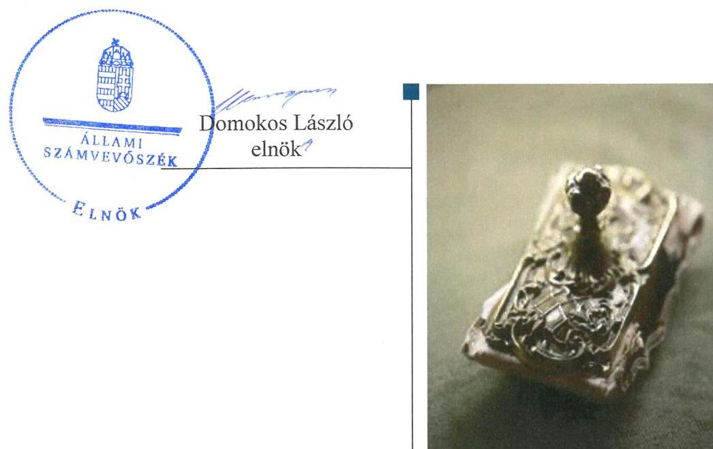
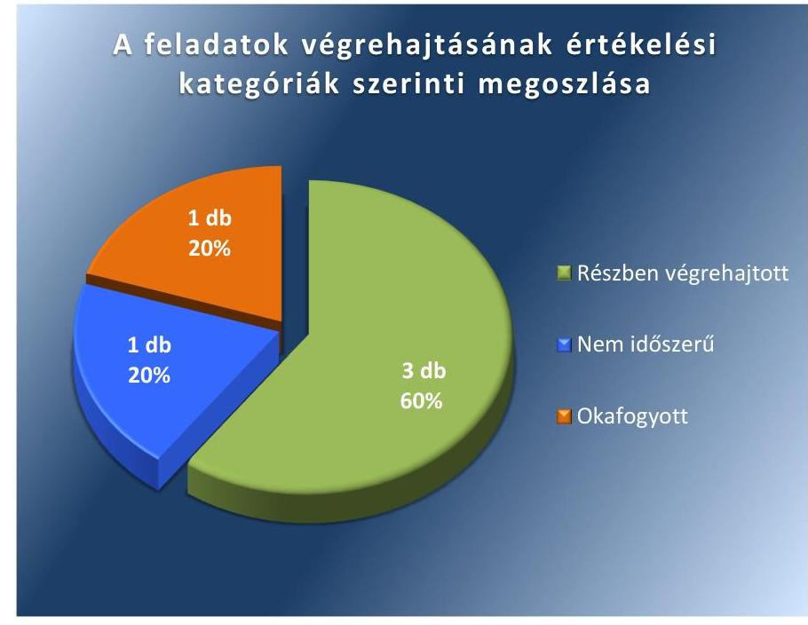

# Jelentés 

## Utóellenőrzések

Az önkormányzatok pénzügyi gazdálkodási helyzetének, szabályszerűségének utóellenőrzése - Gyömrő
2017.

---

# J elentés 

## Utóellenőrzések

Az önkormányzatok pénzügyi gazdálkodási helyzetének, szabályszerűségének utóellenőrzése - Gyömrő
2017. 02. hó 0.3. nap

---

|  J | AZ ELLENŐRZÉST FELÜGYELTE:  |
| --- | --- |
|   | RENKŐ ZSUZSANNA felügyeleti vezető  |
|   | AZ ELLENŐRZÉST VEZETTE ÉS A VÉGREHAJTÁSÁÉRT FELELŐS:  |
|   | CSORDÁS PÉTERNÉ ellenőrzésvezető  |
|   | A PROGRAM ÖSSZEÁLLÍTÁSÁÉRT FELELŐS:  |
|   | JANIK JÓZSEF LÁSZLÓ osztályvezető  |
|   | A TÉMÁHOZ KAPCSOLÓDÓ KORÁBBI SZÁMVEVŐSZÉKI JELENTÉSEK:  |
|   | - címe: Jelentés az önkormányzatok pénzügyi gazdálkodási helyzete értékelésének, és gazdálkodása szabályosságának - 2013. évben induló - ellenőrzéséről Gyömrő  |
|  J | sorszáma: 14020  |
|   | IKTATÓSZÁM: V-1176-043/2016.  |
|   | TÉMASZÁM: 2210  |
|   | ELLENŐRZÉS-AZONOSÍTÓ SZÁM: V075525  |

---

# TARTALOMJEGYZÉK 

■ ÖSSZEGZÉS ..... 5
■ AZ ELLENŐRZÉS CÉLJA ..... 6
■ AZ ELLENŐRZÉS TERÜLETE ..... 7
■ AZ ELLENŐRZÉS HÁTTERE, INDOKOLTSÁGA ..... 8
■ A JELENTÉS LÉNYEGES KÉRDÉSKÖREI ..... 9
■ ELLENŐRZÉS HATÓKÖRE ÉS MÓDSZEREI ..... 10
■ MEGÁLLAPÍTÁSOK ..... 12
■ MELLÉKLETEK ..... 15
I. sz. melléklet: Az ÁSZ 14020 számú jelentéséhez kapcsolódó intézkedési terv végrehajtása ..... 15
■ FÜGGELÉK: ÉSZREVÉTELEK ..... 19
■ RÖVIDÍTÉSEK JEGYZÉKE ..... 21

---

.

---

# ÖSSZEGZÉS 

Gyömrő Város Önkormányzata az intézkedési tervben foglalt feladatokat nem hajtotta végre teljes körüen. Az Állami Számvevőszék pénzügyi egyensúly helyreállitására, hosszú távú fenntarthatóságára, és a gazdálkodás szabályosságára irányuló intézkedést igénylő megállapításai maradéktalanul nem hasznosultak. 2014-2015. években a költségvetés tervezés szabályszerüsége nem volt biztositott, a bevételek közgazdaságilag megalapozatlan meghatározása veszélyeztette a müködési költségvetés egyensúlyát.

## Az ellenőrzés társadalmi indokoltsága

Az ÁSZ ${ }^{1}$ stratégiájában célul tűzte ki a számvevőszéki munka hasznosulásának javítását. Ezzel összhangban ellenőrzi, hogy az ellenőrzött szervezetek megvalósították-e a korábbi ellenőrzései által feltárt hibák, hiányosságok és szabálytalanságok megszüntetése céljából elkészített intézkedési terveikben foglaltakat. A rendszeres utóellenőrzések hozzájárulnak a szükséges intézkedések tényleges végrehajtáshoz, ezáltal a közpénzügyek rendezettségének javulásához.

Az Önkormányzat² pénzügyi egyensúlya 2010. január 1. - 2013. június 30. közötti időszakban rövidtávon nem volt biztosított, mivel a müködési jövedelem nem nyújtott fedezetet a tőketörlesztési kötelezettségekre, illetve a gazdálkodási feladatok ellátásával kapcsolatban előfordultak szabályszerűségi hibák, amelyek jövőbeni elkerülése indokolttá tette a tervezett intézkedések utóellenőrzésének elvégzését.

## Főbb megállapítások, következtetések

Az intézkedési tervben rögzített feladatok végrehajtásáról a Bkr. ${ }^{3}$-ben előírt nyilvántartást megfelelően vezették.
Az ÁSZ a jelentésében ${ }^{4}$ a polgármester részére négy, a jegyző részére egy javaslatot fogalmazott meg. A három, részben végrehajtott feladat mellett - miszerint tervezéskor a bevételeket nem minden esetben az Áht. ${ }^{5}$ előírásainak megfelelően, közgazdaságilag megalapozottan határozták meg, a költségvetési rendelettervezet és annak évközi módosításai előterjesztéseit megelőzően nem minden esetben mérték fel a bevételszerző és kiadáscsökkentő lehetőségeket és az elkészült stabilizációs programot nem alapozta meg az Önkormányzat gazdasági helyzetére vonatkozó elemzés - egy feladat nem volt időszerű, mivel az ellenőrzött időszakban az Önkormányzatnak nem volt olyan hitelfelvétele és kötvénykibocsátása, ahol a fedezetek esetében az Áht. előírásait figyelembe kellett volna venni. Egy feladat végrehajtása pedig okafogyottá vált, mivel az állam az Önkormányzat adósságát átvállalta, ezért a két fejlesztési célú hitelszerződés esetében nem volt szükséges a felajánlott biztosíték cseréje.

---

# AZ ELLENŐRZÉS CÉLJA 

Az ellenőrzés célja annak értékelése volt, hogy a számvevőszéki jelentésben foglalt intézkedést igénylő megállapításokkal és javaslatokkal összhangban készített intézkedési tervben meghatározott feladatokat az ellenőrzött szervezet végrehajtotta-e.

---

# AZ ELLENŐRZÉS TERÜLETE 

## Az Önkormányzat

Gyömrő város Pest megyében, Budapest központjától 30 kmre fekszik, 2001-ben kapott városi címet. Állandó lakosainak száma a $\mathrm{KSH}^{6}$ által közzétett népességi adatok szerint 2015. január 1-jén 16937 fő volt. A polgármester ${ }^{7}$ az utóellenőrzés időszakában a 2010. évi választások óta töltötte be tisztségét, azonban a polgármesteri tisztségéről történő lemondása következtében 2016. június 1-jétől a polgármesteri teendőket az időközi választásig az alpolgármester ${ }^{8}$ látta el. A jegyző ${ }^{9}$ 1991. július óta látja el közszolgálati feladatait. Az Önkormányzat 11 fős Képviselő-testülettel ${ }^{10}$ működik, munkáját három bizottság segíti.

Az Önkormányzat a 2015. évi költségvetési beszámolója szerint 1859,0 millió Ft költségvetési bevételt ért el, illetve 1740,9 millió Ft költségvetési kiadást teljesített. Az eszközvagyon értéke 2015. december 31-én könyv szerinti értéken 12 625,3 millió Ft volt.

Az ÁSZ a 2013. évben ellenőrizte az Önkormányzat pénzügyi gazdálkodása helyzetét és szabályszerűségét, amelyről a 14020. számú jelentését 2014. január 29-én tette közzé. Az ellenőrzés célja annak értékelése volt, hogy a 2010. január 1. és 2013. június 30. közötti időszakban az Önkormányzat kötelező és önként vállalt feladatainak ellátása és az ellátást biztosító szervezeti formák változása milyen hatást gyakorolt a pénzügyi egyensúlyi helyzetre, az egyensúly milyen irányban változott és milyen intézkedéseket tettek az egyensúly biztosítása, illetve javítása érdekében.

Az utóellenőrzés - a 2014. január 29-től 2016. július 15-ig végrehajtott feladatokat figyelembe véve - a polgármester és a jegyző számára megfogalmazott javaslatok hasznosulása céljából készített intézkedési terv ${ }^{11}$ végrehajtásának ellenőrzésére, illetve értékelésére terjedt ki.

---

# AZ ELLENŐRZÉS HÁTTERE, INDOKOLTSÁGA 

Az ÁSZ tv. ${ }^{12}$ 33. § (1) bekezdése értelmében a számvevőszéki jelentések intézkedést igénylő megállapításaihoz és javaslataihoz kapcsolódóan az ellenőrzött szervezet vezetője intézkedési tervet köteles összeállítani, és az ÁSZ részére megküldeni. Az intézkedési tervben foglaltak megvalósítását az ÁSZ tv. 33. § (7) bekezdésében foglaltak alapján - az ÁSZ utóellenőrzés keretében ellenőrizheti. Az intézkedések megvalósulásának értékelése során az ÁSZ figyelembe veszi az ellenőrzött szervezetek működési feltételeiben, valamint a jogszabályi előírásokban bekövetkezett változásokat.

Az intézkedési tervekben foglalt feladatok hiányos, illetve késedelmes végrehajtása, valamint megvalósításának elmaradása azt mutatja, hogy az ellenőrzések során feltárt hibák, hiányosságok és szabálytalanságok megszüntetése nem kapott kellő hangsúlyt. Ez a szabályszerű működés és a felelős vezetői magatartás vonatkozásában kockázatot hordoz. E kockázatok feltárásával az ÁSZ utóellenőrzési rendszere fokozza a fegyelmet, és igazolja, hogy a közpénzzel való szabályos gazdálkodás felelőssége elől nem lehet kitérni.

## AZ UTÓELLENŐRZÉS VÁRHATÓ HASZNOSULÁSA

Az utóellenőrzés négy szinten hasznosulhat:
$\longrightarrow$ A társadalom szintjén az utóellenőrzés jelzi, hogy a számvevőszéki ellenőrzés megállapításainak van következménye: a hiányosságok megszüntetésére az ellenőrzött szervezet által meghatározott intézkedések végrehajtását is számon kéri az ÁSZ.
$\longrightarrow$ Az ellenőrzött terület szintjén az utóellenőrzés tájékoztatást nyújt a terület döntéshozóinak a hiányosságok kiküszöbölésének jó gyakorlatairól, ezzel lehetőséget biztosítva arra, hogy az ÁSZ ellenőrzési megállapításai, javaslatai a terület nem ellenőrzött szervezeteinek a működése során is hasznosuljanak.
$\longrightarrow$ Az ellenőrzött szervezet szintjén az utóellenőrzés feltárja, hogy a szervezet az intézkedések végrehajtásával hasznosította-e a korábbi ellenőrzési jelentésben a hiányosságok megszüntetése, illetve a kockázatok kezelése érdekében megfogalmazott javaslatokat.
$\longrightarrow$ Az ÁSZ szintjén az utóellenőrzés visszacsatolást ad az ellenőrzési jelentések hasznosulásáról, az intézkedések elmaradása vagy részleges megvalósulása a további ellenőrzésekhez kockázati jelzésként szolgál.

---

# A JELENTÉS LÉNYEGES KÉRDÉSKÖREI 

Az Önkormányzat az intézkedési tervben foglaltakat az elöirt határidőben végrehajtotta-e?

---

# ELLENŐRZÉS HATÓKÖRE ÉS MÓDSZEREI 

## Az ellenőrzés típusa

Megfelelőségi ellenőrzés.

## Az ellenőrzött időszak

Az utóellenőrzés alapját képező ÁSZ jelentés közzétételének napjától (2014. január 29.) az ellenőrzésről szóló kiértesítő levél keltének napjáig (2016. július 15.) tartó időszak.

## Az ellenőrzés tárgya

A számvevőszéki jelentésben foglalt intézkedést igénylő megállapításokkal és javaslatokkal összhangban - az Önkormányzat által - készített intézkedési tervben foglaltak végrehajtásának ellenőrzése.

Az ellenőrzés kiterjedt minden olyan körülményre és adatra, amely az ÁSZ jogszabályban meghatározott feladatainak teljesítéséhez, valamint a program végrehajtása folyamán felmerült újabb összefüggések feltárásához szükséges.

## Az ellenőrzött szervezet

Gyömrő Város Önkormányzata

## Az ellenőrzés jogalapja

Az ÁSZ törvényben meghatározott feladatkörében ellenőrzi a központi költségvetés végrehajtását, az államháztartás gazdálkodását, az államháztartásból származó források felhasználását és a nemzeti vagyon kezelését.

Az ÁSZ tv. 1. § (3) bekezdése szerint az ÁSZ általános hatáskörrel végzi a közpénzekkel és az állami és önkormányzati vagyonnal való felelős gazdálkodás ellenőrzését.

Az ÁSZ tv. 33. § (7) bekezdése alapján az ÁSZ tv. 33. § (1)-(2) bekezdése szerinti intézkedési tervben foglaltak megvalósítását az ÁSZ utóellenőrzés keretében ellenőrizheti.

---

# Az ellenőrzés módszerei 

Az ÁSZ az utóellenőrzést a nemzetközi standardokat irányadónak tekintve az ellenőrzési program ellenőrzési kérdései, az ellenőrzött időszakban hatályos jogszabályok, az ellenőrzés szakmai szabályok és módszertanok figyelembevételével, önálló ellenőrzés keretében végezte.

Az ÁSZ az ellenőrzés ideje alatt az Önkormányzattal történő kapcsolattartást az ÁSZ SZMSZ ${ }^{13}$-ének vonatkozó előírásai alapján biztosította.

Az utóellenőrzés megállapításait elsősorban az ÁSZ rendelkezésére álló, valamint az Önkormányzattól elektronikusan bekért dokumentumok alapozták meg.

Az ellenőrzési bizonyítékként felhasználható adatforrások közé tartoznak egyrészt a szakmai programban felsorolt adatforrások, másrészt minden - az ellenőrzés folyamán feltárt, az ellenőrzés szempontjából információt tartalmazó - dokumentum.

Az intézkedési tervekben előírt feladatok értékelését, azok végrehajthatósága, illetve végrehajtása szempontjából az alábbiak szerint végezte az ÁSZ:
$\longrightarrow$ „határidőben végrehajtott" a feladat, ha a teljesítés dokumentáltan, az intézkedési tervben előírt határidőben és tartalommal megtörtént;
$\longrightarrow$ „határidőn túl végrehajtott" a feladat, ha annak teljesítése az intézkedési tervben meghatározott módon, de az előírt határidőn túl történt meg;
$\longrightarrow$ „részben végrehajtott" a feladat, ha végrehajtása teljes körűen az intézkedési tervben előírt módon nem történt meg;
$\longrightarrow$ „nem végrehajtott" a feladat, ha a végrehajtás nem történt meg, vagy amennyiben a teljesítést nem dokumentálták;
$\longrightarrow$ „okafogyottá vált" a feladat, ha végrehajtására - meghatározott esemény bekövetkezése, továbbá külső körülmény, a múködést érintő feltétel változása miatt - már nincs szükség, illetve lehetőség, és egyértelműen megállapítható, hogy az intézkedést szükségessé tevő körülmény a jövőben nem fordulhat elő;
$\longrightarrow$ „nem időszerü" az a feladat, amelynek ellenőrzési időszakon belüli végrehajtására azért nem került (kerülhetett) sor, mert az intézkedés alapjául szolgáló esemény nem következett be, de annak jövőbeni előfordulása lehetséges, a végrehajtása nem volt esedékes, vagy a végrehajtás határideje még nem járt le.
Az ellenőrzés lefolytatásához az Önkormányzat a tanúsítványok elektronikus kitöltésével, valamint az ÁSZ által kért dokumentumok elektronikus megküldésével szolgáltatott adatokat, amelyek valódiságát és teljes körűségét a polgármester által tett teljességi és hitelességi nyilatkozat igazolta. Az így rendelkezésre bocsátott adatok, információk kontrollja az ellenőrzés keretében történt.

---

# MEGÁLLAPÍTÁSOK 

## Az Önkormányzat az intézkedési tervben foglaltakat az előírt határidőben végrehajtotta-e?

Összegző megállapítás

Az Önkormányzat az intézkedési tervben meghatározott öt feladatból hármat részben hajtott végre, egy feladat okafogyottá vált, egy feladat pedig nem volt időszerű. Az intézkedési tervben rögzített feladatok végrehajtásáról a Bkr. által előírt nyilvántartást megfelelően vezették.

Az ÁSZ a jelentésében a polgármester részére négy, a jegyző részére egy javaslatot fogalmazott meg. A polgármester által összeállított és az ÁSZ részére megküldött intézkedési tervben a hiányosságok, szabálytalanságok megszüntetésére öt feladatot határoztak meg. A feladatok elvégzésének felelőseként három esetben a polgármestert és a jegyzőt, egy esetben a jegyzőt és a pénzügyi irodavezetőt, egy esetben a polgármestert, a jegyzőt és a pénzügyi irodavezetőt közösen jelölték meg.

Az intézkedési tervben meghatározott feladatokat, határidőket, a feladatok felelősét és a feladatok végrehajtását az I. számú melléklet mutatja be.

Az intézkedési tervben tervezett feladatok végrehajtásának értékelési kategóriák szerinti megoszlását az 1. ábra szemlélteti.

1. ábra

Ferrás: ÁSZ

---

# RÉSZBEN VÉGREHAJTOTT feladatok: 

1. A jegyző csak részben intézkedett arról, hogy a bevételeket az Áht. előírásainak megfelelően, közgazdaságilag megalapozottan határozzák meg, mivel a bevételek tervezésekor a 2014-2015. években működőképesség megőrzését szolgáló kiegészítő támogatásokat (működési célú költségvetési és kiegészítő támogatásokat) is figyelembe vettek. A 2016. évi tervezéskor a jegyző a bevételeket már az Áht. előírásainak megfelelően, közgazdaságilag megalapozottan határozta meg.
2. A polgármester nem terjesztette be a Képviselő-testület elé a bevételek növelését, a kiadások csökkentését célzó intézkedések bevezetéséhez szükséges döntési javaslatot a 2014. és a 2015. évben, mivel a jegyző a 2014. évben a Htv. ${ }^{14}$ előírásai ellenére nem mérte fel, illetve a 2015. évben a költségvetési rendelettervezet előterjesztését követően mérte fel a bevételszerző és kiadáscsökkentő lehetőségeket. A 2015. évben a költségvetési rendelet évközi módosításai, illetve a 2016. évben a költségvetési rendelettervezet előterjesztéseit megelőzően a jegyző felmérte a bevételszerző és kiadáscsökkentő lehetőségeket és elkészítette az intézkedések bevezetéséhez szükséges döntési javaslatokat. A polgármester a döntési javaslatokat a Képviselő-testület elé beterjesztette.
3. A jegyző az intézkedési tervben előírt határidőt követően elkészítette az Önkormányzat pénzügyi egyensúlyi helyzet helyreállítását, hosszú távú fenntartását, valamint az adósságállomány újratermelődésének elkerülését biztosító intézkedéseket tartalmazó stabilizációs programot, azonban a stabilizációs programot megalapozó, az Önkormányzat gazdasági helyzetére vonatkozó elemzés elkészítése nem történt meg. A polgármester a stabilizációs programot a Képviselő-testület elé beterjesztette.

## OKAFOGYOTTÁ VÁLT feladat:

4. A megkötött fejlesztésű célú hitelszerződések esetében a felajánlott jogszerű biztosíték cseréjének vizsgálata okafogyottá vált, mivel a 2014. évi költségvetéséről szóló törvény ${ }^{15}$ alapján az állam az Önkormányzat adósságát átvállalta, így a jogszerű biztosíték cseréjére nem volt szükség.

## IDŐSZERŰTLENNÉ VÁLT feladat:

5. Az Önkormányzatnak az ellenőrzött időszakban nem volt olyan hitelfelvétele és kötvénykibocsátása, ahol a fedezetek esetében az Áht. előírásait figyelembe kellett volna venni.

Az ÁSZ javaslatai alapján készített intézkedési tervben rögzített feladatok végrehajtásáról a jegyző a Bkr. szerinti nyilvántartást megfelelően vezette.

---

.

---

# MELLÉKLETEK

I. SZ. MELLÉKLET: AZ ÁSZ 14020 SZÁMÚ JELENTÉSÉHEZ KAPCSOLÓDÓ INTÉZKEDÉSI TERV VÉGREHAJTÁSA

|  Sorszám | Az Önkormányzat által az intézkedési tervben rögzített feladatok | Az intézkedési tervben meghatározott határidő | Az intézkedési tervben foglalt feladatok felelősei | A feladat végrehajtása  |
| --- | --- | --- | --- | --- |
|   | 1. | 2. | 3. | 4.  |
|   |  | Részben végrehajtott feladatok |  |   |
|  1. | A jövőben a költségvetési rendelettervezetben a működési költségvetés Mótv. ${ }^{16}$ 111. § (4) bekezdésében előírt egyensúlyának biztosításakor a bevételeket az Áht. 12. § (1) bekezdésének megfelelően, közgazdaságilag megalapozottan kell meghatározni. | azonnal,
folyamatos (2014. február 28., valamint ezt követően a költségvetési rendelettervezetek elkészítésének időpontjai). | jegyző, pénzügyi irodavezető | - Határidőben végrehajtott feladat:
A jegyző intézkedett, hogy a 2016. évben az Áht. 4. § (2) bekezdésében előírtaknak megfelelően, közgazdaságilag megalapozottan határozzák meg a bevételeket, az Önkormányzat a bevételek tervezésénél működési célú költségvetési és kiegészítő támogatásokat nem tervezett be.
- Nem végrehajtott feladat:
A jegyző a 2014. és a 2015. években nem tett intézkedéseket arra vonatkozóan, hogy a költségvetési rendelettervezetekben a működési költségvetés Mótv. 111. § (4) bekezdésében előírt egyensúlyának biztosításakor a bevételeket az Áht. 12. § (1) bekezdésének, illetve 2015. január 1-jétől az Áht. 4. § (2) bekezdésének megfelelően, közgazdaságilag megalapozottan határozzák meg.
Az Önkormányzat a költségvetési rendeleteinek elkészítése során a 2014. évi Kvtv. ${ }^{17}$ és a 2015. évi Kvtv. ${ }^{18}$ alapján a fejezeti tartalék terhére működőképesség megőrzését szolgáló kiegészítő támogatást tervezett be, mivel 2014. évben 51,6 millió Ft működőképesség megőrzését szolgáló kiegészítő támogatást és 0,8 millió Ft központosított működési célú előirányzatból származó bevételt, a 2015. évben 42,4 millió Ft működési célú költségvetési támogatást és kiegészítő támogatást vett figyelembe. A költségvetés összeállítása során a Mótv.-ben előírt működési egyensúly biztosítása céljából olyan bevétel nem vehető figyelembe, amely teljesítése felett az Önkormányzat jogosultsággal nem rendelkezik.  |

---

|  Az Önkormányzat által az intézkedési tervben rögzített feladatok | Az intézkedési tervben meghatározott határidő | Az intézkedési tervben foglalt feladatok felelősei | A feladat végrehajtása  |
| --- | --- | --- | --- |
|  1. | 2. | 3. | 4.  |
|  2. Fel kell mérni a költségvetési rendelettervezet, valamint annak évközi módosítása előterjesztését megelőzően a bevételszerző és kiadáscsökkentő lehetőségeket, és a Képviselő-testület elé kell terjeszteni a bevételek növelését, a kiadások csökkentését célzó intézkedések bevezetéséhez szükséges - a Htv. 140. § (1) bekezdés a) pontja alapján a jegyző által elkészített - döntési javaslatát. | azonnal,
folyamatos (2014. február 28., valamint ezt követően a költségvetési rendelettervezet, valamint annak évközi módosításaival kapcsolatban elkészített előterjesztések időpontjai) | polgármester, jegyző, pénzügyi irodavezető | - Határidőben végrehajtott feladat:
A jegyző a 2015. évi költségvetési rendelettervezet évközi módosításainak előterjesztését megelőzően és 2016. évben a 3/2016. (III.11.) önkormányzati rendelettel elfogadott 2016. évi költségvetési rendelettervezet előterjesztését megelőzően felmérte a bevételszerző és a kiadáscsökkentő lehetőségeket és elkészítette az intézkedések bevezetéséhez szükséges döntési javaslatot, amelyet a polgármester a Képviselő-testület elé beterjesztett. Az ellenőrzött időszak végéig a 2016. évi költségvetési rendelet módosítására nem került sor.
A jegyző által elkészített javaslatok tartalmazták többek között a szolgáltatásokra vonatkozó szerződések felülvizsgálatát, az intézmények esetén az energiatakarékos üzemeltetést, a közhatalmi és intézményi bevételek növelését, a hátralékkezelés hatékonyságának növelését.
- Nem végrehajtott feladat:
A jegyző a Htv. 140. § (1) bekezdés a) pontja ellenére a 2014. évben a 2/2014. (III.11.) önkormányzati rendelettel elfogadott 2014. évi költségvetési rendelettervezet, illetve a költségvetési rendelet évközi módosításainak előterjesztéseit megelőzően nem mérte fel a bevételszerző és kiadáscsökkentő lehetőségeket, továbbá a 2015. évben a költségvetési rendelettervezet elfogadását megelőzően sem mérte fel azt, így a polgármester által a Képviselő-testület részére nem került beterjesztésre a bevételek növelését, a kiadások csökkentését célzó intézkedések bevezetéséhez szükséges döntési javaslat.  |

---

|  1. | Az Önkormányzat által az intézkedési
tervben rögzített feladatok | Az intézkedési
terv
ben meghatározott
határidő | Az intézkedési
tervben foglalt
feladatok
felelősei | A feladat végrehajtása  |
| --- | --- | --- | --- | --- |
|   | 1. | 2. | 3. | 4.  |
|  3. | A Képviselő-testület elé kell terjeszteni jóváha-
gyásra – a Htv. 140. § (1) bekezdés a) pontja alapján
a jegyző által elkészített – az Önkormányzat gazda-
sági helyzetének elemzésén alapuló, a pénzügyi
egyensúlyi helyzet helyreállítását, hosszú távú fen-
tartását, valamint az adósságállomány újratermelő-
désének elkerülését biztosító intézkedéseket tartal-
mazó stabilizációs programot. | 2014.04.30. | polgármester,
jegyző | • Határidőn túl végrehajtott feladat:
A polgármester az intézkedési tervben előírt határidőt követően, 2014. május 13-án
terjesztette a Képviselő-testület elé a Htv. 140. § (1) bekezdés a) pontja alapján a
jegyző által elkészített stabilizációs programot.
A stabilizációs program elkészítésének célja a gazdálkodás hatékonyságának növelése,
a pénzügyi egyensúlyi helyzet helyreállítása valamint annak hosszú távú fenntartása,
az adósságállomány újratermelődésének elkerülése volt, emellett bemutatásra kerül-
tek az ellátandó feladatok, a vagyoni helyzet, a várható bevételek és a várható kiadá-
sok alakulása. A Képviselő-testület a stabilizációs programot a 83/2014. (V.15.) hatá-
rozatával elfogadta.
• Nem végrehajtott feladat:
A stabilizációs programot – az intézkedési tervben előírtak ellenére – jegyző által el-
készített gazdasági helyzetelemzés nem alapozta meg.  |
|   |  |  |  | Ókafogyottá vált feladat  |
|  4. | A jogellenes állapot az önkormányzatok konszolidá-
ciójával 2014. 02.28-án megszűnik, ezért a jogszerű
biztosíték cseréje nem releváns. | 2014. február 28. | polgármester,
jegyző | Magyarország 2014. évi központi költségvetésről szóló 2013. évi CCXXX. törvény 67. §
(1) bekezdése szerinti adósságkonszolidáció során az Önkormányzat adósságát az ál-
lam átvállalta, így a 2011. augusztus 26-án és szeptember 26-án megkötött fejlesztésű
célú hitelszerződések során felajánlott jogszerű biztosíték cseréjére már nem volt
szükség. Ezzel egyidejűleg okafogyottá vált a javaslatban szereplő feladat végrehaj-
tása.  |
|   |  |  |  | Időszerütlenné vált feladat  |
|  5. | Jövőbeni hitelfelvétel és kötvénykibocsátás fedeze-
teként az Áht. 84. § (4) bekezdésében, továbbá az
Ávr. 145. § (2) bekezdésében előírtak szerint az Ön-
kormányzat általános működésének és ágazati fel-
adatainak támogatása, továbbá a költségvetési tá-
mogatás nem kerülhet felhasználásra, a költségve-
tési támogatások folyósítására szolgáló, elkülöni-
tett bankszámláról hiteltörlesztés nem teljesíthető. | azonnal, folyamatos
(2014. február 28, illetve
a jövőbeni hitelfelvételek
és kötvénykibocsátások
időpontjai) | polgármester,
jegyző | Az Önkormányzatnak az ellenőrzött időszakban a beszámolók alapján nem volt olyan
hitelfelvétele és kötvénykibocsátása, ahol a fedezetek esetében az Áht. 84. § (4) be-
kezdésének előírásait figyelembe kellett venni. A feladat végrehajtása így nem volt idő-
szerű, mivel az intézkedés alapjául szolgáló esemény nem következett be.  |

*Forrás: ÁSZ által készített táblázat*

---

.

---

# FÜGGELÉK: ÉSZREVÉTELEK 

A jelentéstervezetet a Számvevőszék 15 napos észrevételezésre megküldte az ellenőrzött szervezet vezetőjének az ÁSZ tv. 29. §* (1) bekezdése előírásának megfelelően.
Az ellenőrzött szervezet vezetője az ÁSZ tv. 29. § (2) bekezdésében foglalt észrevételezési jogával nem élt, a jelentéstervezetre észrevételt nem tett.

[^0]
[^0]:    * 29. § (1) Az Állami Számvevőszék az ellenőrzési megállapításait megküldi az ellenőrzött szervezet vezetőjének vagy az általa megbízott személynek, és annak, akinek személyes felelősségét állapította meg.
    (2) Az ellenőrzött szervezet vezetője és a felelősként megjelölt személy az ellenőrzés megállapításaira tizenöt napon belül írásban észrevételt tehet.
    (3) Az Állami Számvevőszék az észrevételre a beérkezésétől számított harminc napon belül írásban válaszol. A figyelembe nem vett észrevételeket köteles a jelentésben feltüntetni, és megindokolni, hogy azokat miért nem fogadta el.

---

.

---

# RÖVIDÍTÉSEK JEGYZÉKE 

${ }^{1}$ ÁSZ
${ }^{2}$ Önkormányzat
${ }^{3}$ Bkr.
${ }^{4}$ ÁSZ jelentés
${ }^{5}$ Áht
${ }^{6} \mathrm{KSH}$
${ }^{7}$ polgármester
${ }^{8}$ alpolgármester
${ }^{9}$ jegyző
${ }^{10}$ Képviselő-testület
${ }^{11}$ intézkedési terv
${ }^{12}$ ÁSZ tv.
${ }^{13}$ ÁSZ SZMSZ
${ }^{14} \mathrm{Htv}$.
${ }^{15}$ 2014. évi költségvetéséről szóló törvény
${ }^{16}$ Mötv.
${ }^{17}$ 2014. évi Kvtv.
${ }^{18}$ 2015. évi Kvtv.

Állami Számvevőszék
Gyömrő Város Önkormányzata
370/2011. (XII.31.) Korm. rendelet a költségvetési szervek belső kontrollrendszeréről és belső ellenőrzéséről (hatályos: 2012. január 1-jétől)
Az ÁSZ 14020. számú jelentése - Jelentés az önkormányzatok pénzügyi gazdálkodási helyzete értékelésének, és gazdálkodása szabályosságának 2013. évben induló - ellenőrzéséről Gyömrő (elérhető a www.asz.hu honlapon)

2011. évi CXCV. törvény az államháztartásról

Központi Statisztikai Hivatal
Gyömrő Város Önkormányzatának polgármestere
Gyömrő Város Önkormányzatának alpolgármestere
Gyömrő Város Önkormányzatának jegyzője
Gyömrő Város Önkormányzatának képviselő-testülete
Gyömrő Város Önkormányzata Képviselő-testületének 29/2014. (II.28.) sz. határozatával elfogadott intézkedési terve
2011. évi LXVI. törvény az Állami Számvevőszékről (hatályos 2011. július 1.-jétől)

Állami Számvevőszék Szervezeti és Müködési Szabályzata
a helyi önkormányzatok és szerveik, a köztársasági megbízottak, valamint egyes centrális alárendeltségű szervek feladat- és hatásköreiről szóló 1991. évi XX. törvény (hatályos: 1991. július 23-ától)
2013. évi CCXXX. törvény Magyarország 2014. évi központi költségvetéséről hatályos 2013. december 22-étől)
2011. évi CLXXXIX. törvény Magyarország helyi önkormányzatairól
2013. évi CCXXX törvény Magyarország 2014. évi központi költségvetéséről
2014. évi C törvény Magyarország 2015. évi központi költségvetéséről

---

# ÁLLAMI SZÁMVEVŐSZÉK 

1052 Budapest, Apáczai Csere János utca 10.
Levélcím: 1364 Budapest 4. Pf. 54
Telefon: +36 14849100 Telefax: +36 14849200
www.asz.hu