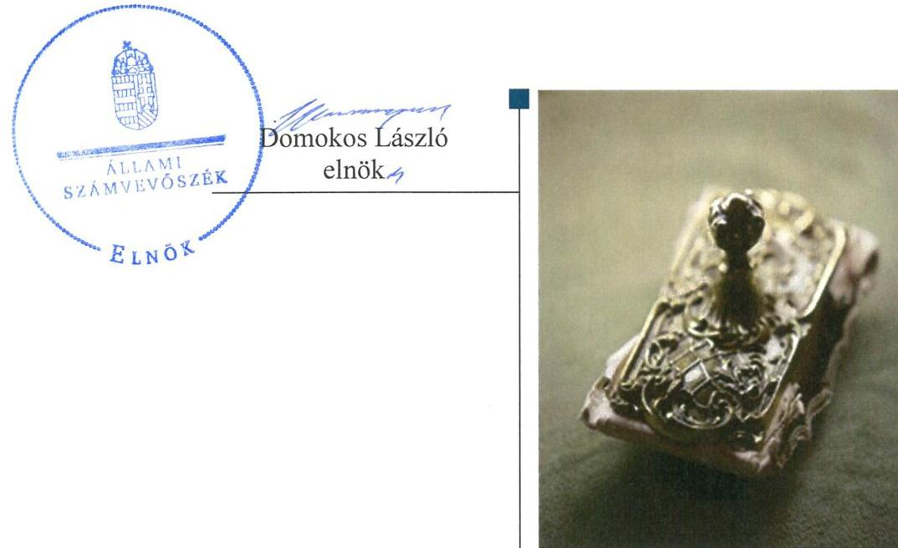
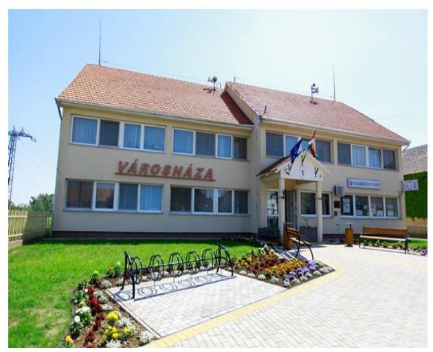
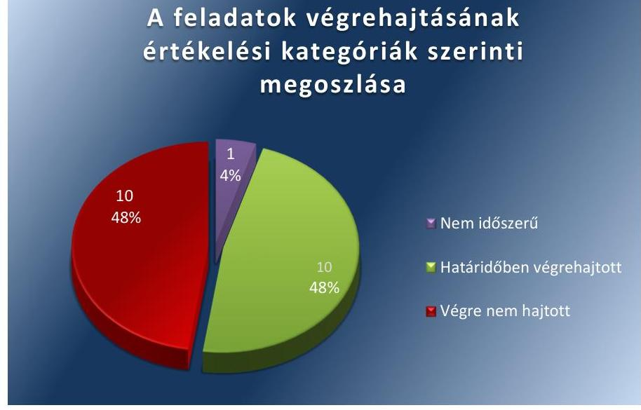

# Jelentés 

## Utóellenőrzések

Az önkormányzatok pénzügyi gazdálkodási helyzetének, szabályszerűségének utóellenőrzése - Kisköre
2017.

---

# Jelenetés 

## Utóellenőrzések

Az önkormányzatok pénzügyi gazdálkodási helyzetének, szabályszerűségének utóellenőrzése - Kisköre
2017. 02. hó 16. nap

---

# AZ ELLENŐRZÉST FELÜGYELTE: 

RENKÓ ZSUZSANNA felügyeleti vezető

## AZ ELLENŐRZÉST VEZETTE ÉS A VÉGREHAJTÁSÁÉRT FELELŐS:

SZALAYNÉ OSTORHÁZI MÁRIA ellenőrzésvezető

## A PROGRAM ÖSSZEÁLLÍTÁSÁÉRT FELELŐS:

JANIK JÓZSEF LÁSZLÓ osztályvezető

## A TÉMÁHOZ KAPCSOLÓDÓ KORÁBBI SZÁMVEVŐSZÉKI JELENTÉSEK:

- címe: Jelentés Kisköre Város Önkormányzata pénzügyi gazdálkodási helyzetének, szabályosságának ellenőrzéséről
- sorszáma: 13057

IKTATÓSZÁM: V-1171-058/2016.
TÉMASZÁM: 2205
ELLENŐRZÉS-AZONOSÍTÓ SZÁM: V075520

---

# TARTALOMJEGYZÉK 

■ ÖSSZEGZÉS ..... 5
■ AZ ELLENŐRZÉS CÉLJA ..... 6
■ AZ ELLENŐRZÉS TERÜLETE ..... 7
■ AZ ELLENŐRZÉS HÁTTERE, INDOKOLTSÁGA ..... 8
■ A JELENTÉS LÉNYEGES KÉRDÉSKÖREI ..... 9
■ ELLENŐRZÉS HATÓKÖRE ÉS MÓDSZEREI ..... 10
■ MEGÁLLAPÍTÁSOK ..... 12
■ MELLÉKLETEK ..... 15
I. Sz. melléklet: Az ÁSZ 13057 számú jelentéshez kapcsolódó intézkedési terv végrehajtása.... 15
■ FÜGGELÉK: ÉSZREVÉTELEK ..... 19
■ RÖVIDÍTÉSEK JEGYZÉKE ..... 21

---

.

---

# ÖSSZEGZÉS 

Kisköre Városi Önkormányzat a pénzügyi gazdálkodás szabályosságával kapcsolatban vállalt intézkedéseket alapvetően végrehajtotta. Azonban az Állami Számvevőszék által a pénzügyi egyensúly megteremtésével és megtartásával kapcsolatban tett intézkedést igénylő megállapításokat nem hasznosították, az ezzel kapcsolatban vállalt intézkedéseket egyáltalán nem hajtották végre.

## Az ellenőrzés társadalmi indokoltsága

Az ÁSZ stratégiájában célul tűzte ki a számvevőszéki munka hasznosulásának javítását. Ezzel összhangban ellenőrzi, hogy az ellenőrzött szervezetek megvalósították-e a korábbi ellenőrzései által feltárt hibák, hiányosságok és szabálytalanságok megszüntetése céljából kialakított intézkedési terveikben foglaltakat. A rendszeres utóellenőrzések hozzájárulnak a szükséges intézkedések tényleges végrehajtásához, ezáltal a közpénzügyek rendezettségének javulásához. Az önkormányzatnál az intézkedési tervben tervezett intézkedések számossága, azok súlya különösen indokolttá tette az utóellenőrzés elvégzését.

## Főbb megállapítások, következtetések

A polgármester az Állami Számvevőszék jelentésében rögzített intézkedést igénylő megállapításokhoz és javaslatokhoz kapcsolódóan összeállított és a Képviselő-testület által elfogadott intézkedési tervet küldte meg az Állami Számvevőszék részére. A Jegyző az intézkedési terv feladatainak végrehajtásáról a jogszabály előírásainak megfelelő nyilvántartást nem vezetett.

Az Önkormányzat az intézkedési terv 21 feladata közül tízet határidőben végrehajtott, tíz feladatot nem hajtott végre és egy feladat nem volt időszerű. Határidőben elkészült a költségvetés és a zárszámadás készítés folyamatának szabályzata, a fejlesztések szakaszainak kockázati feltárása és kezelése, a fejlesztésekhez kapcsolódó pénzügyi források figyelési rendszerével kapcsolatos kontrolltevékenység, a működési és felhalmozási célú pénzeszköz átadására és az átadott pénzeszköz felhasználásával kapcsolatos szabályzat. Intézkedtek arról, hogy a pénzügyi szolgáltatások igénybevételekor értékhatártól függően vagy a közbeszerzési eljárásra vonatkozó jogszabályi előírások alapján járjanak el vagy közbeszerzési érték alatti esetekben a meghatározott kontrolltevékenységet alkalmazzák. A feltárt közbeszerzési szabálytalanságot kivizsgálták, de a felelősségre vonható személy jogviszonyának megszűnése miatt nem állapították meg a felelősséget. Gondoskodtak a likvid hitel felvétel és törlesztés szabályszerű kimutatásáról és a pénzügyi egyensúlyt befolyásoló kockázatok kezelésére alkalmas kockázatkezelési rendszer működtetéséről.

Nem intézkedtek az Önkormányzat pénzügyi egyensúlyának hosszú távú megőrzéséről és az adósságállomány újratermelődésének elkerülését megelőző tevékenységekről, nem számoltak be a Képviselő-testületnek a lejárt szállítói állomány alakulásáról, a bevételek növelését, a kiadások csökkentését célzó intézkedések bevezetéséhez szükséges döntési javaslatokról, nem alkották meg az Önkormányzat fizetőképességének és eladósodásának kezelésére a szabályzatot. Nem határozták meg a feladat ellátási szerződések teljesítésére vonatkozó beszámolási kötelezettséggel kapcsolatos kontrolltevékenységet és nem intézkedtek a belső ellenőr felé, hogy az éves belső ellenőrzési terv tartalmazza a pénzügyi egyensúlyi helyzetet befolyásoló döntésekkel kapcsolatos feltárt kockázati tényezőket és azok ellenőrzését. Nem intézkedtek az Önkormányzat kizárólagos tulajdonában lévő gazdasági társaság szabályszerű múködéséről, arról, hogy a gazdasági társaság ügyvezetője beszámolási kötelezettségét teljesítse, nem terjesztettek intézkedési tervet a Képviselő-testület elé jóváhagyásra a gazdasági társaság pénzügyi helyzetének stabilizálása érdekében, nem írták elő az ügyvezető részére a csődeljárás esetére az értesítési kötelezettséget. Nem intézkedtek az Önkormányzat által a Társulás helyett visszafizetett kölcsön és annak járulékos költségei arányos megtérítése érdekében a társulati tagokkal szemben. Egy feladat nem volt időszerű az ellenőrzés időszakában, mivel az Önkormányzatnál nem volt feladat átadás-átvétel, így nem kellett vizsgálni annak a pénzügyi egyensúlyra gyakorolt hatását.

---

# AZ ELLENŐRZÉS CÉLJA

Az ellenőrzés célja annak értékelése volt, hogy az ÁSZ1 jelentésben foglalt intézkedést igénylő megállapításokkal és javaslatokkal összhangban készített intézkedési tervben meghatározott feladatokat az ellenőrzött szervezet végrehajtotta-e.

---

# AZ ELLENŐRZÉS TERÜLETE 

## Kisköre Városi Önkormányzat

Kisköre Város Heves megyében található. A lakónépességének száma a KSH által közzétett népességi adatok szerint 2015. január 1-jén 2911 fő volt. A polgármester² és a jegyző ${ }^{3}$ személye az ellenőrzött időszakban nem változott.

Az Önkormányzat ${ }^{4}$ a 2015. évi költségvetési beszámolója ${ }^{5}$ szerint 1065,2 millió Ft költségvetési bevételt ért el, valamint 1043,8 millió Ft költségvetési kiadást teljesített. Az eszközvagyon értéke 2015. december 31-én 2800,1 millió Ft, a követelések állománya 20,2 millió Ft, a kötelezettségek állománya 43,8 millió Ft volt.

Az ÁSZ 2013. évben ellenőrizte a 2009. január 1-jétől 2012. szeptember 30-áig terjedő időszakra vonatkozóan az Önkormányzat pénzügyi gazdálkodási helyzetét, szabályosságát. Az erről szóló 13057. számú ÁSZ jelentését ${ }^{6}$ 2013. július 19-én
tette közzé.
Az ellenőrzés célja annak értékelése volt, hogy az Önkormányzatnál a kötelező és önként vállalt feladatok ellátását biztosító szervezeti formák változása milyen hatást gyakorolt az Önkormányzat pénzügyi helyzetének alakulására; a pénzügyi - ezen belül múködési és felhalmozási - egyensúlya milyen irányban változott, a változást milyen okok idézték elő.

Az utóellenőrzés az ÁSZ jelentés hasznosulása érdekében a Képviselőtestület által elfogadott intézkedési terv ${ }^{7}$ végrehajtására irányult.

---

# AZ ELLENŐRZÉS HÁTTERE, INDOKOLTSÁGA 

Az ÁSZ tv. ${ }^{8}$ 33. § (1) bekezdése értelmében a számvevőszéki jelentések intézkedést igénylő megállapításaihoz és javaslataihoz kapcsolódóan az ellenőrzött szervezet vezetője intézkedési tervet köteles összeállítani, és az ÁSZ részére megküldeni. Az intézkedési tervben foglaltak megvalósítását az ÁSZ tv. 33. § (7) bekezdésében foglaltak alapján - az ÁSZ utóellenőrzés keretében ellenőrizheti. Az intézkedések megvalósulásának értékelése során az ÁSZ figyelembe veszi az ellenőrzött szervezetek működési feltételeiben, valamint a jogszabályi előírásokban bekövetkezett változásokat.

Az intézkedési tervben foglalt feladatok hiányos, illetve késedelmes végrehajtása, valamint megvalósításának elmaradása azt mutatja, hogy az ellenőrzések során feltárt hibák, hiányosságok és szabálytalanságok megszüntetése nem kapott kellő hangsúlyt. Ez a szabályszerű működés és a felelős vezetői magatartás vonatkozásában kockázatot hordoz. E kockázatok feltárásával az ÁSZ utóellenőrzési rendszere fokozza a fegyelmet, és igazolja, hogy a közpénzzel való szabályos gazdálkodás felelőssége elől nem lehet kitérni.

Az utóellenőrzés négy szinten hasznosulhat:
$\longrightarrow$ A társadalom szintjén az utóellenőrzés jelzi, hogy a számvevőszéki ellenőrzés megállapításainak van következménye: a hiányosságok megszüntetésére az ellenőrzött szervezet által meghatározott intézkedések végrehajtását is számon kéri az ÁSZ.
$\longrightarrow$ Az ellenőrzött terület szintjén az utóellenőrzés tájékoztatást nyújt a terület döntéshozóinak a hiányosságok kiküszöbölésének jó gyakorlatairól, ezzel lehetőséget biztosítva arra, hogy az ÁSZ ellenőrzési megállapításai, javaslatai a terület nem ellenőrzött szervezeteinek a működése során is hasznosuljanak.
$\longrightarrow$ Az ellenőrzött szervezet szintjén az utóellenőrzés feltárja, hogy a szervezet az intézkedések végrehajtásával hasznosította-e a korábbi ellenőrzési jelentésben a hiányosságok megszüntetése, illetve a kockázatok kezelése érdekében megfogalmazott javaslatokat.
$\longrightarrow$ Az ÁSZ szintjén az utóellenőrzés visszacsatolást ad az ellenőrzési jelentések hasznosulásáról, az intézkedések elmaradása vagy részleges megvalósulása a további ellenőrzésekhez kockázati jelzésként szolgál.

---

# A JELENTÉS LÉNYEGES KÉRDÉSKÖREI 

Az Önkormányzat az intézkedési tervben foglaltakat az elöirt határidőben végrehajtotta-e?

---

# ELLENŐRZÉS HATÓKÖRE ÉS MÓDSZEREI 

## Az ellenőrzés típusa

Megfelelőségi ellenőrzés.

## Az ellenőrzött időszak

Az utóellenőrzés alapját képező ÁSZ jelentés közzétételének napjától (2013. július 19.) az utóellenőrzés megkezdésének napjáig (2016. június 10.).

## Az ellenőrzés tárgya

A számvevőszéki jelentésben foglalt intézkedést igénylő megállapításokkal és javaslatokkal összhangban - az Önkormányzat által - készített intézkedési tervben foglaltak végrehajtásának ellenőrzése.

Az ellenőrzés kiterjed minden olyan körülményre és adatra, amely az ÁSZ jogszabályban meghatározott feladatainak teljesítéséhez, valamint a program végrehajtása folyamán felmerült újabb összefüggések feltárásához szükséges.

## Az ellenőrzött szervezet

Kisköre Városi Önkormányzat

## Az ellenőrzés jogalapja

Az ÁSZ tv. 1. § (3) bekezdése szerint az ÁSZ általános hatáskörrel végzi a közpénzekkel és az állami és önkormányzati vagyonnal való felelős gazdálkodás ellenőrzését. Az ÁSZ tv. 33. § (7) bekezdése alapján az ÁSZ tv. 33. § (1)-(2) bekezdése szerinti intézkedési tervben foglaltak megvalósítását az ÁSZ utóellenőrzés keretében ellenőrizheti.

## Az ellenőrzés módszerei

Az ÁSZ az utóellenőrzést a nemzetközi standardokat irányadónak tekintve az ellenőrzési program ellenőrzési kérdései, az ellenőrzött időszakban hatályos jogszabályok, az ellenőrzés szakmai szabályok és módszertanok figyelembevételével, önálló ellenőrzés keretében végezte.

---

Az ÁSZ az ellenőrzés ideje alatt az Önkormányzattal történő kapcsolattartást az ÁSZ-SZMSZ²-ének vonatkozó előírásai alapján biztosította.

Az utóellenőrzés megállapításait elsősorban az ÁSZ rendelkezésére álló, valamint az ellenőrzött szervezettől elektronikusan bekért dokumentumok alapozták meg.

Az ellenőrzési bizonyítékként felhasználható adatforrások közé tartoznak egyrészt a szakmai programban felsorolt adatforrások, másrészt minden - az ellenőrzés folyamán feltárt, az ellenőrzés szempontjából információt tartalmazó - dokumentum.

Az ellenőrzés lefolytatásához az ellenőrzött szervezet a tanúsítványok elektronikus kitöltésével, valamint az ÁSZ által kért dokumentumok elektronikus megküldésével szolgáltatott adatokat, amelyek valódiságát és teljes körűségét az ellenőrzött szervezet vezetője által tett teljességi és hitelességi nyilatkozat igazolta. Az így rendelkezésre bocsátott adatok, információk kontrollja az ellenőrzés keretében történt.

Az intézkedési tervben előírt feladatok végrehajtásának ellenőrzését értékelési kritériumok alapján végeztük. Az intézkedési tervben foglalt feladatokat azok végrehajtása szempontjából az alábbiak szerint értékeltük:
"határidőben végrehajtott" a feladat, ha a teljesítés dokumentáltan, az intézkedési tervben előírt határidőben és tartalommal megtörtént;
"határidőn túl végrehajtott" a feladat, ha annak teljesítése az intézkedési tervben meghatározott módon, de az előírt határidőn túl történt meg;
"részben végrehajtott" a feladat, ha végrehajtása teljes körűen az intézkedési tervben előírt módon nem történt meg;
"nem végrehajtott" ha a végrehajtás nem történt meg, vagy amenynyiben a teljesítést nem dokumentálták;
"okafogyottá vált" a feladat, ha végrehajtására - meghatározott esemény bekövetkezése, továbbá külső körülmény, a működést érintő feltétel változása miatt - már nincs szükség, illetve lehetőség, és egyértelműen megállapítható, hogy az intézkedést szükségessé tevő körülmény a jövőben nem fordulhat elő;
"nem időszerű" az a feladat, amelynek ellenőrzési időszakon belüli végrehajtására azért nem került (kerülhetett) sor, mert az intézkedés alapjául szolgáló esemény nem következett be, de annak jövőbeni előfordulása lehetséges, a végrehajtása nem volt esedékes, vagy a végrehajtás határideje még nem járt le.

---

# MEGÁLLAPÍTÁSOK 

## Az Önkormányzat az intézkedési tervben foglaltakat az előírt határidőben végrehajtotta-e?

Összegző megállapítás

Az Önkormányzat az intézkedési terv 21 feladata közül tízet végrehajtott, egy nem volt időszerű és tízet nem hajtott végre. Az intézkedési terv végrehajtásáról a Bkr. előírásainak megfelelő nyilvántartást nem vezettek.

Az ÁSZ a jelentésében a polgármester részére 9, a jegyző részére pedig 12 javaslatot fogalmazott meg, melyek hasznosítására az Önkormányzat Kép-viselő-testülete 21 feladatot határozott meg. A feladatok elvégzésének felelőseként tíz esetben a jegyzőt, kilenc esetben a Pénzügyi és Műszaki Irodavezetőt, egy esetben a Tisza-tó kft. ${ }^{10}$ ügyvezetőjét és egy esetben a polgármestert és a Tisza-tó kft ügyvezetőjét közös felelősként jelölték meg.

A jegyző - a Bkr. ${ }^{11}$ 14. $\$ (1)$ bekezdésének megfelelő - nyilvántartást nem vezetett az ÁSZ jelentés javaslatai alapján készült intézkedési terv végrehajtásáról.

Az intézkedési tervben meghatározott feladatokat, határidőket, a feladatok elvégzésének felelősét és a feladatok végrehajtását az I. számú melléklet mutatja be.

Az intézkedési tervben tervezett feladatok végrehajtásának értékelési kategóriák szerinti megoszlását az 1. ábra szemlélteti.

1. ábra

## A feladatok végrehajtásának értékelési kategóriák szerinti megoszlása

Fonás: ÁSZ

---

# HATÁRIDŐBEN VÉGREHAJTOTT feladatok: 

1. A polgármester intézkedett annak érdekében, hogy az Önkormányzatnál a jövőbeni pénzügyi szolgáltatások igénybevétele esetén a közbeszerzési eljárás lefolytatására vonatkozó jogszabályi előírásoknak megfelelően járjanak el. A jegyző a közbeszerzések lefolytatásáért felelős személy munkaköri leírását ennek megfelelően egészítette ki.
2. A polgármester az ÁSZ ellenőrzés során feltárt közbeszerzési szabálytalanság tekintetében a munkajogi felelősséggel kapcsolatos körülményeket kivizsgálta, de a felelősségre vonható személy jogviszonyának megszűnése miatt nem állapította meg a felelősséget.
3. A jegyző intézkedett annak érdekében, hogy a könyvvezetés során az Áhsz. ${ }^{12}$ előírásainak megfelelően kerüljön sor a likvid hitel felvétel és törlesztés összegének kimutatására.
4. A jegyző a Gazdasági Ügyrendet ${ }^{13}$ elkészítette, amelyben meghatározta a költségvetés és a zárszámadás készítés folyamatának helyi szabályait.
5. A jegyző a belső kontroll kézikönyvben ${ }^{14}$ meghatározta a fejlesztések döntés előkészítés, a lebonyolítás és a működtetés kockázati feltárásának és kezelésének kötelezettségét.
6. A jegyző a fejlesztésekhez kapcsolódó külső források, támogatások figyelési rendszerével, a pályázat készítés feltételeivel összefüggő kontrolltevékenységeket a belső kontroll kézikönyvben meghatározta.
7. A jegyző a múködési és a felhalmozási célú pénzeszközátadásra vonatkozó szabályzatot ${ }^{15}$ elkészítette.
8. A jegyző elkészítette az átadott pénzeszközök felhasználásával kapcsolatos szabályzatot.
9. A jegyző a pénzintézeti szolgáltatások vonatkozásában a közbeszerzési értékhatár alatti esetekben kontrolltevékenység alkalmazását a beszerzések eljárásrendjéről szóló szabályzatban ${ }^{16}$ meghatározta.
10. A Jegyző a Bkr. előírásainak megfelelően a pénzügyi egyensúlyt befolyásoló kockázatok kezelésére alkalmas kockázatkezelési rendszert múködtet 2013-tól.

## NEM VÉGREHAJTOTT feladatok:

11. A polgármester a Képviselő-testületet a bevételek növelését, a kiadások csökkentését célzó intézkedések bevezetéséhez szükséges döntési javaslatokról nem tájékoztatta.
12. A polgármester a reorganizációs programban az Önkormányzat gazdasági helyzetének elemzésén alapuló, a pénzügyi egyensúlyi helyzet gyors helyreállítását, hosszú távú megőrzését és az adósságállomány újratermelődésének elkerülését biztosító intézkedéseket nem határozta meg.
13. A polgármester a Képviselő-testületnek az Önkormányzat lejárt szállítói állománya alakulásáról a beszámolási kötelezettséget nem

---

teljesítette, a szállítói számlák esedékesség szerinti kiegyenlítéséről vagy a lejárt tartozás átütemezéséről nem gondoskodott.
14. A polgármester nem intézkedett, hogy az Önkormányzat kizárólagos tulajdonában lévő gazdasági társaság ügyvezetője beszámolási kötelezettségének a Képviselő-testület előtt eleget tegyen.
15. A polgármester nem terjesztett intézkedési tervet a Képviselő-testület elé jóváhagyásra a kizárólagos tulajdonú gazdasági társaság pénzügyi helyzetének stabilizálása érdekében.
16. A polgármester az Önkormányzat kizárólagos tulajdonában lévő gazdasági társaság ügyvezetője részére nem írta elő csődeljárás esetén az értesítési kötelezettséget.
17. A polgármester az Önkormányzat által a Társulás ${ }^{17}$ helyett visszafizetett kölcsön és annak járulékos költségei arányos megtérítése érdekében a társulati tagokkal szemben nem intézkedett.
18. A jegyző a feladat ellátási szerződések teljesítésére vonatkozó beszámolási kötelezettséggel kapcsolatos kontrolltevékenységeket nem határozta meg.
19. A jegyző az Önkormányzat fizetőképességének és eladósodásának kezelésére szabályzatot nem készített, valamint a pénzügyi kötelezettségek teljesítése, a szállítói tartozások és az egyéb kiadás elmaradások rendezésének helyi szabályait nem határozta meg.
20. A jegyző nem intézkedett a belső ellenőrzés felé annak érdekében, hogy a Bkr.-ben foglalt előírások szerint az éves belső ellenőrzési tervek tartalmazzák a pénzügyi egyensúlyi helyzetet befolyásoló döntésekkel kapcsolatos feltárt kockázati tényezőket, azok ellenőrzését.

# NEM IDŐSZERŰ feladat: 

21. A feladat átadás-átvételre vonatkozó döntések előkészítése során a kötelező és önként vállalt feladatok arányára, ezáltal a pénzügyi egyensúlyi helyzetre gyakorolt hatásának vizsgálatára vonatkozó intézkedés nem volt időszerű, mert a vizsgált időszakban feladat átadás-átvételre nem került sor.

---

# MELLÉKLETEK

- I. SZ. MELLÉKLET: AZ ÁSZ 13057 SZÁMÚ JELENTÉSHEZ KAPCSOLÓDÓ INTÉZKEDÉSI TERV VÉGREHAJTÁSA

|  1. | Intézkedési tervben rögzített feladatok | Az intézkedési tervben meghatározott határidő | Az intézkedési tervben rögzített feladatok elvégzésének felelőse | A feladat végrehajtása  |
| --- | --- | --- | --- | --- |
|   | 1. | 2. | 3. | 4.  |
|  Határidőben végrehajtott feladat |  |  |  |   |
|  1. | Intézkedni kell annak érdekében, hogy az Önkormányzatnál a jövőbeni pénzügyi szolgáltatások igénybevétele esetén a közbeszerzési eljárás lefolytatására vonatkozó jogszabályi előírásoknak megfelelően járjanak el. A közbeszerzések lefolytatásáért felelős kolléga munkaköri leírásában rögzíteni szükséges. | 2013. 12. 31. és azt követően folyamatos | jegyző | Intézkedtek, hogy az Önkormányzatnál a pénzügyi szolgáltatások igénybevétele esetén a jogszabályi előírásoknak megfelelően járjanak el. A közbeszerzési eljárások lefolytatását az aljegyző feladataként határozták meg, amit a munkaköri leírásban rögzítettek és aktualizáltak.  |
|  2. | Az ÁSZ ellenőrzés során feltárt közbeszerzési szabálytalanság tekintetében a munkajogi felelősséggel kapcsolatos körülmények kivizsgálásáról, és hozza meg a szükséges munkajogi intézkedéseket. | 2013. 12. 31. | jegyző | A hivatalban lévő jegyző a becsatolt dokumentum alapján az ÁSZ ellenőrzés során feltárt közbeszerzési szabálytalanság tekintetében a munkajogi felelősséggel kapcsolatos körülményeket 2013. november 5-én kivizsgálta. Megállapította, hogy a 2011. évet megelőzően munkaköri leírásban nem volt rögzítve a közbeszerzési eljárások lefolytatásának felelőse, így a feladat felelőse a jegyző. A korábbi jegyző 2011. szeptember 30. napját követően nyugdíjba vonult. A polgármester nem állapított meg munkajogi felelősséget, mivel aki felelősségre vonható az már nem állt munkaviszonyban az Önkormányzatnál.  |
|  3. | A könyvvezetés során Áhsz. 9. számú mellékletének a számlaosztályok tartalmára vonatkozó 3. bb) pontjában foglalt előírás szerint kerüljön sor a likvid hitel felvétel és törlesztés- a halmozódást nem tartalmazó - összegének kimutatására. | 2013. december 1. és azt követően folyamatos | Pénzügyi és Műszaki Irodavezető | Az intézkedés 2013-2014. években nem volt időszerű, mert nem volt hitelfelvétel. 2015.-ben és 2016. június 10-ig az Áhsz. 2 előírásainak megfelelően történt a hitelfelvétel és törlesztés kimutatása.  |
|  4. | Határozza meg a költségvetés és a zárszámadás készítés folyamatának helyi szabályait. | 2013. 12. 31. | jegyző | A költségvetés és a zárszámadás készítés folyamatának helyi szabályait a Gazdasági Úgyrend tartalmazza, melyet a jegyző 2013. november 6-án elkészített. A Gazdasági Úgyrend 2013. december 1-től lépett hatályba.  |

---

|  5. | A fejlesztések döntés előkészítés folyamatában meg kell határozni az előkészítés, a lebonyolítás és a működtetés kockázati feltárásának és kezelésének kötelezettségét. | 2013. 12. 31. | Jegyző | A Belső kontroll kézikönyv tartalmazza a kockázatkezeléssel érintett területeket, az arra vonatkozó kötelezettséget. A kézikönyv előírja, hogy az egyes fejlesztések döntés előkészítése során is kockázatkezelést kell elvégezni és a kockázatkezelésnek ki kell terjednie az előkészítés, a lebonyolítás és a működtetés kockázatainak feltárására és kezelésére is. A Belső kontroll kézikönyv 2013. január 1-jével lépett hatályba.  |
| --- | --- | --- | --- | --- |
|  6. | A fejlesztésekhez kapcsolódó külső források, támogatások figyelési rendszerével, a pályázat készítés feltételeivel összefüggő kontrolltevékenységeket meg kell határozni. | 2013.12.31. | Jegyző | A fejlesztésekhez kapcsolódó külső források, támogatások figyelési rendszerével, a pályázat készítés feltételeivel összefüggő kontrolltevékenységek szabályait 2013. január 1-vel meghatározták.  |
|  7. | A működési és a felhalmozási célú pénzeszközátadásra vonatkozó szabályzat elkészítése. | 2013.12.31. | Pénzügyi és Műszaki Irodavezető | A működési és a felhalmozási célú pénzeszközátadásra vonatkozóan elkészült és 2013. december 1-jei hatállyal került kiadásra a „Az államháztartáson kívüli szervezetek részére történő forrásátadásról" szóló szabályzat. A szabályzat tartalmazza a működési és felhalmozási célú forrásátadás és forrásátvétel részletes szabályait, az igénylés formáit, a benyújtott kérelem és pályázat kötelező adattartalmát, a hiánypótlás, az elbírálás szabályait, valamint megítélt pénzeszközátadással történő elszámolás módját.  |
|  8. | Az átadott pénzeszközök felhasználásával kapcsolatos szabályzat elkészítése. | 2013.12.31. | Pénzügyi és Műszaki Irodavezető | A működési és a felhalmozási célú pénzeszközátadásra vonatkozóan 2013. december 1-jei hatállyal elkészítették a szabályzatot. A szabályzat tartalmazza a forrásátadás részletes szabályait, a támogatási szerződéskötési kötelezettséget, az átadott pénzeszközök felhasználásának elszámolásával kapcsolatos szabályokat.  |
|  9. | A közbeszerzési szabályzat módosítása úgy, hogy a pénzintézeti szolgáltatások esetében a közbeszerzési értékhatár alatti esetekben kontrolltevékenység alkalmazása. | 2013. 12. 31. | Jegyző | A beszerzések eljárásrendjéről szóló szabályzat módosítását elkészítették és 2013. november 6-án hatályba léptették. A szabályzat tartalmazza a közbeszerzési értékhatár alatti tételeknél a pénzintézeti szolgáltatások igénybevételének eljárását, a kontrolltevékenység alkalmazását és annak felelősét.  |
|  10. | A Bkr. 7. § (1) – (2) bekezdéseiben foglalt előírásoknak megfelelő, a pénzügyi egyensúlyt befolyásoló kockázatok kezelésére alkalmas kockázatkezelési rendszert működteti. | 2013. december 31. és azt követően folyamatos | Pénzügyi és Műszaki Irodavezető | A jegyző 2013-tól a Bkr. 7. § (1) bekezdésének megfelelően működtet kockázatkezelési rendszert. A kockázatkezelési rendszert a Bkr. 7.§. (2) bekezdése szerint alakították ki.  |
|   |  |  | Nem végrehajtott feladat |   |
|  11. | A költségvetési rendelettervezet, valamint annak évközi módosítása előterjesztését megelő- | 2013. 12. 01. és azt követően folyamatos | Pénzügyi és Műszaki Irodavezető | Nem mérték fel az Önkormányzat bevételszerző és kiadás csökkentő lehetőségeit és nem tájékoztatták a Képviselő-testületet a bevételek növelését és a kiadások csökkentését célzó intézkedések bevezetéséhez szükséges döntési javaslatokról.  |

---

|  1. | Intézkedési tervben rögzített feladatok | Az intézkedési tervben meghatározott határidő | Az intézkedési tervben rögzített feladatok elvégzésének felelőse | A feladat végrehajtása  |
| --- | --- | --- | --- | --- |
|   | 1. | 2. | 3. | 4.  |
|   | zően fel kell mérni az Önkormányzat bevételszerző, kiadáscsökkentő lehetőségeit, és tájékoztatni a Képviselő-testületet a bevételek növelését, a kiadások csökkentését célzó intézkedések bevezetéséhez szükséges döntési javaslatokat. |  |  |   |
|  12. | Az Önkormányzat gazdasági helyzetének elemzésén alapuló, a pénzügyi egyensúlyi helyzet gyors helyreállítását, hosszú távú megőrzését és az adósságállomány újratermelődésének elkerülését biztosító intézkedéseket tartalmazó reorganizációs program. | 2014.03.31. | Pénzügyi és Műszaki Irodavezető | Készítettek egy reorganizációs program elnevezésű dokumentumot, de az nem felel meg az intézkedési tervben rögzített kritériumoknak, feladatnak, mivel nem tartalmazza a pénzügyi egyensúlyi helyzet gyors helyreállítását, annak hosszú távú megőrzését és az adósságállomány újratermelődésének elkerülését biztosító intézkedést.  |
|  13. | Beszámolási kötelezettség a Képviselő-testületnek az Önkormányzat lejárt szállítói állománya alakulásáról; intézkedjen a szállítói számlák esedékesség szerinti kiegyenlítéséről vagy a lejárt tartozások átütemezéséről. | 2013.december 1. és azt követően folyamatos, havi rendszerességgel | Pénzügyi és Műszaki Irodavezető | Nem teljesítették az intézkedési tervben rögzített beszámolási kötelezettséget a Képviselő-testületnek a lejárt szállítói állomány alakulásáról. Nem intézkedtek a szállítói számlák esedékesség szerinti kiegyenlítéséről vagy a lejárt tartozások átütemezéséről.  |
|  14. | Az Önkormányzat kizárólagos tulajdonában lévő gazdasági társaság ügyvezetőjének beszámolási kötelezettsége a Képviselő-testület előtt. | 2013. 12. 31. majd ezt követően félévente | Tisza-tó kft. ügyvezető, polgármester | A gazdasági társaság ügyvezetője 2013. december 31-től nem számolt be a Képviselő-testület előtt. A beszámolás elmaradása ellenére sem a polgármester, sem a képviselő-testület további intézkedést nem tett az ügyvezető felé. Az Önkormányzat kizárólagos tulajdonában lévő gazdasági társaság 2013. évi aláírt, számviteli beszámolóval nem rendelkezik, az a képviselő testület elé előterjesztésre nem került. 2014 és 2015 évre beszámoló nem készült, így a képviselő-testület elé előterjesztésre sem került.  |
|  15. | Terjesszen a jegyző közreműködésével elkészített intézkedési tervet a Képviselő-testület elé jóváhagyásra a kizárólagos tulajdonú gazdasági társaság pénzügyi helyzetének stabilizálása érdekében. | 2013. 12. 31. | Tisza-tó kft. ügyvezető | Intézkedési terv nem került előterjesztésre a Képviselő- testület elé jóváhagyásra a kizárólagos tulajdonú gazdasági társaság pénzügyi helyzetének stabilizálása érdekében.  |
|  16. | Az Önkormányzat kizárólagos tulajdonában lévő gazdasági társaság ügyvezetője részére előírni csődeljárás esetén az értesítési kötelezettséget. | 2013. 12. 31. | jegyző | Nem írták elő az Önkormányzat kizárólagos tulajdonában lévő gazdasági társaság ügyvezetője részére az értesítési kötelezettséget csődeljárás esetére.  |

---

|  16 | Intézkedési tervben rögzített feladatok | Az intézkedési tervben meghatározott határidő | Az intézkedési tervben rögzített feladatok elvégzésének felelőse | A feladat végrehajtása  |
| --- | --- | --- | --- | --- |
|  1. |  | 2. | 3. | 4.  |
|  17. | Intézkedni a társulati tagokkal szemben az Önkormányzat által a Társulás helyett visszafizetett kölcsön és annak járulékos költségei arányos megtérítése érdekében. | folyamatos | jegyző | Nem intézkedtek a társulati tagokkal szemben az Önkormányzat által a Társulás helyett visszafizetett kölcsön és annak járulékos költségei arányos megtérítése érdekében.  |
|  18. | Határozza meg a feladat ellátási szerződések teljesítésére vonatkozó beszámolási kötelezettséggel kapcsolatos kontrolltevékenységeket. | 2013.12.31. | Pénzügyi és Műszaki Irodavezető | Nem intézkedtek a feladat ellátási szerződések teljesítésére vonatkozó beszámolási kötelezettséggel kapcsolatos kontroll tevékenység meghatározásáról.  |
|  19. | Készítsen szabályzatot az Önkormányzat fizetőképességének és eladósodásának kezelésére, valamint határozza meg a pénzügyi kötelezettségek teljesítése, a szállítói tartozások és az egyéb kiadás elmaradások rendezésének helyi szabályait. | 2013.12.31. | jegyző | Nem készítettek szabályzatot az Önkormányzat fizetőképességének és eladósodásának kezelésére, valamint a pénzügyi kötelezettségek teljesítésének, a szállítói tartozások és az egyéb kiadás elmaradások rendezésének helyi szabályait sem határozták meg.  |
|  20. | Intézkedjen a belső ellenőrzés felé, a Bkr. 7. § (2) bekezdésében foglaltak szerint mérjék fel a gazdálkodásban rejlő kockázatot, a 29. § (1) bekezdésében, a 31. § (2) - (4) bekezdéseiben foglalt előírások szerint az éves belső ellenőrzési tervek tartalmazzák a pénzügyi egyensúlyi helyzetet befolyásoló döntésekkel kapcsolatos feltárt kockázati tényezők, ellenőrzését, valamint biztosítsa az ellenőrzési tervek végrehajtását. | 2013.12.31. azt követően folyamatos | jegyző | Nem intézkedtek 2013. 12.31.-ig és azt követően folyamatosan a belső ellenőrzés felé, hogy a Bkr.-ben foglalt előírások szerint az éves belső ellenőrzési tervek tartalmazzák a pénzügyi egyensúlyi helyzetet befolyásoló döntésekkel kapcsolatos feltárt kockázati tényezőket és azok ellenőrzését.  |
|  21. | A feladat átadás-átvételre vonatkozó döntések előkészítése során a döntés kötelező és önként vállalt feladatok arányára, ezáltal a pénzügyi egyensúlyi helyzetre gyakorolt hatásának vizsgálata. | 2013.12.31. | Pénzügyi és Műszaki Irodavezető | Nem időszerű feladat  |
|   |  |  |  | Az ellenőrzési időszakon belül az intézkedés alapjául szolgáló esemény, a feladat átadásátvétel nem következett be, az intézkedés végrehajtása nem volt időszerű.  |

Forrás: ÁSZ által készített táblázat

---

# FÜGGELÉK: ÉSZREVÉTELEK 

A jelentéstervezetet a Számvevőszék 15 napos észrevételezésre megküldte az ellenőrzött szervezet vezetőjének az ÁSZ tv. 29. §* (1) bekezdése előírásának megfelelően.
A polgármester az ÁSZ tv. 29. § (2) bekezdésében foglalt észrevételezési jogával nem élt.

[^0]
[^0]:    * 29. § (1) Az Állami Számvevőszék az ellenőrzési megállapításait megküldi az ellenőrzött szervezet vezetőjének vagy az általa megbízott személynek, és annak, akinek személyes felelősségét állapította meg.
    (2) Az ellenőrzött szervezet vezetője és a felelősként megjelölt személy az ellenőrzés megállapításaira tizenöt napon belül írásban észrevételt tehet.
    (3) Az Állami Számvevőszék az észrevételre a beérkezésétől számított harminc napon belül írásban válaszol. A figyelembe nem vett észrevételeket köteles a jelentésben feltüntetni, és megindokolni, hogy azokat miért nem fogadta el.

---

.

---

# RÖVIDÍTÉSEK JEGYZÉKE 

${ }^{1}$ ÁSZ
${ }^{2}$ polgármester
${ }^{3}$ jegyző
${ }^{4}$ Önkormányzat
${ }^{5}$ költségvetési beszámoló
${ }^{6}$ ÁSZ jelentés
${ }^{7}$ intézkedési terv
${ }^{8}$ Ász tv.
${ }^{9} \mathrm{SzMSz}$
${ }^{10}$ Tisza-tó kft.
${ }^{11}$ Bkr.
${ }^{12}$ Áhsz. 2
${ }^{13}$ Gazdasági Ügyrend
${ }^{14}$ belső kontroll kézikönyv
${ }^{15}$ müködési és a felhalmozási célú pénzeszközátadásra vonatkozó szabályzat
${ }^{16}$ beszerzések eljárásrendjéről szóló szabályzat
${ }^{17}$ Társulás

Állami Számvevőszék
Kisköre Városi Önkormányzatának polgármestere
Kisköre Városi Önkormányzatának jegyzője
Kisköre Városi Önkormányzat
Kisköre Város 2015. évi zárszámadása, Képviselő-testület által elfogadott beszámoló
Az ÁSZ 13057 számú jelentése Jelentés Kisköre Város Önkormányzata pénzügyi gazdálkodási helyzetének, szabályosságának ellenőrzéséről
A Képviselő-testület által 198/2014.(XI.27)képviselő testületi határozattal elfogadott intézkedési terv
2011.évi LXVI. törvény az Állami Számvevőszékről, hatályos 2011.július1-től Az Állami Számvevőszék elnökének 3/2015. (XII.30.) ÁSZ utasítása az Állami Számvevőszék Szervezeti és Müködési Szabályzatáról (hatályos: 2016. január 1-től)
KISKÖREI-TÓ Termálhasznosító és Szolgáltató Nonprofit Korlátolt Felelősségű Társaság
370/2011. (XII. 31.) Korm. rendelet a költségvetési szervek belső kontrollrendszeréről és belső ellenőrzéséről
4/2013.(I.11.) Korm. rendelet az államháztartás számviteléről (hatályos 2014. január 1-jétől)
Kisköre Város Polgármesteri Hivatalának a gazdasági szervezet feladatainak ellátásáról szóló szabályzata (Gazdasági Ügyrend, hatályos: 2013. december 1-jétől)
Kisköre Város Polgármesteri Hivatalának belső kontroll kézikönyve (Kisköre Város Jegyzőjének 1/2013. (I.1.) utasítása, hatályos 2013. január 1-jétől)
Kisköre Város Önkormányzat szabályzata az államháztartáson kívüli szervezetek részére történő forrásátadásról (hatályos: 2013. december 1-jétől

A beszerzések eljárásrendjéről szóló szabályzat (Kisköre Város Polgármesterének 1/2013. (XI.6.) számú utasítása, hatályos: 2013. december 6-tól)
Kisköre, Kömlő, Tiszanána Települések Önkormányzati Társulása

---

# ÁLLAMI SZÁMVEVŐSZÉK 

1052 Budapest, Apáczai Csere János utca 10.
Levélcím: 1364 Budapest 4. Pf. 54
Telefon: +36 14849100 Telefax: +36 14849200
www.asz.hu