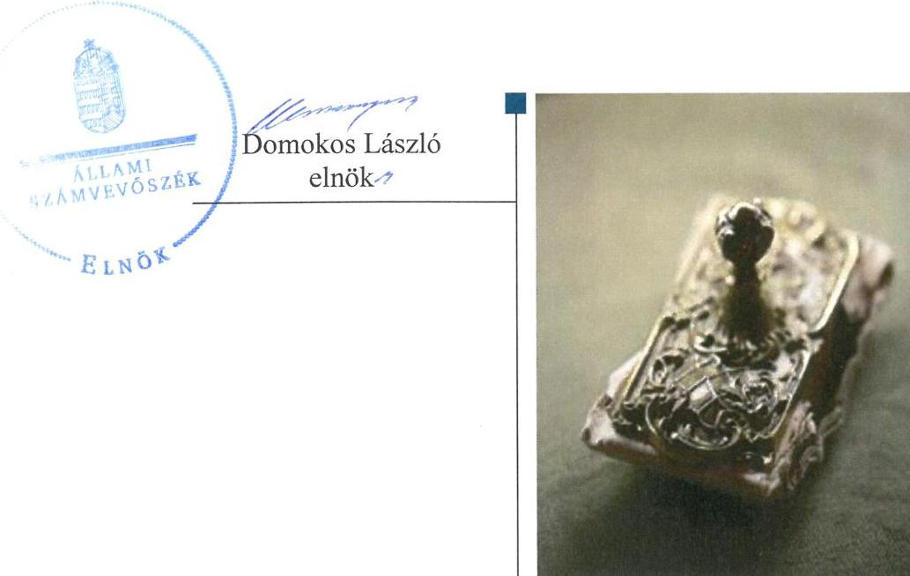
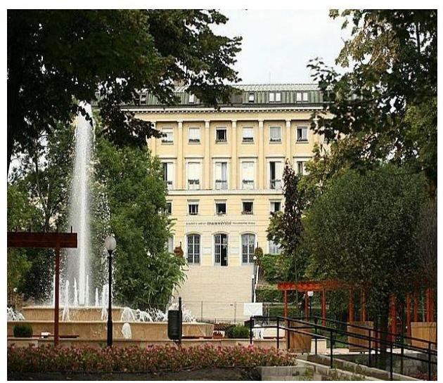

# Jelentés 

## Utóellenőrzések

Az önkormányzatok vagyongazdálkodása szabályszerűségének utóellenőrzése Budapest Főváros II. Kerületi Önkormányzat 2017.

---

# Jelenetés 

## Utóellenőrzések

Az önkormányzatok vagyongazdálkodása szabályszerűségének utóellenőrzése Budapest Főváros II. Kerületi Önkormányzat 2017. 02. hó 03. nap

---

# AZ ELLENŐRZÉST FELÜGYELTE: 

RENKŐ ZSUZSANNA felügyeleti vezető

## AZ ELLENŐRZÉST VEZETTE ÉS A VÉGREHAJTÁSÁÉRT FELELŐS:

DR. TIMÁR BALÁZS ellenőrzésvezető

## A PROGRAM ÖSSZEÁLLÍTÁSÁÉRT FELELŐS:

JANIK JÓZSEF LÁSZLÓ osztályvezető

## A TÉMÁHOZ KAPCSOLÓDÓ KORÁBBI SZÁMVEVŐSZÉKI JELENTÉSEK:

- címe: Jelentés az önkormányzatok vagyongazdálkodása szabályszerűségének ellenőrzéséről Budapest Főváros II. Kerület
- sorszáma: 14219

IKTATÓSZÁM: V-1258-021/2016
TÉMASZÁM: 2292
ELLENŐRZÉS-AZONOSÍTÓ SZÁM: V075555

---

# TARTALOMJEGYZÉK 

■ ÖSSZEGZÉS ..... 5
■ AZ ELLENŐRZÉS CÉLJA ..... 6
■ AZ ELLENŐRZÉS TERÜLETE ..... 7
■ AZ ELLENŐRZÉS HÁTTERE, INDOKOLTSÁGA ..... 8
■ A JELENTÉS LÉNYEGES KÉRDÉSKÖREI ..... 9
■ ELLENŐRZÉS HATÓKÖRE ÉS MÓDSZEREI ..... 10
■ MEGÁLLAPÍTÁSOK ..... 12
■ MELLÉKLETEK ..... 15
I. sz. melléklet: az ÁSZ 14219 számú jelentéséhez kapcsolódó intézkedési terv végrehajtása ..... 15
■ FÜGGELÉK: ÉSZREVÉTELEK ..... 17
■ RÖVIDÍTÉSEK JEGYZÉKE ..... 19

---

.

---

# ÖSSZEGZÉS 

Budapest Főváros II. Kerületi Önkormányzat az intézkedési tervben foglalt valamennyi intézkedést határidőn belül, maradéktalanul végrehajtotta. Ezzel biztositotta a vagyonkezelésbe adható vagyoni kör átláthatóságát, továbbá az ingatlanvagyon számviteli és kataszteri nyilvántartásai közötti egyezőség megteremtésével hozzájárult az önkormányzati vagyonnal történő elszámoltathatóság érvényesitéséhez.

## Az ellenőrzés társadalmi indokoltsága

A helyi önkormányzatok által kezelt vagyon működtetése közvetlenül érinti az adott településen élő polgárok mindennapjait, szolgálja az önkormányzatot terhelő közfeladatok ellátását. Nem lényegtelen szempont tehát, hogy e feladatok végzése szabályszerűen, átlátható és elszámoltatható módon, illetve a működtetés az elérhető legnagyobb hatásfokkal, társadalmi haszon elérése mellett történik-e.

Budapest Főváros II. kerületi Önkormányzat országos összehasonlításban is jelentős, 2015. év végén több mint 100 milliárd Ft kimutatott eszközvagyonnal rendelkezik, a vagyonhasznosítás révén megvalósuló közfeladat-ellátás mintegy 88 ezer személy életére gyakorol jelentős hatást. Mindezek indokolttá teszik, hogy az Állami Számvevőszék - jogszabályi felhatalmazása alapján - ellenőrizze a 14219. számú, „Jelentés az önkormányzatok vagyongazdálkodása szabályszerűségének ellenőrzéséről - Budapest Főváros II. Kerület" című számvevőszéki jelentésben foglalt javaslataira tett intézkedési terv végrehajtását.

## Főbb megállapítások

Az Önkormányzat a vagyonkezelésbe adható vagyonelemek önkormányzati rendeletben történő rögzítésével eleget tett jogszabályi felhatalmazásban kapott jogalkotási kötelezettségének. A jogforrási hierarchia megfelelő szintjén vagyonrendeletében - biztosította, hogy a Képviselő-testület kizárólag a közfeladat-ellátáshoz szükséges vagyonelemekre alapíthasson vagyonkezelői jogot, mindezzel megteremtette az Önkormányzat ingó- és ingatlanvagyona kezelése szabályszerűségének átláthatóságát, ellenőrizhetőségét. Az önkormányzati ingatlanvagyon számviteli és ingat-lan- kataszterben meglévő nyilvántartásai egyezőségét az éves beszámoló elkészítéséig biztosító intézkedés hozzájárult a beszámoló hitelességéhez. A jogszabálynak megfelelő nyilvántartás vezetésével az intézkedések végrehajtásának átláthatóságát biztosították.

---

# AZ ELLENŐRZÉS CÉLJA 

Az ellenőrzés célja annak értékelése volt, hogy a számvevőszéki jelentésben foglalt intézkedést igénylő megállapításokkal és javaslatokkal összhangban készített intézkedési tervben meghatározott feladatokat az Önkormányzat végrehajtotta-e.

---

# **A2 ELLENŐRZÉS TERÜLETE**

## **Budapest Főváros II. Kerületi Önkormányzat**

A 2016. január 1-jén 88 058 fő lakosú kerület képviseletét a Polgármester¹ 2006. október óta látja el és vezeti a 21 tagú Képviselő-testület²-et. A 240 fős Polgármesteri Hivatal irányításáról a Jegyző³ 2004 márciusa óta gondoskodik. 2015. évben az Önkormányzat⁴ 13 828 M Ft költségvetési kiadással és 15 480 M Ft költségvetési bevétellel gazdálkodott. 2015. december 31-én 101 316 M Ft értékű eszközvagyonnal rendelkezett.

Az Önkormányzat vagyongazdálkodásának szabályszerűségét az ÁSZ a 2009-től 2013-ig terjedő időszakra vonatkozóan ellenőrizte. Az ellenőrzésről készült, 2014. évben közzétett számvevőszéki jelentéstervezetben megfogalmazott javaslatokra az Önkormányzat által készített intézkedési tervben foglalt feladatok végrehajtása jelen utóellenőrzés tárgyát képezi.

---

# AZ ELLENŐRZÉS HÁTTERE, INDOKOLTSÁGA 

Az ÁSZ tv. 33. § (1) bekezdése értelmében a számvevőszéki jelentések intézkedést igénylő megállapításaihoz és javaslataihoz kapcsolódóan az ellenőrzött szervezet vezetője intézkedési tervet köteles összeállítani, és az Állami Számvevőszék részére megküldeni. Az intézkedési tervben foglaltak megvalósítását - az ÁSZ tv. 33. § (7) bekezdésében foglaltak alapján - az Állami Számvevőszék utóellenőrzés keretében ellenőrizheti. Az intézkedések megvalósulásának értékelése során az Állami Számvevőszék figyelembe veszi az ellenőrzött szervezetek működési feltételeiben, valamint a jogszabályi előírásokban bekövetkezett változásokat.

Az intézkedési tervekben foglalt feladatok hiányos, illetve késedelmes végrehajtása, valamint megvalósításának elmaradása azt mutatja, hogy az ellenőrzések során feltárt hibák, hiányosságok és szabálytalanságok megszüntetése nem kapott kellő hangsúlyt. Ez a szabályszerű működés és a felelős vezetői magatartás vonatkozásában kockázatot hordoz. E kockázatok feltárásával az Állami Számvevőszék utóellenőrzési rendszere fokozza a fegyelmet, és igazolja, hogy a közpénzzel való szabályos gazdálkodás felelőssége elől nem lehet kitérni.

## AZ UTÓELLENŐRZÉS VÁRHATÓ HASZNOSULÁSA

Az utóellenőrzés négy szinten hasznosulhat:
$\longrightarrow$ A társadalom szintjén az utóellenőrzés jelzi, hogy a számvevőszéki ellenőrzés megállapításainak van következménye: a hiányosságok megszüntetésére az ellenőrzött szervezet által meghatározott intézkedések végrehajtását is számon kéri az ÁSZ5.
$\longrightarrow$ Az ellenőrzött terület szintjén az utóellenőrzés tájékoztatást nyújt a terület döntéshozóinak a hiányosságok kiküszöbölésének jó gyakorlatairól, ezzel lehetőséget biztosítva arra, hogy az ÁSZ ellenőrzési megállapításai, javaslatai a terület nem ellenőrzött szervezeteinek a működése során is hasznosuljanak.
$\longrightarrow$ Az ellenőrzött szervezet szintjén az utóellenőrzés feltárja, hogy a szervezet az intézkedések végrehajtásával hasznosította-e a korábbi ellenőrzési jelentésben a hiányosságok megszüntetése, illetve a kockázatok kezelése érdekében megfogalmazott javaslatokat.
$\longrightarrow$ Az ÁSZ szintjén az utóellenőrzés visszacsatolást ad az ellenőrzési jelentések hasznosulásáról, az intézkedések elmaradása vagy részleges megvalósulása a további ellenőrzésekhez kockázati jelzésként szolgál.

---

# A JELENTÉS LÉNYEGES KÉRDÉSKÖREI 

1. Az Önkormányzat az intézkedési tervben foglaltakat az elöirt határidőben végrehajtotta-e?

---

# ELLENŐRZÉS HATÓKÖRE ÉS MÓDSZEREI 

## Az ellenőrzés típusa

Megfelelőségi ellenőrzés.

## Az ellenőrzött időszak

Az utóellenőrzés alapját képező ÁSZ jelentés közzétételének napjától (2014. november 5.) az ellenőrzésről szóló kiértesítő levél keltének napjáig (2016. szeptember 6.)

## Az ellenőrzés tárgya

Az ÁSZ tv. 2011. július 1-jei hatálybalépését követően a számvevőszéki jelentésben foglalt intézkedést igénylő megállapításokkal és javaslatokkal összhangban - az Önkormányzat által - készített intézkedési tervben foglaltak végrehajtásának ellenőrzése.

Az ellenőrzés kiterjedt minden olyan körülményre és adatra, amely az ÁSZ jogszabályban meghatározott feladatainak teljesítéséhez, valamint a program végrehajtása folyamán felmerült újabb összefüggések feltárásához szükséges volt.

## Az ellenőrzött szervezet

Budapest Főváros II. Kerületi Önkormányzat

## Az ellenőrzés jogalapja

Az ÁSZ törvényben meghatározott feladatkörében ellenőrzi a központi költségvetés végrehajtását, az államháztartás gazdálkodását, az államháztartásból származó források felhasználását és a nemzeti vagyon kezelését.

Az ÁSZ tv. 1. § (3) bekezdése szerint az ÁSZ általános hatáskörrel végzi a közpénzekkel és az állami és önkormányzati vagyonnal való felelős gazdálkodás ellenőrzését.

Az ÁSZ tv. 33. § (7) bekezdése alapján az ÁSZ tv. 33. § (1)-(2) bekezdése szerinti intézkedési tervben foglaltak megvalósítását az ÁSZ utóellenőrzés keretében ellenőrizheti.

---

# Az ellenőrzés módszerei 

Az ÁSZ az utóellenőrzést a nemzetközi standardokat irányadónak tekintve az ellenőrzési program ellenőrzési kérdései, az ellenőrzött időszakban hatályos jogszabályok, az ellenőrzés szakmai szabályok és módszertanok figyelembevételével, ellenőrzéshez kapcsolódóan végezte.

Az ellenőrzés ideje alatt az Önkormányzattal történő kapcsolattartást az ÁSZ SZMSZ ${ }^{6}$-ének vonatkozó előírásai alapján biztosította.

Az utóellenőrzés megállapításait elsősorban az ÁSZ rendelkezésére álló, valamint az ellenőrzött szervezetektől elektronikusan bekért dokumentumok alapozták meg.

Az ellenőrzési bizonyítékként felhasználható adatforrások közé tartoztak egyrészt a szakmai programban felsorolt adatforrások, másrészt minden - az ellenőrzés folyamán feltárt, az ellenőrzés szempontjából információt tartalmazó - dokumentum.

Az intézkedési tervekben előírt feladatokat azok végrehajthatósága, illetve végrehajtása szempontjából az alábbiak szerint értékelte az ÁSZ:
"határidőben végrehajtott" a feladat, ha a teljesítés dokumentáltan, az intézkedési tervben előírt határidőben és tartalommal megtörtént;
"határidőn túl végrehajtott" a feladat, ha annak teljesítése az intézkedési tervben meghatározott módon, de az előírt határidőn túl történt meg;
"részben végrehajtott" a feladat, ha végrehajtása teljes körűen az intézkedési tervben előírt módon nem történt meg;
"nem végrehajtott" ha a végrehajtás nem történt meg, vagy amenynyiben a teljesítést nem dokumentálták;
"okafogyottá vált" a feladat, ha végrehajtására - meghatározott esemény bekövetkezése, továbbá külső körülmény, a múködést érintő feltétel változása miatt - már nincs szükség, illetve lehetőség, és egyértelmúen megállapítható, hogy az intézkedést szükségessé tevő körülmény a jövőben nem fordulhat elő;
"nem időszerü" az a feladat, amelynek ellenőrzési időszakon belüli végrehajtására azért nem került (kerülhetett) sor, mert az intézkedés alapjául szolgáló esemény nem következett be, de annak jövőbeni előfordulása lehetséges, a végrehajtása nem volt esedékes, vagy a végrehajtás határideje még nem járt le.
Az ellenőrzés lefolytatásához az Önkormányzat a tanúsítványok elektronikus kitöltésével, valamint az ÁSZ által kért dokumentumok elektronikus megküldésével szolgáltatott adatokat, amelyek valódiságát és teljes körűségét a Polgármester által tett teljességi és hitelességi nyilatkozat igazolta. Az így rendelkezésre bocsátott adatok, információk kontrollja az ellenőrzés keretében megtörtént.

---

# 1. Az Önkormányzat az intézkedési tervben foglaltakat az előírt határidőben végrehajtotta-e? 

Összegző megállapítás

Az Önkormányzat az intézkedési tervben meghatározott három feladat mindegyikét határidőben hajtotta végre, ezáltal az önkormányzati vagyonnal történő gazdálkodás szabályszerűségét biztosították. Az intézkedési tervben rögzített feladatok végrehajtásáról a jogszabályban előírt nyilvántartást vezettek, ezzel megteremtették az intézkedések átláthatóságát.
1.1. számú megállapítás

Az intézkedési tervben meghatározott feladatokat - az előírt határidőben - végrehajtották. Az Önkormányzat vagyonrendeletének módosításával a vagyonkezelés alapítása szabályozottá, átláthatóvá vált, az önkormányzati ingatlan- nyilvántartások egyezőségének biztosításával a számviteli beszámolóban kimutatott ingatlaneszközvagyon alátámasztottsága, hitelessége növekedett.

Az intézkedési tervben meghatározott feladatokat, határidőket, az ÁSZ jelentés javaslatainak címzettjét és a feladatok végrehajtását az I. számú melléklet mutatja be.

Az ÁSZ a jelentésében a polgármester részére egy, a jegyző részére egy javaslatot fogalmazott meg. A polgármester és a jegyző által összeállított és az ÁSZ részére megküldött intézkedési tervben a hiányosságok, szabálytalanságok megszüntetésére három feladatot határoztak meg. A feladatok elvégzésének felelőseként egy esetben a polgármestert, egy esetben a Vagyonhasznosítási és Ingatlan-nyilvántartási Iroda vezetőjét, egy esetben a Vagyonhasznosítási és Ingatlan-nyilvántartási Iroda és a Pénzügyi Iroda vezetőit közösen jelölték meg.

## HATÁRIDŐBEN VÉGREHAJTOTT feladat:

1. A Vagyonhasznosítási és Ingatlan-nyilvántartási Iroda vezetője az Önkormányzat vagyonrendelet ${ }^{2}$-ének módosítását előkészítette, kijelölésre került azon önkormányzati vagyoni kör, amelyre vagyonkezelői jog alapítható.
2. A Polgármester a vagyonkezelői joggal átadható vagyonelemek körét tartalmazó - a Jegyző által előkészített - rendelettervezetet jóváhagyásra a Képviselő-testület elé terjesztette. A vagyonrendelet módosítását a Képviselő-testület 2015. március 26-i ülésnapján elfogadta.
3. A Vagyonhasznosítási és Ingatlan-nyilvántartási Iroda és a Pénzügyi Iroda vezetői a számviteli nyilvántartás ingatlanvagyon adatai és az

---

# Megállapítások 

ingatlanvagyon-kataszter közötti egyezőség hiányának okait feltárták, a szükséges egyeztetéseket elvégezték, az egyezőséget biztosították.

Az intézkedési tervben rögzített feladatok végrehajtásáról a jogszabályban előírt nyilvántartást vezették.

Az Önkormányzat vezette a Bkr. ${ }^{8}$-ben előírt információt tartalmazó nyilvántartást az intézkedési tervben foglalt feladatok végrehajtásáról. A külső ellenőrzések nyilvántartásának eljárási szabályait a Kontrollrendszer szabályzatában rögzítették, mely által az intézkedések nyilvántartásával kapcsolatos felelősséget és hatáskört egyértelművé téve a számon kérhetőséget biztosították.

---

.

---

# MELLÉKLETEK

|  I. SZ. MELLÉKLET: AZ ÁSZ 14219 SZÁMÚ JELENTÉSÉHEZ KAPCSOLÓDÓ INTÉZKEDÉSI TERV VÉGREHAJTÁSA |  |  |  |   |
| --- | --- | --- | --- | --- |
|  1. | Intézkedési terv alapján elvégrendő feladat | Az intézkedési tervben meghatározott határidő | Az intézkedési tervben megelőtt felelős | A feladat végrehajtása  |
|   | 1. | 2. | 3. | 4.  |
|  Határidőben végrehajtott intézkedések |  |  |  |   |
|  1. | A) Az Önkormányzat vagyonáról és a vagyontárgyak feletti tulajdonosi jog gyakorlásáról, továbbá az önkormányzat tulajdonában lévő lakások és helyiségek elidegenítésének szabályairól, bérbeadásának feltételeiről szóló 34/2004. (X.13.) önkormányzati rendelet módosításának előkészítése, hogy kijelölésre kerüljön az az önkormányzati vagyoni kör, amelyre vagyonkezelői jog alapítható. | 2015. március 31. | Vagyonhasznosítási és Ingatlan-nyilvántartási Iroda vezetője | A Vagyonhasznosítási és Ingatlan-nyilvántartási Iroda irodavezetője az Önkormányzat vagyonáról és a vagyontárgyak feletti tulajdonosi jog gyakorlásáról, továbbá az önkormányzat tulajdonában lévő lakások és helyiségek elidegenítésének szabályairól, bérbeadásának feltételeiről szóló 34/2004. (X.13.) önkormányzati rendelet módosítását a 2015. március 31-i határidőt megelőzően előkészítette. A módosítás 7. § (2) bekezdésében kijelölésre került az az önkormányzati vagyoni kör, amelyre vagyonkezelői jog alapítható. A rendelet az Önkormányzat törvényben meghatározott közfeladatainak ellátásához szükséges önkormányzati tulajdonban lévő ingó- és ingatlanvagyon elemeket jelölte meg. Az Önkormányzat ilyen vagyonelemnek tekinti a Vagyonrendelete 1., 2. és 3. számú mellékletében nemzetgazdasági szempontból kiemelt jelentőségű nemzeti vagyon, forgalomképtelen, illetve korlátozottan forgalomképes ingatlanként feltüntetett vagyonát.  |
|  2. | B) Az A) pont szerint előkészített rendelet tervezet Képviselő-testület elé történő előterjesztése. | 2015. április 30. | Polgármester | A Polgármester a vagyonkezelői joggal átadható vagyonelemek körét tartalmazó rendelet tervezetet 2015. március 23-án, az előírt határidőt megelőzően a Képviselő-testület elé terjesztette, melyet a Képviselő-testület 5/2015 (III.27.) számú önkormányzati rendeletével elfogadott.  |

---

|  2. | Intézkedési terv alapján elvégzendő feladat | Az intézkedési tervben meghatározott határidő | Az intézkedési tervben megjelölt felelős | A feladat végrehajtása  |
| --- | --- | --- | --- | --- |
|  3. | A számviteli nyilvántartás ingatlanvagyon adatai és az ingatlanvagyon-kataszter adat- és betétlapjai közötti egyezőség megteremtése érdekében a nyilvántartások között az egyeztetést a háromnegyed éves mérlegjelentés adatai alapján meg kell kezdeni oly módon, hogy az eltérések okait megszüntető intézkedések - a hoszszabb átfutási idejű intézkedést igénylő tételek (pl.: telekmegosztás) kivételével az éves beszámoló elkészítéséig végrehajthatók legyenek. | Tárgyévet követő év február 10. | Vagyonhasznosítási és ingatlan-nyilvántartási iroda vezetője és a pénzügyi iroda vezetője | A számviteli nyilvántartás ingatlanvagyon adatai és az ingatlan-vagyon-kataszter adat- és betétlapjai közötti egyezőség megteremtése érdekében a nyilvántartások között az egyeztetések végrehajtása 2015-ben megtörtént. Az értékbeli egyeztetések során a számviteli nyilvántartást vetették össze a vagyonkataszteri állománnyal forgalomképesség szerinti felosztásban. Eltérést kizárólag a Polgármesteri Hivatalnál találtak. Két tétel (közvilágítási hálózat és víznyomócső) számviteli nyilvántartásban szereplő, de helyrajzi számmal nem rendelkező ingatlanok okozták a 27,2 M Ft, illetve a 11,9 M Ft-os eltérést, melyeket 2015. március 30-án kelt egyeztetés során kimutattak. A Vagyonhasznosítási és Ingatlan Iroda vezetője a Beruházási Iroda vezetőjét megbízta a közműszolgáltatókkal történő egyeztetéssel. Ennek eredményeképp, 2015. szeptember 8-án megtörtént a kérdéses tételek kataszteri állományba történő felvétele.  |

---

# FÜGGELÉK: ÉSZREVÉTELEK 

A jelentéstervezetet a Számvevőszék 15 napos észrevételezésre megküldte az ellenőrzött szervezet vezetőjének az ÁSZ tv. 29. §* (1) bekezdése előírásának megfelelően.
Az ellenőrzött szervezet vezetője az ÁSZ tv. 29. § (2) bekezdésében foglalt észrevételezési jogával nem élt, a jelentéstervezetre észrevételt nem tett.

[^0]
[^0]:    * 29. § (1) Az Állami Számvevőszék az ellenőrzési megállapításait megküldi az ellenőrzött szervezet vezetőjének vagy az általa megbízott személynek, és annak, akinek személyes felelősségét állapította meg.
    (2) Az ellenőrzött szervezet vezetője és a felelősként megjelölt személy az ellenőrzés megállapításaira tizenöt napon belül írásban észrevételt tehet.
    (3) Az Állami Számvevőszék az észrevételre a beérkezésétől számított harminc napon belül írásban válaszol. A figyelembe nem vett észrevételeket köteles a jelentésben feltüntetni, és megindokolni, hogy azokat miért nem fogadta el.

---

.

---

# RÖVIDÍTÉSEK JEGYZÉKE 

${ }^{1}$ Polgármester
${ }^{2}$ Képviselő-testület
${ }^{3}$ Jegyző
${ }^{4}$ Önkormányzat
${ }^{5}$ ÁSZ
${ }^{6}$ ÁSZ SZMSZ
${ }^{7}$ vagyonrendelet
${ }^{8} \mathrm{Bkr}$.
Budapest Főváros II. Kerületi Önkormányzat polgármestere
Budapest Főváros II. Kerületi Önkormányzat Képviselő-testülete
Budapest Főváros II. Kerületi Önkormányzat jegyzője
Budapest Főváros II. Kerületi Önkormányzat
Állami Számvevőszék
Az Állami Számvevőszék elnökének 3/2015 (XII.30.) ÁSZ utasítása az Állami Számvevőszék Szervezeti és Müködési Szabályzatáról
Budapest Főváros II. Kerületi Önkormányzat Képviselő-testületének az Önkormányzat vagyonáról és a vagyontárgyak feletti tulajdonosi jog gyakorlásáról, továbbá az önkormányzat tulajdonában lévő lakások és helyiségek elidegenítésének szabályairól, bérbeadásának feltételeiről szóló, többször módosított 34/2004.(X.13.) önkormányzati rendelete
370/2011.(XII.31) Korm.rendelet a költségvetési szervek belső kontrollrendszeréről és belső ellenőrzéséről

---

# ÁLLAMI SZÁMVEVŐSZÉK 

1052 Budapest, Apáczai Csere János utca 10.
Levélcím: 1364 Budapest 4. Pf. 54
Telefon: +36 14849100 Telefax: +36 14849200
www.asz.hu