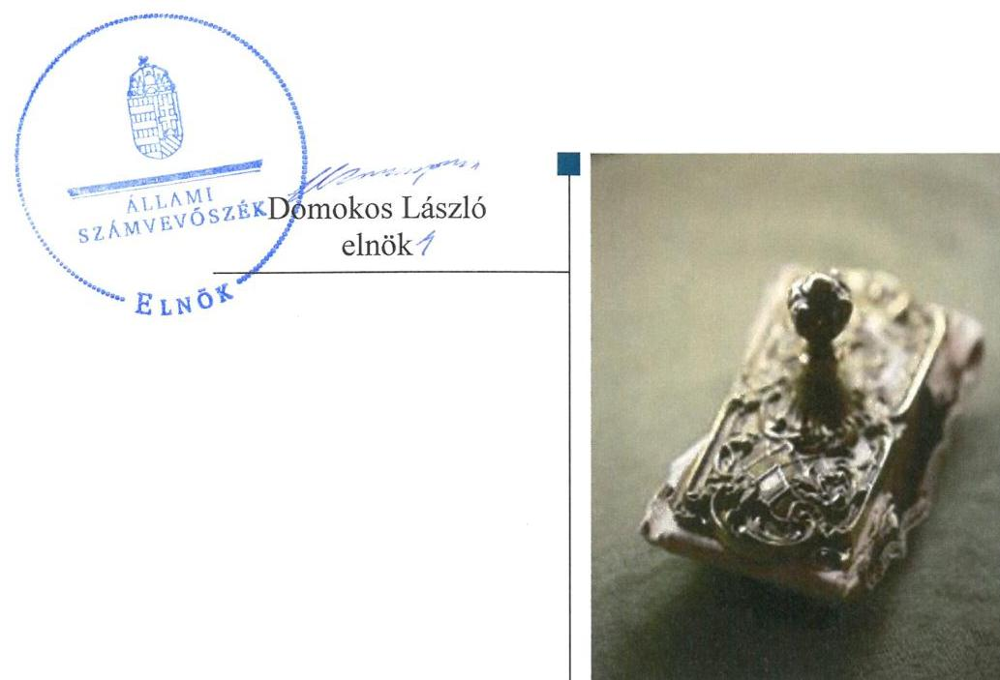
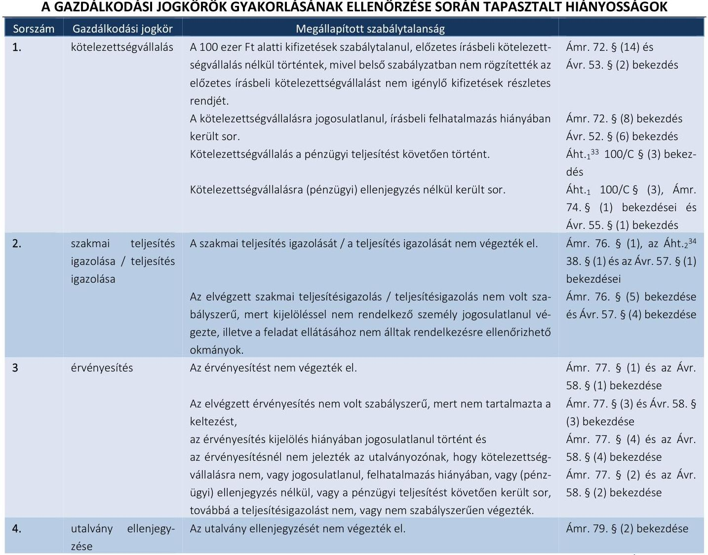

# Jelentés 

## Önkormányzati adósságrendezés ellenőrzése

Aba Város Önkormányzata adósságrendezési eljárásának ellenőrzése 2017.

---

# Jelentés 

## Önkormányzati adósságrendezés ellenőrzése

Aba Város Önkormányzata adósságrendezési eljárásának ellenőrzése 2017. 02. hó 14. nap

---

# AZ ELLENŐRZÉST FELÜGYELTE: 

RENKŐ ZSUZSANNA felügyeleti vezető

## AZ ELLENŐRZÉST VEZETTE ÉS A VÉGREHAJTÁSÁÉRT FELELŐS:

BAJNAI ZSUZSANNA ellenőrzésvezető

## A PROGRAM ÖSSZEÁLLÍTÁSÁÉRT FELELŐS:

JANIK JÓZSEF LÁSZLÓ osztályvezető

## A TÉMÁHOZ KAPCSOLÓDÓ KORÁBBI SZÁMVEVŐSZÉKI JELENTÉSEK:

- címe: Jelentés az önkormányzatok belső kontrollrendszere kialakításának, egyes kontrolltevékenységek és a belső ellenőrzés működésének ellenőrzése Aba
- sorszáma: $\quad 15052$

IKTATÓSZÁM: V-1011-232/2016
TÉMASZÁM: 2045
ELLENŐRZÉS-AZONOSÍTÓ SZÁM: V073908

---

# TARTALOMJEGYZÉK 

■ ÖSSZEGZÉS ..... 5
■ AZ ELLENŐRZÉS CÉLJA ..... 6
■ AZ ELLENŐRZÉS TERÜLETE ..... 7
■ AZ ELLENŐRZÉS HÁTTERE, INDOKOLTSÁGA ..... 8
■ A JELENTÉS LÉNYEGES KÉRDÉSKÖREI ..... 9
■ ELLENŐRZÉS HATÓKÖRE ÉS MÓDSZEREI ..... 10
■ MEGÁLLAPÍTÁSOK ..... 12
■ JAVASLATOK ..... 23
■ MELLÉKLETEK ..... 25
I. sz. melléklet: Értelmező szótár ..... 25
II. sz. melléklet: Az eszközök és források alakulása kiemelt mérlegsoronként ..... 27
III. sz. melléklet: Bevételek és kiadások, adósságszolgálat CLF módszer szerinti kimutatása ..... 28
IV. sz. melléklet: Kimutatás a többségi tulajdonú gazdasági társaságokról 2009., 2014. év ..... 29
■ FÜGGELÉK: ÉSZREVÉTELEK ..... 31
■ RÖVIDÍTÉSEK JEGYZÉKE ..... 33

---

.

---

# ÖSSZEGZÉS 

Aba Város Önkormányzata adósságrendezési eljárásának végrehajtása során a nem szabályszerű feladatellátás veszélyeztette az adósságrendezés céljainak elérését. A hitelezők követelését nem teljes körűen elégítették ki, a fizetőképesség nem állt helyre. A pénzügyi egyensúly az adósságrendezést követően sem volt biztosított, a folyó bevételek nem fedezték a folyó kiadásokat.

## Az ellenőrzés társadalmi indokoltsága

Pénzügyi egyensúlyi helyzetének, fizetőképességének kedvezőtlen alakulása miatt Aba Város Önkormányzatánál 2011. augusztus 19-től 2012. május 8-ig adósságrendezés folyt, amely során a hitelezők 3,4 milliárd Ft kötelezettség teljesítésére nyújtottak be igényt. Ez a kötelezettségállomány az önkormányzat vagyonának mintegy 40%-át jelentette, így indokolt ellenőrizni, hogy az adósságrendezési eljárás elérte-e a célját, az eljárás szereplői eleget tettek-e törvényben meghatározott feladataiknak a fizetőképesség helyreállítása, a hitelezőknek hatékony jogvédelem nyújtása és az átgondolt, felelősségteljes gazdálkodás elősegítése érdekében.

## Főbb megállapítások, következtetések, javaslatok

Az adósságrendezési eljárás szabálytalan végrehajtása veszélyeztette az eljárás céljainak elérését. Az adósságrendezés megindításakor nem tisztázták az önkormányzat valós vagyoni helyzetét, mert nem készült vagyonleltár, nem az előírt módon zárták le a számviteli nyilvántartásokat. A hitelezők a jogszabályban meghatározott határidőhöz képest késve kaptak tájékoztatást követeléseik elfogadásáról, a jogszabályi előírás ellenére függő követelést is nyilvántartásba vettek, a válságköltségvetés alatt szabálytalan kifizetések kerültek ellenjegyzésre, illetve ellenjegyzés nélkül történtek kifizetések.

Annak ellenére, hogy az állam az önkormányzat teljes hitelállományát átvállalta fizetőképessége nem állt helyre, a 2012-2014. évek végén is rendelkezett 60 napon túl lejárt szállítói tartozással. Az egyezség szerinti tényleges hitelezői követelések 8,8%-át, 148,9 millió Ft-ot az önkormányzat nem egyenlített ki. A teljesített követelésekből a saját forrás mindössze 7,7% volt.

A pénzügyi egyensúly helyreállítása érdekében az önkormányzat reorganizációs programot fogadott el, de az abban meghatározott intézkedések közül csak néhányat hajtott végre. Működési bevételei nem fedezték működési kiadásait állami támogatás mellett sem, így pénzügyi egyensúlya nem volt biztosított az adósságrendezést követően.

---

# AZ ELLENŐRZÉS CÉLJA 

Az ellenőrzés célja annak megállapítása, hogy az adósságrendezési eljárás megindítása, lefolytatása szabályszerű volt-e, az önkormányzat gazdálkodása az adósságrendezési eljárás alatt megfelelt-e a jogszabályi előírásoknak; az eljárás szereplői - kiemelten a pénzügyi gondnok - a jogszabályokban foglaltak szerint jártak-e el az adósságrendezés során. A lefolytatott eljárás elérte-e a törvényben kitűzött célokat; az adósságrendezési eljárás alatt az önkormányzat folyamatosan teljesítette-e kötelező feladatait, a hitelezők követelését vagyonarányosan kielégítette-e, helyre állt-e fizetőképessége.

---

# AZ ELLENŐRZÉS TERÜLETE 

## Aba Város Önkormányzata

Aba Fejér megyében helyezkedik el. Állandó lakosainak száma 2009. január 1-jén 4667 fő, 2014. december 31-én 4601 fő volt. Aba 2013. július 15-én nyerte el a városi címet.

Az önkormányzat ${ }^{1}$ képviselő-testülete ${ }^{2}$ 2009-ben 12 fővel, öt állandó bizottsággal, 2014-ben hét fővel és két állandó bizottsággal látta el feladatát. A polgármester ${ }^{3}$ személye nem, a jegyzőé ${ }^{4}$ egyszer változott az ellenőrzött időszakban.

A gazdálkodási feladatokat az elkülönített gazdasági szervezettel nem rendelkező polgármesteri hivatal ${ }^{5}$ látta el. A polgármesteri hivatalnál foglalkoztatottak száma a 2009. január 1-jei 28 főről 2014. év végére 14 főre csökkent.

Az önkormányzat által fenntartott költségvetési szervek száma - négy - az ellenőrzött időszakban nem változott.

A 2009. év elején két gazdasági társaságban rendelkezett többségi, egyben kizárólagos tulajdonnal, az ellenőrzött időszak végén többségi illetve kizárólagos tulajdona egy-egy gazdasági társaságban volt.

Az önkormányzat adósságrendezési eljárását 2011. augusztus 12-én a képviselő-testület döntése alapján a polgármester kezdeményezte, az önkormányzat adósságállományára hivatkozva. A bíróság végzése az adósságrendezés megindításáról 2011. augusztus 19-én jelent meg a Cégközlönyben. Az adósságrendezés 2012. május 8-án egyezséggel zárult.

A pénzügyi gondnoki feladatok ellátására a bíróság a Mátraholding Zrt.-t${ }^{6}$ jelölte ki. A Mátraholding Zrt. 2014-ben kikerült a pénzügyi gondnokok névjegyzékéből.

---

# AZ ELLENŐRZÉS HÁTTERE, INDOKOLTSÁGA 

Az önkormányzatok finanszírozásának, gazdálkodásának keretei és feladatellátása jelentős változásokon ment keresztül a Har. tv. ${ }^{7}$ hatályba lépésétől eltelt időszakban.

Az önkormányzati eladósodást 2011-ig csak az Ötv.-ben ${ }^{8}$ meghatározott hitelfelvételi korlát szabályozta, a korlát megsértését azonban jogszabályok nem szankcionálták. A 2012. évtől jelentős szigorítás lépett életbe, a korábbi passzív szabályozást a Stabilitási tv. ${ }^{9}$ hatályba lépésével az aktív kontroll váltotta fel, a törvény előírásai alapján az önkormányzatok hitelfelvételei engedélykötelessé váltak.

1996-ban a hitelfelvételi korlát bevezetése mellett az önkormányzatok adósságrendezésének szabályozására is sor került. Az adósságrendezési eljárás részben a lakosság védelmét szolgálta azzal, hogy biztosította az önkormányzatok által nyújtott kötelező közfeladatokhoz való hozzájutást az önkormányzat fizetésképtelensége esetén is. A Har. tv. alapján - 1996 és 2013 júniusa között - ugyanakkor elenyésző számú, mindösszesen 64 adósságrendezési eljárás indult. Az eljárások közel 60%-a egyezséggel, 40%-a vagyonfelosztással zárult. Az adósságrendezés első időszakában (2009. évig) a forráshiányból eredeztethető eladósodás tette indokolttá az eljárások jelentős hányadának megindítását.

A második időszakban az eljárás alá vont önkormányzatok között megjelentek a nagyobb költségvetéssel és több intézménnyel is rendelkező települések. Az adósságrendezést szükségessé tevő problémák speciális pénzügyi elemekkel, a devizaalapú kötvénnyel történő finanszírozás begyűrűző hatásaival, valamint az anyagi lehetőségeket meghaladó, túlméretezett fejlesztésekkel összefüggő kötelezettségvállalásokkal egészültek ki, de a beruházások esetében fontos tényező volt a kellő szakértelem hiánya és a pénzügyi nehézségek szakszerűtlen kezelése is.

Az ÁSZ ${ }^{10}$ önkormányzati alrendszert érintő ellenőrzései, elemzései során számos ponton mutatott rá azokra a területekre, ahol a „szabályozás” módosításra, korrekcióra szorul. Az ellenőrzés alapján megfogalmazott javaslatok e területen is segítséget nyújthatnak a kormányzat és az Országgyűlés törvényhozó munkájában, hozzájárulhatnak az irányítói tevékenység erősítéséhez. Az ellenőrzés során tett megállapításaink megerősíthetik egy „megelőző monitoring funkció” kialakításának szükségességét a helyi önkormányzatok fizetésképtelenségének megelőzése érdekében.

---

# A JELENTÉS LÉNYEGES KÉRDÉSKÖREI 

1. Az adósságrendezési eljárás folyamata, végrehajtása során szabályszerű volt-e az önkormányzat és a pénzügyi gondnok feladatellátása?
2. A lefolytatott adósságrendezési eljárás elérte-e a törvényben kitűzött célokat?
3. Az adósságrendezési eljárást követően biztosított és fenntartható volt-e a pénzügyi egyensúly?
4. Gondoskodott-e az önkormányzat a közfeladatot ellátó társaságai esetében a tulajdonosi jogok gyakorlásáról annak érdekében, hogy működésük ne hordozzon kockázatot az önkormányzatra nézve?

---

# ELLENŐRZÉS HATÓKÖRE ÉS MÓDSZEREI 

## Az ellenőrzés típusa

Rendszerellenőrzés.

## Az ellenőrzött időszak

2009. január 1. és 2015. június 30. közötti időszak.

## Az ellenőrzés tárgya

A Har. tv. által szabályozott adósságrendezési eljárás.

## Az ellenőrzött szervezet

Aba Város Önkormányzata és a pénzügyi gondnoki feladatok ellátásával összefüggésben a Mátraholding Zrt.

## Az ellenőrzés jogalapja

Az Állami Számvevőszékről szóló 2011. évi LXVI. törvény 5. § (2) bekezdése.

## Az ellenőrzés módszerei

Az ellenőrzés szakmai módszertana az ÁSZ hivatalos honlapján (www.asz.hu) közzétett szakmai szabályokon alapult, amelyek irányadónak tekintették a Legfőbb Ellenőrző Intézmények Nemzetközi Szervezete (INTOSAI) által kiadott nemzetközi (ISSAI) standardokat.

Az ellenőrzés alapját az ellenőrzött önkormányzatoktól bekért tanúsítványok, szabályzatok, szerződések, bírósági végzések, határozatok és egyéb dokumentumok, kimutatások, valamint az önkormányzati beszámolók adatai képezték. Az ellenőrzési kérdések megválaszolásához szükséges bizonyítékok megszerzése, összegyűjtése, az ellenőrzött által rendelkezésre bocsátott dokumentumok, adatok elemzés módszerével végrehajtott értékelésével történt, kiegészítve a megfigyelés, a szemle (szemrevételezés), a kérdésfeltevés (információkérés), mintavételezés módszerével. Az ellenőrzés keretében értékeltük az ellenőrzéshez elkészített tanúsítványok adatainak valódiságát.

---

Az adósságrendezési eljárás szabályszerűségét a cégbírósági végzések, határozatok, a testületi előterjesztések, jegyzőkönyvek, határozatok, a válságköltségvetés, a beszámolók adatai, az értesítések, közzétételek, kimutatás a hitelezőkről, jelentések, vagyonfelosztási javaslat, belső szabályzatok, pénzügyi bizonylatok, kötelezettségvállalások és további releváns dokumentumok alapján ellenőriztük. A minősítés szempontja a dokumentumok határidőben és tartalmilag a vonatkozó előírásoknak megfelelő elkészítése volt.

A kontrolltevékenység működésének ellenőrzésével értékeltük, hogy az adósságrendezési eljárás alatt vállalt kötelezettségek és teljesített kifizetések szabályszerűen történtek-e, a válságköltségvetés alatt a forrásokat szabályszerűen, rendeltetésszerűen használták-e fel a Har. tv-ben előírt és az önkormányzat által ellátott kötelező feladatellátás során.

A kontrolltevékenységek támogató szerepét a kötelezettségvállalások és a szakmai teljesítés igazolása/utalvány ellenjegyzése, a teljesítés igazolása/érvényesítés, valamint a pénzügyi gondnok által gyakorolt ellenjegyzés működésének ellenőrzésén keresztül ítéltük meg. A véletlen minta alapján a sokaságra vonatkozó hibaarányt becsültük. „Megfelelőnek” értékeltük az ellenőrzött területet, amennyiben 95%-os bizonyossággal a teljes sokaságban a hibaarány legfeljebb 10%, „részben megfelelőnek” értékeltük, ha a hibaarány 10-30% között volt, „nem megfelelőnek” pedig akkor, ha a mintavételi eredmények alapján a sokaságbeli hibaarány meghaladta a 30%-ot. A becsült hibaaránytól függetlenül nem értékeltük szabályosnak az önkormányzatnál a válságköltségvetésen alapuló kifizetéseket, amennyiben egyetlen esetben is hiányzott a pénzügyi gondnok ellenjegyzése a kötelezettségvállalás vagy pénzügyi kifizetés dokumentumáról.

Az önkormányzat fizetőképességének helyreállását likviditási mutatók számításával és értékelésével végeztük el. A fizetőképességet kedvezőtlennek ítéltük, ha a szállítói állomány változása növekvő tendenciát mutatott, ha az önkormányzat 60 napon túli adósságállománnyal rendelkezett, az adósságot keletkeztető ügyletek állományának változása 20% feletti volt, az egyéb visszterhes kötelezettségének aránya meghaladta a teljesített költségvetési kiadások összegének 10%-át, ha a lejárt követelések állománya nem csökkent az adósságrendezés kezdő időpontjában fennálló összeghez képest. A likviditási mutatókat megfelelőnek értékeltük, ha értékük nagyobb volt egynél.

A pénzügyi egyensúly fenntartásának értékelését a CLF módszer segítségével végeztük el. A pénzügyi egyensúly abban az esetben jött létre, ha egy adott időszakban a folyó bevételek fedezetet biztosítottak a folyó kiadásokra.

Az önkormányzatok adósságrendezési eljárása és az azt követő gazdálkodási tevékenysége hibáinak kijavítására, a közpénzekkel való felelős gazdálkodás segítésére irányuló javaslatok kidolgozásakor a hatályos jogszabályok voltak az irányadóak.

---

# MEGÁLLAPÍTÁSOK 

## 1. Az adósságrendezési eljárás folyamata, végrehajtása során szabályszerű volt-e az önkormányzat és a pénzügyi gondnok feladatellátása?

Összegző megállapítás

### 1.1. számú megállapítás

Az adósságrendezési eljárás megindítása és végrehajtása a feladatellátás hiányosságai miatt nem volt szabályszerű. A működtetett belső kontrollrendszer nem biztosította a válságköltségvetésen alapuló kifizetések szabályszerű végrehajtását.

A feltételek fennállása ellenére nem kezdeményezték az adósságrendezési eljárás megindítását a 2009. év elején.

Az adósságrendezési eljárás megindításának feltételei már 2009. január 1-jén is fennálltak,
 az önkormányzat esedékességet követő 90 napot meghaladó szállítói tartozása 256,2 millió Ft volt. Ekkor nem tájékoztatták haladéktalanul a pénzügyi bizottságot ${ }^{11}$, nem hívták össze a képviselő-testületet a Har. tv. 5. § (1) bekezdésében foglaltak ellenére, továbbá nem kezdeményezték a Har. tv. 5. § (2) bekezdése* ellenére az adósságrendezési eljárás megindítását a képviselő-testület döntésétől függetlenül az esedékességet követő 90 napot meghaladó szállítói tartozások miatt.

A polgármester 2011. augusztus 11-én hívott össze rendkívüli képviselő-testületi ülést. Előterjesztésére a képviselő-testület 150,5 millió Ft 90 napon túli elismert és lejárt esedékességű szállítói tartozásra hivatkozva határozatot hozott az adósságrendezési eljárás kezdeményezéséről és utasította a polgármestert annak haladéktalan végrehajtására.

A bíróság ${ }^{12}$ adósságrendezést elrendelő végzése a Cégközlönyben 2011. augusztus 19-én jelent meg.

Az adósságrendezési eljárás kezdeményezésekor esedékes tájékoztatási kötelezettségnek nem tettek eleget.

A polgármester a lakosságot nem tájékoztatta a helyben szokásos módon - az önkormányzat hirdetőtáblájára való kifüggesztéssel, kábeltelevízió útján történő ismertetéssel - a Har. tv. 5. § (2) bekezdése ellenére az adósságrendezési eljárás kezdeményezésével egyidejűleg, továbbá a Har. tv. 5. § (5) bekezdésében foglaltak ellenére a törvényességi ellenőrzésért felelős szervet ${ }^{13}$.

[^0]
[^0]:    * 2011. július 12-ig hatályos törvényi előírás

---

A polgármester az adósságrendezés Cégközlönyben való közzétételét követően gondoskodott a hitelezőknek szóló felhívás két országos napilapban való megjelenéséről a jogszabályi előírásoknak megfelelően. A felhívást a helyben szokásos módon kihirdette.

A polgármester az adósságrendezés megindításáról értesítette a törvényességi ellenőrzésért felelős szervet, a kincstárt ${ }^{14}$, az illetékes adó- és vámhatóságot ${ }^{15}$, a nyugdíjbiztosítási igazgatási ${ }^{16}$ - és az egészségbiztosítási szervet ${ }^{17}$, valamint a költségvetési elszámolási számláját vezető pénzforgalmi szolgáltatót ${ }^{18}$.

# 1.3. számú megállapítás 

Nem készült vagyonleltár és a jogszabályban előírt éves beszámoló.
A Har. tv. 13. § (2) bekezdés b) pontjának előírása ellenére az adósságrendezés megindításának időpontját megelőző nappal készített vagyonleltárt és éves beszámolót a polgármester nem adta át a pénzügyi gondnoknak, mert azok nem készültek el. A vagyonleltár helyett „vagyonnyilvántartást" állítottak össze, amely nem tartalmazta - megfelelő indoklással alátámasztva - elkülönítetten a törzsvagyont, a jogszabályokban kötelezően előírt feladat- és hatáskör teljesítéséhez szükséges vagyont, illetve a hitelezők kielégítéséhez felhasználható vagyont. Az Áhsz. ${ }^{19}$ 11. § (1) bekezdése szerinti éves beszámoló helyett 2011. augusztus 18-ai fordulónapra zárszámadási rendelettervezetet készítettek elő, amelyet a képviselő-testület 2011. szeptember 26-ai ülésén elfogadott.

A polgármester határidőben átadta a pénzügyi gondnoknak a jogszabály által előírt további dokumentumokat.

## 1.4. számú megállapítás

A pénzügyi gondnok a hitelezőket késedelmesen tájékoztatta követeléseik elfogadásáról, továbbá nyilvántartásba vett függő követelést az előírások ellenére.

A pénzügyi gondnok az adósságrendezés megindítását elrendelő végzés közzétételét követően a határidőben jelentkező hitelezőket nyilvántartásba vette. Követeléseik megvizsgálása után 125 hitelező igényét elfogadta 2 232,8 millió Ft értékben, további hatot 1 178,8 millió Ft értékben vitatottként vett nyilvántartásba. A hitelezőket követeléseik elfogadásáról a Har. tv. 15. § (1) bekezdésében meghatározott határidőhöz képest néhány napos késedelemmel tájékoztatta. Jogtalanul nyilvántartásba vett 168,9 millió Ft függő követelést, mivel a vagyoni követelés nem állt fenn - az egy jövőbeli esemény bekövetkezésétől függött - így a szervezet nem minősült a Har. tv. 2. § c) pontja szerint hitelezőnek.

A pénzügyi gondnok a Har. tv. 14. § (1) bekezdésének előírása ellenére nem készített írásos véleményt a költségvetést érintő előterjesztésekhez, álláspontját az üléseken szóban ismertette.

## 1.5. számú megállapítás

A 2011., 2012. évi válságköltségvetési rendeletek nem feleltek meg a törvényi előírásoknak.

Az adósságrendezési bizottság a jogszabályi előírásoknak megfelelő határidőben és összetételben megalakult.

Az adósságrendezési eljárás a 2011. évben nem fejeződött be, ezért a következő, 2012. évre vonatkozóan is válságköltségvetést kellett készíteni.

---

Az adósságrendezési bizottság a 2011. évi válságköltségvetési rendelettervezetet a Har. tv. 19. § (1) bekezdésének előírása ellenére nem fogadta el, a 2012. évit jóváhagyta.

A képviselő-testület által elfogadott válságköltségvetési rendeletek nem feleltek meg a jogszabályi előírásoknak, mivel a Har. tv. 18. § (2) bekezdése ellenére az önkormányzat által önként vállalt feladatnak minősített tevékenység finanszírozására - művészetoktatás - is tartalmazott kiadási előirányzatot.

# 1.6. számú megállapítás 

## A reorganizációs program és az egyezségi javaslat megfelelt a jogszabály által meghatározott tartalmi követelményeknek.

Az adósságrendezési bizottság elkészítette a reorganizációs programot, amely tartalmazta az önkormányzat gazdasági helyzetének részletes leírását, az adósságrendezésbe vonható vagyon hasznosítására, illetve az egyéb tervezett intézkedésekre vonatkozó javaslatot. Célként fogalmazta meg a kötelező feladatok zavartalan ellátását, az intézmények takarékos, gazdaságos, hatékony működtetését, a likviditás biztosítását. A szükséges forrást az adóhátralékok behajtása, az adóellenőrzés kiterjesztése és a saját bevételek növelése révén tervezték biztosítani. Bevételnövelő intézkedésként a helyi adók növelését, az adósságrendezésbe vonható ingatlanok eladását tervezték, meghatározva azt is, hogy azok révén milyen bevételekhez juthatnak. A képviselő-testület által határidőben, 2012. február 14-én elfogadott reorganizációs program a törvényi előírásoknak megfelelt.

Az adósságrendezési bizottság az egyezségi javaslatban a hitelezőket csoportokba sorolta. A négy különböző csoport tekintetében - megfelelő indoklás mellett - eltérő egyezségi javaslatot terjesztett elő.

### 1.7. számú megállapítás

## Az egyezség az egyéb hitelezők csoportja esetében nem tartalmazta az utolsó részlet pontos teljesítési határidejét.

Az egyezségi javaslatot a képviselő-testület 2012. február 14-én fogadta el.
A pénzügyi gondnok az előírásoknak megfelelően valamennyi hitelező részére megküldte a képviselő-testület által elfogadott reorganizációs programot és az egyezségi javaslatot. A hitelezők meghívása az egyezségi tárgyalásokra szabályszerűen, határidőben történt. Az egyezségi javaslatot első alkalommal 2012. március 20-án, majd ezt követően 2012. április 11-én, és április 25-én tárgyalták meg. Az első tárgyalási napon az egyik hitelező kis összegű (0,7 ezer Ft) és egy vitatott követeléssel rendelkező 868,7 millió Ft összegű követelését visszavonta.

A pénzügyi gondnok kérelmezte a bíróságnál az egyezség létrehozására meghatározott határidő 30 nappal történő meghosszabbítását, amelyet az engedélyezett.

Az egyezséget a meghosszabbított határidőn belül írásba foglalták, amely - a Har. tv. 24. § c) pontja ellenére a IV. csoport esetében az utolsó részlet teljesítési határidejének kivételével - tartalmazta az előírt elemeket. Az egyezség végrehajtásának ellenőrzésével a pénzügyi gondnokot bízták meg.

Az egyezséghez hitelezői csoportonként az adósságrendezés időpontjában fennálló követeléssel rendelkező hitelezőknek több mint a fele hozzájárult, ezen hitelezők összes követelése elérte az összes bejelentett és nem vitatott hitelezői követelés kétharmadát.

---

Az egyezség alapján az önkormányzat a következő engedményeket érte el:
$\longrightarrow$ fizetési haladék a futamidő növelése, a fizetési ütemezés módosítása révén;
$\longrightarrow$ késedelmi kamatok elengedése 16,6 millió Ft értékben;
$\longrightarrow$ a IV. hitelezői csoportban 366,2 millió Ft követelés elengedése.
Az egyezség létrejöttét a pénzügyi gondnok a bíróságnak bejelentette, így az, az eljárást befejezettnek nyilvánította. A végzés 2012. május 8-án jelent meg a Cégközlönyben.

# 1.8. számú megállapítás 

A kontrollkörnyezet nem biztosította a kötelezettségvállalások és pénzügyi teljesítések szabályszerű ellátását az adósságrendezés során.

A képviselő-testületi működés részletes szabályait az önkormányzati SZMSZ ${ }_{1}{ }^{20}$ tartalmazta.

A képviselő-testület a vagyonrendeletben ${ }^{21}$ megalkotta az önkormányzati vagyonnal történő gazdálkodás szabályait, azonban vagyonrendelete nem felelt meg az Nvtv. ${ }^{22}$ 18. § (1) bekezdésében foglalt előírásoknak, mivel a tulajdonában álló vagyonelemek közül nem jelölte meg azokat, amelyeket nemzetgazdasági szempontból kiemelt jelentőségű nemzeti vagyonként forgalomképtelen törzsvagyonnak minősít.

A polgármesteri hivatal - a 2011-2012. években, a válságköltségvetés végrehajtásának időszakában - rendelkezett hivatali SZMSZ ${ }^{23}$-szel, számviteli politikával ${ }^{24}$, eszközök és források értékelési szabályzatával ${ }^{25}$, számlarenddel ${ }^{26}$, leltározási szabályzattal ${ }^{27}$, pénzkezelési szabályzattal ${ }^{28}$ és a kötelezettségvállalás rendjével. ${ }^{29}$. A szabályzatok azonban a számviteli politika kivételével nem feleltek meg maradéktalanul a jogszabályi előírásoknak, tartalmi hiányosságaikat az 1. táblázat ismerteti.

## AZ ELKÉSZÍTETT SZABÁLYZATOK TARTALMI HIÁNYOSSÁGAI

| Sorszám | Megállapított szabálytalanság | Megsértett jogszabály |
| :--: | :--: | :--: |
| 1. | A hivatali SZMSZ nem tartalmazta:   - a polgármesteri hivatal törzskönyvi azonosító számát, alapító okiratának keltét, az alapító okirat számát, az alapítás időpontját;   - az ellátandó és a szakfeladatrend szerint (szakfeladat számmal és megnevezéssel) besorolt alaptevékenységeket, valamint az alaptevékenységet szabályozó jogszabályok megjelölését. | Ámr. ${ }^{30}$ 20. § (2) bekezdés b) pont, Ávr. ${ }^{31}$ 13. § (1) bekezdés b) pont Ámr. 20. § (2) bekezdés c) pont, Ávr. 13. § (1) bekezdés c) pont |
| 2. | Az eszközök és források értékelési szabályzatában nem rögzítették a vagyonkezelésbe adott eszközök vagyonértékelése során alkalmazott értékelési eljárás elveit, módszerét, dokumentálásának szabályait, felelőseit, továbbá   a követelések év végi értékelésének elveit. | Áhsz. 8/A. §*   Áhsz. 8. § (17) bekezdés   Számv. tv. ${ }^{32}$ 161. § (2) bekezdés   d) pont   Áhsz. 24. § (2) bekezdése |
| 3. | A számlarend nem tartalmazta a bizonylati rendet. | Számv. tv. ${ }^{32}$ 161. § (2) bekezdés   d) pont |
|  | A saját tőke részeként nevesítette az induló tőkét, amely fogalom 2010. január 1-től már nem volt használható. | Áhsz. 24. § (2) bekezdése |

* 2012. január 1-jétől hatályos előírás

---

| Sorszám | Megállapított szabálytalanság | Megsértett jogszabály |
| :--: | :--: | :--: |
| 4. | A leltározási szabályzat nem tartalmazta a vagyonkezelésbe adott eszközök december 31-ei fordulónapra vonatkozó, a kezelést végző szerv által elkészített és hitelesített leltározási kötelezettségét. | Ahsz. 37. § (4) bekezdés |
| 5. | A pénzkezelési szabályzatban nem sorolták fel az önkormányzat fizetési számlájához kapcsolódó alszámlákat, letéti számlát, nem rögzítették a megnyitott fizetési számlákról, alszámlákról teljesíthető műveleteket, valamint   nem szabályozták a szabályzatban a házipénztárból felvett készpénzelőleg elszámolására vonatkozó előírásokat. | Ávr. 145. § (2) - (5) bekezdései   Ávr. 148. § (2) bekezdés |
| 6. | A gazdálkodási szabályzat   - nem tartalmazta az előzetes írásbeli kötelezettségvállalást nem igénylő kifizetések rendjét;   - nem tartalmazta a teljesítésigazolás gyakorlásának módjával, eljárási és dokumentációs részletszabályival kapcsolatos előírásokat;   - nem tartalmazta a gazdálkodási jogkörök gyakorlására kijelölt személyeket, hanem munkakört nevezett meg. | Ámr. 72. § (14) és Ávr. 53. § (2) bekezdés   Ámr. 20. § (3) bekezdés a) pontja és Ávr. 13. § (2) bekezdés a) pontja Ámr.16. § (7) bekezdés a-b) pontjai és Ávr. 9. § (9) bekezdés   Forrás: ÁSZ megállapítás |

1.9. számú megállapítás

A kontrolltevékenységek nem biztosították a válságköltségvetésen alapuló kifizetések szabályszerű végrehajtását.

A pénzügyi gondnok nem jegyezte ellen a Har. tv. 14. § (1) bekezdésének előírása ellenére a kötelezettségvállalásokat és a kifizetések teljesítését, illetve dátum hiányában nem volt megállapítható, hogy az ellenjegyzés a kifizetést megelőző időpontban történt. A válságköltségvetésből a Har. tv. 18. § (2) bekezdés a) pontja ellenére felhalmozási kiadások kifizetését is engedélyezte, amelyekre a válságköltségvetés nem tartalmazott kiadási előirányzatot, továbbá
 önként vállalt feladatok kiadásainak teljesítéséhez is hozzájárult.

Nem vezettek naprakész nyilvántartást a gazdálkodási jogkörök gyakorlására kijelölt személyekről és aláírásmintájukról az Ámr. 80. § (3) és az Ávr. 60. § (3) bekezdései ellenére.

A számviteli nyilvántartásba adatot az elszámolást alátámasztó bizonylat nélkül rögzítettek a Számv. tv. 165. § (1) bekezdése ellenére.

A kifizetésekhez kapcsolódó kontrolltevékenységek - gazdálkodási jogkörök, pénzügyi gondnoki ellenjegyzés - gyakorlása „nem megfelelő" volt a válságköltségvetés időszakában.

A gazdálkodási jogkörök gyakorlásának ellenőrzése során tapasztalt hiányosságokat a 2. táblázat tartalmazza.

---

# A GAZDÁLKODÁSI JOGKÖRÖK GYAKORLÁSÁNAK ELLENŐRZÉSE SORÁN TAPASZTALT HIÁNYOSSÁGOK 

### 1.10. számú megállapítás

A belső ellenőrzésre vonatkozóan előírt nyilvántartásokat nem vezették.

Az önkormányzatnál az adósságrendezési eljárás alatt a belső ellenőrzési feladatokat Társulás ${ }^{35}$ látta el.

Nem tettek eleget a 2011. évben a belső ellenőrzésekre vonatkozó nyilvántartásvezetési és dokumentummegőrzési kötelezettségüknek a Ber. ${ }^{36}$ 32. § (1) bekezdése ellenére, a 2012. évben a Bkr. ${ }^{37}$ 50. § (1) bekezdésében foglaltak ellenére nem vezettek nyilvántartást az elvégzett belső ellenőrzésekről. 2012. évben kettő belső ellenőrzési jelentés készült, a szociális rászorultságtól függő pénzbeli ellátásokat és az informatikai rendszer működésének hatékonyságát, a tárolt adatok biztonságát vizsgálták.

---

# 2. A lefolytatott adósságrendezési eljárás elérte-e a törvényben kitűzött célokat? 

## Összegző megállapítás

2.1. számú megállapítás

A lefolytatott adósságrendezési eljárás alatt a kötelező feladatokat ellátták. Az egyezség szerinti tényleges hitelezői igények 8,8%-át nem elégítették ki. A fizetőképesség az adósságrendezést követően nem állt helyre.

Az adósságrendezés alatt a kötelező feladatokat folyamatosan ellátták.

Az önkormányzat a jogszabályokban előírt kötelező feladatokat teljesítette.

A polgármesteri hivatal működtetését, a közfoglalkoztatás megszervezését, a könyvtár működtetését, a köztemető fenntartását, a köztisztaság és közútkezelést, a park és közterület fenntartását, a védőnői szolgálatot, a szociális és természetbeni ellátásokat saját költségvetési szervével látta el. Gazdasági társaságokkal kötött megállapodások biztosították a hulladékszállítást és -kezelést, a víz- és csatornaszolgáltatást, a közvilágítást, a háziorvosi- és ügyeleti ellátást és a gyermekétkeztetést. Társulás keretében látta el az óvodai, közoktatási, nevelési tanácsadási, szociális- gyermekjóléti és szociális intézményi feladatait.

Az adósságrendezés időszakában feladatot nem adott és nem vett át.
A hitelezők felé fennálló tartozásból 19 hitelező 148,9 millió Ft-os követelésének kiegyenlítése nem történt meg.

Az I. csoport - „a 0241 hrsz-ú (reptér) ingatlanhoz kapcsolódó hitelezői igények" - két hitelezőjénél az önkormányzat a követelés szerződés szerinti összegének, az ügyleti kamatnak és a jogérvényesítés címén bejelentett költségnek teljes megfizetését vállalta, 2015. december 31-én kezdődő törlesztéssel. A csoportba sorolt bank felé fennálló tartozást - 1 165,4 millió Ft-ot - az állam a 2013-2014. évi adósságkonszolidáció keretében átvállalta, a másik hitelező 118,4 millió Ft-os követelését az önkormányzat nem fizette ki.

A II. hitelezői csoportba tartozó „Európai Uniós pályázatokhoz kapcsolódó hitelezői igények" 263,0 millió Ft-os tőke és ügyleti kamatkövetelésének 100%-os megfizetését az egyezséget jóváhagyó végzés jogerőre emelkedését követő 30 napon belül vállalták. A teljesítés a pályázatokhoz kapcsolódó támogatásokból megtörtént.

A III. hitelezői csoportban az „Európai Uniós pályázatok sikeres befejezéséhez, az EU-s pályázatokkal összefüggő fenntartási kötelezettség biztosításához kapcsolódó hitelezői igény"-nél nem keletkezett fizetési kötelezettsége az önkormányzatnak, mert a támogatási szerződésekben foglaltaknak eleget tett.

A IV. „Egyéb hitelezői igények" csoportjában a követeléseinek kielégítését az önkormányzat két ütemben vállalta. Az első részletet 77,4 millió Ft-ot - a követelések 2,5 millió Ft értékhatáráig - határidőben, saját forrásból kifizette. A fennmaradó 71,4 millió Ft-ból 40,9 millió Ft-ot az adósságren-

---

dezésbe vonható és a reorganizációs programban kijelölt ingatlanok eladásából teljesítette, de a további 30,5 millió Ft megfizetése az ellenőrzött időszak végéig nem történt meg.

A ténylegesen kiegyenlített tartozások 92,3%-át az állami költségvetés finanszírozta, a fennmaradó 7,7% fedezetét biztosította az önkormányzat saját bevétele.

A vitatott hitelezői igényekkel kapcsolatban fizetési kötelezettség nem keletkezett.

A hitelezői igényeknek az ellenőrzött időszak végéig történő teljesítését hitelezői csoportonként a 3. táblázat szemlélteti.
3. táblázat

A HITELEZŐI IGÉNYEK KIEGYENLÍTÉSÉNEK ALAKULÁSA (MILLIÓ FT)

| Csoport | Nyilvántartásba   vett követelések | Egyezség   alapja | Egyezség   szerinti összeg | Kiegyenlített   hitelezői igény |
| :-- | --: | --: | --: | :--: |
| I. csoport | 1285,2 | 1285,2 | 1283,8 | 1165,4 |
| II. csoport | 263,7 | 263,7 | 263,0 | 263,0 |
| III. csoport | 168,9 | 168,9 | 168,9 | - |
| IV. csoport | 515,0 | 515,0 | 148,8 | 118,3 |
| Összesen: | 2232,8 | 2232,8 | 1864,5 | 1546,7 |
| Vitatott | 1178,8 | 295,1 | 295,1 |  |
| Mindösszesen | 3411,6 |  |  |  |

Forrás: az önkormányzat adatszolgáltatása

# 2.3. számú megállapítás Az önkormányzat tartós hatású bevételnövelő - kiadáscsökkentő intézkedéseket nem valósított meg. 

Az önkormányzat az adósságrendezési eljárás kezdő időpontjától az alábbi bevételnövelést és kiadáscsökkenést eredményező intézkedéseket hajtotta végre:
$\longrightarrow$ a reorganizációs programban meghatározott ingatlanok értékesítéséből 2012. október 25. - 2012. december 20. között 28,9 millió Ft, 2013. július 19. - 2013. október 31. között 12,4 millió Ft bevétele származott;
2011. évi válságköltségvetésében a beszerzési kiadásait 7,5 millió Ft-tal, a civil szervezetek támogatását 5,0 millió Ft-tal csökkentette.
A reorganizációs programban tervezett helyi adókhoz kapcsolódó intézkedéseket nem hajtották végre. Mind a bevételnövelő, mind a kiadáscsökkentő intézkedések hatása egyszeri volt.

### 2.4. számú megállapítás Az önkormányzat fizetőképessége nem állt helyre.

Az önkormányzat fizetőképessége az adósságrendezést követően sem állt helyre, mivel:
$\longrightarrow$ a szállítói kötelezettségek állománya az adósságrendezési eljárást követően a 2012. évben csökkent, de 2013-ban és 2014-ben emelkedett az előző év adatához viszonyítva;
$\longrightarrow$ az adósságrendezési eljárás befejezése után a 2012. évben a 60 napon túl lejárt szállítói kötelezettség állománya csökkent, de a 2013-2014. években ismét emelkedett, összegében és arányában is;
$\longrightarrow$ a lejárt követelések értéke a 2013. év végéig csökkent, majd 2014. évben újra emelkedett;

---

$\longrightarrow$ a likviditás nem volt biztosított, az önkormányzat forgóeszközei, illetve pénzeszközei nem nyújtottak fedezetet a rövid távú kötelezettségek teljesítésére.
A 4. táblázat az önkormányzat fizetőképességének megítélésére vonatkozó időszak végi adatok és mutatók alakulását tartalmazza a 2009. évtől a 2014. év végéig, a II. számú melléklet az eszközök és források alakulását ismerteti kiemelt mérlegsoronként.
4. táblázat

A FIZETŐKÉPESSÉG ALAKULÁSÁT JELLEMZŐ ADATOK ÉS MUTATÓK A 2009-2014. ÉVEK KÖZÖTT

| Év | 2009. | 2010. | 2011. | 2012. | 2013. | 2014. |
| :-- | --: | --: | --: | --: | --: | --: |
| Kötelezettségek (millió Ft) | 2693,3 | 2982,8 | 3178,4 | 2381,8 | 1759,2 | 1304,0 |
| Szállító kötelezettség (millió Ft) | 947,6 | 1178,5 | 1021,7 | 874,3 | 997,7 | 1020,8 |
| Szállítói állomány előző évhez viszonyított változása (millió Ft) | - | $+230,9$ | $-156,8$ | $-147,4$ | $+123,4$ | $+23,1$ |
| 60 napon túl lejárt szállítói kötelezettségek (millió Ft) | 929,4 | 907,9 | 1011,5 | 858,4 | 971,1 | 1000,2 |
| 60 napon túl lejárt szállítói kötelezettségek állományának aránya az összes kötelezettséghez (%) | 34,5 | 30,4 | 31,8 | 36,0 | 55,2 | 76,7 |
| Adósságot keletkeztető ügyletek állománya (millió Ft) | 1365,6 | 1401,6 | 1727,4 | 1317,3 | 530,1 | 0,0 |
| Banki kötelezettség mérlegfőösszeghez mért aránya (%) | 16,9 | 16,8 | 20,8 | 16,1 | 6,3 | 0,0 |
| Lejárt követelések állománya (millió Ft) | 123,9 | 57,5 | 46,5 | 26,5 | 25,8 | 38,8 |
| Likviditási mutató | 0,2 | 0,1 | 0,2 | 0,2 | 0,1 | - |
| Pénzeszköz likviditási mutató | 0,1 | 0,0 | 0,1 | 0,1 | 0,0 | 0,3 |

Forrás: 2009-2014. évi mérlegadatok, valamint az önkormányzat adatszolgáltatása

# 3. Az adósságrendezési eljárást követően biztosított és fenntartható volt-e a pénzügyi egyensúly? 

## Összegző megállapítás

3.1. számú megállapítás

A pénzügyi egyensúly az adósságrendezést követően sem volt biztosított.

A folyó bevételek 2012. évtől a működőképességet megőrző kiegészítő állami támogatások nélkül nem biztosítottak fedezetet a folyó kiadásokra.

A bevételek beérkezésének és a kiadások teljesítésének ütemezésére az Ámr. 201. § (1) bekezdésében, az Áht. 278. § (2) bekezdésében, az Ávr. 122. § (2) bekezdésében foglalt előírások ellenére nem készítették el az önkormányzat likviditási tervét az ellenőrzött időszakban.

A pénzügyi egyensúlyt a CLF módszer segítségével értékeltük. Az önkormányzat összevont beszámolója alapján a CLF táblázat főbb mutatóinak alakulását a 2009-2014. évek között az 5. táblázat tartalmazza, az adósságkonszolidáció hatásának kiszűrésével számított mutatókat az utolsó oszlop ismerteti. A részletes adatokról a III. számú melléklet ad tájékoztatást.

[^0]
[^0]:    *A mutató nevezőjének (forgóeszközök) mérlegben kimutatott tartalma szűkült, 2014-től csak a készletek és értékpapírok tartoznak oda, ezért a likviditási mutató értéke az előző évek adataival nem hasonlítható össze.

---

| A PÉNZÜGYI EGYENSÚLYI HELYZET FŐBB MUTATÓI A 2009-2014. ÉVEK KÖZÖTT (MILLIÓ FT) |  |  |  |  |  |  |  |
| :--: | :--: | :--: | :--: | :--: | :--: | :--: | :--: |
| Év | 2009. | 2010. | 2011. | 2012. | 2013. | 2014. | 2014. konszolidáció nélkül |
| Folyó bevételek | 854,0 | 879,0 | 805,8 | 591,0 | 480,3 | 694,3 | 692,7 |
| Folyó kiadások | 877,8 | 770,8 | 584,8 | 618,1 | 507,2 | 678,2 | 678,2 |
| Működési jövedelem | $-23,8$ | 108,1 | 221,0 | $-27,1$ | $-26,9$ | 16,1 | 14,5 |
| Működési jövedelem ÖNHIKI nélkül | $-23,8$ | 100,6 | 103,8 | $-30,1$ | $-42,3$ | $-46,9$ | $-48,5$ |
| Felhalmozási bevételek | 337,7 | 44,1 | 178,5 | 321,4 | 976,7 | 234,8 | 190,6 |
| Felhalmozási kiadások | 841,2 | 263,8 | 431,3 | 88,8 | 298,5 | 173,7 | 173,7 |
| Felhalmozási költségvetés egyenlege | $-503,6$ | $-219,6$ | $-252,8$ | 232,6 | 678,2 | 61,1 | 16,9 |
| Finanszírozási műveletek nélküli (GFS) pozíció | $-527,4$ | $-111,5$ | $-31,8$ | 205,5 | 651,3 | 77,2 | 31,4 |
| Finanszírozási műveletek egyenlege | 268,1 | $-2,1$ | 180,9 | $-273,4$ | $-729,2$ | $-33,9$ | 11,9 |
| Tárgyévi pénzügyi pozíció | $-259,2$ | $-113,6$ | 149,1 | $-68,0$ | $-77,8$ | 43,3 | 43,3 |
| Nettó működési jövedelem | $-23,8$ | 108,1 | 221,0 | $-277,2$ | $-776,1$ | $-41,8$ | 2,3 |

A válságköltségvetés hatására a 2011. év folyamán a folyó bevételek fedezték a folyó kiadásokat. A 2012. és 2013. években az adósságrendezési eljárás lezárását követően a működési jövedelem negatív értékű volt, az önkormányzat működési bevételei a kiegészítő állami támogatásokkal együtt sem fedezték a
 működési kiadásokat.

A felhalmozási költségvetés egyenlege a 2009-2011. években hiányt, a 2012-2014. években többletet mutatott. A beruházásokhoz - a szennyvízcsatorna kiépítéséhez, az oktatáshoz és közművelődéshez kapcsolódó infrastruktúra felújításhoz - szükséges pénzeszközöket idegen tőke bevonásával biztosították. Az így keletkezett adósságállományt az állam az adósságkonszolidáció keretében átvállalta, 2013. évben 750,5 millió Ft-ot, 2014. évben 544,1 millió Ft-ot.

# 4. Gondoskodott-e az önkormányzat a közfeladatot ellátó társaságai esetében a tulajdonosi jogok gyakorlásáról annak érdekében, hogy működésük ne hordozzon kockázatot az önkormányzatra nézve? 

Összegző megállapítás

Az önkormányzat nem élt tulajdonosi jogaival, gazdasági társaságai pénzügyi és vagyoni helyzete kockázatot jelentett gazdálkodására nézve.
4.1. számú megállapítás

A képviselő-testület nem hagyta jóvá kizárólagos tulajdonában lévő gazdasági társaságának 2009., 2010., 2014. évi számviteli törvény szerinti beszámolóit, illetve a 2011-2013. évben a felügyelőbizottság írásbeli jelentése nélkül határozott azokról.

Az önkormányzat az adósságrendezés időszakában két gazdasági társaságban rendelkezett többségi tulajdonnal és egy további társaság - az Aba-

---

Invest Kft. ${ }^{38}$ - kizárólagos tulajdonosa volt. A gazdasági társaságok főbb adatait a IV. számú melléklet ismerteti.

A képviselő-testület a létesítő okiratokban meghatározta a vagyoni hozzájárulás mértékét, rendelkezésre bocsátásának módját, a tevékenységi kört, döntött az ügyvezetők, a felügyelőbizottsági tagok személyéről és a könyvvizsgálókról.

A képviselő-testület az Aba-Invest Kft. egyedüli tulajdonosaként nem hagyta jóvá a társaság 2009-2010. és a 2014. évi beszámolóit a Gt. ${ }^{39} 141$ § (2) bekezdés a) pontjának és a Ptk. ${ }^{40}$ 3:109. § (2) bekezdésének előírása ellenére, a 2011-2013. évi beszámolókról a felügyelőbizottság írásbeli jelentése nélkül határozott a Gt. 35.§ (3) bekezdésében előírtak ellenére.

A pénzügyi bizottság nem kísérte figyelemmel a gazdasági társaságok vagyoni, pénzügyi helyzetét annak ellenére, hogy az önkormányzati SZMSZ ${ }_{1}$ 3. számú melléklete, az SZMSZ ${ }_{2}{ }^{41}$ 2. számú melléklete az SZMSZ ${ }_{3}{ }^{42}$ 57. §-a azt feladatai között meghatározta.

# 4.2. számú megállapítás 

## A gazdasági társaságok vagyoni helyzete kockázatot jelentett az önkormányzat gazdálkodására nézve.

A gazdasági társaságok árbevételt nem realizáltak, így veszteséget számoltak el minden évben. A negatív eredmény hatására a gazdasági társaságok összesített saját tőkéjének összege a 2009. év végi 234,6 millió Ft-ról a 2014. év végére 181,9 millió Ft-ra, a jegyzett tőkéjük szintje alá csökkent.

Az önkormányzat - mint az Aba-Invest Kft. kizárólagos tulajdonosa - a Gt. 143.§ (3) bekezdése, illetve a Ptk. 3:189. § (2) bekezdésében előírtak ellenére nem határozott pótbefizetés előírásáról, a törzstőke mértékét elérő saját tőke más módon való biztosításáról, a törzstőke leszállításáról, mindezek hiányában a társaság átalakulásáról, vagy jogutód nélküli megszüntetéséről az ellenőrzött időszak végéig, annak ellenére, hogy a társaság saját tőkéje veszteség folytán a 2010. évtől kezdődően a törzstőke felére csökkent.

A társaság könyvvizsgálója a Gt. 44. § (2) bekezdése ellenére nem hívta fel a tulajdonos figyelmét társaság vagyonának jelentős csökkenésére a 2011. évben.

---

# JAVASLATOK 

Az ÁSZ tv. 33. § (1) bekezdésében foglaltak értelmében az ellenőrzött szervezet vezetője köteles a jelentésben foglalt megállapításokhoz kapcsolódó intézkedési tervet összeállítani és azt a jelentés kézhezvételétől számított 30 napon belül az ÁSZ részére megküldeni. Amennyiben az ellenőrzött szervezet vezetője nem küldi meg határidőben az intézkedési tervet, vagy továbbra sem elfogadható intézkedési tervet küld, az Állami Számvevőszék elnöke az ÁSZ tv. 33. § (3) bekezdés a) és b) pontjaiban foglaltakat érvényesítheti.

## a polgármesternek:

1. Intézkedjen a lejárt esedékességű tartozások fennállása esetén a jogszabályban meghatározott feladatok teljesítéséről.
(1.1. sz. megállapítás 1. bekezdése alapján)
2. Intézkedjen a jogszabályi előírásoknak megfelelően az Önkormányzat kizárólagos tulajdonában álló gazdasági társasággal kapcsolatos tulajdonosi jogok gyakorlásáról.
(4.1. sz. megállapítás 3. bekezdése alapján)
3. Kezdeményezze a képviselő-testületnél az Önkormányzat kizárólagos tulajdonában álló gazdasági társaságánál a jogszabályi előírásban foglalt esetben a pótbefizetés előírását, a törzstőke mértékét elérő saját tőke más módon való biztosítását vagy a törzstőke leszállítását, mindezek hiányában a társaság átalakulását vagy jogutód nélküli megszüntetését.
(4.2. sz. megállapítás 2. bekezdése alapján)
4. Intézkedjen az Állami Számvevőszék ellenőrzése során feltárt hiányosságok tekintetében a munkajogi felelősség tisztázására irányuló eljárás kezdeményezéséről, és ennek eredménye ismeretében tegye meg a szükséges intézkedéseket.
(3.1. sz. megállapítás 1. bekezdése alapján)

## a jegyzőnek:

1. Intézkedjen a likviditási terv jogszabályi előírásoknak megfelelő elkészítéséről.
(3.1. sz. megállapítás 1. bekezdése alapján)

---

.

---

# MELLÉKLETEK 

- I. SZ. MELLÉKLET: ÉRTELMEZŐ SZÓTÁR
adósságkonszolidáció
adósságrendezés
adósságrendezési bizottság
adósságrendezési eljárás
adósságrendezési eljárás kezdő időpontja
adósságrendezés megindításának időpontja
adósságot keletkeztető ügyletek
bevételi kitettség
bíróság
CLF módszer
egyezségi javaslat
egyezségi tárgyalás
eladósodási mutató
egyéb visszterhes kötelezettségek
felhalmozási bevétel
felhalmozási kiadás
finanszírozási műveletek nélküli
(GFS) pozíció
folyó bevétel
folyó kiadás

Az önkormányzati adósságállomány állam által történő átvállalása.
Az adósságrendezési eljárás azon szakasza, amely a bíróság adósságrendezést megindító végzésének Cégközlönyben való közzétételével [10. § (1) bekezdés] kezdődik és az adósságrendezési eljárás befejezését elrendelő bírósági végzés Cégközlönyben való közzétételének napjáig tart. (Forrás: Har. tv. 2. § b) pontja és 32. § (6) bekezdése).

Az adósságrendezési eljárás megindítását követően megalakult bizottság, melynek tagjai: az önkormányzat polgármestere, a jegyző, a pénzügyi bizottság elnöke, egy önkormányzati képviselő. Elnöke a pénzügyi gondnok. (Forrás: Har. tv. 16. § (1) bekezdése)

A helyi önkormányzat székhelye szerint illetékes törvényszék (2011. XII. 31.-ig a fővárosi, megyei bíróságok) hatáskörébe tartozó nem peres eljárás, amely a helyi önkormányzatok fizetőképességének helyreállítására irányul. (Forrás: Har. tv. 3. § (1) bekezdése)
az a nap, amelyen a kérelem a bírósághoz érkezik. (Forrás: Har. tv. 4. § (1) bekezdése)
a végzés Cégközlönyben való megjelenésének napja. (Forrás: Har. tv. 10. § (1) bekezdés d) pontja)
pénzintézeti hitelállomány és a kötvénykibocsátásból eredő kötelezettségek
Olyan függőségi viszony, ahol egy szervezet pénzügyi helyzetét meghatározó bevételek nagysága külső körülmények hatására azonnal és kedvezőtlen irányba változhat.
az adósságrendezési eljárás során eljáró törvényszék, 2011. XII. 31-ig a megyei (fővárosi) bíróság
Az önkormányzatok költségvetése elemzésének módszere, amely a pénzügyi kapacitás (nettó működési jövedelem) fogalmát helyezi a középpontba. A módszer következetesen elkülöníti a folyó és a felhalmozási költségvetés bevételeit és kiadásait, azok költségvetési egyenlegeit. Bizonyos mértékig a vállalati gazdálkodás logikai elemeit érvényesíti az önkormányzatok pénzügyi, jövedelmi helyzetének vizsgálata során.
Az adósságrendezési bizottság által készített dokumentum az önkormányzat hitelezőinek a követeléséről, mely tartalmazza az indoklással alátámasztott egyezségi javaslatot. (Forrás: Har. tv. 20. § (3) bekezdése)
A képviselőtestület által elfogadott egyezségi javaslat alapján lefolytatott tárgyalás, mely egyezséggel vagy az adósságrendezési eljárásnak vagyonfelosztással történő folytatásának bírósági elrendelésével zárulhat.
A kötelezettségek aránya a forrásokon belül.
A lízingszerződésből eredő, a visszafizetési kötelezettséggel átvett pénzeszközök és a peres eljárások miatti kötelezettségek összege
Az önkormányzat tárgyévi felhalmozási célú költségvetési bevételei
Az önkormányzat tárgyévi felhalmozási célú költségvetési kiadásai
A tárgyévi folyó és felhalmozási költségvetés összevont egyenlege

Az önkormányzat tárgyévi működési célú költségvetési bevételei.
Az önkormányzat tárgyévi működési célú költségvetési kiadásai.

---

hitelező
közfeladat
likviditási mutató
működési jövedelem
nettó működési jövedelem

ÖNHIKI támogatása
önkormányzat összevont költségvetési beszámolója
pénzeszköz likviditási mutató
pénzügyi gondnok
pénzügyi pozíció
reorganizációs program
válságköltségvetés

Az adósságrendezés megindításának időpontjáig az, akinek a helyi önkormányzattal, vagy annak költségvetési szervével szemben vagyoni követelése áll fenn; az adósságrendezés megindításának időpontját követően az, aki a követelését a hitelezői igény bejelentésére nyitva álló határidő alatt bejelentette, és azt a pénzügyi gondnok elfogadta, illetve követelésének jogerős elbírálásáig az is, akinek az igénye vitatott. (Forrás: Har. tv. 2.§ c) pontja)
Jogszabályban meghatározott állami vagy önkormányzati feladat, amit az arra kötelezett közérdekből, a jogszabályban meghatározott követelményeknek és feltételeknek megfelelve végez, ideértve a lakosság közszolgáltatásokkal való ellátását, továbbá az állam nemzetközi szerződésekben vállalt kötelezettségeiből adódó közérdekű feladatokat, valamint e feladatok ellátásakor szükséges infrastruktúra biztosítását is. (Forrás: Nvtv. 3. § (1) bekezdés 7. pontja)
A likviditási mutató mutatja, hogy a rövid lejáratú fizetési kötelezettségek kiegyenlítéséhez a forgóeszközök (a készletek kivételével) milyen arányban nyújtanak fedezetet.
A működési jövedelem, azaz a folyó költségvetés egyenlege megmutatja, hogy az önkormányzat éves folyó bevétele fedezetet biztosít-e a feladatellátáshoz kapcsolódó éves folyó kiadásaira. A működési jövedelem tartósan negatív értéke pénzügyileg fenntarthatatlan helyzetet jelez. A mutató pozitív értéke megtakarítást mutat, amely forrásul szolgálhat az önkormányzat fennálló kötelezettségeinek teljesítéséhez, valamint fejlesztéseihez.
A nettó működési jövedelem a jövedelemtermelő képességet méri. Megmutatja a működési bevételekből a működési kiadások és a hitelek tőketörlesztésének kifizetése után fennmaradó jövedelmet.
Az önkormányzatok működőképességét szolgáló, önhibájukon kívül hátrányos helyzetben lévő települési önkormányzatok támogatása
az önkormányzat, a polgármesteri hivatal és az intézmények adatait összevontan tartalmazó beszámoló
A pénzeszköz likviditási mutató kifejezi, hogy a pénzeszközök év végi állománya milyen arányban nyújt fedezetet a rövid lejáratú fizetési kötelezettségekre
Az adósságrendezési eljárás lefolytatására, a bíróság által kijelölt, a pénzügyi gondnokok névjegyzékében szereplő szakember.
A tárgyévi GFS pozíció és a finanszírozási műveletek összevont egyenlege.
A helyi önkormányzat gazdasági helyzetét bemutató dokumentum, mely tartalmazza továbbá az adósságrendezésbe vonható vagyon hasznosítására, valamint az önkormányzat adósságrendezéssel kapcsolatosan tervezett intézkedéseire vonatkozó javaslatot annak megjelölésével, hogy ezzel milyen bevételhez juthat. (Forrás: Har. tv. 20.§ (2) bekezdése)
A helyi önkormányzat az adósságrendezési eljárás ideje alatt a képviselő-testület által elfogadott válság-költségvetés alapján gazdálkodik. A jegyző az adósságrendezés megindításának időpontját követő 30 napon belül készíti el a válság-költségvetési rendelettervezetet. A válság-költségvetésből az önkormányzat a Har. tv. 18. § (2) bekezdésében és a 19. § (3) bekezdésében foglalt kiadásokat finanszírozhatja. Amennyiben nem kerül elfogadásra válság-költségvetés a Har. tv. 29. § (2) bekezdése alapján az önkormányzat az adósságrendezési eljárás alatt, a pénzügyi gondnok által kidolgozott működési válságterv alapján kell, hogy működjön. (Forrás: Mötv. 122. §-a, Har. tv. 18. § (1)-(2) bekezdése, 19. § (2) bekezdése, 29. § (2) bekezdése)

---

# II. SZ. MELLÉKLET: AZ ESZKÖZÖK ÉS FORRÁSOK ALAKULÁSA KIEMELT MÉRLEGSORONKÉNT

|  AZ ESZKÖZÖK ÉS FORRÁSOK ALAKULÁSA KIEMELT MÉRLEGSORONKÉNT A 2009-2014. ÉVEK KÖZÖTT (MILLIÓ FT) |  |  |  |  |  |   |
| --- | --- | --- | --- | --- | --- | --- |
|  Mérlegsorok megnevezése | 2009.12 .31 | 2010.12 .31 | 2011.12 .31 | 2012.12 .31 | 2013.12 .31 | 2014.12 .31  |
|  Immateriális javak | 22,5 | 25,0 | 20,9 | 18,1 | 14,5 | 23,7  |
|  Tárgyi eszközök | 7342,4 | 7691,2 | 7764,4 | 7688,7 | 8008,5 | 8076,3  |
|  ebből: Ingatlanok | 2509,8 | 2495,0 | 2903,5 | 2816,4 | 3131,0 | 3156,6  |
|  Befektetett pénzügyi eszközök | 344,5 | 384,3 | 235,2 | 235,2 | 235,2 | 194,0  |
|  Üzemeltetésre, kezelésre átadott eszközök | 72,5 | 68,9 | 65,3 | 61,9 | 58,3 | -  |
|  BEFEKTETETT ESZKÖZÖK | 7781,9 | 8169,4 | 8085,8 | 8003,9 | 8316,5 | 8294,0  |
|  Készletek | 3,1 | 2,0 | 1,6 | 1,1 | 1,5 | 4,3  |
|  Követelések | 143,6 | 67,0 | 65,2 | 50,8 | 43,1 | 213,1  |
|  Pénzeszközök

 | 129,4 | 15,8 | 164,8 | 97,0 | 19,0 | 52,3  |
|  Egyéb aktív pénzügyi elszámolások | 23,4 | 37,1 | 38,6 | 30,5 | 23,2 | -  |
|  FORGÓESZKÖZÖK | 299,5 | 121,9 | 270,2 | 179,4 | 86,8 | -  |
|  EGYÉB SAJÁTOS ESZKÖZOLDALI ELSZÁMOLÁSOK | - | - | - | - | - | 19,3  |
|  ESZKÖZÖK ÖSSZESEN | 8081,4 | 8291,3 | 8356,0 | 8183,3 | 8403,3 | 8583,0  |
|  SAJÁT TÖKE | 5665,9 | 5668,1 | 5099,3 | 5767,9 | 6678,1 | 7251,1  |
|  TARTALÉKOK | $-277,8$ | $-359,6$ | 78,3 | 33,6 | $-34,0$ | -  |
|  Hosszú lejáratú kötelezettségek | 1133,5 | 1153,6 | 1300,8 | 1311,6 | 78,5 | 997,6  |
|  Rövid lejáratú kötelezettségek | 1402,8 | 1697,4 | 1752,5 | 976,3 | 1604,5 | 306,4  |
|  ebből szállítók | 947,6 | 1178,5 | 1021,7 | 874,3 | 997,7 | -  |
|  Egyéb passzív elszámolások | 157,0 | 131,8 | 125,1 | 93,9 | 76,2 | -  |
|  KÖTELEZETTSÉGEK | 2693,3 | 2982,8 | 3178,4 | 2381,8 | 1759,2 | 1304,0  |
|  PASSZÍV IDŐBELI ELHATÁROLÁSOK | - | - | - | - | - | 27,9  |
|  FORRÁSOK ÖSSZESEN | 8081,4 | 8291,3 | 8356,0 | 8183,3 | 8403,3 | 8583,0  |

Forrás: az önkormányzat 2009-2014. évi könyvviteli mérlegei

---

# III. SZ. MELLÉKLET: BEVÉTELEK ÉS KIADÁSOK, ADÓSSÁGSZOLGÁLAT CLF MÓDSZER SZERINTI KIMUTATÁSA

## BEVÉTELEK ÉS KIADÁSOK ALAKULÁSA CLF MÓDSZER SZERINT (EZER FT)

|  Megnevezés | 2009. | 2010. | 2011. | 2012. | 2013. | 2014. | 2014. konszolidáció nélkül  |
| --- | --- | --- | --- | --- | --- | --- | --- |
|  1. FOLYÓ KÖLTSÉGVETÉS |  |  |  |  |  |  |   |
|  1.1.1. Saját működési bevételek | 85441 | 130094 | 166294 | 155011 | 132147 | 165562 | 165562  |
|  1.1.2. Költségvetési támogatások kiegészítő támogatások nélkül | 418090 | 361667 | 261716 | 156043 | 231548 | 329332 | 327732  |
|  1.1.3. Átengedett bevételek | 202354 | 201956 | 192349 | 183800 | 8741 | 8077 | 8077  |
|  1.1.4. Államháztartáson belülről kapott támogatások | 129427 | 169379 | 66437 | 83511 | 90703 | 126808 | 126808  |
|  1.1.5. Államháztartáson kívülről kapott bevételek | 16746 | 1315 | 837 | 213 | 1107 | 0 |   |
|  1.1.6. Hozam és kamatbevételek | 1940 | 541 | 982 | 9397 | 666 | 1563 | 1563  |
|  1.1.7. Kölcsönök visszatérülése igénybe vétel | 0 | 6500 | 0 | 0 | 0 | 0 | 0  |
|  1.1.8. Működőképesség megőrzését szolgáló kiegészítő támogatások | 0 | 7500 | 117222 | 3000 | 15400 | 62978 | 62978  |
|  1.1. Folyó bevételek | 853998 | 878952 | 805837 | 590975 | 480312 | 694320 | 692720  |
|  1.2.1. Működési kiadások kamat kiadások nélkül | 701949 | 643207 | 451957 | 470576 | 406624 | 597694 | 597694  |
|  1.2.2. Államháztartáson belülre átadott pénzeszköz | 32081 | 22452 | 8444 | 61606 | 26202 | 18414 | 18414  |
|  1.2.3. Transzferkiadások | 76007 | 72805 | 65214 | 83404 | 69575 | 62083 | 62083  |
|  1.2.4. Kamatkiadások | 67728 | 32356 | 59196 | 1252 | 1923 | 0 | 0  |
|  1.2.5. Kölcsönök nyújtása, törlesztése | 0 | 0 | 0 | 1232 | 2860 | 0 |   |
|  1.2. Folyó kiadások | 877765 | 770820 | 584811 | 618070 | 507184 | 678191 | 678191  |
|  1.3. Folyó költségvetés egyenlege (működési jövedelem) | $-23767$ | 108132 | 221026 | $-27095$ | $-26872$ | 16129 | 14529  |
|  2. FELHALMOZÁSI KÖLTSÉGVETÉS |  |  |  |  |  |  |   |
|  2.1.1. Saját tőkebevételek | 18580 | 0 | 69619 | 29945 | 12370 | 6242 | 6242  |
|  2.1.2. Költségvetési támogatások | 133952 | 13556 | 8035 | 28370 | 742570 | 51492 | 7292  |
|  2.1.3. Államháztartáson belülről kapott támogatások | 125718 | 25392 | 99523 | 263051 | 221515 | 160164 | 160164  |
|  2.1.4. Államháztartáson kívülről kapott bevételek | 57280 | 1550 | 1300 | 0 | 170 | 16907 | 16907  |
|  2.1.5. Hozam és kamatbevételek | 2133 | 3630 | 4 | 0 | 28 | 0 | 0  |
|  2.1. Felhalmozási bevételek | 337663 | 44128 | 178481 | 321366 | 976653 | 234805 | 190605  |
|  2.2.1. Saját beruházási kiadás áfával | 811976 | 91480 | 270451 | 47542 | 66167 | 156427 | 156427  |
|  2.2.2. Saját felújítási kiadás áfával | 493 | 136854 | 148924 | 11448 | 222103 | 16051 | 16051  |
|  2.2.3 Államháztartáson belülre adott pénzeszköz | 0 | 1779 | 0 | 0 | 0 | 0 |   |
|  2.2.3. Államháztartáson kívülre adott pénzeszköz | 28779 | 523 | 5002 | 200 | 0 | 900 | 900  |
|  2.2.4 Befektetési célú részesedések vásárlása | 0 | 2300 | 0 | 25 | 0 | 0 | 0  |
|  2.2.5 Kamatkiadások | 0 | 30814 | 6933 | 22688 | 9231 | 316 | 316  |
|  2.2.6. Kölcsönök nyújtása törlesztése | 0 | 0 | 0 | 6904 | 958 | 0 | 0  |
|  2.2. Felhalmozási kiadások | 841248 | 263750 | 431310 | 88807 | 298459 | 173694 | 173694  |
|  2.3. Felhalmozási költségvetés egyenlege | $-503585$ | $-219622$ | $-252829$ | 232559 | 678194 | 61111 | 16911  |
|  3. FINANSZÍROZÁSI MŰVELETEK NÉLKÜLI (GFS) POZÍCIÓ | $-527352$ | $-111490$ | $-31803$ | 205464 | 651322 | 77240 | 31440  |
|  4. FINANSZÍROZÁSI MŰVELETEK |  |  |  |  |  |  |   |
|  4.1. Hitelfelvétel | 257528 | 36786 | 189023 | 0 | 30191 | 12475 | 12475  |
|  4.2. Hiteltörlesztés | 0 | 0 | 0 | 250094 | 8068 | 57972 | 12172  |
|  4.3. Forgatási célú értékpapír beváltása | 0 | 0 | 0 | 0 | 741171 | 0 | 0  |
|  4.4. Forgatási célú értékpapír értékesítés | 126 | 0 | 0 | 0 | 0 | 0 | 0  |
|  4.5. Egyéb finanszírozási bevételek | $-5889$ | $-25114$ | $-6652$ | $-31396$ | $-17427$ | 11566 | 11566  |
|  4.6. Egyéb finanszírozási kiadások | $-16379$ | 13777 | 1446 | $-8050$ | $-7311$ | 0 | 0  |
|  4.7. Finanszírozási műveletek egyenlege | 268144 | $-2105$ | 180925 | $-273440$ | $-729164$ | $-33931$ | 11869  |
|  5. TÁRGYÉVI PÉNZÜGYI POZÍCIÓ | $-259208$ | $-113595$ | 149122 | $-67976$ | $-77842$ | 43309 | 43309  |
|  6. NETTÓ MŰKÖDÉSI JÖVEDELEM (1.3.-4.2.) | $-23767$ | 108132 | 221026 | $-277189$ | $-776111$ | 41843 | 2357  |

Forrás: 2009-2014. évre vonatkozó összevont önkormányzati beszámolók

---

| Társaság | Tevékenységi kör | Alapítás | 2009. |  |  | Adatok: millió Ft |  |
| :--: | :--: | :--: | :--: | :--: | :--: | :--: | :--: |
|  |  |  | Tuhadoni hányad | Saját tőke | Jegyzett tőke | Tuhadoni hányad | Saját tőke | Jegyzett tőke |
| Aba invest Kft. | vagyonkezelés | 2009. év előtt | 100,0 | 145,6 | 284,6 | 100,0 | 64,7 | 284,6 |
| Sárvíz Járóbeteg Kft. ${ }^{43}$ | járóbeteg ellátás | 2009.07.09. | 77,0 | 2,3 | 3,0 | 98,0 | 20,0 | 35,5 |
| Abaterm Kft. ${ }^{44}$ | víztermelés, vízellátás | 2009. év előtt | 59,2 | 86,6 | 98,0 | 21,2 | 97,2 | 103,1 |
| Ababusz Kft. ${ }^{45}$ | személyszállítás | 2009. év előtt | 51,0 | 1,53 | 3,0 | 2010. december 10-én megszűnt. |  |  |

---

.

---

# FÜGGELÉK: ÉSZREVÉTELEK 

A jelentéstervezetet a Számvevőszék 15 napos észrevételezésre megküldte az ellenőrzött szervezetek vezetőinek az ÁSZ tv. 29. § 7 (1) bekezdése előírásának megfelelően.
Az önkormányzat polgármestere, valamint a pénzügyi gondnoki feladatokat ellátó szervezet vezetője az ÁSZ tv. 29. § (2) bekezdése szerinti észrevételt nem tett.

29. § (1) Az Állami Számvevőszék az ellenőrzési megállapításait megküldi az ellenőrzött szervezet vezetőjének vagy az általa megbízott személynek, és annak, akinek személyes felelősségét állapította meg.
(2) Az ellenőrzött szervezet vezetője és a felelősként megjelölt személy az ellenőrzés megállapításaira tizenöt napon belül írásban észrevételt tehet.
(3) Az Állami Számvevőszék az észrevételre a beérkezésétől számított harminc napon belül írásban válaszol. A figyelembe nem vett észrevételeket köteles a jelentésben feltüntetni, és megindokolni, hogy azokat miért nem fogadta el.

---

.

---

# RÖVIDÍTÉSEK JEGYZÉKE 

${ }^{1}$ önkormányzat
${ }^{2}$ képviselő-testület
${ }^{3}$ polgármester
${ }^{4}$ jegyző
${ }^{5}$ polgármesteri hivatal
${ }^{6}$ Mátraholding Zrt.
${ }^{7}$ Har. tv.
${ }^{8}$ Ötv.
${ }^{9}$ Stabilitási tv.
${ }^{10}$ ÁSZ
${ }^{11}$ pénzügyi bizottság
${ }^{12}$ bíróság
${ }^{13}$ törvényességi ellenőrzésért felelős szerv
${ }^{14}$ kincstár
${ }^{15}$ adó és vámhatóság
${ }^{16}$ nyugdíjbiztosítási igazgatási szerv
${ }^{17}$ egészségbiztosítási szerv
${ }^{18}$ pénzforgalmi szolgáltató
${ }^{19}$ Áhsz.
${ }^{20}$ önkormányzati SZMSZ:
${ }^{21}$ vagyonrendelet
${ }^{22}$ Nvtv.
${ }^{23}$ hivatali SZMSZ
${ }^{24}$ számviteli politika
${ }^{25}$ értékelési szabályzat
${ }^{26}$ számlarend

Aba Nagyközség Önkormányzata, 2013. július 15-től Aba Város Önkormányzata Aba Nagyközség Önkormányzatának Képviselő-testülete 2013. július 15-től Aba Város Önkormányzatának Képviselő-testülete
Aba Nagyközség Önkormányzatának

 polgármestere, 2013. július 15-től Aba Város Önkormányzatának polgármestere
Abai Polgármesteri Hivatal jegyzője 2010. június 4-től
Abai Polgármesteri Hivatal
Mátraholding Gazdasági Tanácsadó Zártkörűen Működő Részvénytársaság 1996. évi XXV. törvény a helyi önkormányzatok adósságrendezési eljárásáról 1990. évi LXV. törvény a helyi önkormányzatokról
2011. évi CXCIV. törvény Magyarország gazdasági stabilitásáról Állami Számvevőszék
Aba Nagyközség Önkormányzata Képviselő-testületének Pénzügyi és Településfejlesztési Bizottsága, 2013. július 15-től Aba Város Önkormányzata Képviselő-testületének Pénzügyi és Településfejlesztési Bizottsága, 2015. február 18-tól Aba Város Önkormányzata Képviselő-testületének Pénzügyi, Ügyrendi és Településfejlesztési Bizottsága
Fejér Megyei Bíróság
Fejér Megyei Kormányhivatal
Magyar Államkincstár Fejér Megyei Igazgatósága
Nemzeti Adó- és Vámhivatal, Székesfehérvár
Fejér Megyei Kormányhivatal Nyugdíjbiztosítási Igazgatósága
Fejér Megyei Kormányhivatal Egészségbiztosítási Pénztári Szakigazgatási Szerve Erste Bank Hungary Nyrt.
249/2000. (XII.24.) Korm. rendelet az államháztartás szervezetei beszámolási és könyvvezetési kötelezettségének sajátosságairól (hatálytalan 2014. január 1-jétől)
Aba Nagyközség Önkormányzata Képviselő-testületének 7/2007. (V.15.) számú rendelete Szervezeti és Működési Szabályzatáról (Egységes szerkezetbe foglalva a módosításokkal, hatályos 2010. november 15-től 2014. március 5-ig.)
11/2003. (VII.29.) sz. KT rendelet Aba Város Önkormányzat vagyonáról, a vagyontárgyak feletti tulajdonosi jogok gyakorlásáról (hatályos 2013. június 20-ig)
2011. évi CXCVI. törvény a nemzeti vagyonról

Aba Nagyközség Polgármesteri Hivatala Szervezeti és Működési Szabályzata (hatályos 2007. szeptember 1-jétől)
Aba Nagyközség Polgármesteri Hivatal Számviteli Politika (hatályos: 2005. július 1-jétől)
Aba Nagyközség Önkormányzata Jegyzőjének 3/2004. számú szabályzata, az Aba Nagyközség Önkormányzata Polgármesteri Hivatalának eszközök és források értékelési szabályzata (hatályos: 2004. április 22-től)
Aba Nagyközség Önkormányzatának Számlarendje (hatályos: 2009. január 1-jétől)

---

${ }^{27}$ leltározási szabályzat
${ }^{28}$ pénzkezelési szabályzat
${ }^{29}$ kötelezettségvállalás rendje
${ }^{30}$ Ámr.
${ }^{31}$ Ávr.
${ }^{32}$ Számv. tv.
${ }^{33}$ Áht. 1
${ }^{34}$ Áht. 2
${ }^{35}$ Társulás
${ }^{36}$ Ber.
${ }^{37}$ Bkr.
${ }^{38}$ Aba-Invest Kft.
${ }^{39}$ Gt.
${ }^{40}$ Ptk.
${ }^{41}$ önkormányzati SZMSZ${ }_{2}$
${ }^{42}$ önkormányzati SZMSZ${ }_{3}$
${ }^{43}$ Sárvíz Járóbeteg Kft.
${ }^{44}$ Abaterm Kft.
${ }^{45}$ Ababusz Kft.

Aba Nagyközség Polgármesteri Hivatalának leltárkészítési és leltározási szabályzata (hatályos: 2007. július 1-jétől)
Aba Nagyközség Önkormányzata és intézményei pénzkezelési szabályzata (hatályos: 2008. november 18-tól)
Aba Nagyközség Önkormányzata polgármesterének és jegyzőjének 1/2005. (V. 1) közös utasítása a kötelezettségvállalás rendjéről (hatályos 2005. május 1-jétől)
292/2009. (XII. 19.) Korm. rendelet az államháztartás működési rendjéről (hatálytalan 2012. január 1-jétől)
368/2011. (XII. 31.) Korm. rendelet az államháztartásról szóló törvény végrehajtásáról (hatályos: 2012. január 1-jétől)
2000. évi C. törvény a számvitelről
1992. évi XXXVIII. törvény az államháztartásról (hatálytalan 2012. január 1-jétől) 2011. évi CXCV. törvény az államháztartásról

Sárvíz Többcélú Kistérségi Társulás
193/2003. (XI. 26.) Kor. rendelet a költségvetési szervek ellenőrzéséről (hatálytalan 2012. január 1-jétől)
370/2011. (XII. 31.) Korm. rendelet a költségvetési szervek belső kontrollrendszeréről és belső ellenőrzéséről (hatályos: 2012. január 1-jétől)
Aba-Invest Vagyonkezelő és Ingatlanfejlesztő Korlátolt Felelősségű Társaság
2006. évi IV. törvény a gazdasági társaságokról (hatálytalan 2014. március 15-től) 2013. évi V. törvény a Polgári Törvénykönyvről (hatályos 2014. március 15-től)

Aba Város Önkormányzata Képviselő-testületének 2/2014. (III. 5.) rendelete a képviselő-testület szervezeti és működési szabályzatáról (hatályos 2014. március 6-tól 2015. február 17-ig)
Aba Város Önkormányzata Képviselő-testületének 2/2015. (II. 18.) rendelete a képviselő-testület szervezeti és működési szabályzatáról (hatályos 2015. február 18-tól)
Sárvíz Kistérségi Járóbeteg Szakellátó és Egészségügyi Szolgáltató Közhasznú Nonprofit Korlátolt Felelősségű Társaság
ABATERM Hévízhasznosító Korlátolt Felelősségű Társaság
Ababusz Buszközlekedési Szolgáltató Korlátolt Felelősségű Társaság

---

# ÁLLAMI SZÁMVEVŐSZÉK 

1052 Budapest, Apáczai Csere János utca 10.
Levélcím: 1364 Budapest 4. Pf. 54
Telefon: +36 14849100 Telefax: +36 14849200
www.asz.hu
