# Jelentés 

## Önkormányzati adósságrendezés ellenőrzése

Szigetvár Város Önkormányzat adósságrendezési eljárásának ellenőrzése 2017.

---

# Jelentés 

## Önkormányzati adósságrendezés ellenőrzése

Szigetvár Város Önkormányzat adósságrendezési eljárásának ellenőrzése 2017. 02. hó 14. nap
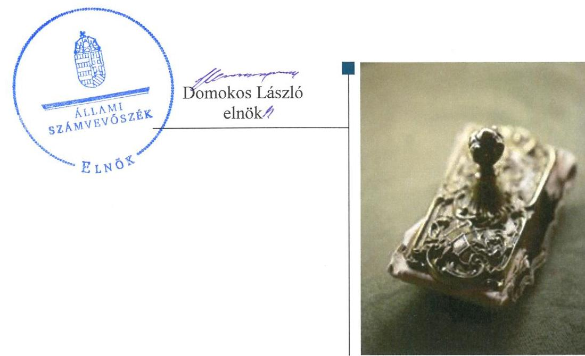

---

Jelentéseink az Országgyúlés számítógépes hálózatán és az Interneten a www.asz.hu címen is olvashatóak.

## AZ ELLENŐRZÉST FELÜGYELTE:

RENKŐ ZSUZSANNA felügyeleti vezető

## AZ ELLENŐRZÉST VEZETTE ÉS A VÉGREHAJTÁSÁÉRT FELELŐS:

BAJNAI ZSUZSANNA ellenőrzésvezető

## A PROGRAM ÖSSZEÁLLÍTÁSÁÉRT FELELŐS:

JANIK JÓZSEF LÁSZLÓ osztályvezető

## A TÉMÁHOZ KAPCSOLÓDÓ KORÁBBI SZÁMVEVŐSZÉKI JELENTÉSEK:

- címe: Az önkormányzatok gazdasági társaságai - Az önkormányzatok többségi tulajdonában lévő gazdasági társaságok közfeladat ellátását érintő gazdálkodási tevékenysége szabályszerűségének ellenőrzése - Szigetvári Távhő Szolgáltató Nonprofit Korlátolt Felelősségű Társaság
- sorszáma: $\quad 15022$

IKTATÓSZÁM: V-1232-080/2016
TÉMASZÁM: 2266
ELLENŐRZÉS-AZONOSÍTÓ SZÁM: V073909

---

# TARTALOMJEGYZÉK 

■ ÖSSZEGZÉS ..... 5
■ AZ ELLENŐRZÉS CÉLJA ..... 6
■ AZ ELLENŐRZÉS TERÜLETE ..... 7
■ AZ ELLENŐRZÉS HÁTTERE, INDOKOLTSÁGA ..... 8
■ A JELENTÉS LÉNYEGES KÉRDÉSKÖREI ..... 9
■ ELLENŐRZÉS HATÓKÖRE ÉS MÓDSZEREI ..... 10
■ MEGÁLLAPÍTÁSOK ..... 12
■ JAVASLATOK ..... 23
■ MELLÉKLETEK ..... 25
I. sz. melléklet: Értelmező szótár ..... 25
II. sz. melléklet: Az eszközök és források alakulása kiemelt mérlegsoronként ..... 27
III. sz. melléklet: Bevételek és kiadások, adósságszolgálat CLF módszer szerinti kimutatása ..... 28
IV. sz. melléklet: Kimutatás a többségi tulajdonú gazdasági társaságokról a 2009-2014. évek között ..... 30
■ FÜGGELÉK: ÉSZREVÉTELEK ..... 31
■ RÖVIDÍTÉSEK JEGYZÉKE ..... 51

---

.

---

# ÖSSZEGZÉS 

Szigetvár Város Önkormányzat adósságrendezési eljárásának végrehajtása során a nem szabályszerű feladatellátás veszélyeztette a törvény célkitüzéseinek megvalósulását. A hitelezők követelését teljes körüen kielégítették. Az önkormányzat pénzeszközei nem nyújtottak fedezetet rövid lejáratú kötelezettségeire az adósságrendezést követően sem. A pénzügyi egyensúly nem volt biztosított a 2011-2014. években.

## Az ellenőrzés társadalmi indokoltsága

Pénzügyi egyensúlyi helyzetének, fizetőképességének kedvezőtlen alakulása miatt Szigetvár Város Önkormányzatánál 2010. február 26-tól 2010. október 29-ig adósságrendezés folyt, amely során a hitelezők 3,0 milliárd Ft kötelezettség teljesítésére nyújtottak be igényt. Ez a kötelezettségállomány az önkormányzat vagyonának mintegy ötödét jelentette, így indokolt ellenőrizni, hogy az adósságrendezési eljárás elérte-e a célját, az eljárás szereplői eleget tet-tek-e törvényben meghatározott feladataiknak a fizetőképesség helyreállítása, a hitelezőknek hatékony jogvédelem nyújtása és az átgondolt, felelősségteljes gazdálkodás elősegítése érdekében.

## Főbb megállapítások, következtetések, javaslatok

Az adósságrendezési eljárás végrehajtása során az abban résztvevők szabálytalan feladat ellátása veszélyeztette az eljárás céljainak elérését. Az adósságrendezés megindításakor nem tisztázták az önkormányzat valós vagyoni helyzetét, mert nem vették számba értékeit, nem zárták le számviteli elszámolásait. Valamennyi hitelezői igény nem lett nyilvántartásba véve, a hitelezőkkel való kapcsolattartás során nem tartották be minden esetben a határidőket, a válságköltségvetés időszakában ellenjegyzés nélkül történtek kifizetések.

Az egyezség alapján a hitelezői igényeket - 2569,0 millió Ft -maradéktalanul kiegyenlítették, a teljesített követelések 100\%-ban állami forrásból kerültek rendezésre. Az önkormányzat pénzeszközei nem biztosítottak elegendő forrást rövid távú fizetési kötelezettségeire.

A pénzügyi egyensúly helyreállítása érdekében reorganizációs programot fogadtak el. Az abban meghatározott intézkedések közül a bevételnövelő terveket nem valósították meg, a kiadáscsökkentő intézkedések tartós hatású megtakarításokat eredményeztek. A múködési bevételek fedezték a múködési kiadásokat, de a felhalmozási költségvetés és a finanszírozási múveletek negatív egyenlege miatt a pénzügyi egyensúly nem volt biztosított az adósságrendezést követően.

---

# AZ ELLENŐRZÉS CÉLJA 

Az ellenőrzés célja annak megállapítása volt, hogy az adósságrendezési eljárás megindítása, lefolytatása szabályszerű volt-e, az önkormányzat gazdálkodása az adósságrendezési eljárás alatt megfelelt-e a jogszabályi előírásoknak; az eljárás szereplői - kiemelten a pénzügyi gondnok - a jogszabályokban foglaltak szerint jártak-e el az adósságrendezés során. A lefolytatott eljárás elérte-e a törvényben kitűzött célokat; az adósságrendezési eljárás alatt az önkormányzat folyamatosan teljesítette-e kötelező feladatait, a hitelezők követelését vagyonarányosan kielégítette-e, helyre állt-e fizetőképessége.

---

# AZ ELLENŐRZÉS TERÜLETE 

## Szigetvár Város Önkormányzata

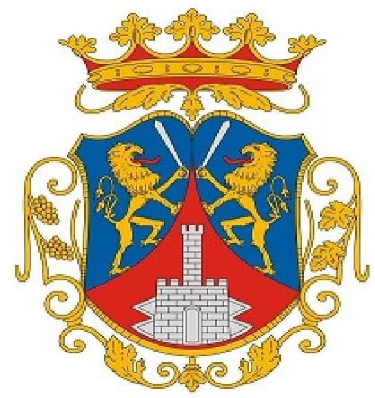

Szigetvár Baranya megye nyugati részén helyezkedik el. Állandó lakosainak száma 2009. január 1-jén 10900 fő, 2014. december 31-én 11380 fő volt.

Az önkormányzat ${ }^{1}$ képviselő-testülete ${ }^{2}$ 2009-ben 18 fővel, 2014-ben 12 fővel látta el feladatát, a munkáját segítő állandó bizottságok száma - öt - nem változott.

Az ellenőrzött időszakban a polgármester személye négyszer, a jegyzőé háromszor változott. A jelenlegi polgármester a 2014. évi önkormányzati választások óta tölti be tisztségét.

A gazdálkodási feladatokat az önkormányzat hivatala ${ }^{3}$ látta el, amely gazdasági szervezettel nem rendelkezett.
2009. január 1-jén az önkormányzat hivatalán kívül három intézmény tartozott az önkormányzathoz, 2014. december 31-én önállóan gazdálkodó intézménye nem volt.

Az önkormányzat és intézményei által foglalkoztatottak létszáma - a közfoglalkoztatottakkal együtt - a 2009. január 1-jei 344 föről, 2014. december 31-ére 288 főre csökkent, a foglalkoztatottak létszámán belül azonban a közfoglalkoztatottak száma a 2009. évi 154 föről a 2014. év végére 227 főre nőtt.

Az ellenőrzött időszak elején hét gazdasági társaságban rendelkezett részesedéssel, amelyből kettőben kizárólagos tulajdona volt, további egy társaságban meghatározó befolyással bírt. A 2014. év végén nyolc gazdasági társaságából háromban 100\%-os, kettőben többségi tulajdonnal rendelkezett.

Az önkormányzat adósságrendezési eljárását 2010. február 22-én a polgármester ${ }^{4}$ kezdeményezte, az önkormányzat nagy összegű adósságállományára hivatkozva. A bíróság ${ }^{5}$ végzése az adósságrendezés megindításáról 2010. február 26-án jelent meg a Cégközlönyben. Az eljárás egyezség megkötésével 2010. október 29-én zárult.

A pénzügyi gondnoki feladatok ellátására a bíróság a KERSZI Zrt. ${ }^{6}$-t jelölte ki.

---

# AZ ELLENŐRZÉS HÁTTERE, INDOKOLTSÁGA 

Az önkormányzatok finanszírozásának, gazdálkodásának keretei és feladatellátása jelentős változásokon ment keresztül a Har. tv. ${ }^{7}$ hatályba lépésétől eltelt időszakban.

Az önkormányzati eladósodást 2011-ig csak az Ötv.-ben ${ }^{8}$ meghatározott hitelfelvételi korlát szabályozta, a korlát megsértését azonban jogszabályok nem szankcionálták. A 2012. évtől jelentős szigorítás lépett életbe, a korábbi passzív szabályozást a Stabilitási tv. ${ }^{9}$ hatályba lépésével az aktív kontroll váltotta fel, a törvény előírásai alapján az önkormányzatok hitelfelvételei engedélykötelessé váltak.

1996-ban a hitelfelvételi korlát bevezetése mellett az önkormányzatok adósságrendezésének szabályozására is sor került. Az adósságrendezési eljárás részben a lakosság védelmét szolgálta azzal, hogy biztosította az önkormányzatok által nyújtott kötelező közfeladatokhoz való hozzájutást az önkormányzat fizetésképtelensége esetén is. A Har. tv. alapján - 1996. és 2013 júniusa között - ugyanakkor elenyésző számú, mindösszesen 64 adósságrendezési eljárás indult. Az eljárások közel 60\%-a egyezséggel, 40\%-a vagyonfelosztással zárult. Az adósságrendezés első időszakában (2009. évig) a forráshiányból eredeztethető eladósodás tette indokolttá az eljárások jelentős hányadának megindítását.

A második időszakban az eljárás alá vont önkormányzatok között megjelentek a nagyobb költségvetéssel és több intézménnyel is rendelkező települések. Az adósságrendezést szükségessé tevő problémák speciális pénzügyi elemekkel, a devizaalapú kötvénnyel történő finanszírozás begyűrűző hatásaival, valamint az anyagi lehetőségeket meghaladó, túlméretezett fejlesztésekkel összefüggő kötelezettségvállalásokkal egészültek ki, de a beruházások esetében fontos tényező volt a kellő szakértelem hiánya és a pénzügyi nehézségek szakszerűtlen kezelése is.

Az ÁSZ ${ }^{10}$ önkormányzati alrendszert érintő ellenőrzései, elemzései során számos ponton mutatott rá azokra a területekre, ahol a „szabályozás" módosításra, korrekcióra szorul. Az ellenőrzés alapján megfogalmazott javaslatok e területen is segítséget nyújthatnak a kormányzat és az Országgyűlés törvényhozó munkájában, hozzájárulhatnak az irányítói tevékenység erősítéséhez. Az ellenőrzés során tett megállapításaink megerősíthetik egy „megelőző monitoring funkció" kialakításának szükségességét a helyi önkormányzatok fizetésképtelenségének megelőzése érdekében.

---

# A JELENTÉS LÉNYEGES KÉRDÉSKÖREI 

1. Az adósságrendezési eljárás folyamata, végrehajtása során szabályszerű volt-e az önkormányzat és a pénzügyi gondnok feladatellátása?
2. A lefolytatott adósságrendezési eljárás elérte-e a törvényben kitüzött célokat?
3. Az adósságrendezési eljárást követően biztosított és fenntartható volt-e a pénzügyi egyensúly?
4. Gondoskodott-e az önkormányzat a közfeladatot ellátó társaságai esetében a tulajdonosi jogok gyakorlásáról annak érdekében, hogy müködésük ne hordozzon kockázatot az önkormányzatra nézve?

---

# ELLENŐRZÉS HATÓKÖRE ÉS MÓDSZEREI 

## Az ellenőrzés típusa

Rendszerellenőrzés.

## Az ellenőrzött időszak

2009. január 1. és 2015. június 30. közötti időszak.

## Az ellenőrzés tárgya

A Har. tv. által szabályozott adósságrendezési eljárás.

## Az ellenőrzött szervezet

Szigetvár Város Önkormányzat és a pénzügyi gondnoki feladatok ellátásával összefüggésben a KERSZI Zrt.

## Az ellenőrzés jogalapja

Az Állami Számvevőszékről szóló 2011. évi LXVI. törvény 5. § (2) bekezdése.

## Az ellenőrzés módszerei

Az ellenőrzés szakmai módszertana az ÁSZ hivatalos honlapján (www.asz.hu) közzétett szakmai szabályokon alapult, amelyek irányadónak tekintették a Legfőbb Ellenőrző Intézmények Nemzetközi Szervezete (INTOSAI) által kiadott nemzetközi (ISSAI) standardokat.

Az ellenőrzés alapját az ellenőrzött önkormányzatoktól bekért tanúsítványok, szabályzatok, szerződések, bírósági végzések, határozatok és egyéb dokumentumok, kimutatások, valamint az önkormányzati beszámolók adatai képezték. Az ellenőrzési kérdések megválaszolásához szükséges bizonyítékok megszerzése, összegyűjtése, az ellenőrzött által rendelkezésre bocsátott dokumentumok, adatok elemzés módszerével végrehajtott értékelésével történt, kiegészítve a megfigyelés, a szemle (szemrevételezés), a kérdésfeltevés (információkérés), mintavételezés módszerével. Az ellenőrzés keretében értékeltük az ellenőrzéshez elkészített tanúsítványok adatainak valódiságát.

---

Az adósságrendezési eljárás szabályszerűségét a bírósági végzések, határozatok, a testületi előterjesztések, jegyzőkönyvek, határozatok, a válságköltségvetés, a beszámolók adatai, az értesítések, közzétételek, kimutatás a hitelezőkről, jelentések, vagyonfelosztási javaslat, belső szabályzatok, pénzügyi bizonylatok, kötelezettségvállalások és további releváns dokumentumok alapján ellenőriztük. A minősítés szempontja a dokumentumok határidőben és tartalmilag a vonatkozó előírásoknak megfelelő elkészítése volt.

A kontrolltevékenység múködésének ellenőrzésével értékeltük, hogy az adósságrendezési eljárás alatt vállalt kötelezettségek és teljesített kifizetések szabályszerűen történtek-e, a válságköltségvetés alatt a forrásokat szabályszerűen, rendeltetésszerűen használták-e fel a Har. tv.-ben előírt és az önkormányzat által ellátott kötelező feladatellátás során.

A kontrolltevékenységek támogató szerepét a kötelezettségvállalások és a szakmai teljesítés igazolása/utalvány ellenjegyzése, a teljesítés igazolása/érvényesítés, valamint a pénzügyi gondnok által gyakorolt ellenjegyzés múködésének ellenőrzésén keresztül ítéltük meg. A véletlen minta alapján a sokaságra vonatkozó hibaarányt becsültük. „Megfelelőnek" értékeltük az ellenőrzött területet, amennyiben 95\%-os bizonyossággal a teljes sokaságban a hibaarány legfeljebb 10\%, „részben megfelelőnek" értékeltük, ha a hibaarány 10-30\% között volt, „nem megfelelőnek" pedig akkor, ha a mintavételi eredmények alapján a sokaságbeli hibaarány meghaladta a 30\%-ot. A becsült hibaaránytól függetlenül nem értékeltük szabályosnak az önkormányzatnál a válságköltségvetésen alapuló kifizetéseket, amenynyiben egyetlen esetben is hiányzott a pénzügyi gondnok ellenjegyzése a kötelezettségvállalás, vagy pénzügyi kifizetés dokumentumáról.

Az önkormányzat fizetőképességének helyreállását likviditási mutatók számításával és értékelésével végeztük el. A fizetőképességet kedvezőtlennek ítéltük, ha a szállítói állomány változása növekvő tendenciát mutatott, ha az önkormányzat 60 napon túli adósságállománnyal rendelkezett, az adósságot keletkeztető ügyletek állományának változása 20\% feletti volt, az egyéb visszterhes kötelezettségének aránya meghaladta a teljesített költségvetési kiadások összegének 10\%-át, ha a lejárt követelések állománya nem csökkent az adósságrendezés kezdő időpontjában fennálló öszszeghez képest. A likviditási mutatókat megfelelőnek értékeltük, ha értékük nagyobb volt egynél.

A pénzügyi egyensúly fenntartásának értékelését a CLF módszer segítségével végeztük el.

Az önkormányzatok adósságrendezési eljárása és az azt követő gazdálkodási tevékenysége hibáinak kijavítására, a közpénzekkel való felelős gazdálkodás segítésére irányuló javaslatok kidolgozásakor a hatályos jogszabályok voltak az irányadóak.

---

# 1. Az adósságrendezési eljárás folyamata, végrehajtása során szabályszerű volt-e az önkormányzat és a pénzügyi gondnok feladatellátása? 

Összegző megállapítás

### 1.1. számú megállapítás

1.2. számú megállapítás

Az adósságrendezési eljárás végrehajtása a feladatellátás hiányosságai miatt nem volt szabályszerű. A müködtetett belső kontrollrendszer nem biztosította a válságköltségvetésen alapuló kifizetések szabályszerű végrehajtását.

Az önkormányzatnál nem rendelkeztek pontos információval a lejárt tartozások összegéről.

Az önkormányzatnál az Áhsz. ${ }^{11}$ 9. melléklete 4. d) pontja ellenére a szállítói tartozásokról analitikát nem vezettek, így nem rendelkeztek számviteli kimutatással alátámasztott információval a lejárt tartozások összegéről. A polgármestert helyettesítő jogkörében eljárva az alpolgármester- a képi-selő-testület döntésétől függetlenül" - 2010. február 22-én adósságrendezési eljárást kezdeményezett a bíróságnál az elismert, de az esedékességet követő 90 napon túl ki nem egyenlített szállítói tartozásokra tekintettel, melynek összegét kérelmében 55,6 millió Ft-ban jelölte meg, a pénzügyi iroda ${ }^{12}$ által összeállított lista alapján.

A bíróság megállapította, hogy az adósságrendezés megindításának feltételei fennálltak, végzése a Cégközlönyben 2010. február 26-án jelent meg.

Az előírt tájékoztatási kötelezettségnek késve, illetve nem tettek eleget minden érintett szervezetet illetően. A hitelezőknek szóló felhívás jogszabályi előírástól eltérő tartalommal jelent meg.

A polgármester a lakosságot a helyben szokásos módon az önkormányzat hirdetőtáblájára való kifüggesztéssel és a helyi televízió útján is informálta. Az adósságrendezési eljárás megindításáról a Har. tv. 5. § (5) bekezdése ellenére nem az eljárás bíróság előtti kezdeményezésével egyidejűleg, hanem két nappal később tájékoztatta a közigazgatási hivatalt ${ }^{13}$.

Az adósságrendezés Cégközlönyben való közzétételét követően gondoskodott a hitelezőknek szóló felhívás két országos napilapban és a helyben szokásos módon való megjelenéséről. A felhívásban a pénzügyi gondnok mellett az önkormányzatot is megjelölte a hitelezői igény bejelentésé-

[^0]
[^0]:    * 2011. július 12-ig hatályos szabályozás szerint a Har. tv. 5. § (2) bekezdése alapján a polgármester a képviselő-testület döntésétől függetlenül köteles volt a törvényi feltételek fennállása esetén adósságrendezési eljárást kezdeményezni.

---

nek címzettjeként a Har. tv. 10. § (2) bekezdés e) pontjában foglaltak ellenére. A jogszabályi előírástól eltérő tartalmú felhívás miatt négy hitelező az igényét, 8,6 millió Ft összegben az önkormányzatnak jelentette be a pénzügyi gondnok helyett.

Az adósságrendezés megindításáról a Har. tv. 10. § (4) bekezdés a) és c) pontjai ellenére nem tájékoztatta a közigazgatási hivatalt és az önkormányzat egyik költségvetési szervének ${ }^{14}$ pénzforgalmi számláját vezető pénzforgalmi szolgáltatót ${ }^{15}$. Az előírásoknak megfelelően értesítette a kincstárt ${ }^{16}$, az illetékes adó-és vámhatóságot ${ }^{17}$, a nyugdíjbiztosítási igazgatási ${ }^{18}$ - és az egészségbiztosítási szervet ${ }^{19}$, valamint az önkormányzat költségvetési elszámolási számláját vezető pénzforgalmi szolgáltatót.

# 1.3. számú megállapítás 

## Nem készült vagyonleltár és éves beszámoló.

Az adósságrendezés megindításának időpontját megelőző nappal készített vagyonleltárt és éves beszámolót, amelyben - megfelelő indoklással alátámasztva - elkülönítve szerepel a törzsvagyon, a jogszabályokban kötelezően előírt feladat és hatáskör teljesítéséhez szükséges vagyon, illetve a hitelezők kielégítéséhez felhasználható vagyon a polgármester nem adta át a pénzügyi gondnoknak a Har. tv. 13. § (2) bekezdés b) pontjának előírása ellenére, mert azok nem készültek el.

Az önként vállalt és jogszabályban kötelezően előírt feladatainak és hatáskörének helyi ellátási formáiról, valamint ezek pénzügyi finanszírozásáról szóló jelentést, a válságköltségvetési rendelettervezetet, a folyamatban lévő bírósági, más hatósági eljárásokról, végrehajtási eljárásokról készített részletes összefoglalót, a vagyonra vonatkozó, az adósságrendezési eljárás kezdő időpontját megelőző egy éven belül és azóta kötött szerződéseket, az önkormányzat részvételével múködő gazdasági társaságokról, továbbá intézményeiről szóló részletes tájékoztatást megkapta a pénzügyi gondnok.

### 1.4. számú megállapítás

A hitelezők nyilvántartásba vétele és további jogszabály által előírt feladatok ellátása nem felelt meg a törvényi rendelkezéseknek.

A Har. tv. 15. § (1) bekezdése ellenére a pénzügyi gondnok:
$\longrightarrow$ egy határidőben bejelentkezett hitelezőt ( 0,3 millió Ft) nem vett nyilvántartásba, a mulasztását az egyezség kötés során pótolta;
$\longrightarrow$ egy hitelező adósságrendezést megelőzően peresített követelését ( 11,8 millió Ft tőke és kamatai) nem vitatott igényként, hanem ismeretlen hitelezői igényként, érték nélkül vette nyilvántartásba.
Összesen 110 hitelező 2 968,2 millió Ft értékű követelésre nyújtott be igényt, amelyből 109 hitelező 2 956,1 millió Ft összegű követelését vette nyilvántartásba.

A hitelezők közül négyet egy napos, egyet 19 napos késedelemmel tájékoztatott a Har. tv. 15. § (1) bekezdése ellenére követeléseik elfogadásáról a jogszabályban meghatározott határidőhöz képest.

A pénzügyi gondnok a Har. tv. 14. § (1) bekezdésének előírása ellenére nem készített írásos véleményt a költségvetést érintő előterjesztésekhez, álláspontját az üléseken szóban ismertette.

---

A pénzügyi gondnok nem kezdeményezte az önkormányzat esedékessé vált követeléseinek behajtását a Har. tv. 14.§ (2) bekezdés e) pontjában előírtak ellenére.

# 1.5. számú megállapítás 

## A válságköltségvetési rendelet nem felelt meg a törvényi előírásoknak.

Az adósságrendezési bizottság a jogszabályi előírásoknak megfelelő határidőben és összetételben 2010. március 4-én megalakult. 2010. március 29-ei ülésén a jegyzőt ${ }^{20}$ helyettesítő jogkörében eljárva az aljegyző által határidőben elkészített 2010. évi válságköltségvetési rendelettervezetet módosítások után jóváhagyta.

A képviselő-testület által elfogadott válságköltségvetési rendelet nem felelt meg a jogszabályi előírásoknak, mivel
$\longrightarrow$ a Har. tv. 13. § (1) bekezdés d) pontja és a 31. § (1) bekezdés a) pontjában meghatározott előírások ellenére nem rendszeres személyi jellegű juttatás - jutalom - kifizetésére adott lehetőséget;
$\longrightarrow$ a Har. tv. 16. § (3) bekezdésében előírtak ellenére az adósságrendezési bizottság döntése helyett az előirányzatok átcsoportosításának lehetőségét az intézmények hatáskörében hagyta;
$\longrightarrow$ a Har. tv. 18. § (2) bekezdése ellenére, a Har. tv. mellékletében és az Ötv. 8. § (4) bekezdésében meghatározott kötelező feladatokon túl „szórakoztatási tevékenység" finanszírozására is tartalmazott kiadási előirányzatot 5,6 millió Ft értékben.

## A reorganizációs program nem felelt meg, az egyezségi javaslat

megfelelt a jogszabály által meghatározott tartalmi követelményeknek.

Az adósságrendezési bizottság elkészítette a reorganizációs programot, amely tartalmazta a település és intézményeinek bemutatását, az önkormányzat gazdasági helyzetének részletes leírását, az adósságrendezés során megtett intézkedéseket, az adósságrendezésbe vonható vagyon hasznosítására, az egyéb tervezett intézkedésekre vonatkozó javaslatokat:
$\longrightarrow$ a gyógyfürdő, tanuszoda, távfűtés működtetésének finanszírozási kérdéseire végleges költségtakarékos megoldás keresése,
$\longrightarrow$ társulás keretei között múködő oktatási intézmények támogatásának csökkentése, az adott támogatások szigorú ellenőrzése,
$\longrightarrow$ a beszedési kockázatot magában hordozó szerződések felülvizsgálata, követelésállomány csökkentése,
$\longrightarrow$ üzletrész és ingatlanok értékesítése,
$\longrightarrow$ helyi adórendelet módosítása az adóbevételek növelése érdekében,
$\longrightarrow$ a város közoktatási intézményeinek visszavétele a normatív támogatások növelése érdekében.
A reorganizációs program a Har. tv. 20. § (2) bekezdésében foglaltak ellenére nem tartalmazta annak megjelölését, hogy az önkormányzat a tervezett intézkedései révén milyen bevételekhez juthat.

Az adósságrendezési bizottság az egyezségi javaslatban a hitelezőket csoportokba sorolta. A három különböző csoport tekintetében - megfelelő indoklás mellett - eltérő egyezségi javaslatot terjesztett elő.

---

# 1.7. számú megállapítás 

A reorganizációs programot és az egyezségi javaslatot a képviselő-testület 2010. július 22-én fogadta el.

## A hitelezők meghívása az egyezségi tárgyalásra nem a jogszabályi előírásoknak megfelelően történt.

A pénzügyi gondnok és a követelések többségével rendelkező hitelező kérelmezte a bíróságnál az egyezség létrehozására meghatározott határidő 30 nappal történő meghosszabbítását, amelyet az engedélyezett.

A hitelezők meghívása a 2010. július 30-ai egyezségi tárgyalásra nem szabályszerűen történt, mert a pénzügyi gondnok a Har. tv. 23. § (1) bekezdése ellenére nem hívta meg valamennyi hitelezőt, illetve a meghívókat egy napos késedelmemmel postázta, továbbá a meghívókkal egyidejűleg nem küldte meg az elfogadott reorganizációs programot és az egyezségi javaslatot. Szabályszerűen összehívott tárgyalásra 2010. augusztus 18-án került sor.

## Az egyezség megfelelt az előírásoknak.

Az egyezség megkötésében 106 hitelező vett részt és a követelések öszszege 2717,6 millió Ft-ra módosult. Három hitelező 4,2 millió Ft követelése ténylegesen nem az önkormányzattal szemben állt fenn, ezért csökkent a nyilvántartásba vett követelések összege. Egy hitelező kifogásának helyt adva a pénzügyi gondnok módosította - 4,3 millió Ft-tal növelte - a nyilvántartásba vett összeget. A nyilvántartásban korábban nem szereplő 0,3 millió Ft összegű követelést, továbbá a per alatt állót a jogerős ítélet alapján 5,7 millió Ft-tal nyilvántartásba vette. Az egyezség megkötésében a törvény előírása szerint a vitatott követeléssel rendelkező hitelező - 244,6 millió Ft - nem vett részt. A hitelezői igények alakulását az 1. táblázat tartalmazza.

## A HITELEZŐI IGÉNYEK ALAKULÁSA (MILLIÓ FT)

| Csoport | Nyilvántartásba   vett követelések | Egyezsé   alapja | Egyezsé   szerinti összeg |
| :-- | :--: | :--: | :--: |
| A. csoport: vagyoni biztosítékkal rendelkező pénzintézeti hitelezők | 2304,5 | 2304,5 | 2289,7 |
| B. csoport: kötelezően ellátandó önkormányzati feladatok hitelezői | 149,6 | 149,6 | 149,1 |
| C. csoport: közvetlenül a kötelező feladatok ellátásához nem kapcsolódó hitelezők | 257,4 | 263,5 | 130,2 |
| Összesen: | 2711,5 | 2717,6 | 2569,0 |
| Vitatott | 244,6 |  |  |
| Mindösszesen | 2956,1 |  |  |

Forrás: az önkormányzat adatszolgáltatása
Az egyezséghez hitelezői csoportonként az adósságrendezés időpontjában fennálló követeléssel rendelkező hitelezőknek több mint a fele hozzájárult, ezen hitelezők összes követelése elérte az összes bejelentett és nem vitatott hitelezői követelés kétharmadát.

Az egyezséget írásba foglalták, amely tartalmazta az előírt elemeket. Az egyezség végrehajtásának ellenőrzésével a pénzügyi gondnokot bízták meg.

Az egyezség alapján az önkormányzat a következő engedményeket érte el:
$\longrightarrow$ fizetési haladék a futamidő növelése, a fizetési ütemezés módosítása révén;

---

$\longrightarrow$ késedelmi kamatok elengedése 18,4 millió Ft értékben, mindhárom csoportban;
$\longrightarrow$ a „C" csoportba sorolt hitelezői követelések 50\%-ának, 130,2 millió Ft-nak az elengedése.
Az egyezség létrejöttét a pénzügyi gondnok a bíróságnak bejelentette, így az, az eljárást befejezettnek nyilvánította. A végzés 2010. október 29-én jelent meg a Cégközlönyben.

# 1.9. számú megállapítás 

A kontrollkörnyezet nem biztosította a kötelezettségvállalások és pénzügyi teljesítések szabályszerű ellátását az adósságrendezés során.

A képviselő-testületi múködés részletes szabályait az önkormányzati SZMSZ ${ }^{21}$ tartalmazta.

A képviselő-testület a vagyonrendeletben ${ }^{22}$ megalkotta az önkormányzati vagyonnal történő gazdálkodás szabályait, amely megfelelt a hatályos előírásoknak.

Az önkormányzat hivatala - a 2010. évben, a válságköltségvetés végrehajtásának időszakában - rendelkezett hivatali SZMSZ ${ }^{15}$-szel, számviteli politikával ${ }^{24}$, ezen belül eszközök és források értékelési szabályzatával ${ }^{25}$, leltározási szabályzattal ${ }^{26}$, pénzkezelési szabályzattal ${ }^{27}$, számlarenddel ${ }^{28}$ és a gazdálkodási jogkörök szabályzatával ${ }^{29}$.

A szabályzatok azonban - az eszközök és források értékelési szabályzata, a leltározási szabályzat, a pénzkezelési szabályzat és a gazdálkodási jogkörök gyakorlásának szabályzata kivételével - nem feleltek meg maradéktalanul a jogszabályi előírásoknak, tartalmi hiányosságaikat a 2. táblázat ismerteti.
2. táblázat

## AZ ELKÉSZÍTETT SZABÁLYZATOK TARTALMI HIÁNYOSSÁGAI

Sorszám
Megállapított szabálytalanság
Megsértett jogszabály

1. A hivatali SZMSZ nem tartalmazta:

- az önkormányzat hivatala alapító okiratának keltét, az alapító okirat számát, - 20. § (2) bekezdés b) pont az alapítás időpontját;
- az ellátandó és a szakfeladatrend szerint besorolt alaptevékenységek, valamint az alaptevékenységet szabályozó jogszabályok megjelölését;
- a szervezeti egységek engedélyezett létszámát
- a költségvetési szerv szervezeti ábráját;
- a szervezeti egységei által ellátott feladatok munkafolyamatainak leírását, a szervezeti egység vezetőinek és alkalmazottainak feladat- és hatáskörét (munkakörét), a helyettesítés rendjét, továbbá a szervezeti egység költségvetési szerven belüli belső és azon kívüli külső kapcsolattartásának módját, szabályait és arról ügyrend sem rendelkezett.

2. A számviteli politika a saját tőke részeként nevesítette az induló tőkét, amely fogalom 2010. január 1-jétől már nem volt használható.
3. A számlarend nem tartalmazta

- minden alkalmazásra kijelölt számla számjelét és megnevezését;
- a számla értéke növekedésének, csökkenésének jogcímeit, a számlát érintő gazdasági eseményeket, azok más számlákkal való kapcsolatát.

Ámr. ${ }^{30} 20 . \S$ (2) bekezdés b) pont, Ámr. 20. § (2) bekezdés c) pont, Ámr. 20. § (2) bekezdés e) pont, Ámr. 20. § (2) bekezdés i) pont, Ámr. 20. § (7) bekezdés

Áhsz. 24. § (2) bekezdése

Számv. tv. ${ }^{31}$ 161. § (2) bekezdés a) pont

Számv. tv. 161. § (2) bekezdés b) pont

---

# 1.10. számú megállapítás 

## A kontrolltevékenységek nem biztosították a válságköltségvetésen alapuló kifizetések szabályszerű végrehajtását.

A Har. tv. 14. § (1) bekezdésének előírása ellenére a pénzügyi gondnok nem jegyezte ellen a kötelezettségvállalásokat és a kifizetések teljesítését, illetve dátum hiányában nem volt megállapítható, hogy az ellenjegyzés a kifizetést megelőző időpontban történt.

A pénzügyi gondnokot a Ktv. ${ }^{32}$ 1. § (9) bekezdésével ellentétesen - szabálytalanul - számla felett rendelkezésre jogosult személyként jelölték meg.

Az önkormányzat hivatala az Áht. ${ }^{33}$ 93. § (5) bekezdése* az Ámr. 75 § (1) bekezdése, illetve a belső szabályozás (gazdálkodási jogkörök szabályzata 6.1 pont) ellenére a kötelezettségvállalásokat nem vette nyilvántartásba.

Nem vezettek naprakész nyilvántartást a gazdálkodási jogkörök gyakorlására kijelölt személyekről és aláírás mintájukról az Ámr. 80. § (3) bekezdése ellenére.

A kifizetésekhez kapcsolódó kontrolltevékenységek - gazdálkodási jogkörök, pénzügyi gondnoki ellenjegyzés - gyakorlása „nem megfelelő" volt a válságköltségvetés időszakában.

A gazdálkodási jogkörök gyakorlásának ellenőrzése során tapasztalt hiányosságokat a 3. táblázat tartalmazza.
3. táblázat

## A GAZDÁLKODÁSI JOGKÖRÖK GYAKORLÁSÁNAK ELLENŐRZÉSE SORÁN TAPASZTALT HIÁNYOSSÁGOK

| Sorszám | Gazdálkodási jogkör | Megállapított szabálytalanság |  |
| :--: | :--: | :--: | :--: |
| 1. | kötelezettségvállalás | A beszerzések előzetes írásbeli kötelezettségvállalás nélkül történtek. | Áht.: 100/B. § (3) ${ }^{* *}$ és   Ámr. 72. § (3) bekezdései |
| 2. | szakmai teljesítés igazolása | A szakmai teljesítés igazolását nem végezték el.   Az elvégzett szakmai teljesítés igazolása nem volt szabályszerű, mert a kiadások teljesítésének jogosságát, összegszerűségét, annak teljesítését írásbeli kötelezettségvállalási dokumentum hiányában nem ellenőrizték, továbbá az igazolás dátumát nem tüntették fel. | Ámr. 76. § (1) bekezdése   Ámr. 76. § (3) bekezdés |
| 3. | érvényesítés | Az érvényesítést nem végezték el.   Az elvégzett érvényesítés nem volt szabályszerű, mert azt a szakmai teljesítés igazolását megelőzően, vagy annak hiányában végezték, a kötelezettségvállalásokra vonatkozó nyilvántartás hiányában nem ellenőrizték a fedezet meglétét,   nem jelezték az utalványozónak, hogy előzetes írásbeli kötelezettségvállalásra nem, illetve ellenjegyzés nélkül került sor, valamint a szakmai teljesítés igazolását nem, vagy nem szabályszerűen végezték. | Ámr. 77. § (1) bekezdése   Ámr. 77. § (2) bekezdése |
| 4. | utalvány ellenjegyzése | Az utalvány ellenjegyzését nem végezték el.   Az elvégzett ellenjegyzések esetében azt jogosulatlanul, jegyzői kijelölés hiányában végezték. | Ámr. 79. § (2) bekezdése   Ámr. 79. § (1) bekezdés |

Forrás: ÁSZ megállapítás

[^0]
[^0]:    * 2010. augusztus 15-től az Áht.: 100/C. § (5) bekezdése
    ${ }^{* *}$ 2010. augusztus 15-től az Áht.: 100/C. § (3) bekezdése

---

# 1.11. számú megállapítás 

A belső ellenőrzés nem vizsgálta a gazdálkodási jogkörök gyakorlását.

Az önkormányzatnál az adósságrendezési eljárás alatt a belső ellenőrzési feladatokat Társulás ${ }^{34}$ látta el.

A gazdálkodási jogkörök gyakorlásának szabályszerűségét a belső ellenőrzés az adósságrendezési eljárás időszaka alatt nem vizsgálta.

## 2. A lefolytatott adósságrendezési eljárás elérte-e a törvényben kitüzött célokat?

Összegző megállapítás

### 2.1. számú megállapítás

A lefolytatott adósságrendezési eljárás alatt a kötelező feladatokat ellátták. Az egyezség szerinti hitelezői igényeket teljes körűen kielégítették. A fizetőképesség az adósságrendezést követően nem állt helyre.

Az adósságrendezés alatt a kötelező feladatokat folyamatosan ellátták.

Az önkormányzat a jogszabályokban előírt kötelező feladatokat teljesítette.

Saját költségvetési szervével oldotta meg az önkormányzat hivatalának, és a könyvtárnak a működtetését, a közfoglalkoztatás megszervezését, a szociális rászorultságtól függő pénzbeli és természetbeni ellátások biztosítását, a tűzoltást, a műszaki mentést. Gazdasági társaságokkal kötött megállapodások, üzemeltetési szerződések révén gondoskodott a hulladékszállításról és kezelésről, a köztisztaságról, a köztemetők fenntartásáról, a víz, és csatornaszolgáltatásról, a közvilágításról, a közútkezelésről, a távfűtésről, a háziorvosi-, és ügyeleti ellátásról, a védőnői szolgálatról. Társulás keretében látta el a gyepmesteri szolgálatot a bölcsődei, az óvodai, közoktatási, nevelési tanácsadási, szociális-, gyermekjóléti és gyermekvédelmi feladatait.

Az adósságrendezés időszakában a Társulás fenntartásában működő művészetoktatási intézményt ${ }^{35}$ a Baranya Megyei Önkormányzat vette át.
2.2. számú megállapítás

Az önkormányzat kiegyenlítette a hitelezők felé fennálló tartozását.

Az egyezség szerinti hitelezői igényeket 2 569,0 millió Ft-ot az önkormányzat az egyezség szerint, határidőben megfizette. A kifizetések teljes összegében állami forrásból teljesültek, mivel a „B" és „C" csoportok felé fennálló tartozás kiegyenlítéséhez igénybe vett reorganizációs hitelt az állam az adósságkonszolidáció során átvállalta az „A" csoportban szereplő pénzintézetek felé fennálló tartozással együtt.

A vitatott hitelezői igénnyel kapcsolatban fizetési kötelezettség nem keletkezett az ellenőrzött időszak végéig.

---

# 2.3. számú megállapítás 

Az önkormányzat bevételnövelő intézkedést nem hajtott végre, kiadáscsökkentésből származó megtakarítása 117,6 millió Ft volt.

Az önkormányzat a reorganizációs programban szereplő bevételnövelő intézkedéseket nem hajtotta végre.

A tervezett kiadáscsökkentő intézkedésekből összes megtakarítása az általa készített kimutatás alapján 117,6 millió Ft volt:
$\longrightarrow$ a közfeladatot ellátó gazdasági társasága részére a működési célú pénzeszközátadás csökkentéséből 97,6 millió Ft;
$\longrightarrow$ a 2010. június 30 -án kelt megállapodás alapján a művészetoktatási intézmény átadásából 20,0 millió Ft.
Mindkét intézkedés hatása tartós volt.

### 2.4. számú megállapítás

Az önkormányzat fizetőképessége az adósságrendezést követően nem állt helyre.

Az önkormányzat fizetőképessége az adósságrendezést követően sem volt biztosított, mivel
$\longrightarrow$ pénzeszközei nem nyújtottak fedezetet a rövid távú kötelezettségek teljesítésére az adósságrendezést követően sem;
$\longrightarrow$ a kötelezettségek, azon belül a rövid lejáratú kötelezettségek, szállítói tartozások értéke a 2009. évi értékhez képest a 2014. év végére csökkent, de a lejárt szállítói kötelezettségek nagyságrendje nem állapítható meg, mert az ellenőrzött időszakban nem gondoskodtak a 2009. évben az Áhsz. 49. § (1) és (2) bekezdésében előírt, a 2010-2013. években az Áhsz. 1 49. § (1) és (3) bekezdésében, illetve a 2009-2013. években az Áhsz. 1 9. számú mellékletének 4. d) pontja, 2014. január 1-jétől az Áhsz. ${ }^{36}$ 39. § (3) bekezdés és a 14. melléklet II. pontja szerinti kötelezettségekhez kapcsolódó analitikus nyilvántartás vezetéséről;
$\longrightarrow$ a lejárt követelések állománya csökkent, de így is 100 millió Ft felett maradt.
Az adósságot keletkeztető ügyletek állománya az állami adósságkonszolidáció következtében a 2009. évi 3 405,0 millió Ft-ról 2014. évre 23,4 millió Ft-ra csökkent, ezért az eladósodási mutató értéke kedvezően 10\% alatt - alakult.

A 4. táblázat az önkormányzat fizetőképességének megítélésére vonatkozó időszak végi adatok és mutatók alakulását tartalmazza a 2009. évtől a 2014. év végéig, a II. számú melléklet az eszközök és források alakulását ismerteti kiemelt mérlegsoronként.
4. táblázat

| A FIZETŐKÉPESSÉG ALAKULÁSÁT JELLEMZŐ ADATOK ÉS MUTATÓK A 2009-2014. ÉVEK KÖZÖTT |  |  |  |  |  |  |
| :--: | :--: | :--: | :--: | :--: | :--: | :--: |
| FV | 2009. | 2010. | 2011. | 2012. | 2013. | 2014. |
| Kötelezettségek (millió Ft) | 2489,6 | 2625,0 | 2800,0 | 2496,0 | 858,0 | 141,6 |
| Kötelezettségek aránya az összes forráshoz viszonyítva (\%) | 23,7 | 25,2 | 26,9 | 28,9 | 10,0 | 1,6 |
| Rövid lejáratú kötelezettségek (millió Ft) | 746,8 | 199,1 | 297,4 | 289,3 | 552,7 | 67,2 |
| Szállító kötelezettség (millió Ft) | 188,9 | 24,6 | 49,7 | 51,4 | 77,8 | 65,5 |
| Szállítói állomány előző évhez viszonyított változása (millió Ft) | 166,8 | 164,3 | 25,1 | 1,7 | 26,4 | $-12,3$ |
| Egyéb visszterhes kötelezettségek (millió Ft) | 0,0 | 0,0 | 0,0 | 0,0 | 2,8 | 0,0 |

---

| Év | 2009. | 2010. | 2011. | 2012. | 2013. | 2014. |
| :--: | :--: | :--: | :--: | :--: | :--: | :--: |
| Adósságot keletkeztető ügyletek állománya (millió Ft) | 3405,0 | 2540,6 | 1163,9 | 1019,6 | 518,2 | 23,4 |
| Adósságot keletkeztető ügyletek állományának változása (millió Ft) | - | $-864,4$ | $-1376,7$ | $-144,3$ | $-501,4$ | $-494,8$ |
| Banki kötelezettség mérlegfőösszeghez mért aránya (\%) | 32,4 | 24,4 | 11,2 | 11,8 | 6,0 | 0,3 |
| Eladósodási mutató (\%) | 23,7 | 25,2 | 26,9 | 28,9 | 9,9 | 1,6 |
| Lejárt követelések állománya (millió Ft) | 175,2 | 177,8 | 333,8 | 175,2 | 137,6 | 106,9 |
| Lejárt követelések állományának változása | 17,0 | 2,6 | 156,0 | $-158,6$ | 37,6 | $-30,7$ |
| Likviditási mutató | 0,4 | 1,7 | 1,1 | 1,1 | 0,4 | - * |
| Pénzeszköz likviditási mutató | 0,2 | 0,8 | 0,4 | 0,4 | 0,1 | 0,5 |

Forrás: 2009-2014. évi mérlegadatok, valamint az önkormányzat adatszolgáltatása

# 3. Az adósságrendezési eljárást követően biztosított és fenntartható volt-e a pénzügyi egyensúly? 

## Összegző megállapítás

### 3.1. számú megállapítás

A pénzügyi egyensúly a kapott állami támogatások ellenére sem volt biztosított az adósságrendezést követően.

A folyó bevételek fedezetet biztosítottak a folyó kiadásokra, de a felhalmozási költségvetés és a finanszírozási múveletek negatív egyenlege miatt a pénzügyi egyensúly nem volt biztosított.

A bevételek beérkezésének és a kiadások teljesítésének ütemezésére, a 2009-2010. évekre likviditási tervet készítettek. A 2011. évben az Ámr. 201. § (1) bekezdésében, a 2012-2014. években és 2015. első félévében az Áht. ${ }^{37}$ 78. § (2) bekezdésében előírtak ellenére likviditási tervet nem készítettek.

A pénzügyi egyensúlyt a CLF módszer segítségével értékeltük. Az önkormányzat összevont beszámolója alapján a CLF táblázat főbb mutatóinak alakulását a 2009-2014. évek között az 5. táblázat tartalmazza, az adósságkonszolidáció hatásának kiszűrésével számított mutatókat az utolsó két oszlop ismerteti. A részletes adatokról a III. számú melléklet ad tájékoztatást.
5. táblázat

A PÉNZÜGYI EGYENSÚLYI HELYZET FŐBB MUTATÓI A 2009-2014. ÉVEK KÖZÖTT (MILLIÓ FT)

| Év | 2009. | 2010. | 2011. | 2012. | 2013. | 2014. | 2013.   szúrt | 2014.   szúrt |
| :--: | :--: | :--: | :--: | :--: | :--: | :--: | :--: | :--: |
| Folyó bevételek | 2002,1 | 1726,8 | 1721,2 | 1945,7 | 1763,1 | 2048,3 | 1763,1 | 2048,3 |
| Folyó kiadások | 1849,7 | 1632,3 | 1610,0 | 1416,6 | 1577,9 | 1810,0 | 1633,6 | 1851,4 |
| Múködési jövedelem | 152,4 | 94,5 | 111,2 | 529,1 | 185,2 | 238,3 | 129,5 | 196,9 |
| Múködési jövedelem ÖNHIKI nélkül | 125,4 | 12,8 | 43,9 | 327,4 | 60,2 | 82,3 | 4,5 | 40,9 |
| Felhalmozási bevételek | 118,3 | 268,3 | 265,6 | 140,1 | 338,1 | 679,1 | 338,1 | 679,1 |
| Felhalmozási kiadások | 328,3 | 340,6 | 298,2 | 467,9 | 483,6 | 517,9 | 539,7 | 572,8 |
| Felhalmozási költségvetés egyenlege | $-210,0$ | $-72,3$ | $-32,6$ | $-327,8$ | $-145,5$ | 161,2 | $-201,6$ | 106,3 |

[^0]
[^0]:    * A mutató nevezőjének (forgóeszközök) mérlegben kimutatott tartalma szűkült, 2014-től csak a készletek és értékpapírok tartoznak oda, ezért a likviditási mutató értéke az előző évek adataival nem hasonlítható össze.

---

|  Év | 2009. | 2010. | 2011. | 2012. | 2013. | 2014. | 2015.
szórt | 2014.
szórt  |
| --- | --- | --- | --- | --- | --- | --- | --- | --- |
|  Finanszírozási műveletek nélküli (GFS) pozíció | $-57,6$ | 22,2 | 78,6 | 201,3 | 39,7 | 399,5 | $-72,1$ | 303,2  |
|  Finanszírozási műveletek egyenlege | 87,7 | 10,1 | $-126,0$ | $-201,9$ | $-93,5$ | $-427,5$ | $-279,2$ | $-665,8$  |
|  Tárgyévi pénzügyi pozíció | 30,1 | 32,3 | $-47,4$ | $-0,6$ | $-53,8$ | $-28,0$ | $-351,3$ | $-362,6$  |
|  Nettó múködési jövedelem | 70,9 | 94,5 | $-53,2$ | 278,6 | $-117,4$ | $-431,6$ | $-358,8$ | $-711,3$  |

A múködési költségvetés egyensúlya fennállt, mert a folyó bevételek fedezték a folyó kiadásokat.

Az önkormányzat minden évben igényelt és részesült ÖNHIKI ${ }^{38}$ támogatásban, amely a 2012-2014. években a múködési bevételek 5\%-át meghaladta, ami bevételi kitettséget jelzett.

A pénzügyi egyensúly az adósságrendezést követően nem állt helyre a felhalmozási költségvetés és a finanszírozási műveletek negatív egyenlege miatt. A felhalmozási bevételek a 2014. év kivételével nem biztosítottak elegendő forrást a felhalmozási kiadásokra. A beruházásokhoz - tanuszoda építéshez, az infrastruktúrafejlesztéshez kapcsolódó eszközbeszerzésekhez - felújításokhoz, szükséges pénzeszközöket idegen tőke bevonásával biztosították. Az így keletkezett adósságállományt az állam a 2013-2014. évi adósságkonszolidáció keretében átvállalta, 2013. évben 1660,2 millió Ft-ot, a 2014. évben 442,0 millió Ft-ot.

# 4. Gondoskodott-e az önkormányzat a közfeladatot ellátó társaságai esetében a tulajdonosi jogok gyakorlásáról annak érdekében, hogy múködésük ne hordozzon kockázatot az önkormányzatra nézve?

## Összegző megállapítás

### 4.1. számú megállapítás

A gazdasági társaságok pénzügyi és vagyoni helyzete kockázatot hordozott az önkormányzat gazdálkodására nézve.

## A tulajdonosi felügyeletet az önkormányzat egy társaságánál nem biztosította.

Az önkormányzat a 2009. évben két gazdasági társaság kizárólagos tulajdonosa volt és egy további társaságban meghatározó befolyással rendelkezett, a 2014. év végén 100\%-os tulajdona három gazdasági társaságban volt, kettőben többségi tulajdonnal rendelkezett. Az önkormányzat többségi tulajdonú gazdasági társaságainak évenkénti záró adatait a IV. számú melléklet ismerteti.

A képviselő-testület a létesítő okiratokban, illetve az üzemeltetési, szolgáltatási, közhasznúsági szerződésekben meghatározta a társaságok által ellátandó feladatokat, meghatározta a vagyoni hozzájárulás mértékét, rendelkezésre bocsátásának módját, a tevékenységi kört, döntött az ügyvezetők és a könyvvizsgálók személyéről. Megválasztotta a felügyelő bizottsági tagokat a Zrínyi Távhő Kft. ${ }^{39}$ kivételével ahol a 2010. október 26-ai alapítást követően a Taktv. ${ }^{40} 4 . \S$ (1) bekezdése ellenére a felügyelő bizottságot nem hozták létre.

---

# 4.2. számú megállapítás 

A gazdasági társaságok pénzügyi, vagyoni helyzete kockázatot jelentett az önkormányzat gazdálkodására nézve.

A gazdasági társaságok összességében - a 2012. év kivételével - veszteségesen múködtek az ellenőrzött időszakban, ami a társaságok saját tőkéjének csökkenéséhez vezetett. A társaságoknak tőkerendezésre 478,2 millió Ft-ot biztosított az önkormányzat.

A gazdasági társaságok összesített kötelezettségállománya a 2014. év végén 887,3 millió Ft volt.

Tagi kölcsönt 33,7 millió Ft értékben nyújtott, amelyet az ellenőrzött időszakot követően kellett visszafizetni.

A gazdasági társaságai hiteleihez összesen 435,0 millió Ft értékben vállalt kezességet, amelyből fizetési kötelezettsége nem keletkezett.

---

# JAVASLATOK 

Az ÁSZ tv. 33. § (1) bekezdésében foglaltak értelmében az ellenőrzött szervezet vezetője köteles a jelentésben foglalt megállapításokhoz kapcsolódó intézkedési tervet összeállítani és azt a jelentés kézhezvételétől számított 30 napon belül az ÁSZ részére megküldeni. Amennyiben az ellenőrzött szervezet vezetője nem küldi meg határidőben az intézkedési tervet, vagy továbbra sem elfogadható intézkedési tervet küld, az Állami Számvevőszék elnöke az ÁSZ tv. 33. § (3) bekezdése a) és b) pontjaiban foglaltakat érvényesítheti.

## a jegyzőnek:

1. | Intézkedjen a jogszabályi előírásoknak megfelelően a részletező nyilvántartások vezetéséről.
(2.4. sz. megállapítás 1. bekezdés 2. pontja alapján)

---

.

---

# MELLÉKLETEK 

## I. SZ. MELLÉKLET: ÉRTELMEZŐ SZÓTÁR

adósságkonszolidáció
adósságrendezés
adósságrendezési bizottság
adósságrendezési eljárás
adósságrendezési eljárás kezdő időpontja
adósságrendezés megindításának időpontja
adósságot keletkeztető ügyletek
bevételi kitettség
bíróság
CLF módszer
egyezségi javaslat
egyezségi tárgyalás
eladósodási mutató
egyéb visszterhes kötelezettségek
felhalmozási bevétel
felhalmozási kiadás
finanszírozási múveletek nélküli (GFS) pozíció
folyó bevétel
folyó kiadás

Az önkormányzati adósságállomány állam által történő átvállalása.
Az adósságrendezési eljárás azon szakasza, amely a bíróság adósságrendezést megindító végzésének Cégközlönyben való közzétételével [10. § (1) bekezdés] kezdődik és az adósságrendezési eljárás befejezését elrendelő bírósági végzés Cégközlönyben való közzétételének napjáig tart. (Forrás: Har. tv. 2. § b) pontja és 32. § (6) bekezdése).

Az adósságrendezési eljárás megindítását követően megalakult bizottság, melynek tagjai: az önkormányzat polgármestere, a jegyző, a pénzügyi bizottság elnöke, egy önkormányzati képviselő. Elnöke a pénzügyi gondnok. (Forrás: Har. tv. 16. § (1) bekezdése)
A helyi önkormányzat székhelye szerint illetékes törvényszék (2011. XII. 31.-ig a fővárosi, megyei bíróságok) hatáskörébe tartozó nem peres eljárás, amely a helyi önkormányzatok fizetőképességének helyreállítására irányul. (Forrás: Har. tv. 3. § (1) bekezdése)
az a nap, amelyen a kérelem a bírósághoz érkezik. (Forrás: Har. tv. 4. § (1) bekezdése)
a végzés Cégközlönyben való megjelenésének napja. (Forrás: Har. tv. 10. § (1) bekezdés d) pontja)
pénzintézeti hitelállomány és a kötvénykibocsátásból eredő kötelezettségek
Olyan függőségi viszony, ahol egy szervezet pénzügyi helyzetét meghatározó bevételek nagysága külső körülmények hatására azonnal és kedvezőtlen irányba változhat.
az adósságrendezési eljárás során eljáró törvényszék, 2011. december 31-ig a megyei (fővárosi) bíróság
Az önkormányzatok költségvetése elemzésének módszere, amely a pénzügyi kapacitás (nettó múködési jövedelem) fogalmát helyezi a középpontba. A módszer következetesen elkülöníti a folyó és a felhalmozási költségvetés bevételeit és kiadásait, azok költségvetési egyenlegeit. Bizonyos mértékig a vállalati gazdálkodás logikai elemeit érvényesíti az önkormányzatok pénzügyi, jövedelmi helyzetének vizsgálata során.
Az adósságrendezési bizottság által készített dokumentum az önkormányzat hitelezőinek a követeléséről, mely tartalmazza az indoklással alátámasztott egyezségi javaslatot. (Forrás: Har. tv. 20. § (3) bekezdése)
A képviselőtestület által elfogadott egyezségi javaslat alapján lefolytatott tárgyalás, mely egyezséggel vagy az adósságrendezési eljárásnak vagyonfelosztással történő folytatásának bírósági elrendelésével zárulhat.
A kötelezettségek aránya a forrásokon belül.
A lízingszerződésből eredő, a visszafizetési kötelezettséggel átvett pénzeszközök és a peres eljárások miatti kötelezettségek összege
Az önkormányzat tárgyévi felhalmozási célú költségvetési bevételei
Az önkormányzat tárgyévi felhalmozási célú költségvetési kiadásai
A tárgyévi folyó és felhalmozási költségvetés összevont egyenlege

Az önkormányzat tárgyévi múködési célú költségvetési bevételei.
Az önkormányzat tárgyévi múködési célú költségvetési kiadásai.

---

hitelező
közfeladat
likviditási mutató
meghatározó befolyás
működési jövedelem
nettó múködési jövedelem

ÖNHIKI támogatás
önkormányzat összevont költségvetési beszámolója
pénzeszköz likviditási mutató
pénzügyi gondnok
pénzügyi pozíció
reorganizációs program
válságköltségvetés

Az adósságrendezés megindításának időpontjáig az, akinek a helyi önkormányzattal, vagy annak költségvetési szervével szemben vagyoni követelése áll fenn; az adósságrendezés megindításának időpontját követően az, aki a követelését a hitelezői igény bejelentésére nyitva álló határidő alatt bejelentette, és azt a pénzügyi gondnok elfogadta, illetve követelésének jogerős elbírálásáig az is, akinek az igénye vitatott. (Forrás: Har. tv. 2.§ c) pontja)
Jogszabályban meghatározott állami vagy önkormányzati feladat, amit az arra kötelezett közérdekből, a jogszabályban meghatározott követelményeknek és feltételeknek megfelelve végez, ideértve a lakosság közszolgáltatásokkal való ellátását, továbbá az állam nemzetközi szerződésekben vállalt kötelezettségeiből adódó közérdekű feladatokat, valamint e feladatok ellátásakor szükséges infrastruktúra biztosítását is. (Forrás: Nvtv. ${ }^{41}$ 3. § (1) bekezdés 7. pontja)
A likviditási mutató mutatja, hogy a rövid lejáratú fizetési kötelezettségek kiegyenlítéséhez a forgóeszközök (a készletek kivételével) milyen arányban nyújtanak fedezetet.
A befolyással rendelkező akkor rendelkezik egy jogi személyben meghatározó befolyással, ha annak tagja, illetve részvényese jogosult a jogi személy vezető tisztségviselői vagy felügyelő-bizottsága tagjai többségének megválasztására, illetve visszahívására.
A múködési jövedelem, azaz a folyó költségvetés egyenlege megmutatja, hogy az önkormányzat éves folyó bevétele fedezetet biztosít-e a feladatellátáshoz kapcsolódó éves folyó kiadásaira. A múködési jövedelem tartósan negatív értéke pénzügyileg fenntarthatatlan helyzetet jelez. A mutató pozitív értéke megtakarítást mutat, amely forrásul szolgálhat az önkormányzat fennálló kötelezettségeinek teljesítéséhez, valamint fejlesztéseihez.
A nettó múködési jövedelem a jövedelemtermelő képességet méri. Megmutatja a múködési bevételekből a múködési kiadások és a hitelek tőketörlesztésének kifizetése után fennmaradó jövedelmet.
Az önkormányzatok múködőképességét szolgáló, önhibájukon kívül hátrányos helyzetben lévő települési önkormányzatok támogatása
az önkormányzat, a polgármesteri hivatal és az intézmények adatait összevontan tartalmazó beszámoló
A pénzeszköz likviditási mutató kifejezi, hogy a pénzeszközök év végi állománya milyen arányban nyújt fedezetet a rövid lejáratú fizetési kötelezettségekre
Az adósságrendezési eljárás lefolytatására, a bíróság által kijelölt, a pénzügyi gondnokok névjegyzékében szereplő szakember.
A tárgyévi GFS pozíció és a finanszírozási múveletek összevont egyenlege.
A helyi önkormányzat gazdasági helyzetét bemutató dokumentum, mely tartalmazza továbbá az adósságrendezésbe vonható vagyon hasznosítására, valamint az önkormányzat adósságrendezéssel kapcsolatosan tervezett intézkedéseire vonatkozó javaslatot annak megjelölésével, hogy ezzel milyen bevételhez juthat. (Forrás: Har. tv. 20.§ (2) bekezdése)
A helyi önkormányzat az adósságrendezési eljárás ideje alatt a képviselő-testület által elfogadott válság-költségvetés alapján gazdálkodik. A jegyző az adósságrendezés megindításának időpontját követő 30 napon belül készíti el a válság-költségvetési rendelettervezetet. A válság-költségvetésből az önkormányzat a Har. tv. 18. § (2) bekezdésében és a 19. § (3) bekezdésében foglalt kiadásokat finanszírozhatja. Amennyiben nem kerül elfogadásra válság-költségvetés a Har. tv. 29. § (2) bekezdése alapján az önkormányzat az adósságrendezési eljárás alatt, a pénzügyi gondnok által kidolgozott múködési válságterv alapján kell, hogy múködjön. (Forrás: Mötv. ${ }^{42}$ 122. §-a, Har. tv. 18. § (1)-(2) bekezdése, 19. § (2) bekezdése, 29. § (2) bekezdése)

---

II. SZ. MELLÉKLET: AZ ESZKÖZÖK ÉS FORRÁSOK ALAKULÁSA KIEMELT MÉRLEGSORONKÉNT

|  AZ ESZKÖZÖK ÉS FORRÁSOK ALAKULÁSA KIEMELT MÉRLEGSORONKÉNT A 2009-2014. ÉVEK KÖZÖTT (MILLIÓ FT) |  |  |  |  |  |   |
| --- | --- | --- | --- | --- | --- | --- |
|  Mérlegser megnevezése | 2009.12.31. | 2010.12.31. | 2011.12.31. | 2012.12.31. | 2013.12.31. | 2014.12.31.  |
|  Immateriális javak | 8,5 | 5,0 | 7,0 | 2,6 | 0,8 | 0,3  |
|  Tárgyi eszközök | 7086,6 | 6994,8 | 7032,6 | 5392,8 | 5566,8 | 8527,1  |
|  ebből: Ingatlanok | 6718,8 | 6669,3 | 6705,7 | 4790,8 | 5162,4 | 8305,4  |
|  Befektetett pénzügyi eszközök | 105,8 | 102,6 | 127,7 | 176,9 | 172,8 | 176,0  |
|  Üzemeltetés, vagyonkezelés eszközei | 2983,0 | 2956,9 | 2916,2 | 2770,7 | 2679,6 | -  |
|  BEFEKTETETT ESZKÖZÖK | 10183,9 | 10059,3 | 10083,5 | 8343,0 | 8420,0 | 8703,4  |
|  Követelések | 174,2 | 177,6 | 166,9 | 175,0 | 105,1 | 167,4  |
|  ebből: vevők | 39,7 | 36,4 | 39,6 | 44,5 | 36,2 | 35,9  |
|  Pénzeszközök | 130,5 | 141,1 | 115,3 | 112,6 | 58,7 | 33,7  |
|  Egyéb aktív pénzügyi elszámolások | 11,6 | 19,5 | 45,1 | 20,2 | 31,0 | 7,7  |
|  FORGÓESZKÖZÖK | 316,4 | 338,2 | 327,3 | 307,8 | 194,7 | -  |
|  ESZKÖZÖK ÖSSZESEN | 10500,2 | 10397,6 | 10410,8 | 8650,8 | 8614,8 | 8912,3  |
|  SALÁT TÖKE | 8268,6 | 7613,2 | 7453,7 | 6022,2 | 7674,4 | 8721,8  |
|  TARTALÉKOK | $-257,9$ | 159,4 | 157,1 | 132,6 | 82,4 | -  |
|  Hosszú lejáratú kötelezettségek | 1698,8 | 2424,7 | 2499,3 | 2206,7 | 298,1 | 28,9  |
|  Rövid lejáratú kötelezettségek | 746,8 | 199,1 | 297,4 | 289,3 | 552,7 | 67,2  |
|  ebből: szállítók | 188,9 | 24,6 | 49,7 | 51,4 | 77,8 | 65,5  |
|  Egyéb passzív pénzügyi elszámolások | 44,0 | 1,2 | 3,3 | 0,1 | 7,3 | 48,9  |
|  KÖTELEZETTSÉGEK | 2489,6 | 2625,0 | 2800,0 | 2496,0 | 858,0 | 141,6  |
|  FORRÁSOK ÖSSZESEN | 10500,2 | 10397,6 | 10410,8 | 8650,8 | 8614,8 | 8912,3  |

Forrás: Az önkormányzat 2009-2014. évi könyvviteli mérlegel

---

# A BEVÉTELEK ÉS KIADÁSOK ALAKULÁSA CLF MÓDSZER SZERINT (MILLIÓ FT)

|  Megnevezés | 2009. | 2010. | 2011. | 2012. | 2013. | 2014. | 2015.
szürt | 2016.
szürt  |
| --- | --- | --- | --- | --- | --- | --- | --- | --- |
|  1. FOLYÓ KÖLTSÉGVETÉS |  |  |  |  |  |  |  |   |
|  1.1.1. Saját müködési bevételek | 536,3 | 498,7 | 608,3 | 825,8 | 641,0 | 643,0 | 641,0 | 643,0  |
|  1.1.2. Költségvetési támogatások kiegészítő támogatások nélkül | 977,9 | 753,0 | 588,3 | 401,3 | 572,3 | 916,1 | 572,3 | 916,1  |
|  1.1.3. Átengedett bevételek | 349,7 | 330,5 | 310,7 | 310,7 | 29,6 | 29,4 | 29,6 | 29,4  |
|  1.1.4. Államháztartáson belülről kapott támogatások | 105,4 | 88,0 | 121,2 | 155,9 | 372,5 | 291,1 | 372,5 | 291,1  |
|  1.1.5. EU-tól, külföldről kapott bevételek | 0,0 | 0,0 | 0,0 | 0,0 | 15,2 | 0,0 | 15,2 | 0,0  |
|  1.1.6. Államháztartáson kívülről kapott bevétel | 2,3 | 1,3 | 0,1 | 14,9 | 4,8 | 11,1 | 4,8 | 11,1  |
|  1.1.7. Hozam és kamatbevételek | 3,5 | 3,6 | 5,4 | 11,7 | 2,7 | 1,6 | 2,7 | 1,6  |
|  1.1.8. Kölcsönök | 0,0 | 0,0 | 0,0 | 23,7 | 0,0 | 0,0 | 0,0 | 0,0  |
|  1.1.9. Előző évi pénzmaradvány átvétel | 0,0 | 0,0 | 2,7 | 0,0 | 0,0 | 0,0 | 0,0 | 0,0  |
|  1.1.10. Müködőképesség megőrzését szolgáló kiegészítő támogatások | 27,0 | 51,7 | 84,5 | 201,7 | 125,0 | 156,0 | 125,0 | 156,0  |
|  1.1. Folyó bevételek | 2002,1 | 1726,8 | 1721,2 | 1945,7 | 1763,1 | 2048,3 | 1763,1 | 2048,3  |
|  1.2.1. Müködési kiadások kamat kiadások nélkül | 1184,3 | 852,0 | 953,0 | 814,1 | 916,5 | 892,2 | 916,5 | 892,2  |
|  1.2.2. Államháztartáson belülre átadott pénzeszköz | 194,1 | 297,8 | 191,7 | 178,1 | 308,1 | 502,3 | 308,1 | 502,3  |
|  1.2.3. Transzferkiadások | 345,0 | 470,2 | 361,1 | 355,1 | 316,2 | 402,4 | 316,2 | 402,4  |
|  1.2.4. Kamatkiadások | 126,3 | 12,3 | 77,8 | 69,3 | 37,1 | 13,1 | 92,8 | 54,5  |
|  1.2.5 Kölcsönök nyújtása, törlesztése | 0,0 | 0,0 | 23,7 | 0,0 | 0,0 | 0,0 | 0,0 | 0,0  |
|  1.2.6 Előző évi pénzmaradvány átadás | 0,0 | 0,0 | 2,7 | 0,0 | 0,0 | 0,0 | 0,0 | 0,0  |
|  1.2. Folyó kiadások | 1849,7 | 1632,3 | 1610,0 | 1416,6 | 1577,9 | 1810,0 | 1633,6 | 1851,4  |
|  1.3. Folyó költségvetés egyenlege (müködés) (övedelem) | 152,4 | 94,5 | 111,2 | 529,1 | 185,2 | 238,3 | 129,5 | 196,9  |
|  2. FELHALMOZÁSI KÖLTSÉGVETÉS |  |  |  |  |  |  |  |   |
|  2.1.1. Saját tőkebevételek | 22,2 | 67,2 | 36,8 | 51,8 | 0,5 | 0,4 | 0,5 | 0,4  |
|  2.1.2. Költségvetési támogatások | 9,3 | 42,8 | 6,9 | 8,4 | 2,9 | 202,2 | 2,9 | 202,2  |
|  2.1.3. Államháztartáson kívülről kapott bevételek | 54,1 | 54,4 | 138,9 | 47,3 | 322,8 | 426,3 | 322,8 | 426,3  |
|  2.1.4. EU-tól, külföldről kapott támogatás | 0,0 | 0,0 | 0,0 | 27,5 | 7,8 | 39,2 | 7,8 | 39,2  |
|  2.1.5. államháztartáson kívülről kapott bevételek | 32,1 | 103,8 | 82,9 | 2,5 | 2,5 | 11,0 | 2,5 | 11,0  |
|  2.1.6. Hozam és kamatbevételek | 0,0 | 0,0 | 0,1 | 2,6 | 1,6 | 0,0 | 1,6 | 0,0  |
|  2.1.7 Kölcsön visszatérülés, igénybevétel | 0,6 | 0,1 | 0,0 | 0,0 | 0,0 | 0,0 | 0,0 | 0,0  |
|  2.1. Felhalmozás bevételek | 118,3 | 268,3 | 265,6 | 140,1 | 338,1 | 679,1 | 338,1 | 679,1  |
|  2.2.1. Saját beruházási kiadás áfával | 118,8 | 99,4 | 20,8 | 134,6 | 88,2 | 310,0 | 88,2 | 310,0  |
|  2.2.2. Saját felújítási kiadás áfával | 159,5 | 109,8 | 141,6 | 189,9 | 359,3 | 195,3 | 359,3 | 195,3  |
|  2.2.3. Államháztartáson belülre adott pénzeszköz | 1,3 | 2,2 | 3,1 | 2,9 | 2,1 | 0,0 | 2,1 | 0,0  |
|  2.2.4. Államháztartáson kívülre adott pénzeszköz | 14,5 | 77,3 | 7,7 | 32,8 | 0,5 | 8,8 | 0,5 | 8,8  |
|  2.2.5 Befektetési célú részesedések vásárlása | 34,1 | 0,0 | 19,4 | 0,0 | 0,0 | 3,8 | 0,0 | 3,8  |
|  2.2.6. Kamatkiadások | 0,0 | 51,9 | 105,6 | 107,7 | 33,5 | 0,0 | 89,6 | 54,9  |
|  2.2.7. Kölcsönök nyújtása törlesztése | 0,1 | 0,0 | 0,0 | 0,0 | 0,0 | 0,0 | 0,0 | 0,0  |
|  2.2. Felhalmozás kiadások | 328,3 | 340,6 | 298,2 | 467,9 | 483,6 | 517,9 | 539,7 | 572,8  |
|  2.3. Felhalmozásı költségvetés egyenlege | $-210,0$ | $-72,3$ | $-32,6$ | $-327,8$ | $-145,5$ | 161,2 | $-201,6$ | 106,3  |
|  3. FINANSZÍROZÁSI MŰVELETEK NÉLKÜLI (GFS) POZÍCIÓ | $-57,6$ | 22,2 | 78,6 | 201,3 | 39,7 | 399,5 | $-72,1$ | 303,2  |
|  4. FINANSZÍROZÁSI MŰVELETEK |  |  |  |  |  |  |  |   |

---

| Megnevezés | 2009. | 2010. | 2011. | 2012. | 2013. | 2014. | 2015.
szürt | 2016.
szürt |
| :--: | :--: | :--: | :--: | :--: | :--: | :--: | :--: | :--: |
| 4.1. Hitelfelvétel | 194,7 | 61,6 | 61,0 | 28,8 | 212,7 | 228,5 | 212,7 | 228,5 |
| 4.2. Hiteltörlesztés | 81,5 | 0,0 | 164,4 | 250,5 | 302,6 | 669,9 | 488,3 | 908,2 |
| 4.7. Egyéb finanszírozási bevételek | $-19,9$ | $-42,8$ | 2,1 | $-3,2$ | 7,2 | 13,9 | 7,2 | 13,9 |
| 4.8. Egyéb finanszírozási kiadások | 5,6 | 8,7 | 24,7 | $-23,0$ | 10,8 | 0,0 | 10,8 | 0,0 |
| 4.9. Finanszírozási múveletek egyenlege | 87,7 | 10,1 | $-126,0$ | $-201,9$ | $-93,5$ | $-427,5$ | $-279,2$ | $-665,8$ |
| 5. TÁRGYÉVI PÉNZÜGYI POZÍCIÓ | 30,1 | 32,3 | $-47,4$ | $-0,6$ | $-53,8$ | $-28,0$ | $-351,3$ | $-362,6$ |
| 6. NETTÓ MŰKÖDÉSI JÓVEDELEM (1.3.-4.2.) | 70,9 | 94,5 | $-53,2$ | 278,6 | $-117,4$ | $-431,6$ | $-358,8$ | $-711,3$ |

Forrás: 2009-2014. évre vonatkozó összevont önkormányzati beszámolók

---

# IV. SZ. MELLÉKLET: KIMUTATÁS A TÖBBSÉGI TULAJDONÚ GAZDASÁGI TÁRSASÁGOKRÓL A 2009-2014. ÉVEK KÖZÖTT

|  Társaság | Tevékenység | 2009. |  |  |  |  | 2010. |  |  |  | 2011. |  |  |   |
| --- | --- | --- | --- | --- | --- | --- | --- | --- | --- | --- | --- | --- | --- | --- |
|   |  | Tulajdon |  | Töke |  | Eredmény | \% | Töke |  | Eredmény | \% | Töke |  | Eredmény  |
|   |  |  |  | Saját | Jegyzett |  |  | Saját | Jegyzett |  |  | Saját | Jegyzett |   |
|  SZIGET-VÍZ Kft. ${ }^{22}$ | vízellátás | 2009. év előtt | 45,5 | 229,2 | 149,7 | 14,4 | 43,1 | 258,3 | 176,3 | 2,5 | 52,2 | 296,7 | 176,5 | 38,2  |
|  Szigetvári Egészségügyi Kft. ${ }^{23}$ | fekvőbeteg ellátás | 2009. év előtt | 100 | $-168,8$ | 3,1 | $-217,8$ | 2010.09.30.-től különválással megszüntetve, jogutód SzigetvárMed NKft., valamint a Szigetvár Távhő Nkft. |  |  |  |  |  |  |   |
|  SzigetvárMed NKft. ${ }^{22}$ | fekvőbeteg ellátás | 2010.09.30. |  |  |  |  | 51,6 | 41,4 | 3,1 | $-95,0$ | 100 | $-299,7$ | 3,1 | $-204,7$  |
|  Szigetvári Távhő Nkft. ${ }^{22}$ | távfüítés | 2010.09.30. |  |  |  |  | 53,3 | $-5,1$ | 3,0 | $-2,1$ | 100 | $-16,1$ | 3,0 | $-14,0$  |
|  KISVÁROS NKft. ${ }^{27}$ | útépítés | 2009.04.30. | 100 | 50,9 | 26,2 | $-16,6$ | 100 | 63,0 | 26,2 | 12,1 | 100 | 58,3 | 26,2 | $-4,7$  |
|  Zrínyi Távhő Kft. | gőzellátás | 2010.10.26. |  |  |  |  | 100 | 0,5 | 0,5 | 0,0 | 100 | 0,6 | 0,5 | 0,1  |

|  Társaság | Tevékenység | 2012. |  |  |  |  | 2013. |  |  |  | 2014. |  |  |   |
| --- | --- | --- | --- | --- | --- | --- | --- | --- | --- | --- | --- | --- | --- | --- |
|   |  | Tulajdon |  | Töke |  | Eredmény | \% | Töke |  | Eredmény | \% | Töke |  | Eredmény  |
|   |  |  |  | Saját | Jegyzett |  |  | Saját | Jegyzett |  |  | Saját | Jegyzett |   |
|  SZIGET-VÍZ Kft. | vízellátás | 2009. év előtt | 52,2 | 342,0 | 176,7 | 45,1 | 52,2 | 256,1 | 176,7 | $-85,9$ | 52,2 | 73,0 | 176,7 | $-183,1$  |
|  SzigetvárMed NKft. | fekvőbeteg ellátás | 2010.09.30. |  |  |  |  | 2012. 05.01.-től Magyar Államnak átadva |  |  |  |  |  |  |   |
|  Szigetvári Távhő Nkft. | távfüítés | 2010.09.30. | 100 | $-13,4$ | 3,0 | 2,7 | 100 | 40,6 | 51,2 | 5,7 | 100 | 43,0 | 51,2 | 2,4  |
|  KISVÁROS NKft. | útépítés | 2009.04.30. | 100 | 42,6 | 26,2 | $-15,8$ | 100 | 33,1 | 26,2 | $-9,4$ | 100 | 25,5 | 26,2 | $-7,6$  |
|  Zrínyi Távhő Kft. | gőzellátás | 2010.10.26. | 100 | 0,0 | 0,5 | $-0,6$ | 100 | $-0,3$ | 0,5 | $-0,3$ | 100 | $-0,3$ | 0,5 | $-0,1$  |
|  Szigetvári Gyógyfürdő Kft. ${ }^{23}$ | kőzérzetet javítás | 2014.07.10. |  |  |  |  |  |  |  |  | 75,1 | 134,9 | 50,0 | $-321,8$  |

Forrás: önkormányzat adatszolgáltatása

---

# FÜGGELÉK: ÉSZREVÉTELEK 

A jelentéstervezetet a Számvevőszék 15 napos észrevételezésre megküldte az ellenőrzött szervezetek vezetőinek az ÁSZ tv. 29. §² (1) bekezdése előírásának megfelelően.
Az elfogadott észrevételek alapján a Számvevőszék módosította a jelentést.

A függelék tartalmazza az ellenőrzöttek észrevételeit, illetve az el nem fogadott észrevételek elutasításának indoklását.

[^0]
[^0]:    ${ }^{2}$ 29. § (1) Az Állami Számvevőszék az ellenőrzési megállapításait megküldi az ellenőrzött szervezet vezetőjének vagy az általa megbízott személynek, és annak, akinek személyes felelősségét állapította meg.
    (2) Az ellenőrzött szervezet vezetője és a felelősként megjelölt személy az ellenőrzés megállapításaira tizenöt napon belül írásban észrevételt tehet.
    (3) Az Állami Számvevőszék az észrevételre a beérkezésétől számított harminc napon belül írásban válaszol. A figyelembe nem vett észrevételeket köteles a jelentésben feltüntetni, és megindokolni, hogy azokat miért nem fogadta el.

---

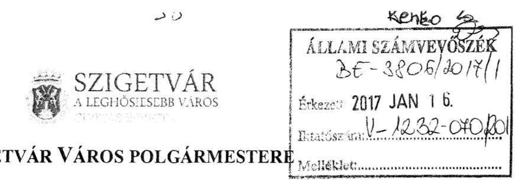

Ügyiratszám: 01-4/384/2017.
Tárgy: észrevétel jelentéstervezetre
Üi.: Csökliné dr. Valler Mária jegyző
Kelt: Szigetvár, 2017. január 10.

# Állami Számvevőszék 

Domokos László elnök
részére

1364 Budapest 4.
Pf. 54.

Tisztelt Elnök Úr!
Az Állami Számvevőszék 2016.évben ellenőrizte Szigetvár Város Önkormányzata 2010. évben indult adósságrendezési eljárását, és az Állami Számvevőszékről szóló 2011. évi LXVI. törvény (a továbbiakban: ÁSZ Tv.) 29. § (1) bekezdésében foglaltak alapján 2016. december 27. napján érkeztetetten megküldte az „Önkormányzati adósságrendezés ellenőrzése Szigetvár Város Önkormányzat adósságrendezési eljárásának ellenőrzése" címü, V-1232065/2016. ikt számú jelentéstervezetet.

Az ÁSZ Tv. 29. § (2) bekezdése alapján a jelentéstervezetre az alábbi észrevételeket teszem:
Általános észrevételként - az ÁSZ-nak az ellenőrzés módszereit elfogadva és tudomásul véve - azt kívánjuk elmondani, hogy 2010. évben nem igazán volt országos tapasztalat az adósságrendezési eljárás lefolytatásával kapcsolatban, hiszen tudomásunk szerint abban az időszakban csak két kisebb önkormányzatnál volt előzőleg ilyen eljárás, városi önkormányzatot érintően még nem folyt adósságrendezés. Több esetben kellett szakmai iránymutatásért a Belügyminisztériumhoz és a Pénzügyminisztériumhoz fordulnunk, így a jogszabályban előírt kötelező feladatok ellátása mellett ez is okozta a hiányosságokat.

---

# SZIGETVÁR VÁROS POLGÁRMESTERE 

1.1. számú megállapításhoz:

Az Önkormányzatnál a szállítói tartozásokról az Áhsz. szerinti analitikát vezették, mivel az alkalmazott számviteli szoftver ezt biztosítja, továbbá a lejárt szállítói tartozások kimutatását is elóállítja. Kinyomtatott formában is rendelkezésre állt, azonban ezek nem kerültek aláírásra. Az adatbázis számítógépen megtalálható és a szállítói nyilvántartás a programból bármikor produkálható.

Szigetvár Város Önkormányzatánál az adósságrendezést - a korábbi polgármester 2010. január 24. napján bekövetkezett halála után - az önkormányzat képviseletét ellátó alpolgármester kezdeményezte.
1.2. számú megállapításhoz:

Az adósságrendezés megindításáról a jogszabályi rendelkezéseknek megfelelően tájékoztattuk a Közigazgatási Hivatalt, azzal, hogy ennek írásos dokumentumát a vizsgálat során nem tudtuk bemutatni. A vizsgálat rendelkezésére bocsátott dokumentumok között azonban szerepelt a Közigazgatási Hivatal válaszlevele, ami álláspontunk szerint bizonyítja, hogy idevonatkozó tájékoztatási kötelezettségünknek is eleget tettünk.
1.3. számú megállapításhoz:

Nincs észrevétel.
1.4. számú megállapításhoz:

Ezen pont megállapítása a pénzügyi gondnok tevékenységéről szól, így Önkormányzatunk részéről észrevétel e ponthoz nincs.
1.5. számú megállapításhoz:

A válságköltségvetési rendeletet az aljegyző készítette el, tekintettel arra, hogy az önkormányzat címzetes föjegyzöje 2010. január elején nyugdíjba vonult, valamint egy sikertelen jegyzői pályázatot követően a Képviselő-testület 2010 áprilisában választott jegyzőt.

---

# SzIGETVÁR VÁROS POLGÁRMESTERE 

A jelentéstervezetben megjelölt „szórakoztatási tevékenység"-re tervezett összeg a városi ünnepségekre, rendezvényekre biztosított fedezetet.
1.6. számú megállapításhoz:

A reorganizációs programban a konkrét bevételek nem kerültek megjelölésre, azonban az adósságrendezési eljárás alatt a Zeneiskola átkerült a Baranya Megyei Önkormányzat müködtetésébe, a tanuszoda szolgáltatási díja nem került megfizetésre, a korábban megkezdett útfelújítás elhalasztásra került.
1.7. -11. számú megállapításhoz:

Nincs észrevétel.
2.1.-2. számú megállapításhoz:

Nincs észrevétel.
2.3. számú megállapításhoz:

A reorganizációs programban a konkrét bevételek nem kerültek megjelölésre, azonban az adósságrendezési eljárás alatt a Zeneiskola átkerült a Baranya Megyei Önkormányzat müködtetésébe, a tanuszoda szolgáltatási díja nem került megfizetésre, a korábban megkezdett útfelújítás elhalasztásra került.(1.6. számú megállapításhoz tett észrevétel)
2.4. számú megállapításhoz:

Az Önkormányzatnál a szállítói tartozásokról az Áhsz. szerinti analitikát vezették, mivel az alkalmazott számviteli szoftver ezt biztosítja, továbbá a lejárt szállítói tartozások kimutatását is elöállítja. Kinyomtatott formában is rendelkezésre állt, azonban ezek nem kerültek aláírásra. Az adatbázis a számítógépen megtalálható és a szállítói nyilvántartás a programból bármikor produkálható. (1.1. számú megállapításhoz tett észrevétel)
A 2.4. számú megállapítás 2. pontjában a rövid lejáratú kötelezettségekre, kifejezetten a szállítókra vonatkozik, amelyen belül jelenleg a 2014.01.01-től hatályos 4/2013. (I.11.) Korm. rendeletre történik hivatkozás. A 14. mellékletnek azonban ilyen formában nem azonosítható a 2. pontja, mivel ott római számmal van tagolva és azon belül több 2. pont is van. A korábbi

---

# SZIGETVÁR VÁROS POLGÁRMESTERE 

249/2000. (XII.24.) Korm. rendelet 9. melléklet 4. pont d) pontja a rövid lejáratú kötelezettségekre vonatkozik. Kérjük annak pontositását, hogy a 14. melléklet II. Kötelezettségvállalások, más fizetési kötelezettségek nyilvántartása címủ részre gondoltak, vagy azon belül a 2. pontra.

### 3.1. számú megállapításhoz:

Nincs észrevétel.
4.1.-2. számú megállapításhoz:

Nincs észrevétel.
Tisztelt Elnök Úr!
Fenti észrevételeinket kiegészíteni kívánom azzal, hogy a tervezetben a polgármesternek megfogalmazott javaslat a munkajogi felelősség tisztázására irányuló eljárás kezdeményezésére kér tőlem intézkedést, ugyanakkor amint azt jeleztem, 2010 januárjában nyugdíjba vonulás miatt megszűnt a korábbi címzetes főjegyző jogviszonya, a 2010 áprilisában megválasztott jegyző jogviszonya 2010. október 20. napján megszűnt. A 2010. november 16. napján megválasztott jegyző jogviszonya 2016. július 22. napján szűnt meg. A 2010. évi adósságrendezési eljárás során közreműködő pénzügyi osztályvezető közszolgálati jogviszonya 2012 júniusában szűnt meg.
Jómagam a 2014. október 12-ei önkormányzati választásoktól kezdődően töltöm be a polgármesteri tisztséget.

Az ÁSZ által elvégzett vizsgálathoz kapcsolódóan jelezni kívánom, hogy az önkormányzat gazdálkodásának pénzügyi egyensúlyát jelenleg is nehezen tudjuk biztosítani, illetve fenntartani. Ugyanakkor bízom abban, hogy a vizsgálat során tett megállapításokat további müködésünk során hasznosítani tudjuk - remélhetőleg nem egy újabb adósságrendezési eljárás során.
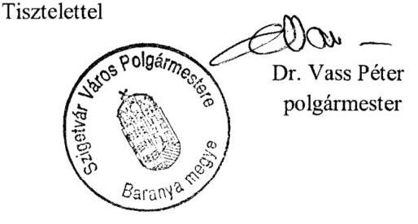

---

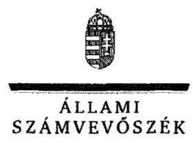

# Dr. Vass Péter úr 

polgármester

Szigetvár Város Önkormányzat

## Szigetvár

## Tisztelt Polgármester Úr!

Köszönettel megkaptam az „Önkormányzati adósságrendezés ellenörzése - Szigetvár Város Önkormányzat adósságrendezési eljárásának ellenörzése" címủ jelentéstervezet megállapításaira tett észrevételét.

Az ellenőrzési megállapításokra vonatkozó észrevételét az Állami Számvevőszékről szóló 2011. évi LXVI. törvény 29. § (2) bekezdésében meghatározott tizenöt napos határidőn belül küldte meg. Az Állami Számvevőszék észrevétellel kapcsolatos álláspontját a mellékletként csatolt, a felügyeleti vezető által készített indokolás tartalmazza.

Budapest, 2017. 04 hónap 25 nap

Tisztelettel:

Melléklet: Észrevételre adott válasz

---

# „Önkormányzati adósságrendezés ellenörzése - Szigetvár Város Önkormányzat adósságrendezési eljárásának ellenörzése" címú jelentéstervezetre tett észrevételekre adott válasz 

| Észrevétel: | 1.1. számú megállapítás 1. bekezdés 1. mondata   Megállapítás: Az önkormányzatnál az Áhsz. 19. melléklete 4. d) pontja ellenére a szállítói tartozásokról analitikát nem vezettek.   Észrevétel: Az Önkormányzatnál az Áhsz. 1 szerinti analitikát vezették, mivel az alkalmazott számviteli szoftver ezt biztosítja. |
| :--: | :--: |
| Válasz: | Az Állami Számvevőszék az észrevételt nem fogadja el. |
| Indoklás: | A polgármester, a jegyző és a Költségvetési és Pénzügyi osztályvezető 2016. október 10 -én úgy nyilatkozott, hogy a szállítói tartozások és a vevőkövetelések korosított kimutatásához analitikával nem rendelkeznek, továbbá az észrevétel sem tartalmaz olyan dokumentumot, amely alátámasztaná, hogy az önkormányzatnál vezették a szállítói tartozásokról a jogszabályban elöírt analitikus nyilvántartást. |
| Észrevétel: | 1.1. számú megállapítás 1. bekezdés 2. mondata   Megállapítás: A polgármester 2010. február 9-én történt megbízását követően 2010. február 22-én adósságrendezési eljárást kezdeményezett a bíróságnál.   Észrevétel: Az adósságrendezést az önkormányzat képviseletét ellátó alpolgármester kezdeményezte. |
| Válasz: | Az Állami Számvevőszék az észrevételt elfogadja. |
| Indoklás: | Az észrevétel alapján a megállapítást pontosítjuk. |
| Észrevétel: | 1.2. számú megállapítás 1. bekezdés 2. mondata   Megállapítás: Az adósságrendezés megindításáról a Har. tv. 10. § (4) bekezdés a) pontjai ellenére nem tájékoztatta a közigazgatási hivatalt.   Észrevétel: Az adósságrendezés megindításáról tájékoztatták a közigazgatási hivatalt, azonban ennek írásos dokumentumát nem tudták bemutatni, azonban a közigazgatási hivatal válaszlevelét igen. |
| Válasz: | Az Állami Számvevőszék az észrevételt nem fogadja el. |
| Indoklás: | Az ellenőrzés rendelkezésére bocsátott dokumentum az adósságrendezési eljárás megindításáról szóló közigazgatási hivatalnak címzett tájékoztatást, nem az adósságrendezés megindításáról szóló tájékoztatást tartalmazza. |
| Észrevétel: | 1.5. számú megállapítás 1. bekezdés 2. mondata   Megállapítás: 2010. március 29 -ei ülésén a jegyző által határidőben elkészített 2010. évi válságköltségvetési rendelettervezetet módosítások után jóváhagyta.   Észrevétel: A válságköltségvetési rendeletet az aljegyző készítette el, tekintettel arra, hogy az önkormányzat címzetes föjegyzöje 2010. január elején nyugdijba vonult. |

---

|  | valamint egy sikertelen pályázatot követöen a Képviselő-testület 2010 áprilisában választott jegyzőt. |
| :--: | :--: |
| Válasz: | Az Állami Számvevöszék az észrevételt elfogadja. |
| Indoklás: | Az észrevétel alapján a megállapítást pontosítjuk. |
| Észrevétel: | 1.5. megállapítás 2. bekezdés 3. pontja   Megállapítás: A válságköltségvetési rendeletet a jogszabályi előírás ellenére ,,szóra-   koztatási tevékenység" finanszírozására is tartalmazott kiadási elöirányzatot.   Észrevétel: A „,szórakoztatási tevékenység"-re tervezett összeg a városi ünnepségekre, rendezvényekre biztositott fedezetet. |
| Válasz: | Az Állami Számvevőszék az észrevételt nem fogadja el. |
| Indoklás: | Az észrevétel a megállapításban foglaltakat nem vitatta. |
| Észrevétel: | 1.6. megállapítás 2. bekezdése   Megállapítás: A reorganizációs program nem tartalmazta annak megjelölését, hogy az önkormányzat a tervezett intézkedései révén milyen bevételekhez juthat.   Észrevétel: A reorganizációs programban a konkrét bevételek nem kerültek megjelölésre, azonban a Zeneiskola átkerült a Baranya Megyei Önkormányzat müködtetésébe, a tanuszoda szolgáltatási dija nem került megfizetésre, a korábban megkezdett úttfelújítás elhalasztásra került. |
| Válasz: | Az Állami Számvevőszék az észrevételt nem fogadja el. |
| Indoklás: | Az észrevétel a megállapításban foglaltakat nem vitatta. |
| Észrevétel: | 2.3. megállapítás 2. bekezdése   Megállapítás: A tervezett kiadáscsökkentő intézkedésekből összes megtakarítása az általa készített kimutatás alapján 117,6 millió Ft volt.   Észrevétel: A reorganizációs programban a konkrét bevételek nem kerültek megjelölésre, azonban a Zeneiskola átkerült a Baranya Megyei Önkormányzat müködtetésébe, a tanuszoda szolgáltatási dija nem került megfizetésre, a korábban megkezdett úttfelújítás elhalasztásra került. |
| Válasz: | Az Állami Számvevőszék az észrevételt nem fogadja el. |
| Indoklás: | Az észrevétel a megállapításban foglaltakat nem vitatta. |
| Észrevétel: | 2.4. megállapítás 1. bekezdés 2. pontja   Megállapítás: Nem gondoskodtak 2014. január 1-jétől az Áhsz.: 39. § (3) bekezdés és a 14. melléklet 2. pontja szerinti kötelezettségekhez kapcsolódó analitikus nyilvántartás vezetéséről.   Észrevétel: A 14. mellékletnek ilyen formában nem azonosítható a 2. pontja, mivel ott római számmal tagolva és azon belül több 2. pont is van. |
| Válasz: | Az Állami Számvevőszék az észrevételt elfogadja. |

---

| Indoklás: | Az észrevétel alapján a megállapítást pontosítjuk. |
| :-- | :-- |
|  | Polgármesternek címzett 1. számú javaslat   Javaslat: Intézkedjen az Állami Számvevőszék ellenőrzése során feltárt hiányosságok tekintetében a munkajogi felelősség tisztázására irányuló eljárás kezdeményezéséről, és ennek eredménye ismeretében tegye meg a szükséges intézkedéseket.   Észrevétel: Megszünt 2010. januárjában nyugdíjba vonulás miatt a korábbi címzetes   föjegyzö, 2010. október 20-án a 2010. áprilisában megválasztott jegyző jogviszonya.   A 2010. november 16. napján megválasztott jegyző jogviszonya 2016. július 22-én   szünt meg. |
| Válasz: | Az Állami Számvevőszék az észrevételt elfogadja. |
| Indoklás: | A jegyző közszolgálati jogviszonyának megszünésére tekintettel a javaslat törlésre   került. |

Tájékoztatom Polgármester Urat, hogy az Állami Számvevőszékről szóló 2011. évi LXVI. törvény 29. § (3) bekezdése alapján az Állami Számvevőszék a figyelembe nem vett észrevételeket köteles a jelentésben feltüntetni, és megindokolni, hogy azokat miért nem fogadta el.

Budapest, 2017.
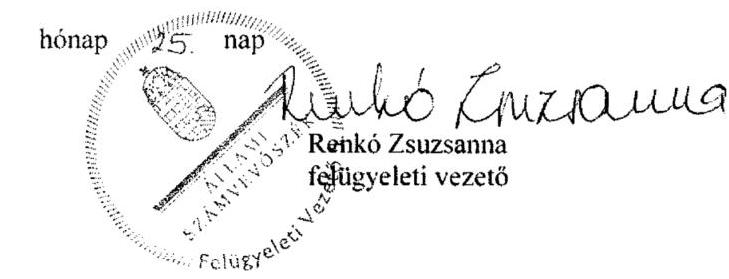

---

Állami Számvevőszék
Domokos László Elnök Úr r
észére

Budapest 4.
Pf.: 54.
1364 .

Tárgy: Szigetvár Város Önkormányzat adósságrendezési eljárás ellenőrzésére észrevétel.

Tisztelt Elnök Úr!

Köszönettel megkaptuk az „Önkormányzati adósságrendezés ellenőrzése - Szigetvár Város Önkormányzat adósságrendezési eljárásának ellenőrzése" címú jelentéstervezetet.

Az ÁSZ tr. 29. § (2) bekezdése szerint az ellenőrzésre a 15 napon belül az alábbi észrevételt kívánjuk megtenni.

Az észrevételhez a mellékleteket is csatoljuk, melyek korábban már elektronikus formában már feltöltésre kerülte.

Budapest, 2017. január 11
Üdvözlettel:
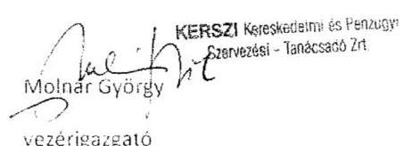

KRASZI KERESKEDELAN ÉS PÉNÜÜVY
KITAVÉZÉSI TANÁCSADÓ ZRT.
SZINHES, V. H-1143 BUDAPEST, SZINHÖHU 13.
POSTACIM. H-1581 BUDAPEST, PF. 103.
TELEFON: 239-4940, 239-4941
FAX: 239-5181
E-MAIL: irada@ikurszort.hu
KONJEKT: 2011. 10.03PUB. PH:09078-00000000

---

# ÉSZREVÉTEL 

## Az Önkormányzati adósságrendezési eljárás - Szigetvár Város Önkormányzata ellenörzésének Számvevöszéki jelentéstervezetére

## 1.3. számú megállapítás: Nem készült vagyonleltár és éves beszámoló

A Har.tv. 13.§ b) ponja szerint ,,a helyi önkormányzat vagyonáról az adósságrendezés meginditásának idöpontját megelózó nappal készitett vagyonleltárt és éves beszámolót, amelyben - megfelelö indokolással alátámasztva - elkülönitve szerepel a törzsvagyon, a jogszabályokban kötelezöen elöirt feladat- és hatáskör teljesitéséhez szükséges vagyon, illetve a hitelezök kielégitéséhez felhasználható vagyon; " írja elő. Vagyis teljes körü zárást kellett volna végezni az Önkormányzatnál 2010. 01.01.-2010.02.25 közti időszakra. 2010. évben az államháztartás szervezetei beszámolási és könyvvezetési kötelezettségének sajátosságairól szóló 249/2000.(XII.24.) Korm. rendelet azonban nem írja elő ezt a kötelezettséget. A Korm.rendelet $9 . \S$-a és az elemi költségvetési beszámolóra vonatkozó általános szabályokat a $10 . \S$ szabályozza, de erről nincs rendelkezés.
Erre vonatkozóan egyeztetés történt a Magyar Államkincstár Baranya Megyei Igazgatóságával, aminek eredményeként megállapításra került, hogy a költségvetési szerveknek évente csak egy éves beszámolója lehet, a TATIGAZD program alapján csak januártól decemberig tarthat egy év, és csak év végén zárhatóak a fökönyvi számlák. Ha évközben indul adósságrendezési eljárás, akkor a válságköltségvetés csak elöirányzat módosításként jeleníthető meg a könyvekben. Ezért teljes körű zárással készített éves beszámolót nem állt módjában átadni az alpolgármesternek, nem engedte a MÁK a hó közi, évközi zárást elvégezni.
(Megjegyezni kivánom, hogy az államháztartás számviteléröl szóló 4/2013.(I.11.) Korm.rendelet 7.§ (4) bekezdése már meghatározza a mérleg fordulónapot és az integrált programok is ehhez igazodtak.)
A fentiekben leirtakra való tekintettel a megállapítással nem értünk egyet, mert a pénzügyi gondnoknak a MÁK álláspontját és a kapott vagyonleltárt el kellett fogadni.
A feltöltött dokumentumok között 3. számú sorszámmal ellátva került feltöltésre a 2009. december 31. forduló nappal készült vagyonleltár. A vagyonleltár formája és tartalma az akkor hatályos (249/2000.(XII.24.) Korm. rendeletnek megfelelt. Tartalmazza az önkormányzat korlátozottan forgalomképes és forgalomképes vagyonát is, ami az adósságrendezési eljárásba az egyezséghez bevonható volt. Tartalmazza továbbá a követelések teljes listáját. ( $14+1$ lap)

### 1.4. számú megállapítás: A hitelezök nyilvántartásba vétele és további jogszabály által elöirt feladatok ellátása nem felelt meg a törvényi rendelkezéseknek.

Az ellenőrzés megállapítja, hogy 110 hitelező 2.968,2 millió Ft értékủ követelést nyújtott be, amiből - már fel nem idézhető okok miatt - 1 hitelező 300 ezer Ft -al nem lett nyilvántartásba véve, csak pótlólag. Az egyezségben már szerepelt.
Az ellenőrzés módszerei szerint „A véletlen minta alapján a sokaságra vonatkozó hibaarányt becsülik. Megfelelőnek értékelték az ellenörzött területet, amennyiben $95 \%$-os bizonyossággal a teljes sokaságban a hibaarány legfeljebb $10 \%$ ". 110 hitelezőből 1 hitelező nem éri el a $10 \%$ ot, de 2.968,2 millió Ft hitelezői igényből 300 ezer Ft sem éri el a $10 \%$-ot.
Egy hitelező adósságrendezést megelőzően peresítet követelését nem vitatott követelésként, hanem érték nélkül került nyilvántartásba. Erre maga az ellenőrzés ad választ az 1.8. megállapításában. ,,a per alatt állót a jogerös itélet alapján 5.7 millió Ft-al nyilvántartásba

---

vette." Vagyis a hitelező esetében nem a követelés volt vitatott, hanem a per miatt az összeg nem volt ismert még a nyilvántartásba vétel időpontjában.
A hitelezők tájékoztatása időben megtörtént, minden esetben időben aláírásra került a pénzügyi gondnok részéről a tájékoztatás, amelynek a hitelezőhöz való elküldése az Önkormányzat feladata volt postai úton.
A pénzügyi gondnok megítélése szerint a Har.tv. 14.§ (1) bekezdése nem azt írja elő, hogy írásos véleményt kell készíteni, hanem, hogy a véleményét csatolni kell. Ez minden esetben a jegyzőkönyvekben megtalálható, ami hivatalos dokumentum.
Az Önkormányzat esedékessé vált követeléseinek behajtását az Önkormányzat Adó-csoportja folyamatosan végezte, ezért nem kellett külön kezdeményezni a követelések behajtását, nem hanyagságból nem tette.
A fentiekben leirtakra tekintettel a megállapítással nem értünk egyet, a pénzügyi gondnok részéről a jogszabály által elöirt feladatok ellátása megfelelı a törvényi rendelkezéseknek.

# 1.5. számú megállapítás: A válság költségvetési rendelet nem felett meg a törvényi elöírásoknak 

Az Önkormányzat válság költségvetése a Har tv. 13.§ (1) bekezdés d) pontja és a 31.§ (1) bekezdés a) pontjában meghatározott előírásoknak megfelelően készült. A Har.tv. 18.§(2) bekezdés a) pontja szerint „, az 1. mellékletben felsorolt, és számára külön törvényben kötelezően elöirt feladatok müködési kiadásait;"
1. melléklet az 1996. évi XXV. törvényhez „21. A képviselő-testület és a polgármesteri hivatal müködletése, valamint a hivatal dolgozóinak díjazása (bér és közterhei, dologi költségek), kivéve a helyi önkormányzati képviselők és bizottsági tagok tiszteletdíját (Mötv.)" A válság költségvetés indoklási lapjai 1. oldal „841126 Igazgatási tevékenység" szakfeladat, 513121 költségnem Jubileumi jutalom 4.289 ezer Ft. A Ktv. (Egyéb jogszabály) szerint a köztisztviselönek járó jubileumi jutalom kifizetése az 1. sz. melléklet 21. pontjába tartozik. (A válság költségvetés indoklási lapja mellékelve 1 lap).
A Pénzügyi gondnok megítélése szerint az előirányzatok átcsoportosításának kezdeményezése a polgármester és az intézményvezető részéről érkezhet, amiről „a Har.tv. 16.§ (3) bekezdése szerint „a helyi önkormányzat kötelezően ellátandó feladatainak és hatáskörének teljesítésével kapcsolatos valamennyi gazdasági kérdésben az adósságrendezési bizottság dönt." , anćlkül, hogy a költségvetés föösszege változna. A kezdeményezés és a döntés szétválasztása történt meg.
A válság költségvetés indoklási lapjai 11. oldal „932919 Máshova nem sorolt egyéb szórakoztatási tevékenység" szakfeladat 55219 költségnem Zrínyi emlékünnepség, 3.000 ezer Ft, valamint a hozzátartozó5491 költségnem kitüntetések, plakettek 600 ezer Ft. Mint köztudott Szigetvár városa a Zrínyi kapitány hőstettei miatt kiemelt, nemzetközi megemlékezést tart minden évben. Az ünnepségre a műsorok, szereplők lekötése, meghívók, külföldi vendégek meghívása az adósságrendezési eljárást jelentősen megelőzően megtörtént, amelyet nemzetközi problémák elkerülése végett már nem lehetett lemondani. A Teljes kiadásnak csak szorosan a kulturális kiadásai szerepeltek ebben az összegben. 2010. 09.01én tartott ÁB ülésen az alpolgármester még további támogatást kért volna, melyet a pénzügyi gondnok nem támogathatott. (Előterjesztés mellékelve 2 lap)
932919 Máshova nem sorolt egyéb szórakoztatási tevékenység" szakfeladat 55219 költségnem városi rendezvények 2.000 czer Ft. Az önkormányzat alapvető müködésének része és emberi kötelessége, még az adósságrendezési eljárás alatt is, hogy az állami ünnepekről megemlékezzen. Az összegben csak a koszorúk, virágok alapvető kiadásai szerepelnek. Az adósságrendezési eljárás időszakában az egyéb kulturális tevékenységet Szigetváron egy egyesület végezte. (Az indoklási lap mellékelve 1 lap)

---

# A fentiekben leirtakra tekintettel a válság költségvetési rendelet megfelelı a törvényi elöirásoknak 

### 1.6. számú megállapítás: A reorganizációs program nem felelt a jogszabály által meghatározott tartalmi követelményeknek

,2010. április 29-én a Képviselö-testület határozata alapján, június 9-én megbizási szerzödés került aláirásra az OTP Bank Nyrt. Dél-dunántúli Régiója, a Szigetvári Takarékszövetkezet, Szigetvár Város Önkormányzata, valamint a C. C. Audit Könyvvizsgáló Kft. között, melyben utóbbi vállalta Szigetvár Város Önkormányzata gazdálkodásának szerzödéskötéskor rendelkezésre álló aktualis és megbizható adatai alapján történő áttekintő jellegü felülvizsgálatát és racionalizálási célú javaslatok megtételét". Idézet a reorganizációs programból. A Megbízási szerződés lényege az Önkormányzat a válság költségvetése terhére nem fizethet a reorganizációs programért azt az OTP Bank Nyrt rendelte meg. A legnagyobb hitelező kérte, hogy abból az anyagból mi kerüljön be a végleges reorganizációs programba, melyet a 2010. július 15-i ülésen tett meg. Azt követően kellett még az átdolgozást végrehajtani és a képviselő-testület július 22 -én fogadta el.
Az Adósságrendezési Bizottság 2010.július 15-i ülésének jegyzőkönyve tartalmazza. A jegykönyv idevonatkozó része mellékelve. (5 lap)

### 1.7. számú megállapítás: A hitelezök meghívása az egyezségi tárgyalásra nem a jogszabályi elöirásoknak megfelelöen történt

Az idő rövidsége miatt a július 30-i hitelezői értekezletre kiküldte az Önkormányzat a meghívót, de a reorganizációs programot és az egyezségi javaslat írásos dokumentumát nem. A képviselőtestületi ülést követően a pénzügyi gondnok határidő hosszabbítást kért a Bíróságtól, melynek ismeretében az egyezségi tárgyalásra új fordulót hirdetett és a korábbi mulasztását pótolta.
Ezzel a jogszabályi elöirásoknak megfelelöen történt a hitelezök meghivása és a dokumentumok átadása.

### 1.10. számú megállapítás: A kontrolltevékenységek nem biztositották a válságköltségvetésen alapuló kifizetések szabályszerü végrehajtását.

A pénzügyi gondnok a Har.tv. 14.§ (1) bekezdésének megfelelően, kérte, hogy minden esetnem ellenjegyzchesse azokat a kötelezettségvállalásokat, amelyeket az Adósságrendezési Bizottság jóváhagyott, sajnos ezt nem minden esetben tették meg, az akkor regnált Jegyző nem vette figyelembe a jogszabályt. Az ÁB által jóvá nem hagyott szerződések számlák teljesítése megtagadásra került. ( 6 lap mellékelve)
A kifizetések teljesítésének ellenjegyzésére külön dokumentumot készittetett a gondnok, mert 2010.évben a 249/2000. (XII.24.) Korm.rendelet a kiadások alapbizonylataihoz utalvány kiállitását írta elő, de annak formájáról, kinézetéről nem rendelkezett. Ezért a készpénzes számlákat az Önkormányzatnál bélyegzővel látták el, az átutalásos számlához meg saját készitésủ bizonylatot tettek. A bizonylatok mellékelése a könyvelés időpontjában történt. A pénzügyi gondnoknak a számlákat a kifizetéseket megelözően kellett ellenjegyezni, ezért külön nyomtatvány kiállitását kértem, melyen iktatószám, a kiadás jogcíme, a kiadás összege a válságköltségvetésben lévő szakfeladat megnevezése, száma, szerepel. (Minta mellékelve 8

---

lap) Nem az utólag kiállított utalványon történt az ellenjegyzés, mert a gondnok azt megelőzően végezte az ellenőrzést és az ellenjegyzést.
Az Önkormányzat nagysága miatt az átutalások elektronikus formában történtek és az OTP Bank részéről a számla feletti rendelkezésre való jogosultság megkérése külön feltétel volt. Utalni a pénzügyi gondnok +2 fó hivatali dolgozó tudott.
A kifizetésekhez kapcsolódó kontrolltevékenység gyakorlása a válságköltségvetés időszakában a pénzügyi gondnok ellenjegyzésével megfelelő és folyamatos volt. Csak az ellenjegyzéssel ellátott kiadási tételek utalása történt meg, dátumra megállapítható módon.

A fentiekben tett észrevételek alapján, megítélésünk szerint az adósságrendezési eljárás végrehajtása során a pénzügyi gondnok feladatellátása szabályos volt, feladat ellátása nem veszélyeztette az eljárás céljainak elérését. Az adósságrendezés megindításakor tisztázták az önkormányzat valós vagyoni helyzetét, mert azt számba vették, a lezárást jogszabályi keretek nem tették lehetővé.
Valamennyi hitelezői igény nyilvántartásba lett véve, a határidők betartása a kiértesítéseknél a hivatal feladata volt, de minden egyéb határidő betartásra került.
A válságköltségvetés időszakában ellenjegyzés nélkül nem történt kifizetés.
A pénzügyi gondnok egyetért azon megállapításokkal, hogy az önkormányzat eladósodottsága jelentős mértékủ volt, a felelőtlen gazdálkodás következtében. Az adósságrendezési eljárás csak a pillanatnyi müködőképesség helyreállítását tudta szolgálni.
Az önkormányzat az átütemezett reorganizációs hitelt és a pénzintézetek felé fennálló tartozása csak az állam által átvállalt konszolidáció után szünhetett meg.

Segítő megállapításaikat köszönettel vettük.

Budapest, 2017. január 11.
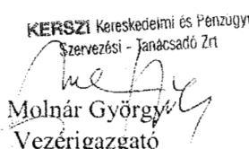

---

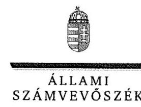

ELnök

Ikt. szám: V-1232-074/2016.

# Molnár György úr 

vezérigazgató
KERSZI Kereskedelmi és Pénzügyi Szervezési-
Tanácsadó Zártkörüen Müködő Részvénytársaság

## Budapest

## Tisztelt Vezérigazgató Úr!

Köszönettel megkaptam az ,,Önkormányzati adósságrendezés ellenörzése - Szigetvár Város Önkormányzat adósságrendezési eljárásának ellenörzése" címü jelentéstervezet megállapításaira tett észrevételét.

Az ellenőrzési megállapításokra vonatkozó észrevételét az Állami Számvevőszékről szóló 2011. évi LXVI. törvény 29. § (2) bekezdésében meghatározott tizenöt napos határidőn belül küldte meg. Az Állami Számvevőszék észrevétellel kapcsolatos álláspontját a mellékletként csatolt, a felügyeleti vezető által készített indokolás tartalmazza.

Budapest, 2017. 07 hónap 30 nap
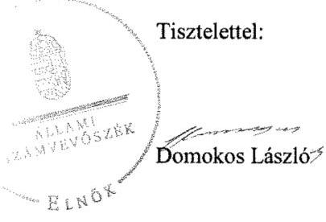

Melléklet: Észrevételre adott válasz

---

# „Önkormányzati adósságrendezés ellenörzése - Szigetvár Város Önkormányzat adósságrendezési eljárásának ellenörzése" címú jelentéstervezetre tett észrevételekre adott válasz 

|  | 1.3. számú megállapítás   Megállapítás: Nem készült vagyonleltár és éves beszámoló.   Észrevétel: Az Áhsz.1 nem írta elő a 2010. január 1. és 2010. február 25. közötti időszakra vonatkozó teljes körü zárás kötelezettséget. Erre vonatkozóan egyeztettek a Magyar Államkincstár Baranyai Megyei Igazgatóságával, aminek eredményeként megállapításra került, hogy a költségvetési szervnek évente csak egy beszámolója lehet, a TATIGAZD program alapján csak januártól decemberig tarthat egy év, és csak év végén zárhatóak a fökönyvi számlák. Ezért teljes körü zárással készített éves beszámolót nem állt módjában átadni az alpolgármesternek, nem engedte a MÁK a hó közi, évközi zárást elvégezni. |  |
| --- | --- | --- |
| Válasz: | Az Állami Számvevőszék az észrevételt nem fogadja el. |  |
|  | Az Áhsz. 1 rendelkezései nem zárják ki, viszont a Har. tv. konkrétan előírja az adósságrendezés megindításának időpontját megelőző nappal készített vagyonleltár és éves beszámoló elkészítését. Ezek elkészítésének célja az, hogy megbízható és valós képet kapjanak hitelezők kielégítéséhez felhasználható vagyonról. Az észrevétel sem tartalmaz olyan dokumentumot, amely alátámasztaná, hogy nem volt lehetőség a vagyonleltár és éves beszámoló elkészítésére. A Har. tv. szerint készítendő vagyonleltár és éves beszámoló Magy Államkincstár részére történő átadását a jogszabály nem írta elő, így a Magyar Államkincstár ezek elkészítésében nem volt érintett. |  |
|  | 1.4. számú megállapítás és annak 1. bekezdése   Megállapítás: A hitelezők nyilvántartásba vétele és további jogszabály által előirt feladatok ellátása nem felelt meg a törvényi rendelkezéseknek. A pénzügyi gondnok:   - egy határidőben bejelentkezett hitelezőt ( 0,3 millió Ft) nem vett nyilvántartásba, a mulasztását az egyezség kötés során pótolta;   - egy hitelező adósságrendezést megelőzően peresített követelését ( 11,8 millió Ft tőke és kamatai) nem vitatott igényként, hanem ismeretlen hitelezői igényként, érték nélkül vette nyilvántartásba. |  |
|  |  | Észrevétel: Fel nem idézhető okok miatt 1 hitelező 300 ezer Ft-tal nem lett nyilvántartásba véve, csak pótlólag. Az ellenőrzés módszerei szerint „A véletlen minta alapján a sokaságra vonatkozó hibaarányt becsültük. ..Megfelelönek" értékeltük az ellenörzött területet, amennyiben 95\%-os bizonyossággal a teljes sokaságban a hibaarány legfeljebb 10\%". 110 hitelezőből 1 hitelező, illetve 2968,2 M Ft hitelező igényböl 300 E Ft nem éri el a $10 \%$-ot.   Az ismeretlen, érték nélkül nyilvántartásba vett hitelező igény esetében nem a követelés volt vitatott, hanem a per miatt az összeg nem volt ismert a nyilvántartásba vétel időpontjába. |
|  | Válasz: | Az Állami Számvevőszék az észrevételt nem fogadja el. |

---

| Indoklás: | A hivatkozott ellenőrzési módszertan - a jelentéstervezetben jelzettek szerint - a kontrolltevékenységek támogató szerepére, nem a hitelezők nyilvántartásába vételére vonatkozik.   Az ismeretlen, érték nélkül nyilvántartásba vett hitelező igénnyel kapcsolatban a bírósági ítélet azt tartalmazza, hogy az Önkormányzat a szerződés érvénytelenségének megállapítása iránt indított pert, vagyis magát a követelést vitatta. |
| :--: | :--: |
| Észrevétel: | 1.4. számú megállapítás és annak 3. bekezdése   Megállapítás: A hitelezők nyilvántartásba vétele és további jogszabály által előírt feladatok ellátása nem felelt meg a törvényi rendelkezéseknek. A hitelezők közül négyet egy napos, egyet 19 napos késedelemmel tájékoztatott követeléseik elfogadásáról a jogszabályban meghatározott határidőhöz képest.   Észrevétel: A hitelezők tájékoztatása időben megtörtént, minden esetben időben aláírásra került a pénzügyi gondnok részéről a tájékoztatás, amelynek hitelezőkhöz való elküldése az Önkormányzat feladata volt. |
| Válasz: | Az Állami Számvevőszék az észrevételt nem fogadja el. |
| Indoklás: | A hivatkozott jogszabályhely szerint a pénzügyi gondnok tájékoztatja a bejelentkezésre nyitva álló határidő lejártát követő 15 napon belül a hitelezőket arról, hogy követeléseiket, illetve ezek biztosítékait elfogadja-e. Az észrevétel alapján az ellenőrzés során megküldött dokumentumok felülvizsgálata alátámasztotta, hogy a hitelezők közül négyet egy napos, egyet 19 napos késedelemmel tájékoztatott. |
| Észrevétel: | 1.4. számú megállapítás és annak 4. bekezdése   Megállapítás: A hitelezők nyilvántartásba vétele és további jogszabály által előírt feladatok ellátása nem felelt meg a törvényi rendelkezéseknek. A pénzügyi gondnok nem készített írásos véleményt a költségvetést érintő előterjesztésekhez, álláspontját az üléseken szóban ismertette.   Észrevétel: A Har. tv. nem írja elő, hogy írásos véleményt kell készíteni, hanem azt írja, hogy a véleményét csatolni kell. Ez megtalálható a jegyzőkönyvben. |
| Válasz: | Az Állami Számvevőszék az észrevételt nem fogadja el. |
| Indoklás: | A hivatkozott jogszabály úgy rendelkezik, hogy „A képviselö-testületi ülésre készült költségvetést érintő elöterjesztésekhez a pénzügyi gondnok véleményét csatolni kell." Az önkormányzati SZMSZ 13. § (1)-(2) bekezdései rögzítették, hogy az előterjesztést a képviselőknek az ülést megelőző 8 nappal korábban kell megkapnia. Az előterjesztés nem azonos a képviselő-testület üléséről az azt követően készült jegyzőkönyvvel. |
| Észrevétel: | 1.4. számú megállapítás és annak 5. bekezdése   Megállapítás: A hitelezők nyilvántartásba vétele és további jogszabály által előírt feladatok ellátása nem felelt meg a törvényi rendelkezéseknek. A pénzügyi gondnok nem kezdeményezte az önkormányzat esedékessé vált követeléseinek behajtását.   Észrevétel: Az Önkormányzat esedékessé vált követeléseinek behajtását az Önkormányzat Adó csoportja folyamatosan végezte, ezért nem kellett külön kezdeményezni a követelések behajtását. |

---

| Válasz: | Az Állami Számvevőszék az észrevételt nem fogadja el. |
| :--: | :--: |
| Indoklás: | A hivatkozott jogszabályhely egyértelműen a pénzügyi gondnok feladataként rögzíti a helyi önkormányzat esedékessé vált követeléseinek behajtása kezdeményezését. |
| Észrevétel: | 1.5. számú megállapítás és annak 2. bekezdése   Megállapítás: A válságköltségvetési rendelet nem felelt meg a törvényi elöírásoknak, mivel   - nem rendszeres személyi jellegü juttatás - jutalom - kifizetésére adott lehetőséget;   - az előirányzatok átcsoportosításának lehetőségét a polgármester és az intézmények hatáskörében hagyta;   - a kötelező feladatokon túl „szórakoztatási tevékenység" finanszírozására is tartalmazott kiadási előirányzatot 5,6 millió Ft értékben.   Észrevétel: A válságköltségvetési rendelet megfelelt a törvényi elöírásoknak, mert   - a jubileumi jutalom kifizetése a Har. tv. Melléklet 21. pontjába tartozik;   - az előirányzatok átcsoportosításának kezdeményezése a polgármester és az intézményvezető részéről érkezhet. A rendeletben a kezdeményezés és a döntés szétválasztása történ meg;   - Szigetvár városa minden évben kiemelt, nemzetközi megemlékezést tart Zrínyi kapitány hőstettei miatt. Az ünnepségre a műsorok, szereplők lekötése, a vendégek meghívása az adósságrendezési eljárást jelentősen megelőzően történt. Az ünnepséget a nemzetközi problémák elkerülése végett már nem lehetett lemondani. Az önkormányzat alapvető müködésének része, hogy az állami ünnepekről megemlékezzen. A városi ünnepségekre tervezett összegben csak a koszorúk, virágok alapvető kiadásai szerepeltek. |
| Válasz: | Az Állami Számvevőszék az észrevételt nem fogadja el. |
| Indoklás: | A válságköltségvetési rendelet nem felelt meg a törvényi elöírásoknak, mert   - a jubileumi jutalom a köztisztviselők jogállásáról szóló 1992. évi XXIII. törvény 42-49/D. §-ai szerint nem a köztisztviselő díjazásának minősül, hanem a 49/E. § szerinti egyéb juttatásnak;   - a 2010. évi költségvetési rendelet 13. §-a rögzíti, hogy az önállóan müködő és gazdálkodó intézmények az előirányzatok saját hatáskörükben megváltoztathatják, nem csak kezdeményezhetik azok megváltoztatását;   - az észrevétel nem vitatta, hogy a jogszabályi elöírás ellenére a Har. tv. mellékletében és az Ötv. 8. § (4) bekezdésében meghatározott kötelező feladatokon túl is tartalmazott előirányzatot. |
| Észrevétel: | 1.6. számú megállapítás   Megállapítás: A reorganizációs program nem felelt meg a jogszabály által meghatározott tartalmi követelményeknek, nem tartalmazta annak megjelölését, hogy az önkormányzat a tervezett intézkedései révén milyen bevételekhez juthat.   Észrevétel: A legnagyobb hitelező kérte, hogy mi kerüljön be a reorganizációs programba, melyet a 2010. július 15-i ülésen tett meg. Azt követően kellet még az átdolgozást végrehajtani. |
| Válasz: | Az Állami Számvevőszék az észrevételt nem fogadja el. |

---

| Indoklás: | Az észrevétel a megállapítást nem vitatta. |
| :--: | :--: |
| Észrevétel: | 1.7. megállapítás és annak 2. bekezdés 1. mondata   Megállapítás: A hitelezők meghívása a 2010. július 30 -ai egyezségi tárgyalásra nem   szabályszerűen történt, mert a pénzügyi gondnok nem hívta meg valamennyi hitele-   zót, illetve a meghívókat egy napos késedelemmel postázta, továbbá a meghívókkal   egyidejúleg nem küldte meg az elfogadott reorganizációs programot és az egyezségi   javaslatot.   Észrevétel: Az idő rövidsége miatt a július 30 -i hitelezői értekezletre kiküldte az   Önkormányzat a meghívót, de a reorganizációs programot és az egyezségi javaslat   írásos dokumentumát nem. |
| Válasz: | Az Állami Számvevőszék az észrevételt nem fogadja el. |
| Indoklás: | Az észrevétel a megállapításban foglaltakat nem vitatta. |
| Észrevétel: | 1.10. megállapítás 1. bekezdése   Megállapítás: A pénzügyi gondnok nem jegyezte ellen a kötelezettségvállalásokat és   a kifizetések teljesítését, illetve dátum hiányában nem volt megállapítható, hogy az   ellenjegyzés a kifizetést megelőző időpontban történt. A pénzügyi gondnokot - sza-   bálytalanul - számla felett rendelkezésre jogosult személyként jelölték meg.   Észrevétel: A pénzügyi gondnok kérte, hogy minden esetben ellenjegyezze azokat a   kötelezettségvállalásokat, amelyeket az adósságrendezései bizottság jóváhagyott,   sajnos ezt nem minden esetben tették meg. A kifizetések ellenjegyzését a pénzügyi   gondnok a kifizetéseket megelőzően külön nyomtatványon elvégezte. Az OTP Bank   részéről a számla feletti jogosultság megkérése külön feltétel volt. |
| Válasz: | Az Állami Számvevőszék az észrevételt nem fogadja el. |
| Indoklás: | Az észrevétel nem vitatta, hogy a kötelezettségvállalások ellenjegyzése nem történt   meg, illetve hogy a számla felett rendelkezésre volt jogosult. Az ellenőrzés rendelke   kezésére bocsátott dokumentumok felülvizsgálata alapján a kifizetések ellenjegyzése nem minden esetben történt meg, illetve amikor megtörtént, abban az esetben   sem tartalmazta a kifizetések ellenjegyzését tartalmazó nyomtatvány a pénzügyi   gondnok általi ellenjegyzés időpontját nem, így nem volt megállapítható, hogy az   ellenjegyzés a kifizetést megelőző időpontban történt |

Tájékoztatom Vezérigazgató Urat, hogy az Állami Számvevőszékről szóló 2011. évi LXVI. törvény 29. § (3) bekezdése alapján az Állami Számvevőszék a figyelembe nem vett észrevételeket köteles a jelentésben feltüntetni, és megindokolni, hogy azokat miért nem fogadta el.

Budapest, 2017.
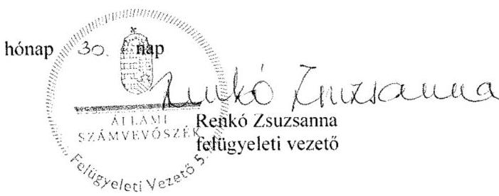

---

.

---

# RÖVIDÍTÉSEK JEGYZÉKE 

${ }^{1}$ önkormányzat
${ }^{2}$ képviselő-testület
${ }^{3}$ önkormányzat hivatala
${ }^{4}$ polgármester
${ }^{5}$ bíróság
${ }^{6}$ KERSZI Zrt.
${ }^{7}$ Har. tv.
${ }^{8}$ Ötv.
${ }^{9}$ Stabilitási tv.
${ }^{10}$ ÁSZ
${ }^{11}$ Áhsz. 1
${ }^{12}$ pénzügyi iroda
${ }^{13}$ közigazgatási hivatal
${ }^{14}$ önkormányzata költségvetési szerve
${ }^{15}$ pénzforgalmi szolgáltató
${ }^{16}$ kincstár
${ }^{17}$ adó és vámhatóság
${ }^{18}$ nyugdíjbiztosítási igazgatási szerv
${ }^{19}$ egészségbiztosítási szerv
${ }^{20}$ jegyző
${ }^{21}$ önkormányzati SZMSZ
${ }^{22}$ vagyonrendelet
${ }^{23}$ hivatali SZMSZ
${ }^{24}$ számviteli politika
${ }^{25}$ értékelési szabályzat
${ }^{26}$ leltározási szabályzat
${ }^{27}$ pénzkezelési szabályzat
${ }^{28}$ számlarend

Szigetvár Város Önkormányzata
Szigetvár Város Önkormányzatának Képviselő-testülete
Szigetvár Város Önkormányzatának Polgármesteri hivatala
Szigetvár Város Önkormányzatának polgármestere, 2010. február 9-től 2010. október 2-ig

Baranya Megyei Bíróság
KERSZI Zártkörűen Működő Részvénytársaság
1996. évi XXV. törvény a helyi önkormányzatok adósságrendezési eljárásáról
1990. évi LXV. törvény a helyi önkormányzatokról (hatálytalan 2014. október 12től)
2011. évi CXCIV. törvény Magyarország gazdasági stabilitásáról

Állami Számvevőszék
249/2000. (XII.24.) Korm. rendelet az államháztartás szervezetei beszámolási és könyvvezetési kötelezettségének sajátosságairól (hatálytalan 2014. január 1-jétől) Szigetvár Város Önkormányzatának Pénzügyi Irodája
Dél-Dunántúli Regionális Államigazgatási Hivatal
Szigetvár Város Önkormányzat Hivatásos Tűzoltósága
Országos Takarékpénztár és Kereskedelmi Bank Nyrt. Szigetvári Fiókja
Magyar Államkincstár
APEH Dél-Dunántúli Regionális Igazgatósága
Dél-Dunántúli Regionális Nyugdíjbiztosítási Igazgatóság
Dél-Dunántúli Regionális Egészségbiztosítási Pénztár
Szigetvár Város Önkormányzatának jegyzője 2010. január 5-től 2010. április 18-ig
Szigetvár Város Önkormányzata Képviselő-testületének többször módosított 6/2003. (IV.30.) rendelete a szervezeti és működési szabályzatról (hatályos 2003. május 1-jétől 2011. február 1-jéig)

Szigetvár Város Önkormányzata Képviselő-testületének többször módosított 10/2005. (IV.27.) rendelete az Önkormányzat vagyonáról és a vagyongazdálkodás szabályairól (hatályos 2005. május 1-jétől 2011. március 25-ig)
Szigetvár Város Önkormányzat Képviselő-testületének 136/2008. (VI.26.) határozattal elfogadott, a Polgármesteri hivatalának többször módosított szervezeti és működési szabályzata (hatályos 2008. július 1-jétől 2011. február 17ig)

Szigetvár Város és Csertő Község Önkormányzatának Számviteli politikája a pénzügyi-gazdálkodási szabályzatokkal (hatályos 2010. január 1-jétől)
Szigetvár Város és Csertő Község önkormányzatának Számviteli Politikája 8. sz. melléklete
Szigetvár Város és Csertő Község önkormányzatának Számviteli Politikája 5. sz. melléklete

Szigetvár Város és Csertő Község önkormányzatának Számviteli Politikája 2. és 3. sz. mellékletei

Szigetvár Város és Csertő Község önkormányzatának Számviteli Politikája IV. fejezete és 1. sz. melléklete

---

${ }^{29}$ gazdálkodási jogkörök szabályzata
${ }^{30}$ Ámr.
${ }^{31}$ Számv. tv.
${ }^{32} \mathrm{Ktv}$.
${ }^{33}$ Áht. 1
${ }^{34}$ Társulás
${ }^{35}$ művészetoktatási intézmény
${ }^{36}$ Áhsz. 2
${ }^{37}$ Áht. 2
${ }^{38}$ ÖNHIKI támogatás
${ }^{39}$ Zrínyi Távhő Kft.
${ }^{40}$ Taktv.
${ }^{41}$ Nvtv.
${ }^{42}$ Mötv.
${ }^{43}$ SZIGET-VÍZ Kft.
${ }^{44}$ Szigetvári Egészségügyi Kft.
${ }^{45}$ SzigetvárMed Nkft
${ }^{46}$ Szigetvári Távhő Nkft.
${ }^{47}$ Kisváros Nkft.
${ }^{48}$ Szigetvári Gyógyfürdő Kft.

Intézkedés a város önkormányzatának pénzgazdálkodásával kapcsolatos kötelezettségvállalás, utalványozás, érvényesítés és ellenjegyzés hatásköri rendjéről (hatályos: 2010. január 1-jétől), valamint az 1. számú jegyzői intézkedés Szigetvár város önkormányzatának pénzgazdálkodásával kapcsolatos kötelezettségvállalás, utalványozás, érvényesítés és ellenjegyzés hatásköri rendjéről (hatályos: 2010. január 1-jétől)
292/2009. (XII. 19.) Korm. rendelet az államháztartás múködési rendjéről (hatálytalan 2012. január 1-jétől)
2000. évi C. törvény a számvitelről
1992. évi XXIII. törvény a köztisztviselők jogállásáról (hatálytalan: 2012. március 1jétől)
1992. évi XXXVIII. törvény az államháztartásról (hatálytalan: 2012. január 1-jétől)

Szigetvár- Dél-Zselic Többcélú Kistérségi Társulás
Weiner Leó Alapfokú Művészetoktatási Intézmény, amely a 2010. június 30-án kelt megállapodás alapján 2010. augusztus 31-ei fordulónappal átkerült a Baranya Megyei Önkormányzathoz.
4/2013. (I. 11.) Korm. rendelet az államháztartás számviteléről (hatályos 2014. január 1-jétől)
2011. évi CXCV. törvény az államháztartásról (hatályos 2012. január 1-jétől)

Az önkormányzatok múködőképességét szolgáló, önhibájukon kívül hátrányos helyzetben levő települési önkormányzatok támogatása.
Zrínyi Távhő Szolgáltató Korlátolt Felelősségű Társaság
2009. évi CXXII. törvény a köztulajdonban álló gazdasági társaságok takarékosabb múködéséről
2011. évi CXCVI. törvény a nemzeti vagyonról
2011. évi CLXXXIX. törvény Magyarország helyi önkormányzatairól

SZIGET-VÍZ Korlátolt Felelősségű Társaság
Szigetvári Egészségügyi Ellátó és Szolgáltató Korlátolt Felelősségű Társaság
SzigetvárMed Nonprofit Korlátolt Felelősségű Társaság
Szigetvári Távhő Szolgáltató Nonprofit Korlátolt Felelősségű Társaság
Kisváros Városüzemeltetési Közhasznú Nonprofit Korlátolt Felelősségű Társaság
Szigetvári Gyógyfürdő Üzemeltető és Humán Szolgáltató Korlátolt Felelősségű Társaság

---

# ÁLLAMI SZÁMVEVŐSZÉK 

1052 Budapest, Apáczai Csere János utca 10.
Levélcím: 1364 Budapest 4. Pf. 54
Telefon: +36 14849100 Telefax: +36 14849200
www.asz.hu