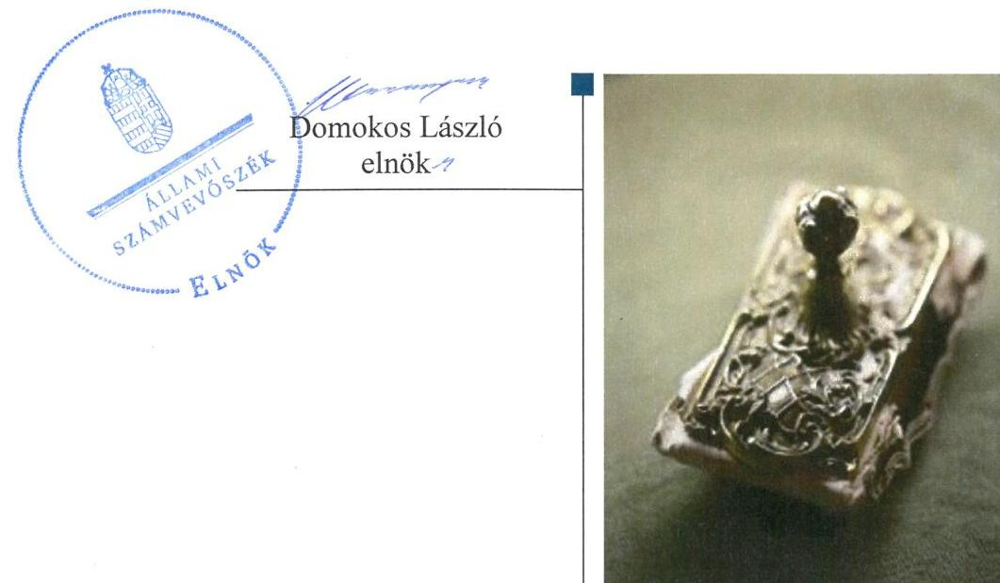
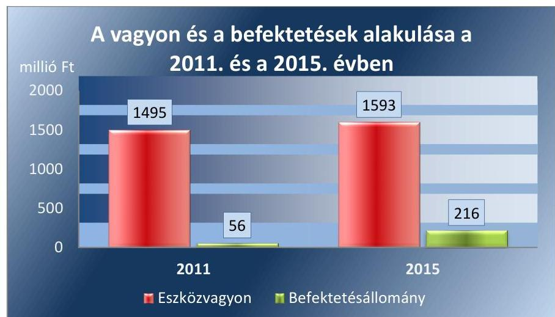
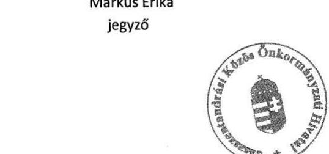
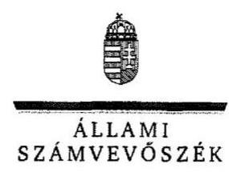
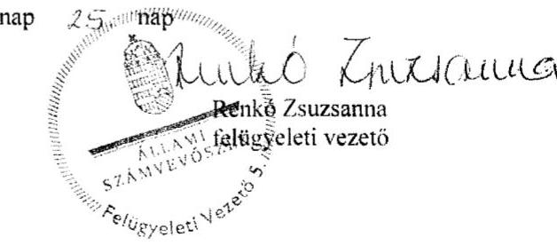

# Jelenetés 

## Önkormányzatok belsó kontrollrendszere

Az önkormányzatok belső kontrollrendszere kialakításának és múködtetésének ellenőrzése - Jászszentandrás 2017.

---

# J elentés 

## Önkormányzatok belsó kontrollrendszere

Az önkormányzatok belső kontrollrendszere kialakításának és múködtetésének ellenőrzése - Jászszentandrás
2017. 02. hó 1h. nap

---

# AZ ELLENŐRZÉST FELÜGYELTE:

- RENKŐ ZSUZSANNA felügyeleti vezető
- AZ ELLENŐRZÉST VEZETTE ÉS A VÉGREHAJTÁSÁÉRT FELELŐS:
  - DR. TIMÁR BALÁZS ellenőrzésvezető
  - A PROGRAM ÖSSZEÁLLÍTÁSÁÉRT FELELŐS:
    - JANIK JÓZSEF LÁSZLÓ osztályvezető

- IKTATÓSZÁM: V-1220-054/2016.
- TÉMASZÁM: 24
- ELLENŐRZÉS-AZONOSÍTÓ SZÁM: V076402

Jelentéseink az Országgyűlés számítógépes hálózatán és az Interneta a www.asz.hu címen is olvashatóak.

---

# TARTALOMJEGYZÉK 

■ ÖSSZEGZÉS ..... 5
■ AZ ELLENŐRZÉS CÉLJA ..... 6
■ AZ ELLENŐRZÉS TERÜLETE ..... 7
■ AZ ELLENŐRZÉS HÁTTERE, INDOKOLTSÁGA ..... 8
■ A JELENTÉS LÉNYEGES KÉRDÉSKÖREI ..... 10
■ ELLENŐRZÉS HATÓKÖRE ÉS MÓDSZEREI ..... 11
■ MEGÁLLAPÍTÁSOK ..... 14
■ JAVASLATOK ..... 27
■ MELLÉKLETEK ..... 29
I. sz. melléklet: Értelmező szótár ..... 29
II. sz. melléklet: Kiegészítő információ az önkormányzat egyes befektetéseivel kapcsolatban. ..... 33
III. sz. melléklet: Az integritás érvényesítése érdekében kialakított és múködtetett kontrollrendszer ..... 34
■ FÜGGELÉK: ÉSZREVÉTELEK ..... 37
■ RÖVIDÍTÉSEK JEGYZÉKE ..... 45

---

.

---

# ÖSSZEGZÉS 

Jászszentandrás Községi Önkormányzat belső kontrollrendszere kialakításának és müködtetésének hiányosságai miatt a közpénzfelhasználás szabályossága nem volt biztositott. A befektetési döntések átruházott hatáskör hiányában nem voltak szabályszerüek. Az Önkormányzatnak az integritás szemlélet érvényesitésében még fejlődést kell elérnie.

## Az ellenőrzés társadalmi indokoltsága

Magyarország Alaptörvénye az önkormányzatoktól is elvárja a kiegyensúlyozott, átlátható és fenntartható költségvetési gazdálkodás elvének érvényesítését. A korábbi évek ellenőrzési tapasztalatai, az önkormányzatok által betöltött társadalmi szerep, az általuk kezelt közpénz nagysága, a nemzeti vagyon átruházására vagy hasznosítására vonatkozó döntéseik sokrétüsége egyaránt indokolttá tették a számvevőszéki ellenőrzések folytatását. A belső kontrollrendszer jogszabályoknak megfelelő kialakítása és müködtetése nélkül nem valósítható meg a közpénzek, a közvagyon szabályos, gazdaságos, hatékony és eredményes felhasználása.

Jászszentandrás Községi Önkormányzat 2015. december 31-én 13,3 millió Ft üzleti célú részesedéssel, 145,0 millió Ft befektetési jegy állománnyal és 57,6 millió Ft üzleti célú ingatlannal rendelkezett. Felmerült, hogy a belső kontrollrendszer kialakítása és müködtetése nem biztosította a közvagyon megóvását, körültekintő, biztonságos befektetését, a befektetési döntések végrehajtása és számviteli elszámolása nem volt szabályszerű.

## Főbb megállapítások, következtetések, javaslatok

A belső kontrollrendszer kialakítása és müködtetése nem volt szabályszerű, így a befektetésekkel való felelős, rendeltetésszerű gazdálkodást nem biztosította. A teljesítésigazolási és az érvényesitési jogkörök szabálytalan gyakorlása növelte a jogosulatlan kifizetések kockázatát, mivel a kialakított kontrolltevékenységek a hibák megelőzését, feltárását nem segítették. Nem mérték fel és nem határozták meg a Hivatal tevékenységében, gazdálkodásában rejlő kockázatokat, az Önkormányzat befektetési tevékenységével összefüggő kockázatokat nem elemezték, ezáltal nem volt biztosított a vagyonnal való felelős gazdálkodás.

A forgatási célú értékpapírok megszerzésére irányuló döntések meghozatala átruházott hatáskör és előzetes pénzügyi bizottsági véleményezés hiányában nem volt szabályszerű. A döntések végrehajtása az értékpapír-ügyletek végzésére a számlavezetővel kötött szerződések pénzügyi ellenjegyzése hiányában részben szabályszerű volt. A befektetésekkel kapcsolatos kockázatok mérséklése nem volt biztosított. A Pénzügyi Bizottság az értékpapírban tartott vagyon alakulását nem kísérte figyelemmel. A befektetések számviteli elszámolása, nyilvántartása szabályszerű volt, a 2012. évben a részesedések értékelését, illetve a 2014. évben az év végi leltározási feladatokat azonban nem a jogszabályi előírásoknak megfelelően hajtották végre.

Az önkormányzati integritás területei közül a nem kívánatos dolgozói magatartással szembeni intézkedések és azok érvényesülése, továbbá az integritás erősítése, annak tudatosítása, valamint a kockázatelemzések alkalmazása is alacsony szintű, ezért az Önkormányzatnak az integritás szemlélet erősítése érdekében - a belső kontrollrendszer kialakításában és müködésében feltárt hiányosságok és hibák megszüntetésével - még további intézkedéseket kell megtennie.

---

# AZ ELLENŐRZÉS CÉLJA 

Az ellenőrzés célja annak megállapítása volt, hogy szabályszerűen történt-e az Önkormányzat ${ }^{1}$ belső kontrollrendszerének kialakítása és múködtetése, az biztosította-e az önkormányzatnál a közpénzfelhasználás szabályosságát, a közpénzekkel és a nemzeti vagyonnal történő szabályszerű és felelős gazdálkodást, a beszámolási és adatszolgáltatási kötelezettségek szabályszerű teljesítését. Az ellenőrzés keretében értékeltük az önkormányzat korrupciós kockázatainak kezelését szolgáló integritás kontrollok kiépítettségét és az integritás szemlélet érvényesülését.

Az Önkormányzat egyes befektetési tevékenységeinek ellenőrzése során az ellenőrzés célja volt, hogy a kialakított kontrollkörnyezet biztosította-e a befektetési tevékenységek szabályszerű végzését. Megítéltük, hogy az egyes befektetési tevékenységekkel kapcsolatos döntéshozatal és a döntések végrehajtása, valamint az egyes befektetések számviteli elszámolása, nyilvántartása szabályszerű volt-e, és a belső és külső ellenőrzések hozzájárultak-e az egyes befektetési tevékenységek szabályszerűségéhez.

---

# **AZ ELLENŐRZÉS TERÜLETE**

## **Jászszentandrás Községi Önkormányzat**

A Jász-Nagykun-Szolnok megyében fekvő Jászszentandrás Község állandó lakosainak száma 2015. január 1-jén 2469 fő volt. A helyi önkormányzatok 2014. évi általános választásáig és azt követően is az Önkormányzat 7 tagú Képviselő-testületének munkáját két állandó bizottság segítette, feladatait a Jászszentandrási Közös Önkormányzati Hivatal látta el. Az Önkormányzat a Hivatal²-on kívül egy intézménnyel, valamint egy kizárólag a tulajdonában álló gazdasági társasággal látta el a feladatait.

A településen nem működött helyi nemzetiségi önkormányzat.

Az ellenőrzött időszakban a tisztségét 2002-óta ellátó Polgármester³ és a hivatalát 1993 óta betöltő Jegyző⁴ személyében, a gazdasági szervezettel nem rendelkező Hivatal szervezetében nem volt változás. A Képviselő-testület által irányított költségvetési szervnél – Gyermekvilág Óvoda – foglalkoztatottak száma 2015. december 31-én 6 fő volt, a Hivatalban foglalkoztatottak száma 12 fő volt.

Az Önkormányzatnak a 2015. évi költségvetési beszámolója szerint 331,5 millió Ft évi teljesített költségvetési bevétele és 267,1 millió Ft teljesített költségvetési kiadása volt. Az Önkormányzat könyvviteli mérleg szerinti eszközvagyona 2015. december 31-én 1 592,8 millió Ft volt. A költségvetési évben esedékes kötelezettségek 3,1 millió Ft-ot, továbbá a költségvetési évet követően esedékes kötelezettségek állományi értéke 6,0 M Ft-ot tett ki.

Az Önkormányzat vagyonának és befektetéseinek alakulását a 2011. év és a 2015. év végén az 1. ábra mutatja be:

1. ábra

*Forrás: A 2011. és 2015. évi éves költségvetési beszámolók*

---

# AZ ELLENŐRZÉS HÁTTERE, INDOKOLTSÁGA 

A demokratikus társadalmakban alapvető igény, hogy a közpénzeket, a közvagyont használók tevékenységükről elszámoljanak, ahhoz egyértelmű és érvényesíthető felelősségi szabályok társuljanak. Ennek a jogos igénynek az érvényesítéséhez meg kell teremteni azokat a folyamatokat, rendszereket, amelyek nélkülözhetetlenek az elszámoltatáshoz. Az elszámoltatás eredményes működtetéséhez szükség van a megfelelő információs, kontroll-, értékelési - és beszámolási rendszerek kialakítására. A belső kontrollok kiépítettsége hozzájárul az integritási szemlélet kialakításához és érvényesüléséhez. A belső kontrollrendszer kialakítása és működtetése nélkül nem valósítható meg a közpénzek, a közvagyon szabályos, gazdaságos, hatékony és eredményes felhasználása.

A BELSŐ KONTROLLRENDSZER azt a célt szolgálja, hogy az államháztartás szervei működésük és gazdálkodásuk során a tevékenységeket szabályszerűen, gazdaságosan, hatékonyan, eredményesen hajtsák végre, teljesítsék elszámolási kötelezettségeiket és megvédjék az erőforrásokat a veszteségektől, a károktól, a nem rendeltetésszerű használattól. A belső kontrollrendszer magában foglalja mindazon szabályokat, eljárásokat, gyakorlati módszereket és szervezeti struktúrákat, kockázatkezelési technikákat, kontrolltevékenységeket, amelyek segítséget nyújtanak a szervezetnek céljai eléréséhez. A belső kontrollrendszer szabályozása háromszintű, a törvényi előírásokat az Áht. ${ }^{5}$ és a Mötv. ${ }^{6}$, a rendeleti szintű szabályozást az Ávr. ${ }^{7}$ és a Bkr. ${ }^{8}$ tartalmazza, amelyeket útmutatói szinten az $\mathrm{NGM}^{9}$ által kiadott standardok és kézikönyvek támogatnak.

A megfelelő belső kontrollrendszer jelentősen csökkenti a hibák és szabálytalanságok kockázatát. Az ÁSZ ${ }^{10}$ célja, hogy javuljon az ellenőrzött önkormányzatok belső kontrollrendszerének szabályozottsága, működésének megfelelősége, szabályszerűsége, hozzájárulva ezzel az egyensúlyi helyzet fenntarthatóságának biztosításához, biztosítva az önkormányzatnál a közpénzfelhasználás szabályosságát, a közpénzekkel és a nemzeti vagyonnal történő szabályszerű, gazdaságos, hatékony és eredményes gazdálkodást. Az ÁSZ ellenőrzés tapasztalatai nem csupán a közvetlenül ellenőrzött önkormányzatokat támogathatják, hanem a ,jó gyakorlat" elterjesztésével azok az önkormányzatok is átvehetik a pozitív példákat, ahol nem végez ellenőrzést az ÁSZ.

A közszféra integritás alapú kultúrájának kialakítása, megerősítése és működése szorosan összefügg a belső kontrollrendszer működésével, ezért az ellenőrzés kiterjed annak értékelésére is, hogy a belső kontrollrendszer kialakítása és működtetése hogyan hatott az integritás szemlélet érvényesülésére.

## AZ ÖNKORMÁNYZATI VAGYONGAZDÁLKODÁS

KERETÉBEN az önkormányzatok átmenetileg szabad pénzeszközeinek befektetését jogszabály nem tiltja, a befektetések jellege nem korlátozott, a pénzpiaci szolgáltatók közül az önkormányzatok a kínált szolgáltatás és annak költségei alapján, szabadon választhatnak, azonban a veszteséges gazdálkodás kockázatai és következményei az önkormányzatokat terhelik.

---

A szabad pénzeszközök felhasználása során kiemelten fontos a felelős gazdálkodás érvényesülése, amely összhangban kell, hogy legyen, az önkormányzati gazdálkodás alapelveivel.
2015. első felében az $\mathrm{MNB}^{11}$ három befektetési szolgáltató tevékenységi engedélyét vonta vissza és kezdeményezte a vállalkozások felszámolását a múködéssel kapcsolatos szabálytalanságok, hiányosságok miatt. A befektetési vállalkozások problémás helyzetbe kerülése jelentős veszteségekhez vezetett számos önkormányzat esetében. A korábbi évek ellenőrzési tapasztalatai alapján fennáll a lehetősége annak, hogy az önkormányzatok befektetési döntései, továbbá a döntések végrehajtása és számviteli elszámolása nem voltak teljes mértékben szabályszerűek, és a kapcsolódó külső és belső kontroll rendszerek sem múködtek minden esetben megfelelően.

Az ellenőrzéssel feltárásra kerülhetnek azok a kockázatok, amelyek az önkormányzatok gazdálkodásával, ezen belül befektetési tevékenységeivel, kontrollkörnyezetével kapcsolatosak és a befektetési tevékenységek szabályszerű végrehajtását befolyásolják. Az ellenőrzéssel az önkormányzatok befektetési/vagyongazdálkodási döntéseinek összessége értékelhetővé válik, és megalapozott megállapítás tehető arra vonatkozóan, hogy milyen hatást gyakoroltak az önkormányzat vagyonára a képviselő-testület döntései.

# AZ ELLENŐRZÉS VÁRHATÓ HASZNOSULÁSA 

NÉGY SZINTEN valósul meg:

- a törvényalkotás számára összegzett tapasztalatok állnak rendelkezésre a belső kontrollrendszer önkormányzati területen való kialakításáról, múködtetéséről és hatásairól.
- az ellenőrzött számára visszajelzést ad a belső kontrollrendszer kialakításában és múködésében lévő hiányosságokról, javaslataival hozzájárul azok kiküszöböléséhez.
- az ellenőrzés megállapításait és javaslatait más szervezetek is hasznosíthatják a rendezett gazdálkodási keretek kialakításához.
- a társadalom számára jelzi, hogy közpénz nem maradhat ellenőrizetlenül, az ÁSZ értékteremtő rend kialakításához és megőrzéséhez hozzájáruló tevékenysége pozitív hatással lesz a szervezetről kialakított összkép formálásában.

---

# A JELENTÉS LÉNYEGES KÉRDÉSKÖREI 

1.     - Az önkormányzat belső kontrollrendszerének kialakítása és müködtetése a 2015. évben szabályszerű volt-e, az biztositotta-e a közpénzfelhasználás szabályosságát, a nemzeti vagyonnal történő felelős gazdálkodást, valamint a belső kontrollrendszer egyes pillérei biztositották-e a befektetési tevékenységek szabályszerű végzését a 2011 - 2015. években?
2.     - Az egyes befektetésekkel kapcsolatos döntéshozatal és a döntések végrehajtása szabályszerű volt-e?
3.     - Az egyes befektetések számviteli elszámolása, nyilvántartása szabályszerű volt-e?
4.     - Az önkormányzatnál az integritás szemlélet érvényesült-e és ennek megfelelően kiépítették-e az integritás kontrollrendszert?

---

# ELLENŐRZÉS HATÓKÖRE ÉS MÓDSZEREI 

## Az ellenőrzés típusa

A belső kontrollrendszer ellenőrzése esetében megfelelőségi ellenőrzés, a befektetési tevékenységnél szabályszerűségi ellenőrzés.

## Az ellenőrzött időszak

A belső kontrollrendszer kialakításának és működtetésének ellenőrzése a 2015. január 1. és december 31. közötti időszakra terjedt ki. Az önkormányzatok egyes befektetési tevékenységeinek ellenőrzése tekintetében az ellenőrzött időszak a 2011. január 1. - 2015. december 31. közötti időszak. Ezen felül az önkormányzat befektetésekkel kapcsolatos döntés-előkészítésének és döntéshozatalának szabályszerűségét a 2011. január 1. előtti időszakra visszanyúlóan is ellenőriztük, amennyiben a 2015. december 31-én meglévő befektetéseire 2011. január 1-je előtt került sor. Az integritás szemlélet érvényesülését a 2015. évre vonatkozó adatszolgáltatás alapján értékeltük.

## Az ellenőrzés tárgya

A helyi önkormányzatnak, mint éves költségvetési beszámoló készítésére kötelezett szervezetnek és Hivatalának belső kontrollrendszere. Az integritás szemlélet érvényesülése.

Az önkormányzat 2015. december 31-én meglévő, a Számv. tv. ${ }^{12}$ 3. § (6) bekezdés 2. és 3. pontja szerint az értékpapírokban megtestesülő befektetései, lekötött betétei. Továbbá a 2015. december 31-én meglévő, az önkormányzat szabad pénzeszközei terhére, adásvételi szerződés keretében megszerzett, a kötelező feladatok ellátását nem szolgáló, az önkormányzat üzleti vagyonába tartozó, az ellenőrzött időszakban (2011-2015.) megszerzett ingatlanok, továbbá az - időkorlátozás nélkül megszerzett - kulturális javak (műtárgyak, műalkotások, stb.), illetve egyéb értéktárgyak (pl. ékszerek, befektetési nemesfém).

Az ellenőrzésnek nem tárgya az önkormányzati közfeladat-ellátást szolgáló gazdasági társaságokban lévő üzletrészek, részesedések, a törzsvagyonba tartozó, közfeladat-ellátást, közvetlen működést szolgáló eszközök, az ingatlanokhoz kapcsolódó vagyoni értékű jogok, a beruházások, felújítások. Nem képezik az ellenőrzés tárgyát azok a vagyonelemek, amelyek törvényi vagy más jogszabályi kötelezettség teljesítése keretében kerültek az önkormányzat üzleti vagyonába; amelyek beszerzése bármilyen módon összefügg a kötelező feladatok ellátásával (pl. köztéri szobrok); illetve azon vagyonelemek sem, amelyek javadalmazási, ajándékozási céllal kerültek beszerzésre (pl. önkormányzati díj adományozásához kapcsolódó, nyugdíjazással összefüggő ajándéktárgyak, értéktárgyak).

---

Az ellenőrzés kiterjedt minden olyan körülményre és adatra, amely az ÁSZ jogszabályban meghatározott feladatainak teljesítéséhez, valamint a program végrehajtása folyamán felmerült újabb összefüggések feltárásához szükséges volt.

# Az ellenőrzött szervezet 

Jászszentandrás Községi Önkormányzat, illetve 2012. december 31-éig a Jászszentandrás-Jászivány Körjegyzőség, 2013. január 1-jétől a Jászszentandrási Közös Önkormányzati Hivatal

## Az ellenőrzés jogalapja

Az ÁSZ tv. 1. § (3) bekezdésében foglaltak alapján az ÁSZ általános hatáskörrel végzi a közpénzekkel és az állami és önkormányzati vagyonnal való felelős gazdálkodás ellenőrzését. Az ÁSZ tv. 5. § (2) bekezdése alapján az államháztartás gazdálkodásának ellenőrzése keretében az ÁSZ ellenőrzi a helyi önkormányzatok gazdálkodását, valamint az ÁSZ tv. 5. § (6) bekezdése alapján ellenőrzése során értékeli az államháztartás számviteli rendjének betartását és a belső kontrollrendszer múködését.

## Az ellenőrzés módszerei

Az ellenőrzést a nemzetközi standardokat irányadónak tekintve az ellenőrzési program szempontjai, kérdései, az ellenőrzött időszakban hatályos jogszabályok, az ellenőrzés szakmai szabályok és módszertanok figyelembe vételével végeztük. A gazdálkodás hibáinak kijavítására, a közpénzekkel való felelős gazdálkodás elősegítésére irányuló javaslatok kidolgozásakor a hatályos jogszabályok voltak az irányadóak.

Az ellenőrzés ideje alatt az ellenőrzött szervezettel történő kapcsolattartást az ÁSZ SZMSZ ${ }^{13}$-ének vonatkozó előírásai alapján biztosítottuk.

Az ellenőrzési kérdések megválaszolásához szükséges bizonyítékok megszerzése az ellenőrzöttek által rendelkezésre bocsátott dokumentumokra, adatokra alapozva megfigyelés, szemle (szemrevételezés), kérdésfeltevés (információkérés), valamint elemző eljárással történt. A minták kiválasztása rétegzett, véletlen mintavételi eljárással történt.

Az ellenőrzés lefolytatásához az önkormányzat a tanúsítványok elektronikus kitöltésével, valamint az ÁSZ által kért dokumentumok elektronikus megküldésével szolgáltatott adatokat. A rendelkezésre bocsátott adatok, információk kontrollja az ellenőrzés keretében történt.

Az önkormányzat belső kontrollrendszere jogszabályi előírások szerinti kialakításának és múködtetésének szabályszerűségét, az erre irányuló ellenőrzési kérdésekre adott válaszok összesítése alapján a 2015. január 1. és december 31. közötti időszakra, pillérenként (kontrollkörnyezet, kockázatkezelési rendszer, kontrolltevékenységek, információs és kommunikációs rendszer, monitoring rendszer) és összesítetten is értékeljük. Az önkormányzat belső kontrollrendszere egyes pilléreinek kialakítása és múködtetése „szabályszerü", amennyiben az értékelt területen az elért igen

---

válaszok százalékban kifejezett, egész számra kerekített aránya meghaladja a $85 \%$-ot, „részben szabályszerű", ha a $85 \%$-ot nem haladja meg, de $60 \%$-nál nagyobb, „nem szabályszerű", ha nem haladja meg a $60 \%$-ot. Az önkormányzat belső kontrollrendszerének összesített értékelése megegyezik a pillérenként (kontrollterületenként) alkalmazott százalékos értékelésekkel, a következő eltérésekkel. A kontrollrendszer egésze esetében a „szabályszerü" értékelésnek a százalékos értéken felül további feltétele, hogy egyik kontrollterület sem kaphat „nem szabályszerű" értékelést, a „részben szabályszerű" értékelés további feltétele, hogy legfeljebb egy ellenőrzött kontrollterület lehet „nem szabályszerű" értékelésű. Az összesített értékelés a százalékos értéktől függetlenül „nem szabályszerű", ha az ellenőrzött kontrollterületek közül több mint egynek „nem szabályszerű" az értékelése.

A jelentésben használt fogalmak magyarázatát az I. számú melléklet tartalmazza.

---

# MEGÁLLAPÍTÁSOK

1. Az önkormányzat belső kontrollrendszerének kialakítása és múködtetése a 2015. évben szabályszerű volt-e, az biztosította-e a közpénzfelhasználás szabályosságát, a nemzeti vagyonnal történő felelős gazdálkodást, valamint a belső kontrollrendszer egyes pillérei biztosították-e a befektetési tevékenységek szabályszerű végzését a 2011 - 2015. években?

Összegző megállapítás A belső kontrollrendszer kialakítása és működtetése az összesített értékelés alapján a 2015. évben nem volt szabályszerű. A kiépített belső kontrollrendszer a közpénzfelhasználás szabályosságát és a nemzeti vagyonnal való felelős gazdálkodást nem biztosította. A belső kontrollrendszer egyes pillérei a befektetési tevékenységek szabályszerű végzését a 20112015. években nem biztosították.

1. táblázat

|  A BELSŐ KONTROLLRENDSZER KIALAKÍTÁSÁNAK ÉS MŰKÖDTETÉSÉNEK ÖSSZESÍTETT ÉRTÉKELÉSE |  |   |
| --- | --- | --- |
|  Megjegyzés | A gazdálkodás egészét érintően 2015. évben | A befektetési tevékenységet érintően 2011-2014. években 2015. évben  |
|  Kontrollkörnyezet | részben szabályszerű | 2011-2012-ben nem biztosította, 2013-2015-ben biztosította  |
|  Kockázatkezelési rendszer | nem szabályszerű | nem biztosította  |
|  Kontrolltevékenységek | nem szabályszerű | az ellenőrzés erre a pillérre nem terjedt ki  |
|  Információs és kommunikációs rendszer | részben szabályszerű | nem biztosította  |
|  Monitoring | részben szabályszerű | nem biztosította  |
|  BELSŐ KONTROLLRENDSZER | NEM SZABÁLYSZERŰ | NEM BIZTOSÍTOTTA  |

---

### 1.1. számú megállapítás

A kontrollkörnyezet kialakítása a 2015. évben a Hivatali SZMSZ, a számviteli politika és az ennek keretében elkészített értékelési szabályzat tartalmi hiányosságai miatt, továbbá a jogszabályi előírásnak megfelelően meghatározott hivatásetikai alapelvek hiányában részben volt szabályszerű. A Hivatal a 2011-2012. években, az Önkormányzat a 2012. évben a jogszabályban előírt számlarenddel nem rendelkezett, így a kontrollkörnyezet a jogszabályoknak megfelelő számviteli elszámolás tekintetében a 2011-2012. években nem biztosította, a 2013-2015. években biztosította a befektetési tevékenységek szabályszerű végzését.

Az Önkormányzat múködésének szervezeti kereteit a Képviselő-testület ${ }^{14}$ 2011. január 1. és 2015. december 31. között kialakította, ezen belül
megalkotta múködésének részletes szabályait az Önkormányzati SZMSZ ${ }_{1,2}{ }^{25}$-ben az Ötv. ${ }^{16}$ és az Mötv. előírásaival összhangban. Az Önkormányzati SZMSZ ${ }_{1,2}$ tartalmazta az Önkormányzat szerveire, azok jogállására, feladataira, valamint a Képviselő-testület bizottságaira vonatkozó rendelkezéseket. A Képviselő-testület az Önkormányzati SZMSZ ${ }_{2}$-ben az Mötv. előírásainak megfelelően a bizottságaira és a Polgármesterre ruházott át hatásköröket, ezek között a befektetési döntésekre vonatkozóan szerepelt, hogy a polgármester átruházott hatáskörben dönthet a szabad pénzeszköz betétként történő elhelyezése és visszavonása ügyében.
az Önkormányzati SZMSZ ${ }_{1,2}$-ben a Pénzügyi Bizottság ${ }^{17}$ feladataként előírta, hogy a bizottság figyelemmel kíséri és véleményezi a Képvi-selő-testület által kötött szerződéseket, valamint közreműködik az Önkormányzat vagyonának nyilvántartásba vételében, javaslatot tesz a vagyon hasznosításának, a tulajdonosi jogok gyakorlásának formájára és eszközeire.
a Htv. ${ }^{18}$ előírásának megfelelően megalkotta az önkormányzati vagyonnal történő gazdálkodás szabályait. A vagyonrendelet ${ }_{1,2}{ }^{19}$ tartalmazta

1. az Ötv. és az Nvtv. ${ }^{20}$ előírásainak megfelelően a törzsvagyonba és az üzleti vagyonba tartozó vagyonelemek körét,
2. az Áht. ${ }^{21}$-nek és az Nvtv.-nek megfelelően azt az értékhatárt, amely felett vagyont elidegeníteni csak a Képviselő-testület döntésével lehet, továbbá azt az értékhatárt, amely felett csak nyilvános pályázat útján lehet a vagyont értékesíteni, kezelésbe adni,
3. az Áht. ${ }_{1}$ és az Nvtv. előírásának megfelelően az ingyenes átruházás eseteit, az Áht ${ }_{1,2}$-nek megfelelően a követelésről való lemondás módját és eseteit.

A Képviselő-testület a gazdasági program ${ }_{1,2}{ }^{22}$-t a Htv.-ben előírt módon, az Ötv. és az Mötv. előírásának megfelelő tartalommal és határidőn belül elfogadta.

A Képviselő-testület a 2011-2015. években a költségvetési rendeleteket az Áht. ${ }_{1,2}$ rendelkezései által előírt tartalommal fogadta el.

A Hivatal a 2015. évben rendelkezett a Képviselő testület által kiadott, az Áht. ${ }_{2}$ és az Mötv. előírásainak megfelelő alapító okirattal. Szervezeti egy-

---

ségekre nem tagolódott, gazdasági szervezettel nem rendelkezett A Hivatali SZMSZ ${ }^{23}$ az Ámr. ${ }^{24}$ és az Ávr. előírásainak megfelelően tartalmazta a Hivatal szervezetének felépítését, működési rendjét, a hatáskörök gyakorlásának módját, a helyettesítés rendjét, az ezekhez kapcsolódó felelősségi szabályokat, az Ávr. 13.§. (1) e) pontjában foglaltak ellenére nem tartalmazta a Hivatal szervezeti ábráját.

A 2015. évben az Ávr. előírásainak megfelelően a Hivatal által ellátott feladatok munkafolyamatainak leírását, a tervezéssel, ellenőrzési adatszolgáltatási és beszámolási feladatok teljesítésével kapcsolatos belső előírásokat, feltételeket, valamint a gazdálkodási jogkörök gyakorlásának általános szabályozását az Úgyrend ${ }^{25}$-ben, az egyes jogkörök gyakorlásának részletes szabályait a gazdálkodási szabályzat ${ }^{26}$-ban rendezték.

A Jegyző és a Hivatal pénzügyi- számviteli területen dolgozó köztisztviselői a 2015. évben a Kttv. ${ }^{27}$ előírásainak megfelelő munkaköri leírással rendelkeztek, melyben a számukra irányadó szakképzettségi követelményeket, felelősségi szinteket és részletes feladatokat az Ávr. és a Kttv. rendelkezéseinek megfelelően előírták. A Hivatal a 2015. évben hatályos közszolgálati szabályzat ${ }^{28}$-tal rendelkezett, melyben a Kttv.-nek megfelelően a közszolgálati jogviszony megszűnése esetére az átadás-átvétel rendjét is előírták.

A köztisztviselők teljesítményértékelésének a Térkr. ${ }^{29}$ 9. § (1) és (3) bekezdései szerinti ajánlott elemeit belső szabályzatban nem határozták meg, azonban az értékelő lapok alapján megállapítható volt, hogy a köztisztviselők teljesítményértékelését 2015. évben elvégezték a TÉR ${ }^{30}$ rendszer alkalmazásával.

A Hivatal köztisztviselőire irányadó hivatásetikai alapelvek részletes tartalmát és az etikai eljárás szabályait - a Kttv. 231. § (1) bekezdésének előírása ellenére - a Képviselő testület a 2015. évre nem állapította meg.

A Hivatal 2011. január 1. és 2015. december 31. között rendelkezett számviteli politika ${ }_{1-4}{ }^{31}$-gyel. A számviteli politika ${ }_{1-3}$ megfelelt a Számv. tv. ${ }^{32}$ és az Áhsz. ${ }_{3}{ }^{33}$ előírásainak. A számviteli politika ${ }_{4}$-ben - a Számv. tv. 14. § (4) bekezdésének előírása ellenére - nem rögzítették azokat az Önkormányzatra és a Hivatalra jellemző szabályokat, előírásokat, módszereket, amelyekkel meghatározzák, hogy mit tekintenek a számviteli elszámolás, értékelés szempontjából lényegesnek, jelentősnek. Továbbá a Számv. tv. 14. § (4) bekezdésének előírása ellenére nem határozták meg azt, hogy a törvényben biztosított választási, minősítési lehetőségek közül melyeket, milyen feltételek fennállása esetén alkalmaznak, az alkalmazott gyakorlatot milyen okok miatt kell megváltoztatni.

A számviteli politika ${ }_{1-4}$ keretében a 2011. január 1. és 2015. december 31. közötti időszakra vonatkozóan megalkották a Számv. tv. és az Áhsz. ${ }_{1,2}{ }^{34}$ előírásainak megfelelő leltározási szabályzat ${ }_{1-4}$-et ${ }^{35}$ és a pénzkezelési szabályzat ${ }_{1-4}$-et ${ }^{36}$. A 2011-2013. években hatályos értékelési szabályzat ${ }_{1-3}{ }^{37}$ megfelelt a Számv. tv és az Áhsz. ${ }_{1}$ előírásainak, a 2014-2015. években hatályos értékelési szabályzat ${ }_{4}{ }^{38}$-ben - az Áhsz. ${ }_{2}$ 50. § (2) bekezdése b) pontjának előírása ellenére - nem rögzítették követeléstípusonként a kis összegű követelések év végi meghatározásának elveit, dokumentálásának szabályait.

---

A 2011 - 2012. években - a Számv. tv. 161. § (1) bekezdésének és az Áhsz. 1 49. § (1) bekezdésének előírása ellenére - számlarendet nem készítettek. A 2013. évben hatályos számlarend ${ }_{1}{ }^{39}$ és a 2014 - 2015 években hatályos számlarend ${ }_{2}{ }^{40}$ megfelelt a Számv. tv és az Áhsz.1,2 előírásainak.

# 1.2. számú megállapítás 

## A kockázatkezelési rendszer kialakítása és múködtetése nem volt szabályszerű.

A 2015. évben az Önkormányzatnál és a Hivatalnál a Bkr. 2. § m) pontjának és a 3. § b) pontjának előírása ellenére nem alakítottak ki olyan irányítási eszközöket és módszereket, amelynek elemei a szervezeti célok elérését veszélyeztető tényezők azonosítása, elemzése, csoportosítása, nyomon követése, valamint szükség esetén a kockázati kitettség mérséklése.

A Hivatalnál a 2011. évben az Ámr. 157. § (1) bekezdésében foglaltak ellenére nem végeztek kockázatelemzést és nem múködtették a kockázatkezelési rendszert, a 2012-2015. években a Hivatalnál a Bkr. 7. § (2) bekezdésében foglaltak ellenére nem mérték fel és nem állapították meg a Hivatal tevékenységében, gazdálkodásában rejlő kockázatokat, nem határozták meg az egyes kockázatokkal kapcsolatban szükséges intézkedéseket, az intézkedések teljesítésének nyomon követésének módját.

A Hivatalban a 2011-2015. években az Ámr. és a Bkr. előírásai szerint szabályozták a szabálytalanságok kezelésének eljárásrendjét.

Az Önkormányzatnál a 2011-2015. években az Ámr. 157. § (2) - (3) bekezdésének és a Bkr. 7. § (2) bekezdésének előírása ellenére a tevékenységekben, a gazdálkodásban rejlő kockázatokat nem mérték fel, nem állapították meg a befektetésekre vonatkozóan, ezek kockázataival kapcsolatos intézkedéseket nem határozták meg.

A kontrolltevékenységek kereteinek kialakítása a 2015. évben a kis értékú kifizetések rendjének szabályozatlansága, a kötelezettségvállalás nyilvántartás tartalmi hiányossága miatt nem volt szabályszerű. A kontrolltevékenységek, továbbá a pénzügyi folyamatokban kulcsszerepet betöltő teljesítésigazolás és érvényesítés belső kontrollok múködtetése a 2015. évben a gazdálkodási jogköröknek aláírás helyett aláírás-bélyegzővel történt gyakorlása miatt nem volt szabályszerű.

A Hivatal és Önkormányzat gazdálkodásának rendjét a 2015. évben meghatározó gazdálkodási szabályzat ${ }_{4}$ megfelelt az Áht. ${ }_{2}$ és az Ávr. előírásainak. Az Ávr.- ben foglalt lehetőséggel élve rögzítette, hogy a 100 ezer Ft-ot el nem érő kifizetések teljesítéséhez nem szükséges előzetes írásbeli kötelezettségvállalás, az Ávr. 53. § (2) bekezdésének előírása ellenére azonban belső szabályzatban nem rögzítették ezen kiadási tételek kifizetésének rendjét.

A FEUVE ${ }^{41}$ tevékenységek - pénzügyi dokumentumok elkészítésének, jóváhagyásának és kontrolljának eljárásai - feladatköri elkülönítését az Ügyrendben és a gazdálkodási szabályat ${ }_{4}$-ben a Bkr. előírásainak megfelelően biztosították.

---

Az Önkormányzat kiadásai tekintetésben a Polgármester, a Hivatal kiadásai tekintetében a Jegyző a 2015. évben a teljesítés igazolására és utalványozásra jogosult személyeket az Ávr. előírásainak megfelelően írásban kijelölte.

A Hivatali SZMSZ ${ }_{2}$ rendelkezésének megfelelően a Hivatal 2015. évben gazdasági szervezettel nem rendelkezett, ezért az Ávr. előírásai szerint a pénzügyi ellenjegyző és az érvényesítő kijelölésére a Jegyző volt jogosult. A Jegyző a Hivatal állományába tartózó köztisztviselők közül a pénzügyi ellenjegyzőt és az érvényesítőt az Ávr. előírásainak megfelelően írásban kijelölte.

A kötelezettségvállalások nyilvántartása során a személyi kifizetések nyilvántartásba vételére - az Ávr. 56. § (1) bekezdésének előírása ellenére - nem került sor. A nyilvántartás nem tartalmazta az Áhsz. 2 39. § (3) bekezdésének előírása ellenére
— az Áhsz. 14. melléklet II.4. a) pontja szerint a pénzügyi ellenjegyzésre vonatkozó adatokat,
— az Áhsz. 14. melléklet II.4. d) pontja szerint a kötelezettségvállalás tárgyát,
— az Áhsz. 14. melléklet II.4. g) pontja szerint a pénzügyi teljesítések egységes rovatrend szerinti besorolását,
— az Áhsz. 14. melléklet II.4. h) pontja szerint a kötelezettségvállalás végleges vagy nem végleges jellegét.
A gazdálkodással kapcsolatos kulcskontrollok múködése (teljesítésigazolás és érvényesítés) a 2015. évben nem volt megfelelő, mert
— az Ávr. 57 § (3) bekezdés előírása ellenére a teljesítésigazolás nem az arra jogosult személy aláírásával történt, hanem aláírás-bélyegzőt használtak, amelynek engedélyezésére a gazdálkodási szabályzat ${ }_{4}$ nem tért ki,
— az érvényesítés során - az Ávr. 58. § (2) bekezdésében foglaltak ellenére - nem jelezték az utalványozónak, hogy a megelőző ügymenetben az Ávr. 55. § (1) bekezdésének előírása ellenére a kötelezettségvállalásra pénzügyi ellenjegyzés hiányában került sor, továbbá azt sem, hogy az Önkormányzat kiadási előirányzatai terhére vállalt kötelezettségek nyilvántartása az Áhsz. 2 39. § (3) bekezdésében és 14. mellékletének II.4. pontjában előírt tartalmi elemeket hiányosan tartalmazta,
— az Ávr. 60 § (2) bekezdésének ellenére a teljesítésigazolás és az érvényesítés során az összeférhetetlenséggel kapcsolatos előírásokra nem voltak tekintettel, mert e tevékenységeket a maguk javára látták el.

---

### 1.4. számú megállapítás

Az információs és kommunikációs rendszer szabályozási kereteit a 2015. évben nem alakították ki. Az információs és kommunikációs rendszer múködtetése részben volt szabályszerű. A befektetési jegyek megvásárlására kötött értékpapírszámla-szerződések, és a 2015. évben kötött ingatlan-adásvételi szerződés egyes adatai jogszabályban előírt közzétételének hiányában az Önkormányzat információs és kommunikációs rendszere nem biztosította a befektetési tevékenységek szabályszerű végzését.

A 2015. évben
— az Info tv. ${ }^{42}$ 35. § (3) bekezdésében foglaltak ellenére az Info tv. 1. melléklete szerinti közzétételi lista szerinti adatok közzétételi kötelezettsége teljesítésének részletes szabályait belső szabályzatban nem állapították meg,
—_ a Bkr. 9. § (2) bekezdésének előírása ellenére nem határozták meg világosan a beszámolási szinteket, határidőket, módokat.
A Jegyző a 2015. évben az Önkormányzati SZMSZ2, a költségvetési rendelet és beszámoló közzétételéről az Info. tv. előírásainak megfelelően gondoskodott.

Az Önkormányzat az Info tv. előírásának megfelelően a 2015. évben rendelkezett adatvédelmi szabályzattal ${ }^{43}$.

Az Önkormányzat az OTP Bank Nyrt.-nek 2014. január 24-én 45 millió Ft értékben, a 2014. március 11-én 60 millió Ft értékben és a 2015. április 20-án 40 millió Ft értékben tőkegarantált befektetési jegy megvásárlására adott megbízásaira, továbbá a 2015. augusztus 17-én 13 millió Ft értékben kötött ingatlan- adásvételi szerződésére vonatkozóan a szerződés/megbízások megnevezését (típusát), tárgyát, a szerződő fél (megbízott) nevét, a szerződés (megbízás) értékét - az Info. tv. 37. § (1) bekezdésének és 1. mellékletének III/4. pontjának előírása ellenére - honlapján nem tette közzé.

Az Önkormányzat rendelkezett az Ltv. ${ }^{44}$ és az lkr. ${ }^{45}$ előírásainak megfelelő iratkezelési szabályzattal, egyedi Iratkezelési szabályzata 2009. november 19-től hatályos. A szabályzat többek között tartalmazta az lkr-ben foglaltaknak megfelelően az iratok iktatásának, kiadmányozásának rendjét, valamint az irattári kezelést.

Az Önkormányzat a beszámolási és adatszolgáltatási kötelezettségét a 2015. évben a Kincstár ${ }^{46}$ felé az Áht. 2-ben, az Ávr.-ben, az Áhsz.2-ben és az Mötv.-ben foglaltaknak megfelelően teljesítette.

---

### 1.5. számú megállapítás

A monitoring rendszer keretében 2015. évben nem alakították ki az operatív tevékenységek keretében megvalósuló folyamatos és eseti nyomon követést. A belső ellenőrzés kialakítása és müködtetése a 2015. évben kisebb hiányosságok mellett összességében szabályszerű volt. 2011. január 1. és 2015 december 31. között a belső és külső ellenőrzések a befektetésekre nem terjedtek ki, ezért ezek nem támogatták a befektetési tevékenység szabályszerű végzését.

A Jegyző a Bkr. 10. § előírása ellenére a 2015. évben nem alakította ki a Hivatal tevékenységének, a célok megvalósításának nyomon követését biztosító rendszer részeként az operatív tevékenységek keretében megvalósuló folyamatos és eseti nyomon követést.

A Jegyző az Áht. 2 és a Bkr. előírásainak megfelelően gondoskodott a belső ellenőrzés kialakításáról, működtetéséről és függetlenségének biztosításáról. Az Önkormányzat a 2015. évi belső ellenőrzési feladatok ellátására a Bkr.- ban foglalt jogával élve külső megbízottal kötött szerződést. A feladatot ellátó személy a Bkr.-ben foglalt képesítési követelményeknek maradéktalanul megfelelt.

A belső ellenőrzést végző személy jogállását, feladatait a Bkr. előírásának megfelelően a Hivatali SZMSZ2-ben meghatározták. A Hivatal a belső ellenőrzés működtetéséhez a Bkr. előírásainak megfelelően a Jegyző által jóváhagyott belső ellenőrzési kézikönyvvel rendelkezett.

A Bkr.-nek megfelelően elkészítették az Önkormányzatra és a Hivatalra vonatkozó 2015. évi ellenőrzési tervet. A tervezett ellenőrzéseket végrehajtották.

A belső ellenőrzési vezető az éves (összefoglaló) ellenőrzési jelentést elkészítette, azonban a Bkr. 49. § (3) bekezdésének előírása ellenére a belső ellenőrzési vezető az éves ellenőrzési jelentést határidőn túl küldte meg a Jegyzőnek.

A belső ellenőrzési vezető a Bkr. előírásának megfelelő tartalmú nyilvántartást vezetett az ellenőrzött szervezeti egységek vezetői által készített beszámolókban szereplő intézkedési tervek végrehajtásáról.

A 2011-2014. években az Önkormányzat pénzügyi gazdálkodásával kapcsolatban öt, a 2015. évben kettő belső ellenőrzést folytattak le, ezek egyike sem terjedt ki a befektetési tevékenység ellenőrzésére.

Az Önkormányzatnál a 2011-2014. években kettő, a 2015. évben öt külső ellenőrzést végeztek, az ellenőrzések a befektetési tevékenységeket nem érintették.

Az Önkormányzat 2011. évi egyszerűsített éves beszámolóját könyvvizsgáló ellenőrizte, és azt korlátozó záradék megtétele nélkül elfogadta, nem jelezte, hogy az Önkormányzat a Számv. tv. 161. § (1) bekezdésének és az Áhsz. 1 49. § (1) bekezdésének előírása ellenére nem rendelkezik számlarenddel. A 2012-2015. években könyvvizsgálatra az Önkormányzatnál nem került sor.

---

### 1.6. számú megállapítás

A 2015. évben a Jegyző, és az éves ellenőrzési jelentésben a belső ellenőr a belső kontrollrendszer kialakítását és múködtetését értékelte. Az értékelések azonban a belső kontrollrendszer hibáit, hiányosságait nem tárták fel. Az Önkormányzat kialakított és múködtetett folyamatai a gazdálkodási jogkörök nem megfelelő gyakorlása miatt a rendelkezésre álló forrásokkal és a nemzeti vagyonnal történő szabályszerű, gazdaságos, hatékony és eredményes gazdálkodást nem biztosították.

A Jegyző a Hivatal belső kontrollrendszerének minőségét a 2015. évben a Bkr. 1. számú melléklete szerinti nyilatkozatában értékelte. A nyilatkozat tartalmazta, hogy a Hivatalnál a Jegyző gondoskodott a belső kontrollrendszer kialakításáról, valamint annak szabályszerű, eredményes, gazdaságos és hatékony múködéséről.

A Jegyző a kontrollkörnyezettel kapcsolatban tett nyilatkozata szerint a szabályzatokban rendezték a múködéshez, gazdálkodáshoz kapcsolódó, pénzügyi kihatással járó, jogszabályban nem szabályozott kérdéseket, különösen a kötelezettségvállalással, utalványozással, érvényesítéssel, teljesítésigazolással kapcsolatos hatásköröket. Jelen ellenőrzés ezzel szemben a kontrollkörnyezet 2015. évi értékelése során hiányosságokat állapított meg, szabályozatlan volt az előzetes írásbeli kötelezettségvállalást nem igénylő kiadási tételek kifizetésének eljárásrendje.

A nyilatkozat szerint a kockázatkezelési rendszer esetén, kielemezték a gazdálkodás során a nagyobb kockázattal járó döntéseket. Jelen ellenőrzés azonban megállapította, hogy a kockázatkezelési rendszert a Bkr. 3. §. b) pontja előírásának ellenére nem alakították ki és azt dokumentáltan nem múködtetették.

A belső ellenőrzési tapasztalatok alapján készült éves (összefoglaló) ellenőrzési jelentés - a Bkr. 48. § bb) alpontjának előírása ellenére - a belső kontrollrendszer öt eleme közül a kontrollkörnyezetet nem értékelte, csupán általános követelményeket fogalmazott meg a kontrollkörnyezet kialakításával és múködtetésével kapcsolatban.

---

# 2. Az egyes befektetésekkel kapcsolatos döntéshozatal és a döntések végrehajtása szabályszerű volt-e? 

Összegző megállapítás
2.1. számú megállapítás
2. táblázat

## BEFEKTETÉSEK   (ADATOK EZER FT-BAN)

|  | 11.12.31. | 15.12.31. |
| :-- | --: | --: |
| KÖZVIL rész-   vények | 12944 | 13312 |
| Befektetési   jegyek | - | 145000 |
| Ingatlanok | 42588 | 57588 |
| ÖSSZESEN | 55532 | 215901 |

Forrás: Önkormányzat adatszolgáltatása

Az Önkormányzat tartós részesedésének megszerzésével kapcsolatos döntéshozatala szabályszerű volt. A befektetési jegyek megszerzésére irányuló döntések átruházott hatáskör hiányában nem voltak szabályszerűek. A döntések végrehajtása a tartós részesedés és a befektetési jegyek tekintetében a kötelezettségvállalások ellenjegyzése hiányában részben volt szabályszerű.

A tartós részesedés megszerzésére irányuló döntés-előkészítés és döntéshozatal szabályszerű volt. A Polgármesternek a befektetési jegyek megszerzésére irányuló döntései hatáskör hiányában nem voltak szabályszerűek. Az üzleti célú ingatlanok megvásárlására irányuló képviselő-testületi döntések szabályszerűek voltak.

Az Önkormányzat 2011. december 31-én és 2015. december 31-én fennálló, nem közfeladat-ellátást szolgáló befektetéseit a 2. táblázat mutatja be. Az Önkormányzat tartós hitelviszonyt megtestesítő értékpapírokkal, lekötött betéttel, kulturális javakkal, egyéb - nem a kötelező és önként vállalt feladatok ellátását szolgáló - értéktárgyakkal nem rendelkezett.

A befektetésekre vonatkozó döntések előkészítésére vonatkozóan az Önkormányzat belső szabályokat nem rögzített. A 2012-2015. években nem tartották be a Bkr. 8. § (2) bekezdésének b) pontjában foglalt előírást, mely szerint a kontrolltevékenység részeként minden tevékenységre - így a befektetési tevékenységekre is - biztosítani kell a pénzügyi kihatású döntések célszerűségi, gazdaságossági, hatékonysági és eredményességi szempontú megalapozottsága tekintetében a folyamatba épített, előzetes, utólagos és vezetői ellenőrzést.

A KÖZVIL ${ }^{47}$ részvényeket - melynek megszerzésére vonatkozó szerződés megkötését a Képviselő-testület 75/2001/VII.19/. sz. határozatával hagyta jóvá - 2002-től 2011-ig teljesítendő, a II. számú mellékletben bemutatott havi részletfizetések ellenében szerezte meg. Az Önkormányzat a döntéshozatalt megelőzően - a rendelkezésre álló dokumentumok alapján - a befektetésről megfelelő tájékoztatást kapott a részvénykibocsátótól, a megkötendő részvény-átruházási szerződés feltételeit a Képviselőtestület a döntéshozatalt megelőzően megtárgyalta.
2005. május 5-én a részvény átruházási szerződést - további 1680 ezer Ft névértékű további részvény megvásárlása céljából - módosították, a módosításra a beruházó ELMIB Rt. ${ }^{48}$ közvilágítás bővítését tartalmazó ajánlatát követően, az ajánlat megtárgyalása után hozott 57/2004 /V.20./ számú képviselő-testületi határozat alapján került sor.

A 2008. évben az ELMIB Rt. újabb ajánlattal kereste meg az Önkormányzatot, mely szerint, ha a közvilágítás korszerűsítés finanszírozás hátralévő három és fél évre jutó részvényvásárlását 2008 május végi előtörlesztéssel rendezi, a szerződés szerint ütemezett finanszírozáshoz képest 1613 ezer Ft megtakarítást érhet el. A Képviselő- testület

---

71/2008 /IV.24/ számú határozatával az ajánlat megtárgyalását és a döntéshozatalt átruházta a Pénzügyi Bizottságra. A Pénzügyi Bizottság 17/2008 /V.26./ számú határozatával döntött az ajánlat elfogadásáról.

A tartós részesedés megszerzésével kapcsolatos döntések képviselőtestületi határozatok útján történő meghozatala, továbbá a Pénzügyi Bizottság átruházott hatáskörben történt döntéshozatala szabályszerű volt.

Az Önkormányzat 2014-2015. években három alkalommal, összesen 145 millió Ft értékben adott megbízást tőkegarantált befektetési jegy vásárlására. A szerződések megkötése szabálytalanul történt, mert nem vették figyelembe az Önkormányzati SZMSZ2 hatásköri előírását, melynek alapján a befektetési jegyek megvásárlásához képviselő-testületi döntés szükséges.

Az Önkormányzat által a 2014-2015. években megvásárolt üzleti célú ingatlanokra vonatkozóan előzetes értékbecslés készítésére jogszabályi előírás hiányában, közbeszerzési eljárás kiírására a Kbt.1 ${ }^{49}$ előírásának megfelelően nem volt szükség.

Az Önkormányzat által a 2014. évben 2 millió Ft ellenértékért megvásárolt épület és telekingatlan, illetve a 2015. évben megvásárolt, 13 millió Ft értékű telekingatlan megszerzéséről a Képviselő-testület 50/2014 /IV.24./számú, illetve 110/2015 /VII.28/ számú határozataival döntött.

A tartós részesedés, a befektetési jegyek és az üzleti célú ingatlanok értékesítésére, a befektetési jegyek visszaváltására vonatkozó döntést a 2011 - 2015. években nem hoztak.
2.2. számú megállapítás

A befektetésekkel kapcsolatos döntések végrehajtása a szerződések és a befektetési jegyek megvételére adott megbízások jogszabálynak megfelelő ellenjegyzésének és pénzügyi ellenjegyzésének hiánya miatt részben szabályszerűen történt.

A KÖZVIL részvények megszerzésére irányuló Részvény-átruházási szerződést, annak módosítását a Tpt. előírásainak megfelelően írásban rögzítették, és azokat a részvény-átruházó ELMIB Rt. ajánlatának és a képviselőtestületi döntéseknek megfelelő tartalommal és feltételekkel kötötték meg. A 2002. december 9-én megkötött szerződésnek és 2005. május 17-én aláírt módosításának, mint kötelezettségvállalásnak az ellenjegyzése - az Áht. 1 98. § (2) bekezdésének előírása ellenére - nem történt meg. Az Önkormányzat a megszerzett részvényeket a székhelyén tartotta, értékesítésre az ellenőrzött időszakban nem került sor, befektetési vállalkozó szolgáltatását nem vette igénybe.

Az Önkormányzat által a tőkegarantált befektetési jegyek céljából az OTP Nyrt.-vel, mint számlavezetővel megkötött összevont értékpapírszámla szerződést a Tpt. ${ }^{50}$-nek megfelelően írásban rögzítették.

A befektetési jegyek vételére szóló Megbízásokon, mint a kötelezettségvállalás dokumentumain - az Ávr. 55. § (1) bekezdésének előírása ellenére - a pénzügyi ellenjegyzésre történő utalás nem került megjelölésre.

Mind a KÖZVIL-részvények, mind a befektetési jegyek megszerzése az Önkormányzat átmenetileg szabad pénzeszközeinek terhére történt, a befektetések az Önkormányzat közfeladatainak ellátását nem veszélyeztették.

---

A Pénzügyi Bizottság - az Ötv. 92. § (13) bekezdése b) pontjának és az Mötv. 120. § (1) bekezdése b) pontjának előírása ellenére - az értékpapírokban tartott vagyonváltozásának alakulását nem kísérte figyelemmel, a változást előidéző okokat nem értékelte.

# 3. Az egyes befektetések számviteli elszámolása, nyilvántartása szabályszerű volt-e? 

## Összegző megállapítás

### 3.1. számú megállapítás

A befektetések számviteli besorolása, elszámolása és nyilvántartása szabályszerű volt. Az év végi számviteli feladatok - leltározás, értékvesztés elszámolása - végrehajtása azonban nem felelt meg az előírásoknak.

## A 2011-2015. években a befektetések számviteli elszámolása, nyilvántartása szabályszerű volt.

Az Önkormányzat a 2011-2015. években a KÖZVIL-részvényeket a Számv. tv. és az Áhsz.1,2 előírásainak megfelelően a befektetett pénzügyi eszközök között tartotta nyilván. A részvények bekerülési értékének meghatározása a Számv. tv. és az Áhsz.1,2 rendelkezéseinek megfelelően a részvényekért fizetett ellenértéken történt.

A 2014-2015. években vásárolt, tőkegarantált befektetési jegyeket mint forgatási célú hitelviszonyt megtestesítő értékpapírokat - a Számv. tv. és az Áhsz. 2 előírásainak megfelelően a forgóeszközök között tartották nyilván. A befektetési jegyek bekerülési értékét az Önkormányzat a Számv. tv. és az Áhsz. 2 előírásainak megfelelően a kifizetett vételárban határozta meg, a nyilvántartási érték felhalmozott kamatokat a Számv. tv. előírásának megfelelően nem tartalmazott.

A 2014-2015 években megvásárolt két üzleti célú ingatlant a Számv. tv. rendelkezéseinek megfelelően a tárgyi eszközök között tartották nyilván, az ingatlanok bekerülési értékét a Számv. tv. előírása szerint az ingatlanok vételárában határozták meg.

Az Önkormányzat a 2011-2015. években tartós részesedéséről, forgatási célú befektetési jegyeiről és üzleti célú ingatlanjairól a Számv. tv. előírásainak megfelelő analitikus nyilvántartásokat vezetett, a nyilvántartások biztosították az értékadatok főkönyvi könyveléssel való számszerű egyeztetésének lehetőségét.

Az Önkormányzatnak a tulajdonában lévő befektetési jegyekkel kapcsolatban nem merült fel kamatok és kamatjellegú ráfordítások, illetve - a szerződésben meghatározott értékpapír- számlavezetési díjon felül - pénzügyi műveletek egyéb ráfordításai között elszámolandó kiadása. Az Önkormányzatnak nem volt az egyéb kapott (járó) kamatok és kamatjellegú eredményszemléletű bevételek, illetve pénzügyi műveletek egyéb eredményszemléletű bevételei között elszámolandó bevétele.

---

### 3.2. számú megállapítás

3. táblázat

|  KÖZVIL-RÉSZVÉNYEK |  |  |
| :--: | :--: | :--: |
| ÉRTÉKVESZTÉSE (EZER FT-BAN) |  |  |
| ÉV | KönyV.sz.   érték | ÉV vissza-   írás |
| 2011. | 12944 | 591 |
| 2012. | 13035 | 91 |
| 2013. | 13312 | 277 |

A 2012. évben a részesedések értékelését és a 2014. évben az ingatlanok leltározását nem a jogszabályoknak, illetve a belső szabályozásnak megfelelően végezték el.

A leltározási szabályzat ${ }_{1-3}$-ban rögzítették, hogy az Önkormányzat tartós részesedéseit évente egyeztetéssel, forgatási célú értékpapírjait évente mennyiségi felvétellel kell leltárba venni, míg a leltározási szabályzat ${ }_{3}$ a tartós és forgatási célú értékpapír- befektetések vonatkozásában egyaránt évenkénti egyeztetéssel történő leltározást írt elő. A Számv. tv. és a leltározási szabályzat ${ }_{1-4}$ előírásaival összhangban az Önkormányzat a KÖZVILrészvényeket minden évben egyeztetéssel leltározta.

A 2014-2015. években a befektetési jegyek leltározását a Számv. tv. előírásának megfelelően egyeztetéssel elvégezték. Az Önkormányzat rendelkezett a befektetési jegyekre vonatkozó tulajdonosi jogait igazoló, a számlavezető által kibocsátott értékpapírszámla kivonattal, melynek kimutatott záró egyenlege mind a 2014. december 31-i, mind a 2015. december 31-i fordulónapra az Önkormányzat beszámolóiban kimutatott összegekkel megegyezett.

A 2014. évben megszerzett üzleti célú ingatlan leltározásának elvégzéséről - a Számv. tv. 69. § (3) bekezdésének előírása ellenére - nem gondoskodtak. A 2015. évben az ingatlanok leltározását a Számv. tv. előírásának megfelelően elvégezték.

Az Önkormányzat KÖZVIL Zrt.-ben fennálló részesedése után az ellenőrzött időszakot megelőzően elszámolt értékvesztést a 2011., a 2012. és a 2013. évben annak visszaírásával csökkentette. A visszaírás összegének számítási alapját minden évben a KÖZVIL Zrt-nek a megelőző évi mérlegbeszámolója szerinti saját vagyon jegyzett tőkéhez viszonyított arányának és az Önkormányzat tulajdonában álló KÖZVIL-részvények névértékének szorzataként kiszámolt és az Önkormányzat által nyilvántartott könyv szerinti érték különbözete képezte, ami megfelelt az értékelési szabályzat ${ }_{1-3}$ előírásainak.

A Számv. tv. 54. § (3) bekezdése szerint, ha a befektetésnek a piaci értéke a mérleg készítésekor jelentősen és tartósan magasabb, mint a befektetés könyv szerinti értéke a különbözettel a korábban elszámolt értékvesztést visszaírással csökkenteni kell. Az Önkormányzat a jelentős összeg értékét az értékelési szabályzat ${ }_{1-3}$-ban a nyilvántartási érték 20\%-ában, vagy a kisösszegű követelések mindenkori értékhatárában határozta meg.

Tekintettel arra, hogy az évenként a visszaírás kalkulált - 3. táblázatban bemutatott - értéke az értékelési szabályzat ${ }_{1-3}$-ban rögzített jelentős értéket a 2012. évben nem haladta meg, a 2012. évben a KÖZVIL-részvényekre elszámolt értékvesztés visszaírása nem volt szabályszerű.

Az Önkormányzat a 2014-2015. években a tulajdonában lévő befektetési jegyek és üzleti célú ingatlanok után a Számv. tv. előírásaival összhangban értékvesztést nem számolt el.

A 2014-2015-ben megszerzett üzleti célú után elszámolt értékcsökkenés a Számv. tv., annak mértéke az Áhsz. ${ }_{2}$ előírásának megfelelő volt.

---

# 4. Az önkormányzatnál az integritás szemlélet érvényesült-e és ennek megfelelően kiépítették-e az integritás kontrollrendszert? 

Összegző megállapítás Az Önkormányzatnál nem minden területen érvényesült az integritás szemlélet, az integritás kontrollrendszer kiépítésében még fejlődést kell elérni.

Az Önkormányzat az integritás szemlélet érvényesülésének felméréséhez jelen ellenőrzés keretében szolgáltatott adatokat. Az értékelés eredményét a III. számú mellékletben mutatjuk be.

---

# JAVASLATOK 

Az ÁSZ tv. 33. § (1) bekezdésében foglaltak értelmében az ellenőrzött szervezet vezetője köteles a jelentésben foglalt megállapításokhoz kapcsolódó intézkedési tervet összeállítani és azt a jelentés kézhezvételétől számított 30 napon belül az ÁSZ részére megküldeni. Amennyiben az ellenőrzött szervezet vezetője nem küldi meg határidőben az intézkedési tervet, vagy továbbra sem elfogadható intézkedési tervet küld, az Állami Számvevőszék elnöke az ÁSZ tv. 33. § (3) bekezdése a) és b) pontjaiban foglaltakat érvényesítheti.

## a polgármesternek:

1. Intézkedjen a jogszabályi előírásoknak megfelelően kiegészített hivatali SZMSZ-tervezet Képviselő-testület elé terjesztéséről.
(1.1. számú megállapítás 4. bekezdés 3. mondat 4. mondatrésze alapján)
2. Intézkedjen a köztisztviselökre vonatkozó hivatásetikai alapelvek részletes tartalmáról, valamint az etikai eljárás szabályairól szóló szabályzat Képviselő-testület elé terjesztéséről.
(1.1. számú megállapítás 8. bekezdése alapján)
3. Intézkedjen az Állami Számvevőszék ellenőrzése során feltárt hiányosságok tekintetében a munkajogi felelősség tisztázására irányuló eljárás megindításáról, és ennek eredménye ismeretében tegye meg a szükséges intézkedéseket.
(1.1. számú megállapítás 9. bekezdés 3-4. mondatai, 10. bekezdés
2. mondata 2. tagmondata, 1.2. számú megállapítás

1-2. bekezdései, 1.3. számú megállapítás 1. bekezdés 2. mondat
3. tagmondata, 1.4. számú megállapítás

1. bekezdése, 1.5. számú megállapítás 1. bekezdése, 2.2. számú megállapítás 1. bekezdés 2. mondata és 3. bekezdése alapján)

---

# a jegyzőnek: 

1. Intézkedjen a belső kontrollrendszer egyes elemei jogszabályi előírásoknak megfelelő kialakítására és müködtetésére, valamint a befektetésekkel kapcsolatos döntések előkészítése és végrehajtása, illetve a gazdálkodási jogkörök gyakorlása során a jogszabályi előírások betartására.
(1.1. számú megállapítás 9. bekezdés 3-4. mondatai. 10. bekezdés 2. mondata 2. tagmondata, 1.2. számú megállapítás 1-2. bekezdései, 1.3. számú megállapítás 1. bekezdés 2. mondat 3. tagmondata, 6-7. bekezdései, 1.4. számú megállapítás 1. bekezdése, 1.5. számú megállapítás 1. bekezdése, 2.2. számú megállapítás 1. bekezdés 2. mondata és 3. bekezdése alapján)
2. Intézkedjen a jogszabályi előírásoknak megfelelően kiegészített hivatali SZMSZ-tervezet elkészítéséről.
(1.1. számú megállapítás 4. bekezdés 3. mondat 4. mondatrésze alapján)
3. Intézkedjen az éves költségvetési beszámoló mérlegében kimutatott tartós részesedések jogszabályi előírásoknak megfelelő értékeléséről.
(3.2. számú megállapítás 4-6. bekezdései alapján)
4. Intézkedjen az Állami Számvevőszék ellenőrzése során feltárt hiányosságok és/vagy szabálytalanságok tekintetében a munkajogi felelősség tisztázására irányuló eljárás megindításáról, és ennek eredménye ismeretében tegye meg a szükséges intézkedéseket.
(1.3. számú megállapítás 6-7. bekezdései alapján)

---

# MELLÉKLETEK 

- I. SZ. MELLÉKLET: ÉRTELMEZŐ SZÓTÁR
állampapír
befektetési szolgáltatási tevékenység
befektetési vállalkozás
belső ellenőrzés
belső kontrollrendszer
belső kontrollrendszer pillérei, kontrollterületei
betét
betétszerződés
dematerializált értékpapír
értékpapír letéti számla
értékpapírszámla
a magyar vagy külföldi állam, az MNB, az Európai Központi Bank vagy az Európai Unió más tagállamának jegybankja által kibocsátott, hitelviszonyt megtestesítő értékpapír (Tpt. 5. § (1) bekezdés 6. pont).
rendszeres gazdasági tevékenység keretében, pénzügyi eszközre vonatkozóan végzett megbízás felvétele és továbbítása, megbízás végrehajtása az ügyfél javára, sajátszámlás kereskedés, portfólió-kezelés, befektetési tanácsadás, pénzügyi eszköz elhelyezése az eszköz (értékpapír vagy egyéb pénzügyi eszköz) vételére vonatkozó kötelezettségvállalással (jegyzési garanciavállalás), pénzügyi eszköz elhelyezése az eszköz (pénzügyi eszköz) vételére vonatkozó kötelezettségvállalás nélkül, és multilaterális kereskedési rendszer müködtetése (Bszt. 5. § (1) bekezdés)
a Bszt. szerinti, tevékenység végzésére jogosító engedély alapján, harmadik személy részére, ellenérték fejében, rendszeres gazdasági tevékenysége keretében befektetési szolgáltatást nyújt vagy befektetési tevékenységet végez, ide nem értve a 3. §-ban meghatározottakat (Bszt. 4. § (2) bekezdés 10. pont)
Független, tárgyilagos bizonyosságot adó és tanácsadó tevékenység, amelynek célja, hogy az ellenőrzött szervezet működését fejlessze és eredményességét növelje, az ellenőrzött szervezet céljai elérése érdekében rendszerszemléletű megközelítéssel és módszeresen értékeli, illetve fejleszti az ellenőrzött szervezet irányítási és belső kontrollrendszerének hatékonyságát. (Forrás: Bkr. 2. § b) pontja)
A belső kontrollrendszer a kockázatok kezelése és tárgyilagos bizonyosság megszerzése érdekében kialakított folyamatrendszer, amely azt a célt szolgálja, hogy a müködés és gazdálkodás során a tevékenységeket szabályszerűen, gazdaságosan, hatékonyan, eredményesen hajtsák végre, az elszámolási kötelezettségeket teljesítsék, megvédjék az erőforrásokat a veszteségektől, károktól és nem rendeltetésszerű használattól.
(Forrás: Áht. 69. § (1) bekezdése)
A kontrollkörnyezet, a kockázatkezelési rendszer, a kontrolltevékenységek, az információs és kommunikációs rendszer, valamint a nyomon követési (monitoring) rendszer. (Forrás: Bkr. 3. §-a)
a Ptk. szerinti betétszerződés vagy a takarékbetétről szóló 1989. évi 2. törvényerejű rendelet szerinti takarékbetét-szerződés alapján fennálló tartozás, ideértve a hitelintézetnél a fizetésiszámla-szerződés alapján fennálló pozitív számlaegyenleget is (Hpt. 6. § (1) bekezdés 8. pont).
betétszerződés alapján a betétes jogosult a bank számára meghatározott pénzöszszeget fizetni, a bank köteles a betétes által felajánlott pénzösszeget elfogadni, ugyanakkora pénzösszeget későbbi időpontban visszafizetni, valamint kamatot fizetni (Ptk. 6:390. § (1) bekezdés);
a Tpt.-ben és külön jogszabályban meghatározott módon, elektronikus úton létrehozott, rögzített, továbbított és nyilvántartott, az értékpapír tartalmi kellékeit azonosítható módon tartalmazó adatösszesség (Tpt. 5. § (1) bekezdés 29. pont)
az ügyfél számára vezetett, az ügyféltől letéti őrzésre átvett értékpapír nyilvántartására szolgáló számla (Bszt. 4. § (2) bekezdés 25. pont)
a dematerializált értékpapírról és a hozzá kapcsolódó jogokról az értékpapír-tulajdonos javára vezetett nyilvántartás (Tpt. 5. § (1) bekezdés 46. pont)

---

forgatási célú értékpapír
helyi önkormányzat
hitelviszonyt megtestesítő értékpapír
hosszú lejáratú kötelezettség
információs és kommunikációs rendszer
integritás
irányító szerv és annak vezetője
azok az értékpapírok, amelyeket forgatási célból, kamatbevétel, illetve árfolyamnyereség elérése érdekében szereztek be, továbbá azokat, amelyek a tárgyévet követő üzleti évben lejárnak (Számv. tv. 30. § (5) bekezdés)
A helyi önkormányzat jogi személy. Az önkormányzati feladatok ellátását a képvi-selő-testület és szervei biztosítják. A képviselőtestület szervei: a polgármester, a főpolgármester, a megyei közgyűlés elnöke, a képviselő-testület bizottságai, a részönkormányzat testülete, a polgármesteri hivatal, a megyei önkormányzati hivatal, a közös önkormányzati hivatal, a jegyző, továbbá a társulás. A képviselő-testület a feladatkörébe tartozó közszolgáltatások ellátására - jogszabályban meghatározottak szerint - költségvetési szervet, a Polgári perrendtartásról szóló 1952. évi III. törvény szerinti gazdálkodó szervezetet (a továbbiakban: gazdálkodó szervezet), nonprofit szervezetet és egyéb szervezetet (a továbbiakban együtt: intézmény) alapíthat, továbbá szerződést köthet természetes és jogi személlyel vagy jogi személyiséggel nem rendelkező szervezettel. A helyi önkormányzat éves költségvetési beszámolója magába foglalja a helyi önkormányzat - nem költségvetési szerveihez tartozó - feladataihoz kapcsolódó bevételeket és kiadásokat. A helyi önkormányzat összevont (konszolidált) költségvetési beszámolóját a helyi önkormányzatra és költségvetési szerveire vonatkozóan külön-külön beérkezett éves költségvetési beszámolók alapján a Kincstár készíti el és küldi meg az önkormányzatnak. (Forrás: Mótv. 41. § (1), (2), (6) bekezdései; Áhsz. 2. § (1) bekezdése, 6. § (1) bekezdés a) és f) pontja, 30. §-a, 37. § (1) és (6) bekezdése)
minden olyan értékpapír, illetve törvény által értékpapírnak minősített, jogot megtestesítő okirat, amelyben a kibocsátó (adós) meghatározott pénzösszeg rendelkezésére bocsátását elismerve arra kötelezi magát, hogy a pénz (kölcsön) összegét, valamint annak meghatározott módon számított kamatát vagy egyéb hozamát, és az általa esetleg vállalt egyéb szolgáltatásokat az értékpapír birtokosának (a hitelezőnek) a megjelölt időben és módon megfizeti, illetve teljesíti. Ide tartozik különösen: a kötvény, a kincstárjegy, a letéti jegy, a pénztárjegy, a célrészjegy, a takaréklevél, a jelzáloglevél, a hajóraklevél, a közraktárjegy, az árujegy, a zálogjegy, a kárpótlási jegy, a határozott idejű befektetési alap által kibocsátott befektetési jegy (Számv. tv. (6) bekezdés 2. pont)
az egy üzleti évnél hosszabb lejáratra kapott kölcsön (ideértve a kötvénykibocsátást is) és hitel, a mérleg fordulónapját követő egy üzleti éven belül esedékes törlesztések levonásával, továbbá az egyéb hosszú lejáratú kötelezettség (Számv. tv. 42. § (2) bekezdés)

A költségvetési szerv vezetője által kialakított és működtetett olyan rendszer, mely biztosítja, hogy a megfelelő információk a megfelelő időben eljutnak az illetékes szervezethez, szervezeti egységhez, illetve személyhez. (Forrás: Bkr. 9. § (1) bekezdés)
Az integritás elvek, értékek, cselekvések, módszerek, intézkedések konzisztenciáját jelenti: olyan magatartásmódot, amely meghatározott értékeknek felel meg. Az integritás a közszféra esetében a társadalom által elvárt nyilvánossági, átláthatósági, illetve jogi/etikai normáknak történő megfelelést jelenti.
(Forrás: a http://integritas.asz.hu honlapon közzétett „A 2012. évi integritás felmérés eredményeinek összefoglalója" címú dokumentum 3. oldal 1. bekezdése)
A közös önkormányzati hivatal kivételével a helyi önkormányzat által irányított költségvetési szerv esetén a képviselő-testület, közgyűlés és a polgármester, főpolgármester, megyei közgyűlés elnöke. A közös önkormányzati hivatal esetén a közös önkormányzati hivatal székhelye szerinti helyi önkormányzat képviselő-testülete és annak polgármestere. (Forrás: Áht. 2. § (1) bekezdés i), ia) és ib) pontja)

---

jegyzés
kamat
kibocsátó
kockázatkezelési rendszer
kontrollkörnyezet
kontrolltevékenységek
kulturális javak
megbízás végrehajtása az ügy-
fél javára
portfólió
részvény
rövid lejáratú kötelezettség
tartós hitelviszonyt megtestesítő értékpapír
törzsvagyon
az értékpapír forgalomba hozatala során az értékpapírt megszerezni szándékozó befektetőnek az értékpapír megszerzésére irányuló, feltétetlen és visszavonhatatlan nyilatkozata, amellyel az ajánlatot elfogadja és kötelezettséget vállal az ellenszolgáltatás teljesítésére (Tpt. 5. § (1) bekezdés 63. pont)
az adós által a kölcsönnyújtónak (betételhelyezőnek) az elfogadott betét vagy az igénybe vett kölcsön használatáért, kockázatáért fizetendő, a betét- vagy kölcsönösszeg százalékában meghatározott, időarányosan térítendő (elszámolandó) pénzösszeg vagy egyéb hozadék (Hpt. 6. § (1) bekezdés 52. pont)
az a személy, aki az értékpapírban megtestesített kötelezettség teljesítését a maga nevében vállalja (Tpt. 5. § (1) bekezdés 67. pont)
Olyan irányítási eszközök és módszerek összessége, melynek elemei a szervezeti célok elérését veszélyeztető tényezők (kockázatok) azonosítása, elemzése, csoportosítása, nyomon követése, valamint szükség esetén a kockázati kitettség mérséklése. (Forrás: Bkr. 2. § m) pontja)
A költségvetési szerv vezetője által kialakított olyan elvek, eljárások, belső szabályzatok összessége, amelyben világos a szervezeti struktúra, egyértelműek a felelősségi, hatásköri viszonyok és feladatok, meghatározottak az etikai elvárások a szervezet minden szintjén, átlátható a humánerőforrás-kezelés. (Forrás: Bkr. 6. § (1) bekezdés)
A költségvetési szerv vezetője által a szervezeten belül kialakított (kontroll) tevékenységek, melyek biztosítják a kockázatok kezelését, hozzájárulnak a szervezet céljainak eléréséhez. (Forrás: Bkr. 8. § (1) bekezdés)
az élettelen és élő természet keletkezésének, fejlődésének, az emberiség, a magyar nemzet, Magyarország történelmének kiemelkedő és jellemző tárgyi, képi, hangrögzített, írásos emlékei és egyéb bizonyítékai - az ingatlanok kivételével -, valamint a művészeti alkotások (a kulturális örökség védelméről szóló 2001. évi LXIV. törvény)
pénzügyi eszköz vételére vagy eladására vonatkozó megállapodás megkötésére irányuló tevékenység végzése az ügyfél javára (Bszt. 4. § (2) bekezdés 46. pont)
a portfólió-kezelési tevékenységet végző számára átadott eszközök, illetőleg ezen eszközökből a portfólió-kezelési tevékenységet végző által összeállított, többféle vagyonelemet tartalmazó eszközök összessége (Tpt. 5. § (1) bekezdés 105. pont)
a kibocsátó részvénytársaságban gyakorolható tagsági jogokat megtestesítő, névre szóló, névértékkel rendelkező, forgalomképes értékpapír (Ptk. 3:213. § (1) bekezdés)
az egy üzleti évet meg nem haladó lejáratra kapott kölcsön, hitel, ideértve a hosszú lejáratú kötelezettségekből a mérleg fordulónapját követő egy üzleti éven belül esedékes törlesztéseket is (ez utóbbiak összegét a kiegészítő mellékletben részletezni kell). A rövid lejáratú kötelezettségek közé tartozik általában a vevőtől kapott előleg, az áruszállításból és szolgáltatás teljesítésből származó kötelezettség, a váltótartozás, a fizetendő osztalék, részesedés, kamatozó részvény utáni kamat, valamint az egyéb rövid lejáratú kötelezettség (Számv. tv. 42. § (3) bekezdés)
tartós hitelviszonyt megtestesítő értékpapírként azokat a befektetési céllal beszerzett értékpapírokat kell kimutatni, amelyek lejárata, beváltása a tárgyévet követő üzleti évben még nem esedékes, és a vállalkozó azokat a tárgyévet követő üzleti évben nem szándékozik értékesíteni (Számv. tv. 27. § (7) bekezdés)
A törzsvagyon körébe tartozó tulajdon vagy forgalomképtelen, vagy korlátozottan forgalomképes. (Forrás: Ötv. 78. § és 79. §-ai)
A helyi önkormányzat tulajdonában lévő azon vagyon, amely közvetlenül a kötelező önkormányzati feladatkör ellátását vagy hatáskör gyakorlását szolgálja, és amelyet

---

tulajdonosi részesedést jelentő befektetés
ügyfélszámla
üzleti vagyon
vagyongazdálkodás
a) az Nvtv. kizárólagos önkormányzati tulajdonban álló vagyonnak minősít;
b) törvény vagy a helyi önkormányzat rendelete nemzetgazdasági szempontból kiemelt jelentőségű nemzeti vagyonnak minősít;
c) törvény vagy a helyi önkormányzat rendelete korlátozottan forgalomképes vagyonelemként állapít meg. ( Nvtv. 5. § (2) bekezdése)
minden olyan nyomdai úton előállított (előállíttatható) vagy dematerializált értékpapír, illetve törvény által értékpapírnak minősített, jogot megtestesítő okirat, amelyben a kibocsátó meghatározott pénzösszeg, illetve pénzértékben meghatározott nem pénzbeli vagyoni érték tulajdonba - vagy használatbavételét elismerve arra kötelezi magát, hogy ezen értékpapír, okirat birtokosának meghatározott vagyoni és egyéb jogokat biztosít. Ide tartozik különösen: a részvény, az üzletrész, a szövetkezeti részesedés, a vagyonjegy, az egyéb társasági részesedés, a határozatlan futamidejű befektetési alap által kibocsátott befektetési jegy, a kockázati tőkejegy, a kockázati tőkerészvény (Számv. tv. (6) bekezdés 3. pont)
az ügyfél pénzeszközeinek nyilvántartására szolgáló, befektetési vállalkozás, hitelintézet, árutőzsdei szolgáltató, befektetési alapkezelő által vezetett számla (Tpt. 5. § (1) bekezdés 130. pont)
a nemzeti vagyon azon része, amely nem tartozik az önkormányzati vagyon esetén a törzsvagyonba (Nvtv. 3. § (1) bekezdés 18. pontja)
a nemzeti vagyongazdálkodás feladata a nemzeti vagyon rendeltetésének megfelelő, az állam, az önkormányzat mindenkori teherbíró képességéhez igazodó, elsődlegesen a közfeladatok ellátásához és a mindenkori társadalmi szükségletek kielégítéséhez szükséges, egységes elveken alapuló, átlátható, hatékony és költségtakarékos működtetése, értékének megőrzése, állagának védelme, értéknövelő használata, hasznosítása, gyarapítása, továbbá az állam vagy a helyi önkormányzat feladatának ellátása szempontjából feleslegessé váló vagyontárgyak elidegenítése (Nvtv. 7. § (2) bekezdése)

---

# A KÖZVIL ZRT. RÉSZVÉNYEK JEGYZÉSE, AZ ÖNKORMÁNYZAT FIZETÉSI KÖTELEZETTSÉGÉNEK ALAKULÁSA ÉS A RÉSZVÉNYEK NYILVÁNTARTOTT ÉRTÉKE 2002-2011

|  Esedékesség a szerződés szerint |  |  |  |  |  |  | Az Önkormányzat által ténylegesen kifizetett összeg (PI)* | Bruttó nyilvántartott érték (PI) | Elszámolt értékvesztés (PI) | Könyv szerinti érték év végén (PI)  |
| --- | --- | --- | --- | --- | --- | --- | --- | --- | --- | --- |
|  évek | hónapok |  | Átadott részvény (db) | Átadott részvény névértéke (PI) | Éves fizetési kötelezettség (PI) | Havi fizetési kötelezettség (PI) |  |  |  |   |
|  2002 | 4 | 09-12 | 249 | 2490000 | 583880 | 145970 | 583880 | 3436260 | 0 | 3436260  |
|  2003 | 12 | 01-12 | 42 | 420000 | 1825464 | 152122 | 1825464 | 5261724 | 0 | 5261724  |
|  2004 | 12 | 01-12 | 63 | 630000 | 1900308 | 158359 | 1900308 | 7162032 | 0 | 7162032  |
|  2005 | 12 | 01-12 | 94 | 940000 | 2226671 | 185556 | 2226671 | 9388703 | 0 | 9388703  |
|  2006 | 12 | 01-12 | 128 | 1280000 | 2501592 | 208466 | 2501592 | 11890295 | 0 | 11890295  |
|  2007 | 12 | 01-12 | 158 | 1580000 | 2608260 | 217355 | 2608260 | 14498555 | $-4454107$ | 10044448  |
|  2008 | 12 | 01-12 | 183 | 1830000 | 2712600 | 226050 | 7740400 | 22238955 | $-4454107$ | 17784848  |
|  2009 | 12 | 01-12 | 206 | 2060000 | 2803260 | 233605 | - | 22238955 | $-10975555$ | 11263400  |
|  2010 | 12 | 01-12 | 232 | 2320000 | 2893884 | 241157 | - | 22238955 | $-9886005$ | 12352950  |
|  2011 | 3 | 01-03 | 60 | 600000 | 718383 | 239461 | - | 22238955 | $-9294535$ | 12944420  |
|  2012 |  |  |  |  |  |  |  | 22238955 | $-9203975$ | 13034980  |
|  2013 |  |  |  |  |  |  |  | 22238955 | $-8926635$ | 13312320  |
|  2014 |  |  |  |  |  |  |  | 22238955 | $-8926635$ | 13312320  |
|  2015 |  |  |  |  |  |  |  | 22238955 | $-8926635$ | 13312320  |
|  Összesen |  |  | 1415 | 14150000 | 20774302 |  | 19386575 |  |  |   |
|  *Széchenyi Terv keretében igénybe vett pályázati támogatás: |  |  |  |  |  |  | 2852380 |  |  |   |
|  KÖZVIL részvények bekerülési értéke: |  |  |  |  |  |  | 22238955 |  |  |   |

---

# - III. SZ. MELLÉKLET: AZ INTEGRITÁS ÉRVÉNYESÍTÉSE ÉRDEKÉBEN KIALAKÍTOTT ÉS MŰKÖDTETETT KONTROLLRENDSZER 

Elvégeztük a Jászszentandrás Község Önkormányzata által kitöltött integritás-tanúsítvány egyes kérdéseire adott válaszok kontrollját abból a szempontból, hogy azokat az ellenőrzés folyamán szolgáltatott adatok alátámasztották-e. Megállapítottuk, hogy az Önkormányzat saját értékelése alapján kialakított válaszai minden egyes, az integritás kontrollrendszer szempontjából releváns kérdés esetében dokumentumokkal igazolhatók, illetve azokban az esetekben, amelyeknél az Önkormányzat nemleges választ adott, a kontroll eredménye is megerősítette az adott integritás-terület kialakításának hiányát. Az integritás kontrollrendszert a 2015. évre vonatkozóan öt blokkba soroltuk. Ezek a következők:

1. Összeférhetetlenség és etikai elvárások
2. Humánerőforrás-gazdálkodás
3. Szervezet vagyonának megvédésére tett intézkedések
4. A nemkívánatos dolgozói magatartással szembeni intézkedések és azok érvényesülése
5. Az integritás erősítése, annak tudatosítása, valamint a kockázatelemzések alkalmazása

Az egyes blokkok alábbi táblázatban bemutatott értékelési szintjének (alacsony, közepes, magas) meghatározásához viszonyítási pontként a 2015. évi Integritás felmérésben válaszadó helyi önkormányzatokra számított értékek számtani átlaga szolgált.

## JÁSZSZENTANDRÁS KÖZSÉGI ÖNKORMÁNYZAT INTEGRITÁS KONTROLLRENDSZERÉNEK BLOKKONKÉNTI ÉS ÖSSZESÍTETT ÉRTÉKELÉSE 2015. ÉVBEN

| Blokk megnevezése | Értékelés |
| :-- | :--: |
| Összeférhetetlenség és etikai elvárások | Magas |
| Humánerőforrás-gazdálkodás | Magas |
| Szervezet vagyonának megvédésére tett intézkedések | Magas |
| A nemkívánatos dolgozói magatartással szembeni intézkedések és azok érvényesülése | Alacsony |
| Az integritás erősítése, annak tudatosítása, valamint a kockázatelemzések alkalmazása | Alacsony |
| ÖSSZESÍTETT ÉRTÉKELÉS | ALACSONY |

Forrás: Saját adat a belső kontroll munkalapok alapján

Az integritás kontrollrendszer első pillére, az összeférhetetlenség és az etikai elvárások területe magas értéket ért el, mivel minden részterületen szabályozták azokat. A szervezet szabályozta az összeférhetetlenség kérdését, a szervezet munkatársai kötelezően nyilatkoztak az összeférhetetlenségről. Szervezetük rendelkezik etikai szabályzattal. Egyetlen munkatárssal szemben sem indult szakmai etikai eljárás kötelezettségszegés miatt. A szervezet szabályozta a különféle ajándékok, meghívások, utaztatás elfogadásának feltételeit.

A humán erőforrás területén a dolgozók rendelkeztek munkaköri leírással, új munkatársak kiválasztásakor minden esetben írtak ki álláspályázatot. Az önkormányzat ellenőrizte a jelentkezők által benyújtott pályázati dokumentumok hitelességét.

A szervezet vagyonának megvédésére tett intézkedések körében kiemelendő, hogy az önkormányzat meghatározta a munkáltató tulajdonában, kezelésében lévő eszközök használatát és szabályozta a külső személyekkel való kapcsolattartást, továbbá alkalmazta a „négy szem elvét".

---

A nemkívánatos dolgozói magatartással szembeni intézkedések és azok érvényesülése területen az integritás értéke alacsony. Nem rendelkeztek belső szabályzattal a szervezeten belüli közérdekű bejelentők védelmére vonatkozóan, és nem működtettek közérdekű bejelentéseket kezelő rendszert.
Az integritás erősítése, annak tudatosítása, valamint a kockázatkezelések alkalmazása terén szintén alacsony a kontrollrendszer értékelése. Szervezetük stratégiájában nem szerepelt a szervezeti kultúra javítása, az integritás erősítése és a korrupció elleni fellépés. Az önkormányzatnál nem volt korrupcióellenes képzés, és nem végeztek rendszeres korrupciós kockázatelemzést sem.

Az integritás kontrollrendszer összesített értékelése szerint alacsony. Jelen ellenőrzés is alátámasztotta, hogy a kiépített integritás kontrollrendszer nem képes hatékonyan kezelni az önkormányzati múködés és a Hivatal feladatellátása során fellépő korrupciós kockázatokat, ezért az Önkormányzatnak még további erőfeszítést kell tennie az integritás szemlélet megfelelő érvényesülése érdekében.

---

.

---

# FÜGGELÉK: ÉSZREVÉTELEK 

A jelentéstervezetet a Számvevőszék 15 napos észrevételezésre megküldte az ellenőrzött szervezet vezetőjének az ÁSZ tv. 29. §* (1) bekezdése előírásának megfelelően.
Az elfogadott észrevételek alapján a Számvevőszék módosította a jelentést.

A függelék tartalmazza az ellenőrzött észrevételeit, illetve az el nem fogadott észrevételek elutasításának indoklását.

[^0]
[^0]:    * 29. § (1) Az Állami Számvevőszék az ellenőrzési megállapításait megküldi az ellenőrzött szervezet vezetőjének vagy az általa megbízott személynek, és annak, akinek személyes felelősségét állapította meg.
    (2) Az ellenőrzött szervezet vezetője és a felelősként megjelölt személy az ellenőrzés megállapításaira tizenöt napon belül írásban észrevételt tehet.
    (3) Az Állami Számvevőszék az észrevételre a beérkezésétől számított harminc napon belül írásban válaszol. A figyelembe nem vett észrevételeket köteles a jelentésben feltüntetni, és megindokolni, hogy azokat miért nem fogadta el.

---

Jászszentandrási Közös Önkormányzati Hivatal 5136 Jászszentandrás, Rákóczi út 94. Tel.: 06-57/446-006.

Ikt.sz.: 45-2/2016/38.
Ügyintéző: Márkus Erika

## Domokos László Elnök   Állami Számvevőszék   Budapest   Apáczai Csere János utca 10.   1052

## Tisztelt Elnök Úr!

Az Állami Számvevőszék az „Önkormányzatok belső kontrollrendszere - Az önkormányzatok belső kontrollrendszere kialakításának és működtetésének ellenőrzése - Jászszentandrás" című jelentés tervezetével kapcsolatban az alábbi észrevételeket teszem:

- A jelentés 1. 2. számú 3. bekezdésének megállapításával kapcsolatban a Szabálytalanságok kezelésének eljárásrendjének szabályzatát a FEUVE tartalmazza, majd a 2015.02.01-től hatályos Belső kontrollrendszer szabályzatunk. (Ez utóbbi 11.oldalától). Szintén a belső kontrollrendszer 44-45.oldalán található a befektetett eszközök ellenőrzési nyomvonala.
- 1. 3. megállapítás 6. bekezdés 3. pontjával kapcsolatban az utalványozás dokumentumának azonosításához szükséges adatokat véleményünk szerint a kötelezettségvállalás nyilvántartása tartalmazza. Minden kötelezettségvállalás rendelkezik egy egyedi azonosító számmal, ami az utalványrendeleten és a kötelezettségvállalás nyilvántartásában is szerepel.
- 1.3. megállapítás 7. bekezdés 1. pontjában meghatározott állítással egyet értünk, miszerint a gazdálkodási szabályzat nem tér ki az aláírás-bélyegző használat engedélyezésére, de rendelkezünk külön aláírás-bélyegző használatának szabályzatával. Ebből adódóan az 1.3. számú főmegállapítással, - mely szerint a belső kontrollok működtetése gazdálkodási jogköröknek aláírás helyett aláírás-bélyegzővel történt gyakorlása miatt nem volt szabályszerű - nem értünk egyet, mert a külön belső szabályzatban meghatározottak szerint történt a bélyegző használat.
- 1. 3. megállapítás 7. bekezdés 3. pontjában foglalt összeférhetetlenség csak abban az esetben állt fenn, ha csoportos bérutalás történt. Ebben az esetben az összeférhetetlenséget nagyon nehéz elkerülni, miután a Kincstár minden önkormányzatnak csoportos utalásra készíti elő a bért és ezen változtatni nem tudunk. Nagyobb létszámú önkormányzatok esetén könnyebben megoldható.
- 1.4. megállapítás 3. bekezdésben és ez által az 1.4. számú főmegállapítás szerinti szabályszerűtlenséggel nem értünk egyet, mert az Adatvédelmi szabályzat évek óta fel van töltve az Önkormányzat honlapjára.

---

http://www.jaszszentandras.hu/etc/kozerdeku/2.1\ a\ szerv\ alaptevekenysege/ada tvedelmi\ szabs.pdf

- 2.1. megállapítás 7. bekezdéssel kapcsolatban észrevételezzük, hogy a polgármester átruházott hatáskörben adott megbízást tőkegarantált befektetési jegy vásárlásra, miután a 2/2015. (II. 9).sz. Az Önkormányzat 2015. évi költségvetéséről szóló rendelet 16. § (3) bek. értelmében "A szabad pénzeszköz kamatoztatásra való elhelyezése és visszavonása a polgármester hatásköre". Az SZMSZ-ben meghatározott átruházott hatáskör, mely szerint a polgármester dönt a szabad pénzeszköz betétként történő elhelyezése és visszavonása ügyében, befektetési jegy vásárlására. A két felhatalmazás alapján döntött a polgármester a befektetésről. A tőkegarantált befektetési jegy vásárlása egyértelműen azért történt, mert magasabb kamatot lehetett elérni kockázatmentesen, miután tőkegarantált és kifejezetten a bankszámlához kapcsolódó befektetési lehetőség.
- 2.2. megállapítás 1.-3. bekezdéssel kapcsolatban észrevételezzük, hogy az ellenjegyzések hiánya megjegyzés szerintünk csak részben igaz, miután a kötelezettségvállalás dokumentumán nem, de a hozzá kapcsolódó utalványrendeleten szerepel. Az 1. bekezdéssel kapcsolatban az Áht ${ }_{1}$ 98. § (2) nem köti ki, hogy a kötelezettségvállalás ellenjegyzése a kötelezettségvállalás dokumentumán kell, hogy történjen. A 3. bekezdéssel kapcsolatban észrevételezzük, hogy a pénzügyi ellenjegyző volt a befektetési jegy vásárlás ügyintézője, így a folyamat egészére rálátással bírt.
- 2.2. megállapítás 5. bekezdéssel kapcsolatban a Pénzügyi Bizottság negyedéves pénzügyi terv végrehajtásáról szóló beszámoló/előterjesztés keretében negyedévente figyelemmel kísérte az értékpapírok vagyonváltozásának alakulását.
- 3.2. megállapítás 5.-6. bekezdéssel kapcsolatban a 2011.-2013. évi értékelési szabályzat szerint jelentős az értékvesztés, ha annak nagyságrendje a nyilvántartási érték $20 \%$-át vagy a kisösszegű követelések mindenkori értékhatárát meghaladja. Törvény szerint kisösszegű követelés értékhatára 100 ezer forint, ezért a 2011-ben és a 2013-ban visszaírt értékvesztés visszaírása véleményünk szerint helyes.
- 3.2. megállapítás 8. bekezdéssel kapcsolatban szabályos volt az üzleti célú ingatlanok értékcsökkenésének elszámolása, mert 2014. és 2015. években a Sport út 1. szám alatti ingatlan lakóház és udvarként volt bejegyezve a tulajdoni lap szerint. 2016.01.20-án jegyezte be a bontást a Földhivatal a tulajdoni lapra. Törvény szerint az épületek értékcsökkenését 50 év alatt kell elszámolni, évenként $2 \%$ csökkenéssel.

Jászszentandrás, 2017. január 9.

Tisztelettel:

---

ELNÖK

Ikt. szám: V-1220-049/2016.

# Márkus Erika úrhölgy 

jegyzó

Jászszentandrási Közös Önkormányzati Hivatal

## Jászszentandrás

## Tisztelt Jegyző Úrhölgy!

Köszönettel megkaptam az „Önkormányzatok belső kontrollrendszere - Az önkormányzatok belső kontrollrendszere kialakításának és müködtetésének ellenörzése - Jászszentandrás" címú jelentéstervezet megállapításaira tett észrevételét.

Az ellenőrzési megállapításokra vonatkozó észrevételét az Állami Számvevőszékről szóló 2011. évi LXVI. törvény 29. § (2) bekezdésében meghatározott tizenöt napos határidőn belül küldte meg. Az Állami Számvevőszék észrevétellel kapcsolatos álláspontját a mellékletként csatolt, a felügyeleti vezető által készített indokolás tartalmazza.

Budapest, 2017. 01 hónap 25 nap

Tisztelettel:

Domokos László

Melléklet: Észrevételre adott válasz

---

# „Önkormányzatok belsö kontrollrendszere - Az önkormányzatok belsö kontrollrendszere kialakításának és müködtetésének ellenörzése - Jászszentandrás" címü jelentés- 

tervezetre tett észrevételekre adott válasz

| Észrevétel: | 1.2. számú megállapítás 3. bekezdés és 1.3. számú megállapítás 3. bekezdés   Megállapítás: A Hivatalban a 2011-2015. években nem szabályozták a szabálytalanságok kezelésének eljárásrendjét.   Az ellenőrzési nyomvonal a 2015. évben a pénz- és vagyongazdálkodással kapcsolatos felelősségi és információs szinteket és kapcsolatokat, továbbá ezek ellenőrzési és irányítási folyamatait nem tartalmazta.   Észrevétel: A Szabálytalanságok kezelésének eljárásrendjének szabályzatát a FEUVE tartalmazza, majd a 2015.02.01-től hatályos Belső kontrollrendszer szabályzata. A belső kontrollrendszer szabályzatában található a befektetett eszközök ellenőrzési nyomvonala. |
| :--: | :--: |
| Válasz: | Az Állami Számvevőszék az észrevételt elfogadja. |
| Indoklás: | Az ellenőrzés során átadott dokumentumok alapján a megállapítást módosítjuk. |
| Észrevétel: | 1.3. számú megállapítás 6. bekezdés 3. pontja   Megállapítás: A kötelezettségvállalások nyilvántartása nem tartalmazta az utalványozás dokumentumának azonosításához szükséges adatokat.   Észrevétel: Az utalványozás dokumentumának azonosításához szükséges adatokat a kötelezettségvállalás nyilvántartása tartalmazza. Minden kötelezettségvállalás rendelkezik egy egyedi azonosító számmal, ami az utalványrendeleten és a kötelezettségvállalás nyilvántartásában is szerepel. |
| Válasz: | Az Állami Számvevőszék az észrevételt elfogadja. |
| Indoklás: | Az ellenőrzés során átadott dokumentumok alapján a megállapítást módosítjuk. |
| Észrevétel: | 1.3. számú megállapítás 7. bekezdés 1. pont   Megállapítás: A teljesítésigazolás nem az arra jogosult személy aláírásával történt, hanem aláírás-bélyegzőt használtak, amelynek engedélyezésére a gazdálkodási szabályzata nem tért ki.   Észrevétel: A gazdálkodási szabályzat nem tér ki az aláírás-bélyegző használat engedélyezésére, de rendelkeznek külön aláírás-bélyegző használatának szabályzatával. A külön belső szabályzatban meghatározottak szerint történt a bélyegző használat. |
| Válasz: | Az Állami Számvevőszék az észrevételt nem fogadja el. |
| Indoklás: | Az észrevételben hivatkozott szabályzat azt mondja ki, hogy a benne nevesített két munkavállaló (a jegyző, és az ügyintéző) használhatnak aláírás bélyegzőt. Ez azt jelenti, hogy ők saját maguk az ő nevükre készített bélyegzőt használhatják a saját aláírásuk helyett, a szabályozásban előírt nyilvántartásba vétel betartása mellett. |

---

|  | Az ellenőrzés a polgármester aláírását tartalmazó bélyegző használatát kifogásolta. amelyre a hivatkozott szabályzat nem tért ki. Nincs olyan szabályzat, amely rögzíti a polgármester nevét tartalmazó aláírás bélyegző használatának lehetőségét és szabályait, ebből következően az ily módon aláirt dokumentumok nem hitelesek.   Amennyiben a szabályzatot az Önkormányzatnál úgy értelmezték, hogy a polgármester aláírását tartalmazó aláírás bélyegző használatára kapott felhatalmazást a jegyző és az ügyintéző, akkor ez azt eredményezte, hogy a polgármester helyett, aki a belső szabályzatok szerint egyes operatív gazdálkodási jogkörök gyakorlására feljogosított személy volt más, az adott jogkör gyakorlására nem jogosult személy gyakorolhatta ezen jogköröket. Ebben az esetben az aláírás-bélyegző használatával a teljesités igazolására jogosult polgármester helyett a teljesités igazolására fel nem hatalmazott személy végezte a teljesités igazolását. Ezzel az Önkormányzatnál szabálytalan, belső szabályzatokba ütköző müködés valósulhatott meg. |
| :--: | :--: |
| Észrevétel: | 1.3. számú megállapítás 7. bekezdés 3. pont   Megállapítás: A teljesítésigazolás és az érvényesités során az összeférhetetlenséggel kapcsolatos előírásokra nem voltak tekintettel, mert e tevékenységeket a maguk javára látták el   Észrevétel: Összeférhetetlenség csak abban az esetben állt fenn, ha csoportos bérutalás történt. Ebben az esetben az összeférhetetlenséget nagyon nehéz elkerülni, miután a Kincstár minden önkormányzatnak csoportos utalásra készíti elő a bért és ezen változtatni nem tudunk. Nagyobb létszámú önkormányzatok esetén könnyebben megoldható. |
| Válasz: | Az Állami Számvevőszék az észrevételt nem fogadja el. |
| Indoklás: | Az észrevétel nem vitatta, hogy az összeférhetetlenséggel kapcsolatos előírásokra nem voltak tekintettel. |
| Észrevétel: | 1.4. megállapítás 3. bekezdés és 1.4. számú fömegállapítás   Megállapítás: Az Önkormányzat adatvédelmi szabályzatot nem tette közzé. Az információs és kommunikációs rendszer müködtetése az adatvédelmi szabályzat közzétételének elmaradása miatt részben volt szabályszerű.   Észrevétel: Az Adatvédelmi szabályzat évek óta fel van töltve az Önkormányzat honlapjára. |
| Válasz: | Az Állami Számvevőszék az észrevételt elfogadja. |
| Indoklás: | Az észrevételben foglaltak felülvizsgálata alapján a megállapítás módosításra került. |
| Észrevétel: | 2.1. megállapítás 7. bekezdés   Megallapitás: Az Önkormányzat 2014-2015. években három alkalommal, összesen 145 millió Ft értékben adott megbízást tőkegarantált befektetési jegy vásárlására. A szerződések megkötése szabálytalanul történt, mert nem vették figyelembe az Önkormányzati SZMSZ2 hatásköri előírását, melynek alapján a befektetési jegyek megvásárlásához képviselő-testületi döntés szükséges.   Észrevétel: A polgármester átruházott hatáskörben adott megbízást tőkegarantált befektetési jegy vásárlásra, miután az Önkormányzat 2015. évi költségvetéséről szóló |

---

|  | rendelet értelmében "A szabad pénzeszköz kamatoztatásra való elhelyezése és vis-   szavonása a polgármester hatásköre". Az SZMSZ-ben meghatározott átruházott ha-   táskör, mely szerint a polgármester dönt a szabad pénzeszköz betétként történő el-   helyezése és visszavonása ügyében, befektetési jegy vásárlására. A két felhatalma-   zás alapján döntött a polgármester a befektetésről. A tőkegarantált befektetési jegy   vásárlása egyértelműen azért történt, mert magasabb kamatot lehetett elérni kocká-   zatmentesen, miután tőkegarantált és kifejezetten a bankszámlához kapcsolódó be-   fektetési lehetőség. |
| :-- | :-- |
| Válasz: | Az Állami Számvevőszék az észrevételt nem fogadja el. |
| Indoklás: | A 2014-2015. években hatályos Önkormányzati SZMSZ2 4. melléklete kizárólag a   szabad pénzeszköz betétként való elhelyezésére tartalmaz felhatalmazást. A 2014.   és a 2015. költségvetési rendeletek hivatkozott rendelkezését az Önkormányzati   SZMSZ2 rendelkezéseivel együttesen alkalmazva a polgármesternek befektetési je-   gyek vásárlására nem, csak a pénzeszközök betétként való elhelyezésére és abban   való kamatoztatására volt hatásköre. |
| Észrevétel: | 2.2. megállapítás 1. és 3. bekezdései   Megállapítás: A KÖZVIL részvények megszerzésére és módosítására vonatkozó   szerződéseknck, mint kötelezettségvállalásoknak az ellenjegyzése nem történt meg.   A befektetési jegyek vételére szóló Megbízásokon, mint a kötelezettségvállalás do-   kumentumain a pénzügyi ellenjegyzésre történő utalás nem került megjelölésre.   Észrevétel: Az ellenjegyzések hiánya csak részben igaz, miután a kötelezettségváll   lalás dokumentumán nem, de a hozzá kapcsolódó utalványrendeleten szerepel. A   jogszabály nem köti ki, hogy a kötelezettségvállalás ellenjegyzése a kötelezettség-   vállalás dokumentumán kell, hogy történjen. A befektetési jegyek ellenjegyzésével   kapcsolatban megjegyezték, hogy a pénzügyi ellenjegyző volt a befektetési jegy vá-   sárlás ügyintézője, így a folyamat egészére rálátással bírt. |
| Válasz: | Az Állami Számvevőszék az észrevételt nem fogadja el. |
| Indoklás: | Az Áht.1 98. § (2) bekezdése, illetve az Áht.2 37. § (1) bekezdése szerint kötelezet-   séget vállalni a pénzügyi ellenjegyzés után lehet. Az észrevételben hivatkozott utal-   ványrendeletek kiállítására a kötelezettségvállalást követően került sor, vagyis a kö-   telezettségvállalás ellenjegyzésére, illetve a pénzügyi ellenjegyzésre a kötelezettség-   vállalást megelőzően nem került sor. |
| Észrevétel: | 2.2. megállapítás 5. bekezdés   Megállapítás: A Pénzügyi Bizottság az értékpapírokban tartott vagyonváltozásának   alakulását nem kísérte figyelemmel, a változást előidéző okokat nem értékelte.   Észrevétel: A Pénzügyi Bizottság negyedéves pénzügyi terv végrehajtásáról szóló   beszámoló/előterjesztés keretében negyedévente figyelemmel kisérte az értékpapi-   rok vagyonváltozásénak alakulását. |
| Válasz: | Az Állami Számvevőszék az észrevételt nem fogadja el. |

---

| Indoklás: | Sem a negyedéves pénzügyi terv végrehajtásáról szóló beszámoló/előterjesztés, sem a Pénzügyi Bizottság döntései az értékpapírokban tartott vagyon változásáról, azok alakulásának figyelemmel kiséréséről konkrét információkat nem tartalmazott. |
| :--: | :--: |
| Észrevétel: | 3.2. megállapítás 5-6. bekezdései   Megállapítás: A 2011-2013. években a KÖZVIL-részvényekre elszámolt értékvesztés visszairása nem volt szabályszerű.   Észrevétel: A 2011.-2013. évi értékelési szabályzat szerint jelentős az értékvesztés, ha annak nagyságrendje a nyilvántartási érték $20 \%$-át vagy a kisösszegủ követelések mindenkori értékhatárát meghaladja. Törvény szerint kisösszegủ követelés értékhatára 100 ezer forint. |
| Válasz: | Az Állami Számvevőszék az észrevételt elfogadja. |
| Indoklás: | Az ellenőrzés során átadott dokumentumok alapján a megállapítást módosítjuk. |
| Észrevétel: | 3.2. megállapítás 8. bekezdés   Megállapítás: A 2014-ben megvásárolt üzleti célú ingatlan - az ingatlan tulajdoni lapja szerint beépítetlen földterület után az Önkormányzat 2014. és 2015. években helytelenül számolt el értékcsökkenést.   Észrevétel: Szabályos volt az üzleti célú ingatlanok értékcsökkenésének elszámolása, mert 2014. és 2015. években a Sport út 1. szám alatti ingatlan lakóház és odvarként volt bejegyezve a tulajdoni lap szerint. 2016.01.20-án jegyezte be a bontást a Földhivatal a tulajdoni lapra. Törvény szerint az épületek értékcsökkenését 50 év alatt kell elszámolni, évenként $2 \%$ csökkenéssel. |
| Válasz: | Az Állami Számvevőszék az észrevételt elfogadja. |
| Indoklás: | Az ellenőrzés során átadott dokumentumok alapján a megállapítást módosítjuk. |

Tájékoztatom Jegyző Úrhölgyet, hogy az Állami Számvevőszékről szóló 2011. évi LXVI. törvény 29. § (3) bekezdése alapján az Állami Számvevőszék a figyelembe nem vett észrevételeket köteles a jelentésben feltüntetni, és megindokolni, hogy azokat miért nem fogadta el.

Budapest, 2017.

---

# RÖVIDÍTÉSEK JEGYZÉKE 

${ }^{1}$ Önkormányzat
${ }^{2}$ Hivatal
${ }^{3}$ Polgármester
${ }^{4}$ Jegyző
${ }^{5}$ Áht. 2
${ }^{6}$ Mótv.
${ }^{7}$ Ávr.
${ }^{8}$ Bkr.
${ }^{9}$ NGM
${ }^{10}$ ÁSZ
${ }^{11}$ MNB
${ }^{12}$ Számv. tv.
${ }^{13}$ ÁSZ SZMSZ
${ }^{14}$ Képviselő-testület
${ }^{15}$ Önkormányzati SZMSZ1
Önkormányzati SZMSZ2
${ }^{16}$ Ötv.
${ }^{17}$ Pénzügyi Bizottság
${ }^{18} \mathrm{Htv}$.
${ }^{19}$ vagyonrendelet1
vagyonrendelet2
${ }^{20}$ Nvtv.
${ }^{21}$ Áht. 1
${ }^{22}$ gazdasági program1
gazdasági program2
${ }^{23}$ Hivatali SZMSZ

Jászszentandrás Község Önkormányzat.
2012. december 31-éig a Jászszentandrás-Jászivány Körjegyzőség, 2013. január 1-jétől a Jászszentandrási Közös Önkormányzati Hivatal
Jászszentandrás Község polgármestere
Jászszentandrási Közös Önkormányzati Hivatal jegyzője
2011. évi CXCV. törvény az államháztartásról (hatályos 2012. január 1-jétől).
2011. évi CLXXXIX. törvény Magyarország helyi önkormányzatairól (hatályos 2012. január 1-jétől).

368/2011. (XII. 31.) Korm. rendelet az államháztartásról szóló törvény végrehajtásáról (hatályos 2012. január 1-jétől).
370/2011. (XII. 31.) Korm. rendelet a költségvetési szervek belső kontrollrendszeréről és belső ellenőrzéséről (hatályos 2012. január 1-jétől)
Nemzetgazdasági Minisztérium.
Állami Számvevőszék
Magyar Nemzeti Bank
2000. évi C. törvény a számvitelről

Állami Számvevőszék Szervezeti és Müködési Szabályzata
Jászszentandrás Községi Önkormányzat Képviselő-testülete
Jászszentandrás Önkormányzata Képviselőtestületének 5/2007 /IV.30./ rendelete Szervezeti és Müködési Szabályzatáról, hatályos: 2013. november 30-ig
Jászszentandrás Önkormányzata Képviselőtestületének 16/2013 /XI.11./ rendelete Szervezeti és Müködési Szabályzatáról, hatályos: 2013. december 1-től
1990. évi LXV. törvény a helyi önkormányzatokról (hatálytalan: 2014. október 13-tól)
Jászszentandrás Községi Önkormányzat Képviselő-testülete Pénzügyi és Településfejlesztési Bizottsága
a helyi önkormányzatok és szerveik, a köztársasági megbízottak, valamint egyes centrális alárendeltségű szervek feladat- és hatásköreiről szóló 1991. évi XX. törvény

Jászszentandrás Községi Önkormányzat Képviselő-testülete 6/2004 (IV.30) rendelete az Önkormányzat vagyonáról és a vagyongazdálkodás szabályairól
Jászszentandrás Községi Önkormányzat Képviselő-testülete 9/2012 (III.30.) önkormányzati rendelete az Önkormányzat vagyonáról és a vagyongazdálkodás szabályairól
2011. évi CXCVI. törvény a nemzeti vagyonról
1992. évi XXXVIII. törvény az államháztartásról (hatálytalan:2012. január 1-től)

Jászszentandrás Község Önkormányzatának 2010-2014. évi gazdasági programja /Ciklusprogram/, Képviselő testület által 27/2011 (III.24.) határozattal jóváhagyva
Jászszentandrás Község Önkormányzatának 2014-2019. évi gazdasági programja /Ciklusprogram/, Képviselő testület által 13/2015 (I.29.) határozattal jóváhagyva
A Jászszentandrási Közös Önkormányzati Hivatal Szervezeti és Müködési Szabályzata (az Önkormányzati SZMSZ2 2. melléklete, hatályos 2013. december 1-től)

---

${ }^{24}$ Ámr.
${ }^{25}$ Ügyrend
${ }^{26}$ gazdálkodási szabályzat
${ }^{27} \mathrm{Kttv}$
${ }^{28}$ közszolgálati szabályzat
${ }^{29}$ Térkr.
${ }^{30}$ TÉR
${ }^{31}$ számviteli politika 1
számviteli politika 2
számviteli politika 3
számviteli politika 4
${ }^{32}$ Számv. tv.
${ }^{33}$ Áhsz. 1
${ }^{34}$ Áhsz. 2
${ }^{35}$ leltározási szabályzat 1
leltározási szabályzat 2
leltározási szabályzat 3
leltározási szabályzat 4
${ }^{36}$ pénzkezelési szabályzat ${ }_{1}$

292/2009 (XII.19.) Korm. rendelet az államháztartás működési rendjéről (hatálytalan: 2012. január 1-től)
Jászszentandrási Közös Önkormányzati Hivatal Ügyendje, hatályos: 2013. január 1től
Jászszentandrás Község Önkormányzata és Jászivány Község Önkormányzata, Jászszentandrási Közös Önkormányzati Hivatal, Gyermekvilág Óvoda, Jászszentandrás és Jászivány Óvodai Nevelési Intézményfenntartó Társulás Gazdálkodási Szabályzat, hatályos: 2014. január 1-től
2011. évi CXCIX.törvény a közszolgálati tisztviselőkről (hatályos: 2012. január 1-től) Jászszentandrási Közös Önkormányzati Hivatal Szabályzata a JKÖH köztisztviselőinek Közszolgálati Szabályzatáról, hatályos: 2013. január 2-től
10/2013. (I. 21.) Korm. rendelet a közszolgálati egyéni teljesítményértékelésről közszolgálati egyéni teljesítményértékelési rendszer
Jászszentandrás Község Önkormányzata és Jászivány Község Önkormányzata Számviteli Politika, hatályos: 2010. január 1-től
Jászszentandrás Község Önkormányzata és Jászivány Község Önkormányzata, Jászszentandrás-Jászivány Körjegyzőség, Kunráth Sándor Általános Iskola, Óvoda és Alapfokú Művészetoktatási Intézmény Számviteli Politika, hatályos: 2012. január 1-től

Jászszentandrás Község Önkormányzata és Jászivány Község Önkormányzata, Jászszentandrási Közös Önkormányzati Hivatal, Gyermekvilág Óvoda, Jászszentandrás és Jászivány Óvodai Nevelési Intézményfenntartó Társulás Számviteli Politika, Hatályos: 2013. január 1-től
Jászszentandrás Község Önkormányzata és Jászivány Község Önkormányzata, Jászszentandrási Közös Önkormányzati Hivatal, Gyermekvilág Óvoda, Jászszentandrás és Jászivány Óvodai Nevelési Intézményfenntartó Társulás Számviteli Politika, Hatályos: 2014. január 1-től
2000. évi C. törvény a számvitelről

249/2000. (XII. 24.) Korm. rendelet az államháztartás szervezetei beszámolási és könyvvezetési kötelezettségének sajátosságairól (hatálytalan: 2014. január 1-től)
4/2013. (I. 11.) Korm. rendelet az államháztartás számviteléről (hatályos: 2014. január 1-jétől)

Jászszentandrás Község és Jászivány Község Önkormányzata Leltározási Szabályzata, 2009. Hatályos: 2009. január 1-től
Községi Önkormányzat Jászszentandrás, Községi Önkormányzat Jászivány Jászszentandrás-Jászivány Körjegyzőség, Kunráth Sándor Általános Iskola, Óvoda és Alapfokú Múvészetoktatási Intézmény Leltározási Szabályzata 2012., hatályos: 2012. január 1-től

Községi Önkormányzat Jászszentandrás, Községi Önkormányzat Jászivány Gyermekvilág Óvoda, Jászszentandrás és Jászivány Óvodai Nevelési Intézményfenntartó Társulás Leltározási Szabályzata 2013, hatályos: 2013. január 1-től

Jászszentandrás Község Önkormányzata és Jászivány Község Önkormányzata, Jászszentandrási Közös Önkormányzati Hivatal, Gyermekvilág Óvoda, Jászszentandrás és Jászivány Óvodai Nevelési Intézményfenntartó Társulás, Leltárkészítési és Leltározási Szabályzat, Hatályos: 2014. január 1-től
Jászszentandrás Község Önkormányzata, Jászivány Község Önkormányzata Pénzés Értékkezelési Szabályzata 2010, 10.04-től

---

pénzkezelési szabályzat ${ }_{2}$

pénzkezelési szabályzat ${ }_{3}$

pénzkezelési szabályzat ${ }_{4}$

37 értékelési szabályzat ${ }_{3}$
értékelési szabályzat ${ }_{2}$
értékelési szabályzat ${ }_{3}$

38 értékelési szabályzat ${ }_{4}$

39 számlarend $_{1}$

40 számlarend $_{2}$

41 FEUVE
${ }^{42}$ Info. tv.
${ }^{43}$ adatvédelmi szabályzat
${ }^{44}$ Ltv.
${ }^{45} \mathrm{Ikr}$.
${ }^{46}$ Kincstár
${ }^{47}$ KÖZVIL
${ }^{48}$ ELMIB Rt.
${ }^{49} \mathrm{Kbt}_{11}$
${ }^{50} \mathrm{Tpt}$.

Községi Önkormányzat Jászszentandrás, Községi Önkormányzat Jászivány Jászszentandrás-Jászivány Körjegyzőség, Kunráth Sándor Általános Iskola, Óvoda és Alapfokú Művészetoktatási Intézmény Pénz- és Értékkezelési Szabályzata 2012. 01.01-től

Jászszentandrás Község Önkormányzata és Jászivány Község Önkormányzata, Jászszentandrási Közös Önkormányzati Hivatal, Gyermekvilág Óvoda, Jászszentandrás és Jászivány Óvodai Nevelési Intézményfenntartó Társulás Pénzés Értékkezelési Szabályzata Érvényes 2013. 01.01-től, Társulás esetében 2013. 04.25-től

Jászszentandrás Község Önkormányzata és Jászivány Község Önkormányzata, Jászszentandrási Közös Önkormányzati Hivatal, Gyermekvilág Óvoda, Jászszentandrás és Jászivány Óvodai Nevelési Intézményfenntartó Társulás Pénzés Értékkezelési Szabályzata, hatályos: 2014. január 1-től
Jászszentandrás Község Önkormányzata, Jászivány Község Önkormányzata Eszközök és Források Értékelési Szabályzata 2009
Jászszentandrás Község Önkormányzata és Jászivány Község Önkormányzata, Jászszentandrás-Jászivány Körjegyzőség, Kunráth Sándor Általános Iskola, Óvoda és Alapfokú Művészetoktatási Intézmény Eszközök és Források Értékelési Szabályzata, 2012
Jászszentandrás Község Önkormányzata és Jászivány Község Önkormányzata, Jászszentandrási Közös Önkormányzati Hivatal, Gyermekvilág Óvoda, Jászszentandrás és Jászivány Óvodai Nevelési Intézményfenntartó Társulás Intézmény Eszközök és Források Értékelési Szabályzata, 2013
Jászszentandrás Község Önkormányzata és Jászivány Község Önkormányzata, Jászszentandrási Közös Önkormányzati Hivatal, Gyermekvilág Óvoda, Jászszentandrás és Jászivány Óvodai Nevelési Intézményfenntartó Társulás Eszközök és Források Értékelési Szabályzata, hatályos: 2014.01.01-től
Jászszentandrás Község Önkormányzata és Jászivány Község Önkormányzata, Jászszentandrási Közös Önkormányzati Hivatal, Gyermekvilág Óvoda, Jászszentandrás és Jászivány Óvodai Nevelési Intézményfenntartó Társulás Számla és Bizonylati Rend, Érvényes 2013. 01.01-től, Társulás esetében 2013. 04.25-től
Jászszentandrás Község Önkormányzata és Jászivány Község Önkormányzata, Jászszentandrási Közös Önkormányzati Hivatal, Gyermekvilág Óvoda, Jászszentandrás és Jászivány Óvodai Nevelési Intézményfenntartó Társulás Számla és Bizonylati Rend, hatályos: 2014.01.01-től
folyamatba épített, előzetes, utólagos és vezetői ellenőrzés
2011. évi CXII. törvény az információs önrendelkezési jogról és az információszabadságról (hatályos 2012. január 1.)
Jászszentandrás-Jászivány Körjegyzőségi Hivatal Jegyzője Adatvédelmi szabályzat, hatályos 2009.01.01-től
1995. évi LXVI törvény a köziratokról, a közlevéltárról és a magánlevéltári anyag védelméről
335/2005. (XII. 29.) Korm. rendelet a közfeladatot ellátó szervek iratkezelésének általános követelményeiről
Magyar Államkincstár
KÖZVIL Első Magyar Közvilágítási Részvénytársaság
Első Magyar Infrastruktúra Befektetési Részvénytársaság
2011. évi CVIII. törvény a közbeszerzésekről (hatálytalan: 2011. november 1-től)
2001. évi CXX. törvény a tőkepiacról

---

# ÁLLAMI SZÁMVEVŐSZÉK 

1052 Budapest, Apáczai Csere János utca 10.
Levélcím: 1364 Budapest 4. Pf. 54
Telefon: +36 14849100 Telefax: +36 14849200
www.asz.hu