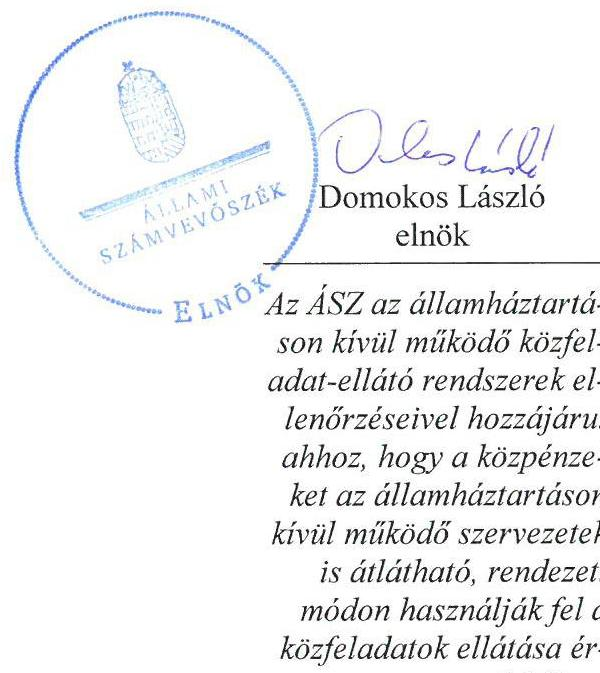
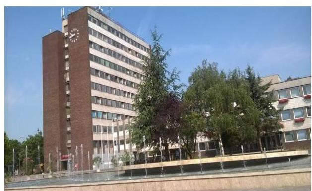
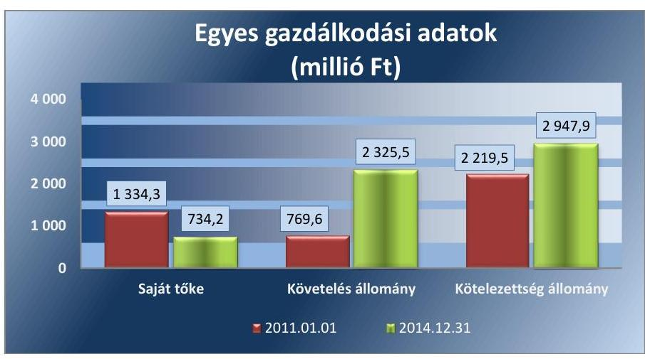
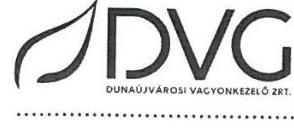
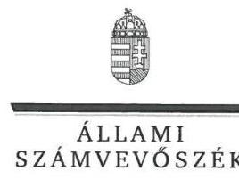
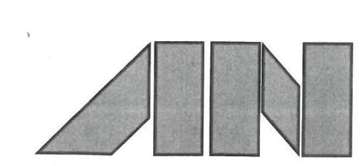
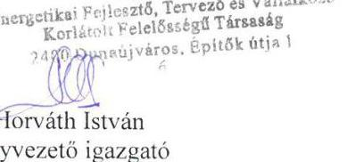
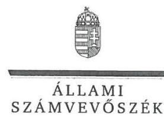
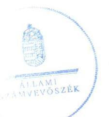

# Jelentés 

## ALFA-NOVA Energetikai, Fejlesztő, Tervező és Vállalkozó Kft. ellenőrzése

2017.

Az ÁSZ az államháztartáson kívül működő közfeladat-ellátó rendszerek ellenőrzéseivel hozzájárul ahhoz, hogy a közpénzeket az államháztartáson kívül működő szervezetek is átlátható, rendezett módon használják fel a közfeladatok ellátása érdekében.

---

# Jelentés 

## ALFA-NOVA Energetikai, Fejlesztő, Tervező és Vállalkozó Kft. ellenőrzése

2017. január hó ${ }^{\mu t}$ nap

---

# AZ ELLENŐRZÉST FELÜGYELTE:

## MAKKAI MÁRIA felügyeleti vezető

## AZ ELLENŐRZÉST VEZETTE ÉS A VÉGREHAJTÁSÁÉRT FELELŐS:

### NEMESVÁRI-HORTHY ESZTER ellenőrzésvezető

### KLINGA LÁSZLÓ ellenőrzésvezető

## A PROGRAM ÖSSZEÁLLÍTÁSÁÉRT FELELŐS:

### JANIK JÓZSEF LÁSZLÓ osztályvezető

---

**IKTATÓSZÁM:** V-1099-160/2016.

**TÉMASZÁM:** 2133

**ELLENŐRZÉS-AZONOSÍTÓ SZÁM:** V070765

---

Jelentéseink az Országgyűlés számítógépes hálózatán és az Interneten a www.asz.hu címen is olvashatóak.

---

# TARTALOMJEGYZÉK 

■ ÖSSZEGZÉS ..... 5
■ AZ ELLENŐRZÉS CÉLJA ..... 6
■ AZ ELLENŐRZÉS TERÜLETE ..... 7
■ AZ ELLENŐRZÉS HÁTTERE, INDOKOLTSÁGA ..... 8
■ A JELENTÉS LÉNYEGES KÉRDÉSKÖREI ..... 9
■ ELLENŐRZÉS HATÓKÖRE ÉS MÓDSZEREI ..... 10
■ MEGÁLLAPÍTÁSOK ..... 11
■ MELLÉKLETEK ..... 15
I. Sz. melléklet: Értelmező szótár. ..... 15
■ FÜGGELÉK: ÉSZREVÉTELEK ..... 17
■ RÖVIDÍTÉSEK JEGYZÉKE ..... 25

---

.

---

# ÖSSZEGZÉS 

Az Állami Számvevőszék az ALFA-NOVA Energetikai, Fejlesztő, Tervező és Vállalkozó Kft. vagyongazdálkodási tevékenységének ellenőrzése során megállapította, hogy a DVG Dunaújvárosi Vagyonkezelő Zrt. tulajdonosi joggyakorlása nem volt megfelelő, nem minden taggyűlésen képviseltette magát. A Társaság az éves beszámolókat elkészítette és a közzétételi kötelezettségének eleget tett.

## Az ellenőrzés társadalmi indokoltsága

Az Állami Számvevőszék kiemelt célja, hogy az államháztartáson kívülre nyújtott költségvetési támogatások és ingyenes vagyonjuttatások, valamint az államháztartáson kívül működő feladat-ellátó rendszerek ellenőrzéseivel hozzájáruljon ahhoz, hogy a közpénzeket az államháztartáson kívül működő szervezetek is átlátható, rendezett módon használják fel. Magyarországon az intézmény-centrikus közfeladat-ellátás jellemző, de egyre jelentősebb a költségvetésen kívüli feladatellátás térnyerése. Ennek legfontosabb szereplői - a nonprofit szervezetek mellett - a gazdasági társaságok, amelyek kiemelt fontosságú szerephez jutottak.

## Főbb megállapítások, következtetések, javaslatok

A DVG Dunaújvárosi Vagyonkezelő Zrt. a tulajdonosi joggyakorlása nem volt megfelelő. A 2011-2014. években az ALFA-NOVA Kft. 12 taggyűlést hívott össze, amelyen a DVG Zrt. négy alkalommal képviseltette magát.

A Társaság a szabályszerű vagyongazdálkodást megalapozó számviteli szabályzatokkal rendelkezett. A Társaság a beszámoló készítési kötelezettségének eleget tett. A közérdekű adatokat honlapján közzétette.

---

# AZ ELLENŐRZÉS CÉLJA 

Ellenőriztük, hogy a gazdasági társaság szabályozottsága, és vagyongazdálkodási tevékenysége megfelelt-e a jogszabályi előírásoknak.

---

# AZ ELLENŐRZÉS TERÜLETE 

## Az ALFA-NOVA Energetikai, Fejlesztő, Tervező és Vállalkozó Korlátolt Felelősségű Társaság

Az ALFA-NOVA Energetikai, Fejlesztő, Tervező és Vállalkozó Kft.-t a Dunaújváros Megyei Jogú Önkormányzata 100%-os tulajdonában lévő DVG Dunaújvárosi Vagyonkezelő Zrt. jogelődje, a DUNAQUA-THERM Rt., valamint az EGA-NOVA Kft. alapították 1996. június 18-án, 93,3 millió Ft törzstőkével, mely az ellenőrzött időszak során nem változott. A 2000. évben az ENERGOTT Kft. többségi befolyást (51%-ot) szerzett az ALFA-NOVA Energetikai, Fejlesztő, Tervező és Vállalkozó Kft.-ben. Az ellenőrzött időszakban az ENERGOTT Kft. többségi befolyása (51%) mellett az EGA-NOVA Kft.-nek 40%-os, a DVG Zrt.-nek 9%-os részesedése volt.

Az ALFA-NOVA Kft. főtevékenysége a gőzellátás, légkondicionálás volt, amely mellett ellátott egyéb (építőipari, villamos energia és távhőtermelési) tevékenységeket is. A Társaság távhőszolgáltatási közfeladatot Dunaújvárosban nem látott el, azt Szolnok és Szekszárd Megyei Jogú városokban végezte. A Társaság az ellenőrzött időszakban összesen 3071,1 millió Ft távhőszolgáltatással összefüggő támogatásban részesült.

Az ALFA-NOVA Kft. gazdálkodására jellemző adatokat az 1. ábra mutatja be:

1. ábra

Forrás: A Társaság éves beszámolói
Az ellenőrzött időszakban az ügyvezető személye egy alkalommal, 2012. június 1-jétől változott. 2012. május 31-éig az ALFA-NOVA Kft. irányítását két ügyvezető látta el, együttes képviseleti joggal.

---

# AZ ELLENŐRZÉS HÁTTERE, INDOKOLTSÁGA 

AZ ELLENŐRZÉS VÁRHATÓ HASZNOSULÁSAKÉNT az ÁSZ ${ }^{1}$ a megállapításaival segítséget nyújthat az államháztartáson kívüli közfeladat-ellátás értékeléséhez, jogszabályi keretei pontosításához, átláthatóságot biztosító szabályozásához. Az ellenőrzés eredményeként meghatározhatóvá válnak az államháztartáson kívüli szervezetek gazdálkodásában rejlő kockázatok, lehetővé válik ezen kockázatok csökkentése. Értékelhetővé válik, hogy a gazdasági társaság a vagyon használatával biztosította-e a szolgáltatás folytatásának feltételeit. Ezzel az ellenőrzött számára az ÁSZ visszajelzést ad gazdálkodási kockázatairól, amely alapot adhat a meglévő hibák megszüntetéséhez, a jobb feladat-ellátás biztosításához. Mindezeken keresztül az ÁSZ hozzájárul Magyarország közpénzügyi helyzetének javításához, a közpénzek mérhető módon történő, a döntéshozók által meghatározott célok szerinti felhasználásához.

---

# A JELENTÉS LÉNYEGES KÉRDÉSKÖREI 

1. A tulajdonosi joggyakorlás szabályszerű volt-e?
2. A gazdasági társaság vagyongazdálkodása szabályszerű volt-e?

---

# ELLENŐRZÉS HATÓKÖRE ÉS MÓDSZEREI 

## Az ellenőrzés típusa

Megfelelőségi ellenőrzés

## Az ellenőrzött időszak

2011. január 1-jétől 2014. december 31-ig terjedő időszak

## Az ellenőrzés tárgya

A gazdasági társaság gazdálkodásának szabályozottsága és szabályszerűsége.

Az ellenőrzés kiterjedt minden olyan körülményre és adatra, amely az ÁSZ jogszabályban meghatározott feladatainak teljesítéséhez, valamint a program végrehajtása folyamán felmerült újabb összefüggések feltárásához szükséges.

## Az ellenőrzött szervezet

A DVG Dunaújvárosi Vagyonkezelő Zrt. és az ALFA-NOVA Energetikai Fejlesztő, Tervező és Vállalkozó Kft.

## Az ellenőrzés jogalapja

Az ellenőrzés jogszabályi alapját az ÁSZ tv. 5. § (3) - (4) - (5) bekezdései képezték.

## Az ellenőrzés módszerei

A gazdasági társaságok ellenőrzése témacsoportos ellenőrzés keretében, általános program alapján történik. Az ellenőrzési program kérdéseit illesztettük a Társaság speciális tulajdonosi viszonyaihoz. Ennek megfelelően a jelentésben az ellenőrzési programnak csak a speciális tulajdonosi viszonyokat figyelembe vevő kérdéseire vonatkozó megállapítások szerepelnek.

Az ellenőrzés ideje alatt az ellenőrzött szervezettel történő kapcsolattartást az ÁSZ Szervezeti és Működési Szabályzatának vonatkozó előírásai alapján biztosítottuk.

Az ellenőrzés az ellenőrzésre kijelölt szervezetekre terjedt ki.

---

# 1. A tulajdonosi joggyakorlás szabályszerű volt-e? 

## Összegző megállapítás

1.1. számú megállapítás

A tulajdonosi joggyakorlás nem volt megfelelő. A DVG Zrt. a Társaság taggyűlésein nem minden esetben vett részt.

A DVG Zrt. a Társaság által a 2011-2014. években összehívott 12 taggyűlésből négy alkalommal képviseltette magát.

A DVG Zrt. a cégcsoportot alkotó négy leányvállalat vonatkozásában - amelynek az ALFA-NOVA Kft. nem volt része - az SZMSZ-ben előírta a tulajdonosi képviselet szabályait. Az SZMSZ 7.2 pontjában előírtak alapján a képviseletet ellátó személy az Igazgatóság ${ }^{3}$ elnöke, illetve legmagasabb vezető beosztású munkavállalója, az elnök-vezérigazgató volt. A DVG Zrt. Igazgatóságának Ügyrendje ${ }^{4}$ a Zrt. tulajdonában álló gazdasági társaságok, illetve részesedések tulajdonosi képviseletét ellátó személy részére előírta a tulajdonosi szándék - az Igazgatóság által adott mandátum alapján történő - közvetítését.

Az ALFA-NOVA Kft. ${ }^{5}$ legfőbb szerve a Taggyűlés ${ }^{6}$ volt. A Taggyűlésen a tagok a törzsbetétük arányában szavazhattak. A 2011-2014. években az ALFA-NOVA Kft. 12 taggyűlést hívott össze, amelyen - a jegyzőkönyvek és a jelenléti ívek alapján - a DVG Zrt. négy alkalommal képviseltette magát, így a tulajdonosi joggyakorlás nem volt megfelelő. A DVG Zrt. törzsbetétjének összege (8,4 millió Ft) után számított szavazati aránya 9% volt, így nem tudta befolyásolni a taggyűlés döntéseit.

## 2. A gazdasági társaság vagyongazdálkodása szabályszerű volt-e?

## Összegző megállapítás

2.1. számú megállapítás

Az ALFA-NOVA Kft. a vagyongazdálkodás szabályait belső szabályzatokban előírta, az éves beszámolókat elkészítette, közzétételi kötelezettségét teljesítette.

Az ALFA-NOVA Kft. a jogszabályban előírt számviteli szabályzatokkal rendelkezett.

Az ALFA-NOVA Kft. rendelkezett a Számv. tv. ${ }^{7}$ 14. § (3) bekezdésében előírt számviteli politikával, a Számv. tv. 14. § (5) bekezdés a)-d) pontjaiban foglaltaknak megfelelően eszközök és források leltárkészítési és leltározási szabályzattal, eszközök és források értékelési szabályzattal, pénzkezelési szabályzattal, önköltségszámítási szabályzattal. Rendelkezett továbbá a Számv. tv. 161. § (1) bekezdésében előírt számlarenddel, valamint bizonylati szabályzattal.

A Társaság a Tszt. ${ }^{8}$ 18/A § (2) bekezdésében előírtaknak megfelelve a számviteli szétválasztás szabályaira 2012. január 1-jei hatállyal Számviteli szétválasztási szabályzatot ${ }^{9}$ alkotott.

---

A Pénzkezelési szabályzat ${ }_{1-5}{ }^{10}$ a Számv. tv. 14. § (8) bekezdésében foglaltak ellenére nem tért ki a pénzforgalom bankszámlán történő lebonyolításának rendjére, a pénzkezelés tárgyi feltételeire, valamint a készpénzállomány ellenőrzésének gyakoriságára.
2.2. számú megállapítás

Az ALFA-NOVA Kft. a beszámolási, adatszolgáltatási kötelezettséget teljesítette. A Taggyűlés a 2013. évi beszámolót nem fogadta el.

Az ALFA-NOVA Kft. saját vagyonnal és - Koncessziós szerződés ${ }^{11}$, illetve Bérüzemeltetési-vállalkozási szerződés ${ }^{12}$ alapján - üzemeltetésre átvett vagyonnal látta el feladatait a 2011-2014. években.

Az ALFA-NOVA Kft. főbb mérlegadatait a 2. táblázat mutatja be.
2. táblázat

|  | AZ ALFA-NOVA KFT. FŐBB MÉRLEG ADATAI (MILLIÓ FORINT) |  |  |  |  |
| :--: | :--: | :--: | :--: | :--: | :--: |
| Megnevezés | 2011.01.01. | 2011.12.31. | 2012.12.31. | 2013.12.31. | 2014.12.31. |
| Befektetett eszközök | 1898,9 | 1814,7 | 1916,7 | 2009,2 | 1252,3 |
| -ebből: Tárgyi eszközök | 1206,5 | 1123,0 | 1225,5 | 1318,5 | 804,7 |
| Forgóeszközök | 1043,4 | 2039,0 | 2355,5 | 2609,3 | 2972,1 |
| -ebből: Követelések | 769,6 | 1343,8 | 1785,7 | 2113,6 | 2325,5 |
| Aktív időbeli elhatárolások | 1155,1 | 760,5 | 402,9 | 395,5 | 142,6 |
| ESZKÖZÖK ÖSSZESEN | 4097,4 | 4614,2 | 4675,1 | 5014,0 | 4367,0 |
| Saját tőke | 1334,3 | 1107,2 | 937,5 | 732,3 | 734,3 |
| -ebből Jegyzett tőke | 300,0 | 300,0 | 300,0 | 93,3 | 93,3 |
| Céltartalékok | 0,0 | 0,8 | 1,2 | 0,7 | 12,5 |
| Kötelezettségek | 2219,5 | 2854,7 | 3336,6 | 3596,8 | 2947,9 |
| Passzív időbeli elhatárolások | 543,6 | 651,5 | 399,8 | 684,2 | 672,3 |
| FORRÁSOK ÖSSZESEN | 4097,4 | 4614,2 | 4675,1 | 5014,0 | 4367,0 |

Az eszközérték 2011. január 1. és 2014. december 31. között 6,6%-kal (269,6 millió Ft-tal) nőtt. Az eszközök értékének növekedése a befektetett eszközök 646,6 millió Ft-os és az aktív időbeli elhatárolások 1008,5 millió Ft-os csökkenése mellett a forgóeszközök 1928,7 millió Ft-os növekményének eredménye volt. A befektetett eszközök állománya csökkenésének oka volt, hogy a 2014. évben az ALFA-NOVA Kft. értékesítette a távhőtermeléssel kapcsolatos tárgyi eszközeit. A forgóeszközök értéke 2011. év eleje és 2014. év vége között közel háromszorosára, azon belül a követelések értéke több mint háromszorosára nőtt. A kötelezettségek összege 2011. január 1-jéről 2013. december 31-ére több mint másfélszeresére (1377,3 millió Ft-tal) növekedett. A 2013. évről a 2014. évre a kötelezettségek 18,0%-kal (648,9 millió Ft-tal) csökkentek. A rövid lejáratú kötelezettségeken belül a meghatározó a szállítói kötelezettség állománya volt. Az ALFA-NOVA Kft.-nek a 2012. évtől hosszú lejáratú kötelezettsége nem volt. A források növekedésén belül a saját tőke értéke 2011. január 1-jéről 2014. december 31-ére közel felére csökkent (600,0 millió Ft-tal).

A Társaság saját tőkéje az ellenőrzött időszak minden évében meghaladta a jegyzett tőke szintjét, ezért a tulajdonosok részéről nem állt fent a Gt. ${ }^{13}$ 51. § (1) bekezdése, illetve a Ptk. ${ }^{14}$ 3:133. § (2) bekezdése szerinti intézkedési kötelezettség.

---

A Társaság részére az üzemeltetésre átadott vagyonról beszámolási, adatszolgáltatási kötelezettséget a Koncessziós szerződés, illetve a Bérüzemeltetési-
 vállalkozási szerződés fogalmazott meg.

ADATSZOLGÁLTATÁSI KÖTELEZETTSÉGÉNEK az ALFA-NOVA Kft. eleget tett a Tszt. 18/B. § (2) bekezdésében előírtaknak megfelelően, a 2012-2014. évi éves auditált beszámolóját megküldte a MEKH ${ }^{15}$ részére. Beszámoló készítési kötelezettségét a Számv. tv. 19. § (1) bekezdés szerinti tartalommal az ALFA-NOVA Kft. a 2011-2014. évekre teljesítette. A 2012-2014. években a Tszt. 18/A. § (3) bekezdés rendelkezéseinek megfelelő bontásban készítették el a kiegészítő mellékletet. A Taggyűlés a 2011., 2012. és 2014. évi éves beszámolót határozatban elfogadta, a 2013. évi éves beszámolót megtárgyalta, de nem fogadta el.

AZ FB ${ }^{16}$ a 2011-2014. években rendelkezett a Gt. 34. § (4) bekezdésében, illetve a Ptk. 2 3:122. § (3) bekezdésében előírt ügyrenddel.

AZ ADATOK VÉDELMÉVEL KAPCSOLATOS kötelezettségének a Társaság az Avtv. ${ }^{17}$ 31/A. § (3) bekezdésével és az Info. tv. ${ }^{18}$ 24. § (3) bekezdésével ellentétesen csak 2012. június 30. után tett eleget az Adatvédelmi szabályzat 2012. július 1-jei hatályba helyezésével. Az ALFA-NOVA Kft. a belső adatvédelmi felelőst kinevezte, az Adatvédelmi szabályzatot a belső adatvédelmi felelős elkészítette. A Társaság 2011-ben az Eisztv. ${ }^{19}$ 3. § (2) bekezdésében, 2012-2014-ben az Info. tv. 33. § (3) bekezdésében előírt, az 1. melléklet szerinti tartalmú közzétételi kötelezettségeinek a gazdálkodási adatok tekintetében honlapján* eleget tett.

---

.

---

# MELLÉKLETEK 

- I. SZ. MELLÉKLET: ÉRTELMEZŐ SZÓTÁR
gazdasági társaság
gazdálkodó szervezet
közszolgáltatás
közvetett tulajdon, illetve
közvetett befolyás
meghatározó befolyás
többségi befolyás

A Gt. 3. § (1) bekezdése szerint „gazdasági társaságot üzletszerű közös gazdasági tevékenység folytatására külföldi és belföldi természetes és jogi személyek, valamint jogi személyiség nélküli gazdasági társaságok alapíthatnak, működő társaságba tagként beléphetnek, társasági részesedést (részvényt) szerezhetnek."
A Ptk. ${ }_{2}$ 3:88. § (1) bekezdése szerint „a gazdasági társaságok üzletszerű közös gazdasági tevékenység folytatására, a tagok vagyoni hozzájárulásával létrehozott, jogi személyiséggel rendelkező vállalkozások, amelyekben a tagok a nyereségből közösen részesednek, és a veszteséget közösen viselik".
A Ptk. ${ }^{20}$ 685. § c) pontja szerint gazdálkodó szervezet:
„az állami vállalat, az egyéb állami gazdálkodó szerv, a szövetkezet, a lakásszövetkezet, az európai szövetkezet, a gazdasági társaság, az európai részvénytársaság, az egyesülés, az európai gazdasági egyesülés, az európai területi együttműködési csoportosulás, az egyes jogi személyek vállalata, a leányvállalat, a vízgazdálkodási társulat, az erdő birtokossági társulat, a végrehajtói iroda, az egyéni cég, továbbá az egyéni vállalkozó." (2014. 03.15-ig hatályos)
Az Ebktv. ${ }^{21}$ 3. § d) pontja a következőképpen határozza meg a közszolgáltatást: „szerződéskötési kötelezettség alapján a lakosság alapvető szükségleteinek ellátására irányuló szolgáltatás, így különösen a villamos energia-, gáz-, hő-, víz-, szennyvíz- és hulladékkezelési, köztisztasági, postai és távközlési szolgáltatás, továbbá a menetrend alapján közlekedő járművekkel végzett közforgalmú személyszállítás".
Egy vállalkozás tulajdoni hányadának, illetőleg szavazati jogának a vállalkozásban tulajdoni részesedéssel, illetőleg szavazati joggal rendelkező más vállalkozás (köztes vállalkozás) tulajdoni hányadán, szavazati jogán keresztül történő gyakorlása. A közvetett tulajdon, a közvetett befolyás arányának megállapításához a közvetett tulajdonnal, közvetett befolyással rendelkezőnek a köztes vállalkozásban fennálló szavazati jogát vagy tulajdoni hányadát meg kell szorozni a köztes vállalkozásnak a vállalkozásban fennálló szavazati vagy tulajdoni hányada közül azzal, amelyik a nagyobb. Ha a köztes vállalkozásban fennálló szavazati vagy tulajdoni hányad az ötven százalékot meghaladja, akkor azt egy egészként kell figyelembe venni (a tőkepiacról szóló 2001. évi CXX. törvény 5. § (1) bekezdés 84. pont).
A Ptk. ${ }_{2}$ 8:2. § (2) bekezdése szerint „A befolyással rendelkező akkor rendelkezik egy jogi személyben meghatározó befolyással, ha annak tagja vagy részvényese, és
a) jogosult e jogi személy vezető tisztségviselői vagy felügyelőbizottsága tagjai többségének megválasztására, illetve visszahívására; vagy
b) a jogi személy más tagjai, illetve részvényesei a befolyással rendelkezővel kötött megállapodás alapján a befolyással rendelkezővel azonos tartalommal szavaznak, vagy a befolyással rendelkezőn keresztül gyakorolják szavazati jogukat, feltéve, hogy együtt a szavazatok több mint felével rendelkeznek."
A Ptk. ${ }_{2}$ 8:2. § (1) bekezdése szerint „Többségi befolyás az olyan kapcsolat, amelynek révén természetes személy vagy jogi személy (befolyással rendelkező) egy jogi személyben a szavazatok több mint felével vagy meghatározó befolyással rendelkezik"

---

.

---

# FÜGGELÉK: ÉSZREVÉTELEK 

A jelentéstervezetet a Számvevőszék 15 napos észrevételezésre megküldte az ellenőrzött szervezetek vezetőinek az ÁSZ tv. 29. § ${ }^{\dagger}$ (1) bekezdése előírásának megfelelően.

Az ÁSZ a jelentéstervezetet észrevételezésre megküldte a DVG Dunaújvárosi Vagyonkezelő Zrt. elnök-vezérigazgatójának és az ALFA-NOVA Energetikai Fejlesztő, Tervező és Vállalkozó Kft. ügyvezető igazgatójának.

A DVG Dunaújvárosi Vagyonkezelő Zrt. elnök-vezérigazgatójának és az ALFA-NOVA Energetikai Fejlesztő, Tervező és Vállalkozó Kft. ügyvezető igazgatójának észrevételét és az arra adott választ a függelék alább tartalmazza.

[^0]
[^0]:    ${ }^{+} 29 . \S$ (1) Az Állami Számvevőszék az ellenőrzési megállapításait megküldi az ellenőrzött szervezet vezetőjének vagy az általa megbízott személynek, és annak, akinek személyes felelősségét állapította meg.
    (2) Az ellenőrzött szervezet vezetője és a felelősként megjelölt személy az ellenőrzés megállapításaira tizenöt napon belül írásban észrevételt tehet.
    (3) Az Állami Számvevőszék az észrevételre a beérkezésétől számított harminc napon belül írásban válaszol. A figyelembe nem vett észrevételeket köteles a jelentésben feltüntetni, és megindokolni, hogy azokat miért nem fogadta el.

---

Állami Számvevőszék
1364 Budapest 4. Pf.: 54

DVG DUNAÚJVÁROSI VAGYONKEZELŐ ZÁRTKÖRŰEN MŰKÖDŐ RÉSZVÉNYTÁRSASÁG cím: 2400 Dunaújváros, Kenyérgyéri út 1. levelezési cím: 2401 Dunaújváros, Pf.: 136 telefon: 0625551401, 0625551402 telefax: 0625551409 e-mail: dvgrt@mail.dvgrt.hu cégjegyzékszám: 0710001030 adószám: 10728491-2-07 web: www.dvgrt.hu

1060649006
1060649006
ikt: 182-4.../2016
1364 Budapest 4. Pf.: 54

Tárgy: Észrevételek az „ALFA-NOVA Energetikai, Fejlesztő, Tervező és Vállalkozó Kft. ellenőrzése" címmel készített számvevőszéki jelentéstervezethez

# Tisztelt Állami Számvevőszék! 

A V-1099-150/2016. számon megküldött, az ALFA-NOVA Energetikai, Fejlesztő, Tervező és Vállalkozó Kft.-t érintő jelentéstervezetre vonatkozóan észrevételezzük, hogy a DVG Zrt.-vel összefüggésben a tervezet 5. oldal 3. bekezdésében, a 11. oldal 1. pontban rögzített összegző megállapításban, illetve az 1.1. pontban tett megállapításban foglaltakkal nem értünk egyet.

Mindhárom helyen azt a megállapítást tette Tisztelt Számvevőszék, hogy a DVG Zrt. a többségi tulajdonában lévő leányvállalatokra előírta a tulajdonosi joggyakorlást, azonban a kisebbségi tulajdonában lévő Társaságra vonatkozó szabályokat nem határozott meg. Ezt a számvevőszék a DVG Zrt. SzMSz 7.2. pontjára, és az Igazgatóság Ügyrendjére alapozva állapította meg.

A lábjegyzet szerint két SzMSz-t vizsgált a Tisztelt Számvevőszék, a 2011. november 15-én és a 2015. július 16-án kelt SzMSz-eket, míg az Igazgatóság Ügyrendjei közül az ellenőrzött időszakra vonatkozó ügyrendeket vette figyelembe. Megállapították, hogy az SzMSz 7.2. pontjában foglaltak szerint a képviseletet ellátó személy az Igazgatóság Elnöke, illetve legmagasabb vezető beosztású munkavállalója az Elnök - Vezérigazgató volt. Az Igazgatóság Ügyrendje a tulajdonosi képviseletet ellátó személy részére előírta a tulajdonosi szándék - az Igazgatóság által adott mandátum alapján - cégcsoport vállalatai felé való közvetítést. Tehát tényként került megállapításra, hogy a szabályozások nem tértek ki a kisebbségi tulajdonban lévő Társaságban való képviselet rendjére.

A DVG Zrt.-nél V-1101/2016. számon lefolytatott számvevőszéki vizsgálat alkalmával a Tisztelt Számvevőszék rendelkezésére bocsátotta DVG Zrt. 2011-2014 közötti időszakra vonatkozó összes SzMSz-ét és Igazgatósági Ügyrendjét. A SzMSz keltezési dátumai: 2007.05.21., 2011.11.15., 2011.11.29., 2012.01.25., 2012.04.25., 2012.06.29., 2013.02.04. 2013.09.24., 2014.06.23., 2014.07.16.. Ezek mindegyikében valóban a 7.2. pont azt rögzíti, hogy a DVG Zrt. leányvállalatai esetében hogyan történik a tulajdonosi joggyakorlás, ugyanakkor jelezni szeretnénk, hogy az összes fent felsorolt SzMSz 5.1. pontja arról rendelkezik, hogy „A Zrt. tulajdonában álló gazdasági társaságok, illetve részesedések tulajdonosi képviseletét" hogyan és milyen módon kell ellátnia a DVG Zrt.-nek.

Fontos megjegyezni, hogy az 5.1. pontban nincsen utalás arra vonatkozóan, hogy többségi, vagy kisebbségi tulajdonosi részesedés esetén kell-e az ott meghatározott módon gyakorolni a tulajdonosi jogokat, tehát véleményünk szerint bármilyen mértékű részesedésre vonatkozik ez a szabály. Az csak az Igazgatóság szubjektív döntése volt, hogy a leányvállalatok, tehát a többségi tulajdonban lévő cégek esetében külön, a 7.1.-7.2. pontokban kerüljön feltüntetésre a tulajdonosi joggyakorlás, hiszen ezek jelentős, a DVG Zrt. szempontjából nagyobb résztulajdonnal bíró cégek voltak.

Az ellenőrzés időszakára vonatkozóan a következő keltezésű Igazgatósági Ügyrendeket készültek: 2007.02.27., 2011.10.03., 2011.11.29., 2012.06.01., 2013.02.04. Az Igazgatóság valamennyi Ügyrendjének 2.9.2.1. pontja rendelkezik a tulajdonosi joggyakorlásról, mégpedig úgy, hogy a DVG Zrt. Igazgatóságának Ügyrendjében rögzítettek alapján az Igazgatóság Elnöke és a társaság Vezérigazgatója együttes képviseleti joggal, majd a később történt módosítás alapján: vagy az Igazgatóság Elnöke, vagy a vezérigazgató önállóan képviselte a DVG Zrt.-t mint tulajdonost a tulajdonában álló gazdasági társaságok taggyűlésein történő döntéshozatal során, úgy, hogy a képviselőnek mandátumot kellett kapnia az adott taggyűlési meghívóban lévő napirendi pontokra az Igazgatóságtól.

Fontos kiemelni, hogy az Igazgatóság Ügyrendjében már egyáltalán nem szerepelnek külön feltüntetve a leányvállalatok (többségi tulajdonban lévő gazdasági társaságok), hanem csak arról rendelkezik, hogy hogyan kell mandátumot szereznie a „Zrt. tulajdonában álló gazdasági társaságok, illetve részesedések" esetében a képviseletre jogosultnak. Fent leírtakkal véleményünk szerint nem áll összhangban Tisztelt Számvevőszék azon megállapítása, hogy az „Igazgatóság Ügyrendje a tulajdonosi képviseletet ellátó személy részére előírta a tulajdonosi szándék - az Igazgatóság által adott mandátum alapján - cégcsoport vállalatai felé való közvetítést." (11. old. 3. 3. bek.), hiszen olyan szó nem szerepel az Igazgatóság egyetlen ügyrendjében sem, hogy „cégcsoport".

Összefoglalva a fentieket, véleményünk szerint a DVG Zrt. SzMSz-e és az Igazgatóság Ügyrendje a Zrt. által tulajdonolt gazdasági társaságok, illetve részesedések esetében egységesen, a részesedés mértékétől függetlenül határozta meg az ellenőrzött időszakban a tulajdonosi képviselet gyakorlását.

Kérem Tisztelt Állami Számvevőszéket, hogy amennyiben a fentiekben felsorolt indokainkat elfogadja, úgy a jelentéstervezetet módosítani szíveskedjék, különös tekintettel arra vonatkozóan, hogy nem volt a DVG Zrt. kisebbségi tulajdonában lévő társaságokban való képviselet rendjét meghatározó szabályozás, valamint, hogy a tulajdonosi joggyakorlás nem volt megfelelő.

Ezúton szeretnénk megköszönni az ellenőrzés során nyújtott segítő szándékú együttműködésüket.

Dunaújváros, 2016. december 16.

Tisztelettel:
Mádai Balázs
elnök - vezérigazgató

---

# Mádai Balázs Gábor úr 

elnök-vezérigazgató
DVG Dunaújvárosi Vagyonkezelő Zrt.

## Dunaújváros

## Tisztelt Elnök-vezérigazgató Úr!

Az „ALFA-NOVA Energetikai Fejlesztő, Tervező és Vállalkozó Kft. ellenőrzése" címmel készített számvevőszéki jelentéstervezetre tett észrevételét köszönettel megkaptam.

Az Állami Számvevőszék észrevételre vonatkozó álláspontjáról a felügyeleti vezető által készített részletes tájékoztatást csatoltan megküldöm.

Tájékoztatom Elnök-vezérigazgató urat, hogy a számvevőszéki jelentésben az észrevételt és az arra adott választ szerepeltetjük.

Budapest, 2017. 01. hó 11. nap

Tisztelettel:

Dombos László

Melléklet: Tájékoztatás az észrevétel kezeléséről

---

# Tájékoztatás   az észrevétel kezeléséről 

„ALFA-NOVA Energetikai Fejlesztő, Tervező és Vállalkozó Kft. ellenőrzése" című jelentéstervezetre 2016. december 28-án érkezett észrevételét áttekintettük, annak kezelésével kapcsolatban a következő tájékoztatást adom.

A jelentéstervezet 5. oldal 3. bekezdésében, a 11. oldal 1. pontban rögzített összegző megállapításban, illetve az 1.1. pontban tett megállapításra vonatkozó észrevételre adott válasz
A dokumentumok ismételt áttekintését követően a jelentéstervezetből a Társaság kisebbségi tulajdonában lévő társaságok esetében a tulajdonosi joggyakorlás rendjére vonatkozó megállapításokat töröltük.

Budapest, 2017. 01. hó 11. nap

Makkai
 Mária
felügyeleti vezető

---

# ALFA-NOVA 

## Energetikai Fejlesztő, Tervező és Vállalkozó Kft.

2400 Dunaújváros, Építők útja 1. telefon: (25) 411-528
telefon: (56) 422-237
telefax: (25) 510-111
telefax: (56) 420-294
e-mail: dunaújváros@alfanova.hu
e-mail: szolnok@alfanova.hu

K&H Bank: 10200218-29212444-00000000
Adószám: 11450289-4-07
Cégjegyzékszám: 07-09-004392

Állami Számvevőszék
Domokos László
elnök

## Budapest

Apáczai Csere János utca 10.
Pf: 54.
1364

## Tisztelt Elnök Úr!

A V-1099-151/2016. iktatószámú levelükben foglaltakra az alábbi választ adjuk:
Levelük mellékleteként megkaptuk az „ALFA-NOVA Energetikai Fejlesztő, Tervező és Vállalkozó Kft. ellenőrzése" címmel készített számvevőszéki jelentéstervezetet, melynek tartalmára vonatkozóan észrevételt nem kívánunk tenni.

Észrevételezzük azonban, hogy sem a vizsgálatot megelőzően, sem a vizsgálat közben nem kaptunk érdemi választ arra vonatkozóan, hogy társaságunk tevékenységének számvevőszéki ellenőrzésére milyen jogszabályi felhatalmazás alapján került sor. Mint azt a vizsgálat során három alkalommal írásban is jeleztük, az ALFA-NOVA Energetikai Fejlesztő, Tervező és Vállalkozó Kft. (2400. Dunaújváros, Építők útja 1.sz.) nem tartozik a többségi önkormányzati tulajdonú gazdasági társaságok körébe. Az ALFA-NOVA Kft. tulajdonosi szerkezetén belül a DVG Dunaújvárosi Vagyonkezelő Zrt. - mint Dunaújváros Megyei Jogú Város Önkormányzata 100%-os tulajdonában lévő gazdasági társaság - kisebbségi tulajdonosként 9% mértékű üzletrésszel rendelkezik. Az előzőeken túlmenően az ALFA-NOVA Kft. Dunaújvárosban semmilyen közfeladatot nem látott és nem lát el, szolgáltatási tevékenységét a vizsgált időszakban (2011-2014. években és 2015. évben is) működési engedélyei alapján kizárólag Szolnok és Szekszárd városokban végezte.

Ezúton is megerősítjük azon álláspontunkat, hogy a bemutatott körülmények figyelembe vételével az ellenőrzési kötelezettség társaságunkra nem vonatkozott.

Dunaújváros, 2016. december 20.
Tisztelettel:

---

ELHÖK

Ikt.szám: FV-V-1099-158/2016.

# Horváth István úr 

ügyvezető igazgató
ALFA-NOVA Energetikai
Fejlesztő, Tervező és Vállalkozó Kft.

## Dunaújváros

## Tisztelt Ügyvezető Igazgató Úr!

Az „ALFA-NOVA Energetikai Fejlesztő, Tervező és Vállalkozó Kft. ellenőrzése" címmel készített számvevőszéki jelentéstervezetre tett észrevételét köszönettel megkaptam.

Az Állami Számvevőszék észrevételre vonatkozó álláspontjáról a felügyeleti vezető által készített részletes tájékoztatást csatoltan megküldöm.

Tájékoztatom Ügyvezető Igazgató urat, hogy a számvevőszéki jelentésben - az Állami Számvevőszékről szóló 2011. évi LXVI. törvény 29. § (3) bekezdése alapján - a figyelembe nem vett észrevételeket szerepeltetjük az elutasítás indokának feltüntetésével.

Budapest, 2017. 01. hó II. nap

Tisztelettel:

Tisztelettel:

Melléklet: Tájékoztatás az el nem fogadott észrevételről

---

# Tájékoztatás   az el nem fogadott észrevételről 

„ALFA-NOVA Energetikai Fejlesztő, Tervező és Vállalkozó Kft. ellenőrzése" címû jelentéstervezetre 2016. december 28-án érkezett észrevételét áttekintettük, annak kezelésével kapcsolatban a következő tájékoztatást adom.

## Az ellenőrzés jogalapjához kapcsolódóan tett észrevételre adott válasz:

Észrevételük szerint nem kaptak érdemi választ arra vonatkozóan, hogy a társaság tevékenységének számvevőszéki ellenőrzésére milyen jogszabályi felhatalmazás alapján került sor. Az észrevételben foglaltakkal ellentétben az Állami Számvevőszék főtitkára által írt, a V-1099-018/2016. iktatószámú levél részletezi az ellenőrzés jogalapját, amelyet a társaság 2016. március 18-án átvett. Ez alapján az ellenőrzésre vonatkozó jogszabályi felhatalmazás a társaság részéről az ellenőrzés kezdete óta ismert volt.
A jelentéstervezet „Ellenőrzés hatóköre és módszerei" fejezet tartalmazza az ellenőrzés jogalapját: „Az ellenőrzés jogszabályi alapját az ÁSZ tv. 5. § (3)-(4)-(5) bekezdései képezték."
Az ellenőrzés módszerei között a jelentéstervezet kitér arra, hogy a témacsoportos ellenőrzéshez kapcsolódó általános program kérdéseit illesztettük a gazdasági társaság speciális tulajdonosi viszonyaihoz. Ennek megfelelően a jelentéstervezetben az ellenőrzési programnak csak a speciális tulajdonosi viszonyokat figyelembe vevő kérdéseire vonatkozó megállapítások szerepelnek.

Budapest, 2017. 01. hó II. nap

Makkai Mária
felügyeleti vezető

---

# RÖVIDÍTÉSEK JEGYZÉKE 

${ }^{1}$ ÁSZ
${ }^{2}$ SZMSZ
${ }^{3}$ Igazgatóság
${ }^{4}$ DVG Zrt. Igazgatóságának ügyrendje
${ }^{5}$ ALFA-NOVA Kft.
${ }^{6}$ Taggyűlés
${ }^{7}$ Számv. tv.
${ }^{8}$ Tszt.
${ }^{9}$ Számviteli szétválasztási szabályzat
${ }^{10}$ Pénzkezelési szabályzat ${ }_{1-5}$
${ }^{11}$ Koncessziós szerződés
${ }^{12}$ Bérüzemeltetési-vállalkozási szerződés
${ }^{13}$ Gt.
${ }^{14}$ Ptk. 2
${ }^{15}$ MEKH
${ }^{16}$ FB
${ }^{17}$ Avtv.
${ }^{18}$ Info. tv.
${ }^{19}$ Eisztv.
${ }^{20}$ Ptk. 1
${ }^{21}$ Ebktv.

Állami Számvevőszék
Dunaújvárosi Vagyonkezelő Zrt. ellenőrzött időszakban hatályos Szervezeti és működési szabályzata (kelt: 2011. november 15-én, illetve 2014. július 16-án)
a Dunaújvárosi Vagyonkezelő Zrt. Igazgatósága
a Dunaújvárosi Vagyonkezelő Zrt. Igazgatóságának ellenőrzött időszakban hatályos ügyrendje
ALFA-NOVA Energetikai, Fejlesztő, Tervező és Vállalkozó Korlátolt Felelősségű Társaság
az ALFA-NOVA Kft. Taggyűlése
a számvitelről szóló 2000. évi C. törvény
a távhőszolgáltatásról szóló 2005. évi XVIII. törvény
az ALFA-NOVA Kft. Számviteli szétválasztási szabályzata (hatályos: 2012. január 1-jétől)
az ALFA-NOVA Kft. Pénzkezelési szabályzata ${ }_{1-5}$ (hatályos: 2011. január 1-jétől 2011. december 31-éig, 2012. január 1-jétől 2012. június 30-áig, 2012. július 1-jétől 2012. december 31-éig, 2013. január 1-jétől 2013. december 31-éig és 2014. január 1-jétől)
Szolnok Megyei Jogú Város Önkormányzatával 1996. június 14-én kötött - 35 évre szóló - Koncessziós szerződés
a HÉLI-OSZ Kft.-vel (jogutódja: Szekszárdi Vagyonkezelő Kft.) és Szekszárd Megyei Jogú Város Önkormányzatával 1999. július 15-én - 20 éves időtartamra - Bérüzemeltetési-vállalkozási szerződés
a gazdasági társaságokról szóló 2006. évi IV. törvény (hatálytalan: 2014. március 14-től)
a Polgári Törvénykönyvről szóló 2013. évi V. törvény (hatályos: 2014. március 15-től)
Magyar Energia és Közmű-szabályozási Hivatal (2013. április 4-éig Magyar Energia Hivatal)
az Alfa Nova Kft. Felügyelő Bizottsága
a személyes adatok védelméről és a közérdekű adatok nyilvánosságáról szóló 1992. évi LXIII. törvény (hatályos: 2011. december 31-éig)
az információs önrendelkezési jogról és az információszabadságról szóló 2011. évi CXII. törvény (hatályos: 2012. január 1-jétől)
az elektronikus információszabadságról szóló 2005. évi XC. törvény (hatálytalan: 2012. január 1-jétől)
a Polgári Törvénykönyvről szóló 1959. évi IV. törvény (hatálytalan: 2014. március 15-étől)
az egyenlő bánásmódról és az esélyegyenlőség előmozdításáról szóló 2003. évi CXXV. törvény (hatályos 2004. január 27-étől)

---

# ÁLLAMI SZÁMVEVŐSZÉK 

1052 Budapest, Apáczai Csere János utca 10.
Levélcím: 1364 Budapest 4. Pf. 54
Telefon: +36 14849100 Telefax: +36 14849200
www.asz.hu
