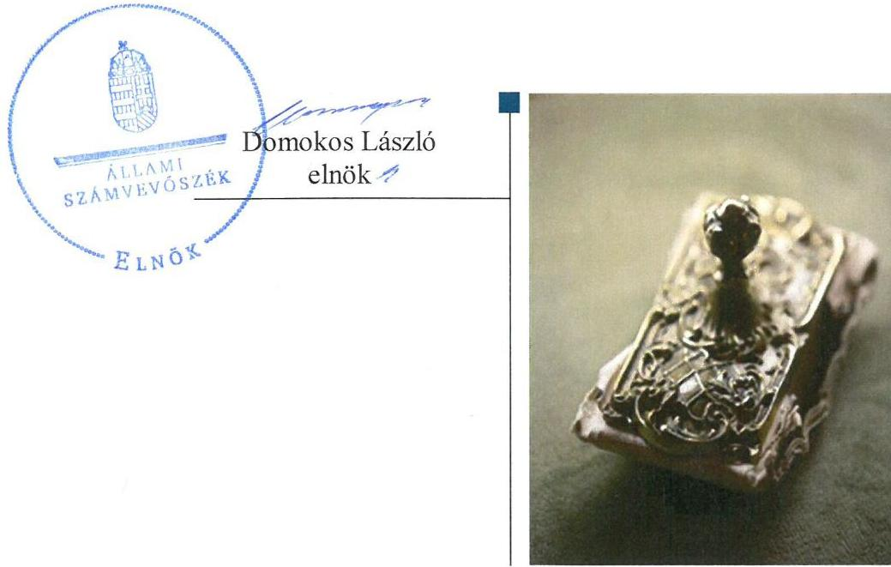
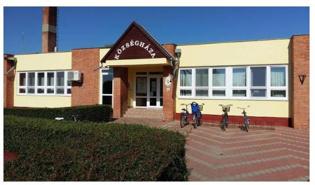
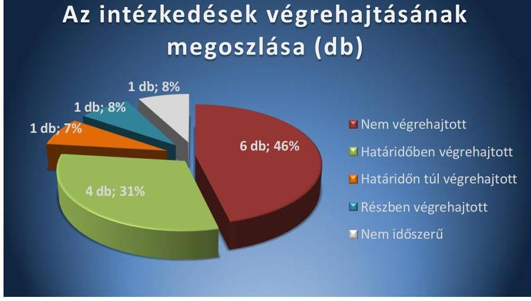
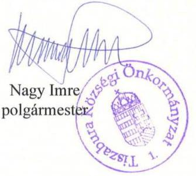

# Jelentés 

## Utóellenőrzések

Tiszabura Községi Önkormányzat vagyongazdálkodása
szabályszerűségének utóellenőrzése 2017.

---

# Jelentés 

## Utóellenőrzések

Tiszabura Községi Önkormányzat vagyongazdálkodása
szabályszerűségének utóellenőrzése
2017. február 16. nap

---

# AZ ELLENŐRZÉST FELÜGYELTE: 

DR. NÉMETH ERZSÉBET felügyeleti vezető

## AZ ELLENŐRZÉST VEZETTE ÉS A VÉGREHAJTÁSÁÉRT FELELŐS:

2016. szeptember 30-ig SZALAY NAGY JÁNOS ellenőrzésvezető
2016. október 1-től DR. SIMON JÓZSEF ellenőrzésvezető

A PROGRAM ÖSSZEÁLLÍTÁSÁÉRT FELELŐS:
JANIK JÓZSEF LÁSZLÓ osztályvezető

A TÉMÁHOZ KAPCSOLÓDÓ KORÁBBI SZÁMVEVŐSZÉKI JELENTÉSEK:

- címe: Jelentés az önkormányzatok vagyongazdálkodása szabályszerűségének ellenőrzéséről - Tiszabura
- sorszáma: 14206

IKTATÓSZÁM: V-1213-038/2016.
TÉMASZÁM: 2247
ELLENŐRZÉS-AZONOSÍTÓ SZÁM: V075550

---

# TARTALOMJEGYZÉK 

■ ÖSSZEGZÉS ..... 5
■ AZ ELLENŐRZÉS CÉLJA ..... 6
■ AZ ELLENŐRZÉS TERÜLETE ..... 7
■ AZ ELLENŐRZÉS HÁTTERE, INDOKOLTSÁGA ..... 8
■ FÓKUSZKÉRDÉS ..... 9
■ ELLENŐRZÉS HATÓKÖRE ÉS MÓDSZEREI ..... 10
■ MEGÁLLAPÍTÁSOK ..... 12
■ MELLÉKLETEK ..... 15
I. sz. melléklet: Az ÁSZ 14206 számú jelentéséhez kapcsolódó intézkedési terv végrehajtása ..... 15
■ FÜGGELÉK: ÉSZREVÉTELEK ..... 21
■ RÖVIDÍTÉSEK JEGYZÉKE ..... 23

---

.

---

# ÖSSZEGZÉS 

Az utóellenőrzés megállapította, hogy az intézkedési tervben foglalt feladatokat Tiszabura Községi Önkormányzat jellemzően nem hajtotta végre. A feladatok hiányos végrehajtása azt mutatja, hogy az Önkormányzat vagyongazdálkodásában és működési szabályosságában az Állami Számvevőszék által korábban feltárt hibák, hiányosságok és szabálytalanságok megszüntetése nem kapott kellő hangsúlyt, azok nagy részben jelenleg is fennállnak.

## Az ellenőrzés társadalmi indokoltsága

Az ÁSZ ${ }^{1}$ stratégiájában célul tűzte ki a számvevőszéki munka hasznosulásának javítását. Ezzel összhangban ellenőrzi, hogy az ellenőrzött szervezetek megvalósították-e a korábbi ellenőrzései által feltárt hibák, hiányosságok és szabálytalanságok megszüntetése céljából kialakított intézkedési terveikben foglaltakat. A rendszeres utóellenőrzések hozzájárulnak a szükséges intézkedések tényleges végrehajtásához, ezáltal a közpénzügyek rendezettségének javulásához.

Az Önkormányzat² vagyongazdálkodását érintően a korábbi ÁSZ jelentés ${ }^{3}$ számos hibát, hiányosságot és szabálytalanságot tárt fel a vagyon nyilvántartása, kimutatása, kezelése és hasznosítása vonatkozásában. A feladatok jelentősége indokolta az utóellenőrzés elvégzését.

## Főbb megállapítások, következtetések

Az Önkormányzat az intézkedési tervet ${ }^{4}$ határidőn túl küldte meg az ÁSZ részére. A jegyző ${ }^{5}$ a Bkr. ${ }^{6}$-ben foglaltak ellenére nem vezetett nyilvántartást az intézkedési terv végrehajtásáról.

Az intézkedési tervben meghatározott tizenhárom feladatból négyet határidőben, egyet határidőn túl, egyet részben, hat feladatot pedig nem hajtott végre. Egy feladat végrehajtása nem volt időszerű.

A nem végrehajtott feladatok esetében a polgármester ${ }^{7}$ nem intézkedett a ki nem számlázott bérleti díjak miatt a munkajogi felelősség kivizsgálásáról. A jegyző nem intézkedett az Önkormányzat vagyonkimutatásának jogszabályok szerinti elkészítése, az ingatlanvagyon-kataszter és a számviteli nyilvántartások adatai közötti egyezőség biztosítása, az üzemeltetési szerződésekben az üzemeltető leltározási kötelezettségének rögzítése, a beruházások szabályszerű üzembe helyezése, aktiválása és az értékcsökkenés szabályszerű elszámolása érdekében. Emellett a jegyző nem tett lépéseket a közérdekű adatok közzététele érdekében sem.

Mivel az Önkormányzat az intézkedési tervében vállalt feladatainak többségét nem, illetve részben hajtotta végre, a vagyongazdálkodás területén megállapított szabálytalanságok és hiányosságok jellemzően továbbra is fennállnak.

A szabályszerű és felelős vagyongazdálkodás feltételei a jogszabályoknak megfelelő belső szabályozási keretrendszer nélkül továbbra sem állnak rendelkezésre. Ennek hiányában az Önkormányzat nem képes a jó gazda gondosságával eljárni a rá bízott vagyon értékének megőrzése valamint eredményes működtetése érdekében.

---

# AZ ELLENŐRZÉS CÉLJA

Az ellenőrzés célja annak értékelése volt, hogy a számvevőszéki jelentésben foglalt intézkedést igénylő megállapításokkal és javaslatokkal összhangban készített intézkedési tervben meghatározott feladatokat az Önkormányzat végrehajtotta-e.

---

# AZ ELLENŐRZÉS TERÜLETE 

## Tiszabura Községi Önkormányzat

Tiszabura község Jász-Nagykun-Szolnok megyében, a Tisza-tó közelében fekszik, lakosainak száma 2016. január 1-én 3181 fő volt*.

Az Önkormányzat Tiszabura Községi Önkormányzat Hivatalán kívül két intézményt, a Recsky Klára ÁMK Övodát és a Tiszabura Szivárvány Gondozási Központot tartja fenn, továbbá egy gazdasági társaságban, az Esély Nonprofit Kft. ${ }^{8}$-ben rendelkezik tulajdonrésszel.

A polgármester 2014. október 12-e óta tölti be tisztségét, az ellenőrzött időszakban hivatalban lévő jegyző jogviszonya 2016. július 10-én megszűnt, feladatait helyettes jegyző látta el.

Az Önkormányzat 2015. évi költségvetési beszámolója szerint 965,4 millió Ft költségvetési bevételt ért el és 932,2 millió Ft költségvetési kiadást teljesített. Az Önkormányzat 2015-ben 19,8 millió Ft költségvetési évben esedékes, továbbá 8,8 millió Ft költségvetési évet követően esedékes kötelezettség állománnyal rendelkezett, mérleg szerinti eszközvagyona a 2013. évi 538,0 millió Ft-ról a 2015. évre 846,5 millió Ft-ra növekedett*.

Az ÁSZ 2014-ben ellenőrizte Tiszabura Községi Önkormányzat vagyongazdálkodásának szabályszerűségét a 2009. január 1. és 2013. december 31. közötti időszakra vonatkozóan. Az ellenőrzésről szóló 14206 számú jelentést az ÁSZ 2014. október 21-én tette közzé.

A 2014. évi ÁSZ jelentés a polgármesternek kettő, a jegyzőnek 11 javaslatot fogalmazott meg. Az utóellenőrzés az ÁSZ jelentés hasznosulása érdekében elfogadott intézkedési terv végrehajtásának ellenőrzésére irányult, a 2014. október 21. és 2016. július 21. között végrehajtott intézkedéseket figyelembe véve.

[^0]
[^0]:    * Forrás: Közigazgatási és Elektronikus Közszolgáltatások Központi Hivatala által 2016. január 1-jére vonatkozóan közzétett statisztikai adat
    * Forrás: Zárszámadási rendeletek, Tiszabura Községi Önkormányzat

---

# AZ ELLENŐRZÉS HÁTTERE, INDOKOLTSÁGA 

Az ÁSZ TÖRVÉNY 33. § (1) bekezdése értelmében a számvevőszéki jelentések intézkedést igénylő megállapításaihoz és javaslataihoz kapcsolódóan az ellenőrzött szervezet vezetője intézkedési tervet köteles összeállítani, és az Állami Számvevőszék részére megküldeni. Az intézkedési tervben foglaltak megvalósítását - az ÁSZ tv. 33. § (7) bekezdésében foglaltak alapján - az Állami Számvevőszék utóellenőrzés keretében ellenőrizheti. Az intézkedések megvalósulásának értékelése során az Állami Számvevőszék figyelembe veszi az ellenőrzött szervezetek működési feltételeiben, valamint a jogszabályi előírásokban bekövetkezett változásokat.

Az intézkedési tervekben foglalt feladatok hiányos, illetve késedelmes végrehajtása, valamint megvalósításának elmaradása azt mutatja, hogy az ellenőrzések során feltárt hibák, hiányosságok és szabálytalanságok megszüntetése nem kapott kellő hangsúlyt. Ez a szabályszerű működés és a felelős vezetői magatartás vonatkozásában kockázatot hordoz. E kockázatok feltárásával az Állami Számvevőszék utóellenőrzési rendszere fokozza a fegyelmet, és igazolja, hogy a közpénzzel való szabályos gazdálkodás felelőssége elől nem lehet kitérni.

## AZ UTÓELLENŐRZÉS VÁRHATÓ HASZNOSULÁSA

Az utóellenőrzés négy szinten hasznosulhat:
$\longrightarrow$ A társadalom szintjén az utóellenőrzés jelzi, hogy a számvevőszéki ellenőrzés megállapításainak van következménye: a hiányosságok megszüntetésére az ellenőrzött szervezet által meghatározott intézkedések végrehajtását is számon kéri az ÁSZ.
$\longrightarrow$ Az ellenőrzött terület szintjén az utóellenőrzés tájékoztatást nyújt a terület döntéshozóinak a hiányosságok kiküszöbölésének jó gyakorlatairól, ezzel lehetőséget biztosítva arra, hogy az ÁSZ ellenőrzési megállapításai, javaslatai a terület nem ellenőrzött szervezeteinek a működése során is hasznosuljanak.
$\longrightarrow$ Az ellenőrzött szervezet szintjén az utóellenőrzés feltárja, hogy a szervezet az intézkedések végrehajtásával hasznosította-e a korábbi ellenőrzési jelentésben a hiányosságok megszüntetése, illetve a kockázatok kezelése érdekében megfogalmazott javaslatokat.
$\longrightarrow$ Az ÁSZ szintjén az utóellenőrzés visszacsatolást ad az ellenőrzési jelentések hasznosulásáról, az intézkedések elmaradása vagy részleges megvalósulása a további ellenőrzésekhez kockázati jelzésként szolgál.

---

# FÓKUSZKÉRDÉS 

1. Az Önkormányzat az intézkedési tervben foglaltakat az előírt határidőben végrehajtotta-e?

---

# ELLENŐRZÉS HATÓKÖRE ÉS MÓDSZEREI 

## Az ellenőrzés típusa

Megfelelőségi ellenőrzés

## Az ellenőrzött időszak

Az utóellenőrzés alapját képező ÁSZ jelentés közzétételének napjától (2014. október 21.) az ellenőrzésről szóló kiértesítő levél keltének napjáig (2016. július 21.) tartó időszak volt.

## Az ellenőrzés tárgya

Az ÁSZ tv. 2011. július 1-jei hatálybalépését követően a számvevőszéki jelentésben foglalt intézkedést igénylő megállapításokkal és javaslatokkal összhangban - az ellenőrzött szervezet által-készített intézkedési tervben foglaltak végrehajtásának ellenőrzése.

Az ellenőrzés kiterjedt minden olyan körülményre és adatra, amely az ÁSZ jogszabályban meghatározott feladatainak teljesítéséhez, valamint a program végrehajtása folyamán felmerült újabb összefüggések feltárásához szükséges volt.

## Az ellenőrzött szervezet

Tiszabura Községi Önkormányzat

## Az ellenőrzés jogalapja

Az ÁSZ az Országgyűlés pénzügyi és gazdasági ellenőrző szerve. Az ÁSZ törvényben meghatározott feladatkörében ellenőrzi a központi költségvetés végrehajtását, az államháztartás gazdálkodását, az államháztartásból származó források felhasználását és a nemzeti vagyon kezelését. Az ÁSZ tv. 1. § (3) bekezdése szerint az ÁSZ általános hatáskörrel végzi a közpénzekkel és az állami és önkormányzati vagyonnal való felelős gazdálkodás ellenőrzését. A 33. § (7) bekezdése alapján az ÁSZ tv. 33. § (1)-(2) bekezdése szerinti intézkedési tervben foglaltak megvalósítását az ÁSZ utóellenőrzés keretében ellenőrizheti.

---

# Az ellenőrzés módszerei 

Az ellenőrzést a nemzetközi standardokat irányadónak tekintve az ellenőrzési program ellenőrzési kérdései, az ellenőrzött időszakban hatályos jogszabályok, az ellenőrzés szakmai szabályok és módszertanok figyelembevételével, önálló ellenőrzés keretében végeztük.

Az ellenőrzés ideje alatt az ellenőrzött szervezettel történő kapcsolattartást az ÁSZ SZMSZ ${ }^{\circledR}$-ének vonatkozó előírásai alapján biztosítottuk.

Az utóellenőrzés megállapításait elsősorban az ÁSZ rendelkezésére álló, valamint az ellenőrzött szervezetektől elektronikusan bekért dokumentumok alapozták meg.

Az ellenőrzési bizonyítékként felhasznált adatforrások közé tartoztak egyrészt a szakmai programban felsorolt adatforrások, másrészt minden az ellenőrzés folyamán feltárt, az ellenőrzés szempontjából információt tartalmazó dokumentum.

Az intézkedési tervben előírt feladatokat azok végrehajthatósága, illetve végrehajtása szempontjából az alábbiak szerint értékeltük ki:
"határidőben végrehajtott" a feladat, ha a teljesítés dokumentáltan, az intézkedési tervben előírt határidőben és tartalommal megtörtént;
"határidőn túl végrehajtott" a feladat, ha annak teljesítése az intézkedési tervben meghatározott módon, de az előírt határidőn túl történt meg;
"részben végrehajtott" a feladat, ha végrehajtása teljes körűen az intézkedési tervben előírt módon nem történt meg;
"nem végrehajtott" ha a végrehajtás nem történt meg, vagy amenynyiben a teljesítést nem dokumentálták;
"okafogyottá vált" a feladat, ha végrehajtására - meghatározott esemény bekövetkezése, továbbá külső körülmény, a működést érintő feltétel változása miatt - már nincs szükség, illetve lehetőség, és egyértelműen megállapítható, hogy az intézkedést szükségessé tevő körülmény a jövőben nem fordulhat elő;
"nem időszerű" az a feladat, amelynek ellenőrzött időszakon belüli végrehajtására azért nem került (kerülhetett) sor, mert az intézkedés alapjául szolgáló esemény nem következett be, de annak jövőbeni előfordulása lehetséges, a végrehajtása nem volt esedékes, vagy a végrehajtás határideje még nem járt le.
Az ellenőrzés lefolytatásához az ellenőrzött szervezet a tanúsítványok elektronikus kitöltésével, valamint az ÁSZ által kért dokumentumok elektronikus megküldésével szolgáltatott adatokat, amelyek valódiságát és teljes körűségét az ellenőrzött szervezet vezetője által tett teljességi és hitelességi nyilatkozat igazolja. Az így rendelkezésre bocsátott adatok, információk kontrollja az ellenőrzés keretében történt.

---

# MEGÁLLAPÍTÁSOK 

## 1. Az Önkormányzat az intézkedési tervben foglaltakat az előírt határidőben végrehajtotta-e?

Összegző megállapítás

Az Önkormányzat az intézkedési tervben meghatározott tizenhárom feladatból négyet határidőben, egyet határidőn túl, egyet részben hajtott végre, hatot pedig nem hajtott végre. Egy feladat végrehajtása nem volt időszerű. Az intézkedési tervben rögzített feladatok végrehajtásáról a Bkr.-ben előírt nyilvántartást nem vezették.

Az Önkormányzat az intézkedési tervet egy napos késéssel - a 2014. november 26-i határidőt követően 2014. november 27-én - a kiegészített intézkedési tervet a 2015. április 6-i határidőn túl, 2015. április 14-én küldte meg az ÁSZ részére.

Az ÁSZ jelentésében a polgármester részére kettő, a jegyző részére pedig tizenegy javaslatot fogalmazott meg, amelynek hasznosítására az Önkormányzat a kiegészített intézkedési tervében tizenhárom feladatot határozott meg. A feladatok elvégzésének felelőseként kettő esetben a polgármestert, tizenegy esetben pedig a jegyzőt jelölték meg.

A jegyző a Bkr. 14. § (1) bekezdésében foglaltak ellenére
 nem vezetett nyilvántartást az ÁSZ ellenőrzés javaslatai alapján készült intézkedési terv végrehajtásáról.

Az intézkedési tervben meghatározott feladatokat, határidőket és a feladatok végrehajtását az I. számú melléklet mutatja be.

Az intézkedési tervben meghatározott feladatok végrehajtásának értékelési kategóriák szerinti megoszlását az 1. ábra szemlélteti.

1. ábra

## Az intézkedések végrehajtásának megoszlása (db)

---

# HATÁRIDŐBEN VÉGREHAJTOTT FELADATOK: 

$\qquad$ 1. A jegyző az adósságrendezési eljárás lezárását megelőzően, a vállalt határidő előtt, 2015. május 15-én elkészítette a vagyongazdálkodási rendelet módosítását, amely tartalmazta a vagyonelemek tételes besorolását forgalomképtelen, korlátozottan forgalomképes, üzleti vagyon kategóriák szerinti bontásban.
2. A jegyző - az intézkedési tervben foglaltak szerint - megfelelően szabályozta az üzemeltetésre átadott eszközök leltározási módját a leltárkészítési és leltározási szabályzatban ${ }^{10}$.
3. A jegyző - a Számv. tv. ${ }^{11}$ rendelkezésével összhangban - intézkedett az Önkormányzat résztulajdonában álló Esély Innovációs Nonprofit Kft.-ben lévő tulajdoni részesedést jelentő befektetésének értékelése és a 2014. II. negyedévi mérlegben valós értéken történő szerepeltetése érdekében.
4. Az üzemeltetésre átadott eszközöket 2014. január 1-ig az Áhsz. ${ }^{12}$ előírásainak megfelelően mutatta ki az Önkormányzat könyvviteli mérlegében.

## HATÁRIDŐN TÚL VÉGREHAJTOTT FELADAT:

5. A képviselő-testület ${ }^{13}$ a vállalt 2015. február 28-i határidőt követően, 2015. augusztus 19-én tárgyalta és fogadta el a térítésmentes átadásokról, a lakóingatlan és az iskola felújításáról, illetve a gépkocsi értékesítéséről szóló előterjesztéseket.

## RÉSZBEN VÉGREHAJTOTT FELADAT:

6. A jegyző 2014. október 8-án intézkedett az Esély Nonprofit Kft. felé a bérleti díj kiszámlázásáról, azonban a beküldött dokumentumból nem volt megállapítható, hogy a kapcsolódó könyvelési tétel a kötelezettség kompenzálása vagy egyéb pénzforgalom nélküli kivezetés volt-e. A Számv. tv.-ben foglaltak ellenére a vízmű-telep előre kifizetett bérleti díjával szemben történő bérleti díj elszámolást bizonylat nem támasztotta alá.

## NEM VÉGREHAJTOTT FELADATOK:

7. A polgármester - az intézkedési tervben foglaltak ellenére - nem intézkedett a ki nem számlázott bérleti díjak miatt a munkajogi felelősség kivizsgálására irányuló eljárás megindítása érdekében.
8. A jegyző nem intézkedett az Önkormányzat és intézményei vagyonkimutatásának jogszabályok szerinti elkészítéséről a 2013. évi beszámolóban, mivel a vagyonkimutatás tagolása és tartalma nem felelt meg az Áhsz. ${ }^{1}$ben foglalt előírásoknak.
9. A jegyző nem intézkedett - a 147/1992. (XI.6.) Korm. rendelet és az Áhsz. ${ }^{14}$ rendelkezései ellenére - az ingatlan-vagyon kataszter és a számviteli nyilvántartás közötti egyezőség biztosítása érdekében a hiteles földhivatali adatok alapján.
10. A jegyző nem intézkedett - az intézkedési tervben foglaltak ellenére - annak érdekében, hogy a hatályos üzemeltetési szerződésekben az átadott eszközökre vonatkozóan rögzítsék az üzemeltetést végzők leltározási kötelezettségét.

---

11. A jegyző nem intézkedett az Info. tv. ${ }^{15}$ 1. mellékletében szereplő adatok közzététele érdekében. Az Önkormányzat dokumentumokkal nem tudta alátámasztani a nyilvánosságra hozott közérdekű adatok közzétételének időpontját.
12. A 2015. évben megvalósult beruházások és felújítások során csupán egy esetben történt a Számv. tv. előírásainak megfelelően az eszköz aktiválása a tényleges üzembe helyezést követően. A jegyző nem intézkedett a további 15,6 M Ft értékű beruházás és felújítás üzembe helyezéséről, aktiválásáról, értékcsökkenés elszámolásáról, valamint a beruházások állását érintő, a pénzügyi dolgozók és a kivitelezők, illetve műszaki ellenőrök közötti előzetes egyeztetések lefolytatásáról.

# NEM IDŐSZERŰ FELADAT: 

13. Az ellenőrzött időszakban behajthatatlan követelést nem írtak le, ezzel kapcsolatos intézkedésre nem került sor az Önkormányzatnál.

---

# MELLÉKLETEK

- I. SZ. MELLÉKLET: AZ ÁSZ 14206 SZÁMÚ JELENTÉSÉHEZ KAPCSOLÓDÓ INTÉZKEDÉSI TERV VÉGREHAJTÁSA

|  1. | Intézkedési terv alapján elvégzendő feladat: | Az intézkedési tervben meghatározott határidő | Az intézkedési tervben rögzített feladatok elvégzésének felelőse |
| --- | --- | --- | --- |
|   |  | Határidőben végrehajtott feladatok |   |
|  1. | „A jegyző elkészíti a hatályos vagyongazdálkodási rendelet módosítását arra vonatkozóan, hogy abban az egyes vagyonelemek tételesen kerüljenek besorolásra forgalomképtelen, korlátozottan forgalomképes, üzleti vagyon kategóriákba. Megjegyzés: Tiszabura Községi Önkormányzat 2011. június 1. napjától adósságrendezési eljárás alatt áll. A vagyonfelosztási javaslatot a pénzügyi gondnok 2013-ban elkészítette." | Adósságrendezési eljárás lezárását követő képviselőtestületi ülésen | Jegyző  |
|  2. | „A jegyző a vonatkozó kormányrendeletnek megfelelően szabályozta az üzemeltetésre átadott eszközök leltározási módját, a 2014.05.01. napjától hatályos leltárkészítési és leltározási szabályzatban." | Teljesítve | Jegyző  |
|  3. | „A jegyző intézkedett az Esély Innovációs Nonprofit Kft-ben lévő üzletrésznek a jogszabályi előírások figyelembevételével történő értékeléséről és a könyvviteli mérlegben annak megfelelő szerepeltetéséről a 2014. I. félévi beszámolóban." | Teljesítve | Jegyző  |

|  4. |   |
| --- | --- |
|  |   |
|  |   |
|  |   |
|  |   |
|  |   |
|  |   |
|  |   |
|  |   |
|  |   |
|  |   |
|  |   |
|  |   |
|  |   |
|  |   |
|  |   |
|  |   |
|  |   |
|  |   |
|  |   |
|  |   |
|  |   |
|  |   |
|  |   |
|  |   |
|  |   |
|  |   |
|  |   |
|  |   |
|  |   |
|  |   |
|  |   |
|  |   |
|  |   |
|  |   |
|  |   |
|  |   |
|  |   |
|  |   |
|  |   |
|  |   |

---

|  3. |  |  |  |   |
| --- | --- | --- | --- | --- |
|  4. | „A jegyző intézkedett, hogy az Önkormányzat az üzemeltetésre átadott eszközöket a könyvviteli mérlegében, a vonatkozó kormányrendeletnek megfelelő mérlegsoron tüntesse fel. Változott a mérleg felépítése a rendező mérleg után megfelelő mérlegsorra kerültek az átadott eszközök. A belső ellenőr 2014-ben ellenőrizte." |  |  | Az üzemeltetésre átadott eszközöket 2014. január 1-ig az Áhsz. ${ }^{1}$ előírásainak megfelelően külön mérlegsoron mutatta ki az Önkormányzat könyvviteli mérlegében. Az államháztartás számvitelének 2014. évi változásával kapcsolatos feladatokról szóló 36/2013. (IX. 13.) NGM rendelet 1. számú melléklete alapján az üzemeltetési, bérleti szerződés keretében átadott eszközöket nem külön mérlegsoron, hanem a tárgyi eszközök között kellett kimutatni a rendező mérlegben.  |
|  5. | „A polgármester a képviselő-testület elé terjeszti utólagos megtárgyalásra - a jegyző által előkészített - a térítésmentes átadásokra, a lakóingatlan és iskola felújítására, valamint a gépkocsi értékesítésére vonatkozó előterjesztéseket." |  |  |   |
|  6. | „A jegyző intézkedett az Esély Innovációs Nonprofit Kft. felé - a gyermek és előfizetéses étkeztetésre - kötött szerződésekben foglalt bérleti díjak kiszámlázásáról. A kompenzációs számla - az önkormányzat tartozott a vízmű-telep előre kifizetett bérleti díjával, amellyel szemben elszámolásra került a konyha bérleti díja - 2014.10.08-án elkészült." |  |  |   |
|  7. | „A polgármester intézkedik a számvevőszéki jelentés megállapításai alapján a ki nem számlázott bérleti díjak miatt a munkajogi felelősség kivizsgálására irányuló eljárás megindítása iránt, és ennek eredményeként a szükséges intézkedéseket megteszi." |  |  | A jegyző 2014. október 8-án intézkedett az Esély Nonprofit Kft. felé - a gyermek és előfizetéses étkeztetésre kötött szerződésben foglalt - a főzőkonyha bérleti díjának kiszámlázásáról a vállalt intézkedésének megfelelően, azonban az utóellenőrzéshez az Önkormányzat által beküldött „Egyéb könyvelés napló" adataiból nem volt megállapítható, hogy a kapcsolódó könyvelési tétel az Esély Nonprofit Kft.-vel szembeni kötelezettség kompenzálása vagy egyéb pénzforgalom nélküli kivezetés volt-e, illetve az sem volt megállapítható, hogy milyen főkönyvi számlával szemben történt a gazdasági esemény elszámolása. A vízmű-telep előre kifizetett bérleti díjával szemben történő bérleti díj elszámolást - a Számv. tv. 165. § (1)-(2) bekezdésében foglaltak ellenére - bizonylat nem támasztotta alá.  |
|  8. |  |  |  |   |
|  9. | „A polgármester intézkedik a számvevőszéki jelentés megállapításai alapján a ki nem számlázott bérleti díjak miatt a munkajogi felelősség kivizsgálására irányuló eljárás megindítása iránt, és ennek eredményeként a szükséges intézkedéseket megteszi." |  |  |   |

---

|  5. |  |  |  |   |
| --- | --- | --- | --- | --- |
|  6. |  |  |  |   |
|  7. |  |  |  |   |
|  8. | „A jegyző intézkedett az Önkormányzat vagyonkimutatásának jogszabályok szerinti elkészítéséről a 2013. évi beszámolóban. A Képviselő-testület 2014. április 30-án tárgyalta meg és fogadta el (10/2014. (IV.30.) Ők. Rendelet.)" |  |  |   |
|  9. | „A jegyző intézkedik az ingatlanvagyon-kataszter adatainak és a számviteli nyilvántartásoknak a vonatkozó kormányrendeletben foglaltaknak megfelelő egyezőségének biztosításáról a hiteles földkönyv megvásárlását követően." |  |  |   |
|  10. | „A jegyző intézkedik annak érdekében, hogy a jövőben megkötésre kerülő üzemeltetési szerződésben rögzítésre kerüljön, hogy az üzemeltetésre átadott eszközökről a könyvviteli mérleg alátámasztásához az üzemeltetés végző szervek által elkészített, hitelesített leltárak álljanak rendelkezésre." A jegyző intézkedik annak érdekében, hogy az üzemeltetés végző szervek által a hitelesített leltárak elkészítésének kötelezettsége a már megkötött üzemeltetési szerződésekre is kiterjedjen." |  |  |   |
|  11. | „A jegyző intézkedik annak érdekében, hogy a jövőben megkötésre kerülő üzemeltetési szerződésben rögzítésre kerüljön, hogy az üzemeltetésre átadott eszközökről a könyvviteli mérleg alátámasztásához az üzemeltetés végző szervek által elkészített, hitelesített leltárak álljanak rendelkezésre." A jegyző intézkedik annak érdekében, hogy az üzemeltetés végző szervek által a hitelesített leltárak elkészítésének kötelezettsége a már megkötött üzemeltetési szerződésekre is kiterjedjen." |  |  |   |

|  Az intézkedés tervben meghatározott határidő | Az intézkedés tervben rögzített feladatok elvégzésének felelőse  |
| --- | --- |
|  2. | 3.  |
|  Teljesítve | Jegyző  |
|  2015.02.28. | Jegyző  |
|  2015.05.31. | Jegyző
  |

A jegyző nem tett intézkedést a 2013. évi vagyonkimutatás szabályszerű elkészítése érdekében. Az Önkormányzat 10/2014. (IV.30.) rendeletének 8/12. számú mellékletét képező vagyonkimutatás szerkezete nem felelt meg az Áhsz.; 44/A. § (2)-(3) bekezdéseiben foglalt előírásoknak. A vagyonkimutatás nem tartalmazta a könyvviteli mérlegben szereplő eszközök és források tagolását forgalomképtelen, illetve korlátozottan forgalomképes törzsvagyon és üzleti vagyon kategóriák szerint, továbbá nem mutatta be az érték nélkül nyilvántartott eszközök állományát, valamint a mérlegben értékkel nem szereplő kötelezettségeket.

A hiteles földkönyvet az erről beérkezett számla alapján a vállalt határidőn túl, 2016. május 4-én vásárolta meg az Önkormányzat. A földhivatali és az ingatlanvagyon-kataszter adatai közötti eltérésekről 2016-ban kimutatást készítettek, amelyből azonban nem állapítható meg, hogy a felsorolt ingatlanok adatai melyik nyilvántartás szerint voltak valósak.

Az Önkormányzat dokumentumokkal nem igazolta az ingatlanvagyon-kataszter ingatlan adatlapjának illetve betétlapjainak a földhivatali nyilvántartással való egyeztetését valamint a számviteli nyilvántartásban szereplő adatokkal való egyezőségét.

Az ingatlanvagyon-kataszter és a számviteli nyilvántartások közötti egyezőség biztosításához szükséges feladatok elvégzése nem történt meg, megsértve ezzel a 147/1992. (XI.6.) Korm. rendelet 1. § (2) bekezdésében valamint az Áhsz.; 30. § (4) bekezdésében foglalt rendelkezéseket.

A jegyző nem intézkedett annak érdekében, hogy az intézkedési terv készítésének időpontjában hatályos szerződésekben rögzítsék az üzemeltetést végző szervezetek kötelezettségét az általuk üzemeltetésre átvett eszközök leltározására vonatkozóan. Az önkormányzati tulajdonú főzőkonyha bérleti jogviszonyban történő üzemeltetésére a 2015-ben kötött szerződések nem írták elő az üzemeltető leltározási kötelezettségét. Az üzemeltetésre átadott konyhai eszközök 2015. és 2016. évi leltárjegyzéke nem felelt meg az intézkedési tervben foglalt előírásoknak, mivel nem volt megállapítható, hogy hol történt a leltár-

---

|  Mellékletek |  |  |  |   |
| --- | --- | --- | --- | --- |
|   |  |  | Az intézkedési | Az intézkedési  |
|   |  |  | tervben | tervben rögzített feladatok  |
|   |  |  | meghatározott határidő | elvégzésének felülése  |
|   |  | 1. | 2. | 3.  |
|   |  |  |  | zás, illetve a leltározók milyen felhatalmazás alapján, kinek a képviseletében végezték tevékenységüket. A polgármester által 2016. szeptember 2-án tett nyilatkozat alapján az Önkormányzat a víziközmű-vagyon üzemeltetését hatósági kijelölés alapján végző szervezettel – a Vksztv.16 33. § előírása ellenére – nem kötött üzemeltetési szerződést, továbbá nem szolgáltatott a víziközmű-vagyon leltározásával kapcsolatos dokumentumokat.  |
|   |  |  |  | A jegyző nem intézkedett az Info tv. 1. mellékletében meghatározott adatok közzététele érdekében, megsértve ezzel az Info tv. 37. § (1) bekezdésében foglalt rendelkezést.  |
|   |  |  |  | Az Info tv. 1. mellékletének I. pontjában meghatározott adatok közül nem hozta nyilvánosságra az Önkormányzat a szervezeti felépítését a szervezeti egységek megjelölésével illetve feladataival, a képviselő-testület létszámát, összetételét, tagjainak nevét, beosztását, elérhetőségeit, az Önkormányzat által alapított költségvetési szerv nevét, székhelyét, a költségvetési szervet alapító jogszabály megjelölését, illetve az azt alapító határozatot, a költségvetési szerv alapító okiratát, vezetőjét, honlapjának elérhetőségét, működési engedélyét.  |
|   |  |  |  | Az Info tv. 1. melléklet II. pontjában megnevezett adatok közül nem került közzétételre az ellenőrzött időszakban a Szervezeti és Működési Szabályzat, az adatvédelmi és adatbiztonsági szabályzat hatályos és teljes szövege, a közérdekű adatok megismerésére irányuló igények intézésének rendje, az illetékes szervezeti egység neve, elérhetősége, az ellenőrzések nyilvános megállapításait tartalmazó dokumentumok illetve a közszolgáltatások összefoglaló, a jogszabályban előírt tartalmi elemekkel rendelkező formában történő összegzése.  |
|   |  |  |  | Az Info tv. 1. melléklet III. pontjában szereplő gazdálkodási adatok közzététele az ellenőrzött időszakban szintén nem teljes körűen valósult meg. A jegyző nem gondoskodott a közfeladatot ellátó szervnél foglalkoztatottak létszámára és személyi juttatásaira vonatkozó összesített adatok, illetve összesítve a vezetők és vezető tisztségviselők illetménye, munkabére, és rendszeres juttatásai, valamint költségtérítése, az egyéb alkalmazottaknak nyújtott juttatások, az Önkormányzat által nyújtott költségvetési támogatások kedvezményezettjeinek nevére, a  |
|   |  |  |  | Az  |
|   |  |  |  | 18  |

---

|  1. | 2. | 3. | 4.  |
| --- | --- | --- | --- |
|  12. | „A jegyző intézkedett arról, hogy a beruházásokat, felújításokat az üzembe helyezésig ne aktiválják, továbbá az értékcsökkenés elszámolására az üzembe helyezést, aktiválást követően kerüljön sor. A pénzügyi dolgozók előzetesen egyeztessenek a kivitelezővel, ha van műszaki ellenőrrel a beruházás állásáról, hogy a későbbiekben ilyen szabálytalanságok ne fordulhassanak elő.” | Teljesítve | Jegyző  |
|  13. | „A jegyző intézkedett arról, hogy a jövőben a behajthatatlan követelés leírására a jogszabályi feltételek fennállása esetén kerüljön sor. A behajthatatlanság tényét és mértékét a jegyzőnek bizonyítania kell.” | „azonnal, folyamatos” | Jegyző  |

|  Az intézkedési tervben meghatározott határidő | Az intézkedési tervben rögzített feladatok elvégzésének felülése | Az intézkedés végrehajtása  |
| --- | --- | --- |
|  2. | 3. | 4.  |
|  12. | „A jegyző intézkedett arról, hogy a beruházásokat, felújításokat az üzembe helyezésig ne aktiválják, továbbá az értékcsökkenés elszámolására az üzembe helyezést, aktiválást követően kerüljön sor. A pénzügyi dolgozók előzetesen egyeztessenek a kivitelezővel, ha van műszaki ellenőrrel a beruházás állásáról, hogy a későbbiekben ilyen szabálytalanságok ne fordulhassanak elő.” | Teljesítve  |

|  Nem időszert feladat |  |  |   |
| --- | --- | --- | --- |
|  „azonnal, folyamatos” | Jegyző | Az ellenőrzött időszakban behajthatatlan követelést nem írtak le, ezért ezzel kapcsolatos intézkedésre nem került sor az Önkormányzatnál. |   |

*Forrás: ÁSZ*

---

.

---

# FÜGGELÉK: ÉSZREVÉTELEK 

A jelentéstervezetet a Számvevőszék 15 napos észrevételezésre megküldte az ellenőrzött szervezet vezetőjének az ÁSZ tv. 29. §7 (1) bekezdése előírásának megfelelően.

Az ellenőrzött szervezet vezetője az ÁSZ tv. 29. § (2) bekezdésében foglalt észrevételezési jogával nem élt, a jelentéstervezetre észrevételt nem tett.

Az ellenőrzött szervezet vezetője az ÁSZ tv. 29. § (2) bekezdésében foglalt észrevételezési jogával nem élt, a jelentéstervezetre észrevételt nem tett.

---

Tiszabura Községi Önkormányzat Polgármestere
5235 Tiszabura, Kossuth Lajos u 52.

Állami Számvevőszék
1052 Budapest
Apáczai Csere János u. 10.
Postacím: 1364 Budapest 4, Pf. 54.
E-mail cím: felugyeletvezeto nemethe@asz.hu

Domokos László Elnök Úr részére

Tárgy: Tiszabura Községi Önkormányzat vagyongazdálkodása szabályszerűségének utóellenőrzése

Tisztelt Elnök Úr!
Fent hivatkozott számú „Tiszabura Községi Önkormányzat vagyongazdálkodása szabályszerűségének utóellenőrzése" tárgyú jelentéstervezet kapcsán észrevétellel nem élek.

Megjegyezném, hogy Dr. Bán Attila korábbi jegyző Úr jogviszonyának megszüntetése ügyében munkajogi peres eljárás van folyamatban a Szolnoki Közigazgatási és Munkaügyi Bíróságon.

Tiszabura, 2017. január 09.

Tisztelettel:

---

# RÖVIDÍTÉSEK JEGYZÉKE 

${ }^{1}$ ÁSZ
${ }^{2}$ Önkormányzat
${ }^{3}$ ÁSZ jelentés
${ }^{4}$ intézkedési terv
${ }^{5}$ jegyző
${ }^{6}$ Bkr.
${ }^{7}$ polgármester
${ }^{8}$ Esély Nonprofit Kft.
${ }^{9}$ ÁSZ SZMSZ
${ }^{10}$ leltározási és leltárkészítési szabályzat
${ }^{11}$ Számv. tv.
${ }^{12}$ Áhsz. 1
${ }^{13}$ képviselő-testület
${ }^{14}$ Áhsz. 2
${ }^{15}$ Info. tv.
${ }^{16}$ Vksztv.
${ }^{17}$ 2015. évi zárszámadási rendelet

Állami Számvevőszék
Tiszabura Községi Önkormányzat
14206 számú ÁSZ jelentés az önkormányzatok vagyongazdálkodása szabályszerűségének ellenőrzéséről - Tiszabura (közzététel dátuma: 2014. október 21-én)
A 135/2014. (XII.18.) Ök. Határozattal elfogadott és a 18/2015. (IV.13.) Ök. Határozattal kiegészített intézkedési terv
Tiszabura Községi Önkormányzat jegyzője
370/2011. (XII.31.) Korm. rendelet a költségvetési szervek belső kontrollrendszeréről és belső ellenőrzéséről (hatályos 2012. január 1-jétől)
Tiszabura Községi Önkormányzat polgármestere
Esély Innovációs Nonprofit Kft.
Szervezeti és Működési Szabályzat
Tiszabura Községi Önkormányzat leltározási és leltárkészítési szabályzata (hatályos 2014. január 1-jétől)
a számvitelről szóló 2000. évi C. törvény
249/2000. (XII.24.) Korm. rendelet az államháztartás szervezetei beszámolási és könyvvezetési kötelezettségének sajátosságairól (hatálytalan 2014. január 1-jétől)
Tiszabura Községi Önkormányzat képviselő-testülete
4/2013. (I. 11.) Korm. rendelet az államháztartás számviteléről (hatályos 2014. január 1-jétől)
2011. évi CXII. törvény az információs önrendelkezési jogról és az információszabadságról (hatályos 2011. július 27-től)
2011. évi CCIK. törvény a víziközmű-szolgáltatásról (hatályos 2011. december 31-jétől)
Tiszabura Községi Önkormányzat Képviselő-testületének 4/2016. (V.30.) önkormányzati rendelete a 2015. évi költségvetés végrehajtásáról.

---

ÁLLAMI SZÁMVEVŐSZÉK
1052 Budapest, Apáczai Csere János utca 10.
Levélcím: 1364 Budapest 4. Pf. 54
Telefon: +36 14849100 Telefax: +36 14849200
www.asz.hu

