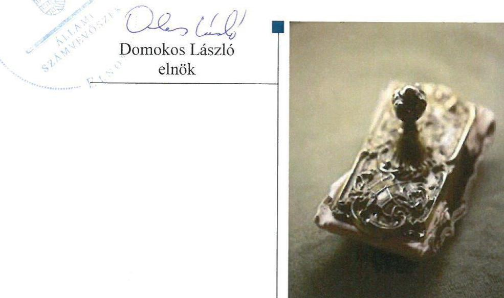
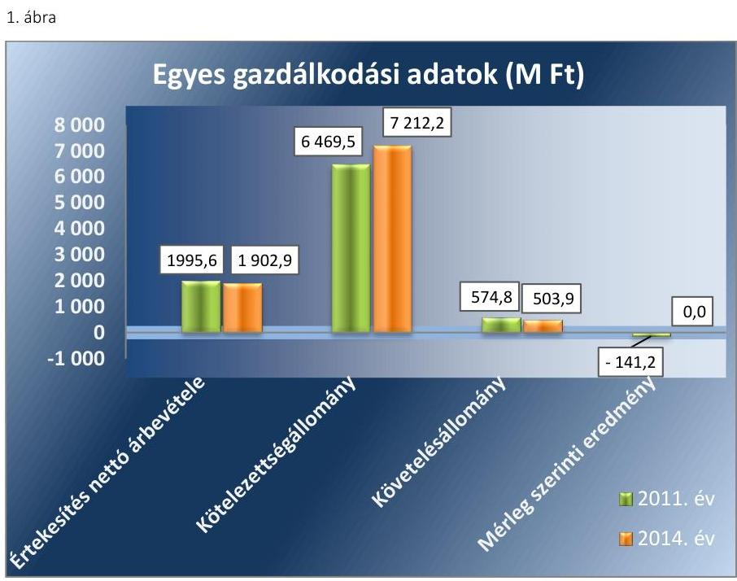

# Jelentés 

## Az önkormányzatok gazdasági társaságai

Az önkormányzatok többségi tulajdonában lévő gazdasági társaságok gazdálkodásának ellenőrzése - Cívis Ház Zrt.
2017.

---

# Jelentés 

## Az önkormányzatok gazdasági társaságai

Az önkormányzatok többségi tulajdonában lévő gazdasági társaságok gazdálkodásának ellenőrzése - Cívis Ház Zrt.
2017. 2017. hó 27. nap

Domokos László

---

# AZ ELLENŐRZÉST FELÜGYELTE:

## MAKKAI MÁRIA felügyeleti vezető

## AZ ELLENŐRZÉST VEZETTE ÉS A VÉGREHAJTÁSÁÉRT FELELŐS:

### SALAMIN VIKTOR ellenőrzésvezető

## A PROGRAM ÖSSZEÁLLÍTÁSÁÉRT FELELŐS:

### JANIK JÓZSEF osztályvezető

---

**IKTATÓSZÁM:** V-1118-117/2016.

**TÉMASZÁM:** 2152

**ELLENŐRZÉS-AZONOSÍTÓ SZÁM:** V070783

---

Jelentéseink az Országgyűlés számítógépes hálózatán és az Interneta a www.asz.hu címen is olvashatóak.

---

# TARTALOMJEGYZÉK 

■ ÖSSZEGZÉS ..... 5
■ AZ ELLENŐRZÉS CÉLJA ..... 6
■ AZ ELLENŐRZÉS TERÜLETE ..... 7
■ AZ ELLENŐRZÉS HÁTTERE, INDOKOLTSÁGA ..... 9
■ A JELENTÉS LÉNYEGES KÉRDÉSKÖREI ..... 10
■ ELLENŐRZÉS HATÓKÖRE ÉS MÓDSZEREI ..... 11
■ MEGÁLLAPÍTÁSOK ..... 13
■ JAVASLATOK ..... 21
■ MELLÉKLETEK ..... 23
I. sz. melléklet: Értelmező szótár ..... 23
II. sz. melléklet: Múködési adatok ..... 24
■ FÜGGELÉK: ÉSZREVÉTELEK ..... 25
■ RÖVIDÍTÉSEK JEGYZÉKE ..... 27

---

.

---

# ÖSSZEGZÉS 

A 2011-2014 közötti időszakban a lakás- és helyiséggazdálkodás közfeladat ellátását Debrecen Megyei Jogú Város Önkormányzata szabályszerűen szervezte meg, a Debreceni Vagyonkezelő Zrt. általi tulajdonosi joggyakorlás megfelelt a jogszabályi előírásoknak. A Civis Ház Zrt. vagyongazdálkodása szabályszerű volt, beszámolási és adatszolgáltatási kötelezettségét összességében teljesítette. Az ellátott feladat bevételeinek, ráfordításainak elszámolása, valamint az önköltségszámítás szabályszerű volt.

## Az ellenőrzés társadalmi indokoltsága

Az Állami Számvevőszék kiemelt célja, hogy a helyi önkormányzatok gazdálkodásában rejlő pénzügyi kockázatok feltárásával, az államháztartáson kívülre nyújtott költségvetési támogatások és ingyenes vagyonjuttatások, valamint az államháztartáson kívül múködő feladat-ellátó rendszerek ellenőrzéseivel hozzájáruljon ahhoz, hogy a közpénzeket az államháztartáson kívül múködő szervezetek is átlátható, rendezett módon használják fel.

A Magyarországon az intézmény-centrikus közfeladat-ellátás jellemző, de egyre jelentősebb a költségvetésen kívüli feladatellátás térnyerése. Ennek legfontosabb szereplői - a nonprofit szervezetek mellett - az önkormányzati tulajdonú gazdasági társaságok. Az önkormányzatok szervezetalakítási szabadságának következménye, hogy a korábban is vállalati formában múködő közszolgáltatások mellett, mind a kötelező, mind az önként vállalt feladatok ellátásában a gazdasági társaságok kiemelt fontosságú szerephez jutottak.

## Főbb megállapítások, következtetések, javaslatok

Az Önkormányzat a lakás- és helyiséggazdálkodás közfeladatának megszervezéséről szabályszerűen gondoskodott, a feladatellátáshoz szükséges eszközöket biztosította. A Civis Ház Zrt. tulajdonosa a kizárólagos önkormányzati tulajdonú Debreceni Vagyonkezelő Zrt. volt, a tulajdonosi jogok gyakorlása szabályos volt.

A Társaság vagyongazdálkodása szabályszerű volt, a saját, vagyonkezelt és üzemeltetett vagyon nyilvántartása megfelelt a jogszabályok, valamint az Önkormányzat és a Társaság között létrejött szerződések előírásainak. A Civis Ház Zrt. rendelkezett a jogszabályban előírt számviteli szabályzatokkal, azok tartalma összességében megfelelt a jogszabályok előírásainak.

A Társaság kötelezettségállománya nem jelentett veszélyt a közfeladat ellátására, a múködésre. A Társaság az előírt beszámolási és adatszolgáltatási kötelezettségét összességében a jogszabályi előírásoknak megfelelően teljesítette.

A közfeladat bevételeinek, ráfordításainak, valamint az értékcsökkenés elszámolása szabályos volt. A Társaság rendelkezett a jogszabály előírásainak megfelelő önköltségszámítási szabályzattal, melyet megfelelően alkalmazott. A közszolgáltatás díjainak megállapítása szabályos volt.

---

# AZ ELLENŐRZÉS CÉLJA 

pozottsága szabályszerű önköltségszámítással.

Az ellenőrzés célja annak értékelése volt, hogy az Önkormányzat vagyongazdálkodási tevékenysége során szabályszerűen gyakorolta-e tulajdonosi jogait.

Ellenőriztük, hogy a gazdasági társaság szabályozottsága, gazdálkodása és vagyongazdálkodási tevékenysége, bevételeinek és ráfordításainak elszámolása megfelelt-e a jogszabályi és tulajdonosi előírásoknak.

Értékeltük továbbá, hogy a gazdasági társaság kötelezettségállománya jelentett-e kockázatot a múködésre, valamint a gazdálkodás átláthatósága és elszámoltathatósága érdekében biztosítva volt-e a szolgáltatás dijának megala-

---

# **AZ ELLENŐRZÉS TERÜLETE**

## **Debrecen Megyei Jogú Város Önkormányzata, a Debreceni Vagyonkezelő Zrt. és a Cívis Ház Zrt.**

A Cívis Ház Zrt. a 2011-2014. években a Debreceni Vagyonkezelő Zrt. kizárólagos tulajdonában állt. Jegyzett tőkéje az ellenőrzött időszakban nem változott, 2553,2 M Ft volt.

A lakás- és helyiséggazdálkodás közfeladatának gazdasági társaság útján történő ellátásáról DMJV Önkormányzata1 az ellenőrzött időszakot megelőzően határozott, a Társaság2 feladatait saját eszközeivel, továbbá üzemeltetésbe és vagyonkezelésbe vett eszközökkel látta el.

DMJV Önkormányzata az ellenőrzött időszakot megelőzően döntött a gazdasági társaságai által ellátott szerteágazó tevékenységek holdingba szervezéséről. A DV Zrt.3 létrehozásának célja a gazdasági társaságok egységes tervezési, beszámolási és pénzügyi irányítási rendszerének kialakítása volt.

A Cívis Ház Zrt. fő tevékenysége a saját és önkormányzati tulajdonú lakás- és helyiségállomány bérbeadása, üzemeltetése és kezelése. Ennek keretében kezeli az önkormányzati tulajdonban lévő mintegy 3600 db-os lakásállományt, valamint hasznosítja a saját tulajdonában lévő 700 db nem lakás célú helyiséget, amelyek jelentős részét üzletek, illetve irodák képezik. A közfeladat ellátása mellett DMJV Önkormányzatával együttműködve városfejlesztési és egyéb ingatlanhasznosítási feladatokat lát el.

A Társaságnál foglalkoztatott átlagos statisztikai állományi létszám az ellenőrzött időszakban 36 fő volt. Az egyszemélyes részvénytársaság munkaszervezetét a vezérigazgató irányította. A vezérigazgató személye 2011. január 1-je és 2014. december 31-e között egy alkalommal változott.

A Társaság gazdálkodásának főbb adatait a 2011-2014. évek vonatkozásában az 1. ábra szemlélteti.

---

Forrás: A Civis Ház Zrt. 2011., 2014. évi éves beszámolói
Az ellenőrzött időszakban a jegyző személye nem, a polgármester személye egy alkalommal változott. A polgármester a 2014. évi önkormányzati választások óta tölti be tisztségét, a helyszíni ellenőrzés időszakában a költségvetési szerv irányításáért felelős jegyző 2007. január 1-jétől látja el a feladatát.

---

# AZ ELLENŐRZÉS HÁTTERE, INDOKOLTSÁGA 

## AZ ÖNKORMÁNYZATI TULAJDONÚ GAZDASÁGI

TÁRSASÁGOK teljes körű ellenőrzésének lehetőségét az Állami Számvevőszékről szóló 1989. évi XXXVIII. törvény 2011. január 1-jétől hatályos módosítása teremtette meg. Az önkormányzati tulajdonú gazdasági társaságok ellenőrzése kiemelten fontos a vagyon megőrzése, megóvása érdekében, amelyekkel szemben alapvető követelmény, hogy gazdálkodásuk, múködésük szabályszerű, az általuk szolgáltatott adatok minél megbízhatóbbak legyenek. A közfeladat ellátás költségeinek, ráfordításainak alakulása, színvonala hatással van a lakosság elégedettségére.

## AZ ELLENŐRZÉS VÁRHATÓ HASZNOSULÁSA-

KÉNT az ÁSZ ${ }^{4}$ a megállapításaival segítséget nyújthat az államháztartáson kívüli közfeladat-ellátás értékeléséhez, jogszabályi keretei pontosításához, átláthatóságot biztosító szabályozásához. Meghatározhatóvá válnak az önkormányzati feladatellátásban részt vevő államháztartáson kívüli szervezeteknek - az önkormányzat költségvetését, pénzügyi helyzetét is befolyásoló - kockázatai, lehetővé válik ezen kockázatok csökkentése. Ellenőrzéseink feltárhatják, hogy az önkormányzat feladatellátási kötelezettségének szabályszerűen tett-e eleget, a feladatellátáshoz rendelt vagyonkezelésbe vett és saját vagyon működtetését az elvárható gondossággal, szabályszerűen szervezte-e meg és a tulajdonosi felügyelete hozzájárult-e a feladatellátásához. Értékelhetővé válik, hogy a gazdasági társaság a feladatellátási, közszolgáltatási szerződésben foglaltak betartásával, a vagyon használatával biztosította-e a szolgáltatás folytatásának feltételeit. Ezzel az ellenőrzöttek és a helyi döntéshozók számára az ÁSZ visszajelzést ad feladatszervezési, feladatellátási kockázataikról, alapot ad a meglévő hibák megszüntetéséhez, a jobb feladatellátás biztosításához. Mindezeken keresztül az ÁSZ hozzájárul Magyarország közpénzügyi helyzetének javításához, a közpénzek mérhető módon történő, a döntéshozók által meghatározott célok szerinti felhasználásához.

---

# A JELENTÉS LÉNYEGES KÉRDÉSKÖREI 

1.     - Az önkormányzat közfeladat megszervezéséről szóló döntése, valamint tulajdonosi joggyakorlása szabályszerű volt-e?
2.     - A gazdasági társaság vagyongazdálkodása szabályszerű volt-e, kötelezettségállománya jelentett-e kockázatot a müködésre, illetve a közfeladat ellátásra?
3.     - A gazdasági társaságnál az ellátott közfeladat bevételei és ráfordításai elszámolása, valamint az önköltségszámitás és árképzés szabályszerű volt-e?

---

# ELLENŐRZÉS HATÓKÖRE ÉS MÓDSZEREI 

## Az ellenőrzés típusa

Megfelelőségi ellenőrzés.

## Az ellenőrzött időszak

Az ellenőrzött időszak 2011. január 1-jétől 2014. december 31-ig tart.

## Az ellenőrzés tárgya

A gazdasági társaság feletti tulajdonosi joggyakorlás, valamint a gazdasági társaság gazdálkodásának szabályozottsága és szabályszerűsége.

Az ellenőrzés kiterjed minden olyan körülményre és adatra, amely az ÁSZ jogszabályban meghatározott feladatainak teljesítéséhez, valamint a program végrehajtása folyamán felmerült újabb összefüggések feltárásához szükséges.

## Az ellenőrzött szervezet

Debrecen Megyei Jogú Város Önkormányzata, Debreceni Vagyonkezelő Zrt., Cívis Ház Zrt.

## Az ellenőrzés jogalapja

Az ellenőrzés jogszabályi alapját az ÁSZ tv. ${ }^{5}$ 1. § (3) bekezdése és 5. § (3)-(4)-(5) bekezdései képezik.

## Az ellenőrzés módszerei

Az ellenőrzést a nemzetközi standardokat irányadónak tekintve az ellenőrzési program ellenőrzési kérdései, az ellenőrzött időszakban hatályos jogszabályok, az ellenőrzés szakmai szabályok és módszertanok figyelembe vételével végeztük.

Az ellenőrzés ideje alatt az ellenőrzött szervezettel történő kapcsolattartást az ÁSZ Szervezeti és Múködési Szabályzatának vonatkozó előírásai alapján biztosítottuk.

Az ellenőrzési kérdések megválaszolásához szükséges bizonyítékok megszerzése a következő ellenőrzési eljárások alkalmazásával történt: megfigyelés, kérdésfeltevés (információkérés), összehasonlítás, valamint elemző eljárás. Az ellenőrzési bizonyítékként felhasználható adatforrások

---

közé tartoztak egyrészt a szakmai programban felsorolt adatforrások, másrészt adatforrás lehetett még minden - az ellenőrzés folyamán - feltárt, az ellenőrzés szempontjából információkat tartalmazó dokumentum.

Az ellenőrzést a kérdésekre adott válaszok kiértékelésével, valamint a megjelölt adatforrások, a csatolt tanúsítványok felhasználásával, továbbá az adott időszakban hatályos jogszabályok figyelembe vételével folytattuk le.

A bevételek és ráfordítások elszámolása, valamint a vagyonnyilvántartás terén a szabályszerű múködést véletlen mintavétellel ellenőriztük. A mintavétellel ellenőrzött területek esetében minden egyes tétel vonatkozásában a szabályszerűségre vonatkozó kérdéseket tettünk fel, amelyek eredménye összesítésre került. Megfelelőnek értékeltünk egy ellenőrzött területet, amennyiben 95\%-os bizonyossággal a teljes sokaságban a hibaarány legfeljebb 10\%, nem megfelelőnek, amennyiben 10\%-nál magasabb arányt képviselt. Abban az esetben, ha a teljes sokaság tekintetében a 10\%os hibaarányhoz való viszony megítélésnek megbízhatósága nem érte el a 95\%-ot, annak elérése érdekében értékelésünket további szempontokkal egészítettük ki, és figyelembe vettük a feltárt hibák típusát és súlyát. A ráfordítások elszámolására és a vagyonnyilvántartásra vonatkozó véletlen mintavételt kockázati alapú kiválasztással egészítettük ki, amelynek során évente a három legnagyobb összegű tételt választottuk ki.

---

# 1. Az önkormányzat közfeladat megszervezéséről szóló döntése, valamint tulajdonosi joggyakorlása szabályszerű volt-e? 

Összegző megállapítás

1.1. számú megállapítás

A közfeladat ellátásának megszervezése, valamint a tulajdonosi joggyakorlás szabályszerű volt.

A lakás- és helyiséggazdálkodás közfeladata ellátásának megszervezése szabályszerű volt.

A Közgyűlés ${ }^{6}$ a középtávú fejlesztési elképzeléseit az Ötv. ${ }^{7}$ 91. § (6) bekezdésében és a Mötv. ${ }^{8}$ 116. § (1) bekezdésében előírt követelményeknek megfelelő integrált város és integrált településfejlesztési stratégiában rögzítette. Az integrált városfejlesztési stratégia a Cívis Ház Zrt. feladataként a közfeladat-ellátás keretében - a bérlők lakáskörülményeinek javítását, a város-rehabilitáció során hasznosított lakások kiváltását, a rossz állagú épületek lebontását és a bérlők elhelyezését írta elő.

A lakás- és helyiséggazdálkodás közfeladat ellátása az Ötv. 8. § (1) bekezdése, valamint az Mötv. 13. § (1) bekezdés 9. pontja alapján DMJV Önkormányzatának törvényi kötelezettsége volt, melyet a Cívis Ház Zrt. müködtetésével teljesített. A közszolgáltatás megszervezése megfelelt az Ötv. 9. § (4) bekezdés, illetve az Mötv. 41. § (6) bekezdés előírásainak.

A Közgyűlés a Lakástv. ${ }^{9}$ 3. § (1) bekezdésében előírt követelményeknek megfelelő lakásrendeletben ${ }^{10}$ az önkormányzati tulajdonú bérlakások, helyiségrendeletben ${ }^{11}$ az önkormányzati helyiségek bérbeadásának feltételeit szabályozta. A rendeletek részletesen tartalmazták a szerződő felek jogait és kötelezettségeit, a bérbeadás feltételrendszerét és a bérleti jog megszűnésének eseteit.

A Közgyűlés az önkormányzati tulajdonban lévő bérlakások bérleti díjait díjrendelet ${ }^{12}$-ben határozta meg. A díjrendelet a Lakástv. 3. § (1) bekezdésének megfelelően tartalmazta a lakás szociális helyzet alapján történő bérbeadásának a lakás bérbeadásakor fennálló jövedelmi és vagyoni körülményekhez igazodó feltételeit.

Az önkormányzati tulajdonú lakások és helyiségek elidegenítésére vonatkozó szabályokat a Közgyűlés - a Lakástv. 54.§-ban, 58. § (2)-(3) bekezdésben előírtaknak megfelelően - az elidegenítésről szóló rendelet ${ }^{13}$-ben rögzítette. A lakások elidegenítéséből származó bevételek felhasználásának szabályait a Lakástv. 62. § (3),(5) bekezdésben előírtakkal összhangban a bevételek felhasználásáról szóló rendelet: ${ }^{14} \cdot{ }^{15}$-ben határozta meg.

DMJV Önkormányzata és a Társaság az ellenőrzött időszakot megelőzően (1994-ben) megbízási szerződést kötött az önkormányzati tulajdonú lakások, egyéb helyiségek üzemeltetésére, hasznosítására. A szerződésben határozták meg az önkormányzati tulajdonú ingatlanok (lakások, helyiségek, garázsok, múemlékek, múemlék jellegú épületekben lévő helyiségek) Cívis Ház Zrt. általi üzemeltetésének, hasznosításának feltételeit, díjazását.

---

DMJV Önkormányzata és a Cívis Ház Zrt. 2014. szeptember 22-én vagyonkezelési szerződést kötött egy 11 üzlethelyiségből álló ingatlan hasznosítására. A vagyonkezelési szerződésben a vagyonrendeletben ${ }^{16}$ meghatározott követelményeknek megfelelően rendelkeztek a vagyonkezelésbe adott eszközök megújításáról. A vagyonkezelő részére kötelezettségként írták elő a vagyonnal szemben elszámolt értékcsökkenés mértékével megegyező eszközpótlási, a részletes adatszolgáltatási, az Mótv. 109. § (7) bekezdésében meghatározott nyilvántartási kötelezettséget és a káresemények bekövetkezésére vonatkozó garanciális elemeket.

# 1.2. számú megállapítás 

## A tulajdonosi jogok gyakorlása megfelelt a jogszabályi előírásoknak.

A TULAJ DONOSI JOGOKAT a DV Zrt. igazgatótanácsa ügyrendje szerint, a Gt. tv. ${ }^{17}$ 19. § (5) bekezdés és a Ptk. ${ }^{18}$ 3:109. § (4) bekezdés előírásaival összhangban gyakorolta.

A TÁRSASÁG ALAPÍTÓ OKIRATA tartalmazta a vezérigazgató és az 5 tagú felügyelőbizottság feladatait. A vezérigazgató számára előírt feladatok között az éves beszámoló elfogadására és az osztalék felosztására vonatkozó javaslat elkészítése mellett, az alapító felé félévenként, a felügyelőbizottság felé pedig negyedéves beszámolási kötelezettséget írt elő a társaság ügyvezetéséről, vagyoni helyzetéről és üzletpolitikájáról.

A felügyelőbizottság tagjainak száma megfelelt a Taktv. ${ }^{19}$ 4. § (2) bekezdésében meghatározott létszámnak. A felügyelőbizottság a Gt. tv. 34.§ (4) bekezdésében és a Ptk. 3:122. § (3) bekezdésében előírtaknak megfelelően megállapította ügyrendjét.

A BESZÁMOLÁSI RENDSZERT az alapító okirat előírásaival összhangban - a Társaságra kiterjesztett - DV Zrt. szabályzatrendszere tartalmazta. A tervezési és beszámolási rendszer szabályait a minőségirányított szabályozás részeként kidolgozott operatív tervezés, valamint a negyedéves és havi kontrolling beszámolás folyamata tartalmazta. A Cívis Ház Zrt. vezérigazgatója a beszámolási kötelezettségeinek eleget tett. A DV Zrt. igazgatósága az eljárási szabályok betartásával a negyedéves kontrolling beszámolók és az éves számviteli beszámolók határozatban történő elfogadásával tájékoztatta a vezérigazgatót beszámolási kötelezettségének teljesítéséről.

A Cívis Ház Zrt. saját tőkéje az ellenőrzött években nem csökkent a jegyzett tőke értéke alá, ezért a tulajdonosi jogokat gyakorló DV Zrt. igazgatótanácsának a Gt. tv. 51. § (1) bekezdése és a Ptk. 3:133. § (2) bekezdése szerinti intézkedési kötelezettsége nem volt.

AZ ANYAGI ÖSZTÖNZÉSI RENDSZER szabályzatát a DV Zrt. terjesztette ki a tagvállalataira. A szabályzat megfelelt a Taktv. 5. § (3) bekezdésében meghatározott követelményeknek.

---

# 2. A gazdasági társaság vagyongazdálkodása szabályszerű volt-e, kötelezettségállománya jelentett-e kockázatot a múködésre, illetve a közfeladat ellátásra? 

Összegző megállapítás

2.1. számú megállapítás

A Cívis Ház Zrt. a jogszabályokban előírt szabályzatokkal rendelkezett, vagyongazdálkodása szabályszerű volt, a kötelezettségek állománya nem jelentett veszélyt a múködésre, a közfeladat ellátására. A Társaság beszámolási kötelezettségének összességében eleget tett.

A Cívis Ház Zrt. rendelkezett a jogszabályban előírt számviteli szabályzatokkal, azok tartalma - a számlarend hiányosságai kivételével - megfeleltek az előírásoknak.

ÜZLETI TERVEIT a tulajdonos által meghatározott eljárásrendben előírtak szerint készítette el a Társaság. Az üzleti tervek a negyedéves kontrolling beszámolókkal és az éves beszámolókkal összehasonlítható formában tartalmazták a tervezett eredmény és vagyonadatokat, valamint a beruházási tervet. Az üzleti terveket a DV Zrt. igazgatótanácsa határozattal hagyta jóvá.

A DV Zrt. a számviteli konszolidációt támogató, kötelezően alkalmazandó, egységes számviteli politikát és annak keretében, az eszközök és források értékelésére vonatkozó szabályzatot adott ki a tagvállalatai részére, amelyet a Cívis Ház Zrt. is alkalmazott.

A SZÁMVITELI POLITIKA keretében a Társaság a Számv. tv. ${ }^{20}$ 14. § (5) bekezdés a), c), d) pontjában előírtaknak megfelelően elkészítette, és a jogszabályi változásoknak megfelelően aktualizálta az eszközök és források leltárkészítési és leltározási szabályzatát, az önköltségszámítási szabályzatot, és a pénzkezelési szabályzatot.

A Cívis Ház Zrt. számviteli politikája a Számv. tv. 14. § (4) bekezdés előírásainak megfelelően tartalmazta a számviteli elszámolások szabályait, a lényegesség kritériumait, valamint az értékelés szempontjait. Az eszközök és források leltározási és leltárkészítési szabályzata a Számv. tv. 69. § (3) bekezdésében előírtakkal összhangban határozta meg a mennyiségi felvétellel történő leltározás - az ingatlanok esetében három, az egyéb berendezések, gépek, járművek, képzőművészeti alkotások és vásárolt készletek vonatkozásában évenkénti - gyakoriságát. Az eszközök és források értékelési szabályzatban a Számv. tv. előírásaival összhangban határozták meg az eszközök és források értékelésének szabályait, az amortizációs politikát, a céltartalék képzésének előírásait, a vevőkövetelésekre elszámolt értékvesztés megállapításának kritériumait. A pénzkezelési szabályzat a Számv. tv. 14. § (8) bekezdésének előírásaival és a számviteli politikával összhangban rendelkezett a készpénz- és számlaforgalom lebonyolításáról.

A 2011-2014. években hatályos számlarend ${ }_{1}{ }^{21} 2^{22} 2^{23} 2^{24}$ hiányossága volt, hogy a Számv. tv. 161. § (2) bekezdés b) pontjában előírtak ellenére nem tartalmazták a számla értéke növekedésének, csökkenésének jogcímeit, a számlát érintő gazdasági eseményeket, azok más számlákkal való kapcsolatát.

---

A 2014-ben vagyonkezelésbe vett eszközök nyilvántartásának, a vagyonkezelt eszközökkel végzett tevékenységből származó bevételek, költségek, ráfordítások elkülönített nyilvántartásának lehetőségét a számlarend, és a vagyonkezelt eszközök számviteli szabályzata együttesen biztosította.

# 2.2. számú megállapítás 

## A Cívis Ház Zrt. a saját, vagyonkezelt és üzemeltetett vagyonnal szabályszerűen gazdálkodott.

A VAGYONNYILVÁNTARTÁS megfelelt a Számv. tv. 159. § előírásainak mind a saját, mind a vagyonkezelt vagyon vonatkozásában.

A Társaság az Mötv. 109. § (7) bekezdésében, valamint a helyi szabályozásnak megfelelően a vagyonkezelésébe vett vagyont, annak használatából, működtetéséből származó bevételeit, illetve közvetlen költségeit és ráfordításait külön főkönyvi számon, elkülönítetten tartotta nyilván.

A Társaság által a hasznosított és üzemeltetett önkormányzati ingatlanokat a nullás számlaosztályban - a szerződésben előírtak szerint - nyilvántartották, a kapcsolódó negyedéves adatszolgáltatási kötelezettséget DMJV Önkormányzata felé teljesítették.

Az ellenőrzött évek beszámolóinak mérlegét alátámasztó, Számv. tv. 69. § (1) bekezdése szerinti leltárakat elkészítették. A tárgyi eszközök és készletek Számv. tv. 69. § (3) bekezdése szerinti, mennyiségi felvétellel történő leltározását az eszközök és források leltározási és leltárkészítési szabályzatában előírt gyakorisággal elvégezték.

A Cívis Ház Zrt. mérlegének főbb adatait az 1. táblázat mutatja be.

1. táblázat

| A CÍVIS HÁZ ZRT. MÉRLEGÉNEK FŐBB ADATAI (MILLIÓ FORINT) |  |  |  |  |  |
| :--: | :--: | :--: | :--: | :--: | :--: |
| Megnevezés | $\begin{gathered} 2011 . \\ 01 .01 . \end{gathered}$ | $\begin{gathered} 2011 . \\ 12 .31 . \end{gathered}$ | $\begin{gathered} 2012 \\ 12.31 . \end{gathered}$ | $\begin{gathered} 2013 . \\ 12.31 . \end{gathered}$ | $\begin{gathered} 2014 . \\ 12.31 . \end{gathered}$ |
| I. Befektetett eszközök | 8216,2 | 8540,0 | 11250,8 | 10647,7 | 12303,4 |
| ebből Tárgyi eszközök | 8194,7 | 8361,6 | 8267,2 | 8073,8 | 9046,1 |
| ebből Tartósan adott kölcsön kapcsolt vállalkozásban | 0 | 158,0 | 2964,6 | 2553,0 | 3237,2 |
| II. Forgóeszközök | 4962,7 | 4539,2 | 2716,4 | 2214,7 | 1834,2 |
| ebből Követelések | 1266,4 | 574,8 | 1197,4 | 804,6 | 503,9 |
| III. Aktív időbeli elhatárolások | 121,1 | 11,4 | 25,1 | 47,0 | 26,9 |
| Eszközök összesen | 13 300,0 | 13090,6 | 13 992,3 | 12909,4 | 14 164,5 |
| IV. Saját tőke | 3417,5 | 3176,9 | 3176,9 | 3176,9 | 3065,4 |
| ebből Jegyzett tőke | 2553,2 | 2553,2 | 2553,2 | 2553,2 | 2553,2 |
| ebből Mérleg szerinti eredmény | $-317,4$ | $-141,2$ | 0 | 0 | 0 |
| V. Céltartalékok | 0 | 0 | 0 | 0 | 0,4 |
| VI. Kötelezettségek | 6188,7 | 6469,5 | 7486,5 | 6488,7 | 7212,2 |
| VII. Passzív időbeli elhatárolások | 3693,8 | 3444,2 | 3328,9 | 3243,8 | 3886,5 |
| Források összesen | 13 300,0 | 13090,6 | 13 992,3 | 12909,4 | 14 164,5 |

Forrás: A Cívis Ház Zrt. éves beszámolói

---

A CÍVIS HÁZ ZRT. VAGYONA 2011. január 1. és 2014. december 31. között 864,5 M Ft-tal (6,5\%-kal) gyarapodott. A befektetett eszközök állománynövekedéséhez leginkább a cash-pool rendszer keretében a kapcsolt vállalkozásoknak tartósan adott kölcsönök növekedése járult hozzá, amely a kezdeti nulla értékről 3237,2 M Ft-ra emelkedett. A tárgyi eszközök állománya 851,4 M Ft-tal (10,4\%-kal) nőtt elsősorban a tárgyidőszakban aktivált ingatlan beruházások, valamint a Debreceni Reptér Eszközkezelő Kft. beolvadása miatt.

A forgóeszközök állományán belül a követelések értéke 762,5 M Ft-tal (60,2\%-kal) csökkent az ellenőrzött időszakban.

A Cívis Ház Zrt. saját tőkéjének 2014. december 31-i értéke 352,1 M Fttal ( $9,0 \%$-kal) volt alacsonyabb a 2011. január 1-jei értéknél. A változást a mérleg szerinti eredmény elszámolásán túl a 2014-ben beolvadó Debreceni Reptér Eszközkezelő Kft. tőketartalékának (115,8 M Ft) és eredménytartalékának ( $-227,3 \mathrm{MFt}$ ) nyilvántartásba vétele eredményezte. A kötelezettségek döntő részét (2014 végén 85,7\%-át) a devizában fennálló, hosszú lejáratú hitel képezte. A passzív időbeli elhatárolások döntő részét a halasztott bevételek (Főnix Csarnok megépítéséhez kapott és elengedett állami hitel, fejlesztési támogatások bevételének elhatárolása) alkotta.

A Társaság - a 2011. év kivételével - eredményesen gazdálkodott. A 2012-2014. évi - összesen 1140,0 M Ft - adózott eredményt tulajdonosi joggyakorló DV Zrt. igazgatótanácsának döntését követően osztalékként kifizették.
2.3. számú megállapítás

A Cívis Ház Zrt. kötelezettségállománya nem veszélyeztette a közfeladat ellátását, a Társaság múködését.

# A TÁRSASÁG KÖTELEZETTSÉGEINEK ÁLLOMÁ- 

NYA az ellenőrzött időszakban 1023,5 M Ft-tal (16,5\%-kal) emelkedett.
A hosszú lejáratú kötelezettségek 96,1-97,7\%-át - az ellenőrzött időszakot megelőzően nyilvántartásba vett - devizahitel tartozás alkotta. A hoszszú lejáratú kötelezettségek között tartották nyilván a bérbe adott lakások és helyiségek óvadékát, valamint 2014-től a Számv. tv. 42. § (5) bekezdésében előírtakkal összhangban a vagyonkezelésbe vett eszközök értékét.

A Cívis Ház Zrt. kötetezettségeinek változását a 2. táblázat mutatja be.
2. táblázat

A CÍVIS HÁZ ZRT. KÖTELEZETTSÉGÁLLOMÁNYÁNAK ALAKULÁSA (MILLIÓ FORINT)

|  | 2010. | 2011. | 2012. | 2013. | 2014. |
| :--: | :--: | :--: | :--: | :--: | :--: |
| Hosszú lejáratú kötelezettségek | 5650,2 | 6252,5 | 5884,3 | 6011,1 | 6430,1 |
| ebből Egyéb hosszú lejáratú hitelek | 5484,0 | 6108,0 | 5720,1 | 5830,5 | 6183,6 |
| Rövid lejáratú kötelezettségek | 538,5 | 217,0 | 1602,2 | 477,6 | 782,1 |
| ebből Kötelezettségek áruszállításból (szállítók) | 23,7 | 43,8 | 50,2 | 35,1 | 29,6 |
| ebből Rövid lejáratú kötelezettségek kapcsolt vállalkozással szemben | 255,0 | 18,6 | 754,0 | 294,7 | 520,8 |
| ebből Egyéb rövid lejáratú kötelezettségek | 205,6 | 154,6 | 798,1 | 146,8 | 125,4 |
| Kötelezettségek összesen | 6188,7 | 6469,5 | 7486,5 | 6488,7 | 7212,2 |

---

A nettó eladósodottság értéke 1,86-2,19 között változott. A saját forrás a követelésekkel csökkentett kötelezettségekre nem nyújtott fedezetet. Az idegen tőke mérlegértéke - elsősorban a devizában (euróban) fennálló hitel tartozás miatt - meghaladta a saját tőke értékét. Ennek ellenére a Társaság fizetőképessége biztosított volt, fizetési kötelezettségeinek határidőben eleget tett.

# 2.4. számú megállapítás 

## A Cívis Ház Zrt. az előírt beszámolási és adatszolgáltatási kötelezettségét összességében teljesítette.

AZ ÉVES BESZÁMOLÓKAT a Társaság a Számv. tv. 19. § (1) bekezdésében előírt tartalommal elkészítette és beterjesztette a DV Zrt. igazgatótanácsa elé. Az éves beszámolók letétbe helyezését a Számv. tv. 153. § (1) bekezdésében előírt határidőben teljesítették.

A DV Zrt. igazgatótanácsa a független könyvvizsgáló jelentésének és a felügyelőbizottság írásbeli véleményének ismeretében hozta meg a beszámoló elfogadására és az eredmény felosztására vonatkozó döntését a 2011-2014. évek éves beszámolóinak vonatkozásában.

A 2014. évi beszámoló kiegészítő mellékletének hiányossága volt, hogy a Számv. tv. 23. § (2) bekezdés előírásainak ellenére a 2014-ben vagyonkezelésbe vett, mérlegben kimutatott eszközök - legalább mérlegtételek szerinti megbontásban történő - bemutatását nem tartalmazta.

A belső adatvédelmi felelőst az Avtv. ${ }^{25}$ 31/A. § (1) bekezdés c) pontja és az Info tv. ${ }^{26}$ 2012. január 1-jétől hatályos 24. § (1) bekezdés c) pontja előírásainak megfelelően kijelölték, aki az Avtv. 31/A. § (1) bekezdés d) pontjában rögzítetteknek megfelelően adatvédelmi és adatbiztonsági szabályzatot készített.

A Cívis Ház Zrt. 2011-ben az Avtv. 20. § (8) bekezdésében, a 2012-2014 években az Info tv. 30. § (6) bekezdésében előírt, a közérdekú adatok megismerésére irányuló igények teljesítésének rendjét az adatvédelmi és adatbiztonsági szabályzat tartalmazta.

A Társaság 2011-ben az Eisztv ${ }^{27}$. 6. § (1) bekezdésében, 2012-2014. években az Info tv. 33. § (3) bekezdésben előírt kötelezettségének eleget téve szervezeti, személyi adatainak, a tevékenységére, múködésére vonatkozó, és gazdálkodási adatainak elérhetőségét honlapján biztosította.

---

# 3. A gazdasági társaságnál az ellátott közfeladat bevételei és ráfordításai elszámolása, valamint az önköltségszámítás és árképzés szabályszerű volt-e? 

Összegző megállapítás

A bevételek és a ráfordítások, valamint az értékcsökkenés elszámolása szabályszerű volt. Az önköltségszámítás kialakított rendje és gyakorlata megfelelt a jogszabályi előírásoknak, a dijképzés a dijrendeletben foglaltak szerint történt.
3.1. számú megállapítás

A közfeladat nettó árbevételének, anyagjellegú ráfordításainak, és az értékcsökkenési leírásnak az elszámolása szabályszerű volt.

AZ ÉRTÉKESÍTÉS NETTÓ ÁRBEVÉTELEINEK ELSZÁMOLÁSA megfelelő volt. A bevételek előírása és kiszámlázása a belső szabályozásnak megfelelően történt, a bevételeket a megfelelő számlacsoportban, közfeladatonként elkülönítve számolták el. Az elszámolásokat alapbizonylatokkal támasztották alá. A szolgáltatás árát dijrendeletben meghatározott dijtételeknek megfelelően állapították meg.

AZ ANYAGJELLEGÚ RÁFORDÍTÁSOK ELSZÁMOLÁSA megfelelő volt. A közfeladattal kapcsolatban elszámolt költségeket és ráfordításokat a megfelelő közfeladatra és költségnemre számolták el. A számviteli elszámolás bizonylatai a Számv. tv. 165-167. §-aiban rögzített alaki és tartalmi követelményeknek megfeleltek.

AZ ÉRTÉKCSÖKKENÉSI LEÍRÁS ELSZÁMOLÁSA megfelelő volt, a számviteli politikában és az eszközök és források értékelési szabályzatában meghatározott leírási kulcsokat alkalmazták. Az elszámolás alapját képező bekerülési értékeket a Számv. tv. 47-51. §-aiban és a számviteli politikában előírtak alapján állapították meg.

A Cívis Ház Zrt. a saját tulajdonú és a vagyonkezelésbe vett eszközeinek megújításáról az ellenőrzött időszakban megfelelően gondoskodott. A 2014. évben vagyonkezelésbe vett önkormányzati tulajdonú vagyon után 417 E Ft terv szerinti értékcsökkenést számoltak el. Az ingatlanokon a vagyonkezelésbe vétel évében pótlólagos beruházásokat, javításokat nem végeztek, de a vagyonkezelői szerződésnek és az Mötv. 109. § (6) bekezdésében foglaltaknak megfelelően 417 E Ft tartalékot képeztek az eszközpótlás fedezetére.

A CÍVIS HÁZ ZRT. TELJES KÖVETELÉSÁLLOMÁNYA az ellenőrzött időszakban 1266,4 M Ft-ról 503,9 M Ft-ra, a közfeladat ellátáshoz kapcsolódó vevői követelések állománya 411,5 M Ft-ról 321,2 M Ft-ra csökkent.

A hátralékos vevő állomány behajtására a Cívis Ház Zrt. intézkedett. A kezdeményezett fizetési meghagyásokkal érintett követelések értéke a 2011 évi 16,3 M Ft-ról 2014-re 83,6M Ft-ra emelkedett.

---

# 3.2. számú megállapítás 

Az önköltségszámítás kialakított rendje és gyakorlata a jogszabályi előírásoknak, a dijképzés a dijrendeletben előírtaknak megfelelt.

ÖNKÖLTSÉGSZÁMÍTÁSI SZABÁLYZATTAL a Számv. tv. 14. § (5) bekezdés c) pontjában előírtaknak megfelelően rendelkezett a Társaság. amely tartalmazta a közvetett költségek felosztásánál alkalmazandó vetítési alapot és az utókalkuláció sémáját. Előkalkulációt a beruházások megkezdése előtt, illetve az üzleti tervek összeállításakor, közbenső kalkulációt negyedévente a főtevékenységek önköltsége alakulásának elemzésére, utókalkulációt a tevékenységek tényleges önköltségének meghatározására végeztek. Az önköltségszámítás az előírások szerint, szabályosan történt.

A Közgyűlés a közfeladat-ellátás dijait rendeletben szabályozta. A dijrendeletben megállapított díjak vonatkozásában a Cívis Ház Zrt. részére díjkoncepcióra vonatkozó előterjesztés kötelezettségét nem írta elő. A lakbérek megállapítása a piaci viszonyok figyelembevételével történt. A Társaság a lakbéreket, bérleti díjakat a dijrendeletben előírtakat betartva állapította meg.

---

# JAVASLATOK 

Az ÁSZ tv. 33. § (1) bekezdésében foglaltak értelmében az ellenőrzött szervezet vezetője köteles a jelentésben foglalt megállapításokhoz kapcsolódó intézkedési tervet összeállítani és azt a jelentés kézhezvételétől számított 30 napon belül az ÁSZ részére megküldeni. Amennyiben az ellenőrzött szervezet vezetője nem küldi meg határidőben az intézkedési tervet, vagy továbbra sem elfogadható intézkedési tervet küld, az Állami Számvevőszék elnöke az ÁSZ tv. 33. § (3) bekezdése a) és b) pontjaiban foglaltakat érvényesítheti.

## Cívis Ház Zrt. vezérigazgatójának

1. Intézkedjen a számlarend módosításáról, hogy az teljes körüen feleljen meg a Számv. tv. előírásainak.
(2.1. sz. megállapítás 5. bekezdése alapján)

---

.

---

# MELLÉKLETEK 

- I. SZ. MELLÉKLET: ÉRTELMEZŐ SZÓTÁR

Cash-pool
garancia
gazdasági társaság
kezesség
közfeladat
közszolgáltatás
nemzeti vagyon
nettó eladósodottság
többségi befolyást biztosító részesedés
tulajdonosi joggyakorló

Egy vállalatcsoport bankszámláinak összevont kezelése annak érdekében, hogy optimalizálják a cégek pénzügyi pozícióját, jobb befektetési pozíciót érjenek el, vagy belső finanszírozással csökkentsék a külső hitelállományt.
A garancia olyan önálló, az önkormányzat nevében vállalt kötelezettség, amely alapján az önkormányzat az önkormányzati költségvetés terhére szerződésben meghatározott feltételek szerint, a kötelezett nem teljesítése esetén a jogosultnak fizetést teljesít az előzetesen rögzített összeghatárig.
Ptk. 3.88. § (1) bekezdése szerint „a gazdasági társaságok üzletszerű közös gazdasági tevékenység folytatására, a tagok vagyoni hozzájárulásával létrehozott, jogi személyiséggel rendelkező vállalkozások, amelyekben a tagok a nyereségből közösen részesednek, és a veszteséget közösen viselik".
A kezességre vonatkozó előírásokat a Ptk. 6:416-430. §-ai tartalmazzák. Kezességi szerződéssel a kezes kötelezettséget vállal a jogosulttal szemben, hogy ha a kötelezett nem teljesít, maga fog helyette a jogosultnak teljesíteni. Kezesség egy vagy több, fennálló vagy jövőbeli, feltétlen vagy feltételes, meghatározott vagy meghatározható összegű pénzkövetelés vagy pénzben kifejezhető értékkel rendelkező egyéb kötelezettség biztosítására vállalható.
Jogszabályban meghatározott állami vagy önkormányzati feladat, amit az arra kötelezett közérdekből, jogszabályban meghatározott követelményeknek és feltételeknek megfelelve végez, ideértve a lakosság közszolgáltatásokkal való ellátását, továbbá az állam nemzetközi szerződésekben vállalt kötelezettségeiből adódó közérdekű feladatokat, valamint e feladatok ellátásához szükséges infrastruktúra biztosítását is (Nvtv. ${ }^{28} 3 . \S$ (1) bekezdés 7. pont).
A közszolgáltatás: „közcélú, illetőleg közérdekű szolgáltatást jelent, amely egy nagyobb közösség (állam, település) minden tagjára nézve megközelítőleg azonos feltételek mellett vehető igénybe, ezért valamilyen mértékig közösségi megszervezést, illetve szabályozást, ellenőrzést igényel." Az Ebktv. ${ }^{29}$ 3. § d) pontja a következőképpen határozza meg a közszolgáltatást: „szerződéskötési kötelezettség alapján a lakosság alapvető szükségleteinek ellátására irányuló szolgáltatás, így különösen a villamos energia-, gáz-, hő-, víz-, szennyvíz- és hulladékkezelési, köztisztasági, postai és távközlési szolgáltatás, továbbá a menetrend alapján közlekedő járművekkel végzett közforgalmú személyszállítás".
Az Nvtv. 1. § (2) bekezdése c) pontja szerint „az állam vagy a helyi önkormányzat tulajdonában lévő pénzügyi eszközök, továbbá az államot vagy a helyi önkormányzatot megillető társasági részesedések."
(kötelezettségek-követelések) / saját tőke
Azt mutatja, hogy a kintlévőségekkel csökkentett kötelezettségeket milyen mértékben fedezi a saját forrás. Ez feltételezi, hogy a követelések pénzügyileg előbb realizálódnak, mint ahogy a kötelezettségeket teljesíteni kell. A mutató minél kisebb, csökkenő értéke a kedvező.
A Ptk. 8:2. § (1) bekezdése szerint „többségi befolyás az olyan kapcsolat, amelynek révén természetes személy vagy jogi személy (befolyással rendelkező) egy jogi személyben a szavazatok több mint felével vagy meghatározó befolyással rendelkezik."
Aki a nemzeti vagyon felett az államot vagy a helyi önkormányzatot megillető tulajdonosi jogok és kötelezettségek összességének gyakorlására jogosult. (Nvtv. 3. § (1) bekezdés 17. pont).

---

II. SZ. MELLÉKLET: MŰKÖDÉSI ADATOK

| A CÍVIS HÁZ ZRT. MŰKÖDÉSÉNEK FŐBB JELLEMZŐI |  |  |  |  |  |  |
| :--: | :--: | :--: | :--: | :--: | :--: | :--: |
| Sorszám | Megnevezés |  | 2011. év | 2012. év | 2013. év | 2014. év |
| 1. | A gazdasági társaság tulajdonosi összetétele: |  |  |  |  |  |
| 2. | Önkormányzat megnevezése: |  | Debrecen Megyei Jogú Város Önkormányzata |  |  |  |
| 3. | Önkormányzat tulajdoni részesedésének aránya | $\%$ | 0,0 | 0,0 | 0,0 | 0,0 |
| 4. | Önkormányzat tulajdoni részesedésének öszszege | ezer Ft | 0,0 | 0,0 | 0,0 | 0,0 |
| 5. | Gazdasági társaság megnevezése |  |  | Debreceni Vagyonkezelő Zrt. |  |  |
| 3. | Gazdasági társaság tulajdoni részesedés aránya | $\%$ | 100,0 | 100,0 | 100,0 | 100,0 |
| 4. | Gazdasági társaság tulajdoni részesedés öszszege | ezer Ft | 2553203 | 2553203 | 2553203 | 2553203 |
| 8. | A gazdasági társaság müködése a vizsgált évek során megszűnt-e? (IGEN/NEM) |  |  | NEM |  |  |
| 9. | A tárgyévben a gazdasági társaság vagyonkezelésben lévő önkormányzati vagyon után elszámolt értékcsökkenés összege | ezer Ft | 0 | 0 | 0 | 417 |
| 10. | A tárgyévben az önkormányzati tulajdonú, gazdasági társaság által kezelt eszközök pótlására (karbantartás, felújítás, beruházás) elszámolt költség | ezer Ft | 231531 | 28268 | 15403 | 11880 |
| 9. | A tárgyévben a gazdasági társaság saját vagyona után elszámolt értékcsökkenés összege | ezer Ft | 205499 | 215976 | 211003 | 212948 |
| 10. | A tárgyévben a saját tulajdonú eszközök pótlására (karbantartására) elszámolt költség | ezer Ft | 186769 | 127058 | 77922 | 66486 |
| 11. | Értékesítés nettó árbevétele | ezer Ft | 1995638 | 4389477 | 1922996 | 1902920 |
| 12. | Müködési cash flow | $\operatorname{ezer} \mathrm{Ft}$ | 103988 | 3305995 | $-597142$ | 42915 |

---

# FÜGGELÉK: ÉSZREVÉTELEK 

A jelentéstervezetet a Számvevőszék 15 napos észrevételezésre megküldte az ellenőrzött szervezetek vezetőinek az ÁSZ tv. 29. §* (1) bekezdése előírásának megfelelően.

Az ÁSZ a jelentéstervezetet észrevételezésre megküldte Debrecen Megyei Jogú Város Önkormányzata polgármesterének, a Debreceni Vagyonkezelő Zrt. Igazgatósága elnökének és a Cívis Ház Zrt. vezérigazgatójának.

Debrecen Megyei Jogú Város Önkormányzata polgármestere, a Debreceni Vagyonkezelő Zrt. Igazgatóságának elnöke és a Cívis Ház Zrt. vezérigazgatója az ÁSZ tv. 29. § (2) bekezdésében foglalt észrevételezési jogával nem élt, a törvényes határidőn belül észrevételt nem tett.

[^0]
[^0]:    * 29. § (1) Az Állami Számvevőszék az ellenőrzési megállapításait megküldi az ellenőrzött szervezet vezetőjének vagy az általa megbízott személynek, és annak, akinek személyes felelősségét állapította meg.
    (2) Az ellenőrzött szervezet vezetője és a felelősként megjelölt személy az ellenőrzés megállapításaira tizenöt napon belül írásban észrevételt tehet.
    (3) Az Állami Számvevőszék az észrevételre a beérkezésétől számított harminc napon belül írásban válaszol. A figyelembe nem vett észrevételeket köteles a jelentésben feltüntetni, és megindokolni, hogy azokat miért nem fogadta el.

---

.

---

# RÖVIDÍTÉSEK JEGYZÉKE 

${ }^{1}$ DMJV Önkormányzata
${ }^{2}$ Társaság
${ }^{3}$ DV Zrt.
${ }^{4}$ ÁSZ
${ }^{5}$ ÁSZ tv.
${ }^{6}$ Közgyűlés
${ }^{7}$ Ötv.
${ }^{8}$ Mötv.
${ }^{9}$ Lakástv.
${ }^{10}$ lakásrendelet
${ }^{11}$ helyiségrendelet
${ }^{12}$ díjrendelet
${ }^{13}$ elidegenítésről szóló rendelet
${ }^{14}$ bevételek felhasználásáról szóló rendelet ${ }_{1}$
${ }^{15}$ bevételek felhasználásáról szóló rendelet ${ }_{2}$
${ }^{16}$ vagyonrendelet
${ }^{17}$ Gt. tv.
${ }^{18}$ Ptk.
${ }^{19}$ Taktv.
${ }^{20}$ Számv. tv.
${ }^{21}$ számlarend ${ }_{1}$
${ }^{22}$ számlarend ${ }_{2}$
${ }^{23}$ számlarend ${ }_{3}$
${ }^{24}$ számlarend ${ }_{4}$
${ }^{25}$ Avtv.
${ }^{26}$ Info tv.
${ }^{27}$ Eisztv.
${ }^{28} \mathrm{Nvtv}$.

Debrecen Megyei Jogú Város Önkormányzata
Cívis Ház Zrt.
Debreceni Vagyonkezelő Zrt.
Állami Számvevőszék
2011. évi LXVI. törvény az Állami Számvevőszékről

Debrecen Megyei Jogú Város Önkormányzatának Közgyűlése
1990. évi LXV. törvény a helyi önkormányzatokról
2011. évi CLXXXIX. törvény Magyarország helyi önkormányzatairól
1993. évi LXXVIII. törvény a lakások és helyiségek bérletére, valamint az elidegenítésükre vonatkozó egyes szabályokról
Debrecen Megyei Jogú Város Közgyűlésének 6/2001. (III. 6.) rendelete az önkormányzati tulajdonú bérlakások bérbeadásáról és a lakhatással kapcsolatos szociális feladatokról
Debrecen Megyei Jogú Város Közgyűlésének 13/2001. (IV. 27.) rendelete az önkormányzati tulajdonú helyiségek bérbeadásáról
Debrecen Megyei Jogú Város Közgyűlésének 6/2001. (III. 6.) rendelete az önkormányzati tulajdonú bérlakások lakbérének megállapításáról
Debrecen Megyei Jogú Város Közgyűlésének 3/2007. (II. 1.) rendelete az önkormányzati tulajdonú lakások és helyiségek elidegenítéséről
Debrecen Megyei Jogú Város Önkormányzat Közgyűlésének 12/2005. (IV. 29.) rendelete az állam tulajdonából az önkormányzat tulajdonába került lakások elidegenítéséből származó bevételek felhasználásának szabályairól
Debrecen Megyei Jogú Város Önkormányzat Közgyűlésének 7/2012. (II. 23.) rendelete az állam tulajdonából az önkormányzat tulajdonába került lakások elidegenítéséből származó bevételek felhasználásának szabályairól
Debrecen Megyei Jogú Város Önkormányzatának 24/2013 (V. 30.) rendelete az önkormányzat vagyonáról (hatályos: 2013. július 1-jétől)
2006. évi IV. törvény a gazdasági társaságokról
2013. évi V. törvény a Polgári Törvénykönyvről
2009. évi CXXII. törvény a köztulajdonban álló gazdasági társaságok takarékosabb müködéséről
2000. évi C. törvény a számvitelről
számlarend 2011. (hatályos: 2011. január 1-2011. december 31.)
számlarend 2012. (hatályos: 2012. január 1-2012. december 31.)
számlarend 2013. (hatályos: 2013. január 1-2013. december 31.)
számlarend 2014. (hatályos: 2014. január 1-2014. december 31.)
1992. évi LXIII. törvény a személyes adatok védelméről és a közérdekú adatok nyilvánosságáról (hatályos: 2011. december 31-ig)
2011. évi CXII. törvény az információs önrendelkezési jogról és az információszabadságról (hatályos: 2011. július 27-től)
2005. évi XC. törvény az elektronikus információszabadságról (hatályos: 2011. december 31-ig)
2011. évi CXCVI. törvény a nemzeti vagyonról (hatályos: 2011. december 31-étől)

---

${ }^{29}$ Ebktv.
2003. évi CXXV. törvény az egyenlő bánásmódról és az esélyegyenlőség előmozdításáról

---

ÁLLAMI SZÁMVEVŐSZÉK
1052 Budapest, Apáczai Csere János utca 10.
Levélcím: 1364 Budapest 4. Pf. 54
Telefon: +36 14849100 Telefax: +36 14849200
www.asz.hu