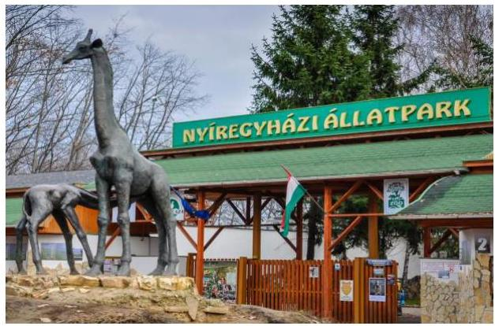
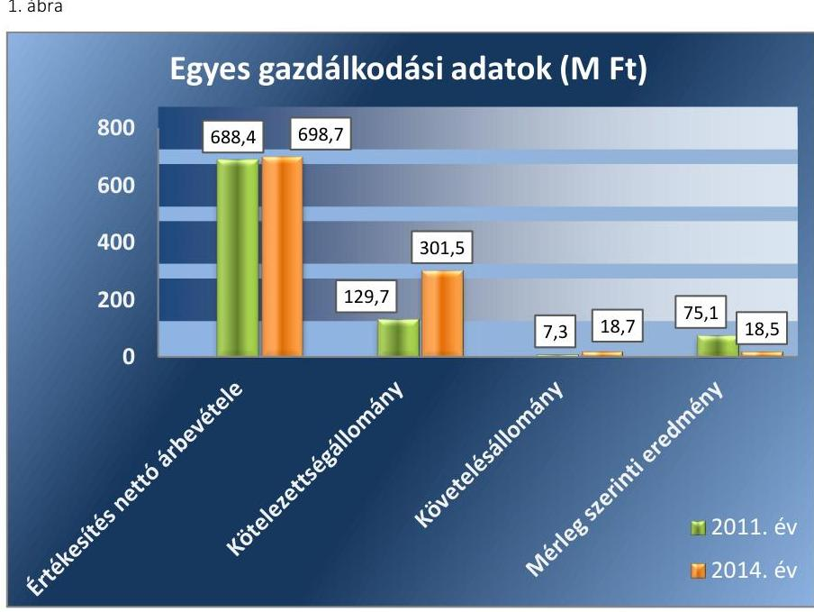
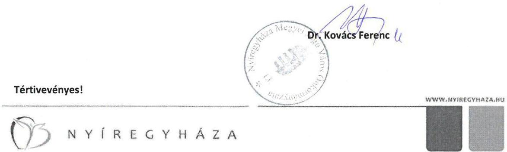
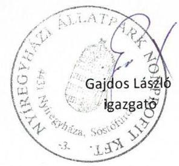
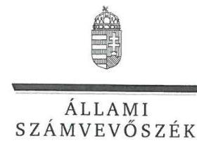
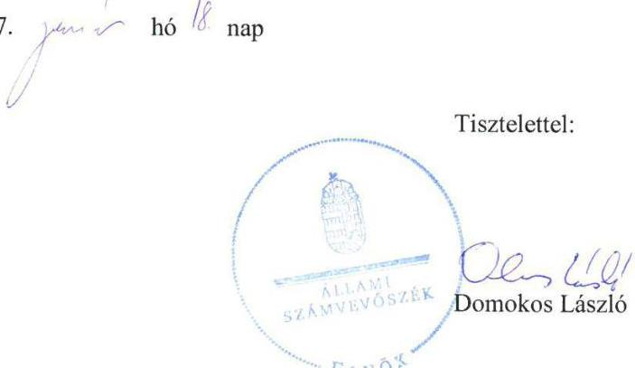

# Jelentés 

## Az önkormányzatok gazdasági társaságai

Az önkormányzatok többségi tulajdonában lévő gazdasági társaságok gazdálkodásának ellenőrzése - Nyíregyházi Állatpark Nonprofit Kft.
2017.

---

# Jelentés 

## Az önkormányzatok gazdasági társaságai

Az önkormányzatok többségi tulajdonában lévő gazdasági társaságok gazdálkodásának ellenőrzése - Nyíregyházi Allatpark Nonprofit Kft.
2017. fhó 27. nap

---

# AZ ELLENŐRZÉST FELÜGYELTE:

## MAKKAI MÁRIA felügyeleti vezető

## AZ ELLENŐRZÉST VEZETTE ÉS A VÉGREHAJTÁSÁÉRT FELELŐS:

### SALAMIN VIKTOR ellenőrzésvezető

## A PROGRAM ÖSSZEÁLLÍTÁSÁÉRT FELELŐS:

### JANIK JÓZSEF osztályvezető

---

**IKTATÓSZÁM:** V-1123-133/2016.

**TÉMASZÁM:** 2157

**ELLENŐRZÉS-AZONOSÍTÓ SZÁM:** V070789

---

**Jelentéseink az Országgyűlés számítógépes hálózatán és az Interneta a www.asz.hu címen is olvashatóak.**

---

# TARTALOMJEGYZÉK 

■ ÖSSZEGZÉS ..... 5
■ AZ ELLENŐRZÉS CÉLJA ..... 6
■ AZ ELLENŐRZÉS TERÜLETE ..... 7
■ AZ ELLENŐRZÉS HÁTTERE, INDOKOLTSÁGA ..... 8
■ A JELENTÉS LÉNYEGES KÉRDÉSKÖREI ..... 9
■ ELLENŐRZÉS HATÓKÖRE ÉS MÓDSZEREI ..... 10
■ MEGÁLLAPÍTÁSOK ..... 12
■ JAVASLATOK ..... 20
■ MELLÉKLETEK ..... 23
I. sz. melléklet: Értelmező szótár ..... 23
II. sz. melléklet: Múködési adatok ..... 25
III. sz. melléklet: Eredménykimutatás ..... 26
■ FÜGGELÉK: ÉSZREVÉTELEK ..... 27
■ RÖVIDÍTÉSEK JEGYZÉKE ..... 33

---

.

---

# ÖSSZEGZÉS 

A 2011-2014 közötti időszakban a helyi környezet- és természetvédelem közfeladatának ellátása keretében Nyíregyháza Megyei Jogú Város Önkormányzata a Nyíregyházi Állatpark NKft. müködését összességében szabályszerűen szervezte meg. A feladatellátást biztosító, vagyonkezelt vagyonnal való gazdálkodás átláthatósága nem volt biztositott, mert a kapcsolódó nyilvántartási és adatszolgáltatási kötelezettségének a Társaság nem tett eleget. Beszámolási kötelezettségét összességében teljesítette, annak tartalma azonban nem felelt meg teljes körüen a jogszabályok előirásainak. Az ellátott feladat bevételeinek, ráfordításainak elszámolása szabályszerű volt, önköltségszámítást azonban a Társaság az előírások ellenére nem végzett.

## Az ellenőrzés társadalmi indokoltsága

Az Állami Számvevőszék kiemelt célja, hogy a helyi önkormányzatok gazdálkodásában rejlő pénzügyi kockázatok feltárásával, az államháztartáson kívülre nyújtott költségvetési támogatások és ingyenes vagyonjuttatások, valamint az államháztartáson kívül múködő feladat-ellátó rendszerek ellenőrzéseivel hozzájáruljon ahhoz, hogy a közpénzeket az államháztartáson kívül múködő szervezetek is átlátható, rendezett módon használják fel.

Magyarországon az intézmény-centrikus közfeladat-ellátás jellemző, de egyre jelentősebb a költségvetésen kívüli feladatellátás térnyerése. Ennek legfontosabb szereplői - a nonprofit szervezetek mellett - az önkormányzati tulajdonú gazdasági társaságok. Az önkormányzatok szervezetalakítási szabadságának következménye, hogy a korábban is vállalati formában múködő közszolgáltatások mellett a feladatok ellátásában a gazdasági társaságok kiemelt fontosságú szerephez jutottak.

## Főbb megállapítások, következtetések, javaslatok

Az Önkormányzat a helyi környezet- és természetvédelem közfeladatának, ennek keretében a Nyíregyházi Állatpark NKft. múködésének megszervezéséről a jogszabályi előírásoknak megfelelően gondoskodott. A feladatellátás feltételeit biztosító vagyonkezelési szerződés nem felelt meg teljes körűen a jogszabályok előírásainak. Nem tartalmazta a vagyonkezelés tárgyát képező eszközök tételes listáját, értékét, ezért a kezelt vagyonnal való gazdálkodás átláthatósága és elszámoltathatósága nem volt biztosított. A tulajdonosi jogok gyakorlása összességében megfelelt a jogszabályok előírásainak, az Önkormányzat azonban a vagyonkezelési szerződésben - 2012-től - rögzített adatszolgáltatási kötelezettséget sem kérte számon.

A Társaság számviteli szabályzatait megalkotta, a Számviteli politika és a Bizonylati rend egyes rendelkezései azonban nem feleltek meg a jogszabályi előírásoknak. A Társaság saját vagyonával szabályszerűen gazdálkodott. A Társaság mérlege nem a valós állapotot tükrözte, mivel a vagyonkezelésbe vett vagyont eszközként és hosszú lejáratú kötelezettségként nem mutatta be. A Társaság kötelezettségállománya nem veszélyeztette a közfeladat ellátását és a múködést.

Az Állatpark NKft. beszámolási kötelezettségének eleget tett, a beszámolók tartalma azonban a kiegészítő melléklet hiányosságai miatt nem felelt meg teljes körűen a jogszabályi előírásoknak. A Társaság a Vagyonkezelési szerződés 2012. évi módosítását követő, vagyonkezeléshez kapcsolódó adatszolgáltatási kötelezettségének nem tett eleget.

A közfeladat bevételeinek, ráfordításainak, valamint az értékcsökkenés elszámolása szabályos volt. Az önköltségszámítás szabályozása nem volt megfelelő, a végzett szolgáltatások önköltségét nem határozták meg. Az alkalmazott árakat, díjakat piaci viszonyok alapján alakították ki.

---

# AZ ELLENŐRZÉS CÉLJA 

pozottsága szabályszerű önköltségszámítással.

Az ellenőrzés célja annak értékelése volt, hogy az Önkormányzat vagyongazdálkodási tevékenysége során szabályszerűen gyakorolta-e tulajdonosi jogait.

Ellenőriztük, hogy a gazdasági társaság szabályozottsága, gazdálkodása és vagyongazdálkodási tevékenysége, bevételeinek és ráfordításainak elszámolása megfelelt-e a jogszabályi és tulajdonosi előírásoknak.

Értékeltük továbbá, hogy a gazdasági társaság kötelezettségállománya jelentett-e kockázatot a múködésre, valamint a gazdálkodás átláthatósága és elszámoltathatósága érdekében biztosítva volt-e a szolgáltatás dijának megala-

---

# **AZ ELLENŐRZÉS TERÜLETE**

## **Nyíregyháza Megyei Jogú Város Önkormányzata és a kizárólagos tulajdonában lévő Nyíregyházi Állatpark Nonprofit Korlátolt Felelősségű Társaság**

A Nyíregyházi Állatpark Közhasznú Társaságot 1998. július 1-jén alapította a Nyíregyháza Megyei Jogú Város Önkormányzata. 2009. január 1-jétől nonprofit korlátolt felelősségű társaságként működött. Az ellenőrzött időszakban kizárólag az Önkormányzat¹ tulajdonában állt. A Társaság helyi környezet- és természetvédelem közfeladatot saját, illetve vagyonkezelésbe vett eszközökkel látta el.

A Társaságnál² foglalkoztatott átlagos statisztikai állományi létszám a 2011. évben 93 fő, a 2014. évben 94 fő volt.

A Társaság gazdálkodásának egyes adatait a 2011., 2014. évek vonatkozásában a következő ábra szemlélteti.

*Forrás: A Társaság 2011., 2014. évi beszámolói*

Az ellenőrzött időszakban a polgármester, a jegyző és az ügyvezető személye nem változott.

---

# AZ ELLENŐRZÉS HÁTTERE, INDOKOLTSÁGA 

AZ ÖNKORMÁNYZATI TULAJDONÚ GAZDASÁGI TÁRSASÁGOK teljes körű ellenőrzésének lehetőségét az Állami Számvevőszékről szóló 1989. évi XXXVIII. törvény 2011. január 1-jétől hatályos módosítása teremtette meg. Az önkormányzati tulajdonú gazdasági társaságok ellenőrzése kiemelten fontos a vagyon megőrzése, megóvása érdekében, amelyekkel szemben alapvető követelmény, hogy gazdálkodásuk, működésük szabályszerű, az általuk szolgáltatott adatok minél megbízhatóbbak legyenek. A közfeladat ellátás költségeinek, ráfordításainak alakulása, színvonala hatással van a lakosság elégedettségére.

## AZ ELLENŐRZÉS VÁRHATÓ HASZNOSULÁSA-

KÉNT az ÁSZ ${ }^{3}$ a megállapításaival segítséget nyújthat az államháztartáson kívüli közfeladat-ellátás értékeléséhez, jogszabályi keretei pontosításához, átláthatóságot biztosító szabályozásához. Meghatározhatóvá válnak az önkormányzati feladatellátásban részt vevő államháztartáson kívüli szervezeteknek - az önkormányzat költségvetését, pénzügyi helyzetét is befolyásoló - kockázatai, lehetővé válik ezen kockázatok csökkentése. Ellenőrzéseink feltárhatják, hogy az önkormányzat feladat-ellátási kötelezettségének szabályszerűen tett-e eleget, a feladatellátáshoz rendelt vagyonkezelésbe vett és saját vagyon működtetését az elvárható gondossággal, szabályszerűen szervezte-e meg és a tulajdonosi felügyelete hozzájárult-e a feladatellátásához. Értékelhetővé válik, hogy a gazdasági társaság a feladat-ellátási, közszolgáltatási szerződésben foglaltak betartásával, a vagyon használatával biztosította-e a szolgáltatás folytatásának feltételeit. Ezzel az ellenőrzöttek és a helyi döntéshozók számára az ÁSZ visszajelzést ad feladatszervezési, feladat-ellátási kockázataikról, alapot ad a meglévő hibák megszüntetéséhez, a jobb feladat-ellátás biztosításához. Mindezeken keresztül az ÁSZ hozzájárul Magyarország közpénzügyi helyzetének javításához, a közpénzek mérhető módon történő, a döntéshozók által meghatározott célok szerinti felhasználásához.

---

# A JELENTÉS LÉNYEGES KÉRDÉSKÖREI 

1. Az önkormányzat közfeladat megszervezéséről szóló döntése, valamint tulajdonosi joggyakorlása szabályszerű volt-e?
2. A gazdasági társaság vagyongazdálkodása szabályszerű volt-e, kötelezettségállománya jelentett-e kockázatot a müködésre, illetve a közfeladat ellátásra?
3. A gazdasági társaságnál az ellátott közfeladat bevételei és ráfordításai elszámolása, valamint az önköltségszámítás és árképzés szabályszerű volt-e?

---

# ELLENŐRZÉS HATÓKÖRE ÉS MÓDSZEREI 

## Az ellenőrzés típusa

Megfelelőségi ellenőrzés.

## Az ellenőrzött időszak

2011. január 1-jétől 2014. december 31-ig tart.

## Az ellenőrzés tárgya

A gazdasági társaság feletti tulajdonosi joggyakorlás, valamint a gazdasági társaság gazdálkodásának szabályozottsága és szabályszerűsége.

Az ellenőrzés kiterjed minden olyan körülményre és adatra, amely az ÁSZ jogszabályban meghatározott feladatainak teljesítéséhez, valamint a program végrehajtása folyamán felmerült újabb összefüggések feltárásához szükséges.

## Az ellenőrzött szervezet

Nyíregyháza Megyei Jogú Város Önkormányzata és a kizárólagos tulajdonában lévő Nyíregyházi Állatpark Nonprofit Korlátolt Felelősségű Társaság.

## Az ellenőrzés jogalapja

Az ellenőrzés jogszabályi alapját az ÁSZ tv. 1. § (3) bekezdése és 5. § (3)-(4)-(5) bekezdései képezték.

## Az ellenőrzés módszerei

Az ellenőrzést a nemzetközi standardokat irányadónak tekintve az ellenőrzési program ellenőrzési kérdései, az ellenőrzött időszakban hatályos jogszabályok, az ellenőrzés szakmai szabályok és módszertanok figyelembe vételével végeztük.

Az ellenőrzés ideje alatt az ellenőrzött szervezettel történő kapcsolattartást az ÁSZ Szervezeti és Múködési Szabályzatának vonatkozó előírásai alapján biztosítottuk.

Az ellenőrzés a kiválasztott, tulajdonosi jogokat gyakorló önkormányzatra, illetve az ellenőrzésre kijelölt gazdasági társaságra terjedt ki.

Az ellenőrzési kérdések megválaszolásához szükséges bizonyítékok megszerzése a következő ellenőrzési eljárások alkalmazásával történt:

---

megfigyelés, kérdésfeltevés (információkérés), összehasonlítás, valamint elemző eljárás. Az ellenőrzési bizonyítékként felhasználható adatforrások közé tartoztak egyrészt a szakmai programban felsorolt adatforrások, másrészt adatforrás lehetett még minden - az ellenőrzés folyamán - feltárt, az ellenőrzés szempontjából információkat tartalmazó dokumentum.

Az ellenőrzést a kérdésekre adott válaszok kiértékelésével, valamint a megjelölt adatforrások, a csatolt tanúsítványok felhasználásával, továbbá az adott időszakban hatályos jogszabályok figyelembe vételével folytattuk le.

A bevételek és ráfordítások elszámolása, valamint a vagyonnyilvántartás terén a szabályszerű múködést véletlen mintavétellel ellenőriztük. A mintavétellel ellenőrzött területek esetében minden egyes tétel vonatkozásában a szabályszerűségre vonatkozó kérdéseket tettünk fel, amelyek eredménye összesítésre került. Megfelelőnek értékeltünk egy ellenőrzött területet, amennyiben 95\%-os bizonyossággal a teljes sokaságban a hibaarány legfeljebb 10\%, nem megfelelőnek, amennyiben 10\%-nál magasabb arányt képviselt. Abban az esetben, ha a teljes sokaság tekintetében a 10\%os hibaarányhoz való viszony megítélésnek megbízhatósága nem érte el a 95\%-ot, annak elérése érdekében értékelésünket további szempontokkal egészítettük ki, és figyelembe vettük a feltárt hibák típusát és súlyát. A ráfordítások elszámolására és a vagyonnyilvántartásra vonatkozó véletlen mintavételt kockázati alapú kiválasztással egészítettük ki, amelynek során évente a három legnagyobb összegű tételt választottuk ki.

---

# 1. Az önkormányzat közfeladat megszervezéséről szóló döntése, valamint tulajdonosi joggyakorlása szabályszerű volt-e? 

Összegző megállapítás

A közfeladat ellátásának megszervezése, valamint a tulajdonosi joggyakorlás összességében szabályszerű volt, a feladatellátás feltételeit biztosító vagyonkezelési szerződés előírásai azonban nem feleltek meg teljes körűen a jogszabályi előírásoknak.
1.1. számú megállapítás

Az Önkormányzat a helyi környezet- és természetvédelem közfeladata ellátásának megszervezéséről gondoskodott, a feladatellátás feltételeit biztosító vagyonkezelési szerződés előírásai azonban nem feleltek meg teljes körűen a jogszabály előírásainak.

Az Önkormányzat a 2011-2014. évekre vonatkozó fejlesztési elképzeléseit az Ötv. ${ }^{4}$ 91. § (6) bekezdésben előírtak szerint gazdasági programban rögzítette, amely tartalmazta a Társaságra vonatkozó terveket is. Célul tűzték ki az Állatpark NKft. ${ }^{5}$ önkormányzati kiadások nélküli működtetését és fenntartható fejlődésének új beruházásokkal történő biztosítását. A nö-vény- és állatkert működtetésének részét képező helyi környezet- és természetvédelem az Ötv. 8. § (1) bekezdése és az Mötv. ${ }^{6}$ 13. § (1) bekezdés 11. pontja alapján az Önkormányzat törvényi kötelezettsége. A közfeladatellátás megszervezése megfelelt az Ötv. 9. § (4) bekezdés, illetve a Mötv. 41. § (6) bekezdés előírásának.

AZ ALAPÍTÓ OKIRAT ${ }^{7}$ meghatározta az alapító kizárólagos hatáskörébe tartozó jogokat és kötelezettségeket. Az alapító döntött - többek között - a számviteli beszámoló elfogadásáról, az ügyvezető feladatairól, az ügyvezető, az FB tagok és a könyvvizsgáló megválasztásáról.

Az ellenőrzött időszakban hatályos vagyonkezelési szerződést ${ }^{8}$ az Önkormányzat és a Társaság 2008. április 11-én kötötte meg. A vagyonkezelés tárgya az Állatpark NKft. székhelyéül szolgáló, 15010/2 helyrajzi számú állat és növénykert megnevezésű ingatlan és a hozzá tartozó felépítmények voltak. A vagyonkezelési szerződés nem tartalmazta a vagyongazdálkodási rendelet ${ }^{9}$-ben, valamint a szerződéskötéskor hatályos Áht. ${ }^{10}$ 105/8. § (1) bekezdés c) pontjában előírt, a vagyonkezelésbe adott eszközöknek az Önkormányzat számviteli nyilvántartási adataival megegyező tételes jegyzékét értékkel együtt, valamint f) pontjában rögzített, az önkormányzati vagyonnal kapcsolatos nyilvántartási és adatszolgáltatási kötelezettségek teljesítésének módját és formáját. A vagyonkezelési szerződés hiányosságai miatt nem volt biztosított a kezelt vagyonnal való gazdálkodás elszámoltathatósága, átláthatósága.

---

A vagyonkezelési szerződést 2012. május 31-én módosították, melynek során a nyilvántartási és adatszolgáltatási kötelezettséget előírták, azonban a vagyonkezelés tárgyát képező eszközök tételes jegyzékét a módosítás a vagyongazdálkodási rendelet ${ }_{2}^{11} 5$. melléklet c) pontjában előírtak ellenére nem tartalmazta. Az Állatpark NKft. 2012. május 31-től köteles volt évente egyszer, a tárgyévet követő év május 31-ig a vagyonkezelésbe vett ingatlanok, valamint egyéb vagyoni eszközök állapotának tárgyévi változásairól beszámolót készíteni, és azt az elkülönített nyilvántartásokkal együtt bemutatni a polgármesternek. A vagyonkezelési szerződés módosítása során kibővítették a vagyonkezelt eszközök körét a 15010/5 helyrajzi számú ingatlannal (ifjúsági tábor), valamint a hozzá tartozó felépítményekkel.

KÖZSZOLGÁLTATÁSI SZERZŐDÉS ${ }_{1}^{12}{ }_{2}{ }^{13}$-t kötött az Önkormányzat és a Társaság, melyben meghatározták a Társaság által ellátandó feladatokat, a beszámolási kötelezettséget, a szerződések időtartamát.

Az Állatpark NKft. az ellenőrzött időszakban rendelkezett a Hortobágyi Nemzeti Park Igazgatósága által, állatkert üzemeltetésére kiadott múködési engedéllyel.

# 1.2. számú megállapítás 

A tulajdonosi jogok gyakorlása összességében megfelelt a jogszabályok előírásainak, az Önkormányzat azonban a vagyonkezelési szerződésben rögzített adatszolgáltatási kötelezettséget nem kérte számon.

A TULAJ DONOSI JOG GYAKORLÁSÁNAK rendjét az Önkormányzat a vagyongazdálkodási rendelet ${ }_{1,2}$-ben és azzal összhangban lévő Alapító Okiratban szabályozta és annak megfelelően gyakorolta.

A Társaság az SZMSZ ${ }^{14}$ rendelkezésével összhangban elkészítette éves üzleti terveit. A tulajdonosi joggyakorló határozatokkal döntött a gazdasági programmal összhangban lévő tervek elfogadásáról.

A tulajdonosi joggyakorló féléves beszámolási kötelezettséget írt elő, melyet a Társaság teljesített. A Gazdasági és Tulajdonosi Bizottság, valamint a Városstratégiai és Környezetvédelmi Bizottság a Társaság éves beszámolóit a - Közgyűlés bizottságainak feladatait, hatásköreit rögzítő önkormányzati rendeletben előírtak szerint - véleményezte. A polgármester az éves beszámolókat a vagyongazdálkodási rendelet ${ }_{1,2}$ előírásainak megfelelően elfogadta.

Az Önkormányzat a vagyonkezelési szerződés2-ben előírt adatszolgáltatást nem kérte számon, ezt a kötelezettségét a Társaság nem teljesítette.

A FELÜGYELŐ BIZOTTSÁG az Alapító Okiratban előírtak alapján véleményezte az üzleti terveket, az éves beszámolót, az éves közhasznúsági jelentést, valamint az ügyvezető prémiumfeladatának kiírását, majd azt követő teljesítését. Az Alapító Okirat az FB tagjainak számát három főben határozta meg, amely megfelelt a Taktv. ${ }^{15}$ 4. § (2) bekezdésében meghatározott létszámnak. Az FB által megállapított ügyrendet a tulajdonosi joggyakorló határozattal elfogadta, ezzel eleget tett a Gt. 34. § (4) bekezdés, illetve a Ptk. 3:122. § (3) bekezdés előírásának.

---

A Társaság rendelkezett az Önkormányzat által meghatározott és jóváhagyott Javadalmazási szabályzattal ${ }^{16}$, amely megfelelt a Taktv. 5. § (3) bekezdés előírásainak.

OSZTALÉK KIFIZETÉSRE nem került sor, a mérleg szerinti eredményt - amely minden évben pozitív volt - az Alapító Okiratban előírtakkal összhangban eredménytartalékba helyezték. Az eredményes gazdálkodás miatt a Gt. 51. § (1) bekezdés és a 2014. március 15-től hatályos Ptk. 3:133. § (2) bekezdés előírása szerinti tőkemegfelelés biztosított volt.

KEZESSÉGVÁLLALÁSRA az Önkormányzat részéről az ellenőrzött időszakban nem került sor, a Társaság feladatellátásához múködési célú támogatást nem nyújtott. A „Turisztikai attrakciók és szolgáltatások fejlesztése" című pályázat keretében a Társaság elnyert egy 500,0 M Ft beruházási összköltségű projektet, melyhez az Önkormányzat - a Közgyűlés döntése alapján - 2013-ban 125,0 M Ft tagi kölcsönt nyújtott, valamint 2014-ben 258,8 M Ft fejlesztési támogatást biztosított.

# 2. A gazdasági társaság vagyongazdálkodása szabályszerű volt-e, kötelezettségállománya jelentett-e kockázatot a múködésre, illetve a közfeladat ellátásra? 

## Összegző megállapítás

2.1. számú megállapítás

A Társaság számviteli szabályzatai nem feleltek meg teljes körűen a jogszabályi előírásoknak. A Társaság a vagyonkezelt eszközökhöz kapcsolódó nyilvántartási és adatszolgáltatási kötelezettségének, valamint adatszolgáltatási és beszámolási kötelezettségének nem tett teljes körűen eleget.

A Társaság számviteli szabályzatokkal rendelkezett, azok tartalma - a Számviteli politika és a Bizonylati rend egyes rendelkezéseinek hiányosságai miatt - nem feleltek meg teljes körűen a jogszabályi előírásoknak.

A Társaság rendelkezett a Számv. tv ${ }^{17}$. 14. § (3) bekezdésben előírt számviteli politikával, valamint a Számv. tv. 14. § (5) bekezdés a), b), d) pontjaiban előírtaknak megfelelően az eszközök és források leltárkészítési és leltározási, illetve értékelési szabályzatával, valamint pénzkezelési szabályzattal.

A Számviteli politika ${ }^{18}{ }^{19}$ hiányossága volt, hogy a Számv. tv. 14. § (4) bekezdésében előírtak ellenére nem tartalmazta, hogy mit tekint a Társaság a számviteli elszámolás, értékelés szempontjából jelentősnek.

A Bizonylati rend ${ }^{20}$ az éves beszámoló, az üzleti jelentés, valamint az azokat alátámasztó leltár, értékelés és főkönyvi kivonat megőrzési idejét 8 évben határozta meg. A szabályozás 2011-ben nem felelt meg a Számv. tv. 169. § (1) bekezdés hatályos előírásainak, amely szerint a kötelező megőrzési idő 10 év volt. A Bizonylati rend ${ }_{1,2}{ }^{21}$ a pénzeszközöket érintő gazdasági események bizonylatainak legkésőbb a tárgy hót követő hónap 15-ig történő feldolgozását írta elő. Ez a szabályozás nem felelt meg a Számv. tv. 165. § (3) bekezdés a) pontja és azzal összhangban lévő Számviteli politika ${ }_{1,2}$ előírásainak, mely szerint készpénzforgalom esetén a pénzmozgással

---

egyidejűleg, illetve bankszámla forgalomnál a hitelintézeti értesítés megérkezésekor kell a gazdasági eseményt a könyvekben rögzíteni.

A Leltározási szabályzat ${ }_{2}{ }^{22}$ a Számv. tv. 69. § (3) bekezdésében foglalt előírásokkal összhangban a mennyiségben nyilvántartott eszközök esetében 3 évenkénti mennyiségi felvétellel történő leltározási kötelezettségét írt elő. A Számlarendet ${ }^{23}$ a Számv. tv. 161. § (1) bekezdésében előírtaknak megfelelően elkészítették, mely a 2011-2014. évi számlatükörrel összhangban állt.

# 2.2. számú megállapítás 

A Társaság saját vagyonával szabályszerűen gazdálkodott. A vagyonkezelésbe vett vagyonhoz kapcsolódó nyilvántartási kötelezettségének azonban nem tett eleget, a vagyonkezelt eszközökkel való gazdálkodás nem volt szabályszerű.

A Társaság saját vagyonának a Számv. tv. és a belső szabályozás szerinti nyilvántartását, a változások folyamatos nyomon követését az analitikus és a főkönyvi nyilvántartási rendszer biztosította. Az ellenőrzött évek beszámolóinak mérlegét alátámasztó, Számv. tv. 69. § (1) bekezdése szerinti leltárakat elkészítették. A mennyiségben nyilvántartott saját eszközök menynyiségi felvétellel történő leltározását a Leltározási szabályzat; előírásaival összhangban elvégezték.

A vagyonkezelt eszközöket nem tartották nyilván, a mérlegben nem mutatták ki, megsértve ezzel a Számv. tv. 23. (2) bekezdésének, valamint 2011. december 31-ig az Áht. 1 105/A. § (13) bekezdéseinek előírásait, a vagyonkezelt eszközökkel való gazdálkodás nem volt szabályszerű.

Az Állatpark NKft. saját vagyona 2011. január 1. és 2014. december 31e között 626,3 M Ft-tal (23,5\%-kal) nőtt. A Társaság főbb mérleg adatait az 1. táblázat szemlélteti.

1. táblázat

| ÁLLATPARK NKFT. MÉRLEGADATAI 2011-2014. (M FT) |  |  |  |  |  |
| :--: | :--: | :--: | :--: | :--: | :--: |
| Megnevezés | $\begin{gathered} 2011 \\ 01.01 . \end{gathered}$ | $\begin{gathered} 2012 \\ 12.31 . \end{gathered}$ | $\begin{gathered} 2012 \\ 12.31 . \end{gathered}$ | $\begin{gathered} 2013 \\ 12.31 . \end{gathered}$ | $\begin{gathered} 2014 \\ 12.31 . \end{gathered}$ |
| I. Befektetett eszközök | 2596,6 | 2578,0 | 2558,0 | 2598,3 | 3255,4 |
| - ebből: Tárgyi eszközök | 2596,4 | 2577,8 | 2557,8 | 2598,2 | 3254,7 |
| II. Forgóeszközök | 68,4 | 36,7 | 41,6 | 206,8 | 35,0 |
| - ebből: Követelések | 12,8 | 7,3 | 12,8 | 13,7 | 18,7 |
| III. Aktív időbeli elhatárolások | 0,2 | 0,0 | 3,4 | 0,1 | 1,1 |
| Eszközök összesen | 2665,2 | 2614,7 | 2603,0 | 2805,2 | 3291,5 |
| IV. Saját tőke | 431,3 | 507,3 | 528,5 | 540,6 | 559,1 |
| - ebből: Jegyzett tőke | 3,0 | 3,0 | 3,0 | 3,0 | 3,0 |
| - ebből: Mérleg szerinti eredmény | 116,9 | 75,1 | 20,2 | 12,1 | 18,5 |
| V. Céltartalékok | 0,0 | 0,0 | 0,0 | 0,0 | 0,0 |
| VI. Kötelezettségek | 211,2 | 129,7 | 111,3 | 311,0 | 301,5 |
| VII. Passzív időbeli elhatárolások | 2022,7 | 1977,7 | 1963,2 | 1953,6 | 2430,9 |
| Források összesen | 2665,2 | 2614,7 | 2603,0 | 2805,2 | 3291,5 |

Az eszköz érték emelkedését alapvetően a befektetett eszközök állományának növekedése okozta. A tárgyi eszközök mérlegértéke a végrehajtott fejlesztések eredményeként 2013-ban és 2014-ben is meghaladta az előző

---

évit. A forgóeszközökön belül a követelések összege a 2011. január 1. és 2014. december 31-e között 5,9 M Ft-tal (46,1\%-kal) emelkedett.

A forrásokon belül a saját tőke értéke minden évben emelkedett, 29,6\%-os növekedést követően 559,1 M Ft-ot ért el. A saját tőke értékének alakulására a mérleg szerinti eredmény volt hatással. A kötelezettségek összege 90,3 M Ft-tal (42,8\%-kal) nőtt, a változást jelentősen befolyásolta az Önkormányzattól 2013-ban kapott 125,0 M Ft tagi kölcsön nyilvántartásba vétele. A passzív időbeli elhatárolásként kimutatott összeg a Számv. tv. 44. § (2) bekezdése alapján a végrehajtott fejlesztésekhez kapott vissza nem térítendő támogatásokat tartalmazta, melynek állománya 24,4\%-kal nőtt 2014-ben.

# 2.3. számú megállapítás 

## A Társaság kötelezettségállománya nem veszélyeztette a közfeladat ellátását, a Társaság múködését.

A KÖTELEZETTSÉGEK növekvő tendenciája ellenére az eladósodottság mértéke a 2011-2014. években nem veszélyeztette a múködést. Az Állatpark NKft. kötelezettségeinek változását az alábbi táblázat mutatja be.
2. táblázat

ÁLLATPARK NKFT. KÖTELEZETTSÉGÁLLOMÁNYÁNAK ALAKULÁSA (M FT)

| Megnevezés | 2011. | 2012. | 2013. | 2014. |
| :-- | --: | --: | --: | --: |
| Hosszú lejáratú kötelezettségek | 86,1 | 73,5 | 62,8 | 124,1 |
| ebből: Beruházási és fejlesztési hitelek | 77,1 | 67,1 | 57,0 | 46,9 |
| Rövid lejáratú kötelezettségek | 43,6 | 37,8 | 248,2 | 177,4 |
| ebből: Rövid lejáratú hitelek | 12,7 | 2,5 | 128,6 | 64,6 |
| ebből: Kötelezettségek áruszállításból (szállí- | 13,4 | 6,5 | 26,8 | 32,7 |
| tók) |  |  |  |  |
| ebből: Egyéb rövid lejáratú kötelezettségek | 17,4 | 18,7 | 21,1 | 19,2 |
| Kötelezettségek összesen | 129,7 | 111,3 | 311,0 | 301,5 |

A hosszú lejáratú kötelezettségeket 2013 végéig az ellenőrzött időszakot megelőzően felvett fejlesztési hitelek tőketartozása, és a pénzügyi lízing tartozások alkották. A Társaság törlesztési kötelezettségének eleget tett, ezért a hitel tartozás csökkent. A 2014. évi mérlegérték 61,3 M Ft-tal haladta meg az előző évit, melynek alapvető oka az igénybevett tagi kölcsön egy részének ( 65 M Ft ) hosszú lejáratú kötelezettségként történő kimutatása.

A rövid lejáratú kötelezettségek 2013. évi emelkedését 125,0 M Ft tagi kölcsön, valamint 62,5 M Ft vevői előleg nyilvántartásba vétele eredményezte. A lejárt fizetési határidejű szállítók állományának aránya 2011. december 31-én $61,3 \%$ volt, a mutató folyamatosan javult és az arány a 2014. év végére 4,0\%-ra csökkent.

AZ ELADÓSODOTTSÁGI MUTATÓ az ellenőrzött időszakban 0,04 és 0,11 közötti értékben kedvező szinten alakult, a külső finanszírozás nem jelentett kockázatot. A nettó eladósodottsági mutató kedvezőtlenül alakult, a kintlévőségek egyik évben sem fedezték a kötelezettségek összegét, azonban a mutató értéke 1 alatt volt, azaz a saját forrás teljes

---

# 2.4. számú megállapítás 

mértékben fedezte a kötelezettségek kintlévőségekkel csökkentett összegét.

## A Társaság beszámolási és adatszolgáltatási kötelezettségét hiányosan teljesítette.

ÉVES BESZÁMOLÓJÁT az Állatpark NKft. a Számv. tv. 19. § (1) bekezdés előírása szerint elkészítette. Az éves beszámolók letétbe helyezése a Számv. tv. 153. § (1) bekezdése, közzététele a Számv. tv. 154. § (1) bekezdésben előírtak szerint megtörtént.

A vagyonkezelési szerződés alapján rendelkezésre bocsátott eszközöket az Állatpark NKft. a Számv. tv. 23. § (2) bekezdése, valamint a kezelésbevételhez kapcsolódó hosszú lejáratú kötelezettséget a Számv. tv. 42. § (5) bekezdése ellenére a 2011-2014. években a mérlegében nem mutatta ki, a vagyonkezelésbe vett eszközök kiegészítő mellékletében történő bemutatási kötelezettségének nem tett eleget. Az ellenőrzött időszakban a Társaság mérlegei nem a valós állapotot tükrözték. Az Állatpark NKft. a vagyonkezelési szerződésben 2012 májusától előírt adatszolgáltatási kötelezettségét nem teljesítette.

A 2011-2014. évi beszámolók kiegészítő mellékleteinek hiányossága volt, hogy nem tartalmazták a Számv. tv. 88. § (8) bekezdés b) pontjában előírtak ellenére a könyvvizsgáló által felszámított díjat.

A 2012-2014. évi beszámolók részét képező kiegészítő mellékletek nem tartalmazták a Számv. tv. 88. § (6) bekezdésében előírt cash flow kimutatást.

A 2012-2013. évi beszámolók kiegészítő mellékletei nem tartalmazták a Számv. tv. 92. § (1) bekezdésében előírtak ellenére a tárgyi eszközök és a halmozott értékcsökkenés nyitó bruttó értékét, növekedését, csökkenését, záró bruttó értékét, külön az átsorolásokat, legalább mérlegtételek szerinti bontásban. A kiegészítő mellékletekben rögzítették az értékcsökkenési leírási kulcsok változtatásának tényét, azonban a Számv. tv. 53. § (5) bekezdésében előírtak ellenére az értékcsökkenési leírási kulcsok változásának eredményre gyakorolt számszerűsített hatását nem mutatták be.

A 2013. évi beszámoló kiegészítő melléklete nem mutatta be az értékcsökkenési leírást a Számv. tv. 92. § (2) bekezdése szerinti bontásban.

A könyvvizsgáló az ellenőrzött években hitelesítő záradékkal látta el a Társaság éves beszámolóját.

A 350/2011. Korm. rendelet ${ }^{24}$ alapján a Társaságnak 2012. január 1jétől közhasznúsági mellékletet kellett készítenie, amely kötelezettségének eleget tett.

A 2011. évben az Avtv. ${ }^{25}$ 20. § (8) bekezdésének előírása ellenére nem rendelkeztek a közérdekú adatok megismerésére irányuló igények teljesítésének rendjét rögzítő szabályzattal. A közérdekú adatok megismerésének rendjét és a közérdekú adatok közzétételének szabályzatát 2012. január 1-jén hatályba léptették, az Info. tv. ${ }^{26}$ 30. § (6) és 35. § (3) bekezdéseiben előírtaknak megfelelően.

Az Info tv. 24. § (1)-(3) bekezdéseiben előírtaknak megfelelően kinevezték a belső adatvédelmi felelőst, aki elkészítette az Adatvédelmi és adatbiztonsági szabályzatot és az előírtakkal összhangban vezette a belső adatvédelmi nyilvántartást.

---

# 3. A gazdasági társaságnál az ellátott közfeladat bevételei és ráfordításai elszámolása, valamint az önköltségszámítás és árképzés szabályszerű volt-e? 

Összegző megállapítás

## 3.1. számú megállapítás

A bevételek és a ráfordítások elszámolása szabályszerű volt. A Társaság a jogszabályi kötelezettség ellenére önköltségszámítást nem végzett.

A közfeladat bevételeinek, ráfordításainak, valamint az értékcsökkenés elszámolása szabályos volt.

AZ ÉRTÉKESÍTÉS NETTÓ ÁRBEVÉTELÉNEK ELSZÁMOLÁSA megfelelő volt. A bevételek kiszámlázása a belső szabályozás szerint történt. A bevételeket a megfelelő számlacsoportban számolták el.

AZ ANYAGJELLEGŰ RÁFORDÍTÁSOK ELSZÁMOLÁSA megfelelő volt. A költségelszámolást megalapozó dokumentumok rendelkezésre álltak.

AZ ÉRTÉKCSÖKKENÉSI LEÍRÁS elszámolása megfelelő volt, az elszámolás alapját képező bekerülési értékeket a Számv. tv. 47-51. §-aiban előírtak alapján állapították meg. Az állománybavételt megalapozó üzembe helyezés megtörtént, az állománybavétel szabályszerű volt.

Az ellenőrzött években az elszámolt értékcsökkenési leírás összegét (190,4 M Ft) meghaladó mértékben végezték el az immateriális javak és a tárgyi eszközök pótlását, felújítását (846,7 M Ft).

A Társaság a vagyonkezelésbe vett vagyon használatából, működtetéséből származó bevételeit, illetve közvetlen költségeit és ráfordításait a 2012. január 1-jétől hatályos Mótv. 109. § (7) bekezdés ellenére elkülönítetten nem tartotta nyilván.

Az eszközök elhasználódási szintje az ellenőrzött időszakban csökkenő tendenciát mutatott, mellyel párhuzamosan a használhatósági fok javult.

A követelések és az elszámolt értékvesztés alakulását az 3. táblázat mutatja be.
3. táblázat

AZ ÁLLATPARK NKFT. KÖVETELÉSÁLLOMÁNYÁNAK VÁLTOZÁSA (M FT)

| Megnevezés | 2011. | 2012. | 2013. | 2014. |
| :-- | :--: | :--: | :--: | :--: |
| Követelések bruttó értéke | 7,3 | 12,8 | 13,7 | 18,7 |
| Elszámolt értékvesztés | 0,1 | 0,1 | 0,2 | 0,2 |
| Követelések nettó értéke | 7,2 | 12,7 | 13,5 | 18,5 |
| Értékvesztés/bruttó érték (\%) | 1,4 | 0,8 | 1,5 | 1,1 |
| Vevőkövetelés | 3,5 | 5,2 | 3,9 | 2,5 |

A követelések 2014. évi jelentősebb növekedésének oka a 9,4 M Ft értékben kimutatott, visszaigényelt általános forgalmi adó volt, amelynek a

---

### 3.2. számú megállapítás

kiutalása mérleg fordulónapig nem történt meg. A vevőkövetelések öszszege a 2012. évet követően csökkenő tendenciát mutatott. A követelésállomány árbevételhez viszonyított aránya - a jellemzően készpénzzel fizető vevők miatt - alacsony, 0,4-0,8\% között volt.

Az önköltségszámítás szabályozása nem volt megfelelő, a végzett szolgáltatások önköltségét nem határozták meg. Az alkalmazott árakat, díjakat piaci viszonyok alapján alakították ki.

ÖNKÖLTSÉGSZÁMÍTÁSI SZABÁLYZAT: ${ }^{27}$ „28-tal rendelkezett az Állatpark NKft. a Számv. tv. 14. § (5) bekezdés c) pontjának megfelelően. Az Önköltségszámítási szabályzat nem tartalmazta a közvetett költségek tartalmát, felosztásának elveit, ezért nem volt biztosított a végzett szolgáltatások Számv. tv. 51. § (2) bekezdés szerinti önköltségének Számv. tv. 14. § (7) bekezdésben előírt, belső szabályzat szerinti utókalkuláció módszerével történő megállapításának lehetősége. A végzett szolgáltatások önköltségét nem határozták meg.

Az Állatpark NKft. az alkalmazott árakat, valamint a nyújtott kedvezmények fajtáit és mértékét a piaci viszonyok alapján saját maga állapította meg. Az adott üzleti év szolgáltatási díjait az üzleti terv tartalmazta, melyet a tulajdonosi joggyakorló minden évben jóváhagyott.

---

# JAVASLATOK 

Az ÁSZ tv. 33. § (1) bekezdésében foglaltak értelmében az ellenőrzött szervezet vezetője köteles a jelentésben foglalt megállapításokhoz kapcsolódó intézkedési tervet összeállítani és azt a jelentés kézhezvételétől számított 30 napon belül az ÁSZ részére megküldeni. Amennyiben az ellenőrzött szervezet vezetője nem küldi meg határidőben az intézkedési tervet, vagy továbbra sem elfogadható intézkedési tervet küld, az Állami Számvevőszék elnöke az ÁSZ tv. 33. § (3) bekezdése a) és b) pontjaiban foglaltakat érvényesítheti.

## Nyíregyháza Megyei Jogú Város polgármesterének

1. Intézkedjen a Nyíregyházi Állatpark Nonprofit Kft. közremüködésével a vagyonkezelési szerződés módosításáról, hogy az a jogszabályi előírásoknak megfelelően tartalmazza a vagyonkezelésbe adott ingatlan értékét, valamint a hozzá tartozó felépítmények tételes jegyzékét és a felépítmények értékét.
(1.1. sz. megállapítás 3-4. bekezdései alapján)
2. Intézkedjen a vagyonkezelési szerződéssel összefüggésben feltárt hiányosság tekintetében a munkajogi felelősség tisztázására irányuló eljárás megindításáról, és ennek eredménye ismeretében tegye meg a szükséges intézkedéseket.
(1.1. sz. megállapítás 3-4. bekezdései alapján)

## Nyíregyházi Állatpark Nonprofit Kft. ügyvezetőjének

1. Intézkedjen NYMJV Önkormányzat közremüködésével a vagyonkezelési szerződés módosításáról, hogy az a jogszabályi előírásoknak megfelelően tartalmazza a vagyonkezelésbe vett ingatlan értékét, valamint a hozzá tartozó felépítmények tételes jegyzékét és a felépítmények értékét.
(1.1. sz. megállapítás 3-4. bekezdései alapján)
2. Intézkedjen a számviteli politika módosításáról, hogy az teljes körűen feleljen meg a Számv. tv. előírásainak.
(2.1. sz. megállapítás 2. bekezdése alapján)
3. Intézkedjen a vagyonkezelési szerződés alapján kezelt vagyon mérlegben történő kimutatásáról, továbbá ezen eszközöknek a kiegészítő mellékletben történő bemutatásáról a Számv. tv. előírásainak megfelelően.
(2.4. sz. megállapítás 2. bekezdése alapján)

---

4. Intézkedjen a vagyonkezelési szerződéssel összefüggésben, valamint a kezelt vagyon mérlegben és a kiegészítő mellékletben történő bemutatásának elmaradásával kapcsolatban feltárt hiányosság tekintetében a felelősség tisztázása érdekében, és szükség szerint intézkedjen a felelősség érvényesítéséről
(1.1. sz. megállapítás 3-4. bekezdései, valamint a 2.4. sz. megállapítás 2. bekezdése alapján)

---

.

---

# MELLÉKLETEK 

- I. SZ. MELLÉKLET: ÉRTELMEZŐ SZÓTÁR
adósságfedezeti mutató
eladósodottság mértéke
eladósodottsági mutató (tőkeáttétel)
garancia
gazdasági társaság
kezesség
közfeladat
(befektetett eszközök + forgó eszközök) / idegen forrás
Azt mutatja, hogy 1 Ft adósságra hány Ft vagyon jut. Általánosságban véve kedvező, ha értéke 2 körül van, de nagy eszközberuházás-igényű iparágakban értéke kisebb is lehet.
kötelezettségek / saját tőke
Fontos szerepet játszik ez a mutató egy vállalat megítélésében. Azt mutatja, hogy a saját források a kötelezettségek hány százalékát fedezik. Törekedni kell, hogy a mutató tartósan (jelentősen) 1 alatti értéket érjen el.
idegen tőke / összes forrás
Egészségesnek mondható egy olyan mértékű áttétel, amelyet az üzleti tervek szerint és az elmúlt időszak tapasztalatai alapján a társaság megfelelő biztonsággal ki tud termelni. Nagy eszközberuházás-igényű iparágakban értéke magasabb, azaz magasabb eladósodottság is elfogadható, de 75-85\%-ot meghaladó értéknél már itt is erős, sőt túlzott külső finanszírozottságról beszélhetünk. Általánosságban véve kedvező, ha értéke kisebb, mint 0.
A garancia olyan önálló, az önkormányzat nevében vállalt kötelezettség, amely alapján az önkormányzat az önkormányzati költségvetés terhére szerződésben meghatározott feltételek szerint, a kötelezett nem teljesítése esetén a jogosultnak fizetést teljesít az előzetesen rögzített összeghatárig.
Ptk. 3:88. § (1) A gazdasági társaságok üzletszerű közös gazdasági tevékenység folytatására, a tagok vagyoni hozzájárulásával létrehozott, jogi személyiséggel rendelkező vállalkozások, amelyekben a tagok a nyereségből közösen részesednek, és a veszteséget közösen viselik.
A kezességre vonatkozó előírásokat a Ptk. 6:416-430. §-ai tartalmazzák. Kezességi szerződéssel a kezes kötelezettséget vállal a jogosulttal szemben, hogyha a kötelezett nem teljesít, maga fog helyette a jogosultnak teljesíteni. Kezesség egy vagy több, fennálló vagy jövőbeli, feltétlen vagy feltételes, meghatározott vagy meghatározható összegű pénzkövetelés vagy pénzben kifejezhető értékkel rendelkező egyéb kötelezettség biztosítására vállalható. A Ptk. szerint kezességet csak írásban lehet vállalni. A kezes kötelezettsége ahhoz a kötelezettséghez igazodik, amelyért kezességet vállalt. A kezes kötelezettsége nem válhat terhesebbé, mint amilyen elvállalásakor volt, kiterjed azonban a kötelezett szerződésszegésének jogkövetkezményeire és a kezesség elvállalása után esedékessé váló mellékkövetelésekre is.
Jogszabályban meghatározott állami vagy önkormányzati feladat, amit az arra kötelezett közérdekből, jogszabályban meghatározott követelményeknek és feltételeknek megfelelve végez, ideértve a lakosság közszolgáltatásokkal való ellátását, továbbá az állam nemzetközi szerződésekben vállalt kötelezettségeiből adódó közérdekű feladatokat, valamint e feladatok ellátásához szükséges infrastruktúra biztosítását is (Nvtv. 3. § (1) bekezdés 7. pont).

---

közszolgáltatás
közvetett tulajdon, illetve közvetett befolyás
nemzeti vagyon
tulajdonosi joggyakorló

A közszolgáltatás: „közcélú, illetőleg közérdekü szolgáltatást jelent, amely egy nagyobb közösség (állam, település) minden tagjára nézve megközelítőleg azonos feltételek mellett vehető igénybe, ezért valamilyen mértékig közösségi megszervezést, illetve szabályozást, ellenőrzést igényel." Az Ebktv ${ }^{79}$. 3. § d) pontja a következőképpen határozza meg a közszolgáltatást: „szerződéskötési kötelezettség alapján a lakosság alapvető szükségleteinek ellátására irányuló szolgáltatás, így különösen a villamos energia-, gáz-, hő-, víz-, szennyvíz- és hulladékkezelési, köztisztasági, postai és távközlési szolgáltatás, továbbá a menetrend alapján közlekedő jármúvekkel végzett közforgalmú személyszállitás"
Egy vállalkozás tulajdoni hányadának, illetőleg szavazati jogának a vállalkozásban tulajdoni részesedéssel, illetőleg szavazati joggal rendelkező más vállalkozás (köztes vállalkozás) tulajdoni hányadán, szavazati jogán keresztül történő gyakorlása. A közvetett tulajdon, a közvetett befolyás arányának megállapításához a közvetett tulajdonnal, közvetett befolyással rendelkezőnek a köztes vállalkozásban fennálló szavazati jogát vagy tulajdoni hányadát meg kell szorozni a köztes vállalkozásnak a vállalkozásban fennálló szavazati vagy tulajdoni hányada közül azzal, amelyik a nagyobb. Ha a köztes vállalkozásban fennálló szavazati vagy tulajdoni hányad az ötven százalékot meghaladja, akkor azt egy egészként kell figyelembe venni (a tőkepiacról szóló 2001. évi CXX. törvény 5. § (1) bekezdés 84. pont).

Az Nvtv. 1. § (2) bekezdés c) pontja szerint „az állam vagy a helyi önkormányzatot tulajdonában lévő pénzügyi eszközök, továbbá az államot vagy a helyi önkormányzatot megillető társasági részesedések"
Aki a nemzeti vagyon felett az államot vagy a helyi önkormányzatot megillető tulajdonosi jogok és kötelezettségek összességének gyakorlására jogosult (Nvtv. 3. § (1) bekezdés 17. pont).

---

# II. SZ. MELLÉKLET: MŰKÖDÉSI ADATOK 

## AZ ÁLLATPARK NKFT. MŰKÖDÉSÉNEK FŐBB JELLEMZŐI

| Sorszám | Megnevezés |  | 2011. év | 2012. év | 2013. év | 2014. év |
| :--: | :--: | :--: | :--: | :--: | :--: | :--: |
| 1. | A gazdasági társaság tulajdonosi összetétele |  |  |  |  |  |
| 2. | Önkormányzat megnevezése |  | Nyíregyháza Megyei Jogú Város Önkormányzata |  |  |  |
| 3. | Önkormányzat tulajdoni részesedésének aránya | $\%$ | 100 | 100 | 100 | 100 |
| 4. | Önkormányzat tulajdoni részesedésének összege | ezer Ft | 3000 | 3000 | 3000 | 3000 |
| 5. | A gazdasági társaság múködése a vizsgált évek során meg-szűnt-e? (IGEN/NEM) |  | NEM |  |  |  |
| 6. | A tárgyévben a gazdasági társaság saját vagyona után elszámolt értékcsökkenés összege | $\operatorname{ezer} \mathrm{Ft}$ | 77472 | 49217 | 32710 | 31025 |
| 7. | A tárgyévben a saját tulajdonú eszközök pótlására (karbantartására) elszámolt költség | $\operatorname{ezer} \mathrm{Ft}$ | 60695 | 27264 | 34839 | 723861 |
| 8. | Értékesítés nettó árbevétele | $\operatorname{ezer} \mathrm{Ft}$ | 688352 | 649368 | 617932 | 698721 |
| 9. | Kifizetett osztalék | $\operatorname{ezer} \mathrm{Ft}$ | 0 | 0 | 0 | 0 |

---

III. SZ. MELLÉKLET: EREDMÉNYKIMUTATÁS

|  ÁLLATPARK NKFT. EREDMÉNYKIMUTATÁSAI (M FT) |  |  |  |   |
| --- | --- | --- | --- | --- |
|  Tétel megnevezése | 2011. | 2012. | 2013. | 2014.  |
|  I. Értékesítés nettó árbevétele | 688,4 | 649,4 | 617,9 | 698,7  |
|  II. Aktivált saját teljesítmények értéke | 0,0 | 0,0 | 0,0 | 0,0  |
|  III. Egyéb bevételek | 15,7 | 14,5 | 12,8 | 24,6  |
|  IV. Anyagjellegú ráfordítások | 322,6 | 331,3 | 313,7 | 349,6  |
|  V. Személyi jellegú ráfordítások | 246,6 | 261,4 | 273,8 | 327,8  |
|  VI. Értékcsökkenési leírás | 77,5 | 49,2 | 32,7 | 31,0  |
|  VII. Egyéb ráfordítások | 10,8 | 21,3 | 9,9 | 6,9  |
|  A. Üzemi (üzleti) tevékenység eredménye | 46,5 | 0,7 | 0,6 | 8,0  |
|  VIII. Pénzügyi műveletek bevételei | 1,0 | 0,5 | 1,6 | 0,9  |
|  IX. Pénzügyi műveletek ráfordításai | 14,7 | 13,1 | 7,2 | 5,7  |
|  B. Pénzügyi műveletek eredménye | $-13,8$ | $-12,6$ | $-5,6$ | $-4,8$  |
|  C. Szokásos Vállalkozási eredmény | 32,7 | $-11,9$ | $-5,0$ | 3,2  |
|  X. Rendkívüli bevételek | 43,4 | 32,4 | 17,3 | 16,0  |
|  XI. Rendkívüli ráfordítások | 0,0 | 0,0 | 0,0 | 0,4  |
|  D. Rendkívüli eredmény | 43,4 | 32,4 | 17,3 | 15,6  |
|  E. Adózás előtti eredmény | 76,1 | 20,5 | 12,3 | 18,8  |
|  XII. Adófizetési kötelezettség | 1,0 | 0,3 | 0,2 | 0,2  |
|  F. Adózott eredmény | 75,1 | 20,2 | 12,1 | 18,5  |
|  G. Mérleg szerinti eredmény | 75,1 | 20,2 | 12,1 | 18,5  |

Forrás: Az Allatpark NKft. 2011-2014. éves beszámolói

---

# FÜGGELÉK: ÉSZREVÉTELEK 

A jelentéstervezetet a Számvevőszék 15 napos észrevételezésre megküldte az ellenőrzött szervezetek vezetőinek az ÁSZ tv. 29. §* (1) bekezdése előírásának megfelelően.

Az ÁSZ a jelentéstervezetet észrevételezésre megküldte Nyíregyháza Megyei Jogú Város Önkormányzata polgármesterének és a Nyíregyházi Állatpark Nonprofit Kft. ügyvezetőjének.

A Nyíregyháza Megyei Jogú Város Önkormányzat polgármesterének nemleges észrevételét, valamint a Nyíregyházi Állatpark Nonprofit Kft. ügyvezetőjének észrevételét és az arra adott választ a függelék alább tartalmazza.

[^0]
[^0]:    * 29. § (1) Az Állami Számvevőszék az ellenőrzési megállapításait megküldi az ellenőrzött szervezet vezetőjének vagy az általa megbízott személynek, és annak, akinek személyes felelősségét állapította meg.
    (2) Az ellenőrzött szervezet vezetője és a felelősként megjelölt személy az ellenőrzés megállapításaira tizenöt napon belül írásban észrevételt tehet.
    (3) Az Állami Számvevőszék az észrevételre a beérkezésétől számított harminc napon belül írásban válaszol. A figyelembe nem vett észrevételeket köteles a jelentésben feltüntetni, és megindokolni, hogy azokat miért nem fogadta el.

---

NYÍREGYHÁZA
MEGYEI JOGÚ VÁROS POLGÁRMESTERE

4401 NYÍREGYHÁZA, KOSSUTH TÉR 1. PF.: B3.
TELEFON: +36 42524 -500
FAX: +36 42524 -501
E-MAIL: POLGARMESTER@NYIREGYHAZA.HU

Tárgy: Észrevétel

# ÁLLAMI SZÁMVEVŐSZÉK 

Domokos László Elnök Úr részére

Budapest
Apáczai Csere János utca 10.
1052

## Tisztelt Elnök Úr!

Az „Önkormányzatok gazdasági társaságai - az önkormányzatok többségi tulajdonában lévő gazdasági társaságok gazdálkodásának ellenőrzése - Nyíregyházi Állatpark Nonprofit Kft." címmel készült, V-1123-125/2016 iktatószámú jelentéstervezetüket megkaptuk.

A jelentés-tervezetet tudomásul vesszük, tájékoztatjuk, hogy Önkormányzatunk mindent megtesz annak érdekében, hogy a vizsgálat során feltárt hiányosságok kiküszöbölése iránt mihamarabb megtegye a szükséges intézkedéseket.

Nyíregyháza, 2016. december 28.

Tisztelettel:

---

NYÍREGYHÁZI ÁLLATPARK HUNGARY

Állami Számvevőszék Elnökének
Domokos László Elnök Úr részére

Tisztelt Elnök Úr!

Köszönettel vettük a számunkra véleményezésre megküldött ÁSZ jelentés tervezetet a Nyíregyházi Állatpark vizsgálatáról. A megállapításokat tudomásul vettük, ugyanakkor egy észrevételünk lenne.

# A Nyíregyházi Állatpark Nonprofit Kft. semmilyen vagyont soha nem kapott a tulajdonos önkormányzattól vagyonkezelésre. 

Az átadott önkormányzati vagyont, mint üzemeltetö kezelte, a jó gazda gondosságával járt el, a vagyon értéke növekedett az évek során. Az önkormányzati vagyontárgyak az önkormányzat könyveiben szerepelnek mind a mai napig, az önkormányzat számolja el rájuk az értékcsökkenést, állapotukról az évenkénti közös leltár során tájékozódik. Az Állatpark éves beszámolójának szöveges részében mindig megemlítette az üzemeltetésre átadott vagyonnal kapcsolatos helyzetet. Kétségkívül tény, hogy az önkormányzatok által készített szerződések (hiszen két külön ciklusban is készült ilyen) vagyonkezelési szerződés címen futnak, de gyakorlatban ez sohasem valósult meg, a szerződés tartalmának megfelelően jártak el a felek és vagyon üzemeltetőjeként van jelen a Nyíregyházi Állatpark, ez vezetett a feltárt helyzethez.

A jelentés tervezettel kapcsolatosan egyeztettünk a tulajdonos Nyíregyháza Megyei Jogú Város Önkormányzatával és kértük, hogy közösen mielőbb rendezzük a feltárt ellentmondásokat.

Nyíregyháza, 2017. január 2.

Nyíregyházi Állatpark Nonprofit Kft. 4431 Nyíregyháza-Sóstófürdő
Telefon: +36 42479 702, +36 42500535 Fax: +36 42402031 E-mail: info@sostozoo.hu www.sostozoo.hu $\cdot$ www.zoldpiramis.hu

---

ELNÖK

Ikt.szám: V-1123-130/2016.

# Gajdos László úr 

igazgató
Nyíregyházi Állatpark Nonprofit Kft.

## Nyíregyháza

## Tisztelt Igazgató Úr!

„Az önkormányzatok gazdasági társaságai - Az önkormányzatok többségi tulajdonában lévő gazdasági társaságok gazdálkodásának ellenörzése - Nyiregyházi Allatpark Nonprofit Kft" címmel készített számvevőszéki jelentéstervezetre tett észrevételét köszönettel megkaptam.

Az Állami Számvevőszék észrevételre vonatkozó álláspontjáról a felügyeleti vezető által készített tájékoztatást csatoltan megküldöm.

Tájékoztatom Igazgató Urat, hogy a számvevőszéki jelentésben - az Állami Számvevőszékről szóló 2011. évi LXVI. törvény 29. § (3) bekezdése alapján - a figyelembe nem vett észrevételt szerepeltetjük az elutasítás indokának feltüntetésével.

Budapest, 2017.

Melléklet: Tájékoztatás az észrevétel kezeléséről

---

# Tájékoztatás   az észrevétel kezeléséről 

„Az önkormányzatok gazdasági társaságai - Az önkormányzatok többségi tulajdonában lévő gazdasági társaságok gazdálkodásának ellenőrzése - Nyíregyházi Állatpark Nonprofit Kft" című jelentéstervezetre 2017. január 04-én érkezett észrevételét áttekintettük, annak kezelésével kapcsolatban a következő tájékoztatást adom.
A jelentéstervezetre tett észrevételhez kapcsolódó dokumentumokat ismételten áttekintettük, amelyek alapján az észrevételüket nem tudjuk figyelembe venni. Tekintettel arra, hogy a Nyíregyháza Megyei Jogú Város Önkormányzata, mint vagyonkezelésbe adó és a Nyíregyházi Állatpark Közhasznú Társaság, mint vagyonkezelő képviselői 2008. április 11-én, az önkormányzati közfeladat ellátására vagyonkezelési szerződést kötöttek. A vagyonkezelési szerződésben meghatározták a vagyonkezelésbe adott vagyoni kört, a felek jogait és kötelezettségeit. A vagyonkezelési szerződés IV./11-12. pontjaiban rögzítették a vagyonkezelésbe vett vagyon tekintetében a vagyonkezelő nyilvántartási és adatszolgáltatási, valamint elszámolási kötelezettségét. Az észrevételükben leírtak megerősítik, hogy „a vagyonkezelési szerződés a gyakorlatban sohasem valósult meg." Ezért a jelentéstervezet 2.4. számú megállapítás 2. bekezdésében feltárt hiányosságok helytállóak, azok módosítása nem indokolt.

Budapest, 2017. 1. 1. hó
nap

Makkai Mária
felügyeleti vezető

---

.

---

# RÖVIDÍTÉSEK JEGYZÉKE 

${ }^{1}$ Önkormányzat
${ }^{2}$ Társaság
${ }^{3}$ ÁSZ
${ }^{4}$ Ötv.
${ }^{5}$ Állatpark NKft.
6 Mötv.
${ }^{7}$ Alapító Okirat
${ }^{8}$ vagyonkezelési szerződés:
${ }^{9}$ vagyongazdálkodási rendelet:
${ }^{10}$ Áht.:
${ }^{11}$ vagyongazdálkodási rendelet:
${ }^{12}$ közszolgáltatási szerződés:
${ }^{13}$ közszolgáltatási szerződés:
${ }^{14}$ SZMSZ
${ }^{15}$ Taktv.
${ }^{16}$ Javadalmazási szabályzat
${ }^{17}$ Számv. tv.
${ }^{18}$ Számviteli politika:
${ }^{19}$ Számviteli politika:
${ }^{20}$ Bizonylati rend:
${ }^{21}$ Bizonylati rend:
${ }^{22}$ Leltározási szabályzat:
${ }^{23}$ Számlarend
${ }^{24}$ 350/2011. Korm. rendelet

Nyíregyháza Megyei Jogú Város Önkormányzata
Nyíregyházi Állatpark Nonprofit Korlátolt Felelősségű Társaság
Állami Számvevőszék
1990. évi LXV. törvény a helyi önkormányzatokról (hatálytalan: 2014. október 12től)
Nyíregyházi Állatpark Nonprofit Korlátolt Felelősségű Társaság
2011. évi CLXXXIX. törvény Magyarország helyi önkormányzatairól (hatályos: 2012. január 1-jétől)

Nyíregyházi Állatpark Nonprofit Korlátolt Felelősségű Társaság 1998. május 26-án kelt, többször módosított Alapító Okirata
Nyíregyháza Megyei Jogú Város Önkormányzata, mint vagyonkezelésbe adó és a Nyíregyházi Állatpark Közhasznú Társaság, mint vagyonkezelő között 2008. április 11-én kötött, 2012. május 31-én módosított vagyonkezelési szerződés
Nyíregyháza Megyei Jogú Város Önkormányzata Közgyűlésének 21/2004. számú rendelete Nyíregyháza Megyei Jogú Város Önkormányzata vagyonának meghatározásáról, a vagyon feletti tulajdonjog gyakorlásának szabályozásáról (hatályos 2012. december 16-ig)
1992. évi XXXVIII. törvény az államháztartásról

Nyíregyháza Megyei Jogú Város Közgyűlésének 48/2012. számú rendelete Nyíregyháza Megyei Jogú Város Önkormányzata vagyonának meghatározásáról, a vagyon feletti tulajdonjog gyakorlásának szabályozásáról (hatályos 2012. december 17-től)
Nyíregyháza Megyei Jogú Város Önkormányzata és a Nyíregyházi Állatpark Nonprofit Korlátolt Felelősségű Társaság között megkötött közszolgálati szerződés Nyíregyháza Megyei Jogú Város Önkormányzata Közgyűlésének 219/2010. (IX.20.) számú határozata alapján
Nyíregyháza Megyei Jogú Város Önkormányzata és a Nyíregyházi Állatpark Nonprofit Korlátolt Felelősségű Társaság között megkötött közszolgálati szerződés Nyíregyháza Megyei Jogú Város Önkormányzata Közgyűlésének 81/2014. (IV.24.) számú határozata alapján
Nyíregyházi Állatpark Nonprofit Korlátolt Felelősségű Társaság Szervezeti és Müködési Szabályzata
2009. évi CXXII. törvény a köztulajdonban álló gazdasági társaságok takarékosabb müködéséről
a Közgyűlés által jóváhagyott, 2010. február 1-jétől hatályos javadalmazási szabályzat
2000.évi C. törvény a számvitelről
az ügyvezető által 2011. január 1-jétől érvényesített számviteli politika
az ügyvezető által 2013. január 1-jétől érvényesített számviteli politika
az ügyvezető által 2011. január 1-jétől érvényesített bizonylati rend
az ügyvezető által 2013. január 1-jétől érvényesített bizonylati rend
az ügyvezető által 2013. január 1-jétől érvényesített leltározási szabályzat
az ügyvezető által 2011. január 1-jétől érvényesített számlarend
350/2011. (XII.30.) Korm. rendelet a civil szervezetek gazdálkodása, az adománygyűjtés és a közhasznúság egyes kérdéseiről

---

${ }^{25}$ Avtv.
${ }^{26}$ Info tv.
${ }^{27}$ Önklötségszámítási szabályzat ${ }_{1}$
${ }^{28}$ Önklötségszámítási szabályzat ${ }_{2}$
${ }^{29}$ Ebktv.
1992. évi LXIII. törvény a személyes adatok védelméről és a közérdekú adatok nyilvánosságáról
2011. évi CXII. törvény az információs önrendelkezési jogról és az információszabadságról
az ügyvezető által 2011. január 1-jétől érvényesített önköltségszámítási szabályzat
az ügyvezető által 2013. január 1-jétől érvényesített önköltségszámítási szabályzat
2003.évi CXXV. törvény az egyenlő bánásmódról és az esélyegyenlőség előmozdításáról (hatályos 2004. január 27-től)

---

# ÁLLAMI SZÁMVEVŐSZÉK 

1052 Budapest, Apáczai Csere János utca 10.
Levélcím: 1364 Budapest 4. Pf. 54
Telefon: +36 14849100 Telefax: +36 14849200
www.asz.hu