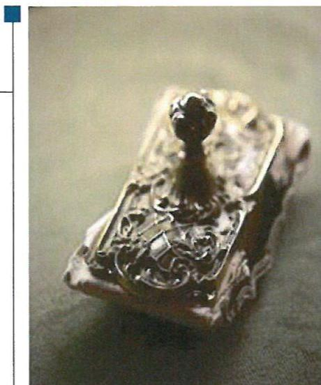
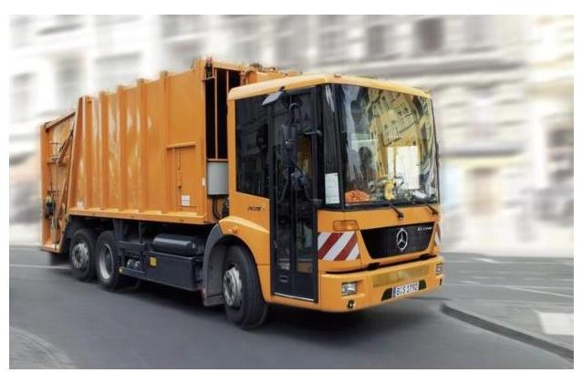
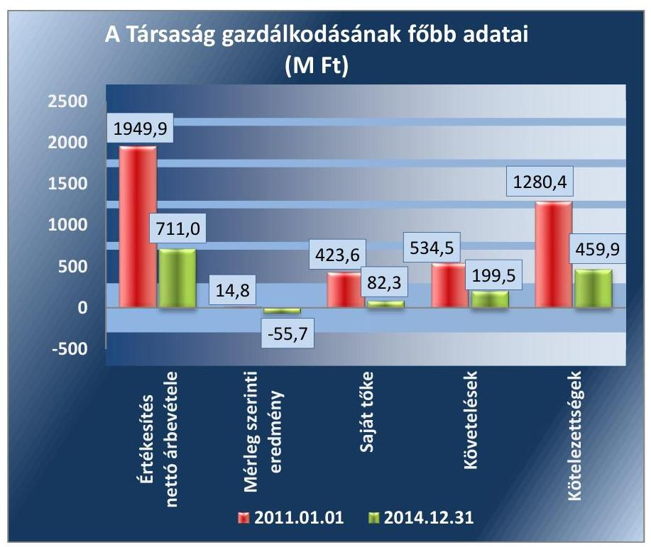
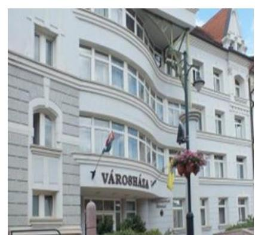
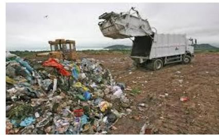
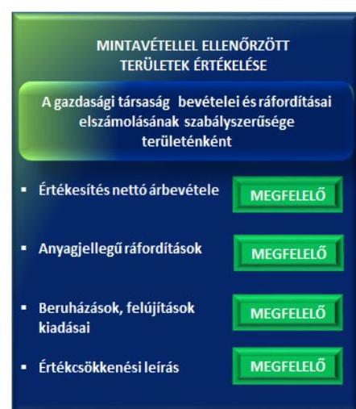
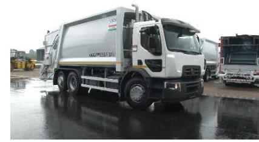
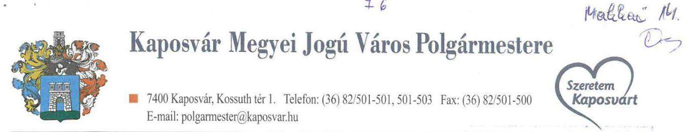
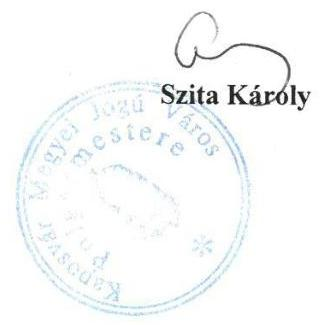
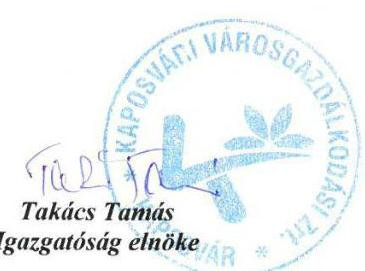

# Jelentés 

## Az önkormányzatok gazdasági társaságai

Az önkormányzatok többségi tulajdonában lévő gazdasági társaságok gazdálkodásának ellenőrzése Kaposvári Városgazdálkodási Zrt. 2017.

Az ÁSZ az államháztartáson kívül működő közfeladat-ellátó rendszerek ellenőrzéseivel hozzájárul ahhoz, hogy a közpénzeket az államháztartáson kívül működő szervezetek is átlátható, rendezett módon használják fel a közfeladatok ellátása érdekében.

---

# Jelentés 

## Az önkormányzatok gazdasági társaságai

Az önkormányzatok többségi tulajdonában lévő gazdasági társaságok gazdálkodásának ellenőrzése Kaposvári Városgazdálkodási Zrt.
2017. január 27. nap

Domokos László
elnök

Az ÁSZ az államháztartáson kívül működő közfeladat-ellátó rendszerek ellenőrzéseivel hozzájárul ahhoz, hogy a közpénzeket az államháztartáson kívül működő szervezetek is átlátható, rendezett módon használják fel a közfeladatok ellátása érdekében.

---

# AZ ELLENŐRZÉST FELÜGYELTE: 

MAKKAI MÁRIA felügyeleti vezető

## AZ ELLENŐRZÉST VEZETTE ÉS A VÉGREHAJTÁSÁÉRT FELELŐS:

SALI SÁNDORNÉ ellenőrzésvezető

## A PROGRAM ÖSSZEÁLLÍTÁSÁÉRT FELELŐS:

JANIK JÓZSEF osztályvezető

## A TÉMÁHOZ KAPCSOLÓDÓ KORÁBBI SZÁMVEVŐSZÉKI JELENTÉSEK:

- címe: Jelentés Az önkormányzatok gazdasági társaságai Az önkormányzatok többségi tulajdonában lévő gazdasági társaságok közfeladat ellátását érintő gazdálkodási tevékenysége szabályszerűségének ellenőrzése - Kaposvári Önkormányzati Vagyonkezelő és Szolgáltató Zrt.
- sorszáma: 15066

IKTATÓSZÁM: V-1103-137/2016.
TÉMASZÁM: 2137
ELLENŐRZÉS-AZONOSÍTÓ SZÁM: V070767

---

# TARTALOMJEGYZÉK 

■ ÖSSZEGZÉS ..... 5
■ AZ ELLENŐRZÉS CÉLJA ..... 6
■ AZ ELLENŐRZÉS TERÜLETE ..... 7
■ AZ ELLENŐRZÉS HÁTTERE, INDOKOLTSÁGA ..... 9
■ A JELENTÉS LÉNYEGES KÉRDÉSKÖREI ..... 10
■ ELLENŐRZÉS HATÓKÖRE ÉS MÓDSZEREI ..... 11
■ MEGÁLLAPÍTÁSOK ..... 13
■ JAVASLATOK ..... 21
■ MELLÉKLETEK ..... 23
I. Sz. melléklet: Értelmező szótár ..... 23
II. Sz. melléklet: Működési adatok ..... 25
■ FÜGGELÉK: ÉSZREVÉTELEK ..... 27
■ RÖVIDÍTÉSEK JEGYZÉKE ..... 31

---

.

---

# ÖSSZEGZÉS 

A 2011-2014. években a Kaposvári Városgazdálkodási Zrt.-nél a Kaposvár Megyei Jogú Város Önkormányzata a hulladékgazdálkodás közfeladat-ellátását szabályszerűen megszervezte. Az Önkormányzat és a Kapos Holding Közszolgáltató Zrt. tulajdonosi joggyakorlása szabályos volt. A vagyongazdálkodása szabályszerű volt a 2011. év kivételével. A kötelezettségállomány nem veszélyeztette a közfeladat-ellátását. A bevételek és ráfordítások elszámolása megfelelő volt, az árképzés szabályszerűen történt.

## Az ellenőrzés társadalmi indokoltsága

Az Állami Számvevőszék középtávra szóló stratégiájában megfogalmazta, hogy a helyi önkormányzatok gazdálkodásában rejlő pénzügyi kockázatok feltárásával, az államháztartáson kívülre nyújtott költségvetési támogatások és ingyenes vagyonjuttatások, valamint az államháztartáson kívül működő közfeladat-ellátó rendszerek ellenőrzéseivel hozzájárul ahhoz, hogy a közpénzeket az államháztartáson kívül működő szervezetek is átlátható, rendezett módon használják fel a közfeladatok szerződésben vállalt ellátása érdekében.

Magyarországon az intézmény-centrikus közfeladat-ellátás jellemző, de egyre jelentősebb a költségvetésen kívüli feladatellátás térnyerése. Ennek legfontosabb szereplői - a nonprofit szervezetek mellett - az önkormányzati tulajdonú társaságok. Az önkormányzatok szervezetalakítási szabadságának következménye, hogy a korábban is vállalati formában működő közszolgáltatások mellett, mind a kötelező, mind az önként vállalt feladatok ellátásában a társaságok kiemelt fontosságú szerephez jutottak.

## Főbb megállapítások, következtetések

Az Önkormányzat a közfeladat-ellátását szabályszerűen megszervezte, feltételeit biztosította. A tulajdonosi joggyakorlás szabályos volt. Az Önkormányzat az ellenőrzött időszakban a közfeladat-ellátással kapcsolatos hulladékgazdálkodással összefüggő terv- és rendeletalkotási kötelezettségének a jogszabályi előírásoknak megfelelően eleget tett. A Felügyelő Bizottság ügyrenddel nem rendelkezett az ellenőrzött időszakban.

A Társaság vagyongazdálkodása szabályszerű volt a 2011. év kivételével. A 2011. évi beszámoló mérlegét alátámasztó leltár hiányos volt, továbbá a gazdasági események dokumentálása nem minden esetben volt szabályszerű. A Társaság az előírt szabályzatokkal rendelkezett, azok a számlarend kivételével megfeleltek a vonatkozó jogszabályokban foglaltaknak. A számlarend a 2012-2014. évekre nem tartalmazta a közvetlen és általános költségek elszámolására kijelölt számlákat. A kötelezettségállomány nem veszélyeztette az ellenőrzött időszakban a közfeladat- és feladatellátást, továbbá a Társaság működését. A Társaság az előírt beszámolási, adatszolgáltatási kötelezettségét teljesítette. A 2014. évi beszámoló kiegészítő melléklete nem felelt meg a jogszabályi előírásnak, mert a 2014. első félévre vonatkozóan nem tartalmazta a hulladékgazdálkodási közszolgáltatás mérlegét és eredménykimutatását.

A bevételek és ráfordítások elszámolása megfelelő volt. Az önköltségszámítás szabályait meghatározták, az árképzés szabályszerűen történt.

---

# AZ ELLENŐRZÉS CÉLJA 

Az ellenőrzés célja annak értékelése volt, hogy az önkormányzat vagyongazdálkodási tevékenysége során szabályszerűen gyakorolta-e tulajdonosi jogait; a gazdasági társaság szabályozottsága, gazdálkodása és vagyongazdálkodási tevékenysége, bevételeinek és ráfordításainak elszámolása megfelelt-e a jogszabályi és tulajdonosi előírásoknak; a gazdasági társaság kötelezettségállománya jelentett-e kockázatot a működésre, valamint a gazdálkodás átláthatósága és elszámoltathatósága érdekében biztosítva volt-e a szolgáltatás dijának megalapozottsága szabályszerű önköltségszámítással.

---

# AZ ELLENŐRZÉS TERÜLETE 

## Kaposvár Megyei Jogú Város Önkormányzata, a Kapos Holding Közszolgáltató Zrt. és a többségi tulajdonban lévő Kaposvári Városgazdálkodási Zrt.

A KAPOSVÁR MEGYEI JOGÚ VÁROS ÖNKORMÁNYZATA a Társaság 1-ben 54%-os részesedéssel többségi tulajdonos volt 2011. március 22-ig, ezt követően az ellenőrzött időszak végéig a többségi tulajdonos az Önkormányzat 2 100%-os tulajdonában álló KAPOS HOLDING Közszolgáltató Zrt. volt. Az ellenőrzött időszakban a tulajdoni részesedés feletti tulajdonosi jogokat az Önkormányzat és a Holding Zrt.3 gyakorolta. A Társaság kisebbségi tulajdonosa 44,5%-kal az AVE Magyarország Hulladékgazdálkodási Kft., továbbá 1,5%-kal egyéb kisrészvényesek voltak.

Az Önkormányzat a hulladékgazdálkodási közfeladat-ellátását az Ötv.4 rendelkezéseivel összhangban létrehozott Kaposvári Városgazdálkodási Zrt., valamint a Holding Zrt. által 2011. június 6-án létrehozott Kaposvári Hulladékgazdálkodási Kft. közreműködésével biztosította. A Társaság közfeladatát saját tulajdonú eszközökkel végezte.

A KAPOSVÁRI VÁROSGAZDÁLKODÁSI ZRT. főtevékenysége a Kaposvár Megyei Jogú Város közigazgatási területén, valamint több mint 220 - Somogy, Tolna, Nógrád és Pest megyei - településen nem veszélyes hulladék gyűjtése. A Társaság 83760 ingatlantulajdonosnak és 4125 közületnek, illetve vállalkozásnak biztosította a hulladékszolgáltatást.

A Társaságból 2014. január 1-jén kivált a DDH Kft.5 és a Kaposvári Környezetvédelmi Kft. A hulladékgyűjtési és -szállítási közfeladatot 2014. július 2-ától a DDH Kft. látta el, így a KVG Zrt. közfeladatot ettől az időponttól nem látott el, főtevékenysége a saját tulajdonában lévő eszköz-bérbeadás volt.

Az ellenőrzött időszakban a polgármester és a jegyző személye nem változott. A polgármester az 1994. évi önkormányzati választások óta látja el feladatát, a jegyző 1990. év óta. A Társaság képviseletét az Igazgatóság6, illetve az igazgatóság elnöke látta el. Az igazgatóság elnökének személye az ellenőrzött időszakban kétszer változott.

A Társaság átlagos statisztikai állományi létszáma 2011. december 31-én 186 fő, 2014. december 31-én 35 fő volt.

---

A Társaság gazdálkodásának főbb adatait 2011. január 1. és 2014. december 31. vonatkozásában az 1. ábra szemlélteti.

1. ábra

*Forrás: A Társaság 2011. és 2014. évi beszámolói*

A Társaság mérleg főösszege 2011. január 1-jén 1732,5 M Ft, 2014. év végén 571,2 M Ft volt. Az értékesítés nettó árbevétele több mint felére csökkent. A saját tőke összege 2011. január 1-jén 423,6 M Ft-ról a 2014. év végére 82,3 M Ft-ra, 80,6%-kal csökkent. A követelések 62,7%-kal, a kötelezettségek 64,1%-kal csökkentek.

A Társaság működésének főbb jellemzőit a II. számú melléklet mutatja be.

---

# **AZ ELLENŐRZÉS HÁTTERE, INDOKOLTSÁGA**

*Az önkormányzatok közfeladat-ellátásában egyre jelentősebb az önkormányzati tulajdonú társaságok útján történő feladatellátás térnyerése.*

**AZ ÖNKORMÁNYZATI TULAJDONÚ GAZDASÁGI TÁRSASÁGOK** ellenőrzése kiemelten fontos a vagyon megőrzése, megóvása érdekében, amelyekkel szemben alapvető követelmény, hogy gazdálkodásuk, működésük szabályszerű, az általuk szolgáltatott adatok minél megbízhatóbbak legyenek. A közfeladat-, illetve a feladatellátás költségeinek, ráfordításainak alakulása, színvonala hatással van a lakosság elégedettségére.

**AZ ELLENŐRZÉS VÁRHATÓ HASZNOSULÁSA-KÉNT** az ÁSZ7 a megállapításaival segítséget nyújthat az államháztartáson kívüli közfeladat-ellátás értékeléséhez, a jogszabályi keretei pontosításához, valamint az átláthatóságot biztosító szabályozásához. Meghatározhatóvá válnak az önkormányzati feladatellátásban résztvevő államháztartáson kívüli szervezeteknek – az Önkormányzat költségvetését, pénzügyi helyzetét is befolyásoló – kockázatai, lehetővé válik ezen kockázatok csökkentése. Ellenőrzéseink feltárhatják, hogy az Önkormányzat feladatellátási kötelezettségének szabályszerűen tett-e eleget, a feladatellátáshoz rendelt saját vagyon működtetését az elvárható gondossággal, szabályszerűen szervezte-e meg és a tulajdonosi felügyelete hozzájárult-e a feladatellátásához. Az ellenőrzés rávilágíthat arra, hogy a gazdasági társaság a feladatellátási, közszolgáltatási szerződésben foglaltak betartásával, a vagyon használatával biztosította-e a szolgáltatás folytatásának feltételeit, a feladat ellátását. Ezzel az ellenőrzöttek és a helyi döntéshozók számára visszajelzést ad feladatszervezési, feladatellátási kockázataikról, alapot ad a meglévő hibák megszüntetéséhez, a jobb feladatellátás biztosításához. Fokozza a fegyelmet, igazolja, hogy lejárt a következmények nélküli ellenőrzések időszaka. Az ÁSZ értékteremtő rend kialakításához és megőrzéséhez hozzájáruló tevékenysége pozitív hatással van a Társaságról kialakított összkép formálására.

---

# A JELENTÉS LÉNYEGES KÉRDÉSKÖREI 

1. Az Önkormányzat feladat és közfeladat megszervezéséről szóló döntése, valamint a tulajdonosi joggyakorlás szabályszerű volt-e?
2. A Társaság vagyongazdálkodása szabályszerű volt-e, kötelezettségállománya jelentett-e kockázatot a működésre, illetve a közfeladat-ellátásra?
3. A Társaságnál az ellátott közfeladat bevételei és ráfordításai elszámolása, valamint az önköltségszámítás és árképzés szabályszerű volt-e?

---

# ELLENŐRZÉS HATÓKÖRE ÉS MÓDSZEREI 

## Az ellenőrzés típusa

Megfelelőségi ellenőrzés

## Az ellenőrzött időszak

A 2011. január 1-jétől 2014. december 31-éig terjedő időszak.

## Az ellenőrzés tárgya

A gazdasági társaság feletti tulajdonosi joggyakorlás, valamint a gazdasági társaság gazdálkodásának szabályozottsága és szabályszerűsége.

Az ellenőrzés kiterjed minden olyan körülményre és adatra, amely az ÁSZ jogszabályban meghatározott feladatainak teljesítéséhez, valamint a program végrehajtása folyamán felmerült újabb összefüggések feltárásához szükséges.

## Az ellenőrzött szervezet

Kaposvár Megyei Jogú Város Önkormányzata és a Kapos Holding Közszolgáltató Zrt., továbbá a Kaposvári Városgazdálkodási Zrt.

## Az ellenőrzés jogalapja

Az ellenőrzés végrehajtásának jogszabályi alapját az Állami Számvevőszékről szóló 2011. évi LXVI. törvény 1. § (3) és az 5. § (3)-(4)-(5) bekezdései képezték.

## Az ellenőrzés módszerei

Az ellenőrzést a nemzetközi standardokat irányadónak tekintve az ellenőrzési program ellenőrzési kérdései, az ellenőrzött időszakban hatályos jogszabályok, az ellenőrzés szakmai szabályok és módszertanok figyelembevételével végeztük.

Az ellenőrzés ideje alatt az ellenőrzött szervezettel történő kapcsolattartást az ÁSZ Szervezeti és Működési Szabályzatának vonatkozó előírásai alapján biztosítottuk.

Az ellenőrzés a többségi tulajdonosi jogokat gyakorló Kaposvár Megyei Jogú Város Önkormányzatára, a Kapos Holding Közszolgáltató Zrt.-re és az

---

ellenőrzött közfeladatot ellátó Kaposvári Városgazdálkodási Zrt.-re terjedt ki.

Az ellenőrzési kérdések megválaszolásához szükséges bizonyítékok megszerzése a következő ellenőrzési eljárások alkalmazásával történt: megfigyelés, kérdésfeltevés (információkérés), összehasonlítás, valamint elemző eljárás. Az ellenőrzési bizonyítékként felhasználható adatforrások közé tartoztak egyrészt a szakmai programban felsorolt adatforrások, másrészt az ellenőrzés folyamán feltárt, az ellenőrzés szempontjából információkat tartalmazó dokumentumok.

Az ellenőrzést a kérdésekre adott válaszok kiértékelésével, valamint a megjelölt adatforrások, a csatolt tanúsítványok felhasználásával, továbbá az adott időszakban hatályos jogszabályok figyelembevételével folytattuk le.

A Társaság bevételeinek és ráfordításainak elszámolása, valamint a vagyonnyilvántartás terén a szabályszerű működést az ÁSZ véletlen mintavétellel ellenőrizte. A mintavétellel ellenőrzött területek esetében a szabályszerűségre vonatkozó kérdések eredménye összesítésre került. Az ÁSZ a jogszabályoknak és a belső előírásoknak "megfelelő"-nek tekintette az adott területet, amennyiben a minta ellenőrzésének eredménye alapján 95%-os bizonyossággal a teljes sokaságban a hibaarány legfeljebb 10%, "nem megfelelő"-nek, amennyiben 10%-nál magasabb arányt képviselt. A ráfordítások elszámolására és a vagyonnyilvántartásra vonatkozó véletlen mintavételt az ÁSZ kockázat alapú kiválasztással egészítette ki, amelynek során évente a három legnagyobb összegű tételt választotta ki.

---

# 1. Az Önkormányzat feladat és közfeladat megszervezéséről szóló döntése, valamint a tulajdonosi joggyakorlás szabályszerű volt-e? 

Összegző megállapítás

Az Önkormányzat a közfeladat-ellátását szabályszerűen megszervezte, feltételeit biztosította. A tulajdonosi joggyakorlás szabályos volt.

### 1.1. számú megállapítás

Az Önkormányzat az ellenőrzött időszakban a közfeladat-ellátással kapcsolatos hulladékgazdálkodással összefüggő terv- és rendeletalkotási kötelezettségének a jogszabályi
 előírásoknak megfelelően eleget tett.

GAZDASÁGI PROGRAM ${ }_{1,2}{ }^{8}$-ben az előírásnak megfelelően meghatározta az Önkormányzat a 2011-2014. évekre vonatkozóan a hulladékgazdálkodási közfeladat biztosításával, fejlesztésével kapcsolatos célkitűzéseket. A közfeladat megszervezésének módjáról az Önkormányzat 2011. január 1-jét megelőzően döntött.

RENDELETALKOTÁSI kötelezettségének az Önkormányzat eleget tett, megalkotta a települési szilárd, és folyékony hulladékkal kapcsolatos hulladékkezelési helyi közszolgáltatásról szóló hulladékgazdálkodási rendeletét ${ }^{9}$, melyet az Önkormányzat közgyűlése ${ }^{10}$ jóváhagyott. Az Önkormányzat rendelkezett vagyongazdálkodási rendelet${ }_{1,2,3}$-mal ${ }^{11}$, jóváhagyott vagyongazdálkodási koncepcióval, közép- és hosszú távú vagyongazdálkodási tervvel, valamint hulladékgazdálkodási tervvel.

A KÖZSZOLGÁLTATÁSI SZERZŐDÉST az Önkormányzat és a Társaság az ellenőrzött időszak előtt kötötte meg 10 év határozott időtartamra, mely 2014. első félévéig volt hatályban, ezt követően a Társaság közszolgáltatást nem végzett. A szerződés szabályszerűen meghatározta többek között a közszolgáltatási díj alkalmazásának feltételeit, a megbízó és szolgáltató jogait és kötelezettségeit, az ellátási területet, valamint a szolgáltatás egyéb szabályait.

### 1.2. számú megállapítás

A tulajdonosi joggyakorlás összességében szabályos volt.
A TULAJDONOSI JOGGYAKORLÓ ${ }_{1,2}{ }^{12}{ }^{13}$ a vagyongazdálkodási feltételeket szabályszerűen kialakította az ellenőrzött időszakban.

A tulajdonosi jogok gyakorlásának rendjét a tulajdonosi joggyakorló; az SZMSZ rendelet${ }_{1,2}$-ben ${ }^{14}$, valamint az Alapszabály ${ }_{1-3}{ }^{15}$-ban, a tulajdonosi joggyakorló; az Alapszabály 4.9-ben a jogszabály előírásainak megfelelően határozta meg és annak megfelelően gyakorolta jogait. Az üzleti terveket a Közgyűlés ${ }^{16}$ az ellenőrzött időszak minden évében elfogadta.

---

A 2011. évi gazdálkodáshoz kapcsolódóan a kisebbségi tulajdonosok kockázatokat jeleztek a veszteséges gazdálkodás, az FB${ }^{17}$ és az Igazgatóság működése, a tulajdonosi joggyakorló${ }_{1,2}$ tulajdonosi joggyakorlása, valamint a kaposmérői hulladéklerakóval korábban létrejött szerződésből eredő kötelezettségek tekintetében. A gazdálkodási hiányosságok miatt a legnagyobb kisebbségi tulajdonos a hatóság felé jelzéssel élt. A tulajdonosi joggyakorló intézkedett a veszteséges gazdálkodás megszüntetése érdekében, 2012-ben felszámolta a veszteséges üzletágakat, a hulladéklerakó beszállítói szerződést felmondta (Kaposmérő), valamint a Társaságot átalakította.

AZ FB a 2011-2014. években ügyrenddel nem rendelkezett, nem alakította ki a működésének rendjét a Gt.${ }^{18}$ 34. § (4), illetve a Ptk.${ }^{19}$ 3:122. § (3) bekezdésében foglaltakkal ellentétben.

Az FB feladatait és beszámolási kötelezettségét a Társaság Alapszabály${ }_{1-9}$-ben foglaltak alapján az ügyrendi szabályozás hiánya ellenére szabályszerűen látta el. Az FB az ellenőrzött időszak minden évében írásbeli jelentést készített a Társaság számviteli beszámolóiról a tulajdonosi joggyakorló${ }_{1,2}$ részére a beszámoló elfogadásához. Az FB a 2011. évi beszámoló elfogadása során jelentésében rögzítette a jelentős vagyonvesztést, ismert volt a hulladéklerakói szerződés nem teljesítésének következménye, ezért további vizsgálatokat tartott szükségesnek a személyes felelősség megállapítása érdekében.

AZ ANYAGI ÖSZTÖNZÉSI RENDSZERT a Taktv.${ }^{20}$ rendelkezéseinek megfelelően a Közgyűlés által elfogadott javadalmazási szabályzatban ${ }^{21}$ rögzítették. A Társaság javadalmazási szabályzatát a törvényi előírásoknak megfelelően készítette el.

A BESZÁMOLTATÁSI RENDSZER keretében a tulajdonosi joggyakorló${ }_{1,2}$ a Társaság igazgatóságának elnökét évente beszámoltatta a gazdálkodásról, valamint a közszolgáltatási tevékenységről. A Társaság 2011-2014. évi éves szakmai és számviteli beszámolóit - az FB előzetes írásbeli jelentésének birtokában - a Közgyűlés elfogadta. A Holding Zrt. a Társaságra vonatkozóan előírta 2011. év júniusától havi kontrolling jelentés, 2013. év első negyedévétől évközi negyedéves beszámoló készítését.

---

# 2. A Társaság vagyongazdálkodása szabályszerű volt-e, kötelezettségállománya jelentett-e kockázatot a működésre, illetve a közfeladat-ellátásra? 

Összegző megállapítás

A Társaság vagyongazdálkodása szabályszerű volt a 2011. év kivételével. A 2011. évi leltára hiányos volt. A kötelezettségállomány nem veszélyeztette a közfeladat- és a feladatellátást.
2.1. számú megállapítás

A Társaság az előírt szabályzatokkal rendelkezett, azok a számlarend${ }_{1,2}$ kivételével megfeleltek a vonatkozó jogszabályokban foglaltaknak, tartalmazták a közfeladat-ellátás elkülönített nyilvántartásának szabályait.

ÜZLETI TERVEK készítését a Társaság részére az Alapszabály 1-9-ben írták elő. A Társaság az üzleti tervet az ellenőrzött időszak minden évében elkészítette, melyet a Közgyűlés elfogadott. Az üzleti tervek összhangban voltak az Önkormányzat, valamint a Társaság hulladékgazdálkodási terveivel.

A SZÁMVITELI POLITIKA ${ }_{1,2,3}{ }^{22}$ megfelelt a Számv. tv.${ }^{23}$ előírásainak az ellenőrzött időszakban. A Társaság számviteli nyilvántartása biztosította az egyes tevékenységek elkülönült nyilvántartását és átláthatóságát. A számviteli politika${ }_{1,2,3}$ részeként a Számv. tv.-ben előírtaknak megfelelően elkészítették a leltározási és leltárkészítési szabályzatot, az eszközök és források értékelési szabályzatát, valamint a selejtezési szabályzatot.

A SZÁMLAREND ${ }_{1,2}{ }^{24}$ a 2012-2014. évekre vonatkozóan a Számv. tv. 161. § (2) bekezdés a) és b) pontjával ellentétesen, nem tartalmazta a közvetlen és általános költségek elszámolására kijelölt számlák számjelét és megnevezését, a számlák tartalmát, a számlák értéke növekedésének, csökkenésének jogcímeit, a számlát érintő gazdasági események meghatározását, valamint azok más számlákkal való kapcsolatát.

A számlarend${ }_{1}$ a 2011. évre vonatkozóan a Számv. tv. előírásaival összhangban volt.

A PÉNZKEZELÉSI SZABÁLYZAT ${ }_{1,2}{ }^{25}$ 2013. január 1-jéig nem felelt meg a Számv. tv. 14. § (8) bekezdésében foglaltaknak, mert nem tartalmazta a készpénzállomány ellenőrzésekor követendő eljárást és az ellenőrzés gyakoriságát. 2013. január 1-jétől a pénzkezelési szabályzat${ }_{3}$ a Számv. tv. előírásainak megfelelt.

A Társaság a tulajdonában lévő vagyonával a jogszabályi és belső előírásoknak megfelelően gazdálkodott, azonban a 2011. évi leltár hiányos volt, továbbá a gazdasági eseményeket nem teljes körűen támasztották alá szabályszerű bizonylatokkal.

AZ ANALITIKUS ÉS FŐKÖNYVI NYILVÁNTARTÁS
a 2011. évben nem biztosította a Társaság vagyonában bekövetkezett változások valóságnak megfelelő, folyamatos, zárt rendszerű, áttekinthető

---

bemutatását a Számv. tv. 159. §, valamint a 165. § (1)-(2) bekezdésében foglalt előírások ellenére, mert egy adásvételi szerződés felbontása miatt az eredeti állapot visszaállításához kapcsolódóan számviteli bizonylatokkal, analitikus nyilvántartással a Társaság nem rendelkezett teljes körűen.

Az analitikus és főkönyvi nyilvántartás vezetése a 2012-2014. évek között a Számv. tv. előírásának megfelelően történt. A közfeladat-ellátását szolgáló vagyon nyilvántartását elkülönített főkönyvi számlákon vezették. Az immateriális javakat és tárgyi eszközöket analitikusan nyilvántartották, egyedi nyilvántartással folyamatosan nyomon követték az eszközök bruttó értékében és értékcsökkenési leírásában bekövetkezett változásokat.

LELTÁRRAL támasztotta alá a Társaság az éves beszámolók szerinti vagyon értékét az ellenőrzött időszakban a törvényi előírásoknak megfelelően, valamint a leltározási és leltárkészítési szabályzattal összhangban. A 2011. évi tárgyi eszköz tételes leltára nem tartalmazta a visszavett, év végére nulla értékre leírt néhány eszközt, ezzel a Társaság megsértette a Számv. tv. 69. § (1) bekezdésében foglalt előírást. A hiányosság a beszámoló valódiságát nem befolyásolta.

A Társaság éves beszámolóinak főbb mérlegadatait az 1. táblázat szemlélteti.

1. táblázat

| A TÁRSASÁG FŐBB MÉRLEGADATAI (M Ft) |  |  |  |  |  |
| :--: | :--: | :--: | :--: | :--: | :--: |
| Megnevezés | 2011.01.01. | 2011.12.31. | 2012.12.31. | 2013.12.31. | 2014.12.31. |
| Befektetett eszközök | 1112,2 | 866,9 | 645,8 | 460,5 | 331,0 |
| - ebből: Tárgyi eszközök | 987,8 | 765,0 | 546,1 | 395,4 | 282,0 |
| Forgóeszközök | 616,8 | 534,3 | 431,6 | 362,6 | 208,2 |
| - ebből: Követelések | 534,5 | 489,7 | 391,8 | 333,8 | 199,5 |
| Aktív időbeli elhatárolások | 3,5 | 130,6 | 88,1 | 45,7 | 32,0 |
| ESZKÖZÖK ÖSSZESEN | 1732,5 | 1531,8 | 1165,5 | 868,8 | 571,2 |
| Saját tőke | 423,6 | 91,0 | 124,7 | 144,6 | 82,3 |
| - ebből Jegyzett tőke | 126,0 | 126,0 | 126,0 | 126,0 | 119,4 |
| - ebből Tőketartalék | 76,5 | 76,5 | 76,5 | 76,5 | 76,4 |
| - ebből Eredménytartalék | 185,0 | 144,2 | -161,6 | -85,0 | -61,0 |
| - ebből Lekötött tartalék | 21,4 | 76,9 | 50,1 | 7,2 | 3,0 |
| - ebből: Mérleg szerinti eredmény | 14,8 | -332,6 | 33,7 | 20,0 | -55,7 |
| Céltartalékok | 3,7 | 70,0 | 78,8 | 38,1 | 28,4 |
| Kötelezettségek | 1280,4 | 1343,6 | 947,1 | 683,5 | 459,9 |
| Passzív időbeli elhatárolások | 24,8 | 27,2 | 14,9 | 2,6 | 0,6 |
| FORRÁSOK ÖSSZESEN | 1732,5 | 1531,8 | 1165,5 | 868,8 | 571,2 |

A VAGYON értéke a 2011. január 1-jei 1732,5 M Ft-ról 2014. december 31-re 571,2 M Ft-ra, 1161,3 M Ft-tal, 67%-kal csökkent, mely a 2011. évi veszteséggel, valamint a 2014. évben a társasági vagyon egy részének felhasználásával létrehozott két új társasággal hozható összefüggésbe. A Társaság befektetett eszközeinek mérlegértéke az ellenőrzött időszakban - a tárgyi eszközök elszámolt értékcsökkenése, az eszközök értékesítése és a selejtezések következtében - folyamatosan csökkent. A közszolgáltatási szerződés a Társaság kötelezettségeként határozta meg a közszolgáltatás teljesítéséhez szükséges mennyiségű jármű, gép, eszköz, berendezés biztosítását, illetve a folyamatos fejlesztések és karbantartások elvégzését. A Társaság az ellenőrzött időszakban minimális szinten tartó beruházást hajtott végre.

A SAJÁT TŐKE a 2011. január 1-jei 423,6 M Ft-ról az ellenőrzött időszak végére 82,3 M Ft-ra, 80,6%-kal csökkent. A mérleg szerinti eredmény az ellenőrzött időszakban a 2011. évi 332,6 M Ft veszteséghez viszonyítva javult, azonban a 2014. évben ismét 55,7 M Ft veszteség képződött.

A Társaság az ellenőrzött időszakban két egymást követő évben nem gazdálkodott veszteségesen és rendelkezett a társasági formára kötelezően előírt jegyzett tőkének megfelelő összegű saját tőkével a Gt. 51. § (1) bekezdése, valamint a Ptk. 2 3:133. § (2) bekezdése előírásainak megfelelően. A jegyzett tőke 2013. évről 2014. évre 6,6 M Ft-tal csökkent, melynek oka a Társaság továbbműködése mellett kiválással két új Kft. létrehozása 6,0 M Ft-tal, továbbá az alaptőke 0,6 M Ft-tal történő szabályszerű leszállítása a dematerializált részvények sikertelen értékesítésével összefüggésben.
2.3. számú megállapítás

A kötelezettségállomány nem veszélyeztette az ellenőrzött időszakban a közfeladat- és feladatellátást, továbbá a Társaság működését.

AZ ELADÓSODOTTSÁGI MUTATÓ értéke az ellenőrzött időszakban erős külső finanszírozottságot mutatott. A Társaság kötelezettségei jelentősen meghaladták a saját források összegét.

A HOSSZÚ LEJÁRATÚ KÖTELEZETTSÉGEK az ellenőrzött időszakban 534,5 M Ft-ról 69,5 M Ft-ra csökkentek. A hosszú lejáratú kötelezettségek állománya elsősorban egy 45,0 M Ft értékű, 10 éves futamidejű kölcsönből, valamint tárgyi eszközök lízing-kötelezettségeiből tevődött össze. A hosszú lejáratú kötelezettségek átsorolása a rövid lejáratú kötelezettségek közé szabályos és folyamatos volt az ellenőrzött időszakban.

A RÖVID LEJÁRATÚ KÖTELEZETTSÉGEK határidőre történő teljesítése nem volt biztosított, mert a Társaság kötelezettségeit folyószámlahitelei igénybevételével sem tudta határidőben teljesíteni. A szállítói kötelezettségek a 2011. évi 272,7 M Ft-ról a 2014. évre 22,8 M Ft-ra, 91,6%-kal, ezen belül a 30 napon túl lejárt szállítói kötelezettség állománya a 2011. évi 128,7 M Ft-ról a 2014. évre 13,5 M Ft-ra, 89,5%-kal csökkent. A Társaság 2014. év végi folyószámlahitel állománya 128,9 M Ft volt. A cash-pool szolgáltatási szerződés alapján folyószámlahitel szerződés ${ }^{26}$ vonatkozásában a
 Társaság 350,0 M Ft összeg erejéig keretbiztosítéki jelzálogjog bejegyzéséhez járult hozzá a tulajdonában álló Kaposvár, Cseri út 14. szám alatti ingatlanra vonatkozóan.
2.4. számú megállapítás

A Társaság az előírt beszámolási, adatszolgáltatási kötelezettségét teljesítette, de a 2014. évi beszámoló tartalma nem felelt meg a jogszabályi előírásnak.

AZ ÉVES BESZÁMOLÓKAT a tulajdonosi joggyakorló1,2 minden évben az előírt határidőig jóváhagyta, a Társaság letétbe helyezte és

---

közzé tette a Számv. tv.-ben foglaltaknak megfelelően. Az éves beszámoló jóváhagyásakor az FB, valamint a könyvvizsgáló jelentése minden esetben rendelkezésre állt, a Közgyűlés az éves beszámolókat az FB és a könyvvizsgáló jelentésének birtokában fogadta el.

A könyvvizsgáló az ellenőrzött időszakban az éves beszámolókról korlátozás nélküli véleményt adott, azonban két évhez kapcsolódóan figyelemfelhívással élt. A 2011. évi beszámoló auditálása során figyelemfelhívása a Társaság likviditási helyzetét, a kötelezettségállomány alakulását és a jelentős veszteséget érintette, mert a vállalkozás folytatás elvének érvényesülését veszélyeztetve látta. Figyelemfelhívással élt továbbá a 2014. évi beszámolóhoz kapcsolódóan a Társaság ellen indított kötbér kifizetésére irányuló per kapcsán, melyben jelezte, hogy a per kedvezőtlen kimenetele kötbérfizetési kötelezettség megállapítása - ellehetetlenítené a Társaság további működését, így a vállalkozás folytatásának elve nem érvényesülhet.

A Társaság az ellenőrzött időszak előtt szerződést kötött a szolgáltatási területén lévő települések szilárd hulladékainak a kaposmérői hulladéklerakóba szállítására. A szerződésben vállalt hulladékbeszállítási kötelezettségének 2011-től nem tett eleget, felmondta a szerződést. A beszállítási kötelezettség nem teljesítésére a szerződés a szerződésszegő fél részére kötbérfizetési kötelezettséget írt elő.

A Társaság a beszámolási, adatszolgáltatási és az egyéb tájékoztatási feladatokat a tulajdonosi elvárásoknak megfelelően teljesítette.

A 2014. évben a hulladékgazdálkodási közszolgáltatás mérlegét és eredménykimutatását a 2014. I. félévére vonatkozóan a kiegészítő mellékletében a Társaság nem mutatta be, ezen eljárás nem felelt meg a Hgt. ${ }^{27}$ 50. § (3) bekezdésében foglaltaknak. A Hgt. ${ }_{2}$ rendelkezéseinek megfelelően a 2013. évben ezen bemutatási kötelezettségének eleget tett.

A Társaság az Info. tv. ${ }^{28}$ rendelkezéseinek megfelelő adatvédelmi szabályzattal ${ }^{29}$ rendelkezett. A közérdekű adatok közzététele az ellenőrzött időszakban az Avtv. ${ }^{30}$, valamint az Info tv. előírásainak megfelelően szabályszerűen megtörtént.

# 3. A Társaságnál az ellátott közfeladat bevételei és ráfordításai elszámolása, valamint az önköltségszámítás és árképzés szabályszerű volt-e? 

Összegző megállapítás

A bevételek és ráfordítások elszámolása megfelelő volt, annak ellenére, hogy a 2011. évben nem érvényesültek maradéktalanul a jogszabályok és a belső szabályozás előírásai. Az önköltségszámítás szabályait meghatározták, az árképzés szabályszerűen történt.

### 3.1. számú megállapítás

A bevételek és ráfordítások elszámolása megfelelt az előírásoknak.
A Társaság értékesítés nettó árbevételének tervezett és tényleges adatait, a közfeladat árbevételét és eredményét a 2. táblázat szemlélteti. A mintavétellel ellenőrzött területek értékelését a 2. ábra mutatja.

---

2. ábra

2. táblázat

AZ ÁRBEVÉTEL ÉS A HULLADÉKGAZDÁLKODÁSI KÖZFELADAT ÁRBEVÉTELÉNEK ALAKULÁSA (M FT)

| Megnevezés | 2011. | 2012. | 2013. | 2014. |
| :-- | :--: | :--: | :--: | :--: |
| Értékesítés nettó árbevétele (terv) | 2143,6 | 1809,7 | 1444,1 | 651,0 |
| Értékesítés nettó árbevétele (tény) | 2062,6 | 1721,0 | 1324,7 | 711,0 |
| Ebből: hulladékgazdálkodási közszolgáltatás nettó árbevétele | 2009,9 | 1491,4 | 1040,0 | 428,8 |
| Az értékesítés nettó árbevételéből a   hulladékszállítás nettó árbevételének   aránya | $97,4 \%$ | $86,7 \%$ | $78,5 \%$ | $60,3 \%$ |

Forrás: Az éves üzleti jelentések és a 2011-2014. évi főkönyvi kivonata

AZ ÉRTÉKESÍTÉS NETTÓ ÁRBEVÉTELÉNEK elszámolása megfelelt a jogszabályi előírásoknak az ellenőrzött időszakban. A közszolgáltatás nettó árbevételének elszámolása szabályszerű volt, a bevételek közfeladat-ellátással kapcsolatos elkülönítése megtörtént a Hgt. ${ }^{31}$ és a Hgt. 2, valamint a belső szabályzatok előírásai szerint.

AZ ANYAGJELLEGŰ RÁFORDÍTÁSOK elszámolása összeségében megfelelt a Számv. tv. előírásainak, a közfeladat-ellátással kapcsolatos elkülönítés szabályszerűen megtörtént.

## A BERUHÁZÁSOK, FELÚJÍTÁSOK KIADÁSAINAK

elszámolása megfelelt a jogszabályi előírásoknak.

A 2011. évben egy adásvételi szerződés felbontásához kapcsolódóan az eszközök visszaszállítása és a rendeltetésszerű használatba vétele nem volt szabályszerű, nem felelt meg a Számv. tv. 52. § (2) és a 47. § (9) bekezdésében foglaltaknak. Az eszközök bekerülési értékének és az értékcsökkenésének meghatározását és könyvviteli elszámolását a Társaság dokumentumokkal nem teljes körűen támasztotta alá. A Társaság nem rendelkezett továbbá az eszközök visszaszállítását igazoló dokumentumokkal, valamint a vevő által a szerződés felbontásáig megfizetett összegek bizonylataival a Számv. tv. 165. § (1)-(2) bekezdés előírásaival ellentétesen.

AZ ÉRTÉKCSÖKKENÉSI LEÍRÁS elszámolása megfelelt a jogszabályi előírásoknak, annak ellenére, hogy a 2011. évben az értékcsökkenés elszámolásának dokumentumai hiányosak voltak. A Társaság tevékenységét leginkább jellemző járműpark az ellenőrzött időszak alatt nem újult meg, az időszak végére a járműpark nettó értéke a kezdeti 331,9 M Ft-ról 45,0 M Ft-ra csökkent. Ezzel azonos tendencia volt a gépek, berendezések és az épületek eszközcsoportban, hogy a használhatósági fok csökkent, az átlagos életkor növekedett. A saját vagyon után elszámolt értékcsökkenéshez képest kisebb mértékű pótlás, felújítás valósult meg.

KÖVETELÉS ÁLLOMÁNYÁT az előírásoknak megfelelően kezelte a Társaság, az értékvesztés elszámolását évente végezte a számviteli politika ${ }_{1,2,3}$ előírásainak megfelelően. Az ellenőrzött időszak alatt a Társaság rendelkezett a hátralékos követelések behajtását előíró szabályzattal, melyet két alkalommal módosított. A behajtási szabályzat és módosításai összhangban voltak a Hgt. 1 és a Hgt. 2.ben foglalt előírásokkal.

---

# 3.2. számú megállapítás 

2011. évben a Hgt. 126. § (1) bekezdése előírása szerint a közszolgáltatás díjhátraléka adók módjára behajtandó köztartozásnak minősült és a Hgt. 126. § (3) bekezdés alapján át kellett adni a követelést behajtásra a települési önkormányzat jegyzőjének, melynek a Társaság nem tett eleget. A 2012-2014. években a Társaság a Hgt.1,2 előírásainak megfelelve intézkedett a követelésállomány csökkentése érdekében.

## Az önköltségszámítás szabályait meghatározták, az árképzés szabályszerű volt az ellenőrzött időszakban.

A DÍJAK MEGÁLLAPÍTÁSA 2012. december 31-ig az Önkormányzat hatáskörébe tartozott. A 2013. január 1-jétől hatályos Hgt. 2 47. § (4) bekezdése szerint a hulladékgazdálkodási közszolgáltatási díj megállapítását a MEH ${ }^{32}$, majd 2013. április 4-től a MEKH ${ }^{33}$ javaslatának figyelembevételével miniszteri hatáskörbe utalta. A díj meghatározásakor a részletezett költségkalkuláció rendelkezésre állt. Az Önkormányzat a 2011. január 1-jétől érvényben lévő díjakat a költségkalkuláció alapján az 56/2010. (XI. 17.) határozatával hagyta jóvá.

AZ ÖNKÖLTSÉGSZÁMÍTÁSI SZABÁLYZAT ${ }_{1,2}{ }^{34}$ tartalmazta az önköltségszámítás számítási sémáját, elkülönítette a közvetlen és közvetett költségeket. Az általános költségek vetítési alapjának felosztását a közvetlen költségek arányában határozta meg. Az önköltségszámítási szabályzat ${ }_{1,2}$ tartalmazta a könyvviteli rendszerrel havonta történő egyeztetés módját. Az ellenőrzött időszak alatt az önköltségszámítási szabályzat ${ }_{1,2}$-nek megfelelően végeztek önköltségszámítást.

A KÖZSZOLGÁLTATÁS ÁRÁNAK meghatározása összhangban volt az előírásokkal. A 2011. január 1-jétől 2013. június 30-ig az aktuálisan érvényben lévő díjakat a Hgt. 125. § (4) bekezdése alapján szabályosan, a Társaság által készített részletes költségelemzés, díjkalkulációs javaslat alapján az Önkormányzat közgyűlése rendeletekkel fogadta el, mely díjak megfeleltek a Hgt. 1 57. § (1) mindenkor hatályos bekezdésének.

A Hgt. 2 47. §-ában előírtak alapján 2013. január 1-jétől az Önkormányzat díjmegállapítási jogosultsága megszűnt, a hulladékgazdálkodási díjat a MEH javaslatának figyelembevételével a nemzeti fejlesztési miniszter rendeletben állapította meg. A Hgt. 2 91. §-a 4,2%-os emelést írt elő 2013. első félévében, ezt követően a 2013. július 1-jétől díjcsökkentést írt elő, amelyet a Társaság szabályszerűen végrehajtott. Az alkalmazott díjak, illetve a közszolgáltatás részét képező díjtételek meghatározása és alkalmazása szabályszerű volt.

---

# JAVASLATOK 

Az ÁSZ tv. 33. § (1) bekezdésében foglaltak értelmében az ellenőrzött szervezet vezetője köteles a jelentésben foglalt megállapításokhoz kapcsolódó intézkedési tervet összeállítani és azt a jelentés kézhezvételétől számított 30 napon belül az ÁSZ részére megküldeni. Amennyiben az ellenőrzött szervezet vezetője nem küldi meg határidőben az intézkedési tervet, vagy továbbra sem elfogadható intézkedési tervet küld, az Állami Számvevőszék elnöke az ÁSZ tv. 33. § (3) bekezdése a) és b) pontjaiban foglaltakat érvényesítheti.

## A KAPOS HOLDING Közszolgáltató Zrt. elnök-vezérigazgatójának

1. Kezdeményezze, hogy a KVG Zrt. Felügyelőbizottsága feladatainak és tevékenységének ellátásához állapítsa meg az ügyrendjét, és terjessze a Közgyűlés elé jóváhagyásra.
(1.2. sz. megállapítás 4. bekezdése alapján)

## A Kaposvári Városgazdálkodási Zrt. Igazgatósága elnökének

1. Intézkedjen a számlarend módosításáról, hogy az tartalmazza minden alkalmazásra kijelölt számla számjelét és megnevezését, a számlák tartalmát, a számla értéke növekedésének, csökkenésének jogcímeit, a számlát érintő gazdasági eseményeket, azok más számlákkal való kapcsolatát.
(2.1. sz. megállapítás 3. bekezdése alapján)

---

.

---

# MELLÉKLETEK 

- I. SZ. MELLÉKLET: ÉRTELMEZŐ SZÓTÁR
cash-pool
dematerializált részvény
eladósodottsági
mutató
gazdálkodó szervezet
hulladékgazdálkodás
hulladékgazdálkodási közszolgáltatás
közfeladat

Folyamat, melyet pénzintézetek végeznek, mikor az ügyfelük több pénzforgalmi számláját összevonják egy számlára, hogy kedvezőbb kondíciókat biztosítsanak.
Elektronikus úton létrehozott, rögzített, továbbított és nyilvántartott, az értékpapírokra vonatkozó külön törvényben meghatározott tartalmi kellékeit azonosítható módon tartalmazó adatösszesség, amelynek nincs sorszáma. Dematerializált részvény esetén a részvényes nevét, valamint az azonosításhoz szükséges egyéb adatait az értékpapír-forgalmazó által a részvényes javára vezetett értékpapírszámla tartalmazza. (Forrás: Gt. 180. § (1) bekezdés)
eladósodottsági mutató (tőkeáttétel): idegen tőke/összes forrás.
Egészségesnek mondható egy olyan mértékű áttétel, amelyet az üzleti tervek szerint és az elmúlt időszak tapasztalatai alapján a Társaság megfelelő biztonsággal ki tud termelni. Nagy eszközberuházás-igényű iparágakban értéke magasabb, azaz magasabb eladósodottság is elfogadható, de 75-85%-ot meghaladó értéknél már itt is erős, sőt túlzott külső finanszírozottságról beszélhetünk. Általánosságban véve kedvező, ha értéke kisebb, mint 0,6.
A Ptk. ${ }^{35}$ 685. § c) pontja szerint gazdálkodó szervezet: „az állami vállalat, az egyéb állami gazdálkodó szerv, a szövetkezet, a lakásszövetkezet, az európai szövetkezet, a társaság, az európai részvénytársaság, az egyesülés, az európai gazdasági egyesülés, az európai területi együttműködési csoportosulás, az egyes jogi személyek vállalata, a leányvállalat, a vízgazdálkodási társulat, az erdő birtokossági társulat, a végrehajtói iroda, az egyéni cég, továbbá az egyéni vállalkozó." (hatályos: 2014. március 15-éig). A Hgt. ${ }_{2}$ 2. § (1) bekezdés 15. pontja szerint „a polgári perrendtartásról szóló törvényben meghatározott gazdálkodó szervezet, ide nem értve azt a költségvetési szervet, amelyet az államháztartásról szóló törvény szerint közfeladat-ellátására hoztak létre." (hatályos: 2014. március 15-étől)
a Hgt. ${ }_{1}$ 3. § h) pontja szerint „a hulladékkal összefüggő tevékenységek rendszere, beleértve a hulladék keletkezésének megelőzését, mennyiségének és veszélyességének csökkenését, kezelését, ezek tervezését és ellenőrzését, a kezelő berendezések és létesítmények üzemeltetését, bezárását, utógondozását, a működés felhagyását követő vizsgálatokat, valamint az ezekhez kapcsolódó szaktanácsadást és oktatást." (hatályos: 2012. december 31-éig)
A Hgt. ${ }_{2}$ 2. § (1) bekezdés 26. pontja szerint „a hulladék gyűjtése, szállítása, kezelése, az ilyen műveletek felügyelete, a kereskedőként, közvetítőként vagy közvetítő szervezetként végzett tevékenység, a hulladékgazdálkodási létesítmények és berendezések üzemeltetése, valamint a hulladékkezelő létesítmények utógondozása." (hatályos: 2013. január 1-jétől)
A Hgt. ${ }_{2}$ 2. § (1) bekezdés 27. pontja szerint: „a közszolgáltatás körébe tartozó hulladék átvételét, gyűjtését,
 elszállítását, kezelését, valamint a hulladékgazdálkodási közszolgáltatással érintett hulladékgazdálkodási létesítmény fenntartását, üzemeltetését biztosító, kötelező jelleggel igénybe veendő szolgáltatás." (hatályos: 2013. január 1-jétől)
Jogszabályban meghatározott állami vagy önkormányzati feladat, amit az arra kötelezett közérdekből, jogszabályban meghatározott követelményeknek és feltételeknek megfelelve végez, ideértve a lakosság közszolgáltatásokkal való ellátását, továbbá az állam nemzetközi szerződésekben vállalt kötelezettségeiből adódó közérdekű feladatokat, valamint e feladatok ellátásához szükséges infrastruktúra biztosítását is (Nvtv. ${ }^{36} 3 . \S$ (1) bekezdés 7. pont).
A közszolgáltatás: „közcélú, illetőleg közérdekű szolgáltatást jelent, amely egy nagyobb közösség (állam, település) minden tagjára nézve megközelítőleg azonos feltételek mellett vehető igénybe, ezért valamilyen mértékig közösségi megszervezést, illetve szabályozást, ellenőrzést igényel." Az Ebktv. ${ }^{37}$ 3. § d) pontja a következőképpen határozza meg a közszolgáltatást: „szerződéskötési kötelezettség alapján a lakosság alapvető szükségleteinek ellátására irányuló szolgáltatás, így különösen a villamosenergia-, gáz-, hő-, víz-, szennyvíz- és hulladékkezelési, köztisztasági, postai és távközlési szolgáltatás, továbbá a menetrend alapján közlekedő járművekkel végzett közforgalmú személyszállítás".
A Hgt. 2 2. § (1) bekezdés 37. pont szerint: „az a hulladékgazdálkodási közszolgáltatási engedéllyel rendelkező és a hulladékgazdálkodási közszolgáltatási tevékenység minősítéséről szóló törvény szerint minősített nonprofit társaság, amely a települési önkormányzattal kötött hulladékgazdálkodási közszolgáltatási szerződés alapján hulladékgazdálkodási közszolgáltatást lát el." (hatályos: 2014. január 1-jétől)
Ctv. ${ }^{38}$ 9/F. § (2) bekezdése szerint „az a társaság minősül nonprofit társaságnak és cégnevében az a társaság tüntetheti fel a nonprofit jelleget, amelynek létesítő okirata tartalmazza, hogy a társaság tevékenységéből származó nyereség a tagok között nem osztható fel, hanem az a társaság vagyonát gyarapítja." (hatályos 2014. március 15-étől)
Ptk. 2 3:88. § (1) bekezdése szerint „a társaságok üzletszerű közös gazdasági tevékenység folytatására, a tagok vagyoni hozzájárulásával létrehozott, jogi személyiséggel rendelkező vállalkozások, amelyekben a tagok a nyereségből közösen részesednek, és a veszteséget közösen viselik".
A Ptk. 2 8:2. § (1) bekezdése szerint „többségi befolyás az olyan kapcsolat, amelynek révén természetes személy vagy jogi személy (befolyással rendelkező) egy jogi személyben a szavazatok több mint felével vagy meghatározó befolyással rendelkezik."
Aki a nemzeti vagyon felett az államot vagy a helyi önkormányzatot megillető tulajdonosi jogok és kötelezettségek összességének gyakorlására jogosult. (Nvtv. 3. § (1) bekezdés 17. pont).

---

II. SZ. MELLÉKLET: MŰKÖDÉSI ADATOK

| A TÁRSASÁG MŰKÖDÉSÉNEK FŐBB JELLEMZŐI (M Ft/\%) |  |  |  |  |  |  |
| :--: | :--: | :--: | :--: | :--: | :--: | :--: |
| Sorszám | Megnevezés |  | 2011. | 2012. | 2013. | 2014. |
| 1. | Önkormányzat/Holding Zrt. részesedésének aránya | \% | 54,0 | 54,0 | 54,2 | 54,3 |
| 2. | Önkormányzat/Holding Zrt. részesedésének összege | M Ft | 68,0 | 68,0 | 68,2 | 64,9 |
| 3. | AVE Magyarország Kft. részesedésének aránya | \% | 44,5 | 44,5 | 44,5 | 45,3 |
| 4. | AVE Magyarország Kft. részesedésének összege | M Ft | 56,1 | 56,1 | 56,1 | 54,0 |
| 5. | Kistulajdonosok részesedésének aránya | \% | 1,5 | 1,5 | 0,4 | 0,4 |
| 6. | Kistulajdonosok részesedésének összege | M Ft | 1,9 | 1,9 | 0,5 | 0,5 |
| 7. | Dematerializálásában részt vett részesedések aránya | \% | - | - | 0,9 | - |
| 8. | Dematerializálásában részt vett részesedések összege | M Ft | - | - | 1,2 | - |
| 9. | A tárgyévben a Társaság saját vagyona után elszámolt értékcsökkenés összege | M Ft | 232,3 | 188,9 | 159,5 | 123,0 |
| 10. | A tárgyévben a saját tulajdonú eszközök pótlására (karbantartás, felújítás, beruházás) elszámolt költség | M Ft | 339,3 | 97,8 | 135,7 | 45,1 |
| 11. | Értékesítés nettó árbevétele | M Ft | 2062,6 | 1721,0 | 1324,7 | 711,0 |
| 12. | Működési cash flow | M Ft | 82,0 | 382,9 | 361,4 | 205,5 |

---

.

---

# FÜGGELÉK: ÉSZREVÉTELEK 

A jelentéstervezetet a Számvevőszék 15 napos észrevételezésre megküldte az ellenőrzött szervezetek vezetőinek az ÁSZ tv. 29. § (1) bekezdése előírásának megfelelően.

Az ÁSZ a jelentéstervezetet észrevételezésre megküldte a Kaposvár Megyei Jogú Város Önkormányzata polgármesterének, a Kapos Holding Közszolgáltató Zrt. elnök-vezérigazgatójának és a Kaposvári Városgazdálkodási Zrt. Igazgatóság elnökének.

A Kaposvári Megyei Jogú Város Önkormányzat polgármesterének és a Kaposvári Városgazdálkodási Zrt. Igazgatóság elnökének nemleges észrevételét a függelék alább tartalmazza. A Kapos Holding Közszolgáltató Zrt. elnök-vezérigazgatója az ÁSZ tv. 29. § (2) bekezdésében foglalt észrevételezési jogával nem élt, a törvényes határidőn belül észrevételt nem tett.

[^0]
[^0]:    * 29. § (1) Az Állami Számvevőszék az ellenőrzési megállapításait megküldi az ellenőrzött szervezet vezetőjének vagy az általa megbízott személynek, és annak, akinek személyes felelősségét állapította meg.
    (2) Az ellenőrzött szervezet vezetője és a felelősként megjelölt személy az ellenőrzés megállapításaira tizenöt napon belül írásban észrevételt tehet.
    (3) Az Állami Számvevőszék az észrevételre a beérkezésétől számított harminc napon belül írásban válaszol. A figyelembe nem vett észrevételeket köteles a jelentésben feltüntetni, és megindokolni, hogy azokat miért nem fogadta el.

---

ügyiratszám: G/196-2/17.
Állami Számvevőszék
Domokos László
elnök

Budapest, 4.
Pf. 54
1364

# Tisztelt Elnök Úr! 

A V-1103-130/2016. iktatószámú levelében megküldött, „Az önkormányzatok gazdasági társaságai - Az önkormányzatok többségi tulajdonában lévő gazdasági társaságok gazdálkodásának ellenőrzése" tárgyban a Kaposvári Városgazdálkodási Zrt.-nél végzett ellenőrzésről készült számvevőszéki jelentéstervezetet megkaptam. Arra észrevételt nem kívánok tenni.

Engedje meg, hogy ezúton is megköszönjem számvevő munkatársainak az ellenőrzés során végzett alapos és lelkiismeretes munkáját.

Kaposvár, 2017. január 5.

Tisztelettel:

---

# KAPOSVÁRI Városgazdálkodási Zrt. 

Székhely: 7400 Kaposvár, Áchim A. u. 2.
telefon: 82/527-710, fax: 82/527-718, e-mail: titkarsag@kvgzrt.hu

Állami Számvevőszék
Iktatószám: KÜ/2017/0005
Domokos László Elnök Úr részére

Tisztelt Elnök Úr!

A V-1103-132/2016. iktatószámú levelében megkaptam „Az önkormányzatok gazdasági társaságai - Az önkormányzatok többségi tulajdonában lévő gazdasági társaságok gazdálkodásának ellenőrzése - Kaposvári Városgazdálkodási Zrt." címmel készített számvevőszéki jelentés tervezetét.

Megköszönöm Elnök Úrnak és munkatársainak a vizsgálat szakszerű lefolytatását.
A vizsgálat során szerzett tapasztalatok hozzájárulnak a jövőbeni még eredményesebb, szabályosabb gazdálkodáshoz, működéshez.

Kaposvár, 2017. január 3.

## ÁLLAMI SZÁMVEVŐSZÉK 26-1512/2017/1

Érkezé: 2017. JAN. 06
Iktatószám: V-1103-05/206
Melléklet:

---

.

---

# RÖVIDÍTÉSEK JEGYZÉKE 

${ }^{1}$ Társaság/KVG Zrt.
${ }^{2}$ Önkormányzat
${ }^{3}$ Holding Zrt.
${ }^{4}$ Ötv.
${ }^{5}$ DDH Kft.
${ }^{6}$ Igazgatóság
${ }^{7}$ ÁSZ
${ }^{8}$ gazdasági program${ }_{1,2}$
${ }^{9}$ hulladékgazdálkodási rendelet
${ }^{10}$ Önkormányzat közgyűlése
${ }^{11}$ vagyongazdálkodási rendelet${ }_{1,2,3}$
${ }^{12}$ tulajdonosi joggyakorló:
${ }^{13}$ tulajdonosi joggyakorló:
${ }^{14}$ SZMSZ rendelet${ }_{1,2}$
${ }^{15}$ Alapszabály${ }_{1-9}$

Kaposvári Városgazdálkodási Zrt.
Kaposvár Megyei Jogú Város Önkormányzata
Kaposvár Megyei Jogú Város Önkormányzata 100%-os tulajdonában álló gazdasági társaság, 2011. december 15-ig Kaposvári Közszolgáltató Holding Zártkörűen Működő Részvénytársaság, 2011. december 15-től KAPOS HOLDING Közszolgáltató Zártkörűen Működő Részvénytársaság
a helyi önkormányzatokról szóló 1990. évi LXV. törvény (hatálytalan: 2014. október 12-étől)
Dél-Dunántúli Hulladékkezelő Nonprofit Kft., amely gazdasági társaság a Kaposvári Városgazdálkodási Zrt.-ből történő kiválással jött létre 2014-ben
a Kaposvári Városgazdálkodási Zrt. ügyvezető szerve
Állami Számvevőszék
gazdasági program1: 2011-2014. évekre szóló „Kaposvár a legfontosabb" nevet viselő gazdasági program
gazdasági program2: „Hiszünk egymásban a kaposváriak programja - 2014." nevet viselő várospolitikai célokat megfogalmazó program, amelyet az Önkormányzat közgyűlése a 213/2014. (X. 30.) önkormányzati határozatával jóváhagyott
Kaposvár Megyei Jogú Város Önkormányzatának 54/2001. (XII. 6). önkormányzati rendelete a köztisztaság fenntartásáról, a települési szilárd hulladék kezeléséről, a hulladék szelektív gyűjtéséről és ártalommentes elhelyezéséről (hatályos: 2002. január 1-jétől)
Kaposvár Megyei Jogú Város Önkormányzatának Közgyűlése
vagyongazdálkodási rendelet1: Kaposvár Megyei Jogú Város Önkormányzatának többször módosított 34/2005. (VI. 24.) számú rendelete az önkormányzat vagyonáról, a vagyongazdálkodás szabályairól, valamint a nem lakáscélú helyiségek bérletéről (hatályos: 2011. február 28-áig);
vagyongazdálkodási rendelet2: Kaposvár Megyei Jogú Város Önkormányzatának többször módosított 9/2011. (II. 25.) számú rendelete az önkormányzat vagyonáról, a vagyongazdálkodás szabályairól, valamint a nem lakáscélú helyiségek bérletéről (hatályos: 2011. március 1-jétől 2012. október 14-éig);
vagyongazdálkodási rendelet3: Kaposvár Megyei Jogú Város Önkormányzatának többször módosított 59/2012. (X. 03.) számú rendelete az önkormányzati vagyongazdálkodásról (hatályos: 2012. október 15-étől);
Kaposvár Megyei Jogú Város Önkormányzata
KAPOS HOLDING Közszolgáltató Zártkörűen Működő Részvénytársaság
SZMSZ rendelet1: Kaposvár Megyei Jogú Város Önkormányzatának többször módosított 4/1997. (I. 21.) számú rendelete a Közgyűlés és Szervei Szervezeti és Működési Szabályzatáról (hatályos: 2012. december 31-éig)
SZMSZ rendelet2: Kaposvár Megyei Jogú Város Önkormányzatának többször módosított 85/2012. (XII. 17.) számú rendelete a Közgyűlés és Szervei Szervezeti és Működési Szabályzatáról (hatályos: 2013. január 1-jétől)
Alapszabály1: a Kaposvári Városgazdálkodási Zrt. alapszabálya (hatályos: 2009. május 15-étől)

---

${ }^{16}$ Közgyűlés
${ }^{17}$ FB
${ }^{18}$ Gt.
${ }^{19}$ Ptk. 2
${ }^{20}$ Taktv.
${ }^{21}$ javadalmazási szabályzat
${ }^{22}$ számviteli politika${ }_{1,2,3}$
${ }^{23}$ Számv. tv.
${ }^{24}$ számlarend${ }_{1,2}$
${ }^{25}$ pénzkezelési szabályzat${ }_{1,2,3}$
${ }^{26}$ folyószámlahitel szerződés
${ }^{27}$ Hgt. 2
${ }^{28}$ Info tv.
${ }^{29}$ adatvédelmi szabályzat

Alapszabály2: a Kaposvári Városgazdálkodási Zrt. alapszabálya (hatályos: 2011. január 6-ától)
Alapszabály3: a Kaposvári Városgazdálkodási Zrt. alapszabálya (hatályos: 2011. február 24-étől)
Alapszabály4: a Kaposvári Városgazdálkodási Zrt. alapszabálya (hatályos: 2011. augusztus 12-étől)
Alapszabály5: a Kaposvári Városgazdálkodási Zrt. alapszabálya (hatályos: 2012. február 14-étől)
Alapszabály6: a Kaposvári Városgazdálkodási Zrt. alapszabálya (hatályos: 2013. január 30-ától)
Alapszabály7: a Kaposvári Városgazdálkodási Zrt. alapszabálya (hatályos: 2013. május 28-ától)
Alapszabály8: a Kaposvári Városgazdálkodási Zrt. alapszabálya (hatályos: 2014. szeptember 9-étől)
Alapszabály9: a Kaposvári Városgazdálkodási Zrt. alapszabálya (hatályos: 2014. december 30-ától)

Kaposvári Városgazdálkodási Zrt. Közgyűlése
a Kaposvári Városgazdálkodási Zrt. felügyelőbizottsága
a gazdasági társaságokról szóló 2006. évi IV. törvény (hatálytalan: 2014. március 15-től)
a Polgári Törvénykönyvről szóló törvény (hatályos: 2014. március 15-étől)
a köztulajdonban álló Társaságok takarékosabb működéséről szóló 2009. évi CXXII. törvény (hatályos: 2009. december 4-étől)
a Kaposvári Városgazdálkodási Zrt. javadalmazási szabályzata
számviteli politika1: Kaposvári Városgazdálkodási Zrt. számviteli politikája (hatályos: 2007. január 1-jétől)
számviteli politika2: Kaposvári Városgazdálkodási Zrt. számviteli politikája (hatályos: 2013. január 1-jétől)
számviteli politika3: Kaposvári Városgazdálkodási Zrt. számviteli politikája (hatályos: 2013. május 5-től)
a számvitelről szóló 2000. évi C. törvény (hatályos: 2001. január 1-jétől)
számlarend1: Kaposvári Városgazdálkodási Zrt. számlarendje (hatályos: 2008. május 20-tól)
számlarend2: Kaposvári Városgazdálkodási Zrt. számlarendje (hatályos: 2013. január 1-jétől)
pénzkezelési szabályzat1: a Kaposvári Városgazdálkodási Zrt. pénzkezelési szabályzata (hatályos: 2008. szeptember 15-étől)
pénzkezelési szabályzat2: a Kaposvári Városgazdálkodási Zrt. pénzkezelési szabályzata (hatályos: 2011. szeptember 9-étől)
pénzkezelési szabályzat3: a Kaposvári Városgazdálkodási Zrt. pénzkezelési szabályzata (hatályos: 2013. január 1-től)
1-1-14-4300-0348-1 szerződés azonosító, 2014. szeptember 15.
a hulladékgazdálkodásról szóló 2012. évi CLXXXV. törvény (hatályos: 2013. január 1-től)
az információs önrendelkezési jogról és az információszabadságról szóló 2011. évi CXII. törvény (hatályos: 2011. július 27-étől)

Adatvédelmi és számítástechnikai biztonsági szabályzat (hatályos: 2007. június 1-jétől)

---

${ }^{30}$ Avtv.
${ }^{31}$ Hgt. 1
${ }^{32}$ MEH
${ }^{33}$ MEKH
${ }^{34}$ önköltségszámítási szabályzat${ }_{1,2}$
${ }^{35}$ Ptk. 1
${ }^{36}$ Nvtv.
${ }^{37}$ Ebktv.
${ }^{38}$ Ctv.
a személyes adatok védelméről és a közérdekű adatok nyilvánosságáról szóló 1992. évi LXIII. törvény

 (hatályos: 2012. január 1-jéig)
a hulladékgazdálkodásról szóló 2000. évi XLIII. törvény (hatálytalan: 2013. január 1-jétől)
Magyar Energia Hivatal 2012. január 1-jétől
Magyar Energetikai és Közműszabályozási Hivatal 2013. április 4-től (a MEH jogutódja)
önköltségszámítási szabályzat1: Kaposvári Városgazdálkodási Zrt. önköltségszámítási szabályzata (hatályos: 2007. január 1-jétől)
önköltségszámítási szabályzat2: Kaposvári Városgazdálkodási Zrt. önköltségszámítási szabályzata (hatályos: 2013. január 1-jétől)
a Polgári Törvénykönyvről szóló 1959. évi IV. törvény (hatálytalan: 2014. március 15-étől)
a nemzeti vagyonról szóló 2011. évi CXCVI. törvény (hatályos: 2011. december 31-étől)
az egyenlő bánásmódról és az esélyegyenlőség előmozdításáról szóló 2003. évi CXXV. törvény (hatályos: 2004. január 27-től)
az egyesülési jogról, a közhasznú jogállásról, valamint a civil szervezetek működéséről és támogatásáról szóló 2011. évi CLXXV. törvény (hatályos: 2011. december 22-étől)

---

ÁLLAMI SZÁMVEVŐSZÉK
1052 Budapest, Apáczai Csere János utca 10.
Levélcím: 1364 Budapest 4. Pf. 54
Telefon: +36 14849100 Telefax: +36 14849200
www.asz.hu
