# Jelentés 

## Az önkormányzatok gazdasági társaságai

Az önkormányzatok többségi tulajdonában lévő gazdasági társaságok gazdálkodásának ellenőrzése - VÁROSGONDOZÁS EGER Ipari-, Kereskedelmi és Szolgáltató Kft.
2017.

---

# Jelentés 

## Az önkormányzatok gazdasági társaságai

Az önkormányzatok többségi tulajdonában lévő gazdasági társaságok gazdálkodásának ellenőrzése - VÁROSGONDOZÁS EGER Ipari-, Kereskedelmi és Szolgáltató Kft.
2017. Selma hó 09. nap
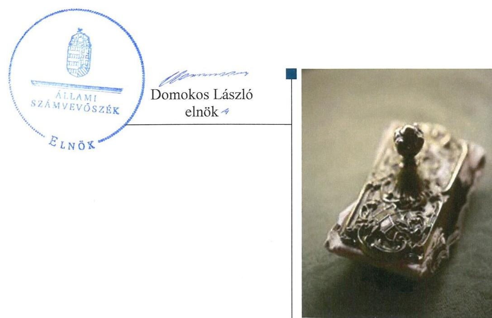

---

# AZ ELLENŐRZÉST FELÜGYELTE:

- BÖRÖCZ IMRE felügyeleti vezető

- AZ ELLENŐRZÉST VEZETTE ÉS A VÉGREHAJTÁSÁÉRT FELELŐS:
  - NIKLAI HELÉNA ellenőrzésvezető
  - A PROGRAM ÖSSZEÁLLÍTÁSÁÉRT FELELŐS:
    - JANIK JÓZSEF LÁSZLÓ osztályvezető

- IKTATÓSZÁM: V-1125-203/2016
- TÉMASZÁM: 2159
- ELLENŐRZÉS-AZONOSÍTÓ SZÁM: V070791

Jelentéseink az Országgyűlés számítógépes hálózatán és az Interneten a www.asz.hu címen is olvashatóak.

---

# TARTALOMJEGYZÉK 

■ ÖSSZEGZÉS ..... 5
■ AZ ELLENŐRZÉS CÉLJA ..... 7
■ AZ ELLENŐRZÉS TERÜLETE ..... 8
■ AZ ELLENŐRZÉS HÁTTERE, INDOKOLTSÁGA ..... 10
■ A JELENTÉS LÉNYEGES KÉRDÉSKÖREI ..... 11
■ ELLENŐRZÉS HATÓKÖRE ÉS MÓDSZEREI ..... 12
■ MEGÁLLAPÍTÁSOK ..... 14
■ JAVASLATOK ..... 25
■ MELLÉKLETEK ..... 29
I. sz. melléklet: Értelmező szótár ..... 29
II. sz. melléklet: A Társaság által ellátott feladatok 2011-2014. években (Adatok M Ft-ban) ..... 32
III. sz. melléklet: A Társaság eredményének alakulása 2011-2014. években (Adatok M Ft-ban) ..... 33
■ FÜGGELÉK: ÉSZREVÉTELEK ..... 35
■ RÖVIDÍTÉSEK JEGYZÉKE ..... 51

---

.

---

# ÖSSZEGZÉS 

Eger Megyei Jogú Város Önkormányzata a 2012. év végéig kizárólagos, 2013. évtől többségi tulajdonában álló Városgondozás Eger Ipari-, Kereskedelmi és Szolgáltató Korlátolt Felelősségű Társaság hulladékgazdálkodási közfeladatának ellátását szabályszerűen szervezte meg. 2011-2014. években a tulajdonosi jogok gyakorlása a Társaság felett összességében nem volt szabályszerű. Az ellenőrzött időszakban a Társaság által ellátott közfeladat bevételeinek, ráfordításainak elszámolása és az önköltségszámítás, illetve 2013. június 30-ig az árképzés nem volt megfelelő. A vagyongazdálkodás nem volt szabályszerű. A kötelezettségállomány az ellenőrzött időszakban nem veszélyeztette a Társaság működését, illetve a közfeladat ellátását.

## Az ellenőrzés társadalmi indokoltsága

Magyarországon az intézmény-centrikus közfeladat-ellátás mellett egyre jelentősebb a költségvetésen kívüli feladatellátás térnyerése, amelynek legfontosabb szereplői - a nonprofit szervezetek mellett - az önkormányzati tulajdonú gazdasági társaságok. Az önkormányzatok szervezetalakítási szabadságának következménye, hogy a korábban is vállalati formában működő közszolgáltatások mellett, mind a kötelező, mind az önként vállalt feladatok ellátásában a gazdasági társaságok kiemelt fontosságú szerephez jutottak. Az Állami Számvevőszék Stratégiájában foglaltakkal összhangban a Számvevőszék kiemelt célja, hogy a helyi önkormányzatok gazdálkodásában rejlő pénzügyi kockázatok feltárásával, az államháztartáson kívülre nyújtott költségvetési támogatások és ingyenes vagyonjuttatások, valamint az államháztartáson kívül működő feladat-ellátó rendszerek ellenőrzéseivel hozzájáruljon ahhoz, hogy a közpénzeket az államháztartáson kívül működő szervezetek is átlátható, rendezett módon használják fel.

## Főbb megállapítások, következtetések, javaslatok

Eger Megyei Jogú Város Önkormányzata a 2012. év végéig kizárólagos, 2013. évtől többségi tulajdonában álló Városgondozás Eger Ipari-, Kereskedelmi és Szolgáltató Korlátolt Felelősségű Társaság közfeladat ellátását szabályszerűen szervezte meg. A tulajdonosi jogok gyakorlása az ellenőrzött időszakban azonban összességében nem volt szabályszerű. A felügyelőbizottság az ellenőrzött időszakban nem rendelkezett jóváhagyott ügyrenddel. Az Önkormányzat Közgyűlése a felügyelőbizottság véleménye figyelembevételével jóváhagyta a Társaság 2011. évi számviteli beszámolóját, azonban a Társaság tulajdonosi szerkezetének változását követően a Taggyűlés, mint a Társaság legfőbb szerve, a 2012-2014. évi számviteli beszámolókról a jogszabályi előírások ellenére a felügyelőbizottság írásbeli jelentésének hiányában határozott. 2013. évben elmaradt a Társasággal a hulladékgazdálkodás közfeladat ellátására megkötött közszolgáltatási szerződés felülvizsgálata és módosítása. 2014. évben a könyvvizsgáló megválasztása nem volt szabályszerű. A többségi tulajdonos Önkormányzat részéről 2014. évben a Társaság részére történt apport kapcsán a Taggyűlés a jogszabályban előírtak ellenére nem hozott döntést a törzstőke felemeléséről, a tőkeemelés mértékéről és a Társasági szerződés módosításáról. A Társaságnál az apport számviteli elszámolása nem felelt meg a jogszabályi előírásoknak.

A Társaság rendelkezett a működéséhez szükséges szabályzatokkal, azonban az ellenőrzött időszakban a számlarend, 2012-2014. években a leltározási szabályzat a jogszabályi előírásoknak nem felelt meg. A vagyongazdálkodás nem volt szabályszerű. 2011-2014. években a Társaság a tárgyi eszközök leltározását nem a jogszabályban előírtaknak megfelelően végezte, amelynek következtében az éves beszámolók mérlegsorainak leltárral való alátámasztása nem volt megfelelő. A Társaság az ellenőrzött időszakban teljesítette az előírt beszámolási kötelezettséget, elkészítette éves számviteli beszámolóit, azonban a hulladékgazdálkodási közszolgáltatási tevékenységét 2013-2014. évi éves beszámolóiban nem a jogszabályi előírásoknak megfelelően mutatta be.

---

A könyvvizsgálók a Társaság éves beszámolóiról hitelesítő záradékot adtak, az ellenőrzött időszakban a leltárral, 2013-2014. években a Társaság hulladékgazdálkodási közszolgáltatási tevékenysége tekintetében a beszámolással, valamint a 2014. évi apport számviteli elszámolásával kapcsolatban feltárt hiányosságokat nem kifogásolták.

A Társaság a közszolgáltatási díjhátralék behajtás kezdeményezését elmulasztotta. A közfeladat bevételeinek és ráfordításainak tevékenységenkénti elkülönített elszámolását az ellenőrzött időszakban nem biztosította. Az ellenőrzött időszakban a közfeladat bevételeinek, ráfordításainak elszámolása és az önköltségszámítás, illetve 2011. január 1. és 2013. június 30. közötti időszakban az árképzés nem volt megfelelő.

A Társaság kötelezettségállománya az ellenőrzött időszakban nem veszélyeztette a közfeladat ellátását, a Társaság működését.

Az ÁSZ a Társaság ügyvezetőjének, a polgármesternek és a jegyzőnek fogalmazott meg javaslatokat, amelyek alapján kötelesek intézkedési tervet összeállítani és azt a jelentés kézhezvételétől számított 30 napon belül az ÁSZ részére megküldeni.

---

# AZ ELLENŐRZÉS CÉLJA 

Az ellenőrzés célja annak értékelése volt, hogy az önkormányzat vagyongazdálkodási tevékenysége során szabályszerűen gyakorolta-e tulajdonosi jogait; a gazdasági társaság szabályozottsága, gazdálkodása és vagyongazdálkodási tevékenysége, bevételeinek és ráfordításainak elszámolása megfelelt-e a jogszabályi és tulajdonosi előírásoknak; a gazdasági társaság kötelezettségállománya jelentett-e kockázatot a működésre, valamint a gazdálkodás átláthatósága és elszámoltathatósága érdekében biztosítva volt-e a szolgáltatás díjának megalapozottsága szabályszerű önköltségszámítással.

---

# **AZ ELLENŐRZÉS TERÜLETE**

## **Városgondozás Eger Ipari-, Kereskedelmi és Szolgáltató Kft. és Eger Megyei Jogú Város Önkormányzata**

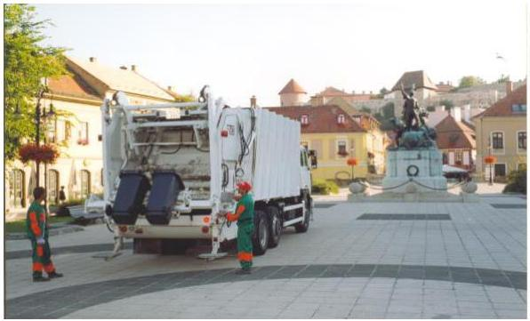

### **EGER MEGYEI JOGÚ VÁROS ÖNKORMÁNYZATA**

A Városgondozás Eger Ipari-, Kereskedelmi és Szolgáltató Korlátolt Felelősségű Társaságot 1991. október 1-jén alapította. A Társaság${ }^{1}$ kizárólagos tulajdonosa 2012. december 28-ig az Önkormányzat${ }^{2}$ volt. 2012. december 29-én a Heves Megyei Regionális Hulladékgazdálkodási Társulás 0,1 M Ft törzstőke részesedést vásárolt a Társaságban, amely a Társaság törzsbetétjéből 0,0065%-os részesedést jelentett. A Társaság felett a tulajdonosi jogokat 2012. december 29-ig a Közgyűlés${ }^{3}$ gyakorolta. A tulajdonosi szerkezet változását követően Társaság legfőbb szerve a Taggyűlés volt.${ }^{4}$ A város polgármestere személyében az ellenőrzött időszakban nem történt változás. A jegyző személyében változás történt 2011. évben, a jegyző 2011. március 1-jétől töltötte be hivatalát.

### **A VÁROSGONDOZÁS EGER IPARI-, KERESKEDELMI ÉS SZOLGÁLTATÓ KORLÁTOLT FELELŐSSÉGŰ TÁRSASÁG**

Fő tevékenysége az ellenőrzött időszakban az Alapító Okirat${ }^{4}$ és a Társasági szerződés${ }^{5}$ alapján hulladékgazdálkodási közszolgáltatási feladat ellátása (nem veszélyes hulladék gyűjtése) volt. A Társaság emellett további közfeladatokat látott el és egyéb hulladékgazdálkodási és vállalkozási tevékenységet végzett. A Társaság által az ellenőrzött időszakban ellátott közfeladatokat és a közfeladatok ellátásához az alapító által biztosított pénzeszközöket a II. sz. melléklet mutatja.

A Társaság tevékenységének jellemző adatai (1. táblázat) alapján a 2011. január 1-jétől 2014. június 30-ig tartó időszakban 21 745 és 14 876 tonna mennyiségű lakossági hulladék begyűjtését és kezelését végezte, tevékenysége során 72 924-88 322 fős lakosságot látott el.

1. táblázat

|  A TÁRSASÁG TEVÉKENYSÉGÉNEK JELLEMZŐ ADATAI |  |  |  |   |
| --- | --- | --- | --- | --- |
|  Mennyisége | 2011. | 2012. | 2013. | 2014.  |
|  Begyűjtött, kezelt hulladék* (tonna) | 21 745 | 21 823 | 23 580 | 14 876  |
|  Ellátott lakosságszám (fő) | 72 924 | 76 379 | 85 036 | 88 322  |
|  Átlagos statisztikai létszám (fő) | 154 | 168 | 181 | 182  |

- 2014. évben a Társaság június 30-ig teljesítette a közszolgáltatást. Forrás: A Társaság éves beszámolói

Az Önkormányzat a Társasággal az ellenőrzött időszakot megelőzően (2010. évben) Közszolgáltatási szerződést${ }^{6}$ kötött települési szilárd hulladék összegyűjtésére és ártalmatlanításra történő elszállítására három éves

${ }^{4}$ A Társaság feletti tulajdonosi jogkör gyakorlása az ellenőrzött időszakot követően, 2016. február 15-től átadásra került az EVAT Egri Vagyonkezelő és Távfűtő Zártkörűen Működő Részvénytársaságnak.

---

időtartamra, amelyet a 355/2013. (VI. 27.) számú, valamint a 722/2013. (XII. 19.) számú közgyűlési határozattal módosítottak${ }^{7}$ 2014. június 30-ig terjedő időszakra.

Főbb gazdálkodási adatai alapján (2. táblázat) az értékesítés nettó árbevétele az ellenőrzött időszakban 963,1 M Ft és 2079,2 M Ft között alakult, az Önkormányzat feladatkörébe tartozó tevékenységek ellátásából realizálta bevételeinek több mint 80\%-át. A Társaság eredményének alakulását 2011-2014. években a III. sz. melléklet mutatja be.
2. táblázat

# A TÁRSASÁG FŐBB GAZDÁLKODÁSI ADATAI (M FT) 

| Megnevezés | 2011. | 2012. | 2013. | 2014. |
| :-- | --: | --: | --: | --: |
| Értékesítés nettó árbevétele | 963,1 | 1013,2 | 1617,2 | 2079,2 |
| Egyéb bevételek | 51,2 | 46,0 | 15,9 | 13,9 |
| Mérlegfőösszeg | 719,4 | 706,1 | 925,5 | 1291,7 |

A Társaság főbb mérlegadatait az ellenőrzött időszakban a 3. táblázat mutatja be.
3. táblázat

A TÁRSASÁG FŐBB MÉRLEGADATAI 2011-2014. ÉVEKBEN (M FT)

| Megnevezés | 2011. | 2012. | 2013. | 2014. | 2015. |
| :--: | :--: | :--: | :--: | :--: | :--: |
|  | 01.01. | 12.31. | 12.31. | 12.31. | 12.31. |
| I. Befektetett eszközök | 283,0 | 303,6 | 305,4 | 301,6 | 378,4 |
| - ebből: Tárgyi eszközök | 279,0 | 274,4 | 275,1 | 268,6 | 343,8 |
| II. Forgóeszközök | 386,4 | 374,0 | 300,5 | 400,3 | 515,2 |
| - ebből: Követelések | 176,6 | 125,5 | 130,2 | 204,0 | 302,0 |
| III. Aktív időbeli elhatárolások | 4,6 | 41,8 | 100,2 | 223,6 | 398,1 |
| Eszközök összesen | 674,0 | 719,4 | 706,1 | 925,5 | 1291,7 |
| IV. Saját tőke | 590,3 | 594,5 | 599,3 | 550,5 | 605,4 |
| - ebből: Jegyzett tőke | 153,5 | 153,5 | 153,5 | 153,5 | 153,5 |
| Mérleg szerinti eredmény | 12,6 | 4,2 | 4,9 | $-48,8$ | $-34,5$ |
| V. Céltartalékok | 0,0 | 0,0 | 0,0 | 0,0 | 0,0 |
| VI. Kötelezettségek | 77,0 | 105,0 | 70,6 | 211,2 | 623,5 |
| VII. Passzív időbeli elhatárolások | 6,7 | 19,9 | 36,2 | 163,8 | 62,8 |
| Források összesen | 674,0 | 719,4 | 706,1 | 925,5 | 1291,7 |

A közfeladat ellátását szolgáló vagyon körét az Önkormányzat az ellenőrzött időszakot megelőzően hozott döntésében a Társaság rendelkezésére bocsátotta. Az Önkormányzat az ellenőrzött időszakban a Társaság részére közfeladat-ellátás érdekében önkormányzati tulajdonban lévő eszközöket vagyonkezelésbe nem adott át, nem kötött vagyonkezelési szerződést.

A Társaság ügyvezetőjének személye az ellenőrzött időszakban nem változott.

A Társaság az
 ellenőrzött időszakban nem tartozott a kormányzati szektorba sorolt egyéb szervezetek körébe.

---

# AZ ELLENŐRZÉS HÁTTERE, INDOKOLTSÁGA

## AZ ÖNKORMÁNYZATI TULAJDONÚ GAZDASÁGI

TÁRSASÁGOK ellenőrzése kiemelten fontos a vagyon megőrzése, megóvása érdekében, amelyekkel szemben alapvető követelmény, hogy gazdálkodásuk, működésük szabályszerű, az általuk szolgáltatott adatok minél megbízhatóbbak legyenek. A feladat/közfeladat-ellátás költségeinek, ráfordításainak alakulása, színvonala hatással van a lakosság elégedettségére.

A TÖRVÉNYALKOTÁS SZÁMÁRA - az észlelt problémák, szabálytalanságok, vagy egyéb nem kívánatos jelenségek felszínre kerülésével - az ellenőrzés megállapításai segítséget nyújthatnak az államháztartáson kívüli feladat/közfeladat-ellátás értékeléséhez, jogszabályi keretei pontosításához, átláthatóságot biztosító szabályozásához. Meghatározhatóvá válnak az önkormányzati feladatellátásban részt vevő államháztartáson kívüli szervezeteknek - az önkormányzat költségvetését, pénzügyi helyzetét is befolyásoló - kockázatai, lehetővé válik ezen kockázatok csökkentése. Ellenőrzéseink feltárhatják, hogy az önkormányzat feladat-ellátási kötelezettségének szabályszerűen tett-e eleget, a feladatellátáshoz rendelt vagyonkezelésbe vett és saját vagyon működtetését az elvárható gondossággal, szabályszerűen szervezte-e meg és a tulajdonosi felügyelete hozzájárult-e a feladatellátásához. Az ellenőrzés rávilágíthat arra, hogy a gazdasági társaság a feladat-ellátási, közszolgáltatási szerződésben foglaltak betartásával, a vagyon használatával biztosította-e a szolgáltatás folytatásának feltételeit, a feladat ellátását. Ezzel az ellenőrzöttek és a helyi döntéshozók számára visszajelzést ad feladatszervezési, feladat-ellátási kockázataikról, alapot ad a meglévő hibák megszüntetéséhez, a jobb feladatellátás biztosításához. Fokozza a fegyelmet, igazolja, hogy lejárt a következmények nélküli ellenőrzések időszaka. Az ÁSZ ${ }^{8}$ értékteremtő rend kialakításához és megőrzéséhez hozzájáruló tevékenysége pozitív hatással van a szervezetről kialakított összkép formálására.

---

# A JELENTÉS LÉNYEGES KÉRDÉSKÖREI

1.  A közfeladat megszervezéséről szóló döntés, valamint a tulajdonosi joggyakorlás szabályszerű volt-e?
2.  A Társaság vagyongazdálkodása szabályszerű volt-e, kötelezettségállománya jelentett-e kockázatot a működésre, illetve a közfeladat ellátására?
3.  Az ellátott közfeladat esetében a bevételek és ráfordítások elszámolása, valamint az önköltségszámítás és árképzés szabályszerű volt-e?

---

# ELLENŐRZÉS HATÓKÖRE ÉS MÓDSZEREI

## Az ellenőrzés típusa

Az ellenőrzés típusa megfelelőségi ellenőrzés.

## Az ellenőrzött időszak

Az ellenőrzött időszak 2011. január 1-jétől 2014. december 31-ig tartott.

## Az ellenőrzés tárgya

Az ellenőrzés tárgyát képezte a gazdasági társaság feletti tulajdonosi joggyakorlás, valamint a gazdasági társaság gazdálkodásának szabályozottsága és szabályszerűsége. Az ellenőrzés kiterjedt minden olyan körülményre és adatra, amely az ÁSZ jogszabályban meghatározott feladatainak teljesítéséhez, valamint a program végrehajtása folyamán felmerült újabb összefüggések feltárásához szükséges.

## Az ellenőrzött szervezet

VÁROSGONDOZÁS EGER Ipari-, Kereskedelmi és Szolgáltató Korlátolt Felelősségű Társaság és Eger Megyei Jogú Város Önkormányzata.

## Az ellenőrzés jogalapja

Az ellenőrzés jogszabályi alapját az ÁSZ tv. ${ }^{9} 1 . \S$ (3) bekezdése és 5. § (3)-(4)-(5) bekezdései képezték.

## Az ellenőrzés módszerei

Az ellenőrzést az ÁSZ az ellenőrzött időszakban hatályos jogszabályok, az ellenőrzés szakmai szabályok és módszertanok figyelembevételével, az ellenőrzési program kérdései alapján végezte.

Az ellenőrzés ideje alatt az ellenőrzött szervezettel történő kapcsolattartás az ÁSZ Szervezeti és Működési Szabályzatának vonatkozó előírásai alapján történt.

Az ellenőrzési kérdések megválaszolásához szükséges bizonyítékok megszerzése a következő ellenőrzési eljárások alkalmazásával történt: megfigyelés, kérdésfeltevés (információkérés), összehasonlítás, valamint elemző eljárás. Az ellenőrzési bizonyítékként felhasználható adatforrások

---

közé tartoztak egyrészt a szakmai programban felsorolt adatforrások, másrészt adatforrás lehetett még minden - az ellenőrzés folyamán - feltárt, az ellenőrzés szempontjából információkat tartalmazó dokumentum.

A Társaság bevételeinek és ráfordításainak elszámolása, valamint a vagyonnyilvántartás terén a szabályszerű működést az ÁSZ véletlen mintavétellel ellenőrizte. A mintavétellel ellenőrzött területek esetében a szabályszerűségre vonatkozó kérdések eredménye összesítésre került. Az ÁSZ a jogszabályoknak és a belső előírásoknak „megfelelő"-nek tekintette az adott területet, amennyiben a minta ellenőrzésének eredménye alapján 95%-os bizonyossággal a teljes sokaságban a hibaarány legfeljebb 10%, „nem megfelelő"-nek, amennyiben 10%-nál magasabb arányt képviselt. Abban az esetben, ha a teljes sokaság tekintetében a 10%-os hibaarányhoz való viszony megítélésnek megbízhatósága nem érte el a 95%-ot, annak elérése érdekében az ÁSZ értékelését további szempontokkal egészítette ki, és figyelembe vette a feltárt hibák típusát és súlyát.

A ráfordítások elszámolására és a vagyonnyilvántartásra vonatkozó véletlen mintavételt az ÁSZ kockázat alapú kiválasztással egészítette ki, amelynek során évente a három legnagyobb összegű tételt választotta ki.

---

# 1. A közfeladat megszervezéséről szóló döntés, valamint a tulajdonosi joggyakorlás szabályszerű volt-e?

Összegző megállapítás

Az Önkormányzat a Társaság közfeladat ellátását szabályszerűen szervezte meg. A tulajdonosi jogok gyakorlása az ellenőrzött időszakban összességében nem volt szabályszerű.
1.1. számú megállapítás

A közfeladat-ellátás megszervezése megfelelt a jogszabályi előírásoknak.

AZ ÖNKORMÁNYZAT az Ötv. ${ }^{10}$-ben és az Mötv. ${ }^{11}$-ben előírt gazdasági programmal rendelkezett. 2007-2014. évekre szóló gazdasági programja kiterjedt a Társaság működtetésének feladataira, tőkésítésére, szolgáltatási színvonalának javítására. A gazdasági programot az Önkormányzat - 2011. évben az Ötv. 91. § (7) bekezdésében, 2013. évben az Mötv. 116. § (5) bekezdésében foglaltaknak megfelelően felülvizsgálta. A felülvizsgált gazdasági program a Társaság működésére, tevékenységeire vonatkozóan stratégiai döntések meghozatalának szükségességét rögzítette, az Önkormányzat hosszútávon finanszírozható kötelező feladatellátásának fenntartása érdekében.

KÖZÉP- ÉS HOSSZÚ TÁVÚ VAGYONGAZDÁLKODÁSI TERVKÉSZÍTÉSRE 2012. évtől előírt kötelezettségének az Önkormányzat az Nvtv. ${ }^{12}$ 9. § (1) bekezdésének, valamint a Vagyonrendelet; ${ }^{13}$ XII. fejezet 34. § (3) bekezdésének előírásai ellenére nem tett eleget.

AZ ÖNKORMÁNYZAT HULLADÉKGAZDÁLKODÁSI TERVE ${ }^{14}$ a Hgt. ${ }^{15}$ 35. § (3) bekezdésének előírásai ellenére önkormányzati rendeletben nem került kihirdetésre.

A 2011-2014. évekre szóló települési hulladékgazdálkodási terv tartalmazta a Hgt. 37. § (4) bekezdésében foglalt követelményeket, rögzítette a Hulladékgazdálkodási, hasznosítási terv célkitűzéseinek megvalósításában a Társaság, mint helyi közszolgáltató feladatait, annak Alapító Okiratában foglalt tevékenységeivel összhangban. 2012. december 31-ig a hulladékgazdálkodási tervet az Önkormányzat nem módosította. 2013. január 1-jétől a Ht. ${ }^{16}$ 74. § (1) bekezdése az OHÜ ${ }^{17}$ feladataként határozta meg a tervkészítési kötelezettséget.

A KÖTELEZŐ ÉS ÖNKÉNT VÁLLALT FELADATOK ellátását és annak módját az Önkormányzat az Ötv. 9. § (1)-(2) bekezdésében előírtak szerint az Alapokmány; ${ }^{18}$-ben 2011. évben az Ötv. 8. § (2) bekezdésében előírt követelményeknek megfelelően szerepeltette.

---

2012. évben az Alapokmány ${ }^{19}$ az Ötv. 8. § (2) bekezdése ellenére nem nevesítette a hulladékkezelési szolgáltatás kötelező feladat ellátójaként a Társaságot és nem jelölte meg a feladatellátás módját.

2013-2014. években az Alapokmány ${ }^{20}$ tartalmazta kötelező feladatként a köztisztasági szolgáltatást, az Mötv. 13. § (1) bekezdés 19. pontja alapján a hulladékgazdálkodást.

A közfeladat-ellátás megszervezése 2011-2012. években megfelelt az Ötv. 9. § (4) bekezdésében foglaltaknak, 2013-2014. években az Mötv. 41. § (8) bekezdése előírásának.

A Ht. 90. § (8) bekezdése értelmében hulladékgazdálkodási közszolgáltatást 2014. július 1-jétől csak az a nonprofit gazdasági társaság végezhet, amely hulladékgazdálkodási közszolgáltatási engedéllyel és az OHÜ által kiállított minősítő okirattal rendelkezik, valamint az önkormányzattal hulladékgazdálkodási közszolgáltatási szerződést kötött. A nonprofit szervezet létrehozásához az alapítói hozzájárulást a 464/2013.(VIII.29.) számú közgyűlési határozattal adta meg az Önkormányzat. A Társaság többségi tulajdonában álló Egri Hulladékgazdálkodási Nonprofit Kft. 2014. július 1-jétől végezte a lakossági kommunális hulladékok összegyűjtését és elszállítását.

A KÖZSZOLGÁLTATÁSI SZERZŐDÉS a hulladékgazdálkodási közszolgáltatási díj megállapításának módját 2013. január 1-jétől nem a Ht. 47. § (4) bekezdésében, illetve 2013. július 12-től nem a Ht. 47/A. § (1) bekezdésében előírtaknak megfelelően tartalmazta.

A Közszolgáltatási szerződés a 317/2013. (VIII.28.) Korm. rendelet ${ }^{21}$ 4. § (1) bekezdés a) pontja előírásai ellenére nem tartalmazta a közszolgáltatás minőségi ismérveit, az OHÜ által meghatározott minősítési osztályt; illetve a rendelet 4. § (2) bekezdés c) pontja előírásai ellenére nem tartalmazta a szolgáltató kötelezettségeként az OHÜ által meghatározott minősítési osztály szerinti követelmények biztosítását.

A Közszolgáltatási szerződésben a települési önkormányzat kötelességeként a rendelet 4. § (3) bekezdés e) pontja előírásai ellenére nem határozták meg a közszolgáltató kizárólagos közszolgáltatási jogának biztosítását az önkormányzati tulajdonban lévő hulladékgazdálkodási létesítmények vonatkozásában.

A Társaság hulladékgazdálkodási tevékenysége ágazati jogszabályoknak való megfelelőségét az OHÜ az Mtv. ${ }^{22}$ alapján az A/I. minősítési osztályba sorolással igazolta a 2013. évben.

# AZ ÖNKORMÁNYZAT RENDELETALKOTÁSI KÖTELEZETTSÉGÉNEK a Társaság által ellátott hulladékgazdálko-

dási közfeladat tekintetében a Hgt. 23. §-ában és a Ht. 35. §-ában előírt követelményeknek megfelelően 37/2009. (VIII.28.) számú önkormányzati rendeletével ${ }^{23}$ és annak rendszeres aktualizálásával eleget tett.

### 1.2. számú megállapítás

A tulajdonosi jogok gyakorlása összességében nem volt szabályszerű.

A TULAJDONOSI JOGOK GYAKORLÁSÁNAK rendjét az ellenőrzött időszakban az Önkormányzat az Alapokmány ${ }_{1-3}$-ban, a Vagyonrendelet ${ }_{1,2}{ }^{24}$-ben, a javadalmazási szabályzatban, valamint az állandó

---

bizottságok feladat- és határköréről alkotott rendeletében szabályozta. Az Alapokmány1-3 18. §-a a Közgyűlés döntéseinek meghozatalához írásbeli előterjesztési kötelezettséget és annak követelményeit rögzítette. Az Alapokmány ${ }_{1,2}$ megfelelte a Gt. ${ }^{25}$ 19. § (4) bekezdésében, az Alapokmány ${ }_{3}$ megfelelte a Gt. 19. § (4) bekezdésében és a Ptk. ${ }^{26}$ 3:16. § (1) bekezdésében foglaltaknak.

Az Alapító Okirat 2011-2012. évekre a Gt. 19. §-ában előírtakkal összhangban rögzítette a tulajdonosi joggyakorláshoz kapcsolódó döntési hatásköröket. Az ellenőrzött időszakban az Önkormányzat a Társaság tevékenységi körében, a Társaság szervezetét érintően történt változások esetében a Közgyűlés döntése alapján módosította az Alapító Okiratot.

A Társaság tulajdonosi szerkezetének 2012. december 29-ei változásával az Alapító Okirata helyébe a Társasági szerződés lépett. Az Önkormányzat az egyszemélyes társaság többszemélyes társasággá válásáról 751/2012. (XII.13.) számú közgyűlési határozattal hozott döntése megfelelte a Gt. 169. § (2) bekezdésében foglalt előírásnak. 2013. évtől a tagok az őket megillető jogokat a tagok összességéből álló testületben, a Taggyűlésben gyakorolták a Társaság felett.

A Társaság által ellátandó feladatok körének, a működése kereteinek meghatározása a Társaság Alapító Okiratában és annak módosításaiban, valamint a Társasági szerződésben szabályszerűen történt.

A FELÜGYELŐBIZOTTSÁG az ellenőrzött időszakban a Gt. 34. § (4) bekezdése, valamint a Ptk. 3:122. § (3) bekezdése előírásai ellenére nem állapította meg ügyrendjét, így azt a gazdasági társaság legfőbb szerve (2011-2012. években a Közgyűlés, 2013-2014. években a Taggyűlés) nem hagyhatta jóvá.

Az FB ${ }^{28}$ tagok személyében 2011. márciusban változás történt, a tagok visszahívásáról és új FB tagok választásáról - ezzel egyidejűleg az Alapító Okirat módosításáról - a Közgyűlés a 118/2011. (III. 31.) számú határozatában döntött. Az FB tagok díjazását az 562/2011. (IX.29.) számú közgyűlési határozat rögzítette. A Társaság tulajdonosi szerkezetének módosítását követően az FB tagok személye nem változott.

A KÖNYVVIZSGÁLÓ 2014. évi megválasztása során a 2014. évi beszámolót hitelesítő könyvvizsgáló személyére vonatkozó javaslattétel az FB egyetértésének hiányában, a Taktv. ${ }^{29}$ 4. § (1) bekezdése előírásaival ellentétesen történt.

A TÁRSASÁG SAJÁT TŐKÉJÉN belül a jegyzett tőkéje az ellenőrzött időszakban nem változott (4. táblázat).
4. táblázat

# A TÁRSASÁG JEGYZETT TŐKÉJÉNEK ALAKULÁSA (M FT)

| Megnevezés | 2011. | 2012. | 2013. | 2014. |
| :-- | :--: | :--: | :--: | :--: |
| Jegyzett tőke | 153,5 | 153,5 | 153,5 | 153,5 |
| Saját tőke | 594,5 | 599,3 | 550,5 | 605,4 |
| Saját tőke/jegyzett tőke (%) | $387,3 \%$ |
 $390,4 \%$ | $358,6 \%$ | $394,4 \%$ |

ÜZLETI TERV készítésének kötelezettségét az ügyvezető feladataként az Önkormányzat 2011-2012. évekre belső szabályozásban előírta,

---

annak határidejét az Alapító Okiratban rögzítette. 2011-2012. években a Közgyűlés, 2013-2014. években a Taggyűlés a Társaság üzleti terveit megtárgyalta és határozataiban elfogadta.

A JAVADALMAZÁSI SZABÁLYZAT ${ }_{1}{ }^{30}, 2^{31}, 3^{32}$ 338/2005. (IV.28) számú közgyűlési határozatban történt kiadásával az Önkormányzat eleget tett a Taktv. 5. § (3) bekezdésében foglalt követelményeknek.

2013-2014. évekre vonatkozóan a Taggyűlés, mint a Társaság legfőbb szerve a Taktv. 5. § (3) bekezdése előírásai ellenére nem alkotott szabályzatot a vezető tisztségviselők, felügyelőbizottsági tagok, valamint az Mt. ${ }^{33}$ 208. § hatálya alá eső munkavállalók javadalmazására, valamint a jogviszony megszűnése esetére biztosított juttatások módjának, mértékének elveiről, annak rendszeréről.

AZ ÖNKORMÁNYZAT az éves beszámolók keretében, valamint az üzleti tervek negyedéves teljesítésének helyzetéről beszámoltatta a Társaságot. A Közgyűlés a Gt. 141. § (2) bekezdés a) pontja szerint, az FB és a könyvvizsgáló írásos véleménye figyelembevételével megtárgyalta és jóváhagyta a Társaság 2011. évi számviteli beszámolóját.

A tulajdonosi szerkezet változása miatt a Társaság 2012-2013. évi számviteli beszámolóival kapcsolatban a Közgyűlés a Vagyonrendelet ${ }_{2}$ XI. fejezet 33. § (3) bekezdés I) pontjában meghatározottak alapján arról hozott határozatot, hogy a Taggyűlésben az Önkormányzat képviseletében eljáró személy fogadja el a Társaság 2012. évi, illetve a 2013. évi beszámolóját. A Közgyűlés határozatait az FB és a könyvvizsgáló véleményének ismeretében hozta meg.

A Taggyűlés a Társaság 2012-2013. évi számviteli beszámolóit a Gt. 35. § (3) bekezdésében előírtak ellenére, 2014. évi számviteli beszámolóját a Ptk. ${ }_{2}$ 3:120. § (2) bekezdése előírásai ellenére nem az FB írásbeli jelentésének birtokában fogadta el.

A Társaság Számv. tv. szerinti 2014. évi beszámolója elfogadásáról hozott 208/2015. (V.11.) számú közgyűlési határozat a Vagyonrendelet ${ }_{2}$ XI. fejezet 33. § (3) bekezdése I) pontja előírásaival ellentétben nem tartalmazott felhatalmazást a Társaság Taggyűlésén a Közgyűlést képviselő részére javasolt döntés támogatására.

ELLENŐRZÉS lehetőségével - amelyet az Ötv. 92. § (11) bekezdés b) pontjában és az Áht. ${ }^{34} 70$. § (1) bekezdés d) pontjában foglaltak lehetővé tettek - az Önkormányzat élt. Az Egri Kistérség Többcélú Társulása Belső Ellenőrzése által a 2011. év tekintetében elvégzett ellenőrzés az árbevétel egyes közszolgáltatási tevékenységek szerinti elhatárolt elszámolásának megfelelőségére terjedt ki. Az ellenőrzés alapján a Társaság intézkedési tervet készített, amelyet az Önkormányzat elfogadott, az abban foglalt feladatot nyilvántartotta.

---

# 2. A Társaság vagyongazdálkodása szabályszerű volt-e, kötelezettségállománya jelentett-e kockázatot a működésre, illetve a közfeladat ellátására? 

Összegző megállapítás

2.1. számú megállapítás

A Társaság vagyongazdálkodása nem volt szabályszerű. Kötelezettségállománya nem veszélyeztette a működését, illetve a közfeladat ellátását.

A Társaság rendelkezett a működéshez szükséges szabályzatokkal, azonban az ellenőrzött időszakban a számlarend, 2012-2014. években a leltározási szabályzat az előírásoknak nem felelt meg.

A TÁRSASÁG az ellenőrzött időszakban rendelkezett a Számv. tv. 14. § (3) bekezdésében előírt számviteli politikával, a Számv. tv. 14. § (5) bekezdés a) pontjában rögzített, az eszközök és a források leltárkészítési és leltározási szabályzatával, a Számv. tv. 14. § (5) bekezdés b) pontjában előírt, az eszközök és a források értékelési szabályzatával, a Számv. tv. 14. § (5) bekezdés d) pontjában meghatározott pénzkezelési szabályzattal, valamint a Számv. tv. 14. § (5) bekezdés c) pontjában meghatározott, az önköltségszámítás rendjére vonatkozó belső szabályzattal.

A Számlarend ${ }^{35}$ folyamatos karbantartásáról a Társaság a Számv. tv. 161. § (4) bekezdése előírásai ellenére az ellenőrzött időszakban nem gondoskodott, ennek következtében a Számlarend az ellenőrzött időszakban a Számv. tv. 161. § (2) bekezdés a) pontja előírásai ellenére nem tartalmazta minden alkalmazásra kijelölt számla számjelét és megnevezését, illetve a Számv. tv. 161. § (2) bekezdés c) pontja előírásai ellenére nem tartalmazta a főkönyvi számla és az analitikus nyilvántartás kapcsolatát.

A Leltárkészítési és leltározási szabályzat ${ }^{36}$ a Számv. tv. 14. § (4) bekezdésében előírt, a gazdálkodóra jellemző szabályok, előírások módszerek rögzítésével tartalmazta a leltározási kötelezettséget. A Leltárkészítési és leltározási szabályzat 5.1 pontja a mérleg elkészítéséhez évenként, a mérleg fordulónapját követő 60 napon belül a nyilvántartások egyeztetésének végrehajtásával írta elő leltár készítését, a tárgyi eszközök tekintetében mennyiségi felvétellel öt évenkénti gyakorisággal írta elő a leltározást.

A Raktározási, leltározási és selejtezési szabályzat ${ }^{37}$ a Számv. tv. 2012. január 1-jétől hatályos 69. § (3) bekezdése előírásai ellenére nem határozta meg, hogy a leltározást milyen gyakorisággal kell elvégezni.

A Pénzkezelési szabályzat ${ }^{38}$ és az Önköltségszámítási szabályzat ${ }_{1,2}{ }^{39}$ megfelelt a jogszabályi előírásoknak.

Az Üzletszabályzat ${ }^{40}$ előírásai összhangban voltak az Önkormányzat települési hulladékkal kapcsolatos 37/2009. (VIII. 28.) rendeletében foglaltakkal.

A Társaság belső szabályozásban nem határozta meg a 37/2009. (VIII.28.) számú önkormányzati rendelet 16. § (8)-(11) bekezdéseiben foglalt díjhátralék behajtása kezdeményezésének rendjét.

---

# 2.2. számú megállapítás 

## A vagyongazdálkodás a jogszabályi rendelkezéseknek és a belső előírásoknak nem felelt meg.

A TÁRSASÁG eszközeinek 617,7 M Ft-os (91,6%-os) növekedését 2011. január 1. és 2014. december 31. közötti időszakban a befektetett eszközök 95,4 M Ft-os (33,7%-os), a forgóeszközök 128,8 M Ft-os (33,4%-os), az aktív időbeli elhatárolások 393,5 M Ft-os növekedése eredményezte.

A Társaság forrásainak növekedését a saját tőke 15,1 M Ft-os (2,6%-os), a kötelezettségek 546,5 M Ft-os, a passzív időbeli elhatárolások 56,1 M Ft-os növekedése okozta.

Az Önkormányzat 2011-2012. években az éves eredmény eredménytartalékba helyezéséről döntött, osztalék kifizetésére nem került sor.

A Társaság mérleg szerinti eredménye 2013-2014. években negatív (- 48,8 M Ft, illetve -34,5 M Ft) volt. A többségi tulajdonos Önkormányzat a 2013-2014. évi veszteségek kompenzálására 2014. évben a 292/2014. (VI.26.) számú közgyűlési határozattal apportként a Társaság tulajdonába adta az Önkormányzat tulajdonában álló, üzleti vagyonként nyilvántartott ingatlant (kivett szemétlerakó telepet), továbbá a hozzá tartozó tárgyi eszközöket 89,3 M Ft értékben. A Közgyűlés 292/2014. (VI.26.) számú határozata a Számv. tv. ${ }^{41} 36 . \S (1) bekezdés b) pontjára hivatkozással az átadott vagyon összegének a Társaság tőketartalékába történő elhelyezését rendelte el.

A 292/2014. (VI.26.) számú közgyűlési határozat előkészítése során nem tartották be a Vagyonrendelet ${ }_{2}$ II. fejezet 8. § (1) bekezdésének előírását, az önkormányzati vagyon körébe tartozó üzleti vagyon elidegenítésére, hasznosítására, megterhelésére irányuló döntést megelőzően a forgalmi érték meghatározását nem végezték el.

A 2014. évi apport számviteli elszámolása a Társaságnál nem felelt meg a jogszabályi előírásoknak. A Társaság tőketartaléka az apport összegével a 2013. év végi 16,4 M Ft-ról 2014. év végére 105,7 M Ft-ra növekedett, azonban a Számv. tv. 36. § (1) bekezdés b) pont előírása ellenére az apportként átadott eszközök értékét a tőketartalék növekedéseként úgy mutatták ki, hogy tőkeemelés nem került végrehajtásra. Az Önkormányzat részéről apportként átadott ingatlan és kapcsolódó eszközök átvétele a Társaság részéről megtörtént, azonban a Taggyűlés nem hozott határozatot a törzstőke felemeléséről, a törzstőke emelés mértékéről és a Társasági szerződés módosításáról, amely nem felelt meg a Ptk. ${ }_{2}$ 3:198. § (1)(2) bekezdése és a Ptk. ${ }_{2}$ 3:200. § (1) bekezdése előírásainak. A törzstőke emelésről szóló döntés hiányában a Társaság nem intézkedett a cégbírósági bejegyzésről és nem rendelkezett a Számv. tv. 36. § (3) bekezdés a) pontjában a tőketartalék növekedésének könyvviteli elszámolásához előírt bizonylatokkal.

A Társaság 2014. évi éves beszámolójának ellenőrzését végző könyvvizsgáló az apport számviteli elszámolásának szabályszerűségét nem kifogásolta.

---

A TÁRSASÁG az ellenőrzött időszakban a tárgyi eszközöket mennyiségi felvétellel nem leltározta, amelynek következtében az éves beszámolók mérlegsorainak leltárral való alátámasztása nem volt megfelelő:

- Az ellenőrzött időszakban a Társaság a tárgyi eszközök leltározását mennyiségi felvétellel nem végezte el, amellyel megsértette 2011. évben a Számv. tv. 69. § (2) bekezdése előírásait, 2012-2014. években a Számv. tv. 69. § (3) bekezdése előírásait.
- A Társaság 2011-2014. években a mérleg tételeinek alátámasztásához nem állított össze olyan leltárt, amely tételesen, ellenőrizhető módon tartalmazza a mérleg fordulónapján meglévő eszközeit mennyiségben és értékben, ezáltal nem tett eleget a Számv. tv. 69. § (1) bekezdésében előírt kötelezettségének.
A könyvvizsgálók a Társaság éves számviteli beszámolóit hitelesítő záradékkal látták el, a leltárral kapcsolatos hiányosságokat nem kifogásolták.

Saját vagyon esetében ingyenes tulajdonjog átruházására 2011-2014. években nem került sor, a Társaság vagyonát nem terhelte meg, nem adta biztosítékba és ingatlanán nem létesített osztott tulajdont.

A saját vagyon gyarapítása, hasznosítása az ellenőrzött időszakban megfelelt a jogszabályi előírásoknak. Pótlások, felújítások az elszámolt értékcsökkenésnek megfelelő összegben valósultak meg. A Társaság saját tulajdonú eszközeinek pótlására 2011. évben 47,0 M Ft, 2012. évben 71,1 M Ft, 2013. évben 64,8 M Ft, 2014. évben 183,8 M Ft összeget mutatott ki könyveiben, melyek a hulladékgazdálkodási tevékenység ellátáshoz szükséges járművek értékmegőrző felújításával, illetve konténer beszerzésekkel kapcsolatos ráfordítások voltak. Emellett a köztisztasági tevékenységhez szükséges tárgyi eszközök beszerzésére került sor.

A saját vagyon részét képező eszközcsoportokban az eszközök használhatósági foka az ellenőrzött időszakban csökkent, 2012. évben egy, 2014. évben két eszközcsoportban javult (5. táblázat).
5. táblázat

HASZNÁLHATÓSÁGI FOK (NETTÓ ÉRTÉK/BRUTTÓ ÉRTÉK)

| Megnevezés | 2011. | 2012. | 2013. | 2014. |
| :-- | :--: | :--: | :--: | :--: |
| Ingatlanok | 83,9 | 80,1 | 77,2 | 81,8 |
| Termelő gépek | 35,4 | 34,2 | 28,0 | 27,2 |
| Járművek | 11,4 | 11,7 | 11,6 | 12,1 |

A KÖVETELÉSÁLLOMÁNY CSÖKKENTÉSE ÉRDE-
KÉBEN a Társaság nem tett intézkedéseket. A Társaság a közszolgáltatási díjhátralék behajtás kezdeményezését - a díjhátralék keletkezését követő fizetési felszólítás eredménytelensége esetén - elmulasztotta, ezzel megsértette a Hgt. 26. § (3) bekezdésében és a Ht. 52. § (3) bekezdésében foglaltakat.

---

# 2.3. számú megállapítás 

A kötelezettségek állománya nem veszélyeztette a közfeladat ellátását, illetve a Társaság működését.

A TÁRSASÁG KÖTELEZETTSÉGÁLLOMÁNYA szállítói és egyéb kötelezettségekből tevődött össze, nem veszélyeztette a közfeladat ellátását, a Társaság működését. A Társaságnak az ellenőrzött időszakban - 2014. évi 4,2 M Ft összegű kötelezettség kivételével - hosszú lejáratú banki hitelből, kötvényből fennálló kötelezettsége nem volt. Rövid lejáratú kötelezettségei és kötelezettségállománya 2013. évben a Ht. előírásai alapján, a számlázási rend módosítása következtében növekedtek.

A RÖVID LEJÁRATÚ KÖTELEZETTSÉGEKET határidőben teljesítette a Társaság. Határidőn túli pénzügyi teljesítés miatt az ellenőrzött időszakban a Ptk. ${ }^{42}$ 301/A. §, illetve Ptk. ${ }_{2}$ 6:155. § alapján 2011. évben 93 E Ft, 2012. évben 122 E Ft, 2013. évben 8 E Ft, 2014. évben 76 E Ft késedelmi kamat merült fel.

A szállítói kötelezettségállomány jelentős mértékű növekedése 2013. évtől jelentkezett, amely elsődlegesen a Heves Megyei Hulladékgazdálkodási Társulás felé történő elszámolásból eredő kötelezettségeket jelentette. A Társulás felé fennálló kötelezettség rövid távon jelentett likviditási problémát, összege 2014. december 31-én 108,5 M Ft volt. A rövid távú likviditási gondok enyhítésére az Önkormányzat a 206/2014.(V.22.) számú közgyűlési határozattal 50 M Ft összegű tagi kölcsön rendelkezésre állását biztosította a Társaság részére tárgyévi visszafizetési kötelezettséggel. 2014. december 31-én az egyéb rövid lejáratú kötelezettségek között a Társaságot terhelő hulladéklerakási járulék összege 253,5 M Ft volt, melynek fizetési határideje a mérleg fordulónapján még nem járt le. A tagi kölcsön rendelkezésre állásával, szükség esetére történő lehívásával biztosított volt a közfeladat ellátásával kapcsolatban fennálló rövid lejáratú kötelezettségek határidőben történő teljesítése.

A kötelezettségállományhoz kapcsolódó mutatók alakulását az ellenőrzött időszakban a 6. táblázat mutatja.
6. táblázat

A TÁRSASÁG KÖTELEZETTSÉGÁLLOMÁNYHOZ KAPCSOLÓDÓ MUTATÓINAK ALAKULÁSA

| Megnevezés | Referencia érték | 2011. | 2012. | 2013. | 2014. |
| :--: | :--: | :--: | :--: | :--: | :--: |
| Eladósodottsági mutató | $<0$ | 0,2 | 0,1 | 0,2 | 0,5 |
| Eladósodottság mértéke | $<1$ | 0,2 | 0,1 | 0,4 | 1,0 |
| Nettó eladósodottság | $<0$ | 0,0 | $-0,1$ | 0,0 | 0,5 |
| Adósságfedezeti mutató I. | $\leq 2$ | 6,4 | 8,6 | 3,3 | 1,4 |
| Árbevételre vetített eladósodottság | $<1$ | $-0,3$ | $-0,2$ | $-0,1$ | 0,1 |

A nettó eladósodottsági mutató 2013. és 2014. évi értékére hatással volt a hulladék begyűjtési és szállítási tevékenységgel kapcsolatban történt előfinanszírozás. Az adósságfedezeti mutató I. csökkenő értékét a befektetett eszközök és vevő állomány növekedési ütemétől nagyobb ütemű szállítói állomány növekedése okozta, amely szintén az előfinanszí-

---

# 2.4. számú megállapítás 

rozáshoz köthető. Az árbevételre vetített eladósodottság mutató értékének növekedése azt jelzi, hogy az árbevétel egyre nagyobb hányada szükséges a kötelezettségek finanszírozásához.

A Társaság teljesítette az előírt beszámolási kötelezettséget, azonban 2013-2014. években a hulladékgazdálkodási közszolgáltatási tevékenységével összefüggésben a jogszabályban előírt, önálló mérleg és eredménykimutatás készítésére vonatkozó kötelezettségének nem tett eleget.

A TÁRSASÁG a Számv. tv. 4. § (1) bekezdésében előírt éves számviteli beszámolókat az ellenőrzött időszakban elkészítette. A jóváhagyott beszámolók letétbe helyezésére vonatkozó előírásoknak eleget tett, a Számv. tv. előírásainak megfelelően az éves beszámolókat közzétette.

A Ht. 50. § (3) bekezdés előírásai ellenére a Társaság, mint hulladékgazdálkodási közszolgáltatás körébe nem tartozó tevékenységet is végző közszolgáltató, a hulladékgazdálkodási közszolgáltatás nyújtása érdekében végzett tevékenységét 2013-2014. évi éves beszámolói kiegészítő mellékletében nem oly módon mutatta be, mintha azt önálló vállalkozás keretében végezte volna, továbbá a tevékenység elkülönült bemutatásáról önálló mérleget és eredménykimutatást nem készített.

A könyvvizsgálók a Társaság hulladékgazdálkodási közszolgáltatási tevékenysége tekintetében 2013-2014. évekre vonatkozóan a beszámolással kapcsolatos hiányosságokat nem kifogásolták.

A Társaság az ellenőrzött időszakban a beszámoló kiegészítő mellékletében nem a Számv. tv. 92. § (1)-(2) bekezdésében előírt részletességgel mutatta be az elszámolt értékcsökkenési leírást, a kiegészítő melléklet nem tartalmazta a halmozott értékcsökkenés nyitó értékét, tárgyévi növekedését, csökkenését és a záró értékét.

Terven felüli értékcsökkenés elszámolására 2013. évben került sor, amelyet a kiegészítő mellékletben bemutattak.

ÜZLETI TERVEIT a Társaság az ellenőrzött időszak minden évében elkészítette, jóváhagyásra előterjesztette. Az üzleti terv évközi teljesítéséről az ellenőrzött időszakban a Társaság negyedévente beszámolt az Önkormányzat részére.

ADATVÉDELMI ÉS ADATBIZTONSÁGI szabályzat készítésére vonatkozó kötelezettségének a Társaság 2011. évben az Avtv. ${ }^{43}$ 31/A. § (3) bekezdés, 2012-2014. években az Info. tv. ${ }^{44}$ 24. § (3) bekezdés előírásai ellenére nem tett eleget.
2011. évben az Avtv. 31/A. § (1) bekezdés c) pontja, 2012-2014. években az Info tv. 24. § (1) bekezdés c) pontja előírásai ellenére a Társaságnál belső adatvédelmi felelőst nem neveztek ki, illetve nem bíztak meg.

A KÖZÉRDEKŰ ADATOK megismerésére irányuló igények teljesítésének rendjét rögzítő szabályzatot 2011. évben az Avtv. 20. § (8) bekezdése, 2012-2014. években az Info tv. 30. § (6) bekezdése előírásai ellenére a Társaság nem készített.

---

# 3. Az ellátott közfeladat esetében a bevételek és ráfordítások elszámolása, valamint az önköltségszámítás és árképzés szabályszerű volt-e? 

Összegző megállapítás

A közfeladat bevételeinek és ráfordításainak elszámolása nem volt megfelelő. Az ellenőrzött időszakban az önköltségszámítás, 2011. január 1. és 2013. június 30. közötti időszakban az árképzés nem volt szabályszerű.
3.1. számú megállapítás

A közfeladat-ellátással kapcsolatos bevételek és ráfordítások, valamint az értékcsökkenés elszámolása nem volt megfelelő.

A BEVÉTELEK ÉS A RÁFORDÍTÁSOK tevékenységenkénti elkülönített elszámolását a Társaság az ellenőrzött időszakban nem biztosította.

A Társaság a Számv. tv. 161/A. § (1) bekezdés előírása ellenére a könyvvezetésre, a bizonylatolásra vonatkozó részletes belső szabályait nem úgy alakította ki, hogy a mérleg és az eredménykimutatás alátámasztásán túlmenően a kiegészítő melléklet adatainak közvetlen alátámasztására is alkalmas legyen.

A Társaság a Számv. tv. 161/A. § (2) bekezdése előírásai ellenére a közpénzek felhasználásának és a köztulajdon használatának nyilvánossága és ellenőrizhetősége érdekében nyilvántartási (könyvvezetési) rendszerét nem részletezte tovább oly módon, hogy abból a vonatkozó külön jogszabályban - 2011-2012. években Hgt. 29. § (3) bekezdésében, 2013-2014. években a Ht. 50. § (2) bekezdésében - meghatározott adatok rendelkezésre álljanak.

2011-2012. években a Hgt. 29. § (3) bekezdése előírásai ellenére a kötelezően ellátandó közszolgáltatás kereteibe nem tartozó más hulladékkezelési szolgáltatás költségeit, elszámolását és díját a Társaság nem különítette el, ezáltal nem biztosította, hogy ezen költségek a közszolgáltatás díjából ne kerüljenek finanszírozásra.

2013-2014. években Ht. 50. § (2) bekezdés előírásai ellenére a Társaság az egyes tevékenységeire nem vezetett olyan elkülönült nyilvántartást, amely biztosítja az egyes tevékenységek átláthatóságát, valamint kizárja a keresztfinanszírozást, nem biztosította a Ht. 3. § (1) bekezdés h) pontjában foglalt keresztfinanszírozás tilalma elv érvényesítésének feltételeit.

A bevételek egy-két hónapos késedelemmel kerültek számlázásra, amely az ügyviteli rendszer folyamatos karbantartása, javítása miatt következett be. Előfordult nem megfelelő díjtétel alkalmazása.

Az anyagjellegű ráfordításoknál előfordult, hogy az elszámolást alátámasztó számviteli bizonylat nem állt rendelkezésre, amellyel megsértették a Számv. tv. 165. § (1)-(2) bekezdésében foglalt, a bizonylati elvre és a bizonylati fegyelemre vonatkozó előírásokat.

AZ ÉRTÉKCSÖKKENÉS elszámolása nem volt megfelelő. A Társaság élt a Számv. tv. 80. § (2) bekezdésében foglalt lehetőséggel, a

---

100 E Ft alatti bekerülési értékű eszközök használatba vételekor egy összegben történő értékcsökkenési leírásként való elszámolással, azonban 2012. évben előfordult, hogy a Számviteli politika ${ }^{45}{ }^{46} 6.5$ pontja előírásai ellenére a kis értékű tárgyi eszközök bekerülési értékét a használatba vételkor nem egy összegben számolták el értékcsökkenési leírásként.

# 3.2. számú megállapítás 

Az ellenőrzött időszakban nem a jogszabályoknak megfelelő volt az önköltségszámítás, 2011. január 1. és 2013. június 30. közötti időszakban nem a jogszabályoknak megfelelő volt az árképzés.

A TÁRSASÁG a közszolgáltatás körébe tartozó tevékenység mellett más gazdasági tevékenységet is folytatott, azonban a 64/2008. (III. 28.) Korm. rendelet ${ }^{47}$ 5. § előírásai ellenére a költségtervben a költségek szigorú elkülönítésének módszerét nem alkalmazta.

A HULLADÉKGAZDÁLKODÁSI közszolgáltatási díj tekintetében rendeletalkotási kötelezettségének az Önkormányzat az 58/2009. (XI. 27.) számú önkormányzati rendelet ${ }^{48}$ ellenőrzött időszakban történt módosításaival eleget tett.

Az önkormányzati rendelet 2011-2012. évekre vonatkozó módosításaihoz a rendelet 7. § (6) bekezdése szerint a Társaság benyújtotta az előírt költségelemzést és előterjesztette díjavaslatát az ellátott terület szerinti településekre.

2011-2012. években a Társaság által alkalmazott közszolgáltatási díj mértékét a Hgt. 25. § (1) bekezdése előírásai ellenére nem az elvégzett közszolgáltatással arányosan határozták meg. A Hgt. 29. § (3) bekezdése szerinti, a közszolgáltatás kereteibe nem tartozó más hulladékkezelési szolgáltatás költségeinek, elszámolásának és díjának szigorú elkülönítése hiányában a díjmegállapításhoz a költségelemzéseket a Társaság nem a közszolgáltatás adatai, hanem a hulladékszállítási ágazat egészére vonatkozó, összevont költségadatok alapján készítette el. A Társaság által alkalmazott közszolgáltatási díj mértéke 2012. évben nem felelt meg a Hgt. 57. § (1) bekezdésében foglalt rendelkezéseknek.

Az Önkormányzat díjrendelete 1. sz. mellékletének 2012. december 30-án a 72/2012. (XII. 21.) önkormányzati rendelettel ${ }^{49}$ kiadott módosítását - a Heves Megyei Kormányhivatal Mötv. 136. § (2) bekezdése alapján kezdeményezett felülvizsgálatát követően - a Kúria önkormányzati tanácsa Köf.5.012/2013/4. számú határozatában megsemmisítette. Hulladékgazdálkodási közszolgáltatási díjat a Társaság 2013. január 1-jétől - a Ht. 88. § (3) bekezdés bb) pontjában foglaltakra figyelemmel a hulladékgazdálkodási közszolgáltatási díj megállapításáért felelős miniszter díjazásról szóló rendelete megjelenéséig - a Ht. 91. § (2) bekezdése szerinti mértékben, 2013. május 11-től a Rezsi tv. ${ }^{50}$ 12. § (2) bekezdése szerinti mértékben alkalmazhatott. A Társaság által alkalmazott közszolgáltatási díj mértéke 2013. január 1. és 2013. június 30. közötti időszakban nem felelt meg a Ht. 91. § (2) bekezdésében, illetve a Rezsi tv. 12. § (2) bekezdésében foglalt rendelkezéseknek.

A Társaság által alkalmazott közszolgáltatási díj 2013. július 1-jétől megfelelt a vonatkozó jogszabályi előírásoknak.

---

# JAVASLATOK 

Az ÁSZ tv. 33. § (1) bekezdésében foglaltak értelmében az ellenőrzött szervezet vezetője köteles a jelentésben foglalt megállapításokhoz kapcsolódó intézkedési tervet összeállítani és azt a jelentés kézhezvételétől számított 30 napon belül az ÁSZ részére megküldeni. Amennyiben az ellenőrzött szervezet vezetője nem küldi meg határidőben az intézkedési tervet, vagy továbbra sem elfogadható intézkedési tervet küld, az Állami Számvevőszék elnöke az ÁSZ tv. 33. § (3) bekezdés a)-b) pontjaiban foglaltakat érvényesítheti.

## a „VÁROSGONDOZÁS EGER" Ipari-, Kereskedelmi és Szolgáltató Kft. ügyvezetőjének

1.  Intézkedjen javadalmazási szabályzat elkészítéséről.
(1.2. sz. megállapítás 11. bekezdése alapján)
2.  Intézkedjen a Számv. tv. előírásának megfelelően a Számlarend folyamatos karbantartásáról, hogy az a jogszabályban előírt tartalmi követelményeknek megfeleljen.
(2.1. sz. megállapítás 2. bekezdése alapján)
3.  Intézkedjen arról, hogy a Raktározási, leltározási és selejtezési szabályzat a Számv. tv. előírásának megfelelően tartalmazza a leltározás gyakoriságát.
(2.1. sz. megállapítás 4. bekezdése alapján)
4.  Intézkedjen az apportként átvett ingatlan és a hozzá tartozó tárgyi eszközök gazdasági eseményeinek a jogszabályi előírások szerinti számviteli elszámolásáról.
(2.2. sz. megállapítás 6. bekezdése alapján)
5.  Intézkedjen a Számv. tv. előírása szerint a leltározás elvégzéséről és a leltár összeállításáról.
(2.2. sz. megállapítás 8. bekezdése alapján)
6.  Intézkedjen közszolgáltatási díjhátralék behajtásának kezdeményezéséről a jogszabályi előírásnak megfelelően.
(2.2. sz. megállapítás 13. bekezdése alapján)

---

7.  Intézkedjen arról, hogy a beszámoló kiegészítő melléklete a jogszabályi előírásnak megfelelően tartalmazza az értékcsökkenési leírásra vonatkozó információkat.
(2.4. sz. megállapítás 4. bekezdése alapján)
8.  Intézkedjen a jogszabályi előírásnak megfelelően adatvédelmi és adatbiztonsági szabályzat elkészítéséről.
(2.4. sz. megállapítás 7. bekezdése alapján)
9.  Nevezzen ki, vagy bízzon meg a jogszabályi előírásnak megfelelően belső adatvédelmi felelőst.
(2.4. sz. megállapítás 8. bekezdése alapján)
10. Intézkedjen a közérdekű adatok megismerésére irányuló igények teljesítésének rendjét rögzítő szabályzat elkészítésére a jogszabályi előírásnak megfelelően.
(2.4. sz. megállapítás 9. bekezdése alapján)
11. Intézkedjen arról, hogy a jogszabályi előírásoknak megfelelően a könyvvezetésre és a bizonylatolásra vonatkozó részletes belső szabályait úgy alakítsák ki, hogy az a mérleg, az eredménykimutatás és a kiegészítő melléklet adatainak közvetlen alátámasztására alkalmas legyen.
(3.1. sz. megállapítás 2. bekezdése alapján)
12. Intézkedjen a jogszabályi előírások szerinti, a bizonylati elvre és a bizonylati fegyelemre vonatkozó előírások betartásáról.
(3.1. sz. megállapítás 7. bekezdése alapján)

# Eger Megyei Jogú Város Önkormányzata polgármesterének 

1. Intézkedjen közép- és hosszú távú vagyongazdálkodási terv elkészítéséről a jogszabályi előírásnak megfelelően.
(1.1. sz. megállapítás 2. bekezdése alapján)
2. Intézkedjen arról, hogy a Közszolgáltatási szerződés tartalma teljes körűen megfeleljen a jogszabályi előírásoknak.
(1.1. sz. megállapítás 10-12. bekezdései alapján)

---

3. Kezdeményezze, hogy az FB az ügyrendjét megállapítsa.
(1.2. sz. megállapítás 5. bekezdése alapján)
4. Kezdeményezze, hogy a Taggyűlés a Társaság Számv. tv. szerinti beszámolójáról az FB írásbeli jelentésének birtokában döntsön.
(1.2. sz. megállapítás 14. bekezdése alapján)
5. Kezdeményezzen intézkedést - a Társaság könyvvizsgálójának megválasztásával, az apport számviteli elszámolásával, a leltározással, a leltárral, a követeléskezeléssel, a beszámolással, az adatvédelemmel, a könyvviteli nyilvántartással kapcsolatban - feltárt szabálytalanságok tekintetében a felelősség tisztázása érdekében, és szükség szerint kezdeményezze a felelősség érvényesítését.
(1.2. sz. megállapítás 7. bekezdése, 2.2. sz. megállapítás 6-9. és 13. bekezdései, 2.4. sz. megállapítás 2., 4. és 7-9. bekezdései, 3.1. sz. megállapítás 2-5. bekezdései alapján)

# Eger Megyei Jogú Város Önkormányzata jegyzőjének 

1. Intézkedjen arról, hogy önkormányzati vagyoni körbe tartozó üzleti vagyon elidegenítésére, hasznosítására, megterhelésére irányuló döntést megelőzően a Vagyonrendelet előírása szerint a forgalmi érték meghatározását végezzék el.
(2.2. sz. megállapítás 5. bekezdése alapján)

---

.

---

# MELLÉKLETEK 

## I. SZ. MELLÉKLET: ÉRTELMEZŐ SZÓTÁR

adósságfedezeti mutató I.
adósságfedezeti mutató II.
árbevételre vetített eladósodottság
eladósodottság mértéke
eladósodottsági mutató (tőkeáttétel)
garanciaszerződés
gazdasági társaság
gazdálkodó szervezet
(befektetett eszközök + forgó eszközök) / idegen forrás
Azt mutatja, hogy 1 Ft adósságra hány Ft vagyon jut. Általánosságban véve kedvező, ha értéke 2 körül van, de nagy eszközberuházás-igényű iparágakban értéke kisebb is lehet.
működési cash flow / hosszú lejáratú kötelezettségek
A mutató azt jelzi, hogy az adott gazdálkodási időszak működési pénzáramainak eredményeként realizált cash flow révén a vállalkozás mennyiben lenne képes valamennyi hosszú lejáratú kötelezettségének eleget tenni. Ennek vizsgálatára viszonylag ritkán kerül sor, az elsősorban a veszélyhelyzetbe került vállalkozások esetében lehet érdekes. Általánosságban véve kedvező, ha a működési cash flow minél nagyobb arányban nyújt fedezetet a hosszú lejáratú kötelezettségre (értéke nagyobb, mint 1, nő az ellenőrzött időszakban).
(kötelezettségek - forgóeszközök) / értékesítés nettó árbevétele
Az árbevételre vetített eladósodottság azt mutatja, hogy az árbevétel mekkora fedezetet nyújt a kötelezettségeknek a forgóeszközökkel csökkentett részére. Általánosságban véve kedvező, ha az árbevétel minél nagyobb arányban nyújt fedezetet a forgóeszközökkel csökkentett kötelezettségekre (értéke kisebb, mint 1, csökken az ellenőrzött időszakban).
kötelezettségek / saját tőke
Fontos szerepet játszik ez a mutató egy vállalat megítélésében. Azt mutatja, hogy a saját források a kötelezettségek hány százalékát fedezik. Törekedni kell, hogy a mutató tartósan (jelentősen) 1 alatti értéket érjen el.
idegen tőke / összes forrás
Egészségesnek mondható egy olyan mértékű áttétel, amelyet az üzleti tervek szerint és az elmúlt időszak tapasztalatai alapján a társaság megfelelő biztonsággal ki tud termelni. Nagy eszközberuházás-igényű iparágakban értéke magasabb, azaz magasabb eladósodottság is elfogadható, de 75-85 \%-ot meghaladó értéknél már itt is erős, sőt túlzott külső finanszírozottságról beszélhetünk. Általánosságban véve kedvező, ha értéke kisebb, mint 0.
A garanciaszerződés, illetve a garanciavállaló nyilatkozat a garantőr olyan kötelezettségvállalása, amely alapján a nyilatkozatban meghatározott feltételek esetén köteles a jogosultnak fizetést teljesíteni. (Ptk. 2 6:431. § (1) bekezdése)
A Ptk.2. 3.88. § (1) bekezdése szerint „a gazdasági társaságok üzletszerű közös gazdasági tevékenység folytatására, a tagok vagyoni hozzájárulásával létrehozott, jogi személyiséggel rendelkező vállalkozások, amelyekben a tagok a nyereségből közösen részesednek, és a veszteséget közösen viselik".
A Ptk. 685. § c) pontja szerint gazdálkodó szervezet:
„az állami vállalat, az egyéb állami gazdálkodó szerv, a szövetkezet, a lakásszövetkezet, az európai szövetkezet, a gazdasági társaság, az európai részvénytársaság, az egyesülés, az európai gazdasági egyesülés, az európai területi együttműködési csoportosulás, az egyes jogi személyek vállalata, a leányvállalat, a víggazdálkodási társulat, az erdőbirtokossági társulat, a végrehajtói iroda, az egyéni cég, továbbá az egyéni vállalkozó." (hatályos 2014. március 15-ig)

---

hulladékgazdálkodás
kezesség
közfeladat
közszolgáltatás
meghatározó befolyás
minősített többséget biztosító részesedés

A Hgt. 13. § h) pontja szerint „a hulladékkal összefüggő tevékenységek rendszere, beleértve a hulladék keletkezésének megelőzését, mennyiségének és veszélyességének csökkenését, kezelését, ezek tervezését és ellenőrzését, a kezelő berendezések és létesítmények üzemeltetését, bezárását, utógondozását, a működés felhagyását követő vizsgálatokat, valamint az ezekhez kapcsolódó szaktanácsadást és oktatást." (hatályos: 2012. december 31-éig) A Ht. 2. § (1) bekezdés 26. pontja szerint „a hulladék gyűjtése, szállítása, kezelése, az ilyen műveletek felügyelete, a kereskedőként, közvetítőként vagy közvetítő szervezetként végzett tevékenység, a hulladékgazdálkodási létesítmények és berendezések üzemeltetése, valamint a hulladékkezelő létesítmények utógondozása." (hatályos: 2013. január 1-jétől)
A Ht. 2. § (1) bekezdés 27. pontja szerint: „a közszolgáltatás körébe tartozó hulladék átvételét, gyűjtését, elszállítását, kezelését, valamint a hulladékgazdálkodási közszolgáltatással érintett hulladékgazdálkodási létesítmény fenntartását, üzemeltetését biztosító, kötelező jelleggel igénybe veendő szolgáltatás." (hatályos: 2013. január 1-jétől)
A kezességre vonatkozó előírásokat a Ptk. 3 6:416-430. §-ai tartalmazzák. Kezességi szerződéssel a kezes kötelezettséget vállal a jogosulttal szemben, hogy ha a kötelezett nem teljesít, maga fog helyette a jogosultnak teljesíteni. Kezesség egy vagy több, fennálló vagy jövőbeli, feltétlen vagy feltételes, meghatározott vagy meghatározható összegű pénzkövetelés vagy pénzben kifejezhető értékkel rendelkező egyéb kötelezettség biztosítására vállalható. A Ptk. ${ }_{2}$ szerint kezességet csak írásban lehet vállalni. A kezes kötelezettsége ahhoz a kötelezettséghez igazodik, amelyért kezességet vállalt. A kezes kötelezettsége nem válhat terhesebbé, mint amilyen elvállalásakor volt, kiterjed azonban a kötelezett szerződésszegésének jogkövetkezményeire és a kezesség elvállalása után esedékessé váló mellékkövetelésekre is.
Jogszabályban meghatározott állami vagy önkormányzati feladat, amit az arra kötelezett közérdekből, jogszabályban meghatározott követelményeknek és feltételeknek megfelelve végez, ideértve a lakosság közszolgáltatásokkal való ellátását, továbbá az állam nemzetközi szerződésekben vállalt kötelezettségeiből adódó közérdekű feladatokat, valamint e feladatok ellátásához szükséges infrastruktúra biztosítását is (Nvtv. 3. § (1) bekezdés 7. pont).
Az Ebktv. ${ }^{51}$ 3. § d) pontja alapján: „szerződéskötési kötelezettség alapján a lakosság alapvető szükségleteinek ellátására irányuló szolgáltatás, így különösen a villamos energia-, gáz-, hő-, víz-, szennyvíz- és hulladékkezelési, köztisztasági, postai és távközlési szolgáltatás, továbbá a menetrend alapján közlekedő járművekkel végzett közforgalmú személyszállítás".
A Ptk. 2 8:2. § (2) bekezdése szerint „A befolyással rendelkező akkor rendelkezik egy jogi személyben meghatározó befolyással, ha annak tagja vagy részvényese, és
a) jogosult e jogi személy vezető tisztségviselői vagy felügyelőbizottsága tagjai többségének megválasztására, illetve visszahívására; vagy
b) a jogi személy más tagjai, illetve részvényesei a befolyással rendelkezővel kötött megállapodás alapján a befolyással rendelkezővel azonos tartalommal szavaznak, vagy a befolyással rendelkezőn keresztül gyakorolják szavazati jogukat, feltéve, hogy együtt a szavazatok több mint felével rendelkeznek."
A minősített befolyásszerző az ellenőrzött társaságban a szavazatok legalább hetvenöt százalékával rendelkezik. (Ptk.2. 3:324. §)

---

nemzeti vagyon

nettó eladósodottság
nonprofit gazdasági társaság
többségi befolyást biztosító részesedés
tulajdonosi joggyakorló
vezetői levél

Az Nvtv. 1. § (2) bekezdés c) pontja szerint „az állam vagy a helyi önkormányzatot tulajdonában lévő pénzügyi eszközök, továbbá az államot vagy a helyi önkormányzatot megillető társasági részesedések"
(kötelezettségek - követelések) / saját tőke
Azt mutatja, hogy a kintlévőségekkel csökkentett kötelezettségeket milyen mértékben fedezi saját forrás. Ez feltételezi, hogy a követelések pénzügyileg előbb realizálódnak, mint ahogy a kötelezettségeket teljesíteni kell. A mutató minél kisebb, csökkenő értéke kedvező.
A Gt. 4. § (1) bekezdése szerint „gazdasági társaság nem jövedelemszerzésre irányuló közös gazdasági tevékenység folytatására is alapítható (nonprofit gazdasági társaság). Nonprofit gazdasági társaság bármely társasági formában alapítható és működtethető. A gazdasági társaság nonprofit jellegét a gazdasági társaság cégnevében a társasági forma megjelölésénél fel kell tüntetni."
A Civil tv. 9/F. § (2) bekezdése szerint „az a gazdasági társaság minősül nonprofit gazdasági társaságnak és cégnevében az a gazdasági társaság tüntetheti fel a nonprofit jelleget, amelynek létesítő okirata tartalmazza, hogy a gazdasági társaság tevékenységéből származó nyereség a tagok között nem osztható fel, hanem az a gazdasági társaság vagyonát gyarapítja." (hatályos 2014. március 15-től)
A Ptk. 2 8:2. § (1) bekezdése szerint „többségi befolyás az olyan kapcsolat, amelynek révén természetes személy vagy jogi személy (befolyással rendelkező) egy jogi személyben a szavazatok több mint felével vagy meghatározó befolyással rendelkezik."
Aki a nemzeti vagyon felett az államot vagy a helyi önkormányzatot megillető tulajdonosi jogok és kötelezettségek összességének gyakorlására jogosult (Vagyon tv. 3. § (1) bekezdés 17. pont).
A könyvvizsgálói jelentéstől elkülönülten elkészített, a könyvvizsgálónak a könyvvizsgálat során tudomására jutott jelentős hiányosságokat tartalmazó dokumentuma. A vezetői levélben foglaltak nem vezettek a záradék (vélemény) korlátozásához vagy elutasításhoz, de a következő időszakokban jelentős hatással lehetnek a pénzügyi kimutatásokra. Az egyéb hiányosságokat és gyengeségeket, az észlelt helyzet rövid bemutatásával, a feltárt kockázat vagy veszély leírásával, a fejlesztésekre tett javaslatok kifejtésével és a vezetés válaszának szerepeltetésével (ha van ilyen) lehet a vezetői levélben bemutatni. (Forrás: 1007. témaszámú állásfoglalás, kapcsolattartás a vezetéssel, www.mkvk.hu)

---

II. SZ. MELLÉKLET: A TÁRSASÁG ÁLTAL ELLÁTOTT FELADATOK 2011-2014. ÉVEKBEN (ADATOK M FT-BAN)

| A Társaság által ellátott közfeladatok | A közfeladat ellátásához az alapító által biztosított pénzeszköz |  |  |  |
| :--: | :--: | :--: | :--: | :--: |
|  | 2011. | 2012. | 2013. | 2014. |
| Köztisztaság | 93,6 | 85,9 | 88,2 | 85,4 |
| Parkfenntartás | 104,9 | 107,4 | 113,6 | 110,3 |
| Közutak, hidak üzemeltetése | 34,3 | 31,9 | 63,3 | 59,5 |
| Csapadékvíz elvezető rendszerek üzemeltetése | 29,3 | 20,1 | 25,0 | 13,7 |
| Egyedi közvilágítási lámpák karbantartása | 8,1 | 7,5 | 7,5 | 7,5 |
| Gyepmesteri feladatok | 3,0 | 3,0 | 6,0 | 6,0 |
| Kegyeleti közszolgáltatás | 4,0 | 3,8 | 4,4 | 4,0 |
| Települési szilárd hulladék gyűjtése és ártalmatlanításra történő elszállítás | - | - | - | - |
| Települési folyékony hulladékkezelés | - | - | - | - |
| Építési-bontási hulladék feldolgozó rendszer üzemeltetése | - | - | - | - |

---

III. SZ. MELLÉKLET: A TÁRSASÁG EREDMÉNYÉNEK ALAKULÁSA 2011-2014. ÉVEKBEN (ADATOK M FT-BAN)

|  Tétel megnevezése | 2011. | 2012. | 2013. | 2014.  |
| --- | --- | --- | --- | --- |
|  I. Értékesítés nettó árbevétele | 963,1 | 1013,2 | 1617,2 | 2079,2  |
|  II. Aktivált saját teljesítmények értéke | 11,0 | - | - | -  |
|  III. Egyéb bevételek | 51,2 | 46,0 | 15,9 | 13,9  |
|  ebből Önkormányzati támogatás | - | 32,0 | 10,0 | 10,0  |
|  IV. Anyagjellegű ráfordítások | 557,1 | 544,3 | 1079,2 | 1429,3  |
|  V. Személyi jellegű ráfordítások | 396,3 | 438,5 | 520,0 | 582,5  |
|  VI. Értékcsökkenési leírás | 43,1 | 35,9 | 48,1 | | 59,3  |
|  VII. Egyéb ráfordítások | 33,0 | 43,8 | 35,8 | 54,2  |
|  A. Üzemi (üzleti) tevékenység eredménye | $-4,1$ | $-3,3$ | $-49,9$ | $-32,2$  |
|  VIII. Pénzügyi műveletek bevételei | 12,7 | 11,6 | 3,5 | 0,8  |
|  IX. Pénzügyi műveletek ráfordításai | - | - | - | 0,1  |
|  B. Pénzügyi műveletek eredménye | 12,7 | 11,6 | 3,5 | 0,7  |
|  C. Szokásos Vállalkozási eredmény | 8,6 | 8,3 | $-46,4$ | $-31,5$  |
|  X. Rendkívüli bevételek | - | 0,5 | $-46,4$ | $-31,5$  |
|  XI. Rendkívüli ráfordítások | - | - | - | -  |
|  D. Rendkívüli eredmény | - | 0,5 | - | -  |
|  E. Adózás előtti eredmény | 8,6 | 8,8 | $-46,4$ | $-31,5$  |
|  XII. Adófizetési kötelezettség | 4,4 | 3,9 | 2,4 | 3,0  |
|  F. Adózott eredmény | 4,2 | 4,9 | $-48,8$ | $-34,5$  |
|  G. Mérleg szerinti eredmény | 4,2 | 4,9 | $-48,8$ | $-34,5$  |

Forrás: A Társaság éves beszámolói

---

.

---

# FÜGGELÉK: ÉSZREVÉTELEK 

A jelentéstervezetet a Számvevőszék 15 napos észrevételezésre megküldte az ellenőrzött szervezetek vezetőinek az ÁSZ tv. 29. § ${ }^{\dagger}$ (1) bekezdése előírásának megfelelően.
Az elfogadott észrevételek alapján a Számvevőszék módosította a jelentést.

A függelék tartalmazza az ellenőrzöttek észrevételeit, illetve az el nem fogadott észrevételek elutasításának indoklását.
$\longrightarrow$ Eger Megyei Jogú Város Önkormányzata polgármesterének írásban tett észrevétele
$\longrightarrow$ Tájékoztatás a polgármesternek az észrevételek kezeléséről
$\longrightarrow$ VÁROSGONDOZÁS EGER Ipari-, Kereskedelmi és Szolgáltató Kft. ügyvezető igazgatójának írásban tett észrevétele
$\longrightarrow$ Tájékoztatás az ügyvezető igazgatónak az észrevételek kezeléséről

[^0]
[^0]:    ${ }^{+} 29 . \S$ (1) Az Állami Számvevőszék az ellenőrzési megállapításait megküldi az ellenőrzött szervezet vezetőjének vagy az általa megbízott személynek, és annak, akinek személyes felelősségét állapította meg.
    (2) Az ellenőrzött szervezet vezetője és a felelősként megjelölt személy az ellenőrzés megállapításaira tizenöt napon belül írásban észrevételt tehet.
    (3) Az Állami Számvevőszék az észrevételre a beérkezésétől számított harminc napon belül írásban válaszol. A figyelembe nem vett észrevételeket köteles a jelentésben feltüntetni, és megindokolni, hogy azokat miért nem fogadta el.

---

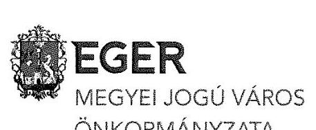

Ikt.szám: 19-1/2017.
Ügyintéző: Solymosné Füstös Zsuzsanna
Tárgy: észrevétel tétel jelentéstervezetre
Az Önök iktatószáma: V-1125-189/2016.

## Domokos László Elnök Úr részére

Állami Számvevőszék

## Budapest-4

Pf. 54.
1364

## Tisztelt Elnök Úr!

Köszönettel kézhez vettük „Az önkormányzatok gazdasági társaságai - Az önkormányzatok többségi tulajdonában lévő gazdasági társaságok gazdálkodásának ellenőrzése - Városgondozás Eger Ipari-, Kereskedelmi és Szolgáltató Kft." címmel készített számvevőszéki jelentéstervezetet.

Áttanulmányoztuk a megállapításaikat és a javaslataikat, amelyek Eger Megyei Jogú Város Önkormányzata tulajdonosi joggyakorlás kontrolljának erősödését illetve a hulladékgazdálkodási közfeladat ellátásának szabályszerűségét segítik elő.

A jelentéstervezet Eger Megyei Jogú Város Önkormányzata polgármesterének címzett javaslataira a következő észrevételt teszem.

1. Intézkedjen közép- és hosszú távú vagyongazdálkodási terv elkészítéséről a jogszabályi előírásnak megfelelően.

A 2016. május 30-án, 3134-19/2016. iktatószám alatt elküldött teljességi és hitelességi nyilatkozat és záró dokumentumjegyzékben nyilatkoztam, hogy az önkormányzat nem rendelkezik kifejezetten „Vagyongazdálkodási terv" megnevezésű dokumentummal.
Megjegyezni kívánom azonban, hogy az önkormányzati vagyongazdálkodásra vonatkozó rövid és hosszú távú tervezést az adott évre vonatkozó költségvetési koncepció tartalmazza, ahogyan azt az önkormányzat ellenőrzött időszakban hatályban lévő Vagyonrendelete 34.§ (3) is előírta. /,34.§ (3) A Közgyűlés közép- és hosszútávú vagyongazdálkodási tervet fogad el minden évben a költségvetési koncepció részeként legkésőbb a tárgyévet megelőző december 31-ig. „/ A 20112014. évekre vonatkozó költségvetési koncepciókat 2016. május 26.-án a funkcionális e-mail címre megküldtük.
Továbbá a 2007-2014. évekre vonatkozóan Eger Megyei Jogú Város Önkormányzata gazdasági programja, a 2014-2020. évekre vonatkozóan az Integrált Településfejlesztési Stratégia és Integrált Városfejlesztési Stratégia, valamint az Önkormányzat vagyonáról és vagyongazdálkodásáról szóló 6/2012. (II.24.) önkormányzati rendelet is ugyan több külön dokumentumba foglalva, de összességében meghatározza és tartalmazza az önkormányzat középtávú vagyongazdálkodási stratégiáját és terveit.

---

# 2. Intézkedjen arról, hogy a Közszolgáltatási szerződés tartalma teljes körűen megfeleljen a jogszabályi előírásoknak. 

Megállapításaik vonatkozásában meg kívánom jegyezni, hogy a vizsgált időszakra szóló közszolgáltatási szerződés 2014. július 1. napjával hatályon kívül került, mivel 2014. június 26. napján Eger MJV Önkormányzata hulladékgazdálkodási közszolgáltatási szerződést kötött az Egri Hulladékgazdálkodási Nonprofit Kft-vel a feladat ellátására. Az azóta is hatályos szerződés a Ht. 47. § (4) bekezdésének, a Ht. 47/A. § (1) bekezdésének, a 317/2013. (VIII.28.) Korm. rendelet 4. § (1) bek. a) pontjában, és a 4. § (2) bek c) pontjában valamint a 4. § (3) bek. e) pontjában foglaltaknak maradéktalanul megfelel, valamint a Ht. előírásainak megfelelően a Koordináló Szerv jóváhagyta azt 2016. augusztusában. Az ellenőrzési jelentés azon pontjának, tehát, mely szerint „Intézkedjen arról, hogy a Közszolgáltatási szerződés tartalma teljes körűen megfeleljen a jogszabályi előírásoknak", a jelenleg hatályos szerződés megfelel, a korábbi, hatályon kívül helyezett közszolgáltatási szerződés vonatkozásában intézkedésre lehetőségünk nincs.

## 3. Kezdeményezze, hogy az FB az ügyrendjét megállapítsa.

Az FB az ügyrendjét megállapította, amelyet a taggyűlés 2016. 10. 14-megtárgyalt és elfogadott.

## 4. Kezdeményezze, hogy a Taggyűlés a Társaság Számv. tv. szerinti beszámolójáról az FB írásbeli jelentésének birtokában döntsön.

A Taggyűlés a Társaság számviteli törvény szerinti beszámolóját minden esetben az FB döntését követően fogadja el.
Későbbiekre vonatkozóan fel fogjuk hívni a figyelmet, hogy a Taggyűlés a Társaság számviteli beszámolóját a Ptk. vonatkozó előírásai szerint, az FB írásbeli jelentésének birtokában fogadja el.
5. Kezdeményezzen intézkedést - a Társaság könyvvizsgálójának megválasztásával, az apport számviteli elszámolásával, a leltározással, a leltárral, a követeléskezeléssel, a beszámolással, az adatvédelemmel, a könyvviteli nyilvántartással kapcsolatban - feltárt szabálytalanságok tekintetében a felelősség tisztázása érdekében, és szükség szerint kezdeményezze a felelősség érvényesítését.

A könyvvizsgáló 2014. évi megválasztásáról az FB kapott tájékoztatást. Későbbiekre vonatkozóan fel fogjuk hívni a figyelmet, hogy könyvvizsgáló személyére az ügyvezetés a felügyelőbizottság egyetértésével tegyen javaslatot a társaság legfőbb szervének.

A számvevőszéki jelentéstervezet 2.2. számú megállapítás 6-9. bekezdései tárgyalják a 2014. évi apport számviteli elszámolását. A számviteli törvény hivatkozott jogszabályhelyei nem adnak egyértelmű és határozott eligazítást az apport elszámolására. A kifogásolt eljárást egyeztettük a társaság könyvvizsgálójával, aki azt megfelelőnek és alkalmazandónak tartotta.
Jelen gazdasági esemény jogszabályszerű számviteli kezelése vonatkozásában állásfoglalást kérünk a Nemzetgazdasági Minisztérium Számviteli és Felügyeleti Főosztályától.

A társaság, megítélésünk szerint, tett intézkedéseket a követelésállomány csökkentése érdekében: a közszolgáltatást matricás rendszerben szervezték, a matricát készpénzfizetés ellenében lehetett kiváltani. Ahol ez nem történt meg, a társaság írásbeli figyelemfelhívással élt és nem ürítette az edényzetet.
A vizsgált időszak közszolgáltatási díjhátralék behajtását a jogszabályi előírásoknak megfelelően a társaság a 2015-2016. években megtette.

Számvevőszéki vizsgálatuk alapják az adatvédelemmel kapcsolatos szabályzatok készítése a társaságnál elkezdődött: az adatvédelmi és adatbiztonsági szabályzat illetve a közérdekű adatok megismerésére irányuló igények teljesítésének rendjét rögzítő szabályzat elkészítése folyamatosan történik.

---

A jelentéstervezet Eger Megyei Jogú Város Önkormányzata jegyzőjének címzett javaslataira a következő észrevételt teszem.

1. Intézkedjen arról, hogy önkormányzati vagyoni körbe tartozó üzleti vagyon elidegenítésére, hasznosítására, megterhelésére irányuló döntést megelőzően a Vagyonrendelet előírása szerint a forgalmi érték meghatározását végezzék el.

Jelentéstervezetükben foglalt megállapításuknak megfelelően a későbbiekben önkormányzati vagyoni körbe tartozó üzleti vagyon elidegenítésére, hasznosítására, megterhelésére irányuló döntést megelőzően a hatályos Vagyonrendelet előírása szerint járunk el: a forgalmi érték meghatározását elvégezzük.

Kérem Tisztelt Elnök Urat, hogy a fentiek figyelembevételével szíveskedjenek jelentésüket összeállítani.

Eger, 2017. január 2.
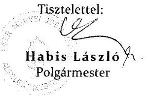

---

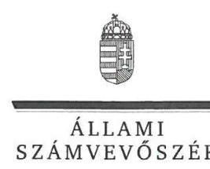

ELNÖK

Ikt.szám: V-1125-200/2016.

# Habis László úr 

polgármester
Eger Megyei Jogú Város Önkormányzata

## Eger

## Tisztelt Polgármester Úr!

„Az önkormányzatok gazdasági társaságai - Az önkormányzatok többségi tulajdonában lévő gazdasági társaságok gazdálkodásának ellenőrzése - VÁROSGONDOZÁS EGER Ipari-, Kereskedelmi és Szolgáltató Kft." címmel készített számvevőszéki jelentéstervezetre tett észrevételeit köszönettel megkaptam.
Az Állami Számvevőszék észrevételekre vonatkozó álláspontjáról a felügyeleti vezető által készített részletes tájékoztatást csatoltan megküldöm.
Tájékoztatom Polgármester Urat, hogy a számvevőszéki jelentésben - az Állami Számvevőszékről szóló 2011. évi LXVI. törvény 29. § (3) bekezdése alapján - a figyelembe nem vett észrevételeket a számvevőszéki álláspont indoklásával együtt szerepeltetjük.

Budapest, 2017. 01. hó 24 , nap
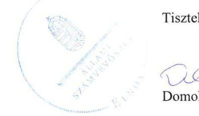

Tisztelettel:

Domokos László

Melléklet: Tájékoztatás az észrevételek kezeléséről

---

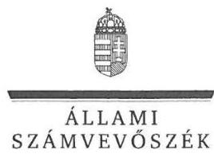

FELÜGYELETI VEZETŐ

# Tájékoztatás   az észrevételek kezeléséről 

„Az önkormányzatok gazdasági társaságai - Az önkormányzatok többségi tulajdonában lévő gazdasági társaságok gazdálkodásának ellenőrzése - VÁROSGONDOZÁS EGER Ipari-, Kereskedelmi és Szolgáltató Kft." című jelentéstervezetre tett észrevételeit áttekintettük, azok kezelésével kapcsolatban a következő tájékoztatást adom.

## 1. észrevétel - a polgármesternek címzett 1. számú javaslathoz

Az észrevétel megerősítette, hogy az önkormányzat az ellenőrzött időszakban nem rendelkezett közép- és hosszú távú vagyongazdálkodási terv dokumentummal. Jelezte, hogy a Vagyonrendelet 34. § (3) bekezdése írta elő a közép- és hosszú távú vagyongazdálkodási terv Közgyűlés általi elfogadását a költségvetési koncepció részeként legkésőbb a tárgyévet megelőző december 31-ig. Az ellenőrzött időszakot érintő költségvetési koncepciók az ellenőrzés részére átadásra kerültek, azonban azok nem tartalmaztak közép- és hosszú távú vagyongazdálkodási tervet, melyet az észrevétel sem vitatott. Továbbá a nemzeti vagyonról szóló 2011. évi CXCVI. törvény 9. § (1) bekezdése előírja, hogy a helyi önkormányzat közép- és hosszú távú vagyongazdálkodási tervet köteles készíteni, melynek az észrevételben hivatkozott egyéb dokumentumok részelemei nem feleltethetőek meg. Fentiek alapján a jelentéstervezetben a polgármesternek címzett 1. számú javaslat módosítása nem indokolt. Pontosításra került az 1.1. számú megállapítást alátámasztó 2. bekezdésben a Vagyonrendelet 34. §-a be nem tartott bekezdésének megjelölése.

## 2. észrevétel - a polgármesternek címzett 2. számú javaslathoz

Az észrevétel nem vitatta a Közszolgáltatási szerződés tartalmának hiányosságára vonatkozó megállapítást, továbbá jelezte, hogy 2014. június 26-án Eger Megyei Jogú Város Önkormányzata az Egri Hulladékgazdálkodási Nonprofit Kft.-vel kötött közszolgáltatási szerződést, amely 2016 augusztusában került jóváhagyásra. A jelentéstervezet (a polgármesternek címzett 2. számú javaslat és azt megalapozó 1.1. számú megállapítást alátámasztó 10-12. bekezdések) módosítása nem indokolt, mert az Állami Számvevőszék a jelentésében csak az ellenőrzött időszakra és az ellenőrzött szervezetre vonatkozóan tesz megállapítást, javaslata ugyanakkor az önkormányzati feladatellátás szabályszerűségének biztosítására irányul. A tervezett, illetve már megtett intézkedésekről az Állami Számvevőszékről szóló 2011. évi LXVI. törvény 33. § (1) bekezdésben foglaltaknak megfelelő intézkedési tervben kell számot adni.

## 3. észrevétel - a polgármesternek címzett 3. számú javaslathoz

Az észrevétel nem vitatta az FB ügyrendjének hiányára vonatkozó megállapítást, ezért a jelentéstervezet (a polgármesternek címzett 3. számú javaslat és az azt megalapozó 1.2. számú megállapítást alátámasztó 5 . bekezdés) módosítása nem indokolt.
Köszönjük az FB ügyrendjének megállapítására vonatkozó tájékoztatását.

---

# 4. észrevétel - a polgármesternek címzett 4. számú javaslathoz 

Az észrevétel nem vitatta azt, hogy az ellenőrzött időszakban a taggyűlés a Társaság Számv. tv. szerinti beszámolójáról nem az FB írásbeli jelentésének birtokában döntött, ezért a jelentéstervezet (a polgármesternek címzett 4. számú javaslat és az azt megalapozó 1.2. számú megállapítást alátámasztó 14. bekezdés) módosítása nem indokolt.

## 5. észrevétel - a polgármesternek címzett 5. számú javaslathoz

Az észrevétel nem vitatta a könyvvizsgáló megválasztásával kapcsolatosan tett megállapítást. Az apporttal kapcsolatban jelezte, hogy a számviteli törvény hivatkozott jogszabályhelyei nem adnak egyértelmű és határozott eligazítást az apport elszámolására, amelyet a társaság könyvvizsgálója megfelelőnek tartott, azonban az észrevétel indoklást nem tartalmazott. Továbbá az apporthoz kapcsolódóan, a 2.2. számú megállapítás 6. bekezdésében a Számvitelről szóló 2000. évi C. törvény 36. § (1) bekezdés b) pontja és 36. § (3) bekezdés a) pontja mellett a Polgári Törvénykönyvről szóló 2013. évi V. törvény 3:198. § (1)-(2) bekezdései és 3:200. § (1) bekezdése rendelkezéseinek be nem tartása is szerepelt, melyre vonatkozóan az észrevétel nem tett kifogást. A megállapítás a hivatkozott jogszabályi előírásokkal megalapozott. A követeléskezeléssel, a közszolgáltatási díjhátralék behajtásával kapcsolatban tett megállapítás módosítása nem indokolt, mert az Állami Számvevőszék jelentésében csak az ellenőrzött időszakra vonatkozóan, a rendelkezésére álló ellenőrzési dokumentumok alapján tesz megállapítást. A leltározással, a leltárral, a beszámolással, a könyvviteli nyilvántartással és az adatvédelemmel kapcsolatos megállapításokat az észrevétel nem kifogásolta.

## 6. észrevétel - a jegyzőnek címzett 1. számú javaslathoz

Az észrevétel nem vitatta azt, hogy az önkormányzati vagyon körébe tartozó üzleti vagyon elidegenítésére, hasznosítására, megterhelésére irányuló döntést megelőzően a forgalmi érték meghatározását nem végezték el a Vagyonrendelet előírása ellenére, ezért a jelentéstervezet (a jegyzőnek címzett 1. számú javaslat és az azt megalapozó 2.2. számú megállapítást alátámasztó 5. bekezdés) módosítása nem indokolt.

Tájékoztatom, hogy a számvevőszéki jelentés függelékeként szerepeltetjük a jelentéstervezethez tett észrevételeit, valamint az azokra adott válaszunkat.

Budapest, 2017. 01. hó 24 nap

Böröcz Imre
felügyeleti vezető

---

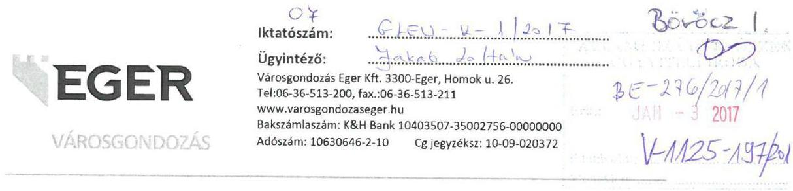

Domokos László
Elnök Úr részére
Állami Számvevőszék
Budapest 4.
Pf.: 54
1364

Tárgy: „Városgondozás Eger Kft" Számvevőszéki
Jelentéstervezet
Ügyintéző: Böröcz Imre felügyeleti vezető
Ügyszám: V-1125-187/2016
Tisztelt Elnök Úr!
Köszönettel 2016.12.19-én kézhez vettük „Az önkormányzatok gazdasági társaságai - Az önkormányzatok többségi tulajdonában lévő gazdasági társaságok gazdálkodásának ellenőrzése - Városgondozás Eger Ipari-, Kereskedelmi és Szolgáltató Kft." címmel készített számvevőszéki jelentéstervezetet.

A Számvevőszéki Jelentéstervezet javaslatok fejezetében a Városgondozás Eger Kft. ügyvezetőjének címzettekkel kapcsolatban az alábbi észrevételeket teszem:

1) Intézkedjen a javadalmazási szabályzat elkészítéséről:

A vizsgálati időszak 2011-2012. éveiben EMJV Önk. javadalmazási szabályzata volt társaságunknál érvényben a vizsgált időszak 2013-2014. éveiben a tulajdonosi szerkezet változásai következtében a taggyűlés valóban nem fogadott el új javadalmazási szabályzatot.
Az aktualizálást javadalmazási szabályzatot cégünk 2016. év végén elkészítette és megküldte az új többségi tulajdonos EVAT Zrt. Igazgatóságának, amely még a nevezett tárgykörben döntést nem hozott.
2) Intézkedjen a Számv tv. előírásainak megfelelően a Számlarend folyamatos karbantartásáról, hogy az a jogszabályban előírt tartalmi követelményeinek megfeleljen.
Ezen pontot érintően EMJV Polgármesteri Hivatalának belső ellenőrei által készített jelentésben tettek észrevételeket, mely alapján Társaságunk 2016.11.25-én egy Intézkedési Tervet készített. Ez az Intézkedési Terv tartalmazza többek között a számlarend felülvizsgálatát, aktualizálását és folyamatos karbantartását. ( Intézkedési Terv mellékelve.)

---

3) Intézkedjen arról, hogy a Raktározási, leltározási és selejtezési szabályzat Szvt. tv. előírásainak megfelelően tartalmazza a leltározás gyakoriságát.
Ezen pontot érintően EMJV Polgármesteri Hivatalának belső ellenőrei által készített jelentésben tettek észrevételeket, mely alapján Társaságunk 2016.11.25-én egy Intézkedési Tervet készített. Ez az Intézkedési Terv tartalmazza többek között a raktározási, leltározási és selejtezési szabályzat felülvizsgálatát, aktualizálását és folyamatos karbantartását. ( Intézkedési Terv mellékelve.)
4) Intézkedjen az apportként átvett ingatlan és a hozzá tartozó tárgyi eszközök gazdasági eseményeinek a jogszabályi előírások szerinti számviteli elszámolásáról.
A számviteli törvény hivatkozott jogszabályhelyei nem adnak egyértelmű és határozott eligazítást az apport elszámolására. A kifogásolt eljárást társaságunk könyvvizsgálója megfelelőnek és alkalmazandónak tartotta.

Jelen gazdasági esemény jogszabályszerű számviteli kezelése vonatkozásában EMJV Önk. állásfoglalást kér a Nemzetgazdasági Minisztérium Számviteli és Felügyeleti Főosztályától.
5) Intézkedjen a Számv. tv. előírása szerint a leltár elvégzéséről és a leltár összeállításáról: Az ellenőrzött időszakban a tárgyi eszközök mennyiségi felvétellel történő leltározása megtörtént, kivéve azokat az immateriális javakat, melyeket a könyvelés az elektronikus rendszerből automatikusan aktualizált. A nevezett hiányosságokat a 2015-ben már pótoltuk.
6) Intézkedjen közszolgáltatási díjhátralék behajtásának kezdeményezéséről a jogszabályi előírásoknak megfelelően.
A nevezett időszakban a közszolgáltatást érintően az úgynevezett „matricás rendszert" alkalmaztuk. Ez lényegében azt jelentette, hogy szinte csak és kizárólag az kapott matricát, aki a társaság ügyfélszolgálati irodáiban (Bródy Sándor u.4.; Homok u.26.), illetve az időszakosan kialakított külső elárusító helyeken készpénzfizetés ellenében vásárolta meg azt.
Azon kukaedények esetében, melyek a közszolgáltatás igénybevételénél jelentkeztek, és nem rendelkeztek matricával, ott a cég dolgozói írásos figyelmeztetést helyeztek el az ürítés alkalmával a későbbiekben pedig nem ürítették ki az edényzetet. Előzőek következtében előbb utóbb, mindenki, aki igénybe vette a közszolgáltatást készpénzfizetéssel rendezte a helyi önkormányzati rendeletben megállapított díjat.
A hulladékgazdálkodási közszolgáltatást érintően a nyitott számlák keletkezésének okai az alábbiak lehettek:

- lakásszövetkezet vagy társasház, tekintettel a jelentősebb összegre kérvényezte az átutalás lehetőségét
- magánszemély az ügyfélszolgálaton az adatok egyeztetését követően kérte a csekkes vagy átutalásos fizetés lehetőségét
- magánszemély részletfizetési kérelmet terjesztett elő és a megállapodást követően elmaradt valamely részlet megfizetése
- informatikai probléma következtében nem lehetett a befizetést és a befizetőt egyértelműen összehúzni könyveléstechnikai szempontból
- tévesen került számla kiállításra, mely a későbbiekben valamilyen okból kifolyólag nem került sztornózásra (az eredeti számla kinyomtatásra sem került egyes esetekben)
A vizsgálati időszak közszolgáltatási díjhátralék behajtását a jogszabályi előírásoknak megfelelően a 2015-2016-os években megtettük.

---

7) Intézkedjen a hulladékgazdálkodási közszolgáltatás nyújtása érdekében végzett tevékenység jogszabályi előírásainak megfelelő bemutatásáról az éves beszámolóban. A cégbíróságnál az éves beszámolóban visszamenőlegesen már nem lehet a bemutatást megtenni. A hulladékgazdálkodási közszolgáltatás tevékenységét 2014.07.01-től az Egri Hulladékgazdálkodási Nonprofit Kft. végzi, mely társaság a jogszabályi előírásoknak megfelelően végzi a tevékenységet.
8) Intézkedjen arról, hogy a beszámoló kiegészítő melléklete a jogszabályi előírásának megfelelően tartalmazza az értékcsökkenési leírásra vonatkozó információkat.
A javaslatok alapján a jövőt illetően a kiegészítő melléklet tartalmazni fogja az értékcsökkenési információkat.
9) Intézkedjen a jogszabályi előírásoknak megfelelően adatvédelmi és adatbiztonsági szabályzat elkészítéséről.
Ezen pontot érintően EMJV Polgármesteri Hivatalának belső ellenőrei által készített jelentésben tettek észrevételeket, mely alapján Társaságunk 2016.11.25-én egy Intézkedési Tervet készített. Ez az Intézkedési Terv tartalmazza többek között az adatvédelmi és adatbiztonság szabályzat felülvizsgálatát, aktualizálását és folyamatos karbantartását. ( Intézkedési Terv mellékelve.)
10) Nevezzen ki, vagy bízzon meg a jogszabályi előírásoknak megfelelően belső adatvédelmi felelőst.
Az adatvédelmi és adatbiztonsági szabályzat elkészültével egy időben belső adatvédelmi felelős is kinevezésre kerül.
11) Intézkedjen a közérdekű adatok megismerésére irányuló igények teljesítésének rendjét rögzítő szabályzat elkészítésére a jogszabályi előírásoknak megfelelően.
A javaslatok alapján a közérdekű adatok megismerésére irányuló igények teljesítésének rendjét rögzítő szabályzatot elkészítjük.
12) Intézkedjen arról, hogy a jogszabályi előírásoknak megfelelően:
a) a könyvvezetésre és a bizonylatolásra vonatkozó részletes belső szabályait úgy alakítsák ki, hogy az a mérleg, az eredménykimutatás és a kiegészítő melléklet adatainak közvetlen alátámasztására alkalmas legyen;
b) a nyilvántartási rendszerét továbbrészletezzék annak érdekében, hogy abból a vonatkozó külön jogszabályban meghatározott adatok rendelkezésre álljanak
Ezen pontot érintően EMJV Polgármesteri Hivatalának belső ellenőrei által készített jelentésben tettek észrevételeket, mely alapján Társaságunk 2016.11.25-én egy Intézkedési Tervet készített. Ez az Intézkedési Terv tartalmazza többek között a könyvvezetésre és a bizonylatolásra vonatkozó részletes belső szabályaink felülvizsgálatát, aktualizálását és folyamatos karbantartását. ( Intézkedési Terv mellékelve.)
A vizsgált időszakban nem egyértelműen elkülöníthető tételek esetére megoldást jelentett a jogszabályoknak megfelelően 2014.07.01-től létrehozott Egri Hulladékgazdálkodási Nonprofit Kft., mely csak és kizárólag hulladékgazdálkodási közszolgáltatást végez.

---

13) Intézkedjen a jogszabályi előírások szerinti, a bizonylati elvre és a bizonylati fegyelemre vonatkozó előírások betartásáról.
Ezen pontot érintően EMJV Polgármesteri Hivatalának belső ellenőrei által készített jelentésben tettek észrevételeket, mely alapján Társaságunk 2016.11.25-én egy Intézkedési Tervet készített. Ez az Intézkedési Terv tartalmazza a bizonylati elvre és a bizonylati fegyelemre vonatkozó előírások aktualizálását és folyamatos karbantartását. (Intézkedési Terv mellékelve.)
14) Intézkedjen arról, hogy a jogszabályi előírásoknak megfelelően

A vizsgált időszakban nem egyértelműen elkülöníthető tételek esetére megoldást jelentett a jogszabályoknak megfelelően 2014.07.01-től létrehozott Egri Hulladékgazdálkodási Nonprofit Kft., mely csak és kizárólag hulladékgazdálkodási közszolgáltatást végez.

A fentiekkel összefüggésben az alábbiakat szeretném még tájékoztatásul közölni:
A vizsgált időszakban Társaságunknál a gazdasági-igazgatóhelyettesi pozíciót három személy is betöltötte. Az első személycsere 2011. áprilisában történt meg, a második pedig 2014. novemberében. Mindkét esetben elsősorban szakmai hibák, hiányosságok indokolták a személyi változásokat. Az előzőekkel párhuzamosan kifogások merültek fel a könyvvizsgálói munka hatékonyságával kapcsolatban, mely alapján egyeztetve a tulajdonos Önkormányzattal, a szigorúbb kontroll érdekében új könyvvizsgáló került megválasztásra.
A javaslatok bizonyos pontjaival kapcsolatban társaságunknál belső vizsgálat is történt, ill. Tulajdonosi felkérésre külső igazságügyi könyvszakértői vizsgálat is készült, melyek jogszabályellenes működésre utaló jeleket nem tártak fel.

Eger, 2017. január 02.

Tisztelettel:
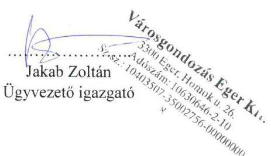

---

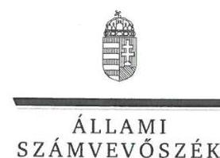

ELNÖK

Ikt.szám: V-1125-199/2016.

# Jakab Zoltán úr 

ügyvezető igazgató
„VÁROSGONDOZÁS EGER" Ipari-, Kereskedelmi és Szolgáltató Korlátolt Felelősségű Társaság

## Eger

## Tisztelt Ügyvezető Igazgató Úr!

„Az önkormányzatok gazdasági társaságai - Az önkormányzatok többségi tulajdonában lévő gazdasági társaságok gazdálkodásának ellenőrzése - VÁROSGONDOZÁS EGER Ipari-, Kereskedelmi és Szolgáltató Kft." címmel készített számvevőszéki jelentéstervezetre tett észrevételeit köszönettel megkaptam.
Az Állami Számvevőszék észrevételekre vonatkozó álláspontjáról a felügyeleti vezető által készített részletes tájékoztatást csatoltan megküldöm.
Tájékoztatom Ügyvezető Igazgató Urat, hogy a számvevőszéki jelentésben - az Állami Számvevőszékről szóló 2011. évi LXVI. törvény 29. § (3) bekezdése alapján - a figyelembe nem vett észrevételeket a számvevőszéki álláspont indoklásával együtt szerepeltetjük.

Budapest, 2017. 04. hó 24. nap

Tisztelettel:

## Domokos László

Melléklet: Tájékoztatás az észrevételek kezeléséről

---

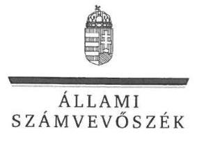

FELÜGYELETI VEZETŐ

Melléklet
Ikt.szám: V-1125-199/2016.

# Tájékoztatás   az észrevételek kezeléséről 

„Az önkormányzatok gazdasági társaságai - Az önkormányzatok többségi tulajdonában lévő gazdasági társaságok gazdálkodásának ellenőrzése - VÁROSGONDOZÁS EGER Ipari-, Kereskedelmi és Szolgáltató Kft." című jelentéstervezetre tett észrevételeit áttekintettük, azok kezelésével kapcsolatban a következő tájékoztatást adom.

## 1. észrevétel - az ügyvezetőnek címzett 1. számú javaslathoz

Az észrevétel megerősítette az ügyvezetőnek címzett 1. számú javaslatot megalapozó, 1.2. számú megállapítást alátámasztó 11. bekezdésben foglaltakat, miszerint a 2013-2014. években a társaság nem rendelkezett javadalmazási szabályzattal, ezért nem indokolt a jelentéstervezet (sem a megállapítás, sem a javaslat) módosítása.
Köszönjük tájékoztatását a javadalmazási szabályzat 2016. év végi elkészítéséről és az új többségi tulajdonos részére történő megküldéséről, azonban az Állami Számvevőszék a jelentésében csak az ellenőrzött időszakra vonatkozóan tesz megállapítást.

## 2. észrevétel - az ügyvezetőnek címzett 2. számú javaslathoz

Az észrevétel nem vitatta az ellenőrzött időszakra vonatkozóan a számlarenddel kapcsolatban megállapított hiányosságokat, ezért a jelentéstervezet (az ügyvezetőnek címzett 2. számú javaslat és azt megalapozó 2.1. számú megállapítást alátámasztó 2. bekezdés) módosítása nem indokolt.

## 3. észrevétel - az ügyvezetőnek címzett 3. számú javaslathoz

Az észrevétel nem vitatta az ellenőrzött időszakra vonatkozóan a Raktározási, leltározási és selejtezési szabályzattal kapcsolatban megállapított hiányosságot, ezért a jelentéstervezet (az ügyvezetőnek címzett 3. számú javaslat és az azt megalapozó 2.1. számú megállapítást alátámasztó 4. bekezdés)
 módosítása nem indokolt.

## 4. észrevétel - az ügyvezetőnek címzett 4. számú javaslathoz

Az észrevétel szerint a számviteli törvény hivatkozott jogszabályhelyei nem adnak egyértelmű és határozott eligazítást az apport elszámolására, amelyet a társaság könyvvizsgálója megfelelőnek tartott. Az észrevétel indoklást nem tartalmazott. Továbbá az apporthoz kapcsolódóan, a 2.2. számú megállapítás 6. bekezdésében a Számvitelről szóló 2000. évi C. törvény 36. § (1) bekezdés b) pontja és 36. § (3) bekezdés a) pontja mellett a Polgári Törvénykönyvről szóló 2013. évi V. törvény 3:198. § (1)-(2) bekezdései és 3:200. § (1) bekezdése rendelkezéseinek be nem tartása is szerepelt, melyre vonatkozóan az észrevétel nem tett kifogást. A megállapítás a hivatkozott jogszabályi előírásokkal megalapozott. Fentiek alapján a jelentéstervezet (az ügyvezetőnek címzett 4. számú javaslat és az azt megalapozó 2.2. számú megállapítást alátámasztó 6. bekezdés) módosítása nem indokolt.

---

# 5. észrevétel - az ügyvezetőnek címzett 5. számú javaslathoz

Az észrevétel jelezte, hogy a tárgyi eszközök mennyiségi felvétellel történő leltározására az immateriális javak kivételével sor került, és a leltározással kapcsolatos hiányosságokat a társaság a 2015. évben pótolta. A jelentéstervezet (sem az ügyvezetőnek címzett 5. számú javaslat, sem az azt megalapozó 2.2. számú megállapítást alátámasztó 8. bekezdés) módosítása nem indokolt, mert a rendelkezésre álló ellenőrzési dokumentumok nem igazolják a tárgyi eszközök szabályszerűen végrehajtott és dokumentált mennyiségi leltározását. Az Állami Számvevőszék a jelentésében csak az ellenőrzött időszakra vonatkozóan tesz megállapítást.

## 6. észrevétel - az ügyvezetőnek címzett 6. számú javaslathoz

Az észrevétel nem vitatta a közszolgáltatási díjhátralék keletkezését és a behajtás kezdeményezésének elmulasztását, illetve jelezte, hogy azt a társaság a 2015-2016. években megtette. A jelentéstervezet (sem az ügyvezetőnek címzett 6. számú javaslat, sem az azt megalapozó 2.2. számú megállapítást alátámasztó 13. bekezdés) módosítása nem indokolt, mert az Állami Számvevőszék a jelentésében csak az ellenőrzött időszakra vonatkozóan, a rendelkezésére álló ellenőrzési dokumentumok alapján tesz megállapítást.

## 7. észrevétel - az ügyvezetőnek címzett 7. számú javaslathoz

Az észrevétel nem vitatta, hogy a hulladékgazdálkodási közszolgáltatás nyújtása érdekében végzett tevékenység jogszabályi előírásnak megfelelő bemutatása nem történt meg az éves beszámolóban, ezért a jelentéstervezet 2.4. számú megállapítását alátámasztó 2. bekezdésének módosítása nem indokolt. A hulladékgazdálkodási közszolgáltatási tevékenység (melyet 2014. július 1-jétől az Egri Hulladékgazdálkodási Nonprofit Kft. végez) ellátásában bekövetkezett változás miatt az ügyvezetőnek címzett 7. számú javaslat törlésre került.

## 8. észrevétel - az ügyvezetőnek címzett 8. számú javaslathoz

Az észrevétel nem vitatta, hogy a beszámoló kiegészítő melléklet nem tartalmazta a jogszabályi előírásnak megfelelően az értékcsökkenési leírásra vonatkozó információkat, ezért a jelentéstervezet (sem az ügyvezetőnek címzett 8. számú javaslat, sem az azt megalapozó 2.4. számú megállapítást alátámasztó 4. bekezdés) módosítása nem indokolt.

## 9. észrevétel - az ügyvezetőnek címzett 9. számú javaslathoz

Az észrevétel nem vitatta, hogy a társaság nem rendelkezett a jogszabályi előírásoknak megfelelően adatvédelmi és adatbiztonsági szabályzattal, ezért a jelentéstervezet (sem az ügyvezetőnek címzett 9. számú javaslat, sem az azt megalapozó 2.4. számú megállapítást alátámasztó 7. bekezdés) módosítása nem indokolt.

## 10. észrevétel - az ügyvezetőnek címzett 10. számú javaslathoz

Az észrevétel nem vitatta, hogy a társaság nem nevezett ki, vagy bízott meg belső adatvédelmi felelőst, ezért a jelentéstervezet (sem az ügyvezetőnek címzett 10. számú javaslat, sem az azt megalapozó 2.4. számú megállapítást alátámasztó 8. bekezdés) módosítása nem indokolt.
Köszönjük arra vonatkozó tájékoztatását, hogy az adatvédelmi és adatbiztonsági szabályzat elkészültével egyidőben belső adatvédelmi felelős kinevezésére is sor kerül.

---

# 11. észrevétel - az ügyvezetőnek címzett 11. számú javaslathoz

Az észrevétel nem vitatta, hogy a társaság nem készített a közérdekű adatok megismerésére irányuló igények teljesítésének rendjét rögzítő szabályzatot, ezért a jelentéstervezet (sem az ügyvezetőnek címzett 11. számú javaslat, sem az azt megalapozó 2.4. számú megállapítást alátámasztó 9. bekezdés) módosítása nem indokolt.

## 12. észrevétel - az ügyvezetőnek címzett 12. számú javaslathoz

Az észrevétel nem vitatta, hogy a társaság a könyvvezetésre és a bizonylatolásra vonatkozó részletes belső szabályait nem a jogszabályi előírás szerint alakította ki és nyilvántartási rendszerét nem részletezte tovább a jogszabályi előírásnak megfelelően, ezért a jelentéstervezet 3.1. számú megállapítását alátámasztó 2-5. bekezdéseinek módosítása nem indokolt. A hulladékgazdálkodási közszolgáltatási tevékenység (melyet 2014. július 1-jétől az Egri Hulladékgazdálkodási Nonprofit Kft. végez) ellátásában bekövetkezett változás miatt az ügyvezetőnek címzett 12/b. számú javaslat törlésre került.

## 13. észrevétel - az ügyvezetőnek címzett 13. számú javaslathoz

Az észrevétel nem vitatta a bizonylati elvre és a bizonylati fegyelemre vonatkozó előírások be nem tartásával kapcsolatos megállapítást, ezért a jelentéstervezet (sem az ügyvezetőnek címzett 13. számú javaslat, sem az azt megalapozó 3.1. számú megállapítást alátámasztó 7. bekezdés) módosítása nem indokolt.

## 14. észrevétel - az ügyvezetőnek címzett 14. számú javaslathoz

Az észrevétel nem vitatta a költségtervvel kapcsolatos előírás be nem tartásáról szóló megállapítást, ezért a jelentéstervezet 3.2. számú megállapítást alátámasztó 1. bekezdésének módosítása nem indokolt. A hulladékgazdálkodási közszolgáltatási tevékenység (melyet 2014. július 1-jétől az Egri Hulladékgazdálkodási Nonprofit Kft. végez) ellátásában bekövetkezett változás miatt az ügyvezetőnek címzett 14. számú javaslat törlésre került.
Köszönjük tájékoztatását az ellenőrzött időszakot követő (2016. évi) belső ellenőrzés tényéről és arról, hogy az alapján intézkedési tervet készített, mely tartalmaz a számlarenddel, a Raktározási, leltározási és selejtezési szabályzattal, az adatvédelmi és adatbiztonsági szabályzattal, a könyvvezetésre, bizonylatolásra vonatkozó részletes belső szabályokkal, valamint a bizonylati elv és a bizonylati fegyelem szabályozásával kapcsolatos intézkedéseket.
Tájékoztatom, hogy a számvevőszéki jelentés függelékeként szerepeltetjük a jelentéstervezethez tett észrevételeit, valamint az azokra adott válaszunkat.

Budapest, 2017. 01. hó 24. nap
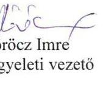

---

.

---

# RÖVIDÍTÉSEK JEGYZÉKE

${ }^{1}$ Társaság
${ }^{2}$ Önkormányzat
${ }^{3}$ Közgyűlés
${ }^{4}$ Alapító Okirat
${ }^{5}$ Társasági szerződés
${ }^{6}$ Közszolgáltatási szerződés
${ }^{7}$ Közszolgáltatási szerződés módosításai
${ }^{8}$ ÁSZ
${ }^{9}$ ÁSZ tv.
${ }^{10}$ Ötv.
${ }^{11}$ Mötv.
${ }^{12}$ Nvtv.
${ }^{13}$ Vagyonrendelet
${ }^{14}$ Önkormányzat Hulladékgazdálkodási terve
${ }^{15} \mathrm{Hgt}$.
${ }^{16} \mathrm{Ht}$.
${ }^{17}$ OHÜ
${ }^{18}$ Alapokmány
"VÁROSGONDOZÁS EGER" Ipari-, Kereskedelmi és Szolgáltató Korlátolt Felelősségű Társaság
Eger Megyei Jogú Város Önkormányzata
Eger Megyei Jogú Város Önkormányzat Közgyűlése
A Városgondozás Eger Kft. Alapító Okirata (hatályos 2010. december 30-tól 2011. március 30-ig)
"VÁROSGONDOZÁS EGER" Ipari-, Kereskedelmi és Szolgáltató Korlátolt Felelősségű Társaság Társasági szerződése (a módosításokkal egységes szerkezetben 2003. december 31); Társasági szerződés2012. december 29., Társasági szerződés 2013. május 17.; Társasági szerződés 2014. december 18.

Eger Megyei Jogú Város Önkormányzata és a Városgondozás Eger Kft. között 2010. május 23-án 3 év meghatározott időtartamra létrejött Közszolgáltatási szerződés
Eger Megyei Jogú Város Önkormányzata és a Városgondozás Kft. között 2010. május 23-án létrejött Közszolgáltatási szerződés módosítása 2013. június 28-án; Eger Megyei Jogú Város Önkormányzata és a Városgondozás Kft. között 2010. május 23-án létrejött Közszolgáltatási szerződés módosítása 2014. január hóban
Állami Számvevőszék
Az Állami Számvevőszékről szóló 2011. évi LXVI. törvény (hatályos 2011. július 1-jétől)
1990. évi LXV. törvény a helyi önkormányzatokról (hatálytalan 2014. október 12-től)
Magyarország helyi önkormányzatairól szóló 2011. évi CLXXXIX. törvény (hatályos 2012. január 1-jétől)
2011. évi CXCVI. törvény a nemzeti vagyonról (hatályos 2011. december 31-től)
Eger Megyei Jogú Város Önkormányzata Közgyűlésének 6/2012. (II.24.) önkormányzati rendelete az Önkormányzat vagyonáról és vagyongazdálkodásáról (hatályos 2012. február 25-étől, majd a 62/2012.(XI.29) sz.; az 1/2013. (II. 01.) sz., a 1962013. (VI.28.) sz., a 9/2013. (III.29.) sz., az 1/2014. (I.31.) sz., a 11/2014.(III.15.) sz., a 20/2014.(V.23.) sz., a 28/2014.(VI.27.) sz., a 29/2014. (VI.27.) sz. módosításokkal az ellenőrzött időszakban)
Eger és gyűjtőkörzete közös helyi hulladékgazdálkodási terve, 2010. november
2000. évi XLIII. törvény a hulladékgazdálkodásról (hatálytalan 2013. január 1-jétől)
2012. évi CLXXXV. törvény a hulladékról (hatályos 2013. január 1-jétől)

Országos Hulladékgazdálkodási Ügynökség
Eger Megyei Jogú Város Önkormányzata Közgyűlésének 13/1999. (IV.21.) rendelete Eger Megyei Jogú Város Alapokmányáról, 2011. január 1-jén hatályos módosításokkal egységes szerkezete, a 12/2011.(II.25.) önkormányzati rendelettel történt módosítása 2011. június 30-áig)

---

${ }^{19}$ Alapokmány
${ }^{20}$ Alapokmány
${ }^{21} 317 / 2013$. (VIII.28.) Korm. rendelet
${ }^{22} \mathrm{Mtv}$.
${ }^{23} 37 / 2009$. (VIII.28.) önkormányzati rendelet
${ }^{24}$ Vagyonrendelet
${ }^{25} \mathrm{Gt}$.
${ }^{26}$ Ptk.
${ }^{27}$ Alapító Okirat módosításai
${ }^{28} \mathrm{FB}$
${ }^{29}$ Taktv.
${ }^{30}$ Javadalmazási szabályzat

${ }^{31}$ Javadalmazási szabályzat
${ }^{32}$ Javadalmazási szabályzat
${ }^{33} \mathrm{Mt}$.
${ }^{34}$ Áht.
${ }^{35}$ Számlarend
${ }^{36}$ Leltárkészítési és leltározási szabályzat
${ }^{37}$ Raktározási, leltározási és selejtezési szabályzat
${ }^{38}$ Pénzkezelési szabályzat

Eger Megyei Jogú Város Önkormányzata Közgyűlésének 28/2011. (VI.30.) önkormányzati rendelete Eger Megyei Jogú Város Alapokmányáról, a 27/2012.(VI.29.) önkormányzati rendelettel, a 44/2012. (VIII. 31.) önkormányzati rendelettel történt módosítása, (hatályos 2011. július 1-jétől 2012.december 29-ig)
Eger Megyei Jogú Város Önkormányzata Közgyűlésének 28/2011. (VI.30.) rendelete a 83/2012.(XII.28.) önkormányzati rendelettel, a 25/2013. (VIII.30.) önkormányzati rendelettel, a 31/2013. (.25.) önkormányzati rendelettel, a 47/2014. (XI.21.) önkormányzati rendelettel módosított rendelete Eger MEGYEI JOGÚ VÁROS Alapokmányáról (hatályos 2013. január 1-jétől az ellenőrzött időszakban).
317/2013. (VIII.28.) Korm. rendelet a közszolgáltató kiválasztásáról és a hulladékgazdálkodási közszolgáltatási szerződésről
A hulladékgazdálkodási közszolgáltatási tevékenység minősítéséről szóló 2013. évi CXXV. törvény (hatályos: 2013. július 12-től)
az Önkormányzat települési hulladékkal kapcsolatos közszolgáltatásról, köztisztasági szolgáltatásról szóló 37/2009.(VIII.28.) önkormányzati rendelet Eger Megyei Jogú Város Önkormányzatának az 5/2008. (II.01.) számú rendelete az Önkormányzat vagyonáról és a vagyongazdálkodás szabályairól (hatályos a 2/2009.(I.30.) sz., valamint az 51/2009. (X.26.) sz. önkormányzati rendelet módosítással 2011. január 1-étől 2012. február 24-ig)
a gazdasági társaságokról szóló 2006. évi IV. törvény (hatálytalan 2014. március 15-től)
a Polgári Törvénykönyvről szóló 2013. évi V. törvény (hatályos 2014. március 15-től)
A Városgondozás Eger Kft. Alapító Okirata (hatályos 2011. március 31-től 2011. április 9-ig); A Városgondozás Eger Kft. Alapító Okirata (hatályos 2012. április 10-től 2012. december 28-ig)
felügyelőbizottság
a köztulajdonban álló gazdasági társaságok takarékosabb működéséről szóló 2009. évi CXXII. törvény
Javadalmazási szabályzat a 338/2005. (IV.28.) sz. közgyűlési határozat, 93/2007. (III.29.) sz., 80/2008.(II.28.) sz. és az 548/2009. (VIII.27.) sz. közgyűlési határozat módosításával. (hatályos 2013. március 31-ig)
Javadalmazási szabályzat 171/2013. (III.28.) sz. közgyűlési határozat alapján (hatályos: 2014. június 25-éig)
Javadalmazási szabályzat 302/2014. (IV.26.) sz. közgyűlési határozat alapján (hatályos: 2014. június 26-tól)
a munka törvénykönyvéről szóló 2012. évi I. törvény (hatályos 2012. július 1-jétől)
az államháztartásról szóló 2011. évi CXCV. törvény (hatályos 2011. december 31-től)
Számlarend (hatályos 2009. január 9-től)
Városgondozás Eger Kft. Leltárkészítési és leltározási és szabályzat (hatályos 2009. január 1-től 2012. október 30-ig)
Városgondozás Eger Kft. Raktározási, leltározási és selejtezési szabályzat (hatályos 2012. október 31-től)
Városgondozás Eger Kft. Pénzkezelési szabályzat (hatályos: 2009. január 1-jétől)

---

${ }^{39}$ Önköltségszámítási szabályzat1,2
${ }^{40}$ Üzletszabályzat
${ }^{41}$ Számv. tv.
${ }^{42}$ Ptk.
${ }^{43}$ Avtv.
${ }^{44}$ Info tv.
${ }^{45}$ Számviteli politika
${ }^{46}$ Számviteli politika
${ }^{47}$ 64/2008. (III. 28.) Korm. rendelet
${ }^{48}$ 58/2009. (XI. 27.) önkormányzati rendelet
${ }^{49}$ 72/2012.(XII.21.) önkormányzati rendelet
${ }^{50}$ Rezsi tv.
${ }^{51}$ Ebktv.

Önköltségszámítási szabályzat Városgondozás Eger Kft. 2009.; Önköltségszámítási szabályzat Városgondozás Eger
 Kft. 2014.
Városgondozás Eger Ipari-, Kereskedelmi és Szolgáltató Kft. Üzletszabályzat 2010. április 23.
2000. évi C. törvény a számvitelről
a Polgári Törvénykönyvről szóló 1959. évi IV. törvény (hatálytalan 2014. március 15-től)
1992. évi LXIII. törvény a személyes adatok védelméről és a közérdekű adatok nyilvánosságáról (hatályos 2011. december 31-éig)
az információs önrendelkezési jogról és az információszabadságról szóló 2011. évi CXII. törvény (hatályos 2011. július 27-től)

Számviteli politika Városgondozás Eger Kft. 2009. év
Számviteli Politika (hatályos 2012. április 1-től)
64/2008. (III. 28.) Korm. rendelet a települési hulladékkezelési közszolgáltatási díj megállapításának részletes szakmai szabályairól
Eger Megyei Jogú Város Önkormányzatának a települési szilárd hulladékkezelési közszolgáltatás, valamint az inert hulladékgazdálkodás legmagasabb díjáról és a díjalkalmazás feltételeiről szóló 58/2009. (XI. 27.) önkormányzati rendelete, módosította 2011. évre vonatkozóan a 40/2010. (XI.26), 2012. évre vonatkozóan az 57/2011. (XII.23.) önkormányzati rendelet
Eger Megyei Jogú Város Önkormányzatának a települési szilárd hulladékkezelési közszolgáltatás, valamint az inert hulladékgazdálkodás legmagasabb díjáról és a díjalkalmazás feltételeiről szóló - a 72/2012.(XII.21.) önkormányzati rendelettel módosított - 58/2009.(XI.27.) önkormányzati rendelet 1. melléklete
a rezsicsökkentések végrehajtásáról szóló 2013. évi LIV. törvény (hatályos: 2013. május 10-től)
az egyenlő bánásmódról és az esélyegyenlőség előmozdításáról szóló 2003. évi CXXV. törvény

---

# ÁLLAMI SZÁMVEVŐSZÉK 

1052 Budapest, Apáczai Csere János utca 10.
Levélcím: 1364 Budapest 4. Pf. 54
Telefon: +36 14849100 Telefax: +36 14849200
www.asz.hu
