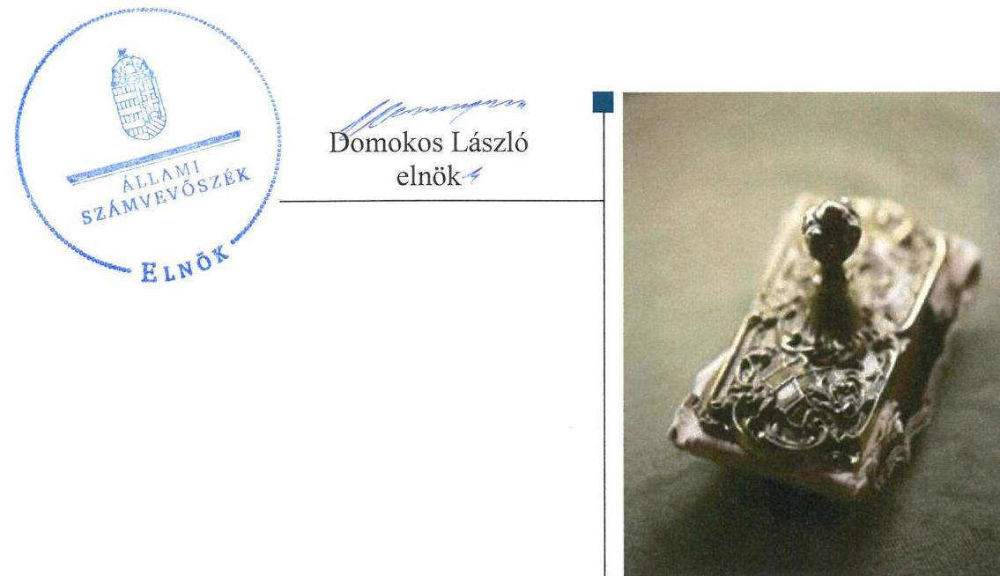
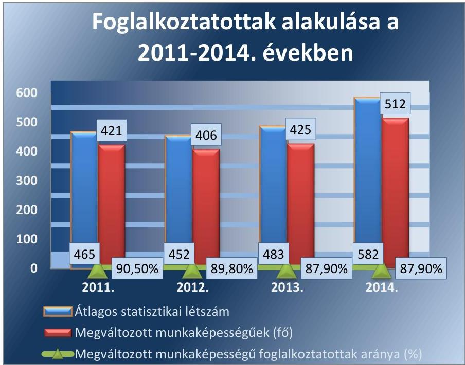
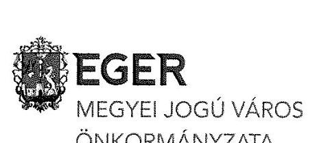
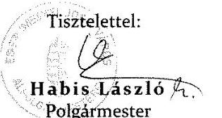
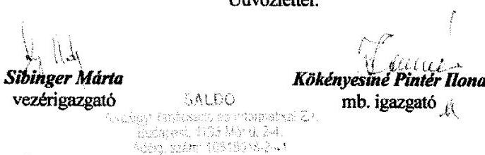
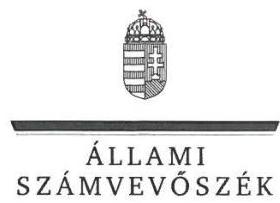
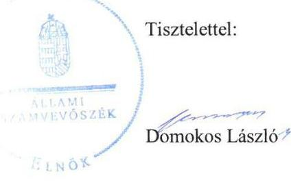
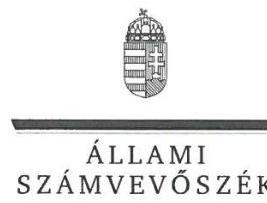
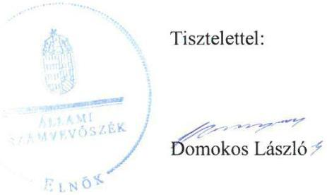

# Jelentés 

## Az önkormányzatok gazdasági társaságai

Az önkormányzatok többségi tulajdonában lévő gazdasági társaságok gazdálkodásának ellenőrzése - Agria-Humán Közhasznú Nonprofit Kft.
2017.

---

# Jelenetés 

## Az önkormányzatok gazdasági társaságai

Az önkormányzatok többségi tulajdonában lévő gazdasági társaságok gazdálkodásának ellenőrzése - Agria-Humán Közhasznú Nonprofit Kft.
2017. felmáa hó 03. nap

---

# AZ ELLENŐRZÉST FELÜGYELTE:

- BÖRÖCZ IMRE felügyeleti vezető

- AZ ELLENŐRZÉST VEZETTE ÉS A VÉGREHAJTÁSÁÉRT FELELŐS:
  - NIKLAI HELÉNA ellenőrzésvezető
  - A PROGRAM ÖSSZEÁLLÍTÁSÁÉRT FELELŐS:
    - JANIK JÓZSEF LÁSZLÓ osztályvezető

- IKTATÓSZÁM: V-1124-257/2016.
- TÉMASZÁM: 2158
- ELLENŐRZÉS-AZONOSÍTÓ SZÁM: V070790

Jelentéseink az Országgyűlés számítógépes hálózatán és az Interneta a www.asz.hu címen is olvashatóak.

---

# TARTALOMJEGYZÉK 

■ ÖSSZEGZÉS ..... 5
■ AZ ELLENŐRZÉS CÉLJA ..... 7
■ AZ ELLENŐRZÉS TERÜLETE ..... 8
■ AZ ELLENŐRZÉS HÁTTERE, INDOKOLTSÁGA ..... 11
■ A JELENTÉS LÉNYEGES KÉRDÉSKÖREI ..... 12
■ ELLENŐRZÉS HATÓKÖRE ÉS MÓDSZEREI ..... 13
■ MEGÁLLAPÍTÁSOK ..... 15
■ JAVASLATOK ..... 26
■ MELLÉKLETEK ..... 29
I. Sz. melléklet: Értelmező szótár ..... 29
II. Sz. melléklet: A Társaság által ellátott feladatok 2011-2014. években (Adatok M Ft-ban) ..... 32
III. Sz. melléklet: A Társaság eredményének alakulása 2011-2014. években (Adatok M Ft- ban) ..... 33
■ FÜGGELÉK: ÉSZREVÉTELEK ..... 35
■ RÖVIDÍTÉSEK JEGYZÉKE ..... 49

---

.

---

# ÖSSZEGZÉS 

Eger Megyei Jogú Város Önkormányzata az Agria-Humán Közhasznú Nonprofit Korlátolt Felelősségű Társaság feladatellátását, 2014. évtől hulladékgazdálkodási közfeladatának ellátását szabályszerűen szervezte meg, tulajdonosi jogait a Társaság felett 2011-2014. években összességében szabályszerűen gyakorolta. A Társaságnál az ellenőrzött időszakban a feladatellátás és a közfeladat-ellátás bevételeinek elszámolása szabályszerű volt, a ráfordítások elszámolása nem volt szabályszerű. A Társaság vagyongazdálkodása összességében szabályszerű volt. Kötelezettségállománya veszélyeztette a müködését, 2011-2013. években a feladat-, 2014. évben a közfeladat ellátását.

## Az ellenőrzés társadalmi indokoltsága

Magyarországon az intézmény-centrikus közfeladat-ellátás mellett egyre jelentősebb a költségvetésen kívüli feladatellátás térnyerése, amelynek legfontosabb szereplői - a nonprofit szervezetek mellett - az önkormányzati tulajdonú gazdasági társaságok. Az önkormányzatok szervezetalakítási szabadságának következménye, hogy a korábban is vállalati formában működő közszolgáltatások mellett, mind a kötelező, mind az önként vállalt feladatok ellátásában a gazdasági társaságok kiemelt fontosságú szerephez jutottak. Az Állami Számvevőszék Stratégiájában foglaltakkal összhangban az ÁSZ kiemelt célja, hogy a helyi önkormányzatok gazdálkodásában rejlő pénzügyi kockázatok feltárásával, az államháztartáson kívülre nyújtott költségvetési támogatások és ingyenes vagyonjuttatások, valamint az államháztartáson kívül működő feladat-ellátó rendszerek ellenőrzéseivel hozzájáruljon ahhoz, hogy a közpénzeket az államháztartáson kívül működő szervezetek is átlátható, rendezett módon használják fel.

## Főbb megállapítások, következtetések, javaslatok

Eger Megyei Jogú Város Önkormányzata kizárólagos tulajdonában álló Agria-Humán Közhasznú Nonprofit Kft. feladatellátásának, 2014. évtől hulladékgazdálkodási közfeladata ellátásának megszervezése megfelel a jogszabályi előírásoknak. A Társaság felett a tulajdonosi jogokat az ellenőrzött időszakban az Önkormányzat Közgyűlése gyakorolta, a Társaság ügyvezetésének ellenőrzésére felügyelőbizottságot jelölt ki. A tulajdonosi jogok gyakorlása összességében szabályszerű volt. Az ellenőrzés szabályszerűségi hibákat 2011. évben a közhasznúsági jelentés elfogadásáról szóló döntés kapcsán állapított meg.

A Társaság vagyongazdálkodása összességében szabályszerű volt. A Társaság rendelkezett a működéséhez szükséges szabályzatokkal, azok az ellenőrzött időszakban a számlarend kivételével megfeleltek a jogszabályi előírásoknak. Éves beszámolási, valamint a közhasznú tevékenységével összefüggő beszámolási kötelezettségének eleget tett, azonban 2014. évben a hulladékgazdálkodási közszolgáltatási tevékenységével összefüggésben a jogszabályban előírt, elkülönített számviteli nyilvántartás vezetésére, önálló mérleg és eredménykimutatás készítésére vonatkozó kötelezettségének nem tett eleget. A Társaságnál a 2014. évi apport számviteli elszámolása nem felelt meg a jogszabályi előírásoknak. A könyvvizsgáló a Társaság egyszerűsített éves beszámolóit hitelesítő záradékkal látta el, 2014. évben a hulladékgazdálkodási közszolgáltatási tevékenység tekintetében az elkülönített nyilvántartással és beszámolással, továbbá az apport számviteli elszámolásával kapcsolatos hiányosságokat nem kifogásolta.

Az ellenőrzött időszakban a Társaság által ellátott feladat, illetve közfeladat bevételeinek elszámolása szabályszerű volt. A ráfordítások elszámolása az elszámolást alátámasztó bizonylatok hiányosságai, illetve 2014. évben az elkülönített számviteli nyilvántartás hiánya miatt nem volt szabályszerű.

2011-2014. években a Társaság fizetőképességét az Önkormányzat által nyújtott tagi kölcsön és működési támogatások igénybevételével tudta megőrizni. Kötelezettségállománya veszélyeztette a működését, illetve a feladat-, közfeladat ellátását.

---

Az ÁSZ a Társaság ügyvezetőjének, valamint a polgármesternek fogalmazott meg javaslatokat, amelyek alapján kötelesek intézkedési tervet összeállítani és azt a jelentés kézhezvételétől számított 30 napon belül az ÁSZ részére megküldeni.

---

# AZ ELLENŐRZÉS CÉLJA 

Az ellenőrzés célja annak értékelése volt, hogy az önkormányzat vagyongazdálkodási tevékenysége során szabályszerűen gyakorolta-e tulajdonosi jogait; a gazdasági társaság szabályozottsága, gazdálkodása és vagyongazdálkodási tevékenysége, bevételeinek és ráfordításainak elszámolása megfelelt-e a jogszabályi és tulajdonosi előírásoknak; a gazdasági társaság kötelezettségállománya jelentett-e kockázatot a múködésre, valamint a gazdálkodás átláthatósága és elszámoltathatósága érdekében biztosítva volt-e a szolgáltatás dijának megalapozottsága szabályszerű önköltségszámítással.

---

# **AZ ELLENŐRZÉS TERÜLETE**

## **Agria-Humán Közhasznú Nonprofit Korlátolt Felelősségű Társaság és Eger Megyei Jogú Város Önkormányzata**

### **EGER MEGYEI JOGÚ VÁROS ÖNKORMÁNYZATA**

Az Agria-Humán Szolgáltató Korlátolt Felelősségű Társaságot 1993. november 1-jén hozta létre. A Társaság tevékenységének célja megváltozott munkaképességű személyek rehabilitációja, foglalkoztatása volt. Az ellenőrzött időszakban a Társaság¹ kizárólagos tulajdonosa az Önkormányzat² volt, a tulajdonosi jogokat a Közgyűlés³ gyakorolta. A Társaság vonatkozásában az ellenőrzött időszakban nem került sor tulajdonosi jogosítványok átadására. A Város polgármestere személyében az ellenőrzött időszakban nem történt változás. A jegyző személyében változás történt 2011. évben, a jegyző 2011. március 1-jétől töltötte be hivatalát.

### **AZ AGRIA-HUMÁN KÖZHASZNÚ NONPROFIT KFT.**

Az ellenőrzött időszakban közhasznú nonprofit társaságként működött. 2011. évben közhasznú tevékenysége hátrányos helyzetű csoportok társadalmi esélyegyenlőségének elősegítése és rehabilitációs foglalkoztatás, 2012-2014. években rehabilitációs foglalkoztatás (speciális munkahely működtetése) volt. Az ellenőrzött időszakban a Társaság 406 és 512 fő közötti megváltozott munkaképességű személyt foglalkoztatott (1. ábra).

1. ábra

*Forrás: A Társaság egyszerűsített éves beszámolói*

---

Az Önkormányzat a rehabilitációs foglalkoztatásra, valamint a közhasznú cél megvalósítására a Társasággal Közszolgáltatási szerződés ${ }_{1}^{4}$-t kötött a 2012. évben.

A Társaság 2011-2013. években fő tevékenysége mellett egyéb feladatokat látott el, 2014. évtől az Önkormányzattal kötött Közszolgáltatási szerződés ${ }_{2}^{5}$ alapján kapcsolódott be az Önkormányzat hulladékgazdálkodási közfeladat-ellátásának végrehajtásába szelektív hulladékválogatási tevékenység végzésével. A Társaság által az ellenőrzött időszakban ellátott feladatokat és a feladat ellátásához az alapító által biztosított pénzeszközöket a II. sz. melléklet mutatja.

A Társaság főbb gazdálkodási adatai (1. táblázat) alapján az értékesítés nettó árbevétele az ellenőrzött időszakban 239,3 M Ft és 254,6 M Ft között alakult. 2014. évben az árbevétel egyharmada származott a hulladékgazdálkodási tevékenységből. Egyéb bevételei a rehabilitációs foglalkoztatásra kapott támogatásból származtak. A Társaság a 2011. és a 2014. évet pozitív eredménnyel zárta. A Társaság eredményének alakulását 20112014. években a III. sz. melléklet mutatja be.

1. táblázat

# A TÁRSASÁG FŐBB GAZDÁLKODÁSI ADATAI (M FT) 

| Megnevezés | 2011. | 2012. | 2013. | 2014. |
| :-- | --: | --: | --: | --: |
| Értékesítés nettó árbevétele | 239,3 | 236,7 | 251,3 | 254,6 |
| Egyéb bevételek | 437,0 | 485,5 | 569,0 | 689,9 |
| Mérlegfőösszeg | 309,5 | 367,7 | 337,5 | 477,3 |
| Mérleg szerinti eredmény | 6,0 | $-28,6$ | $-21,5$ | 0,3 |
| Követelések | 85,3 | 95,0 | 51,9 | 52,9 |

A Társaság mérlegének kiemelt adatait az ellenőrzött időszakban a 2. táblázat mutatja.
2. táblázat

## A TÁRSASÁG MÉRLEGÉNEK KIEMELT ADATAI (M FT)

| Megnevezés | 2011. | 2011. | 2012. | 2013. | 2014. |
| :--: | :--: | :--: | :--: | :--: | :--: |
|  | 01.01 | 12.31 | 12.31 | 12.31 | 12.31 |
| I. Befektetett eszközök | 218,9 | 219,2 | 265,6 | 237,8 | 371,0 |
| - ebből: Tárgyi eszközök | 218,4 | 219,0 | 234,3 | 237,8 | 371,0 |
| II. Forgóeszközök | 97,9 | 89,4 | 101,0 | 98,0 | 104,5 |
| - ebből: Követelések | 88,7 | 85,3 | 95,0 | 51,9 | 52,9 |
| III. Aktív időbeli elhatárolások | 2,2 | 0,9 | 1,1 | 1,7 | 1,8 |
| Eszközök összesen | 319,0 | 309,5 | 367,7 | 337,5 | 477,3 |
| IV. Saját tőke | $-6,2$ | 51,7 | 23,1 | $-1,8$ | 141,4 |
| - ebből: Jegyzett tőke | 239,7 | 60,0 | 60,0 | 30,0 | 30,1 |
| Mérleg szerinti eredmény | $-49,1$ | 6,0 | $-28,6$ | $-21,5$ | 0,3 |
| V. Céltartalékok | 0,0 | 3,2 | 0,0 | 0,0 | 0,0 |
| VI. Kötelezettségek | 315,3 | 244,6 | 285,7 | 247,2 | 248,7 |
| VII. Passzív időbeli elhatárolások | 9,9 | 10,0 | 58,9 | 92,1 | 87,2 |
| Források összesen | 319,0 | 309,5 | 367,7 | 337,5 | 477,3 |

A feladatellátást szolgáló vagyon körét az Önkormányzat az ellenőrzött időszakot megelőzően hozott döntésében a Társaság rendelkezésére bocsátotta. Az Önkormányzat az ellenőrzött időszakban a Társaság részére feladat-, közfeladat ellátás érdekében önkormányzati tulajdonban lévő

---

eszközöket vagyonkezelésbe nem adott át, a Társaság vagyonkezelésben lévő eszközökkel nem rendelkezett.

Az önköltségszámítás rendjére vonatkozó belső szabályzat készítésének kötelezettsége alól a Társaság a Számv. tv. ${ }^{6} 14 . \S$ (6) bekezdése alapján az ellenőrzött időszakban mentesült.

2011-2013. években ellátott egyéb feladatai nem tartoztak az árak megállapításáról szóló 1990. évi LXXXVII. törvény 7. § (1) bekezdésében a hatósági ár megállapítására vonatkozó mellékletben felsorolt termékek, szolgáltatások közé. 2014. évben a Társaság részére az árképzést jogszabály nem írta elő.

A Társaság az ellenőrzött időszakban más gazdasági társaságban részesedéssel nem rendelkezett.

Az ellenőrzött időszakban a Társaság ügyvezetőjének személyében 2012. január 1-jével történt változás, a Közgyűlés a Társaság élére az ügyvezetőt határozatlan időre nevezte ki.

A Társaság az ellenőrzött időszakban nem tartozott a kormányzati szektorba sorolt egyéb szervezetek körébe.

---

# AZ ELLENŐRZÉS HÁTTERE, INDOKOLTSÁGA 

AZ ÖNKORMÁNYZATI TULAJDONÚ GAZDASÁGI TÁRSASÁGOK ellenőrzése kiemelten fontos a vagyon megőrzése, megóvása érdekében, amelyekkel szemben alapvető követelmény, hogy gazdálkodásuk, működésük szabályszerű, az általuk szolgáltatott adatok minél megbízhatóbbak legyenek. A feladat/közfeladat-ellátás költségeinek, ráfordításainak alakulása, színvonala hatással van a lakosság elégedettségére.

A TÖRVÉNYALKOTÁS SZÁMÁRA - az észlelt problémák, szabálytalanságok, vagy egyéb nem kívánatos jelenségek felszínre kerülésével - az ellenőrzés megállapításai segítséget nyújthatnak az államháztartáson kívüli feladat/közfeladat-ellátás értékeléséhez, jogszabályi keretei pontosításához, átláthatóságot biztosító szabályozásához. Meghatározhatóvá válnak az önkormányzati feladatellátásban részt vevő államháztartáson kívüli szervezeteknek - az önkormányzat költségvetését, pénzügyi helyzetét is befolyásoló - kockázatai, lehetővé válik ezen kockázatok csökkentése. Ellenőrzéseink feltárhatják, hogy az önkormányzat feladat-ellátási kötelezettségének szabályszerűen tett-e eleget, a feladatellátáshoz rendelt vagyonkezelésbe vett és saját vagyon működtetését az elvárható gondossággal, szabályszerűen szervezte-e meg és a tulajdonosi felügyelete hozzájárult-e a feladatellátásához. Az ellenőrzés rávilágíthat arra, hogy a gazdasági társaság a feladat-ellátási, közszolgáltatási szerződésben foglaltak betartásával, a vagyon használatával biztosította-e a szolgáltatás folytatásának feltételeit, a feladat ellátását. Ezzel az ellenőrzöttek és a helyi döntéshozók számára visszajelzést ad feladatszervezési, feladat-ellátási kockázataikról, alapot ad a meglévő hibák megszüntetéséhez, a jobb feladatellátás biztosításához. Fokozza a fegyelmet, igazolja, hogy lejárt a következmények nélküli ellenőrzések időszaka. Az ÁSZ ${ }^{2}$ értékteremtő rend kialakításához és megőrzéséhez hozzájáruló tevékenysége pozitív hatással van a szervezetről kialakított összkép formálására.

---

# A JELENTÉS LÉNYEGES KÉRDÉSKÖREI 

1. Az önkormányzat feladat/közfeladat megszervezéséről szóló döntése, valamint tulajdonosi joggyakorlása szabályszerű volt-e?
2. A Társaság vagyongazdálkodása szabályszerű volt-e, kötelezettségállománya jelentett-e kockázatot a müködésre, illetve a feladat/közfeladat ellátására?
3. Az ellátott feladat/közfeladat esetében a Társaság bevételeinek és ráfordításainak elszámolása szabályszerű volt-e?

---

# ELLENŐRZÉS HATÓKÖRE ÉS MÓDSZEREI 

## Az ellenőrzés típusa

Az ellenőrzés típusa megfelelőségi ellenőrzés.

## Az ellenőrzött időszak

Az ellenőrzött időszak 2011. január 1-jétől 2014. december 31-ig tartott.

## Az ellenőrzés tárgya

Az ellenőrzés tárgyát képezte a gazdasági társaság feletti tulajdonosi joggyakorlás, valamint a gazdasági társaság gazdálkodásának szabályozottsága és szabályszerűsége. Az ellenőrzés kiterjedt minden olyan körülményre és adatra, amely az ÁSZ jogszabályban meghatározott feladatainak teljesítéséhez, valamint a program végrehajtása folyamán felmerült újabb összefüggések feltárásához szükséges.

## Az ellenőrzött szervezet

Agria-Humán Közhasznú Nonprofit Korlátolt Felelősségű Társaság és Eger Megyei Jogú Város Önkormányzata.

## Az ellenőrzés jogalapja

Az ellenőrzés jogszabályi alapját az ÁSZ tv. ${ }^{8}$ 1. § (3) bekezdése és 5. § (3)-(4)-(5) bekezdései képezték.

## Az ellenőrzés módszerei

Az ellenőrzést az ÁSZ az ellenőrzött időszakban hatályos jogszabályok, az ellenőrzés szakmai szabályok és módszertanok figyelembevételével, az ellenőrzési program kérdései alapján végezte.

Az ellenőrzés ideje alatt az ellenőrzött szervezettel történő kapcsolattartás az ÁSZ Szervezeti és Múködési Szabályzatának vonatkozó előírásai alapján történt.

Az ellenőrzési kérdések megválaszolásához szükséges bizonyítékok megszerzése a következő ellenőrzési eljárások alkalmazásával történt: megfigyelés, kérdésfeltevés (információkérés), összehasonlítás, valamint elemző eljárás. Az ellenőrzési bizonyítékként felhasználható adatforrások

---

közé tartoztak egyrészt a szakmai programban felsorolt adatforrások, másrészt adatforrás lehetett még minden - az ellenőrzés folyamán - feltárt, az ellenőrzés szempontjából információkat tartalmazó dokumentum.

A Társaság bevételeinek és ráfordításainak elszámolása, valamint a vagyonnyilvántartás terén a szabályszerű múködést az ÁSZ véletlen mintavétellel ellenőrizte. A mintavétellel ellenőrzött területek esetében a szabályszerűségre vonatkozó kérdések eredménye összesítésre került. Az ÁSZ a jogszabályoknak és a belső előírásoknak „megfelelő"-nek tekintette az adott területet, amennyiben a minta ellenőrzésének eredménye alapján 95\%-os bizonyossággal a teljes sokaságban a hibaarány legfeljebb 10\%, „nem megfelelő"-nek, amennyiben 10\%-nál magasabb arányt képviselt. Abban az esetben, ha a teljes sokaság tekintetében a 10\%-os hibaarányhoz való viszony megítélésnek megbízhatósága nem érte el a 95\%-ot, annak elérése érdekében az ÁSZ értékelését további szempontokkal egészítette ki, és figyelembe vette a feltárt hibák típusát és súlyát.

A ráfordítások elszámolására és a vagyonnyilvántartásra vonatkozó véletlen mintavételt az ÁSZ kockázat alapú kiválasztással egészítette ki, amelynek során évente a három legnagyobb összegű tételt választotta ki.

---

# MEGÁLLAPÍTÁSOK 

## 1. Az önkormányzat feladat/közfeladat megszervezéséről szóló döntése, valamint tulajdonosi joggyakorlása szabályszerű volt-e?

Összegző megállapítás

1.1. számú megállapítás

A Társaság feladat-ellátásának megszervezése, 2014. évben a közfeladat ellátásának megszervezése megfelelt a jogszabályi előírásoknak. Az Önkormányzat tulajdonosi joggyakorlása összességében szabályszerű volt.

A Társaság feladat-ellátásának megszervezése, 2014. évben a közfeladat ellátásának megszervezése megfelelt a jogszabályi előírásoknak.

AZ ÖNKORMÁNYZAT az Ötv. ${ }^{9}$-ben és az Mötv. ${ }^{10}$-ben előírt gazdasági programmal rendelkezett. 2007-2014. évre szóló gazdasági programja kiterjedt az önkormányzati tulajdonú, közfeladat-ellátást biztosító gazdasági társaságok működtetésének feladataira, tőkésítésére, annak érdekében, hogy erősödjön képességük a feladat-ellátásra, a szolgáltatás színvonalának javítására. A gazdasági programot a Közgyűlés 2011. évben az Ötv. 91. § (7) bekezdés értelmében, valamint 2013. évben - az ÁSZ megyei jogú városoknál 2011. évben végzett ellenőrzése ${ }^{11}$ során tett javaslatok hasznosulásaként és az önkormányzati feladatellátás jelentős változása miatt - felülvizsgálta.

KÖZÉP- ÉS HOSSZÚ TÁVÚ VAGYONGAZDÁLKODÁSI TERVKÉSZÍTÉSRE 2012. évtől előírt kötelezettségének az Önkormányzat az Nvtv. ${ }^{12}$ 9. § (1) bekezdésének előírásai ellenére nem tett eleget.

AZ ÖNKORMÁNYZAT HULLADÉKGAZDÁLKODÁSI TERVE ${ }^{13}$ a Hgt. ${ }^{14}$ 35. § (3) bekezdésének előírásai ellenére önkormányzati rendeletben nem került kihirdetésre.

A 2011-2014. évekre szóló települési hulladékgazdálkodási terv tartalmazta a Hgt. 37. § (4) bekezdésében foglalt követelményeket. 2012. december 31-ig a hulladékgazdálkodási tervet az Önkormányzat nem módosította. 2013. január 1-jétől a Ht. ${ }^{15} 74 . \S$ az Országos Hulladékgazdálkodási Ügynökség feladataként határozta meg a tervkészítési kötelezettséget és a Ht. 74. § (6) bekezdésében annak kihirdetését a környezetért felelős miniszter hatáskörébe utalta.

A FELADATELLÁTÁS megszervezése 2011-2012. években megfelelt az Ötv. 9. § (4) bekezdésében foglaltaknak, 2013-2014. években az

---

Mötv. 41. § (8) bekezdése előírásának. A hátrányos helyzetű csoportok társadalmi esélyegyenlőségének elősegítése, rehabilitációs foglalkoztatás feladatok nonprofit gazdasági társaság működtetésével történő ellátásáról az Önkormányzat az ellenőrzött időszakot megelőzően döntött.

# AZ ÖNKORMÁNYZAT HULLADÉKGAZDÁLKODÁSI 

KÖZFELADATA ellátásának megszervezése 2014. évben megfelelt az Mötv. 41. § (6), (8) bekezdése, valamint a Ht. 33. § (1) bekezdése és 90. § (8) bekezdése előírásainak. A szelektív hulladékválogatási tevékenység végzésére a Társaság hatósági engedéllyel rendelkezett.

A KÖZSZOLGÁLTATÁSI SZERZŐDÉS1 megfelel a Civil tv. ${ }^{16}$ 2. § 20-21. pontjai, a Közszolgáltatási szerződés ${ }_{2}$ megfelelt a Ht. 33. § (1) bekezdés és a Ht. 34. § előírásainak.

A szelektív hulladékválogatási közfeladat tekintetében az egységárat az Önkormányzat a Közszolgáltatási szerződés ${ }_{2}$-ben a Társaság adatszolgáltatását alapul véve határozta meg. A Közszolgáltatási szerződés ${ }_{2}$ - a szakmai feladat-ellátás mutatójaként - 50 fő foglalkoztatásának kötelezettségét határozta meg.

## AZ ÖNKORMÁNYZAT RENDELETALKOTÁSI KÖTE-

LEZETTSÉGÉNEK a Társaság 2014. évben ellátott hulladékgazdálkodási közfeladata tekintetében a Ht. 35. §-ában előírtaknak megfelelően eleget tett.

### 1.2. számú megállapítás

A tulajdonosi jogkör gyakorlása összességében szabályszerű volt.
AZ ALAPÍTÓ OKIRAT ${ }^{17}$ a Gt. ${ }^{18}$ 12. § (1) bekezdés a)-h) pontjaiban foglaltaknak megfelelően határozta meg a Társaság múködésének feltételeit. Az Alapító Okiratban az Önkormányzat a Társaság tevékenységével szemben a közhasznú cél - a rehabilitációs foglalkoztatás - megvalósítását rögzítette, amelyeknek programja az üzleti tervek fő célkitűzéseként megjelent. Az Alapító Okiratot az ellenőrzött időszakban három alkalommal módosították.

A Társaság törzstőkéjének és az alapító törzsbetétjének 0,1 M Ft-tal történt felemeléséhez kapcsolódóan az Önkormányzat 141/2014. (IV.24.) sz. közgyűlési határozatával végrehajtott Alapító Okirat-módosításra vonatkozó előterjesztése nem felelt meg az Alapokmány ${ }_{1}{ }^{19}$ Harmadik rész II. fejezet 18. § (1) bekezdés c) pontjának, mivel nem tartalmazta a határozati javaslat megértéséhez szükséges előzményeket, magyarázatot.

A TULAJ DONOSI JOGOK GYAKORLÁSÁRA vonatkozó szabályokat az ellenőrzött időszakban az Önkormányzat a Közgyűlés szervezetét és működését szabályozó Alapokmány ${ }_{1}{ }^{20}{ }_{2}{ }^{21}{ }_{3}$-ban és a Vagyonrendelet ${ }_{1,2}{ }^{22}$-ben az Áht. ${ }_{1}{ }^{23}$, az Áht ${ }_{2}{ }^{24}$, a Gt., a Ptk. ${ }_{2}{ }^{25}$, az Ötv., az Mötv., az Nvtv., a Taktv. ${ }^{26}$ és a Stabilitási tv. ${ }^{27}$ előírásaival összhangban határozta meg. A tulajdonosi jogokat az Önkormányzat belső szabályozásaiban foglaltaknak megfelelően a Közgyűlés írásban hozott döntések formájában gyakorolta.

---

AZ ÖNKORMÁNYZAT az ellenőrzött időszakban a feladat-, köz-feladat-ellátási, szolgáltatási, támogatási szerződésekben foglaltak betartásáról, azok teljesítéséről a Társaságot az egyszerűsített éves beszámolók keretében, a vonatkozó határidők alapján számoltatta be. Az Önkormányzat a Társaság részére 2011. évben a Közhasznúsági tv. ${ }^{28}$ 19. § (5) bekezdésében, valamint 2012-2014. évekre a Civil tv. 30. § (1) bekezdésében előírt, a közhasznúsági jelentés, illetve 2012. évtől a közhasznúsági melléklet benyújtásán kívül nem határozott meg egyéb adatszolgáltatási, tájékoztatási kötelezettséget.

A KÖZGYŰLÉS a 2011-2014. évek egyszerűsített éves beszámolóit - a Gt. 35. § (3) bekezdésében, illetve a Ptk. 3 :120. § (2) bekezdésében előírtak szerint az $\mathrm{FB}^{29}$ írásbeli jelentésének birtokában - a Számv. tv. 153. § (1) bekezdésében előírt határidőn belül elfogadta. Az egyszerűsített éves beszámolókról a Közgyűlés a Gt. 44. § (1) bekezdésében, illetve a Ptk. 3 :131. § (2) bekezdésében előírtak szerint a független könyvvizsgálói vélemény ismeretében döntött. A Közgyűlés döntései a Társaság közhasznú jogállása miatt a 2011. évi és a 2014. évi pozitív eredmény eredménytartalékba helyezését tartalmazták a Civil tv. 42. § (1) bekezdése alapján.
2011. évben a Közgyűlés az egyszerűsített éves beszámoló elfogadásáról hozott közgyűlési határozatában a közhasznúsági jelentést a Közhasznúsági tv. 19. § (2) bekezdése előírásai ellenére a beszámolóval azonos módon nem hagyta jóvá.

A FELÜGYELŐBIZOTTSÁG - mint az Önkormányzat által a Társaság ügyvezetésének ellenőrzésére létrehozott szerv - tagjainak kijelölési jogát az ellenőrzött időszakban a Gt. 141. § (2) bekezdés k) pontja, a Ptk. 3 3:26. § (4) bekezdése alapján, a Vagyonrendelet ${ }_{1,2}$ 33. § (2) bekezdés 3. és 11. pontja értelmében a Közgyűlés gyakorolta.

Az FB a Gt. 34. § (4) bekezdésben foglalt előírások ellenére 2011. július 24-ig nem rendelkezett a Közgyűlés által jóváhagyott ügyrenddel.

Az Alapító Okirat 12. pontja előírásai ellenére a közhasznúsági jelentésről, illetve a közhasznúsági mellékletekről az ellenőrzött időszakban az FB az egyszerűsített éves beszámoló véleményezése során nem alkotott véleményt.

Az FB éves munkatervéről, éves munkájáról szóló beszámolóról a Közgyűlés minden évben a belső szabályozásnak megfelelően határozatban döntött.

A KÖNYVVIZSGÁLÓ megválasztása 2011. évben megfelelt a Gt. 42. § (1) bekezdés, 2014. évben a Ptk. 2 3:130. § (2) bekezdés előírásainak.
2011. évben és 2014. évben nem tartották be a Taktv. 4. § (1) bekezdés előírását, a köztulajdonban álló gazdasági társaságnál könyvvizsgáló személyére az ügyvezetés nem az FB egyetértésével tett javaslatot a Társaság legfőbb szervének (a Közgyűlésnek).

A Gt. 40. § (1) bekezdésében, illetve a Ptk. 3 3:129. § (1) bekezdésében foglaltak alapján a Társaság egyszerűsített éves beszámolójának a Számv. tv. 156. § (4) bekezdése alapján elvégzett felülvizsgálatáról szóló

---

könyvvizsgálói jelentését a közgyűlési előterjesztések az ellenőrzött időszakban tartalmazták. A könyvvizsgáló az ellenőrzött időszakban a számviteli beszámolókról minden évben hitelesítő (korlátozás nélküli) záradékot adott. A könyvvizsgáló a Társaság egyszerűsített éves beszámolóját tárgyaló Közgyűlésre a Gt. 44. § (1) bekezdése, valamint a Ptk. 3 :131. § (2) bekezdése által előírtak szerint 2012-2014. években meghívást kapott és az üléseken részt vett, a 2011. évi beszámolót tárgyaló testületi ülésen meghívás hiányában - nem vett részt.

A Társaságnál 2011-2013. években nem fordult elő a Gt. 44. § (2) bekezdésben, valamint 2014. évben a Ptk. 3 :38. § (2) bekezdésben előírt, a Közgyűlés összehívására okot adó gazdasági helyzet. A könyvvizsgáló a 2013. évi egyszerűsített éves beszámolóról készített jelentésében figyelemfelhívást tett arról, hogy a Társaság 2013. évi vesztesége miatt elveszítette saját tőkéjét, és ismertette, hogy a Közgyűlés a tőkehelyzet rendezésére a 2013. évi beszámoló elfogadásáig milyen intézkedéseket tett.

A KÖZGYŰLÉS a belső szabályozásaiban meghatározottak szerint vizsgálta a Társaság gazdasági helyzetét, tőkehelyzetét. A Társaság az ellenőrzött időszak két egymást követő lezárt évében rendelkezett a kötelezően előírt jegyzett tőkének megfelelő összegű saját tőkével. A Társaság eredményessége és gazdálkodási helyzete azonban az ellenőrzött időszakban nem volt stabil, 2011. év és 2014. év kivételével a mérleg szerinti eredménye negatív volt, ennek következtében az Önkormányzat részéről három alkalommal került sor jegyzett tőkét érintő intézkedésre. A Társaság jegyzett tőkéjének és saját tőkéjének alakulását az ellenőrzött időszakban a 3. táblázat mutatja.
3. táblázat

# A TÁRSASÁG JEGYZETT TŐKÉJÉNEK ÉS SAJÁT TŐKÉJÉNEK ALAKULÁSA) (M FT) 

| Megnevezés | 2011. | 2012. | 2013. | 2014. |
| :-- | --: | --: | --: | --: |
| Jegyzett tőke | 60,0 | 60,0 | 30,0 | 30,1 |
| Saját tőke | 51,7 | 23,1 | $-1,8$ | 141,4 |
| Saját tőke/jegyzett tőke (\%) | $86,2 \%$ | $38,5 \%$ | $-6,0 \%$ | $469,8 \%$ |

2011. évben - az Üzleti terv ${ }^{30}$ I. félévi teljesítése és az éves várható gazdálkodási eredményekre alapozva - a működőképesség fenntartása érdekében a Közgyűlés 506/2011. (VIII.25.) sz. határozatával 40 M Ft törzstőke emelésről döntött, a Gt. 51. § (1) bekezdésében foglalt helyzet megelőzése érdekében.

A 2013. évről készített számviteli beszámoló szerint a Társaság saját tőkéje a teljes tőkevesztés következtében a Gt. 114. § (1) bekezdésében előírt kötelező jegyzett tőke mértéke (ötszázezer forint) alá csökkent. 2013. évben a Gt. 143. § (2) bekezdés a) pontjában foglalt kötelezettség alapján a Közgyűlés soron kívüli ülésén hozott 507/2013. (VIII.29.) sz. határozatával a Társaság törzstőkéjét 30 M Ft-tal csökkentette.

Az Önkormányzat a rehabilitációs foglalkoztatás biztosításához használati jog adományozása tárgyában 2012. szeptember 3-án ingatlanra szerződést kötött a Társasággal. A használati jog a szerződés III./1 pontjában foglaltak alapján meghatározott időtartamra, 2017. szeptember 1-jéig illette meg a Társaságot. 2014. évben a Közgyűlés a 139/2014. (IV.24.) sz.

---

határozatával a 152,5 M Ft értékű ingatlant és kapcsolódó eszközöket apportként a Társaság részére átadta, melynek hatására a Társaság tőketartaléka 273,5 M Ft-ra változott.

A Közgyűlés 139/2014. (IV.24.) sz. határozatának előkészítése és a Közgyűlés döntése során a Vagyonrendelet 2 23. § (3) bekezdésének előírását, valamint a forgalmi érték meghatározása során a Vagyonrendelet ${ }_{2}$ 8. § (1) bekezdésének előírását betartották.

A 139/2014. (IV.24.) sz. közgyűlési határozat a Számv. tv. 36. § (1) bekezdés b) pontjára hivatkozással az átadott vagyon összegének a Társaság tőketartalékába történő elhelyezését rendelte el. A 140/2014. (IV.24.) sz. közgyűlési határozat a Társaság jegyzett tőkéjét 0,1 M Ft pénzbeli hozzájárulással a Ptk. 3 3:161. § (1) bekezdése alapján, az Alapító Okirat módosításának előírásával megnövelte.

A Társaság gazdálkodási helyzetének stabilizálása, konszolidációja érdekében az Önkormányzat 2014. augusztus 5-én támogatási kérelemmel fordult a Belügyminisztériumhoz. A Kormány a 1805/2014. (XII.19.) Korm. határozat ${ }^{31}$ 1. a) pontjában foglaltak szerint a Magyarország 2014. évi költségvetéséről szóló 2013. évi CCXXX. tv. módosításával 174,4 M Ft odaítéléséről döntött az Önkormányzat feladatainak támogatása címen 2014. december 31-ei állapot szerint.

AZ ÜZLETI TERVEKET a Közgyűlés az Önkormányzat belső szabályozásaiban foglalt előzetes véleményezés alapján, az FB véleménye figyelembevételével megtárgyalta és jóváhagyta.

JAVADALMAZÁSI SZABÁLYZATBAN ${ }^{32}$ rögzítette az Önkormányzat az üzleti terv teljesítését elősegítő anyagi ösztönzési rendszerre vonatkozó követelményeket, amelyet az ellenőrzött időszakot megelőzően, illetve 2013-2014. évben közgyűlési határozataival adott ki.

# AZ ÖNKORMÁNYZATTAL KÖTÖTT TÁMOGATÁSI 

SZERZŐDÉSEKBEN 2011. évben a Közhasznúsági tv. 14. (2) bekezdésében foglaltak ellenére nem határozták meg a támogatással való elszámolás feltételeit és módját.

A támogatási szerződések 2012-2014. években tartalmazták az Ávr. ${ }^{33}$ 73. § (1) bekezdésében meghatározott feltételeket.

A támogatási szerződésekben rögzített beszámolási kötelezettségének a Társaság - a 2011. december 6-án aláírt 25,0 M Ft támogatási szerződés kivételével - eleget tett, az elszámolásokról készített írásos jelentésekről a Közgyűlés elfogadó határozatokat hozott.

KEZESSÉGVÁLLALÁSRA az Önkormányzat részéről az ellenőrzött időszakot megelőzően került sor a Társaság által felvett 170 M Ft öszszegű hitelhez. Az ellenőrzött időszakban annak meghosszabbítására hozott közgyűlési döntések során betartották a jogszabályok és a belső szabályzatok előírásait, az ügylet megfelelt a döntés meghozatala időpontjában hatályos Stabilitási tv. 10. § (1)-(3) bekezdéseiben foglaltaknak.

ELLENŐRZÉS lehetőségével - amelyet az Ötv. 92. § (11) bekezdés b) pontjában, 2012. évtől az Áht. 2 70. § (1) bekezdés d) pontjában foglaltak lehetővé tettek - az Önkormányzat az ellenőrzött időszakban nem élt. Az

---

Önkormányzat függetlenített belső ellenőrzése az ellenőrzött időszakban a Társaságnál nem végzett ellenőrzést. Az Önkormányzat megbízása alapján a Társaságnál külső szakértő által elvégzett ellenőrzésre, átvilágításra az ellenőrzött időszakban nem került sor.

# 2. A Társaság vagyongazdálkodása szabályszerű volt-e, kötelezettségállománya jelentett-e kockázatot a múködésre, illetve a feladat/közfeladat ellátására? 

Összegző megállapítás

A Társaság vagyongazdálkodása összességében szabályszerű volt. Kötelezettségállománya veszélyeztette a múködését, a feladat-, közfeladat ellátását.

### 2.1. számú megállapítás

A Társaság rendelkezett a jogszabályban előírt szabályzatokkal, azonban az ellenőrzött időszakban a számlarend nem felelt meg a jogszabályi előírásnak.

A TÁRSASÁG az ellenőrzött időszakban rendelkezett a Számv. tv. 14. § (3) bekezdésében előírt számviteli politikával, a Számv. tv. 14. § (5) bekezdés a) pontjában rögzített eszközök és források leltározási és leltárkészítési, a Számv. tv. 14. § (5) bekezdés b) pontjában előírt értékelési szabályzattal, valamint a Számv. tv. 14. § (5) bekezdés d) pontjában meghatározott pénzkezelési szabályzattal.

A Számviteli politika ${ }^{1-4}{ }^{34}$ a Számv. tv. 14. § (4) bekezdés előírásainak megfelelően tartalmazta, hogy a Társaság törvényben biztosított választási, minősítési lehetőségek közül melyeket, milyen feltételek fennállása esetén alkalmazza.

A Számlarend ${ }_{1-4}{ }^{35}$ a Számv. tv. 161. § (2) bekezdés d) pontjában foglaltakkal ellentétben nem tartalmazta a bizonylati rendet.

A Leltárkészítési és leltározási szabályzat az ellenőrzött időszakban megfelelt a Számv. tv. előírásainak.

A Pénzkezelési szabályzat ${ }_{1-2}{ }^{36}$ megfelelit a Számv. tv. előírásainak.
2.2. számú megállapítás

A Társaság vagyongazdálkodása összességében szabályszerű volt. Az ellenőrzés szabályszerűségi hibákat a Társaságnál a 2014. évi apport számviteli elszámolásával kapcsolatban állapított meg.

A VAGYON NYILVÁNTARTÁSÁT a Társaság a Számv. tv. előírásainak megfelelően vezette. A Társaság a saját vagyona beszámoló szerinti értékét az ellenőrzött időszakban a Számv. tv.-ben és a Leltárkészítési és leltározási szabályzatában foglaltaknak megfelelően leltárral alátámasztotta.

A 139/2014. (IV.24.) sz. közgyűlési határozatban és a 140/2014. (IV.24.) sz. közgyűlési határozatban foglalt apport számviteli elszámolása a Társaságnál nem felelt meg a jogszabályi előírásoknak, mivel a Számv. tv. 36. § (3) bekezdés a) pontja előírásai ellenére a tőketartalék növekedésének könyvviteli elszámolása a tőkeemelésről szóló létesítő okirat módosításának hiányában történt és nem történt meg a cégjegyzékbe bejegyzés. A

---

152,5 M Ft értékű ingatlan és kapcsolódó eszközök átvétele a Társaság részéről megtörtént. Továbbá a Társaság nem tartotta be a Számv. tv. 35. § (3) és (4) bekezdésében előírtakat, mivel a 0,1 M Ft öszszegű jegyzett tőke-változást a cégjegyzékbe való bejegyzés hiányában rögzítette könyvviteli nyilvántartásaiban.

A Társaság 2014. évi egyszerűsített éves beszámolójának ellenőrzését végző könyvvizsgáló a tőke konszolidáció számviteli elszámolásának szabályszerűségét nem kifogásolta.

A TÁRSASÁG ESZKÖZEINEK értéke 2011. január 1. és 2014. december 31. között 49,6\%-kal növekedett, az Önkormányzat által 2012. évben átadott ingatlan használati jogának, 2014. évben az ingatlan és kapcsolódó eszközeinek a Társaság részére apportként történt átadása következtében. A Társaságnál 2013. évben ingatlan használati joga - a Számv. tv. 26. § (3) bekezdésében előírtak ellenére - nem az ingatlanokhoz kapcsolódó vagyoni értékű jogok között került kimutatásra, amelynek helyesbítését a 2014. évi elszámolás során végezték el, a kiegészítő mellékletben való bemutatással.

Az eszközök pótlása, felújítása a Társaság saját vagyona alapján elszámolt értékcsökkenéséből képzett forrásokat meghaladó mértékben valósult meg. A beruházások, fejlesztések összege tartalmazta az Önkormányzat által 2012. évben átadott ingatlan használati jogának értékét, valamint 2014. évben az apportként átadott ingatlan összegét. A beruházások, fejlesztések és az értékcsökkenés alakulását az ellenőrzött időszakban a 4. táblázat mutatja.
4. táblázat

# A BERUHÁZÁSOK, FEJLESZTÉSEK ÉS AZ ÉRTÉKCSÖKKENÉS ALAKULÁSA (M FT) 

| Megnevezés | 2011. | 2012. | 2013. | 2014. |
| :-- | :--: | :--: | :--: | :--: |
| Beruházások, fejlesztések | 11,2 | 72,8 | 88,4 | 221,9 |
| Értékcsökkenés | 10,4 | 13,9 | 31,1 | 28,2 |

A KÖVETELÉSÁLLOMÁNY csökkentése érdekében a Társaság intézkedéseket tett, lakossági követelésállománnyal nem rendelkezett. A követelések értékelésének Számviteli politika1-a-ben rögzített szabályai, az Értékelési szabályzat előírásai alapján elvégzett év végi értékelések megfeleltek a Számv. tv. 65. § (1) bekezdésében foglalt előírásoknak. 2011-2012. években, valamint 2014. évben számoltak el 2,3 M Ft-2,4 M Ft, illetve 1,2 M Ft összegben értékvesztést a belföldi vevőkövetelések értéke után. Behajthatatlan követelésként 2011. évben 2,0 M Ft-ot, 2013. évben 0,3 M Ft-ot írtak le a Számv. tv. 65. § (7) bekezdés előírásai alapján. A megtett intézkedések hatására a követelések állománya a 2011. év végi 85,3 M Ft-ról 2014. év végére 52,9 M Ft-ra csökkent.

---

### 2.3. számú megállapítás

A kötelezettségek állománya 2011-2013. években veszélyeztette a feladat, 2014. évben a közfeladat ellátását, illetve a Társaság müködését.

A TÁRSASÁG KÖTELEZETTSÉGÁLLOMÁNYA az ellenőrzött időszakban meghaladta fizetőképességét, fejlesztésekre a Társaság önerőből nem volt képes. Az Önkormányzat 2011. évben 13,0 M Ft tagi kölcsönt nyújtott a Társaság részére, amelyet a Közgyűlés 729/2011. (XI. 24.) sz. határozatával átminősített müködési célú támogatássá. Az Önkormányzattól kapott támogatások összege 2011. évben 73,0 M Ft, 2012. évben 66,4 M Ft, 2013. évben 45,0 M Ft, 2014. évben 50,0 M Ft volt. Az árbevétel 6\%-os növekedése mellett az anyagjellegú ráfordítások 19\%-kal emelkedtek az ellenőrzött időszakban, ennek következtében az árbevétel növekedése nem tudta javítani a Társaság likviditási helyzetét.

A hosszú lejáratú hitelek esedékes törlesztő részleteit a Társaság határidőben teljesítette. A rövid lejáratú kötelezettségeit késedelemmel fizette. A Társaság kötelezettségállományhoz kapcsolódó mutatói az ellenőrzött időszakban az 5. táblázatban bemutatottak szerint alakultak.
S. táblázat

A TÁRSASÁG KÖTELEZETTSÉGÁLLOMÁNYHOZ KAPCSOLÓDÓ MUTATÓINAK ALAKULÁSA

| Megnevezés | Referencia   érték | 2011. | 2012. | 2013. | 2014. |
| :-- | :--: | :--: | :--: | :--: | :--: |
| Eladósodottsági mutató | $<0$ | 0,79 | 0,78 | 0,73 | 0,52 |
| Eladósodottság mértéke | $<1$ | 4,73 | 12,38 | - | 1,76 |
| Nettó eladósodottság | $<0$ | 3,08 | 8,27 | - | 1,39 |
| Adósságfedezeti mutató I. | $\leq 2$ | 1,26 | 1,28 | 1,36 | 1,91 |
| Adósságfedezeti mutató II. | $>1$ | $-1,70$ | 4,74 | 18,52 | 11,32 |
| Árbevételre vetített | $<1$ |  |  |  |  |
| eladósodottság |  | 0,65 | 0,78 | 0,59 | 0,57 |

Forrás: A Társaság adatszolgáltatása alapján

Az eladósodottsági mutató (tőkeáttétel) a 2011-2013. közötti időszakban a magas külső finanszírozottságot jelezte, amely a 2014. évben történt tőkekonszolidáció következtében csökkent 0,52 értékre. 2013. évben a Társaság saját tőkéjének negatív ( $-1,8 \mathrm{MFt}$ ) összege miatt az eladósodottság mértéke mutató negatív tartományba került. A nettó eladósodottság mutató 2014. évi javulását a tőkeemelés, az adósságfedezeti mutató I. 2014. évi javulását a befektetett eszközök értékének növekedése eredményezte. Az adósságfedezeti mutató II. értéke 2014. évi csökkenésének oka a hosszú lejáratú kötelezettségek értékének lízing szerződés megkötése miatti növekedése volt. Az árbevételre vetített eladósodottsági mutató értéke 2012. évben növekedett, a kötelezettségek növekedése miatt.

---

### 2.4. számú megállapítás

A Társaság teljesítette az előírt beszámolási kötelezettséget, azonban 2014. évben a hulladékgazdálkodási közszolgáltatási tevékenységével összefüggésben a jogszabályban előírt, önálló mérleg és eredménykimutatás készítésére vonatkozó kötelezettségének nem tett eleget. A közérdekú adatok közzétételére vonatkozó jogszabályi előírásoknak a Társaság nem tett eleget.

AZ ÉVES SZÁMVITELI BESZÁMOLÓKAT a Társaság a Számv. tv. 96. §-ában foglaltak szerint, a Számv. tv. 9. § (2) bekezdés a)-c) pontjaiban meghatározott értékhatároknak való megfelelés alapján az egyszerűsített éves beszámoló követelményeinek megfelelő tartalommal elkészítette.

A Társaság a Számv. tv. előírásai szerint eleget tett a Közgyűlés által elfogadott egyszerűsített éves beszámoló letétbe helyezésére vonatkozó kötelezettségének és azokat a Számv. tv. előírásainak megfelelően közzétette.
2014. évben a Társaság a Ht. 50. § (2) bekezdés előírásai ellenére az egyes tevékenységeire nem vezetett olyan elkülönült nyilvántartást, amely biztosítja az egyes tevékenységek átláthatóságát, valamint kizárja a keresztfinanszírozást, nem biztosította a Ht. 3. § (1) bekezdés h) pontjában foglalt keresztfinanszírozás tilalma elv érvényesítésének feltételeit.

A Ht. 50. § (3) bekezdés előírásai ellenére 2014. évben a Társaság, mint hulladékgazdálkodási közszolgáltatás körébe nem tartozó tevékenységet is végző közszolgáltató, a hulladékgazdálkodási közszolgáltatás nyújtása érdekében végzett tevékenységét az egyszerűsített éves beszámoló kiegészítő mellékletében nem oly módon mutatta be, mintha azt önálló vállalkozás keretében végezte volna, továbbá a tevékenység elkülönült bemutatásáról önálló mérleget és eredménykimutatást nem készített.

A könyvvizsgáló 2014. évben a Társaság hulladékgazdálkodási közszolgáltatási tevékenysége tekintetében az elkülönített nyilvántartással és beszámolással kapcsolatos hiányosságokat nem kifogásolta.

KÖZHASZNÚSÁGI JELENTÉST a Közhasznúsági tv. 19. § (1) bekezdésében foglaltak alapján az egyszerűsített éves beszámolóhoz kapcsolódóan a Társaságnak 2011. évet érintően, közhasznúsági mellékletet 2012. üzleti évtől kezdődően a Civil tv. 75. § (4) bekezdésében foglaltak alapján a Civil tv. 29. § (3) bekezdésében előírtak szerint kellett készítenie.

A Társaság közhasznúsági jelentését 2011. évben a Közhasznúsági tv. szerint elkészítette.

A 2013-2014. évekre vonatkozóan a Társaság a közhasznúsági mellékleteteket a 350/2011. (XII.30.) Korm. rendelet ${ }^{37}$ 12. § (1) bekezdésében előírtak ellenére nem a rendelet Mellékletének megfelelő formanyomtatványon készítette el.

A közhasznúsági jelentést, illetve mellékleteket a Társaság a Közgyűlés részére az egyszerűsített éves beszámolókkal együtt megtárgyalásra benyújtotta. Az egyszerűsített éves beszámolókkal együtt a közhasznúsági jelentést, illetve mellékleteket határidőben letétbe helyezték, közzítették.

---

ÜZLETI TERVEIT a Társaság az egyszerűsített éves beszámoló tartalmának alapul vételével, a tevékenységek szerint várható árbevétel, valamint a költségek, ráfordítások, tervezett fejlesztések eredménykimutatás szerkezete szerinti bemutatásával készítette el. Az üzleti terveket a Társaság az ellenőrzött időszakban minden évben az Önkormányzat részére jóváhagyásra előterjesztette. A Társaság az Önkormányzat részére negyedévente, az üzleti terv teljesítéséről évközi beszámolót készített.

ADATVÉDELMI ÉS ADATBIZTONSÁGI szabályzat készítésére vonatkozó kötelezettségének a Társaság 2014. évben az Info tv. ${ }^{38}$ 24. § (3) bekezdés előírásai ellenére nem tett eleget.

A KÖZÉRDEKŰ ADATOK KÖZZÉTÉTELÉRE vonatkozó, a Taktv. 2. § (1)-(3) bekezdéseiben előírt kötelezettségének a Társaság nem tett eleget, a Társaság honlapján ${ }^{39}$ a közérdekű adatok között a szervezetére és a gazdálkodására vonatkozó adatok nem voltak megtalálhatóak.

# 3. Az ellátott feladat/közfeladat esetében a Társaság bevételeinek és ráfordításainak elszámolása szabályszerű volt-e? 

Összegző megállapítás

A Társaság által ellátott feladat, közfeladat bevételeinek elszámolása szabályszerű volt, a ráfordítások elszámolása nem volt szabályszerű.
3.1. számú megállapítás

Az ellátott feladat, 2014. évben az ellátott közfeladat bevételeinek elszámolása szabályszerű volt. Az ellenőrzött időszakban az ellátott feladat, illetve közfeladat esetében a ráfordítások elszámolása nem volt szabályszerű.

A BEVÉTELEK ÉS RÁFORDÍTÁSOK tevékenységenkénti elkülönített elszámolását 2011-2013. években a Társaság a Számlarend ${ }_{1-4}$ ben és a Számlatükörben ${ }^{40}$ a jogszabályi előírásoknak megfelelően szabályozta.

AZ ÉRTÉKESÍTÉS NETTÓ ÁRBEVÉTELÉNEK ELSZÁMOLÁSA megfelelő volt. 2011-2013. években egyedi árkalkuláció alapján meghatározott ár alkalmazásával számlázott árbevételeket mutattak ki, amelyek esetében az értékesítés nettó árbevételének elszámolása a tevékenységek szerint elkülönítetten, a megfelelő főkönyvi számla alkalmazásával történt, összhangban a Számv. tv. 72. §-ában és a belső szabályozásban foglalt előírásokkal.
2014. évben a közfeladat bevételeinek elszámolása megfelelt a Számv. tv. és a Ht. előírásainak. Az ellátott közfeladat bevételei az Önkormányzattal kötött Közszolgáltatási szerződés; alapján, a szerződésben rögzített ár alkalmazásával kerültek kiszámlázásra.

AZ ANYAGJELLEGŰ RÁFORDÍTÁSOK ELSZÁMOLÁSA nem volt megfelelő. Az anyagjellegú ráfordításoknál nem minden

---

esetben állt rendelkezésre a költségelszámolást megalapozó kötelezettségvállalás dokumentuma, valamint a ráfordítások elszámolását nem minden esetben támasztotta alá a Számv. tv. 166. §-a szerinti megfelelő számviteli bizonylat.

Az anyagjellegú ráfordítások bizonylatai a Számv. tv. 167. § (1) bekezdés c) pontjában foglaltakkal ellentétben nem tartalmazták a gazdasági múveletet elrendelő személy megjelölését és a rendelkezés végrehajtását igazoló személy aláírását.
2014. évben a közszolgáltatással kapcsolatos költségek, ráfordítások elszámolása nem volt szabályszerű. A Társaság nem tett eleget a Számv. tv. 161/A. § (2) bekezdésben foglalt előírásnak, nyilvántartási (könyvvezetési) rendszerét nem részletezte tovább oly módon, hogy abból a vonatkozó külön jogszabályban - a Ht. 50. § (1)-(3) bekezdéseiben - meghatározott adatok rendelkezésre álljanak.

# AZ ÉRTÉKCSÖKKENÉSI LEÍRÁS ELSZÁMOLÁSA 

megfelelő volt. Az értékcsökkenés főkönyvi könyvelése, az eszközök üzembe helyezésének dokumentálása, a bekerülési érték megállapítása megfelelő volt, az eszközök megtalálhatók voltak a tárgyidőszaki leltárakban.

---

# JAVASLATOK 

Az ÁSZ tv. 33. § (1) bekezdésében foglaltak értelmében az ellenőrzött szervezet vezetője köteles a jelentésben foglalt megállapításokhoz kapcsolódó intézkedési tervet összeállítani és azt a jelentés kézhezvételétől számított 30 napon belül az ÁSZ részére megküldeni. Amennyiben az ellenőrzött szervezet vezetője nem küldi meg határidőben az intézkedési tervet, vagy továbbra sem elfogadható intézkedési tervet küld, az Állami Számvevőszék elnöke az ÁSZ tv. 33. § (3) bekezdése a) és b) pontjaiban foglaltakat érvényesítheti.

## az Agria-Humán Közhasznú Nonprofit Kft. ügyvezetőjének

1. Intézkedjen, hogy a jövőben az ügyvezetés a Társaság legfőbb szervének - a jogszabályi előírásnak megfelelően - a felügyelőbizottság egyetértésével tegyen javaslatot a könyvvizsgáló személyére.
(1.2. sz. megállapítás 12. bekezdése alapján)
2. Intézkedjen, hogy a számlarend a jogszabályi előírásnak megfelelően tartalmazza a bizonylati rendet.
(2.1. sz. megállapítás 3. bekezdése alapján)
3. Intézkedjen az apport céllal átvett ingatlan és a hozzá tartozó tárgyi eszközök gazdasági eseményeinek a jogszabályi előirások szerinti számviteli elszámolásáról, valamint a tőkeemelés cégjegyzékbe történő bejegyzésének kezdeményezéséről.
(2.2. sz. megállapítás 2. bekezdése alapján)
4. Intézkedjen a jogszabályi előírásnak megfelelően az egyes tevékenységeire olyan elkülönült nyilvántartás vezetéséről, amely biztosítja az egyes tevékenységek átláthatóságát, valamint kizárja a keresztfinanszirozást.
(2.4. sz. megállapítás 3. bekezdése alapján)
5. Intézkedjen a hulladékgazdálkodási közszolgáltatás nyújtása érdekében végzett tevékenység jogszabályi előírásnak megfelelő bemutatásáról az éves beszámolóban.
(2.4. sz. megállapítás 4. bekezdése alapján)

---

6. Intézkedjen, hogy a közhasznúsági mellékletet a jogszabályi előírásnak megfelelő formanyomtatványon készítsék el.
(2.4. sz. megállapítás 8. bekezdése alapján)
7. Intézkedjen az adatvédelmi és adatbiztonsági szabályzat jogszabályi előírás alapján történő elkészítéséről.
(2.4. sz. megállapítás 11. bekezdése alapján)
8. Intézkedjen a Taktv. szerinti közzétételi kötelezettség teljesítéséről.
(2.4. sz. megállapítás 12. bekezdése alapján)
9. Intézkedjen, hogy a könyvviteli elszámolást közvetlenül alátámasztó bizonylatok tartalmazzák a jogszabályban meghatározott általános alaki és tartalmi kellékeket.
(3.1. sz. megállapítás 5. bekezdése alapján)
10. Intézkedjen a Társaság könyvvezetési rendszerének oly módon történő továbbrészletezéséről, hogy abból a vonatkozó külön jogszabályban meghatározott adatok rendelkezésre álljanak.
(3.1. sz. megállapítás 6. bekezdése alapján)

# Eger Megvei Jogú Város Önkormányzata polgármesterének 

1. Intézkedjen közép- és hosszú távú vagyongazdálkodási terv elkészítéséről a jogszabályi előírásnak megfelelően.
(1.1. sz. megállapítás 2. bekezdése alapján)
2. Intézkedjen - az apport számviteli elszámolásával, a könyvviteli nyilvántartással, az adatvédelemmel, valamint a közzétételi kötelezettséggel kapcsolatban - feltárt szabálytalanságok tekintetében a felelősség tisztázása érdekében, és szükség szerint intézkedjen a felelősség érvényesítéséről.
(2.2. sz. megállapítás 2. bekezdése, 2.4. sz. megállapítás 3. és 11-12. bekezdései,
3.1. sz. megállapítás 6. bekezdése alapján)

---

.

---

# MELLÉKLETEK 

## I. SZ. MELLÉKLET: ÉRTELMEZŐ SZÓTÁR

adósságfedezeti mutató I.
adósságfedezeti mutató II.
árbevételre vetített eladósodottság
eladósodottság mértéke
eladósodottsági mutató (tőkeáttétel)
gazdasági társaság
gazdálkodó szervezet
(befektetett eszközök + forgó eszközök) / idegen forrás
Azt mutatja, hogy 1 Ft adósságra hány Ft vagyon jut. Általánosságban véve kedvező, ha értéke 2 körül van, de nagy eszközberuházás-igényű iparágakban értéke kisebb is lehet.
működési cash flow / hosszú lejáratú kötelezettségek
A mutató azt jelzi, hogy az adott gazdálkodási időszak működési pénzáramainak eredményeként realizált cash flow révén a vállalkozás mennyiben lenne képes valamennyi hosszú lejáratú kötelezettségének eleget tenni. Ennek vizsgálatára viszonylag ritkán kerül sor, az elsősorban a veszélyhelyzetbe került vállalkozások esetében lehet érdekes. Általánosságban véve kedvező, ha a működési cash flow minél nagyobb arányban nyújt fedezetet a hosszú lejáratú kötelezettségre (értéke nagyobb, mint 1, nő az ellenőrzött időszakban).
(kötelezettségek - forgóeszközök) / értékesítés nettó árbevétele
Az árbevételre vetített eladósodottság azt mutatja, hogy az árbevétel mekkora fedezet nyújt a kötelezettségeknek a forgóeszközökkel csökkentett részére. Általánosságban véve kedvező, ha az árbevétel minél nagyobb arányban nyújt fedezetet a forgóeszközökkel csökkentett kötelezettségekre (értéke kisebb, mint 1, csökken az ellenőrzött időszakban).
kötelezettségek / saját tőke
Fontos szerepet játszik ez a mutató egy vállalat megítélésében. Azt mutatja, hogy a saját források a kötelezettségek hány százalékát fedezik. Törekedni kell, hogy a mutató tartósan (jelentősen) 1 alatti értéket érjen el.
idegen tőke / összes forrás
Egészségesnek mondható egy olyan mértékű áttétel, amelyet az üzleti tervek szerint és az elmúlt időszak tapasztalatai alapján a társaság megfelelő biztonsággal ki tud termelni. Nagy eszközberuházás-igényű iparágakban értéke magasabb, azaz magasabb eladósodottság is elfogadható, de 75-85 \%-ot meghaladó értéknél már itt is erős, sőt túlzott külső finanszírozottságról beszélhetünk. Általánosságban véve kedvező, ha értéke kisebb, mint 0.
A Ptk.2. 3.88. § (1) bekezdése szerint „a gazdasági társaságok üzletszerű közös gazdasági tevékenység folytatására, a tagok vagyoni hozzájárulásával létrehozott, jogi személyiséggel rendelkező vállalkozások, amelyekben a tagok a nyereségből közösen részesednek, és a veszteséget közösen viselik".
A Ptk. 685. § c) pontja szerint gazdálkodó szervezet:
„az állami vállalat, az egyéb állami gazdálkodó szerv, a szövetkezet, a lakásszövetkezet, az európai szövetkezet, a gazdasági társaság, az európai részvénytársaság, az egyesülés, az európai gazdasági egyesülés, az európai területi együttmüködési csoportosulás, az egyes jogi személyek vállalata, a leányvállalat, a vízgazdálkodási társulat, az erdő birtokossági társulat, a végrehajtói iroda, az egyéni cég, továbbá az egyéni vállalkozó." (hatályos 2014. március 15 -ig)

---

kezesség
közfeladat
közszolgáltatás
nemzeti vagyon
nettó eladósodottság
nonprofit gazdasági társaság
tulajdonosi joggyakorló

A kezességre vonatkozó előírásokat a Ptk. 2 6:416-430. §-ai tartalmazzák. Kezességi szerződéssel a kezes kötelezettséget vállal a jogosulttal szemben, hogy ha a kötelezett nem teljesít, maga fog helyette a jogosultnak teljesíteni. Kezesség egy vagy több, fennálló vagy jövőbeli, feltétlen vagy feltételes, meghatározott vagy meghatározható összegű pénzkövetelés vagy pénzben kifejezhető értékkel rendelkező egyéb kötelezettség biztosítására vállalható. A Ptk. ${ }_{2}$ szerint kezességet csak írásban lehet vállalni. A kezes kötelezettsége ahhoz a kötelezettséghez igazodik, amelyért kezességet vállalt. A kezes kötelezettsége nem válhat terhesebbé, mint amilyen elvállalásakor volt, kiterjed azonban a kötelezett szerződésszegésének jogkövetkezményeire és a kezesség elvállalása után esedékessé váló mellékkövetelésekre is.
Jogszabályban meghatározott állami vagy önkormányzati feladat, amit az arra kötelezett közérdekből, jogszabályban meghatározott követelményeknek és feltételeknek megfelelve végez, ideértve a lakosság közszolgáltatásokkal való ellátását, továbbá az állam nemzetközi szerződésekben vállalt kötelezettségeiből adódó közérdekű feladatokat, valamint e feladatok ellátásához szükséges infrastruktúra biztosítását is (Nvtv. 3. § (1) bekezdés 7. pont).
Az Ebktv. ${ }^{41}$ 3. § d) pontja alapján: „szerződéskötési kötelezettség alapján a lakosság alapvető szükségleteinek ellátására irányuló szolgáltatás, így különösen a villamos energia-, gáz-, hő-, víz-, szennyvíz- és hulladékkezelési, köztisztasági, postai és távközlési szolgáltatás, továbbá a menetrend alapján közlekedő járművekkel végzett közforgalmú személyszállítás".
Az Nvtv. 1. § (2) bekezdés c) pontja szerint „az állam vagy a helyi önkormányzatot tulajdonában lévő pénzügyi eszközök, továbbá az államot vagy a helyi önkormányzatot megillető társasági részesedések"
(kötelezettségek - követelések) / saját tőke
Azt mutatja, hogy a kintlévőségekkel csökkentett kötelezettségeket milyen mértékben fedezi saját forrás. Ez feltételezi, hogy a követelések pénzügyileg előbb realizálódnak, mint ahogy a kötelezettségeket teljesíteni kell. A mutató minél kisebb, csökkenő értéke kedvező.
A Gt. 4. § (1) bekezdése szerint „gazdasági társaság nem jövedelemszerzésre irányuló közös gazdasági tevékenység folytatására is alapitható (nonprofit gazdasági társaság). Nonprofit gazdasági társaság bármely társasági formában alapitható és múködtethető. A gazdasági társaság nonprofit jellegét a gazdasági társaság cégnevében a társasági forma megjelölésénél fel kell tüntetni."
A Civil tv. 9/F. § (2) bekezdése szerint „az a gazdasági társaság minősül nonprofit gazdasági társaságnak és cégnevében az a gazdasági társaság tüntetheti fel a nonprofit jelleget, amelynek létesitő okirata tartalmazza, hogy a gazdasági társaság tevékenységéből származó nyereség a tagok között nem osztható fel, hanem az a gazdasági társaság vagyonát gyarapítja." (hatályos 2014. március 15 -től)
Aki a nemzeti vagyon felett az államot vagy a helyi önkormányzatot megillető tulajdonosi jogok és kötelezettségek összességének gyakorlására jogosult (Vagyon tv. 3. § (1) bekezdés 17. pont).

---

vezetői levél

A könyvvizsgálói jelentéstől elkülönülten elkészített, a könyvvizsgálónak a könyvvizsgálat során tudomására jutott jelentős hiányosságokat tartalmazó dokumentuma. A vezetői levélben foglaltak nem vezettek a záradék (vélemény) korlátozásához vagy elutasításhoz, de a következő időszakokban jelentős hatással lehetnek a pénzügyi kimutatásokra. Az egyéb hiányosságokat és gyengeségeket, az észlelt helyzet rövid bemutatásával, a feltárt kockázat vagy veszély leírásával, a fejlesztésekre tett javaslatok kifejtésével és a vezetés válaszának szerepeltetésével (ha van ilyen) lehet a vezetői levélben bemutatni. (Forrás: 1007. témaszámú állásfoglalás, kapcsolattartás a vezetéssel, www.mkvk.hu)

---

II. SZ. MELLÉKLET: A TÁRSASÁG ÁLTAL ELLÁTOTT FELADATOK 2011-2014. ÉVEKBEN (ADATOK M FT-BAN)

|  Feladat | A feladat ellátásához az alapító által biztosított pénzeszköz |  |  |   |
| --- | --- | --- | --- | --- |
|   | 2011. | 2012. | 2013. | 2014.  |
|  I. A Társaság által ellátott egyéb feladatok | 73,0 | 66,4 | 45,0 | 50,0  |
|  Hátrányos helyzetú csoportok társadalmi esélyegyenlőségének elősegítése. Rehabilitációs foglalkoztatás | 73,0 | - | - | -  |
|  Rehabilitációs foglalkoztatás | - | 66,4 | 45,0 | 50,0  |
|  II. A Társaság által ellátott közfeladatok | - | - | - | 24,0  |
|  Mötv. 13. § (1) bekezdés 19. pont - hulladékgazdálkodás szelektív hulladékválogatás | - | - | - | 24,0  |

---

III. SZ. MELLÉKLET: A TÁRSASÁG EREDMÉNYÉNEK ALAKULÁSA 2011-2014. ÉVEKBEN (ADATOK M FT-BAN)

|  Tétel megnevezése | 2011. | 2012. | 2013. | 2014.  |
| --- | --- | --- | --- | --- |
|  I. Értékesítés nettó árbevétele | 239,3 | 236,7 | 251,3 | 254,6  |
|  II. Aktivált saját teljesítmények értéke | $-0,4$ | 0,6 | $-0,7$ | $-0,2$  |
|  III. Egyéb bevételek | 437,0 | 485,5 | 569,0 | 689,9  |
|  ebből Önkormányzati támogatás | - | 66,4 | 45,0 | 50,0  |
|  IV. Anyagjellegú ráfordítások | 99,4 | 113,7 | 123,1 | 118,2  |
|  V. Személyi jellegú ráfordítások | 600,1 | 599,2 | 635,4 | 737,6  |
|  VI. Értékcsökkenési leírás | 10,4 | 13,9 | 31,1 | 28,2  |
|  VII. Egyéb ráfordítások | 10,7 | 5,3 | 55,2 | 64,5  |
|  A. Üzemi (üzleti) tevékenység eredménye | $-44,7$ | $-9,3$ | $-25,2$ | $-4,2$  |
|  VIII. Pénzügyi műveletek bevételei | 0,0 | 0,7 | 0,3 | 0,0  |
|  IX. Pénzügyi műveletek ráfordításai | 22,4 | 19,9 | 14,8 | 9,9  |
|  B. Pénzügyi műveletek eredménye | $-22,4$ | $-19,3$ | $-14,5$ | $-9,9$  |
|  C. Szokásos Vállalkozási eredmény | $-67,1$ | $-28,6$ | $-39,7$ | $-14,1$  |
|  X. Rendkívüli bevételek | 73,5 | 4,9 | 18,2 | 14,9  |
|  ebből Önkormányzati támogatás elszámolása | 73,0 | - | - | -  |
|  XI. Rendkívüli ráfordítások | 0,3 | 4,9 | 0,0 | 0,0  |
|  D. Rendkívüli eredmény | 73,2 | $-0,0$ | 18,2 | 14,8  |
|  E. Adózás előtti eredmény | 6,0 | $-28,6$ | $-21,5$ | 0,7  |
|  XII. Adófizetési kötelezettség | - | - | - | 0,5  |
|  F. Adózott eredmény | 6,0 | $-28,6$ | $-21,5$ | 0,3  |
|  G. Mérleg szerinti eredmény | 6,0 | $-28,6$ | $-21,5$ | 0,3  |

Formás: A Társaság egyszerúsített éves beszámolói

---

.

---

# FÜGGELÉK: ÉSZREVÉTELEK 

A jelentéstervezetet a Számvevőszék 15 napos észrevételezésre megküldte az ellenőrzött szervezetek vezetőinek az ÁSZ tv. 29. §* (1) bekezdése előírásának megfelelően.
Az elfogadott észrevételek alapján a Számvevőszék módosította a jelentést.

A függelék tartalmazza az ellenőrzöttek észrevételeit, illetve az el nem fogadott észrevételek elutasításának indoklását.
$\longrightarrow$ Eger Megyei Jogú Város Önkormányzata polgármesterének írásban tett észrevétele
$\longrightarrow$ Tájékoztatás a polgármesternek az észrevételek kezeléséről
$\longrightarrow$ Agria-Humán Közhasznú Nonprofit Kft. ügyvezetőjének írásban tett észrevétele (mellékletek nélkül)
$\longrightarrow$ Tájékoztatás az ügyvezetőnek az észrevételek kezeléséről

[^0]
[^0]:    * 29. § (1) Az Állami Számvevőszék az ellenőrzési megállapításait megküldi az ellenőrzött szervezet vezetőjének vagy az általa megbízott személynek, és annak, akinek személyes felelősségét állapította meg.
    (2) Az ellenőrzött szervezet vezetője és a felelősként megjelölt személy az ellenőrzés megállapításaira tizenöt napon belül írásban észrevételt tehet.
    (3) Az Állami Számvevőszék az észrevételre a beérkezésétől számított harminc napon belül írásban válaszol. A figyelembe nem vett észrevételeket köteles a jelentésben feltüntetni, és megindokolni, hogy azokat miért nem fogadta el.

---

# HABIS LÁSZLÓ POLGÁRMESTER 

3300 EGER, DOBÓ TÉR 2. TEL: +3636523701 FAX: +36 36523 777, HABIS.LASZLO@PH.EGER.HU

Ikt.szám: 19-2/2017.
Ügyintéző: Solymosné Füstös Zsuzsanna
Tárgy: észrevétel tétel jelentéstervezetre
Melléklet: Jegyzett tőke emelés apporttal tárgyban állásfoglalás a SALDO Zrt-től Az Önök iktatószáma: V-1124-246/2016.

## Domokos László Elnök Úr részére

Állami Számvevőszék
Budapest-4
Pf. 54 .
1364

## Tisztelt Elnök Úr!

Köszönettel kézhez vettük „Az önkormányzatok gazdasági társaságai - Az önkormányzatok többségi tulajdonában lévő gazdasági társaságok gazdálkodásának ellenőrzése - Agria-Humán Közhasznú Nonprofit Kft." címmel készített számvevőszéki jelentéstervezetet.

Áttanulmányoztuk a megállapításaikat és a javaslataikat, amelyek Eger Megyei Jogú Város Önkormányzata tulajdonosi joggyakorlás kontrolljának erősödését illetve a hulladékgazdálkodási közfeladat ellátásának szabályszerűségét segítik elő.

A jelentéstervezet Eger Megyei Jogú Város Önkormányzata polgármesterének címzett javaslataira a következő észrevételt teszem.

1. Intézkedjen közép- és hosszú távú vagyongazdálkodási terv elkészítéséről a jogszabályi előírásnak megfelelően.

A 2016. május 30-án, 3134-19/2016. iktatószám alatt elküldött teljességi és hitelességi nyilatkozat és záró dokumentumjegyzékben nyilatkoztam, hogy az önkormányzat nem rendelkezik kifejezetten „Vagyongazdálkodási terv" megnevezésű dokumentummal.
Megjegyezni kívánom azonban, hogy az önkormányzati vagyongazdálkodásra vonatkozó rövid és hosszú távú tervezést az adott évre vonatkozó költségvetési koncepció tartalmazza, ahogyan azt az önkormányzat ellenőrzött időszakban hatályban lévő Vagyonrendelete $34 . \S(3)$ is előírta. /434.§ (3) A Közgyülés közép- és hosszútávú vagyongazdálkodási tervet fogad el minden évben a költségvetési koncepció részeként legkésőbb a tárgyévet megelőző december 31-ig. „/ A A 2011-2014. évekre vonatkozó költségvetési koncepciókat 2016. május 26.-án a funkcionális email címre megküldtük.
Továbbá a 2007-2014. évekre vonatkozóan Eger Megyei Jogú Város Önkormányzata gazdasági programja, a 2014-2020. évekre vonatkozóan az Integrált Településfejlesztési Stratégia és Integrált Városfejlesztési Stratégia, valamint az Önkormányzat vagyonáról és vagyongazdálkodásáról szóló 6/2012. (II.24.) önkormányzati rendelet is ugyan több külön dokumentumba foglalva, de összességében meghatározza és tartalmazza az önkormányzat középtávú vagyongazdálkodási stratégiáját és terveit.

---

2. Intézkedjen - az apport számviteli elszámolásával, a könyvviteli nyilvántartással, az adatvédelemmel, valamint a közzétételi kötelezettséggel kapcsolatban - feltárt szabálytalanságok tekintetében a felelősség tisztázása érdekében, és szükség szerint intézkedjen a felelősség érvényesítését.

A társaság vezetésével egyeztetett álláspontunk szerint, a 2.2. sz. megállapítás 2. bekezdésében foglaltakkal ellentétben, az apport elszámolása a törvényi előírásoknak megfelelően történt, a társaság könyveibe a cégbírósági bejegyzéssel egyidőben történt a jegyzett tőke elszámolása. A társaság a SALDO Pénzügyi Tanácsadó és Informatikai Zrt-zől „jegyzett tőke emelés apporttal" tárgyban állásfoglalást kért, annak figyelembe vételével járt el. Az állásfoglalást mellékeljük.

Megítélésünk szerint a társaságnál az ellenőrzött időszakban a feladatellátás és a közfeladatellátás bevételeinek elszámolása szabályszerű volt.
A számlarend a rehabilitációs közfeladatnak megfelelően alábontott, a 2011-től 2013-ig hulladékgazdálkodási közfeladata nem volt a társaságnak. A 2014. évi alábontás vonatkozásában a hiányosság pótlására felhívjuk a társaság vezetésének figyelmét.
A ráfordítások vonatkozásában, a külön alábontott hulladékgazdálkodási közfeladathoz kapcsolódó nyilvántartást a cég, speciális helyzetére tekintettel, nem részletezte, mivel minden tevékenység a rehabilitációs foglalkoztatásnak van alábontva. A társaság beszámolója valós képet mutatott.

A társaság közhasznú jelentése részletező, adattartalma megfelel a 350/2011. (XII. 30.) Korm. rendeletben foglaltaknak.

Az anyagjellegủ ráfordítások elszámolása vonatkozásában a hiányosságokat a társaság már kiküszöbölte: minden számlát számlakísérő okmánnyal láttak el, amely a kötelezettségvállalást megalapozza és a ráfordítások elszámolásáa alátámasztja.

Kérem Tisztelt Elnök Urat, hogy a fentiek figyelembevételével szíveskedjenek jelentésüket összeállítani.

Eger, 2017. január 2.

---

Budapest, 2016. május 30.
Belépési sorszám: 80.083
Ikt.sz.: DOK/16.DK00742
Előadó: Stieberné Hörcsík Mária

# EGER AGRIA-HUMÁN KÖZHASZNÚ NONPROFIT KFT. 

Bacsa Jánosné gazdasági vezető részére

## EGER

Iskola u. 2.
3300

## Tárgy: Jegyzett töke emelés apporttal

## Tisztelt Bacsa Jánosné Gazdasági Vezetö Asszony!

Tanácsadó Igazgatóságunkhoz érkezett levelükben pénzbeli és nem pénzbeli tőkeemelés számviteli elszámolásával kapcsolatosan kérték szakmai véleményünket.

Önkormányzati tulajdonban lévő gazdasági társaságban a tulajdonos az általa bevitt ingatlant tőketartalékba kívánja helyezni, még a 100 eFt értékủ pénzbeli hozzájárulást jegyzett tőke emelésre akarja elszámolni. Helyes-e a tulajdonos döntése, könyvelhető-e az ingatlan tőketartalékba és a pénzbeli hozzájárulás jegyzett tőke emelésre?

A számviteli törvény 36. § (1) bekezdés b) pontja szerint a tőketartalék növekedéseként kell kimutatni a tulajdonosok (a tagok) által az alapításkor az alapítás részeként, illetve a tőkeemeléskor a tőkeemelés részeként tőketartalékba (a jegyzési érték és a névérték különbözeteként) véglegesen átadott eszközök, pénzeszközök értékét.

Fentiek alapján a tőketartalékba tőkeemeléskor lehet - a jegyzett tőke emelése mellett eszközöket, pénzeszközt juttatni. A tőketartalékba történő tőkejuttatás nem önálló gazdasági esemény, a tulajdonos által juttatott pénzbeli és nem pénzbeli vagyoni hozzájárulást együttesen kell kezelni, az Önök esetében a nem pénzbeli hozzájárulás értéke 152500 eFt , a pénzbeli hozzájárulás 100 eFt , együttesen 152600 eFt . Formailag ellentétes a számviteli törvény hivatkozott előírásával szemben olyan döntés, mely külön a jegyzett tőkébe illetve külön a tőketartalékba határoz meg vagyoni hozzájárulást, tartalmát tekintve a jegyzett tőke névértékét meghaladó jegyzési értéket = a vagyoni hozzájárulást mind összegében, mind tartalmát tekintve a tulajdonos határozhatja meg.

A gazdasági esemény számviteli megnevezése helyesen tőkeemelés könyvelése:

- az eszköz és pénz átvételekor:

T 16 - K 33 Jegyzett de be nem fizetett tőke számla
$152500 \mathrm{eFt}$
T 38 - K 33 Jegyzett de be nem fizetett tőke számla
100 eFt

---

- A jegyzett tőke emelést a cégbírósági bejegyzés időpontjával a névértéknek megfelelő összegben a jegyzett tőke növekedéseként, a névérték és a jegyzési érték különbőzetét a tőketartalék növekedéseként kell rögzíteni:

T 33 Jegyzett de be nem fizetett tőke számla - K 411 Jegyzett tőke 100 eFt
T 33 Jegyzett de be nem fizetett tőke számla - K 412 Tőketartalék 152500 eFt

Reméljük, hogy e tájékoztatásunkkal segítségükre lehettünk.

# Üdvözlettel: 

Tájékoztatjuk Önöket, hogy továbbí tőbb száz kérdésre találnak feleletet a Saldo tagoknak fenntartott on-line tudásbázisunkban. A tudásbázist a 8 számjegyü éves azonosítókóddal érhetik el a unvuvadozasitanacsadas.hu oldalon a bejelentkezést követöen. Természetesen trásos tájékoztatásunk a jövöben is változatlanul a rendelkezésükre áll.

---

ELNÖK

Ikt.szám: V-1124-252/2016.

# Habis László úr 

polgármester
Eger Megyei Jogú Város Önkormányzata

Eger

## Tisztelt Polgármester Úr!

„Az önkormányzatok gazdasági társaságai - Az önkormányzatok többségi tulajdonában lévő gazdasági társaságok gazdálkodásának ellenörzése - Agria-Humán Közhasznú Nonprofit Kft." címmel készített számvevőszéki jelentéstervezetre tett észrevételeit köszönettel megkaptam.
Az Állami Számvevőszék észrevételekre vonatkozó álláspontjáról a felügyeleti vezető által készített részletes tájékoztatást csatoltan megküldöm.
Tájékoztatom Polgármester Urat, hogy a számvevőszéki jelentésben - az Állami Számvevőszékről szóló 2011. évi LXVI. törvény 29. § (3) bekezdése alapján - a figyelembe nem vett észrevételeket feltüntetjük, annak indoklásával, hogy azokat az Állami Számvevőszék miért nem fogadta el.

Budapest, 2017. 01 hó nap

Melléklet: Tájékoztatás az észrevételek kezeléséről

---

# Tájékoztatás   az észrevételek kezeléséről 

„Az önkormányzatok gazdasági társaságai - Az önkormányzatok többségi tulajdonában lévő gazdasági társaságok gazdálkodásának ellenőrzése - Agria-Humán Közhasznú Nonprofit Kft." című jelentéstervezetre tett észrevételeit áttekintettük, azok kezelésével kapcsolatban a következő tájékoztatást adom.

## 1. észrevétel - a polgármesternek címzett 1. számú javaslathoz

Az észrevétel megerősítette, hogy az önkormányzat az ellenőrzött időszakban nem rendelkezett „Vagyongazdálkodási terv" megnevezésű dokumentummal. Jelezte, hogy a Vagyonrendelet 34. § (3) bekezdése írta elő a közép- és hosszú távú vagyongazdálkodási terv Közgyűlés általi elfogadását a költségvetési koncepció részeként legkésőbb a tárgyévet megelőző december 31-ig. Felülvizsgáltuk a rendelkezésre álló dokumentumokat és megállapítottuk, hogy az ellenőrzött időszakot érintő költségvetési koncepciók az ellenőrzés részére átadásra kerültek, azonban azok nem tartalmaztak közép- és hosszú távú vagyongazdálkodási tervet. Továbbá a nemzeti vagyonról szóló 2011. évi CXCVI. törvény 9. § (1) bekezdése előírja, hogy a helyi önkormányzat középés hosszú távú vagyongazdálkodási tervet köteles készíteni, melynek az észrevételben hivatkozott egyéb dokumentumok részelemei nem feleltethetőek meg. Fentiek alapján a jelentéstervezetben a polgármesternek címzett 1. számú javaslat és a kapcsolódó megállapítás módosítása nem indokolt.

## 2. észrevétel - a polgármesternek címzett 2. számú javaslathoz

Az apporttal kapcsolatos észrevétel szerint az apport elszámolása a törvényi előírásoknak megfelelően történt, a cégbírósági bejegyzéssel egyidőben történt a jegyzett tőke elszámolása a társaság könyveibe. Az ellenőrzés rendelkezésére bocsátott dokumentumok és céginformációs adatbázisból származó adatok ugyanakkor nem igazolják a cégbírósági bejegyzést, és azt egyértelmű hivatkozás hiányában az észrevétel sem támasztja alá, ezért a jelentéstervezet módosítása nem indokolt.

Az észrevétel megerősítette, hogy a feladatellátás, a közfeladat ellátás bevételeinek elszámolása szabályszerű volt. A jelentéstervezet nem tartalmaz ezzel ellentétes megállapítást, ezért módosítása nem indokolt.

A Számlarendre vonatkozó észrevételben jelzett tartalmú megállapítást a jelentéstervezet nem tartalmazott. A Számlarenddel kapcsolatban a jelentéstervezet csak a bizonylati rendre vonatkozó hiányosságot állapított meg, amellyel kapcsolatban észrevétel nem érkezett, ezért a jelentéstervezet módosítása emiatt nem indokolt.

---

Az észrevétel jelezte, hogy a ráfordítások vonatkozásában külön alábontott hulladékgazdálkodási közfeladathoz kapcsolódó nyilvántartást a cég speciális helyzetére tekintettel nem részletezett, mivel minden tevékenysége a rehabilitációs foglalkoztatásnak alábontott, továbbá a beszámoló valós adatot tartalmaz. Az észrevétel nem vitatta a részletezés hiányát, ezért a jelentéstervezet módosítása nem indokolt.

Az észrevétel nem vitatta, hogy a közhasznúsági mellékletet nem az előírt formában készítették el. A 350/2011. (XII. 30.) Korm. rendelet 12. § (1) bekezdése azt írja elő, hogy a közhasznúsági mellékletet e rendelet Mellékletének megfelelő, erre a célra rendszeresített formanyomtatványon kell elkészíteni, ezért a jelentéstervezet módosítása nem indokolt.
Az észrevétel nem vitatta, hogy az anyagjellegủ ráfordítások elszámolása során hiányosságok fordultak elő. Köszönjük a hiányosságok kiküszöbölésével kapcsolatos információit, azonban az Állami Számvevőszék csak az ellenőrzött időszakra vonatkozóan tesz megállapítást. Fentiek alapján a jelentéstervezet módosítása nem indokolt.
Tájékoztatom, hogy a számvevőszéki jelentés függelékeként szerepeltetjük a jelentéstervezethez tett észrevételeit, valamint az azokra adott válaszunkat.

Budapest, 2017. 04. hó 50 nap

Böröcz Imre
felügyeleti vezető

---

# ĶGER 

AGRIA-HUMÁN
KÖZHASZNÚ NONPROFIT KFT.

Állami Számvevőszék
Budapest
1052
Apáczai Csere János utca 10.

Tárgy: Észrevétel a Számvevőszéki jelentéstervezethez

## Tisztelt Cím!

Hivatkozva V-1124-245/2016. Ikt. számú jelentés tervezetükre az alábbi észrevételt teszem:

## Összegzésből:

„Társaságunknál az ellenőrzött időszakban a feladatellátás és a közfeladat- ellátás bevételeinek elszámolása szabályzzerű volt, a ráfordítások elszámolása nem volt szabályszerű „.
Véleményünk szerint a ráfordítások elszámolása is szabályszerű volt annak ellenére, hogy külön alábontott hulladék gazdálkodási közfeladathoz kapcsolódó nyilvántartást a cég speciális helyzetére tekintettel nem részletezte, mivel minden tevékenység a rehabilitációs foglalkoztatásnak van alábontva. Hulladékgazdálkodás tekintetében végzünk közszolgáltatást és nem közszolgáltatási feladatot, ugyanazon megváltozott munkaképességủ emberekkel, melyet nem tudunk tovább elkülöníteni, hogy melyik személy végzi a szelektív hulladékválogatáshoz kapcsolódó közfeladatot és melyik a bérválogatáshoz, hiszen mindegyik munkavállaló a rehabilitációs foglalkoztatás keretében foglalkoztatott. E miatt a társaság ráfordításainak elszámolása, valamint a beszámolója valós adatot mutat.

### 2.1. pont:

számlarend: Rehabilitációs közfeladatnak megfelelően alábontott, 2011-2013-ig hulladékgazdálkodási közfeladata nincs a társaságnak.
2014. évi alábontást pótoljuk
pénzkezelési szabályzat : Pénzkezelési szabályzatunk 1. és 2. pontja álláspontunk szerint tartalmazza a személyi és tárgyi feltételeket. (1. sz. melléklet nyilatkozat (A), munkaköri leírás (B), pénzkezelési szabályzat: nyilatkozat (C))

### 2.2.pont

Álláspontunk szerint az apport elszámolása megfelelt a törvényi előírásoknak, a cégbírósági bejegyzéssel egyidőben történt jegyzett tőke elszámolása a könyveinkbe.
Saldó ZRT állásfoglalás mellékelve. (2. sz. melléklet)

### 2.4 pont

A hulladékról szóló 2012. évi CLXXXV. törvény 50 § alapján a közszolgáltatás körébe nem tartozó tevékenységet is végző közszolgáltató az egyes tevékenységeire köteles olyan elkülönült nyilvántartást vezetni, amely biztosítja az egyes tevékenységek átláthatóságát, valamint kizárja a keresztfinanszírozást. A közszolgáltató az éves beszámoló kiegészítő mellékletében olyan módon mutatja be a közszolgáltatási tevékenységet, mintha az önálló tevékenységként végezte volna. A tevékenység elkülönült bemutatása pedig legalább önálló mérleg és eredménykimutatást jelent.
Véleményünk szerint mivel társaságunk egyszerűsített éves beszámolót készített (nem kötelezett éves beszámoló készítésére) ezért ezen jogszabályi kötelezettség nem vonatkozik ránk.

Közhasznú jelentésünk nem az előírt formában lett elkészítve, adattartalma sokkal részletesebb mint a 350/2011 Korm. rendelet szerint.

---

# EGER 

AGRIA-HUMÁN
KÖZHASZNÚ NONPROFIT KFT.

3300 EGER, ISKOLA U. 2.
TEL.: +3636510600 FAX: +3636518012
AGRIAHUMAN@AGRIAHUMAN.HU
WWW.AGRIAHUMAN.HU

Adatvédelmi és adatbiztonsági szabályzat készitésének nem tettünk eleget 2014 évre, melyet pótolunk.
Az info tv. 24. § (1) Az adatkezelö, illetve az adatfeldolgozó szervezetén belül, közvetlenül a szerv vezetöjének felügyelete alá tartozó - jogi, közigazgatási, informatikai vagy ezeknek megfelelő, felsőfokú végzettséggel rendelkező - belső adatvédelmi felelőst kell kinevezni vagy megbizni
a) az országos hatósági, munkaügyi vagy bünügyi adatállományt kezelő, illetve feldolgozó adatkezelönél és adatfeldolgozónál;
b) a pénzügyi szervezetnél;
c) az elektronikus hírközlési és közüzemi szolgáltatónál.
(2) A belsö adatvédelmi felelös
a) közremüködik, illetve segítséget nyújt az adatkezeléssel összefüggő döntések meghozatalában, valamint az érintettek jogainak biztositásában;
b) ellenőrzi e törvény és az adatkezelésre vonatkozó más jogszabályok, valamint a belsö adatvédelmi és adatbiztonsági szabályzatok rendelkezéseinek és az adatbiztonsági követelményeknek a megtartását;
c) kivizsgálja a hozzá érkezett bejelentéseket, jogosulatlan adatkezelés észlelése esetén annak megszüntetésére hívja fel az adatkezelöt vagy az adatfeldolgozót;
d) elkészíti a belső adatvédelmi és adatbiztonsági szabályzatot;
e) vezeti a belső adatvédelmi nyilvántartást;
f) gondoskodik az adatvédelmi ismeretek oktatásáról.
(3) Az (1) bekezdésben meghatározott adatkezelöknek, valamint - az adatvédelmi nyilvántartásba bejelentési kötelezettség alá nem eső adatkezelők kivételével - egyéb állami és önkormányzati adatkezelöknek e törvény végrehajtása érdekében adatvédelmi és adatbiztonsági szabályzatot kell készíteniük.

Fentiek alapján társaságunk nem közüzemi szolgáltató, de ennek ellenére 2013.11.01-től adatvédelmi megbízottat foglalkoztatunk. ( 3 sz. melléklet)

A közérdekủ adatok közzétételére vonatkozóan:
A Taktv. szerinti közzététel megtörtént, csak a tv $2 \S .9$ bekezdés szerinti két éven belül el lett távolítva. A feltöltést igazolóan az informatikai megbízottal történt elektronikus levelezést átadtuk.

### 3.1 pont

Véleményünk szerint az anyag jellegủ ráfordítások elszámolásához minden esetben a számviteli törvény $166 \S$ szerinti bizonylat rendelkezésre állt.
A bizonylatokat arra jogosult személy igazolta melyet az ügyvezető határozott meg munkaköréhez kapcsolódó hatásköre szerint. 2016 július elsejétől, miden számlát számla kisérővel látunk el, mely tartalmazza a számla beazonosításához szükséges adatokat, milyen tevékenységhez szükséges, teljesítés igazolását és az utalványozót.".

Eger, 2017. január 2.
Fazekas László Albert
ügyvezető

## Csatolmány:

1. sz. melléklet pénzkezelési szabályzathoz A, B, C
2. sz, melléklet Saldo Zrt állásfoglalás
3. sz. melléklet Adatvédelmi megbízott foglalkoztatása

---

ELNÖK

Ikt.szám: V-1124-251/2016.

# Fazekas László Albert úr 

ügyvezető
Agria-Humán Közhasznú Nonprofit Korlátolt Felelősségủ Társaság

## Eger

## Tisztelt Ügyvezető Úr!

„Az önkormányzatok gazdasági társaságai - Az önkormányzatok többségi tulajdonában lévő gazdasági társaságok gazdálkodásának ellenörzése - Agria-Humán Közhasznú Nonprofit Kft." címmel készített számvevőszéki jelentéstervezetre tett észrevételeit köszönettel megkaptam.
Az Állami Számvevőszék észrevételekre vonatkozó álláspontjáról a felügyeleti vezető által készített részletes tájékoztatást csatoltan megküldöm.
Tájékoztatom Ügyvezető Urat, hogy a számvevőszéki jelentésben - az Állami Számvevőszékről szóló 2011. évi LXVI. törvény 29. § (3) bekezdése alapján - a figyelembe nem vett észrevételeket feltüntetjük, annak indoklásával, hogy azokat az Állami Számvevőszék miért nem fogadta el.

Budapest, 2017. 07 hó 30 nap

Melléklet: Tájékoztatás az észrevételek kezeléséről

---

# Tájékoztatás   az észrevételek kezeléséről 

„Az önkormányzatok gazdasági társaságai - Az önkormányzatok többségi tulajdonában lévő gazdasági társaságok gazdálkodásának ellenőrzése - Agria-Humán Közhasznú Nonprofit Kft." című jelentéstervezetre tett észrevételeit áttekintettük, azok kezelésével kapcsolatban a következő tájékoztatást adom.

## 1. észrevétel - az Összegzéshez

Az észrevétel szerint a ráfordítások elszámolása szabályszerű volt annak ellenére, hogy külön alábontott hulladék gazdálkodási közfeladathoz kapcsolódó nyilvántartást a cég speciális helyzetére tekintettel nem részletezett, mivel minden tevékenysége a rehabilitációs foglalkoztatásnak alábontott, továbbá a beszámoló valós adatot tartalmaz. Az észrevétel nem vitatta a részletezés hiányát, továbbá a jelentéstervezet 3.1. számú megállapítását alátámasztó bekezdések rögzítették a ráfordítások elszámolása nem megfelelőnek történő minősítésének indokait, melyek között nem csak a közszolgáltatások ráfordításainak, hanem az anyagjellegú ráfordításoknak a nem megfelelő elszámolása (jogszabályi előírás szerinti számviteli bizonylatok hiányosságai miatt) is szerepelt.
Az Állami Számvevőszék (ÁSZ) a ráfordítások elszámolásának szabályszerű működését véletlen mintavétellel ellenőrizte. A mintavétellel ellenőrzött területek esetében a szabályszerűségre vonatkozó kérdések eredménye összesítésre került. Amennyiben a minta ellenőrzésének eredménye alapján $95 \%$-os bizonyossággal a teljes sokaságban a hibaarány $10 \%$-nál magasabb arányt képviselt, az ellenőrzött területet „nem megfelelő"-nek minősítettük. A ráfordítások elszámolására vonatkozó véletlen mintavételt az ÁSZ kockázat alapú kiválasztással egészítette ki, amelynek során évente a három legnagyobb összegű tételt választotta ki. Fentiek alapján nem indokolt a jelentéstervezet módosítása.

## 2. észrevétel - a 2.1. ponthoz

A Számlarendre vonatkozó észrevételben jelzett tartalmú megállapítást a jelentéstervezet nem tartalmazott. A Számlarenddel kapcsolatban a jelentéstervezet csak a bizonylati rendre vonatkozó hiányosságot állapított meg, amellyel kapcsolatban észrevétel nem érkezett, ezért a jelentéstervezet módosítása emiatt nem indokolt.
Az ellenőrzés során rendelkezésre bocsátott dokumentumok felülvizsgálata alapján a jelentéstervezetből a Pénzkezelési szabályzat 2011-2013. évi hiányosságaival kapcsolatos megállapítások törlésre kerültek.

## 3. észrevétel - a 2.2. ponthoz

Az észrevétel szerint az apport elszámolása megfelelt a számviteli előírásoknak, a cégbírósági bejegyzéssel egyidőben történt a jegyzett tőke elszámolása a társaság könyveibe. Az ellenőrzés

---

rendelkezésére bocsátott dokumentumok és céginformációs adatbázisból származó adatok ugyanakkor nem igazolják a cégbírósági bejegyzést, és azt egyértelmű hivatkozás hiányában az észrevétel sem támasztja alá, ezért a jelentéstervezet módosítása nem indokolt.

# 4. észrevétel - a 2.4. ponthoz 

Az észrevételben hivatkozott jogszabályi kötelezettség első fele (a hulladékról szóló 2012. évi CLXXXV. törvény 50. § (2) bekezdése) szempontjából nem releváns, hogy a társaság éves beszámolót, vagy egyszerúsített éves beszámolót készít, mely utóbbinak készítésére az észrevétel hivatkozik. A számvitelről szóló 2000 . évi C. törvény 9. § (1) bekezdése alapján éves beszámolót és üzleti jelentést köteles készíteni a kettős könyvvitelt vezető vállalkozó, a (2) bekezdésben foglaltak kivételével. A (2) bekezdés rögzíti az egyszerúsített éves beszámoló készítésének lehetőségét. A hulladékról szóló 2012. évi CLXXXV. törvény 50. § (3) bekezdése éves beszámoló kiegészítő mellékletében történő bemutatási kötelezettséget rögzít, azonban az 50. § (1) bekezdése szerint a közszolgáltató beszámolási és könyvvezetési kötelezettségére, a beszámoló összeállítására, a könyvek vezetésére, valamint a nyilvánosságra hozatalra és közzétételre a számvitelről szóló törvény rendelkezéseit az e törvény szerinti eltérésekkel kell alkalmazni. E törvény 50. § (2) bekezdése pedig a beszámoló fajtájától függetlenül határozza meg a hulladékgazdálkodási közszolgáltatás körébe nem tartozó tevékenységet is végző közszolgáltatónál az egyes tevékenységeire vonatkozó elkülönült nyilvántartás vezetését. A közfeladatot végző közhasznú társaság tevékenységeinek átláthatóságához szükséges a sajátos nyilvántartási és beszámolási követelmények teljesítése. Fentiek alapján a jelentéstervezet módosítása nem indokolt.
Az észrevétel megerősítette, hogy a közhasznúsági mellékletet nem az előírt formában készítették el. A 350/2011. (XII. 30.) Korm. rendelet 12. § (1) bekezdése azt írja elő, hogy a közhasznúsági mellékletet e rendelet Mellékletének megfelelő, erre a célra rendszeresített formanyomtatványon kell elkészíteni, ezért a jelentéstervezet módosítása nem indokolt.
Az észrevétel megerősítette, hogy a társaság nem rendelkezett adatvédelmi és adatbiztonsági szabályzattal, ezért a jelentéstervezet módosítása nem indokolt.
A megállapítás teljes körű felülvizsgálatát - a jogszabályi környezet, a társaság közüzemi szolgáltató jellegével összefüggésbe hozható dokumentumok - áttekintését követően a belső adatvédelmi felelőssel kapcsolatos megállapítás és a vonatkozó javaslat törlésre került.
A közérdekủ adatok közzétételére vonatkozó észrevétel szerint „a Taktv. szerinti közzététel megtörtént, csak a tv. 2. § (9) bekezdés szerinti két éven belül el lett távolítva". A hivatkozott, a köztulajdonban álló gazdasági társaságok takarékosabb működéséről szóló 2009. évi CXXII. törvény 2. § (9) bekezdése azt írja elő, hogy a közzétett adatok a közzétételt követő két évig nem távolíthatóak el. Az észrevételben is jelzett, két éven belül történő eltávolítás miatt a közzététel (melynek része a meghatározott ideig történő el nem távolítás) nem tekinthető teljesítettnek. A rendelkezésre álló dokumentumok nem igazolják a Taktv.-ben előírt követelmények maradéktalan betartását, ezért a jelentéstervezet módosítása nem indokolt.

---

# 5. észrevétel - a 3.1. ponthoz 

Az észrevétel szerint az anyagjellegủ ráfordítások elszámolásához minden esetben rendelkezésre állt a számviteli törvény 166. §-a szerinti bizonylat, továbbá a bizonylatokat az arra jogosult személy igazolta, melyet az ügyvezető határozott meg munkaköréhez kapcsolódó hatáskör szerint. A jelentéstervezet megállapításait nem a bizonylatok hiánya, hanem az ellenőrzött bizonylatok hiányosságai támasztják alá. Köszönjük tájékoztatását a 2016. július 1-jétől bevezetett változásokról, azonban az Állami Számvevőszék csak az ellenőrzött időszakra vonatkozóan tesz megállapítást. Fentiek alapján a jelentéstervezet módosítása nem indokolt.
Tájékoztatom, hogy a számvevőszéki jelentés függelékeként szerepeltetjük a jelentéstervezethez tett észrevételeit, valamint az azokra adott válaszunkat.

Budapest, 2017. 04. hó 30. nap

Böröcz Imre felügyeleti vezető

---

# RÖVIDÍTÉSEK JEGYZÉKE 

${ }^{1}$ Társaság
${ }^{2}$ Önkormányzat
${ }^{3}$ Közgyűlés
${ }^{4}$ Közszolgáltatási szerződés ${ }_{1}$
${ }^{5}$ Közszolgáltatási szerződés2
${ }^{6}$ Számv. tv.
${ }^{7}$ ÁSZ
${ }^{8}$ ÁSZ tv.
${ }^{9}$ Ötv.
${ }^{10}$ Mötv.
${ }^{11}$ ÁSZ 2011. évben végzett ellenőrzése
${ }^{12}$ Nvtv.
${ }^{13}$ Önkormányzat Hulladékgazdálkodási terve
${ }^{14} \mathrm{Hgt}$.
${ }^{15} \mathrm{Ht}$.
${ }^{16}$ Civil tv.
${ }^{17}$ Alapító Okirat
${ }^{18} \mathrm{Gt}$.
${ }^{19}$ Alapokmány3
${ }^{20}$ Alapokmány1

Agria-Humán Közhasznú Nonprofit Korlátolt Felelősségű Társaság
Eger Megyei Jogú Város Önkormányzata
Eger Megyei Jogú Város Önkormányzat Közgyűlése
Eger Megyei Jogú Város Önkormányzata és az Agria-Humán Közhasznú Nonprofit Kft. között 2012. december 27-én speciális munkahely működtetése tárgyában 5 év meghatározott időtartamra megkötött Közszolgáltatási szerződés
Eger Megyei Jogú Város Önkormányzata és az Agria-Humán Közhasznú Nonprofit Kft. között a 2012. december 27-én megkötött Közszolgáltatási szerződés végrehajtására 2014. január 29-én szelektív hulladék válogatása tárgyában határozott időtartamra megkötött Közszolgáltatási szerződés és 5. pontját érintően 2014. november 11-én végrehajtott módosítása
2000. évi C. törvény a számvitelről

Állami Számvevőszék
2011. évi LXVI. törvény az Állami Számvevőszékről (hatályos 2011. július 1-jétől)
1990. évi LXV. törvény a helyi önkormányzatokról (hatálytalan 2014. október 12től)
Magyarország helyi önkormányzatairól szóló 2011. évi CLXXXIX. törvény (hatályos 2012. január 1-jétől)
1132. számú Jelentés Eger Megyei Jogú Város Önkormányzata pénzügyi helyzetének ellenőrzéséről
2011. évi CXCVI. törvény a nemzeti vagyonról (hatályos 2011. december 31-től)
Eger és gyűjtőkörzete közös helyi hulladékgazdálkodási terve, 2010. november 2000. évi XLIII. törvény a hulladékgazdálkodásról (hatálytalan 2013. január 1jétől)
2012. évi CLXXXV. törvény a hulladékról (hatályos 2013. január 1-jétől)
2011. évi CLXXV. törvény az egyesülési jogról, a közhasznú jogállásról, valamint a civil szervezetek müködéséről és támogatásáról (hatályos 2011. december 22től)
Agria-Humán Közhasznú Nonprofit Kft. Alapító Okirata (hatályos 2010. december 16-tól 2011. december 22-ig); Agria-Humán Közhasznú Nonprofit Kft. Alapító Okirata (hatályos 2011. december 23-tól 2013. április 24-ig); Agria-Humán Közhasznú Nonprofit Kft. Alapító Okirata (hatályos 2011. december 23-tól 2013. április 24-ig); Agria-Humán Közhasznú Nonprofit Kft. Alapító Okirata (hatályos 2014. április 24-től); Agria-Humán Közhasznú Nonprofit Kft. Alapító Okirata (hatályos 2014. április 24-től)
a gazdasági társaságokról szóló 2006. évi IV. törvény (hatálytalan 2014. március 15-től)
Eger Megyei Jogú Város Önkormányzata Közgyűlésének 28/2011. (VI.30.) rendelete a 83/2012.(XII.28.) önkormányzati rendelettel, a 25/2013. (VIII.30.) önkormányzati rendelettel, a 31/2013. (.25.) önkormányzati rendelettel, a 47/2014. (XI.21.) önkormányzati rendelettel módosított rendelete Eger MJV Alapokmányáról (hatályos 2013. január 1-jétől az ellenőrzött időszakban). Eger Megyei Jogú Város Önkormányzata Közgyűlésének 13/1999. (IV.21.) rendelete Eger MJV Alapokmányáról, 2011. január 1-jén hatályos módosításokkal egységes szerkezet, a 12/2011.(II. 25.) önkormányzati rendelettel történt módosítás 2011. június 30 -áig)

---

${ }^{21}$ Alapokmány ${ }_{2}$

22 Vagyonrendelet ${ }_{1-2}$
${ }^{23}$ Áht. $_{1}$
${ }^{24}$ Áht. 2
${ }^{25}$ Ptk. 2
${ }^{26}$ Taktv.
${ }^{27}$ Stabilitási tv.
${ }^{28}$ Közhasznúsági tv.
${ }^{29} \mathrm{FB}$
${ }^{30}$ Üzleti terv
${ }^{31}$ 1805/2014. (XII.19.) Korm. határozat
${ }^{32}$ Javadalmazási szabályzat
${ }^{33}$ Ávr.
${ }^{34}$ Számviteli politika ${ }_{1-4}$
${ }^{35}$ Számlarend $_{1-4}$
${ }^{36}$ Pénzkezelési szabályzat ${ }_{1-2}$

Eger Megyei Jogú Város Önkormányzata Közgyűlésének 28/2011. (VI.30.) önkormányzati rendelete Eger MJV Alapokmányáról, a 27/2012.(VI.29.) önkormányzati rendelettel, a 44/2012. (VIII. 31.) önkormányzati rendelettel történt módosítás, (hatályos 2011. július 1-jétől 2012.december 29-ig)
Eger Megyei Jogú Város Önkormányzatának 5/2008. (II. 01.) számú rendelete az Önkormányzat vagyonáról és a vagyongazdálkodás szabályairól (hatályos a 2/2009. (I. 30.) sz., valamint az 51/2009. (X.26.) sz. önkormányzati rendelet módosítással 2011. január 1-étől 2012. február 24-ig); Eger MJV Önkormányzata Közgyűlésének 6/2012. (II.24.) önkormányzati rendelete az Önkormányzat vagyonáról és vagyongazdálkodásáról (hatályos 2012. február 25-étől, majd a 62/2012.(XI.29) sz.; az 1/2013. (II. 01.) sz., a 1962013. (VI.28.) sz., a 9/2013. (III.29.) sz., az 1/2014. (I.31.) sz., a 11/2014.(III.15.) sz., a 20/2014.(V.23.) sz., a 28/2014.(VI.27.) sz., a 29/2014. (VI.27.) sz. módosításokkal az ellenőrzött időszakban)
az államháztartásról szóló 1992. évi XXXVIII. törvény (hatálytalan 2012. január 1jétől)
az államháztartásról szóló 2011. évi CXCV. törvény (hatályos 2011. december 31től)
a Polgári Törvénykönyvről szóló 2013. évi V. törvény (hatályos 2014. március 15től)
2009. évi CXXII. törvény - a köztulajdonban álló gazdasági társaságok takarékosabb müködéséről
2011. évi CXCIV. törvény a gazdasági stabilitásról (hatályos 2012. január 1-jétől) 1997. évi CLVI. törvény a közhasznú szervezetekről (hatálytalan 2012. január 1jétől)
felügyelő bizottság
Agria-Humán Közhasznú Nonprofit Kft. Üzleti terve 2011.
1805/2014. (XII.19.) Korm. határozat az egyes önkormányzatok gazdaságfejlesztéssel kapcsolatos célkitűzése érdekében történő előirányzatátcsoportosításról
Javadalmazási szabályzat a 338/2005. (IV.28.) sz. közgyűlési határozat, 93/2007. (III.29.) sz., 80/2008.(II.28.) sz. és az 548/2009. (VIII.27.) sz. közgyűlési határozat módosításával. (hatályos 2013. március 31-ig); Javadalmazási szabályzat 171/2013. (III.28.) sz. közgyűlési határozat alapján (hatályos: 2014. június 25-éig); Javadalmazási szabályzat 302/2014. (IV.26.) sz. közgyűlési határozat alapján (hatályos: 2014. június 26-tól)
368/2011. (XII. 31.) Korm. rendelet az államháztartásról szóló törvény végrehajtásáról
Agria-Humán Közhasznú Nonprofit Korlátolt Felelősségű Társaság Számviteli politika (érvényes 2010. április 28-tól; 2012/01. sz. Számviteli szabályzat az AgriaHumán Közhasznú Nonprofit Kft. Számviteli politikájáról (a 2012. január 1-jétől hatályos Számviteli törvény alapján); Az Agria-Humán Közhasznú Nonprofit Kft. Számviteli politikájáról (érvényes 2013. április 25-től); Az Agria-Humán Közhasznú Nonprofit Kft. Számviteli politikájáról (érvényes 2014. június 1-jétől)
Agria-Humán Közhasznú Nonprofit Kft. Számlarend (érvényes 2011. január 1jétől); Agria-Humán Közhasznú Nonprofit Kft. Számlarend (érvényes 2012. január 1-jétől); Agria-Humán Közhasznú Nonprofit Kft. Számlarend (érvényes 2013. január 1-jétől); Agria-Humán Közhasznú Nonprofit Kft. Számlarend (érvényes 2014. január 1-jétől)

Agria-Humán Közhasznú Nonprofit Kft. Pénzkezelési szabályzat (hatályos 2010. január 1-jétől), Agria-Humán Közhasznú Nonprofit Kft. Pénzkezelési szabályzat (hatályos 2014. január 1-jétől)

---

${ }^{37}$ 350/2011. (XII. 30.) Korm. rendelet
${ }^{38}$ Info tv.
${ }^{39}$ A Társaság honlapja
${ }^{40}$ Számlatükör
${ }^{41}$ Ebktv.
350/2011. (XII. 30.) Korm. rendelet a civil szervezetek gazdálkodása, az adománygyűjtés és a közhasznúság egyes kérdéseiről (hatályos 2012. január 1től)
az információs önrendelkezési jogról és az információszabadságról szóló 2011. évi CXII. törvény (hatályos 2011. július 27-től)
http://www.agriahuman.hu/
Agria-Humán Közhasznú Nonprofit Kft. Számlatükör (hatályos 2011. január 01jétől)
az egyenlő bánásmódról és az esélyegyenlőség előmozdításáról szóló 2003. évi CXXV. törvény

---

# ÁLLAMI SZÁMVEVŐSZÉK 

1052 Budapest, Apáczai Csere János utca 10.
Levélcím: 1364 Budapest 4. Pf. 54
Telefon: +36 14849100 Telefax: +36 14849200
www.asz.hu