ÁLLAMI
SZÁMVEVŐSZÉK

# Jelentés 

## A központi alrendszer egyes intézményei pénzügyi és vagyongazdálkodásának ellenőrzése

„Tóparti Otthon" Jász-Nagykun-Szolnok Megyei Fogyatékosok Otthona és
Rehabilitációs Intézménye
2017.

---

.

---

# Jelentés 

## A központi alrendszer egyes intézményei pénzügyi és vagyongazdálkodásának ellenőrzése

„Tóparti Otthon" Jász-Nagykun-Szolnok Megyei Fogyatékosok Otthona és
Rehabilitációs Intézménye
2017. 02. hó 28. nap
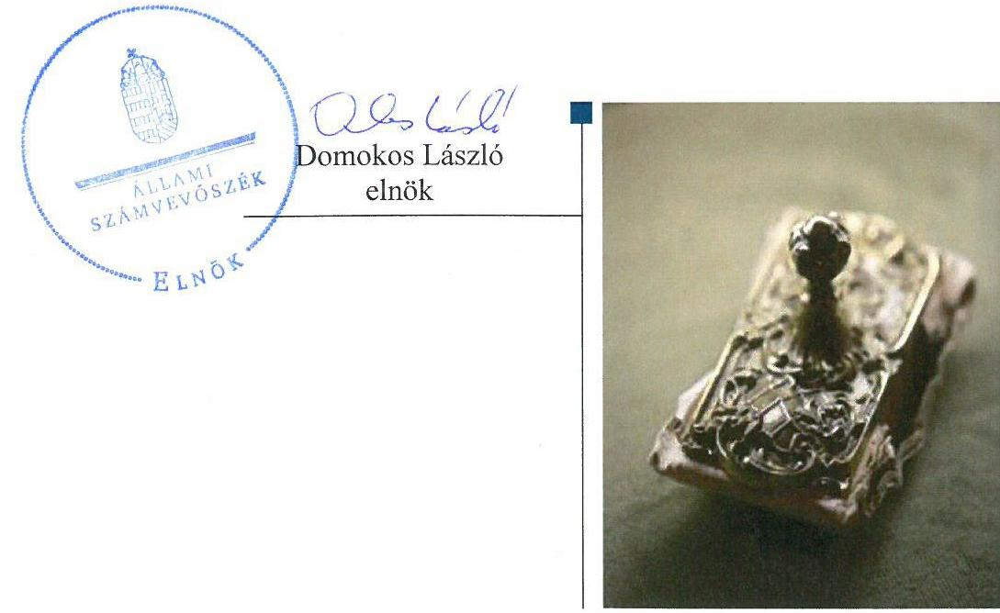

---

# AZ ELLENŐRZÉST FELÜGYELTE:

- **SALAMON ILDIKÓ** felügyeleti vezető

- **AZ ELLENŐRZÉST VEZETTE ÉS A VÉGREHAJTÁSÁÉRT FELELŐS:**
  - **BARTA JÓZSEF** ellenőrzésvezető
  - **ZAKAR LÁSZLÓ** ellenőrzésvezető

- **A PROGRAM ÖSSZEÁLLÍTÁSÁÉRT FELELŐS:**
  - **JANIK JÓZSEF LÁSZLÓ** osztályvezető

**IKTATÓSZÁM:** V-0965-226/2016.

**TÉMASZÁM:** 1999

**ELLENŐRZÉS-AZONOSÍTÓ SZÁM:** V071315

Jelentéseink az Országgyűlés számítógépes hálózatán és az Interneten a www.asz.hu címen is olvashatóak.

---

# TARTALOMJEGYZÉK 

■ ÖSSZEGZÉS ..... 5
■ AZ ELLENŐRZÉS CÉLJA ..... 7
■ AZ ELLENŐRZÉS TERÜLETE ..... 8
■ AZ ELLENŐRZÉS HÁTTERE, INDOKOLTSÁGA ..... 10
■ A JELENTÉS LÉNYEGES KÉRDÉSKÖREI ..... 12
■ ELLENŐRZÉS HATÓKÖRE ÉS MÓDSZEREI ..... 13
■ MEGÁLLAPÍTÁSOK ..... 17
■ JAVASLATOK ..... 33
■ MELLÉKLETEK ..... 39
I. Sz. melléklet: Értelmező szótár ..... 39
II. Sz. melléklet: Az integritás szemlélet érvényesítésével kapcsolatos megállapítások ..... 43
III. Sz. melléklet: Teljesítmény-ellenőrzési kiegészítő modul megállapításai ..... 44
■ FÜGGELÉK: ÉSZREVÉTELEK ..... 45
■ RÖVIDÍTÉSEK JEGYZÉKE ..... 63

---

.

---

# ÖSSZEGZÉS 

A „Tóparti Otthon" Jász-Nagykun-Szolnok Megyei Fogyatékosok Otthona és Rehabilitációs Intézményre vonatkozó irányítószervi feladatellátás az ellenőrzött időszak alatt nem felelt meg az előírásoknak. Az Intézményvezető által kialakított belső irányítási rendszer nem biztosította a szabályszerű, átlátható és elszámoltatható közpénzfelhasználást. Az Intézmény pénzügyi gazdálkodása összességében nem volt szabályszerű. Az Intézmény vagyongazdálkodása a 2012. évtől, a központi alrendszerbe kerülést követően nem felelt meg a jogszabályi előírásoknak.

## Az ellenőrzés társadalmi indokoltsága

A közpénzek felhasználásában és az állami vagyonnal való gazdálkodásban a központi alrendszer egyes intézményei meghatározó súlyt képviselnek. E szervezetekkel szemben társadalmi igény, hogy tevékenységükről a döntéshozók és a nyilvánosság felé elszámoljanak. Ezzel a társadalmi igénnyel és az Állami Számvevőszék Stratégiájával összhangban, a közpénzügyek átláthatóságának előmozdítása, a közvagyon védelme érdekében került sor a „Tóparti Otthon" Jász-Nagykun-Szolnok Megyei Fogyatékosok Otthona és Rehabilitációs Intézménye pénzügyi- és vagyongazdálkodásának ellenőrzésére.

## Főbb megállapítások, következtetések, javaslatok

A „Tóparti Otthon" Jász-Nagykun-Szolnok Megyei Fogyatékosok Otthona és Rehabilitációs Intézményre vonatkozó irányítószervi feladatellátás nem felelt meg az előírásoknak. A Közigazgatási és Igazságügyi Minisztérium nem nyújtotta be határidőre az Intézmény alapító okiratának a módosítását a Kincstár részére. Az Intézménynél a Jász-Nagykun-Szolnok Megyei Intézményfenntartó Központ, majd a Szociális és Gyermekvédelmi Főigazgatóság középirányítói szervként nem érvényesítette az erőforrásokkal, így különösen a vagyonnal való szabályszerű gazdálkodáshoz szükséges követelményeket, továbbá a 2012-2013. években a szabályszerű gazdálkodás vonatkozásában ellenőrzést nem végeztek. Az Intézménynél a hatékony gazdálkodáshoz szükséges követelményeket a 2011. évben a Jász-Nagykun-Szolnok Megyei Önkormányzat Közgyűlése, a 2012. évtől a Jász-Nagykun-Szolnok Megyei Intézményfenntartó Központ, majd a 2013. évtől a Szociális és Gyermekvédelmi Főigazgatóság nem érvényesítette.

Az Intézmény belső kontrollrendszerének kialakítása és működtetése az ellenőrzött időszak egyik évében sem felelt meg a jogszabályi előírásoknak, emiatt nem volt biztosított a szabályszerű, átlátható és elszámoltatható közpénzfelhasználás. Az Intézmény vezetője a belső ellenőrzést nem alakította ki és nem működtette az ellenőrzött időszak alatt. Az Intézmény pénzügyi és vagyongazdálkodási folyamatai tekintetében a gazdaságosság, hatékonyság és eredményesség érvényesítéséről kiadott vezetői nyilatkozatok nem voltak helytállóak.

Az Intézmény pénzügyi gazdálkodása nem felelt meg a jogszabályi előírásoknak. A bevételi és kiadási előirányzatok módosítása a 2012-2014. években nem szabályszerűen történt. A kiadási előirányzatok felhasználásánál a pénzgazdálkodási belső kontrollok a 2011. és 2014. években nem megfelelően, a 2012. és 2013. években részben megfelelően működtek. Az előirányzat-maradvány megállapítása a 2012-2014. években nem felelt meg a jogszabályi előírásoknak. Az Intézmény likvidítási tervvel a 2012-2014. években nem rendelkezett.

Az Intézmény vagyongazdálkodása - a 2011. év kivételével - nem volt szabályszerű, mert a 2012-2014. években vagyonkezelésébe nem tartozó ingatlanok szerepeltek az éves költségvetési beszámolók mérlegében, emiatt a beszámolók nem mutattak az Intézmény vagyoni helyzetéről megbízható és valós képet. A mérlegben hibásan kimutatott eszközök értéke meghaladta a jelentős összegű hiba mértékét. Továbbá a 2012-2013. években a vagyonkezelésébe nem tartozó ingatlanokat adott bérbe, amelyből befolyt bevételek az Intézményt nem illették meg.

---

Az Intézmény erőfeszítéseket tett az integritás szemlélet érvényesítése érdekében, azonban az integritás kontrollrendszer kialakítása összességében fejlesztendő volt.

Az ÁSZ az emberi erőforrások miniszterének és az SZGYF mint középirányító szerv főigazgatójának az ellenőrzési és vagyongazdálkodási feladatok ellátásának jobbítása, valamint az ellenőrzés által feltárt szabálytalanságok kivizsgálása érdekében fogalmazott meg javaslatokat. A közpénzek szabályozott, átlátható és elszámolható felhasználását biztosító irányítási rendszer kialakítását és működtetését, a pénzügyi és vagyongazdálkodás szabályszerű ellátását (a gazdálkodási jogkörök gyakorlása, a tájékoztatási kötelezettség teljesítése, a kötelezettségvállalással terhelt előirányzat maradvány megállapítása, a likviditási terv és a mérleg szabályszerű elkészítése, valamint a felújítási tevékenység végzése területén) az SZGYF - mint az Intézmény gazdasági szervezeti feladatait ellátó szerv - főigazgatójának, valamint az Intézmény vezetőjének címzett javaslatok segítik.

---

# AZ ELLENŐRZÉS CÉLJA 

## „Tóparti Otthon" Jász-Nagykun-Szolnok Megyei Fogyatékosok Otthona és Rehabilitációs Intézménye pénzügyi és vagyongazdálkodásának ellenőrzése

## A SZABÁLYSZERŰSÉGI ELLENŐRZÉS

célja annak megítélése volt, hogy az ellenőrzött Intézményre vonatkozó irányító szervi feladatellátás a jogszabályi előírások betartásával történt-e; az Intézménynél a belső kontrollrendszer kialakítása és működtetése szabályszerű volt-e; kialakították-e az erőforrásokkal való szabályszerű, gazdaságos, hatékony és eredményes gazdálkodáshoz szükséges követelményeket, megvalósították-e azok számonkérését, ellenőrzését; az Intézmény pénzügyi és vagyongazdálkodása megfelelt-e a jogszabályi előírásoknak és belső szabályzatainak; az Intézmény átalakításának vagy átszervezésének lebonyolítása szabályszerűen történt-e.

Az Intézmény korrupcióval szembeni veszélyeztetettségének csökkentése érdekében az ÁSZ felmérte az integritási szemlélet érvényesülését a gazdálkodási folyamatokban.

A KIEGÉSZÍTŐ TELJESÍTMÉNY-ELLENŐRZÉSI MODUL célja annak értékelése volt, hogy a gazdálkodás folyamatában a gazdaságossági, hatékonysági és eredményességi követelmények kialakítása megtörtént-e, azokat működtették-e, a célkitűzéseket elérték-e; a pénzügyi és vagyongazdálkodás folyamataira vonatkozóan a költségvetési szerv belső kontrollrendszerének minőségéről kiadott vezetői nyilatkozatban a költségvetési szerv tevékenységében a hatékonyság, eredményesség, gazdaságosság követelményeinek érvényesítésére vonatkozó nyilatkozat helytálló volt-e.

---

# AZ ELLENŐRZÉS TERÜLETE 

## „Tóparti Otthon" Jász-Nagykun-Szolnok Megyei Fogyatékosok Otthona és Rehabilitációs Intézménye

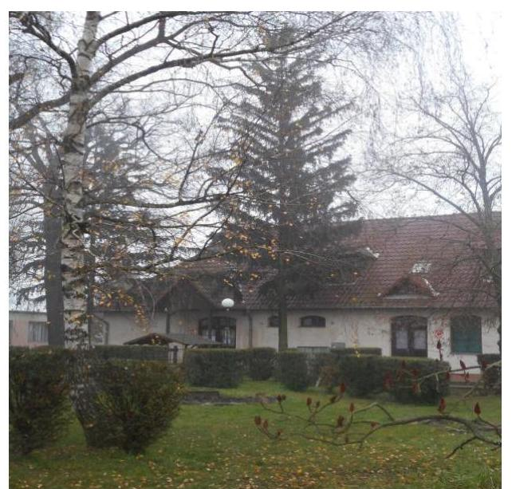

Az Intézmény ${ }^{1}$ a Szoctv. ${ }^{2}$ alapján bentlakásos szociális ellátást nyújt. Az Intézmény alaptevékenysége keretében ápoló-gondozó részlegében értelmi fogyatékos, valamint halmozottan fogyatékos személyeket, valamint a rehabilitációs intézményi részlegben az enyhe, illetve középsúlyos értelmi fogyatékos személyeket lát el. Az Intézményben a gondozás során munkarehabilitációs foglalkoztatást végeznek, illetve fejlesztő-felkészítő foglalkoztatást szerveznek az ellátottak számára.

Az Intézmény a 2011. évben az önkormányzati alrendszerbe tartozott, irányítószerve a Közgyűlés ${ }^{3}$ volt. Az Intézmény gazdálkodási jogköre 2011. december 30-ig önállóan működő és gazdálkodó költségvetési szerv volt, december 31-től a Közgyűlés határozata alapján az Intézmény gazdálkodási jogköre önállóan működőre változott. Az Intézmény gazdálkodással összefüggő feladatait 2011. december 31-én a JNSZM Önkormányzati Hivatal ${ }^{4}$ látta el.

Az Intézmény 2012. január 1-jétől a Konsz. tv. ${ }^{5}$ alapján központi alrendszerbe került, az alapítói és irányító szervi feladatokat a KIM ${ }^{6}$ látta el, a középirányító szerve a 258/2011. (XII. 7.) Korm. rendelet ${ }^{7}$ alapján a MIK ${ }^{8}$ lett. A 2013. évtől az Intézmény irányítószerve az EMMI ${ }^{9}$ lett. A MIK 2013. március 31-én a 258/2011. (XII. 7.) Korm. rendelet 18. § (2) bekezdésének előírása alapján az SZGYF ${ }^{10}$-be történő beolvadással megszűnt, feladatait egyetemleges jogutódként az SZGYF látta el, így az Intézmény középirányító szerve az SZGYF lett.

A 258/2011. (XII. 7.) Korm. rendelet 15. § (2) bekezdésének előírása alapján 2012. január 1-jétől a MIK, 2013. április 1-jétől az SZGYF látta el az Intézmény gazdálkodásával összefüggő feladatokat, így többek között az éves beszámolójának elkészítését is. Az ellenőrzött időszakban az Intézmény és a gazdasági szervezeti feladatokat ellátó MIK, később az SZGYF munkamegosztási megállapodást az Ávr. 10. § (4) bekezdésében foglalt előírás ellenére nem kötött.

Az Intézmény vezetője 2011. december 30-ig a kötelezettségvállalási, utalványozási, ellenjegyzési, szakmai teljesítés igazolási és az érvényesítési feladatok ellátását - az Áht.1, Ámr. előírásával összhangban - szabályozta az Intézményi kötelezettségvállalási szabályzatban. A 2012-2014. években - az Ávr. előírásával összhangban - az Intézménynél kötelezettségvállaló, teljesítésigazolásra jogosult és utalványozó az Intézményvezető által írásban felhatalmazott személy volt. A 2012-2014. években a kötelezettségvállalás pénzügyi ellenjegyzésére és az érvényesítési feladatok ellátására az Ávr. 55. § (2) bekezdés c) pontja, valamint az 58. § (4) bekezdése alapján - a MIK, majd az SZGYF gazdasági vezetője által írásban kijelölt személy volt jogosult.

---

A Konsz. tv. értelmében a megyei önkormányzatok fenntartásában lévő intézmények, azok vagyona és vagyoni értékű jogai 2012. január 1-jén a törvény erejénél fogva állami tulajdonba kerültek. Az önkormányzati alrendszerből átkerült intézményi vagyon tekintetében 2012. január 1-jétől a tulajdonosi jogokat - a Vtv. ${ }^{11}$ alapján - az állami vagyon felügyeletéért felelős miniszter gyakorolta, aki e feladatát az MNV Zrt. ${ }^{12}$ útján látta el. A vagyonkezelői jogokat 2012. január 1-jétől - a 258/2011. (XII. 7.) Korm. rendelet alapján - a MIK gyakorolta, aki az MNV Zrt.-vel vagyonkezelői szerződést kötött. A MIK 2013. március 31-én az SZGYF-be történt beolvadással megszűnt, és a vagyonkezelői jogot a 316/2012. (XI.13) Korm. rendelet ${ }^{13}$ alapján a továbbiakban az SZGYF főigazgatója látta el.

Az Intézmény költségvetési engedélyezett létszáma a 2011. évi 154 főről 2014. évre 110 főre csökkent. Az Intézményvezető ${ }^{14}$ személye az ellenőrzött időszak alatt nem változott. A gazdasági vezetői feladatokat 2011. december 30-ig az Intézmény gazdasági vezetője, december 31-én a JNSZM Önkormányzat Hivatal vezetője, 2012. január 1-jétől 2013. március 31-ig a MIK gazdasági vezetője, 2013. április 1-jétől az SZGYF gazdasági vezetője látta el. Az Intézmény 2011. évben realizált bevétele 344,9 M Ft volt, amely 2014. évre 396,4 M Ft-ra nőtt, a kiadása a 2011. évben 337,8 M Ft-ra teljesült, amely a 2014. évre 379,7 M Ft-ra emelkedett.

---

# AZ ELLENŐRZÉS HÁTTERE, INDOKOLTSÁGA 

A központi alrendszer egyes intézményei pénzügyi és vagyongazdálkodásának ellenőrzése.

## „Tóparti Otthon" Jász-Nagykun-Szolnok Megyei Fogyatékosok Otthona és Rehabilitációs Intézménye

Az Alaptörvény rendelkezése szerint a nemzeti vagyon megőrzésének, védelmének és a nemzeti vagyonnal való felelős gazdálkodásnak a követelményeit sarkalatos törvény, az Nvtv. ${ }^{15}$ rögzíti. A tulajdonosi joggyakorlás és vagyonkezelés általános és speciális szabályait, az állami vagyon nyilvántartására és elszámolására vonatkozó eljárásokat, a vagyonkezelési szerződés feltételrendszerét, valamint az éves beszámoló készítési és könyvvezetési kötelezettségeket kormányrendelet írja elő.

A központi alrendszer egyes intézményei közfeladat-ellátásának változásait, a közfeladatok átadásából és átvételéből adódó módosításait, előirányzat gazdálkodására ható tényezőit az Áht. ${ }^{16} 11$. §-a és az Ávr. ${ }^{17} 14$. §-a írja elő. A közfeladatok megszűnéséből, intézmény átszervezéséből, belső szerkezeti korszerűsítéséből, vagy más hasonló okból adódó módosításai miatt szerepeltetendő szerkezeti változásokat, valamint a szerkezeti változásként beépült közfeladatok szintre hozásként történő számításba vételét az Ávr. 15. § (2)-(3) bekezdései határozzák meg.

A
 társadalmi igénnyel összhangban az Áht. ${ }^{18}{ }_{2}$, az Ámr. ${ }^{19}$ és a Bkr. ${ }^{20}$ is előírja a költségvetési szerv részére, hogy olyan követelményeket alakítson ki, amelyek biztosítják a működés, gazdálkodás, az erőforrások felhasználása során a gazdaságosság, hatékonyság és eredményesség érvényesülését. Az Ámr. és a Bkr. alapján az Intézményvezetőnek évente nyilatkoznia is kell arról, hogy gondoskodott-e az Intézmény tevékenységében a gazdaságosság, hatékonyság és eredményesség követelményeinek érvényesítéséről. A gazdaságos, hatékony és eredményes gazdálkodáshoz szükség van a teljesítménymérés feltételeinek kialakítására, úgymint az egyértelmű és mérhető célokra, mutatószámokra és az ezekhez rendelt követelményekre. Az ÁSZ jelen ellenőrzéssel győződött meg arról, hogy az Intézménynél a teljesítménycélokat, -mutatókat, -követelményeket kialakították-e, azokat működtették-e, a kitűzött cél(ok) teljesültek-e.

AZ ELLENŐRZÉS EREDMÉNYEKÉPPEN nemcsak az ellenőrzött intézmények gazdálkodása javulhat, hanem átfogó képet kaphatunk a központi alrendszerbe tartozó költségvetési szervek gazdálkodásának hiányosságairól, de a jó gyakorlatokról is. Ellenőrzéseivel, javaslataival és megállapításaival az ÁSZ elősegítheti a költségvetési szervek pénzügyi és vagyongazdálkodása szabályozásának javítását és hozzájárulhat a jó kormányzáshoz. Az ellenőrzés az ellenőrzött számára visszajelzést ad a pénzügyi és vagyongazdálkodásában feltárt hiányosságokról, javaslataival hozzájárul azok kiküszöböléséhez, amely csökkentheti a későbbi ellenőrzések gyakoriságát. Az ellenőrzés megállapításait és javaslatait más szervezetek is hasznosíthatják a rendezett gazdálkodási keretek kialakításához.

---

# A TELJESÍTMÉNY-ELLENŐRZÉSI KIEGÉSZÍTŐ 

MODUL alapján elvégzett ellenőrzés a törvényalkotás számára támogatást nyújt a nemzeti kulcsindikátorok rendszerének kialakításához. A döntéshozók, ellenőrzöttek, irányító szervek, a társadalom számára az összehasonlítási, összemérési lehetőségek kihasználásával objektív visszajelzést ad a gazdálkodás területén végrehajtott szervezeti, szervezési, takarékossági és bürokráciacsökkentő intézkedések hatásairól, a közfeladat-ellátásnak keretet adó pénzügyi és vagyongazdálkodásban mérhető teljesítménykövetelmények kialakításáról, azok alkalmazásáról.

---

# A JELENTÉS LÉNYEGES KÉRDÉSKÖREI 

1.     - Az irányító szerv ellenőrzött Intézményre vonatkozó feladatellátása szabályszerű volt-e?
2.     - A belső kontrollrendszer kialakítása és működtetése megfelelt-e a jogszabályi előírásoknak?
3.     - Az Intézmény pénzügyi gazdálkodása szabályszerű volt-e?
4.     - Az Intézmény vagyongazdálkodása szabályszerű volt-e?
5.     - Szabályszerűen hajtották-e végre az ellenőrzött időszakban az Intézményt érintő szervezeti, szerkezeti átalakításokat?
6.     - Az Intézmény intézkedett-e az integritás szemlélet érvényesítése érdekében?

---

# ELLENŐRZÉS HATÓKÖRE ÉS MÓDSZEREI 

## Az ellenőrzés típusa

Szabályszerűségi ellenőrzés, amelyet teljesítmény-ellenőrzési modul egészített ki.

## Az ellenőrzött időszak

Az ellenőrzött időszak 2011. január 1-jétől 2014. december 31-ig terjedő időszak volt.

## Az ellenőrzés tárgya

Az ellenőrzött szervezetre vonatkozó irányító szervi feladatok ellátása. Az Intézmény belső kontroll rendszerének kialakítása és működtetése, valamint pénzügyi és vagyongazdálkodása. Az erőforrásokkal való szabályszerű, gazdaságos, hatékony és eredményes gazdálkodáshoz szükséges követelmények kialakítása, a kialakított követelmények számonkérés, ellenőrzése. Az Intézmény átalakítása, átszervezése lebonyolításának szabályszerűsége.

A teljesítmény-ellenőrzési kiegészítő modul esetében az intézményi gazdálkodás folyamatában a gazdaságossági, hatékonysági és eredményességi követelmények kialakítása és működtetése, a célkitűzések teljesítésének értékelése. Az Intézmény tevékenységében a hatékonyság, eredményesség, gazdaságosság követelményei érvényesítéséről kiadott nyilatkozat helytállósága. A teljesítmény-ellenőrzés fókuszkérdéseire a III. sz. melléklet ad választ.

Az ellenőrzés kiterjedt minden olyan körülményre és adatra, amely az ÁSZ jogszabályban meghatározott feladatainak teljesítéséhez, valamint a program végrehajtása folyamán felmerült újabb összefüggések feltárásához voltak szükségesek.

## Az ellenőrzött szervezet

A központi alrendszer ellenőrzött intézménye: a „Tóparti Otthon" Jász-Nagykun-Szolnok Megyei Fogyatékosok Otthona és Rehabilitációs Intézménye és az Intézmény irányító szervei: a Jász-Nagykun-Szolnok Megyei Önkormányzat, a Közigazgatási és Igazságügyi Minisztérium, az Emberi Erőforrások Minisztériuma, valamint az Intézmény középirányító szervei: a Jász-Nagykun-Szolnok Megyei Intézményfenntartó Központ, a Szociális és Gyermekvédelmi Főigazgatóság. A Közigazgatási és Igazságügyi Minisztérium jogutódjaként az Igazságügyi Minisztérium, valamint a

---

Miniszterelnökség adatot szolgáltatott az ellenőrzéshez. Az ellenőrzésre a központi alrendszer ellenőrzött intézményének és irányító szervének, illetve középirányító szervének székhelyén került sor.

# Az ellenőrzés jogalapja 

Az ellenőrzés jogszabályi alapját az ÁSZ tv. 1. § (3) bekezdés, 5. § (2)-(6) bekezdései, valamint az Áht. 2 61. § (2) bekezdésének előírásai képezték.

## Az ellenőrzés módszerei

Az ellenőrzést az ellenőrzési program szempontjai, az ellenőrzött időszakban hatályos jogszabályok, az ellenőrzés szakmai szabályai, az egyes ellenőrzési típusokhoz kapcsolódó ÁSZ módszertanok és nemzetközi standardok figyelembevételével végeztük. A gazdálkodás hibáinak kijavítására, a közpénzekkel való felelős gazdálkodás segítésére irányuló javaslatok kidolgozásakor a hatályos jogszabályok voltak az irányadóak.

Az ellenőrzés ideje alatt az ellenőrzött szervezettel történő kapcsolattartást az ÁSZ SZMSZ ${ }^{21}$-ének vonatkozó előírásai alapján biztosítottuk.

Az ellenőrzési kérdések megválaszolásához szükséges bizonyítékok megszerzése a következő ellenőrzési eljárások alkalmazásával történt: kérdésfeltevés (információkérés), mintavételezés, valamint elemző eljárás. A minták kiválasztása során elsősorban reprezentativitást biztosító véletlen mintavételi eljárást alkalmaztunk.

Az ellenőrzési bizonyítékként felhasználható adatforrások közé tartoztak egyrészt a szakmai program részletes szempontjainál felsorolt adatforrások, másrészt adatforrás volt minden egyéb - az ellenőrzés folyamán feltárt, az ellenőrzés szempontjából releváns információt tartalmazó - dokumentum.

Az ellenőrzés lefolytatásához az intézmény a tanúsítványok elektronikus kitöltésével, valamint az ÁSZ által kért dokumentumok elektronikus megküldésével szolgáltatott adatokat. A rendelkezésre bocsátott adatok, információk kontrollja az ellenőrzés keretében történt.

Az ellenőrzési kérdésekre adott válaszok alapján értékeltük, hogy az ellenőrzött időszakban az irányító szervek és a középirányító szervek az ellenőrzött intézményre vonatkozó feladatainak szabályszerűen eleget tettek-e, az Intézmény pénzügyi és vagyongazdálkodása megfelelt-e az előírásoknak, az Intézmény átalakításának vagy átszervezésének végrehajtása szabályszerű volt-e. Értékeltük, hogy az Intézménynél kialakították-e az erőforrásokkal való szabályszerű és hatékony gazdálkodáshoz szükséges követelményeket, megvalósították-e azok számonkérését, ellenőrzését.

Az Intézmény belső kontrollrendszere jogszabályi előírások szerinti kialakításának és működtetésének szabályszerűségét az erre irányuló ellenőrzési kérdésekre adott válaszok összesítése alapján, évente pillérenként (kontrollkörnyezet, kockázatkezelési rendszer, kontrolltevékenységek, információs és kommunikációs rendszer, monitoring rendszer) és összesítetten is minősítettük. Az Intézmény belső kontrollrendszere egyes pilléreinek kialakítását és működtetését „szabályszerű"-nek minősítettük, amennyiben az értékelt területen az elért és elérhető pontok százalékban

---

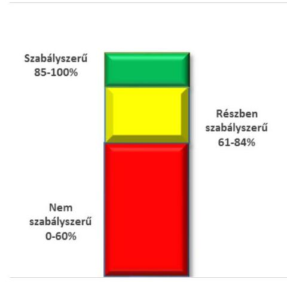
kifejezett, egész számra kerekített hányadosa meghaladta a 84%-ot, „részben szabályszerű"-nek minősítettük, ha a 84%-ot nem haladta meg, de 60%-nál nagyobb volt, „nem szabályszerű"-nek minősítettük, ha nem haladta meg a 60%-ot. Az Intézmény belső kontrollrendszerének összesített értékelése megegyezik a pillérenként (kontrollterületenként) alkalmazott %-os értékelésekkel, a következő eltérésekkel. A kontrollrendszer egésze esetében a „szabályszerű" értékelésnek a %-os értéken felül további feltétele volt, hogy egyik kontrollterület sem kaphatott „nem szabályszerű" értékelést, a „részben szabályszerű" értékelés további feltétele volt, hogy legfeljebb egy ellenőrzött kontrollterület lehetett „nem szabályszerű" értékelésű. Az összesített értékelés a %-os értéktől függetlenül „nem szabályszerű"-nek minősült, ha az ellenőrzött kontrollterületek közül több mint egy „nem szabályszerű" értékelést kapott.

A tárgyi eszközök nyilvántartásba vételének, a közbeszerzési eljárások lefolytatásának, a vagyonhasznosítási bevételi előirányzatok teljesítésének, az előirányzatok módosításának és az előirányzat-maradvány megállapításának szabályszerűségét, valamint a gazdálkodási jogkörök gyakorlásának szabályszerűségét mintavétellel ellenőriztük. A jogszabályoknak és a belső előírásoknak megfelelőnek tekintettük a tárgyi eszközök nyilvántartásba vételét, a vagyonhasznosítási bevételi előirányzatok teljesítését, az előirányzatok módosítását és az előirányzat-maradvány megállapítását, amennyiben a minta ellenőrzésének eredménye alapján 95%-os bizonyossággal a teljes sokaságban a hibás tételek aránya kisebb volt, mint 10%, nem megfelelőnek értékeltük, ha a hibás tételek aránya a 10%-ot meghaladta.

A közbeszerzési eljárások esetében az ellenőrzött mintatételek értékelését végeztük el.

A 2011. évet érintően a szakmai teljesítésigazolás és az utalvány ellenjegyzése kulcskontrollok, a 2012-2014. éveket érintően a teljesítés-igazolás és az érvényesítés kulcskontrollok működését értékeltük. Megfelelőnek értékeltük a gazdálkodási jogkörök gyakorlását, amennyiben 95%-os bizonyossággal a teljes sokaságban a hibás tételek aránya legfeljebb 10% volt, részben megfelelőnek, ha a hibás tételek arányának felső határa legfeljebb 30% volt, nem megfelelőnek, ha a hibás tételek sokaságbeli arányának felső határa meghaladta a 30%-ot.

Az integritás szemlélet érvényesülésének értékelése az Intézmény által kitöltött tanúsítványa alapján történt.

Az alapprogram alapján ellenőriztük, hogy a költségvetési szerv vezetője megtette-e nyilatkozatát arról, hogy gondoskodott a költségvetési szerv tevékenységében a hatékonyság, eredményesség és a gazdaságosság követelményeinek érvényesítéséről. Ezt kiegészítve értékeltük, hogy a költségvetési szerv vezetője kialakította-e a gazdaságossági, hatékonysági és eredményességi követelményeket, és azokat működtette-e, a célkitűzéseket elérte-e.

A teljesítmény-ellenőrzési kiegészítő modul a gazdálkodási feladatokra terjedt ki, a szakmai feladatellátást nem értékelte.

A gazdálkodási feladatok értékelése az alábbi területekre terjedt ki:
pénzügyi gazdálkodási (nem szakmai, adminisztratív) feladatok: költségvetés-, beszámoló-készítés, könyvvezetés, adatszolgáltatások, előirányzat-gazdálkodás, kötelezettségvállalások nyilvántartása, kezelése, bevételkezelés, bér- és illetményszámfejtés;

---

- vagyongazdálkodási (logisztikai) feladatok: közbeszerzések és közbeszerzési értékhatárt el nem érő beszerzések, készletgazdálkodás, nyomtatók, fénymásolók üzemeltetése, épület- és ingatlanüzemeltetés, karbantartás, hibabejelentés, gépjármű és flotta-menedzsment.
Az ellenőrzés során minden olyan körülményt és adatot is ellenőriztünk, amely a program végrehajtása kapcsán felmerült újabb összefüggéseknek az ellenőrzés céljaival összhangban lévő feltárásához szükséges volt. A teljesítmény-ellenőrzési kiegészítő programmodulban megfogalmazott ellenőrzési cél megválaszolásához az alapprogram végrehajtása során megfogalmazott megállapításokat is figyelembe vettük.

---

# 1. Az irányító szerv ellenőrzött Intézményre vonatkozó feladatellátása szabályszerű volt-e? 

Összegző megállapítás

Az irányító és a középirányító szervek Intézményre vonatkozó feladatellátása nem volt szabályszerű.
1.1. számú megállapítás

Az irányító szervek alapítói joggyakorlása - a Közgyűlés feladatellátása kivételével - a jogszabályi előírásoknak nem felelt meg.

ALAPÍTÓ OKIRAT ${ }_{1-3}{ }^{22}$-MAL az Intézmény 2011-ben rendelkezett, melyeket a Közgyűlés adott ki. Az alapító okirat ${ }_{1-3}$ az Áht. ${ }_{1}$ tartalmi előírásainak megfelelt.

A KIM a 258/2011. (XII. 7.) Korm. rendelet 21. § (6) bekezdésében előírtak ellenére 2012. január 30-i határidőre nem nyújtotta be a Kincstár ${ }^{23}$ által vezetett törzskönyvi nyilvántartáshoz az Intézmény alapító okiratának módosítását (a KIM minisztere az egységes szerkezetű alapító okirat ${ }_{4}{ }^{24}$-et 2012. szeptember 14-én adta ki). Az EMMI minisztere az egységes szerkezetű alapító okirat ${ }_{5}{ }^{25}$-öt 2013. január 1-jei hatállyal adta ki, amelyet 2014. február 11-én módosított az alapító okirat ${ }_{6}{ }^{26}$-ban a kormányzati funkciók szerinti besorolás meghatározásával. Az egységes szerkezetű alapító okiratok tartalma megfelelt a jogszabályi előírásoknak.

Az Intézmény az ellenőrzött időszak alatt rendelkezett az irányító szervek által jóváhagyott SZMSZ ${ }_{1-3}{ }^{27}$-mal. Az SZMSZ ${ }_{1,2}$ 2012-2013. évek között - az Ávr. 13. § (1) bekezdés b) pontjában előírtak ellenére - nem tartalmazta a hatályos egységes szerkezetbe foglalt alapító okirat keltét és számát. Az SZMSZ ${ }_{1}$ módosítása nem történt meg 2012. január 1-je és 2013. január 20-a között, emiatt az nem megfelelően tartalmazta - az Ávr. 13. § (1) bekezdés e) pontjában foglaltak ellenére - az Intézmény gazdasági szervezetének megnevezését, feladatait. Az SZMSZ ${ }_{3}$-ban az Ávr. 13. § (1) bekezdés g) pontjában foglalt előírás ellenére nem szabályozták - az igazgatói munkakör kivételével - a nevesített munkakörökhöz kapcsolódóan a helyettesítés rendjét.

---

### 1.2. számú megállapítás

Az Intézménynél a közfeladatok ellátására vonatkozó, az erőforrásokkal való szabályszerű gazdálkodáshoz szükséges követelményeket a 2011. évben a Közgyűlés érvényesítette, számon kérte és ellenőrizte. A középirányító szervek a 2012-2014. években az erőforrásokkal való szabályszerű gazdálkodáshoz szükséges követelményeket nem érvényesítették és a 2012-2013. években nem ellenőrizték. A
 hatékony gazdálkodáshoz szükséges követelményeket a Közgyűlés és a középirányító szervek nem érvényesítették, nem kérték számon és nem ellenőrizték.

AZ ERŐFORRÁSOKKAL VALÓ GAZDÁLKODÁS szabályszerűségi követelményeit a Közgyűlés 2011. évben érvényesítette, számon kérte és ellenőrizte.

A Közgyűlés 2011. február 14-én rendeletet alkotott az Intézmény éves költségvetés végrehajtásának szabályaira, a finanszírozás szabályaira, a többletbevételek szükségességére, a várható pénzmaradványra, továbbá a likviditási helyzetről rendszeres beszámolást írt elő. A Közgyűlés számon kérte az Intézményt a féléves, a háromnegyed éves gazdasági és szakmai helyzetéről. A beszámolók elfogadásáról és az esetleg szükséges intézkedésekről a Közgyűlés határozatokat hozott. Az Intézménynél 2011-ben végzett felügyeleti ellenőrzés a gazdálkodás szabályszerűségére vonatkozott (állami normatíva igénybevételét megalapozó adatszolgáltatás valódiságára és az aktív és passzív tételek pénzügyi elszámolására és annak bizonylati alátámasztottságára).

A 2012. évben a 258/2011. (XII. 7.) Korm. rendelet 10. § (1) bekezdés b) pontjában előírtak alapján a MIK, a 2013. évtől a 316/2012. (XI. 13.) Korm. rendelet 3. § (2) bekezdés f) pontjában foglaltak alapján az SZGYF főigazgatója látta el középirányítói hatáskörben az önkormányzattól átvett vagyon tekintetében a vagyonkezelői feladatokat. A 2012. évben a MIK, míg a 2013-2014. években az SZGYF - a Vtv. 27. § (2) bekezdésében, valamint az Nvtv. 7. § (2) bekezdésében előírtak ellenére a vagyonkezelésükben lévő, az Intézmény feladatai ellátásához használt ingatlanok átlátható, szabályszerű működtetéséről nem gondoskodtak, mivel a nemzeti vagyon használatának jogcímét - az Nvtv. 3. § (1) bekezdés 11. pontjában rögzített - szerződés megkötésével nem biztosították. Ezért a 2012. évben a MIK, míg a 2013-2014. években az SZGYF főigazgatója - a 258/2011. (XII. 7.) Korm. rendelet 11. § (2) bekezdés d) pontjában, illetve 316/2012. (XI. 13.) Korm. rendelet 3. § (2) bekezdés g) pontjában előírtak ellenére - nem érvényesítette az erőforrásokkal, így különösen a vagyonnal való szabályszerű gazdálkodáshoz szükséges követelményeket.

A MIK 2012. évben az Intézménynél az erőforrásokkal való szabályszerű gazdálkodás vonatkozásában - a 258/2011. (XII. 7.) Korm. rendelet 11. § (2) bekezdés d) pontjában előírtak ellenére - ellenőrzést nem hajtott végre. Az SZGYF 2014. évben végzett ellenőrzést a személyi juttatások és a jogszabályok szerinti munkakörben történő foglalkoztatás szabályszerűségére vonatkozóan.

A Közgyűlés a 2011. évben - az Áht. 49. § (5) bekezdés f) pontjában foglaltak ellenére - nem érvényesítette, nem kérte számon és nem ellenőrizte az előirányzatokkal, létszámokkal és vagyonnal való hatékony gazdálkodás követelményeit. A MIK a 2012. évben - a 258/2011. (XII. 7.) Korm. rendelet 11. § (2) bekezdés d) pontjában előírtak ellenére - az

---

1.3. számú megállapítás

SZGYF a 2013-2014. években - a 316/2012. (XI. 13.) Korm. rendelet 3. § (2) bekezdés g) pontjában előírtak ellenére - nem érvényesítette, nem kérte számon és nem ellenőrizte az előirányzatokkal, létszámokkal és vagyonnal való hatékony gazdálkodás követelményeit.

Az irányító szervek és a középirányító szervek az Intézménnyel kapcsolatos egyéb ellenőrzési, irányítási és felügyeleti jogosultságaikat szabályszerűen gyakorolták.

AZ INTÉZMÉNY BEVÉTELI ÉS KIADÁSI ELŐ-
IRÁNYZATOKKAL VALÓ GAZDÁLKODÁSÁT az ellen-
őrzött időszak alatt az irányító- és középirányító szervek a jogszabályokban
foglalt előírásoknak megfelelően rendszeresen figyelemmel kísérték. Az el-
lenőrzött időszak alatt a közfeladat ellátásának veszélybe kerülését nem
állapították meg.

A 2011. évben a Közgyűlés, 2012. évben a MIK, majd 2013-2014. évek-
ben az SZGYF rendszeresen figyelemmel kísérte az Intézmény előirányza-
tainak teljesítését. A szakmai feladatellátásról szóló beszámolási kötele-
zettséget a 2012. évben a KIM, a 2013. évtől az EMMI a költségvetési be-
számoló szöveges indokolására vonatkozó rendelkezésben határozta meg.
Az SZGYF a 316/2012. (XI. 13.) Korm. rendelet előírásának megfelelően
évente értékelte az Intézmény szakmai feladatellátását.

Az Intézményvezető kinevezése az ellenőrzött időszak alatt szabálysze-
rűen történt. A Közgyűlés elnöke 2011. május 1-jei hatállyal - pályázat
lebonyolítását követően - nevezte ki öt évre az Intézményvezetőt, aki ko-
rábban is ellátta az Intézményvezetői feladatokat. Az Intézményvezető ve-
zetői megbízása a Konsz. tv. 14. § (1) bekezdés b) pontjában foglaltak sze-
rint a törvény erejénél fogva 2012. március 31. napján megszűnt. 2012.
május 1-jei hatállyal a korábbi Intézményvezetőt a MIK vezetője - a megyei
kormánymegbízott egyetértésével - szabályszerűen újra kinevezte öt évre.

2. A belső kontrollrendszer kialakítása és működtetése megfelelte a jogszabályi előírásoknak?

Összegző megállapítás

A belső kontrollrendszer kialakítása és működtetése nem fe-
lelt meg a jogszabályi előírásoknak. Emiatt nem volt biztosí-
tott a szabályszerű, átlátható és elszámoltatható közpénzfel-
használás.

A belső kontrollrendszer évenkénti és összesített értékelését az 1. táblázat
tartalmazza.

1. táblázat

A BELSŐ KONTROLLRENSZER KIALAKÍTÁSÁNAK ÉS MŰKÖDTETÉSÉNEK ÉRTÉKELÉSE

| Év | Kontrollkörnyezet | Kockázatkeze-
lési rendszer | Kontrolltevékeny-
ségek | Információs és kom-
munikációs rendszer | Monitoring | ÖSSZESEN |
| :--: | :--: | :--: | :--: | :--: | :--: | :--: |
| 2011. | részben szabályszerű | nem szabályszerű | nem szabályszerű | részben szabályszerű | nem szabályszerű | nem szabályszerű |
| 2012. | nem szabályszerű | nem szabályszerű | részben szabályszerű | részben szabályszerű | nem szabályszerű | nem szabályszerű |

---

| Év | Kontrollkörnyezet | Kockázatkezelési rendszer | Kontrolltevékenységek | Információs és kommunikációs rendszer | Monitoring | Összesen |
| :--: | :--: | :--: | :--: | :--: | :--: | :--: |
| 2013. | nem szabályszerű | nem szabályszerű | részben szabályszerű | részben szabályszerű | nem szabályszerű | nem szabályszerű |
| 2014. | nem szabályszerű | nem szabályszerű | nem szabályszerű | részben szabályszerű | nem szabályszerű | nem szabályszerű |
| Összesen | nem szabályszerű | nem szabályszerű | nem szabályszerű | részben szabályszerű | nem szabályszerű | nem szabályszerű |

2.1. számú megállapítás

A kontrollkörnyezet kialakítása és működtetése összességében nem felelt meg a jogszabályi előírásoknak.

A KONTROLLKÖRNYEZET kialakítása és működtetése az Intézménynél - mint önállóan működő és gazdálkodó költségvetési szervnél - 2011. december 30-ig részben felelt meg a jogszabályi előírásoknak.

Az Intézmény gazdasági szervezete által ellátott feladatokról 2011. első félévben az SZMSZ, 2011. július 1-jétől - az SZMSZ-nél részletesebben az Intézményvezető által jóváhagyott gazdasági ügyrend rendelkezett, amely az Ámr. előírásainak 2011. december 30-ig megfelelt.

Az Intézmény 2011. évben rendelkezett - az Áhsz. -ben előírtakkal összhangban - számviteli politikával, és az annak keretében elkészítendő szabályzatokkal (leltározási és leltárkészítési szabályzat, értékelési szabályzat, pénzkezelési szabályzat, önköltség-számítási szabályzat). Továbbá az Intézmény rendelkezett - az Sztv.-ben és az Áhsz.-ben előírtakkal összhangban - számlarenddel.

Az Intézmény vezetője 2011. december 30-ig a gazdálkodási jogkörgyakorlást - Áht., Ámr. előírásával összhangban - szabályozta az Intézmény kötelezettségvállalási szabályzatban.

Az Intézmény vezetője 2011. évben az Ámr. 20. § (3) bekezdés b)-e) pontjaiban előírtak ellenére nem szabályozta a közbeszerzési értékhatár alatti beszerzések lebonyolításával kapcsolatos eljárásrendet, a belföldi és külföldi kiküldetések elrendelésével és lebonyolításával, elszámolásával kapcsolatos kérdéseket, az anyag- és eszközgazdálkodás számviteli politikában nem szabályozott kérdéseit, továbbá a helyiségek és berendezések használatára vonatkozó előírásokat.
2011. december 31-én a gazdasági szervezetivel nem rendelkező Intézmény és az önállóan működő és gazdálkodó JNSZM Önkormányzati Hivatal a munkamegosztás és felelősségvállalás rendjét - az Ámr. 16. § (4) bekezdés előírásával összhangban - együttműködési megállapodásban rögzítették. Az együttműködési megállapodás - az Ámr. 16. § (6) bekezdés előírásával összhangban - tartalmazta, hogy az Ámr. 15. § (2) bekezdés c) pontja szerinti gazdasági szervezeti feladatok közül melyik feladatot melyik szerv látja el. Az együttműködési megállapodást - az Ámr. 16. § (5) bekezdésében foglaltakkal összhangban - a Közgyűlés jóváhagyta.

A kontrollkörnyezet kialakítása és működtetése az Intézménynél - mint önállóan működő, gazdasági szervezettel nem rendelkező költségvetési szervnél - a 2012-2014. években nem felelt meg a jogszabályi előírásoknak.

---

A 2012. évben az Intézmény és a gazdasági szervezeti feladatokat ellátó MIK munkamegosztási megállapodást az Ávr. 10. § (4) bekezdésében foglalt előírás ellenére nem kötött. A MIK, majd SZGYF az Intézmény és a JNSZM Önkormányzati Hivatal között megkötött együttműködési megállapodás érvényben tartásáról rendelkeztek, amely azonban 2012. január 1-jétől nem volt érvényes, mivel - a Konsz. tv. 10. § (1) bekezdése alapján a MIK nem minősül a JNSZM Önkormányzati Hivatal, mint a megállapodást aláíró fél jogutódjának. Továbbá az együttműködési megállapodás - az Ávr. 10. § (5) bekezdésében foglalt előírás ellenére - a KIM, majd az EMMI irányító szervek által sem került jóváhagyásra. Az SZGYF főigazgatója a 2013. szeptember 2-től hatályos gazdálkodási szabályzat 4. §-ában előírta egy új, irányító szerv által jóváhagyásra kerülő munkamegosztási megállapodás megkötését, melyre az ellenőrzött időszak végéig nem került sor. Megállapodás hiányában a munkamegosztás és felelősségvállalás rendje 2012-2014. években nem volt rögzítve az Intézmény és a gazdasági szervezeti feladatokat ellátó MIK, majd SZGYF között az Ávr. 10. § (4) bekezdésben foglaltak ellenére.

Az önállóan működő és gazdálkodó MIK a 2012. évben - az Áhsz. 8. § (13) bekezdés előírásával összhangban - a számviteli politikájában döntött arról, hogy annak rendelkezését és a kapcsolódó szabályzatok hatályát az Intézményre nem terjeszti ki. Ebben az időszakban az Intézmény az Intézmény vezetője által önállóan elkészített számviteli politikával, és az annak keretében elkészített szabályzatokkal rendelkezett. Az Intézményvezető - a Sztv. 14. § (3) bekezdésében foglaltak ellenére - a számviteli politikát nem aktualizálta a 258/2011. (XII. 7.) Korm. rendelet 15. § (2) bekezdése szerinti, a gazdálkodással összefüggő feladatellátás Intézményt érintő 2012. január 1-jétől bekövetkezett változását követően.

Az Intézmény gazdálkodási szervezeti feladatait 2013. április 1-jétől ellátó önállóan működő és gazdálkodó SZGYF a számviteli politikájában nem döntött - az Áhsz. 8. § (13) bekezdésében előírtak ellenére - arról, hogy annak rendelkezéseit és a kapcsolódó szabályzatok hatályát kiterjeszti-e az Intézményre, vagy az - az előirányzatok feletti rendelkezési jogosultság függvényében - önálló számviteli politikát alakít ki, és külön szabályzatokat készít. Továbbá a 2014. évben sem adott ki az SZGYF főigazgatója az Intézményre is vonatkozó számviteli politikát, és az annak keretében elkészítendő szabályzatokat az Áhsz. 50. § (1) bekezdésben, és az abban hivatkozott 31. § (1) bekezdésben előírtak ellenére. Emiatt az Intézmény 2013. április 1-jétől az ellenőrzött időszak végéig - az Sztv. 14. § (3)(5) bekezdéseiben, Áhsz. 8. § (3)-(4) bekezdéseiben, Áhsz. 50. § (1) bekezdésben előírtak ellenére - a számviteli politikával, és az annak keretében elkészítendő szabályzatokkal (leltározási és leltárkészítési szabályzat, értékelési szabályzat, pénzkezelési szabályzat, önköltség-számítási szabályzat), nem rendelkezett.

Az Intézmény vezetője 2014. november 15-én jogosulatlanul adott ki az Áhsz. 50. §
 (1) bekezdésében, és az abban hivatkozott 31. § (1) bekezdésében előírtak ellenére - számviteli politika ${ }_{2}{ }^{45}$-t, és az annak keretében elkészítendő szabályzatokat (leltározási és leltárkészítési szabályzat ${ }_{2}{ }^{46}$, értékelési szabályzat ${ }_{2}{ }^{47}$, pénzkezelési szabályzat ${ }_{2}{ }^{48}$, önköltség-számítási szabályzat ${ }_{2}{ }^{49}$ ), mert a számviteli politika elkészítéséért az éves költségvetési beszámolót készítő szerv vezetője (az SZGYF főigazgatója) a felelős.

---

Az Intézmény - a Sztv. 161. § (1) bekezdésében előírtak ellenére - 2012. január 1-jétől az ellenőrzött időszak végéig nem rendelkezett hatályos számlarenddel, mivel a gazdálkodási feladatokat ellátó MIK, illetve SZGYF nem tett eleget a szabályozási kötelezettségének. Továbbá az Intézmény vezetője 2014. november 15-én jogosulatlanul adta ki - az Sztv. 161. § (4) bekezdésben előírtak alapján - a számlarend ${ }_{2}^{50}$-öt.

Az Intézmény vezetője a 2012-2014. években a kötelezettségvállalási, utalványozási és teljesítés igazolási feladatok ellátását az Áht. ${ }_{2}$ és az Ávr. előírásának megfelelően belső szabályzatban (Intézmény kötelezettségvállalási szabályzat, Intézmény gazdálkodási szabályzat ${ }^{51}$ ) rendezte. Középirányítói hatáskörben a MIK vezetője, valamint az SZGYF főigazgatója az Ávr.-ben előírtakkal összhangban, belső szabályzatban (MIK kötelezettségvállalási szabályzat ${ }^{52}$, SZGYF kötelezettségvállalási szabályzat ${ }^{53}$ és gazdálkodási szabályzat ${ }_{1,2}{ }^{54}$-ben) rendezték az Intézményre vonatkozóan az ellenjegyzés és az érvényesítés eljárási és dokumentációs részletszabályait, valamint az ezeket végző személyek kijelölésének rendjével kapcsolatos belső előírásokat, feltételeket.

A 2012. évben az Intézmény gazdálkodási feladatait ellátó MIK gazdasági szervezete Ávr.-nek megfelelően rendelkezett gazdasági ügyrend ${ }_{2}{ }^{55}$ vel. A 2013-2014. években az Intézmény gazdálkodási feladatait ellátó SZGYF gazdasági szervezete - az Ávr. 9. § (5) bekezdésében előírtakkal ellentétben - nem rendelkezett ügyrenddel.

Az Intézmény vezetője 2012-2014. években az Ávr. 13. § (2) bekezdés b)-d) pontjaiban előírtak ellenére nem szabályozta a közbeszerzési értékhatár alatti beszerzések lebonyolításával kapcsolatos eljárásrendet, a belföldi és külföldi kiküldetések elrendelésével és lebonyolításával, elszámolásával kapcsolatos kérdéseket, továbbá az anyag- és eszközgazdálkodás számviteli politikában nem szabályozott kérdéseit.

Az ellenőrzött időszakban hatályos közbeszerzési szabályzat ${ }_{1,2}{ }^{56}$ nem tartalmazta - a Kbt. ${ }_{1}^{57}$ 6. § (1) bekezdése, illetve a Kbt. ${ }_{2}^{58}$ 22. § (1) bekezdése ellenére - a közbeszerzési eljárás dokumentálási rendjét (ennek körében különösen az eljárás során hozott döntésekért felelős személy, személyek, illetőleg testületek meghatározását).

Az Intézmény vezetője az Intézmény ellenőrzési nyomvonalát az Ámr. 156. § (2) bekezdésben és a Bkr. 6. § (3) bekezdésében előírtak ellenére 2014. augusztus 25-ig nem készítette el. 2014. augusztus 26-tól a FEUVE rendszer szabályzat ${ }^{59}$ tartalmazta az ellenőrzési nyomvonalat, a Bkr. előírásának megfelelően.

Az intézmény vezetője a szabálytalanságok kezelésének eljárásrendjét - az Ámr. 156. § (3) bekezdése és a Bkr. 6. § (4) bekezdésében foglaltak ellenére - 2012. június 25-ig nem szabályozta. 2012. június 26-tól a szabálytalanságok kezelésének eljárásrendjében ${ }^{60}$, 2014. augusztus 26-tól a hatályos FEUVE rendszer szabályzat VI. fejezete tartalmazta a szabálytalanságok kezelésének eljárásrendjét, amely a Bkr. előírásainak megfelelt.

# 2.2. számú megállapítás 

A kockázatkezelési rendszer kialakítása és működtetése összességében nem felelt meg a jogszabályi előírásoknak.

KOCKÁZATKEZELÉSI RENDSZERT az Intézmény vezetője a 2011. január 1. és 2014. augusztus 25. közötti időszakban - az Ámr. 157. § (1)-(3) bekezdéseiben, illetve a Bkr. 7. § (1)-(2) bekezdéseiben előírtak

---

ellenére - nem működtetett, nem mérte fel és nem határozta meg a tevékenységében, gazdálkodásában rejlő kockázatokat, egyes kockázatokkal kapcsolatos szükséges intézkedéseket, valamint azok teljesítése folyamatos nyomon követésének a módját. A 2014. augusztus 26-ától hatályos FEUVE rendszer szabályzat III. fejezete tartalmazta a kockázatok fogalmát, a kockázatok azonosításával, elemzésével, csoportosításával, illetve a kockázati kitettség csökkentésével kapcsolatos szabályokat, azonban az Intézmény vezetője kockázatkezelési rendszert az ellenőrzött időszak végéig nem működtetett a Bkr. 7. § (1)-(2) bekezdéseiben előírtak ellenére.

Az Intézmény az SZMSZ1-3-ban - a Vnytv. ${ }^{61}$ 4. § a) pontjában előírtaknak megfelelően - rögzítette a vagyonnyilatkozat-tételi kötelezettséget. A vagyonnyilatkozat-tételre kötelezett személyek a kötelezettséggel érintett 2012. és 2014. években a vagyonnyilatkozat tételi kötelezettségüknek eleget tettek.

# 2.3. számú megállapítás 

A kontrolltevékenységek kialakítása és működtetése összességében nem felelt meg a jogszabályi előírásoknak.

## A GAZDÁLKODÁSI JOGKÖRÖK GYAKORLÁSÁT - az

Áht.1-2, Ámr. és az Ávr. előírásainak megfelelően - az Intézmény és középirányítói hatáskörben a MIK majd az SZGYF megfelelően szabályozták.

Az Intézmény vezetője 2011. december 30-ig a kötelezettségvállalási, utalványozási, ellenjegyzési, szakmai teljesítés igazolási és az érvényesítési feladatok ellátását - az Áht.1, Ámr. előírásával összhangban - szabályozta az Intézményi kötelezettségvállalási szabályzatban. A 2012-2014. években - az Ávr. előírásával összhangban - az Intézménynél kötelezettségvállaló és utalványozó az Intézményvezető és az általa írásban felhatalmazott személy volt. A teljesítésigazolásra jogosult személyeket az Ávr. előírásával összhangban - az adott kötelezettségvállaláshoz, illetve a kötelezettségvállalások csoportjaihoz kapcsolódóan - az intézményvezető jelölte ki írásban. Az Intézmény a 2011-2014. években a jogkörgyakorlásra jogosult személyekről és aláírás-mintájukról - Ámr. előírásával összhangban - nyilvántartást vezetett. A 2012-2014. években a kötelezettségvállalás pénzügyi ellenjegyzésére - az Ávr. 55. § (2) bekezdés c) pontja alapján - a MIK, majd az SZGYF gazdasági vezetője által írásban kijelölt személy volt jogosult. Az érvényesítési feladatokat ellátó személyeket - az Ávr. 58. § (4) bekezdése alapján - a MIK, majd az SZGYF gazdasági vezetője jelölt ki írásban, akiknek a szakmai végzettsége megfelelő volt.

Az előirányzatok felhasználásánál a kulcskontrollok működésének ellenőrzése során hiányosságokat tárt fel az ellenőrzés, ami a folyamatba épített, illetve a vezetői ellenőrzés nem megfelelő működésére volt visszavezethető. A feltárt hiányosságok miatt a költségvetési gazdálkodás során az előzetes és utólagos pénzügyi ellenőrzés, a pénzügyi döntések szabályszerűségi szempontból történő jóváhagyása, illetve ellenjegyzése - az Áht ${ }_{1}$ 121/A. § (4) bekezdés c) pontjában, valamint a Bkr. 8. § (2) bekezdés c) pontjában előírtak ellenére - nem volt megfelelő. A kiadási előirányzatok 2011-2014. évi felhasználásánál a pénzgazdálkodási belső kontrollok szabálytalanságait részletesen a 3.3. számú megállapítás tartalmazza.

Az informatikai rendszerekhez való hozzáférés jogosultságait, a hozzáférés szintjeit az informatikai biztonsági szabályzatban ${ }^{62}$ szabályozták.

---

# 2.4. számú megállapítás 

Az információs és kommunikációs rendszer kialakítása és működtetése részben felelt meg a jogszabályi előírásoknak.

Az ellenőrzött időszakban az Intézmény vezetője - az Ámr. 159. § (1)-(2) bekezdésekben, a Bkr. 3. § d) pontjában, a 9. § (1)-(2) bekezdésekben előírtak ellenére - nem alakított ki és nem működtetett a szervezet minden szintjén érvényesülő, olyan információs és kommunikációs rendszert, mely biztosítja, hogy a megfelelő információk a megfelelő időben eljussanak az illetékes szervezethez, szervezeti egységhez, illetve személyhez, valamint a beszámolási rendszerek hatékonyak, megbízhatóak és pontosak, a beszámolási szintek, határidők és módok világosan meghatározottak legyenek.

Adatvédelmi szabályzat ${ }^{63}$-tal az Intézmény - az Avtv. ${ }^{64}$, az Info tv. ${ }^{65}$ előírásainak megfelelően - rendelkezett.

Az Intézmény vezetője - az Ámr. 20. § (3) bekezdés i) pontban, az Info. tv. 35. § (3) bekezdésben, az Ávr. 13. § (2) bekezdés h) pontban előírtak ellenére - nem szabályozta a kötelezően közzéteendő adatok nyilvánosságra hozatali rendjét. Az Intézmény a kötelezően közzéteendő közérdekű adatokat - az Info. tv.-ben előírtaknak megfelelően - az SZGYF honlapján közzétette.

Az Intézmény vezetője - az Avtv. 20. § (8) bekezdésben és az Info. tv. 30. § (6) bekezdésben előírtak ellenére - nem szabályozta a közérdekű adatok megismerésére irányuló igények teljesítésének a rendjét.

Az iratkezelési szabályzatot 2011-ben aktualizálták. A szabályzat megfelelt az Ltv. ${ }^{66}$-ben előírtaknak és azzal a JNSZM Levéltár egyetértett. Az iratok iktatásával, az iratforgalom dokumentálásával az lkr. ${ }^{67}$-nek megfelelően biztosították, hogy az ügyintézés folyamata, az iratok útja követhető és ellenőrizhető, az iratok holléte naprakészen megállapítható legyen.
2.5. számú megállapítás

A monitoring-rendszer működése nem felelt meg a jogszabályi előírásoknak. A rendelkezésre álló források gazdaságos, hatékony és eredményes felhasználását biztosító követelmények kialakítása és alkalmazása nem történt meg.

A MONITORING RENDSZER kialakítása és működtetése, az operatív tevékenységek folyamatos és eseti nyomon követése nem valósult meg az Intézményben az ellenőrzött időszakban, melynek elmaradásával az Intézményvezető megsértette az Ámr. 160. §-át, a Bkr. 3. §-ának e) pontját és a 10. §-ában foglaltakat.

Az Intézmény vezetője nem alakított ki és nem működtetett belső ellenőrzést a 2011. évben az Áht. 121/B. (4), valamint a 2012-2014. években az Áht. 2 70. § (1) bekezdésben előírtak ellenére. Az ellenőrzött időszakban az Intézmény nem foglalkoztatott belső ellenőrt, és az Intézmény vezetője - a Ber. ${ }^{68}$ 4/A. § (1) bekezdése, a Bkr. 16. § (2) bekezdésben előírtak ellenére - a költségvetési szerv belső ellenőrzési tevékenységének külső szolgáltató bevonásával történő megszervezéséről és ellátásáról sem gondoskodott.

Az Intézményvezető az Ámr., illetve a Bkr. szerinti vezetői nyilatkozataiban a belső kontrollrendszer minőségét évről évre értékelte, ezekben annak ellenére nyilatkozott a hatékonyság, eredményesség és a gazdaságosság követelményeinek érvényesítéséről, hogy - az Áht. 121/A. § (1), illetve

---

a Bkr. 6. § (2) bekezdését figyelmen kívül hagyva - nem adott ki olyan szabályzatokat, nem alakított ki és nem működtetett olyan folyamatokat, amelyek biztosították volna a rendelkezésre álló források gazdaságos, hatékony és eredményes felhasználását. A 2011-2014. években kiadott vezetői nyilatkozatai nem voltak összhangban az alkalmazott gyakorlattal, az Intézmény tényleges folyamataival, tevékenységével.

A kiegészítő teljesítmény-ellenőrzés megállapításait a III. sz. melléklet tartalmazza.

# 3. Az Intézmény pénzügyi gazdálkodása szabályszerű volt-e? 

Összegző megállapítás

Az Intézmény pénzügyi gazdálkodása összességében nem felelt meg a jogszabályi előírásoknak.
3.1. számú megállapítás

Az elemi költségvetés készítése és az előirányzatok megállapítása során betartották a jogszabályokban és belső szabályzatokban foglaltakat.

AZ ÉVES ELEMI KÖLTSÉGVETÉSEK ÉS AZ EREDETI ELŐIRÁNYZATOK megállapítása megfelelt a jogszabályi és a belső szabályzatokban foglalt előírásoknak. A bevételi és kiadási előirányzatok alakulását az 1. ábra szemlélteti.
1. ábra
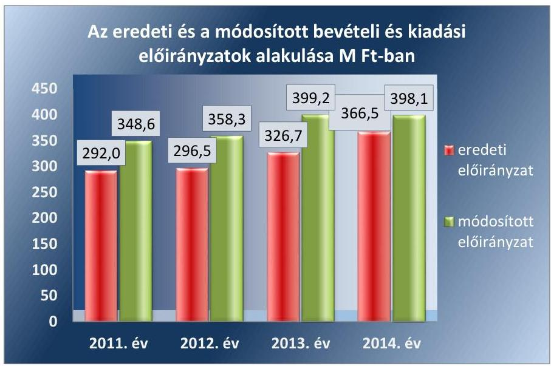

Forrás: az Intézmény 2011., 2012., 2013., 2014. évi beszámolói

Az Intézmény - a gazdasági szervezeti feladatokat ellátó MIK-kel, majd SZGYF-fel együttműködésben - a tervezett előirányzatokat előzetes számításokkal alátámasztotta az ellenőrzött időszakban. Az éves elemi költségvetést az Intézmény a 2011. évben az irányító szerv által meghatározott keretszámok betartásával, 2012. évtől a gazdasági szervezeti feladatokat ellátó MIK-kel, majd SZGYF-fel együttműködésben, és szintén az irányító szervek által meghatározott keretszámok betartásával készítette el. Az Intézményt a 2011-2014. években nem érintette szervezeti változás, illetve

---

(évközi) új feladatot a Közgyűlés, a KIM és az EMMI mint irányító szervek nem határoztak meg.

Az Intézmény a vizsgált években a költségvetéssel összefüggő adatszolgáltatási kötelezettségét az Ámr.-ben, az Áht. 2-ben és az irányító szerv által előírtaknak megfelelően teljesítette.
3.2. számú megállapítás

A bevételi és kiadási előirányzatok módosítása a 2011. évben megfelelt, a 2012-2014. években nem felelt meg a jogszabályi előírásoknak.

# AZ INTÉZMÉNY ELŐIRÁNYZATAI MÓDOSÍTÁ-

SÁRA a 2011-2014. években
 kormányzati, irányító szervi és intézményi saját hatáskörben került sor, összesen 222,6 M Ft összegben. Országgyűlési hatáskörű előirányzat-módosítás nem volt. Az Intézmény bevételi és kiadási előirányzatainak évközi módosításait hatáskör szerinti bontásban a 2. táblázat tartalmazza.
2. táblázat

| ELŐIRÁNYZAT-MÓDOSÍTÁSOK (M FT-BAN) |  |  |  |  |
| :--: | :--: | :--: | :--: | :--: |
| Áv | Kormányzati | irányító szervi | Intézményi | Összesen |
| 2011. | 0 | 48,3 | 8,3 | 56,6 |
| 2012. | 9 | $-0,9$ | 53,8 | 61,9 |
| 2013. | 7,4 | 46,3 | 18,8 | 72,5 |
| 2014. | 19,4 | $-9,9$ | 22,1 | 31,6 |

Az Intézményi éves beszámolók módosított előirányzat adatai megegyeztek a főkönyvi könyvelés adataival. Az előirányzat-módosítások főkönyvi könyvelése során betartották az Áhsz. 1-ben és az Áhsz. 2-ben előírtakat.

Az Intézmény a 2011. évi saját hatáskörben végrehajtott előirányzatváltozásairól - az Ámr. előírásaival összhangban - a Közgyűlés elnöke (a főjegyző előkészítésével) harminc napon belül tájékoztatta a Közgyűlést, aki a módosításokat jóváhagyta és az Intézmény költségvetését rendeletben módosította.

A saját hatáskörben a kiemelt előirányzatai (és a kiemelt előirányzaton belüli rovatok) között végrehajtott előirányzat átcsoportosítások dokumentumainak a pénzügyi ellenjegyzése a gazdasági szervezeti feladatokat ellátó MIK, majd SZGYF által - az Ávr. 44. § (2) bekezdésben előírtak ellenére - a 2012-2014. években több esetben nem történt meg. Az Intézmény a 2014. évben nem tartotta be az Ávr. 43. § (3) bekezdésben foglalt előírást, mert a személyi juttatások előirányzatainak növeléséhez nem rendelkezett az irányító szerv engedélyével.

A gazdasági szervezeti feladatokat ellátó MIK, majd SZGYF a 2012-2014. években az Intézmény saját hatáskörben végrehajtott előirányzat-módosításairól, átcsoportosításairól - az Ávr. 167. § (4) bekezdés előírása, és az Intézmény tájékoztatása ellenére - nem tájékoztatta az intézkedés meghozatalát követő öt munkanapon belül a Kincstárt és a fejezetet irányító szervet.

---

### 3.3. számú megállapítás

Az Intézmény a kiadási előirányzatok 2011-2014. évi felhasználása során nem tartotta be a jogszabályi előírásokat. A kiadási előirányzatok felhasználásánál a pénzgazdálkodási belső kontrollok a 2011. és 2014. években nem megfelelően, a 2012. és 2013. években részben megfelelően működtek.

Az Intézmény az ellenőrzött időszakban a bevételeket, illetve a kiadásokat a módosított előirányzatokra figyelemmel teljesítette. A kiadások a módosított előirányzatot egyik évben sem teljesítették túl (94,8-97,7% közötti volt a teljesítés), míg a bevételi előirányzatok közel 100%-ra (99,0 és 102,9%-ra) teljesültek.

A kiadási előirányzatok felhasználásánál a pénzgazdálkodási belső kontrollok a 2011. és 2014. években nem megfelelően, a 2012. és 2013. években részben megfelelően működtek. A pénzgazdálkodási belső kontrollok működésében az alábbi hiányosságok voltak:

- A nem rendszeres személyi juttatások mintatételeinél a 2011. évben több esetben előfordult - az Ámr. 76. § (1) bekezdésében előírtak ellenére -, hogy nem ellenőrizték és szakmailag nem igazolták a kiadások teljesítésének jogosságát, összegszerűségét. Továbbá több esetben az Ámr. 76. § (3) bekezdése ellenére nem az arra jogosult személy látta el a szakmai teljesítésigazolást. Az utalvány ellenjegyzése során - az Ámr. 79. § (2) bekezdésében előírtak ellenére - az ellenjegyző nem győződött meg arról, hogy a szakmai teljesítés igazolása megtörtént-e.
- A személyi juttatásoknál a 2012. évben több esetben előfordult - az Ávr. 58. § (3) bekezdésében előírtak ellenére -, hogy az érvényesítés nem történt meg, mivel hiányzott az érvényesítésre utaló megjelölés és az érvényesítő keltezéssel ellátott aláírása. Továbbá az érvényesítést - az Ávr. 58. § (4) bekezdésében előírtak ellenére - több esetben nem az érvényesítésre jogosult személy végezte el.
- A rendszeres és a nem rendszeres személyi juttatásoknál a 2013. évben több esetben előfordult, hogy azok - az Ávr. 57. § (3) bekezdése ellenére - nem tartalmazták a teljesítés igazolás dátumát és a teljesítés tényére történő utalás megjelölésével az arra jogosult személy aláírását. Továbbá az érvényesítő több esetben az - Ávr. 58. § (1) bekezdésben előírtak ellenére - nem ellenőrizte az összegszerűséget, a fedezet meglétét és azt, hogy a megelőző ügymenetben a jogszabályokban és a belső szabályzatokban foglaltakat megtartották-e. Az érvényesítés több esetben - az Ávr. 58. § (3) bekezdésben előírtak ellenére - nem az okmányok utalványozása előtt történt meg.
- A személyi juttatásoknál a 2014. évben rendszerszerűen - az Ávr. 58. § (3) bekezdése ellenére - az érvényesítés nem az okmányok utalványozása előtt történt meg. Az érvényesítő - az Ávr. 58. § (1) bekezdésében előírtak ellenére - nem ellenőrizte a kifizetések összegszerűségét, a fedezet meglétét, és azt, hogy a megelőző ügymenetben, a jogszabályokban és a belső szabályzatokban foglaltakat megtartották-e.
- A dologi kiadásoknál a 2011. évben előfordult, hogy a kötelezettségvállalás - az Ámr. 74. § (1) bekezdésében előírtak ellenére - nem az ellenjegyzés után történt meg. Előfordult továbbá az Ámr. 76. § (1)

---

bekezdésében előírtak ellenére, hogy nem ellenőrizték és szakmailag nem igazolták a kiadások teljesítésének jogosságát, összegszerűségét.
$\longrightarrow$ Az ellátottak pénzbeli juttatásainál a 2011. évben rendszeresen előfordult, - az Ámr. 79. § (2) bekezdés ellenére - hogy az utalvány ellenjegyzés nem történt meg, nem tartalmazta az ellenjegyzés tényére történő utalás megjelölését és az arra jogosult személy aláírását. A 2012-2013. években rendszeresen, a 2014. évben néhány esetben előfordult, - az Ávr. 58. § (3) bekezdésében előírtak ellenére - hogy az érvényesítés nem történt meg.
$\longrightarrow$ A felhalmozási kiadásoknál a 2013-2014. években rendszeresen előfordult, - az Ávr. 57. § (3) bekezdésben előírtak ellenére - hogy a teljesítést nem az arra jogosult igazolta. Továbbá az érvényesítést az Ávr. 58. § (4) bekezdésében előírtak ellenére - nem az érvényesítésre jogosult személy végezte el.
Közbeszerzési eljárást az Intézménynél a beszerzések alapján nem kellett lefolytatni.

### 3.4. számú megállapítás

Az Intézmény végrehajtotta az előirányzatok felhasználásához kapcsolódó évközi korlátozó intézkedéseket. Az Intézmény által a pénzmaradvány megállapítása a 2011. évben megfelelt a jogszabályi előírásoknak, az előirányzat-maradvány megállapítása a 2012-2014. években nem felelt meg a jogszabályi előírásoknak.

Az Intézmény végrehajtotta az előirányzat felhasználásához kapcsolódó évközi korlátozó intézkedéseket. Az Intézményt a 2012. évben érintette előirányzat zárolás, illetve elvonás. A zárolást és a zárolás feloldását a gazdasági szervezeti feladatokat ellátó MIK megfelelően hajtotta végre.

Az Intézmény 2011. éves pénzmaradványát, kötelezettségvállalással terhelt pénzmaradványát a jogszabályoknak megfelelően állapította meg, amelyet a Közgyűlés jóváhagyott.

Az Intézmény a 2012-2014. években a kötelezettségvállalással terhelt előirányzat-maradványát a gazdasági feladatokat ellátó MIK, majd SZGYF nem megfelelően állapította meg, mivel kötelezettségvállalással terhelt előirányzat-maradványként mutatott ki - az Ávr. 150. § b) pontjában és Ávr. 150. § (1) bekezdés b) pontjában előírtak ellenére - olyan kötelezettségvállalást is, amelyre a kötelezettségvállalás nem a költségvetési év előirányzata terhére történt, hanem az azt követő év előirányzata terhére.

Az előirányzat-maradvány terhére kimutatott kötelezettségvállalásokra a 2012. és 2014. években esetenként - az Áht. 2 37. § (1) bekezdésben foglaltak ellenére - pénzügyi ellenjegyzés hiányában került sor, illetve 2013-2014. években a pénzügyi ellenjegyzést a kötelezettségvállalások dokumentumán - az Ávr. 55. § (1) bekezdés ellenére - nem az arra jogosult személy igazolta aláírásával.

Az Intézmény a kötelezettségvállalással terhelt és jóváhagyott előirányzat-maradványt az Ávr.-ben meghatározott határidőig felhasználta. Az elvont előirányzat-maradvány összegét a központi költségvetésbe befizette.

---

# 3.5. számú megállapítás 

Az Intézmény fizetőképessége biztosított volt. Az Intézmény likviditási tervvel a 2012-2014. években nem rendelkezett.

A folyamatos fizetőképesség és a feladatellátás a 2011-2014. években biztosított volt.

Az Intézmény a 2011. évben az önkormányzati alrendszerbe tartozott és jogszabály nem írt elő előirányzat-felhasználási terv készítési kötelezettséget. Az Intézmény likviditási tervét a 2012-2014. években a gazdasági szervezeti feladatokat ellátó MIK, majd SZGYF - az Áht. 2 78. § (2) bekezdésében előírtak ellenére - nem készítette el.

Az Intézmény likviditási helyzete az ellenőrzött időszak alatt stabil volt, a forgóeszközei minden évben meghaladták a rövid lejáratú kötelezettségeit. Az Intézmény ütemezetten teljesítette kifizetéseit, szedte be követeléseit. 30 napnál hosszabb lejáratú tartozása a 2012-2014. években nem volt. A 2011. év végi állapothoz képest a 2014. év végére a likviditása kedvező tendenciát mutatott.
3.6. számú megállapítás

Az eredményszemléletű számvitel bevezetésével kapcsolatos feladatokat a gazdasági szervezeti feladatokat ellátó SZGYF nem szabályszerűen hajtotta végre.

A gazdasági szervezeti feladatokat ellátó SZGYF a rendező mérleg elkészítését megelőző, az NGM rendeletben ${ }^{69}$ előírt feladatokat végrehajtotta.

Az Intézmény és a gazdasági szervezeti feladatokat ellátó SZGYF nem rendelkezett az Intézményre vonatkozóan - az NGM rendelet 8. § (3) bekezdésében előírtak szerint - a szerv vezetője és a rendező mérleg elkészítéséért felelős személy által keltezéssel ellátott, aláírt rendező mérleggel, valamint a rendező mérlegen nem tüntették fel a rendező mérleg elkészítéséért felelős személy regisztrációs számát, vagy a kamarai tagsági számát.

## 4. Az Intézmény vagyongazdálkodása szabályszerű volt-e?

Összegző megállapítás

Az Intézmény vagyongazdálkodása - a 2011. év kivételével - nem volt szabályszerű.

Az Intézmény a 2011. évben a feladatellátáshoz szükséges vagyont szabályszerűen használta. Az Intézmény 2012. január 1-jétől a közfeladat ellátáshoz szükséges ingatlan vagyont - szerződés hiányában - jogcím nélkül használta.

Az Intézmény 2011. évi feladatellátását szolgáló vagyont az Önkormányzat a vagyongazdálkodási rendeletében és az alapító okirat ${ }_{1-3}$-ban foglaltak szerint bocsátotta az intézmény rendelkezésére. Az Intézmény a közfeladat ellátáshoz szükséges vagyont a vagyongazdálkodási rendelet előírásai alapján térítésmentesen használhatta, hasznosíthatta, illetve számviteli nyilvántartásaiban, mennyiségben és értékben nyilvántartotta.

---

# 4.2. számú megállapítás 

A Konsz. tv. erejénél fogva 2012. január 1-jével az Intézmény feladatellátásához szükséges vagyonelemek az Önkormányzat tulajdonából a Magyar Állam tulajdonába kerültek. Az Intézmény a 2012-2014. években a közfeladata ellátásához használt ingatlan vagyon tekintetében az Nvtv. 3. § (1) bekezdés 11. pontja és a Vtvr. ${ }^{70}$ 1. § (7) bekezdés a) pontja szerinti jogcímmel (szerződéssel) nem rendelkezett, ezért nem minősült a nemzeti vagyon, illetve az állami vagyon jogszerű használójának.

## A mérlegben kimutatott eszközök és források nyilvántartása, értékelése - a 2011. év kivételével - a jogszabályi előírásoknak nem felelt meg.

A 2011. évben az Intézmény eszközeinek és forrásainak nyilvántartása megfelelt a jogszabályokban foglalt előírásoknak. Az Intézmény mérlegében a 2012-2014. években - az Áhsz. 1 20. § (2) bekezdésében, valamint az Áhsz. 2 10. § (2) bekezdésében előírtak ellenére - a vagyonkezelésébe nem tartozó ingatlanok szerepeltek.

Az Intézmény mérlegeiben hibásan kimutatott állami ingatlan vagyon értékét a 3. táblázat mutatja be:
3. táblázat

## AZ INTÉZMÉNYI MÉRLEGBEN SZABÁLYTALANUL KIMUTATOTT VAGYON ÉRTÉKE

|  | 2012. év | 2013. év | 2014. év |
| :-- | --: | --: | --: |
| Ingatlanok és kapcsolódó   vagyonértékű jogok (M Ft) | 499,3 | 493,0 | 480,0 |
| Mérlegfőösszeg (M Ft) | 533,0 | 531,1 | 517,8 |
| Mérleg
 hiba (\%) | 93,7 | 92,8 | 92,7 |

A 2012-2014. években az ingatlanvagyon értékének beszámolóban szerepeltetése szabálytalan volt. A 2012-2014. években a szabálytalanul szerepeltetett vagyon értéke meghaladta az Áhsz. 15. § 10. pontja, illetve a Btk. ${ }^{71}$ 403. § (4) bekezdésében meghatározott, a megbízható és valós képet lényegesen befolyásoló hiba mértékét. A 2012-2014. évi beszámolók a Sztv. 18. §-ában foglaltak alapján - nem mutattak az intézmény vagyoni helyzetéről megbízható és valós képet. Az állami ingatlan vagyon intézményi mérlegben történő hibás kimutatásával megsértették a Sztv. 15. § (3) bekezdésében előírt valódiság és a Sztv. 16. § (4) bekezdésében előírt lényegesség elvét.

Az Intézmény könyveiben szabálytalanul nyilvántartott ingatlanok értéke után - az Áhsz. 1 30. § (1) bekezdés, az Áhsz. 2 17. § (1) bekezdésében leírtak alapján - az Intézménynél a gazdálkodási feladatokat ellátó MIK, majd SZGYF értékcsökkenést számolt el. Az Intézmény nyilvántartásaiban szereplő állami ingatlanok és kapcsolódó vagyonértékű jogok tekintetében nem volt jogcím - az Áhsz. 1 20. § (2) és 34. § (1)-(2) bekezdéseiben, valamint az Áhsz. 2 10. § (2) és 21. § (1) bekezdéseiben előírtak szerint - az értékcsökkenés elszámolására és kimutatására.

Az ellenőrzött időszak alatt az Intézmény az éves költségvetési beszámoló elkészítéséhez, a mérleg tételeinek alátámasztásához a leltárakat szabályszerűen állította össze. A leltározás gyakorisága és a leltár felvételének módja megfelelt a Sztv.-ben és az Áhsz. 1.2-ben foglaltaknak. Az Intézmény 2011-2014. évi költségvetési beszámolók könyvviteli mérlegeiben és

---

a számviteli analitikus nyilvántartásokban kimutatott eszközök állományának valódiságát a - mennyiségben és értékben elkészített - leltárak dokumentumai alátámasztották. Az Intézmény a 2012-2014. évek mérlegében szabálytalanul szerepeltetett állami ingatlanokat és kapcsolódó vagyonértékű jogokat is felleltározta.

A 2014. évi rendező mérleg elkészítéséhez 2013. december 31-ei mérleg fordulónappal a teljes körű leltározást az NGM rendelet 2. § (1) bekezdése szerint elvégezték az eszközök, források és kötelezettségvállalás esetében. A függő, átfutó kiadások és bevételekkel kapcsolatos előírt kötelezettségeket az NGM rendelet 2. § (3) bekezdése szerinti módon szabályosan rendezték.

Az ellenőrzött időszak alatt az Intézménynél a feleslegessé vált, illetve megrongálódott, használhatatlanná vált eszközöket a Selejtezési szabályzat ${ }_{1,2}{ }^{72}$-nek megfelelően, szabályszerűen leselejtezték, amelyről selejtezési jegyzőkönyveket készítettek.

# 4.3. számú megállapítás 

Az Intézménynek nem volt értékmegőrzési, állagmegóvási kötelezettsége.

A 2011. évben az Intézmény feladatellátásához szükséges vagyon az önkormányzat tulajdonában volt, az önkormányzati vagyonrendelet az értékmegőrzésre, állagmegóvásra részletes előírást nem fogalmazott meg. A 2012. január 1-jétől a feladatellátását szolgáló ingatlanvagyont az Intézmény jogcím nélkül használta és előírás hiányában az ingatlanokkal kapcsolatban állagmegóvási, karbantartási kötelezettsége nem volt.

## 4.4. számú megállapítás

A vagyonelemek hasznosítása a 2011. évben a jogszabályok előírásainak megfelelően, a 2012-2013. években nem megfelelően történt.

Az Intézmény az ellenőrzött időszak alatt vagyonelemeket nem értékesített. A 2011. évben a vagyonhasznosítási bevételt az Áht. ${ }_{1}$ előírásai szerint szerződéssel és kiállított számlákkal alátámasztotta.

Az Intézmény jogcímmel nem rendelkezett azon ingatlanok tekintetében, amelyek használatát a 2012-2013. években átengedte visszterhes szerződés alapján harmadik személynek, így az abból befolyt bevételek az Áht. ${ }_{2}$ 45. § (4) bekezdésében előírtak alapján - az Intézményt nem illették volna meg.

Az Intézménynek a 2014. évben vagyonhasznosítási bevétele nem volt.

## 5. Szabályszerűen hajtották-e végre az ellenőrzött időszakban az Intézményt érintő szervezeti, szerkezeti átalakításokat?

Összegző megállapítás Az ellenőrzött időszakban az Intézményt érintő szervezeti, szerkezeti átalakítás nem történt.

Az intézményt az Áht. ${ }_{1}$-ben és az Áht. ${ }_{2}$-ben meghatározott átalakulás nem érintette.

---

# 6. Az Intézmény intézkedett-e az integritás szemlélet érvényesítése érdekében? 

## Összegző megállapítás

Az Intézmény erőfeszítéseket tett az integritás szemlélet érvényesítése érdekében.

Az Intézmény részt vett az ÁSZ integritás felmérésében, ezért az integritás szemlélet érvényesülésének értékelése az intézmény által kitöltött rövid kérdőív alapján történt. Az integritás szemlélet érvényesítésével kapcsolatos részletes megállapításokat a II. sz. melléklet tartalmazza.

---

# JAVASLATOK 

Az ÁSZ tv. 33. § (1) bekezdésében foglaltak értelmében az ellenőrzött szervezet vezetője köteles a jelentésben foglalt megállapításokhoz kapcsolódó intézkedési tervet összeállítani és azt a jelentés kézhezvételétől számított 30 napon belül az ÁSZ részére megküldeni. Amennyiben az ellenőrzött szervezet vezetője nem küldi meg határidőben az intézkedési tervet vagy továbbra sem elfogadható intézkedési tervet küld, az ÁSZ elnöke az ÁSZ tv. 33. § (3) bekezdés a)-b) pontjaiban foglaltakat érvényesítheti.

## az emberi erőforrások miniszterének

1. Intézkedjen az Intézmény feladatainak ellátásához használt, az SZGYF vagyonkezelésében lévő vagyon
a) kezelésével, valamint
b) az Intézmény mérlegében történt kimutatásával
kapcsolatban feltárt szabálytalanságok tekintetében a munkajogi felelősség tisztázására irányuló eljárás megindításáról, és ennek eredménye ismeretében tegye meg a szükséges intézkedéseket.
(1.2. számú megállapítás 3. bekezdése, és a 4.2. számú megállapítás 1. és 3. bekezdése alapján)

## a Szociális és Gyermekvédelmi Főigazgatóság mint középirányító szerv főigazgatójának

1. Intézkedjen a jogszabályi előírásoknak megfelelően a vagyonkezelésében lévő, az Intézmény feladatai ellátásához használt ingatlanok működtetésé keretében a vagyon Intézmény általi használatához a használat jogcímének biztosítására.
(1.2. számú megállapítás 3. bekezdés 2. mondata alapján és a 4.1. számú megállapítás 2. bekezdés 2. mondata alapján)
2. Intézkedjen a jogszabályi előírásokkal összhangban az Intézményre vonatkozóan az előirányzatokkal, a létszámokkal és a vagyonnal való hatékony gazdálkodás követelményeinek érvényesítésére, e követelmények érvényre juttatásának számon kérésére, ellenőrzésére.
(1.2. számú megállapítás 5. bekezdés 2. mondata alapján)

---

3. Tegyen intézkedéseket
a) az Intézménynél rendelkezésre álló források gazdaságos, hatékony és eredményes felhasználását biztosító szabályzatok kiadásával, folyamatok kialakításával és működtetésével, valamint
b) a rendező mérleg szabályszerű elkészítésének hiányával kapcsolatban feltárt hiányosságok tekintetében a költségvetési szerv vezetőjének felelőssége tisztázása érdekében, és szükség szerint intézkedjen a felelősség érvényesítésére.
(2.5. számú megállapítás 3. bekezdése, és a 3.6. számú megállapítás 2. bekezdése alapján)

# a Szociális és Gyermekvédelmi Főigazgatóság mint a „Tóparti Otthon" Jász-Nagykun-Szolnok Megyei Fogyatékosok Otthona és Rehabilitációs Intézmény gazdasági szervezeti feladatait ellátó szerv főigazgatójának 

1. Intézkedjen a jogszabályi előírásoknak megfelelően az Intézménnyel a gazdasági szervezeti feladatokra vonatkozó munkamegosztás és felelősségvállalás rendjét tartalmazó megállapodás megkötésére.
(2.1. számú megállapítás 8. bekezdés alapján)
2. Intézkedjen, a jogszabályi előírásoknak megfelelően az Intézményre vonatkozó számviteli politika és annak keretében elkészítendő szabályzatok elkészítésére.
(2.1. számú megállapítás 10. bekezdése alapján)
3. Intézkedjen a jogszabályi előírásoknak megfelelően az Intézmény számlarendjének elkészítésére.
(2.1. számú megállapítás 12. bekezdés 1. mondata alapján)
4. Intézkedjen, hogy az Intézmény által a költségvetése kiemelt előirányzatai és a kiemelt előirányzaton belüli rovatok között átcsoportosításokra irányuló intézkedéseket a jogszabályban előírtaknak megfelelően a pénzügyi ellenjegyző ellenjegyezze.
(3.2. számú megállapítás 4. bekezdés 1. mondata alapján)

---

5. 

Tegyen eleget az intézkedés meghozatalát követő öt munkanapon belül az intézményi hatáskörben végrehajtott előirányzat-módosításokról, átcsoportosításokról a Kincstár és a fejezetet irányító szerv felé fennálló tájékoztatási kötelezettségnek.
(3.2. számú megállapítás 5. bekezdése alapján)
6. Intézkedjen, hogy
a) az érvényesítést az arra kijelölt személy, a jogszabályi előírásokban foglaltak betartásával végezze el;
b) a pénzügyi ellenjegyzést az arra kijelölt személy igazolja aláírásával.
(3.3. számú megállapítás 2. bekezdés 4. és 6-7. pontjai, 3.4. számú megállapítás 4. bekezdés alapján)
7. Intézkedjen, hogy az Intézmény kötelezettségvállalással terhelt előirányzat maradványának megállapítása a jogszabályi előírásokkal összhangban történjen.
(3.4. számú megállapítás 3. bekezdés alapján)
8. Intézkedjen a jogszabályban előírtaknak megfelelően a likviditási terv elkészítésére.
(3.5. számú megállapítás 2. bekezdés 2. mondata alapján)
9. Intézkedjen a jogszabályi előírásokkal összhangban, hogy az Intézmény éves költségvetési beszámolójának mérlegében a vagyonkezelésébe nem tartozó ingatlanok ne szerepeljenek.
(4.2. számú megállapítás 1. bekezdés 2. mondata alapján)

# a „Tóparti Otthon" Jász-Nagykun-Szolnok Megyei Fogyatékosok Otthona és Rehabilitációs Intézménye vezetőjének 

1. Intézkedjen az Intézmény SZMSZ-ének módosítására annak érdekében, hogy az a jogszabályi előírásokkal összhangban tartalmazza a nevesített munkakörökhöz kapcsolódóan a helyettesítés rendjét.
Kezdeményezze az előzőek szerint módosított SZMSZ irányítószerv általi jóváhagyását.
(1.1. számú megállapítás 3. bekezdés 4. mondata alapján)

---

2. Intézkedjen a jogszabályi előírással összhangban
a) a közbeszerzési értékhatár alatti beszerzések lebonyolításával kapcsolatos eljárásrend,
b) a belföldi és külföldi kiküldetések elrendelésével és lebonyolításával, elszámolásával kapcsolatos kérdések, valamint
c) az anyag és eszközgazdálkodás számviteli politikában nem szabályozott kérdéseinek
a szabályozására.
(2.1 számú megállapítás 15. bekezdés alapján)
3. Intézkedjen, hogy a jogszabályi előírással összhangban a közbeszerzési szabályzat tartalmazza a közbeszerzési eljárás dokumentálási rendjét.
(2.1 számú megállapítás 16. bekezdés alapján)
4. Intézkedjen a jogszabályban előírt integrált kockázatkezelési rendszer működtetésére.
(2.2 számú megállapítás 1. bekezdés 2. mondata alapján)
5. Intézkedjen az információs és kommunikációs rendszer jogszabályi előírásnak megfelelő kialakítására és működtetésére.
(2.4. számú megállapítás 1. bekezdés alapján)
6. Intézkedjen a jogszabályi előírásokkal összhangban
a) a kötelezően közzéteendő adatok nyilvánosságra hozatali rendjének, valamint
b) a közérdekű adatok megismerésére irányuló igények teljesítése rendjének szabályozására.
(2.4. számú megállapítás 3-4. bekezdés alapján)
7. Intézkedjen a jogszabályi előírással összhangban az operatív tevékenységek folyamatos és eseti nyomon követését biztosító monitoring rendszer kialakítására és működtetésére.
(2.5. számú megállapítás 1. bekezdés alapján)
8. Intézkedjen a jogszabályi előírásoknak megfelelően a belső ellenőrzés kialakítására és működtetésére.
(2.5. számú megállapítás 2. bekezdés alapján)

---

9. Intézkedjen a jogszabályban előírtaknak megfelelően a rendelkezésre álló források gazdaságos, hatékony és eredményes felhasználását biztosító szabályzatok kiadására, folyamatok kialakítására és működtetésére.
(2.5 számú megállapítás 3. bekezdés alapján)
10. Intézkedjen, hogy
a) kötelezettségvállalásra a jogszabályban előírtaknak megfelelően, a pénzügyi ellenjegyzést követően kerüljön sor,
b) a teljesítésigazolást az arra kijelölt személy végezze el.
(3.3. számú megállapítás 2. bekezdés 7. pontja, valamint a 3.4. számú megállapítás 4. bekezdés alapján)

---

.

---

# MELLÉKLETEK 

- I. SZ. MELLÉKLET: ÉRTELMEZŐ SZÓTÁR
állami vagyon
állami vagyonnak minősül:
a) az állam tulajdonában lévő dolog, valamint a dolog módjára hasznosítható természeti erő,
b) az a) pont hatálya alá nem tartozó mindazon vagyon, amely vonatkozásában törvény az állam kizárólagos tulajdonjogát nevesíti,
c) az állam tulajdonában lévő tagsági jogviszonyt megtestesítő értékpapír, illetve az államot megillető egyéb társasági részesedés,
d) az államot megillető olyan immateriális, vagyoni értékkel rendelkező jogosultság, amelyet jogszabály vagyoni értékű jogként nevesít
(Forrás: Vtv. 1. § (2) bekezdése)
állami vagyon használója Az a természetes személy, jogi személy, illetve jogi személyiséggel nem rendelkező szervezet, amely, illetve aki törvény vagy szerződés alapján, bármely jogcímen (pl. bérlet, haszonbérlet, vagyonkezelési szerződés, használat stb.) állami vagyont birtokol, használ, szedi annak hasznait, hasznosít, ide nem értve a tulajdonosi jogok gyakorlóját.
(Forrás: Vtvr. 1. § (7) bekezdés a) pontja, hatályos 2011. január 1-jétől 2011. december 31-ig)
Az a természetes vagy jogi személy, jogi személyiséggel nem rendelkező szervezet, aki, vagy amely törvény vagy szerződés alapján, bármely jogcímen (bérlet, haszonbérlet, használat stb.) állami vagyont birtokol, használ, szedi annak hasznait, hasznosít, ide nem értve a haszonélvezőt, a vagyonkezelőt és a tulajdonosi jogok gyakorlóját".
(Forrás: Vtvr. 1. § (7) bekezdés a) pontja)
állami vagyon hasznosítása Az állami vagyont az MNV Zrt. maga kezeli, vagy szerződés - így különösen bérlet, haszonbérlet, szerződésen alapuló haszonélvezet, vagyonkezelés, megbízás - alapján központi költségvetési szervnek, természetes vagy jogi személynek, vagy jogi személyiséggel nem rendelkező gazdálkodó szervezetnek hasznosításra átengedi.
(Forrás: Vtv. 23. § (1) bekezdése, hatályos 2011. december 31-éig)
Az állami vagyont az MNV Zrt. maga kezeli, vagy szerződés - így
 különösen bérlet, haszonbérlet, megbízás alapján központi költségvetési szervnek, természetes vagy jogi személynek, vagy jogi személyiséggel nem rendelkező gazdálkodó szervezetnek hasznosításra átengedi.
(Forrás: Vtv. 23. § (1) bekezdése, hatályos 2012. január 1-jétől)
Az állami vagyonnal a tulajdonosi joggyakorló maga gazdálkodik, vagy szerződés – így különösen bérlet, haszonbérlet, megbízás – alapján hasznosításra átengedi, illetőleg vagyonkezelésbe, haszonélvezetbe adja.
(Forrás: Vtv. 23. § (1) bekezdése, hatályos 2013. június 28-ától)
állami vagyon hasznosítására kötött szerződések elsődleges célja az állami vagyon hatékony működtetése, állagának védelme, értékének megőrzése, illetve gyarapítása, az állami és közfeladatok ellátásának elősegítése. (Forrás: Vtv. 23. § (2) bekezdése)
állami vagyon kezelője /vagyonkezelő

Az állami vagyont az MNV Zrt. maga kezeli, vagy szerződés – így különösen bérlet, haszonbérlet, szerződésen alapuló haszonélvezet, vagyonkezelés, megbízás – alapján

---

|  | központi költségvetési szervnek, természetes vagy jogi személynek, illetőleg jogi személyiséggel nem rendelkező gazdasági társaságnak hasznosításra átengedi (Forrás: Vtv. 23. § (1) bekezdése, hatályos 2010. január 01–2011. december 31-ig).   Az állami vagyont az MNV Zrt. maga kezeli, vagy szerződés – így különösen bérlet, haszonbérlet, megbízás – alapján központi költségvetési szervnek, természetes vagy jogi személynek, vagy jogi személyiséggel nem rendelkező gazdálkodó szervezetnek hasznosításra átengedi. Az állami vagyonra vonatkozóan az MNV Zrt. kizárólag az Nvtv.-ben meghatározott személyekkel köthet vagyonkezelési szerződést.   (Forrás: Vtv. 27. § (1) bekezdése, hatályos 2012. január 1-jétől) |
| :--: | :--: |
| ÁSZ Integritás Projekt | Az Állami Számvevőszék 2009-ben indította el a „Korrupciós kockázatok feltérképezése – Integritás alapú közigazgatási kultúra terjesztése” című, európai uniós forrásból megvalósított kiemelt projektjét (Integritás Projekt). Az Integritás Projekt célja, hogy felmérje a közszféra intézményei korrupciós kockázatoknak való kitettségét, illetőleg az azok mérséklésére hivatott kontrollok szintjét. Az Állami Számvevőszék a projekt révén az integritás szemlélet minél szélesebb körrel történő megismertetését, gyakorlatba ültetését kívánja elérni. Az integritás követelményeinek megfelelő szervezeti működést előnyben részesítő közigazgatási kultúra elterjesztését és a korrupció elleni fellépést az ÁSZ önmagára nézve is stratégiai jelentőségű célként fogalmazta meg. A projekt a felmérésben résztvevő intézmények számára helyzetükről egyfajta „tükörképet” mutat be, ami alapot teremt a jövőbeni pozitív irányú elmozduláshoz. (Forrás: a http://integritas.asz.hu honlapon közzétett, a 2013. évi Integritás felmérés eredményeiről készült összefoglaló tanulmány) |
| átalakítás | Az általános jogutódlással történő megszüntetés átalakítással történhet. Az átalakítás lehet egyesítés vagy különválás. Az egyesítés lehet beolvadás vagy összeolvadás.   (Forrás: Áht. 195. §-a, Áht. 211. §-a) |
| belső ellenőrzés | Független, tárgyilagos bizonyosságot adó és tanácsadó tevékenység, amelynek célja, hogy az ellenőrzött szervezet működését fejlessze és eredményességét növelje, az ellenőrzött szervezet céljai elérése érdekében rendszerszemléletű megközelítéssel és módszeresen értékeli, illetve fejleszti az ellenőrzött szervezet irányítási és belső kontrollrendszerének hatékonyságát. (Forrás: Bkr. 2. § b) pontja) |
| belső kontrollrendszer | A belső kontrollrendszer a kockázatok kezelése és tárgyilagos bizonyosság megszerzése érdekében kialakított folyamatrendszer, amely azt a célt szolgálja, hogy a működés és gazdálkodás során a tevékenységeket szabályszerűen, gazdaságosan, hatékonyan, eredményesen hajtsák végre, az elszámolási kötelezettségeket teljesítsék, megvédjék az erőforrásokat a veszteségektől, károktól és nem rendeltetésszerű használattól. (Forrás: Áht. 269. § (1) bekezdése) |
| belső kontrollrendszer területei | A kontrollkörnyezet, a kockázatkezelési rendszer, a kontrolltevékenységek, az információs és kommunikációs rendszer, valamint a nyomon követési (monitoring) rendszer. (Forrás: Bkr. 3. §-a) |
| előirányzat-maradvány | Az államháztartás központi alrendszerébe tartozó költségvetési szerveknél a módosított bevételi és kiadási előirányzatok és azok teljesítésének a Kormány rendeletében meghatározott tételekkel korrigált különbözete az előirányzat-maradvány.   (Forrás: Áht. 22. § (1) bekezdés m) pontja). |
| felújítás | Az elhasználódott tárgyi eszköz eredeti állaga (kapacitása, pontossága) helyreállítását szolgáló időszakonként visszatérő olyan tevékenység, melynek során az eszköz élettartama megnövekszik, minősége, használata jelentősen javul, így a pótlólagos ráfordításból a jövőben gazdasági előnyök származnak. (Forrás: Sztv. 3. § (4) bekezdés 8. pontja) |
| hasznosítás | A nemzeti vagyon birtoklásának, használatának, hasznok szedése jogának bármely a tulajdonjog átruházását nem eredményező jogcímen történő átengedése, ide |

---

| információs és kommunikációs rendszer | nem értve a vagyonkezelésbe adást, valamint a haszonélvezeti jog alapítását. (Forrás: Nvtv. 3. § (1) bekezdés 4. pontja) |
| :--: | :--: |
| integritás | A költségvetési szerv vezetője által kialakított és működtetett olyan rendszer, mely biztosítja, hogy a megfelelő információk a megfelelő időben eljutnak az illetékes szervezethez, szervezeti egységhez, illetve személyhez. (Forrás: Bkr. 9. § (1) bekezdés) |
| irányító szerv/felügyeleti szerv | A kiogrítás az elvek, értékek, cselekvések, módszerek, intézkedések konzisztenciáját jelenti, vagyis olyan magatartásmódot, amely meghatározott értékeknek megfelel.   (Forrás: Nemzetgazdasági Minisztérium: Magyarországi államháztartási belső kontroll standardok Útmutató 1.6.1. pontja, 2012. december) |
| kincstári költségvetés | A központi költségvetésről szóló törvény elfogadását követően a fejezetet irányító szerv az államháztartás központi alrendszerébe tartozó költségvetési szerv és a fejezeti kezelésű előirányzat kiemelt előirányzatait, valamint az elkülönített állami pénzalapok és a társadalombiztosítás pénzügyi alapjai jogszabályi előírás szerinti bevételeit és kiadásait kincstári költségvetés kiadásával állapítja meg. (Forrás: Áht. 24. § (3) bekezdés, Áht. 228. § (2) bekezdés) |
| kockázat | A kockázat annak a valószínűségét jelenti, hogy egy vagy több esemény vagy intézkedés nem kívánt módon befolyásolja a rendszer működését, céljainak megvalósulását. (Forrás: Javaslatok a korrupciós kockázatok kezelésére – Kockázatkezelési és ellenőrzési módszertan 35. oldal, ÁSZ) |
| kockázatkezelési rendszer | Olyan irányítási eszközök és módszerek összessége, melynek elemei a szervezeti célok elérését veszélyeztető tényezők (kockázatok) azonosítása, elemzése, csoportosítása, nyomon követése, valamint szükség esetén a kockázati kitettség mérséklése. (Forrás: Bkr. 2. § m) pontja) |
| kontrollkörnyezet | A költségvetési szerv vezetője által kialakított olyan elvek, eljárások, belső szabályzatok összessége, amelyben világos a szervezeti struktúra, egyértelműek a felelősségi, hatásköri viszonyok és feladatok, meghatározottak az etikai elvárások a szervezet minden szintjén, átlátható a humánerőforrás-kezelés. (Forrás: Bkr. 6. § (1) bekezdés) |
| kontrolltevékenységek | A költségvetési szerv vezetője által a szervezeten belül kialakított (kontroll) tevékenységek, melyek biztosítják a kockázatok kezelését, hozzájárulnak a szervezet céljainak eléréséhez. (Forrás: Bkr. 8. § (1) bekezdés) |
| kommunikáció | Az a tevékenység, melynek során információ továbbítása valósul meg. A kommunikációs folyamat résztvevői között tájékoztatás történik, mely során tényeket, ezek magyarázatát közlik. |
| korrupció | Azok a cselekmények, amelyek során a köz érdekében való eljárással megbízott és döntéshozatali felelősséggel felruházott személy a köz érdeke helyett önös vagy részérdekeket követve, mástól jogtalan vagy etikátlan előnyt elfogadva és őt jogtalan vagy etikátlan előnyhöz juttatva jár el, illetve amikor valaki a köz érdekében való eljárással megbízott és döntéshozatali felelősséggel felruházott személynek jogtalan vagy etikátlan előnyt nyújtva vagy felajánlva jogtalan vagy etikátlan előnyt kér. (Forrás: A Kormány korrupció megelőzési programja 2012–2014.) |
| középirányító szerv | A költségvetési szerv tekintetében törvény vagy kormányrendelet alapján meghatározott, átruházott irányítási hatásköröket gyakorló szerv. (Forrás: Áht. 29. § (4) bekezdés) |
| közfeladat | Jogszabályban meghatározott állami vagy önkormányzati feladat, amit az arra kötelezett közérdekből, a jogszabályban meghatározott követelményeknek és feltételeknek megfelelve végez, ideértve a lakosság közszolgáltatásokkal való ellátását, to- |

---

|  | vábbá az állam nemzetközi szerződésekben vállalt kötelezettségeiből adódó közér-   dekű feladatokat, valamint e feladatok ellátásakor szükséges infrastruktúra biztosítását is.   (Forrás: Nvtv. 3. § (1) bekezdés 7. pontja) |
| :--: | :--: |
| kulcskontroll | A 2011. évet érintően a szakmai teljesítésigazolás és az utalvány ellenjegyzése, a 2012–2014. éveket érintően a teljesítésigazolás és az érvényesítés gazdálkodási jogkör gyakorlása.   (Forrás: ellenőrzés módszerei) |
| monitoring | A monitoring általánosságban a különböző szintű szervezeti célok megvalósításának folyamatát kíséri figyelemmel, melynek során a releváns eseményekről és tevékenységekről (együtt: folyamatokról) rendszeres jelleggel, strukturált, döntéstámogató információkhoz jutnak a szervezet vezetői. (Forrás: NGM Útmutató a költségvetési szervek monitoring rendszeréhez 2011. november) |
| monitoring-rendszer | A költségvetési szerv vezetője köteles olyan monitoring rendszert működtetni, mely lehetővé teszi a szervezet tevékenységének, a célok megvalósításának nyomon követését. A költségvetési szerv monitoring rendszere az operatív tevékenységek keretében megvalósuló folyamatos és eseti nyomon követésből, valamint az operatív tevékenységektől függetlenül működő belső ellenőrzésből áll. (Forrás: Ámr. 160. §, Bkr. 10. §) |
| tulajdonosi joggyakorló | Aki a nemzeti vagyon felett az államot vagy a helyi önkormányzatot megillető tulajdonosi jogok és kötelezettségek összességének gyakorlására jogosult. (Forrás: Nvtv. 3. § (1) bekezdés 17. pontja) |
| vagyongazdálkodás | A nemzeti vagyongazdálkodás feladata a nemzeti vagyon rendeltetésének megfelelő, az állam, az önkormányzat mindenkori teherbíró képességéhez igazodó, elsődlegesen a közfeladatok ellátásához és a mindenkori társadalmi szükségletek kielégítéséhez szükséges, egységes elveken alapuló, átlátható, hatékony és költségtakarékos működtetése, értékének megőrzése, állagának védelme, értéknövelő használata, hasznosítása, gyarapítása, továbbá az állam vagy a helyi önkormányzat feladatának ellátása szempontjából feleslegessé váló vagyontárgyak elidegenítése. (Forrás: Nvtv. 7. § (2) bekezdése) |

---

# II. SZ. MELLÉKLET: AZ INTEGRITÁS SZEMLÉLET ÉRVÉNYESÍTÉSÉVEL KAPCSOLATOS MEGÁLLAPÍTÁSOK 

Az Integritás Projekt célja, hogy felmérje a közszféra intézményei korrupciós kockázatoknak való kitettségét, illetőleg az azok mérséklésére hivatott kontrollok szintjét. Az Integritás Projekt az integritás szemlélet, a megelőzésen alapuló korrupció elleni küzdelem, a kockázatokban való gondolkodás elterjesztését is célul tűzte ki.

Az Intézmény által, az ellenőrzés során kitöltött rövid integritás tanúsítvány alapján – öt kockázati területen – a kialakított kontrollokat értékeltük. Az Intézménynél az integritás kontrollrendszer kialakítása összességében fejlesztendő volt.
Az Intézmény integritás szemlélet érvényesülésének értékelését az alábbi táblázat tartalmazza.

## AZ INTÉZMÉNY INTEGRITÁS SZEMLÉLET ÉRVÉNYESÜLÉSÉNEK ÉRTÉKELÉSE

| Értékelt terület | Értékelés eredménye |
| :-- | :--: |
| Összeférhetetlenség és etika elvárások értékelése | Fejlesztendő |
| Humánerőforrás-gazdálkodás értékelése | Fejlesztendő |
| Szervezet vagyonának megvédésére tett intézkedések értékelése | Kiváló |
| A nemkívánatos dolgozói magatartással szembeni intézkedések és azok érvényesülésének értékelése | Fejlesztendő |
| Az integritás erősítésének, annak tudatosításának, valamint a kockázatelemzések alkalmazásának értékelése | Fejlesztendő |
| Összesítő értékelés | Fejlesztendő |

Az összeférhetetlenség és etikai elvárások kockázati területen a kontrollok kialakítása fejlesztendő volt. Az Intézmény nem határozta meg az összeférhetetlenség fennállása esetén követendő eljárásokat, nem szabályozta a különféle ajándékok elfogadásának feltételeit és a munkatársaknak nem volt kötelező nyilatkozniuk a gazdasági érdekeltségeikről, vagy egyéb, a szervezet tevékenysége szempontjából releváns összeférhetetlenségről. A humánerőforrás gazdálkodás kockázati területen a kontrollok kialakítása szintén fejlesztendő volt. Az Intézmény nem szabályozta a humánpolitikai tevékenységét, az új munkatársak kiválasztására szolgáló eljárást nem minden jelölt esetében alkalmazta, az új munkatársak kiválasztásakor nem minden esetben írt ki álláspályázatot. Ugyanakkor az Intézmény minden alkalmazottja rendelkezett munkaköri leírással és az Intézmény alkalmazott az objektív megítélést lehetővé tevő, általánosan elfogadott módszert
 a megfelelő felkészültségű szakemberek kiválasztására. A vagyon megvédésére tett intézkedések kockázati területen a kontrollok kialakítása kiváló volt. Rendelkeztek a munkáltató tulajdonában lévő egyes eszközök használatára vonatkozó szabályokkal, intézkedtek a dokumentumok, pénzeszközök, kulcsok biztonságos tárolásának megteremtése érdekében, szabályozták a külső személyekkel való kapcsolattartást, alkalmazták a négy szem elvét, valamint intézkedtek az információ biztonsága érdekében. A nem kívánatos dolgozói magatartással szembeni intézkedések és azok érvényesülése kockázati területen a kontrollok kialakítása fejlesztendő volt. Nem határozták meg a szervezeten belülről érkező közérdekű bejelentések eljárásrendjét, és nem rendelkeztek szabályozással a bejelentést tévő megfelelő védelmének biztosítására. Az integritás erősítése, annak tudatosítása, valamint a kockázatelemzések értékelése kockázati területen a kontrollok kialakítása fejlesztendő volt. Nem hangsúlyozták, illetve tudatosították az alkalmazottakban az integritás fontosságát a mindennapi tevékenység során, nem szabályozták, illetve nem hívták fel a korrupciós szempontból veszélyeztetett beosztásokban dolgozók figyelmét a jellemző kockázatokra és a kockázatokat megelőző intézkedésekre, nem végeztek rendszeresen kockázatelemzést a belső ellenőrzési tervek megalapozásához.

Az integritás tanúsítvány eredményei jelen ellenőrzés eredményeivel összhangban vannak.

---

# GAZDASÁGOSSÁGI, HATÉKONYSÁGI ÉS EREDMÉNYESSÉGI KÖVETELMÉNYEKET a gazdálkodás folyamataiban az Intézmény nem alakított ki. 

Az Intézmény pénzügyi és vagyongazdálkodási folyamatai tekintetében a gazdaságossági, hatékonysági és eredményesség követelményeinek érvényesítéséről kiadott vezetői nyilatkozatok - a teljesítmény követelményrendszer dokumentált kialakításának és működtetésének hiányában - nem voltak helytállóak.

---

# FÜGGELÉK: ÉSZREVÉTELEK 

Az Állami Számvevőszék a jelentéstervezetet 15 napos észrevételezésre megküldte az ellenőrzött szervezetek vezetőinek az ÁSZ tv. 29. § (1) bekezdése előírásának megfelelően.

A Szociális és Gyermekvédelmi Főigazgatóság, a Jász-Nagykun-Szolnok Megyei Önkormányzat, valamint a „Tóparti Otthon" Jász-Nagykun-Szolnok Megyei Fogyatékosok Otthona és Rehabilitációs Intézménye részéről az ellenőrzött szervezet vezetője az ellenőrzés megállapításaira írásban észrevételt tett. Az Emberi Erőforrások Minisztériuma az ÁSZ tv. 29. § (2) bekezdésében foglalt észrevételezési jogával nem élt, írásban jelezte, hogy észrevételt nem tesz. Az észrevételek alapján az Állami Számvevőszék nem módosította a jelentést.
A függelék tartalmazza az ellenőrzött szervezetek vezetőinek az észrevételeit és az azokra adott válaszokat, a figyelembe nem vett észrevételekről, azok indokairól szóló tájékoztatásokat.

[^0]
[^0]:    * 29. § (1) Az Állami Számvevőszék az ellenőrzési megállapításait megküldi az ellenőrzött szervezet vezetőjének vagy az általa megbízott személynek, és annak, akinek személyes felelősségét állapította meg.
    (2) Az ellenőrzött szervezet vezetője és a felelősként megjelölt személy az ellenőrzés megállapításaira tizenöt napon belül írásban észrevételt tehet.
    (3) Az Állami Számvevőszék az észrevételre a beérkezésétől számított harminc napon belül írásban válaszol. A figyelembe nem vett észrevételeket köteles a jelentésben feltüntetni, és megindokolni, hogy azokat miért nem fogadta el.

---

# Szociális És Gyermekvédelmi Főigazgatóság Gazdálkodási Főosztály 

1132. Budapest, Visegrádi u. 49.

Telefon: (1) 769-1704, e-mail cím: gazdalkodas@szgyf.gov.hu

Iktatószám: SZGYF-IKT-504-3/2017
tárgy: ÁSZ elnöki figyelemfelhívó levélre tett intézkedések megküldése

Hivatkozási szám: V-0965-209/2016

## Állami Számvevőszék

Budapest
Apáczai Csere János utca 10.
1052

## Tisztelt Állami Számvevőszék!

Mellékelten megküldöm a V-0965-209/2016-os iktatószámú, a „Tóparti Otthon Jász-Nagykun-Szolnok Megyei Fogyatékosok Otthona és Rehabilitációs Intézménye" vonatkozásában készített Jelentéstervezetükre válaszul, az SZGYF-IKT-504-2/2017-es iktatószámú levelünket, további szíves felhasználásra.

Budapest, 2017. január 10.
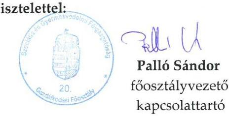

---

# Szociális És Gyermekvédelmi Főigazgatóság Főigazgató   1132 Budapest, Visegrádi u. 49.   Telefon: +36/1/769-1704, e-mail: batori.zsolt@szgyf.gov.hu 

Iktatószám: SZGYF-IKT-504-2/2017. Tárgy: Észrevétel számvevőszéki
Úgyintéző: Palló Sándor
jelentéstervezethez.

## Domokos László úr   elnök

## Állami Számvevőszék

## Budapest

Apáczai Csere János u. 10
1051

## Tisztelt Elnök Úr!

Köszönettel megkaptam a V-0965-209/2016 iktatószámú, a „Tóparti Otthon Jász-Nagykun-Szolnok Megyei Fogyatékosok Otthona és Rehabilitációs Intézménye" intézmény vonatkozásában „A központi alrendszer egyes intézményei pénzügyi és vagyongazdálkodásának ellenőrzése" címú ellenőrzésről készült számvevőszéki jelentéstervezetet tartalmazó levelet.

A vizsgált időszak alatt igen jelentős szervezeti és jogi környezetben bekövetkezett változások mellett végeztük munkánkat, és az átalakulások jelenleg is érintik szervezetünket. Munkatársaimmal együtt folyamatosan törekszünk a vonatkozó szabályozásnak megfelelő, hatékonyan és eredményesen működő közszolgáltatások feltételrendszerének megteremtésére.

A kézhez kapott jelentéstervezettel kapcsolatban a következőkben részletezett észrevételeket szeretném tenni, melyek elfogadása esetén kérem a jelentés tervezet korrekcióját.

---

A jelentéstervezet 2.1. számú megállapításában, a 21. oldal 4. bekezdésében szereplő megállapítás:
„Az intézmény vezetője 2014. november 15-én jogosulatlanul adott ki - az Áhsz.: 50. § (1) bekezdésében előírtak ellenére - számviteli politika:43-t, és az annak keretében elkészítendő szabályzatokat (leltározási és leltárkészítési szabályzat:46, értékelési szabályzat:47, pénzkezelési szabályzat:48, önköltség-számítási szabályzat:49), mert a számviteli politika elkészítéséért az éves költségvetési beszámolót készítő szerv vezetője (az SZGYF főigazgatója) a felelős."

# Észrevétel: 

A 2014. január 1-jétől hatályos 4/2013. (I. 11.) Korm. rendelet az államháztartás számviteléről (a továbbiakban: Áhsz.) 50. § (1) bekezdése rögzíti a számviteli politika elkészítéséért, módosításáért való felelősséget.
50. § (1) A költségvetési és a pénzügyi számvitel alkalmazásával kapcsolatos sajátos szabályokat, előírásokat, módszereket a számviteli politikában kell rögzíteni. A számviteli politika az Szt. 14. § (5) bekezdése szerinti szabályzatokból és a (7) bekezdés szerint szabályozandó más kérdéseket rögzítő dokumentumból áll. A számviteli politika elkészítéséért, módosításáért a 31. § (1) bekezdése szerinti személyek felelősek. A számviteli politika elkészítésére az Szt. 14. § (3)-(5), (8) és (11) bekezdésében foglaltakat a (2)-(7) bekezdésben foglalt kiegészítésekkel kell alkalmazni."
31. § (1) Az éves költségvetési beszámoló elkészítéséért az éves költségvetési beszámolót készítő - központi kezelésű előirányzat, fejezeti kezelésű előirányzat, társadalombiztosítás pénzügyi alapja, elkülönített állami pénzalap esetén a kezelő szerv, helyi önkormányzat, nemzetiségi önkormányzat, társulás, térségi fejlesztési tanács esetén a beszámolási feladatokat az Áht. 6/C. §-a alapján ellátó - szerv vezetője felelős. Az éves költségvetési beszámolót e személy és a gazdasági vezető a hely és a kelet feltüntetésével írja alá.

A költségvetési szerv vezetőjének felelősségét az Áht. a következők szerint határozza meg:

Áht. 10. § (1) A költségvetési szerv vezetője felelős a közfeladatok jogszabályban, alapító okiratban, belső szabályzatban foglaltaknak megfelelő ellátásáért, valamint a költségvetési szerv számára jogszabályban előírt kötelezettségek teljesítéséért.

---

A beszámolási kötelezettség is ezeknek a kötelezettségeknek a körébe tartozik, tehát az ellenőrzött intézmény vezetője felelős a beszámoló készítésért, nem a gazdasági feladatok ellátására kijelölt szervezet - a konkrét esetben az SZGYF - vezetője.

Álláspontom szerint „az éves költségvetési beszámolót készítő szerv vezetője" alatt a Tóparti Otthon Jász-Nagykun-Szolnok Megyei Fogyatékosok Otthona és Rehabilitációs Intézménye intézményvezetője értendő.
A gazdasági vezető alatt pedig az SZGYF gazdasági vezetője értendő, mivel az intézmény önállóan működő státuszú, a gazdasági feladatok ellátására az SZGYF került kijelölésre. A gazdasági vezető ellenjegyzői feladatokat lát el, valamint a 4/2013. (I. 11.) Korm. rendelet 50. § (1) bekezdésében előírtak szerint - meghatalmazottja útján aláírásával látja el az intézményvezető által kiadott számviteli politikát és a kapcsolódó szabályzatokat.

Fentiekre figyelemmel, véleményünk szerint a megállapítás téves, mivel nem az SZGYF főigazgatójának, hanem az ellenőrzött intézmény vezetőjének jogszabályban előírt kötelessége az érintett szabályozás kiadása. Erre tekintettel kérem a jelentéstervezet módosítását.

Tájékoztatom, hogy továbbiakban fel kívánjuk használni jelen ellenőrzés megállapításait, valamint az ellenőrzéssel való közös munkánk tapasztalatait. A feltárt hiányosságok jelentős részét már az ellenőrzés során javítottuk, illetve pótoltuk.

Az ellenőrzés során tapasztalt segítő együttműködésüket köszönöm!

Budapest, 2017. január „" ${ }^{\circ}$ "

Tisztelettel:
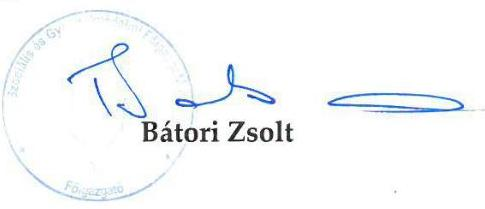

---

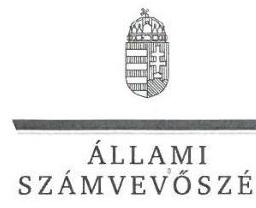

# Bátori Zsolt úr 

főigazgató
Szociális és Gyermekvédelmi Főigazgatóság

## Budapest

## Tisztelt Főigazgató Úr!

Köszönettel megkaptam a 2017. január 16. napján az Állami Számvevőszékhez érkezett „A központi alrendszer egyes intézményei pénzügyi és vagyongazdálkodásának ellenőrzése (harmadik szakasz) - Tóparti Otthon Jász-Nagykun-Szolnok Megyei Fogyatékosok Otthona és Rehabilitációs Intézménye" címú számvevőszéki jelentéstervezetben foglalt javaslatokra írásban tett észrevételét.

Tájékoztatom Főigazgató urat, hogy a jelentésben - az Állami Számvevőszékről szóló 2011. évi LXVI. törvény 29. § (3) bekezdése alapján - a figyelembe nem vett észrevételt szerepeltetjük az elutasítás indokainak feltüntetésével együtt.

Az Állami Számvevőszék észrevételre vonatkozó álláspontjáról a felügyeleti vezető által készített részletes tájékoztatást mellékelten megküldöm.

Budapest, 2017. 01 hó 31 nap
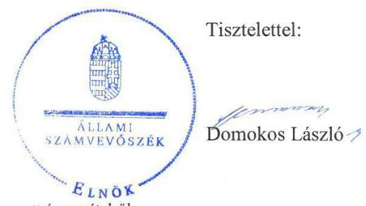

Melléklet: Tájékoztatás a figyelembe nem vett észrevételről

---

# Tájékoztatás a figyelembe nem vett észrevételről 

|  |   Észrevétel: | Az Intézmény vezetője által 2014. november 15 -én jogosulatlanul kiadott számviteli politika és annak keretében elkészítendő szabályzatokhoz kapcsolódóan (2.1. számú megállapítás 11. bekezdés alapján).   Az észrevétel érinti a Szociális és Gyermekvédelmi Főigazgatóság, mint a Tóparti Otthon Jász-Nagykun-Szolnok Megyei Fogyatékosok Otthona és Rehabilitációs Intézmény gazdasági szervezeti feladatait ellátó szerv főigazgatójának címzett 2. számú javaslatot (2.1. számú megállapítás 10 . bekezdése alapján). |
| :--: | :--: | :--: |
|  | Válasz: | Az Állami Számvevőszék az észrevételt nem fogadja el. |
| 1. | Indoklás: | Az észrevétel a javaslatot megalapozó 2.1 számú megállapítás 10 . bekezdés 2-3. mondatában szereplő ellenőrzési megállapítást nem vitatja, amely szerint az Intézmény a 2013. április 1-jétől az ellenőrzött időszak végéig számviteli politikával és annak keretében elkészítendő szabályzatokkal nem rendelkezett.   A jogszabályban foglaltakkal összhangban az ellenőrzési megállapítás tartalmazza, hogy a 2014. évben sem adott ki - a gazdálkodási feladatokat ellátó - SZGYF főigazgatója az Intézményre is vonatkozó számviteli politikát, és az annak keretében elkészítendő szabályzatokat az államháztartás számviteléről szóló 4/2013. (I. 11.) Korm. rendelet (továbbiakban Áhsz.) 50. § (1) bekezdésében, és az abban hivatkozott 31. § (1) bekezdésében foglaltak ellenére.   A 2014. január 1-jétől hatályos Áhsz. 50. § (1) bekezdése szerint a „... számviteli politika elkészítéséért, módosításáért a 31. § (1) bekezdése szerinti személyek felelősek." Az Áhsz. 31. § (1) bekezdése szerint „az éves költségvetési beszámoló elkészítéséért az éves költségvetési beszámolót készítő szerv vezetője felelős."   A megyei intézményfenntartó központokról, valamint a megyei önkormányzatok konszolidációjával, a megyei önkormányzati intézmények és a Fővárosi Önkormányzat egészségügyi intézményeinek átvételével összefüggő egyes kormányrendeletek módosításáról szóló 258/2011. (XII. 7.) Korm. rendelet (továbbiakban Konsz. rendelet) 15. § (2) bekezdése kimondja, hogy az „átvett intézmények közül az önállóan működő költségvetési szervek gazdálkodással összefüggő feladatait 2012. január 1-jétől a megyei intézményfenntartó központ látja el". A Konsz. rendelet 11. § (1) bekezdés b) pontja alapján a MIK meghatározza „az irányítása |

---

# *Függelék: Észrevételek*

|  alá tartozó költségvetési szervek gazdálkodásának részletes rendjét | |
| --- | --- |
|  A Konsz. rendelet 18. § (2) bekezdése pedig rögzíti, hogy a "megyei intézményfenntartó központok 2013. március 31-én a Szociális és Gyermekvédelmi Főigazgatóságba történő beolvadással megszűnnek. A Szociális és Gyermekvédelmi Főigazgatóság a megszűnt megyei intézményfenntartó központok általános és egyetemleges jogutóda." | |
|  A Szociális és Gyermekvédelmi Főigazgatóságról szóló 316/2012. (XI. 13.) Korm. rendelet 4. § (3) bekezdés c) pontja szerint a központi szerv a fenntartott intézmények vonatkozásában fenntartói hatáskörként gyakorolja, hogy "javaslatot tesz a fenntartott költségvetési szervek éves költségvetésére, meghatározza a gazdálkodásuk részletes rendjét". | |
|  A fentiek alapján megállapítható, hogy az önállóan működő költségvetési szerv – a Tóparti Otthon Jász-Nagykun-Szolnok Megyei Fogyatékosok Otthona és Rehabilitációs Intézmény – esetében a gazdálkodással összefüggő feladatok ellátásáért és az irányítása alá
 tartozó költségvetési szervek gazdálkodásának részletes rendje meghatározásáért a 2013. évtől (a MIK általános jogutódjaként) az SZGYF volt a felelős. A Tóparti Otthon Jász-Nagykun-Szolnok Megyei Fogyatékosok Otthona és Rehabilitációs Intézmény önálló gazdálkodási jogkörrel nem rendelkezett, így az intézményre kiterjedő Számviteli politika, és az annak keretében elkészítendő szabályzatok kiadása az SZGYF főigazgatójának feladata volt. Az Intézmény vezetője jogosulatlanul adta ki számviteli politikát, valamint az annak keretében elkészítendő szabályzatokat, a feladatellátáshoz az Intézmény saját gazdasági szervezettel nem rendelkezett, továbbá – amint azt a 2.1. számú megállapítás 8. bekezdése is tartalmazza – a munkamegosztás és felelősségvállalás rendje sem volt rögzítve az Intézmény és a gazdasági szervezeti feladatokat ellátó SZGYF között. | |
|  Az észrevételben hivatkozott Áht. 10. § (1) bekezdése a költségvetési szerv vezetőjének a közfeladatok ellátásáért való, valamint a költségvetési szerv számára jogszabályban előírt kötelezettségek teljesítéséért való általános felelősségét tartalmazza. | |
|  Az észrevételben szereplő, az Áhsz. 50. § (1) bekezdés az észrevételben foglaltakkal ellentétben – nem tartalmaz rendelkezést a számviteli politika meghatalmazott útján történő aláírására. | |
|  Fentiekre tekintettel, az észrevétel nem megalapozott, a megállapítás és a kapcsolódó javaslat módosítása nem indokolt. | |

Budapest, 2017. 01

hó 31 nap

Salamon Ildikó

felügyeleti vezető

-3-

---

# JÁSZ-NAGYKUN-SZOLNOK MEGYEI KÖZGYÜLÉS ELNÖKE 

Ikt.szám: 28/2017.
Ügyintéző: Vitosné Veres Julianna
Hiv. ikt.szám: V-0965-211/2016.
Domokos László úr
elnök

Állami Számvevőszék

## Budapest

## Tisztelt Elnök Úr!

Köszönettel megkaptam a V-0965-211/2016. iktatószámú, „A központi alrendszer egyes intézményei pénzügyi és vagyongazdálkodásának ellenőrzése (harmadik szakasz) - Tóparti Otthon Jász-Nagykun-Szolnok Megyei Fogyatékosok Otthona és Rehabilitációs Intézménye" című ellenőrzésről készült számvevőszéki jelentéstervezetet tartalmazó levelet.

A jelentéstervezetben szereplő megállapításokra az alábbi észrevételeket tesszük:
Az Összegző megállapítások 1. mondatát az alábbiak szerint kérjük javítani:
A Tóparti Otthon Jász-Nagykun-Szolnok Megyei Fogyatékosok Otthona és Rehabilitációs Intézményre vonatkozó irányítószervi feladatellátás az ellenőrzött időszak alatt - 2011. év kivételével - nem felelt meg az előírásoknak.

Ezzel összefüggésben a „Megállapítások" 1. pontjának összegző megállapítását az alábbiak szerint kérjük javítani:

Az irányító és a középirányító szervek Intézményre vonatkozó feladatellátása - 2011. év kivételével - nem volt szabályszerű.

A javítási kérelmet alábbiakkal indokoljuk:
Az 1.1. számú, az 1.2. számú, az 1.3. számú megállapítások 2011. évre vonatkozóan hiányosságokat nem állapítottak meg.

---

Az ellenőrzés során tapasztalt segítő együttműködésüket köszönöm.

Szolnok, 2017. január 9.

Tisztelettel:
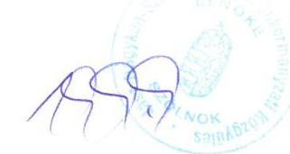

Kovács Sándor megyei közgyűlés elnöke

---

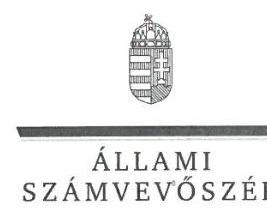

ELNÖK

Ikt.szám: V-0965-219/2016.

# Kovács Sándor úr 

elnök
Jász-Nagykun-Szolnok Megyei Önkormányzat

## Szolnok

## Tisztelt Elnök Úr!

Köszönettel megkaptam a 2017. január 16. napján az Állami Számvevőszékhez érkezett „A központi alrendszer egyes intézményei pénzügyi és vagyongazdálkodásának ellenőrzése (harmadik szakasz) - Tóparti Otthon Jász-Nagykun-Szolnok Megyei Fogyatékosok Otthona és Rehabilitációs Intézménye" című számvevőszéki jelentéstervezetben foglalt javaslatokra írásban tett észrevételét.

Tájékoztatom Elnök urat, hogy a jelentésben - az Állami Számvevőszékről szóló 2011. évi LXVI. törvény 29. § (3) bekezdése alapján - a figyelembe nem vett észrevételt szerepeltetjük az elutasítás indokainak feltüntetésével együtt.

Az Állami Számvevőszék észrevételre vonatkozó álláspontjáról a felügyeleti vezető által készített részletes tájékoztatást mellékelten megküldöm.

Budapest, 2017. 01 hó 31 nap
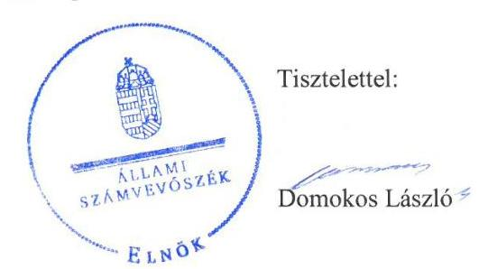

Melléklet: Tájékoztatás a figyelembe nem vett észrevételeiről

---

# Tájékoztatás   a figyelembe nem vett észrevételről 

| 1. | Észrevétel: | Az „Összegzés" 1. mondatával (5. oldal) és a „Megállapítások" 1. számú összegző megállapításával (17. oldal) kapcsolatban, az irányító és középirányító szervek intézményre vonatkozó feladatellátására vonatkozóan. |
| :--: | :--: | :--: |
|  | Válasz: | Az Állami Számvevőszék az észrevételt nem fogadja el. |
| 1. | Indoklás: | Az észrevétel, amely szerint az 1.1. számú, az 1.2. számú és az 1.3. számú megállapítások a 2011. évre vonatkozóan hiányosságokat nem állapítottak meg, és amelyre hivatkozással kérte a hivatkozott megállapításokban a 2011. év kivételként történő szerepeltetését, nem megalapozott.   Az „Összegzés" 1. mondata, valamint az 1. számú összegző megállapítás az 1.1. számú, az 1.2. számú és az 1.3. számú megállapítások összesített értékelését tartalmazza.   Az 1.2. számú megállapítás utolsó mondata szerint „A hatékony gazdálkodáshoz szükséges követelményeket a Közgyűlés és a középirányító szervek nem érvényesítették, nem kérték számon és nem ellenőrizték." A megállapítás a 2011. évre vonatkozóan is (a Közgyűlés feladatellátásához kapcsolódóan) tartalmazott hiányosságot, ebből következően nem indokolt a 2011. év kivételként történő szerepeltetése, továbbá az Összegzés és az 1. számú összegző megállapítás módosítása. |

Budapest, 2017. 01
hó 31 nap

---

# „Tóparti Otthon" 

## Jász - Nagykun - Szolnok Megyei Fogyatékosok Otthona és Rehabilitációs Intézménye   5235 Pusztataskony, Szapáry Gyula u. 1.   Telefon: 59/535-010 Fax: 59/535-011 E-mail: topartiotthon@dunaweb.hu

$121-4 / 2017$

Tárgy: Észrevétel megküldése a V-0965-210/2016.sz jelentéstervezethez

Domokos László Elnök Úr részére
Állami Számvevőszék

## Budapest

Tisztelt Domokos László Elnök Úr!

A V-0965-210/2016 számú „A központi alrendszer egyes intézményei pénzügyi és vagyongazdálkodásának ellenőrzése - Tóparti Otthon Jász-Nagykun-Szolnok Megyei Fogyatékosok Otthona és Rehabilitációs Intézménye 2016." című számvevőszéki jelentéstervezetet köszönettel megkaptam és az alábbi észrevételeket teszem:

1. Nincs észrevétel, az SZMSZ kiegészítésével, pontosításával egyetértek.
2. Nincs észrevétel, a három szabályzat elkészítése, kiadása folyamatban van.
3. Nincs észrevétel, a dokumentálási rend kialakítására az intézkedést megteszem.
4. Nincs észrevétel, az integrált kockázatkezelési rendszer működtetésére az intézkedést megteszem.
5. Nincs észrevétel, az információs és kommunikációs rendszer megfelelő kialakítására és működtetésére az intézkedést megteszem.
6. Nincs észrevétel, az adatok közzétételének rendjére az intézkedéseket megteszem.
7. Nincs észrevétel, a monitoring rendszer kialakítására és működtetésére az intézkedéseket megteszem.
8. A belső ellenőrzés kialakításával és működtetésével kapcsolatosan az alábbi kiegészítés alapján lehetőség szerint kérem a jelentéstervezet szíves módosítását:
A 2011-es évben a Jász-Nagykun-Szolnok Megyei Önkormányzati Hivatal - mint fenntartó részéről - belső ellenőrzési osztálya látta el a belső ellenőrzési feladatokat a közgyűlés határozata alapján.

---

# „Tóparti Otthon"   Jász - Nagykun - Szolnok Megyei Fogyatékosok Otthona és Rehabilitációs Intézménye   5235 Pusztataskony, Szapáry Gyula u. 1.   Telefon: 59/535-010 Fax: 59/535-011 E-mail: topartiotthon@dunaweb.hu 

2012. évben a Megyei Intézményfenntartó Központok egységes SZMSZ-ének Belső Ellenőrzési Osztályra vonatkozóan a 2. g) pontban rögzíti, hogy „Az önállóan működő intézmények tekintetében ellátja a belső ellenőrzési feladatot.", mivel intézményünk önállóan működő volt 2012. évben így a vonatkozó 78/2011. (XII.30.) számú KIM utasítás alapján történt a feladatellátása.

2013-ban a Szociális és Gyermekvédelmi Főigazgatóság képviselőjével Pintér Judit Főigazgató Asszonnyal kötöttem az intézmény képviselőjeként megállapodást, melynek értelmében az SZGYF, mint fenntartó ellátja az intézmény belső ellenőrzési feladatait. Ez a megállapodás nem került előtérbe az ellenőrzés során azonban a 2013-2014-es években kitöltött integritás kérdőívekben ennek megfelelően nyilatkoztam, hogy a szervezetnél működik belső ellenőrzés.
9. Nincs észrevétel.
10. Nincs észrevétel.

Pusztataskony, 2017. január 9.

Tisztelettel:
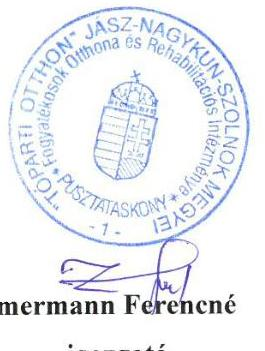

---

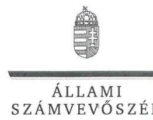

ELNÖK

# Zimmermann Ferencné úrhölgy 

intézményvezető
Tóparti Otthon Jász-Nagykun-Szolnok Megyei Fogyatékosok
Otthona és Rehabilitációs Intézménye

Tiszabura-Pusztataskony

## Tisztelt Intézményvezető Úrhölgy!

Köszönettel megkaptam a 2017. január 13. napján az Állami Számvevőszékhez érkezett „A központi alrendszer egyes intézményei pénzügyi és vagyongazdálkodásának ellenőrzése (harmadik szakasz) - Tóparti Otthon Jász-Nagykun-Szolnok Megyei Fogyatékosok Otthona és Rehabilitációs Intézménye" című számvevőszéki jelentéstervezetben foglalt javaslatra írásban tett észrevételét.

Tájékoztatom Intézményvezető úrhölgyet, hogy a jelentésben - az Állami Számvevőszékről szóló 2011. évi LXVI. törvény 29. § (3) bekezdése alapján - a figyelembe nem vett észrevételt szerepeltetjük az elutasítás indokainak feltüntetésével együtt.

Az Állami Számvevőszék észrevételre vonatkozó álláspontjáról a felügyeleti vezető által készített részletes tájékoztatást mellékelten megküldöm.

Budapest, 2017. 07 hó 31 nap
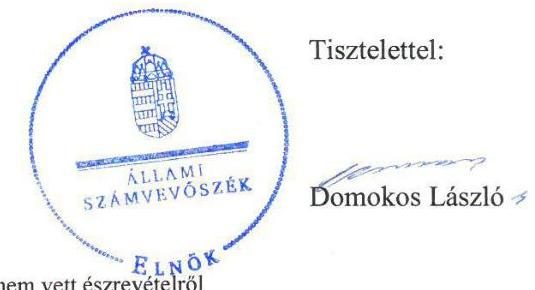

Melléklet: Tájékoztatás a figyelembe nem vett észrevételeiről

---

# Tájékoztatás a figyelembe nem vett észrevételről 

| 1. | Észrevétel: | A belső ellenőrzés kialakításával és működtetésével kapcsolatban (2.5. számú megállapítás 2. bekezdés, valamint hozzá kapcsolódóan az Intézmény vezetőjének címzett 8. számú javaslat). |
| :--: | :--: | :--: |
|  | Válasz: | Az Állami Számvevőszék az észrevételt nem fogadja el. |
| 1. | Indoklás: | Az Állami Számvevőszék (ÁSZ) részéről a Tóparti Otthon Jász-Nagykun-Szolnok Megyei Fogyatékosok Otthona és Rehabilitációs Intézménye (Intézmény) igazgatójának 2015. november 10-i keltezéssel küldött, V-0965-011/2015. iktatószámú adatbekérő levél 3. számú mellékleteként csatolt Dokumentumjegyzék tartalmazta az ellenőrzés lefolytatásához az ÁSZ részére beküldendő dokumentumok felsorolását. A Dokumentumjegyzék 22. pontja tartalmazta a belső ellenőrzési kézikönyv, a belső ellenőrzés stratégiai ellenőrzési terve, a 105. pontja a belső ellenőrzés kiszervezésével kapcsolatos dokumentumok (szerződések, megbízások), a 106. pontja a belső ellenőrzési tevékenységet végzők összeférhetetlenségi nyilatkozata, a 107. pontja pedig az éves belső ellenőrzési tervek, az egyedi jelentésekből készült összefoglaló jelentések, realizálási jelentések az intézkedési tervekben foglaltak végrehajtásáról, kapcsolódó jegyzőkönyvek, feljegyzések, emlékeztetők dokumentumainak a beküldésére történő felkérést. Az Intézmény részéről a Dokumentumjegyzékben fentiek szerint részletezett, belső ellenőrzési tevékenységgel kapcsolatos, a belső ellenőrzés működését igazoló dokumentumok nem kerültek beküldésre. Az intézmény vezetője „NEMLEGET" nyilatkozattal küldte vissza az ÁSZ részére a 2. számú tanúsítványt, amely „az intézmény gazdálkodásával kapcsolatos belső ellenőrzések adatairól a 2011-2014. évek között" kért adatokat.   A fentiekre tekintettel a belső ellenőrzéssel kapcsolatban tett megállapítás és a hozzá kapcsolódó javaslat módosítása nem indokolt. |

Levelének 1-7. és a 9-10. pontjaiban foglalt tájékoztatásokat köszönettel vettük, azok észrevételt nem tartalmaznak, hanem megerősítik az ellenőrzés megállapításaiban foglaltakat.

Budapest, 2017. 01 hó 31 nap
Salamon Ildikó
felügyeleti vezető

---

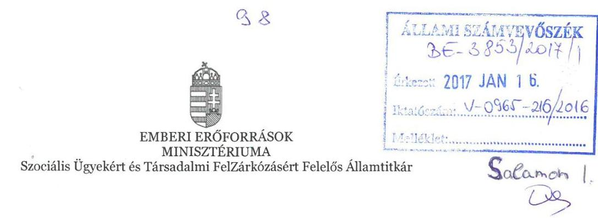

Iktatószám: 2139-1/2017/SZOCSTRAT
Hiv. szám: V-0965-208/2016
Ügyintéző: Sipos Sándorné
Tel. szám: +36 (1) (795-5817)

# Domokos László részére 

elnök

Állami Számvevőszék
Budapest
Apáczai Csere János utca 10.
1052

Tárgy: Tóparti Otthon Jász-Nagykun-Szolnok Megyei Fogyatékosok Otthona és Rehabilitációs Intézménye c. Állami Számvevőszéki (a továbbiakban: ÁSZ) jelentéstervezetének észrevételezése

## Tisztelt Elnök Úr!

„A központi alrendszer egyes intézményei pénzügyi és vagyongazdálkodásának ellenőrzése (harmadik szakasz) címü" ellenőrzés keretében készült - Tóparti Otthon Jász-Nagykun-Szolnok Megyei Fogyatékosok Otthona és Rehabilitációs Intézményét érintő - számvevőszéki jelentéstervezetet köszönettel megkaptam.

Az Emberi Erőforrások Minisztériumát (a továbbiakban: EMMI) érintő megállapításaival kapcsolatban nem teszek észrevételt.

Tájékoztatom Elnök Urat, hogy az EMMI Szervezeti és Működési Szabályzatáról szóló 33/2014. (IX.16) EMMI utasítás 146. § (12) bekezdés b) pontja alapján az emberi erőforrások minisztere által átruházott hatáskörben gyakorlom a kiadványozási jogot.

Budapest, 2017. január 9.

## Üdvözlettel:

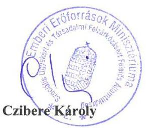

Cím: 1054 Budapest Akadémia utca 3. Tel: + 361795 1200, Fax: + 3617950022
E-mail: info@emmi.gov.hu

---

.

---

# RÖVIDÍTÉSEK JEGYZÉKE 

${ }^{1}$ Intézmény
${ }^{2}$ Szoctv.
${ }^{3}$ Közgyűlés
${ }^{4}$ JNSZM Önkormányzati Hivatal
${ }^{5}$ Konsz. tv.
${ }^{6}$ KIM
${ }^{7}$ 258/2011. (XII. 7.) Korm. rendelet
${ }^{8}$ MIK
${ }^{9}$ EMMI
${ }^{10}$ SZGYF
${ }^{11}$ Vtv.
${ }^{12}$ MNV Zrt.
${ }^{13}$ 316/2012. (XI. 13.) Korm. rendelet
${ }^{14}$ Intézményvezető
${ }^{15}$ Nvtv.
${ }^{16}$ Áht. 2
${ }^{17}$ Ávr.
${ }^{18}$ Áht. 1
${ }^{19}$ Ámr.
${ }^{20}$ Bkr.
${ }^{21}$ ÁSZ SZMSZ
${ }^{22}$ alapító okirat1-3
„Tóparti Otthon" Jász-Nagykun-Szolnok Megyei Fogyatékosok Otthona és Rehabilitációs Intézménye
a szociális igazgatásról és szociális ellátásokról szóló 1993. évi III. törvény Jász-Nagykun-Szolnok Megyei Közgyűlés
Jász-Nagykun-Szolnok Megyei Önkormányzati Hivatal
2011. évi CLIV. törvény a megyei önkormányzatok konszolidációjáról, a megyei önkormányzati intézmények és a Fővárosi Önkormányzat egyes egészségügyi intézményeinek átvételéről (hatályos: 2011. november 26-tól)
Közigazgatási és Igazságügyi Minisztérium
258/2011. (XII. 7.) Korm. rendelet a megyei intézményfenntartó központokról, valamint a megyei önkormányzatok konszolidációjával, a megyei önkormányzati intézmények és a Fővárosi Önkormányzat egészségügyi intézményeinek átvételével összefüggő egyes kormányrendeletek módosításáról (hatályos:

 2011. december 8-tól)
Jász-Nagykun-Szolnok Megyei Intézményfenntartó Központ
Emberi Erőforrások Minisztériuma
Szociális és Gyermekvédelmi Főigazgatóság
az állami vagyonról szóló 2007. évi CVI. törvény (hatályos: 2007. szeptember 25-től)
Magyar Nemzeti Vagyonkezelő Zrt.
a Szociális és Gyermekvédelmi Főigazgatóságról szóló 316/2012. (XI. 13.) Korm. rendelet (hatályos: 2012. november 16-tól)
„Tóparti Otthon" Jász-Nagykun-Szolnok Megyei Fogyatékosok Otthona és Rehabilitációs Intézményének igazgatója
a nemzeti vagyonról szóló 2011. évi CXCVI. törvény (hatályos 2012. január 1-től) az államháztartásról szóló 2011. évi CXCV. törvény (hatályos: 2012. január 1-től) 368/2011. (XII. 31.) Korm. rendelet az államháztartásról szóló törvény végrehajtásáról (hatályos: 2012. január 1-től)
az államháztartásról szóló 1992. évi XXXVIII. törvény (hatálytalan: 2012. január 1-től)
292/2009. (XII. 19.) Korm. rendelet az államháztartás működési rendjéről (hatálytalan: 2012. január 1-től)
370/2011. (XII. 31.) Korm. rendelet a költségvetési szervek belső kontrollrendszeréről és belső ellenőrzéséről (hatályos: 2012. január 1-től)
Állami Számvevőszék Szervezeti és Működési Szabályzata
alapító okirat1. 116/2009. (VI. 19.) KH határozat „Tóparti Otthon" Jász-Nagykun-Szolnok Megyei Fogyatékosok Otthona és Rehabilitációs Intézménye alapító okirata, (hatályos 2011. február 28-ig)
alapító okirat2. 17/2011. (II. 11.) KH határozat „Tóparti Otthon" Jász-Nagykun-Szolnok Megyei Fogyatékosok Otthona és Rehabilitációs Intézménye egységes szerkezetű alapító okirata (hatályos 2011. március 1-től)
alapító okirat3. 210/2011 (XII. 09.) KH határozat „Tóparti Otthon" Jász-Nagykun-Szolnok Megyei Fogyatékosok Otthona és Rehabilitációs Intézménye egységes szerkezetű alapító okirata (hatályos 2011. december 31-től)

---

${ }^{23}$ Kincstár
${ }^{24}$ alapító Okirat ${ }_{4}$
${ }^{25}$ alapító Okirat ${ }_{5}$
${ }^{26}$ alapító Okirat ${ }_{6}$
${ }^{27} \mathrm{SZMSZ}_{1-3}$
${ }^{28}$ Közgyűlési határozatok
${ }^{29}$ Közgyűlés elnöke
${ }^{30}$ gazdasági ügyrend:
${ }^{31}$ Áhsz $_{1}$
${ }^{32}$ számviteli politika $_{1}$
${ }^{33}$ leltározási és leltárkészítési szabályzat ${ }_{1}$
${ }^{34}$ értékelési szabályzat ${ }_{1}$
${ }^{35}$ pénzkezelési szabályzat ${ }_{1}$
${ }^{36}$ önköltség-számítási szabályzat ${ }_{1}$
${ }^{37}$ Sztv.
${ }^{38}$ számlarend $_{1}$

Magyar Államkincstár
alapító okirat ${ }_{4}$ IX-09/30/758/2012 sz. „Tóparti Otthon" Jász-Nagykun-Szolnok Megyei Fogyatékosok Otthona és Rehabilitációs Intézménye egységes szerkezetű alapító okirata (hatályos 2012. január 1-től)
alapító okirat ${ }_{5}$ 35645-46/2013. sz. „Tóparti Otthon" Jász-Nagykun-Szolnok Megyei Fogyatékosok Otthona és Rehabilitációs Intézménye egységes szerkezetű alapító okirata (hatályos: 2013. január 1-től)
alapító okirat ${ }_{6}$ 12376-92/2014/JSZOC „Tóparti Otthon" Jász-Nagykun-Szolnok Megyei Fogyatékosok Otthona és Rehabilitációs Intézménye alapító okirata (hatályos: 2014. február 11-től)
SZMSZ ${ }_{1}$ „Tóparti Otthon" Jász-Nagykun-Szolnok Megyei Fogyatékosok Otthona és Rehabilitációs Intézménye Szervezeti és Működési Szabályzata (hatályos: 2010. december 21-től),
SZMSZ ${ }_{2}$ „Tóparti Otthon" Jász-Nagykun-Szolnok Megyei Fogyatékosok Otthona és Rehabilitációs Intézménye Szervezeti és Működési Szabályzata (hatályos 2013. január 21-től).
SZMSZ ${ }_{3}$ „Tóparti Otthon" Jász-Nagykun-Szolnok Megyei Fogyatékosok Otthona és Rehabilitációs Intézménye Szervezeti és Működési Szabályzata. (hatályos 2014. április 29-től)
JNSZM Közgyűlés 121/2011. (IX. 29.); 181/2011. (XII. 9.) számú határozata
Jász-Nagykun-Szolnok Megyei Közgyűlés elnöke
„Tóparti Otthon" Jász-Nagykun-Szolnok Megyei Fogyatékosok Otthona és Rehabilitációs Intézménye 438-4/2011. számú Ügyrend „Tóparti Otthon" gazdasági szervezetének gazdálkodással összefüggő feladataira (hatályos: 2011. július 1-jétől)
249/2000. (XII. 24.) Korm. rendelet az államháztartás szervezetei beszámolási és könyvvezetési kötelezettségének sajátosságairól szóló (hatálytalan: 2014. január 1-jétől)
„Tóparti Otthon" Jász-Nagykun-Szolnok Megyei Fogyatékosok Otthona és Rehabilitációs Intézménye 1022/2010. 11. 15. számú Számviteli Politika (hatályos: 2010. december 1-jétől)
„Tóparti Otthon" Jász-Nagykun-Szolnok Megyei Fogyatékosok Otthona és Rehabilitációs Intézménye 725-2/2008. számú Leltárkészítési és leltározási szabályzat (hatályos: 2008. július 1-jétől)
„Tóparti Otthon" Jász-Nagykun-Szolnok Megyei Fogyatékosok Otthona és Rehabilitációs Intézménye 461/2008. számú, eszközök és források értékelési szabályzata (hatályos: 2008. január 1-jétől)
„Tóparti Otthon" Jász-Nagykun-Szolnok Megyei Fogyatékosok Otthona és Rehabilitációs Intézménye 718-7/2010. számú, Pénzkezelési szabályzat (hatályos: 2010. szeptember 6-tól)
„Tóparti Otthon" Jász-Nagykun-Szolnok Megyei Fogyatékosok Otthona és Rehabilitációs Intézménye 456/2008. számú, Önköltség számítási szabályzat (hatályos: 2008. január 1-jétől)
a számvitelről szóló 2000. évi C. törvény (hatályos: 2001. január 1-jétől)
„Tóparti Otthon" Jász-Nagykun-Szolnok Megyei Fogyatékosok Otthona és Rehabilitációs Intézménye 791/2008. számú Számlarend (hatályos: 2008. március 28-tól)
„Tóparti Otthon" Jász-Nagykun-Szolnok Megyei Fogyatékosok Otthona és Rehabilitációs Intézménye, 953-2/2010. 02. 01. számú, Kötelezettségvállalás, utalványozás, ellenjegyzés, érvényesítés rendjének szabályzata (hatályos: 2010. február 1-jétől)

---

${ }^{40}$ együttműködési megállapodás
${ }^{41}$ gazdálkodási szabályzat ${ }_{2}$
${ }^{42}$ MIK számviteli politika
${ }^{43}$ SZGYF számviteli politika
${ }^{44}$ Áhsz $_{2}$
${ }^{45}$ számviteli politika2
${ }^{46}$ leltározási és leltárkészítési szabályzat ${ }_{2}$
${ }^{47}$ értékelés szabályzat ${ }_{2}$
${ }^{48}$ pénzkezelési szabályzat ${ }_{2}$
${ }^{49}$ önköltség-számítási szabályzat ${ }_{2}$
${ }^{50}$ számlarend $_{2}$
${ }^{51}$ Intézmény gazdálkodási szabályzat
${ }^{52}$ MIK kötelezettségvállalási szabályzat
${ }^{53}$ SZGYF kötelezettségvállalási szabályzat
${ }^{54}$ SZGYF gazdálkodási szabályzat ${ }_{1,2}$
${ }^{55}$ gazdasági ügyrend ${ }_{2}$
${ }^{56}$ közbeszerzési szabályzat ${ }_{1,2}$

Együttműködési megállapodás a Jász-Nagykun-Szolnok Megyei Önkormányzati Hivatallal (hatályos 2011. december 31. napján)
gazdálkodási szabályzat2: SZGYF Főigazgatójának 23/2013. (IX. 02.) számú utasítása a Gazdálkodási Szabályzatról (hatályos: 2013. szeptember 2-től)
Jász-Nagykun-Szolnok Megyei Intézményfenntartó Központ 04-25-2/2012. számú számviteli politika (hatályos: 2012. január 1-jétől)
Szociális és Gyermekvédelmi Főigazgatóság Főigazgatójának 11/2013. (II. 26.) SZGYF utasítása a Szociális és Gyermekvédelmi Főigazgatóság számviteli politikájáról (hatályos: 2013. február 27-től)
4/2013. (I. 11.) Korm. rendelet az államháztartás számviteléről (hatályos: 2014. január 1-jétől)
„Tóparti Otthon" Jász-Nagykun-Szolnok Megyei Fogyatékosok Otthona és Rehabilitációs Intézménye 590-8/2014. számú Számviteli politikája
„Tóparti Otthon" Jász-Nagykun-Szolnok Megyei Fogyatékosok Otthona és Rehabilitációs Intézménye 530-6/2014. számú Eszközök és források leltárkészítési és leltározási szabályzata
„Tóparti Otthon" Jász-Nagykun-Szolnok Megyei Fogyatékosok Otthona és Rehabilitációs Intézménye 641/2014. számú Eszközök és források értékelési szabályzata
„Tóparti Otthon" Jász-Nagykun-Szolnok Megyei Fogyatékosok Otthona és Rehabilitációs Intézménye 540-4/2014. számú Pénzkezelési Szabályzat
„Tóparti Otthon" Jász-Nagykun-Szolnok Megyei Fogyatékosok Otthona és Rehabilitációs Intézménye 78-6/2014. számú Önköltség számítás rendjére vonatkozó belső szabályzat
„Tóparti Otthon" Jász-Nagykun-Szolnok Megyei Fogyatékosok Otthona és Rehabilitációs Intézménye 530-7/2014. számú Számlarend
„Tóparti Otthon" Jász-Nagykun-Szolnok Megyei Fogyatékosok Otthona és Rehabilitációs Intézménye, 540-3/2014. számú Gazdálkodási szabályzat (hatályos: 2014. november 1-jétől)

MIK vezetőjének 1/2012. számú utasítása és annak módosításai a Jász-Nagykun-Szolnok Megyei Intézményfenntartó Központ Ideiglenes Gazdálkodási Keretszabályzatáról (hatályos: 2012. január 1-jétől)
SZGYF Főigazgatójának 7/2013. (I. 24.) számú utasítása a kötelezettségvállalás, pénzügyi ellenjegyzés, teljesítés igazolás, érvényesítés, utalványozás rendjének szabályzatáról (hatályos: 2013. január 25-től)
gazdálkodási szabályzat1: SZGYF Főigazgatójának 13/2013. (IV. 04.) számú utasítása az Ideiglenes Gazdálkodási Szabályzatról (hatályos: 2013. április 2-től)
gazdálkodási szabályzat2: SZGYF Főigazgatójának 23/2013. (IX. 02.) számú utasítása a Gazdálkodási Szabályzatról (hatályos: 2013. szeptember 2-től)
Jász-Nagykun-Szolnok Megyei Intézményfenntartó Központ 04-25-11/2012 számú Gazdasági Szervezet Ügyrendje (hatályos: 2012. július 1-jétől)
közbeszerzési szabályzat1: A „Tóparti Otthon" Jász-Nagykun-Szolnok Megyei Fogyatékosok Otthona és Rehabilitációs Intézménye Közbeszerzési szabályzat (hatályos 2005. július 1-jétől, módosítva a 634/2005., az 52/2006. és a 98/2007. számokon)
közbeszerzési szabályzat2: 540-2/2014. számú Közbeszerzési szabályzat (hatályos: 2014. május 15-től)
2003. évi CXXIX. törvény a közbeszerzésekről (hatálytalan: 2012. január 1-jétől)
2011. évi CVIII. törvény a közbeszerzésekről (hatályos: 2011. augusztus 21-től)

---

${ }^{59}$ FEUVE rendszer szabályzat
${ }^{60}$ szabálytalanságok kezelésének eljárásrendje
${ }^{61}$ Vnytv.
${ }^{62}$ informatikai biztonsági szabályzat
${ }^{63}$ adatvédelmi szabályzat
${ }^{64}$ Avtv.
${ }^{65}$ Info tv.
${ }^{66}$ Ltv.
${ }^{67}$ lkr.
${ }^{68}$ Ber.
${ }^{69}$ NGM rendelet
${ }^{70}$ Vtvr.
${ }^{71}$ Btk.
${ }^{72}$ Selejtezési szabályzat ${ }_{1,2}$

„Tóparti Otthon" Jász-Nagykun-Szolnok Megyei Fogyatékosok Otthona és Rehabilitációs Intézménye, 540-3/2014. számú FEUVE rendszer szabályzata (hatályos: 2014. augusztus 26-tól)
„Tóparti Otthon" Jász-Nagykun-Szolnok Megyei Fogyatékosok Otthona és Rehabilitációs Intézménye szabálytalanságok kezelésének eljárásrendje (hatályos 2012. június 26-tól)
2007. évi CLII. törvény az egyes vagyonnyilatkozat-tételi kötelezettségekről
„Tóparti Otthon" Jász-Nagykun-Szolnok Megyei Fogyatékosok Otthona és Rehabilitációs Intézménye, 951-2/2010. számú informatikai biztonsági szabályzata (hatályos: 2010. december 1-jétől)
„Tóparti Otthon" Jász-Nagykun-Szolnok Megyei Fogyatékosok Otthona és Rehabilitációs Intézménye 446/2008. számú Adatvédelmi és Számítástechnikai Védelmi Szabályzata (hatályos: 2008. január 1-jétől)
a személyes adatok védelméről és a közérdekű adatok nyilvánosságáról szóló 1992. évi LXIII. törvény (hatálytalan: 2012. január 1-jétől)
az információs önrendelkezési jogról és az információszabadságról szóló 2011. évi CXII. törvény (hatályos: 2011. június 26-tól)
a köziratokról, a közlevéltárakról és a magánlevéltári anyag védelméről szóló 1995. évi LXVI. törvény (hatályos: 1996. január 1-jétől)
a közfeladatot ellátó szervek iratkezelésének általános követelményeiről szóló 335/2005. (XII. 29.) Korm. rendelet (hatályos: 2006. január 1-jétől)
a költségvetési szervek belső ellenőrzéséről szóló 193/2003. (XI. 26.) Korm. rendelet (hatálytalan: 2012. január 1-jétől)
36/2013. (IX. 13.) NGM rendelet az államháztartás számvitelének 2014. évi megváltozásával kapcsolatos feladatokról (hatályos: 2013. szeptember 13-tól, hatálytalan: 2015. január 1-jétől)
254/2007. (X. 4.) Korm. rendelet az állami vagyonnal való gazdálkodásról (hatályos: 2007. október 4-től)
2012. évi C. törvény a Büntető Törvénykönyvről (hatályos: 2013. július 1-jétől)

Selejtezési szabályzat: „Tóparti Otthon" Jász-Nagykun-Szolnok Megyei Fogyatékosok Otthona és Rehabilitációs Intézménye 447/2008. számú Felesleges vagyontárgyak hasznosításának, selejtezésének szabályzata (hatályos 2008. január 1-jétől)
Selejtezési szabályzat: „Tóparti Otthon" Jász-Nagykun-Szolnok Megyei Fogyatékosok Otthona és Rehabilitációs Intézménye 552-3/2012. számú a Felesleges vagyontárgyak hasznosításának, selejtezésének szabályzata (hatályos 2012. január 1-től)

---

.

---

# ÁLLAMI SZÁMVEVŐSZÉK 

1052 Budapest, Apáczai Csere János utca 10.
Levélcím: 1364 Budapest 4. Pf. 54
Telefon: +36 14849100 Telefax: +36 14849200
www.asz.hu
