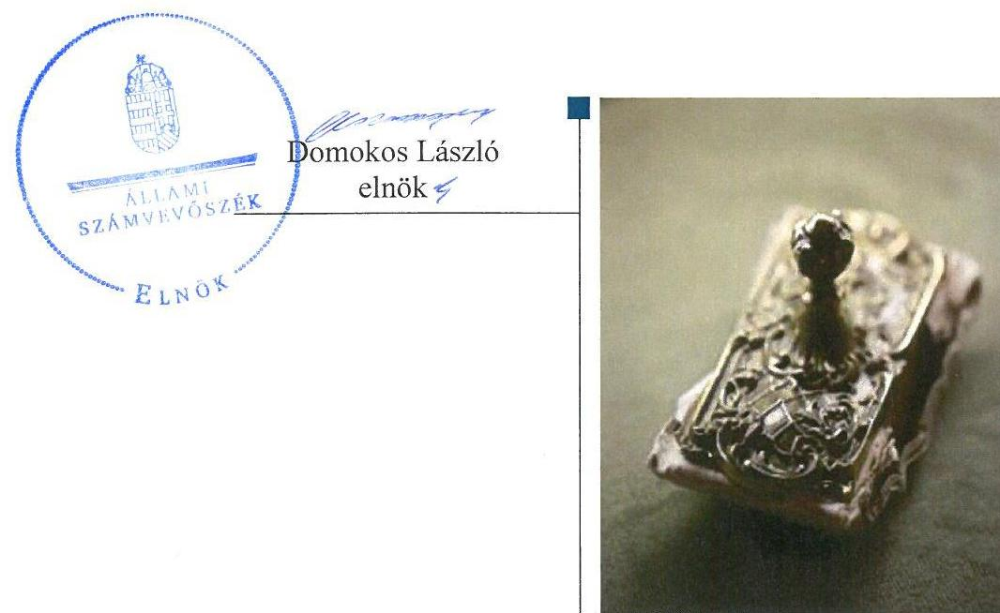
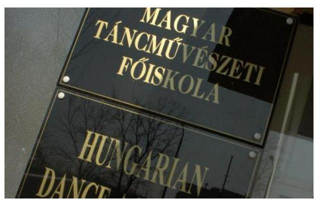

# Jelentés 

## Utóellenőrzések

Az állami felsőoktatási intézmények gazdálkodásának, működésének ellenőrzéséről készült jelentések utóellenőrzése - Magyar Táncművészeti Főiskola
2017.

---

# Jelentés 

## Utóellenőrzések

Az állami felsőoktatási intézmények gazdálkodásának, működésének ellenőrzéséről készült jelentések utóellenőrzése - Magyar Táncművészeti Főiskola
2017. O1. hó 23. nap

---

# AZ ELLENŐRZÉST FELÜGYELTE: 

DR. PULAY GYULA ZOLTÁN felügyeleti vezető

## AZ ELLENŐRZÉST VEZETTE ÉS A VÉGREHAJTÁSÁÉRT FELELŐS:

RÁCZKEVI KATALIN ellenőrzésvezető

## A PROGRAM ÖSSZEÁLLÍTÁSÁÉRT FELELŐS:

JANIK JÓZSEF osztályvezető

## A TÉMÁHOZ KAPCSOLÓDÓ KORÁBBI SZÁMVEVŐSZÉKI JELENTÉSEK:

- címe: Jelentés a Magyar Táncművészeti Főiskola ellenőrzéséről - Az állami felsőoktatási intézmények gazdálkodásának, működésének ellenőrzése
- sorszáma: 14205

IKTATÓSZÁM: V-1187-065/2016.
TÉMASZÁM: 2221
ELLENŐRZÉS-AZONOSÍTÓ SZÁM: V075533

---

# TARTALOMJEGYZÉK 

■ ÖSSZEGZÉS ..... 5
■ AZ ELLENŐRZÉS CÉLJA ..... 6
■ AZ ELLENŐRZÉS TERÜLETE ..... 7
■ AZ ELLENŐRZÉS HÁTTERE, INDOKOLTSÁGA ..... 8
■ A JELENTÉS LÉNYEGES KÉRDÉSKÖREI ..... 9
■ ELLENŐRZÉS HATÓKÖRE ÉS MÓDSZEREI ..... 10
■ MEGÁLLAPÍTÁSOK ..... 13
■ MELLÉKLETEK ..... 17
I. Sz. melléklet: Az ÁSZ 14205. számú jelentéséhez kapcsolódó Főiskola intézkedési terv végrehajtása ..... 17
II. Sz. melléklet: Az ÁSZ 14205. számú jelentéséhez kapcsolódó EMMI intézkedési terv végrehajtása ..... 22
■ FÜGGELÉK: ÉSZREVÉTELEK ..... 23
■ RÖVIDÍTÉSEK JEGYZÉKE ..... 25

---

.

---

# ÖSSZEGZÉS 

Az utóellenőrzés megállapította, hogy a korábbi számvevőszéki jelentés javaslatai alapján a Főiskola rektora és kancellárja által meghatározott intézkedési tervben szereplő tizenhárom feladat jelentős részét késedelemmel végrehajtották, azonban a vagyongazdálkodás terén az ÁSZ által korábban azonositott hiányosságok egy része továbbra is fennáll. Az Emberi Erőforrások Minisztériuma - mint a fenntartói jogkör gyakorlója - az intézkedési tervében foglalt feladatot végrehajtotta.

## Az ellenőrzés társadalmi indokoltsága

Az ÁSZ ${ }^{1}$ stratégiájában célul tűzte ki a számvevőszéki munka hasznosulásának javítását. Ezzel összhangban ellenőrzi, hogy az ellenőrzött szervezetek megvalósították-e a korábbi ellenőrzései által feltárt hibák, hiányosságok és szabálytalanságok megszüntetése céljából elkészített intézkedési terveikben foglaltakat. A rendszeres utóellenőrzések hozzájárulnak a szükséges intézkedések tényleges végrehajtáshoz, ezáltal a közpénzügyek rendezettségének javulásához.

## Főbb megállapítások, következtetések, javaslatok

A Főiskola² az intézkedési tervében meghatározott 13 feladatból három feladatot határidőn belül, hat feladatot határidőn túl, kettő feladatot részben, egy feladatot nem hajtott végre. Egy feladat végrehajtása nem időszerű.

A kancellár intézkedett a belső kontrollrendszer, a kontrollkörnyezet, a kockázatkezelési rendszer, a kontrolltevékenységek és a monitoring rendszer hatályos jogszabályoknak megfelelő kialakítása, működtetése érdekében a belső szabályzatok elkészítéséről, aktualizálásáról.

A kancellári rendszert bevezető jogszabályi változásokra tekintettel a gazdálkodási szabályzatot aktualizálták.
A 2013. évi mérleget alátámasztó leltárral - az elszámolási számlák kivételével - nem rendelkeztek. A követelések mérlegtétel értékelése során az egyes követeléseket, valamint azok értékelését alátámasztó dokumentumokkal nem rendelkeztek.

A 2015. évi vagyongazdálkodási tervet a fenntartó egyetértése nélkül fogadták el. Az előirányzat-módosítások szabályszerűségének folyamatos ellenőrzése érdekében nem intézkedtek.

A Főiskola az intézkedési tervben rögzített feladatok végrehajtásáról a $\mathrm{Bkr}^{3}$. előírásainak megfelelő nyilvántartást nem vezetett.

Az EMMI ${ }^{4}$ az intézkedési tervében meghatározott feladatot végrehajtotta.

---

# AZ ELLENŐRZÉS CÉLJA 

Az ellenőrzés célja annak értékelése volt, hogy a számvevőszéki jelentésben foglalt intézkedést igénylő megállapításokkal és javaslatokkal összhangban készített intézkedési tervben meghatározott feladatokat az ellenőrzött szervezetek végrehajtották-e.

---

# AZ ELLENŐRZÉS TERÜLETE 

## A Magyar Táncmúvészeti Főiskola

Az Állami Balett Intézet - a Magyar Táncmúvészeti Főiskola jogelődje - 1951-ben alakult balettmúvészet képzése céljából. A későbbiek során koreográfusok, táncpedagógusok, táncelméleti szakemberek, továbbá színházi táncmúvészek és néptáncmúvészek felsőfokú oktatását is megkezdték.

1983-ban az Állami Balett Intézetet főiskolává szervezték át, amely 1990 óta viseli a mai nevét. A balettmúvész-képzés egyedülálló életkori sajátosságai miatt közoktatási keretek között az intézmény által alapított és fenntartott, a főiskola székhelyén található gimnáziumban nyolc évfolyamos középiskolai képzés is folyik.

A rektor ${ }^{5}$ 2011. július 01-je óta tölti be tisztségét, a kancellár 2014. november 15 -től látja el feladatait.

A Főiskola 2015. évi költségvetési beszámolója szerint 193,3 millió Ft költségvetési bevételt, 1546,0 millió Ft finanszírozási bevételt ért el, valamint 1023,8 millió Ft költségvetési kiadást teljesített. A 2015. december 31-i kónyvviteli mérleg szerint a Főiskola eszközei 1929,5 millió Ft-ot tettek ki.

A Főiskola gazdálkodásának és múködésének ellenőrzését az ÁSZ a 2009-2012. közötti időszakra végezte el, az erről szóló 14205. számú jelentést 2014. augusztus 21-én tette közzé. Az ellenőrzés célja annak értékelése volt, hogy szabályos volt-e a Főiskola pénzügyi és vagyongazdálkodása, biztosított volt-e a vagyonnal való szabályszerű gazdálkodás követelményének érvényesülése, a jogszabályi előírásoknak megfelelően múködötte a belső kontrollrendszer, az irányító szerv tevékenysége a jogszabályoknak megfelelő volt-e.

Az Emberi Erőforrások Minisztériuma az állami felsőoktatási intézmények, így a Főiskola fenntartói jogkörének gyakorlója.

Az utóellenőrzés az ÁSZ jelentésben a rektor és a miniszter ${ }^{6}$ részére megfogalmazott intézkedést igénylő megállapításokra és javaslatokra készített, az ÁSZ részére megküldött intézkedési tervben foglalt feladatok megvalósításának ellenőrzésére, illetve értékelésére fókuszált.

---

# AZ ELLENŐRZÉS HÁTTERE, INDOKOLTSÁGA 

Az ÁSZ tv7. 33. § (1) bekezdése értelmében a számvevőszéki jelentések intézkedést igénylő megállapításaihoz és javaslataihoz kapcsolódóan az ellenőrzött szervezet vezetője intézkedési tervet köteles összeállítani, és az ÁSZ részére megküldeni. Az intézkedési tervben foglaltak megvalósítását az ÁSZ tv. 33. § (7) bekezdésében foglaltak alapján - az ÁSZ utóellenőrzés keretében ellenőrizheti. Az intézkedések megvalósulásának értékelése során az ÁSZ figyelembe veszi az ellenőrzött szervezetek működési feltételeiben, valamint a jogszabályi előírásokban bekövetkezett változásokat.

Az intézkedési tervekben foglalt feladatok hiányos, illetve késedelmes végrehajtása, valamint megvalósításának elmaradása azt mutatja, hogy az ellenőrzések során feltárt hibák, hiányosságok és szabálytalanságok megszüntetése nem kapott kellő hangsúlyt. Ez a szabályszerű működés és a felelős vezetői magatartás vonatkozásában kockázatot hordoz. E kockázatok feltárásával az ÁSZ utóellenőrzési rendszere fokozza a fegyelmet, és igazolja, hogy a közpénzzel való szabályos gazdálkodás felelőssége elől nem lehet kitérni.

## AZ UTÓELLENŐRZÉS VÁRHATÓ HASZNOSULÁSA

Az utóellenőrzés négy szinten hasznosulhat:
$\longrightarrow$ A társadalom szintjén az utóellenőrzés jelzi, hogy a számvevőszéki ellenőrzés megállapításainak van következménye: a hiányosságok megszüntetésére az ellenőrzött szervezet által meghatározott intézkedések végrehajtását is számon kéri az ÁSZ.
$\longrightarrow$ Az ellenőrzött terület szintjén az utóellenőrzés tájékoztatást nyújt a terület döntéshozóinak a hiányosságok kiküszöbölésének jó gyakorlatairól, ezzel lehetőséget biztosítva arra, hogy az ÁSZ ellenőrzési megállapításai, javaslatai a terület nem ellenőrzött szervezeteinek a működése során is hasznosuljanak.
$\longrightarrow$ Az ellenőrzött szervezet szintjén az utóellenőrzés feltárja, hogy a szervezet az intézkedések végrehajtásával hasznosította-e a korábbi ellenőrzési jelentésben a hiányosságok megszüntetése, illetve a kockázatok kezelése érdekében megfogalmazott javaslatokat.
$\longrightarrow$ Az ÁSZ szintjén az utóellenőrzés visszacsatolást ad az ellenőrzési jelentések hasznosulásáról, az intézkedések elmaradása vagy részleges megvalósulása a további ellenőrzésekhez kockázati jelzésként szolgál.

---

# A JELENTÉS LÉNYEGES KÉRDÉSKÖREI 

1. Az ellenőrzött szervezetek az intézkedési tervben foglaltakat az előírt határidőben végrehajtották-e?

---

# ELLENŐRZÉS HATÓKÖRE ÉS MÓDSZEREI 

## Az ellenőrzés típusa

Megfelelőségi ellenőrzés

## Az ellenőrzött időszak

Az utóellenőrzés alapját képező ÁSZ jelentés közzétételének napjától (2014. augusztus 21.) az ellenőrzésről szóló kiértesítő levél keltének napjáig (2016. október 10.) tartó időszak.

## Az ellenőrzés tárgya

A számvevőszéki jelentésben foglalt intézkedést igénylő megállapításokkal és javaslatokkal összhangban - a Főiskola és az EMMI által - készített intézkedési tervben foglaltak végrehajtásának ellenőrzése.

Az ellenőrzés kiterjed minden olyan körülményre és adatra, amely az ÁSZ jogszabályban meghatározott feladatainak teljesítéséhez, valamint a program végrehajtása folyamán felmerült újabb összefüggések feltárásához szükséges.

## Az ellenőrzött szervezet

Magyar Táncművészeti Főiskola és Emberi Erőforrások Minisztériuma

## Az ellenőrzés jogalapja

Az ÁSZ az Országgyűlés pénzügyi és gazdasági ellenőrző szerve. Az ÁSZ törvényben meghatározott feladatkörében ellenőrzi a központi költségvetés végrehajtását, az államháztartás gazdálkodását, az államháztartásból származó források felhasználását és a nemzeti vagyon kezelését.

Az ÁSZ tv. 1. § (3) bekezdése szerint az ÁSZ általános hatáskörrel végzi a közpénzekkel és az állami és önkormányzati vagyonnal való felelős gazdálkodás ellenőrzését.

Az ÁSZ tv. 33. § (7) bekezdése alapján az ÁSZ tv. 33. § (1)-(2) bekezdése szerinti intézkedési tervben foglaltak megvalósítását az ÁSZ utóellenőrzés keretében ellenőrizheti.

---

# Az ellenőrzés módszerei 

Az ÁSZ az utóellenőrzést a nemzetközi standardokat irányadónak tekintve az ellenőrzési program ellenőrzési kérdései, az ellenőrzött időszakban hatályos jogszabályok, az ellenőrzés szakmai szabályok és módszertanok figyelembevételével, önállóan végezte.

Az ÁSZ az ellenőrzés ideje alatt a Főiskolával és az EMMI-vel történő kapcsolattartást az ÁSZ SZMSZ ${ }^{8}$-ének vonatkozó előírásai alapján biztosította.

Az utóellenőrzés megállapításait elsősorban az ÁSZ rendelkezésére álló, valamint az ellenőrzött szervezetektől elektronikusan bekért dokumentumok alapozták meg.

Az ellenőrzési bizonyítékként felhasználható adatforrások közé tartoznak egyrészt a szakmai programban felsorolt adatforrások, másrészt minden - az ellenőrzés folyamán feltárt, az ellenőrzés szempontjából információt tartalmazó - dokumentum.

A vagyongazdálkodás szabályszerűségét az ellenőrzött szervezet által megkötött szerződések állományából 10 véletlen mintavétellel kiválasztott tétel alapján, a követelések 2014. év végi állományát tételes ellenőrzéssel értékelte az ÁSZ. A kiválasztott tételek esetében azt ellenőrizte, hogy a Főiskola az intézkedési tervben meghatározott feladatok végrehajtása során biztosította-e a jogszabályok és a belső szabályzatok előírásainak megfelelő működtetést.

Az intézkedési tervekben előírt feladatokat, azok végrehajthatósága, illetve végrehajtása szempontjából az alábbiak szerint értékelte az ÁSZ:
"határidőben végrehajtott" a feladat, ha a teljesítés dokumentáltan, az intézkedési tervben előírt határidőben és tartalommal megtörtént;
"határidőn túl végrehajtott" a feladat, ha annak teljesítése az intézkedési tervben meghatározott módon, de az előírt határidőn túl történt meg;
"részben végrehajtott" a feladat, ha végrehajtása teljes körűen az intézkedési tervben előírt módon nem történt meg;
"nem végrehajtott" a feladat, ha a végrehajtás nem történt meg, vagy amennyiben a teljesítést nem dokumentálták;
"okafogyottá vált" a feladat, ha végrehajtására - meghatározott esemény bekövetkezése, továbbá külső körülmény, a működést érintő feltétel változása miatt - már nincs szükség, illetve lehetőség, és egyértelműen megállapítható, hogy az intézkedést szükségessé tevő körülmény a jövőben nem fordulhat elő;
"nem időszerű" az a feladat, amelynek ellenőrzési időszakon belüli végrehajtására azért nem került (kerülhetett) sor, mert az intézkedés alapjául szolgáló esemény nem következett be, de annak jövőbeni előfordulása lehetséges, a végrehajtása nem volt esedékes, vagy a végrehajtás határideje még nem járt le.
Az ellenőrzés lefolytatásához az ellenőrzött szervezetek a tanúsítványok elektronikus kitöltésével, valamint az ÁSZ által kért dokumentumok elektronikus megküldésével szolgáltattak adatokat, amelyek valódiságát és

---

teljes körűségét az ellenőrzött szervezet vezetője által tett teljességi és hitelességi nyilatkozat igazolta. Az így rendelkezésre bocsátott adatok, információk kontrollja az ellenőrzés keretében történt.

---

# MEGÁLLAPÍTÁSOK 

## 1. Az ellenőrzött szervezetek az intézkedési tervben foglaltakat az előírt határidőben végrehajtották-e?

Összegző megállapítás

A Főiskola az intézkedési tervben meghatározott 13 feladatból három feladatot határidőben, hat feladatot határidőn túl, kettő feladatot részben, továbbá egy feladatot nem hajtott végre. Egy feladat végrehajtása nem volt időszerű. Az intézkedési tervben rögzített feladatok végrehajtásáról a Bkr. előírásainak megfelelő nyilvántartást nem vezettek. Az EMMI az intézkedési tervben meghatározott egy feladatot határidőben végrehajtotta.

Az ÁSZ a jelentésében a rektor részére három, a miniszter részére kettő javaslatot fogalmazott meg.

A Főiskola által összeállított és az ÁSZ részére megküldött intézkedési tervben a hiányosságok, szabálytalanságok megszüntetésére 13 feladatot határoztak meg. Az intézkedési tervet kettő alkalommal kiegészítették. A feladatok elvégzésének felelőseit megjelölték. Az EMMI által összeállított és az ÁSZ részére megküldött intézkedési tervben egy feladatot határoztak meg.

Az ÁSZ javaslatai alapján készített intézkedési tervben rögzített feladatok végrehajtásáról a Főiskola a Bkr. előírásainak megfelelő nyilvántartást nem vezette.

Az intézkedési tervben meghatározott feladatokat, határidőket, a feladatok végrehajtásáért felelős személyt és a feladatok végrehajtását az I. és a II. számú melléklet mutatja be.

A Főiskola intézkedési tervében tervezett feladatok végrehajtásának értékelési kategóriák szerinti megoszlását az 1. ábra szemlélteti.
1. ábra

Az intézkedések végrehajtásának
értékelési kategóriák szerinti megoszlása

- Határidőben végrehajtott
- Határidőn túl végrehajtott
- Részben végrehajtott
- Nem végrehajtott
- Nem időszerű

---

# HATÁRIDŐN BELÜL VÉGREHAJTOTT feladatok: 

- A rektor intézkedett a pénzügyi gazdálkodás terén a vendégszobák értékesítésével kapcsolatban feltárt hiányosságok megszüntetéséről, a Csantavér utcai vendégház értékesítési folyamata lezárult, az ingatlant 2016. április 14-én értékesítették.
- A rektor intézkedett a szabálytalan valutakezelés és ezzel összefüggésben a valuta pénztár megszüntetése vonatkozásában. A Főiskola főkönyvi nyilvántartásában 2012. december 31-én és 2013. évben már nem volt egyenlege a valutapénztárnak.
- A rektor intézkedett a pénzügyi gazdálkodás terén a béren kívüli juttatásokkal kapcsolatos szabálytalanságok megszüntetéséről, mert a 2012. évi beszámoló adatai alapján nem történt Cafetéria rendszer keretében juttatás adása.

## HATÁRIDŐN TÚL VÉGREHAJTOTT feladatok:

- A kancellár az intézkedési tervben elfogadott 2015. május 15-ei határidőn túl, 2015. június 19-én intézkedett - az Ellenőrzési Rendszerek Szabályzatának ${ }^{9}$ elkészítésével - a belső kontrollrendszer, a kontrollkörnyezet, a kockázatkezelési rendszer, a kontrolltevékenységek és a monitoring rendszer hatályos jogszabályoknak megfelelő kialakítása, működtetése érdekében a szükséges belső szabályzatok elkészítéséről, aktualizálásáról.
- A kancellár az intézkedési tervben vállalt 2015. május 15-ei határidőn túl, 2015. június 18-án intézkedett az egységes intézményi intézkedési terv elkészítéséről a fenntartó részére 2015. június 18-án MTF/267/2015. iktatószámú levéllel továbbított „ÁSZ intézkedési terv és beszámoló" megküldésével.
- A Főiskola az intézkedési tervben elfogadott 2015. április 15-ei határidőn túl, a 2015. május 28 -ai hatállyal elfogadott Gazdálkodási Szabályzatban ${ }_{2}{ }^{10}$ rögzítette az átláthatósági nyilatkozatok kezelésének szabályait.
- A kancellár az intézkedési tervben meghatározott 2015. március 15ei határidőn túl, 2015. május 28-án intézkedett a kancellári rendszert bevezető jogszabályi változásokra tekintettel a Gazdálkodási Szabályzat ${ }_{1}{ }^{11}$ aktualizálásáról, melyet a Szenátus ${ }^{12}$ a 2015. (05.27.) számú határozatával fogadott el.
- A kancellár az intézkedési tervben vállalt 2015. január 31-i határidőn túl intézkedett a Főiskola Önköltség-számítási Szabályzatának ${ }^{13}$ elkészítésére vonatkozóan. A Szenátus a szabályzatot 2015. szeptember 16-án 37/2015. (09.16.) számú határozattal fogadta el, amely tartalmazta a díjtételek, költségtérítések megállapításának és módosításának intézményi rendjét.
- A kancellár az intézkedési tervben elfogadott 2015. február 20-ai határidőn túl intézkedett a 2015. évi vagyongazdálkodási terv ${ }^{14}$ elkészítését illetően, mert a vagyongazdálkodási tervet 2015. március 25én terjesztette a Szenátus elé. A Szenátus a 8/2015. (03.25.) számú határozatával fogadta el a tervet. A 2015. évi vagyongazdálkodási terv jóváhagyásához az Nftv ${ }^{15}$. 12.§ (3) bekezdés gb) pontjában foglaltak előírásai ellenére a fenntartó egyetértésével nem rendelkeztek.

---

# RÉSZBEN VÉGREHAJTOTT feladatok: 

- A béren kívüli juttatásokkal kapcsolatban a NAV által kirótt bírság befizetését, valamint a 2013. november 30 -ai határidővel elvégzett önrevíziót a Főiskola dokumentumokkal nem igazolta. Az egyes adónemek közötti átvezetés az adófolyószámla alapján megtörtént. A valutakezeléssel kapcsolatban folytatott NAV vizsgálat eredményéről a Főiskola rektorának nyilatkozata szerint nincs tudomása, ezért a munkajogi felelősség kivizsgálására még nem került sor.
- Az eszközcsoportok között az immateriális javak mérlegtételen belül a szellemi termékeket és vagyon értékű jogokat a 2014. évi I. negyedéves mérlegben szabályszerűen mutatták ki. Az Eszközök és Források Értékelési Szabályzatot ${ }^{16}$ a SALDO Zrt. bevonásával elkészítették. A Főiskola a 2013. évi mérleget alátámasztó leltárral - az Elszámolási számlák mérlegsort alátámasztó leltár dokumentum kivételével - nem rendelkezett, amely nem felelt meg a 249/2000. (XII. 24.) Korm. rendelet 37. § (7) bekezdésében, a Számv. tv. ${ }^{17}$ 69. § (3) bekezdésében, valamint a Leltározási Szabályzatban ${ }^{18}$ előírtaknak. A 2014. évi követelések mérlegtétellel kapcsolatban feltárt besorolási és értékelési szabálytalanságok megszűntetéséről nem intézkedtek, az egyes követelések, valamint azok értékelését alátámasztó dokumentumokkal nem rendelkeztek, mely nem felelt meg a Számv. tv. 165. § 1), 2), 4) bekezdésében, valamint a 169. § 2) bekezdésében foglaltaknak.

## NEM VÉGREHAJTOTT feladat:

- A rektor és a kancellár az előirányzat-módosítások szabályszerűségének ellenőrzése érdekében nem intézkedett, erre irányuló soron kívüli belső ellenőrzési vizsgálat nem történt.

## NEM IDŐSZERŰ feladat:

- A Kazinczy utcai ingatlan jogi helyzetének tisztázásra vonatkozó egyeztetési folyamat elindult, (a Főiskola, az EMMI, az MNV Zrt. ${ }^{19}$, az $\mathrm{NFM}^{20}$, a Budapest Főváros VII. kerületi Önkormányzata között) de nem fejeződött be. A tulajdonosoktól nem áll rendelkezésre olyan megállapodás, jogi vélemény, amely rögzítené az ingatlan jogi helyzetét. Jelen utóellenőrzés során az Főiskola rektora nyilatkozott arról, hogy nem rendelkezik jogi szakvéleménnyel, illetve végleges megállapodással az ingatlanra vonatkozóan. A Főiskola vagyonkimutatásának módosítása csak a jogi helyzetet rögzítő dokumentum alapján lehetséges, így az intézkedés csak ennek rendelkezésre állását követően történhet meg.

## HATÁRIDŐBEN VÉGREHAJTOTT feladat:

- Az EMMI határidőben történő intézkedése során a Belső Ellenőrzési Főosztály 2015. június 17-i dátummal elkészítette a 24764-13/2015 ELL iktatószámú „Ellenőrzési Jelentés a Magyar Táncművészeti Főiskola gazdálkodásának, múködésének ellenőrzéséről szóló 14025. számú ÁSZ jelentésben az emberi erőforrások miniszterének címzett javaslata alapján lefolytatott soron kívüli ellenőrzésről" című jelentést. Az ebben foglaltak szerint a Belső Ellenőrzési Főosztály meg-

---

vizsgálta az ÁSZ jelentésben rögzített szabálytalanságokat, és megállapította, hogy a szabálytalanságok nem indokolnak személyi felelősségre vonást.

---

# MELLÉKLETEK

- I. SZ. MELLÉKLET: AZ ÁSZ 14205. SZÁMÚ JELENTÉSÉHEZ KAPCSOLÓDÓ FŐISKOLA INTÉZKEDÉSI TERV VÉGREHAJTÁSA

|  Sorszám | Az intézkedési tervben rögzített feladat | Az intézkedési tervben meghatározott határidő | A feladatok elvégzésének felelőse | A feladat végrehajtása  |
| --- | --- | --- | --- | --- |
|   | 1. | 2. | 3. | 4.  |
|  Határidőben végrehajtott feladatok |  |  |  |   |
|  1. | „Pénzügyi gazdálkodás területe
2. c) vendégszobák bérbeadásával, valutakezeléssel béren kivüli juttatással kapcsolatos szabálytalanságok:
1.) a Csantavér utcai vendégház értékesítése folyamatban van. Szálláshely nyújtás nem történik." | az intézkedési tervben nem került megjelölésre | rektor | A Csantavér utcai vendégház értékesítési folyamata lezárult, az ingatlant 2016. április 14-én értékesítették.  |
|  2. | „Pénzügyi gazdálkodás területe
2. c) vendégszobák bérbeadásával, valutakezeléssel béren kivüli juttatással kapcsolatos szabálytalanságok:
2.) a szabálytalan valutakezelést valutapénztár hiányában, vezetői és felügyeleti ellenőrzést követően 2012-ben már megszüntettük." | az intézkedési tervben nem került megjelölésre | rektor | A rektor intézkedett a szabálytalan valutakezelés és ezzel összefüggésben a valuta pénztár megszüntetése vonatkozásában. A Főiskola 2012. évi főkönyvi kimutatása még tartalmazott valutapénztár forgalmat, azonban 2012. december 31-én és 2013. évben már nem volt egyenlege a valutapénztárnak.  |
|  3. | „Pénzügyi gazdálkodás területe
2. c) vendégszobák bérbeadásával, valutakezeléssel béren kivüli juttatással kapcsolatos szabálytalanságok:
3. 2012. óta nincs béren kivüli juttatás a Főiskolán, amit a felügyeleti ellenőrzésnek már akkor jeleztünk." | az intézkedési tervben nem került megjelölésre | rektor | A rektor intézkedett a pénzügyi gazdálkodás terén a béren kivüli juttatásokkal kapcsolatos szabálytalanságok megszüntetéséről, mert a 2012. évi beszámoló adatai alapján nem történt Cafetéria rendszer keretében juttatás adása.  |
|  Határidőn túl végrehajtott feladatok |  |  |  |   |
|  4. | „Belső kontrollrendszer, kockázatkezelés
1.1. A belső ellenőrzési vezetőt intézményünk a pályázati eljárás során kiválasztotta, a fenntartó véleményezési eljárása jelenleg folyamatban van, megbízására vélemény kézhezvételét követően haladéktalanul sor kerül. A belső kontrollrendszer, a kontrollkörnyezet, a kockázatkezelési rendszer, a kont- | 2015. május 15. | kancellár | A kancellár az intézkedési tervben elfogadott 2015. május 15-ei határidőn túl, 2015. június 19-én intézkedett a belső kontrollrendszer, a kontrollkörnyezet, a kockázatkezelési rendszer, a kontrolltevékenységek és a monitoring rendszer hatályos jogszabályoknak megfelelő kialakítása, működtetése érdekében a szükséges belső szabályzatok elkészítéséről, aktualizálásáról, az Ellenőrzési  |

---

|  5. |  | Az intézkedési tervben rögzített feladat | Az intézkedési tervben meghatározott határidő | A feladatok elvégzésének felétlése | A feladat végrehajtása  |
| --- | --- | --- | --- | --- | --- |
|   | 1. |  | 2. | 3. | 4.  |
|   | rolltevékenységek és a monitoring rendszer hatályos jogszabályoknak megfelelő kialakítása, működtetése érdekében a szükséges belső szabályzatokat elkészítjük, aktualizáljuk." |  |  |  | Rendszerek Szabályzatának elkészítésével. A hatályos jogszabályokkal összhangban készült szabályzatot a Szenátus 29/2015. (06.19) számú határozatával fogadta el, hatályos 2015. június 20-tól.
A Főiskola belső ellenőrt a fenntartóval történt egyeztetés és pályázat után 2015. október 05-ei határidővel kezdődően foglalkoztatott, akit megbízott a belső ellenőrzési szervezet vezetésével is.  |
|  5. | „Belső kontrollrendszer, kockázatkezelés
1.2. A belső ellenőrzés javaslatai alapján elmaradt intézkedési tervek vonatkozásában a főiskola egészét érintően projekt jelleggel, az érintett szervezeti egységek vezetőinek bevonásával egységes intézményi intézkedési terv készül." |  | 2015. május 15. | kancellár | A kancellár az intézkedési tervben vállalt 2015. május 15-ei határidőn túl, 2015. június 18-án intézkedett az egységes intézményi intézkedési terv elkészítéséről a fenntartó részére 2015. június 18-án MTF/267/2015. iktatószámú levéllel továbbított „ÁSZ intézkedési terv és beszámoló" megküldésével. Az egységes szerkezetű intézkedési tervben a kancellár bemutatta az elvégzett feladatokat, meghatározta az elmaradt, a szervezetet érintő és szenátusi elé terjesztendő feladatokat. A beszámoló összhangban van az ÁSZ által elfogadott intézkedések körével. A határidővel érintett időszakban a Főiskola nem rendelkezett belső ellenőrzési szervezettel.  |
|  6. | „Vagyongazdálkodás szabályszerűsége
3. c) 2014 februárjától minden, a jogszabály által előírt esetben kérjük a szerződő partnertől az átláthatósági nyilatkozatot. Az átláthatósági nyilatkozat bekérésének rendjét, valamint a szerződések jogi ellenjegyzési kötelezettségét jelenleg a Kötelezettségvállalásról kiadott 1/2014. sz. kancellári utasítás tartalmazza. A szerződéskötés rendjéről szóló intézményi szabályzat elkészítése folyamatban van." |  | 2015. április 15. | jogi referens | A Főiskola az intézkedési tervben elfogadott 2015. április 15-ei határidőn túl, a 2015. május 28 -ai hatállyal elfogadott Gazdálkodási Szabályzatban; rögzítette az átláthatósági nyilatkozatok kezelésének szabályait.  |
|  7. | „Pénzügyi gazdálkodás területe
2.a) A főiskola jelenleg érvényes Gazdálkodási Szabályzata 2012. november 15. napján lépett hatályba. A szabályzat részletesen tartalmazza a gazdálkodási jogkörök szabályszerű gyakorlásának érvényesítési rendjét.
A kancellári rendszert bevezető jogszabályi változásokra tekintettel a szabályzat aktualizálása folyamatban van." |  | 2015. március 15. | kancellár | A kancellár az intézkedési tervben meghatározott 2015. március 15-i határidőn túl 2015. május 28-án intézkedett a kancellári rendszert bevezető jogszabályi változásokra tekintettel a gazdálkodási szabályzat aktualizálásáról. A Főiskola a - 2012. november 15. napjától hatályos - Gazdálkodási Szabályzatának; módosítását a Szenátus 2015. május 27-én fogadta el a 2015. (05.27.) számú határozatával. A szabályzat 2015. május 28 -tól volt hatályos. A szabályzat a kancellári rendszerre vonatkozó jogszabályi változásokra tekintettel aktualizálásra került, amely részletesen tartalmazta a gazdálkodási jogkörök szabályszerű gyakorlásának érvényesítési rendjét.  |

---

|  8. | „Pénzügyi gazdálkodás területe
2.b) 2014. öszén a SALDO Pénzügyi Tanácsadó és Informatikai
Zrt-t bízta meg a föiskola az Önköltség-számítási Szabályzat
elkészítésével, amely a hatályos jogszabályoknak megfelelően tartalmazza a díjtételek, költségtérítések megállapításának és módosításának intézményi rendjét." | 2015. január 31. | kancellár | A kancellár az intézkedési tervben vállalt 2015. január 31-ei határidőn túl intézkedett a Főiskola Önköltség-számítási Szabályzatának elkészítésére vonatkozóan. Az Önköltség-számítási Szabályzat elkészítésének teljesítése a SALDO Pénzügyi Tanácsadó és Informatikai Zrt. által kiállított számla alapján 2015. február 15-én történt meg. A Szenátus a szabályzatot 2015. szeptember 16-án a 37/2015. (09.16.) számú határozattal fogadta el, amely tartalmazta a díjtételek, költségtérítések megállapításának és módosításának intézményi rendjét. A szabályzat 2015. szeptember 17-től volt hatályos.  |
| --- | --- | --- | --- | --- |
|  9. | „Vagyongazdálkodás szabályszerűsége
3.a) vagyongazdálkodási terv készítése
A vagyongazdálkodási terv készítése folyamatban van, Szenátus elé terjesztése elfogadásra a februári ülés napirendje lesz." | 2015. február 20. | kancellár | A kancellár az intézkedési tervben elfogadott 2015. február 20-ai határidőn túl intézkedett a 2015. évi vagyongazdálkodási terv elkészítése érdekében, mert a vagyongazdálkodási tervet 2015. március 25-én terjesztette a szenátus elé. A szenátus a 8/2015. (03.25.) számú határozatával elfogadta a 2015. évi vagyongazdálkodási tervet, melyhez azonban a fenntartó egyetértésével nem rendelkeztek. Az Nftv. 12. § (3) bekezdés gb) pontjában foglaltak szerint a szenátus a fenntartó egyetértésével dönt az intézmény vagyongazdálkodási tervéről.  |
|   |  |  | Részben végrehajtott feladatok |   |
|  10. | „Pénzügyi gazdálkodás területe
2. c) vendégszobák bérbeadásával, valutakezeléssel béren kívüli juttatással kapcsolatos szabálytalanságok:
A feltárt fenti szabálytalanságokat az ÁSZ vizsgálattal érintett időszakra vonatkozó (2009-2011.) hatályos munkajogi szabályok alapján megvizsgáltam. A béren kívüli juttatásokkal kapcsolatos rektori utasítások előkészítését végző munkatársak közül a volt fötitkár 2010 óta nem intézményünk alkalmazottja, rektor asszony 2010 novemberében elhunyt. A vizsgálat során megállapítottam, hogy a rektori utasítások előkészítése és végrehajtása során az alkalmazottak jóhiszeműen, gondosan és alapos körültekintéssel jártak el. Intézményünk a NAV által e körben megállapított bírságot megfizette, a NAV döntése alapján az önrevíziót elvégezte, az általuk előírt | NAV vizsgálat lezárását követő 15 nap |  | Részben végrehajtott feladatrész:
A béren kívüli juttatásokkal kapcsolatban a NAV által kirótt bírság befizetését, valamint az önrevízió 2013. november 30-i határidővel történő elvégzését a Főiskola dokumentumokkal nem igazolta. Az egyes adónemek közötti átvezetés az adófolyószámla alapján megtörtént.
Nem időszerű feladatrész:
A valutakezeléssel kapcsolatban folytatott NAV vizsgálat eredményéről a Főiskola rektorának nyilatkozata szerint nincs tudomása, ezért a munkajogi felelősség kivizsgálására még nem került sor.  |

---

|  1. | Az intézkedési tervben rögzített feladat | Az intézkedési tervben meghatározott határidő | A feladatok elvégzésének felétlése | A feladat végrehajtása  |
| --- | --- | --- | --- | --- |
|   | 1. | 2. | 3. | 4.  |
|   | 2013. november 30-i határidővel. A valutakezeléssel kapcsolatban jelenleg a NAV vizsgálatot folytat, annak eredményének függvényében a munkajogi felelősség kivizsgálásra kerül." |  |  |   |
|  11. | „Vagyongazdálkodás szabályszerűsége
3. b) Leltár, vagyonkimutatás
A leltározás 2013-ban a jogszabályi előírásoknak megfelelően történt. A mérlegtételekkel kapcsolatban feltárt, valamint a besorolási és értékelési szabálytalanságok megszüntetéséről intézkedtünk, az immateriális javak közötti rossz helyre történő besorolás a szellemi termékek és a vagyon értékű jogok tekintetében már a 2014. évi I. negyedéves mérlegben a helyére került. Egyben intézményünk 2014 szeptemberében megbízta a SALDO Zrt.-t az Eszközök és Források Értékelési Szabályzatának kimunkálásával, melynek elkészítése megtörtént. A vagyonkimutatás módosításával kapcsolatban hivatkozunk a jelen intézkedési terv d) pontjában foglaltakra." | határidő megjelölése nem történt; jogszabály szerint | rektor | Határidőben végrehajtott feladatrész:
Az eszközcsoportok között az immateriális javak mérlegtételen belül a szellemi termékeket és vagyon értékű jogokat a 2014. évi I. negyedéves mérlegben szabályszerűen mutatták ki. Az Eszközök és Források Értékelési Szabályzatát a SALDO Zrt. bevonásával elkészítették.
Nem végrehajtott feladatrész:
A Főiskola a 2013. évi mérleget alátámasztó leltárral - az Elszámolási számlák mérlegsort alátámasztó leltár dokumentum kivételével - nem rendelkezett, amely nem felelt meg a 249/2000. (XII. 24.) Korm. rendelet 37. § (7) bekezdésében és a Számv. tv. 69. § (3) bekezdésében, valamint a Főiskola Leltározási Szabályzatában előírtaknak.
A követelések mérlegtétellel kapcsolatban feltárt besorolási és értékelési szabálytalanságok megszüntetéséről nem intézkedtek, az egyes követelések alapjául szolgáló dokumentumokkal (számlák és szerződések), valamint az egyes követelések értékelését alátámasztó dokumentumokkal nem rendelkeztek, mely nem felelt meg a Számv. tv. 165. § 1), 2), 4) bekezdésében, valamint a 169. § 2) bekezdésében foglaltaknak.
Nem időszerű feladatrész:
A Kazinczy utcai ingatlan vonatkozásában a számviteli nyilvántartások javítása a jogi rendezés után lehetséges, amely az EMMI és az MNV Zrt. bevonásával jelenleg folyamatban van.  |

---

|  Sorszám | Az intézkedési tervben rögzített feladat | Az intézkedési tervben meghatározott határidő | A feladatok elvégzésének felétése | A feladat végrehajtása  |
| --- | --- | --- | --- | --- |
|   | 1. | 2. | 3. | 4.  |
|  Nem végrehajtott feladatok |  |  |  |   |
|  12. | „Pénzügyi gazdálkodás területe
2.d) az előirányzat-módosítások szabályszerűségének folyamatos ellenőrzése
Az előirányzat-módosítások szabályszerűségének folyamatos ellenőrzését belső ellenőrzési vezető hiányában a gazdasági vezetőnek írtam elő.
A soron kívüli belső ellenőrzési vizsgálat előírására a belső ellenőr belépését követően kerül sor. | a belső ellenőrzési vezető megbízását követő 60 nap | kancellár, belső ellenőrzési vezető | A Főiskola az intézkedési tervben vállalt feladatként az előirányzat módosítások ellenőrzésére vonatkozóan nem tett intézkedést.  |
|  Nem időszerű feladat |  |  |  |   |
|  13. | „Vagyongazdálkodás szabályszerűsége
3.d) Kazinczy utcai telephely
A korábban részletezettek szerint az Amerikai úti ingatlan vagyonkezelői jogának megszerzésére tekintettel (a Kazinczy utcai épületben folyó oktatás kiváltása érdekében) 2014 novemberében az MNV Zrt.-vel, az EMMI-vel és az NFM-el történt többszöri egyeztetésnek megfelelően módosult a vagyonkezelői szerződés. A Kazinczy utcai ingatlan igen bonyolult jogi helyzetének megoldhatóságára ingatlanszakértő jogász szakvéleményének kikérése folyamatban van. A jogi helyzet végső rendezésének elindítása (pl. Épület tulajdonjoga, a vagyonkimutatás módosítása) a szakvélemény ismeretében történhet." | a szakvéleményt kézhez vételét követő 30 nap | kancellár | A Kazinczy utcai ingatlan jogi helyzetének tisztázásra vonatkozó egyeztetési folyamat elkezdődött - a Főiskola, az EMMI, az MNV Zrt., a NFM, a Budapest Főváros VII. kerületi Önkormányzata között - de nem fejeződött be. A tulajdonosoktól nem áll rendelkezésre olyan megállapodás, jogi vélemény, amely rögzítené az ingatlan jogi helyzetét. Jelen utóellenőrzés során az Főiskola rektora nyilatkozott arról, hogy nem rendelkezik jogi szakvéleménnyel, illetve végleges megállapodással az ingatlanra vonatkozóan. A Főiskola vagyonkimutatásának módosítása csak a jogi helyzetet rögzítő dokumentum alapján lehetséges, így az intézkedés csak ennek rendelkezésre állását követően történhet meg.  |

Forrás: ÁSZ által készített táblázat

---

# *Mellékletek*

## II. SZ. MELLÉKLET: AZ ÁSZ 14205. SZÁMÚ JELENTÉSÉHEZ KAPCSOLÓDÓ EMMI INTÉZKEDÉSI TERV VÉGREHAJTÁSA

|  Sorszám | Az intézkedési tervben rögzített feladat | Az intézkedési tervben meghatározott határidő | A feladatok elvégzésének felelőse | A feladat végrehajtása  |
| --- | --- | --- | --- | --- |
|   | 1. | 2. | 3. | 4.  |
|   |  | Határidőben végrehajtott feladat |  |   |
|  1. | "A belső kontrollrendszer kialakításával és működtetésével, a pénzügyi és vagyongazdálkodással, vagyonkimutatással öszszefüggésben feltárt szabálytalanságokhoz kapcsolódóan a munkajogi felelősség kivizsgálása, a szükséges intézkedések kezdeményezése". | 2015.12.31. | Belső Ellenőrzési Főosztály | A Belső Ellenőrzési Főosztály 2015. június 17-i dátummal elkészítette a 24764-13/2015ELL iktatószámú "Ellenőrzési Jelentés a Magyar Táncművészeti Főiskola gazdálkodásának, működésének ellenőrzéséről szóló 14025 számú ÁSZ jelentésben az emberi erőforrások miniszterének címzett javaslata alapján lefolytatott soron kívüli ellenőrzésről" című jelentést. Az ebben foglaltak szerint a Belső ellenőrzési Főosztály megvizsgálta az ÁSZ jelentésben rögzített szabálytalanságokat, és rögzítette, hogy a szabálytalanságok nem indokolnak személyi felelősségrevonást.  |

*Forrás: ÁSZ által készített táblázat*

---

# FÜGGELÉK: ÉSZREVÉTELEK 

A jelentéstervezetet a Számvevőszék 15 napos észrevételezésre megküldte az ellenőrzött szervezetek vezetőinek az ÁSZ tv. 29. §* (1) bekezdése előírásának megfelelően.
Az ellenőrzött szervezetek vezetői az ÁSZ tv. 29. § (2) bekezdésében foglalt észrevételezési jogukkal nem éltek, a jelentéstervezetre észrevételt nem tettek.

[^0]
[^0]:    * 29. § (1) Az Állami Számvevőszék az ellenőrzési megállapításait megküldi az ellenőrzött szervezet vezetőjének vagy az általa megbízott személynek, és annak, akinek személyes felelősségét állapította meg.
    (2) Az ellenőrzött szervezet vezetője és a felelősként megjelölt személy az ellenőrzés megállapításaira tizenöt napon belül írásban észrevételt tehet.
    (3) Az Állami Számvevőszék az észrevételre a beérkezésétől számított harminc napon belül írásban válaszol. A figyelembe nem vett észrevételeket köteles a jelentésben feltüntetni, és megindokolni, hogy azokat miért nem fogadta el.

---

.

---

# RÖVIDÍTÉSEK JEGYZÉKE 

${ }^{1}$ ÁSZ
${ }^{2}$ Főiskola
${ }^{3}$ Bkr.
${ }^{4}$ EMMI
${ }^{5}$ rektor
${ }^{6}$ miniszter
${ }^{7}$ ÁSZ tv.
${ }^{8}$ ÁSZ SZMSZ
${ }^{9}$ Ellenőrzési Rendszerek Szabályzata
${ }^{10}$ Gazdálkodási Szabályzat:
${ }^{11}$ Gazdálkodási Szabályzat:
${ }^{12}$ Szenátus
${ }^{13}$ Önköltség-számítási Szabályzat
${ }^{14}$ vagyongazdálkodási terv
${ }^{15} \mathrm{Nftv}$.
${ }^{16}$ Eszközök és Források Értékelési Szabályzata
${ }^{17}$ Számv. tv.
${ }^{18}$ Leltározási Szabályzat
${ }^{19}$ MNV Zrt.
${ }^{20} \mathrm{NFM}$

Állami Számvevőszék
Magyar Táncművészeti Főiskola
a költségvetési szervek belső kontrollrendszeréről és belső ellenőrzéséről szóló 370/2011. (XII. 31.) Korm. rendelet
Emberi Erőforrások Minisztériuma
a Magyar Táncművészeti Főiskola rektora
az Emberi Erőforrások Minisztériumának minisztere
2011. évi LXVI. törvény az Állami Számvevőszékről (hatályos 2011. július 1jétől)
az Állami Számvevőszék Szervezeti és Működési Szabályzata
a Magyar Táncművészeti Főiskola Ellenőrzési Rendszerek Szabályzata (hatályos 2015. június 20-tól a 29/2015. (06.19.) számú Szenátusi határozattal jóváhagyva)
a Magyar Táncművészeti Főiskola Gazdálkodási Szabályzata (hatályos 2015. május 28-tól, a 21/2015. (05.27.) számú Szenátusi határozattal jóváhagyva)
a Magyar Táncművészeti Főiskola Gazdálkodási Szabályzata (hatályos 2012. november 15-től 2015. május 27-ig)
a Magyar Táncművészeti Főiskola Szenátusa
a Magyar Táncművészeti Főiskola Önköltség-számítási Szabályzata (hatályos 2015. szeptember 17-től, a 37/2015. (09.16.) számú Szenátusi határozattal jóváhagyva)
a Magyar Táncművészeti Főiskola vagyongazdálkodási terve
a nemzeti felsőoktatásról szóló 2011. évi CCIV. törvény
a Magyar Táncművészeti Főiskola Eszközök és Források Értékelési Szabályzata (hatályos 2014. december 01-től)
a számvitelről szóló 2000. évi C. tv.
a Magyar Táncművészeti Főiskola Leltározási Szabályzata (hatályos 2013. december 04.)
Magyar Nemzeti Vagyonkezelő Zrt.
Nemzeti Fejlesztési Minisztérium

---

# ÁLLAMI SZÁMVEVŐSZÉK 

1052 Budapest, Apáczai Csere János utca 10.
Levélcím: 1364 Budapest 4. Pf. 54
Telefon: +36 14849100 Telefax: +36 14849200
www.asz.hu