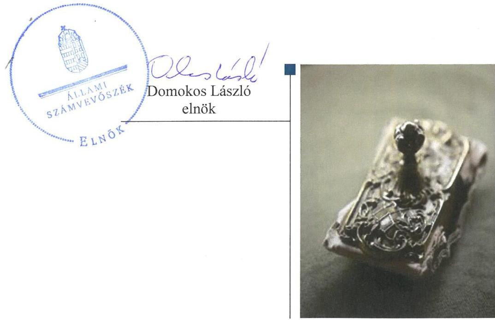
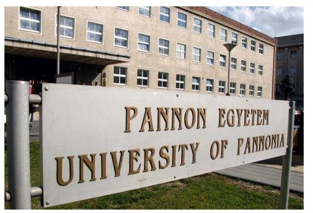
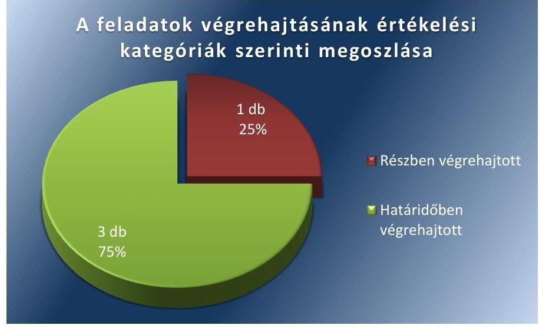

# Jelentés 

## Utóellenőrzések

Az állami felsőoktatási intézmények gazdálkodásának, működésének ellenőrzéséről készült jelentések utóellenőrzése - Pannon Egyetem 2017.

---

# Jelentés 

## Utóellenőrzések

Az állami felsőoktatási intézmények gazdálkodásának, működésének ellenőrzéséről készült jelentések utóellenőrzése - Pannon Egyetem 2017. 02. hó 13. nap

---

# AZ ELLENŐRZÉST FELÜGYELTE: 

DR. PULAY GYULA ZOLTÁN felügyeleti vezető

## AZ ELLENŐRZÉST VEZETTE ÉS A VÉGREHAJTÁSÁÉRT FELELŐS:

RÁCZKEVI KATALIN ellenőrzésvezető

## A PROGRAM ÖSSZEÁLLÍTÁSÁÉRT FELELŐS:

JANIK JÓZSEF osztályvezető

## A TÉMÁHOZ KAPCSOLÓDÓ KORÁBBI SZÁMVEVŐSZÉKI JELENTÉSEK:

- címe: Jelentés a Pannon Egyetem ellenőrzéséről - Az állami felsőoktatási intézmények gazdálkodásának, működésének ellenőrzése
- sorszáma: 14197

IKTATÓSZÁM: V-1189-057/2016.
TÉMASZÁM: 2223
ELLENŐRZÉS-AZONOSÍTÓ SZÁM: V075535

---

# TARTALOMJEGYZÉK 

■ ÖSSZEGZÉS ..... 5
■ AZ ELLENŐRZÉS CÉLJA ..... 6
■ AZ ELLENŐRZÉS TERÜLETE ..... 7
■ AZ ELLENŐRZÉS HÁTTERE, INDOKOLTSÁGA ..... 8
■ A JELENTÉS LÉNYEGES KÉRDÉSKÖREI ..... 9
■ ELLENŐRZÉS HATÓKÖRE ÉS MÓDSZEREI ..... 10
■ MEGÁLLAPÍTÁSOK ..... 12
■ MELLÉKLETEK ..... 15
I. Sz. melléklet: Az ÁSZ 14197. számú jelentéséhez kapcsolódó Egyetem intézkedési terv végrehajtása ..... 15
■ FÜGGELÉK: ÉSZREVÉTELEK ..... 17
■ RÖVIDÍTÉSEK JEGYZÉKE ..... 19

---

.

---

# ÖSSZEGZÉS 

Az Állami Számvevőszék az utóellenőrzés során megállapította, hogy a korábbi számvevőszéki jelentés javaslatai alapján az Egyetem rektora által összeállított intézkedési tervben szereplő feladatok jelentős részét végrehajtották. Az intézkedések megvalósítása javította az Egyetem belső kontrollrendszere, pénzügyi gazdálkodása, vagyongazdálkodása szabályszerűségét. Az Egyetem gazdálkodását és működését érintő szabályzatok jelentős részének felülvizsgálata megtörtént, az aktualizálás azonban nem volt teljes körű.

## Az ellenőrzés társadalmi indokoltsága

Az ÁSZ ${ }^{1}$ stratégiájában célul tűzte ki a számvevőszéki munka hasznosulásának javítását. Ezzel összhangban ellenőrzi, hogy az ellenőrzött szervezetek megvalósították-e a korábbi ellenőrzései által feltárt hibák, hiányosságok és szabálytalanságok megszüntetése céljából elkészített intézkedési terveikben foglaltakat. A rendszeres utóellenőrzések hozzájárulnak a szükséges intézkedések tényleges végrehajtásához, ezáltal a közpénzügyek rendezettségének javulásához.

## Főbb megállapítások, következtetések, javaslatok

Az Egyetem² rektora által meghatározott intézkedési tervben szereplő négy feladatból három feladatot határidőben, egy feladatot részben hajtottak végre. Az Egyetem az intézkedési tervben rögzített feladatok végrehajtásáról a Bkr. ${ }^{3}$ előírásainak megfelelő nyilvántartást vezetett.

A rektor ${ }^{4}$ intézkedett a folyamatba épített előzetes, utólagos és vezetői ellenőrzés hatékony működtetése és a gazdálkodási jogkörök szabályszerű gyakorlása, valamint a rendszeres és nem rendszeres személyi juttatások előirányzatai felhasználásának szabályszerűségére irányuló belső ellenőrzés elrendelése érdekében.

A követelések szabályszerű kimutatása, értékelése, az értékvesztés elszámolása érdekében intézkedést tettek.
Az Egyetem működését és gazdálkodását meghatározó szabályzatok jelentős részének a kancellári rendszer bevezetésével összefüggő aktualizálást elvégezték, azonban a felülvizsgálat még nem teljes körű, néhány - az Egyetem gazdálkodása szempontjából fontos szabályzat - aktualizálására még nem került sor.

---

# AZ ELLENŐRZÉS CÉLJA 

Az ellenőrzés célja annak értékelése volt, hogy a számvevőszéki jelentésben foglalt intézkedést igénylő megállapításokkal és javaslatokkal összhangban készített intézkedési tervben meghatározott feladatokat az ellenőrzött szervezet végrehajtotta-e.

---

# AZ ELLENŐRZÉS TERÜLETE 

## A Pannon Egyetem

A veszprémi székhelyű Pannon Egyetem jelenleg öt karral rendelkezik, melyek közül az egyik Keszthelyen található, de a Közép- és Nyugat-Dunántúli Régió több városában, többek között Nagykanizsán, Pápán, Zalaegerszegen és Kőszegen is jelen van. 2006-ban vette fel az intézmény a Pannon Egyetem nevet, amely Keszthely és Nagykanizsa mellett Pápán és Székesfehérváron is indított képzéseket. A hallgatók az intézmény öt karán: a Gazdaságtudományi, a Georgikon, a Mérnöki, a Modern Filológiai és Társadalomtudományi, valamint a Műszaki Informatikai Karon vesznek részt a képzésben.

A rektor 2015. július 1-je óta tölti be a tisztségét, a kancellár ${ }^{5}$ 2015. január 1-jétől látja el feladatait. Az ellenőrzött időszak alatt a rektor személyében változás történt, a korábbi rektor 2011. július 1-től 2015. június 30-ig töltötte be tisztségét.

Az Egyetem 2015. évi költségvetési beszámolója szerint 6419,7 millió Ft költségvetési bevételt, 5166,1 millió Ft finanszírozási bevételt ért el, valamint 10461,8 millió Ft költségvetési kiadást teljesített. A 2015. december 31-i könyvviteli mérleg szerint az Egyetem eszközei 11 634,3 millió Ft-ot tettek ki.

Az Egyetem gazdálkodásának és működésének ellenőrzését az ÁSZ a 2009-2012. közötti időszakra végezte el, az erről szóló 14197. számú jelentést 2014. július 31-én tette közzé. Az ellenőrzés célja annak értékelése volt, hogy szabályos volt-e az Egyetem pénzügyi és vagyongazdálkodása, biztosított volt-e a vagyonnal való gazdálkodás követelményének érvényesülése, a jogszabályi előírásoknak megfelelően működött-e a belső kontrollrendszer, az irányító szerv tevékenysége a jogszabályoknak megfelelő volt-e.

Az utóellenőrzés az ÁSZ jelentésben a rektor részére megfogalmazott intézkedést igénylő megállapításokra és javaslatokra készített, az ÁSZ részére megküldött intézkedési tervben foglalt feladatok megvalósításának ellenőrzésére, illetve értékelésére fókuszált.

---

# AZ ELLENŐRZÉS HÁTTERE, INDOKOLTSÁGA 

Az ÁSZ tv. 33. § (1) bekezdése értelmében a számvevőszéki jelentések intézkedést igénylő megállapításaihoz és javaslataihoz kapcsolódóan az ellenőrzött szervezet vezetője intézkedési tervet köteles összeállítani, és az ÁSZ részére megküldeni. Az intézkedési tervben foglaltak megvalósítását az ÁSZ tv. 33. § (7) bekezdésében foglaltak alapján - az ÁSZ utóellenőrzés keretében - ellenőrizheti. Az intézkedések megvalósulásának értékelése során az ÁSZ figyelembe veszi az ellenőrzött szervezetek működési feltételeiben, valamint a jogszabályi előírásokban bekövetkezett változásokat.

Az intézkedési tervekben foglalt feladatok hiányos, illetve késedelmes végrehajtása, valamint megvalósításának elmaradása azt mutatja, hogy az ellenőrzések során feltárt hibák, hiányosságok és szabálytalanságok megszüntetése nem kapott kellő hangsúlyt. Ez a szabályszerű működés és a felelős vezetői magatartás vonatkozásában kockázatot hordoz. E kockázatok feltárásával az ÁSZ utóellenőrzési rendszere fokozza a fegyelmet, és igazolja, hogy a közpénzzel való szabályos gazdálkodás felelőssége elől nem lehet kitérni.

## AZ UTÓELLENŐRZÉS VÁRHATÓ HASZNOSULÁSA

Az utóellenőrzés négy szinten hasznosulhat:
$\longrightarrow$ A társadalom szintjén az utóellenőrzés jelzi, hogy a számvevőszéki ellenőrzés megállapításainak van következménye: a hiányosságok megszüntetésére az ellenőrzött szervezet által meghatározott intézkedések végrehajtását is számon kéri az ÁSZ.
$\longrightarrow$ Az ellenőrzött terület szintjén az utóellenőrzés tájékoztatást nyújt a terület döntéshozóinak a hiányosságok kiküszöbölésének jó gyakorlatairól, ezzel lehetőséget biztosítva arra, hogy az ÁSZ ellenőrzési megállapításai, javaslatai a terület nem ellenőrzött szervezeteinek a működése során is hasznosuljanak.
$\longrightarrow$ Az ellenőrzött szervezet szintjén az utóellenőrzés feltárja, hogy a szervezet az intézkedések végrehajtásával hasznosította-e a korábbi ellenőrzési jelentésben a hiányosságok megszüntetése, illetve a kockázatok kezelése érdekében megfogalmazott javaslatokat.
$\longrightarrow$ Az ÁSZ szintjén az utóellenőrzés visszacsatolást ad az ellenőrzési jelentések hasznosulásáról, az intézkedések elmaradása vagy részleges megvalósulása a további ellenőrzésekhez kockázati jelzésként szolgál.

---

# A JELENTÉS LÉNYEGES KÉRDÉSKÖREI 

1. Az ellenőrzött szervezet az intézkedési tervben foglaltakat az előírt határidőben végrehajtotta-e?

---

# ELLENŐRZÉS HATÓKÖRE ÉS MÓDSZEREI 

## Az ellenőrzés típusa

Megfelelőségi ellenőrzés.

## Az ellenőrzött időszak

Az utóellenőrzés alapját képező ÁSZ jelentés közzétételének napjától (2014. július 31.) az ellenőrzésről szóló kiértesítő levél keltének napjáig (2016. október 10.) tartó időszak.

## Az ellenőrzés tárgya

A számvevőszéki jelentésben foglalt intézkedést igénylő megállapításokkal és javaslatokkal összhangban - az Egyetem által - készített intézkedési tervben foglaltak végrehajtásának ellenőrzése.

Az ellenőrzés kiterjed minden olyan körülményre és adatra, amely az ÁSZ jogszabályban meghatározott feladatainak teljesítéséhez, valamint a program végrehajtása folyamán felmerült újabb összefüggések feltárásához szükséges.

## Az ellenőrzött szervezet

Pannon Egyetem

## Az ellenőrzés jogalapja

Az ÁSZ az Országgyűlés pénzügyi és gazdasági ellenőrző szerve. Az ÁSZ törvényben meghatározott feladatkörében ellenőrzi a központi költségvetés végrehajtását, az államháztartás gazdálkodását, az államháztartásból származó források felhasználását és a nemzeti vagyon kezelését.

Az ÁSZ tv. 1. § (3) bekezdése szerint az ÁSZ általános hatáskörrel végzi a közpénzekkel és az állami és önkormányzati vagyonnal való felelős gazdálkodás ellenőrzését.

Az ÁSZ tv. 33. § (7) bekezdése alapján az ÁSZ tv. 33. § (1)-(2) bekezdése szerinti intézkedési tervben foglaltak megvalósítását az ÁSZ utóellenőrzés keretében ellenőrizheti.

---

# Az ellenőrzés módszerei 

Az ÁSZ az utóellenőrzést a nemzetközi standardokat irányadónak tekintve az ellenőrzési program ellenőrzési kérdései, az ellenőrzött időszakban hatályos jogszabályok, az ellenőrzés szakmai szabályok és módszertanok figyelembevételével, önállóan végezte.

Az ÁSZ az ellenőrzés ideje alatt az Egyetemmel történő kapcsolattartást az ÁSZ SZMSZ ${ }^{7}$-ének vonatkozó előírásai alapján biztosította.

Az utóellenőrzés megállapításait elsősorban az ÁSZ rendelkezésére álló, valamint az ellenőrzött szervezetektől elektronikusan bekért dokumentumok alapozták meg.

Az ellenőrzési bizonyítékként felhasználható adatforrások közé tartoznak egyrészt a szakmai programban felsorolt adatforrások, másrészt minden - az ellenőrzés folyamán feltárt, az ellenőrzés szempontjából információt tartalmazó - dokumentum.

A vagyongazdálkodás szabályszerűségét az ellenőrzött szervezet követelésállományából 10 véletlen mintavétellel kiválasztott tétel alapján értékelte az ÁSZ. A kiválasztott tételek esetében azt ellenőrizte, hogy az Egyetem az intézkedési tervben meghatározott feladatok végrehajtása során biztosította-e a jogszabályok és a belső szabályzatok előírásainak megfelelő működtetést.

Az intézkedési tervekben előírt feladatokat, azok végrehajtása, illetve végrehajtása szempontjából az alábbiak szerint értékelte az ÁSZ:
$\longrightarrow$ „határidőben végrehajtott" a feladat, ha a teljesítés dokumentáltan, az intézkedési tervben előírt határidőben és tartalommal megtörtént;
$\longrightarrow$ „határidőn túl végrehajtott" a feladat, ha annak teljesítése az intézkedési tervben meghatározott módon, de az előírt határidőn túl történt meg;
$\longrightarrow$ „részben végrehajtott" a feladat, ha végrehajtása teljes körűen az intézkedési tervben előírt módon nem történt meg;
$\longrightarrow$ „nem végrehajtott" a feladat, ha a végrehajtás nem történt meg, vagy amennyiben a teljesítést nem dokumentálták;
$\longrightarrow$ „okafogyottá vált" a feladat, ha végrehajtására - meghatározott esemény bekövetkezése, továbbá külső körülmény, a működést érintő feltétel változása miatt - már nincs szükség, illetve lehetőség, és egyértelműen megállapítható, hogy az intézkedést szükségessé tevő körülmény a jövőben nem fordulhat elő;
$\longrightarrow$ „nem időszerű" az a feladat, amelynek ellenőrzési időszakon belüli végrehajtására azért nem került (kerülhetett) sor, mert az intézkedés alapjául szolgáló esemény nem következett be, de annak jövőbeni előfordulása lehetséges, a végrehajtása nem volt esedékes, vagy a végrehajtás határideje még nem járt le.
Az utóellenőrzés lefolytatásához az ellenőrzött szervezetek a tanúsítványok elektronikus kitöltésével, valamint az ÁSZ által kért dokumentumok elektronikus megküldésével szolgáltattak adatokat, amelyek valódiságát és teljes körűségét az ellenőrzött szervezet vezetője által tett teljességi és hitelességi nyilatkozat igazolta. Az így rendelkezésre bocsátott adatok, információk kontrollja az ellenőrzés keretében történt.

---

# MEGÁLLAPÍTÁSOK 

## 1. Az ellenőrzött szervezet az intézkedési tervben foglaltakat az előírt határidőben végrehajtotta-e?

Összegző megállapítás

Az Egyetem az intézkedési tervben meghatározott négy feladatból három feladatot határidőben, egy feladatot részben hajtott végre. Az intézkedési tervben rögzített feladatok végrehajtásáról a Bkr. előírásainak megfelelő nyilvántartást vezettek.

Az ÁSZ a jelentésében a rektor részére három javaslatot fogalmazott meg.
Az Egyetem által összeállított és az ÁSZ részére megküldött intézkedési tervben a hiányosságok, szabálytalanságok megszüntetésére négy feladatot határoztak meg. A feladatok elvégzésének felelőseit megjelölték.

Az ÁSZ javaslatai alapján készített intézkedési tervben rögzített feladatok végrehajtásáról az Egyetem a Bkr. előírásainak megfelelő nyilvántartást vezetett.

Az intézkedési tervben meghatározott feladatokat, határidőket, a feladatok végrehajtásáért felelős személyt és a feladatok végrehajtását az I. számú melléklet mutatja be.

Az Egyetem intézkedési tervében tervezett feladatok végrehajtásának értékelési kategóriák szerinti megoszlását az 1. ábra szemlélteti.
1. ábra

Fonrás: ÁSZ

## HATÁRIDŐBEN VÉGREHAJTOTT feladatok:

- A rektor a folyamatba épített előzetes, utólagos és vezetői ellenőrzés hatékony működtetése és a gazdálkodási jogkörök szabályszerű gyakorlásának érvényesítése érdekében kiadta a 4/2014. (X.15.)

---

számú,
 „A folyamatba épített előzetes, utólagos és vezetői ellenőrzés hatékony működése és a gazdálkodási jogkörök szabályszerű gyakorlásának érvényesítése érdekében" tárgyú rektori utasítást.

- A rektor intézkedett a rendszeres és nem rendszeres személyi juttatások előirányzatai felhasználásának szabályszerűségére irányuló belső ellenőrzés elrendelése érdekében, mivel 2014. szeptember 23-án megbízta a belső ellenőrt a feladat elvégzésére. A belső ellenőrzést lefolytatták, a jelentés elkészült.
- A pénzgazdálkodási igazgató intézkedett a követelések teljes körű kimutatása, a hatályos jogszabályi előírásoknak megfelelő értékelése és a követelések érvényesítése érdekében. A követelések értékelését az Áhsz. ${ }^{8}$ előírásainak megfelelően a Számviteli Politikában ${ }^{9}$, az Eszközök és Források Értékelési szabályzatában ${ }^{10}$ meghatározták. Elkészítették az eljárásrendet a költségtérítési díjakból származó követelések érvényesítése érdekében, melyben meghatározták a követelések behajtásának módját és felelőseit. Az ellenőrzés rendelkezésére bocsátott dokumentumok alapján a követelések teljes körű kimutatását, egyedi értékelését elvégezték, az értékvesztést elszámolták. A követelések érvényesítése érdekében a belső szabályzatban előírt behajtási lépéseket elvégezték.

# RÉSZBEN VÉGREHAJTOTT feladat: 

- A kancellári rendszer bevezetését követően intézkedtek az Egyetem működését meghatározó működési rendek, szabályzatok, ügyrendek felülvizsgálatáról, az Alapító Okirat ${ }^{11}$, a Szervezeti és Működési Szabályzat ${ }^{12}$ módosításával, valamint az egyetemi karok és szervezetek működési rendjének kiadásával. Az Egyetem gazdálkodásával kapcsolatos szabályzatok közül a Kötelezettségvállalás, utalványozás és ellenjegyzés rendje ${ }^{13}$, valamint a Számviteli Szabályzatok ${ }^{14}$ aktualizálása megtörtént. A Kancellária ügyrendjét ${ }^{15}$ elkészítették. Az SzMSz mellékletét képző, intézményi és kari Szervezeti és Működési Rendek, valamint a Gazdálkodási Szabályzat ${ }^{16}$ és az egyéb szabályzatok aktualizálásának teljes körű végrehajtása nem történt meg.

---

.

---

# MELLÉKLETEK

- I. SZ. MELLÉKLET: AZ ÁSZ 14197. SZÁMÚ JELENTÉSÉHEZ KAPCSOLÓDÓ EGYETEM INTÉZKEDÉSI TERV VÉGREHAJTÁSA

|  5 | Az intézkedési tervben rögzített feladat | Az intézkedési tervben meghatározott határidő | A feladatok elvégzésének felelőse | A feladat végrehajtása  |
| --- | --- | --- | --- | --- |
|  1. | 1. | 2.
Határidőben végrehajtott feladatok | 3. | 4.  |
|  1. | „Rektori utasítás kiadása a folyamatba épített előzetes, utólagos és vezetői ellenőrzés hatékony működtetése és a gazdálkodási jogkörök szabályszerű gyakorlásának érvényesítése érdekében." | 2014. október 15. | rektor | A rektor az intézkedési tervben meghatározott határidőn belül a folyamatba épített előzetes, utólagos és vezetői ellenőrzés hatékony működése és a gazdálkodási jogkörök szabályszerű gyakorlásának érvényesítése érdekében 4/2014. (X.15.) számmal rektori utasítást adott ki: „A folyamatba épített előzetes, utólagos és vezetői ellenőrzés hatékony működése és a gazdálkodási jogkörök szabályszerű gyakorlásának érvényesítése érdekében" tárgyú rektori utasításban felhívta a gazdálkodási jogkörrel rendelkezők figyelmét a jogszabályok és „A kötelezettségvállalás, utalványozás és pénzügyi ellenjegyzés rendje" című belső szabályzat betartására. |   |
|  2. | „Belső ellenőrzés elrendelése a rendszeres és nem rendszeres személyi juttatások előirányzatai felhasználásának szabályszerűségére." | 2014. szeptember 30. | rektor | A rektor az intézkedési tervben vállalt határidőn belül intézkedett a rendszeres és nem rendszeres személyi juttatások előirányzatai felhasználásának szabályszerűségére irányuló belső ellenőrzés elrendelése érdekében. A rektor RH94/204. számmal, 2014. szeptember 23-án megbízta a Pannon Egyetem regisztrált belső ellenőrét a feladat végrehajtására. A belső ellenőrzést lefolytatták, a jelentés 2/2015. számon elkészült.  |
|  3. | „Követelések teljes körű kimutatása, a hatályos jogszabályi előírásoknak megfelelő értékelése, a követelések érvényesítése." | folyamatos | pénzgazdálkodási igazgató | A pénzgazdálkodási igazgató intézkedett a követelések teljes körű kimutatása, a hatályos jogszabályi előírásoknak megfelelő értékelése és a követelések érvényesítése érdekében.
A Számviteli Politikát és annak 2. számú mellékleteként elkészített értékelési szabályzatot az Áhsz. 50. § (1)-(2) és 51. § előírásainak megfelelően elkészítették, amelyben meghatározták a követelések értékelésének elveit, a követelések behajthatatlanná minősítésének feltételeit. Elkészítették az Eljárásrendet ${ }^{17}$ a költségtérítési díjakból származó követelések érvényesítése érdekében.  |

---

|   | Az intézkedési tervben rögzített feladat | Az intézkedési tervben meghatározott határidő | A feladatok elvégzésének felelőse | A feladat végrehajtása  |
| --- | --- | --- | --- | --- |
|   | 1. | 2. | 3. | 4.  |
|   |  |  |  | Az eljárásrendben előírták a nyilvántartások és a kiállított számlák negyedévenkénti egyeztetését, amelynek felelőse az Oktatási Igazgatóság és a Pénzügyi Iroda volt. Meghatározták a követelések behajtásának módját és felelőseit, így az intézkedés megvalósításához a megfelelő szabályozási kereteket kialakították. Az ellenőrzés rendelkezésére bocsátott dokumentumok alapján a követelések teljes körű kimutatását, egyedi értékelését elvégezték, az értékvesztést elszámolták. A követelések érvényesítése érdekében előírt behajtási lépéseket elvégezték.  |
|   |  | Részben végrehajtott feladat |  |   |
|  4. | „Szabályzatok felülvizsgálata, aktualizálása, a jogszabályi változásoknak megfelelően, figyelemmel a felsőoktatási intézményeknél bevezetésre kerülő kancellária rendszerre is." | folyamatos | a szabályzat karbantartásáért felelős vezető | Határidőben végrehajtott feladatrészek:
A kancellária rendszer bevezetését követően az Egyetem működését meghatározó dokumentumok Alapító Okirat, Szervezeti és Működési Szabályzat, karok és szervezetek működési rendjei, ügyrendek aktualizálása megtörtént. A Kancellária ügyrendjét elkészítették. Az Egyetem gazdálkodását érintő szabályzatok közül a Pénzkezelési Szabályzat ${ }^{18}$, Kötelezettségvállalási Szabályzat, Számviteli Szabályzatok aktualizálását elvégezték.
Nem végrehajtott feladatrészek:
Az Egyetem kancellárja által készített „Előterjesztés a Pannon Egyetem Szervezeti és Működési Szabályzat szerkezetére, kodifikációs ütemezésére, szabályozás elveire" című, 2015. március 2 -án kelt dokumentum határozati javaslata 4. pontja szerint 2015. december 31 -éig kellett áttekinteni a Szervezeti és Működési Szabályzat mellékletét képző, intézményi és kari Szervezeti és Működési Rendeket, valamint a Gazdálkodási Szabályzatot és az egyéb szabályzatokat. Az előterjesztésben foglaltak végrehajtása nem teljes körűen történt meg; nem került sor - egyebek mellett - a 153/2011-2012. (III.29.) Szenátusi határozattal elfogadott Közbeszerzési szabályzat aktualizálására.  |

Forrás: ÁSZ által készített táblázat

---

# FÜGGELÉK: ÉSZREVÉTELEK 

A jelentéstervezetet a Számvevőszék 15 napos észrevételezésre megküldte az ellenőrzött szervezet vezetőjének az ÁSZ tv. 29. §* (1) bekezdése előírásának megfelelően.
Az ellenőrzött szervezet vezetője az ÁSZ tv. 29. § (2) bekezdésében foglalt észrevételezési jogával nem élt, a jelentéstervezetre észrevételt nem tett.

[^0]
[^0]:    * 29. § (1) Az Állami Számvevőszék az ellenőrzési megállapításait megküldi az ellenőrzött szervezet vezetőjének vagy az általa megbízott személynek, és annak, akinek személyes felelősségét állapította meg.
    (2) Az ellenőrzött szervezet vezetője és a felelősként megjelölt személy az ellenőrzés megállapításaira tizenöt napon belül írásban észrevételt tehet.
    (3) Az Állami Számvevőszék az észrevételre a beérkezésétől számított harminc napon belül írásban válaszol. A figyelembe nem vett észrevételeket köteles a jelentésben feltüntetni, és megindokolni, hogy azokat miért nem fogadta el.

---

.

---

# RÖVIDÍTÉSEK JEGYZÉKE 

${ }^{1}$ ÁSZ
${ }^{2}$ Egyetem
${ }^{3}$ Bkr.
${ }^{4}$ rektor
${ }^{5}$ kancellár
${ }^{6}$ ÁSZ tv.
${ }^{7}$ ÁSZ SZMSZ
${ }^{8}$ Áhsz.
${ }^{9}$ Számviteli Politika
${ }^{10}$ Eszközök és Források Értékelési szabályzata a Pannon Egyetem Eszközök és Források Értékelési szabályzata
${ }^{11}$ Alapító Okirat
${ }^{12}$ Szervezeti és Működési Szabályzat
${ }^{13}$ Kötelezettségvállalás, utalványozás és ellenjegyzés rendje
${ }^{14}$ Számviteli Szabályzatok
${ }^{15}$ Kancellária Ügyrendje
${ }^{16}$ Gazdálkodási Szabályzat
${ }^{17}$ Eljárásrend
${ }^{18}$ Pénzkezelési Szabályzat

Állami Számvevőszék
Pannon Egyetem
a költségvetési szervek belső kontrollrendszeréről és belső ellenőrzéséről szóló 370/2011. (XII. 31.) Korm. rendelet
a Pannon Egyetem rektora
a Pannon Egyetem kancellárja
2011. évi LXVI. törvény az Állami Számvevőszékről (hatályos 2011. július 1-jétől)
az Állami Számvevőszék Szervezeti és Működési Szabályzata
4/2013. (I.11.) Korm. rendelet az államháztartás számviteléről
a Pannon Egyetem Számviteli Politikája
a Pannon Egyetem Eszközök és Források Értékelési szabályzata
a Pannon Egyetem Alapító Okirata
a Pannon Egyetem Szervezeti és Működési Szabályzata
a Pannon Egyetem Kötelezettségvállalás, utalványozás és ellenjegyzés rendje
Pannon Egyetem Számviteli Szabályzatai (92/2015-2016.(XII.3) számú Szenátusi határozattal elfogadva)
a Pannon Egyetem Kancellária Ügyrendje
a Pannon Egyetem Gazdálkodási Szabályzata
a Pannon Egyetem Eljárásrendje a NEPTUN hallgatói rendszerben, a költségtérítési díjakról kiállított számlák EGIR rendszerben történő nyilvántartásáról, egyeztetéséről, illetve az elmaradt, határidőre ki nem fizetett követelések érvényesítéséről
a Pannon Egyetem Pénzkezelési Szabályzata

---

# ÁLLAMI SZÁMVEVŐSZÉK 

1052 Budapest, Apáczai Csere János utca 10.
Levélcím: 1364 Budapest 4. Pf. 54
Telefon: +36 14849100 Telefax: +36 14849200
www.asz.hu
