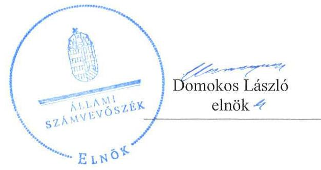
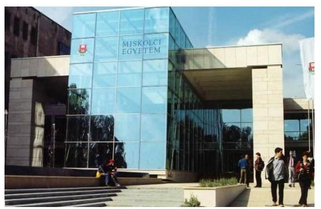
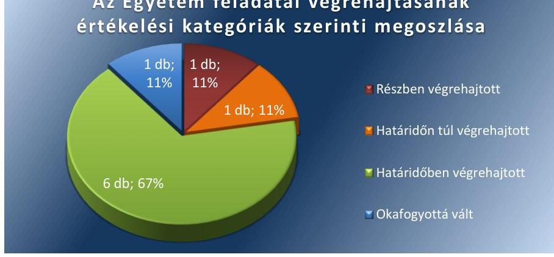
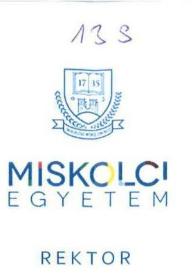
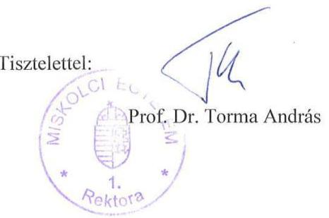
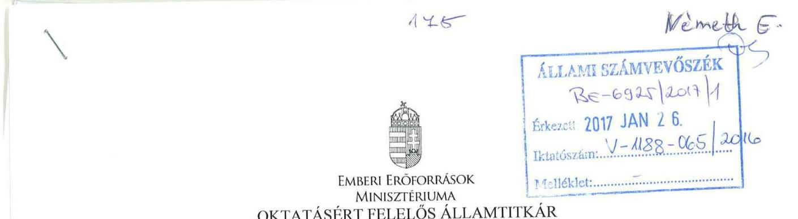
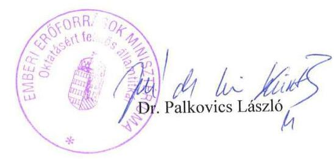

# Jelentés 

## Utóellenőrzések

Az állami felsőoktatási intézmények gazdálkodásának, működésének ellenőrzéséről készült jelentések utóellenőrzése - Miskolci Egyetem 2017.

---

# Jelentés 

## Utóellenőrzések

Az állami felsőoktatási intézmények gazdálkodásának, működésének ellenőrzéséről készült jelentések utóellenőrzése - Miskolci Egyetem 2017. február 23. nap

---

# AZ ELLENŐRZÉST FELÜGYELTE: 

DR. NÉMETH ERZSÉBET felügyeleti vezető

## AZ ELLENŐRZÉST VEZETTE ÉS A VÉGREHAJTÁSÁÉRT FELELŐS:

RÁCZKEVI KATALIN ellenőrzésvezető

## A PROGRAM ÖSSZEÁLLÍTÁSÁÉRT FELELŐS:

JANIK JÓZSEF osztályvezető

## A TÉMÁHOZ KAPCSOLÓDÓ KORÁBBI SZÁMVEVŐSZÉKI JELENTÉSEK:

- címe: Jelentés a Miskolci Egyetem ellenőrzéséről - Az állami felsőoktatási intézmények gazdálkodásának, működésének ellenőrzése
- sorszáma: 14200

Jelentéseink az Országgyűlés számítógépes hálózatán és az Interneten a www.asz.hu címen is olvashatóak.

IKTATÓSZÁM: V-1188-066/2016.
TÉMASZÁM: 2222
ELLENŐRZÉS-AZONOSÍTÓ SZÁM: V075534

---

# TARTALOMJEGYZÉK 

■ ÖSSZEGZÉS ..... 5
■ AZ ELLENŐRZÉS CÉLJA ..... 6
■ AZ ELLENŐRZÉS TERÜLETE ..... 7
■ AZ ELLENŐRZÉS HÁTTERE, INDOKOLTSÁGA ..... 8
■ FÓKUSZKÉRDÉS ..... 9
■ ELLENŐRZÉS HATÓKÖRE ÉS MÓDSZEREI ..... 10
■ MEGÁLLAPÍTÁSOK ..... 13
■ MELLÉKLETEK ..... 17
I. Sz. melléklet: Az ÁSZ 14200 számú jelentéséhez kapcsolódó Egyetem intézkedési terv végrehajtása ..... 17
II. Sz. melléklet: Az ÁSZ 14200 számú jelentéséhez kapcsolódó EMMI intézkedési terv végrehajtása ..... 22
■ FÜGGELÉK: ÉSZREVÉTELEK ..... 23
■ RÖVIDÍTÉSEK JEGYZÉKE ..... 27

---

.

---

# ÖSSZEGZÉS 

Az Állami Számvevőszék elvégezte a Miskolci Egyetem utóellenőrzését és megállapította, hogy a korábbi jelentés javaslatai alapján az Egyetem a feltárt szabálytalanságok kijavítása érdekében készített intézkedési tervében szereplő feladatokat végrehajtotta. Mindez javította működésének szabályozottságát és átláthatóságát.

## Az ellenőrzés társadalmi indokoltsága

Az ÁSZ ${ }^{1}$ stratégiájában célul tűzte ki a számvevőszéki munka hasznosulásának javítását. Ezzel összhangban ellenőrzi, hogy az ellenőrzött szervezetek megvalósították-e a korábbi ellenőrzései által feltárt hibák, hiányosságok és szabálytalanságok megszüntetése céljából elkészített intézkedési terveikben foglaltakat. A rendszeres utóellenőrzések hozzájárulnak a szükséges intézkedések tényleges végrehajtásához, ezáltal a közpénzügyek rendezettségének javulásához.

## Főbb megállapítások, következtetések, javaslatok

Az Egyetem² az intézkedési tervben rögzített feladatok végrehajtásáról a Bkr.³ által előírt nyilvántartást vezette.
Az Egyetem intézkedési tervében meghatározott kilenc feladatból hat feladatot határidőben, egyet határidőn túl, egy feladatot részben hajtott végre, egy feladat pedig okafogyottá vált.

A pénzügyi és vagyongazdálkodással kapcsolatos folyamatokat, feladat- és hatásköröket, felelősségi viszonyokat aktualizálták. Az engedélyezési és jóváhagyási jogköröket meghatározták. Intézkedést tettek a hallgatói díjfizetések és költségtérítések Magyar Államkincstárnál vezetett számlán történő kezelése érdekében.

2014-ben ugyanakkor elmaradt a követelések szabályszerű értékelése, és a mérlegben a jogszabályoknak megfelelő kimutatása, 2015. évre a követelések értékelése és mérlegben történő kimutatása szabályszerű volt.

Az EMMI ${ }^{4}$ az intézkedési tervében meghatározott feladatot végrehajtotta.

---

# AZ ELLENŐRZÉS CÉLJA 

Az ellenőrzés célja annak értékelése volt, hogy a számvevőszéki jelentésben ${ }^{5}$ foglalt intézkedést igénylő megállapításokkal és javaslatokkal összhangban készített intézkedési tervben meghatározott feladatokat az ellenőrzött szervezetek végrehajtották-e.

---

# AZ ELLENŐRZÉS TERÜLETE 

## Miskolci Egyetem

A Miskolci Egyetemen - 1990. július 1-je előtt Nehézipari Műszaki Egyetem - napjainkban a három műszaki karon kívül állam- és jogtudományi, gazdaságtudományi, bölcsészettudományi, zeneművészeti és egészségügyi szakképzésben részesülhetnek az ide jelentkezők. Az Egyetemen a hallgatók létszáma a 2015. október 15-i adatok szerint 9513 fő volt.

A rektor ${ }^{6}$ 2013. augusztus 15. óta tölti be tisztségét. Az ellenőrzött időszakban változások történtek az Egyetem gazdasági vezetésében, 2014. november 15-től a Miniszterelnök ${ }^{7}$ kancellárt ${ }^{8}$ bízott meg.

Az Egyetem 2015. évi költségvetési beszámolója szerint 7001,4 millió Ft költségvetési bevételt, 6730,8 millió Ft finanszírozási bevételt ért el, valamint 12 422,7 millió Ft költségvetési kiadást teljesített. A 2015. december 31-i könyvviteli mérleg szerint az Egyetem eszközei 15 825,2 millió Ft-ot tettek ki.

Az Egyetem gazdálkodásának, működésének ellenőrzését az ÁSZ a 2009. január 1. - 2012. december 31. közötti időszakra végezte el, az erről szóló 14200. számú jelentést 2014. augusztus 14-én tette közzé. Az ellenőrzés célja annak értékelése volt, hogy szabályos volt-e az Egyetem pénzügyi és vagyongazdálkodása, biztosított volt-e a vagyonnal való gazdálkodás követelményének érvényesülése, a jogszabályi előírásoknak megfelelően működött-e a belső kontrollrendszer, az irányító szerv tevékenysége a jogszabályoknak megfelelő volt-e. Az ellenőrzés az Egyetem mellett az Emberi Erőforrások Minisztériumára, mint ellenőrzött szervezetre terjedt ki.

Az utóellenőrzés az ÁSZ jelentésben a rektor és a miniszter ${ }^{9}$ részére megfogalmazott intézkedést igénylő megállapításokra és javaslatokra készített, az ÁSZ részére megküldött intézkedési tervekben foglalt feladatok megvalósításának ellenőrzésére, illetve értékelésére fókuszált.

---

# AZ ELLENŐRZÉS HÁTTERE, INDOKOLTSÁGA 

Az ÁSZ tv. ${ }^{10}$ 33. § (1) bekezdése értelmében a számvevőszéki jelentések intézkedést igénylő megállapításaihoz és javaslataihoz kapcsolódóan az ellenőrzött szervezet vezetője intézkedési tervet köteles összeállítani, és az ÁSZ részére megküldeni. Az intézkedési tervben foglaltak megvalósítását az ÁSZ tv. 33. § (7) bekezdésében foglaltak alapján - az ÁSZ utóellenőrzés keretében - ellenőrizheti. Az intézkedések megvalósulásának értékelése során az ÁSZ figyelembe veszi az ellenőrzött szervezetek működési feltételeiben, valamint a jogszabályi előírásokban bekövetkezett változásokat.

Az intézkedési tervekben foglalt feladatok hiányos, illetve késedelmes végrehajtása, valamint megvalósításának elmaradása azt mutatja, hogy az ellenőrzések során feltárt hibák, hiányosságok és szabálytalanságok megszüntetése nem kapott kellő hangsúlyt. Ez a szabályszerű működés és a felelős vezetői magatartás vonatkozásában kockázatot hordoz. E kockázatok feltárásával az ÁSZ utóellenőrzési rendszere fokozza a fegyelmet, és igazolja, hogy a közpénzzel való szabályos gazdálkodás felelőssége elől nem lehet kitérni.

## AZ UTÓELLENŐRZÉS VÁRHATÓ HASZNOSULÁSA

Az utóellenőrzés négy szinten hasznosulhat:
$\longrightarrow$ A társadalom szintjén az utóellenőrzés jelzi, hogy a számvevőszéki ellenőrzés megállapításainak van következménye: a hiányosságok megszüntetésére az ellenőrzött szervezet által meghatározott intézkedések végrehajtását is számon kéri az ÁSZ.
$\longrightarrow$ Az ellenőrzött terület szintjén az utóellenőrzés tájékoztatást nyújt a terület döntéshozóinak a hiányosságok kiküszöbölésének jó gyakorlatairól, ezzel lehetőséget biztosítva arra, hogy az ÁSZ ellenőrzési megállapításai, javaslatai a terület nem ellenőrzött szervezeteinek a működése során is hasznosuljanak.
$\longrightarrow$ Az ellenőrzött szervezet szintjén az utóellenőrzés feltárja, hogy a szervezet az intézkedések végrehajtásával hasznosította-e a korábbi ellenőrzési jelentésben a hiányosságok megszüntetése, illetve a kockázatok kezelése érdekében megfogalmazott javaslatokat.
$\longrightarrow$ Az ÁSZ szintjén az utóellenőrzés visszacsatolást ad az ellenőrzési jelentések hasznosulásáról, az intézkedések elmaradása vagy részleges megvalósulása a további ellenőrzésekhez kockázati jelzésként szolgál.

---

# FÓKUSZKÉRDÉS 

1. Az ellenőrzött szervezetek az intézkedési tervben foglaltakat az előírt határidőben végrehajtották-e?

---

# ELLENŐRZÉS HATÓKÖRE ÉS MÓDSZEREI 

## Az ellenőrzés típusa

Megfelelőségi ellenőrzés.

## Az ellenőrzött időszak

Az utóellenőrzés alapját képező ÁSZ jelentés közzétételének napjától (2014. augusztus 14.) az ellenőrzésről szóló kiértesítő levél keltének napjáig (2016. október 10.) tartó időszak.

## Az ellenőrzés tárgya

A számvevőszéki jelentésben foglalt intézkedést igénylő megállapításokkal és javaslatokkal összhangban - az Egyetem és az EMMI ${ }^{11}$ által - készített intézkedési tervben foglaltak végrehajtásának ellenőrzése.

Az ellenőrzés kiterjed minden olyan körülményre és adatra, amely az ÁSZ jogszabályban meghatározott feladatainak teljesítéséhez, valamint a program végrehajtása folyamán felmerült újabb összefüggések feltárásához szükséges.

## Az ellenőrzött szervezet

A Miskolci Egyetem és az Emberi Erőforrások Minisztériuma

## Az ellenőrzés jogalapja

Az ÁSZ az Országgyűlés pénzügyi és gazdasági ellenőrző szerve. Az ÁSZ törvényben meghatározott feladatkörében ellenőrzi a központi költségvetés végrehajtását, az államháztartás gazdálkodását, az államháztartásból származó források felhasználását és a nemzeti vagyon kezelését.

Az ÁSZ tv. 1. § (3) bekezdése szerint az ÁSZ általános hatáskörrel végzi a közpénzekkel és az állami és önkormányzati vagyonnal való felelős gazdálkodás ellenőrzését.

Az ÁSZ tv. 33. § (7) bekezdése alapján az ÁSZ tv. 33. § (1)-(2) bekezdése szerinti intézkedési tervben foglaltak megvalósítását az ÁSZ utóellenőrzés keretében ellenőrizheti.

---

# Az ellenőrzés módszerei 

Az ÁSZ az utóellenőrzést a nemzetközi standardokat irányadónak tekintve az ellenőrzési program ellenőrzési kérdései, az ellenőrzött időszakban hatályos jogszabályok, az ellenőrzés szakmai szabályok és módszertanok figyelembevételével, önálló ellenőrzés keretében végezte el.

Az ÁSZ az ellenőrzés ideje alatt az Egyetemmel és az EMMI-vel történő kapcsolattartást az ÁSZ SZMSZ ${ }^{12}$-ének vonatkozó előírásai alapján biztosította.

Az utóellenőrzés megállapításait elsősorban az ÁSZ rendelkezésére álló, valamint az ellenőrzött szervezetektől elektronikusan bekért dokumentumok alapozták meg.

Az ellenőrzési bizonyítékként felhasználható adatforrások közé tartoznak egyrészt a szakmai programban felsorolt adatforrások, másrészt minden - az ellenőrzés folyamán feltárt, az ellenőrzés szempontjából információt tartalmazó - dokumentum.

A pénzügyi folyamatokban kulcsszerepet betöltő kontrollokra vonatkozóan az intézkedési tervben foglalt feladatok végrehajtását a dologi kiadások állományából és a személyi jellegű kifizetésekből, valamint az intézményi térítési díjak állományából 10-10 véletlen mintavétellel kiválasztott tétel alapján értékelte az ÁSZ. A kiválasztott tételek esetében azt ellenőrizte, hogy az Egyetem az intézkedési tervben meghatározott feladatok végrehajtása során biztosította-e a jogszabályok és a belső szabályzatok előírásainak megfelelő működést.

Az intézkedési tervekben előírt feladatokat, azok végrehajthatósága, illetve végrehajtása szempontjából az alábbiak szerint értékelte az ÁSZ:
"határidőben végrehajtott" a feladat, ha a teljesítés dokumentáltan, az intézkedési tervben előírt határidőben és tartalommal megtörtént;
"határidőn túl végrehajtott" a feladat, ha annak teljesítése az intézkedési tervben meghatározott módon, de az előírt határidőn túl történt meg;
"részben végrehajtott" a feladat, ha végrehajtása teljes körűen az intézkedési tervben előírt módon nem történt meg;
"nem végrehajtott" a feladat, ha a végrehajtás nem történt meg, vagy amennyiben a teljesítést nem dokumentálták;
"okafogyottá vált" a feladat, ha végrehajtására - meghatározott esemény bekövetkezése, továbbá külső körülmény, a működést érintő feltétel változása miatt - már nincs szükség, illetve lehetőség, és egyértelműen megállapítható, hogy az intézkedést szükségessé tevő körülmény a jövőben nem fordulhat elő;
"nem időszerű" az a feladat, amelynek ellenőrzési időszakon belüli végrehajtására azért nem került (kerülhetett) sor, mert az intézkedés alapjául szolgáló esemény nem következett be, de annak jövőbeni előfordulása lehetséges, a végrehajtása nem volt esedékes, vagy a végrehajtás határideje még nem járt le.
Az ellenőrzés lefolytatásához az ellenőrzött szervezetek a tanúsítványok elektronikus kitöltésével, valamint az ÁSZ által kért dokumentumok elektronikus megküldésével szolgáltattak adatokat, amelyek valódiságát és

---

teljes körűségét az ellenőrzött szervezet vezetője által tett teljességi és hitelességi nyilatkozat igazolta. Az így rendelkezésre bocsátott adatok, információk kontrollja az ellenőrzés keretében történt.

---

# MEGÁLLAPÍTÁSOK 

## 1. Az ellenőrzött szervezetek az intézkedési tervben foglaltakat az előírt határidőben végrehajtották-e?

Összegző megállapítás

Az Egyetem az intézkedési tervben meghatározott kilenc feladatból hat feladatot határidőben, egy feladatot határidőn túl, egy feladatot részben hajtott végre, további egy feladat okafogyottá vált. Az intézkedési tervben rögzített feladatok végrehajtásáról a Bkr. előírásainak megfelelő nyilvántartást vezették. Az EMMI az intézkedési tervben meghatározott egy feladatot határidőben végrehajtotta.

Az ÁSZ a jelentésében a rektor részére öt, a miniszter részére egy javaslatot fogalmazott meg.

Az Egyetem által összeállított és az ÁSZ részére megküldött intézkedési terv a hiányosságok, szabálytalanságok megszüntetésére kilenc feladatot határozott meg. Az intézkedési tervet egy alkalommal kiegészítették. A feladatok elvégzésének felelőseként öt feladat esetében a kancellárt, kettő feladat esetében a rektort és a megbízott belső ellenőrzési vezetőt együttesen, egy esetben a rektort, a tanulmányi rektor-helyettest és a gazdasági főigazgatót együttesen, valamint egy esetben a gazdasági igazgatót jelölték meg.

Az ÁSZ javaslatai alapján készített intézkedési tervben rögzített feladatok végrehajtásáról az Egyetem a Bkr. által előírt nyilvántartást
 vezette.

Az Egyetem intézkedési tervében meghatározott feladatokat, határidőket, a feladatok végrehajtásáért felelős személyt és a feladatok végrehajtását az I. számú melléklet, az EMMI intézkedési tervében meghatározott feladat végrehajtását a II. számú melléklet mutatja be.

Az Egyetem intézkedési tervében tervezett feladatok végrehajtásának értékelési kategóriák szerinti megoszlását az 1. ábra szemlélteti.
1. ábra

Az Egyetem feladatai végrehajtásának értékelési kategóriák szerinti megoszlása

---

# HATÁRIDŐBEN VÉGREHAJTOTT feladatok: 

- A kancellár gondoskodott a pénzügyi gazdálkodás területén a gazdálkodási jogkörökre vonatkozóan az Áht. ${ }^{13}$ és az Ávr. ${ }^{14}$-ben foglaltak, valamint a belső szabályzatok előírásainak érvényesítéséről. A gazdálkodási jogköröket gyakorlók részére írásos felhatalmazást adtak ki, azokat aktualizálták, valamint az eljárási rendeket írásba foglalták. A gazdálkodási jogköröket az ellenőrzés rendelkezésére bocsátott dokumentumok alapján az Áht. és Ávr.-ben, valamint a belső szabályzatokban előírtaknak megfelelően gyakorolták.
- A kancellár intézkedett az Nftv. ${ }^{15}$ előírásaival összhangban aktualizált Szervezeti és Működési Szabályzatban rögzített új működési struktúra alapján jogköröket gyakorlók megbízásainak írásos dokumentálása érdekében.
- A rektor intézkedett a rendszeres és nem rendszeres személyi juttatások előirányzat-felhasználásának szabályszerűségére irányuló soron kívüli belső ellenőrzési vizsgálat elrendeléséről. Az Egyetem Belső Ellenőrzési Osztálya a vizsgálatot elvégezte, jelentése 2014. november 11-én elkészült.
- Az Egyetem intézkedett a hallgatói díjfizetések és költségtérítések Magyar Államkincstárnál vezetett számlán történő kezelése, a hallgatói befizetések előírások szerinti kezelése érdekében.
- A kancellár intézkedett az Nftv. 13/A. § szerinti területeket érintő kontrollkörnyezet és kontrolltevékenységek kialakítása és működtetése, az intézményi szabályzatokban a pénz- és vagyongazdálkodással kapcsolatos folyamatok, feladat- és hatáskörök, felelősségi viszonyok aktualizálása, az engedélyezési és jóváhagyási jogkörök meghatározása, dokumentálása érdekében.
- Az Egyetem 2014. november 17-én intézkedett a Bkr. 10. és 21. § előírásai szerinti monitoring rendszer működtetése, a Monitoring Stratégia aktualizálása érdekében. A Belső Ellenőrzés által feltárt hiányosságok megszüntetését biztosító intézkedések végrehajtására a 2015. évre vonatkozó Ellenőrzési Tervben utóellenőrzést terveztek.

## HATÁRIDŐN TÚL VÉGREHAJTOTT feladatok:

- A kancellár az intézkedési tervben vállalt 2015. június 30-i határidőn túl intézkedett a Bkr. 6. § előírása szerinti kontrollkörnyezet, valamint a Bkr. 8. § előírása szerinti a kontrolltevékenységek kialakítása és működtetése érdekében. A Miskolci Egyetem Belső Kontroll Rendszere 2015. december 17-én kelt és 2016. január 1-jétől hatályos, mely tartalmazta „A szabálytalanságok kezelésének eljárási rendjét", a „Kockázatkezelési szabályzatot" a „Miskolci Egyetem kontrolltevékenységei, a költségvetési - gazdálkodási folyamatok ellenőrzési nyomvonalainak rendjét".

## RÉSZBEN VÉGREHAJTOTT feladat:

A kancellár nem intézkedett 2014. év végén a hallgatókkal szembeni követelések állománya után az Sztv. ${ }^{16}$ 55. § (1) bekezdésében, az Sztv. 65. § (1) bekezdésében, az Áhsz. 21. § (8) bekezdésében és az Értékelési szabályzatokban előírtak ellenére az év végi értékelésről

---

és az értékvesztések elszámolásáról. 2014. évben a vevőköveteléseket tételesen értékelték, az értékvesztést elszámolták. A kancellár 2015. évre vonatkozóan intézkedett a mérlegben a követeléseknek az Sztv. és az új Áhsz. előírásai szerinti megfelelő értékelése érdekében, az értékelés alapján a szükséges értékvesztést elszámolták.

# OKAFOGYOTTÁ VÁLT feladat: 

- Az Egyetem az intézkedési tervében vállalt feladatának végrehajtása az Áhsz. 2014. január 1-től történt változása miatt okafogyottá vált, mert az Áhsz. 5. melléklete a tartós részesedések kimutatását nem rendeli részletezni.

## HATÁRIDŐBEN VÉGREHAJTOTT feladat:

- Az EMMI intézkedett a kincstári körön kívüli számlavezetés miatt a szabálytalan pénzkezeléshez kapcsolódóan a munkajogi felelősség kivizsgálásáról. A vizsgálat eredményének ismeretében a szükséges intézkedések megtétele az intézkedési tervben foglaltak végrehajtása okafogyottá vált, tekintettel arra, hogy a Miskolci Egyetemnél az ellenőrzött időszakot követően került kinevezésre a jelenlegi rektor.

---

.

---

# MELLÉKLETEK

- I. SZ. MELLÉKLET: AZ ÁSZ 14200 SZÁMÚ JELENTÉSÉHEZ KAPCSOLÓDÓ EGYETEM INTÉZKEDÉSI TERV VÉGREHAJTÁSA

|  Sorszám | Az intézkedési tervben rögzített feladat | Az intézkedési tervben meghatározott határidő | A feladatok elvégzésének felelőse | A feladat végrehajtása  |
| --- | --- | --- | --- | --- |
|   | 1. | 2. | 3. | 4.  |
|  Határidőben végrehajtott feladatok |  |  |  |   |
|  1. | 2.) a.) 1. „A pénzügyi gazdálkodás területén a gazdálkodási jogkörökre vonatkozó jogszabályok és belső szabályzatok előírásainak érvényesítése.
A pénzgazdálkodással kapcsolatos gazdálkodási jogkörök szabályszerű, az Ávr. 52. §, valamint 55-56. § és 58-59. § előírásainak megfelelően kialakított rendszer szerinti gyakorlásának biztosítása. A különböző gazdálkodási jogköröket gyakorlók írásos megbízásainak aktualizálása, dokumentálása, a jogkörök gyakorlásának szabályszerű érvényesítése.
Eljárási rendek írásba foglalása, a jogkörök gyakorlásának szabályszerű érvényesítése." | Az Nftv. előírásai alapján aktualizált, a szervezeti változásokat és feladatköröket rögzítő Szervezeti és Működési Szabályzat (várható 2015. február 01-i) hatályba lépését követő 90 napon belül folyamatos előrehaladással, de legkésőbb 2015. június 30. napjáig. | kancellár | A kancellár gondoskodott a pénzgazdálkodással kapcsolatos gazdálkodási jogkörökre vonatkozó jogszabályok és belső szabályzatok előírásainak érvényesítéséről. A gazdálkodási jogköröket gyakorlók részére írásos felhatalmazást adtak ki, azokat aktualizálták, valamint az eljárási rendeket írásba foglalták. A gazdálkodási jogköröket az ellenőrzés rendelkezésére bocsátott dokumentumok alapján az Áht. és Ávr.-ben, valamint a belső szabályzatokban előírtaknak megfelelően gyakorolták.  |
|  2. | 2.) a.) 2."A hatályos jogszabályok szerint aktualizált Szervezeti és Működési Szabályzatban rögzített új működési struktúra alapján jogköröket gyakorlók megbízásainak írásos dokumentálása." | Az Nftv. előírásai alapján aktualizált, a szervezeti változásokat és feladatköröket rögzítő Szervezeti és Működési Szabályzat (várható 2015. február 01-i) hatályba lépését követő 90 napon belül folyamatos előrehaladással, de legkésőbb 2015. június 30. napjáig. | kancellár | A kancellár intézkedett a hatályos jogszabályok szerint aktualizált Szervezeti és Működési Szabályzatban rögzített új működési struktúra alapján jogköröket gyakorlók megbízásainak írásos dokumentálásáról.  |

---

|  1. | Az intézkedési tervben rögzített feladat | Az intézkedési tervben meghatározott határidő | A feladatok elvégzésének felelőse | A feladat végrehajtása  |
| --- | --- | --- | --- | --- |
|  3. | 2.) b.) „A rendszeres és nem rendszeres személyi juttatások előirányzat-felhasználásának szabályszerűségére irányuló soron kívüli belső ellenőrzési vizsgálat elrendelése és végrehajtása." | 2014. 11. 15 | rektor, megbízott belső ellenőrzési vezető | Az Egyetem rektora a rendszeres és nem rendszeres személyi juttatások előirányzat-felhasználásának szabályszerűségére irányuló soron kívüli belső ellenőrzési vizsgálatot rendelt el. A Belső Ellenőrzési Osztály a vizsgálatot elvégezte és Bkr. 39. § (3) bekezdésében foglaltaknak megfelelő tartalommal 2014. november 11-én elkészítette a Be/164-13/2014. számú jelentését.  |
|  4. | 2.) c.) „A hallgatói díjfizetések és költségtérítések Magyar Államkincstárnál vezetett számlán történő kezelése, a hallgatói befizetések előírások szerinti kezelése." | 2014. 09. 30 | rektor, tanulmányi rektorhelyettes, gazdasági főigazgató | Az Egyetem rektora, a tanulmányi rektorhelyettes és a gazdasági főigazgató az intézkedési terv elkészítését megelőzően intézkedett a hallgatói díjbefizetések és költségtérítések Magyar Államkincstárnál vezetett számlán történő kezelése érdekében. Az Egyetem az ERSTE Banknál vezetett gyűjtőszámlát megszüntette, valamint a Magyar Államkincstárnál kezdeményezte a NEPTUN gyűjtőszámla megnyitását. A Magyar Államkincstár Pénzforgalmi Főosztály Központi Elszámolások Osztálya a számla törzsadatok nyitásának végrehajtásáról KEO2380/2014. számú levelével értesítette az Egyetemet.  |
|  5. | 1.) a.) 2. „Az Nftv. 13/A. § szerinti területeket érintő kontrollkörnyezet és kontrolltevékenységek kialakítása és működtetése, a hivatkozott jogszabályhely szerinti területeket érintően az intézményi szabályzatokban a pénz- és vagyongazdálkodással kapcsolatos folyamatok, feladat- és hatáskörök, felelősségi viszonyok aktualizálása, az engedélyezési és jóváhagyási jogkörök meghatározása, dokumentálása." | Az Nftv. előírásai alapján aktualizált, a szervezeti változásokat és feladatköröket rögzítő Szervezeti és Működési Szabályzat (várható 2015. február 01-i) hatályba lépését követő 90 napon belül folyamatos előrehaladással, de legkésőbb 2015. június 30. napjáig. | kancellár | A kancellár intézkedett az Nftv. 13/A. § szerinti területeket érintő kontrollkörnyezet és kontrolltevékenységek kialakítása és működtetése, a hivatkozott jogszabályhely szerinti területeket érintően az intézményi szabályzatokban a pénz- és vagyongazdálkodással kapcsolatos folyamatok, feladat- és hatáskörök, felelősségi viszonyok aktualizálása, az engedélyezési és jóváhagyási jogkörök meghatározása, dokumentálása érdekében.
Az új kötelezettségvállalási rend bevezetéséig a 2015. február 11-én kelt és 2015. február 13-án hatályba lépett 1/2015. számú kancellári utasítás rendelkezett a kötelezettségvállalási jogkör gyakorlásáról. A 2015. november 16-án kelt - 2015. november 15-től hatályos - 2/2015. számú rektori-kancellári közös utasítás a kötelezettségvállalási jogkör gyakorlásáról a rektor, valamint a kancellár által gyakorolt és delegált saját kötelezettségvállalási körébe tartozó jogkörök gyakorlását szabályozta, a 4/2015. számú Kancellári utasítás 2015. április 1-jén lépett hatályba a kötelezettségvállalás rendjéről. A Miskolci Egyetem Gazdálkodási és Kötelezettségvállalási Szabályzata 2015. október 1-jén lépett hatályba.  |

---

|  6. | 1.) b.) „A Bkr. 10. § és 21. § előírásai szerinti monitoring rendszer működtetése, monitoring stratégia aktualizálása, a belső ellenőrzés által feltárt hiányosságok megszüntetését biztosító intézkedések végrehajtására irányuló utóellenőrzések tervezése." | 2015. november 15. | rektor, megbízott belső ellenőrzési vezető | Az Egyetem 2014. november 17-én intézkedett a Bkr. 10. és 21. § előírásai szerinti monitoring rendszer működtetése felől, a Monitoring Stratégiát aktualizálták. Az Egyetem 2014. november 10-én kelt R/1463-20/2014. iktatószámú levelében a 2015. évre vonatkozó Ellenőrzési Tervét az Emberi Erőforrások Minisztériuma részére megküldte. Az elkészített ellenőrzési terv kockázat-elemzés alapján, az aktualizált (2013-2016. évre vonatkozó) Stratégiai Ellenőrzési Tervvel összhangban került összeállításra.
A Belső Ellenőrzés által feltárt hiányosságok megszüntetését biztosító intézkedések végrehajtására a 2015. évre vonatkozó Ellenőrzési Tervben utóellenőrzést terveztek. Az ellenőrzési tervet 2014. november 10-én jóváhagyásra továbbították az EMMI részére.  |
| --- | --- | --- | --- | --- |
|  |   |   |   |   |

---

|  7. | 1.) a.) 1. „Jogszabályoknak megfelelő belső kontrollrendszer működtetésének biztosítása, a jogszabályi változások átvezetése az eljárási rendekben, a kontrollkörnyezet, a kontrolltevékenységek, továbbá a monitoring rendszer hiányosságainak megszüntetése.
A Bkr. 6. § előírása szerinti kontroll környezet, valamint a Bkr. 8. § előírása szerinti kontrolltevékenységek kialakítása és működtetése, az intézményi szabályzatokban a pénz-, és vagyongazdálkodással kapcsolatos folyamatok, feladat- és hatáskörök, felelősségi viszonyok aktualizálása, engedélyezési és jóváhagyási jogkörök meghatározása, dokumentálása.
Az alaptevékenység ellátásához kapcsolódó kontrollkörnyezet és kontrolltevékenységek kialakítása és működtetése, az intézményi szabályzatokban az alaptevékenység ellátásához kapcsolódó pénz- és vagyongazdálkodással kapcsolatos folyamatok, feladat- és hatáskörök, felelősségi viszonyok aktualizálása, az engedélyezési és jóváhagyási jogkörük meghatározása, dokumentálása." | Az intézkedési
tervben
meghatározott
határidő
2.
Határidőn túl végrehajtott feladatok | A feladatok
elvégzésének
felelőse
3.
kancellár | A kancellár az intézkedési tervben vállalt 2015. június 30-ai határidőn túl intézkedett az alaptevékenység ellátásához kapcsolódóan a Bkr. 6. § előírása szerinti kontrollkörnyezet, valamint a Bkr. 8. § előírása szerinti a kontrolltevékenységek kialakítása és működtetése érdekében.
A Szenátus 326/2015. számú határozatával elfogadta az Eszközök és források értékelési szabályzatát, amely 2015. december 18-tól hatályos.
A Miskolci Egyetem Belső Kontroll Rendszere 2015. december 17-én kelt és 2016.
 január 1-jétől hatályos, mely tartalmazta „A szabálytalanságok kezelésének eljárási rendjét”, a „Kockázatkezelési szabályzatot”, a „Miskolci Egyetem kontrolltevékenységei, a költségvetési-gazdálkodási folyamatok ellenőrzési nyomvonalainak rendjét”.
A Miskolci Egyetem Belső Kontroll Rendszerének 4. számú mellékletében az intézményi ellenőrzési nyomvonalak kerültek meghatározásra, mely a költségvetési szerv működési nyomvonalainak szöveges, táblázatokkal és folyamatábrákkal szemléltetett leírása. Ebben meghatározták a felelősségi és információs szinteket és kapcsolatokat, irányítási és ellenőrzési folyamatokat, lehetővé téve azok nyomon követését és utólagos ellenőrzését.  |
| --- | --- | --- | --- | --- |
|  8. | 3.) a.) „A mérlegtételekkel kapcsolatban felmerült besorolási és értékelési szabálytalanságok megszüntetése, a vagyonkimutatás hatályos jogszabályi előírásokkal összhangban történő előkészítése.
A Mérlegben a követeléseknek az Sztv. 15. § (3), valamint az új Áhsz. előírásai szerinti megfelelő értékelés utáni kimutatása.” | 2014. december 31. és minden gazdasági év mérlegének készítése során | kancellár | Határidőben végrehajtott feladat:
Az Egyetem 2015. év végén a hallgatói tartozások esetében az Sztv.-ben, az Áhsz.-ben és az Értékelési szabályzatban előírt év végi értékeléseket elvégezte, az értékelés alapján értékvesztést számolt el. A vevőköveteléseket az Egyetem 2014. és 2015. év végén tételesen értékelte, az értékelés alapján értékvesztést számolt el azon tételeknél, amelyek behajtása vonatkozásában kockázatok álltak fenn.  |

---

|  Sorszám | Az intézkedési tervben rögzített feladat | Az intézkedési tervben meghatározott határidő | A feladatok elvégzésének felelőse | A feladat végrehajtása  |
| --- | --- | --- | --- | --- |
|   | 1. | 2. | 3. | 4.  |
|   |  |  |  | Nem végrehajtott feladat:
Az Egyetem 2014. év végén a hallgatókkal szembeni követelések 100%-a esetében az Sztv. 55. § (1) bekezdésében, az Sztv. 65. § (1) bekezdésében, az Áhsz. 21. § (8) bekezdésében és az Értékelési szabályzatokban előírtak ellenére nem végezte el az év végi értékeléseket, értékvesztést nem számolt el. Az értékvesztés elszámolásának elmaradása 2014. évben az Sztv. 15. § (3) bekezdésében meghatározott valódiság elvének nem felelt meg. Az elmaradt értékvesztés elszámolása önrevízió keretében történt meg 2015. évben.  |
|   |  |  |  | Önköltségvetés vált feladat  |
|  9. | 3.) b.) „Az Nftv. 86. § (4) bekezdés szerinti előírások figyelembevételével a Miskolci Egyetem tartós részesedéseinek kezelt vagyon helyett saját vagyonként történő kimutatása.” | 2014. december 31. | gazdasági igazgató | Az Egyetem az intézkedési tervében vállalt feladatának végrehajtására az Áhsz. 2014. január 1-től történt változása miatt már nincs lehetőség. A 2014. január 1-től hatályos Áhsz. 5. melléklete szerint a Mérleg A/III/1. Tartós részesedések sorához a G. Saját tőke összegén belül már nincs külön sor a saját tulajdonban lévő vagyon értékének kimutatásához.  |

*Forrás: ÁSZ által készített táblázat*

---

# Mellékletek

II. SZ. MELLÉKLET: AZ ÁSZ 14200 SZÁMÚ JELENTÉSÉHEZ KAPCSOLÓDÓ EMMI INTÉZKEDÉSI TERV VÉGREHAJTÁSA

|  Sorszám | Az intézkedési tervben rögzített feladat | Az intézkedési tervben meghatározott határidő | A feladatok elvégzésének felelőse | A feladat végrehajtása  |
| --- | --- | --- | --- | --- |
|   | 1. | 2.
Határidőben végrehajtott feladatok | 3. | 4.  |
|  1. | „A kincstári körön kívüli számlavezetés miatt megállapított szabálytalan pénzkezeléshez kapcsolódó munkajogi felelősség kivizsgálása, a szükséges intézkedések kezdeményezése.” | 2015. december 31. | Belső Ellenőrzési
Főosztály | Az EMMI a munkajogi felelősségre vonással kapcsolatos kivizsgálás lehetőségét megvizsgálta, majd megállapította, hogy az intézkedési tervben foglaltak végrehajtása okafogyottá vált, tekintettel arra, hogy a Miskolci Egyetemnél az ellenőrzött időszakot követően került kinevezésre a jelenlegi rektor. Az EMMI a 2015. július 10-ei keltezésű 37395/2015 iktatószámú feljegyzésében erről tájékoztatta az ÁSZ-t.  |

Forrás: ÁSZ által készített táblázat

---

# FÜGGELÉK: ÉSZREVÉTELEK 

A jelentéstervezetet a Számvevőszék 15 napos észrevételezésre megküldte az ellenőrzött szervezetek vezetőinek az ÁSZ tv. 29. § (1) bekezdése előírásának megfelelően.
Az ellenőrzött szervezetek vezetői az ÁSZ tv. 29. § (2) bekezdésében foglalt észrevételezési jogukkal nem éltek, a jelentéstervezetre észrevételt nem tettek.

[^0]
[^0]:    * 29. § (1) Az Állami Számvevőszék az ellenőrzési megállapításait megküldi az ellenőrzött szervezet vezetőjének vagy az általa megbízott személynek, és annak, akinek személyes felelősségét állapította meg.
    (2) Az ellenőrzött szervezet vezetője és a felelősként megjelölt személy az ellenőrzés megállapításaira tizenöt napon belül írásban észrevételt tehet.
    (3) Az Állami Számvevőszék az észrevételre a beérkezésétől számított harminc napon belül írásban válaszol. A figyelembe nem vett észrevételeket köteles a jelentésben feltüntetni, és megindokolni, hogy azokat miért nem fogadta el.

---

Iktatószám: RT/25-3/2017.

# Domokos László 

elnök

## Állami Számvevőszék

Apáczai Cs. J. u. 10.
Budapest
1052

## Tisztelt Elnök Úr!

Hivatkozással a 2017. január 06-án kézhez vett V-1188-061/2016. iktatószámú levelére, „Az állami felsőoktatási intézmények gazdálkodásának, működésének ellenőrzéséről készült jelentések utóellenőrzése - Miskolci Egyetem” című jelentéstervezetben foglaltakat megismertem, a jelentéstervezetre észrevételezési javaslatot nem teszek.

Miskolc-Egyetemváros, 2017. január 18.

---

Iktatószám:3041-1/2017/INTFIN

Hiv. szám: V-1188-062/2016.
Ügyintéző: Dormány Dániel
Telefon: 061 795-7148
Melléklet: -

# Domokos László részére 

elnök

Állami Számvevőszék
Budapest
Apáczai Csere János u. 10.
1052
Tárgy: „Az állami felsőoktatási intézmények gazdálkodásának, működésének ellenőrzéséről készült jelentés utóellenőrzése - Miskolci Egyetem” című jelentéstervezet észrevételezése

Tisztelt Elnök Úr!
Hivatkozva a V-1188-062/2016. számú, Balog Zoltán miniszter úr részére írt a „Az állami felsőoktatási intézmények gazdálkodásának, működésének ellenőrzéséről készült jelentés utóellenőrzése - Miskolci Egyetem” című jelentéshez kapcsolódóan észrevételt nem teszek.

Budapest, 2017. január 17.
Üdvözlettel:

---

.

---

# RÖVIDÍTÉSEK JEGYZÉKE 

${ }^{1}$ ÁSZ
${ }^{2}$ Egyetem
${ }^{3}$ Bkr.
${ }^{4}$ EMMI
${ }^{5}$ számvevőszéki jelentés
${ }^{6}$ rektor
${ }^{7}$ Miniszterelnök
${ }^{8}$ kancellár
${ }^{9}$ miniszter
${ }^{10}$ ÁSZ tv.
${ }^{11}$ EMMI
${ }^{12}$ ÁSZ SZMSZ
${ }^{13}$ Áht.
${ }^{14}$ Ávr.
${ }^{15}$ Nvtv.
${ }^{16}$ Sztv.

Állami Számvevőszék
Miskolci Egyetem
a költségvetési szervek belső kontrollrendszeréről és belső ellenőrzéséről szóló 370/2011. (XII. 31.) Korm. rendelet

Emberi Erőforrások Minisztériuma
a 14200. számú jelentés a Miskolci Egyetem ellenőrzéséről - Az állami felsőoktatási intézmények gazdálkodásának, működésének ellenőrzése
Miskolci Egyetem rektora 2013. augusztus 15-től
Magyarország miniszterelnöke
Miskolci Egyetem kancellárja 2014. november 15-től
az Emberi Erőforrások Minisztériumának minisztere
2011. évi LXVI. törvény az Állami Számvevőszékről (hatályos 2011. július 1-jétől)
Emberi Erőforrások Minisztériuma
az Állami Számvevőszék Szervezeti és Működési Szabályzata
az államháztartásról szóló 2011. évi CXCV. törvény
368/2011.(XII.31.) Korm. rendelet az államháztartásról szóló törvény végrehajtásáról
a nemzeti felsőoktatásról szóló 2011. évi CCIV. törvény
a számvitelről szóló 2000. évi C. törvény

---

# ÁLLAMI SZÁMVEVŐSZÉK 

1052 Budapest, Apáczai Csere János utca 10.
Levélcím: 1364 Budapest 4. Pf. 54
Telefon: +36 14849100 Telefax: +36 14849200
www.asz.hu
