# Jellentés 

## Önkormányzatok pénzügyi monitoring alapján végzett ellenőrzése

Rétság Város Önkormányzata gazdálkodásának fenntarthatósága 2017.

---

# Jellentés 

## Önkormányzatok pénzügyi monitoring alapján végzett ellenőrzése

Rétság Város Önkormányzata gazdálkodásának fenntarthatósága 2017. múlt hónap  nap
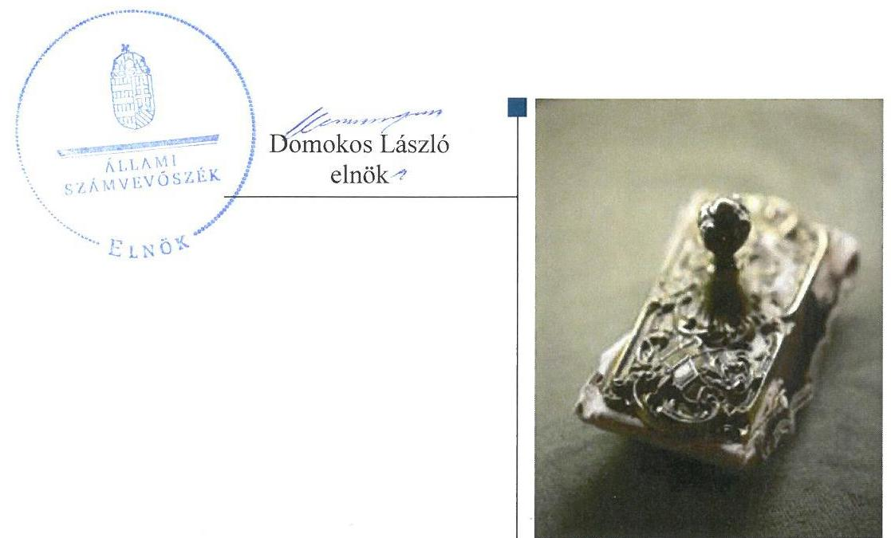

---

# AZ ELLENŐRZÉST FELÜGYELTE: 

HOLMAN MAGDOLNA JULIANNA felügyeleti vezető

## AZ ELLENŐRZÉST VEZETTE ÉS A VÉGREHAJTÁSÁÉRT FELELŐS:

SZAPPANOS JÚLIA osztályvezető

## A PROGRAM ÖSSZEÁLLÍTÁSÁÉRT FELELŐS:

A TÉMÁHOZ KAPCSOLÓDÓ KORÁBBI SZÁMVEVŐSZÉKI JELENTÉSEK:

- címe: Az önkormányzatok pénzügyi és vagyongazdálkodása megfelelőségének ellenőrzése-Rétság
- sorszáma: 16143

Jelentéseink az Országgyülés számítógépes hálózatán és az Interneten a www.asz.hu címen is olvashatóak.

IKTATÓSZÁM: FV-0173-002/2017.
TÉMASZÁM: -
ELLENŐRZÉS-AZONOSÍTÓ SZÁM: -

---

# TARTALOMJEGYZÉK 

■ ÖSSZEGZÉS ..... 5
■ CÉL, TERÜLET, HÁTTÉR, INDOKOLTSÁG ..... 6
■ LÉNYEGES KÉRDÉSKÖRÖK ..... 8
■ ELLENŐRZÉS HATÓKÖRE ÉS MÓDSZEREI ..... 9
■ MEGÁLLAPÍTÁSOK ..... 11
■ MEGFELELŐSÉGI ZÁRADÉK ..... 17
■ MELLÉKLETEK ..... 19
I. Sz. melléklet: Fogalomtár ..... 19
II. Sz. melléklet: Az ellenőrzési kritériumok módszertana és értékelése ..... 24
III. Sz. melléklet: Az eszközök és források alakulása kiemelt mérlegsoronként a 2014-2015. években (E Ft) ..... 26
IV. Sz. melléklet: Pénzügyi egyensúlyi helyzet clf módszer szerinti értékelése a 2013-2015. években (E Ft) ..... 27
V. Sz. melléklet: Az önkormányzat 2014-2015. évi mutatóinak, a kockázatforrásoknak és kockázati területeknek az értékelése ..... 28
■ RÖVIDÍTÉSEK JEGYZÉKE ..... 29

---

.

---

# ÖSSZEGZÉS 

- Az Önkormányzatnál biztosított volt a pénzügyi egyensúly.
- Az eladósodás kockázata nem állt fenn.
- A vagyongazdálkodás során biztosították a vagyon értékének megőrzését.

## Az Önkormányzat gazdálkodásának fenntarthatóságával kapcsolatos főbb megállapítások

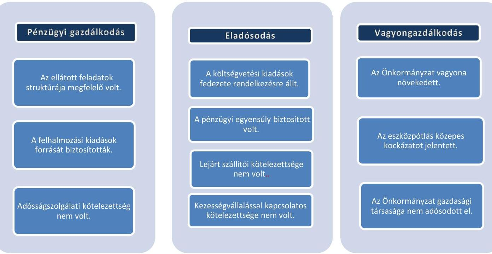

## Az Önkormányzat pénzügyi és vagyongazdálkodása megfelelő

## A GAZDÁLKODÁS FENNTARTHATÓSÁGÁNAK FŐBB FELTÉTELEI:

- A kötelező és önként vállalt feladatok finanszírozása biztosított legyen.
- A pénzügyi gazdálkodás külső forrás igénybevétele nélkül történjen.
- A vagyongazdálkodás során gondoskodni kell a vagyon értékének megőrzéséről, eszközök pótlásáról.
- Többségi önkormányzati tulajdonban lévő gazdasági társaság pénzügyi helyzete biztosított legyen.

---

# CÉL, TERÜLET, HÁTTÉR, INDOKOLTSÁG 

## Ellenőrzés célja

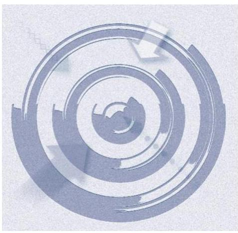

AZ ELLENŐRZÉS CÉLJA annak megállapítása volt, hogy az Önkormányzat ${ }^{1}$ képes volt-e a törvényben meghatározott feladatait ellátni, gazdálkodása változatlan formában fenntartható-e. Az Önkormányzatok éves költségvetési beszámolójában, időközi költségvetési jelentéseiben és mérlegjelentéseiben szerepeltetett adatok értékelése alapján beazonosított kockázatok kezelésére irányuló önkormányzati döntések, intézkedések előmozdítása.

## Ellenőrzés területe

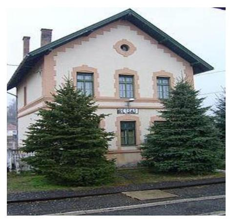

RÉTSÁG VÁROS Nógrád megye nyugati részén helyezkedik el. Állandó lakosainak száma 2015. január 1-jén 2845 fő volt. A város társadalmi-gazdasági és infrastrukturális szempontból nem kedvezményezett település, az 1 főre jutó adóbevétel 2015-ben 143,5 ezer Ft-ban, a településtípus átlag adatának több mint kétszerese mértékben teljesült. Az 1 lakosra jutó működési kiadás a 2015. évben 12,9\%-kal elmaradt a településtípus átlagától, 140,7 ezer Ft volt.

Az Önkormányzat 6 tagú Képviselő-testületének ${ }^{2}$ munkáját 2015. év végén két állandó bizottság segítette. A polgármester ${ }^{3}$ a 2014. évi önkormányzati választások óta tölti be tisztségét. A jegyző személye a 2014-2015. években nem változott, 2013. december 9-étől látja el feladatait.

Az Önkormányzat által fenntartott költségvetési intézmények száma 3 db - a 2014-2015. években nem változott, a foglalkoztatott köztisztviselők száma 14 fő volt, a közalkalmazottaké 28 fő. A költségvetési intézmények által ellátott feladatok óvodai ellátás, művelődési és könyvtári feladatok, valamint igazgatási feladatok és adóigazgatás voltak.

A gazdasági társaság ${ }^{4}$ száma a 2014. január 1-jei egyről 2015. december 31-re nem változott. A gazdasági társaság feladata az általános és szakorvosi járóbeteg-ellátás biztosítása volt.

Az összevont költségvetési beszámolók szerint teljesített éves költségvetési bevétel és kiadás, a könyvviteli mérleg szerinti eszközvagyon, a követelések és kötelezettségek állományi értékét a következő táblázat tartalmazza.

---

1. táblázat

|  |   |   |   |   |   |
| --- | --- | --- | --- | --- | --- |
|  Év | Teljesített költségvetési bevételek | Teljesített költségvetési kiadások | Eszközvagyon | Követelések | Kötelezettségek  |
|  2014. | 1036,8 | 828,4 | 2838,8 | 23,1 | 5,1  |
|  2015. | 1037,5 | 615,9 | 3151,9 | 22,5 | 31,4  |

# Az ellenőrzés háttere, indokoltsága 

AZ ÖNKORMÁNYZATI ALRENDSZERBEN megjelenő gazdálkodási nehézségek, likviditási problémák és az eladósodottság növekedése az ÁSZ ${ }^{5}$ figyelmét a 2011. évtől az önkormányzatok pénzügyi helyzetére irányította.

Az önkormányzati alrendszerben a 2013. évtől bevezetett új feladatfinanszírozási rendszer keretein belül továbbra is megoldandó kérdés a pénzügyi egyensúly megteremtése, hosszú távú fenntartása. Erre tekintettel kiemelt fontosságú az önkormányzatok pénzügyi egyensúlyi helyzetére ható kockázatok feltárása, az ezzel kapcsolatos folyamatok, trendek bemutatása.

---

# LÉNYEGES KÉRDÉSKÖRÖK 

1. Az önkormányzat által ellátott feladatok, felhalmozások és az adósságszolgálat finanszírozási struktúrája biztosította-e a pénzügyi gazdálkodás fenntarthatóságát?
2. - Fennáll-e az önkormányzat eladósodásának kockázata a do-
logi, beruházási és felújítási kiadásokkal kapcsolatos kötele-
zettségek, a pénzintézeti tartozások, valamint a garancia-és ke-
zességvállalásból eredő helytállási kötelezettség következté-
ben?
3. Az önkormányzat vagyongazdálkodása során biztosított volt-e a vagyon értékének megőrzése, az eszközök pótlása, a többségi önkormányzati tulajdonú gazdasági társaságok pénzügyi helyzete jelentett-e kockázatot az önkormányzat gazdálkodására?

---

# ELLENŐRZÉS HATÓKÖRE ÉS MÓDSZEREI 

## Az ellenőrzés típusa, időszaka

Megfelelőségi (helyénvalósági) ellenőrzés.
A 2014. január 1-je és 2015. december 31-e közötti időszak. A dinamikus mutatók esetében kitekintéssel a 2013. december 31-ei pénzforgalmi adatokra is.

## Az ellenőrzés jogalapja, módszerei

Az ellenőrzés jogszabályi alapját az Állami Számvevőszékről szóló 2011. évi LXVI. törvény 1. § (3) bekezdésének, az 5. § (2)-(6) bekezdéseinek, valamint az államháztartásról szóló 2011. évi CXCV. törvény 61. § (2) bekezdésének előírásai képezik.

Az ellenőrzést a nemzetközi standardokat irányadónak tekintve a szakmai program ellenőrzési kérdései, az ellenőrzött időszakban hatályos jogszabályok, az ellenőrzés szakmai szabályok és módszertanok figyelembe vételével végezzük.

Az ellenőrzési kérdések megválaszolásához szükséges bizonyítékok megszerzése az ellenőrzött által rendelkezésre bocsátott dokumentumokra, adatokra alapozva megfigyelés, kérdésfeltevés (információkérés), valamint elemző eljárással történik.

Az ellenőrzési bizonyítékként felhasználható adatforrások közé tartoznak egyrészt a szakmai program részletes szempontjainál felsorolt adatforrások, másrészt minden - az ellenőrzés folyamán feltárt, az ellenőrzés szempontjából releváns információt tartalmazó - dokumentum.

Az ellenőrzés lefolytatásához az önkormányzat a tanúsítványok elektronikus kitöltésével, valamint az ÁSZ által kért dokumentumok elektronikus megküldésével szolgáltat adatokat, amelyek valódiságát és teljes körűségét az ellenőrzött szervezet vezetője által tett teljességi és hitelességi nyilatkozat igazolja. Az így rendelkezésre bocsátott adatok, információk, a tanúsítványok adatai valódiságának kontrollja az ellenőrzés keretében történik.

Az ÁSZ az ellenőrzés előkészítése során meghatározta az ellenőrzési (helyénvalósági) kritériumokat, amelyek az ellenőrzési bizonyíték értékelésének, valamint a számvevőszéki jelentésben szereplő megállapítások és következtetések alapját képezik. A lényeges és jellegzetes mutatók helyénvalósági kritériumait, és a kockázatok értékelését a II. és V. számú mellékletek tartalmazzák.

A pénzforgalmi adatokat tartalmazó dinamikus mutatók számításánál a 2014. évben a 2013. év végi adatokat, a 2015. évben a 2014. évi végi adatokat tekintettük bázis adatnak. A mérlegadatokat tartalmazó mutatók esetében - az eredményszemléletű számvitel 2014. évi bevezetése miatt

---

- a 2014. évben a 2013. évi mérleg záró adatai helyett az új számviteli szabályok alapján készült 2014. évi mérleg nyitó adatait, a 2015. évben a 2014. év végi adatokat tekintettük bázis adatnak.

Az ellenőrzési kérdésekre adott válaszok alapján értékeltük, hogy az önkormányzat képes volt-e a törvényben meghatározott feladatait ellátni, gazdálkodása változatlan formában fenntartható-e. A megfelelőségi ellenőrzés rövid formátumú jelentés és megfelelőségi záradék kiadására irányul. A megfelelőségi záradékban megfogalmazott vélemény a 2015. évi mutatók értékelésén alapul.

---

# MEGÁLLAPÍTÁSOK 

## 1. Az önkormányzat által ellátott feladatok, felhalmozások és az adósságszolgálat finanszírozási struktúrája biztosította-e a pénzügyi gazdálkodás fenntarthatóságát?

Az Önkormányzat által ellátott feladatok és felhalmozások finanszírozási struktúrája -2014-2015. években egyaránt - biztosította az Önkormányzat pénzügyi gazdálkodásának fenntarthatóságát.

AZ ELLÁTOTT FELADATOK működési kiadásaira az Önkormányzatnál a 2014. és a 2015. évben a működési bevételek fedezetet nyújtottak. A 2014. évi átszervezés - a szociális étkeztetés gazdasági társaságban való ellátása - hatásaként a személyi juttatások és járulékai kiadások csökkentek. Az Önkormányzat adóbevétele jelentős, az egy főre jutó adóbevétel kétszerese a településtípus átlag adatához képest.

A 2015. évben - előző évhez viszonyítva - a működési kiadások 4,6\%-kal csökkentek, a működési bevételek 6,4\%-kal növekedtek. A működési költségvetés egyenlege növekvő tendenciájú, a 2014. évben 198157 ezer Ft, a 2015. évben 256881 ezer Ft volt.

Az Önkormányzat az ellenőrzött időszakban nem részesült a működőképességének megőrzéséhez kiegészítő önkormányzati támogatásban.

A gyermekjóléti szolgálat feladatellátása 2014. december 31-én gazdasági társasággal, 2015. december 31-én társulással történt. Szociális feladatok körében az étkeztetések ellátása, illetve a gyermekétkeztetés lebonyolítása 2014. január 1-jén saját költségvetési szervvel, 2015. december 31-én nonprofit gazdasági társaság formában valósult meg. A feladatellátásban történt változások az Önkormányzat pénzügyi egyensúlyát pozitívan befolyásolták.

Az önként vállalt feladatokra fordított működési kiadások a 2015. évre a 2014. évhez képest 11,9\%-kal 15116 ezer Ft-ra emelkedtek, amelyre fedezetet a saját bevétel biztosított. Az önként vállalt feladatokról, azok működési kiadásai mértékéről az ellenőrzött időszakban az Önkormányzat a költségvetési rendelet elfogadásakor döntött.
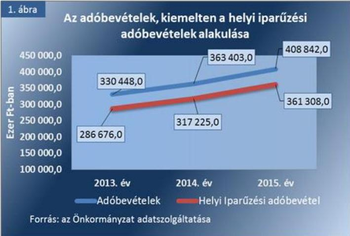

Az Önkormányzat adatszolgáltatása alapján bevételnövelő és kiadáscsökkentő intézkedésekről külön döntés nem született, azok hatásait nem mutatták ki a 2014-2015. évben.

AZ ADÓBEVÉTELEK - helyi adó és gépjárműadó - működési bevételeken belüli aránya a 2014. évhez képest 3,4 százalékponttal növekedett, amelyet az adófizetési morál, valamint indokolt esetben a hatékony behajtási tevékenység eredményezett. Az Önkormányzat a Helyi adó tv. ${ }^{6}$ szerint kivethető helyi adók közül az építményadót, a magánszemélyek kommunális adóját és a helyi iparűzési adót vetette ki. A kivetett adók mértéke -

---

a helyi iparűzési adó kivételével - nem érte el a Helyi adó tv. szerint kivethető maximális mértékeket. A Képviselőtestület a hatályos helyi adókat és adómértékeket az ellenőrzött időszakban felülvizsgálta, azonban új adónem bevezetésére, adómérték emelésére a lakosság teherbíró képességére tekintettel nem került sor.

Az Önkormányzat működési egyensúlyi helyzetére nem jelentett kockázatot a helyi iparűzési adó alakulása. A helyi iparűzési adóbevétel az ellenőrzött időszak minden évében nagyszámú (több mint 200) adóalanytól származott. A három legnagyobb adózó által fizetett iparűzési adó összege a 2014-2015. években a teljes iparűzési adóbevétel 47,3 % és 48,4 % volt, így az adózók számának változása egyik évben sem jelzett bevételi kitettség miatti kockázatot.

A FELHALMOZÁSI BEVÉTELEK mellett a beruházásokra és felújításokra fedezetet nyújtott a működési jövedelem, illetve 2014. évben a pénzmaradvány is. A 2014. évben a költségvetési kiadások 36,5\%-át, a 2015. évben 13,7\%-át fordították fejlesztésekre. A nagyobb összegű felhalmozási kiadások a 2014. évben a közutak és járdák felújításához, a 2015. évben útkarbantartáshoz kapcsolódtak. A 2014-2015. évi fejlesztési kiadások teljes egészében a kötelező feladatellátást szolgálták. Új létesítményeket nem hoztak létre, így jövőbeni üzemeltetési költségekkel nem kellett számolniuk, amelyek a működési egyensúlyra kockázatot jelentettek volna.

Az Önkormányzat rendkívüli eredménye a 2014. évről a 2015. évre több mint ötszörösére, 48449 ezer Ft-ra nőtt, amelynek oka elsődlegesen, hogy az egyéb ráfordítások közel harmadára (208 661 ezer Ft-ra) csökkentek és a támogatási bevételek növekedtek.

Az önkormányzatnak 2014-2015.
 években felhalmozási célú garancia és kezességvállalásból származó kifizetés nem keletkezett.

A FINANSZÍROZÁS kapcsán az Önkormányzat nem rendelkezett a külső források - hitelek - adósságszolgálatához kapcsolódó kötelezettséggel. Az egyéb finanszírozási bevételek és kiadások elsősorban a decemberi munkabérfizetéshez kapcsolódtak, annak elszámolási sajátosságából adódóan. Az ellenőrzött időszakban a pénzügyi műveletek eredménye 2014-ben kedvezően, 2015-ben kedvezőtlenül (723 ezer Ft és -230 ezer Ft) alakult, annak ellenére, hogy a nem adósságszolgálathoz kapcsolódó kamatjellegű ráfordítások 63,5%-ra (263 ezer Ft-ra) csökkentek, azonban a 2014. évi kamatbevételhez (1137 ezer Ft) viszonyítva minimális kamatbevételt realizáltak 2015. évben (33 ezer Ft).

Az Önkormányzat nettó működési jövedelme a 2014-2015. években pozitív (198 157 ezer Ft és 256 881 ezer Ft) volt, pénzügyi kapacitáshiány nem alakult ki. Az évente képződött működési jövedelem megfelelő fedezettséget biztosított a kötelezettségekre.

---

# 2. Fennáll-e az önkormányzat eladósodásának kockázata a dologi, beruházási és felújítási kiadásokkal kapcsolatos kötelezettségek, a pénzintézeti tartozások, valamint a garancia-és kezességvállalásból eredő helytállási kötelezettség következtében? 

Az Önkormányzat kötelezettségei alapján, a 2014. évhez hasonlóan a 2015. évben sem állt fenn eladósodás, így ilyen jellegű kockázat nem volt az önkormányzati gazdálkodás fenntarthatóságára, a törvényben előírt feladatok ellátására vonatkozóan.
3. táblázat

LÉNYEGES MUTATÓK ALAKULÁSA

| Mutatók | 2014. év | 2015. év |
| :--: | :--: | :--: |
| Eladósodási mutató (\%) | 0,179 | 0,997 |
| Eladósodási mutató változás (százalékpont) | 0,06 | 0,82 |
| Hiánymutató (\%) | Nincs   hiány! | Nincs   hiány! |
| Tárgyévi pénzügyi pozíció változása (\%) | $-132,0$ | 668,2 |
| Tevékenység eredménye (E Ft) | 43568 | 232086 |
| Tevékenység eredményének változása (\%) | - | 432,7 |
| Szállítói állomány változása (\%) | $-100,0$ | 100,0 |
| Lejárt szállítói állomány aránya (\%) | - | - |
| 90 napon túl lejárt kötelezettségek aránya (\%) | - | - |
| Banki kötelezettségállomány mérlegfőösszeghez viszonyított aránya (\%) | - | - |
| Banki kötelezettségállomány változása (\%) | - | - |
| Garancia- és kezességvállalások állománya (ezer Ft) | - | - |

FEDEZETET NYÚJTOTTAK az Önkormányzat maradvány igénybevételével növelt teljesített költségvetési bevételei a 2014-2015. években a teljesített költségvetési kiadásokra. Ebből adódóan a költségvetési kiadások finanszírozásához idegen forrásokra (hitelfelvételre) nem volt szükség.

Az Önkormányzat tárgyévi pénzügyi pozíciója a 2014. évben negatív volt (-37 527 ezer Ft), amelyet a felhalmozási költségvetés negatív egyenlege eredményezett, amelyet a maradvány igénybevételével kezeltek. A 2015. évben tárgyévi pénzügyi pozíció pozitív (213 210 ezer Ft) volt, amelyet a folyó költségvetés pozitív (256 881 ezer Ft), a felhalmozási költségvetés negatív (-42 003 ezer Ft), illetve a finanszírozási műveletek negatív egyenlege (-1668 ezer Ft) eredményezett.

A tevékenység eredménye a 2014. évben és a 2015. évben nyereséges volt, ami hosszútávon biztosítja az önkormányzati feladatellátást, és a vagyon értékének megőrzését.

Banki kötelezettségállománya a 2014. és a 2015. évben az Önkormányzatnak nem volt. Más szervezettől, gazdasági társaságtól, államháztartáson kívülről kölcsönt nem vettek igénybe. Az Önkormányzatnak egyéb visszterhes kötelezettsége, valamint PPP konstrukcióban megvalósított beruházás miatti szolgáltatási díj fizetési kötelezettsége az ellenőrzött időszakban nem volt.

A 2012. évi adósságkonszolidáció eredményeképpen - 97,8 millió Ft összeg volt - a 2014-2015. években a fizetőképesség biztosított volt, az Önkormányzat nem kényszerült sem munkabérhitel, sem folyószámlahitel, illetve egyéb likvid hitel felvételére.

Garancia- és kezességvállalásból származó függő kötelezettsége az Önkormányzatnak 2014. január 1-jén nem volt. Az ellenőrzött időszakban pénzintézeti és egyéb kötelezettségekhez kapcsolódó kezességvállalás nem történt, kezességvállalás beváltására nem került sor.

---

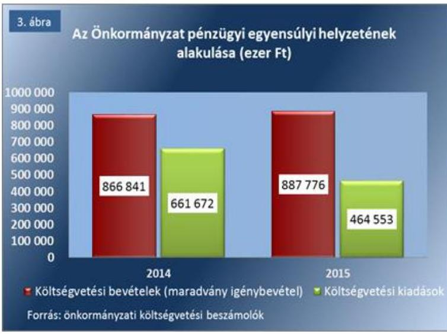

A PÉNZÜGYI EGYENSÚLYT az Önkormányzatnál a 2014. évben 245 872 ezer Ft, a 2015. évben 208 345 ezer Ft előző évi pénzmaradvány igénybevételével biztosították.

SZÁLLÍTÓI ÁLLOMÁNYA (2014. január 1-jétől a dologi, beruházási és felújítási kiadásokkal kapcsolatos kötelezettségállomány) az Önkormányzatnak a 2014. évben nem volt, a 2015. évben pedig 4500 ezer Ft tárgyévet követő évet terhelő kötelezettség keletkezett. A szállítói állomány változása - mértékére és arányára tekintettel - nem jelentett kockázatot az Önkormányzat fizetőképességére.

A 2014-2015. években az Önkormányzatnak fizetési nehézségei nem voltak, fizetési felszólításokat nem kaptak. Késedelmi kamatfizetésből adódó kötelezettség az ellenőrzött időszakban elenyésző mértékű, 10,0 ezer Ft körüli volt. Szállítókkal történő egyeztetések nem voltak.
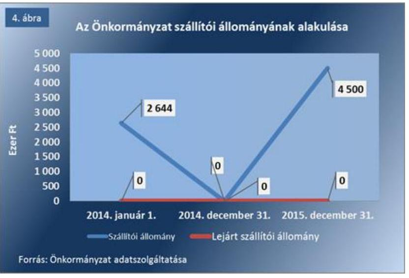

---

# 3. Az önkormányzat vagyongazdálkodása során biztosított volt-e a vagyon értékének megőrzése, az eszközök pótlása, a többségi önkormányzati tulajdonú gazdasági társaságok pénzügyi helyzete jelentett-e kockázatot az önkormányzat gazdálkodására? 

Az Önkormányzat vagyongazdálkodása során a 2014. és a 2015. évben a vagyon értékének megőrzése, az eszközök pótlása biztosított volt. A többségi önkormányzati tulajdonú gazdasági társaságok pénzügyi helyzete a 2015. évben nem jelentett kockázatot az Önkormányzat gazdálkodására.
4. táblázat

LÉNYEGES MUTATÓK ALAKULÁSA

| Mutatók | 2014. év | 2015. év |
| :-- | --: | --: |
| Befektetett eszközök   fedezettsége (\%) | 108,4 | 115,1 |
| Ingatlanok és kapcsolódó vagyonértékű jogok állományának változása (ezer Ft) | 106822 | 33686 |
| Koncesszióba, vagyon-   kezelésbe adott eszközök állományának változása (ezer Ft) | 7550 | -7550 |
| Eszközpótlási mutató   (tárgyi eszközök összesen) (\%) | 194,8 | 144,5 |
| Tárgyi eszközök használhatósági foka (\%) | 75,7 | 75,1 |

Forrás: önkormányzati beszámolók
Az ellenőrzött időszakban a tárgyi eszközök, ezen belül az ingatlanok és kapcsolódó vagyoni értékű jogok állománya 106 822 ezer Ft-ról 33 686 ezer Ft-ra történt csökkenése elsődlegesen feladat átadása, értékcsökkenés elszámolása, valamint használaton kívüli ingatlan értékesítése miatt következett be.

Az Önkormányzatnak a feleslegessé vált vagyonának értékesítéséből a 2014. évben 32 ezer Ft, a 2015. évben 13 000 ezer Ft összegű bevétele származott.

AZ ÖNKORMÁNYZAT VAGYONA 2014. január 1-jéről 2015. év végére 389 417 ezer Ft-tal, (14,1%-kal) 3 151 819 ezer Ft-ra növekedett.

A vagyon szerkezetében bekövetkezett változásokat egyrészt az Önkormányzat tulajdonában lévő ingatlanok és kapcsolódó vagyoni értékű jogok 5,8%-os, valamint a pénzeszközök állományának 82,3%-os növekedése, másrészt a követelések 5,0%-os csökkenése, eredményezte. 2014. január 1-jén és 2015. december 31-én koncesszióba, vagyonkezelésben adott eszköze az Önkormányzatnak nem volt.

A vagyongazdálkodásban nem jelentkezett kockázat, mert a saját tőke a 2014-2015. években 111,3-115,1%-ban nyújtott fedezetet a nemzeti vagyonba tartozó befektetett eszközökre.
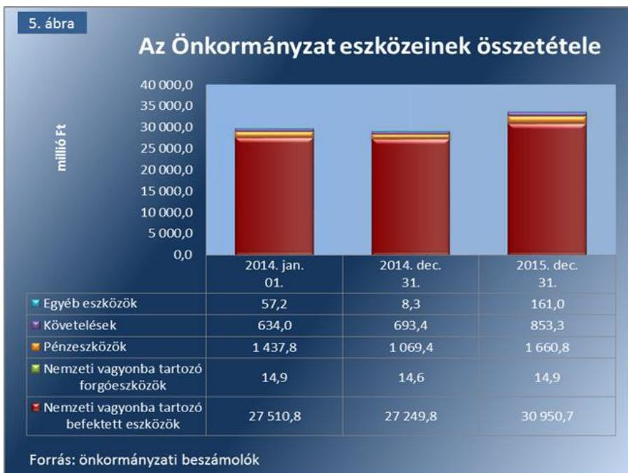

A VAGYONPÓTLÁSOK a 2014-2015. években az Önkormányzatnál megtörténtek, amelyek az értékcsökkenések kompenzálásához voltak szükségesek.

---

A tárgyi eszközök eszközpótlási mutatója két egymást követő évben (2014-2015. években) 194,8%-144,5%-on teljesült. Az önkormányzat tárgyi eszközeinek legnagyobb részét (99,3-99,3%-át) az ingatlanok és kapcsolódó vagyoni
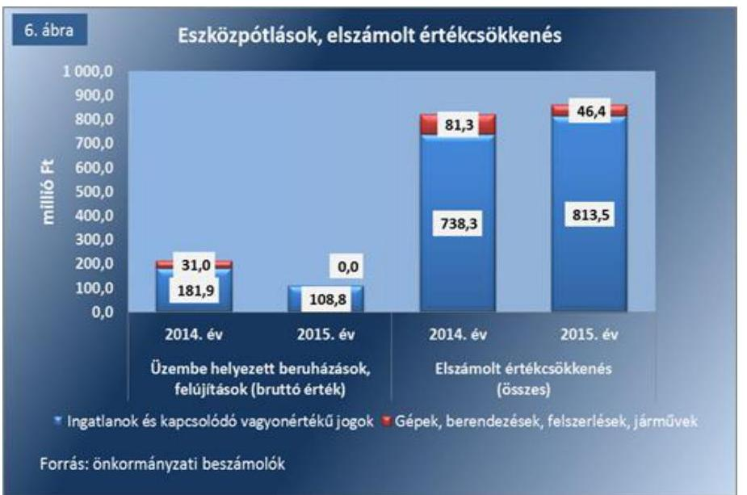
értékű jogok jelentették, amelynek eszközpótlási mutatója az ellenőrzött években szintén kedvezően alakult, 260,1%-144,8% volt.

A 2014-2015. években végrehajtott beruházások, felújítások ellenére az új, vagy felújított eszközök kevésbé voltak jelen az Önkormányzat tárgyi eszközei között. Az eszközök használhatósági foka - a mutató 75,7-75,1% közötti alakult - közepes kockázatot jelzett. Az eszközpótlás elmaradását az eszközök műszaki állapotra vonatkozó felmérések, az elhasználódott eszközök pótlásával kapcsolatos tervezések elmaradása okozta. Az eszközpótlások elmaradása nem jelentett kockázatot a vagyongazdálkodásra. Többségi önkormányzati tulajdonban lévő gazdasági társaság egy volt az ellenőrzött időszakban.
5. táblázat

# LÉNYEGES MUTATÓK ALAKULÁSA 

| Mutatók | 2014.   év | 2015.   év |
| :--: | :--: | :--: |
| Gazdasági társaság-   ok kötelezettség-ál-   lományának válto-   zása   (ezer Ft) | 3,6 | $-3,1$. |
| Gazdasági társaság-   ok számának válto-   zása (darab) | 1 | 1 |

A gazdasági társaság kötelezettségeinek állománya a 2014. január 1-jén 15,3 ezer Ft volt, ami a 2014. évben 23,5%-kal növekedett, a 2015. évben az előző évhez képest 16,4%-kal csökkent a szállítókkal szembeni kötelezettségcsökkenés miatt.
A gazdasági társaság mérleg szerinti eredményei a 2014. évben 6,9 ezer Ft, a 2015. évben -7,8 ezer Ft volt. A gazdasági társaságban a saját tőke összege nem érte el a jegyzett tőke összegét.
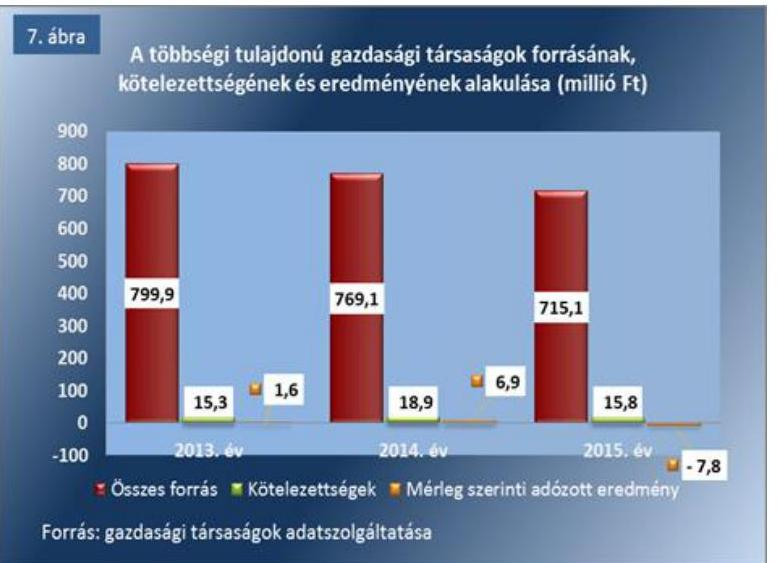

A 2014-2015. években a kockázati kitettség lényegesen csökkent, mivel a társaság az egyes évek végén fennálló kötelezettségállományokat meghaladó mértékű pozitív eredménytartalékkal rendelkezett (az eredménytartalék összege 24,5 millió Ft, illetve 31,1 millió Ft volt). A gazdasági társaság 2015. évben az Önkormányzattól működési célra nem vett igénybe támogatást.

Az Önkormányzat tartós részesedéseinek állománya 2014. január 1-jén 16 426 ezer Ft volt, ami 2015. év végére 4,3 szeresére növekedett, 86 981 ezer Ft-ra.

---

# MEGFELELŐSÉGI ZÁRADÉK 

Az Önkormányzat feladatellátását és gazdálkodását megfelelőségi (helyénvalósági) ellenőrzés módszerével értékeltük, és ennek keretében elegendő és megfelelő bizonyosságot szereztünk arról, hogy az önkormányzat képes-e a törvényben meghatározott feladatait ellátni, gazdálkodása változatlan formában fenntartható-e.

Az önkormányzatok pénzügyi monitoringja alapján végzett ellenőrzése során megállapítottuk, hogy az Állami Számvevőszék által meghatározott ellenőrzési (helyénvalósági) kritériumoknak Rétság Város Önkormányzata összességében megfelelt, mert a beazonosított kockázatforrások alapján
$\longrightarrow$ pénzügyi gazdálkodása,
$\longrightarrow$ eladósodása, és
$\longrightarrow$ vagyongazdálkodása kockázatot nem mutat.
Ezért az Önkormányzat feladatellátása és változatlan formában történő gazdálkodása összességében nem jelez kockázatot.

---

.

---

# MELLÉKLETEK 

## I. SZ. MELLÉKLET: FOGALOMTÁR

adósságkonszolidáció
adósságkonszolidációt követő időszakban bekövetkező eladósodás kockázatforrás
adósságszolgálat
belső eladósodás kockázatforrás
beruházás
bevételi kitettség

CLF módszer
ellenőrzési kritériumok
eszközpótlási mutató
fejlesztés
felhalmozási kiadás
felhalmozási kiadások és finanszírozása kockázatforrás

A helyi önkormányzatok adósságának állam által történő átvállalása.
Az állam a központi intézkedések - kiemelten az adósságkonszolidáció - révén jelentős szerepet vállalt az önkormányzatok pénzügyi kockázatainak mérséklésében. Az államháztartás önkormányzati alrendszerében felhalmozott adósság állam részéről történő kiegyenlítését, illetve átvállalását követően az önkormányzatok kiemelt feladata, egyben felelőssége az adósságállomány újratermelődésének megakadályozása. Kockázatforrást jelent, ha az önkormányzat kötelezettségei emelkednek, a mérlegben az idegen források aránya nő, az adósságkonszolidációt követően a gazdálkodás újra eladósodási pályára áll. Az eladósodás a pénzügyi gazdálkodás egyenes következménye (hiány), ugyanakkor hatással is van rá a folyó adósságszolgálat teljesítésén keresztül.
Az adósság tőkerészének és az esedékes kamat együttes összegének törlesztése. Kockázatforrást jelent, ha az értékcsökkenések kompenzálásaként a szükséges vagyonpótlás nem történt meg, ha romlott az eszközök állaga, mert az rejtett eladósodást jelent.
A tárgyi eszköz beszerzése, létesítése, saját vállalkozásban történő előállítása, a beszerzett tárgyi eszköz üzembe helyezése. A beruházás a meglévő tárgyi eszköz bővítését, rendeltetésének megváltoztatását, átalakítását, élettartamának, teljesítőképességének közvetlen növelését eredményező tevékenység. (Forrás: Számv. tv. ${ }^{7} 3 . \S$ (4) bekezdés 7. pontja)

Olyan függőségi viszony, ahol egy szervezet pénzügyi helyzetét meghatározó bevételek nagysága külső körülmények hatására azonnal és kedvezőtlen irányba változhat.
Az önkormányzatok költségvetése elemzésének módszere, amely a pénzügyi kapacitás (nettó működési jövedelem) fogalmát helyezi a középpontba. A módszer következetesen elkülöníti a folyó és a felhalmozási költségvetés bevételeit és kiadásait, azok költségvetési egyenlegeit. Bizonyos mértékig a vállalati gazdálkodás logikai elemeit érvényesíti az önkormányzatok pénzügyi, jövedelmi helyzetének vizsgálata során.
Azok az alkalmazott viszonyítási alapok, amelyek az ellenőrzési feladat tárgyának értékelésére szolgálnak.
A tárgyi eszközállomány elemzéséhez használt mutató, amely megmutatja, hogy a az üzembe helyezett beruházások milyen hányadát képezi az elszámolt értékcsökkenésnek. Számításakor tárgyévben üzembe helyezett beruházások, felújítások értékét a tárgyi eszközök tárgyévben elszámolt értékcsökkenéséhez kell viszonyítani.
Alapvetően felhalmozási kiadásokban megtestesülő tevékenység, amely új, vagy a korábbinál műszaki, technikai szempontból korszerűbb tárgyi eszköz
 létrehozására irányul, illetve meglévő tárgyi eszköz műszaki, technikai paramétereinek korszerűsítését valósítja meg. (Forrás: Ávr. ${ }^{8} 1 . \S$ b) pontja)
Az önkormányzatok tárgyévi felhalmozási célú költségvetési kiadásai.
Kockázatforrást jelent az erőn felüli beruházási aktivitás, illetve ha a folyamatban lévő felhalmozási feladatok finanszírozásához szükséges pénzügyi forrás nem áll az önkormányzat rendelkezésére.

---

felújítás
finanszírozás kockázatforrás
folyó bevétel
folyó kiadás
folyó költségvetés egyenlege
garancia- és kezességvállalás kockázatforrás
garanciavállalás
használhatósági fok
hasznosítás
helyénvalósági ellenőrzés
kezességvállalás
kiegészítő önkormányzati támogatás

Az elhasználódott tárgyi eszköz eredeti állaga (kapacitása, pontossága) helyreállítását szolgáló időszakonként visszatérő olyan tevékenység, melynek során az eszköz élettartama megnövekszik, minősége, használata jelentősen javul, így a pótlólagos ráfordításból a jövőben gazdasági előnyök származnak. (Forrás: Számv. tv. 3. § (4) bekezdés 8. pontja)
Kockázatforrást jelent, ha az önkormányzat nem rendelkezik megfelelő fedezettel a külső források adósságszolgálatának teljesítéséhez, ami hosszútávon vagyonfeléléshez vagy adósságspirálhoz vezethet.
Az önkormányzatok tárgyévi működési célú költségvetési bevételei
Az önkormányzatok tárgyévi működési célú költségvetési kiadásai
A folyó költségvetés egyenlege, azaz a működési jövedelem megmutatja, hogy az Önkormányzat éves folyó bevétele fedezetet biztosít-e a kötelező és önként vállalt feladatellátáshoz kapcsolódó éves folyó kiadásaira. A működési jövedelem negatív értéke pénzügyileg fenntarthatatlan helyzetet jelez. A mutató pozitív értéke megtakarítást mutat, amely forrásul szolgálhat az Önkormányzat fennálló kötelezettségei megfizetéséhez, valamint fejlesztéseihez.
Kockázatforrást jelent, ha a szerződés kötelezettje a szerződésben vállalt kötelezettségeit nem teljesíti a jogosultnak, mert azokért a kezes köteles helytállni. A garancia- és kezességvállalások függő kötelezettségként kockázatot jelentenek az önkormányzat költségvetésére, ezen keresztül a közfeladatok ellátására.
Olyan kötelezettségvállalás, ahol a garanciát vállaló valamely jövőbeni esemény bekövetkezésekor, a szerződésben meghatározott feltételek beálltakor a garancia kedvezményezettje számára meghatározott összegig, meghatározott időpontig, felszólításra azonnal fizet.
A tárgyi eszközállomány állagának elemzéséhez használt mutató, amely megmutatja, hogy a le nem írt (nettó) érték milyen hányadát képezi az aktiválási (bekerülési) értéknek. Számításakor a tárgyi eszköz könyv szerinti nettó értékét viszonyítják a tárgyi eszköz bruttó (beszerzési/létesítési) értékéhez.
A nemzeti vagyon birtoklásának, használatának, hasznok szedése jogának bármely a tulajdonjog átruházását nem eredményező jogcímen történő átengedése, ide nem értve a vagyonkezelésbe adást, valamint a haszonélvezeti jog alapítását. (Forrás: Nvtv. ${ }^{9}$ 3. § (1) bekezdés 4. pontja)
A helyénvalósági ellenőrzés a megfelelőségi ellenőrzés azon altípusa, amelyet azokban az esetekben kell alkalmazni, amelyekre jogszabályi előírások nem alkalmazhatóak, illetve amennyiben egyes kérdések megítélésénél nyilvánvaló jogszabályi hiányosságok vannak. Helyénvalósági ellenőrzés során a Számvevőszéknek a közszféra szilárd gazdálkodására és a köztisztviselők magatartására vonatkozó általános alapelvek mentén kell az ellenőrzést lefolytatni.
Szerződésben vállalt olyan kötelezettség, amelyben a kezes arra vállal kötelezettséget, hogy ha a szerződés kötelezettje nem teljesít a kezes maga fog helyette teljesíteni a jogosultnak. (Forrás: Ptk. ${ }^{10}$ 272. §, Ptk. ${ }^{11}$ 6:416.§).
Az önkormányzatok működőképességét szolgáló települési önkormányzatok rendkívüli támogatása, a megyei önkormányzati tartalékból kapott támogatások, valamint a tartósan fizetésképtelen helyzetbe került települési önkormányzatok adósságrendezésére irányuló hitelfelvétel visszterhes kamattámogatása, pénzügyi gondnok díja.

---

kockázatforrás

## koncesszió

koncessziós szerződés
kötelező közszolgáltatás (az önkormányzati feladatokat érintően)
kötvény
közfeladat
közfeladatok finanszírozási struktúrája kockázatforrás
lényegesség
megfelelőségi ellenőrzés
nettó működési jövedelem
önkormányzat

A kockázatok kiváltó okait kockázatforrásnak nevezzük. Az Önkormányzatok kockázatait megfigyelő rendszer (ÖKOMER) kialakítása során első lépésben azonosítottuk a nyomon követendő kockázatokat, majd a kockázatos területeket és a kiváltó okokat (kockázatforrásokat). Kockázatként azonosítottuk, ha az önkormányzat hosszú távon nem képes a törvényben meghatározott feladatait ellátni, költségvetése változatlan formában nem fenntartható. A kockázat értékelésének célja annak megállapítása volt, hogy a pénzügyi gazdálkodás, eladósodás, vagyongazdálkodás kockázati területek milyen mértékben befolyásolják, veszélyeztetik az önkormányzat működését, a közfeladatok ellátását. A három kockázati terület minősítéséhez összesen 10 kockázatforrást rendeltünk.
Az állam, illetőleg az önkormányzat (önkormányzati társulás) kizárólagos tulajdonában lévő vagyontárgyak birtoklásának, használatának és hasznosításának, valamint a koncesszió-köteles tevékenységek gyakorlásának jogát, visszterhes szerződéssel, időlegesen úgy engedi át, hogy a jogosultnak részleges piaci monopóliumot biztosít.
A koncessziós szerződés olyan visszterhes szerződés, amelyben az állam vagy az önkormányzat a törvényben meghatározott tevékenységek gyakorlásának a jogát időlegesen úgy engedi át, hogy a jogosultnak részleges piaci monopóliumot biztosít.
Az önkormányzat kötelezően vállalt feladatkörébe tartozó egyes - közszolgáltatás útján megvalósuló - közfeladatok ellátása, amelyeket külön jogszabály (törvény, helyi önkormányzati rendelet) határoz meg.
Hosszabb lejáratra szóló, hitelviszonyt megtestesítő kamatozó értékpapír. A kötvényben a kibocsátó arra kötelezi magát, hogy a kötvényben megjelölt pénzösszegnek az előre meghatározott kamatát vagy egyéb jutalékait, továbbá az adott pénzösszeget a kötvény mindenkori tulajdonosának, illetve jogosultjának a megjelölt időben és módon megfizeti.
Jogszabályban meghatározott állami vagy önkormányzati feladat, amit az arra kötelezett közérdekből, a jogszabályban meghatározott követelményeknek és feltételeknek megfelelve végez, ideértve a lakosság közszolgáltatásokkal való ellátását, továbbá az állam nemzetközi szerződésekben vállalt kötelezettségeiből adódó közérdekű feladatokat, valamint e feladatok ellátásakor szükséges infrastruktúra biztosítását is. (Forrás: Nvtv. 3. § (1) bekezdés 7. pontja)
Kockázatforrást jelent, ha az önkormányzat pénzügyi helyzete jelentős függőséget mutat a külső körülményektől (adóbevételektől, kiegészítő állami támogatásoktól). A közfeladatok finanszírozási struktúrája nem kielégítő, ha a működési bevételek nem fedezik teljes mértékben az ellátott közfeladatokat.
Az a szintű információ vagy adat, ami az ellenőrzés eredményei célzott felhasználóinak döntéseit - az arról történő tudomásszerzést követően - valószínűsíthetően befolyásolja.
A számvevőszéki ellenőrzés azon típusa, amely annak megállapítására irányul, hogy az ellenőrzés tárgyát képező tevékenységek, pénzügyi műveletek, információk és adatok minden lényeges szempontból megfelelnek-e az ellenőrzött szervezetre vonatkozó szabályozásoknak és követelményeknek.
A nettó működési jövedelem a jövedelemtermelő képességet méri. Megmutatja a működési bevételekből a működési kiadások és a hitelek tőketörlesztésének kifizetése után fennmaradó jövedelmet.
A helyi önkormányzat jogi személy. Az önkormányzati feladatok ellátását a képviselőtestület és szervei biztosítják. A képviselőtestület szervei: a polgármester, a főpolgármester, a megyei közgyűlés elnöke, a képviselő-testület bizottságai, a részönkormányzat testülete, a polgármesteri hivatal, a megyei önkormányzati hivatal, a közös önkormányzati hivatal, a jegyző, továbbá a társulás. A képviselő-testület a feladatkörébe tartozó közszolgáltatások ellátására - jogszabályban meghatározottak szerint

---

önkormányzat többségi tulajdonában lévő gazdasági társaságok
pénzintézetek felé történő eladósodás kockázatforrás
pénzügyi kapacitás
pénzügyi kockázat
polgármesteri hivatal
szállítók felé történő eladósodás kockázatforrás*

- költségvetési szervet, a Polgári perrendtartásról szóló 1952. évi III. törvény szerinti gazdálkodó szervezetet (a továbbiakban: gazdálkodó szervezet), nonprofit szervezetet és egyéb szervezetet (a továbbiakban együtt: intézmény) alapíthat, továbbá szerződést köthet természetes és jogi személlyel vagy jogi személyiséggel nem rendelkező szervezettel. (Forrás: Mötv. ${ }^{12}$ 41. § (1), (2), (6) bekezdései)
Azok a gazdasági társaságok, amelyekben az önkormányzat a szavazatok több mint ötven százalékával vagy a Ptk. 1 685/B. § (2)-(3) bekezdéseiben rögzített meghatározó befolyással rendelkezik. A befolyással rendelkező akkor rendelkezik egy jogi személyben meghatározó befolyással, ha annak tagja, illetve részvényese, és jogosult e jogi személy vezető tisztségviselői vagy felügyelő-bizottsága tagjai többségének megválasztására, illetve visszahívására, vagy a jogi személy más tagjaival, illetve részvényeseivel kötött megállapodás alapján egyedül rendelkezik a szavazatok több mint ötven százalékával. A meghatározó befolyás akkor is fennáll, ha a befolyással rendelkező számára e jogosultságok közvetett módon (köztes vállalkozásain keresztül) biztosítottak.
[Forrás: Ptk. 1 685/B. § (2)-(4), Ptk. 2 8:2.§ (1)-(3) bekezdései]
Kockázatforrásnak tekintettük, ha az önkormányzat (újból) adósságot keletkeztet, ami a kivételektől eltekintve a 2012. évtől kormányengedély-köteles. A pénzintézetekkel szemben fennálló kötelezettségek esetén olyan függőségi viszony jöhet létre, ahol az önkormányzat pénzügyi helyzete olyan külső körülmények hatására változhat, amely kizárólag a bank egyoldalú döntésén múlik.
A pénzügyi kapacitás az adósok hitelfelvételi képességének azon mértéke, ahol még növelni tudják az adósságot anélkül, hogy a fizetőképtelenség elkerülése érdekében csökkenteniük kellene akár az aktuális, akár a jövőben esedékes kiadásaikat.
A pénzügyi kockázat magában foglalja mindazon kockázatokat, amelyek a szervezet pénzügyi helyzetére hatással vannak. PI.: az adósságszolgálat miatti kockázatot, árfolyamkockázatot, felhalmozási kockázatot, fizetőképességi kockázatot, jövőbeni kötelezettségek kifizethetőségének kockázatát, kamatkockázatot, kezességvállalás kockázatát, likviditási kockázatot, mérlegen kívüli tételek kockázatát, nemfizetési kockázatot stb.
A szakmai programban a polgármesteri hivatal megnevezés alatt értjük a polgármesteri hivatalt, a főpolgármesteri hivatalt, a megyei önkormányzati hivatalt, a közös önkormányzati hivatalt.
Kockázatforrást jelent, ha az önkormányzat növeli a szállítókkal szemben fennálló tartozásait (ami burkolt hitelezésnek minősülhet), és az elismert kötelezettségeit átmenetileg vagy véglegesen nem tudja határidőre teljesíteni.
*(2014. január 1-jétől kötelezettségek dologi, felújítási, beruházási kiadásokra)
Kockázatforrást jelent, hogy az önkormányzati tulajdonban lévő gazdasági társaságok adósságállományáért a tulajdonos önkormányzatot helytállási kötelezettség terheli.

Az önkormányzat tulajdonában lévő azon eszközök, amelyeket nem saját maga, vagy felügyelete alatt álló költségvetési szervei üzemeltetnek, hanem az üzemeltetését, működtetését más szervekre bízta. Az önkormányzat számviteli nyilvántartásában elkülönítetten kell nyilvántartani ezen eszközök bruttó értékét és értékcsökkenését.
A nemzeti vagyongazdálkodás feladata a nemzeti vagyon rendeltetésének megfelelő, az állam, az önkormányzat mindenkori teherbíró képességéhez igazodó, elsődlegesen a közfeladatok ellátásához és a mindenkori társadalmi szükségletek kielégítéséhez szükséges, egységes elveken alapuló, átlátható, hatékony és költségtakarékos működtetése, értékének megőrzése, állagának védelme, értéknövelő használata, hasznosítása, gyarapítása, továbbá az állam vagy a helyi önkormányzat feladatának

---

vagyonkezelői jog
vagyonváltozás kockázatforrás
ellátása szempontjából feleslegessé váló vagyontárgyak elidegenítése. (Forrás: Nvtv. 7. § (2) bekezdése)

A vagyonkezelői szerződés alapján a vagyonkezelő jogosult meghatározott szervezeti tulajdonába tartozó dolog birtoklására és hasznai szedésére. A vagyonkezelő köteles a vagyontárgy értékét megőrizni, állagának megóvásáról, karbantartásáról, működtetéséről gondoskodni, továbbá díjat fizetni vagy a szerződésben előírt kötelezettséget teljesíteni.
Kockázatforrásként értékeltük, ha csökken a nemzeti vagyon, ha az önkormányzatok a vagyonértékesítésből származó bevételeket nem beruházásokra, a vagyon pótlására fordítják.

---

# II. SZ. MELLÉKLET: AZ ELLENŐRZÉSI KRITÉRIUMOK MÓDSZERTANA ÉS ÉRTÉKELÉSE 

## Ellenőrzési kritériumok módszertana

Az ellenőrzés tárgya: Az önkormányzati gazdálkodás fenntarthatósága, a törvényben előírt feladatok ellátása, az önkormányzatnál észlelt negatív tendenciák okainak feltárása, amely az ellenőrzési kritériumok alapján kerül értékelésre.
Az ellenőrzési kritériumok meghatározása során első lépésben azonosítottuk az önkormányzati gazdálkodás fenntarthatóságának, a törvényben előírt feladatok ellátásának kockázatos területeit és a kiváltó okokat (kockázatforrásokat), amelyekhez minden esetben mutatószámokat rendeltünk. A mutatószámok között a viszonyszámok (relatív mutatószámok) és az abszolút adatok (abszolút mutatószámok) egyaránt megtalálhatóak, amelyekhez a Magyar Államkincstár által szolgáltatott adatállományokat (költségvetési beszámolók, időközi költségvetési jelentések, mérlegjelentések adatait) használtuk fel.
A mutatószámok kiválasztásakor törekedtünk arra, hogy az egyes kockázatforrásokat ne egyetlen mutató alapján minősítsük, mert az az értékelés torzulását okozhatja. Ezért - ahol lehetett - az adott kockázatforrás értékeléséhez meghatároztuk a lényeges mutatószámokat (főmutatót és a további kockázatot jelző elsődleges mutatókat), valamint a jellegzetes (másodlagos) mutatókat, amelyek összefüggnek vagy kiegészítik egymást. Így az ellenőrzés tárgyának értékelésére a három kockázati terület, tíz kockázatforrásához rendelt mutatók értékelésével került sor. (A mutatók, a kockázatforrások és a kockázati területek értékelését a szakmai program V/B. számú melléklete tartalmazza részletesen.)
Az egyes kockázati területek és kockázatforrások minősítése „pontozásos módszerrel" a mutatószámok értékelése alapján történt.

- Első lépésben értékeltük a mutatószámokat és egy háromelemű skálán helyeztük el. Az értékelést (a kategória határok meghatározását) elsődlegesen a mutatószámok közgazdasági értelmezése alapján alakítottuk ki, amelyet az Állami Számvevőszék ellenőrzési tapasztalatait felhasználva tovább finomítottunk. Az értékelések alapján egy-egy mutató alacsony besorolás esetén
 0 pontot, közepes esetén 1 pontot, magas kockázatjelzés esetén 2 pontot kapott, amely megkönnyítette a későbbiekben az eredmények aggregálását. (PI.: ha a működési kiadások fedezettsége mutató 90\% alatti volt, akkor magas kockázati besorolást, 2 pontot, ha 100\% feletti volt akkor alacsony besorolást, 0 pontot kapott.) A %-ban kifejezett mutatók kockázati besorolására a pontos (több tizedes jegy) értékek alapján került sor, ugyanakkor az önkormányzati riport a mutatókat egy, illetve esetenként két tizedes számjegyig mutatja be. Az értékelésnél ezért nagyon ritka esetben látszólagos ellentmondás tapasztalható. (pl. a működési kiadások fedezettsége mutató értéke 99,9799\% ami alapján a kockázati besorolás közepes minősítésű. Az önkormányzati riportban ez az érték - kerekítés miatt - 100,0\%-ként szerepel, ami alacsony minősítést jelentene, azonban az értékelés a pontos érték alapján történt.)
- Annak érdekében, hogy a kockázatforrások minősítésénél a lényeges mutatók értéke legyen a meghatározó a jellegzetes mutatókéval szemben, a mutatószámokat súlyoztuk*. A súlyok mértékének megválasztásakor az elsődleges mutatókat tekintettük középértéknek ezért 1-es súlyt rendeltünk mellé*. A főmutató súlyát az elsődleges mutatók súlyának kétszeresében, míg a másodlagos mutatók súlyát az elsődleges mutatók súlyának felében határoztuk meg. (PI.: a kockázatforrás minősítéséhez a működési kiadások fedezettségét főmutatóként vettük figyelembe, ezért 2-es súlyt rendeltünk hozzá. Így ha a mutató kockázati besorolása magas volt, a magas kockázati besoroláshoz rendelt 2 pontot szoroztuk a főmutatóhoz rendelt 2-es súlyszámmal és az elért pontszám 4, míg alacsony besorolás esetén a besoroláshoz rendelt 0 pontot szorozva a főmutatóhoz rendelt 2-es súlyszámmal elért pontszám 0 volt.
- Ezt követően meghatároztuk az önkormányzati gazdálkodás fenntarthatóságának, a törvényben előírt feladatok ellátásának kockázatához rendelt kockázati területek és kockázatforrások értékelési ponthatárait oly módon, hogy kockázatforrásonként a mutatószámok súlyozott értékelésével elérhető összes

[^0]
[^0]:    * A súlyozás kifejezi, hogy az alkalmazott mutatószámok egymáshoz képest milyen mértékben járulnak hozzá az adott kockázatforrás értékeléséhez.
    † Egy esetben a banki kötelezettségállomány mérlegfőösszeghez mért nagysága mutatónál a kockázatforrás kiegyensúlyozottabb megítélése érdekében az 1-es súlyozás helyett 1,5-ös súlyozást alkalmaztunk.

---

pontszámot három egyenlő részre (alacsony, közepes, magas) osztottuk fel. (PI.: A közfeladatok finanszírozási struktúrája kockázatforrást 1 db főmutató, 2 db elsődleges mutató és további 2 db másodlagos mutató alakulása alapján értékeltük. A mutatók magas kockázati besorolása esetén - a súlyozást követően - elérhető legmagasabb pontszám 10 volt. Ezt három egyenlő részre osztva határoztuk meg a közfeladatok finanszírozási struktúrájának értékelési ponthatárait, amely 0-3,32 pontig alacsony, 3,33-6,66 pontig közepes, 6,67-10 pont között magas kockázati minősítést kapott.) A pénzügyi gazdálkodás és eladósodás kockázati területek és a hozzájuk tartozó egyes kockázatforrások 2014. évi és 2015. évi értékelési pontjai eltérnek egymástól, mivel az eredményszemléletű mutatók változása első alkalommal a 2015. évben volt értékelhető.

- Az egyes kockázatforrások értékelésekor a kockázatforráshoz rendelt mutatószámok - súlyozással kapott - értékeit összesítettük és a kialakított értékelési ponthatárok szerint minősítettük. (PI.: egy önkormányzat minősítésekor a közfeladatok finanszírozási struktúrája kockázatforráshoz rendelt 5 db mutató - fentiekben bemutatott - értékelésével elért összes pontszám 7 volt, akkor a kockázatforrás a hármas skálán a 6,67-10 pont közé került, így magas minősítést kapott.)
- Az egyes kockázati területek minősítésénél hasonlóan jártunk el. Az egyes kockázati területeket meghatározó kockázatforrások pontjait aggregáltuk, majd a kockázati területen elérhető összes pont három egyenlő részre osztásával kialakított skálán értékeltük. Ha azonban a kockázatforrások közül legalább egy magas kockázati besorolást ért el, akkor a pontozás szerinti értékeléstől eltérően, a kockázati terület besorolását közepes kockázati minősítésűre módosítottuk.
Az ellenőrzés tárgyának, az önkormányzati gazdálkodás fenntarthatóságának, a törvényben előírt feladatok ellátásának értékelése:
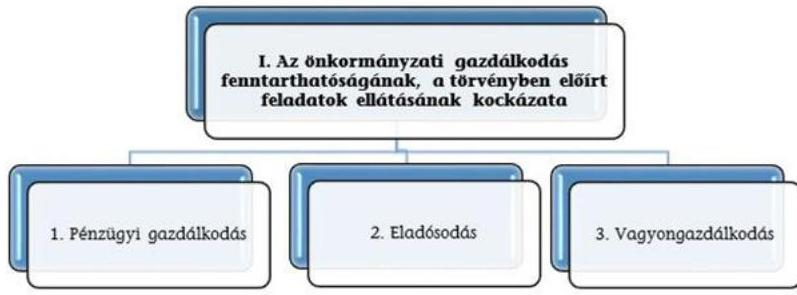

A három kockázati terület együttes értékelése alapján az alábbi mátrix segítségével határoztuk meg az önkormányzati gazdálkodás fenntarthatóságának, a törvényben előírt feladatok ellátásának értékelését a következők szerint:

| 1. Az önkormányzati gazdálkodás fenntarthatóságának, a törvényben előírt feladatok ellátásának kockázata | Alacsony II |  |  |  | Közepes 1 |  |  |  | Magas 2 |  |  |  |
| :--: | :--: | :--: | :--: | :--: | :--: | :--: | :--: | :--: | :--: | :--: | :--: | :--: |
| 1. Pénzügyi gazdálkodás |  |  |  |  |  |  |  |  |  |  |  |  |
| 2. Eladósodás | 3 alacsony | 1 alacsony | 1 alacsony | 2 alacsony | 1 alacsony | 1 alacsony | 1 közepes | 2 közepes | 2 alacsony | 1 közepes | 2 magas | 3 magas |
| 3. Vagyongazdálkodás |  | közepes | 1 közepes | 1 magas | 1 közepes | 1 magas | 1 alacsony | 1 alacsony | 1 alacsony | 1 magas |  |  |

---

# A RÉTSÁG VÁROS ÖNKORMÁNYZATA 2014-2015. évi MÉRLEGE

|  Megnevezés | 2014. december 31. | 2015. december 31.  |
| --- | --- | --- |
|  Befektetett eszközök
/NEMZETI VAGYONBA TARTOZÓ BEFEKTETETT ESZKÖZÖK | 2593307 | 2686827  |
|  NEMZETI VAGYONBA TARTOZÓ FORGÓESZKÖZÖK | 632 | 0  |
|  PÉNZESZKÖZÖK | 203093 | 433681  |
|  KÖVETELÉSEK | 23129 | 22482  |
|  EGYÉB SAJÁTOS ESZKÖZOLDALI ELSZÁMOLÁSOK | 18654 | 8829  |
|  AKTÍV IDŐBELI ELHATÁROLÁSOK | 0 | 0  |
|  Egyéb aktív pénzügyi elszámolások |  |   |
|  Forgóeszközök (készletek, követelések, értékpapírok, pénzeszközök, egyéb aktív pénzügyi elszámolások) |  |   |
|  ESZKÖZÖK ÖSSZESEN | 2838815 | 3151819  |
|  SAJÁT TÖKE | 2811482 | 3091787  |
|  TARTALÉKOK |  |   |
|  KÖTELEZETTSÉGEK | 5077 | 31439  |
|  EGYÉB SAJÁTOS FORRÁSOLDALI ELSZÁMOLÁSOK | 0 |   |
|  KINCSTÁRI SZÁMLAVEZETÉSSEL KAPCSOLATOS ELSZÁMOLÁSOK | 0 | 0  |
|  PASSZÍV IDŐBELI ELHATÁROLÁSOK | 22256 | 28593  |
|  FORRÁSOK ÖSSZESEN | 2838815 | 3151819  |

---

### IV. SZ. MELLÉKLET: PÉNZÜGYI EGYENSÜLYI HELYZET CLF MÓDSZER SZERINTI ÉRTÉKELÉSE A 2013-2015. ÉVEKBEN (E FT)

|  1. FOLYÓ KÖLTSÉGVETÉS | 2013. év | 2014. év | 2015. év | Változás [%] (2014-2015) / 2015. év | Változás [%] (2015-2014) / 2014. év  |
| --- | --- | --- | --- | --- | --- |
|  1.1.1. Saját működési bevételek tulajdonosi bevételek nélkül | 361 064 | 390 095 | 451 958 | 8,04% | 15,86%  |
|  1.1.2. Költségvetési támogatások a működőképesség megőrzését szolgáló kiegészítő támogatások nélkül | 160 183 | 141 065 | 120 727 | -11,94% | -14,42%  |
|  1.1.3. Alengedett bevételek | 7 818 | 8 551 | 8 001 | 9,38% | -6,43%  |
|  1.1.4. Államháztartáson belülről kapott támogatások | 53 440 | 73 916 | 76 981 | 38,32% | 4,15%  |
|  1.1.5. EU-tól és külföldről kapott bevételek | 0 | 0 | 0 | 0,00% | 0,00%  |
|  1.1.6. Államháztartáson kívülről kapott bevételek | 138 | 115 | 5 | -16,67% | -95,65%  |
|  1.1.7. Hozam- és kamatbevételek (2014-ben a működési rész csak az önkormányzat nyilvántartása alapján pontosítható) | 4 556 | 1 137 | 33 | -75,04% | -97,10%  |
|  1.1.8. Kötcsönök visszatérülése, igénybevétele | 0 | 3 600 | 104 | 100,00% | -97,11%  |
|  1.1.9. A működőképesség megőrzését szolgáló kiegészítő támogatások | 0 | 0 | 0 | 0,00% | 0,00%  |
|  1.1. Folyó bevételek (1.1.1.+1.1.2.+1.1.3.+1.1.4.+1.1.5.+1.1.6.+1.1.7.+1.1.8.+1.1.9.) | 587 199 | 618 479 | 657 809 | 5,33% | 6,36%  |
|  1.2.1. Működési kiadások kamatkiadások nélkül | 349 860 | 367 130 | 356 875 | 4,94% | -2,79%  |
|  1.2.2. Államháztartáson belülre átadott pénzeszközök | 50 | 1 176 | 1 176 | 2252,00% | 0,00%  |
|  1.2.3.1. vállalkozásoknak | 286 | 0 | 0 | -100,00% | 0,00%  |
|  1.2.3.2. EU-nak, illetve külföldre | 0 | 0 | 0 | 0,00% | 0,00%  |
|  1.2.3.3. megőrszemélyeknek | 54 884 | 39 275 | 29 462 | -28,44% | -24,99%  |
|  1.2.3.4. non-profit szervezeteknek | 14 961 | 12 327 | 13 298 | -17,61% | 7,88%  |
|  1.2.5. Transzferkiadások | 70 131 | 51 602 | 42 760 | -26,42% | -17,13%  |
|  1.2.6. Kamatkiadások | 1 | 414 | 117 | 41300,00% | -71,74%  |
|  1.2.7. Kötcsönök nyújtása, törlesztése | 0 | 0 | 0 | 0,00% | 0,00%  |
|  1.2. Folyó kiadások (1.2.1.+1.2.2.+1.2.3.+1.2.4.+1.2.5.) | 420 042 | 420 322 | 400 928 | 0,07% | -4,61%  |
|  1.3. Folyó költségvetés egyenlege, működési jövedelem (1.1. - 1.2.) | 167 157 | 198 157 | 256 881 | 18,55% | 29,64%  |
|  2. FELHALMOZÁSI KÖLTSÉGVETÉS |  |  |  |  |   |
|  2.1.1. Saját tőkebevételek | 13 496 | 32 | 13 000 | -99,76% | 40525,00%  |
|  2.1.2. Költségvetési támogatások | 731 | 230 | 2 023 | -68,54% | 779,57%  |
|  2.1.3. Államháztartáson belülről kapott támogatások | 23 336 | 0 | 0 | -100,00% | 0,00%  |
|  2.1.4. EU-tól és külföldről kapott támogatások | 173 664 | 1 203 | 5 701 | -99,31% | 373,90%  |
|  2.1.5. Államháztartáson kívülről kapott bevételek | 4 247 | 0 | 0 | -100,00% | 0,00%  |
|  2.1.6. Hozam- és kamatbevételek (2014-ben (02/196+02/200-ből a felhalmozási rész csak az önkormányzat nyilvántartása alapján pontosítható) | 0 | 0 | 0 | 0,00% | 0,00%  |
|  2.1.7. Kötcsönök visszatérülése, igénybevétele | 366 | 1 025 | 898 | 180,05% | -12,39%  |
|  2.1. Felhalmozási bevételek (2.1.1.+2.1.2+2.1.3+2.1.4.+2.1.5.+2.1.6.+2.1.7.) | 215 840 | 2 490 | 21 622 | -98,85% | 768,35%  |
|  2.2.1. Saját beruházási kiadás átával | 20 080 | 15 020 | 690 | -25,20% | -95,41%

 |
|  2.2.2. Saját felújítási kiadással | 225 927 | 226 277 | 62 912 | 0,15% | -72,20%  |
|  2.2.3. Államháztartáson belülre átadott pénzeszközök | 0 | 0 | 0 | 0,00% | 0,00%  |
|  2.2.4. EU-nak és külföldnek adott pénzeszközök | 0 | 0 | 0 | 0,00% | 0,00%  |
|  2.2.5. Államháztartáson kívülre adott pénzeszközök | 426 | 53 | 23 | -87,56% | -56,60%  |
|  2.2.6. Befektetéssel kapcsolatos kiadások | 11 | 0 | 0 | -100,00% | 0,00%  |
|  2.2.7. Kamatkiadások (2014-ben 01/51+01/54-ből a felhalmozási rész csak az önkormányzat nyilvántartása alapján pontosítható) | 0 | 0 | 0 | 0,00% | 0,00%  |
|  2.2.8. Köcsönök nyújtása, törlesztése | 0 | 0 | 0 | 0,00% | 0,00%  |
|  2.2.9. ÁFA befizetések (2014-ben a 01/50-ből a felhalmozási rész csak az önkormányzat nyilvántartása alapján pontosítható) | 0 | 0 | 0 | 0,00% | 0,00%  |
|  2.2. Felhalmozási kiadások (2.2.1.+2.2.2.+2.2.3.+2.2.4.+2.2.5.+2.2.6.+2.2.7.+2.2.8.+2.2.9.) | 246 444 | 241 350 | 63 625 | -2,07% | -73,64%  |
|  2.3. Felhalmozási költségvetés egyenlege (2.1. - 2.2.) | -30 604 | -238 860 | -42 003 | -680,49% | 82,42%  |
|  3. FINANSZÍROZÁSI MŰVELETEK NÉLKÜLI (GFS) POZÍCIÓ (1.3.+2.3.) | 136 553 | -40 703 | 214 878 | -129,81% | 627,92%  |
|  4. FINANSZÍROZÁSI MŰVELETEK |  |  |  |  |   |
|  4.1. Hitelfelvétel | 0 | 0 | 0 | 0,00% | 0,00%  |
|  4.2. Hiteltörlesztés | 0 | 0 | 0 | 0,00% | 0,00%  |
|  4.3. Forgatási és befektetési célú értékpapírok kibocsátása | 0 | 0 | 0 | 0,00% | 0,00%  |
|  4.4. Forgatási és befektetési célú értékpapírok beváltása | 0 | 0 | 0 | 0,00% | 0,00%  |
|  4.5. Forgatási és befektetési célú értékpapírok értékesítése | 0 | 0 | 0 | 0,00% | 0,00%  |
|  4.6. Forgatási és befektetési célú értékpapírok vásárlása | 0 | 0 | 0 | 0,00% | 0,00%  |
|  4.7. Egyéb finanszírozási bevételek | -886 | 3 176 | 1 508 | 458,47% | -52,52%  |
|  4.8. Egyéb finanszírozási kiadások | 18 266 | 0 | 3 176 | -100,00% | 100,00%  |
|  4.9. Finanszírozási műveletek egyenlege (4.1.-4.2.+4.3.-4.4.+4.5.-4.6.+4.7.-4.8.) | -19 152 | 3 176 | -1 668 | 116,58% | -152,52%  |
|  5. TÁRGYÉVI PÉNZÜGYI POZÍCIÓ (1.3.+ 2.3.+4.9.) | 117 401 | -37 527 | 213 210 | -131,96% | 668,15%  |
|  6. NETTÓ MŰKÖDÉSI JÖVEDELEM (működési jövedelem (1.3.) - tőketörlesztés (4.2+4.4)) | 167 157 | 198 157 | 256 881 | 18,55% | 29,64%  |

- Az önkormányzat bevételei nem tartalmazzák az előző évi pénzmaradvány igénybevételét.

Tájékoztató adat: Maradvány igénybevétele

120 309 245 872 208 345 104,37% -15,26%

---

Mellékletek

□ V. SZ. MELLÉKLET: AZ ÖNKORMÁNYZAT 2014-2015. ÉVI MUTATÓINAK, A KOCKÁZATFORRÁSOKNAK ÉS KOCKÁZATI TERÜLETEKNEK AZ ÉRTÉKELÉSE

|  Kockázati/Kockázati területek (Kockázatforrások/Mutatók) | ÖKOMER szerinti adatok és értékelések |  |  |  |  |  |  |  |  |  |  |  |  |  |   |
| --- | --- | --- | --- | --- | --- | --- | --- | --- | --- | --- | --- | --- | --- | --- | --- |
|   |  |  |  |  |  |  |  |  |  |  |  |  |  |  |   |
|   |  |  |  |  |  |  |  |  |  |  |  |  |  |  |   |
|  1. Az önkormányzati gazdálkodás fenntartó hatóságának, a törvényben előírt feladatok ellátásának kockázata |  |  |  |  |  |  |  |  |  |  |  |  |  |  |   |
|  2. Pénzügyi gazdálkodás |  |  |  |  |  |  |  |  |  |  |  |  |  |  |   |
|  3. Értékelések finanszírozási elvárásai |  |  |  |  |  |  |  |  |  |  |  |  |  |  |   |
|  4. Hivatalai felépítése | 147,7% |  |  |  |  |  |  |  |  |  |  |  |  |  |   |
|  5. Kockázati önkormányzati támogatás aránya | 0,00% |  |  |  |  |  |  |  |  |  |  |  |  |  |   |
|  6. Adatkivonatok működési távadatok (akciók, távadatok) | 2,90 |  |  |  |  |  |  |  |  |  |  |  |  |  |   |
|  7. Átlagolt gazdálkodás |  |  |  |  |  |  |  |  |  |  |  |  |  |  |   |
|  8. Értékelések finanszírozási elvárásai |  |  |  |  |  |  |  |  |  |  |  |  |  |  |   |
|  9. Hivatalai felépítése | 147,7% |  |  |  |  |  |  |  |  |  |  |  |  |  |   |
|  10. Kiegészítő önkormányzati támogatás aránya | 0,00% |  |  |  |  |  |  |  |  |  |  |  |  |  |   |
|  11. Adatkivonatok működési távadatok (akciók, távadatok) | 2,90 |  |  |  |  |  |  |  |  |  |  |  |  |  |   |
|  12. Átlagolt gazdálkodás |  |  |  |  |  |  |  |  |  |  |  |  |  |  |   |
|  13. Értékelések finanszírozási elvárásai |  |  |  |  |  |  |  |  |  |  |  |  |  |  |   |
|  14. Hivatalai felépítése | 147,7% |  |  |  |  |  |  |  |  |  |  |  |  |  |   |
|  15. Kiegészítő önkormányzati támogatás aránya | 0,00% |  |  |  |  |  |  |  |  |  |  |  |  |  |   |
|  16. Adatkivonatok működési távadatok (akciók, távadatok) | 2,90 |  |  |  |  |  |  |  |  |  |  |  |  |  |   |
|  17. Átlagolt gazdálkodás |  |  |  |  |  |  |  |  |  |  |  |  |  |  |   |
|  18. Értékelések finanszírozási elvárásai | 10,0% |  |  |  |  |  |  |  |  |  |  |  |  |  |   |
|  19. Hivatalai felépítése | 10,7% |  |  |  |  |  |  |  |  |  |  |  |  |  |   |
|  20. Értékelések finanszírozási elvárásai |  |  |  |  |  |  |  |  |  |  |  |  |  |  |   |
|  21. Értékelések kockázati felépítése | 1,0% |  |  |  |  |  |  |  |  |  |  |  |  |  |   |
|  22. Értékelések kockázati felépítése | 1,0% |  |  |  |  |  |  |  |  |  |  |  |  |  |   |
|  23. Értékelések kockázati felépítése (E. Ft.) | * |  |  |  |  |  |  |  |  |  |  |  |  |  |   |
|  24. Értékelések kockázati felépítése (E. Ft.) | * |  |  |  |  |  |  |  |  |  |  |  |  |  |   |
|  25. Értékelések kockázati felépítése (E. Ft.) | * |  |  |  |  |  |  |  |  |  |  |  |  |  |   |
|  26. Értékelések kockázati felépítése (E. Ft.) | * |  |  |  |  |

 |  |  |  |  |  |  |  |  |   |
|  27. Étkezések kockázati felépítése (E. Ft.) | * |  |  |  |  |  |  |  |  |  |  |  |  |  |   |
|  28. Étkezések kockázati felépítése (E. Ft.) | * |  |  |  |  |  |  |  |  |  |  |  |  |  |   |
|  29. Étkezések kockázati felépítése (E. Ft.) | * |  |  |  |  |  |  |  |  |  |  |  |  |  |   |
|  30. Étkezések kockázati felépítése (E. Ft.) | * |  |  |  |  |  |  |  |  |  |  |  |  |  |   |
|  31. Étkezések kockázati felépítése (E. Ft.) | * |  |  |  |  |  |  |  |  |  |  |  |  |  |   |
|  32. Étkezések kockázati felépítése (E. Ft.) | * |  |  |  |  |  |  |  |  |  |  |  |  |  |   |
|  33. Étkezések kockázati felépítése (E. Ft.) | * |  |  |  |  |  |  |  |  |  |  |  |  |  |   |
|  34. Étkezések kockázati felépítése (E. Ft.) | * |  |  |  |  |  |  |  |  |  |  |  |  |  |   |
|  35. Étkezések kockázati felépítése (E. Ft.) | * |  |  |  |  |  |  |  |  |  |  |  |  |  |   |
|  36. Étkezések kockázati felépítése (E. Ft.) | * |  |  |  |  |  |  |  |  |  |  |  |  |  |   |
|  37. Étkezések kockázati felépítése (E. Ft.) | * |  |  |  |  |  |  |  |  |  |  |  |  |  |   |
|  38. Étkezések kockázati felépítése (E. Ft.) | * |  |  |  |  |  |  |  |  |  |  |  |  |  |   |
|  39. Étkezések kockázati felépítése (E. Ft.) | * |  |  |  |  |  |  |  |  |  |  |  |  |  |   |
|  40. Étkezések kockázati felépítése (E. Ft.) | * |  |  |  |  |  |  |  |  |  |  |  |  |  |   |
|  41. Étkezések kockázati felépítése (E. Ft.) | * |  |  |  |  |  |  |  |  |  |  |  |  |  |   |
|  42. Étkezések kockázati felépítése (E. Ft.) | * |  |  |  |  |  |  |  |  |  |  |  |  |  |   |
|  43. Étkezések kockázati felépítése (E. Ft.) | * |  |  |  |  |  |  |  |  |  |  |  |  |  |   |
|  44. Étkezések kockázati felépítése (E. Ft.) | * |  |  |  |  |  |  |  |  |  |  |  |  |  |   |
|  45. Étkezések kockázati felépítése (E. Ft.) | * |  |  |  |  |  |  |  |  |  |  |  |  |  |   |
|  46. Étkezések kockázati felépítése (E. Ft.) | * |  |  |  |  |  |  |  |  |  |  |  |  |  |   |
|  47. Étkezések kockázati felépítése (E. Ft.) | * |  |  |  |  |  |  |  |  |  |  |  |  |  |   |
|  48. Étkezések kockázati felépítése (E. Ft.) | * |  |  |  |  |  |  |  |  |  |  |  |  |  |   |
|  49. Étkezések kockázati felépítése (E. Ft.) | * |  |  |  |  |  |  |  |  |  |  |  |  |  |   |
|  50. Étkezések kockázati felépítése (E. Ft.) | * |  |  |  |  |  |  |  |  |  |  |  |  |  |   |
|  51. Étkezések kockázati felépítése (E. Ft.) | * |  |  |  |  |  |  |  |  |  |  |  |  |  |   |
|  52. Étkezések kockázati felépítése (E. Ft.) | * |  |  |  |  |  |  |  |  |  |  |  |  |  |   |
|  53. Étkezések kockázati felépítése (E. Ft.) | * |  |  |  |  |  |  |  |  |  |  |  |  |  |   |
|  54. Étkezések kockázati felépítése (E. Ft.) | * |  |  |  |  |  |  |  |  |  |  |  |  |  |   |
|  55. Étkezések kockázati felépítése (E. Ft.) | * |  |  |  |  |  |  |  |  |  |  |  |  |  |   |
|  56. Étkezések kockázati felépítése (E. Ft.) | * |  |  |  |  |  |  |  |  |  |  |  |  |  |   |
|  57. Étkezések kockázati felépítése (E. Ft.) | * |  |  |  |  |  |  |  |  |  |  |  |  |  |   |
|  58. Étkezések kockázati felépítése (E. Ft.) | * |  |  |  |  |  |  |  |  |  |  |  |  |  |   |
|  59. Étkezések kockázati felépítése (E. Ft.) | * |  |  |  |  |  |  |  |  |  |  |  |  |  |   |
|  60. Étkezések kockázati felépítése (E. Ft.) | * |  |  |  |  |  |  |  |  |  |  |  |  |  |   |
|  61. Étkezések kockázati felépítése (E. Ft.) | * |  |  |  |  |  |  |  |  |  |  |  |  |  |   |
|  62. Étkezések kockázati felépítése (E. Ft.) | * |  |  |  |  |  |  |  |  |  |  |  |  |  |   |
|  63. Étkezések kockázati felépítése (E. Ft.) | * |  |  |  |  |  |  |  |  |  |  |  |  |  |   |
|  64. Étkezések kockázati felépítése (E. Ft.) | * |  |  |  |  |  |  |  |  |  |  |  |  |  |   |
|  65. Étkezések kockázati felépítése (E. Ft.) | * |  |  |  |  |  |  |  |  |  |  |  |  |  |   |
|  66. Étkezések kockázati felépítése (E. Ft.) | * |  |  |  |  |  |  |  |  |  |  |  |  |  |   |
|  67. Étkezések kockázati felépítése (E. Ft.) | * |  |  |  |  |

 |  |  |  |  |  |  |  |  |   |
|  68. Ettékelések kockázati felépítése (E. Ft.) | * |  |  |  |  |  |  |  |  |  |  |  |  |  |   |
|  69. Ettékelések kockázati felépítése (E. Ft.) | * |  |  |  |  |  |  |  |  |  |  |  |  |  |   |
|  70. Ettékelések kockázati felépítése (E. Ft.) | * |  |  |  |  |  |  |  |  |  |  |  |  |  |   |
|  71. Ettékelések kockázati felépítése (E. Ft.) | * |  |  |  |  |  |  |  |  |  |  |  |  |  |   |
|  72. Ettékelések kockázati felépítése (E. Ft.) | * |  |  |  |  |  |  |  |  |  |  |  |  |  |   |
|  73. Ettékelések kockázati felépítése (E. Ft.) | * |  |  |  |  |  |  |  |  |  |  |  |  |  |   |
|  74. Ettékelések kockázati felépítése (E. Ft.) | * |  |  |  |  |  |  |  |  |  |  |  |  |  |   |
|  75. Ettékelések kockázati felépítése (E. Ft.) | * |  |  |  |  |  |  |  |  |  |  |  |  |  |   |
|  76. Ettékelések kockázati felépítése (E. Ft.) | * |  |  |  |  |  |  |  |  |  |  |  |  |  |   |
|  77. Ettékelések kockázati felépítése (E. Ft.) | * |  |  |  |  |  |  |  |  |  |  |  |  |  |   |
|  78. Ettékelések kockázati felépítése (E. Ft.) | * |  |  |  |  |  |  |  |  |  |  |  |  |  |   |
|  79. Ettékelések kockázati felépítése (E. Ft.) | * |  |  |  |  |  |  |  |  |  |  |  |  |  |   |
|  80. Ettékelések kockázati felépítése (E. Ft.) | * |  |  |  |  |  |  |  |  |  |  |  |  |  |   |
|  81. Ettékelések kockázati felépítése (E. Ft.) | * |  |  |  |  |  |  |  |  |  |  |  |  |  |   |
|  82. Ettékelések kockázati felépítése (E. Ft.) | * |  |  |  |  |  |  |  |  |  |  |  |  |  |   |
|  83. Ettékelések kockázati felépítése (E. Ft.) | * |  |  |  |  |  |  |  |  |  |  |  |  |  |   |
|  84. Ettékelések kockázati felépítése (E. Ft.) | * |  |  |  |  |  |  |  |  |  |  |  |  |  |   |
|  85. Ettékelések kockázati felépítése (E. Ft.) | * |  |  |  |  |  |  |  |  |  |  |  |  |  |   |
|  86. Ettékelések kockázati felépítése (E. Ft.) | * |  |  |  |  |  |  |  |  |  |  |  |  |  |   |
|  87. Ettékelések kockázati felépítése (E. Ft.) | * |  |  |  |  |  |  |  |  |  |  |  |  |  |   |
|  88. Ettékelések kockázati felépítése (E. Ft.) | * |  |  |  |  |  |  |  |  |  |  |  |  |  |   |
|  89. Ettékelések kockázati felépítése (E. Ft.) | * |  |  |  |  |  |  |  |  |  |  |  |  |  |   |
|  90. Ettékelések kockázati felépítése (E. Ft.) | * |  |  |  |  |  |  |  |  |  |  |  |  |  |   |
|  91. Ettékelések kockázati felépítése (E. Ft.) | * |  |  |  |  |  |  |  |  |  |  |  |  |  |   |
|  92. Ettékelések kockázati felépítése (E. Ft.) | * |  |  |  |  |  |  |  |  |  |  |  |  |  |   |
|  93. Ettékelések kockázati felépítése (E. Ft.) | * |  |  |  |  |  |  |  |  |  |  |  |  |  |   |
|  94. Ettékelések kockázati felépítése (E. Ft.) | * |  |  |  |  |  |  |  |  |  |  |  |  |  |   |
|  95. Ettékelések kockázati felépítése (E. Ft.) | * |  |  |  |  |  |  |  |  |  |  |  |  |  |   |
|  96. Ettékelések kockázati felépítése (E. Ft.) | * |  |  |  |  |  |  |  |  |  |  |  |  |  |   |
|  97. Ettékelések kockázati felépítése (E. Ft.) | * |  |  |  |  |  |  |  |  |  |  |  |  |  |   |
|  98. Ettékelések kockázati felépítése (E. Ft.) | * |  |  |  |  |  |  |  |  |  |  |  |  |  |   |
|  99. Ettékelések kockázati felépítése (E. Ft.) | * |  |  |  |  |  |  |  |  |  |  |  |  |  |   |
|  100. Ettékelések kockázati felépítése (E. Ft.) | * |  |  |  |  |  |  |  |  |  |  |  |  |  |   |
|  101. Ettékelések kockázati felépítése (E. Ft.) | * |  |  |  |  |  |  |  |  |  |  |  |  |  |   |
|  102. Ettékelések kockázati felépítése (E. Ft.) | * |  |  |  |  |  |  |  |  |  |  |  |  |  |   |
|  103. Ettékelések kockázati felépítése (E. Ft.) | * |  |  |  |  |  |  |  |  |  |  |  |  |  |   |
|  104. Ettékelések kockázati felépítése (E. Ft.) | * |  |  |  |  |  |  |  |  |  |  |  |  |  |   |
|  105. Ettékelések kockázati felépítése (E. Ft.) | * |  |  |  |  |  |  |  |  |  |  |  |  |  |   |
|  106. Ettékelések kockázati felépítése (E. Ft.) | * |  |  |  |  |  |  |  |  |  |  |  |  |  |   |
|  107. Ettékelések kockázati felépítése (E. Ft.) | * |  |  |  |  |  |  |  |  |  |  |  |  |  |   |
|  108. Ettékelések kockázati felépítése (E. Ft.) | * |  |  |  |  |  |

 |  |  |  |  |  |  |  |   |
|  109. Ettékelések kockázati felépítése (E. Ft.) | * |  |  |  |  |  |  |  |  |  |  |  |  |  |   |
|  110. Ettékelések kockázati felépítése (E. Ft.) | * |  |  |  |  |  |  |  |  |  |  |  |  |  |   |
|  111. Ettékelések kockázati felépítése (E. Ft.) | * |  |  |  |  |  |  |  |  |  |  |  |  |  |   |
|  112. Ettékelések kockázati felépítése (E. Ft.) | * |  |  |  |  |  |  |  |  |  |  |  |  |  |   |
|  113. Ettékelések kockázati felépítése (E. Ft.) | * |  |  |  |  |  |  |  |  |  |  |  |  |  |   |
|  114. Ettékelések kockázati felépítése (E. Ft.) | * |  |  |  |  |  |  |  |  |  |  |  |  |  |   |
|  115. Ettékelések kockázati felépítése (E. Ft.) | * |  |  |  |  |  |  |  |  |  |  |  |  |  |   |
|  116. Ettékelések kockázati felépítése (E. Ft.) | * |  |  |  |  |  |  |  |  |  |  |  |  |  |   |
|  117. Ettékelések kockázati felépítése (E. Ft.) | * |  |  |  |  |  |  |  |  |  |  |  |  |  |   |
|  118. Ettékelések kockázati felépítése (E. Ft.) | * |  |  |  |  |  |  |  |  |  |  |  |  |  |   |
|  119. Ettékelések kockázati felépítése (E. Ft.) | * |  |  |  |  |  |  |  |  |  |  |  |  |  |   |
|  120. Ettékelések kockázati felépítése (E. Ft.) | * |  |  |  |  |  |  |  |  |  |  |  |  |  |   |
|  121. Ettékelések kockázati felépítése (E. Ft.) | * |  |  |  |  |  |  |  |  |  |  |  |  |  |   |
|  122. Ettékelések kockázati felépítése (E. Ft.) | * |  |  |  |  |  |  |  |  |  |  |  |  |  |   |
|  123. Ettékelések kockázati felépítése (E. Ft.) | * |  |  |  |  |  |  |  |  |  |  |  |  |  |   |
|  124. Ettékelések kockázati felépítése (E. Ft.) | * |  |  |  |  |  |  |  |  |  |  |  |  |  |   |
|  125. Ettékelések kockázati felépítése (E. Ft.) | * |  |  |  |  |  |  |  |  |  |  |  |  |  |   |
|  126. Ettékelések kockázati felépítése (E. Ft.) | * |  |  |  |  |  |  |  |  |  |  |  |  |  |   |
|  127. Ettékelések kockázati felépítése (E. Ft.) | * |  |  |  |  |  |  |  |  |  |  |  |  |  |   |
|  128. Ettékelések kockázati felépítése (E. Ft.) | * |  |  |  |  |  |  |  |  |  |  |  |  |  |   |
|  129. Ettékelések kockázati felépítése (E. Ft.) | * |  |  |  |  |  |  |  |  |  |  |  |  |  |   |
|  130. Ettékelések kockázati felépítése (E. Ft.) | * |  |  |  |  |  |  |  |  |  |  |  |  |  |   |
|  131. Ettékelések kockázati felépítése (E. Ft.) | * |  |  |  |  |  |  |  |  |  |  |  |  |  |   |
|  132. Ettékelések kockázati felépítése (E. Ft.) | * |  |  |  |  |  |  |  |  |  |  |  |  |  |   |
|  133. Ettékelések kockázati felépítése (E. Ft.) | * |  |  |  |  |  |  |  |  |  |  |  |  |  |  |   |
|  134. Ettékelések kockázati felépítése (E. Ft.) | * |  |  |  |  |  |  |  |  |  |  |  |  |  |  |   |
|  135. Ettékelések kockázati felépítése (E. Ft.) | * |  |  |  |  |  |  |  |  |  |  |  |  |  |  |   |
|  136. Ettékelések kockázati felépítése (E. Ft.) | * |  |  |  |  |  |  |  |  |  |  |  |  |  |  |   |
|  137. Ettékelések kockázati felépítése (E. Ft.) | * |  |  |  |  |  |  |  |  |  |  |  |  |  |  |   |
|  138. Ettékelések kockázati felépítése (E. Ft.) | * |  |  |  |  |  |  |  |  |  |  |  |  |  |  |   |
|  139. Ettékelések kockázati felépítése (E. Ft.) | * |  |  |  |  |  |  |  |  |  |  |  |  |  |  |   |
|  140. Ettékelések kockázati felépítése (E. Ft.) | * |  |  |  |  |  |  |  |  |  |  |  |  |  |  |   |
|  141. Ettékelések kockázati felépítése (E. Ft.) | * |  |  |  |  |  |  |  |  |  |  |  |  |  |  |   |
|  142. Ettékelések kockázati felépítése (E. Ft.) | * |  |  |  |  |  |  |  |  |  |  |  |  |  |  |   |
|  143. Ettékelések kockázati felépítése (E. Ft.) | * |  |  |  |  |  |  |  |  |  |  |  |  |  |  |   |
|  144. Ettékelések kockázati felépítése (E. Ft.) | * |  |  |  |  |  |  |  |  |  |  |  |  |  |  |   |
|  145. Ettékelések kockázati felépítése (E. Ft.) | * |  |  |  |  |  |  |  |  |  |  |  |  |  |  |   |
|  146. Ettékelések kockázati felépítése (E. Ft.) | * |  |  |  |  |  |  |  |  |  |  |  |  |  |  |   |
|  147. Ettékelések kockázati felépítése (E. Ft.) | * |  |  |  |  |  |  |  |  |  |  |  |  |  |  |   |
|  148. Ettékelések kockázati felépítése (E. Ft.) | * |  |  |  |  |  |  |  |  |  |  |

 |  |  |  |   |
|  149. Ettékelégek kockázati felépítése (E. Ft.) | * |  |  |  |  |  |  |  |  |  |  |  |  |  |  |  |   |
|  150. Ettékelégek kockázati felépítése (E. Ft.) | * |  |  |  |  |  |  |  |  |  |  |  |  |  |  |  |   |
|  151. Ettékelégek kockázati felépítése (E. Ft.) | * |  |  |  |  |  |  |  |  |  |  |  |  |  |  |  |   |
|  152. Ettékelégek kockázati felépítése (E. Ft.) | * |  |  |  |  |  |  |  |  |  |  |  |  |  |  |  |   |
|  153. Ettékelégek kockázati felépítése (E. Ft.) | * |  |  |  |  |  |  |  |  |  |  |  |  |  |  |  |   |
|  154. Ettékelégek kockázati felépítése (E. Ft.) | * |  |  |  |  |  |  |  |  |  |  |  |  |  |  |  |  |   |
|  155. Ettékelégek kockázati felépítése (E. Ft.) | * |  |  |  |  |  |  |  |  |  |  |  |  |  |  |  |   |
|  156. Ettékelégek kockázati felépítése (E. Ft.) | * |  |  |  |  |  |  |  |  |  |  |  |  |  |  |  |  |   |
|  157. Ettékelégek kockázati felépítése (E. Ft.) | * |  |  |  |  |  |  |  |  |  |  |  |  |  |  |  |   |
|  158. Ettékelégek kockázati felépítése (E. Ft.) | * |  |  |  |  |  |  |  |  |  |  |  |  |  |  |  |  |   |
|  159. Ettékelégek kockázati felépítése (E. Ft.) | * |  |  |  |  |  |  |  |  |  |  |  |  |  |  |  |  |   |
|  160. Ettékelégek kockázati felépítése (E. Ft.) | * |  |  |  |  |  |  |  |  |  |  |  |  |  |  |  |  |   |
|  161. Ettékelégek kockázati felépítése (E. Ft.) | * |  |  |  |  |  |  |  |  |  |  |  |  |  |  |  |  |   |
|  162. Ettékelégek kockázati felépítése (E. Ft.) | * |  |  |  |  |  |  |  |  |  |  |  |  |  |  |  |  |   |
|  163. Ettékelégek kockázati felépítése (E. Ft.) | * |  |  |  |  |  |  |  |  |  |  |  |  |  |  |  |  |   |
| 164. Ettékelégek kockázati felépítése (E. Ft.) | * |  |  |  |  |  |  |  |  |  |  |  |  |  |  |  |  |   |
| 165. Ettékelégek kockázati felépítése (E. Ft.) | * |  |  |  |  |  |  |  |  |  |  |  |  |  |  |  |  |   |
| 166. Ettékelégek kockázati felépítése (E. Ft.) | * |  |  |  |  |  |  |  |  |  |  |  |  |  |  |  |  |   |
| 167. Ettékelégek kockázati felépítése (E. Ft.) | * |  |  |  |  |  |  |  |  |  |  |  |  |  |  |  |  |   |
| 168. Ettékelégek kockázati felépítése (E. Ft.) | * |  |  |  |  |  |  |  |  |  |  |  |  |  |  |  |  |  |   |
| 169. Ettékelégek kockázati felépítése (E. Ft.) | * |  |  |  |  |  |  |  |  |  |  |  |  |  |  |  |  |  |   |
| 170. Ettékelégek kockázati felépítése (E. Ft.) | * |  |  |  |  |  |  |  |  |  |  |  |  |  |  |  |  |   |
| 171. Ettékelégek kockázati felépítése (E. Ft.) | * |  |  |  |  |  |  |  |  |  |  |  |  |  |  |  |  |   |
| 172. Ettékelégek kockázati felépítése (E. Ft.) | * |  |  |  |  |  |  |  |  |  |  |  |  |  |  |  |   |
| 173. Ettékelégek kockázati felépítése (E. Ft.) | * |  |  |  |  |  |  |  |  |  |  |  |  |  |  |  |   |
| 174. Ettékelégek kockázati felépítése (E. Ft.) | * |  |  |  |  |  |  |  |  |  |  |  |  |  |  |  |   |
| 175. Ettékelégek kockázati felépítése (E. Ft.) | * |  |  |  |  |  |  |  |  |  |  |  |  |  |  |  |   |
| 176. Ettékelégek kockázati felépítése (E. Ft.) | * |  |  |  |  |  |  |  |  |  |  |  |  |  |  |  |   |
| 177. Ettékelégek kockázati felépítése (E. Ft.) | * |  |  |  |  |  |  |  |  |  |  |  |  |  |  |  |  |   |
| 178. Ettékelégek kockázati felépítése (E. Ft.) | * |  |  |  |  |  |  |  |  |  |  |  |  |  |  |  |  |   |
| 179. Ettékelégek kockázati felépítése (E. Ft.) | * |  |  |  |  |  |  |  |  |  |  |  |  |  |  |  |  |  |   |
| 180. Ettékelégek kockázati felépítése (E. Ft.) | * |  |  |  |  |  |  |  |  |  |  |  |  |  |  |  |   |
| 181. Ettékelégek kockázati felépítése (E. Ft.) | * |  |  |  |  |  |  |  |  |  |  |  |  |  |  |  |   |
| 182. Ettékelégek kockázati felépítése (E. Ft.) | * |  |  |  |  |  |  |  |  |  |  |  |  |  |  |  |   |
| 183. Ettékelégek kockázati felépítése (E. Ft.) | * |  |  |  |  |  |  |  |  |  |  |  |  |  |  |  |   |
| 184. Ettékelégek kockázati felépítése (E. Ft.) | * |  |  |  |  |  |  |  |  |  |  |  |  |  |  |  |   |
| 185. Ettékelégek kockázati felépítése (E. Ft.) | * |  |  |  |  |

 |  |  |  |  |  |  |  |  |  |  |  |   |
| 186. Ettékelégek kockázati felépítése (E. Ft.) | * |  |  |  |  |  |  |  |  |  |  |  |  |  |  |  |   |
| 187. Ettékelégek kockázati felépítése (E. Ft.) | * |  |  |  |  |  |  |  |  |  |  |  |  |  |  |  |   |
| 188. Ettékelégek kockázati felépítése (E. Ft.) | * |  |  |  |  |  |  |  |  |  |  |  |  |  |  |   |
| 189. Ettékelégek kockázati felépítése (E. Ft.) | * |  |  |  |  |  |  |  |  |  |  |  |  |   |
| 190. Ettékelégek kockázati felépítése (E. Ft.) | * |  |  |  |  |  |  |  |  |  |  |  |  |   |
| 191. Ettékelégek kockázati felépítése (E. Ft.) | * |  |  |  |  |  |  |  |  |  |  |  |  |   |
| 192. Ettékelégek kockázati felépítése (E. Ft.) | * |  |  |  |  |  |  |  |  |  |  |  |  |  |  |   |
| 193. Ettékelégek kockázati felépítése (E. Ft.) | * |  |  |  |  |  |  |  |  |  |  |  |  |  |   |
| 194. Ettékelégek kockázati felépítése (E. Ft.) | * |  |  |  |  |  |  |  |  |  |  |  |  |  |  |   |
| 195. Ettékelégek kockázati felépítése (E. Ft.) | * |  |  |  |  |  |  |  |  |  |  |  |  |  |  |  |  |  |  |  |  |  |  |  |  |  |  |    |       |       196. Ettékelégek kockázati felépítése (E. Ft.)  |  |  197. Ettékelégek kockázati felépítése (E. Ft.) | * |  |  |  |  198. Ettékelégek kockázati felépítése (E. Ft.) | * |  |  |  |  |  |  |  |  |  |  |  |  |  |  |  |  199. Ettékelégek kockázati felépítése (E. Ft.) |  | 1000. Ettékelégek kockázati felépítése (E. Ft.) |  |  |  |  |  |  |  |  |  |  |  |  |  |  | 10101. Ettékelégek kockázati felépítése (E. Ft.) |  |  |  |  |  | 1011. Ettékelégek kockázati felépítése (E. Ft.) |  |  |  |  | 1011. Ettékelégek kockázati felépítése (E. Ft.) |  |  |  |  |  |  |  |  |  |  | 1012. Ettékelégek kockázati felépítése (E. Ft.) |  |  |  |  |  |  | 1012. Ettékelégek kockázati felépítése (E. Ft.) |  |  |  |  |  | 1013. Ettékelégek kockázati felépítése (E. Ft.) |  |  |  |  |  |  |  | 1013. Ettékelégek kockázati felépítése (E. Ft.) |  |  |  |  | 1014. Ettékelégek kockázati felépítése (E. Ft.) | 1014. Ettékelégek kockázati felépítése (E. Ft.) | 1015. Ettékelégek kockázati felépítése (E. Ft.) | 1015. Ettékelégek kockázati felépítése (E. Ft.) | 1016. Ettékelégek kockázati felépítése (E. Ft.) | 1017. Ettékelégek kockázati felépítése (E. Ft.) | 1018. Ettékelégek kockázati felépítése (E. Ft.) | 1019. Ettékelégek kockázati felépítése (E. Ft.) | 10111. Ettékelégek kockázati felépítése (E. Ft.) | 1012. Ettékelég (E. Ft.) | 1012. Ettékelég (E. Ft.) | 1013. Ettékelég (E. Ft.) | 1013. Ettékelég (E. Ft.) | 1015. Ettékelég (E. Ft.) | 1013. Ettékelég (E. Ft.) | 1016. Ettékelég (E. Ft.) | 1017. Ettékelég (E. Ft.) | 1018. Ettékelég (E. Ft.) | 1019. Ettékelég (E. Ft.) | 10112. Ettékelég (E. Ft.) | 1013. Ettékelég (E. Ft.) | 1012. Ettékelég (E. Ft.) | 1013. Ettékelég (E. Ft.) | 1013. Ettékelég (E. Ft.) | 1014. Ettékelég (E. Ft.) | 1014. Ettékelég (E. Ft.) | 1015. Ettékelég (E. Ft.) | 1015. Ettékelég (E. Ft.) | 1016. Ettékelég (E. Ft.) | 1017. Ettékelég (E. Ft.) | 1017. Ettékelég (E. Ft.) | 1018. Ettékelég (E. Ft.) | 1018. Ettékelég (E. Ft.) | 1019. Ettékelég (E. Ft.) | 1012. Ettékelég (E. Ft.) | 1012. Ettékelég (E. Ft.) | 1012. Ettékelég (E. Ft.) | 1013. Ettékelég (E. Ft.) | 1012. Ettékelég (E. Ft.) | 1013. Ettékelég (E. Ft.) | 1013. Ettékelég (E. Ft.) | 1014. Ettékelég (E. Ft.) | 1015. Ettékelég (E. Ft.) | 1015. Ettékelég (E. Ft.) | 1016. Ettékelég (E. Ft.) | 1017. Ettékelég (E. Ft.) | 1017. Ettékelég (E. Ft.) | 1012. Ettékelég (E. Ft.) | 1012. Ettékelég (E. Ft.) | 1012. Ettékelég (E. Ft.) | 1013. Ettékelég (E. Ft.) | 1013. Ettékelég (E. Ft.) | 1013. Ettékelég (E. Ft.) | 1015. Ettékelég (E. Ft.) | 1014. Ettékelég (E. Ft.) | 1015. Ettékelég (E. Ft.) | 1015. Ettékelég (E. Ft.) | 1016. Ettékelég (E. Ft.) | 1016. Ettékelég (E. Ft.) | 1017. Ettékelég (E. Ft.) | 1017. Ettékelég (E. Ft.) | 1018. Ettékelég (E. Ft.) | 1018. Ettékelég (E. Ft.) | 1018. Ettékelég (E. Ft.) | 1018. Ettékelég (E. Ft.) | 1019. Ettékelég (E. Ft.) | 1019. Ettékelég (E. Ft.) | 1012. Ettékelég (E. Ft.) | 1012. Ettékelég (E. Ft.) | 1012. Ettékelég (E. Ft.) | 1012. Ettékelég (E. Ft.) | 1013. Ettékelég (E. Ft.) | 1013. Ettékelég (E. Ft.) | 1013. Ettékelég (E. Ft.) | 1014. Ettékelég (E. Ft.) | 1015. Ettékelég (E. Ft.) | 1015. Ettékelég (E. Ft.) | 10

---

# RÖVIDÍTÉSEK JEGYZÉKE 

${ }^{1}$ Önkormányzat
${ }^{2}$ Képviselő-testület
${ }^{3}$ polgármester
${ }^{4}$ gazdasági társaság
${ }^{5}$ ÁSZ
${ }^{6}$ Helyi adó tv.
${ }^{7}$ Számv. tv.
${ }^{8}$ Ávr.
${ }^{9}$ Nvtv.
${ }^{10}$ Ptk. 1
${ }^{11}$ Ptk. 2
${ }^{12}$ Mötv.

Rétság Város Önkormányzata
Rétság Város Önkormányzatának Képviselő-testülete
Rétság Város Önkormányzatának polgármestere
többségi tulajdoni hányadú gazdasági társaság (Rétsági Kistérségi Egészségfejlesztő Központ Egészségügyi Szolgáltató Nonprofit Korlátolt Felelősségű Társaság)
Állami Számvevőszék
1990. évi C. törvény a helyi adókról (hatályos: 1991. január 1-jétől)
2000. évi C. törvény a számvitelről (hatályos: 2001. január 1-jétől)

368/2011. (XII. 31.) Korm. rendelet az államháztartásról szóló törvény végrehajtásáról (hatályos: 2012. január 1-jétől)
2011. évi CXCVI. törvény a nemzeti vagyonról (hatályos: 2011. december 31-étől) 1959. évi IV. törvény a Polgári Törvénykönyvről (hatálytalan 2014. március 15-től)
2013. évi V. törvény a Polgári Törvénykönyvről (hatályos: 2014. március 15-étől)
2011. évi CLXXXIX. törvény Magyarország helyi önkormányzatairól (hatályos: 2012. január 1-jétől)

---

# ÁLLAMI SZÁMVEVŐSZÉK 

1052 Budapest, Apáczai Csere János utca 10.
Levélcím: 1364 Budapest 4. Pf. 54
Telefon: +36 14849100 Telefax: +36 14849200
www.asz.hu

