# Jelentés 

## A központi alrendszer intézményei

A központi alrendszer egyes intézményei pénzügyi és vagyongazdálkodásának ellenőrzése - Szent Kozma és Damján Rehabilitációs Szakkórház 2017. 03. hó 23. nap
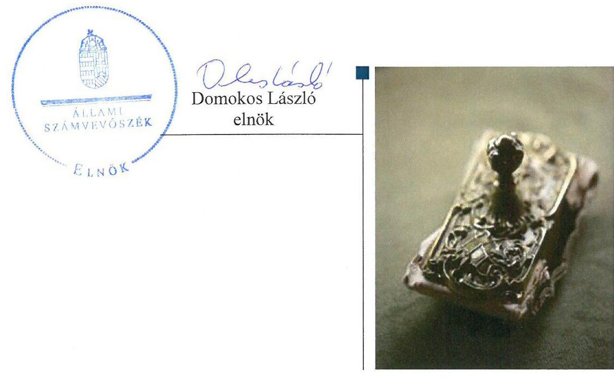

---

|   | AZ ELLENŐRZÉST FELÜGYELTE:  |
| --- | --- |
|   | SALAMON ILDIKÓ felügyeleti vezető  |
|   | AZ ELLENŐRZÉST VEZETTE ÉS A VÉGREHAJTÁSÁÉRT FELELŐS:  |
|   | KOVÁTS T. BALÁZS ellenőrzésvezető  |
|   | A PROGRAM ÖSSZEÁLLÍTÁSÁÉRT FELELŐS:  |
|   | JANIK JÓZSEF osztályvezető  |
|   | A TÉMÁHOZ KAPCSOLÓDÓ KORÁBBI SZÁMVEVŐSZÉKI JELENTÉSEK:  |
|   | - címe: Jelentés a kórházi ellátás működtetésére fordított pénzeszközök felhasználásának ellenőrzéséről  |
|   | - sorszáma: 13012  |
|  Jelentéseink az Országgyúlés számítógépes hálózatán és az Interneten a www.asz.hu címen is olvashatóak. | - címe: Jelentés Magyarország 2014. évi központi költségvetése végrehajtásának ellenőrzéséről  |
|   | - sorszáma: 15167  |
|   | - címe: Jelentés - Utóellenőrzések - A kórházi ellátás működtetésére fordított pénzeszközök felhasználásának ellenőrzéséről szóló jelentés utóellenőrzése  |
|   | - sorszáma: 16127  |
|   | - címe: Jelentés Magyarország 2015. évi központi költségvetése végrehajtásának ellenőrzéséről  |
|   | - sorszáma: 16163  |
|  |   |
|   | IKTATÓSZÁM: V-1150-109/2016.  |
|   | TÉMASZÁM: 2184  |
|   | ELLENŐRZÉS-AZONOSÍTÓ SZÁM: V076003  |

---

# TARTALOMJEGYZÉK 

■ ÖSSZEGZÉS ..... 5
■ AZ ELLENŐRZÉS CÉLJA ..... 7
■ AZ ELLENŐRZÉS TERÜLETE ..... 8
■ AZ ELLENŐRZÉS HÁTTERE, INDOKOLTSÁGA ..... 9
■ A JELENTÉS LÉNYEGES KÉRDÉSKÖREI ..... 10
■ ELLENŐRZÉS HATÓKÖRE ÉS MÓDSZEREI ..... 11
■ MEGÁLLAPÍTÁSOK ..... 14
■ JAVASLATOK ..... 31
■ MELLÉKLETEK ..... 35
I. sz. melléklet: Értelmező szótár ..... 35
II. sz. melléklet: A kiegészítő teljesítmény-ellenőrzési modul megállapításai ..... 38
III. sz. melléklet: A belső kontrollrendszer kialakításának és működtetésének értékelése a 2012-2015. években ..... 39
IV. sz. melléklet: Mérlegadatok a 2012-2015. években (M Ft-ban) ..... 40
V. sz. melléklet: Az integritás szemlélet érvényesítésével és az integritás kontrollrendszer kiépítettségével kapcsolatos megállapítások ..... 41
■ FÜGGELÉK: ÉSZREVÉTELEK ..... 43
■ RÖVIDÍTÉSEK JEGYZÉKE ..... 59

---

# ÖSSZEGZÉS 

Az irányító és középirányító szervek feladatellátása összességében megfelelt a jogszabályi előírásoknak. A Szent Kozma és Damján Rehabilitációs Szakkórház vezetője által kialakított belső kontroll rendszer összességében biztosította a szabályszerű, átlátható és elszámoltatható közpénzfelhasználás feltételeit. A pénzügyi gazdálkodás összességében szabályszerű volt. A vagyongazdálkodás - a vagyonkezelési szerződés és a vagyonhasznosítási szerződések hiányosságai miatt - nem felelt meg a jogszabályi előírásoknak.

## Az ellenőrzés társadalmi indokoltsága

Az államháztartás központi alrendszerének közpénz felhasználása, az intézmények által ellátott közfeladatok sokrétűsége, valamint a feladatellátásához rendelt vagyon nagyságrendje indokolja, hogy az Állami Számvevőszék ellenőrzéseket folytasson a pénzügyi és vagyongazdálkodás területén. Az Állami Számvevőszék az ellenőrzései során feltárja a gazdálkodást, a központi alrendszer intézményei átalakulását, átszervezését érintő szabályozások esetleges hiányosságait, a szabályozással nem érintett gazdálkodási területeket, rámutathat a vagyongazdálkodási tevékenység ezen belül a tulajdonosi joggyakorlás és vagyonkezelés esetleges szabálytalanságaira, értékeli az állami vagyon nyilvántartására és elszámolására vonatkozó eljárásokat. Az ellenőrzésünkkel hozzá kívánunk járulni a központi intézmények pénzügyi helyzetének pontosabb megítéléséhez, a jó gyakorlat kialakításán és terjesztésén keresztül az ellenőrzéseink elősegíthetik a gazdálkodás szabályszerűségének javítását.

Az egészségügyi ellátások költsége folyamatosan a társadalmi érdeklődés középpontjában áll. A központi költségvetésből az egyik legjelentősebb kiadást az egészségügyi ellátásokra fordított adóforintok jelentik, amelyekből a kórházak kapják a legtöbb támogatást. Ezért indokolt, hogy az Állami Számvevőszék az egészségügyi intézmények pénzügyi- és vagyongazdálkodását, az esetleges átalakulások szabályszerűségét rendszeresen több évre kiterjedően ellenőrizze.

A társadalmi igénnyel összhangban az államháztartásról szóló 2011. évi CXCV. törvény és a költségvetési szervek belső kontrollrendszeréről és belső ellenőrzéséről szóló 370/2011. (XII.31.) Kormányrendelet is előírja a költségvetési szerv részére, hogy a költségvetési szerv valamennyi tevékenysége és célja összhangban legyen a gazdaságosság, hatékonyság és eredményesség követelményeivel. Az Állami Számvevőszék jelen ellenőrzés során értékeli, hogy az Szent Kozma és Damján Rehabilitációs Szakkórháznál a célokat kialakították-e, tettek-e intézkedéseket a célok végrehajtása céljából, a kitűzött célok teljesültek-e.

## Főbb megállapítások, következtetések, javaslatok

Az irányítószervi, alapítói jogosultságokat 2012. január 1-jétől a nemzeti erőforrás miniszter, 2012. május 14-től az emberi erőforrások minisztere a jogszabályi előírásoknak megfelelően gyakorolta. A középirányítói és fenntartói jogokat 2012. január 1-jétől a Gyógyszerészeti és Egészségügyi Minőség- és Szervezetfejlesztési Intézet, míg 2015. március 1-jétől az Állami Egészségügyi Ellátó Központ összességében a jogszabályi előírásoknak megfelelően gyakorolta.

A Szent Kozma és Damján Rehabilitációs Szakkórház belső kontrollrendszerének kialakítása és működtetése összességében megfelelt a jogszabályi előírásoknak, biztosította a szabályszerű, átlátható és elszámoltatható közpénzfelhasználás feltételeit. A belső kontrollrendszeren belül a kockázatkezelési rendszer kialakítása és működtetése nem volt szabályszerű, míg a kontrollkörnyezet kialakítása, a kontrolltevékenység kialakítása, gyakorlása és működtetése, az információs és kommunikációs folyamatok kialakítása és működtetése, valamint a monitoring rendszer kialakítása összességében megfelelt a jogszabályi előírásoknak. A kockázatkezelési rendszer keretében felmérték a tevékenységben rejlő kockázatokat, azonban nem határozták meg az egyes kockázatokkal kapcsolatban szükséges intézkedéseket, valamint azok teljesítése folyamatos nyomon követésének módját. Az információs és kommunikációs rendszeren belül az adatszolgáltatási kötelezettséget rendszeresen határidőn túl teljesítették.

---

A pénzügyi gazdálkodás összességében szabályszerű volt. Az elemi költségvetés készítése, és az előirányzatok megállapítása, a bevételi és kiadási előirányzatok módosítása, átcsoportosítása megfelelt a jogszabályi előírásoknak. A bevételek beszedésénél és elszámolásánál, a kiadási előirányzatok felhasználásánál a jogszabályi előírásokat összességében betartották. Az éves költségvetési beszámoló elkészítése és a beszámolási kötelezettség teljesítése megfelelt a jogszabályi előírásoknak. Évközi korlátozó intézkedés nem érintette, azonban az eszközbeszerzések tilalmára vonatkozó előírásokat a 2012-2013. években nem tartották be. Az előirányzat-maradvány megállapítása megfelelt a jogszabályi előírásoknak.

A vagyongazdálkodás összességében nem volt szabályszerű. A vagyon értékének megőrzését, gyarapítását szolgáló vagyongazdálkodás feltételeinek kialakítása - a vagyonkezelési szerződés tartalmi hiányosságai miatt - nem felelt meg a jogszabályi előírásoknak. A mérlegben kimutatott eszközök és források nyilvántartása, értékelése, leltározása megfelelt a jogszabályi előírásoknak. Az értékmegőrzési, állagmegóvási kötelezettséget teljesítették, azonban a vagyonelemek hasznosítása - a bérbeadási szerződések hiányossága és az átláthatóságra vonatkozó nyilatkozatok hiányában kötött szerződések miatt - nem volt megfelelő. Az eredményszemléletű számvitel bevezetésével kapcsolatos feladatok végrehajtása megfelelt a jogszabályi előírásoknak.

A Szent Kozma és Damján Rehabilitációs Szakkórház tett erőfeszítéseket az integritás szemlélet érvényesítésére, azonban további intézkedések szükségesek az integritás kontrollrendszer fejlesztése érdekében.

---

# AZ ELLENŐRZÉS CÉLJA 

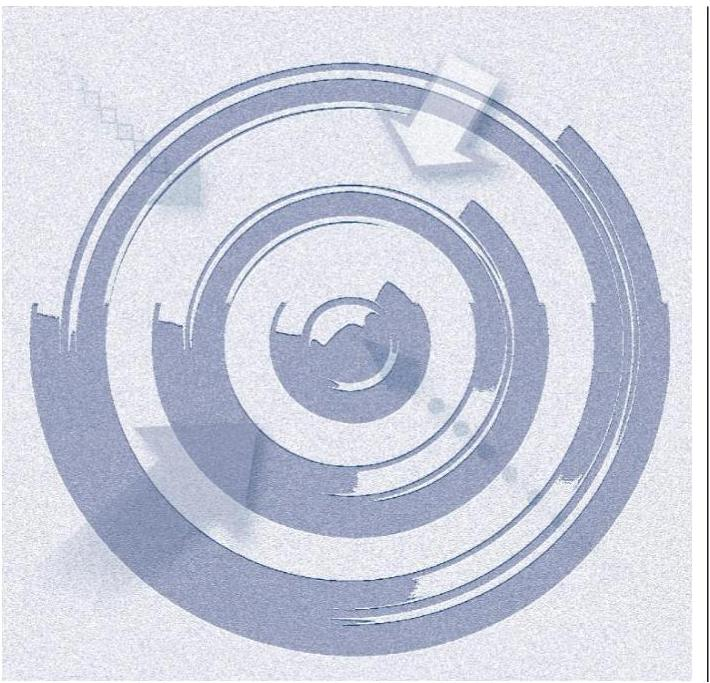

A MEGFELELŐSÉGI ELLENŐRZÉS célja annak megítélése volt, hogy az ellenőrzött intézményre vonatkozó irányító szervi feladatellátás a jogszabályi előírások betartásával történt-e; az intézménynél a belső kontrollrendszer kialakítása és működtetése szabályszerű volt-e; kialakították-e az erőforrásokkal való szabályszerű, gazdaságos, hatékony és eredményes gazdálkodás követelményeit; szabályszerű volt-e a beszámolási és adatszolgáltatási kötelezettségek teljesítése; az intézmény pénzügyi és vagyongazdálkodása megfelelt-e a jogszabályi előírásoknak és belső szabályzatainak; az intézmény átalakításának vagy átszervezésének lebonyolítása szabályszerűen történt-e.

Az ellenőrzés keretében értékeltük az intézmény korrupciós kockázatainak kezelését szolgáló integritás kontrollok kiépítettségét és az integritás szemlélet érvényesülését.

A KIEGÉSZÍTŐ TELJESÍTMÉNY-ELLENŐRZÉSI MODUL célja annak értékelése volt, hogy a gazdálkodás folyamatában a gazdaságossági, hatékonysági és eredményességi célok kialakítása megtörtént-e, a célok elérése érdekében tettek-e intézkedéseket, a célkitűzéseket elérték-e; a szándékolt eredményeket elérték-e.

---

# AZ ELLENŐRZÉS TERÜLETE

## Szent Kozma és Damján Rehabilitációs Szakkórház

A Visegrádon található Szakkórház¹ az ellenőrzött időszakban önállóan működő és gazdálkodó központi költségvetési szerv volt, az irányítószervi feladatokat 2012-2015. években a nemzeti erőforrás miniszter, illetve emberi erőforrások minisztere a Minisztériumon² keresztül gyakorolta. A Szakkórház középirányító szerve 2012. január 1-jétől a GYEMSZI³, illetve 2015. március 1-jétől az ÁEEK⁴ volt. A Szakkórház által az egészségügyi feladatellátáshoz használt önkormányzati vagyon és vagyoni értékű jog 2012. január 1-jétől a Konsz. tv.⁵ alapján, a törvény erejénél fogva állami tulajdonba került. Az egészségügyért felelős miniszter 2012. január 1-től – a NEFMI rendeletben⁶ – az állami egészségügyi feladatellátást szolgáló átkerült vagyon tekintetében a vagyonkezelői jogok gyakorlására a GYEMSZI-t jelölte ki. 2012. május 1-jétől a GYEMSZI, 2015. március 1-jétől az ÁEEK a vagyon tekintetében – Ttv.⁷ alapján –, mint tulajdonosi joggyakorló járt el.

Közfeladata az Eütv.⁸ alapján, ellátási területére kiterjedően a járó- és fekvőbetegek diagnosztikus és terápiás szakorvosi ellátása, rehabilitációja és követéses gondozása. Az ellenőrzött időszakban átalakítás, átszervezés nem érintette.

A Szakkórházat az ellenőrzéssel érintett időszakban főigazgató vezette, munkáját gazdasági igazgató, orvos igazgató, műszaki igazgató, valamint ápolási igazgató segítette. Az ellenőrzött időszakban a főigazgató személyében 2012. december 1-től történt változás. A gazdálkodással kapcsolatos feladatokat a gazdasági igazgató közvetlen irányítása alatt működő pénzgazdálkodási osztály, humánpolitikai osztály, dokumentáció és informatikai osztály, ellátás, anyag-eszközgazdálkodás osztály látta el.

A Szakkórház engedélyezett létszáma 2012-ben 191 fő, 2015-ben pedig 186 fő volt. Az ellenőrzött időszakban végrehajtott beruházások következtében a Szakkórház vagyona a 2012. december 31-i 810,4 millió Ft-ról 2015. december 31-ére 985,9 millió Ft-ra, 21,7%-kal nőtt. A Szakkórház befolyt költségvetési és finanszírozási bevétele a 2012. évi 1052,8 millió Ft-ról a 2015. évre 1104,8 millió Ft-ra, 4,9%-kal emelkedett, a kifizetett költségvetési és finanszírozási kiadása a 2012. évi 956,9 millió Ft-ról a 2015. évre 1009,6 millió Ft-ra, 5,5%-kal emelkedett. A maradvány igénybevételt is figyelembe véve a Szakkórháznak a 2012. évben 95,9 millió Ft, a 2013. évben 51,5 millió Ft, a 2014. évben 80,1 millió Ft, a 2015. évben 95,2 millió Ft többlete keletkezett.

---

# AZ ELLENŐRZÉS HÁTTERE, INDOKOLTSÁGA 

Az Alaptörvény ${ }^{9}$ rendelkezése szerint a nemzeti vagyon megőrzésének, védelmének és a nemzeti vagyonnal való felelős gazdálkodásnak a követelményeit sarkalatos törvény, az Nvtv. ${ }^{10}$ rögzíti. A tulajdonosi joggyakorlás és vagyonkezelés általános és speciális szabályait, az állami vagyon nyilvántartására és elszámolására vonatkozó eljárásokat, a vagyonkezelési szerződés feltételrendszerét, valamint az éves beszámoló készítési és könyvvezetési kötelezettségeket kormányrendelet írja elő.

A központi alrendszer egyes intézményei közfeladat-ellátásának változásait, a közfeladatok átadásából és átvételéből adódó módosításait, előirányzat gazdálkodására ható tényezőit az Áht. ${ }^{11}$ 11. §-a és az Ávr. ${ }^{12}$ 14. §-a írja elő.

A társadalmi igénnyel összhangban Áht. és a Bkr. ${ }^{13}$ is előírja a költségvetési szerv részére, hogy olyan szabályozásokat, eljárásokat, folyamatokat alakítson ki, amelyek biztosítják a működés, gazdálkodás, az erőforrások felhasználása során a gazdaságosság, hatékonyság és eredményesség érvényesülését. A gazdaságos, hatékony és eredményes gazdálkodáshoz szükség van a teljesítménymérés feltételeinek kialakítására, úgymint az egyértelmű és mérhető célokra, mutatószámokra és az ezekhez rendelt követelményekre.

AZ ELLENŐRZÉS EREDMÉNYEKÉPPEN nemcsak az ellenőrzött intézmények gazdálkodása javulhat, hanem átfogó képet kaphatunk a központi
 alrendszerbe tartozó költségvetési szervek gazdálkodásának hiányosságairól, de a jó gyakorlatokról is. Ellenőrzéseivel, javaslataival és megállapításaival az ÁSZ ${ }^{14}$ elősegítheti a költségvetési szervek pénzügyi és vagyongazdálkodása szabályozásának javítását és hozzájárulhat a jó kormányzáshoz. Az ellenőrzés az ellenőrzött számára visszajelzést ad a pénzügyi és vagyongazdálkodásában feltárt hiányosságokról, javaslataival hozzájárul azok kiküszöböléséhez, amely csökkentheti a későbbi ellenőrzések gyakoriságát. Az ellenőrzés megállapításait és javaslatait más szervezetek is hasznosíthatják a rendezett gazdálkodási keretek kialakításához.

---

# A JELENTÉS LÉNYEGES KÉRDÉSKÖREI 

1.     - Az irányító szerv Szakkórházra vonatkozó feladatellátása szabályszerű volt-e?
2.     - A belső kontrollrendszer kialakítása és működtetése biztosította-e a közpénzekkel és a nemzeti vagyonnal történő szabályszerű, gazdaságos, hatékony és eredményes gazdálkodást, illetve a beszámolási és adatszolgáltatási kötelezettségek szabályszerű teljesítését?
3.     - A Szakkórház pénzügyi gazdálkodása szabályszerű volt-e?
4.     - A Szakkórház vagyongazdálkodása szabályszerű volt-e?
5.     - Érvényesült-e az integritás szemlélet és ennek megfelelően kiépítették-e az integritás kontrollrendszert a Szakkórháznál?

---

# ELLENŐRZÉS HATÓKÖRE ÉS MÓDSZEREI 

## Az ellenőrzés típusa

Megfelelőségi ellenőrzés, amelyet teljesítmény-ellenőrzési modul egészített ki.

## Az ellenőrzött időszak

Az ellenőrzött időszak 2012. január 1-jétől 2015. december 31-ig terjedő időszak volt.

## Az ellenőrzés tárgya

Az ellenőrzött szervezetre vonatkozó irányító szervi feladatok ellátása. Az intézmény belső kontroll rendszerének kialakítása és működtetése. A pénzügyi és vagyongazdálkodás szabályszerűsége. Az intézmény beszámolási és adatszolgáltatási kötelezettségének teljesítése.

A teljesítmény-ellenőrzési kiegészítő modul esetében az intézmény gazdálkodási folyamatában a gazdaságossági, hatékonysági és eredményességi célok és célértékek kialakítása, a kapcsolódó intézkedések meghatározása, a célkitűzések elérésének értékelése. A teljesítmény-ellenőrzés fókuszkérdéseire a II. sz. melléklet ad választ.

Az ellenőrzés kiterjedt minden olyan körülményre és adatra, amely az ÁSZ jogszabályban meghatározott feladatainak teljesítéséhez, valamint a program végrehajtása folyamán felmerült újabb összefüggések feltárásához szükséges volt.

## Az ellenőrzött szervezet

Szent Kozma és Damján Rehabilitációs Szakkórház, Állami Egészségügyi Ellátó Központ (Gyógyszerészeti és Egészségügyi Minőség- és Szervezetfejlesztési Intézet), Emberi Erőforrások Minisztériuma (Nemzeti Erőforrás Minisztérium).

Az ellenőrzésre a központi alrendszer ellenőrzött intézményének és irányító/felügyeleti szervének, illetve középirányító szervének székhelyén, telephelyén, a gazdálkodási feladatait ellátó szervezetének székhelyén került sor.

---

# Az ellenőrzés jogalapja 

Az ellenőrzés jogszabályi alapját az ÁSZ tv ${ }^{15} 1. § (3) bekezdése, az 5. § (2)(6) bekezdései, valamint az Áht. 61. § (2) bekezdésének előírásai képezték.

## Az ellenőrzés módszerei

Az ellenőrzést az ellenőrzési program szempontjai, az ellenőrzött időszakban hatályos jogszabályok, az ellenőrzés szakmai szabályai, a jelen ellenőrzésre irányadó ÁSZ módszertanok figyelembevételével végeztük.

Az ellenőrzés ideje alatt az ellenőrzött szervezettel történő kapcsolattartást az ÁSZ SZMSZ ${ }^{16}$-ének vonatkozó előírásai alapján biztosítottuk.

Az ellenőrzési kérdések megválaszolásához szükséges bizonyítékok megszerzése az ellenőrzött által rendelkezésre bocsátott dokumentumokra, adatokra alapozva megfigyelés, szemle (szemrevételezés), kérdésfeltevés (információkérés), mintavételezés, valamint elemző eljárás útján történt. Az ellenőrzési bizonyítékként felhasználható adatforrások közé tartoztak egyrészt az ellenőrzési program részletes szempontjainál felsorolt adatforrások, másrészt minden egyéb - az ellenőrzés folyamán feltárt, az ellenőrzés szempontjából információt tartalmazó - dokumentum.

Az ellenőrzés lefolytatásához az ellenőrzött szervezetek a tanúsítványok kitöltésével, valamint az ÁSZ által kért dokumentumok megküldésével szolgáltatott adatokat. A rendelkezésre bocsátott adatok, információk kontrollja az ellenőrzés keretében történt meg.

Az ÁSZ a belső kontrollrendszer jogszabályi előírások szerinti kialakításának és működtetésének szabályszerűségét az erre irányuló ellenőrzési kérdésekre adott válaszok összesítése alapján, a lényegességi szempontok figyelembe vételével évente pillérenként (kontrollkörnyezet, kockázatkezelési rendszer, kontrolltevékenységek, információs és kommunikációs rendszer, monitoring rendszer) és összesítetten is minősítette. Az ÁSZ a pénzügyi gazdálkodás és a vagyongazdálkodás kialakításának és működtetésének szabályszerűségét az erre irányuló ellenőrzési kérdésekre adott válaszok összesítése alapján, a lényegességi szempontok figyelembe vételével évenkénti bontásban minősítette. „Megfelelő"-nek értékelte az ellenőrzött területet, amennyiben a szabályozás, illetve végrehajtás során a jogszabályi követelményeket maradéktalanul, vagy kisebb hiányosságok mellett érvényesítették, „nem megfelelő"-nek értékelte, amennyiben a szabályozás hiányosságai nem biztosították a szabályszerű működés feltételeit, illetve a gazdálkodás folyamatában jelentkező hibák lényegesek, nagyszámúak, vagy rendszerszerűek voltak.

Mintavétellel ellenőriztük a Szakkórháznál a kiadások előirányzatai felhasználásának, a tárgyi eszközök nyilvántartásba vételének (üzembe helyezés, értékelés, nyilvántartás), a bevételek beszedésének és elszámolásának, a vagyonelemek elidegenítésének és hasznosításának szabályszerűségét. A minta alapján a sokaságban előforduló hibaarányt becsültük. Az értékelés eredményeként kétféle, "Megfelelő" és "Nem megfelelő" minősítést alkalmaztunk. „Megfelelő"-nek értékeltünk egy ellenőrzött területet, amennyiben a hibaarány a teljes sokaságban 95%-os bizonyossággal legfeljebb 10% arányt képviselt. Abban az esetben, ha adott sokaság tekintetében a 10%-os hibaarány küszöbérték átlépése megítélésének megbízhatósága nem érte el a 95%-ot, annak elérése érdekében értékelésünket lényegességi alapon további szempontokkal egészítettük ki, és figyelembe vettük a feltárt hibák értékét.

Az integritás szemlélet érvényesülésének értékelése az intézmény által kitöltött kérdőív alapján történt. Értékeltük továbbá az integritás kontrollrendszer kiépítettségét a kérdőívben szereplő kontrollok ellenőrzése alapján.

Az alapprogram alapján ellenőriztük, hogy a költségvetési szerv vezetője megtette-e nyilatkozatát arról, hogy gondoskodott a költségvetési szerv tevékenységében a hatékonyság, eredményesség és a gazdaságosság követelményeinek érvényesítéséről. A teljesítmény-ellenőrzési kiegészítő modul végrehajtása során értékeltük, hogy az ellenőrzött szervezet a gazdálkodás folyamatában a gazdaságossági, hatékonysági és eredményességi célokat és célértékeket kialakította-e, a célkitűzéseket elérte-e. A kiegészítő modul a gazdálkodási feladatokra terjedt ki, a szakmai feladatellátást nem értékelte.

A gazdálkodási feladatok értékelése az alábbi területekre terjedt ki:
pénzügyi gazdálkodási (nem szakmai, adminisztratív) feladatok: költségvetés-, beszámoló-készítés, könyvvezetés, adatszolgáltatások, előirányzat-gazdálkodás, kötelezettségvállalások nyilvántartása, kezelése, bevételkezelés, bér- és illetményszámfejtés;
$\longrightarrow$ vagyongazdálkodási (logisztikai) feladatok: közbeszerzések és közbeszerzési értékhatárt el nem érő beszerzések, készletgazdálkodás, nyomtatók, fénymásolók üzemeltetése, épület- és ingatlanüzemeltetés, karbantartás, hibabejelentés, gépjármű és flottamenedzsment.
Az ellenőrzés során minden olyan körülményt és adatot is ellenőriztünk, amely a program végrehajtása kapcsán felmerült újabb összefüggéseknek az ellenőrzés céljaival összhangban lévő feltárásához szükséges volt. A teljesítmény-ellenőrzési kiegészítő programmodulban megfogalmazott ellenőrzési cél megválaszolásához az alapprogram végrehajtása során megfogalmazott megállapításokat is figyelembe vettük.

---

# 1. Az irányító szerv Szakkórházra vonatkozó feladatellátása szabályszerű volt-e? 

## Összegző megállapítás

### 1.1. számú megállapítás

### 1.2. számú megállapítás

Az irányító és középirányító szervek feladatellátása összességében megfelelt a jogszabályi előírásoknak.

Az alapítással kapcsolatos jogosultságok gyakorlása összességében a jogszabályi előírásoknak megfelelően történt.

A nemzeti erőforrás miniszter 2012. január 25-én 2012. január 01-jei hatállyal új alapító okiratot ${ }^{17}$ adott ki.

Az alapító okiratot 2012. évben egységes szerkezetben adták ki, a kormányzati funkció megadása miatt 2014. január 01-jei hatállyal sor került az alapító okirat kiegészítésére. Az alapító okirat tartalma megfelelt a jogszabályi előírásoknak, tartalmazta többek között a működési körét, közfeladatát, alaptevékenységét, szakfeladatrendjét, szakágazati besorolását, vezetőjének kinevezési rendjét, a foglalkoztatottjai jogviszonyának megjelölését, az irányítói, középirányítói jogok gyakorlására jogosultak megjelölését.

A Szakkórházzal kapcsolatos egyéb irányítási, felügyeleti és ellenőrzési jogosultságok gyakorlása - a hatékony gazdálkodás követelményeinek érvényesítése, számon kérése és ellenőrzése kivételével - szabályszerűen történt.

Az EMMI ${ }^{18}$ előírta az elemi költségvetési beszámoló, az éves számszaki beszámoló és a szöveges beszámoló indokolásának tartalmi követelményeit, elkészítésének határidejét. Ellenőrizte és jóváhagyta a Szakkórház elemi költségvetéseit, éves beszámolóit és előirányzat-maradványát. A GYEMSZI a szabályszerű gazdálkodáshoz szükséges követelményeket - jogszabályi előírásoknak megfelelően - kialakította és számon kérte. Figyelemmel kísérte a bevételi és kiadási előirányzatokkal való gazdálkodást, rendszeres beszámolási kötelezettséget írt elő, jóváhagyta a Szakkórház SZMSZ ${ }^{19}$ módosításait. A közfeladat ellátásához kapcsolódó erőforrást (vagyongazdálkodást) érintő szabályszerűségi követelményeket a GYEMSZI az építésügyi hatósági eljárásról szóló körlevélben ${ }^{20}$, az ingatlanok bérbeadásáról szóló iránymutatásban ${ }^{21}$, a gépjárművek értékesítéséről szóló körlevélben ${ }^{22}$, illetve a tárgyi eszközök selejtezéséről szóló tájékoztatóban ${ }^{23}$ határozta meg. A 2012. év februárjától webes ügymenetkezelő (ügyköri) rendszert vezetett be az irányításhoz szükséges ügyek kezelésére.

Az irányító szervek az éves beszámolók számszaki részének és szöveges indoklásának felülvizsgálata és jóváhagyása révén végeztek ellenőrzési feladatokat, továbbá az EMMI a 2013. és a 2015. években a gazdálkodásra vonatkozó cél ellenőrzéseket végzett, a 2014. évben a Szakkórház belső ellenőrzési tevékenységét értékelte, a GYEMSZI 2013-ban ellenőrizte a Szakkórház szabályzatainak meglétét.

---

A GYEMSZI - az 59/2011. (IV.12.) Korm. rendelet ${ }^{24} 2/A. § a) pontjában előírtak ellenére - a 2012. január 1-je és 2015. február 28-a között, míg az ÁEEK - a 27/2015. (II.25.) Korm. rendelet ${ }^{25} 5. § (1) bekezdés a) pontjában foglaltak ellenére - 2015. március 1-től a Szakkórház vonatkozásában nem érvényesítette az erőforrásokkal - így az előirányzatokkal, a létszámokkal és a vagyonnal - való hatékony gazdálkodás követelményeit, továbbá nem kérte számon és nem ellenőrizte e követelmények érvényre juttatását.
1.3. számú megállapítás

Az irányításért felelős szervek a munkáltatói jogosultságaikat szabályszerűen gyakorolták.

A Szakkórház élén 2012. január 01-én álló főigazgató munkaviszonya 2012. november 30. napján a Konsz. tv. alapján megszűnt, az erről szóló értesítést az egészségügyért felelős miniszter írta alá. Az új főigazgatóra a törvényben előírt pályázatára figyelemmel a GYEMSZI főigazgatója tett javaslatot, majd határozott idejű munkaszerződést kötöttek. A gazdasági igazgatóval - a Konsz. tv. előírásainak megfelelően - a pályázat elnyerése után határozott idejű munkaszerződést kötöttek. A Szakkórház vezetőjének, gazdasági vezetőjének kinevezése megfelelt a jogszabályi előírásoknak.

# 2. A belső kontrollrendszer kialakítása és működtetése biztosította-e a közpénzekkel és a nemzeti vagyonnal történő szabályszerű, gazdaságos, hatékony és eredményes gazdálkodást, illetve a beszámolási és adatszolgáltatási kötelezettségek szabályszerű teljesítését? 

Összegző megállapítás

A belső kontrollrendszer kialakítása és működtetése - a kockázatkezelési rendszer hiányosságai ellenére - biztosította a közpénzekkel és a nemzeti vagyonnal történő szabályszerű, hatékony és eredményes gazdálkodás, illetve a beszámolási és adatszolgáltatási kötelezettségek szabályszerű teljesítése feltételeit.

A belső kontrollrendszer kialakítása és működtetése szabályszerűségének értékelését a III. sz. melléklet tartalmazza.

## 2.1. számú megállapítás

A Szakkórház a kontrollkörnyezetét összességében a jogszabályi előírásoknak megfelelően alakította ki.

A Szakkórház rendelkezett hatályos, egységes szerkezetbe foglalt alapító okirattal.

A Szakkórház rendelkezett az irányítószerv által jóváhagyott SZMSZszel, amely tartalmazta az ellátandó, és a szakfeladatrend/kormányzati funkció szerint besorolt alaptevékenységek megjelölését, a szervezeti felépítést, szervezeti ábrát. Az SZMSZ - az Ávr. 13. § (1) bekezdés b) pontjában előírtak ellenére - 2012. január 1-je és 2012. július 17-e között nem tartalmazta a hatályos alapító okirat keltét és számát, továbbá a 2012. július 17-től nem tartalmazta a hatályos, egységes szerkezetbe foglalt alapító okirat számát és az alapítás időpontját.

---

A Szakkórház gazdasági szervezete rendelkezett ügyrenddel ${ }^{26}$, kialakították a humánerőforrás-kezelés működtetésének szabályait. Azonban a Szakkórháznál 2012. január 1-je és 2013. szeptember 30-a között - a Bkr. 6. § (1) bekezdés c) pontjában foglaltak ellenére - nem írták elő az etikai elvárásokat a szervezet minden szintjén.

A Szakkórház rendelkezett számviteli politikával ${ }^{27}$, amely az ellenőrzött időszakban tartalmazta a jogszabályban előírt szabályozásokat, a gazdálkodóra jellemző szabályokat, előírásokat, módszereket, azonban a törvényben biztosított választási lehetőségek alkalmazása esetén - a Sztv. ${ }^{28} 14. § (4) bekezdésében
 előírtak ellenére – nem szabályozta, hogy az alkalmazott gyakorlatot milyen okok miatt kell megváltoztatni. A számviteli politika keretében elkészítették a leltározási és leltárkészítési szabályzatot ${ }^{29}$, az eszközök és források értékelési szabályzatát ${ }^{30}$, az önköltségszámítási szabályzatot ${ }^{31}$, a pénzkezelési szabályzatot ${ }^{32}$, továbbá rendelkeztek számlarenddel ${ }^{33}$ és a számlarendben foglaltakat alátámasztó bizonylati renddel ${ }^{34}$.

A leltározási és leltárkészítési szabályzat II.1. és III.1. pontjai a 2012–2013. években a tárgyi eszközök és a raktári készletek esetében a páros évben egyeztetéssel, páratlan évben mennyiségi felvétellel végrehajtott leltározást írt elő, amelyhez – az Áhsz. ${ }^{35}$ 37. § (7) bekezdésében előírtak ellenére – irányító szerv engedélyével nem rendelkeztek. A leltározási és leltárkészítési szabályzatban, a 2012–2013. években – az Áhsz. ${ }^{37}$ 37. § (6) bekezdésében előírtak ellenére – nem szabályozták a mérlegben értékkel nem szereplő, használt és használatban levő készletek, kis értékű immateriális javak, tárgyi eszközök leltározási módját. Az eszközök és források értékelési szabályzatában – az Áhsz. ${ }^{38}$ 8. § (17) bekezdés d) pontjában és az Áhsz. ${ }^{36}$ 50. § (2) bekezdés b) pontjában előírtak ellenére – nem határozták meg követeléstípusonként a kis összegű követelések év végi meghatározásának elveit, dokumentálásának szabályait. A számlarend – az Áhsz. ${ }^{39}$ 51. § (1) bekezdés b) pontjában, Áhsz. ${ }^{40}$ 51. § (3) bekezdéseiben leírtak ellenére – nem tartalmazta az összesítő bizonylatok (feladások) tartalmi és formai követelményeit, továbbá nem határozták meg benne – az Áhsz. ${ }^{41}$ 49. § (3) és az Áhsz. ${ }^{40}$ 51. § (3) bekezdésében előírtak ellenére – az analitikus, részletező nyilvántartásoknak a kapcsolódó könyvviteli és nyilvántartási számlákkal való egyeztetésének dokumentálását.

A Szakkórház rendelkezett hatályos, a főigazgató által aláírt közbeszerzési szabályzattal ${ }^{37}$, azonban 2013. október 31-ig – az Ávr. 13. § (2) bekezdés b) pontjában előírtak ellenére – belső szabályzatban nem rendezték a közbeszerzési törvény hatálya alá nem tartozó beszerzések lebonyolításának rendjét, továbbá – az Ávr. 13. § (2) bekezdés e) pontjában előírtak ellenére – 2013. június 1-je előtt nem szabályozták a reprezentációs kiadások felosztását, azok elszámolását, a reprezentációs szabályzatot ${ }^{38}$ csak azt követően adták ki.

A gazdálkodás részletes rendjét gazdálkodási szabályzatban ${ }^{39}$ határozták meg.

A Szakkórház rendelkezett – a Bkr. előírásainak megfelelő tartalmú ellenőrzési nyomvonallal ${ }^{40}$, valamint szabálytalanság kezelési eljárásrenddel ${ }^{41}$.

---

# 2.2. számú megállapítás 

## A kockázatkezelési rendszer kialakítása és működtetése összességében nem felelt meg a jogszabályi előírásoknak.

A Szakkórháznál a belső kontrollrendszer működési szabályzata ${ }^{42}$ tartalmazta a kockázatok azonosítási módját, elemzésének, értékelésének módját, a kockázati kitettség mérséklésének módszerét és a kockázat megosztásának, áthárításának és elviselésének, elfogadásának lehetőségét, azonban a szabályozás nem tartalmazta az egyes kockázatokkal kapcsolatban szükséges intézkedéseket, valamint azok teljesítésének folyamatos nyomon követésének módját. A szabályzatban meghatározták, hogy a kockázatkezelési rendszer működtetése az önálló szervezeti egység vezetők feladata. Az önálló szervezeti egységek az általuk vezetett szervezeti egységek vonatkozásában felmérték a feladatok végrehajtását akadályozó egyedi kockázatokat és meghatározzák a kockázati kitettség csökkentésének módját, azonban nem határoztak meg a kockázati esemény bekövetkezésekor, azok kezeléséhez szükséges intézkedéseket.

A Szakkórháznál a szabályozásnak megfelelően felmérték és értékelték a tevékenységében rejlő kockázatokat, azonban – a Bkr. 7. § (2) bekezdésében előírtak ellenére – nem határozták meg az egyes kockázatokkal kapcsolatban szükséges intézkedéseket, valamint azok teljesítésének folyamatos nyomon követésének módját.

## A kontrolltevékenység kialakítása, gyakorlása és működtetése összességében megfelelt a jogszabályokban és a belső szabályzatokban foglaltaknak.

A gazdálkodási szabályzatban meghatározták a kötelezettségvállalás, a kötelezettségvállalás ellenjegyzése, a teljesítésigazolás, az érvényesítés, az utalványozás és az utalványozás ellenjegyzése gyakorlásának módjával, eljárási és dokumentációs részletszabályaival, valamint az ezeket végző személyek kijelölésének rendjével kapcsolatos belső előírásokat, továbbá biztosították a gazdasági események elszámolása vonatkozásában a feladatköri elkülönítését, a kontrolltevékenységek részeként a pénzügyi döntések dokumentumainak elkészítését. A gazdálkodási jogköröket gyakorló személyekről és aláírás mintájukról naprakész nyilvántartást vezettek, a kijelöléseket, felhatalmazásokat – kötelezettségvállalás, teljesítés igazolás, utalványozás tekintetében – az arra jogosultak írásban adták ki. Biztosították a kontrolltevékenységek részeként a pénzügyi döntések dokumentumainak elkészítését, ennek keretében rendelkeztek a kötelezettségvállalások, valamint a szerződések nyilvántartásával.

A Szakkórháznál a személyi juttatások, a működési kiadások, a felhalmozási kiadások felhasználása során a gazdálkodási jogkörök gyakorlása, a megkötött visszterhes szerződések, adott megbízások, megrendelések szabályszerűsége – a feltárt eseti hiányosságok kivételével – megfelelő volt. A bevételek elszámolása megfelelt, azonban a bevételi szerződések megkötése, tartalma nem felelt meg a jogszabályi előírásoknak.

---

### 2.4. számú megállapítás

Az információs és kommunikációs folyamatok kialakítása és működtetése – az adatszolgáltatási határidők tartása kivételével – összességében megfelelt a jogszabályi előírásoknak.

Az információáramlás rendszerét a szervezeten belül a Bkr.-ben előírtakkal összhangban alakították ki. Az információáramlás biztosításával kapcsolatos feladatokat az SZMSZ-ben és a szervezeti egységek ügyrendjében rögzítették. A Szakkórház rendelkezett informatikai szabályzattal ${ }^{43}$, a közérdekű adatok megismerésére irányuló kérelmek intézésének, továbbá a kötelezően közzéteendő adatok nyilvánosságra hozatalának rendjéről szóló szabályzattal ${ }^{44}$, az Info. tv. ${ }^{45}$ által előírt adatvédelmi és adatkezelési szabályzattal ${ }^{46}$, továbbá az illetékes közlevéltár által jóváhagyott irattári és iratkezelési szabályzattal ${ }^{47}$. Az iratok iktatásával, az iratforgalom dokumentálásával biztosították, hogy az ügyintézés folyamata, az iratok szervezeten belüli útja követhető és ellenőrizhető, az iratok holléte naprakészen megállapítható legyen.

A közzétételi kötelezettségének a Szakkórház az ellenőrzött időszakban – az Info. tv. 33. § (1) és (3) bekezdéseiben és a 37. § (1) bekezdésében előírtak ellenére – nem teljes körűen tett eleget, mivel nem tették közzé – az Info. tv. 1. melléklete II. 6. pontban előírtak ellenére – a fenntartott adatbázisok, illetve nyilvántartások leíró adatait, továbbá – a 305/2005.(XII.25.) Korm. rendelet 7. § (1) bekezdésében előírtak ellenére – az adatok közzétételével, helyesbítésével, frissítésével vagy eltávolításával kapcsolatos naplózást nem hajtották végre.

Az adatszolgáltatási kötelezettségének Szakkórház mind a Kincstár ${ }^{48}$, mind az irányító szerv felé eleget tett, azonban a jogszabályban előírt határidőket nem minden esetben tartotta be:
az éves beszámolók esetében a 2013. és 2014. évekre vonatkozó adatszolgáltatási kötelezettségüket – az Áhsz. ${ }^{49}$ 10. § (1) és az Áhsz. ${ }^{50}$ 32. § (1) bekezdésében előírtak ellenére – február 28-a után teljesítették,
az időközi mérlegjelentések esetében a 2012. évben két alkalommal, a 2013. évben három alkalommal, a 2014. évben szintén három alkalommal, míg a 2015. évben egy alkalommal – az Ávr. 170. § (2) bekezdésében, 7. melléklet 27. pontjában, illetve 2015. évtől az 5. melléklet 22. pontjában előírtak ellenére – a tárgynegyedévet követő hónap 20. napja után teljesítették az adatszolgáltatási kötelezettségüket,
az időközi költségvetési jelentések esetében a 2015. évben három alkalommal (1., 3. és 9. hónapokban) – az Ávr. 169. § (2) bekezdésében előírtak ellenére – az adatszolgáltatás lezárásának a Kincstár általi közzétételt követő tizenöt napon belül nem tett eleget.
2.5. számú megállapítás

A Szakkórház főigazgatója jogszabályi előírásoknak megfelelően alakította ki a szervezet tevékenységének, a célok megvalósításának folyamatos- és eseti nyomon követését biztosító rendszerét.

A Szakkórháznál kialakították az operatív tevékenységek folyamatos és eseti nyomon követési rendszerét. Az SZMSZ-ben rögzítetteknek megfelelően szakmai testületek, munkabizottságok működtek, a vezetői irányítási

---

feladatok végrehajtása keretében rendszeres vezetői értekezleteket tartottak, továbbá az operatív tevékenységek elvégzéséről havi és negyedéves beszámoltatások voltak. A beszámolásoknak átfogó keretet adott az ISO 9001:2009 minőségirányítási rendszer működtetése.

A belső ellenőrzési rendszer működtetéséről az ellenőrzött időszakban külső szakemberrel kötött szerződéssel gondoskodtak. A főigazgató 2012. július 1-jétől a Bkr. 15. § (5) bekezdésében előírtak ellenére – nem gondoskodott legalább egy fő belső ellenőr foglalkoztatásra irányuló jogviszonyban történő alkalmazásáról, valamint ettől eltérő gyakorlat alkalmazásához nem rendelkezett a fejezetet irányító szerv vezetőjének írásos jóváhagyásával, továbbá 2013. február 6-án ismételten a fejezet irányító szerv vezetőjének jóváhagyása nélkül kötött megbízási szerződést külső szolgáltatóval belső ellenőri tevékenység ellátására. A külső szolgáltató alkalmazásához a miniszteri jóváhagyást 2013. júliusában kérték meg, melyet a fejezet irányító szerv vezetője 2014. február 24-én hagyott jóvá.

A belső ellenőrzés az SZMSZ-ben előírtak szerint a Szakkórház főigazgatójának közvetlenül alárendelve működött, feladatait és jogállását az SZMSZ-ben, illetve belső ellenőrzési szabályzatban ${ }^{49}$ határozták meg, melynek 2014-ig része volt az aktualizált belső ellenőrzési kézikönyv ${ }^{50}$. A Szakkórház rendelkezett – a vonatkozó jogszabályi- és az útmutató előírásainak figyelembe vételével elkészített – éves belső ellenőrzési tervvel, melyet a középirányító szerv részére is megküldtek. A belső ellenőr a 2012. évben a jóváhagyott éves ellenőrzési tervekben foglalt ellenőrzések végrehajtásáról – a Bkr. 22. § (1) bekezdés b) pontjában előírtak ellenére – nem gondoskodott, mivel egy ellenőrzést nem hajtott végre. Az elvégzett belső ellenőrzésekről éves bontásban vezetett nyilvántartások – a Bkr. 47. § (1) és 50. § (1)–(2) bekezdésében előírtak ellenére – a 2012. évben nem tartalmazták a vizsgált időszakot és a jelentésekben tett megállapításokat, valamint a 2012. és a 2014. években az ellenőrzés kezdetének és lezárásának időpontját. A belső ellenőr elkészítette az éves belső ellenőrzési jelentéseket, melyben nyomon követte az ellenőrzésekre készült intézkedési terveket.

A Szakkórháznál végzett külső ellenőrzésekről szabályszerűen vezettek nyilvántartást, azonban 2013-ban – a Bkr. 14. § (1) bekezdésében előírtak ellenére – egy külső ellenőrzés javaslatai alapján készült intézkedési tervek végrehajtása kimaradt a nyilvántartásból. A költségvetési szerv vezetője a külső ellenőrzésekről vezetett nyilvántartás alapján – a Bkr. 14. § (2) bekezdésében foglaltak ellenére – a tárgyévet követő év január 31-ig nem számolt be a fejezetet irányító költségvetési szerv vezetőjének és a fejezetet irányító szerv belső ellenőrzési vezetőjének, a jelentést a középirányító szervnek küldte meg.

A főigazgatói munkakör átadás-átvétele kapcsán 2012. november 30-án az akkor hivatalban lévő, távozó főigazgató – a Bkr. 11. § (4) bekezdésében előírtak ellenére – nem az addig eltelt időszak vonatkozásában töltötte ki a költségvetési szerv belső kontrollrendszerének minőségét értékelő nyilatkozatát, mivel a 2012. év egészére tett nyilatkozatot. A kórház főigazgatója 2013-ban – a Bkr. 11. § (1) bekezdésében előírtak ellenére – nem a 2012. év egészére vonatkozóan értékelte nyilatkozatában a költségvetési szerv belső kontrollrendszerének minőségét, mivel azt csak 2012. év decemberére vonatkozóan töltötte ki, továbbá nyilatkozatához nem mellékelte – a Bkr. 11. § (4) bekezdésében előírtak ellenére – a távozó vezető

---

# 2.6. számú megállapítás 

megtett nyilatkozatát. A főigazgató a 2013–2015. évekre vonatkozóan a jogszabály által előírt tartalommal értékelte a költségvetési szerv belső kontrollrendszerének minőségét.

## A Szakkórház főigazgatója alakított ki a célok elérését szolgáló követelményeket a rendelkezésre álló források gazdaságos, hatékony és eredményes felhasználásához.

A Szakkórház főigazgatója szabályzatokat adott ki, folyamatokat
 alakított ki és működtetett a források szabályozott, szabályszerű, gazdaságos, hatékony és eredményes felhasználásához. Minőségpolitika címmel deklarálta az intézmény céljait, melyek között kiemelt helyen szerepel a gazdasági stabilitás fenntartása és az erőforrások hatékony felhasználása.

A Szakkórháznál minden év januárjában meghatározták a célokat és szakmai irányelvek, gazdasági irányelvek és ápolás-szakmai irányelvek keretében a terveket, melyek eredményességi, gazdaságossági és hatékonysági célokat egyaránt tartalmaztak. A pontokba foglalt irányelvek mindegyikénél meghatároztak a célt, határidőt és a feladat felelősét. Ezeket a célokat folyamatosan nyomon követték a szakmai értekezleteken, és a főigazgató közvetlen irányítása alá tartozó minőségirányítási vezető által összefoglalva félévente értékelték, továbbá minden év szeptemberében az ISO vezetőségi átvilágítás keretében az éves értékelések is megtörténtek.

A hatékonyabb és eredményesebb szolgáltatás nyújtása érdekében havonta kitöltött betegelégedettségi kérdőíveket negyedévente dolgozták fel, a cél a betegelégedettségi mutatók szinten tartása volt. Célul tűzték ki a gyógyszerellátás hatékonyságának javítását, a gyógyszerköltségek évi 5%-os csökkentését, az energiafelhasználás optimalizálását (energiahordozónként, mért fogyasztási adatok szerinti szinten tartás), a munkatársak felkészültségének szinten tartását (adott évben szakorvosok száma/az összes orvos száma; adott évben beiskolázott szakdolgozók száma/ összes szakdolgozó száma), a járó betegellátásban a várakozási idő öt munkanapon belül tartását.

A 2013. évben - külső ellenőrzés által tett javaslatokra - a működési bevételek növelése céljából tíz, a működési költségek mérséklése céljából hét intézkedési terv született. A megvalósult intézkedések között szerepelt a szolgálati lakások bérleti díjának felülvizsgálata, a szolgáltatást igénybevevők felé kiszámlázott közüzemi, kommunális hulladék díjak felülvizsgálata, az árváltozások érvényesítése, a térítési díjszabályzat átdolgozása, az óvoda helyén vendéglakások kialakítása, a használaton kívül lévő, árvízveszélyes terület bevételt eredményező hasznosítása, az alkalmazottak élelmezési térítési díjainak emelése, a 2013. évi továbbképzési költség 15%-kal történő csökkentése, a jogi képviselők szerződéseinek felülvizsgálata, a létszám leépítési és átcsoportosítási lehetőségek feltérképezése.

---

# 3. A Szakkórház pénzügyi gazdálkodása szabályszerű volt-e? 

## Összegző megállapítás

### 3.1. számú megállapítás

### 3.2. számú megállapítás

## A Szakkórház pénzügyi gazdálkodása összességében megfelelt a jogszabályi előírásoknak.

Az elemi költségvetés készítése és az előirányzatok megállapítása során a Szakkórház betartotta a jogszabályi előírásokat és a belső szabályzatokban foglaltakat.

A KÉTKÖRÖS TERVEZÉS keretében az előzetes és a végleges költségvetés készítésének folyamata az Ávr.-ben foglaltaknak megfelelt. Az elemi költségvetés készítésével kapcsolatos feladatokat a jogszabályi előírásoknak megfelelően az SZMSZ és a gazdasági szervezet ügyrendje tartalmazta. A részletes feladatokat az ezeket ellátó szervezeti egységek működési rendjében határozták meg. A Bkr. előírásainak megfelelően kialakított ellenőrzési nyomvonal részletesen - a felelősök megjelölésével - meghatározta a költségvetés tervezésének feladatát, a kapcsolódó tevékenységeket. Az elemi költségvetés és a kincstári költségvetés adatai közötti egyezőség minden ellenőrzött évben fennállt.

Számításokkal támasztották alá a Szakkórháznál az elemi költségvetés tervezése során a bevételek és a kiadások összegét, amelyek a szervezeti egységek adatszolgáltatásán alapultak. A Szakkórház a költségvetés elkészítésével kapcsolatos adatszolgáltatási kötelezettségét az Ávr.-ben és a középirányító szerve által előírtaknak megfelelően teljesítette. A Szakkórházat az ellenőrzött időszakban szervezeti átalakítás, átszervezés, illetve (évközi) új feladatellátás nem érintette.

A bevételi és kiadási előirányzatok módosítása, átcsoportosítása megfelelt a jogszabályi előírásoknak.

Az előirányzatok módosítása az ellenőrzött időszakban szabályszerűen történt. A Szakkórház az Áhsz.12 és az Áht. előírásainak megfelelően rendelkezett az előirányzat módosításokhoz, átcsoportosításokhoz kapcsolódó előirányzat-nyilvántartással. Az előirányzat-nyilvántartás tartalmazta az előirányzatok módosításának jogcímét, összegét, hatáskörét, a Kincstárhoz történő bejelentésének azonosításához szükséges adatokat. A 2012-2013. években az éves beszámoló 23. űrlapján és az előirányzat nyilvántartásokban, a 2014-2015. években az előirányzat nyilvántartásokban szereplő előirányzat módosítások megegyeztek a főkönyvi könyvelés szerinti előirányzat változásokkal. Az előirányzat módosítások dokumentáltan történtek.

A Szakkórház az előirányzat-módosítások és átcsoportosítások esetében a 2012. és 2013. években két-két alkalommal a tájékoztatási kötelezettségének - az Ávr. 167. § (4) bekezdésében előírtak ellenére - az intézkedés meghozatalát követő öt munkanapon túl tett eleget.

Az előző évi maradvány előirányzatosítása az ellenőrzött időszakban megfelelt az irányító szerv által jóváhagyott maradvány összegének. Az előirányzat más költségvetési szervhez, fejezeti kezelésű előirányzathoz történő átcsoportosítására, bevételi és kiadási előirányzat zárolására nem került sor. A Szakkórház előirányzatait kormányzati, irányító szervi és intézményi hatáskörben többször módosították, a módosítások döntő hányada intézményi hatáskörben történt, Országgyűlési hatáskörű előirányzat-módosításra nem került sor.

---

# 3.3. számú megállapítás 

rült sor. A Szakkórház előirányzatait kormányzati, irányító szervi és intézményi hatáskörben többször módosították, a módosítások döntő hányada intézményi hatáskörben történt, Országgyűlési hatáskörű előirányzat-módosításra nem került sor.

## A bevételek beszedése és elszámolása, valamint a kiadási előirányzatok felhasználása összességében megfelelt a jogszabályi előírásoknak.

A befolyt bevételek - a 2015. év kivételével - alulteljesültek, elmaradtak a módosított előirányzattól. A bevételek teljesítése 2012-ben 19,3 M Ft-tal (1,8%-kal), 2013-ban 21,1 M Ft-tal (1,8%-kal), míg 2014-ben 6,3 M Ft-tal (0,6%-kal) maradtak el a módosított előirányzattól. A módosított előirányzathoz viszonyított bevételi elmaradás miatt a Szakkórház a 2012-2014. években nem tartotta be az Áht. 4. § (2) bekezdésében előírt bevételi előirányzat teljesítési kötelezettségét.

Az intézményi működési bevételek teljesítése 2012-ben 30,7%-kal, 2013-ban 1,4%-kal, míg 2014-ben 1,0%-kal maradt el a módosított előirányzattól, míg 2015-ben teljesült. A támogatásértékű működési bevételek teljesítése a 2012. és 2015. években megegyezett, míg 2013-ban (2,3%-kal) és 2014-ben (0,6%-kal) elmaradt a módosított előirányzattól.

A főbb kiadási előirányzatok teljesítése - az Áht.-ban foglaltaknak megfelelően - egyik évben sem lépte túl a módosított előirányzatot. A teljesített kiadások 2012-ben 10,7%-kal, 2013-ban 6,3%-kal, 2014-ben 5,2%-kal, míg 2015-ben 11,3%-kal maradtak el a módosított előirányzattól.

A Kórház bevételeinek és kiadásainak alakulását az 1. ábra szemlélteti:

1. ábra
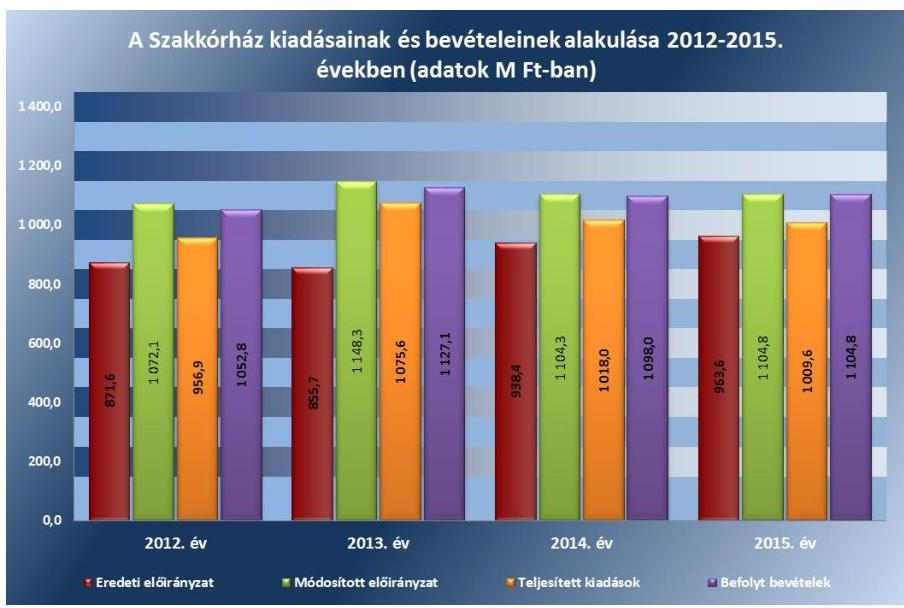

Forrás: Szakkórház 2012-2015. évi költségvetési beszámolói

A bevételek beszedése és elszámolása megfelelt a jogszabályi előírásoknak. A bevételek elszámolásához gazdálkodási szabályzatában előírták az utalványozást, amit a jogszabályi előírásoknak megfelelően végrehajtottak. A bevételeket - az Áht.-ban és az Áhsz.1-2-ben - előírt könyvvezetési szabályoknak megfelelő főkönyvi számlákon számolták el. A bér-

---

1. táblázat

A KIADÁSOK FELHASZNÁLÁSÁNÁL A GAZDÁLKODÁSI JOGKÖRÖK GYAKORLÁSÁNAK MINŐSÍTÉSE

| Ellenőrzést év | Minősítés |
| :--: | :--: |
| 2012. év | megfelelő |
| 2013. év | megfelelő |
| 2014. év | megfelelő |
| 2015. év | megfelelő |

Törrös: ÁSZ értékelés
leti díjak beszedése, az analitikus és főkönyvi nyilvántartásokban való rögzítése a szolgáltatást igénybe vevők számára kiállított számla alapján történt, a bevétel beszedését alátámasztó számlák rendelkezésre álltak. A kiszámlázott bevételek teljes összegükben realizálódtak.

A kiadási előirányzatok felhasználásánál a gazdálkodási jogkörök gyakorlása - a feltárt hiányosságok kivételével - összességében megfelelő volt. (1. táblázat)

A Szakkórház - a jogszabályi előírásokkal összhangban - a gazdálkodási szabályzatában rendelkezett a gazdálkodási jogkörök gyakorlásáról, a szabályzatot és annak mellékleteit folyamatosan aktualizálta. A gazdálkodási jogkörök gyakorlásával történő megbízásra, illetve felhatalmazásra írásban került sor. A gazdálkodási jogkör gyakorlókról az egyéni megbízásokkal, felhatalmazásokkal összhangban levő, a gazdálkodási jogkörgyakorló aláírás mintáját is tartalmazó nyilvántartás állt rendelkezésre.

A kiadási előirányzatok felhasználása során a gazdálkodási jogkörök gyakorlásánál az ellenőrzés az alábbi hibákat tárta fel:

- A személyi juttatások kiadási előirányzatainak felhasználásánál a 2014. évben egy közalkalmazott esetében - az Ávr. 57. § (1) bekezdéseiben előírtak ellenére - nem volt teljesítésigazolás. A külső személyi juttatások terhére kötött megbízási szerződéseknél a 2012-2015. években rendszeresen előfordult, hogy a kötelezettségvállalás dokumentumán - az Ávr. 55. § (1) bekezdésében foglaltak ellenére - a pénzügyi ellenjegyzésre utaló megjelölést nem tüntették fel. A 2012-2013. évben többször előfordult, hogy a teljesítés igazolására - az Ávr. 57. § (1) bekezdésében előírtak ellenére - a kiadás teljesítésének jogosságát, összegszerűségét alátámasztó, ellenőrizhető okmányok hiányában került sor. A 2013. évben előfordult, hogy a teljesítésigazolást - az Ávr. 57. § (3) bekezdésének előírása ellenére - nem az arra írásban kijelölt személy végezte el. A 2012-2015. években rendszeresen előforduló hiányosság volt, hogy a külön írásbeli rendelkezésként elkészített utalványon a kötelezettségvállalások nyilvántartási számát - az Ávr. 59. § (3) bekezdés f) pontjában előírtak ellenére - nem tüntették fel.
- A működési kiadások előirányzatainak felhasználásánál a 2012-2015. években rendszeresen előfordult, hogy a kötelezettségvállalás dokumentumán - az Ávr. 55. § (1) bekezdésében foglaltak ellenére - a pénzügyi ellenjegyzésre utaló megjelölést nem tüntették fel. A 2014. évben előfordult, hogy - az Ávr. 55. § (1) bekezdésében előírtak ellenére - hiányzott a kötelezettségvállalás pénzügyi ellenjegyzése. A 2012-2015. években több esetben előfordult, hogy a teljesítést - az Ávr. 57. § (1) bekezdésében foglaltakat megszegve - a kiadások összegszerűségének ellenőrzése nélkül igazolták, mivel a megrendelés nem tartalmazta a kifizetendő összeget. A 2012-2015. években rendszeresen hiányzott - az Ávr. 57. § (3) bekezdésében előírtak ellenére - a teljesítés tényére történő utalás.
- A felhalmozási kiadások felhasználásánál a 2012-2015. években több esetben előfordult, hogy a kötelezettségvállalás dokumentumán - az Ávr. 55. § (1) bekezdésében foglaltak ellenére - a pénzügyi ellenjegyzésre utaló megjelölést nem tüntették fel. A 2014-2015. években több esetben előfordult, hogy a teljesítésigazolás - az Ávr.

---

2. táblázat

A KIADÁSOK FELHASZNÁLÁSÁNÁL A MEGKÖTÖTT VISSZTERHES SZERZŐDÉSEK, ADOTT MEGBÍZÁSOK, MEGRENDELÉSEK SZABÁLYSZERŰSÉGÉNEK MINŐSÍTÉSE

| Ellenőrzött év | Minősítés |
| :--: | :--: |
| 2012. év | megfelelő |
| 2013. év | megfelelő |
| 2014. év | megfelelő |
| 2015. év | megfelelő |

57. § (1) bekezdésében előírtak ellenére - nem történt meg, a teljesítésigazolás hiánya ellenére az utalványozó - az Áht. 38. § (1) bekezdésében foglaltakat ellenére - elvégezte az utalványozást. A 2012-2015. években - az Ávr. 57. § (3) bekezdésében foglaltak ellenére - több esetben hiányzott a teljesítés tényére történő utalás.
$\longrightarrow$ A hiányosságokkal érintett esetekben az érvényesítő - az Ávr. 58. § (1)-(2) bekezdésében foglaltak ellenére - nem ellenőrizte és nem jelezte az utalványozónak a megelőző ügymenetben a jogszabályi előírások be nem tartását.
A kiadási előirányzatok felhasználásánál a megkötött visszterhes szerződések, adott megbízások, megrendelések szabályszerűsége a 2012-2015. években összességében megfelelő volt. (2. táblázat)

A kiadási előirányzatok felhasználása során a megkötött visszterhes szerződéseknél, adott megbízásoknál, megrendeléseknél az ellenőrzés az alábbi hibákat tárta fel:
$\longrightarrow$ A külső személyi juttatások terhére kötött megbízási szerződéseknél a 2012-2013. években előfordult, hogy a megkötött visszterhes szerződés - az Ávr. 50. § (1) bekezdés a) pontjában foglaltak ellenére - nem tartalmazta a szakmai, műszaki teljesítés mennyiségi és minőségi jellemzőinek meghatározását.
$\longrightarrow$ A működési kiadások felhasználásánál a 2012-2015. években rendszeresen előfordult, hogy a kötelezettségvállalás dokumentuma - az Ávr. 50. § (1) bekezdés b)-c) pontjában foglaltak ellenére - nem tartalmazta a pénzügyi teljesítés módját és feltételeit, a kifizetés határidejét.
$\longrightarrow$ A felhalmozási kiadások felhasználásánál a 2012-2015. években a kötelezettségvállalás dokumentuma - az Ávr. 50. § (1) bekezdés a) pontjában foglaltak ellenére - több esetben nem tartalmazta a szakmai, műszaki teljesítés határidejét. A 2014-2015. években a kötelezettségvállalás dokumentuma - az Ávr. 50. § (1) bekezdés b) pontjában foglaltak ellenére - több esetben nem tartalmazta a pénzügyi teljesítés módját és feltételeit. A 2012-2015. években a kötelezettségvállalás dokumentuma - az Ávr. 50. § (1) bekezdés
 c) pontjában foglaltak ellenére – több esetben nem tartalmazta a kifizetés határidejét.
$\longrightarrow$ A működési és felhalmozási kiadások felhasználásánál a 2014–2015. években a kötelezettségvállalás dokumentuma – az Ávr. 50. § (1a) bekezdésében foglaltak ellenére – több esetben nem tartalmazta a szervezet képviselőjének nyilatkozatát arra vonatkozóan, hogy átlátható szervezetnek minősül.
A Szakkórháznál a 2014–2015. években egy szállítótól történt gyógyszerbeszerzéseknél több esetben – a Kbt. ${ }^{51}$ 5. §-ában, 19. § (1) bekezdésében és a 119. §-ában előírtak ellenére – elmaradt a közbeszerzési eljárás lefolytatása.

---

### 3.4. számú megállapítás

A Szakkórház a jogszabályi előírásoknak megfelelően készítette el éves költségvetési beszámolóját és teljesítette beszámolási kötelezettségét.

Az éves költségvetési beszámolókat az Áhsz. 1.2 előírásainak megfelelő bontásban, formában és tartalommal készítették el, a beszámolók aláírása szabályszerűen, az előírt követelményeknek megfelelően történt. A beszámolókat a Minisztérium minden ellenőrzött évben ellenőrizte és elfogadta.

A 2012. és 2013. I. féléves elemi költségvetési beszámolókat az Áhsz. 1-nek megfelelően készítették el és küldték meg a GYEMSZI-nek. A 2014–2015. évekre vonatkozóan féléves elemi költségvetési beszámoló készítési kötelezettséget jogszabály már nem írt elő.

Az időközi mérlegjelentési és a tartozásállományra vonatkozó adatszolgáltatási kötelezettségének eleget tettek. Az ellenőrzött időszakban az Sztv. előírásainak megfelelően a Szakkórház főkönyvi könyvelése és az analitikus nyilvántartása adatai között az egyezőség biztosított volt. Az analitikus nyilvántartással, valamint a leltárral alátámasztott mérleg és pénzforgalmi jelentés, és a kiegészítő melléklet adatai megegyeztek a főkönyvi kivonat adataival. A könyvviteli mérleg eszköz és forrás oldala megegyezett egymással, továbbá az előző évi záró adatok mérlegsoronként megegyeztek a tárgyévi nyitó adatokkal.

## 3.5. számú megállapítás

A Szakkórházat előirányzat felhasználáshoz kapcsolódó évközi korlátozó intézkedés nem érintette, befizetési kötelezettségét teljesítette, az előirányzat-maradvány megállapítása szabályszerű volt, azonban az eszközbeszerzések tilalmára vonatkozó előírásokat a 2012–2013. években nem tartották be.

A Szakkórház a folyamatos fizetőképesség biztosítása érdekében készített likviditási terveket, azonban az évközi egyensúlyjavító intézkedéseket nem tartották be.

Likviditási tervet a Szakkórháznál – az Áht.-nak megfelelően – minden hónapra vonatkozóan készítettek, melyek dekádonkénti ütemezést tartalmaztak. A likviditási tervek felülvizsgálatát a teljesítésről vezetett, havonta aktualizált kimutatással biztosították, azonban 2015 januárjában a likviditási tervet – az Ávr. 122. § (1) bekezdése előírásának ellenére – az előírt határidőt követően küldték meg a Kincstár, valamint a Minisztérium részére.

A Szakkórháznál a 2012–2013. években az intézményi beruházás keretében történő eszközbeszerzések tilalmára vonatkozó előírásokat nem tartották be, az 1036/2012. (II.21.) Korm. határozat ${ }^{52}$ 6. pontjában előírtak ellenére informatikai eszközöket szereztek be.

Évközi korlátozó intézkedés, zárolás vagy maradványtartás, korlátozó intézkedésekhez kapcsolódó, a költségvetési törvényben meghatározott fizetési kötelezettség a Szakkórházat nem érintette. Az esedékességet követő hatvan napon túli szállítói tartozása a Szakkórháznak nem volt.

Az előirányzat-maradvány megállapítása megfelelt az Ávr.-ben foglaltaknak. A főkönyvi számlák, az analitikus nyilvántartások

---

és az éves beszámolók között az adategyezőség fennállt. Az intézmény előirányzat-maradványából a központi költségvetést megillető, elvonandó előirányzat-maradvány a 2012. évben 123,0 E Ft volt, melyet a Szakkórház az Ávr.-ben előírtaknak megfelelően befizetett. A Szakkórház az előirányzat-maradványra vonatkozó adatszolgáltatási kötelezettségének az előírt tartalommal elkészített éves költségvetési beszámoló irányító szerv felé történt benyújtásával, azonban a 2013. és 2014. évekre vonatkozóan – az Áhsz. 10. § (1) bekezdésében, illetve az Áhsz. 2 32. § (1) bekezdésében előírtak ellenére – a február 28-ai határidőt követően tett eleget. Az előirányzat-maradványok jóváhagyásáról az irányító szerv értesítésével rendelkeztek.

# 4. A Szakkórház vagyongazdálkodása szabályszerű volt-e? 

## Összegző megállapítás

### 4.1. számú megállapítás

A Szakkórház vagyongazdálkodása összességében nem felelt meg a jogszabályi előírásoknak.

A vagyon értékének megőrzését, gyarapítását szolgáló vagyongazdálkodás feltételeinek kialakítása – a vagyonkezelési szerződés hiányosságai miatt – nem felelt meg a jogszabályi előírásoknak.

A GYEMSZI az egészségügyi feladatellátáshoz használt intézményi vagyont – a Konsz. vhr.-ben ${ }^{53}$ előírtaknak megfelelően – a Szakkórházzal megkötött intézményi megállapodásban ${ }^{54}$ 2012. január 1-jétől a Szakkórház használatába, hasznosításába adta. A GYEMSZI 2012. május 1-jétől vagyonkezelőből a Ttv. előírásai alapján tulajdonosi joggyakorló lett és az egészségügyi feladatellátáshoz használt intézményi vagyont a Szakkórház vagyonkezelésébe adta.

A vagyonkezelési szerződés ${ }^{55}$ megkötésére a Szakkórház és a GYEMSZI között 2012. május 1-jei hatállyal került sor.

A vagyonkezelési szerződést – az Nfa tv. ${ }^{56}$ 20. §. (5) és 1994. évi LV. törvény ${ }^{57}$ 13.§. (1) és (2) bekezdésében előírtak ellenére – határozatlan időtartamra kötötték, pedig a vagyonkezelésbe adott vagyonelemek között a Nemzeti Földalapba tartozó szántó művelésű földterület is volt, amelyre legfeljebb 20 évre, a termőföldre vonatkozó haszonbérleti szerződés leghosszabb időtartamára köthető vagyonkezelési szerződés. A vagyonkezelési szerződés mellékletében feltüntették a természeti védettség alá tartozó ingatlanokat, azonban a természetvédelmi területhez tartozó vagyonelemek védettségéhez kapcsolódóan – a Vtvr. ${ }^{58}$ 9. § (8) bekezdésében előírtak ellenére – a vagyonkezelő kötelezettségeit nem rögzítették. A vagyonkezelési szerződés 2014. március 15-től – a Vtvr. 14. § (3) bekezdésében előírtak ellenére – nem tartalmazta, hogy a vagyonkezelő a tulajdonosi joggyakorló vagyon-nyilvántartási szabályzatát megismerte és magára nézve kötelező érvényűnek ismeri el, továbbá – a Vtvr. 20. § (1) bekezdésében előírtak ellenére – nem tartalmazta, hogy a tulajdonosi ellenőrzés eljárásrendjét a felek a szerződés részének tekintik. A vagyonkezelési szerződésben 2013. június 28-tól – a Vtv. ${ }^{59}$ hatályos 27. § (9) bekezdésében előírtak ellenére – nem rögzítették a visszapótlási kötelezettség alóli mentesülés tényét. A vagyonkezelési szerződésben – a Vtvr. előírásának megfelelően –

---

meghatározták a vagyonelemek rendeltetését, az értéknövelő beruházásokkal, felújításokkal kapcsolatos adatszolgáltatás módját. A jogszabályi előírásnak megfelelően a vagyonkezelői jog bejegyzési kérelmet a szerződés aláírását követő 30 napon belül benyújtották a földhivatalhoz, továbbá a bejegyzésről szóló határozatot megküldték a tulajdonosi joggyakorló GYEMSZI-nek. A vagyonkezelési szerződés módosítására, megszüntetésére az ellenőrzött időszakban nem került sor.

A Szakkórház a Vtv.-ben, valamint az Nvtv.-ben foglalt előírások szerint járt el, a működéséhez szükséges, adásvételi szerződéssel vásárolt vagyonelemek az állam tulajdonába és a Szakkórház vagyonkezelésébe kerültek.

Nyilvántartási kötelezettségének a Szakkórház eleget tett, számviteli politikáját és analitikus nyilvántartásait a jogszabályi előírásoknak megfelelően alakította ki és vezette. A tulajdonosi joggyakorló a vagyonkezelési szerződésben a vagyon nyilvántartására vonatkozóan további előírásokat nem határozott meg. Az analitikus, részletező nyilvántartásoknak a kapcsolódó könyvviteli és nyilvántartási számlákkal való egyeztetésének elvégzését dokumentumokkal támasztották alá.

A Szakkórház vagyonnyilvántartása tartalmazta a vagyonelemek azonosító adatait, a lényeges számviteli adatokat és az évente felülvizsgált állományi adatokat. A tárgyi eszközökről és a készletekről a Szakkórház folyamatos nyilvántartást vezetett mennyiségben és értékben. A főkönyvi és az analitikus nyilvántartások adatai között az egyezőség a naptári évek végén fennállt.

A Szakkórház a vagyonkezelt vagyonról szóló adatszolgáltatási kötelezettségének – a Vtvr. 14. § (1) bekezdésében és a vagyonkezelési szerződés 3.4. pontjában előírtak ellenére – a 2013. évben 46 napos késedelemmel, míg 2014–2015. években nem tett eleget.

A mérlegben kimutatott eszközök és források értékelése, leltározása összességében a jogszabályok és a belső szabályzatok előírásainak megfelelően történt.

# A mérlegben kimutatott eszközök év végi 

értékelése – a munkáltatói kölcsönök minősítése kivételével – az előírásoknak megfelelően történt. A Szakkórház a 2012–2015. években a pénzügyileg nem rendezett munkáltatói kölcsönöket – a Sztv. 55. (1) bekezdésében, az Áhsz. 1 31. § (2) bekezdésében, illetve az eszközök és források értékelési szabályzat 5.4. pontjában előírtak ellenére – nem minősítette, továbbá egy munkáltatói kölcsön esetében – mivel az adós jogviszonya megszűnt – az adós minősítése alapján értékvesztést nem számolt el, a lejárt munkáltatói kölcsön behajtásáról intézkedtek.

A követelések állományát a 2012–2013. években az Áhsz. 1-ben, valamint a belső szabályzataiban előírtak szerint mutatta ki. A követelések állományi számláinak vezetése, a negyedévenkénti összegző kimutatás elkészítése és főkönyvi feladása megfelelt a jogszabályi előírásoknak. A 2014–2015. években a követelések állományának nyilvántartása az Áhsz. ${ }_{2}$-ben foglalt előírásnak megfelelően a számlarendben foglalt szabályozás szerint történt. Követelést nem minősítettek behajthatatlannak, követelésről nem mondtak le.

---

A kötelezettségek, kötelezettségvállalások analitikus nyilvántartását az Áhsz. 1–2 előírásának megfelelően, folyamatosan vezették. A kötelezettségek állományának főkönyvi számláinak vezetése, a negyedévenkénti összegző kimutatások készítése és a főkönyvi feladás megfelelt a jogszabályi előírásának.

Az értékcsökkenés elszámolása összességében megfelelt a jogszabályi előírásoknak. A mérlegek a naptári évek végén az analitikus és a főkönyvi számlákkal egyezően mutatták az eszközök és források értékét. A számviteli politikában megfelelően határozták meg az értékcsökkenési leírás módszerét, és az elszámolásának gyakoriságát. A mérlegben az immateriális javakat és tárgyi eszközöket az elszámolt terv szerinti és terven felüli értékcsökkenéssel csökkentett bekerülési értéken mutatták ki. Az elszámolások során nem éltek a piaci értékelés lehetőségével.

A bekerülési érték megállapítása, állományba vétele a tárgyi eszközök és immateriális javak esetében a jogszabályokban és belső szabályzatban előírtaknak megfelelően történt. Az üzembe helyezés dokumentálása megfelelt a számviteli politikában előírtaknak. Az üzembe helyezési és állományba vételi bizonylatok alapján a bekerülési érték megállapítása, a tárgyi eszközök és immateriális javak állományba vétele, nyilvántartása, elszámolása a felhalmozási kiadásoknál megfelelt a jogszabályi előírásoknak. A vagyon elemekben bekövetkezett változások számviteli nyilvántartásban való rögzítése megfelelően kiállított bizonylatok alapján történt.

Leltárral támasztották alá minden évben az éves beszámoló könyvviteli mérlegében kimutatott eszközöket és forrásokat. A Szakkórház – a leltározási és leltárkészítési szabályzat II.1. és III.1. pontjaiban előírtaktól eltérően – a jogszabályi előírásoknak azonban megfelelve az ellenőrzött időszakban a tárgyi eszközeit és a készleteit mennyiségi felvétellel, az immateriális javak, követelések, pénzeszközök, egyéb aktív pénzügyi elszámolások, saját tőke és a kötelezettségek mérlegelemeket egyeztetéssel leltározta. A használatba vételkor azonnali értékcsökkenéssel elszámolt kis értékű tárgyi eszközöket a 2014–2015. években – az Áhsz. 2 22. § (2) bekezdés b) pontjában és a leltározási és leltárkészítési szabályzat II. 12. pontjában előírtak ellenére – nem mennyiségi felvétellel, hanem egyeztetéses módszerrel leltározták, amely a mérlegadatok valódiságát nem befolyásolta. A leltározásokat az arra kijelölt munkavállalók a leltározási ütemterv és leltározási utasítás alapján hajtották végre. A leltárakat kiértékelték, leltáreltérés a készleteknél csak 2012. évben volt, melyet kivizsgáltak és a nyilvántartásban átvezettek.

A rendező mérleg elkészítése a 36/2013. (IX. 13.) NGM rendeletben előírtaknak megfelelően történt. Az eredményszemléletű számvitelre történő áttérést megelőzően a 2013. december 31-i mérleg fordulónappal végzett leltározás megfelelt a jogszabályi előírásoknak. A 2013. évi mérleg elkészítését megelőzően a függő-átfutó kiadásokat és bevételeket azonosították, a mérlegben szereplő értékadatokat rendező, technikai tételek elszámolásával módosították. A rendező mérleg alapján az összehasonlíthatóság a 2013. évi mérleg és a 2014. évi nyitómérleg között biztosított volt.

---

### 4.3. számú megállapítás

A Szakkórház az értékmegőrzési, állagmegóvási kötelezettségét teljesítette, azonban a vagyonelemek hasznosítása – a bérleti szerződések hiányosságai miatt – nem felelt meg a jogszabályokban és belső szabályzatokban előírtaknak.

Értékmegőrzési, állagmegóvási kötelezettségének a Vtv.-ben, az intézményi (használatba vételi) megállapodásban, illetve vagyonkezelési szerződésben foglaltak szerint eleget tett. A Szakkórház a
 visszapótlási kötelezettsége alól - a Vtv. alapján 2013. június 28-tól - mentesült.

A Szakkórház az állami tulajdonú eszközökön végzett beruházás, felújítás, karbantartás során betartotta a jogszabályi előírásokat, a vagyonkezelt vagyontárgyak értékét megőrizte, állagának megóvásáról, karbantartásáról, működtetéséről gondoskodott. A tervezett beruházásokról, felújításokról éves beruházási terveket készített. Az épületek állapotáról nyilvántartást vezettek, a szükséges felújítási munkákról az irányító szervnek beszámoltak. A Szakkórház az ellenőrzési időszakban 185,0 M Ft felújítást és beruházást hajtott végre, a karbantartásra 53,3 M Ft-ot fordított. A Szakkórház vagyonának alakulását az IV. sz. melléklet mutatja be.

A VAGYONELEMEK HASZNOSÍTÁSÁNAK szabályszerűsége - a bérleti szerződések hiányosságai miatt - nem volt megfelelő, az ellenőrzés az alábbi hiányosságokat tárta fel:
$\longrightarrow$ a 2012. évben egy esetben - az önköltségszámítási szabályzat 5.7.2. pontjában előírtak ellenére - nem végeztek előkalkulációt,
az ellenőrzött időszakban rendszeresen előfordult, hogy a bérbeadási folyamatok során - az Nvtv. 11. § (10) bekezdésében előírtak ellenére - úgy kötöttek szerződést, hogy a szerződő fél - az Nvtv. 3. § (2) bekezdésében előírt - átláthatóságára vonatkozó nyilatkozatával nem rendelkeztek,
a 2014-2015. években rendszeresen előfordult, hogy a bérleti szerződésekben nem kötötték ki - az ingatlanok bérbeadásáról szóló iránymutatás 2014. július 16-ig 2. pontjában, míg azt követően II. 2. pontjában előírtak ellenére - a hasznosítási díj inflációkövetését vagy a hasznosítási díj évenkénti felülvizsgálatát, továbbá nem írták elő - a bérbeadási szabályzat ${ }^{60}$ „A jogcím nélküli szolgálati lakáshasználat" fejezetének 1. pontjában előírtak ellenére - a jogosulatlan használatért a mindenkori lakbér háromszoros összegére vonatkozó fizetési kötelezettséget, valamint nem kötötték ki - a vagyonkezelési szerződés 3.7. pontjában előírtak ellenére - a harmadik személy kárfelelősségét,
az ellenőrzött időszakban a megkötött bérleti szerződésekben - az Nvtv. 11. § (11) bekezdés b) pontjában előírtak ellenére - nem kötötték ki, hogy a bérlők az átengedett nemzeti vagyont a szerződés előírásainak és a tulajdonosi rendelkezéseknek megfelelően használják.
A Szakkórház a jogszabályi előírásoknak megfelelően a bérleti szerződéseket - a szolgálati lakásokra, valamint a 90 napot meg nem haladó időszakra kötött bérleti szerződések kivételével - versenyeztetés útján kötötte meg. A bérbe adás a jogszabályi előírásoknak megfelelően határozatlan időre, vagy határozott időtartamra - 90 napra, illetve egy évre - történt. A 2013. évben az engedélyhez kötött bérbeadáshoz a GYEMSZI engedélyét beszerezték. Vagyonkezelői jogot harmadik személyre nem ruháztak át.

# 5. Érvényesült-e az integritás szemlélet és ennek megfelelően kiépítették-e az integritás kontrollrendszert a Szakkórháznál? 

Összegző megállapítás

A Szakkórház tett erőfeszítéseket az integritás szemlélet érvényesítésére, azonban további intézkedések szükségesek az integritás kontrollrendszer fejlesztése érdekében.

### 5.1. számú megállapítás

A Szakkórház intézkedett az integritás szemlélet érvényesítése érdekében.

A Szakkórház 2014. és 2015. években is részt vett az ÁSZ Integritás Projektjében ${ }^{61}$.

### 5.2. számú megállapítás

Az integritás kontrollrendszer kiépítettsége alacsony volt.
A Szakkórház a jogszabályok által is előírt szabályossági kontrollokat összeségében kiépítette, azonban a korrupciós kockázatokkal szembeni védettséget növelő integritás kontrollok kiépítettsége alacsony volt. Az integritás kontrollrendszer kiépítettségével kapcsolatos megállapításokat az V. sz. melléklet tartalmazza.

---

# JAVASLATOK 

Az ÁSZ tv. 33. § (1) bekezdésében foglaltak értelmében az ellenőrzött szervezet vezetője köteles a jelentésben foglalt megállapításokhoz kapcsolódó intézkedési tervet összeállítani és azt a jelentés kézhezvételétől számított 30 napon belül az ÁSZ részére megküldeni. Amennyiben az ellenőrzött szervezet vezetője nem küldi meg határidőben az intézkedési tervet, vagy továbbra sem elfogadható intézkedési tervet küld, az Állami Számvevőszék elnöke az ÁSZ tv. 33. § (3) bekezdése a) és b) pontjaiban foglaltakat érvényesítheti.

## az Állami Egészségügyi Ellátó Központ főigazgatójának

1. Intézkedjen a jogszabályi előírásokkal összhangban a Szakkórházra vonatkozóan az erőforrásokkal - így az előirányzatokkal, a létszámokkal és a vagyonnal - való hatékony gazdálkodás követelményeinek érvényesítésére, kérje számon és ellenőrizze e követelmények érvényre juttatását.
(1.2. számú megállapítás 3. bekezdése alapján)

## a Szakkórház főigazgatójának

1. Intézkedjen, hogy a Szakkórház SZMSZ-e a jogszabályi előírásoknak megfelelően tartalmazza a hatályos, egységes szerkezetbe foglalt alapító okirat számát és az alapítás időpontját. Kezdeményezze az irányítói jogok gyakorlójánál a Szakkórház módosított SZMSZ-ének a jóváhagyását.
(2.1. számú megállapítás 2. bekezdés 2. mondata alapján)
2. Intézkedjen, hogy a jogszabályi előírásoknak megfelelően:
a) a számviteli politika tartalmazza, hogy a törvényben biztosított választási lehetőségek alkalmazása esetén, az alkalmazott gyakorlatot milyen okok miatt kell megváltoztatni.
b) az eszközök és források értékelési szabályzata tartalmazza követeléstípusonként a kisösszegű követelések év végi meghatározásának elveit, dokumentálásának szabályait;
c) a számlarend tartalmazza az összesítő bizonylatok (feladások) tartalmi és formai követelményeit, továbbá az analitikus, részletező nyilvántartásoknak a kapcsolódó könyvviteli és nyilvántartási számlákkal való egyeztetése dokumentálását.
(2.1. számú megállapítás 4. bekezdés 1. mondata, a 2.1. számú megállapítás 5. bekezdés 3. és 4. mondata alapján)

---

3. Intézkedjen a jogszabályban előírtaknak megfelelően az egyes kockázatokkal kapcsolatban szükséges intézkedések, valamint azok teljesítése folyamatos nyomon követésének módja meghatározására.
(2.2. számú megállapítás 2. bekezdése alapján)
4. Intézkedjen a jogszabályi előírásokkal összhangban
a) közérdekű adatok teljes körű közzétételére;
b) az adatok közzétételével, helyesbítésével, frissítésével vagy eltávolításával kapcsolatos naplózás végrehajtására.
(2.4. számú megállapítás 2. bekezdése alapján)
5. Intézkedjen, hogy a Szakkórház a jogszabályban előírt határidőben tegyen eleget adatszolgáltatási kötelezettségeinek.
(2.4. számú megállapítás 3. bekezdés 2. és 3. pontjai alapján)
6. Intézkedjen a jogszabályban előírt beszámolási kötelezettség teljesítésére - a külső ellenőrzésekről vezetett nyilvántartás alapján - a fejezetet irányító szerv vezetője és a fejezetet irányító szerv belső ellenőrzési vezetője részére.
(2.5. számú megállapítás 4. bekezdés 2. mondata alapján)
7. Intézkedjen, hogy a gazdálkodási jogkörök gyakorlása során
a) a pénzügyi ellenjegyzés a jogszabályban előírtaknak megfelelően történjen meg,
b) teljesítés igazolása megtörténjen, és arra a jogszabályban előírtak betartásával kerüljön sor;
c) az érvényesítést a jogszabályban előírt ellenőrzési és jelzési kötelezettségnek eleget téve végezzék el;
d) az utalványozást a jogszabályban előírtak betartásával végezzék el.
(3.3. számú megállapítás 8. bekezdés 1-4. pontja alapján)
8. Intézkedjen a kiadási előirányzatok felhasználása során, hogy a kötelezettségvállalás dokumentuma a jogszabályi előírásoknak megfelelően tartalmazza
a) a pénzügyi teljesítés módját és feltételeit;
b) a kifizetés határidejét;
c) a szakmai, műszaki teljesítés határidejét; továbbá
d) a szervezet képviselőjének nyilatkozatát arról, hogy átlátható szervezetnek minősül.
(3.3. számú megállapítás 10. bekezdés 2-4. pontjai alapján)

---

9. Intézkedjen a jogszabályban meghatározott esetekben a közbeszerzési eljárások lefolytatására.
(3.3. számú megállapítás 11. bekezdés alapján)
10. Tegyen intézkedéseket a közbeszerzési eljárások lefolytatásával kapcsolatban feltárt szabálytalanságok tekintetében a felelősség tisztázása érdekében, és szükség szerint intézkedjen a felelősség érvényesítésére.
(3.3. számú megállapítás 11. bekezdés alapján)
11. Kezdeményezze, hogy a vagyonkezelési szerződés a jogszabályi előírásoknak összhangban tartalmazza
a) a vagyonkezelési szerződés időbeli hatályát a törvényi előírások betartásával;
b) a természetvédelmi területhez tartozó vagyonelemek védettségéhez kapcsolódóan a vagyonkezelő kötelezettségeit,
c) hogy a vagyonkezelő a tulajdonosi joggyakorló vagyon-nyilvántartási szabályzatát megismerte és magára nézve kötelező érvényűnek ismeri el;
d) a tulajdonosi ellenőrzés eljárásrendjét a felek a szerződés részének tekintik; továbbá
e) a visszapótlási kötelezettség alóli mentesülés tényét.
(4.1. számú megállapítás 3. bekezdés 1-4. mondata alapján)
12. Intézkedjen a vagyonkezelésébe tartozó állami vagyonra vonatkozó, jogszabályban előírt adatszolgáltatási kötelezettség teljesítésére.
(4.1. számú megállapítás 7. bekezdése alapján)
13. Intézkedjen a követelések jogszabályi előírásoknak megfelelő minősítésére, a jogszabályban meghatározott esetekben az értékvesztés elszámolására.
(4.2. számú megállapítás 1. bekezdés 2. mondata alapján)
14. Intézkedjen a kis értékű tárgyi eszközök - jogszabályban és belső szabályzatban előírtaknak megfelelő - mennyiségi felvétellel történő leltározására.
(4.2. számú megállapítás 6. bekezdés 3. mondata alapján)

---

15. Intézkedjen
a) a jogszabályban előírtak ellenére, a szerződő fél átláthatóságára vonatkozó nyilatkozat hiányában kötött szerződések esetében a hiányzó nyilatkozatok beszerzésére;
b) a jövőben a bérbeadási folyamatok során a jogszabályi előírások betartására.
(4.3. számú megállapítás 3. bekezdés 2. pontja alapján)
16. Intézkedjen, hogy a bérleti szerződések tartalmazzák a belső szabályzatokban és a vagyonkezelési szerződésben foglalt előírásokat.
(4.3. számú megállapítás 3. bekezdés 3. pontja alapján)
17. Intézkedjen a bérleti szerződésekben a jogszabályi előírásoknak megfelelően annak kikötésére, hogy a bérlők az átengedett nemzeti vagyont a szerződés előírásainak és a tulajdonosi rendelkezéseknek megfelelően használják.
(4.3. számú megállapítás 3. bekezdés 4. pontja alapján)

---

# MELLÉKLETEK 

- I. SZ. MELLÉKLET: ÉRTELMEZŐ SZÓTÁR
állami vagyon
állami vagyonnak minősül:
a) az állam tulajdonában lévő dolog, valamint a dolog módjára hasznosítható természeti erő,
b) az a) pont hatálya alá nem tartozó mindazon vagyon, amely vonatkozásában törvény az állam kizárólagos tulajdonjogát nevesíti,
c) az állam tulajdonában lévő tagsági jogviszonyt megtestesítő értékpapír, illetve az államot megillető egyéb társasági részesedés,
d) az államot megillető olyan immateriális, vagyoni értékkel rendelkező jogosultság, amelyet jogszabály vagyoni értékű jogként nevesít. (Forrás: Vtv. 1. § (2) bekezdése)
állami vagyon értékesítése
állami vagyon használója
állami vagyon hasznosítása
állami vagyon hasznosítása kötött szerződés
állami vagyon kezelője /vagyonkezelő

Állami vagyonnak a tulajdonosi joggyakorló maga gazdálkodik, vagy szerződés - így különösen bérlet, haszonbérlet, megbízás - alapján hasznosításra átengedi, illetőleg vagyonkezelésbe, haszonélvezetbe adja. (Forrás: Vtv. 23. § (1) bekezdése, hatályos 2013. június 28-ától)
Az állami vagyonhasznosításra kötött szerződések elsődleges célja az állami vagyon hatékony működtetése, állagának védelme, értékének megőrzése, illetve gyarapítása, az állami és közfeladatok ellátásának elősegítése. (Forrás: Vtv. 23. § (2) bekezdése)
Az állami vagyont az MNV Zrt. maga kezeli, vagy szerződés - így különösen bérlet, haszonbérlet, megbízás - alapján központi költségvetési szervnek, természetes vagy jogi személynek, vagy jogi személyiséggel nem rendelkező gazdálkodó szervezetnek hasznosításra átengedi.
(Forrás: Vtv. 23. § (1) bekezdése, hatályos 2012. január 1-jétől)
Az állami vagyonnal a tulajdonosi joggyakorló maga gazdálkodik, vagy szerződés - így különösen bérlet, haszonbérlet, megbízás - alapján hasznosításra átengedi, illetőleg vagyonkezelésbe, haszonélvezetbe adja. (Forrás: Vtv. 23. § (1) bekezdése, hatályos 2013. június 28-ától)
Az állami vagyon hasznosítására kötött szerződések elsődleges célja az állami vagyon hatékony működtetése, állagának védelme, értékének megőrzése, illetve gyarapítása, az állami és közfeladatok ellátásának elősegítése. (Forrás: Vtv. 23. § (2) bekezdése)
Az állami vagyont az MNV Zrt. maga kezeli, vagy szerződés - így különösen bérlet, haszonbérlet, megbízás - alapján központi költségvetési szervnek, természetes vagy jogi személynek, vagy jogi személyiséggel nem rendelkező gazdálkodó szervezetnek hasznosításra átengedi." Az állami vagyonra vonatkozóan az MNV Zrt. kizárólag az Nvtv.-ben meghatározott személyekkel köthet vagyonkezelési szerződést. (Forrás: Vtv. 27. § (1) bekezdése, hatályos 2012. január 1-jétől)

---

| ÁSZ Integritás Projekt | Az Állami Számvevőszék 2009-ben indította el a „Korrupciós kockázatok feltérké- |
| :--: | :--: |
|  | pezese - Integritás alapú közigazgatási kultúra terjesztése" című, európai uniós forrás- |
|  | ból megvalósított kiemelt projektjét (Integritás Projekt). Az Integritás Projekt célja, hogy felmérje a közszféra intézményei korrupciós kockázatoknak való kitettségét, illetőleg az azok mérséklésére hivatott kontrollok szintjét. Az Állami Számvevőszék a projekt révén az integritás szemlélet minél szélesebb körrel történő megismertetését, gyakorlatba ültetését kívánja elérni. Az integritás követelményeinek megfelelő szervezeti működést előnyben részesítő közigazgatási kultúra elterjesztését és a korrupció elleni fellépést az ÁSZ önmagára nézve is stratégiai jelentőségű célként fogalmazta meg. A projekt a felmérésben résztvevő intézmények számára helyzetükről egyfajta „tükörképet" mutat be, ami alapot teremt

 a jövőbeni pozitív irányú elmozduláshoz. (Forrás: a http://integritas.asz.hu honlapon közzétett, a 2013. évi Integritás felmérés eredményeiről készült összefoglaló tanulmány) |
| belső ellenőrzés | Független, tárgyilagos bizonyosságot adó és tanácsadó tevékenység, amelynek célja, hogy az ellenőrzött szervezet működését fejlessze és eredményességét növelje, az ellenőrzött szervezet céljai elérése érdekében rendszerszemléletű megközelítéssel és módszeresen értékeli, illetve fejleszti az ellenőrzött szervezet irányítási és belső kontrollrendszerének hatékonyságát. (Forrás: Bkr. 2. § b) pontja) |
| belső kontrollrendszer | A belső kontrollrendszer a kockázatok kezelése és tárgyilagos bizonyosság megszerzése érdekében kialakított folyamatrendszer, amely azt a célt szolgálja, hogy a működés és gazdálkodás során a tevékenységeket szabályszerűen, gazdaságosan, hatékonyan, eredményesen hajtsák végre, az elszámolási kötelezettségeket teljesítsék, megvédjék az erőforrásokat a veszteségektől, károktól és nem rendeltetésszerű használattól. (Forrás: Áht. 69. § (1) bekezdése) |
| belső kontrollrendszer területei | A kontrollkörnyezet, a kockázatkezelési rendszer, a kontrolltevékenységek, az információs és kommunikációs rendszer, valamint a nyomon követési (monitoring) rendszer. (Forrás: Bkr. 3. §-a) |
| felújítás | Az elhasználódott tárgyi eszköz eredeti állaga (kapacitása, pontossága) helyreállítását szolgáló időszakonként visszatérő olyan tevékenység, melynek során az eszköz élettartama megnövekszik, minősége, használata jelentősen javul, így a pótlólagos ráfordításból a jövőben gazdasági előnyök származnak. (Forrás: Sztv. 3. § (4) bekezdés 8. pontja) |
| hasznosítás | A nemzeti vagyon birtoklásának, használatának, hasznok szedésének jogának bármely a tulajdonjog átruházását nem eredményező jogcímen történő átengedése, ide nem értve a vagyonkezelésbe adást, valamint a haszonélvezeti jog alapítását. (Forrás: Nvtv. 3. § (1) bekezdés 4. pontja) |
| információs és kommunikációs rendszer | A költségvetési szerv vezetője által kialakított és működtetett olyan rendszer, mely biztosítja, hogy a megfelelő információk a megfelelő időben eljutnak az illetékes szervezethez, szervezeti egységhez, illetve személyhez. (Forrás: Bkr. 9. § (1) bekezdés) |
| integritás | Az integritás az elvek, értékek, cselekvések, módszerek, intézkedések konzisztenciáját jelenti, vagyis olyan magatartásmódot, amely meghatározott értékeknek megfelel. (Forrás: Nemzetgazdasági Minisztérium: Magyarországi államháztartási belső kontroll standardok Útmutató 1.6.1. pontja, 2012. december) |
| irányító szerv/felügyeleti szerv | A költségvetési szerv tekintetében az e törvényben meghatározott irányítási hatáskört gyakorló szerv. (Forrás: Áht. 1. § 9. pontja) |
| kincstári költségvetés | A központi költségvetésről szóló törvény elfogadását követően a fejezetet irányító szerv az államháztartás központi alrendszerébe tartozó költségvetési szerv és a fejezeti kezelésű előirányzat kiemelt előirányzatait, valamint az elkülönített állami pénzalapok és a társadalombiztosítás pénzügyi alapjai jogszabályi előírás szerinti bevételeit és kiadásait kincstári költségvetés kiadásával állapítja meg. (Forrás: Áht. 28. § (2) bekezdés) |

---

kockázat

kockázatkezelési rendszer
kontrollkörnyezet
kontrolltevékenységek
kommunikáció
középirányító szerv
közfeladat
monitoring
monitoring-rendszer
tulajdonosi joggyakorló
vagyongazdálkodás

A kockázat annak a valószínűségét jelenti, hogy egy vagy több esemény vagy intézkedés nem kívánt módon befolyásolja a rendszer működését, céljainak megvalósulását. (Forrás: Javaslatok a korrupciós kockázatok kezelésére - Kockázatkezelési és ellenőrzési módszertan 35. oldal, ÁSZ)
Olyan irányítási eszközök és módszerek összessége, melynek elemei a szervezeti célok elérését veszélyeztető tényezők (kockázatok) azonosítása, elemzése, csoportosítása, nyomon követése, valamint szükség esetén a kockázati kitettség mérséklése. (Forrás: Bkr. 2. § m) pontja)
A költségvetési szerv vezetője által kialakított olyan elvek, eljárások, belső szabályzatok összessége, amelyben világos a szervezeti struktúra, egyértelműek a felelősségi, hatásköri viszonyok és feladatok, meghatározottak az etikai elvárások a szervezet minden szintjén, átlátható a humánerőforrás-kezelés. (Forrás: Bkr. 6. § (1) bekezdés)
A költségvetési szerv vezetője által a szervezeten belül kialakított (kontroll) tevékenységek, melyek biztosítják a kockázatok kezelését, hozzájárulnak a szervezet céljainak eléréséhez. (Forrás: Bkr. 8. § (1) bekezdés)
Az a tevékenység, melynek során információ továbbítása valósul meg. A kommunikációs folyamat résztvevői között tájékoztatás történik, mely során tényeket, ezek magyarázatát közlik.
A költségvetési szerv tekintetében törvény vagy kormányrendelet alapján meghatározott, átruházott irányítási hatásköröket gyakorló szerv. (Forrás: Áht. 9. § (4) bekezdés)
Jogszabályban meghatározott állami vagy önkormányzati feladat, amit az arra kötelezett közérdekből, a jogszabályban meghatározott követelményeknek és feltételeknek megfelelve végez, ideértve a lakosság közszolgáltatásokkal való ellátását, továbbá az állam nemzetközi szerződésekben vállalt kötelezettségeiből adódó közérdekű feladatokat, valamint e feladatok ellátásakor szükséges infrastruktúra biztosítását is. (Forrás: Nvtv. 3. § (1) bekezdés 7. pontja)
A monitoring általánosságban a különböző szintű szervezeti célok megvalósításának folyamatát kíséri figyelemmel, melynek során a releváns eseményekről és tevékenységekről (együtt: folyamatokról) rendszeres jelleggel, strukturált, döntéstámogató információkhoz jutnak a szervezet vezetői. (Forrás: NGM Útmutató a költségvetési szervek monitoring rendszeréhez 2011. november)
A költségvetési szerv vezetője köteles olyan monitoring rendszert működtetni, mely lehetővé teszi a szervezet tevékenységének, a célok megvalósításának nyomon követését. A költségvetési szerv monitoring rendszere az operatív tevékenységek keretében megvalósuló folyamatos és eseti nyomon követésből, valamint az operatív tevékenységektől függetlenül működő belső ellenőrzésből áll. (Forrás: Bkr. 10. §)
Aki a nemzeti vagyon felett az államot vagy a helyi önkormányzatot megillető tulajdonosi jogok és kötelezettségek összességének gyakorlására jogosult. (Forrás: Nvtv. 3. § (1) bekezdés 17. pontja)

A nemzeti vagyongazdálkodás feladata a nemzeti vagyon rendeltetésének megfelelő, az állam, az önkormányzat mindenkori teherbíró képességéhez igazodó, elsődlegesen a közfeladatok ellátásához és a mindenkori társadalmi szükségletek kielégítéséhez szükséges, egységes elveken alapuló, átlátható, hatékony és költségtakarékos működtetése, értékének megőrzése, állagának védelme, értéknövelő használata, hasznosítása, gyarapítása, továbbá az állam vagy a helyi önkormányzat feladatának ellátása szempontjából feleslegessé váló vagyontárgyak elidegenítése. (Forrás: Nvtv. 7. § (2) bekezdése)

---

# II. SZ. MELLÉKLET: A KIEGÉSZÍTŐ TELJESÍTMÉNY-ELLENŐRZÉSI MODUL MEGÁLLAPÍTÁSAI 

A Szakkórház a vagyongazdálkodás folyamataiban határozott meg elérendő gazdaságossági és hatékonysági célokat, célértékeket.

A Szakkórháznál a 2012. évben a vagyongazdálkodás, ezen belül az épületüzemeltetés (takarítás, energiatakarékosság) területén tűztek ki elérendő célokat. A 2013. évben a vagyongazdálkodáshoz kötődően több célkitűzés is történt, pl.: a szolgálati lakások bérleti díjának felülvizsgálata, a közüzemi díjak áremelkedésének érvényesítése a kiszámlázott díjakban, a használaton kívüli ingatlanok hasznosítása, a továbbképzési költségek csökkentése, a külsős szerződések felülvizsgálatával költségmegtakarítás elérése. A Szakkórháznál a 2014-2015. évben az épületüzemeltetési (biztonsági-vagyonvédelmi költségek) és egyéb költségek csökkentését tűzték ki célul.

A Szakkórháznál a kitűzött célok elérése érdekében intézkedéseket, feladatokat, felelősöket és határidőket határoztak meg. A 2012. évben kitűzött célokkal kapcsolatban meghatározott intézkedések, feladatok végrehajtásának felelőse az ápolási igazgató és a műszaki igazgató volt. A 2013. évben a kitűzött célok eléréséhez meghatározott intézkedési tervek tartalmazták a kitűzött célok végrehajtása érdekében megteendő feladatokat, azok határidejét, továbbá felelősét. A 2014. évben elrendelték a biztonsági-vagyonvédelmi költségek csökkentése érdekében megteendő feladatok végrehajtását és azok határidejét. A 2015. évben a főkönyvelő feladata volt a kitűzött egyéb költségcsökkentés végrehajtásával kapcsolatos intézkedés határidőre történő végrehajtása. A Szakkórháznál a kitűzött célokkal kapcsolatos intézkedéseket a felelősök végrehajtották.

A Szakkórháznál a végrehajtott intézkedésekkel a szándékolt eredményeket, a kitűzött célokat nem minden évben érték el. A 2012. évben a Szakkórház által a műszaki területen kitűzött célokat elérték, azonban az energia megtakarítás érdekében megtett intézkedés eredményét nem mérték vissza. A 2013. évben az intézkedési tervekben lévő feladatokat végrehajtották, a szolgálati jellegű lakások lakbéreinek emelésével, a kiszámlázott közüzemi díjak felülvizsgálatával és a díjváltozás hatását érvényesítésével, a használaton kívüli ingatlanok bérbeadásával, a külsős szerződéseket felülvizsgálatával a Szakkórháznál a kitűzött költségmegtakarításokat elérték. A 2014-2015. években a célként kitűzött biztonsági-vagyonvédelmi költségmegtakarítások részben teljesültek. A 2015. évi egyéb költség megtakarítást a kitűzött céljának megfelelően a Szakkórház elérte.

---

III. SZ. MELLÉKLET: A BELSŐ KONTROLLRENDSZER KIALAKÍTÁSÁNAK ÉS MŰKÖDTETÉSÉNEK ÉRTÉKELÉSE A 2012-2015. ÉVEKBEN

| Ssz. | Megnevezés | 2012. év | 2013. év | 2014. év | 2015. év | 2012-2015.   évek |
| :--: | :--: | :--: | :--: | :--: | :--: | :--: |
| 1. | Kontrollkörnyezet | szabályszerű | szabályszerű | szabályszerű | szabályszerű | szabályszerű |
| 2. | Kockázatkezelési rendszer | nem   szabályszerű | nem   szabályszerű | nem   szabályszerű | nem   szabályszerű | nem   szabályszerű |
| 3. | Kontrolltevékenység | szabályszerű | szabályszerű | szabályszerű | szabályszerű | szabályszerű |
| 4. | Információs és kommunikációs rendszer | szabályszerű | szabályszerű | szabályszerű | szabályszerű | szabályszerű |
| 5. | Monitoring rendszer | szabályszerű | szabályszerű | szabályszerű | szabályszerű | szabályszerű |
| A belső kontrollrendszer összevont értékelése |  | szabályszerű | szabályszerű | szabályszerű | szabályszerű | szabályszerű |

---

# IV. SZ. MELLÉKLET: MÉRLEGADATOK A 2012-2015. ÉVEKBEN (M FT-BAN)

|   | 2012. év | 2013. év | 2014. év | 2015. év  |
| --- | --- | --- | --- | --- |
|  IMMATERIÁLIS JAVAK | 1,7 | 1,7 | 1,0 | 0,4  |
|  TÁRGYI ESZKÖZÖK | 677,3 | 730,9 | 730,1 | 714,8  |
|  REFEKTETETT PÉNZÜGYI ESZKÖZÖK | 7,6 | 6,3 |  |   |
|  ÜZEMELTETÉSRE KEZELÉSRE ÁTADOTT VAGYONKEZELÉSBE VETT ESZKÖZÖK (2014.01.01-jétől
eszközfajtánként beolvadt az A és B fejezetbe tartozó eszközök közé)/
KONCESSZIÓBA, VAGYONKEZELÉSBE ADOTT ESZKÖZÖK |  |  |  |   |
|  KÉSZLETEK | 17,2 | 14,8 | 15,2 | 15,4  |
|  KÖVETELÉSEK (2014.01.01-től teljesen újrastrukturált, az összetétel nem összehasonlítható az előző időszakkal) | 2,2 | 3,6 | 10,4 | 10,1  |
|  ÉRTÉKPAPÍROK |  |  |  |   |
|  PÉNZESZKÖZÖK (tartalma bővült, összetétele változott 2014.01.01-jétől) | 103,9 | 59,3 | 53,3 | 89,2  |
|  EGYÉB SAJÁTOS ESZKÖZOLDALI ELSZÁMOLÁSOK (2014.01.01-jétől) |  |  | 26,1 | 5,1  |
|  EGYÉB AKTÍV PÉNZÜGYI ELSZÁMOLÁSOK (2013.12.31-ig) | 0,5 | 0,5 |  |   |
|  AKTÍV IDŐBELI ELHATÁROLÁSOK (2014.01.01-jétől) |  |  | 151,0 | 150,9  |
|  ESZKÖZÖK ÖSSZESEN | 810,4 | 817,1 | 987,1 | 985,9  |
|  SAJÁT TŐKE (2014.01.01-jétől tartalma bővült, szerkezete megváltozott, idetartoznak a tartalékok is) | 685,3 | 728,3 | 864,9 | 861,7  |
|  Tartós tőke 2013.12.31-ig | 707,6 | 707,5 |  |   |
|  Tőkeváltozások 2013.12.31-ig (2014.01.01-jétől Felhalmozott eredmény mérlegsorba tartozik) | $-22,2$ | 20,8 |  |   |
|  Értékelési tartalék 2013.12.31-ig (2014.01.01-jétől Eszközök értékhelyesbítésének forrása mérlegsorba tartozik) |  |  |  |   |
|  Mérleg szerinti eredmény (2014.01.01-jétől) |  |  | 88,7 | $-3,2$  |
|  TARTALÉKOK (2014.01.01.-jétől a saját tőke része, az Egyéb eszközök induláskori értéke és változása) mérlegsorba tartozik) | 95,9 | 51,5 | 776,1 | 864,9  |
|  Hosszú lejáratú kötelezettségek 2013.12.31-ig (2014.01.01-jétől Költségvetési évet követően esedékes kötelezettségek) |  |  | 30,1 |   |
|  Rövid lejáratú kötelezettségek 2013.12.31-ig (2014.01.01-jétől Költségvetési évben
 esedékes kötelezettségek) | 29,1 | 37,3 | 27,0 | 32,7  |
|  Kötelezettségek áruszáll.,szolg. (szállítók) | 28,7 | 37,3 |  |   |
|  Egyéb kötelezettségek | 0,4 |  |  |   |
|  EGYÉB SAJÁTOS FORRÁSOLDALI ELSZÁMOLÁSOK (2014.01.01-jétől) |  |  | 0,1 | 0,2  |
|  KINCSTÁRI SZÁMLAVIZETÉSSEL KAPCSOLATOS ELSZÁMOLÁSOK (2014.01.01-jétől) |  |  |  |   |
|  EGYÉB PASSZÍV PÉNZÜGYI ELSZÁMOLÁSOK 2013.12.31-ig |  |  |  |   |
|  PASSZÍV IDŐBELI ELHATÁROLÁSOK (2014.01.01-jétől) |  |  | 65,1 | 91,3  |
|  FORRÁSOK ÖSSZESEN | 810,4 | 817,1 | 987,1 | 985,9  |

Forrás: 2012-2015. évi intézményi éves beszámolók

---

# V. SZ. MELLÉKLET: AZ INTEGRITÁS SZEMLÉLET ÉRVÉNYESÍTÉSÉVEL ÉS AZ INTEGRITÁS KONTROLLRENDSZER KIÉPÍTETTSÉGÉVEL KAPCSOLATOS MEGÁLLAPÍTÁSOK 

Az intézmény által a 2015. évben kitöltött integritás kérdőív alapján - öt kockázati területen - a kialakított kontrollokat értékeltük. Az intézménynél az integritás kontrollrendszer kialakítása összességében alacsony volt.

| AZ INTEGRITÁS KONTROLLOK ÉRTÉKELÉSE |  |  |  |  |
| :--: | :--: | :--: | :--: | :--: |
| Sorszáma | Megnevezés | Maximum elérhető   pontszám | Elért pontszám | Értékelés   (magas, közepes, alacsony) |
| 1. | Összeférhetetlenség és etikai elvárások | 5 | 3 | alacsony |
| 2. | Humánerőforrás gazdálkodás | 5 | 5 | magas |
| 3. | Szervezet vagyonának megvédésére tett intézkedések | 5 | 5 | magas |
| 4. | A nem kívánatos dolgozói magatartással szembeni intézkedések és azok érvényesülése | 5 | 4 | közepes |
| 5. | Az integritás erősítése, annak tudatosítása, valamint a kockázatelemzések alkalmazása | 5 | 2 | alacsony |
|  | Összesítő értékelés | 25 | 19 | alacsony   Forrás: ÁSZ értékelés |

Az összeférhetetlenség és etikai elvárások kockázati területen a kontrollok kialakítása alacsony volt. Az intézmény szabályozta az összeférhetetlenség kérdését, rendelkezett etikai szabályzattal, és az elmúlt 3 évben egy esetben előfordult, hogy kötelezettségszegés miatt szakmai etikai eljárás indult egy alkalmazottal szemben. Azonban nem szabályozták a különféle ajándékok elfogadásának feltételeit, a munkatársaknak nem volt kötelező nyilatkozniuk a gazdasági érdekeltségeikről, vagy egyéb, a szervezet tevékenysége szempontjából releváns összeférhetetlenségről.

A humánerőforrás-gazdálkodás kockázati területen a kontrollok kialakítása magas volt. A Szakkórház minden alkalmazottja rendelkezett munkaköri leírással, amennyiben azok meglétét jogszabály vagy egyéb belső szabályzat írta elő. Az új munkatársak kiválasztásakor minden esetben álláspályázatot írtak ki, a kiválasztására szolgáló eljárást minden jelölt esetében alkalmazták, ellenőrizték az állásra jelentkezők által benyújtott pályázati dokumentumok (önéletrajzok, diplomák, referenciák stb.) hitelességét a felvételi eljárás során, az objektív megítélést lehetővé tevő, általánosan elfogadott módszert (egyéni beszélgetés (állásinterjú), tudásszintmérő vagy pszichológiai teszt) alkalmaztak a megfelelő felkészültségű szakemberek kiválasztásához.

A Szakkórház vagyonának megvédésére tett intézkedések kockázati területen a kontrollok kialakítása magas volt. Rendelkeztek az egyes eszközök használatára vonatkozó szabályokkal, a vonatkozó jogszabályi előírásokkal összhangban álló iratkezelési szabályzattal, adatkezelési, titokvédelmi (minősített adatok kezelésére vonatkozó) és informatikai szabályzattal, továbbá szabályozták a külső személyekkel való kapcsolattartást, alkalmazták a négy szem elvét.

A nem kívánatos dolgozói magatartással szembeni intézkedések és azok érvényesülése kockázati területen a kontrollok kialakítása közepes volt. Nem rendelkeztek eljárásrenddel vagy szabályzattal a szervezeten belüli bejelentést tevők megfelelő védelmének biztosítására. A Szakkórház működtet közérdekű bejelentéseket kezelő, a szervezeten kívülről érkező panaszokat és közérdekű bejelentéseket kezelő rendszert. Továbbá működtettek egyéni teljesítményértékelési rendszert, amely teljesítményértékelések befolyásolták az alkalmazottak éves jövedelmének alakulását.

Az integritás erősítése, annak tudatosítása, valamint a kockázatelemzések alkalmazása kockázati területen a kontrollok kialakítása alacsony volt. A Szakkórház nem rendelkezett nyilvánosan közzétett stratégiával. A szervezetnél nem volt korrupcióellenes képzés az elmúlt 3 évben. Azonban végeztek rendszeresen kockázatelemzést a belső ellenőrzési tervek megalapozásához, illetve végeztek rendszeres korrupciós kockázatelemzést is.

---

.

---

# FÜGGELÉK: ÉSZREVÉTELEK 

Az Állami Számvevőszék a jelentéstervezetet 15 napos észrevételezésre megküldte az ellenőrzött szervezetek vezetőinek az ÁSZ tv. 29. § (1) bekezdése előírásának megfelelően.

Az Emberi Erőforrások Minisztériuma, valamint a Szent Kozma és Damján Rehabilitációs Szakkórház részéről az ellenőrzött szervezetek vezetői az ellenőrzés megállapításaira írásban észrevételt tettek. Az Állami Egészségügyi Ellátó Központ az ÁSZ tv. 29. § (2) bekezdésében foglalt észrevételezési jogával nem élt, írásban jelezte, hogy észrevételt nem tesz. Az elfogadott észrevételek alapján az Állami Számvevőszék módosította a jelentést.
A függelék tartalmazza az ellenőrzött szervezetek vezetőinek az észrevételeit és az azokra adott válaszokat, a figyelembe vett és a figyelembe nem vett észrevételekről, azok indokairól szóló tájékoztatásokat.

[^0]
[^0]:    * 29. § (1) Az Állami Számvevőszék az ellenőrzési megállapításait megküldi az ellenőrzött szervezet vezetőjének vagy az általa megbízott személynek, és annak, akinek személyes felelősségét állapította meg.
    (2) Az ellenőrzött szervezet vezetője és a felelősként megjelölt személy az ellenőrzés megállapításaira tizenöt napon belül írásban észrevételt tehet.
    (3) Az Állami Számvevőszék az észrevételre a beérkezésétől számított harminc napon belül írásban válaszol. A figyelembe nem vett észrevételeket köteles a jelentésben feltüntetni, és megindokolni, hogy azokat miért nem fogadta el.

---

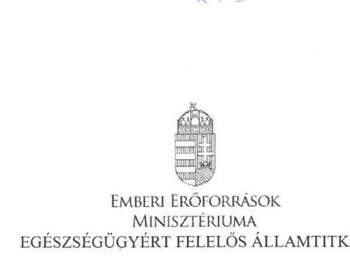

Iktatószám: /2017/EIFF

Hiv. szám: V-1150-087/2016.
Ügyintéző: Fischer Csilla (896-5381)
Melléklet: 249/6/2015.iktatószámú kérelem
és annak engedélyezése

# Domokos László részére 

elnök

Állami Számvevőszék
Budapest
Apáczai Csere János u. 10.
1052

Tárgy: „A központi alrendszer egyes intézményei pénzügyi és vagyongazdálkodásának ellenőrzése - Szent Kozma és Damján Rehabilitációs Szakkórház" című számvevőszéki jelentéstervezet véleményezése

Tisztelt Elnök Úr!

Hivatkozással a V-1150-087/2016. iktatószámon továbbított „A központi alrendszer egyes intézményei pénzügyi és vagyongazdálkodásának ellenőrzése - Szent Kozma és Damján Rehabilitációs Szakkórház" című jelentéstervezetre, az alábbiakról tájékoztatom.

A jelentéstervezet az Emberi Erőforrások Minisztériuma által áttekintésre került, mellyel kapcsolatban a következő észrevételt kívánom tenni.

A jelentéstervezet 3.5. számú megállapításának 3. bekezdése szerint „a Szakkórháznál az intézményi beruházás keretében történő bútor és informatikai eszköz beszerzés tilalmára vonatkozó előírásokat nem tartották be. A 2012-2013. években - a 1036/2012. (II.21.) Korm. határozat ${ }^{52}$ 6. pontjában előírtak ellenére -, míg a 2014-2015. években - az 1982/2013. (XII.29.) Korm.határozat ${ }^{53}$ 1. pontjában előírtak ellenére - a beszerzési tilalom alá eső informatikai eszközöket, bútorokat szereztek be."

---

A megállapítással ellentétben 2015. évben a Szakkórház által 249/6/2015. iktatószámon benyújtott, beszerzési tilalom alóli feloldásra vonatkozó kérelem alapján történt engedélyezés informatikai eszköz beszerzését érintően, melynek dokumentumait jelen levelemhez csatolva megküldök szíves tájékoztatásul.

A fentiek alapján kérem szíves intézkedését a hivatkozott megállapítás módosítása iránt.
Budapest, 2017. január 16.
Üdvözlettel:
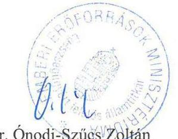

Dr. Önödi Szűcs Zoltán

---

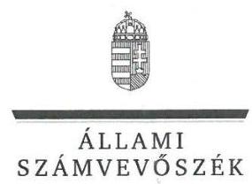

ELNÖK

Ikt.szám: V-1150-104/2016.

# Balog Zoltán úr 

miniszter
Emberi Erőforrások Minisztériuma

## Budapest

## Tisztelt Miniszter Úr!

Köszönettel megkaptam a 2017. január 30. napján az Állami Számvevőszékhez érkezett „A központi alrendszer egyes intézményei pénzügyi és vagyongazdálkodásának ellenőrzése - Szent Kozma és Damján Rehabilitációs Szakkórház" című számvevőszéki jelentéstervezetben foglalt megállapításokra az egészségügyért felelős államtitkár úr által írásban tett észrevételt.

Az Állami Számvevőszék észrevételekre vonatkozó álláspontjáról a felügyeleti vezető által készített részletes tájékoztatást mellékelten megküldöm.

Budapest, 2017. p. 1411 hó 16 nap
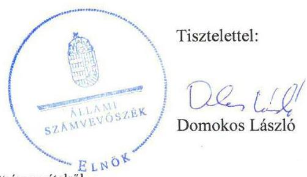

Melléklet: Tájékoztatás a figyelembe vett észrevételről

---

# Tájékoztatás   a figyelembe vett észrevételről 

|  | Észrevétel | Az eszközbeszerzések tilalmára, az évközi egyensúlyjavító intézkedések 2015. évi betartására vonatkozóan (A 3.5. számú megállapítását alátámasztó 3. bekezdéshez (25. oldal), valamint az emberi erőforrások miniszterének címzett 1. számú javaslathoz kapcsolódóan) |
| :--: | :--: | :--: |
|  | Válasz | Az Állami Számvevőszék az észrevételt elfogadja. |
| 1. | Indoklás | A helyszíni ellenőrzés során az Állami Számvevőszék rendelkezésére bocsátott dokumentumok ismételt áttekintése alapján, a Szakkórháznál a 2014-2015. években 200000 Ft alatti kísértékű tárgyi eszközök beszerzésére, valamint a 2015. évben egy alkalommal - az 1982/2013. (XII. 29.) Korm. határozat 3. pontjában foglaltak alapján, a Miniszterelnökséget vezető miniszter engedélyével - került sor nagy értékű multifunkcionális gép beszerzésére.   A fentiekre tekintettel a 3.5. számú megállapítás 3. bekezdéséből a 2014-2015. évre vonatkozó megállapítást töröltük, és a bekezdést a következők szerint pontosítottuk: „A Szakkórháznál a 2012-2013. években az intézményi beruházás keretében történő eszközbeszerzések tilalmára vonatkozó előírásokat nem tartották be, az 1036/2012. (II. 21.) Korm. határozat 6. pontjában előírtak ellenére informatikai eszközöket szereztek be."   A módosítással összhangban pontosítottuk a 3.5. számú megállapítást (aláhúzással jelölve): „A Szakkórházat előirányzat felhasználáshoz kapcsolódó évközi korlátozó intézkedés nem érintette, befizetési kötelezettségét teljesítette, az előirányzatmaradvány megállapítása szabályszerű volt, azonban az eszközbeszerzések tilalmára vonatkozó előírásokat a 2012-2013. években nem tartották be."   Pontosítottuk továbbá a „Főbb megállapítások, következtetések, javaslatok" fejezet 3. bekezdés 4. mondatát (pontosítás aláhúzással jelölve) „Évközi korlátozó intézkedés nem érintette, azonban az eszközbeszerzések tilalmára vonatkozó előírásokat a 2012-2013. években nem tartották be."   A pontosítással összhangban töröltük az emberi erőforrások miniszterének címzett 1. számú javaslatot. |

Budapest, 2017. 02. hó 8. nap

---

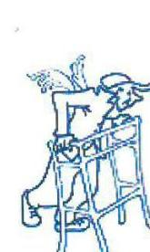

# Szent Kozma és Damján Rehabilitációs Szakkórház 

2026 Visegrád, Gizella-telep
Főigazgató: dr. Huszár Sándor
Tel.: 26 / 801-700
Fax: 26/801-701
Igazgatóság: 26/801-777
e-mail: titkarsag@visegradikorhaz.hu

## 143

Iktatószám: 211/21 /2017.
Ügyintéző: Varga Zs. / Zilahi T.
Hivatkozási szám:
Tárgy: Észrevétel a V-1150-
085/2016. számú
jelentéstervezetre

## Állami Számvevőszék

## Domokos László

Elnök

Budapest
Apáczai Csere János u. 10.
1052

## SZÁMVEVŐSZÉK

BC-6942 / 2017 / 1
Bileg: 2017 JAN 26.
V-HSO-095/2016.
Tisztelt Elnök Úr!

Szakkórházunk 2017. január 10-én kézhez vette „A központi alrendszer egyes intézményei pénzügyi és vagyongazdálkodásának ellenőrzése" címmel készített számvevőszéki jelentéstervezetet.
Szakkórházunk üdvözli az Állami Számvevőszék stratégiájában foglalt céljait, ezúton is megköszönve az ellenőrzést végző kollégáinak munkáját és segítő észrevételeiket. Az ellenőrzésük alapján készített jelentéstervezet megállapításait illetően - annak felépítését követve, az abban foglalt oldalszámokra és számozásra való hivatkozással a kísérőlevélben foglalt határidő betartásával - az alábbi észrevételekkel kívánunk élni:
17. o. 2.2 sz. megállapításhoz: Az ellenőrzés alá vont időszakban hatályos Belső kontrollrendszer szabályzatok (Feltöltve: Állami Számvevőszék Elektromos Adatszolgáltatási Rendszer / Dokumentumok / 2. AZ INTÉZMÉNYI BELSŐ KONTROLLRENDSZER ELLENŐRZÉSÉHEZ SZÜKSÉGES SZABÁLYOZÁSOK / 34 kockázatkezeléssel kapcsolatos dokumentumok - a kockázatok meghatározása - beazonosítása - értékelése felülvizsgálata) 2.9 pontja részletesen taglalja a lehetséges kockázatokkal kapcsolatban szükséges és felmerülhető válaszlépéseket, azaz intézkedéseket esetenként példával illusztrálva. A szabályzat ugyanezen pontja alatt tartalmazza az intézkedések teljesítésének nyomon követésének módját a következők alapján:
„A kockázatok elemzésén túl a felelősök feladata a folyamatos ellenőrzés és felülvizsgálat az alábbiak foglaltak szerint: Az ellenőrzés, felülvizsgálat során a felelős a korábban azonosított

---

kockázatok minősítésére és kezelésére hozott döntéseket rendszeresen felülvizsgálja. Ezen kívül az ellenőrzési nyomvonalakban nem rögzített, de feltárt hibák észlelése esetén szükséges a folyamat leírások és a kockázat elemzés kiegészítése.
Az önálló szervezeti egységet vezető felelősök a tárgyévet követő május 15-ig jelentést készítenek a szakterületüket irányító igazgató felé, aki a jelentést összesítve május 31-ig beszámol a főigazgató felé a szakterülete alá tartozó szervezeti egységek kockázatkezelési tevékenységéről.
A tárgyévet követően benyújtott

 jelentésnek, beszámolónak tartalmaznia kell továbbá a szervezeti egység működése során alkalmazott kockázatkezelési technikákat, azok eredményességét és többletköltségeit."

A rendszeres felülvizsgálat előírása illetve a határidőre történő írásos beszámoltatás megkövetelése megítélésünk szerint kimeríti a nyomon követés módjának szabályozását.
A szervezeti egységek vezetői évente beszámoltak a „kockázat nyilvántartó lap"-ok alkalmazásával arról, ha a kockázati esemény bekövetkezett és saját hatáskörben illetve felső vezetői jóváhagyással intézkedtek. Ahol számszerűsíthető volt, ott számszerűsítették az intézkedés költségvonzatát.

Fentiekre tekintettel kérjük a súlyos megállapítás, miszerint nem felelt meg a jogszabályi előírásoknak átértékelését.
19. o. 3. bekezdéséhez: Jelentéstervezet szövegrésze szerint „A költségvetési szerv vezetője a külső ellenőrzésekről vezetett nyilvántartás alapján - a Bkr. 14.§ (2) bekezdésében foglaltak ellenére - a tárgyévet követő év január 31-ig nem számolt be a fejezetet irányító költségvetési szerv vezetőjének és a fejezetet irányító szerv belső ellenőrzési vezetőjének, a jelentést a középirányító szervnek küldte meg." A GYEMSZI minden évben körlevél formájában kérte be a beszámolókat, hivatkozva arra, hogy a beszámolók gyűjtése, összesítése és továbbítása a fejezetet irányító szerv részére a GYEMSZI Belső Ellenőrzési Főosztály feladata. (Feltöltve: Állami Számvevőszék Elektronikus Adatszolgáltatási Rendszer / Dokumentumok / 2. AZ INTÉZMÉNYI BELSŐ KONTROLLRENDSZER ELLENŐRZÉSÉHEZ SZÜKSÉGES SZABÁLYOZÁSOK / 38 Belső és külső ellenőrzéssel kapcsolatos dokumentumok: külső (KEHI - egyéb) ellenőrzések nyilvántartása)

---

Kérjük a jelentéstervezet szövegrészének kiegészítését azzal az információval, hogy az adatszolgáltatásra a középirányító szerv utasításának eleget téve az abban foglaltak szerint eljárva került sor.
25. o. 3.5. sz. megállapításhoz: Szakkórházunk az eszközbeszerzések tilalmára, az évközi egyensúlyjavító intézkedésekre vonatkozó előírásokat minden ellenőrzött évben betartotta.

A 2012-2013-as években 100 eFt egyedi értékhatárt meghaladó, beszerzési tilalom alá eső beruházás nem történt. Tételesen áttekintve beszerzéseinket, megállapítást nyert, hogy a 2012. évben nagy értékűként elszámolásra került informatikai eszközök nettó értéke nem érte el a 100 eFt-ot, így kis értékűként kellett volna kezelni. A téves besorolásból/elszámolásból adódó eltérés a mérleg főösszegéhez képest elhanyagolható.
Fenti időszakban 100 eFt egyedi értéket meghaladóan 1 db fax készülék (178.500,-Ft), illetve 1 db vagyoni értékű jogot képviselő szerver szoftver licenc (Windows SBS) (244.820,-Ft) beszerzése történt. Fenti eszközök nem az informatikai eszközök közé tartoznak, hanem az egyéb gépek, berendezések illetve az immateriális javak csoportjába kerültek besorolásra. Az 1036/2012.(II.21) Korm. határozat nem utalt más jogszabályra és ebben az időszakban nem volt olyan érvényben lévő szabályozás, mely meghatározta volna az informatikai eszköz fogalmába tartozó eszközök körét, először a 4/2013. (I.11.) Korm. rendelet definiálta azt, ami 2014. január 1-jétől hatályos.

2014-2015 években egy alkalommal került sor nagy értékű informatikai eszköz beszerzésére, melyhez a szükséges engedéllyel rendelkezünk (Mintaszám: F_30, továbbá feltöltve: Állami Számvevőszék Elektronikus Adatszolgáltatási Rendszer / Dokumentumok / 3. A PÉNZ ÉS VAGYONGAZDÁLKODÁS ELLENŐRZÉSÉNEK DOKUMENTUMAI GAZDÁLKODÁSRA VONATKOZÓ DOKUMENTUMOK / 8 az egyensúlyjavító intézkedésekkel kapcsolatos dokumentumok - beszerzési tilalom - keret-előrehozás dokumentáció), az engedélyt az Állami Számvevőszék munkatársainak rendelkezésére bocsátottuk.

Fentiekre tekintettel kérjük az eszközbeszerzések tilalmára vonatkozó megállapítás korrigálását.
30. o. 5.1. sz. megállapításhoz: A megállapítást megalapozó táblázat alatti első bekezdésben leírtakkal kapcsolatosan megjegyezni kívánjuk, hogy az ott leírtakkal ellentétben 2013-ban az

---

Intézeti Etikai Bizottság folytatott le etikai eljárást szakkórházi munkavállaló (takarítónő) ügyében, ennek eredménye elmarasztaló volt. Ezt a tényt a 2014. február 26-án, a 2015. június 23-án és a 2016. június 21-én kitöltött integritás kérdőíven, a „Speciális korrupcióellenes rendszerek és eljárások" elnevezésű lapon minden évben jelöltük. Itt kívánjuk megjegyezni, hogy ezen a lapon feltett 10 kérdésből 9-re igen a válasz.

Fentiekre tekintettel kérjük a táblázatban felsorolt integritás kontrollok értékelésének és az 5. pont alatti megállapításnak átértékelését.

Visegrád, 2017. január 24.
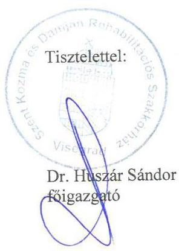

Mellékletek:

- etikai bizottsági állásfoglalás

---

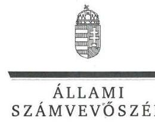

ELNÖK

# Dr. Huszár Sándor úr 

főigazgató
Szent Kozma és Damján Rehabilitációs Szakkórház

## Visegrád

## Tisztelt Főigazgató Úr!

Köszönettel megkaptam a 2017. január 26. napján az Állami Számvevőszékhez érkezett „A központi alrendszer egyes intézményei pénzügyi és vagyongazdálkodásának ellenőrzése - Szent Kozma és Damján Rehabilitációs Szakkórház"című számvevőszéki jelentéstervezetben foglalt megállapításokra a főigazgató úr által írásban tett észrevételeket.

Tájékoztatom Főigazgató urat, hogy a jelentésben - az Állami Számvevőszékről szóló 2011. évi LXVI. törvény 29. § (3) bekezdése alapján - a figyelembe nem vett észrevételeket szerepeltetjük az elutasítás indokainak feltüntetésével együtt.

Az Állami Számvevőszék észrevételekre vonatkozó álláspontjáról a felügyeleti vezető által készített részletes tájékoztatást mellékelten megküldöm.

Budapest, 2017. (1) hó 16 nap
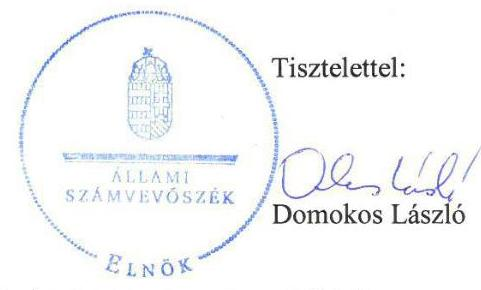

Melléklet: Tájékoztatás a figyelembe vett és figyelembe nem vett észrevételekről

---

# Tájékoztatás   a figyelembe vett és figyelembe nem vett észrevételekről 

| 1. | Észrevétel: | A kockázatkezelési rendszer kialakítására és működtetésére vonatkozóan (A 2.2. számú megállapításhoz (17. oldal), illetve a Szakkórház főigazgatójának címzett 3. számú javaslathoz kapcsolódóan) |
| :--: | :--: | :--: |
|  | Válasz: | Az Állami Számvevőszék az észrevételt nem fogadja el. |
|  | Indoklás: | A költségvetési szervek belső kontrollrendszeréről és belső ellenőrzéséről szóló 370/2011. (XII. 31.) Korm. rendelet (Bkr.) 7. § (2) bekezdésének az ellenőrzött időszakban hatályos előírásai szerint a kockázatkezelési rendszer működtetése során fel kell mérni és meg kell állapítani a költségvetési szerv tevékenységében, gazdálkodásában rejlő kockázatokat, valamint meg kell határozni az egyes kockázatokkal kapcsolatban szükséges intézkedéseket, valamint azok teljesítésének folyamatos nyomon követésének módját. Az ellenőrzés megállapításai szerint a Szakkórház a kockázatkezelési rendszer működtetése során a jogszabályban előírtaknak nem tett teljes mértékben eleget.   A „Belső kontrollrendszer működési szabályzat" 2.9. pontja valóban tartalmazza a kockázatok azonosítási módját, elemzésének, értékelésének módját, a kockázati kitettség mérséklésének módszerét és a kockázat megosztásának, áthárításának és elviselésének, elfogadásának lehetőségét, vagyis a lehetséges kockázatokkal kapcsolatban felmerülhető válaszlépéseket, azonban a szabályozás - az észrevételben foglaltakkal ellentétben - nem tartalmazta az egyes kockázatokkal kapcsolatban szükséges intézkedéseket. Az egyes szervezeti egységek vezetői részére nem írták elő, hogy meghatározzák az egyes kockázati események bekövetkezésekor követendő eljárást. Mindezek meghatározása hiányában, a szükséges intézkedések folyamatos nyomon követésének a módja sem értelmezhető.   A gyakorlatban az önálló szervezeti egységek vezetői az általuk vezetett szervezeti egységek vonatkozásában felmérték a feladatok végrehajtását akadályozó egyedi kockázatokat és meghatározták a kockázati kitettség csökkentésének módját, azonban a nyilvántartásokban nem határoztak meg a kockázati esemény bekövetkezésekor, azok kezeléséhez szükséges intézkedéseket. Az ellenőrzés rendelkezésére bocsátott nyilvántartások nem alkalmasak a kockázatok változásainak, a kezelés során tett intézkedések következményeinek folyamatos nyomon követésére. |

---

|  |  | A fentiekre tekintettel a megállapítás megalapozott, annak módosítása, valamint a Szakkórház főigazgatójának címzett 3. számú javaslat törlése nem indokolt. |
| :--: | :--: | :--: |
|  | Észrevétel | A külső ellenőrzések javaslatai alapján vezetett intézkedési tervek végrehajtásáról szóló beszámolási kötelezettség teljesítésére vonatkozóan (A 2.5. számú megállapítást alátámasztó 4. bekezdés 2. mondatához (19. oldal), továbbá a Szakkórház főigazgatójának címzett 6. számú javaslathoz kapcsolódóan) |
|  | Válasz | Az Állami Számvevőszék az észrevételt nem fogadja el. |
| 2. | Indoklás | Az észrevétel nem megalapozott. A Bkr. 14. § (2) bekezdése értelmében a költségvetési szerv vezetője a külső ellenőrzések javaslatai alapján vezetett intézkedési tervek végrehajtásáról a tárgyévet követő év január 31-ig beszámol a fejezetet irányító szerv vezetőjének és a fejezetet irányító szerv belső ellenőrzési vezetőjének.   Az észrevétel is tartalmazza, hogy a Szakkórház az ellenőrzött időszakban - a középirányító szerv körlevelében foglalt iránymutatása alapján - a középirányító szervnek küldte meg a beszámolókat.   A középirányító szerv által kiadott belső szabályozóeszköz (körlevél) nem tartalmazhat a jogszabállyal, azaz a Bkr.-ben foglaltakkal ellentétes rendelkezéseket. A Szakkórház nem tartotta be a Bkr. 14. § (2) bekezdésében foglaltakat, a külső ellenőrzésekről szóló jelentést a fejezetet irányító szerv vezetőjének és a fejezetet irányító szerv belső ellenőrzési vezetőjének is szükséges lett volna megküldenie.   Az adatszolgáltatás körülményeit bemutató információt köszönettel vettük. A jelentéstervezet vonatkozó szövegrészének kiegészítése azonban nem indokolt, mivel az a megállapítást nem módosítja.   A fentiekre tekintettel az ellenőrzési megállapítás megalapozott, annak módosítása, valamint a Szakkórház főigazgatójának címzett 6. számú javaslat törlése nem indokolt. |
| 3. | Észrevétel | Az eszközbeszerzések tilalmára, az évközi egyensúlyjavító intézkedések betartására vonatkozóan (A 3.5. számú megállapítását alátámasztó 3. bekezdéshez (25. oldal), valamint az emberi erőforrások miniszterének címzett 1. számú javaslathoz kapcsolódóan) |
|  | Válasz | Az Állami Számvevőszék az észrevételt részben fogadja el. |
|  | Indoklás | A 2012-2013. évekre vonatkozó észrevétel nem megalapozott. A 2012. és 2013. évi költségvetési hiánycél biztosításához szükséges további intézkedésekről szóló 1036/2012. (II. 21.) Korm. határozat 6. pontjának rendelkezése szerint „A Kormány az irányítása alá tartozó fejezeteknél beszerzési tilalmat rendelt el az |

---

intézményi beruházások keretében történő bútor-, személygépjármű-, informatikai eszköz- és telefonbeszerzésekre."
Az 1036/2012. (II. 21.) Korm. határozat nem tett kivételt a kisértékű tárgyi eszközök beszerzése vonatkozásában. A helyszíni ellenőrzés során az Állami Számvevőszék rendelkezésére bocsátott dokumentumok ismételt áttekintése alapján megállapítottuk, hogy a Szakkórháznál a 2012-2013. években beszerzési tilalom alá tartozó tárgyi eszközöket szereztek be, így nem tartották be az 1036/2012. (II. 21.) Korm. határozat 6. pontjában foglaltakat. A fentiekre tekintettel az ellenőrzési megállapítás megalapozott, annak módosítása nem indokolt.
A beszerzési tilalomra vonatkozóan a 2014. január 1-jétől hatályos, a Kormány irányítása alá tartozó fejezetek költségvetési szerveinek eszközbeszerzéseiről szóló 1982/2013. (XII. 29.) Korm. határozat 1. pontjában foglaltak szerint: „A Kormány az irányítása vagy felügyelete alá tartozó költségvetési szervnél beszerzési tilalmat rendelt el a beruházások keretében - kivéve kisértékű tárgyi eszköz - történő informatikai eszközök beszerzése, létesítése (rovatszáma K63), valamint az egyéb tárgyi eszközök beszerzése létesítésén belül (rovatszáma K64) a bútorok, személygépjárművek és telefon beszerzése vonatkozásában."
A helyszíni ellenőrzés során az Állami Számvevőszék rendelkezésére bocsátott dokumentumok ismételt áttekintése alapján, a Szakkórháznál a 2014-2015. években 200000 Ft alatti kisértékű tárgyi eszközök beszerzésére, valamint a 2015. évben egy alkalommal - az 1982/2013. (XII. 29.) Korm. határozat 3. pontjában foglaltak alapján, a Miniszterelnökséget vezető miniszter engedélyével - került sor nagy értékű multifunkcionális gép beszerzésére.
A fentiekre tekintettel a 3.5. számú megállapítás 3. bekezdéséből a 2014-2015. évre vonatkozó megállapítást töröltük, és a bekezdést a következők szerint pontosítottuk: „A Szakkórháznál a 2012-2013. években az intézményi beruházás keretében történő eszközbeszerzések tilalmára vonatkozó előírásokat nem tartották be, az 1036/2012. (II. 21.) Korm. határozat 6. pontjában előírtak ellenére informatikai eszközöket szereztek be."
A módosítással összhangban pontosítottuk a 3.5. számú megállapítást (aláhúzással jelölve): „A Szakkórházat előirányzat felhasználáshoz kapcsolódó évközi korlátozó intézkedés nem érintette, befizetési kötelezettségét teljesítette, az előirányzatmaradvány megállapítása szabályszerű volt, azonban az eszközbeszerzések tilalmára vonatkozó előírásokat a 2012-2013. években nem tartották be."
Pontosítottuk továbbá a „Főbb megállapítások, következtetések, javaslatok" fejezet 3. bekezdés 4. mondatát (pontosítás aláhúzással jelölve) „Évközi korlátozó intézkedés nem érintette.

---

|

  |  | azonban az eszközbeszerzések tilalmára vonatkozó előírásokat a 2012-2013. években nem tartották be."   A pontosítással összhangban töröltük az emberi erőforrások miniszterének címzett 1. számú javaslatot. |
| :--: | :--: | :--: |
|  | Észrevétel | Az integritási kontrollrendszer kiépítettségére vonatkozóan (Az 5.1. számú megállapítás 1. bekezdését (30. oldal) alátámasztó V. sz. melléklet 2. bekezdéséhez (41. oldal) kapcsolódóan) |
|  | Válasz | Az Állami Számvevőszék az észrevételt részben fogadja el. |
| 4. | Indoklás | A helyszíni ellenőrzés során az Állami Számvevőszék rendelkezésére bocsátott dokumentumokat alapján az integritás kontrollok értékelését ismételten elvégeztük, amelyben a szakmai etikai eljárás lefolytatását figyelembe vettük.   Az ismételt kiértékelés eredménye - az elért pontszámok változása mellett - az integritás kontrollok értékelésének minőségét nem változtatta meg.   Pontosítottuk az V. sz. melléklet „Az integritás kontrollok értékelése" táblázat 1. sorszám alatt az Összeférhetetlenség és etikai elvárások elért pontszámát 2 helyett 3-ra, ezzel összhangban az Összesítő értékelés elért pontszáma 18-ról 19-re változott, a minősítés azonban mind az 1. sorszám, mind az összesítő értékelés tekintetében továbbra is ,,alacsony" maradt.   Pontosítottuk az V. sz. melléklet 2. bekezdésének 2-3. mondatát az alábbiak szerint (a pontosítás aláhúzással jelölve): „Az intézmény szabályozta az összeférhetetlenség kérdését, rendelkezett etikai szabályzattal, és az elmúlt 3 évben egy esetben előfordult, hogy kötelezettségszegés miatt szakmai etikai eljárás indult egy alkalmazottal szemben. Azonban nem szabályozták a különféle ajándékok elfogadásának feltételeit, a munkatársaknak nem volt kötelező nyilatkozniuk a gazdasági érdekeltségeikről, vagy egyéb, a szervezet tevékenysége szempontjából releváns összeférhetetlenségről." |

Budapest, 2017. C. hó & nap
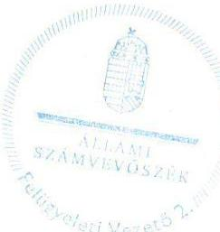

Salamon Ildikó
felügyeleti vezető

---

Állami Egészségügyi Ellátó Központ

Állami Számvevőszék

Domokos László
Elnök Úr részére

Budapest
Apáczai Csere János utca 10.
1052

Tisztelt Elnök Úr!

Az Állami Számvevőszék által „A központi alrendszer egyes intézményei pénzügyi és vagyongazdálkodásának ellenőrzése -Szent Kozma és Damján Rehabilitációs Szakkórház" címmel készített számvevőszéki jelentéstervezetet megkaptam.

A jelentéstervezet megállapításaival kapcsolatban észrevételt nem kívánok tenni.

Budapest, 2017. január 16.

Tisztelettel:
dr.Németh László
Főigazgató

---

.

---

# RÖVIDÍTÉSEK JEGYZÉKE 

${ }^{1}$ Szakkórház
${ }^{2}$ Minisztérium
${ }^{3}$ GYEMSZI
${ }^{4}$ ÁEEK
${ }^{5}$ Konsz. tv.
${ }^{6}$ NEFMI rendelet
${ }^{7}$ Ttv.
${ }^{8}$ Eütv.
${ }^{9}$ Alaptörvény
${ }^{10}$ Nvtv.
${ }^{11}$ Áht.
${ }^{12}$ Ávr.
${ }^{13}$ Bkr.
${ }^{14}$ ÁSZ
${ }^{15}$ ÁSZ tv.
${ }^{16}$ ÁSZ SZMSZ
${ }^{17}$ Alapító okirat
${ }^{18}$ EMMI
${ }^{19}$ SZMSZ
${ }^{20}$ Építésügyi hatósági eljárásról szóló körlevél

Szent Kozma és Damján Rehabilitációs Szakkórház
Nemzeti Erőforrás Minisztérium (2012. január 1-től 2012. május 13-ig)Emberi Erőforrások Minisztériuma (2012. május 14-től)
Gyógyszerészeti és Egészségügyi Minőség- és Szervezetfejlesztési Intézet Állami Egészségügyi Ellátó Központ
a megyei önkormányzatok konszolidációjáról, a megyei önkormányzati intézmények és a fővárosi Önkormányzat egyes egészségügyi intézményeinek átvételéről szóló 2011. évi CLIV. törvény (hatályos: 2012. január 1-től)
az állam tulajdonába és fenntartásába került egészségügyi intézmények tekintetében vagyonkezelői joggal rendelkező államigazgatási szerv kijelöléséről szóló 72/2011. (XII. 27.) NEFMI rendelet
a települési önkormányzatok fekvőbeteg-szakellátó intézményeinek átvételéről és az átvételhez kapcsolódó egyes törvények módosításáról szóló 2012. évi XXXVIII. törvény (hatályos: 2012. április 28-tól)
az egészségügyről szóló 1997. évi CLIV. törvény (hatályos: 1998. január 1-től)
Magyarország Alaptörvénye (hatályos: 2012. január 1-jétől)
a nemzeti vagyonról szóló 2011. évi CXCVI. törvény (hatályos: 2012. január 1-jétől)
az államháztartásról szóló 2011. évi CXCV. törvény (hatályos: 2012. január 1-től)
az államháztartásról szóló törvény végrehajtásáról szóló 368/2011. (XII. 31.) Korm. rendelet (hatályos 2012. január 1-jétől)
a költségvetési szervek belső kontrollrendszeréről és belső ellenőrzéséről szóló 370/2011. (XII. 31.) Korm. rendelet (hatályos 2012. január 1-jétől)
Állami Számvevőszék
az Állami Számvevőszékről szóló 2011. évi LXVI. törvény (hatályos: 2011. július 1-jétől)
Állami Számvevőszék Szervezeti és Működési Szabályzata
a nemzeti erőforrás miniszter által 2012. január 25-én kibocsátott Alapító okirat, (hatályos 2012. január 1-től); az emberi erőforrások minisztere által kiegészítve: 2014. február 27-én (hatályos: 2014. január 1-től)
Emberi Erőforrások Minisztériuma
a Szent Kozma és Damján Rehabilitációs Szakkórház Szervezeti és Működési Szabályzata (hatályos: 2009. november 21-től 2012. július 16-ig);
a Szent Kozma és Damján Rehabilitációs Szakkórház Szervezeti és Működési Szabályzata (hatályos: 2012. július 17-től 2013. október 2-ig);
a Szent Kozma és Damján Rehabilitációs Szakkórház Szervezeti és Működési Szabályzata (hatályos: 2013. október 3-tól).

Az építésügyi hatósági eljáráshoz adott meghatalmazásról szóló körlevél (hatályos: 2012. június 26-tól)

---

${ }^{21}$ Ingatlanok bérbeadásáról szóló iránymutatás
${ }^{22}$ Gépjárművek értékesítéséről szóló körlevél
${ }^{23}$ Tárgyi eszközök selejtezéséről szóló tájékoztatás
${ }^{24}$ 59/2011. (IV.12.) Korm. rendelet
${ }^{25}$ 27/2015. (II.25.) Korm. rendelet
${ }^{26}$ Gazdasági szervezet ügyrendje
${ }^{27}$ Számviteli politika
${ }^{28}$ Sztv.
${ }^{29}$ Leltározási és leltárkészítési szabályzat
${ }^{30}$ Eszközök és források értékelési szabályzata
${ }^{31}$ Önköltségszámítási szabályzat
${ }^{32}$ Pénzkezelési szabályzat
${ }^{33}$ Számlarend
${ }^{34}$ Bizonylati rend
${ }^{35}$ Áhsz. 1
${ }^{36}$ Áhsz. 2

Iránymutatás az egészségügyi intézmények által használt állami tulajdonban lévő ingatlanok bérbeadásához (hatályos: 2012. június 28-tól 2014. június 16-ig);
Iránymutatás a Magyar Állam tulajdonában lévő és a GYEMSZI tulajdonosi joggyakorlása alá tartozó, a GYEMSZI által az egészségügyi intézmények kezelésébe adott ingatlanok hasznosításához (hatályos: 2014. június 17-től).
A vagyonkezelésbe adott gépjárművek értékesítésének eljárásrendjéről szóló körlevél (hatályos: 2013. június 7-től)
Tájékoztatás a tárgyi eszközök selejtezésével kapcsolatban (hatályos: 2015. október 22-től).
a Gyógyszerészeti és Egészségügyi Minőség- és Szervezetfejlesztési Intézetről szóló 59/2011. (IV.12.) Korm. rendelet (hatályos: 2011. április 13-tól 2015. február 28-ig)
az Állami Egészségügyi Ellátó Központról szóló 27/2015. (II.25.) Korm. rendelet (hatályos: 2015. március 1-től)
15/2010.sz. szabályzat (hatályos: 2010. október 1-től 2012. május 31-ig); 5/14/2012. sz. szabályzat (hatályos: 2012. június 1-től 2014. szeptember 30-ig);
215/4/2014. sz. szabályzat (hatályos: 2014. október 1-től)
25/9/2012.sz. szabályzat (hatályos: 2012. január 1-től 2014. április 24-ig); 120/8/2014. sz. szabályzat (hatályos: 2014. április 25-től)
a számvitelről szóló 2000. évi C. törvény (hatályos: 2001. január 1-től)
9/2007. Leltározási szabályzat (hatályos: 2007. augusztus 1-től 2012. április 30-ig);
25/13/2012. sz. szabályzat (hatályos: 2012. május 1-től 2014. szeptember 14-ig);
120/20/2014. sz. szabályzat (hatályos: 2014. szeptember 15-től)
25/8/2012. sz. szabályzat (hatályos: 2012. január 1-től 2014. április 24-ig); 120/9/2014.sz. szabályzat (hatályos: 2014. április 25-től)
25/20/2012. sz. szabályzat (hatályos: 2012. január 1-től 2014. április 24-ig); 120/10/2014. sz. szabályzat (hatályos: 2014. április 25-től)
7/2009. sz. szabályzat (hatályos: 2009. július 1-től 2012. február 28-ig); 25/10/2012. sz. szabályzat (hatályos: 2012. március 1-től 2014. április 24-ig);
120/11/2014. sz. szabályzat (hatályos: 2014. április 25-től)
25/18/2012. sz. szabályzat (hatályos: 2012. január 1-től 2014. április 24-ig); 120/13/2014. sz. szabályzat (hatályos: 2014. április 25-től 2014. december 31-ig);
81/8/2015. sz. szabályzat (hatályos: 2015. január 1-től)
11/2001. Bizonylati rend (hatályos: 2001. január 1-től 2012. március 14-ig); 25/1/2012. sz. szabályzat (hatályos: 2012. március 15-től 2014. április 24-ig);
120/12/2014. sz. szabályzat (hatályos: 2014. április 25-től)
az államháztartás szervezetei beszámolási és könyvvezetési kötelezettségének sajátosságairól szóló 249/2000. (XII. 24.) Korm. rendelet (hatálytalan: 2014. január 1-től)
az államháztartás számviteléről szóló 4/2013. (I. 11.) Korm. rendelet (hatályos: 2014. január 1-től)

---

${ }^{37}$ Közbeszerzési szabályzat
${ }^{38}$ Reprezentációs szabályzat
${ }^{39}$ Gazdálkodási szabályzat
${ }^{40}$ Ellenőrzési nyomvonal
${ }^{41}$ Szabálytalanság kezelési eljárásrend
${ }^{42}$ Belső kontrollrendszer működési szabályzat
${ }^{43}$ Informatikai szabályzat
${ }^{44}$ A közérdekű adatok megismerésére irányuló kérelmek intézésének, továbbá a kötelezően közzéteendő adatok nyilvánosságra hozatalának rendjéről szóló szabályzat
${ }^{45}$ Info. tv.
${ }^{46}$ Adatvédelmi és adatkezelési szabályzat
${ }^{47}$ Irattári és iratkezelési szabályzat
${ }^{48}$ Kincstár
${ }^{49}$ Belső ellenőrzési szabályzat
${ }^{50}$ Belső ellenőrzési kézikönyv
${ }^{51}$ Kbt.
${ }^{52}$ 1036/2012. (II.21.) Korm. határozat
${ }^{53}$ Konsz. vhr.

14/2010. sz. szabályzat (hatályos: 2010. október 1-től 2012. január 31-ig); 25/5/2012. sz. szabályzat (hatályos: 2012. február 1-től)
Reprezentációs kiadások szabályzata (hatályos: 2013. június 1-től)
8/2009. sz. szabályzat (hatályos: 2009. október 1-től 2012. március 31-ig); 25/11/2012. sz. szabályzat (hatályos: 2012. április 1-től 2014. április 24-ig); 120/7/2014. sz. szabályzat (hatályos: 2014. április 25-től)
Ellenőrzési nyomvonalak (hatályos: 2011. október 31-től)
Ellenőrzési nyomvonalak (hatályos: 2013. november 15-től)
Ellenőrzési nyomvonalak (hatályos: 2015. március 9-től)
6./2005. sz. szabályzat (hatályos: 2005. március 21-től 2012. augusztus 31-ig);
190/37/2013. sz. szabályzat (hatályos: 2013. szeptember 1-től)
3/2011. sz. szabályzat (hatályos: 2011. április 1-től 2012. június 30-ig)
25/15/2012. sz. szabályzat (hatályos: 2012. július 1-től 2013. december 31-ig)
190/34/2013. sz. szabályzat (hatályos: 2014. január 1-től)
9/2009. sz. szabályzat (hatályos: 2009. július 1-től 2012. szeptember 30-ig) 25/33/2012. sz. szabályzat (hatályos: 2012. október 1-től.)
25/21/2012. sz. szabályzat (hatályos: 2012. március 1-től 2014. január 1-ig) 190/35/2013. sz. szabályzat (hatályos: 2014. január 2-től 2014. augusztus 31-ig)
120/15/2014. sz. szabályzat (hatályos: 2014. szeptember 1-től)
2011. évi CXII. tv az információs önrendelkezési jogról és az információ szabadságról (hatályos: 2012. január 1-től)
8/2004. sz. szabályzat (hatályos: 2004. július 1-től 2012. szeptember 30-ig); 25/34/2012. sz. szabályzat (hatályos: 2012. október 1-től 2013. szeptember 30-ig);
190/27/2013. sz. szabályzat (hatályos: 2013. október 1-től 2013. november 21-ig);
190/33/2013. sz. szabályzat (hatályos: 2013. november 22-től 2013. december 31-ig);
20/3/2014. sz. szabályzat (hatályos: 2014. január 1-től)
4/2009. sz. Irattári és Iratkezelési Szabályzat (hatályos: 2009. január 1-től 2015. december 31-ig)
Magyar Államkincstár
25/3/2012. sz. Szabályzat (hatályos: 2012. január 1-től 2014. február 9-ig); 84/1/2014. sz. utasítás a belső ellenőrzésről (hatályos: 2014. február 10-től) 25/3/2012. sz. szabályzat része (hatályos:2012. január 1-től 2014. február 9-ig)
120/4/2014. sz. szabályzat (hatályos: 2014. február 10-től)
a közbeszerzésről szóló 2011. évi CVIII. törvény (hatályos: 2011. augusztus 21-től)
a Kormány irányítása alá tartozó fejezetek költségvetési szerveinek eszközbeszerzéseiről szóló 1036/2012. (II.21.) Korm. határozat (hatályos: 2012. február 21-től 2013. december 31-ig)
a megyei önkormányzat egészségügyi intézményei és a Fővárosi Önkormányzat egészségügyi intézményei átvételének részletes szabályairól szóló 372/2011. (XII. 31.) Korm. rendelet (hatályos: 2012. január 1-től)

---

${ }^{54}$ Intézményi megállapodás
${ }^{55}$ Vagyonkezelési szerződés
${ }^{56}$ Nfa. tv
${ }^{57}$ 1994. évi LV. törvény
${ }^{58}$ Vtvr.
${ }^{59}$ Vtv.
${ }^{60}$ Bérbeadási szabályzat
${ }^{61}$ ÁSZ Integritás Projekt
a GYEMSZI és a Szakkórház által az egészségügyi feladatellátáshoz használt vagyon hasznosítására kötött intézményi megállapodás (hatályos: 2012. január 1-től 2012. április 30-ig)
a GYEMSZI-vel, mint tulajdonosi joggyakorlóval 2013. február 28-án megkötött vagyonkezelési szerződés (hatályos: 2012. május 1-jétől)
a Nemzeti Földalapról szóló 2010. évi LXXXVII. törvény (hatályos: 2010. szeptember 1-jétől)
a termőföldről szóló 1994. évi LV. törvény (hatályos: 1994. július 27-től 2014. április 30-ig)
az állami vagyonnal való gazdálkodásról szóló 254/2007. (X. 4.) Korm. rendelet (hatályos: 2007. október 4-től)
az állami vagyonról szóló 2007. évi CVI. törvény (hatályos: 2007. szeptember 25-től)
190/2/2013. sz. Szolgálati lakások és nem szolgálati lakás céljára szolgáló helyiségek bérbeadási szabályzata (hatályos: 2013. május 1-jétől)
az ÁSZ 2009-ben indított „Korrupciós kockázatok feltérképezése - Integritás alapú közigazgatási kultúra terjesztése" című kiemelt projektje (http://integritas.asz.hu/).

---

.

---

# ÁLLAMI SZÁMVEVŐSZÉK 

1052 Budapest, Apáczai Csere János utca 10.
Levélcím: 1364 Budapest 4. Pf. 54
Telefon: +36 1 4849100 Telefax: +36 1 4849200
www.asz.hu

