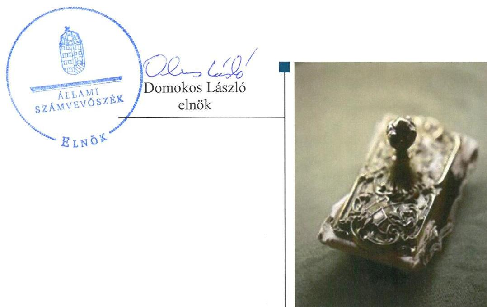
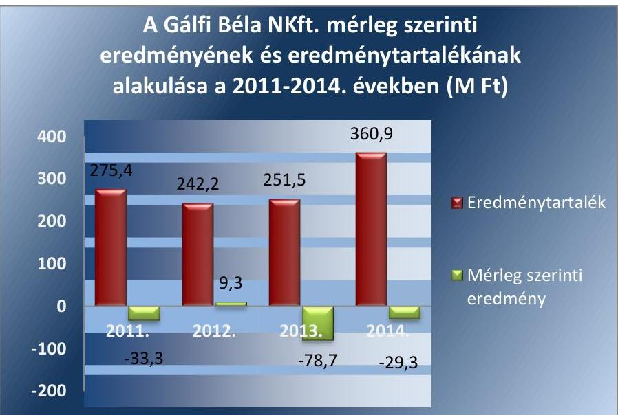
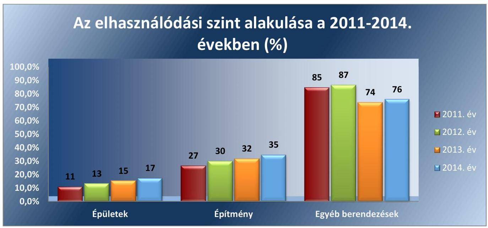
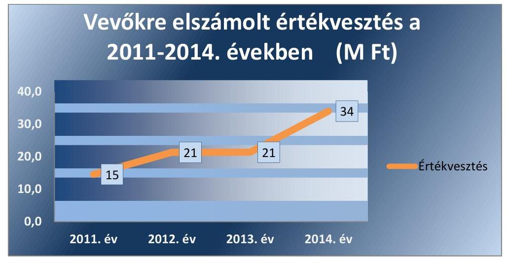
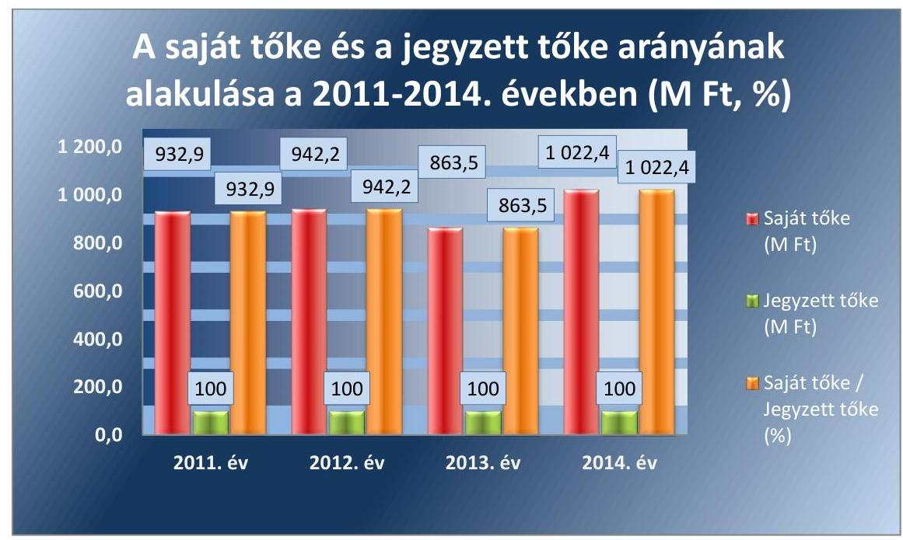
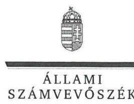
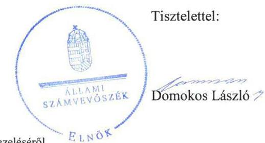
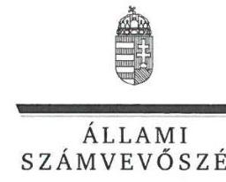
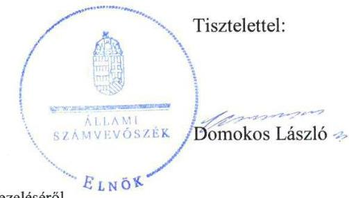

# Jelenetés 

## Gálfi Béla Gyógyító és Rehabilitációs Közhasznú Nonprofit Kft.

Az állami tulajdonban (résztulajdonban) lévő gazdálkodó szervezetek vagyonmegőrzési és gazdálkodási tevékenységének ellenőrzése 2017.

---

# Jelentés 

## Gálfi Béla Gyógyító és Rehabilitációs Közhasznú Nonprofit Kft.

Az állami tulajdonban (résztulajdonban) lévő gazdálkodó szervezetek vagyonmegőrzési és gazdálkodási tevékenységének ellenőrzése
2017. fehua hó 22 . nap

---

# AZ ELLENŐRZÉST FELÜGYELTE:

- BÖRÖCZ IMRE felügyeleti vezető

- AZ ELLENŐRZÉST VEZETTE ÉS A VÉGREHAJTÁSÁÉRT FELELŐS:
  - VIDA KATALIN ellenőrzésvezető
  - A PROGRAM ÖSSZEÁLLÍTÁSÁÉRT FELELŐS:
    - JANIK JÓZSEF osztályvezető

- IKTATÓSZÁM: V-1037-340/2016
- TÉMASZÁM: 2071
- ELLENŐRZÉS-AZONOSÍTÓ SZÁM: V070930

Jelentéseink az Országgyűlés számítógépes hálózatán és az Interneta a www.asz.hu címen is olvashatóak.

---

# TARTALOMJEGYZÉK 

■ ÖSSZEGZÉS ..... 5
■ AZ ELLENŐRZÉS CÉLJA ..... 7
■ AZ ELLENŐRZÉS TERÜLETE ..... 8
■ AZ ELLENŐRZÉS HÁTTERE, INDOKOLTSÁGA ..... 10
■ A JELENTÉS LÉNYEGES KÉRDÉSKÖREI ..... 11
■ ELLENŐRZÉS HATÓKÖRE ÉS MÓDSZEREI ..... 12
■ MEGÁLLAPÍTÁSOK ..... 14
■ JAVASLATOK ..... 23
■ MELLÉKLETEK ..... 25
I. Sz. melléklet: Értelmező szótár. ..... 25
II. Sz. melléklet: A Társaság eszközei elhasználódási szintjének alakulása a 2011-2014. években ..... 30
III. Sz. melléklet: A Társaság eszköz és forrás állományának alakulása 2011-2014. években ..... 31
IV. Sz. melléklet: A Társaság Vevőkre elszámolt értékvesztése a 2011-2014. években (M Ft) ..... 32
V. Sz. melléklet: A Társaság saját tőkéje és jegyzett tőkéje arányának alakulása 2011-2014. években ..... 33
VI. Sz. melléklet: A közszolgáltatási térítési díjak alakulása 2011-2014. években ..... 34
■ FÜGGELÉK: ÉSZREVÉTELEK ..... 35
■ RÖVIDÍTÉSEK JEGYZÉKE ..... 53

---

.

---

# ÖSSZEGZÉS 

A Magyar Nemzeti Vagyonkezelő Zrt., mint tulajdonosi joggyakorló a pomázi székhelyű Gálfi Béla Gyógyító és Rehabilitációs Közhasznú Nonprofit Kft. vagyonmegőrzési és gazdálkodási tevékenységének feltételeit szabályszerűen alakította ki. A Gálfi Béla Gyógyító és Rehabilitációs Közhasznú Nonprofit Kft. vagyona növekedett, a vagyonnyilvántartása a saját vagyont illetően nem volt szabályszerű, a vagyongazdálkodási tevékenysége nem felelt meg a jogszabályi előírásoknak. Az alkalmazott térítési díjak a jogszabályoknak és az ön-költség-számításnak megfeleltek. A bevételek elszámolása nem volt szabályszerű, azonban a ráfordításokat szabályszerűen számolták el. A beszámolási és adatszolgáltatási kötelezettségét teljesítette, a közérdekü adatok közzétételi kötelezettségének eleget tett.

## Az ellenőrzés társadalmi indokoltsága

Magyarországon az intézmény centrikus közfeladat-ellátás, közvagyon-gazdálkodás jellemző a költségvetésen kívüli feladatellátás térnyerése mellett. Ennek szereplői a nonprofit szervezetek, az önkormányzati tulajdonú gazdasági társaságok és az állami tulajdonú gazdálkodó szervezetek is.

Az államháztartásról szóló törvény, az Európai Közösséget létrehozó szerződéshez csatolt, a túlzott hiány esetén követendő eljárásról szóló jegyzőkönyv alkalmazásáról szóló 2009. május 25-i 479/2009/EK rendelet szerint, illetve az ESA95 statisztikai módszertana alapján a kormányzati szektorba tartoznak a központi kormányzati alszektorba besorolt társaságok és egyéb szervezetek is, amelyekkel szemben alapvető követelmény, hogy a gazdálkodásuk, a múködésük szabályszerű, az általuk szolgáltatott adatok megbízhatóak legyenek.

Az állami tulajdonú gazdálkodó szervezetek a nemzeti vagyon részét képezik. Az állami vagyonnal való gazdálkodást illetően a tulajdonosi joggyakorlás és vagyongazdálkodás feladata az állami vagyon átlátható, rendeltetésszerű és felelős felhasználásának biztosítása. Az állam meghatározza az ellátandó közszolgáltatással kapcsolatos feladatokat, amelyhez a vagyonnal kapcsolatos döntéseknek igazodniuk kell. A nemzetgazdasági szempontból kiemelt jelentőségű nemzeti vagyonban tartandó állami tulajdonban álló társasági részesedést a nemzeti vagyonról szóló törvény határozza meg.

Minden közpénzt, közvagyont használó szervezettel szemben társadalmi igény, hogy a tevékenységükről elszámoljanak. Ezt figyelembe véve az Állami Számvevőszék Stratégiájával összhangban került sor a Gálfi Béla Gyógyító és Rehabilitációs Közhasznú Nonprofit Kft. ellenőrzésére 2011-2014. évek vonatkozásában. Korábban az Állami Számvevőszék még nem ellenőrizte a Gálfi Béla Gyógyító és Rehabilitációs Közhasznú Nonprofit Kft.-ét.

## Főbb megállapítások, következtetések, javaslatok

A Magyar Nemzeti Vagyonkezelő Zrt. a Gálfi Béla Gyógyító és Rehabilitációs Közhasznú Nonprofit Kft. vagyonnal való gazdálkodásának feltételeit szabályszerűen alakította ki és meghatározta a tulajdonosi joggyakorló számára fenntartott vagyongazdálkodásra vonatkozó jogokat.

A Gálfi Béla Gyógyító és Rehabilitációs Közhasznú Nonprofit Kft. a vagyon értékének megőrzését, gyarapítását szolgáló vagyongazdálkodás feltételeit, a vagyon nyilvántartását nem a jogszabályokban foglaltaknak megfelelően szabályozta, a vagyonkezelt eszközök nyilvántartását megfelelően végezte, azonban a saját vagyon esetében nem volt szabályszerű a nyilvántartása. Az évenkénti leltározás nem volt szabályszerű, a leltárba bekerülő adatok valódiságáról nem minden esetben tételes leltárral győződtek meg.

Az ellátott közhasznú tevékenység ráfordításainak elszámolása összességében szabályszerű volt, bevételek elszámolása nem felelt meg a jogszabályi előírásoknak, sérült a számviteli összemérés alapelve. A térítési díjak önköltségszámítása a hatályos jogszabályi előírásoknak megfelelően történt.

---

A Gálfi Béla Gyógyító és Rehabilitációs Közhasznú Nonprofit Kft. vagyonnal való gazdálkodása nem a jogszabályi előírásoknak megfelelő volt, az ellenőrzött időszakban vagyonvesztés nem történt, a vagyona, és saját tőkéjének a jegyzett tőkéhez viszonyított aránya nőtt. A vagyonváltozást eredményező döntések előkészítése és megalapozása azonban nem volt szabályszerű, mert a 2011-2014. években megsértették a közbeszerzésre vonatkozó jogszabályi előírásokat, valamint két alkalommal a Magyar Nemzeti Vagyonkezelő Zrt. engedélye nélkül vásároltak Diszkont kincstárjegyeket.

A közszolgáltatási tevékenység térítési díj megállapítása a jogszabályi előírások és a belső szabályzat alapján történt.

Az ellenőrzött időszakban beszámolási és adatszolgáltatási kötelezettségét teljesítette. A közérdekű adatok megismerésére irányuló igények teljesítésének rendjét rögzítő szabályzattal nem rendelkezett. A közérdekű adatok nyilvánosságra hozatalát a honlapján biztosította, ezzel eleget tett az információs önrendelkezési jogról és információszabadságról szóló törvény előírásának.

A Gálfi Béla Gyógyító és Rehabilitációs Közhasznú Nonprofit Kft., mint a kormányzati szektorba sorolt egyéb szervezet teljesítette a központi költségvetésről szóló törvény elkészítéséhez az államháztartásért felelős miniszternek teljesítendő - a tulajdonosi joggyakorló útján történő - adatszolgáltatási kötelezettségét. A kormányzati szektor hiányára befolyást gyakorló bevételeket és ráfordításokat összességében szabályszerűen számolták el.

Az ÁSZ a Társaság ügyvezetőnek, valamint a Magyar Nemzeti Vagyonkezelő Zrt. vezérigazgatójának fogalmazott meg javaslatokat, amelyek alapján kötelesek intézkedési tervet összeállítani és azt a jelentés kézhezvételétől számított 30 napon belül az ÁSZ részére megküldeni.

---

# AZ ELLENŐRZÉS CÉLJA 

Az ellenőrzés célja annak értékelése volt, hogy a tulajdonosi jogok gyakorlása szabályszerű volt-e; a gazdálkodó szervezet által ellátott feladatok bevételei, ráfordításai elszámolásának és vagyongazdálkodási tevékenységének szabályozása megfelelt-e a jogszabályi és a tulajdonosi előírásoknak és azok végrehajtása szabályszerű volt-e; biztosítva volt-e a közfeladatok átláthatósága és elszámoltathatósága érdekében a közszolgáltatás dijának megalapozottsága szabályszerű önköltségszámítással; a vagyonváltozást eredményező döntések esetében a tulajdonosi jogok gyakorlója és a gazdálkodó szervezet szabályszerűen jártak-e el; a gazdálkodó szervezet épített-e ki és működtetett-e információs rendszert a szabályszerű vagyongazdálkodás érdekében.

Az ellenőrzés célja annak értékelése is volt, hogy a kormányzati szektorba sorolt egyéb szervezetek gazdálkodásának az kormányzati szektor hiányára és az államadósságra befolyással bíró elemei a jogszabályi előírásoknak megfelel-tek-e.

---

# **AZ ELLENŐRZÉS TERÜLETE**

## **Gálfi Béla Gyógyító és Rehabilitációs Közhasznú Nonprofit Kft. és a Magyar Nemzeti Vagyonkezelő Zrt.**

A Gálfi Béla Gyógyító és Rehabilitációs Közhasznú Társaság átalakulása következtében a Cégbíróság 2009. július 1-jén jegyezte be a pomázi székhelyű Gálfi Béla Gyógyító és Rehabilitációs Közhasznú Nonprofit Korlátolt Felelősségű Társaságot. Alapítója a magyar állam, a tulajdonosi jogokat az MNV Zrt.1 gyakorolta.

Az ellenőrzött időszakban a Gálfi Béla NKft.2 fő tevékenysége a fekvőbeteg ellátás volt, de közhasznú tevékenységként folytatta az általános és szakorvosi járóbeteg-, mentális és szenvedélybeteg bentlakásos, idősek és fogyatékosok bentlakásos betegek ellátását, valamint bentlakásos nem kórházi ápolását is. A Társaság3 jelenleg Magyarország második legnagyobb ilyen tevékenységet folytató szerve.

A Gálfi Béla NKft. tevékenységét saját tulajdonában lévő és vagyonkezelésbe vett eszközökkel látta el. A Társaság jogelődje és a KVI4 határozatlan idejű vagyonkezelési szerződést kötött 2001. december 13-án három olyan földterületre, amelyeken a Társaság tulajdonát képező felépítmények állnak. A földterületek értékét öszszesen 114,1 M Ft-ban határozták meg.

A Társaság mérleg szerinti eredményét és eredménytartalékát az 1. ábra szemlélteti.

1. ábra

*Forrás: 2011-2014. évi mérleg*

A Gálfi Béla NKft. bevételei az ellenőrzött időszakban az OEP-el kötött alapszerződés szerinti 42 ágy aktív, 420 ágy krónikus és rehabilitációs ellátása szerinti 114,1 M Ft-ban határozték meg.

---

tás, járóbeteg szakrendelés, labor és képalkotó diagnosztika finanszírozásából, továbbá 45 ágy rehabilitációs, 105 ágy ápolási normatív állami támogatásából (szakosított otthon), valamint a térítési díj szabályzat alapján befizetett térítési díjakból és egyéb bevételekből származtak.

A Társaság jegyzett tőkéje az ellenőrzött időszakban nem változott, 100 M Ft volt. A saját tőke összege a 2011. év végén 932,9 M Ft volt, ami 2014. év végére 1022,4 M Ft-ra nőtt. A Társaság vagyona a 2011-2014. években 89,5 M Ft-tal nőtt. A bevételeinek összege 1883,7 M Ft és 1974,8 M Ft között alakult, amelynek kétharmadát az $\mathrm{OEP}^{5}$-től származó bevételek tették ki.

A Társaság ügyvezetőjének személye az ellenőrzött időszakban egyszer, 2011. évben változott. A Társaságnak az ellenőrzött időszakban kapcsolt vállalkozása nem volt.

Az ellenőrzött időszakban az MNV Zrt. gyakorolta a tulajdonosi jogokat a Társaság felett.

---

# AZ ELLENŐRZÉS HÁTTERE, INDOKOLTSÁGA 

Az Állami Számvevőszék alapvető célkitűzése, hogy az államháztartáson kívülre nyújtott költségvetési támogatások és ingyenes vagyonjuttatások ellenőrzésével járuljon hozzá ahhoz, hogy a közpénzeket az államháztartáson kívül működő szervezetek is átlátható módon használják fel a közfeladatok szerződésben vállalt ellátása érdekében. Az Áht. ${ }^{6}$ előírása szerint a közfeladatok ellátása elsősorban költségvetési szervek alapításával és müködtetésével történik. Az államháztartáson kívüli szervezetek a közfeladatok ellátásában - jogszabályban meghatározott feltételekkel - közremüködhetnek.

Az ellenőrzés feladata a közvagyonnal biztosított közfeladat ellátással kapcsolatban a közpénzek átláthatósága, nyilvánossága érdekében a jogszabályokban, belső szabályzatokban megfogalmazott előírások érvényesülésének az állami tulajdonban (résztulajdonban) lévő gazdálkodó szervezetek vagyonérték megőrzési és gazdálkodási tevékenységének értékelése.

A Vtv. ${ }^{7}$ 3. § (1) bekezdése alapján, a 2013. június 27 -éig hatályos szabályozás értelmében a tulajdonosi jogok és kötelezettségek összességét az állami vagyon tekintetében az állami vagyon felügyeletéért felelős miniszter gyakorolta, aki a feladatát az MNV Zrt. útján látta el.

Az ellenőrzés várható hasznosulásaként az ellenőrzés megállapításai a jogalkotás számára segítséget nyújthatnak az államháztartáson kívüli köz-feladat-ellátás, közvagyonnal való gazdálkodás értékeléséhez, jogszabályi keretei pontosításához, az átláthatóságot biztosító szabályozáshoz. Az ellenőrzöttek számára visszajelzést ad a gazdálkodási tevékenységgel, az állami vagyon felhasználásával, a közszolgáltatási árképzés megalapozottságával és az éves elszámolással kapcsolatos szabálytalanságokról és kockázatokról. Az ellenőrzés tapasztalatai segítik és erősítik az ÁSZ ${ }^{8}$ hozzáadott értéket teremtő elemző tevékenységét és tanácsadó szerepét. A kormányzati szektorba sorolt, költségvetési tervezésbe is bevont gazdálkodó szervezetek ellenőrzése fokozza a legfőbb ellenőrző szerv iránti figyelmet és közbizalmat.

---

# A JELENTÉS LÉNYEGES KÉRDÉSKÖREI 

1. A tulajdonosi joggyakorló a Társaság vagyonnal való gazdál- kodásának feltételeit szabályszerűen alakította-e ki?
2. A Társaság vagyongazdálkodási tevékenységének kialakítása, szabályozása, illetve a vagyon nyilvántartása megfelelt-e az előírásoknak?
3. Az ellátott közfeladatok bevételeinek és ráfordításainak elszá- molása és szabályozása, valamint az önköltségszámítás sza- bályszerü volt-e?
4. A vagyonnal való gazdálkodás, valamint a vagyonváltozást eredményező döntések megfeleltek-e a jogszabályi és a belső előírásoknak?
5. A szabályszerű vagyongazdálkodás érdekében az adatszolgál- tatási és beszámolási kötelezettséget teljesítette-e, épített-e ki és müködtetett-e információs rendszert?
6. A kormányzati szektor hiányára és az államadósságra befolyást gyakorló elemek a jogszabályi előírásoknak megfeleltek-e?

---

# ELLENŐRZÉS HATÓKÖRE ÉS MÓDSZEREI 

## Az ellenőrzés típusa

Szabályszerúségi ellenőrzés.

## Az ellenőrzött időszak

2011. január 1-től 2014. december 31-éig.

## Az ellenőrzés tárgya

A Gálfi Béla Gyógyító és Rehabilitációs Közhasznú Nonprofit Kft. vagyonmegőrzési és gazdálkodási tevékenysége és a kormányzati szektor hiányára, adósságállományára hatást gyakorló elemek ellenőrzése.

## Az ellenőrzött szervezet

Gálfi Béla Gyógyító és Rehabilitációs Közhasznú Nonprofit Kft. és a Magyar Nemzeti Vagyonkezelő Zrt.

## Az ellenőrzés jogalapja

Az Állami Számvevőszékről szóló 2011. évi LXVI. törvény 5. § (3)-(5) bekezdése, valamint az állami vagyonról szóló 2007. évi CVI. törvény 3. § (4) bekezdése.

## Az ellenőrzés módszerei

A számvevőszéki ellenőrzés szakmai szabályai szerint, a szabályszerűségi ellenőrzés módszerével, és a vonatkozó nemzetközi standardok figyelembevételével végeztük el az ellenőrzést.

Tanúsítványok kitöltésével és az ÁSZ által kért dokumentumok megküldésével szolgáltatott adatokat az ellenőrzés lefolytatásához a társaság. A rendelkezésre bocsátott adatok, információk kontrollja és a munkalapok kitöltése a helyszíni ellenőrzés keretében történt.

A bevételek és a ráfordítások elszámolását és a vagyonnyilvántartás terén a szabályszerű múködést véletlenszerű mintavétellel ellenőriztük. Az ellenőrzöttnél, mint a kormányzati szektorba sorolt gazdálkodó szervezetnél a személyi jellegú ráfordítások elszámolása mellett, az egyéb ráfordítások, a pénzügyi műveletek ráfordításai, a rendkívüli ráfordítások, illetve az egyéb

---

bevételek, a pénzügyi műveletek bevételei, a rendkívüli bevételek elszámolásának szabályszerűségét szintén mintatételek alapján ellenőriztük. A mintavétellel ellenőrzött területek esetében minden egyes tétel vonatkozásában a szabályszerűségre vonatkozó kérdéseket tettük fel, amelyek eredménye összesítésre került.

A jogszabályoknak és a belső előírásoknak megfelelőnek tekintettük az adott területet, amennyiben a minta ellenőrzése alapján 95\%-os bizonyossággal a teljes sokaságban a hibaarány kisebb volt, mint 10\%, nem megfelelőnek értékeltük, ha a hibaarány a 10\%-ot meghaladta. A ráfordítások elszámolására és a vagyonnyilvántartásra vonatkozó véletlen mintavételt kockázati alapú kiválasztással egészítettük ki, amelynek során évente a három legnagyobb összegű tételt választottuk ki.

---

# 1. A tulajdonosi joggyakorló a Társaság vagyonnal való gazdálkodásának feltételeit szabályszerűen alakította-e ki? 

## Összegző megállapítás

Az MNV Zrt. a Társaság kezelésében levő vagyonnal való gazdálkodás feltételeit szabályszerűen alakította ki.

A Társaság az alapításakor a saját tulajdonába került állami vagyonnal, valamint a kezelésében levő földterületekkel gazdálkodott.

A vagyonnal való felelős gazdálkodás érvényesüléséhez szükséges követelményeket, a közérdek érvényesülését biztosító vagyongazdálkodási feltételeket, a közhasznú tevékenység elősegítésére vonatkozó szabályokat az Alapító okirat ${ }_{1-7}{ }^{9}$ a gazdálkodásra vonatkozó szabályok körében meghatározta. Szabályozta továbbá az $\mathrm{FB}^{10}$, a könyvvizsgáló és az ügyvezető feladatés hatáskörét, valamint a cégvezetés felelősségét, díjazásának jogát, az Alapító okirat módosítását, az éves üzleti terv jóváhagyását és értékhatárhoz kötötten hitel, kölcsön felvételét, továbbá a társaság tulajdonában álló ingatlanok értékesítésének engedélyezését.

Az MNV Zrt. a Vhr. ${ }^{11}$ 14. § (3) bekezdése alapján megalkotta Vagyon-nyilvántartási szabályzatát és meghatározta a vagyonnyilvántartás feladatait, az adatszolgáltatás részletes tartalmát, formáját és határidejét.

## 2. A Társaság vagyongazdálkodási tevékenységének kialakítása, szabályozása, illetve a vagyon nyilvántartása megfelelt-e az előírásoknak?

Összegző megállapítás

A Társaság vagyongazdálkodási tevékenységének és vagyonnyilvántartásának szabályozása nem a jogszabályi előírásoknak megfelelően történt. A Társaság vagyonnyilvántartása nem volt szabályszerű, a saját vagyonát nem szabályszerűen leltározta.
2.1. számú megállapítás

A Társaság a vagyon értékének megőrzését, gyarapítását szolgáló vagyongazdálkodása feltételeit nem a jogszabályoknak megfelelően alakította ki.

A Társaság vagyongazdálkodási feladatait az SZMSZ ${ }_{1-2}{ }^{12}$ és a belső szabályzatai tartalmazták.

A vagyongazdálkodás feltételeinek szabályozása során nem tettek eleget az SZMSZ ${ }_{1} 1$. számú melléklete előírásának, mert a Beruházási, felújítási és karbantartási szabályzatot nem készítették el.

---

A Számv. tv. ${ }^{13}$ 161. § (1) bekezdése és a Számviteli politika ${ }_{1-4}{ }^{14}$ II. fejezetének 3. pontja előírása ellenére Számlarendet nem készítettek az ellenőrzött időszakban.

A Számv. tv. 161. § (2) bekezdés d) pontjában előírt bizonylati rendet ugyan a 2011. június 15-én hatályba lépett Bizonylati Szabályzatban meghatározták, azonban a bizonylati rendre vonatkozó szabályozás nem felelt meg a Számv. tv. 161. § (2) bekezdés d) pontjában előírt követelménynek, mely szerint a bizonylati rendnek a számlarendben foglaltakat kell alátámasztania.

A Társaság nem tartotta be a Számv. tv. 14. § (4) bekezdéseiben foglalt előírásokat, mert a Számviteli politika ${ }_{1-4}$, valamint az Eszközök és források értékelési szabályzata ${ }^{15}$ nem tartalmazta azokat a gazdálkodóra jellemző szabályokat, előírásokat, módszereket, amelyekkel meghatározták volna a Számv. tv. 52. § (1)-(2) bekezdései szerinti maradványérték megállapításának módját, valamint a Számv. tv. 53. § (1) bekezdés a) pontja szerinti terven felüli értékcsökkenés elszámolása esetén annak meghatározási módját, ha az immateriális jószág, a tárgyi eszköz könyv szerinti értéke tartósan és jelentősen magasabb, mint ezen eszköz piaci értéke. Az értékvesztés megállapításával kapcsolatban nem szabályozták a Számv. tv. 55. § (1) bekezdése szerinti adósok minősítési szempontjait, továbbá az 55. § (1)-(3) bekezdései szerint a követelések értékvesztése megállapításának módját és az értékvesztés visszaírásának feltételeit.

A Pénz- és Értékkezelési Szabályzat ${ }^{16}{ }_{1-2}$ az ellenőrzött időszakban a Számv. tv. 14. § (8) bekezdése ellenére nem tartalmazta a pénzforgalom lebonyolításának rendjét, nem rendelkezett a pénzkezelő helyek készpénzforgalmának bizonylati rendjéről, a pénzforgalommal kapcsolatos nyilvántartási szabályokról, a pénzkezelés személyi feltételeiről és felelősségi szabályairól.

A Leltárkészítési és leltározási szabályzat ${ }_{1-2}$ megfelelő volt.

# 2.2. számú megállapítás 

A Társaság vagyonnyilvántartása nem volt szabályszerű, az éves beszámolókban kimutatott saját vagyont leltárral nem teljes körűen támasztotta alá, az évenkénti leltározás nem szabályszerűen történt.

A Vagyonkezelési szerződés tárgyát a magyar állam tulajdonában lévő három ingatlan képezte, azok állományba vétele szabályos volt.

A Társaság a saját és a kezelésében lévő állami vagyon elkülönített nyilvántartásával a Vhr. 17. § (1) bekezdése előírásának megfelelően járt el, a vagyon változásáról az analitikus és főkönyvi nyilvántartásokat folyamatosan vezette. A vagyonnyilvántartás alapján a Társaság saját vagyona az ellenőrzött időszakban 17,3 \%-kal növekedett, a közfeladat ellátásra kezelésbe vett állami vagyon értéke nem változott.

A Társaság az ellenőrzött időszakban előírásszerűen eleget tett az MNV Zrt. Vagyon-nyilvántartási Szabályzata ${ }_{1-3}{ }^{17}$ szerinti adatszolgáltatási kötelezettségének. A nyilvántartások szerinti vagyon értéke megegyezett a Tulajdonosi joggyakorlónál ${ }^{18}$ nyilvántartott értékkel.

A Társaságnál a leltár a Számv. tv. 69. § (1) bekezdésének előírása ellenére nem volt szabályszerű, mert egyes mérlegtételekhez az adatokat nem tételesen, nem ellenőrizhető módon, hanem darabszám és érték szerint

---

1. táblázat

TÉTELES LELTÁRI ALÁTÁMASZTÁS HIÁNYÁNAK TERÜLETEI

|  Megnevezése | Évek |
| :--: | :--: |
| Immateriális javak | 2011-2014. |
| Beruházások | 2011-2013. |
| Ápoltak takarékbetétjei | 2011-2012. |
| Ételezési jegyek | 2012. |
| Erzsébet utalványok | 2012-2014. |
| Előirt tartozások miatti követelések | 2013-2014. |
| Fizetett óvadék befizető által elismert összegeit | 2011-2012. |
| Kifizetőhelyi ellátások elszámolása miatti követelések | 2013. |
| Diszkont értékpapírok kamatának elhatárolt összege | 2012. |
| Vagyonkezelésbe vett eszközök miatti kötelezettség | 2011. |
| Adókötelezettségek | 2011-2014. |
| Fel nem vett járandóságok miatti kötelezettség | 2011. |
| Különféle egyéb rövid lejáratú kötelezettségek | 2012. |
| Várható kötelezettségekre képzett céltartalék állománya | 2014. |

Forrás: A Társaság leltározási dokumentumot
összevontan tartalmazta, így a Társaság a leltárba bekerülő adatok valódiságáról a Számv. tv. 69. § (3)-(4) bekezdése ellenére nem minden esetben győződött meg. A nem szabályszerű leltárral okozott hiba a Számviteli poli-tika ${ }_{1-4}$ alapján nem jelentős. A szabályszerű tételes leltár hiányának területeit (eszköz-, forrás-, illetve mérlegen kívüli tételek) és időszakait az 1. táblázat mutatja be.

A leltározás és a leltárkészítés során nem tartották be a Leltározási és leltárkészítési szabályzat ${ }_{1-2}{ }^{19} 2$. pontjában a leltár hitelességének biztosítására, az 5. pontjában a leltározás dokumentálására vonatkozó, valamint a 6. pontjában, a leltározás során kötelezően alkalmazandó nyomtatványokra vonatkozó előírásokat azzal, hogy
$\longrightarrow$ hiányoztak aláírások a leltározási dokumentumokról (pl. leltárellenőr, leltározási bizottság tagjai), a leltárkiértékelésekről jegyzőkönyvet nem készítettek;
$\longrightarrow$ az ellenőrzött időszakban a mennyiségi leltárfelvétel során nem az előírt szabványnyomtatványokat alkalmazták.
A nem szabályszerű leltár és leltározás ellenére a könyvvizsgáló észrevételt nem tett a 2011-2014. évi beszámolókhoz csatolt könyvvizsgálói jelentésekben.

# 3. Az ellátott közfeladatok bevételeinek és ráfordításainak elszámolása és szabályozása, valamint az önköltségszámítás szabályszerű volt-e? 

## Összegző megállapítás

### 3.1. számú megállapítás

A Társaság a közhasznú tevékenység bevételeinek és ráfordításainak elszámolását jogszabályi előírás ellenére nem szabályozta, a ráfordításokat összességében szabályszerűen, a bevételeket azonban nem a jogszabályi előírásoknak megfelelően számolták el, a térítési díjak önköltségszámítása megfelelő volt.

Az ellátott közhasznú tevékenység bevételeinek és ráfordításainak elszámolását nem szabályozta, a ráfordítások elszámolása összességében szabályszerű volt, a bevételek elszámolása nem felelt meg a jogszabályi előírásoknak, az adósok minősítését elmulasztották.

A Társaság az ellenőrzött időszakban a közhasznú tevékenység mellett, vállalkozói tevékenységet is folytatott. 2011. december 21-éig a Khsz. tv. ${ }^{20} 18$. § (1) bekezdése, a 2011. december 22-étől a közhasznú tevékenységből és a vállalkozói tevékenységből származó bevételek és ráfordítások elkülönített nyilvántartását a jogszabályi előírásoknak megfelelően biztosították.

A bevételek és ráfordítások elszámolásának eljárásrendjét nem szabályozták.

A BEVÉTELEK elszámolása nem volt megfelelő, mert a 2011-2013. években az OEP bevételek elszámolása során nem tartották be a Számv. tv. 72. § (1) bekezdésének előírását. Az OEP-től származó bevételeket nem a

---

2. táblázat

|  |   |   |   |
| --- | --- | --- | --- |
|  ESZKÖZÖK PÓTLÁSA (M FT) |  |  |   |
|  Év | Beruházás, felújítás | Érték-   csökke-   nés | Pótlás   több-   let  |
|  2011. | 168,9 | 48,8 | 120,2  |
|  2012. | 18,5 | 47,2 | $-28,7$  |
|  2013. | 74,9 | 51,8 | 23,1  |
|  2014. | 21,0 | 54,8 | $-33,8$  |
|  Össze- | 283,3 | 202,6 | 80,8  |
|  sen: |  |  |   |

Forrás: a Társaság 2011-2014. éves beszámolói 3. táblázat

|  |   |   |   |
| --- | --- | --- | --- |
|  2011. | 17,3 | 12,5 |   |
|  2012. | 21,5 | 8,9 |   |
|  2013. | 28,5 | 5,6 |   |
|  2014. | 31,3 | 5,3 |   |
|  Forrás: a Gálfi Béla Nkft. 2011-2014. |  |  |   |

## VEVŐ TARTOZÁS (M FT)

|  Év | Vevő tartozás | Lejárt vevő
tartozás  |
| --- | --- | --- |
|  2011. | 17,3 | 12,5  |
|  2012. | 21,5 | 8,9  |
|  2013. | 28,5 | 5,6  |
|  2014. | 31,3 | 5,3  |
|  Forrás: a Gálfi Béla Nkft. 2011-2014. |  | 6ves beszámolói  |

szerződés szerinti teljesítés időszakában mutatták ki, mint teljesített szolgáltatás ellenértékét. Így az OEP által a tárgyévet illető, de a tárgyévet követően (január, februárban) utalt bevételeket nem teljesítmény szemléletben, nem annak az évnek a bevételeként vették figyelembe, amely évre vonatkozóan a teljesítmény elszámolását benyújtották, ezzel megsértették a Számv. tv. 15. § (7) bekezdése szerinti összemérés számviteli alapelvét.

A 2014. évben a könyvvizsgáló figyelemfelhívása nyomán a teljesítmény szemléletben történő elszámolás érvényesítése érdekében a 2014. november és december hónapra vonatkozó (2015. január, februárban kiutalt) OEP bevételeket a jogszabályi előírásnak megfelelően 2014. évi árbevételként számolták el, alkalmazva a Számv. tv. aktív időbeli elhatárolásokra vonatkozó előírását. A helyes elszámolásra történő áttérés következtében a 2014. évben 14 havi OEP bevételt számoltak el, ezért a tévesen, pénzforgalmi szemléletben nyilvántartásba vett, de a 2013. évet érintő (2014. január, február hónapban OEP által utalt) 197,2 M Ft bevétellel önrevízió keretében megnövelték az eredménytartalék összegét a Számv. tv előírásainak megfelelően.

A RÁFORDÍTÁSOK elszámolása megfelelő volt. AZ ÉRTÉKCSÖKKENÉST szabályosan számolták el, és a kiegészítő mellékletben, a Számv. tv. 92. § (1) bekezdése előírásának megfelelően, szabályszerűen mutatták be.

AZ ESZKÖZÖK PÓTLÁSÁNAK ÉS AZ ÉRTÉKCSÖKKENÉS alakulásának adatait a 2. táblázat tartalmazza. Az ellenőrzött időszakban az eszközpótlás, felújítás összességében megfelelően, az eszközök után elszámolt értékcsökkenést meghaladó mértékben (283,3 M Ft összegben) történt. A vagyonkezelésbe vett földterületek esetében a Társaságnak eszközpótlási kötelezettsége nem volt.

A HOSSZÚ LEJÁRATÚ KÖTELEZETTSÉGEK között nyilvántartott, vagyonkezelésbe átvett eszközök (földterületek) értéke (114,1 M Ft) az ellenőrzött időszakban nem változott.

A SZEMÉLYI JUTTATÁSOK elszámolása a Társaságnál megfelelő volt.

A KÖVETELÉSEK között kimutatott vevők alakulását a 3. táblázat mutatja be. A követelések a Társaságnál az ellenőrzött időszakban 43,3\%kal növekedtek. A követelések közül a vevőállomány aránya 2014-ben 65,5\%-os volt, növekvő tendenciát mutatott. A Társaság az ellenőrzött időszakban 27,3 M Ft összegű vevőkövetelést kísérelt meg behajtani, a behajtási arány $21,6 \%$ volt. A lejárt vevőkövetelésekből az ellenőrzött időszakban összesen 2,3 M Ft (2012-ben 0,2 M Ft, 2013-ban 0,08 M Ft, 2014-ben 2,02 M Ft) értékű követelést a Társaság a Számv. tv. 3. § (4) bekezdése 10. pontja előírásait figyelembe véve behajthatatlannak minősítette és leírta. A vevőkre elszámolt értékvesztés állománya az ellenőrzött időszakban folyamatosan növekedett, melyet a IV. sz. melléklet szemléltet. A Társaság az értékvesztést nem a Számv. tv. 55. §-ának és a Számviteli Politika ${ }_{1-4}$ III. 4. c) pontja alapján állapította meg, az értékvesztést a követelések után helytelenül az adósok minősítése hiányában, szabálytalanul számolta el.

---

# 3.2. számú megállapítás 

A Társaság hiányosan alakította ki az önköltségszámítás szabályait, a térítési díjak önköltségszámítása a hatályos jogszabályi előírásoknak megfelelően történt.

AZ ÖNKÖLTSÉG-SZÁMÍTÁSI SZABÁLYZAT $_{1-2}$ tartalmazta a Társaságnál az alapító okiratban meghatározott tevékenységek főbb csoportjait, mint kalkulációs egységeket.

Az Önköltség-számítási Szabályzat ${ }_{1-2}$ a személyi jellegú kifizetéseket (vállalkozást terhelő táppénz, albérleti hozzájárulás, reprezentációs költségek), a műszaki üzemeltetési költségeket, valamint az általános és az elkülönített költségeket is a közvetlen költségek közé sorolta, amelyek a Számv. tv. 51. § (4) bekezdése alapján nem képezhették volna a közvetlen önköltség részét. Az önköltség-számítási szabályzat nem tartalmazta az utókalkuláció módszerét, így - a Számv. tv. 14. § (7) bekezdése ellenére - az önköltséget nem az önköltségszámítás rendjére vonatkozó belső szabályzat szerinti utókalkuláció módszerével állapították meg.

A szabályozási hiányosságok ellenére a térítési díjak önköltségszámítása összhangban volt a Számv. tv. 51. §-ában foglaltakkal. A Társaság kettő közhasznú tevékenységre állapított meg térítési díjat. A kiegészítő térítési díjakat a Társaság elő- és utókalkuláció alapján a Térítési díj szabályzatának megfelelően állapította meg. A díjmegállapítást az utókalkulációk alapján évente felülvizsgálták. Az alkalmazott díjak megállapítása a Szoc. tv. ${ }^{21}$ 115. § (1) bekezdése, valamint a 29/1993. (II.17.) Korm. rendelet ${ }^{22}$ 3. § (1) bekezdése f) pontja előírásainak megfeleltek. A közszolgáltatási díjak változását a 2011-2014. években a VI. sz. melléklet szemlélteti.

A Társaság a Számv. tv. 14. § (5) bekezdés c) pontja alapján az ellenőrzött időszakban Önköltség-számítási szabályzat készítésére volt kötelezett, amelynek eleget tett. Az Önköltség-számítási Szabályzat ${ }_{1-2}$ a közvetlen önköltséget alkotó költségek között tartalmazott terven felüli értékcsökkenést is, amely a Számv. tv. 81. § (4) bekezdés a) pontja szerint nem költségnek, hanem egyéb ráfordításnak minősült. A közvetett költségek felosztásának módját vagylagosan határozták meg (közvetlen költségek arányában vagy költséghelyre legjellemzőbb mutató arányában), de a Számv. tv. 14. § (4) bekezdése ellenére nem rögzítették a Számviteli politika ${ }_{1-4}$ keretében, hogy az egyes kalkulációs egységekre vonatkozóan mely módszert kell alkalmazni, illetve hogy melyek azok a mutatók, jellemzők, amelyek közvetett költségek felosztásának alapjául szolgálnak.

---

# 4. A vagyonnal való gazdálkodás, valamint a vagyonváltozást eredményező döntések megfeleltek-e a jogszabályi és a belső előírásoknak? 

Összegző megállapítás

A Társaságnál a vagyonnal való gazdálkodás nem volt megfelelő, a vagyonváltozást eredményező döntések előkészítése és megalapozása nem felelt meg a jogszabályi előírásoknak, mert nem tartották be teljes körűen a Kbt. 1,2 előírásait, továbbá a tulajdonosi joggyakorló engedélye nélkül vásároltak Diszkont kincstárjegyet.

| 4. táblázat |  |  |
| :--: | :--: | :--: |
| AZ IMMATERIÁLIS JAVAK ÉS TÁRGYI ESZKÖZÖK ALAKULÁSA (M FT) |  |  |
| Év | Immateriális javak | Tárgyi eszközök |
| 2011.01.01. | 0,7 | 1289,0 |
| 2011.12.31. | 0,4 | 1412,2 |
| 2012.12.31. | 0,3 | 1371,7 |
| 2013.12.31. | 0,1 | 1392,7 |
| 2014.12.31. | 0,8 | 1352,0 |

A VAGYON az ellenőrzött időszakban növekedett a Társaságnál, az eszközök és források alakulását a III. sz. melléklet mutatja be. Az ellenőrzött időszakban a Társaság eszközei a 2011. évi nyitó állományhoz mérten 265,4 M Ft-tal, a négy év alatt 17,3 \%-kal nőtt. A vagyonszerkezetben 2014-ben következett be jelentősebb változás, amikor az OEP bevételek (197,2 M Ft) jogszabályi előírásoknak megfelelő, teljesítmény szemléletben történő elszámolására való áttérés miatt az aktív időbeli elhatárolások összege a 2014. évre, a 2011 évihez viszonyítva 214,6 M Ft-tal megemelkedett az eredménytartalék egyidejű növekedésével. Az immateriális javak és tárgyi eszközök állományának alakulását az 4. táblázat szemlélteti.

A BEFEKTETETT ESZKÖZÖK állománya a 2010. évi bázishoz viszonyítva 4,8 \%-os emelkedést mutatott, mert 2011-ben jelentős, 167,3 M Ft összegű beruházás valósult meg KEOP ${ }^{23}$ pályázati forrásból, 2013-ban pedig 53,0 M Ft-ot fordítottak röntgengép, diagnosztikai készülék és EEG ${ }^{24}$ készülék beszerzésére OEP támogatásból.

## A FORGATÁSI CÉLÚ ÉRTÉKPAPÍROK ÉS A PÉNZ-

ESZKÖZÖK együttes összege a forgóeszközök 54-80\%-át (73,3228,2 M Ft-ot) tette ki, ami azt jelzi, hogy a Társaság likviditása stabil volt.

A KÖTELEZETTSÉGEK közül a szállítókkal szembeni kötelezettségek állománya folyamatosan, mintegy felére ( $48,9 \%$-kal) csökkent az ellenőrzött időszakban, 2014-ben 30,9 M Ft volt.

## AZ ESZKÖZÖK ELHASZNÁLÓDÁSI SZINTJÉNEK

ALAKULÁSÁT az ellenőrzött időszakban a II. sz. melléklet szemlélteti. Az épületek, építmények értékcsökkenési leírása következtében az elhasználódási szint emelkedett az ellenőrzött években. Az egyéb berendezések esetében az elhasználódási szint csökkent 2014. év végére, az összesen 65,6 M Ft értékű gépberuházások következtében.

A SAJÁT TÖKE/JEGYZETT TÖKE ARÁNYA az ellenőrzött időszakban a 2011. évi 932,9 \%-ról 2014-re 1 022,4 \%-ra emelkedett. A saját tőke és a jegyzett tőke arányának alakulását a V. sz. melléklet mutatja be.

---

5. táblázat

|  MÉRLEG SZERINTI EREDMÉNY |   |
| --- | --- |
|  ALAKULÁSA (M FT) |   |
|  Év | Eredmény (M Ft)  |
|  2011. | $-33,3$  |
|  2012. | 9,3  |
|  2013. | $-78,7$  |
|  2014. | $-29,3$  |

Forrás: Társaság által készített 1. számú tanúsítvány 6. táblázat

|  ÉLELMISZER BESZERZÉSEK (M FT) |   |
| --- | --- |
|  Év | Beszerzési érték  |
|  2011. | 106,9  |
|  2012. | 95,1  |
|  2013. | 93,4  |
|  2014. | 88,6  |

Forrás: Társaság fökönyvi adatai

A Társaság gazdálkodása a 2012. év kivételével veszteséges volt, ezt az 5. táblázat mutatja be. A 2013. évben kiemelkedően magas, 78,7 M Ft öszszegű veszteség legfőbb oka az értékesítés nettó árbevételének az előző évhez viszonyított 42,2 M Ft összegű csökkenése volt az OEP árbevétel tervezettől való elmaradása miatt, miközben a személyi jellegű ráfordításoknál 58,8 M Ft-os növekedés következett be, a minimálbér emelése, valamint a kifizetett bérkompenzáció költségnövelő hatása miatt.

A MNV Zrt. 2014-ben a 209/2014.(V.26.) számú határozatában felszólította a Társaságot, hogy kezdje meg intézkedési terv kidolgozását és végrehajtását a veszteséges múködés megszüntetésére, ami alapján intézkedési tervet készítettek, amelyet az MNV Zrt. jóváhagyott.

A Társaság a 2011-2014. években a tulajdonosi joggyakorló döntési hatáskörébe tartozó fejlesztést nem hajtott végre, azonban a Diszkont Kincstárjegyek vásárlásakor a 2011. évben nem tett eleget az Alapító okirat ${ }_{1-2} 9.2$. k) pontjában foglaltaknak, mert törzstőkéjének $25 \%$-át meghaladó összegre (52,7 M Ft, 52,0 M Ft) kötött szerződést az MNV Zrt. hozzájárulása nélkül.

A Társaság az élelmiszerek 2011-2014. évi beszerzése során - a Kbt. ${ }_{1}{ }^{25}$ 40. § (2) bekezdése és a Kbt. ${ }_{2}{ }^{26}$ 18. § (2) bekezdése szerinti egybeszámítási szabályokra figyelemmel - megsértette a Kbt. ${ }_{1} 240 . \S$ (1) bekezdése és a Kbt. ${ }_{2}$ 119. §-a alapján a Kbt. ${ }_{1}$ 2. § (1) bekezdésében és a Kbt. ${ }_{2} 5$. §-ában előírt közbeszerzési eljárás lefolytatásának kötelezettségét. Az élelmiszerek beszerzését a 6. táblázat mutatja.

# 5. A szabályszerű vagyongazdálkodás érdekében az adatszolgáltatási és beszámolási kötelezettséget teljesítette-e, épített-e ki és múködtetett-e információs rendszert?

## Összegző megállapítás

5.1. számú megállapítás

A Társaság a szabályszerű vagyongazdálkodás érdekében a beszámolási és adatszolgáltatási kötelezettségét teljesítette, az információs rendszert a szabályozás hiányában múködtette.

A Társaság a beszámolási és adatszolgáltatási kötelezettségének eleget tett. Az FB szabályszerűen látta el feladatait.

A BESZÁMOLÓT a Társaság a 2011-2014. években a Számv. tv. 17. § (1) bekezdés alapján elkészítette, és a 153. § (1) bekezdésében foglaltaknak megfelelően az előírt határidőig letétbe helyezte, a Számv. tv. 154. § (1) bekezdésében foglaltak szerint közzétette. A Társaság éves beszámolóinak jóváhagyásáról az MNV Zrt. az FB és a könyvvizsgáló írásbeli jelentése birtokában döntött.

A KÖNYVVIZSGÁLÓ a Társaság 2011-2014. évi számviteli beszámolóiról megállapította, hogy azok megbízható, valós képet adtak a Társaság vagyoni, pénzügyi és jövedelmi helyzetéről, megfeleltek a Számv. tv.ben foglaltaknak és az általános számviteli alapelveknek, és azokat hitelesítő záradékkal ellátta. Ugyanakkor a 2011-2013. években figyelemfelhívó megjegyzést tett az utólagos OEP finanszírozás miatt az összemérés elve sajátos érvényesülésére.

---

AZ FB az ellenőrzött időszakban szabályszerűen látta el feladatát.
Az ügyvezető tájékoztatást adott az MNV Zrt. részére a gazdálkodás várható 2013. évi veszteségéről, melyre vonatkozóan az alapítóhatározatnak megfelelően az ügyvezető intézkedési tervet dolgozott ki.

A KÖZÉRDEKŰ ADATOK megismerésére irányuló igények teljesítésének rendjét rögzítő szabályzattal nem rendelkezett a Társaság, ezzel az Avtv. ${ }^{27}$ 20. § (8) bekezdésében és 2012. évtől az Info tv. ${ }^{28}$ 30. § (6) bekezdésében foglaltaknak nem tett eleget.

A Társaság iratkezelési szabályzattal, adatvédelmi és adatbiztonsági szabályzattal rendelkezett. A közérdekú adatok nyilvánosságra hozatalát a honlapján biztosította, eleget téve az Avtv. és az Info tv. előírásainak. A Társaság, mint a kormányzati szektorba sorolt egyéb szervezet eleget tett a központi költségvetésről szóló törvény elkészítéséhez az államháztartásért felelős miniszternek teljesítendő - a tulajdonosi joggyakorló útján történő adatszolgáltatási kötelezettségének.

# 5.2. számú megállapítás 

A Társaság az információs rendszerét nem szabályozta, azonban múködtette, a Tulajdonosi joggyakorló által meghatározott adatszolgáltatásnak eleget tett. A Társaság belső ellenőrzése a vagyongazdálkodást rendszeresen ellenőrizte.

A Társaság a tulajdonosi joggyakorló által előírt információs rendszer szabályozási kötelezettségének nem tett eleget, azonban a Tulajdonosi joggyakorló által meghatározott, illetve igényelt beszámolási, adatszolgáltatási és egyéb tájékoztatási feladatainak az ellenőrzött időszakban eleget tett.

A Társaság a vagyonkezelésében lévő eszközökön elvégzett beruházásokról, felújításokról az aktuális év üzleti terve és az éves beszámoló tartalmazott adatokat és információkat.

Az MNV Zrt. a helyszínen ellenőrzést nem végzett az ellenőrzött időszakban a Társaságnál, ellenőrzési feladatait adatbekéréssel látta el.

A Társaság belső ellenőrzése a vagyongazdálkodás szabályszerűségét érintően több ellenőrzést is végzett a 2011-2014. években (selejtezési tevékenység, leltározás, központi pénztár, karbantartási tevékenység, térítési díjak elszámolása, készletek kezelése). Az ellenőrzések megállapításairól belső ellenőri jelentések készültek, a megállapítások alapján a szükséges intézkedéseket megtették.

## 6. A kormányzati szektor hiányára és az államadósságra befolyást gyakorló elemek a jogszabályi előírásoknak megfeleltek-e?

Összegző megállapítás

A Társaságnál - mint kormányzati szektorba sorolt egyéb szervezetnél - a kormányzati szektor hiányára befolyást gyakorló bevételek és ráfordítások elszámolása összességében szabályszerű volt.

A Társaság az ellenőrzött időszakban nem kötött adósságot keletkeztető ügyletet, a kormányzati szektor hiányára befolyást gyakorló bevételek és ráfordítások elszámolása a jogszabályi előírásoknak megfelelően történt.

---

A Tulajdonosi joggyakorló a Társaság számviteli beszámolóját minden évben elfogadta és döntött a mérleg szerinti eredmény (a 2012. évi nyereség, a többi évben a veszteség) eredménytartalékba helyezéséről.

---

# JAVASLATOK 

Az ÁSZ tv. ${ }^{29}$ 33. § (1) bekezdésében foglaltak értelmében az ellenőrzött szervezet vezetője köteles a jelentésben foglalt megállapításokhoz kapcsolódó intézkedési tervet összeállítani és azt a jelentés kézhezvételétől számított 30 napon belül az ÁSZ részére megküldeni. Amenynyiben az intézkedési tervet az ellenőrzött szervezet vezetője nem küldi meg határidőben, vagy továbbra sem elfogadható intézkedési tervet küld, az ÁSZ elnöke az ÁSZ tv. 33. § (3) bekezdés a)-b) pontjaiban foglaltakat érvényesítheti.

## A Gálfi Béla NKft. ügyvezetőjének

1. Intézkedjen számlarend elkészítéséről a jogszabályi előírásnak megfelelően.
(2.1. sz. megállapítás 3. bekezdése alapján)
2. Rögzítse írásban a számviteli politika keretében a Számv. tv. szerinti tartalmi elemeket.
(2.1. sz. megállapítás 5. bekezdése alapján)
3. Rendelkezzen a pénzkezelési szabályzatban a Számv. tv. szerinti tartalmi elemekről.
(2.1. sz. megállapítás 6. bekezdése alapján)
4. Intézkedjen a leltározással és a leltárkészítéssel kapcsolatban, hogy
a) a leltározást a belső szabályzatban foglaltaknak megfelelően hajtsák végre;
b) olyan leltár kerüljön összeállításra a jogszabályi előírásnak megfelelően, amely a Társaságnak a mérleg fordulónapján meglévő valamennyi eszközeit és forrásait (mennyiségben és értékben) tételesen és ellenőrizhető módon tartalmazza.
(2.2. sz. megállapítás 4-5. bekezdései alapján)
5. Intézkedjen arról, hogy az értékvesztés elszámolására az adósok minősítése alapján kerüljön sor a jogszabályi előírásnak és a számviteli politika rendelkezésének megfelelően.
(3.1. sz. megállapítás 10. bekezdés utolsó mondata alapján)

---

6. Intézkedjen az önköltségszámitással és annak szabályozásával kapcsolatban arról, hogy
a) az önköltségszámitási szabályzat rendelkezései összhangban legyenek a jogszabályi előirással;
b) az önköltséget az önköltségszámitási szabályzat szerinti utókalkuláció módszerével állapítsák meg a jogszabályi előírásnak megfelelően.
(3.2. sz. megállapítás 2. és 4. bekezdései alapján)
7. Tegyen intézkedéseket $a$-közbeszerzések lefolytatásának elmulasztásával kapcsolatban - feltárt szabálytalanság tekintetében a felelősség tisztázása érdekében, és szükség szerint intézkedjen a felelősség érvényesitéséről.
(4. összegző megállapítás 10. bekezdése alapján)
8. Intézkedjen a közérdekü adatok megismerésére irányuló igények teljesitésének rendjét rögzítő szabályzat elkészítéséről a jogszabályi előírásnak megfelelően.
(5.1. sz. megállapítás 5. bekezdése alapján)

# Az MNV Zrt. vezérigazgatójának 

1. Tegyen intézkedéseket $a$ - a leltározással, a leltárkészitéssel és a közbeszerzések lefolytatásának elmulasztásával kapcsolatban - feltárt szabálytalanság tekintetében a felelősség tisztázása érdekében és szükség szerint intézkedjen a felelősség érvényesitéséről.
(2.2. sz. megállapítás 4-5. bekezdései és 4. összegző megállapítás 10. bekezdése alapján)

---

# MELLÉKLETEK 

## I. SZ. MELLÉKLET: ÉRTELMEZŐ SZÓTÁR

Állami vagyon

Állami vagyon hasznosítása

Állami vagyon hasznosítása

2010. június 17-től
a) Az állam tulajdonában lévő dolog, valamint a dolog módjára hasznosítható természeti erő,
b) az a) pont hatálya alá nem tartozó mindazon vagyon, amely vonatkozásában törvény az állam kizárólagos tulajdonjogát nevesíti,
c) az állam tulajdonában lévő tagsági jogviszonyt megtestesítő értékpapír, illetve az államot megillető egyéb társasági részesedés,
d) az államot megillető olyan immateriális, vagyoni értékkel rendelkező jogosultság, amelyet jogszabály vagyoni értékű jogként nevesít.
Forrás: Vtv. 1. § (2) bekezdése
2012. november 10-től az állami vagyon fogalma kiegészül a következő ponttal:
e) az állam tulajdonában lévő pénzügyi eszközök

Forrás: Vtv. 1. § (2) bekezdése
2011. december 31-ig:

Az állami vagyont az MNV Zrt. maga kezeli, vagy szerződés - így különösen bérlet, haszonbérlet, szerződésen alapuló haszonélvezet, vagyonkezelés, megbízás - alapján központi költségvetési szervnek, természetes vagy jogi személynek, vagy jogi személyiséggel nem rendelkező gazdálkodó szervezetnek hasznosításra átengedi.
Forrás: Vtv. 23. § (1) bekezdése
2012. január 1-jétől:

Az állami vagyont az MNV Zrt. maga kezeli, vagy szerződés - így különösen bérlet, haszonbérlet, megbízás - alapján központi költségvetési szervnek, természetes vagy jogi személynek, vagy jogi személyiséggel nem rendelkező gazdálkodó szervezetnek hasznosításra átengedi.
Forrás: Vtv. 23. § (1) bekezdése
2013. június 28-ától:

Az állami vagyonnal az MNV Zrt. maga gazdálkodik, vagy szerződés - így különösen bérlet, haszonbérlet, megbízás - alapján központi költségvetési szervnek, természetes vagy jogi személynek, vagy jogi személyiséggel nem rendelkező gazdálkodó szervezetnek hasznosításra átengedi, illetőleg vagyonkezelésbe, haszonélvezetbe adja.
Forrás: Vtv. 23. § (1) bekezdése
Az állami vagyon hasznosítására kötött szerződések elsődleges célja az állami vagyon hatékony működtetése, állagának védelme, értékének megőrzése, illetve gyarapítása, az állami és közfeladatok ellátásának elősegítése.
Forrás: Vtv. 23. § (2) bekezdése
2011. január 1 - 2011. december 31-ig:

Az a természetes személy, jogi személy, illetve jogi személyiséggel nem rendelkező szervezet, amely, illetve aki törvény vagy szerződés alapján, bármely jogcímen (pl. bérlet, haszonbérlet, vagyonkezelési szerződés, használat stb.) állami vagyont birtokol, használ, szedi annak hasznait, hasznosít,
ide nem értve a tulajdonosi jogok gyakorlóját.
Forrás: Vhr. 1. § (7) a. pontja

---

Állami vagyon kezelője /vagyonkezelő

Állami vagyon értékesítése
Gazdálkodó szervezet

2012. január 1-jétől:

Az a természetes vagy jogi személy, jogi személyiséggel nem rendelkező szervezet, aki, vagy amely törvény vagy szerződés alapján, bármely jogcímen (bérlet, haszonbérlet, használat stb.) állami vagyont birtokol, használ, szedi annak hasznait, hasznosít, ide nem értve a haszonélvezőt, a vagyonkezelőt és a tulajdonosi jogok gyakorlóját. Forrás: Vhr. 1. § (7) a. pontja
2010. január 01 - 2011. december 31. között:

Az állami vagyont az MNV Zrt. maga kezeli, vagy szerződés - így különösen bérlet, haszonbérlet, szerződésen alapuló haszonélvezet, vagyonkezelés, megbízás - alapján központi költségvetési szervnek, természetes vagy jogi személynek, illetőleg jogi személyiséggel nem rendelkező gazdasági társaságnak hasznosításra átengedi.
Vtv. 23. § (1) bekezdése
2012. január 1-jétől:

Az állami vagyont az MNV Zrt. maga kezeli, vagy szerződés - így különösen bérlet, haszonbérlet, megbízás - alapján központi költségvetési szervnek, természetes vagy jogi személynek, vagy jogi személyiséggel nem rendelkező gazdálkodó szervezetnek hasznosításra átengedi.
Az állami vagyonra vonatkozóan az MNV Zrt. kizárólag az Nvtv ${ }^{30}$-ben meghatározott személyekkel köthet vagyonkezelési szerződést.
Forrás: Vtv. 23. § (1), 27. § (1)
2013. június 28-ától:

Az állami vagyonnal az MNV Zrt. maga gazdálkodik, vagy szerződés - így különösen bérlet, haszonbérlet, megbízás - alapján központi költségvetési szervnek, természetes vagy jogi személynek, vagy jogi személyiséggel nem rendelkező gazdálkodó szervezetnek hasznosításra átengedi, illetőleg vagyonkezelésbe, haszonélvezetbe adja.
Az állami vagyonra vonatkozóan az MNV Zrt. kizárólag az Nvtv-ben meghatározott személyekkel köthet vagyonkezelési szerződést.
Forrás: Vtv. 23. § (1), 27. § (1)
Állami vagyon tulajdonjogának bármely jogcímen történő, visszterhes átruházása. Forrás: Vhr. 1. § (7) d) pont)
2013. június 30-ig gazdálkodó szervezet:

Az állami vállalat, az egyéb állami gazdálkodó szerv, a szövetkezet, a lakásszövetkezet, az európai szövetkezet, a gazdasági társaság, az európai részvény-társaság, az egyesülés, az európai gazdasági egyesülés, az európai területi együttmúködési csoportosulás, az egyes jogi személyek vállalata, a leányvállalat, a vízgazdálkodási társulat, az erdőbirtokossági társulat, a végrehajtói iroda, az egyéni cég, továbbá az egyéni vállalkozó.
Forrás: Ptk ${ }^{31}$. 685. § c) pontja
2013. július 1-jétől gazdálkodó szervezet:

Az állami vállalat, az egyéb állami gazdálkodó szerv, a szövetkezet, a lakásszövetkezet, az európai szövetkezet, a gazdasági társaság, az európai részvénytársaság, az egyesülés, az európai gazdasági egyesülés, az európai területi együttmúködési csoportosulás, az egyes jogi személyek vállalata, a leányvállalat, a vízgazdálkodási társulat, az erdő-birtokossági társulat, a végrehajtói iroda, az egyéni cég, továbbá az egyéni vállalkozó. Az állam, a helyi önkormányzat, a költségvetési szerv, az egyesület, a köztestület, valamint az alapítvány a gazdálkodó tevékenységével összefüggő polgári jogi kapcsolataira is a gazdálkodó szervezetre vonatkozó rendelkezéseket kell alkalmazni, kivéve, ha a törvény e jogi személyekre eltérő rendelkezést tartalmaz; a 292/A-292/B. §, 301/A-301/B. §, 405. § (1) bekezdés, valamint a 407/A. § (1) bekezdés tekintetében

---

nem minősül gazdálkodó szervezetnek az, aki a közbeszerzésekről szóló törvény értelmében ajánlatkérő (szerződő hatóság).
Forrás: $\mathrm{Ptk}_{1} .685 . \S$ c) pontja
2014. március 15-től gazdálkodó szervezet:

A gazdasági társaság, az európai részvénytársaság, az egyesülés, az európai gazdasági egyesülés, az európai területi együttműködési csoportosulás, a szövetkezet, a lakásszövetkezet, az európai szövetkezet, a vízgazdálkodási társulat, az erdő-birtokossági társulat, az állami vállalat, az egyéb állami gazdálkodó szerv, az egyes jogi személyek vállalata, a közös vállalat, a végrehajtói iroda, a közjegyzői iroda, az ügyvédi iroda, a szabadalmi ügyvivői iroda, az önkéntes kölcsönös biztosító pénztár, a magánnyugdíjpénztár, az egyéni cég, továbbá az egyéni vállalkozó. Az állam, a helyi önkormányzat, a költségvetési szerv, az egyesület, a köztestület, valamint az alapítvány a gazdálkodó tevékenységével összefüggő polgári jogi kapcsolataira is a gazdálkodó szervezetre vonatkozó rendelkezéseket kell alkalmazni.
Forrás: Pp. ${ }^{32} 396 . \S$
Kormányzati szektorba sorolt egyéb szervezet

Közszolgáltatás

MNV Zrt.

Nemzeti vagyon

Az a szervezet, amely az Áht. alapján nem része az államháztartásnak, azonban az Európai Közösséget létrehozó szerződéshez csatolt, a túlzott hiány esetén követendő eljárásról szóló jegyzőkönyv alkalmazásáról szóló 2009. május 25-i 479/2009/EK rendelet szerint a kormányzati szektorba tartozik. A nemzetgazdasági miniszter 2013. június 26-án megjelent Közleményben tette közé ezen szervezetek listáját.
Közcélú, illetőleg közérdekű szolgáltatást jelent, amely egy nagyobb közösség (állam, település) minden tagjára nézve megközelítőleg azonos feltételek mellett vehető igénybe, ezért valamilyen mértékig közösségi megszervezést, illetve szabályozást, ellenőrzést igényel.
Forrás: Közszolgáltatások szervezése és igazgatása című tankönyv 158. oldal. Kiadó: Kormányzati Személyügyi Szolgáltató és Közigazgatási Képzési Központ, Budapest, 2007.

Szerződéskötési kötelezettség alapján a lakosság alapvető szükségleteinek ellátására irányuló szolgáltatás, így különösen a villamos energia-, gáz-, hő-, víz-, szennyvíz- és hulladékkezelési, köztisztasági, postai és távközlési szolgáltatás, továbbá a menetrend alapján közlekedő járművekkel végzett közforgalmú személyszállítás.
Forrás: Ebtv. ${ }^{33} 3 . \S$ d) pontja
Az állami vagyon felett, a Magyar Államot megillető tulajdonosi jogok és kötelezettségek összességét - a hatályos szabályozás szerint - az állami vagyon felügyeletéért felelős miniszter (jelenleg a nemzeti fejlesztési miniszter) gyakorolja. A miniszter feladatát nagy részben az MNV Zrt., mint tulajdonosi joggyakorló szervezet útján látja el.
2012. január 1-jétől, g. pont módosult 2012. június 30-tól nemzeti vagyon:
az állam vagy a helyi önkormányzat kizárólagos tulajdonában álló dolgok,
az a) pont hatálya alá nem tartozó, állam vagy a helyi önkormányzat tulajdonában lévő dolog,
az állam vagy a helyi önkormányzatot tulajdonában lévő pénzügyi eszközök, továbbá az államot vagy a helyi önkormányzatot megillető társasági részesedések,
az államot vagy a helyi önkormányzatot megillető bármely vagyoni értékkel rendelkező jogosultság, amelyet jogszabály vagyoni értékű jogként nevesít,
Magyarország határa által körbezárt terület feletti légtér,
az üvegházhatású gázok kibocsátási egységeinek kereskedelméről szóló törvény szerint kibocsátási egység és légiközlekedési kibocsátási egység, valamint az ENSZ Éghajlatváltozási Keretegyezménye és annak Kiotói Jegyzőkönyve végrehajtási keretrendszeréről szóló törvény szerinti kiotói egység,

---

Rábízott vagyon

Tulajdonosi ellenőrzés

Tulajdonosi jogok gyakor-
lója
állami vagy helyi önkormányzati fenntartású közgyűjtemény (muzeális intézmény, levéltár, közgyűjteményként működő kép- és hangarchívum, valamint könyvtár) saját gyűjteményében nyilvántartott kulturális javak körébe tartozó dolog, a régészeti lelet,
a nemzeti adatvagyon körébe tartozó állami nyilvántartások fokozottabb védelméről szóló törvény szerinti nemzeti adatvagyon.
Forrás: Nvtv. 1. § (2)
2010. június 17-től

Egyrészt minden a Vtv. alkalmazásában állami vagyonnak minősülő vagyon, amit az MNV Zrt. kezel és nyilvántart.
Másrészt az a vagyon, amely felett az MFB tv. erejénél fogva a Magyar Állam nevében az MFB Zrt. gyakorolja a tulajdonosi jogokat.
Forrás: MFB tv. 3. § (9)
A rábízott vagyon a tulajdonosi jogokat gyakorló szervezetek saját vagyonától elkülönítendő.
Forrás: Vtv. 22. § (6)
2010. június 17-től:

Az MNV Zrt. „rendszeresen ellenőrzi a vele szerződéses jogviszonyban lévő személyek, szervezetek vagy más használók állami vagyonnal való gazdálkodását, megállapításairól az MNV Zrt. Felügyelő Bizottságát, az ellenőrzött szervet, szükség esetén a minisztert és az Állami Számvevőszéket tájékoztatja".
Forrás: Vtv. 17. § d.
A Vhr. alapján „a tulajdonosi ellenőrzés célja az állami vagyonnal való gazdálkodás vizsgálata, ennek keretében a rendeltetésellenes, jogszerűtlen, szerződésellenes, vagy a tulajdonos érdekeit sértő, illetve a központi költségvetést hátrányosan érintő vagyongazdálkodási intézkedések feltárása és a jogszerű állapot helyreállítása, továbbá a vagyonnyilvántartás hitelességének, teljességének és helyességének biztosítása". Forrás: Vhr. 20. § (2)
2011. december 31-ig

Az állami vagyon kezelőjét, használóját megillető jogok gyakorlását, annak szabályszerűségét, célszerűségét az MNV Zrt. - szükség szerint területi szervei útján - ellenőrzi.
Forrás: Vhr. 20. § (1)
2012. január 1-jétől:

Az állami vagyon kezelőjét, haszonélvezőjét, használóját megillető jogok gyakorlását, annak szabályszerűségét, célszerűségét az MNV Zrt. - szükség szerint területi szervei útján - ellenőrzi.
Forrás: Vhr. 20. § (1)
2010. június 17-től:

Az állami vagyon felett a Magyar Államot megillető tulajdonosi jogok és kötelezettségek összességét - ha törvény eltérően nem rendelkezik - az állami vagyon felügyeletéért felelős miniszter (a továbbiakban: miniszter) gyakorolja, aki e feladatát az MNV Zrt., a Magyar Fejlesztési Bank, illetve a tulajdonosi joggyakorló szervezet útján látja el. A miniszter miniszteri rendeletben, a törvényben meghatározott állami vagyoni kör tekintetében, meghatározott időtartamra, a joggyakorlás egyes szabályainak meghatározásával - az őt megillető tulajdonosi jogok és kötelezettségek összességének, illetve azok meghatározott részének gyakorlóját az Áht. alapján központi költségvetési szervek, ezek intézménye, továbbá a 100\%-ban állami tulajdonban álló gazdasági társaságok közül kijelölheti.

---

A tulajdonosi joggyakorlás és a vagyongazdálkodás feladata

Vagyonkezelői jog

Forrás: Vtv. 3. § (1) és (2)
2013. június 28-ától:

A rábízott állami vagyon felett az államot megillető tulajdonosi jogok és kötelezettségek összességét tulajdonosi joggyakorlóként:
a) ha törvény vagy miniszteri rendelet eltérően nem rendelkezik, a MNV Zrt.,
b) törvényben kijelölt személy vagy
c) az állami vagyon felügyeletéért felelős miniszter (a továbbiakban: miniszter) által rendeletben kijelölt személy gyakorolja.
[...] A miniszter e törvény felhatalmazása alapján - a meghatározott célok hatékonyabb elérése érdekében, miniszteri rendeletben, az ott meghatározott állami vagyoni kör tekintetében, meghatározott időtartamra - e törvény keretei között, a joggyakorlás egyes szabályainak meghatározásával - az államot megillető tulajdonosi jogok és kötelezettségek összességének, illetve azok meghatározott részének gyakorlóját az Áht. szerinti központi költségvetési szervek, ezek intézménye, továbbá a 100\%-ban állami tulajdonban álló gazdasági társaságok közül kijelölheti.
Forrás: Vtv. 3. § (1) és (2)
2010. június 17-től:

Az állami vagyon rendeltetésének megfelelő - az állami feladatok ellátásához, a társadalmi szükségletek kielégítéséhez, valamint a Kormány gazdaságpolitikája megvalósításának elősegítéséhez szükséges, egységes elveken alapuló, önálló ágazatként megjelenő - hatékony, költségtakarékos, értékmegőrző értéknövelő felhasználásának biztosítása (közvetlen felhasználás), illetve közvetett hasznosítása (beleértve a vagyoni kör változását eredményező értékesítést), valamint az állami vagyon gyarapítása (ideértve a vagyoni kör bővítését is).
Forrás: Vtv. 2. § (1)
2011. december 31-ig:

A vagyonkezelési szerződés alapján a vagyonkezelő jogosult meghatározott állami tulajdonba tartozó dolog birtoklására, használatára és hasznai szedésére. A vagyonkezelő köteles a vagyontárgy értékét megőrizni, állagának megóvásáról, jó karban tartásáról, működtetéséről gondoskodni, továbbá - a központi költségvetési szervek kivételével - díjat fizetni vagy a szerződésben előírt más kötelezettséget teljesíteni. A vagyonkezelői jog az erre irányuló szerződéssel - kivételesen törvény alapján - jön létre.
Forrás: Vtv. 27. § (2) és (4)
2012. január 1-jétől:

A vagyonkezelő köteles a vagyontárgy értékét megőrizni, állagának megóvásáról, jó karban tartásáról, működtetéséről gondoskodni, továbbá - a központi költségvetési szervek kivételével - díjat fizetni vagy a szerződésben előírt más kötelezettséget teljesíteni.
Forrás: Vtv. 27. § (2)
2013. június 28-ától:

A vagyonkezelő köteles a vagyontárgy állagának megóvásáról, jó karbantartásáról, működtetéséről gondoskodni, továbbá - a központi költségvetési szervek kivételével - díjat fizetni, jogszabályban és szerződésben előírt más kötelezettségét teljesíteni, valamint a vagyontárgyat jogszabályban vagy szerződésben meghatározott célnak megfelelően használni. Amennyiben a vagyonkezelő ezen kötelezettségének nem tesz eleget, a tulajdonosi joggyakorló jogosult a szerződést azonnali hatállyal felmondani.
Forrás: Vtv. 27. § (2)

---

II. SZ. MELLÉKLET: A TÁRSASÁG ESZKÖZEI ELHASZNÁLÓDÁSI SZINTJÉNEK ALAKULÁSA A 2011-2014. ÉVEKBEN

*Forrás: a Társaság 2011-2014. évi beszámolói*

---

III. SZ. MELLÉKLET: A TÁRSASÁG ESZKÖZ ÉS FORRÁS ÁLLOMÁNYÁNAK ALAKULÁSA 2011-2014. ÉVEKBEN

|  A TÁRSASÁG ESZKÖZEINEK ÉS FORRÁSAINAK ALAKULÁSA (M FT) |  |  |  |  |   |
| --- | --- | --- | --- | --- | --- |
|  Megnevezés | 2011.01.01. | 2011.12.31. | 2012.12.31. | 2013.12.31. | 2014.12.31.  |
|  Befektetett eszközök | 1290,3 | 1413,7 | 1372,5 | 1392,9 | 1352,2  |
|  Forgóeszközök | 244,0 | 286,9 | 324,7 | 136,5 | 232,8  |
|  Aktív időbeli elhatárolások | 2,2 | 8,4 | 9,6 | 12,6 | 216,8  |
|  ESZKÖZÖK ÖSSZESEN | 1536,5 | 1709,0 | 1706,8 | 1542,0 | 1801,8  |
|  Saját tőke | 966,2 | 932,9 | 942,2 | 863,5 | 1022,4  |
|  Céltartalék | 0 | 0 | 4,8 | 0 | 9,7  |
|  Kötelezettségek | 260,5 | 371,6 | 313,6 | 265,6 | 289,9  |
|  Passzív időbeli elhatárolások | 309,8 | 404,5 | 446,2 | 412,9 | 479,8  |
|  FORRÁSOK ÖSSZESEN | 1536,5 | 1709,0 | 1706,8 | 1542,0 | 1801,8  |
|   |  |  |  | Forrás: a Társaság 2011-2014. évi beszámolói |   |

---

*Forrás: a Társaság 2011-2014. évi beszámoló*

---

Forrás: a Társaság 2011-2014. évi beszámoló

---

# VI. SZ. MELLÉKLET: A KÖZSZOLGÁLTATÁSI TÉRÍTÉSI DÍJAK ALAKULÁSA 2011-2014. ÉVEKBEN

|  A KÖZSZOLGÁLTATÁSI TÉRÍTÉSI DÍJAK ALAKULÁSA 2011-2014. ÉVEKBEN (FT/NAP, FT/HÓ) |  |  |  |  |  |  |  |   |
| --- | --- | --- | --- | --- | --- | --- | --- | --- |
|  Megnevezés | 2011 |  | 2012 |  | 2013 |  | 2014 |   |
|   | Ft/nap | Ft/hó | Ft/nap | Ft/hó | Ft/nap | Ft/hó | Ft/nap | Ft/hó  |
|  Hosszú ápolás részleges térítési díja | 3000 | 90000 | 3000 | 90000 | 3000 | 90000 | 3000 | 90000  |
|  Átlagosat meghaladó hosszú ápolás V. osztály Dunapart | 2400 | 72000 | 2400 | 72000 | 2400 | 72000 | 2400 | 72000  |
|  Kiegészítő térítési díj Kiskovácsi | - | - | 3000 | 90000 | 3000 | 90000 | 3000 | 90000  |
|  Kiegészítő térítési díj Budakalász Dunapart | - | - | 2400 | 72000 | 2400 | 72000 | 2400 | 72000  |
|  Kiegészítő térítési díj krónikus ápolási nap | - | - | 10045 | 301350 | 10045 | 301350 | 10045 | 301350  |
|  Intézményi térítési díj (SARA otthon is) | 2533 | 76000 | 2667 | 80000 | 2667 | 80000 | 2667 | 80000  |
|   | 5100 | 153000 | 2833 | 85000 | 2833 | 85000 | 3000 | 90000  |
|   | 6000 | 180000 | 4167 | 125000 | 4167 | 125000 | 4167 | 125000  |
|   | - | - | 5100 | 153000 | 5100 | 153000 | 5100 | 153000  |
|   | - | - | 6000 | 180000 | 6000 | 180000 | 6000 | 180000  |
|   |  |  |  |  |  |  |  | Forrás: A Társaság Térítési díj szabályzatai  |

---

# FÜGGELÉK: ÉSZREVÉTELEK 

A jelentéstervezetet a Számvevőszék 15 napos észrevételezésre megküldte az ellenőrzött szervezetek vezetőinek az ÁSZ tv. 29. §* (1) bekezdése előírásának megfelelően.
Az elfogadott észrevételek alapján a Számvevőszék módosította a jelentést.

A függelék tartalmazza az ellenőrzöttek észrevételeit, illetve az el nem fogadott észrevételek elutasításának indoklását.
$\longrightarrow$ Magyar Nemzeti Vagyonkezelő Zrt. vezérigazgatójának írásban tett észrevétele
$\longrightarrow$ Tájékoztatás a vezérigazgatónak az észrevételek kezeléséről
$\longrightarrow$ Gálfi Béla Gyógyító és Rehabilitációs Közhasznú Nonprofit Kft. ügyvezető igazgatójának írásban tett észrevétele
$\longrightarrow$ Tájékoztatás az ügyvezető igazgatónak az észrevételek kezeléséről

[^0]
[^0]:    * 29. § (1) Az Állami Számvevőszék az ellenőrzési megállapításait megküldi az ellenőrzött szervezet vezetőjének vagy az általa megbízott személynek, és annak, akinek személyes felelősségét állapította meg.
    (2) Az ellenőrzött szervezet vezetője és a felelősként megjelölt személy az ellenőrzés megállapításaira tizenöt napon belül írásban észrevételt tehet.
    (3) Az Állami Számvevőszék az észrevételre a beérkezésétől számított harminc napon belül írásban válaszol. A figyelembe nem vett észrevételeket köteles a jelentésben feltüntetni, és megindokolni, hogy azokat miért nem fogadta el.

---

# KIAMI SZÁSWEVÓSZÉK 

$36-3367$ D017/1
Eilantet 2017 JAN 13
V-1037-327/2016.

Állami Számvevőszék

## Domokos László

elnök

1052 Budapest
Apáczai Cs. J. u. 10.

Tisztelt Elnök Úr!
A 2016. december 30. napján „Gálfi Béla Gyógyító és Rehabilitációs Közhasznú Nonprofit Kft. - Az állami tulajdonban (résztulajdonban) lévő gazdálkodó szervezetek vagyonmegőrzési és gazdálkodási tevékenységének ellenőrzése" tárgyában kézhez vett, V-1037-327/2016. ikt. sz. Jelentés-tervezetre az alábbi észrevételeket tesszük:

Javaslatok / 24. oldal Az MNV Zrt. vezérigazgatójának megfogalmazott javaslat:
Az MNV Zrt. Ellenőrzési Igazgatósága 2015. évre tulajdonosi ellenőrzést végzett a Gálfi Béla Gyógyító és Rehabilitációs Közhasznú Nonprofit Kft.-nél (a továbbiakban:Társaság) „A Gálfi Béla NKft. által alkalmazott könyvviteli eljárások és a számviteli politikája közötti összhang tulajdonosi ellenőrzése" tárgykörben. A tulajdonosi ellenőrzési jelentésben a számviteli politika és könyvviteli eljárások kapcsán a Társaság tekintetében megfogalmazott hiányosságok nagyrészt összhangban vannak az ÁSZ Jelentés-tervezetének megállapításaival. A Társaság a tulajdonosi ellenőrzés megállapításainak figyelembevételével időközben intézkedéseket tett a szakmai hiányosságok pótlására, korrigálására. Az ÁSZ Jelentés-tervezetében jelzett, közbeszerzések lefolytatásának szükségességével kapcsolatosan a Társaság az ÁSZ megállapításától eltérő szakmai álláspontot képvisel.

Az MNV Zrt. elvárása a rábízott vagyoni körébe tartozó valamennyi társaság felé a szabályszerű működés biztosítása. Ezzel együtt a Társaság MNV Zrt.-vel történt folyamatos együttműködésére és a szabályszerű működésre történő törekvésére tekintettel úgy ítéljük meg, hogy az MNV Zrt. vezérigazgatójának címzett javaslat nem áll arányban a Társaság hatáskörébe tartozó ügyekkel összefüggésben feltárt szabálytalanságokkal.

Mindezekre tekintettel kérjük az MNV Zrt. vezérigazgatójának címzett javaslat törlését.
Kérem Elnök Urat, hogy a Jelentés véglegesítése során jelen észrevételeinket szíveskedjenek figyelembe venni.

Budapest, 2017. január „Kı

Üdvözlettel:
dr. Szüvek Norbert
vezérigazgató
vezérigazgató

---

ELNÖK

Ikt.szám: V-1037-337/2016.

# Dr. Szívek Norbert úr 

vezérigazgató
Magyar Nemzeti Vagyonkezelő Zrt.

## Budapest

## Tisztelt Vezérigazgató Úr!

A „Gálfi Béla Gyógyító és Rehabilitációs Közhasznú Nonprofit Kft. - Az állami tulajdonban (résztulajdonban) lévő gazdálkodó szervezetek vagyonmegőrzési és gazdálkodási tevékenységének ellenőrzése" címmel készített számvevőszéki jelentéstervezetre tett észrevételét köszönettel megkaptam.
Az Állami Számvevőszék észrevételre vonatkozó álláspontjáról a felügyeleti vezető által készített részletes tájékoztatást csatoltan megküldöm.

Tájékoztatom Vezérigazgató urat, hogy a számvevőszéki jelentésben - az Állami Számvevőszékről szóló 2011. évi LXVI. törvény 29. § (3) bekezdése alapján - a figyelembe nem vett észrevételt feltüntetjük, annak indoklásával, hogy azt az Állami Számvevőszék miért nem fogadta el.

Budapest, 2017. 02 hó 01 nap

Melléklet: Tájékoztatás az észrevétel kezeléséről

---

# Tájékoztatás   az észrevétel kezeléséről 

A „Gálfi Béla Gyógyító és Rehabilitációs Közhasznú Nonprofit Kft. - Az állami tulajdonban (résztulajdonban) lévő gazdálkodó szervezetek vagyonmegőrzési és gazdálkodási tevékenységének ellenörzése" címủ jelentéstervezetre tett, 2017. január 12-én kelt (az Állami Számvevőszékhez 2017. január 13-án érkezett) észrevételét áttekintettük, annak kezelésével kapcsolatban a következő tájékoztatást adom.
Az észrevételt tartalmazó levélben szerepelt az a tájékoztatás, hogy a Gálfi Béla Gyógyító és Rehabilitációs Közhasznú Nonprofit Kft. (Társaság) a közbeszerzések lefolytatásának szükségességével kapcsolatban az Állami Számvevőszék megállapításától eltérő szakmai álláspontot képvisel. A Magyar Nemzeti Vagyonkezelő Zrt. (MNV Zrt.) a Társaság folyamatos együttmüködésére és a szabályszerű müködésre történő törekvésére tekintettel úgy ítéli meg, hogy a vezérigazgatónak megfogalmazott javaslat nem áll arányban a feltárt szabálytalanságokkal.
A vezérigazgatónak címzett javaslat megtételét nem kizárólag a közbeszerzési eljárás lefolytatásával, hanem a leltározással és a leltárkészítéssel kapcsolatban feltárt szabálytalanságok is indokolttá tették. Továbbá az Állami Számvevőszék - a Társaság közbeszerzések lefolytatásával kapcsolatos szakmai álláspontjának megismerését követően - fenntartotta azon saját álláspontját, hogy a 2011-2014. években az élelmiszer-beszerzések tekintetében szükséges lett volna lefolytatni a közbeszerzési eljárás(oka)t. A fentiek alapján a vezérigazgatónak címzett javaslat, az Állami Számvevőszék álláspontja szerint, arányban áll a feltárt szabálytalanságokkal. Erre tekintettel a jelentéstervezet módosítása nem indokolt.
Tájékoztatom, hogy a számvevőszéki jelentés függelékeként szerepeltetjük a jelentéstervezethez tett észrevételét, valamint az arra adott válaszunkat.

Budapest, 2017. 02. hó 01 .nap

Böröcz Imre
felügyeleti vezető

---

# Állami Számvevőszék 

Domokos László úr részére
1052 Budapest
Apáczai Csere János u. 10.

Iktatószám: GB 29-37/2016
Tárgy: Számvevőszéki jelentéstervezet észrevételezés
Úgyintéző: Morvai Erika

## Tisztelt Domokos László úr!

Az Állami Számvevőszék által a Gálfi Béla Gyógyító és Rehabilitációs Közhasznú Nonprofit Kft.-nél (továbbiakban: a Társaság) elvégzett vagyonmegőrzési és gazdálkodási tevékenységének ellenőrzése (ellenőrzés-azonosító szám: V070930, témaszám: 2071, iktatószám: V-1037-325/2016) tárgyában elkészült jelentéstervezetéhez kapcsolódóan az alábbi észrevételt kívánom tenni:

Az Állami Számvevőszék által elvégzett szabályszerűségi ellenőrzés vizsgált időszaka 2011. január 1-től 2014. december 31-éig tartó időszakot ölelt fel, melynek típusa szabályszerűségi ellenőrzés volt.

## 1. Vagyonnyilvántartás, leltározás szabályszerűsége

A jelentéstervezet megállapításainak 2. pontjában a következő vizsgálati pont került kifejtésre:
„A Társaság vagyongazdálkodási tevékenységének kialakítása, szabályozása, illetve a vagyon nyilvántartása megfelelt-e az elöírásoknak?"

A jelentéstervezet összegző megállapításként a következőket rögzítette:
„A Társaság vagyongazdálkodás tevékenységének és vagyonnyilvántartásának szabályozása nem a jogszabályi elöírásoknak megfelelően történt. A Társaság vagyonnyilvántartása nem volt szabályszerű, a saját vagyonát nem szabályszerűen leltározta."

A Társaság a jelentéstervezet összegző megállapításával nem ért egyet a következő indokokra tekintettel:

Az Állami Számvevőszék több olyan mérleg elemet szabályszerű leltárral alá nem támasztott tételnek minősített, amely esetében a tétel jellegéből adódóan a leltárba kerülő adatok valódisága nem mennyiségi felvétellel, hanem egyeztetéssel történik a számvitelről szóló 2000. évi C. törvény 69. §-a (4) alapján (továbbiakban: Sztv.):

---

*Gálfi Béla Gyógyító és Rehabilitációs Közhasznú Nonprofit Kordátolt Felelősségű Társaság ÜGYVEZETŐ IGAZGATÓ*

"69.§ (4) Ha a vállalkozó a számviteli alapelveknek megfelelő mennyiségi nyilvántartást nem vezet, vagy e nyilvántartást nem folyamatosan vezeti, akkor a leltárba bekerülő adatok valódiságáról - a leltár összeállítását megelőzően - leltározással köteles meggyőződni, és az üzleti év mérlegfordulónapjára vonatkozó leltározást mennyiségi felvétellel, illetve a csak értékben kimutatott eszközöknél és kötelezettségeknél, valamint az idegen helyen tárolt - letétbe helyezett, portfolió-kezelésben, vagyonkezelésben lévő értékpapíroknál és egyéb, a pénzeszközök közé nem tartozó - eszközöknél, továbbá a dematerializált értékpapíroknál egyeztetéssel kell elvégeznie."

A Társaság a leltárba kerülő adatok dokumentumait, illetőleg a szóban forgó mérlegtételekkel kapcsolatban elvégzett egyeztetéseket, az egyeztető személy kézjegyével ellátva – feltöltéssel bocsátotta az Állami Számvevőszék rendelkezésére a vizsgálat időszakában.

Az alábbi táblázatban kívánjuk összefoglalni pontos hivatkozással, hogy melyik dokumentum támasztja alá a fentieket:

|  Tétel megnevezése | Évek | Feltöltött dokumentum megnevezése | Oldalszám | Feltöltés időpontja  |
| --- | --- | --- | --- | --- |
|  Beruházások | 2011 | 24 ponthoz Hiánypótlás.pdf | 4 | 2016.03.02  |
|   | 2011 | 40 pont Főkönyvi karton 2011 | 1-36 | 2016.02.26  |
|   | 2012 | 24 ponthoz Hiánypótlás.pdf | 3 | 2016.03.02  |
|   | 2012 | 40 pont Főkönyvi karton 2011 | 1-29 | 2016.02.26  |
|   | 2013 | 24 ponthoz Hiánypótlás.pdf | 2 | 2016.03.02  |
|   | 2013 | 40 pont Főkönyvi karton 2013 | 1-38 | 2016.02.26  |
|  Immateriális javak | 2011 | 24 ponthoz Hiánypótlás.pdf | 4 | 2016.02.19  |
|   | 2012 | 24 ponthoz Hiánypótlás.pdf | 3 | 2016.02.19  |
|   | 2013 | 24 ponthoz Hiánypótlás.pdf | 2 | 2016.02.19  |
|   | 2014 | 24 ponthoz Hiánypótlás.pdf | 1 | 2016.02.19  |
|  Ápoltak takarékbetétjei | 2011 | 24 pont Konyvi leltar 2011 1. rész.pdf | 28 | 2016.02.19  |
|   | 2012 | 24 pont Konyvi leltar 2012 1. rész.pdf | 1 | 2016.02.19  |
|  Elkezési jegyek | 2012 | 24 pont Konyvi leltar 2012 2. rész.pdf | 160 | 2016.02.19  |
|  Ersébet utalvány | 2012 | 24 pont Konyvi leltar 2012 2. rész.pdf | 160-161 | 2016.02.19  |
|   | 2013 | 24 pont Konyvi leltar 2013 2. rész.pdf | 82, 102 | 2016.02.19  |
|   | 2014 | 24 pont Konyvi leltar 2014 3. rész.pdf | 38-39, 54 | 2016.02.19  |
|  Előírt tartozások miatti követelések | 2013 | 24 pont Konyvi leltar 2013 2. rész.pdf | 78-79 | 2016.02.19  |
|  Fizetett óvadék befizető által elismert összeg | 2011 | 24 pont Konyvi leltar 2011 2. rész.pdf | 77 | 2016.02.19  |
|   | 2012 | 24 pont Konyvi leltar 2012 2. rész.pdf | 168 | 2016.02.19  |
|  Díszkont értékpapírok kamatának elhatárolt összeg | 2012 | 7. mell 15 sor 7. 2016. pdf | 1 | 2016.03.10  |
|  Vagyonkezelésbe vett eszközök miatti kötelezet | 2011 | 24 pont Konyvi leltar 2011 3. rész.pdf | 5 | 2016.02.19  |
|  Fel nem vett járandóságok miatti kötelezettség | 2011 | 24 pont Konyvi leltar 2011 3. rész.pdf | 40-49 | 2016.02.19  |
|  Különféle egyéb rövid lejáratú kötelezettségek | 2012 | 24 pont Konyvi leltar 2012 3. rész.pdf | 90-91 | 2016.02.19  |
|  Várható kötelezettségekre kézzett céltartalék áll | 2014 | 24 pont Konyvi leltar 2014 4. rész.pdf | 1 | 2016.02.19  |

Kérnénk tisztelettel az Állami Számvevőszéktől ezen dokumentumok áttekintését, melyek álláspontunk szerint alátámasztják a mérlegtételeket és azok egyeztetését.

> Ügyvezető igazgató: Kamarás Zoltán 2011 Budakalász, Martinovics u. 13. Tel.: 06 26 525 650 Fax: 06 26 325 370 e-mail: kamaraszoltan@galfi.hu Cégjegyzékszám: 13-09-129605

---

Gálfi Béla Gyógyító és Rehabilitációs
Közhasznú Nonprofit Kerlátolt Felelősségü Társaság
ÜGYVEZETŐ IGAZGATÓ

Ezúton szeretnénk megjegyezni, hogy bár az előzőekben fel nem sorolt Adókötelezettségek (2011-2014) és a Kifizetőhelyi ellátások elszámolása miatti követelések könyvi leltárával és egyeztetésével a Társaság rendelkezik, az a feltöltésből adminisztrációs hiba miatt sajnálatos módon kimaradt. Szeretnénk azonban hangsúlyozni, hogy mindez nem azt jelenti, hogy ezek a tételek szabályszerű leltárral nem kerültek alátámasztásra, csupán elküldésre nem kerültek.

A fentiekben leírt álláspontunkat támasztja alá az a körülmény is, hogy a leltárt és a leltározás folyamatát a Társaság könyvvizsgálója a vizsgált időszakban nem kifogásolta, annak szabályszerűségére vonatkozóan megállapítást nem tett.

A leltározással kapcsolatban tett egyéb megállapítások:
„Az ellenőrzött időszakban a mennyiségi leltárfelvétel során nem az elöirt szabványnyomtatványokat alkalmazták."

A jelentéstervezet megállapításával ellentétben a Társaság Leltározási szabályzatának 6. pontja nem a leltározás során kötelezően alkalmazandó nyomtatványokat írja elő, hanem a mennyiségi leltárfelvétel során alkalmazható nyomtatványokat említ lehetőségként, felsorolás jelleggel. A Társaság álláspontja szerint az a tény, hogy esetlegesen nem a felsorolt nyomtatványok kerültek alkalmazásra, a leltározás jogszabályszerűségét nem befolyásolja, főként, hogy jogszabályi előírás sincs a leltározás során kötelezően alkalmazandó szabványnyomtatványokra nézve. Amennyiben az adott nyomtatvány tartalmazta azokat az elemeket, amely a leltárfelvételre nézve kötelezőnek tekinthetőek, álláspontunk szerint ez az évenkénti leltározás szabályszerűségére nem lehetett hatással. Bővebben ezen megállapításra nem áll módunkban reagálni, mert nincs ismeretünk arról, melyik alkalmazott nyomtatványról állapította meg az Állami Számvevőszék, hogy az nem a Leltározás szabályzata szerinti nyomtatvány.
Mindemellett ezen megállapítással kapcsolatban szeretnénk megjegyezni, hogy Társaságunk törekszik a jogszabályi előírásokat követve teljesíteni a leltározással összefüggő kötelezettségeit, szem előtt tartva annak tartalmi elemeit. Az előforduló szabályzattól eltérő nyomtatvány alkalmazásának minden bizonnyal technikai akadálya volt, mely azonban ismételten szeretnénk hangsúlyozni, a jogszabályi megfelelőséget nem befolyásolta.
„A mennyiségi felvétellel történő leltározás gyakorisága több mérlegtételénél eltért a Leltározási és leltárkészitési szabályzat rendelkezéseitől."

---

Gálfi Béla Gyógyitó és Rehabilitációs
Közhasznú Nonprofit Korlátolt Felelősségü Társaság
ÜGYVEZETÓ IGAZGATÓ

Miután a jelentéstervezet nem tér ki arra, hogy pontosan melyik évben, melyik mérlegtételnél tért el a leltározási gyakorisága a Leltározási és leltárkészítési szabályzat rendelkezéseitől, ezen megállapításra nem áll módunkban konkrét észrevételt tenni. Szeretnénk azonban megjegyezni, hogy a Társaság törekedett arra, hogy a Sztv. 69.§ (3) bekezdésének előírásaival összhangban végezze el a mennyiségi felvételt. Ez azt jelenti, hogy azon eszközöknél és forrásoknál, ahol folyamatos mennyiségi nyilvántartás került vezetésre legalább háromévente megtörtént a mennyiségi felvétel, illetve minden üzleti év mérlegfordulónapjára vonatkozóan a csak értékben kimutatott eszközöknél és kötelezettségeknél az egyeztetés megtörtént.

A fenti indokokra tekintettel kérjük az Állami Számvevőszék megállapításának felülvizsgálatát a vagyonnyilvántartás szabályszerűségére, a saját vagyon leltárral való teljes körű alátámasztására, illetve az évenkénti leltározás szabályszerűségére vonatkozóan.

A megjelölt dokumentumok álláspontunk szerint bizonyítják, hogy a vagyon nyilvántartása szabályszerűen történt, a saját vagyon leltárral teljes körűen alátámasztott, az évenkénti leltározás jogszabályszerűségét, az eltérő nyomtatványhasználat illetve leltározás gyakorisága nem befolyásolta.

# 2. Vagyonváltozást eredményező döntések előkészítése és megalapozása 

A jelentéstervezet megállapításainak 4. pontjában a következő vizsgálati pont került kifejtésre:
„A vagyonnal való gazdálkodás, valamint a vagyonváltozást eredményező döntések megfeleltek-e a jogszabályi és a belső elöírásoknak?"

A jelentéstervezet összegző megállapításként a következőket rögzíti:
„A Társaságnál a vagyonnal való gazdálkodás nem volt megfelelő, a vagyonváltozást eredményező döntések előkészítése és megalapozása nem felelt meg a jogszabályi elöírásoknak, mert nem tartották be teljes körüen a Kbt.1,2 elöírásait, továbbá tulajdonosi joggyakorló engedélye nélkül vásárolta Diszkont kincstárjegyet."

A jelentéstervezet a Kbt. előírásának nem teljes körű betartását az alábbiak szerint részletezi:

---

Gálfi Béla Gyógyító és Rehabilitációs
Közhasznú Nonprofit Korlátolt Felelősségü Társaság
ÜGYVEZETŐ IGAZGATÓ
„A Társaság az élelmiszerek 2011-2014. évi beszerzése során - a Kbt. 2 18.§ (2) bekezdése szerinti egybeszámítási szabályokra figyelemmel - megsértette a Kbt. 240 § (1) bekezdése és a Kbt. 2 119.§-a alapján a Kbt. 1 2.§ (1) bekezdésében és a Kbt. 2 5. §-ában elöirt közbeszerzési eljárás lefolytatásának kötelezettségét."

A Társaság a jelentéstervezet összegző megállapításával nem ért egyet a következő indokokra tekintettel:

Élelmiszer beszerzés 2012-2014
A Társaság véleményünk szerint a jogszabályi előírásoknak megfelelően járt el, hiszen egybeszámítani a hasonló áruk beszerzésére, vagy szolgáltatások megrendelésére irányuló szerződések értékét kell a Kbt. 2 18.§ (2) bekezdése alapján.
„18. § (2) Az ajánlatkérőnek egybe kell számítania azon hasonló áruk beszerzésére, vagy szolgáltatások megrendelésére irányuló szerzödések értékét, amelyekkel kapcsolatban a beszerzési igény egy időben merül fel, valamint az ugyanazon épitési beruházás megvalósitására irányuló szerzödések értékét."

Vitatjuk az Állami Számvevőszék azon álláspontját mely szerint minden élelmiszer hasonló terméknek minősül. Példaként nevesítve a tej és tejtermék véleményünk szerint nem tekinthető hasonló terméknek a zöldség, gyümölccsel.
Az élelmiszerek Társaság által történt kategorizálása a Kbt. 2 120. § e) pontjához igazodott:
"e) hideg élelmiszer és fözési alapanyag, friss, illetve feldolgozott zöldség és gyümölcs, tej és tejtermék, gabonafélék, kenyér és pékáru, méz, tojás, kertészeti növény beszerzésére"

A Társaság beszerzései során az azonos és hasonló áruosztályokat egybeszámítva, a Kbt. 120. § e) pontjához igazodva kategorizálta beszerzéseit és állapította meg a becsült értékeket.

Beszerző a Kbt. 18. § (2) bekezdése alapján járt el, - mint azt a fenti termékkörök kialakítása is tükrözi - azon termékek kerültek egybeszámításra, amelyek hasonló árunak minősülnek.

Az egyes termékkörökhöz tartozó áruk, más termékkörbe tartozó árukkal hasonló áruknak nem tekinthetőek, - azok többnyire más-más beszállítótól kerültek beszerzésre - így összeszámításuk a Társaság álláspontja szerint nem indokolt.

---

Gálfi Béla Gyógyító és Rehabilitációs
Közhazaznii Nemprofit Kordátolt Felelősségü Társaság
ÜGYVEZETÓ IGAZGATÓ

Bár szorosan nem kapcsolódik a megállapításhoz, de szeretnénk megjegyezni, hogy abban az esetben, ha minden élelmiszer hasonló árunak minősülne, a hazai kis- és középvállalkozások többsége a közbeszerzések pályázati kiírásainak egyáltalán nem tudnának megfelelni, hiszen termékkínálatuk spektruma nem olyan széles, hogy az minden árucsoportra kiterjedjen.

A Társaság egyébiránt a lehető legalacsonyabb beszerzési ár elérésére törekedett, az adott termékkörhöz kapcsolódó beszállítótól, amelyet folyamatos árajánlatok kérése mellett tudott biztosítani a szezonalitás figyelembe vétele mellett. Miután a 43/2003.(VII.29.) ESzCsM rendelet 8.§(2) bekezdése szerint az ügyvezetőnek és a menedzsmentnek egyik legfontosabb feladatát képezi az intézet szakmai követelményeknek megfelelő, folyamatos és gazdaságilag hatékony működtetése, ezért a fentiekben követett eljárás kiemelt fontossággal bírt.

A beszerzések az előzetes becsléseknek megfelelően egyik termékcsoport tekintetében sem haladták meg az uniós értékhatárt a vizsgált időszakban, így a Kbt. 120. § e) pontja alapján a beszerzések a Kbt. hatálya alá nem tartoztak.

Megállapításunkat az alábbi kimutatásokkal kívánjuk igazolni:

A vizsgált időszakban az élelmiszercsoportok.beszerzése a következőképpen alakult.

2012. évi beszerzések a vizsgált árucsoportok tekintetében:

| Termékkör | Összeg / Áfa alap |
| :-- | --: |
| Tej és tejtermék | 12 204 509 |
| Zöldség, gyümölcs | 15 436 190 |
| Főzési alapanyag | 29 523 778 |
| Gabonafélék, kenyér és pékáru | 17 342 743 |
| Hideg élelmiszer | 17 566 213 |
| Méz | 171 158 |
| Tojás | 1 983 480 |

2013. évi beszerzések a vizsgált árucsoportok tekintetében:

| Termékkör | Összeg / Áfa alap |
| :-- | --: |
| Tej és tejtermék | 12 415 618 |
| Zöldség, gyümölcs | 16 740 044 |
| Főzési alapanyag | 26 900 988 |
| Gabonafélék, kenyér és pékáru | 16 849 947 |
| Hideg élelmiszer | 18 577 551 |
| Méz | 196 930 |
| Tojás | 1 618 878 |

Ügyvezető igazgató: Kamarás Zoltán
2011 Budakalász, Martinovics u. 13. Tel.: 06 26 525 650 Fax: 06 26 325 370 e-mail: kamaraszoltan@galfi.hu
Cégjegyzékszám: 13-09-129605

---

*Gálfi Béla Gyógyító és Rehabilitációs Közhasznú Nonprofit Kordátole Felelősségű Társaság ÜGYVEZETŐ IGAZGATÓ*

1. évi beszerzések a vizsgált árucsoportok tekintetében:

|  Termékkör | Összeg / Áfa alap  |
| --- | --- |
|  Tej és tejtermék | 12 319 018  |
|  Zöldség, gyümölcs | 16 218 779  |
|  Főzési alapanyag | 24 699 646  |
|  Gabonafélék, kenyér és pékáru | 16 425 609  |
|  Hideg élelmiszer | 17 051 425  |
|  Méz | 198 330  |
|  Tojás | 1 589 880  |

### Élelmiszer beszerzés 2011

Az Állami Számvevőszék álláspontja szerint a Társaság 2011. évi élelmiszer beszerzése során nem volt tekintettel a 2003. évi CXXIX. törvény (Kbt.1) közbeszerzésekre vonatkozó következő előírására, amikor az élelmiszer beszerzéseinek értékét nem számította egybe.

40. § (2) A becsült érték kiszámítása során mindazon árubeszerzések vagy építési beruházások vagy szolgáltatások értékét egybe kell számítani, amelyek:

a) beszerzésére egy költségvetési évben vagy tizenkét hónap alatt [37. § (1) bekezdése] kerül sor [a 39. § (1) bekezdése szerinti eset kivételével], és

b) beszerzésére egy ajánlattevővel lehetne szerződést kötni, továbbá

c) rendeltetése azonos vagy hasonló, illetőleg felhasználásuk egymással közvetlenül összefügg.

A Társaság álláspontja szerint a kérdéses rendelkezés alapján akkor kell egybeszámítani az élelmiszer beszerzések értékét, amikor a fenti feltételek mindegyike teljesül. Ahogy azonban az előzőekben már kifejtésre került, az élelmiszer beszerzések termékköre olyan széles spektrumú, hogy annak beszerzésére egyetlen ajánlattevővel nem lehet szerződést kötni. Ezt a Társaság a beszerzéseket megelőzően elvégzett piackutatásokra is alapozta.

A fentiekben nevesített jogszabály 243. § (g) pontja a következőkben nevesíti az élelmiszereket:

"g) a hideg élelmiszer és főzési alapanyag, friss, illetve feldolgozott zöldség és gyümölcs, tej és tejtermék, gabonafélék, méz, tojás, kertészeti növény beszerzésére."

---

*Gálfi Béla Gyógyító és Rehabilitációs Közhazand Nonprofit Kordátole Felelősségű Társaság ÁGVVEZETŐ IGAZGATÓ*

1. évi beszerzések a vizsgált árucsoportok tekintetében a következőképpen alakultak:

|  Termékkör | Összeg / Áfa alap  |
| --- | --- |
|  Tej és tejtermék | 14 262 063  |
|  Zöldség, gyümölcs | 17 793 250  |
|  Fözési alapanyag | 30 729 312  |
|  Gabonafélék, kenyér és pékáru | 25 896 702  |
|  Hideg élelmiszer | 14 566 483  |
|  Méz | 187 802  |
|  Tojás | 2 806 207  |

Hasonlóan a 2012.-2014. évi beszerzésekhez, *a 2011. évi beszerzések az előzetes becsléseknek megfelelően egyik termékcsoport tekintetében sem haladták meg az uniós értékhatárt a vizsgált időszakban, így a Kbt. 243. § g) pontja alapján a beszerzések a Kbt. hatálya alá nem tartoztak.*

#### Összegzés

Tisztelettel kérjük az Állami Számvevőszéket, hogy álláspontunk alapján a leltározással és az élelmiszer beszerzéssel kapcsolatos megállapítását felülvizsgálni, illetőleg lehetőség szerint módosítani szíveskedjék.

A fentiek mellett köszönjük az Állami Számvevőszék részletekbe menő, alapos munkáját, a javaslattervezet minden egyéb megállapításával egyetértünk, és elfogadjuk a hozzájuk kapcsolódó javaslatokat.

Budakalász, 2017. január 5.

Tisztelettel:

Kamarás Zoltán

Ügyvezető igazgató: Gálfi Béla Nonprofit Kft. 2011. 2011. 2011. 2011. 2011. 2011. 2011. 2011. 2011. 2011. 2011. 2011. 2011. 2011. 2011. 2011. 2011. 2011. 2011. 2011. 2011. 2011. 2011. 2011. 2011. 2011. 2011. 2011. 2011. 2011. 2011. 2011. 2011. 2011. 2011. 2011. 2011. 2011. 2011. 2011. 2011. 2011. 2011. 2011. 2011. 2011. 2011. 2011. 2011. 2011. 2011. 2011. 2011. 2011. 2011. 2011. 2011. 2011. 2011. 2011. 2011. 2011. 2011. 2011. 2011. 2011. 2011. 2011. 2011. 2011. 2011. 2011. 2011. 2011. 2011. 2011. 2011. 2011. 2011. 2011. 2011. 2011. 2011. 2011. 2011. 2011. 2011. 2011. 2011. 2011. 2011. 2011. 2011. 2011. 2011. 2011. 2011. 2011. 2011. 2011. 2011. 2011. 2011. 2011. 2011. 2011. 2011. 2011. 2011. 2011. 2011. 2011. 2011. 2011. 2011. 2011. 2011. 2011. 2011. 2011. 2011. 2011. 2011. 2011. 2011. 2011. 2011. 2011. 2011. 2011. 2011. 2011. 2011. 2011. 2011. 2011. 2011. 2011. 2011. 2011. 2011. 2011. 2011. 2011. 2011. 2011. 2011. 2011. 2011. 2011. 2011. 2011. 2011. 2011. 2011. 2011. 2011. 2011. 2011. 2011. 2011. 2011. 2011. 2011. 2011. 2011. 2011. 2011. 2011. 2011. 2011. 2011. 2011. 2011. 2011. 2011. 2011. 2011. 2011. 2011. 2011. 2011. 2011. 2011. 2011. 2011. 2011. 2011. 2011. 2011. 2011. 2011. 2011. 2011. 2011. 2011. 2011. 2011. 2011. 2011. 2011. 2011. 2011. 2011. 2011. 2011. 2011. 2011. 2011. 2011. 2011. 2011. 2011. 2011. 2011. 2011. 2011. 2011. 2011. 2011. 2011. 2011. 2011. 2011. 2011. 2011. 2011. 2011. 2011. 2011. 2011. 2011. 2011. 2011. 2011. 2011. 2011. 2011. 2011. 2011. 2011. 2011. 2011. 2011. 2011. 2011. 2011. 2011. 2011. 2011. 2011. 2011. 2011. 2011. 2011. 2011. 2011. 2011. 2011. 2011. 2011. 2011. 2011. 2011. 2011. 2011. 2011. 2011. 2011. 2011. 2011. 2011. 2011. 2011. 2011. 2011. 2011. 2011. 2011. 2011. 2011. 2011. 2011. 2011. 2011. 2011. 2011. 2011. 2011. 2011. 2011. 2011. 2011. 2011. 2011. 2011. 2011. 2011. 2011. 2011. 2011. 2011. 2011. 2011. 2011. 2011. 2011. 2011. 2011. 2011. 2011. 2011. 2011. 2011. 2011. 2011. 2011. 2011. 2011. 2011. 2011. 2011. 2011. 2011. 2011. 2011. 2011. 2011. 2011. 2011. 2011. 2011. 2011. 2011. 2011. 2011. 2011. 2011. 2011. 2011. 2011. 2011. 2011. 2011. 2011. 2011. 2011. 2011. 2011. 2011. 2011. 2011. 2011. 2011. 2011. 2011. 2011. 2011. 2011. 2011. 2011. 2011. 2011. 2011. 2011. 2011. 2011. 2011. 2011. 2011. 2011. 2011. 2011. 2011. 2011. 2011. 2011. 2011. 2011. 2011. 2011. 2011. 2011. 2011. 2011. 2011. 2011. 2011. 2011. 2011. 2011. 2011. 2011. 2011. 2011. 2011. 2011. 2011. 2011. 2011. 2011. 2011. 2011. 2011. 2011. 2011. 2011. 2011. 2011. 2011. 2011. 2011. 2011. 2011. 2011. 2011. 2011. 2011. 2011. 2011. 2011. 2011. 2011. 2011. 2011. 2011. 2011. 2011. 2011. 2011. 2011. 2011. 2011. 2011. 2011. 2011. 2011. 2011. 2011. 2011. 2011. 2011. 2011. 2011. 2011. 2011. 2011. 2011. 2011. 2011. 2011. 2011. 2011. 2011. 2011. 2011. 2011. 2011. 2011. 2011. 2011. 2011. 2011. 2011. 2011. 2011. 2011. 2011. 2011. 2011. 2011. 2011. 2011. 2011. 2011. 2011. 2011. 2011. 2011. 2011. 2011. 2011. 2011. 2011. 2011. 2011. 2011. 2011. 2011. 2011. 2011. 2011. 2011. 2011. 2011. 2011. 2011. 2011. 2011. 2011. 2011. 2011. 2011. 2011. 2011. 2011. 2011. 2011. 2011. 2011. 2011. 2011. 2011. 2011. 2011. 2011. 2011. 2011. 2011. 2011. 2011. 2011. 2011. 2011. 2011. 2011. 2011. 2011. 2011. 2011. 2011. 2011. 2011. 2011. 2011. 2011. 2011. 2011. 2011. 2011. 2011. 2011. 2011. 2011. 2011. 2011. 2011. 2011. 2011. 2011. 2011. 2011. 2011. 2011. 2011. 2011. 2011. 2011. 2011. 2011. 2011. 2011. 2011. 2011. 2011. 2011. 2011. 2011. 2011. 2011. 2011. 2011. 2011. 2011. 2011. 2011. 2011. 2011. 2011. 2011. 2011. 2011. 2011. 2011. 2011. 2011. 2011. 2011. 2011. 2011. 2011. 2011. 2011. 2011. 2011. 2011. 2011. 2011. 2011. 2011. 2011. 2011. 2011. 2011. 2011. 2011. 2011. 2011. 2011. 2011. 2011. 2011. 2011. 2011. 2011. 2011. 2011. 2011. 2011. 2011. 2011. 2011. 2011. 2011. 2011. 2011. 2011. 2011. 2011. 2011. 2011. 2011. 2011. 2011. 2011. 2011. 2011. 2011. 2011. 2011. 2011. 2011. 2011. 2011. 2011. 2011. 2011. 2011. 2011. 2011. 2011. 2011. 2011. 2011. 2011. 2011. 2011. 2011. 2011. 2011. 2011. 2011. 2011. 2011. 2011. 2011. 2011. 2011. 2011. 2011. 2011. 2011. 2011. 2011. 2011. 2011. 2011. 2011. 2011. 2011. 2011. 2011. 2011. 2011. 2011. 2011. 2011. 2011. 2011. 2011. 2011. 2011. 2011. 2011. 2011. 2011. 2011. 2011. 2011. 2011. 2011. 2011. 2011. 2011. 2011. 2011. 2011. 2011. 2011. 2011. 2011. 2011. 2011. 2011. 2011. 2011. 2011. 2011. 2011. 2011. 2011. 2011. 2011. 2011. 2011. 2011. 2011. 2011. 2011. 2011. 2011. 2011. 2011. 2011. 2011. 2011. 2011. 2011. 2011. 2011. 2011. 2011. 2011. 2011. 2011. 2011. 2011. 2011. 2011. 2011. 2011. 2011. 2011. 2011. 2011. 2011. 2011. 2011. 2011. 2011. 2011. 2011. 2011. 2011. 2011. 2011. 2011. 2011. 2011. 2011. 2011. 2011. 2011. 2011. 2011. 2011. 2011. 2011. 2011. 2011. 2011. 2011. 2011. 2011. 2011. 2011. 2011. 2011. 2011. 2011. 2011. 2011. 2011. 2011. 2011. 2011. 2011. 2011. 2011. 2011. 2011. 2011. 2011. 2011. 2011. 2011. 2011. 2011. 2011. 2011. 2011. 2011. 2011. 2011. 2011. 2011. 2011. 2011. 2011. 2011. 2011. 2011. 2011. 2011. 2011. 2011. 2011. 2011. 2011. 2011. 2011. 2011. 2011. 2011. 2011. 2011. 2011. 2011. 2011. 2011. 2011. 2011. 2011. 2011. 2011. 2011. 2011. 2011. 2011. 2011. 2011. 2011. 2011. 2011. 2011. 2011. 2011. 2011. 2011. 2011. 2011. 2011. 2011. 2011. 2011. 2011. 2011. 2011. 2011. 2011. 2011. 2011. 2011. 2011. 2011. 2011. 2011. 2011. 2011. 2011. 2011. 2011. 2011. 2011. 2011. 2011. 2011. 2011. 2011. 2011. 2011. 2011. 2011. 2011. 2011. 2011. 2011. 2011. 2011. 2011. 2011. 2011. 2011. 2011. 2011. 2011. 2011. 2011. 2011. 2011. 2011. 2011. 2011. 2011. 2011. 2011. 2011. 2011. 2011. 2011. 2011. 2011. 2011. 2011. 2011. 2011. 2011. 2011. 2011. 2011. 2011. 2011. 2011. 2011. 2011. 2011. 2011. 2011. 2011. 2011. 2011. 2011. 2011. 2011. 2011. 2011. 2011. 2011. 2011. 2011. 2011. 2011. 2011. 2011. 2011. 2011. 2011. 2011. 2011. 2011. 2011. 2011. 2011. 2011. 2011. 2011. 2011. 2011. 2011. 2011. 2011. 2011. 2011. 2011. 2011. 2011. 2011. 2011. 2011. 2011. 2011. 2011. 2011. 2011. 2011. 2011. 2011. 2011. 2011. 2011. 2011. 2011. 2011. 2011. 2011. 2011. 2011. 2011. 2011. 2011. 2011. 2011. 2011. 2011. 2011. 2011. 2011. 2011. 2011. 2011. 2011. 2011. 2011. 2011. 2011. 2011. 2011. 2011. 2011. 2011. 2011. 2011. 2011. 2011. 2011. 2011. 2011. 2011. 2011. 2011. 2011. 2011. 2011. 2011. 2011. 2011. 2011. 2011. 2011. 2011. 2011. 2011. 2011. 2011. 2011. 2011. 2011. 2011. 2011. 2011. 2011. 2011. 2011. 2011. 2011. 2011. 2011. 2011. 2011. 2011. 2011. 2011. 2011. 2011. 2011. 2011. 2011. 2011. 2011. 2011. 2011. 2011. 2011. 2011. 2011. 2011. 2011. 2011. 2011. 2011. 2011. 2011. 2011. 2011. 2011. 2011. 2011. 2011. 2011. 2011. 2011. 2011. 2011. 2011. 2011. 2011. 2011. 2011. 2011. 2011. 2011. 2011. 2011. 2011. 2011. 2011. 2011. 2011. 2011. 2011. 2011. 2011. 2011. 2011. 2011. 2011. 2011. 2011. 2011. 2011. 2011. 2011. 2011. 2011. 2011. 2011. 2011. 2011. 2011. 2011. 2011. 2011. 2011. 2011. 2011. 2011. 2011. 2011. 2011. 2011. 2011. 2011. 2011. 2011. 2011. 2011. 2011. 2011. 2011. 2011. 2011. 2011. 2011. 2011. 2011. 2011. 2011. 2011. 2011. 2011. 2011. 2011. 2011. 2011. 2011. 2011. 2011. 2011. 2011. 2011. 2011. 2011. 2011. 2011. 2011. 2011. 2011. 2011. 2011. 2011. 2011. 2011. 2011. 2011. 2011. 2011. 2011. 2011. 2011. 2011. 2011. 2011. 2011. 2011. 2011. 2011. 2011. 2011. 2011. 2011. 2011. 2011. 2011. 2011. 2011. 2011. 2011. 2011. 2011. 2011. 2011. 2011. 2011. 2011. 2011. 2011. 2011. 2011. 2011. 2011. 2011. 2011. 2011. 2011. 2011. 2011. 2011. 2011. 2011. 2011. 2011. 2011. 2011. 2011. 2011. 2011. 2011. 2011. 2011. 2011. 2011. 2011. 2011. 2011. 2011. 2011. 2011. 2011. 2011. 2011. 2011. 2011. 2011. 2011. 2011. 2011. 2011. 2011. 2011. 2011. 2011. 2011. 2011. 2011. 2011. 2011. 2011. 2011. 2011. 2011. 2011. 2011. 2011. 2011. 2011. 2011. 2011. 2011. 2011. 2011. 2011. 2011. 2011. 2011. 2011. 2011. 2011. 2011. 2011. 2011. 2011. 2011. 2011. 2011. 2011. 2011. 2011. 2011. 2011. 2011. 2011. 2011. 2011. 2011. 2011. 2011. 2011. 2011. 2011. 2011. 2011. 2011. 2011. 2011. 2011. 2011. 2011. 2011. 2011. 2011. 2011. 2011. 2011. 2011. 2011. 2011. 2011. 2011. 2011. 2011. 2011. 2011. 2011. 2011. 2011. 2011. 2011. 2011. 2011. 2011. 2011. 2011. 2011. 2011. 2011. 2011. 2011. 2011. 2011. 2011. 2011. 2011. 2011. 2011. 2011. 2011. 2011. 2011. 2011. 2011. 2011. 2011. 2011. 2011. 2011. 2011. 2011. 2011. 2011. 2011. 2011. 2011. 2011. 2011. 2011. 2011. 2011. 2011. 2011. 2011. 2011. 2011. 2011. 2011. 2011. 2011. 2011. 2011. 2011. 2011. 2011. 2011. 2011. 2011. 2011. 2011. 2011. 2011. 2011. 2011. 2011. 2011. 2011. 2011. 2011. 2011. 2011. 2011. 2011. 2011. 2011. 2011. 2011. 2011. 2011. 2011. 2011. 2011. 2011. 2011. 2011. 2011. 2011. 2011. 2011. 2011. 2011. 2011. 2011. 2011. 2011. 2011. 2011. 2011. 2011. 2011. 2011. 2011. 2011. 2011. 2011. 2011. 2011. 2011. 2011. 2011. 2011. 2011. 2011. 2011. 2011. 2011. 2011. 2011. 2011. 2011. 2011. 2011. 2011. 2011. 2011. 2011. 2011. 2011. 2011. 2011. 2011. 2011. 2011. 2011. 2011. 2011. 2011. 2011. 2011. 2011. 2011. 2011. 2011. 2011. 2011. 2011. 2011. 2011. 2011. 2011. 2011. 2011. 2011. 2011. 2011. 2011. 2011. 2011. 2011. 2011. 2011. 2011. 2011. 2011. 2011. 2011. 2011. 2011. 2011. 2011. 2011. 2011. 2011. 2011. 2011. 2011. 2011. 2011. 2011. 2011. 2011. 2011. 2011. 2011. 2011. 2011. 2011. 2011. 2011. 2011. 2011. 2011. 2011. 2011. 2011. 2011. 2011. 2011. 2011. 2011. 2011. 2011. 2011. 2011. 2011. 2011. 2011. 2011. 2011. 2011. 2011. 2011. 2011. 2011. 2011. 2011. 2011. 2011. 2011. 2011. 2011. 2011. 2011. 2011. 2011. 2011. 2011. 2011. 2011. 2011. 2011. 2011. 2011. 2011. 2011. 2011. 2011. 2011. 2011. 2011. 2011. 2011. 2011. 2011. 2011. 2011. 2011. 2011. 2011. 2011. 2011. 2011. 2011. 2011. 2011. 2011. 2011. 2011. 201. 2011. 2011. 2011. 2011. 2011. 2011. 2011. 2011. 2011. 2011. 2011. 2011. 2011. 2011. 2011. 2011. 2011. 201. 2011. 2011. 2011. 2011. 2011. 2011. 2011. 2011. 2011. 2011. 2011. 2011. 2011. 2011. 2011. 2011. 2011. 2011. 2011. 2011. 2011. 2011. 2011. 2011. 2011. 2011. 2011. 2011. 2011. 2011. 2011. 2011. 2011. 2011. 2011. 2011. 2011. 2011. 2011. 2011. 2011. 2011. 2011. 201. 2011. 2011. 2011. 2011. 2011. 201. 201. 201. 201. 201. 201. 201. 201. 201. 201. 201. 201. 201. 201. 201. 201. 201. 201. 201. 201. 201. 201. 201. 201. 201. 201. 201. 201. 201. 201. 201. 201. 201. 201. 201. 201. 201. 201. 201. 201

---

ELNÖK

# Kamarás Zoltán úr 

ügyvezető igazgató
Gálfi Béla Gyógyító és Rehabilitációs Közhasznú Nonprofit Kft.

## Budakalász

## Tisztelt Ügyvezető Igazgató Úr!

A „Gálfi Béla Gyógyító és Rehabilitációs Közhasznú Nonprofit Kft. - Az állami tulajdonban (résztulajdonban) lévő gazdálkodó szervezetek vagyonmegőrzési és gazdálkodási tevékenységének ellenőrzése " címmel készített számvevőszéki jelentéstervezetre tett észrevételeit köszönettel megkaptam.
Az Állami Számvevőszék észrevételekre vonatkozó álláspontjáról a felügyeleti vezető által készített részletes tájékoztatást csatoltan megküldöm.

Tájékoztatom Ügyvezető igazgató urat, hogy a számvevőszéki jelentésben - az Állami Számvevőszékről szóló 2011. évi LXVI. törvény 29. § (3) bekezdése alapján - a figyelembe nem vett észrevételeket feltüntetjük, annak indoklásával, hogy azokat az Állami Számvevőszék miért nem fogadta el.

Budapest, 2017. 81 hó 1 nap

Melléklet: Tájékoztatás az észrevételek kezeléséről

---

# Tájékoztatás   az észrevételek kezeléséről 

A „Gálfi Béla Gyógyitó és Rehabilitációs Közhasznú Nonprofit Kft. - Az állami tulajdonban (résztulajdonban) lévő gazdálkodó szervezetek vagyonmegőrzési és gazdálkodási tevékenységének ellenőrzése" címü jelentéstervezetre tett, 2017. január 5-én kelt, 9-én postára adott (az Állami Számvevőszékhez 2017. január 11-én érkezett) észrevételeit áttekintettük, és azok kezelésével kapcsolatban a következő tájékoztatást adom.

## 1. Vagyonnyilvántartás, leltározás szabályszerűségéhez füzött észrevétel

a/ Az észrevételeket tartalmazó levél 1-2. oldalain írottak arra vonatkoztak, hogy a Társaság a 2. összegző megállapítással nem ért egyet, mert álláspontja szerint az Állami Számvevőszék több olyan mérleg elemet szabályszerű leltárral alá nem támasztott tételnek minősített, amely esetében a tétel jellegéből adódóan a leltárba kerülő adatok valódisága nem mennyiségi felvétellel, hanem egyeztetéssel történik a számvitelről szóló 2000. évi C. törvény (Számv. tv.) 69. § (4) bekezdése alapján.
A 2. összegző megállapítás a jelentéstervezet 2.1. és 2.2. számú megállapításán, illetve közvetve az azokat alátámasztó bekezdéseken alapszik. Vagyis az összegző megállapításban foglaltakat nem kizárólag a leltárral kapcsolatos hibák, hiányosságok alapozzák meg, hanem a jelentéstervezet 2. pontjában megállapított valamennyi hiányosság (pl. szabályozási hiányosságok a számviteli politikában, hiányzó számlarend).
A fentieken túl a jelentéstervezet 2.2. számú megállapítását alátámasztó negyedik bekezdése nem a mennyiségi felvétellel vagy egyeztetéssel történő leltározás szabályszerűségét hivatott vitatni, hanem azt, hogy az összeállított leltár a meglévő eszközöket és forrásokat - a Számv. tv. 69. § (1) bekezdése ellenére - nem tételesen, nem ellenőrizhető módon tartalmazta a jelentéstervezet 1. táblázatában feltüntetett esetekben, hanem összevontan (darabszám és összérték szerint). A fentiek alapján a Társaság észrevételének figyelembevétele nem indokolt, azonban a jelentéstervezet a közérthetőség biztosítása érdekében pontositásra kerül.
b/ Az észrevételeket tartalmazó levél 3. oldal első bekezdése arra vonatkozott, hogy a Társaság rendelkezik az Adókötelezettségek (2011-2014) és a Kifizetőhelyi ellátások (2013) leltározási dokumentumaival, csak a feltöltésből maradtak ki adminisztrációs hiba miatt.
A Társaság ügyvezetője Teljességi nyilatkozatban nyilatkozott arról, hogy az átadott dokumentumok megbízható, teljes körü információt tartalmaznak, az ellenőrzött tárgykörben kért és átadott dokumentumokon kívül más adatokkal, iratokkal nem rendelkeznek. Az Állami Számvevőszék a teljességi nyilatkozat megtételét követően felmerült (megküldött) információkat nem értékeli. Erre tekintettel a jelentéstervezet módosítása nem indokolt.
c/ Az észrevételeket tartalmazó levél 3. oldal második bekezdése arra vonatkozott, hogy a Társaság álláspontját az is alátámasztja, hogy a leltárt és a leltározás folyamatát a Társaság könyvvizsgálója nem kifogásolta, annak szabályszerűségére vonatkozóan megállapítást nem tett.
Az észrevétellel érintett körülményt a jelentéstervezet 2.2. számú megállapítása alatti utolsó bekezdés rögzíti. Az Állami Számvevőszék álláspontja szerint önmagában az a körülmény, hogy a

---

könyvvizsgáló nem vitatta a leltár és a leltározás szabályszerűségét, még nem teszi szabályossá azokat. Erre tekintettel a jelentéstervezet módosítása nem indokolt.
d/ Az észrevételeket tartalmazó levél 3. oldal 3-6. bekezdései arra vonatkoztak, hogy nincs jogszabályi előírás a leltározás során kötelezően alkalmazandó szabványnyomtatványokra nézve, és a szabályzattól eltérő nyomtatvány alkalmazásának technikai akadálya volt, amely azonban a jogszabályi megfelelőséget nem befolyásolta.
A számvevőszéki ellenőrzés típusa szabályszerűségi ellenőrzés volt. Az Állami Számvevőszék szabályszerűségi ellenőrzés keretében nem kizárólag a jogszabályi előírásoknak, hanem a belső szabályzatoknak való megfelelőséget is értékeli. Tehát amikor egy megállapítás azt tartalmazza, hogy valami nem szabályszerű, nem kizárólag jogszabály megsértését, hanem belső szabályzat megsértését is jelentheti.
A Társaság leltározási szabályzatának - észrevétellel érintett - 6. Mennyiségi leltárfelvétel során alkalmazandó nyomtatványok és azok kezelése címủ pontja azt tartalmazta, hogy ,, a könyvelésadatrögzités során alkalmazott számítógépes program által elöállított leltárfelvételi ivek, illetve ha azok nem állithatók elö vagy nem állnak rendelkezésre, akkor alkalmazható nyomtatványok: ", és felsorolásra került kilenc nyomtatvány. Az Állami Számvevőszék a leltározási szabályzat hivatkozott rendelkezését úgy értelmezi, hogy a főszabály a számítógépes program által előállított leltárfelvételi ívek alkalmazása, és amennyiben azok nem állíthatók elő vagy nem állnak rendelkezésre, akkor alkalmazhatóak vagylagosan a felsorolt nyomtatványok.
Ahogyan az észrevétel is tartalmazza, a nyomtatvány eltért a szabályzattól, vagyis megalapozott az a számvevőszéki megállapítás, hogy a leltározás során nem tartották be a leltározási szabályzat 6. pontjában, a leltározás során kötelezően alkalmazandó nyomtatványokra vonatkozó előírásokat. A leltározási szabályzat előírásaitól eltérő nyomtatvány használata nem szabályszerű. Erre tekintettel a jelentéstervezet módosítása nem indokolt.
e/ Az észrevételeket tartalmazó levél 4. oldalának 1-3. bekezdései arra vonatkoznak, hogy bár a jelentéstervezet nem tér ki arra, hogy pontosan melyik évben, melyik mérlegtételnél tért el a leltározás gyakorisága a leltározási szabályzat rendelkezéseitől, azonban a Társaság törekedett arra, hogy a Számv. tv. 69. § (3) bekezdésének előírásával összhangban végezze el a mennyiségi felvételt.
Az észrevétellel kapcsolatban a rendelkezésre álló dokumentumokat áttekintettük, és a leltározás gyakoriságával kapcsolatos szövegrészek a jelentéstervezetből törlésre kerülnek.

# 2. Vagyonváltozást eredményező döntések előkészítése és megalapozása 

a/ Az észrevételeket tartalmazó levél 4. oldalának közepétől a 7. oldalon található táblázatig tartó része arra vonatkozik, hogy a 2012-2014. évi élelmiszer-beszerzések tekintetében nem kellett közbeszerzési eljárást lefolytatni, mert nem állt fent egybeszámítási kötelezettség, ugyanis az élelmiszerek Társaság által történt kategorizálása a közbeszerzésekről szóló 2011. évi CVIII. törvény (Kbt.2) 120. § e) pontjához igazodott. Ezzel összefüggésben a Társaság vitatja az Állami Számvevőszék azon álláspontját, amely szerint minden élelmiszer hasonló terméknek minősül. (Példaként került nevesítésre, hogy a tej és tejtermék - a Társaság véleménye szerint - nem tekinthető a zöldséghez, gyümölcshöz hasonló terméknek.)

---

Az Állami Számvevőszék egyetért a Társaság azon álláspontjával, hogy nem minden élelmiszer minősül hasonló terméknek, azonban a Kbt. 2 18. § (2) bekezdése nem hasonló termékek, hanem hasonló áruk tekintetében rendelkezik az egybeszámítás kötelezettségéről. A hasonló áruk tekintetében a Kbt. nem tartalmaz értelmező rendelkezést, ezért esetenként vizsgálandó, hogy mi tekinthető hasonló árunak. Az árubeszerzés akkor esik egybeszámítási kötelezettség alá a műszaki és gazdasági funkcionális egység szempontjából, ha az áruk egyetlen cél megvalósítását szolgálják, azok tartalmilag hasonlóak, vagy funkciójuk betöltésére együttesen alkalmasak. Azonos vagy hasonló felhasználásra szolgálnak tipikusan például a különféle élelmiszerek.
A fentiekre tekintettel és annak figyelembevételével, hogy a Kbt. 2 18. § (1) bekezdése szerint tilos a Kbt. alkalmazásának megkerülése céljából a közbeszerzést részekre bontani, az Állami Számvevőszék álláspontja szerint a Kbt. 2 120. § e) pontja szerinti kivétel esetében az uniós értékhatár elérését az élelmiszerek beszerzése esetén azok együttes értékének figyelembevételével szükséges megállapítani, nem pedig külön a Kbt. 2 120. § e) pontjában meghatározott kivételek és külön az összes többi élelmiszer értékét. Ebben az esetben viszont a 2012-2014. évi élelmi-szer-beszerzések a jelentéstervezetben bemutatottak szerint elérték az uniós értékhatárt, így azokra nézve a közbeszerzési eljárást szükséges lett volna lefolytatni. Erre tekintettel a jelentéstervezet módosítása nem indokolt.
b/ Az észrevételeket tartalmazó levél 7. oldalának közepétől annak végéig tartó része arra vonatkozik, hogy a 2011. évi élelmiszer-beszerzés tekintetében sem kellett közbeszerzési eljárást lefolytatni, mert nem állt fent egybeszámítási kötelezettség. A Társaság álláspontja szerint az élel-miszer-beszerzések értékét akkor kell egybeszámítani, ha a közbeszerzésekről szóló 2003. évi CXXIX. törvény (Kbt.1) 40. § (2) bekezdésében meghatározott feltételek mindegyike teljesül, márpedig az élelmiszer-beszerzések termékköre olyan széles spektrumú, hogy annak beszerzésére egyetlen ajánlattevővel nem lehet szerződést kötni (Kbt. 1 40. § (2) bekezdés b) pont).
Figyelemmel arra, hogy nem jelenti a Kbt. 1 megsértését, ha több eljárás keretében kerül sor az egybeszámítandó beszerzésekre, az egyetlen ajánlattevővel való szerződéskötés - a Kbt. 1 40. § (2) bekezdés b) pontjának szövegezéséből is adódóan - lehetőség, nem pedig kötelezettség. A hivatkozott jogszabályi rendelkezés szerint ugyanis a becsült érték kiszámítása során mindazon árubeszerzések értékét egybe kell számítani, ,, amelyek
a) beszerzését egy költségvetési évben vagy tizenkét hónap alatt kerül sor, és
b) beszerzésére egy ajánlattevővel lehetne szerzödést kötni, továbbá
c) rendeltetése azonos vagy hasonló, illetőleg felhasználásuk egymással közvetlenül összefügg."

Az egyetlen ajánlattevővel való szerződéskötés lehetőségének csak elméleti síkon szükséges fennállnia, de a gyakorlatban az ajánlatkérő nem köteles egyetlen olyan ajánlattevővel szerződni, amely képes valamennyi típusú élelmiszer beszerzését teljesíteni.
A Társaság észrevétele (8. oldal táblázat alatti bekezdése) szerint a 2011. évi beszerzések az előzetes becsléseknek megfelelően egyik termékcsoport tekintetében sem haladták meg az uniós értékhatárt, így a Kbt. 243. § g) pontja alapján a beszerzések a Kbt. hatálya alá nem tartoznak. Az Állami Számvevőszék álláspontja szerint az egybeszámítási kötelezettség teljesítése során nem a termékcsoportokat, hanem az árubeszerzések értékét kell egybeszámítani. Erre tekintettel a jelentéstervezet módosítása nem indokolt.

---

Tájékoztatom, hogy a számvevőszéki jelentés függelékeként szerepeltetjük a jelentéstervezetre tett észrevételeit, valamint az azokra adott válaszunkat.

Budapest, 2017. 02. hó 04 .nap

---

.

---

# RÖVIDÍTÉSEK JEGYZÉKE 

${ }^{1}$ MNV Zrt.
${ }^{2}$ Gálfi Béla NKft.
${ }^{3}$ Társaság
${ }^{4}$ KVI
${ }^{5}$ OEP
${ }^{6}$ Áht.
${ }^{7}$ Vtv.
${ }^{8}$ ÁSZ
${ }^{9}$ Alapító okirat ${ }_{1-7}$

Magyar Nemzeti Vagyonkezelő Zártkörűen Működő Részvénytársaság
Gálfi Béla Gyógyító és Rehabilitációs Közhasznú Nonprofit Korlátolt Felelősségű Társaság
Gálfi Béla Gyógyító és Rehabilitációs Közhasznú Nonprofit Korlátolt Felelősségű Társaság
Kincstári Vagyoni Igazgatóság
Országos Egészségbiztosítási Pénztár
Az államháztartásról szóló 2011. évi CXCV. törvény
Az állami vagyonról szóló 2007. évi CVI. törvény
Állami Számvevőszék
Alapító okirat (hatályos 2010. május 6-ától)
Alapító okirat2 (hatályos 2011. szeptember 1-jétől)
Alapító okirat3 (hatályos 2012. február 20-ától)
Alapító okirat4 (hatályos 2012. március 30-ától
Alapító okirat5 (hatályos 2013. június 1-jétől)
Alapító okirat6 (hatályos 2013. november 18-ától)
Alapító okirat7 (hatályos 2014. május 26-ától)
Felügyelő Bizottság
Az állami vagyonnal való gazdálkodásról szóló 254/2007. (X.4.) Korm. rendelet
Szervezeti és Múködési Szabályzat1 (hatályos 2010. május 26-ától)
Szervezeti és müködési Szabályzat2 (hatályos 2013. május 29-étől)
A számvitelről szóló 2000. évi C. törvény
Számviteli politika1: hatályos: 2011. január 1-től
Számviteli politika2: hatályos: 2012. január 13-tól
Számviteli politika3: hatályos: 2013. február 1-től
Számviteli politika4: hatályos: 2014. március 11-től
Eszközök és források értékelési szabályzat Eszközök és források értékelési szabályzata, hatályos: 2011. január 1-től
Pénz- és Értékkezelési Szabályzat1 (hatályos 2007. március 30-ától)
Pénz- és Értékkezelési Szabályzat2 (hatályos 2012. december 10-étől)
MNV Zrt. által kiadott Vagyon-nyilvántartási Szabályzatok
Magyar Nemzeti Vagyonkezelő Zrt.
Leltározási és Leltárkészítési Szabályzat1 (hatályos 2008. január 1-jétől)
Leltározási és Leltárkészítési Szabályzat2 (hatályos 2011. október 1-jétől)
A közhasznú szervezetekről szóló 1997. évi CLVI. törvény (hatálytalan 2011. december 31-étől)
Az 1993. évi III. törvény a szociális igazgatásról és a szociális ellátásokról
A 29/1993. (II.17.) Korm. rendelet a személyes gondoskodást nyújtó szociális ellátások térítési dijáról
Környezet és Energia Operatív Program
Elektroenkefalográfia
A közbeszerzésekről szóló 2003. évi CXXIX. törvény (hatálytalan 2012. január 1-jétől)

---

${ }^{26}$ Kbt. 2
${ }^{27}$ Avtv.
${ }^{28}$ Info tv.
${ }^{29}$ ÁSZ tv.
${ }^{30}$ Nvtv.
${ }^{31}$ Ptk. 1
${ }^{32} \mathrm{Pp}$.
${ }^{33}$ Ebtv.

A közbeszerzésekről szóló 2011. évi CVIII. törvény (hatályos 2012. január 1-jétől)
A Személyes adatok védelméről és a közérdekú adatok nyilvánosságáról szóló 1992. évi LXIII. törvény (hatálytalan 2012. január 1-jétől)
Az információs önrendelkezési jogról és az információszabadságról szóló 2011. évi CXII. törvény
Az Állami Számvevőszékről szóló 2011. évi LXVI. törvény
A nemzeti vagyonról szóló 2011. évi CXCVI. törvény
A Polgári Törvénykönyvről szóló 1959. évi IV. törvény (hatálytalan 2014. március 14.)

A polgári perrendtartásról szóló 1952. évi III. törvény
Az egyenlő bánásmódról és az esélyegyenlőség előmozdításáról szóló 2003. évi CXXV. törvény

---

# ÁLLAMI SZÁMVEVŐSZÉK 

1052 Budapest, Apáczai Csere János utca 10.
Levélcím: 1364 Budapest 4. Pf. 54
Telefon: +36 14849100 Telefax: +36 14849200
www.asz.hu