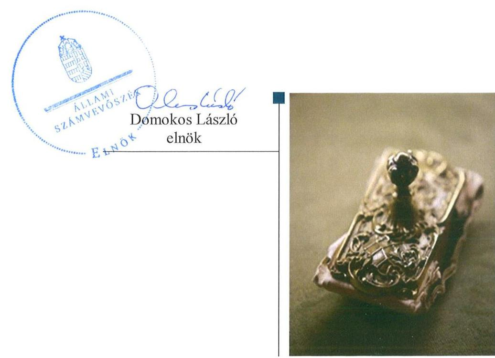
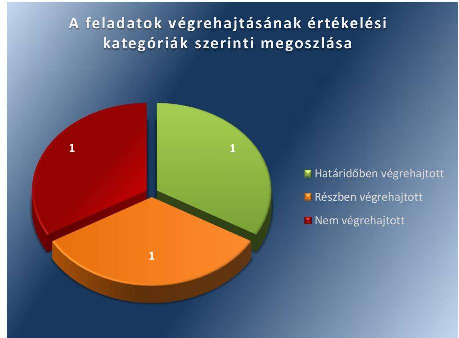

# Jelenetés 

## Utóellenőrzések

Kiskunfélegyháza Város Önkormányzata vagyongazdálkodása
szabályszerúségének utóellenőrzése 2017.

---

# Jelentés 

## Utóellenőrzések

Kiskunfélegyháza Város Önkormányzata vagyongazdálkodása
szabályszerúségének utóellenőrzése
2017. maicies hó h. nap

---

# AZ ELLENŐRZÉST FELÜGYELTE: 

DR. NÉMETH ERZSÉBET felügyeleti vezető

## AZ ELLENŐRZÉST VEZETTE ÉS A VÉGREHAJTÁSÁÉRT FELELŐS:

DR. PELLEI TAMÁS ellenőrzésvezető

## A PROGRAM ÖSSZEÁLLÍTÁSÁÉRT FELELŐS:

JANIK JÓZSEF LÁSZLÓ osztályvezető

## A TÉMÁHOZ KAPCSOLÓDÓ KORÁBBI SZÁMVEVŐSZÉKI JELENTÉSEK:

- címe: Jelentés az önkormányzati vagyongazdálkodás szabályszerűségi ellenőrzéséről - Kiskunfélegyháza
- sorszáma: 13067

IKTATÓSZÁM: V-1169-057/2016.
TÉMASZÁM: 2203
ELLENŐRZÉS-AZONOSÍTÓ SZÁM: V075518

---

# TARTALOMJEGYZÉK 

■ ÖSSZEGZÉS ..... 5
■ AZ ELLENŐRZÉS CÉLJA ..... 6
■ AZ ELLENŐRZÉS TERÜLETE ..... 7
■ AZ ELLENŐRZÉS HÁTTERE, INDOKOLTSÁGA ..... 8
■ FÓKUSZKÉRDÉS ..... 9
■ ELLENŐRZÉS HATÓKÖRE ÉS MÓDSZEREI ..... 10
■ MEGÁLLAPÍTÁSOK ..... 12
■ MELLÉKLETEK ..... 15
I. sz. melléklet: Az ÁSZ 13067. számú jelentéséhez kapcsolódó intézkedési terv végrehajtása ..... 15
■ FÜGGELÉK: ÉSZREVÉTELEK ..... 17
■ RÖVIDÍTÉSEK JEGYZÉKE ..... 19

---

.

---

# ÖSSZEGZÉS 

Az utóellenőrzés megállapította, hogy Kiskunfélegyháza Város Önkormányzata az intézkedési tervében szereplő három feladatból egy feladatot határidőben, egy feladatot részben és egy feladatot nem hajtott végre, így nem tett megfelelő lépéseket az Állami Számvevőszék által korábban, a vagyongazdálkodás terén feltárt hiányosságok teljeskörü megszüntetése érdekében.

## Az ellenőrzés társadalmi indokoltsága

Az Állami Számvevőszék stratégiájában célul tűzte ki a számvevőszéki munka hasznosulásának javítását. Ezzel összhangban ellenőrzi, hogy az ellenőrzött szervezetek megvalósították-e a korábbi ellenőrzései által feltárt hibák, hiányosságok és szabálytalanságok megszüntetése céljából elkészített intézkedési terveikben foglaltakat. A rendszeres utóellenőrzések hozzájárulnak a szükséges intézkedések tényleges végrehajtáshoz, ezáltal a közpénzügyek rendezettségének javulásához.

## Főbb megállapítások, következtetések

Kiskunfélegyháza Város Önkormányzatának polgármestere az intézkedési tervet határidőben megküldte az Állami Számvevőszék részére. Az intézkedési tervben rögzített feladatok végrehajtásáról vezették a jogszabályi előírásnak megfelelő nyilvántartást.

Az intézkedési tervben meghatározott három feladatból egyet határidőben, egyet részben hajtottak végre, egy feladat végrehajtása nem történt meg. A jelzáloggal terhelt korlátozottan forgalomképes, a törzsvagyon körébe tartozó ingatlan cseréjéről gondoskodtak. A háziorvosi praxis ellátásához térítésmentesen használatba adott eszközök nyilvántartásba vételéről gondoskodtak, azonban a nyilvántartásba vétel módja nem felelt meg a jogszabályi előírásoknak. Mindemellett hiányosság volt, hogy nem intézkedtek a kötvény kibocsátásából fennálló tartozás működési és fejlesztési célú felhasználás szerinti megbontásáról.

Az utóellenőrzés megállapította, hogy a vagyongazdálkodás területén tapasztalt hiányosságok miatt a vagyongazdálkodás szabályszerűsége teljeskörűen nem volt biztosított.

---

# AZ ELLENŐRZÉS CÉLJA

Az ellenőrzés célja annak értékelése volt, hogy a számvevőszéki jelentésben¹ foglalt intézkedést igénylő megállapításokkal és javaslatokkal összhangban készített intézkedési tervben meghatározott feladatokat az ellenőrzött szervezet végrehajtotta-e.

---

# AZ ELLENŐRZÉS TERÜLETE 

## Kiskunfélegyháza Város Önkormányzata

Kiskunfélegyháza város Bács-Kiskun megyében, a Kiskunság területén található. Lakónépességének száma a KSH által közzétett népességi adatok ${ }^{2}$ szerint 2015. január 1-jén 29153 fő volt.

Az ÁSZ³ 2013-ban ellenőrizte az Önkormányzat ${ }^{4}$ vagyongazdálkodásának szabályszerűségét. Az ellenőrzés a 2007. január 1. és 2011. december 31. közötti időszakra terjedt ki, kitekintéssel a helyszíni ellenőrzés befejezéséig tartó időszak releváns folyamataira. Az egyes közbeszerzési eljárások lefolytatásának ellenőrzése a 2011. évet és a 2012. év I. negyedévét érintette. Az ellenőrzés célja annak értékelése volt, hogy az Önkormányzatnál a vagyongazdálkodási tevékenységet, annak szervezeti kereteit szabályozták-e, az önkormányzati vagyongazdálkodás törvényességét, szabályszerűségét biztosították-e a döntések előkészítése és végrehajtása során, jogszerű döntéseken alapult-e a vagyon értékének és összetételének változása, a belső ellenőrzés elősegítette-e a vagyongazdálkodás szabályszerű működését, valamint hasznosultak-e a korábbi külső ellenőrzések által tett javaslatok.

Az ÁSZ 2013-ban lefolytatott ellenőrzése óta a polgármester és a jegyző ${ }^{5}$ személye is változott. A polgármester ${ }^{6}$ 2014. október 13-ától tölti be tisztségét, a jegyző 2015. január 6-ától látja el feladatait.

A 2015. évi zárszámadási rendelet szerint az Önkormányzat és intézményei 5956 millió Ft költségvetési bevételt értek el, és 5511 millió Ft költségvetési kiadást teljesítettek. A 2015. december 31-ei könyvviteli mérleg szerinti mérlegfőösszeg 30777 millió Ft volt, ezen belül a nemzeti vagyonba tartozó befektetett eszközök állományi értéke 28423 millió Ft, a követelések állományi értéke 536 millió Ft, a kötelezettségek állományi értéke 535 millió Ft volt.

Az utóellenőrzés az ÁSZ jelentésben a jegyző részére megfogalmazott, intézkedést igénylő megállapításokra és javaslatokra készített, az ÁSZ részére megküldött intézkedési terv végrehajtására fókuszált.

---

# AZ ELLENŐRZÉS HÁTTERE, INDOKOLTSÁGA 

Az ÁSZ tv. ${ }^{7}$ 33. § (1) bekezdése értelmében a számvevőszéki jelentések intézkedést igénylő megállapításaihoz és javaslataihoz kapcsolódóan az ellenőrzött szervezet vezetője intézkedési tervet köteles összeállítani, és az ÁSZ részére megküldeni. Az intézkedési tervben foglaltak megvalósítását az ÁSZ tv. 33. § (7) bekezdésében foglaltak alapján - az ÁSZ utóellenőrzés keretében ellenőrizheti. Az intézkedések megvalósulásának értékelése során az ÁSZ figyelembe veszi az ellenőrzött szervezetek működési feltételeiben, valamint a jogszabályi előírásokban bekövetkezett változásokat.

Az intézkedési tervekben foglalt feladatok hiányos, illetve késedelmes végrehajtása, valamint megvalósításának elmaradása azt mutatja, hogy az ellenőrzések során feltárt hibák, hiányosságok és szabálytalanságok megszüntetése nem kapott kellő hangsúlyt. Ez a szabályszerű működés és a felelős vezetői magatartás vonatkozásában kockázatot hordoz. E kockázatok feltárásával az ÁSZ utóellenőrzési rendszere fokozza a fegyelmet, és igazolja, hogy a közpénzzel való szabályos gazdálkodás felelőssége elől nem lehet kitérni.

## AZ UTÓELLENŐRZÉS VÁRHATÓ HASZNOSULÁSA

Az utóellenőrzés négy szinten hasznosulhat:
$\longrightarrow$ A társadalom szintjén az utóellenőrzés jelzi, hogy a számvevőszéki ellenőrzés megállapításainak van következménye: a hiányosságok megszüntetésére az ellenőrzött szervezet által meghatározott intézkedések végrehajtását is számon kéri az ÁSZ.
$\longrightarrow$ Az ellenőrzött terület szintjén az utóellenőrzés tájékoztatást nyújt a terület döntéshozóinak a hiányosságok kiküszöbölésének jó gyakorlatairól, ezzel lehetőséget biztosítva arra, hogy az ÁSZ ellenőrzési megállapításai, javaslatai a terület nem ellenőrzött szervezeteinek a működése során is hasznosuljanak.
$\longrightarrow$ Az ellenőrzött szervezet szintjén az utóellenőrzés feltárja, hogy a szervezet az intézkedések végrehajtásával hasznosította-e a korábbi ellenőrzési jelentésben a hiányosságok megszüntetése, illetve a kockázatok kezelése érdekében megfogalmazott javaslatokat.
$\longrightarrow$ Az ÁSZ szintjén az utóellenőrzés visszacsatolást ad az ellenőrzési jelentések hasznosulásáról, az intézkedések elmaradása vagy részleges megvalósulása a további ellenőrzésekhez kockázati jelzésként szolgál.

---

# FÓKUSZKÉRDÉS 

Az Önkormányzat az intézkedési tervben foglaltakat az elöirt határidőben végrehajtotta-e?

---

# ELLENŐRZÉS HATÓKÖRE ÉS MÓDSZEREI 

## Az ellenőrzés típusa

Megfelelőségi ellenőrzés.

## Az ellenőrzött időszak

Az utóellenőrzés alapját képező ÁSZ jelentés közzétételének napjától (2013. augusztus 27.) az ellenőrzésről szóló kiértesítő levél keltének napjáig (2016. június 23.) tartó időszak.

## Az ellenőrzés tárgya

A számvevőszéki jelentésben foglalt intézkedést igénylő megállapításokkal és javaslatokkal összhangban - az Önkormányzat által - készített intézkedési tervben foglaltak végrehajtásának ellenőrzése.

Az ellenőrzés kiterjed minden olyan körülményre és adatra, amely az ÁSZ jogszabályban meghatározott feladatainak teljesítéséhez, valamint a program végrehajtása folyamán felmerült újabb összefüggések feltárásához szükséges.

## Az ellenőrzött szervezet

Kiskunfélegyháza Város Önkormányzata

## Az ellenőrzés jogalapja

Az ÁSZ az Országgyűlés pénzügyi és gazdasági ellenőrző szerve. Az ÁSZ törvényben meghatározott feladatkörében ellenőrzi a központi költségvetés végrehajtását, az államháztartás gazdálkodását, az államháztartásból származó források felhasználását és a nemzeti vagyon kezelését.

Az ÁSZ tv. 1. § (3) bekezdése szerint az ÁSZ általános hatáskörrel végzi a közpénzekkel és az állami és önkormányzati vagyonnal való felelős gazdálkodás ellenőrzését.

Az ÁSZ tv. 33. § (7) bekezdése alapján az ÁSZ tv. 33. § (1)-(2) bekezdése szerinti intézkedési tervben foglaltak megvalósítását az ÁSZ utóellenőrzés keretében ellenőrizheti.

---

# Az ellenőrzés módszerei 

Az ÁSZ az utóellenőrzést a nemzetközi standardokat irányadónak tekintve az ellenőrzési program ellenőrzési kérdései, az ellenőrzött időszakban hatályos jogszabályok, az ellenőrzés szakmai szabályok és módszertanok figyelembevételével, önálló ellenőrzés keretében végezte.

Az ÁSZ az ellenőrzés ideje alatt az Önkormányzattal történő kapcsolattartást az ÁSZ SZMSZ ${ }^{8}$-ének vonatkozó előírásai alapján biztosította.

Az utóellenőrzés megállapításait elsősorban az ÁSZ rendelkezésére álló, valamint az ellenőrzött szervezetektől elektronikusan bekért dokumentumok alapozták meg.

Az ellenőrzési bizonyítékként felhasználható adatforrások közé tartoznak egyrészt az ellenőrzés szakmai programjában felsorolt adatforrások, másrészt minden - az ellenőrzés folyamán feltárt, az ellenőrzés szempontjából információt tartalmazó - dokumentum.

Az intézkedési tervekben előírt feladatokat, azok végrehajthatósága, illetve végrehajtása szempontjából az alábbiak szerint értékelte az ÁSZ:
"határidőben végrehajtott" a feladat, ha a teljesítés dokumentáltan, az intézkedési tervben előírt határidőben és tartalommal megtörtént;
"határidőn túl végrehajtott" a feladat, ha annak teljesítése az intézkedési tervben meghatározott módon, de az előírt határidőn túl történt meg;
"részben végrehajtott" a feladat, ha végrehajtása teljes körűen az intézkedési tervben előírt módon nem történt meg;
"nem végrehajtott" a feladat, ha a végrehajtás nem történt meg, vagy amennyiben a teljesítést nem dokumentálták;
"okafogyottá vált" a feladat, ha végrehajtására - meghatározott esemény bekövetkezése, továbbá külső körülmény, a múködést érintő feltétel változása miatt - már nincs szükség, illetve lehetőség, és egyértelműen megállapítható, hogy az intézkedést szükségessé tevő körülmény a jövőben nem fordulhat elő;
"nem időszerü" az a feladat, amelynek ellenőrzési időszakon belüli végrehajtására azért nem került (kerülhetett) sor, mert az intézkedés alapjául szolgáló esemény nem következett be, de annak jövőbeni előfordulása lehetséges, a végrehajtása nem volt esedékes, vagy a végrehajtás határideje még nem járt le.
Az ellenőrzés lefolytatásához az ellenőrzött szervezet a tanúsítványok elektronikus kitöltésével, valamint az ÁSZ által kért dokumentumok elektronikus megküldésével szolgáltatott adatokat, amelyek valódiságát és teljes körűségét az ellenőrzött szervezet vezetője által tett teljességi és hitelességi nyilatkozat igazolta. Az így rendelkezésre bocsátott adatok, információk kontrollja az ellenőrzés keretében történt.

---

# MEGÁLLAPÍTÁSOK 

## Az Önkormányzat az intézkedési tervben foglaltakat az előírt határidőben végrehajtotta-e?

Összegző megállapítás

Az Önkormányzat az intézkedési tervben meghatározott három feladatból egy feladatot határidőben végrehajtott, egy feladatot részben és egy feladatot nem hajtott végre. Az intézkedési tervben rögzített feladatok végrehajtásáról vezették a jogszabályban előírt nyilvántartást.

Az ÁSZ a jelentésében a jegyző részére három javaslatot fogalmazott meg. A polgármester az ÁSZ részére megküldött intézkedési tervben a hiányosságok, szabálytalanságok megszüntetésére három feladatot határozott meg, a feladatok elvégzésének felelőseként a jegyzőt és a pénzügyi osztályvezetőt jelölte meg.

Az ÁSZ javaslatai alapján készített intézkedési tervben rögzített feladatok végrehajtásáról a jegyző vezette a Bkr. ${ }^{9}$ előírásainak megfelelő nyilvántartást.

Az intézkedési tervben meghatározott feladatokat, határidőket, a feladatok elvégzésének felelősét és a feladatok végrehajtását az I. számú melléklet mutatja be.

Az intézkedési tervben tervezett feladatok végrehajtásának értékelési kategóriák szerinti megoszlását az 1. ábra szemlélteti.

1. ábra

Forrás: ÁSZ

---

# HATÁRIDŐBEN VÉGREHAJTOTT feladat: 

1. A jegyző az Nvtv. ${ }^{10}$ előírásainak megfelelően intézkedett a 2011. évi kötvénykibocsátás fedezetéül szolgáló korlátozottan fogalomképes ingatlan cseréjéről. A 2014. évi önkormányzati adósságkonszolidációra figyelemmel a kötvénykibocsátás fedezetéül szolgáló forgalomképes ingatlan keretbiztosítéki jelzálogjog körében történő biztosítása okafogyottá vált.

## RÉSZBEN VÉGREHAJTOTT feladat:

2. A jegyző intézkedett a háziorvosi praxis ellátásához térítésmentesen használatba adott eszközök nyilvántartásáról, azonban a nyilvántartásba vétel módja nem felelt meg a Számv. tv. ${ }^{11}$ előírásainak.

## NEM VÉGREHAJTOTT feladat:

3. A jegyző az Áhsz ${ }_{1}{ }^{12}$-ben foglalt előírásokat megsértve a 2013. évben nem biztosította az Önkormányzat számviteli nyilvántartásában és a költségvetési beszámolójában a kötvénykibocsátásából fennálló tartozás múködési és fejlesztési célú felhasználás szerinti megbontását annak ellenére, hogy az önkormányzati kötvénykibocsátásból származó források részben fejlesztési célúak voltak. A feladat végrehajtásának értékelése 2014. évtől kezdődően okafogyottá vált, mert a 2014. január 1-jétől hatályos Áhszz ${ }^{13}$ nem tartalmazza a kötvénykibocsátásból fennálló tartozás múködési és fejlesztési célú felhasználás szerinti elkülönítését, továbbá a 2014. évben végrehajtott adósságkonszolidációt követően az Önkormányzat nem rendelkezett kötvényállománnyal.

---

.

---

# MELLÉKLETEK

- I. SZ. MELLÉKLET: AZ ÁSZ 13067. SZÁMÚ JELENTÉSÉHEZ KAPCSOLÓDÓ INTÉZKEDÉSI TERV VÉGREHAJTÁSA

|  Az intézkedési terv alapján elvégzendő feladat | Az intézkedési tervben meghatározott határidő | Az intézkedési tervben rögzített feladatok elvégzésének felelése | A feladat végrehajtása  |
| --- | --- | --- | --- |
|  Határidőben végrehajtott feladat |  |  |   |
|  1. „Intézkedünk a 2011. évi kötvénykibocsátás fedezetéül szolgáló korlátozottan fogalomképes ingatlan cseréjéről a Vagyon tv. 5. §. (7) bekezdésében foglalt előírások betartásával." | 2013. szeptember 30.
ill. folyamatos | jegyző,
pénzügyi
osztályvezető | A jegyző a 217/2013. (IX. 27.) számú Képviselő-testületi határozat, valamint az Nvtv. 5. § (7) bekezdésének előírása alapján 2012. október 11-én intézkedett a 2011. évi kötvénykibocsátáshoz kapcsolódóan jelzáloggal megterhelt korlátozottan forgalomképes, önkormányzati törzsvagyon körbe tartozó Kiskunfélegyháza belterület 2084 hrsz. alatt megtalálható ingatlan jelzálog fedezeti körből való törléséről és ezzel egyidejűleg a Kiskunfélegyháza belterület 885/22 hrsz. alatt megtalálható forgalomképes termőföld besorolású ingatlan keretbiztosítéki jelzálogjog körébe történő bevonásáról. Az Önkormányzat vagyonrendeletei ${ }^{14},{ }^{15}$ értelmében a keretbiztosítéki jelzálogjog körébe bevont ingatlan nem tartozott a forgalomképtelen vagy a korlátozottan forgalomképes, önkormányzati törzsvagyoni körbe. A 2014. évi költségvetési törvény ${ }^{16}$ 67-68. §-ai alapján a 2014. évben sor került az önkormányzati adósság konszolidációjára, így a kötvénykibocsátás fedezetéül szolgáló forgalomképes termőföld besorolású ingatlan keretbiztosítéki jelzálogjog körében történő biztosítása okafogyottá vált.  |
|  Részben végrehajtott feladat |  |  |   |
|  2. „A Polgármesteri Hivatal számviteli nyilvántartásában a háziorvosi praxis ellátásához térítésmentesen használatba adott eszközök nyilvántartásáról intézkedünk a Számv. tv. 15 § (3) bekezdésének megfelelően." | 2013. szeptember 30.
ill. folyamatos | jegyző,
pénzügyi
osztályvezető | - Határidőben végrehajtott feladat: A jegyző 2013. szeptember 30-án intézkedett a háziorvosi praxis ellátásához térítésmentesen használatba adott eszközök számviteli nyilvántartásba vételéről.
- Nem végrehajtott feladat: A háziorvosi praxis ellátásához térítésmentesen használatba adott eszközöket a 2010. évben véglegesen átadott eszközként kivezették az Önkormányzat számviteli nyilvántartásból, amelyeket 2013. szeptember 30-án térítésmentes átvétel mozgásnem címen vettek ismételten nyilvántartásba. A térítésmentes átvétel jogcímét nem igazolták, a számviteli nyilvántartásba vételt az Önkormányzat a bizonylatokkal, dokumentumokkal nem támasztotta alá, ami nem felelt meg a Számv. tv. 165. § (1) bekezdésében foglaltaknak, továbbá az Önkormányzat számviteli nyilvántartásában  |

---

|  5 | Az intézkedési terv alapján elvégzendő feladat | Az intézkedési tervben meghatározott határidő | Az intézkedési tervben rögzített feladatok elvégzésének felelőse | A feladat végrehajtása  |
| --- | --- | --- | --- | --- |
|   |  |  |  | szabályszerűen kiállított bizonylat nélkül történő bejegyzésekkel megsértették a Számv. tv. 165. § (2) bekezdésében foglaltakat. Mindezek alapján a nyilvántartásba vétel módja nem felelt meg a Számv. tv. 15. § (3) és 16. § (3) bekezdéseiben előírtaknak sem.  |
|   |  |  | Nem végrehajtott feladat |   |
|  3. | „Az önkormányzat a számviteli nyilvántartásaiban és a költségvetési beszámolóiban a kötvény kibocsátásából fennálló tartozás működési és fejlesztési célú felhasználás szerinti megbontását az Áhsz. 9. számú mellékletének a számlaosztályok tartalmára vonatkozó előírások alcím alatt található 4. c) pontjában foglalt előírásoknak megfelelően biztosítjuk." | 2013. szeptember 30. ill. folyamatos | jegyző,
pénzügyi
osztályvezető | A jegyző a 2013. évben nem biztosította az Önkormányzat számviteli nyilvántartásában és a költségvetési beszámolójában az Áhsz. 9. számú mellékletének a számlaosztályok tartalmára vonatkozó előírások alcím alatt található 4. c) pontjában foglaltak ellenére a kötvénykibocsátásából fennálló tartozás fejlesztési és működési célú felhasználás szerinti elkülönítését, megbontását. A kötvényt teljes összegében a működési célú kötvénykibocsátásból származó tartozások között tartották nyilván annak ellenére, hogy az önkormányzati kötvénykibocsátásból származó források részben fejlesztési célúak voltak. A feladat végrehajtásának értékelése 2014., 2015. és 2016. évekre vonatkozóan okafo gyottá vált, tekintettel arra, hogy 2014. január 1-jétől hatályos Áhsz. 16. számú mellékletét képező egységes számlatúkör nem tartalmazza a kötvénykibocsátásból fennálló tartozás működési és fejlesztési célú felhasználás szerinti megbontását, továbbá a 2014. évi költségvetési törvény 67-68. §-ai alapján - a 2014. évi adósságkonszolidáció eredményeképpen - az Önkormányzat nem rendelkezett kötvényállománnyal.  |

Forrás: ÁSZ által készített táblázat

---

# FÜGGELÉK: ÉSZREVÉTELEK 

A jelentéstervezetet a Számvevőszék 15 napos észrevételezésre megküldte az ellenőrzött szervezet vezetőjének az ÁSZ tv. 29. §* (1) bekezdése előírásának megfelelően.
Az ellenőrzött szervezet vezetője az ÁSZ tv. 29. § (2) bekezdésében foglalt észrevételezési jogával nem élt, a jelentéstervezetre észrevételt nem tett.

[^0]
[^0]:    * 29. § (1) Az Állami Számvevőszék az ellenőrzési megállapításait megküldi az ellenőrzött szervezet vezetőjének vagy az általa megbízott személynek, és annak, akinek személyes felelősségét állapította meg.
    (2) Az ellenőrzött szervezet vezetője és a felelősként megjelölt személy az ellenőrzés megállapításaira tizenöt napon belül írásban észrevételt tehet.
    (3) Az Állami Számvevőszék az észrevételre a beérkezésétől számított harminc napon belül írásban válaszol. A figyelembe nem vett észrevételeket köteles a jelentésben feltüntetni, és megindokolni, hogy azokat miért nem fogadta el.

---

.

---

# RÖVIDÍTÉSEK JEGYZÉKE 

${ }^{1}$ számvevőszéki jelentés
${ }^{2}$ KSH által közzétett népességi adatok
${ }^{3}$ ÁSZ
${ }^{4}$ Önkormányzat
${ }^{5}$ jegyző
${ }^{6}$ polgármester
${ }^{7}$ ÁSZ tv.
${ }^{8}$ ÁSZ SZMSZ
${ }^{9}$ Bkr.
${ }^{10}$ Nvtv.
${ }^{11}$ Számv. tv.
${ }^{12}$ Áhsz. 1
${ }^{13}$ Áhsz. 2
${ }^{14}$ vagyonrendelet ${ }_{1}$
${ }^{15}$ vagyonrendelet ${ }_{2}$
${ }^{16}$ költségvetési törvény

Az ÁSZ 13067. számú jelentése - Jelentés az önkormányzati vagyongazdálkodás szabályszerűségi ellenőrzéséről - Kiskunfélegyháza (elérhető a www.asz.hu honlapon)
Központi Statisztikai Hivatal, Magyarország Közigazgatási Helységnévkönyvének 2015. január 1-jei adatai
Állami Számvevőszék
Kiskunfélegyháza Város Önkormányzata
Kiskunfélegyházi Polgármesteri Hivatal jegyzője
Kiskunfélegyháza Város Önkormányzatának polgármestere
Az Állami Számvevőszékről szóló 2011. évi LXVI. törvény (hatályos: 2011. július 1-jétől)
Az Állami Számvevőszék elnökének 3/2015. (XII.30.) ÁSZ utasítása az Állami Számvevőszék Szervezeti és Müködési Szabályzatáról (hatályos: 2016. január 1-jétől)
370/2011. (XII.31.) Korm. rendelet a költségvetési szervek belső kontrollrendszeréről és belső ellenőrzéséről (hatályos: 2012. január 1-jétől) 2011. évi CXCVI. törvény a nemzeti vagyonról (hatályos: 2011. december 31-étől) A számvitelről szóló 2000. évi C. törvény (hatályos: 2001. január 1-jétől) 249/2000. (XII.24.) Korm. rendelet az államháztartás szervezeti beszámolási és könyvvezetési kötelezettségeinek sajátosságairól (hatálytalan: 2014. január 1-jétől)
4/2013. (I. 11.) Korm. rendelet az államháztartás számviteléről (hatályos: 2014. január 1-jétől)
Kiskunfélegyháza Város Önkormányzat Képviselő-testületének 4/2012. (II.24.) önkormányzati rendelete az önkormányzati vagyonról, a vagyon hasznosításáról, használatának, forgalmának rendjéről, vállalkozások támogatására
Kiskunfélegyháza Város Önkormányzat Képviselő-testületének 24/2014. (XI.07.) önkormányzati rendelete az önkormányzati vagyonról, a vagyon hasznosításáról, használatának, forgalmának rendjéről
2013. évi CCXXX. törvény Magyarország 2014. évi központi költségvetéséről

---

# ÁLLAMI SZÁMVEVŐSZÉK 

1052 Budapest, Apáczai Csere János utca 10.
Levélcím: 1364 Budapest 4. Pf. 54
Telefon: +36 14849100 Telefax: +36 14849200
www.asz.hu