# Jelentés 

## MNF Magyar Nemzeti Filharmonikus Zenekar, Énekkar és Kottatár Nonprofit Kft.

Az állami tulajdonban (résztulajdonban) lévő gazdálkodó szervezetek vagyonmegőrzési és gazdálkodási tevékenységének ellenőrzése 2017.

Az ÁSZ ellenőrzéseivel hozzájárul ahhoz, hogy a közpénzeket a szervezetek átlátható és rendezett módon használják fel a feladataik ellátása érdekében.
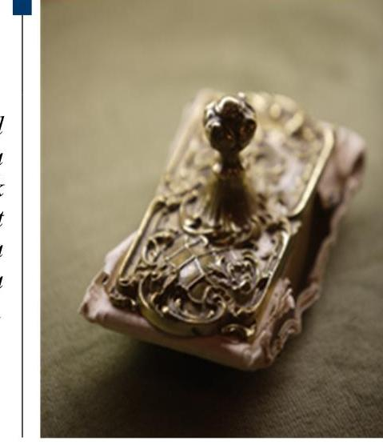

---

# Jelentés 

## MNF Magyar Nemzeti Filharmonikus Zenekar, Énekkar és Kottatár Nonprofit Kft.

Az állami tulajdonban (résztulajdonban) lévő gazdálkodó szervezetek vagyonmegőrzési és gazdálkodási tevékenységének ellenőrzése
2017. március 4. nap
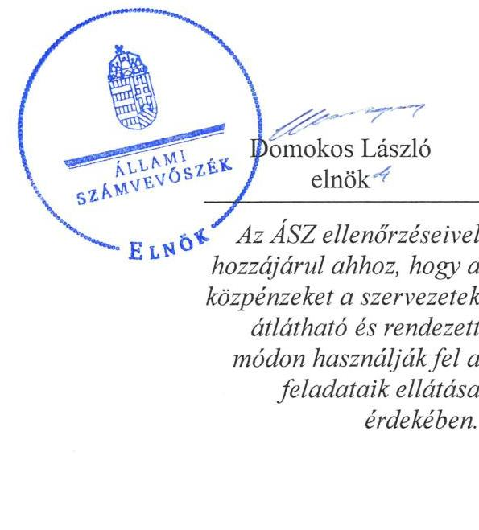

---

# AZ ELLENŐRZÉST FELÜGYELTE:

DR. HORVÁTH MARGIT felügyeleti vezető

## AZ ELLENŐRZÉST VEZETTE ÉS A VÉGREHAJTÁSÁÉRT FELELŐS:

PENCZ MÁRIA, VIDA KATALIN ellenőrzésvezető

## A PROGRAM ÖSSZEÁLLÍTÁSÁÉRT FELELŐS:

JANIK JÓZSEF LÁSZLÓ osztályvezető

IKTATÓSZÁM: V-1032-165/2016.

TÉMASZÁM: 2066

ELLENŐRZÉS-AZONOSÍTÓ SZÁM: V070925

Jelentéseink az Országgyűlés számítógépes hálózatán és az Interneten a www.asz.hu címen is olvashatóak.

---

# TARTALOMJEGYZÉK 

■ ÖSSZEGZÉS ..... 5
■ AZ ELLENŐRZÉS CÉLJA ..... 7
■ AZ ELLENŐRZÉS TERÜLETE ..... 8
■ AZ ELLENŐRZÉS HÁTTERE, INDOKOLTSÁGA ..... 10
■ A JELENTÉS LÉNYEGES KÉRDÉSKÖREI ..... 11
■ ELLENŐRZÉS HATÓKÖRE ÉS MÓDSZEREI ..... 12
■ MEGÁLLAPÍTÁSOK ..... 14
■ JAVASLATOK ..... 27
■ MELLÉKLETEK ..... 29
I. sz. melléklet: Értelmező szótár ..... 29
II. sz. melléklet: Az MNF Nonprofit Kft. mérlegadatai és változásuk a 2011-2014. közötti években (E Ft, \%) ..... 33
III. sz. melléklet: Az MNF Nonprofit Kft. eredményének alakulása a 2011-2014. közötti években ( E Ft, \%) ..... 35
■ FÜGGELÉK: ÉSZREVÉTELEK ..... 37
■ RÖVIDÍTÉSEK JEGYZÉKE ..... 53

---

.

---

# ÖSSZEGZÉS 

Az Állami Számvevőszék a Magyar Nemzeti Filharmonikus Zenekar, Énekkar és Kottatár Nonprofit Kft. vagyonmegőrzési és gazdálkodási tevékenysége 2011. január 1. és 2014. december 31. közötti időszakra történő ellenőrzése során megállapította, hogy az Emberi Erőforrások Minisztériuma és a Magyar Nemzeti Vagyonkezelő Zrt. összességében szabályszerűen alakította ki a vagyonnal való gazdálkodás feltételeit. A Magyar Nemzeti Filharmonikus Zenekar, Énekkar és Kottatár Nonprofit Kft. vagyongazdálkodási tevékenységének szabályozása megfelelt a jogszabályi követelményeknek. Ugyanakkor a vagyon nyilvántartása nem felelt meg a jogszabályi és a belső előírásoknak, mivel az általuk használatra továbbadott eszközökre vagyonhasznosítási szerződést nem kötöttek, ezáltal a vagyonkezelt eszközökkel kapcsolatos forrásokat a mérlegben tévesen mutatták ki. Az ellátott közhasznú tevékenység bevételeinek és ráfordításainak elszámolása megfelelő volt, adósságot keletkeztető ügyletet nem kötött.

## Az ellenőrzés társadalmi indokoltsága

Magyarországon az intézmény-centrikus közfeladat-ellátás, közvagyon-gazdálkodás jellemző a költségvetésen kívüli feladatellátás térnyerése mellett. Ennek szereplői az állami tulajdonú gazdálkodó szervezetek is.

Az államháztartási törvény, az Európai Közösséget létrehozó szerződéshez csatolt, a túlzott hiány esetén követendő eljárásról szóló jegyzőkönyv alkalmazásáról szóló 2009. május 25-i 479/2009/EK rendelet szerint, illetve az ESA95 és ESA2010 statisztikai módszertana alapján a kormányzati szektorba tartoznak a "központi kormányzat alszektorba besorolt társaságok és egyéb szervezetek" is, amelyekkel szemben alapvető követelmény, hogy gazdálkodásuk, működésük szabályszerű, az általuk szolgáltatott adatok megbízhatóak legyenek.

Az állami vagyonnal való gazdálkodás alapvető célja az állami vagyon átlátható, rendeltetésszerű és felelős felhasználásának biztosítása. Az állami tulajdonban álló gazdálkodó szervezetek államot megillető társasági részesedése a nemzeti vagyon részét képezi és legfőbb rendeltetése szerint a közfeladatok ellátását szolgálja.

Az Állami Számvevőszék stratégiájában megfogalmazta, hogy az államháztartáson kívülre nyújtott költségvetési támogatások és ingyenes vagyonjuttatások, valamint az államháztartáson kívül működő közfeladat-ellátó rendszerek ellenőrzéseivel hozzájárul ahhoz, hogy a közpénzeket az államháztartáson kívül működő szervezetek is átlátható, rendezett módon használják fel a közfeladatok szerződésben vállalt ellátása érdekében.

## Főbb megállapítások, következtetések, javaslatok

Az Emberi Erőforrások Minisztériuma és a Magyar Nemzeti Vagyonkezelő Zrt. összességében szabályszerűen alakította ki a vagyonnal való gazdálkodás feltételeit. A Magyar Nemzeti Vagyonkezelő Zrt. a tulajdonosi jogok gyakorlásáról szóló megbízási szerződést a jogszabályban meghatározott határidőn túl kötötte meg az Emberi Erőforrások Minisztériumával, továbbá nem módosította, nem aktualizálta a vagyonkezelési szerződést a Magyar Nemzeti Filharmonikus Zenekar, Énekkar és Kottatár Nonprofit Kft.-vel a jogszabályi előírás-változásoknak megfelelően.

A Magyar Nemzeti Filharmonikus Zenekar, Énekkar és Kottatár Nonprofit Kft. a vagyon értékének megőrzését, gyarapítását szolgáló szabályszerű vagyongazdálkodás feltételeit kialakította. A vagyonkezelésében lévő eszközök hasznosítására az eszközöket használó regionális közhasznú társaságokkal, illetve azok jogutódjaival a jogszabályi előírások ellenére nem kötött szerződést, mely közvetlenül hozzájárulhatott a vagyonkezelésbe vett eszköz hiányához. Az állami tulajdon védelmét nem biztosították.

---

A Magyar Nemzeti Filharmonikus Zenekar, Énekkar és Kottatár Nonprofit Kft. kezelt vagyonának nyilvántartása nem felelt meg a jogszabályi követelményeknek, mert éves beszámolóiban és a számviteli nyilvántartásaiban a vagyonkezelési szerződésben rögzített értéknél 258,1 M Ft-tal alacsonyabb értékben mutatta ki a vagyonkezelt eszközökkel kapcsolatos hosszú lejáratú kötelezettségét. Az eltérés a megbízható és valós képet lényegesen befolyásoló hibát idézett elő.

A Magyar Nemzeti Filharmonikus Zenekar, Énekkar és Kottatár Nonprofit Kft. a szabályszerű önköltségszámítás feltételeit nem megfelelően alakította ki, mert a kalkulációs séma nem a jogszabályi előírásoknak megfelelően készült, nem szerepeltek benne az önköltség részét képező közvetett költségek, az alkalmazott önköltségszámítás a szabályozási hiányosságok miatt nem volt megfelelő.

A vagyonnal való gazdálkodás, és a vagyonváltozást eredményező döntések a jogszabályi és a tulajdonosi előírásoknak - a visszapótlási kötelezettség teljesítése kivételével - összességében megfeleltek.

Az ellátott közhasznú tevékenység bevételeinek és ráfordításainak elszámolása megfelelt a jogszabályi előírásoknak.

A beszámolási és adatszolgáltatási kötelezettségét összességében megfelelően teljesítette. Nem készített a közérdekű adatok megismerésére irányuló igények teljesítésének rendjét rögzítő szabályzatot. Elektronikus közzétételi kötelezettségének nem tett eleget.

Adósságot keletkeztető ügyletet az ellenőrzött időszakban nem kötöttek.

---

# AZ ELLENŐRZÉS CÉLJA 

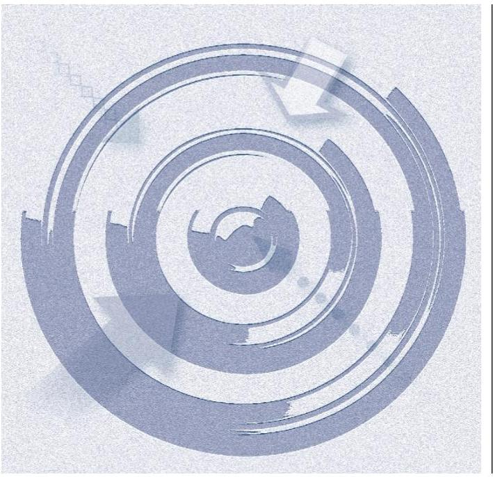

Az ellenőrzés célja annak értékelése, hogy a tulajdonosi jogok gyakorlása szabályszerű volt-e; a gazdálkodó szervezet által ellátott feladat bevételei, ráfordításai elszámolásának, és vagyongazdálkodási tevékenységének szabályozása megfelelt-e a jogszabályi és a tulajdonosi előírásoknak és azok végrehajtása szabályszerű volt-e; biztosítva volt-e a közfeladatok átláthatósága és elszámoltathatósága érdekében a közszolgáltatás díjának megalapozottsága szabályszerű önköltségszámítással; a vagyonváltozást eredményező döntések esetében a tulajdonosi jogok gyakorlója és a gazdálkodó szervezet szabályszerűen jártak-e el; a gazdálkodó szervezet épített-e ki és működtetett-e információs rendszert a szabályszerű vagyongazdálkodás érdekében.

Az ellenőrzés további célja annak értékelése, hogy a kormányzati szektorba sorolt egyéb szervezetek gazdálkodásának a kormányzati szektor hiányára és az államadósságra befolyással bíró elemei a jogszabályi előírásoknak megfelelnek-e.

---

# **AZ ELLENŐRZÉS TERÜLETE**

## **Magyar Nemzeti Filharmonikus Zenekar, Énekkar és Kottatár Nonprofit Korlátolt Felelősségű Társaság**

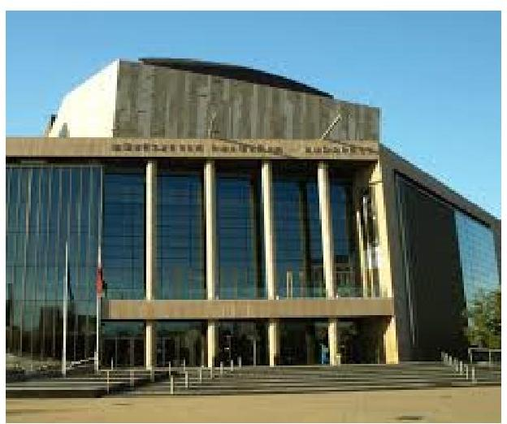

Az Oktatási és Kulturális Minisztérium az 1952-ben létrehozott Országos Filharmónia, majd 1998. január 19-től Magyar Nemzeti Filharmonikus Zenekar, Énekkar és Kottatár néven működő költségvetési intézmény jogutódjaként az Áht.1 rendelkezése alapján létrehozta a Magyar Nemzeti Filharmonikus Zenekar, Énekkar és Kottatár Közhasznú Társaságot, mely tevékenységét 2009. július 1-től nonprofit korlátolt felelősségű társaságként folytatta Magyar Nemzeti Filharmonikus Zenekar, Énekkar és Kottatár Nonprofit Korlátolt Felelősségű Társaság néven.

Az MNF Nonprofit Kft.2 az Alapító Okirat3 1.5 pontja alapján közhasznú jogállású volt, a közhasznú feladatellátás feltételeit az OKM-mel kötött Közhasznú szerződése4 és az EMMI-vel kötött Közszolgáltatási szerződése5 tartalmazta. Az MNF Nonprofit Kft. közhasznú tevékenységei az Alapító Okirat3 alapján kulturális tevékenység, kulturális örökség megóvása, nevelés és oktatás, képességfejlesztés voltak, amely az Alapító Okirat3 8. pontjában kibővült az előadó-művészeti tevékenységgel.

Az MNF Nonprofit Kft. feletti tulajdonosi jogokat az ellenőrzött időszakban 2011. január 1-jétől az EMMI6 gyakorolta az MNV Zrt.7-vel kötött szerződés alapján. Az MNF Nonprofit Kft. feladatellátásának finanszírozását az EMMI-vel kötött Közhasznú szerződés alapján kötött Támogatási szerződés1,8 szerint kapott támogatások, államháztartáson kívüli szervezetektől kapott támogatások és a működés bevételei biztosították. Az MNF Nonprofit Kft. feladatellátását biztosító vagyon saját vagyonból és a KVI9-től vagyonkezelésbe vett, állami tulajdonú ingóságokból (hangszerek, kották) állt.

Az MNF Nonprofit Kft. gazdálkodását az ellenőrzött években a beszámoló főbb adatai alapján az 1. táblázat szemlélteti:

1. táblázat

|  AZ MNF NONPROFIT KFT. FŐBB GAZDÁLKODÁSI ADATAI A 2011-2014. ÉVEKBEN (M FT-BAN) |  |  |  |  |   |
| --- | --- | --- | --- | --- | --- |
|  Megnevezés | 2011. év | 2012. év | 2013. év | 2014. év | Változás 2014 / 2011. (%)  |
|  Értékesítés nettó árbevétele | 320,6 | 126,0 | 163,5 | 188,1 | -41,33  |
|  Üzemi tevékenység eredménye | 136,3 | -41,5 | 31,2 | -30,3 | -122,23  |
|  Mérleg szerinti eredmény | 154,0 | -17,2 | 42,7 | -60,0 | -138,96  |
|  Befektetett eszközök | 440,7 | 437,3 | 433,3 | 427,7 | -2,95  |
|  Saját tőke | 410,1 | 392,9 | 435,5 | 375,6 | -8,41  |

**AZ ÉRINTETT TÉRÜLETE**

---

| Megnevezés | 2011.   év | 2012.   év | 2013.   év | 2014.   év | Változás   2014./   2011. (\%) |
| :--: | :--: | :--: | :--: | :--: | :--: |
| Jegyzett tőke | 10,0 | 10,0 | 10,0 | 10,0 | 0,00 |
| Mérlegfőösszeg | 914,1 | 940,7 | 943,0 | 917,2 | 0,34 |
| Közhasznú célú működésre kapott támogatás | 1778,1 | 1751,8 | 1953,3 | 1763,8 | 0,99 |
| - ebből alapítótól | 1632,0 | 1675,0 | 1875,0 | 1694,5 | 3,8 |
| -ebből társasági adó-   kedvezményhez kap-   csolódóan gazdálkodó   szervezetektől kapott   támogatás | 141,0 | 70,0 | 72,8 | 68,0 | -48,2 |
| -egyéb támogatások | 5,1 | 6,8 | 5,5 | 1,3 | -74,5 |
| Állományi létszám (fő) | 210 | 216 | 214 | 215 | 2,38 |

Forrás: 2011-2014. évi beszámolók

---

# AZ ELLENŐRZÉS HÁTTERE, INDOKOLTSÁGA 

Az ÁSZ10 középtávra szóló stratégiájában megfogalmazta, hogy az államháztartáson kívülre nyújtott költségvetési támogatások és ingyenes vagyonjuttatások, valamint az államháztartáson kívül működő közfeladat-ellátó rendszerek ellenőrzéseivel hozzájárul ahhoz, hogy a közpénzeket az államháztartáson kívül működő szervezetek is átlátható, rendezett módon használják fel a közfeladatok szerződésben vállalt ellátása, továbbá a közvagyon szerződésben vállalt átlátható, hatékony, költségtakarékos működtetése, értékének megőrzése, állagának védelme, értéknövelő használata, hasznosítása és gyarapítása érdekében. Az ellenőrzés feladata a közvagyonnal biztosított közfeladat-ellátással kapcsolatban a közpénzek átláthatósága, nyilvánossága érdekében a jogszabályokban, belső szabályzatokban megfogalmazott előírások érvényesülésének az állami tulajdonban (résztulajdonban) lévő gazdálkodó szervezetek vagyonérték-megőrzési és gazdálkodási tevékenységének értékelése.

Az ellenőrzés eredményéképp a törvényalkotás számára tapasztalatok állnak rendelkezésre az állami vagyonnal való közfeladat-ellátás, közvagyonnal való gazdálkodás értékeléséhez, az átláthatóságot biztosító szabályozáshoz. Az ellenőrzés tapasztalatai segítik és erősítik az ÁSZ hozzáadott értéket teremtő tevékenységét és tanácsadó szerepét.

---

# A JELENTÉS LÉNYEGES KÉRDÉSKÖREI 

1.     - A tulajdonosi joggyakorló a vagyonnal való gazdálkodás feltételeit szabályszerűen alakította-e ki?
2.     - Az MNF Nonprofit Kft. vagyongazdálkodási tevékenységének szabályozottsága és a vagyon nyilvántartása megfelelt-e az előírásoknak?
3.     - A bevételek és ráfordítások elszámolása, valamint az önköltségszámítás szabályszerű volt-e?
4. A vagyonnal való gazdálkodás, valamint a vagyonváltozást eredményező döntések megfeleltek-e a jogszabályi és tulajdonosi

 előírásoknak?
5.     - Az MNF Nonprofit Kft. a szabályszerű vagyongazdálkodás érdekében teljesítette-e beszámolási, adatszolgáltatási kötelezettségét, kiépített-e, illetve működtetett-e információs rendszert?
6. Az MNF Nonprofit Kft. gazdálkodásának a kormányzati szektor hiányára és az államadósságra befolyást gyakorló elemek a jogszabályi előírásoknak megfeleltek-e?

---

# ELLENŐRZÉS HATÓKÖRE ÉS MÓDSZEREI 

## Az ellenőrzés típusa

Szabályszerűségi ellenőrzés.

## Az ellenőrzött időszak

2011. január 1-jétől 2014. december 31-ig.

## Az ellenőrzés tárgya

Az állami tulajdonban (résztulajdonban) lévő gazdálkodó szervezetek vagyonmegőrzési és gazdálkodási tevékenysége és a kormányzati szektor hiányára és adósságállományára hatást gyakorló elemek ellenőrzése.

## Az ellenőrzött szervezet

Magyar Nemzeti Filharmonikus Zenekar, Énekkar és Kottatár Nonprofit Korlátolt Felelősségű Társaság, Magyar Nemzeti Vagyonkezelő Zrt., Emberi Erőforrások Minisztériuma

## Az ellenőrzés jogalapja

Az ellenőrzés alapját az Állami Számvevőszékről szóló 2011. évi LXVI. törvény 5. § (3)-(5) bekezdése, valamint az állami vagyonról szóló 2007. évi CVI. törvény 3. § (4) bekezdése képezi.

## Az ellenőrzés módszerei

Az ellenőrzést az ellenőrzési program szempontjai, az ellenőrzött időszakban hatályos jogszabályok, az ellenőrzés szakmai szabályai, a jelen ellenőrzésre irányadó ÁSZ módszertan és a nemzetközi standardok figyelembevételével végeztük.

Az ellenőrzési kérdések megválaszolásához szükséges bizonyítékok megszerzése az ellenőrzött által rendelkezésre bocsátott dokumentumokra, adatokra alapozva kérdésfelvetés, mintavételezés, valamint elemző eljárás útján történt.

---

2. táblázat

REGIONÁLIS SZERVEZETEKHEZ HELYEZETT VAGYONKEZELT ESZKÖZÖK SZEMREVÉTELEZÉSE

| Megnevezés | Darabszám | Bruttó   Eszközérték (E Ft) |
| :-- | :--: | :--: |
| Helyszínek   száma összesen | 54 | - |
| Szemrevételezett eszközök   száma összesen | 57 | 162020 |
| Selejtezett eszköz | 1 | 0 |
| Kihelyezett eszközök száma összesen | 59 | 163420 |
| Nem fellelhető eszköz   Forrás: Szemrevételezési és selejtezési jegyzőkönyvek | 1 | 1400 |

Az ellenőrzési bizonyítékként felhasználható adatforrások közé tartoztak egyrészt a szakmai program részletes szempontjainál felsorolt adatforrások, másrészt minden egyéb - az ellenőrzés folyamán feltárt, az ellenőrzés szempontjából információt tartalmazó - dokumentum.

Az ellenőrzés lefolytatásához a gazdálkodó szervezet a tanúsítványok elektronikus kitöltésével, valamint az ÁSZ által kért dokumentumok megküldésével szolgáltatott adatokat.

A bevételek és a ráfordítások elszámolását, és a vagyonnyilvántartás terén a szabályszerű működést véletlenszerű mintavétellel ellenőriztük. Az ellenőrzöttnél, mint a kormányzati szektorba sorolt gazdálkodó szervezetnél a személyi jellegű ráfordítások elszámolása mellett az egyéb ráfordítások, a pénzügyi műveletek ráfordításai, a rendkívüli ráfordítások, illetve az egyéb bevételek, a pénzügyi műveletek bevételei, a rendkívüli bevételek elszámolásának szabályszerűségét szintén mintatételeken keresztül ellenőriztük.

A mintavétellel ellenőrzött területek esetében minden egyes tétel vonatkozásában a szabályszerűségre vonatkozó kérdéseket tettük fel, amelyek eredménye összesítésre került. A jogszabályoknak és a belső előírásoknak megfelelőnek tekintettük az adott területet, amennyiben a minta ellenőrzésének eredménye alapján 95%-os bizonyossággal a teljes sokaságban a hibaarány kisebb volt, mint 10%, nem megfelelőnek értékeltük, ha a hibaarány a 10%-ot meghaladta. A ráfordítások elszámolására és a vagyonnyilvántartásra vonatkozó véletlen mintavételt kockázati alapú kiválasztással egészítettük ki, amelynek során évente a három legnagyobb összegű tételt választottuk ki.

A területi szervekhez kihelyezett vagyonkezelt eszközöket a használati helyén szemrevételeztük, melyet jegyzőkönyvvel dokumentáltunk.

A vagyonkezelési szerződés alapján az MNF Nonprofit Kft. kezelésében lévő, de a három regionális kft.-hez kihelyezett összesen 59 db eszköz helyszíni szemrevételezését 54 helyszínen (4 helyszínen 2-2 eszköz volt) végeztük el. A szemrevételezés során 57 eszköz fellelhető volt. Egy eszközt az ellenőrzött időszakot megelőzően selejtezési jegyzőkönyv alapján leselejteztek, egy eszköz a helyszínen nem volt fellelhető. A regionális szervezetekhez kihelyezett vagyonkezelt eszközök szemrevételezését a 2. táblázat mutatja be.

---

# 1. A tulajdonosi joggyakorló a vagyonnal való gazdálkodás feltételeit szabályszerűen alakította-e ki? 

Összegző megállapítás

Az EMMI és az MNV Zrt. összességében szabályszerűen alakította ki a vagyonnal való gazdálkodás feltételeit.

Az EMMI az Alapító Okirat$_{1-8}$-ban, az MNV Zrt. a vagyonkezelési szerződésben meghatározta az állami vagyon értékének megőrzését, gyarapítását, valamint a felelős vagyongazdálkodást biztosító követelményeket. Az MNV Zrt. a vagyonkezelési szerződést a jogszabályi környezet változása ellenére nem módosította.

Az ellenőrzött időszakban az MNF Nonprofit Kft. társasági részesedése feletti tulajdonosi jogokat az EMMI 2013. január 26-ig az MNV Zrt.-vel kötött társasági részesedésre vonatkozó vagyonkezelési szerződés, 2013. január 27-től a társasági részesedéshez kapcsolódó tulajdonosi jogok gyakorlásáról szóló Megbízási szerződés $^{11}$ alapján gyakorolta.

A TULAJDONOSI JOGGYAKORLÁS keretében az EMMI az Alapító Okirat$_{1-8}$-ban és alapítói határozatokon keresztül határozta meg, illetve biztosította a vagyonnal való rendelkezési jogokat.

Az Alapító Okirat$_{1-8}$ tartalmazta az MNF Nonprofit Kft. vagyonértékének megőrzése, a vagyon gyarapítása és a felelős gazdálkodás érdekében meghatározott előírásokat, a tulajdonosi joggyakorló számára fenntartott jogok között a vagyongazdálkodáshoz kapcsolódó jogokat, az ügyvezetőre vonatkozó összeférhetetlenségi szabályokat, rendelkezett az ügyvezető felelősségéről, tartalmazta az FB$^{12}$ feladatait, hatáskörét, előírta a könyvvizsgálati feladatokat. Az Alapító okirat$_{1-8}$ 6.2 pontja alapján az alapító kizárólagos hatáskörébe tartozott az SZMSZ$^{13}$ jóváhagyása és módosítása.

Az EMMI rendelkezett az éves üzleti tervek készítéséről és jóváhagyásáról, a tervezési irányelvekben évente megfogalmazta a minimális tőkehatékonysági elvárásokat. Az MNF Nonprofit Kft. az üzleti terveket az Alapító Okirat$_{1-8}$, a Közhasznú szerződés és a Közszolgáltatási szerződés előírásaival összhangban elkészítette, és azokat az FB - az EMMI jóváhagyását megelőzően - határozattal elfogadta.

Az Nvtv.$^{14}$ 8. § (7) bekezdés előírásának megfelelően - miszerint a társasági részesedés nem lehet vagyonkezelés tárgya - az MNV Zrt. az EMMI vagyonkezelési jogát megszüntette, ezzel egyidejűleg a szerződő felek gondoskodtak a tulajdonjog gyakorlásának Megbízási szerződés keretében történő további ellátásáról. A Megbízási szerződés az MNV Zrt. részéről 2012. december 20-án, míg az EMMI részéről 2013. január 27-én került aláírásra, így a megbízási szerződés megkötésére az Nvtv. 18. § (7) bekezdése előírásai ellenére késedelmesen, 2013. január 27-én került sor.

---

Az MNV Zrt. jogelődje, a KVI és az MNF Nonprofit Kft. jogelődje között 2002. október 31-én létrejött, a Magyar Állam tulajdonában lévő hangszerek, szakmai és egyéb eszközök, immateriális javak vagyonkezelésére irányuló Vagyonkezelési szerződésben$^{15}$ - az Áht. 1 és a 183/1996. (XII. 1.) Korm. rendelet$^{16}$ előírásainak megfelelően célként és feladatként jelölték meg a szakszerű vagyongazdálkodást, a hatékony, értékmegőrző, értéknövelő felhasználást, a vagyongyarapítást. A vagyonkezelői jog ellenértékeként az MNF Nonprofit Kft. vagyonkezelt vagyonára vonatkozó állagmegóvási, fenntartási, felújítási feladatok ellátását írták elő, továbbá meghatározták a vagyonkezelt eszközök bérbeadásának feltételeit, valamint vagyonvesztés esetében pótlási kötelezettséget írtak elő.

A Vagyonkezelési szerződésben - a Vhr.$^{17}$ és az Nvtv. előírásaival összhangban - rögzítették a tulajdonosi joggyakorló ellenőrzési jogát.

Az EMMI külső szakértő által végeztetett ellenőrzéseket. A Közhasznú szerződés 5. pontja, a Közszolgáltatási szerződés 4. pontja, és a 2011-2014. évi Támogatási szerződés1-4 6.1. pontja tartalmazta a szerződés teljesítésének, a kapott közhasznú támogatás elszámolásának EMMI általi ellenőrzési jogosultságát. A Közhasznú szerződés alapján kapott támogatások felhasználását az EMMI a 2011., a 2013. és a 2014. években helyszíni ellenőrzési jegyzőkönyvek alapján, igazoltan ellenőrizte. A 2012. évi elszámolás ellenőrzését nem dokumentálta.

# 2. Az MNF Nonprofit Kft. vagyongazdálkodási tevékenységének szabályozottsága és a vagyon nyilvántartása megfelelt-e az előírásoknak? 

Összegző megállapítás

Az MNF Nonprofit Kft. vagyongazdálkodási tevékenységének szabályozása megfelelt a jogszabályi követelményeknek. Vagyonnyilvántartása nem felelt meg a jogszabályoknak.
2.1. számú megállapítás

A vagyon értékének megőrzését, gyarapítását szolgáló, szabályszerű vagyongazdálkodás feltételeit kialakították.

## A VAGYONNAL VALÓ GAZDÁLKODÁS SZABÁLYOZÁSA összhangban volt a jogszabályi követelményekkel. Az Alapító Okirat$_{1-8}$ alapítói hatáskörébe utalta az SZMSZ jóváhagyását, amelyben meghatározták a belső szabályzatok készítésének körét. Az MNF Nonprofit Kft. a Számv. tv.$^{18}$ 14. § (5) bekezdésében meghatározott szabályzatokat, illetve a 161. § (1) bekezdésében előírt számlarendet - a 2009. július 1-jei átalakulást követően - a jogelődtől változatlan formában és változatlan tartalommal hatályban hagyta és az ellenőrzött időszakban a számviteli elszámolásaira, nyilvántartásaira alkalmazta. A számviteli politika keretében elkészült szabályzatok (értékelési-, pénzkezelési-, leltározási-, selejtezési- és önköltség-számítási) a jogelőd Kht.-re vonatkoztak, azokat az átalakult MNF Nonprofit Kft.-re, továbbá az időközi jogszabályi változásoknak megfelelően elmulasztotta aktualizálni, ezzel megsértette a Számv. tv. 14. §. (11), és (12) bekezdésében előírtakat.

Az MNF Nonprofit Kft. működésének alapdokumentumai az Alapító Okirat$_{1-8}$, az SZMSZ, a Számv. tv. 14. § (1) bekezdés 5. pontjában, és 161. § (2)

---

bekezdése alapján a jogelőd által elkészített számviteli szabályzatok, a KVI-vel megkötött Vagyonkezelési Szerződés, és az alapítóval megkötött Közhasznú- és Támogatási Szerződések voltak.

Az ellenőrzött időszakban az MNF Nonprofit Kft. vagyonnal való gazdálkodásának belső szabályait a Számviteli politika$^{19}$, Eszközök és források leltározási szabályzata$^{20}$, Eszközök és források értékelési szabályzata$^{21}$, Önköltségszámítási szabályzat$^{22}$, Pénzkezelési szabályzat$^{23}$, Felesleges vagyontárgyak hasznosításának és selejtezésének szabályzata$^{24}$, Javadalmazási szabályzat$^{25}$ és a Számlarend$^{26}$ tartalmazta.

A Számlarendben meghatározták a közhasznú és vállalkozási tevékenységre vonatkozó elkülönített nyilvántartási kötelezettséget.

# 2.2. számú megállapítás 

Az MNF Nonprofit Kft. vagyon-nyilvántartása nem volt megfelelő, mivel az éves beszámolókban és a számviteli nyilvántartásokban nem a vagyonkezelési szerződésben rögzített értékben mutatta ki a vagyonkezelt eszközöket, továbbá a vagyonkezelésében lévő eszközökre vonatkozóan a leltározási tevékenységet nem végezte el.

Az MNF Nonprofit Kft. jogelődje$^{27}$ Vagyonkezelési szerződést kötött a KVI-vel 687,9 M Ft értékű, Magyar Állam tulajdonában lévő hangszerekre, szakmai és egyéb eszközökre, immateriális javakra.

A Vagyonkezelési szerződés 1. sz. melléklete szerint az MNF Nonprofit Kft. vagyonkezelésébe került eszközökből 163,5 M Ft értékű hangszer három regionális Kht-nál volt elhelyezve az alábbiak szerint:
$\longrightarrow$ Filharmónia Kelet-Magyarország Kht., jogutódja: Robert Capa Nonprofit Kft., elhelyezett eszközök értéke: 78,0 M Ft;
$\longrightarrow$ Filharmónia Dél-Dunántúl Kht., jogutódja: Concerto Akadémia Nonprofit Kft., elhelyezett eszközök értéke: 19,8 M Ft;
$\longrightarrow$ Filharmónia Budapest és Felső Dunántúl Kht., jogutódja: Filharmónia Magyarország Nonprofit Kft., elhelyezett eszközök értéke: 65,7 M Ft.
Az eszköznyilvántartás súlyos hiányossága miatt eszközhiányt állapított meg az ellenőrzés.

A Vagyonkezelési szerződés 5. pontja alapján az MNF Nonprofit Kft. a vagyonkezelői jogát nem ruházhatja át, azonban a szerződés 6.5. pontja bérbeadásra polgári jogi szerződés keretében lehetőséget biztosított. A Vhr. 9. § (2) bekezdése értelmében „amennyiben a vagyonkezelő a kezelt vagyon hasznosítását másnak átengedi, a használó magatartásáért, mint a sajátjáért felel". Az MNF Nonprofit Kft. az ellenőrzött időszakban nem kötött a három regionális Kht.-val, illetve azok jogutódaival az MNF Nonprofit Kft. vagyonkezelésében lévő eszközök hasznosítására vonatkozó szerződést, valamint nem határozta meg az eszközök hasznosításának követelményeit, ezáltal nem biztosította a Vtv.$^{28}$ 27. § (2) bekezdésében előírt, az állami vagyon állagának megóvására vonatkozó kötelezettségét.

Az MNF Nonprofit Kft. a vagyonkezelt eszközöket az ellenőrzött időszakban a Számv. tv. 23. § (2) bekezdése előírásainak megfelelően a mérlegben az eszközök között mutatta ki. Az MNF
 Nonprofit Kft. az ellenőrzött időszak éves beszámolóiban és a számviteli nyilvántartásaiban a Számv. tv. 42. § (5) bekezdése szerint a vagyonkezelt eszközökkel kapcsolatos, MNV Zrt. felé fennálló kötelezettségét az egyéb hosszúlejáratú kötelezettségek között mutatta ki, azonban a Vhr. 9. § (9) bekezdés a) pontja előírása ellenére a Vagyonkezelési szerződésben rögzített összegnél (687,9 M Ft) alacsonyabb (429,8 M Ft) összegben.

A 258,1 M Ft különbözetet eredménytartalék növekedéseként és saját tőke növekedésként mutatta ki, annak ellenére, hogy a Vagyonkezelési szerződést nem módosították. Az MNF Nonprofit Kft.-nél a vagyonkezelt állami tulajdonú eszközök mérlegben szabálytalan összeggel történő kimutatása a 2011-2012. években a Számv. tv. 3. § (3) bekezdésének 5) pontja szerinti jelentős hiba összegét meghaladta. A feltárt hiba az ellenőrzött időszakot megelőzően keletkezett, azonban a beszámolóra gyakorolt hatása az ellenőrzött időszakban is fennállt.
3. táblázat

# AZ MNF NONPROFIT KFT MÉRLEGFŐÖSSZEGÉNEK, SAJÁT TŐKÉJÉNEK, ÉS NETTÓ ÁRBÉVETÉLENEK ALAKULÁSA A 2010-2014. ÉVEKBEN (M FT) 

| Megnevezés | $\begin{gathered} 2010 \\ \text { dec. } 31 . \end{gathered}$ | $\begin{gathered} 2011 \\ \text { dec. } 31 . \end{gathered}$ | $\begin{gathered} 2012 \\ \text { dec. } 31 . \end{gathered}$ | $\begin{gathered} 2013 \\ \text { dec. } 31 . \end{gathered}$ | $\begin{gathered} 2014 \\ \text { dec. } 31 . \end{gathered}$ |
| :--: | :--: | :--: | :--: | :--: | :--: |
| Vagyonkezelési szerződésben, kezelésbe átvett állami tulajdonú vagyontárgyak (tárgyi eszközök, immateriális javak) forgalmi értéke | 687,9 | 687,9 | 687,9 | 687,9 | 687,9 |
| Hosszúlejáratú kötelezettségek értéke az éves beszámolóban | 429,8 | 429,8 | 429,8 | 429,8 | 429,8 |
| Hosszúlejáratú kötelezettségek között ki nem mutatott, vagyonkezelési szerződésben szereplő eszközökhöz kapcsolódó kötelezettségek (beszámolóban okozott hiba) | 258,1 | 258,1 | 258,1 | 258,1 | 258,1 |
| Saját tőke | 256,1 | 410,1 | 392,9 | 435,6 | 375,6 |
| Saját tőke 20%-a | 51 | 82,0 |  |  |  |
| Mérlegfőösszeg | 809,8 | 914,1 | 940,7 | 943,0 | 917,2 |
| Mérlegfőösszeg 20%-a |  |  |  | 188,6 | 183,4 |
| Értékesítés nettó árbevétele | 129,3 | 320,6 | 126,0 | 163,5 | 188,1 |
| Értékesítés nettó árbevétele 20%-a |  |  |  | 32,7 | 32,6 |

Forrás: A 2011-2014. évi költségvetési beszámolók

Az MNF Nonprofit Kft. a kezelt vagyon elkülönített nyilvántartására vonatkozó rendelkezéseket a Vhr. előírásainak megfelelően biztosította.

## A VAGYONTÁRGYAK ÁLLOMÁNYÁNAK LELTÁRRAL TÖRTÉNŐ ALÁTÁMASZTÁSA a regionális Kht-knál tárolt, kihelyezett hangszerek esetében nem volt biztosított, mivel a kihelyezett eszközöknél az ellenőrzött időszakban a leltározási tevékenységet nem végezték el, ezzel megsértette a Számv. tv. 69 § (1) bekezdésben előírtakat.

Ugyanakkor az MNF Nonprofit Kft. a 2011-2014. években a saját vagyon tekintetében az Eszközök és források leltározási szabályzata alapján leltárral támasztotta alá a beszámolókban és a számviteli nyilvántartásokban kimutatott, mennyiségi felvétellel leltározandó eszközök állományát.

Az MNF Nonprofit Kft. a 2011-2014. években a hosszúlejáratú kötelezettségek fordulónapi egyeztető leltározása során a vagyonkezelt eszközök forrásaként a hosszúlejáratú kötelezettségek kimutatott értéke (429,8 M Ft) és a Vagyonkezelési szerződésben rögzített értéke (687,9 M Ft) közötti különbözetet nem tárta fel, ezáltal megsértette a Számv. tv. 69. § (1) bekezdésében foglaltakat.

Az MNF Nonprofit Kft. az ellenőrzött időszakban az Eszközök és források leltározási szabályzatában foglaltaknak megfelelően hajtotta végre az eszközök selejtezését. A selejtezett eszközöket jegyzőkönyvek alapján vezették ki a számviteli nyilvántartásokból, a selejtezési és megsemmisítési jegyzőkönyvek megfeleltek a Számv. tv.-ben előírt számviteli bizonylatra vonatkozó előírásainak.

# 3. A bevételek és ráfordítások elszámolása, valamint az önköltségszámítás szabályszerű volt-e? 

## Összegző megállapítás

Az MNF Nonprofit Kft. által ellátott közhasznú tevékenység bevételeinek és ráfordításainak elszámolása megfelelő volt. Az MNF Nonprofit Kft. önköltség számítása nem volt szabályszerű.

### 3.1. számú megállapítás

Az MNF Nonprofit Kft. által ellátott közhasznú tevékenység bevételeinek és ráfordításainak elszámolása megfelelt a jogszabályi előírásoknak.

Az MNF Nonprofit Kft. a Számlarendben meghatározta a közhasznú tevékenység ráfordításainak és bevételeinek elkülönítéséhez, a nyilvántartási rendszer közhasznú tevékenység szerinti továbbrészletezéséhez szükséges előírásokat, ezzel eleget tett a közpénzek felhasználásának és a köztulajdon használatának ellenőrizhetőségére vonatkozóan a Számv. tv. 161/A. § (2) pontjában foglalt előírásnak.

A Számlarend a közhasznú cél szerinti tevékenységből és a közhasznú célok megvalósítása érdekében végzett vállalkozási tevékenységből származó bevételek és ráfordítások elkülönített nyilvántartását írta elő, mely szabályozás megfelelt a Kszt. $^{29}$ 18. § (1) bekezdések előírásainak. A Számlarendben rögzítettek szerint a főkönyvben az árbevétel számlákat bontották meg a tevékenység közhasznú vagy vállalkozási jellege szerint, a további eredményszámlák esetében a gazdasági események rögzítésekor a tevékenység jellege kód, szervezeti egység kód és elszámolási kód alapján az analitikus nyilvántartásban biztosították a Kszt. 18. § (1) bekezdés előírásai szerinti elkülönítést.

Az MNF Nonprofit Kft. a Közhasznú szerződésében és a Támogatási szerződés 1-4-ben előírtak szerint a támogatási összeg elkülönített kezelésére és felhasználásának elkülönített számviteli nyilvántartására volt kötelezett. Az elkülönítés szabályaként a Számlarend 1. melléklete írta elő az elszámolási kód használatát, mely az MNF Nonprofit Kft. egyéb elszámolási kötelezettségeihez kapcsolódó elkülönítésre szolgált, ezzel biztosított volt a támogatások elkülönített nyilvántartásának feltétele.

Az MNF Nonprofit Kft.-nél a költségeket, ráfordításokat és bevételeket közhasznú és vállalkozási tevékenység bontásban elkülönítették.

Az MNF Nonprofit Kft. a Számlarend előírása szerint az árbevételek között elkülönítetten tartotta nyilván a vállalkozási tevékenységének árbevételét. A költségek és ráfordítások közhasznú és vállalkozási tevékenység közötti megbontása az analitikus könyvelésben a közhasznú tevékenységhez rendelt, az üzleti tervben meghatározott munkaszámok alkalmazásával valósult meg.
4. táblázat

# AZ MNF NONPROFIT KFT KÖZHASZNÚ ÉS VÁLLALKOZÁSI TEVÉKENYSÉGÉBŐL SZÁRMAZÓ BEVÉTELEINEK ALAKULÁSA A 2011-2014. ÉVEKBEN (M FT) 

| Megnevezés | 2011.   év | 2012.   év | 2013.   év | 2014.   év |
| :--: | :--: | :--: | :--: | :--: |
| Összes közhasznú tevékenység bevétele | 2125,8 | 1910,7 | 2133,9 | 1970,9 |
| Közhasznú célú működésre kapott támogatás | 1778,1 | 1751,8 | 1953,3 | 1763,8 |
| Pályázati úton elnyert támogatás | - | - | 1,0 | - |
| Közhasznú tevékenységből származó jövedelem | 317,6 | 124,7 | 161,9 | 185,2 |
| Egyéb bevétel | 30,1 | 34,2 | 17,7 | 21,9 |
| Vállalkozási tevékenység bevétele | 1,2 | 1,3 | 1,6 | 3,0 |
| Összes bevétel | 2 127,0 | 1912,0 | 2135,5 | 1973,9 |

Az MNF Nonprofit Kft. bevételi szerkezetében a vállalkozási bevétel aránya 0,1%-os mértékű volt az ellenőrzött időszakban.

Az MNF Nonprofit Kft. 2011-2014. évi bevételeiben a Közhasznú és Közszolgáltatási szerződés alapján kapott támogatás 76,7%-87,8%-os arány között változott.

Az értékesítés nettó árbevétele, valamint a költségek és ráfordítások elszámolása az ellenőrzött időszakban a Számv. tv.-ben előírtaknak megfelelően történt. A beruházások, felújítások és az értékcsökkenési leírás elszámolása összességében szabályszerű volt.
5. táblázat

AZ MNF NONPROFIT KFT. KÖVETELÉSÁLLOMÁNYÁNAK ALAKULÁSA A 2011-2014. ÉVEKBEN (M FT)

| Megnevezés | 2011.   év | 2012.   év | 2013.   év | 2014.   év |
| :--: | :--: | :--: | :--: | :--: |
| Vevőkövetelés | 0,9 | 3,1 | 12,1 | 8,6 |
| Egyéb követelés | 50,8 | 48,0 | 10,1 | 42,1 |
| Összes követelés | 51,7 | 51,1 | 22,2 | 50,7 |

Forrás: A 2011-2014. évi beszámolók

Az MNF Nonprofit Kft. 2011-2014. évi összes követelésállománya vevőkövetelésekből és egyéb követelésekből állt. Az egyéb követeléseken belül a legnagyobb részarányt a munkabér előlegek képezték. Az MNF Nonprofit Kft. 2011-2014. évi összes követelésállományában jelentős változás a 2013. évben következett be, az előző évi 51,1 M Ft-ról 22,2 M Ft-ra, 42,9%-kal csökkent. A csökkenést az egyéb követeléseken belül a 2013. évi, a megelőző évi értéknél alacsonyabb összegű munkabér előleg okozta. A követelések 2014. évi záró állománya 50,7 M Ft volt, mely a 2013. évi értékekhez képest nőtt a 2014. évben az egyéb követelések között ismételten magasabb értékű munkabér előlegek miatt.

Az MNF Nonprofit Kft. 2011-2014. között két esetben, összesen 0,4 M Ft összegben írt le kottakölcsönzésből és DVD értékesítésből származó behajthatatlan követelést, azonban a Számv. tv. 3.§ (4) 10. pontja előírásai ellenére a behajthatatlanság tényét és mértékét nem bizonyította.

Az ellenőrzött időszakban az MNF Nonprofit Kft. követelései után értékvesztést nem számolt el, a Számv. tv. szerinti, az értékvesztés elszámolására vonatkozó feltételek nem álltak fenn.
3.2. számú megállapítás

Az MNF Nonprofit Kft. a szabályszerű önköltségszámítás feltételeit nem megfelelően alakította ki. Az MNF Nonprofit Kft. önköltség számítása nem volt megfelelő.

AZ MNF NONPROFIT KFT. ÁRKÉPZÉSÉT MEGALAPOZÓ kalkulációs séma nem felelt meg Önköltségszámítási szabályzat 4. pontja alapján előírtaknak, mivel nem szerepeltek benne az az önköltség részét képező felosztott közvetett költségek.

# 4. A vagyonnal való gazdálkodás, valamint a vagyonváltozást eredményező döntések megfeleltek-e a jogszabályi és tulajdonosi előírásoknak? 

Összegző megállapítás

Az MNF Nonprofit Kft. vagyonnal való gazdálkodása nem felelt meg, a tulajdonosi jogok gyakorlója és a gazdálkodó szervezet által meghozott vagyonváltozást eredményező döntések megfeleltek a jogszabályi és a tulajdonosi előírásoknak.
4.1. számú megállapítás

Az MNF Nonprofit Kft. a jogszabályi rendelkezések és a belső szabályzatok előírásainak nem megfelelően végezte vagyongazdálkodási tevékenységét, mert a kezelt vagyonra vonatkozó, Vhr-ben előírt pótlási kötelezettségét nem teljesítette.

Az MNF Nonprofit Kft. az Alapító Okirat$_{1-8}$-ban foglalt közhasznú feladatainak finanszírozását a tulajdonosi joggyakorlóval kötött Közhasznú szerződés 4.4. pontja, és a Közszolgáltatási szerződés 2.4 pontja alapján évente kötött Támogatási szerződés$_{1-4}$-ben megállapított támogatásokból, a társasági adókedvezményhez kapcsolódóan gazdálkodó szervezetektől kapott támogatásokból, és a feladat ellátás során keletkezett saját forrásból biztosította.

Az MNF Nonprofit Kft. feladatellátását biztosító vagyon az alapításkor pénzbeli hozzájárulásként rendelkezésre bocsátott tőkéből, a működés során szerzett saját vagyonból, és vagyonkezelésbe vett ingóságokból (hangszerek, kották) állt. Az MNF Nonprofit Kft. jegyzett tőkéje az alapítása óta nem változott, az Alapító Okirat 4.1 pontjában rögzítetteknek megfelelően 10,0 M Ft volt.
6. táblázat

# AZ MNF NONPROFIT KFT. SAJÁT TŐKÉJE ÉS MÉRLEGFŐÖSSZEGE A 2011-2014. ÉVEKBEN (M FT) 

| Megnevezés | 2011.   év | 2012.   év | 2013.   év | 2014.   év |
| :--: | :--: | :--: | :--: | :--: |
| Saját tőke | 410,1 | 392,9 | 435,5 | 375,5 |
| Jegyzett tőke | 10,0 | 10,0 | 10,0 | 10,0 |
| Eredménytartalék | 246,1 | 400,1 | 382,9 | 425,5 |
| Mérleg szerinti eredmény | 154,0 | $-17,2$ | 42,6 | $-60,0$ |
| Mérlegfőösszeg | 914,1 | 940,7 | 943,0 | 917,2 |

Az MNF Nonprofit Kft. saját
 tőkéje az egyes üzleti évek mérleg szerinti eredményének függvényében változott, értéke a 2011. évi 410,1 M Ft-ról 2014. évre 375,6 M Ft-ra csökkent. A 2012. évi negatív mérleg szerinti eredményt a költségek és ráfordítások mérséklődését meghaladó mértékű bevétel-csökkenés - ezen belül az értékesítés nettó árbevételének és a támogatások együttes csökkenése - okozta. A saját tőke 2014. évi csökkenését az előző évinél (186,9 M Ft-tal) alacsonyabb összegű állami támogatás eredményre gyakorolt kedvezőtlen hatása idézte elő.

1. ábra
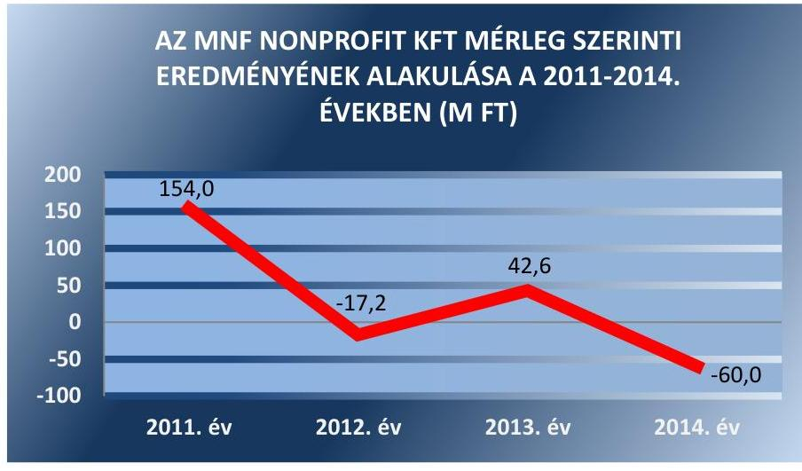

Forrás: Az MNF Nonprofit Kft. 2011-2014. évi beszámolói
Az MNF Nonprofit Kft. eszközvagyona a 2011. év végi 914,1 M Ft-ról 2012-ben 940,7 M Ft-ra, 2013-ban 943,0 M Ft-ra növekedett, majd a 2014. év végére 917,2 M Ft-ra csökkent, az ellenőrzött időszak alatt összeségében 0,3%-kal emelkedett. A vagyonváltozás fő oka a pénzeszközök (bankbetétek) növekedése volt. A vagyonszerkezetben jelentős átrendeződések az ellenőrzött években nem történtek.

---

Az MNF Nonprofit Kft. tárgyi eszközeinek értéke az ellenőrzött időszakban 131,8 M Ft-ról 128,0 M Ft-ra, 2,9%-kal csökkent a terv szerinti értékcsökkenés elszámolása következtében.

A befektetett eszközök 2011. évi 440,7 M Ft értékéből a vagyonkezelésbe vett eszközök értéke 309,0 M Ft-ot, a saját vagyon értéke 131,7 M Ft-ot tett ki. A vagyonkezelt eszközök értékét 2011. január 1-jén 318,8 M Ft értékben, 2014. december 31-én 299,7 M Ft értékben mutatta ki, a csökkenést alapvetően a terv szerinti értékcsökkenés elszámolása okozta.

Az MNF Nonprofit Kft. a Vtv. 27. § (2) bekezdés előírásának megfelelően gondoskodott a vagyonkezelt eszközök karbantartásáról, működtetéséről, azonban az elszámolt értékcsökkenésnek megfelelő mértékű, a Vhr. 9. § (9) d) pontja szerinti visszapótlási kötelezettségét nem teljesítette.

Az MNF Nonprofit Kft.-nél 2013. június 28-ig az eszközök pótlása, felújítása nem a Vhr. 9. § (9) d) pontjának megfelelően történt, mert nem az elszámolt értékcsökkenésnek megfelelő mértékben valósult meg a visszapótlási kötelezettség. 2013. június 28-tól az MNF Nonprofit Kft. a Vtv. 27. § (8) alapján mentesült a Vtv. 27. § (7) bekezdése szerinti visszapótlási kötelezettség alól.

Az MNF Nonprofit Kft.-nél a befektetett eszközökre elszámolt értékcsökkenés és a bruttó érték növekménye az ellenőrzött időszakban az alábbiak szerint alakult:
2. ábra
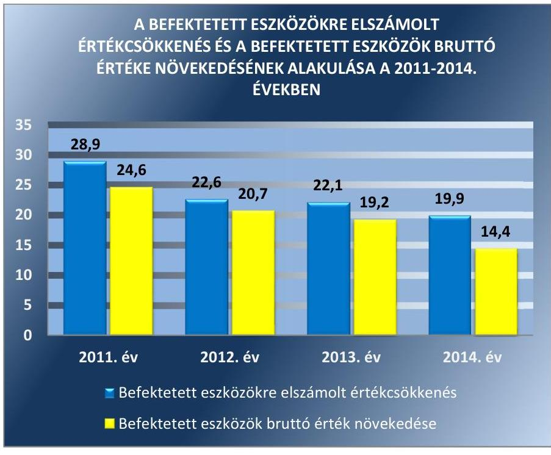

Forrás: A 2011-2014. évi kiegészítő mellékletek

---

### 4.2. számú megállapítás

## A tulajdonosi joggyakorlók, illetve az MNF Nonprofit Kft. vagyonváltozást eredményező döntéseinek előkészítése és végrehajtása a jogszabályoknak megfelelt.

Az EMMI a vagyongazdálkodási döntések előterjesztéseire vonatkozóan az Alapító Okirat 1-8-ban fogalmazta meg az elvárásokat. Az EMMI a vagyonváltozást eredményező döntéseit a Vtv., az Nvtv. és a Vhr. rendelkezései szerint, valamint a Közhasznú szerződés, a Közszolgáltatási szerződés, és a Támogatási szerződés 1-4 megkötésével, és az üzleti tervek elfogadásával hozta meg. Az EMMI döntései az MNF Nonprofit Kft. produkciós terveihez, a szakmai programokhoz kapcsolódó finanszírozáshoz, a tervezett állagmegóvások, beszerzések jóváhagyásához kapcsolódtak.

Az Alapító okirat 1-8 az EMMI kizárólagos hatáskörébe utalta az éves üzleti terv és módosításainak jóváhagyását, az FB, valamint a könyvvizsgáló írásbeli jelentésének birtokában a Számv. tv. szerinti beszámoló, valamint a közhasznú szervezetekről szóló törvény szerinti közhasznúsági jelentés elfogadását. Az EMMI az ellenőrzött időszakban az előterjesztések alapján elfogadta az éves üzleti terveket, beszámolókat, közhasznúsági jelentéseket, a vezető tisztségviselők díjazására vonatkozó javaslatokat.

Az EMMI - a 2012. év kivételével - évente ellenőrizte a működési célú támogatások felhasználását, határozatokat hozott az üzleti terv, a beszámoló elfogadásáról, ezáltal a gazdálkodó szervezet vagyonváltozást eredményező döntéseit a beszámolókon keresztül ellenőrizte és elfogadta.

Az ellenőrzött időszakban a tulajdonosi joggyakorló MNV Zrt. a Vagyonnyilvántartási szabályzatában és a Vagyonkezelési szerződésben foglaltakon kívül a döntések előkészítésével kapcsolatban formai és tartalmi követelményeket, speciális előírásokat nem határozott meg. Az MNV Zrt. az ellenőrzési szabályzatban meghatározta a tulajdonosi ellenőrzés során alkalmazandó részletes szabályokat. Az MNV Zrt. az MNF Nonprofit Kft. által kezelt állami vagyonra vonatkozóan tulajdonosi ellenőrzést nem végzett.

Az MNF Nonprofit Kft. előterjesztései összhangban voltak az Alapító Okirat 1-8-ban és a Vagyonkezelési szerződésben, valamint a Közhasznú-, a Közszolgáltatási és Támogatási szerződés 1-4-ben foglalt előírásokkal. Az MNF Nonprofit Kft. a vagyonváltozást eredményező döntések előkészítése és megalapozása során az Alapító Okirat 1-8 előírásainak megfelelően járt el.

Az MNF Nonprofit Kft. az ellenőrzött időszakban az EMMI előírásainak megfelelően terjesztette elő az éves üzleti terveket, az éves beszámolókat, a közhasznúsági jelentéseket, a vezető tisztségviselők díjazására vonatkozó javaslatokat. Az éves jelentéseket, illetve az Alapítói Okirat 1-8 9.11. pontja alapján, az FB jóváhagyását igénylő ügyleteket az ügyvezetés szabályszerűen, az előírt tartalommal és formában terjesztette az FB elé.

---

# 5. Az MNF Nonprofit Kft. a szabályszerű vagyongazdálkodás érdekében teljesítette-e beszámolási, adatszolgáltatási kötelezettségét, kiépített-e, illetve működtetett-e információs rendszert? 

Összegző megállapítás

Az MNF Nonprofit Kft. a beszámolási és adatszolgáltatási kötelezettségének összességében eleget tett. Vagyongazdálkodását érintően az információs rendszert kialakította, azonban a 2014. évben a Bkr.-ben és a Belső Ellenőrzési Szabályzatban előírtak ellenére belső ellenőrzési rendszert nem működtetett.
5.1. számú megállapítás

Az MNF Nonprofit Kft. beszámolási és adatszolgáltatási kötelezettségének - a Közhasznúsági melléklet tartalmának kivételével - összeségében eleget tett. Ugyanakkor a közzétételi kötelezettségének teljesítését MNF Nonprofit Kft. elmulasztotta.

Az EMMI az MNF Nonprofit Kft. Alapító Okiratában 1-8, a Közhasznú szerződésben, és a Közszolgáltatási szerződésben írt elő beszámolásra, adatszolgáltatásra vonatkozó feladatokat.

A Közhasznú szerződésben és a Közszolgáltatási szerződésben az EMMI az üzleti tervre vonatkozóan írt elő tájékoztatási kötelezettséget, továbbá a Közhasznú szerződésben rögzítette a közhasznú támogatással történő elszámolási kötelezettséget. A Közhasznú szerződés és Közszolgáltatási szerződés alapján kötött Támogatási szerződés 1-4 a támogatás elszámolásról szóló szakmai és pénzügyi beszámoló elkészítési kötelezettséget tartalmazták. Az MNF Nonprofit Kft. eleget tett az üzleti tervre és a támogatásokkal kapcsolatos elszámolásokra vonatkozó adatszolgáltatási kötelezettségének.

Az Alapító Okirat 1-8-ban a tulajdonosi joggyakorló felé jóváhagyási céllal történő beszámolási, tájékoztatási feladatként írták elő az MNF Nonprofit Kft. üzleti tervre, éves beszámolóra, közhasznúsági jelentésre és mellékletre vonatkozó adatszolgáltatását. A beszámolóhoz kapcsolódó tájékoztatási kötelezettség kiterjedt az FB-re és a könyvvizsgálóra is. Az Alapító Okirat 1-6 az ügyvezető feladatai között írta elő a tulajdonosi joggyakorló folyamatos, negyedévente, vagy igény szerint történő tájékoztatását az MNF Nonprofit Kft. működéséről. Az MNF Nonprofit Kft. az EMMI által előírt módon és határidőben teljesítette az előírt adatszolgáltatási kötelezettségét.

A Vagyonkezelési szerződés 6.6 pontjában előírták az MNF Nonprofit Kft. vagyonkezelt eszközeire vonatkozó adatszolgáltatási és nyilvántartási kötelezettség teljesítését, melynek az MNF Nonprofit Kft. az ellenőrzött időszakban eleget tett.

Az MNF Nonprofit Kft. a Számv. tv. és a Számviteli Politika I. pontja előírása alapján éves beszámoló készítésre volt kötelezett.

Az EMMI az MNF Nonprofit Kft. 2011-2014. évi éves beszámolóit az Alapító Okirat 1-6 6.2.2. és Alapító Okirat 7-8 6.2.1. pontjai előírásainak megfelelően az FB véleménye és a könyvvizsgálói jelentés birtokában a jogszabályban előírt határidőben elfogadta.

---

Az MNF Nonprofit Kft. a Számv. tv. 153. § (1) bekezdése előírását figyelmen kívül hagyva a 2011. évi beszámolót 8 nappal, a 2012. évi beszámolót 5 nappal az EMMI jóváhagyását megelőzően helyezte letétbe.

Az MNF Nonprofit Kft. a Kszt. 19. § (1) bekezdései ellenére a 2011. évben nem készített közhasznúsági jelentést, valamint az Ectv. ³⁰ 46. § (1) bekezdése, és a 350/2011. Korm. rendelet 12. § (1) bekezdése előírásai ellenére hiányosan készített el az évenkénti közhasznúsági mellékletet 2012-től. A 2014. évi Közhasznúsági melléklet sem tartalmazta a 350/2011. Korm. rendelet 12.§ (1) bekezdése alapján az 1. melléklete szerint a Társaság által ellátott valamennyi, az Alapító Okiratban 6.8 szereplő közhasznú tevékenység bemutatását, továbbá nem tartalmazta a 350/2011. Korm. rendelet 1. melléklet 5. és 6. pontjában szereplő közhasznú cél szerinti juttatások kimutatását, a vezető tisztségviselőinek nyújtott juttatások összegét és a juttatásban részesülő vezető tisztségek felsorolását és nem tartalmazta a 350/2011. Korm. rendelet 1. melléklet 4. pontjában előírt közhasznú tevékenység érdekében felhasznált vagyon kimutatását.

Az FB az ellenőrzött időszakban az Alapító Okirat 1-8 9.11. pontjában rögzítettek szerint, a Gt. ³¹ és a Ptk₃ előírásainak megfelelően véleményezte az MNF Nonprofit Kft. éves beszámolóját, azokat elfogadásra javasolta és az írásbeli jelentéseit megküldte az EMMI számára.

A könyvvizsgáló az MNF Nonprofit Kft. éves beszámolóit az ellenőrzött időszak minden évében a Számv. tv. 3. § (13) bekezdés 1) pontjának megfelelő hitelesítő záradékkal látta el, és nem tárta fel a kezelt vagyon nem megfelelő értékben történő kimutatását.

Az Avtv. ³² 20. § (8) bekezdés, és az Info ³³ tv. 30. § (6) bekezdése előírásai ellenére a MNF Nonprofit Kft. a közérdekű adatok megismerésére irányuló igények teljesítésének rendjét rögzítő szabályzattal nem rendelkezett.

# ELEKTRONIKUS KÖZZÉTÉTELI KÖTELEZETTSÉ-

GÉNEK az MNF Nonprofit Kft. az ellenőrzött időszakban nem tett eleget, nem tette közzé honlapján az az Avtv. 19. § (1)-(3) és Info tv. 33. § (1) bekezdésében előírt kötelező elektronikus közzététel alá eső, az Info tv. 37. § (1) bekezdése szerinti, az Info tv. 1. mellékletében előírt adatokat. Az ellenőrzött időszakban a Takarékossági tv. ³⁴ 2. § (3) bekezdése szerinti, a pénzeszközök felhasználásával, a gazdasági társaság vagyonával történő gazdálkodással összefüggő adatokat nem tették közzé.
5.2. számú megállapítás

Az MNF Nonprofit Kft. az információs rendszert kialakította és megfelelően működtette, ugyanakkor a 2014. évben a Bkr.-ben és a Belső Ellenőrzési Szabályzatban előírtak ellenére belső ellenőrzési rendszert nem működtetett.

Az EMMI az Alapító Okirat 1-8-ban előírta a vagyongazdálkodást érintően az információs rendszer szabályozását és kialakítását. Az Alapító Okirat 1-6 7.3.9., illetve az Alapító Okirat 7-8 7.3.10 pontjában az ügyvezető feladatai között előírták a MNF Nonprofit Kft. működéséről szóló tájékoztatási kötelezettséget, melynek az ügyvezető eleget tett.

Az MNF Nonprofit Kft. teljesítette az MNV Zrt. 2013. december 19-től hatályos Monitoring Szabályzatában előírt, a mérlegre és

---

eredménykimutatásra vonatkozó, továbbá a Vagyonkezelési szerződés 6.6 pontjában előírt adatszolgáltatási kötelezettségét.

A belső információáramlás biztosítása érdekében az SZMSZ III. pontja tartalmazta a vezetői értekezlet, operatív értekezlet, társulati ülés szervezésének szabályait, a 4.2. pontja a belső kapcsolattartás rendjét, mely rendelkezés a szervezeten belüli információk áramlását szabályozta. Az MNF Nonprofit Kft.-n belüli információáramlás biztosított volt.

Az MNF Nonprofit Kft. a közhasznú feladatai ellátására az EMMI-től költségvetési forrásból származó támogatásban részesült. A közhasznú feladatfinanszírozási támogatások mértékét és ütemezését, a felhasználás és elszámolás módját az ellenőrzött időszakban elfogadott éves üzleti tervek alapján készített Támogatási szerződés 1-4 tartalmazta. Az MNF Nonprofit Kft. teljesítette az EMMI által a támogatás meghatározás alapjául szolgáló üzleti tervre vonatkozóan előírt tájékoztatási kötelezettségét. Az EMMI az MNF Nonprofit Kft. üzleti terveit Alapítói határozatokkal fogadta el.

Az MNF Nonprofit Kft. teljesítette az ellenőrzött időszakban az MNV Zrt. Vagyonnyilvántartási szabályzata 3.5.1. szerinti adatszolgáltatási
 kötelezettségét, továbbá eleget tett a Vagyonnyilvántartási szabályzat G.2.2.1. pontjában a közfeladatot ellátó vagyonkezelő szervezetekre vonatkozó, a vagyonkezelt eszköz értékadatairól szóló negyedéves és éves adatszolgáltatási kötelezettségnek. Az MNF Nonprofit Kft. teljesítette a Vagyonnyilvántartási szabályzatban részletezett, a Vhr-ben előírt vagyonkezelt vagyonra vonatkozó adatszolgáltatásokat.

A 2011–2013. évekre vonatkozóan jogszabály és az EMMI nem írta elő a belső ellenőrzési feladatok ellátásának kötelezettségét az MNF Nonprofit Kft. számára. Az MNF Nonprofit Kft. – kormányzati szektorba sorolt egyéb szervezetnek minősülve – 2014. évben nem tett eleget a Bkr. ${ }^{35}$ 54/A. § alapján a Bkr. 10. § rendelkezései által előírt belső ellenőrzési feladatok ellátási kötelezettségének.

# 6. Az MNF Nonprofit Kft. gazdálkodásának a kormányzati szektor hiányára és az államadósságra befolyást gyakorló elemek a jogszabályi előírásoknak megfeleltek-e? 

## Összegző megállapítás

Az MNF Nonprofit Kft. adósságot keletkeztető ügyletet nem kötött.

Az MNF Nonprofit Kft. az ellenőrzött időszakban a Stabilitási tv. ${ }^{36}$ 3. § (1) bekezdése szerinti államadósságot keletkeztető ügyletet nem kötött, nem volt a Stabilitási tv. 9. § (1) bekezdése és a 353/2011. Korm. rendelet ${ }^{37}$ 11. § szerinti kérelem benyújtási kötelezettsége.

---

# JAVASLATOK 

Az ÁSZ tv. 33. § (1) bekezdésében foglaltak értelmében az ellenőrzött szervezet vezetője köteles a jelentésben foglalt megállapításokhoz kapcsolódó intézkedési tervet összeállítani és azt a jelentés kézhezvételétől számított 30 napon belül az ÁSZ részére megküldeni. Amennyiben az ellenőrzött szervezet vezetője nem küldi meg határidőben az intézkedési tervet, vagy továbbra sem elfogadható intézkedési tervet küld, az Állami Számvevőszék elnöke az ÁSZ tv. 33. § (3) bekezdés a) és b) pontjaiban foglaltakat érvényesítheti.
Javaslataink célja az MNF Nonprofit Kft. gazdálkodása szabályozottságának erősítése és gyakorlatának javítása az átlátható működés megfelelő támogatása érdekében.

## Az MNF Nonprofit Kft. ügyvezetőjének

1. A szabályozás jogszabályoknak megfelelő kialakítása érdekében:
a) Intézkedjen a számviteli politika és annak keretében készítendő szabályzatok aktualizálásáról a Számv. tv. előírásainak megfelelően.
(2.1. sz. megállapítás 1. bekezdés alapján)
b) Intézkedjen a regionális kht-k jogutód szervezeteinek használatában lévő eszközök hasznosítására vonatkozó szerződések megkötéséről.
(2.2. sz. megállapítás 4. bekezdése alapján)
c) Intézkedjen az önköltségszámítás rendjére vonatkozó belső szabályzat kiegészítéséről, a közvetett költségeknek a kalkulációs sémában való szerepeltetéséről a Számv. tv. előírásainak megfelelően.
(3.2. sz. megállapítás 1. bekezdés alapján)
d) Intézkedjen az Info tv. előírásainak megfelelően, a közérdekű adatok megismerésére irányuló igények teljesítésének rendjét rögzítő szabályzat elkészítéséről.
(5.1. sz. megállapítás 11. bekezdése alapján)

---

2. A gazdálkodás gyakorlatában feltárt hibák kijavítása érdekében:
a) Intézkedjen arról, hogy a mérlegben az állami vagyon kezelésbevételéhez kapcsolódó eszközök és az MNV Zrt. felé fennálló hosszú lejáratú kötelezettség értéke a Vhr. előírásának és a vagyonkezelési szerződésnek megfelelően kerüljön kimutatásra.
(2.2. sz. megállapítás 6. valamint 11. bekezdése alapján)
b) Intézkedjen arról, hogy a behajthatatlan követelések leírásakor a behajthatatlanság ténye és mértéke a Számv. tv. előírásának megfelelően bizonyított legyen.
(3.1. sz. megállapítás 10. bekezdése alapján)
c) Intézkedjen az évenkénti Közhasznúsági melléklet jogszabályi előírásoknak megfelelő elkészítéséről.
(5.1. sz. megállapítás 8. bekezdés alapján)
d) Intézkedjen a kötelezően közzéteendő adatok elektronikus közzétételi kötelezettségének teljes körű teljesítéséről az Info tv. és a Taktv. előírásainak megfelelően.
(5.1. sz. megállapítás 12. bekezdése alapján)
e) Intézkedjen a Bkr. előírásainak megfelelően a belső ellenőrzési feladatok ellátásáról.
(5.2. sz. megállapítás 6. bekezdés alapján)

# Az EMMI miniszterének 

1. Tegyen intézkedéseket a feltárt hiányosságok és szabálytalanságok tekintetében a felelősség tisztázása érdekében, és szükség szerint intézkedjen a felelősség érvényesítéséről.
(2.2. sz. megállapítás 3., 4. és 5. bekezdései alapján)

---

# MELLÉKLETEK 

## I. SZ. MELLÉKLET: ÉRTELMEZŐ SZÓTÁR

Adósságot keletkeztető ügylet
„Adósságot keletkeztető ügylet és annak értéke:
a) hitel, kölcsön felvétele, átvállalása a folyósítás, átvállalás napjától a végtörlesztés napjáig, és annak aktuális tőketartozása,
b) a számvitelről szóló törvény szerinti hitelviszonyt megtestesítő értékpapír forgalomba hozatala a forgalomba hozatal napjától a beváltás napjáig, kamatozó értékpapír esetén annak névértéke, egyéb értékpapír esetén annak vételára,
c) váltó kibocsátása a kibocsátás napjától a beváltás napjáig, és annak a váltóval kiváltott kötelezettséggel megegyező, kamatot nem tartalmazó értéke,
d) az Szt. szerint pénzügyi lízing lízingbevevői félként történő megkötése a lízing futamideje alatt, és a lízingszerződésben kikötött tőkerész hátralévő összege,
e) a visszavásárlási kötelezettség kikötésével megkötött adásvételi szerződés eladói félként történő megkötése - ideértve az Szt. szerinti valódi penziós és óvadéki repóügyleteket is - a visszavásárlásig, és a kikötött visszavásárlási ár,
f) a szerződésben kapott, legalább háromszázhatvanöt nap időtartamú halasztott fizetés, részletfizetés, és a még ki nem fizetett ellenérték,
g) hitelintézetek által, származékos műveletek különbözeteként az Államadósság Kezelő Központ Zrt.-nél (a továbbiakban: ÁKK Zrt.) elhelyezett fedezeti betétek, és azok összege.
Forrás: Stabilitási tv. 3. § (1) bekezdése
2010. június 17-től
a) Az állam tulajdonában lévő dolog, valamint a dolog módjára hasznosítható természeti erő,
b) Az a) pont hatálya alá nem tartozó mindazon vagyon, amely vonatkozásában törvény az állam kizárólagos tulajdonjogát nevesíti,
c) az állam tulajdonában lévő tagsági jogviszonyt megtestesítő értékpapír, illetve az államot megillető egyéb társasági részesedés,
d) az államot megillető olyan immateriális, vagyoni értékkel rendelkező jogosultság, amelyet jogszabály vagyoni értékű jogként nevesít.
Forrás: Vtv. 1. § (2) bekezdése
2012. november 10-től az állami vagyon fogalma kiegészül a következő ponttal:
a) az állam tulajdonában lévő pénzügyi eszközök

Forrás: Vtv. 1. § (2) bekezdése
2010. január 01. – 2011. december 31. között:

Az állami vagyont az MNV Zrt. maga kezeli, vagy szerződés – így különösen bérlet, haszonbérlet, szerződésen alapuló haszonélvezet, vagyonkezelés, megbízás – alapján központi költségvetési szervnek, természetes vagy jogi személynek, illetőleg jogi személyiséggel nem rendelkező gazdasági társaságnak hasznosításra átengedi.
Vtv. 23. § (1) bekezdése

## 2012. január 1-jétől:

Az állami vagyont az MNV Zrt. maga kezeli, vagy szerződés – így különösen bérlet, haszonbérlet, megbízás – alapján központi költségvetési szervnek, természetes vagy jogi személynek, vagy jogi személyiséggel nem rendelkező gazdálkodó szer-

---

vezetnek hasznosításra átengedi. Az állami vagyonra vonatkozóan az MNV Zrt. kizárólag az Nvtv-ben meghatározott személyekkel köthet vagyonkezelési szerződést.
Forrás: Vtv. 23. § (1), 27. § (1)

# 2013. június 28-ától: 

Az állami vagyonnal az MNV Zrt. maga gazdálkodik, vagy szerződés – így különösen bérlet, haszonbérlet, megbízás – alapján központi költségvetési szervnek, természetes vagy jogi személynek, vagy jogi személyiséggel nem rendelkező gazdálkodó szervezetnek hasznosításra átengedi, illetőleg vagyonkezelésbe, haszonélvezetbe adja. Az állami vagyonra vonatkozóan az MNV Zrt. kizárólag az Nvtv-ben meghatározott személyekkel köthet vagyonkezelési szerződést.
Forrás: Vtv. 23. § (1), 27. § (1)
2013. június 30-ig gazdálkodó szervezet:

Az állami vállalat, az egyéb állami gazdálkodó szerv, a szövetkezet, a lakásszövetkezet, az európai szövetkezet, a gazdasági társaság, az európai részvény-társaság, az egyesülés, az európai gazdasági egyesülés, az európai területi együttműködési csoportosulás, az egyes jogi személyek vállalata, a leányvállalat, a vízgazdálkodási társulat, az erdőbirtokossági társulat, a végrehajtói iroda, az egyéni cég, továbbá az egyéni vállalkozó.
Forrás: Ptk. 685. § c) pontja
2013. július 1-jétől gazdálkodó szervezet:

Az állami vállalat, az egyéb állami gazdálkodó szerv, a szövetkezet, a lakásszövetkezet, az európai szövetkezet, a gazdasági társaság, az európai részvénytársaság, az egyesülés, az európai gazdasági egyesülés, az európai területi együttműködési csoportosulás, az egyes jogi személyek vállalata, a leányvállalat, a vízgazdálkodási társulat, az erdőbirtokossági társulat, a végrehajtói iroda, az egyéni cég, továbbá az egyéni vállalkozó. Az állam, a helyi önkormányzat, a költségvetési szerv, az egyesület, a köztestület, valamint az alapítvány gazdálkodó tevékenységével összefüggő polgári jogi kapcsolataira is a gazdálkodó szervezetre vonatkozó rendelkezéseket kell alkalmazni, kivéve, ha a törvény e jogi személyekre eltérő rendelkezést tartalmaz; a 292/A–292/B. §, 301/A–301/B. §, 405. § (1) bekezdés, valamint a 407/A. § (1) bekezdés tekintetében nem minősül gazdálkodó szervezetnek az, aki a közbeszerzésekről szóló törvény értelmében ajánlatkérő (szerződő hatóság).
Forrás: Ptk. 685. § c) pontja
2014. március 15-től gazdálkodó szervezet:

A gazdasági társaság, az európai részvénytársaság, az egyesülés, az európai gazdasági egyesülés, az európai területi együttműködési csoportosulás, a szövetkezet, a lakásszövetkezet, az európai szövetkezet, a vízgazdálkodási társulat, az erdőbirtokossági társulat, az állami vállalat, az egyéb állami gazdálkodó szerv, az egyes jogi személyek vállalata, a közös vállalat, a végrehajtói iroda, a közjegyzői iroda, az ügyvédi iroda, a szabadalmi ügyvivői iroda, az önkéntes kölcsönös biztosító pénztár, a magánnyugdípénztár, az egyéni cég, továbbá az egyéni vállalkozó. Az állam, a helyi önkormányzat, a költségvetési szerv, az egyesület, a köztestület, valamint az alapítvány gazdálkodó tevékenységével összefüggő polgári jogi kapcsolataira is a gazdálkodó szervezetre vonatkozó rendelkezéseket kell alkalmazni. Forrás: Ppt. 396. §
Kormányzati szektorba sorolt egyéb szervezet

Az a szervezet, amely az Áht. alapján nem része az államháztartásnak, azonban az Európai Közösséget létrehozó szerződéshez csatolt, a túlzott hiány esetén követendő eljárásról szóló jegyzőkönyv alkalmazásáról szóló 2009. május 25-i

---

Nemzetgazdasági szempontból kiemelt jelentőségű nemzeti vagyon körébe tartozó társaságok
Nemzeti vagyon

Tulajdonosi ellenőrzés

479/2009/EK rendelet szerint a kormányzati szektorba tartozik. A nemzetgazdasági miniszter 2013. június 26-án megjelent Közleményben tette közzé ezen szervezetek listáját.
Az ÁSZ ellenőrzés szempontjából az Nvtv. 2. sz. mellékletében felsorolt társasági részesedések.
2012. január 1-jétől nemzeti vagyon:
a) az állam vagy a helyi önkormányzat kizárólagos tulajdonában álló dolgok,
b) az a) pont hatálya alá nem tartozó, állam vagy a helyi önkormányzat tulajdonában lévő dolog,
c) az állam vagy a helyi önkormányzat tulajdonában lévő pénzügyi eszközök, továbbá az államot vagy a helyi önkormányzatot megillető társasági részesedések,
d) az államot vagy a helyi önkormányzatot megillető bármely vagyoni értékkel rendelkező jogosultság, amelyet jogszabály vagyoni értékű jogként nevesít,
e) Magyarország határa által körbezárt terület feletti légtér,
f) az üvegházhatású gázok kibocsátási egységeinek kereskedelméről szóló törvény szerint kibocsátási egység és légiközlekedési kibocsátási egység, valamint az ENSZ Éghajlatváltozási Keretegyezménye és annak Kiotói Jegyzőkönyve végrehajtási keretrendszeréről szóló törvény szerinti kiotói egység,
g) állami vagy helyi önkormányzati fenntartású közgyűjtemény (muzeális intézmény, levéltár, közgyűjteményként működő kép- és hangarchívum, valamint könyvtár) saját gyűjteményében nyilvántartott kulturális javak körébe tartozó dolog,
h) a régészeti lelet,
i) a nemzeti adatvagyon körébe tartozó állami nyilvántartások fokozottabb védelméről szóló törvény szerinti nemzeti adatvagyon.
Forrás: Nvtv. 1. § (2)
2010. június 17-től:

Az MNV Zrt. „rendszeresen ellenőrzi a vele szerződéses jogviszonyban lévő személyek, szervezetek vagy más használók állami vagyonnal való gazdálkodását, megállapításairól az MNV Zrt. Felügyelő Bizottságát, az ellenőrzött szervet, szükség esetén a minisztert és az Állami Számvevőszéket tájékoztatja”.
Forrás: Vtv. 17. § d)
A Vhr. alapján „a tulajdonosi ellenőrzés célja az állami vagyonnal való gazdálkodás vizsgálata, ennek keretében a rendeltetésellenes, jogszerűtlen, szerződésellenes, vagy a tulajdonos érdekeit sértő, illetve a központi költségvetést hátrányosan érintő vagyongazdálkodási intézkedések feltárása és a jogszerű állapot helyreállítása, továbbá a vagyonnyilvántartás hitelességének, teljességének és helyességének biztosítása”. Forrás: Vhr. 20. § (2)

## 2011. december 31-ig

Az állami vagyon kezelőjét, használóját megillető jogok gyakorlását, annak szabályszerűségét, célszerűségét az MNV Zrt. – szükség szerint területi szervei útján – ellenőrzi.
Forrás: Vhr. 20. § (1)

---

# 2012. január 1-jétől: 

Az állami vagyon kezelőjét, haszonélvezőjét, használóját megillető jogok gyakorlását, annak szabályszerűségét, célszerűségét az MNV Zrt. –
 szükség szerint területi szervei útján ellenőrzi.
Forrás: Vhr. 20. § (1)
2010. június 17-től:

Tulajdonosi jogok gyakorlója
Az állami vagyon felett a Magyar Államot megillető tulajdonosi jogok és kötelezettségek összességét - ha törvény eltérően nem rendelkezik - az állami vagyon felügyeletéért felelős miniszter (a továbbiakban: miniszter) gyakorolja, aki e feladatát a Magyar Nemzeti Vagyonkezelő Zártkörűen Működő Részvénytársaság (a továbbiakban: MNV Zrt.), a Magyar Fejlesztési Bank, illetve a tulajdonosi joggyakorló szervezet útján látja el. A miniszter miniszteri rendeletben, a törvényben meghatározott állami vagyoni kör tekintetében, meghatározott időtartamra, a joggyakorlás egyes szabályainak meghatározásával - az őt megillető tulajdonosi jogok és kötelezettségek összességének, illetve azok meghatározott részének gyakorlóját az Áht. szerinti központi költségvetési szervek, ezek intézménye, továbbá a 100%-ban állami tulajdonban álló gazdasági társaságok közül kijelölheti.
Forrás: Vtv. 3. § (1) és (2)

## 2013. június 28-ától:

A rábízott állami vagyon felett az államot megillető tulajdonosi jogok és kötelezettségek összességét tulajdonosi joggyakorlóként:
a) ha törvény vagy miniszteri rendelet eltérően nem rendelkezik, a Magyar Nemzeti Vagyonkezelő Zártkörűen Működő Részvénytársaság (a továbbiakban: MNV Zrt.),
b) törvényben kijelölt személy vagy
c) az állami vagyon felügyeletéért felelős miniszter (a továbbiakban: miniszter) által rendeletben kijelölt személy gyakorolja.
[...] A miniszter e törvény felhatalmazása alapján - a meghatározott célok hatékonyabb elérése érdekében, miniszteri rendeletben, az ott meghatározott állami vagyoni kör tekintetében, meghatározott időtartamra - e törvény keretei között, a joggyakorlás egyes szabályainak meghatározásával - az államot megillető tulajdonosi jogok és kötelezettségek összességének, illetve azok meghatározott részének gyakorlóját az Áht. szerinti központi költségvetési szervek, ezek intézménye, továbbá a 100%-ban állami tulajdonban álló gazdasági társaságok közül kijelölheti. Forrás: Vtv. 3. § (1) és (2)

---

II. SZ. MELLÉKLET: AZ MNF NONPROFIT KFT. MÉRLEGADATAI ÉS VÁLTOZÁSUK A 2011-2014. KÖZÖTTI ÉVEKBEN (E FT, %)

|  Megnevezés | 2011.12.31 | 2012.12.31 | 2013.12.31 | 2014.12.31 | Változás 2014.12.31-2011.12.31  |
| --- | --- | --- | --- | --- | --- |
|  A. BEFEKTETETT ESZKÖZÖK (2+10+18) | 440717 | 437290 | 433280 | 427703 | -2,95  |
|  I. IMMATERIÁLIS JAVAK (3-9) | 1330 | 1061 | 791 | 916 | -31,13  |
|  Vagyoni értékű jogok | 1330 | 1061 | 791 | 916 | -31,13  |
|  II. TÁRGYI ESZKÖZÖK (11-17) | 439387 | 436229 | 432489 | 426787 | -2,87  |
|  Ingatlanok és kapcsolódó vagyoni értékű jogok | 1620 | 1454 | 1288 | 1122 | -30,7  |
|  Műszaki berendezések, gépek, járművek | 422303 | 419684 | 412503 | 411156 | -2,64  |
|  Egyéb berendezések, felszerelések, járművek | 14008 | 15091 | 18698 | 14504 | 3,54  |
|  Beruházások, felújítások | 1456 | 0 | 0 | 5 | -99,66  |
|  III. BEFEKTETETT PÉNZÜGYI ESZKÖZÖK (19-26) | 0 | 0 | 0 | 0 | -  |
|  B. FORGÓESZKÖZÖK (28+35+43+49) | 463455 | 494700 | 500312 | 482142 | 4,03  |
|  I. KÉSZLETEK (29-34) | 2033 | 2876 | 2862 | 743 | -63,45  |
|  Anyagok | 0 | 0 | 0 | 0 | -  |
|  Befejezetlen termelés és félkész termékek | 0 | 0 | 0 | 0 | -  |
|  Késztermékek | 0 | 0 | 0 | 0 | -  |
|  Áruk | 970 | 865 | 774 | 743 | -23,40  |
|  Készletre adott előlegek | 1063 | 2011 | 2088 | 0 | 0  |
|  II. KÖVETELÉSEK (36-42) | 51722 | 51119 | 22185 | 50660 | -2,05  |
|  Követelések áruszállításból és szolgáltatásból (vevők) | 864 | 3078 | 12043 | 8627 | 898,50  |
|  Egyéb követelések | 50858 | 48041 | 10142 | 42033 | -17,35  |
|  III. ÉRTÉKPAPÍROK (44-48) | 0 | 0 | 0 | 0 | -  |
|  Forgatási hitelviszonyt megtestesítő értékpapírok | 0 | 0 | 0 | 0 | -  |
|  IV. PÉNZESZKÖZÖK (50-51) | 409700 | 440705 | 475265 | 430739 | 5,14  |
|  Pénztár, csekk | 732 | 258 | 1623 | 332 | -54,64  |
|  Bankbetétek | 408968 | 440447 | 473642 | 430407 | 5,24  |
|  C. AKTÍV IDŐBELI ELHATÁROLÁSOK (53-55) | 9976 | 8753 | 9383 | 7395 | -25,87  |
|  Bevételek aktív időbeli elhatárolása | 1977 | 1722 | 4346 | 592 | -70,06  |
|  Költségek, ráfordítások aktív időbeli elhatárolása | 7999 | 7031 | 5037 | 6803 | -14,95  |
|  ESZKÖZÖK ÖSSZESEN (1+27+52) | 914148 | 940743 | 942975 | 917240 | 0,34  |
|  D. SAJÁT TŐKE (58+60+61+62+63+64+67) | 410098 | 392852 | 435545 | 375588 | -8,42  |
|  I. JEGYZETT TŐKE | 10000 | 10000 | 10000 | 10000 | 0,00  |
|  II. JEGYZETT, DE MÉG BE NEM FIZETETT TŐKE (-) | 0 | 0 | 0 | 0 | -  |
|  III. TŐKETARTALÉK | 0 | 0 | 0 | 0 | -  |
|  IV. EREDMÉNYTARTALÉK | 246076 | 400098 | 382852 | 425545 | 72,93  |
|  V. LEKÖTÖTT TARTALÉK | 0 | 0 | 0 | 0 | -  |
|  VI. ÉRTÉKELÉSI TARTALÉK | 0 | 0 | 0 | 0 | -  |
|  VII. MÉRLEG SZERINTI EREDMÉNY | 154022 | -17246 | 42693 | -59957 | -138,88  |
|  E. CÉLTARTALÉKOK (69-71) | 0 | 0 | 0 | 0 | -  |
|  Céltartalék a várható kötelezettségekre | 0 | 0 | 0 | 0 | -  |
|  Céltartalék a jövőbeni költségekre | 0 | 0 | 0 | 0 | -  |
|  F. KÖTELEZETTSÉGEK (73+77+86) | 439075 | 482022 | 454238 | 494712 | 12,67  |
|  I. HÁTRASOROLT KÖTELEZETTSÉGEK (Alárendelt kölcsöntőke) (74-76) | 0 | 0 | 0 | 0 | -  |

---

|  II. HOSSZÚ LEJÁRATÚ KÖTELEZETTSÉGEK (78-85) | 429772 | 429772 | 429772 | 429772 | 0,00  |
| --- | --- | --- | --- | --- | --- |
|  Egyéb hosszúlejáratú kötelezettségek | 429772 | 429772 | 429772 | 429772 | 0,00  |
|  III. RÖVID LEJÁRATÚ KÖTELEZETTSÉGEK (87, 89-97) | 9303 | 52250 | 24466 | 64940 | 598,05  |
|  Vevőtől kapott előlegek | 0 | 0 | 0 | 0 | -  |
|  Kötelezettségek áruszállításból és szolgáltatásból (Szállítók) | 4029 | 5704 | 9123 | 5875 | 45,82  |
|  Egyéb rövid lejáratú kötelezettségek | 5274 | 46546 | 15343 | 59065 | 1019,93  |
|  G. PASSZÍV IDŐBELI ELHATÁROLÁSOK (99-101) | 64975 | 65869 | 53192 | 46940 | -27,76  |
|  Bevételek passzív időbeli elhatárolása | 8415 | 10133 | 7488 | 7994 | -5,00  |
|  Költségek, ráfordítások passzív időbeli elhatárolása | 5572 | 12926 | 10041 | 7377 | 32,39  |
|  Halasztott bevételek | 50988 | 42810 | 35663 | 31569 | -38,09  |
|  FORRÁSOK (PASSZÍVÁK) ÖSSZESEN (57+68+72+98) | 914148 | 940743 | 942975 | 917240 | 0,34  |

Forrás: 2011-2014. időszak beszámolói

---

|  Megnevezés | 2011.12.31 | 2012.12.31 | 2013.12.31 | 2014.12.31 | Változás 2014.12.31-2011.12.31  |
| --- | --- | --- | --- | --- | --- |
|  Belföldi értékesítés árbevétele | 143090 | 73125 | 101558 | 97221 | -32,06  |
|  Exportértékesítés nettó árbevétele | 177537 | 52838 | 61909 | 90921 | -48,79  |
|  I. Értékesítés nettó árbevétele (01.+02.) | 320627 | 125963 | 163467 | 188142 | -41,32  |
|  Saját termelésű készletek állományváltozása |  |  |  |  |   |
|  Saját előállítású eszközök aktivált értéke |  |  |  |  |   |
|  II. Aktivált saját teljesítmények értéke (03.+04.) |  |  |  |  |   |
|  III. Egyéb bevételek | 1778580 | 1752346 | 1956082 | 1769173 | -0,53  |
|  III. sorból: visszaírt értékvesztés |  |  |  |  |   |
|  Anyagköltség | 14237 | 20383 | 12041 | 16593 | 16,55  |
|  Igénybe vett szolgáltatások értéke | 219964 | 136117 | 178481 | 159394 | -27,54  |
|  Egyéb szolgáltatások értéke | 8954 | 9362 | 15546 | 15629 | 74,55  |
|  Eladott áruk beszerzési értéke |  | 526 | 374 | 167 | -  |
|  Eladott (közvetített) szolgáltatások értéke | 1742 | 1701 | 863 | 682 | -60,85  |
|  IV. Anyagjellegű ráfordítások (05.+06.+07.+08.+09.) | 244897 | 168089 | 207305 | 192465 | -21,41  |
|  Bérköltség | 1283938 | 1278811 | 1439649 | 1348754 | 5,05  |
|  Személyi jellegű egyéb kifizetések | 102435 | 127903 | 76671 | 100008 | -2,37  |
|  Bérjárulékok | 301963 | 322126 | 340727 | 325774 | 7,89  |
|  V. Személyi jellegű ráfordítások | 1688336 | 1728840 | 1857047 | 1774536 | 5,11  |
|  VI. Értékcsökkenés | 28925 | 22575 | 22127 | 19933 | -31,09  |
|  VII. Egyéb ráfordítások | 759 | 262 | 1853 | 720 | -5,14  |
|  VII. sorból: értékvesztés |  |  |  |  |   |
|  A. ÜZEMI TEVÉKENYSÉG EREDMÉNYE (I.+II.+III.-IV.-V.-VI.-VII) | 136290 | -41457 | 31217 | -30339 | -122,26  |
|  Kapott osztalék és részesedés |  |  |  |  |   |
|  Részesedések értékesítésének árfolyamnyeresége |  |  |  |  |   |

  Befektetett pénzügyi eszközök kamatai, árfolyamnyeresége | 18571 | 25454 | 8829 | 6724 | $-63,79$  |
|  Egyéb kapott kamatok és kamatjellegű bevételek |  |  |  |  |   |
|  Pénzügyi műveletek egyéb bevételei |  |  |  |  |   |
|  VIII. Pénzügyi műveletek bevételei (13.+14.+15.+16.+17.) | 18571 | 25454 | 8829 | 6724 | $-63,79$  |
|  Befektetett pénzügyi eszközök árfolyamvesztesége |  |  |  |  |   |
|  Fizetendő kamatok és kamatjellegű ráfordítások |  |  |  |  |   |
|  Részesedések értékpapírok, bankbetétek értékvesztése |  |  |  |  |   |
|  Pénzügyi műveletek egyéb ráfordításai | 2433 | 822 | 4500 | 1760 | $-27,66$  |
|  IX. Pénzügyi műveletek ráfordításai (18.+19.+20.+21.) | 2433 | 822 | 4500 | 1760 | $-27,66$  |
|  B. PÉNZÜGYI MŰVELETEK EREDMÉNYE (VIII.-IX.) | 16138 | 24632 | 4329 | 4964 | $-69,24$  |
|  C. SZOKÁSOS VÁLLALKOZÁSI EREDMÉNY (A.+B.) | 152428 | $-16825$ | 35546 | $-25375$ | $-116,65$  |
|  X. Rendkívüli bevételek | 9285 | 8201 | 7147 | 9819 | 5,75  |
|  XI. Rendkívüli ráfordítások | 7691 | 8622 |  | 44401 | 477,31  |
|  D. RENDKÍVÜLI EREDMÉNY (X.+XI.) | 1594 | $-421$ | 7147 | $-34582$ | $-2239,57$  |
|  E. ADÓZÁS ELŐTTI EREDMÉNY (C.+D.) | 154022 | $-17246$ | 42693 | $-59957$ | $-138,93$  |
|  XII. Adófizetési kötelezettség |  |  |  |  |   |
|  F. ADÓZOTT EREDMÉNY (E.-XII.) | 154022 | $-17246$ | 42693 | $-59957$ | $-138,93$  |
|  Eredménytartalék igénybevétele osztalékra, részesedésre |  |  |  |  |   |
|  Jóváhagyott osztalék, részesedés |  |  |  |  |   |
|  G. MÉRLEG SZERINTI EREDMÉNY (F.+22.-23.) | 154022 | $-17246$ | 42693 | $-59957$ | $-138,93$  |

---

.

---

# FÜGGELÉK: ÉSZREVÉTELEK 

A jelentéstervezetet a Számvevőszék 15 napos észrevételezésre megküldte az ellenőrzött szervezet vezetőjének az ÁSZ tv. 29. § (1) bekezdése előírásának megfelelően.

Az EMMI minisztere észrevételezési lehetőségével nem élt. Az MNV Zrt. vezérigazgatójától és az MNF NKft. főigazgatójától érkezett észrevételeket és azok kezeléséről szóló válaszlevelet a jelentés függeléke tartalmazza.
Az elfogadott észrevételek alapján a Számvevőszék módosította a jelentést.

[^0]
[^0]:    * 29. § (1) Az Állami Számvevőszék az ellenőrzési megállapításait megküldi az ellenőrzött szervezet vezetőjének vagy az általa megbízott személynek, és annak, akinek személyes felelősségét állapította meg.
    (2) Az ellenőrzött szervezet vezetője és a felelősként megjelölt személy az ellenőrzés megállapításaira tizenöt napon belül írásban észrevételt tehet.
    (3) Az Állami Számvevőszék az észrevételre a beérkezésétől számított harminc napon belül írásban válaszol. A figyelembe nem vett észrevételeket köteles a jelentésben feltüntetni, és megindokolni, hogy azokat miért nem fogadta el.

---

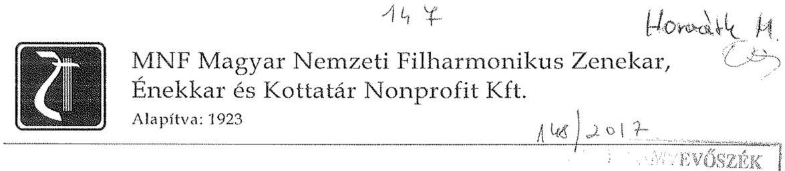

Domokos László Elnök Úrnak
Állami Számvevőszék

Tárgy: Észrevételek a társaságunknál lezajlott ÁSZ vizsgálat jelentéstervezetéhez. Hivatkozási szám: V-1032-148/2016

Tisztelt Elnök Úr!

Levelem mellékleteként megküldöm a tárgyban részletezett anyagot, kérve annak szíves elfogadását.

Budapest, 2017. január 24.
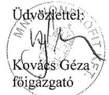

---

# ÉSZREVÉTELEK AZ ÁLLAMI SZÁMVEVŐSZÉK V-1032-148/2016 IKTATÓSZÁMON MEGKÜLDÖTT, A TÁRSASÁGUNKNÁL VÉGZETT ÁSZ ELLENŐRZÉSI JELENTÉS TERVEZETHEZ: 

## A 2.1. számú megállapításhoz

Belső szabályzataink aktualizálása az elmúlt években folyamatos lett, annak ellenére, hogy a társaságunknál folyó tevékenység - függetlenül a társaság besorolási formájától egy jottányit sem változott. Zenekarunk közel 100, énekkarunk több mint 30 év óta koncertek adásával végez közhasznúsági tevékenységet, az egyéb tevékenységünk (pl. vállalkozás) fennállásunk óta nem volt számottevő.
Karikírozva: amikor művészeink 1990. október 1-jén (ekkor lettünk Nemzeti Filharmónia), vagy 1998. január 19-én (ekkor lettünk Magyar Nemzeti Filharmonikus Zenekar, Énekkar és Kottatár), vagy 2002. január 1-jén (ekkor lettünk költségvetési intézményből KHT), vagy 2009. július 1-jén (ekkor lettünk KHT-ból Közhasznú Kft) beléptek az intézmény éppen aktuális székházába, úgy vették a kottát a kezükbe, ültek le kottapultjaikhoz, hogy fogalmuk sem volt a az előbb említett változásokról.
Eretnekségnek tűnhet, de - a költségvetési intézmény-társasági formát kivéve - a gazdálkodással foglalkozó apparátust sem kellett, hogy különösebben „megrázza" ez a változás. Az élet ui. folyt a megszokott útján: állami támogatás, jegybevétel, koncertköltségek, teremdíj, hangszerjavítás, húr, nád, hangolási stb. költségek. Ezzel is magyarázható, hogy a társaság szabályzatai a változást követően lassan változtak. A 2009-es, július 1-vel beálló változás esetében felhozhatnánk azt is, hogy az illetékes cégbíróság csak 2009. október 15-én szentesítette a változást, mert az alapítótól az okiratokat későn kapta meg, de ezt nem tesszük. Mindezekhez képest viszont könyvelésünk, pénztárunk, munkaügyi tevékenységünk stb. ekkor is rendre megfelelt az éppen hatályos jogszabályoknak.

Az ellenőrzés megállapításait elfogadva a fentiek ellenére is úgy találjuk, hogy a jövőben azonnal reagálnunk kell a jogszabályok olyan változására, amely a belső szabályaink változását követeli meg.

## A 2.2. számú megállapításhoz

Társaságunk saját tőkéje 2002-ben 10000 ezer, 2006-ban -419 391 ezer, rövid lejáratú kötelezettsége 347853 ezer, összes követelése 56616 ezer, pénzállománya 76336 ezer forint volt.
2015-ben ezek az értékek a következők szerint alakultak: saját tőke: 382701 ezer forint, rövid lejáratú kötelezettség: 144122 ezer forint, összes követelés: 50030 ezer forint, pénzállomány: 505942 ezer forint.
A két adatsort összehasonlítva nehéz lenne azt állítani, hogy társaságunknál az állami vagyonnal való gazdálkodás kívánnivalókat hagyna maga után. Ezt annál is inkább mondhatjuk, mert maga a társaság is 100%-os állami tulajdon, olyannyira, hogy a tulajdonos MNV Zrt. gyakorlatilag megtiltotta, hogy eredménytartalékunkhoz hozzányúljunk, hogy leírt, nem használt - nem a klasszikusan állami tulajdont képező - vagyontárgyainkat saját belátásunk szerint értékesítsük.

Egy rövid történeti visszatekintés: Társaságunk, miután költségvetési intézményből gazdasági társasággá vált, az addig az intézmény leltárában szereplő vagyont „visszaadta" az államnak (függetlenül attól, hogy az korábban pl. a zenekar alapítványáé volt stb.), és ennek további kezelésére 2002. október 31-én a Kincstári Vagyoni Igazgatósággal szerződést kötött.

---

Miután a Kelet-, az Észak- és a Dél-magyarországi Filharmónia is közhasznú társasággá alakult és alapítónk, a Nemzeti Kulturális Örökség Minisztériuma akkor úgy találta, hogy ezek a filharmónia Kht-k működése bizonytalan, ezért a korábbi költségvetési intézmények nagy értékű, de három kivételtől eltekintve, vidéken tárolt és használt hangszerei maradjanak a Magyar Nemzeti Filharmonikus Zenekar, Énekkar és Kottatár Kht. kezelésében, de azokat a filharmónia társaságok használják tovább. Ennek tizennégy éve, ez idő alatt ezek a hangszerek csak jelentős költséget (67 815 745 forint amortizáció) és munkát (leltár) okoztak nekünk.
Társaságunkat 2009-ben - jogszabályi változás miatt - át kellett sorolni a KHT társasági formából Kft társasági formába. Ezt az átsorolást az illetékes cégbíróságnak meg kellett volna tagadnia, miután 2005, 2006, 2007-ben tőkehiányosak voltunk és 2008-ban is tőkehiányosak lettünk volna. Ezért a 2008. gazdasági évünk lezárásának folyamatában azzal a kéréssel fordultunk a Magyar Nemzeti Vagyonkezelő Rt. illetékes vezérigazgató-helyetteséhez, hogy:
„Társaságunk könyvelésében, megalakulásunk óta, változatlan összeggel, 687 856 ezer forinttal, hosszú lejáratú kötelezettségként van nyilvántartva azoknak a hangszereknek az értéke, melyeken zenekarunk játszik, s melyek az állam tulajdonában vannak (620363/2002/0100 számú vagyonkezelői szerződés). Ezek után a hangszerek után mi, évről évre értékcsökkenést számolunk el, az elmúlt év végével ennek halmozott összege 258 084 ezer forint volt. Abban az esetben, ha a t. Vagyonkezelő Részvénytársaság hozzájárulna ahhoz, hogy hosszú távú kötelezettségeinket az értékcsökkenéssel csökkentett nettó értéken tartsuk nyilván mérlegünkben, és az értékcsökkenés összegével megemeljük eredménytartalékunkat, saját tőke hiányunk megszűnne."
Miután erre a beadványunkra a beszámoló lezárásának időpontjáig nem kaptunk választ, úgy tekintettük, hogy az MNV ZRt-nek nincs kifogása a fentiek ellen, így beszámolónkat is ezek szerint készítettük el és nyújtottuk be.

Ebben utólag két dolog is megerősített bennünket, egyrészt az, hogy 2009. október 29-én az MNV ZRt egy másik vezérigazgató-helyettesétől azt az utasítást kaptuk, hogy a megoldási alternativák megbeszélésének időpontját egyeztessük titkárságával. (Erre 2010 tavaszáig többször tettünk kísérletet, de sikertelenül). Másrészt az, hogy az állami vagyonról szóló 2007. évi CVI törvény 27. § 8. bek. 2013. VI. 28-tól mentesítette társaságunkat is a visszapótlási kötelezettség alól.

A 2008. évi beszámolónk kiegészítő mellékletében részletesen leírtuk, hogy miért csökkent a hosszú távú kötelezettségünk és mi okozta eredményünk növekedését.

A 2008. évi, majd ezt követően egyetlen éves beszámolónk ellen sem emelt kifogást sem az MNV Zrt, sem az alapítónk, amit mi úgy tekintettünk és tekintünk, hogy ráutaló magatartással elfogadták eljárásunkat. Ezt az álláspontunkat megerősíti az a tény is, hogy az MNV ZRt. könyvvizsgálója /Ernst&Young Kft./ részére minden évben adatszolgáltatást kell teljesítenünk a vagyonkezelt eszközökről és a nyilvántartott hosszú lejáratú kötelezettségről. Ennek másolatát természetesen az MNV ZRt. részére is megküldtük. 2008 óta a csökkentett /429 772 eFt/ összeget tüntetjük fel az adatszolgáltatásban hosszú lejáratú kötelezettségként, amelyet sem az MNV Zrt. sem annak könyvvizsgálója azóta sem kifogásolt.

Feltehetően tévedés a jelentés azon megállapítása miszerint: az ellenőrzött időszakban a leltározást nem végeztük el. Elvégeztük, illetve a filharmónia Kft-knél elvégezték. Az előbbit az ÁSZ a helyszínen is ellenőrizte, az utóbbival kapcsolatban viszont nem keresték meg a Filharmónia Magyarország Kft-t. Az ÁSZ-jelentés főbb megállapításai között szerepel, hogy „A vagyonkezelésében lévő eszközök hasznosítására az eszközöket használó regionális közhasznú társaságokkal, illetve azok jogutódjaival a

---

jogszabályi előírások ellenére nem kötött szerződést, mely közvetlenül hozzájárult a vagyonkezelésbe vett eszköz hiányához. Az állami tulajdon védelmét nem biztosították."
Az tény, hogy a kihelyezett eszközök tételes ellenőrzése során a bajai Kultúrpalotában fellelt Blüthner zongorának más volt a gyártási száma, mint amit a nyilvántartásunk tartalmazott. Miután azt nem sikerült tisztázni, hogy ennek egy egyszerű elírás-e az oka, vagy két Blüthner zongora lett (esetleg szándékosan) elcserélve, ennek tisztázása érdekében is a Filharmónia Magyarország Kft. rendőrségi feljelentést tett. Ennek eredményét még nem ismerjük, de ennek ismeretétől függetlenül is kétségbe vonjuk a tervezet azon állítását, miszerint ennek az adminisztrációs hibának, szándékos cserének okozója a szervezeteink közötti szerződés hiánya lenne.
A használatunkban lévő hangszerek biztosítására évenként több millió forintot költöttünk.
A fentiek alapján nem tudjuk elfogadni a jelentéstervezet hivatkozott pontjában leírtakat.

Még e jelentéstervezet megismerése előtt kezdeményeztük alapítónknál, hogy azt az állami vagyonrészt, amit nem mi használunk és eddigi működésünk során csak gondot és többletköltséget jelentett számunkra, a magyar állam vegye vissza tőlünk. Ez az aktus magával kell hogy vonja a vagyonkezelői szerződés módosítását is, melynek keretében érvényesíteni kívánjuk a visszapótlási kötelezettség
 megszüntetését is.

# 3.1.-3.2. számú megállapításhoz: 

Kérjük, vegyék figyelembe az alábbiakat:

Az önköltségszámítás tekintetében a társaság speciális helyzetben van még a kulturális ágazaton belül is, amennyiben a mi „termékeink" olyannyira egyediek, hogy nem is hasonlítanak egymásra (plágium) és a legtöbb esetben csak egy-egy alkalommal kerülnek bemutatásra, ezért egyszerűen nem lehet olyan sémát, algoritmust kidolgozni, amit egyaránt rá lehet húzni „Az istenek alkonyára" és az „Egy kis éji zenére" is.
Produkcióinkat a legnagyobb részletességgel tervezzük. A tervkészítéskor számba veszünk minden olyan kiadást és bevételt, amit az adott előadás létrehozása generál, illetve mindazokat a közvetett (általános) költségeket, amelyeket egy-egy hónapban el kell költenünk, ebből viszont csak azt a következtetést vonhatjuk le, hogy az évadban előadandó hangversenyekre lesz-e elegendő pénzünk, és ha nem, akkor mit hagyjunk el. Minden más döntés hamis és félrevezető lenne, mert bárhogy alakul az önköltség (megjegyezzük, hogy az évek során olyan tapasztalatot szereztünk, hogy a terv-tény költségeink alig térnek el egymástól), abból nem hozhatunk olyan döntést, hogy a jövőben pl. kevesebb muzsikus, olcsóbb hangszerek stb. is elegendőek lesznek a produkcióhoz. Közvetett költségeink mondhatjuk, hogy állandóak, ezért az előadások számától függ, hogy ezek hogyan befolyásolják az egyes hangversenyek költségeit. Ebből viszont csak azt a következtetést lehet levonni, hogy a sok koncert a gazdaságos megoldás, ennek viszont semmi köze nincs a művészethez.

A vizsgált időszakban egy alkalommal írtunk le követelést, ennek értéke 37500 forint volt. A leírást megelőzően többször szólítottuk fel fizetésre az adóst, majd miután az utolsó felszólításunk „A címzett ismeretlen" megjegyzéssel visszajött, a leírás mellett döntöttünk, abból a megfontolásból, hogy egy eredménytelen per csak költségeinket növelné.

---

# 4.1. számú megállapításhoz: 

Kérjük, vegyék figyelembe az alábbiakat:
Társaságunk közhasznúsági támogatását a működésre kapta és kapja, egyéb bevételeink (jegy, művészeti szolgáltatás) ugyancsak a működésből származnak, és annak finanszírozását szolgálják. Arra egyszerűen nem volt és nincs forrásunk, hogy az amortizáció mértékével megegyező pótlási kötelezettségünknek eleget tudjunk tenni. Erre minden beszámolónkban kitértünk, és ezt mind az alapítónk, mind a tulajdonos tudomásul vette.

Az előbb leírtak mellett felhozzuk azt is, hogy az általunk használt hangszerek fizikai állapotát viszont folyamatosan megőriztük és megőrizzük (e nélkül nem tudnánk működni!). A hangszereket rendszeresen karbantartjuk, azokat pedig, amelyek használhatatlanná válnak, újakra cseréljük. A vizsgált időszakban például: évente, átlagosan 14 millió forintot fordítottunk hangszer, kotta beszerzésre, illetve karbantartásra.

### 5.1. számú megállapításhoz:

2011 és 2012 években a beszámoló űrlapjai nem tartalmazták a Közhasznúsági mellékletet, így azt nem is nyújthattuk be.

A könyvvizsgálatra vonatkozó megállapítás több szempontból is téves:
(A 2.2. ponthoz fűzött észrevételeink során erre már részben kitértünk)
Az ÁSZ által említett jelenséget a 2008. évi könyvvizsgálat feltárta. A 2008. évi beszámolóhoz adott könyvvizsgálói jelentés éppen ezért tartalmazott korlátozó záradékot, mert nem tartotta elégségesnek a hosszú lejáratú kötelezettségek csökkentésének bizonylati alátámasztását. Ez a helyzet a 2009. évi beszámolóra vonatkozóan megváltozott és ugyanaz a könyvvizsgáló (HUNAUDIT Kft.) már tiszta záradékot bocsátott ki. A 2009. évet követően kétszer is változott a könyvvizsgáló személye, akik az előzmények ismeretében szintén tiszta záradékot bocsátottak ki. Tekintettel arra, hogy a jelezett probléma a 2008. évi beszámolóhoz kapcsolódóan feltárásra és közzétételre, majd 2009-ban megoldásra került, így a későbbi könyvvizsgálóknak ezzel kapcsolatban nem volt teendője.

A kezelt vagyon kimutatása megfelelő értékben történt. Az MNV Zrt. szerződésmódosításra ráutaló magatartása alapján a kezelt vagyon csökkentett értékben történő kimutatása helyes volt. A ráutaló magatartás megnyilvánulása, hogy mind az MNV Zrt., mind annak könyvvizsgálója az Ernst & Young Kft. elfogadta a Társaság által a 2008. évet követően folyamatosan, évente teljesített adatszolgáltatást (amely a csökkentett értéket tartalmazta). További ráutaló magatartás az MNV Zrt. és a Társaság között 2009-ben folytatott levelezés a szerződés módosításának közös szándékával.

Az állami vagyonról szóló 2007. évi CVI. törvény 2013. évi módosításával, a 27. (8) bekezdése szerint: „Az alapfeladatként vagy főtevékenységként közfeladatot ellátó vagyonkezelő a visszapótlási kötelezettség teljesítése alól e törvény erejénél fogva mentesül." Ebből következik, hogy a Társaság az MNV Zrt. beleegyezése nélkül is jogosan csökkentheti hosszú lejáratú kötelezettségét az elszámolt értékcsökkenés erejéig a törvény módosításának hatályba lépését követően.

---

5.2. számú megállapításhoz:

Korábban is, most is úgy ítéljük meg, hogy munkánk szabályszerű végzéséhez elegendő a folyamatba épített ellenőrzés elvégzése, ezért - függetlenített - belső ellenőri munkakört nem kívánunk létrehozni.

Budapest, 2017. január 24.
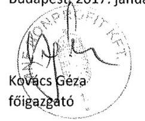

---

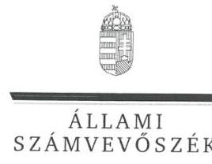

ELNÖK

# Kovács Géza úr 

főigazgató
MNF Magyar Nemzeti Filharmonikus Zenekar, Énekkar és Kottatár NKft.

## Budapest

## Tisztelt Főigazgató Úr!

Köszönettel vettem az MNF Magyar Nemzeti Filharmonikus Zenekar, Énekkar és Kottatár Nonprofit Kft. ellenőrzéséről készített számvevőszéki jelentéstervezetre megküldött észrevételeit.
Az Állami Számvevőszék észrevételekre vonatkozó álláspontjáról a felügyeleti vezető által készített részletes tájékoztatásból kap választ, amelyet levelemhez mellékeltem.
Tájékoztatom Főigazgató urat, hogy az Állami Számvevőszék a figyelembe nem vett észrevételeket az Állami Számvevőszékről szóló 2011. évi LXVI. törvény 29. § (3) bekezdésében előírtak szerint köteles a jelentésében feltüntetni és megindokolni, hogy azokat miért nem fogadta el.

Budapest, 2017. 2. hó 6. nap
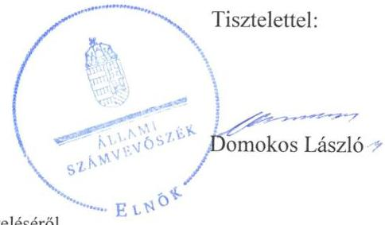

Melléklet: Tájékoztatás az észrevételek kezeléséről

---

# Tájékoztatás az észrevételek kezeléséről 

Megköszönöm Főigazgató úrnak „Az állami tulajdonban (résztulajdonban) lévő gazdálkodó szervezetek vagyonmegőrzési és gazdálkodási tevékenységének ellenőrzése - MNF Magyar Nemzeti Filharmonikus Zenekar, Énekkar és Kottatár Nonprofit Kft." címmel készített jelentéstervezetre tett észrevételeit. Az észrevételek kezeléséről az alábbi tájékoztatást adom.

A 2.1. számú megállapításhoz tett, a szabályzatok aktualizálására vonatkozó észrevételét tudomásul veszem, azonban észrevételében leírtak alapján a megállapítás továbbra is helytálló, így a jelentéstervezet megállapítását nem módosítom. A 2.1. számú megállapításhoz tett észrevételével Ön is elismeri a jelentéstervezet 2.1. pontjában foglalt megállapításokat, mely szerint a számviteli politika keretében elkészült szabályzatok a jogelőd Kht.-ra vonatkoztak, azokat az átalakult MNF Nonprofit Kft.-re, továbbá az időközi jogszabályi változásoknak megfelelően nem aktualizálták, ezzel megsértette a Számviteli törvény 14. § (11), és (12) bekezdésében előírtakat. Azonban örömmel vettem tájékoztatását arról, hogy az ellenőrzés megállapításait elfogadva a jövőben azonnal reagálni fognak azon jogszabályi változásokra, amelyek a belső szabályaik változását követelik meg.

A 2.2. számú megállapításhoz tett, a vagyonnal való gazdálkodására vonatkozó észrevételét tudomásul veszem, azonban észrevételében leírtak alapján a megállapítás továbbra is helytálló, így a jelentéstervezet megállapítását nem módosítom. A 2.2. számú megállapításhoz tett észrevételében Ön is leírja, hogy a vagyonkezelt eszközökkel kapcsolatban az MNV Zrt. felé fennálló, a hosszú lejáratú kötelezettségek között kimutatott kötelezettség összege és a vagyonkezelési szerződésben rögzített összeg eltér egymástól. Tájékoztatása szerint kötelezettség állományát az értékcsökkenés összegével csökkentette, azonban ez nem járt együtt a vagyonkezelési szerződés módosításával. Ezzel megsértette a Vhr. 9. § (9) bekezdés a) pontjában foglaltakat, mely szerint a vagyonkezelő köteles a vagyonkezelésbe vett eszközöket a számviteli törvény előírásai szerint a hosszú lejáratú kötelezettségekkel szemben a vagyonkezelési szerződésben rögzített értéken kell állományba venni.

A 2.2. számú megállapításhoz tett, leltározásra vonatkozó észrevételét tudomásul veszem, azonban észrevételében leírtak alapján a megállapítás továbbra is helytálló, így a jelentéstervezet megállapítását nem módosítom. Tájékoztatom, hogy a leltározás elmulasztása nem a teljes körű leltárazás elmaradására, hanem csak vagyonkezelésben lévő eszközökre vonatkozó leltározási tevékenység elmaradására vonatkozik. Mivel a vagyontárgyak állományának leltárral történő alátámasztása a regionális Kht-knál tárolt, kihelyezett hangszerek esetében nem volt biztosított, mivel a kihelyezett eszközöknél az ellenőrzött időszakban a leltározási tevékenységet nem végezték el, ezzel megsértette a Számviteli törvény 69. § (1) bekezdésben előírtakat.

A 2.2 számú megállapításhoz tett, vagyonkezelésbe vett eszköz hiányához való hozzájáruláshoz kapcsolódó észrevétele alapján a jelentéstervezet összegző részét pontosítom az alábbiak szerint: „A vagyonkezelésében lévő eszközök hasznosítására az eszközöket használó regionális közhasznú társaságokkal, illetve azok jogutódjaival a jogszabályi előírások ellenére nem kötött szerződést, mely közvetlenül hozzájárulhatott a vagyonkezelésbe vett eszköz hiányához."

---

A 3.1. számú megállapításhoz tett, a leírt követelésekre vonatkozó észrevételét tudomásul veszem, ez alapján a jelentéstervezet megállapítását az alábbiak alapján módosítom:  A követelésállomány-kezelésének szabályaira vonatkozóan a tulajdonosi joggyakorló, illetve jogszabály nem határozott meg előírásokat. Az MNF Nonprofit Kft. belső szabályzatban nem határozta meg a hátralékos állomány csökkenésére irányuló intézkedéseket, a hátralékos követelések behajtását nem szabályozták, ugyanakkor erre jogszabály nem kötelezte.

A 3.2. számú megállapításhoz tett, az önköltségszámításra vonatkozó észrevételét tudomásul veszem, azonban észrevételében leírtak alapján a megállapítás továbbra is helytálló, így a jelentéstervezet megállapítását nem módosítom. Az árképzésnél nem alkalmazták az önköltségszámítási szabályzatuk 4. pontjában előírtakat. Észrevételében leírt gyakorlat és a szabályzatuk között nem teremtették meg az összhangot.

A 4.1. számú megállapításhoz tett, visszapótlási kötelezettségére vonatkozó észrevételét tudomásul veszem, azonban észrevételében leírtak alapján a megállapítás továbbra is helytálló, így a jelentéstervezet megállapítását nem módosítom. Észrevételében is arról ad tájékoztatást Főigazgató úr, hogy az amortizáció mértékével megegyező pótlási kötelezettségüknek nem tudtak eleget tenni. Észrevételében tájékoztat arról is, hogy a hangszereket karbantartják, azok fizikai állapotát őrzik, és hogy évente átlagosan 14 millió forintot költenek hangszerekre, kottára és karbantartásra. Az eszközök karbantartása dicséretes, azonban az nem helyettesíti a Vhr. 9. § (9) bekezdés d) pontjában előírtakat. Visszapótlási kötelezettségük nem teljesítésével 2013. június 28-ig megsértették a Vhr. 9. § (9) bekezdés d) pontjában előírtakat.

Az 5.1. számú megállapításhoz tett, közhasznúsági mellékletre vonatkozó észrevételét tudomásul veszem, azonban észrevételében leírtak alapján a megállapítás továbbra is helytálló, így a jelentéstervezet megállapítását nem módosítom. A társaság közhasznú szervezetnek minősül, így 2011. évben a Kszt. 19. § (1) bekezdése alapján köteles az éves beszámoló jóváhagyásával egyidejűleg közhasznúsági jelentést készíteni. Észrevételében leírtak alapján a társaság ezt nem nyújtotta be, megsértve ezzel a Kszt. 19. § (1) bekezdésében előírtakat. 2012. évtől az Ectv. 46. § (1) bekezdése mondja ki, hogy a közhasznú szervezet köteles a beszámolójával egyidejűleg közhasznúsági mellékletet is készíteni. A 350/2011. Korm. rendelet 12. § (1) bekezdése pedig rögzíti, hogy a kettős könyvvitelt vezető közhasznú szervezet kiegészítő mellékletében mit kell bemutatni. A társaság ezen előírások ellenére hiányosan készítette el az évenkénti közhasznúsági mellékletet 2012-től.

Az 5.1. számú megállapításhoz tett, könyvvizsgálatra vonatkozó észrevételét tudomásul veszem, azonban észrevételében leírtak alapján a megállapítás továbbra is helytálló, így a jelentéstervezet megállapítását nem módosítom. Észrevételében is leírta, hogy a társaság könyveiben kimutatott kezelt vagyon értékét csökkentette, azonban a vagyonkezelési szerződést nem módosították, így a társaság könyveiben kimutatott kezelt vagyon értéke nem egyezett a vagyonkezelői szerződésben lévő összeggel. A könyvvizsgáló a társaság éves beszámolóit az ellenőrzött időszak minden évében a Számviteli törvény 3. § (13) bekezdés 1) pontjának megfelelő hitelesítő záradékkal látta el, és nem tárta fel a kezelt vagyon nem megfelelő értékben történő kimutatását.

---

Az 5.2. számú megállapításhoz tett, belső ellenőri munkakörre vonatkozó észrevételét tudomásul veszem, azonban észrevételében leírtak alapján a megállapítás továbbra is helytálló, így a jelentéstervezet megállapítását nem módosítom. Észrevételében tájékoztatott arról, hogy a munkájuk szabályszerű végzéséhez elegendő a folyamatba épített ellenőrzés elvégzése. Azonban a társaság kormányzati szektorba sorolt társaság
 és a Bkr. 2014. január 1-től hatályos változásai következtében, mint kormányzati szektorba sorolt vállalat a Bkr. 10. §-a alapján köteles kialakítani a szervezet tevékenységének, a célok megvalósításának nyomon követését biztosító rendszert, mely az operatív tevékenységek keretében megvalósuló folyamatos és eseti nyomon követésből, valamint az operatív tevékenységektől függetlenül működő belső ellenőrzésből áll. A társaság ezen jogszabályban előírt kötelezettségének nem tett eleget.

Budapest, 2017. Gomba hó 8. nap

Dr. Horváth Margit felügyeleti vezető

---

# 168 

## M Novill M

## Állami Számvevőszék

## Domokos László elnök

1052 Budapest
Apáczai Cs. J. u. 10.

Ikt. sz.: MNV/01/3130/1 /2017.
Hiv. sz.: V-1032-149/2016.

Tisztelt Elnök Úr!
A 2017. január 10. napján „MNF Magyar Nemzeti Filharmonikus Zenekar, Énekkar és Kottatár Nonprofit Kft. - Az állami tulajdonban (résztulajdonban) lévő gazdálkodó szervezetek vagyonmegőrzési és gazdálkodási tevékenységének ellenőrzése" tárgyában kézhez vett, V-1032-149/2016. ikt. sz. Jelentés-tervezetre az alábbi észrevételeinket tesszük:

Megállapítások / 14. old. összegző megállapítás, Megállapítások / 14. old. 1.1. számú megállapítás, Megállapítások / 14. old. 1.1. számú megállapítás ötödik bekezdés:

A Jelentés-tervezet 1.1. számú megállapításának második mondata szerint „az MNV Zrt. a társasági részesedésre megkötött vagyonkezelési szerződést a jogszabályi környezet változása ellenére nem módosította". A megállapítás okát az ötödik (a 14. oldal utolsó) bekezdés második mondata tartalmazza, amely szerint az MNV Zrt. és az EMMI között megkötött vagyonkezelési szerződés megszüntetésére és a megbízási szerződés megkötésére késedelmesen, nem 2012. december 31. napjáig, hanem csak 2013. január 27-én került sor. Mindezekre tekintettel az 1. pont összegző megállapítása szerint az EMMI szabályszerűen, míg az MNV Zrt. csak „összességében" alakította ki szabályszerűen az állami vagyonnal való gazdálkodás feltételeit.

Ezzel összefüggésben fel szeretnénk hívni a figyelmet arra, hogy az MNV Zrt. a tulajdonosi joggyakorlása alá tartozó társasági részesedések hasznosítására új szerződéskötési gyakorlat kialakítása, a nemzeti vagyonról szóló törvény végrehajtása tárgyban már 2012. szeptember 10-én meghozta 465/2012. (IX.10.) IG sz. határozatát, amely alapján az MNV Zrt. még 2012 szeptemberében valamennyi vagyonkezelő szervezettel felvette a kapcsolatot a hatályos, társasági részesedések vagyonkezelése tárgyában megkötött szerződések megszüntetése és az új megbízási szerződések megkötése érdekében, részletes ütemterv és az elfogadott új szerződéstervezet megküldése mellett. Az MNV Zrt.-nek 186 társasági részesedésre 43 vagyonkezelő szervezettel kellett néhány hónap alatt az új szerződéseket megkötnie.

Az EMMI-vel megkötésre került megbízási szerződés az MNV Zrt. részéről - az EMMI-vel lefolytatott egyeztetések lezárását követően - a törvényben előírt határidőn belül, 2012. december 20-án aláírásra került, az EMMI aláírása történt meg 2013. január 27-én. Ennek megfelelően indokolatlannak tartjuk, hogy a Jelentés-tervezet az MNV Zrt.-nek rója fel a megbízási szerződés megkötésének 2012. december 31-i határidőig történt létrejöttének elmaradását, hiszen az MNV Zrt. minden tőle elvárhatót megtett a jogszabályi környezet változásának megfelelő szerződéskötés biztosítása érdekében. Mindezekre tekintettel kérjük a tárgyi megállapítások tényszerűséggel összhangban álló módosítását.

---

# MNV Magyar Nemzeti Vagyonkezelő Zrt. 

## Megállapítások / 15. old. 1.1. számú megállapítás hatodik, hetedik, nyolcadik bekezdése:

A fent megjelölt bekezdésekkel kapcsolatban szeretnénk megjegyezni, hogy a Vagyonkezelési Szerződés módosítása, az újraszabályozandó vagyonkezelési jogviszony kialakítása során problémaként merült fel az MNF Nonprofit Kft. vagyonkezelő megfelelő közfeladat ellátásának az igazolása (közfeladat ellátás esetén a hatályos jogszabályi előírásoknak megfelelően a vagyonkezelő a vagyonkezelési díjfizetés alól mentesíthető, valamint a visszapótlási kötelezettség teljesítése alól mentesül).

Tudomásunk szerint közfeladat ellátás átadásáról szóló megállapodás előkészítése nincsen folyamatban, amelyre tekintettel a megfelelő tartalmú megállapodás megkötéséig az MNV Zrt.-nek nincsen lehetősége a vagyonkezelési jogviszony „díjmentes" újraszabályozására.

Megjegyzendő továbbá, hogy önmagában a jogszabályi előírások változásai nem adnak okot és nem keletkeztetnek kötelezettséget a Vagyonkezelési Szerződés újraszabályozására (különösen, hogy ahhoz mindkét fél egyező akaratnyilatkozata is szükséges), de ettől függetlenül természetesen az MNV Zrt.-nek - a fentieknek megfelelően szándékában áll a Vagyonkezelési Szerződés újraszabályozása.

Megállapítások / 21-22. old. 4.1. számú megállapítás, valamint az 4.1. megállapítás hetedik, nyolcadik bekezdése:
A hivatkozott megállapítás, valamint bekezdések szerint az MNF Nonprofit Kft. „a kezelt vagyonra vonatkozó, Vhr-ben előírt visszapótlási kötelezettségét nem teljesítette."

A Jelentés-tervezet vonatkozó részében leírtak nem támasztják alá a hivatkozott megállapítást. A befektetett eszközök 2011. évi 440,7 millió Ft-os értékéből 131,7 millió Ft a Társaság saját vagyona volt. A vagyonkezelt eszközérték a vizsgált időszakban, 4 év alatt 318,8 millió Ft-ról 299,7 millió Ft-ra, mindössze mintegy 6%-kal csökkent, miközben jogszabályi változás alapján a Társaság 2013. június 28-tól mentesült a visszapótlási kötelezettség alól. A Társaság által vagyonkezelt eszközök ingóságok (hangszerek, kották) tekintetében a 14,5%-os amortizációs kulcs mérvadó. Továbbá: a befektetett eszközökre elszámolt értékcsökkenés a 2011-2013 közötti időszakban mindössze mintegy 9 millió Ft-tal haladja meg a befektetett eszközök bruttó értéknövekedését.

A visszapótlás elmaradása nagyságrendileg bekövetkezhetett a Társaság saját eszközeinél is, semmi nem igazolja a vagyonkezelt eszközérték visszapótlásának elmaradását.

A fentiek alapján kérjük törölni a Jelentés-tervezet 4.1. megállapítását, valamint a hivatkozott bekezdésekből a Vhr. szerinti visszapótlási kötelezettség elmaradására vonatkozó megállapításokat.

Kérem Elnök Urat, hogy a Jelentés véglegesítése során jelen észrevételeinket szíveskedjenek figyelembe venni.

Budapest, 2017. január 12.

Üdvözlettel:
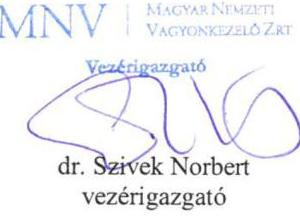

---

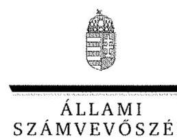

ELNÖK

Ikt.szám: V-1032-162/2016

dr. Szivek Norbert úr
vezérigazgató
Magyar Nemzeti Vagyonkezelő Zrt.

Budapest

Tisztelt Vezérigazgató Úr!

Köszönettel vettem az MNF Magyar Nemzeti Filharmonikus Zenekar, Énekkar és Kottatár Nonprofit Kft. ellenőrzéséről készített számvevőszéki jelentés-tervezetre megküldött észrevételeit.

Az Állami Számvevőszék észrevételekre vonatkozó álláspontjáról a felügyeleti vezető által készített részletes tájékoztatásból kap választ, amelyet levelemhez mellékeltem.

Tájékoztatom Vezérigazgató urat, hogy az Állami Számvevőszék a figyelembe nem vett észrevételeket az Állami Számvevőszékről szóló 2011. évi LXVI. törvény 29. § (3) bekezdésében előírtak szerint köteles a jelentésében feltüntetni és megindokolni, hogy azokat miért nem fogadta el.

Budapest, 2017. június 6. nap

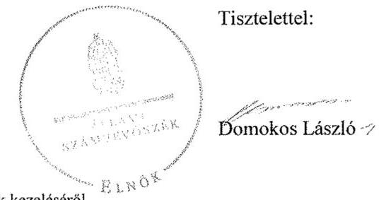

Melléklet: Tájékoztatás az észrevételek kezeléséről

---

# Tájékoztatás az észrevételek kezeléséről 

Megköszönöm Vezérigazgató úrnak „Az állami tulajdonban (résztulajdonban) lévő gazdálkodó szervezetek vagyonmegőrzési és gazdálkodási tevékenységének ellenőrzése - MNF Magyar Nemzeti Filharmonikus Zenekar, Énekkar és Kottatár Nonprofit Kft." címmel készített jelentés-tervezetre tett észrevételeit. Az észrevételek kezeléséről az alábbi tájékoztatást adom.

Az 1.1. számú megállapításhoz, és az 1.1. pont ötödik bekezdéséhez tett észrevételét, mely az állami vagyonnal való gazdálkodás feltételeinek szabályszerűségéről szól, tudomásul veszem, és észrevétele alapján módosítom a jelentés-tervezetet az alábbiak szerint. Az összegzést: „Az Állami Számvevőszék a Magyar Nemzeti Filharmonikus Zenekar, Énekkar és Kottatár Nonprofit Kft. vagyonmegőrzési és gazdálkodási tevékenysége 2011. január 1. és 2014. december 31. közötti időszakra történő ellenőrzése során megállapította, hogy az Emberi Erőforrások Minisztériuma szabályszerűen, míg a Magyar Nemzeti Vagyonkezelő Zrt. összességében szabályszerűen alakította ki a vagyonnal való gazdálkodás feltételeit." A főbb megállapítások, következtetések, javaslatok részt: „Az Emberi Erőforrások Minisztériuma szabályszerűen, míg a Magyar Nemzeti Vagyonkezelő Zrt. összességében szabályszerűen alakította ki a vagyonnal való gazdálkodás feltételeit." Az 1. fókuszkérdés összegző megállapítását: „Az EMMI szabályszerűen, míg az MNV Zrt. összességében szabályszerűen alakította ki a vagyonnal való gazdálkodás feltételeit." Továbbá a jelentés-tervezet 1.1 pontja kiegészítésre került az észrevételében leírtak alapján az alábbiakkal: „A Megbízási szerződés az MNV Zrt. részéről 2012. december 20-án, míg az EMMI részéről 2013. január 27-én került aláírásra, így a megbízási szerződés megkötésére azonban az Nvtv. 18. § (7) bekezdése előírásai ellenére késedelmesen, 2013. január 27-én került sor."

Az 1.1. számú megállapítás hatodik, hetedik és nyolcadik bekezdéséhez tett észrevételét, mely a vagyonkezelési szerződés újraszabályozásáról szól, tudomásul veszem, ugyanakkor a jelentés-tervezet megállapítását az nem módosítja.
A 4.1. számú megállapítás, valamint a 4.1. számú megállapítás hetedik és nyolcadik bekezdéséhez tett észrevételét - mely a Vhr.-ben előírt visszapótlási kötelezettségre vonatkozik - tájékoztatásul tudomásul veszem, az észrevétele alapján a jelentés-tervezetben leírtakat nem módosítom. A társaság 2013. június 28-tól - jogszabályi változás miatt - mentesült a visszapótlási kötelezettség alól. Azonban 2013. június 28-ig a társaságnak a visszapótlási kötelezettségét a Vhr. 9. § (9) d) pontjában előírtak alapján az elszámolt értékcsökkenésnek megfelelő mértékben kellett volna teljesítenie. Az Ön észrevételében leírtak is alátámasztják a jelentés-tervezetben foglaltakat, mivel elmondása szerint a társaság által vagyonkezelt eszközök ingóságok tekintetében az elszámolt értékcsökkenés mintegy 9 millió Ft-tal meghaladta az eszközök bruttó értéknövekedését.

Budapest, 2017. március 3. nap

Dr. Horváth Margit
felügyeleti vezető

---

.

---

# RÖVIDÍTÉSEK JEGYZÉKE 

${ }^{1}$ Áht. 
${ }^{2}$ MNF Nonprofit Kft.
${ }^{3}$ Alapító Okirat ${ }_{1-8}$
Alapító Okirat ${ }_{1}$

Alapító Okirat ${ }_{2}$

Alapító Okirat ${ }_{3}$

Alapító Okirat ${ }_{4}$

Alapító Okirat ${ }_{5}$

Alapító Okirat ${ }_{6}$

Alapító Okirat ${ }_{7}$

Alapító Okirat ${ }_{8}$

${ }^{4}$ Közhasznú szerződés
${ }^{5}$ Közszolgálati szerződés
${ }^{6}$ EMMI
${ }^{7}$ MNV Zrt.
${ }^{8}$ Támogatási szerződés
Támogatási szerződés ${ }_{1}$
Támogatási szerződés ${ }_{2}$
Támogatási szerződés ${ }_{3}$
Támogatási szerződés ${ }_{4}$
${ }^{9}$ KVI
${ }^{10}$ ÁSZ
${ }^{11}$ Megbízási szerződés
${ }^{12}$ FB
${ }^{13}$ SZMSZ
${ }^{14}$ Nvtv.

Az államháztartásról szóló 1992. évi XXXVIII. törvény
Magyar Nemzeti Filharmonikus Nonprofit Korlátolt Felelősségű Társaság

Magyar Nemzeti Filharmonikus Zenekar, Énekkar és Kottatár Nonprofit KFT Alapító okirata (hatályos: 2010. december 30-tól 2011. május 30-ig)
Magyar Nemzeti Filharmonikus Zenekar, Énekkar és Kottatár Nonprofit KFT Alapító okirata (hatályos: 2011. május 31-től 2011. augusztus 23-ig)
Magyar Nemzeti Filharmonikus Zenekar, Énekkar és Kottatár Nonprofit KFT Alapító okirata (hatályos: 2011. augusztus 24-től 2011. december 29-ig.)
Magyar Nemzeti Filharmonikus Zenekar, Énekkar és Kottatár Nonprofit KFT Alapító okirata (hatályos: 2011. december 30-tól 2012. május 31-ig)
Magyar Nemzeti Filharmonikus Zenekar, Énekkar és Kottatár Nonprofit KFT Alapító okirata (hatályos: 2012. június 1-től 2013. október 24-ig)
Magyar Nemzeti Filharmonikus Zenekar, Énekkar és Kottatár Nonprofit KFT Alapító okirata (hatályos: 2013. október 25-től 2014. május 15-ig)
Magyar Nemzeti Filharmonikus Zenekar, Énekkar és Kottatár Nonprofit KFT Alapító okirata (hatályos: 2014. május 16-tól 2014. december 16-ig)
Magyar Nemzeti Filharmonikus Zenekar, Énekkar és Kottatár Nonprofit KFT Alapító okirata (hatályos: 2014. december 17-től)
5.3/88-6/2001.sz. KÖZHASZNÚ SZERZŐDÉS az Oktatási és Kulturális Minisztérium és a Magyar Nemzeti Filharmonikus Zenekar, Énekkar és Kottatár Közhasznú Társaság között (módosításokkal egységes szerkezetbe foglalva) (hatályos: 2009. március 23-tól 2014. május 30-ig)
KÖZSZOLGÁLTATÁSI SZERZŐDÉS az Emberi Erőforrások Minisztériuma és a Magyar Nemzeti Filharmonikus Zenekar, Énekkar és Kottatár Nonprofit Kft között (hatályos: 2014. május 30-tól)
Emberi Erőforrás Minisztérium, 2011. január 1-től 2012. június 1-ig Nemzeti Erőforrás Minisztérium (NEFMI), majd névváltozást követően 2012. június 1-től EMMI
Magyar Nemzeti Vagyonkezelő Zártkörű Részvénytársaság

13017-0/2011-VAGYON. sz. Támogatási szerződés
19501/2012/VAGYON sz. Támogatási szerződés
22945/2013/KUKAB sz. Támogatási szerződés
8162/2014/KUKAB sz. Támogatási szerződés
Kincstári Vagyoni Igazgatóság
Állami Számvevőszék
SZT-39088 sz. Megbízási Szerződés társasági részesedéshez kapcsolódó tulajdonosi jogok gyakorlására
Az MNF Nonprofit Kft. Felügyelő bizottsága
A Magyar Nemzeti Filharmonikus Zenekar, Énekkar és Kottatár Szervezeti és Működési Szabályzata, hatályos 2009. május 5-étől
A nemzeti vagyonról szóló 2011. évi CXCVI. törvény

---

${ }^{15}$ Vagyonkezelési szerződés
${ }^{16}$ 183/1996. (XII. 11.) Korm. rendelet
${ }^{17}$ Vhr.
${ }^{18}$ Számv. tv.
${ }^{19}$ Számviteli Politika
${ }^{20}$ Eszközök és források leltározási szabályzata
${ }^{21}$ Eszközök és források értékelési szabályzata
${ }^{22}$ Önköltségszámítási szabályzat
${ }^{23}$ Pénzkezelési Szabályzat
${ }^{24}$ Felesleges vagyontárgyak hasznosításának és selejtezésének szabályzata
${ }^{25}$ javadalmazási szabályzat
${ }^{26}$ Számlarend
${ }^{27}$ Filharmonikus NKft

 jogelődje
${ }^{28}$ Vtv.
${ }^{29}$ Kszt.
${ }^{30}$ Ectv.
${ }^{31} \mathrm{Gt}$.
${ }^{32}$ Avtv.
${ }^{33}$ Info. tv.
${ }^{34}$ Takarékossági tv.
${ }^{35}$ Bkr.
${ }^{36}$ Stabilitási tv.
${ }^{37}$ 353/2011.(XII.30.) Korm. rendelet

A Magyar Nemzeti Filharmonikus Zenekar, Énekkar és Kottatár Kht. és a KVI között 2002. október 21-én létrejött, 620363/2002/0100 számú vagyonkezelési szerződés
183/1996. (XII. 11.) Korm. rendelet a kincstári vagyon kezeléséről, értékesítéséről és az e vagyonnal kapcsolatos egyéb kötelezettségekről
Az állami vagyonnal való gazdálkodásról szóló 254/2007. (X. 4.) Korm. rendelet
A számvitelről szóló 2000. évi C. törvény (hatályos: 2001.01.01-től)
Az MN Filharmonikus Kft. Számviteli Politikája, hatályos 2009. január 1-jétől

Az MN Filharmonikus Kft. Eszközök és források leltározási szabályzata, hatályos 2006. január 1-től

Az MNF Nonprofit Kft. Eszközök és források értékelési szabályzata, hatályos 2006. január 1-től

Az MNF Nonprofit Kft. Önköltségszámítási szabályzata, hatályos 2005. január 1-től
Az MNF Nonprofit Kft. Pénzkezelési Szabályzata, hatályos 2009. január 1-jétől

Az MNF Nonprofit Kft. Felesleges vagyontárgyak hasznosításának és selejtezésének szabályzata, hatályos 2006. január 1-től
Az MNF Nonprofit Kft. javadalmazási szabályzata, hatályos 2008. február 13-tól
Az MNF Nonprofit Kft. Számlarendje, hatályos 2006. január 1-től
Magyar Nemzeti Filharmonikus Zenekar, Énekkar és Kottatár Közhasznú Társaság
Az állami vagyonról szóló 2007. évi CVI. törvény (hatályos 2007. szeptember 25-től)
A közhasznú szervezetekről szóló 1997. évi CLVI. törvény (hatályos 1998.01.01-től 2011.12.31-ig.)
Az egyesülési jogról, a közhasznú jogállásról, valamint a civil szervezetek működéséről és támogatásáról szóló 2011. évi CLXXV. törvény (hatályos 2011. december 14-től)
A gazdasági társaságokról szóló 2006. évi IV. törvény (hatályos 2006. július 1-jétől 2014. március 14-éig)
a személyes adatok védelméről és a közérdekű adatok nyilvánosságáról szóló 1992. évi LXIII. törvény
Az információs önrendelkezési jogról és az információszabadságról szóló 2011. évi CXII. törvény
A köztulajdonban álló társaságok takarékosabb működéséről szóló 2009. évi CXXII. törvény a köztulajdonban álló társaságok takarékosabb működéséről
A költségvetési szervek belső kontrollrendszeréről és belső ellenőrzéséről szóló 370/2011. (XII. 31.) Korm. rendelet (hatályos: 2012.01.01-től)
Magyarország gazdasági stabilitásáról szóló 2011. évi CXCIV. törvény
Az adósságot keletkeztető ügyletekhez történő hozzájárulás részletes szabályairól szóló 353/2011. (XII. 30.) Korm. rendelet

---

# ÁLLAMI SZÁMVEVŐSZÉK 

1052 Budapest, Apáczai Csere János utca 10.
Levélcím: 1364 Budapest 4. Pf. 54
Telefon: +36 14849100 Telefax: +36 14849200
www.asz.hu
