# Jelentés 

## Vasútegészségügyi Nonprofit Közhasznú Kft.

Az állami tulajdonban (résztulajdonban) lévő gazdálkodó szervezetek vagyonmegőrzési és gazdálkodási tevékenységének ellenőrzése 2017.

Az ÁSZ ellenőrzéseivel hozzájárul ahhoz, hogy a közpénzeket a szervezetek átlátható és rendezett módon használják fel a feladataik ellátása érdekében.
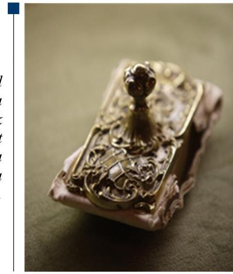

---

# Jelentés 

## Vasútegészségügyi Nonprofit Közhasznú Kft.

Az állami tulajdonban (résztulajdonban) lévő gazdálkodó szervezetek vagyonmegőrzési és gazdálkodási tevékenységének ellenőrzése
2017. 2018. 2019. hó 4. nap
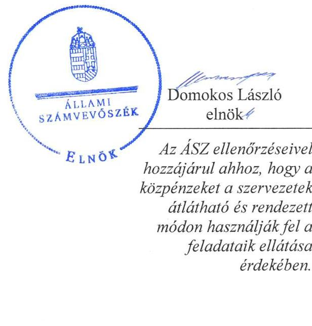

---

# AZ ELLENŐRZÉST FELÜGYELTE:

DR. HORVÁTH MARGIT felügyeleti vezető

## AZ ELLENŐRZÉST VEZETTE ÉS A VÉGREHAJTÁSÁÉRT FELELŐS:

PENCZ MÁRIA, VIDA KATALIN ellenőrzésvezető

## A PROGRAM ÖSSZEÁLLÍTÁSÁÉRT FELELŐS:

JANIK JÓZSEF LÁSZLÓ osztályvezető

IKTATÓSZÁM: V-1026-116/2016.

TÉMASZÁM: 2060

ELLENŐRZÉS-AZONOSÍTÓ SZÁM: V070919

Jelentéseink az Országgyűlés számítógépes hálózatán és az Interneten a www.asz.hu címen is olvashatóak.

---

# TARTALOMJEGYZÉK 

■ ÖSSZEGZÉS ..... 5
■ AZ ELLENŐRZÉS CÉLJA ..... 7
■ AZ ELLENŐRZÉS TERÜLETE ..... 8
■ AZ ELLENŐRZÉS HÁTTERE, INDOKOLTSÁGA ..... 10
■ A JELENTÉS LÉNYEGES KÉRDÉSKÖREI ..... 11
■ ELLENŐRZÉS HATÓKÖRE ÉS MÓDSZEREI ..... 12
■ MEGÁLLAPÍTÁSOK ..... 14
■ JAVASLATOK ..... 27
■ MELLÉKLETEK ..... 29
I. sz. melléklet: Értelmező szótár ..... 29
II. sz. melléklet: A Vasútegészségügyi NKft. vagyonának változása 2011-2014. között (ezer Ft, \%) ..... 34
III. sz. melléklet: A Vasútegészségügyi NKft. eredménykimutatása 2011-2014. között (ezer Ft, \%) ..... 36
■ FÜGGELÉK: ÉSZREVÉTELEK ..... 37
■ RÖVIDÍTÉSEK JEGYZÉKE ..... 47

---

.

---

# ÖSSZEGZÉS 

Az Állami Számvevőszék a Vasútegészségügyi Nonprofit Közhasznú Kft. 2011. január 1. és 2014. december 31. közötti vagyonmegőrzési és gazdálkodási tevékenységének ellenőrzése kapcsán megállapította, hogy a Magyar Nemzeti Vagyonkezelő Zrt., mint tulajdonosi joggyakorló a vagyonnal való gazdálkodás feltételeit szabályszerűen alakította ki, azonban a kezelt vagyonon végzett beruházások és a Budai MÁV Kórháztól átvett ingóságok tekintetében a vagyonkezelési szerződés kiegészítésére nem került sor. A Vasútegészségügyi Nonprofit Közhasznú Kft. a vagyongazdálkodás feltételeit meghatározó belső szabályozó rendszert megfelelően alakította ki, viszont a vagyon nyilvántartásában hiányosságot tárt fel az ellenőrzés. A bevételek és ráfordítások elszámolása megfelelt a jogszabályi előírásoknak. Beszámolási és adatszolgáltatási kötelezettségét határidőben teljesítette. Az ellenőrzött időszakban adósságot keletkeztető ügyletet nem kötött.

## Az ellenőrzés társadalmi indokoltsága

Magyarországon az intézmény-centrikus közfeladat-ellátás, közvagyon-gazdálkodás jellemző a költségvetésen kívüli feladatellátás térnyerése mellett. Ennek szereplői az állami tulajdonú gazdálkodó szervezetek is.

Az államháztartásról szóló törvény, az Európai Közösséget létrehozó szerződéshez csatolt, a túlzott hiány esetén követendő eljárásról szóló jegyzőkönyv alkalmazásáról szóló 2009. május 25-i 479/2009/EK rendelet szerint, illetve az ESA95 és ESA2010 statisztikai módszertana alapján a kormányzati szektorba tartoznak a "központi kormányzat alszektorba besorolt társaságok és egyéb szervezetek" is, amelyekkel szemben alapvető követelmény, hogy gazdálkodásuk, működésük szabályszerű, az általuk szolgáltatott adatok megbízhatóak legyenek.

Az állami vagyonnal való gazdálkodás alapvető célja az állami vagyon átlátható, rendeltetésszerű és felelős felhasználásának biztosítása. Az állami tulajdonban álló gazdálkodó szervezetek államot megillető társasági részesedése a nemzeti vagyon részét képezi és legfőbb rendeltetése szerint a közfeladatok ellátását szolgálja.

Az Állami Számvevőszék stratégiájában megfogalmazta, hogy az államháztartáson kívülre nyújtott költségvetési támogatások és ingyenes vagyonjuttatások, valamint az államháztartáson kívül működő közfeladat-ellátó rendszerek ellenőrzéseivel hozzájárul ahhoz, hogy a közpénzeket az államháztartáson kívül működő szervezetek is átlátható, rendezett módon használják fel a közfeladatok szerződésben vállalt ellátása érdekében.

## Főbb megállapítások, következtetések, javaslatok

A Vasútegészségügyi Nonprofit Közhasznú Kft. a 2011-2014. közötti időszakban a tevékenységét saját, bérelt és kezelésbe vett vagyonnal látta el.

A tulajdonosi joggyakorló Magyar Nemzeti Vagyonkezelő Zrt. a felelős vagyongazdálkodást biztosító követelményeket szabályszerűen alakította ki, meghatározta az állami vagyon értékének megőrzéséhez, gyarapításához szükséges követelményeket. A Vasútegészségügyi Nonprofit Közhasznú Kft. a kezelt vagyonon végzett beruházáshoz a tulajdonosi joggyakorló engedélyét megkérte, azonban a vagyonkezelési szerződés felülvizsgálatára és módosítására az állami vagyonnal való gazdálkodásról szóló Kormányrendelet előírásai ellenére nem került sor. Elmulasztották továbbá a Budai MÁV Kórháztól a vagyonkezelői jog átadási szerződés keretében átvett ingó eszközök (22,1 M Ft bruttó érték) tekintetében a vagyonkezelési szerződés kiegészítését.

A Vasútegészségügyi Nonprofit Közhasznú Kft. vagyongazdálkodási tevékenységének szabályozását kialakította, vagyonnyilvántartása nem teljes mértékben felelt meg a jogszabályban foglaltaknak, mert nyilvántartásában olyan vagyontárgyakat is szerepeltetett, melyek nem szerepeltek a vagyonkezelési szerződésében.

---

A Vasútegészségügyi Nonprofit Közhasznú Kft. által ellátott közfeladatok bevételeinek és ráfordításainak elszámolása szabályszerű volt. Önköltségszámítási szabályzattal rendelkezett az ellenőrzött időszakban, abban a 2011-2012. években nem határozták meg a közvetlen költségeket és a közvetett költségek felosztásának rendjét, ugyanakkor integrált könyvviteli modullal biztosították a költségek elkülönítését, továbbá a vetítési alappal történő költségfelosztást.

Éves beszámolóit a számviteli törvény előírásainak megfelelően határidőben elkészítette, a beszámolókat a könyvvizsgáló minden évben hitelesítő záradékkal látta el, a Felügyelő Bizottság jóváhagyásra javasolta. Beszámolói részben megfeleltek a jogszabályi előírásoknak, mert vagyonkezelési szerződés hiányában szerepeltette a Budai MÁV Kórháztól átvett eszközöket.

Vagyonváltozást eredményező döntései megfeleltek a jogszabályi és belső szabályzatok előírásainak, az előírt adatszolgáltatási kötelezettséget határidőben teljesítette.

Közzétételi kötelezettségének részben tett eleget. Az információs önrendelkezési jogról és az információszabadságról szóló törvény előírásai ellenére az 1. sz. melléklet I. és II. részében felsorolt dokumentumokat nem tette közzé, továbbá a III. rész gazdálkodási adatok közül hiányoztak a közfeladatot ellátó szerv foglalkoztatottjainak és vezető tisztségviselőinek illetményére vonatkozó adatok, az ötmillió Ft-ot meghaladó szerződésekre, és kifizetésekre vonatkozó adatok. A közérdekű adatok megismerésére irányuló igények teljesítésének rendjét rögzítő szabályzattal az ellenőrzött időszakban nem rendelkezett. Az ellenőrzött időszakban adósságot keletkeztető ügyletet nem kötött.

---

# AZ ELLENŐRZÉS CÉLJA 

Az ellenőrzés célja annak értékelése, hogy a tulajdonosi jogok gyakorlása szabályszerű volt-e; a gazdálkodó szervezet által ellátott feladat bevételei, ráfordításai elszámolásának, és vagyongazdálkodási tevékenységének szabályozása megfelelt-e a jogszabályi és a tulajdonosi előírásoknak és azok végrehajtása szabályszerű volt-e; biztosítva volt-e a közfeladatok átláthatósága és elszámoltathatósága érdekében a közszolgáltatás díjának megalapozottsága szabályszerű önköltségszámítással; a vagyonváltozást eredményező döntések esetében a tulajdonosi jogok gyakorlója és a gazdálkodó szervezet szabályszerűen jártak-e el; a gazdálkodó szervezet épített-e ki és működtetett-e információs rendszert a szabályszerű vagyongazdálkodás érdekében.

Az ellenőrzés további célja annak értékelése, hogy a kormányzati szektorba sorolt egyéb szervezetek gazdálkodásának a kormányzati szektor hiányára és az államadósságra befolyással bíró elemei a jogszabályi előírásoknak megfeleltek-e.

---

# Az Ellenőrzés Területe

## Vasútegészségügyi Szolgáltató Nonprofit Közhasznú Kft. és a Magyar Nemzeti Vagyonkezelő Zrt.

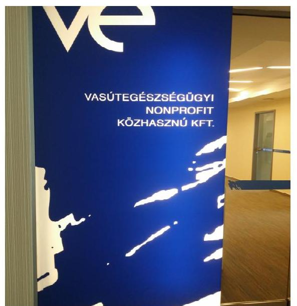

A Vasútegészségügyi NKft. Közhasznú Nonprofit Korlátolt Felelősségű Társaságot a Magyar Államvasutak Részvénytársaság (MÁV Zrt.), a Vasutas Önkéntes Kölcsönös Kiegészítő Egészségpénztár (VÖKK Egészségpénztár), a Magyar Állam (KVI², majd MNV Zrt.³), valamint a Győr-Sopron-Ebenfurti Vasút Részvénytársaság (GYSEV Zrt.) alapította, a vasúti háziorvosi rendszer működőképességének fenntartása és a MÁV Zrt. foglalkozás-egészségügyi feladatainak ellátása céljából.

A 81,89%-ban állami tulajdonban lévő Vasútegészségügyi NKft. tevékenysége – az MNV Zrt. által apportként rendelkezésre bocsátott 574,1 M Ft törzstőke mellett – a kezelt 152,3 M Ft értékű vagyon hatékony kezelésével a Ksz.¹ 26. § c) pont 1.-2. pontjainak megfelelően járó-, fekvőbeteg, fogorvosi és háziorvosi feladatok végzése.

A Vasútegészségügyi NKft. az ellenőrzött időszakban egészségmegőrző, betegségmegelőző és rehabilitációs tevékenységet folytatott, foglalkozás-egészségügyi szolgáltatást nyújtott, és hatóságként egészségügyi alkalmassági vizsgálatokat, továbbá komplex preventív szűrővizsgálatokat is végzett. Országos lefedettséggel szakrendelőket működtetett megyeszékhelyeken és nagyobb településeken, országosan több mint negyven telephellyel rendelkezett. Közhasznúsági és vállalkozási tevékenységéből is származott bevétele az ellenőrzött időszakban, bevételei OEP finanszírozásból, valamint munkáltatói és magánfinanszírozott tevékenységekből adódtak. Közhasznú tevékenységének bevételét az OEP-pel kötött Alapszerződés, és a szakellátásokra egyedileg kötött finanszírozási szerződések alapján történő központi finanszírozás képezte. Összbevételének mintegy egyötödét képezte a vállalkozási tevékenységből származó bevétele.

A Magyar Állam nevében a tulajdonosi jogokat az ellenőrzött időszakban az MNV Zrt. gyakorolta.

A Vasútegészségügyi NKft. az ellenőrzött időszakban saját, bérelt és kezelt vagyonnal gazdálkodott. A Vasútegészségügyi NKft. szakszerű feladatellátásához szükséges Podmaniczky u-i székházat, valamint ingó vagyontárgyakat vagyonkezelési szerződés⁵-sel biztosította az MNV Zrt. jogelődje, a KVI. A telephelyeit, orvosi rendelőit bérleti szerződés keretében biztosította a MÁV Magyar Államvasutak Zrt.

A Vasútegészségügyi NKft. főbb gazdálkodási adatait az 1. táblázat tartalmazza:

---

1. táblázat

# A VASÚTEGÉSZSÉGÜGYI NKFT. FŐBB GAZDÁLKODÁSI ADATAI A 2011-2014. ÉVEKBEN (M FT-BAN) 

| Megnevezés | 2011. év | 2012.év | 2013.év | 2014.év |
| :-- | --: | --: | --: | --: |
| Értékesítés nettó árbevétele | 4685,6 | 4741,5 | 4832,6 | 4913,5 |
| Mérleg szerinti eredmény | 228,2 | 170,0 | 142,3 | -8,6 |
| Befektetett eszközök | 1354,5 | 1763,2 | 2015,7 | 2339,7 |
| Saját tőke | 2054,1 | 2224,1 | 2366,3 | 2357,7 |
| Jegyzett tőke | 701,0 | 701,0 | 701,0 | 701,0 |
| Kötelezettségek | 917,4 | 992,8 | 864,1 | 1043,7 |

A Vasútegészségügyi NKft. vagyona a 2011. évi 3155,4 M Ft-ról 2014. évre 3883,4 M Ft-ra emelkedett, mely 23,1%-os növekedést jelentett. Mérleg szerinti eredménye a 2011. évi 228,2 M Ft-ról minden évben csökkent, a 2014. évben -8,6 M Ft. vesztesége keletkezett, melynek oka az évek óta változatlan egészségügyi finanszírozás miatti bevételek csökkenése, illetve az azt meghaladó mértékű ráfordítás növekedése volt. Mérlegfőösszege a 2011. évi 3 155,4 M Ft-ról a 2014. évre 3 883,4 M Ft-ra emelkedett. A Vasútegészségügyi NKft. átlagos statisztikai állományi létszáma az ellenőrzött időszakban 820 és 840 fő közötti volt.

---

# AZ ELLENŐRZÉS HÁTTERE, INDOKOLTSÁGA 

## AZ ÁSZ⁶ KÖZÉPTÁVRA SZÓLÓ STRATÉGIÁJÁBAN

megfogalmazta, hogy az államháztartáson kívülre nyújtott költségvetési támogatások és ingyenes vagyonjuttatások, valamint az államháztartáson kívül működő közfeladat-ellátó rendszerek ellenőrzéseivel hozzájárul ahhoz, hogy a közpénzeket az államháztartáson kívül működő szervezetek is átlátható, rendezett módon használják fel a közfeladatok szerződésben vállalt ellátása, továbbá a közvagyon szerződésben vállalt átlátható, hatékony, költségtakarékos működtetése, értékének megőrzése, állagának védelme, értéknövelő használata, hasznosítása és gyarapítása érdekében.

Az ellenőrzés feladata a közvagyonnal biztosított közfeladat ellátással kapcsolatban a közpénzek átláthatósága, nyilvánossága érdekében a jogszabályokban, belső szabályzatokban megfogalmazott előírások érvényesülésének az állami tulajdonban (résztulajdonban) lévő gazdálkodó szervezetek vagyonérték-megőrzési és gazdálkodási tevékenységének értékelése.

AZ ELLENŐRZÉS EREDMÉNYEKÉPP a törvényalkotás számára tapasztalatok állnak rendelkezésre az állami vagyonnal való közfeladat-ellátás, közvagyonnal való gazdálkodás értékeléséhez, az átláthatóságot biztosító szabályozáshoz. Az ellenőrzés tapasztalatai segítik és erősítik az ÁSZ hozzáadott értéket teremtő tevékenységét és tanácsadó szerepét.

---

# A JELENTÉS LÉNYEGES KÉRDÉSKÖREI 

1.     - A tulajdonosi joggyakorló a vagyonnal való gazdálkodás feltételeit szabályszerűen alakította-e ki?
2.     - A Vasútegészségügyi NKft. vagyongazdálkodási tevékenységének szabályozottsága és a vagyon nyilvántartása megfelelt-e az előírásoknak?
3.     - A bevételek és ráfordítások elszámolása, valamint az önköltségszámítás szabályszerű volt-e?
4.     - A vagyonnal való gazdálkodás, valamint a vagyonváltozást eredményező döntések megfeleltek-e a jogszabályi és tulajdonosi előírásoknak?
5.     - A Vasútegészségügyi NKft. a szabályszerű vagyongazdálkodás érdekében teljesítette-e beszámolási, adatszolgáltatási kötelezettségét, kiépített-e, illetve működtetett-e információs rendszert?
6. A Vasútegészségügyi NKft. gazdálkodásának a kormányzati szektor hiányára és az államadósságra befolyást gyakorló elemei a jogszabályi előírásoknak megfeleltek-e?

---

# ELLENŐRZÉS HATÓKÖRE ÉS MÓDSZEREI 

## Az ellenőrzés típusa

Szabályszerűségi

 ellenőrzés.

## Az ellenőrzött időszak

2011. január 1-jétől 2014. december 31-ig.

## Az ellenőrzés tárgya

Az állami tulajdonban (résztulajdonban) lévő gazdálkodó szervezetek vagyonmegőrzési és gazdálkodási tevékenysége és a kormányzati szektor hiányára és adósságállományára hatást gyakorló elemek ellenőrzése.

## Az ellenőrzött szervezet

Vasútegészségügyi Szolgáltató Közhasznú Nonprofit Kft., Magyar Nemzeti Vagyonkezelő Zrt.

## Az ellenőrzés jogalapja

Az ellenőrzés alapját az Állami Számvevőszékről szóló 2011. évi LXVI. törvény 5. § (3)-(5) bekezdése, valamint az állami vagyonról szóló 2007. évi CVI. törvény 3. § (4) bekezdése képezi.

## Az ellenőrzés módszerei

Az ellenőrzést az ellenőrzési program szempontjai, az ellenőrzött időszakban hatályos jogszabályok, az ellenőrzés szakmai szabályai, a jelen ellenőrzésre irányadó ÁSZ módszertan és a nemzetközi standardok figyelembevételével végeztük.

Az ellenőrzési kérdések megválaszolásához szükséges bizonyítékok megszerzése az ellenőrzött által rendelkezésre bocsátott dokumentumokra, adatokra alapozva kérdésfelvetés, mintavételezés, valamint elemző eljárás útján történt.

Az ellenőrzési bizonyítékként felhasználható adatforrások közé tartoztak egyrészt a szakmai program részletes szempontjainál felsorolt adatforrások, másrészt minden egyéb - az ellenőrzés folyamán feltárt, az ellenőrzés szempontjából információt tartalmazó - dokumentumok.

---

Az ellenőrzés lefolytatásához a gazdálkodó szervezet a tanúsítványok elektronikus kitöltésével, valamint az ÁSZ által kért dokumentumok megküldésével szolgáltatott adatokat.

A bevételek és a ráfordítások elszámolását, és a vagyonnyilvántartás terén a szabályszerű működést véletlenszerű mintavétellel ellenőriztük. Az ellenőrzöttnél, mint a kormányzati szektorba sorolt gazdálkodó szervezetnél a személyi jellegű ráfordítások elszámolása mellett az egyéb ráfordítások, a pénzügyi műveletek ráfordításai, a rendkívüli ráfordítások, illetve az egyéb bevételek, a pénzügyi műveletek bevételei, a rendkívüli bevételek elszámolásának szabályszerűségét szintén mintatételeken keresztül ellenőriztük.

A mintavétellel ellenőrzött területek esetében minden egyes tétel vonatkozásában a szabályszerűségre vonatkozó kérdéseket tettük fel, amelyek eredménye összesítésre került. A jogszabályoknak és a belső előírásoknak megfelelőnek tekintettük az adott területet, amennyiben a minta ellenőrzésének eredménye alapján 95%-os bizonyossággal a teljes sokaságban a hibaarány kisebb volt, mint 10%, nem megfelelőnek értékeltük, ha a hibaarány a 10%-ot meghaladta. A ráfordítások elszámolására és a vagyonnyilvántartásra vonatkozó véletlen mintavételt kockázati alapú kiválasztással egészítettük ki, amelynek során évente a három legnagyobb összegű tételt választottuk ki.

A területi szervekhez kihelyezett vagyonkezelt eszközöket a használati helyén szemrevételeztük, melyet jegyzőkönyvvel dokumentáltunk.

---

# 1. A tulajdonosi joggyakorló a vagyonnal való gazdálkodás feltételeit szabályszerűen alakította-e ki? 

Összegző megállapítás

Az MNV Zrt. a Vasútegészségügyi NKft. vagyongazdálkodásának feltételeit összességében szabályszerűen alakította ki, meghatározta az állami vagyon értékének megőrzését biztosító követelményeket, azonban a vagyonkezelési szerződés módosítására a Vhr. előírása ellenére nem került sor.

1.1. számú megállapítás

A tulajdonosi joggyakorló MNV Zrt. az állami vagyon értékének megőrzéséhez, gyarapításához, valamint a felelős gazdálkodáshoz szükséges követelményeket meghatározta.

A tulajdonosi joggyakorlás keretében az Alapítók a Társasági szerződés 1-10.§-ban - összhangban a Gt. előírásaival - meghatározták a kizárólagos hatáskörükbe tartozó feladatokat, valamint a Vasútegészségügyi NKft. vagyonához kapcsolódó tulajdonosi joggyakorló általi követelményeket.

A Vasútegészségügyi NKft. és a Magyar Állam nevében a tulajdonosi jogok gyakorlását ellátó KVI között létrejött vagyonkezelési szerződésben meghatározták a Vasútegészségügyi NKft. által kezelt vagyon megőrzésének, gyarapításának, a vagyon állagának fenntartására vonatkozó követelményeit. A vagyonkezelési szerződésben rögzítették a tulajdonosi joggyakorló ellenőrizési jogkörét, a vagyonkezelt eszközök körét és értékét, a vagyonkezelési jog gyakorlásának ellenértékét, kiemelten a kezelt vagyonnal történő elszámolási kötelezettséget, és a vagyonkezelt eszközök értékesítésének tiltását.

A Vasútegészségügyi NKft. vonatkozásában a tulajdonosi joggyakorló az OEP alapszerződésben meghatározott finanszírozás és a különféle EU-s (KEOP, DAOP, HURO, TÁMOP) támogatások felhasználásának szabályszerűségét biztosító ellenőrzési jogokat a Vtv. előírásainak megfelelően saját hatáskörében tartotta. A Vasútegészségügyi NKft.-nél a Gt. előírása alapján kötelező volt az FB megválasztása, mely a Taktv. előírásának megfelelően 6 főből állt.

A Társasági szerződés 1-10.§ alapján a tulajdonosok kizárólagos hatáskörébe tartozott valamennyi olyan döntés és jóváhagyás, melyet a Gt. a Taggyűlés hatáskörébe utalt. Az Alapítók hatáskörébe tartozott - a Vtv. előírásaival összhangban - az üzletrészek felosztása, hitel és kölcsön felvétel, és a közhasznú tevékenységre kötött szerződések, továbbá az átalakulással kapcsolatos döntések jóváhagyása. A Társasági szerződés 1-10.§ alapján a Taggyűlés hatáskörébe tartozott a Számv. tv. szerinti beszámoló jóváhagyása, a törzstőke felemelése, leszállítása, pótbefizetés elrendelése és

---

visszatérítése, az FB tagjainak megválasztása, az éves üzleti terv jóváhagyása, az SZMSZ és ügyrend jóváhagyása, a Befektetési szabályzat 1,2.§ jóváhagyása, a könyvvizsgáló megbízása, a megbízás visszavonása.

# 2. A Vasútegészségügyi NKft. vagyongazdálkodási tevékenységének szabályozottsága és a vagyon nyilvántartása megfelelt-e az előírásoknak 

Összegző megállapítás

A Vasútegészségügyi NKft. vagyongazdálkodási tevékenységének kialakítása és szabályozása megfelelő volt. Vagyonnyilvántartása részben felelt meg a jogszabályi előírásoknak, mert nyilvántartásában vagyonkezelési szerződés hiányában szerepeltetett eszközöket.
2.1. számú megállapítás

A Vasútegészségügyi NKft. a vagyon értékének megőrzését, gyarapítását biztosító vagyongazdálkodás feltételeit összességében megfelelően alakította ki és szabályozta. A vagyonkezelési szerződést nem módosították a kezelt vagyonon végzett beruházásnak megfelelően.

A Vasútegészségügyi NKft. szabályszerű működésének alapdokumentumai a Társasági szerződés 1-10.§, a Számv. tv. 14. § (1) bekezdés 5. pontjában, és 161. § (2) bekezdése alapján elkészített számviteli szabályzatok, az MNV Zrt. jogelődjével, a KVI-vel kötött vagyonkezelési szerződés, valamint az OEP-pel kötött finanszírozási szerződés és annak mellékletei voltak.

A Vasútegészségügyi NKft. az ellenőrzött időszakban a vagyonnal való gazdálkodásának belső szabályait a Számviteli politika 1,2.§-ban, az Eszközök és források értékelési szabályzatával 1,2.§-ban, a Leltározási szabályzat 1,2.§-ban, a Selejtezési szabályzat 1-3.§-ban, a Pénzkezelési szabályzat 1-3.§-ban, az Önköltségszámítási szabályzat 1,2.§-ban, és a Számlarend 1,2.§-ban meghatározta.

## A VAGYONNAL VALÓ GAZDÁLKODÁS SZABÁLYO-

ZÁSA összhangban volt a tulajdonosi joggyakorló MNV Zrt. által előírt, és elvárt követelményekkel, továbbá a Vtv.-ben és a Gt.-ben meghatározott követelményekkel.

A Vasútegészségügyi NKft. az adott évre vonatkozó vagyongazdálkodási céljait az üzleti terveiben mutatta be. Az MNV Zrt. az üzleti terveket minden évben Taggyúlési határozattal elfogadta. Az üzleti terv részeként beruházási tervet készítettek, mely részletesen tartalmazta a tervezett felújításokhoz kapcsolódó beszerzéseket, illetve egyéb eszközbeszerzéseket, továbbá tételesen bemutatták a közbeszerzés hatálya alá eső beszerzéseket.

Az ellenőrzött időszakban a Vasútegészségügyi NKft. az Nvtv-ben és a Vtv.-ben megfogalmazottakkal összhangban és célok mentén határozta meg éves üzleti terveit, figyelembe vette a gazdasági és pénzügyi lehetőségeit, adottságait. További célként fogalmazták meg a költséghatékonyság javítását.

---

2.2. számú megállapítás
2. táblázat

## A BUDAI MÁV KÓRHÁZTÓL ÁTVETT ESZKÖZÖK SZEMREVÉTELEZÉSE (DB)

| Mennyiség | Kivértékű   eszköz | Nagyértékű   eszköz |
| :-- | :--: | :--: |
| Szerződéssel   átvett | 427 | 67 |
| Selejtezett   összesen | 164 | 34 |
| Szemrevéte-   lezett | 263 | 33 |

A Vasútegészségügyi NKft. az ellenőrzött időszakban saját, bérelt és kezelt vagyonnal gazdálkodott.

A vagyonkezelési szerződés a Vasútegészségügyi NKft. és a Magyar Állam nevében a tulajdonosi jogok gyakorlását ellátó KVI között jött létre azzal a céllal, hogy a Vasútegészségügyi NKft. számára biztosítsa a szakszerű feladatellátáshoz szükséges ingatlan, továbbá ingó vagyontárgyakat. A Vasútegészségügyi NKft. a vagyonkezelési szerződés tárgyát képező, Podmaniczky u-i székházon, valamint az egyéb vagyonkezelt eszközön az ellenőrzött években összesen 141,9 millió Ft összegben értéknövelő beruházást hajtott végre az MNV Zrt. engedélyével. A vagyonkezelési szerződést a Vasútegészségügyi NKft. által végrehajtott vagyonnövekedést eredményező beruházások, fejlesztések értékével a Vhr. 18. § (1) bekezdés előírása és a vagyonkezelő kezdeményezése ellenére nem módosították, továbbá elmulasztották a Budai MÁV Kórháztól a vagyonkezelői jog átadási szerződés alapján átvett ingó eszközök (22,1 M Ft bruttó érték) tekintetében a vagyonkezelési szerződés kiegészítését.

## A Vasútegészségügyi NKft. vagyon-nyilvántartása részben felelt meg a jogszabályi előírásoknak, mivel vagyon-nyilvántartásában vagyonkezelési szerződés hiányában szerepeltetett eszközöket.

A 2007. június 15-étől hatályos 2108/2007. Korm. határozat kiegészítette a 2009/2007. Korm. határozatot az 1/A. ponttal, mely rendelkezett arról, hogy a MÁV Kórház és Központi Rendelőintézet, valamint a Budai MÁV Kórház járóbeteg szakellátási tevékenységét a Vasútegészségügyi NKft. látja el. Ennek alapján vagyonkezelői jog átadásáról szóló szerződést írtak alá 2007. június 27-én a Budai MÁV Kórházzal ingóságok átadásáról 22,1 M Ft értékben. A szerződés VI. fejezet 3. pontja kötelezettségként előírta a Vasútegészségügyi NKft.-nek a vagyonkezelői szerződés aláírásának kezdeményezését a KVI-nél, mely kötelezettségének 2008. április 28-án eleget tett, azonban a 22,1 M Ft értékű vagyonkezelt eszközökre vonatkozóan a vagyonkezelési szerződés megkötése elmaradt.

Az MNV Zrt. 2013. december 1-jén kelt MNV/01/72566/2/2013. iktatószámú, illetve 2014. február 14-én kelt MNV/01/2975/1/2014. iktatószámú leveleiben tájékoztatta a Vasútegészségügyi NKft-t, hogy az Nvtv. 3. § (1) bekezdés 1. pontja alapján a VÖKK Egészségpénztár tagra tekintettel a Vasútegészségügyi NKft. nem minősül átlátható szervezetnek. Az MNV Zrt. álláspontja szerint így a vagyonkezelési szerződés megkötésére nem kerülhet sor. Ugyanakkor az átláthatóság, mint szempont csak az új vagyonelemek esetében releváns. A 2007. évben megkötött vagyonkezelési szerződésből kimaradt elemek nem újonnan fellelt eszközök. Továbbá a Vasútegészségügyi Nonprofit Kft-ben 2,8%-ban tulajdonos Vasutas Önkéntes Kölcsönös Kiegészítő Egészségpénztár jogalanyiságát tekintve megfelel a pénzmosás és a terrorizmus finanszírozása megelőzéséről és megakadályozásáról szóló 2007. évi CXXXVI. törvény előírásainak - a „tényleges tulajdonos" kategóriában meghatározott vezető tisztségviselői közhiteles nyilvántartásból megismerhetőek -, és ezáltal az Nvtv. vonatkozó előírásainak is. Az Nvtv. szerint átlátható a szervezet, ha négy alapvető kritériumnak együttesen megfelel, azaz meg lehet ismerni a tényleges tulajdonosát, továbbá nem minősül ellenőrzött külföldi társaságnak, valamint az EU-, az EGT-, az OECD-tagállamban vagy olyan tagállamban bír illetőséggel, amellyel Magyarország adóegyezményt kötött, illetőleg az előző

---

feltételek fennállnak a gazdálkodó szervezetben közvetlenül vagy közvetetten több mint 25%-os tulajdonnal, befolyással vagy szavazati joggal bíró személy esetében is.

A Budai MÁV Kórháztól a vagyonkezelői jog átadási szerződés melléklete alapján a Vasútegészségügyi NKft. székhelyén, az általuk átvett összesen 494 db eszköz közül 296 db eszköz szemrevételezését elvégeztük. A listán szereplő, de fel nem lelhető eszközöket összesen 198 db eszközt leselejtezték, melyet selejtezési dokumentumokkal igazoltak. Az átvett eszközök szemrevételezését a 2. táblázat szemlélteti. Az átvett anyagokat a Társaság működése során felhasználta.

A Vasútegészségügyi NKft. a vagyonkezelői jog átadási szerződés alapján átvett ingóságokat nyilvántartásaiban, valamint a 2011-2014. évi beszámolókban és azok kiegészítő mellékleteiben a vagyonkezelt eszközök között mutatta be annak ellenére, hogy azokat a vagyonkezelési szerződésében nem tüntette fel. A Vasútegészségügyi NKft. ezzel elmulasztotta a nyilvántartás szerződéses hátterének biztosítását, ezzel nem tett eleget a Vhr. 7. § (1) bekezdése, valamint a Vhr. 9. § (9) bekezdés a) pontjában foglaltaknak.

A Vasútegészségügyi NKft. 2007. július 24-én a MÁV Kórház és Központi Rendelőintézettel vagyonkezelői jog átadási szerződést kötött ingatlanok (rendelőintézet, kazánház) és ingóságok átadásáról, melyre vonatkozóan a vagyonkezelési szerződés megkötésére 2007. szeptember 24-én került sor.

# A VAGYONTÁRGYAK ÁLLOMÁNYÁNAK LELTÁRRAL TÖRTÉNŐ ALÁTÁMASZTÁSA biztosított volt, a 

Vasútegészségügyi NKft.
 a 2011-2014. években a Leltározási szabályzat 8.3 pontjában foglaltaknak megfelelően kétévente mennyiségi felvétellel végzett leltárral támasztotta alá a beszámolókban és a számviteli nyilvántartásokban szereplő vagyontárgyak állományát. A leltározás teljes körű volt, a vagyonkezelt eszközállomány tételes leltározására is kiterjedt. A vagyonkezelt eszközök az éves nyilvántartásokban beazonosíthatók voltak, külön leltári számon szerepeltek. A leltározás végrehajtása során a leltárfelvételi ívek kitöltésre kerültek, megtörtént a leltárkiértékelés, elkészültek a leltározási jegyzőkönyvek.

Az MNV Zrt. vagyon-nyilvántartási szabályzata ${ }_{1,2}{ }^{27}$ tartalmazta a vagyon-nyilvántartására vonatkozó előírásokat, melyeket a Vasútegészségügyi NKft. a főkönyvi rendszerében, illetve tranzakció szinten, analitikusan is biztosított. A vagyon-nyilvántartási szabályzat ${ }_{1,2}$ alapján az integrált rendszer a Vasútegészségügyi NKft.-nél úgy került kialakításra, hogy a szükséges főkönyvi adatokat a tulajdonosi joggyakorló MNV Zrt. fogadni tudta.

---

# 3. A bevételek és ráfordítások elszámolása, valamint az önköltségszámítás szabályszerű volt-e? 

Összegző megállapítás

A Vasútegészségügyi NKft. által ellátott közfeladat bevételeinek és ráfordításainak elszámolása szabályszerű volt. Önköltségszámítási szabályzattal rendelkezett, azonban az a 2011-2012. években - szabályozásbeli hiányosságok ellenére - összességében megfelelt az előírásoknak.

### 3.1. számú megállapítás

A Vasútegészségügyi NKft. által ellátott közfeladatok bevételeinek és ráfordításainak elkülönítése és elszámolása szabályszerű volt.

A Vasútegészségügyi NKft. a kezelt vagyonnal folytatott vállalkozási tevékenységből származó bevételeit, illetve költségeit, ráfordításait a saját vagyonnal folytatott vállalkozási tevékenységből származó bevételeitől, illetve költségeitől és ráfordításaitól elhatárolta, ezzel eleget tett a vagyonkezelési szerződés 8. pontjában foglaltaknak. A Vasútegészségügyi NKft. a Kszft., a Számviteli politika ${ }_{1,2}$-ban, valamint a kötelező egészségbiztosítás ellátásairól szóló 1997. évi LXXXIII. törvény előírásainak megfelelően vezette nyilvántartásait, mert a közhasznú tevékenységéből származó bevételeit, költségeit és ráfordításait a vállalkozási tevékenységéből származó bevételektől és ráfordításoktól elkülönítetten tartotta nyilván.

A Vasútegészségügyi NKft. a vezetői információk biztosítása érdekében használta a 6-7 számlaosztályokat is, melyek lehetővé tették a Vasútegészségügyi NKft.-én belüli egységek (divíziók) elszámolását, a költséggazdálkodás, az önköltségszámítás sajátos rendszerének kialakítását. A Számviteli politika ${ }_{1,2}$ II. fejezetében rögzítették a költséghelyre és a költségviselőre történő könyvelés, illetve a költségviselőre történő felosztás szabályait. A költségek, bevételek felosztását a SAP CO ${ }^{28}$ moduljában a számviteli politiká${ }_{1,2}$-ban előírtaknak megfelelően elvégezték. A költséghelyek meghatározása a Vasútegészségügyi NKft. által ellátott tevékenységekhez kapcsolódott, kialakításukkor biztosították a közhasznú, illetve a vállalkozási tevékenység elkülöníthetőségét.

## A BEVÉTELEK, VALAMINT A KÖLTSÉGEK ÉS A

RÁFORDÍTÁSOK ELSZÁMOLÁSA szabályszerű volt, azokat Számv. tv. előírásainak megfelelően számolták el. Valamennyi ellenőrzött árbevételt (a bevételnek minősülő OEP finanszírozást is), költséget és ráfordítást a Vasútegészségügyi NKft. hatályos számlakeretének megfelelő főkönyvi számlára, közhasznú és vállalkozási tevékenység szerinti megbontásban számolták el.

A BERUHÁZÁSOK, FELÚJÍTÁSOK ÉS AZ ÉRTÉKCSÖKKENÉSI LEÍRÁS ELSZÁMOLÁSA szabályszerűen történt. A Vasútegészségügyi NKft. az ellenőrzött időszakban a Számviteli politika ${ }_{1,2}$-ban határozta meg az amortizációs politikáját. Az értékcsökkenési leírás elszámolása a Számviteli politika ${ }_{1,2}$-ban rögzített módon, az Értékelési szabályzat ${ }_{1,2}$-ban meghatározott leírási kulcsok alkalmazásával a Számv. tv. előírásainak megfelelően szabályszerűen történt. A

---

Vasútegészségügyi NKft. az ellenőrzött években az éves beszámolók kiegészítő mellékleteiben a Számviteli politika ${ }_{1,2}$-ban előírtak szerint, a Számv. tv. és a Vhr. előírásainak megfelelően részletesen bemutatta az elszámolt értékcsökkenésekkel kapcsolatos adatokat.

A Vasútegészségügyi NKft. a Számv. tv. előírásainak megfelelően a Számviteli politika ${ }_{1,2}$-ban, a Számlarend ${ }_{1,2}$-ben, az Önköltségszámítási szabályzat ${ }_{1,2}$-ban és az Értékelési szabályzat ${ }_{1,2}$-ban rögzítette a követelések nyilvántartásával, az értékvesztés elszámolásával, illetve az értékvesztés visszaírásával kapcsolatos feladatokat.

A KÖVETELÉS ÁLLOMÁNY kezelésének szabályaira vonatkozóan a tulajdonosi joggyakorló MNV Zrt. nem határozott meg előírásokat. A Vasútegészségügyi NKft. belső szabályzatban nem határozta meg a hátralékos állomány csökkenésére irányuló intézkedéseket, a hátralékos követelések behajtását nem szabályozták, ugyanakkor erre jogszabály nem kötelezte.

A követelésállomány kezelésére irányuló belső szabályozás hiánya ellenére a Vasútegészségügyi NKft. az ellenőrzött időszakban a követelésekről korosított nyilvántartást vezetett, a követelésállomány csökkentése érdekében intézkedett. A Vasútegészségügyi NKft. az egyenlegközlő levelek megküldése, a fizetési felszólítások eredménytelensége esetén - a költséghaszon elvre tekintettel - a követelést további intézkedésre ügyvédnek adta át, aki jogi eljárást indított a követelések behajtása érdekében, továbbá minden évben - a beszámoló elkészítését megelőzően - részletes tájékoztatást adott a folyamatban lévő peres, és peren kívüli eljárásokról.

A követelések állományának alakulását a 2011-2014. évek között a 3. táblázat mutatja be:
3. táblázat

# A VASÚTEGÉSZSÉGÜGYI NKFT. KÖVETELÉSÁLLOMÁNYÁNAK ALKALULÁSA A 2011-2014. ÉVEKBEN (EZER FT-BAN) 

| Követelések | $\begin{gathered} 2011 . \\ \text { év } \end{gathered}$ | $\begin{gathered} 2012 . \\ \text { év } \end{gathered}$ | $\begin{gathered} 2013 . \\ \text { év } \end{gathered}$ | $\begin{gathered} 2014 . \\ \text { év } \end{gathered}$ | Változás   2014/2011.   \% |
| :--: | :--: | :--: | :--: | :--: | :--: |
| Áruszállításból és szolgáltatásból | 691917 | 702677 | 717703 | 773639 | 111,8 |
| Egyéb részesedési viszonyban lévő vállalkozókkal szemben | 138566 | 94009 | 237 | 32995 | 23,8 |
| Egyéb | 34850 | 62776 | 193284 | 96270 | 276,2 |
| Összesen | 865333 | 859552 | 911224 | 902904 | 114,3 |

A Vasútegészségügyi NKft. követelésállománya a 2011. évi 865,3 M Ftról a 2014. évre kismértékben, 4,3\%-kal, 902,9 M Ft-ra emelkedett, melyet elsősorban az egyéb követelések növekedése okozott, azon belül a végtörlesztéshez nyújtott munkáltatói kölcsön, továbbá az iparűzési adóelőleg túlfizetéséből, illetve az iparűzési adó önellenőrzésből származó követelés kimutatása eredményezett. Az áruszállításból és szolgáltatásból eredő vevőkövetelések év végi értékéből minden évben jelentős hányadot (83,8\%$89,7 \%$ ) tett ki az OEP tartozás, ami abból adódott, hogy - az egészségügyi

---

finanszírozás sajátossága miatt - az OEP két hónappal később fizette ki a tárgyhavi teljesítményt.

A Vasútegészségügyi NKft. - a Számviteli politika ${ }_{1,2}$-ban előírtaknak megfelelően - az éves beszámolójában, annak kiegészítő mellékletében az ellenőrzött években bemutatta a követelésállományban bekövetkezett változásokat, továbbá a változást előidéző okokat részletesen ismertette.
3.2. számú megállapítás

A Vasútegészségügyi NKft. a szabályszerű önköltségszámítás feltételeit részben alakította ki. Önköltségszámítási szabályzattal rendelkezett, azonban a 2011-2012. években a közvetlen költségeket és a közvetett költségek felosztását nem határozták meg. Az elkülönítést az SAP integrált könyvviteli modullal biztosították.

A Vasútegészségügyi NKft. a Számv. tv. előírásainak megfelelően elkészítette az Önköltség-számítási szabályzat ${ }_{1,2}$-át, melyben rögzítette az önköltségszámításba bevont termékek, szolgáltatások és kalkulációs egységek önköltségének megállapítását. A Vasútegészségügyi NKft.-nél az önköltségszámítás módszere pótlékoló kalkuláció volt, mely a szolgáltatások önköltségének megállapítására, valamint a saját vállalkozásban megvalósított beruházások önköltségének megállapítására terjedt ki.

A 2011-2012. években hatályos Önköltségszámítási szabályzat ${ }_{1,2}$-ban - a Számv. tv. 51. § (3) bekezdésének előírásait figyelmen kívül hagyva - nem határozták meg a felosztandó költségek körét, nem különítették el a közvetlen és közvetett költségeket, továbbá nem rögzítették a felosztandó költségek vetítési alapjait. A szabályozási hiányosság ellenére a közvetlen és a közvetett költségek elkülönítését, továbbá a vetítési alappal történő költségfelosztást a 2011-2012. években már az SAP integrált könyvviteli modullal elvégezték.

A Vasútegészségügyi NKft.-nek a közfeladatai tekintetében nincs ármeghatározó szerepe. Az egészségügyi szolgáltatások Egészségbiztosítási Alapból történő finanszírozásának részletes szabályairól szóló 43/1999. (III. 3.) Korm. rendelet ${ }^{29}$ határozza meg az egészségügyi szolgáltatások finanszírozási módját. A Vasútegészségügyi NKft. az egészségügyi közszolgáltatás díjtételeinek megállapítása során hatáskörrel nem rendelkezik, az egészségügyi közszolgáltatások díjtételeit az OEP határozza meg.

---

# 4. A vagyonnal való gazdálkodás, valamint a vagyonváltozást eredményező döntések megfeleltek-e a jogszabályi és tulajdonosi előírásoknak? 

Összegző megállapítás

A Vasútegészségügyi NKft. vagyonnal való gazdálkodása, valamint a tulajdonosi jogok gyakorlója és a gazdálkodó szervezet által meghozott vagyonváltozást eredményező döntések a jogszabályi előírásoknak megfeleltek.
4.1. számú megállapítás

A Vasútegészségügyi NKft. a jogszabályi előírásokat betartva, a belső szabályzatok előírásainak megfelelően végezte vagyongazdálkodási tevékenységét.

A VAGYONGAZDÁLKODÁS során a Vasútegészségügyi NKft. vagyona a 2011. évi 3155,4 M Ft-ról az ellenőrzött időszak végére 3883,4 M Ft-ra, 23,1\%-kal emelkedett.

A Vasútegészségügyi NKft. vagyonának alakulását az ellenőrzött időszakban az alábbi ábra szemlélteti:
1. ábra
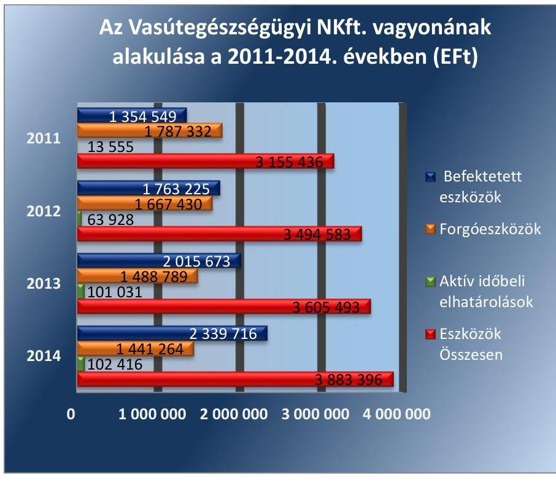

Forrás: 2011-2014. évi beszámolók
A növekedést döntően a befektetett eszközökön belül a tárgyi eszközök állományának 72,2 százalékos, 935,1 M Ft mértékű növekedése eredményezte. Ebből az ingatlanok 48\%-os, 335 M Ft értékű, valamint a műszaki berendezések, gépek, járművek 131\%-os, 302 M Ft értékű állomány növekedése volt jelentős.

---

Az ingatlanok vonatkozásában a Vasútegészségügyi NKft. az ellenőrzött időszakban folyamatos állagmegóvási, illetve fejlesztési célú beruházásokat hajtott végre mind a bérelt, mind a vagyonkezelésében lévő ingatlanokon. A beruházásokat saját forrásból, illetve pályázati támogatások igénybevételével, a Beruházási szabályzat ${ }_{1,2}$-ban előírtaknak megfelelően valósította meg. A beruházások mértéke az ellenőrzött időszakban meghaladta az értékcsökkenési leírás mértékét, ezáltal visszapótlási kötelezettségének eleget tett, a Vtv. előírásának megfelelően gondoskodott a vagyonkezelt eszközök értékének megőrzéséről.

A Vasútegészségügyi NKft. saját tőkéje a 2011. évi záró értékhez képest 2014. év végére 15\%-al növekedett, mérleg szerinti eredménye - a 2014. évi 8,6 M Ft-ot kitevő veszteség kivételével - az ellenőrzött időszakban pozitív volt. A jegyzett tőke összege az ellenőrzött időszakban nem változott. Mérleg szerinti eredmény a 2011. december 31-ei 228,2 M Ft-ról 2014. december 31-ére -8,6 M Ft-ra csökkent. A 2014. évben kialakult negatív eredmény kialakulásának főbb oka az volt, hogy a 2013. évhez képest gyakorlatilag változatlan bevétel szint mellett a költségek és ráfordítások megemelkedtek.

A Vasútegészségügyi NKft. az ellenőrzött időszakban a Gt., valamint a Ctv. ${ }^{30}$ és a Társasági szerződés ${ }_{1-10} 9$. pontjának megfelelően tevékenységéből származó nyereségét nem osztotta fel, osztalékfizetésre nem került sor.

A Vasútegészségügyi NKft. saját tőke-jegyzett tőke arányát az ellenőrzött időszakban az alábbi ábra szemlélteti:
2. ábra
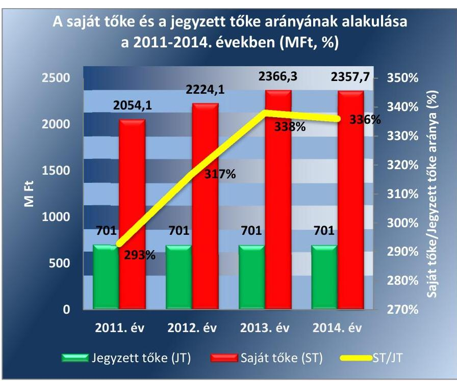

Forrás: Vasútegészségügyi NKft 2011-2014. évek éves beszámolói
Az ellenőrzött időszakban a Gt., valamint a Ptk. előírásainak megfelelően a Vasútegészségügyi NKft. saját tőkéje meghaladta a jegyzett tőke összegét.

---

### 4.2. számú megállapítás

Az MNV Zrt. és a Vasútegészségügyi NKft. vagyonváltozást eredményező döntéseinek előkészítése és megalapozása megfelelt a jogszabályi és a belső előírásoknak.

A vagyonváltozást eredményező döntéseket az MNV Zrt. az Alapítói határozatokon, üzleti terveken, valamint az éves beszámolók jóváhagyásán keresztül hozta meg.

Az MNV Zrt. a vagyonváltozást eredményező döntések előkészítésével kapcsolatos követelményeket a Vhr. előírásainak megfelelően a Társasági szerződés ${ }_{1-10}$-ben meghatározta. Szabályozta a Vasútegészségügyi NKft. szervezetén belüli döntési, kötelezettségvállalási jogköröket. A szabályozásnak megfelelő működést az Igazgatóság, az FB, valamint az MNV Zrt. folyamatosan kontrollálta.

Az MNV Zrt. alapítói határozatokkal döntött a beszerzésekről, az Üzleti terv elfogadásáról, a belső szabályzatok elfogadásáról, a szerződések megkötéséről, azok elfogadásáról, az FB munkaterve elfogadásáról, az éves beszámolók, valamint a közhasznúsági jelentés jóváhagyásáról.

Az MNV Zrt. a vagyonváltozást eredményező döntések előtt (beruházások, fejlesztések) a részére előzetesen megküldött vélemények és javaslatok alapján a Vasútegészségügyi NKft. számára a jogszabályi előírásoknak megfelelően az írásbeli engedélyét, a hozzájárulását megadta.

Az MNV Zrt. a vagyon-nyilvántartási szabályzat ${ }_{1,2}$-ban a
 Vtv. és a Vhr. előírásainak megfelelően meghatározta a Vasútegészségügyi NKft. számára az adatszolgáltatási követelményeket és határidőket. Előírta többek között a tételes jelentéstételi kötelezettséget az épületekre, földterületre, illetve az egyedileg 5 millió Ft-ot meghaladó tárgyi eszközökre és immateriális javakra vonatkozóan. A kezelt állami vagyon állományáról éves adatszolgáltatást írtak elő.

A Vasútegészségügyi NKft. az ellenőrzött időszakban az adatszolgáltatási kötelezettségének határidőben eleget tett. A Vasútegészségügyi NKft. az ellenőrzött időszakban az MNV Zrt. által évenként kiadott tervezési Irányelvekben foglaltak alapján, az adatszolgáltatási rendjének megfelelve terjesztette a tulajdonosi joggyakorló MNV Zrt. elé az éves üzleti terveket, az éves beszámolókat, a közhasznúsági jelentéseket, a vezető tisztségviselők díjazására vonatkozó javaslatokat. Az éves üzleti terveket az MNV Zrt. tervezési irányelveiben megfogalmazott tartalmi és formai követelmények szerint állította össze. Az éves jelentéseket, illetve a Társasági szerződés ${ }_{1}$ 10 szerinti, az FB jóváhagyását igénylő ügyleteket szabályszerűen, az előírt tartalommal és formában terjesztette az FB felé. Az MNV Zrt. a Magyar Állam képviseletében a Taggyűlésen többségi szavazatával a számviteli beszámoló elfogadásáról, az adózott eredmény felhasználásáról, az éves üzleti és annak részét képző beruházási terv elfogadásáról döntött.

A Vasútegészségügyi NKft. az ellenőrzött időszakban a vagyonváltozást eredményező döntések (beruházások, fejlesztések) előkészítése és előterjesztése során, illetve saját hatáskörben hozott döntéskor a Társasági szerződés 10-ben, illetve a Vagyon nyilvántartási szabályzat ${ }_{1-2}$-ban foglaltak szerint, szabályszerűen járt el. Az FB-t a Társasági szerződés 10 13. pontjában foglalt esetekben tájékoztatták, az előterjesztéseket elkészítették, az írásbeli engedélyt megkérték.

---

A Vasútegészségügyi NKft. az ellenőrzött időszakban a Leltározási szabályzat ${ }_{1,2}$-ban foglaltaknak megfelelően hajtotta végre a vagyonkezelt eszközök selejtezését. A 2012. évben 4,6 M Ft, a 2014. évben 0,4 M Ft összegben műszaki gépet, berendezést, felszerelést selejteztek le. A selejtezések során a tulajdonosi joggyakorló MNV Zrt.-t tájékoztatták, a mérleg kiegészítő mellékletében bemutatták, és a Taggyűlés jóváhagyta.

# 5. A Vasútegészségügyi NKft. a szabályszerű vagyongazdálkodás érdekében teljesítette-e beszámolási, adatszolgáltatási kötelezettségét, kiépített-e, illetve működtetett-e információs rendszert? 

Összegző megállapítás

A Vasútegészségügyi NKft. beszámolási, adatszolgáltatási és tájékoztatási kötelezettségének összességében eleget tett. Az információs rendszert a tulajdonosi joggyakorló MNV Zrt. elvárásainak megfelelően kialakította és működtette.

### 5.1. számú megállapítás

A Vasútegészségügyi NKft. az éves beszámolókat elkészítette, azonban azok részben feleltek meg a jogszabályi előírásoknak, mert vagyonkezelési szerződés hiányában szerepeltette a Budai MÁV Kórháztól átvett eszközöket. Beszámolóit a könyvvizsgáló hitelesítő záradékkal látta el, az FB jóváhagyásra javasolta. Közérdekű adatait az Info. tv. előírásai ellenére nem teljes körűen tette közzé.

A Vasútegészségügyi NKft. eleget tett a tulajdonosi joggyakorló MNV Zrt., valamint a Számv. tv.-ben és a Számviteli Politika ${ }_{1,2}$-ban foglaltaknak, éves beszámolóit és üzleti jelentéseit a Számv. tv.-ben előírt tartalommal és részletezettséggel, határidőben elkészítette.

Beszámolóiban vagyonkezelési szerződés hiányában a vagyonkezelt eszközök között mutatta ki a Budai MÁV Kórháztól átvett eszközöket 22,1 millió Ft értékben. A Vasútegészségügyi NKft. ezzel megsértette a Számv. tv. 23. § (2) bekezdésében és a Vhr. 7. § (1) bekezdésében, valamint a Vhr. 9. § (9) bekezdés a) pontjában foglaltakat.

Az FB a beszámolókat megtárgyalta, elfogadásra javasolta és az írásbeli jelentéseit megküldte az MNV Zrt-nek.

A KÖNYVVIZSGÁLÓ az ellenőrzött időszakban véleményezte a Vasútegészségügyi NKft. Számv. tv. szerinti éves beszámolóit, és elkészítette a könyvvizsgálói jelentéseket. A könyvvizsgáló a Vasútegészségügyi NKft. beszámolóit az ellenőrzött időszak minden évében a Számv. tv 3. § (13) bekezdés 1) pontja szerinti hitelesítő záradékkal látta el. A könyvvizsgáló könyvvizsgálói jelentéseiben a többségi tulajdonos figyelmét felhívta arra, hogy szükséges a Budai MÁV Kórháztól átvett eszközök vonatkozásában a vagyonkezelési szerződés megkötése.

A beszámolókat az MNV Zrt. alapítói határozatokban a Gt. és a Ptk ${ }_{2}$ előírásainak megfelelően az FB írásbeli jelentésének és a könyvvizsgálói jelentések birtokában fogadta el. A Vasútegészségügyi NKft. az ellenőrzött időszakban a beszámolóit a Számv. tv. előírásainak megfelelően letétbe helyezte és közzétette.

A 2011. évben az Avtv. ${ }^{31}$ 20. § (8) bekezdésében, a 2012-2014. években az Info ${ }^{32}$ tv. 30. § (6) bekezdése előírásai ellenére a Vasútegészségügyi NKft. a közérdekű adatok megismerésére irányuló igények teljesítésének rendjét rögzítő szabályzattal nem rendelkezett.

# ELEKTRONIKUS KÖZZÉTÉTELI KÖTELEZETTSÉGÉNEK az ellenőrzött időszakban az Avtv. 19. § (1)-(3) és az Info tv. 37. § (1) bekezdésében foglaltak szerint részben tett eleget. Hiányoztak az Info. tv. 37. § (1) bekezdésében hivatkozott 1. számú melléklete I. és II. táblázatában felsorolt dokumentumok. Nem került közzétételre az 1. számú melléklet III. táblázata szerinti gazdálkodási adatok közül a közfeladatot ellátó szerv foglalkoztatottjainak és vezető tisztségviselőinek személyes juttatásaira vonatkozó adatok, az ötmillió Ft-ot meghaladó szerződésekre, és kifizetésekre vonatkozó adatok. 

### 5.2. számú megállapítás

A Vasútegészségügyi NKft. az információs rendszert kialakította, az MNV Zrt. által előírt adatszolgáltatási kötelezettségét teljesítette.

A tulajdonosi joggyakorló MNV Zrt. a Társasági szerződés ${ }_{1-10}$-ben előírta a vagyongazdálkodást érintően az információs rendszer szabályozását és kialakítását. A Vasútegészségügyi NKft. rendelkezett az MNV Zrt. által előírt Befektetési szabályzat ${ }_{1,2}{ }^{33}$-tal, Beruházási szabályzat ${ }_{1,2}{ }^{34}$-tal, és Közbeszerzési szabályzat ${ }_{2-3}{ }^{35}$-tal. A pályázatok és közbeszerzések tulajdonosi jóváhagyása minden esetben megtörtént. A működésre vonatkozó üzleti terveket, controlling adatszolgáltatásokat, beszámolókat a Vasútegészségügyi NKft. határidőben és megfelelő tartalommal, a Társasági szerződés ${ }_{3-10}$-ben megfogalmazott követelményeknek megfelelően a tulajdonosi joggyakorló rendelkezésére bocsátotta.

A Vasútegészségügyi NKft. az Nvtv. előírásainak megfelelően tájékoztatta a tulajdonosi joggyakorló MNV Zrt.-t a vagyonkezelt eszközök értékváltozásáról, az azokhoz tartozó beruházásokról. A Vasútegészségügyi NKft. az éves beszámolókban és közhasznúsági jelentésekben tájékoztatást adott a kezelt vagyon értékváltozásáról, az elvégzett beruházásokról.

A vagyongazdálkodás szabályozottságával, szabályszerűségével, a vagyonnyilvántartással kapcsolatban a Vasútegészségügyi NKft., illetve a tulajdonosi joggyakorló MNV Zrt. belső ellenőrzést, illetve külső szakértő által történő ellenőrzéseket végeztetett. A belső ellenőr minden évben ellenőrizte a közbeszerzéseket, a tulajdonosi joggyakorló ellenőrzése a vagyonkezelt eszközökre, és azok visszapótlási kötelezettségének betartására vonatkozott. Az ellenőrzések nem tárták fel a Budai MÁV Kórháztól átvett eszközök mérlegben történő szerepeltetésével kapcsolatos szabálytalanságot.

---

# 6. A Vasútegészségügyi NKft gazdálkodásának a kormányzati szektor hiányára és az államadósságra befolyást gyakorló elemei a jogszabályi előírásoknak megfeleltek-e? 

## Összegző megállapítás

A Vasútegészségügyi NKft. az ellenőrzött időszakban adósságot keletkeztető ügyletet nem kötött.

A Vasútegészségügyi NKft. az ellenőrzött időszakban a Stabilitási tv. ${ }^{36} 3$. § (1) bekezdése szerinti adósságot keletkeztető ügyletet nem kötött, nem volt a Stabilitási tv. 9. § (1) bekezdés és a 353/2011. Korm. rendelet ${ }^{37}$ 11. § szerinti kérelem benyújtási kötelezettsége.

---

# JAVASLATOK 

Az ÁSZ tv. 33. § (1) bekezdésében foglaltak értelmében az ellenőrzött szervezet vezetője köteles a jelentésben foglalt megállapításokhoz kapcsolódó intézkedési tervet összeállítani és azt a jelentés kézhezvételétől számított 30 napon belül az ÁSZ részére megküldeni. Amennyiben az ellenőrzött szervezet vezetője nem küldi meg határidőben az intézkedési tervet, vagy továbbra sem elfogadható intézkedési tervet küld, az Állami Számvevőszék elnöke az ÁSZ tv. 33. § (3) bekezdés a) és b) pontjaiban foglaltakat érvényesítheti.
Javaslataink célja a Vasútegészségügyi Kft. gazdálkodása szabályozottságának erősítése annak érdekében, hogy a szabályozási környezet és a gazdálkodási gyakorlat megfelelően tudja támogatni az átlátható működést.

## A Vasútegészségügyi Szolgáltató Közhasznú Nonprofit Kft. ügyvezetőjének

1. A gazdálkodási gyakorlat és az átlátható működés javítása érdekében: Intézkedjen a közzétételi kötelezettség Info. tv. előírásainak megfelelő, teljes körű teljesítéséről.
(5.1. sz. megállapítás 7. bekezdése alapján)

## Az MNV Zrt. vezérigazgatójának

1. Gondoskodjon a vagyonkezelési szerződés módosításáról annak érdekében, hogy a kezelt vagyonelemeken végzett értéknövelő beruházások a szerződésben a jogszabályi előírásoknak megfelelően átvezetésre kerüljenek.
(2.1 megállapítás 7. bekezdése alapján)
2. Gondoskodjon a Vasútegészségügyi NKft. által a Budai MÁV Kórháztól átvett eszközökre vonatkozóan a vagyonkezelési szerződés kiegészítéséről a jelentésben bemutatott nagyságrend és érték alapján.
(2.2. megállapítás 3-4. bekezdései alapján)

---

.

---

# MELLÉKLETEK 

## I. SZ. MELLÉKLET: ÉRTELMEZŐ SZÓTÁR

Adósságot keletkeztető ügylet
„Adósságot keletkeztető ügylet és annak értéke:
a) hitel, kölcsön felvétele, átvállalása a folyósítás, átvállalás napjától a végtörlesztés napjáig, és annak aktuális tőketartozása,
b) a számvitelről szóló törvény szerinti hitelviszonyt megtestesítő értékpapír forgalomba hozatala a forgalomba hozatal napjától a beváltás napjáig, kamatozó értékpapír esetén annak névértéke, egyéb értékpapír esetén annak vételára,
c) váltó kibocsátása a kibocsátás napjától a beváltás napjáig, és annak a váltóval kiváltott kötelezettséggel megegyező, kamatot nem tartalmazó értéke,
d) az Szt. szerint pénzügyi lízing lízingbevevői félként történő megkötése a lízing futamideje alatt, és a lízingszerződésben kikötött tőkerész hátralévő összege,
e) a visszavásárlási kötelezettség kikötésével megkötött adásvételi szerződés eladói félként történő megkötése - ideértve az Szt. szerinti valódi penziós és óvadéki repóügyleteket is - a visszavásárlásig, és a kikötött visszavásárlási ár,
f) a szerződésben kapott, legalább háromszázhatvanöt nap időtartamú halasztott fizetés, részletfizetés, és a még ki nem fizetett ellenérték,
g) hitelintézetek által, származékos műveletek különbözeteként az Államadósság Kezelő Központ Zrt.-nél (a továbbiakban: ÁKK Zrt.) elhelyezett fedezeti betétek, és azok összege.
Forrás: Stabilitási tv. 3. § (1) bekezdése
2010. június 17-től
a) Az állam tulajdonában lévő dolog, valamint a dolog módjára hasznosítható természeti erő,
b) Az a) pont hatálya alá nem tartozó mindazon vagyon, amely vonatkozásában törvény az állam kizárólagos tulajdonjogát nevesíti,
c) az állam tulajdonában lévő tagsági jogviszonyt megtestesítő értékpapír, illetve az államot megillető egyéb társasági részesedés,
d) az államot megillető olyan immateriális, vagyoni értékkel rendelkező jogosultság, amelyet jogszabály vagyoni értékű jogként nevesít.
Forrás: Vtv. 1. § (2) bekezdése
2012. november 10-től az állami vagyon fogalma kiegészül a következő ponttal:
a) az állam tulajdonában lévő pénzügyi eszközök

Forrás: Vtv. 1. § (2) bekezdése
2010. január 01 - 2011. december 31. között:

Az állami vagyont az MNV Zrt. maga kezeli, vagy szerződés - így különösen bérlet, haszonbérlet, szerződésen alapuló haszonélvezet, vagyonkezelés, megbízás alapján központi költségvetési szervnek, természetes vagy jogi személynek, illetőleg jogi személyiséggel nem rendelkező gazdasági társaságnak hasznosításra átengedi.
Vtv. 23. § (1) bekezdése

## 2012. január 1-jétől:

Az állami vagyont az MNV Zrt. maga kezeli, vagy szerződés - így különösen bérlet, haszonbérlet, megbízás - alapján központi költségvetési szervnek, természetes vagy jogi személynek, vagy jogi személyiséggel nem rendelkező gazdálkodó szer-

---

vezetnek hasznosításra átengedi. Az állami vagyonra vonatkozóan az MNV Zrt. kizárólag az Nvtv-ben meghatározott személyekkel köthet vagyonkezelési szerződést.
Forrás: Vtv. 23. § (1), 27. § (1)

# 2013. június 28-ától: 

Az állami vagyonnal az MNV Zrt. maga gazdálkodik, vagy szerződés - így különösen bérlet, haszonbérlet, megbízás - alapján központi költségvetési szervnek, természetes vagy jogi személynek, vagy jogi személyiséggel nem rendelkező gazdálkodó szervezetnek hasznosításra átengedi, illetőleg vagyonkezelésbe, haszonélvezetbe adja. Az állami vagyonra vonatkozóan az MNV Zrt. kizárólag az Nvtv-ben meghatározott személyekkel köthet vagyonkezelési szerződést.
Forrás: Vtv. 23. § (1), 27. § (1)
Állami vagyon értékesítése
Gazdálkodó szervezet

Állami vagyon tulajdonjogának bármely jogcímen történő, visszterhes átruházása. Forrás: $\mathrm{Vhr}^{38}$. 1. § (7) d) pont)
2013. június 30-ig gazdálkodó szervezet:

Az állami vállalat, az egyéb
 állami gazdálkodó szerv, a szövetkezet, a lakásszövetkezet, az európai szövetkezet, a gazdasági társaság, az európai részvénytársaság, az egyesülés, az európai gazdasági egyesülés, az európai területi együttműködési csoportosulás, az egyes jogi személyek vállalata, a leányvállalat, a vízgazdálkodási társulat, az erdőbirtokossági társulat, a végrehajtói iroda, az egyéni cég, továbbá az egyéni vállalkozó.
Forrás: Ptk1. 685. § c) pontja
2013. július 1-jétől gazdálkodó szervezet:

Az állami vállalat, az egyéb állami gazdálkodó szerv, a szövetkezet, a lakásszövetkezet, az európai szövetkezet, a gazdasági társaság, az európai részvénytársaság, az egyesülés, az európai gazdasági egyesülés, az európai területi együttműködési csoportosulás, az egyes jogi személyek vállalata, a leányvállalat, a vízgazdálkodási társulat, az erdőbirtokossági társulat, a végrehajtói iroda, az egyéni cég, továbbá az egyéni vállalkozó. Az állam, a helyi önkormányzat, a költségvetési szerv, az egyesület, a köztestület, valamint az alapítvány gazdálkodó tevékenységével összefüggő polgári jogi kapcsolataira is a gazdálkodó szervezetre vonatkozó rendelkezéseket kell alkalmazni, kivéve, ha a törvény e jogi személyekre eltérő rendelkezést tartalmaz; a 292/A-292/B. §, 301/A-301/B. §, 405. § (1) bekezdés, valamint a 407/A. § (1) bekezdés tekintetében nem minősül gazdálkodó szervezetnek az, aki a közbeszerzésekről szóló törvény értelmében ajánlatkérő (szerződő hatóság).
Forrás: Ptk1. 685. § c) pontja
2014. március 15-től gazdálkodó szervezet:

A gazdasági társaság, az európai részvénytársaság, az egyesülés, az európai gazdasági egyesülés, az európai területi együttműködési csoportosulás, a szövetkezet, a lakásszövetkezet, az európai szövetkezet, a vízgazdálkodási társulat, az erdőbirtokossági társulat, az állami vállalat, az egyéb állami gazdálkodó szerv, az egyes jogi személyek vállalata, a közös vállalat, a végrehajtói iroda, a közjegyzői iroda, az ügyvédi iroda, a szabadalmi ügyvivői iroda, az önkéntes kölcsönös biztosító pénztár, a magánnyugdíjpénztár, az egyéni cég, továbbá az egyéni vállalkozó. Az állam, a helyi önkormányzat, a költségvetési szerv, az egyesület, a köztestület, valamint az alapítvány gazdálkodó tevékenységével összefüggő polgári jogi kapcsolataira is a gazdálkodó szervezetre vonatkozó rendelkezéseket kell alkalmazni. Forrás: Ppt. 396. §

---

Kormányzati szektorba sorolt egyéb szervezet

Meghatározó befolyás

Nemzetgazdasági szempontból kiemelt jelentőségű nemzeti vagyon körébe tartozó társaságok
Nemzeti vagyon

Az a szervezet, amely az Áht. alapján nem része az államháztartásnak, azonban az Európai Közösséget létrehozó szerződéshez csatolt, a túlzott hiány esetén követendő eljárásról szóló jegyzőkönyv alkalmazásáról szóló 2009. május 25-i 479/2009/EK rendelet szerint a kormányzati szektorba tartozik. A nemzetgazdasági miniszter 2013. június 26-án megjelent Közleményben tette közé ezen szervezetek listáját.
2014. március 14-ig: A befolyással rendelkező akkor rendelkezik egy jogi személyben meghatározó befolyással, ha annak tagja, illetve részvényese és
a) jogosult e jogi személy vezető tisztségviselői vagy felügyelőbizottsága tagjai többségének megválasztására, illetve visszahívására, vagy
b) a jogi személy más tagjaival, illetve részvényeseivel kötött megállapodás alapján egyedül rendelkezik a szavazatok több mint ötven százalékával.
A meghatározó befolyás akkor is fennáll, ha a befolyással rendelkező számára az előzőek szerinti jogosultságok közvetett módon biztosítottak. A befolyással rendelkezőnek egy jogi személyben a szavazatok több mint ötven százalékával közvetett módon való rendelkezése vagy egy jogi személyben közvetetten fennálló meghatározó befolyása megállapítása során a jogi személyben szavazati joggal rendelkező más jogi személyt (köztes vállalkozást) megillető szavazatokat meg kell szorozni a befolyással rendelkezőnek a köztes vállalkozásban, illetve vállalkozásokban fennálló szavazatával. Ha a köztes vállalkozásban fennálló szavazatok mértéke az ötven százalékot meghaladja, akkor azt egy egészként kell figyelembe venni.
Forrás: Ptk1. 685/B. § (2)-(3) bekezdések

## 2014. március 15-től:

A befolyással rendelkező akkor rendelkezik egy jogi személyben meghatározó befolyással, ha annak tagja vagy részvényese, és
a) jogosult e jogi személy vezető tisztségviselői vagy felügyelőbizottsága tagjai többségének megválasztására, illetve visszahívására; vagy
b) a jogi személy más tagjai, illetve részvényesei a befolyással rendelkezővel kötött megállapodás alapján a befolyással rendelkezővel azonos tartalommal szavaznak, vagy a befolyással rendelkezőn keresztül gyakorolják szavazati jogukat, feltéve, hogy együtt a szavazatok több mint felével rendelkeznek.
Forrás: Ptk2. 8:2. § (2) bekezdés
Az ÁSZ ellenőrzés szempontjából az Nvtv. 2. sz. mellékletében felsorolt társasági részesedések.
2012. január 1-jétől nemzeti vagyon:
a) az állam vagy a helyi önkormányzat kizárólagos tulajdonában álló dolgok,
b) az a) pont hatálya alá nem tartozó, állam vagy a helyi önkormányzat tulajdonában lévő dolog,
c) az állam vagy a helyi önkormányzat tulajdonában lévő pénzügyi eszközök, továbbá az államot vagy a helyi önkormányzatot megillető társasági részesedések,
d) az államot vagy a helyi önkormányzatot megillető bármely vagyoni értékkel rendelkező jogosultság, amelyet jogszabály vagyoni értékű jogként nevesít,
e) Magyarország határa által körbezárt terület feletti légtér,
f) az üvegházhatású gázok kibocsátási egységeinek kereskedelméről szóló törvény szerint kibocsátási egység és légiközlekedési kibocsátási egység, valamint az ENSZ Éghajlatváltozási Keretegyezménye és annak Kiotói Jegyzőkönyve végrehajtási keretrendszeréről szóló törvény szerinti kiotói egység,

---

g) állami vagy helyi önkormányzati fenntartású közgyűjtemény (muzeális intézmény, levéltár, közgyűjteményként működő kép- és hangarchívum, valamint könyvtár) saját gyűjteményében nyilvántartott kulturális javak körébe tartozó dolog,
h) a régészeti lelet,
i) a nemzeti adatvagyon körébe tartozó állami nyilvántartások fokozottabb védelméről szóló törvény szerinti nemzeti adatvagyon.
Forrás: Nvtv. 1. § (2)
2010. június 17-től:

Az MNV Zrt. „rendszeresen ellenőrzi a vele szerződéses jogviszonyban lévő személyek, szervezetek vagy más használók állami vagyonnal való gazdálkodását, megállapításairól az MNV Zrt. Felügyelő Bizottságát, az ellenőrzött szervet, szükség esetén a minisztert és az Állami Számvevőszéket tájékoztatja".
Forrás: Vtv. 17. § d.
A Vhr. alapján „a tulajdonosi ellenőrzés célja az állami vagyonnal való gazdálkodás vizsgálata, ennek keretében a rendeltetésellenes, jogszerűtlen, szerződésellenes, vagy a tulajdonos érdekeit sértő, illetve a központi költségvetést hátrányosan érintő vagyongazdálkodási intézkedések feltárása és a jogszerű állapot helyreállítása, továbbá a vagyonnyilvántartás hitelességének, teljességének és helyességének biztosítása". Forrás: Vhr. 20. § (2)

# 2011. december 31-ig 

Az állami vagyon kezelőjét, használóját megillető jogok gyakorlását, annak szabályszerűségét, célszerűségét az MNV Zrt. - szükség szerint területi szervei útján - ellenőrzi.
Forrás: Vhr. 20. § (1)

## 2012. január 1-jétől:

Az állami vagyon kezelőjét, haszonélvezőjét, használóját megillető jogok gyakorlását, annak szabályszerűségét, célszerűségét az MNV Zrt. - szükség szerint területi szervei útján - ellenőrzi.
Forrás: Vhr. 20. § (1)
2010. június 17-től:

Az állami vagyon felett a Magyar Államot megillető tulajdonosi jogok és kötelezettségek összességét - ha törvény eltérően nem rendelkezik - az állami vagyon felügyeletéért felelős miniszter (a továbbiakban: miniszter) gyakorolja, aki e feladatát a Magyar Nemzeti Vagyonkezelő Zártkörűen Működő Részvénytársaság (a továbbiakban: MNV Zrt.), a Magyar Fejlesztési Bank, illetve a tulajdonosi joggyakorló szervezet útján látja el. A miniszter miniszteri rendeletben, a törvényben meghatározott állami vagyoni kör tekintetében, meghatározott időtartamra, a joggyakorlás egyes szabályainak meghatározásával - az őt megillető tulajdonosi jogok és kötelezettségek összességének, illetve azok meghatározott részének gyakorlóját az Áht. szerinti központi költségvetési szervek, ezek intézménye, továbbá a 100%-ban állami tulajdonban álló gazdasági társaságok közül kijelölheti.
Forrás: Vtv. 3. § (1) és (2)

## 2013. június 28-ától:

A rábízott állami vagyon felett az államot megillető tulajdonosi jogok és kötelezettségek összességét tulajdonosi joggyakorlóként:
a) ha törvény vagy miniszteri rendelet eltérően nem rendelkezik, a Magyar Nemzeti Vagyonkezelő Zártkörűen Működő Részvénytársaság (a továbbiakban: MNV Zrt.),

---

b) törvényben kijelölt személy vagy
c) az állami vagyon felügyeletéért felelős miniszter (a továbbiakban: miniszter) által rendeletben kijelölt személy gyakorolja.
[...] A miniszter e törvény felhatalmazása alapján - a meghatározott célok hatékonyabb elérése érdekében, miniszteri rendeletben, az ott meghatározott állami vagyoni kör tekintetében, meghatározott időtartamra - e törvény keretei között, a joggyakorlás egyes szabályainak meghatározásával - az államot megillető tulajdonosi jogok és kötelezettségek összességének, illetve azok meghatározott részének gyakorlóját az Áht. szerinti központi költségvetési szervek, ezek intézménye, továbbá a 100%-ban állami tulajdonban álló gazdasági társaságok közül kijelölheti. Forrás: Vtv. 3. § (1) és (2)

---

|  Megnevezés | 2011. | 2012. | 2013. | 2014. | Változás
2014.12.31 /
2011.12.31. (%)  |
| --- | --- | --- | --- | --- | --- |
|  1. | 2. | 3. | 4. | 5. | 6.  |
|  A. Befektetett eszközök | 1354549 | 1763225 | 2015673 | 2339716 | 72,7\%  |
|  I. IMMATERIÁLIS JAVAK | 43486 | 50000 | 61708 | 49729 | 14,4\%  |
|  Vagyoni értékű jogok | 43486 | 50000 | 61708 | 49729 | 14,4\%  |
|  II. TÁRGYI ESZKÖZÖK | 1295809 | 1608901 | 1873161 | 2231919 | 72,2\%  |
|  Ingatlanok és a kapcsolódó vagyoni értékű jogok | 878054 | 1079945 | 1213080 | 1296131 | 47,6\%  |
|  Műszaki berendezések, gépek, járművek | 230231 | 371424 | 486112 | 532401 | 131,2\%  |
|  Egyéb berendezések, felszerelések, járművek | 55427 | 57933 | 68002 | 74400 | 34,2\%  |
|  Beruházások, felújítások | 132094 | 99199 | 105515 | 320117 | 142,3\%  |
|  Beruházásokra adott előlegek | 3 | 400 | 452 | 8870 | 295566,7\%  |
|  III. BEFEKTETETT PÉNZÜGYI ESZKÖZÖK | 15254 | 104324 | 80804 | 58068 | 280,7\%  |
|  Egyéb tartósan adott kölcsön | 15254 | 104324 | 80804 | 58068 | 280,7\%  |
|  B. Forgóeszközök | 1787332 | 1667430 | 1488789 | 1441264 | -19,4\%  |
|  I. KÉSZLETEK | 19029 | 19448 | 15825 | 39478 | 107,5\%  |
|  Anyagok | 17901 | 18452 | 14992 | 38754 | 116,5\%  |
|  Áruk | 1128 | 996 | 833 | 724 | -35,8\%  |
|  II. KÖVETELÉSEK | 865333 | 859552 | 911224 | 902904 | 4,3\%  |
|  Követelések áruszállításból és szolgáltatásból (vevők) | 691917 | 702677 | 717703 | 773639 | 11,8\%  |
|  Követelések egyéb rész. visz.-ban lévő vállalk. szemben | 138566 | 94099 | 237 | 32995 | -76,2\%  |
|  Egyéb követelések | 34850 | 62776 | 193284 | 96270 | 176,2\%  |
|  III. ÉRTÉKPAPÍROK | 717523 | 586666 | 440176 | 326151 | -54,5\%  |
|  Forgatási célú hitelviszonyt megtestesítő értékpapírok | 717523 | 586666 | 440176 | 326151 | -54,5\%  |
|  IV. PÉNZESZKÖZÖK | 185447 | 201764 | 121564 | 172731 | -6,9\%  |
|  Pénztár, csekkek | 2522 | 2638 | 2626 | 2932 | 16,3\%  |
|  Bankbetétek | 182925 | 199126 | 118938 | 169799 | -7,2\%  |
|  C. Aktív időbeli elhatárolások | 13555 | 63928 | 101031 | 102416 | 655,6\%  |
|  Bevételek aktív időbeli elhatárolása | 6916 | 54662 | 89445 | 93301 | 1249,1\%  |
|  Költségek, ráfordítások aktív időbeli

 elhatárolása | 6639 | 9266 | 11586 | 9115 | 37,3\%  |
|  ESZKÖZÖK (AKTÍVÁK) ÖSSZESEN | 3155436 | 3494583 | 3605493 | 3883396 | 23,1\%  |
|  D. Saját tőke | 2054058 | 2224074 | 2366339 | 2357718 | 14,8\%  |
|  I. JEGYZETT TŐKE | 701020 | 701020 | 701020 | 701020 | 0,0\%  |
|  ebből: visszavásárolt tulajd. rész. névértéken | 0 | 0 | 0 | 0 | -  |
|  II. JEGYZETT, DE MÉG BE NEM FIZETETT TŐKE(-) | 0 | 0 | 0 | 0 | -  |
|  III. TŐKETARTALÉK | 1 | 1 | 1 | 1 | 0,0\%  |
|  IV. EREDMÉNYTARTALÉK | 1124857 | 1353037 | 1523053 | 1665317 | 48,0\%  |
|  V. LEKÖTÖTT TARTALÉK | 0 | 0 | 0 | 0 | -  |
|  VI. ÉRTÉKELÉSI TARTALÉK | 0 | 0 | 0 | 0 | -  |

---

| VII. MÉRLEG SZERINTI EREDMÉNY | 228180 | 170016 | 142265 | $-8620$ | $-103,8 \%$ |
| :-- | --: | --: | --: | --: | --: |
| E. Céltartalékok | 30657 | 56211 | 29036 | 26044 | $-15,0 \%$ |
| Céltartalék a várható kötelezettségekre | 30657 | 56211 | 29036 | 26044 | $-15,0 \%$ |
| F. Kötelezettségek | 917369 | 992777 | 864129 | 1043721 | $13,8 \%$ |
| I. HÁTRASOROLT KÖTELEZETTSÉGEK | 0 | 0 | 0 | 0 | - |
| II. HOSSZÚ LEJÁRATÚ KÖTELEZETTSÉGEK | 152287 | 152287 | 152287 | 152287 | $0,0 \%$ |
| Egyéb hosszú lejáratú kötelezettségek | 152287 | 152287 | 152287 | 152287 | $0,0 \%$ |
| III. RÖVID LEJÁRATÚ KÖTELEZETTSÉGEK | 765082 | 840490 | 711842 | 891434 | $16,5 \%$ |
| Kötelez. áruszállításból és szolgáltatásból (szállítók) | 349568 | 276486 | 199454 | 233996 | $-33,1 \%$ |
| Rövid lej. kötelez egyéb rész.visz.lévő váll.szemben | 10804 | 15852 | 0 | 388 | $-96,4 \%$ |
| Egyéb rövid lejáratú kötelezettségek | 404710 | 548152 | 512388 | 657050 | $62,4 \%$ |
| G. Passzív időbeli elhatárolások | 153352 | 221521 | 345989 | 455913 | $197,3 \%$ |
| Bevételek passzív időbeli elhatárolása | 0 | 0 | 0 | 37469 | - |
| Költségek, ráfordítások passzív időbeli elhatárolása | 111814 | 143470 | 238665 | 246259 | $120,2 \%$ |
| Halasztott bevételek | 41538 | 78051 | 107324 | 172185 | $314,5 \%$ |
| FORRÁSOK (PASSZÍVÁK) ÖSSZESEN | 3155436 | 3494583 | 3605493 | 3883396 | $23,1 \%$ |

---

III. SZ. MELLÉKLET: A VASÚTEGÉSZSÉGÜGYI NKFT. EREDMÉNYKIMUTATÁSA 2011-2014. KÖZÖTT (EZER FT, \%)

|  Megnevezés | 2011.12.31. | 2012.12.31. | 2013.12.31. | 2014.12.31. | Változás 2014.12.31./ 2011.01.01. (\%)  |
| --- | --- | --- | --- | --- | --- |
|  1. | 2. | 3. | 4. | 5. | 6.  |
|  Belföldi értékesítés nettó árbevétele | 4685609 | 4740929 | 4828790 | 4904087 | 4,7\%  |
|  Exportértékesítés nettó árbevétele | 0 | 618 | 3858 | 9431 | -  |
|  I. Értékesítés nettó árbevétele | 4685609 | 4741547 | 4832648 | 4913518 | 4,9\%  |
|  Saját termelésű készletek állományváltozása | - | - | - | - | -  |
|  Saját előállítású eszközök aktivált értéke | - | - | - | - | -  |
|  II. Aktivált saját teljesítmények értéke | - | - | - | - | -  |
|  III. Egyéb bevételek | 75158 | 285787 | 476474 | 399181 | 431,1\%  |
|  Anyagköltség | 339593 | 351076 | 349768 | 313679 | $-7,6 \%$  |
|  Igénybe vett szolgáltatások értéke | 1319883 | 1288154 | 1309662 | 1360003 | 3,0\%  |
|  Egyéb szolgáltatások értéke | 16155 | 15029 | 30558 | 33261 | 105,9\%  |
|  Eladott áruk beszerzési értéke | 8296 | 5812 | 25647 | 24813 | 199,1\%  |
|  Eladott (közvetített) szolgáltatások értéke | 26429 | 31038 | 22965 | 21816 | $-17,5 \%$  |
|  IV. Anyagjellegű ráfordítások | 1710356 | 1691109 | 1738600 | 1753574 | 2,5\%  |
|  Bérköltség | 1649343 | 1927610 | 2166366 | 2159810 | 30,9\%  |
|  Személyi jellegű egyéb kifizetések | 358560 | 240260 | 238252 | 251791 | $-29,8 \%$  |
|  Bérjárulékok | 473871 | 500118 | 582427 | 588271 | 24,1\%  |
|  V. Személyi jellegű ráfordítások | 2481774 | 2667988 | 2987045 | 2999872 | 20,9\%  |
|  VI. Értékcsökkenési leírás | 183709 | 223933 | 251002 | 300249 | 63,4\%  |
|  VII. Egyéb ráfordítások | 183291 | 301750 | 214479 | 272895 | 48,9\%  |
|  Üzemi (üzleti) tevékenység eredménye | 201637 | 142554 | 117996 | $-13891$ | $-106,9 \%$  |
|  Egyéb kapott (járó) kamatok és kamatjellegű bevételek | 32166 | 31469 | 24653 | 5220 | $-83,8 \%$  |
|  Pénzügyi műveletek egyéb bevételei | 183 | 581 | 2561 | 53 | $-71,0 \%$  |
|  VIII. Pénzügyi műveletek bevételei | 32349 | 32050 | 27214 | 5273 | $-83,7 \%$  |
|  Pénzügyi műveletek egyéb ráfordításai | 16 | 6 | 7 | 2 | $-87,5 \%$  |
|  IX. Pénzügyi műveletek ráfordításai | 16 | 6 | 7 | 2 | $-87,5 \%$  |
|  Pénzügyi műveletek eredménye | 32333 | 32044 | 27207 | 5271 | $-83,7 \%$  |
|  Szokásos vállalkozási eredmény | 233970 | 174598 | 145203 | $-8620$ | $-103,7 \%$  |
|  X. Rendkívüli bevételek | - | - | - | - | -  |
|  XI. Rendkívüli ráfordítások | 5 | 0 | 0 | 0 | $-100,0 \%$  |
|  Rendkívüli eredmény | $-5$ | 0 | 0 | 0 | $-100,0 \%$  |
|  Adózás előtti eredmény | 233965 | 174598 | 145203 | $-8620$ | $-103,7 \%$  |
|  XII. Adófizetési kötelezettség | 5785 | 4582 | 2938 | 0 | $-100,0 \%$  |
|  Adózott eredmény | 228180 | 170016 | 142265 | $-8620$ | $-103,8 \%$  |
|  Eredmény/artalék igénybevétel osztalékra | - | - | - | - | -  |
|  Jóváhagyott osztalék, részesedés | - | - | - | - | -  |
|  Mérleg szerinti eredmény | 228180 | 170016 | 142265 | $-8620$ | $-103,8 \%$  |

---

# FÜGGELÉK: ÉSZREVÉTELEK 

A jelentéstervezetet a Számvevőszék 15 napos észrevételezésre megküldte az ellenőrzött szervezet vezetőjének az ÁSZ tv. 29. § (1) bekezdése előírásának megfelelően.

Az MNV Zrt. vezéigazgatójától és a Vasútegészségügyi Nonprofit Közhasznú Kft. ügyvezetőjétől érkezett észrevételeket és azok kezeléséről szóló válaszlevelet a jelentés függeléke tartalmazza.

[^0]
[^0]:    * 29. § (1) Az Állami Számvevőszék az ellenőrzési megállapításait megküldi az ellenőrzött szervezet vezetőjének vagy az általa megbízott személynek, és annak, akinek személyes felelősségét állapította meg.
    (2) Az ellenőrzött szervezet vezetője és a felelősként megjelölt személy az ellenőrzés megállapításaira tizenöt napon belül írásban észrevételt tehet.
    (3) Az Állami Számvevőszék az észrevételre a beérkezésétől számított harminc napon belül írásban válaszol. A figyelembe nem vett észrevételeket köteles a jelentésben feltüntetni, és megindokolni, hogy azokat miért nem fogadta el.

---

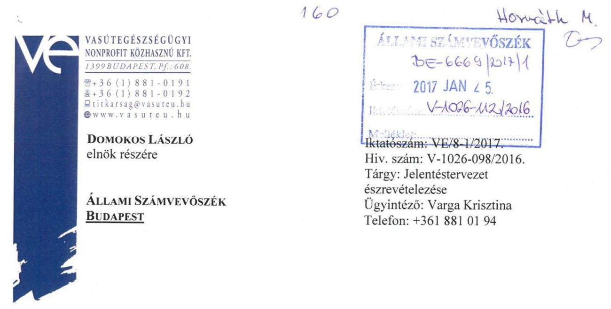

Tisztelt Elnök Úr!

Hivatkozva fenti számú levelének mellékleteként megküldött jelentéstervezetre, az alábbiakban foglaljuk össze észrevételeinket, a tervezet részletes megállapításaira reagálva.

A 2.1. és 2.2. megállapítás a vagyonkezelési szerződés módosításának elmaradása miatt fogalmaz meg hiányosságokat.

A jelenleg hatályos vagyonkezelői szerződésünk az annak létrejöttét követő első könyvvizsgálat során, 2008. évben felülvizsgálatra került és megállapítást nyert, hogy abból kimaradtak a Budai MÁV Kórháztól átvett eszközök. Ekkor a Kincstári Vagyoni Igazgatóságot levélben kértük a vagyonkezelői szerződés módosítására. Ez a folyamat elakadt a KVI megszünésével. A KVI ügyei átkerültek az MNV Zrt-hez, ahol tovább igyekezett Társaságunk a vagyonkezelési szerződést módosítani. Számos levélben, elektronikus levélben jeleztük a mindenkori portfolió menedzser, felügyelőbizottsági tagok, az MNV Zrt. vagyonkezelt ingatlanokkal foglalkozó szakterületének munkatársai, vezetői, illetve a Taggyülés felé is ezen gondunkat. Az utóbbi két évben minden egyes felügyelőbizottsági ülésen elhangzik, hogy a vagyonkezelési probléma továbbra is fennáll, azonban megoldás, egyelőre nem született, annak ellenére, hogy a Társaság minden adatkérésnek, minden egyeztetésnek a lehető legrövidebb határidőn belül eleget tesz, bízva abban, hogy ezzel sem gördít akadályt a mielőbbi szerződésmódosítás elé.

A számvevőszéki jelentéstervezet 2.2. pontja megemlíti, hogy Társaságunk nem minősül átlátható szervezetnek a VÖKK Egészségpénztár tagra tekintettel. A VÖKKEP az MNB felügyelete alatt folytatja működését, kb. 37.000 pénztártaggal.

---

A pénztártagok két lépcsős rendszerben választják meg az igazgatótanács elnökét és tisztségviselőit, akik a Pénztár mindenkori képviseletére jogosultak. A vizsgált időszakban a VÖKKEP IT elnöke dr. Magos György úr volt, a jelenlegi elnök Bánhidi-Nagy Attila úr. Mindkét személy valósan megismerhető, átlátható, sehol nem okozott eddig gondot a Pénztár átláthatóságának hiánya. Azonban az MNV Zrt. erre a tényre hivatkozott, miért nem tud vagyonkezelő szerződést módosítani Társaságunkkal. A jelenlegi szerződés módosítása azóta is „folyamatban van" érdemi előrelépések nélkül.

Álláspontunk szerint a VÖKKEP átlátható szervezet.
A 2011. évi CXCVI. tv. (Nemzeti vagyon törvény) 3. § (1) bekezdés 1. b) pontban meghatározott átlátható szervezet fogalomnak, vagyis a bb) - bd) pontok megvalósulásán túl a ba) pontban foglalt kritériumnak is megfelel, tekintve, hogy a 2007. évi CXXXVI. tv. (Pmt.) 3. § re) pont alapján a „tényleges tulajdonos" kategóriában meghatározott vezető tisztségviselői közhiteles nyilvántartásból bárki által megismerhetőek. A nyilvántartást „A civil szervezetek bírósági nyilvántartásáról és az ezzel összefüggő eljárási szabályokról szóló" CLXXXI. tv. értelmében a Fővárosi Törvényszék vezeti, a VÖKKEP nyilvántartási száma: 01-04-0000168. A kivonat a vezető tisztségviselők adatait megismerhetővé teszi.
Ugyanakkor a VÖKKEP önkéntes alapon szerveződő, a tagok közös, tartós, alapszabályban meghatározott céljának megvalósítására létesített, nyilvántartott tagsággal rendelkező jogi személy, amely megfelel a nemzeti vagyonról
 szóló törvény 3. § (1) bekezdés 1. c) pontjában foglalt feltételeknek is.

A Vagyonkezelői szerződés módosításának hiányában, és tekintettel a Társaságunk által elvégzett értéknövelő beruházásokra, folyamatos elszámolási vitában vagyunk az MNV Zrt-vel. Ez ügyben történő levelezésünkre érkeztek válaszul a 2.2. pontban hivatkozott MNV Zrt. által írt levelek. Ezekben ismételten arról tájékoztat a többségi tulajdonos, hogy új vagyonkezelői szerződés megkötése nem lehetséges Társaságunkkal, mivel az MNV Zrt. álláspontja szerint Társaságunk nem minősül átlátható szervezetnek. Ezen levelek hatására ismét egyeztetések indultak (több levélben és személyesen is) Társaságunk és a többségi tulajdonos között a lehetséges módozatok feltárására annak érdekében, hogy a Társaság új vagyonkezelési szerződése, avagy a régi vagyonkezelési szerződés módosítása megszülethessen. Sajnos ezidáig - mint ahogyan azt fentebb is írtuk - végső megoldás nem született.
Társaságunk további más ingatlanok vonatkozásában bérleti jogviszonyban áll az MNV Zrt-vel. A bérleti szerződés módosításakor is felmerült az átláthatóság probléma köre, ahol többszöri levélváltás és személyes egyeztetést követően elfogadták az általunk, a Társaságunk átláthatósága mellett felsorakoztatott érveket, az azokat alátámasztó jogszabályi hivatkozásokkal.

A vagyonkezelői szerződés módosításának folyamatát ismét visszavetette, a jogszabályi változás, amely csak 100% állami tulajdonú társaságok esetében teszi lehetővé vagyonkezelői szerződés létrejöttét.

Társaságunk által kezelt vagyonelemeken végzett értéknövelő beruházások a szerződésben, a jogszabályi előírásoknak megfelelő átvezetése a szerződés módosítás hiányában szintén nem tud megtörténni.

---

5.1. számú megállapítás szerint Társaságunk Vagyonkezelői szerződés hiányában szerepeltette a vagyonkezelt eszközök között a Budai MÁV Kórháztól átvett eszközöket 22,1 millió Ft értékben. Társaságunk ezeket az eszközöket is a vagyonkezelési szerződés módosítása alkalmával kívánja rendezni.

Szintén az 5.1. pontban szerepel, hogy a Társaság a vizsgált időszakban nem rendelkezett a közérdekű adatok megismerésére irányuló igények teljesítésének rendjét rögzítő szabályzattal. A hiányosságot Társaságunk időközben megszüntette, a szóban forgó szabályzatot 2016. szeptember 30. napján kiadta.

Kérjük, hogy a végleges jelentést az általunk fent leírtakat figyelembe véve készítsék el!

Budapest, 2017. január 23.
Üdvözlettel:
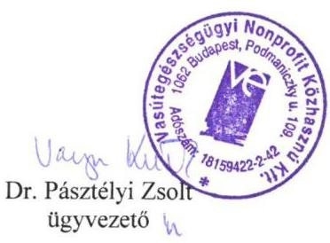

---

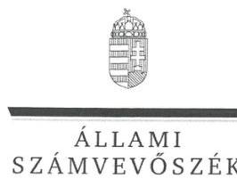

ELNÖK

Ikt.szám: V-1026-113/2016

# Dr. Pásztélyi Zsolt úr 

ügyvezető
Vasútegészségügyi Nonprofit Közhasznú Kft.

## Budapest

## Tisztelt Ügyvezető Úr!

Köszönettel vettem a Vasútegészségügyi Szolgáltató Nonprofit Közhasznú Kft. ellenőrzéséről készített számvevőszéki jelentéstervezetre megküldött észrevételeit.
Az Állami Számvevőszék észrevételekre vonatkozó álláspontjáról a felügyeleti vezető által készített részletes tájékoztatásból kap választ, amelyet levelemhez mellékeltem.
Tájékoztatom Ügyvezető urat, hogy az Állami Számvevőszék a figyelembe nem vett észrevételeket az Állami Számvevőszékről szóló 2011. évi LXVI. törvény 29. § (3) bekezdésében előírtak szerint köteles a jelentésében feltüntetni és megindokolni, hogy azokat miért nem fogadta el.

Budapest, 2017. hó nap
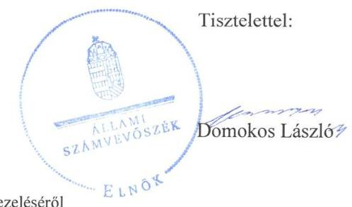

Melléklet: Tájékoztatás az észrevételek kezeléséről

---

# Tájékoztatás az észrevételek kezeléséről 

Megköszönöm Ügyvezető úrnak „Az állami tulajdonban (résztulajdonban) lévő gazdálkodó szervezetek vagyonmegőrzési és gazdálkodási tevékenységének ellenőrzése - Vasútegészségügyi Nonprofit Közhasznú Kft." címmel készített jelentéstervezetre tett észrevételeit. Az észrevételek kezeléséről az alábbi tájékoztatást adom.
A jelentéstervezet 2.1. számú és 2.2. számú megállapításokra, a vagyonkezelési szerződés módosításának elmaradására vonatkozó észrevételét tudomásul veszem. Az észrevételében leírtak alapján -a vagyonkezelési probléma a társaságnál továbbra is fennáll, megoldás arra 2008.-óta, nem született - a megállapítás továbbra is helytálló, így a jelentéstervezet megállapítását nem módosítom.
A jelentéstervezet 2.2 számú megállapítására, az átlátható szervezetre vonatkozó észrevételét tudomásul veszem. Észrevételében Ön is megerősíti a jelentéstervezetben foglaltakat, mely szerint az MNV Zrt. leveleiben arról tájékoztatta a társaságot, hogy a vagyonkezelői szerződés megkötése nem lehetséges a társasággal, mivel az nem minősül átlátható szervezetnek. Az észrevételében leírtak, a szervezet átláthatóságával kapcsolatos hosszas egyeztetésre utalnak, amelynek eredménye az a kölcsönösen elfogadott álláspont, mely szerint a szervezet átlátható, mivel a Vasútegészségügyi Nonprofit Kft-ben 2,8%-ban tulajdonos Vasutas Önkéntes Kölcsönös Kiegészítő Egészségpénztár jogalanyiságát tekintve megfelel a pénzmosás és a terrorizmus finanszírozása megelőzéséről és megakadályozásáról szóló 2007. évi CXXXVI. törvény előírásainak, így az Nvtv. vonatkozó passzusainak. Az észrevételében leírtak alapján a jelentéstervezet megállapítását az alábbiak szerint egészítem ki: „Ugyanakkor az átláthatóság, mint szempont csak az új vagyonelemek esetében releváns. A 2007. évben megkötött vagyonkezelési szerződésből kimaradt elemek nem újonnan fellelt eszközök. Továbbá a Vasútegészségügyi Nonprofit Kft-ben 2,8%-ban tulajdonos Vasutas Önkéntes Kölcsönös Kiegészítő Egészségpénztár jogalanyiságát tekintve megfelel a pénzmosás és a terrorizmus finanszírozása megelőzéséről és megakadályozásáról szóló 2007. évi CXXXVI. törvény előírásainak - a „tényleges tulajdonos" kategóriában meghatározott vezető tisztségviselői közhiteles nyilvántartásból megismerhetőek -, és ezáltal az Nvtv. vonatkozó előírásainak is. Az Nvtv. szerint átlátható a szervezet, ha négy alapvető kritériumnak együttesen megfelel, azaz meg lehet ismerni a tényleges tulajdonosát, továbbá nem minősül ellenőrzött külföldi társaságnak, valamint az EU-, az EGT-, az OECD-tagállamban vagy olyan tagállamban bír illetőséggel, amellyel Magyarország adóegyezményt kötött, illetőleg az előző feltételek fennállnak a gazdálkodó szervezetben közvetlenül vagy közvetetten több mint 25%-os tulajdonnal, befolyással vagy szavazati joggal bíró személy esetében is."
A jelentéstervezet 5.1. számú megállapítására, a Budai MÁV Kórháztól átvett eszközökre vonatkozó tájékoztatását - mely szerint ezen eszközöket is a vagyonkezelői szerződés módosítása alkalmával kívánja rendezni - tudomásul veszem. Az észrevételében leírtak alapján a megállapítás továbbra is helytálló, így a jelentéstervezet megállapítását nem módosítom.
A jelentéstervezet 5.1. számú megállapítására, a közérdekű adatok megismerésének szabályozottságára vonatkozó tájékoztatását - mely szerint a közérdekű adatok megismerésének rendjét rögzítő szabályzatot elkészítették - tudomásul veszem, azonban az észrevételében leírtak alapján a megállapítás továbbra is helytálló, mert az ellenőrzött időszakban a szabályozásbeli hiányosság fennállt, így a jelentéstervezet megállapítását nem módosítom.

Budapest, 2017. január hó 4. nap
Dr. Horváth Margit
felügyeleti vezető

---

# 132 

## 132

## Hovvebk H.

## ÁLLAMI SZÁMVEVŐSZÉK

## Állami Számvevőszék

## Domokos László

## elnök

1052 Budapest
Apáczai Cs. J. u. 10.

Ikt. sz.: MNV/01/2584/1/2017.
Hiv. sz.: V-1026-099/2016.

Tisztelt Elnök Úr!
A 2017. január 9. napján „Vasútegészségügyi Szolgáltató Nonprofit Közhasznú Kft. - Az állami tulajdonban (résztulajdonban) lévő gazdálkodó szervezetek vagyonmegőrzési és gazdálkodási tevékenységének ellenőrzése" tárgyában kézhez vett, V-1026-099/2016. ikt. sz. Jelentés-tervezetre az alábbi észrevételeket tesszük:

Megállapítások / 16. old. 2.1. számú megállapítás hetedik bekezdés, Megállapítások / 16. old. 2.2. számú megállapítás harmadik és negyedik bekezdései, Javaslatok / 27. old. Az MNV Zrt. vezérigazgatójának megfogalmazott javaslatok:

A Jelentés-tervezetben foglalt megállapításokkal és javaslatokkal egyezően Társaságunk természetesen intézkedni fog az elszámolási folyamatok lezárása és a Budai MÁV Kórháztól átvett eszközök helyzetének megnyugtató helyzetének rendezésére, ugyanakkor ismételten fel szeretnénk hívni a figyelmet arra a korábbi álláspontunkra, hogy a Vasútegészségügyi Szolgáltató Nonprofit Közhasznú Kft. a tulajdonosi szerkezete alapján jelenleg nem felel meg a nemzeti vagyonról szóló 2011. évi CXCVI. törvény vagyonkezelők személyére vonatkozó előírásainak, így ezt a szempontot a vagyonkezelési szerződés esetleges módosítása, kiegészítése tekintetében is figyelembe kell majd vennie az MNV Zrt.-nek.

Kérem Elnök Urat, hogy a Jelentés véglegesítése során jelen észrevételeinket szíveskedjenek figyelembe venni.

Budapest, 2017. január 23.
Üdvözlettel:
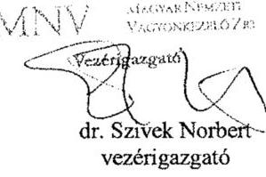

---

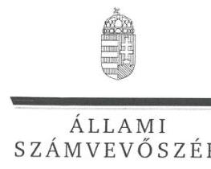

ELNÖK

Ikt.szám: V-1026-110/2016

dr. Szívek Norbert úr
vezérigazgató
Magyar Nemzeti Vagyonkezelő Zrt.

Budapest

Tisztelt Vezérigazgató Úr!

Köszönettel vettem a Vasútegészségügyi Szolgáltató Nonprofit Közhasznú Kft. ellenőrzéséről
készített számvevőszéki jelentéstervezetre megküldött észrevételeit.

Az Állami Számvevőszék észrevételekre vonatkozó álláspontjáról a felügyeleti vezető által
készített részletes tájékoztatásból kap választ, amelyet levelemhez mellékeltem.

Tájékoztatom Vezérigazgató urat, hogy az Állami Számvevőszék a figyelembe nem vett
észrevételeket az Állami Számvevőszékről szóló 2011. évi LXVI. törvény 29. § (3)
bekezdésében előírtak szerint köteles a jelentésében feltüntetni és megindokolni, hogy azokat
miért nem fogadta el.

Budapest, 2017. 06. hó 10. nap

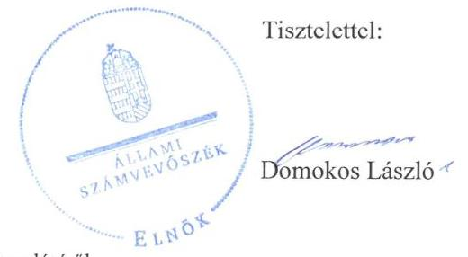

Melléklet: Tájékoztatás az észrevételek kezeléséről

1052 BUDAPEST, APACZAI CSERE JANOS UTCA 10. 1364 Budapest 4. Pf. 54 telefon: 484 9101 fax: 484 9201

---

# Tájékoztatás az észrevételek kezeléséről 

Megköszönöm Vezérigazgató úrnak „Az állami tulajdonban (résztulajdonban) lévő gazdálkodó szervezetek vagyonmegőrzési és gazdálkodási tevékenységének ellenőrzése - Vasútegészségügyi Nonprofit Közhasznú Kft." címmel készített jelentéstervezetre tett észrevételeit. Az észrevételek kezeléséről az alábbi tájékoztatást adom.
A jelentéstervezet 2.1. számú megállapításának hetedik bekezdésére, a jelentéstervezet 2.2. számú megállapításának 3. és 4. bekezdéseire, valamint ezen bekezdésekhez kapcsolódóan a jelentéstervezetben vezérigazgató úrnak címzett javaslatokra tett észrevételét tudomásul veszem. Észrevétele harmadik bekezdése szerint a jelentéstervezet javaslataival és megállapításaival egyezően az MNV Zrt. intézkedni fog az elszámolási folyamatok lezárására és a Budai MÁV Kórháztól átvett eszközök helyzetének rendezésére.
Észrevételében jelezte, hogy a Vasútegészségügyi Szolgáltató Nonprofit Közhasznú Kft. a tulajdonosi szerkezete alapján nem felel meg a nemzeti vagyonról szóló 2011. évi CXCVI. törvény vagyonkezelők személyére vonatkozó előírásainak, mely szempontot az MNV Zrt.-nek a vagyonkezelési szerződés esetleges módosításakor figyelembe kell vennie. Érvelése ellent mond az ellenőrzött társaság által a jelentéstervezetre adott észrevételben foglaltaknak. A társaság ügyvezetője ugyanis a szervezet átláthatóságával kapcsolatos hosszas egyeztetésre utal, amelynek az eredménye az a kölcsönösen elfogadott álláspont, hogy a szervezet átlátható, mivel a Vasútegészségügyi Nonprofit Kft-ben 2,8%-ban tulajdonos Vasutas Önkéntes Kölcsönös Kiegészítő Egészségpénztár jogalanyiságát tekintve megfelel a pénzmosás és a terrorizmus finanszírozása megelőzéséről és megakadályozásáról szóló 2007. évi CXXXVI. törvény előírásainak, így az Nvtv. vonatkozó passzusainak.
Másrészről az átláthatóság, mint szempont csak az új vagyonelemek esetében releváns, a jelentéstervezetben azonban 2007. évben megkötött vagyonkezelési szerződésből kimaradt elemekről van szó, nem pedig újonnan fellelt eszközökről, így ez sem lehet akadálya a vagyonkezelési szerződés módosításának.
Tájékoztatom, hogy észrevételében leírtak alapján a jelentéstervezet megállapítását az alábbiak szerint egészítem ki: „Ugyanakkor az átláthatóság, mint szempont csak az új vagyonelemek esetében releváns. A 2007. évben megkötött vagyonkezelési szerződésből kimaradt elemek nem újonnan fellelt eszközök. Továbbá a Vasútegészségügyi Nonprofit Kft-ben 2,8%-ban tulajdonos Vasutas Önkéntes Kölcsönös Kiegészítő Egészségpénztár jogalanyiságát tekintve megfelel a pénzmosás és a terrorizmus finanszírozása megelőzéséről és megakadályozásáról szóló 2007. évi CXXXVI. törvény előírásainak - a „tényleges tulajdonos" kategóriában meghatározott vezető tisztségviselői közhiteles nyilvántartásból megismerhetőek -, és ezáltal az Nvtv. vonatkozó előírásainak is. Az Nvtv. szerint átlátható a szervezet, ha négy alapvető kritériumnak együttesen megfelel, azaz meg lehet ismerni a tényleges tulajdonosát, továbbá nem minősül ellenőrzött külföldi társaságnak, valamint az EU-, az EGT-, az OECD-tagállamban vagy olyan tagállamban bír illetőséggel, amellyel Magyarország adóegyezményt kötött, illetőleg az előző feltételek fennállnak a gazdálkodó szervezetben közvetlenül vagy közvetetten több mint 25%-os tulajdonnal, befolyással vagy szavazati joggal bíró személy esetében is."

Budapest, 2017. október hó 10. nap
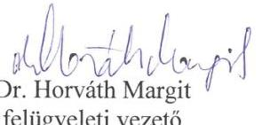

---

.

---

# RÖVIDÍTÉSEK JEGYZÉKE 

${ }^{1}$ Vasútegészségügyi NKft
${ }^{2}$ KVI
${ }^{3}$ MNV Zrt.
${ }^{4}$ Kszt.
${ }^{5}$ Vagyonkezelési szerződés
${ }^{6}$ ÁSZ
${ }^{7}$ Társasági szerződés ${ }_{1-10}$
Vasútegészségügyi NKft. társasági szerződése ${ }_{2}$ Vasútegészségügyi NKft. társasági szerződése ${ }_{3}$ Vasútegészségügyi NKft. társasági szerződése ${ }_{4}$ Vasútegészségügyi NKft. társasági szerződése ${ }_{5}$ Vasútegészségügyi NKft. társasági szerződése ${ }_{6}$ Vasútegészségügyi NKft. társasági szerződése ${ }_{7}$ Vasútegészségügyi NKft. társasági szerződése ${ }_{8}$ Vasútegészségügyi NKft. társasági szerződése ${ }_{9}$ Vasútegészségügyi NKft. társasági szerződése ${ }_{10}$ Vasútegészségügyi NKft. társasági szerződése ${ }_{11}$ Vasútegészségügyi NKft. társasági szerződése ${ }_{12}$ ${ }^{8}$ Gt.
${ }^{9}$ OEP
${ }^{10}$ Taktv.
${ }^{11}$ Taggyűlés
${ }^{12}$ Vtv.
${ }^{13}$ Számv. tv.
${ }^{14}$ FB
${ }^{15}$ Befektetési szabályzat ${ }_{1,2}$
${ }^{16}$ Számviteli politika ${
 }_{1,2}$
${ }^{17}$ Értékelési szabályzat ${ }_{1,2}$
${ }^{18}$ Leltározási szabályzat ${ }_{1,2}$
${ }^{19}$ Önköltségszámítási szabályzat ${ }_{1,2}$

Vasútegészségügyi Szolgáltató Nonprofit korlátolt felelősségű társaság Kincstári Vagyoni Igazgatóság
Magyar Nemzeti Vagyonkezelő Zrt.
A közhasznú szervezetekről szóló 1997. évi CLVI. törvény
A Vasútegészségügyi NKft. és a Magyar Állam nevében a tulajdonosi jogok gyakorlását ellátó KVI között jött létre azzal a céllal, hogy a Vasútegészségügyi NKft. számára biztosítsa a szakszerű feladatellátáshoz szükséges ingatlan, továbbá ingó vagyontárgyakat.
Állami Számvevőszék
Vasútegészségügyi NKft. társasági szerződése¹ (hatályos: 2011. január 6-ig, 25. módosítás)
(hatályos: 2011. január 6-tól, 2011. május 26-ig, 26. módosítás)
(hatályos: 2011. május 27-től, 2011. augusztus 26-ig, 27. módosítás)
(hatályos: 2011. augusztus 27-től, 2012. május 16-ig, 28. módosítás)
(hatályos: 2012. május 17-től, 2012. december 1-ig, 29. módosítás)
(hatályos: 2012. december 1-től, 2013. június 13-ig, 30. módosítás)
(hatályos: 2013. június 14-től, 2013. szeptember 2-ig, 31. módosítás)
(hatályos: 2013. szeptember 3-tól, 2014. február 20-ig, 32. módosítás)
(hatályos: 2014. február 21-től, 2014. május 28-ig, 33. módosítás)
(hatályos: 2014. május 28-tól, 34. módosítás)
A gazdasági társaságokról szóló 2006. évi IV. törvény (hatálytalan 2014. március 15-től)
Országos Egészségbiztosítási Pénztár
A köztulajdonban álló gazdasági társaságok takarékosabb működéséről szóló 2009. évi CXXII. törvény

A Vasútegészségügyi NKft. Taggyűlése
Az állami vagyonról szóló 2007. évi CVI. törvény
A számvitelről szóló 2000. évi C. törvény
Felügyelő Bizottság
Befektetési Szabályzat¹ (hatályos 2009. május 28-2013. március 19-éig)
Befektetési Szabályzat² (hatályos 2013. március 20-ától)
A Vasútegészségügyi NKft számviteli politikája (hatályos: 2011. január 1-től, 2011. december 31-ig)

Vasútegészségügyi NKft számviteli politikája (hatályos: 2012. január 1-től)
Eszközök és Források értékelési szabályzata¹ (hatályos: 2010. november 18-tól, 2011. december 31-ig)
Eszközök és Források értékelési szabályzata² (hatályos: 2012. január 1-től)
Eszközök és Források leltározási és leltárkészítési szabályzata¹ (hatályos: 2003. május 28-tól 2012. november 5-ig)

Eszközök és Források leltározási és leltárkészítési szabályzata² (hatályos: 2012. november 6-tól)

Önköltség számítási szabályzat¹ (hatályos: 2003. május 28-tól, 2012. december 10-ig)

---

${ }^{20}$ Számlarend ${ }_{1,2}$
${ }^{21}$ Nvtv
${ }^{22}$ 2108/2007. (VI. 15.) Korm. határozat
${ }^{23}$ 2009/2007. Korm. határozat
${ }^{24}$ Vagyonkezelői jog átadási szerződés ${ }_{1}$
${ }^{25}$ Társaság
${ }^{26}$ Vagyonkezelői jog átadási szerződés ${ }_{2}$
${ }^{27}$ Vagyon-nyilvántartási szabályzat ${ }_{1,2}$
${ }^{28}$ SAP CO
${ }^{29}$ 43/1999. (III. 3.) Korm. rendelet
${ }^{30}$ Ctv.
${ }^{31}$ Avtv.
${ }^{32}$ Info. tv.
${ }^{33}$ Befektetési szabályzat ${ }_{1,2}$
${ }^{34}$ Beruházási szabályzat ${ }_{1,2}$
${ }^{35}$ Közbeszerzési szabályzat ${ }_{1-3}$
${ }^{36}$ Stabilitási tv.
${ }^{37}$ 353/2011.(XII.30) Korm. rendelet
${ }^{38}$ Vhr.

Önköltség számítási szabályzat² (hatályos: 2012. december 10-től)
Számlarend (hatályos 2003. május 28-tól, 2011. december 31-ig)
Számlarend² (hatályos 2012. január 1-től)
A nemzeti vagyonról szóló 2011. évi CXCVI. törvény
A Kormány 2108/2007. (VI. 15.) Korm. határozata az Állami Egészségügyi Központ (Honvéd, Rendészeti és Vasútegészségügyi Központ) létrehozásával összefüggésben egyes kormányhatározatok módosításáról
2009/2007. (I. 30.) Korm. határozat a központi egészségügyi szolgáltató szervezetek létrehozásáról (hatályos 2007. június 15-étől)
Vagyonkezelői jog átadásáról szóló szerződés kincstári vagyon feletti vagyonkezelői jog átadás-átvétele tárgyában, hatályos 2007. június 27-től (Budai MÁV Kórház, mint átadó, és a Vasútegészségügyi NKft. mint átvevő között)
Vasútegészségügyi Szolgáltató Nonprofit korlátolt felelősségű társaság vagyonkezelői jog átadásáról szóló szerződés kincstári vagyon feletti vagyonkezelői jog átadás-átvétele tárgyában, hatályos 2007. július 24-től (MÁV Kórház és Központi Rendelőintézet, mint átadó, és a Vasútegészségügyi NKft. mint átvevő között)
Az MNV Zrt. vagyonkezelési, vagyon-nyilvántartási szabályzata¹ (hatályos 2008. június 11-étől 2014. májusig)
Az MNV Zrt. vagyonkezelési, vagyon-nyilvántartási szabályzata² (hatályos 2014. májustól)

Integrált vállalatirányítási rendszer kontrolling modulja
43/1999. (III. 3.) Korm. rendelet az egészségügyi szolgáltatások
Egészségbiztosítási Alapból történő finanszírozásának részletes szabályairól
A cégnyilvánosságról, a bírósági cégeljárásról és a végelszámolásról szóló 2006. évi V. törvény
a személyes adatok védelméről és a közérdekű adatok nyilvánosságáról szóló 1992. évi LXIII. törvény

Az információs önrendelkezési jogról és az információszabadságról szóló 2011. évi CXII. törvény

Befektetési Szabályzat¹ (hatályos 2009. május 28-2013. március 19-éig) Befektetési Szabályzat² (hatályos 2013. március 20-ától)
Beruházási szabályzat¹ (hatályos 2009. június 19-étől 2012. június 28-áig)
Az ingatlan és eszköz beruházási, felújítási, karbantartási szabályzat² (hatályos 2012. június 29-étől)

Közbeszerzési Szabályzat¹ (hatályos 2012. június 30-ig)
Közbeszerzési Szabályzat² (hatályos 2012. július 1-től 2013. december 1-jéig. március 1-jétől)
Közbeszerzési Szabályzat³ (hatályos 2013. december 2-ától)
Magyarország gazdasági stabilitásáról szóló 2011. évi CXCIV. törvény
Az adósságot keletkeztető ügyletekhez történő hozzájárulás részletes szabályairól szóló 353/2011. (XII. 30.) Korm. rendelet
Az állami vagyonnal való gazdálkodásról szóló 254/2007. (X. 4.) Korm. rendelet

---

# ÁLLAMI SZÁMVEVŐSZÉK 

1052 Budapest, Apáczai Csere János utca 10.
Levélcím: 1364 Budapest 4. Pf. 54
Telefon: +36 14849100 Telefax: +36 14849200
www.asz.hu
