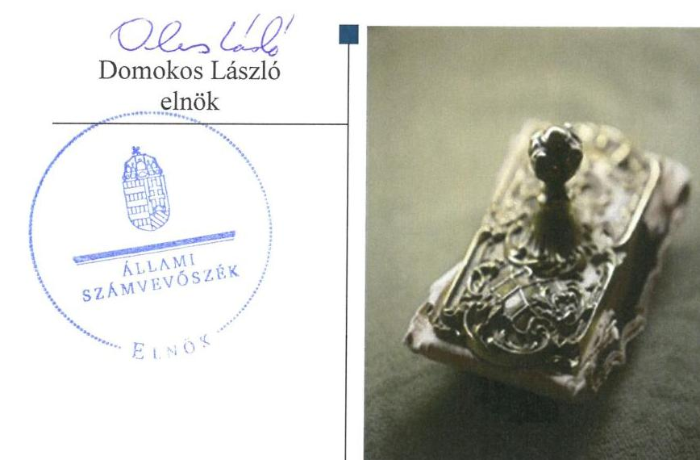
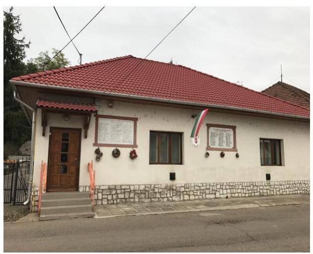
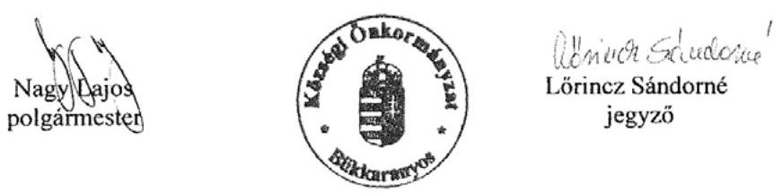
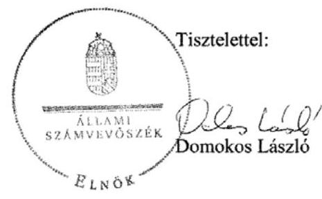
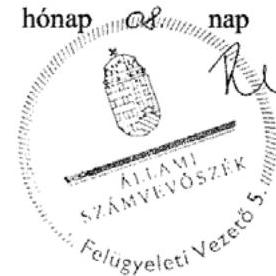
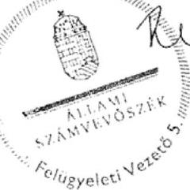
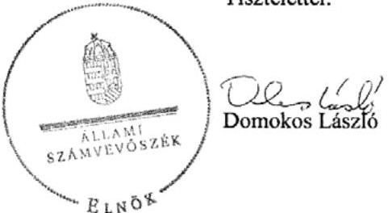
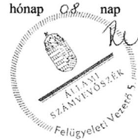
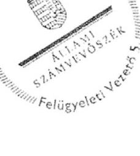

# Jelenetés 

## Önkormányzatok belsö kontrollrendszere

Az önkormányzatok belső kontrollrendszere kialakításának és múködtetésének ellenőrzése - Bükkaranyos 2017.

---

# Jelențtés 

## Önkormányzatok belsó kontrollrendszere

Az önkormányzatok belső kontrollrendszere kialakításának és múködtetésének ellenőrzése - Bükkaranyos
2017. O4. hó 04. nap

---

# AZ ELLENŐRZÉST FELÜGYELTE: 

RENKÓ ZSUZSANNA felügyeleti vezető

## AZ ELLENŐRZÉST VEZETTE ÉS A VÉGREHAJTÁSÁÉRT FELELŐS:

DÉR LÍVIA ellenőrzésvezető

## A PROGRAM ÖSSZEÁLLÍTÁSÁÉRT FELELŐS:

JANIK JÓZSEF osztályvezető

IKTATÓSZÁM: V-1224-089/2016.
TÉMASZÁM: 2258

## ELLENŐRZÉS-AZONOSÍTÓ SZÁM: V-076406

Jelentéseink az Országgyúlés számítógépes hálózatán és az Interneten a www.asz.hu címen is olvashatóak.

---

# TARTALOMJEGYZÉK 

■ ÖSSZEGZÉS ..... 5
■ AZ ELLENŐRZÉS CÉLJA ..... 6
■ AZ ELLENŐRZÉS TERÜLETE ..... 7
■ AZ ELLENŐRZÉS HÁTTERE, INDOKOLTSÁGA ..... 8
■ A JELENTÉS LÉNYEGES KÉRDÉSKÖREI ..... 10
■ ELLENŐRZÉS HATÓKÖRE ÉS MÓDSZEREI ..... 11
■ MEGÁLLAPÍTÁSOK ..... 14
■ JAVASLATOK ..... 26
■ MELLÉKLETEK ..... 29
I. Sz. melléklet: Értelmező szótár ..... 29
II. Sz. melléklet: A befektetési jegyek bekerülési és mérleg szerinti értékének meghatározása ..... 34
III. Sz. melléklet: Az integritás szemlélet érvényesítése érdekében kialakított és müködtetett kontrollrendszer ..... 35
■ FÜGGELÉK: ÉSZREVÉTELEK ..... 37
■ RÖVIDÍTÉSEK JEGYZÉKE ..... 49

---

.

---

# ÖSSZEGZÉS 

Bükkaranyos Község Önkormányzata belső kontrollrendszere kialakításának és müködtetésének hiányosságai a befektetési tevékenységek szabályszerű végzését, elszámoltathatóságát nem biztosította. A döntéshozó szabálytalan jogkör gyakorlása nem tette lehetővé a közvagyon szabályos befektetését. Az Önkormányzat beszámolója nem a valóságnak megfelelően mutatta be a befektetett közvagyon nagyságát. Az Önkormányzatnak az integritás szemlélet érvényesülése érdekében még erőfeszitést kell tennie.

## Az ellenőrzés társadalmi indokoltsága

Magyarország Alaptörvénye az önkormányzatoktól is elvárja a kiegyensúlyozott, átlátható és fenntartható költségvetési gazdálkodás elvének érvényesítését. A korábbi évek ellenőrzési tapasztalatai, az önkormányzatok által betöltött társadalmi szerep, az általuk kezelt közpénz nagysága, a nemzeti vagyon átruházására vagy hasznosítására vonatkozó döntéseik sokrétűsége egyaránt indokolttá tették a számvevőszéki ellenőrzések folytatását. A belső kontrollrendszer jogszabályoknak megfelelő kialakítása és működtetése nélkül nem valósítható meg a közpénzek, a közvagyon szabályos, gazdaságos, hatékony és eredményes felhasználása.

Bükkaranyos Község Önkormányzata beszámolójában 2015. december 31-én 15,5 millió Ft befektetési jegy állományt mutatott ki.

## Főbb megállapítások, következtetések, javaslatok

A belső kontrollrendszer kialakítása és működtetése nem volt szabályszerű, így nem volt biztosított a szabálykövető működés és gazdálkodás. A kontrolltevékenységek nem megfelelő működtetése akadályozta a hibák megelőzését, feltárását. Nem mérték fel teljes körűen a tevékenységben, gazdálkodásban rejlő kockázatokat, ezen belül a befektetési tevékenység kockázatait, az ezen kockázatokkal kapcsolatban szükséges intézkedéseket, valamint azok teljesítésének folyamatos nyomon követésének módját nem határozták meg, ezáltal nem volt biztosított a vagyonnal való felelős gazdálkodás.

A befektetési döntések nem feleltek meg a jogszabályi előírásoknak és az önkormányzati szabályozásnak. Az egyes befektetések bekerülési értékének helytelen megállapítása, továbbá a részletező nyilvántartás nem megfelelő vezetése következtében az önkormányzat beszámolója a vagyonról nem a valós összképet mutatta.

Az integritás szemlélet erősítése érdekében - a belső kontrollrendszer kialakításában és múködésében feltárt hiányosságok és hibák megszüntetésével - az Önkormányzatnak még erőfeszítéseket kell tennie.

---

# AZ ELLENŐRZÉS CÉLJA 

Az ellenőrzés célja annak megállapítása volt, hogy szabályszerűen történt-e az Önkormányzat ${ }^{1}$ belső kontrollrendszerének kialakítása és múködtetése, az biztosította-e az önkormányzatnál a közpénzfelhasználás szabályosságát, a közpénzekkel és a nemzeti vagyonnal történő szabályszerű és felelős gazdálkodást, a beszámolási és adatszolgáltatási kötelezettségek szabályszerű teljesítését. Az ellenőrzés keretében értékeltük az Önkormányzat korrupciós kockázatainak kezelését szolgáló integritás kontrollok kiépítettségét és az integritás szemlélet érvényesülését.

Ellenőriztük, hogy az Önkormányzat egyes befektetési döntései és azok végrehajtása, elszámolása megfelelt-e a vonatkozó jogszabályoknak és belső szabályozásoknak, a kialakított kontrollrendszer támogatta-e a befektetési tevékenység szabályszerűségét.

---

# **AZ ELLENŐRZÉS TERÜLETE**

## **Bükkaranyos Község Önkormányzata**

Bükkaranyos község Borsod-Abaúj-Zemplén megyében, a mezőkövesdi járás területén fekszik. Állandó lakosainak száma 2015. december 31-én 1528 fő volt.

A Képviselő-testületnek2 a polgármesteren kívül hat képviselő tagja van, az állandó bizottságok száma négy (Ügyrendi, Szociális és Egészségügyi, Pénzügyi és Gazdasági, valamint Közbeszerzési Bizottság). A polgármester23 a 2010. évi helyi önkormányzati választások óta látja el feladatát. A jegyző személye az ellenőrzött időszak során több alkalommal változott, a jelenlegi jegyző44 2013. április 1-jétől látja el feladatát. Az Önkormányzat egy költségvetési szervet (Bükkaranyosi Óvoda) tartott fenn.

A Polgármesteri hivatal 2012. december 31-én jogutódlással megszűnt, 2013. január 1-jétől jött létre a Közös hivatal, melynek irányító szerve Kisgyőr Község Önkormányzatának Képviselő-testülete. A Hivatal5 szervezeti egységekre nem tagolódott, elkülönült gazdasági szervezettel nem rendelkezett. 2015. december 31-én a Hivatalban foglalkoztatott köztisztviselők létszáma 9 fő volt.

Az Önkormányzat a Bükkaranyos Községüzemeltetési Közhasznú Nonprofit Kft-ben rendelkezik 100%-os tulajdoni hányaddal, további gazdasági társaságokban többségi részesedése nincs. A településen Roma Nemzetiségi Önkormányzat működik.

A 2015. évi összevont költségvetési beszámoló alapján a költségvetési bevétel 360,4 millió Ft, a teljesített költségvetési kiadás 349,6 millió Ft volt. 2015. december 31-én a könyvviteli mérleg szerinti eszközvagyon 1227,3 millió Ft, a költségvetési évben esedékes kötelezettségek összege 1,1 millió Ft, valamint a költségvetési évet követően esedékes kötelezettségek öszszege 2,9 millió Ft volt.

A 2012. évi adósságkonszolidáció keretében az állam 7,5 millió Ft hiteltartozás, valamint 0,1 millió Ft kamatfizetési kötelezettség kiegyenlítéséhez nyújtott támogatást.

---

# AZ ELLENŐRZÉS HÁTTERE, INDOKOLTSÁGA 

A demokratikus társadalmakban alapvető igény, hogy a közpénzeket, a közvagyont használók tevékenységükről elszámoljanak, ahhoz egyértelmű és érvényesíthető felelősségi szabályok társuljanak. Ennek a jogos igénynek az érvényesítéséhez meg kell teremteni azokat a folyamatokat, rendszereket, amelyek nélkülözhetetlenek az elszámoltatáshoz. Az elszámoltatás eredményes múködtetéséhez szükség van a megfelelő információs, kontroll-, értékelési - és beszámolási rendszerek kialakítására. A belső kontrollok kiépítettsége hozzájárul az integritási szemlélet kialakításához és érvényesüléséhez. A belső kontrollrendszer kialakítása és múködtetése nélkül nem valósítható meg a közpénzek, a közvagyon szabályos, gazdaságos, hatékony és eredményes felhasználása.

A BELSŐ KONTROLLRENDSZER azt a célt szolgálja, hogy az államháztartás szervei múködésük és gazdálkodásuk során a tevékenységeket szabályszerűen, gazdaságosan, hatékonyan, eredményesen hajtsák végre, teljesítsék elszámolási kötelezettségeiket és megvédjék az erőforrásokat a veszteségektől, a károktól, a nem rendeltetésszerű használattól. A belső kontrollrendszer magában foglalja mindazon szabályokat, eljárásokat, gyakorlati módszereket és szervezeti struktúrákat, kockázatkezelési technikákat, kontrolltevékenységeket, amelyek segítséget nyújtanak a szervezetnek céljai eléréséhez. A belső kontrollrendszer szabályozása háromszintű, a törvényi előírásokat az Áht. és a Mötv6. a rendeleti szintű szabályozást az Ávr. és a Bkr. ${ }^{7}$ tartalmazza, amelyeket útmutatói szinten az NGM által kiadott standardok és kézikönyvek támogatnak.

A megfelelő belső kontrollrendszer jelentősen csökkenti a hibák és szabálytalanságok kockázatát. Az ÁSZ ${ }^{8}$ célja, hogy javuljon az ellenőrzött önkormányzatok belső kontrollrendszerének szabályozottsága, múködésének megfelelősége, szabályszerűsége, hozzájárulva ezzel az egyensúlyi helyzet fenntarthatóságának biztosításához, biztosítva az önkormányzatnál a közpénzfelhasználás szabályosságát, a közpénzekkel és a nemzeti vagyonnal történő szabályszerű, gazdaságos, hatékony és eredményes gazdálkodást. Az ÁSZ ellenőrzés tapasztalatai nem csupán a közvetlenül ellenőrzött önkormányzatokat támogathatják, hanem a ,jó gyakorlat" elterjesztésével azok az önkormányzatok is átvehetik a pozitív példákat, ahol nem végez ellenőrzést az ÁSZ.

A közszféra integritás alapú kultúrájának kialakítása, megerősítése és múködése szorosan összefügg a belső kontrollrendszer múködésével, ezért az ellenőrzés kiterjed annak értékelésére is, hogy a belső kontrollrendszer kialakítása és múködtetése hogyan hatott az integritás szemlélet érvényesülésére.

AZ ÖNKORMÁNYZATOK ÁTMENETILEG SZABAD PÉNZESZKÖZEINEK BEFEKTETÉSÉT jogszabály nem tiltja, a befektetések jellege nem korlátozott, a pénzpiaci szolgáltatók közül az önkormányzatok a kínált szolgáltatás és annak költségei alapján, szabadon választhatnak, azonban a veszteséges gazdálkodás kockázatai és kö-

---

vetkezményei az önkormányzatokat terhelik. A szabad pénzeszközök felhasználása során kiemelten fontos a felelős gazdálkodás érvényesülése, amely összhangban kell, hogy legyen, az önkormányzati gazdálkodás alapelveivel.
2015. első felében az MNB három befektetési szolgáltató tevékenységi engedélyét vonta vissza és kezdeményezte a vállalkozások felszámolását a múködéssel kapcsolatos szabálytalanságok, hiányosságok miatt. A befektetési vállalkozások problémás helyzetbe kerülése jelentős veszteségekhez vezetett számos önkormányzat esetében. A korábbi évek ellenőrzési tapasztalatai alapján fennáll a lehetősége annak, hogy az önkormányzatok befektetési döntései, továbbá a döntések végrehajtása és számviteli elszámolása nem voltak teljes mértékben szabályszerűek, és a kapcsolódó külső és belső kontroll rendszerek sem múködtek minden esetben megfelelően.

Az ellenőrzéssel feltárásra kerülhetnek azok a kockázatok, amelyek az önkormányzatok gazdálkodásával, ezen belül befektetési tevékenységeivel, kontrollkörnyezetével kapcsolatosak és a befektetési tevékenységek szabályszerű végrehajtását befolyásolják. Az ellenőrzéssel az önkormányzatok befektetési/vagyongazdálkodási döntéseinek összessége értékelhetővé válik, és megalapozott megállapítás tehető arra vonatkozóan, hogy milyen hatást gyakoroltak az önkormányzat vagyonára a képviselő-testület döntései.

# AZ ELLENŐRZÉS VÁRHATÓ HASZNOSULÁSA 

NÉGY SZINTEN valósul meg. A törvényalkotás számára összegzett tapasztalatok állnak rendelkezésre a belső kontrollrendszer önkormányzati területen való kialakításáról, múködtetéséről és hatásairól. Az ellenőrzés az ellenőrzött számára visszajelzést ad a belső kontrollrendszer kialakításában és múködésében lévő hiányosságokról, javaslataival hozzájárul azok kiküszöböléséhez. Az ellenőrzés megállapításait és javaslatait más szervezetek is hasznosíthatják a rendezett gazdálkodási keretek kialakításához. A társadalom számára jelzi, hogy közpénz nem maradhat ellenőrizetlenül, az ÁSZ értékteremtő rend kialakításához és megőrzéséhez hozzájáruló tevékenysége pozitív hatással lesz a szervezetről kialakított összkép formálásában.

---

# A JELENTÉS LÉNYEGES KÉRDÉSKÖREI 

1.     - Az önkormányzat belső kontrollrendszerének kialakítása és müködtetése a 2015. évben szabályszerű volt-e, az biztosította-e a közpénzfelhasználás szabályosságát, a nemzeti vagyonnal történő felelős gazdálkodást, valamint a belső kontrollrendszer egyes pillérei biztosították-e a befektetési tevékenységek szabályszerű végzését a 2011 - 2015. években?
2.     - Az egyes befektetésekkel kapcsolatos döntéshozatal és a döntések végrehajtása szabályszerű volt-e?
3.     - Az egyes befektetések számviteli elszámolása, nyilvántartása szabályszerű volt-e?
4.     - Az Önkormányzatnál az integritás szemlélet érvényesült-e és ennek megfelelően kiépítették-e az integritás kontrollrendszert?

---

# ELLENŐRZÉS HATÓKÖRE ÉS MÓDSZEREI 

## Az ellenőrzés típusa

A belső kontrollrendszer ellenőrzése esetében megfelelőségi ellenőrzés, a befektetési tevékenységnél szabályszerűségi ellenőrzés.

## Az ellenőrzött időszak

A belső kontrollrendszer kialakításának és működtetésének ellenőrzése a 2015. január 1. és december 31. közötti időszakra terjedt ki. Az önkormányzatok egyes befektetési tevékenységeinek ellenőrzése tekintetében az ellenőrzött időszak a 2011. január 1. - 2015. december 31. közötti időszak. Ezen felül az önkormányzat befektetésekkel kapcsolatos döntés-előkészítésének és döntéshozatalának szabályszerűségét a 2011. január 1. előtti időszakra visszanyúlóan is ellenőriztük, amennyiben a 2015. december 31-én meglévő befektetéseire 2011. január 1-je előtt került sor. Az integritás szemlélet érvényesülését a 2015. évre vonatkozó adatszolgáltatás alapján értékeltük.

## Az ellenőrzés tárgya

A helyi önkormányzatnak, mint éves költségvetési beszámoló készítésére kötelezett szervezetnek és polgármesteri hivatalának belső kontrollrendszere. Az integritás szemlélet érvényesülése.

Az önkormányzat 2015. december 31-én meglévő, értékpapírokban megtestesülő befektetései, lekötött betétei, valamint a szabad pénzeszközei terhére, adásvételi szerződés keretében megszerzett, a kötelező feladatok ellátását nem szolgáló az önkormányzat üzleti vagyonába tartozó, az ellenőrzött időszakban (2011-2015.) megszerzett ingatlanok, továbbá időkorlátozás nélkül megszerzett -kulturális javak (műtárgyak, műalkotások, stb.), illetve a feladatellátást nem szolgáló egyéb értéktárgyak (pl. ékszerek, befektetési nemesfém).

Az ellenőrzés kiterjedt minden olyan körülményre és adatra, amely az ÁSZ jogszabályban meghatározott feladatainak teljesítéséhez, valamint a program végrehajtása folyamán felmerült újabb összefüggések feltárásához szükséges volt.

## Az ellenőrzött szervezet

Bükkaranyos Község Önkormányzata és az önkormányzati múködéshez kapcsolódó feladatokat ellátó Hivatal.

---

# Az ellenőrzés jogalapja 

Az ÁSZ tv. ${ }^{9}$ 1. § (3) bekezdésében foglaltak alapján az ÁSZ általános hatáskörrel végzi a közpénzekkel és az állami és önkormányzati vagyonnal való felelős gazdálkodás ellenőrzését. Az ÁSZ tv. 5. § (2) bekezdése alapján az államháztartás gazdálkodásának ellenőrzése keretében az ÁSZ ellenőrzi a helyi önkormányzatok gazdálkodását, valamint az ÁSZ tv. 5. § (6) bekezdése alapján ellenőrzése során értékeli az államháztartás számviteli rendjének betartását és a belső kontrollrendszer múködését.

## Az ellenőrzés módszerei

Az ellenőrzést a nemzetközi standardokat irányadónak tekintve az ellenőrzési program szempontjai, kérdései, az ellenőrzött időszakban hatályos jogszabályok, az ellenőrzés szakmai szabályok és módszertanok figyelembe vételével végeztük.

Az ellenőrzés ideje alatt az ellenőrzött szervezettel történő kapcsolattartást az ÁSZ SZMSZ-ének vonatkozó előírásai alapján biztosítottuk.

Az ellenőrzési kérdések megválaszolásához szükséges bizonyítékok megszerzése az ellenőrzöttek által rendelkezésre bocsátott dokumentumokra, adatokra alapozva megfigyelés, szemle (szemrevételezés), kérdésfeltevés (információkérés), valamint elemző eljárással történt. A minták kiválasztása rétegzett, véletlen mintavételi eljárással történt.

Az ellenőrzési bizonyítékként felhasználható adatforrások közé tartoznak egyrészt az ellenőrzési program részletes szempontjainál felsorolt adatforrások, másrészt minden - az ellenőrzés folyamán feltárt, az ellenőrzés szempontjából információt tartalmazó - dokumentum.

Az ellenőrzés lefolytatásához az önkormányzat a tanúsítványok elektronikus kitöltésével, valamint az ÁSZ által kért dokumentumok elektronikus megküldésével szolgáltat adatokat. A rendelkezésre bocsátott adatok, információk kontrollja az ellenőrzés keretében történt.

A jelentésben használt fogalmak magyarázatát az I. számú melléklet, továbbá a rövidítésjegyzék tartalmazza.

Az önkormányzat belső kontrollrendszere jogszabályi előírások szerinti kialakításának és múködtetésének szabályszerűségét, az erre irányuló ellenőrzési kérdésekre adott válaszok összesítése alapján a 2015. január 1. és december 31. közötti időszakra, pillérenként (kontrollkörnyezet, kockázatkezelési rendszer, kontrolltevékenységek, információs és kommunikációs rendszer, monitoring rendszer) és összesítetten is értékeljük. Az önkormányzat belső kontrollrendszere egyes pilléreinek kialakítása és múködtetése „szabályszerü", amennyiben az értékelt területen az elért igen válaszok százalékban kifejezett, egész számra kerekített aránya meghaladja a 85\%-ot, „részben szabályszerü", ha a 85\%-ot nem haladja meg, de 60\%-nál nagyobb, „nem szabályszerü", ha nem haladja meg a 60\%-ot. Az önkormányzat belső kontrollrendszerének összesített értékelése megegyezik a pillérenként (kontrollterületenként) alkalmazott százalékos értékelésekkel, a következő eltérésekkel. A kontrollrendszer egésze esetében a „szabályszerü" értékelésnek a százalékos értéken felül további feltétele, hogy egyik kontrollterület sem kaphat „nem szabályszerü" értékelést, a

---

„részben szabályszerű" értékelés további feltétele, hogy legfeljebb egy ellenőrzött kontrollterület lehet „nem szabályszerű" értékelésű. Az összesített értékelés a százalékos értéktől függetlenül „nem szabályszerű", ha az ellenőrzött kontrollterületek közül több mint egynek „nem szabályszerű" az értékelése.

A kontrolltevékenységek működésének megfelelőségét a foglalkoztatottak személyi juttatásaival, a külső személyi juttatásokkal, a működési kiadásokkal és a felhalmozási célú kiadásokkal kapcsolatos kifizetések esetében mintavétellel ellenőriztük. „Megfelelőnek" értékeltünk egy ellenőrzött területet, amennyiben 95\%-os bizonyossággal a teljes sokaságban a hibaarány legfeljebb 10\%, „nem megfelelőnek", amennyiben 10\%-nál magasabb arányt képviselt. Abban az esetben, ha a teljes sokaság tekintetében a 10\%-os hibaarányhoz való viszony megítélésnek megbízhatósága nem érte el a 95\%-ot, annak elérése érdekében értékelésünket további szempontokkal egészítettük ki, és figyelembe vettük a feltárt hibák értékét.

Az integritás szemlélet érvényesülésének értékelése az önkormányzat által kitöltött tanúsítvány alapján történt a 2015. évre vonatkozóan.

---

# MEGÁLLAPÍTÁSOK 

## 1. Az önkormányzat belső kontrollrendszerének kialakítása és müködtetése a 2015. évben szabályszerű volt-e, az biztosítottae a közpénzfelhasználás szabályosságát, a nemzeti vagyonnal történő felelős gazdálkodást, valamint a belső kontrollrendszer egyes pillérei biztosították-e a befektetési tevékenységek szabályszerű végzését a 2011 - 2015. években?

Összegző megállapítás

A befektetési tevékenységeket érintően a 2011-2015. években a belső kontrollrendszer egyes pillérei a befektetések szabályszerűségét nem biztosították.
A gazdálkodás egészét tekintve a belső kontrollrendszer kialakítása és müködtetése a 2015. évben az összesített értékelés alapján nem volt szabályszerű, a közpénzfelhasználás szabályosságát és a nemzeti vagyonnal való felelős gazdálkodást nem biztosította.
1.1. számú megállapítás

A befektetési tevékenységet érintően 2011- 2015. között a kontrollkörnyezetet nem a jogszabályi előírásoknak megfelelően alakították ki, emiatt a befektetési tevékenység szabályszerű végzését nem biztosította.
A gazdálkodás egészét érintően a kontrollkörnyezet kialakítása a 2015. évben nem volt szabályszerű.

A SZERVEZETI ÉS SZABÁLYOZÁSI KERETEKET 2011. január 1. és 2015. december 31. között nem a jogszabályi előírásokkal összhangban alakították ki:
az önkormányzati SZMSZ2-ben rendelkeztek a Képviselő-testület szervei jogállásáról és feladatairól. A polgármester tekintetében az 500 ezer Ft értékhatárig biztosított hitelfelvételi hatáskör ellentétes volt a 2013. január 1-jétől hatályos Mótv. 42. § 4. pontjában előírtakkal, amely szerint a hitelfelvétel a Képviselő-testület kizárólagos hatáskörébe tartozik. Ezen jogszabályi előírással ellentétes hitelfelvételi hatáskör átruházás megjelent a 2013-2015. évi költségvetési rendeletekben is;
a vagyongazdálkodási rendelet: ${ }^{10}$ tárgyi hatályát nem a teljes önkormányzati vagyon tekintetében határozták meg, abban az értékpapírokat nem szerepeltették. Az önkormányzati vagyon értékesítése esetére a nyilvános pályáztatás kötelezettségét a 2011. és a 2012. évi központi költségvetésről szóló törvény ${ }^{11}$ 6. § (3) bekezdésével, illetve az 5. § (3) bekezdésével ellentétesen, az előírt 25 millió Ft-os

---

értékhatárnál magasabb összegben (36 millió Ft-ban) állapították meg;
A hivatali SZMSZ ${ }_{1}{ }^{12}$ nem tartalmazta a 2011-ben hatályos Ámr. 2 20. § (2) bekezdés e) pontjában, illetve a 2012-ben hatályos Ávr. ${ }^{13} 13 . \S$ (1) bekezdés e) pontjában előírtak ellenére a hivatal engedélyezett létszámát, a szervezeti ábrát. A hivatal SZMSZ2 nem tartalmazta a 2013-2015. években hatályos Ávr. 13. § (1) bekezdés e) pontjában előírt szervezeti ábrát; a g) pontban előírtak ellenére az SZMSZ-ben nevesített munkakörökhöz tartozó feladat és hatásköröket, a hatáskörök gyakorlása módját, az ezekhez kapcsolódó felelősségi szabályokat.

A BELSŐ SZABÁLYZATOK a jogszabályi előírásoknak nem feleltek meg teljes körűen:
a számviteli politika ${ }_{3}{ }^{14}$ aktualizálása a Számv. tv. ${ }^{15} 14 . \S$ (11) bekezdésében előírtak ellenére (a törvénymódosítást követő 90 napon belül) nem történt meg. A Számv. tv. 86. §-ában rögzített rendkívüli eredménykategóriára vonatkozó szabályozás 2015. július 4-én hatályát vesztette, erre tekintettel a Számv. tv.14. § (4) bekezdése szabályozási kötelezettséget írt elő azon módszerek, szabályok rögzítése céljából, amelyekkel meghatározzák, hogy mit tekintenek kivételes nagyságú vagy előfordulású bevételnek, költségnek, ráfordításnak. A számviteli politika keretében ezen túl nem határozták meg a Számv. tv.14. § (4) bekezdésében előírtak ellenére, hogy a törvényben biztosított választási, minősítési lehetőségek közül melyeket, milyen feltételek fennállása esetén alkalmaznak, az alkalmazott gyakorlatot milyen okok miatt kell megváltoztatni;
a 2012. évtől nem rendelkeztek a jóváhagyásra jogosult (jegyzó ${ }_{2,3}$ ) által kiadott számlarend ${ }_{1-2}$-del ${ }^{16}$. A számlarend ${ }_{1-2}$-et a Hatv ${ }^{17} 140 . \S$ (1) bekezdés c) pontjában előírtak ellenére a jegyzó ${ }_{2-3}$ helyett a polgármester ${ }_{2}$ hagyta jóvá;
a leltározási és leltárkészítési szabályzat ${ }_{2}{ }^{18}$-ban az értékpapírok esetében nem vették figyelembe, hogy a dematerializált értékpapírok mennyiségi felvétel helyett egyeztetéssel leltározandók a Számv. tv. 69. § (3) bekezdésében előírtak szerint;
a pénzkezelési szabályzat ${ }_{1-3}{ }^{19}$ keretében rendelkeztek a pénzkezeléssel kapcsolatos bizonylatokról, nyilvántartásokról, azonban a szabályozás nem volt teljes körű, a Számv. tv. 14. § (8) bekezdésében előírtak ellenére nem határozták meg az értékpapírszámlával kapcsolatos pénzforgalom lebonyolítása rendjét;
a 2013-2015. években az Ávr. 13. § (2) bekezdés c) és e) pontjában előírtak ellenére belső szabályzatban nem rendezték a belföldi és külföldi kiküldetések elrendelésével és lebonyolításával, elszámolásával kapcsolatos kérdéseket, valamint a reprezentációs kiadások felosztását, azok teljesítésének és elszámolásának szabályait.

---

### 1.2. számú megállapítás

A befektetéseket érintően a 2011-2015. években a kockázatkezelési rendszer múködtetése nem biztosította az egyes befektetési tevékenységek szabályszerű végzését.
A gazdálkodás egészét érintően a 2015. évben a kockázatkezelési rendszer múködtetése nem volt szabályszerű.

A 2011. évben hatályos Ámr. ${ }^{20}$ 157.§ (1)-(3) bekezdéseiben, a 2012-2015. években hatályos Bkr. 3. § b) pontjában, a 7. § (1)-(2) bekezdéseiben előírtak ellenére a jegyző2,3 a kockázatkezelési rendszer kialakításáról a 20112013. években, és annak múködtetéséről a 2011-2015. években nem gondoskodott.

A jegyző ${ }_{2,3}$ - a 2011. évben hatályos Ámr. ${ }_{2}$ 157. § (1)-(3) bekezdéseiben, a 2012-2015. években hatályos Bkr. 7. § (1)-(2) bekezdéseiben előírtak ellenére - a kockázatkezelési rendszer működtetése keretében nem mérte fel teljes körűen a tevékenységben, gazdálkodásban rejlő kockázatokat, ezen belül a befektetési tevékenység kockázatait, nem határozta meg az ezen kockázatokkal kapcsolatban szükséges intézkedéseket, valamint azok teljesítésének folyamatos nyomon követésének módját.
1.3. számú megállapítás

Az Önkormányzat kontrolltevékenysége kereteinek kialakítása a 2015. évben megfelelt a jogszabályi előírásoknak, azonban múködtetése nem volt szabályszerű. A kontrolltevékenységek múködtetése nem biztosította a közpénzfelhasználás szabályosságát, nem járult hozzá a hibák megelőzéséhez és feltárásához.

A belső kontrollrendszer szabályzat ${ }^{21}$ a jogszabályi előírásoknak megfelelően tartalmazta:
$\longrightarrow$ a FEUVE ${ }^{22}$ kialakítását, valamint a múködésével kapcsolatos feladatokat, eljárásrendet;
$\longrightarrow$ a szabálytalanságok kezelésének eljárásrendjét;
$\longrightarrow$ az ellenőrzési nyomvonalat. Az ellenőrzési nyomvonalak aktualizálását a Bkr. 6. § (3) bekezdésében előírtak ellenére nem végezték el, mert azok még a 2015. évben is tartalmazták a költségvetési koncepció készítésével kapcsolatos rendelkezéseket (annak ellenére, hogy az Áht. ${ }_{2}$ költségvetési koncepció készítésére vonatkozó 24. § (1) bekezdését 2014. szeptember 30-tól hatályon kívül helyezték).
A gazdálkodási szabályzat ${ }^{23}$ az Áht. ${ }_{2}$, valamint az Ávr. előírásainak megfelelően tartalmazta a gazdálkodási jogkörök gyakorlása eljárási és dokumentálási szabályait, ennek keretében a gazdálkodási jogkört gyakorlók kijelölését, az aláírás mintáikat tartalmazó nyilvántartást, az ellátandó feladataikat. A szabályzatban előírták, hogy a 100 ezer Ft-ot el nem érő kifizetések esetében nem szükséges az előzetes írásbeli kötelezettségvállalás, ugyanakkor az Ávr. 53. § (2) bekezdésében foglaltak ellenére e kifizetések rendjét belső szabályzatokban nem rögzítették. A szabályozás hiányában a teljesítésigazolás esetén az Ávr. 57. § (1) bekezdésében előírt ellenőrzési feladat, az érvényesítés esetén az Ávr. 58. § (1) bekezdése szerinti ellenőrzési feladat alapját jelentő dokumentum nem volt meghatározva.

---

# A KONTROLLTEVÉKENYSÉGEK MŰKÖDTETÉSE 

nem volt szabályszerű, mert: az Áht. 2 37. § (1) bekezdésében foglaltak ellenére nem történt írásbeli kötelezettségvállalás, ezáltal a kifizetés sem volt szabályszerű; az Ávr. 55. § (1) bekezdésében foglaltak ellenére a pénzügyi ellenjegyzés a kötelezettségvállalás dokumentumán nem történt meg, ennek következtében kötelezettségvállalás nélküli kifizetésre került sor;
az Ávr. 57. § (1) bekezdésben előírtak ellenére a teljesítésigazolásra nem került sor, ezáltal a kiadások teljesítése jogosságának, összegszerűségének ellenőrzése nem valósult meg.
1.4. számú megállapítás

A befektetési tevékenységeket érintően az információs és kommunikációs folyamatok kialakítása és múködtetése a 2011-2015. években nem felelt meg a jogszabályi előírásnak.
A gazdálkodás egészére nézve az információs és kommunikációs folyamatok kialakítása a 2015. évben nem volt szabályszerű.

A 2011. évben az Ámr. 2 159. § (1)-(2) bekezdéseiben, a 2012-2015. években a Bkr. 9. § (1)-(2) bekezdéseiben foglaltak ellenére nem rögzítették annak szabályait, hogy a megfelelő információk a megfelelő időben eljussanak az illetékes szervezetekhez (kiemelten a külső szervek, szervezetek részére teljesítendő adatszolgáltatások, beszámolók), illetve a beszámolási szintek, határidők és módok meghatározása nem történt meg. A Hivatalon belüli információáramlás rendszeréről a hivatali SZMSZ2-ben 2013. évtől rendelkeztek.

A jegyző 3 a 2014. január 1-jei hatállyal kiadott szabályzatban határozta meg a közérdekú adatok megismerésére irányuló kérelmek intézésének, valamint a kötelezően közzéteendő adatok nyilvánosságra hozatalának rendjét. A Hivatal iratkezelési szabályzattal rendelkezett.

Az Önkormányzat honlapján az Info tv. ${ }^{24}$ 37. § (1) bekezdésében, és az 1. számú melléklet I-III. pontjában előírtak ellenére a közérdekú adatokkal kapcsolatos közzétételi és adatszolgáltatási kötelezettségnek teljes körűen nem tettek eleget, mivel a szervezeti és személyzeti adatok közzététele hiányos volt, a tevékenységre, múködésre vonatkozó adatok, illetve a gazdálkodási adatok közzététele nem történt meg. A 2015. évi költségvetési és zárszámadási rendeletet a honlapon közzétett képviselő-testületi ülés jegyzőkönyvének részeként nyilvánosságra hozták. Az önkormányzati SZMSZ 2 39. § (3) bekezdésében előírták, hogy az egységes szerkezetbe foglalt rendeleteket elérhetővé teszik az Önkormányzat honlapján, azonban ennek nem tettek eleget.

Az Önkormányzat a beszámolási és adatszolgáltatási kötelezettségét a 2015. évben a Kincstár felé teljesítette.

---

1.5. számú megállapítás

A befektetési tevékenységet érintően a 2011-2015. években nem folytattak le külső és belső ellenőrzéseket, ezáltal a befektetésekkel kapcsolatos számviteli hiányosságok feltárására nem került sor. A gazdálkodás egészét tekintve a 2015. évben nem alakították ki az operatív monitoring rendszerét, a belső ellenőrzés kialakítása és múködtetése kisebb hiányosságok mellett szabályszerű volt.

AZ OPERATÍV TEVÉKENYSÉGEK keretében megvalósuló folyamatos és eseti nyomon követés rendszerét a jegyző́ a $B k r .3 . \S$ e) pontjában és a 10. §-ában előírtak ellenére nem alakította ki és nem működtette.

A BELSŐ ELLENŐRZÉSI FELADATOKAT 2011-2012 között a Miskolc Kistérség Többcélú Társulás által, a 2013-2015. években vállalkozással kötött szerződés alapján látták el. A Belső ellenőrzési kézikönyvben előírtakat végrehajtották, belső ellenőr funkcionális függetlensége biztosított volt, az összeférhetetlenségi követelmények érvényesültek.

A kockázatelemzéssel alátámasztott éves belső ellenőrzési tervet a Kép-viselő-testület a Bkr.-ben előírt határidőig elfogadta, az abban előírt évenkénti egy ellenőrzési feladat elvégzése a tervben előírtak szerint megvalósult. A belső ellenőrzésről készült jelentésben szereplő javaslatok megvalósítására elkészítették az intézkedési tervet, a hiányosságok megszüntetésére előírt feladatokhoz kijelölték a felelős személyt, illetve a végrehajtási határidőt. Az intézkedési tervben előírtak nyomon követéséről nyilvántartást vezettek. A belső ellenőr az elkészített éves (összefoglaló) jelentést a Bkr. 49. § (3) bekezdésében előírt határidőt (tárgyévet követő február 15ét) követően küldte meg a polgármester és a jegyző részére. Az éves (öszszefoglaló) jelentés kiadmányozásának dátuma: 2016. május 31. volt.

A BELSŐ ÉS KÜLSŐ ELLENŐRZÉSEK nem érintették a befektetési tevékenységet, így annak szabályszerű végzését nem segítették.
1.6. számú megállapítás

A jegyző́3-nek a belső kontrollrendszer 2015. évről szóló értékelésében foglaltakat a jelen ellenőrzés nem erősítette meg.

A jegyző́ a a Bkr. 11. § (1) bekezdése alapján értékelte az Önkormányzat és a Közös hivatal vonatkozásában a belső kontrollrendszer minőségét. A jegyző́ - a Bkr. 1. számú mellékletének megfelelő - nyilatkozatában a belső kontrollrendszer valamennyi elemét érintően azok szabályszerű működtetéséről számolt be. A jelen ellenőrzés a jegyző́3 nyilatkozatában foglaltakat nem erősítette meg.
1.7. számú megállapítás

A 2015. évben a Nemzetiségi Önkormányzat gazdálkodásával kapcsolatos feladatok ellátása a feltárt hiányosságok mellett szabályszerű volt.

A 2014. évi önkormányzati választásokat követően a Nek.tv. ${ }^{25}$-ben előírtak alapján megkötött együttműködési megállapodás ${ }^{26}$ tartalmazta többek között a feladatellátáshoz szükséges feltételek biztosítását, a tervezési, gazdálkodási, finanszírozási, ellenőrzési, beszámolási feladatok ellátásának

---

részletes szabályait. A Nek. tv. 80. § (3) bekezdés d) pontjában előírtak ellenére az együttműködési megállapodásban nem rögzítették teljes körűen az adatszolgáltatási feladatok teljesítésével kapcsolatos előírásokat, feltételeket (a megállapodás kizárólag az elemi költségvetésről szóló adatszolgáltatásról rendelkezett).

A hivatali SZMSZ-ben rögzítették a Nemzetiségi Önkormányzat múködésével, gazdálkodásával kapcsolatosan a Hivatal által ellátandó feladatokat. A jegyző ${ }_{3}$ a Nemzetiségi Önkormányzat költségvetési határozat tervezetét az Áht. ${ }_{2}$ 26. § (1) bekezdésében, az Áht. ${ }_{2}$ 24. § (2) bekezdésében foglalt előírás ellenére, a zárszámadási határozat tervezetét az Áht. ${ }_{2}$ 91. § (1) és (3) bekezdéseiben foglalt előírás ellenére nem készítette el. A költségvetési határozatot napirendjére tűző Nemzetiségi Önkormányzat Képvi-selő-testületének ülésén a jegyző ${ }_{3}$ szóbeli tájékoztatást adott a várható bevételekről.

Az Önkormányzat számviteli politikájának, leltárkészítési és leltározási szabályzatának, valamint az eszközök és források értékelési szabályzatának hatályát kiterjesztették a Nemzetiségi Önkormányzatra. A jegyző ${ }_{3}$ az Áhsz. ${ }_{2}$ 6. § (1) bekezdés f) pontja alapján éves költségvetési beszámoló készítésére kötelezett Nemzetiségi Önkormányzatra nem készítette el a számviteli politika részét képező pénzkezelési szabályzatot az Áhsz. ${ }_{2}{ }^{27}$ 50. § (1) bekezdésében, a Számv. tv. 14. § (5) bekezdés d) pontjában előírtak ellenére.

A Nemzetiségi Önkormányzatnál a belső kontrollrendszer kereteinek kialakítása összességében szabályszerű volt. Az együttműködési megállapodásban rendelkeztek a gazdálkodási jogkörök gyakorlása szabályairól, az annak ellátásáért felelős személyekről. Ezen túl rögzítették, hogy a költségvetési gazdálkodás részletes szabályait a Hivatal szabályzataiban rendezik. Ennek megfelelően a Hivatal 2014. január 2-án kiadott gazdálkodási szabályzatának hatályát kiterjesztették a Nemzetiségi Önkormányzatra. Elkészítették a Nemzetiségi Önkormányzatra is vonatkozó ellenőrzési nyomvonalat és szabálytalanságok kezelésének eljárásrendjét.

A jegyző ${ }_{3}$ a Bkr. 10. §-ában előírtak ellenére nem gondoskodott a Nemzetiségi Önkormányzatnál a belső ellenőrzés működtetéséről. Az együttműködési megállapodás tartalmazta, hogy a Nemzetiségi Önkormányzatra vonatkozóan a belső ellenőrzést az Önkormányzatnál megbízott belső ellenőr végzi. Ennek ellenére a belső ellenőrzést végző vállalkozóval kötött keretszerződés és a megbízási szerződés, valamint a 2014-2017. időszakra szóló stratégiai ellenőrzési terv, a 2015. évi belső ellenőrzési terv, és az annak részét képező kockázatelemzés a Nemzetiségi Önkormányzatra vonatkozó utalást nem tartalmazott. A Nemzetiségi Önkormányzatnál belső ellenőrzés lefolytatására 2015-ben nem került sor.

---

# 2. Az egyes befektetésekkel kapcsolatos döntéshozatal és a döntések végrehajtása szabályszerű volt-e? 

Összegző megállapítás

Az egyes befektetésekkel kapcsolatos döntéshozatal és a döntések végrehajtása nem volt szabályszerű. A belső kontrollok a feltárt szabályozási és múködési hiányosságokat nem előzték meg, emiatt az elszámoltatható befektetési tevékenységek végzését nem támogatták.
2.1. számú megállapítás

A befektetési jegyek adás-vételével kapcsolatos döntés-előkészítés és döntéshozatal nem felelt meg a vagyongazdálkodási és költségvetési rendeletekben előírtaknak, ezáltal az elszámoltathatóság nem volt biztosított.

Az Önkormányzat 2015. december 31-én meglévő befektetés állományát 9457225 db OTP tőkegarantált pénzpiaci befektetési jegy jelentette, amely 15,5 millió Ft értékkel szerepelt a 2015. évi költségvetési beszámoló mérlegében. A befektetési jegyek azonos jogokat megtestesítő, azonos értékpapír sorozathoz tartozó értékpapírok voltak, melyeket a számlavezető összevontan tartott nyilván az értékpapírszámlán. Az ellenőrzés tárgyát képező befektetés-állomány négy ügylet (2008-2009. évi vásárlás, 20092010. évi visszaváltás) eredményeként jött létre.

Az Önkormányzatnak 2015. december 31-én nem voltak betétlekötései, befektetési célú ingatlanai, kulturális javai és egyéb értéktárgyai.

A HATÁSKÖRI SZABÁLYOZÁS a befektetési jegyek ügyletei időpontjában hatályos önkormányzati rendeletekben ellentmondásos volt. A vagyongazdálkodási rendelet; 39. § (1)-(3) bekezdéseiben foglaltak rendelkeznek arról, hogy az 1 Ft feletti értékpapír vételi és eladási ügyletek a képviselő-testület kizárólagos hatáskörébe tartoztak. A 2008. évi költségvetési rendelet ${ }^{28}$ 20. §-a, valamint a 2009. évi költségvetési rendelet ${ }^{29} 20$. §-a alapján a Képviselő-testület - az önkormányzati bevételek növelése érdekében - felhatalmazta a polgármestert, hogy az átmenetileg szabad pénzeszközöket betétként elhelyezze vagy államilag garantált értékpapírt vásároljon. A vagyongazdálkodási rendelet; értékpapír ügyletekre vonatkozó hatásköri szabályozása ellentmondásban volt a 2008-2009. évi költségvetési rendeletek államilag garantált értékpapír vásárlására vonatkozó felhatalmazó rendelkezéseivel;

AZ ÉRTÉKPAPÍR ADÁSVÉTELI ÜGYLETEKET az Önkormányzat 2008. november 10-én és 2009. október 29-én kötött az OTP Alapkezelő Zrt. megbízásából eljáró OTP Bank Nyrt.-vel (mint forgalmazóval) 9553622 db, illetve 2211485 db OTP tőkegarantált pénzpiaci befektetési jegy összesen 15 millió Ft vételáron (egyben nettó eszközértéken) történő megvásárlására.

A befektetési jegyek vételére vonatkozó döntések nem feleltek meg a vagyongazdálkodási rendelet; 39. § (1)-(3) bekezdéseiben foglaltaknak, melyek szerint az 1 Ft feletti értékpapír vételi ügyletek a Képviselő-testület kizárólagos hatáskörébe tartoznak. A befektetési döntések ezen túl a va-

---

gyongazdálkodási rendelet ${ }_{1}$ hivatkozott rendelkezéseivel ellentétes szabályokat megállapító 2008. évi költségvetési rendelet 20. §-ában, valamint a 2009. évi költségvetési rendelet 20. §-ában foglaltaknak sem feleltek meg, mivel a befektetési jegyek nem minősültek államilag garantált értékpapírnak:
$\longrightarrow$ a Tpt. ${ }^{30}$ 5. § 6. pontjában szereplő állampapír meghatározásnak a befektetési jegy a kibocsátó személyére tekintettel nem felelt meg;
$\longrightarrow$ az Áht. 1 33. §-ában előírtaknak megfelelő, Kormány határozat alapján megkötött megállapodás szerinti egyedi állami garancia vagy törvényi rendelkezés alapján vállalt jogszabályi állami garancia a befektetési jegyekhez nem kapcsolódik;
egyebekben a Tpt. 215. § (1) bekezdés d) pontja alapján a Befektetővédelmi Alap által nyújtott biztosítás a helyi önkormányzatok követelésére nem terjed ki, ebből adódóan a befektetésre fordított önkormányzati pénzeszközökért ilyen típusú állami helytállás sincs.

A BEFEKTETÉSI JEGYEK VISSZAVÁLTÁSÁRA 2009. december 21-én, illetve 2010. október 1-jén „Megbízás befektetési jegyek adásvételére" nevú dokumentumok aláírásával került sor, melyek szerint 1.316 866 db, illetve 991.016 db befektetési jegyet váltottak vissza az OTP Nyrt.-nél, mint forgalmazónál összesen 3,2 millió Ft ügyleti értéken. A visszaváltási ügyletekre vonatkozó döntés ellentétes volt a vagyongazdálkodási rendelet ${ }_{1}$, továbbá a 2009. és a 2010. évi költségvetési rendeletben előírtakkal:
$\longrightarrow$ a 2009. évi költségvetési rendelet, valamint a 2010. évi költségvetési rendelet nem tartalmazott rendelkezést a befektetési jegyek visszaváltása vonatkozásában. A hatáskör átruházási szabályai egyértelműen az értékpapír vásárlást nevesítette;
$\longrightarrow$ a befektetési jegyek visszaváltásai időpontjában hatályos vagyongazdálkodási rendelet ${ }_{1}$ 39. § (1)-(3) bekezdéseiben foglaltak szerint az 1 Ft feletti értékpapír vételi, eladási ügyletek a képviselő-testület kizárólagos hatáskörébe tartoztak.
A befektetési jegyek visszaváltása során az ellenérték az alapkezelő által a Tpt. előírásai alapján közzétett napi nettó eszközértéknek felelt meg. A kötelező feladatok ellátását a befektetési tevékenység nem veszélyeztette. A befektetési jegyek vásárlására fordított pénzeszközök a korábbi OTP Optima befektetési jegyek visszaváltásából és egy önkormányzati beruházás kivitelezőjével kötött, 2007. július 31-én kelt megállapodás alapján átutalt jóteljesítési garancia ( 10 millió Ft) összegéből származtak.
2.2. számú megállapítás

Az egyes befektetésekkel kapcsolatos döntések végrehajtása nem volt szabályszerű. A belső kontrollok nem tárták fel az értékpapírokkal kapcsolatos döntéshozatal során történt szabálytalanságokat.

AZ ÉRTÉKPAPÍRSZÁMLA SZERZŐDÉST 2005. szeptember 20-án kötötték meg az Önkormányzat költségvetési elszámolási számláját vezető pénzintézettel. Az értékpapírszámla szerződés megkötését megelőzően pályáztatás nem történt, befektetési szolgáltatóktól ajánlatokat nem kértek be. Pályáztatási kötelezettséget a befektetési szolgáltatások igénybe vételére vonatkozóan belső szabályzatban nem írtak elő.

---

A szerződés aláírásával a számlavezető üzletszabályzatának hatálya alá tartozó szolgáltatás igénybevételéért a mindenkor hatályos hirdetmény szerinti díjak, illetve költségek megfizetésére vállaltak kötelezettséget. A szerződés aláírásakor hatályos kötelezettségvállalási szabályzat alapján ellenjegyzésre a jegyző, illetve távollétében a költségvetési főelőadó volt jogosult. Az Ámr. ${ }_{1}$ 134. § (2) bekezdésében előírtaknak a kötelezettségvállalás és az ellenjegyzés megfelelt.

A befektetési jegyek 2008. és a 2009. évi vásárlásakor az Önkormányzat adásvételi szerződéseket kötött. A 2008. évi adásvételi szerződésen - az Ámr. ${ }_{1}$ 134. § (2) bekezdésének megfelelő ellenjegyzőként - a jegyző ${ }_{2}$, míg a 2009. évi adásvételi szerződésen a belső szabályzat alapján ellenjegyzésre jogosult költségvetési főelőadó aláírása szerepelt. A két adásvételi szerződés esetében az ellenjegyzés dátuma nem került rögzítésre, így nem állapítható meg, hogy az Ámr. ${ }_{1}$ 134. § (8) bekezdésének megfelelően a kötelezettségvállalásra az ellenjegyzést követően került-e sor. A kötelezettségvállalás nem felelt meg a 2008. évi és a 2009. évi költségvetési rendeletekben, valamint a vagyongazdálkodási rendelet ${ }_{1}$-ben foglaltaknak, ennek ellenére az ellenjegyző az Ámr. ${ }_{1}$ 134. § (11) bekezdésében foglaltak szerint ezt írásban nem jelezte a kötelezettségvállalónak. A szakmai teljesítésigazolást a 2008-2009. években az Ámr. ${ }_{1}$ 135. § (1) bekezdésében, a 2010. évben az Ámr. ${ }_{2}$ 76. § (1) bekezdés előírásai, ellenére nem végezték el; így a 2008-2009. években az Ámr. ${ }_{1}$ 135. § (3) bekezdésében, a 2010.évben az Ámr. ${ }_{2}$ 77. § (1) bekezdésében előírtak ellenére az érvényesítésre nem a szakmai teljesítés igazolás alapján került sor. A 2008. és a 2009. évi vételi ügyletek esetében az utalványokon nem szerepelt az Ámr. ${ }_{1}$ 136. § (4) bekezdés h) pontjában előírtak ellenére a kötelezettségvállalás nyilvántartási száma. Az ügyletek során tapasztalható szabálytalanságokat az utalvány ellenjegyzője a 2009. évben az Ámr. ${ }_{1}$ 137. § (3) bekezdésében, a 2010. évben az érvényesítő az Ámr. ${ }_{2}$ 77. § (2) bekezdése előírása ellenére nem jelezte.

A Gazdasági Bizottság a befektetési ügyletekről szóló szerződések megkötését, végrehajtását nem kísérte figyelemmel. A bizottság az éves költségvetési rendelet-tervezeteket tárgyalta, de a 2011-2012.években az Ötv. 92. § (13) bekezdés a-b) pontjaiban, a 2013. évtől az Mötv. 120. § (1) bekezdés a-b) pontjaiban foglaltak ellenére a költségvetés végrehajtásáról szóló beszámoló tervezeteket nem véleményezte, az önkormányzati vagyonváltozás - azon belül a befektetési jegyek- alakulását nem kísérte figyelemmel. A Képviselő-testület a befektetési jegyek állományáról a zárszámadási rendelet tervezetek előterjesztésekor kapott tájékoztatást.

---

# 3. Az egyes befektetések számviteli elszámolása, nyilvántartása szabályszerű volt-e? 

Összegző megállapítás

A befektetési jegyek számviteli elszámolása és nyilvántartása nem volt szabályszerű.
3.1. számú megállapítás

A befektetési jegyek számviteli besorolásának dokumentálása, az analitikus nyilvántartása, a 2011-2013. évi mérlegben való bemutatása nem felelt meg a jogszabályokban, illetve a belső szabályzatokban foglaltaknak.

A BEFEKTETÉSI JEGYEK SZÁMVITELI BESOROLÁSA céljából azok 2008-2009. évi vásárlását követően, valamint az ellenőrzött időszakban - a számviteli politika előírásai ellenére - nem készült arra vonatkozó dokumentum, amely az értékpapírok rendeltetését, ennek megfelelően a befektetett eszközként vagy forgóeszközként történő besorolását tartalmazta.

A számviteli politika ${ }_{1}{ }^{31}$ III/7. pontjában előírtak szerint az értékpapírok minősítésére a polgármester és a pénzügyi előadó együttesen volt jogosult. A minősítést a könyvviteli nyilvántartásba vétel előtt, valamint mérlegkészítéskor a december 31-én meglévő értékpapírok felülvizsgálatát követően kellett elvégezni, és a minősítésnek megfelelően kellett azokat a mérlegben szerepeltetni.

A számviteli politika ${ }_{2}{ }^{32}$ III/6. pontja az Áhsz. ${ }_{1}$ 15. § (4) bekezdés alapján rögzítette az eszközök besorolását a befektetett eszközök vagy a forgóeszközök közé. Tartalmazta, hogy ide nem értendő a hitelviszonyt megtestesítő értékpapírok besorolása, amelyek esetében a befektetési vagy a forgatási megszerzési cél határozza meg a minősítést, amely a könyvekbe kerülést követően nem változtatható meg. A számviteli politika szerint a megvásárolt értékpapírok befektetett pénzügyi eszközzé, illetve forgóeszközzé történő minősítésére a Képviselő-testület volt jogosult. A számviteli politika ${ }_{3}$ e tekintetben rendelkezést nem tartalmazott.

## A BEFEKTETÉSI JEGYEK MÉRLEGBEN TÖRTÉNŐ

BEMUTATÁSA a 2011-2013. években nem felelt meg a jogszabályi előírásoknak. A befektetési jegyek a 2011. évben a Hivatal, ezt követően az Önkormányzat 2012-2015. évi költségvetési beszámolójának mérlegében a befektetett eszközökön belül tartós hitelviszonyt megtestesítő értékpapírként szerepeltek. A Számv. tv. 3. § (6) bekezdés 3. pontja értelmében a határozatlan futamidejű befektetési alap által kibocsátott befektetési jegy tulajdoni részesedést jelentő befektetésnek minősül. A befektetési alapkezelő közzétett kezelési szabályzata alapján az OTP tőkegarantált pénzpiaci befektetési alap nyílt végű, határozatlan futamidejű értékpapír alap. Ennek megfelelően, valamint a hasznosítás időtartamára tekintettel a 2011-2013. évi mérlegekben az Önkormányzat által vásárolt befektetési jegyet a befektetett pénzügyi eszközök között az Áhsz. 1. sz. melléklete szerinti könyvviteli mérlegben, mint tartós részesedést kellett volna szerepeltetnie. A befektetési jegyek mérlegben történő bemutatása a 2014-2015. években megfelelt az Áhsz. ${ }_{2}$ előírásainak.

---

A befektetési jegyek adatairól nem vezettek a 2011-2013. években az Áhsz. 1 9. sz. melléklet 1. pont k) alpontjában, a 49. § (1) bekezdésében, a 2014-2015. években az Áhsz. 2 14. számú melléklet VIII. Értékpapírok, részesedések nyilvántartása 1. pont a) - i) alpontjában meghatározott tartalmi követelményeknek megfelelő részletező nyilvántartást.

Az Önkormányzat a 2011-2015. években a befektetési jegyekből nem váltott vissza, így ezen időszakban pénzügyileg realizált hozam bevétele sem volt. Az ellenőrzött időszak végén meglévő befektetési jegyek után pénzügyileg nem realizált hozam mutatható ki (azok 12,1 millió Ft bekerülési értéke és a 2015. december 31-én az alapkezelő által közzétett nettó eszközérték alapján számított 15,5 millió Ft piaci érték különbözeteként). A 2011-2015 között kiadásként jelentkező értékpapírszámla vezetési díjat (évente 16-17 ezer Ft-ot) az Áhsz.1,2 előírásai alapján számolták el.

# 3.2. számú megállapítás 

A befektetési jegyek év végi értékelése és leltározása nem felelt meg a jogszabályi előírásoknak, illetve a belső szabályozásnak.

## A MÉRLEG LELTÁRRAL VALÓ ALÁTÁMASZTÁSA-

KÉNT a mérleg fordulónapra vonatkozó értékpapírszámla kivonatok és a fordulónapra elkészített „Egyéb értékpapír egyedi nyilvántartó lap" nevű nyomtatvány áll rendelkezésére.

A leltárkészítési és leltározási szabályzat ${ }_{1}$-ben előírták, hogy a leltár dokumentálására használt bizonylatoknak meg kell felelniük a Számv. tv. 166167. §-aiban, a számviteli bizonylatokra előírt követelményeknek, továbbá a leltári nyomtatványok esetén aláírási kötelezettség áll fenn. A leltárkészítési és leltározási szabályzat ${ }_{2}$-ban előírták a leltárral szemben támasztott tartalmi és alaki követelményeket, a leltározás során készített bizonylatok aláírási kötelezettségét, a leltár kötelező adattartalmát. A leltárkészítési és leltározási szabályzat 2.7. pontjában foglaltaknak nem felelt meg a leltározás gyakorlata. A leltári dokumentumként alkalmazott nyomtatványon a bizonylat sorszáma, a bizonylatot kiállító (szervezeti egység) megnevezése, aláírás, a gazdasági esemény leírása nem szerepelt, ezért azok a Számv.tv. 165. § (2) bekezdésében, a 166. § (2) bekezdésében, 167. § (1) bekezdés a), b), c) és e) pontjaiban foglaltaknak megfelelő alakilag és tartalmilag hiteles, számviteli bizonylatként nem fogadhatóak el.

A MÉRLEG SZERINTI ÉRTÉK MEGHATÁROZÁSA a 2011-2015. években nem felelt meg az Áhsz. 1 32. § (1) bekezdésében és az Áhsz. 2 21. § (3) bekezdésében foglaltaknak, valamint az értékelési szabályzat 2 III.1. pont előírásainak. A befektetési jegyek mérlegben szereplő értéke meghatározásakor az értékpapírszámla-kivonaton szereplő, december 31-i nettó eszközértéket vették alapul. Az előző évi mérlegben kimutatott értéket ennek megfelelően korrigálták (ezáltal a befektetési jegyeket felértékelték), kivéve a 2014. évet, amikor az értékpapírszámla kivonat a mérlegkészítés/gyorsjelentés napját követően érkezett meg.

A befektetési jegyek 2011-2015. év végi állománya bekerülési értékének - ellenőrzés általi - meghatározását az adásvételi szerződések és a visszaváltásról szóló dokumentumok alapján a jelentés II. számú melléklete tartalmazza.

---

A befektetési jegyek mérleg szerinti értékének nem szabályszerű meghatározásából következő számviteli hiba nem minősült a 2011-2013. években az Áhsz. 5. § 8. pontjában, a 2014-2015. években az Áhsz. 1. § (1) bekezdés 3. pontjában előírtak szerinti jelentős összegű hibának.

Az Önkormányzatnál a 2011-2013. években az Áhsz 1 32. § (7) bekezdés, illetve a 2014-2015. években az Áhsz 2 19. § (2) bekezdése szerinti piaci értéken történő értékelés lehetőségét nem választották, a mérlegben értékhelyesbítést nem mutattak ki. A 2011-2015. években a befektetési jegyekkel kapcsolatosan értékvesztés elszámolására nem került sor, annak szükségességét a dokumentumok nem támasztották alá.

# 4. Az Önkormányzatnál az integritás szemlélet érvényesült-e és ennek megfelelően kiépítették-e az integritás kontrollrendszert? 

Összegző megállapítás Az Önkormányzatnál nem érvényesült az integritás szemlélet, az integritás kockázatokat mérséklő kontrollrendszer kiépítettsége alacsony.

Az ellenőrzés részletes megállapításait a III. számú - „Az integritás szemlélet érvényesítése érdekében kialakított és múködtetett kontrollrendszer" című - melléklet tartalmazza.

---

# JAVASLATOK 

Az ÁSZ tv. 33. § (1) bekezdésében foglaltak értelmében az ellenőrzött szervezet vezetője köteles a jelentésben foglalt megállapításokhoz kapcsolódó intézkedési tervet összeállítani és azt a jelentés kézhezvételétől számított 30 napon belül az ÁSZ részére megküldeni. Amennyiben az ellenőrzött szervezet vezetője nem küldi meg határidőben az intézkedési tervet, vagy továbbra sem elfogadható intézkedési tervet küld, az Állami Számvevőszék elnöke az ÁSZ tv. 33. § (3) bekezdése a) és b) pontjaiban foglaltakat érvényesítheti.

## a polgármesternek:

1. Intézkedjen olyan képviselő-testületi szervezeti és müködési szabály-zat- tervezetről szóló előterjesztés Képviselő-testület elé terjesztéséről, amely tartalmazza a hitelfelvétel kizárólagos képviselő-testületi hatáskörét.
(1.1. számú megállapítás 1. bekezdés 1. francia bekezdése alapján)
2. Kezdeményezze a Kisgyőri Közös Önkormányzati Hivatal irányító szerve vezetőjénél a jogszabályi előírásoknak megfelelő tartalmú hivatali szervezeti és müködési szabályzat-tervezet jóváhagyását.
(1.1. számú megállapítás 1. bekezdés 3. francia bekezdése alapján)
3. Kezdeményezze az Állami Számvevőszék ellenőrzése során feltárt hiányosságok és/vagy szabálytalanságok tekintetében a munkajogi felelősség kivizsgálására irányuló eljárás megindítását, és ennek eredménye ismeretében kezdeményezze a szükséges intézkedések meghozatalát.
(1.1. számú megállapítás 2. bekezdés 1-5 francia bekezdései, 1.2. számú megállapítás 1-2. bekezdései, 1.3. számú megállapítás 1. bekezdés 3. francia bekezdésének utolsó mondata, 2. bekezdés 2-3. mondata, 1.4. számú megállapítás 1. bekezdése, 1.5. számú megállapítás 1. bekezdése alapján)

---

# a Kisgyőri Közös Önkormányzati Hivatal jegyzőjének: 

1. Intézkedjen a belső kontrollrendszer egyes elemei jogszabályi előírásoknak megfelelő kialakítására és müködtetésére, valamint a gazdálkodási jogkörök gyakorlása során a jogszabályi előírások és a belső szabályozás betartására.
(1.1. számú megállapítás 2. bekezdés 1-5 francia bekezdései, 1.2. számú megállapítás 1-2. bekezdései, 1.3. számú megállapítás 1. bekezdés 3. francia bekezdésének utolsó mondata, 2. bekezdés 2-3. mondata, 3. bekezdés 1-3. francia bekezdései, 1.4. számú megállapítás 1., 3. bekezdései, 1.5. számú megállapítás 1. bekezdése, 2.2. számú megállapítás 3. bekezdés 3-7. mondatai alapján)
2. Intézkedjen olyan képviselő-testületi szervezeti és müködési szabály-zat-tervezet elkészitéséről, amely tartalmazza a hitelfelvétel kizárólagos képviselő-testületi hatáskörét.
(1.1. számú megállapítás 1. bekezdés 1. francia bekezdése alapján)
3. Intézkedjen a jogszabályi előírásoknak megfelelő tartalmú hivatali szervezeti és müködési szabályzat-tervezet elkészitéséről.
(1.1. számú megállapítás 1. bekezdés 3. francia bekezdése alapján)
4. Intézkedjen a befektetési jegyek adatainak a jogszabályi előírásoknak megfelelő rögzítéséről a részletező nyilvántartásokban.
(3.1. számú megállapítás 5. bekezdése alapján)
5. Intézkedjen az éves költségvetési beszámolók mérlegében kimutatott befektetési jegyek leltározása belső szabályozásnak és a jogszabályi előírásoknak megfelelő dokumentálásáról.
(3.2. számú megállapítás 2. bekezdése alapján)
6. Intézkedjen az éves költségvetési beszámoló mérlegében kimutatott befektetési jegyek jogszabályi előírásoknak megfelelő értékeléséről.
(3.2. számú megállapítás 3. bekezdése alapján)
7. Intézkedjen az Állami Számvevőszék ellenőrzése során feltárt hiányosságok és/vagy szabálytalanságok tekintetében a munkajogi felelősség tisztázására irányuló eljárás megindításáról, és ennek eredménye ismeretében tegye meg a szükséges intézkedéseket.
(1.3. számú megállapítás 3. bekezdés 1-3. francia bekezdései és az 1.4. számú megállapítás 3. bekezdése alapján)

---

.

---

# MELLÉKLETEK 

- I. SZ. MELLÉKLET: ÉRTELMEZŐ SZÓTÁR

ÁSZ Integritás Projekt
állampapír
befektetési szolgáltatási tevékenység
befektetési tanácsadás
befektetési vállalkozás
belső ellenőrzés
belső kontrollrendszer
belső kontrollrendszer pillérei, kontrollterületei

Az Állami Számvevőszék 2009-ben indította el a „Korrupciós kockázatok feltérképezése - Integritás alapú közigazgatási kultúra terjesztése" című, európai uniós forrásból megvalósított kiemelt projektjét (Integritás Projekt). Az Integritás Projekt célja, hogy felmérje a közszféra intézményei korrupciós kockázatoknak való kitettségét, illetőleg az azok mérséklésére hivatott kontrollok szintjét. Az Állami Számvevőszék a projekt révén az integritás szemlélet minél szélesebb körrel történő megismertetését, gyakorlatba ültetését kívánja elérni. Az integritás követelményeinek megfelelő szervezeti müködést előnyben részesítő közigazgatási kultúra elterjesztését és a korrupció elleni fellépést az ÁSZ önmagára nézve is stratégiai jelentőségű célként fogalmazta meg. A projekt a felmérésben résztvevő intézmények számára helyzetükről egyfajta „tükörképet" mutat be, ami alapot teremt a jövőbeni pozitív irányú elmozduláshoz. (Forrás: a http://integritas.asz.hu honlapon közzétett, a 2013. évi Integritás felmérés eredményeiről készült összefoglaló tanulmány)
a magyar vagy külföldi állam, az MNB, az Európai Központi Bank vagy az Európai Unió más tagállamának jegybankja által kibocsátott, hitelviszonyt megtestesítő értékpapír (Tpt. 5. § (1) bekezdés 6. pont).
rendszeres gazdasági tevékenység keretében, pénzügyi eszközre vonatkozóan végzett megbízás felvétele és továbbítása, megbízás végrehajtása az ügyfél javára, sajátszámlás kereskedés, portfólió-kezelés, befektetési tanácsadás, pénzügyi eszköz elhelyezése az eszköz (értékpapír vagy egyéb pénzügyi eszköz) vételére vonatkozó kötelezettségvállalással (jegyzési garanciavállalás), pénzügyi eszköz elhelyezése az eszköz (pénzügyi eszköz) vételére vonatkozó kötelezettségvállalás nélkül, és multilaterális kereskedési rendszer müködtetése (Bszt. 5. § (1) bekezdés)
pénzügyi eszközre vonatkozó ügylethez kapcsolódó, személyre szóló ajánlás nyújtása, ide nem értve a nyilvánosság számára közölt tény, adat, körülmény, tanulmány, riport, elemzés és hirdetés közzétételét, továbbá a befektetési vállalkozás által az ügyfél részére adott, e törvény szerinti előzetes és utólagos tájékoztatást (Bszt. 4. § (2) bekezdés 9. pont)
a Bszt. szerinti, tevékenység végzésére jogosító engedély alapján, harmadik személy részére, ellenérték fejében, rendszeres gazdasági tevékenysége keretében befektetési szolgáltatást nyújt vagy befektetési tevékenységet végez, ide nem értve a 3. $\S$ ban meghatározottakat (Bszt. 4. § (2) bekezdés 10. pont)
Független, tárgyilagos bizonyosságot adó és tanácsadó tevékenység, amelynek célja, hogy az ellenőrzött szervezet működését fejlessze és eredményességét növelje, az ellenőrzött szervezet céljai elérése érdekében rendszerszemléletű megközelítéssel és módszeresen értékeli, illetve fejleszti az ellenőrzött szervezet irányítási és belső kontrollrendszerének hatékonyságát. (Forrás: Bkr. 2. § b) pontja)
A belső kontrollrendszer a kockázatok kezelése és tárgyilagos bizonyosság megszerzése érdekében kialakított folyamatrendszer, amely azt a célt szolgálja, hogy a müködés és gazdálkodás során a tevékenységeket szabályszerűen, gazdaságosan, hatékonyan, eredményesen hajtsák végre, az elszámolási kötelezettségeket teljesítsék, megvédjék az erőforrásokat a veszteségektől, károktól és nem rendeltetésszerű használattól. (Forrás: Áht. 69. § (1) bekezdése)
A kontrollkörnyezet, a kockázatkezelési rendszer, a kontrolltevékenységek, az információs és kommunikációs rendszer, valamint a nyomon követési (monitoring) rendszer. (Forrás: Bkr. 3. §-a)

---

betét
betétszerződés
dematerializált értékpapír
diszkont értékpapír
egyedi kockázat
értékpapír letéti számla
értékpapírszámla
értékpapírtitok
forgatási célú értékpapír
hasznosítás
helyi önkormányzat
a Ptk. szerinti betétszerződés vagy a takarékbetétről szóló 1989. évi 2. törvényerejű rendelet szerinti takarékbetét-szerződés alapján fennálló tartozás, ideértve a hitelintézetnél a fizetésiszámla-szerződés alapján fennálló pozitív számlaegyenleget is (Hpt. 6. § (1) bekezdés 8. pont).
betétszerződés alapján a betétes jogosult a bank számára meghatározott pénzösszseget fizetni, a bank köteles a betétes által felajánlott pénzösszeget elfogadni, ugyanakkora pénzösszeget későbbi időpontban visszafizetni, valamint kamatot fizetni (Ptk. 6:390. § (1) bekezdés);
a Tpt.-ben és külön jogszabályban meghatározott módon, elektronikus úton létrehozott, rögzített, továbbított és nyilvántartott, az értékpapír tartalmi kellékeit azonosítható módon tartalmazó adatösszesség (Tpt. 5. § (1) bekezdés 29. pont)
olyan hitelviszonyt megtestesítő, nem kamatozó értékpapír, amelyet névérték alatt bocsátottak ki, és a lejáratkor névértéken váltanak be (Számv. tv. (6) bekezdés 4. pont)
az értékpapír vagy származtatott ügylet esetén az ügylet alapját képező értékpapír egyedi jellemzőihez kapcsolható árfolyamváltozás kockázata (Tpt. 5. § (1) bekezdés 33. pont)

az ügyfél számára vezetett, az ügyféltől letéti őrzésre átvett értékpapír nyilvántartására szolgáló számla (Bszt. 4. § (2) bekezdés 25. pont)
a dematerializált értékpapírról és a hozzá kapcsolódó jogokról az értékpapír-tulajdonos javára vezetett nyilvántartás (Tpt. 5. § (1) bekezdés 46. pont)
minden olyan, az ügyfélről a befektetési vállalkozás, a multilaterális kereskedési rendszer működtetője és az árutőzsdei szolgáltató rendelkezésére álló adat, amely az ügyfél személyére, adataira, vagyoni helyzetére, üzleti befektetési tevékenységére, gazdálkodására, tulajdonosi, üzleti kapcsolataira, illetve a befektetési vállalkozással és árutőzsdei szolgáltatóval kötött szerződéseire, számlájának egyenlegére és forgalmára vonatkozik (Bszt. 4. § (2) bekezdés 27. pont)
azok az értékpapírok, amelyeket forgatási célból, kamatbevétel, illetve árfolyamnyereség elérése érdekében szereztek be, továbbá azokat, amelyek a tárgyévet követő üzleti évben lejárnak (Számv. tv. 30. § (5) bekezdés)
a nemzeti vagyon birtoklásának, használatának, hasznok szedése jogának bármely - a tulajdonjog átruházását nem eredményező - jogcímen történő átengedése, ide nem értve a vagyonkezelésbe adást, valamint a haszonélvezeti jog alapítását (Nvtv. 3. § (1) bekezdés 4. pontja)

A helyi önkormányzat jogi személy. Az önkormányzati feladatok ellátását a képvi-selő-testület és szervei biztosítják. A képviselőtestület szervei: a polgármester, a főpolgármester, a megyei közgyűlés elnöke, a képviselő-testület bizottságai, a részönkormányzat testülete, a polgármesteri hivatal, a megyei önkormányzati hivatal, a közös önkormányzati hivatal, a jegyző, továbbá a társulás. A képviselő-testület a feladatkörébe tartozó közszolgáltatások ellátására - jogszabályban meghatározottak szerint - költségvetési szervet, a Polgári perrendtartásról szóló 1952. évi III. törvény szerinti gazdálkodó szervezetet (a továbbiakban: gazdálkodó szervezet), nonprofit szervezetet és egyéb szervezetet (a továbbiakban együtt: intézmény) alapíthat, továbbá szerződést köthet természetes és jogi személlyel vagy jogi személyiséggel nem rendelkező szervezettel. A helyi önkormányzat éves költségvetési beszámolója magába foglalja a helyi önkormányzat - nem költségvetési szerveihez tartozó - feladataihoz kapcsolódó bevételeket és kiadásokat. A helyi önkormányzat összevont (konszolidált) költségvetési beszámolóját a helyi önkormányzatra és költségvetési szerveire vonatkozóan külön-külön beérkezett éves költségvetési beszámolók alapján a Kincstár készíti el és küldi meg az önkormányzatnak.

---

hitelviszonyt megtestesítő értékpapír
hosszú lejáratú kötelezettség
információs és kommunikációs rendszer
integritás
irányító szerv és annak vezetője
jegyzés
kamat
kibocsátó
kötvény
(Forrás: Mötv. 41. § (1), (2), (6) bekezdései; Áhsz. 2. § (1) bekezdése, 6. § (1) bekezdés a) és f) pontja, 30. §-a, 37. § (1) és (6) bekezdése)
minden olyan értékpapír, illetve törvény által értékpapírnak minősített, jogot megtestesítő okirat, amelyben a kibocsátó (adós) meghatározott pénzösszeg rendelkezésére bocsátását elismerve arra kötelezi magát, hogy a pénz (kölcsön) összegét, valamint annak meghatározott módon számított kamatát vagy egyéb hozamát, és az általa esetleg vállalt egyéb szolgáltatásokat az értékpapír birtokosának (a hitelezőnek) a megjelölt időben és módon megfizeti, illetve teljesíti. Ide tartozik különösen: a kötvény, a kincstárjegy, a letéti jegy, a pénztárjegy, a célrészjegy, a takaréklevél, a jelzáloglevél, a hajóraklevél, a közraktárjegy, az árujegy, a zálogjegy, a kárpótlási jegy, a határozott idejű befektetési alap által kibocsátott befektetési jegy (Számv. tv. (6) bekezdés 2. pont)
az egy üzleti évnél hosszabb lejáratra kapott kölcsön (ideértve a kötvénykibocsátást is) és hitel, a mérleg fordulónapját követő egy üzleti éven belül esedékes törlesztések levonásával, továbbá az egyéb hosszú lejáratú kötelezettség (Számv. tv. 42. § (2) bekezdés)
A költségvetési szerv vezetője által kialakított és működtetett olyan rendszer, mely biztosítja, hogy a megfelelő információk a megfelelő időben eljutnak az illetékes szervezethez, szervezeti egységhez, illetve személyhez. (Forrás: Bkr. 9. § (1) bekezdés)
Az integritás elvek, értékek, cselekvések, módszerek, intézkedések konzisztenciáját jelenti: olyan magatartásmódot, amely meghatározott értékeknek felel meg. Az integritás a közszféra esetében a társadalom által elvárt nyilvánossági, átláthatósági, illetve jogi/etikai normáknak történő megfelelést jelenti.
(Forrás: a http://integritas.asz.hu honlapon közzétett „A 2012. évi integritás felmérés eredményeinek összefoglalója" című dokumentum 3. oldal 1. bekezdése)
A közös önkormányzati hivatal kivételével a helyi önkormányzat által irányított költségvetési szerv esetén a képviselő-testület, közgyűlés és a polgármester, főpolgármester, megyei közgyűlés elnöke. A közös önkormányzati hivatal esetén a közös önkormányzati hivatal székhelye szerinti helyi önkormányzat képviselő-testülete és annak
polgármestere.
(Forrás: Áht. 2. § (1) bekezdés i), ia) és ib) pontja)
az értékpapír forgalomba hozatala során az értékpapírt megszerezni szándékozó befektetőnek az értékpapír megszerzésére irányuló, feltétetlen és visszavonhatatlan nyilatkozata, amellyel az ajánlatot elfogadja és kötelezettséget vállal az ellenszolgáltatás teljesítésére (Tpt. 5. § (1) bekezdés 63. pont)
az adós által a kölcsönnyújtónak (betételhelyezőnek) az elfogadott betét vagy az igénybe vett kölcsön használatáért, kockázatáért fizetendő, a betét- vagy kölcsönösszeg százalékában meghatározott, időarányosan térítendő (elszámolandó) pénzösszeg vagy egyéb hozadék (Hpt. 6. § (1) bekezdés 52. pont)
az a személy, aki az értékpapírban megtestesített kötelezettség teljesítését a maga nevében vállalja (Tpt. 5. § (1) bekezdés 67. pont)
névre szóló, hitelviszonyt megtestesítő értékpapír, amely lejárat nélküli vagy - jogszabály által megszabott keretek között - lejárattal rendelkezik. A kötvényben a kibocsátó (az adós) arra kötelezi magát, hogy az ott megjelölt pénzösszegnek az előre meghatározott kamatát vagy egyéb jutalékait, valamint az általa vállalt esetleges egyéb szolgáltatásokat (a továbbiakban együtt: kamat), továbbá a pénzösszeget a kötvény mindenkori tulajdonosának, illetve jogosultjának (a hitelezőnek) a megjelölt időben és módon megfizeti és teljesíti (Tpt. 12/B. § (1) bekezdés)

---

kockázatkezelési rendszer

Kontrollkörnyezet
kontrolltevékenységek
kulturális javak
megbízás végrehajtása az ügyfél javára
pénzforgalmi szolgáltatás
pénzügyi eszköz
részvény
rövid lejáratú kötelezettség

Olyan irányítási eszközök és módszerek összessége, melynek elemei a szervezeti célok elérését veszélyeztető tényezők (kockázatok) azonosítása, elemzése, csoportosítása, nyomon követése, valamint szükség esetén a kockázati kitettség mérséklése. (Forrás: Bkr. 2. § m) pontja)
A költségvetési szerv vezetője által kialakított olyan elvek, eljárások, belső szabályzatok összessége, amelyben világos a szervezeti struktúra, egyértelműek a felelősségi, hatásköri viszonyok és feladatok, meghatározottak az etikai elvárások a szervezet minden szintjén, átlátható a humánerőforrás-kezelés. (Forrás: Bkr. 6. § (1) bekezdés)
A költségvetési szerv vezetője által a szervezeten belül kialakított (kontroll) tevékenységek, melyek biztosítják a kockázatok kezelését, hozzájárulnak a szervezet céljainak eléréséhez. (Forrás: Bkr. 8. § (1) bekezdés)
az élettelen és élő természet keletkezésének, fejlődésének, az emberiség, a magyar nemzet, Magyarország történelmének kiemelkedő és jellemző tárgyi, képi, hangrögzített, írásos emlékei és egyéb bizonyítékai - az ingatlanok kivételével -, valamint a művészeti alkotások (a kulturális örökség védelméről szóló 2001. évi LXIV. törvény)
pénzügyi eszköz vételére vagy eladására vonatkozó megállapodás megkötésére irányuló tevékenység végzése az ügyfél javára (Bszt. 4. § (2) bekezdés 46. pont)
a fizetési számlára történő készpénzbefizetést lehetővé tevő szolgáltatás, valamint a fizetési számla vezetéséhez szükséges összes tevékenység, a fizetési számláról történő készpénzkifizetést lehetővé tevő szolgáltatás, valamint a fizetési számla vezetéséhez szükséges összes tevékenység, a fizetési műveletek fizetési számlák közötti teljesítése, szolgáltatás, ha a fizetési művelet teljesítése a pénzforgalmi szolgáltatást igénybe vevő ügyfél rendelkezésére álló hitelkeretéből történik, a készpénz-helyettesítő fizetési eszköz - ide nem értve a csekket és az elektronikus pénzt - kibocsátása, valamint elfogadása, a készpénzátutalás, az olyan fizetési művelet teljesítése, ahol a fizető fél távközlési eszköz, digitális eszköz vagy más információtechnológiai eszköz segítségével adja meg a fizetési megbízást, és ahol a fizetési művelet a távközlési eszköz, digitális eszköz vagy más információtechnológiai eszköz üzemeltetőjénél történik, aki kizárólag közvetítőként jár el az ügyfele és az ügyfele részére árut szállító vagy szolgáltatást nyújtó harmadik személy között (Hpt. 6. § (1) bekezdés 87. pont)
az átruházható értékpapír, a kollektív befektetési forma által kibocsátott értékpapír, az értékpapírhoz, devizához, kamatlábhoz vagy hozamhoz kapcsolódó opció, határidős ügylet, csereügylet, határidős kamatláb-megállapodás, valamint bármely más származtatott ügylet, eszköz, pénzügyi index vagy intézkedés, amely fizikai leszállítással teljesíthető vagy pénzben kiegyenlíthető; az áruhoz kapcsolódó opció, határidős ügylet, csereügylet, határidős kamatláb-megállapodás, valamint bármely más származtatott ügylet, eszköz, amelyet pénzben kell kiegyenlíteni vagy az ügyletben résztvevő felek valamelyikének választása szerint pénzben kiegyenlíthető, ide nem értve a teljesítési határidő lejártát vagy más megszűnési okot stb. (Bszt. 6. §)
a kibocsátó részvénytársaságban gyakorolható tagsági jogokat megtestesítő, névre szóló, névértékkel rendelkező, forgalomképes értékpapír (Ptk. 3:213. § (1) bekezdés)
az egy üzleti évet meg nem haladó lejáratra kapott kölcsön, hitel, ideértve a hosszú lejáratú kötelezettségekből a mérleg fordulónapját követő egy üzleti éven belül esedékes törlesztéseket is (ez utóbbiak összegét a kiegészítő mellékletben részletezni kell). A rövid lejáratú kötelezettségek közé tartozik általában a vevőtől kapott előleg,

---

tagsági jogokat megtestesítő értékpapír
tartós hitelviszonyt megtestesítő értékpapír
törzsvagyon
tulajdonosi joggyakorló
tulajdonosi részesedést jelentő befektetés
ügyfélszámla
üzleti vagyon
vagyongazdálkodás
az áruszállításból és szolgáltatás teljesítésből származó kötelezettség, a váltótartozás, a fizetendő osztalék, részesedés, kamatozó részvény utáni kamat, valamint az egyéb rövid lejáratú kötelezettség (Számv. tv. 42. § (3) bekezdés)
minden olyan értékpapír, amelyben a kibocsátó meghatározott pénzösszeg, illetve pénzben meghatározott nem pénzbeli vagyoni érték tulajdonba vételét elismerve arra kötelezi magát, hogy az értékpapír birtokosának meghatározott szavazati, vagyoni és egyéb jogokat biztosít (Tpt. 5. § (1) bekezdés 119. pont)
tartós hitelviszonyt megtestesítő értékpapírként azokat a befektetési céllal beszerzett értékpapírokat kell kimutatni, amelyek lejárata, beváltása a tárgyévet követő üzleti évben még nem esedékes, és a vállalkozó azokat a tárgyévet követő üzleti évben nem szándékozik értékesíteni (Számv. tv. 27. § (7) bekezdés)
A törzsvagyon körébe tartozó tulajdon vagy forgalomképtelen, vagy korlátozottan forgalomképes. (Forrás: Ötv. 78. § és 79. §-ai)
A helyi önkormányzat tulajdonában lévő azon vagyon, amely közvetlenül a kötelező önkormányzati feladatkör ellátását vagy hatáskör gyakorlását szolgálja, és amelyet
a) az Nvtv. kizárólagos önkormányzati tulajdonban álló vagyonnak minősít;
b) törvény vagy a helyi önkormányzat rendelete nemzetgazdasági szempontból kiemelt jelentőségű nemzeti vagyonnak minősít;
c) törvény vagy a helyi önkormányzat rendelete korlátozottan forgalomképes vagyonelemként állapít meg. ( Nvtv. 5. § (2) bekezdése)
aki a nemzeti vagyon felett az államot vagy a helyi önkormányzatot megillető tulajdonosi jogok és kötelezettségek összességének gyakorlására jogosult (Nvtv. 3. § (1) bekezdés 17. pontja)
minden olyan nyomdai úton előállított (előállíttatható) vagy dematerializált értékpapír, illetve törvény által értékpapírnak minősített, jogot megtestesítő okirat, amelyben a kibocsátó meghatározott pénzösszeg, illetve pénzértékben meghatározott nem pénzbeli vagyoni érték tulajdonba - vagy használatbavételét elismerve arra kötelezi magát, hogy ezen értékpapír, okirat birtokosának meghatározott vagyoni és egyéb jogokat biztosít. Ide tartozik különösen: a részvény, az üzletrész, a szövetkezeti részesedés, a vagyonjegy, az egyéb társasági részesedés, a határozatlan futamidejű befektetési alap által kibocsátott befektetési jegy, a kockázati tőkejegy, a kockázati tőkerészvény (Számv. tv. (6) bekezdés 3. pont)
az ügyfél pénzeszközeinek nyilvántartására szolgáló, befektetési vállalkozás, hitelintézet, árutőzsdei szolgáltató, befektetési alapkezelő által vezetett számla (Tpt. 5. § (1) bekezdés 130. pont)
a nemzeti vagyon azon része, amely nem tartozik az önkormányzati vagyon esetén a törzsvagyonba (Nvtv. 3. § (1) bekezdés 18. pontja)
a nemzeti vagyongazdálkodás feladata a nemzeti vagyon rendeltetésének megfelelő, az állam, az önkormányzat mindenkori teherbíró képességéhez igazodó, elsődlegesen a közfeladatok ellátásához és a mindenkori társadalmi szükségletek kielégítéséhez szükséges, egységes elveken alapuló, átlátható, hatékony és költségtakarékos működtetése, értékének megőrzése, állagának védelme, értéknövelő használata, hasznosítása, gyarapítása, továbbá az állam vagy a helyi önkormányzat feladatának ellátása szempontjából feleslegessé váló vagyontárgyak elidegenítése (Nvtv. 7. § (2) bekezdése)

---

# II. SZ. MELLÉKLET: A BEFEKTETÉSI JEGYEK BEKERÜLÉSI ÉS MÉRLEG SZERINTI ÉRTÉKÉNEK MEGHATÁROZÁSA 

A befektetési jegyek adásvételi ügyleteiről szóló szerződések és értékpapírszámla kivonatok alapján az ellenőrzött időszak mérlegeiben szereplő értékpapírok bekerülési értéke az alábbiak szerint határozható meg:

| A BEFEKTETÉSI JEGYEK BEKERÜLÉSI ÉRTÉKÉNEK MEGHATÁROZÁSA (DB, EZER FT, FT/DB) |  |  |  |  |  |
| :--: | :--: | :--: | :--: | :--: | :--: |
| Dátum | Megnevezés | Mennyiség (db) | Vétel ellenértéke (ezer Ft) | Bekerülési érték ezer Ft/db | A meglévő állomány bekerülési értéken (ezer Ft) |
| 2008.11.10. | Vásárlás | 9553622 | 12000,0 |  | 12000,0 |
| 2009.12.21. | Visszaváltás a 2008-ban vásárolt befektetési jegyekből | $-1316866$ |  | 1,256068 |  |
| 2010.10.01. | Visszaváltás a 2008-ban vásárolt befektetési jegyekből | $-991016$ |  |  | 9 101,1 |
| A 2008. évi vásárlásból meglévő állomány |  | 7245740 |  |  |  |
| 2009.10.29. | Vásárlás | 2211485 | 3000,0 | 1,356554 | 3000,0 |
| 2011-2015. években meglévő állomány darabszárna, illetve értéke bekerülési értéken számítva |  | 9457225 |  |  | 12 101,1 |

Forrás: Önkormányzat adatszolgáltatása
A befektetési jegyek éves költségvetési beszámolók mérlegeiben szereplő értéke és azok bekerülési értéken számított állományi érték közötti különbséget az alábbi táblázat szemlélteti:

| A BEFEKTETÉSI JEGYEK ÉV VÉGI ÉRTÉKELÉSÉRE VONATKOZÓ ADATOK (EZER FT) |  |  |  |  |  |  |
| :--: | :--: | :--: | :--: | :--: | :--: | :--: |
| Időszak | Előző évi mérleg   sz. érték/tárgyévi   nyitó érték | Értékpapírszámla   kivonaton közölt   piaci érték | Tárgyév mérleg   szerinti érték | Tárgyévi felérté-   kelés összege | Elterés   (számviteli hiba)   a bekerülési érték és a   mérlegben szereplő érték   között/klábradozót | Mérlegítő-   összeg 2\%-a |
| 2011. | 13 345,9 | 14 113,4 | 14 113,4 | 767,5 | 2012,3 | 16 327,8 |
| 2012. | 14 113,4 | 14 889,5 | 14 889,5 | 776,0 | 2788,4 | 16 801,9 |
| 2013. | 14 889,5 | 15 341,8 | 15 341,8 | 452,3 | 3240,7 | 18 875,7 |
| 2014. | 15 341,8 | 15 477,4 | 15,341,8 | - | 3240,7 | 18 905,3 |
| 2015. | 15 341,8 | 15 515,3 | 15 515,3 | 173,5 | 3414,2 | 24 476,4 |

Forrás: Önkormányzat adatszolgáltatása

---

# - III. SZ. MELLÉKLET: AZ INTEGRITÁS SZEMLÉLET ÉRVÉNYESÍTÉSE ÉRDEKÉBEN KIALAKÍTOTT ÉS MŰKÖDTETETT KONTROLLRENDSZER 

Az államháztartás szervezetei korrupciós kockázatoknak való kitettségét, valamint az azzal szembeni ellenálló képességüket az ÁSZ az integritás projekt keretében feltérképezi és értékeli. Az Önkormányzat az ÁSZ integritás projektjéhez a 2015. évben nem csatlakozott, ezért az ellenőrzés során töltötte ki az integritás tanúsítványt. Az integritás szemlélet érvényesülésének értékelése az Önkormányzat által szolgáltatott adatok felülvizsgálata alapján történt, az értékelést az alábbi táblázat tartalmazza.

| AZ INTEGRITÁS KONTROLLRENDSZERÉNEK ÉRTÉKELÉSE |  |  |  |  |
| :--: | :--: | :--: | :--: | :--: |
| Sorszám | Megnevezés | Maximum elér-   leite pontszámok | Elért   pontszámok | Értékelés |
| 1. | Összeférhetetlenség és etikai elvárások | 5 | 2 | alacsony |
| 2. | Humánerőforrás-gazdálkodás | 5 | 5 | magas |
| 3. | A szervezet vagyonának megvédésére tett intézkedések | 5 | 4 | közepes |
| 4. | A nemkívánatos dolgozói magatartással szembeni intézkedések és azok érvényesülése | 5 | 2 | alacsony |
| 5. | Az integritás erősítése, annak tudatosítása, valamint a kockázatelemzések alkalmazása | 5 | 1 | alacsony |
|  | Összesitő értékelés | 25 | 14 | alacsony |

Az integritási kontrollrendszer kiépítettsége az Önkormányzatnál összességében alacsony volt. A humánerőforrásgazdálkodással kapcsolatos kockázatok kezelésére kiépített kontrollok megfeleltek a követelményeknek, ezen túl a vagyon megvédésére tett intézkedések, mint kontrollok szintje közepes mértékű volt. A kontrollok kiépítettségének főbb hiányosságai az alábbiak voltak:

1. a speciális korrupcióellenes rendszerek és eljárások tekintetében az Önkormányzatnál:

- nem működtettek közérdekű bejelentéseket kezelő, valamint a szervezeten kívülről érkező panaszokat és közérdekű bejelentéseket kezelő rendszert;
- nem végeztek rendszeres korrupciós kockázatelemzéseket.

2. a „lágy" kontrollok (a szervezeti által önként bevezetett, kialakított szabályok, követelmények) kialakítását érintően az Önkormányzatnál:

- nem rendelkeztek nyilvánosan közzétett stratégiával;
- az alkalmazottak számára a gazdasági vagy egyéb érdekeltségeikről, a szervezet tevékenysége szempontjából releváns összeférhetetlenségről szóló nyilatkozattételi kötelezettséget nem írták elő;
- nem szabályozták az ajándékok, meghívások, utaztatás elfogadásának feltételeit.

Az integritás kontrollok kiépítettségének színvonala alapján az Önkormányzatnál az integritás szemlélet érvényesítése további intézkedéseket igényel.

---

.

---

# FÜGGELÉK: ÉSZREVÉTELEK 

A jelentéstervezetet a Számvevőszék 15 napos észrevételezésre megküldte az ellenőrzött szervezetek vezetői részére az ÁSZ tv. 29. §* (1) bekezdése előírásának megfelelően.
A függelék tartalmazza az ellenőrzött észrevételeit, illetve az el nem fogadott észrevételek elutasításának indoklását.

[^0]
[^0]:    * 29. § (1) Az Állami Számvevőszék az ellenőrzési megállapításait megküldi az ellenőrzött szervezet vezetőjének vagy az általa megbízott személynek, és annak, akinek személyes felelősségét állapította meg.
    (2) Az ellenőrzött szervezet vezetője és a felelősként megjelölt személy az ellenőrzés megállapításaira tizenöt napon belül írásban észrevételt tehet.
    (3) Az Állami Számvevőszék az észrevételre a beérkezésétől számított harminc napon belül írásban válaszol. A figyelembe nem vett észrevételeket köteles a jelentésben feltüntetni, és megindokolni, hogy azokat miért nem fogadta el.

---

# Bükkaranyos Község Önkormányzata 

Bükkaranyos
Petőfi Sándor út 100
3554
Iktatószám: 178-2/2017

## ÁLLAMI SZÁMVEVŐSZÉK

Budapest
Apáczai Csere János utca 10.
1364

## Rembi 3.

Eid. FURRS
2017 FEBR 22.

Telefon 46/476-352
Fax 46/576-263

Tárgy: Észrevétel megtétele
Iktatószám: V-1224-071/2016

## ÁLLAMI SZÁMVEVŐSZÉK   DE-15425/0017/1

Erbacen 2017 FEBR 22
Iktatószám: V-1224-074806
Melléklet:

## Tisztelt Domonkos László Úr!

Bükkaranyos Község Önkormányzata és a Kisgyőri Közös Önkormányzati Hivatal 2017.02.02. napján megkapta az „Önkormányzatok belső kontrollrendszere - Az önkormányzatok belső kontrollrendszere kialakításának és müködtetésének ellenőrzése Bükkaranyoson" című jelentés tervezetét.

Bükkaranyos Község Önkormányzat működtetési, gazdálkodási, igazgatási és minden egyéb területén mindig is törekszik a szabályosságra, a törvényi, jogszabályi előírások betartására. Vagyonával körültekintő módon gazdálkodik. Befektetései kezelésénél elsődleges szempont a befektetett vagyon védelme és legoptimálisabb gyarapítása. Bükkaranyos Község Önkormányzat Képviselő-testülete mindig biztosított és biztosít pénzügyi forrást szakértők (belső ellenőr, könyvvizsgáló, pénzügyi tanácsadó stb) igénybevételére, annak érdekében, hogy a lehető legmagasabb szakmai információval tudja szabályzatait, rendeleteit megalkotni, döntéseit meghozni. A belső ellenőrzés és a könyvvizsgálat minden évben biztosított volt. Mindamellett - ahogy bárhol máshol is - a müködésben és a megvalósításban előfordultak és előfordulhatnak hibák, amelyekre a Számvevőszéki vizsgálat is rámutatott.

A Számvevőszéki jelentés tervezetet elolvastuk, az abban foglalt megállapítások egy részével egyetértünk, viszont egyes megállapításokra észrevételt kívánunk tenni.

## Észrevételeink az alábbiak:

1.1. számú megállapítás esetén a szervezeti és szabályozási keretre vonatkozóan 1 bekezdése: A 2013-2015. évi költségvetési rendeletben valóban történt jogszabályi előírással ellentétes hitelfelvételi hatáskör átruházás, viszont az adott időszakban csak a Képviselő-testület felhatalmazásával valósult meg ilyen gazdasági esemény. A polgármester az említett időszakban ezen jogszabályellenes átruházásból eredő hatáskörével egyáltalán nem élt.

---

1.3. számú megállapítás esetén a kontrolltevékenység mükötetése 1-3. bekezdés

A megállapítás tartalmával nem értünk egyet, az ellenőrzés során a kiválasztott mintatételek esetén valóban volt olyan mintatétel, amely nem volt szabályszerű, de ez a teljes gazdálkodásra nem mondható el. A kis számú hiba tétel nem jelenti azt, hogy a kontrolltevékenység nem volt szabályszerű.

# 1.4. számú megállapítás 

A gazdálkodási folyamatokat érintően az információs és kommunikációs folyamatokat tekintve az alábbi szabályzatokban kerültek meghatározásra feladatok:

- gazdálkodási szabályzat,
- pénzkezelési szabályzat,
- számviteli politika,
- eszközök és források értékelési szabályzata,
- a beszerzések lebonyolításával kapcsolatos szabályzat,
- a közérdekủ adatok megismerésére irányuló kérelmek intézésének, továbbá a kötelezően közzéteendő adatok nyilvánosságra hozatalának rendjére vonatkozó szabályzat,
- számlarend,
- leltárkészítési és leltározási szabályzat,
- belső ellenőrzési kézikönyv,
- belső kontrollrendszer.

Összefoglalva elmondható, hogy valamennyi pénzügyi-számviteli szabályzat az adott területet érintően fogalmaz meg konkrét vagy tényleges feladatokat az információ áramlást és a kommunikációt érintően, illetve határoz meg információs és kommunikációs folyamatokat a gazdálkodás területét érintően.

## 2. számú megállapítás

A megállapításban foglaltakat elfogadjuk, de szükségesnek tartjuk megjegyezni, hogy a vizsgált időszakban 2005-2010. között a jelenleg hivatalban lévő polgármester, jegyző és a pénzügyi vezető nem dolgozott a hivatalban, így a rendeletek megalkotásában a döntések meghozatalában nem vettek részt.

### 3.1. számú megállapítás esetén a befektetési jegyek mérlegben történő bemutatása

A befektetés forrását egy gazdasági társaság által nyújtott garanciális kötelezettségekre kapta az önkormányzat. Ebből kifolyólag a garanciális kötelezettséget annak lejáratáig csak átfutó bevételként kezeltük, mivel a gazdasági társasággal történt megállapodás értelmében a kötelezettség lejártáig bármikor számolni lehetett a pénz igénybevételével. Az önkormányzat törekedett arra, hogy ezen összeg mobilizálása biztonságos és a lehető leggazdaságosabb legyen, ezért ezen időszak alatt a forgóeszközök között értékpapírként kezeltük, Mindezekből következően az átsorolást követően tartós hitelviszonyt megtestesítő értékpapírok között tartottuk nyilván a befektetésünket.

### 3.2. számú megállapítás a mérleg szerinti érték meghatározására

A mérlegben a befektetési jegyet - mint ahogy azt a 3.1. sz. megállapítással kapcsolatban is jeleztem - a tartós hitelviszonyt megtestesítő értékpapírok között jelenítettük meg.
Az értékpapír mérleg szerinti megjelenítésével olyan adatot kívántunk bemutatni, ami nemcsak a befektetett összeget, hanem annak hozamát is tartalmazza. Az Értékhelyesbítés intézménye a tartós hitelviszonyt megtestesítő értékpapírra nem vonatkozik így ezen adatok bemutatására a számvitel adat lehetőséget alkalmaztuk.

---

Ez azt jelenti, hogy a hozamot elszámoltuk bevételként, ezzel szemben az összeget az értékpapír forgalmi számlájára könyveltük, ennek eredményeképpen az állományi számlát a tőkeváltozás számlával szemben rendeztük.
A könyvelési adatok alapján az értékpapír állományi számla és a főkönyvi számla kivonat is azonos a Mérleg adataival.
A hozam pénzügyileg valóban nem realizálódott, de azt Áhsz. szerint ugyanilyen elvek alapján évvégi értékeléskor kell elszámolni a pénzügyileg nem realizált deviza és valuta árfolyam nyereségét is pénzforgalmi bevételként.
Összességében megállapítható, hogy a Befektetett pénzügyi eszközök mérlegcsoport számszaki adatai valósak, a mérlegsorokat nem korrigáltuk, hanem könyvelés eredményeképpen jelenítettük meg.

Az Önkormányzat Számvevőszéki vizsgálata során a vizsgálatot végzőkkel maximálisan együttműködtünk, mivel az önkormányzat célja is az, hogy az esetlegesen felmerülő hibákat feltárjuk és kijavítsuk.

Kérjük a végleges jelentés elkészülésekor vegyék figyelembe az általunk kifogásolt pontokat. A végleges jelentésben foglaltak megállapítások szerint elkészítjük az intézkedési tervünket, és az ott meghatározott határidőket betartva a javításokat elvégezzük, a hiányosságokat pótoljuk.

Kérjük a fentiek szíves elfogadását.

Bükkaranyos, 2017. február 17.

Tisztelettel:

---

ELHök

Ikt. szám: V-1224-080/2016.

# Nagy Lajos úr 

polgármester

Bükkaranyos Község Önkormányzata

## Bükkaranyos

## Tisztelt Polgármester Úr!

Köszönettel megkaptam „Önkormányzatok belső kontrollrendszere - Az önkormányzatok belső kontrollrendszere kialakításának és müködtetésének ellenörzése - Bükkaranyos" címủ jelentéstervezet megállapításaira a Kisgyőri Közös Önkormányzati Hivatal jegyzőjével közösen elkészített észrevételét.

Az ellenőrzési megállapításokra vonatkozó észrevételét az Állami Számvevőszékről szóló 2011. évi LXVI. törvény 29. § (2) bekezdésében meghatározott tizenöt napos határidőn belül küldte meg. Az Állami Számvevőszék észrevétellel kapcsolatos álláspontját a mellékletként csatolt, a felügyeleti vezető által készített indokolás tartalmazza.

Budapest, 2017. 03. hónap 08. nap

Melléklet: Észrevételre adott válasz

---

„Önkormányzatok belsö kontrollrendszere - Az önkormányzatok belsö kontrollrendszere kialakításának és müködtetésének ellenörzése - Bükkaranyos" című jelentéstervezetre tett észrevételekre adott válasz

| Észrevétel: | 1.1 számú megállapítás 1. bekezdés 1. pontja   Megállapítás: Az önkormányzati SZMSZ ${ }_{2}$-ben és a 2013-2015. évi költségvetési rendeletekben a polgármester tekintetében az 500 ezer Ft értékhatárig biztosított hitelfelvételi hatáskör ellentétes volt a 2013. január 1-jétől hatályos Mötv.-ben előírtakkal, amely szerint a hitelfelvétel a Képviselő-testület kizárólagos hatáskörébe tartozik.   Észrevétel: A 2013-2015. évi költségvetési rendeletben valóban történt jogszabályi előirással ellentétes hitelfelvételi hatáskör átruházás, azonban a polgármester az említett időszakban jogszabályellenes átruházásból eredő hatáskörével nem élt, csak a Képviselő-testület felhatalmazásával valósult meg ilyen gazdasági esemény. |
| :--: | :--: |
| Válasz: | Az Állami Számvevőszék az észrevételt nem fogadja el. |
| Indoklás: | A megállapítás nem a döntéshozatalra, hanem annak szabályozására irányult. A jogszabályi előirással ellentétes hatáskör átruházásra vonatkozó megállapítást nem vitatták. |
| Észrevétel: | 1.3. számú megállapítás 3. bekezdés 1-3. pontjai   Megállapítás: A kontrolltevékenységek müködése nem volt szabályszerű, mert nem történt írásbeli kötelezettségvállalás, a pénzügyi ellenjegyzés a kötelezettségvállalás dokumentumán nem történt meg, illetve a teljesítésigazolásra nem került sor.   Észrevétel: Elismerik, hogy az ellenőrzés során a kiválasztott mintatételek esetén volt olyan tétel, amely nem volt szabályszerű, de ez a teljes gazdálkodásra nem mondható el. A kis számú hiba tétel nem jelenti azt, hogy a kontrolltevékenység nem volt szabályszerű. |
| Válasz: | Az Állami Számvevőszék az észrevételt nem fogadja el. |
| Indoklás: | Az elkövetett szabálytalanságokat nem vitatták. A minősítésnél a hibaarány figyelembevétele az ellenőrzési módszertan alapján történt: „Megfelelőnek" értékeltünk egy ellenőrzött területet, amennyiben $95 \%$-os bizonyossággal a teljes sokaságban a hibaarány legfeljebb $10 \%$, „nem megfelelőnek", amennyiben $10 \%$-nál magasabb arányt képviselt. Abban az esetben, ha a teljes sokaság tekintetében a $10 \%$-os hibaarányhoz való viszony megítélésnek megbízhatósága nem érte el a $95 \%$-ot, annak elérése érdekében figyelembe vettük a feltárt hibák értékét is. |
| Észrevétel: | 1.4. számú megállapítás   Megállapítás: A befektetési tevékenységeket érintően az információs és kommunikációs folyamatok kialakítása és müködtetése a 2011-2015. években nem felelt meg a jogszabályi előírásnak. A gazdálkodás egészére nézve az információs és kommunikációs folyamatok kialakítása a 2015. évben nem volt szabályszerű. |

---

|  | Észrevétel: Észrevételükben felsorolták azokat a szabályzatokat, amelyekben az információs és kommunikációs folyamatok meghatározásra kerültek. Valamennyi pénzügyi-számviteli szabályzat az adott területet érintően fogalmaz meg konkrét vagy tényleges feladatokat az információáramlást és a kommunikációt érintően, illetve a gazdálkodás területét érintően. |
| :--: | :--: |
| Válasz: | Az Állami Számvevőszék az észrevételt nem fogadja el. |
| Indoklás: | Az észrevételükben felsorolt pénzügyi-számviteli szabályzatok a pénzügy-számvitel területén fogalmazták meg az információs és kommunikációs folyamatokat. A gazdálkodás egészére nézve azonban a szervezeten kívülre történő információátadás rendszerét, a világos beszámolási szinteket, határidőket és módokat nem határozták meg, a helyszíni ellenőrzés során felvett jegyzőkönyvben nyilatkozatba adták, hogy nem alkottak információkezelési szabályzatot, panaszok és közérdekủ bejelentések kezelésére vonatkozó szabályzatot, valamint adatvédelmi és adatbiztonsági szabályzatot. Az elektronikus közzétételi kötelezettségüknek nem teljes körüen tettek eleget. Mindezek alapján fenntartjuk azon álláspontunkat, hogy a gazdálkodás egészére nézve az információs és kommunikációs folyamatok kialakítása a 2015. évben nem volt szabályszerű. |
| Észrevétel: | 2. számú megállapítás   Megállapítás: Az egyes befektetésekkel kapcsolatos döntéshozatal és a döntések végrehajtása nem volt szabályszerű.   Észrevétel: A megállapításban foglaltakat elfogadták, de megjegyezték, hogy 20052010 között a jelenleg hivatalban lévő polgármester, jegyző és pénzügyi vezető nem dolgozott a hivatalban, így a rendeletek megalkotásában és a döntések meghozatalában nem vettek részt. |
| Válasz: | Az Állami Számvevőszék az észrevételt nem fogadja el. |
| Indoklás: | A megállapításban foglaltakat nem vitatták. A Rövidítések jegyzékében a polgármester és a jegyző számozott indexei alapján beazonosítható, hogy ki mikortól volt hivatalban. |
| Észrevétel: | 3.1. számú megállapítás 4. bekezdés   Megállapítás: A befektetési jegyek mérlegben történő bemutatása 2011-2013. években nem felelt meg a jogszabályi előírásoknak.   Észrevétel: A befektetés forrását egy gazdasági társaság által nyújtott garanciális kötelezettségekre kapta az önkormányzat. A kötelezettség lejártáig bármikor számolni lehetett a pénz igénybevételével, amely miatt a forgóeszközök között szerepeltették az abból vásárolt befektetési jegyet. Az átsorolást követően tartós hitelviszonyt megtestesítő értékpapírok között tartották nyilván. |
| Válasz: | Az Állami Számvevőszék az észrevételt nem fogadja el. |
| Indoklás: | Függetlenül a befektetés forrásától a számvitelről szóló 2000. évi C. törvény (Számv.tv.) 3. § (6) bekezdés 3. pontja értelmében a határozatlan futamidejű befektetési alap által kibocsátott befektetési jegy tulajdoni részesedést jelentő befektetésnek minősül. A befektetési alapkezelő közzétett kezelési szabályzata alapján az OTP |

---

|  | tőkegarantált pénzpiaci befektetési alap nyílt végü, határozatlan futamidejü értékpapír alap. Mindezek alapján a 2011-2013. évi mérlegekben az Önkormányzat által vásárolt befektetési jegyet a befektetett pénzügyi eszközök között, mint tartós részesedést kellett volna szerepeltetnie. |
| :--: | :--: |
| Észrevétel: | 3.2. számú megállapítás 3. bekezdés   Megállapítás: A befektetési jegyek mérleg szerinti értékének meghatározása 20112015. években nem felelt meg a jogszabályi és belső előírásoknak.   Észrevétel: A mérlegben nemcsak a befektetett összeget, hanem annak hozamát is bemutatták. A hozam pénzügyileg valóban nem realizálódott, de az év végi értékeléskor kell elszámolni a pénzügyileg nem realizált deviza és valuta árfolyam nyereségét is pénzforgalmi bevételként, ezért a hozamot is elszámolták bevételként. A tartós hitelviszonyt megtestesítő értékpapírokra az értékhelyesbítés intézménye nem vonatkozik. Véleményük szerint a befektetett pénzügyi eszközök mérlegcsoport számszaki adatai valósak. |
| Válasz: | Az Állami Számvevőszék az észrevételt nem fogadja el. |
| Indoklás: | Az államháztartás szervezetei beszámolási és könyvvezetési kötelezettségének sajátosságairól szóló 249/2000. (XII.24) Korm.rendelet (Áhsz.1) 32. § (1) bekezdésében, valamint az államháztartás számviteléről szóló 4/2013. (I. 11.) Korm.rendelet (Áhsz.3) 21. § (3) bekezdése szerint a mérlegben a részesedéseket és a tartós hitelviszonyt megtestesítő értékpapírokat bekerülési értéken kell kimutatni, csökkentve az elszámolt értékvesztéssel és növelve az értékvesztés visszairt összegével. Az értékhelyesbítést külön soron kell kimutatni. Az Önkormányzat nem kívánt élni a Számv.tv. 57. § (3), valamint az Áhszı 32. § (7), illetve az Ahsz. 19. § (2) bekezdésében foglalt piaci értékre történő átértékelés (értékhelyesbítés) lehetőségével. Ennek ellenére a 2011-2015. években a tartós hitelviszonyt megtestesítő értékpapírok mérlegben kimutatott értékét az észrevételben jelzett számviteli elszámolással a tényleges bekerülési értéknél magasabb összegben mutatták ki. |

Tájékoztatom Polgármester Urat, hogy az Állami Számvevőszékről szóló 2011. évi LXVI. törvény 29. § (3) bekezdése alapján az Állami Számvevőszék a figyelembe nem vett észrevételeket köteles a jelentésben feltüntetni, és megindokolni, hogy azokat miért nem fogadta el.

Budapest, 2017.

hónap $\qquad$ nap

Renkó Zsuzsanna
felügyeleti vezető

---

ELNÖK

# Lőrincz Sándorné úrhölgy 

jegyzö

Kisgyőri Közös Önkormányzati Hivatal

## Kisgyör

## Tisztelt Jegyzö Úrhölgy!

Köszönettel megkaptam „Önkormányzatok belső kontrollrendszere - Az önkormányzatok belső kontrollrendszere kialakításának és müködtetésének ellenörzése - Bükkaranyos" címü jelentéstervezet megállapításaira Bükkaranyos Község Önkormányzata polgármesterével közösen elkészített észrevételét.

Az ellenőrzési megállapításokra vonatkozó észrevételét az Állami Számvevőszékről szóló 2011. évi LXVI. törvény 29. § (2) bekezdésében meghatározott tizenöt napos határidőn belül küldte meg. Az Állami Számvevőszék észrevétellel kapcsolatos álláspontját a mellékletként csatolt, a felügyeleti vezető által készített indokolás tartalmazza.

Budapest, 2017. 03. hónap 08. nap

Tisztelettel:

Melléklet: Észrevételre adott válasz

---

„Önkormányzatok belsö kontrollrendszere - Az önkormányzatok belső kontrollrendszere kialakításának és müködtetésének ellenörzése - Bükkaranyos" címü jelentéstervezetre tett észrevételekre adott válasz

| Észrevétel: | 1.1 számú megállapítás 1. bekezdés 1. pontja   Megállapítás: Az önkormányzati SZMSZ2-ben és a 2013-2015. évi költségvetési   rendeletekben a polgármester tekintetében az 500 ezer Ft értékhatárig biztosított hi-   telfelvételi hatáskör ellentétes volt a 2013. január 1-jétől hatályos Mötv.-ben elöír-   takkal, amely szerint a hitelfelvétel a Képviselő-testület kizárólagos hatáskörébe tar-   tozik.   Észrevétel: A 2013-2015. évi költségvetési rendeletben valóban történt jogszabályi   előirással ellentétes hitelfelvételi hatáskör átruházás, azonban a polgármester az em-   litett időszakban jogszabályellenes átruházásból eredő hatáskörével nem élt, csak a   Képviselő-testület felhatalmazásával valósult meg ilyen gazdasági esemény. |
| :--: | :--: |
| Válasz: | Az Állami Számvevőszék az észrevételt nem fogadja el. |
| Indoklás: | A megállapítás nem a döntéshozatalra, hanem annak szabályozására irányult. A jog-   szabályi előirással ellentétes hatáskör átruházásra vonatkozó megállapítást nem vi-   tatták. |
| Észrevétel: | 1.3. számú megállapítás 3. bekezdés 1-3. pontjai   Megállapítás: A kontrolltevékenységek müködése nem volt szabályszerű, mert nem   történt írásbeli kötelezettségvállalás, a pénzügyi ellenjegyzés a kötelezettségvállalás   dokumentumán nem történt meg, illetve a teljesítésigazolásra nem került sor.   Észrevétel: Elismerik, hogy az ellenőrzés során a kiválasztott mintatételek esetén   volt olyan tétel, amely nem volt szabályszerű, de ez a teljes gazdálkodásra nem   mondható el. A kis számú hiba tétel nem jelenti azt, hogy a kontrolltevékenység nem   volt szabályszerű. |
| Válasz: | Az Állami Számvevőszék az észrevételt nem fogadja el. |
| Indoklás: | Az elkövetett szabálytalanságokat nem vitatták. A minősítésnél a hibaarány figye-   lembevétele az ellenőrzési módszertan alapján történt: „Megfelelőnek" értékeltünk   egy ellenőrzött területet, amennyiben $95 \%$-os bizonyossággal a teljes sokaságban a   hibaarány legfeljebb $10 \%$, ,nem megfelelőnek", amennyiben $10 \%$-nál magasabb   arányt képviselt. Abban az esetben, ha a teljes sokaság tekintetében a $10 \%$-os hiba-   arányhoz való viszony megítélésnek megbízhatósága nem érte el a $95 \%$-ot, annak   elérése érdekében figyelembe vettük a feltárt hibák értékét is. |
| Észrevétel: | 1.4. számú megállapítás   Megállapítás: A befektetési tevékenységeket érintően az információs és kommuni-   kációs folyamatok kialakítása és müködtetése a 2011-2015. években nem felelt meg   a jogszabályi előírásnak. A gazdálkodás egészére nézve az információs és kommuni-   kációs folyamatok kialakítása a 2015. évben nem volt szabályszerű. |

---

|  | Észrevétel: Észrevételükben felsorolták azokat a szabályzatokat, amelyekben az információs és kommunikációs folyamatok meghatározásra kerültek. Valamennyi pénzügyi-számviteli szabályzat az adott területet érintően fogalmaz meg konkrét vagy tényleges feladatokat az információáramlást és a kommunikációt érintően, illetve a gazdálkodás területét érintően. |
| :--: | :--: |
| Válasz: | Az Állami Számvevőszék az észrevételt nem fogadja el. |
| Indoklás: | Az észrevételükben felsorolt pénzügyi-számviteli szabályzatok a pénzügy-számvitel területén fogalmazták meg az információs és kommunikációs folyamatokat. A gazdálkodás egészére nézve azonban a szervezeten kívülre történő információátadás rendszerét, a világos beszámolási szinteket, határidőket és módokat nem határozták meg, a helyszíni ellenőrzés során felvett jegyzőkönyvben nyilatkozatba adták, hogy nem alkottak információkezelési szabályzatot, panaszok és közérdekủ bejelentések kezelésére vonatkozó szabályzatot, valamint adatvédelmi és adatbiztonsági szabályzatot. Az elektronikus közzétételi kötelezettségüknek nem teljes körűen tettek eleget. Mindezek alapján fenntartjuk azon álláspontunkat, hogy a gazdálkodás egészére nézve az információs és kommunikációs folyamatok kialakítása a 2015. évben nem volt szabályszerű. |
| Észrevétel: | 2. számú megállapítás   Megállapítás: Az egyes befektetésekkel kapcsolatos döntéshozatal és a döntések végrehajtása nem volt szabályszerű.   Észrevétel: A megállapításban foglaltakat elfogadták, de megjegyezték, hogy 20052010 között a jelenleg hivatalban lévő polgármester, jegyző és pénzügyi vezető nem dolgozott a hivatalban, így a rendeletek megalkotásában és a döntések meghozatalában nem vettek részt. |
| Válasz: | Az Állami Számvevőszék az észrevételt nem fogadja el. |
| Indoklás: | A megállapításban foglaltakat nem vitatták. A Rövidítések jegyzékében a polgármester és a jegyző számozott indexei alapján beazonosítható, hogy ki mikortól volt hivatalban. |
| Észrevétel: | 3.1. számú megállapítás 4. bekezdés   Megállapítás: A befektetési jegyek mérlegben történő bemutatása 2011-2013. években nem felelt meg a jogszabályi előírásoknak.   Észrevétel: A befektetés forrását egy gazdasági társaság által nyújtott garanciális kötelezettségekre kapta az önkormányzat. A kötelezettség lejártáig bármikor számolni lehetett a pénz igénybevételével, amely miatt a forgóeszközök között szerepeltették az abból vásárolt befektetési jegyet. Az átsorolást követően tartós hitelviszonyt megtestesítő értékpapírok között tartották nyilván. |
| Válasz: | Az Állami Számvevőszék az észrevételt nem fogadja el. |
| Indoklás: | Függetlenül a befektetés forrásától a számvitelről szóló 2000. évi C. törvény (Számv.tv.) 3. § (6) bekezdés 3. pontja értelmében a határozatlan futamidejű befektetési alap által kibocsátott befektetési jegy tulajdoni részesedést jelentő befektetésnek minősül. A befektetési alapkezelő közzétett kezelési szabályzata alapján az OTP |

---

|  | tőkegarantált pénzpiaci befektetési alap nyílt végü, határozatlan futamidejü értékpapír alap. Mindezek alapján a 2011-2013. évi mérlegekben az Önkormányzat által vásárolt befektetési jegyet a befektetett pénzügyi eszközök között, mint tartós részesedést kellett volna szerepeltetnie. |
| :--: | :--: |
| Észrevétel: | 3.2. számú megállapítás 3. bekezdés   Megállapítás: A befektetési jegyek mérleg szerinti értékének meghatározása 20112015. években nem felelt meg a jogszabályi és belső előírásoknak.   Észrevétel: A mérlegben nemcsak a befektetett összeget, hanem annak hozamát is bemutatták. A hozam pénzügyileg valóban nem realizálódott, de az év végi értékeléskor kell elszámolni a pénzügyileg nem realizált deviza és valuta árfolyam nyereségét is pénzforgalmi bevételként, ezért a hozamot is elszámolták bevételként. A tartós hitelviszonyt megtestesítő értékpapírokra az értékhelyesbítés intézménye nem vonatkozik. Véleményük szerint a befektetett pénzügyi eszközök mérlegcsoport számszaki adatai valósak. |
| Válasz: | Az Állami Számvevőszék az észrevételt nem fogadja el. |
| Indoklás: | Az államháztartás szervezetei beszámolási és könyvvezetési kötelezettségének sajátosságairól szóló 249/2000. (XII.24) Korm.rendelet (Áhsz.1) 32. § (1) bekezdésében, valamint az államháztartás számviteléről szóló 4/2013. (I. 11.) Korm.rendelet (Áhsz.2) 21. § (3) bekezdése szerint a mérlegben a részesedéseket és a tartós hitelviszonyt megtestesítő értékpapírokat bekerülési értéken kell kimutatni, csökkentve az elszámolt értékvesztéssel és növelve az értékvesztés visszaírt összegével. Az értékhelyesbítést külön soron kell kimutatni. Az Önkormányzat nem kívánt élni a Számv.tv. 57. § (3), valamint az Áhsz1 32. § (7), illetve az Ahsz. 2 19. § (2) bekezdésében foglalt piaci értékre történő átértékelés (értékhelyesbítés) lehetőségével. Ennek ellenére a 2011-2015. években a tartós hitelviszonyt megtestesítő értékpapírok mérlegben kimutatott értékét az észrevételben jelzett számviteli elszámolással a tényleges bekerülési értéknél magasabb összegben mutatták ki. |

Tájékoztatom Jegyző Úrhölgyet, hogy az Állami Számvevőszékről szóló 2011. évi LXVI. törvény 29. § (3) bekezdése alapján az Állami Számvevőszék a figyelembe nem vett észrevételeket köteles a jelentésben feltüntetni, és megindokolni, hogy azokat miért nem fogadta el.

Budapest, 2017.

hónap $0 d$ nap

Renkó Zsuzsanna felügyeleti vezető

---

# RÖVIDÍTÉSEK JEGYZÉKE 

${ }^{1}$ Önkormányzat
${ }^{2}$ Képviselő-testület
${ }^{3}$ polgármester ${ }_{1}$
polgármester ${ }_{2}$
${ }^{4}$ jegyző ${ }_{1}$
jegyző
jegyző
${ }^{5}$ Hivatal
${ }^{6}$ Mötv.
${ }^{7}$ Bkr.
${ }^{8}$ ÁSZ
${ }^{9}$ ÁSZ tv
${ }^{10}$ vagyongazdálkodási rendelet ${ }_{1}$
vagyongazdálkodási rendelet ${ }_{2}$
${ }^{11}$ központi költségvetésről szóló tv.
${ }^{12}$ hivatali SZMSZ ${ }_{1}$
hivatali SZMSZ ${ }_{2}$
${ }^{13}$ Ávr.
${ }^{14}$ számviteli politika ${ }_{3}$
${ }^{15}$ Számv.tv.
${ }^{16}$ számlarend ${ }_{1}$
számlarend ${ }_{2}$
${ }^{17}$ Hatv.

Bükkaranyos Község Önkormányzata
Bükkaranyos Község Önkormányzatának Képviselő-testülete
a 2002. évi önkormányzati választást követően hivatalba lépett, 2010. október 3-ig hivatalban volt polgármester
a 2010. október 3-án megtartott önkormányzati választások óta jelenleg is hivatalban lévő polgármester
a Polgármesteri hivatal kinevezett jegyzője 2008. április 30-ig
a Polgármesteri hivatal 2008. május 1-jétől kinevezett jegyzője
a Közös hivatal 2013. április 1-jétől kinevezett jegyzője, előtte 2013. január 1-jétől aljegyző
Bükkaranyos Községi Önkormányzat Polgármesteri Hivatala (2012. december 31-éig)
Kisgyőri Közös Önkormányzati Hivatal (2013. január 1-jétől)
Magyarország helyi önkormányzatairól szóló 2011. évi CLXXXIX. törvény 370/2011. (XII. 31.) Korm. rendelet a költségvetési szervek belső kontrollrendszeréről és belső ellenőrzéséről (hatályos 2012. január 1-jétől)
Állami Számvevőszék
az Állami Számvevőszéktől szóló 2011. évi LXV. törvény
Bükkaranyos Önkormányzat Képviselő-testületének 9/2000. (XII. 15.) számú rendelete az Önkormányzat vagyonáról (hatályos 2012. június 19-ig)
Bükkaranyos Község Önkormányzat Képviselő-testületének 15/2012. (VI. 20.) önkormányzati rendelete az Önkormányzat vagyonáról és vagyongazdálkodás szabályairól (hatályos: 2012. június 20-tól)
Magyar Köztársaság 2011.évi költségvetéséről szóló 2010. évi CLXIX. törvény
Magyarország 2012. évi központi költségvetéséről szóló 2011. évi CLXXXVIII. törvény
Bükkaranyos Község Önkormányzat Képviselő-testülete 59/2008. (X. 28.) sz. határozatával jóváhagyott Bükkaranyos Községi Önkormányzat Polgármesteri Hivatalának Szervezeti és Müködési Szabályzata (hatályos: 2008. augusztus 1-jétől 2012. december 31-ig)
Kisgyőr Község Önkormányzat Képviselő-testülete 70/2012. (XII. 19.) önkormányzati határozatával és Bükkaranyos Község Önkormányzat Képviselőtestülete 126/2012. (XII. 19.) önkormányzati határozatával elfogadott Kisgyőri Közös Önkormányzati Hivatal Szervezeti és Müködési Szabályzata (hatályos 2013. január 1-jétől)
az államháztartásról szóló törvény végrehajtásáról szóló 368/2011. (XII. 31.) Korm. rendelet (hatályos 2012. január 1-jétől)
Bükkaranyos Községi Önkormányzat számviteli politikája (hatályos 2015. január 1-jétől)
a számvitelről szóló 2000. évi C. törvény
Bükkaranyos Községi Önkormányzat számlarend (hatályos 2012. január 1-jétől)
Bükkaranyos Községi Önkormányzat számlarend (hatályos 2014. január 1-jétől) a helyi önkormányzatok és szerveik, a köztársasági megbízottak, valamint egyes centrális alárendeltségű szervek feladat- és hatásköreiről szóló 1991.évi XX. törvény

---

${ }^{18}$ leltározási és leltárkészítési szabályzat ${ }_{1}$
leltározási és leltárkészítési szabályzat ${ }_{2}$
${ }^{19}$ pénzkezelési szabályzat ${ }_{1}$
pénzkezelési szabályzat ${ }_{2}$
pénzkezelési szabályzat ${ }_{3}$
${ }^{20}$ Ámr. ${ }_{1}$

Ámr. ${ }_{2}$
${ }^{21}$ belső kontrollrendszer szabályzat
${ }^{22}$ FEUVE
${ }^{23}$ gazdálkodási szabályzat
${ }^{24}$ Info.tv.
${ }^{25}$ Nek.tv.
${ }^{26}$ együttműködési megállapodás
${ }^{27}$ Áhsz. ${ }_{1}$

Áhsz. ${ }_{2}$
${ }^{28}$ 2008. évi költségvetési rendelet
${ }^{29}$ 2009. évi költségvetési rendelet
${ }^{30}$ Tpt.
${ }^{31}$ számviteli politika ${ }_{1}$
${ }^{32}$ számviteli politika ${ }_{2}$

Bükkaranyos Községi Önkormányzat Polgármesteri Hivatala leltárkészítési és leltározási szabályzata (hatályos:2010. január1. - 2014. május 31.)
Bükkaranyos Községi Önkormányzata leltárkészítési és leltározási szabályzata
Bükkaranyos Község Önkormányzata pénzkezelési szabályzata (hatályos 2013. január 2-ától)
Bükkaranyos Község Önkormányzata pénzkezelési szabályzata (hatályos 2014. január 1-jétől)
Bükkaranyos Község Önkormányzata pénzkezelési szabályzata (hatályos 2015. január 1-jétől)
az államháztartás működési rendjéről szóló 217/1998. (XII. 30.) Korm. rendelet (hatályos: 2009. december 31-éig)
az államháztartás működési rendjéről szóló 292/2009. (XII. 19.) Korm. rendelet (hatályos: 2011. december 31-éig)
Bükkaranyos Község Önkormányzata belső kontrollrendszer (hatályos 2015. január 1-jétől)
folyamatba épített, előzetes és utólagos vezetői ellenőrzés
Bükkaranyos Községi Önkormányzat gazdálkodási szabályzata (hatályos 2015. január 1-jétől)
az információs önrendelkezési jogról és az információszabadságról szóló 2011. évi CXII. törvény (hatályos: 2012. január 1-jétől)
a nemzetiségek jogairól szóló 2011.évi CLXXIX. törvény (hatályos: 2015. január 1-jétől)
Bükkaranyos Község Önkormányzata Képviselő-testületének a 93/2014.( XII. 02.) önkormányzati határozatával, valamint a Bükkaranyosi Roma Nemzetiségi Önkormányzat Képviselő-testületének 12/2014. (XI. 25.) RNÖ határozatával jóváhagyott, 2014. november 20-án kelt együttműködési megállapodás
az államháztartás szervezetei beszámolási és könyvvezetési kötelezettségének sajátosságairól szóló 249/2000. (XII. 24.) Korm. rendelet (hatályos: 2013. december 31-éig)
az államháztartás számviteléről szóló 4/2013. I. 11.) Korm. rendelet (hatályos 2014. január 1-jétől)

Bükkaranyos Község Önkormányzata Képviselő-testületének 1/2008. (II. 15.) sz. rendelete az Önkormányzat 2008. évi költségvetéséről
Bükkaranyos Község Önkormányzata Képviselő-testületének 4/2009. (II. 12.) sz. rendelete az Önkormányzat 2008. évi költségvetéséről
a tőkepiacról szóló 2001. évi CXX. törvény
Bükkaranyos Községi Önkormányzat Polgármesteri Hivatala számviteli politikája (hatályos 2010. január 1-jétől)
Bükkaranyos Községi Önkormányzat számviteli politikája (hatályos 2012. január 1-jétől)

---

ÁLLAMI SZÁMVEVŐSZÉK
1052 Budapest, Apáczai Csere János utca 10.
Levélcím: 1364 Budapest 4. Pf. 54
Telefon: +36 14849100 Telefax: +36 14849200
www.asz.hu