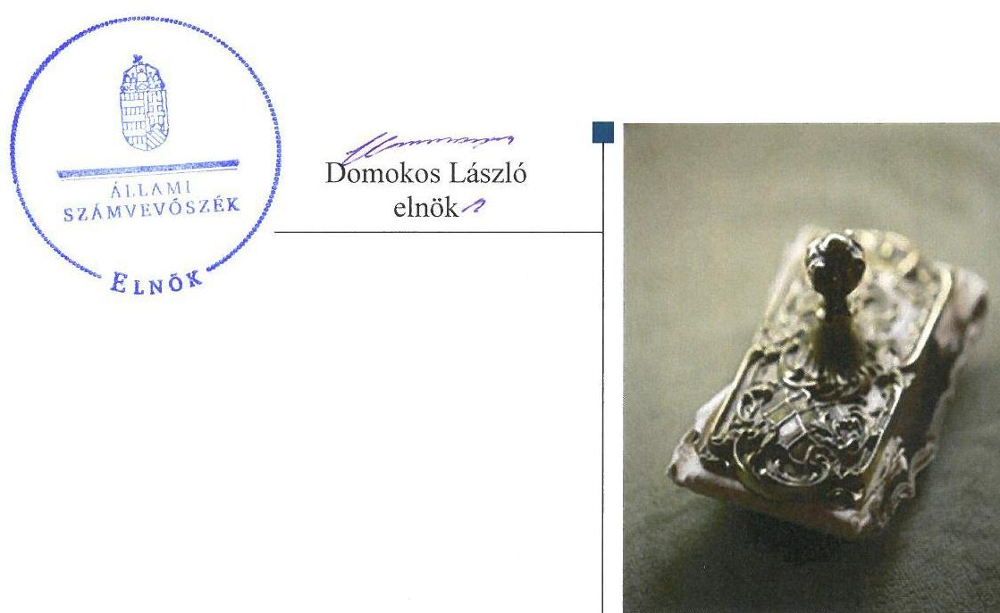
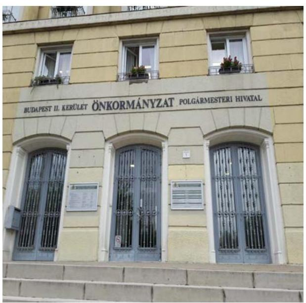
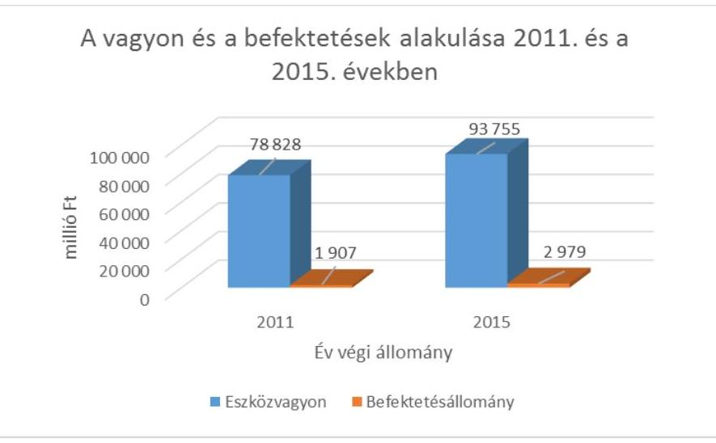
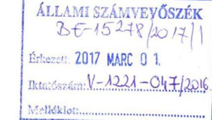
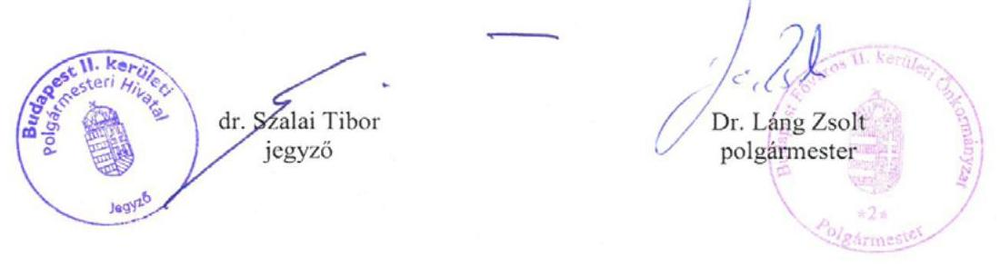
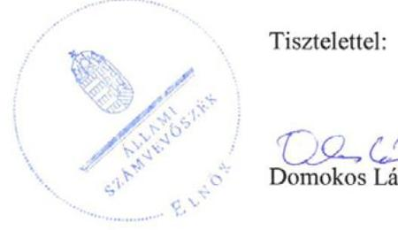

# Jelenetés 

## Önkormányzatok belső kontrollrendszere

Az önkormányzatok belső kontrollrendszere kialakításának és működtetésének ellenőrzése - Budapest Főváros II. Kerület 2017.

---

# Jelenetés 

## Önkormányzatok belső kontrollrendszere

Az önkormányzatok belső kontrollrendszere kialakításának és működtetésének ellenőrzése - Budapest Főváros II. Kerület 2017. 04. hó 04. nap

---

# AZ ELLENŐRZÉST FELÜGYELTE:

- RENKŐ ZSUZSANNA felügyeleti vezető
- AZ ELLENŐRZÉST VEZETTE ÉS A VÉGREHAJTÁSÁÉRT FELELŐS:
  - DR. TIMÁR BALÁZS ellenőrzésvezető
  - A PROGRAM ÖSSZEÁLLÍTÁSÁÉRT FELELŐS:
    - JANIK JÓZSEF LÁSZLÓ osztályvezető

**IKTATÓSZÁM:** V-1221-061/2016

**TÉMASZÁM:** 24

**ELLENŐRZÉS-AZONOSÍTÓ SZÁM:** V076403

Jelentéseink az Országgyűlés számítógépes hálózatán és az Interneten a www.asz.hu címen is olvashatóak.

---

# TARTALOMJEGYZÉK 

■ ÖSSZEGZÉS ..... 5
■ AZ ELLENŐRZÉS CÉLJA ..... 6
■ AZ ELLENŐRZÉS TERÜLETE ..... 7
■ AZ ELLENŐRZÉS HÁTTERE, INDOKOLTSÁGA ..... 8
■ A JELENTÉS LÉNYEGES KÉRDÉSKÖREI ..... 10
■ ELLENŐRZÉS HATÓKÖRE ÉS MÓDSZEREI ..... 11
■ MEGÁLLAPÍTÁSOK ..... 14
■ JAVASLATOK ..... 21
■ MELLÉKLETEK ..... 23
I. Sz. melléklet: Értelmező szótár ..... 23
II. Sz. melléklet: Az Önkormányzat által 2011-2015 között megszerzett értékpapírok áttekintő táblája ..... 28
III. Sz. melléklet: Az integritás érvényesítése érdekében kialakított és működtetett kontrollrendszer ..... 29
■ FÜGGELÉK: ÉSZREVÉTELEK ..... 31
■ RÖVIDÍTÉSEK JEGYZÉKE ..... 45

---

.

---

# ÖSSZEGZÉS 

A Budapest Főváros II. Kerületi Önkormányzat belső kontrollrendszerének kialakítása és működtetése összességében megfelelő volt, kontrolltevékenységek területén feltárt szabályozási és működési hibák ellenére biztosította a közpénzfelhasználás szabályosságát. Az Önkormányzat befektetési döntései és azok végrehajtása szabályszerűen történtek, azonban beszámolója nem az előírásoknak megfelelően mutatta be a befektetett közvagyon nagyságát. Az integritás szemlélet megfelelően érvényesült.

## Az ellenőrzés társadalmi indokoltsága

Magyarország Alaptörvénye az önkormányzatoktól is elvárja a kiegyensúlyozott, átlátható és fenntartható költségvetési gazdálkodás elvének érvényesítését. A korábbi évek ellenőrzési tapasztalatai, az önkormányzatok által betöltött társadalmi szerep, az általuk kezelt közpénz nagysága, a nemzeti vagyon átruházására vagy hasznosítására vonatkozó döntéseik sokrétűsége egyaránt indokolttá tették a számvevőszéki ellenőrzések folytatását.

A Budapest Főváros II. Kerületi Önkormányzat 2015. december 31-én 800,0 millió Ft államkötvény- és 732,0 millió Ft kamatozó kincstárjegy-állománnyal rendelkezett.

## Főbb megállapítások, következtetések, javaslatok

A belső kontrollrendszer kialakítása és működtetése összességében szabályszerű volt, a befektetésekkel való felelős, rendeltetésszerű gazdálkodást biztosították. A kötelezettségvállalások pénzügyi ellenjegyzésére és az érvényesítésre történő kijelölések a jogszabályi előírással ellentétesen történtek, emiatt nem volt biztosított a jogkörgyakorlók elszámoltathatósága. A befektetésekkel kapcsolatos kockázatok minimalizálása érdekében rendeletben rögzítették, hogy az átmenetileg szabad pénzeszközöket kizárólag államilag tőke- és hozamgarantált értékpapírokba vagy lekötött betétekbe fektethetik.

A befektetésekkel kapcsolatos döntések előkészítése, meghozatala szabályszerű volt. A befektetések számviteli elszámolása, nyilvántartása a 2013-2015. években a bekerülési érték helytelen megállapítása, a 2011-2015. években a részletező nyilvántartás hiányosságai, valamint a 2014-2015. években az értékpapíroknak nem megfelelő mérlegsoron történt kimutatása miatt nem volt szabályszerű.

Az Önkormányzatnál az integritás érvényesítése érdekében megtett intézkedések megfelelően biztosították a korrupciós és egyéb kockázatok kezelését.

---

# AZ ELLENŐRZÉS CÉLJA 

Az ellenőrzés célja annak megállapítása volt, hogy szabályszerűen történt-e az Önkormányzat ${ }^{1}$ belső kontrollrendszerének kialakítása és működtetése, az biztosította-e az önkormányzatnál a közpénzfelhasználás szabályosságát, a közpénzekkel és a nemzeti vagyonnal történő szabályszerű és felelős gazdálkodást, a beszámolási és adatszolgáltatási kötelezettségek szabályszerű teljesítését. Az ellenőrzés keretében értékeltük az önkormányzat korrupciós kockázatainak kezelését szolgáló integritás kontrollok kiépítettségét és az integritás szemlélet érvényesülését.

Az Önkormányzat egyes befektetési tevékenységeinek ellenőrzése során az ellenőrzés célja volt, hogy a kialakított kontrollkörnyezet biztosította-e a befektetési tevékenységek szabályszerű végzését. Megítéltük, hogy az egyes befektetési tevékenységekkel kapcsolatos döntéshozatal és a döntések végrehajtása, valamint az egyes befektetések számviteli elszámolása, nyilvántartása szabályszerű volt-e, és a belső és külső ellenőrzések hozzájárultak-e az egyes befektetési tevékenységek szabályszerűségéhez.

---

# **AZ ELLENŐRZÉS TERÜLETE**

## **Budapest Főváros II. Kerületi Önkormányzat**

Budapest II. Kerület állandó lakosainak száma 2015. január 1-jén 88 128 fő volt. Az Önkormányzat 21 tagú Képviselő-testületének munkáját nyolc állandó bizottság segítette. Az Önkormányzat a Hivatal²on kívül 21 intézménnyel, valamint hat, kizárólagos tulajdonában álló gazdasági társasággal látta el a feladatait.

A településen tizenegy helyi nemzetiségi (bolgár, görög, horvát, lengyel, német, örmény, roma, ruszin, szerb, szlovák és ukrán) önkormányzat működött.

Az ellenőrzött időszakban a tisztségét 2006 óta ellátó Polgármester³ és a hivatalát 2004 óta betöltő Jegyző⁴ személyében nem volt változás. A Hivatal önálló gazdasági szervezettel rendelkezett, a gazdasági vezető az Intézménygazdálkodási Iroda irodavezetője volt. A Képviselő-testület által irányított költségvetési szerveknél foglalkoztatottak száma 2015. december 31-én 1042 fő, a Hivatalban foglalkoztatottak száma 240 fő volt.

Az Önkormányzatnak 2015. évi költségvetési beszámolója szerint 14 002,7 millió Ft évi teljesített költségvetési bevétele és 6 388,4 millió Ft teljesített kiadása volt. Az Önkormányzat könyvviteli mérleg szerinti eszközvagyona 2015. december 31-én 93 754,8 millió Ft volt. A költségvetési évben esedékes kötelezettségek 95,8 millió Ft-ot, továbbá a költségvetési évet követően esedékes kötelezettségek állományi értéke 322,1 millió Ft-ot tett ki.

Az Önkormányzat vagyonának és befektetéseinek alakulását a 2011. év és a 2015. év végén az 1. ábra mutatja be:

1. ábra

*Forrás: ÁSZ saját kigyűjtés az Önkormányzat beszámolójából*

---

# AZ ELLENŐRZÉS HÁTTERE, INDOKOLTSÁGA 

A demokratikus társadalmakban alapvető igény, hogy a közpénzeket, a közvagyont használók tevékenységükről elszámoljanak, ahhoz egyértelmű és érvényesíthető felelősségi szabályok társuljanak. Ennek a jogos igénynek az érvényesítéséhez meg kell teremteni azokat a folyamatokat, rendszereket, amelyek nélkülözhetetlenek az elszámoltatáshoz. Az elszámoltatás eredményes működtetéséhez szükség van a megfelelő információs, kontroll-, értékelési- és beszámolási rendszerek kialakítására. A belső kontrollok kiépítettsége hozzájárul az integritási szemlélet kialakításához és érvényesüléséhez. A belső kontrollrendszer azt a célt szolgálja, hogy a költségvetési szervek működésük és gazdálkodásuk során a tevékenységeket szabályszerűen, gazdaságosan, hatékonyan és eredményesen hajtsák végre, teljesítsék elszámolási kötelezettségeiket és megvédjék erőforrásaikat a veszteségektől, a károktól és a nem rendeltetésszerű használattól. A belső kontrollrendszer magában foglalja mindazon szabályokat, eljárásokat, gyakorlati módszereket és szervezeti struktúrákat, kockázatkezelési technikákat, kontrolltevékenységeket, amelyek segítséget nyújtanak a szervezetnek céljai eléréséhez. A belső kontrollrendszer szabályozása háromszintű: a törvényi előírásokat az Áht. ${ }^{5}$ és a Mötv. ${ }^{6}$, a rendeleti szintű szabályozást az Ávr. ${ }^{7}$ és a Bkr. ${ }^{8}$ tartalmazza, amelyeket útmutatói szinten az NGM${ }^{9}$ által kiadott standardok és kézikönyvek támogatnak.

A MEGFELELŐ BELSŐ KONTROLLRENDSZER jelentősen csökkenti a hibák és szabálytalanságok kockázatát. Az ÁSZ célja, hogy javuljon az ellenőrzött önkormányzatok belső kontrollrendszerének szabályozottsága, működésének megfelelősége, hozzájárulva ezzel az egyensúlyi helyzet fenntarthatóságának biztosításához, biztosítva az önkormányzatnál a közpénzfelhasználás szabályosságát, a közpénzekkel és a nemzeti vagyonnal történő szabályszerű, gazdaságos, hatékony és eredményes gazdálkodást. Az ÁSZ ellenőrzés tapasztalatai nem csupán a közvetlenül ellenőrzött önkormányzatokat segíthetik, hanem a „jó gyakorlat" elterjesztésével azok az önkormányzatok is átvehetik a pozitív példákat, ahol nem végez ellenőrzést az ÁSZ.

Az MNB ${ }^{10}$ három befektetési szolgáltató tevékenységi engedélyét 2015. első felében visszavonta és kezdeményezte a vállalkozások felszámolását a működéssel kapcsolatos szabálytalanságok, hiányosságok miatt. A befektetési vállalkozások problémás helyzetbe kerülése jelentős veszteségekhez vezetett számos önkormányzat esetében. A korábbi évek ellenőrzési tapasztalatai alapján fennáll a lehetősége annak, hogy az önkormányzatok befektetési döntései, továbbá a döntések végrehajtása és számviteli elszámolása nem voltak teljes mértékben szabályszerűek, a belső kontrollrendszer és a kapcsolódó külső ellenőrzések sem működtek minden esetben megfelelően.

AZ ÖNKORMÁNYZATI VAGYONGAZDÁLKODÁS keretében az önkormányzatok átmenetileg szabad pénzeszközeinek befektetését jogszabály nem tiltja, a befektetések jellege nem korlátozott, a pénzpiaci szolgáltatók közül az önkormányzatok a kínált szolgáltatás és annak

---

költségei alapján, szabadon választhatnak, azonban a veszteséges gazdálkodás kockázatai és következményei az önkormányzatokat terhelik. A szabad pénzeszközök felhasználása során kiemelten fontos a felelős gazdálkodás érvényesülése, amely összhangban kell, hogy legyen az önkormányzati gazdálkodás alapelveivel.

A közintézmények integritás alapú kultúrájának kialakítása, megerősítése és működése szorosan összefügg a belső kontrollrendszer működésével, ezért az ellenőrzés kiterjed annak értékelésére is, hogy a belső kontrollrendszer kialakítása és működtetése hogyan hatott az integritás szemlélet érvényesülésére.

# AZ ELLENŐRZÉS VÁRHATÓ HASZNOSULÁSA 

NÉGY SZINTEN valósul meg. A törvényalkotás számára összegzett tapasztalatok állnak rendelkezésre a belső kontrollrendszer önkormányzati területen való kialakításáról, működtetéséről és hatásairól. Az ellenőrzés az ellenőrzött számára visszajelzést ad a belső kontrollrendszer kialakításában és működésében lévő hiányosságokról, javaslataival hozzájárul azok kiküszöböléséhez. Az ellenőrzés megállapításait és javaslatait más szervezetek is hasznosíthatják a rendezett gazdálkodási keretek kialakításához. A társadalom számára jelzi, hogy közpénz nem maradhat ellenőrizetlenül, az ÁSZ értékteremtő rend kialakításához és megőrzéséhez hozzájáruló tevékenysége pozitív hatással lesz a szervezetről kialakított összkép formálásában.

Az ellenőrzéssel feltárásra kerülhetnek azok a kockázatok, amelyek az önkormányzatok gazdálkodásával, ezen belül befektetési tevékenységeivel, kontrollkörnyezetével kapcsolatosak és a befektetési tevékenységek szabályszerű végrehajtását befolyásolják. Az ellenőrzéssel az önkormányzatok befektetési/vagyongazdálkodási döntéseinek összessége értékelhetővé válik, és megalapozott megállapítás tehető arra vonatkozóan, hogy milyen hatást gyakoroltak az önkormányzat vagyonára a képviselő-testület döntései.

---

# A JELENTÉS LÉNYEGES KÉRDÉSKÖREI 

1.     - Az önkormányzat belső kontrollrendszerének kialakítása és működtetése a 2015. évben szabályszerű volt-e, az biztosította-e a közpénzfelhasználás szabályosságát, a nemzeti vagyonnal történő felelős gazdálkodást, valamint a belső kontrollrendszer egyes pillérei biztosították-e a befektetési tevékenységek szabályszerű végzését a 2011 - 2015. években?
2.     - Az egyes befektetésekkel kapcsolatos döntéshozatal és a döntések végrehajtása szabályszerű volt-e?
3.     - Az egyes befektetések számviteli elszámolása, nyilvántartása szabályszerű volt-e?
4.     - Az önkormányzatnál az integritás szemlélet érvényesült-e és ennek megfelelően kiépítették-e az integritás kontrollrendszert?

---

# ELLENŐRZÉS HATÓKÖRE ÉS MÓDSZEREI 

## Az ellenőrzés típusa

A belső kontrollrendszer ellenőrzése esetében megfelelőségi ellenőrzés, a befektetési tevékenységnél szabályszerűségi ellenőrzés.

## Az ellenőrzött időszak

A belső kontrollrendszer kialakításának és működtetésének ellenőrzése a 2015. január 1. és december 31. közötti időszakra terjedt ki. Az önkormányzatok egyes befektetési tevékenységeinek ellenőrzése tekintetében az ellenőrzött időszak a 2011. január 1. - 2015. december 31. közötti időszak. Ezen felül az önkormányzat befektetésekkel kapcsolatos döntés-előkészítésének és döntéshozatalának szabályszerűségét a 2011. január 1. előtti időszakra visszanyúlóan is ellenőriztük, amennyiben a 2015. december 31-én meglévő befektetéseire 2011. január 1-je előtt került sor. Az integritás szemlélet érvényesülését a 2015. évre vonatkozó adatszolgáltatás alapján értékeltük.

## Az ellenőrzés tárgya

A helyi önkormányzatnak, mint éves költségvetési beszámoló készítésére kötelezett szervezetnek és polgármesteri hivatalának belső kontrollrendszere. Az integritás szemlélet érvényesülése.

Az önkormányzat 2015. december 31-én meglévő, értékpapírokban megtestesülő befektetései, lekötött betétei, valamint az önkormányzat üzleti vagyonába tartozó ingatlanok, kulturális javak (műtárgyak, műalkotások, stb.), illetve a feladatellátást nem szolgáló egyéb értéktárgyak (pl. ékszerek, befektetési nemesfém).

Az ellenőrzés kiterjedt minden olyan körülményre és adatra, amely az ÁSZ jogszabályban meghatározott feladatainak teljesítéséhez, valamint a program végrehajtása folyamán felmerült újabb összefüggések feltárásához szükséges volt.

## Az ellenőrzött szervezet

Budapest Főváros II. Kerületi Önkormányzat (az Önkormányzat mint egyes feladatai vonatkozásában - önálló éves költségvetési beszámoló készítésére kötelezett, valamint az Önkormányzat gazdálkodási feladatait ellátó Polgármesteri Hivatal).

---

# Az ellenőrzés jogalapja 

Az ÁSZ tv.
 1. § (3) bekezdésében foglaltak alapján az ÁSZ általános hatáskörrel végzi a közpénzekkel és az állami és önkormányzati vagyonnal való felelős gazdálkodás ellenőrzését. Az ÁSZ tv. 5. § (2) bekezdése alapján az államháztartás gazdálkodásának ellenőrzése keretében az ÁSZ ellenőrzi a helyi önkormányzatok gazdálkodását, valamint az ÁSZ tv. 5. § (6) bekezdése alapján ellenőrzése során értékeli az államháztartás számviteli rendjének betartását és a belső kontrollrendszer működését.

## Az ellenőrzés módszerei

Az ellenőrzést a nemzetközi standardokat irányadónak tekintve az ellenőrzési program szempontjai, kérdései, az ellenőrzött időszakban hatályos jogszabályok, az ellenőrzés szakmai szabályok és módszertanok figyelembe vételével végeztük.

Az ellenőrzés lefolytatásához az önkormányzat a tanúsítványok elektronikus kitöltésével, valamint az ÁSZ által kért dokumentumok elektronikus megküldésével szolgáltatott adatokat. A rendelkezésre bocsátott adatok, információk kontrollja az ellenőrzés keretében történt. A jelentésben használt fogalmak magyarázatát az I. sz. melléklet, az integritás érvényesítése érdekében kialakított és működtetett kontrollrendszer minősítését a III. sz. melléklet tartalmazza.

A belső kontrollrendszer jogszabályi előírások szerinti kialakításának és működtetésének szabályszerűségét, az erre irányuló ellenőrzési kérdésekre adott válaszok összesítése alapján a 2015. január 1. és december 31. közötti időszakra, pillérenként (kontrollkörnyezet, kockázatkezelési rendszer, kontrolltevékenységek, információs és kommunikációs rendszer, monitoring rendszer) és összesítetten is értékeltük.

A belső kontrollrendszer egyes pilléreinek kialakítása és működtetése „szabályszerű" volt, amennyiben az értékelt területen az elért igen válaszok százalékban kifejezett, egész számra kerekített aránya meghaladta a 85%-ot, „részben szabályszerű" volt, ha a 85%-ot nem haladta meg, de 60%-nál nagyobb volt, „nem szabályszerű" volt, ha nem haladta meg a 60%-ot. Az önkormányzat belső kontrollrendszerének összesített értékelése megegyezett a pillérenként (kontrollterületenként) alkalmazott százalékos értékelésekkel, a következő eltérésekkel. A kontrollrendszer egésze esetében a „szabályszerű" értékelésnek a százalékos értéken felül további feltétele volt, hogy egyik kontrollterület sem kaphat „nem szabályszerű" értékelést, a „részben szabályszerű" értékelés további feltétele volt, hogy legfeljebb egy ellenőrzött kontrollterület lehetett „nem szabályszerű" értékelésű. Az összesített értékelés a százalékos értéktől függetlenül „nem szabályszerű" volt, ha az ellenőrzött kontrollterületek közül több mint egynek „nem szabályszerű" volt az értékelése.

A kontrolltevékenységek működésének megfelelőségét a foglalkoztatottak személyi juttatásaival, a külső személyi juttatásokkal, a működési kiadásokkal és a felhalmozási célú kiadásokkal kapcsolatos kifizetések esetében mintavétellel ellenőriztük. „Megfelelőnek" értékeltünk egy ellenőrzött

---

területet, amennyiben 95%-os bizonyossággal a teljes sokaságban a hibaarány legfeljebb 10%, „nem megfelelőnek", amennyiben 10%-nál magasabb arányt képviselt. Abban az esetben, ha a teljes sokaság tekintetében a 10%-os hibaarányhoz való viszony megítélésének megbízhatósága nem érte el a 95%-ot, annak elérése érdekében értékelésünket további szempontokkal egészítettük ki, és figyelembe vettük a feltárt hibák értékét.

Az integritás szemlélet érvényesülésének értékelése az önkormányzat által kitöltött kérdőív alapján, az abban foglalt válaszok megalapozottságának kontrollja mellett történt.

---

# MEGÁLLAPÍTÁSOK 

## 1. Az önkormányzat belső kontrollrendszerének kialakítása és működtetése a 2015. évben szabályszerű volt-e, az biztosította-e a közpénzfelhasználás szabályosságát, a nemzeti vagyonnal történő felelős gazdálkodást, valamint a belső kontrollrendszer egyes pillérei biztosították-e a befektetési tevékenységek szabályszerű végzését a 2011 - 2015. években?

Összegző megállapítás

A befektetési tevékenységeket érintően a 2011-2015. években a belső kontrollrendszer egyes pillérei a befektetések szabályszerűségét összességében biztosították.
A gazdálkodás egészét tekintve a belső kontrollrendszer 2015. évi kialakítása és működtetése a kontrolltevékenységek kivételével összességében szabályszerű volt, az biztosította a közpénzfelhasználás szabályosságát és a nemzeti vagyonnal való felelős gazdálkodást.

A befektetési tevékenységet érintően a 2011-2015. években önkormányzati rendeletekben rögzítették a befektetések végzésével kapcsolatos hatásköri szabályokat, így azok biztosították a befektetési tevékenység szabályszerű végzését.
A gazdálkodás egészét érintően a 2015. évben a belső kontrollrendszer kontrollkörnyezet pillérének kialakítása és működtetése az Önkormányzatnál és a Hivatalnál szabályszerű volt.

2011. JANUÁR 1. ÉS 2015. DECEMBER 31. KÖZÖTT az Önkormányzat szervezeti és szabályozási kereteit a Képviselőtestület ${ }^{11}$ kialakította, ezen belül
$\longrightarrow$ rendelkezett az Ötv. ${ }^{12}$ és az Mötv. előírásainak megfelelő tartalmú Önkormányzati SZMSZ ${ }^{13}$-szel. A Képviselő-testület az Önkormányzati SZMSZ-ben a 2011-2012. években az Ötv. előírásainak megfelelően a Polgármesterre, a 2013. évtől az Mötv. előírásainak megfelelően a Polgármesterre és a Jegyzőre ruházott át hatásköröket. A bizottságokra átruházott hatásköröket - köztük a Költségvetési Bizottság ${ }^{14}$ nak 50 millió Ft értékhatárig tőzsdei értékpapírok értékesítéséről, megvásárlásáról hozandó döntésekre vonatkozóan - külön hatásköri rendelet ${ }^{15}$ ben rögzítették.
$\longrightarrow$ vagyonrendeletében Htv ${ }^{16}$-nek megfelelően, az Ötv. és az Nvtv. ${ }^{17}$ rendelkezéseinek megfelelő tartalommal elfogadta az önkormányzati vagyonnal történő gazdálkodás szabályait a teljes vagyoni körre kiterjedően.

---

A Képviselő-testület a gazdasági program ${ }_{1,2}{ }^{18}$ t a Htv.-ben előírt módon, az Ötv.-ben és az Mötv.-ben meghatározott határidőben és tartalommal elfogadta. A gazdasági program ${ }_{1,2}$-ben rögzítésre került az Önkormányzat befektetési politikája is.

Az Önkormányzat a 2011-2015. években a jogszabályi előírásoknak megfelelően megállapította költségvetéseit, melyeket mellékszámításokkal alapozott meg. A költségvetési rendelet ${ }_{1-5}{ }^{19}$ az Áht. ${ }_{1,2}$ által előírt elemeket tartalmazta és rögzítette a befektetésekkel kapcsolatos döntési hatásköröket és végrehajtási feladatokat. A költségvetési rendelet ${ }_{4-5}$ a fentieken felül azt is előírta, hogy a Polgármester „Belföldi értékpapírok kiadásai" jogcímen befektetési céllal jóváhagyott átmenetileg szabad pénzeszközt a Költségvetési Bizottság javaslata alapján maximum két évre államilag garantált értékpapír - államkötvény - vásárlására fordíthatja. A költségvetési rendelet ${ }_{1-5}$-ben az átruházott hatáskör gyakorlójának beszámolási kötelezettségét az Ötv., illetve az Mötv. rendelkezéseivel összhangban előírták.

# A 2015. ÉVI GAZDÁLKODÁS EGÉSZÉT MEGHATÁ- 

ROZÓ KONTROLLKÖRNYEZETET tekintve a Hivatal rendelkezett a jogszabályi előírásoknak megfelelő tartalmú alapító okirattal, Hivatali SZMSZ ${ }^{20}$-szel, a Képviselő-testület által meghatározott hivatásetikai alapelvekkel és az etikai eljárás szabályaival ${ }^{21}$, továbbá a Számv. tv. ${ }^{22}$ és az Áhsz. ${ }^{23}$ előírásainak megfelelő számviteli politika ${ }_{1-3}{ }^{24}$ mal, számlarend ${ }_{1-}$ ${ }^{25}$ mal, leltározási szabályzattal ${ }^{26}$, értékelési szabályzat ${ }_{1,2}{ }^{27}$ vel és pénzkezelési szabályzat ${ }_{1,2}{ }^{28}$ vel. Valamennyi szabályozás kiterjedt az Önkormányzatra is. A Hivatal ezen kívül önköltség-számítási szabályzattal ${ }^{29}$ is rendelkezett.

A Jegyző és a Hivatal pénzügyi-számviteli területen dolgozó köztisztviselői a Kttv. ${ }^{30}$-nek megfelelő munkaköri leírással rendelkeztek. A közszolgálati jogviszony megszűnése, a munkakör változása esetére a munkakör átadásának rendjét a Kttv. és az lkr. ${ }^{31}$ előírásainak megfelelően szabályozták.

### 1.2. számú megállapítás

A befektetéseket érintően a 2011-2015. években a kockázatkezelési rendszer a befektetési tevékenység szabályszerű végzését biztosította. A gazdálkodás egészét érintően a 2015. évben a kockázatkezelési rendszer kialakítása és működtetése szabályszerű volt.

2011. JANUÁR 1. ÉS 2015. DECEMBER 31. KÖZÖTT az Önkormányzat gazdálkodásának részét képező befektetésekkel kapcsolatos kockázatok felmérésére - a Bkr. 7.§ (2) bekezdésének előírása ellenére - nem került sor, a költségvetési rendelet ${ }_{1-5}$ azonban az Önkormányzat a szabad pénzeszközei terhére történő befektetések lehetőségét államkötvényekre korlátozta, melyek tőke- és hozamgarantáltak, ezáltal valamennyi befektetés alacsony kockázatú volt.

A 2015. ÉVBEN a Kontrollrendszer ${ }_{1,2}{ }^{32}$ szabályzatának részeként a Bkr.-nek megfelelően kialakította a Hivatal kockázatkezelési rendszerét, annak működtetése során a Bkr. előírásának megfelelően felmérték a Hivatal tevékenységében, gazdálkodásában rejlő kockázatokat. A feltárt kockázatok elemzése, értékelése szervezeti egységenként történt, ennek alap-

---

### 1.3. számú megállapítás

1.4. számú megállapítás
ján kockázati térképet készítettek, mely a Hivatal minden szervezeti egységére vonatkozóan tartalmazta a kritikus kockázati tényezőket, a szükséges intézkedéseket, ezek felelőseit, végrehajtásának határidejét.

A kontrolltevékenység a 2015. évben a pénzügyi jogkörök jogszabállyal ellentétes belső szabályozása és gyakorlása miatt nem volt szabályszerű, ezáltal a jogkörgyakorlók elszámoltathatósága nem volt biztosított.

A 2015. ÉVBEN az Önkormányzat és a Hivatal az Áht. 2 és az Ávr. előírásainak megfelelően rendelkezett a gazdálkodási szabályzat ${ }_{1,2}{ }^{33}$-vel. E szabályzatokban és a Kontrollrendszer ${ }_{1,2}$-ben az Ávr. és a Bkr. rendelkezéseinek megfelelően rögzítették a tervezéssel, illetve az ellenőrzési és kontrolleljárásokkal kapcsolatos belső előírásokat, feltételeket, szabályozták a beszámoltatási és adatszolgáltatási feladatok teljesítését. A gazdálkodási szabályzat ${ }_{1,2}$-ben az Ávr. előírásának megfelelően rögzítették a százezer forintot el nem érő kiadási tételek kifizetésének rendjét is.

A gazdálkodási szabályzat ${ }_{1,2}$ nem felelt meg az Ávr. 55. § (2) bekezdésének f) pontjában és az 58. § (4) bekezdésében foglalt előírásoknak, mivel e jogszabályok rendelkezéseivel ellentétben nem a gazdasági vezető, hanem a Jegyző feladata volt a pénzügyi ellenjegyzésre és érvényesítésre történő kijelölés.

A kötelezettségvállalásra, teljesítés-igazolásra és utalványozásra történő kijelölések során szabályszerűen jártak el. A kötelezettségvállalásokról az Áhsz. ${ }_{2}$ előírásának megfelelő tartalmú nyilvántartással rendelkeztek.

A teljesítésigazolás működtetése során előfordult, hogy a teljesítést az Ávr. 57. § (3) bekezdésének előírása ellenére nem az arra jogosult személy aláírásával, illetve a teljesítésigazolás dátumának megjelölése nélkül igazolták. Az érvényesítés működtetése a 2015. évben nem volt megfelelő, mert az érvényesítés során az Ávr. 58. § (2) bekezdésének előírása ellenére az utalványozónak nem jelezték, hogy a pénzügyi ellenjegyzésre történő kijelölés Ávr. 55. § (2) bekezdése f) pontjában rögzített szabályait megsértették.

A kontrolltevékenységek 2015. évi működtetése során az Ávr.-ben rögzített összeférhetetlenségi előírásokat az Önkormányzat és a Hivatal maradéktalanul betartotta.

A befektetési tevékenységeket érintően a 2014-2015. években az értékpapír-vásárlások adatait nem tették közzé, ezzel az Önkormányzat befektetéseinek nyilvánosságát nem biztosították. A gazdálkodás egészére nézve a 2015. évben az információs és kommunikációs rendszer kialakítása és működtetése szabályszerű volt.

| 1. táblázat |  |   |
| --- | --- | --- |
|  ÉRTÉKPAPÍR-VÁSÁRLÁSOK (2014-2015) |  |   |
|  Értékpapír | Szerződéskötés | Összeg (szer 21)  |
|  Államkötvény | 2014.11.25 | 599996  |
|  Államkötvény | 2014.11.25 | 799992  |
|  Kincstárjegy | 2015.12.01 | 732020  |
|   | Forrás: ASZ saját kigyűjtés |   |

Az Önkormányzatnak a Raiffeisen Bank Zrt.-vel az 1. táblázatban bemutatottak szerinti értékpapírok megszerzésére vonatkozó szerződés/jegyzés megnevezését (típusát), tárgyát, a szerződő fél (megbízott) nevét, a szerződés (megbízás) értékét - az Info. tv. ${ }^{34}$ 37. § (1) bekezdésének és 1. melléklete III/4. pontjának előírása ellenére - a honlapon nem tették közzé.

A 2015. ÉVBEN a jogszabályoknak megfelelően rendelkeztek az információáramlásra és beszámolásra vonatkozó követelményekről, a köte-

---

### 1.5. számú megállapítás

1.6. számú megállapítás
lezően közzéteendő adatok nyilvánosságra hozatalának rendjéről, a közérdekű adatok megismerésére irányuló igények teljesítésének eljárásrendjéről és az iratkezelés szabályozásáról.

A befektetési tevékenységeket érintően a 2011-2015. években nem folytattak le külső és belső ellenőrzéseket, ezáltal a befektetésekkel kapcsolatos számviteli hibák, illetve hiányosságok nem kerültek feltárásra. A gazdálkodás egészét tekintve a 2015. évi monitoring rendszer, és ennek keretében a belső ellenőrzés kialakítása és működtetése összességében szabályszerű volt.

A 2011-2015. ÉVEKBEN végzett külső és belső ellenőrzések az Önkormányzat befektetéseire, azok számviteli elszámolására, nyilvántartására nem terjedtek ki, ezért ezek nem voltak képesek feltárni az Önkormányzat által megszerzett, tartós hitelviszonyt megtestesítő
 értékpapírok besorolásának, a bekerülési érték meghatározásának hibáit, illetve az értékpapírok részletező nyilvántartásának tartalmi hiányosságait.

A 2015. évben Jegyző a Bkr-nek megfelelően meghatározta a szervezeti célok elérését szolgáló feladatok, folyamatok, tevékenységek mérését, monitorozását, nyomon követését, amelyekhez a célok megvalósulását mérő szempontokat, indikátorokat rendelt.

A belső ellenőrzés szabályozására, a belső ellenőrök képesítésére, feladatainak meghatározására, szervezeti és funkcionális függetlenségének biztosítására vonatkozó jogszabályokat maradéktalanul betartották. A belső ellenőrzés tervezése és működtetése a Bkr. előírásainak megfelelően történt, azonban a 2015. évi belső ellenőrzési tervet csak részben hajtották végre, 20 ellenőrzésből hét elmaradt, az összefoglaló éves ellenőrzési jelentésben az ellenőrzési tervtől való eltéréseket és annak indokait rögzítették.

A belső kontrollrendszer értékeléséről szóló, 2015. évre vonatkozó
jegyzői nyilatkozatban foglaltakat jelen ellenőrzés - a kontrolltevékenységek kivételével - megerősítette.

A 2015. évben a Jegyző a Bkr. 1. melléklete szerinti nyilatkozatban értékelte az Önkormányzat belső kontrollrendszerének minőségét. Jelen ellenőrzés a kontrollkörnyezet, a kockázatkezelési rendszer, az információs és kommunikációs rendszer, továbbá a monitoring rendszer esetében megerősítette az értékelést, a kontrolltevékenységek kialakítása és működtetése területén azonban ettől eltérően hiányosságokat állapított meg.

Az Éves Ellenőrzési Jelentés elkészítése, előterjesztése és a Képviselőtestület általi jóváhagyása minden tekintetben a Bkr. előírásainak megfelelően történt.

---

### 1.7. számú megállapítás

A 2015. évben a helyi nemzetiségi önkormányzatok gazdálkodással kapcsolatos feladatait ellátták, azonban a pénzügyi jogkörökre történő szabálytalan kijelölés miatt a jogkörgyakorlók elszámoltathatósága nem volt biztosított.

Az önkormányzati választásokat és a 2014. október 27-i alakuló ülést követően a jogszabályi előírásoknak megfelelően a nemzetiségi önkormányzatokkal az együttműködési megállapodásokat megkötötték, a számviteli szabályzatok hatályát a nemzetiségi önkormányzatokra kiterjesztették.

A Jegyző az Áht. 2. előírásának megfelelően előkészítette a helyi nemzetiségi önkormányzatok 2015. évi költségvetési határozat-tervezeteit, illetve a 2015. évre vonatkozó zárszámadási határozat-tervezeteit.

Az Ávr. 55. § (2) bekezdése g) pontjának előírása ellenére az együttműködési megállapodások a pénzügyi ellenjegyzési feladatra történő írásbeli kijelölés jogkörére a gazdasági vezető helyett a Jegyzőt jogosították fel, illetve a gyakorlatban ugyanezen jogszabályt megsértve a pénzügyi ellenjegyzésre történő, valamint az Ávr 58. § (4) bekezdésének előírását megsértve az érvényesítésre történő kijelölést a gazdasági vezető helyett a Jegyző végezte.

# 2. Az egyes befektetésekkel kapcsolatos döntéshozatal és a döntések végrehajtása szabályszerű volt-e? 

## Összegző megállapítás

2.1. számú megállapítás
2. táblázat

## ÉRTÉKPAPÍROK 2015.12.31-ÉN (MILLIÓ FORINT)

| Értékpapír   megnevezése | Megszerzés   dátuma | Összeg |
| :--: | :--: | :--: |
| Magyar Állam-   kötvény   2016/C | 2014.11.25. | 800,0 |
| Kamatozó   Kincstárjegy   KKJ 161207 | 2015.12.01. | 732,0 |

A befektetésekkel kapcsolatos döntéshozatal és a döntések végrehajtása szabályszerűen történt.

A befektetésekkel kapcsolatos döntés-előkészítés és a döntések meghozatala a költségvetési rendeletekben rögzített felhatalmazásoknak megfelelően, szabályosan történt.

Az Önkormányzat 2015. december 31-én tartós hitelviszonyt megtestesítő értékpapírokkal: Magyar Államkötvénnyel és Kamatozó Kincstárjeggyel rendelkezett, összesen 1 532,0 millió Ft értékben, az 2. táblázatban részletezett bontásban. Az Önkormányzat nem közfeladat ellátását szolgáló tulajdoni részesedéssel, lekötött betéttel, befektetési célú ingatlannal, kulturális javakkal az ellenőrzött időszakban nem rendelkezett.

Az ellenőrzés tárgyát képező értékpapír-vásárlások 2014-ben és 2015-ben történtek. A döntések előkészítése mindkét esetben a költségvetési rendelet ${ }_{4,5}$ előírásainak megfelelően - ajánlatkéréssel, a beérkezett ajánlatoknak a Költségvetési Bizottság általi megtárgyalását követő, határozatba foglalt döntési javaslattal - történt. A javaslat alapján az adásvételi szerződés megkötéséről a költségvetési rendelet ${ }_{4,5}$ rendelkezésének megfelelően a Polgármester döntött.

Az Önkormányzat az értékpapírokat szabad forrásai, a Költségvetési rendeletében befektetési céllal jóváhagyott átmenetileg szabad pénzeszközei terhére, az Ötv., Mötv. előírásainak megfelelően és a gazdasági programjával összhangban vásárolta.

---

# 2.2. számú megállapítás 

A befektetési döntések végrehajtása az elfogadott ajánlatokkal összhangban, szabályszerűen történt.

Az Önkormányzat nem befektetési vállalkozóval, hanem kizárólag a számlavezető bankjával kötött az elfogadott ajánlattal tartalmilag megegyező adásvételi szerződést, illetve a kamatozó kincstárjegyek megszerzését megelőzően - szintén az elfogadott ajánlatnak megfelelően - jegyzési ívet írtak alá. Az adásvételi szerződést és a jegyzési ívet a Tpt. előírásának megfelelően írásba foglalták.

A 2014. és 2015. évben megszerzett, tartós hitelviszonyt megtestesítő értékpapírokba történt befektetésekről a Polgármester a zárszámadási rendelet ${ }_{1,2}{ }^{35}$ tervezetének előterjesztése során a költségvetési rendelet ${ }_{4,5}$ előírásainak megfelelően részletesen beszámolt a Képviselő-testületnek.

Az Önkormányzatnak a Raiffeisen Bank Zrt.-vel 2007. augusztus 10-én megkötött - a 2014-2015-ben végrehajtott értékpapír ügyletek szabályozására is kiterjedő - Keretszerződése ${ }^{36}$ rögzítette a rendelkezési jogosultsággal kapcsolatos kérdéseket, melyek megfelelő garanciát nyújtottak arra, hogy az Önkormányzat jóváhagyása nélkül ne kerülhessen sor a befektetésekkel kapcsolatos döntésekre.

## 3. Az egyes befektetések számviteli elszámolása, nyilvántartása szabályszerű volt-e?

## Összegző megállapítás

### 3.1. számú megállapítás

3. táblázat

## ÉRTÉKPAPÍROK SZÁMVITELI

ELSZÁMOLÁSA (2013-2015, EZER FT)

| Év | Nyilvántartott érték | Érték felhalmozott   kamat   nélkül | Különbözet |
| :--: | :--: | :--: | :--: |
| 2013. | 749991 | 688420 | 61571 |
| 2014. | 2149979 | 1984400 | 165579 |
| 2015. | 1532012 | 1465360   Forrás: ÁSZ saját kigyűjtés | 66652 |

A befektetések számviteli elszámolása, nyilvántartása a bekerülési érték helytelen meghatározása és az év végi átsorolások elmulasztása miatt nem volt szabályszerű.

A 2013-2015. években a számviteli elszámolás, nyilvántartás az államkötvények bekerülési értékének helytelen meghatározása, továbbá a 2011-2015. években az analitikus nyilvántartás előírt tartalmi elemeinek hiánya miatt nem volt szabályszerű.

Az Önkormányzat által a 2011. évet megelőzően megszerzett, 2012-ben lejárt államkötvényeket a 2011. évben a Számv. tv. és az Áhsz. 1. előírásainak megfelelő bekerülési értéken tartották nyilván. A 2013-2014. években megvásárolt állampapírok nyilvántartott értéke a Számv. tv. 50. § (3) bekezdésének, az Áhsz 1. 29. § (2) bekezdésének és az Áhsz 2. 1. § 7. pontjának előírása ellenére a felhalmozott kamatokat is tartalmazta. A helytelen nyilvántartási értékekből adódó különbözeteket a 3. táblázatban mutatjuk be.

Az értékpapírok analitikus nyilvántartásával a 2011-2015. években rendelkeztek, az azonban a 2011-2013. években az Áhsz. 1. 9. melléklete 1. h) pontjának előírása ellenére nem tartalmazta az értékpapírok egyedi értékeléséhez szükséges adatokat (értékvesztés, elszámolt értékvesztés visszaírása) értékpapír-típusonként, a 2014-2015. években nem tartalmazta az Áhsz 2. 14. melléklete VIII. 1. pontja
-c) alpontjának előírása ellenére az értékpapír beszerzésének célját, számviteli besorolását,
-d) alpontjának előírása ellenére a bekerülési érték megállapításának módját,

---

$\longrightarrow$ e) alpontjának előírása ellenére az értékpapír beváltásának feltételeit, lejárati módját, a kamatfizetések összegeit és időpontjait,
$\longrightarrow$ g) alpontjának előírása ellenére értékpapír értékeléséhez szükséges adatokat,
$\longrightarrow$ i) alpontjának előírása ellenére az értékpapír Nvtv. szerinti besorolását.
3.2. számú megállapítás

A 2011-2015. években az év végi leltározási, értékelési feladatokat szabályszerűen végezték. A 2014. és a 2015. év végi számviteli zárlati munkálatok során a jogszabálynak megfelelő átsorolásokat az értékpapírok esetében nem végezték el.

A leltározási szabályzat ${ }_{1,2}$ ben az értékpapírokkal kapcsolatban évenkénti, egyeztetéssel történő leltározást, az idegen helyen tárolt befektetett eszközök esetén évenkénti tárolási nyilatkozat bekérését írták elő. Az előírt leltározást a leltározási szabályzat ${ }_{1,2}$-nek megfelelően minden évben dokumentáltan elvégezték. Az év végi leltározáshoz az Önkormányzat rendelkezésére álltak az értékpapírszámla-vezetők által a mérleg-fordulónapra szóló letéti igazolások, valamint 2014. és 2015. években a Raiffeisen Bank Zrt. által a mérleg-fordulónapra kibocsátott egyenlegértesítők, ezzel a Számv. tv-nek és az Áhsz.1,2-nek megfelelően biztosították a mérleg leltárral történő alátámasztottságát. A mérlegben kimutatott eszközök és források év végi értékelését a 2011-2015. években a Számv. tv-nek és az Áhsz.1,2-nek megfelelően végezték, piaci értéken történő értékeléssel nem éltek. Értékvesztést értékpapírok esetében nem számoltak el.

A Számv. tv. 30. § (5) bekezdése értelmében a forgatási célú hitelviszonyt megtestesítő értékpapírok között kell kimutatni azokat, amelyek a tárgyévet követő üzleti évben lejárnak. Az Önkormányzat a fenti jogszabály és az Áhsz. 10. § (5) és (6) bekezdéseinek előírása ellenére a 2015. évben lejáró értékpapírokat a 2014. évi beszámolójában 1349986 ezer Ft értékben, a 2016. évben lejáró értékpapírokat a 2015. évi beszámolójában 1532012 ezer Ft értékben nem a forgatási célú hitelviszonyt megtestesítő értékpapírok, hanem a tartós hitelviszonyt megtestesítő értékpapírok között mutatta ki. A helytelen nyilvántartással kapcsolatos információkat a II. sz. melléklet tartalmazza.

# 4. Az önkormányzatnál az integritás szemlélet érvényesült-e és ennek megfelelően kiépítették-e az integritás kontrollrendszert? 

Összegző megállapítás

Az integritás szemlélet az Önkormányzatnál érvényesült és az integritás kontrollrendszert megfelelően kiépítették.

Az Önkormányzat részt vett az ÁSZ 2015. évi integritás-felmérésében. A Hivatal által az Önkormányzat nevében kitöltött kérdőívben foglalt válaszokat az ellenőrzés keretében, annak dokumentumokkal való alátámasztottsága szempontjából kontroll alá vetettük, ennek eredményeit a III. sz. mellékletben részletezzük.

---

# JAVASLATOK 

Az ÁSZ tv. 33. § (1) bekezdésében foglaltak értelmében az ellenőrzött szervezet vezetője köteles a jelentésben foglalt megállapításokhoz kapcsolódó intézkedési tervet összeállítani és azt a jelentés kézhezvételétől számított 30 napon belül az ÁSZ részére megküldeni. Amennyiben az ellenőrzött szervezet vezetője nem küldi meg határidőben az intézkedési tervet, vagy továbbra sem elfogadható intézkedési tervet küld, az Állami Számvevőszék elnöke az ÁSZ tv. 33. § (3) bekezdése a) és b) pontjaiban foglaltakat érvényesítheti.

## a polgármesternek:

1. Intézkedjen az Állami Számvevőszék ellenőrzése során feltárt hiányosságok és/vagy szabálytalanságok tekintetében a munkajogi felelősség kivizsgálására irányuló eljárás megindításáról, és az eljárás eredményének ismeretében tegye meg a szükséges intézkedéseket.
(1.3. számú megállapítás 2. bekezdése, 1.7. számú megállapítás 3. bekezdése alapján)

## a jegyzőnek:

1. Intézkedjen a belső kontrollrendszer egyes elemei jogszabályi előírásoknak megfelelő kialakítására és működtetésére, valamint a gazdálkodási jogkörök gyakorlása során a jogszabályi előírások és a belső szabályozás betartására.
(1.2. számú megállapítás 1. bekezdése, 1.3. számú megállapítás 2. bekezdése és 4. bekezdés 2. mondata, 1.4. számú megállapítás 1. bekezdése, 1.7. számú megállapítás 3. bekezdése alapján)
2. Intézkedjen az értékpapírok adatai jogszabályi előírásoknak megfelelő rögzítéséről a részletező nyilvántartásokban.
(3.1. számú megállapítás 2. bekezdés 1-5. francia bekezdései alapján)
3. Intézkedjen az éves költségvetési beszámoló mérlegében kimutatott értékpapírok jogszabályi előírásoknak megfelelő kimutatásáról.
(3.1. számú megállapítás 1. bekezdés 2. mondata és a 3.2. számú megállapítás 2. bekezdés 2. mondata alapján)

---

4. Intézkedjen az Állami Számvevőszék ellenőrzése során feltárt hiányosságok és/vagy szabálytalanságok tekintetében a munkajogi felelősség tisztázására irányuló eljárás megindításáról, és ennek eredménye ismeretében tegye meg a szükséges intézkedéseket.
(1.3. számú megállapítás 4. bekezdés 2. mondata, 1.4. számú megállapítás 1. bekezdése, 3.1. számú megállapítás 1. bekezdés 2. mondata, a 2. bekezdés 1-5. francia bekezdései, a 3.2. számú megállapítás 2. bekezdés 2. mondata alapján)

---

# MELLÉKLETEK 

- I. SZ. MELLÉKLET: ÉRTELMEZŐ SZÓTÁR

ÁSZ Integritás Projekt
állampapír
befektetési szolgáltatási tevékenység
befektetési tanácsadás
befektetési vállalkozás
belső ellenőrzés
belső kontrollrendszer
belső kontrollrendszer pillérei, kontrollterületei

Az Állami Számvevőszék 2009-ben indította el a „Korrupciós kockázatok feltérképezése - Integritás alapú közigazgatási kultúra terjesztése" című, európai uniós forrásból megvalósított kiemelt projektjét (Integritás Projekt). Az Integritás Projekt célja, hogy felmérje a közszféra intézményei korrupciós kockázatoknak való kitettségét, illetőleg az azok mérséklésére hivatott kontrollok szintjét. Az Állami Számvevőszék a projekt révén az integritás szemlélet minél szélesebb
 körrel történő megismertetését, gyakorlatba ültetését kívánja elérni. Az integritás követelményeinek megfelelő szervezeti működést előnyben részesítő közigazgatási kultúra elterjesztését és a korrupció elleni fellépést az ÁSZ önmagára nézve is stratégiai jelentőségű célként fogalmazta meg. A projekt a felmérésben résztvevő intézmények számára helyzetükről egyfajta „tükörképet" mutat be, ami alapot teremt a jövőbeni pozitív irányú elmozduláshoz. (Forrás: a http://integritas.asz.hu honlapon közzétett, a 2013. évi Integritás felmérés eredményeiről készült összefoglaló tanulmány)
a magyar vagy külföldi állam, az MNB, az Európai Központi Bank vagy az Európai Unió más tagállamának jegybankja által kibocsátott, hitelviszonyt megtestesítő értékpapír (Tpt. 5. § (1) bekezdés 6. pont).
rendszeres gazdasági tevékenység keretében, pénzügyi eszközre vonatkozóan végzett megbízás felvétele és továbbítása, megbízás végrehajtása az ügyfél javára, sajátszámlás kereskedés, portfólió-kezelés, befektetési tanácsadás, pénzügyi eszköz elhelyezése az eszköz (értékpapír vagy egyéb pénzügyi eszköz) vételére vonatkozó kötelezettségvállalással (jegyzési garanciavállalás), pénzügyi eszköz elhelyezése az eszköz (pénzügyi eszköz) vételére vonatkozó kötelezettségvállalás nélkül, és multilaterális kereskedési rendszer működtetése (Bszt. 5. § (1) bekezdés)
pénzügyi eszközre vonatkozó ügylethez kapcsolódó, személyre szóló ajánlás nyújtása, ide nem értve a nyilvánosság számára közölt tény, adat, körülmény, tanulmány, riport, elemzés és hirdetés közzétételét, továbbá a befektetési vállalkozás által az ügyfél részére adott, e törvény szerinti előzetes és utólagos tájékoztatást (Bszt. 4. § (2) bekezdés 9. pont)
a Bszt. szerinti, tevékenység végzésére jogosító engedély alapján, harmadik személy részére, ellenérték fejében, rendszeres gazdasági tevékenysége keretében befektetési szolgáltatást nyújt vagy befektetési tevékenységet végez, ide nem értve a 3. §-ban meghatározottakat (Bszt. 4. § (2) bekezdés 10. pont)

Független, tárgyilagos bizonyosságot adó és tanácsadó tevékenység, amelynek célja, hogy az ellenőrzött szervezet működését fejlessze és eredményességét növelje, az ellenőrzött szervezet céljai elérése érdekében rendszerszemléletű megközelítéssel és módszeresen értékeli, illetve fejleszti az ellenőrzött szervezet irányítási és belső kontrollrendszerének hatékonyságát. (Forrás: Bkr. 2. § b) pontja)
A belső kontrollrendszer a kockázatok kezelése és tárgyilagos bizonyosság megszerzése érdekében kialakított folyamatrendszer, amely azt a célt szolgálja, hogy a működés és gazdálkodás során a tevékenységeket szabályszerűen, gazdaságosan, hatékonyan, eredményesen hajtsák végre, az elszámolási kötelezettségeket teljesítsék, megvédjék az erőforrásokat a veszteségektől, károktól és nem rendeltetésszerű használattól. (Forrás: Áht. 69. § (1) bekezdése)
A kontrollkörnyezet, a kockázatkezelési rendszer, a kontrolltevékenységek, az információs és kommunikációs rendszer, valamint a nyomon követési (monitoring) rendszer. (Forrás: Bkr. 3. §-a)

---

betét
betétszerződés
dematerializált értékpapír
értékpapír letéti számla
értékpapírszámla
forgatási célú értékpapír
helyi önkormányzat
hitelviszonyt megtestesítő értékpapír
hosszú lejáratú kötelezettség
a Ptk. szerinti betétszerződés vagy a takarékbetétről szóló 1989. évi 2. törvényerejű rendelet szerinti takarékbetét-szerződés alapján fennálló tartozás, ideértve a hitelintézetnél a fizetésiszámla-szerződés alapján fennálló pozitív számlaegyenleget is (Hpt. 6. § (1) bekezdés 8. pont).
betétszerződés alapján a betétes jogosult a bank számára meghatározott pénzösszeget fizetni, a bank köteles a betétes által felajánlott pénzösszeget elfogadni, ugyanakkora pénzösszeget későbbi időpontban visszafizetni, valamint kamatot fizetni (Ptk. 6:390. § (1) bekezdés);
a Tpt.-ben és külön jogszabályban meghatározott módon, elektronikus úton létrehozott, rögzített, továbbított és nyilvántartott, az értékpapír tartalmi kellékeit azonosítható módon tartalmazó adatösszesség (Tpt. 5. § (1) bekezdés 29. pont)
az ügyfél számára vezetett, az ügyféltől letéti őrzésre átvett értékpapír nyilvántartására szolgáló számla (Bszt. 4. § (2) bekezdés 25. pont)
a dematerializált értékpapírról és a hozzá kapcsolódó jogokról az értékpapír-tulajdonos javára vezetett nyilvántartás (Tpt. 5. § (1) bekezdés 46. pont)
azok az értékpapírok, amelyeket forgatási célból, kamatbevétel, illetve árfolyamnyereség elérése érdekében szereztek be, továbbá azokat, amelyek a tárgyévet követő üzleti évben lejárnak (Számv. tv. 30. § (5) bekezdés)
A helyi önkormányzat jogi személy. Az önkormányzati feladatok ellátását a képviselő-testület és szervei biztosítják. A képviselőtestület szervei: a polgármester, a főpolgármester, a megyei közgyűlés elnöke, a képviselő-testület bizottságai, a részönkormányzat testülete, a polgármesteri hivatal, a megyei önkormányzati hivatal, a közös önkormányzati hivatal, a jegyző, továbbá a társulás. A képviselő-testület a feladatkörébe tartozó közszolgáltatások ellátására - jogszabályban meghatározottak szerint - költségvetési szervet, a Polgári perrendtartásról szóló 1952. évi III. törvény szerinti gazdálkodó szervezetet (a továbbiakban: gazdálkodó szervezet), nonprofit szervezetet és egyéb szervezetet (a továbbiakban együtt: intézmény) alapíthat, továbbá szerződést köthet természetes és jogi személlyel vagy jogi személyiséggel nem rendelkező szervezettel. A helyi önkormányzat éves költségvetési beszámolója magába foglalja a helyi önkormányzat - nem költségvetési szerveihez tartozó - feladataihoz kapcsolódó bevételeket és kiadásokat. A helyi önkormányzat összevont (konszolidált) költségvetési beszámolóját a helyi önkormányzatra és költségvetési szerveire vonatkozóan külön-külön beérkezett éves költségvetési beszámolók alapján a Kincstár készíti el és küldi meg az önkormányzatnak. (Forrás: Mötv. 41. § (1), (2), (6) bekezdései; Áhsz. 2. § (1) bekezdése, 6. § (1) bekezdés a) és f) pontja, 30. §-a, 37. § (1) és (6) bekezdése)
minden olyan értékpapír, illetve törvény által értékpapírnak minősített, jogot megtestesítő okirat, amelyben a kibocsátó (adós) meghatározott pénzösszeg rendelkezésére bocsátását elismerve arra kötelezi magát, hogy a pénz (kölcsön) összegét, valamint annak meghatározott módon számított kamatát vagy egyéb hozamát, és az általa esetleg vállalt egyéb szolgáltatásokat az értékpapír birtokosának (a hitelezőnek) a megjelölt időben és módon megfizeti, illetve teljesíti. Ide tartozik különösen: a kötvény, a kincstárjegy, a letéti jegy, a pénztárjegy, a célrészjegy, a takaréklevél, a jelzáloglevél, a hajóraklevél, a közraktárjegy, az árujegy, a zálogjegy, a kárpótlási jegy, a határozott idejű befektetési alap által kibocsátott befektetési jegy (Számv. tv. (6) bekezdés 2. pont)
az egy üzleti évnél hosszabb lejáratra kapott kölcsön (ideértve a kötvénykibocsátást is) és hitel, a mérleg fordulónapját követő egy üzleti éven belül esedékes törlesztések levonásával, továbbá az egyéb hosszú lejáratú kötelezettség (Számv. tv. 42. § (2) bekezdés)

---

információs és kommunikációs rendszer
integritás
jegyzés
kamat
kibocsátó
kötvény
kockázatkezelési rendszer
kontrollkörnyezet
kontrollkönyezet
kontrolltevékenységek
kulturális javak
letéti őrzés
letéti szolgáltatás (pénzletétkezelés)

A költségvetési szerv vezetője által kialakított és működtetett olyan rendszer, mely biztosítja, hogy a megfelelő információk a megfelelő időben eljutnak az illetékes szervezethez, szervezeti egységhez, illetve személyhez. (Forrás: Bkr. 9. § (1) bekezdés)
Az integritás elvek, értékek, cselekvések, módszerek, intézkedések konzisztenciáját jelenti: olyan magatartásmódot, amely meghatározott értékeknek felel meg. Az integritás a közszféra esetében a társadalom által elvárt nyilvánossági, átláthatósági, illetve jogi/etikai normáknak történő megfelelést jelenti.
(Forrás: a http://integritas.asz.hu honlapon közzétett „A 2012. évi integritás felmérés eredményeinek összefoglalója" című dokumentum 3. oldal 1. bekezdése)
az értékpapír forgalomba hozatala során az értékpapírt megszerezni szándékozó befektetőnek az értékpapír megszerzésére irányuló, feltétetlen és visszavonhatatlan nyilatkozata, amellyel az ajánlatot elfogadja és kötelezettséget vállal az ellenszolgáltatás teljesítésére (Tpt. 5. § (1) bekezdés 63. pont)
az adós által a kölcsönnyújtónak (betételhelyezőnek) az elfogadott betét vagy az igénybe vett kölcsön használatáért, kockázatáért fizetendő, a betét- vagy kölcsönösszeg százalékában meghatározott, időarányosan térítendő (elszámolandó) pénzösszeg vagy egyéb hozadék (Hpt. 6. § (1) bekezdés 52. pont)
az a személy, aki az értékpapírban megtestesített kötelezettség teljesítését a maga nevében vállalja (Tpt. 5. § (1) bekezdés 67. pont)
névre szóló, hitelviszonyt megtestesítő értékpapír, amely lejárat nélküli vagy - jogszabály által megszabott keretek között - lejárattal rendelkezik. A kötvényben a kibocsátó (az adós) arra kötelezi magát, hogy az ott megjelölt pénzösszegnek az előre meghatározott kamatát vagy egyéb jutalékait, valamint az általa vállalt esetleges egyéb szolgáltatásokat (a továbbiakban együtt: kamat), továbbá a pénzösszeget a kötvény mindenkori tulajdonosának, illetve jogosultjának (a hitelezőnek) a megjelölt időben és módon megfizeti és teljesíti (Tpt. 12/B. § (1) bekezdés)
Olyan irányítási eszközök és módszerek összessége, melynek elemei a szervezeti célok elérését veszélyeztető tényezők (kockázatok) azonosítása, elemzése, csoportosítása, nyomon követése, valamint szükség esetén a kockázati kitettség mérséklése. (Forrás: Bkr. 2. § m) pontja)
A költségvetési szerv vezetője által kialakított olyan elvek, eljárások, belső szabályzatok összessége, amelyben világos a szervezeti struktúra, egyértelműek a felelősségi, hatásköri viszonyok és feladatok, meghatározottak az etikai elvárások a szervezet minden szintjén, átlátható a humánerőforrás-kezelés. (Forrás: Bkr. 6. § (1) bekezdés)
A költségvetési szerv vezetője által a szervezeten belül kialakított (kontroll) tevékenységek, melyek biztosítják a kockázatok kezelését, hozzájárulnak a szervezet céljainak eléréséhez. (Forrás: Bkr. 8. § (1) bekezdés)
az élettelen és élő természet keletkezésének, fejlődésének, az emberiség, a magyar nemzet, Magyarország történelmének kiemelkedő és jellemző tárgyi, képi, hangrögzített, írásos emlékei és egyéb bizonyítékai - az ingatlanok kivételével -, valamint a művészeti alkotások (a kulturális örökség védelméről szóló 2001. évi LXIV. törvény)
pénzügyi eszköz megőrzésre történő átvétele, a tulajdonos megbízásából való nyilvántartása és kiadása (Bszt. 4. § (2) bekezdés 43. pont)
pénzösszegek az ügyfél megbízásából, elkülönített letéti számlán kamatra vagy kamat nélkül történő elhelyezése és kezelése, jogszabályban rögzített feltételek szerint (Hpt. 6. § (1) bekezdés 79. pont)

---

letétkezelés
megbízás végrehajtása az ügyfél javára
pénzügyi eszköz
portfólió
részvény
rövid lejáratú kötelezettség
folyószámla-szerződés
tagsági jogokat megtestesítő értékpapír
tartós hitelviszonyt megtestesítő értékpapír
törzsvagyon
tulajdonosi joggyakorló
a pénzügyi eszköz letéti őrzése, a kamat, az osztalék, a hozam, illetőleg a törlesztés beszedése és egyéb kapcsolódó szolgáltatás együttes nyújtása, ideértve az óvadék kezelésével összefüggő szolgáltatásokat (Bszt. 4. § (2) bekezdés 44. pont)
pénzügyi eszköz vételére vagy eladására vonatkozó megállapodás megkötésére irányuló tevékenység végzése az ügyfél javára (Bszt. 4. § (2) bekezdés 46. pont) az átruházható értékpapír, a kollektív befektetési forma által kibocsátott értékpapír, az értékpapírhoz, devizához, kamatlábhoz vagy hozamhoz kapcsolódó opció, határidős ügylet, csereügylet, határidős kamatláb-megállapodás, valamint bármely más származtatott ügylet, eszköz, pénzügyi index vagy intézkedés, amely fizikai leszállítással teljesíthető vagy pénzben kiegyenlíthető; az áruhoz kapcsolódó opció, határidős ügylet, csereügylet, határidős kamatláb-megállapodás, valamint bármely más származtatott ügylet, eszköz, amelyet pénzben kell kiegyenlíteni vagy az ügyletben résztvevő felek valamelyikének választása szerint pénzben kiegyenlíthető, ide nem értve a teljesítési határidő lejártát vagy más megszűnési okot stb. (Bszt. 6. §) a portfólió-kezelési tevékenységet végző számára átadott eszközök, illetőleg ezen eszközökből a portfólió-kezelési tevékenységet végző által összeállított, többféle vagyonelemet tartalmazó eszközök összessége (Tpt. 5. § (1) bekezdés 105. pont) a kibocsátó részvénytársaságban gyakorolható tagsági jogokat megtestesítő, névre szóló, névértékkel rendelkező, forgalomképes értékpapír (Ptk. 3:213. § (1) bekezdés)
az egy üzleti évet meg nem haladó lejáratra kapott kölcsön, hitel, ideértve a hosszú lejáratú kötelezettségekből a mérleg fordulónapját követő egy üzleti éven belül esedékes törlesztéseket is (ez utóbbiak összegét a kiegészítő mellékletben részletezni kell). A rövid lejáratú kötelezettségek közé tartozik általában a vevőtől kapott előleg, az áruszállításból és szolgáltatás teljesítésből származó kötelezettség, a váltótartozás, a fizetendő osztalék, részesedés, kamatozó részvény utáni kamat, valamint az egyéb rövid lejáratú kötelezettség (Számv. tv. 42. § (3) bekezdés)
olyan szerződés, amely alapján a felek meghatározott jogviszonyból származó, beszámítható követeléseiknek egységes számlán való nyilvántartására és elszámolására kötelesek (Ptk. 6:391. § (1) bekezdés)
minden olyan értékpapír, amelyben a kibocsátó meghatározott pénzösszeg, illetve pénzben meghatározott nem pénzbeli vagyoni érték tulajdonba vételét elismerve arra kötelezi magát, hogy az értékpapír birtokosának meghatározott szavazati, vagyoni és egyéb jogokat biztosít (Tpt. 5. § (1) bekezdés 119. pont)
 pont)
tartós hitelviszonyt megtestesítő értékpapírként azokat a befektetési céllal beszerzett értékpapírokat kell kimutatni, amelyek lejárata, beváltása a tárgyévet követő üzleti évben még nem esedékes, és a vállalkozó azokat a tárgyévet követő üzleti évben nem szándékozik értékesíteni (Számv. tv. 27. § (7) bekezdés)
A törzsvagyon körébe tartozó tulajdon vagy forgalomképtelen, vagy korlátozottan forgalomképes. (Forrás: Ötv. 78. § és 79. §-ai)
A helyi önkormányzat tulajdonában lévő azon vagyon, amely közvetlenül a kötelező önkormányzati feladatkör ellátását vagy hatáskör gyakorlását szolgálja, és amelyet
a) az Nvtv. kizárólagos önkormányzati tulajdonban álló vagyonnak minősít;
b) törvény vagy a helyi önkormányzat rendelete nemzetgazdasági szempontból kiemelt jelentőségű nemzeti vagyonnak minősít;
c) törvény vagy a helyi önkormányzat rendelete korlátozottan forgalomképes vagyonelemként állapít meg. ( Nvtv. 5. § (2) bekezdése)
aki a nemzeti vagyon felett az államot vagy a helyi önkormányzatot megillető tulajdonosi jogok és kötelezettségek összességének gyakorlására jogosult (Nvtv. 3. § (1) bekezdés 17. pontja)

---

tulajdonosi részesedést jelentő befektetés
ügyfélszámla
üzleti vagyon
vagyongazdálkodás
minden olyan nyomdai úton előállított (előállíttatható) vagy dematerializált értékpapír, illetve törvény által értékpapírnak minősített, jogot megtestesítő okirat, amelyben a kibocsátó meghatározott pénzösszeg, illetve pénzértékben meghatározott nem pénzbeli vagyoni érték tulajdonba - vagy használatbavételét elismerve arra kötelezi magát, hogy ezen értékpapír, okirat birtokosának meghatározott vagyoni és egyéb jogokat biztosít. Ide tartozik különösen: a részvény, az üzletrész, a szövetkezeti részesedés, a vagyonjegy, az egyéb társasági részesedés, a határozatlan futamidejű befektetési alap által kibocsátott befektetési jegy, a kockázati tőkejegy, a kockázati tőkerészvény (Számv. tv. (6) bekezdés 3. pont)
az ügyfél pénzeszközeinek nyilvántartására szolgáló, befektetési vállalkozás, hitelintézet, árutőzsdei szolgáltató, befektetési alapkezelő által vezetett számla (Tpt. 5. § (1) bekezdés 130. pont)
a nemzeti vagyon azon része, amely nem tartozik az önkormányzati vagyon esetén a törzsvagyonba (Nvtv. 3. § (1) bekezdés 18. pontja)
a nemzeti vagyongazdálkodás feladata a nemzeti vagyon rendeltetésének megfelelő, az állam, az önkormányzat mindenkori teherbíró képességéhez igazodó, elsődlegesen a közfeladatok ellátásához és a mindenkori társadalmi szükségletek kielégítéséhez szükséges, egységes elveken alapuló, átlátható, hatékony és költségtakarékos működtetése, értékének megőrzése, állagának védelme, értéknövelő használata, hasznosítása, gyarapítása, továbbá az állam vagy a helyi önkormányzat feladatának ellátása szempontjából feleslegessé váló vagyontárgyak elidegenítése (Nvtv. 7. § (2) bekezdése)

---

II. SZ. MELLÉKLET: AZ ÖNKORMÁNYZAT ÁLTAL 2011-2015 KÖZÖTT MEGSZERZETT ÉRTÉKPAPÍROK ÁTTEKINTŐ TÁBLÁJA

| ÉRTÉKPAPÍROK ÁTTEKINTŐ TÁBLÁJA |  |  |  |  |  |  |  |
| :--: | :--: | :--: | :--: | :--: | :--: | :--: | :--: |
| SZ. | Tartós hitelviszonyt megtestesítő értékpapír megnevezése, száma | Beszerzés időpontja | Nyilvántartott érték [ezer Ft] | Lejárat időpontja | Lejáratkor fizetett tőke* [ezer Ft] | Kamat [ezer Ft] | Döntés, megjegyzés |
| 1. | Magyar Államkötvény 2015/A | 2013.07.04 | 749990 | $\begin{aligned} & 2015 \\ & 02.12 \end{aligned}$ | 688420 | 2014-ben:   55074   2015-ben:   55074 | A 2014. évi beszámolóban forgatási célú helyett a tartós hitelviszonyt megtestesítő értékpapírok között tartották nyilván. |
| 2. | Magyar Államkötvény 2015/C | 2014.11.25 | 599996 | $\begin{aligned} & 2015 \\ & 08.24 \end{aligned}$ | 562640 | 2015-ben:   43605 | A 2014. évi beszámolóban forgatási célú helyett a tartós hitelviszonyt megtestesítő értékpapírok között tartották nyilván. |
| 3. | Magyar Államkötvény 2016/C | 2014.11.25 | 799992 | $\begin{aligned} & 2016 \\ & 02.12 \end{aligned}$ | - | 2015-ben:   40334 | A tartós hitelviszonyt megtestesítő értékpapírok között tartották nyilván, mely a 2014. évi beszámoló esetében megfelelő volt, a 2015. évi beszámoló esetében azonban nem, mert a forgatási célú, hitelviszonyt megtestesítő értékpapírok között kellett volna nyilvántartani. |
| 4. | Kamatozó Kincstárjegy   KKJ 161207 | 2015.12.01 | 732020 | $\begin{aligned} & 2016 \\ & 12.07 \end{aligned}$ | - |  | A 2015. évi beszámolóban forgatási célú helyett a tartós hitelviszonyt megtestesítő értékpapírok között tartották nyilván. |

* a 2. és a 3. pontban feltüntetett értékpapírok tőketörlesztése az ellenőrzött időszakot követően történt.

---

# III. SZ. MELLÉKLET: AZ INTEGRITÁS ÉRVÉNYESÍTÉSE ÉRDEKÉBEN KIALAKÍTOTT ÉS MŰKÖDTETETT KONTROLLRENDSZER 

Elvégeztük a Budapest Főváros II. Kerületi Önkormányzata által kitöltött integritás-tanúsítvány egyes kérdéseire adott válaszok kontrollját abból a szempontból, hogy azokat az ellenőrzés folyamán szolgáltatott adatok alátámasztották-e. Megállapítottuk, hogy az Önkormányzat saját értékelése alapján kialakított válaszai minden egyes, az integritás kontrollrendszer szempontjából releváns kérdés esetében dokumentumokkal igazolhatók, illetve azokban az esetekben, amelyeknél az Önkormányzat nemleges választ adott, a kontroll eredménye is megerősítette az adott integritás-terület kialakításának hiányát. Az integritás kontrollrendszert a 2015. évre vonatkozóan öt blokkba soroltuk. Ezek a következők:

1. Összeférhetetlenség és etikai elvárások
2. Humánerőforrás-gazdálkodás
3. Szervezet vagyonának megvédésére tett intézkedések
4. A nemkívánatos dolgozói magatartással szembeni intézkedések és azok érvényesülése
5. Az integritás erősítése, annak tudatosítása, valamint a kockázatelemzések alkalmazása

Az egyes blokkok 3. táblázatban bemutatott blokkok értékelési szintjének (alacsony, közepes, magas) meghatározásához viszonyítási pontként a 2015. évi Integritás felmérésben válaszadó helyi önkormányzatokra számított értékek számtani átlaga szolgált.

## BUDAPEST FŐVÁROS II. KERÜLETI ÖNKORMÁNYZAT INTEGRITÁS KONTROLLRENDSZERÉNEK BLOKKONKÉNTI ÉS ÖSSZESÍTETT ÉRTÉKELÉSE 2015. ÉVBEN

| Blokk megnevezése | Értékelés |
| :-- | :-- |
| Összeférhetetlenség és etikai elvárások | Magas |
| Humánerőforrás-gazdálkodás | Közepes |
| Szervezet vagyonának megvédésére tett intézkedések | Magas |
| A nemkívánatos dolgozói magatartással szembeni intézkedések és azok érvényesülése | Magas |
| Az integritás erősítése, annak tudatosítása, valamint a kockázatelemzések alkalmazása | Magas |
| ÖSSZESÍTETT ÉRTÉKELÉS | MAGAS |

Az integritás kontrollrendszer első pillére, az összeférhetetlenség és az etikai elvárások területe magas értéket ért el, mivel minden részterületen szabályozták azokat. A szervezet szabályozta az összeférhetetlenség kérdését, a szervezet munkatársai kötelezően nyilatkoztak az összeférhetetlenségről. A Hivatal rendelkezett etikai szabályzattal. Egyetlen munkatárssal szemben sem indult szakmai etikai eljárás kötelezettségszegés miatt. A szervezet szabályozta a különféle ajándékok, meghívások, utaztatás elfogadásának feltételeit.

A humánerőforrás-kezelés integritása szempontjából kockázatot jelenthet, hogy az új munkatársak kiválasztásakor az esetek kevesebb, mint felében írtak ki álláspályázatot. Ugyanakkor az önkormányzat ellenőrizte a jelentkezők által benyújtott pályázati dokumentumok hitelességét. Valamennyi dolgozó rendelkezett munkaköri leírással.

A szervezet vagyonának megvédésére tett intézkedések körében kiemelendő, hogy az önkormányzat meghatározta a munkáltató tulajdonában, kezelésében lévő eszközök használatát és szabályozta a külső személyekkel való kapcsolattartást, továbbá alkalmazta a „négy szem elvét".

---

A nemkívánatos dolgozói magatartással szembeni intézkedések és azok érvényesülése területén tapasztalt magas integritás szint annak tulajdonítható, hogy rendelkeztek belső szabályzattal a szervezeten belüli közérdekű bejelentők védelmére vonatkozóan és közérdekű bejelentéseket kezelő rendszert is működtettek.

Az integritás erősítése, annak tudatosítása, valamint a kockázatkezelések alkalmazása terén szintén magas a kontrollrendszer értékelése. Szervezetük rendelkezett nyilvánosan közzétett stratégiával, melyben szerepelt a szervezeti kultúra javítása, az integritás erősítése és a korrupció elleni fellépés. Az önkormányzatnál rendszeresen korrupcióellenes képzést tartottak és rendszeres korrupciós kockázatelemzést is végeztek.

Az integritás kontrollrendszer összesített értékelése szerint magas. Jelen ellenőrzés is alátámasztotta, hogy a kiépített integritás kontrollrendszer képes hatékonyan kezelni az önkormányzati működés és a Hivatal feladatellátása során fellépő korrupciós kockázatokat, az Önkormányzat az integritás szemlélet érvényesülése terén megfelelő fejlődést ért el.

---

# FÜGGELÉK: ÉSZREVÉTELEK 

A jelentéstervezetet a Számvevőszék 15 napos észrevételezésre megküldte az ellenőrzött szervezet vezetőjének az ÁSZ tv. 29. § ${ }^{\dagger}$ (1) bekezdése előírásának megfelelően.
Az elfogadott észrevételek alapján a Számvevőszék módosította a jelentést.
A függelék tartalmazza az ellenőrzött észrevételeit, illetve az el nem fogadott észrevételek elutasításának indoklását.

[^0]
[^0]:    ${ }^{+}$29. § (1) Az Állami Számvevőszék az ellenőrzési megállapításait megküldi az ellenőrzött szervezet vezetőjének vagy az általa megbízott személynek, és annak, akinek személyes felelősségét állapította meg.
    (2) Az ellenőrzött szervezet vezetője és a felelősként megjelölt személy az ellenőrzés megállapításaira tizenöt napon belül írásban észrevételt tehet.
    (3) Az Állami Számvevőszék az észrevételre a beérkezésétől számított harminc napon belül írásban válaszol. A figyelembe nem vett észrevételeket köteles a jelentésben feltüntetni, és megindokolni, hogy azokat miért nem fogadta el.

---

Budapest Főváros II. Kerületi Önkormányzat Polgármester

Állami Számvevőszék

Domonkos László
Elnök részére

Tisztelt Elnök Úr!

Az „Önkormányzatok belső kontrollrendszere kialakításának és működtetésének ellenőrzése - Budapest Főváros II. Kerület" című, 2017. február 10-én kézhez vett számvevőszéki jelentéstervezettel kapcsolatban - élve a 2011. LXVI. tv 29. § (2) bekezdésében biztosított lehetőséggel - az alábbi észrevételeket tesszük:
1.3. számú megállapítás 2. bekezdése
„A gazdálkodási szabályzat nem felelt meg az Ávr 55. § (2) bekezdésének f) pontja és az 58. § (4) bekezdésében foglalt előírásoknak, mivel e jogszabályok rendelkezéseivel ellentétben nem a gazdasági vezető, hanem a jegyző feladata volt a pénzügyi ellenjegyzésre és érvényesítésre történő kijelölés"

Észrevétel: A belső ellenőrzési egység szakmai tanácsadás keretében 2015. év novemberében jelezte, hogy a belső szabályozás nem felel meg a jogszabályi előírásoknak. Ennek alapján előkészítésre, majd 2016. január 4-én kiadásra került a gazdálkodási rendre vonatkozó szabályzat, amelynek keretében a kijelölés szabályozása a jogszabályi előírásnak megfelelően módosításra került. A jelenlegi szabályozás és gyakorlat összhangban van az Ávr 55. § (2) bekezdésének f) pontjában és az 58. § (4) bekezdésében foglaltakkal.

Annak ellenére, hogy a jogkörgyakorlók kijelölése nem volt szabályszerű, elszámoltathatóságuk jogállásukból fakadóan a köztisztviselői fegyelmi felelősség, bűncselekmény elkövetése esetén a büntetőjogi felelősség alapján biztosított volt.
1.3. számú megállapítás 4. bekezdés első tagmondata
„A teljesítésigazolás és érvényesítés működtetése a 2015. évben nem volt megfelelő, mert a teljesítést az Ávr. 57.§ (3) bekezdésének előírása ellenére nem az arra jogosult személy aláírásával, illetve a teljesítésigazolás dátumának megjelölése nélkül igazolták, ...."
Észrevétel: A megállapítás túl általános, nem minősíthető kellően konkrétnak ahhoz, hogy ez alapján vizsgáljuk felül az alkalmazott folyamatainkat, kiszűrjük és megszüntessük az esetleges hibákat. Ezért a kontrolltevékenységek működésének ellenőrzéséhez kiválasztott

---

50 db mintatételt a megállapításban foglaltak alapján felülvizsgáltuk és az alábbiakat észrevételezzük:

- a D_Kiad 6 számú mintatétel kifizetéséhez az Ávr. 53. § (1) bekezdés b) pontja alapján nem szükséges kötelezettségvállalás, így az Ávr. 57. § (3) bekezdés 2. mondata szerint a teljesítésigazolást nem kell elvégezni.
- a D_Kiad 9, a D_Kiad 17 és a D_kad 20 számú mintatételek az Áht. 36. § (1) 2. mondatával definiált „más fizetési kötelezettségnek" minősülnek, kifizetésükhöz az Ávr. 53. § (1) bekezdés c) pontja alapján nem szükséges kötelezettségvállalás, így az Ávr. 57. § (3) bekezdés 2. mondata szerint a teljesítésigazolást nem kell elvégezni.
- az F_Szem 1-8 számú mintatételek a havi bérkifizetésekhez kapcsolódtak, amelyek esetén a teljesítésigazolás a jogosság vonatkozásában a folyamatosan vezetett jelenléti ívek aláírásával történik. Tekintettel arra, hogy a számfejtést a Magyar Államkincstár végzi, az összegszerűség igazolására nincs lehetőségünk.
- az F_Kiad 1, és az F_Szem 9-10 számú mintatételek kifizetését megelőzően a teljesítésigazolás elmaradt.
- a fentiekben nem nevesített mintatételek

 esetében a teljesítést az Ávr. 57.§ (3) bekezdésének előírásai szerint az arra jogosult személy aláírásával, illetve a teljesítésigazolás dátumának megjelölésével igazoltuk.

Felülvizsgálatból megállapítható, hogy az 50 darab mintatételből 3 esetben fordult elő, hogy a kifizetés teljesítésigazolás nélkül történt meg. Ezen esetszám mellett azonban nem látjuk igazoltnak a kontrolltevékenység működésének „nem megfelelő" minősítését.

A fentiek alapján kérjük az 1.3. számú megállapítás 4. bekezdésének módosítását.
1.5. számú megállapítás 3. bekezdés 2. mondata
„A belső ellenőrzés tervezése és működtetése a Bkr. előírásainak megfelelően történt, azonban a 2015. évi belső ellenőrzési tervet csak részben hajtották végre, 20 ellenőrzésből hét elmaradt, az összefoglaló éves ellenőrzési jelentésben a Bkr. 48. § a) pontjának előírása és az éves ellenőrzési jelentés elkészítésére vonatkozó NGM útmutatóban foglaltak ellenére az ellenőrzési tervtől való eltéréseket és annak indokait nem rögzítették."

Észrevétel: A „Éves összf" megnevezéssel a 03.11 pont alá feltöltésre került az Éves Ellenőrzési Jelentésünk és annak képviselő-testületi jóváhagyását tartalmazó kivonat (a képviselő-testület 140/2016.(IV.26.) határozata), amelynek 3. oldalán az alábbi olvasható:
„Az Éves Ellenőrzési Tervben szereplő feladatokat - hét kivételével- végrehajtottuk. Az elmaradt vizsgálatok több okra vezethetőek vissza. Az egyik, hogy a 2014. évtől hét vizsgálat csúszott át 2015-re, ezeket az ellenőrzéseket 2015-ben mind elvégeztük. Az Egészségügyi Szolgálatnál tervezett utóvizsgálat a főigazgató főorvos kérésére halasztásra került a gazdasági igazgató és a főkönyvelő tartós távollétére tekintettel. Továbbá két utóvizsgálat során olyan nagyszámú javaslat, intézkedés végrehajtását kellett ellenőrizni, amelyre a betervezett ellenőri munkanap kevés volt. Az elmaradt ellenőrzéseket 2016. évben végezzük el."

---

8. oldala az alábbiakat tartalmazza:
„A 2015. évi Ellenőrzési Munkatervben szereplő feladatok közül 7 vizsgálatra nem került sor. Az elmaradt, és ezért 2016-ra átcsúszó vizsgálatok: Az államháztartási számvitel 2014. évi változásához kapcsolódó feladatok végrehajtásának ellenőrzése; A dolgozók nem rendszeres juttatásai, a külső megbízási díjak, és az egyéb személyi juttatások kifizetésének ellenőrzése; A kötelezettségvállalások előkészítésének a Beruházási és Városüzemeltetési Iroda Üzemeltetési Csoportjánál elvégzett célvizsgálat utóellenőrzése; Kitaibel Pál Utcai Óvoda pénzügyi-gazdasági ellenőrzése; Szemlőhegy Utcai Óvoda pénzügyi-gazdasági ellenőrzése; Az Egészségügyi Szolgálatnál elvégzett pénzügyigazdasági ellenőrzés utóvizsgálata; A Bolyai Utcai Óvoda pénzügyi-gazdasági vizsgálatának utóellenőrzése."

A fentiek alapján kérjük a jelentés-tervezet 1.5. számú megállapítás 3. bekezdés 2. mondatában foglalt megállapítást korrigálni szíveskedjenek.

# 1.7. számú megállapítás 3. bekezdés 

„Az Ávr 55. § (2) bekezdés g) pontja előírása ellenére az együttműködési megállapodások pénzügyi ellenjegyzési feladatra történő kijelölési jogkörére a gazdasági vezető helyett a jegyzőt jogosították fel, illetve a gyakorlatban ugyanezen jogszabályt megsértve a pénzügyi ellenjegyzésre történő, valamint az Ávr 58. (4) bekezdés előírását megsértve az érvényesítésre történő kijelölést a gazdasági vezető helyett a jegyző végezte."

Észrevétel: A belső ellenőrzési egység szakmai tanácsadás keretében 2015. év novemberében jelezte, hogy a belső szabályozás nem felel meg a jogszabályi előírásoknak. Ennek alapján előkészítésre, majd 2016. január 4-én kiadásra került a gazdálkodási rendre vonatkozó szabályzat, amelynek keretében a kijelölés szabályozása a jogszabályi előírásnak megfelelően módosításra került. A jelenlegi szabályozás és gyakorlat összhangban van az Ávr 55. § (2) bekezdésének f) pontjában és az 58. § (4) bekezdésében foglaltakkal.

Annak ellenére, hogy a jogkörgyakorlók kijelölése nem volt szabályszerű, elszámoltathatóságuk a jogállásukból fakadóan a közszolgálati fegyelmi felelősség, büncselekmény elkövetése esetén a büntetőjogi felelősség alapján biztosított volt.

### 3.1. számú megállapítás 2. bekezdés

„Az értékpapírok analitikus nyilvántartásával a 2011-2015. években rendelkeztek, az azonban a 2011-2013. években az Áhsz.9. melléklet 1. h) pontjának előírása ellenére nem tartalmazta az értékpapírok értékeléséhez szükséges adatokat (értékvesztés, elszámolt értékvesztés visszaírása) értékpapír típusonként, a 2014.-2015. években nem tartalmazta az Ahsz 14. melléklet VIII.1. pontja c) alpontja előírása ellenére az értékpapír beszerzésének célját, számviteli besorolását, d) alpontja alapján előírása ellenére a bekerülési érték megállapításának módját, e) alpontja előírása ellenére az értékpapír beváltásának feltételeit, lejárati módját, kamatfizetések összegeit és időpontjait,
g) alpontja alapján előírása ellenére az értékpapír értékeléséhez szükséges adatokat, i) alpontja előírása ellenére az értékpapír Nviv. szerinti besorolását.

Észrevétel: Az értékpapírok nyilvántartásán belül a részvények analitikus kimutatása a tőzsdén jegyzett értékpapírok esetében az értékelés pontos adatait tartalmazta, a tárgyévben

---

elszámolt értékvesztést, illetve annak visszaírását bemutatta, amely az adott évi (2011-2015.) zárszámadási rendelet mellékletét is képezte. Tekintettel arra, hogy valamennyi részvény 2000. évet megelőzően került az önkormányzat tulajdonába, így az ellenőrzés erre a területre részletesen nem terjedt ki. Tájékoztatjuk, hogy 2016. évben a hitelviszonyt megtestesítő értékpapírok, részvények és részesedések tekintetében az Áhsz 14. melléklet VIII.1. pontja szerinti új analitikus nyilvántartás került kialakításra.

# 3.2. számú megállapítás 2. bekezdés 

„A Számv. tv. 30. § (5) bekezdése értelmében a forgatási célú hitelviszonyt megtestesítő értékpapírok között kell kimutatni azokat, amelyek a tárgyévet követő üzleti évben lejárnak. Az Önkormányzat a fenti jogszabály és az Ahsz. 10. § (5) és (6) bekezdésének előírása ellenére a 2015. évben lejáró értékpapírokat a 2014. évi beszámolójában 1349986 ezer Ft értékben, a 2016. évben lejáró értékpapírokat a 2015. évi beszámolójában 1532012 ezer Ft értékben nem a forgatási célú hitelviszonyt megtestesítő értékpapírok, hanem a tartós hitelviszonyt megtestesítő értékpapírok között mutatta ki."

Észrevétel: Az Önkormányzat a 2016. évi beszámolójában az értékpapírok elszámolása során a 2017. évben lejáró értékpapírokat a forgatási célú hitelviszonyt megtestesítő értékpapírok között mutatja ki.

A munkajogi felelősség kivizsgálását maga után vonó szabálytalanságok a munkafolyamatba épített ellenőrzések, a belső ellenőrzés, illetve a könyvvizsgálói ellenőrzések hatására már a 2016. év folyamán, az Önök vizsgálatától függetlenül feltárásra és megszüntetésre kerültek. Tekintettel arra, hogy a szabálytalanság elkövetése, illetve az arról történt tudomásszerzés óta a munkajogi felelősség kivizsgálására irányuló eljárás megindítására nyitva álló határidő eltelt, így munkajogi felelősség megállapítására nincs lehetőség és azt nem tartom szükségesnek.

Budapest, 2017. február 23.

Tisztelettel:

---

ELNÖK

Ikt. szám: V-1221-048/2016.

# Dr. Láng Zsolt úr 

polgármester

Budapest Főváros II. Kerületi Önkormányzat

## Budapest

## Tisztelt Polgármester Úr!

Köszönettel megkaptam az „Önkormányzatok belső kontrollrendszere - Az önkormányzatok belső kontrollrendszere kialakításának és működtetésének ellenőrzése - Budapest Főváros II. Kerület" című jelentéstervezet megállapításaira a jegyzővel közösen elkészített észrevételét.

Az ellenőrzési megállapításokra vonatkozó észrevételét az Állami Számvevőszékről szóló 2011. évi LXVI. törvény 29. § (2) bekezdésében meghatározott tizenöt napos határidőn belül küldte meg. Az Állami Számvevőszék észrevétellel kapcsolatos álláspontját a mellékletként csatolt, a felügyeleti vezető által készített indokolás tartalmazza.

Budapest, 2017. 03. hónap 13. nap

Tisztelettel:

Domokos László

Melléklet: Észrevételre adott válasz

---

# „Önkormányzatok belső kontrollrendszere - Az önkormányzatok belső kontrollrendszere kialakításának és működtetésének ellenőrzése - Budapest Főváros II. Kerület" 

című jelentéstervezetre tett észrevételekre adott válasz

| Észrevétel: | 1.3 számú megállapítás 2. bekezdés   Megállapítás: A gazdálkodási szabályzat nem felelt meg a jogszabályi előírásoknak.   Észrevétel: A szabályozási problémát a belső ellenőrzési egység jelezte, amelynek hatására 2016. január 4-én kiadták a jogszabályi előírásoknak megfelelő gazdálkodási rendre vonatkozó szabályzatot. |
| :--: | :--: |
| Válasz: | Az Állami Számvevőszék az észrevételt nem fogadja el. |
| Indoklás: | A jogszabályi előírásnak nem megfelelő gazdálkodási szabályzatra vonatkozó megállapítást nem vitatták. Észrevételükben jelzett, az ellenőrzési időszakon túl kiadott új szabályozás felülvizsgálatára az utóellenőrzés keretében van lehetőség. |
| Észrevétel: | 1.3. számú megállapítás 4. bekezdés első tagmondata   Megállapítás: A teljesítésigazolás és az érvényesítés működése a 2015. évben nem volt megfelelő, mert a teljesítést az Ávr. 57. § (3) bekezdésének előírása ellenére nem az arra jogosult személy aláírásával, illetve a teljesítésigazolás dátumának megjelölése nélkül igazolták.   Észrevétel: A megállapítást túl általánosnak ítélik. Az 50 darab mintatételből szerintük 3 esetben fordult elő, hogy a kifizetés teljesítésigazolás nélkül történt meg, ezért nem látják igazoltnak a kontrolltevékenység működésének „nem megfelelő" minősítését. |
| Válasz: | Az Állami Számvevőszék az észrevételt elfogadja. |
| Indoklás: | Az ellenőrzési módszertan alapján a gazdálkodási jogkörgyakorlók által elvégzett kontrolltevékenységek - tehát a kötelezettségvállalás, pénzügyi ellenjegyzés, a teljesítésigazolás, érvényesítés és utalványozás - működtetését a pénzforgalmi kiadások összességére végeztük el. „Megfelelőnek" értékelttünk egy ellenőrzött területet, amennyiben 95%-os bizonyossággal a teljes sokaságban a hibaarány legfeljebb 10%, „nem megfelelőnek", amennyiben 10%-nál magasabb arányt képviselt. Abban az esetben, ha a teljes sokaság tekintetében a 10%-os hibaarányhoz való viszony megítélésének megbízhatósága nem érte el a 95%-ot, annak elérése érdekében figyelembe vettük a feltárt hibák értékét is. A teljesítésigazolás működtetése - önmagában nézve - megfelelő volt, azonban az érvényesítésnél, pénzügyi ellenjegyzésnél tapasztalt hiányosságok miatt összességében a kontrolltevékenységek nem szabályszerű működését eredményezte. Az észrevétel alapján a teljesítésigazolás nem megfelelőségére vonatkozó megállapítást az 1.3. számú megállapítás 4. bekezdésének első tagmondatában pontosítottuk. |
| Észrevétel: | 1.5. számú megállapítás 3. bekezdés 2. mondata   Megállapítás: Az éves összefoglaló ellenőrzési jelentésben nem rögzítették az ellenőrzési tervtől való eltéréseket és annak indokait. |

---

|  | Észrevétel: Az ellenőrzés részére átadott, testület által elfogadott éves ellenőrzési jelentésükből idézett szövegrészek véleményük szerint azt igazolják, hogy a 2015. évben a hét elmaradt ellenőrzés indokait rögzítették az éves ellenőrzési jelentésben. |
| :--: | :--: |
| Válasz: | Az Állami Számvevőszék az észrevételt elfogadja. |
| Indoklás: | Az észrevétel alapján az 1.5. számú megállapítás 3. bekezdés 2. mondatát pontosítottuk. |
| Észrevétel: | 1.7 számú megállapítás 3. bekezdés   Megállapítás: Az együttműködési megállapodásokban a jogszabályi előírások ellenére a gazdasági vezető helyett a jegyző volt jogosult a pénzügyi ellenjegyzési feladatra kijelölési jogkörére, illetve a gyakorlatban is a jegyző végezte a pénzügyi ellenjegyzésre, illetve érvényesítésre történő kijelölést a gazdasági vezető helyett.   Észrevétel: A szabályozási problémát a belső ellenőrzési egység jelezte, amelynek hatására 2016. január 4-én kiadták a jogszabályi előírásoknak megfelelő gazdálkodási rendre vonatkozó szabályzatot. |
| Válasz: | Az Állami Számvevőszék az észrevételt nem fogadja el. |
| Indoklás: | A megállapításban foglaltakat nem vitatták. Észrevételükben jelzett, az ellenőrzési időszakon túl kiadott új szabályozás felülvizsgálatára az utóellenőrzés keretében van lehetőség. |
| Észrevétel: | 3.1. számú megállapítás 2. bekezdés   Megállapítás: Az értékpapírok analitikus nyilvántartása 2011-2015 között nem tartalmazta a jogszabályban előírt, valamennyi tartalmi elemet.   Észrevétel: Az értékpapírok nyilvántartásán belül a részvények analitikus kimutatása az értékelés pontos adatait tartalmazta, a tárgyévben elszámolt értékvesztést, illetve annak visszaírását bemutatta és a zárszámadási rendeletek mellékletét képezte. 2016. évben a jogszabályi előírás szerinti új analitikus nyilvántartás került kialakításra a hitelviszonyt megtestesítő értékpapírok, részvények és részesedések tekintetében. |
| Válasz: | Az Állami Számvevőszék az észrevételt nem fogadja el. |
| Indoklás: | Az ellenőrzési megállapítás a részvények analitikus nyilvántartására nem vonatkozott, tekintettel arra, hogy az ellenőrzési időszakban az Önkormányzat nem közfeladat ellátását szolgáló tulajdoni részesedéssel, részvénnyel nem rendelkezett. Az ellenőrzés tárgyát képező, hitelviszonyt megtestesítő értékpapírok (állampapírok, kincstárjegy) nem megfelelő analitikus nyilvántartására vonatkozó megállapítást nem
 vitatták. Észrevételükben jelzett, az ellenőrzési időszakon túl kialakított új analitikus nyilvántartás felülvizsgálatára az utóellenőrzés keretében van lehetőség. |
| Észrevétel: | 3.2. számú megállapítás 2. bekezdés   Megállapítás: Az Önkormányzat a következő évben lejáró értékpapírokat nem a forgatási célú hitelviszonyt megtestesítő értékpapírok, hanem a tartós hitelviszonyt megtestesítő értékpapírok között mutatta ki 2014-2015. évi beszámolóiban. |

---

|  | Észrevétel: Az Önkormányzat a 2016. évi beszámolójában az értékpapírok elszámolása során a 2017. évben lejáró értékpapírokat a forgatási célú hitelviszonyt megtestesítő értékpapírok között mutatja ki. |
| :--: | :--: |
| Válasz: | Az Állami Számvevőszék az észrevételt nem fogadja el. |
| Indoklás: | A megállapításban foglaltakat nem vitatták. Észrevételükben jelzett, az ellenőrzési időszakon túl végrehajtott számviteli elszámolás felülvizsgálatára az utóellenőrzés keretében van lehetőség. |
| Észrevétel: | Munkajogi felelősség kivizsgálására vonatkozó javaslat.   Észrevétel: A 2016. év folyamán a munkajogi felelősség kivizsgálását maga után vonó szabálytalanságok az ÁSZ vizsgálattól függetlenül feltárásra és megszüntetésre kerültek. A munkajogi felelősség kivizsgálására irányuló eljárás megindítására nyitva álló határidő véleményük szerint eltelt, így munkajogi felelősség megállapítására nincs lehetőség, nem tartják szükségesnek. |
| Válasz: | Az Állami Számvevőszék az észrevételt nem fogadja el. |
| Indoklás: | Az észrevételben jelezték, hogy a szabálytalanságok feltárásra és megszüntetésre kerültek a 2016. év folyamán, ezért is indokolt a felelősségre vonás kivizsgálására vonatkozó javaslat szerepeltetése. A javaslathoz kapcsolódó, a munkajogi felelősség kivizsgálására irányuló eljárás szükségességéről megfogalmazott véleményük nem indokolja a javaslat elhagyását. |

Tájékoztatom Polgármester Urat, hogy az Állami Számvevőszékről szóló 2011. évi LXVI. törvény 29. § (3) bekezdése alapján az Állami Számvevőszék a figyelembe nem vett észrevételeket köteles a jelentésben feltüntetni, és megindokolni, hogy azokat miért nem fogadta el.

Budapest, 2017. 03. hónap 13. nap

Renkó Zsuzsanna
felügyeleti vezető

---

ELNÖK

Ikt. szám: V-1221-049/2016.

# dr. Szalai Tibor úr 

jegyző

Budapest II. Kerületi Polgármesteri Hivatal

## Budapest

## Tisztelt Jegyző Úr!

Köszönettel megkaptam az „Önkormányzatok belső kontrollrendszere - Az önkormányzatok belső kontrollrendszere kialakításának és működtetésének ellenőrzése - Budapest Főváros II. Kerület" címú jelentéstervezet megállapításaira a polgármesterrel közösen elkészített észrevételét.

Az ellenőrzési megállapításokra vonatkozó észrevételét az Állami Számvevőszékről szóló 2011. évi LXVI. törvény 29. § (2) bekezdésében meghatározott tizenöt napos határidőn belül küldte meg. Az Állami Számvevőszék észrevétellel kapcsolatos álláspontját a mellékletként csatolt, a felügyeleti vezető által készített indokolás tartalmazza.

Budapest, 2017. 03. hónap 13. nap

Tisztelettel:

Domokos László

Melléklet: Észrevételre adott válasz

---

# „Önkormányzatok belső kontrollrendszere - Az önkormányzatok belső kontrollrendszere kialakításának és működtetésének ellenőrzése - Budapest Főváros II. Kerület" 

című jelentéstervezetre tett észrevételekre adott válasz

| Észrevétel: | 1.3 számú megállapítás 2. bekezdés   Megállapítás: A gazdálkodási szabályzat nem felelt meg a jogszabályi előírásoknak.   Észrevétel: A szabályozási problémát a belső ellenőrzési egység jelezte, amelynek hatására 2016. január 4-én kiadták a jogszabályi előírásoknak megfelelő gazdálkodási rendre vonatkozó szabályzatot. |
| :--: | :--: |
| Válasz: | Az Állami Számvevőszék az észrevételt nem fogadja el. |
| Indoklás: | A jogszabályi előírásnak nem megfelelő gazdálkodási szabályzatra vonatkozó megállapítást nem vitatták. Észrevételükben jelzett, az ellenőrzési időszakon túl kiadott új szabályozás felülvizsgálatára az utóellenőrzés keretében van lehetőség. |
| Észrevétel: | 1.3. számú megállapítás 4. bekezdés első tagmondata   Megállapítás: A teljesítésigazolás és az érvényesítés működése a 2015. évben nem volt megfelelő, mert a teljesítést az Ávr. 57. § (3) bekezdésének előírása ellenére nem az arra jogosult személy aláírásával, illetve a teljesítésigazolás dátumának megjelölése nélkül igazolták.   Észrevétel: A megállapítást túl általánosnak ítélik. Az 50 darab mintatételből szerintük 3 esetben fordult elő, hogy a kifizetés teljesítésigazolás nélkül történt meg, ezért nem látják igazoltnak a kontrolltevékenység működésének „nem megfelelő" minősítését. |
| Válasz: | Az Állami Számvevőszék az észrevételt elfogadja. |
| Indoklás: | Az ellenőrzési módszertan alapján a gazdálkodási jogkörgyakorlók által elvégzett kontrolltevékenységek - tehát a kötelezettségvállalás, pénzügyi ellenjegyzés, a teljesítésigazolás, érvényesítés és utalványozás - működtetését a pénzforgalmi kiadások összességére végeztük el. „Megfelelőnek" értékeltünk egy ellenőrzött területet, amennyiben 95%-os bizonyossággal a teljes sokaságban a hibaarány legfeljebb 10%, „nem megfelelőnek", amennyiben 10%-nál magasabb arányt képviselt. Abban az esetben, ha a teljes sokaság tekintetében a 10%-os hibaarányhoz való viszony megítélésének megbízhatósága nem érte el a 95%-ot, annak elérése érdekében figyelembe vettük a feltárt hibák értékét is. A teljesítésigazolás működtetése - önmagában nézve - megfelelő volt, azonban az érvényesítésnél, pénzügyi ellenjegyzésnél tapasztalt hiányosságok miatt összességében a kontrolltevékenységek nem szabályszerű működését eredményezte. Az észrevétel alapján a teljesítésigazolás nem megfelelőségére vonatkozó megállapítást az 1.3. számú megállapítás 4. bekezdésének első tagmondatában pontosítottuk. |
| Észrevétel: | 1.5. számú megállapítás 3. bekezdés 2. mondata   Megállapítás: Az éves összefoglaló ellenőrzési jelentésben nem rögzítették az ellenőrzési tervtől való eltéréseket és annak indokait. |

---

|  | Észrevétel: Az ellenőrzés részére átadott, testület által elfogadott éves ellenőrzési jelentésükből idézett szövegrészek véleményük szerint azt igazolják, hogy a 2015. évben a hét elmaradt ellenőrzés indokait rögzítették az éves ellenőrzési jelentésben. |
| :--: | :--: |
| Válasz: | Az Állami Számvevőszék az észrevételt elfogadja. |
| Indoklás: | Az észrevétel alapján az 1.5. számú megállapítás 3. bekezdés 2. mondatát pontosítottuk. |
| Észrevétel: | 1.7 számú megállapítás 3. bekezdés   Megállapítás: Az együttműködési megállapodásokban a jogszabályi előírások ellenére a gazdasági vezető helyett a jegyző volt jogosult a pénzügyi ellenjegyzési feladatra kijelölés jogkörére, illetve a gyakorlatban is a jegyző végezte a pénzügyi ellenjegyzésre, illetve érvényesítésre történő kijelölést a gazdasági vezető helyett.   Észrevétel: A szabályozási problémát a belső ellenőrzési egység jelezte, amelynek hatására 2016. január 4-én kiadták a jogszabályi előírásoknak megfelelő gazdálkodási rendre vonatkozó szabályzatot. |
| Válasz: | Az Állami Számvevőszék az észrevételt nem fogadja el. |
| Indoklás: | A megállapításban foglaltakat nem vitatták. Észrevételükben jelzett, az ellenőrzési időszakon túl kiadott új szabályozás felülvizsgálatára az utóellenőrzés keretében van lehetőség. |
| Észrevétel: | 3.1. számú megállapítás 2. bekezdés   Megállapítás: Az értékpapírok analitikus nyilvántartása 2011-2015 között nem tartalmazta a jogszabályban előírt, valamennyi tartalmi elemet.   Észrevétel: Az értékpapírok nyilvántartásán belül a részvények analitikus kimutatása az értékelés pontos adatait tartalmazta, a tárgyévben elszámolt értékvesztést, illetve annak visszaírását bemutatta és a zárszámadási rendeletek mellékletét képezte. 2016. évben a jogszabályi előírás szerinti új analitikus nyilvántartás került kialakításra a hitelviszonyt megtestesítő értékpapírok, részvények és részesedések tekintetében. |
| Válasz: | Az Állami Számvevőszék az észrevételt nem fogadja el. |
| Indoklás: | Az ellenőrzési megállapítás a részvények analitikus nyilvántartására nem vonatkozott, tekintettel arra, hogy az ellenőrzési időszakban az Önkormányzat nem közfeladat ellátását szolgáló tulajdoni részesedéssel, részvénnyel nem rendelkezett. Az ellenőrzés tárgyát képező, hitelviszonyt megtestesítő értékpapírok (állampapírok, kincstárjegy) nem megfelelő analitikus nyilvántartására vonatkozó megállapítást nem vitatták. Észrevételükben jelzett, az ellenőrzési időszakon túl kialakított új analitikus nyilvántartás felülvizsgálatára az utóellenőrzés keretében van lehetőség. |
| Észrevétel: | 3.2. számú megállapítás 2. bekezdés   Megállapítás: Az Önkormányzat a következő évben lejáró értékpapírokat nem a forgatási célú hitelviszonyt megtestesítő értékpapírok, hanem a tartós hitelviszonyt megtestesítő értékpapírok között mutatta ki 2014-2015. évi beszámolóiban. |

---

|  | Észrevétel: Az Önkormányzat a 2016. évi beszámolójában az értékpapírok elszámolása során a 2017. évben lejáró értékpapírokat a forgatási célú hitelviszonyt megtestesítő értékpapírok között mutatja ki. |
| :--: | :--: |
| Válasz: | Az Állami Számvevőszék az észrevételt nem fogadja el. |
| Indoklás: | A megállapításban foglaltakat nem vitatták. Észrevételükben jelzett, az ellenőrzési időszakon túl végrehajtott számviteli elszámolás felülvizsgálatára az utóellenőrzés keretében van lehetőség. |
| Észrevétel: | Munkajogi felelősség kivizsgálására vonatkozó javaslat.   Észrevétel: A 2016. év folyamán a munkajogi felelősség kivizsgálását maga után vonó szabálytalanságok az ÁSZ vizsgálattól függetlenül feltárásra és megszüntetésre kerültek. A munkajogi felelősség kivizsgálására irányuló eljárás megindítására nyitva álló határidő véleményük szerint eltelt, így munkajogi felelősség megállapítására nincs lehetőség, nem tartják szükségesnek. |
| Válasz: | Az Állami Számvevőszék az észrevételt nem fogadja el. |
| Indoklás: | Az észrevételben jelezték, hogy a szabálytalanságok feltárásra és megszüntetésre kerültek a 2016. év folyamán, ezért is indokolt a felelősségre vonás kivizsgálására vonatkozó javaslat szerepeltetése. A javaslathoz kapcsolódó, a munkajogi felelősség kivizsgálására irányuló eljárás szükségességéről megfogalmazott véleményük nem indokolja a javaslat elhagyását. |

Tájékoztatom Jegyző Urat, hogy az Állami Számvevőszékről szóló 2011. évi LXVI. törvény 29. § (3) bekezdése alapján az Állami Számvevőszék a figyelembe nem vett észrevételeket köteles a jelentésben feltüntetni, és megindokolni, hogy azokat miért nem fogadta el.

Budapest, 2017. 03. hónap 13. nap

---

.

---

# RÖVIDÍTÉSEK JEGYZÉKE 

${ }^{1}$ Önkormányzat ${ }^{2}$ Hivatal ${ }^{3}$ Polgármester ${ }^{4}$ Jegyző ${ }^{5}$ Áht. 2 ${ }^{6}$ Mötv. ${ }^{7}$ Ávr. ${ }^{8}$ Bkr. ${ }^{9}$ NGM ${ }^{10}$ MNB ${ }^{11}$ Képviselő-testület ${ }^{12}$ Ötv. ${ }^{13}$ Önkormányzati SZMSZ ${ }^{14}$ Költségvetési Bizottság ${ }^{15}$ hatásköri rendelet ${ }^{16} \mathrm{Htv}$ ${ }^{17} \mathrm{Nvtv}$. ${ }^{18}$ gazdasági program ${ }_{1}$ gazdasági program ${ }_{2}$ ${ }^{19}$ költségvetési rendelet ${ }_{1}$ költségvetési rendelet ${ }_{2}$ költségvetési rendelet ${ }_{3}$ költségvetési rendelet ${ }_{4}$ költségvetési rendelet ${ }_{5}$ ${ }^{20}$ Hivatali SZMSZ

Budapest Főváros II. Kerületi Önkormányzat
Budapest Főváros II. Kerületi Önkormányzat Polgármesteri Hivatala
Budapest Főváros II. Kerület polgármestere
Budapest Főváros II. Kerületi Önkormányzat jegyzője
2011. évi CXCV. törvény az államháztartásról (hatályos 2012. január 1-jétől)

Magyarország helyi önkormányzatairól szóló 2011. évi CLXXIX. törvény
az államháztartásról szóló törvény végrehajtásáról szóló 368/2011. (XII. 31.) Korm. rendelet (hatályos 2012. január 1-jétől)
a költségvetési szervek belső kontrollrendszeréről és belső ellenőrzéséről szóló 370/2011. (XII. 31.) Korm. rendelet (hatályos 2012. január 1-jétől)

Nemzetgazdasági Minisztérium
Magyar Nemzeti Bank
Budapest Főváros II. Kerületi Önkormányzat képviselő-testülete
1990. évi LXV. törvény a helyi önkormányzatokról (hatálytalan: 2014. október 13-tól)
Budapest Főváros II. Kerületi Önkormányzat Képviselő-testületének többször módosított 13/1992.(VII.01.) önkormányzati rendelete az Önkormányzat Szervezeti és Működési Szabályzatáról
Budapest Főváros II. Kerületi Önkormányzat Képviselő-testületének Költségvetési, Pénzügyi és Vagyonnyilatkozatokat Ellenőrző Bizottsága
Budapest Főváros II. Kerületi Önkormányzat Képviselő- testületének többször módosított 45/2001 (XII.22.) önkormányzati rendelete a Képviselő-testület által kialakított bizottságok hatásköréről, a bizottságok és tanácsnokok feladatköréről 1991. évi XX. törvény a helyi önkormányzatok és szerveik, a köztársasági megbízottak, valamint egyes centrális alárendeltségű szervek feladat- és hatásköreiről
2011. évi CXCVI. törvény a nemzeti vagyonról (hatályos: 2012. január 1-jétől) Budapest Főváros II. Kerületi Önkormányzat Képviselő-testületének 16/2011 (IV.29.) rendelete az Önkormányzat gazdasági programjáról

Budapest Főváros II. Kerületi Önkormányzat Képviselő-testületének 113/2015 (IV.28.) rendelete az Önkormányzat gazdasági programjáról

Budapest Főváros II. Kerületi Önkormányzat Képviselő-testületének 6/2011 (II.18.) rendelete az Önkormányzat 2011. évi költségvetéséről
Budapest Főváros II. Kerületi Önkormányzat Képviselő-testületének 9/2012 (II.23.) rendelete az Önkormányzat 2012. évi költségvetéséről

Budapest Főváros II. Kerületi Önkormányzat Képviselő-testületének 3/2013 (III.1.) rendelete az Önkormányzat 2013. évi költségvetéséről

Budapest Főváros II. Kerületi Önkormányzat Képviselő-testületének 3/2014 (II.21.) rendelete az Önkormányzat 2014. évi költségvetéséről

Budapest Főváros II. Kerületi Önkormányzat Képviselő-testületének 2/2015 (II.27.) rendelete

 az Önkormányzat 2015. évi költségvetéséről
SZERVEZETI ÉS MŰKÖDÉSI SZABÁLYZAT Budapest Főváros II. Kerületi Önkormányzat Képviselő-testülete által 402/2014.(XII.18.) határozatával 2015. január 1-i hatálybalépéssel jóváhagyott Szervezeti és Működési Szabályzat

---

${ }^{21}$ hivatásetikai alapelvek és az etikai eljárás szabályai
foglalkoztatottak részére
${ }^{22}$ Számv. tv.
${ }^{23}$ Áhsz. 1
Áhsz. 2
${ }^{24}$ számviteli politika $_{1}$
számviteli politika $_{2}$
számviteli politika $_{3}$
${ }^{25}$ számlarend $_{1}$
számlarend $_{2}$
számlarend $_{3}$
${ }^{26}$ leltározási szabályzat
${ }^{27}$ értékelési szabályzat $_{1}$
értékelési szabályzat $_{2}$
${ }^{28}$ pénzkezelési szabályzat $_{1}$
pénzkezelési szabályzat $_{2}$
${ }^{29}$ önköltség-számítási szabályzat
${ }^{30}$ Kttv.
${ }^{31}$ Ikr.
${ }^{32}$ Kontrollrendszer $_{1}$
Kontrollrendszer $_{2}$

HIVATÁSETIKAI KÖDEX Budapest Főváros II. kerületi Önkormányzat Képviselőtestületének Polgármesteri Hivatalában (az 56/2012 (III.29) Képviselő-testületi határozattal elfogadva)
2000. évi C. törvény a számvitelről
az államháztartás szervezetei beszámolási és könyvvezetési kötelezettségének sajátosságairól szóló 245/2000 (XII.24.) Korm. rendelet
4/2013. (I.11.) Korm. rendelet az államháztartás számviteléről (hatályos 2014. január 1-jétől)
I-4759-7/2014.Polgármesteri Jegyzői Együttes Intézkedés Budapest Főváros II. Kerületi Önkormányzat Képviselő-testülete Polgármesteri Hivatalának Számviteli Politikája (hatályos: 2014. december 8. és 2015. július 30. között)
I-112-6/2015.Polgármesteri Jegyzői Együttes Intézkedés Budapest Főváros II. Kerületi Önkormányzat Képviselő-testülete Polgármesteri Hivatalának Számviteli Politikája (hatályos: 2015. július 31. és 2015. október 4. között)
I-112-7/2015.Polgármesteri Jegyzői Együttes Intézkedés Budapest Főváros II. Kerületi Önkormányzat Képviselő-testülete Polgármesteri Hivatalának Számviteli Politikája (hatályos: 2015. október 5-től)
I-4759-7/2014.Polgármesteri Jegyzői Együttes Intézkedés Budapest Főváros II. Kerületi Önkormányzat Képviselő-testülete Polgármesteri Hivatalának Számlarendje (hatályos: 2014. december 8. és 2015. július 30. között)
I-112-6/2015.Polgármesteri Jegyzői Együttes Intézkedés Budapest Főváros II. Kerületi Önkormányzat Képviselő-testülete Polgármesteri Hivatalának Számlarendje (hatályos: 2015. július 31. és 2015. október 4. között)
I-112-7/2015.Polgármesteri Jegyzői Együttes Intézkedés Budapest Főváros II. Kerületi Önkormányzat Képviselő-testülete Polgármesteri Hivatalának Számlarendje (hatályos: 2015. október 5-től)
I-4759-5/2014. Polgármesteri Jegyzői együttes intézkedés az Önkormányzat és a Polgármesteri Hivatal Leltározási és Leltárkészítési Szabályzatáról (hatályos: 2014. szeptember 30-tól)

I-4759-6/2014. Polgármesteri Jegyzői együttes intézkedés az Önkormányzat és a Polgármesteri Hivatal Eszközök és források értékelési szabályzatáról (hatályos: 2014. december 10. és 2015. november 19. között)

I-112-10/2015. Polgármesteri Jegyzői együttes intézkedés az Önkormányzat és a Polgármesteri Hivatal Eszközök és források értékelési szabályzatáról (hatályos: 2015. november 20-tól)
I-4759-4/2014. Polgármesteri - Jegyzői Együttes Intézkedés-Pénzkezelési szabályzat (hatályos: 2014. szeptember 3. és 2015. október 19. között)
I-112-8/2015. Polgármesteri - Jegyzői Együttes Intézkedés - Pénzkezelési szabályzat (hatályos: 2015. október 20-tól)
I-22/4/2014. Jegyzői Intézkedés a Polgármesteri Hivatal Önköltség-számítási szabályzata
2011. évi CXCIX. törvény a közszolgálati tisztviselőkről (hatályos: 2012. január 1-jétől)
a közfeladatot ellátó szervek iratkezelésének általános követelményeiről szóló 335/2005 (XII.29.) Korm. rendelet
I-36-30/2013. Jegyzői Intézkedés - Kontrollrendszer (hatálytalan:2015. október 15-től)
I-53-16/2015. Jegyzői Intézkedés - Kontrollrendszer (hatályos:2015. október 15-től)

---

${ }^{33}$ gazdálkodási szabályzat $_{1}$
gazdálkodási szabályzat $_{2}$
${ }^{34}$ Info. tv.
${ }^{35}$ zárszámadási rendelet $_{1}$
zárszámadási rendelet $_{2}$
${ }^{36}$ Keretszerződés

I-4759-3/2014. polgármesteri-jegyzői együttes intézkedés az Önkormányzat és a Polgármesteri Hivatal Gazdálkodási Rendjéről
I-112-9/2015. polgármesteri-jegyzői együttes intézkedés az Önkormányzat és a Polgármesteri Hivatal Gazdálkodási Rendjéről
2011. évi CXII. törvény az információs önrendelkezési jogról és az információszabadságról
Budapest Főváros II. Kerületi Önkormányzat Képviselő-testületének 6/2015. (V.29.) rendelete az Önkormányzat 2014. évi költségvetésének végrehajtásáról Budapest Főváros II. Kerületi Önkormányzat Képviselő-testületének 11/2016. (V.27.) rendelete az Önkormányzat 2015. évi költségvetésének végrehajtásáról Budapest Főváros II. Kerületi Önkormányzata és a Raiffeisen Bank Zrt. között 2007. augusztus 10-én létrejött Keretszerződés Befektetési Szolgáltatások Nyújtására

---

ÁLLAMI SZÁMVEVŐSZÉK
1052 Budapest, Apáczai Csere János utca 10.
Levélcím: 1364 Budapest 4. Pf. 54
Telefon: +36 14849100 Telefax: +36 14849200
www.asz.hu
