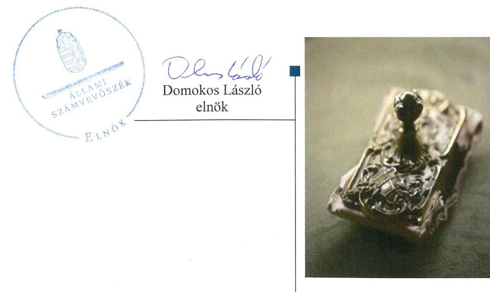
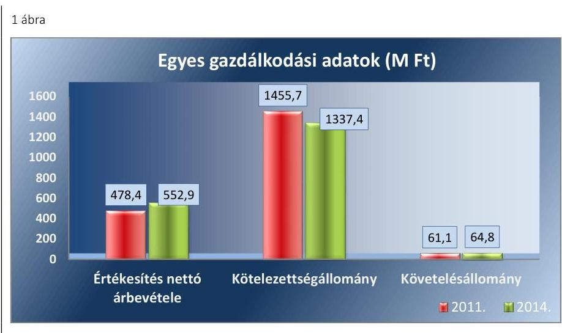
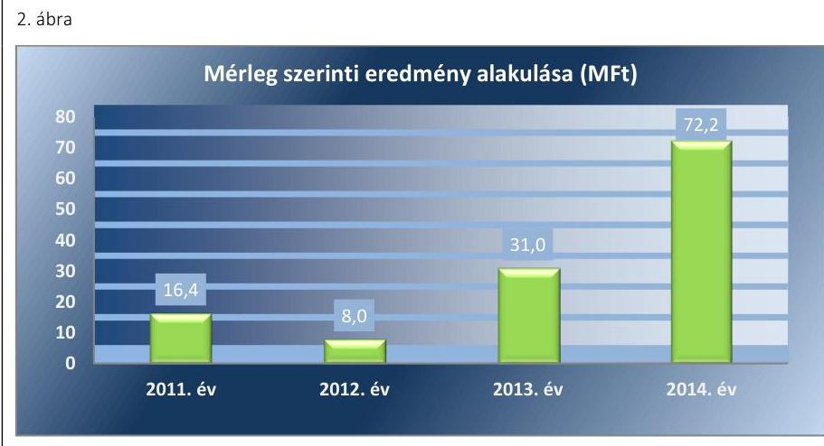
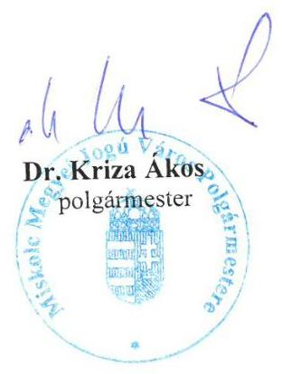
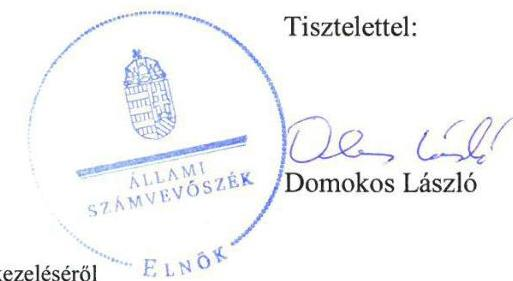
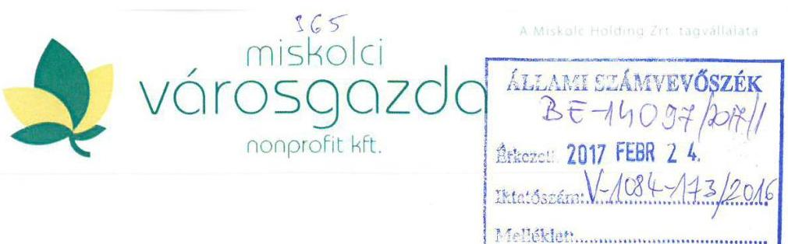
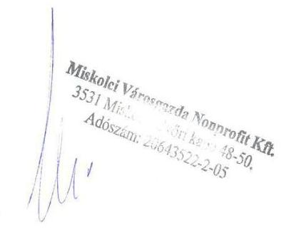

# Jelentés 

## Az önkormányzatok gazdasági társaságai

Az önkormányzatok többségi tulajdonában lévő gazdasági társaságok gazdálkodásának ellenőrzése - Régió Park Miskolc Kft.

2017.

---

# Jelentés 

## Az önkormányzatok gazdasági társaságai

Az önkormányzatok többségi tulajdonában lévő gazdasági társaságok gazdálkodásának ellenőrzése - Régió Park Miskolc Kft.
2017. március hó 30. nap

---

# AZ ELLENŐRZÉST FELÜGYELTE:

- BÖRÖCZ IMRE felügyeleti vezető

# AZ ELLENŐRZÉST VEZETTE ÉS A VÉGREHAJTÁSÁÉRT FELELŐS:

- FÉSÜS NÓRA ellenőrzésvezető
- GÁCSER JÓZSEF ellenőrzésvezető
- SALAMIN VIKTOR ellenőrzésvezető

# A PROGRAM ÖSSZEÁLLÍTÁSÁÉRT FELELŐS:

- JANIK JÓZSEF LÁSZLÓ osztályvezető

# IKTATÓSZÁM: V-1084-174/2016.

- Jelentéseink az Országgyűlés számítógépes hálózatán és az Interneten a www.asz.hu címen is olvashatóak.

# TÉMASZÁM: 2118.

# ELLENŐRZÉS-AZONOSÍTÓ SZÁM: V070748

---

# TARTALOMJEGYZÉK 

■ ÖSSZEGZÉS ..... 5
■ AZ ELLENŐRZÉS CÉLJA ..... 7
■ AZ ELLENŐRZÉS TERÜLETE ..... 8
■ AZ ELLENŐRZÉS HÁTTERE, INDOKOLTSÁGA ..... 10
■ A JELENTÉS LÉNYEGES KÉRDÉSKÖREI ..... 11
■ ELLENŐRZÉS HATÓKÖRE ÉS MÓDSZEREI ..... 12
■ MEGÁLLAPÍTÁSOK ..... 14
■ JAVASLATOK ..... 25
■ MELLÉKLETEK ..... 27
I. Sz. melléklet: Értelmező szótár ..... 27
II. Sz. melléklet: A Társaság főbb mérleg adatai (M Ft) ..... 29
■ FÜGGELÉK: ÉSZREVÉTELEK ..... 31
■ RÖVIDÍTÉSEK JEGYZÉKE ..... 37

---

.

---

# ÖSSZEGZÉS 

Miskolc Megyei Jogú Város Önkormányzata a közfeladat ellátását összességében nem szabályszerűen szervezte meg. A Miskolc Holding Önkormányzati Vagyonkezelő Zrt. a Régió Park Miskolc Parkolási Kft. feletti tulajdonosi jogait szabályszerűen gyakorolta. A Régió Park Miskolc Parkolási Kft. vagyongazdálkodása összességében szabályszerű volt, beszámolási, adatszolgáltatási kötelezettségét az előírásoknak megfelelően teljesítette, hiányosság a vagyonnyilvántartásnál jelentkezett. A közérdekű adatok nyilvánosságát biztosították. Az adatok védelméhez szükséges feltételek rendelkezésre állásáról 2013. évtől gondoskodtak. A kötelezettségek állománya a gazdálkodás stabilitását veszélyeztette. A közfeladat bevételei és ráfordításai elszámolása nem volt megfelelő és összességében az árképzés sem felelt meg az előírásoknak.

## Az ellenőrzés társadalmi indokoltsága

Az Állami Számvevőszék kiemelt célja, hogy a helyi önkormányzatok gazdálkodásában rejlő pénzügyi kockázatok feltárásával, az államháztartáson kívülre nyújtott költségvetési támogatások és ingyenes vagyonjuttatások, valamint az államháztartáson kívül működő feladat-ellátó rendszerek ellenőrzéseivel hozzájáruljon ahhoz, hogy a közpénzeket az államháztartáson kívül működő szervezetek is átlátható, rendezett módon használják fel.

A Magyarországon az intézmény-centrikus közfeladat-ellátás jellemző, de egyre jelentősebb a költségvetésen kívüli feladatellátás térnyerése. Ennek legfontosabb szereplői - a nonprofit szervezetek mellett - az önkormányzati tulajdonú gazdasági társaságok. Az önkormányzatok szervezetalakítási szabadságának következménye, hogy a korábban is vállalati formában működő közszolgáltatások mellett, mind a kötelező, mind az önként vállalt feladatok ellátásában a gazdasági társaságok kiemelt fontosságú szerephez jutottak.

## Főbb megállapítások, következtetések, javaslatok

Miskolc Megyei Jogú Város Önkormányzata a közfeladat-ellátáshoz kapcsolódó rendeletalkotási kötelezettségének eleget tett. A 2014. októberétől hatályos közszolgáltatási szerződés tartalma azonban alapvetően nem felelt meg az előírásoknak, az elszámoltathatóság feltételei nem álltak rendelkezésre. A Régió Park Miskolc Parkolási Kft. feletti tulajdonosi jogait a Miskolc Holding Önkormányzati Vagyonkezelő Zrt. szabályszerűen gyakorolta, ennek keretében eleget tett a beszámoltatási- és felügyeleti rendszer működtetési kötelezettségeinek.

A Régió Park Miskolc Parkolási Kft. rendelkezett a működéshez szükséges szabályzatokkal, ugyanakkor az értékelési szabályzatot késedelmesen, a számlarendet pedig nem a jogszabályi előírásoknak megfelelően készítette el. A vagyonnyilvántartás vezetése nem felelt meg az előírásoknak, a főkönyvi és az analitikus nyilvántartás egyezőségét nem biztosították teljes körűen. A beszámolási kötelezettséget az előírásoknak és a tulajdonosi elvárásoknak megfelelően teljesítették.

A közzétételi kötelezettséget teljesítették. A 2013. évben elkészítették az adatvédelmi- és adatbiztonsági szabályzatot, amely tartalmazta a közérdekű adatok megismerésére irányuló igények teljesítésének rendjét rögzítő szabályokat, továbbá belső adatvédelmi felelőst neveztek ki. A kötelezettségállomány mértéke és szerkezete veszélyeztette a Régió Park Miskolc Parkolási Kft. gazdálkodási stabilitását. A bevételek, valamint a költségek és ráfordítások elszámolása nem volt megfelelő. A követelésállomány kezeléséről alapvetően az előírásoknak megfelelően intézkedtek, hiányosság az éven túli követelések nyilvántartásánál és értékvesztés elszámolásánál jelentkezett. Az árképzés összességében nem felelt meg a jogszabályi előírásoknak, mivel a várakozási díjra vonatkozó javaslatot költségkalkuláció nem támasztotta alá.

---

Az ÁSZ a Társaság általános jogutódja ügyvezetőjének, valamint a polgármesternek fogalmazott meg javaslatokat, amelyek alapján kötelesek intézkedési tervet összeállítani és azt a jelentés kézhezvételétől számított 30 napon belül az ÁSZ részére megküldeni.

---

# AZ ELLENŐRZÉS CÉLJA 

Az ellenőrzés célja annak értékelése volt, hogy az önkormányzat vagyongazdálkodási tevékenysége során szabályszerűen gyakorolta-e tulajdonosi jogait; a gazdasági társaság szabályozottsága, gazdálkodása és vagyongazdálkodási tevékenysége, bevételeinek és ráfordításainak elszámolása megfelelt-e a jogszabályi és tulajdonosi előírásoknak; a gazdasági társaság kötelezettségállománya jelent-e kockázatot a működésre, valamint a gazdálkodás átláthatósága és elszámoltathatósága érdekében biztosítva volt-e a szolgáltatás díjának megalapozottsága szabályszerű önköltségszámítással.

---

# AZ ELLENŐRZÉS TERÜLETE 

## Miskolc Megyei Jogú Város Önkormányzata, Miskolc Holding Önkormányzati Vagyonkezelő Zrt. és a Régió Park Miskolc Parkolási Kft.

A RÉGIÓ PARK MISKOLC PARKOLÁSI KFT.-t az Önkormányzat¹, 2004. március 1-jén alapította, 3,1 M Ft törzstőkével, amely pénzbeli betét volt.

Az alapítás célja az volt, hogy a Társaság ${ }^{2}$ Miskolc város közigazgatási területén a fizető parkolással kapcsolatos kötelező önkormányzati feladatot ellássa. A közterületi parkolókon kívül magánkézben lévő területeken is végzett parkoltatási tevékenységet. Az alapító okirat ${ }^{3}$ három (ingatlan bérbeadás, bemutatók, konferenciák szervezése, követelésbehajtás) melléktevékenységet is tartalmazott.

A Társaság $\mathrm{KSH}^{4}$ besorolás szerinti főtevékenysége a szárazföldi szállítást kiegészítő szolgáltatás volt, amely tartalmazta a parkolási szolgáltatást. Miskolc lakosságszáma 2014. január 1-jén 161265 fő volt*.

A MISKOLC HOLDING ÖNKORMÁNYZATI VAGYONKEZELŐ ZRT.-T az Önkormányzat 2006. július 6-án létrehozta, majd apportként átruházta rá az egyszemélyes tulajdonában álló Társaságra vonatkozó üzletrész tulajdonjogát. A Társaság feletti tulajdonosi jogokat a Holding ${ }^{5}$ az ellenőrzött időszakban kizárólagosan gyakorolta. A Társaság az Önkormányzat 100%-os tulajdonában álló Holding kizárólagos tulajdonában volt, ebből adódóan az Nvtv. ${ }^{6}$ 3. § (1) bekezdés 1. a) pontja alapján átlátható szervezet.

A VAGYONKEZELÉSBE VETT VAGYONNAL a Társaság nem rendelkezett, közfeladatát saját eszközeivel, illetve bérelt önkormányzati vagyonnal látta el. A Társaság 2007. december 17-étől egy belvárosi mélygarázst, 2008. november 5-étől egy parkolóházat, 2014. augusztustól, az ellenőrzött időszakban épített mélygarázst is üzemeltetett, melyeket a saját vagyontárgyai között tartott nyilván.

A Társaság gazdálkodásának egyes adatait a 2011., 2014. évek vonatkozásában az 1. ábra szemlélteti, a főbb mérleg adatokat az II. számú melléklet tartalmazza.

[^0]
[^0]:    * Központi Statisztikai Hivatal, Magyarország Közigazgatási helynév könyve, Miskolc 2014. január 1-jei adata.

---

Forrás: A 2011. és a 2014. évek beszámolói
Az értékesítés nettó árbevételének, kötelezettség és követelés állományának nagyságára alapvetően a Társaság által ellátott szolgáltatás alakulása volt hatással. A nettó árbevétel növekedését elsősorban a járművel történő várakozási díj fizetésére kötelezett közterületek bővítés révén megvalósult értékesítés eredményezte. A kötelezettségek állományának alakulását alapvetően a fejlesztési célok finanszírozására felvett hitelek nagysága és az egyéb rövid lejáratú kötelezettségek között a szállítói kötelezettség záró állományának alakulása befolyásolta. A követelések állományának 6,1%-os (3,7 M Ft) emelkedését a szolgáltatásból származó vevőkövetelések növekedése okozta.

A Társaság más társaságban nem rendelkezett (tartós) részesedéssel. A foglalkoztatottak átlagos statisztika létszáma a 2011. évben 30 fő, a 2014. évben 29 fő volt.

Az ellenőrzött időszakban a polgármester ${ }^{7}$ személye nem változott, a 2010. évi önkormányzati választások óta tölti be tisztségét. A helyszíni ellenőrzés időszakban munkakört betöltő jegyző ${ }^{8}$ 2011. május 1-jétől látja el feladatait. A Társaság ügyvezetője 2010. december 1-jétől tölti be tisztségét. A Holding ügyvezető személye, valamint az igazgatósági tagok az ellenőrzött időszakban változtak.

A Társaság elnevezése 2016. szeptember 7-től „RÉGIÓ PARK MISKOLC" Parkolási Nonprofit Kft.-re változott. A Társaság beolvadással megszűnt, a 2017. évtől általános jogutódja a MISKOLCI VÁROSGAZDA Városgazdálkodási Közhasznú Nonprofit Kft.

---

# AZ ELLENŐRZÉS HÁTTERE, INDOKOLTSÁGA 

## AZ ÖNKORMÁNYZATI TULAJDONÚ GAZDASÁGI

TÁRSASÁGOK ellenőrzése kiemelten fontos a vagyon megőrzése, megóvása érdekében, a társaságokkal szemben alapvető követelmény, hogy gazdálkodásuk, működésük szabályszerű, az általuk szolgáltatott adatok minél megbízhatóbbak legyenek. A feladat/közfeladat-ellátás költségeinek, ráfordításainak alakulása, színvonala hatással van a lakosság elégedettségére.

A törvényalkotás számára - az észlelt problémák, szabálytalanságok, vagy egyéb nem kívánatos jelenségek felszínre kerülésével - az ellenőrzés megállapításai segítséget nyújthatnak az államháztartáson kívüli feladat/közfeladat-ellátás értékeléséhez, jogszabályi keretei pontosításához, átláthatóságot biztosító szabályozásához. Meghatározhatóvá válnak az önkormányzati feladatellátásban részt vevő államháztartáson kívüli szervezeteknek - az önkormányzat költségvetését, pénzügyi helyzetét is befolyásoló - kockázatai, lehetővé válik ezen kockázatok csökkentése. Ellenőrzéseink feltárhatják, hogy az önkormányzat feladat-ellátási kötelezettségének szabályszerűen tett-e eleget, a feladatellátáshoz rendelt vagyonkezelésbe vett és saját vagyon működtetését az elvárható gondossággal, szabályszerűen szervezte-e meg és a tulajdonosi felügyelete hozzájárult-e a feladatellátásához. Az ellenőrzés rávilágíthat arra, hogy a gazdasági társaság a feladat-ellátási, közszolgáltatási szerződésben foglaltak betartásával, a vagyon használatával biztosította-e a szolgáltatás folytatásának feltételeit, a feladat ellátását. Ezzel az ellenőrzöttek és a helyi döntéshozók számára visszajelzést ad feladatszervezési, feladat-ellátási kockázataikról, alapot ad a meglévő hibák megszüntetéséhez, a jobb feladatellátás biztosításához. Fokozza a fegyelmet, igazolja, hogy lejárt a következmények nélküli ellenőrzések időszaka. Az ÁSZ ${ }^{9}$ értékteremtő rend kialakításához és megőrzéséhez hozzájáruló tevékenysége pozitív hatással van a szervezetről kialakított összkép formálására.

---

# A JELENTÉS LÉNYEGES KÉRDÉSKÖREI 

1. Az Önkormányzat közfeladat megszervezéséről szóló döntése, valamint a Holding tulajdonosi joggyakorlása szabályszerű volt-e?
2. A gazdasági társaság vagyongazdálkodása szabályszerű volt-e, kötelezettségállománya jelent-e kockázatot a működésre, illetve a közfeladat ellátására?
3. A gazdasági társaságnál az ellátott feladat/közfeladat bevételei és ráfordításai elszámolása, valamint az önköltségszámítás és árképzés szabályszerű volt-e?

---

# ELLENŐRZÉS HATÓKÖRE ÉS MÓDSZEREI 

## Az ellenőrzés típusa

Megfelelőségi ellenőrzés.

## Az ellenőrzött időszak

Az ellenőrzött időszak 2011. január 1-jétől 2014. december 31-ig tart.

## Az ellenőrzés tárgya

A Régió Park Miskolc Parkolási Kft. feletti tulajdonosi joggyakorlás, valamint a gazdasági társaság gazdálkodásának szabályozottsága és szabályszerűsége.

Az ellenőrzés kiterjed minden olyan körülményre és adatra, amely az ÁSZ jogszabályban meghatározott feladatainak teljesítéséhez, valamint a program végrehajtása folyamán felmerült újabb összefüggések feltárásához szükséges.

## Az ellenőrzött szervezet

Miskolc Megyei Jogú Város Önkormányzata, Miskolc Holding Önkormányzati Vagyonkezelő Zrt. és a Régió Park Miskolc Parkolási Kft.

## Az ellenőrzés jogalapja

Az ellenőrzés jogszabályi alapját az ÁSZ tv. ${ }^{10} 1. § (3) bekezdése és 5. § (3)(4)-(5) bekezdései képezik.

## Az ellenőrzés módszerei

Az ellenőrzést a nemzetközi standardokat irányadónak tekintve az ellenőrzési program ellenőrzési kérdései, az ellenőrzött időszakban hatályos jogszabályok, az ellenőrzés szakmai szabályok és módszertanok figyelembe vételével végeztük.

Az ellenőrzés ideje alatt az ellenőrzött szervezettel történő kapcsolattartást az ÁSZ Szervezeti és Működési Szabályzatának vonatkozó előírásai alapján biztosítottuk.

Az ellenőrzési kérdések megválaszolásához szükséges bizonyítékok megszerzése a következő ellenőrzési eljárások alkalmazásával történt:

---

megfigyelés, kérdésfeltevés (információkérés), összehasonlítás, valamint elemző eljárás. Az ellenőrzési bizonyítékként felhasználható adatforrások közé tartoztak egyrészt a szakmai programban felsorolt adatforrások, másrészt adatforrás még minden - az ellenőrzés folyamán - feltárt, az ellenőrzés szempontjából információkat tartalmazó dokumentum.

Az ellenőrzést a kérdésekre adott válaszok kiértékelésével, valamint a megjelölt adatforrások, tanúsítványok felhasználásával, továbbá az adott időszakban hatályos jogszabályok figyelembe vételével folytattuk le.

A bevételek és ráfordítások elszámolása, valamint a vagyonnyilvántartás terén a szabályszerű működést véletlen mintavétellel ellenőriztük.
 A mintavétellel ellenőrzött területek esetében minden egyes tétel vonatkozásában a szabályszerűségre vonatkozó kérdéseket tettünk fel, amelyek eredménye összesítésre került. Az értékcsökkenési leírás elszámolása esetében a megállapításokat csak az ellenőrzött mintatételekre vonatkozóan fogalmaztuk meg. A jogszabályoknak és a belső előírásoknak megfelelőnek tekintettük az adott területet, amennyiben a minta ellenőrzésének eredménye alapján 95%-os bizonyossággal a teljes sokaságban a hibaarány kisebb volt, mint 10%, nem megfelelőnek, ha a hibaarány a 10%-ot meghaladta. Részben megfelelő minősítést adtunk, amennyiben egy adott terület vonatkozásában a minta alapján a teljes sokaságban nem volt egyértelműen biztosított a jogszabályoknak és a belső szabályzatoknak megfelelő működés. A ráfordítások elszámolására és a vagyonnyilvántartásra vonatkozó véletlen mintavételt kockázati alapú kiválasztással egészítettük ki, amelynek során évente a három legnagyobb összegű tételt választottuk ki.

---

# 1. Az Önkormányzat közfeladat megszervezéséről szóló döntése, valamint a Holding tulajdonosi joggyakorlása szabályszerű volt-e? 

Összegző megállapítás

Az Önkormányzat a közfeladat ellátását összességében nem szabályszerűen szervezte meg. A Holding a Társaság feletti tulajdonosi jogait szabályszerűen gyakorolta.
1.1. számú megállapítás

Az Önkormányzat a közfeladat-ellátáshoz kapcsolódó rendeletalkotási kötelezettségének eleget tett. A közszolgáltatási szerződés tartalma ugyanakkor alapvetően nem felelt meg az előírásoknak, az elszámoltathatóság feltételei nem álltak rendelkezésre.

AZ ÖNKORMÁNYZAT GAZDASÁGI PROGRAMJÁT ${ }^{11}$ a Közgyűlés ${ }^{12}$, az Ötv ${ }^{13}$. 91. § (7) bekezdésének megfelelően 2011. március 10-én elfogadta. A 2011-2014. időszakra vonatkozó program - az Ötv. 91. § (6) bekezdésével összhangban - tartalmazta az egységes városi parkolási rendszer bevezetésére, működtetésére vonatkozó célkitűzéseket.

A Közgyűlés 2014. szeptember 18-án elfogadta a 2014-2020 közötti időszak integrált településfejlesztési stratégiáját. A stratégiában megjelölt célfeladatok a 314/2012. (XI. 8.) Korm. rendelet ${ }^{14}$ 5. és 6. §-aival összhangban rögzítik a gépjárművek parkolásának biztosítását, és az ehhez kapcsolódó fejlesztéseket.

Az Önkormányzat ${ }^{15}$ az Nvtv. ${ }^{16}$ 9. § (1) bekezdésben foglaltak szerint, 2012. június 21-én jóváhagyta vagyongazdálkodási tervét ${ }^{17}$. Ebben rögzítették a parkolási feltételek javítását, a parkolási rendszerek fejlesztését, a felszíni parkolásra szolgáló elhanyagolt területek megszüntetését.

A KÖZFELADAT MEGSZERVEZÉSÉRŐL az Önkormányzat az ellenőrzött időszak előtt döntött. A járművel történő várakozás szabályait az Önkormányzat rendeletben ${ }^{18}$ határozta meg, ezzel rendeletalkotási kötelezettségének eleget tett. A rendelet tartalmazta a Kktv. ${ }^{19}$ 48. § (5) bekezdésében foglalt tartalmi elemeket. A feladatellátás kereteit az alapító okirat és a közfeladatok ellátására kötött szerződések határozták meg.

A fizető parkolási rendszer üzemeltetésére az Önkormányzat a Társasággal 2004. október 1-jei hatályba lépéssel 10 évre üzemeltetési szerződés ${ }^{20}$ kötött. Az Önkormányzat és a Társaság az üzemeltetési szerződés lejártával az Mötv. ${ }^{21}$ 16/A. §-ában, valamint a Kktv. 9/D. § (4) bekezdésében foglaltak alapján, a Közgyűlés határozatában ${ }^{22}$ foglaltak szerint újabb tíz évre közszolgáltatási szerződés ${ }^{23}$ kötött 2014. október 1-jei hatályba lépéssel. A közszolgáltatási szerződés tartalma alapvetően nem felelt meg az előírásoknak, ezért a közfeladat megszervezése összességében nem volt szabályszerű.

---

AZ ÜZEMELTETÉSI MEGÁLLAPODÁST a Kktv. 2010. június 5-től hatályos tartalmi követelményeinek az ellenőrzött időszakban nem feleltették meg, ugyanakkor a szerződő feleknek erre vonatkozó jogszabályi kötelezettségük sem volt.

A megállapodás 5.2. pontja az üzemeltetési feltételek jelentős változása esetén lehetőséget biztosított a megállapodás módosítására, kiegészítésére, ezzel a lehetőséggel azonban a szerződő felek nem éltek.

A KÖZSZOLGÁLTATÁSI SZERZŐDÉS 2014. évi megkötésekor a Kktv. 9/D. § (4) bekezdésének rendelkezéseit teljes körűen nem vették figyelembe. A közszolgáltatási szerződésben:
—_ a Kktv. 9/D. § (4) bekezdésének c) pontjában foglaltak ellenére nem rendelkeztek az Önkormányzat és a Társaság közötti kapcsolattartás részletes szabályairól.
—_ a Kktv. 9/D. § (4) bekezdés e) pontja ellenére nem rögzítették a nyilvántartási, adatszolgáltatási és elszámolási kötelezettségek teljesítésének részletes módját és formáját.
—_ a Társaság által ellátott feladatok ellenértékéről a Kktv. 9/D. § (4) bekezdés d) pontja ellenére nem rendelkeztek.
—_ a Kktv. 9/D. § (4) bekezdés f) pontja ellenére a nyereség meghatározás szempontjairól nem rendelkeztek.
A közszolgáltatási szerződésben meghatározták a Kktv. 9/D. § (4) bekezdésének a),b),g) pontjaiban előírtak szerint a szolgáltatás időtartamát, a kötelezően ellátandó önkormányzati közfeladatot és az ellátási területet.

AZ ELSZÁMOLTATHATÓSÁG FELTÉTELEI nem álltak rendelkezésre, mivel a Kktv. 15/E. § (2) bekezdésében rögzített közzétételi kötelezettség teljesítésének, illetve a bevételekhez és költségekhez kapcsolódó - Kktv. 15/E. § (1) bekezdésében*, valamint a 9/D. § (6) bekezdésében ${ }^{*}$ foglalt - jogosultságok érvényesítésének kereteit a közszolgáltatási szerződés, vagy egyéb irányítási eszköz nem határozta meg egyértelműen.

A közszolgáltatási szerződésben rögzített fordított elszámolási rendszer nem felelt meg a KKtv. előírásainak, mivel nem az Önkormányzat fizetett fix díjat a szolgáltatásért és rendelkezett a szolgáltatási díjon felüli bevételek felett, hanem a Társaság fizetett fix díjat a parkolási jogért és rendelkezett a parkolási jog ellenértékén felüli bevételek felett.

A szerződés tartalmi hiányosságai miatt nem volt átlátható, hogy az Önkormányzat hozzájut-e a Kktv. szerint őt megillető bevételekhez, valamint, hogy a Társaság milyen költség- és nyereségelemeket érvényesíthet a közszolgáltatással összefüggésben és azzal hogyan számol el.

[^0]
[^0]:    * hatályos 2010. VI. 5-től 2012. VIII. 6-ig
    ${ }^{+}$hatályos 2012. VIII. 7-től

---

### 1.2. számú megállapítás

A Társaság feletti tulajdonosi jogait a Holding szabályszerűen gyakorolta, ennek keretében eleget tett a beszámoltatási- és felügyeleti rendszer működtetési kötelezettségeinek.

A TULAJDONOSI JOGOK GYAKORLÁSÁNAK rendjét az alapító okirat, a menedzsment-szerződés ${ }^{24}$ és a Holding szabályzatai rögzítették.

Az alapító okirat előírásai szerint, a Gt. ${ }^{25}$ 19. § (5) bekezdésében, valamint a Ptk. ${ }^{26}$ 3:109. § (4) bekezdésében előírtakkal összhangban a Társaság egyszemélyes társaságként jött létre, így a legfőbb szerv hatáskörében az egyedüli tag - a Holding - határozott. A Társaság fő tevékenységét a Gt. 12. § (1) bekezdés c) pontjával és a Ctv. ${ }^{27}$ 24. § e) pontjával összhangban határozták meg.

A Holding előírta, hogy a vagyongazdálkodási döntések megalapozására előterjesztést Holding Igazgatósága részére kell készíteni, amelynek formai és tartalmi követelményeit, valamint a felelőseit is rögzítette.

Az ügyvezető számára - az alapító okiratban meghatározottakon túl -, a Holding menedzsment szerződés alapján előírta üzleti terv készítését, az azzal kapcsolatos monitoring tevékenység elvégzésének kötelezettségét.

A Holding Igazgatósága döntött az üzleti tervek jóváhagyásáról, a számviteli beszámoló elfogadásáról, és az adózott eredmény felhasználásáról, valamint a könyvvizsgáló és az FB tagok megválasztásáról, továbbá a 2013-2014. években kezességvállalásról. A Holding konszolidált beszámolói elfogadásáról a Közgyűlés határozattal döntött.

A Holding az éves üzleti tervek összeállítására 2012-től évenként írásos tervezési irányelveket bocsátott a tagvállalatai rendelkezésére. Az üzleti tervek jóváhagyása a Gt. 19. § (3) bekezdése, valamint a Ptk. 3:109. § (2) bekezdése alapján a Holding kizárólagos hatáskörébe tartozott, amelyet az üzleti terveket elfogadó igazgatósági határozatokkal teljesített.

A BESZÁMOLTATÁSI RENDSZERT a Holding szabályozta és működtette, az üzleti tervek végrehajtását nyomon követte. A Holding kontrolling egysége időszaki adatszolgáltatásokat kért és dolgozott fel a tervezési irányelvekben meghatározottak, illetve eseti igények szerint.

Az alapító okirat szerint az éves számviteli beszámolót, a Társaság vagyoni helyzetéről és üzletpolitikájáról szóló beszámolót az ügyvezető volt köteles a Holding Igazgatóság elé terjeszteni. A beszámoltatás a Holding által kiadott részletes zárlati utasítások figyelembevételével megtörtént.

Az éves beszámolók elfogadásáról a Holding minden évben az FB határozata és a könyvvizsgáló írásos jelentése birtokában döntött.

A mérleg szerinti eredmények alakulását a 2. ábra mutatja be.

---

Forrás: A Társaság 2011-2014. évi beszámolói

A FELÜGYELŐ BIZOTTSÁG az alapító okiratban előírtak alapján - a Gt. 34. § (1) bekezdésével, valamint a Ptk. 3:121. § (1) bekezdésével összhangban - három tagból állt. Az FB hatáskörébe tartozott az ügyvezetés ellenőrzése, az éves beszámoló írásban történő véleményezése, üzletpolitikai döntésekhez kapcsolódóan javaslatok készítése.

Az $\mathrm{FB}^{28}$ eleget tett a Gt. 34. § (4) bekezdése előírásainak, elkészítette ügyrendjét, amelyet a Holding Igazgatósága a határozattal jóváhagyott.

AZ ANYAGI ÉRDEKELTSÉGI RENDSZER elemeit a Taktv ${ }^{29}$. 5. § (3) bekezdésében foglaltaknak megfelelően a Holding Igazgatósága által elfogadott javadalmazási szabályzat ${ }^{30}$-ban rögzítették. A javadalmazási szabályzat kiterjedt az ügyvezető és a tisztségviselők (FB) vonatkozó javadalmazási elveire és szabályaira, a prémium fizetés feltételeire és mértékére, a költségtérítés szabályozására.

A Holding Igazgatósága a 2011-2014. évek beszámolói elfogadásakor szabályszerűen döntött az éves prémium kifizetésekről, amit passzív időbeli elhatárolásként a beszámolók tartalmaztak. Osztalék fizetéséről a 2011-2014. években döntés nem történt.

BELSŐ ELLENŐRZÉSI RENDSZERT a Holding működtetett, amelynek keretében a Társaságnál három ellenőrzést végzett. Az ellenőrzések a vagyongazdálkodás, pénzkezelés területeit érintették, nem terjedtek ki az üzemeltetési-, közszolgáltatási szerződések teljesítésére.

A belső ellenőrzések nem tártak fel a tulajdonos érdekeit sértő, jogszerűtlen vagyongazdálkodási tevékenységet. A megállapítások a szervezeti és működési szabályzat és a pénzkezelési szabályzat aktualizálásának elmaradására vonatkoztak, amelyekre a Társaság intézkedett.

KEZESSÉGET A HOLDING a Társaság uniós támogatásból megvalósuló mélygarázs építésével kapcsolatban - a Holding alapító okiratában rögzítettek szerint - vállalt, melyről igazgatósági határozattal rendelkezett. A Holding 2013. április 12-én közjegyzői okiratban 285,0 M Ft értékre, egyoldalú kezességvállalási nyilatkozatot tett. Ezt követően a pótmunkák miatt megnövekedett szerződéses összegre tekintettel a Holding igazgatósági határozata alapján a kezesség összege 2014. decemberében 312,0 M Ft-ra módosult.

---

A kezességvállalás nem haladta meg a Holding alapító okiratában rögzített értékhatárt (jegyzett tőke 5%-át), ezért arról saját hatáskörben dönthetett. A kezességvállalással összefüggésben, az ellenőrzött időszakban fizetési kötelezettség nem keletkezett.

# 2. A gazdasági társaság vagyongazdálkodása szabályszerű volt-e, kötelezettségállománya jelent-e kockázatot a működésre, illetve a közfeladat ellátására? 

Összegző megállapítás

A Társaság vagyongazdálkodása alapvetően szabályszerű volt. A kötelezettségállomány a Társaság gazdálkodási stabilitását veszélyeztette.

### 2.1. számú megállapítás

A Társaság rendelkezett a működéshez szükséges szabályzatokkal, ugyanakkor az értékelési szabályzatot késedelmesen, a számlarendet pedig nem a jogszabályi előírásoknak megfelelően készítette el.

Az üzleti tervek a Holding előírásai szerint készültek. Az üzleti tervek feladatai összhangban voltak a parkolási rendszer fejlesztésére vonatkozóan - a gazdasági programban, fejlesztési tervekben - meghatározott önkormányzati célokkal, valamint a Társaság 2013 szeptemberétől hatályos stratégiai tervével.

A számviteli politikát az ügyvezető készítette el és hagyta jóvá a Számv. tv. ${ }^{31}$ tv. 14. § (12) bekezdésében foglaltaknak megfelelően.

A SZÁMVITELI POLITIKA KERETÉBEN elkészítendő szabályzatokkal a Társaság, a Számv. tv. 14.§ (5) bekezdésnek megfelelően az értékelési szabályzat kivételével - rendelkezett.

Az eszközök és források értékelési szabályzata a Számv. tv. 14. § (5) bekezdés b) pontja ellenére csak 2014. január 1-jétől volt hatályban. A 2011-2013. években a Holding értékelési szabályzatának előírásait vették figyelembe a zárlati utasítások szerint, amelyre vonatkozóan saját szabályzataikban hivatkozás nem volt.

Pénzkezelési szabályzatot a Számv. tv. 14. § (5) bekezdés d) pontjában előírtak alapján elkészítették, tartalma megfelelt a Számv. tv. 14. § (8) bekezdésében előírtaknak. Az eszközök és források leltárkészítési és leltározási szabályzatával a Számv. tv. 14. § (5) bekezdés a) pontjában előírtak alapján rendelkeztek.

SZÁMLAREND a Számv.
 tv 161. § (2) bekezdés b) és d) pontjaiban előírtak ellenére nem tartalmazta a számla értékének növekedésének és csökkenésének jogcímeit, valamint a számlarendben foglaltakat alátámasztó bizonylati rendet.

### 2.2. számú megállapítás

A vagyonnyilvántartás vezetése a főkönyv és analitikus nyilvántartás eltérése miatt nem felelt meg az előírásoknak.

A Társaság az alapító okirat szerinti feladatát saját eszközeivel, valamint az üzemeltetési-, illetve közszolgáltatási szerződésekben részletezett bérelt

---

önkormányzati vagyonnal látta el. A saját és a bérelt vagyon értékének megőrzése, gyarapítása jóváhagyott beruházási tervek alapján, a tulajdonosi előírásoknak megfelelően történt. Az ellenőrzött időszakban a Társaság vagyonának hasznosítására, értékesítésére, megterhelésére, biztosítékba adására nem került sor.

A VAGYONNYILVÁNTARTÁS VEZETÉSÉRŐL analitikus és főkönyvi szinten is gondoskodtak, azonban a változások nyomon követése nem volt megfelelő, mely a nyilvántartások eltérésében mutatkozott meg.

A mérlegtételeinek alátámasztása érdekében minden évben leltároztak, azonban 2013-2014. években a leltározás végrehajtása csak részben felelt meg az előírásoknak. A beszámoló mérlegadatai a főkönyvi nyilvántartással egyeztek, ugyanakkor a főkönyvi- és az analitikus nyilvántartás egyezősége a Számv.tv. 69.§ (2) bekezdésében foglaltakkal szemben nem volt teljes körűen biztosított. Továbbá a Számv.tv. 92.§ (1) bekezdése alapján a 2013., 2014. évi beszámolók kiegészítő mellékletében rögzített adatok nem egyeztek meg az adott évi főkönyvi- és analitikus nyilvántartások adataival, mely a Számv.tv. 15.§ (5) bekezdésében foglalt következetesség elvét sértette. Az eltérést a 2013. évben az ingatlanok és egyéb gép berendezés, a 2014. évben az ingatlanok, a műszaki gép, berendezés, valamint az egyéb gép berendezések esetében állapítottunk meg. A 2014. évi beszámoló kiegészítő mellékletében a nyitó bruttó értékek nem egyeztek meg a 2013. évi záró bruttó értékekkel, mely sértette a Számv.tv. 15.§ (6) bekezdésében rögzített folytonosság elvét.

A Számv. tv. 69. § (2) bekezdése és a 15.§ (5) bekezdése, valamint a számviteli politika előírása ellenére a beszámolók, főkönyvi kivonatok és analitikus nyilvántartások adatai az 1. számú táblázatban foglaltak szerint eltértek.

A hibák és hibahatások nem érték el a Számv. tv. 3.§ (3) bekezdésében és a számviteli politikában rögzített jelentős összegű hiba határát.

1. táblázat

|  BESZÁMOLÓ, FŐKÖNYV, ANALITIKA ELTÉRÉSEK (M FT) |  |  |  |  |   |
| --- | --- | --- | --- | --- | --- |
|  Megnevezés | Analitikus nyilvántartás | Főkönyvi könyvelés | Kiegészítő melléklet | Eltérés analitikához viszonyítva | Eltérés főkönyvihez viszonyítva  |
|  2013. év | 2112,6 | 2113,6 | 2110,9 | $-1,7$ | $-2,7$  |
|  2014. év | 2766,2 | 2767,0 | 2768,2 | 2,0 | 1,2  |

A Társaság főbb mérleg adatait az II. számú melléklet tartalmazza. Az eszközérték az előző évhez viszonyítva a 2011. évben minimálisan (3,3\%, 62,7 M Ft) csökkent, a 2012-2014. években azonban folyamatosan növekedett, amelyet a beruházási aktivitás eredményezett. Az ingatlanok értéke 26,1\%-kal (435,1 M Ft-tal) növekedett, amelynek oka a 2014. évi mélygarázs üzembe helyezés volt. A beruházás saját forrásból és $\mathrm{EU}^{32}$-s támogatásból valósult meg.

A forgóeszközök állománya több mint harmadára csökkent, a pénzeszközök és a követelések csökkenése miatt.

---

A forrás oldalon megállapítható az idegen források, a kötelezettségek domináns szerepe. A tartós kötelezettségek jelentős része a felvett hosszú lejáratú hitelekből tevődött össze. A hiteltörlesztések hatásaként a kötelezettségállomány 2014. év végére - a 2011. évi nyitó állományhoz viszonyítva - 9,4\%-kal (139,2 M Ft-tal) csökkent.

A rövid lejáratú kötelezettségek elsősorban szállítói tartozásokhoz, valamint adó- és járulékterhekhez kapcsolódtak, növekvő tendenciával. A kötelezettségállomány mértéke és szerkezete veszélyeztette a Társaság gazdálkodásának stabilitását.

A kötelezettségek szerkezete átalakult, a rövid lejáratú kötelezettségek több mint háromszorosára emelkedtek a hitelek éves törlesztési kötelezettsége és a szállítói tartozások növekedése miatt. A Társaság az ellenőrzött időszak egészében a saját tőke kétszeresét meghaladó kötelezettségállománnyal rendelkezett.

Az ellenőrzött időszakban a lejárt határidejű szállítói tartozások folyamatosan növekedtek, az üzleti partnerek a késedelmes teljesítések után 43,2 MFt késedelmi kamatot számoltak fel, amelynek jelentős része az Önkormányzat felé késedelmesen teljesített ingatlan bérleti díjak miatt keletkezett.

A Társaság kötelezettségeinek alakulását a 2. táblázat mutatja be.
2. táblázat

TÁRSASÁG KÖTELEZETTSÉGEI (M FT)

| Megnevezés | 2011-01-01 | 2011-12-31 | 2012-12-31 | 2013-12-31 | 2014-12-31 |
| :-- | --: | --: | --: | --: | --: |
| Kötelezettségek | 1476,6 | 1455,7 | 1377,7 | 1256,6 | 1337,4 |
| ebből: hosszú lejáratú kötelezettség | 1313,6 | 1188,1 | 1062,6 | 937,0 | 820,7 |
| ebből: rövid lejáratú kötelezettség | 163,0 | 267,6 | 315,1 | 319,6 | 516,7 |
| - rövid lejáratú hitel | 125,5 | 125,5 | 125,5 | 170,8 | 296,9 |
| - kötelezettség áruszállításból és szolgáltatásból (szállítók) | 19,8 | 122,6 | 162,0 | 130,1 | 188,4 |
| - rövid lej. kötelezettség kapcsolt vállalkozással szemben | 2,5 | 2,3 | 10,2 | 9,2 | 3,4 |
| - egyéb rövid lejáratú kötelezettség | 15,2 | 17,2 | 17,4 | 9,5 | 28,0 |

A Társaság hosszú lejáratú kötelezettségei három hitelkeret-szerződéshez kapcsolódtak.
$\longrightarrow$ Az ellenőrzött időszakot megelőzően egy ingatlan megvásárlása és parkolóház építéséhez kapcsolódóan 968,0 M Ft összegű hitelkeretszerződést kötöttek.
$\longrightarrow$ Az ellenőrzött időszakot megelőzően egy mélygarázs építéséhez kapcsolódóan 622,0 M Ft összegű hitelkeret-szerződést kötöttek.
$\longrightarrow$ A közterületi parkoló automata beruházásához 240,0 M Ft összegű hitelkeret állt rendelkezésre.
A hosszú lejáratú kötelezettségek 2014. december 31-én összesen 820,7 M Ft hiteltartozásból adódtak.

Az eladósodottságot jelző mutatók értékei a 3. táblázatban foglaltak szerint alakultak a 2011-2014. években.

---

| A TÁRSASÁG PÉNZÜGYI MUTATÓSZÁMAI |  |  |  |  |  |
| :--: | :--: | :--: | :--: | :--: | :--: |
| Megnevezés | Referencia | 2011. | 2012. | 2013. | 2014. |
| Eladósodottsági mutató | $<0,6$ | 0,69 | 0,68 | 0,60 | 0,57 |
| Eladósodottság mértéke | $<1$ | 2,64 | 2,46 | 2,13 | 2,02 |
| Nettó eladósodottság | $<0$ | 1,44 | 1,47 | 1,66 | 1,76 |
| Adósságfedezeti mutató | $2,0<$ | 2,53 | 2,36 | 2,06 | 1,92 |
| Árbevételre vetített eladósodottság | $<0$ | 2,45 | 2,46 | 2,39 | 2,26 |

A Társaság rövid lejáratú kötelezettségeinek növekedése, az eladósodottságot jellemző mutatók kedvezőtlen alakulása, az eladósodottság mértéke és szerkezete veszélyeztette a gazdálkodás stabilitását.
2.3. számú megállapítás

A Társaság beszámolási kötelezettségét az előírásoknak és a tulajdonosi elvárásoknak megfelelően teljesítette. A közérdekű adatok nyilvánosságát biztosították. Az adatok védelméhez szükséges szabályozási és személyi feltételeket 2013. évtől biztosították.

Az éves beszámolókat a Társaság a Számv. tv. 19. § (1) bekezdésében előírt tartalommal elkészítette, azokat az ügyvezető a Holding Igazgatósága elé terjesztette.

A Társaság 2011-2014. üzleti éveiről készített éves beszámolóit a Holding Igazgatósága megtárgyalta, azok elfogadásáról a Gt. 35. § (3) bekezdésének és a Ptk. 3:120. § (2) bekezdésének előírásait betartva az FB és a könyvvizsgáló írásos jelentésének birtokában, határozattal* döntött. Ugyanakkor a 2013. évi beszámolóhoz kapcsolódó letétbe helyezési és közzétételi kötelezettség teljesítése nem felelt meg a Ctv. 18 § (7) bekezdésében előírtaknak, mivel az adózott eredmény felhasználásra, tartalékba helyezésére vonatkozóan határozat nem született.

Az éves beszámolók és a kapcsolódó könyvvizsgálói jelentések letétbe helyezése a Számv. tv. 153. § (1) bekezdésben előírt határidőben megtörtént. Az éves beszámolók és a kapcsolódó könyvvizsgálói jelentések Számv. tv. 154. § (1) bekezdés szerinti közzétételi kötelezettségét teljesítette a Társaság.

A könyvvizsgáló az ellenőrzött időszak minden évében hitelesítő záradékkal látta el a Társaság éves beszámolóját. A könyvvizsgáló a Gt. 40. § (1) bekezdése, illetve a Ptk. 3:129. § (1) bekezdése alapján gondoskodnia kell annak megállapításáról, hogy a számviteli beszámoló megfelel-e a jogszabályoknak, továbbá, hogy megbízható és valós képet ad-e a társaság vagyoni és pénzügyi helyzetéről.

A könyvvizsgáló a 2011-2014. évi beszámolókkal kapcsolatosan kiadott jelentésében nem állapította meg a mérlegtételek alátámasztásával, a főkönyv-analitika egyezőségével kapcsolatos hiányosságokat.

A közérdekű adatok nyilvánosságáról a szabályozás szintjén nem gondoskodtak, a közzétételi kötelezettséget

[^0]
[^0]:    * 146/2012. (V. 16.), a 156/2013. (V. 8.), a 141/2014. (IV. 16.) és a 159/2015. (V. 6.) számú igazgatósági határozatok

---

azonban teljesítették. Az adatok védelmére vonatkozó kötelezettségeiknek nem az előírásoknak megfelelően tettek eleget.

A 2011-2012. években belső adatvédelmi és adatbiztonsági szabályzatot nem készítettek, belső adatvédelmi nyilvántartást nem vezettek, ezzel megsértették az Avtv. ${ }^{33}$ 31/A. § (2) bekezdés d)-e) pontjában és a (3) bekezdésben előírtakat, valamint az Info tv. ${ }^{34}$ 24. § (2) bekezdés d)-e) pontjában és a (3) bekezdésében előírtakat. Továbbá - ezen időszakra - az Avtv. 31/A § (1) bekezdése, valamint az Info tv. 24. § (1) bekezdése előírása ellenére belső adatvédelmi felelőst nem neveztek ki.

A Társaság 2013. évben elkészítette az adatvédelmi- és adatbiztonsági szabályzatát, továbbá belső adatvédelmi felelőst nevezett ki, aki gondoskodott az adatvédelmi nyilvántartás vezetéséről.

A Társaság az Avtv. 20. § (8) bekezdése, valamint az Info.tv. 30. § (6) bekezdésében előírtak alapján közérdekű adatok megismerésére irányuló igények teljesítésének rendjét rögzítő külön szabályzatot nem készített, annak szabályait a 2013. évben elkészített adatvédelmi- és adatbiztonsági szabályzat tartalmazta.

Az Avtv. 19.§ (2) bekezdésében, az Eisztv. ${ }^{35}$ 6. § (1) bekezdésében, valamint az Info tv. 37. § (1) bekezdésben előírt közérdekű adatok közzétételére vonatkozó feladatának a Társaság eleget tett.

# 3. A gazdasági társaságnál az ellátott feladat/közfeladat bevételei és ráfordításai elszámolása, valamint az önköltségszámítás és árképzés szabályszerű volt-e? 

Összegző megállapítás

## 3.1. számú megállapítás

A bevételek és ráfordítások elszámolása nem volt megfelelő. Az árképzés összességében nem felelt meg az előírásoknak.

A bevételek és ráfordítások elszámolása nem volt megfelelő. A követelésállomány kezeléséről alapvetően az előírásoknak megfelelően intézkedtek. Ugyanakkor az éven túli követelések nyilvántartása és értékvesztésének elszámolása 2011-2012. években nem volt szabályszerű.

Az Önkormányzat a Társaság számára nem írt elő a Kktv. 15/E. § (2) bekezdésében rögzített közzétételi kötelezettség teljesítését szavatoló szabályokat, ezzel nem biztosította az elszámoltathatóságot.

A Társaság számára az üzemeltetési megállapodás vagy egyéb irányítási eszköz elkülönítési, nyilvántartási illetve adatszolgáltatási kötelezettséget nem írt elő. A 2014. október 6-án hatályos közszolgáltatási szerződés 5.1.3. pontja a várakozási díj nyilvántartás módjával kapcsolatban rendelkezett, ugyanakkor a pótdíjak és a bevételek felhasználásának nyilvántartásáról és az adatszolgáltatás részletes menetéről nem.

Az önkormányzati szabályozási hiányosságok miatt a közfeladathoz és az üzleti tevékenységhez kapcsolódó pótdíjakat, költségeket és ráfordításokat nem különítették el. A Társaság a várakozási díjak elkülönítését biztosító parkolási díjbeszedő rendszert azonban üzemeltetett.

---

Az értékesítés nettó árbevételének elszámolása nem megfelelő volt, mert a könyvviteli elszámolást alátámasztó bizonylatok nem minden esetben tartalmazták a Számv. tv. 167. § (1) bekezdés h) pontja előírása ellenére az érintett könyvviteli számlákra történő hivatkozást.

Az anyagjellegű ráfordítások elszámolása nem megfelelő volt, mert a Számv. tv.
 167. §. (1) bekezdés h) pontjában előírtak ellenére a könyvviteli elszámolást alátámasztó bizonylatok nem minden esetben az érintett - a számlarendben (számlakeretben) előírt - könyvviteli számlákra történő hivatkozást tartalmazták.

A beruházások, felújítások kiadásai elszámolása részben megfelelő volt, mert néhány esetben a gazdasági események dokumentálására a Számv. tv. 165. § (1) bekezdésében előírtak ellenére bizonylatot nem állítottak ki.

Összességében a kontírozás, a besorolás a Számv. tv. 24. § és 26. § előírásainak megfelelő volt, az állományba vétel, az üzembe helyezés megtörtént, az eszköz tárgyévi leltárban megtalálhatóak voltak.

Az értékcsökkenési leírás elszámolása részben megfelelő volt, mert néhány esetben ugyanazon eszközöknél - az ellenőrzött időszakban - több leírási kulcsot alkalmaztak és a változtatás eredményre gyakorolt hatását Számv.tv. 53.§ (5) bekezdésében foglaltak ellenére a kiegészítő mellékletben nem mutatták be.

A Társaság 2012. II. félévétől 2013. év végéig a könyvelői program változása miatt egyes eszközöknél más leírási kulcsot alkalmazott, mint korábban. A változtatásból adódó eltérés 2012. évben 0,6 M Ft, 2013. évben 1,6 M Ft volt, melyet 2014. évben korrigáltak. A hibák és hibahatások nem érték el a Számv. tv. 3. § (3) bekezdésében és a számviteli politikában rögzített jelentős összegű hiba határát.

A vagyongazdálkodás területén kiemelt három eszközcsoportnál - immateriális javak, ingatlanok, műszaki berendezések - a beruházások összege nem érte el az értékcsökkenés összegét, ezért az elhasználódási szint nőtt és a használhatósági fok csökkent.

Az ellenőrzött időszakban az ingatlanok használhatósági foka is 2,4 százalékponttal csökkent annak ellenére, hogy a mélygarázs beruházás aktiválására 2014. évben sor került.

A követelésállomány csökkentése érdekében a követelések beszedését és behajtását követeléskezelést tartalmazó folyamatleírás alapján hajtották végre. Külön programmal nyilvántartást vezettek a hátralékos-, valamint a behajtás alatt lévő díjbevételekről, így a határidő lejárta után intézkedéseket tettek a követelések behajtására. Fizetési felszólításokat készítettek, egy éven belül pedig a fizetési meghagyásos eljárásról szóló tv. ${ }^{36}$-ben foglaltak szerint intézkedtek a fizetési meghagyás kibocsátása, illetve a követelés végrehajtása érdekében.

---

4. táblázat

| PÓTDÍAK ALAKULÁSA (EFT) |  |  |
| :--: | :--: | :--: |
|  | Pótdij | Pótdij értékvesztés |
| 2011. | 156.101 | -138.413 |
| 2012. | 156.928 | -138.413 |
| 2013. | 10.580 | - |
| 2014. | 13.681 | - |

A követelések minősítése és az értékvesztések elszámolása a beszámoló készítése során megtörtént. Ugyanakkor 2011-2012. években a Társaság nyilvántartotta a megelőző időszak pótdíjaira vonatkozó teljes követelés- és annak elszámolt értékvesztés állományát (4. táblázat).

Ezzel megsértették a Számv. tv. 29. § (1) bekezdésében foglaltakat, mivel az összegek el nem ismert követeléseket - fizetési meghagyást, peresítést, letétet - tartalmaztak.
2013. évben a behajthatatlanná vált követelések leírásra kerültek, 15,6 M Ft értékben, amelynek összegét és indoklását a Társaság a kiegészítő mellékletben szerepeltette.

A követelésállomány alakulását az 5. táblázat részletezi.
5. táblázat

| KÖVETELÉSEK ALAKULÁSA (EFT) |  |  |  |  |
| :--: | :--: | :--: | :--: | :--: |
| Megnevezés | 2011 | 2012 | 2013 | 2014 |
| Vevő követelések | 2.938 | 3.149 | 3.081 | 13.898 |
| Vevő után elsz. értékvesztés | -39 | -147 | -2.271 | - |
| Kapcsolt vállalkozással köv. | 625 | 604 | - | 174 |
| Egyéb követelés | 57.614 | 53.822 | 39.276 | 50.716 |
| ÖSSZES KÖVETELÉS | 61.138 | 57.428 | 40.086 | 64.788 |

3.2. számú megállapítás

Az árképzés összességében nem felelt meg a jogszabályi előírásoknak, mivel az Önkormányzat nem gondoskodott arról, hogy a Társaság a várakozási díjra vonatkozó javaslatát költségkalkulációval támassza alá.

Az önkormányzati várakozási díj mértékére vonatkozó rendelet megalkotásához a Társaság javaslatot tett. A javaslat benyújtásával, a díjkalkuláció menetével kapcsolatban az Önkormányzat nem határozott meg eljárásrendet, ezzel az árképzés átláthatóságához szükséges feltételeket nem biztosította. Önköltségszámítási szabályzat készítésére a Számv. tv. 14. § (6) bekezdés előírása alapján a Társaság a 2011-2014 közötti időszakban nem volt kötelezett.

A Társaság a piaci környezetet figyelembe véve szolgáltatott információt, javasolt díjakat a várakozási díj mértékének meghatározásához. A díjjavaslatot előzetesen a Holding Igazgatósága is megtárgyalta, amelyről határozatot hozott. A javaslathoz költségkalkuláció nem készült, így a várakozási díj mértékének meghatározásakor a Társaság nem dokumentálta, hogy a várakozási díjak a Kktv. 15/A. § (4) bekezdésének megfelelően a ráfordításokra és a működéshez szükséges kiadásokra várhatóan fedezetet biztosítanak-e. A várakozási díjakból várhatóan befolyó bevételekről ugyanakkor kimutatás készült.

A Kktv. 15/A. § (5) bekezdés előírásának megfelelően az egy órára vonatkozó várakozási díj nem haladta meg az állami adóhatóság által meghatározott korlátot.

---

# JAVASLATOK 

Az ÁSZ tv. 33. § (1) bekezdésében foglaltak értelmében az ellenőrzött szervezet vezetője köteles a jelentésben foglalt megállapításokhoz kapcsolódó intézkedési tervet összeállítani és azt a jelentés kézhezvételétől számított 30 napon belül az ÁSZ részére megküldeni. Amennyiben az ellenőrzött szervezet vezetője nem küldi meg határidőben az intézkedési tervet, vagy továbbra sem elfogadható intézkedési tervet küld, az Állami Számvevőszék elnöke az ÁSZ tv. 33. § (3) bekezdése a) és b) pontjaiban foglaltakat érvényesítheti.

## A MISKOLCI VÁROSGAZDA Városgazdálkodási Közhasznú Nonprofit Kft. - mint a „RÉGIÓ PARK MISKOLC" Parkolási Nonprofit Kft. általános jogutódja ügyvezetőjének

1. Kezdeményezze, hogy a közszolgáltatási szerződés tartalma megfeleljen a jogszabályi előírásoknak.
(1.1. sz. megállapítás 8. bekezdése alapján)
2. Intézkedjen, hogy a számlarend tartalmazza a jogszabályi rendelkezésekben meghatározott tartalmi elemeket.
(2.1. sz. megállapítás 6. bekezdése alapján)
3. Intézkedjen a jogszabályi előírásnak megfelelően a főkönyvi könyvelés és az analitikus nyilvántartások adatai közötti egyeztetés elvégezéséről.
(2.2. sz. megállapítás 3. bekezdés 2. mondata alapján)
4. Intézkedjen, hogy a könyvviteli elszámolást közvetlenül alátámasztó bizonylatok a jogszabályi előírásnak megfelelően tartalmazzák az érintett könyvviteli számlákra történő hivatkozást.
(3.1. sz. megállapítás 4-5. bekezdései alapján)

---

# Miskolc Megyei Jogú Város Önkormányzata polgármesterének 

1. Kezdeményezze, hogy a közszolgáltatási szerződés tartalma megfeleljen a jogszabályi előírásoknak.
(1.1. sz. megállapítás 8. bekezdése alapján)
2. Tegyen intézkedéseket a közszolgáltatási szerződés tartalmával összefüggésben feltárt szabálytalanság tekintetében a felelősség tisztázása érdekében, és szükség szerint intézkedjen a felelősség érvényesítéséről.
(1.1. sz. megállapítás 8. bekezdése alapján)

---

# MELLÉKLETEK 

- I. SZ. MELLÉKLET: ÉRTELMEZŐ SZÓTÁR
adósságfedezeti mutató
eladósodottság mértéke
eladósodottsági mutató (tőkeáttétel)
gazdasági társaság
kezesség
közfeladat
(befektetett eszközök+forgó eszközök)/idegen forrás
Azt mutatja, hogy 1 Ft adósságra hány Ft vagyon jut. Általánosságban véve kedvező, ha értéke 2 körül van, de nagy eszközberuházás-igényű iparágakban értéke kisebb is lehet.
kötelezettségek / saját tőke
Fontos szerepet játszik ez a mutató egy vállalat megítélésében. Azt mutatja, hogy a saját források a kötelezettségek hány százalékát fedezik. Törekedni kell, hogy a mutató tartósan (jelentősen) 1 alatti értéket érjen el.
idegen tőke / összes forrás
Egészségesnek mondható egy olyan mértékű áttétel, amelyet az üzleti tervek szerint és az elmúlt időszak tapasztalatai alapján a társaság megfelelő biztonsággal ki tud termelni. Nagy eszközberuházás-igényű iparágakban értéke magasabb, azaz magasabb eladósodottság is elfogadható, de 75-85%-ot meghaladó értéknél már itt is erős, sőt túlzott külső finanszírozottságról beszélhetünk. Általánosságban véve kedvező, ha értéke kisebb, mint 0.
A gazdasági társaságok üzletszerű közös gazdasági tevékenység folytatására, a tagok vagyoni hozzájárulásával létrehozott, jogi személyiséggel rendelkező vállalkozások, amelyekben a tagok a nyereségből közösen részesednek, és a veszteséget közösen viselik (Ptk. 3:88. § (1) bekezdése).
A kezességre vonatkozó előírásokat a Ptk. 6:416-430. §-ai tartalmazzák. Kezességi szerződéssel a kezes kötelezettséget vállal a jogosulttal szemben, hogyha a kötelezett nem teljesít, maga fog helyette a jogosultnak teljesíteni. Kezesség egy vagy több, fennálló vagy jövőbeli, feltétlen vagy feltételes, meghatározott vagy meghatározható összegű pénzkövetelés vagy pénzben kifejezhető értékkel rendelkező egyéb kötelezettség biztosítására vállalható. A Ptk. szerint kezességet csak írásban lehet vállalni. A kezes kötelezettsége ahhoz a kötelezettséghez igazodik, amelyért kezességet vállalt. A kezes kötelezettsége nem válhat terhesebbé, mint amilyen elvállalásakor volt, kiterjed azonban a kötelezett szerződésszegésének jogkövetkezményeire és a kezesség elvállalása után esedékessé váló mellékkövetelésekre is.
Jogszabályban meghatározott állami vagy önkormányzati feladat, amit az arra kötelezett közérdekből, jogszabályban meghatározott követelményeknek és feltételeknek megfelelve végez, ideértve a lakosság közszolgáltatásokkal való ellátását, továbbá az állam nemzetközi szerződésekben vállalt kötelezettségeiből adódó közérdekű feladatokat, valamint e feladatok ellátásához szükséges infrastruktúra biztosítását is (Nvtv. 3. § (1) bekezdés 7. pont).

---

közszolgáltatás

A közszolgáltatás: „közcélú, illetőleg közérdekű szolgáltatást jelent, amely egy nagyobb közösség (állam, település) minden tagjára nézve megközelítőleg azonos feltételek mellett vehető igénybe, ezért valamilyen mértékig közösségi megszervezést, illetve szabályozást, ellenőrzést igényel." Az Ebktv. 3. § d) pontja a következőképpen határozza meg a közszolgáltatást: „szerződéskötési kötelezettség alapján a lakosság alapvető szükségleteinek ellátására irányuló szolgáltatás, így különösen a villamos energia-, gáz-, hő-, víz-, szennyvíz- és hulladékkezelési, köztisztasági, postai és távközlési szolgáltatás, továbbá a menetrend alapján közlekedő járművekkel végzett közforgalmú személyszállítás"
meghatározó befolyás

A Ptk. 8:2. § (2) bekezdése szerint „A befolyással rendelkező akkor rendelkezik egy jogi személyben meghatározó befolyással, ha annak tagja vagy részvényese, és
a) jogosult e jogi személy vezető tisztségviselői vagy felügyelőbizottsága tagjainak többségének megválasztására, illetve visszahívásra; vagy
b) a jogi személy más tagjai, illetve részvényesei a befolyással rendelkezővel kötött megállapodás alapján a befolyással rendelkezővel azonos tartalommal szavaznak, vagy a befolyással rendelkezőn keresztül gyakorolják szavazati jogukat, feltéve, hogy együtt a szavazatok több mint felével rendelkeznek."
nemzeti vagyon
nettó eladósodottság
többségi befolyás
tulajdonosi joggyakorló

Az Nvtv. 1. § (2) bekezdés c) pontja szerint „az állam vagy a helyi önkormányzat tulajdonában lévő pénzügyi eszközök, továbbá az államot vagy a helyi önkormányzatot megillető társasági részesedések"
(kötelezettségek-követelések)/saját tőke
Azt mutatja, hogy a kintlévőségekkel csökkentett kötelezettségeket milyen mértékben fedezi a saját forrás. Ez feltételezi, hogy a követelések pénzügyileg előbb realizálódnak, mint ahogy a kötelezettségeket teljesíteni kell. A mutató minél kisebb, csökkenő értéke a kedvező.
A Ptk. 8:2. § (1) bekezdése szerint „többségi befolyás az olyan kapcsolat, amelynek révén természetes személy vagy jogi személy (befolyással rendelkező) egy jogi személyben a szavazatok több mint felével vagy meghatározó befolyással rendelkezik."
Aki a nemzeti vagyon felett az államot vagy a helyi önkormányzatot megillető tulajdonosi jogok és kötelezettségek összességének gyakorlására jogosult (Nvtv. 3. § (1) bekezdés 17. pont).

---

II. SZ. MELLÉKLET: A TÁRSASÁG FŐBB MÉRLEG ADATAI (M FT)

|  Megnevezés | 2011.01.01 | 2011.12.31 | 2012.12.31 | 2013.12.31 | 2014.12.31  |
| --- | --- | --- | --- | --- | --- |
|  I. Befektetett eszközök | 1870,3 | 1807,6 | 1812,7 | 2033,3 | 2264,2  |
|  - ebből: Tárgyi eszközök | 1860,3 | 1805,3 | 1811,8 | 2031,3 | 2262,9  |
|  II. Forgóeszközök | 288,1 | 283,4 | 206,0 | 52,0 | 86,6  |
|  - ebből: Követelések | 122,4 | 61,1 | 57,4 | 40,1 | 64,8  |
|  III. Aktív időbeli

 elhatárolások | 2,2 | 7,9 | 5,7 | 13,7 | 9,0  |
|  Eszközök összesen | 2160,6 | 2098,9 | 2024,4 | 2099,0 | 2359,8  |
|  IV. Saját tőke | 535,0 | 551,4 | 559,4 | 590,5 | 662,7  |
|  - ebből: Jegyzett tőke | 3,1 | 3,1 | 3,1 | 3,1 | 3,1  |
|  - ebből Mérleg szerinti eredmény | 7,6 | 16,4 | 8,0 | 31,0 | 72,2  |
|  V. Céltartalékok | 91,0 | 50,0 | 50,0 | 50,0 | 36,4  |
|  VI. Kötelezettségek | 1476,6 | 1455,7 | 1377,7 | 1256,6 | 1337,4  |
|  VII. Passzív időbeli elhatárolások | 58,0 | 41,8 | 37,3 | 201,9 | 323,3  |
|  Források összesen | 2160,6 | 2098,9 | 2024,4 | 2099,0 | 2359,8  |

Forrás: A társaság adatszolgáltatása

---

.

---

# FÜGGELÉK: ÉSZREVÉTELEK 

A jelentéstervezetet a Számvevőszék 15 napos észrevételezésre megküldte az ellenőrzött szervezetek vezetőinek az ÁSZ tv. 29. § (1) bekezdése előírásának megfelelően.
Az észrevételek alapján a jelentés módosítása nem volt indokolt.

A függelék tartalmazza az ellenőrzött észrevételeit, illetve az el nem fogadott észrevételek elutasításának indoklását.

- Miskolc Megyei Jogú Város Önkormányzata polgármesterének írásban tett észrevétele
- Tájékoztatás a polgármesternek az észrevételek kezeléséről
- A Miskolci Városgazda Nonprofit Kft. ügyvezetőjének írásban tett nemleges észrevétele

[^0]
[^0]:    ${ }^{* *}$ 29. § (1) Az Állami Számvevőszék az ellenőrzési megállapításait megküldi az ellenőrzött szervezet vezetőjének vagy az általa megbízott személynek, és annak, akinek személyes felelősségét állapította meg.
    (2) Az ellenőrzött szervezet vezetője és a felelősként megjelölt személy az ellenőrzés megállapításaira tizenöt napon belül írásban észrevételt tehet.
    (3) Az Állami Számvevőszék az észrevételre a beérkezésétől számított harminc napon belül írásban válaszol. A figyelembe nem vett észrevételeket köteles a jelentésben feltüntetni, és megindokolni, hogy azokat miért nem fogadta el.

---

# 283 

MISKOLC MEGYEI JOGÚ VÁROS POLGÁRMESTERE

Va:723.498-1/2017.

Tárgy: Észrevétel a V-1084-153/2016. sz. számvevőszéki jelentéstervezethez

Állami Számvevőszék Domokos László Elnök Úr részére

Budapest
Apáczai Csere János utca 10.
1052

## Tisztelt Elnök Úr!

Megköszönve az ellenőrzésben közreműködő, Önkormányzatunkkal kapcsolatot tartó munkatársainak alapos, lelkiismeretes munkáját, észrevételeikkel hozzájárulva a jogszabályoknak minél inkább megfelelő közfeladat ellátás megszervezéséhez, a megküldött „Az önkormányzatok gazdasági társaságai - Az önkormányzatok többségi tulajdonában lévő gazdasági társaságai gazdálkodásnak ellenőrzése -Régió Park Miskolc Parkolási Kft." címmel készített számvevőszéki jelentéstervezetének megállapításaira az alábbi észrevételeket teszem:

1. Miskolc Megyei Jogú Város Polgármesterének címzett 1. számú javaslat: Kezdeményezze, hogy a közszolgáltatási szerződés tartalma megfeleljen a jogszabályi előírásoknak

Észrevétel:
Az 1.1 megállapítás közszolgáltatási szerződés tartalmára vonatkozó részeit elfogadjuk, a hiányosságokat az Önkormányzat és a közszolgáltató közötti kapcsolattartás részletes szabályai, a nyilvántartási, adatszolgáltatási és elszámolási kötelezettségek teljesítésének részletes módja és formája, a közszolgáltató által ellátott feladatok ellenértéke, valamint a nyereség meghatározás szempontjai tekintetében az új, 2016. december 18-án a Közgyűlés XIII-189/315.091/2016. sz. határozatával elfogadott, 2017. január 1. napján hatályba lépett Parkoltatási Közszolgáltatási Szerződéssel kezeltük. Az elszámoltathatóság, a közzétételi kötelezettség teljesítésének, valamint a bevételekhez és költségekhez kapcsolódó jogosultságok érvényesítésének feltételei 2017. január 1. napjával a jogszabályi előírásoknak megfelelően rendelkezésre állnak, ezért a számvevőszéki jelentéstervezet Polgármesternek címzett 1. számú javaslatában foglaltak a tervezet megküldése előtt teljesültek.

---

2. Miskolc Megyei Jogú Város Polgármesterének címzett 2. számú javaslat: Tegyen intézkedéseket a közszolgáltatási szerződés tartalmával összefüggésben feltárt szabálytalanság tekintetében a felelősség tisztázása érdekében, és szükség szerint intézkedjen a felelősség érvényesítéséről.

Észrevétel:
A számvevőszéki jelentéstervezet Polgármesternek címzett 2. számú javaslatával összefüggésben észrevételt nem teszek.

Kérem fentiek szíves elfogadását.

Miskolc, 2017. január 26.

Tisztelettel:

---

ELNÖK

Ikt.szám: V-1084-166/2016.

# Dr. Kriza Ákos úr 

polgármester
Miskolc Megyei Jogú Város Önkormányzata

## Miskolc

## Tisztelt Polgármester Úr!

„Az önkormányzatok gazdasági társaságai - Az önkormányzatok többségi tulajdonában lévő gazdasági társaságok gazdálkodásának ellenőrzése - Régió Park Miskolc Parkolási Kft." címmel készített számvevőszéki jelentéstervezetre tett észrevételeit köszönettel megkaptam.
Az Állami Számvevőszék észrevételekre vonatkozó álláspontjáról a felügyeleti vezető által készített részletes tájékoztatást csatoltan megküldöm.
Tájékoztatom Polgármester Urat, hogy a számvevőszéki jelentésben - az Állami Számvevőszékről szóló 2011. évi LXVI. törvény 29. § (3) bekezdése alapján - a figyelembe nem vett észrevételeket a számvevőszéki álláspont indoklásával együtt szerepeltetjük.

Budapest, 2017. 02. hó 24. nap

Melléklet: Tájékoztatás az észrevételek kezeléséről

---

FELÜGYELETI VEZETŐ

Melléklet
Ikt.szám: V-1084-166/2016.

# Tájékoztatás   az észrevételek kezeléséről 

„Az önkormányzatok gazdasági társaságai - Az önkormányzatok többségi tulajdonában lévő gazdasági társaságok gazdálkodásának ellenőrzése - Régió Park Miskolc Parkolási Kft." címû jelentéstervezetre tett észrevételeit áttekintettük, azok kezelésével kapcsolatban a következő tájékoztatást adom.

## 1. észrevétel - a polgármesternek címzett 1. számú javaslathoz

Az észrevétel elfogadta a közszolgáltatási szerződés tartalmára, hiányosságaira vonatkozó megállapításokat, ezért a jelentéstervezet módosítása nem indokolt.
Köszönjük tájékoztatását az új Parkoltatási Közszolgáltatási Szerződés 2017. január 1-jén történt hatályba lépéséről, azonban az Állami Számvevőszék a jelentésében csak az ellenőrzött időszakra vonatkozóan tesz megállapítást. A tervezett, illetve már megtett intézkedésekről az Állami Számvevőszékről szóló 2011. évi LXVI. törvény 33. § (1) bekezdésben foglaltaknak megfelelő intézkedési tervben kell számot adni.

## 2. észrevétel - a polgármesternek címzett 2. számú javaslathoz

A polgármester tájékoztatott arról, hogy a részére címzett 2. számú javaslattal összefüggésben észrevételt nem tesz, ezért a jelentéstervezet módosítása nem indokolt.
Tájékoztatom, hogy a számvevőszéki jelentés függelékeként szerepeltetjük a jelentéstervezethez tett észrevételeit, valamint az azokra adott válaszunkat.

Budapest, 2017. 02. hó 24. nap

Böröcz Imre
felügyeleti vezető

---

Állami Számvevőszék
DOMOKOS LÁSZLÓ
Elnök Úr részére

# BUDAPEST 

APÁCZAI CSERE JÁNOS utca 10.
1052.

Tárgy: Észrevétel a V-1084-151/2016. sz. jelentéstervezethez

Tisztelt Elnök Úr!

Alulírott, Dr. Schweickhardt Gyula, a Miskolci Városgazda Nonprofit Kft. ügyvezetője, mint a Régió Park Miskolc Nonprofit Kft. jogutódjának ügyvezetője nyilatkozom, hogy „Az önkormányzatok gazdasági társaságai - Az önkormányzatok többségi tulajdonában lévő gazdasági társaságok gazdálkodásának ellenőrzése - Régió Park Miskolc Parkolási Kft „címmel készített számvevőszéki jelentéstervezetének megállapításaira Társaságunk észrevételeket nem kíván tenni.

Miskolc, 2017. február 20.

Dr. Schweickhardt Gyula
ügyvezető

---

# RÖVIDÍTÉSEK JEGYZÉKE 

${ }^{1}$ Önkormányzat
${ }^{2}$ Társaság
${ }^{3}$ alapító okirat
${ }^{4} \mathrm{KSH}$
${ }^{5}$ Holding
${ }^{6}$ Nvtv.
${ }^{7}$ polgármester
${ }^{8}$ jegyző
${ }^{9}$ ÁSZ
${ }^{10}$ ÁSZ tv.
${ }^{11}$ gazdasági program
${ }^{12}$ Közgyűlés
${ }^{13}$ Ötv.
${ }^{14}$ 314/2012. (XI. 8.) Korm. rendelet
${ }^{15}$ Önkormányzat
${ }^{16}$ Nvtv.
${ }^{17}$ vagyongazdálkodási terv
${ }^{18}$ várakozás szabályai rendelet
${ }^{19}$ Kktv.
${ }^{20}$ üzemeltetési szerződés
${ }^{21}$ Mötv.
${ }^{22}$ határozat
${ }^{23}$ közszolgáltatási szerződés

Miskolc Megyei Jogú Város Önkormányzata
Régió Park Miskolc Parkolási Kft.
A „RÉGIÓ PARK MISKOLC" Parkolási Korlátolt Felelősségű Társaság Alapító Okirata, amely 2004. március 1. napján került aláírásra
Központi Statisztikai Hivatal
Miskolc Holding Önkormányzati Vagyonkezelő Zártkörűen működő Részvénytársaság
a nemzeti vagyonról szóló 2011. évi CXCVI. törvény (hatályos: 2011. december 31-étől)
Miskolc Megyei Jogú Város Önkormányzatának polgármestere
Miskolc Megyei Jogú Város jegyzője
Állami Számvevőszék
az Állami Számvevőszékről szóló 2011. évi LXVI. törvény
A Közgyűlés II-24/22.308/2011. számú határozatával elfogadott Miskolc Megyei Jogú Város Önkormányzatának 2011-2014. közötti gazdasági programja
Miskolc Megyei Jogú Város Önkormányzatának Közgyűlése
a helyi önkormányzatokról szóló 1990. évi LXV. törvény (hatálytalan: 2014. október 12-től)
a településfejlesztési koncepcióról, az integrált településfejlesztési stratégiáról és a településrendezési eszközökről, valamint egyes településrendezési sajátos jogintézményekről szóló 314/2012. (XI. 8.) Korm. rendelet (hatályos: 2012. november 9-étől)
Miskolc Megyei Jogú Város Önkormányzata
a nemzeti vagyonról szóló 2011. évi CXCVI. törvény (hatályos: 2011. december 31-től)
A Közgyűlés VI-156/3019/2012. számú határozatával jóváhagyott Miskolc Megyei Jogú Város Önkormányzata vagyongazdálkodási koncepciója, közép- és hosszú távú terve, 2012-2022.
a Miskolc Megyei Jogú Város közigazgatási területén a járművel történő díjköteles várakozás szabályairól szóló 26/2010. (VI. 30.) számú rendelet (az ellenőrzött időszakban módosították a 16/2011. (IV. 20.); 23/2011. (VI. 22.); 45/2011. (XII. 15.); 24/2012. (VI. 27.); 35/2012. (X. 26.); 48/2012. (XII. 15.); 20/2014. (VI. 17.) számú rendeletekkel)
a közúti közlekedésről szóló 1988. évi I. törvény (hatályos: 1988. július 1-jétől)
Üzemeltetési szerződés az Önkormányzat és a Régió Park Kft. között, amelyet 2004. szeptember 23-án írtak alá, időtartama pedig 10 évre szólt. A benne foglaltakat 2004. október 1. napjától kellett alkalmazni.
Magyarország helyi önkormányzatairól szóló 2011. évi CLXXXIX. törvény (hatályos: 2012. január 1-jétől)

140/81.165/2014 számú közgyűlési határozat
Az Önkormányzat és a Régió Park Kft. között kötött parkolási közszolgáltatási és üzemeltetési szerződés, amelynek aláírása 2014. november 18-án történt meg. Hatályba lépése az aláírás napja volt, a benne foglaltak alkalmazásának időtartamát 2014. október 1. és 2024. szeptember 30. közötti időszakban jelölték meg. Az önkormányzati választások évében az alakuló ülést követően rendkívüli

---

${ }^{24}$ menedzsment szerződés
${ }^{25} \mathrm{Gt}$.
${ }^{26}$ Ptk.
${ }^{27}$ Ctv.
${ }^{28} \mathrm{FB}$
${ }^{29}$ Taktv.
${ }^{30}$ javadalmazási szabályzat
${ }^{31}$ Számv. tv.
${ }^{32} \mathrm{EU}$
${ }^{33}$ Avtv.
${ }^{34}$ Info tv.
${ }^{35}$ Eisztv.
${ }^{36}$ fizetési meghagyásos eljárásról szóló tv.
ülésen - sürgőssége miatt - döntöttek a közszolgáltatási szerződésről, a döntés életszerű volt.
2007. január 10-én aláírt menedzsment szerződés, amelyet az alapító okiratokban foglaltak alapján kötött a Holding és a Régió Park Kft. Az ellenőrzött időszakban a szerződés 3. és 4. számú módosítása volt érvényben.
a gazdasági társaságokról szóló 2006. évi IV. törvény (hatályos: 2014. március 14-ig)
a Polgári Törvénykönyvről szóló 2013. évi V. törvény (hatályos: 2014. március 15-től)
A cégnyilvánosságról, a bírósági cégeljárásról és a végelszámolásról szóló 2006. évi V. törvény (hatályos: 2006. július 1-jétől)

A „RÉGIÓ PARK MISKOLC" Parkolási Kft. Felügyelő Bizottsága
a köztulajdonban álló gazdasági társaságok takarékosabb működéséről szóló 2009. évi CXXII. törvény (hatályos: 2009. december 4-étől)

Az ellenőrzött időszakban hatályos Régió Park Kft. javadalmazási szabályzata, amelyet a Holding Igazgatósága a 2/7/2010.(I. 28.) számú határozatával fogadott el, a 104/201. (X. 1.) számú és a 168-1/2011.(VII. 07.) számú határozataival módosította. A 95/2014. (III. 27.) számú határozattal új szabályzatot adtak ki.
a számvitelről szóló 2000. évi C. törvény (hatályos: 2001. január 1-jétől)
Európai Unió
a személyes adatok védelméről és a közérdekű adatok nyilvánosságáról szóló 1992. évi LXIII. törvény (hatálytalan 2012. január 1-jétől)
az információs önrendelkezési jogról és az információszabadságról szóló 2011. évi CXII. törvény (hatályos: 2011. július 27-től)
az elektronikus információszabadságról szóló 2005. évi XC. törvény (hatálytalan: 2012. január 1-jétől)
a fizetési meghagyásos eljárásról szóló 2009. évi L. törvény

---

ÁLLAMI SZÁMVEVŐSZÉK
1052 Budapest, Apáczai Csere János utca 10.
Levélcím: 1364 Budapest 4. Pf. 54
Telefon: +36 14849100 Telefax: +36 14849200
www.asz.hu
