# Jelentés 

## Az adatvédelem ellenőrzése

Az adatvédelem hazai keretrendszerének és egyes kiemelt adatnyilvántartások ellenőrzése nemzetközi együttműködés keretében 2017. 03. hó 14. nap
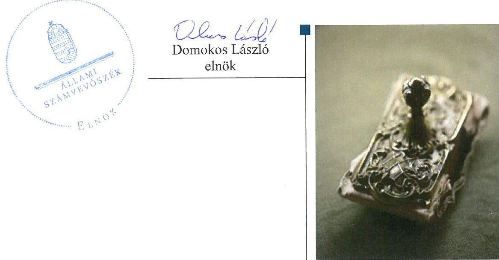

---

# AZ ELLENŐRZÉST FELÜGYELTE: 

HOLMAN MAGDOLNA JULIANNA felügyeleti vezető

## AZ ELLENŐRZÉST VEZETTE ÉS A VÉGREHAJTÁSÁÉRT FELELŐS:

GÖRGÉNYI GÁBOR ellenőrzésvezető

## A PROGRAM ÖSSZEÁLLÍTÁSÁÉRT FELELŐS:

JANIK JÓZSEF LÁSZLÓ osztályvezető

IKTATÓSZÁM: V-1048-431/2016.
TÉMASZÁM: 1995; 2082
ELLENŐRZÉS-AZONOSÍTÓ SZÁM: V0749

Jelentéseink az Országgyűlés számítógépes hálózatán és az Interneten a www.asz.hu címen is olvashatóak.

---

# TARTALOMJEGYZÉK 

■ ÖSSZEGZÉS ..... 5
■ AZ ELLENŐRZÉS CÉLJA ..... 7
■ AZ ELLENŐRZÉS TERÜLETE ..... 8
■ AZ ELLENŐRZÉS HÁTTERE, INDOKOLTSÁGA ..... 10
■ A JELENTÉS LÉNYEGES KÉRDÉSKÖREI ..... 11
■ ELLENŐRZÉS HATÓKÖRE ÉS MÓDSZEREI ..... 12
■ MEGÁLLAPÍTÁSOK ..... 14
■ JAVASLATOK ..... 29
■ MELLÉKLETEK ..... 33
I. Sz. melléklet: Értelmező szótár. ..... 33
II. Sz. melléklet: Az adatvédelem hazai jogi szabályozásának összhangja az Európai Unió adatvédelmi irányelveivel ..... 35
■ FÜGGELÉK: ÉSZREVÉTELEK ..... 37
■ RÖVIDÍTÉSEK JEGYZÉKE ..... 81

---

.

---

# ÖSSZEGZÉS 

Az adatkezelő szervezetek adatkezelési tevékenységre vonatkozó belső szabályozottsága a jogszabályi előírásoknak megfelelően biztosította a nemzeti vagyon részét képező nemzeti adatvagyon védelmét a 2011-2015. években. Az adatkezelők a gyakorlatban megfelelően alkalmazták a biztonságos adatkezelésre és az adatfeldolgozások kiszervezésére irányuló előírásokat, az adatok harmadik fél részére történő továbbítását megfelelő felhatalmazással, a felelősségi és hatásköri viszonyok egyértelmű lehatárolása mellett hajtották végre. Az adatok védettsége szempontjából azonban sérülékenységi kockázatot jelentett, hogy az adatkezeléshez használt elektronikus rendszerek és a szervezet egészének biztonsági osztály, illetve biztonsági szint szerinti besorolását nem minden esetben a jogszabályi előírásoknak megfelelően végezték el, amelyhez hozzájárult a hatósági ellenőrzés elmaradása is.

## Az ellenőrzés társadalmi indokoltsága

A nemzeti vagyon részét képező nemzeti adatvagyon a közfeladatot ellátó szervek által kezelt személyes adatok, közérdekű adatok és közérdekből nyilvános adatok összességét jelenti. A nemzeti adatvagyon biztonsága a nemzeti értékek megőrzése és védelme, a jövő nemzedékek szükségleteinek biztosítása, így az alkotmányos gyarapodás szempontjából alapvető társadalmi érdek. A nemzeti adatvagyon körébe tartozó adatok fokozott biztonságáról való gondoskodás elengedhetetlen az állampolgárok államba vetett bizalmának erősítése, valamint a közigazgatás folyamatos és zavartalan működése érdekében. A társadalom számára kiemelt jelentőséggel bír az adatok védelme, illetve ennek érvényesülését szolgáló jogi keretrendszer létrehozása. Az adatok védelme területén a közigazgatási szervek kiemelt helyet képviselnek, hiszen itt kezelik a nemzeti adatvagyon körébe tartozó adatok legnagyobb és legérzékenyebb adatnyilvántartásait. E nyilvántartások adatkezelői a feladatok ellátása érdekében szorosan együttműködnek, rendszeresen nagy mennyiségű adatot tartalmazó nyilvántartásokat továbbítanak, mely során figyelmet kell fordítani az adatok védelmére vonatkozó, jogszabályban foglalt előírásokra. Az adatok kezeléséhez, feldolgozásához használt elektronikus információs rendszerek használata ma már nélkülözhetetlen. Az adatvédelem hazai keretrendszerének és egyes kiemelt adatnyilvántartások ellenőrzésével az Állami Számvevőszék elősegíti a „jó kormányzás" érvényesülését, támogatja az átláthatóság megteremtésére irányuló fokozott társadalmi elvárásnak való megfelelést és hozzájárul a nemzeti vagyon megóvásához.

## Főbb megállapítások, következtetések, javaslatok

Az adatkezelő szervezeteknél az adatok kezelésére, feldolgozására és továbbítására vonatkozó belső szabályozottság a jogszabályi előírásoknak megfelelően biztosította a nemzeti adatvagyon védelmét, azonban a felügyeletet gyakorló hatóságok közül a NEIH nem látta el az Ibtv-ben előírt ellenőrzési feladatait, a NAIH pedig nem tett eleget minden, az Info tv. szerinti döntési és intézkedési kötelezettségeinek.

A harmadik fél részére történő adattovábbítások belső szabályozását az adatkezelő szervezetek a felhatalmazást biztosító ágazati jogszabályok, illetve a nemzetközi adattovábbítások esetén a vonatkozó EK rendeletek és nemzetközi egyezmények figyelembe vételével megfelelően kialakították.

A nemzeti adatvagyon kezelésével, feldolgozásával és továbbításával kapcsolatos felelősségi körök meghatározását az engedélyezési, jóváhagyási és kontrolleljárásokat, a dokumentumokhoz és informatikai rendszerekhez való hozzáférést, a hozzáférés szintjeit és a beszámoltatást az adatkezelő szervezetek a jogszabályi előírásokkal összhangban belső irányító eszközökben megfelelően szabályozták.

Az adatkezelő szervezetek a gyakorlatban megfelelően alkalmazták a biztonságos adatkezelésre, az adatfeldolgozások kiszervezésére és a nemzeti adatvagyon védelmére irányuló előírásokat. A nemzeti adatvagyon részét képező

---

adatok továbbítását minden esetben a jogszabályi felhatalmazásnak és célnak megfelelően, a belső szabályzatok előírásait betartva, az arra felhatalmazással rendelkezők közreműködésével hajtották végre.

Az adatok megfelelő védettsége szempontjából ugyanakkor sérülékenységi kockázatot jelentett, hogy az adatkezelő szervezetek a jogszabályi előírások ellenére nem határozták meg teljes körűen és megfelelően az elektronikus adatkezelő rendszerekkel és a szervezet egészével szemben támasztott, az adatok adminisztratív és fizikai biztonságát garantáló előírásokat és elvárásokat, mert az adatkezeléshez használt elektronikus rendszerek és a szervezet egészének biztonsági besorolását nem minden esetben a jogszabályi előírásoknak megfelelően végezték el, vagy elmaradt a besorolás végrehajtása. Mindez azt is jelenti, hogy nem a kezelt adatvagyon szempontjából elvárt szintű védelmi intézkedések kerültek kialakításra.

A területen nem működtek megfelelően az 1. és 2. ellenőrzési védelmi vonalak sem: A hiányosságokat az adatkezelő szervezetek belső ellenőrzései nem tárták fel, a NEIH hatósági feladatellátásának hiányosságaiból eredően pedig elmaradtak a jogszabály alapján végrehajtandó, a biztonsági besorolásokra vonatkozó külső hatósági ellenőrzések, és az ellenőrzések eredménye alapján végrehajtandó intézkedések.

---

# AZ ELLENŐRZÉS CÉLJA 

## Az adatvédelem ellenőrzése

AZ ELLENŐRZÉS CÉLJA annak értékelése, hogy megvalósult-e az adatvédelem hazai keretrendszere, és az ellenőrzésre kiválasztott adatkezelő szervezetek megfelelően alkalmazták-e a biztonságos adatkezelésre, az adatfeldolgozás kiszervezésére és különösen a személyes adatok és a nemzeti adatvagyon védelmére irányuló előírásokat.

---

# **AZ ELLENŐRZÉS TERÜLETE**

## **A nemzeti adatvagyon körébe tartozó nyilvántartások kiemelt adatkezelői és az adatkezelők felett adatvédelmi és adatbiztonsági felügyeletet gyakorló hatóságok**

Az Alaptörvény szerint a nemzeti vagyon kezelésének és védelmének célja a közérdek szolgálata, a közös szükségletek kielégítése és a természeti erőforrások megóvása, valamint a jövő nemzedékek szükségleteinek figyelembevétele. A nemzeti adatvagyon az Nvtv. alapján a nemzeti vagyon részét képezi, így a nemzeti vagyonra vonatkozó alkotmányos követelmények egyaránt vonatkoznak rá. A nemzeti adatvagyon fogalmát törvény a közfeladatot ellátó szervek által kezelt közérdekű adatok, személyes adatok és közérdekből nyilvános adatok összességeként határozza meg.

A nemzeti adatvagyon fokozottabb védelméért, az állampolgárok államba vetett bizalmának visszaállítása, valamint a közigazgatás folyamatos és zavartalan működésének biztosítása érdekében külön törvényt alkotott az Országgyűlés (Ibtv.1). Az ellenőrzés során értékeltük az adattovábbítások jogi keretrendszerének kialakítását, valamint a nemzeti adatvagyon körébe tartozó nyilvántartások kiemelt adatkezelőinél a biztonságos adatkezelésre, az adatkezelések kiszervezésére vonatkozó – a szabályozottságot érintő – előírások teljesülését a nemzeti adatvagyon védelme területén.

Az ellenőrzés keretében az adatkezelést (feldolgozás, nyilvántartás, továbbítás) hat adatkezelő szervezet (NAV2, OEP3, ONYF4, Kincstár5, OH6, KEKKH7) tevékenységén keresztül értékeltük. Az ellenőrzés kiterjedt a NAIH8 és a NEIH9 által az adatkezelő szervezeteknél elvégzett hatósági tevékenység értékelésére is.

Az egyes központi hivatalok és költségvetési szervi formában működő minisztériumi háttérintézmények felülvizsgálatával összefüggő jogutódlásról, valamint egyes közfeladatok átvételéről szóló 378/2016. (XII. 2.) Korm. rendelet 14. § (1) bekezdése alapján, az Országos Egészségbiztosítási Pénztár elnevezése 2017. január 1-jén Nemzeti Egészségbiztosítási Alapkezelőre változott, melynek következtében a megállapítások az OEPre vonatkoznak, a javaslatok azonban már a NEAK Főigazgatója számára fogalmazódnak meg.

A KEKKH 2016. december 31-ei hatállyal megszűnt, jogutód szervezete a Belügyminisztérium, ezért a megállapítások a KEKKH-ra vonatkoznak, a javaslatok azonban már a jogutód szervezet részére (Belügyminisztérium) fogalmazódnak meg.

Az Info tv. alapján 2012. január 1-jén létrejött NAIH feladata a személyes adatok védelméhez, valamint a közérdekű és a közérdekből nyilvános adatok megismeréséhez való jog érvényesülésének ellenőrzése és elősegítése.

---

A NEIH az Ibtv. 2013. július 1-jei hatályba lépésével az NFM $^{10}$ szervezeti egységeként kezdte meg működését, melynek keretében elsődleges feladatává vált az Ibtv. hatálya alá tartozó, kivételi körrel nem érintett elektronikus információs rendszerek felügyelete. A jogszabályi változások alapján 2015. január 1-jétől az elektronikus közigazgatás felelőse a belügyminiszter lett, így a NEIH a szervezeti jogutódlás keretében a BM $^{11}$-hez került, majd 2015. július 16-ai hatállyal az NBSZ $^{12}$ Nemzeti Kibervédelmi Intézetének hatósági osztályaként folytatta feladatainak ellátását.

Az adatkezelő szervezetek adatkezelési tevékenységét 2011. december 31-ig az Avtv. $^{13}$, 2012. január 1-jétől az Info tv. $^{14}$ szabályozta, amely alapján személyes adatot kezelni csak meghatározott célból, jog gyakorlása és kötelezettség teljesítése érdekében lehet.

Az ellenőrzés során kiemelt hangsúlyt fektettünk arra, hogy az adatkezelő szervezetek a nemzeti adatvagyon tekintetében milyen adatkezelésre vonatkozó, célhoz kötött felhatalmazással rendelkeztek, különös tekintettel a harmadik félnek történő adattovábbítások esetében. Az adattovábbítások szabályszerűségét az OEP, az ONYF, a Kincstár, a KEKKH és az OH esetében az alkalmazott összes elektronikus rendszer vonatkozásában, míg a NAV esetében 15 db véletlenszerűen kiválasztott elektronikus rendszer (AFIS $^{15}$, ELAB $^{16}$, ELEKAFA Portál $^{17}$, ELLVITA $^{18}$, ERSNY $^{19}$, EVITA $^{20}$, FOKA $^{21}$, JAROK $^{22}$, OPI $^{23}$, OPETA $^{24}$, REVORE $^{25}$, PFR $^{26}$, SEA $^{27}$, VRF $^{28}$, SZEF $^{29}$ ) esetében végeztük el.

Az adatkezelésre vonatkozó, célhoz kötött felhatalmazások ellenőrzése keretében értékeltük, hogy az adatkezelést elrendelő jogszabályok miként határozzák meg az adatkezelés, különös tekintettel az az adattovábbítások feltételeit. A jogszabályi előírásoknak való megfelelés szempontjából pedig ellenőriztük az adatkezelésre és adatfeldolgozásra vonatkozó belső szabályozottság meglétét, ennek keretében az egyértelmű feladat-, felelősség- és hatáskörökre, a humán-erőforráskezelésre és a folyamatokra vonatkozó szabályozások kialakítását és annak rendszeres aktualizálását.

A nemzeti adatvagyon körébe tartozó adatok feldolgozásának kiszervezése esetén a megkötött szerződések, megállapodások alapján ellenőriztük, hogy az adatkezelő szervezetek a jogszabályi előírásoknak megfelelően előírták-e az adatfeldolgozó tevékenységgel kapcsolatos elvárásokat, követelményeket az adatfeldolgozó szervezeteknek.

Az adatkezelés keretében használt informatikai és elektronikus rendszerek vonatkozásában értékeltük a rendszerekhez és adataikhoz kapcsolódó védelmi intézkedéseket, ezen belül a fizikai védelem, a hozzáférési jogosultságok, a naplózás, a biztonságértékelési eljárásrend, a rendszer- és kommunikáció védelem területeit, továbbá a rendszerek, valamint a szervezet egészének biztonsági szintbe történő besorolásának megfelelőségét.

---

# AZ ELLENŐRZÉS HÁTTERE, INDOKOLTSÁGA 

## Az adatvédelem ellenőrzése

A nemzeti vagyon részét képező nemzeti adatvagyon biztonsága a nemzeti értékek megőrzése és védelme, a jövő nemzedékek szükségleteinek biztosítása, így az alkotmányos gyarapodás szempontjából alapvető társadalmi érdek. A közigazgatási szervezetek kezelik az ország legnagyobb és legjelentősebb adatnyilvántartásait (állampolgárok személyi és lakcím adatai, egészségügyi- és nyugdíjnyilvántartások stb.). Ezen adatnyilvántartások biztonságos és folyamatos működése, az adatok magas szintű védelme nélkülözhetetlen mind a közigazgatás, mind a gazdaság folyamatos működtetéséhez.

Az adatvédelem kérdésére az európai, és így a magyar közvélemény is általában érzékenyen reagál. Az ellenőrzés várható eredménye, hogy átfogó értékelést ad az Országgyűlés és az állampolgárok számára a magyar adatvédelem aktuális helyzetéről, és rámutat azokra az alapvető szabályozási, szervezeti pontokra, ahol a kontrollok fejlesztése szükséges a jogszabályokban elvárt adatvédelmi szint eléréséhez. Az ÁSZ az ellenőrzéssel felhívja a figyelmet arra, hogy az átláthatóságra való törekvés, mint fő cél mellett az adatkezelő szervezeteknek és a felügyeletet gyakorló hatóságoknak mindig figyelemmel kell lennie az adatokkal való felelős gazdálkodásra, a közszféra, az állampolgárok és
 a vállalkozások adatainak védelmére.

Az adatvédelem ellenőrzése kiterjed az EUROSAI IT Munkacsoporttal való együttműködés keretében végzett párhuzamos ellenőrzés - országok közötti együttműködés keretében kialakított - szempontjaira, ezen belül az adatvédelem aktuális helyzetére. Az ellenőrzéssel az ÁSZ a stratégiájában foglaltakkal összhangban hozzájárul az aktív szerepvállaláshoz a nemzetközi ellenőrzésszakmai közéletben, segíti az adatvédelem fejlődését, illetve támogatja a felelősségteljes, következményekkel járó, a jognak érvényt szerző közigazgatási működést.

---

# A JELENTÉS LÉNYEGES KÉRDÉSKÖREI 

1. Az adatkezelő szervezetek adatkezelési tevékenységre vonatkozó belső szabályozottsága és felügyeletet gyakorló hatóságok feladatellátása megfelelt-e a jogszabályi előírásoknak és biztosította-e a nemzeti adatvagyon védelmét?
2. Az ellenőrzésre kiválasztott adatkezelő szervezetek megfelelően alkalmazták-e a biztonságos adatkezelésre, az adatfeldolgozások kiszervezésére és a nemzeti adatvagyon védelmére irányuló előírásokat?

---

# ELLENŐRZÉS HATÓKÖRE ÉS MÓDSZEREI 

## Az ellenőrzés típusa

Megfelelőségi ellenőrzés.

## Az ellenőrzött időszak

A 2011. január 1-től 2015. december 31-ig tartó időszak.

## Az ellenőrzés tárgya

Az ellenőrzés tárgyát képezte a kiválasztott adatkezelő szervezetek adatkezeléssel és információbiztonsággal kapcsolatos belső szabályozása, valamint a hatósági felügyeleti tevékenység. Az ellenőrzés során értékeltük a hazai adatvédelmi jogszabályoknak az Európai Unió adatvédelmi irányelveivel való összhangját, amelyet a II. melléklet tartalmaz.

Az adatkezelő szervezetek biztonságos adatkezelése, adatfeldolgozása és a nemzeti adatvagyon védelmének érvényesülése keretében az ellenőrzés kiterjedt az alkalmazott informatikai és elektronikus rendszereknél a biztonsági előírások teljesülésére, a lefolytatott szervezeti ellenőrzésekre, az adattovábbítások, illetve az adatfeldolgozások kiszervezése szabályosságára. A biztonsági előírások teljesülését az alapvető adminisztratív adatvédelmi intézkedések végrehajtásán, az Ibtv.-ben és végrehajtási rendeleteiben előírt önértékeléseken (biztonsági szint meghatározása), az információs rendszer biztonságáért felelős személy kijelölésén keresztül értékeltük. Az Ibtv.-ben előírt, kötelezően végrehajtandó adatvédelmi intézkedéseken túl értékeltük a szervezetek katasztrófa-elhárítással, technológiai fejlődéssel, szabályzat-aktualizálással kapcsolatos intézkedéseit. Az adatvédelem ellenőrzési szempontjai magukban foglalták mind a szervezetek, mind az informatikai rendszerek szintjén megvalósítandó követelményeket.

Az ellenőrzés kiterjedt minden olyan körülményre és adatra, amely az ÁSZ jogszabályban meghatározott feladatainak teljesítéséhez, valamint a program végrehajtása folyamán felmerült újabb összefüggések feltárásához szükséges.

## Az ellenőrzött szervezet

A nemzeti adatvagyon körébe tartozó nyilvántartások kiemelt adatkezelői: NAV, OEP, ONYF, Kincstár, OH, KEKKH. Az adatkezelők felett adatvédelmi és adatbiztonsági felügyeletet gyakorló hatóságok: NAIH, NEIH

---

# Az ellenőrzés jogalapja 

Az ÁSZ tv. 1. § (3) bekezdése, az 5. § (2) és (4) bekezdései, és az Nvtv. ${ }^{30} 1$. § (2) bekezdés i) pontjának előírásai.

## Az ellenőrzés módszerei

Az ellenőrzést az ÁSZ az ellenőrzési program szempontjai, az ellenőrzött időszakban hatályos jogszabályok, az ellenőrzés szakmai szabályai, a nemzetközi standardokat irányadónak tekintve, az egyes ellenőrzési típusokhoz kapcsolódó ÁSZ módszertanok alapján végeztük.

Az ellenőrzési kérdések megválaszolásához szükséges bizonyítékok megszerzése megfigyelés, szemrevételezés, kérdésfeltevés (információkérés), tételes dokumentumellenőrzés, mintavételezés, valamint elemző eljárás alapján történt. Az ellenőrzést a kérdésekre adott válaszok kiértékelésével, a tanúsítványok felhasználásával, továbbá az adott időszakban hatályos jogszabályok figyelembe vételével folytattuk le.

Az ellenőrzési bizonyítékként felhasználható adatforrások közé tartoztak egyrészt az ellenőrzés szakmai programjában felsorolt adatforrások, másrészt adatforrás lehetett minden egyéb - az ellenőrzés folyamán feltárt, az ellenőrzés szempontjából információt tartalmazó - dokumentum. Az ellenőrzés lefolytatásához az ellenőrzött szervezetek tanúsítványok kitöltésével, valamint az ÁSZ által kért dokumentumok elektronikus megküldésével szolgáltattak adatokat, információkat. A rendelkezésre bocsátott adatok, információk kontrollja az ellenőrzés keretében történt.

Mintavétellel ellenőriztük a NAV-nál, az OEP-nél, az ONYF-nél, a Kincstárnál, az OH-nál és a KEKKH-nál a nemzeti adatvagyon körébe tartozó adatok továbbításának, valamint az adatfeldolgozási tevékenység kiszervezésének szabályszerűségét. Mintavétellel ellenőriztük továbbá, hogy az adatkezelő szervezetek meghatározták-e az adatkezelés keretében használt informatikai és elektronikus rendszerekkel szemben támasztott, az adatok biztonságát garantáló elvárásokat és azokat megfelelően végrehajtották-e.

A minta alapján a sokaságban előforduló hibaarányt becsültük. Az értékelés eredményeként kétféle, „Megfelelő" és „Nem megfelelő" minősítést alkalmaztunk. „Megfelelőnek" értékeltünk egy ellenőrzött területet, amennyiben a hibaarány a teljes sokaságban 95\%-os bizonyossággal legfeljebb 10\% arányt képviselt. Abban az esetben, ha adott sokaság tekintetében a 10\%-os hibaarány küszöbérték átlépése megítélésének megbízhatósága nem érte el a 95\%-ot, akkor minősítettük „Megfelelőnek" a területet, ha a minta alapján a teljes sokaság vonatkozásában a hibaarány nagyobb valószínűséggel volt 10\% alatti, mint 10\% feletti.

---

# MEGÁLLAPÍTÁSOK 

## 1. Az adatkezelő szervezetek adatkezelési tevékenységre vonatkozó belső szabályozottsága és felügyeletet gyakorló hatóságok feladatellátása megfelelt-e a jogszabályi előírásoknak és biztosította-e a nemzeti adatvagyon védelmét?

Összegző megállapítás

Az adatkezelő szervezetek adatkezelési tevékenységre vonatkozó belső szabályozottsága a jogszabályi előírásoknak megfelelően biztosította a nemzeti adatvagyon védelmét, de az adatvédelem felügyeletét gyakorló hatóságok feladatellátása nem felelt meg teljes körűen a törvényi előírásoknak.
1.1. számú megállapítás

Az adatkezelő szervezetek a jogszabályoknak megfelelően kialakították a nemzeti adatvagyon körébe tartozó adatok kezelésére és továbbítására vonatkozó belső szabályzataikat.

## AZ ADATOK KEZELÉSÉRE VONATKOZÓ BELSŐ

SZABÁLYZATOKAT az adatkezelő szervezetek elkészítették. Az Avtv. 31/A. § (3) bekezdésében, illetve az Info tv. 24. § (3) bekezdésben előírtaknak megfelelően rendelkeztek adatvédelmi és adatbiztonsági szabályzattal.

Az ONYF és a NAV az Info tv. 24. § (3) bekezdésének 2012. január 1-jei hatályba lépésével gondoskodott az adatvédelmi és adatbiztonsági szabályzatok jogszabályi változások miatt szükséges elkészítéséről. Az Info tv. 24. § (3) bekezdésében foglaltak ellenére az OEP csak 2012. február 1-jére, az OH 2013. március 9-ére, a KEKKH 2014. augusztus 12-ére, a Kincstár pedig 2015. január 1-jére készítette el a szabályzatot. Az OEP adatvédelmi felelőse a 2012. szeptemberi, illetve a 2014. októberi SZMSZ-ben történt szervezeti változásokat az adatvédelmi szabályzatban, illetve az munkaköri leírásában foglaltak ellenére nem vezette át.

Az adatvédelmi és adatbiztonsági szabályzatok mellett az adatkezelő szervezetek egyéb szakmai szabályzatai is meghatározták az adatvédelemmel kapcsolatos feladatokat. Az Avtv. 10. § (1) bekezdése, illetve az Info tv. 7. § (2) bekezdésével összhangban kialakították azokat az eljárási szabályokat, amelyek az Avtv. és az Info tv., valamint az egyéb (pl. ágazati speciális) adat- és titokvédelmi szabályok érvényre juttatásához szükségesek. Ennek megfelelően belső szabályzatokban meghatározták az adatkezelés elveit, jogalapját, korlátait, valamint az érintettek előzetes tájékoztatási kötelezettségét. Biztosították, hogy az érintett kérhetett tájékoztatást személyes adatai kezeléséről. Szabályozták a személyes adatok helyesbítését, törlését, az érintett tiltakozása és a bírósági jogkövetkezmények esetén alkalmazandó eljárás rendjét.

---

Az adatkezelők az Avtv. 20. § (8) és az Info tv. 30. § (6) bekezdésében foglalt alapján a közérdekű adatok megismerésére irányuló igények teljesítésének rendjét rögzítő szabályzatot az OEP kivételével elkészítették. A KEKKH 2014. augusztus 12-ével tett eleget a törvényi előírásnak.

# A HARMADIK FÉL RÉSZÉRE TÖRTÉNŐ ADATTOVÁBBÍTÁSOK BELSŐ SZABÁLYOZÁSÁT az adatkezelő 

szervezetek az Avtv. és az Info tv. előírásai mellett a felhatalmazást biztosító ágazati jogszabályok, illetve a NAV, az OEP és az ONYF esetében a vonatkozó EK rendeletek és nemzetközi egyezmények figyelembe vételével megfelelően kialakították. Meghatározták a személyes adatok belföldi, illetve külföldre történő továbbítására és az adatszolgáltatási kötelezettség teljesítésére vonatkozó előírásokat, eljárási szabályokat:

- Az OH közszolgálati adatvédelmi szabályzata, valamint az adatvédelmi és adatbiztonsági szabályzata összhangban állt az Avtv. és Info tv. rendelkezéseivel, amelyekben az érintett beleegyezésének hiányában történő adattovábbítások vonatkozásában előírt célhoz kötöttség alapvetően az Ftv. ${ }^{31}$, Nftv. ${ }^{32}$, Nkt. ${ }^{33}$ keretében előírt kötelezettségen, illetve kapott felhatalmazáson alapuló - FIR ${ }^{34}$ és KIR ${ }^{35}$ rendszerekből történő - adattovábbításokat jelentette.
- A Kincstár az adatvédelmi és adatbiztonsági szabályzataiban a jogszabályi előírásokkal összhangban határozta meg a személyes adatok továbbításának rendjét, amely kiterjedt a külső megkeresésre és a külföldre irányuló adattovábbításokra is.
- Az OEP adattovábbítási kötelezettségét az adatvédelmi jogszabályokon felül a Ket. ${ }^{36}$, valamint az ágazati jogszabályok, a Tny. ${ }^{37}$, a TnyR. ${ }^{38}$, a Tbj. ${ }^{39}$, az Eütv. ${ }^{40}$, az Eüak. ${ }^{41}$, a 319/2010. (XII.27.) Korm. rendelet ${ }^{42}$ és az EU vonatkozó rendeletei szabályozták, amelyek alapján többek között az európai uniós tagságból adódó szakági összekötő szervként, illetékes intézményként működve és a belföldi jogsegély teljesítésének keretében is végzett adattovábbításokat. Az OEP adatvédelmi és adatbiztonsági szabályzatai, a nemzetközi ügyek eljárásrendjeinek előírásai összhangban voltak a jogszabályi előírásokkal.
- Az ONYF adattovábbításaira vonatkozó előírásokat a nyugdíjbiztosítási ágazati szabályozás körébe tartozó Tbj., Tny. és TnyR., továbbá a Ket., a nemzetközi szociálpolitikai, illetve szociális biztonsági egyezmények, a szociális biztonsági rendszerek koordinálásáról szóló 883/2004/EK rendelet ${ }^{43}$, illetve annak végrehajtására kiadott 987/2009/EK rendelet ${ }^{44}$ tartalmazta, amelyekkel a mindenkor hatályos adatvédelmi szabályzat és a szakügyintézésre vonatkozó eljárásrendek rendelkezéseinek összhangja biztosított volt.
A megváltozott munkaképességű személyek ellátási igényeinek elbírálása és folyósítása tárgyában, illetve a nyugdíjbiztosítási hatósági nyilvántartásban szereplő adatok egyeztetésével kapcsolatos adattovábbítások tekintetében a címzett államigazgatási szervekkel való együttműködést megállapodásban megfelelően szabályozták.
- A KEKKH az adatigénylés, illetve az adattovábbítás belső szabályozását a vonatkozó ágazati jogszabályok (Nytv. ${ }^{45}$, Szaztv. ${ }^{46}$, 1998. évi XII. tv. ${ }^{47}$, a 2012. évi II. tv. ${ }^{48}$, Kknyt ${ }^{49}$., a 2001. évi LXII. tv. ${ }^{50}$, SIS II. tv. ${ }^{51}$, 2009. évi LXII. tv. ${ }^{52}$, 2009. évi CXV. tv. ${ }^{53}$, Bnytv. ${ }^{54}$ ), valamint az Avtv.

---

és az Info tv. figyelembe vételével az adatvédelmi szabályzatában megfelelően kialakította.
A NAV által teljesített rendszeres, törvényi kötelezettségen, illetve jogszabályi felhatalmazáson alapuló adattovábbításokat a mindenkor hatályos adatszolgáltatási szabályzatban szabályozták. A személyes adatokat is tartalmazó adattovábbítások esetében biztosított volt az adatkezelés Avtv. és Info tv. szerinti célhoz kötöttsége, rendelkezésre állt a törvényi felhatalmazás.

# AZ INFORMÁCIÓBIZTONSÁG BELSŐ SZABÁLYO- 

ZÁSA keretében az adatkezelők az általuk üzemeltetett informatikai rendszerek védelme, továbbá az informatikai rendszerek által kezelt adatok biztonsága érdekében rendelkeztek szervezeti szintű IBSZ-szel, de a szükséges felülvizsgálat és aktualizálás a következő esetekben elmaradt:
$\longrightarrow$ Az ONYF az IBSZ-ét az abban foglaltak ellenére nem aktualizálta a 2011-2015 között bekövetkezett jogszabályi és szervezeti változásokra tekintettel.
$\longrightarrow$ A Kincstár IBSZ-e tartalmazta, hogy azt minden évben felül kell vizsgálni, de a 2011-2012. években ez nem történt meg.
Az adatkezelő szervezetek IBSZ-ei nem tartalmazták teljes körűen a 77/2013. (XII. 19.) NFM rendelet ${ }^{55}$ 4. melléklet 3.1.1.3.3 pontjában és a 41/2015. (VII. 15.) BM rendelet ${ }^{56}$ 4. melléklet 3.1.1.1.3 pontjában előírt tartalmi elemeket (lásd 1. táblázat):

1. táblázat

## AZ ADATKEZELŐ SZERVEZETEK IBSZ-EINEK HIÁNYOSSÁGAI

| Adatkezelő   szervezet: | 77/2013. (XII. 19.) NFM rendeletben és a 41/2015. (VII. 15.) BM rendeletben előírt, az IBSZ-ben nem szabályozott terület |
| :--: | :--: |
| ONYF | - kockázatelemzés   - elektronikus információs rendszerek karbantartásának rendje   - elektronikus információs rendszerek biztonsági beállításával kapcsolatos feladatok, elvárások, jogok   - kockázatelemzés (2015. április 30-ig)   - elektronikus információs rendszerek karbantartási rendje   - elektronikus információs rendszerek biztonsági beállításával kapcsolatos feladatok, elvárások, jogok   - hozzáférési szabályok betartásának ellenőrzése   - elektronikus információs rendszerek biztonsági beállításával kapcsolatos feladatok, elvárások, jogok |

   - rendszerek használatáról szóló rendszerbejegyzések értékelése eredményétől függő eljárások |
| Kincstár | - kockázatelemzés   - biztonsági helyzet-, és eseményértékelés eljárási rendje   - elektronikus információs rendszerek biztonsági beállításával kapcsolatos feladatok |
| KEKKH | - üzemmenet-folytonosság tervezése |
| OEP | - biztonsági helyzet-, és eseményértékelés eljárási rendje   - üzemmenet-folytonossági tervezés   - elektronikus információs rendszerek karbantartásának rendje |

Fonrás: saját szerkesztés

## AZ ADATVÉDELMI FELELŐSÖK KINEVEZÉSE,   MEGBÍZÁSA az adatkezelőknél - a Kincstár kivételével - megfelelt az

Avtv. 31/A. § (1) és az Info tv. 24. § (1) bekezdése előírásainak. A Kincstár esetében a belső adatvédelmi felelős a 2011-2014. években az Avtv. 31/A. § (1) és az Info tv. 24. § (1) bekezdésében foglaltak ellenére nem tartozott közvetlenül a Kincstár vezetőjének felügyelete alá.

Az adatvédelmi felelősök feladatait és hatáskörét az adatkezelők az SZMSZ-ekben, az adatvédelmi szabályzatokban, valamint a feladatot ellátó

---

1.2. számú megállapítás

Az adatkezelő szervezetek a nemzeti adatvagyon kezeléséhez és feldolgozásához kapcsolódó feladatokat, valamint a felelősségi és döntési jogköröket megfelelően lehatárolták.

A NEMZETI ADATVAGYON KEZELÉSÉVEL, FELDOLGOZÁSÁVAL ÉS TOVÁBBÍTÁSÁVAL KAPCSOLATOS FELELŐSSÉGI KÖRÖK MEGHATÁROZÁ-
SÁT, az engedélyezési, jóváhagyási és kontrolleljárásokat, a dokumentumokhoz és informatikai rendszerekhez való hozzáférést, a hozzáférés szintjeit és a beszámoltatást az adatkezelő szervezetek az Ámr. ${ }^{57}$ 158. § (2) bekezdésének és a Bkr. ${ }^{58}$ 8. § (4) bekezdés előírásainak megfelelően belső irányító eszközökben (SZMSZ, ügyrend, adatvédelmi szabályzat, IBSZ, ellenőrzési nyomvonal, munkaköri leírások) szabályozták.

A nemzeti adatvagyon kezelésével és feldolgozásával kapcsolatos tevékenységekre vonatkozóan az adatkezelő szervezetek teljes körűen csak az ellenőrzött időszak végére rendelkeztek megfelelő ellenőrzési nyomvonallal:

- Az Ámr. 156. § (2) bekezdésében és a Bkr. 6. § (3) bekezdésében előírtak ellenére a nemzeti adatvagyon kezelésével és feldolgozásával kapcsolatos tevékenységekre vonatkozóan a NAV 2014. november végéig, illetve a KEKKH 2015. májusáig nem rendelkezett ellenőrzési nyomvonallal.
- A Kincstár esetében a 2011. évben hatályba helyezett ellenőrzési nyomvonalak aktualizálását a Bkr. 6. § (3) bekezdésében foglaltak ellenére csak 2015. júniusában hajtották végre, annak ellenére, hogy a jogszabályi, illetve a szervezeti és feladatváltozások miatt ez indokolt lett volna.
Az adatkezelő szervezetek elkészített ellenőrzési nyomvonalai táblázatos formában tartalmazták az Ámr. 156. § (2) bekezdés és Bkr. 6. § (3) bekezdésének megfelelően a felelősségi és információs szinteket és kapcsolatokat, az irányítási és ellenőrzési folyamatokat.

Az adatkezelést, adatfeldolgozást, adatvédelmet ellátó dolgozókra vonatkozó munkaköri leírások tartalmazták a Kttv. ${ }^{59}$ 75. § (1) bekezdés d) pontjának megfelelően a kormánytisztviselők feladatait és a végzettségre, szakképzettségre, szakképesítésre vonatkozó adatokat.
1.3. számú megállapítás

Az adatkezelők felett adatvédelmi és adatbiztonsági felügyeletet gyakorló hatóságok nem látták el az Ibtv.-ben előírt ellenőrzési feladatokat és nem tettek eleget az Info tv.-ben előírt döntési és intézkedési kötelezettségeknek.

A NEIH A BIZTONSÁGI OSZTÁLYBA SOROLÁST ÉS A BIZTONSÁGI SZINT MEGÁLLAPÍTÁSÁT 2013. július 1-től az Ibtv. 14. § (2) bekezdés a) pontjában foglaltak ellenére nem ellenőrizte az adatkezelő szervezeteknél. Az adatkezelő szervezetek által megállapított biztonsági osztályokat és biztonsági szinteket érdemi felülvizsgálat nélkül vette nyilvántartásba, amely a Ket. 82. § (2) bekezdése alapján határozatnak, vagyis hatósági döntésnek minősült.

---

Az ellenőrzések elmaradása miatt a NEIH nem tárta fel az adatkezelő szervezetek által használt elektronikus információs rendszerek és a szervezetek egészének biztonsági osztályba sorolásának és biztonsági szint megállapításának hiányosságait (lásd 2.1. megállapítás). Ebből eredően nem került sor az Ibtv. 14. § (2) bekezdés c) pontja alapján a biztonsági hiányosságok elhárításának elrendelésére, és annak eredményessége ellenőrzésére sem.

Az ellátandó hatósági ellenőrzési feladatok vonatkozásában a NEIH éves ellenőrzési terveket készített, de azok fő fókuszterülete csak a már megállapított biztonsági osztályokhoz kapcsolódó védelmi intézkedések megvalósítására vonatkozott.

Az Ibtv. 14. § (2) bekezdés d) pontjában foglaltak ellenére a NEIH 2013. július 1-től a rendelkezésre álló információk alapján kockázatelemzést nem végzett. Ebből eredően elmaradt az Ibtv. 14. § (2) bekezdése szerint ellátandó hatósági ellenőrzési feladatokkal összefüggésben, az elektronikus információs rendszerek értékének, sérülékenységének (gyenge pontjainak), fenyegetéseinek, a várható károknak és ezek gyakoriságának felmérése útján a kockázatok feltárása és értékelése.

A NEIH az adatkezelő szervezetek által a 77/2013. (XII. 19.) NFM rendelet és a 41/2015. (VII. 15.) BM rendelet alapján megállapított biztonsági osztály, illetve biztonsági szint alacsonyabbra történő módosítására vonatkozó kérelmeket elbírálta, majd egyetértés esetén nyilvántartásba vette azokat. A kérelem elutasítása esetén a hatósági döntését határozatba foglalta.

A NEIH 2015. július 16. utáni időszakra vonatkozó feladatellátását az NBSZ Ellenőrzési Osztálya belső ellenőrzés keretében értékelte, amely egyebek mellett a NEIH Ibtv. 15. § (1) bekezdés szerinti nyilvántartási kötelezettségére terjedt ki, azon belül az adatkezelő szervezetek és elektronikus információs rendszerek besorolásának nyilvántartására. Az ellenőrzés megállapította, hogy a NEIH nyilvántartása nem alkalmas a végrehajtott hatósági cselekmények visszamenőleges kimutatására. Az ellenőrzés a NEIH Ibtv. 14. § (2) bekezdésében foglalt hatósági feladatellátásával összefüggésben nem tárt fel hiányosságokat.

A NAIH AZ ADATVÉDELMI NYILVÁNTARTÁST 2012. január 1-től az Info tv. 38. § (3) bekezdés f) pontjának megfelelően vezette az adatkezelőkről, de az nem tartalmazta a belső adatvédelmi felelősök nevét és elérhetőségi adatait az Info tv. 65. § (1) bekezdés j) pontjában foglaltak ellenére.

Az adatkezelő szervezetek - az ONYF kivételével - az Info tv. 66. § (1) bekezdése előírásainak megfelelően kérelmet nyújtottak be az adatvédelmi nyilvántartásba vétel érdekében. Az ONYF az Info tv. 66. § (1) bekezdésében foglaltak ellenére a személyes adatok kezelésének nyilvántartásba vételét nem kérelmezte a NAIH-nál. Az adatkezelők adatvédelmi nyilvántartásba vételi kérelmeinek darabszámát a 2012-2015. években az 1. ábra tartalmazza:

---

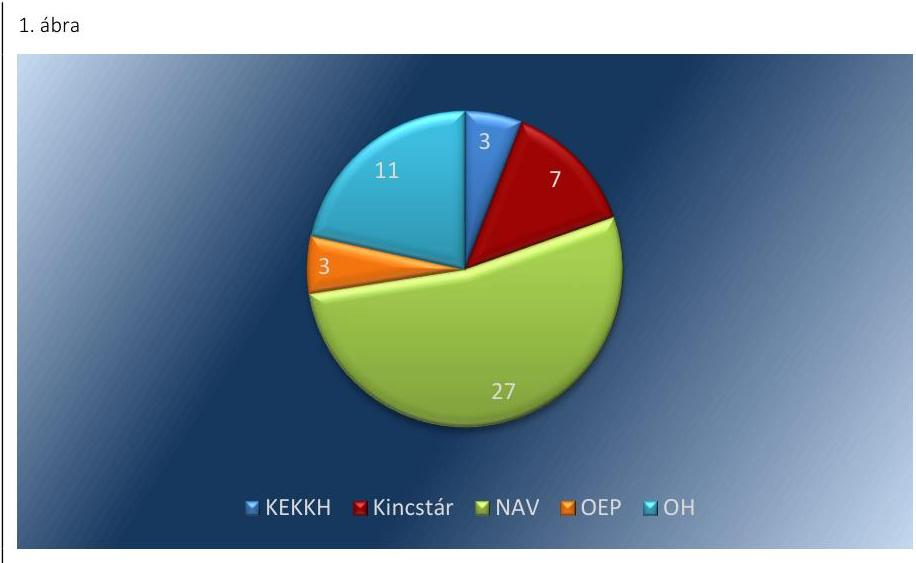

Forrás: saját szerkesztés

# A SZEMÉLYES ADATOK VÉDELMÉHEZ, VALAMINT A KÖZÉRDEKŰ ÉS A KÖZÉRDEKBŐL NYILVÁNOS ADATOK MEGISMERÉSÉHEZ VALÓ JOG ÉRVÉNYESÜLÉSE érdekében a NAIH az Info tv. 38. § (3) bekezdés a) pontjának megfelelő vizsgálatot 29 esetben folytatott le 2012 és 2015 között az adatkezelőknél bejelentések alapján. Az adatkezelő szervezetekkel kapcsolatban érkezett bejelentések alapján lefolytatott vizsgálatok darabszámát a 2012-2015. években a 2. ábra tartalmazza: 2. ábra 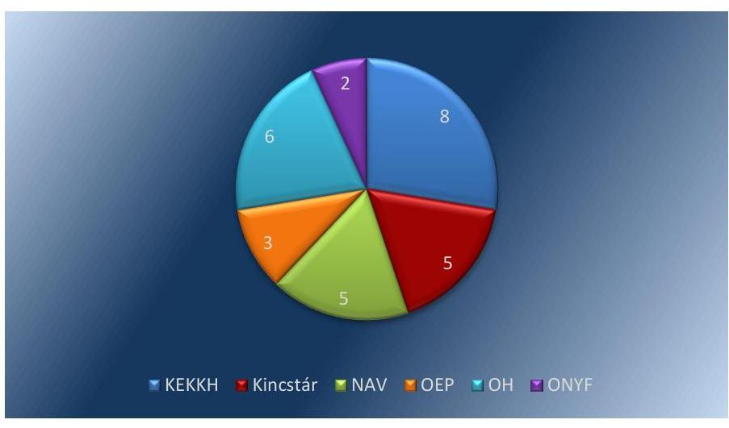

A NAIH az Info tv. 56. § (1) bekezdésével összhangban a NAV-ot, a KEKKH-t, az OEP-et és az OH-t egy-egy esetben, a Kincstárt két esetben felszólította a feltárt jogsérelem orvoslására, megszüntetésére és a megtett intézkedésekről történő tájékoztatásra, amelyet az adatkezelők - a NAV és Kincstár egy-egy esete kivételével - teljesítettek. A felszólításra a NAV és a Kincstár - az Info tv. 56. § (2) bekezdésének előírása ellenére - nem tájékoztatta a NAIH-t a megtett intézkedéseiről és álláspontjáról. A NAIH az Info tv. 58. § (1) bekezdésében foglaltak ellenére nem döntött a szükséges további intézkedések megtételéről.

---

# 2. Az ellenőrzésre kiválasztott adatkezelő szervezetek megfelelően alkalmazták-e a biztonságos adatkezelésre, az adatfeldolgozások kiszervezésére és a nemzeti adatvagyon védelmére irányuló előírásokat? 

Összegző megállapítás

Az adatkezelő szervezetek nem határozták meg teljes körűen és megfelelően az adatok biztonságát garantáló elvárásokat, de a gyakorlatban megfelelően alkalmazták a biztonságos adatkezelésre, az adatfeldolgozások kiszervezésére és a nemzeti adatvagyon védelmére irányuló előírásokat.
2.1. számú megállapítás

Az adatkezelő szervezetek nem határozták meg teljes körűen és megfelelően az elektronikus adatkezelő rendszerekkel és a szervezet egészével szemben támasztott, az adatok biztonságát garantáló elvárásokat.

## AZ ELEKTRONIKUS ADATKEZELŐ RENDSZEREK ADMINISZTRATÍV, FIZIKAI ÉS LOGIKAI BIZTON-

SÁGÁT garantáló előírásokat az adatkezelő szervezetek a belső szabályzataikban meghatározták, azonban a logikai biztonságra vonatkozó belső szabályozottság nem felelt meg teljes körűen a 77/2013. (XII. 19.) NFM rendelet, illetve a 41/2015. (VII. 15.) BM rendelet előírásainak a következő esetekben:
— Az ONYF és az OH 2013. december 27-től az NFM rendelet 4. mellékletének 3.3.5.1.1.1. pontjában és a BM rendelet 4. mellékletének 3.3.9.1.1.1. pontjában foglaltak ellenére nem rendelkezett azonosítási és hitelesítési eljárásrenddel, az IBSZ-ek csak az azonosítás és hitelesítés alapvető keretszabályait határozták meg.
— Az OH 2013. december 27-től nem határozta meg a NYAK-REX rendszer ${ }^{60}$ esetében a szervertermekbe belépésre jogosultak és a rendszerhez használt adathordozókhoz történő hozzáférés korlátozását, így nem biztosította az NFM rendelet 4. mellékletének 3.3.4.2. pontja, valamint a BM rendelet 4. mellékletének 3.3.8.2. pontjában foglaltak érvényesülését.
— Az ONYF esetében a 2013. december 27. utáni időszakban az SAP ${ }^{61}$, a GovSys NYufig ${ }^{62}$, a MEMESE ${ }^{63}$ rendszer segély és méltányossági moduljai, a TÉBA ${ }^{64}$, a Dokumentumtár, a NAV havi adatbázis, valamint az EETÜR ${ }^{65}$ rendszerek esetében a rendszergazdai és adatbázisszintű hozzáférések nem kerültek naplózásra. A naplózás elmaradásával a felsorolt rendszerek esetében az ONYF megsértette az ONYF IBSZ 7.7.1. és 29.1.2. pontjában foglalt előírásokat.
A felsorolt rendszerek esetében a 2013. december 27. utáni időszakban az NFM rendelet 4. mellékletének 3.3.8.2.1.1. pontjában és a BM rendelet 4. mellékletének 3.3.12.2.1.1. pontjában foglaltak ellenére nem határozták meg a naplózható és naplózandó eseményeket, és erre nem készítették fel az elektronikus információs rendszereket.

---

# AZ ADATKEZELÉSHEZ HASZNÁLT ELEKTRONIKUS RENDSZEREK BIZTONSÁGI OSZTÁLYBA SO-

ROLÁSÁT az adatkezelő szervezetek - az OEP és az OH kivételével - az Ibtv. 7. § (1) bekezdésében foglaltak ellenére 2013. július 1-től az ellenőrzött időszak végéig, illetve az Ibtv. 26. § (1) bekezdése alapján legkésőbb 2014. július 1-ig nem végezték el teljes körűen. A bizalmasság, a sértetlenség és a rendelkezésre állás szempontjából elvégzendő besorolás a következő rendszerek esetében maradt el:
A Kincstárnál a KIRA ${ }^{66}$ és a Járadék nyilvántartó rendszer esetében.
— Az ONYF-nél a Govsys Nyufig, a MEMESE rendszer méltányossági és segély moduljai, a TÉBA, a NAV havi adatbázis, a PKN ${ }^{67}$ adatbázis és a Központi szkennelő, érkeztető rendszer esetében.
— A NAV-nál a KOCKA2 és a Diszpécser modul ${ }^{68}$ esetében.
— A KEKKH-nál a Fegyver ${ }^{69}$ rendszerek esetében.
A további rendszerek biztonsági osztályba sorolása a Kincstár és az ONYF esetében az Ibtv. 26. § (1) bekezdésében meghatározott határidőn túl történt meg.

Az OEP és az OH esetében a rendszerek biztonsági osztályba sorolását az Ibtv. 7. § (3) bekezdésében foglaltak ellenére a szervezet vezetője nem hagyta jóvá, illetve az OEP, az OH, a NAV és az ONYF esetében a besorolás eredményét az IBSZ-ben nem rögzítették.

A rendszerek biztonsági osztályba sorolásának hiányosságait a NEIH a hatósági ellenőrzési feladatai ellátásának (1.3. pontban bemutatott) hiányosságaiból eredően nem tárta fel. Egyéb - az ÁSZ-on kívüli - külső ellenőrzések, illetve az adatkezelő szervezetek belső ellenőrzései ezt a területet nem érintették.

Az adatkezelő szervezetek az Ibtv. 8. § (5) bekezdésének megfelelően az elektronikus rendszerek biztonsági osztályba sorolását követő 90 napon belül cselekvési tervet készítettek a védelmi hiányosságok pótlására, ha rendszerek a rájuk vonatkozó védelem elvárt erősségét nem teljesítették.

## A SZERVEZET EGÉSZÉNEK BIZTONSÁGI SZINT

SZERINTI BESOROLÁSÁT
 az adatkezelő szervezetek az Ibtv. 9. §-ának és a 10. § (1) bekezdésének megfelelően elvégezték, de azt az ONYF, az OH és a Kincstár az Ibtv. 26. § (2) bekezdésében meghatározott határidőn túl hajtotta végre. A szervezet egészének biztonsági szint szerinti besorolásával összefüggésben az alábbi hiányosságok merültek fel:

- Az ONYF esetében a szervezetet az 5. biztonsági szintbe sorolták be, amelyet az Ibtv. 10. § (8) bekezdésének megfelelően a szervezet vezetője jóváhagyott. A szervezeti szintű besorolást azonban az Ibtv. 10. § (8) bekezdésének ellenére az IBSZ-ben nem rögzítették.

Az ONYF az Ibtv. 10. § (2) bekezdés alapján cselekvési terv készítésére volt kötelezett. A kötelezettségének nem megfelelően tett eleget, mert csak a 2. biztonsági szint elérésére készített intézkedési tervet, annak ellenére, hogy a szervezetet az 5. biztonsági szintbe sorolta.
A NAV esetében az ÁSZ a Magyarország 2014. évi központi költségvetése végrehajtásának ellenőrzéséről szóló 15167 számú jelentésében, illetve annak 3. számú mellékletében a következőket állapította

---

meg: „A NAV az Ibtv. 7. § 3.) pontjában, illetve a 10. § 8.) pontjában meghatározott, számára irányadó biztonsági szintet az ellenőrzött időszak végéig nem teljesítette. A jogszabály alapján a szervezetnek az elektronikus információs rendszer vizsgálatát követő két év alatt kell elérnie a szükséges biztonsági szintet. A NAV az ellenőrzési időszakban biztonsági osztályba sorolta rendszereit, illetve biztonsági szintbe sorolta a szervezetet, azonban a besorolás nem a jogszabályi előírásoknak megfelelően történt. A szervezet irányadó biztonsági szintjének 4-es szintet határozott meg, miközben a jogszabály 5-öst írt elő. Az információs rendszerek besorolása nem a jogszabály végrehajtói rendeletében meghatározott kockázatelemzés alapján történt."
A NAV szervezetének 3. biztonsági szintbe történő besorolása 2015. július 15-ig nem felelt meg az Ibtv. 9. § (2) bekezdés d) pontjában foglalt előírásnak. A jogszabályhely alapján a NAV az 5. biztonsági szintbe tartozott, mivel a nemzeti adatvagyon körébe tartozó állami nyilvántartások adatfeldolgozásának biztosításáról szóló 38/2011 (III. 22.) Korm. rendelet alapján nemzeti adatvagyon körébe tartozó állami nyilvántartások esetében végzett adatfeldolgozást. A besorolás 2015. július 16. és december 31. között nem felelt meg a 41/2015. (VII. 15.) BM rendelet 1. melléklet 2. Biztonsági osztályok 2.5. pontjának.
$\longrightarrow$ Az OH esetében a szervezet biztonsági szintbe történő besorolásának vezető általi elfogadása és annak az IBSZ-ben történő rögzítése csak mintegy másfél évvel később, egy 2015. augusztus 4-én kiadott elnöki utasításban történt meg.
$\longrightarrow$ A Kincstár esetében az ÁSZ a Magyar Államkincstár ellenőrzéséről szóló 16043 számú jelentésének 5.1. pontjában megállapította, hogy a Kincstár biztonsági szintjének meghatározása nem volt megfelelő: „A 2013. évi L. tv. ${ }^{70}$ 9. § (1) és 10. § (1) bekezdése szerinti, 2014. május 12-én elvégzett besorolás nem felelt meg a 2013. évi L. törvény 10. § (3) bekezdésében foglalt előírásoknak, mert nem rögzítették, hogy a Kincstár nem felel meg az 1. aktuális biztonsági szintnek sem, ... A Kincstár 3. elvárt biztonsági szintjének meghatározása nem felelt a 77/2013. (XII. 19.) NFM rendeletben foglaltaknak, mert az elvárt biztonsági szint meghatározásánál a 77/2013. (XII. 19.) NFM rendelet 2. Biztonsági osztályok 2.6. pontja figyelembe vételével kellett volna eljárni."
A Kincstár 3. biztonsági szint szerinti besorolása 2015-ben sem felelt meg a 77/2013. (XII. 19.) NFM rendelet és a 41/2015. (VII. 15.) BM rendelet 1. melléklet 2. Biztonsági osztályok 2.6. pontjának.
$\longrightarrow$ Az OEP biztonsági szintbe sorolását a szervezet vezetője igazolható módon nem hagyta jóvá és nem rögzítették az IBSZ-ben az Ibtv. 10. § (8) bekezdésében foglaltak ellenére.
A Kincstár biztonsági szintje megállapításának hiányosságait a NEIH a hatósági ellenőrzési feladatai ellátásának (1.3. pontban bemutatott) hiányosságaiból eredően nem tárta fel, 2015. július 15-ét követően a NAV biztonsági szintje megállapításának hiányosságait a NEIH nem tárta fel. Egyéb - az ÁSZ-on kívüli - külső ellenőrzések, illetve az adatkezelő szervezetek belső ellenőrzései ezt a területet nem érintették.

---

AZ INFORMATIKAI BIZTONSÁGI POLITIKÁT az Ibtv. 11. § (1) bekezdés d) pontjának megfelelően elkészítették az adatkezelő szervezetek. A 77/2013. (XII. 19.) NFM rendelet 4. mellékletének 3.1.1.1. pontjának megfelelően az $\mathrm{IBP}^{71}$-kben meghatározták az informatikai biztonságpolitika szervezeti szempontú és alkalmazott biztonsági alapelveit, az informatikai rendszerek megfelelőségi követelményeit.

# AZ ELEKTRONIKUS INFORMÁCIÓS RENDSZEREK 

BIZTONSÁGÁÉRT FELELŐS SZEMÉLYEKET az adatkezelő szervezetek vezetői az Ibtv. 11. § (1) bekezdés c) pontjában foglaltaknak megfelelően kinevezték, illetve megbízták. Amennyiben a megbízott $\mathrm{IBF}^{72}$-ek nem rendelkeztek az Ibtv. 13. § (8) bekezdésében előírt felsőfokú végzettséggel és szakképzettséggel, annak megszerzése érdekében tanulmányokat folytattak, összhangban az Ibtv. 26. § (4) bekezdésében foglaltakkal.

Az IBF-ek feladatait az adatkezelő szervezetek - az OH és az ONYF kivételével - az Ibtv. 13. § (2) bekezdésével összhangban határozták meg:

- Az OH esetében az IBF feladatait tartalmazó, 2013. évre szóló megállapodás nem tartalmazta az Ibtv. 13. § (2) bekezdés d) és f) pontjában foglalt feladatokat. A 2014. évtől a megállapodást az Ibtv.-ben nevesített feladatoknak megfelelően módosították.
- Az ONYF esetében az IBF munkaköri leírásában foglalt feladatok nem voltak összhangban az Ibtv. 13. § (2) bekezdésében foglaltakkal. A munkaköri leírás alapvetően közreműködési és részvételi feladatokat tartalmazott, annak ellenére, hogy az Ibtv. irányítási feladatokat határoz meg. A feladatkör betöltésével 2015. december 15-től megbízott személy munkaköri leírásában szereplő feladatok már összhangban voltak az Ibtv.-ben szereplő feladatokkal.

## AZ INFORMATIKAI BIZTONSÁGGAL KAPCSOLATOS KÖTELEZETTSÉGEKET ÉS FELELŐSSÉ-

KET az adatkezelő szervezetek az 77/2013. (XII. 19.) NFM rendelet és a 41/2015. (VII. 15.) BM rendelet vonatkozó előírásainak megfelelően az IBSZ-ben határozták meg. Meghatározták a rendszerbiztonsággal kapcsolatos felelősség érvényesítésének feltételeit továbbá a fegyelmi eljárás kezdeményezését az elektronikus információbiztonsági szabályok megsértése tekintetében. Indokolt esetben a fegyelmi eljárásokat lefolytatták és annak eredménye alapján intézkedéseket tettek.
2.2. számú megállapítás

Az adatkezelő szervezetek az adatvédelemmel, adatkezeléssel kapcsolatban lefolytatták a belső szabályzatokban előírt ellenőrzéseket.

A NEMZETI ADATVAGYON KEZELÉSÉHEZ, VÉDELMÉHEZ KAPCSOLÓDÓ ELLENŐRZÉSEKET az adatkezelő szervezetek belső ellenőrzési feladatokat ellátó szervezeti egységei a Ber. ${ }^{73} 6 . \S(4)$, illetve a Bkr. 19. § (4) bekezdés rendelkezéseivel összhangban kockázatelemzésen alapuló éves ellenőrzési tervekben határozták meg. Az OH az éves ellenőrzési tervei alapján nem végzett a nemzeti adatvagyon kezelésével és védelmével kapcsolatos belső ellenőrzést.

---

A belső ellenőrzések jellemzően informatikai rendszerellenőrzések voltak, amelyek keretében minden adatkezelő ellenőrizte a jogosultságkezelések rendszerét a jogosulatlan adatkezelés megállapítása, illetve megelőzése céljából. Az OEP az adatok fizikai biztonsága területére vonatkozóan is végzett ellenőrzést. Az ellenőrzések során az ellenőrzési jelentésekben tett megállapításokhoz kapcsolódó hiányosságok felszámolása érdekében a Ber. 29. § (1) és a Bkr. 45. § (1) bekezdés előírásával összhangban intézkedési tervek készültek.

Az intézkedési tervekben meghatározott egyes feladatok végrehajtásáról történő beszámolás a Ber. 92/A. § (3) és a Bkr. 46. § (1)-(2) bekezdéseivel összhangban egy kivétellel minden esetben megtörtént, így biztosított volt a belső ellenőrzési jelentésekben tett megállapítások megvalósulásának nyomon követése és hasznosulása. Az ONYF esetében 2013. évben a Bkr. 46. § (1) bekezdés szerinti beszámolási kötelezettség teljesítése során az érintett szervezeti egység vezetője az IBSZ aktualizálásának intézkedési tervben foglaltak szerinti végrehajtásáról számolt be, annak ellenére, hogy arra az ellenőrzött időszakban nem került sor.

A belső ellenőrzések nem vonatkoztak az elektronikus rendszerek megválasztott biztonsági osztályainak, illetve a szervezet egésze biztonsági szintjének helytállóságára, így NAV, a Kincstár, az ONYF, és a KEKKH esetében nem kerülhettek feltárásra annak hiányosságai.

A BELSŐ ADATVÉDELMI FELELŐSŐK - a Kincstár, az ONYF és a KEKKH kivételével - ellátták az Avtv. 31/A. § (2) bekezdés b) pontjában és az Info tv. 24. § (2) bekezdés b) pontjában foglalt ellenőrzési feladatokat:

- A NAV belső adatvédelmi felelőse 9 esetben folytatott le ellenőrzést, amelyből 2 soron kívüli ellenőrzés volt. A bejelentés alapján indult soron kívüli ellenőrzéseket a belső adatvédelmi felelős az Info tv. 24. § (2) bekezdés c) pontnak megfelelően folytatta le. Az ellenőrzések az adatkezelést összességében megfelelőnek találták.
- Az OEP belső adatvédelmi felelősei a szervezeti egységeik bevonásával 11 db ellenőrzést végeztek az adatvédelemmel kapcsolatosan. Az ellenőrzések során értékelték az OEP, illetve annak területi irodáinál az adatkezelés, az adatvédelem jogszabályokban és belső szabályzatokban előírt szabályainak érvényre jutását.
- Az OH belső adatvédelmi felelőse ellenőrizte az adatbiztonsági követelmények teljesülését, kivizsgálta a hozzá érkezett bejelentéseket.

AZ ADATFELDOLGOZÓ TEVÉKENYSÉG KISZERVEZÉSE esetén adatkezelő szervezetek a közvetlen szakmai felügyelettel és a beszámoltatás rendszerével biztosították az adatfeldolgozásra vonatkozó, az Avtv.-ben és az Info tv.-ben foglalt jogszabályi előírásoknak való megfelelést. Az OEP és a KEKKH esetében adatfeldolgozási tevékenység kiszervezésére nem került sor.

# A SZEMÉLYES ADATOK AUTOMATIZÁLT FELDOL- 

GOZÁSA esetén a jogellenes felhasználás elkerülését és az adattovábbítások címzettjeinek, valamint az adatfelvitelt végzők azonosításának, ellenőrizhetőségének lehetőségét a felhasználók azonosítása, a hozzáférési

---

# 2.3. számú megállapítás 

szintek kezelése és a teljes körű naplózási kötelezettség biztosította az adatkezelő szervezeteknél, amelyekre vonatkozó szabályozás általánosan az IBSZ-ekben került meghatározásra.

A nemzeti adatvagyon körébe tartozó adatok továbbítása megfelel a jogszabályok és a belső szabályzatok előírásainak.

## A HAZAI ÉS AZ EGT TAGÁLLAMAIBA, VALAMINT AZ EGT TAGÁLLAMOKON KÍVÚLRE TÖRTÉNŐ ADATTOVÁBBÍTÁSOKAT minden esetben a megfelelő jogszabályi felhatalmazás alapján hajtották végre az adatkezelő szervezetek. A vonatkozó jogszabályok tartalmazták, hogy az adatkezelő szervezet milyen adatokat, milyen célból és kinek továbbíthat. Az adatkezelő szervezetek által végrehajtott adattovábbítások ennek megfelelően történtek:

- Az OH esetében a 362/2011. (XII.30.) Korm. rendelet ${ }^{74}$, a 331/2006. (XII.23.) Korm. rendelet ${ }^{75}$, a 149/1997. (IX.10.) Korm. rendelet ${ }^{76}$, a 102/2011. (VI.29.) Korm. rendelet ${ }^{77}$, az Nkt., a Tny., a Tbj. és a Harmtv. ${ }^{78}$ szabályozta az adattovábbítással érintett eljárásokat. Az adattovábbítások címzettje minden esetben hazai szervezet, vagy magánszemély volt.
- Az OEP belföldi, illetve külföldi irányú adattovábbítási tevékenysége a 987/2009/EK rendelet, a Tbj., az Eüak., illetve a belföldi jogsegélyek teljesítése a Ket. előírásain alapult.
- A KEKKH esetében az adattovábbítások minden esetben az Rtv. ${ }^{79}$ felhatalmazása alapján történtek és a jogosultságok jóváhagyása megfelelt a Bnytv.-ben foglalt eljárási szabályoknak.
- Az ONYF hatósági nyilvántartásában kötelezően kezelt személyes adatok továbbítására a törvényi felhatalmazást a Tbj., a Tny. és a Hetv. ${ }^{80}$ adta meg. Az EGT tagállamainak nyugdíjbiztosítója által kezdeményezett adategyeztetéshez kapcsolódó adattovábbítás jogalapját a 883/2004/EK rendeletben, illetve a 987/2009/EK rendeletben foglaltak biztosították, a jogsegély keretében történő eljárási szabályokat a Tny., valamint a Ket. állapították meg.
- A NAV ellenőrzött adattovábbításai a Kt. ${ }^{81}$, a Pénztárgéprendelet ${ }^{82}$, továbbá a HÉA irányelvvel ${ }^{83}$ összhangban módosított 1798/2003/EK rendelet ${ }^{84}$, illetve azzal összhangban az Art. ${ }^{85}$ előírásain alapultak. A belföldön nem letelepedett adóalany kérelme alapján indult HÉA adó-visszatérítési eljárásban a 904/2010/EU rendelet ${
 }^{86}, a 79/2012/EU végrehajtási rendelete ${ }^{87}$, az 1798/2003/EK rendelet, az 1925/2004/EK rendelet ${ }^{88}$ és a hatósági eljárásra vonatkozó nemzeti szabályozás keretében a 32/2009. (XII. 21.) PM rendelet ${ }^{89}$ és az Áfa tv. ${ }^{90}$ tartalmazott előírásokat, illetve írt elő adatszolgáltatási kötelezettséget. A NAV ellenőrzött adattovábbításai megfeleltek a felsorolt jogszabályoknak, rendeleteknek.
- A Kincstár esetében a személyes adatok továbbítását, valamint a közérdekű adatok megismerésére irányuló igények teljesítését a Be. ${ }^{91}$, a Hetv., az Ebtv. ${ }^{92}$ és a Ket. előírásai szabályozták.
Az adatkezelő szervezetek adattovábbításainak típus szerinti %-os megoszlását a 2011-2015. években a 3. ábra tartalmazza. A NAV ellenőrzött rendszereiben történő adattovábbítások típus szerinti %-os megoszlását a 2011-2015. években a 4. ábra tartalmazza:

---

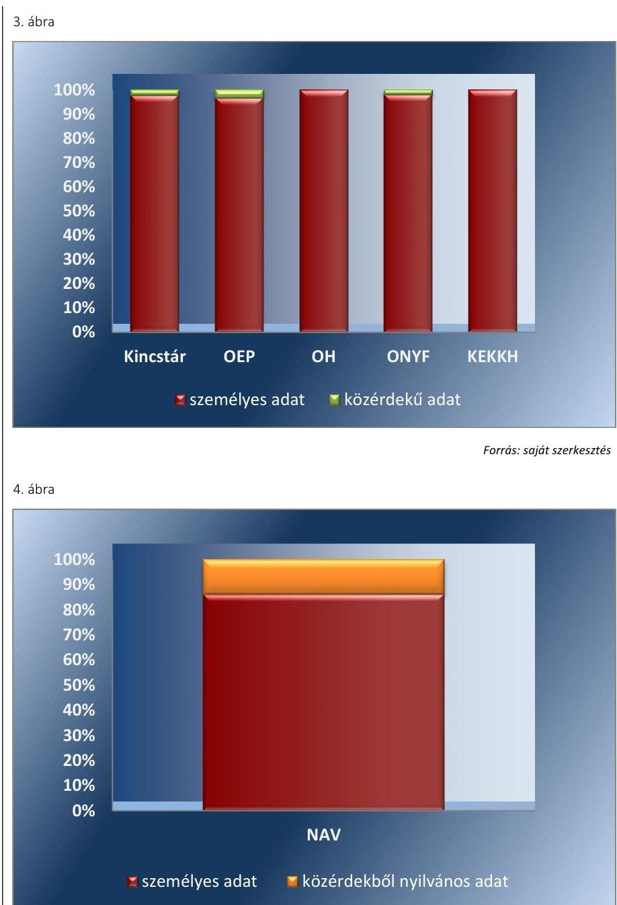

*Forrás: saját szerkesztés*

## **AZ ADATKEZELŐ SZERVEZETEK ÁLTAL VÉGREHAJTOTT ADATTOVÁBBÍTÁSOK A BELSŐ SZABÁLYZATOKBAN** foglaltaknak megfelelően, az arra felhatalmazással rendelkezők által történtek. A belső szabályzatok megfeleltek a vonatkozó általános adatvédelmi és ágazati jogszabályoknak:

Az OEP-nél az adattovábbítások során az adatvédelmi szabályzat, a vonatkozó szakmai és egyéb belső szabályzatokban (nemzetközi adattovábbítások eljárásrendjei, jogosultságkezelési szabályzat, ügyrendek, ellenőrzési nyomvonalak stb.) és a munkaköri leírásokban előírtak szerint jártak el. A nemzetközi megkeresések esetében a 987/2009/EK rendelet 4. cikk (2) bekezdése és az adatvédelmi szabályzatban foglaltaknak megfelelően elektronikus úton történtek az adattovábbítások.

---

- A KEKKH esetében az adattovábbítások meghatározó többsége a hatósági szervek informatikai rendszerekből történő lekérdezései révén valósultak meg, amelynek során betartották az adatvédelmi szabályzatban foglaltakat. A jogosultság beállítására és nyilvántartásba vételre vonatkozó kérelmeket a hatósági szervek a KEKKH Operatív Szolgáltatási Főosztályhoz nyújtották be, amely intézkedett a jogosultságok beállításáról és kezelte a jogosultságokban bekövetkezett változásokat. Az Rtv. 84. § (2) alapján végrehajtott lekérdezéseket a KEKKH rendszerei teljes körű naplózással dokumentálták.
- A NAV ellenőrzött adattovábbításai a belső szabályzatoknak, eljárási rendnek és a munkaköri leírásoknak megfelelően történtek. A személyes adatok továbbításának nyilvántartási kötelezettsége teljesült. Az egyablakos HÉA adó-visszatérítési eljárás keretében és az online pénztárgépek üzemeltetésével összefüggésben automatizmusok által generált - munkavállalói beavatkozás nélküli - adattovábbítások a belső szabályozóknak megfelelően történtek.
- Az OH esetében az adattovábbítások zömében különböző támogatásokhoz szükséges tanulói jogviszony igazolását szolgálták, azok végrehajtása a belső szabályozóknak megfelelően történt, a munkaköri leírások tartalmazták az adattovábbításra vonatkozó feladatot.
- Az ONYF adattovábbításai az adatvédelmi szabályzat, a vonatkozó szakmai és egyéb belső szabályzatok (pl. hatósági nyilvántartással összefüggő adatkezelésről szóló szabályzat, a nyugellátási szakterület ügyviteli eljárása, a szociálpolitikai egyezmények alkalmazásához kapcsolódó ügyviteli rend, jogosultságkezelési szabályzat, ügyrendek, ellenőrzési nyomvonalak stb.) előírásai szerint történtek. Az adattovábbítást végzők munkaköri leírása tartalmazta a feladat-, felelősség- és hatáskörüket.
- A Kincstár esetében a személyes adatok továbbítása, valamint a közérdekű adatok megismerésére irányuló igények teljesítése a jogszabályi előírásoknak és a belső szabályozásnak megfelelően történt. Az adattovábbítások többségét az adott szakfeladatot ellátó szervezeti egységen foglalkoztatott, annak ellátására munkaköri leírással rendelkező kormánytisztviselő készítette elő, a kiadmányozás a belső előírásoknak megfelelően történt.
A közérdekű adatok megismerésére irányuló igények teljesítését a belső szabályozásnak és az ellenőrzési nyomvonalban előírtaknak megfelelően az érintett igazgatóság ügyrendjében meghatározott szervezeti egységek munkaköri leírásban megfelelő kijelöléssel rendelkező munkatársai látták el.

# AZ ADATTOVÁBBÍTÁSOK TELJESÍTÉSÉRE az Info tv. 

15. § (4) bekezdésében megszabott jogszabályi, illetve belső szabályozásokban, együttműködési megállapodásokban rögzített határidőt az adatkezelő szervezetek betartották. A végrehajtott adattovábbításokkal összefüggő adatokat az adatvédelmi nyilvántartások - a Kincstár kivételével - az Info tv. 15. § (2) bekezdésével összhangban tartalmazták.

A Kincstár adattovábbítási nyilvántartása 2012. január 1-től az Info tv. 15. § (2) bekezdésben, és az adatvédelmi szabályzatban előírtak ellenére több esetben nem tartalmazta az adattovábbítás jogalapját.

---

# 2.4. számú megállapítás 

A nemzeti adatvagyon körébe tartozó adatok adatfeldolgozói tevékenységének kiszervezése megfelelt a jogszabályi előírásoknak.

## AZ ADATFELDOLGOZÁSI TEVÉKENYSÉG KISZER-

VEZÉSE érdekében az OH 5 db , a Kincstár 1 db , az ONYF 8 db , a NAV pedig 17 db adatfeldolgozási szerződést kötött 2011 és 2015 között. Az adatfeldolgozó szervezetekkel létrejött szerződések - az ONYF kivételével - megfeleltek az Avtv. és az Info tv., valamint a - Kincstár kivételével - a belső szabályzatok előírásainak:

- Az adatfeldolgozási tevékenységre kötött szerződések írásba foglalása az Avtv. 4/A. § (4) bekezdés, illetve az Info tv. 10 § (4) bekezdésében foglaltakkal összhangban történt.
- Az adatfeldolgozási szerződésekben az Avtv. 4/A. § (1) bekezdés, illetve az Info tv. 10. § (1) bekezdés előírásaival összhangban a személyes adatok feldolgozására vonatkozó jogokat és kötelezettségeket az adatkezelő szervezetek meghatározták, továbbá biztosították, hogy az adatfeldolgozó a tudomására jutott személyes adatokat kizárólag az adatkezelő rendelkezései szerint dolgozhatta fel, saját céljára adatfeldolgozást nem végezhetett és a személyes adatokat az adatkezelő rendelkezései szerint volt köteles tárolni és megőrizni.
- Az ONYF esetében három vállalkozói szerződés nem volt összhangban az Info tv. 2013. 07. 01-jét megelőzően hatályos 10. § (2) bekezdésével, illetve az adatvédelmi szabályzat előírásaival, amely szerint az adatfeldolgozó, további adatfeldolgozót nem vehetett igénybe. A szerződésekben ugyanis rögzítették, hogy azok teljesítésében harmadik személy igénybevételére is sor kerülhet.
- A Kincstár esetében nem érvényesítették az IBSZ-ben előírtakat, mivel az adatfeldolgozási szerződés nem tartalmazta azon feltételt, hogy a vállalkozó az IBSZ-ben részletezett szabályokat betekintés útján megismerte és azokat magára kötelező érvényűnek tekinti.
Az ONYF és a NAV esetében az adatfeldolgozással megbízott szervezetek nem mindegyike minősült államigazgatási szervnek vagy kizárólagos állami tulajdonú gazdálkodó szervezetnek. Ezekben az esetekben az ONYF és a NAV - egy kivétellel - rendelkezett a Tbj., illetve a NAV tv. ${ }^{93}$ által előírt, a nemzeti fejlesztési miniszter részéről az Adatvagyon tv. ${ }^{94}$ rendelkezésén alapuló felmentésre vonatkozó nyilatkozattal. A NAV esetében azonban egy iskolaszövetkezettel 2011. február 21-én megkötött vállalkozási szerződés meghosszabbítására - a NAV tv. 13. § (1) bekezdés szerinti feladatellátási kötelezettség teljesítése érdekében - a nemzeti fejlesztési miniszter Adatvagyon tv. 2. § (1) és (2) bekezdésben foglaltakon alapuló felmentésnek a megadását megelőzően került sor.

---

# JAVASLATOK 

Az ÁSZ tv. ${ }^{95}$ 33. § (1) bekezdésében foglaltak értelmében az ellenőrzött szervezet vezetője köteles a jelentésben foglalt megállapításokhoz kapcsolódó intézkedési tervet összeállítani és azt a jelentés kézhezvételétől számított 30 napon belül az ÁSZ részére megküldeni. Amennyiben az ellenőrzött szervezet vezetője nem küldi meg határidőben az intézkedési tervet, vagy továbbra sem elfogadható intézkedési tervet küld, az Állami Számvevőszék elnöke az ÁSZ tv. 33. § (3) bekezdése a) és b) pontjaiban foglaltakat érvényesítheti.

## A Nemzeti Adatvédelmi és Információszabadság Hatóság elnökének

1. Intézkedjen, hogy az adatvédelmi nyilvántartás az Info tv. által előírtaknak megfelelően tartalmazza a belső adatvédelmi felelősök nevét és elérhetőségi adatait.
(1.3. számú megállapítás 7. bekezdése alapján)

## A Nemzeti Elektronikus Információbiztonsági Hatóság vezetőjének

1. Intézkedjen az információs rendszerek biztonságának felügyeletével kapcsolatos feladatok ellátása során az Ibtv. által előírtak végrehajtására.
(1.3. számú megállapítás 1., 2. és 4. bekezdése alapján)

## Az Országos Nyugdíjbiztosítási Főigazgatóság főigazgatójának

1. Intézkedjen annak érdekében, hogy a jogszabályi előírásoknak megfelelően a belső szabályzatban - az elektronikus adatkezelő rendszerek vonatkozásában - a logikai biztonságot garantáló előírások rögzítésre kerüljenek.
(2.1. számú megállapítás 1. bekezdés 1. és 4. francia bekezdése alapján)

---

2. Intézkedjen annak érdekében, hogy az adatkezeléshez használt elektronikus rendszerek biztonsági osztályba sorolása megtörténjen az Ibtv. előírásainak megfelelően.
(2.1. számú megállapítás 2. bekezdés 2. francia bekezdése alapján)

# A Kincstár elnökének 

1. Intézkedjen, hogy az adattovábbítási nyilvántartás az Info tv. által előírt tartalommal készüljön.
(2.3. számú megállapítás 5. bekezdése alapján)

## A Nemzeti Adó- és Vámhivatal vezetőjének

1. Intézkedjen annak érdekében, hogy az adatkezeléshez használt elektronikus rendszerek biztonsági osztályba sorolása megtörténjen az Ibtv. előírásainak megfelelően.
(2.1. számú megállapítás 2. bekezdés 3. francia bekezdése alapján)
2. Intézkedjen annak érdekében, hogy a szervezet egészének biztonsági szintbe sorolása megfeleljen az Ibtv. előírásainak.
(2.1. számú megállapítás 7. bekezdés 2. francia bekezdése alapján)

## Az Oktatási Hivatal elnökének

1. Intézkedjen annak érdekében, hogy a jogszabályi előírásoknak megfelelően a belső szabályzatban - az elektronikus adatkezelő rendszerek vonatkozásában - a logikai biztonságot garantáló előírások rögzítésre kerüljenek.
(2.1. számú megállapítás 1. bekezdés 2. francia bekezdése alapján)

---

# A belügyminiszternek 

1. Intézkedjen annak érdekében, hogy az adatkezeléshez használt elektronikus rendszerek biztonsági osztályba sorolása megtörténjen az Ibtv. előírásainak megfelelően.
(2.1. számú megállapítás 2. bekezdés 4. francia bekezdése alapján)

## A Nemzeti Egészségbiztosítási Alapkezelő főigazgatójának

1. Intézkedjen annak érdekében, hogy a szervezet egészének biztonsági szintbe sorolása megfeleljen az Ibtv. előírásainak.
(2.1. számú megállapítás 7. bekezdés 5. francia bekezdése alapján)

---

.

---

# MELLÉKLETEK 

- I. SZ. MELLÉKLET: ÉRTELMEZŐ SZÓTÁR
adatbiztonság
adatfeldolgozás
adatfeldolgozó
adatkezelés
adatkezelő szervezet, adatkezelő
adattovábbítás
adattvédelem
adatvédelmi felelős
belső adatvédelmi felelős
bizalmasság
az összegyűjtött adatvagyon sérthetetlenségét, integritását, használhatóságát és bizalmasságát elérő részcél, mely az adatot középpontba állító megközelítés, az informatikai biztonság részhalmaza
az adatkezelési műveletekhez kapcsolódó technikai feladatok elvégzése, függetlenül a műveletek végrehajtásához alkalmazott módszertől és eszköztől, valamint az alkalmazás helyétől, feltéve hogy a technikai feladatot az adaton végzik
az a természetes vagy jogi személy, illetve jogi személyiséggel nem rendelkező szervezet, aki, vagy amely az adatkezelő megbízásából - beleértve a jogszabály rendelkezése alapján történő megbízást is - személyes adatok feldolgozását végzi (Avtv. 2. § 16.) Hatályos: 2011. december 31-ig. (Info tv. 3. § 17.) Hatályos: 2012. január 1-től
az alkalmazott eljárástól függetlenül az adaton végzett bármely művelet vagy a műveletek összessége, így különösen gyűjtése, felvétele, rögzítése, rendszerezése, tárolása, megváltoztatása, felhasználása, lekérdezése, továbbítása, nyilvánosságra hozatala, összehangolása vagy összekapcsolása, zárolása, törlése és megsemmisítése, valamint az adat további felhasználásának megakadályozása, fénykép-, hang- vagy képfelvétel készítése, valamint a személy azonosítására alkalmas fizikai jellemzők (pl. ujj- vagy tenyérnyomat, DNS-minta, íriszkép) rögzítése (Info tv.)
az a természetes vagy jogi személy, illetve jogi személyiséggel nem rendelkező szervezet, aki vagy amely önállóan vagy másokkal együtt az adat kezelésének célját meghatározza, az adatkezelésre (beleértve a felhasznált eszközt) vonatkozó döntéseket meghozza és végrehajtja, vagy az adatfeldolgozóval végrehajtatja (ebben az ellenőrzésben: NAV, OEP, ONYF, Kincstár, OH, KEKKH)
az adat meghatározott harmadik személy - olyan természetes vagy jogi személy, illetve jogi személyiséggel nem rendelkező szervezet, aki vagy amely nem azonos az érintettel, az adatkezelővel vagy az adatfeldolgozóval - számára történő hozzáférhetővé tétele. Az EGT-államba irányuló adattovábbítást úgy kell tekinteni, mintha Magyarország területén belüli adattovábbításra kerülne sor
az adatbiztonság megteremtésére létrehozott kontrollok vagy kontrollok csoportja
az OEP központi adatvédelmi felelősei, az OEP területi kihelyezett szervezeti egységeinek megyei adatvédelmi felelősei, a Kormányhivatalok egészségbiztosítási pénztári szakigazgatási szerveinek szakigazgatási adatvédelmi felelősei (Adatvédelmi szabályzat2,3,4) Hatályos: Adatvédelmi szabályzat2 2011. január 18. - 2011. július 27.; Adatvédelmi szabályzat3 2011. július 28. - 2012. február 01.; Adatvédelmi szabályzat4 2012. február 02-től
Az Avtv. 31/A. § (1) bekezdése és az Info tv. 24. § (1) bekezdése szerint meghatározott belső adatvédelmi felelős.
az elektronikus információs rendszer azon tulajdonsága, hogy a benne tárolt
 adatot, információt csak az arra jogosultak és csak a jogosultságuk szintje szerint ismerhetik meg, használhatják fel, illetve rendelkezhetnek a felhasználásáról;

---

| biztonsági osztály | az elektronikus információs rendszer védelmének elvárt erőssége (2013. évi L. törvény) |
| :--: | :--: |
| biztonsági osztályba sorolás | a kockázatok alapján az elektronikus információs rendszer védelme elvárt erősségének meghatározása |
| biztonsági szint | a szervezet felkészültsége a 2013. évi L. törvényben és a végrehajtására kiadott jogszabályokban meghatározott biztonsági feladatok kezelésére (2013. évi L. törvény) |
| biztonsági szintbe sorolás | a szervezet felkészültségének meghatározása az e törvényben és a végrehajtására kiadott jogszabályokban meghatározott biztonsági feladatok kezelésére |
| felhasználó | aki egy adott szakrendszert, szakalkalmazást igénybe vesz; |
| felhatalmazás (jogi) | azon tevékenységek engedélyezése (adatok rögzítése, dokumentum készítése, nyilvántartás vezetése, lekérdezés), amiket a felhasználó a munkaköre, beosztása szerint elvégezhet, amelyre a felhasználónak a munkája elvégzéséhez szüksége van (forrás: KEKKH Jogosultságkezelési szabályzata); |
| informatikai biztonság | a legteljesebb körű biztonsági cél, mely nem csak az adatvédelem, de azok mellett az eszközök és kezelő-felhasználó-személyek védelmével valósulhat meg |
| közérdekű adat | az állami vagy helyi önkormányzati feladatot, valamint jogszabályban meghatározott egyéb közfeladatot ellátó szerv vagy személy kezelésében lévő és tevékenységére vonatkozó vagy közfeladatának ellátásával összefüggésben keletkezett, a személyes adat fogalma alá nem eső, bármilyen módon vagy formában rögzített információ vagy ismeret, függetlenül kezelésének módjából, önálló vagy gyűjteményes jellegétől, így különösen a hatáskörre, illetékességre, szervezeti felépítésre, szakmai tevékenységre, annak eredményességére is kiterjedő értékelésére, a birtokolt adatfajtákra és a működést szabályozó jogszabályokra, valamint a gazdálkodásra, a megkötött szerződésekre vonatkozó adat (Info tv.) |
| közérdekből nyilvános adat | a közérdekű adat fogalma alá nem tartozó minden olyan adat, amelynek nyilvánosságra hozatalát, megismerhetőségét vagy hozzáférhetővé tételét törvény közérdekből elrendeli (Info tv.) |
| különleges adat | a faji eredetre, a nemzetiséghez tartozásra, a politikai véleményre vagy pártállásra, a vallásos vagy más világnézeti meggyőződésre, az érdek-képviseleti szervezeti tagságra, a szexuális életre vonatkozó személyes adat, az egészségi állapotra, a kóros szenvedélyre vonatkozó személyes adat, valamint a bűnügyi személyes adat (Info tv.) |
| nemzeti adatvagyon | a közfeladatot ellátó szervek által kezelt közérdekű adatok, személyes adatok és közérdekből nyilvános adatok összessége (2010. évi CLVII. törvény) |
| sértetlenség | az adat tulajdonsága, amely arra vonatkozik, hogy az adat tartalma és tulajdonságai az elvártal megegyeznek, ideértve a bizonyosságot abban, hogy az az elvárt forrásból származik (hitelesség) és a származás ellenőrizhetőségét, bizonyosságát (letagadhatatlanságát) is, illetve az elektronikus információs rendszer elemeinek azon tulajdonságát, amely arra vonatkozik, hogy az elektronikus információs rendszer eleme rendeltetésének megfelelően használható |
| személyes adat | a természetes személy érintettel kapcsolatba hozható adat - különösen az érintett neve, azonosító jele, valamint egy vagy több fizikai, fiziológiai, mentális, gazdasági, kulturális vagy szociális azonosságára jellemző ismeret -, valamint az adatból levonható, az érintettre vonatkozó következtetés (Info tv.) |

---

II. SZ. MELLÉKLET: AZ ADATVÉDELEM HAZAI JOGI SZABÁLYOZÁSÁNAK ÖSSZHANGJA AZ EURÓPAI UNIÓ ADATVÉDELMI IRÁNYELVEIVEL

# AZ ADATVÉDELEM HAZAI JOGI SZABÁLYOZÁSA ÖSSZHANGBAN ÁLLT AZ EURÓPAI UNIÓ 95/46/EK IRÁNYELVÉVEL ${ }^{96}$ : 

A személyes adat és a különleges adat fogalmi meghatározása az Avtv., az Info tv. és az Ibtv. értelmező rendelkezései között az Irányelvvel összhangban történt.

Az Avtv. és Info tv. az értelmező rendelkezései között ismerteti a személyes adat fogalmát, az adatfeldolgozást pedig az adatkezeléssel való szerves kapcsolatán keresztül mutatja be. Az Irányelv nem használja az adatkezelés és adatfeldolgozás fogalmának a hazai jogi terminológiában alkalmazott elkülönítését, de az Irányelv célkitűzéseivel való összhang megteremtését ez nem befolyásolta.

Az Irányelv 2. cikk c) pontjában rögzített személyesadat-nyilvántartó rendszer meghatározás annyiban tér el az Avtv.ben megfogalmazottaktól, hogy az Avtv. hatálya az 1/A. § (2) bekezdés értelmében valamennyi manuális módon végzett adatkezelésre és adatfeldolgozásra egyaránt kiterjedt. A fogalom meghatározása alapvetően az adatvédelmi biztos hatáskörének meghatározásához volt szükséges. Az Info tv. szerinti új szabályozás - az adatvédelmi biztos megszűnése és a NAIH létrehozása okán - már nem indokolta a személyesadat-nyilvántartó rendszer fogalmi meghatározásának további szerepeltetését.

Az Irányelv 2. cikk d) pontja az adatkezelő döntési jogkörébe utalta a személyes adatok feldolgozásának céljai és módja meghatározását, amelyet önállóan, vagy másokkal együtt gyakorol. Az Avtv. 2. § 8. pontja nélkülözte azt a kitételt, hogy a joggyakorlás másokkal együtt is történhet, az Info tv. 3. § 9. pont pedig csak a célmeghatározásnál biztosítja az együttes döntéshozatal lehetőségét.

Az Irányelv érintett hozzájárulására és tájékoztatására vonatkozó előírásokkal összhangban került sor az Avtv. és Info tv. rendelkezéseinek megalkotására. Az Avtv. szerinti tájékoztatási kötelezettség az adatszolgáltatás önkéntes vagy kötelező jellegére, az adatkezelés céljára és az adatkezelőre terjedt ki, de az Irányelv 10. cikk c) pontjában felsorolt, további szükségesnek ítélhető adatot nem vont be a tájékoztatást szolgáló adatok körébe. Az Info tv. 20. § (2) bekezdése bővítette a tájékoztatásba bevonandó adatok körét és kötelezővé tette többek között az adatkezelés időtartamáról, az érintett adatkezeléssel kapcsolatos jogairól és jogorvoslati lehetőségeiről szóló tájékoztatást is.

Az Irányelvben megfogalmazott célkitűzéseknek megfelelően tartalmazta az Avtv. és az Info tv. az adatok minőségére vonatkozó elvet, valamint az adatfeldolgozásra vonatkozó jogszerűségi kritériumokat. Utóbbi körben az Irányelv 7. cikk szerinti f) pontjában foglalt jogszerű érdekérvényesítés esete nem került be az Avtv.-be. Az Európai Bíróság a C468/10. és C-469/10. sz. egyesített ügyekben hozott ítéletében ugyanakkor kimondta, hogy a rendelkezésnek közvetlen hatálya van, így a tagállami bíróság előtti hivatkozás esetén megfelelő jogalapot képez. Az Info tv. 6. § (1) bekezdés b) pontja már közvetlenül biztosította, hogy az adatkezelő vagy harmadik személy jogos érdekének érvényesítése céljából a személyes adatok védelméhez fűződő jog korlátozásával arányban álló módon is sor kerülhessen a személyes adatok kezelésére.

Az érintettek az Irányelv 12. cikkében előírt adathozzáféréshez való jogának biztosítására vonatkozó rendelkezések nemzeti jogba való átültetése megfelelően megvalósult. Az Avtv. 11. § (1) bekezdés szerint kérhette az érintett az adatok helyesbítését és törlését, de zárolást nem kezdeményezhetett. Zárolásra az Avtv. 16/A. § (1) bekezdés alapján biztosított tiltakozási jogának gyakorlása során, annak megalapozottsága esetén az Avtv. 16/A. § (2) bekezdés szerinti módon kerülhetett sor. Az Info tv. 14. § keretében már biztosítottá vált, hogy az érintett általi kérelmezés közvetlenül a zárolásra irányuljon. Az Avtv. szigorúbb követelményt fogalmazott meg az Irányelv 12. cikkében megfogalmazottakhoz képest, amikor kötelező jelleggel írta elő az értesítést a 15. §-ban és a 16/A. (2) bekezdésben. Az Info tv. esetében az értesítési kötelezettség a 18. § (1) bekezdésben került előírásra és érdeksérelem felmerülésének hiányában lehetővé vált az értesítés mellőzése, amely kitétel annyiban mutat összhangot az Irányelv 12. cikk c) pontjával, amennyiben az értesítés lehetetlennek bizonyul, vagy aránytalanul nagy erőfeszítést igényel az értesítés szintén mellőzhető.

---

Az érintettek az Avtv. 16/A. § és az Info tv. 21. § felhatalmazása alapján élhettek tiltakozási jogukkal, amelyre vonatkozó megegyező tartalmú előírást az Irányelv 14. cikk a) pontja tartalmazott. A tiltakozási jog gyakorlása az adatvédelmi törvényekben kibővült az Avtv. 17. § és Info tv. 22. § szerinti bírósági jogérvényesítés intézményével, amelynek keretében az érintett a jogainak megsértése esetén is bírósághoz fordulhatott.

Az Irányelv 21. cikk (2) bekezdésében a felügyelő hatóság számára előírt adatvédelmi nyilvántartási kötelezettséget az Avtv. 28. § (1) bekezdés alapján a nemzeti jog a kvázi-hatósági jogkörökkel is rendelkező ombudsman számára írta elő, az Info tv. hatályba lépését követően a tevékenységet a 65. § (1) bekezdése alapján a NAIH volt köteles végezni. A nyilvántartás adattartalmával kapcsolatos Avtv. 28. § (1) bekezdés szerinti tartalom annyiban tekinthető hiányosnak, hogy nem rendelkezett külön a harmadik országokba irányuló adattovábbításokról, beleértve azokat a nyilvántartásba veendő egyéb adatok körébe.

Az adatfeldolgozás titkosságára vonatkozóan az Irányelv 16. cikkében foglaltaktól eltérően, de a megfelelőséget nem befolyásolva, a nemzeti szabályozás annyi eltérést tartalmazott, hogy az adatkezelő utasítási jogát az Irányelv 16. cikkében foglaltaktól eltérően akkor is fenntartotta és a megbízásos jogviszonyra akkor is kiterjedt az adatvédelmi törvények rendelkezése, ha az adatfeldolgozó személyét jogszabály határozta meg.

Az adatfeldolgozás biztonságával összefüggésben az Irányelv célkitűzésének érvényesülését az Avtv. és az Info tv. szerinti előírások megfelelően biztosították és többek között előírták az adatok megfelelő technikai és szervezési intézkedésekkel történő védelmét az adatkezelőre és adatfeldolgozóra egyaránt.

Az Irányelv személyes adatok harmadik országba irányuló továbbítása esetére előírt követelmények megfelelően érvényesültek a hazai adatvédelmi szabályozásban. Az Avtv. és Info tv. szigorúan határozta meg az Irányelv szerint alkalmazható eltéréseket és kizárólag az Irányelv 26. cikk (1) bekezdés a) és d) pont szerinti rendelkezéssel összhangban került eltérés meghatározásra, amelyek az érintett hozzájárulásán alapuló és a nemzetközi jogsegélyről, valamint a kettős adóztatás elkerüléséről szóló nemzetközi szerződés teljesítéséből fakadó adattovábbítási lehetőségeket rögzítette.

---

# FÜGGELÉK: ÉSZREVÉTELEK 

A jelentéstervezetet a Számvevőszék 15 napos észrevételezésre megküldte az ellenőrzött szervezet vezetőjének az ÁSZ tv. 29. § (1) bekezdése előírásának megfelelően.
Az elfogadott észrevételek alapján a Számvevőszék módosította a jelentést.

A függelék tartalmazza az ellenőrzött észrevételeit, illetve az el nem fogadott észrevételek elutasításának indoklását.

- A Belügyminisztérium miniszterének BM/2740-9/2017. iktatószámú levele észrevételekkel
- Tájékoztatás az elfogadott és az el nem fogadott észrevételekről (V-1048-424/2016.)
- A Magyar Államkincstár elnökének ELL/29-9/2017. iktatószámú levele és észrevételei
- Tájékoztatás az elfogadott és az el nem fogadott észrevételekről (V-1048-416/2016.)
- A Nemzeti Adó- és Vámhivatal vezetőjének 2160588971 iktatószámú levele észrevételekkel
- Tájékoztatás az elfogadott és az el nem fogadott észrevételekről (V-1048-412/2016.)
- A Nemzeti Adatvédelmi és Információszabadság Hatóság elnökének NAIH/2017/669/2/B iktatószámú levele észrevétellel
- Tájékoztatás az elfogadott észrevételről (V-1048-423/2016.)
- Az Oktatási Hivatal elnökének ET/1-37/2016. iktatószámú levele észrevétellel
- Tájékoztatás az el nem fogadott észrevételekről (V-1048-417/2016.)
- A Nemzeti Egészségbiztosítási Alapkezelő vezetőjének F0221/327-18/2016. iktatószámú levele észrevételekkel
- Tájékoztatás az elfogadott és az el nem fogadott észrevételekről (V-1048-420/2016.)
- Az Országos Nyugdíjbiztosítási Főigazgatóság vezetője 6/31-14/2017 iktatószámú levele észrevétellel
- Tájékoztatás az el nem fogadott észrevételekről (V-1048-419/2016.)
- A Nemzeti Elektronikus Információbiztonsági Hatóság vezetőjének 420/A-40-15/2016. iktatószámú levele és észrevételei
- Tájékoztatás az elfogadott és az el nem fogadott észrevételekről (V-1048-421/2016.)

[^0]
[^0]:    * 29. § (1) Az Állami Számvevőszék az ellenőrzési megállapításait megküldi az ellenőrzött szervezet vezetőjének vagy az általa megbízott személynek, és annak, akinek személyes felelősségét állapította meg.
    (2) Az ellenőrzött szervezet vezetője és a felelősként megjelölt személy az ellenőrzés megállapításaira tizenöt napon belül írásban észrevételt tehet.
    (3) Az Állami Számvevőszék az észrevételre a beérkezésétől számított harminc napon belül írásban válaszol. A figyelembe nem vett észrevételeket köteles a jelentésben feltüntetni, és megindokolni, hogy azokat miért

 nem fogadta el.

---

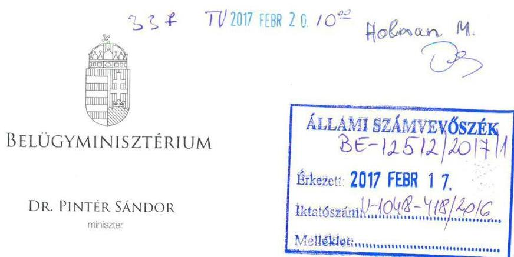

Domokos László úrnak, elnök

Állami Számvevőszék

Iktatószám: BM/2740-92017.
Tárgy: ÁSZ adatvédelmi jelentéstervezetre a Belügyminisztérium észrevételei

# Budapest 

## Tisztelt Elnök Úr!

Az Állami Számvevőszék (a továbbiakban: ÁSZ) „az adatvédelem hazai keretrendszerének és egyes kiemelt adatnyilvántartások ellenőrzése nemzetközi együttműködés keretében" címmel a Közigazgatási és Elektronikus Közszolgáltatások Hivatalánál (a továbbiakban: KEKKH) 2016-ban elvégzett ellenőrzés alapján megküldött jelentéstervezetre - figyelembe véve a 2017. január 1-én végbement szervezeti változást - az alábbi észrevételeket teszem.

A jelentéstervezet 2.1. számú megállapítása szerint a KEKKH-nál nem történt meg az állami és önkormányzati szervek elektronikus információbiztonságáról szóló 2013. évi L. törvény (a továbbiakban: Ibtv.) 7. § (1) bekezdésében előírt kötelezettségnek megfelelően az OkmányApp rendszer biztonsági osztályba sorolása.
Álláspontom szerint az OkmányApp rendszer nem minősül önálló elektronikus információs rendszernek, mivel az a Webes Ügysegéd mobil eszközökre írt alkalmazása, és ezért nem esik az Ibtv. hatálya alá. Erre tekintettel nem is történt meg annak biztonsági osztályba sorolása.
A fentiek alapján kérem, hogy a jelentéstervezetből az OkmányApp rendszer vonatkozó, annak biztonsági osztályba sorolásának elmaradására tett megállapítása kerüljön törlésre.

A jelentéstervezet 22. oldalán megfogalmazottak szerint az adatkezelő szervezetek belső ellenőrzései az Ibtv-ben meghatározott ellenőrzési területeket nem érintették. A megállapítással kapcsolatosan megjegyzem, hogy 2013. március 12-én kelt megbízólevél alapján elrendelésre és végrehajtásra került a (V2/2013) KEKKH szabályozottságának ellenőrzése, ahol az informatikai szabályzatok megléte és aktualitása is vizsgálatra került a KEKKH Belső Ellenőrzési Főosztály által. A vizsgálat eredményeként intézkedési terv készült, amelynek a teljesítését a vezetői nyilatkozat megalapozottsága (V6/2013.) tárgyú vizsgálat során a Belső Ellenőrzési Főosztály ellenőrizte.

A végrehajtott ellenőrzés során az ÁSZ-nak a Belső Ellenőrzési Főosztály az elvégzett adatvédelmi ellenőrzések elvégzéséről tájékoztatást adott, amelyben jelezte, hogy az

---

ellenőrzések IT biztonsági területeket is érintettek. A KEKKH speciális adatkezelő feladatai miatt külön szervezet is foglalkozott az informatikai területen belül IT ellenőrzések végzésével (szakmai ellenőrzés).

Tájékoztatom, hogy a Belügyminisztérium Ellenőrzési Főosztálya a KEKKH-t 2014. évben átfogó ellenőrzés alá vonta, amelynek részeként ellenőrzésre került az adatvédelmi és IT biztonsági szakterület is.

A fentiek alapján kérem a KEKKH belső ellenőrzésére vonatkozó általános megállapítások pontosítását.

Budapest, 2017. február 4.,
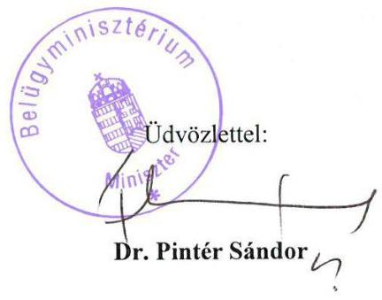

Készült: 2 példányban/ 1 lap
Kapják: címzett/irattár

---

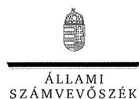

ELNÖK

Ikt.szám: V-1048-424/2016.

Dr. Pintér Sándor úr
miniszter

Belügyminisztérium

Budapest

# Tisztelt Miniszter Úr! 

Az adatvédelem hazai keretrendszerének és egyes kiemelt adatnyilvántartások ellenőrzése nemzetközi együttműködés keretében címû számvevőszéki jelentéstervezetre tett észrevételeit köszönettel megkaptam.

Az Állami Számvevőszék észrevételekre vonatkozó álláspontjáról a felügyeleti vezető által készített részletes tájékoztatást csatoltan megküldöm.

Tájékoztatom Miniszter urat, hogy a jelentésben - az Állami Számvevőszékről szóló 2011. évi LXVI. törvény 29. § (3) bekezdése alapján - a figyelembe nem vett észrevételeket szerepeltetjük az el nem fogadás indoklásával.

Budapest, 2017. 05. hó 6. nap
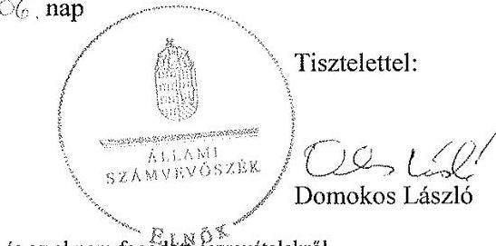

Melléklet: Tájékoztatás az elfogadott és az el nem fogadott észrevételekről

---

# Tájékoztatás az elfogadott és az el nem fogadott észrevételekről 

Az adatvédelem hazai keretrendszerének és egyes kiemelt adatnyilvántartások ellenőrzése nemzetközi együttműködés keretében címû számvevőszéki jelentéstervezetre BM/2740-92017. iktatószámú levelében tett észrevételeit áttekintettük, annak kezeléséről az alábbi tájékoztatást adom.

1. A jelentéstervezet 2.1. számú megállapításból az OkmányApp rendszer törlésére irányuló észrevételét elfogadtuk, azt a számvevőszéki jelentés készítésénél figyelembe vesszük.
2. A jelentéstervezet 22. oldalán megfogalmazottakra tett észrevételét nem fogadtuk el. A jelentéstervezet 21. és 23. oldalon a 2.1. számú megállapításhoz tartozó 5. és 8. bekezdés belső ellenőrzésre vonatkozó megállapításai arra irányulnak, hogy az Állami Számvevőszék ellenőrzése során az adatkezelő szervezetek elektronikus információs rendszereinek biztonsági osztályba sorolásának hiányosságait a NEIH, egyéb ÁSZ-on kívüli külső ellenőrzés és a belső ellenőrzés sem tárta fel. A Belügyminisztérium által a KEKKH-nál végzett ellenőrzés az informatikai szabályzatok meglétére és annak aktualizálására irányult, valamint utal arra, hogy az informatikai biztonsági területeket is érintett. A Belügyminisztérium Ellenőrzési Főosztálya által a KEKKH-nál végzett 2014. évi átfogó ellenőrzésre irányuló tájékoztatását ezért a számvevőszéki jelentés készítésénél nem tudjuk figyelembe venni. Ezen túl az ellenőrzött szervezet sem bocsátott az ellenőrzés rendelkezésére olyan dokumentumot, amely a biztonsági osztályba sorolások ellenőrzésére vonatkozó ellenőrzési megállapításokat tartalmazna. Ezen területekre irányuló külső ellenőrzések a rendelkezésre bocsátott dokumentumok alapján a KEKKH-nál az ellenőrzött időszakban nem voltak.

Budapest, 2017. 06. hó 06. nap

Holman Magdolna
felügyeleti vezető

---

# 276 

## Magyar   Államkincstár

## 276

TV 2017.02.08 129

Iktatószám:
ELL/29-9/2017.
Hiv. szám:
V-1048-391/2016.

## Domokos László úr részére

elnök

## Állami Számvevőszék

Budapest

Tárgy: „Az adatvédelem hazai keretrendszerének és egyes kiemelt adatnyilvántartások ellenőrzése nemzetközi együttműködés keretében" tárgyú jelentéstervezethez észrevételek megküldése

## Tisztelt Elnök Úr!

„Az adatvédelem hazai keretrendszerének és egyes kiemelt adatnyilvántartások ellenőrzése nemzetközi együttműködés keretében" tárgyú V-1048-391/2016. hivatkozási számú jelentéstervezetet köszönettel megkaptuk és áttekintettük. A megállapításokkal kapcsolatban észrevételeket fogalmaztunk meg, melyeket kérünk, hogy egyetértésük esetén vegyenek figyelembe a jelentés véglegesítésekor. Támogató együttműködésüket köszönjük.

A jelentéstervezettel kapcsolatban tett szakterületi észrevételeket a levél 1. számú melléklete tartalmazza.

Kérem tájékoztatásom szíves elfogadását.

Budapest, 2017. február 8.
Tisztelettel:
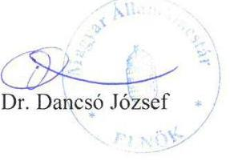

Mellékletek:

1. számú melléklet: „Az adatvédelem hazai keretrendszerének és egyes kiemelt adatnyilvántartások ellenőrzése nemzetközi együttműködés keretében" című vizsgálatról készített számvevőszéki jelentéstervezet észrevételezése

---

# „Az adatvédelem hazai keretrendszerének és egyes kiemelt adatnyilvántartások ellenőrzése nemzetközi együttműködés keretében" címû vizsgálatról készített számvevőszéki jelentéstervezet észrevételezése 

## Oldalszám: 16. oldal 1. táblázat

Adatkezelő szervezet - Kincstár
"biztonsági helyzet- és eseményértékelés eljárásrendje
"ügy-, vagy üzemmenet folytonosság tervezése"

## Kincstár által megfogalmazott észrevétel:

Az Informatikai Biztonsági Dokumentum Rendszerről (a továbbiakban IBDR) szóló Elnöki Utasítás IBSZ 6. sz. függeléke az informatikai biztonsági incidens-elhárítási és problémakezelési szabályzat, mely a tartalmát illetően a jelentéstervezetben megjelölt "biztonsági helyzet- és eseményértékelés eljárásrendje" szabályzatnak felel meg.

A BCP nem az IBSZ részét kell, hogy képezze, annak ellenére, hogy a táblázat jelen formájában azt a helytelen következtetést sugallja, miszerint ennek az IBSZ-ben kellene megjelennie, a hivatkozott rendeletek szerint viszont külön szabályozóként.

## Módosítási javaslat:

Kérjük a hivatkozott részek törlését.

## Oldalszám: 20. oldal utolsó előtti bekezdés

„A Kincstár esetében 2013. december 27-től a belső szabályozásokban nem került meghatározásra a változtatásokhoz való hozzáférési jogosultsággal rendelkezők köre összhangban az NFM rendelet 4. mellékletének 3.3.1.5.1 és a BM rendelet 4. mellékletének 3.3.6.5.1 pontjával."

## Kincstár által megfogalmazott észrevétel:

Az IBDR IBSZ tárgyalja az informatikai változáskezelést és felelősségi köröket, a 7. sz. függeléke az informatikai változáskezelési szabályozás tovább részletezi azokat, amelynek 2.1.4.2. pontja mondja ki a változásgazda kijelölését, külön-külön jóváhagyott változásonként. A Kincstár HelpDesk központja a jóváhagyott változásokra kijelöli az azért felelős rendszergazdát, üzemeltetőt, és továbbítja számára a feladatot, amely elkészüléséről a HelpDesk rendszeren belül vissza kell jelezzen és a változáskérőnek azt megfelelő teljesítés esetén el kell fogadnia.

---

Az érintett időszakban a Kincstár 3-as biztonsági szintbe volt besorolva, az említett rendeleti követelmény a 4-es szinthez kötelező, így indokolatlan az arra történő hivatkozás.

# Módosítási javaslat: 

A fentiek alapján a bekezdést kérjük törölni.

## Oldalszám: 28. oldal utolsó előtti bekezdés

„A Kincstár esetében nem érvényesítették az IBSZ-ben előírtakat, mivel az adatfeldolgozási szerződés nem tartalmazta azon feltételt, hogy a vállalkozó az IBSZ-ben részletezett szabályokat betekintés útján megismerte és azokat magára kötelező érvényűnek tekinti."

## Kincstár által megfogalmazott észrevétel:

A Kincstár és a KINCSINFO Nonprofit Kft. között Együttműködési Megállapodás (a továbbiakban: EM) került megkötésre, amely tartalmazta, hogy melyek azok a Kincstár Elnöke által kiadott Elnöki Utasítások, amelyek a KINCSINFO Nonprofit Kft.-re kötelezőek, ezek egyike az IBDR. Az EM aláírásával azt a KINCSINFO, mint vállalkozó magára kötelező érvényűként ismerte el.

## Módosítási javaslat:

A fentiek alapján a bekezdés törlését kérjük.

## Oldalszám: 31. oldal A Kincstár elnökének megfogalmazott 1. számú javaslat

„Intézkedjen annak érdekében, hogy a jogszabályi előírásoknak megfelelően a belső szabályzatban - az elektronikus adatkezelő rendszerek vonatkozásában - a logikai biztonságot garantáló előírások rögzítésre kerüljenek."

## Kincstár által megfogalmazott észrevétel:

Tekintettel arra, hogy fentebb a 20. oldalon a hivatkozott rész törlését kezdeményeztük, így az annak kapcsán megfogalmazott feladat törlése is indokolt.

## Módosítási javaslat:

Kérjük a megfogalmazott javaslat törlését.

---

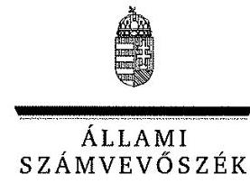

ELNÖK

Ikt.szám: V-1048-416/2016.

Dr. Dancsó József úr
elnök

Magyar Államkincstár

# Budapest 

## Tisztelt Elnök Úr!

Az adatvédelem hazai keretrendszerének és egyes kiemelt adatnyilvántartások ellenőrzése nemzetközi együttműködés keretében címû számvevőszéki jelentéstervezetre tett észrevételeit köszönettel megkaptam.

Az Állami Számvevőszék észrevételekre vonatkozó álláspontjáról a felügyeleti vezető által készített részletes tájékoztatást csatoltan megküldöm.

Tájékoztatom Elnök urat, hogy a jelentésben - az Állami Számvevőszékről szóló 2011. évi LXVI. törvény 29. § (3) bekezdése alapján - a figyelembe nem vett észrevételeket szerepeltetjük az elutasítás indokának feltüntetésével együtt.

Budapest, 2017. 05. hó 1. nap
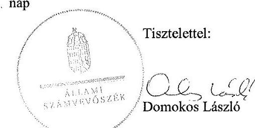

Melléklet: Tájékoztatás az elfogadott és az el nem fogadott észrevételekről

---

# Tájékoztatás az elfogadott és az el nem fogadott észrevételekről 

Az adatvédelem hazai keretrendszerének és egyes kiemelt adatnyilvántartások ellenőrzése nemzetközi együttműködés keretében címû számvevőszéki jelentéstervezetre ELL/29-9/2017. iktatószámú levelében tett észrevételeit áttekintettük, annak kezeléséről az alábbi tájékoztatást adom.

1. A jelentéstervezet 16. oldalán szereplő 1. számú táblázat biztonsági helyzet-, és eseményértékelés eljárási rendje sor törlésére tett észrevételét nem fogadtuk el. A 77/2013. (XII. 19.) NFM rendelet 4. melléklet 3.1.1.3. pontja és a 41/2015. (VII. 15.) BM rendelet 4. számú melléklete 3.1.1.1. pontja szabályozza az informatikai biztonsági szabályzat tartalmi elemeit. Ezen belül szerepel az NFM rendeletben a 3.1.1.3.3.2.; a BM rendeletben a 3.1.1.1.3.2. biztonsági helyzet-, és eseményértékelés eljárási rendje, mely egy előzetes (incidenst megelőző) értékelést jelent. Ugyanakkor az észrevételében hivatkozott IBSZ 6. számú függeléke, az Informatikai biztonsági incidens-elhárítási és problémakezelési szabályzat egy incidenskezelési szabályzat, a bekövetkezett események, a megtörtént incidens kezelésére utólag alkalmazható eljárásrendet tartalmazza. Ezért az észrevételében jelzett szabályzat nem fogadható el az NFM és a BM rendeletben foglalt, a biztonsági helyzet-, és eseményértékelés eljárási rendjeként.

A jelentéstervezet 16. oldalán szereplő 1. számú táblázatban az ügy- és üzemmenet folytonosság tervezése sor törlésére tett észrevételét elfogadtuk, azt a számvevőszéki jelentés készítésénél figyelembe vesszük.
2. A jelentéstervezet 20. oldalán az utolsó előtti bekezdésre tett észrevételét elfogadtuk, a számvevőszéki jelentés készítésénél figyelembe vesszük.
3. A jelentéstervezet 28. oldalán az utolsó előtti bekezdésre tett észrevételét nem fogadtuk el. Az észrevételében kifogásolt megállapítást nem a Kincsinfo Nkft.-vel kötött Együttműködési Megállapodásra tette az ÁSZ, hanem az EUROTRONIK Zrt.-vel kötött adatfeldolgozási megbízási szerződésre, melyben nem érvényesítették a szerződéskötés időpontjában (2014. október 3.) hatályban lévő IBSZ 15. sz. függelék - „Külső féllel történő együttműködés szabályozása" - 3.1. pont 1. sz. melléklet 1. a. pontjában előírtakat, mert a szerződés nem tartalmazta azon feltételt, hogy a „Vállalkozó a Kincstár Informatikai Biztonsági Szabályzatában és egyéb kapcsolódó dokumentumokban részletezett szabályokat betekintés útján megismerte és azokat magára kötelező érvényűnek tekinti."

---

4. A jelentéstervezet 31. oldalán a Kincstár elnökének megfogalmazott 1. számú javaslat törlésére irányuló észrevételét elfogadtuk, mert a jelen felügyeleti vezetői vélemény 2. pontjában foglalt indokolással, annak alátámasztására szolgáló megállapításra a Kincstár 1. számú észrevételét elfogadtuk.

Budapest, 2017. 06. hó 09. nap

Holman Magdolna
felügyeleti vezető

---

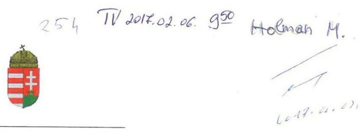

# NEMZETI ADÓ- ÉS VÁMHIVATAL 

Vezető

Iktatószám: 2160588971
Ügyszám: 5167617847
Ügyintéző: dr. Bordács Ágnes
Hivatkozási szám: V-1048-392/2016
Tárgy:

 Észrevétel
Melléklet: 2 db
Domokos László úr
elnök
részére
Állami Számvevőszék
Budapest

ÁLLAMI SZÁMVEVŐSZÉK
B E-3107/2017
Érkezett: 2017. FEBRUÁR 03.
Iktatószám: V 1048 - 406/2016
Melléklet:

## Tisztelt Elnök Úr!

Köszönettel megkaptam „Az adatvédelem hazai keretrendszerének és egyes kiemelt adatnyilvántartások ellenőrzése nemzetközi együttműködés keretében" témájában készített, fenti számon megküldött számvevőszéki jelentés tervezetét, melyet áttekintettem, és azzal kapcsolatosan az alábbi észrevételeket szeretném megfogalmazni:

## Intézkedési javaslattal érintett megállapítások:

1.) A tervezet 31. oldalán szereplő 1. sz. intézkedési javaslat szerint intézkedni kell „annak érdekében, hogy az adatkezeléshez használt elektronikus rendszerek biztonsági osztályba sorolása megtörténjen az Ibtv. előírásainak megfelelően." A megállapítás a 2.1. számú megállapítás 2. bekezdés 3. francia bekezdésén alapul. (21. oldal)

A tervezet 21. oldalán szereplő hivatkozott megállapítás szerint:
„AZ ADATKEZELÉSHEZ HASZNÁLT ELEKTRONIKUS RENDSZEREK BIZTONSÁGI OSZTÁLYBA SOROLÁSÁT az adatkezelő szervezetek - az OEP és az OH kivételével - az Ibtv. 7. § (1) bekezdésében foglaltak ellenére 2013. július 1-től az ellenőrzött időszak végéig, illetve az Ibtv. 26.§ (1) bekezdése alapján legkésőbb 2014. július 1-ig nem végezték el teljes körűen. A bizalmasság, a sértetlenség és a rendelkezésre állás szempontjából elvégzendő besorolása következő rendszerek esetében maradt el:
(...)

- A NAV-nál az ETR ELLTAM ${ }^{68}$, a KOCKA2 és a Diszpécser modul ${ }^{69}$ esetében."

Kérem az ETR ELLTAM modult ezen felsorolásból törölni, mivel a NAV-nál használt, illetve a tervezet „rövidítések jegyzékében" az ÁSZ által hivatkozott Ellenőrzést Támogató Rendszer (helyesen ETR), valamint annak moduljai, az ETR, illetve az ETR ELLTAM rövid névvel kezdődő modulok kivétel nélkül rendelkeznek biztonsági besorolással. A besorolás az ÁSZ részére átadott AKA táblákban megtalálható. A tervezet által hivatkozott -

---

és a „rövidítések jegyzékében" is így szerepeltetett - ETR ELLTAM rövid nevű modul a NAV-nál nincs használatban.

A KOCKA2 alkalmazás és a Diszpécser modul 2015. év végén kerültek bevezetésre, ezért nem kerültek bele a NAV elnöke által 2014-ben elfogadott/aláírt (ÁSZ részére megküldött) biztonsági besorolást tartalmazó táblázatba. A két modul/alkalmazás besorolása azonban már megtörtént, erről a NAV KI Kockázatelemzési és Kiválasztási Főosztály 2016. május 13-án a NAV KI Informatikai Főosztály részére értesítést küldött. (Mellékelem a KOCKA2 és a Diszpécser modul biztonsági osztályba sorolásának adatait tartalmazó táblázatot, és az Informatikai Főosztály részére továbbított elektronikus levelet.)

Mindezek alapján kérem

- a tervezet 21. oldalán szereplő megállapítás javítását, azaz az „ETR ELLTAM ${ }^{68}$"-ra való hivatkozás elhagyását, továbbá
- a 31. oldalán szereplő 1. sz. intézkedési javaslat - mivel az az „ETR ELLTÁM" tekintetében helytelen, a KOCKA2 alkalmazás és a Diszpécser modul tekintetében pedig már okafogyott - törlését, valamint
- a 39. oldalon a „rövidítések jegyzékének" javítását az Ellenőrzést Támogató Rendszer rövidítésének megjelölésénél (helyesen ETR).
2.) A tervezet 31. oldalán szereplő 2. sz. intézkedési javaslat szerint intézkedni kell „annak érdekében, hogy a szervezet egészének biztonsági szintbe sorolása megfeleljen az Ibtv. előírásainak." A megállapítás a 2.1. számú megállapítás 7. bekezdés 2. francia bekezdésén alapul. (22. oldal)
a) A tervezet 22. oldalán szereplő hivatkozott megállapítás álló betűs részének első mondata szerint:
„(...) A NAV szervezetének 3. biztonsági szintbe történő besorolása 2015. július 15-ig nem felelt meg az Ibtv. 9. § (2) bekezdés d) pontjában foglalt előírásnak. (...)"

Az Ibtv. 2014. január 1. és 2015. július 15. között hatályos 10. § (1) bekezdése szerint a szervezetnek meg kellett határoznia, hogy a vizsgálat elvégzésekor melyik biztonsági szintnek felelt meg, azaz, hogy ténylegesen melyik biztonsági szintet teljesíti.
Mint ismert, a besoroláskor a NAV a 3. szintbe sorolta a tényleges biztonsági szintjét azzal, hogy az elvárt biztonsági szint a 4. szint lenne, mivel a NAV rendelkezik 4. biztonsági osztályba sorolt elektronikus információs rendszerrel.

Ugyanakkor az Ibtv. 2015. július 16. előtt is és most is hatályos 10. § (4) bekezdése alapján a szervezetnek lehetősége van az előírt biztonsági szint fokozatos elérésére. Ennek keretében a magasabb biztonsági szint elérésére - minden egyes szintet érintően, a következő magasabb szintre lépéshez - két év áll rendelkezésére.
A NAV tehát a fentieknek megfelelően határozta meg a szervezet tényleges (nem elvárt), illetve elvárt biztonsági szintjét.
Az előzőekből következően a NAV tényleges biztonsági szintjének 3. biztonsági szintben történő megállapítása nem mondott ellent a jogszabályi előírásnak.

Megjegyzem, hogy az Ibtv. 2015. július 16-ával hatályos módosítása pontosította az Ibtv.-nek - a korábban az 5-ös biztonsági szint kérdéskörét illetően releváns - adatfeldolgozó fogalmát meghatározó 1. § 3. pontját.

---

Korábban ugyanis félreérthető volt, hogy a törvény fogalmi rendszerében adatfeldolgozó alatt érteni kellett-e magát a szervezetet, vagy az csak külső személy lehet, mivel a 2015. július 15-ig hatályos 1. § 3. pont szerint adatfeldolgozónak az a természetes személy, jogi személy vagy egyéni vállalkozó minősült, aki vagy amely az adatkezelő részére adatfeldolgozást végez.
A 2015. július 16-tól hatályos - az Info. tv. (2011. évi CXII. tv.) 3. § 18. pontjához igazodó módosítás alapján azonban most már teljesen egyértelmű, hogy a törvény fogalomrendszerében adatfeldolgozó csak külső személy (szervezet) lehet, ugyanis fogalmi kritérium, hogy az adatfeldolgozó az a természetes vagy jogi személy, valamint jogi személyiséggel nem rendelkező szervezet, aki vagy amely szerződés alapján - beleértve a jogszabály rendelkezése alapján kötött szerződést is - adatok feldolgozását végzi.
Az Ibtv.-t módosító törvény indoklása e körben külön is kimondta, hogy a megfelelő jogalkalmazás érdekében az Infotv. és az Ibtv. azonos fogalmait harmonizálni szükséges.
b) A tervezet 22. oldalán szereplő hivatkozott megállapítás utolsó mondata szerint:
„A besorolás 2015. július 16. és december 31. között nem felelt meg a 41/2015. (VII. 15.) BM rendelet 1. melléklet 2. Biztonsági osztályok 2.6. pontjának."

A 41/2015. (VII. 15.) BM rendelet tervezet által hivatkozott 1. melléklet 2. Biztonsági osztályok 2.6. pontja - mely a 2.1. pont szerint nem kógens szabály, csak iránymutatást képez - az 5. biztonsági osztály lehetséges káreseményeit részletezi.

Ugyanakkor az Ibtv. 2015. július 16-tól hatályos szabályai és a 41/2015. (VII. 15.) BM rendelet 2. melléklet 4. pontja alapján egyértelmű, hogy a NAV - ellentétben a Jelentés tervezetben foglaltakkal - a 4. biztonsági osztályba tartozik, ugyanis a 41/2015. (VII. 15.) BM rendelet 2. melléklet 5. pontja értelmében az 5. biztonsági szintbe egy szervezet csak akkor tartozik, ha a 4. szinthez rendelt jellemzőkön túl európai létfontosságú rendszerelemmé és a nemzeti létfontosságú rendszerelemmé törvény alapján kijelölt rendszerelemek elektronikus információs rendszereinek üzemeltetője, fejlesztője, illetve az információbiztonsági ellenőrzések, tesztelések végrehajtására jogosult szervezet vagy szervezeti egység. Ez a feltétel ugyanakkor a NAV esetében nem áll fenn.

Azaz az ÁSZ által vizsgált időszakban (2011-2015. évek) a NAV biztonsági besorolása figyelemmel az a-b) pontban kifejtettekre és az Ibtv. 10. § (4) bekezdésére - a jogszabályi előírásoknak megfelelő volt.

Mindezek alapján kérem a tervezet 22. oldalán szereplő hivatkozott megállapítás

- 2015. július 16. előtti időre vonatkozó részének pontosítását, valamint
- az utolsó mondatának, továbbá
- a 31. oldalán szereplő 2. sz. intézkedési javaslat törlését.

# Egyéb megállapítások: 

3.) A jelentés tervezet 9. oldal első bekezdésben zárójelben kerülnek felsorolásra a NAV esetében ellenőrzésre véletlenszerűen kiválasztott elektronikus rendszerek, illetve ezek részletezése a „rövidítések jegyzéke" cím alatt a tervezet 37. oldalától történik.

Ezek között található 17-es végjegyzet számmal az „ELEKAFA ${ }^{17}$", amely azonban ebben a megfogalmazásban pontatlan és összetéveszthető formában szerepel.

---

A számvevőszéki ellenőrzés során a közösségi egyablakos elektronikus áfa-visszatérítési (ELEKÁFA) rendszer négy különböző moduljából csak kettő,

- az adattovábbításokat végző ELP (azaz az adózói kapcsolattartásra szolgáló „Eljárási rendszer - Külföldi adózók ÁFA visszatérítési kérelme modul (ELEKAFA) Portál") és
- a VRF (vagyis a tagállami adattovábbításokat a CCN/CSI hálózat vonatkozásában végző „Vat-Refund - Külföldről történő elektronikus áfavisszatérítést kezelő modul") alkalmazások kerültek kiválasztásra a mintatételek közé, a kizárólag belső feldolgozásokat végző ELJ_ELEKAFA (magyar) és ELJ_ELEKAFA2 (külföldi) modulok áttekintését viszont az ÁSZ nem tartotta indokoltnak.

Mindezek alapján javaslom a jelentés tervezet 9. oldal első bekezdésben a zárójelben szereplő felsorolásban valamint a „rövidítések jegyzéke" cím alatt a 37. oldalon a 17-es végjegyzetben az ELEKAFA szöveget pontosítani a következők szerint: „ELEKAFA Portál".
A módosítási javaslatot alátámasztja magának a 17-es végjegyzetnek a szöveges magyarázata is, hiszen abban az ELP rendszerazonosítóval rendelkező alkalmazás „hosszú neve" már pontosan szerepel, csak a „rövid nevének" leírása pontatlan.
4.) A tervezet 16. oldal 3. francia bekezdését követő rész szerint „Az adatkezelő szervezetek IBSZ-ei nem tartalmazták teljes körűen a 77/2013. (XII. 19.) NFM rendelet 4. melléklet 3.1.1.3.1 pontjában és a 41/2015. (VII. 15.) BM rendelet 4. melléklet 3.1.1.1.1 pontjában előírt tartalmi elemeket (lásd 1. táblázat):"

Javaslom a 77/2013. (XII. 19.) NFM rendelet 4. melléklet 3.1.1.3.1 pontja helyett a 4. melléklet 3.1.1.3.3. pontra javítani, ugyanis a tervezet 1. táblázatában szereplő - hiányolt - elvárások az NFM rendelet 4. melléklet 3.1.1.3.3. pont (3.1.1.3.3.1.-től 3.1.1.3.3.16.-ig terjedő) alpontjaiban szerepelnek.

Ugyanígy javaslom a 41/2015. (VII. 15.) BM rendelet 4. melléklet 3.1.1.1.1. pontját 3.1.1.1.3. pontra javítani, mert a tervezet 1. táblázatában szereplő - hiányolt - elvárások a BM rendelet 4. melléklet 3.1.1.1.3. pont (3.1.1.1.3.1.-től 3.1.1.1.3.16.-ig terjedő) alpontjaiban szerepelnek.
5.) A tervezet 16. oldalán szereplő 1. táblázat NAV-ra vonatkozó adatai közül kérem a „hozzáférési szabályok betartásának ellenőrzése" szövegrész törlését, figyelemmel arra, hogy a mindenkor hatályos IBSZ egy keretszabályzat, amely az általános informatikai biztonsági előírásokat tartalmazza. Az egyes területekre vonatkozó részletes előírások, így a hozzáférési szabályok (jogosultságkezelés) az IBSZ 2. sz. mellékletében felsorolt, kapcsolódó szabályzatokban kerültek rögzítésre, azaz a NAV rendelkezett a hiányolt szabályozással (az APEH informatikai rendszereinek felhasználói szintű hozzáférési rendjéről szóló 1024/B/2009. APEH utasítás, a NAV Felhasználói Jogosultságkezelési Szabályzatáról szóló 2006/2012. számú Szabályzat, a NAV Jogosultságkezelési Szabályzatáról szóló 2122/2015. szabályzat), amire az IBSZ megfelelően utalt is. Megjegyzem, hogy a NAV mindenkor érvényes jogosultságkezelési szabályzataiban a jogosultságokra vonatkozó felülvizsgálati szabályok részletesen leírásra kerültek.
6.) A belső kontroll kiépítésével összefüggő 1.2. számú megállapítás (17. oldal) első francia bekezdésében foglaltak tényszerűsége mellett szükségesnek tartom rögzíteni, hogy bár igaz, a NAV 2014. november végétől rendelkezik az adatvagyon kezelési, feldolgozási tevékenységet illetően ellenőrzési nyomvonallal, de a kontrollkörnyezet azt megelőzően is

---

teljes volt, mert valamennyi szervezeti, működési szabályzó megalkotásra került, és a szakmai területeken is megvoltak a vonatkozó eljárási rendek. A területre vonatkozó irányító eszközök által az engedélyezési, jóváhagyási eljárások, a feladat-, hatás- és felelősségi körök 2014. novemberéig is szabályozottak voltak.
7.) A tervezet 21. oldal 4. bekezdésében említésre kerül a NAV a tekintetben, hogy a biztonsági besorolás eredménye nem került az IBSZ-ben rögzítésre.
Kérem a felsorolásból a NAV-ot kivenni, tekintettel arra, hogy a NAV Informatikai Biztonsági Szabályzatáról szóló 2107/2015. számú szabályzat (IBSZ) 5. címében és a 3. számú mellékletében foglaltak teljes körűen rögzítik a biztonsági besorolás elméleti alapjait és annak gyakorlatát.
8.)
 A jelentés tervezet 2.3. számú megállapítás címe alatt a 25. oldal utolsó francia bekezdésben kerülnek felsorolásra a NAV ellenőrzött adattovábbításaira felhatalmazást adó jogszabályi hivatkozások, illetve ezek részletezése a „rövidítések jegyzéke" cím alatt a tervezet 39. oldalától történik.

- A 25. oldal utolsó francia bekezdés szerint „A NAV ellenőrzött adattovábbításai a Ki. ${ }^{83}$, a Pénztárgéprendelet ${ }^{84}$, továbbá a HÉA irányelv ${ }^{85}$ alapján megalkotott 1798/2003/EK rendelet ${ }^{86}$, illetve azzal összhangban az Art. ${ }^{87}$ előírásain alapultak. ..."

Ugyanakkor véleményem szerint a 2006. november 28-i HÉA irányelv nem alapja a hozzáadottérték-adó területén történő közigazgatási együttműködésről, valamint a 218/92/EGK rendelet hatályon kívül helyezéséről szóló 2003. október 7-i 1798/2003/EK rendeletnek, így a tervezet szerinti megfogalmazás pontatlan, ezért javaslom annak pontosítását.

- A 39. oldalon a végjegyzet magyarázatát - a tervezet többi közösségi jogszabályi hivatkozásának szövegezéséhez hasonlóan - a következők szerint javasoljuk pontosítani: „ ${ }^{89}$ HÉA irányelv - a TANÁCS 2006. november 28-i 2006/112/EK irányelve a közös hozzáadottértékadó-rendszerről"
9.) A jelentés tervezet „rövidítések jegyzéke" cím alatt a 40. oldalon a ${ }^{89} 79/2012/EU$ végrehajtási rendelet végjegyzetben a feltüntetett hatályba lépés időpontja elírásra került, a hatályosság kezdetének helyes időpontja a 14. cikkre tekintettel: 2012. február 21.

A végső szövegezés kialakításakor kérem észrevételeim, javaslataim szíves elfogadását.

Budapest, 2017. február „l."
Tisztelettel:
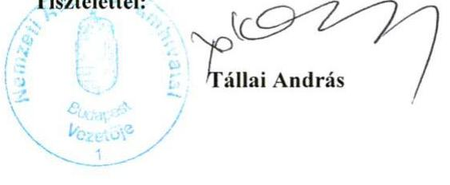

---

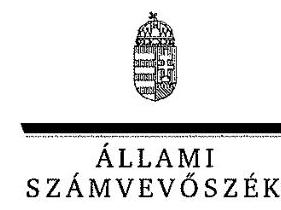

ELNÖK

Ikt.szám: V-1048-412/2016.

# Tállal András úr 

parlamenti és adóügyekért felelős államtitkár, miniszterhelyettes

Nemzeti Adó- és Vámhivatal

## Budapest

## Tisztelt Államtitkár Úr!

Az adatvédelem hazai keretrendszerének és egyes kiemelt adatnyilvántartások ellenőrzése nemzetközi együttműködés keretében címủ számvevőszéki jelentéstervezetre tett észrevételeit köszönettel megkaptam.

Az Állami Számvevőszék észrevételekre vonatkozó álláspontjáról a felügyeleti vezető által készített részletes tájékoztatást csatoltan megküldöm.

Tájékoztatom Államtitkár urat, hogy a jelentésben - az Állami Számvevőszékről szóló 2011. évi LXVI. törvény 29. § (3) bekezdése alapján - a figyelembe nem vett észrevételeket szerepeltetjük az elutasítás indokának feltüntetésével együtt.

Budapest, 2017. 05. hó 01. nap
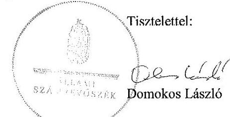

Melléklet: Tájékoztatás az elfogadott és az el nem fogadott észrevételekről

---

# Tájékoztatás az elfogadott és az el nem fogadott észrevételekről 

Az adatvédelem hazai keretrendszerének és egyes kiemelt adatnyilvántartások ellenőrzése nemzetközi együttműködés keretében címủ számvevőszéki jelentéstervezetre 2160588971. iktatószámú levelében tett észrevételeit áttekintettük, annak kezeléséről az alábbi tájékoztatást adom.

1. A jelentéstervezet 31. oldalán szereplő 1. számú javaslatra és az azt megalapozó 2.1. számú megállapításhoz tartozó 2. bekezdés 3. francia bekezdésére tett észrevételét részben fogadtuk el.

Elfogadtuk az ETR ELLTAM modul biztonsági osztályba sorolására és a rövidítésjegyzékben történő módosítására tett észrevételét, ezért a jelentéstervezet 2.1. számú megállapításhoz tartozó 2. bekezdés 3. francia bekezdéséből és a rövidítésjegyzékből az ETR ELLTAM modult töröltük.

Nem fogadtuk el a KOCKA2 és a Diszpécser modulra tett megállapításokra irányuló észrevételét. Az ellenőrzött időszak 2011. január 1-jétől 2015. december 31-ig tartott, az ÁSZ ezen időszakban végrehajtott biztonsági osztályba sorolások szabályszerűségét ellenőrizte. Az észrevételében foglaltak is megerősítik, hogy a két modul/alkalmazás bevezetése 2015-ben, besorolása azonban csak 2016-ban történt. Tekintve, hogy a KOCKA2 és a Diszpécser modul az ellenőrzött időszakban bevezetésre került, ugyanakkor az Ibtv. 7. § (1) bekezdése szerinti biztonsági osztályba sorolása és az Ibtv. 8. § (1)-(2) bekezdése szerinti soron kívüli biztonsági osztályba sorolása sem történt meg 2015 végéig, a két elektronikus információs rendszerre vonatkozó megállapítást és a kapcsolódó javaslatot továbbra is fenntartjuk.
2. A jelentéstervezet 31. oldalán szereplő 2. számú javaslatra és az azt megalapozó 2.1. számú megállapításhoz tartozó 7. bekezdés 2. francia bekezdésére tett észrevételét részben fogadtuk el.
a) Nem fogadtuk el „... A NAV szervezetének 3. biztonsági szintbe történő besorolása 2015. július 15-ig nem felelt meg az Ibtv. 9. § (2) bekezdés d) pontjában foglalt előírásnak." megállapításra tett észrevételét. 2015. július 15. előtt az Ibtv. 9. § (2) bekezdése szerint a szervezet biztonsági szintje a szervezet elektronikus információs rendszereinek legmagasabb biztonsági osztályával azonos besorolású. Az Ibtv. 10.§ (4) bekezdése szerint az így előírt biztonsági szint teljesítése során a szervezetnek lehetősége van az előírt biztonsági szint fokozatos elérésére. Ennek keretében a magasabb biztonsági szint elérésére - minden egyes szintet érintően, a következő magasabb szintre lépéshez - két év áll rendelkezésére. A jogszabály alapján tehát valóban 2 év van a biztonsági szint elérésére, de a szervezet biztonsági szintbe sorolását már az elérendő/elvárt szintre el kell végezni. A szervezet - a rendelkezésre bocsátott dokumentumok és az észrevételében foglaltak alapján - irányadónak a 4. biztonsági szin-

---

tet határozta meg, mivel rendelkezett 4. biztonsági osztályba sorolt elektronikus információs rendszerrel. Ennek ellenére a 2107/2015. számú szabályzat 3. sz. mellékletében egyértelműen a 3. biztonsági szintbe sorolták be a szervezetet. A cselekvési tervet is csak a 3. biztonsági szint elérésére készítettek annak ellenére, hogy az Ibtv. 10. § (2) bekezdései szerint ha a vizsgálat alapján meghatározott biztonsági szint alacsonyabb, mint az adott szervezetre vagy szervezeti egységre jogszabályban meghatározott biztonsági szint, akkor a szervezetnek a vizsgálatot követő 90 napon belül cselekvési tervet kell készítenie a számára előírt biztonsági szint elérésére.
b) Részben fogadtuk el „... A besorolás 2015. július 16. és december 31. között nem felelt meg a 41/2015. (VII. 15.) BM rendelet 1. melléklet 2. Biztonsági osztályok 2.6. pontjának." megállapításra tett észrevételét. Az észrevételében jelzettek alapján a NAV „a 4. biztonsági osztályba tartozik". Az előző pontban és az észrevételében foglaltak szerint a szervezet rendelkezik 4. biztonsági osztályba sorolt elektronikus információs rendszerrel, ezért a BM rendelet 1. melléklet 2.6. pontjára történő hivatkozás helyett a számvevőszéki jelentésben a 2.5. pontot, a 4. biztonsági osztályra vonatkozó iránymutatást szerepeltetjük. Ezzel a módosítással a megállapításunkat továbbra is fenntartjuk.

Mindezek alapján a jelentéstervezet 31. oldalán szereplő 2. számú javaslatot továbbra is fenntartjuk.
3. A jelentéstervezet 9. és 37. oldalán az „ELEKAFA" rendszer megnevezésére tett észrevételt elfogadtuk, a számvevőszéki jelentében „ELEKAFA Portál" néven szerepeltetjük.
4. A jelentéstervezet 16. oldalán, az 1.1. számú megállapításhoz tartozó 7. bekezdésben foglaltakra tett észrevételét elfogadtuk, „a 77/2013. (XII. 19.) NFM rendelet 4. melléklet 3.1.1.3.1 pontjában és a 41/2015. (VII. 15.) BM rendelet 4. melléklet 3.1.1.1.1 pontjában előírt tartalmi elemeket (lásd 1. táblázat)" szövegrészben a számvevőszéki jelentésben az NFM rendelet 4. melléklet 3.1.1.3.3 pontját, valamint a BM rendelet 4. melléklet 3.1.1.1.3 pontját szerepeltetjük.
5. A jelentéstervezet 16. oldalán szereplő 1. számú táblázatra tett észrevételét nem fogadtuk el. A 77/2013. (XII. 19.) NFM rendelet 4. melléklet 3.1.1.3.3 pontja és a 41/2015. (VII. 15.) BM rendelet 4. melléklet 3.1.1.1.3 pontja határozza meg, hogy az érintett szervezet informatikai biztonsági szabályzata mely elektronikus információs rendszerbiztonsággal kapcsolatos területeket szabályozza. Ezen belül pl. a BM rendelet 3.1.1.3.3.12. pontja rögzíti az elektronikus információs rendszerhez való hozzáférés során követendő azonosítási és hitelesítési eljárást, és a hozzáférési szabályok betartásának ellenőrzését. Ennek megfelelően az IBSZ-ben kell szabályozni a hozzáférési szabályok betartásának ellenőrzését. Az észrevételében hivatkozott belső szabályzatok a jogosultságok felülvizsgálatára és szükség esetén azok visszavonására tartalmaznak előírásokat, a szabályok betartásának ellenőrzésére nem terjednek ki. Így a hivatkozott táblázatból a NAV-ra vonatkozó adatok közül a „hozzáférési szabályok betartásának ellenőrzése" szövegrészt nem áll módunkban törölni.

---

6. A jelentéstervezet 1.2. számú megállapításához tartozó 2. bekezdés 2. francia bekezdésének kiegészítésére tett javaslatát nem fogadtuk el. Az Ámr. 156. § (2) bekezdésében és a Bkr. 6. § (3) bekezdésében előírt formában és tartalmi elemekkel kötelezően elkészítendő ellenőrzési nyomvonal a működési folyamatok tekintetében a nyomon követés és utólagos ellenőrzés nélkülözhetetlen eszköze. Az észrevételében jelezett, az érintett területre vonatkozó irányító eszközök által az engedélyezési, jóváhagyási eljárások, a feladat-, hatás- és felelősségi körök szabályozásának biztosítása nem mentesíti a szervezetet a jogszabály által előírt ellenőrzési nyomvonal elkészítése alól.
7. A jelentéstervezet 21. oldalán a 2.1. számú megállapításhoz tartozó 4. bekezdésre tett észrevételét nem fogadtuk el. Az Ibtv. 7. § (3) bekezdése alapján az elektronikus információs rendszerek biztonsági osztályba sorolását (vagyis az egyes rendszerek biztonsági osztályát) a szervezet informatikai biztonsági szabályzatában kell rögzíteni. Az észrevételében hivatkozott, a NAV 2107/2015. számú szabályzat 3. sz. mellékletében „a biztonsági besorolás elméleti alapjait és annak gyakorlatát", vagyis a besoroláshoz használt módszertant és annak eredményét rögzítették, mely nem egyenértékű az egyes elektronikus információs rendszerek biztonsági osztályának IBSZ-ben történő szerepeltetésével.
8. A jelentéstervezet 25. oldalán, a 2.3. számú megállapításához tartozó 1. bekezdés 5. francia bekezdésében foglaltakra tett észrevételét elfogadtuk, a hivatkozott szövegrészt az alábbiak szerint szerepeltetjük a számvevőszéki jelentésben: „... a HÉA irányelvvel összhangban módosított 1798/2003/EK rendelet...".

A jelentéstervezet 39. oldalán, „Rövidítések jegyzéke" címszó alatt a 85-ös végjegyzet számon szereplő HÉA irányelv megfogalmazását az alábbiak szerint módosítjuk: „a TANÁCS 2006. november 28-i 2006/112/EK irányelve a közös hozzáadottértékadó-rendszerről"
9. A jelentéstervezet 40. oldalán a „Rövidítések jegyzéke" cím alatt szereplő 79/2012/EU végrehajtási rendelet hatályba lépésének időpontját a számvevőszéki jelentésben 2012. február 21-vel szerepeltetjük.

Budapest, 2017. 03. hó 7. nap

Holman Magdolna
felügyeleti vezető

---

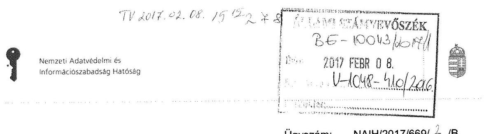

Ügyszám: NAIH/2017/669/Δ/B
Hiv. szám: V-1048-397/2016.

# Budapest 

Tisztelt Elnök Úr!

Az adatvédelem hazai keretrendszerének és egyes kiemelt adatnyilvántartások ellenőrzése nemzetközi keretben címü számvevőszéki jelentéstervezetet (a továbbiakban: Jelentés) köszönettel megkaptam. Az Állami Számvevőszék megállapításai értékes visszajelzést adnak számunkra és iránymutatást nyújtanak ahhoz, hogy a jövőben még hatékonyabban és eredményesebben láthassuk el az Alaptörvényből következő, az információs önrendelkezési jogról és az információszabadságról szóló 2011. évi CXII. törvényben (a továbbiakban: Infotv.) meghatározott feladatainkat. A Jelentés Nemzeti Adatvédelmi és Információszabadság Hatóságot (a továbbiakban: Hatóság) érintő részletes megállapításaival és a Hatóságunkat érintő javaslattal egyetértek. Ugyanakkor javasolom megfontolni a Jelentés főbb megállapításokról, következtetésekről, javaslatokról szóló része első bekezdésének pontosítását. Itt az szerepel, hogy „a NAIH pedig nem tett eleget az Infotv. szerinti döntési és intézkedési kötelezettségének". Tartani lehet attól, hogy ha a sajtó a Jelentés nyilvánosságra hozatalát követően a szövegkörnyezetből kiragadva fogja idézni ezt a részt, akkor könnyen keletkezhet olyan hamis látszat, mintha a Jelentés Hatóságunk munkájának színvonalát általában kritizálná, noha az észrevételek - amelyeket maradéktalanul elfogadunk - valójában csak az adatvédelmi felelősök nyilvántartását és néhány konkrét ügyet érintettek.

Budapest, 2017. február „3."

Üdvözlettel:
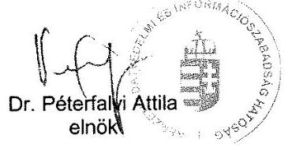

---

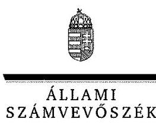

# Dr. Péterfalvi Attila úr 

elnök

Nemzeti Adatvédelmi és Információszabadság Hatóság

## Budapest

## Tisztelt Elnök Úr!

Az adatvédelem hazai keretrendszerének és egyes kiemelt adatnyilvántartások ellenőrzése nemzetközi együttműködés keretében címủ számvevőszéki jelentéstervezetre tett észrevételeit köszönettel megkaptam.

Az Állami Számvevőszék észrevételekre vonatkozó álláspontjáról a felügyeleti vezető által készített részletes tájékoztatást csatoltan megküldöm.

Tájékoztatom Elnök urat, hogy a jelentésben - az Állami Számvevőszékről szóló 2011. évi LXVI. törvény 29. § (3) bekezdése alapján - a figyelembe nem vett észrevételeket szerepeltetjük az elutasítás indokának feltüntetésével együtt.

Budapest, 2017.
 O3. hó 01. nap
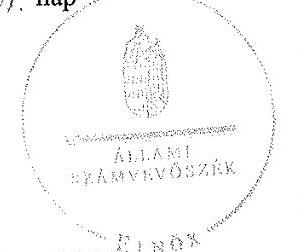

Tisztelettel:

Domokos László

Melléklet: Tájékoztatás az elfogadott észrevételről

---

# Tájékoztatás az elfogadott észrevételről 

Az adatvédelem hazai keretrendszerének és egyes kiemelt adatnyilvántartások ellenőrzése nemzetközi együttműködés keretében címû számvevőszéki jelentéstervezetre NAIH/2017/669/2/B. iktatószámú levelében tett észrevételeit áttekintettük, annak kezeléséről az alábbi tájékoztatást adom.

A jelentéstervezet 5. oldalán a Főbb megállapítások, következtetések, javaslatok rész első bekezdésében szereplő megállapításra tett észrevételét elfogadtuk. A számvevőszéki jelentés készítésénél a jelentéstervezetben rögzített, a NAIH feladatellátásával kapcsolatos megállapításokra figyelemmel az érintett összefoglaló megállapítást módosítjuk a tekintetben, hogy a NAIH nem tett eleget minden, az Info tv. által előírt döntési és intézkedési kötelezettségének.

Budapest, 2017. 03. hó 01. nap

Holman Magdolna
felügyeleti vezető

---

# Oktatási Hivatal 

Ügyiratszám: ET/1-7) 2016.
Ügyintéző: Previákné dr. Mázsári Ágnes
Telefon: (+36-1) 374-2166
E-mail: asz ellenorzes@oh.gov.hu
Hivatkozási szám: V-1048-395/2016.

## Domokos László

elnök
részére

## Állami Számvevőszék

1364 Budapest 4.
Pf. 54.
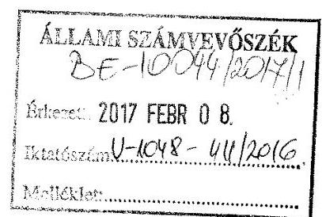

Tárgy: Észrevétel a 2017. január 13-án kelt számvevőszéki jelentéstervezettel kapcsolatban

## Tisztelt Elnök Úr!

Fenti hivatkozási számú levelét és az annak mellékletét képező *Az* adatvédelem hazai keretrendszerének és egyes kiemelt adatnyilvántartások ellenőrzése nemzetközi együttműködés keretében címû 2017. január 13-i számvevőszéki jelentéstervezetet (a továbbiakban: jelentéstervezet) köszönettel megkaptuk. Az ellenőrzés megállapításaival kapcsolatban az alábbi észrevétellel élünk.

A jelentéstervezet 2.1. számú megállapítása szerint „Az OH 2013. december 27-től nem határozta meg a NYAK-REX esetében a szervertermekbe belépésre jogosultak és a rendszerhez használt adathordozókhoz történő hozzáférők korlátozását, így nem biztosította az NFM rendelet 4. mellékletének 3.3.4.2. pontja, valamint a BM rendelet 4. mellékletének 3.3.8.2. pontjában foglaltak érvényesülését. ".

Az idézett megállapítás tekintetében az alábbi észrevételt tesszük:
Az idézett rendszer teljes mértékben kiszervezett szolgáltatásként volt működtetve, megkötött SLA szerződés alapján. Tekintve, hogy a rendszer nem a mi szervertermünkben került elhelyezésre, hanem a szolgáltató saját székhelyén, „a szervertermekbe belépésre jogosultak és a rendszerhez használt adathordozókhoz történő hozzáférők korlátozását" sem írhattuk elő. A szerverterembe történő belépés és az adathordozókhoz történő hozzáférés a szolgáltató saját szabályozása alapján történt, amelyet kérés esetén bármikor hajlandó volt átadni. A köztünk lévő felelősségi rendszert ugyanakkor az SLA szerződés rögzítette, amelynek nem része a szolgáltató saját székhelyén lévő szerverközpont kezelésének korlátozása.

A fentiek alapján a megállapítást nem tartjuk relevánsnak, kérjük azt törölni.

---

Az ellenőrzés többi megállapítását elfogadjuk, azokra nézve észrevétellel nem kívánunk élni.
Budapest, 2017. február 1.
Tisztelettel:
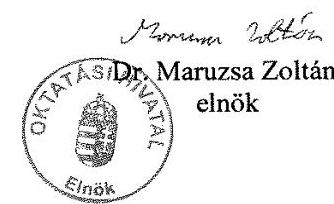

---

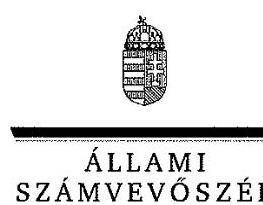

ELNÖK

Ikt.szám: V-1048-417/2016.

Dr. Maruzsa Zoltán úr
elnök

Oktatási Hivatal

Budapest

# Tisztelt Elnök Úr! 

Az adatvédelem hazai keretrendszerének és egyes kiemelt adatnyilvántartások ellenőrzése nemzetközi együttműködés keretében címû számvevőszéki jelentéstervezetre tett észrevételeit köszönettel megkaptam.

Az Állami Számvevőszék észrevételekre vonatkozó álláspontjáról a felügyeleti vezető által készített részletes tájékoztatást csatoltan megküldöm.

Tájékoztatom Elnök urat, hogy a jelentésben - az Állami Számvevőszékről szóló 2011. évi LXVI. törvény 29. § (3) bekezdése alapján - a figyelembe nem vett észrevételeket szerepeltetjük az elutasítás indokának feltüntetésével együtt.

Budapest, 2017. 08. hó 4. nap
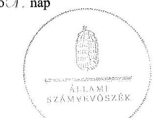

Tisztelettel:

Domokos László

Melléklet: Tájékoztatás az el nem fogadott észrevételekről

---

# Tájékoztatás az el nem fogadott észrevételekről 

Az adatvédelem hazai keretrendszerének és egyes kiemelt adatnyilvántartások ellenőrzése nemzetközi együttműködés keretében címû számvevőszéki jelentéstervezetre ET/1-37/2016. iktatószámú levelében tett észrevételeit áttekintettük, annak kezeléséről az alábbi tájékoztatást adom.

1. A jelentéstervezet 2.1. számú megállapítás 1. bekezdés 2. francia bekezdésére tett észrevételét nem fogadtuk el. Az ellenőrzött időszakban a NYAK REX elektronikus információs rendszer üzemeltetését a NETFOCUS Kft. éves megbízási szerződés alapján végezte. A szervezet jogszabályi előírásoknak való megfelelését, így a 77/2013. (XII. 19.) NFM rendelet és a 41/2015. (VII. 15.) BM rendelet 2. biztonsági osztály esetében előírt követelményeket az OH a külső szolgáltatóval kötött szerződésen keresztül tudta érvényesíteni. Ugyanakkor az ellenőrzött időszakban az OH ezen megbízási szerződésekben nem rögzítette a szervertermekbe belépésre jogosultak és a rendszerhez használt adathordozókhoz történő hozzáférés korlátozását, így nem biztosította az NFM rendelet 4. sz. melléklet 3.3.4.2. pontja, valamint a BM rendelet 4. sz. melléklet 3.3.8.2. pontjában foglaltak teljesülését. Az észrevételében hivatkozott, az idézett rendszer kiszervezett szolgáltatásként történő működtetése nem mentesíti az Oktatási Hivatalt, mint a kezelt adatok védelméért felelős szervezetet a jogszabályi kötelezettség teljesítése alól.

Budapest, 2017. 05. hó 1. nap

Holman Magdolna
felügyeleti vezető

---

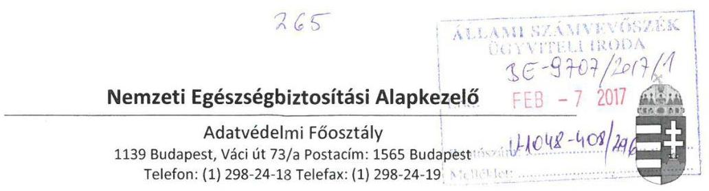

Iktatószám: F0221/327-18/2016
Hiv. sz.: V-1048-393/2016
Tárgy: észrevétel
Ügyintéző: dr. Kádár Virág (1/350-2001/1430)
Melléklet: -
Domokos László
Elnök

# Állami Számvevőszék 

Budapest 4.
Pf. 54.
1364

## Tisztelt Elnök Úr!

A Nemzeti Egészségbiztosítási Alapkezelőhöz (a továbbiakban: NEAK) 2017. január 23. napján kézbesített, V-1048-393/2016 számú, „Az adatvédelem hazai keretrendszerének és egyes kiemelt adatnyilvántartások ellenőrzése nemzetközi együttműködés keretében" tárgyban készült számvevőszéki jelentéstervezetet köszönettel megkaptuk, melyre vonatkozóan az alábbi észrevételeket tesszük:

1. 

A jelentés 16. oldalán az 1. táblázat az Országos Egészségbiztosítási Pénztár (továbbiakban: OEP) Informatikai Biztonsági Szabályzatára (továbbiakban: IBSZ) vonatkozóan hiányosságokat állapít meg a következők tekintetében:

- biztonsági helyzet-, és eseményértékelés eljárási rendje
- ügy-, vagy üzletmenet folytonosság tervezés
- elektronikus információs rendszerek karbantartásának rendje

Értelmezésünk szerint a hiányosságként megállapított dokumentumok az állami és önkormányzati szervek elektronikus információbiztonságáról szóló 2013. évi L. törvény (továbbiakban: Ibtv.) végrehajtási rendelete szerint, (az állami és önkormányzati szervek elektronikus információbiztonságáról szóló 2013. évi L. törvényben meghatározott technológiai biztonsági, valamint biztonságos információs eszközökre, termékekre vonatkozó, valamint a biztonsági osztályba és biztonsági szintbe sorolási követelményeiről szóló 77/2013. (XII. 19.) NFM rendelet majd 41/2015. (VII. 15.) BM rendelet) az 1. illetve 2. biztonsági osztályba sorolt rendszerekre vonatkozó előírások. Az Ibtv. értelmében a szervezetnek 2014. július 1. napjáig kellett elvégeznie első alkalommal az elektronikus információs rendszerei biztonsági osztályba sorolását (Ibtv. 26.§), amely alkalommal a szervezet biztonsági szintje „0" volt. Az Ibtv. 8.§ (3) értelmében: „az elektronikus információs rendszerre vonatkozó védelem elvárt erősségének eléréséhez a szervezetnek lehetősége van a

---

biztonsági intézkedések fokozatos kivitelezésére. Ennek keretében az első vizsgálatkor megállapított biztonsági osztályt alapul véve, minden egyes következő, magasabb biztonsági osztályhoz rendelt biztonsági intézkedések kivitelezésére két év áll rendelkezésére."
Mindezek alapján a megállapított hiányosságok a szervezet számára nem felróhatóak, tekintettel arra, hogy a szervezet nem tartozott abba a biztonsági osztályba, amely előírja a szükséges dokumentumok meglétét.

# 2. 

Jelentés 21. oldal „Az OEP és az OH esetében a rendszerek biztonsági osztályba sorolását...a szervezet vezetője nem hagyta jóvá,..."
Az OEP a jogszabályi előírások szerint elvégezte a biztonsági osztályba sorolást, melyet megküldött a Nemzeti Elektronikus Információbiztonság Hatóság részre. A szervezet vezetője, hivatalos kiadmányozás keretében tette ezt meg, melynek melléklete volt a táblázatba foglalt besorolás is. (ez valóban külön nem került ellenjegyzésre, azonban értelmezésünk szerint jóváhagyása megtörtént)
A megállapítást ennek megfelelően kérjük pontosítani.

## 3.

Jelentés 32. oldal „Javaslatok a Nemzeti Egészségbiztosítási Alapkezelő Főigazgatójának" szakasz

Az Ibtv. előírásainak megfelelően a szervezet egészének szintbe sorolása a 7/2016. (2016.03.24) OEP Főigazgatói Szabályzatban, az IBSZ-ben megtörtént, ez az ÁSZ vizsgálat időpontjában már ismert volt.
Javasoljuk a megállapítás mellett megjegyezni, hogy ez késve, de a vizsgált időpontban már megtörtént.

Fentieken túl javasoljuk a jelentésben annak feltüntetését, hogy az egyes központi hivatalok és költségvetési szervi formában működő minisztériumi háttérintézmények felülvizsgálatával összefüggő jogutódlásáról, valamint egyes közfeladatok átvételéről szóló 378/2016. (XII. 2.) Korm. rendelet 14. § (1) bekezdése alapján, az Országos Egészségbiztosítási Pénztár elnevezése 2017. január 1-jén Nemzeti Egészségbiztosítási Alapkezelőre változott, melynek következtében a megállapítások az OEP-re vonatkoznak, a javaslatok azonban már a NEAK Főigazgatója számára fogalmazódnak meg.

Budapest, 2017. február 1.
Tisztelettel:
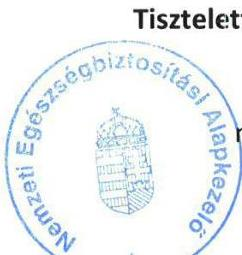
mb. egészségügyi főigazgató-helyettes

---

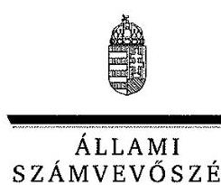

ELNÖK

Ikt.szám: V-1048-420/2016.

# Kiss Zsolt úr 

megbízott egészségügyi főigazgató-helyettes
Nemzeti Egészségbiztosítási Alapkezelő

## Budapest

## Tisztelt Főigazgató-helyettes Úr!

Az adatvédelem hazai keretrendszerének és egyes kiemelt adatnyilvántartások ellenőrzése nemzetközi együttműködés keretében címû számvevőszéki jelentéstervezetre tett észrevételeit köszönettel megkaptam.

Az Állami Számvevőszék észrevételekre vonatkozó álláspontjáról a felügyeleti vezető által készített részletes tájékoztatást csatoltan megküldöm.

Tájékoztatom Főigazgató-helyettes urat, hogy a jelentésben - az Állami Számvevőszékről szóló 2011. évi LXVI. törvény 29. § (3) bekezdése alapján - a figyelembe nem vett észrevételeket szerepeltetjük az elutasítás indokának feltüntetésével együtt.

Budapest, 2017. 03. hó 01. nap
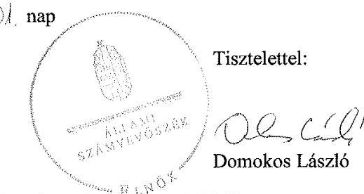

Melléklet: Tájékoztatás az elfogadott és az el nem fogadott észrevételekről

---

# Tájékoztatás az elfogadott és az el nem fogadott észrevételekről 

Az adatvédelem hazai keretrendszerének és egyes kiemelt adatnyilvántartások ellenőrzése nemzetközi együttműködés keretében címû számvevőszéki jelentéstervezetre F0221/327-18/2016. iktatószámú levelében tett észrevételeit áttekintettük, annak kezeléséről az alábbi tájékoztatást adom.

1. A jelentéstervezet 16. oldalán az 1. számú táblázatban foglaltakra tett észrevételét nem fogadtuk el. Az ellenőrzés rendelkezésére bocsátott dokumentumok alapján megállapítható, hogy az OEP 2014. június 30-án kelt 104/7-1/2014. iktatószámú levelében tájékoztatta a Nemzeti Elektronikus Információbiztonság Hatóságot az OEP szervezeti biztonsági szintbe sorolása és az egyes elektronikus információs rendszerek biztonsági osztályba sorolásáról. E levél szerint a szervezetet az 5. biztonsági szintbe sorolták, az elektronikus információs rendszerek biztonsági osztályba sorolásáról készült (az ellenőrzés rendelkezésére bocsátott) 2. számú melléklet az OEP IBSZ-hez táblázat adatai szerint az OEP az elektronikus információs rendszereit 1-5 biztonsági osztályba sorolta. Megállapításunkat ezen dokumentumok alapján tettük, ezért azt továbbra is fenntartjuk.
2. A jelentéstervezet 32. oldalán 2.1. számú megállapítás 4. bekezdésére tett észrevételét nem fogadtuk el. Az Ibtv. 7. § (3) bekezdése szerint a biztonsági osztályba sorolást a szervezet vezetője hagyja jóvá, és felel annak a jogszabályoknak és kockázatoknak való megfelelőségéért, a felhasznált adatok teljességéért és időszerűségéért. Mint azt az észrevételében is jelezte, az Ibtv. 7. § (3) bekezdése előírásának megfelelő jóváhagyó dokumentum nem készült. Az észrevételében hivatkozott a biztonsági osztályba sorolás dokumentumainak Nemzeti Elektronikus Információbiztonság Hatóság részre történő megküldésével a szervezet az Ibtv. 22/A. § (1) bekezdés a) pontjában foglalt kötelezettségét teljesítette, mely szerint

22/A. § (1) „Az e törvény hatálya alá tartozó szervezetek és elektronikus információs rendszerek tekintetében
a) a 7. § szerinti biztonsági osztályba sorolás eredményének bejelentése, a 8. § (5) bekezdése szerinti cselekvési terv, a 15. § (1) bekezdés a)-c) pontja szerinti adatok és a 15. § (1) bekezdés d) pontja szerinti szabályzat megküldése a hatóság felé,

Mindezek alapján megállapításunkat továbbra is változatlan formában fenntartjuk.
3. A jelentéstervezet 32. oldalán a „Javaslatok a Nemzeti Egészségbiztosítási Alapkezelő főigazgatójának" szakaszra tett észrevételét nem fogadtuk el. Az ÁSZ ellenőrzésének ellenőrzött időszaka 2011. január 1-től 2015. december 31-ig tartott, megállapításait ezen időszak vonatkozásában tette meg. Az észrevételében hivatkozott 7/2016. (2016.03.24.) OEP Főigazgatói Szabályzatot, mely szerint a szervezet egészének szintbe sorolása az Ibtv. előírásainak megfelelően megtörtént, nem tudjuk figyelembe venni, arra vonatkozó megállapítást nem tudunk tenni, mert az ellenőrzött időszakon túlmutat.

---

4. Az Országos Egészségbiztosítási Pénztár elnevezésében történt változásra tett észrevételét elfogadtuk. A számvevőszéki jelentés készítésénél figyelembe vesszük, hogy az egyes központi hivatalok és költségvetési szervi formában működő minisztériumi háttérintézmények felülvizsgálatával összefüggő jogutódlásáról, valamint egyes közfeladatok átvételéről szóló 378/2016. (XII. 2.) Korm. rendelet 14. § (1) bekezdése alapján, az Országos Egészségbiztosítási Pénztár elnevezése 2017. január 1-jén Nemzeti Egészségbiztosítási Alapkezelőre változott, melynek következtében a megállapítások az OEP-re vonatkoznak, a javaslatok azonban már a NEAK Főigazgatója számára fogalmazódnak meg.

Budapest, 2017. 03. hó 1.
 /$, nap
Holman Magdolna
felügyeleti vezető

---

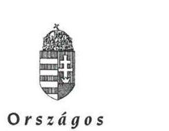

Országos
Nyugdíjbiztosítási
Főigazgatóság
FŐIGAZGATÓ

Iktatószám: 6/31-14/2017
Központi szám: KP/847/2017
Tárgy: jelentéstervezettel kapcsolatos észrevételek

# Domokos László 

elnök

## Állami Számvevőszék Budapest

Pf. 54.
1364

## Magyarország

## Tisztelt Elnök Úr!

A 2017. január 13-án kelt, „Az Adatvédelem hazai keretrendszerének és egyes kiemelt adatnyilvántartások ellenőrzése nemzetközi együttműködés keretében" című V-1048-394/2016. számon megküldött számvevőszéki jelentéstervezetben foglaltakat köszönettel vettük, azt elfogadjuk, és a végleges jelentés kézhezvétele után haladéktalanul megkezdjük az abban foglaltak végrehajtását.

Egyebekben az adatfeldolgozói tevékenység kiszervezésére vonatkozó 2.4. pontban az ONYF által kötött három adatfeldolgozási szerződésre tett megállapításra tájékoztatásul megjegyezzük, hogy az akkori Kbt. szerinti rendelkezések miatt - új rendelkezésként csak a 2015. november 1-jén hatályba lépett Kbt. 65.§ (10) bekezdése tartalmazza azt a lehetőséget, hogy bizonyos szerződések esetén az ajánlatkérő előírhatja, hogy bizonyos alapvető fontosságú feladatokat maga az ajánlattevő végezzen el, illetve, hogy a teljesítés során e feladatokat nem végezheti alvállalkozó - a szerződések szerint lehetőség volt alvállalkozók bevonására, de csak az egyik szerződés esetében és csak az egyik közös ajánlattevő jelezte, hogy 10%-ot meg nem haladó mértékben, nem adatfeldolgozási feladatokra (hanem logisztikai és szervezési részfeladatok végrehajtására) kíván alvállalkozót igénybe venni, így az Infotv. 2013. 07. 01-jét megelőzően hatályos 10.§ (2) bekezdésében foglaltak megsértésére álláspontunk szerint nem került sor.

Budapest, 2017. február „„,
Tisztelettel:

Prof. Dr. Mészáros József
Főigazgató

1081 BUDAPEST, FIUMEI ÚT 19/A. 270-8000 Postacím: Budapest 1916
e-mail: onyf@onyf.hu

---

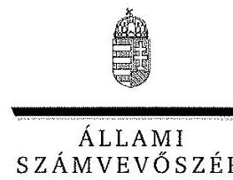

ELNÖK

Ikt.szám: V-1048-419/2016.

# Dr. Mészáros József úr   főigazgató 

Országos Nyugdíjbiztosítási Főigazgatóság

## Budapest

## Tisztelt Főigazgató Úr!

Az adatvédelem hazai keretrendszerének és egyes kiemelt adatnyilvántartások ellenőrzése nemzetközi együttműködés keretében című számvevőszéki jelentéstervezetre tett észrevételeit köszönettel megkaptam.

Az Állami Számvevőszék észrevételekre vonatkozó álláspontjáról a felügyeleti vezető által készített részletes tájékoztatást csatoltan megküldöm.

Tájékoztatom Főigazgató urat, hogy a jelentésben - az Állami Számvevőszékről szóló 2011. évi LXVI. törvény 29. § (3) bekezdése alapján - a figyelembe nem vett észrevételeket szerepeltetjük az elutasítás indokának feltüntetésével együtt.

Budapest, 2017. 0\% hó 0/. nap
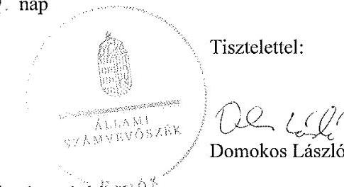

Tisztelettel:

Domokos László

Melléklet: Tájékoztatás az el nem fogadott észrevételekről ${ }^{10 \%}$

---

# Tájékoztatás az el nem fogadott észrevételekről 

Az adatvédelem hazai keretrendszerének és egyes kiemelt adatnyilvántartások ellenőrzése nemzetközi együttműködés keretében című számvevőszéki jelentéstervezetre 6/31-14/2017. iktatószámú levelében tett észrevételeit áttekintettük, annak kezeléséről az alábbi tájékoztatást adom.

1. A jelentéstervezet 2.4. számú megállapítás 1. bekezdés 3. francia bekezdésére tett megjegyzését nem tudtuk figyelembe venni. Az ÁSZ megállapításait az ellenőrzött időszakban hatályban lévő, jogszabályokban és belső szabályzatokban meghatározott előírások alapján tette meg. Az ONYF által az adatfeldolgozási tevékenységre létrejött vállalkozási szerződés megkötésekor hatályos belső adatvédelmi szabályzata rögzíti, az Info tv. 10. § (2) bekezdése egyértelműen meghatározza, hogy „Az adatfeldolgozó tevékenységének ellátása során más adatfeldolgozót nem vehet igénybe". Az adatfeldolgozásra irányuló, a jelentéstervezetben kifogásolt szerződések ugyanakkor részfeladat teljesítésére lehetővé teszik további vállalkozó bevonását. A jelentéstervezet a Kbt. betartására nem tett megállapítást.

Budapest, 2017. 02. hó 4. nap

Holman Magdolna
felügyeleti vezető

---

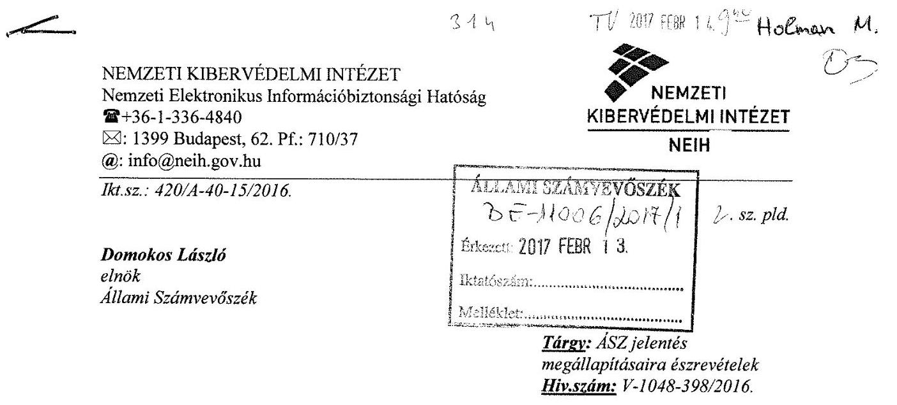

# Tisztelt Elnök úr! 

A fenti hivatkozási számon, 2017. január 20-án beérkezett, ,,Az adatvédelem hazai keretrendszerének és egyes kiemelt adatnyilvántartások ellenőrzése nemzetközi együttműködés keretében" című jelentéstervezetet áttanulmányoztuk, azzal kapcsolatban jelen levél mellékletét képező észrevételeket tesszük.

Budapest, 2017. február „„,
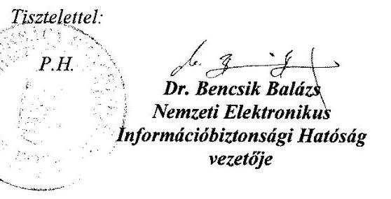

Készült: $\quad 2$ pld. / 1 lap / 1 oldal
Melléklet: 2 lap / 4 oldal Számvevőszéki jelentéstervezet észrevételezés
Kapja: 1. sz. pld. elektronikus úton címzettek majd Irattár
Készítette: Vereckei Béla (+36-1-206-9320)
Gépelte: Németh Áron László (+36-1-206-9320)
Irattári jelzés:
Azonosító:

---

| Jelentéstervezet megállapítása | NEIH észrevétel |
| :--: | :--: |
| Összegzés:   5. oldal, 1. bekezdés   „...amelyhez hozzájárult a hatósági ellenőrzés elmaradása is." | Ibtv. 14. § (1) Az e törvény hatálya alá tartozó elektronikus információs rendszerek biztonságának felügyeletét - a 2. § (3)-(6) bekezdésében meghatározott kivétellel - a Kormány által kijelölt hatóság látja el.   (2) A hatóság feladata:   a) az osztályba sorolás és a biztonsági szint megállapításának ellenőrzése és az ellenőrzés eredménye alapján döntés meghozatala,   b) az elektronikus információs rendszerek osztályba sorolására és a szervezetek biztonsági szintjeire vonatkozó, jogszabályban meghatározott követelmények teljesülésének ellenőrzése.   A NEIH az Ibtv. fenti előírásai szerint felügyeleti tevékenységét éves ellenőrzési terv alapján végzi.   Ibtv. 14. § (4) A (2) bekezdés a) és b) pontjában foglalt feladatok ellátása körében a hatóság javaslatára az e-közigazgatásért felelős miniszter az informatikáért felelős miniszter egyetértésével, valamint a minősített adatok védelmének szakmai felügyeletéért felelős miniszter és a katasztrófák elleni védekezésért felelős miniszter javaslatainak figyelembevételével éves ellenőrzési tervet (a továbbiakban: éves ellenőrzési terv) készít.   A jelentéstervezet megállapítása azt a képzetet kelti, mintha az ellenőrzött adatkezelők tekintetében a NEIH éves ellenőrzési tervében jóváhagyott ellenőrzése maradt volna el, ami nem felel meg a valóságnak.   Fentiek alapján kérjük a következtetést az alábbiak szerint módosítani:   ,...amelyhez hozzájárultak a hatósági ellenőrzés hiányosságai is." |
| Főbb megállapítások, következtetések, javaslatok   1. bekezdés | Az ellenőrzéssel érintett időszak (2011-2015) és érintett intézményi kör nem mutat teljes átfedést a NEIH létrejöttének |

---

|  | ...azonban a felügyeletet gyakorló hatóságok közül a NEIH nem látta el az Ibtv. ben előírt ellenőrzési feladatait, ... |
| :--: | :--: |

és működésének időszakával (2013. július 1.-) és éves ellenőrzési terveiben foglalt intézmények körével. Ezért véleményünk szerint nem vonható le olyan általános következtetés, miszerint a NEIH nem látta el az Ibtv-ben előírt ellenőrzési feladatait. A jelentéstervezet megállapítása azt a képzetet kelti, mintha az ellenőrzött adatkezelők tekintetében a NEIH éves ellenőrzési tervében jóváhagyott ellenőrzése maradt volna el, ami nem felel meg a valóságnak.

Fentiek alapján kérjük a megállapítás alábbiak szerinti módosítását:
,...azonban a felügyeletet gyakorló hatóságok közül a NEIH az Ibtv.-ben előírt ellenőrzési feladatait hiányosan hajtotta végre... "'
6. oldal, utolsó bekezdés
,...a NEIH hatósági feladatellátásának hiányosságaiból eredően pedig elmaradtak a jogszabály alapján végrehajtandó, a biztonsági besorolásokra vonatkozó külső hatósági ellenőrzések, és az ellenőrzések eredménye alapján végrehajtandó intézkedések."

Az ellenőrzéssel érintett időszak (2011-2015) és érintett intézményi kör nem mutat teljes átfedést a NEIH létrejöttének és működésének időszakával (2013. július 1.-) és éves ellenőrzési terveiben foglalt intézmények körével. Ezért véleményünk szerint nem vonható le olyan általános következtetés, miszerint a NEIH nem látta el az Ibtv-ben előírt ellenőrzési feladatait. A jelentéstervezet megállapítása azt a képzetet kelti, mintha az ellenőrzött adatkezelők tekintetében a NEIH éves ellenőrzési tervében jóváhagyott ellenőrzése maradt volna el, ami nem felel meg a valóságnak.
Fentiek alapján kérjük a megállapítás alábbiak szerinti módosítását:
,...a NEIH hatósági feladatellátásának hiányosságaiból eredően pedig elmaradtak az ellenőrzések eredménye alapján végrehajtandó intézkedések."
Ez a megállapítás nem felel meg a valóságnak. A NEIH feladata az Ibtv. 14. (1) bekezdése alapján az e törvény hatálya alá tartozó elektronikus információs rendszerek (meghatározott kivételekkel megvalósuló) biztonságának felügyelete.

Kérjük a megállapítást az alábbiak szerint módosítani:

---

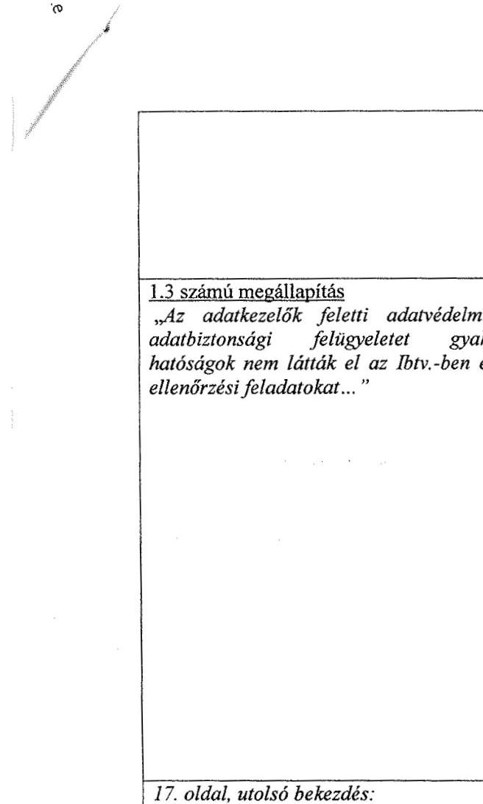

A 420/A-40-15/2016. sz. átirat melléklete

|  | „A NEIH az Ibtv. 2013. július 1-jei hatályba lépésével az NFM szervezeti egységeként kezdte meg működését, melynek keretében elsődleges feladatává vált az Ibtv. hatálya alá tartozó, kivételi körrel nem érintett elektronikus információs rendszerek biztonságának felügyelete." |
| :--: | :--: |
| 1.3 számú megállapítás   „Az adatkezelők feletti adatvédelmi és adatbiztonsági felügyeletet gyakorló hatóságok nem látták el az Ibtv.-ben előírt ellenőrzési feladatokat..." | Az ellenőrzéssel érintett időszak (2011-2015) és érintett intézményi kör nem mutat teljes átfedést a NEIH létrejöttének és működésének időszakával (2013. július 1.-) és éves ellenőrzési terveiben foglalt intézmények körével. Ezért véleményünk szerint nem vonható le olyan általános következtetés, miszerint a NEIH nem látta el az Ibtv-ben előírt ellenőrzési feladatait. A jelentéstervezet megállapítása azt a képzetet kelti, mintha az ellenőrzött adatkezelők tekintetében a NEIH éves ellenőrzési tervében jóváhagyott ellenőrzése maradt volna el, ami nem felel meg a valóságnak.   Fentiek alapján kérjük a megállapítás alábbiak szerinti módosítását:   „...azonban a felügyeletet gyakorló hatóságok közül a NEIH nem teljes körűen látta el az Ibtv.-ben előírt ellenőrzési feladatait, ..." |
| 17. oldal, utolsó bekezdés:   „A NEIH a biztonsági osztályba sorolást és a biztonsági szint megállapítását 2013. július 1-től az Ibtv. 14. § (2) bekezdés a) pontjában foglaltak ellenére nem ellenőrizte az adatkezelő szervezeteknél." | A megállapítás olyan képzetet kelt, mintha a NEIH ellenőrzési kötelezettségének, mint egy általános, minden Ibtv. jogalany vonatkozásában fennálló kötelezettségnek nem tett volna eleget. Ez nem felel meg a valóságnak. Ezzel ellentétben a NEIH felügyeleti feladatait éves ellenőrzési terv alapján végzi. (Ibtv. 14. § (4) bek.)   Fentiek alapján kérjük a megállapítás törlését. |
| 22. oldal   „A NAV és a Kincstár biztonsági szintje megállapításának hiányosságait a NEIH a hatósági ellenőrzési feladatai ellátásának (1.4. pontban bemutatott) hiányosságaiból eredően nem tartotta fel." | Nem pontos a hivatkozás. (nincs 1.4. pont)   Ettől eltérően a NEIH hatósági ellenőrzési feladatai ellátására vonatkozó, általánosító jellegű mulasztások megállapítása nem felel meg a valóságnak. Az Ibtv. 4. § d) pontja alapján 2015. július 15.-ig a Nemzeti Adó- és Vámhivatalnak az állami költségvetési bevételek |

---

A 420/A-40-15/2016. sz. átirat melléklete
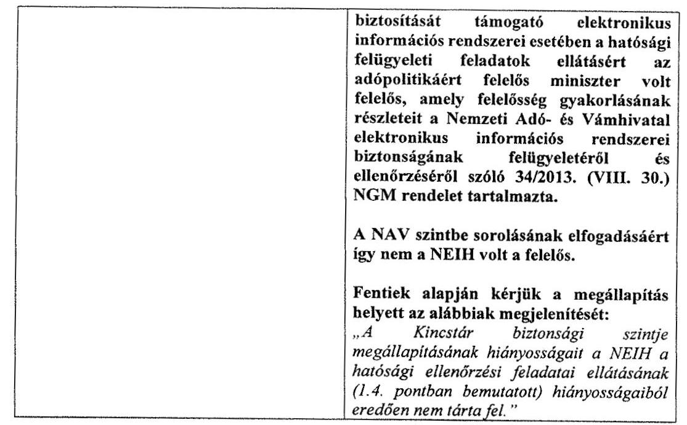

---

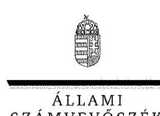

ELNÖK

Ikt.szám: V-1048-421/2016.

# Dr. Bencsik Balázs úr   intézményvezető 

Nemzeti Elektronikus Információbiztonsági Hatóság

## Budapest

## Tisztelt Intézményvezető Úr!

Az adatvédelem hazai keretrendszerének és egyes kiemelt adatnyilvántartások ellenőrzése nemzetközi együttműködés keretében című számvevőszéki jelentéstervezetre tett észrevételeit köszönettel megkaptam.

Az Állami Számvevőszék észrevételekre vonatkozó álláspontjáról a felügyeleti vezető által készített részletes tájékoztatást csatoltan megküldöm.

Tájékoztatom Intézményvezető urat, hogy a jelentésben - az Állami Számvevőszékről szóló 2011. évi LXVI. törvény 29. § (3) bekezdése alapján - a figyelembe nem vett észrevételeket szerepeltetjük az elutasítás indokának feltüntetésével együtt.

Budapest, 2017.
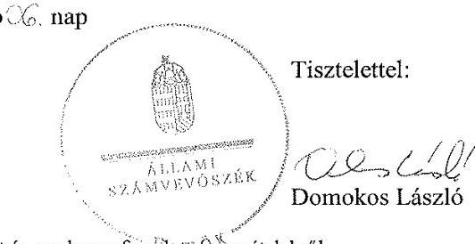

Melléklet: Tájékoztatás az elfogadott és az el nem fogadott észrevételekről

---

# Tájékoztatás az elfogadott és az el nem fogadott észrevételekről 

Az adatvédelem hazai keretrendszerének és egyes kiemelt adatnyilvántartások ellenőrzése nemzetközi együttműködés keretében című számvevőszéki jelentéstervezetre 420/A-40-15/2016. iktatószámú levelében tett észrevételeit áttekintettük, annak kezeléséről az alábbi tájékoztatást adom.

1. A jelentéstervezetre tett 1., 2., 3., 5. és 6. számú észrevételét, így a jelentéstervezet Összegzésében, a Főbb megállapítások, következtetések, javaslatok részben, a 6. oldal utolsó bekezdésében, az 1.3. számú megállapításban és a 17. oldal utolsó bekezdésében szereplő megállapításokra tett észrevételét nem fogadtuk el. Az állami és önkormányzati szervek elektronikus információbiztonságáról szóló 2013. évi L. törvény (Ibtv.) 14. § (2) bekezdése rögzíti az Ibtv. 14.§ (1) bekezdés szerinti, az elektronikus információs rendszerek biztonságának felügyeletét ellátó hatóság feladatait. Az Ibtv. 14. § (2) bekezdés a) pontja szerint a hatóság feladata az osztályba sorolás és a biztonsági szint megállapításának ellenőrzése és az ellenőrzés eredménye alapján döntés meghozatala. Az ellenőrzés keretében a NEIH, mint az elektronikus információs rendszerek biztonságának felügyeletét ellátó hatóság ezen feladatellátását is ellenőriztük. A jelentéstervezetben szereplő, fent

 felsorolt, észrevételében kifogásolt megállapítások alátámasztásaként, az ellenőrzés rendelkezésére bocsátott dokumentumok között nem állt rendelkezésre olyan dokumentum, illetve a NEIH által az Ibtv. 14. § (2) bekezdés a) pontja szerinti ellenőrzés eredményéről szóló döntés, mely igazolná a jogszabályban rögzített ellenőrzés elvégzését. Az Ibtv. 14. § (1) bekezdése szerinti hatóság feladat- és hatáskörét meghatározó 187/2015. (VII.13.) Korm. rendelet 9. § (1) bekezdése szerint az elektronikus információs rendszerek osztályba sorolásának ellenőrzése, illetve a 10. § (1) bekezdés szerint az érintett szervezet vagy szervezeti egység biztonsági szintbe sorolásának ellenőrzése a hatóságnak megküldött információk alapján, jogszabályban meghatározott szempontok alapján történik. A hivatkozott Korm. rendelet 9. § (2)–(5) és a 10. § (2) bekezdései rögzítik a hatóságnak a bejelentett biztonsági osztály, illetve biztonsági szint elfogadásához, ellenőrzéséhez kapcsolódó feladatait. A hivatkozott kormányrendelet 9. § (2) bekezdésben rögzíti azt is, hogy „Ha... a bejelentett biztonsági osztályba sorolást - ... - a hatóság elfogadja, az erre irányuló döntés a biztonsági osztályba sorolás későbbi önálló, illetve az érintett szervezet vagy szervezeti egység ellenőrzése során történő felülvizsgálatát nem zárja ki.” Az észrevételében hivatkozott, ellenőrzési terv alapján végzett hatósági ellenőrzések nem egyenértékűek a hatóság felé bejelentett elektronikus információs rendszerek osztályba sorolásának, illetve a szervezet vagy szervezeti egység biztonsági szintbe sorolásának ellenőrzésével. A jelentéstervezet 1.3. számú megállapítás 3. bekezdése tartalmazza, hogy „Az ellátandó hatósági ellenőrzési feladatok vonatkozásában a NEIH éves ellenőrzési terveket készített, de azok fő fókuszterülete csak a már megállapított biztonsági osztályokhoz kapcsolódó védelmi intézkedések megvalósítására vonatkozott”, amelyet nem kifogásolt. Mindezek alapján továbbra is fenntartjuk azon meg-

---

állapításunkat és a hozzá kapcsolódó következtetéseinket, amely a NEIH-nek az elektronikus információs rendszerek biztonsági osztályba sorolásának és az érintett szervezetek biztonsági szintbe sorolásának ellenőrzésére vonatkoznak.
2. A jelentéstervezetre tett 4. számú észrevételét elfogadtuk, azt a jelentéstervezet 8. oldal 5. bekezdésében foglaltak módosításával a számvevőszéki jelentés készítésénél figyelembe vesszük.
3. A jelentéstervezetre tett 7. számú észrevételét részben fogadtuk el. A jelentéstervezet 23. oldalán az 1.4. pontra történő hivatkozást a számvevőszéki jelentésben módosítjuk. Az észrevételében kifogásolt megállapítás módosítását a számvevőszéki jelentés készítésénél érvényesítjük azzal, hogy a jelenlegi megállapításból a NAV-ot töröljük, ugyanakkor kiegészítjük arra irányuló megállapítással, hogy 2015. július 15-ét követően a NAV biztonsági szintje megállapításának hiányait a NEIH nem tárta fel.

Budapest, 2017. 0%. hó 6. nap

Holman Magdolna
felügyeleti vezető

---

.

---

# RÖVIDÍTÉSEK JEGYZÉKE 

${ }^{1}$ Ibtv.
${ }^{2}$ NAV
${ }^{3}$ OEP
${ }^{4}$ ONYF
${ }^{5}$ KINCSTÁR
${ }^{6} \mathrm{OH}$
${ }^{7}$ KEKKH
${ }^{8}$ NAIH
${ }^{9}$ NEIH
${ }^{10}$ NFM
${ }^{11}$ BM
${ }^{12}$ NBSZ
${ }^{13}$ Avtv.
${ }^{14}$ Info. tv.
${ }^{15}$ AFIS
${ }^{16}$ ELAB
${ }^{17}$ ELEKAFA Portál
${ }^{18}$ ELLVITA
${ }^{19}$ ERSNY
${ }^{20}$ EVITA
${ }^{21}$ FOKA
${ }^{22}$ JAROK
${ }^{23}$ OPI
${ }^{24}$ OPETA
${ }^{25}$ REVORE
${ }^{26}$ PFR
${ }^{27}$ SEA
${ }^{28}$ VRF
${ }^{29}$ SZEF
${ }^{30}$ Nvtv.
${ }^{31}$ Ftv.
${ }^{32}$ Nftv.
${ }^{33} \mathrm{Nkt}$.
${ }^{34}$ FIR
${ }^{35}$ KIR
${ }^{36}$ Ket.
2013. évi L. törvény az állami és önkormányzati szervek elektronikus információbiztonságáról, hatályos 2013. július 1-jétől
Nemzeti Adó- és Vámhivatal
Országos Egészségbiztosítási Pénztár
Országos Nyugdíjbiztosítási Főigazgatóság
Magyar Államkincstár
Oktatási Hivatal
Közigazgatási és Elektronikus Közszolgáltatások Központi Hivatala
Nemzeti Adatvédelmi és Információszabadság Hatóság
Nemzeti Elektronikus Információbiztonsági Hatóság
Nemzeti Fejlesztési Minisztérium
Belügyminisztérium
Nemzetbiztonsági Szakszolgálat
1992. évi LXIII. a személyes adatok védelméről és a közérdekű adatok nyilvánosságáról (hatálytalan 2012. január 1-jétől)
2011. évi CXII. törvény az információs önrendelkezési jogról és az információszabadságról, hatályos 2011. július 26-tól
Csaláselleni Információs Rendszer
Elektronikus Adóbevallás
Külföldi adózók ÁFA visszatérítési kérelme modul (ELEKAFA) Portál
Ellenőrzés és Vizsgálatszervezés Támogató rendszer
E-rendszám nyilvántartó rendszer
Egységes Vizsgálati Adattár
Archív Folyószámla Rendszer
Gépjármű vagyonszerzési illeték kezelő modul
Online Pénztárgép Adatintegrációs Rendszer
Online Pénztárgép Törzs Rendszer
Revizió Nyilvántartó Rendszer Országos
Pénztárgép Felügyeleti Rendszer
Társhatósági adatszolgáltatások beállítását, futtatását biztosító rendszer
Külföldről történő elektronikus áfavisszatérítést kezelő modul
Szerencsjáték felügyelet
2011. évi CXCVI. törvény a nemzeti vagyonról, hatályos 2011. december 30-tól
2005. évi CXXXIX. törvény a felsőoktatásról, (hatálytalan 2012. szeptember 1-jétől)
2011. évi CCIV. törvény a nemzeti felsőoktatásról, hatályos 2012. január 1-jétől
2011. évi CXC. törvény a nemzeti köznevelésről, hatályos 2012. szeptember 1-jétől
Felsőoktatási Információs Rendszer
Köznevelési Információs Rendszer
2004. évi CXL. törvény a közigazgatási hatósági eljárás és szolgáltatás általános szabályairól, hatályos 2005. november 5-től

---

${ }^{37}$ Tny.
${ }^{38}$ TnyR.
${ }^{39}$ Tbj.
${ }^{40}$ Eütv.
${ }^{41}$ Eüak.
${ }^{42}$ 319/2010. (XII.27.) Korm. rendelet
${ }^{43} 883 / 2004 /$ EK rendelet
${ }^{44} 987 / 2009 /$ EK rendelet
${ }^{45}$ Nytv.
${ }^{46}$ Szaztv.
${ }^{47}$ 1998. évi XII. tv.
${ }^{48}$ 2012. évi II. tv.
${ }^{49}$ Kknyt.
${ }^{50}$ 2001. évi LXII. tv.
${ }^{51}$ SIS II. tv.
${ }^{52}$ 2009. évi LXII. tv.
${ }^{53}$ 2009. évi CXV. tv.
${ }^{54}$ Bnytv.
${ }^{55} 77 / 2013$. (XII. 19.) NFM rendelet
${ }^{56} 41 / 2015$. (VII. 15.) BM rendelet
${ }^{57}$ Ámr.
a társadalombiztosítási nyugellátásról szóló 1997. évi LXXXI. törvény, hatályos 1998. január 1-jétől
168/1997. (X. 6.) Korm. rendelet a társadalombiztosítás nyugellátásról szóló 1997. évi LXXXI. törvény végrehajtásáról, hatályos 1998. január 1-jétől 1997. évi LXXX. törvény a társadalombiztosítás ellátásaira és a magánnyugdíjra jogosultakról, valamint e szolgáltatások fedezetéről, hatályos 1998. január 1-jétől 1997. évi CLIV. törvény az egészségügyről, hatályos 1998. július 1-jétől 1997. évi XLVII. törvény az egészségügyi és a hozzájuk kapcsolódó személyes adatok kezeléséről és védelméről, hatályos 1998. január 1-jétől 319/2010. (XII.27.) Korm. rendelet az egészségbiztosítási szervekről, hatályos 2011. január 1-jétől
AZ EURÓPAI PARLAMENT ÉS A TANÁCS 2004. április 29-i 883/2004/EK rendelete a szociális biztonsági rendszerek koordinálásáról
AZ EURÓPAI PARLAMENT ÉS A TANÁCS 2009. szeptember 16-i 987/2009/EK rendelete a szociális biztonsági rendszerek koordinálásáról szóló 883/2004/EK rendelet végrehajtására vonatkozó eljárás megállapításáról
1992. évi LXVI. törvény a polgárok személyi adatainak és lakcímének nyilvántartásáról, hatályos 1992. november 30-tól
a személyazonosító jel helyébe lépő azonosítási módokról és az azonosító kódok használatáról szóló 1996. évi XX. törvény, hatályos: 1996. szeptember 1-jétől 1998. évi XII. tv. a külföldre utazásról, hatályos 1998. szeptember 1-jétől
2012. évi II. tv. a szabálysértésekről, a szabálysértési eljárásról és a szabálysértési nyilvántartási rendszerről, hatályos 2012. április 15-től
1999. LXXXIV. törvény a közúti közlekedési nyilvántartásról, hatályos 2000. január 1-jétől
2001. évi LXII. tv. a szomszédos államokban élő magyarokról, hatályos 2002. január 1-jétől
a Schengeni Információs Rendszer második generációja keretében történő információcseréről, továbbá egyes rendészeti tárgyú törvények ezzel, valamint a Magyary Egyszerűsítési Programmal összefüggő módosításáról
2009. évi LXII. tv. a kötelező gépjármű-felelősségbiztosításról, hatályos 2010. január 1-jétől
2009. évi CXV. tv. az egyéni vállalkozóról és az egyéni cégről, hatályos 2009. december 1-jétől
2009. évi XLVII. törvény a bűnügyi nyilvántartási rendszerről, az Európai Unió tagállamainak bíróságai által magyar állampolgárokkal szemben hozott ítéletek nyilvántartásáról, valamint a bűnügyi és rendészeti biometrikus adatok nyilvántartásáról, hatályos 2009. június 30-tól
az állami és önkormányzati szervek elektronikus információbiztonságáról szóló 2013. évi L. törvényben meghatározott technológiai biztonsági, valamint biztonságos információs eszközökre, termékekre vonatkozó, valamint a biztonsági osztályba és biztonsági szintbe sorolási követelményeiről (hatálytalan: 2015. július 16-tól)
az állami és önkormányzati szervek elektronikus információbiztonságáról szóló 2013. évi L. törvényben meghatározott technológiai biztonsági, valamint a biztonságos információs eszközökre, termékekre, továbbá a biztonsági osztályba és biztonsági szintbe sorolásra vonatkozó követelményekről, hatályos 2015. július 16-tól
292/2009. (XII. 19.) Korm. rendelet az államháztartás működési rendjéről, hatályos 2009. december 20-tól 2011. december 31-ig

---

${ }^{58}$ Bkr.
${ }^{59}$ Kttv.
${ }^{60}$ NYAK-REX rendszer
${ }^{61}$ SAP
${ }^{62}$ GovSys NYufig
${ }^{63}$ MEMESE
${ }^{64}$ TÉBA
${ }^{65}$ EETÜR
${ }^{66}$ KIRA
${ }^{67}$ PKN
${ }^{68}$ KOCKA2 és a Diszpécser modul
${ }^{69}$ Fegyver rendszer
${ }^{70}$ 2013. évi L. tv
${ }^{71}$ IBP
${ }^{72}$ IBF
${ }^{73}$ Ber.
${ }^{74}$ 362/2011. (XII.30.) Korm. rendelet
${ }^{75}$ 331/2006. (XII.23.) Korm. rendelet
${ }^{76}$ 149/1997. (IX.10.) Korm. rendelet
${ }^{77}$ 102/2011. (VI.29.) Korm. rendelet
${ }^{78}$ Harmtv.
${ }^{79}$ Rtv.
${ }^{80}$ Hetv.
${ }^{81} \mathrm{Kt}$.
${ }^{82}$ Pénztárgéprendelet
${ }^{83}$ HÉA irányelv
${ }^{84}$ 1798/2003/EK rendelet

370/2011. (XII. 31.) Korm. rendelet a költségvetési szervek belső
kontrollrendszeréről és belső ellenőrzéséről, hatályos 2012. január 1-jétől
2011. évi CXCIX. törvény a közszolgálati tisztviselőkről, hatályos 2012. március 1-jétől

Integrált adat nyilvántartási és ügyviteli rendszer, amely az OH Nyelvvizsgáztatási Akkreditációs Központ nyelvvizsgáztatással kapcsolatos adatforgalmát szolgálja ki.
SAP vállalatirányítási rendszer
GovSys NYufig Integrált Iratkezelő Rendszer
Egyszeri segélyt igénylők nyilvántartása, valamint a méltányossági nyugellátás, kivételes nyugellátás-emelést igénylők nyilvántartása.
Támogatás Életút Bázis Adatok. Családtámogatási ellátások, fogyatékossági támogatás megállapítása, folyósítása, vakok személyi járadékának folyósítása, bejövő és kimenő iratok kezelése
Egyeztetési Eljárást Támogató Ügyviteli Rendszer
KIRA-Központosított illetmény-számfejtési rendszer
A volt magánnyugdíjpénztári tagok adatainak nyilvántartása
Az Elektronikus Közútiáruforgalom-ellenőrző Rendszerbeli adatok bejelentést követő, azonnali elemzését szolgáló rendszer modulok.
Hatósági fegyvernyilvántartás
2013. évi L. törvény az állami és önkormányzati szervek elektronikus információbiztonságáról, hatályos 2013. július 1-jétől
Informatikai Biztonsági Politika
Informatikai Biztonsági Felelős
a költségvetési szervek belső ellenőrzéséről szóló 193/2003.(XI.26.) Korm. rendelet, hatályos 2003. november 27-től 2011. december 31-ig
362/2011. (XII.30.) Korm. rendelet az oktatási igazolványokról, hatályos 2012. január 1-jétől
331/2006. (XII.23.) Korm. rendelet a gyermekvédelmi és gyámügyi feladat- és hatáskörök ellátásáról, valamint a gyámhatóság szervezetéről és illetékességéről, hatályos 2007. január 1-jétől
149/1997. (IX.10.) Korm. rendelet a gyámhatóságokról, valamint a gyermekvédelmi és gyámügyi eljárásról, hatályos 1997. november 1-jétől 102/2011. (VI.29.) Korm. rendelet a súlyos mozgáskorlátozott személyek közlekedési kedvezményeiről, hatályos 2011. július 2-től
2007. évi II. törvény a harmadik országbeli állampolgárok beutazásáról és tartózkodásáról, hatályos 2007. július 1-jétől
1994. évi XXXIV. törvény a Rendőrségről, hatályos 1994. május 1-jétől
2010. évi XXXVIII. törvény a hagyatéki eljárásról, hatályos 2010. március 27-től a behozott kőolaj és kőolajtermékek biztonsági készletezéséről szóló 2013. évi XXIII. törvény, hatályos 2013. április 1-jétől
a pénztárgépek műszaki követelményeiről, a nyugtakibocsátásra szolgáló pénztárgépek forgalmazásáról, használatáról és szervizeléséről, valamint a pénztárgéppel rögzített adatok adóhatóság felé történő szolgáltatásáról szóló 48/2013. (XI. 15.) NGM rendelet, hatályos 2013. november 16-tól
a TANÁCS 2006. november 28-i 2006/112/EK irányelve a közös hozzáadottértékadó-rendszerről
A TANÁCS 2003. október 7-i 1798/2003/EK RENDELETE a hozzáadottérték-adó területén történő közigazgatási együttműködésről, valamint a 218/92/EGK rendelet hatályon kívül helyezéséről

---

${ }^{85}$ Art.
${ }^{86} 904 / 2010 /$ EU rendelet
${ }^{87} 79 / 2012 /$ EU végrehajtási rendelete
${ }^{88} 1925 / 2004 /$ EK rendelet
${ }^{89} 32 / 2009$. (XII. 21.) PM rendelet
${ }^{90}$ Áfa tv.
${ }^{91} \mathrm{Be}$.
${ }^{92}$ Ebtv.
${ }^{93}$ NAV tv.
${ }^{94}$ Adatvagyon tv.
${ }^{95}$ ÁSZ tv.
${ }^{96} 95 / 46 /$ EK irányelv
2003. évi XCII. törvény az adózás rendjéről, hatályos 2004. január 1-jétől

A Tanács 2010. október 7-i 904/2010/EU rendelete - a hozzáadottérték-adó területén történő közigazgatási együttműködésről és csalás elleni küzdelemről, hatályos 2010. november 1-jétől
A Bizottság 2012. január 31-i 79/2012/EU végrehajtási rendelete a hozzáadottérték-adó területén történő közigazgatási együttműködésről és csalás elleni küzdelemről szóló 904/2010/EU tanácsi rendelet végrehajtására vonatkozó rendelkezések megállapításáról (átdolgozás), hatályos 2012. február 21-étől
A Bizottság 2004. október 29-i 1925/2004/EK rendelete a hozzáadottérték-adó területén való közigazgatási együttműködésről szóló 1798/2003/EK tanácsi rendelet végrehajtására vonatkozó rendelkezések megállapításáról, hatályos 2004. november 25-től
a belföldön nem letelepedett adóalanyokat a Magyar Köztársaságban megillető általános forgalmiadó-visszatérítési jognak, valamint a belföldön letelepedett adóalanyokat az Európai Közösség más tagállamában
 megillető hozzáadott-értékadó-visszatérítési jognak érvényesítésével kapcsolatos egyes rendelkezésekről szóló 32/2009. (XII. 21.) PM rendelet, hatályos 2010. január 1-jétől
2007. évi CXXVII. törvény az általános forgalmi adóról, hatályos 2008. január 1-jétől
1998. évi XIX. törvény a büntetőeljárásról, hatályos 1999. szeptember 1-jétől
1997. évi LXXXIII. törvény a kötelező egészségbiztosítás ellátásairól, hatályos 1998. január 1-jétől
2010. évi CXXII. törvény a Nemzeti Adó- és Vámhivatalról, hatályos 2010. november 20-tól
2010. évi CLVII. törvény a nemzeti adatvagyon körébe tartozó állami nyilvántartások fokozottabb védelméről, hatályos 2010. december 23-tól
2011. évi LXVI. törvény az Állami Számvevőszékről, hatályos 2011. július 1-jétől
Az Európai Parlament és a Tanács 1995. október 24-i 95/46/EK irányelve a személyes adatok feldolgozása vonatkozásában az egyének védelméről és az ilyen adatok szabad áramlásáról

---

# ÁLLAMI SZÁMVEVŐSZÉK 

1052 Budapest, Apáczai Csere János utca 10.
Levélcím: 1364 Budapest Pf. 54
Telefon: +36 14849100 Telefax: +36 14849200
www.asz.hu
