# Jelenetés 

## A kéményseprő-ipari közszolgáltatás ellenőrzése

2017

---

# Jelenetés 

## A kéményseprő-ipari közszolgáltatás ellenőrzése

2017. 09. hó 28. nap
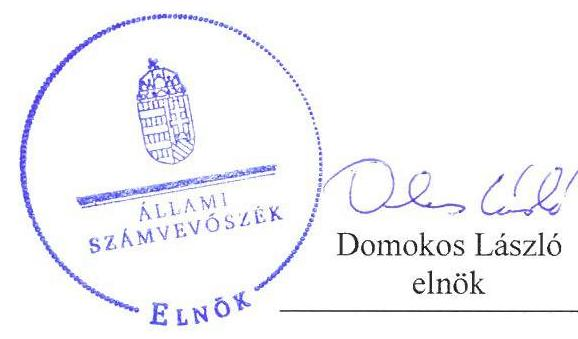
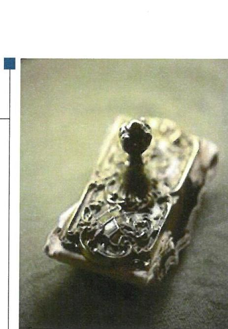

---

# AZ ELLENŐRZÉST FELÜGYELTE:

DR. NÉMETH ERZSÉBET felügyeleti vezető

## AZ ELLENŐRZÉST VEZETTE ÉS A VÉGREHAJTÁSÁÉRT FELELŐS:

VERTKOVCZI MÁRIA ellenőrzésvezető

## A PROGRAM ÖSSZEÁLLÍTÁSÁÉRT FELELŐS:

JANIK JÓZSEF osztályvezető

IKTATÓSZÁM: V-1275-033/2016.

TÉMASZÁM: 2072

ELLENŐRZÉS-AZONOSÍTÓ SZÁM: V0752, V0800

Jelentéseink az Országgyűlés számítógépes hálózatán és az Interneten a www.asz.hu címen is olvashatóak.

---

# TARTALOMJEGYZÉK 

■ ÖSSZEGZÉS ..... 5
■ AZ ELLENŐRZÉS CÉLJA ..... 7
■ AZ ELLENŐRZÉS TERÜLETE ..... 8
■ AZ ELLENŐRZÉS HÁTTERE, INDOKOLTSÁGA ..... 11
■ A JELENTÉS LÉNYEGES KÉRDÉSKÖREI ..... 12
■ ELLENŐRZÉS HATÓKÖRE ÉS MÓDSZEREI ..... 13
■ MEGÁLLAPÍTÁSOK ..... 17
■ MELLÉKLETEK ..... 37
I. sz. melléklet: Értelmező szótár ..... 37
II. sz. melléklet: Értékelő tábla ..... 38
III. sz. melléklet: Adatfelvételi kérdéssor ..... 39
■ FÜGGELÉK: ÉSZREVÉTELEK ..... 41
■ RÖVIDÍTÉSEK JEGYZÉKE ..... 97

---

.

---

# ÖSSZEGZÉS 

A feladat ellátásáért felelős önkormányzatok a kéményseprő-ipari közszolgáltatást alapvetően szabályszerűen szervezték meg. A 2013-2015. évek között a közszolgáltatást végző szervezetek a feladataikat összességében nem szabályszerűen látták el. A katasztrófavédelmi igazgatóságok a hatósági felügyeleti tevékenységüket összességében az előírásoknak megfelelően végezték.
A kéményseprő-ipari közszolgáltatásra vonatkozó lakossági felmérés alapján nem teljesültek maradéktalanul az élet- és vagyonvédelmet érintő célok, mivel hét százalékban elmaradt, további 4 százalékban vélhetően elmaradt a kötelező kéményellenőrzés 2015-ben. A szolgáltatás igénybevevői összességében elégedettek voltak, ugyanakkor több problémát is jeleztek a közszolgáltatással kapcsolatban.

## Az ellenőrzés társadalmi indokoltsága

Az ÁSZ ${ }^{1}$ stratégiájában hangsúlyos szerepet szán annak, hogy szilárd szakmai alapon álló, értékteremtő ellenőrzéseivel előmozdítsa a közpénzügyek átláthatóságát, rendezettségét és javaslataival a közpénzek és a közvagyon szabályos felhasználását segítse. A kéményseprő-ipari közszolgáltatás megfelelősége a társadalom széles rétege számára élet- és vagyonvédelmi szempontból kiemelkedő jelentőségű.

Az ellenőrzés objektív képet ad a jogalkotó, a közszolgáltatást végző szereplők, valamint a széles nyilvánosság számára arról, hogy szabályszerűen működött-e a kéményseprő-ipari közszolgáltatás rendszere az ellenőrzött időszakban. Az eredmények egyben tanulságul szolgálhatnak a területet érintő jövőbeli döntésekhez.

A lakosság mint a szolgáltatás közvetlen érintettje elégedettségének megismerése elengedhetetlen a szolgáltatás teljes körű értékeléséhez. A lakossági véleményfelmérés a szabályszerűségi ellenőrzés kiegészítéseként képet ad a jogalkotó, a közszolgáltatást végző szereplők, valamint a széles nyilvánosság számára arról, hogy a szolgáltatás igénybevevői hogyan érzékelték a kötelezően előírt szolgáltatás megfelelőségét, körülményeit és színvonalát. Az eredmények egyben tanulságul szolgálhatnak a területet érintő jövőbeli döntésekhez.

## Főbb megállapítások, következtetések, javaslatok

A feladatellátásért felelős önkormányzatok, illetve a katasztrófavédelmi igazgatóságok alapvetően szabályszerű feladatellátása mellett a közszolgáltatók nem megfelelően látták el a közszolgáltatást.

Az ellátásért felelős önkormányzatok az ellenőrzött időszakban a kéményseprő-ipari közszolgáltatással kapcsolatos rendeleteket a jogszabályokban foglaltaknak megfelelően alkották meg. A kéményseprő-ipari közszolgáltatási díjak felülvizsgálata, a díjakkal kapcsolatos rendeletalkotás alapvetően szabályszerűen történt, néhány esetben azonban a határidőket nem tartották be, illetve előfordult, hogy a fogyasztóvédelem és az illetékes szakmai érdekképviseletek véleményének kikérése elmaradt. Az átmeneti ellátások során felmerült közszolgáltatási díjból meg nem térülő indokolt költségek elbírálásra továbbítása és kifizetése szabályszerűen történt.

A feladatot önként vállaló önkormányzatokkal a feladatellátás átvállalására vonatkozó, előírt írásbeli megállapodások szabályszerűek voltak, azonban előfordult, hogy hiányzott az írásbeli megállapodás. Az önkormányzatok a kéményseprő-ipari közszolgáltatást végző szervezetekkel a közszolgáltatási szerződést szabályszerűen kötötték meg, azonban az előírt dokumentum és nyilvántartási jegyzéket tartalmazó melléklet nem minden esetben készült a szerződésekhez.

A közszolgáltatók az ellenőrzési és tisztítási feladatokat, a megrendelt felülvizsgálatokat hiányosan és összességében nem szabályszerűen végezték az ellenőrzött időszakban, ami bizonyos esetekben veszélyt jelenthetett a lakosság élet és vagyonbiztonsága szempontjából. A lakosság kiértesítése az égéstermék elvezetők kötelező ellenőrzéséről több esetben hiányos volt, vagy nem történt meg, így a jogszabályban előírtak ellenére a lakosság nem minden esetben tudta lehetővé tenni a közszolgáltató feladatellátását. A közszolgáltatók az ingatlanokon a kötelező ellenőrzési feladatokat több esetben nem, vagy hiányosan, illetve nem megfelelően dokumentálva látták el. A közszolgáltatók élet- és vagyonbiztonság veszélye észlelése esetén összességében nem megfelelően jártak el, mivel a kötelező ellenőrzés meghiúsulásakor a jogszabály előírásai ellenére több esetben nem értesítették a tűzvédelmi hatóságot.

A közszolgáltatók a jogszabályban előírt nyilvántartásokat és adatszolgáltatásokat összességében megfelelően teljesítették, előfordult azonban hiányos, illetve hiányzó nyilvántartás. A közszolgáltatással kapcsolatos kiszámlázott összegek a hatályos díjszabásnak összességében megfeleltek, a számlázás során kisebb hibák fordultak elő. A közszolgáltatók az ingatlantulajdonosok részére a rezsicsökkentéssel kapcsolatos tájékoztatást, továbbá a fogyasztóvédelmi hatóság részére az írásbeli igazolást nem megfelelően teljesítették, mivel a tájékoztatás, illetve az igazolás több esetben hiányzott.

A hatósági felügyeletet ellátó katasztrófavédelmi igazgatóságok a közszolgáltatókról a nyilvántartást összességében megfelelően vezették, ugyanakkor több ellenőrzött esetében előfordult, hogy a nyilvántartást nem teljes körűen vezették. A katasztrófavédelmi igazgatóságok a közszolgáltatók tevékenységére vonatkozóan a hatósági ellenőrzéseket többségében az előírt gyakorisággal elvégezték, indokolt esetekben igénybe vették a hatósági ellenőrzések lehetőségét. Szabálysértés esetén a katasztrófavédelmi igazgatóságok a jogszabálynak megfelelően jártak el. Az átmeneti ellátásra a katasztrófavédelmi igazgatóságok a közszolgáltatást ellátó szervezetet szabályszerűen jelölték ki.

A lakosság percepciójáról az Állami Számvevőszék 2015. évre vonatkozó felmérése adott információkat. A lakossági felmérés tapasztalatai alapján a kéményellenőrzés legfőbb célja – az emberi élet- és vagyon biztonságának szavatolása – nem valósult meg teljes körűen. Ennek fő oka, hogy a sormunka keretében végzendő kötelező kéményseprő-ipari közszolgáltatás minden tizedik esetben vélelmezhetően elmaradt. A megállapítás összhangban van a szabályossági ellenőrzés megállapításaival. A kéményellenőrzés elmaradása, így a füstelvezetők esetleges rossz állapota súlyos élet- és vagyonvédelmi veszélyhelyzetet jelent.

A feladatellátást érintő előzetes kiértesítés, az elvégzett munkára vonatkozó dokumentumok kezelése a lakosság véleménye szerint összességében megfelelő volt, ugyanakkor a megkérdezettek több hibát is jeleztek 2015. évre vonatkozóan. Az előzetes értesítést és a teljesítést igazoló dokumentumokat a szolgáltatás igénybe vevői nem minden esetben kapták kézhez.

A lakosság a kéményseprő-ipari közszolgáltatás színvonalával összességében elégedett volt, azonban a válaszadók egyes esetekben a kéményseprő felkészültségével, munkavégzésével, illetve a szolgáltatás színvonalával kapcsolatban elégedetlenségüket jelezték. Az alábbi ábra a lakosság percepcióit tartalmazza összefoglalóan, és részletezi a jelzett problémáknak a teljes mintán belüli arányát, illetve a problémás esetek százalékos megoszlását.

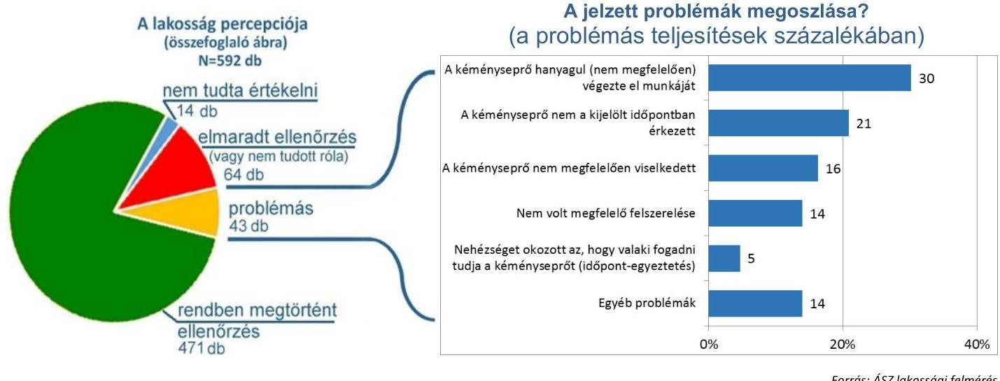

*Forrás: ÁSZ lakossági felmérés*

---

# AZ ELLENŐRZÉS CÉLJA 

Az ellenőrzés célja az ellenőrzött időszakban hatályos szabályozás szerinti kéményseprő-ipari közszolgáltatás megszervezésének és nyújtásának értékelése megfelelőségi szempontokból; az ellátásért felelős önkormányzatok és a közszolgáltatási szerződés alapján szolgáltatást végzők, valamint a tűzvédelmi hatóság közszolgáltatással kapcsolatos feladatellátása, a kontrollok megfelelőségének értékelése, továbbá a szolgáltatási díjakat szabályozó jogszabályok betartásának, a közszolgáltatóknak juttatott források elszámolásának szabályszerűségi értékelése. Az ellenőrzés célja továbbá annak értékelése, hogy a kéményseprő-ipari közszolgáltatásra vonatkozó célok a lakosság percepciója alapján megvalósultak-e, illetve a közszolgáltatással a szolgáltatás igénybevevői elégedettek voltak-e.

---

# AZ ELLENŐRZÉS TERÜLETE 

## A kéményseprő-ipari közszolgáltatás

A kéményseprő-ipari közszolgáltatás 2013. évtől hatályos, jelentős változásokat magában hordozó jogszabályi környezete 2016. június 30-áig volt érvényben, amely alapján a lakosság részére a közszolgáltatás három szereplő részvételével volt biztosított. A megyeszékhely megyei jogú város önkormányzatai, (feladatellátás eredeti címzettjei) és a feladatot önként vállaló önkormányzatok (együtt: ellátásért felelős önkormányzatok) a feladatellátás biztosításáért voltak felelősek. A közszolgáltatás a szolgáltatás megszervezését, az égéstermék elvezetők műszaki állapotának felülvizsgálatát, tisztítását, az ezzel kapcsolatos műszaki követelmények érvényesítését, valamint a díjak beszedését foglalta magában. Ezen belül a Katasztrófavédelmi igazgatóságok a hatósági, szakmai felügyeletet látták el és átmeneti ellátás esetén kijelölték a feladatot ellátó közszolgáltatót. A közszolgáltatók a kéményseprő-ipari közszolgáltatást teljesítették. Az ingatlan használója mint a szolgáltatás igénybevevője is részt vett a feladat ellátásban, mivel jogszabályi kötelezettségének megfelelően biztosítania kellett a szolgáltatás elvégzéséhez szükséges feltételeket.

Az 1. ábrán a közszolgáltatásban résztvevők és főbb szerepkörük láthatóak az ellenőrzött időszak tekintetében.

Közszolgáltató
közszolgáltatás
teljesítése

Katasztrófavédelmi
Igazgatóság
hatósági (szakmai)
felügyelet

Forrás: hatályos kéményseprő-ipari közszolgáltatás jogszabályi előírásai

Az ellenőrzés a közszolgáltatással kapcsolatban a feladat eredeti címzettjeire ${ }^{2}$, megyénként és Budapesten egy-egy ellenőrzött kéményseprőipari közszolgáltatást ellátó szervezetre, valamint azok tevékenységének szakmai (hatósági) felügyeletét ellátó katasztrófavédelmi igazgatóságok feladatellátása szabályszerűségének ellenőrzésére terjedt ki.

Az ellenőrzés a kéményseprő-ipari közszolgáltatást végző szervezetek több mint 30%-át érintette.

Az ellenőrzött önkormányzatok közül 15 esetében az ellenőrzött időszakban a feladat eredeti címzettjével kötött szerződés, két társaság (Balaton-parti Kft., Mezőkövesdi VG Zrt.) esetében a feladatot önként vállaló önkormányzattal kötött szerződés alapján végezték az ellenőrzött közszolgáltatók a feladatellátást. Öt ellenőrzött szervezet a katasztrófavédelmi igazgatóságok kijelölése alapján átmeneti jelleggel végezte a feladatot az ellenőrzött időszakban. A Vas Megyei Kéményseprő Kft. 2014 júliusáig kijelölés alapján átmeneti jelleggel, majd ezt követően a Szombathely MJVÖ¹-vel kötött szerződés alapján végzett kéményseprő-ipari közszolgáltatást. A FÜTESZ Kft. az ellenőrzött időszakban a Debreceni MJVÖ-vel kötött szerződés alapján, majd további, a szerződésben nem szereplő településeken 2014. júliustól kijelölés alapján is végezte a közszolgáltatást.

A 2. ábra szemlélteti a közszolgáltatást végző ellenőrzött társaságok feladatvégzésének jogalap szerinti arányát, továbbá az 1. táblázat a katasztrófavédelmi igazgatóság által kijelölt közszolgáltatókat részletezi az ellenőrzött időszakra vonatkozóan.
2. ábra

A közszolgáltatás ellátásának jogalapja az ellenőrzött gazdasági társaságok tekintetében 2013-2015.
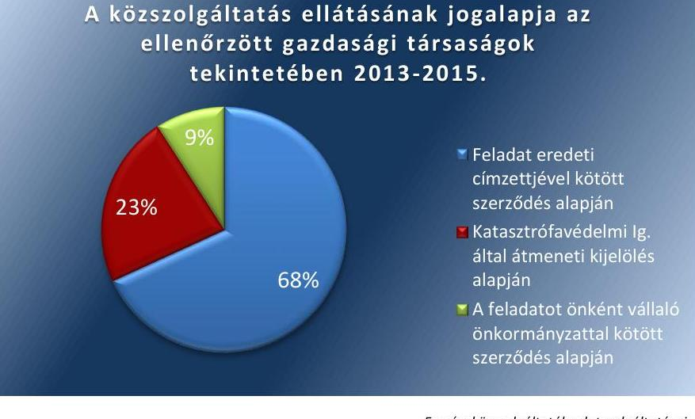

1. táblázat

A FELADATELLÁTÁSRA A KATASZTRÓFAVÉDELMI IGAZGATÓSÁG ÁLTAL KIJELÖLT ELLENŐRZÖTT KÖZSZOLGÁLTATÓK

| MJVÖ | Szolgáltató | Átmeneti ellátás |  |
| :--: | :--: | :--: | :--: |
|  |  | kezdete | vége |
| Szolnok | FILANTROP NKft. | 2014. november 3. | 2016. június 30. |
| Debrecen | FÜTESZ Kft. | 2014. július 1. | 2016. július 1. |
| Győr | KÉTÜSZ Győr Kft. | 2014. január 10. | 2016. június 30. |
| Eger | VÁROSGONDOZÁS EGER Kft. | 2014. december 19. | 2016. július 1. |
| Szombathely | Vas megyei Kéményseprő Kft. | 2014. január 15. | 2014. június 30. |

Forrás: Az önkormányzatok és szolgáltatók ellenőrzési dokumentumai

---

Az ellenőrzött közszolgáltatást végzők fele önkormányzati, állami, a fele magántulajdonú vállalkozás volt az ellenőrzött időszakban.

A 2016. júliustól hatályos jogszabályi változások hatására 17 megye kéményseprő-ipari közszolgáltatása átkerült a Belügyminisztérium Országos Katasztrófavédelmi Főigazgatóság Gazdasági Ellátó Központ feladatkörébe. Fejér megyében, Vas megyében és Budapest teljes területén továbbra is az önkormányzattokkal szerződött közszolgáltatók végzik a feladatellátást. Ezáltal jelenleg a Magyarországon levő több mint 3000 településből közel 2500 településen a Belügyminisztérium Országos Katasztrófavédelmi Főigazgatóság Gazdasági Ellátó Központ látja el a közfeladatot.

A kéményseprő-ipari közszolgáltatással kapcsolatos jogszabályokért és a BM OKF ${ }^{4}$ irányításáért a BM${ }^{5}$ felelős. A BM OKF alapvető rendeltetése a magyar lakosság élet- és vagyonbiztonságának, a nemzetgazdaság és a kritikus infrastruktúra elemek biztonságos működésének védelme.

A kéményseprő-ipari közszolgáltatás keretében végzett sormunka biztosításával összefüggő főbb szolgáltatói feladatokat a 3. ábra szemlélteti, amely felsorolásban az első öt feladat a 2015. évre vonatkozó lakossági felmérést is érintette.
3. ábra

A kéményseprő-ipari közszolgáltatás biztosításával összefüggő és a lakosságot közvetlenül érintő főbb szolgáltatói feladatok

| kéménnyel rendelkező háztartások előzetes értesítése |
| :--: |
| az ellenőrzés tervezett időpontjáról |
| a megjelölt időpontban kiszállás a helyszínre |
| a kémény(ek) ellenőrzése |
| a teljesítés igazolása a használóval, dokumentum |

 |
| átadása |
| panaszkezelés (a feladat ellátásáért felelős szervezet végzi) |
| szükség esetén tisztítás/javítás/tanácsadás |
| díjbeszedése |

Forrás: vonatkozó jogszabályok
Az ingatlan használójának, mint a szolgáltatás igénybevevőjének biztosítania kellett az ingatlanba való bejutást. Ezért a közszolgáltatónak a lakosságot előzetesen értesítenie kellett a szolgáltatás tervezett teljesítésének időpontjáról. Az elvégzett munkákat a kéményseprőnek a jogszabályban előírt és szabályozott, úgynevezett tanúsítványban kellett rögzítenie, melynek egy példányát dokumentáltan át kellett adnia az ingatlan tulajdonosának, vagy használójának, illetve megbízottjának.

---

# AZ ELLENŐRZÉS HÁTTERE, INDOKOLTSÁGA 

2013. január 1-jén lépett hatályba a kéményseprő-ipari közszolgáltatásról szóló 2012. évi XC. törvény. Az új szabályok egyik lényegi újdonsága volt, hogy a kéményseprő-ipari közszolgáltatás biztosítása 2013. január 1-től az egész megyére kiterjedően a megyeszékhely megyei jogú város, Pest megyében Érd megyei jogú város, Budapesten a fővárosi önkormányzat kötelező feladata lett, kivéve azokat a településeket, amelyek saját vállalásuk alapján korábban önállóan látták azt el. A feladat ellátására kötelezett önkormányzat a feladatot közszolgáltató útján látta el, amely lehetett általa alapított költségvetési szerv, gazdálkodó szervezet és egyéb szervezet, vagy egy nem általa alapított, pályázaton nyertes gazdálkodó szervezet. Közszolgáltatási feladat nem maradhat ellátatlan, ezért szerződéses közszolgáltató hiányában a 2013. évi CXXXIV. törvény ${ }^{6}$ előírásai szerint 2014. január 1-jétől a katasztrófavédelmi igazgatóság más településen működő közérdekű szolgáltatót jelölt ki az ellátásra. A kéményseprő-ipari szolgáltatás szakmai felügyeletét, tűzvédelmi hatóságként a katasztrófavédelmi igazgatóságok látták el. A közszolgáltatás díjait az ellátásért felelős önkormányzatok évente felülvizsgálták, és amennyiben szükséges volt, a következő évben alkalmazandó díjakat rendeletben határozták meg. A közszolgáltatás díját érintően a 2013. évben jelentős változások voltak. Magyarország több mint 3000 településén a kémények ellenőrzését és szükség szerinti tisztítását 2014-ben 54 közszolgáltató végezte kötelező sormunkában összesen mintegy 1850 fő kéményseprő-ipari szakmunkással, adminisztratív és más feladatokat ellátó munkavállalóval. Az ellenőrzés eredményei objektív képet adnak a társadalom (lakossági felhasználók), a közszolgáltatást végző szereplők, illetve a jogalkotó számára arról, hogy szabályszerűen működött-e az ellenőrzött időszakban a közszolgáltatás rendszere.

A kéményseprő-ipari közszolgáltatás teljesítmény-ellenőrzéséhez kapcsolódó lakossági felmérés szorosan kapcsolódik a tevékenység szabályszerűségi ellenőrzéséhez. A kéményseprő-ipari közszolgáltatás szabályszerűségi ellenőrzése a közszolgáltatás négy szereplője közül háromra, az önkormányzatokra, a közszolgáltatókra és a katasztrófavédelmi igazgatóságokra terjedt ki. A kiegészítő felmérés a negyedik szereplő, azaz a lakosság percepcióit tartalmazza az elvégzett szolgáltatással kapcsolatban. A lakosság, mint a szolgáltatás közvetlen érintettje elégedettségének megismerése elengedhetetlen a szolgáltatás értékeléséhez.

A kétféle módszertan alapján végzett ellenőrzés lehetőséget biztosított az eltérő módszertanokkal kapott eredmények összehasonlító elemzésére.

---

# A JELENTÉS LÉNYEGES KÉRDÉSKÖREI 

1. Az ellátásért felelős önkormányzatok a kéményseprő-ipari közszolgáltatást szabályszerűen szervezték-e meg?
2. A kéményseprő-ipari közszolgáltatást végző szervezetek a feladataikat szabályszerűen, hiánytalanul végezték-e el?
3. A hatósági felügyeletet ellátó katasztrófavédelmi igazgatóságok a feladataikat szabályszerűen végezték-e?
4. A kéményseprő-ipari közszolgáltatás céljai a lakosság percepciója alapján megvalósultak-e, illetve a teljesített közszolgáltatással a szolgáltatás igénybevevői elégedettek voltak-e?

---

# ELLENŐRZÉS HATÓKÖRE ÉS MÓDSZEREI 

## Az ellenőrzés típusa

Megfelelőségi ellenőrzés.
Teljesítmény-ellenőrzés evalvációs módszerével

## Az ellenőrzött időszak

A 2013. január 1-től 2015. december 31-ig terjedő időszak.

## Az ellenőrzés tárgya

A kiválasztott közszolgáltatók feladatellátása megfelelőségének, szabályszerűségének értékelése. A közszolgáltatókkal szerződést kötő önkormányzatok feladatellátása szabályszerűségének értékelése a közszolgáltatás megszervezése tárgyában, a közszolgáltatók hatósági felügyeletét ellátó katasztrófavédelmi igazgatóságok feladatellátása szabályszerűségének értékelése.

A BM és a BM OKF, illetve az ÁSZ által készített lakossági felmérések elemzése.

## Az ellenőrzött szervezet

- KÖZSZOLGÁLTATÓK: Ördög Béla egyéni vállalkozó (Baranya megye), FILANTROP Környezetvédelmi és Fűtéstechnikai Nonprofit Kft. (Bács-Kiskun megye, Jász-Nagykun-Szolnok megye), Békés Megyei Tüzeléstechnikai Kft. (Békés megye), Mezőkövesdi Városgazdálkodási Zrt. (Borsod-Abaúj-Zemplén megye), Szegedi Kéményseprőipari Kft. (Csongrád megye), KÉMÉNY Fejér Megyei Kéményseprő és Tüzeléstechnikai Zrt. (Fejér megye), FŐKÉTÚSZ Fővárosi Kéményseprőipari Kft. (Budapest), Kétüsz Győr Kft. (Győr-Moson-Sopron megye), FÜTESZ Hajdú-Bihar Megyei Fűtéstechnikai és Szolgáltató Kft. (Hajdú-Bihar megye), VÁROSGONDOZÁS EGER Ipari Kereskedelmi és Szolgáltató Kft. (Heves megye), Magyar Kémény Kft. „fa" (Komárom-Esztergom megye, Nógrád megye, Pest megye), Balaton-parti Kft. Termofok Szolgáltató Ágazata Kéményseprő üzletág (Somogy megye), Kéményseprőipari Kft. (Szabolcs-Szatmár-Bereg megye), Caminus Tüzeléstechnikai Kft. (Tolna megye), Vas Megyei Kéményseprő és Tüzeléstechnikai Kft. (Vas megye), VKSZ Veszprémi Közüzemi Szolgáltató Zrt. (Veszprém megye), Lángőr '94 Kft. (Zala megye).

---

$\longrightarrow$Az ellenőrzés kiterjedt a Magyar Kémény Kft. „fa"-ra is, mint kéményseprő-ipari közszolgáltatást végző gazdasági társaságra. A Magyar Kémény Kft. "fa" nem teljesítette az ÁSZ törvény 28. § (2) bekezdésében előírt adatszolgáltatási közreműködési kötelezettségét, nem bocsátotta a kért dokumentumokat, adatokat az ellenőrzés rendelkezésére. Ennek következtében az ellenőrzés a Magyar Kémény Kft. "fa" vonatkozásában nem volt lefolytatható, amely mulasztással a Magyar Kémény Kft. "fa" „A kéményseprő-ipari közszolgáltatás ellenőrzése" című számvevőszéki ellenőrzés lefolytatását akadályozta.
$\longrightarrow$ A FELADATELLÁTÁS EREDETI CÍMZETTJEI, A MEGYESZÉKHELY MEGYEI JOGÚ VÁROS ÖNKORMÁNYZATAI: Kaposvár Megyei Jogú Város Önkormányzata, Békéscsaba Megyei Jogú Város Önkormányzata, Szekszárd Megyei Jogú Város Önkormányzata, Kecskemét Megyei Jogú Város Önkormányzata, Szolnok Megyei Jogú Város Önkormányzata, Budapest Főváros Önkormányzata, Debrecen Megyei Jogú Város Önkormányzata, Székesfehérvár Megyei Jogú Város Önkormányzata, Nyíregyháza Megyei Jogú Város Önkormányzata, Győr Megyei Jogú Város Önkormányzata, Zalaegerszeg Megyei Jogú Város Önkormányzata, Pécs Megyei Jogú Város Önkormányzata, Tatabánya Megyei Jogú Város Önkormányzata, Salgótarján Megyei Jogú Város Önkormányzata, Érd Megyei Jogú Város Önkormányzata, Miskolc Megyei Jogú Város Önkormányzata, Szeged Megyei Jogú Város Önkormányzat, Eger Megyei Jogú Város Önkormányzat, Szombathely Megyei Jogú Város Önkormányzat, Veszprém Megyei Jogú Város Önkormányzat,
$\longrightarrow$ A KÖZSZOLGÁLTATÓK MUNKÁJÁT FELÜGYELŐ MEGYEI (ÉS FŐVÁROSI) KATASZTRÓFAVÉDELMI IGAZGATÓSÁGOK: Somogy Megyei Katasztrófavédelmi Igazgatóság, Békés Megyei Katasztrófavédelmi Igazgatóság, Tolna Megyei Katasztrófavédelmi Igazgatóság, Bács-Kiskun Megyei Katasztrófavédelmi Igazgatóság, Jász-Nagykun-Szolnok Megyei Katasztrófavédelmi Igazgatóság, Fővárosi Katasztrófavédelmi Igazgatóság, Hajdú-Bihar Megyei Katasztrófavédelmi Igazgatóság, Fejér Megyei Katasztrófavédelmi Igazgatóság, Szabolcs-Szatmár-Bereg Megyei Katasztrófavédelmi Igazgatóság, Győr-Moson-Sopron Megyei Katasztrófavédelmi Igazgatóság, Zala Megyei Katasztrófavédelmi Igazgatóság, Baranya Megyei Katasztrófavédelmi Igazgatóság, Komárom-Esztergom Megyei Katasztrófavédelmi Igazgatóság, Nógrád Megyei Katasztrófavédelmi Igazgatóság, Pest Megyei Katasztrófavédelmi Igazgatóság, Borsod-Abaúj-Zemplén Megyei Katasztrófavédelmi Igazgatóság, Csongrád Megyei Katasztrófavédelmi Igazgatóság, Heves Megyei Katasztrófavédelmi Igazgatóság, Vas Megyei Katasztrófavédelmi Igazgatóság, Veszprém Megyei Katasztrófavédelmi Igazgatóság.
$\longrightarrow$ A LAKOSSÁGI FELMÉRÉST ÉRINTŐEN: a Belügyminisztérium és a Belügyminisztérium Országos Katasztrófavédelmi Főigazgatóság.

---

# Az ellenőrzés jogalapja 

Az ÁSZ tv. 1. § (3) bekezdésében és 5. § (2)-(5) bekezdésében foglaltak.

## Az ellenőrzés módszerei

Az ellenőrzést az ellenőrzési program szempontjai, az ellenőrzött időszakban hatályos jogszabályok, az ellenőrzés szakmai szabályai, a jelen ellenőrzésre irányadó ÁSZ módszertanok figyelembevételével végeztük.

Az ellenőrzési kérdések megválaszolásához szükséges bizonyítékok megszerzése az ellenőrzött által rendelkezésre bocsátott dokumentumokra, adatokra alapozva megfigyelés, szemle (szemrevételezés), kérdésfeltevés (információkérés), mintavételezés, valamint elemző eljárás útján történt. Az ellenőrzési bizonyítékként felhasznált adatforrások közé tartoznak egyrészt az ellenőrzési program részletes szempontjainál felsorolt adatforrások, másrészt minden egyéb - az ellenőrzés folyamán feltárt, az ellenőrzés szempontjából információt tartalmazó - dokumentum.

Az ellenőrzés lefolytatásához az ellenőrzött szervezet a tanúsítványok kitöltésével, valamint az ÁSZ által kért dokumentumok megküldésével szolgáltatott adatokat.

Véletlen mintavétellel történő kiválasztás útján megyénként (a fővárost is beleértve) egy közszolgáltató került kijelölésre. Az ellenőrzött közszolgáltatók tevékenységének szabályszerűségét az elvégzett feladatokból vett minta alapján ellenőriztük. A minta alapján a sokaságban előforduló hibaarányt becsültük. Az értékelés eredményeként kétféle, „Megfelelő" és „Nem megfelelő" minősítést alkalmaztunk. „Megfelelőnek" értékeltünk egy ellenőrzött területet, amennyiben a hibaarány a teljes sokaságban 95%-os bizonyossággal legfeljebb 10% arányt képvisel. Abban az esetben, ha adott sokaság tekintetében a 10%-os hibaarány küszöbérték átlépése megítélésének megbízhatósága nem érte el a 95%-ot, akkor minősítettük "Megfelelőnek" a területet, ha a minta alapján a teljes sokaság vonatkozásában a hibaarány nagyobb valószínűséggel volt 10% alatti, mint 10% feletti.

A feladatellátás eredeti címzettjei és a katasztrófavédelmi igazgatóságok tekintetében az ellenőrzés az összes érintettre kiterjedt. Ezekben az esetekben a feladatellátás szabályszerűségének értékelése az előforduló szabálytalanságokból eredő lehetséges hatások és az ellenőrzöttek körében az előfordulási arány figyelembevételével, az alábbi értékelési kategóriák alapján történt, biztosítva a rendszerjellegű értékelést.

Alacsony kockázatú a szabálytalanság, ha az eltérés vagy a hiba adminisztratív jelleggel bír, közvetlenül és közvetve nem eredményezhet élet- és/vagy vagyonvesztést. Közepes kockázatú a szabálytalanság, ha az eltérés vagy a hiba adminisztratív jelleggel bír, közvetetten negatív hatással lehet a közszolgáltatási tevékenységre, esetleges vagyonvesztést eredményezhet. Magas kockázatú a szabálytalanság, ha az eltérés vagy a hiba tartalmi jelleggel bír, közvetlenül negatív hatással van a közszolgáltatási tevékenységre, élet- és/vagy vagyonveszélyeztetést eredményezheti.

Alacsony kockázatú szabálytalanság esetén nem megfelelőnek minősül az érintett tevékenység ellátásának összesített értékelése, amennyiben a

---

hibázók száma meghaladja az összes ellenőrzött 40%-át. Amennyiben egy alacsony kockázatúnak minősített szabálytalanság az ellenőrzöttek 40%-át meghaladóan nem fordul elő, akkor annak az ellenőrzött területnek a minősítése az összes ellenőrzöttre történő vetítése alapján megfelelő. Közepes kockázatú szabálytalanság esetén nem megfelelőnek minősül az érintett feladat ellátásának összesített értékelése, amennyiben a hibázók aránya meghaladja az összes ellenőrzött 30%-át. Magas kockázatú szabálytalanság bekövetkezése esetén, nem megfelelőnek minősül az érintett feladat ellátásának összesített értékelése, amennyiben a hibázók száma meghaladja az összes ellenőrzött 10%-át.

A kéményseprő-ipari közszolgáltatás teljesítmény-ellenőrzése keretében a 2015. évet érintően felmérésre kerültek a lakosság kéményseprőipari közszolgáltatásra vonatkozó percepciói, tapasztalatai.

A felmérésben a kötelező sormunkával kapcsolatos előzetes tájékoztatás megfelelőségéről, a kéményseprővel, szakmai felkészültségével és a szolgáltatással kapcsolatos tapasztalatokról, a teljesítés-igazolásról és ellenőrzési dokumentumok kezeléséről, az esetleg előfordult káreseményekről és a panaszkezeléssel kapcsolatos tapasztalatokról kérdeztük a lakosokat. A kérdőívben további demográfiai adatokkal kapcsolatos kérdések is szerepeltek.

A felmérés ${ }^{7}$ számítógéppel támogatott telefonos lekérdezés módszerével történt (Computer-assisted telephone interviewing, CATI adatfelvétel). A felmérésben a legalább egy kéménnyel rendelkező és állandó használatú ingatlanok vettek részt. E háztartások vonatkozásában a minta reprezentatív. A mintavételezés előzetes követelménye volt, hogy az érvényes válaszokból képezett minta minimális elemszáma legalább 500 legyen.

A kérdőívben 21 kérdés szerepelt. A felmérés (kérdezés időszaka) 2016. december 16-ától 2016. december 20-áig tartott. A felmérés eredményeinek elemzésével történt az ellenőrzési cél értékelése, következtetések levonása.

A megoszlásokat az összes megkérdezett arányában adtuk meg, tehát mindenhol feltüntetésre került a „nem tudom"-mal válaszolók, illetve az egyéb okból keletkező válaszhiányok gyakorisága is. Egyes kérdéseket a megkérdezettek bizonyos körében kellett csak feltenni. Ez a körülmény minden esetben jelzésre került, ilyenkor a százalékos arányok a megkérdezettek adott körére vonatkoznak.

A százalékos értékek kerekítettek, ezért összegük a megoszlások tekintetében +/- 1 százalékponttal eltérhet a 100 százaléktól. Amennyiben a válaszok százalékos említési gyakoriságáról beszélünk, a megkérdezettek több választ is adhattak, ezért ezek összege meghaladhatja a 100 százalékot.

A kérdőív a III. számú mellékletben található.

---

# MEGÁLLAPÍTÁSOK 

## 1. Az ellátásért felelős önkormányzatok a kéményseprő-ipari közszolgáltatást szabályszerűen szervezték-e meg?

Összegző megállapítás

Az ellátásért felelős önkormányzatok az ellenőrzött időszakban a kéményseprő-ipari közszolgáltatást összességében szabályszerűen szervezték meg.
1.1. számú megállapítás

Az ellátásért felelős ellenőrzött önkormányzatok a kéményseprőipari közszolgáltatással kapcsolatos rendeleteket a jogszabályoknak megfelelően megalkották.

A kéményseprő-ipari közszolgáltatás biztosításával összefüggő főbb önkormányzati feladatokat a 4. ábra szemlélteti.
4. ábra

- Feladat

 eredeti címzettje: a megye egész területén a megyeszékhely megyei jogú város önkormányzata,
Pest megye közigazgatási területén Érd Megyei Jogú Város Önkormányzata, a fővárosban a Fővárosi Önkormányzat

A feladatot önként vállaló települési önkormányzat

Az önként vállaló települési önkormányzattal megállapodás megkötése, átadás-átvétel

A közszolgáltató kiválasztása (pályáztatása), biztosítása
A Közszolgáltatási szerződés szabályszerű megkötése

A közszolgáltatásra vonatkozó rendelet megalkotása, módosítása, közszolgáltatási díjak szabályszerű meghatározása, módosítása

Forrás: az ellenőrzött időszakban hatályos kéményseprő-ipari közszolgáltatás jogszabályi előírásai

## A FELADAT ELLÁTÁSÉRT FELELŐS ÖNKORMÁNY-

ZATOK a kéményseprő-ipari közszolgáltatást a Ksktv. ${ }^{8}$ 2. §-nak megfelelően, mint a kéményseprő-ipari kötelező közszolgáltatási feladat eredeti címzettjei a Mötv. ${ }^{9}$ 13. § (1) bekezdés 2. pontjában és a 23. § (4) bekezdés 9. pontjában foglaltaknak megfelelően biztosították, a kapcsolódó feladatellátást szabályszerűen megszervezték.

Az ellátásért felelős önkormányzatok az ellenőrzött években összességében a Ksktv. 13. § (3) bekezdés a)-c) pontjaiban előírtaknak megfelelően rendeleteikben ${ }^{10}$ szabályozták a kéményseprő-ipari közszolgáltatás ellátását, meghatározták a közszolgáltatás díját, a közszolgáltatás ellátásának, igénybevételeinek részletes szabályait és megnevezték a közszolgáltatót.

---

Egy önkormányzat esetében (ellenőrzött önkormányzatok 5%) előfordult azonban, hogy a Ksktv. 13. § (3) bekezdés c) pontjában foglaltak ellenére az önkormányzat a rendeletében az átmeneti kijelöléssel meghatározott közszolgáltatót nem nevezte meg, ugyanakkor a rendelet megfelelően tartalmazta az átmeneti ellátást és az érintett területeket. (Eger MJVÖ)

Az önkormányzatok a közszolgáltatást a 63/2012. (XII.11.) BM rendelet ${ }^{11}$ 2. § (1) bekezdésének megfelelően, az önkormányzati rendeletekben meghatározott közszolgáltatókkal, a rendeletekben meghatározott ellátási területeken biztosították az ellenőrzött időszakban.
1.2. számú megállapítás

Az ellátásért felelős ellenőrzött önkormányzatok a kéményseprőipari közszolgáltatást végző szervezetekkel a közszolgáltatási szerződéseket szabályszerűen kötötték meg, az előírt dokumentum- és nyilvántartás-jegyzéket tartalmazó mellékletet azonban több önkormányzat nem készítette el.

A KÖZSZOLGÁLTATÁSI SZERZŐDÉST az ellátásért felelős önkormányzatok a kéményseprő-ipari közszolgáltatást végző szervezetekkel alapvetően a Ksktv. 5. § (2) a)-f) pontjaiban foglaltaknak megfelelően kötötték meg. A megkötött közszolgáltatási szerződések tartalmazták a közszolgáltatási kötelezettség tartalmát, a közszolgáltatással érintett ellátási területet, a közszolgáltatás felmondásának feltételeit és a felmondási időt, a szolgáltatásnyújtás kezdő időpontját, a szerződés időtartamát, mellékletként a közszolgáltatással összefüggő dokumentumok, nyilvántartások jegyzékét.

Az ellenőrzött és szerződéssel érintett önkormányzatok 40%-ánál előfordult azonban, hogy a Ksktv. 5. § (2) f) pontja ellenére a szerződés nem tartalmazta mellékletként a közszolgáltatással összefüggő dokumentumok, nyilvántartások jegyzékét. (Kecskemét MJVÖ, Békéscsaba MJVÖ, Szeged MJVÖ, Tatabánya MJVÖ, Érd MJVÖ, Szekszárd MJVÖ). A 13%-ánál további hiányosság volt, hogy a megkötött közszolgáltatási szerződés a Ksktv. 5. § (2) c) pontjában foglaltak ellenére nem tartalmazta az előírt legalább hat hónapos felmondási idő kikötését. (Békéscsaba MJVÖ, Tatabánya MJVÖ).
1.3. számú megállapítás

A közszolgáltatás eredeti címzettjei és a közszolgáltatás biztosítását önként vállaló önkormányzatok az ellenőrzött időszakban a közszolgáltatás ellátásával kapcsolatban összességében szabályszerűen intézkedtek.

# A KÖZSZOLGÁLTATÁST ÖNKÉNT VÁLLALÓ ÖN-

KORMÁNYZATOK jellemzően, a feladat eredeti címzettjeivel a Ksktv. hatálybalépését megelőzően megkötött megállapodások alapján gondoskodtak a feladatellátásról. Az ellenőrzött önkormányzatok 55%-ánál fordult elő az ellenőrzött időszakban, hogy a területükön a kéményseprő-ipari közszolgáltatást önként vállaló települési önkormányzatok is biztosították. Az ellenőrzött önkormányzatok közül az érintett önkormányzatok által megalkotott kéményseprő-ipari közszolgáltatási rendeletek hatálya a Ksktv. 3. § (1) bekezdés c) pontjában előírtaknak megfelelően nem terjedt ki a közszolgáltatást önként vállaló települési önkormányzatok területére. Ezekben az esetekben a települési önkormányzat által alkotott rendelet volt hatályos az adott településeken.

---

### 1.4. számú megállapítás

### 1.5. számú megállapítás

Két MJVÖ tekintetében a megye területén az ellenőrzött közszolgáltatók települési önkormányzatokkal kötött szerződés alapján végezték a tevékenységet. A két MJVÖ közül egy önkormányzat esetében a közszolgáltatást 2014. évtől önként vállaló települési önkormányzatoktól a Ksktv. 3. § (1) bekezdés a) pontjában foglaltakkal ellentétesen a feladatellátás vállalását megelőző előírt hat hónap helyett egy hónappal hozott települési önkormányzati döntésről kapott értesítést, illetve nem kapott a döntésről hivatalos értesítést, ugyanakkor a települési önkormányzattal a feladatellátás végzésére vonatkozó megállapodás létrejött. Ugyanebben az esetben előfordult továbbá, hogy a Ksktv. hatálybalépését követően önként vállalt feladatellátásáról a Ksktv. 3. § (1) bekezdés b) pontjában előírtak ellenére írásbeli megállapodást a feladat eredeti címzettje a települési önkormányzatokkal nem kötött, ugyanakkor a feladatot a települési önkormányzattal szerződött közszolgáltató látta el. Ebben az esetben a feladat eredeti címzettjének a kéményseprő-ipari közszolgáltatással kapcsolatos rendelete az önként vállalással érintett településekre a Ksktv. 3. § (1) bekezdés c) pontjában előírtaknak megfelelően nem terjedt ki. (Miskolc MJVÖ)

A kéményseprő-ipari közszolgáltatást önként vállaló önkormányzatok és a közszolgáltatási feladat eredeti címzettjei között létrejött megállapodások megfelelő tartalommal kerültek megkötésre.

## A FELADATELLÁTÁST ÖNKÉNT VÁLLALÓ ÖNKOR-

MÁNYZAT, illetve a feladat eredeti címzettje között az önként vállalt feladatellátásra kötött megállapodások a Ksktv. 4. § (1) bekezdés a)-e) pontjainak megfelelő tartalommal, az ellenőrzött közszolgáltatók által érintett területekre vonatkozóan kerültek megkötésre.

Települési önkormányzattal szerződő, ellenőrzött két közszolgáltató közül egy tekintetében fordult elő a feladat felhagyása, és ezzel kapcsolatban a korábban megkötött megállapodás megszüntetése. Ez esetben az MJVÖ és a települési önkormányzat közötti felhagyással kapcsolatos megállapodás a Ksktv. 4. § (2) bekezdésének előírása ellenére, a közszolgáltatással összefüggő dokumentumokat, nyilvántartásokat nem tartalmazta. (Miskolc MJVÖ)

A közszolgáltatás eredeti címzettjei a jogszabályban előírt feltételeknek megfelelő közszolgáltatókkal kötöttek szerződést.

## A KÖZSZOLGÁLTATÁS ELLÁTÁSÁÉRT FELELŐS ÖNKORMÁNYZATOK A FELADATOT a Ksktv. 5. § (1) be-

kezdés a) pontjában meghatározottaknak megfelelően az önkormányzat által alapított szervezetek, illetve a b) pontjában meghatározottaknak megfelelően pályázaton nyertes gazdálkodó szervezetek útján biztosították. A pályázaton nyertes közszolgáltatók a Ksktv. hatályba lépését megelőzően kötött jogelőd szerződés alapján, illetve a 2011. évi CVIII. tv ${ }^{12}$ 122. § (7) a) pontjában meghatározottaknak megfelelően, közbeszerzési eljárást követően kötött szerződés alapján végezték a közszolgáltatást.

A kéményseprő-ipari közszolgáltatást a Ksktv. 13. § (3) bekezdés c) pontja szerinti önkormányzati rendeletekben meghatározott közszolgáltatók végezték.

---

1.6. számú megállapítás

A kéményseprő-ipari közszolgáltatási díjak felülvizsgálata, a díjakkal kapcsolatos rendeletalkotás alapvetően szabályszerűen történt. Ugyanakkor több feladatellátásért felelős önkormányzat nem minden esetben tartotta be az előírt határidőket, illetve előfordult, hogy a fogyasztóvédelem és az illetékes szakmai érdekképviselet véleményének kikérése elmaradt.

A KÖZSZOLGÁLTATÁSI DÍJAKAT az önkormányzatok a Ksktv. 10. § (1) bekezdésének megfelelően évente felülvizsgálták és szükség szerint azokat rendeletben határozták meg.

Az ellenőrzött önkormányzatok 35%-ánál azonban előfordult, hogy a díjakkal kapcsolatos módosításokat tartalmazó rendeleteiket a Ksktv. 10. § (1) bekezdésben előírt november 30-át követően, átlagosan 18 nappal túllépve alkották meg. (Szekszárd MJVÖ, Kecskemét MJVÖ, Szolnok MJVÖ, Győr MJVÖ, Zalaegerszeg MJVÖ, Szeged MJVÖ) Jelentősebb (46 napos) határidő-túllépés Eger MJVÖ tekintetében fordult elő az ellenőrzött időszakban.

A díjak megállapítása a 63/2012. (XII. 11.) BM rendelet 11. § (3) bekezdés a) pontjának megfelelően történt. A díjak mértékét a Ksktv. 10. § (2) bekezdésében foglaltakkal összhangban az égéstermék-elvezető típusa, a tüzelési mód, az égéstermék-elvezető igénybevételének jellege és a közszolgáltatással érintett ellátási terület településszerkezetének figyelembevételével határozták meg.

Egy ellenőrzött önkormányzat 2015. évre vonatkozó módosított rendeletében az önkormányzat a Ksktv. 10. § (2) bekezdésében foglaltak ellenére égéstermék-elvezető típusonként nem részletezte a sormunka keretében elvégzendő közszolgáltatási feladat díját. Ebben az esetben azonban a díjak a 347/2012. (XII.11.) Korm. rendelet ${ }^{13}$ 1. számú mellékletében, illetve a 63/2012. (XII. 11.) BM rendelet 7. számú mellékletében foglaltak szerint az önkormányzati rendeletben szabályozott munkaráfordítás díja alapján megállapíthatóak voltak, amely alapján a közszolgáltató megfelelően alkalmazta a díjakat. (Szeged MJVÖ)

A díjak megállapításakor a Ksktv. 10. § (4) bekezdés és 13. § (3) bekezdés a) pontjának megfelelően az ellenőrzött önkormányzatok többsége (90%) kikérte, 10% azonban nem kérte ki a díjak megállapításával kapcsolatban a fogyasztóvédelem, illetve az illetékes szakmai érdekképviseletek véleményét. (Szeged MJVÖ, Szolnok MJVÖ)

Az önkormányzatok a kéményseprő-ipari közszolgáltatási díjak mértékét alapvetően a jogszabályi előírásoknak megfelelően állapították meg.

A DÍJCSÖKKENTÉSI ELŐÍRÁSOKAT az önkormányzatok a 2013. július 28-ától hatályos Ksktv. 10/A. §-ában meghatározottaknak megfelelően rendeleteikben érvényesítették.

Egy ellenőrzött önkormányzat esetében (5%) előfordult azonban, hogy a Ksktv. 10/A. §-ában foglaltakkal ellentétben az ott felsorolt ingatlanok esetében a közszolgáltatás díját úgy állapították meg, hogy azok magasabbak voltak a 2013. június 30-án alkalmazott díj 90%-ánál. A rendeletben meghatározott díjak a korábban alkalmazott díj 90,9%-át tették ki, így az

---

előírt 10%-os csökkentés helyett 9,1%-os csökkentés érvényesült a díjakban, amely díjeltérés az érintett munkatípusok esetében jellemzően 5-10 Ft-os eltérést jelentett. (Tatabánya MJVÖ)

# A DÍJAK MÉRTÉKÉNEK MEGHATÁROZÁSA összességé

ben megfelelt a 63/2012. (XII. 11.) BM rendelet 11. § (1) bekezdésében, továbbá a 347/2012. (XII.11.) Korm. rendelet 3. § (1)-(7) bekezdéseiben foglalt díjmeghatározás előírásainak.

A díjakra vonatkozó önkormányzati rendeletekben a sormunka tevékenység munkaráfordítása a 347/2012. (XII.11.) Korm. rendelet 1. mellékletének 2. pontjában meghatározott szorzók alapján kerültek meghatározásra. A szorzók alapján meghatározott munkaráfordítások díjai az évenkénti gyakoriság, illetve a négyévenként esedékes ellenőrzési díjak esetében a négy éves, vagy éves gyakoriság figyelembevételével kerültek meghatározásra. A rendeletekben meghatározott díjak megfelelően képezték az alapját a 63/2012 (XII. 11.) BM rendelet 7. számú mellékletében szereplő algoritmusoknak, amelyek alapján az elvégzett ellenőrzéshez kapcsolódó díjak meghatározásra kerültek.

Az ellenőrzött önkormányzatok a 63/2012 (XII. 11.) BM rendelet 11 § (3) bekezdésében foglaltaknak megfelelően, a 347/2012. (XII. 11.) Korm. rendelet 1. számú mellékletének 3. és 4. táblázatával megegyező szerkezetben határozták meg a kötelező műszaki vizsgálatok és a megrendelt vizsgálatok díjait.

Az átmeneti ellátások során felmerült közszolgáltatási díjból meg nem térülő indokolt költségek elbírálásra továbbítása és kifizetése szabályszerűen történt.

AZ ÁTMENETI ELLÁTÁSÉRT járó közszolgáltatási díjból a nem fedezhető, indokolt költségek központi költségvetésből történő megtérítése érdekében az igényt, az 511/2013. (XII. 29.) Korm. rendelet ${ }^{14}$ 4.§ (4) bekezdésben foglaltaknak megfelelően, a közérdekű közszolgáltatók benyújtották az érintett önkormányzatok részére. Az önkormányzat az indokolt költségek igényléseit az 511/2013. (XII. 29.) Korm. rendelet 4. § (5) bekezdésének megfelelően, ellenőrzést követően, véleménnyel ellátva, öt napon belül továbbította a MEKH ${ }^{15}$ részére.

Az ellátásért felelős önkormányzatok a Belügyminiszter által - a MEKH tájékoztatásának figyelembevételével - megállapított összeget a közérdekű közszolgáltató kijelölése megszűnéséig, illetve az új közszolgáltatási szerződés alapján történő kéményseprő-ipari közszolgáltatás megkezdéséig folyósították. Az 511/2013. (XII. 29.) Korm. rendelet 5. §-ában előírtaknak megfelelően a központi költségvetésből megtérített indokolt költségek összegét az érintett önkormányzatok a közérdekű közszolgáltatók részére havonta átutalták.

---

# 2. A kéményseprő-ipari közszolgáltatást végző szervezetek a feladataikat szabályszerűen, hiánytalanul végezték-e el? 

Összegző megállapítás

A kéményseprő-ipari közszolgáltatást végző szervezetek a feladataikat összességében nem végezték el hiánytalanul, a feladatellátás nem volt szabályszerű.
2.1. számú megállapítás

A közszolgáltatók által elvégzett feladatok, az előzetes kiértesítés, az ellenőrzési, tisztítási és műszaki felülvizsgálati feladatok, a megrendelt felülvizsgálatok szabályszerűsége összességében nem volt megfelelő az ellenőrzött időszakban.

A közszolgáltatás végzésével összefüggő közszolgáltatót érintő főbb feladatokat az 5. ábra szemlélteti.
5. ábra
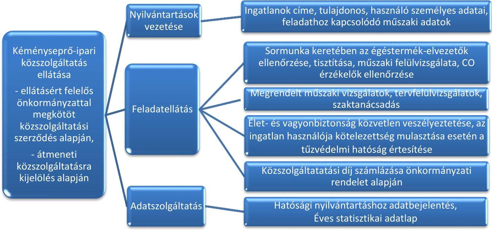

Forrás: az ellenőrzött időszakban hatályos kéményseprő-ipari közszolgáltatás jogszabályi előírásai

## A
 SORMUNKA KERETÉBEN AZ IDŐSZAKOS ELLENŐRZÉST, SZÜKSÉG SZERINTI TISZTÍTÁST ÉS

A MÚSZAKI FELÜLVIZSGÁLATOT a Ksktv. 7. § (1) bekezdés, továbbá a 63/2012. (XII. 11.) BM rendelet 3. § (5) bekezdés előírásainak megfelelően, az ingatlan használójának előzetes értesítése alapján az ellenőrzött közszolgáltatók közel fele (47%) végezte az ellenőrzött időszakban. A közszolgáltatók jellemzően az önkormányzatok információs csatornáit igénybe véve tájékoztatták az ingatlan használóit a sormunkák időpontjáról.

A közszolgáltatók 53%-ánál előfordult azonban, hogy a Ksktv. 7. § (1) bekezdésben, továbbá a 63/2012. (XII. 11.) BM rendelet 3. § (5) bekezdésben foglaltak ellenére az értesítési kötelezettségüket nem, illetve a sormunkára megjelölt időt követően késve teljesítették. (Kéményseprőipari Kft., Caminus Kft., FILANTROP NKft., FÜTESZ Kft., KÉTÜSZ Győr Kft., Bala-ton-parti Kft., VKSZ Veszprémi Zrt., Mezőkövesdi Vg Zrt., Szegedi Kéményseprőipari Kft.)

Az ellenőrzött közszolgáltatók 71%-ánál fordult elő a mintatételek esetében, hogy az ingatlan használójának a sormunka megadott időpontja nem volt megfelelő, illetve az időszakos ellenőrzés és szükség szerinti tisztítás nem volt elvégezhető. Ez alapján az érintett közszolgáltatók egyötöde a Ksktv. 7. § (1) bekezdés, továbbá a 63/2012. (XII. 11.) BM rendelet 3. § (5) bekezdésében foglaltak alapján igazolt módon az első időponttól számított 30 napon belüli második időpontot jelölt meg az ingatlan használója számára.

Az érintett közszolgáltatók 80%-ánál fordult elő, hogy a közszolgáltató a sormunka elvégzésének második időpontjáról a Ksktv. 7. § (1) bekezdésében és a 63/2012. (XII. 11.) BM rendelet 3. § (5) bekezdésében előírtak ellenére az ingatlan használóját, tulajdonosát a közszolgáltatás igénybevételének kötelezettségéről, illetve annak második időpontjáról nem tájékoztatta, illetve a 63/2012. (XII.11.) BM rendelet 3. § (6) bekezdésében foglaltak ellenére a postaládába helyezett, annak hiányában kapura vagy bejárati ajtóra jól látható módon elhelyezett második értesítést tanúval, vagy fényképfelvétellel, vagy az ingatlan használójának, tulajdonosának aláírásával, illetve egyéb módon nem igazolta. (Békés Megyei Tüzeléstechnikai Kft., Caminus Kft., FILANTROP NKft., (mindkét ellenőrzött megyében), Kéményseprőipari Kft., KÉTÜSZ Győr Kft., Mezőkövesdi VG Zrt., Szegedi Kéményseprőipari Kft., Vas Megyei Kéményseprő Kft., FÜTESZ Kft.)

Az közszolgáltatók 25%-ánál előfordult, hogy a második értesítés a 63/2012. (XII.11.) BM rendelet 3. § (7) bekezdés b) és f) pontokban foglaltak ellenére több esetben nem tartalmazta a közszolgáltató ügyfélszolgálatának címét, telefonszámát, a hatósági felügyeletet ellátó tűzvédelmi hatóság megnevezését és címét. (Caminus Kft., Szegedi Kéményseprőipari Kft., Vas Megyei Kéményseprő Kft.)

Egy érintett közszolgáltató esetében további hiányosságként előfordult, hogy a Ksktv. 7. § (1) bekezdés előírása ellenére az első időponttól számított 30 napot meghaladó időpont került megjelölésre a munkavégzés második időpontjaként. (Caminus Kft.).

# AZ ELLENŐRZÉSI, FELÜLVIZSGÁLATI, TISZTÍTÁSI FELADATOK ELLÁTÁSÁT a Ksktv. 6. § (1) bekezdés a)-e) pontjaiban foglaltakban előírt sormunka keretében, továbbá a 63/2012. (XII. 11.) BM rendelet 3. § (1)-(3) bekezdéseiben foglaltak alapján közszolgáltatók fele (53%) elvégezte, 47% tekintetében az alábbiakban részletezett hiányosságok fordultak elő:
$\longrightarrow$ Az ellenőrzött közszolgáltatók 47%-ánál előfordult, hogy a Ksktv. 6. § (1) bekezdés a)-b), és e) pontjaiban, illetve 2015. január 1-jétől hatályos c)-d) pontjaiban foglaltak ellenére a sormunka keretében előírt tisztítási, felülvizsgálati és ellenőrzési feladatokat nem végezték el. (KÉTÜSZ Győr Kft., Mezőkövesdi VG Zrt., Vas Megyei Kéményseprő Kft., FÜTESZ Kft., FILANTROP NKft., Kéményseprőipari Kft., VG Eger Kft., VKSZ Veszprémi Zrt.),

---

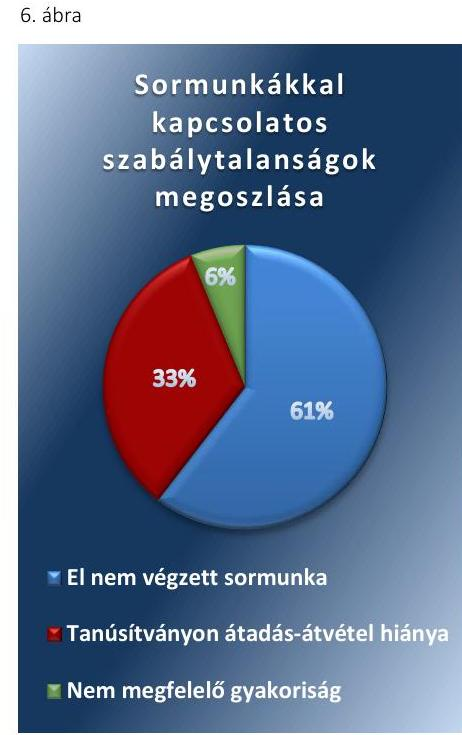

*Forrás: ellenőrzött közszolgáltatók mintatételre alapján*

Az ellenőrzött közszolgáltatók 29%-a esetében előfordult, hogy a 63/2012. (XII. 11.) BM rendelet 8. § (1) bekezdés előírásai szerint tanúsítvánnyal rendelkezett a közszolgáltató, azonban az hiányos volt, továbbá a munka átadás-átvétele a használó által nem volt aláírva, így nem volt igazolt. (FILANTROP NKft., FÜTESZ Kft., Kéményseprőipari Kft., KÉTÜSZ Győr Kft., VKSZ Veszprémi Zrt.),

- Az ellenőrzött közszolgáltatók 18 %-ánál további hiányosság volt, hogy a 63/2012. (XII. 11.) BM rendelet 3. § (1) bekezdés b) pontjában foglaltak ellenére a sormunka keretében, négyévenként esedékes égéstermék-elvezető műszaki felülvizsgálatát nem végezték el. (Békés Megyei Tüzeléstechnikai Kft., FÜTESZ Kft., Kéményseprőipari Kft.)

Az ellenőrzött közszolgáltatók tekintetében a mintatételekben előfordult, fentiekben részletezett hiányosságok típus szerinti megoszlását a 6. ábra szemlélteti.

A közszolgáltatók tekintetében feltárt élet és vagyonbiztonsági szempontból magas kockázattal járó hibák, hiányosságok előfordulásának minimalizálására a közszolgáltatók kontrollokat nem írtak elő belső szabályzataikban.

### AZ INGATLANTULAJDONOSOK ÁLTAL MEGRENDELT

Égéstermék-elvezetővel kapcsolatos kötelező műszaki vizsgálatokat az érintett közszolgáltatók többsége a Ksktv. 6. § (2) bekezdésében foglaltaknak megfelelően elvégezte.

Az érintett közszolgáltatók 23%-ánál a Ksktv. 6. § (3) bekezdésben foglaltakkal ellentétben előfordult azonban, hogy a feladatelvégzésről a dokumentum igazolt módon nem került az ingatlantulajdonos részére átadásra, illetve hiányzott a 63/2012. (XII. 11.) BM rendelet 5. § (3) bekezdésében előírtakkal ellentétben a vizsgálat eredményéről kiállított nyilatkozat. (Kéményseprőipari Kft., FILANTROP NKft., FÜTESZ Kft.)

### A SZÉN-MONOXID-ÉRZÉKELŐ BERENDEZÉS MEGLÉTÉNEK, MŰKÖDŐKÉPESSÉGÉNEK

Ellenőrzését az érintett közszolgáltatók kétharmada a 63/2012. (XII. 11.) BM rendelet 3. § (1) d) pontjában meghatározottak alapján összességében elvégezte.

A témában érintett ellenőrzött közszolgáltatók 33%-ánál fordult elő, hogy a 63/2012. (XII. 11.) BM rendelet 3. § (1) d) pontjában előírtak ellenére nem történt meg a szén-monoxid-érzékelő berendezés meglétének, működőképességének ellenőrzése. (FŐKÉTÜSZ Kft., Caminus Kft.)

### AZ IDŐLEGESEN HASZNÁLT INGATLANOK TEKINTETÉBEN

Érintett közszolgáltatók kevesebb mint a fele tett eleget a tájékoztatási kötelezettségének, mivel a 60%-ánál előfordult, hogy a 63/2012. (XII. 11.) BM rendelet 4. § (3) bekezdésében előírtakkal ellentétben az adott év első negyedévében az ellenőrzés esedékességéről nem tájékoztatta az ingatlan tulajdonosát. (Vas Megyei Kéményseprő Kft., Lángőr '94 Kft., Ördög Béla ev.)

---

# A TERVEZETT, VAGY A TERVEZÉSSEL ÉRINTETT 

ÉGÉSTERMÉK-ELVEZETŐ műszaki megoldás megfelelőségével összefüggő, megrendelt tervfelülvizsgálatot és szaktanácsadást a közszolgáltatók elvégezték, továbbá a munkák elvégzésről szóló nyilatkozatot a megrendelést a 63/2012. (XII. 11.) BM rendelet 6. § (2) bekezdésének megfelelően 5 munkanapon belül a megrendelő részére átadták.

## KÉMÉNYTŰZ VAGY SZÉN-MONOXID-SZIVÁRGÁSSAL kapcsolatos káreseményt követően a közszolgáltatók a 63/2012. (XII. 11.) BM rendelet 5. § (6a) bekezdésének megfelelően az ellenőrzött időszakban újra üzembe helyezni kívánt égéstermék-elvezető vizsgálatát elvégezték.

A közszolgáltatók a jogszabályokban előírt nyilvántartásokat több hibával, azonban összességében megfelelően vezették, adatszolgáltatási kötelezettségüket nem minden esetben teljesítették.

AZ ELŐÍRT NYILVÁNTARTÁST a Ksktv. 6. § (4) bekezdésnek és a 63/2012. (XII.11.) BM rendelet 7. §-ában előírtaknak megfelelően vezette az ellenőrzött közszolgáltatók többsége (76%). A nyilvántartások az előírásnak megfelelően az égéstermék-elvezetők és a csatlakoztatott tüzelőberendezések közszolgáltatáshoz szükséges műszaki adatait címenként tartalmazta.

Az ellenőrzött közszolgáltatók 24%-a tekintetében a nyilvántartás az alábbi hiányosságokat tartalmazta:
A 63/2012. (XII.11.) BM rendelet 7. § bi) alpontjában foglaltakkal ellentétben előfordult, hogy az égéstermék-elvezetők és a csatlakoztatott tüzelőberendezésekről vezetett nyilvántartás egy közszolgáltató (6%) esetében nem tartalmazta a CO mérés szükségességét (FÜTESZ Kft.),
az ellenőrzött közszolgáltatók 12%-ánál előfordult, hogy a 63/2012. (XII.11.) BM rendelet 7. §-ban foglaltak ellenére a nyilvántartás az ingatlanok címén és az égéstermék-elvezetők számán kívül nem tartalmazta a további előírt adatokat (VKSZ Veszprémi Zrt., KÉTÜSZ Győr Kft.),
a 63/2012. (XII. 11.) BM rendelet 8. § (1) és (4) bekezdéseiben előírtak ellenére egy közszolgáltató esetében (6%) előfordult, hogy a folyamatosan vezetett nyilvántartás elvégzett munkaként tartalmazta a hiányosan kitöltött, vagy ki nem töltött tanúsítványok alapján (le nem igazolt) feladatellátásokat is.(Kéményseprőipari Kft.).
Az ellenőrzött közszolgáltatók többsége a Ksktv. 12. § (1) bekezdésében meghatározott hatósági nyilvántartáshoz az adatbejelentő lapot a 63/2012. (XII.11.) BM rendelet 8. § (6) bekezdésében foglaltaknak megfelelően megküldte a katasztrófavédelmi igazgatóságok részére. A közszolgáltatók 18%-ánál azonban előfordult, hogy az adatbejelentőt a jogszabályban foglaltak ellenére nem, illetve határidőn túl küldték meg a katasztrófavédelmi igazgatóság részére. (Caminus Kft., KÉTÜSZ Győr Kft., FILANTROP NKft.)

A 2015. január 1-jétől hatályos 63/2012. (XII.11.) BM rendelet 9. §-ában, illetve 6. számú mellékletében előírt statisztikai adatlapot az ellenőrzött közszolgáltatók több mint kétharmada a meghatározott tartalommal

---

és a határidőt betartva a településüzemeltetésért felelős miniszternek megküldte. A közszolgáltatók 29%-a tekintetében előfordult azonban, hogy a statisztikai adatlapot a jogszabályban foglaltak ellenére határidőn túl, illetve nem küldték meg a településüzemeltetésért felelős miniszter részére. (Caminus Kft., VKSZ Veszprémi Zrt., FILANTROP NKft., VG Eger Kft., KÉTÜSZ Győr Kft.)

# 2.3. számú megállapítás 

A közszolgáltatók többsége a kéményseprő-ipari közszolgáltatás költségeit és bevételeit a jogszabályok alapján elkülönítve vezette. Az indokolt költségeiket a közszolgáltatók összességében szabályszerűen igényelték az ellenőrzött időszakban.

Az ellenőrzött időszakban a közszolgáltatók többsége a kéményseprő-ipari közszolgáltatási tevékenységen kívül egyéb tevékenységet is végzett.

## A KÖZSZOLGÁLTATÁS KÖLTSÉGEIT ÉS BEVÉTELEIT a Ksktv. 5. § (3) bekezdésnek megfelelően az ellenőrzött közszolgáltatók nagy része az egyéb tevékenységétől elkülönítve, az elkülönítés paraméterei alapján tartotta nyilván.

Az ellenőrzött közszolgáltatók 12%-a esetében a Ksktv. 5. § (3) bekezdésében foglaltak ellenére a költség nem kerültek elkülönítésre, (VG Eger Kft., Caminus Kft.), illetve 12%-ánál az elkülönítés paramétereit nem határozták meg. (Ördög Béla ev., Szegedi Kéményseprőipari Kft.)

A közszolgáltatók az 511/2013. (XII.29.) Korm. rendelet 4.§ (4) bekezdésének megfelelően 10 napon belül az önkormányzat részére benyújtották az átmeneti ellátás idejére vonatkozó, az átmeneti ellátásért járó közszolgáltatási díjból meg nem térülő költség igényeket. A benyújtott igények a megnövekedett feladatellátáshoz szükséges és sormunka esetére megállapított minimális szakmai létszámhoz kapcsolódó munkabért, továbbá a megnövekedett ellátási területből adódó dologi kiadásokat tartalmazta.

Egy ellenőrzött közszolgáltatónál előfordult (6%), hogy az 511/2013. (XII.29.) Korm. rendelet 4.§ (4) bekezdésében foglaltakban meghatározottak ellenére a közszolgáltató az indokolt költségek megtérítésére vonatkozó igényét az előírt kijelöléstől számított 10 napon túl nyújtotta be az önkormányzat részére. (VG Eger Kft.)

### 2.4. számú megállapítás

Az élet- és vagyonbiztonság veszélye észlelésekor a közszolgáltatók összességében nem megfelelően jártak el.

Amennyiben az ingatlan használója a Ksktv. 9. § (2) a) pontjában foglaltak ellenére nem tette lehetővé a feladatellátást, az ehhez szükséges feltételeket nem teljesítette és így az égéstermék-elvezető állapotának időszakos ellenőrzése, tisztítása, műszaki felülvizsgálata nem valósult meg, a Ksktv. 7. § (3) bekezdésében előírtak ellenére az ellenőrzött közszolgáltatók 24%-ánál előfordult, hogy erről nem értesítették a tűzvédelmi hatóságot. (FŐKÉTÜSZ Kft., KÉTÜSZ Győr Kft., FÜTESZ Kft., Kéményseprőipari Kft.)

Előfordult egy ellenőrzött közszolgáltató esetében, hogy a Ksktv. 7. § (2) a) pontjában foglaltak ellenére írásban nem szólította fel a használót az üzemeltetés azonnali leállítására a szabálytalanság megszüntetéséig, ugyanakkor a 347/2012. (XII. 11.) Korm. rendelet 1.§ (2) bekezdésben foglaltaknak megfelelően soron kívül értesítették az elsőfokú tűzvédelmi Hatóságot, valamint a földgázelosztót. (VG Eger Kft.)

---

# 2.5. számú megállapítás 

A közszolgáltatással kapcsolatosan kiszámlázott összegek a hatályos díjszabásnak összességében megfeleltek.

A KÖZSZOLGÁLTATÁSI FELADAT DÍJÁT összességében az önkormányzati rendeletekben meghatározott díjakat alapul véve, a 63/2012. (XII. 11.) BM rendelet 11. § (1)-(2) bekezdéseinek előírása alapján, a 63/2012. (XII. 11.) BM rendelet 7. számú mellékletében meghatározottaknak megfelelően állapították meg és számlázták ki a közszolgáltatók.

Az ellenőrzött közszolgáltatók 18%-ánál fordultak elő kisebb hibák a számlázás során. Előfordult, hogy az ellátásért felelős önkormányzat által a Ksktv.
 10. § (1) bekezdése és a 13. § (3) a) pontja alapján rendeletben meghatározott díjtételektől minimálisan eltérő összeg került kiszámlázásra. Továbbá néhány esetben előfordult, hogy a sormunka keretében elvégzendő négy évenkénti kötelező vizsgálat díja a 63/2012. (XII. 11.) BM rendelet 7. számú mellékletében meghatározott algoritmussal ellentétben nem négy évre elosztva, hanem a munka elvégzésekor egy összegben került felszámításra. A számlák és a tanúsítványok közötti összhang nem minden esetben volt biztosított, mivel előfordult, hogy a tanúsítványon szereplő elvégzett feladat, illetve az égéstermék-elvezető típusa, továbbá a dátum nem volt egyértelműen beazonosítható, ami nehezítette a kiszámlázott összeg ellenőrizhetőségét. (Caminus Kft., Kéményseprőipari Kft., FÜTESZ Kft.)

A sormunkában meghatározott tevékenységekre irányuló külön megrendeléseknél a díjak mértékének meghatározásakor a közszolgáltatást végzők a 63/2012. (XII. 11.) BM rendelet 11. § (2) bekezdésében előírtaknak megfelelően jártak el, miszerint a díjat alkalmanként az ellátásért felelős önkormányzat által a 347/2012. (XII. 11.) Korm. rendelet 1. számú melléklet 2. számú táblázata alapján állapították meg.

## 2.6. számú megállapítás

A közszolgáltatók az ingatlantulajdonosok részére a rezsicsökkentéssel kapcsolatos tájékoztatást, illetve a hatóság részére az igazolási kötelezettségüket nem megfelelően teljesítették az ellenőrzött időszakban.

A közszolgáltatók összességében eleget tettek a 2013. június 28-tól hatályos Ksktv. 10/B. § (1) bekezdésében előírtaknak, miszerint a természetes személyek, továbbá a társasházak és a lakásszövetkezetek részére a számlával egyidejűleg részletes írásbeli tájékoztatást nyújtottak a közszolgáltatási díj rezsicsökkentés következtében való csökkenésének összegéről.

Az ellenőrzött közszolgáltatók 35%-ánál azonban előfordultak olyan esetek, hogy a Ksktv. 10/B. § (1) bekezdésében foglaltak ellenére a közszolgáltatók nem tájékoztatták az ingatlan tulajdonosát a rezsicsökkentés összegéről. (Balaton-parti Kft., Caminus Kft., FILANTROP NKft., FÜTESZ Kft., Ördög Béla ev., Mezőkövesdi VG Zrt.)

Az ellenőrzött közszolgáltatók közel kétharmada a Ksktv. 10/B. § (2) bekezdésében előírtaknak megfelelően a tárgyhónapot követő hónap 15. napjáig igazolták a fogyasztóvédelmi hatóságnak a rezsicsökkentéssel kapcsolatos előírások teljesülését. A 41%-ánál előfordult azonban, hogy a Ksktv. 10/B. § (2) bekezdésében foglaltak ellenére a hatóság tájékoztatása nem történt meg. (Balaton-parti Kft., Caminus Kft., FÜTESZ Kft., Kéményseprőipari Kft., KÉTÜSZ Győr Kft., Mezőkövesdi VG Zrt., VG Eger Kft.)

---

# 3. A hatósági felügyeletet ellátó katasztrófavédelmi igazgatóságok a feladataikat szabályszerűen végezték-e? 

Összegző megállapítás

A hatósági felügyeletet ellátó katasztrófavédelmi igazgatóságok a feladataikat összességében szabályszerűen végezték el az ellenőrzött időszakban.
3.1. számú megállapítás

A hatósági felügyeletet ellátó katasztrófavédelmi igazgatóságok a közszolgáltatókról a nyilvántartást összességében megfelelően vezették.

A katasztrófavédelmi igazgatóságok főbb feladatait a közszolgáltatással összefüggésben a 7. ábra szemlélteti.
7. ábra
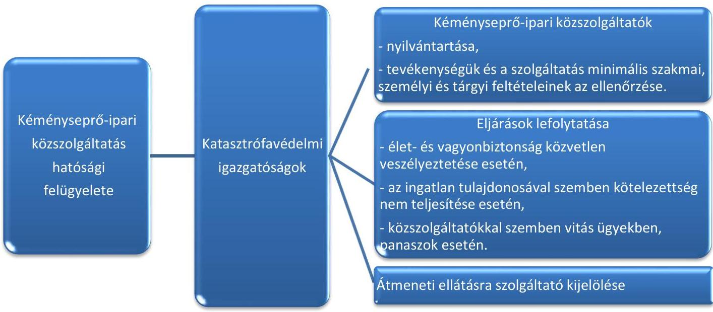

Forrás: az ellenőrzött időszakban hatályos kéményseprő-ipari közszolgáltatás jogszabályi előírásai

## A kéményseprő-ipari közszolgáltatókat tartalmazó nyilvántartást a katasztrófavédelmi igazgatóságok kétharmada a Ksktv. 12. § (1) bekezdés a)-c) pontjai előírásainak megfelelően vezette, amely nyilvántartások a 2009. évi LXXVI. törvény ${ }^{16}$ 27. § (2) bekezdés a)-c) pontjainak megfelelően a bejelentés adataival egyezően tartalmazták a szolgáltató nevét, székhelyét, a szolgáltatási tevékenység megjelölését.

A Ksktv. 12. § (1) bekezdés a)-c) pontjaiban foglaltakkal, illetve a 259/2011. (XII. 7.) Korm. rendelet ${ }^{17}$ 1. § (2) bekezdés h) pontjában foglaltakkal ellentétben a katasztrófavédelmi igazgatóságok 5%-ánál előfordult, hogy a nyilvántartásokban kisebb eltéréssel tartalmazta a tevékenység kezdési időpontját (Bács-Kiskun Megyei Katasztrófavédelmi Igazgatóság), továbbá 5% esetében előfordult, hogy a 2013-as évben nem vezetett nyilvántartást az ellenőrzött közszolgáltatóról (Borsod-Abaúj-Zemplén megyei Katasztrófavédelmi igazgatóság). A katasztrófavédelmi igazgatóságok 25%-ánál fordult elő, hogy a Ksktv. 12. § (1) bekezdés a)-c) pontjaiban foglalt

---

# Megállapítások 

előírásai ellenére nem vezette teljes körűen a tevékenység végzésére jogosult közszolgáltatókról a nyilvántartását, mivel az illetékességi területén szolgáltatást végző, de székhellyel más igazgatóság területét érintő ellenőrzött közszolgáltatót nem tartotta nyilván. (Komárom-Esztergom, Nógrád, Heves, Jász-Nagykun-Szolnok Megyei Katasztrófavédelmi Igazgatóságok).

## 3.2. számú megállapítás

## 3.3. számú megállapítás

## 3.4. számú megállapítás

## A katasztrófavédelmi igazgatóságok a közszolgáltatók tevékenységére vonatkozóan az előírt ellenőrzéseket többségében megfelelő gyakorisággal elvégezték.

A kéményseprő-ipari közszolgáltatók minimális szakmai, személyi és a tárgyi feltételeinek meglétét, valamint a közszolgáltató tevékenységét a katasztrófavédelmi igazgatóságok összességében folyamatosan vizsgálták a Ksktv. 12. § (2) bekezdés a) pont aa)-ab) alpontjaiban és a 63/2012. (XII. 11.) BM rendelet 2. § (2)-(10) bekezdéseiben foglalt előírásoknak megfelelően. A katasztrófavédelmi igazgatóságok az ellenőrzésre vonatkozó belső előírásokban ${ }^{18}$ foglaltak szerint évente végezték el a vizsgálatokat.

A 2015. évben a katasztrófavédelmi igazgatóságok 15%-ánál a minimális szakmai, személyi és tárgyi feltételek Ksktv. 12. § (2) bekezdés a) és aa) pontjaiban előírt folyamatos vizsgálata az ellenőrzésre vonatkozó belső előírások ellenére elmaradt. (Zala Megyei, Fővárosi Katasztrófavédelmi Igazgatóság)

## A katasztrófavédelmi igazgatóságok éltek a közszolgáltatók hatósági ellenőrzésének lehetőségével.

A katasztrófavédelmi igazgatóságok 90%-a az ellenőrzött időszakban legalább egy alkalommal élt a Ksktv. 12. § (4) bekezdésében foglalt ellenőrzési lehetőséggel. Az adatigénylés során a bűnügyi nyilvántartási rendszerből adatokat igényeltek arra vonatkozóan, hogy a közszolgáltatási tevékenység ellátásában közreműködő természetes személy büntetlen előéletű-e, illetve a kéményseprő-ipari közszolgáltatással kapcsolatos szakterületen végezhető tevékenység folytatását kizáró foglalkozástól eltiltás hatálya alatt állt-e.

## A katasztrófavédelmi igazgatóságok szabálysértés esetén a jogszabálynak megfelelően jártak el.

Élet- és vagyonbiztonság közvetlen veszélyeztetése esetén a katasztrófavédelmi igazgatóságok a Ksktv. 12. § (2) bekezdés b) pontjában előírtaknak megfelelően az ingatlan tulajdonosával szemben a szükséges eljárásokat megindították.

A katasztrófavédelmi igazgatóságok a 259/2011. (XII. 7.) Korm. rendelet 9/B. § (1)-(2) bekezdésének megfelelően megindították az eljárásokat, amennyiben a közszolgáltató a tűzvédelmi hatóság felhívásában meghatározott kötelezettséget nem határidőben teljesítette, vagy nem a tűzvédelmi hatóság felhívásában foglaltaknak megfelelően járt el.

A Ksktv. 12. § (3) bekezdés a)-b) pontjának megfelelően a katasztrófavédelmi igazgatóságok eljártak az égéstermék-elvezető szakszerűségét igazoló szakmai nyilatkozatok kiadására vonatkozó vitás ügyek esetén, illetve

---

# 3.5. számú megállapítás 

felülvizsgálták a panaszos által vitatott, a közszolgáltató által kiadott szakmai nyilatkozatok tartalmát.

## A katasztrófavédelmi igazgatóságok az átmeneti ellátásra a kéményseprő-ipari közszolgáltatást ellátó szervezeteket szabályszerűen jelölték ki.

Átmeneti ellátásra a kéményseprő-ipari közszolgáltatás végzésére jogosult szolgáltatók közül a katasztrófavédelmi igazgatóságok a közszolgáltatás ellátásáért felelős önkormányzatok által megküldött, a kéményseprő-ipari közszolgáltatás ellátására irányuló szerződés megszűnéséről szóló tájékoztatást követő 15 napon belül a 2013. évi CXXXIV. törvény 3/A. § (1)-(3) bekezdéseinek megfelelően közérdekű szolgáltatót jelöltek ki.

A közszolgáltatás ellátására szóló átmeneti kijelölés a 2014. január 1-jétől hatályos 2013. évi CXXXIV. törvény 3/A. § (5) bekezdésének megfelelően az új kéményseprő-ipari közszolgáltatási szerződés megkötéséig, de legfeljebb kilenc hónapos időtartamra történt, majd a jogszabályi előírásoknak megfelelően háromhavonként legfeljebb egyéves időtartammal hosszabbították meg.

A katasztrófavédelmi igazgatóságok átmeneti ellátásra kijelölő határozata az 511/2013. (XII. 29.) Korm. rendelet 3. § (4) bekezdés a)-c) pontjainak megfelelően tartalmazta a közérdekű közszolgáltató adatait, az átmeneti ellátással érintett települések megnevezését, az átmeneti ellátás megkezdésének időpontját és az átmeneti ellátás időtartamát. Azonban kisebb adminisztratív hiányosságként a katasztrófavédelmi igazgatóságok 5%-ánál előfordult, hogy a határozat az 511/2013. (XII. 29.) Korm. rendelet 3. § (4) bekezdés a) pontjában foglaltakkal ellentétben a közszolgáltató statisztikai számjelét nem tartalmazta. (Heves Megyei Katasztrófavédelmi Igazgatóság)

A katasztrófavédelmi igazgatóságok az átmeneti ellátás kijelölése tárgyában hozott döntését az 511/2013. (XII. 29.) Korm. rendelet 3. § (5) bekezdés a)-d) pontjainak megfelelően minden esetben közölte a kijelölt közérdekű közszolgáltatóval, az ellátásért felelős önkormányzattal, az átmeneti ellátással érintett települési önkormányzatokkal és az átmeneti ellátással érintett települések szerint illetékes megyei kormányhivatallal.

---

# 4. A kéményseprő-ipari közszolgáltatás céljai a lakosság percepciója alapján megvalósultak-e, illetve a teljesített közszolgáltatással a szolgáltatás igénybevevői elégedettek voltak-e? 

Összegző megállapítás

## 4.1. számú megállapítás

A lakossági felmérés adatai szerint nem valósultak meg teljes körűen a kéményseprő-ipari közszolgáltatás céljai. A teljesített közszolgáltatással a szolgáltatás igénybevevői összességében elégedettek voltak, ugyanakkor több problémát is jeleztek.

A lakossági felmérés adataiból megalapozott következtetések nyerhetőek, mivel érvényesültek a reprezentativitás és a minta elemszámára vonatkozó követelmények.

## Az ÁSZ felmérése értékelhető adatokat

eredményezett a 2015. évre vonatkozó kéményseprő-ipari közszolgáltatással kapcsolatban. A BM és a BM OKF az ellenőrzött időszakra vonatkozóan nem végzett lakossági felmérést a kéményseprő-ipari közszolgáltatás teljesítésével kapcsolatban.

Az ÁSZ felmérése során az 1059 megkérdezettől kapott 731 válaszból 139 érintett úgy válaszolt, hogy az ingatlan nem rendelkezik kéménnyel, így ezek kiszűrésre kerültek a válaszadók közül, mivel ezekre az ingatlanokra vonatkozóan a közszolgáltatónak nem volt ellátási kötelezettsége. A kéménnyel ellátott állandó használatú ingatlannal rendelkező 592 válaszadó közül 14 esetben a válaszadók nem tudták értékelni az ellenőrzést. További 43 esetben nem volt ellenőrzés. 21 esetben a válaszadó nem tudott válaszolni arra, hogy volt-e ellenőrzés. A közszolgáltatással kapcsolatos kérdésekre adott válaszokat a fentiek levonása után - a reprezentativitást is biztosító fennmaradó 514 elemre vetítettük. Az 514 elemű (szűkített) minta meghaladta az előzetesen 500 elemben meghatározott küszöbértéket. A minta összetételét a 8. ábra mutatja be.
8. ábra

A vizsgált minta összetétele a meghatározott kritériumok alapján
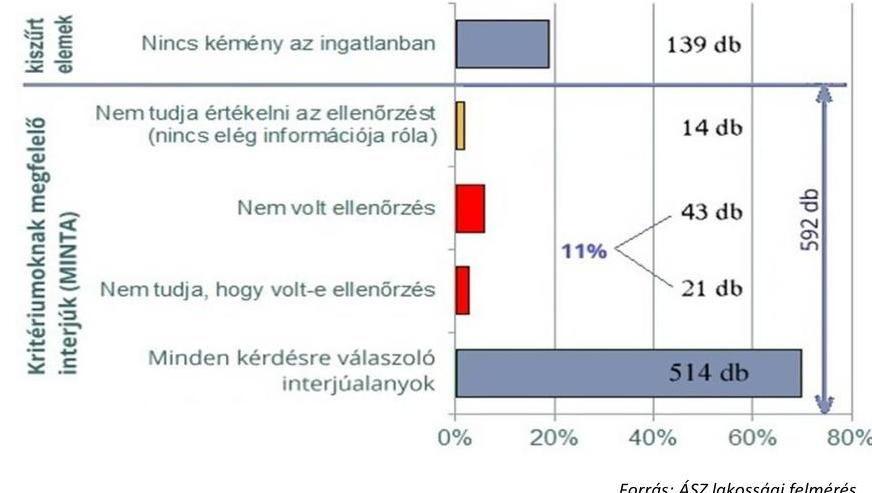

---

4.2. számú megállapítás

A jogszabályi rendelkezések lakossági élet- és vagyonvédelmet érintő céljai nem teljesültek maradéktalanul, mivel a lakossági felmérés alapján a megkérdezettek hét százalékánál biztosan, továbbá négy százalékánál vélelmezhetően elmaradt az éves kötelező kémény-ellenőrzés a 2015. évben.

Nem történt meg a 2015. évi kötelező ellenőrzés az 578 válaszadó közül 43 esetében (7 százalék). További 21 esetben (4 százalék) nem tudták megmondani, történt-e ellenőrzés.

Az ellenőrzés elmaradását jelző 7, illetve (potenciálisan) 11 százalékos arány a közszolgáltatás élet- és vagyonvédelemmel kapcsolatos célját tekintve jelentős. A lakosság körében felmért eredmény alapján az el nem végzett közszolgáltatások, és azok kockázata összhangban van a szabályszerűségi ellenőrzésének megállapításával, miszerint a szabályszerűségi ellenőrzés során 632 elemszámú, sormunkát érintő mintából közel 9 százalék esetében az előírt tisztítási, ellenőrzési és felülvizsgálati szolgáltatás nem teljesült.
4.3. számú megállapítás

A közszolgáltatók által elvégzett munka, az előzetes kiértesítés, az ellenőrzés, az ellenőrzési dokumentumok kezelése a lakosság véleménye szerint összességében megfelelő volt, azonban a válaszadók számos hibát is jeleztek.

A közszolgáltatás elvégzésének előzetes időpontjáról szóló tájékoztatás a nyilatkozó 514 háztartás 3 százalékához nem jutott el. A 9. ábra az előzetes értesítéssel kapcsolatos lakossági elégedettség százalékos megoszlását mutatja be.
9. ábra
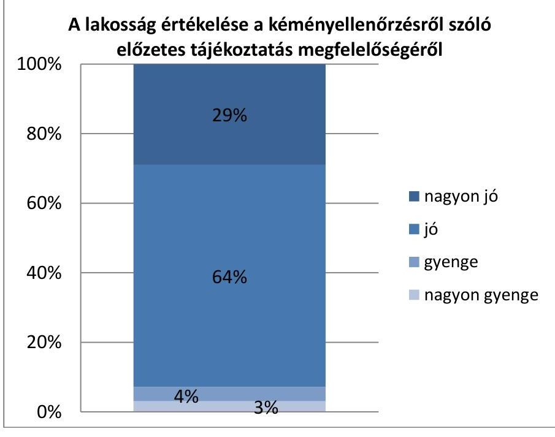

Forrás: ÁSZ lakossági felmérés

---

Az előzetes tájékoztatás megfelelőségét a megkérdezettek 29 százaléka nagyon jónak, 64 százaléka jónak ítélte meg, 7 százaléka nem volt elégedett az értesítő megfelelőségével.

A lakossági felmérés alapján az előzetes tájékoztatás 3%-ban maradt el. Ez az érték kisebb, mint a szabályszerűségi ellenőrzésben szereplő érték. A szabályszerűségi ellenőrzés alapján a 632 elemszámú minta közel 36 százalékában fordult elő, hogy a közszolgáltatók az értesítési kötelezettségüket nem teljesítették dokumentáltan, illetve a sormunkára megjelölt időt követően késve teljesítették. A lakossági felmérés és az ellenőrzés eltérő százalékos arányának oka, hogy az ellenőrzés során az előzetes értesítés jogszabályban előírt dokumentálási kötelezettsége volt az ellenőrzés tárgya, a lakossági felmérés azonban a dokumentáltság értékelését nem érintette.

# A kéményseprők az általuk elvégzett 

munkák leigazolását a lakossági válaszok alapján minden esetben teljesítették, de a válaszadók 3 százaléka jelezte, hogy az elvégzett feladatok
 eredményét tartalmazó dokumentumot nem kapták meg. A szabályszerűségi ellenőrzés hasonló megállapítása szerint a mintegy 632 elemszámú mintából mintegy 9 százalékban fordult elő, hogy az elvégzett munka nem került megfelelően dokumentálásra, illetve igazolásra. A szabályszerűségi ellenőrzésben szereplő magasabb arány oka, hogy ott a dokumentumok tartalmi megfelelőségét is magában foglalja az eredmény.

## KÉMÉNYELLENŐRZÉSSEL KAPCSOLATBAN PANASZT a válaszadók 1 százaléka (6 fő) tett a 2015. év vonatkozásában. Panaszaikat - egy kivétellel - a lakossági értékelés alapján megfelelően kezelték.

A lakosság tapasztalata összhangban van a szabályszerűségi ellenőrzés megállapításával, miszerint a katasztrófavédelmi igazgatóságok eljártak az égéstermék-elvezető szakszerűségét igazoló szakmai nyilatkozatok kiadására vonatkozó vitás ügyek esetén, illetve felülvizsgálták a panaszos által vitatott, a közszolgáltató által kiadott szakmai nyilatkozatok tartalmát.
4.4. számú megállapítás

A lakosság megítélése szerint a szolgáltatás összességében megfelelő színvonalú volt, ugyanakkor a megkérdezettek 8 százaléka több problémát is jelzett a közszolgáltatással kapcsolatban.

A KÉMÉNYSEPRŐK ÁLTAL ELVÉGZETT MUNKÁVAL KAPCSOLATOS PROBLÉMÁKRÓL az értékelést adó válaszadók több mint 8 százaléka számolt be. A problémát jelző válaszadók leggyakrabban a kéményseprő hanyag munkáját kifogásolták (30 százalék). A feladatot végző szakember késésével 21 százalékuk, a szakember nem megfelelő viselkedésével 16 százalékuk, a megfelelő felszerelés hiányával kapcsolatban 14 százalékuk emelt kifogást. Az összefüggéseket a 10. ábra szemlélteti.

---

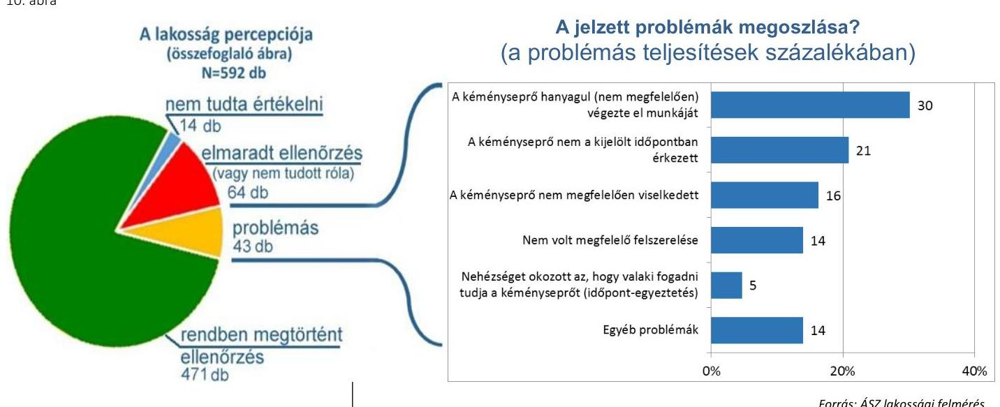

# KÁRESEMÉNY, VAGY BALESET A FÜSTELVEZETÉSSEL KAPCSOLATBAN az értékelők kevesebb, mint 1 százalékánál (4 fő) fordult elő. Az előforduló meghibásodásokról, balesetekről beszámoló válaszadók elégedetlenek voltak a szolgáltatás végzőjével, ugyanakkor korábban a kéményellenőrzést követően nem tettek panaszt. 

## A FELMERÜLŐ PROBLÉMÁK ELŐFORDULÁSÁVAL

kapcsolatban az adatok elemzése megegyezik az adott szegmensnek a teljes mintában számított arányával. A jelzett hibákat a demográfiai témájú kérdésekre adott válaszokkal összevetve nem található sem olyan fűtéstípus, sem olyan típusú, korú, vagy építőanyagú ház sem, ahol a problémák előfordulása, és így kockázata a többi csoporténál magasabb lenne.

## ÖSSZESSÉGÉBEN A KÉMÉNYSEPRŐ-IPARI SZOLGÁLTATÁS SZÍNVONALÁT a válaszadók megfelelőnek gondolták, a válaszadók 32 százaléka nagyon jónak, 64 százaléka jónak tartotta. A szolgáltatást 3 százalék ítélte gyengének és 1 százalék nagyon gyengének.

TERÜLETI MEGOSZLÁS ALAPJÁN a községekben 12-14 százalékponttal kevesebben ítélték nagyon jónak a közszolgáltatás színvonalát, ami visszavezethető a községekben jelentkező elszórtabb elhelyezkedésből adódó, a feladat elvégzésével kapcsolatos problémákra. A nagyon gyenge értékelés ugyanakkor csak városokban fordult elő.

A 11. ábra a település típusok szerinti összesített elégedettséget mutatja be.

---

11. ábra

Hogyan értékeli összességében a kéményseprő-ipari közszolgáltatás ellátásának színvonalát?
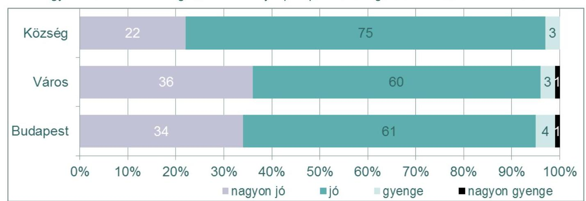

Forrás: ÁSZ lakossági felmérés

---

.

---

# MELLÉKLETEK 

- I. SZ. MELLÉKLET: ÉRTELMEZŐ SZÓTÁR
adatbejelentő lap
első fokú tűzvédelmi hatóság
evaluáció
égéstermék-elvezető
fogyasztóvédelmi hatóság
katasztrófavédelmi igazgatóság
közszolgáltatás
közszolgáltatást önként vállaló
önkormányzat
műszaki felülvizsgálat
nyilatkozat
önkormányzat
percepció
sormunka
statisztikai adatlap
tanúsítvány
a közszolgáltatási tevékenység végzésére jogosult közszolgáltatóknak a 63/2012 (XII. 11.) BM rendelet 5. melléklet szerinti adatait tartalmazó adatközlő lap, mely alapján a tűzvédelmi hatóság a közszolgáltatókról nyilvántartást vezet
a katasztrófavédelmi szerv területi szerve
becslés, értékelés
az épített kémény, az épített vagy szerelt, héjból vagy héjakból álló szerkezet, amely egy vagy több járatot képez, és a tüzelőberendezés tűzterében keletkezett égésterméket a szabadba vezeti
a Nemzeti Fogyasztóvédelmi Hatóság, amelynek a 2012. évi XC. törvényben előírtak szerint a kéményseprő-ipari közszolgáltató igazolja a rezsicsökkentés végrehajtását
a 2012. évi XC. törvényben meghatározott megyei (fővárosi) tűzvédelmi hatóság, amely a kéményseprő-ipari közszolgáltatás hatósági felügyeletét látja el kéményseprő-ipari közszolgáltatás
a közszolgáltatás ellátásának biztosítását a közszolgáltatási feladat eredeti címzettjétől a Magyarország helyi önkormányzatairól szóló 2011. évi CLXXXIX. törvény 12. §-a alapján vállaló önkormányzat
az égéstermék-elvezető és tartozékainak állapotfelmérése, ami kiterjed a vonatkozó műszaki előírások betartása, valamint a járat tömörségének vizsgálatára
a kötelező műszaki vizsgálatok eredményéről, valamint a tervezett vagy tervezéssel érintett égéstermék-elvezető műszaki megoldásának megfelelőségével összefüggő, megrendelt vizsgálatról szóló a 63/2012 (XII. 11.) BM rendelet 3. és 4. mellékleteiben meghatározott tartalmú dokumentum
ellátásért felelős önkormányzat, a kéményseprő-ipari közszolgáltatás feladatát ténylegesen ellátó, a közszolgáltatást önként vállaló önkormányzat, ennek hiányában a feladat eredeti címzettje
észlelés, érzékelés
az a külön megrendelés nélkül, előzetes értesítést követően, rendszeres időközönként végzett közszolgáltatás, amelynek díját további kiszállási díj nem terheli a megelőző év közszolgáltatásáról a 63/2012 (XII. 11.) BM rendelet 6. mellékletben meghatározott tartalmú statisztikai adatlap
ingatlanonként a sormunkában meghatározott és elvégzett feladatok eredményéről a 63/2012 (XII. 11.) BM rendelet 2. melléklet szerinti tartalommal a közszolgáltató által az ingatlan tulajdonosa, használója részére kiállított dokumentum

---

| alkérdés   száma | oldalszám | szabálytalanság-   kockázatának   mértéke | hibázók aránya | értékelés |
| :--: | :--: | :--: | :--: | :--: |
| Megyei Jogú Város Önkormányzatai |  |  |  |  |
| 1.1 | 17. oldal | alacsony | $5 \%$ | megfelelő |
| 1.2 | 18. oldal | alacsony | $40 \%$ | megfelelő |
| 1.3 | 18. oldal | közepes | $9 \%$ | megfelelő |
| 1.4 | 19. oldal | közepes | $9 \%$ | megfelelő |
| 1.5 | 19. oldal | magas | $0 \%$ | megfelelő |
| 1.6 | 20. oldal | alacsony | $35 \%$ | megfelelő |
| 1.7 | 20. oldal | magas | $5 \%$ | megfelelő |
| 1.8 | 21. oldal | közepes | $0 \%$ | megfelelő |
| Katasztrófavédelmi Igazgatóságok |  |  |  |  |
| 3.1 | 28. oldal | alacsony | $35 \%$ | megfelelő |
| 3.2 | 29. oldal | közepes | $15 \%$ | megfelelő |
| 3.3 | 29. oldal | közepes | $0 \%$ | megfelelő |
| 3.4 | 30. oldal | magas | $0 \%$ | megfelelő |
| 3.5 | 30. oldal | alacsony | $5 \%$ | megfelelő |

---

| Sorsz. | Kérdés | Válaszlehetőségek |
| :--: | :--: | :--: |
| 1. | Hány kémény van abban a lakásban/ házban, amelyben Ön(ök) él(nek)? | 0 / 1 / 2, vagy több |
| 2. | Történt-e ellenőrzés az elmúlt évben? | igen/nem |
| 3. | Az ellenőrzésen Ön, vagy valamelyik családtagja volt jelen? | Ön/családtag (meghatalmazott) |
| 4. | Függetlenül attól, hogy Ön nem volt jelen, tudja értékelni a szolgáltatást? | igen/nem |
| 5. | Milyen típusú fűtéssel rendelkezik a lakás? | gáz/szilárd/tüzelőolaj/egyéb |
| 6. | Értesült-e előzetesen a kéményellenőrzés elvégzésének időpontjáról? | igen/nem |
| 7. | Hogyan értékeli az ellenőrzésről szóló előzetes tájékoztatás megfelelőségét? | Nagyon jó/jó/gyenge/nagyon gyenge |
| 8. | Előfordult-e probléma a kéményseprővel vagy a szolgáltatással? | igen/nem |
| 9. | Amennyiben igen, milyen jellegű volt az? | 6 előre megadott probléma / egyéb |
| 10. | A kéményseprő a munka elvégzését igazoltatta-e Önnel? | igen/nem |
| 11. | Átadta-e Önnek az elvégzett feladatok eredményét tartalmazó dokumentumot? | igen/nem |
| 12. | Hogyan értékeli a kéményseprő szakmai felkészültségét? | Nagyon jó/jó/gyenge/nagyon gyenge |
| 13. | Előfordult-e valamilyen káresemény vagy baleset? | igen/nem |
| 14. | Tett-e panaszt a szolgáltatással kapcsolatban? | igen/nem |
| 15. | Ha igen, megfelelően kezelték-e panaszát? | igen/nem |
| 16. | Összességében értékelje az ellátás színvonalát! | Nagyon jó/jó/gyenge/nagyon gyenge |
| 17. | Összesen Önnel együtt hányan élnek az Önök a családjában/háztartásában? | X fő |
| 18. | Milyen jellegű épületben van a lakás? | 4 előre definiált típus |
| 19. | Önök milyen jogcímen laknak ebben a lakásban/házban? | 3 előre definiált jogcím / egyéb |
| 20. | Mikor épült a lakás? | 6 előre definiált intervallum |
| 21. | Miből épült a lakás? | 6 előre definiált anyag / egyéb |

Az 1. kérdésre adott „0" válasz esetén a kérdőív további felvétele nem történt meg.
A 2. kérdésre adott „nem" válasz esetén a kérdőív további felvétele nem történt meg.
A 3. kérdésre adott „Ön" válasz esetén a kérdőív felvétele az 5. kérdéstől folytatódott.
A 4. kérdésre adott „nem" válasz esetén a kérdőív további felvétele nem történt meg.
A 8. kérdésre adott „nem" válasz esetén a kérdőív felvétele a 10. kérdéstől folytatódott.
A 14. kérdésre adott „igen" válasz esetén a kérdőív felvétele a 15. kérdéstől folytatódott.
A 17-21. kérdések demográfiai témájú kérdések.

---

.

---

# FÜGGELÉK: ÉSZREVÉTELEK 

A jelentéstervezetet a Számvevőszék 15 napos észrevételezésre megküldte az ellenőrzött szervezetek vezetőinek az ÁSZ tv. 29. § (1) bekezdése előírásának megfelelően.
Az elfogadott észrevételek alapján a Számvevőszék

módosította a jelentést.
A függelék tartalmazza Szeged Megyei Jogú Város Polgármestere, Szolnok Megyei Jogú Város Önkormányzata, a Békés Megyei Tüzeléstechnikai Kft., a FÖKÉTÚSZ Fővárosi Kéménysepróipari Kft., a FÜTESZ Fütéstechnikai és Szolgáltató Kft., a Borsod-Abaúj-Zemplén Megyei, a Fővárosi, a Jász-Nagykun-Szolnok Megyei, a Komárom-Esztergom Megyei, a Nógrád Megyei és a Zala Megyei Katasztrófavédelmi Igazgatóságok, valamint a Belügyminisztérium által megküldött észrevételeket, az azokra adott válaszokat, illetve az el nem fogadott észrevételek elutasításának indoklását.

[^0]
[^0]:    * 29. § (1) Az Állami Számvevőszék az ellenőrzési megállapításait megküldi az ellenőrzött szervezet vezetőjének vagy az általa megbízott személynek, és annak, akinek személyes felelősségét állapította meg.
    (2) Az ellenőrzött szervezet vezetője és a felelősként megjelölt személy az ellenőrzés megállapításaira tizenöt napon belül írásban észrevételt tehet.
    (3) Az Állami Számvevőszék az észrevételre a beérkezésétől számított harminc napon belül írásban válaszol. A figyelembe nem vett észrevételeket köteles a jelentésben feltüntetni, és megindokolni, hogy azokat miért nem fogadta el.

---

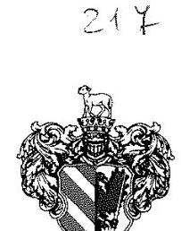

Szeged Megyei Jogú Város Polgármestere
6745 Szeged, Pf. 473.

Iktató szám: 01/3227- 5/2017.
Előadó: dr. Heiler Enikő
Tel.: 564-160

Tárgy: Számvevőszéki jelentéstervezettel kapcsolatos észrevétel megküldése

# Állami Számvevőszék   Domokos László   Elnök részére 

## Budapest

Apáczai Csere János utca 10. 1052

## Tisztelt Elnök Úr!

A Szeged Megyei Jogú Város Polgármesteri Hivatalához 2017. január 12. napján érkezett, FV-V-1038-682/2016. iktatószámú levélben megküldött „A kéményseprő-ipari közszolgáltatás ellenőrzése" című számvevőszéki jelentéstervezettel (továbbiakban: jelentéstervezet) kapcsolatban az alábbi észrevételünk van.

A jelentéstervezet 1.6. számú megállapítása a közszolgáltatási díjak helyi önkormányzatok által történő évenkénti felülvizsgálatához kapcsolódik, amely szerint az önkormányzatok alapvetően szabályszerűen alkották meg helyi rendeleteiket. Az ellenőrzés során tapasztalt szabálytalanságok kifejtésénél rögzíti a jelentéstervezet azt, hogy Szeged Megyei Jogú Város Önkormányzata nem tett eleget a kéményseprő-ipari közszolgáltatásról szóló 2012. évi XC. törvény (továbbiakban: Ksktv.) 10. § (2) bekezdésében foglalt kötelezettségének, miszerint a 2015. évre vonatkozó módosított rendeletében nem részletezte égéstermék-elvezető típusonként a sormunka keretében elvégezendő közszolgáltatási feladat díját.

Tekintettel arra, hogy a 2014. évre vonatkozó közszolgáltatási díj megállapításánál csak az égéstermék-elvezető típusát kellett figyelembe venni, az egyes helyi közszolgáltatások ellátásáról szóló 53/2004. (XI.30.) Kgy. rendelet (továbbiakban: Rendelet) tartalmazta a sormunka keretében ellátott tevékenységek munkaráfordításából számított díj egyes kéménytípusokra vonatkozó alkalmankénti összegének táblázatos kimutatását. Figyelemmel azonban a Ksktv. 10.§ (2) bekezdésének rendelkezésére, amely alapján a 2015. évtől a díjak mértékét az égéstermék-elvezető típusa, a tüzelési mód, az
 égéstermék-elvezető igénybevételének jellege, és a közszolgáltatással érintett ellátási terület településszerkezetének figyelembevételével kell meghatározni, a Rendelet módosításáról szóló 31/2014. (XII.22.) önkormányzati rendelet 1. számú mellékletében a munkaráfordítás egységdíja került rögzítésre mind természetes személyek, mind nem természetes személyek tulajdonában lévő ingatlanok esetében.

---

Álláspontunk szerint a fogyasztók által fizetendő közszolgáltatási díj számítása két tényezőtől függ, egyrészt a munkaráfordítás egységdíjától - amelynek maximális összegét a Rendelet szabályozta -, másrészt a kéményseprő-ipari közszolgáltatás ellátásának szakmai szabályairól szóló 63/2012. (XII.11.) BM rendelet 7. mellékletében felsorolt képletek egyéb elemeitől. Az egyedi égéstermékelvezetőnél az ellenőrzés, szükség szerinti tisztítás, a műszaki felülvizsgálat és a szükség szerint az égéstermék CO paraméter ellenőrzés díját az alábbiak szerint kell meghatározni:

$$
\left.\mathrm{Et}_{\mathrm{m}}+\frac{\mathrm{Mtn}+\mathrm{ECO}+\mathrm{t}_{\mathrm{g}}(1)}{4 \mathrm{x} \mathrm{~g}}\right\} \times \mathrm{E}_{\mathrm{ft}}
$$

ahol

- $\mathrm{Et}_{\mathrm{m}}$ : ellenőrzés, szükség szerinti tisztítás munkaráfordítása,
- $\mathrm{Mf}_{\mathrm{m}}$ : műszaki felülvizsgálat munkaráfordítása,
- Éco: égéstermék CO paraméter ellenőrzésének munkaráfordítása [csak a 3. § (1) bekezdés c) pontjában meghatározott esetekben],
- $\mathrm{t}_{\mathrm{g}(1)}$ : az égéstermék-elvezetőre kötött 11 kWth feletti névleges bemenő hőteljesítményű gáztüzelő-berendezés (gáztüzelő-berendezések) száma,
- gy: ellenőrzés, szükség szerinti tisztítás évenkénti gyakorisága, ami az időlegesen használt ingatlanok esetében $1 / 4$,
- $\mathrm{O}_{\mathrm{m}}$ : összekötő elem munkaráfordítása,
- b: bekötések száma, az épített cserépkályha, kandalló, kemence csak bontással oldható bekötés számával csökkentve, ahol egyedi és gyűjtő jellegű égéstermék-elvezető esetén a közösített összekötőelemmel bekötött tüzelőberendezések egy bekötésnek számítanak,
- $\mathrm{E}_{\mathrm{ft}}$ : az ellátásért felelős önkormányzat által a munkaráfordításra meghatározott összeg.

A fentiekre tekintettel a gyakorlatban minden fogyasztónál egyedileg kell megállapítani a közszolgáltatás díját a helyszíni adottságoknak - többek között a fűtőberendezések, az összekötő elemek, a bekötések száma - megfelelően. Figyelemmel arra, hogy az egyedileg fennálló körülmények mindenre kiterjedő tipizálása, valamint minden érintett ingatlan adottságának megfelelő előzetes megállapítása helyi önkormányzati rendeletben véleményünk szerint nem vagy csak rendkívül bonyolult módon megvalósítható, a 2015. évre vonatkozó közszolgáltatási díj összegének felülvizsgálata során módosított Rendelet - a megállapított egyéb díjtételeken kívül kizárólag a munkaráfordítás egységdíjának maximális összegét rögzíti, különös tekintettel arra, hogy ennek alkalmazásával a képlet alapján minden esetben megállapítható a jogalkotó szándékának megfelelő egyedi, korrekt közszolgáltatási díj. A közszolgáltatás teljesítése alkalmával a gyakorlatban a jogszabályban megállapított képlet, valamint az önkormányzat által szabályozott díjak segítségével a törvény előírásainak megfelelően kerültek alkalmazásra a közszolgáltatási díjak.

Kérjük a Tisztelt Elnök Urat, hogy a jelentéstervezet végleges elfogadása, valamint nyilvánosságra hozatala során a fent kifejtett észrevételünket figyelembe venni szíveskedjék.

Szeged, 2017. január 24.
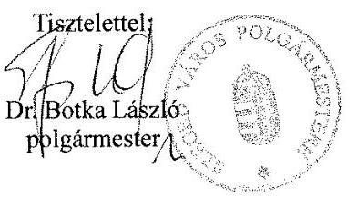

Erről értesítést kap:

1. Állami Számvevőszék - 1364 Budapest 4. Pf. 54.
2. Irattár

---

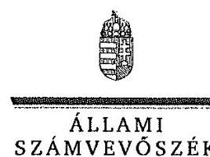

ELNÖK

# Dr. Botka László 

polgármester

Szeged Megyei Jogú Város Önkormányzata

## Szeged

## Tisztelt Polgármester Úr!

"A kéményseprő-ipari közszolgáltatás ellenőrzése" című jelentéstervezetre tett észrevételeit köszönettel megkaptam.

Az ellenőrzési megállapításokra vonatkozó észrevételét az Állami Számvevőszékről szóló 2011. évi LXVI. törvény 29. § (2) bekezdésében meghatározott tizenöt napos határidőn belül küldte meg. Az Állami Számvevőszék észrevétellel kapcsolatos álláspontját a mellékletként csatolt, a felügyeleti vezető által készített indokolás tartalmazza.

Budapest, 2017. : : hó : : nap

Tisztelettel:

Melléklet: Észrevételre adott válasz

Domokos László

---

# "A kéményseprő-ipari közszolgáltatás ellenőrzése" című jelentéstervezethez tett észrevételre adott válasz 

Szeged Megyei Jogú Város Önkormányzata

"A kéményseprő-ipari közszolgáltatás ellenőrzése" című jelentéstervezetre tett észrevételeket áttekintettem, annak kezelésével kapcsolatban a következő tájékoztatást adom.

A kéményseprő-ipari közszolgáltatásról szóló 2012. évi XC. törvény (a továbbiakban: Ksktv.) 10. § (1) bekezdése előírta, hogy az ellátásért felelős önkormányzat a közszolgáltatási díjakat évente felülvizsgálja, és amennyiben szükséges, a következő évben alkalmazandó díjakat november 30-ig rendeletben meghatározza. A (2) bekezdés pedig kimondta, hogy a díjak mértékét az égéstermék-elvezető típusa, a tüzelési mód, az égéstermék-elvezető igénybevételének jellege, és a közszolgáltatással érintett ellátási terület településszerkezetének figyelembevételével kellett meghatározni.
A jelentéstervezet 1.6. számú megállapításának 4. bekezdése szerint Szeged Megyei Jogú Város Önkormányzata „a 2015. évre vonatkozó módosított rendeletében az önkormányzat a Ksktv. 10. § (2) bekezdésében foglaltak ellenére égéstermék-elvezető típusonként nem részletezte a sormunka keretében elvégzendő közszolgáltatási feladat díját. Ebben az esetben azonban a díjak a 347/2012. (XII.11.) Korm. rendelet 1. számú mellékletében, illetve a 63/2012. (XII. 11.) BM rendelet 7. számú mellékletében foglaltak szerint az önkormányzati rendeletben szabályozott munkaráfordítás díja alapján megállapíthatóak voltak, amely alapján a közszolgáltató megfelelően alkalmazta a díjakat."
A polgármester észrevételében rögzítette, hogy a 63/2012. (XII. 11.) BM rendeletben meghatározott képlet alapján a fizetendő közszolgáltatási díj egyrészt az önkormányzat által előírt munkaráfordítás egységdíjától függ, másrészt az egyedi adottságoktól függő, a képletben szereplő egyéb tényezőktől, amelyeknek mindenre kiterjedő tipizálása és megjelölése az önkormányzati rendeletben nem vagy csak nehezen megvalósítható. Ezen felül pedig az önkormányzat által meghatározott munkaráfordítás egységdíjának ismeretében és alkalmazásával minden esetben megállapítható a megfelelő közszolgáltatási díj.
A jelentéstervezet is megállapítja, hogy az önkormányzati rendeletben szabályozott munkaráfordítás díj alkalmazásával, valamint a jogszabályi előírásokat figyelembe véve megállapítható volt a közszolgáltatás díja (a díjak meghatározására vonatkozóan a Ksktv. mellett a BM rendelet és a kéményseprő-ipari közszolgáltatásról szóló törvény végrehajtásáról szóló 347/2012. (XII. 11.) Korm. rendelet határoztak meg még szempontokat). Azonban a Ksktv. 10. § (2) bekezdése alapján a díjak mértékét az égéstermék-elvezető típusa, a tüzelési mód, az égéstermék-elvezető igénybevételének jellege, és a közszolgáltatással érintett ellátási terület településszerkezetének figyelembevételével kellett volna meghatározni és eszerint részletezni az önkormányzati rendeletben.
Az Önkormányzat rendelete a fentiekre való tekintettel nem felelt meg a jogszabályi előírásoknak, ezért a megállapítás módosítása nem indokolt.

Budapest, 2017.
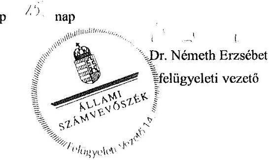

---

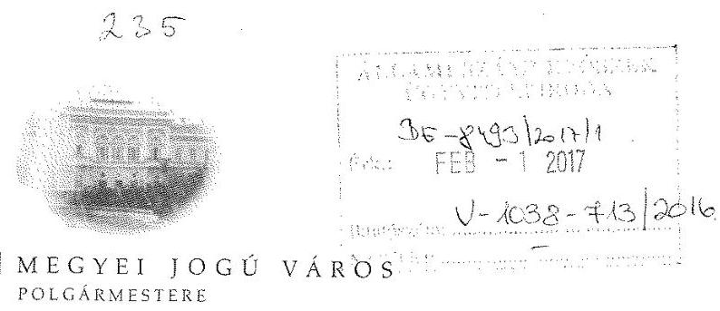

# Domokos László 

elnök úr
részére
Állami Számvevőszék
szamvevoszek@asz.hu

## Tisztelt Elnök Úr!

Hivatalomhoz 2017. január 12-én érkezett „A kéményseprő-ipari közszolgáltatás ellenőrzése" című jelentéstervezetre vonatkozó megkeresésére az alábbi kiegészítést teszem.

A jelentéstervezet a vizsgált időszakra nézve Szolnok Megyei Jogú Város Önkormányzata tekintetében két megállapítást tett.

A jelentéstervezet 1.6. pontja szerint: „Az ellenőrzött önkormányzatok 35%-ánál azonban előfordult, hogy a díjakkal kapcsolatos módosításokat tartalmazó rendeleteiket a Ksktv. 10.§ (1) bekezdésében előírt november 30-át követően, átlagosan 18 nappal túllépve alkották meg (Szekszárd MJVÖ, Kecskemét MJVÖ, Szolnok MJVÖ, Győr MJVÖ, Zalaegerszeg MJVÖ, Szeged MJVÖ). "
Önkormányzatunk tekintetében a fenti szövegezés félreértésre adhat okot. A vizsgált időszakban Szolnok Megyei Jogú Város két alkalommal módosította a vonatkozó rendeletét, 2013. július 3-án (2013. július 1. napjára visszamenő hatállyal), valamint 2014. november 27-i ülésén, amely ülésén megalkotta a díjmódosításra vonatkozó rendeletét a törvényben előírt november 30-i időpontig, a rendelet kihirdetése történt meg később, 2014. december 2-án.
Tekintettel erre, a jelentéstervezet jelenlegi megszövegezéséből az a következtetés vonható le, mely szerint Szolnok Megyei Jogú Város Önkormányzata az átlagos 18 napos időtartammal túllépve alkotta volna meg önkormányzati rendeletét, ezért kérem a fenti bekezdés pontosítását.

Ugyancsak 1.6. pontban megállapításra került az is, hogy Önkormányzatunk nem kérte ki a díjak megállapításával kapcsolatos fogyasztóvédelem, illetve illetékes szakmai érdekképviseletek véleményét. A vizsgált időszak két rendelet-módosítása kapcsán, az első rendelet-módosítás (2013. július hónap) a vonatkozó magasabb jogszabály megváltozásából adódóan vált szükségessé. A módosításra vonatkozóan az Önkormányzatnak mérlegelési, döntési jogköre nem volt, annak rendeleten való átvezetése történt meg, ez álláspontunk szerint nem tekinthető szorosan a vonatkozó végrehajtási rendeletben foglalt elvek szerinti „díjmegállapításnak", mivel az nem az önkormányzat mérlegelési jogkörébe tartozó, helyi sajátosságokra tekintettel történő 20% mértékű csökkentés rendelkezését, hanem a sormunka egységnyi ráfordítás összegét érintette, melyet a Kormány állapít meg vonatkozó rendeletében.
A második rendeletmódosítással (2014. november hónap) kapcsolatosan a fogyasztóvédelmi és érdekképviseleti szervek véleményének megismeréséről gondoskodtunk; annak beszerzésére azonban a rendelet-tervezet elfogadását követően került sor.
A fentiek alapján álláspontunk az, hogy a jelentéstervezet 1.6. pontjának megállapítása, mely szerint nem kértük meg a szükséges állásfoglalásokat, nem kellően pontos: abban az esetben, mely esetben a törvény e szakasza előírja az állásfoglalások beszerzését, azok beszerzése iránt - a rendelet megalkotását követően intézkedtünk.

Kérem álláspontom tudomásulvételét és a jelentéstervezet pontosítását.
Szolnok, 2017. január 27.
Tisztelettel:

Fejér Andor
alpolgármester
hjr
Szalay Ferenc

---

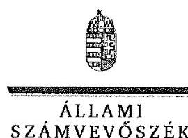

ELNÖK

Ikt.szám: V-1038-719/2016.

# Szalay Ferenc   polgármester 

Szolnok Megyei Jogú Város Önkormányzata

## Szolnok

## Tisztelt Polgármester Úr!

"A kéményseprő-ipari közszolgáltatás ellenőrzése" című jelentéstervezetre tett észrevételeit köszönettel megkaptam.

Az ellenőrzési megállapításokra vonatkozó észrevételét az Állami Számvevőszékről szóló 2011. évi LXVI. törvény 29. § (2) bekezdésében meghatározott tizenöt napos határidőn belül küldte meg. Az Állami Számvevőszék észrevétellel kapcsolatos álláspontját a mellékletként csatolt, a felügyeleti vezető által készített indokolás tartalmazza.

Budapest, 2017. 1. 1. 1. 1. hó 3. nap

Melléklet: Észrevételre adott válasz
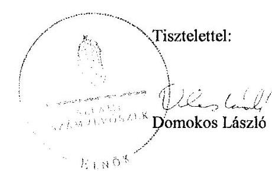

---

"A kéményseprő-ipari közszolgáltatás ellenőrzése" című jelentéstervezethez tett észrevételre adott válasz

Szolnok Megyei Jogú Város Önkormányzata
"A kéményseprő-ipari közszolgáltatás ellenőrzése" című jelentéstervezetre tett észrevételeket áttekintettem, annak kezelésével kapcsolatban a következő tájékoztatást adom.

1. A jelentéstervezet 1.6. számú megállapítás második bekezdésére vonatkozó észrevétel

A kéményseprő-ipari közszolgáltatásról szóló 2012. évi XC. törvény (a továbbiakban: Ksktv.) 10. § (1) bekezdése előírta, hogy az ellátásért felelős önkormányzat a közszolgáltatási díjakat évente felülvizsgálja, és amennyiben szükséges, a következő évben alkalmazandó díjakat november 30-ig rendeletben meghatározza.
A jelentéstervezet 1.6. számú megállapításának második bekezdése szerint az ellenőrzött önkormányzatok 35%-ánál - Szolnok Megyei Jogú Város Önkormányzata esetében is - előfordult, hogy a díjakkal kapcsolatos módosításokat tartalmazó rendeleteiket a Ksktv. 10. § (1) bekezdésben előírt november 30-át követően, átlagosan 18 nappal túllépve alkották meg.
A polgármester észrevételében rögzítette, hogy a vonatkozó rendeletek módosítására a vizsgált időszakban két alkalommal (2013-ban és 2014-ben) került sor, valamint a díjmódosításra vonatkozó rendeleteket a testület november 30-ig megalkotta, illetve a 2014. évi rendelet kihirdetése december 2-án történt meg.
A dokumentumokat ismételten áttekintve megállapítottuk, hogy a 246/2014. (XI. 27.) sz. közgyülési határozat nem minősül a Ksktv. 10. § (1) szerinti, közszolgáltatási díjat meghatározó rendeletnek. Szolnok Megyei Jogú Város Önkormányzata a megküldött dokumentumok alapján a jogszabály szerinti rendeletet 29/2014. (XII.2.) számon alkotta meg.
A megállapításban a határidőn túli rendeletalkotásokra vonatkozó átlagos túllépési idő (18 nap) szerepel, amely tehát a megállapításban érintett önkormányzatok teljes körére vonatkozó átlagot jelenti. A megállapításban nem szerepelnek az egyes önkormányzatok konkrét határidő-túllépésének időtartamai.
Az Önkormányzat észrevétele a fentiekre való tekintettel a megállapítást nem módosítja.

# 2. A jelentéstervezet 1.6. számú megállapítás ötödik bekezdésére vonatkozó észrevétel 

A Ksktv. 10. § (4) bekezdése alapján a díjak megállapításakor az önkormányzatnak ki kellett kérni a fogyasztóvédelmi hatóság és a szakmai érdekképviseletek véleményét.
A jelentéstervezet 1.6. számú megállapításának ötödik bekezdése szerint a díjak megállapításakor az ellenőrzött önkormányzatok 10%-a - többek között Szolnok Megyei Jogú Város Önkormányzata - nem kérte ki a díjak megállapításával kapcsolatban a fogyasztóvédelem, illetve az illetékes szakmai érdekképviseletek véleményét.
Az önkormányzat észrevétele arra vonatkozott, hogy a 2013. júliusi rendeletmódosítás a kapcsolódó magasabb szintű jogszabály megváltozásából adódóan vált szükségessé, ezért álláspontja sze-

---
 rendeletalkotást megelőzően ki kellett kérni, függetlenül attól, hogy a rendelet megalkotására milyen indokból került sor.

A fentiekre való tekintettel a megállapítás módosítása nem indokolt.

Budapest, 2017. február
hónap
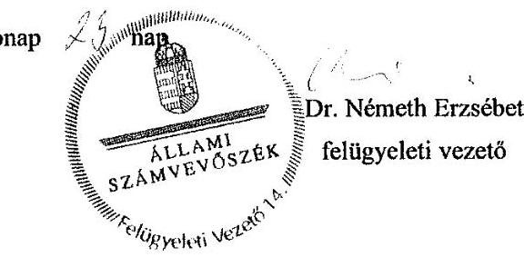

---

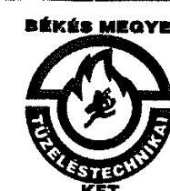

BÉKÉS MEGYEI TÜZELÉSTECHNIKAI KFT. 5600. Békéscsaba, Derkovits sor 2. Tel.: 66/326-589
Fax.: 66/326-589
E-mail: ugyvezeto@bmkemenysepro.hu K&H bank 10402609-50526683-54481003 Cégjegyzékszám: Cg. 04-09-005549

Iktatószám: 25/2011
Ügyintéző: Rákóczi József
Dátum: 2017. 01. 18.
Tárgy: Észrevételek

# Domokos László Elnök Úr részére 

ÁLLAMI SZÁMVEVŐSZÉK
Budapest
Apáczai Csere János utca 10. 1052
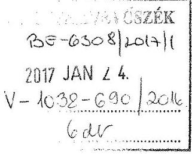

## Tisztelt Elnök Úr!

A 2017. január 11-én kelt, FV-V-1038-682/2016 számú levelükben megküldték részünkre a Kéményseprő-ipari közszolgáltatás ellenőrzésének jelentéstervezetét.
A jelentéstervezetbe foglalt - társaságunkra is vonatkoztatott - megállapításokkal kapcsolatban az alábbi észrevételeket tesszük:

1) Megállapítás:
„Az ellenőrzött közszolgáltatók 18%-ánál további hiányosság volt, hogy a 63/2012. (XII. 11.) BM rendelet 3. § (1) bekezdés b) pontjában foglaltak ellenére a sormunka keretében, négyévente esedékes égéstermék-elvezető műszaki felülvizsgálatát nem végezték el. (Békés Megyei Tüzeléstechnikai Kft., FÜTESZ Kft., Kéményseprőipari Kft.)

A fent hivatkozott BM rendelet 3. § (1) bekezdése úgy rendelkezik, hogy a négy évenkénti műszaki felülvizsgálatot az égéstermék-elvezető ellenőrzése és szükség szerinti tisztítása alkalmával végzi el.

Tekintettel arra, hogy:
a) a mintavételezésre kijelölt címeken az elvégzett munkát a használó (tulajdonos) aláírásával minden esetben igazolta, így a sormunkával egyidejűleg elvégzett négy éves műszaki felülvizsgálat is elvégzésre került.
b) mivel jogszabály nem rendel más jellegű tanúsítványt a négy évente végzendő műszaki felülvizsgálathoz, - hanem az évenkénti tanúsítvány formátumot kell használni - a tanúsítvány fejlécében megjelenítjük, hogy az adott szolgáltatási címen soron következik a vizsgálat, illetőleg a tanúsítvány alsó részén kinyomtatásra kerül a legutóbbi műszaki felülvizsgálat elvégzésének éve is. Ily módon ugyanazon a - 63/2012. (XII. 11.) számú BM rendelet 2. számú melléklete szerinti dokumentumot

---

állítja ki a kéményseprő minden esetben, akár szükséges a négy éves műszaki felülvizsgálat, akár nem.
c) a közszolgáltatás végzésekor tapasztalt hibajelenség esetén, - mind a sormunka során, mind pedig a négy éves műszaki felülvizsgálat során - a tanúsítvány „Ellenőrzési szempontok" oszlopának soraiba a megfelelő hibakód bejegyzésre kerül, majd a számítógépes adatrögzítést követően a következő évi sormunkakönyv nyomtatáskor ki is nyomtatja a program a hibakódokat az adott címkódhoz tartozó lapra. Így mód van annak ellenőrzésére, hogy a hiba a soron következő ellenőrzéskor (tisztításkor) fennáll-e még?
Amennyiben tehát nincs kinyomtatott hibakód, úgy az előző évben nem talált hibát a kéményseprő, illetve amennyiben nincs kézzel beírt hibakód a tanúsítványon, úgy az adott ellenőrzéskor/négy éves műszaki felülvizsgálatkor a kéményseprő úgyszintén nem talált hibát.
d) a hivatkozott BM rendelet I. számú mellékletének I. pontja sorolja fel az éves ellenőrzéskor elvégzendő feladatokat, míg a IV. pontja a 4 éves műszaki felülvizsgálatkor elvégzendő feladatokat. Ennek alapján megállapítható, hogy a IV. melléklet pontjai az alábbiak szerint feleltethetők meg az I-es melléklet pontjainak:

- IV. 1. megfelel az I. pont bevezető szövegében leírt szempontoknak,
- IV. 1.1 megfelel az I. pont 3.4, 3.5, 3.7-es pontjának,
- IV. 1.2. megfelel az I. pont 4. pontjának,
- IV. 1.3. megfelel az I. pont 3.4, 3.10-es pontjának,
- IV. 2.1. megfelel az I. pont 5.2-es pontjának,
- IV. 2.2. megfelel az I. pont bevezető szövegében leírt szempontoknak,
- IV. 2.3 megfelel az I. pont 4-es pontjának.
- IV. 3-as pontjában leírt tömörségi ellenőrzés elvégzése akkor indokolt, amennyiben a szemrevételezéses vizsgálat „nem megfelelő tömörségre utaló hibára" utal.

A fentiek szerint tehát a négy éves műszaki felülvizsgálat szempontjai teljességgel megfeleltethetők az évenkénti sormunkában elvégzett ellenőrzési feladatoknak, az esetleges tömörségi vizsgálat kivételével, ily módon a sormunka végzés során - azzal egy időben - a négy éves műszaki felülvizsgálat is elvégzésre kerül.

Véleményünk az, hogy társaságunkra nézve a megállapítás akkor lenne igaz, amennyiben a négy éves műszaki felülvizsgálat végzésének évében az esedékes sormunka sem kerül elvégzésre.

---

2) Megállapítás:
„Az érintett közszolgáltatók 80%-ánál fordult elő, hogy a közszolgáltató a sormunka elvégzésének második időpontjáról a Ksktv. 7. § (1) bekezdésében és a 63/2012. (XII. 11.) BM rendelet 3. § (5) bekezdésében előírtak ellenére az ingatlan használóját, tulajdonosát a közszolgáltatás igénybevételének kötelezettségéről, illetve annak második időpontjáról nem tájékoztatta, illetve a 63/2012. (XII. 11.) BM rendelet 3. § (6) bekezdésében foglaltak ellenére a postaládába helyezett, annak hiányában kapura, vagy bejárati ajtóra jól látható módon elhelyezett második értesítést tanúval, vagy fényképfelvétellel, vagy az ingatlan használójának, tulajdonosának aláírásával, illetve egyéb módon nem igazolta."

Társaságunk Békéscsaba Megyei Jogú Város 39/2012. (XII. 20) önkormányzati rendeletének 6. §-a szerint végzi a kiértesítéseket:
„A szolgáltató a munkabejelentést (kiértesítést)
a) hirdetmény útján (települések forgalmasabb helyein, lakótelepek esetében lépcsőházban elhelyezett értesítő plakátokon,
b) sajtóban, (megyei, illetve helyi sajtókiadványokban)
c) elektronikusan, (az egyes települések honlapjain)
d) a közszolgáltató honlapján,
e) az értesítés ellenére zárva talált lakások tulajdonosainak postaládájában elhelyezett - a szolgáltatónál rendszeresített, szigorú számadás alá vont értesítő nyomtatvány alkalmazásával
végzi.
A fentiek szerint tehát - nem megsértve a 63/2012. (XII. 11.) BM rendelet 3. § (5) - (7) pontjaiban, illetőleg betartva Békéscsaba MJV rendeletében foglaltakat - társaságunk az alábbiak szerint jár el a kiértesítések során:
a) A Békéscsaba Megyei Jogú Város vonatkozó rendeletének 6. § a) - d) pontjai szerinti kiértesítések ellenére otthon nem talált ügyfelek esetében a társaságunk alkalmazza a rendelet e) pontja szerinti kiértesítést, amelynek során használt értesítő nyomtatvány lehet az 1-es és 2-es mellékletek szerinti - sormunkakönyvbe integrált - módon kialakított, avagy a 3-as számú melléklet szerinti külön tömbösített formájú, de ugyancsak szigorú számadás alá vont. Ennek az az előnye, hogy a falragasznál és a sajtótermékeknél sokkal közvetlenebb módon értesül az ingatlantulajdonos a közszolgáltatás időpontjáról, továbbá a szigorú számadás miatt alkalmas lehet a vonatkozó BM rendelet 3. § (6)-os pontja szerinti igazolásra, a feltételek teljesülése esetén. (fényképfelvétel, tanú, stb.)
b) Társaságunk azonban a szóban forgó értesítéseket úgy kezelte és kezeli, mint az első kiértesítést, ezért amennyiben a postaládába helyezett értesítő

---

nyomtatványon szereplő időpontban sem tudunk az ingatlanba bejutni, úgy a csatolt - 4-es, (2013-ban alkalmazott) 5-ös (2014-ben alkalmazott) és 6-os (2015-ben alkalmazott) számú - mellékletek szerinti, névre szóló, könyvelt levélpostai küldeményben határozzuk meg az ügyfél számára a BM rendelet szerinti második időpontot.
A fentiekben leírtakat támasztja alá az Önök által ellenőrzött mintából kiemelt - 1. számú mellékletként csatolt - értesítő nyomtatvánnyal ellátott sormunkakönyvi lap, amelynek dátuma szerint az értesítés nem a második 30 nappal a közszolgáltatás tervezett időpontja előtti - értesítés, mivel az értesítés kiállításának a dátuma 10.01., munkavégzés megjelölt időpontja 10. 11.

# Tisztelt Elnök Úr! 

Kérem, hogy a fenti észrevételek alapján az Állami Számvevőszéki jelentésben a két hivatkozott megállapításnál a Békés Megyei Tüzeléstechnikai Kft. nevét a hibával érintett közszolgáltatók felsorolásából szíveskedjenek kihagyni!

Békéscsaba, 2017. január 18.
Békés Megyei Tüzeléstechnikai Kft.
Korlátolt Felelősségű Társaság

Tisztelettel:

Rákóczi József
ügyvezető

Mellékletek:

1. számú melléklet: Sormunkakönyvbe integrált, kitöltött értesítő nyomtatvány. Az ügyfél a helyi rendelet 6. § a)-d) pontjai szerinti kiértesítés alapján nem tartózkodott otthon, de az általunk megadott új időpontban otthon volt. Nem volt szükség igazolt módon történő kiértesítésre.
2. számú melléklet: Sormunkakönyvbe integrált kitöltetlen értesítő nyomtatvány. Az ügyfél a helyi rendelet 6. § a)-d) pontjai szerinti kiértesítés alapján otthon volt.
3. számú melléklet: Külön tömbösített kiértesítő nyomtatvány.
4. számú melléklet: Igazolt módon kiküldött második időpontról szóló értesítő levél 2013-ban.
5. számú melléklet: Igazolt módon kiküldött második időpontról szóló értesítő levél 2014-ben.
6. számú melléklet: Igazolt módon kiküldött második időpontról szóló értesítő levél 2015-ben.

---

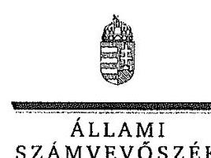

ELNÖK

# Rákóczi József 

ügyvezető

Békés Megyei Tüzeléstechnikai Kft.

## Békéscsaba

## Tisztelt Ügyvezető Úr!

"A kéményseprő-ipari közszolgáltatás ellenőrzése" című jelentéstervezetre tett észrevételeit köszönettel megkaptam.

Az ellenőrzési megállapításokra vonatkozó észrevételét az Állami Számvevőszékről szóló 2011. évi LXVI. törvény 29. § (2) bekezdésében meghatározott tizenöt napos határidőn belül küldte meg. Az Állami Számvevőszék észrevétellel kapcsolatos álláspontját a mellékletként csatolt, a felügyeleti vezető által készített indokolás tartalmazza.

Budapest, 2017. ... hó ... nap

Melléklet: Észrevételre adott válasz
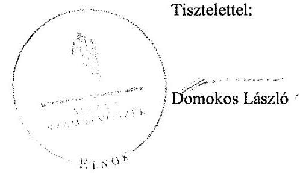

---

"A kéményseprő-ipari közszolgáltatás ellenőrzése" című jelentéstervezethez tett észrevételekre adott válasz
Békés Megyei Tüzeléstechnikai Kft.
"A kéményseprő-ipari közszolgáltatás ellenőrzése" című jelentéstervezetre tett észrevételeket áttekintettem, annak kezelésével kapcsolatban a következő tájékoztatást adom.

# 1. A jelentéstervezet 2.1. számú megállapításához (24. oldal, 2. francia bekezdés) kapcsolódó észrevétel 

A 63/2012. (XII. 11.) BM rendelet 3. § (1) bekezdés b) pontjában foglaltak alapján a közszolgáltatónak a sormunkában meghatározott feladatok közül az égéstermék-elvezető ellenőrzése és szükség szerinti tisztítása alkalmával négyévenként el kellett végeznie az égéstermék-elvezető műszaki felülvizsgálatát az 1. mellékletben meghatározott szakmai követelmények és módszerek szerint. A rendelet 8. § (1) bekezdésének megfelelően az elvégzett feladatok eredményéről a 2. melléklet szerinti tanúsítványt az ott meghatározott tartalommal kellett kitölteni.
A rendelet 1. mellékletében foglaltak alapján a négyévenkénti felülvizsgálat nem egyezik meg az évenkénti sormunkában elvégzett ellenőrzéssel, ezért az évenkénti sormunka elvégzése önmagában nem jelenti azt, hogy a négyévenkénti műszaki felülvizsgálat is elvégzésre került.
Bár az érintett tanúsítványokon szerepel az utolsó műszaki felülvizsgálat éve és esedékessége, előfordult, hogy a tanúsítványok az utolsó műszaki felülvizsgálatot követő négy évet meghaladóan kerültek kiállításra, továbbá a 4 évenkénti műszaki felülvizsgálatra vonatkozó cellák nincsenek kitöltve, így a felülvizsgálat eredménye, illetve annak elvégzése nem dokumentált.
A fentiekre való tekintettel a megállapítás módosítása nem indokolt.

## 2. A jelentéstervezet 2.1. számú megállapításához (23. oldal, 3. bekezdés) kapcsolódó észrevétel

A 63/2012. (XII. 11.) BM rendelet 3. § (5) bekezdése alapján ha a közszolgáltatás a jelzett időpontban nem valósult meg, a közszolgáltató írásban a törvény szerint meghatározott második időpontot jelölt meg, és egyidejűleg az ingatlan használóját, tulajdonosát írásban kellett tájékoztatni a közszolgáltatás 30 napon belüli igénybevételének kötelezettségéről, és ennek elmulasztása esetén a tűzvédelmi hatóság értesítésének közszolgáltatói kötelezettségéről. A második időpontról szóló értesítésnek a (6) bekezdésnek megfelelő módon kellett megvalósulnia, sorszámozott, lakcímre szóló, szigorú számadású 2 példányos bizonylaton nyilvántartott, tanúval vagy fényképfelvétellel vagy az ingatlan használójának, tulajdonosának aláírásával vagy egyéb módon igazolt, postaládába helyezett, annak hiányában kapura vagy bejárati ajtóra jól látható módon elhelyezett értesítéssel.
Az érintett mintatételek esetében a második értesítés nem felelt meg teljes körűen a jogszabály által előírtaknak, mivel nem teljesült a tanúval vagy fényképfelvétellel vagy az ingatlan használójának, tulajdonosának aláírásával, illetve egyéb módon igazolt postaládába helyezés, annak hiányában a kapura, bejárati ajtóra jól látható módon való elhelyezés.

---

A fentiekre való tekintettel a megállapítás módosítása nem indokolt.

Budapest, 2017. február hónap
nap
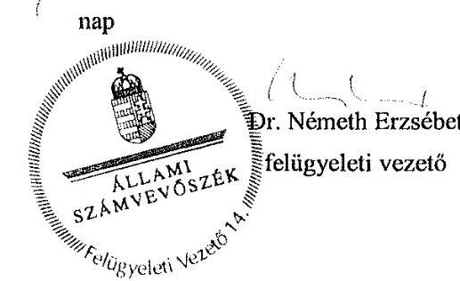

---

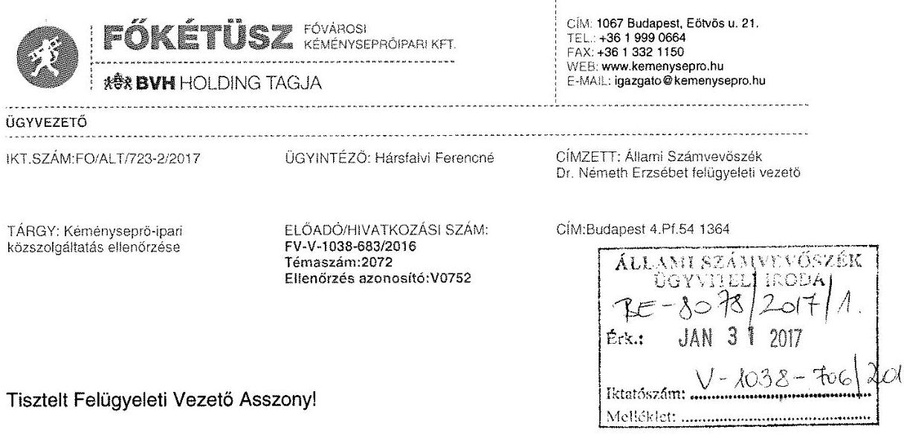

A FÖKÉTÜSZ Fővárosi Kéményseprőipari Kft. a 2016. évben megtartott Állami Számvevőszéki „A kéményseprő-ipari közszolgáltatás ellenőrzése" című ellenőrzésről a jelentés tervezetét 2017. január 16-án megkapta.

A jelentés megállapításaira az alábbi észrevételt teszem:
A jelentés 2.1. pontja szerint a FÖKÉTÜSZ Kft. a 63/2012. BM rendelet 3. § (1) d) pontjában előírtak ellenére nem végezte el a szén-monoxidérzékelő berendezések meglétének és működőképességének ellenőrzését.

A 2012. évi XC. törvény a kéményseprő-ipari közszolgáltatásról 9. § (5) előírja, hogy
„A helyiség légterétől nem
 független, nyitott égésterű tüzelőberendezés üzemeltetése esetén
a) a bölcsődei, óvodai vagy iskolai ellátás nyújtására szolgáló,
b) a vendégéjszaka eltöltésére használt,
c) a személyes gondoskodás keretébe tartozó szakosított ellátást nyújtó bentlakásos intézmény céljára szolgáló,
d) a fekvőbeteg-gyógyintézeti ellátásra szolgáló,
e) a zenés, táncos rendezvények működésének biztonságosabbá tételéről szóló kormányrendelet hatálya alá tartozó
önálló rendeltetési egység használója a tüzelőberendezés helyiségében a vonatkozó műszaki követelményeknek megfelelő szén-monoxid-érzékelő berendezés felszerelésére és működtetésére köteles, amennyiben a tüzelőberendezés közösségi térben vagy vele légtér-összeköttetésben lévő helyiségekben van.
(6) A helyiség légterétől nem független, nyitott égésterű tüzelőberendezéssel felszerelt, új építésű épület akkor vehető használatba, ha a tüzelőberendezés helyiségében jogszabályban meghatározott műszaki követelményeknek megfelelő szén-monoxid-érzékelő berendezést helyeztek el."
Továbbá a 63/2012. BM rendelet 10/A. § szerint:
„Az ingatlan használója a közszolgáltatás ellátása során a közszolgáltató felhívására köteles nyilatkozni a Törvény 9. § (5) bekezdésében fennálló szén-monoxid-érzékelő berendezés felszerelési és működtetési kötelezettségének fennállásáról."

---

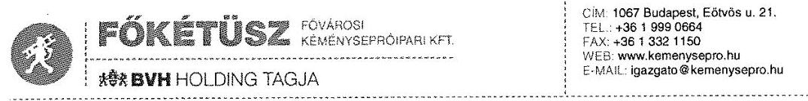

A nyilatkozat tételi kötelezettséget a BM rendelet 2. mellékletben szereplő tanúsítvány megfelelő rovatában kell dokumentálnia a szolgáltatónak.

Az Önök vizsgálatához bekért 48 db cím közül egy esetben került bejelölésre a szén-monoxid-érzékelő berendezés felszerelési és működtetési kötelezettségére vonatkozóan az igen, de az tévedésből, mert az ingatlan nem tartozik a 63/2012 BM rendelet hatálya alá. A kéményseprő a tévedés tényét lenyilatkozta, az ingatlan tulajdonosától a nyilatkozatot szintén megkértük.
(1. sz. melléklet - Ingatlantulajdonos, kéményseprő nyilatkozat)

A hivatkozott 63/2012.(XII.11) BM rendelet 3.§(1) d) ((Beiktatta: 58/2013. (X. 11.) BM r. 1. §.)) a Törvény 9. § (5)-(6) bekezdésében meghatározott esetekben évente egy alkalommal, időlegesen használt ingatlan esetében a 4. § (2) bekezdésében meghatározott időpontban a szén-monoxid-érzékelő berendezések meglétének, működőképességének ellenőrzését.
Társaságunk az éves ellenőrzés során a CO jelző berendezések meglétét és működőképességének ellenőrzését elvégezte. 2016. évben 691 db CO tanúsítványt állítottunk ki. Időlegesen használt ingatlanokat Társaságunk nem tart nyilván, melyet le is nyilatkoztunk.
(2. sz. melléklet - Időlegesen használt ingatlanokról szóló nyilatkozat)

A jelentés 2.4. pontja szerint a FŐKÉTŰSZ Kft nem tett eleget értesítési kötelezettségének azokban az esetekben, amikor az ingatlan használója nem tette lehetővé a szolgáltatás elvégzését, az ehhez szükséges feltételeket nem biztosította.

A FŐKÉTŰSZ Kft kiemelt fontossággal kezeli azokat a zárt lakásokat, ahová szakemberei a kötelezően előírt és előre bejelentett két alkalommal sem tudtak bejutni feladataik elvégzése érdekében. Ezeknek a zárt lakásoknak a listáját a rendelkezésére álló adatokkal kiegészítve folyamatosan megküldi az illetékes hatóságnak.
A FŐKÉTŰSZ Kft, a vizsgált időszakban (2013-2014-2015 években) 38 különböző időpontban, közel 190000 db címet jelentett át az elsőfokú tűzvédelmi hatósághoz.

A vizsgálathoz bekért 48 dokumentum közül 13 db tanúsítvány dokumentált zárt lakást.
Ezen címek közül 8 db átjelentésre került 3 db címen a szolgáltatás egy későbbi időpontban került elvégzésre, 1 db cím későbbi időpontban került átjelentésre, további 1 db címnél az átjelentésben szereplő cím téves házszám jelöléssel (1213 Szent István út 256. helyett 256/b) került feltüntetésre.
A zárt lakásokkal kapcsolatos dokumentumokat mellékelem.
(3. sz. melléklet - Az elvégzett ellenőrzéseket igazoló tanúsítványok
4. sz. melléklet - Zárt lakás hatósági értesítések megküldése)

---

# Tisztelt Asszonyom! 

Kérem, észrevételünk alapján a végleges jelentésben a FŐKÉTŰSZ Kft-t érintő, a 2.1, valamint a 2.4 pontban tett megállapításokat, észrevételezésünk alapján törölni szíveskedjenek.

Budapest, 2017. január 25.

Tisztelettel,
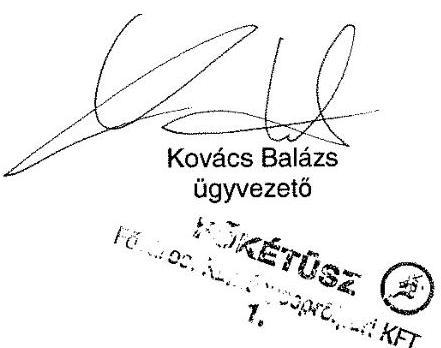

---

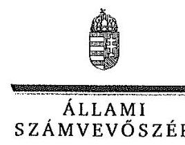

ELNÖK

# Kovács Balázs 

ügyvezető

FŐKÉTŰSZ Fővárosi Kéményseprőipari Kft.

## Budapest

## Tisztelt Ügyvezető Úr!

"A kéményseprő-ipari közszolgáltatás ellenőrzése" című jelentéstervezetre tett észrevételeit köszönettel megkaptam.

Az ellenőrzési megállapításokra vonatkozó észrevételét az Állami Számvevőszékről szóló 2011. évi LXVI. törvény 29. § (2) bekezdésében meghatározott tizenöt napos határidőn belül küldte meg. Az Állami Számvevőszék észrevétellel kapcsolatos álláspontját a mellékletként csatolt, a felügyeleti vezető által készített indokolás tartalmazza.

Budapest, 2017. 12. hó 4. nap

Melléklet: Észrevételre adott válasz
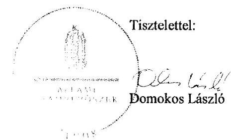

---

"A kéményseprő-ipari közszolgáltatás ellenőrzése" című jelentéstervezethez tett észrevételre adott válasz
FŐKÉTŰSZ Fővárosi Kéményseprőipari Kft.
"A kéményseprő-ipari közszolgáltatás ellenőrzése" című jelentéstervezetre tett észrevételeket áttekintettem, annak kezelésével kapcsolatban a következő tájékoztatást adom.

# 1. A jelentéstervezet 2.1. számú megállapítására vonatkozó észrevétel 

A 63/2012. (XII. 11.) BM rendelet 3. § (1) d) pontja alapján a közszolgáltató a sormunkában meghatározott feladatok közül az égéstermék-elvezető ellenőrzése és szükség szerinti tisztítása alkalmával elvégzi évente egy alkalommal a szén-monoxid-érzékelő berendezések meglétének, működőképességének ellenőrzését a kéményseprő-ipari közszolgáltatásról szóló 2012. évi XC. törvény (a továbbiakban: Ksktv.) 9. § (5)-(6) bekezdésében meghatározott esetekben.
A jelentéstervezet megállapítja, hogy a FŐKÉTŰSZ Fővárosi Kéményseprőipari Kft. esetében is előfordult, hogy a 63/2012. (XII. 11.) BM rendelet 3. § (1) d) pontjában előírtak ellenére nem történt meg a szén-monoxid-érzékelő berendezés meglétének, működőképességének ellenőrzése.
A FŐKÉTŰSZ Kft. észrevételében jelezte, hogy egy esetben a szén-monoxid-érzékelő berendezés felszerelési és működtetési kötelezettsége tévesen került megjelölésre a tanúsítványon, mivel az ingatlan nem tartozik a 63/2012. (XII. 11.) BM rendelet hatálya alá. A FŐKÉTŰSZ Kft. az észrevételhez mellékelten csatolta a kéményseprő, illetve az ingatlan tulajdonosának ezt megerősítő nyilatkozatait.
Az ellenőrzés során rendelkezésre bocsátott dokumentumok ismételt áttekintését követően megállapítottuk, hogy a kérdéses mintatétel esetében az elvégzett sormunkáról kiállított tanúsítványon dokumentálásra került a szén-monoxid érzékelő berendezés felszerelésének és működtetésének kötelezettsége, mely kötelezettséget a közszolgáltatónak a rendelkezésére álló információk alapján kellett bejelölnie. A kötelesség megjelölésének ellenére a szén-monoxid-érzékelő berendezés ellenőrzését igazoló dokumentum nem állt rendelkezésre, ezért a megállapítás helytálló. Az észrevétel kapcsán megküldött dokumentumok a megállapítás helytállósságát nem befolyásolják, ezért a megállapítás módosítása nem indokolt.

## 2. A jelentéstervezet 2.4. számú megállapítására vonatkozó észrevétel

A Ksktv. 7. § (3) bekezdésében foglaltaknak megfelelően a közszolgáltatónak értesítenie kellett a tűzvédelmi hatóságot abban az esetben, ha az égéstermék-elvezető állapotának időszakos ellenőrzése, tisztítása, műszaki felülvizsgálata az ingatlan használója e törvényben meghatározott kötelezettségének elmulasztása miatt meghiúsul.
A jelentéstervezet 2.4. számú megállapítása szerint az ellenőrzött közszolgáltatók 24\%-ánál - így a FŐKÉTŰSZ Kft. esetében is - előfordult, hogy a közszolgáltató nem tett eleget értesítési kötelezettségének.
A FŐKÉTŰSZ Kft. észrevétele arra vonatkozott, hogy az ellenőrzés által vizsgált 13 db tanúsítvány dokumentált zárt lakást, amelyekkel kapcsolatban a szükséges intézkedéseket megtette. Az észrevételhez csatolta a zárt lakásokkal kapcsolatos dokumentumokat.

---

Az észrevétel kapcsán ismételten áttekintettük a dokumentumokat, és megállapítottuk, hogy egy darab mintatétel esetében a közszolgáltató két alkalommal eredménytelenül kísérelte meg a kötelező kéményseprő-ipari közszolgáltatás elvégzését. Az ingatlan használójának mulasztása miatt a közszolgáltató ezt követően sem tudta elvégezni az adott évi ellenőrzést. A közszolgáltató azonban nem értesítette a tűzvédelmi hatóságot, megsértve ezzel a Ksktv. 7. § (3) bekezdésében foglaltakat, ezért a megállapítás helytálló.
A fentiekre való tekintettel a megállapítás módosítása nem indokolt.

Budapest, 2017.
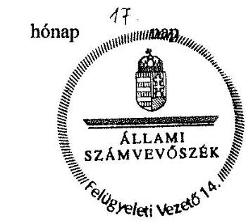

Dr. Németh Erzsébet felügyeleti vezető

---

# FÜTESZ FÜTÉSTECHNIKAI ÉS SZOLGÁLTATÓ KFT 8000 Székesfehérvár, Kertalja u. 11. 

Domokos László Elnök Úr részére

Állami Számvevőszék
Budapest
Apáczai Csere János u. 10.
1052

## Tisztelt Elnök Úr!

„A kéményseprő-ipari közszolgáltatás ellenőrzése" című jelentés tervezethez a FÜTESZ Fütéstechnikai és Szolgáltató Korlátolt Felelősségű Társaság [(8000 Székesfehérvár, Kertalja u. 11., Cg. 07-09-027637), 2016. december 31-ig FÜTESZ Hajdú-Bihar Megyei Fütéstechnikai és Szolgáltató Korlátolt Felelősségű Társaság (4024 Debrecen, Tímár u. 13-15., Cg. 09-09-005744)] ellenőrzött Társaság képviseletében az alábbi észrevételeket teszem.

Az Állami Számvevőszékről szóló 2011. évi LXVI. törvény 5. § (3)-(5) bekezdései az alábbiakról rendelkeznek:
(3) Az Állami Számvevőszék az államháztartásból származó források felhasználásának keretében ellenőrzi a központi költségvetésből gazdálkodó szervezeteket (intézményeket), valamint az államháztartásból nyújtott támogatás vagy az államháztartásból meghatározott célra ingyenesen juttatott vagyon felhasználását a helyi önkormányzatoknál, az országos és helyi nemzetiségi önkormányzatoknál, a közalapítványoknál (ide értve a közalapítvány által alapított gazdasági társaságot is), a köztestületeknél, a közhasznú szervezeteknél, a gazdálkodó szervezeteknél, az egyesületeknél, az alapítványoknál és az egyéb kedvezményezett szervezeteknél. Amennyiben a kedvezményezett szervezet az államháztartásból támogatásban - ide nem értve a személyi jövedelemadó meghatározott részének az adózó rendelkezése alapján történő átutalását - vagy ingyenes vagyonjuttatásban részesül, gazdálkodási tevékenységének egésze ellenőrizhető.
(4) Az Állami Számvevőszék a nemzeti vagyon kezelésének ellenőrzése keretében
a) ellenőrzi az államháztartás körébe tartozó vagyon kezelését, a vagyonnal való gazdálkodást, az állami tulajdonban (résztulajdonban) vagy többségi önkormányzati tulajdonban lévő gazdálkodó szervezetek vagyonérték-megőrző és vagyongyarapító tevékenységét, az államháztartás körébe tartozó vagyon elidegenítésére, illetve megterhelésére vonatkozó szabályok betartását;
b) ellenőrizheti az állami vagy önkormányzati tulajdonban (résztulajdonban) lévő gazdálkodó szervezetek vagyongazdálkodását.
(5) Az Állami Számvevőszék - a (3)-(4) bekezdés szerinti ellenőrzési feladataival összefüggésben - ellenőrizheti az államháztartás alrendszereiből finanszírozott beszerzéseket és az államháztartás alrendszereihez tartozó vagyont érintő szerződéseket

---

a megrendelőnél (vagyonkezelőnél), a megrendelő (vagyonkezelő) nevében vagy képviseletében eljáró természetes személynél és jogi személynél, valamint azoknál a szerződő feleknél, akik, illetve amelyek a szerződés teljesítéséért felelősek, továbbá a szerződés teljesítésében közreműködőknél.

Tényként rögzítem, hogy a FÜTESZ Kft. nem központi költségvetésből gazdálkodó szervezet (intézmény), az államháztartásból egy alkalommal részesült munkahelymegőrző támogatásban, az államháztartásból meghatározott célra ingyenesen juttatott vagyonban nem részesült. [A 2013. évi CXXXIV. törvény 3/E. § (1) bekezdése alapján nekünk járó költségtérítés álláspontunk szerint nem támogatás.]

Ugyancsak tény, hogy Társaságunk a tevékenységünket szabályozó jogszabályi környezet alapvető változása, valamint Debrecen Megyei Jogú Város Önkormányzata döntése következtében 2016. június 30-val a kéményseprő-ipari közszolgáltatási tevékenységét kénytelen volt befejezni, és azt (valamennyi dokumentumával egyetemben) átadni a Megyei Katasztrófavédelmi Igazgatóságnak.

De Társaságunk tevékenysége a jelenlegi és a közelmúltban tevékenykedő menedzsment időszakában törvényes és átlátható, és minden tőlünk telhetőt megtettünk az Állami Számvevőszék által kért adatok, dokumentumok átadása érdekében.

Kiemelném azt is, hogy Társaságunk nem költségvetésből gazdálkodó intézmény, hanem egy nem közösségi tulajdonban álló gazdasági társaság, így néhány - az Állami Számvevőszék által kért - dokumentum elkészítésére jogszabály nem kötelezte, és olyanokat utólag nem is állt módunkban készíteni.

Mindezek ellenére az Állami Számvevőszék munkáját hiánypótlónak tekintjük és nagyra értékeljük.

A jelentés-tervezet egyes, Társaságunkat érintő - megállapításaival kapcsolatosan az alábbi észrevételeket tesszük:

Álláspontunk szerint az összegző megállapítások nem állnak egymással teljes mértékben összhangba: ha a feladat ellátásáért felelős önkormányzatok a kéményseprő-ipari közszolgáltatást alapvetően szabályszerűen szervezték meg és a katasztrófavédelmi igazgatóságok a hatósági felügyeleti tevékenységüket összességében az előírásoknak megfelelően végezték, akkor hogyan fordulhatott elő, hogy a közszolgáltatást végző szervezetek a feladataikat összességében nem szabályszerűen látták el?

Természetesen nem állítjuk, hogy nem fordultak elő hiányosságok, de ezek semmiképpen nem eredményezik a hivatkozott megállapítás megalapozottságát.

Társaságunk a 2007. márciusától 2016. június 30-ig terjedő időszakban fokozott figyelmet fordított a szolgáltatás színvonalának emelésére, ennek keretében jelentős beruházásokat hajtottunk végre, új műszereket, kamerákat szereztünk be, új technológiákat és vállalatirányítási rendszert vezettünk be, illetve a kéményseprő-mestereket és -szakmunkásokat rendszeresen képeztük; ezen munkának is szerepe van abban, hogy ezen időszakban Hajdú-Bihar megye területén nem volt a kéményseprő felelősségét felvető személyi sérüléssel járó baleset.

---

Jelezni kívánom, hogy a jelentés-tervezet által a feltárt hiányosságokkal kapcsolatosan gyakran használt „előfordult" kifejezés megtévesztő és pontatlan, semmilyen mértékben nem utal az előfordulás gyakoriságára, súlyosságára, így alkalmas arra, hogy különböző fajsúlyú hiányosságokat rendeljen egymás mellé. Összességében nem vitatjuk, hogy hiányosságok előfordulhattak,
 azonban azok sem gyakoriak, sem súlyosak nem voltak, ha ilyen előfordult volna, azt az ellenőrzések (amelyek a jelentés-tervezet megállapítása szerint összességében megfelelők voltak) mindenképpen feltárták volna.

A jelentés tervezet 2.1. sz. megállapításával kapcsolatosan jelzem, hogy a FÜTESZ Kft.-re vonatkozó azon megállapítás, miszerint a

- „63/2012 (XII. 11.) BM rendelet 8. § (1) szerinti tanúsítvánnyal rendelkezett a közszolgáltató, azonban az hiányos volt, továbbá a munka átadás-átvétele a használó által nem volt aláírva",
nem helytálló; a tanúsítványaink a BM rendeletnek megfelelőek voltak, és a használóval aláirattuk. A megállapítás egyébként nem jelzi, hogy mennyiben volt hiányos a tanúsítvány.

Ugyancsak nem helytálló azon megállapítás, miszerint

- „Az ingatlantulajdonosok által megrendelt égéstermék-elvezetővel kapcsolatos kötelező műszaki vizsgálatok elvégzését követően a feladatvégzésről a dokumentum igazolt módon nem került az ingatlan tulajdonos részére átadásra."

Az ingatlan tulajdonosa által megrendelt műszaki vizsgálat esetén vagy tanúsítvány, vagy égéstermék-elvezető átvételt igazoló nyilatkozat került átadásra. Nyilatkozatunk nélkül használatbavételi engedélyt sem kapott volna az ingatlan tulajdonosa; de ilyen nem fordult elő.

A jelentés tervezet 2.5. sz. megállapításával kapcsolatosan jelzem, hogy a FÜTESZ Kft.-vel kapcsolatosan azon megállapítás, miszerint

- „Előfordult, hogy az ellátásért felelős önkormányzat által a Ksktv. 10. § (1) bekezdése és a 13. § (3) bekezdés a) pontja alapján rendeletben meghatározott díjtételektől minimálisan eltérő összeg került kiszámlázásra."
nem helytálló. Társaságunk az önkormányzati rendeletben rögzített díjtáblázatot a FÜTESZ Kft. rögzítette, és a vállalatirányítási rendszere ezen díjtáblázat alapján előre nyomtatta ki a számlákat. Az önkormányzat által rendeletben rögzített díjtáblázat és a FÜTESZ Kft. által alkalmazott díjak között eltérés nem volt.

A jelentés tervezet 2.6. sz. megállapításával kapcsolatosan jelzem, hogy a FÜTESZ Kft.-vel kapcsolatosan azon megállapítás, miszerint

- A Ksktv. 10/B. § (1) bekezdésében foglaltak ellenére a közszolgáltatók nem tájékoztatták az ingatlan tulajdonosát a rezsicsökkentés összegéről..."
nem helytálló. Társaságunk a természetes személyek, továbbá társasházak és lakásszövetkezetek részére a számlával egyidejűleg részletes írásbeli tájékoztatást nyújtott a rezsicsökkentés összegéről, a vonatkozó jogszabályban meghatározott formátumú tételesen

---

göngyölített számlaformátumot alkalmazva. Számláink előnyomtatottak voltak; abban az esetben, ha az előre nyomtatott számlához képest a helyszínen eltérés mutatkozott, a helyszínen készpénzfizetési számla került kiállításra, majd az előre kinyomtatott számla sztornózásra került, és a rezsicsökkentett formátumú, részletes írásbeli tájékoztatóval ellátott számlát a kémény használójának postáztuk.

Ugyancsak nem helytálló azon megállapítás, miszerint

- „A fogyasztóvédelmi hatóságnak a rezsicsökkentéssel kapcsolatos tájékoztatása nem történt meg."

Ezzel szemben a fogyasztóvédelmi hatóságot minden alkalommal időben tájékoztattuk; a tájékoztatások mind a katasztrófavédelemnél (akiknek a vonatkozó iratokat átadtuk), mind a fogyasztóvédelmi hatóságnál ellenőrizhetők.

# Tisztelt Elnök Úr! 

Végezetül ismételten rögzítem, hogy az Állami Számvevőszék ezen, a kéményseprő-ipar szakmai munkáját ellenőrző vizsgálatát hiánypótlónak tekintjük, nagyra értékeljük. Sajnálatos módon Társaságunknak a vizsgálat tapasztalatainak hasznosítása már nem áll módjában.

Kérjük, hogy a fenti észrevételeinket megfontolni és a végleges jelentés összeállításánál figyelembe venni szíveskedjenek.

Székesfehérvár, 2017. február 1.
Tisztelettel:
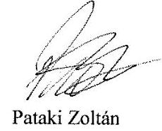

Pataki Zoltán
ügyvezető

---

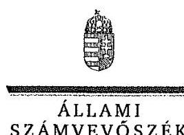

ELNÖK

Ikt.szám: V-1038-723/2016.

# Pataki Zoltán 

ügyvezető

FÜTESZ Fütéstechnikai és Szolgáltató Kft.

## Székesfehérvár

## Tisztelt Ügyvezető Úr!

"A kéményseprő-ipari közszolgáltatás ellenőrzése" című jelentéstervezetre tett észrevételeit köszönettel megkaptam.

Az ellenőrzési megállapításokra vonatkozó észrevételét az Állami Számvevőszékről szóló 2011. évi LXVI. törvény 29. § (2) bekezdésében meghatározott tizenöt napos határidőn belül küldte meg. Az Állami Számvevőszék észrevétellel kapcsolatos álláspontját a mellékletként csatolt, a felügyeleti vezető által készített indokolás tartalmazza.

Budapest, 2017.
hó
nap

Tisztelettel:

Melléklet: Észrevételre adott válasz
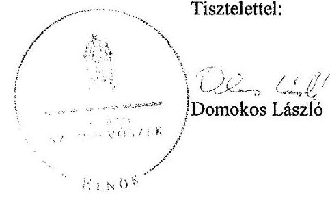

---

"A kéményseprő-ipari közszolgáltatás ellenőrzése" című jelentéstervezethez tett észrevételre adott válasz
FÜTESZ Fütéstechnikai és Szolgáltató Kft.
"A kéményseprő-ipari közszolgáltatás ellenőrzése" című jelentéstervezetre tett észrevételeket áttekintettem, annak kezelésével kapcsolatban a következő tájékoztatást adom.

# 1. A jelentéstervezet 2.1. számú megállapítására vonatkozó észrevételek 

a) A kéményseprő-ipari közszolgáltatás ellátásának szakmai szabályairól szóló 63/2012. (XII. 11.) BM rendelet (a továbbiakban: BM rendelet) 8. § (1) bekezdése alapján a közszolgáltatónak a jogszabályban meghatározott és elvégzett feladatok eredményéről a 2. melléklet szerinti tanúsítványt az ott meghatározott tartalommal kellett kitöltenie. A tanúsítvány egy példányát a közszolgáltatónak az ingatlan tulajdonosa, annak távollétében az ingatlan használója részére igazolt módon ki kellett adnia.
A jelentéstervezet megállapítja, hogy a FÜTESZ Kft. esetében is előfordult, hogy hiányos volt a tanúsítvány, illetve a munka átadás-átvétele a használó által nem volt aláírva, így nem volt igazolt.
A FÜTESZ Kft. észrevételében jelezte, hogy a tanúsítványok a BM rendeletnek megfelelőek voltak, azokat a használókkal aláiratták.
Az ellenőrzés során rendelkezésre bocsátott dokumentumok ismételt áttekintését követően megállapítottuk, hogy a mintatételek vonatkozásában 17 esetben tanúsítványok nem álltak rendelkezésre, illetve hiányosan kerültek kitöltésre.
b) A kéményseprő-ipari közszolgáltatásról szóló 2012. évi XC. törvény (a továbbiakban: Ksktv.) 6. § (2) és (3) bekezdésében foglaltaknak megfelelően a közszolgáltatónak el kellett végeznie a közszolgáltatás keretében az ingatlan tulajdonosa által megrendelt égéstermék-elvezetővel kapcsolatos kötelező műszaki vizsgálatokat, továbbá a jogszabályban meghatározott feladatok eredményét tartalmazó dokumentum egy példányát a közszolgáltatónak az ingatlan tulajdonosa, annak távollétében az ingatlan használója részére, igazolt módon át kellett adnia.
A jelentéstervezet megállapítja, hogy a FÜTESZ Kft. esetében is előfordult, hogy a feladat elvégzéséről dokumentum nem került igazolt módon átadásra.
A FÜTESZ Kft. észrevétele szerint az ingatlan tulajdonosa által megrendelt műszaki vizsgálat esetén tanúsítvány vagy égéstermék-elvezető átvételt igazoló nyilatkozat került átadásra.
A dokumentumokat ismételten áttekintve megállapítottuk, hogy a FÜTESZ Kft. az ingatlan tulajdonosa által megrendelt égéstermék-elvezetővel kapcsolatos kötelező műszaki vizsgálatokhoz kapcsolódóan, három mintatétel vonatkozásában a jogszabályban meghatározott feladatok eredményét tartalmazó dokumentum egy példányát igazolt módon nem adta át az ingatlan tulajdonosának, illetve annak távollétében az ingatlan használójának.
Figyelemmel a fentiekre a megállapítás módosítása nem indokolt.

---

# 2. A jelentéstervezet 2.5. számú megállapítására vonatkozó észrevétel 

A BM rendelet 11. § (1) bekezdésének megfelelően a sormunka keretében időszakonként kötelezően elvégzendő közszolgáltatási feladat díját a 7. mellékletben foglaltak szerint kellett meghatározni. A (2) bekezdésben foglaltak alapján az ingatlan tulajdonosa által a sormunkában meghatározott tevékenységekre irányuló külön megrendelésnél a díjat alkalmanként, a megrendelés tartalma szerint a közszolgáltatónak kellett megállapítania az ellátásért felelős önkormányzat által elkészített díjtáblázat szerint.
A jelentéstervezet megállapítja, hogy az ellenőrzött közszolgáltatók egy részénél kisebb hibák fordultak elő a számlázás tekintetében, továbbá a számlák és a tanúsítványok közötti összhang több esetben nem volt biztosított.
A FÜTESZ Kft. álláspontja szerint az önkormányzati rendeletben rögzített díjtáblázat és az általuk alkalmazott díjak között eltérés nem volt.
Az ellenőrzés rendelkezésre bocsátott dokumentumok ismételt áttekintését követően megállapítottuk, hogy a FÜTESZ Kft. által kiszámlázott összegek 13 mintatétel vonatkozásában nem feleltek meg az önkormányzat közszolgáltatással kapcsolatos rendeletében meghatározott díjtételeknek. Ennek oka, hogy a számlák és a tanúsítványok nem voltak összeegyeztethetőek.
A fentiekre való tekintettel a megállapítás módosítása nem indokolt.

## 3. A jelentéstervezet 2.6. számú megállapítására vonatkozó észrevételek

A Ksktv. 10/B. § (1) szerint a közszolgáltatónak a számla kiküldésével vagy átadásával egyidejűleg részletes írásbeli tájékoztatást kellett nyújtania a természetes személy ingatlantulajdonosok, illetve társasházak és lakásszövetkezetek részére arról, hogy a rezsicsökkentés következtében a 2013. június 30-án általa jogszerűen alkalmazott díjhoz viszonyítva a közszolgáltatás díja mennyivel csökkent. A (2) bekezdés értelmében pedig a közszolgáltatónak a tárgyhónapot követő hónap 15. napjáig írásban igazolnia kellett a fogyasztóvédelmi hatóságnak az (1) bekezdésben foglalt előírások teljesülését.
A jelentéstervezet megállapítja, hogy a fenti jogszabályi kötelezettségeknek a FÜTESZ Kft. több esetben nem tett eleget.
A FÜTESZ Kft. észrevételében jelezte, hogy megfelelő tájékoztatást nyújtottak a rezsicsökkentés összegéről a természetes személyek, társasházak és lakásszövetkezetek részére, illetve a fogyasztóvédelmi hatóságot minden alkalommal időben tájékoztatták.
Az észrevétel kapcsán az ellenőrzés rendelkezésre bocsátott dokumentumokat ismételten áttekintettük. Ennek során megállapítottuk, hogy a mintatételek vonatkozásában két esetben a közszolgáltató nem adott részletes tájékoztatást a díj csökkentéséről. Továbbá a fogyasztóvédelmi hatóság felé történő igazolás dokumentumai az ellenőrzés számára nem kerültek átadásra.
A fentiekre való tekintettel a megállapítás módosítása nem indokolt.

Budapest, 2017.
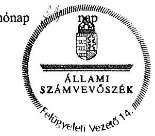

Dr. Németh Erzsébet
felügyeleti vezető

---

Borsod-Abaúj-Zemplén Megyei Katasztrófavédelmi Igazgatóság Igazgató

H-3525 Miskolc, Dózsa Gy. út 15. 3501 Miskolc, Pf.: 18. Tel: (06-46) 502-962 Fax: (06-46) 502-963 e-mail: borsod.titkarsag@katved.gov.hu

Szám: 35500/728-1/2017.ált.
Kérjük, hivatkozzon az iktatószámra!

Tárgy: Jelentéstervezet véleményezése
Iktatószám: FV-V-1038-682/2016.
Úgyintéző: Törő Attila tű. alez.
Telefonszám: 06-46/502-976

Domokos László
Elnök Úr részére

Állami Számvevőszék
Budapest

Tisztelt Elnök Úr!

ÁLLAMI SZÁMVEVŐSZÉK
Z.E.-7689/2017/1

Erkezeti: 2017 JAN 30.
V.-1638-463/2016

14-11/2016

A Borsod-Abaúj-Zemplén Megyei Katasztrófavédelmi Igazgatóság (a továbbiakban: Igazgatóság) az Állami Számvevőszék (1052 Budapest, Apáczai Csere János u. 10.) V-1038-056/2016. számú – Mezőkövesdi VG Zrt. (3400 Mezőkövesd, Dózsa Gy. u. 2.), mint kéményseprő-ipari közszolgáltató ellenőrzése tárgyú – 2016. évben történő megkereséseire elektronikus webes felületen, illetve kiegészítésképpen email-en megküldte a kért dokumentumokat.

Tájékoztatom, hogy fenti hivatkozási számon az ellenőrzés összegzését tartalmazó Jelentés Tervezetét áttanulmányoztam és megállapítottam, hogy az Igazgatóság vonatkozásában pontosításra szorul. A Jelentés Tervezet 28. oldal 3.1 pontja tartalmazza, hogy az Igazgatóság a 2013-as évben nem vezetett nyilvántartást az ellenőrzött közszolgáltatóról.

Az Igazgatóság megküldi a V-1038-056/2016. számú megkeresésre korábban feltöltött – 2013. január hónaptól, folyamatosan aktualizált – „3. sz. melléklet teljhítnyil.pdf” nevű fájlban is kirészletezett nyilvántartás mellékleteket, mely igazolja a nyilvántartás vezetését és rendelkezésre állását.

A „3. sz. melléklet teljhítnyil.pdf” fájlban a – 101., 105., 133. – pontjaiban található a vezetett nyilvántartás, megjelölve benne a mindenkori módosítás, valamint az ÁSZ elektronikus adatszolgáltató rendszerébe történő feltöltés időpontját.

Fentiek figyelembe vételével kérem a tervezet módosítását.

Miskolc, 2017. január 24.

Tisztelettel:

Lipták Attila tűzoltó dandártábornok tűzoltósági tanácsos megyei igazgató 1.

Melléklet:
- 3. sz. melléklet teljhítnyil.pdf
- Internetre kéményseprő-ipari közszolgáltatókről nyilvántartás.xls (2013. január 24., február 07., február 18. módosítási dátumokkal)

Készült: 2 példányban
Terjedelme: 1 lap (1 oldal)
Kapják: 1. Állami Számvevőszék, (1052 Budapest, Apáczai Csere János u. 10.) (Budapest 4., Pf:54) (Küldve: Tértivevény útján), 2. Irattár

---

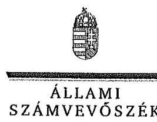

ELNÖK

# Lipták Attila tű. dandártábornok megyei igazgató 

Borsod-Abaúj-Zemplén Megyei Katasztrófavédelmi Igazgatóság

## Miskolc

## Tisztelt Igazgató Úr!

"A kéményseprő-ipari közszolgáltatás ellenőrzése" című jelentéstervezetre tett észrevételeit köszönettel megkaptam.

Az ellenőrzési megállapításokra vonatkozó észrevételét az Állami Számvevőszékről szóló 2011. évi LXVI. törvény 29. § (2) bekezdésében meghatározott tizenöt napos határidőn belül küldte meg. Az Állami Számvevőszék észrevétellel kapcsolatos álláspontját a mellékletként csatolt, a felügyeleti vezető által készített indokolás tartalmazza.

Budapest, 2017. 1. hó 1. nap

Tisztelettel:

Melléklet: Észrevételre adott válasz
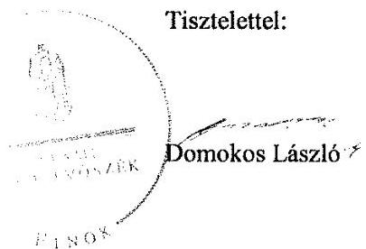

---

"A kéményseprő-ipari közszolgáltatás ellenőrzése" című jelentéstervezethez tett észrevételekre adott válasz
Borsod-Abaúj-Zemplén Megyei Katasztrófavédelmi Igazgatóság
"A kéményseprő-ipari közszolgáltatás ellenőrzése" című jelentéstervezetre tett észrevételeket áttekintettem, annak kezelésével kapcsolatban a következő tájékoztatást adom.
Az ellenőrzött észrevétele a jelentéstervezet 3.1. számú megállapítására (28. oldal) vonatkozik, mely szerint a Borsod-Abaúj-Zemplén Megyei Katasztrófavédelmi Igazgatóság 2013-ban nem vezetett nyilvántartást az ellenőrzött közszolgáltatóról. Az ellenőrzött észrevételében jelezte, hogy rendelkezett a nyilvántartással, illetve a „3. sz. melléklet teljhitnyil.pdf" nevű fájlban részletezett nyilvántartás mellékleteket korábban feltöltötte a webes felületre. Ezt alátámasztotta a csatolt, 2016. június 2-án kelt Teljességi és hitelességi nyilatkozattal, amelynek dokumentumlistájában 101. sorszámmal szerepel az érintett dokumentum, valamint csatolta a kinyomtatott nyilvántartást is.

Az észrevétel kapcsán ismételten áttekintettük a feltöltött dokumentumokat. Ennek során megállapítottuk, hogy a Teljességi és hitelességi nyilatkozat dokumentumlistájának 101. sorában szereplő, „2013_kemenysepro_ipari_szolgaltatok_nyilvantartasa.pdf" elnevezésű dokumentum nem került feltöltésre. Az észrevételhez mellékletként megküldött nyilvántartást
 pedig a számvevőszéki jelentés készítésekor már nem tudjuk figyelembe venni, tekintettel arra, hogy az adatszolgáltatás lezárult.
A fentiek alapján az észrevétel a jelentéstervezet 3.1. számú megállapítást nem módosítja.

Budapest, 2017.
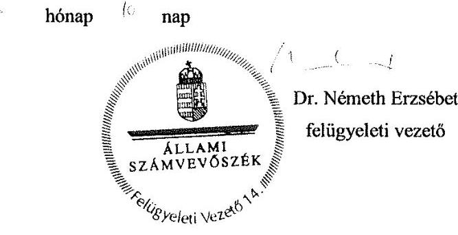

---

# Fővárosi Katasztrófavédelmi Igazgatóság 

Igazgató
H-1081 Budapest, Dologház utca 1.; 50: 1443 Budapest, Pf.: 154
Tel: (36-1) 459-2436; Fax: (36-1) 459-2438; e-mail: fkititkarsag@katved.gov.hu

Szám: 35100/7077-25/2016.ált.

## Domokos László Úr részére

## elnök

## Állami Számvevőszék

Budapest
4. Pf. 54.

1364

Tárgy: Kéményseprő-ipari közszolgáltatás ellenőrzésével kapcsolatos észrevétel
Úgyintéző: dr. Székely György c. tű. szds.
Hivatkozási szám: FV-V-1038-682/2016.

## Tisztelt Elnök Úr!

Tájékoztatom, hogy „A kéményseprő-ipari közszolgáltatás ellenőrzése" című, fenti számú jelentéstervezettel kapcsolatban az alábbi észrevételeket teszem:

1. A jelentéstervezet 10. oldalának utolsó bekezdését javaslom pontosítani, tekintve, hogy 2016. novemberétől nem a megyei katasztrófavédelmi igazgatóságok, hanem a Belügyminisztérium Országos Katasztrófavédelmi Főigazgatóság Gazdasági Ellátó Központ látja el a kéményseprő-ipari közszolgáltatást a megyei ellátási csoportjai útján. A bekezdéshez a következő szöveges javaslatot teszem:
„A 2016. júliustól hatályos jogszabályi változások hatására 2016. novembertől 17 megye kéményseprő-ipari közszolgáltatása átkerült a Belügyminisztérium Országos Katasztrófavédelmi Főigazgatóság Gazdasági Ellátó Központ feladatkörébe. Fejér megyében, Vas megyében és Budapest teljes területén továbbra is az önkormányzatokkal szerződött közszolgáltatók végzik a feladatellátást. Ezáltal jelenleg a Magyarországon levő több mint 3000 településből több mint 2500 településen a Belügyminisztérium Országos Katasztrófavédelmi Főigazgatóság Gazdasági Ellátó Központ látja el a közfeladatot."
2. A jelentéstervezet 3.3. számú megállapításának 2. bekezdése szintén módosításra szorul, ugyanis a Fővárosi Katasztrófavédelmi Igazgatóság 2015. évben is eleget tett a kéményseprő-ipari közszolgáltatásról szóló 2012. évi XC. törvény (Ksktv.) 12. § (2) bekezdés a) és aa) pontjaiban foglalt ellenőrzési kötelességeinek. A Fővárosi Katasztrófavédelmi Igazgatóság 2015. évben a FÖKÉTÜSZ Kft. vonatkozásában összesen 69 panaszüggyel kapcsolatban, hatósági ellenőrzés keretében vizsgálta a kéményseprő-ipari közszolgáltató tevékenységét. Az ezzel kapcsolatos panaszügyek ügyszámát az Állami Számvevőszék által meghatározott időpontban és módon elektronikus feltöltött FKI_pan.excl dokumentum is tartalmazza.
Mellékelten csatolom továbbá a Fővárosi Katasztrófavédelmi Igazgatóság Katasztrófavédelmi Hatósági Osztálya által 2015. december 23-án a FÖKÉTÜSZ Kft.-nél végzett helyszíni ellenőrzésről készült 35100/14531/2015.ált. számú jegyzőkönyvet, amely szintén azt igazolja, hogy hatóságom ellenőrzés keretében vizsgálta - többek között - a közszolgáltatás minimális szakmai, személyi és tárgyi feltételeinek fennállását.

---

A hivatkozott dokumentumok igazolják, hogy hatóságom 2015. évben is elvégezte a Ksktv. 12. § (2) bekezdés a) és aa) pontjaiban foglalt ellenőrzési feladatait, így a jelentéstervezet 3.3. számú megállapítás 2. bekezdésének zárójeles részében nem helytálló a Fővárosi Katasztrófavédelmi Igazgatóság feltüntetése.
A leírtakra figyelemmel kérem, hogy a jelentéstervezetet a fentiek szerint pontosítani szíveskedjen.

Budapest, 2017. január 17.
Melléklet: 35100/14531/2015.ált sz. jkv.

Tisztelettel:
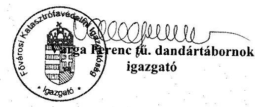

Készült: 2 példányban
Egy példány: 2 oldal
Számítógépes helye: F:HATOSAG:FKI
2016:Fökétüsz:Állami Számvevőszék:Ász-7077-
24.doc

Kapják:

1. Irattár
2. Címzett

---

ELNÖK

Ikt.szám: V-1038-694/2016.

# Varga Ferenc tű. dandártábornok 

igazgató

Fővárosi Katasztrófavédelmi Igazgatóság

## Budapest

## Tisztelt Igazgató Úr!

"A kéményseprő-ipari közszolgáltatás ellenőrzése" című jelentéstervezetre tett észrevételeit köszönettel megkaptam.

Az ellenőrzési megállapításokra vonatkozó észrevételét az Állami Számvevőszékről szóló 2011. évi LXVI. törvény 29. § (2) bekezdésében meghatározott tizenöt napos határidőn belül küldte meg. Az Állami Számvevőszék észrevétellel kapcsolatos álláspontját a mellékletként csatolt, a felügyeleti vezető által készített indokolás tartalmazza.

Budapest, 2017. 1. hó nap

Tisztelettel:

Melléklet: Észrevételre adott válasz
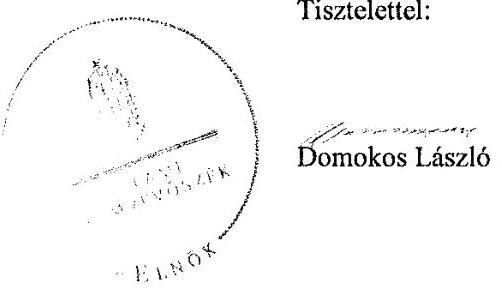

---

"A kéményseprő-ipari közszolgáltatás ellenőrzése" című jelentéstervezethez tett észrevételekre adott válasz
Fővárosi Katasztrófavédelmi Igazgatóság
"A kéményseprő-ipari közszolgáltatás ellenőrzése" című jelentéstervezetre tett észrevételeket áttekintettem, annak kezelésével kapcsolatban a következő tájékoztatást adom.

# 1. A jelentéstervezet 10. oldalának utolsó bekezdését érintő észrevétel 

Az észrevételt elfogadjuk, a bekezdés szövegét pontosítjuk a Belügyminisztérium Országos Katasztrófavédelmi Főigazgatóság Gazdasági Ellátó Központjára vonatkozó kiegészítéssel.

## 2. A jelentéstervezet 3.2. számú megállapítással kapcsolatos észrevétel

A kéményseprő-ipari közszolgáltatásról szóló 2012. évi XC. törvény (a továbbiakban: Ksktv.) 12. § (2) bekezdés a) pont aa) alpontjában foglalt előírásnak megfelelően a tűzvédelmi hatóságnak folyamatosan vizsgálnia kellett a kéményseprő-ipari közszolgáltatás minimális szakmai, személyi és a tárgyi feltételeit.
Az észrevétel első bekezdésében hivatkozott dokumentumok panaszügyekhez kapcsolódó hatósági ellenőrzésekre vonatkoznak. Az észrevétel második bekezdésében hivatkozott dokumentum a FÖKÉTŰSZ Kft.-nél elvégzett célellenőrzés jegyzőkönyve. Ezen dokumentumok alapján nem igazolható, hogy az ellenőrzések során a hatóság vizsgálta a kéményseprő-ipari közszolgáltatás minimális szakmai, személyi és a tárgyi feltételeit, ezért a megállapítás módosítása nem indokolt.

Megjegyzés: Az ellenőrzött által tett, 3.3. számú megállapításra tett észrevétel helyesen a jelentéstervezet 3.2. számú megállapítására vonatkozik.

Budapest, 2017.

---

# 2014/01/25 

$1-4035-72012014$

## Jász-Nagykun-Szolnok Megyei Katasztrófavédelmi Igazgatóság Igazgató

H-5000 Szolnok, József Attila út 14. E8: 5000 Szolnok, Pf.: 110
Tel: +36 56510-040 Fax: +36 56 420-114 e-mail: jssz.üskarszg@katved.gov.hu

Ügyiratszám: 36600/1265-1/2017.ált.

Tárgy:
Ü. i.:
Hiv. sz.:
Tel.:
E-mail:

Észrevétel jelentéstervezetre
Dr. Horváth Eszter tű. alez.
FV-V-1038-682/2016.
$56 / 510-160$
eszter.horvath@katved.gov.hu

## Domokos László

Állami Számvevőszék

## Budapest

Apáczai Csere János u. 10.
1052

## Tisztelt Elnök Úr!

A fenti iktatószámú levelével megküldött, „A kéményseprő-ipari közszolgáltatás ellenőrzése" című jelentéstervezetre -határidőn belül- a következő észrevételt teszem.

A jelentéstervezet 3.1. számú megállapítása értelmében:
„A katasztrófavédelmi igazgatóságok 25%-ánál fordult elő, hogy a Ksktv. 12(1) a)-c) pontjában foglalt előírásai ellenére nem vezette teljes körűen a tevékenység végzésére jogosult közszolgáltatókról a nyilvántartást, mivel az illetékességi területén szolgáltatást végző, de székhellyel más igazgatóság területét érintő ellenőrzött közszolgáltatót nem tartotta nyilván."

A kéményseprő-ipari közszolgáltatásról szóló 2012. évi XC. törvény 12. § (1) bekezdése alapján a tűzvédelmi hatóság a közszolgáltatási tevékenység végzésére jogosult közszolgáltatókról nyilvántartást köteles vezetni.
2014. november 3-át megelőzően a Fűtéstechnikai Kft. (volt székhely: Szolnok, Pozsonyi út 68.) látta el a kéményseprő-ipari közszolgáltatást, akit az igazgatóság nyilvántartott és közzétett a honlapján. Majd ezt követően Fűtéstechnikai Kft bejelentette, hogy nem tudja ellátni a kéményseprő-ipari közszolgáltatást, így 2014. november 3-án került kijelölésre a Filantrop Kft, mint az átmeneti ellátásra kijelölt közérdekű szolgáltató.

A közigazgatási hatósági eljárás és szolgáltatás általános szabályairól szóló 2004. évi CXL. törvény 80/A. § (1) bekezdése alapján a hatóság közzéteszi azt a jogerős vagy fellebbezésre tekintet nélkül végrehajthatóvá nyilvánított határozatot, amelyet az állami vagy helyi önkormányzati feladatot, valamint jogszabályban meghatározott egyéb közfeladatot ellátó szerv vagy személy ügyfélnek e tevékenységével kapcsolatban hozott. Az igazgatóság ennek megfelelően járt el és a kijelölésről rendelkező határozatot és a kijelölés későbbi meghosszabbításáról szóló határozatokat közzétette.

---

A felsoroltak alapján megítélésem szerint a Jász-Nagykun-Szolnok Megyei Katasztrófavédelmi Igazgatóság eleget tett a nyilvántartási kötelezettségének, mivel 2014. november 3-ig nyilvántartotta, illetve közzétette a kéményseprő-ipari közszolgáltatót. Majd 2014. november 3-án került kijelölésre az átmeneti ellátást végző közérdekű szolgáltató, majd ezt követően pedig 2016. július 1-től az Országos Katasztrófavédelmi Főigazgatóság Gazdaság Ellátó Központja, mint kéményseprő-ipari szerv látja el a kéményseprő-ipari tevékenységet. Ezek alapján megállapítható, hogy 2014. november 3-a után kéményseprő-ipari közszolgáltató nem tevékenykedett Jász-Nagykun-Szolnok megyében. A jelentéstervezet 3.1. megállapítása kéményseprő-ipari közszolgáltató nyilvántartásának hiányát kifogásolta, amely a fentiek alapján nem volt indokolt.

A fentiek alapján kérem a jelentéstervezet ilyen értelmű javítását.

Szolnok, 2017. január 25.
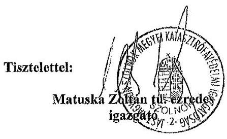

---

ELNÖK

Ikt.szám: V-1038-709/2016.

Matuska Zoltán tű. ezredes
igazgató
Jász-Nagykun-Szolnok Megyei Katasztrófavédelmi Igazgatóság

# Szolnok 

## Tisztelt Igazgató Úr!

"A kéményseprő-ipari közszolgáltatás ellenőrzése" című jelentéstervezetre tett észrevételeit köszönettel megkaptam.

Az ellenőrzési megállapításokra vonatkozó észrevételét az Állami Számvevőszékről szóló 2011. évi LXVI. törvény 29. § (2) bekezdésében meghatározott tizenöt napos határidőn belül küldte meg. Az Állami Számvevőszék észrevétellel kapcsolatos álláspontját a mellékletként csatolt, a felügyeleti vezető által készített indokolás tartalmazza.

Budapest, 2017. hó nap

Tisztelettel:

Melléklet: Észrevételre adott válasz

Domokos László

---

# "A kéményseprő-ipari közszolgáltatás ellenőrzése" című jelentéstervezethez tett észrevételre adott válasz 

Jász-Nagykun-Szolnok Megyei Katasztrófavédelmi Igazgatóság

"A kéményseprő-ipari közszolgáltatás ellenőrzése" című jelentéstervezetre tett észrevételeket áttekintettem, annak kezelésével kapcsolatban a következő tájékoztatást adom.
A kéményseprő-ipari közszolgáltatásról szóló 2012. évi XC. törvény (a továbbiakban: Ksktv.) 12. § (1) bekezdése alapján a tűzvédelmi hatóság a közszolgáltatási tevékenység végzésére jogosult közszolgáltatókról nyilvántartást vezet, amelyben a szolgáltatási tevékenység megkezdésének és folytatásának általános szabályairól szóló törvényben meghatározott adatokon túl nyilvántartja a képviseletet ellátó természetes személy személyazonosító adatait, a tevékenység gyakorlására jogosult vagy képviselője telefonszámát, elektronikus levélcímét, székhelyét és telephelyét, illetve a közszolgáltatás megkezdésének és befejezésének időpontját.
A jelentéstervezet 3.1. számú megállapítás 3. bekezdésében foglaltak szerint a felsorolt katasztrófavédelmi igazgatóságok nem vezették teljes körűen a tevékenység végzésére jogosult közszolgáltatókról a nyilvántartást, mivel az illetékességi területükön szolgáltatást végző, de székhellyel más igazgatóság területét érintő közszolgáltatót nem tartották nyilván.
A Jász-Nagykun-Szolnok Megyei Katasztrófavédelmi Igazgatóság észrevétele arra vonatkozott, hogy 2014. november 3-át követően a megye területén kéményseprő-ipari közszolgáltató nem tevékenykedett, mivel kezdetben átmeneti ellátást végző közérdekű szolgáltató, majd 2016. július 1-jétől az Országos Katasztrófavédelmi Főigazgatóság Ellátó Központja mint kéményseprő-ipari szerv látta el a kéményseprő-ipari tevékenységet.
A hivatkozott jogszabály a nyilvántartási kötelezettséget illetően nem tesz különbséget a tevékenység végzésének szerződésben foglalt jogosultsága alapján, így a katasztrófavédelmi igazgatóságnak a közszolgáltatási tevékenység végzésére jogosult minden közszolgáltatóról nyilvántartást kellett vezetnie. Az átmeneti ellátásra általa kijelölt szolgáltató is jogosult volt a kijelölést követően kéményseprő-ipari közszolgáltatás végzésére, továbbá a nem rendszeres kéményseprő-ipari közszolgáltatás szabályairól és az ennek során eljáró állami szervek kijelöléséről szóló 511/2013. (XII. 29.) Korm. rendelet 3. § alapján közszolgáltatónak tekintendő.

A fentiekre való tekintettel az Igazgatóság nyilvántartása hiányos volt, ezért a megállapítás módosítása nem indokolt.

Budapest, 2017.
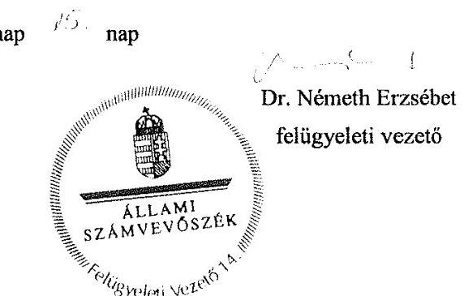

---

# Komárom-Esztergom Megyei Katasztrófavédelmi Igazgatóság 

H-2800 Tatabánya I., Szent Borbála út 16. Web: http://komarom.katasztrofavedelem.hu Tel, fax:(34)512-070 Igazgató: (34)310-817 E-mail: komarom.titkarsag@katved.gov.hu

36100/216 / 2017. ált.

Tárgy:
Ügyintéző:
Telefonszám:
Hivatkozási
szám:

## Domokos László

## Elnök

Állami Számvevőszék

## Budapest

## Tisztelt Elnök Úr!

A „kéményseprő-ipari közszolgáltatás ellenőrzésével" kapcsolatban az Igazgatóságunk részére megküldött jelentéstervezettel kapcsolatosan a következő észrevételt kívánom tenni:
A szolgáltatási tevékenység megkezdésének és folytatásának általános szabályairól szóló 2009. évi LXXVI. Törvény (a továbbiakban: Szolg tv.) a szolgáltatási tevékenység bejelentésével, illetve a szolgáltatás felügyeletét ellátó hatósággal kapcsolatosan a következő rendelkezéseket tartalmazza:
„12. § (2) Ha jogszabály előírja, hogy a tevékenység folytatására irányuló szándékát a szolgáltató köteles az ott meghatározott, a szolgáltatás felügyeletét ellátó hatóságnak bejelenteni (a továbbiakban: bejelentés), a bejelentésre az e fejezetben foglalt rendelkezéseket kell alkalmazni.
23. § (1) A szolgáltatás felügyeletét ellátó hatóság a bejelentés megérkezését követően haladéktalanul ellenőrzi, hogy a bejelentés megfelel-e a 22. §-ban meghatározott követelményeknek, és legkésőbb a bejelentés megérkezésétől számított nyolc napon belül.
a) ha a bejelentés megfelel a 22. §-ban meghatározott követelményeknek, és az eljárási illetéket vagy igazgatási szolgáltatási dijat megfizették, a bejelentést tevőt erről a tényről igazolás megküldésével értesíti;
b) ha a bejelentés nem felel meg a 22. §-ban meghatározott követelményeknek, vagy a bejelentésre előírt eljárási illetéket vagy igazgatási szolgáltatási dijat nem fizették meg, és a szolgáltató nem részesült költségmentességben, a bejelentés hiányainak megjelölése mellett figyelmezteti a szolgáltatót a tevékenység bejelentés nélküli folytatásának jogkövetkezményeire."
A közigazgatási hatósági eljárás és szolgáltatás általános szabályairól szóló 2004. évi CXL. törvény illetékességet szabályozó előírása alapján a Magyar Kémény Kft. (7400 Kaposvár, Petőfi tér 1.) közszolgáltató vonatkozásában a Somogy Megyei Katasztrófavédelmi Igazgatóság látta el ellátó hatóságként a szolgáltatás felügyeleti feladatokat.

---

„21. § (1) Ha jogszabály másként nem rendelkezik az azonos hatáskörű hatóságok közül az a hatóság jár el, amelynek illetékességi területén
az ügyfél lakóhelye, tartózkodási helye, ennek hiányában értesítési címe (a továbbiakban együtt: lakcím), illetve székhelye,

 telephelye, fióktelepe (a továbbiakban együtt: székhely) van,"
A Szolg tv. a szolgáltató nyilvántartásba vételével kapcsolatosan a következő előírásokat rögzíti:
„26. § (1) A szolgáltatási tevékenység megkezdéséhez vagy folytatásához szükséges engedélyezési eljárásban a szolgáltatás felügyeletét ellátó hatóság az engedély megadásával egyidejűleg - vagy a 14. § b) pontja szerinti esetben a határidő lejártakor - hivatalból nyilvántartásba veszi a szolgáltatót."
Tekintettel arra, hogy a Komárom-Esztergom Megyei Katasztrófavédelmi Igazgatóság a fent hivatkozott előírások alapján a Szolg tv. szerint nem vette nyilvántartásba a Magyar Kémény Kft. (7400 Kaposvár, Petőfi tér 1.) közszolgáltatót, így értelemszerűen nem is szerepeltette azt a nyilvántartásában (amely Komárom-Esztergom megyei székhellyel rendelkező közszolgáltató hiányában üres volt).
Az ellenőrzésük időpontjában hatályos, a kéményseprő-ipari közszolgáltatásról szóló 2012. évi XC. törvény 12. § (1) bekezdésében előírt nyilvántartási kötelezettséget a következők miatt nem tartottuk hatóságunk vonatkozásában értelmezhetőnek:

1. A fenti nyilvántartás a Szolg tv. szerinti nyilvántartás adatain alapulna, mely esetünkben tárgytalan volt.
2. A képviseletet ellátó természetes személy egyetlen eljárásunk során sem szerepelt, azokon egyedi megbízások alapján a területi képviselők vettek részt.
3. A közszolgáltatás megkezdésének és befejezésének időpontja szintén a felügyeletet ellátó hatóság által birtokolt információkon alapultak. Ezek jellemzően közismert adatok voltak, de bármely rendkívüli körülmény esetén hatóságunknak nem lett volna szükségszerűen erről információja.
„12. § (1) A tüzvédelmi hatóság a közszolgáltatási tevékenység végzésére jogosult közszolgáltatókról nyilvántartást vezet, amelyben a szolgáltatási tevékenység megkezdésének és folytatásának általános szabályairól szóló törvényben meghatározott adatokon túl nyilvántartja
a) a képviseletet ellátó természetes személy személyazonosító adatait,
b) a tevékenység gyakorlására jogosult vagy képviselője telefonszámát, elektronikus levélcímét, székhelyét és telephelyét,
c) a közszolgáltatás megkezdésének és befejezésének időpontját."

Természetesen a hatósági tevékenységünk ellátásához szükséges információkkal rendelkeztünk (jellemzően a hatósági ellenőrzéseink során felvett jegyzőkönyvek tartalmazták a szükséges személyes adatokat és elérhetőségeket), mely adatokat ugyanakkor nem nevezhetünk nyilvántartásnak.
Tatabánya, 2017. január 25.

Készült: 2 példányban
1 példány: 2 oldal.
Kapják: 1. Irattár - eredetben
2. Címzett - eredetben és e-mail-en

[^0]
[^0]:    Elérési útvonal
    1:ESZ 2017:Külső ellenőrzések\ÁSZ kéményseprő-ipari tevékenységéészevevétel ellenőrzési jelentés tervezethez.doc

---

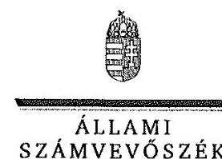

ELNÖK

Ikt.szám: V-1038-712/2016.

# Németi László tú. ezredes 

igazgató
Komárom-Esztergom Megyei Katasztrófavédelmi Igazgatóság

## Tatabánya

## Tisztelt Igazgató Úr!

"A kéményseprő-ipari közszolgáltatás ellenőrzése" címủ jelentéstervezetre tett észrevételeit köszönettel megkaptam.

Az ellenőrzési megállapításokra vonatkozó észrevételét az Állami Számvevőszékről szóló 2011. évi LXVI. törvény 29. § (2) bekezdésében meghatározott tizenöt napos határidőn belül küldte meg. Az Állami Számvevőszék észrevétellel kapcsolatos álláspontját a mellékletként csatolt, a felügyeleti vezető által készített indokolás tartalmazza.

Budapest, 2017. hó / nap

Tisztclettel:

Melléklet: Észrevételre adott válasz

---

"A kéményseprő-ipari közszolgáltatás ellenőrzése" címủ jelentéstervezethez tett észrevételre adott válasz
Komárom-Esztergom Megyei Katasztrófavédelmi Igazgatóság
"A kéményseprő-ipari közszolgáltatás ellenőrzése" címủ jelentéstervezetre tett észrevételeket áttekintettem, annak kezelésével kapcsolatban a következő tájékoztatást adom.
A kéményseprő-ipari közszolgáltatásról szóló 2012. évi XC. törvény (a továbbiakban: Ksktv.) 12. § (1) bekezdése alapján a tüzvédelmi hatóság a közszolgáltatási tevékenység végzésére jogosult közszolgáltatókról nyilvántartást vezet, amelyben a szolgáltatási tevékenység megkezdésének és folytatásának általános szabályairól szóló törvényben meghatározott adatokon túl nyilvántartja a képviseletet ellátó természetes személy személyazonosító adatait, a tevékenység gyakorlására jogosult vagy képviselője telefonszámát, elektronikus levélcímét, székhelyét és telephelyét, illetve a közszolgáltatás megkezdésének és befejezésének időpontját.
A jelentéstervezet 3.1. számú megállapítás 3. bekezdésében foglaltak szerint a felsorolt katasztrófavédelmi igazgatóságok nem vezették teljes körűen a tevékenység végzésére jogosult közszolgáltatókról a nyilvántartást, mivel az illetékességi területükön szolgáltatást végző, de székhellyel más igazgatóság területét érintő ellenőrzött közszolgáltatót nem tartották nyilván.
A Komárom-Esztergom Megyei Katasztrófavédelmi Igazgatóság észrevétele arra vonatkozott, hogy a Somogy megyei székhelyű Magyar Kémény Kft. közszolgáltató vonatkozásában a szolgáltatás felügyeletét ellátó hatósági feladatokat a Somogy Megyei Katasztrófavédelmi Igazgatóság látta el, amely hatóságnak a szolgáltatási tevékenység megkezdésének és folytatásának általános szabályairól szóló 2009. évi LXXVI. alapján kellett nyilvántartásba vennie a közszolgáltatót. Így a Komárom-Esztergom Megyei Katasztrófavédelmi Igazgatóság nem vette nyilvántartásba a közszolgáltatót, és nem szerepeltette a nyilvántartásában.
A Ksktv. alapján a hatósági felügyeletet a tüzvédelmi hatóság látta el. A tüzvédelmi hatósági feladatokat ellátó szervezetekről, a tüzvédelmi bírságról és a tüzvédelemmel foglalkozók kötelező élet- és balesetbiztosításáról szóló 259/2011. (XII. 7.) Korm. rendelet 1. § (2) bekezdésének h) pontja előírta, hogy a Ksktv. 12. §-ában meghatározott hatósági felügyeleti eljárásokban a katasztrófavédelmi szerv területi szervének kellett eljárnia. Figyelemmel a Ksktv. 12. § (1) bekezdésében foglaltakra, a közszolgáltatási tevékenység végzésére jogosult közszolgáltatóról a katasztrófavédelmi igazgatóságnak nyilvántartást kellett vezetnie.
A Magyar Kémény Kft. jogosult volt kéményseprő-ipari közszolgáltatás végzésére a Komárom-Esztergom Megyei Katasztrófavédelmi Igazgatóság illetékességi területén, ezért a Ksktv. 12. § (1) bekezdésében foglaltaknak megfelelően a közszolgáltatóról az igazgatóságnak nyilvántartást kellett volna vezetnie, függetlenül attól, hogy a közszolgáltató székhelye más megyében volt.
A fentiekre való tekintettel a megállapítás módosítása nem indokolt.

Budapest, 2017.
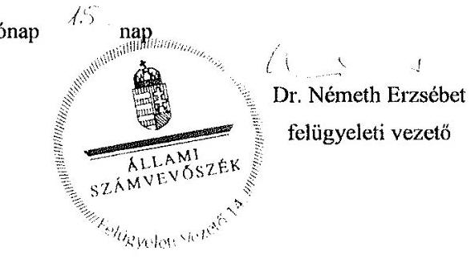

---

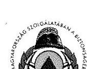

Nógrád Megyei
Katasztrófavédelmi Igazgatóság
Igazgató

H-3100 Salgótarján, Szent Flórián tér 1.
Tel: (36-32) 521-030 Fax: (36-32) 521-031 e-mail: nograd.titkarsag@katved.gov.hu

Szám: 36200/155-1/2017.ált.

Tárgy: Tájékoztatás
Ügyintéző: Szemerády Zoltán tű. alez.
Hiv. szám: FV-V-1038-682/2016
Telefon: (32)521-036

Domokos László Úr
Állami Számvevőszék

Budapest

Tisztelt Elnök Úr!

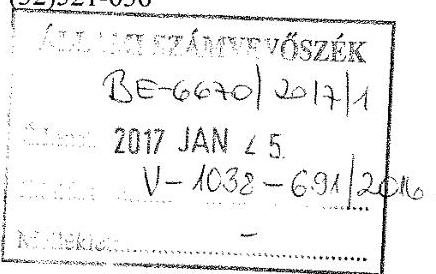

A „kéményseprő-ipari közszolgáltatás ellenőrzésével” kapcsolatban az Igazgatóságunk részére megküldött jelentéstervezettel kapcsolatosan a következő észrevételt kívánom tenni:

A szolgáltatási tevékenység megkezdésének és folytatásának általános szabályairól szóló 2009. évi LXXVI. törvény (a továbbiakban: Szolg. tv.) a szolgáltatási tevékenység bejelentésével, illetve a szolgáltatás felügyeletét ellátó hatósággal kapcsolatosan a következő rendelkezéseket tartalmazza:

„12. § (2) Ha jogszabály előírja, hogy a tevékenység folytatására irányuló szándékát a szolgáltató köteles az ott meghatározott, a szolgáltatás felügyeletét ellátó hatóságnak bejelenteni (a továbbiakban: bejelentés), a bejelentésre az e fejezetben foglalt rendelkezéseket kell alkalmazni.

23. § (1) A szolgáltatás felügyeletét ellátó hatóság a bejelentés megérkezését követően haladéktalanul ellenőrzi, hogy a bejelentés megfelel-e a 22. §-ban meghatározott követelményeknek, és legkésőbb a bejelentés megérkezésétől számított nyolc napon belül,

a) ha a bejelentés megfelel a 22. §-ban meghatározott követelményeknek, és az eljárási illetéket vagy igazgatási szolgáltatási díjat megfizették, a bejelentést tevőt erről a tényről igazolás megküldésével értesíti;

b) ha a bejelentés nem felel meg a 22. §-ban meghatározott követelményeknek, vagy a bejelentésre előírt eljárási illetéket vagy igazgatási szolgáltatási díjat nem fizették meg, és a szolgáltató nem részesült költségmentességben, a bejelentés hiányainak megjelölése mellett figyelmezteti a szolgáltatót a tevékenység bejelentés nélküli folytatásának jogkövetkezményeire.”

A közigazgatási hatósági eljárás és szolgáltatás általános szabályairól szóló 2004. évi CXL. törvény illetékességet szabályozó előírása alapján a Magyar Kémény Kft. (7400 Kaposvár, Petőfi tér 1.) közszolgáltató vonatkozásában a Somogy Megyei Katasztrófavédelmi Igazgatóság látta el a szolgáltatás felügyeletét ellátó hatósági feladatokat.

„21. § (1) Ha jogszabály másként nem rendelkezik, az azonos hatáskörű hatóságok közül az a hatóság jár el, amelynek illetékességi területén

az ügyfél lakóhelye, tartózkodási helye, ennek hiányában értesítési címe (a továbbiakban együtt: lakcím), illetve székhelye, telephelye, fióktelepe (a továbbiakban együtt: székhely) van.”

---

A Szolg tv. a szolgáltató nyilvántartásba vételével kapcsolatosan a következő előírásokat rögzíti:
„26. § (1) A szolgáltatási tevékenység megkezdéséhez vagy folytatásához szükséges engedélyezési eljárásban a szolgáltatás felügyeletét ellátó hatóság az engedély megadásával egyidejűleg - vagy a 14. § b) pontja szerinti esetben a határidő lejártakor - hivatalból nyilvántartásba veszi a szolgáltatót."
Tekintettel arra, hogy a Nógrád Megyei Katasztrófavédelmi Igazgatóság a fent hivatkozott előírások alapján a Szolg. tv. szerint nem vette nyilvántartásba a Magyar Kémény Kft. (7400 Kaposvár, Petőfi tér 1.) közszolgáltatót, így értelemszerűen nem is szerepeltethette azt a nyilvántartásában (amely Nógrád megyei székhellyel rendelkező közszolgáltató hiányában üres volt).
Az ellenőrzésük időpontjában hatályos, a kéményseprő-ipari közszolgáltatásról szóló 2012. évi XC. törvény 12. § (1) bekezdésében előírt nyilvántartási kötelezettséget a következők miatt nem tartottuk hatóságunk vonatkozásában értelmezhetőnek:

1. A fenti nyilvántartás a Szolg. tv. szerinti nyilvántartás adatain alapulna, mely esetünkben tárgytalan volt;
2. A képviseletet ellátó természetes személy egyetlen eljárásunk során sem szerepelt, azokon egyedi megbízások alapján a területi képviselők vettek részt;
3. A közszolgáltatás megkezdésének és befejezésének időpontja szintén a felügyeletet ellátó hatóság által birtokolt információkon alapultak. Ezek jellemzően közismert adatok voltak, de bármely rendkívüli körülmény esetén hatóságunknak nem lett volna szükségszerűen erről információja.
„12. § (1) A tüzvédelmi hatóság a közszolgáltatási tevékenység végzésére jogosult közszolgáltatókról nyilvántartást vezet, amelyben a szolgáltatási tevékenység megkezdésének és folytatásának általános szabályairól szóló törvényben meghatározott adatokon túl nyilvántartja
a) a képviseletet ellátó természetes személy személyazonosító adatait,
b) a tevékenység gyakorlására jogosult vagy képviselője telefonszámát, elektronikus levélcímét, székhelyét és telephelyét,
c) a közszolgáltatás megkezdésének és befejezésének időpontját."

Természetesen a hatósági tevékenységünk ellátásához szükséges információkkal rendelkeztünk (jellemzően a hatósági ellenőrzéseink során felvett jegyzőkönyvek tartalmazták a szükséges személyi adatokat és elérhetőségeket), mely adatokat ugyanakkor nem nevezhetünk nyilvántartásnak.

Salgótarján, 2017. január 20.
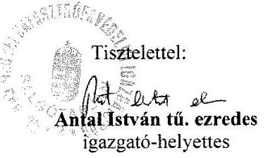

Készült: 2 pld-ban
Egy példány: 2 lap
Készítette/Gépelte: Szemerédy Zoltán tű. alez.
Kapják: 1. Állami Számvevőszék (Tértivevény)
2. Irattár

---

# Antal István tű. ezredes 

igazgató-helyettes
Nógrád Megyei Katasztrófavédelmi Igazgatóság
Salgótarján

## Tisztelt Igazgató-helyettes Úr!

"A kéményseprő-ipari közszolgáltatás ellenőrzése" címủ jelentéstervezetre tett észrevételeit köszönettel megkaptam.

Az ellenőrzési megállapításokra vonatkozó észrevételét az Állami Számvevőszékről szóló 2011. évi LXVI. törvény 29. § (2) bekezdésében meghatározott tizenöt napos határidőn belül küldte meg. Az Állami Számvevőszék észrevétellel kapcsolatos álláspontját a mellékletként csatolt, a felügyeleti vezető által készített indokolás tartalmazza.

Budapest, 2017. hó : nap

Tisztelettel:

Melléklet: Észrevételre adott válasz

---

# "A kéményseprő-ipari közszolgáltatás ellenőrzése" címü jelentéstervezethez tett észrevételre adott válasz 

Nógrád Megyei Katasztrófavédelmi Igazgatóság
"A kéményseprő-ipari közszolgáltatás ellenőrzése" címủ jelentéstervezetre tett észrevételeket áttekintettem, annak kezelésével kapcsolatban a következő tájékoztatást adom.
A kéményseprő-ipari közszolgáltatásról szóló 2012. évi XC. törvény (a továbbiakban: Ksktv.) 12. § (1) bekezdése alapján a tüzvédelmi hatóság a közszolgáltatási tevékenység végzésére jogosult közszolgáltatókról nyilvántartást vezet, amelyben a szolgáltatási tevékenység megkezdésének és folytatásának általános szabályairól szóló törvényben meghatározott adatokon túl nyilvántartja a képviseletet ellátó természetes személy személyazonosító adatait, a tevékenység gyakorlására jogosult vagy képviselője telefonszámát, elektronikus levélcímét, székhelyét és telephelyét, illetve a közszolgáltatás megkezdésének és befejezésének időpontját.
A jelentéstervezet 3.1. számú megállapítás 3. bekezdésében foglaltak szerint a felsorolt katasztrófavédelmi igazgatóságok nem vezették teljes körűen a tevékenység végzésére jogosult közszolgáltatókról a nyilvántartást, mivel az illetékességi területükön szolgáltatást végző, de székhellyel más igazgatóság területét érintő ellenőrzött közszolgáltatót nem tartották nyilván.
A Nógrád Megyei Katasztrófavédelmi Igazgatóság észrevétele arra vonatkozott, hogy a Somogy megyei székhelyű Magyar Kémény Kft. közszolgáltató vonatkozásában a szolgáltatás felügyeletét ellátó hatósági feladatokat a Somogy Megyei Katasztrófavédelmi Igazgatóság látta el, amely hatóságnak a szolgáltatási tevékenység megkezdésének és folytatásának általános szabályairól szóló 2009. évi LXXVI. alapján kellett nyilvántartásba vennie a közszolgáltatót. Így a Nógrád Megyei Katasztrófavédelmi Igazgatóság nem vette nyilvántartásba a közszolgáltatót, és nem szerepeltette a nyilvántartásában.
A Ksktv. alapján a hatósági felügyeletet a tüzvédelmi hatóság látta el. A tüzvédelmi hatósági feladatokat ellátó szervezetekről, a tüzvédelmi bírságról és a tüzvédelemmel foglalkozók kötelező élet- és balesetbiztosításáról szóló 259/2011. (XII. 7.) Korm. rendelet 1. § (2) bekezdésének h) pontja előírta, hogy a Ksktv. 12. §-ában meghatározott hatósági felügyeleti eljárásokban a katasztrófavédelmi szerv területi szervének kellett eljárnia. Figyelemmel
 a Ksktv. 12. § (1) bekezdésében foglaltakra, a közszolgáltatási tevékenység végzésére jogosult közszolgáltatóról a katasztrófavédelmi igazgatóságnak nyilvántartást kellett vezetnie.
A Magyar Kémény Kft. jogosult volt kéményseprő-ipari közszolgáltatás végzésére a Nógrád Megyei Katasztrófavédelmi Igazgatóság illetékességi területén, ezért a Ksktv. 12. § (1) bekezdésében foglaltaknak megfelelően a közszolgáltatóról az igazgatóságnak nyilvántartást kellett volna vezetnie, függetlenül attól, hogy a közszolgáltató székhelye más megyében volt.
A fentiekre való tekintettel a megállapítás módosítása nem indokolt.
Budapest, 2017.
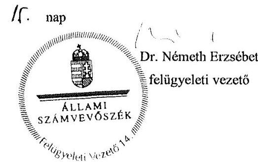

---

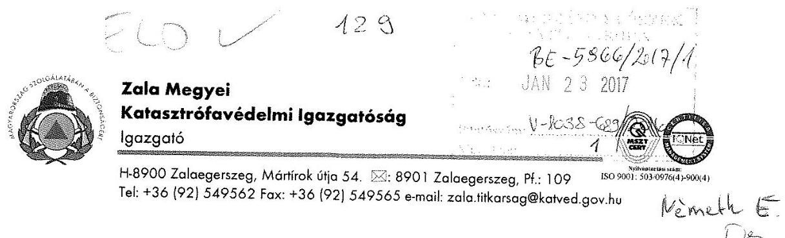

Szám: 37000/1206-18/2016.ált.

Tárgy: Észrevétel
Ügyintéző: Tóth Eszter tű. százados
Telefon: $\quad 92 / 549-396$

# Domokos László 

elnök

## Állami Számvevőszék

## Budapest

## Tisztelt Elnök Úr!

Tájékoztatom, hogy az FV-V-1038-682/2016. számú „A kéményseprő-ipari közszolgáltatás ellenőrzése" című jelentéstervezetet áttanulmányoztam és az alábbi észrevételeket teszem.

1. Az igazgatóságunk tekintetében a jelentéstervezet (29. oldal) ,3.2. számú megállapítás:
A 2015. évben a katasztrófavédelmi igazgatóságok $15 \%$-ánál a minimális szakmai, személyi és tárgyi feltételek a Ksktv. 12. (2) bekezdés a) és aa) pontjaiban előírt folyamatos vizsgálata az ellenőrzésre vonatkozó belső előírások ellenére elmaradt. (Hajdú-Bihar Megyei, Zala Megyei, Fővárosi Katasztrófavédelmi Igazgatóság)"

Észrevétel: A hatósági felügyeletet a kéményseprő-ipari közszolgáltatásról szóló 2012. évi XC. törvény (Ksktv.) szabályozta. A Ksktv. 12. §. (2) bekezdésének a) pontja aa) alpontjában határozta meg a jogalkotó, hogy a „A tűzvédelmi hatóság
a) folyamatosan vizsgálja
aa) a közszolgáltatás minimális szakmai, személyi és tárgyi feltételeit."
Ennek a hatóság Zala megyében eleget tett és a központi szervünk által meghatározottak szerint dokumentáltuk ezen vizsgálatainkat (BM OKF által üzemeltetett számítógépes programban - Sharepoint rendszerben, melynek felületét, adattartalmát a mellékelt példa is mutatja).
A törvényi előíráson felül a BM OKF a 35000/5195/2015. ált. számú átiratában ezen felüli feladatokat határozott meg a területi szervek részére.
A fenti számú átirat 3. pontja szerint félévenként ellenőrizni kellett a kéményseprő-ipari közszolgáltatók sormunka ütemtervének megvalósulását, az ingatlanhasználók felé történő kiértesítés megfelelőségét, és az ellenőrzés meghiúsulása esetén a Katasztrófavédelmi Kirendeltség felé történő értesítési kötelezettség megtörténtét. A feladatszabásban nem lett konkrétan megjelölve a személyi és tárgyi feltételek meglétének vizsgálata tekintettel arra is, hogy azt már a fenti jogszabály meghatározta.

---

Mindezek figyelembe vételével jelenthettük ki korábban is, hogy a vizsgált közszolgáltató az érintett időszakban, a jogszabályban meghatározott szakmai, személyi és tárgyi feltételeknek megfelelt, csakúgy, mint a BM OKF által meghatározott vizsgálatoknak is. A közszolgáltatás a megyénkben zavartalan volt.
2. Az ellenőrzés területe fejezet utolsó bekezdésében szereplő (jelentéstervezet 10. oldal) megállapítás vonatkozásában: „A 2016. júliustól hatályos jogszabályi változások hatására 2016. novembertől 17 megye kéményseprő-ipari közszolgáltatása átkerült a katasztrófavédelmi igazgatóságok feladatkörébe. Fejér megyében, Vas megyében és Budapest teljes területén továbbra is az önkormányzatokkal szerződött közszolgáltatók végzik a feladatellátást. Ezáltal jelenleg is Magyarországon lévő több mint 3000 településből közel 2500 településen a katasztrófavédelmi igazgatóságok látják el a közfeladatot."

Észrevétel: 2016. júliustól a kéményseprő-ipari tevékenységet a lakosság körében a katasztrófavédelem kéményseprő-ipari szerve, mely konkrétan a Belügyminisztérium Országos Katasztrófavédelmi Főigazgatóság Gazdasági Ellátó Központja, vette át és nem a megyei katasztrófavédelmi igazgatóságok.

Zalaegerszeg, 2017. január 18.
Tisztelettel:
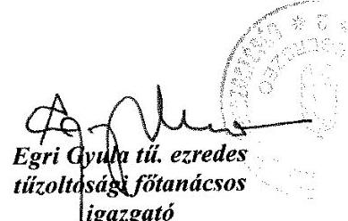

Készült : 2 példányban
Egy példány : 2 lap+ melléklet
Elküldve : Állami Számvevőszék (1364 Budapest 4., pf 54.)

---

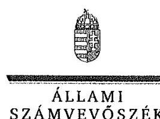

ELNÖK

# Egri Gyula tű. ezredes 

igazgató

Zala Megyei Katasztrófavédelmi Igazgatóság

## Zalaegerszeg

## Tisztelt Igazgató Úr!

"A kéményseprő-ipari közszolgáltatás ellenőrzése" című jelentéstervezetre tett észrevételeit köszönettel megkaptam.

Az ellenőrzési megállapításokra vonatkozó észrevételét az Állami Számvevőszékről szóló 2011. évi LXVI. törvény 29. § (2) bekezdésében meghatározott tizenöt napos határidőn belül küldte meg. Az Állami Számvevőszék észrevétellel kapcsolatos álláspontját a mellékletként csatolt, a felügyeleti vezető által készített indokolás tartalmazza.

Budapest, 2017. . . hó . . nap

Tisztelettel:

Melléklet: Észrevételre adott válasz

---

"A kéményseprő-ipari közszolgáltatás ellenőrzése" című jelentéstervezethez tett észrevételekre adott válasz
Zala Megyei Katasztrófavédelmi Igazgatóság
"A kéményseprő-ipari közszolgáltatás ellenőrzése" című jelentéstervezetre tett észrevételeket áttekintettem, annak kezelésével kapcsolatban a következő tájékoztatást adom.

# 1. A jelentéstervezet 3.2. számú megállapításával kapcsolatos észrevétel 

A kéményseprő-ipari közszolgáltatásról szóló 2012. évi XC. törvény (a továbbiakban: Ksktv.) 12. § (2) bekezdés a) pont aa) alpontjában foglalt előírásnak megfelelően a tűzvédelmi hatóságnak folyamatosan vizsgálnia kellett a kéményseprő-ipari közszolgáltatás minimális szakmai, személyi és a tárgyi feltételeit. A BM Országos Katasztrófavédelmi Igazgatósága 350000/5195/2015/ált. számú feladatkiszabásának 3. pontjában meghatározott ellenőrzési feladatok a törvény által előírt kötelezettséget nem befolyásolták, a közszolgáltatás minimális szakmai, személyi és a tárgyi feltételek vizsgálatának kötelezettsége továbbra is fennállt.
Az észrevételhez mellékelt dokumentum alapján nem igazolt, hogy a hatóság vizsgálta a kémény-seprő-ipari közszolgáltatás minimális szakmai, személyi és a tárgyi feltételeit.
A fentiek alapján a megállapítás módosítása nem indokolt.

## 2. A jelentéstervezet 10. oldalának utolsó bekezdését érintő észrevétel

Az észrevételt elfogadjuk, a bekezdés szövegét pontosítjuk a Belügyminisztérium Országos Katasztrófavédelmi Főigazgatóság Gazdasági Ellátó Központjára vonatkozó kiegészítéssel.

Budapest, 2017.

---

# DOMOKOS LÁSZLÓ úrnak, 

elnök

Állami Számvevőszék

Tárgy: „A kéményseprő-ipari közszolgáltatás ellenőrzése" című jelentés tervezetét a Belügyminisztérium és az irányítása alá tartozó szervezetek feladat- és hatáskörére figyelemmel áttekintettük. Az Állami Számvevőszékről szóló 2011. évi LXVI. törvény 29. § (2) bekezdésének megfelelően a tervezetre az alábbi észrevételeket teszem.

1. A kéményseprő-ipari közszolgáltatás szakmai szabályozásáról szóló 63/2012. (XII. 11.) BM rendelet 9. §-ára figyelemmel a Belügyminisztérium részére megküldött statisztikai adatok alapján a kéményseprő-ipari közszolgáltatást végző szervezetek alkalmazottainak összlétszáma a 2015. évben - Jász-Nagykun-Szolnok és Heves megye adatai nélkül - 1.174 főt tett ki.
A fenti adatra tekintettel a jelentés tervezet kilencedik oldalának második bekezdésében szereplő azon megállapítás, amely szerint az ellenőrzött közszolgáltatók által foglalkoztatottak átlagos összesített statisztikai létszáma a 2015. évben meghaladta az 1.500 főt, álláspontom szerint felülvizsgálatra szorul, figyelemmel arra a tényre, hogy az ellenőrzés a kéményseprő-ipari közszolgáltatást végző szervezeteknek csupán 30%-át érintette.
2. A jelentés tervezet 10. oldal második bekezdés első mondatának pontosítása javasolt az alábbiak szerint:
„2016. júliustól a jogszabályi változások hatására 17 megye kéményseprő-ipari közszolgáltatása átkerült a Belügyminisztérium Országos Katasztrófavédelmi Főigazgatóság Gazdasági Ellátó Központ feladatkörébe".
Budapest, 2017. augusztus „ 0 + ,"

---

ELNÖK

# Dr. Pintér Sándor úr belügyminiszter 

Belügyminisztérium

## Budapest

## Tisztelt Miniszter Úr!

"A kéményseprő-ipari közszolgáltatás ellenőrzése" című jelentéstervezetre tett észrevételeit köszönettel megkaptam.

Az ellenőrzési megállapításokra vonatkozó észrevételét az Állami Számvevőszékről szóló 2011. évi LXVI. törvény 29. § (2) bekezdésében meghatározott tizenöt napos határidőn belül küldte meg. Az Állami Számvevőszék észrevétellel kapcsolatos álláspontját a mellékletként csatolt, a felügyeleti vezető által készített indokolás tartalmazza.

Budapest, 2017. $\quad \because \quad$ hó 15 nap

Melléklet: Észrevételre adott válasz

---

"A kéményseprő-ipari közszolgáltatás ellenőrzése" című jelentéstervezethez tett észrevételre adott válasz

Belügyminisztérium
"A kéményseprő-ipari közszolgáltatás ellenőrzése" című jelentéstervezetre tett észrevételeket áttekintettem, annak kezelésével kapcsolatban a következő tájékoztatást adom.
Az 1. számú észrevétel a jelentéstervezet megállapításait nem vitatja, javasolja az Ellenőrzés területe fejezetben, a 9. oldal 2. bekezdésében szereplő létszámadat felülvizsgálatát.
A jelentéstervezetben szereplő létszámadat az ellenőrzött közszolgáltatók beszámolóiban szereplő adatok összegzésével került meghatározásra, és a szervezetek teljes foglalkoztatotti állományát mutatja, tehát nem kizárólag a kéményseprő-ipari közszolgáltatásban érintett foglalkoztatottakat. Erre való tekintettel a létszámadat módosítása nem indokolt.
A 2. számú észrevétel a jelentéstervezet megállapításait nem vitatja, pontosítást javasol az Ellenőrzés területe fejezetben. Az észrevétel kapcsán az érintett mondatot módosítottuk.

Budapest, 2017.
c. hónap 16. nap

Dr. Németh Erzsébet
felügyeleti vezető

---

.

---

# RÖVIDÍTÉSEK JEGYZÉKE 

${ }^{1}$ ÁSZ
${ }^{2}$ feladat eredeti címzettje
${ }^{3}$ MJVÖ
${ }^{4}$ BM OKF
${ }^{5} \mathrm{BM}$
${ }^{6}$ 2013. évi CXXXIV. törvény
${ }^{7}$ felmérés
${ }^{8}$ Ksktv.
${ }^{9}$ Mótv.
${ }^{10}$ rendeletek
${ }^{11}$ 63/2012. (XII.11.) BM rendelet
${ }^{12}$ 2011. évi CVIII. törvény
${ }^{13}$ 347/2012. (XII.11.) Korm. rendelet
${ }^{14}$ 511/2013. (XII. 29.) Korm. rendelet
${ }^{15}$ MEKH
${ }^{16}$ 2009. évi LXXVI. törvény
${ }^{17}$ 259/2011. (XII. 7.) Korm. rendelet
${ }^{18}$ ellenőrzésre vonatkozó belső előírások

Állami Számvevőszék
a kéményseprő-ipari közszolgáltatás feladatellátásának eredeti címzettjei a megyeszékhely megyei jogú városok, a fővárosban a fővárosi, Pest megyében Érd megyei jogú város önkormányzata
megyei jogú város önkormányzata
Belügyminisztérium Országos Katasztrófavédelmi Főigazgatóság
Belügyminisztérium
2013. évi CXXXIV. törvény az egyes közszolgáltatások ellátásáról és az ezzel összefüggő törvénymódosításokról (hatályos: 2013. július 20-ától)
TÁRKI Zrt. által lebonyolított kérdőíves-felmérés alapján
2012. évi XC. törvény a kéményseprő-ipari közszolgáltatásról (hatályos: 2013. január 1-jétől 2016. június 30-áig)
2011. évi CLXXXIX. Magyarország helyi önkormányzatairól (hatályos: 2012. január 1-jétől)
A kéményseprő-közszolgáltatásról alkotott, az ellenőrzött időszakban hatályos önkormányzati rendeletek
63/2012. (XII.11.) BM rendelet a kéményseprő-ipari közszolgáltatás ellátásának szakmai szabályairól (hatályos: 2013. január 1-jétől 2016. június 16-áig)
2011. évi CVIII. törvény a közbeszerződésekről (hatályos: 2011. augusztus 21-étől 2015. október 31-éig)

347/2012. (XII.11.) Korm. rendelet a kéményseprő-ipari közszolgáltatásról szóló törvény végrehajtásáról (hatályos: 2013. január 1-jétől 2016. június 30-áig)
511/2013. (XII. 29.) Korm. rendelet a nem rendszeres kéményseprő-ipari közszolgáltatás szabályairól és az ennek során eljáró állami szervek kijelöléséről (hatályos: 2013. december 31-étől 2016. június 30-áig)
Magyar Energetikai és Közmű-szabályozási Hivatal
2009. évi LXXVI. törvény a szolgáltatási tevékenység megkezdésének és folytatásának általános szabályairól (hatályos: 2009. október 1-jétől)
259/2011. (XII. 7.) Korm. rendelet a tűzvédelmi hatósági feladatokat ellátó szervezetekről, a tűzvédelmi bírságról és a tűzvédelemmel foglalkozók kötelező élet- és balesetbiztosításáról (hatályos: 2011. december 8-ától)
a kéményseprő-ipari közszolgáltatókra vonatkozó BM OKF 5625-3/2012/ÁLT. számú 2013. évi országos hatósági ellenőrzési terv, 2014. évben a 4-7/2014/TÚZV. számú ügyiratban, 2015. évben a 35000/5195/2015/ált. számú feladatkiszabás

---

# ÁLLAMI SZÁMVEVŐSZÉK 

1052 Budapest, Apáczai Csere János utca 10.
Levélcím: 1364 Budapest 4. Pf. 54
Telefon: +36 14849100 Telefax: +36 14849200
www.asz.hu
