# Jelentés 

## Gabonakutató Nonprofit Közhasznú Kft.

Az állami tulajdonban (résztulajdonban) lévő gazdálkodó szervezetek vagyonmegőrzési és gazdálkodási tevékenységének ellenőrzése 2017.

---

# Jelenetés 

## Gabonakutató Nonprofit Közhasznú Kft.

Az állami tulajdonban (résztulajdonban) lévő gazdálkodó szervezetek vagyonmegőrzési és gazdálkodási tevékenységének ellenőrzése
2017. 04. hó 05. nap
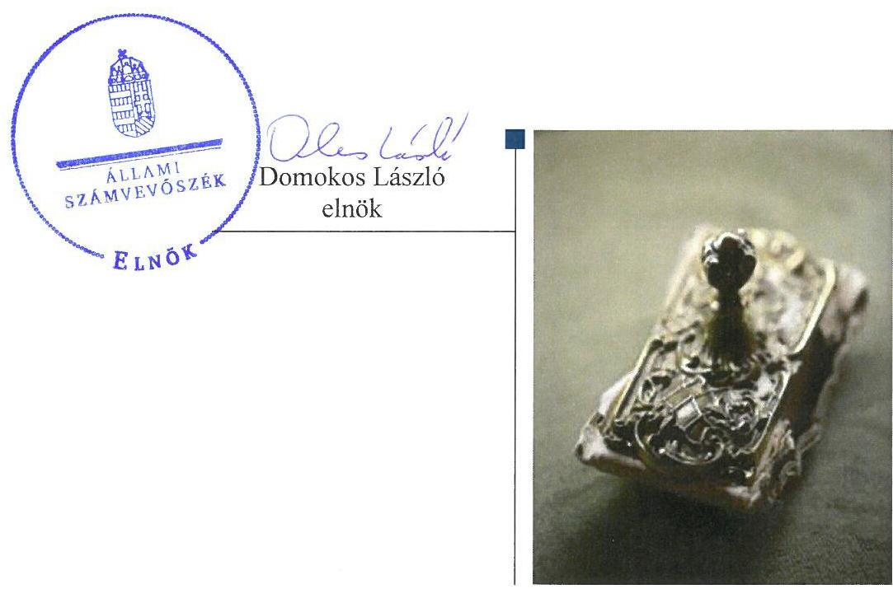

---

# AZ ELLENŐRZÉST FELÜGYELTE: 

BÖRÖCZ IMRE felügyeleti vezető

## AZ ELLENŐRZÉST VEZETTE ÉS A VÉGREHAJTÁSÁÉRT FELELŐS:

VIDA KATALIN ellenőrzésvezető

## A PROGRAM ÖSSZEÁLLÍTÁSÁÉRT FELELŐS:

JANIK JÓZSEF osztályvezető

IKTATÓSZÁM: V-1027-207/2016

TÉMASZÁM: 2061

## ELLENŐRZÉS-AZONOSÍTÓ SZÁM: V070920

Jelentéseink az Országgyúlés számítógépes hálózatán és az Interneten a www.asz.hu címen is olvashatóak.

---

# TARTALOMJEGYZÉK 

■ ÖSSZEGZÉS ..... 5
■ AZ ELLENŐRZÉS CÉLJA ..... 7
■ AZ ELLENŐRZÉS TERÜLETE ..... 8
■ AZ ELLENŐRZÉS HÁTTERE, INDOKOLTSÁGA ..... 9
■ A JELENTÉS LÉNYEGES KÉRDÉSKÖREI ..... 10
■ ELLENŐRZÉS HATÓKÖRE ÉS MÓDSZEREI ..... 11
■ MEGÁLLAPÍTÁSOK ..... 13
■ JAVASLATOK ..... 22
■ MELLÉKLETEK ..... 25
I. Sz. melléklet: Értelmező szótár. ..... 25
II. Sz. melléklet: A használhatósági fok alakulása a 2011-2014. években ..... 30
III. Sz. melléklet: Elszámolt értékvesztés a 2011-2014. években ..... 31
IV. Sz. melléklet: A vagyon alakulása a 2011-2014. években ..... 32
V. Sz. melléklet: A beruházások és felújítások ráfordításai, valamint az értékcsökkenési leírás alakulása a 2011-2014. években ..... 33
VI. Sz. melléklet: Az átlagos életkor alakulása a 2011-2014. években ..... 34
■ FÜGGELÉK: ÉSZREVÉTELEK ..... 35
■ RÖVIDÍTÉSEK JEGYZÉKE ..... 59

---

.

---

# ÖSSZEGZÉS 

A vagyonnal való gazdálkodás feltételeit a tulajdonosi joggyakorlók - a Magyar Nemzeti Vagyonkezelő Zrt. és a Nemzeti Agrárkutatási és Innovációs Központ - szabályszerűen, a szegedi székhelyű Gabonakutató Nonprofit Közhasznú Korlátolt Felelősségű Társaság a 2014. évtől szabályszerűen alakította ki. A vagyonváltozást eredményező döntések előkészítése és megalapozása nem felelt meg az előirásoknak, a közbeszerzési előirásokat nem tartották be. A beszámolási kötelezettségnek eleget tettek. Az adatszolgáltatási kötelezettséget nem teljesítették, az információs rendszer kiépítése nem történt meg. A bevételeinek és ráfordítások elszámolása összességében megfelelő volt. Az önköltségszámítás és az adósságot keletkeztető ügyletek vállalása nem volt szabályszerű.

## Az ellenőrzés társadalmi indokoltsága

Az állami tulajdonú gazdálkodó szervezetek a nemzeti vagyon részét képezik. Az állami vagyonnal való gazdálkodást illetően a tulajdonosi joggyakorlás és a vagyongazdálkodás feladata az állami vagyon átlátható, rendeltetésszerű és felelős felhasználásának biztosítása. Az állam meghatározza az ellátandó közszolgáltatással kapcsolatos feladatokat, amelyhez a vagyonnal kapcsolatos döntéseknek igazodniuk kell. Az állam nemzetgazdasági szempontból kiemelt jelentőségű nemzeti vagyonban tartandó állami tulajdonban álló társasági részesedését a nemzeti vagyonról szóló törvény határozza meg.

Az Állami Számvevőszék a korábban ellenőrizetlen területek, szervezetek körébe tartozó társaságnál végzett ellenőrzést. A számvevőszéki ellenőrzés hozzájárul a közpénzek szabályos, átlátható, elszámoltatható és eredményes felhasználásához, a rend pedig értéket teremt. Minden közpénzt, közvagyont használó szervezettel szemben társadalmi igény, hogy tevékenységükről elszámoljanak. Ezt figyelembe véve és az Állami Számvevőszék Stratégiájával összhangban került sor a Gabonakutató Nonprofit Közhasznú Kft. ellenőrzésére a 2011-2014. évek vonatkozásában.

## Főbb megállapítások, következtetések, javaslatok

A Gabonakutató Nonprofit Közhasznú Kft. a feladatait saját, illetve a vagyonkezelésében lévő eszközökkel látta el. A Magyar Nemzeti Vagyonkezelő Zrt. és a Nemzeti Agrárkutatási és Innovációs Központ, mint tulajdonosi joggyakorlók, az Alapító Okiratban szabályszerűen meghatározták a tulajdonos számára fenntartott, vagyongazdálkodásra vonatkozó jogokat, rögzítették az állami vagyonnal történő felelős gazdálkodáshoz szükséges követelményeket.

A Gabonakutató Nonprofit Közhasznú Kft. a vagyon értékének megőrzését, gyarapítását szolgáló, szabályszerű vagyongazdálkodás feltételeit, belső szabályozásait a 2011-2013. években nem megfelelően, a 2014. évben összességében megfelelően alakította ki. A vagyonkezelésbe kapott ingatlan nyilvántartását elmulasztotta, így az állami vagyonnal való gazdálkodás átláthatósága nem érvényesült.

A Gabonakutató Nonprofit Közhasznú Kft. közhasznú tevékenységének bevételeit és ráfordításait a vállalkozói tevékenységétől elkülönítetten, az anyagjellegű ráfordításoknál megállapított hiányosságok mellett összességében megfelelően számolta el. Az önköltségszámítás szabályozása és végrehajtása nem volt szabályszerű.

A Gabonakutató Nonprofit Közhasznú Kft. vagyongazdálkodási tevékenysége a jogszabályi rendelkezések és a belső szabályzatok előírásainak nem felelt meg. A vagyonváltozást eredményező döntések előkészítése és megalapozása során nem minden esetben tartották be az Alapító Okirat és az SZMSZ előírásait, korlátozták a tulajdonosi joggyakorlást, ezzel növelték az eladósodás kockázatát, ami veszélyeztette az állami tulajdoni körben történő társasági működést. A közbeszerzési törvény előírásait megsértve, az értékhatárt meghaladó szerződések megkötését megelőzően több esetben nem folytattak le közbeszerzési eljárást, így nem biztosították a közpénzek ésszerű és ha-

---

tékony felhasználásának átláthatóságát és nyilvános ellenőrizhetőségét. Az állami vagyon hasznosítására kötött szerződések, az elszámolások, valamint a vagyonnyilvántartások hiányosak és nem szabályszerűek voltak. Nem alakítottak ki és nem múködtettek szabályozott keretek között belső és a tulajdonosi joggyakorlóval fenntartott információs rendszert. Az államháztartásról szóló törvény végrehajtási kormányrendelete szerinti adatszolgáltatást nem teljesítették, veszélyeztetve az államháztartás költségvetési teljesítményét, az átláthatósághoz nem járultak hozzá, a költségvetés végrehajtásának kiszámíthatóságát csökkentették.

A Gabonakutató Nonprofit Közhasznú Kft. szabályszerűen teljesítette a beszámolási kötelezettségét.
A Gabonakutató Nonprofit Közhasznú Kft. - mint kormányzati szektorba sorolt egyéb szervezet - adósságot keletkeztető ügyleteinek vállalása nem felelt meg a jogszabályi előírásoknak, így nem járult hozzá az ország gazdasági stabilitása és a költségvetési fenntartásának biztosításához. A kormányzati szektor hiányára befolyást gyakorló bevételek és ráfordítások elszámolása szabályszerű volt.

Az ÁSZ a Társaság ügyvezetőjének, valamint a Nemzeti Agrárkutatási és Innovációs Központ főigazgatójának fogalmazott meg javaslatokat, amelyek alapján kötelesek intézkedési tervet összeállítani és azt a jelentés kézhezvételétől számított 30 napon belül az ÁSZ részére megküldeni.

---

# AZ ELLENŐRZÉS CÉLJA 

Az ellenőrzés célja annak értékelése volt, hogy a tulajdonosi jogok gyakorlása szabályszerű volt-e; a gazdálkodó szervezet által ellátott feladatok bevételei, ráfordításai elszámolásának és vagyongazdálkodási tevékenységének szabályozása megfelelt-e a jogszabályi és a tulajdonosi előírásoknak, és azok végrehajtása szabályszerű volt-e; biztosítva volt-e a közfeladatok átláthatósága és elszámoltathatósága érdekében a közszolgáltatás dijának megalapozottsága szabályszerű önköltségszámítással; a vagyonváltozást eredményező döntések esetében a tulajdonosi jogok gyakorlója és a gazdálkodó szervezet szabályszerűen jártak-e el; a gazdálkodó szervezet épített-e ki és működtetett-e információs rendszert a szabályszerű vagyongazdálkodás érdekében.

Az ellenőrzés célja annak értékelése is volt, hogy a kormányzati szektorba sorolt egyéb szervezetek gazdálkodásának a kormányzati szektor hiányára és az államadósságra befolyással bíró elemei a jogszabályi előírásoknak megfelel-nek-e.

---

# **AZ ELLENŐRZÉS TERÜLETE**

## **Gabonakutató Nonprofit Közhasznú Korlátolt Felelősségű Társaság, a Magyar Nemzeti Vagyonkezelő Zrt. és a Nemzeti Agrárkutatási és Innovációs Központ**

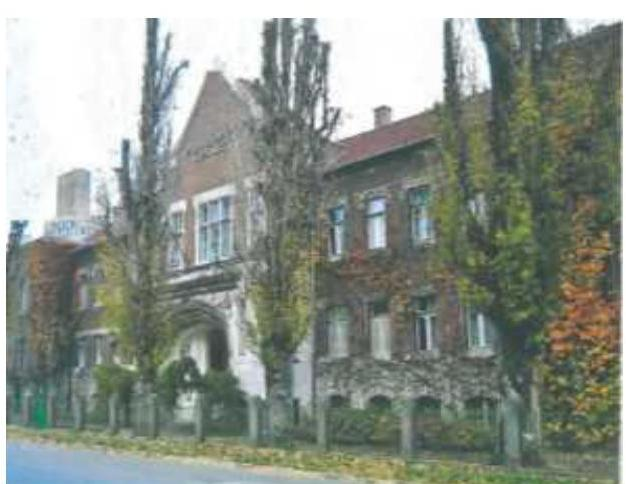

A szegedi székhelyű Gabonakutató Kft.¹ az egyik legnagyobb magyar agrárkutató szervezet, 22 szántóföldi növényfajból Magyarországon 128, külföldön több mint 60 minősített fajtával, hibriddel rendelkezik. A 100%-os állami tulajdonban lévő nonprofit szervezet tevékenysége – a rábízott 0,9 milliárd forint értékű nemzeti vagyon hatékony működtetése – egyéb természettudományi, műszaki kutatási, fejlesztési feladatok végzése volt. A Társaság¹ jogelődje 1924-es alapításától 2008-ig a földművelésügyi szaktárca szerveként működött.

A tulajdonosi joggyakorló² 2009. január 1-től az MNV Zrt.³ volt, a Társaság – mint állami vagyont hasznosító – nonprofit közhasznú korlátolt felelősségű társaságként működött tovább.

A Vtv.⁴ 3. § (1) bekezdésének 2013. június 27-ig hatályos szabályozása értelmében a tulajdonosi jogok és kötelezettségek összességét az állami vagyon tekintetében az állami vagyon felügyeletéért felelős miniszter gyakorolta, aki e feladatát az MNV Zrt. útján látta el. Az MNV Zrt. a 2013. szeptember 9-én kötött megbízási szerződéssel a társasági részesedéshez kapcsolódó tulajdonosi jogok gyakorlását átadta a NAIK⁵ jogelődjének, az MBK⁶-nak. A tulajdonosi joggyakorló 2014. január 1-jétől a NAIK volt. A NAIK az agrárpolitikáért felelős miniszter irányítása alá tartozó központi költségvetési szerv.

A Gabonakutató Kft., mint kormányzati szektorba sorolt gazdálkodó szervezet, évi 2,2-2,5 milliárd forint összegű bevétele jog- és licencdíjakból, vetőmag feldolgozásból, értékesítésből és tudományos pályázati bevételből származott az ellenőrzött években, nyereségesen gazdálkodott, a mérlegfőösszege 0,9 milliárd forinttal (36,5%-kal) nőtt. Az ügyvezető és a gazdasági ügyekért felelős vezető személye az ellenőrzött időszakban nem változott.

A Gabonakutató Kft. három gazdasági társaságban rendelkezett részesedéssel az ellenőrzött időszakban. A gabona, dohány, vetőmag, takarmány nagykereskedelme főtevékenységű Gabonatermésztési Kutató Vetőmag Üzletház Kft.-ben 48,67%; a máshová nem sorolt, egyéb szakmai, tudományos műszaki tevékenység főtevékenységű Fajtaoltalmi Nonprofit Kft.-ben 12,5%; a biotechnológiai kutatás, fejlesztés főtevékenységű DABIC Kft.-ben 1,04%-os üzletrésszel rendelkezett. A társaságok egyike sem minősült kapcsolt vállalkozásnak.

---

# AZ ELLENŐRZÉS HÁTTERE, INDOKOLTSÁGA 

Az ÁSZ ${ }^{7}$ alapvető célkitűzése, hogy az államháztartáson kívülre nyújtott költségvetési támogatások és ingyenes vagyon juttatások ellenőrzésével hozzájáruljon ahhoz, hogy a közpénzeket az államháztartáson kívül múködő szervezetek is átlátható módon használják fel a közfeladatok szerződésben vállalt ellátása érdekében. A közfeladatok ellátása elsősorban költségvetési szervek alapításával és müködtetésével történik. Az államháztartáson kívüli szervezetek a közfeladatok ellátásában, jogszabályban meghatározott feltételekkel, közremüködhetnek.

Az ellenőrzés feladata a közvagyonnal biztosított közfeladat ellátással kapcsolatban a közpénzek átláthatósága, nyilvánossága érdekében a jogszabályokban, belső szabályzatokban megfogalmazott előírások érvényesülésének az állami tulajdonban (résztulajdonban) lévő gazdálkodó szervezetek vagyonérték megőrzési és gazdálkodási tevékenységében való értékelése.

A nemzeti számlák nemzetközi és hazai statisztikai módszertana és szabványai elveket határoznak meg a statisztikai értelemben vett kormányzati szektorba tartozó szervezetek körére és besorolásuk módjára. A szervezetek megnevezését a nemzetgazdasági miniszter tette közzé.

Az ellenőrzés várható hasznosulásaként az ellenőrzés megállapításai a jogalkotás számára segítséget nyújthatnak az államháztartáson kívüli köz-feladat-ellátás, közvagyonnal való gazdálkodás értékeléséhez, jogszabályi keretei pontosításához, az átláthatóságot biztosító szabályozáshoz. Az ellenőrzöttek számára visszajelzést ad a gazdálkodási tevékenységgel, az állami vagyon felhasználásával, a közszolgáltatási árképzés megalapozottságával és az éves elszámolással kapcsolatos szabálytalanságokról és kockázatokról. Az ellenőrzés tapasztalatai segítik és erősítik az ÁSZ hozzáadott értéket teremtő elemző tevékenységét és tanácsadó szerepét. A kormányzati szektorba sorolt, költségvetési tervezésbe is bevont gazdálkodó szervezetek ellenőrzése fokozza a legfőbb ellenőrző szerv iránti figyelmet és közbizalmat.

---

# A JELENTÉS LÉNYEGES KÉRDÉSKÖREI 

1.     - A tulajdonosi joggyakorló a Gabonakutató Kft. vagyonnal való gazdálkodásának feltételeit szabályszerűen alakította-e ki?
2.     - A Gabonakutató Kft. vagyongazdálkodási tevékenységének kialakítása, szabályozása, illetve a vagyon nyilvántartása megfelel-e az elöírásoknak?
3.     - Az ellátott közhasznú tevékenység bevételeinek és ráfordításainak elszámolása és szabályozása, valamint az önköltségszámítás szabályszerű volt-e?
4.     - A vagyonnal való gazdálkodás, valamint a vagyonváltozást eredményező döntések megfeleltek-e a jogszabályi és a belső elöírásoknak?
5.     - A Gabonakutató Kft. a szabályszerű vagyongazdálkodás érdekében az adatszolgáltatási és beszámolási kötelezettséget teljesítette-e, épített-e ki és müködtetett-e információs rendszert?
6.     - A Társaság gazdálkodásának a kormányzati szektor hiányára és az államadósságra befolyást gyakorló elemek a jogszabályi elöírásoknak megfeleltek-e?

---

# ELLENŐRZÉS HATÓKÖRE ÉS MÓDSZEREI 

## Az ellenőrzés típusa

Szabályszerúségi ellenőrzés.

## Az ellenőrzött időszak

2011. január 1-jétől 2014. december 31-éig

## Az ellenőrzés tárgya

Az állami tulajdonban (résztulajdonban) lévő gazdálkodó szervezetek vagyonmegőrzési és gazdálkodási tevékenysége, valamint a kormányzati szektor hiányára és adósságállományára hatást gyakorló elemek ellenőrzése.

## Az ellenőrzött szervezet

Gabonakutató Nonprofit Közhasznú Kft., a Magyar Nemzeti Vagyonkezelő Zrt. és a Nemzeti Agrárkutatási és Innovációs Központ.

## Az ellenőrzés jogalapja

Az Állami Számvevőszékről szóló 2011. évi LXVI. törvény 5. § (3)-(5) bekezdései, valamint az állami vagyonról szóló 2007. évi CVI. törvény 3. § (4) bekezdése.

## Az ellenőrzés módszerei

Az ellenőrzést a számvevőszéki ellenőrzés szakmai szabályai szerint, a szabályszerűségi ellenőrzés módszerével, a vonatkozó nemzetközi standardok figyelembevételével végeztük.

Az ellenőrzés lefolytatásához a Gabonakutató Kft. tanúsítványok kitöltésével, valamint az ÁSZ által kért dokumentumok megküldésével szolgáltatott adatokat. A rendelkezésre bocsátott adatok, információk kontrollja a helyszíni ellenőrzés keretében történt.

A bevételek és ráfordítások elszámolása, valamint a vagyonnyilvántartás terén a szabályszerű múködést véletlen mintavétellel ellenőriztük. Az ellenőrzöttnél a személyi jellegú ráfordítások elszámolása mellett az egyéb

---

ráfordítások, a pénzügyi műveletek ráfordításai, a rendkívüli ráfordítások, illetve az egyéb bevételek, a pénzügyi műveletek bevételei, a rendkívüli bevételek elszámolásának szabályszerűségét szintén mintatételeken keresztül ellenőriztük. A mintavétellel ellenőrzött területek esetében minden egyes tétel vonatkozásában a szabályszerűségre vonatkozó kérdéseket tettünk fel, amelyek eredménye összesítésre került.

A jogszabályoknak és a belső előírásoknak megfelelőnek tekintettük az adott területet, amennyiben a minta ellenőrzésének eredménye alapján 95\%-os bizonyossággal a teljes sokaságban a hibaarány kisebb volt, mint $10 \%$, nem megfelelőnek értékeltük, ha a hibaarány a 10\%-ot meghaladta. Kockázatot, illetve magas kockázatot jeleztünk, amennyiben egy adott terület vonatkozásában a minta alapján a teljes sokaságban nem volt egyértelműen biztosított a jogszabályoknak és a belső szabályzatoknak megfelelő működés. A ráfordítások elszámolására és a vagyonnyilvántartásra vonatkozó véletlen mintavételt kockázati alapú kiválasztással egészítettük ki, amelynek során évente a három legnagyobb összegű tételt választottuk ki.

---

# 1. A tulajdonosi joggyakorló a Gabonakutató Kft. vagyonnal való gazdálkodásának feltételeit szabályszerűen alakította-e ki? 

Összegző megállapítás

A Tulajdonosi joggyakorló ${ }_{1,2}$ a Társaság vagyonnal való gazdálkodásának feltételeit szabályszerűen alakította ki.

A Tulajdonosi joggyakorló ${ }_{1,2}$ a Társaság Alapító Okiratás ${ }_{1-10}{ }^{8}$-ban meghatározta a vagyonnal történő felelős gazdálkodás követelményeit, az alapító, az ügyvezető, a felügyelőbizottság, a könyvvizsgáló jogait, hatáskörét, feladatait, valamint a nyereségfelosztás tilalmát.

A tulajdonost megillető jogköröket az MNV Zrt. gyakorolta. Az MNV Zrt. 2013. szeptember 9-én kelt megbízási szerződés megkötésével a társasági részesedéshez kapcsolódó tulajdonosi jogok gyakorlását átadta a NAIK jogelődjének, az MBK-nak. A tulajdonosi joggyakorló 2014. január 1-jétől a NAIK volt. A tulajdonosi joggyakorló megfelelt az Nvtv. ${ }^{9}$ 7/A. § (1) bekezdés c) pontjában foglaltaknak.

Az MNV Zrt. Vezérigazgatói utasítás ${ }_{1,2}{ }^{10}$-ben szabályozta a rábízott vagyon nyilvántartásával kapcsolatos előírásokat, amelyben rögzítették a vagyonkezelt eszközökkel kapcsolatos adatszolgáltatási és nyilvántartási kötelezettségeket, és az adatszolgáltatások tartalmát. A Vezérigazgatói utasítás ${ }_{1,2}$ a vagyonnyilvántartás vezetéséhez szükséges adatszolgáltatás tartalmát és formáját szabályozta, az megfelelt a Vtv. 17. § (1) bekezdés b) pontja, az Nvtv. 10. § (1) bekezdése és a Vhr. 14. § (1), (3) bekezdése előírásainak.

## 2. A Gabonakutató Kft. vagyongazdálkodási tevékenységének kialakítása, szabályozása, illetve a vagyon nyilvántartása megfelel-e az előírásoknak?

Összegző megállapítás

A Gabonakutató Kft. a szabályszerű vagyongazdálkodás feltételeit a 2011-2013. években nem megfelelően, a 2014. évben összességében megfelelően alakította ki. A Társaság a vagyonkezelésbe vett ingatlant nem tartotta nyilván.
2.1. számú megállapítás

A Társaság a vagyon értékének megőrzését, gyarapítását szolgáló vagyongazdálkodás feltételeit a 2011-2013. években nem megfelelően, a 2014. évben összességében megfelelően alakította ki.

A Gabonakutató Kft. a feladatait saját, illetve a vagyonkezelésében lévő eszközökkel látta el.

---

A Társaság a 2011-2012. években a Számv. tv. ${ }^{11}$ 14. § (4)-(5) és a (11) bekezdései előírásai ellenére nem rendelkezett számviteli politikával, eszközök és források leltárkészítési és leltározási szabályzatával, eszközök és források értékelési szabályzatával, az önköltségszámítás rendjére vonatkozó belső szabályzattal, pénzkezelési szabályzattal, valamint a Számv. tv. 161. § (1) bekezdés előírásai ellenére nem rendelkezett számlarenddel. Ezekben az években a jogelőd GK Kht. ${ }^{12}$ 2001-ben elkészített szabályzatait alkalmazták. A Gabonakutató Kft. a 2012. év végén készítette el a Számviteli politikáját, a Számlarendjét, az Eszközök és Források Értékelési Szabályzatát, az Önköltség Számítási Szabályzatát és a Pénzkezelési Szabályzatát, melyeket az ügyvezető 2013. január 1-jén léptetett hatályba. A Társaság a Leltározási és leltárkészítési szabályzatát 2013. december 10-én készítette el, amelyet az ügyvezető 2014. január 1-jén léptetett hatályba. Az ezt követően végzett leltározást a szabályozásnak megfelelően végezték el és leltárral dokumentálták.

A Társaság a Számv. tv. 161/A. § (1) bekezdés előírásai ellenére nem szabályozta a könyvvezetésre, bizonylatolásra vonatkozó részletes szabályokat.

A Társaság a vagyongazdálkodással kapcsolatos feladat- és hatásköröket, felelősségi viszonyokat - az Alapító Okirat ${ }_{1-10}$-ben foglaltaknak megfelelően - az SZMSZ ${ }^{13}$-ében rögzítette.

# 2.2. számú megállapítás 

## A Társaság a vagyonkezelésbe vett ingatlant nem tartotta nyilván.

Az FVM ${ }^{14}$ mint korábbi vagyonkezelő, a 2005. évben, vagyonkezelési jog átruházásáról szóló szerződés alapján, közérdekből, 10 évre (2015. július 31-éig) átengedte a Társaság részére a Szekszárd Vetőmag Üzletház vagyonkezelői jogát, 72,5 M Ft értékben. A vagyonkezelői jog bejegyzésre került az ingatlan tulajdoni lapjára. A szerződésben az Áht. ${ }^{15}$ és a Kvgr. ${ }^{16}$ előírásaira hivatkozva rögzítették a vagyonkezelői kötelezettségeket. A vagyonkezelői jogot - mint vagyoni értékű jogot - egy korábbi, az FVM által hasznosításra átadott vagyonán - a Szentesi Zöldségkutató Állomáson végzett beruházásból eredő 72,5 M Ft összegű követelése ellentételezéseként kapta a Társaság. A Gabonakutató Kft. könyveiben a vagyonkezelésbe vett vagyon vagyonkezelői jog értéke után - melyet saját vagyonaként tartott nyilván - szabálytalanul évi 10\% értékcsökkenést számolt el, ugyanis a 2013. január 1-től hatályos Számviteli politika ${ }^{17}$ 11.2.1. pontjában csak az immateriális javak között nyilvántartott vagyoni értékú jogokra határozott meg értékcsökkenést, de az ingatlanok között nyilvántartott vagyoni értékű jogok tekintetében - a Számv. tv. 14. § (4) bekezdése ellenére - nem rögzítette, hogy a bekerülési értéket a Számv. tv. 52. § (1) bekezdése alapján mely évekre osztotta fel.

A Társaság a vagyonkezelésbe vett Szekszárd Vetőmag Üzletház ingatlant a könyveiben nem mutatta ki a Számv. tv. 23. § (2) bekezdése ellenére, ezért 2011. január 1-jétől a Vhr. ${ }^{18}$ 9. § (3) bekezdésében, 2013. január 1től a hatályos Számviteli politikájának 8.9. pontjában előírt, a vagyonkezelésbe vett állami vagyonra vonatkozó nyilvántartási, adatszolgáltatási és elszámolási kötelezettségét elmulasztotta, így az állami vagyonnal való gazdálkodás átláthatóságának megteremtése nem érvényesült.

A Gabonakutató Kft. az ellenőrzött időszakban három gazdasági társaságban rendelkezett részesedéssel. A Társaság egyéb befektetett pénzügyi

---

eszközzel nem rendelkezett. A részesedések értékelése megfelelt az Eszközök és Források Értékelési Szabályzata II/2.2. pontja, valamint a Számv. tv. 57. § (1) bekezdése előírásainak. A Társaság az ellenőrzött időszakban egy alkalommal - a 2012. évben - számolt el értékvesztést a részesedéseivel kapcsolatban. Az értékvesztés elszámolása megfelelt a Számv. tv. 54. § (1)-(2) bekezdései előírásainak.

A Társaság könyvviteli nyilvántartásaiban - a Számv. tv. 159. § előírásai ellenére - az ellenőrzött időszakban nem voltak megtalálhatók az Alapító Okirat $_{1-10}$ 3. mellékletének 1-4 függelékeiben foglalt szabadalmak, fajtajegyzékek, azok vagyonváltozásai, a használatra adott szabadalmak, fajta nemesítések vagyoni értékei és azok változásai.

# 3. Az ellátott közhasznú tevékenység bevételeinek és ráfordításainak elszámolása és szabályozása, valamint az önköltségszámítás szabályszerű volt-e? 

Összegző megállapítás

A Gabonakutató Kft. által ellátott közhasznú tevékenységek bevételeinek és ráfordításainak szabályozása és elszámolása szabályszerű volt. Az önköltségszámítás szabályozása és végrehajtása nem volt szabályszerű.

A Társaság az ellenőrzött időszakban közhasznú tevékenységet folyatatott.
A Társaság az egyes tevékenységeiből származó bevételek és ráfordítások egyértelmú elhatárolása érdekében az Önköltség Számítási Szabályzatban munkaszámok, témaszámok használatát írta elő. Az elkülönített nyilvántartást biztosította, az év közben be nem sorolható ráfordítási tételeket külön könyvelte le és év végén a közhasznú és vállalkozói tevékenység bevételeinek arányában osztotta fel.

A Társaság az önköltségszámítás rendjét hiányosan szabályozta és végezte. Az Önköltség Számítási Szabályzat nem tartalmazta az immateriális javak között kimutatásra kerülő szellemi termékek aktivált értékeinek önköltség számítási módját, utókalkulációját, a Számv. tv. 51. § szerinti közvetlen önköltségbe tartozó költségeket.

A költségek és ráfordítások elszámolása - az anyagjellegú ráfordításoknál előforduló hiányosságok mellett - összességében megfelelő volt.

A Gabonakutató Kft. a bevételei elszámolása során szabályszerűen járt el. Az éves beszámolókban a bevételeket és ráfordításokat elkülönítve, szabályszerűen mutatta be.

A Társaság a növénynemesítő munka eredményét nem aktiválta, utána értékcsökkenést nem számolt el, és a Számviteli politikában sem határozta meg - a Számv. tv. 14. § (4) bekezdésében foglaltak ellenére -, hogy a Számv. tv. 24. § (2) bekezdésében biztosított aktiválási lehetőséget alkal-mazza-e.

A Társaság a beruházások, felújítások elszámolása során összességében megfelelően járt el, azonban előfordult, hogy - az Alapító Okirat ${ }_{1-5}$ II./8.6/m) pontja, valamint az SZMSZ II. fejezet előírásai ellenére - elmulasztotta megkérni a Tulajdonosi joggyakorló ${ }_{1}$ előzetes jóváhagyását a kötelezettségvállalás, illetve a szerződés megkötéséhez.

---

Az ellenőrzött időszakban a Társaság az elszámolt értékcsökkenési leírás teljes összegét a saját eszközeinek pótlására, illetve bővítésére fordította. Az elszámolt értékcsökkenési leírás összege a 2011-2014. években összesen 520,3 M Ft volt, a végrehajtott beruházásokra, felújításokra - ennek több mint 2,5-szeresét - összesen 1 369,2 M Ft-ot fordítottak. A Társaság - adatszolgáltatása szerint - az ellenőrzött időszak fejlesztéseinek megvalósításához EU-s forrásból összesen 12,5 M Ft, hazai/központi forrásból összesen 205,0 M Ft fejlesztési célú támogatásban részesült. A beruházások és felújítások alakulását a V. sz. melléklet szemlélteti.

A végrehajtott beruházások, felújítások eredményeként a Társaság eszközei használhatósági fokának alakulását három kiemelt eszközcsoport az épületek, a termelésben közvetlenül résztvevő gépek, valamint a műszerek - esetében a II. számú melléklet, az átlagos életkorának alakulását a VI. számú melléklet mutatja be.

A Társaság a követelésállomány alakulásáról negyedévente beszámolt az $\mathrm{FB}^{19}$-nek, amelyet az elfogadott. A Társaság a követeléseire elszámolt értékvesztést szabályosan állapította meg. A 2011-2014. években elszámolt értékvesztés alakulását a III. számú melléklet mutatja be.

# 4. A vagyonnal való gazdálkodás, valamint a vagyonváltozást eredményező döntések megfeleltek-e a jogszabályi és a belső előírásoknak? 

Összegző megállapítás

## 4.1. számú megállapítás

A Gabonakutató Kft. vagyongazdálkodási tevékenysége a jogszabályi és a belső szabályzatok előírásainak nem felelt meg. A vagyonváltozást eredményező döntések előkészítése és megalapozása során megsértették a közbeszerzési törvény, az Alapító Okirat és az SZMSZ előírásait.

A Társaság vagyongazdálkodási tevékenysége nem volt szabályszerű.

A Társaság vagyona a 2011. évi 2 574,1 M Ft-ról, a 2014. évre 3 513,3 M Ft-ra, összesen 939,2 M Ft-tal (36,5\%-kal) nőtt. A vagyon növekedése alapvetően saját és pályázati források felhasználásával valósult meg. A vagyonon belül a legnagyobb részarányt képviselő befektetett eszközök állománya 60,0\%-kal (718,5 M Ft-tal) nőtt, a forgóeszközök 21,1\%-os (269,1 M Ftos) növekedése és az aktív időbeli elhatárolások 47,9\%-os (48,4 M Ft-os) csökkenése mellett. A befektetett eszközök állományának növekedését a tárgyi eszközök 712,0 M Ft-os (60,3\%-os), alapvetően a gépek, berendezések beruházásaiból adódó növekedése határozta meg. A Gabonakutató Kft. vagyonának alakulását és a vagyon összetételének változását a 20112014. években a IV. számú melléklet mutatja be.

A Társaság vagyonának növekedését a saját tőke 533,7 M Ft-os (31,3\%os), a kötelezettségek 291,4 M Ft-os (51,1\%-os) és a passzív időbeli elhatárolások 114,1 M Ft-os (38,5\%-os) növekedése tette lehetővé.

---

A Gabonakutató Kft. az ellenőrzött időszakban gondoskodott a tárgyi eszközeinek rendszeres időközönkénti karbantartásáról, állagmegóvásáról. Az éves üzleti tervekben rögzítették a tárgyévi karbantartási, állagmegóvási, felújítási és beruházási feladatokat, megjelölve azok forrását.

A Társaság vagyonkezelői jog átengedéséről szóló szerződés alapján vette vagyonkezelésbe a Szekszárdi Vetőmag Üzletház ingatlant. A szerződés az ingatlan értékét nem tartalmazta. A Társaság az ingatlant nem tartotta nyilván, így értékcsökkenést sem számolt el utána a Vhr. 9. § (9) bekezdés b) pontja és a Számviteli politika előírása ellenére. Ennek következtében az értékcsökkenés visszapótlásával kapcsolatos elszámolást a Vhr. 9. § (9) bekezdés d) pontja ellenére nem végezte el.

Az ellenőrzött időszakban a Társaság betartotta az államháztartás körébe tartozó vagyon elidegenítésére, illetve megterhelésére vonatkozó, az Nvtv. 6. § és a Vtv. 33-42. §-aiban rögzített előírásokat.

Az ellenőrzött időszakban a Gabonakutató Kft. tulajdonában, illetve kezelésében nem volt az Nvtv. 4. § (1)-(2) bekezdései szerinti, az állam kizárólagos tulajdonába tartozó, illetve nemzetgazdasági szempontból kiemelt jelentőségű nemzeti vagyonnak minősülő vagyon, így azok elidegenítésére, megterhelésére nem kerülhetett sor.

A Társaságnál a saját tőke/jegyzett tőke aránya a 2011. és a 2014. évek között több mint 1,3-szorosára (182,8\%-ról, 239,9\%-ra) növekedett, ami a jegyzett tőke változatlansága ( $934,0 \mathrm{M} \mathrm{Ft}$ ) mellett valósult meg. A saját tőke összege az ellenőrzött időszakban évről-évre nőtt, a 2011-2012. években a pozitív mérleg szerinti eredmények, a 2013-2014. években a pozitív mérleg szerinti eredmények és a lekötött tartalékként elszámolt pályázati támogatások következtében.

A Társaságnál a saját tőke/jegyzett tőke arányának alakulását az 1. ábra szemlélteti.

1. ábra
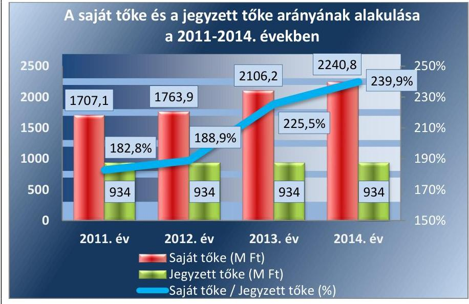

Forrás: A Társaság éves beszámolói

---

# 4.2. számú megállapítás 

A Gabonakutató Kft.-nél a vagyonváltozást eredményező döntések előkészítése és megalapozása nem felelt meg a jogszabályi és belső előírásoknak. A közbeszerzési törvény előírásait nem tartották be, mert közbeszerzési értékhatárt meghaladó szerződéseket kötöttek közbeszerzési eljárás nélkül.

A Gabonakutató Kft. Alapító Okirat ${ }_{1-10}$-ában foglaltak szerint az ügyvezető kizárólagos döntési jogosultsága volt a törzstőke 10\%-át (93,4 M Ft-ot) el nem érő összegű kötelezettségek vállalása, az ezt meghaladó összegű szerződések, vagy kötelezettségvállalások megkötésének jóváhagyása az alapító kizárólagos döntési jogkörébe tartozott. A Társaság SZMSZ-ében az Alapító Okirat ${ }_{1-10}$-ben foglaltakkal egyezően rögzítették a kötelezettségvállalások szabályait.

Az Alapító Okirat ${ }_{1-10}$ II./8.6./m) pontja és az SZMSZ II. fejezete előírásai ellenére a Társaság az ellenőrzött időszakban a Tulajdonosi joggyakorló1,2 előzetes jóváhagyása nélkül évente egy-egy évre meghosszabbította a 250 M Ft keretösszegű folyószámla hitelszerződését. Ugyancsak elmulasztotta a Társaság megkérni a Tulajdonosi joggyakorló ${ }_{1}$ előzetes jóváhagyását a 2012. november 8-án kötött, 104,0 M Ft összegű kölcsönszerződés és a 2013. június 20-án kötött, 122,7 M Ft összegű líingszerződés megkötéséhez, továbbá egy 286,8 M Ft értékű berendezés beszerzésére vonatkozó kötelezettségvállaláshoz. A tulajdonosi joggyakorlás korlátozásával növelte az eladósodás kockázatát, ami veszélyeztette az állami tulajdoni körben történő társasági múködést.

Az ellenőrzött időszakban a vagyonkezelésbe vett ingatlannal kapcsolatban vagyonváltozást eredményező tulajdonosi döntés nem született, a vagyonkezelésbe kapott ingatlanon visszapótlás, illetve értéknövelő beruházás nem történt.

A Társaságnál a 2011-2014. években ingyenes vagyonátruházásra nem került sor, a vagyon hasznosítására vonatkozó szerződést nem kötöttek, ilyen vonatkozásokban a Tulajdonosi joggyakorló ${ }_{1,2}$ sem hozott döntéseket.

A Társaság az ellenőrzött időszakban hatályos Kbt. ${ }_{1,2}{ }^{20}$ előírásait nem tartotta be minden esetben, mivel csak az EU-s támogatások felhasználásával megvalósított beszerzések esetében alkalmazta a törvény előírásait, holott a Kbt. ${ }_{1}$ 22. § (1) bekezdés i) pontja, illetve a Kbt. ${ }_{2}$ 6. § (1) bekezdés c) pontja értelmében ajánlatkérőnek minősült. A Társaság a 2011-2012. években a Kbt. ${ }_{1} 2 . \S$ (1) bekezdésében és a Kbt. ${ }_{2} 5 . \S$-ában előírt közbeszerzési eljárás lefolytatásának kötelezettségét több szerződés megkötése esetében nem teljesítette, így nem tartotta be a Kbt. ${ }_{1} 21 . \S$-ának (1) bekezdésében, valamint a Kbt. ${ }_{2}$ 19. §-ában előírtakat sem.

A Gabonakutató Kft. az Alapító Okirat ${ }_{1-10}$ II./8.6./m) pontja és az SZMSZ II. fejezete előírásai ellenére a Tulajdonosi joggyakorló ${ }_{1,2}$ felé nem terjesztett elő előzetes jóváhagyási kérelmet a vagyon állagának megóvására, megőrzésére, gyarapítására, felújítására vonatkozóan. A Társaság által tervezett, illetve végrehajtott vagyonnövelő beruházásokat és felújításokat az éves üzleti tervek, illetve az éves beszámolók elfogadásával a Tulajdonosi joggyakorló ${ }_{1,2}$ tudomásul vette, azokkal kapcsolatban ellenőrzést nem végzett.

---

# 5. A Gabonakutató Kft. a szabályszerű vagyongazdálkodás érdekében az adatszolgáltatási és beszámolási kötelezettséget telje-sítette-e, épített-e ki és múködtetett-e információs rendszert? 

Összegző megállapítás

A Társaság a beszámolási kötelezettségének eleget tett, az adatszolgáltatási kötelezettségét nem teljesítette. A Társaságnál nem megfelelően alakították ki és nem megfelelően múködtették a belső és a Tulajdonosi joggyakorló1,2-vel fenntartott információs rendszert.

A beszámolókat a Számv. tv. 153. § (1) bekezdése előírásai alapján, az előírt határidőig letétbe helyezték és a 154. § (1) bekezdése szerint közzítették.

Az FB a Számv. tv. szerinti beszámolóról az ellenőrzött időszak minden évében elkészítette írásbeli jelentését, amelyet a Tulajdonosi joggyakorló ${ }_{1,2}$ rendelkezésére bocsátott. A Tulajdonosi joggyakorló ${ }_{1,2}$ az FB írásbeli jelentéseinek és a könyvvizsgálói jelentések birtokában, határozatban döntött az éves beszámolók jóváhagyásáról.

A Társaság könyvvizsgálója minden évben kiegészítő jelentést adott a Társaság beszámolójának könyvvizsgálatáról. A könyvvizsgáló a Társaság éves beszámolóit az ellenőrzött időszak minden évében a Számv. tv 3. § (13) bekezdés 1) pontjának megfelelő hitelesítő záradékkal látta el.

Az ellenőrzött időszakban az FB-nek és a független könyvvizsgálónak a Gt. ${ }^{21}$ és a $\mathrm{Ptk}_{2}{ }^{22}$ alapján nem kellett kezdeményezni a közvagyon védelme érdekében, vagyoncsökkenés miatt a legfőbb döntést hozó szerv összehívását és nem kellett javaslatot tenniük a vagyongazdálkodással kapcsolatban. Az FB nem tett olyan megállapítást miszerint az ügyvezetés tevékenysége jogszabályba, a társasági szerződésbe, illetve a gazdasági társaság legfőbb szervének határozataiba ütközött volna, vagy egyébként sértette volna a gazdasági társaság, illetve a tagok érdekeit.

A Gabonakutató Kft.-nél biztosított volt a közérdekú adatok nyilvánosságra hozatala.

A Társaság a 2011. évben az Avtv. ${ }^{23}$ 31/A. § (3) bekezdésében, a 20122014. években az Info tv. ${ }^{24}$ 24. § (3) bekezdésében előírtakat figyelmen kívül hagyva, adatvédelmi és adatbiztonsági szabályzattal, a 2011. évben az Avtv. 20. § (8) bekezdésében, a 2012-2014. években az Info tv. 30. § (6) bekezdésében foglaltak ellenére közérdekú adatok megismerésére irányuló igények teljesítésének rendjét rögzítő szabályzattal nem rendelkezett.

A Társaság az Áht. ${ }^{25}$ 107. § (1) bekezdésben foglaltak ellenére a 20122014. években nem teljesítette az államháztartásért felelős miniszter részére a központi költségvetésről szóló törvény elkészítéséhez szükséges kötelező adatszolgáltatást. A Gabonakutató Kft. az Áht. ${ }_{2}$ 109. § (8) bekezdése alapján kiadott, a 9/2012. és a 60/2013. Hivatalos Értesítőben közzétett, az államháztartásért felelős miniszter közleménye szerint a kormányzati szektorba sorolt egyéb szervezetek között a 2012. évtől szerepelt, ezért 2012. január 1-jétől vonatkozott rá az Ávr. ${ }^{26}$ 7. számú melléklet 28.

---

és 29. pontjában megfogalmazott adatszolgáltatási kötelezettség. A Társaság az Ávr. 7. számú melléklet 28. pontjában szereplő, a számviteli jogszabályok szerinti beszámolóra (mérleg, eredménykimutatás, kiegészítő melléklet, cash-flow jelentés és a könyvvizsgálói jelentés), a kiemelt mutatókra, valamint a költségvetési kapcsolatokra vonatkozó adatszolgáltatási kötelezettségeket nem teljesítette. Így nem járult hozzá az államháztartás átláthatóságához, csökkentve ezzel a költségvetés végrehajtásának kiszámíthatóságát. Az Ávr. 7. számú melléklet 29. pontjában szereplő, évközi (negyedéves) adatszolgáltatási kötelezettségeket sem teljesítették.

A Társaságnál az ellenőrzött időszakban nem alakítottak ki és nem működtettek belső és a Tulajdonosi joggyakorló ${ }_{1,2}$-vel fenntartott információs rendszert annak ellenére, hogy a Bkr. ${ }^{27} 3 . \S$ d) pontja, valamint a 9. § számára 2014. évtől - mint a Bkr. 1. § (2) bekezdés e) pontja alapján a Bkr. hatálya alá tartozó, kormányzati szektorba sorolt egyéb szervezetre - előírta.

A 2011-2014. években a Társaság belső ellenőre évente nyolc, összesen harminckét ellenőrzést végzett, amelyek széles tevékenységi kört érintettek. Az ellenőrzések a vagyongazdálkodás szabályszerűségére, illetve a vagyonnyilvántartás szabályozottságára nem terjedtek ki. A vagyongazdálkodást érintően a Tulajdonosi joggyakorló ${ }_{1,2}$ nem rendelt el ellenőrzéseket.

# 6. A Társaság gazdálkodásának a kormányzati szektor hiányára és az államadósságra befolyást gyakorló elemek a jogszabályi előírásoknak megfeleltek-e? 

Összegző megállapítás

1. táblázat

ADÓSSÁGOT KELETKEZTETŐ ÜGYLETEK 2012-2014. ÉVEKBEN (M FT)

| Szerződődés   kötésdátuma | Lízingdíj | Kölcsön   összeg |
| :--: | :--: | :--: |
| 2012.05.14. | 3,4 | - |
| 2012.07.11. | 4,0 | - |
| 2012.07.16. | 79,3 | - |
| 2012.11.08. | - | 104,0 |
| 2013.06.20. | 122,7 | - |
| 2013.11.20. | - | 70,7 |
| 2014.01.30. | 7,0 | - |
| 2014.06.27. | 7,0 | - |
| Összesen | 223,4 | 174,7 |
| Forrás: A Társaság adósságot keletkeztető dokumentumai |  |  |

A Társaságnál az adósságot keletkeztető ügyletek vállalása, a szerződések megkötése nem felelt meg a jogszabályi előírásoknak. A kormányzati szektor hiányára befolyást gyakorló bevételek és ráfordítások elszámolása szabályszerű volt.

A Társaság az adósságot keletkeztető ügyletekhez történő hozzájárulás részletes szabályairól szóló 353/2011. (XII. 30.) Korm. rendelet 11. § (1) bekezdésében foglaltak ellenére, a 2012. január 1-től megkötött adósságot keletkeztető ügyletei (lízing- és kölcsönszerződés) kapcsán egy esetben sem küldte meg a Stabilitási tv. ${ }^{28}$ 9. § (1) bekezdése szerinti hozzájárulási kérelmét az alapítói, tulajdonosi jogokat gyakorló szervezet - kezdetben az MNV Zrt., majd később a NAIK - részére egyetértésre, így azok részéről nem történhetett meg az államháztartásért felelős miniszternek történő továbbítás sem. (2012. január 1-jét követően az ellenőrzött időszak végéig 223,4 M Ft összértékű lízingszerződéseket, valamint 174,7 M Ft összértékű kölcsönszerződéseket kötöttek.) A hozzájárulási kérelmek hiányában a Tulajdonosi joggyakorló ${ }_{1,2}$ nem tudta egyetértését kifejezni, így a Társaság annak hiányában, valamint az államháztartásért felelős miniszter hozzájárulása nélkül kötött adósságot keletkeztető ügyletet, a Stabilitási tv. 9. § (1) bekezdésében foglaltak ellenére. Az adósságot keletkeztető ügyleteket az 1. táblázat mutatja be.

Az államháztartás részére nem szolgáltatott információt, az átláthatósághoz nem járult hozzá, ezzel a költségvetés végrehajtásának kiszámíthatóságát csökkentette.

---

Az adósságot keletkeztető ügyletek esetében a kötelezettségek nyilvántartása, számviteli elszámolása szabályszerű volt.

A Társaságnál a kormányzati szektor hiányára befolyást gyakorló bevételek és ráfordítások elszámolása a jogszabályi előírásoknak megfelelően történt. A rendszeres és nem rendszeres személyi jellegű ráfordítások, az egyéb bevételek és ráfordítások, a pénzügyi műveletek bevételei és ráfordításai, valamint a rendkívüli bevételek és ráfordítások elszámolása szabályszerű volt.

A Gabonakutató Kft. nonprofit gazdasági társaság, amely a Gt. 4. § (3) bekezdése, valamint a Civil tv. ${ }^{29} 42 . \S$ (1) bekezdése előírásai szerint a tevékenységéből származó nyereséget a tagok között nem oszthatja fel, az a társaság vagyonát gyarapítja. A Tulajdonosi joggyakorló ${ }_{1,2}$ a Gabonakutató Kft. számviteli beszámolóját minden évben elfogadta, az adózott eredmény terhére osztalékot nem állapított meg, a mérleg szerinti eredmény eredménytartalékba helyezéséről döntött.

---

# JAVASLATOK 

Az ÁSZ tv. ${ }^{30}$ 33. § (1) bekezdésében foglaltak értelmében az ellenőrzött szervezet vezetője köteles a jelentésben foglalt megállapításokhoz kapcsolódó intézkedési tervet összeállítani és azt a jelentés kézhezvételétől számított 30 napon belül az ÁSZ részére megküldeni. Amennyiben az intézkedési tervet az ellenőrzött szervezet vezetője nem küldi meg határidőben, vagy továbbra sem elfogadható intézkedési tervet küld, az ÁSZ elnöke az ÁSZ törvény 33. § (3) bekezdés a)-b) pontjaiban foglaltakat érvényesítheti.

## A Gabonakutató Nonprofit Közhasznú Kft. ügyvezetőjének

1. Tartsa nyilván a Társaság tulajdonában lévő szabadalmakat a könyvviteli nyilvántartásában az Alapító Okiratban és a jogszabályban foglalt előirásoknak megfelelően.
(2.2. sz. megállapítás 4. bekezdése alapján)
2. Kérje meg a jövőben a tulajdonosi joggyakorló előzetes jóváhagyását az Alapító Okiratban és az SZMSZ-ben foglalt esetekben.
(3. összegző megállapítás 7. bekezdése és 4.2. sz. megállapítás
3. bekezdése alapján)
4. Intézkedjen arról, hogy a közbeszerzési eljárásokat a jogszabályi előírásoknak megfelelően folytassák le.
(4.2. sz. megállapítás 5. bekezdése alapján)
5. Intézkedjen arról, hogy a jogszabályi előírásoknak megfelelően kiadásra kerüljön az adatvédelmi és adatbiztonsági szabályzat, valamint a közérdekü adatok megismerésére irányuló igények teljesitésének rendjét rögzítő szabályzat.
(5. összegző megállapítás 6. bekezdése alapján)
6. Intézkedjen az adatszolgáltatási kötelezettségek jogszabályi előírásoknak megfelelő teljesitéséről.
(5. összegző megállapítás 7. bekezdése alapján)
7. Intézkedjen az információs rendszer kialakításáról a jogszabályi előírásoknak megfelelően.
(5. összegző megállapítás 8. bekezdése alapján)

---

7. Intézkedjen arról, hogy az adósságot keletkeztető ügyletek megkötésére a jogszabályi előirásoknak megfelelően, az államháztartásért felelős miniszter előzetes hozzájárulásával kerüljön sor.
(6. összegző megállapítás 1. bekezdése alapján)
8. Tegyen intézkedéseket a - vagyonelemek nyilvántartásával, a közbeszerzési eljárások mellőzésével, az adatszolgáltatással és az adósságot keletkeztető ügyletekkel kapcsolatban - feltárt szabálytalanságok tekintetében a felelősség tisztázása érdekében, és szükség szerint intézkedjen a felelősség érvényesitéséről.
(2.2. sz. megállapítás 2. és 4. bekezdései, 4.2. sz. megállapítás 5. bekezdése, 5. összegző megállapítás 7. bekezdése, 6. összegző megállapítás 1. bekezdése alapján)

# A Nemzeti Agrárkutatási és Innovációs Központ föigazgatójának 

1. $\quad$ Tegyen intézkedéseket a - vagyonelemek nyilvántartásával, a közbeszerzési eljárások mellőzésével, az adatszolgáltatással és az adósságot keletkeztető ügyletekkel kapcsolatban - feltárt szabálytalanságok tekintetében a felelősség tisztázása érdekében, és szükség szerint intézkedjen a felelősség érvényesitéséről.
(2.2. sz. megállapítás 2. és 4. bekezdései, 4.2. sz. megállapítás 5. bekezdése, 5. összegző megállapítás 7. bekezdése 6. összegző megállapítás 1. bekezdése alapján)

---

.

---

# MELLÉKLETEK 

## I. SZ. MELLÉKLET: ÉRTELMEZŐ SZÓTÁR

Adósságot keletkeztető ügylet
„Adósságot keletkeztető ügylet és annak értéke:
a) hitel, kölcsön felvétele, átvállalása a folyósítás, átvállalás napjától a végtörlesztés napjáig, és annak aktuális tőketartozása,
b) a számvitelről szóló törvény szerinti hitelviszonyt megtestesítő értékpapír forgalomba hozatala a forgalomba hozatal napjától a beváltás napjáig, kamatozó értékpapír esetén annak névértéke, egyéb értékpapír esetén annak vételára,
c) váltó kibocsátása a kibocsátás napjától a beváltás napjáig, és annak a váltóval kiváltott kötelezettséggel megegyező, kamatot nem tartalmazó értéke,
d) az Szt. szerint pénzügyi lízing lízingbevevői félként történő megkötése a lízing futamideje alatt, és a lízingszerződésben kikötött tőkerész hátralévő összege,
e) a visszavásárlási kötelezettség kikötésével megkötött adásvételi szerződés eladói félként történő megkötése - ideértve az Szt. szerinti valódi penziós és óvadéki repóügyleteket is - a visszavásárlásig, és a kikötött visszavásárlási ár,
f) a szerződésben kapott, legalább háromszázhatvanöt nap időtartamú halasztott fizetés, részletfizetés, és a még ki nem fizetett ellenérték,
g) hitelintézetek által, származékos műveletek különbözeteként az Államadósság Kezelő Központ Zrt.-nél (a továbbiakban: ÁKK Zrt.) elhelyezett fedezeti betétek, és azok összege.
Forrás: Stabilitási tv. 3. § (1) bekezdése
2010. június 17-től
a) Az állam tulajdonában lévő dolog, valamint a dolog módjára hasznosítható természeti erő,
b) Az a) pont hatálya alá nem tartozó mindazon vagyon, amely vonatkozásában törvény az állam kizárólagos tulajdonjogát nevesíti,
c) az állam tulajdonában lévő tagsági jogviszonyt megtestesítő értékpapír, illetve az államot megillető egyéb társasági részesedés,
d) az államot megillető olyan immateriális, vagyoni értékkel rendelkező jogosultság, amelyet jogszabály vagyoni értékű jogként nevesít.
Forrás: Vtv. 1. § (2) bekezdése
2012. november 10-től az állami vagyon fogalma kiegészül a következő ponttal:
a) az állam tulajdonában lévő pénzügyi eszközök

Forrás: Vtv. 1. § (2) bekezdése
2010. január 01 - 2011. december 31. között:

Az állami vagyont az MNV Zrt. maga kezeli, vagy szerződés - így különösen bérlet, haszonbérlet, szerződésen alapuló haszonélvezet, vagyonkezelés, megbízás alapján központi költségvetési szervnek, természetes vagy jogi személynek, illetőleg jogi személyiséggel nem rendelkező gazdasági társaságnak hasznosításra átengedi.
Vtv. 23. § (1) bekezdése
2012. január 1-jétől:

Az állami vagyont az MNV Zrt. maga kezeli, vagy szerződés - így különösen bérlet, haszonbérlet, megbízás - alapján központi költségvetési szervnek, természetes vagy jogi személynek, vagy jogi személyiséggel nem rendelkező gazdálkodó szer-

---

vezetnek hasznosításra átengedi. Az állami vagyonra vonatkozóan az MNV Zrt. kizárólag az Nvtv-ben meghatározott személyekkel köthet vagyonkezelési szerződést.
Forrás: Vtv. 23. § (1), 27. § (1)

# 2013. június 28-ától: 

Az állami vagyonnal az MNV Zrt. maga gazdálkodik, vagy szerződés - így különösen bérlet, haszonbérlet, megbízás - alapján központi költségvetési szervnek, természetes vagy jogi személynek, vagy jogi személyiséggel nem rendelkező gazdálkodó szervezetnek hasznosításra átengedi, illetőleg vagyonkezelésbe, haszonélvezetbe adja. Az állami vagyonra vonatkozóan az MNV Zrt. kizárólag az Nvtv-ben meghatározott személyekkel köthet vagyonkezelési szerződést.
Forrás: Vtv. 23. § (1), 27. § (1)
Állami vagyon értékesítése
Gazdálkodó szervezet

Állami vagyon tulajdonjogának bármely jogcímen történő, visszterhes átruházása. Forrás: Vhr. 1. § (7) d) pont)
2013. június 30-ig gazdálkodó szervezet:

Az állami vállalat, az egyéb állami gazdálkodó szerv, a szövetkezet, a lakásszövetkezet, az európai szövetkezet, a gazdasági társaság, az európai részvény-társaság, az egyesülés, az európai gazdasági egyesülés, az európai területi együttmüködési csoportosulás, az egyes jogi személyek vállalata, a leányvállalat, a vízgazdálkodási társulat, az erdőbirtokossági társulat, a végrehajtói iroda, az egyéni cég, továbbá az egyéni vállalkozó.
Forrás: $\mathrm{Ptk}_{1}{ }^{31} 685 . \S$ c) pontja
2013. július 1-jétől gazdálkodó szervezet:

Az állami vállalat, az egyéb állami gazdálkodó szerv, a szövetkezet, a lakásszövetkezet, az európai szövetkezet, a gazdasági társaság, az európai részvénytársaság, az egyesülés, az európai gazdasági egyesülés, az európai területi együttműködési csoportosulás, az egyes jogi személyek vállalata, a leányvállalat, a vízgazdálkodási társulat, az erdőbirtokossági társulat, a végrehajtói iroda, az egyéni cég, továbbá az egyéni vállalkozó. Az állam, a helyi önkormányzat, a költségvetési szerv, az egyesület, a köztestület, valamint az alapítvány gazdálkodó tevékenységével összefüggő polgári jogi kapcsolataira is a gazdálkodó szervezetre vonatkozó rendelkezéseket kell alkalmazni, kivéve, ha a törvény e jogi személyekre eltérő rendelkezést tartalmaz; a 292/A-292/B. §, 301/A-301/B. §, 405. § (1) bekezdés, valamint a 407/A. § (1) bekezdés tekintetében nem minősül gazdálkodó szervezetnek az, aki a közbeszerzésekről szóló törvény értelmében ajánlatkérő (szerződő hatóság).
Forrás: $\mathrm{Ptk}_{1}$. 685. § c) pontja
2014. március 15-től gazdálkodó szervezet:

A gazdasági társaság, az európai részvénytársaság, az egyesülés, az európai gazdasági egyesülés, az európai területi együttmüködési csoportosulás, a szövetkezet, a lakásszövetkezet, az európai szövetkezet, a vízgazdálkodási társulat, az erdőbirtokossági társulat, az állami vállalat, az egyéb állami gazdálkodó szerv, az egyes jogi személyek vállalata, a közös vállalat, a végrehajtói iroda, a közjegyzői iroda, az ügyvédi iroda, a szabadalmi ügyvivői iroda, az önkéntes kölcsönös biztosító pénztár, a magánnyugdíjpénztár, az egyéni cég, továbbá az egyéni vállalkozó. Az állam, a helyi önkormányzat, a költségvetési szerv, az egyesület, a köztestület, valamint az alapítvány gazdálkodó tevékenységével összefüggő polgári jogi kapcsolataira is a gazdálkodó szervezetre vonatkozó rendelkezéseket kell alkalmazni. Forrás: Pp. ${ }^{32}$ 396. §

---

Kormányzati szektorba sorolt egyéb szervezet

Meghatározó befolyás

Nemzetgazdasági szempontból kiemelt jelentőségű nemzeti vagyon körébe tartozó társaságok
Nemzeti vagyon

Az a szervezet, amely az Áht. alapján nem része az államháztartásnak, azonban az Európai Közösséget létrehozó szerződéshez csatolt, a túlzott hiány esetén követendő eljárásról szóló jegyzőkönyv alkalmazásáról szóló 2009. május 25-i 479/2009/EK rendelet szerint a kormányzati szektorba tartozik. A nemzetgazdasági miniszter 2013. június 26-án megjelent Közleményben tette közé ezen szervezetek listáját.
2014. március 14-ig: A befolyással rendelkező akkor rendelkezik egy jogi személyben meghatározó befolyással, ha annak tagja, illetve részvényese és
a) jogosult e jogi személy vezető tisztségviselői vagy felügyelőbizottsága tagjai többségének megválasztására, illetve visszahívására, vagy
b) a jogi személy más tagjaival, illetve részvényeseivel kötött megállapodás alapján egyedül rendelkezik a szavazatok több mint ötven százalékával.
A meghatározó befolyás akkor is fennáll, ha a befolyással rendelkező számára az előzőek szerinti jogosultságok közvetett módon biztosítottak. A befolyással rendelkezőnek egy jogi személyben a szavazatok több mint ötven százalékával közvetett módon való rendelkezése vagy egy jogi személyben közvetetten fennálló meghatározó befolyása megállapítása során a jogi személyben szavazati joggal rendelkező más jogi személyt (köztes vállalkozást) megillető szavazatokat meg kell szorozni a befolyással rendelkezőnek a köztes vállalkozásban, illetve vállalkozásokban fennálló szavazatával. Ha a köztes vállalkozásban fennálló szavazatok mértéke az ötven százalékot meghaladja, akkor azt egy egészként kell figyelembe venni.
Forrás: Ptk. 685/B. § (2)-(3) bekezdések

## 2014. március 15 -től:

A befolyással rendelkező akkor rendelkezik egy jogi személyben meghatározó befolyással, ha annak tagja vagy részvényese, és
a) jogosult e jogi személy vezető tisztségviselői vagy felügyelőbizottsága tagjai többségének megválasztására, illetve visszahívására; vagy
b) a jogi személy más tagjai, illetve részvényesei a befolyással rendelkezővel kötött megállapodás alapján a befolyással rendelkezővel azonos tartalommal szavaznak, vagy a befolyással rendelkezőn keresztül gyakorolják szavazati jogukat, feltéve, hogy együtt a szavazatok több mint felével rendelkeznek.
Forrás: Ptk. 8:2. § (2) bekezdés
Az ÁSZ ellenőrzés szempontjából az Nvtv. 2. sz. mellékletében felsorolt társasági részesedések.
2012. január 1-jétől nemzeti vagyon:
a) az állam vagy a helyi önkormányzat kizárólagos tulajdonában álló dolgok,
b) az a) pont hatálya alá nem tartozó, állam vagy a helyi önkormányzat tulajdonában lévő dolog,
c) az állam vagy a helyi önkormányzatot tulajdonában lévő pénzügyi eszközök, továbbá az államot vagy a helyi önkormányzatot megillető társasági részesedések,
d) az államot vagy a helyi önkormányzatot megillető bármely vagyoni értékkel rendelkező jogosultság, amelyet jogszabály vagyoni értékű jogként nevesít,
e) Magyarország határa által körbezárt terület feletti légtér,
f) az üvegházhatású gázok kibocsátási egységeinek kereskedelméről szóló törvény szerint kibocsátási egység és légiközlekedési kibocsátási egység, valamint az ENSZ Éghajlatváltozási Keretegyezménye és annak Kiotói Jegyzőkönyv végrehajtási keretrendszeréről szóló törvény szerinti kiotói egység,

---

g) állami vagy helyi önkormányzati fenntartású közgyűjtemény (muzeális intézmény, levéltár, közgyűjteményként működő kép- és hangarchívum, valamint könyvtár) saját gyűjteményében nyilvántartott kulturális javak körébe tartozó dolog,
h) a régészeti lelet,
i) a nemzeti adatvagyon körébe tartozó állami nyilvántartások fokozottabb védelméről szóló törvény szerinti nemzeti adatvagyon.
Forrás: Nvtv. 1. § (2)
2010. június 17-től:

Az MNV Zrt. „rendszeresen ellenőrzi a vele szerződéses jogviszonyban lévő személyek, szervezetek vagy más használók állami vagyonnal való gazdálkodását, megállapításairól az MNV Zrt. Felügyelő Bizottságát, az ellenőrzött szervet, szükség esetén a minisztert és az Állami Számvevőszéket tájékoztatja".
Forrás: Vtv. 17. § d.
A Vhr. alapján „a tulajdonosi ellenőrzés célja az állami vagyonnal való gazdálkodás vizsgálata, ennek keretében a rendeltetésellenes, jogszerűtlen, szerződésellenes, vagy a tulajdonos érdekeit sértő, illetve a központi költségvetést hátrányosan érintő vagyongazdálkodási intézkedések feltárása és a jogszerű állapot helyreállítása, továbbá a vagyonnyilvántartás hitelességének, teljességének és helyességének biztosítása". Forrás: Vhr. 20. § (2)

# 2011. december 31-ig 

Az állami vagyon kezelőjét, használóját megillető jogok gyakorlását, annak szabályszerűségét, célszerűségét az MNV Zrt. - szükség szerint területi szervei útján - ellenőrzi.
Forrás: Vhr. 20. § (1)

## 2012. január 1-jétől:

Az állami vagyon kezelőjét, haszonélvezőjét, használóját megillető jogok gyakorlását, annak szabályszerűségét, célszerűségét az MNV Zrt. - szükség szerint területi szervei útján - ellenőrzi.
Forrás: Vhr. 20. § (1)
2010. június 17-től:

Az állami vagyon felett a Magyar Államot megillető tulajdonosi jogok és kötelezettségek összességét - ha törvény eltérően nem rendelkezik - az állami vagyon felügyeletéért felelős miniszter (a továbbiakban: miniszter) gyakorolja, aki e feladatát a Magyar Nemzeti Vagyonkezelő Zártkörűen Működő Részvénytársaság (a továbbiakban: MNV Zrt.), a Magyar Fejlesztési Bank, illetve a tulajdonosi joggyakorló szervezet útján látja el. A miniszter miniszteri rendeletben, a törvényben meghatározott állami vagyoni kör tekintetében, meghatározott időtartamra, a joggyakorlás egyes szabályainak meghatározásával - az őt megillető tulajdonosi jogok és kötelezettségek összességének, illetve azok meghatározott részének gyakorlóját az Áht. szerinti központi költségvetési szervek, ezek intézménye, továbbá a 100\%-ban állami tulajdonban álló gazdasági társaságok közül kijelölheti.
Forrás: Vtv. 3. § (1) és (2)

## 2013. június 28-ától:

A rábízott állami vagyon felett az államot megillető tulajdonosi jogok és kötelezettségek összességét tulajdonosi joggyakorlóként:
a) ha törvény vagy miniszteri rendelet eltérően nem rendelkezik, a Magyar Nemzeti Vagyonkezelő Zártkörűen Müködő Részvénytársaság (a továbbiakban: MNV Zrt.),

---

b) törvényben kijelölt személy vagy
c) az állami vagyon felügyeletéért felelős miniszter (a továbbiakban: miniszter) által rendeletben kijelölt személy gyakorolja.
[...] A miniszter e törvény felhatalmazása alapján - a meghatározott célok hatékonyabb elérése érdekében, miniszteri rendeletben, az ott meghatározott állami vagyoni kör tekintetében, meghatározott időtartamra - e törvény keretei között, a joggyakorlás egyes szabályainak meghatározásával - az államot megillető tulajdonosi jogok és kötelezettségek összességének, illetve azok meghatározott részének gyakorlóját az Áht. szerinti központi költségvetési szervek, ezek intézménye, továbbá a 100\%-ban állami tulajdonban álló gazdasági társaságok közül kijelölheti. Forrás: Vtv. 3. § (1) és (2)

---

II. SZ. MELLÉKLET: A HASZNÁLHATÓSÁGI FOK ALAKULÁSA A 2011-2014. ÉVEKBEN
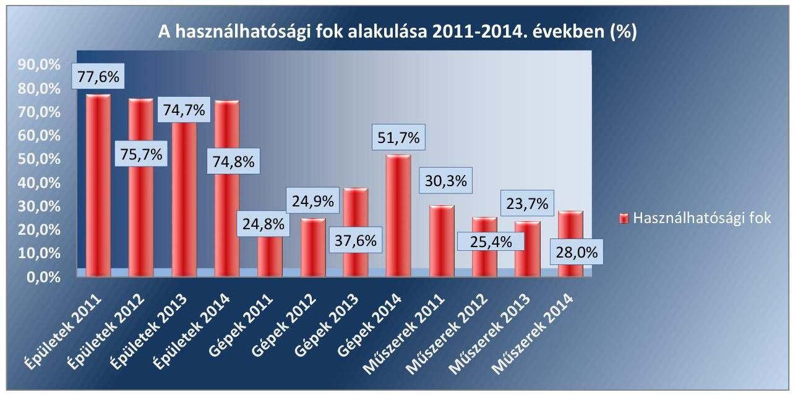

Forrás: a Társaság éves beszámolói

---

II. SZ. MELLÉKLET: ELSZÁMOLT ÉRTÉKVESZTÉS A 2011-2014. ÉVEKBEN
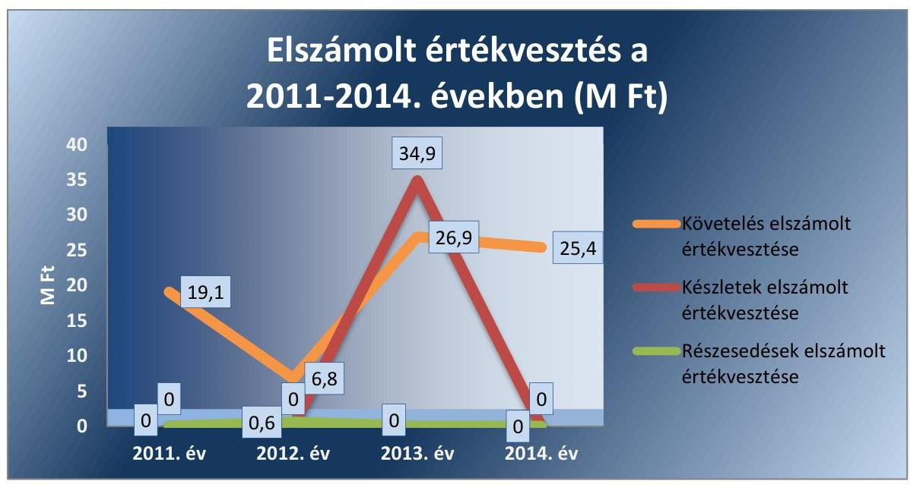

Forrás: a Társaság éves beszámolói

---

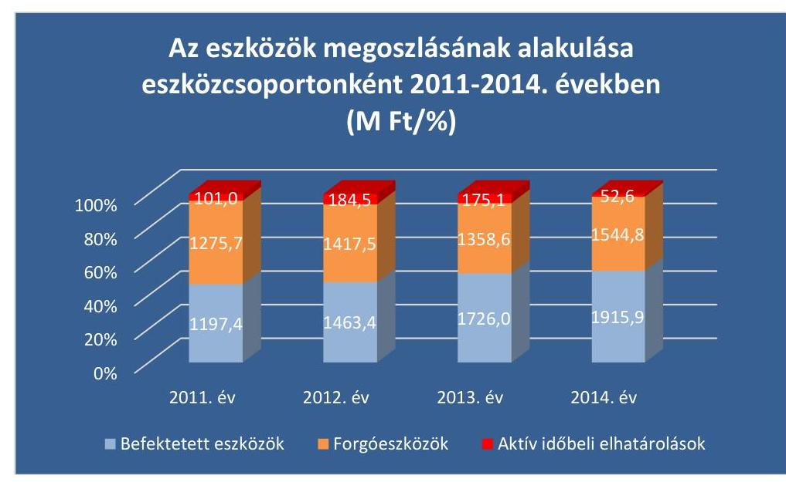

# A források megoszlásának alakulása forráscsoportonként 2011-2014. években (M Ft/\%) 

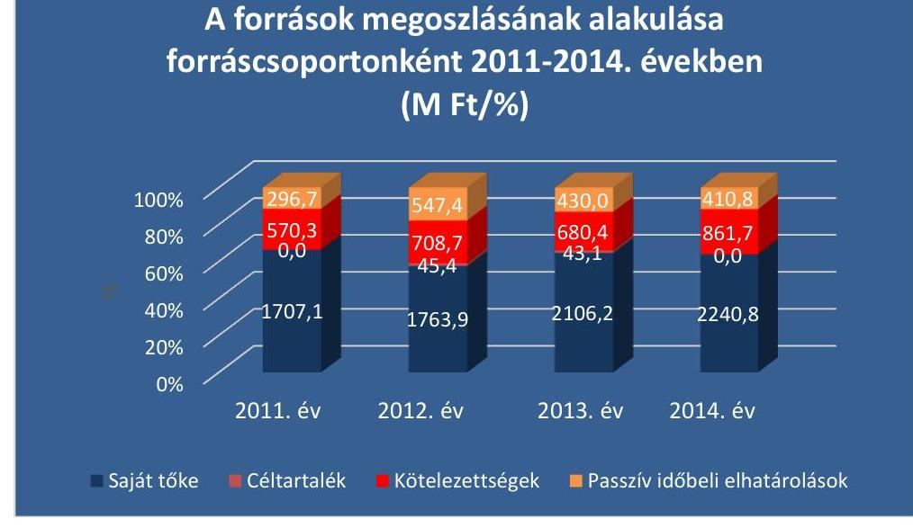

Forrás: A Társaság éves beszámolói

---

V. SZ. MELLÉKLET: A BERUHÁZÁSOK ÉS FELÚJÍTÁSOK RÁFORDÍTÁSAI, VALAMINT AZ ÉRTÉKCSÖKKENÉSI LEÍRÁS ALAKULÁSA A 2011-2014. ÉVEKBEN

# A beruházások és felújítások ráfordításai, az elszámolt értékcsökkenés és az igénybevett támogatások alakulása 2011-2014. években (M Ft) 

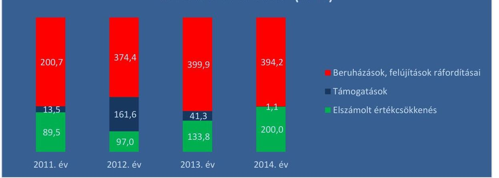

Forrás: A Társaság adatszolgáltatásai

---

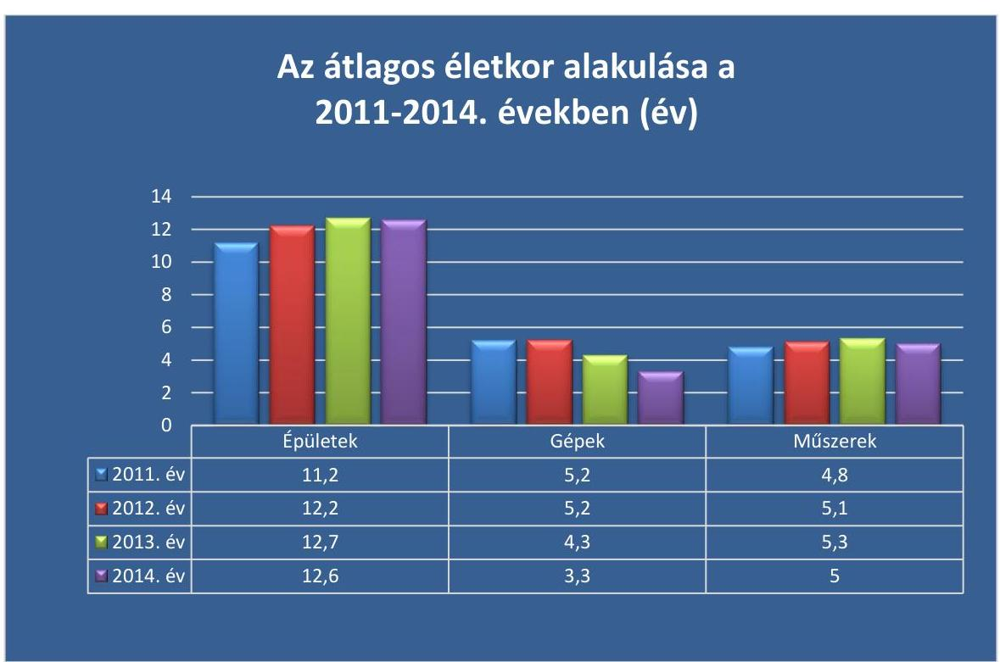

*Forrás: A Társaság éves beszámolói*

---

# FÜGGELÉK: ÉSZREVÉTELEK 

A jelentéstervezetet a Számvevőszék 15 napos észrevételezésre megküldte az ellenőrzött szervezetek vezetőinek az ÁSZ tv. 29. §* (1) bekezdése előírásának megfelelően.
Az elfogadott észrevételek alapján a Számvevőszék módosította a jelentést.
A függelék tartalmazza az ellenőrzött észrevételeit, illetve az el nem fogadott észrevételek elutasításának indoklását.

- Gabonakutató Nonprofit Közhasznú Kft. ügyvezetőjének írásban tett észrevétele (mellékletek nélkül)
—_ Tájékoztatás az ügyvezetőnek az észrevételek kezeléséről
- A Magyar Nemzeti Vagyonkezelő vezérigazgatójának írásban tett nemleges észrevétele
- A Nemzeti Agrárkutatási és Innovációs Központ főigazgatójának írásban tett nemleges észrevétele

[^0]
[^0]:    * 29. § (1) Az Állami Számvevőszék az ellenőrzési megállapításait megküldi az ellenőrzött szervezet vezetőjének vagy az általa megbízott személynek, és annak, akinek személyes felelősségét állapította meg.
    (2) Az ellenőrzött szervezet vezetője és a felelősként megjelölt személy az ellenőrzés megállapításaira tizenöt napon belül írásban észrevételt tehet.
    (3) Az Állami Számvevőszék az észrevételre a beérkezésétől számított harminc napon belül írásban válaszol. A figyelembe nem vett észrevételeket köteles a jelentésben feltüntetni, és megindokolni, hogy azokat miért nem fogadta el.

---

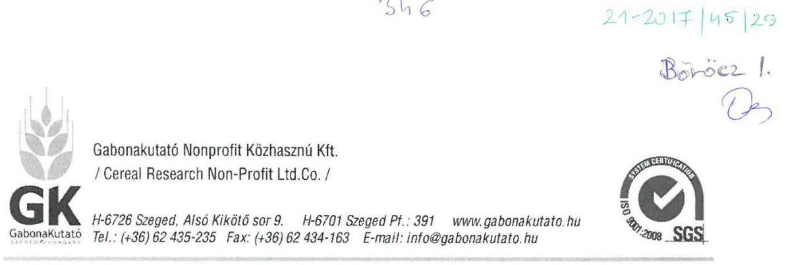

# Állami Számvevőszék 

## Domokos László Elnök Úr

1364 Budapest, 4. Pf. 54.
Ikt.szám: V-1027-197/2016.

## Tisztelt Elnök Úr !

A közelmúltban az Állami Számvevőszék társaságunknál ellenőrizte az állami tulajdonban lévő gazdálkodó szervezetek vagyonmegőrzési és gazdálkodási tevékenységét. Az ellenőrzésről készült jelentés tervezetet - amelynek kézhezvétele 2017. február 07-én történt gondosan áttanulmányoztuk. Összességében megállapítottuk és köszönjük, hogy az ellenőrzést végző munkatársai igen alapos feltáró tevékenységet végeztek, megállapításaikat a jövőben igyekszünk maximálisan hasznosítani. Külön örülünk annak, hogy az ellenőrzésnek bevallott célja az is, hogy a munka során megszerzett tapasztalatok segítsék és erősítsék az ÁSZ hozzáadott értéket teremtő elemző tevékenységét és tanácsadó szerepét.

Elöljáróban szeretnénk leszögezni, hogy szemléletünkben a társaság vagyonát - függetlenül attól, hogy saját vagy vagyonkezelésünkbe adott vagyonról van szó - egységesen állami vagyonnak tekintjük - mely az állami üzletrészben testesül meg -, ennek megőrzése, gyarapítása legfőbb feladatunk. Ezen törekvésünk eredménye a jelentés-tervezet 4.1. számú megállapításából is kitűnik, amikor az Ön munkatársai grafikonon bemutatják a vizsgált időszakban a társasági vagyon alakulását.

Az ellenőrzés konkrét megállapításaira - a válaszadásra megszabott 15 napos határidőn belül az alábbi észrevételeket tesszük:

### 2.1. számú megállapítás:

A Társaság a vagyon értékének megőrzését, gyarapítását szolgáló vagyongazdálkodás feltételeit a 2011-2013. években nem megfelelően ... alakította ki. ...

Észrevétel a 2.1. számú megállapításra:
Az Állami Számvevőszék jegyzőkönyvében kifogásolta, hogy a Gabonakutató Nonprofit Kft 2011-ben és 2013-ban a jogelőd GK Kht pénzügyi és számviteli szabályzatait használta. A

---

jogelőd szabályzatai teljesen relevánsak voltak a Gabonakutató Nonprofit Kft-re is, hiszen a 2009. január 1-én történt átalakulással (Kht-ból nonprofit Kft lett jogszabályi változás következtében) sem a gazdálkodásban, sem a számviteli és pénzügyi nyilvántartásokban, vagyonban stb. semmiféle változás nem következett be. A szervezeti forma változás számviteli nyilvántartási rendszerünket nem érintette, a korábban készült - számviteli törvény szerinti - szabályzatok megfelelően szolgálták a társaság tevékenységét. A társaság szempontjából egy jogutódlási folyamatnak voltunk részesei, a gazdálkodás feltétel rendszere továbbra is azonos volt, így a 2009. év előtt elkészült szabályzatokat a későbbiekben érvényesnek tekintettük. Továbbra is ugyanazt az ügyviteli rendszert használtuk, annak összes adattartalmával. 2013 januárjában új számítógépes ügyviteli rendszer került bevezetésre, ezért a Társaság átdolgozta szabályzatait, mivel nyilvántartási rendszere alapjaiban megváltozott. Álláspontunk szerint a Társaság betartotta a Számv.tv. 161/A. §(1) bekezdés előírásait, hiszen a vizsgálat során rendelkezésre bocsátott Számlarend részletesen tartalmazta a könyvvezetésre vonatkozó szabályokat.

# 2.2. számú megállapítás: 

## A Társaság a vagyonkezelésbe vett ingatlant nem tartotta nyilván.

Észrevétel a 2.2. számú megállapítás 1-2 bekezdéséhez:
Az ellenőrzés során a Számvevőszék rendelkezésére bocsátottuk a Szekszárd, Vetőmag Üzletház ingatlan teljes dokumentációját, valamint ezzel kapcsolatban külön nyilatkozatot is tettünk. A szerződés tárgya a vagyonkezelői jog, mint vagyoni értékủ jog. A vagyonkezelői jog megszerzése nem a klasszikus vagyonkezelési eljárás keretében történt. A vonatkozó szerződésben hivatkoztak ugyan az államháztartási törvényre, illetve a kincstári vagyonnal való gazdálkodásról szóló kormányrendeletre, de valójában itt egyenértékủ vagyontárgyak átadásáról-átvételéről, cseréről van szó, nem a szentesi használatunkban lévő ingatlanért cserébe kaptunk egy másik, vagyonkezelt ingatlant, hanem a Szentesi Zöldségkutató Állomáson végrehajtott beruházás térítés nélküli átadása ellenében kaptuk meg a Szekszárdi Ingatlan Vagyonkezelői jogát, mint vagyoni értékủ jogot. Az ingatlanunk térítés nélküli átadásával társaságunk mintegy 70 millió Ft-os veszteséget volt kénytelen elszenvedni, amellyel lényegében a kapott vagyoni értékủ jog miatti pótlási kötelezettséget már előre teljesítettük. Egyébiránt a szerződés nem rendelkezett a visszapótlási kötelezettségről. Társaságunk a 2005-ben hatályos Számv. tv-nek megfelelően járt el, melynek 23. § (2) bekezdése alapján Társaságunk a vagyoni értékủ jogot az eszközök között nyilvántartásba vette, és mivel ingatlanhoz kapcsolódó jogról volt szó, az ingatlanoknál (Számv. tv. 26. § (3)). A szerződésben a $72,5 \mathrm{mFt}$ vagyoni értékủ jogon kívül semmiféle más érték nem szerepelt.

Az értékcsökkenési leírást a Sztv. 52. §. (1) bekezdésének megfelelően $10 \%$-ban határoztuk meg, tekintettel arra, hogy a használati jog ideje (hasznos élettartam) 10 év volt. Az általunk alkalmazott eljárás megfelelt a reális gazdasági folyamatoknak. A 2013. január 1-től módosított Számviteli politikánk tagadhatatlanul 20\%-os értékcsökkenést állapít meg az immateriális javak között nyilvántartott vagyoni értékủ jogok tekintetében, de ez nem oda tartozott, hiszen ingatlanhoz kapcsolódott, így a hivatkozás a 2013 évi Számviteli Politika 11.2.1. pontjára erre az esetre egyáltalán nem vonatkoztatható. Ha és amennyiben releváns lenne, akkor a szabályzat érvénybe helyezését követően beszerzett tárgyi eszközökre kellene az új szabályzatot alkalmazni, hiszen semmi nem indokolná az addig alkalmazott kulcs

---

megváltoztatását, nem következett be olyan gazdasági esemény, ami miatt a hasznos élettartam $80 \%$-ának elteltét követően 2 hátralévő évre meg kellene változtatni az értékcsökkenési leírást. De hangsúlyozzuk, a Szabályzat idézett pontja az immateriális javakra vonatkozik, nem pedig az ingatlanokkal kapcsolatos vagyoni értékủ jogokra.

A Számv. tv. 23. §. (2) bekezdése rendelkezik arról, hogy a vagyonkezelőnél eszközként kell kimutatni az állami vagyon részét képező eszközöket. Ezen szabály generális szabálynak tekinthető, vonatkozik valamennyi eszközféleségre, így az ingatlanokhoz kapcsolódó vagyoni értékủ jogokra is. A Számv. tv. 26. §. (3) bekezdése az ingatlanokhoz kapcsolódó vagyoni értékủ jogokra tartalmaz útmutatást, Társaságunk a nyilvántartásba vételkor eszerint járt el. A megkötött szerződésben hivatkozás történik az 58/2005. (IV.4.) kormányrendeletre, melynek 19. § (2) adatszolgáltatási kötelezettséget ír elő a vagyonkezelő részére az általa kezelt kincstári vagyon változásáról. A szekszárdi ingatlannal kapcsolatban az eltelt időszakban vagyonváltozás (értéknövelő beruházás, értékcsökkentő gazdasági esemény) nem következett be, Társaságunk az adott ingatlannal kapcsolatban nem hajtott végre semmilyen olyan gazdasági eseményt, amely az ingatlan értékén változtatott volna.

# 2.2. sz. megállapítás 4. bekezdés 

A társaság könyveiben az ellenörzött idöszakban nem találhatók az Alapitó Okirat 3as melléklet 1-4 függelékében foglalt szabadalmak, ... és azok változásai

## Észrevétel 2.2. pont 4-es bekezdéshez

A Gabonatermesztési Kutató Közhasznú Társaságot a Földművelésügyi miniszter 1997. augusztus 31 -én alapította. Az Alapító Okirat részét képezte a 3-as számú melléklet. Az ott felsorolt növényfajták összesített vagyonértéken szerepeltek, azokat az Alapító tóketartalékként bocsátotta a társaság rendelkezésére. Ezek a fajták és hibridek összesített értéken alapításkor bekerültek az immateriális javak közé. A Társaság a szabályzatainak megfelelően az immateriális javakra értékcsökkenést számolt el, majd a leírást követően azokat analitikusan nyilvántartotta és nyilvántartja mind a mai napig, követve az éves változásokat. Az Alapító ezeket a vagyoni értékủ jogokat tőketartalékként bocsájtotta rendelkezésre, az azt követően része lett a Társasági vagyonnak, értéke a saját tökében testesül meg a továbbiakban. A tőketartalékba helyezett vagyonelemek elkülönített nyilvántartását sem a Számviteli Törvény, sem egyéb jogszabály nem írja elő. Az Alapító Okirat 7.1. pontja is megfogalmazza: „Az alapító teljes vagyonilletőségét, azaz a törzsbetétet, a pótbefizetést, a mellékszolgáltatást és a tagsághoz füződő valamennyi jogát a törzsbetét forint összegével azonos egyetlen üzletrész testesíti meg." A fajtajegyzéket, szabadalmas fajták jegyzékét évente a beszámolót megelőzően felülvizsgáljuk, aktualizáljuk, a visszavonásokat töröljük, az új elismeréseket, szabadalmakat pedig nyilvántartásba vesszük, közzé tesszük az üzleti jelentésben. Véleményünk szerint 1997-ben eleget tettünk nyilvántartási kötelezettségünknek, értékben a könyveinkben szerepeltek az alapításkori fajták és szabadalmak, azonban azok azóta elavultak, a köztermesztésben már nem szerepelnek, így könyveinkben - 1997 óta történő - szerepeltetésük szükségtelenné vált. Véleményünk szerint a Társaság teljes egészében biztosítja a könyveiben a Számv. tv. 159. § előírásait. A vizsgált időszakban az Alapítói Okiratokban a mellékletekre történő hivatkozás téves volt, azóta módosítottuk Okiratunkat, melyből az alapításkori mellékletek kikerültek, ezúton is köszönjük, hogy erre az adminisztratív hibára felhívta az ellenőrzés a figyelmünket.

---

# 3. számú megállapítás: 

..... Az önköltségszámitás szabályozása és végrehajtása nem volt szabályszerü.

## Észrevétel a 3. számú megállapításra:

Társaságunk alaptevékenysége a $\mathrm{K}+\mathrm{F}$, ennek során alkalmazott kutatással és kísérleti fejlesztéssel foglalkozik. A kísérleti fejlesztés eredményeképpen fajtákat, hibrideket nemesít, elismerést követően pedig a fajtákat előállítja, termeli és értékesíti. A Számv. Tv. rendelkezik arról, hogy a $\mathrm{K}+\mathrm{F}$ eredményeket milyen módon aktiválhatja a törvény alanya. A kutatási tevékenységek közül a Számv. tv. 25. §. (5) bekezdése szerint az alap- és alkalmazott kutatás költségei nem aktiválhatók. Társaságunk nemesítési tevékenysége a kísérleti fejlesztések kategóriájába sorolható be. A Számv. tv. 25. §. (4) bekezdése és (5) bekezdése tartalmazza a kísérleti fejlesztés aktivált értékének elszámolására vonatkozó szabályokat. E két bekezdésből egyértelműen megállapítható (lehet figyelembe venni; lehet kimutatni), hogy a vállalkozó döntési kompetenciájába tartozik, hogy él-e ezzel a lehetőséggel, vagy sem.

Amennyiben élünk az aktiválási lehetőséggel, a kísérleti-fejlesztési közvetlen költségeket a téma lezárásáig folyamatosan (éveken keresztül) gyüjtenünk kellett volna. Sikeres témalezárás esetén meg kellett volna határozni a szellemi termékként állományba veendő fajták közvetlen önköltségét, meg kellett volna határozni azon költségek körét is, amelyek az aktiválható szellemi termékben nem vehetők számításba. Meg kellett volna állapítani azt is, hogy a kísérleti fejlesztés aktivált értéke a jövőbeni gazdasági haszonból meg fog-e térülni.

Társaságunk a kísérleti fejlesztéseket illetően olyan döntést hozott, hogy azokat nem kívánjuk aktiválni. A 2012. december 31-ig érvényben lévő Számviteli Politika 2.13.h) pontja tartalmazta, hogy a fajtákat nem aktiváljuk, a 2013-tól érvényes szabályzatban pedig akként jelenítettük meg, hogy erről a kérdésről nem rendelkeztünk. Döntésünk indoka az, hogy a növénynemesítési munka viszonylag hosszú ideig (akár 15 évig is) eltarthat. Évente fajonként több ezer nemesítési anyag szerepel a tenyészkerti szelekciókban és a kísérletekben, amelyekhez költségek kapcsolódnak. Ezen növények (individuális egyedek, populációk, vonalak, törzsek és más a nemesítési folyamatban lévő genetikailag mozgó anyagok) 70-90\%a néhány év után kiesik, a nemesítők kiszelektálják, helyükre évről-évre újak kerülnek, a periódusok végén csak 1-2\% jut el a fajta bejelentésig. A bejelentést követően, ha minősítik is a fajtát, a sikeres növényi oltalom megszerzésekor sem tudjuk még csak becsült biztonsággal sem meghatározni, hogy adott fajtának milyen lesz a jövedelemtermelő képessége. Ebből már következik, hogy nem tudjuk a szükséges pontossággal megállapítani a Sztv. 51. §. (1) bekezdése szerinti közvetlen önköltséget és a jövőbeni várható piaci pozíciókat sem. Összességében, álláspontunk szerint a kísérleti-fejlesztési munkánk költségeinek a tárgyévi eredmény terhére történő elszámolása megfelel a Számv. tv. előírásainak. Mivel Társaságunk nem él a kísérleti fejlesztés értékének aktiválásával mint lehetőséggel, így annak közvetlen költségeire sem kell kitémie az Önköltség-számítási Szabályzatban. Önköltségi szabályzatunk részletesen foglalkozik azzal, hogy milyen kalkulációs egységekre készül önköltség-számítás, mely költségek tartoznak a kalkulációs egységek közvetlen, azaz szűkített önköltségébe. Ebben a vonatkozásban Társaságunk nem sértette meg a Számv. tv. 51. és 52. §-ait, hiszen a vonatkozó jogszabályok szerint nem kötelező a kísérleti fejlesztés aktiválása, aktiválás hiányában pedig értékcsökkenési leírást sem számolhattunk el.

---

# 4.1. számú megállapítás:   A Társaság vagyongazdálkodási tevékenysége nem volt szabályszerü. 

Észrevétel a 4.1. számú megállapításra:
Ezzel kapcsolatos álláspontunkat(szekszárdi ingatlanra kötött szerződés) a 2.2 számú észrevételnél kifejtettük.

### 4.2 számú megállapítás 2-es bekezdése:

A Gabonakutató Kft.-nél a vagyonváltozást eredményezö döntések elökészitése és megalapozása nem felelt meg a jogszabályi és belső elöírásoknak.

Észrevétel a 4.2. számú megállapítás 2-es bekezdéshez:
Társaságunk 2007-ben Alapítói hozzájárulással (15/2007. Alapítói határozat ÁSZ-hoz elektronikusan feltöltve) folyószámlahitelt vett fel a CIB Bank Zrt-től. Azóta új szerződés megkötésére nem került sor, az alapszerződés hosszabbítása és kisebb módosítások történtek minden évben, általában november-december hónapban. A Társaság üzleti terve és beszámolója külön fejezetben taglalja a pénzügyi helyzetet, melyben a hitelek és feltételeik ki megjelent. Mind a tervet, mind a beszámolót az Alapító minden évben elfogadta, annak teljes tartalmával együtt, így ebben az esetben az említett tulajdonosi jogkör nem sérült, hiszen a terv elfogadásával, a gazdálkodási keretek, melyhez a finanszírozás is hozzátartozik, az Alapító által teljes egészében ismertek voltak.

A jelentés által kifogásolt 2013. 06. 20-án dátummal 122,7 MFt értékben szerződést nem kötöttünk, ilyen a nyilvántartásainkban nem szerepel. A vizsgálat során benyújtott lízing szerződések közül az MZP13BH556527-es szerződésről lehet szó, melynek finanszírozott része 86.971 eFt volt, az önrész nélkül a kölcsönrész nem érte el az említett $10 \%$-ot.

A jelentésben említett berendezés, melynek értéke 286,8 MFt érték volt, öntözőtelep kivitelezésére kötött szerződés volt. Ugyan formálisan alapítói határozat nem született a szerződés kötésére, ahhoz az Alapító 100 MFt forrás-kiegészítéssel hozzájárult, a forráskiegészítésre vonatkozóan az MNV Zrt. Igazgatósága a 407/2012. (VII.23.) IG sz. határozattal döntött, a forrás nyújtására vonatkozó SZT/38535 sz. szerződést elektronikusan a vizsgálat ideje alatt csatoltuk. A berendezés megvalósítását és a forrás felhasználását a társaság Felügyelő Bizottsága külön ellenőrizte. A fentiek tükrében az öntözőberendezés megvalósításával kapcsolatban az Alapító teljes információval rendelkezett, még akkor is, ha határozat az ügyben nem született. Ugyanezen beruházás megvalósításához kapcsolódik a 2012. november 8-án kötött 104 millió Ft összegủ lízing szerződés is, mely a kivitelezési költségek előfinanszírozását szolgálta, hiszen a pályázat teljes egészében utófinanszírozott volt.

### 4.2 számú megállapítás 5-ös bekezdése:

A közbeszerzési törvény elöírásait nem tartották be, mert közbeszerzési értékhatárt meghaladó szerzödéseket kötöttek közbeszerzési eljárás nélkül.

Észrevétel a 4.2. számú megállapítás 5-ös bekezdéshez
Nem vitatott tény, hogy a Gabonakutató Nonprofit Kft 100\%-ban állami tulajdonú, nonprofit gazdasági társaság. Álláspontunk szerint, társaságunk a közbeszerzésekről szóló 2011. évi

---

CVIII. tv. hatálya alatt a 6.§ (1) bek. c) pont alapján nem minősült ajánlatkérőnek, és az új Kbt. alapján sem minősül, tekintettel arra, hogy a társaságot nem közérdekủ tevékenység folytatása céljából hozták létre és nem is lát el ilyen tevékenységet, mint ahogyan az az Alapító Okiratból is kitűnik.

Indokaink: Társaságunk gazdasági tevékenységét külföldi tőkeerős multinacionális cégekkel versenyezve, teljes mértékben piaci feltételek közt végzi (2011-től a Gt. tv. szabályai szerint, 2013-tól az új Ptk szabályai szerint), közpénzek nélkül, saját bevételekből (saját nemesítésű vetőmag előállítás, vetőmag eladás, gabona értékesítés bevételei stb.), K+F pályázati forrásokból, banki hitelekből biztosítjuk a müködésünkhöz szükséges pénzeszközöket. Mivel nem közérdekủ tevékenységet folytat, és még részben sem lát el ilyen tevékenységet, ezért ahhoz állami támogatást sem kap. Az általunk megtermelt, feldolgozott vetőmagot és a gabonát piaci szabadkereskedelmi tevékenység keretében értékesítjük. Közfeladatot (közérdekủ tevékenységet) nem látunk el, melyet a felügyeleti szervünk nyilatkozata is bizonyít (MgF/199/2016.sz.FM. állásfoglalás csatolva), továbbá jelenleg már nem tartozunk a kormányzati szektorba sorolt egyéb szervezetek körébe sem, mivel a társaság bevételi szerkezete annak indokoltságát már sok éve nem támasztja alá (NGM 2016/05/25-i levél, és a 2017/02/14-én érkezett NGM e-mail csatolva).
A Kbt. 6. § (1) bekezdésének c) pontja értelmében e törvény alkalmazásában ajánlatkérő :
c) az a jogképes szervezet, amelyet közérdekü, de nem ipari vagy kereskedelmi jellegü tevékenység folytatása céljából hoznak létre, vagy amely ilyen tevékenységet lát el, ha az a)d) pontokban meghatározott egy vagy több szervezet, az Országgyülés vagy a Kormány külön-külön vagy együttesen, közvetlenül vagy közvetetten meghatározó befolyást képes felette gyakorolni vagy müködését többségi részben egy vagy több ilyen szervezet (testület) finanszírozza."

Ezen pont alapján az ajánlatkérői minőség abban az esetben áll fenn, ha a következő feltételek, összhangban az Európai Unió jogával - egyidejűleg állnak fenn egy, a Kbt. 6. § (1) bekezdésének a) és b) pontja alapján ajánlatkérőnek nem minősülő szervezet esetén:

- a szervezet jogképes;
- közérdekü, de nem ipari vagy kereskedelmi jellegủ tevékenység folytatása céljából hoznak létre, vagy amely ilyen tevékenységet lát el,
- az a)-d) pontokban meghatározott egy vagy több szervezet, az Országgyülés vagy a Kormány külön-külön vagy együttesen, közvetlenül vagy közvetetten meghatározó befolyást képes felette gyakorolni vagy müködését többségi részben egy vagy több ilyen szervezet (testület) finanszírozza.

A következők mondhatóak el a három feltétellel kapcsolatban:
A közérdeküség. A Kbt. nem határozza meg a közérdeküség fogalmát, ezért értelmezésekor más jogszabályok, illetve legfelsőbb bírósági (jelenleg: kúriai) állásfoglalások, valamint - lévén a Kbt. ezen szakasza európai uniós jogszabály átültetésének való megfelelést célozza - az uniós közbeszerzési jog vizsgálata szükséges. Esetünkben az ágazati felettesünk a Földművelésügyi Minisztérium az MgF/199/2016.sz.FM. állásfoglalásában nyilatkozta, hogy a Gabonakutató Nonprofit Kft nem tartozik a közfeladat ellátásra kötelezett állami tulajdonú társaságok körébe, és a tárca részéről a jövőre nézve sincs ilyen szándék.

Az Európai Bíróság esetjoga szerint (pl. C-283/00. számú ügy) közjogi szervezetté minősítés alapja a funkcionális megközelités, vagyis nem annak van relevanciája, hogy egy adott

---

tevékenységet pl. jogszabály miként minősít, hanem a ténylegesen ellátott tevékenység jellegének, aminek megítélése az eset összes körülményének gondos mérlegelését igényli. Mindenekelőtt az vizsgálandó, hogy a kérdéses szervezet létjogosultságát valamely közérdekü cél megvalósitása alátámasztja-e. Ha ez a közérdekủ szükséglet (mint a szervezet alapításának vagy működtetésének célja) hiányzik, a vizsgált szervezet nem minősül közjogi szervezetnek.

A társaság, az államháztartásról szóló 2011. évi CXCV. törvény (Áht.) 3. § (1)-(3) bekezdéséibe foglaltak szerint sem lát el közfeladatot, és nem tartozik az államháztartás rendszerébe.

A társaság ugyanis nem központi költségvetési szerv, nem köztestület és nem köztestület költségvetési szerve. A társaságnak a gazdálkodási formája gazdasági társaság.

Az Áht. 3/A. § (1) bekezdés szerint közfeladat, ,,a jogszabályban meghatározott állami vagy önkormányzati feladat". A (2) bekezdés kimondja, hogy ,,közfeladatok ellátása költségvetési szervek alapitásával és müködtetésével vagy az azok ellátásához szükséges pénzügyi fedezet e törvényben meghatározott eszközökkel, részben vagy egészben történő biztosításával valósul meg."

Az idézett törvényi rendelkezések értelmezése szerint, a társaság nem költségvetési szerv, mivel közfeladatot közvetlenül csak az államháztartás részét képező állami vagy önkormányzati költségvetési szerv láthat el.

A (2) bekezdés 2. mondata szerint, ,,A közfeladatok ellátásában államháztartáson kivüli szervezet jogszabályban meghatározott rendben közremüködhet." A (3) bekezdés szerint, ,,A közfeladatot meghatározó jogszabályban meg kell határozni a közfeladat ellátásának módját és egyidejüleg rendelkezni kell az annak ellátásához szükséges pénzügyi fedezet biztosításáról. Új közfeladat kizárólag az annak ellátásához megfelelő pénzügyi fedezet rendelkezésre állása esetén írható elő vagy vállalható. Ha a pénzügyi fedezet már nem áll rendelkezésre, intézkedni kell a pénzügyi fedezet biztosításáról vagy a közfeladat megszüntetéséről."

Az idézett rendelkezések értelmében tehát államháztartáson kívüli szervezet - tehát nem csak költségvetési szerv - is közremüködhet közfeladat ellátásában, de ekkor az adott jogszabálynak meg kell határoznia az ellátás módját és egyidejüleg rendelkeznie kell az ellátáshoz szükséges pénzügy fedezetről. Ha ilyen nincs, akkor a közfeladatot meg kell szüntetni.

Álláspontunk szerint nincs olyan jogszabály, amely a társaság számára meghatározna konkrét közfeladatot, annak módját és emellett ilyen (nem létező) közfeladathoz nem bocsát rendelkezésre az állam pénzügyi fedezetet. E nélkül pedig nincs közfeladat. Amellett, hogy nincs ilyen jogszabályi rendelkezés, a társaság Alapító okirata sem rendelkezik közfeladatról, illetve annak ellátásáról. Az Alapító okirat 5. pontja határozza meg a társaság tevékenységi köreit. A főtevékenységi körnél - mint közhasznú tevékenységnél - írja azt, hogy „mint közfeladat kormányzati ellátásához kapcsolódással".Azaz, nem közvetlenül lát el közfeladatot, hanem a főtevékenységének a folytatása kapcsolódik a kormányzati

---

# közfeladathoz. 

Bizonyos esetekben a pályázatokkal elnyert támogatásoknál Társaságunknál is felmerült a közbeszerzési kötelezettség. Ilyen esetekben a közbeszerzési törvény szabályait alkalmaztuk.

## 4.2 számú megállapítás 6-os bekezdése:

A Társaság által tervezett, illetve végrehajtott vagyonnövelö beruházásokat és felújításokat az éves üzleti tervek, illetve az éves beszámolók elfogadásával a tulajdonosi joggyakorló tudomásul vette, azokkal kapcsolatban ellenörzést nem végzett.

Észrevétel a 4.2. számú megállapítás 6-os bekezdéshez
Az Alapító (tulajdonosi joggyakorló) a tervek elfogadásával, melyben külön fejezet foglalkozik a beruházásokkal, előzetesen engedélyt adott azok megvalósítására, hiszen a teljes üzleti tervet fogadta el. Az Alapító a Felügyelő Bizottságon keresztül - amely testületnek ez a törvényi kötelezettsége - többször ellenőrizte a beruházások végrehajtását, kihelyezett üléseken helyszíni szemlét tartott, a beruházásokhoz nyújtott alapítói források felhasználását tételesen ellenőrizte. Az ügyvezetés negyedévente beszámolt az FB-nek a gazdálkodásról, ezzel együtt a beruházások helyzetéről is. Az éves beszámolók tételesen tartalmazták (ügyvezetés jelentése) az adott évben végrehajtott beruházásokat. A hivatkozott dokumentumokat az ellenőrzés folyamán elektronikusan csatoltuk.
5. számú megállapítás 6-os bekezdése:

A Társaság a 2011. évben az Avtv ${ }^{21}$ 31/A§ (3) bekezdésében, a 2012-2014.években az Info tv. ${ }^{24}$ 24.§ (3)bekezdésében elöírtakat figyelmen kivül hagyva adatvédelmi és adatbiztonsági szabályzattal nem rendelkezett,

Észrevétel az 5. számú megállapítás 6. bekezdéshez:

## / A 2011.évi CXII. törvény (Info tv.) 24.§

(3) Az (1) bekezdésben meghatározott adatkezelőknek, valamint - az adatvédelmi nyilvántartásba bejelentési kötelezettség alá nem eső adatkezelők kivételével - egyéb állami és önkormányzati adatkezelőknek e törvény végrehajtása érdekében adatvédelmi és adatbiztonsági szabályzatot kell készíteniük./

Társaságunk az ellenőrzött időszakban adatvédelmi és adatbiztonsági szabályzattal nem rendelkezett.

Ennek oka az volt, hogy értelmezésünkben a társaság nem folytat adatkezelést, az Info. tv. 3. § 10. pontja értelmében. A törvény e szakaszhoz füzött értelmező indokolása szerint, „Az ,,adatfeldolgozás" új fogalma tisztázza, hogy nem bármilyen, az adatkezeléshez kapcsolódó technikai feladat, hanem csak az adatokon végzett technikai feladat minösül adatfeldolgozásnak. A definíció alapján egyértelmüvé válik, hogy az elektronikus hírközlési szolgáltatás, a kormányzati célú hírközlési szolgáltatás, az informatikai fejlesztés, elektromosáram-ellátás, épület vagy egyéb infrastruktúra biztositása - mivel ezeket a technikai feladatokat nem az adatokon végzik - nem minösül adatfeldolgozásnak."

Társaságunk nem gyüjt, nem rendszerez stb. semmilyen, az Info tv. hatálya alá tartozó különleges, bűnügyi személyes, vagy közérdekủ adatot, kizárólag csak a saját

---

munkavállalóinak személyes adatait a Munka Törvénykönyve 2012.évi I. tv. (MT) hatálya alá tartozó munkáltatóként az MT. 10.§ előírásai szerint kezeli a munkavállalók adatait, és teljesíti ez irányú kötelezettségeit.

A vezetők adatait pedig az Átláthatóságról szóló törvény alapján közzéteszi a társaság honlapján, tehát ezen adatok nyilvánosak, amint erre a Jelentés is kitér.
A társaság Adatvédelmi nyilatkozatot tett közzé a honlapján és azt folyamatosan fenntartja ( http://www.gabonakutato.hu.).
Az üzleti partnereinktől csak olyan adatokat kérünk, amelyek nyilvánosak, de ezeket is kellő körültekintéssel, és diszkrécióval kezeljük.

Összegezve: A Gabonakutató Nonprofit Kft. tiszteletben tartja a személyes adatok védelmét, a mindenkor hatályos jogszabályok figyelembevételével kezeli a rendelkezésre bocsátott ilyen jellegű adatokat. Kizárólag a megjelölt célra használja fel, nem egyesíti más forrásból származó adatbázisával és semmilyen formában nem adja át harmadik félnek és minden tőle telhető és ésszerű erőfeszítést megtesz az ilyen adatok védelme érdekében.

Az 5. számú megállapítás 6. bekezdésének második fordulatához:
a 2011. évben az Avtv.20.§ (8) bekezdésében, a 2012-2014. években az Info tv. 30.§
(6) bekezdésében foglaltak ellenére közérdekü adatok megismerésére irányuló igények teljesitésének rendjét rögzitő szabályzattal nem rendelkezett.
Avtv (1992. évi LXIII.tv.)
Az Info tv. 30. § (6) bekezdése szerint: A közfeladatot ellátó szervnek a közérdekü adatok megismerésére irányuló igények teljesitésének rendjét rögzitő szabályzatot kell készítenie.

A 4.2 pont 5. bekezdéséhez füzött észrevételeinkre itt is hivatkozunk, azaz társaságunk nem minösül közfeladatot ellátó szervnek és közérdekü adatok kezelésével nem foglalkozik.

Ugyanakkor társaságunk, mint közhasznú szervezet a vonatkozó törvényi szabályozás szerint a közhasznú tevékenységi körébe tartozó információk megismerésének biztositására kötelezett, s erről a törvény, valamint az Alapitó okirat rendelkezik és ennek eleget is tett társaságunk. Külön szabályzat meglétére a közhasznú szervezetkénti nyilvántartásba vétel során a Bíróság, valamint az Alapitó okirat nem kötelezte a társaság vezetését.
5. számú megállapítás 7 -os bekezdése:

A Társaság az Aht, ${ }^{31}$ 107.§ (1) bekezdésben foglaltak ellenére a 2012-2014.években nem teljesítette az állambáztartásáért felelös miniszter részére a központi költségvetésről szóló törvény elkészitéséhez szükséges kötelező adatszolgáltatást. ...

Észrevétel az 5. számú megállapítás 7. bekezdéshez:
Az ellenőrzés ideje alatt nyilatkozatunkban is jeleztük, hogy a vizsgálat során szembesültünk azzal a ténnyel, hogy társaságunkat a 9/2012. és a 60/2013. Hivatalos Értesítőben közzétett miniszteri közlemény a kormányzati szektorba sorolt egyéb szervezetnek minősítette. Erre a tényre és az ezzel járó külön adatszolgáltatási kötelezettségre egyébként a vizsgált időszakban egyik tulajdonosi joggyakorló sem hívta fel a figyelmünket, az adatszolgáltatás rendjéről nem rendelkezett. Ebből következően adatszolgáltatási kötelezettségünknek sem tehettünk eleget,

---

mentségünkre szolgáljon, hogy azt az azóta eltelt időszakban tőlünk senki nem kérte. Ennek megfelelően nem alakíthattuk ki a Tulajdonosi joggyakorlóval közösen a Bkr szerinti információs rendszert sem. Az ellenőrzéssel egyidőben megkerestük az NGM illetékeseit és a Statisztikai Hivatalt is a besorolással kapcsolatban. Kérelmünkre kiderült, hogy a Társaság gazdasági mutatói (bevételek, ráfordítások aránya) nem támasztják alá, hogy Társaságunk a kormányzati szektor egyéb szervezetei közé tartozzon, hiszen gazdálkodását elsősorban piaci viszonyok között folytatja. Az erről szóló levelezéseket, értesítéseket csatoljuk. Amennyiben a besorolásról korábban tudomást szereztünk volna, úgy módunkban lett volna a kisorolással kapcsolatban hamarabb intézkedni, hiszen a bevételek és ráfordítások aránya már 2011 óta hasonló képet mutat mint napjainkban, a vállalkozási tevékenység bevételei jelentősen meghaladják a közhasznú bevételeket.
Vállalkozási bevételek aránya az összbevételeken belül:

| És | Százalékos arány (\%-ban) |
| :-- | :--: |
| 2011. | 61 |
| 2012. | 56 |
| 2013. | 61 |
| 2014. | 72 |
| 2015. | 67 |

Észrevétellel kívánunk élni továbbá az alábbi megjegyzéssel kapcsolatban: „A vagyongazdálkodást érintően a Tulajdonosi joggyakorló nem rendelt el ellenőrzéseket." A tulajdonosi joggyakorló az Felügyelő Bizottságon keresztül - amely testületnek ez a törvényi kötelezettsége - negyedévente ellenőrizte a Társaság gazdálkodását, ezzel kapcsolatos vagyonváltozásokat, a beruházásokat, az Alapitói határozatok végrehajtását, valamint az Alapító által nyújtott forrás-felhasználásokat.

# 6. számú megállapítás: 

A társaságnál az adósságot keletkeztető ügyletek vállalása a szerzödések megkötése nem felett meg a jogszabályi elöirásoknak ...

## Észrevétel a 6. számú megállapításra:

Az előző pontból következik, hogy a kormányzati szektorba sorolt egyéb szervezetre vonatkozó adósságot keletkeztető ügyletekkel kapcsolatban sem kérhettük ki az államháztartásért felelős miniszter hozzájárulását a lízing és kölcsönügyleteink megkötése előtt, hiszen a besorolásról nem volt tudomásunk. Megjegyezni kívánjuk, hogy társaságunk közel 2 ezer ha-on gazdálkodik felelősen, a mezőgazdasági termelés megfelelő eszközök nélkül kivitelezhetetlen. A felsorolt lízing szerződések keretében traktorokat, kombájnt, permetezőket, öntözőberendezést szereztünk be. Ezek nélkül az eszközök nélkül a mezőgazdasági termelés ellehetetlenült volna. Mivel társaságunk állami támogatást a tevékenységéhez évek óta nem kap, közhasznú tevékenységét a vállalkozási tevékenység eredményéből, valamint külső forrásokból (hitel, lízing) kénytelen finanszírozni, ezek hiányában fizetőképességét nem tudta volna fenntartani, a gazdálkodását nem tudta volna eredményesen folytatni, ezzel veszélyeztette volna az állami vagyon részét képező üzletrész értékét is. A hivatkozott táblázatban 2013. 06. 20-i szerződéskötés dátum mellet szereplő 122,7 MFt lízing díj ügylet értéke helyesen 110 MFt .

---

# Tisztelt Elnök Úr ! 

Kérem, hogy a fenti észrevételeinket az ellenőrzési jegyzőkönyv véglegesítésekor figyelembe venni szíveskedjen, mert ezek az éles piaci versenyben müködő társaságunk további léte szempontjából meghatározó jelentőséggel bírnak.

Szeged, 2017. február 20.

Tisztelettel:
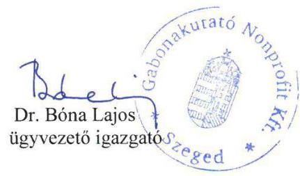

Melléklet: 3db

---

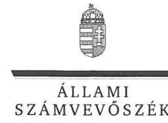

ELNÖK

# Dr. Bóna Lajos úr 

ügyvezető igazgató
Gabonakutató Nonprofit Közhasznú Kft.

## Szeged

## Tisztelt Ügyvezető Igazgató Úr!

A Gabonakutató Nonprofit Közhasznú Kft. - Az állami tulajdonban (résztulajdonban) lévő gazdálkodó szervezetek vagyonmegőrzési és gazdálkodási tevékenységének ellenőrzése címmel készített számvevőszéki jelentéstervezetre tett észrevételeit köszönettel megkaptam.
Az Állami Számvevőszék észrevételekre vonatkozó álláspontjáról a felügyeleti vezető által készített részletes tájékoztatást csatoltan megküldőm.

Tájékoztatom Ügyvezető Igazgató urat, hogy a számvevőszéki jelentésben - az Állami Számvevőszékről szóló 2011. évi LXVI. törvény 29. § (3) bekezdése alapján - a figyelembe nem vett észrevételeket szerepeltetjük, annak indoklásával, hogy azokat az Állami Számvevőszék miért nem fogadta el.

Budapest, 2017. 03. hó 16. nap
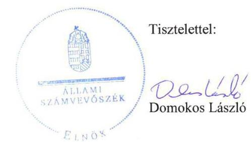

Melléklet: Tájékoztatás az észrevételek kezeléséről

---

# Tájékoztatás   az észrevételek kezeléséről 

A Gabonakutató Nonprofit Közhasznú Kft. - Az állami tulajdonban (résztulajdonban) lévő gazdálkodó szervezetek vagyonmegőrzési és gazdálkodási tevékenységének ellenőrzése címü jelentéstervezetre tett (2017. február 20-án kelt, 21-én postára adott, és az Állami Számvevőszékhez február 22-én érkezett) észrevételeit áttekintettük, azok kezelésével kapcsolatban a következő tájékoztatást adom.

## 1. A 2.1. számú megállapításhoz füzött észrevételhez

Az észrevétel szerint a Gabonakutató Nonprofit Közhasznú Kft. (társaság) közhasznú társasági formában müködő jogelődjének szabályzatai relevánsak voltak a társaságra is, hiszen a közhasznú társaság 2009. január 1-jei nonprofit gazdasági társasággá alakulásával a gazdálkodásban, a számviteli és pénzügyi nyilvántartásokban, vagyonban semmiféle változás nem következett be. A gazdálkodás feltételrendszere továbbra is azonos volt, így a 2009 előtt elkészült szabályzatokat a későbbiekben érvényesnek tekintették. A társaság - álláspontja szerint - betartotta a számvitelről szóló 2000. évi C. törvény (Számv. tv.) 161/A. § (1) bekezdés előírásait, hiszen a rendelkezésre bocsátott számlarend részletesen tartalmazta a könyvvezetésre vonatkozó szabályokat.
A gazdasági társaságokról szóló 2006. évi IV. törvény (Gt.) 365. § (3) bekezdése szerint a közhasznú társaságoknak 2009. június 30 -ig kötelező volt kérni a cégbíróságnál a nonprofit gazdasági társaságként történő nyilvántartásba vételt (amennyiben a társaság nem kívánt jogutód nélkül megszűnni). A társaság - a 2009. január 17-ei cégnyilvántartási bejegyzések szerint - mint közhasznú társaság a cégnyilvántartásból 2009. január 1-jével törlésre került, és nonprofit korlátolt felelősségű társaságként 2009. január 1. napjával megalakult.
A Polgári Törvénykönyvről szóló 1959. évi IV. törvény (Ptk.) 60. § (2) bekezdése szerint a közhasznú társaságot a cégbíróság akkor törli a cégjegyzékből, ha megszűnt; a közhasznú társaság a törléssel szűnik meg. A Gt. - alakuláskor hatályos - 17. § (1) bekezdése alapján a társaság nonprofit gazdasági társaságként a cégjegyzékbe való bejegyzéssel, a bejegyzés napján megalakult.
A Számv. tv. 14. § (11) bekezdése szerint az újonnan alakuló gazdálkodó a számviteli politikát és az elkészítendő szabályzatokat a megalakulás időpontjától számított 90 napon belül köteles elkészíteni; törvénymódosítás esetén a változásokat pedig annak hatálybalépését követő 90 napon belül kell a számviteli politikán átvezetni.
Álláspontunk szerint a társaság mint a Ptk. hatálya alá tartozó közhasznú társaság megszűnt, és mint a Gt. hatálya alá tartozó nonprofit gazdasági (korlátolt felelősségű) társaság - 2009. január 1-jei alakulási dátummal - újonnan megalakult, amelyre tekintettel a Számv. tv. 14. § (11) bekezdése alapján a számviteli politikai keretében írásban szükséges lett volna rögzítenie a nonprofit korlátolt felelősségű társaságra jellemző szabályokat.
A fentiekre tekintettel az észrevétel a jelentéstervezet módosítását nem indokolja.

---

# 2. A 2.2. számú megállapításhoz füzött észrevételhez 

a) A 2.2. számú megállapítás 1-2. bekezdéseihez füzött észrevétel első bekezdése arra irányult, hogy a vagyonkezelői jog átengedése nem a klasszikus vagyonkezelési eljárás keretében történt, így nem egyenértékủ vagyontárgyak átadásáról, illetve átvételéről, hanem egy elvégzett beruházás térítés nélküli átengedése ellenében kapott vagyonkezelői jog - mint vagyoni értékủ jog megszerzéséről volt szó. Az észrevétel szerint a szerződés a visszapótlási kötelezettségről nem rendelkezett.
Az államháztartásról szóló 1992. évi XXXVIII. törvény (régi Áht.) szerződéskötéskor hatályos 109/G. § (1) bekezdése alapján a vagyonkezelő a vagyonkezelői jogát átruházhatta azzal, hogy egyidejűleg a vagyonhoz kapcsolódó jogok és kötelezettségek es lege átszálltak az átvevő vagyonkezelőre. A vagyonkezelésbe adáshoz képest a vagyonkezelői jog átruházása esetén arról volt szó, hogy a Kincstári Vagyoni Igazgatósággal (KVI) kötött vagyonkezelési szerződéssel vagyonkezelővé váló szerv - a régi Áht. 109/G. § (1) bekezdésben foglalt lehetőséggel élve ellenérték fejében hozzájárult ahhoz, hogy az átvevő vagyonkezelő a helyébe lépjen a KVI-gal kötött vagyonkezelési szerződésben. Az Állami Számvevőszék álláspontja szerint ezzel a Társaság nem csupán a vagyonkezelői jog jogosultjává, hanem kötelezetté, vagyonkezelővé is vált.
Az előző bekezdésben foglaltakat alátámasztandó, a vagyonkezelői jog átengedése tárgyában 2005. június 27 -én a Földművelésügyi és Vidékfejlesztési Minisztérium (FVM), valamint a Gabonatermesztési Kutató Közhasznú Társaság között létrejött szerződés 3.5. pontja a társaságot mint vagyonkezelőt említette, amely jogosult és köteles volt az ingatlan rendeltetésszerü használatára, müködtetésére, hasznainak szedésére, terheinek viselésére, az állagmegóvásra, és örzésre (amelynek némileg ellentmond az észrevétel azon része, hogy a társaság nem egy korábbi ingatlanért kapott cserébe vagyonkezelésbe egy másik ingatlant, hanem egy beruházás ellenértékeként kapott vagyoni értékủ jogot). A szerződés 4. pontja továbbá a régi Áht. és a kincstári vagyonnal való gazdálkodásról szóló 58/2005. (IV. 4.) Korm. rendelet előírásai betartásának kötelezettségét írta elő a társaság számára. Végül a felek a szerződés 6. pontjában rendelkeztek az FVM vagyonkezelői jogának ingatlan-nyilvántartásból való törléséről, és a társaság vagyonkezelői jogának bejegyzéséről, amelyre a régi Áht. 109/G. § (2) bekezdésében foglalt rendelkezés teljesüléséhez, vagyis a vagyonkezelői jog megszerzése miatt volt szükség. Ezzel a társaság a kincstári vagyonnal való gazdálkodásról szóló 58/2005. (IV. 4.) Korm. rendelet 2. § c) pontja szerinti egyéb vagyonkezelővé, és egyben a 2. § a) pont szerinti vagyonkezelővé vált. A társaság tehát a vagyonkezelői jog megszerzésével az FVM és a KVI közötti vagyonkezelési szerződésben az FVM helyébe lépett, és mint vagyonkezelő megszerezte a vagyonhoz kapcsolódó jogokat és kötelezettségeket.
A kincstári vagyonnal való gazdálkodásról szóló 58/2005. (IV. 4.) Korm. rendelet 2. § f) pontja határozza meg a vagyonkezelési szerződés fogalmát, amelybe a régi Áht. 109/G. § (1) bekezdése szerinti szerződés nem tartozik bele, vagyis a vagyonkezelési szerződés és a vagyonkezelői jog átruházásáról szóló szerződés között indokolt különbséget tenni. A vagyonkezelési szerződés tartalmának szabályait a kincstári vagyonnal való gazdálkodásról szóló 58/2005. (IV. 4.) Korm. rendelet 10-11. §-ai tartalmazzák. A tartalmi elemek jellegéből következően megállapítható, hogy az egyéb vagyonkezelővel kapcsolatos vagyonkezelési szabályokat be kell építeni az eredeti vagyonkezelési szerződésbe, így a visszapótlási kötelezettségre vonatkozó rendelkezéseket nem a vagyonkezelői jog átengedéséről szóló szerződésben, hanem a KVI és a vagyonkezelő

---

közötti vagyonkezelési szerződésben szükséges keresni. Az Állami Számvevőszék álláspontja szerint a vagyonkezelési szerződés tartalmával szemben támasztott követelményeknek nem a vagyonkezelői jog átruházásáról szóló szerződésben, hanem abban a vagyonkezelési szerződésben szükséges teljesülniük, amelybe a vagyonkezelő a vagyonkezelői jog átruházásáról szóló szerződés alapján vagyonkezelőként belépett.
A fentiekben kifejtett álláspontra tekintettel a társaságnak mint vagyonkezelőnek nem a vagyonkezelői jogot, hanem a vagyonkezelt vagyont kellett volna nyilvántartania.
A fentiekre tekintettel a jelentéstervezet módosítása nem indokolt.
b) A 2.2. számú megállapítás 1-2. bekezdéseihez füzött észrevétel második bekezdése arra irányult, hogy a 2013. január 1-jétől hatályos számviteli politikában az immateriális javak között nyilvántartott vagyoni értékủ jogok tekintetében meghatározott $20 \%$-os értékcsökkenés nem vonatkoztatható az ingatlanhoz kapcsolódó vagyoni értékủ jogokra.
A 2013. január 1-jétől hatályos számviteli politika külön az ingatlanokkal kapcsolatos vagyoni értékủ jogok tekintetében - a Számv. tv. 14. § (4) bekezdése ellenére - nem tartalmazta, hogy a bekerülési értéket a Számv. tv. 52. § (1) bekezdése alapján mely évekre oszthatták fel, amelyre tekintettel a jelentéstervezet módosításra került.
c) A 2.2. számú megállapítás 1-2. bekezdéseihez füzött észrevétel harmadik bekezdése arra irányult, hogy a társaság az ingatlanokhoz kapcsolódó vagyoni értékủ jog nyilvántartásba vételekor a Számv. tv. 26. § (3) bekezdése szerint járt el. A társaságot továbbá - álláspontja szerint - azért nem terhelte adatszolgáltatási kötelezettség, mert a kincstári vagyonnal való gazdálkodásról szóló 58/2005. (IV. 4.) Korm. rendelet 19. § (2) bekezdése szerinti adatszolgáltatási kötelezettség a kezelt kincstári vagyon változása tekintetében merült fel, azonban a társaság az adott ingatlannal kapcsolatban nem hajtott végre értékváltozást eredményező gazdasági eseményt.
A vagyonkezelői jog nyilvántartására vonatkozó észrevétel tekintetében a jelen tájékoztatás 2. a) pontjában foglaltak az irányadók. A vagyonkezelői jog átengedése tárgyában 2005. június 27én az FVM és a Gabonatermesztési Kutató Közhasznú Társaság között létrejött szerződés 3.5. pontja alapján a társaság köteles volt az ingatlan rendeltetésszerủ használatára, működtetésére, hasznainak szedésére, terheinek viselésére, az állagmegóvásra és őrzésre. Figyelemmel arra, hogy a társaság - az észrevételben foglaltak szerint - nem hajtott végre olyan gazdasági eseményt az ingatlanon, amely az ingatlan értékén változtatott volna, a használatból és a müködtetésből származó vagyonváltozás tekintetében köteles lett volna adatszolgáltatásra. Az ellenőrzött időszakban (2011-2014. évek) azonban az észrevételben hivatkozott jogszabály már nem volt hatályban, hanem - ahogyan az a jelentéstervezet 2.2. számú megállapítást alátámasztó második bekezdésben is szerepel - az állami vagyonnal való gazdálkodásról szóló 254/2007. (X. 4.) Korm. rendelet 9. § (3) bekezdése alapján volt köteles adatot szolgáltatni.
A fentiekre tekintettel a jelentéstervezet módosítása nem indokolt.

# 3. A 2.2. számú megállapítás 4. bekezdéséhez füzött észrevételhez 

Az észrevétel szerint az alapításkor tőketartalékként rendelkezésre bocsátott növényfajtákat a társaság az immateriális javak között vette nyilvántartásba, azokra értékcsökkenést számolt el, majd a leírást követően analitikusan továbbra is nyilvántartotta, követte a változásait. A fajtajegyzéket, szabadalmas fajták jegyzékét évente felülvizsgálták, így a visszavonások törlésre, az

---

új elismerések, szabadalmak pedig nyilvántartásba vételre kerültek. Az észrevétel szerint a társaság 1997-ben eleget tett nyilvántartási kötelezettségének, könyveiben értékben szerepeltette az alapításkori fajtákat, szabadalmakat, amelyek azóta elavultak, a köztermesztésben már nem szerepelnek, ezért a könyvekben történő szerepeltetésük sem indokolt. Az észrevétel az Alapító Okirat mellékletekre történő hivatkozását adminisztratív hibának értékelte és jelezte az alapításkori mellékletek törlését.
Az észrevétel nem vitatta, hogy a társaság könyvviteli nyilvántartása nem tartalmazta az ellenőrzött időszakban hatályos Alapító Okirat 3. mellékletének függelékeiben felsoroltakat. Az észrevétel számviteli érvelései - álláspontunk szerint - a számviteli előírásokkal nincsenek megfelelő összhangban.
Az immateriális javak esetében is igaz, hogy a fökönyvi nyilvántartásban addig kell kimutatni őket, amíg azokat rendeltetésüknek megfelelően, tartósan használják (Számv. tv. 24. § (1) bekezdés). A fökönyvi nyilvántartás független attól, hogy az immateriális javaknak van nullánál nagyobb nettó értékük, illetve azok már nullára leírtak. Ha a fökönyvi nyilvántartásban szereplő eszközöket már nem használják rendeltetésüknek megfelelően - mert használhatatlan, mert selejtezték - akkor azok értékét (a bruttó értéket és az értékesőkkenést) a fökönyvi nyilvántartásból, de az analitikus nyilvántartásból is ki kell vezetni.
Az analitikus nyilvántartásnak szoros kapcsolatban kell lennie a fökönyvi könyveléssel (Számv. tv. 161. § (3) bekezdése), és a kettő között az egyeztetést az üzleti év mérlegfordulónapjára vonatkozóan végre is kell hajtani (Számv. tv. 69. § (2) bekezdés). A társaság Számlarendje egyébként az analitikus nyilvántartás fökönyvi számlákkal történő egyeztetését havonkénti gyakorisággal írta elő.
Az analitikus nyilvántartásnak tehát a ténylegesen meglévő, rendeltetésüknek megfelelően használt immateriális javakat kell tartalmaznia, így abban a fökönyvi könyvelésből már kivezetett immateriális javak éves változásokat is követő naprakész szerepeltetése nem értelmezhető. A Számv. tv. 165. § (4) bekezdése szerint „A fökönyvi könyvelés, az analitikus nyilvántartások és a bizonylatok adatai közötti egyeztetés és ellenőrzés lehetőségét, függetlenül az adathordozók fajtájától, a feldolgozás (kézi vagy gépi) technikájától, logikailag zárt rendszerrel biztositani kell."

A könyvviteli nyilvántartás Számv. tv. 159. §-ában előírt követelményei (bekövetkezett változásokat a valóságnak megfelelően, folyamatosan, zárt rendszerben, áttekinthetően mutatja) a jelentéstervezetben nevesített vagyonelemek tekintetében nem érvényesültek, az értékek és változások nyilvántartási hiányosságai fennálltak.
A fentiekre tekintettel a jelentéstervezet módosítása nem indokolt.

# 4. A 3. számú megállapításhoz füzött észrevételhez 

Az észrevétel arra vonatkozott, hogy a kísérleti fejlesztéseket a Számv. tv. 25. § (4)-(5) bekezdései szerint nem kötelező aktiválni, annak eldöntése a vállalkozó döntési kompetenciájába tartozik. A jogelőd közhasznú társaság számviteli politikája tartalmazta, hogy azokat nem kívánják aktiválni, a társaság 2013-tól hatályos szabályzatában pedig akként jelenítették meg, hogy erről a kérdésről nem rendelkeztek.

---

A Számv. tv. 14. § (4) bekezdése szerint a számviteli politikában nemcsak a gazdálkodóra jellemző szabályokat szükséges rögzíteni, hanem a törvényben biztosított választási, minősítési lehetőségek közül meg kell határozni, hogy a gazdálkodó melyeket, milyen feltételek fennállása esetén alkalmaz, illetve az alkalmazott gyakorlatot milyen okok miatt kell megváltoztatni. A Számv. tv. 25. § (2) bekezdése választási lehetőséget biztosít a gazdálkodó számára, amikor úgy rendelkezik, hogy az immateriális javak között a kísérleti fejlesztés aktivált értéke is kimutatható. Ugyanakkor a társaság 2013-tól hatályos számviteli politikája - a Számv. tv. 14. § (4) bekezdése ellenére - erre vonatkozóan nem tartalmazott előírást.
A fentiekre tekintettel a jelentéstervezet érintett megállapítása kiegészítésre került.

# 5. A 4.1. számú megállapításhoz füzött észrevételhez 

Az észrevétel visszahivatkozik a 2.2. számú észrevételre, amelyre a jelen tájékoztatás 2. pontjában foglaltak az irányadók.

## 6. A 4.2. számú megállapítás második bekezdéséhez füzött észrevételhez

a) Az észrevétel első bekezdése arra irányult, hogy a társaság az alapítói hozzájárulással kötött 2007. évi folyószámla hitelszerződést minden évben, általában november-december hónapban meghosszabbította, illetve kisebb mértékben módosította; a hiteleket és feltételeiket magában foglaló pénzügyi helyzetet taglaló üzleti terveket és a beszámolókat az alapító minden évben elfogadta, ezért a tulajdonosi jogkör nem sérült, a gazdálkodási keretek (a finanszírozást is beleértve) az alapító által ismertek voltak.
Az észrevétel nem vitatta, hogy az éves módosításokról alapítói határozat nem született. Az üzleti tervek nem tartalmazták tételesen a hitelszerződés valamennyi paraméterét, a beszámolók pedig utólag készültek, amelyre tekintettel azok elfogadása - álláspontunk szerint - nem tekinthető a szerződés megkötésének előzetes alapítói jóváhagyásának.
A fentiekre tekintettel a jelentéstervezet módosítása nem indokolt.
b) Az észrevétel második bekezdése szerint a társaság nem kötött 2013. június 20-i dátummal 122,7 millió Ft értékben szerződést, ilyen a nyilvántartásaiban nem szerepel. Jelezte, hogy vélhetően az MZP13BH556527 számú szerződésről lehet szó, melynek finanszírozott része 86971 ezer Ft, az önrész nélküli kölcsönrésze pedig nem érte el a törzstöke $10 \%$-át.
A jelentéstervezetben megjelölt 122,7 millió Ft összegủ lizingszerződés száma MZP13BH556527, melynek IV. A lizingdij és egyéb fizetési kötelezettségek címü fejezete 1. pontja szerint az első lizingdíj összege 35764845 Ft , a 2. pontja szerinti további lizingdíjak összege 86971434 Ft , összesen 122736279 Ft , azaz kerekítve 122,7 millió Ft. Az alapító okirat és az SZMSZ hivatkozott előírásai a szerződés, illetve a kötelezettségvállalás értékét viszonyították a törzstőke $10 \%$-ához (amely elérése esetén szükséges az alapítói előzetes jóváhagyás), függetlenül attól, hogy mekkora a vállalt önrész.
A fentiekre tekintettel a jelentéstervezet módosítása nem indokolt.
c) Az észrevétel harmadik bekezdése szerint a 286,6 millió Ft értékủ öntözőtelep kivitelezésére kötött szerződés megkötéséhez és a beruházás megvalósítása érdekében 2012. november 8-án

---

kötött, 104 millió Ft összegủ lízing szerződés megkötéséhez formális alapítói határozat nem született, ugyanakkor ahhoz az alapító 100 M Ft forrás-kiegészítéssel hozzájárult, a forrás felhasználását és a berendezés megvalósítását a felügyelőbizottság ellenőrizte.
A jelzett alapítói forrás-kiegészítés és az utólagos felügyelőbizottsági ellenőrzés nem pótolja a kötelezettségvállalás Alapító Okiratban és SZMSZ-ben előírt előzetes jóváhagyását.
A fentiekre tekintettel a jelentéstervezet módosítása nem indokolt.

# 7. A 4.2. számú megállapítás ötödik bekezdéséhez füzött észrevételhez 

Az észrevétel arra irányult, hogy a társaság sem a közbeszerzésekről szóló 2003. évi CXXIX. törvény (Kbt.1), sem a közbeszerzésekről szóló 2011. évi CVIII. törvény (Kbt.2) alapján nem minősült ajánlatkérőnek, figyelemmel arra, hogy sem közérdekủ tevékenységet nem végzett, sem közfeladatot nem látott el.
A Kbt. 1 22. § (1) bekezdés i) pontja szerint ajánlatkérő ,, az a jogi személy, amelyet közérdekü, de nem ipari vagy kereskedelmi jellegü tevékenység folytatása céljából hoznak létre, illetőleg amely ilyen tevékenységet lát el, ha e bekezdésben meghatározott egy vagy több szervezet, illetőleg az Országgyülés vagy a Kormány meghatározó befolyást képes felett gyakorolni, vagy müködését többségi részben egy vagy több ilyen szervezet (testület) finanszírozza".
A Kbt. 2 6. § (1) bekezdés c) pontja szerint ajánlatkérő ,, az a jogképes szervezet, amelyet közérdekü, de nem ipari vagy kereskedelmi jellegü tevékenység folytatása céljából hoznak létre, vagy amely ilyen tevékenységet lát el, ha az a)-d) pontokban meghatározott egy vagy több szervezet, az Országgyülés vagy a Kormány külön-külön vagy együttesen, közvetlenül vagy közvetetten meghatározó befolyást képes felette gyakorolni vagy müködését többségi részben egy vagy több ilyen szervezet (testület) finanszírozza".
a) Az észrevétel a hivatkozott jogszabályi rendelkezésekben foglalt feltételek közül - amelyek a két jogszabályban lényegében hasonló elvek mentén kerültek megfogalmazásra - kizárólag a közérdeküség fennállását vitatta. Mivel a Kbt. 1 22. § (1) bekezdés i) pontja és a Kbt. 2 6. § (1) bekezdés c) pontja nem tartalmaz utalást arra vonatkozóan, hogy az ajánlatkérőnek közfeladatot kellene ellátnia, az észrevétel ezzel kapcsolatos része irreleváns annak megállapítása szempontjából, hogy a társaság ajánlatkérőnek minősült-e. A közérdeküség - álláspontunk szerint - az alábbiak szerint áll fenn:
A $100 \%$-os állami tulajdonú ingatlan vagyonkezelői jogát az FVM a 2005. június 27 -én kelt szerződéssel átengedte a társaságnak. A szerződés 3.3 pontja azt tartalmazza, hogy a vagyonkezelői jog átengedése elsődlegesen a szerződésben körülírt beruházás kompenzálásaként, és közérdekböl történt. A szerződés 3.4 pontjában a felek egyértelműen meghatározták azt a közérdeket, amely tulajdonképpen a kincstári vagyon vagyonkezelői jogának átruházhatóságát legitimálta: „3.4 Szerződő felek a közérdeket a magyar vetőmag fajták ezen belül a szegedi fajták hatékonyabb szaporitásának, fajfenntartásának és a dunántúli térségben történő forgalmazásának szükségességében jelölik meg. Tekintettel arra, hogy a GK Kht mint hazánk legnagyobb agrárkutató intézménye, kutatási eredményeinek gyakorlati hasznosulását föként a vetőmag forgalmazáson keresztül tudja értékelni és ellenőrizni. Ezen célok megvalósitását jól szolgálhatja a dunántúli térségben a Vetőmag Úzletház GK Kht kutatási érdekeihez igazodó müködtetése".

---

A fentiek alapján megállapítható, hogy az FVM és a társaság maguk határozták meg a vagyonkezelői jog átengedéséről szóló, 2005. június 27 -én megkötött és az ellenőrzött időszakban hatályos szerződésben azt a közérdekủ célt, amely jogszerűvé tette az állam tulajdonában lévő ingatlan vagyonkezelői jogának átengedését, vagyonkezelését.
A fentiek alapján az Állami Számvevőszék álláspontja szerint mind a Kbt.1, mind a Kbt. 2 alapján ajánlatkérőnek minősült a társaság.
b) Az észrevételben foglaltak szerint a társaság nem lát el közfeladatot, és nem tartozik az államháztartás rendszerébe, továbbá nincs olyan jogszabály, amely a társaság számára meghatározna konkrét közfeladatot, amelyhez az állam sem bocsát rendelkezésre pénzügyi fedezetet.
Az államháztartásról szóló 2011. évi CXCV. törvény (új Áht.) 3/A. § (1) bekezdése közfeladatként a jogszabályban meghatározott állami vagy önkormányzati feladatokat jelöli meg. Vagyis jogszabályban nem a társaság, hanem az állam számára kell meghatározni a közfeladatot, amely meg is történt - többek között - a növényfajták állami elismeréséről, valamint a szaporítóanyagok előállításáról és forgalomba hozataláról szóló 2003. évi LII. törvény 4. § (1) bekezdésében, amely kimondja, hogy ,, a genetikai változatosság és a hazai mezőgazdaság genetikai anyagainak védelme, a jogszabályban meghatározott jelentős növényfajok, változatok, fajták és vad rokonfajok, mint génforrások megőrzése és fenntartása állami feladat".
Az állam 2009. január 1-jével létrehozta a $100 \%$-os tulajdonában lévő társaságot természettudományi, műszaki kutatási, fejlesztési feladatokra. A társaságnak az alapító okirata szerinti feladata, hogy alapkutatásokat végezzen a nemesítést szolgáló biotechnológia, nemesítés-módszertani, alkalmazott genetikai, rezisztencia biológiai és növényélettani téren; megalapozza a nemesítést; bővítse a biológiai, genetikai előrehaladást szolgáló génalapokat; kutatásokat és korszerűsítéseket végezzen az előállított és a honosított növényfajták, hibridek gazdaságos, környezetkímélő termesztési technológiája terén, valamint a biológiai alapokra épülő, a fenntartható mezőgazdasági fejlődést támogató növénytermesztési ökoszisztéma terén; vezesse be és terjessze a kutatási eredményeket; végezzen tudományos feltárásokat az alternatív és más növények hasznosítási lehetőségeinek terén, stb.
Ehhez - az alapító okirat 6.2. pontja szerint - az alapító, vagyis az állam az alapító okirathoz csatolt apportjegyzékben kimutatott vagyont a társaság saját tőkéjeként bocsátotta a társaság rendelkezésére. A társaság sem vitatja az észrevételében, hogy tőketartalékként vagyoni értékủ jogokat bocsátott rendelkezésére az alapító, akinek teljes vagyonilletőségét egyetlen üzletrész testesíti meg. A régi - szerződéskötéskor hatályos - Áht. 109/A. § (2) bekezdése alapján a társasági részesedést is kincstári vagyonnak kellett tekinteni, a régi Áht. 109/A. § (1) bekezdése szerint pedig a kincstári vagyonnak állami feladat ellátását kellett szolgálnia. Az ellenőrzött időszakban az állami vagyonról szóló 2007. évi CVI. törvény (Vtv.) 1. § (2) bekezdés a) és c) pontja szerint az állam tulajdonában lévő dolog és az államot megillető társasági részesedés is állami vagyonnak minősült, amelyre vonatkozóan maga a Vtv. 5. § (2) bekezdése mondta ki, hogy az állami vagyonnal gazdálkodó szerv a közérdekủ adatok nyilvánosságáról szóló törvény szerinti közfeladatot ellátó szervnek minősült. Ezen túlmenően az állam évente pályázatot írt ki állami génmegőrzési feladatok támogatására, amelyen a társaság 2014-ben és 2016-ban is eredményesen szerepelt, és génmegőrzéssel kapcsolatos állami feladatok ellátására tekintettel támogatásban részesült.
A fentiekre tekintettel a jelentéstervezet módosítása nem indokolt.

---

# 8. A 4.2. számú megállapítás hatodik bekezdéséhez füzött észrevételhez 

Az észrevétel arra vonatkozott, hogy az alapító (tulajdonosi joggyakorló) a felügyelőbizottságon keresztül - „amely testületnek ez a törvényi kötelezettsége" - többször ellenőrizte a beruházások végrehajtását, kihelyezett üléseken helyszíni szemlét tartott, a beruházásokhoz nyújtott alapítói források felhasználását tételesen ellenőrizte.
A Gt. 33. § (1) bekezdése és a Polgári Törvénykönyvről szóló 2013. évi V. törvény 3:26. § (1) bekezdése szerint a felügyelőbizottság létrehozásának célja a gazdasági társaság ügyvezetésének ellenőrzése. Ugyanakkor az észrevétellel érintett megállapítás nem erre, hanem a Vtv. 20. § (4) bekezdés $l$ ) pontja szerint elfogadott tulajdonosi ellenőrzési szabályzat szerinti ellenőrzésre vonatkozik, amely az ellenőrzés megindításakor a társaság rendelkezésére bocsátott ellenőrzési program 4. számú mellékletéből is megállapítható. A megállapítás továbbá a tényközlést szabályszerűségi minősítés nélkül tartalmazza.
A fentiekre tekintettel a jelentéstervezet módosítása nem indokolt.

## 9. Az 5. számú megállapítás hatodik bekezdéséhez füzött észrevételhez

Az észrevétel - az adatvédelmi és adatbiztonsági szabályzattal kapcsolatban feltárt hiányossággal összefüggésben - arra irányult, hogy a társaság - értelmezésükben - nem folytat adatkezelést az információs és önrendelkezési jogról szóló 2011. évi CXII. törvény (Info. tv.) 3. § 10. pontja értelmében, és a törvény e szakaszhoz füzött indoklásából az adatfeldolgozás új fogalmával kapcsolatos szövegrész beidézésre került. Az észrevétel szerint a társaság nem gyüjt, nem rendszerez stb. semmilyen, az Info. tv. hatálya alá tartozó különleges, bűnügyi személyes, vagy közérdekủ adatot. Ezt követően felsorolásra kerültek az észrevételben a társaság által kezelt adatok.
A Vtv. 5. § (2) bekezdése szerint „az állami vagyonnal gazdálkodó vagy azzal rendelkező szerv vagy személy a közérdekü adatok nyilvánosságáról szóló törvény szerinti közfeladatot ellátó szervnek vagy személynek minösül". Az Info. tv. 24. § (3) bekezdése szerint - az adatvédelmi nyilvántartásba bejelentési kötelezettség alá nem eső adatkezelők kivételével - egyéb állami és önkormányzati adatkezelőknek kell adatvédelmi és adatbiztonsági szabályzatot készíteniük.
A fentiekre tekintettel a jelentéstervezet módosítása nem indokolt.

## 10. Az 5. számú megállapítás hatodik bekezdésének második fordulatához füzött észrevételhez

Az észrevétel szerint mivel a társaság nem közfeladatot ellátó szerv, közérdekủ adatok megismerésére irányuló igények teljesítésének rendjét rögzítő szabályzatot sem kellett készítenie; csak a közhasznú tevékenységi körébe tartozó információk megismerésének biztosítására kötelezett, amelynek eleget is tett; továbbá külön szabályzat meglétére a nyilvántartásba vétel során a bíróság sem, illetve maga az alapító okirat sem kötelezte a társaságot.
A Vtv. 5. § (2) bekezdése szerint „az állami vagyonnal gazdálkodó vagy azzal rendelkező szerv vagy személy a közérdekü adatok nyilvánosságáról szóló törvény szerinti közfeladatot ellátó szervnek vagy személynek minösül". A közfeladatot ellátó szerv pedig az Info. tv. 30. § (6) bekezdése alapján köteles elkészíteni a közérdekủ adatok megismerésére irányuló igények teljesítésének rendjét rögzítő szabályzatot.
A fentiekre tekintettel a jelentéstervezet módosítása nem indokolt.

---

# 11. Az 5. számú megállapítás hetedik bekezdéséhez füzött észrevételhez 

Az észrevétel arra vonatkozott, hogy a társaság a számvevőszéki ellenőrzés során szembesült azzal, hogy kormányzati szektorba sorolt egyéb szervezet. Erre egyik tulajdonosi joggyakorló sem hívta fel a figyelmét, ezért nem tett eleget a társaság az ebből a jogállásból fakadó kötelezettségeinek. Az észrevételben mentségként került megjegyzésre, hogy a társaságtól senki nem kérte az adatszolgáltatási kötelezettség teljesítését, valamint a társaság kezdeményezte kisonolását a kormányzati szektorba sorolt szervezetek köréből.
Álláspontunk szerint irreleváns, hogy a társaság miért nem tudott arról, hogy kormányzati szektorba sorolt szervezet, vagy hogy számon kérte-e valaki a társaságon az ebből fakadó kötelezettségek teljesítését. Az államháztartásért felelős miniszter az új Áht. 109. § (8) bekezdése alapján a kormányzati szektorba sorolt egyéb szervezetek megnevezését közzéteszi. A közzétett adatok I. részének A) Központi kormányzati alszektorba besorolt szervezetek címének 71. pontja alatt a társaság megnevezése jelenleg is szerepel.
A fentiekre tekintettel a jelentéstervezet módosítása nem indokolt.
(Az észrevétel 10. oldalán szereplő táblázat alatti, a tulajdonosi joggyakorló ellenőrzésével kapcsolatos észrevétel tekintetében a jelen tájékoztatás 8 . pontjában foglaltak az irányadóak.)

## 12. A 6. számú megállapításhoz füzött észrevételhez

Az észrevétel arra vonatkozott, hogy mivel a kormányzati szektorba sorolásról a társaságnak nem volt tudomása, az adósságot keletkeztető ügyletekkel kapcsolatban sem kérhették meg az államháztartásért felelős miniszter hozzájárulását a lízing és kölcsönügyleteik megkötéséhez. Tevékenységét a vállalkozási tevékenység eredményéből és külső forrásból finanszírozta, arra tekintettel, hogy évek óta nem kap állami támogatást. Ezek hiányában fizetőképességét nem tudta volna fenntartani, veszélyeztette volna az állami vagyon részét képező üzletrész értékét is.
A hozzájárulás kérésére vonatkozó jogszabályi kötelezettség teljesítése szempontjából - álláspontunk szerint - irreleváns, hogy a társaság (miért) nem tudott a kormányzati szektorba sorolásról. A Kormány hivatalos honlapján szereplő közérdekủ adatokból továbbá megállapítható, hogy állami génmegőrzési feladatok ellátására a társaság 2014-ben 3.142.000,-Ft, 2016-ban 3.470.000,-Ft összegủ támogatásban részesült.

A fentiekre tekintettel a jelentéstervezet módosítása nem indokolt.
(Az észrevétel lízing díj ügylet értékével kapcsolatos utolsó mondata tekintetében a jelen tájékoztatás 6 . pontjában foglaltak az irányadóak.)
Tájékoztatom, hogy a számvevőszéki jelentés függelékeként szerepeltetjük a jelentéstervezethez tett észrevételeit, valamint az azokra adott válaszunkat.

Budapest, 2017. 05. hó /6. nap

Böröcz Imre
felügyeleti vezető

---

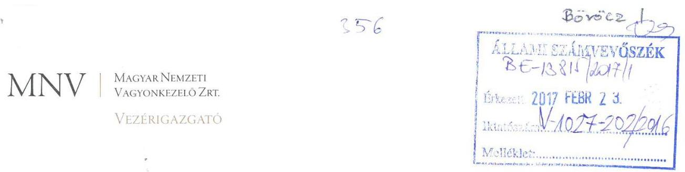

Állami Számvevőszék

# Domokos László 

elnők

1052 Budapest
Apáczai Cs. J. u. 10.

Ikt. sz.: MNV/01/11357/ /2017.
Hiv. sz.: V-1027-199/2016.

Tisztelt Elnök Úr!
Szeretném tájékoztatni, hogy a 2017. február 8. napján a „Gabonakutató Nonprofit Közhasznú Kft. - Az állami tulajdonban (résztulajdonban) lévő gazdálkodó szervezetek vagyonmegőrzési és gazdálkodási tevékenységének ellenőrzése" tárgyában kézhez vett, V-1027-199/2016. ikt. sz. Jelentés-tervezetre nem kívánunk észrevételt tenni.

Budapest, 2017. február „,"1"
Üdvözlettel:
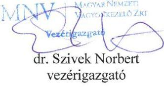

---

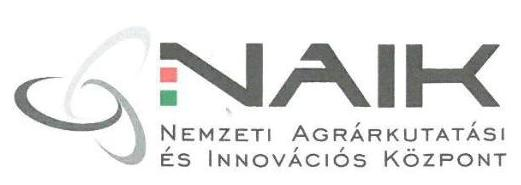

2100 Gödöllő, Szent-Györgyi Albert u. 4.

2100 Gödöllő, Szent-Györgyi Albert u. 4.

# Domokos László úr   elnök   részére 

Állami Számvevöszék
Budapest
Apáczai Csere János u. 10.
1052

## Bovöcz 1.

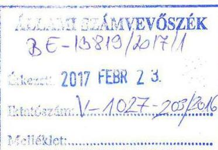

## Tisztelt Elnök Úr!

A „Gabonakutató Nonprofit Közhasznú Kft. - Az állami tulajdonban (résztulajdonban) lévő gazdálkodó szervezetek vagyonmegőrzési és gazdálkodási tevékenységének ellenőrzése" címủ, V-1027-195/2016. iktatószámú jelentéstervezetet megkaptam, arra észrevételt nem teszek.

Gödöllő, 2017. február 20.
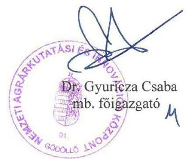

---

# RÖVIDÍTÉSEK JEGYZÉKE 

${ }^{1}$ Társaság/Gabonakutató Kft.
${ }^{2}$ Tulajdonosi joggyakorló1,2
${ }^{3}$ MNV Zrt.
${ }^{4}$ Vtv.
${ }^{5}$ NAIK
${ }^{6}$ MBK
${ }^{7}$ ÁSZ
${ }^{8}$ Alapító Okirat1-10
${ }^{9}$ Nvtv.
${ }^{10}$ Vezérigazgatói utasítás ${ }_{1,2}$
${ }^{11}$ Számv. tv.
${ }^{12}$ GK Kht.
${ }^{13}$ SZMSZ
${ }^{14}$ FVM
${ }^{15}$ Áht. 1
${ }^{16}$ Kvgr.
${ }^{17}$ Számviteli politika
${ }^{18}$ Vhr.
${ }^{19}$ FB
${ }^{20} \mathrm{Kbt} .{ }_{1,2}$
${ }^{21} \mathrm{Gt}$.
${ }^{22} \mathrm{Ptk}_{2}$

Gabonakutató Nonprofit Közhasznú Korlátolt Felelősségű Társaság
Tulajdonosi joggyakorló1: MNV Zrt. (2013. szeptember 8-ig)
Tulajdonosi joggyakorló2: NAIK (2014. január 1-étől)
Magyar Nemzeti Vagyonkezelő Zárkörűen Működő Részvénytársaság
Az állami vagyonról szóló 2007. évi CVI. törvény
Nemzeti Agrárkutatási és Innovációs Központ
Mezőgazdasági Biotechnológiai Kutatóközpont
Állami Számvevőszék
Alapító Okirat1: Hatályos 1997. augusztus 31-étől
Alapító Okirat2: Hatályos 2011. május 23-ától
Alapító Okirat3: Hatályos 2012. július 23-ától
Alapító Okirat4: Hatályos 2012. november 5-étől
Alapító Okirat5: Hatályos 2012. december 17-étől
Alapító Okirat6: Hatályos 2013. november 5-étől
Alapító Okirat7: Hatályos 2013. december 11-étől
Alapító Okirat8: Hatályos 2014. február 28-ától
Alapító Okirat9: Hatályos 2014. június 23-ától
Alapító Okirat10: Hatályos 2014. december 30-ától
A nemzeti vagyonról szóló 2011. évi CXCVI. törvény (hatályos: 2011. december 31-étől, kivéve a 20. § (2) bekezdésben meghatározott paragrafusok, amelyek 2012. január 1-jétől, a (3) bekezdésben meghatározott paragrafusok 2013. január 1-jétől, a (4) bekezdésben meghatározott paragrafus 2012. március 2-ától léptek hatályba)
Az MNV Zrt. 46/2008. (06. 11.) számú vezérigazgatói utasítása és az MNV Zrt. 12/2014. (03. 24.) számú vezérigazgatói utasítása
2000. évi C. törvény a számvitelről

Gabonakutató Közhasznú Társaság
A Gabonakutató Nonprofit Közhasznú Kft. Szervezeti és Működési Szabályzata (hatályos 2011. január 1-jétől)
Földművelésügyi és Vidékfejlesztési Minisztérium
1992. évi XXXVIII. törvény az államháztartásról (hatálytalan: 2012. január 1-jétől) 58/2005. (IV. 4.) Korm. rendelet a kincstári vagyonnal való gazdálkodásról
Gabonakutató Nonprofit Közhasznú Kft. Számviteli politikája (Hatályos: 2013. január 1-től)
254/2007. (X.4.) Korm. rendelet az állami vagyonnal való gazdálkodásról Felügyelő Bizottság
Kbt. 1: 2003. évi CXXIX. törvény a közbeszerzésekről (hatálytalan: 2012. január 1-jétől)
Kbt. 2: 2011. évi CVIII. törvény
2006. évi IV. törvény a gazdasági társaságokról
2013. évi V. törvény a Polgári Törvénykönyvről (hatályos: 2014. március 15-től)

---

${ }^{23}$ Avtv.
${ }^{24}$ Info tv.
${ }^{25}$ Áht. 2
${ }^{26}$ Ávr.
${ }^{27}$ Bkr.
${ }^{28}$ Stabilitási tv.
${ }^{29}$ Civil tv.
${ }^{30}$ ÁSZ tv.
${ }^{31} \mathrm{Ptk}_{1}$
${ }^{32} \mathrm{Pp}$.
1992. évi LXIII. törvény a személyes adatok védelméről és a közérdekú adatok nyilvánosságáról
2011. évi CXII. törvény az információs önrendelkezési jogról és az információ szabadságról
2011. évi CXCV. törvény az államháztartásról (hatályos 2011. december 31-től)

368/2011. (XII. 31.) Korm. rendelet az államháztartásról szóló törvény végrehajtásáról
370/2011. (XII. 31.) Korm. rendelet a költségvetési szervek belső kontrollrendszeréről és belső ellenőrzéséről
2011. évi CXCIV. törvény Magyarország gazdasági stabilitásáról (Hatályba lépett: 2011. december 31.)
2011. évi CLXXV. törvény az egyesülési jogról, a közhasznú jogállásról, valamint a civil szervezetek múködéséről és támogatásáról
2011. évi LXVI. törvény az Állami Számvevőszékről
1959. évi IV. törvény a Polgári Törvénykönyvről (hatályos 2014. március 15-ig)
1952. évi III. törvény a polgári perrendtartásról

---

# ÁLLAMI SZÁMVEVŐSZÉK 

1052 Budapest, Apáczai Csere János utca 10.
Levélcím: 1364 Budapest 4. Pf. 54
Telefon: +36 14849100 Telefax: +36 14849200
www.asz.hu