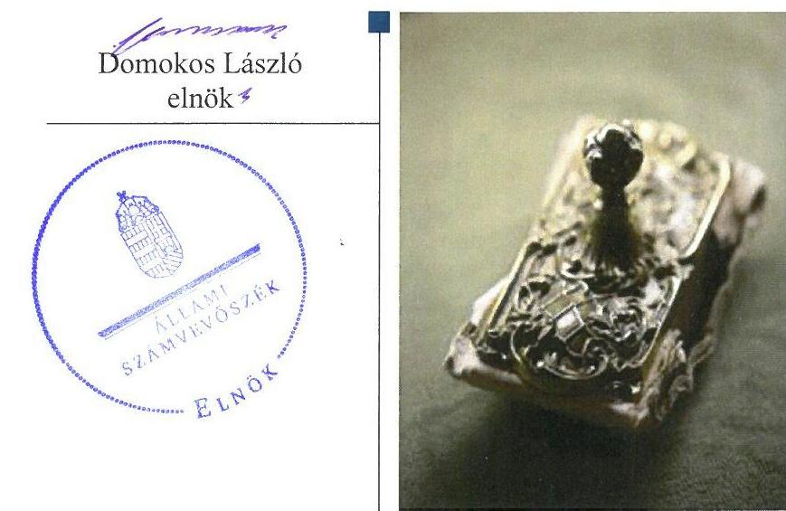
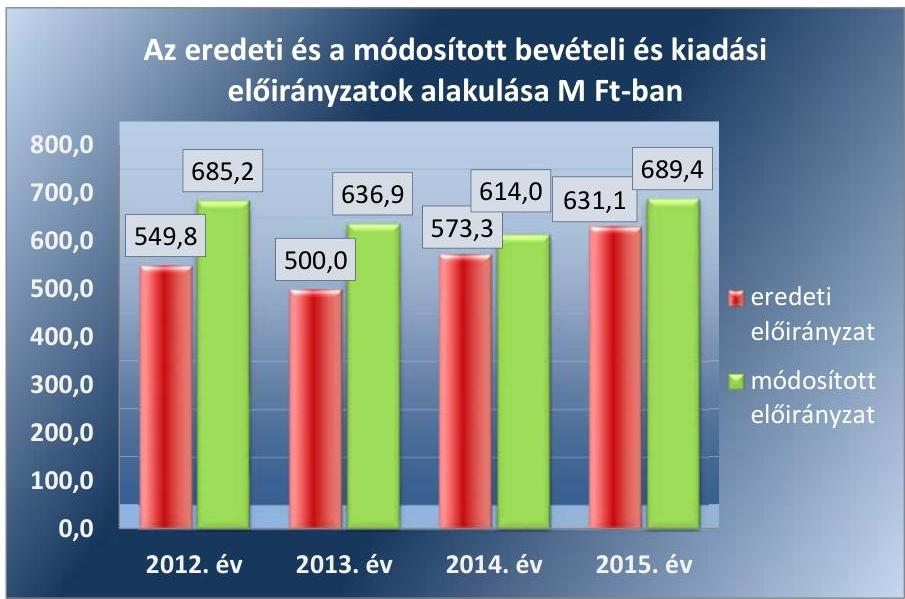
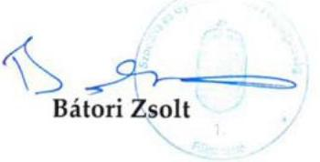
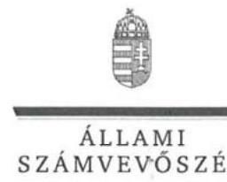
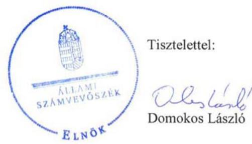
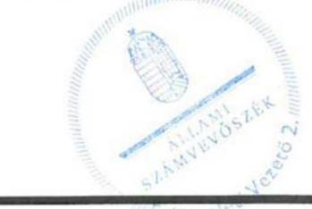

ÁLLAMI
SZÁMVEVŐSZÉK

# Jelentés 

## A központi alrendszer egyes intézményei pénzügyi és vagyongazdálkodásának ellenőrzése

Foglalkoztató Intézet Darvastó 2017.

---

# A központi alrendszer egyes intézményei pénzügyi és vagyongazdálkodásának ellenőrzése 

Foglalkoztató Intézet Darvastó
2017. július hó 20. nap

---

# AZ ELLENŐRZÉST FELÜGYELTE:

- **SALAMON ILDIKÓ** felügyeleti vezető

- **AZ ELLENŐRZÉST VEZETTE ÉS A VÉGREHAJTÁSÁÉRT FELELŐS:**

- **ZAKAR LÁSZLÓ** ellenőrzésvezető

- **A PROGRAM ÖSSZEÁLLÍTÁSÁÉRT FELELŐS:**

- **JANIK JÓZSEF LÁSZLÓ** osztályvezető

**IKTATÓSZÁM: V-1205-177/2016.**

**TÉMASZÁM: 2239**

**ELLENŐRZÉS-AZONOSÍTÓ SZÁM: V076005**

Jelentéseink az Országgyűlés számítógépes hálózatán és az Interneten a www.asz.hu címen is olvashatóak.

---

# TARTALOMJEGYZÉK 

■ ÖSSZEGZÉS ..... 5
■ AZ ELLENŐRZÉS CÉLJA ..... 7
■ AZ ELLENŐRZÉS TERÜLETE ..... 8
■ AZ ELLENŐRZÉS HÁTTERE, INDOKOLTSÁGA ..... 9
■ A JELENTÉS LÉNYEGES KÉRDÉSKÖREI ..... 10
■ ELLENŐRZÉS HATÓKÖRE ÉS MÓDSZEREI ..... 11
■ MEGÁLLAPÍTÁSOK ..... 14
■ JAVASLATOK ..... 27
■ MELLÉKLETEK ..... 31
I. Sz. melléklet: Értelmező szótár ..... 31
II. Sz. melléklet: A belső kontrollrendszer kialakításának és működtetésének értékelése ..... 34
III. Sz. melléklet: Az integritás szemlélet érvényesítésével kapcsolatos megállapítások ..... 35
■ FÜGGELÉK: ÉSZREVÉTELEK ..... 37
■ RÖVIDÍTÉSEK JEGYZÉKE ..... 45

---

.

---

# ÖSSZEGZÉS 

A Foglalkoztató Intézet Darvastóra vonatkozó irányító szervi feladatellátás megfelelt, a középirányító szervi feladatellátás nem felelt meg a jogszabályi előírásoknak. Az Intézményvezető által kialakított belső kontrollrendszer nem biztosította a szabályszerű, átlátható és elszámoltatható közpénzfelhasználás feltételeit. A Foglalkoztató Intézet Darvastó pénzügyi és vagyongazdálkodása nem felelt meg a jogszabályi előírásoknak. Az Intézmény vezetője nem építette ki a megfelelő védelmet a korrupciós veszélyekkel szemben.

## Az ellenőrzés társadalmi indokoltsága

Az államháztartás központi alrendszerének közpénz felhasználása, az intézmények által ellátott közfeladatok sokrétűsége, valamint a feladatellátásához rendelt vagyon nagyságrendje indokolja, hogy az Állami Számvevőszék ellenőrzéseket folytasson a pénzügyi és vagyongazdálkodás területén. Az Állami Számvevőszék az ellenőrzései során feltárja a gazdálkodást, a központi alrendszer intézményei átalakulását, átszervezését érintő szabályozások esetleges hiányosságait, a szabályozással nem érintett gazdálkodási területeket, rámutathat a vagyongazdálkodási tevékenység, ezen belül a tulajdonosi joggyakorlás és vagyonkezelés esetleges szabálytalanságaira, értékeli az állami vagyon nyilvántartására és elszámolására vonatkozó eljárásokat. Az ellenőrzésünkkel hozzá kívánunk járulni a központi intézmények pénzügyi helyzetének pontosabb megítéléséhez, a jó gyakorlat kialakításán és terjesztésén keresztül az ellenőrzéseink elősegíthetik a gazdálkodás szabályszerűségének javítását.

## Főbb megállapítások, következtetések, javaslatok

A Foglalkoztató Intézet Darvastóra vonatkozó irányító szervi feladatellátás megfelelt a jogszabályi előírásoknak. A középirányító szervi feladatellátás nem volt megfelelő, mert a Szociális és Gyermekvédelmi Főigazgatóság a Foglalkoztató Intézet Darvastó közfeladatai ellátásához használt ingatlanok átlátható, szabályszerű működtetéséről nem gondoskodott és nem érvényesítette a vagyonnal való szabályszerű gazdálkodáshoz szükséges követelményeket.

A Foglalkoztató Intézet Darvastó belső kontrollrendszerének kialakítása és működtetése egyik évben sem felelt meg a jogszabályi előírásoknak, emiatt nem volt biztosított a szabályszerű, átlátható és elszámoltatható közpénzfelhasználás feltétele. A Foglalkoztató Intézet Darvastó nem rendelkezett 2013. január 1-je és 2014. augusztus 11-e között a középirányító szerv által jóváhagyott szervezeti és működési szabályzattal. 2013. július 1-jétől 2015. szeptember 17-ig a Foglalkoztató Intézet Darvastó és a gazdálkodásával összefüggő feladatokat ellátó Szociális és Gyermekvédelmi Főigazgatóság nem rendelkezett az irányító szerv által jóváhagyott munkamegosztás és felelősségvállalás rendjét rögzítő munkamegosztási megállapodással. A Foglalkoztató Intézet Darvastó 2013. július 1-jétől az ellenőrzött időszak végéig nem rendelkezett számviteli politikával és az annak keretében elkészítendő eszközök és források leltárkészítési és leltározási szabályzattal, eszközök és források értékelési szabályzattal, pénzkezelési szabályzattal és önköltségszámítás rendjére vonatkozó szabályzattal. A Foglalkoztató Intézet Darvastó pénzügyi és vagyongazdálkodási folyamatai tekintetében a gazdaságosság, hatékonyság és eredményesség érvényesítéséről kiadott vezetői nyilatkozatok nem voltak helytállóak.

A pénzügyi gazdálkodás - a 2012. év kivételével - nem felelt meg a jogszabályi előírásoknak. A kiadási előirányzatok felhasználásánál a pénzgazdálkodási belső kontrollok a 2013-2015. években nem megfelelően működtek. Az Intézmény vagyongazdálkodása 2012. évben szabályszerű volt, a 2013-2015. években nem volt szabályszerű. A 2013-2015. években az Intézmény a közfeladata ellátásához használt ingatlan vagyon tekintetében nem minősült a nemzeti vagyon, illetve az állami vagyon jogszerű használójának. Továbbá a 2014-2015. években az Intézmény vagyonkezelésébe nem tartozó ingatlanok szerepeltek az éves költségvetési beszámolók mérlegében, amely miatt a 2014-2015. évi költségvetési beszámolók nem mutattak az Intézmény vagyoni helyzetéről megbízható és valós képet.

---

Az Intézmény tett erőfeszítést az integritás szemlélet érvényesítésére, azonban a korrupciós veszélyekkel szembeni védettséget növelő integritás kontrollok kiépítettsége alacsony volt.

Az Intézmény a gazdálkodás folyamatában mérhető célokat, célértékeket nem határozott meg, emiatt azok teljesítése nem volt értékelhető.

Az ÁSZ az emberi erőforrások miniszterének és az SZGYF mint középirányító szerv főigazgatójának a vagyongazdálkodási feladatok ellátásának jobbítása, valamint az ellenőrzés által feltárt szabálytalanságok kivizsgálása érdekében fogalmazott meg javaslatokat. A közpénzek szabályozott, átlátható és elszámoltatható felhasználását biztosító irányítási rendszer kialakítását és működtetését, a pénzügyi és vagyongazdálkodás szabályszerű ellátását az SZGYF mint az Intézmény gazdasági szervezeti feladatait ellátó szerv főigazgatójának, valamint az Intézményvezetőnek címzett javaslatok segítik.

---

# AZ ELLENŐRZÉS CÉLJA 

A MEGFELELŐSÉGI ELLENŐRZÉS célja annak megítélése volt, hogy az ellenőrzött intézményre vonatkozó irányító szervi feladatellátás a jogszabályi előírások betartásával történt-e; az intézménynél a belső kontrollrendszer kialakítása és működtetése szabályszerű volt-e; kialakították-e az erőforrásokkal való szabályszerű, gazdaságos, hatékony és eredményes gazdálkodás követelményeit; szabályszerű volt-e a beszámolási és adatszolgáltatási kötelezettségek teljesítése; az intézmény pénzügyi és vagyongazdálkodása megfelelt-e a jogszabályi előírásoknak és belső szabályzatainak; az intézmény átalakításának vagy átszervezésének lebonyolítása szabályszerűen történt-e.

Az ellenőrzés keretében értékeltük az intézmény korrupciós kockázatainak kezelését szolgáló integritás kontrollok kiépítettségét és az integritás szemlélet érvényesülését.

A KIEGÉSZÍTŐ TELJESÍTMÉNY-ELLENŐRZÉSI MODUL célja annak értékelése volt, hogy a gazdálkodás folyamatában a gazdaságossági, hatékonysági és eredményességi célok kialakítása megtörtént-e, a célok elérése érdekében tettek-e intézkedéseket, a célkitűzéseket és a szándékolt eredményeket elérték-e.

---

# AZ ELLENŐRZÉS TERÜLETE

## Foglalkoztató Intézet Darvastó

Az Intézmény1 Veszprém megyében található, székhelye Csabrendeken van. Az Intézmény a Szoctv.2 alapján fogyatékos személyek szakosított ellátását nyújtó tartós bentlakásos intézmény. Az Intézmény a szociális foglalkoztatás keretében munka-rehabilitációs foglalkoztatást végez, illetve fejlesztő-felkészítő foglalkoztatást szervez az ellátottak számára. Az engedélyezett férőhelye az ellenőrzött időszakban 279 fő volt.

A 2012. évben az Intézmény irányító szerve az Önkormányzat3 volt. Az Intézmény gazdálkodási besorolása szerint önállóan működő és gazdálkodó költségvetési szerv volt. 2013. január 1-jétől a 2012. évi CXCII. törvény4 alapján az Intézmény a központi alrendszerbe került, az alapítói és irányító szervi feladatokat az EMMI5 látta el, a középirányító szerve a 316/2012. (XII. 13.) számú Korm. rendelet6 alapján az SZGYF7 lett. 2013. július 1-jétől az Intézmény gazdálkodási besorolása a 349/2012. (XII. 12.) számú Korm. rendelet8 alapján önállóan működőre változott és ettől az időponttól az Intézmény gazdálkodásával összefüggő feladatait az SZGYF látta el.

A 2012. évi CXCII. törvény értelmében az Intézménnyel kapcsolatos vagyon és vagyoni értékű jogok 2013. január 1-jén a törvény erejénél fogva állami tulajdonba kerültek. Az átkerült intézményi vagyon tekintetében 2013. január 1-jétől a tulajdonosi jogokat – a Vtv.9 alapján – az állami vagyon felügyeletéért felelős miniszter gyakorolta, aki e feladatát az MNV Zrt.10 útján látta el. A vagyonkezelői feladatokat a 316/2012. (XI. 13.) számú Korm. rendelet alapján az SZGYF főigazgatója látta el.

Az Intézmény által teljesített összes bevétel a 2012. évi 685,2 M Ft-ról a 2015. évre 689,8 M Ft-ra nőtt, a teljesített összes kiadás a 2012. évi 664,0 M Ft-ról, a 2015. évre 660,3 M Ft-ra csökkent. Az ellenőrzött időszakban az Intézmény feladatkörében változás nem történt és az Áht.11-ben meghatározott átalakítás nem érintette. Az ellenőrzött időszakon belül az Intézményvezető12 személye 2015. december 31-én változott meg. A gazdasági vezetői feladatokat 2013. június 30-ig az Intézmény gazdasági vezetője, 2013. július 1-jétől az SZGYF gazdasági vezetője látta el. Az Intézményben a közalkalmazottak létszáma a 2012. évi 150 főről a 2015. évre 134 főre csökkent.

---

# AZ ELLENŐRZÉS HÁTTERE, INDOKOLTSÁGA 

Az Alaptörvény ${ }^{13}$ rendelkezése szerint a nemzeti vagyon megőrzésének, védelmének és a nemzeti vagyonnal való felelős gazdálkodásnak a követelményeit sarkalatos törvény, az Nvtv. ${ }^{14}$ rögzíti. A tulajdonosi joggyakorlás és vagyonkezelés általános és speciális szabályait, az állami vagyon nyilvántartására és elszámolására vonatkozó eljárásokat, a vagyonkezelési szerződés feltételrendszerét, valamint az éves beszámoló készítési és könyvvezetési kötelezettségeket kormányrendelet írja elő. A központi alrendszer egyes intézményei közfeladat-ellátásának változásait, a közfeladatok átadásából és átvételéből adódó módosításait, előirányzat gazdálkodására ható tényezőit az Áht. 11. §-a és az Ávr. 14. §-a írja elő. A közfeladatok megszűnéséből, intézmény átszervezéséből, belső szerkezeti korszerűsítéséből, vagy más hasonló okból adódó módosításai miatt szerepeltetendő szerkezeti változásokat, valamint a szerkezeti változásként beépült közfeladatok szintre hozásként történő számításba vételét az Ávr. 15. § (2)-(3) bekezdései határozzák meg. A társadalmi igénnyel összhangban Áht. és a Bkr. ${ }^{15}$ is előírja a költségvetési szerv részére, hogy olyan szabályozásokat, eljárásokat, folyamatokat alakítson ki, amelyek biztosítják a működés, gazdálkodás, az erőforrások felhasználása során a gazdaságosság, hatékonyság és eredményesség érvényesülését. A gazdaságos, hatékony és eredményes gazdálkodáshoz szükség van a teljesítménymérés feltételeinek kialakítására, úgymint az egyértelmű és mérhető célokra, mutatószámokra és az ezekhez rendelt követelményekre.

AZ ELLENŐRZÉS EREDMÉNYEKÉPPEN nemcsak az ellenőrzött intézmények gazdálkodása javulhat, hanem átfogó képet kaphatunk a központi alrendszerbe tartozó költségvetési szervek gazdálkodásának hiányosságairól, de a jó gyakorlatokról is. Ellenőrzéseivel, javaslataival és megállapításaival az ÁSZ ${ }^{16}$ elősegítheti a költségvetési szervek pénzügyi és vagyongazdálkodása szabályozásának javítását és hozzájárulhat a jó kormányzáshoz. Az ellenőrzés az ellenőrzött számára visszajelzést ad a pénzügyi és vagyongazdálkodásában feltárt hiányosságokról, javaslataival hozzájárul azok kiküszöböléséhez, amely csökkentheti a későbbi ellenőrzések gyakoriságát. Az ellenőrzés megállapításait és javaslatait más szervezetek is hasznosíthatják a rendezett gazdálkodási keretek kialakításához.

## A TELJESÍTMÉNY-ELLENŐRZÉSI KIEGÉSZÍTŐ

MODUL alapján elvégzett ellenőrzés a törvényalkotás számára támogatást nyújt a nemzeti kulcsindikátorok rendszerének kialakításához. A döntéshozók, ellenőrzöttek, irányító szervek, a társadalom számára az összehasonlítási, összemérési lehetőségek kihasználásával objektív visszajelzést ad a gazdálkodás területén végrehajtott szervezeti, szervezési, takarékossági és bürokráciacsökkentő intézkedések hatásairól, a közfeladat-ellátásnak keretet adó pénzügyi és vagyongazdálkodásban mérhető teljesítménykövetelmények kialakításáról, azok alkalmazásáról.

---

# A JELENTÉS LÉNYEGES KÉRDÉSKÖREI 

1.     - Az irányító szerv ellenőrzött Intézményre vonatkozó feladatellátása szabályszerű volt-e?
2.     - A belső kontrollrendszer kialakítása és működtetése biztosította-e a közpénzekkel és a nemzeti vagyonnal történő szabályszerű, gazdaságos, hatékony és eredményes gazdálkodást, illetve a beszámolási és adatszolgáltatási kötelezettségek szabályszerű teljesítését?
3.     - Az Intézmény pénzügyi gazdálkodása szabályszerű volt-e?
4.     - Az Intézmény vagyongazdálkodása szabályszerű volt-e?
5.     - Érvényesült-e az integritás szemlélet és ennek megfelelően kiépítették-e az integritás kontrollrendszert az Intézménynél?
6.     - Az Intézmény a gazdálkodás folyamatában kialakított-e célokat, célértékeket, azok elérése érdekében meghatározott-e intézkedéseket, feladatokat, elérte-e a szándékolt eredményeket?

---

# ELLENŐRZÉS HATÓKÖRE ÉS MÓDSZEREI 

## Az ellenőrzés típusa

Megfelelőségi ellenőrzés.

## Az ellenőrzött időszak

2012. január 1-jétől 2015.
 december 31-ig terjedő időszak volt.

## Az ellenőrzés tárgya

Az ellenőrzött szervezetre vonatkozó irányító szervi feladatok ellátása. Az Intézmény belső kontroll rendszerének kialakítása és működtetése. A pénzügyi és vagyongazdálkodás szabályszerűsége. Az Intézmény beszámolási és adatszolgáltatási kötelezettségének teljesítése. Az Intézmény átalakításának vagy átszervezésének lebonyolítása szabályszerűsége.

Az ellenőrzés kiterjedt minden olyan körülményre és adatra, amely az ÁSZ jogszabályban meghatározott feladatainak teljesítéséhez, valamint a program végrehajtása folyamán felmerült újabb összefüggések feltárásához szükséges.

## Az ellenőrzött szervezet

Foglalkoztató Intézet Darvastó, Budapest Főváros Önkormányzata, Emberi Erőforrások Minisztériuma, Szociális és Gyermekvédelmi Főigazgatóság. Az ellenőrzésre a központi alrendszer ellenőrzött intézményének és irányító szervének, illetve középirányító szervének székhelyén került sor.

## Az ellenőrzés jogalapja

Az ellenőrzés jogszabályi alapját az ÁSZ tv. ${ }^{17}$ 1. § (3) bekezdése, az 5. § (2)(6) bekezdései, valamint az Áht. 61. § (2) bekezdésének előírásai képezték.

## Az ellenőrzés módszerei

Az ellenőrzést az ellenőrzési program szempontjai, az ellenőrzött időszakban hatályos jogszabályok, az ellenőrzés szakmai szabályai, a jelen ellenőrzésre irányadó ÁSZ módszertanok figyelembevételével végeztük.

Az ellenőrzés ideje alatt az ellenőrzött szervezettel történő kapcsolattartást az ÁSZ SZMSZ ${ }^{18}$-ének vonatkozó előírásai alapján biztosítottuk.

---

Az ellenőrzési kérdések megválaszolásához szükséges bizonyítékok megszerzése tételes és mintavételen alapuló dokumentumellenőrzés, összehasonlító elemzés ellenőrzési eljárások alkalmazásával történt. Az ellenőrzési bizonyítékként felhasználható adatforrások közé tartoztak egyrészt az ellenőrzési program részletes szempontjainál felsorolt adatforrások, másrészt minden egyéb - az ellenőrzés folyamán feltárt, az ellenőrzés szempontjából információt tartalmazó - dokumentum.

Az ellenőrzés lefolytatásához az ellenőrzött szervezetek tanúsítványok kitöltésével, valamint az ÁSZ által kért dokumentumok megküldésével szolgáltattak adatokat. A rendelkezésre bocsátott adatok, információk kontrollja az ellenőrzés keretében történt.

Az ÁSZ a belső kontrollrendszer jogszabályi előírások szerinti kialakításának és működtetésének szabályszerűségét az erre irányuló ellenőrzési kérdésekre adott válaszok összesítése alapján, a lényegességi szempontok figyelembe vételével évente pillérenként (kontrollkörnyezet, kockázatkezelési rendszer, kontrolltevékenységek, információs és kommunikációs rendszer, monitoring rendszer) és összesítetten is minősítette. Az ÁSZ a pénzügyi gazdálkodás és a vagyongazdálkodás kialakításának és működtetésének szabályszerűségét az erre irányuló ellenőrzési kérdésekre adott válaszok összesítése alapján, a lényegességi szempontok figyelembe vételével évenkénti bontásban minősítette. „Megfelelő"-nek értékelte az ellenőrzött területet, amennyiben a szabályozás, illetve végrehajtás során a jogszabályi követelményeket maradéktalanul, vagy kisebb hiányosságok mellett érvényesítették, „nem megfelelő"-nek értékelte, amennyiben a szabályozás hiányosságai nem biztosították a szabályszerű működés feltételeit, illetve a gazdálkodás folyamatában jelentkező hibák lényegesek, nagyszámúak, vagy rendszerszerűek voltak.

Mintavétellel ellenőriztük az Intézménynél a kiadások előirányzatai felhasználásának, a tárgyi eszközök nyilvántartásba vételének (üzembe helyezés, értékelés, nyilvántartás), a bevételek beszedésének és elszámolásának, a vagyonelemek elidegenítésének és hasznosításának szabályszerűségét. A minta alapján a sokaságban előforduló hibaarányt becsültük. Az értékelés eredményeként kétféle, "Megfelelő" és "Nem megfelelő" minősítést alkalmaztunk. „Megfelelő"-nek értékeltünk egy ellenőrzött területet, amennyiben a hibaarány a teljes sokaságban 95%-os bizonyossággal legfeljebb 10% arányt képviselt. Abban az esetben, ha adott sokaság tekintetében a 10%-os hibaarány küszöbérték átlépése megítélésének megbízhatósága nem érte el a 95%-ot, annak elérése érdekében értékelésünket lényegességi alapon további szempontokkal egészítettük ki, és figyelembe vettük a feltárt hibák értékét.

Az integritás szemlélet érvényesülésének értékelése az Intézmény által kitöltött tanúsítványa és az ellenőrzés tapasztalatai alapján történt.

Az alapprogram alapján ellenőriztük, hogy a költségvetési szerv vezetője megtette-e nyilatkozatát arról, hogy gondoskodott a költségvetési szerv tevékenységében a hatékonyság, eredményesség és a gazdaságosság követelményeinek érvényesítéséről. A teljesítmény-ellenőrzési kiegészítő modul végrehajtása során értékeltük, hogy az ellenőrzött szervezet a gazdálkodás folyamatában a gazdaságossági, hatékonysági és eredményességi célokat és célértékeket kialakította-e, a célkitűzéseket elérte-e. A kiegészítő modul a gazdálkodási feladatokra terjedt ki, a szakmai feladatellátást nem értékelte.

---

A gazdálkodási feladatok értékelése az alábbi területekre terjedt ki:
pénzügyi gazdálkodási (nem szakmai, adminisztratív) feladatok: költségvetés-, beszámoló-készítés, könyvvezetés, adatszolgáltatások, előirányzat-gazdálkodás, kötelezettségvállalások nyilvántartása, kezelése, bevételkezelés, bér- és illetményszámfejtés;
$\longrightarrow$ vagyongazdálkodási (logisztikai) feladatok: közbeszerzések és közbeszerzési értékhatárt el nem érő beszerzések, készletgazdálkodás, nyomtatók, fénymásolók üzemeltetése, épület- és ingatlanüzemeltetés, karbantartás, hibabejelentés, gépjármű és flotta-menedzsment.
Az ellenőrzés során minden olyan körülményt és adatot is ellenőriztünk, amely a program végrehajtása kapcsán felmerült újabb összefüggéseknek az ellenőrzés céljaival összhangban lévő feltárásához szükséges volt. A teljesítmény-ellenőrzési kiegészítő programmodulban megfogalmazott ellenőrzési cél megválaszolásához az alapprogram végrehajtása során megfogalmazott megállapításokat is figyelembe vettük.

---

# 1. Az irányító szerv ellenőrzött Intézményre vonatkozó feladatellátása szabályszerű volt-e? 

Összegző megállapítás

Az Intézményre vonatkozó irányító szervi feladatellátás megfelelt, a középirányító szervi feladatellátás nem felelt meg az előírásoknak.
1.1. számú megállapítás

Az alapítással kapcsolatos irányító szervi jogosultságok gyakorlása a jogszabályi előírásoknak megfelelően történt.

Az Intézmény az ellenőrzött időszakban alapító okirattal ${ }_{1-4}{ }^{19}$-gyel rendelkezett. Az alapító okirat ${ }_{3-2}$-t az Önkormányzat, az alapító okirat ${ }_{3-4}$-et az EMMI minisztere a jogszabályi előírásoknak megfelelő tartalommal adta ki.

Az EMMI minisztere az Áht. előírásának megfelelően az államháztartásért felelős miniszter előzetes egyetértését követően adta ki az Intézmény alapító okirat ${ }_{3-4}$-et és az alapító okirat kiegészítését ${ }^{20}$. Az EMMI minisztere 2013. július 1-jével az Intézmény alapító okirat4-ben a gazdálkodási besorolást a 349/2012. (XII. 12.) számú Korm. rendelettel összhangban önállóan működőre módosította.

Az Intézménnyel kapcsolatos egyéb irányítási, felügyeleti és ellenőrzési jogosultságok gyakorlását az irányító szervek szabályszerűen, a középirányító szerv nem szabályszerűen végezte.

Az ellenőrzött időszak alatt az irányító szervek az Intézmény éves elemi költségvetéseit, az éves létszám-előirányzatait, az éves költségvetési beszámolóit, valamint a pénz illetve előirányzat maradványait a jogszabályi előírásoknak megfelelően hagyták jóvá.

A 2012. évben az Önkormányzat, valamint a 2013-2015. években az SZGYF az Intézmény költségvetésének a végrehajtását (a bevételi és kiadási előirányzatainak alakulását) a jogszabályokban foglalt előírásoknak megfelelően rendszeresen figyelemmel kísérték. Az ellenőrzött időszak alatt a közfeladat ellátásának veszélybe kerülését nem állapították meg.

A 2012. évben az Önkormányzat, majd 2013-tól az SZGYF az Intézményvezetőt minden évben a szakmai feladatellátásról beszámoltatta. Az SZGYF a 316/2012. (XI. 13.) Korm. rendelet előírásának megfelelően évente értékelte az Intézmény szakmai feladatellátását.

A 2013-2015. években az SZGYF - a Vtv. 27. § (2) bekezdésében, valamint az Nvtv. 7. § (2) bekezdésében előírtak ellenére - a vagyonkezelésében lévő, az Intézmény feladatai ellátásához használt ingatlanok átlátható, szabályszerű működtetéséről nem gondoskodott, mivel a nemzeti vagyon használatának jogcímét - az Nvtv. 3. § (1) bekezdés 11. pontjában és a Vtv. 25. § (4) bekezdésében rögzített - szerződés megkötésével nem biztosította. Így a 2013-2015. években az SZGYF főigazgatója - a 316/2012.

---

(XI. 13.) Korm. rendelet 3. § (2) bekezdés g) pontjában előírtak ellenére nem érvényesítette az erőforrásokkal, így különösen a vagyonnal való szabályszerű gazdálkodáshoz szükséges követelményeket.
1.3. számú megállapítás

# A középirányító szerv az Intézménnyel kapcsolatos munkáltatói jogosultságait szabályszerűen gyakorolta. 

Az Intézményvezető személye az ellenőrzött időszakon belül 2015. december 31-én változott. Az SZGYF főigazgatója az Intézményvezető felmentését és a megbízott Intézményvezető kinevezését - a 316/2012. (XI. 13.) Korm. rendelet alapján - szabályszerűen végezte.

A 349/2012. (XII. 12.) számú Korm. rendelet 7. § (1) bekezdése alapján az Intézmény 2013. július 1-jétől gazdasági szervezettel már nem rendelkezett, így a gazdasági szervezet vezetőjének a vezetői megbízását az SZGYF főigazgatója 2013. június 30-ával jogszerűen visszavonta.

## 2. A belső kontrollrendszer kialakítása és működtetése biztosította-e a közpénzekkel és a nemzeti vagyonnal történő szabályszerű, gazdaságos, hatékony és eredményes gazdálkodást, illetve a beszámolási és adatszolgáltatási kötelezettségek szabályszerű teljesítését?

Összegző megállapítás

## 2.1. számú megállapítás

A belső kontrollrendszer kialakítása és működtetése nem felelt meg a jogszabályi előírásoknak, így az nem biztosította megfelelően a közpénzekkel és a nemzeti vagyonnal történő szabályszerű, gazdaságos, hatékony és eredményes gazdálkodás, valamint a beszámolási és adatszolgáltatási kötelezettségek szabályszerű teljesítése feltételeit.

A belső kontrollrendszer évenkénti és összevont értékelését az II. sz. melléklet tartalmazza.

A kontrollkörnyezet kialakítása nem felelt meg a jogszabályi előírásoknak.

Az Intézmény gazdasági szervezete által ellátott feladatairól -az Ávr. előírásainak megfelelően - a 2012. január 1-jétől - 2013. június 30-ig ügyrenddel ${ }_{1-2}{ }^{21}$ rendelkezett. Az Intézmény 2012. január 1-jétől - 2013. június 30-ig rendelkezett - az Áhsz. ${ }_{1}{ }^{22}$-ben előírtakkal összhangban számviteli politikával ${ }_{1}{ }^{23}$-gyel és az annak keretében elkészítendő szabályzatokkal (leltározási és leltárkészítési szabályzat ${ }_{1}{ }^{24}$, értékelési szabályzat ${ }^{25}$, pénzkezelési szabályzat ${ }^{26}$, önköltségszámítás szabályzat ${ }^{27}$ ). Továbbá rendelkezett - az Számv. tv. ${ }^{28}$-ben és az Áhsz. ${ }_{1}$-ben előírtakkal összhangban - számlarenddel ${ }^{29}$ és bizonylati renddel ${ }^{30}$.

Az ellenőrzött időszak alatt az Intézményvezető - az Ávr. előírásainak megfelelően - a beszerzési szabályzatban ${ }_{1-2}{ }^{31}$ szabályozta a közbeszerzési értékhatár alatti beszerzések lebonyolításával kapcsolatos eljárásrendet. A közbeszerzés értékhatár alá tartozó beszerzések rendjét a közbeszerzési szabályzatban ${ }_{1-2}{ }^{32}$ határozta meg.

---

Az Intézményvezető az ellenőrzött időszakban - az Áht. és az Ávr. előírásainak megfelelően - belső szabályzatban rendelkezett a belföldi és külföldi kiküldetések ${ }^{33}$ elszámolásával kapcsolatos kérdésekről, a reprezentációs kiadások felosztásáról, azok elszámolásának szabályairól ${ }^{34}$, a munkavégzéssel kapcsolatos utazás szabályairól ${ }^{35}$, a gépjárművek üzemeltetésének rendjéről ${ }^{36}$, valamint a telefonok használatának rendjéről ${ }^{37}$.

Az Intézmény és a gazdálkodásával összefüggő feladatokat ellátó SZGYF 2013. július 1-jétől 2015. szeptember 17-ig munkamegosztás és felelősségvállalás rendjét rögzítő érvényes munkamegosztási megállapodással nem rendelkezett, mert 2013. július 1-jén - az Ávr. 10. § (4) bekezdésben és a 349/2012. (XII. 12.) Korm. rendelet 7. § (1) bekezdésében foglaltakkal ellentétesen - az SZGYF főigazgatója helyett az SZGYF-VMK ${ }^{38}$ vezetője kötött munkamegosztási megállapodást ${ }^{39}$ az Intézménnyel. Továbbá a munkamegosztási megállapodás ${ }_{1}$-t - az Ávr. 10. § (5) bekezdésében foglaltak ellenére - az EMMI, mint irányító szerv nem hagyta jóvá. Érvényes munkamegosztási megállapodás ${ }_{2}{ }^{40}$ megkötésére 2015. szeptember 18-án került sor, amelynek tartalma megfelelt az Ávr. 9. § (5a) bekezdés előírásának és rendelkezett az irányító szerv jóváhagyásával.

Az Intézmény az ellenőrzött időszakban SZMSZ-szel ${ }_{1-3}{ }^{41}$ rendelkezett. Az SZMSZ ${ }_{1}$ módosítása az Intézmény központi alrendszerbe kerülést követően nem történt meg, emiatt az SZMSZ ${ }_{1}$ 2013. január 1-je és 2014. augusztus 11-e között nem tartalmazta - az Ávr. 13. § (1) bekezdés b) pontjában foglaltak ellenére - a hatályos alapító okirat keltét, számát, valamint 2013. július 1-je és 2014. augusztus 11-e között nem tartalmazta - Ávr. 13. § (1) bekezdés e) pontjában foglaltak ellenére - az Intézmény gazdasági szervezetének a megnevezését, feladatait. Továbbá 2013. január 1-je és 2014. augusztus 11-e között az Intézmény nem rendelkezett - az Áht. 9.§ (1) bekezdés a) pontjában és a 316/2012. (XI. 13.) Korm. rendelet 4. § (4) bekezdés a) pontjában foglaltak ellenére -az SZGYF-VMK által jóváhagyott SZMSZ-szel. Az SZMSZ ${ }_{2}$-t 2014. augusztus 12-én, majd az SZMSZ ${ }_{3}$-at 2015. évben május 18-án hagyta jóvá az SZGYF-VMK. Az SZMSZ ${ }_{2-3}$ az Ávr.
 13. § (1) bekezdés e) pontjában foglaltak ellenére nem tartalmazták az Intézmény szervezeti ábráját.
2013. július 1-jétől az ellenőrzött időszak végéig az Intézmény gazdálkodási feladatait ellátó SZGYF gazdasági szervezete - az Ávr. 9. § (5) bekezdésében, az Ávr. 13. § (5) bekezdésében és az Ávr. 10/A. §-ban előírtakkal ellenére - nem rendelkezett ügyrenddel.

Az Intézmény 2013. július 1-jétől 2013. december 31-ig számviteli politikával, és az annak keretében elkészítendő szabályzatokkal ((eszközök és források leltárkészítési és leltározási szabályzattal, eszközök és források értékelési szabályzattal, pénzkezelési szabályzattal és önköltségszámítás rendjére vonatkozó szabályzattal) nem rendelkezett, mert az Intézmény gazdálkodással összefüggő feladatait ellátó SZGYF a számviteli politikájában ${ }_{2}^{42}$ - az Áhsz. ${ }_{1}$ 8. § (13) bekezdésében előírtak ellenére - nem döntött arról, hogy annak rendelkezéseit és a kapcsolódó szabályzatok hatályát ki-terjeszti-e az Intézményre, vagy az önálló számviteli politikát alakít ki és külön szabályzatokat készít. Továbbá 2014. január 1-jétől az ellenőrzött időszak végéig sem rendelkezett az Intézmény a Számv. tv. 14. § (5) bekezdésében foglaltak ellenére számviteli politikával, és az annak keretében elkészítendő szabályzatokkal, mert az SZGYF főigazgatója - az

---

Áhsz. ${ }^{43} 50 . \S$ (1) bekezdésében, és az abban hivatkozott 31. § (1) bekezdésében foglaltak ellenére - azokat nem készítette el.

Az Intézményvezető 2015. szeptember 1-jén jogosulatlanul adott ki az Áhsz. ${ }_{2} 50 . \S$ (1) bekezdésében, és az abban hivatkozott 31. § (1) bekezdésében előírtak ellenére - számviteli politiká${ }^{44}$t, mert a számviteli politika elkészítéséért az éves költségvetési beszámolót készítő szerv vezetője (az SZGYF főigazgatója) volt a felelős.

Az Intézmény - a Számv. tv. 161. § (4) bekezdésében, az Áhsz. ${ }_{1} 49 . \S$ (1) bekezdésében és az Áhsz. ${ }_{2} 51 . \S$ (2) bekezdésében előírtak ellenére - 2013. július 1-jétől az ellenőrzött időszak végéig nem rendelkezett hatályos számlarenddel, mivel a gazdálkodási feladatokat ellátó SZGYF nem készített az Intézményre vonatkozó számlarendet.

Az Intézményvezető a BKR szabályzat ${ }^{45}$ részeként a 2012. évben elkészítette az Intézmény ellenőrzési nyomvonalát. Az Intézmény gazdasági szervezetének megszűnését követően az Intézményvezető az ellenőrzési nyomvonal aktualizálását a Bkr. 6. § (3) bekezdés ellenére nem végezte el.

# 2.2. számú megállapítás 

## A kockázatkezelési rendszer kialakítása és működtetése nem felelt meg a jogszabályi és belső szabályzatban foglalt előírásoknak.

A kockázatkezelési rendszer eljárásrendjét az Intézményvezető a BKR szabályzatban rögzítette. A szabályzat tartalmazta a kockázatok fogalmát, a kockázatok azonosításával, kezelésével kapcsolatos szabályokat.

Az Intézményvezető a 2012-2015. években a kockázatkezelési rendszert a Bkr.-ben foglaltak ellenére nem működtette. A kockázatkezelési tevékenység során az Intézményben felmérték, meghatározták és értékelték az intézményi tevékenységében rejlő kockázatokat, de a Bkr. 7. § (2) bekezdésétől eltérően az egyes kockázatokkal kapcsolatosan szükséges intézkedések teljesítésének folyamatos nyomon követésének módját nem határozták meg. Továbbá az Intézményvezető a 2013. és 2014. években nem tett eleget a BKR szabályzat 2. pontjában előírt követelménynek, mert ezekben az években nem történt meg a beazonosított kockázatok éves felülvizsgálata.

### 2.3. számú megállapítás

## A kontrolltevékenység gyakorlása, működtetése nem felelt meg a jogszabályokban és a belső szabályzatokban foglaltaknak.

Az Intézményvezető 2012. január 1-jétől - az Áht. és az Ávr. előírásaival összhangban - az Operatív gazdálkodási jogkörök szabályozása ${ }_{1}{ }^{46}$-ben határozta meg a kötelezettségvállalás, pénzügyi ellenjegyzés, teljesítésigazolás, utalványozás gyakorlásának módjával, eljárási és dokumentációs részletszabályaival, valamint az ezeket végző személyek kijelölésének rendjével kapcsolatos belső előírásokat. Az Intézmény gazdasági szervezetének megszűnését követően 2013. július 1-jétől - 2015. szeptember 30-ig az Intézményvezető az Operatív gazdálkodási jogkörök szabályozása ${ }_{1}$-et nem módosította, így abban - az Ávr. 55. § (2) bekezdés c) és ca) pontjaiban és az Ávr. 58. § (4) bekezdésben foglaltak ellenére - nem szerepelt, hogy a pénzügyi ellenjegyző, valamint az érvényesítő jogosultságok gyakorlására vonatkozó kijelölésre az SZGYF gazdasági vezetője jogosult.

Az Intézményvezető által 2015. október 1-jétől kiadott operatív gazdálkodási jogkörök szabályozása ${ }_{2}$-ben a gazdálkodási jogkörök gyakorlásának

---

belső előírása az Ávr.-ben és a munkamegosztási megállapodás2-ben foglaltaknak megfelelt. Továbbá a szabályzat a munkamegosztási megállapodás ${ }_{2}$ előírásának megfelelően az SZGYF által jóváhagyásra került.

Az Intézménynél - az Ávr. előírásával összhangban - kötelezettségvállaló és utalványozó az Intézményvezető és az általa írásban felhatalmazott személy volt. A teljesítésigazolásra jogosult személyeket az Ávr. előírásával összhangban - kötelezettségvállalások csoportjaihoz kapcsolódóan - az intézményvezető kijelölte írásban. 2013. július 1-jétől az Intézmény gazdálkodással összefüggő feladatait ellátó SZGYF gazdasági vezetője az Ávr.-nek megfelelően írásban kijelölt az Intézményre vonatkozóan a pénzügyi ellenjegyzésre és az érvényesítés gyakorlására jogosult személyeket.

Az ellenőrzött időszak alatt az Intézmény a gazdálkodási jogkörök gyakorlására jogosult személyekről és aláírás mintájukról tartalmazó nyilvántartást az Ávr. 60. § (3) bekezdése ellenére nem vezette naprakészen, mivel a kilépett dolgozókat a nyilvántartásból nem törölte.

Az Intézményben biztosították a kontrolltevékenységek részeként a pénzügyi döntések dokumentumainak elkészítését, ennek keretében rendelkeztek az Ávr.-ben meghatározott kötelezettségvállalások nyilvántartásával.

A 2013-2015. években a pénzgazdálkodási belső kontrollok működtetésének ellenőrzése során hiányosságokat tárt fel az ellenőrzés, amely a folyamatba épített, illetve a vezetői ellenőrzés nem megfelelő működésére volt visszavezethető. A kiadási előirányzatok felhasználásánál a pénzgazdálkodási belső kontrollok szabálytalanságait részletesen a 3.3. számú megállapítás tartalmazza.

# 2.4. számú megállapítás 

## Az információs és kommunikációs folyamatok kialakítása és működtetése megfelelt a jogszabályi előírásoknak.

Az információ áramlás rendszerét a szervezeten belül a Bkr.-ben előírtakkal összhangban alakították ki. Az információáramlás biztosításával kapcsolatos feladatokat az SZMSZ1-3-ban, a BKR szabályzatban és az Iratkezelési szabályzat ${ }_{1-2}{ }^{47}$-ben rögzítették.

Az Intézmény az ellenőrzött időszakban - az Info tv. ${ }^{48}$ és az lkr. ${ }^{49}$ előírásainak megfelelően - rendelkezett hatályos adatvédelmi szabályzat ${ }_{1-2}{ }^{50}$ vel. Az informatikai rendszerekhez való hozzáférés jogosultságait, a hozzáférés szintjeit az adatvédelmi szabályzat ${ }_{1-2}$-ban meghatározták.

Az Intézményvezető a közzétételi szabályzat ${ }_{1-2}{ }^{51}$-ben az Info tv., az Ávr. és a 305/2005. (XII. 25.) Korm. rendelet ${ }^{52}$-ben meghatározottak szerint szabályozta a kötelezően közzéteendő adatok nyilvánosságra hozatalának és a közérdekű adatok megismerésére irányuló igények teljesítésének rendjét. Az Intézmény a kötelezően közzéteendő közérdekű adatokat - az Info tv.-ben előírtaknak megfelelően - internetes honlapján ${ }^{53}$ közzétette és biztosította azok megőrzési kötelezettségét.

Az Intézményvezető az Iratkezelési szabályzat ${ }_{1}$-et - az Ltv. ${ }^{54}$ 10. § (1) bekezdés a) pontjában foglaltak ellenére - nem az illetékes közlevéltárral egyetértésben adta ki. Az Iratkezelési szabályzat ${ }_{2}$ megfelel az Ltv.-ben foglaltaknak. Az iratok iktatásával, az iratforgalom dokumentálásával az lkr.-nek megfelelően biztosították, hogy az ügyintézés folyamata, az iratok útja követhető és ellenőrizhető, az iratok megtalálási helye naprakészen megállapítható legyen.

---

### 2.5. számú megállapítás

Az Intézményvezető a jogszabályi előírásoknak megfelelően kialakította a szervezet tevékenységének, a célok megvalósításának folyamatos és eseti nyomon követését biztosító rendszerét, de annak működtetése nem felelt meg a jogszabályi előírásoknak.

Az ellenőrzött időszak alatt az Intézményvezető az Áht.-nak megfelelően gondoskodott a belső ellenőrzés kialakításáról és függetlenségének biztosításáról. Az Intézményvezető az ellenőrzött időszakon belül 2013. június 30-ig belső ellenőrt alkalmazott, majd 2013. július 1-jétől megállapodá${ }_{3}{ }^{55}$-t kötött a belső ellenőrzési feladatok ellátására az SZGYF-fel. A belső ellenőrzési kézikönyv a Bkr. előírásainak megfelelő tartalmú és rendszeresen felülvizsgált volt. A belső ellenőrök rendelkeztek a Bkr.-ben meghatározott általános és szakmai követelmények szerinti képesítéssel.

A 2012. és 2013. években a belső ellenőrzési vezető nem tett eleget a Bkr. 31. § (4) bekezdés a) pontjának, mert a kockázatelemzés eredményének összefoglaló bemutatását az ellenőrzési terv nem tartalmazta. A 2013-ban a belső ellenőrzési vezető nem tett eleget a Bkr. 32. § (1) bekezdésében meghatározottaknak, mert a belső ellenőrzési tervet nem küldte meg jóváhagyásra az Intézményvezetőnek.

A belső ellenőrzési vezető által vezetett 2012. évi belső ellenőrzések nyilvántartás - a Bkr. 50. § (2) bekezdés e) pontjától eltérően - nem tartalmazta az ellenőrzés lefolytatásában részt vevő belső ellenőr nevét, illetve - a Bkr. 47. § (2) bekezdésétől eltérően - nem tartalmazta az intézkedési terv alapján végrehajtott intézkedések rövid leírását és a végre nem hajtott intézkedések okát. A 2013. évi belső ellenőrzések nyilvántartása a Bkr. 50. § (2) bekezdés g) pontjában foglalt ellenére nem tartalmazta az intézkedési terv készítésének szükségességét. Továbbá a 2013. és 2015. évi belső ellenőrzések nyilvántartása - a Bkr. 47. § (2) bekezdésétől eltérően - nem tartalmazta az intézkedési terv alapján végrehajtott intézkedések rövid leírását és a végre nem hajtott intézkedések okát.

A 2012-2015. években az Intézményvezető a külső ellenőrzések javaslatai alapján készült intézkedési tervek végrehajtásáról a nyilvántartását nem vezette szabályszerűen - a Bkr. 14. § (1) bekezdésben és abban hivatkozott a Bkr. 47. § (2) bekezdésben foglaltak ellenére -, mivel a nyilvántartás nem tartalmazta az ellenőrzési jelentésben szereplő javaslatot, az elfogadott intézkedési tervet, az intézkedési terv alapján végrehajtott intézkedések rövid leírását és a végre nem hajtott intézkedések okát.
2.6. számú megállapítás

Az Intézményvezető nem alakított ki és nem érvényesített a célok elérését szolgáló, a rendelkezésre álló források gazdaságos, hatékony és eredményes felhasználását biztosító követelményeket.

A 2012-2015. években kiadott - és az irányító szerv részére a költségvetési beszámolóval egyidejűleg megküldött - vezetői nyilatkozatok nem voltak helytállóak. Az Intézményvezető a Bkr. 11. § (1) bekezdése szerinti nyilatkozataiban a belső kontrollrendszerének minőségét évről évre értékelte, ezekben annak ellenére nyilatkozott a gazdaságosság, eredményesség és hatékonyság követelményeinek érvényesítéséről, hogy - a költségvetési szerv vezetőjeként - nem adott ki a Bkr. 6. § (2) bekezdésében előírt szabályzatokat, nem alakított ki és nem működtetett olyan folyamatokat, amelyek a rendelkezésre álló források szabályszerű, gazdaságos, hatékony és eredményes felhasználását biztosították volna.

---

# 3. Az Intézmény pénzügyi gazdálkodása szabályszerű volt-e? 

## Összegző megállapítás

### 3.1. számú megállapítás

Az Intézmény pénzügyi gazdálkodása összességében nem volt szabályszerű.

Az elemi költségvetés és az előirányzatok megállapítása során betartották a jogszabályi előírásokat és a belső szabályzatokban foglaltakat.

Az intézmény elemi költségvetése, az előirányzatok megállapítása megfelel az Áht. és az Ávr. előírásainak, valamint az irányító szervek (Önkormányzat, EMMI) által kiadott tervezési szempontoknak. A bevételi és kiadási előirányzatok alakulását az 1. ábra szemlélteti.

1. ábra

Forrás: az Intézmény 2012., 2013., 2014., 2015. évi költségvetési beszámolói
A költségvetés tervezésével kapcsolatos feladatokat, folyamatokat a BKR szabályzat részeként kialakított ellenőrzési nyomvonal tartalmazta. A szabályozásban meghatározták az előkészítéssel, a bevételek, kiadások tervezésével kapcsolatos feladatokat, a dokumentálás, az egyeztetés szabályait és azok felelőseit. 2012. évben az Intézmény, majd 2013. július 1-jétől az Intézmény és az Intézmény gazdálkodással összefüggő feladatokat ellátó SZGYF együttműködésben az elemi költségvetés tervezett előirányzatait számításokkal támasztotta alá. Az Intézmény az elemi költségvetéseket az előírt határidőkre elkészítette, amelyeket az irányító szervek jóváhagytak.
 Az Intézmény a költségvetéssel összefüggő adatszolgáltatási kötelezettségét az Áht. előírásainak megfelelően határidőben teljesítette.

### 3.2. számú megállapítás

A bevételi és kiadási előirányzatok módosítása, átcsoportosítása
megfelelt a jogszabályi előírásoknak.

Az intézmény előirányzatait az ellenőrzött időszakban kormányzati, irányító szervi és intézményi hatáskörben módosították összesen 371,3 M Ft összegben. Az előirányzat-módosításokat hatáskörönkénti bontásban az 1. táblázat mutatja be.

---

| 1. táblázat |  |  |  |  |
| :--: | :--: | :--: | :--: | :--: |
| ELŐIRÁNYZAT-MÓDOSÍTÁSOK (M FT-BAN) |  |  |  |  |
| Év | Kormányzati | Irányító szervi | Intézményi | Összesen |
| 2012. | 0,0 | 107,8 | 27,6 | 135,4 |
| 2013. | 12,9 | 172,8 | -48,8 | 136,9 |
| 2014. | 28,8 | -19,9 | 31,8 | 40,7 |
| 2015. | 18,5 | 17,9 | 21,9 | 58,3 |
| Összesen | 60,2 | 278,6 | 32,5 | 371,3 |

Forrás: az Intézmény 2012., 2013., 2014., 2015. évi költségvetési beszámolói és a 4. sz. tanúsítvány

Az Intézménynél a 2012-2015. évek előirányzat-módosításait az Ávr. előírásai szerint hajtották végre. Az előirányzat-módosítások analitikus nyilvántartását az Áhsz. 1.2 előírásainak megfelelően vezették és a módosított előirányzat adatai megegyeztek a főkönyvi könyvelés és a költségvetési beszámoló adataival. A 2014-2015. években a többletbevétel felhasználására az Ávr.-nek megfelelően az irányító szerv előzetes engedélyével történt. Az Intézménynél előirányzat-zárolás nem volt. Az előző évi maradvány előirányzatosítása megfelelt az irányító szerv által jóváhagyott maradvány összegének.

# 3.3. számú megállapítás 

A bevételek beszedése és elszámolása, valamint a kiadási előirányzatok felhasználása összességében nem felelt meg a jogszabályi előírásoknak.

Az Intézmény az ellenőrzött időszakban a módosított előirányzatokat betartva teljesítette a kiadásokat. A 2012-2015. években az előirányzatok felhasználását feladatváltozások nem befolyásolták.

A kiadási előirányzatok felhasználása során a gazdálkodási jogkörök gyakorlása a 2012. évben megfelelő, a 2013-2015. években nem megfelelő volt. A 2013-2015. évekre vonatkozóan az ellenőrzés az alábbi hibákat tárta fel:

- A személyi juttatásoknál a 2013-2015. években előfordult - az Ávr. 57. § (3) bekezdésében előírtak ellenére -, hogy a teljesítésigazolás nem tartalmazta a teljesítésigazolás dátumát és a teljesítés tényére történő utalást. Továbbá rendszeresen előfordult - az Ávr. 58. § (1) bekezdésében és az Ávr. 59. § (1) bekezdésében előírtak ellenére -, hogy nem történt érvényesítés és utalványozás.
- A dologi kiadásoknál a 2013-2015. években előfordult - az Ávr. 57. § (1) bekezdésében előírtak ellenére -, hogy nem történt meg a teljesítésigazolás, illetve rendszeresen előfordult - az Ávr. 57. § (3) bekezdésében előírtak ellenére -, hogy a teljesítésigazolás nem tartalmazta a teljesítés dátumát és a teljesítés tényére történő utalást.
- A dologi kiadásoknál a 2013-2014. években rendszeresen előfordult, hogy az érvényesítést az Ávr. 58. § (4) bekezdésében előírtak ellenére nem az arra jogosult végezte.
- A dologi kiadásoknál a 2014-2015. években rendszeresen előfordult - az Ávr. 58. § (3) bekezdésében foglaltak ellenére -, hogy az érvényesítő aláírása nem volt keltezéssel ellátva. Továbbá a 2014. évben rendszeresen, a 2015. évben előfordult - Ávr. 60. § (1) bekezdésében előírtak ellenére -, hogy ugyanazon gazdasági eseményre vonatkozóan az utalványozó személye azonos volt az érvényesítő személyével.
$\longrightarrow$ A felhalmozási kiadásoknál a 2014. évben rendszeresen, a 2015. évben előfordult - az Ávr. 57. § (3) bekezdésében előírtak ellenére -, hogy a teljesítésigazolás nem tartalmazta a teljesítésigazolás dátumát és a teljesítés tényére történő utalást.
$\longrightarrow$ A felhalmozási kiadásoknál a 2014. évben rendszeresen előfordult, hogy az érvényesítést az Ávr. 58. § (4) bekezdésében előírtak ellenére nem az arra jogosult végezte. Továbbá rendszeresen előfordult - Ávr. 60. § (1) bekezdésében előírtak ellenére -, hogy ugyanazon gazdasági eseményre vonatkozóan az utalványozó személye azonos volt az érvényesítő személyével.
$\longrightarrow$ A hiányosságokkal érintett esetekben az érvényesítő - az Ávr. 58. § (1)-(2) bekezdéseiben előírtak ellenére - nem ellenőrizte és nem jelezte az utalványozónak, hogy a megelőző ügymenetben a jogszabályi előírásokat nem tartották be.
Az ellenőrzött tételek esetében az írásbeli kötelezettségvállalást igénylő beszerzések esetében a dokumentumok (szerződések) rendelkezésre álltak, a készpénzkifizetés esetén az Intézmény belső szabályait betartották, valamint a kiadások elszámolása szabályszerűen történt. Az Intézménynek közbeszerzési eljárást nem kellett lefolytatnia.

A vagyonelemek 2013. évi hasznosításával kapcsolatos bevételekre vonatkozó szabálytalanságot a 4.3. számú megállapítás tartalmazza.

# 3.4. számú megállapítás 

Az Intézmény éves költségvetési beszámolói nem a jogszabályi előírásoknak megfelelően készültek el, a beszámolási kötelezettségek nem megfelelően teljesültek.

Az Intézmény 2012. éves beszámolóját 349/2012. (XII. 12.) Korm. rendelet alapján az Önkormányzat, a 2013-2015. éves költségvetési beszámolóit az Intézmény gazdálkodással összefüggő feladatait ellátó SZGYF készítette el. Az éves költségvetési beszámolókat az Áhsz. 1.2-ben előírt formában a költségvetéssel összehasonlítható módon, az érvényes besorolás szerint állították össze. A zárszámadáshoz kapcsolódó szöveges és számszaki adatszolgáltatási kötelezettségek határidőben teljesültek.

Az Intézmény gazdálkodással összefüggő feladatait ellátó SZGYF a 2013. évben az Áhsz. 147. § (1) bekezdésében foglaltakkal ellentétesen olyan eszközökről (SZGYF által vagyonkezelt ingatlanokról és kapcsolódó vagyonértékű jogokról) vezette az Intézmény módosított teljesítményszemléletű kettős könyvvitelét, amelyek az Intézménynek sem a vagyonkezelésében, sem a tulajdonában nem voltak. Továbbá a 2013. éves költségvetési beszámoló mérlegének a bizonylati alátámasztását - az Áhsz. 150. § (1) bekezdésében előírtak ellenére - a főkönyvi kivonat nem biztosította, mert az Intézmény 2013. éves költségvetési beszámoló mérlegében ezen eszközök nem szerepeltek.

A 2014-2015. években az Intézmény gazdálkodással összefüggő feladatokat ellátó SZGYF az Áhsz. 210. § (2) bekezdése ellenére az intézményi éves költségvetési beszámolói mérlegében az Intézmény vagyonkezelésébe nem tartozó ingatlanokat mutatott ki. A mérlegre vonatkozó szabálytalanságot részletesen a 4.2. számú megállapítás tartalmazza.

---

# 3.5. számú megállapítás 

Az Intézményt az előirányzat-felhasználáshoz kapcsolódó évközi korlátozó intézkedés érintette, a befizetési kötelezettséget teljesítette. A pénz-, illetve előirányzat-maradvány megállapítása szabályszerű volt.

A 2012-2014. években az Intézmény az Áht. 78. § (2) bekezdésében rögzítettek ellenére likviditási tervet nem készített. A 2015. évben készült likviditási terv, amelyet havonta az Ávr. előírásainak megfelelően felülvizsgáltak.

A 2012. évben az Önkormányzat 14/2012. (III. 20.) számú rendelete takarékossági intézkedések bevezetéséről döntött, amelynek részeként az Intézménytől elvontak 33,9 M Ft-ot. Az Intézmény a rendelet végrehajtásához kidolgozta takarékossági intézkedéseit. Az Intézmény a központi alrendszerbe kerülést követően keret-előrehozással nem élt, póttámogatást a 2014. évben kapott, 36,9 M Ft összegben. Az Intézménynél egyéb korlátozó intézkedések bevezetésére nem került sor, zárolást nem rendeltek el és maradványtartási kötelezettség nem keletkezett.

Az Intézmény 2012. évi pénzmaradványát az Intézmény, a 2013-2015. évi előirányzat-maradványát, illetve ezen belül a kötelezettséggel terhelt maradványt a gazdálkodási feladatokat ellátó SZGYF az Ávr.-nek megfelelően állapította meg. Az irányító szerv által az előirányzat-maradványok jóváhagyása minden évben megtörtént. A kötelezettségvállalással terhelt maradvány felhasználása az Ávr. előírásainak megfelelt. A kifizetések a következő év június 30-ig megtörténtek, kivéve a 2014. évben, amikor a fel nem használt összeget a központi költségvetés részére az Intézmény az Ávr. előírásainak megfelelően befizette.

## 4. Az Intézmény vagyongazdálkodása szabályszerű volt-e?

## Összegző megállapítás

Az Intézmény vagyongazdálkodása összességében nem volt szabályszerű.

### 4.1. számú megállapítás

Az Intézmény a közfeladat ellátásához használt ingatlan vagyont nem jogszerűen használta.

Az Intézmény 2012. évi feladatellátását szolgáló vagyont az Önkormányzat a vagyongazdálkodási rendelet 1.2-ben 56 és az alapító okirat 1-ben foglaltak szerint bocsátotta az Intézmény rendelkezésére. Az Intézmény a közfeladat ellátásához szükséges vagyont a vagyongazdálkodási rendelet előírásai alapján térítésmentesen használhatta, hasznosíthatta, azt számviteli nyilvántartásaiban, mennyiségben és értékben nyilvántartotta.

A 2012. évi CXCII. törvény alapján 2013. január 1-jétől az Intézmény feladatellátásához szükséges vagyonelemek az Önkormányzat tulajdonából a Magyar Állam tulajdonába kerültek és a 2012. évi CXCII. törvény, valamint 316/2012. (XI. 13.) számú Korm. rendelet alapján vagyonkezelőként az SZGYF került kijelölésre. Az Intézmény a 2013-2015. években a közfeladata ellátásához használt ingatlan vagyon tekintetében - az Nvtv. 3. § (1) bekezdés 11. pontja, a Vtvr. 57 1. § (7) bekezdés a) pontja és a Vtv. 25.§ (4) bekezdése szerinti - jogcímmel (szerződéssel) nem rendelkezett, ezért nem minősült a nemzeti vagyon, illetve az állami vagyon jogszerű használójának.

---

# 4.2. számú megállapítás 

Az Intézmény mérlegében kimutatott eszközök és források nyilvántartása, értékelése nem felelt meg a jogszabály előírásainak.

A 2012. évben az Intézmény eszközeinek és forrásainak nyilvántartása, a mérlegben kimutatása és azok leltározása megfelelt a jogszabályokban foglalt előírásoknak.

A 2014-2015. években az Intézmény mérlegében - az Áhsz. 210. § (2) bekezdésében előírtak ellenére - a vagyonkezelésébe nem tartozó ingatlanokat mutatott ki, az Intézmény gazdasági szervi feladatait - a 316/2012. (XI. 13.) Korm. rendelet 6. § (2) bekezdése alapján - ellátó SZGYF. Az Intézmény mérlegeiben hibásan kimutatott állami ingatlan vagyon értékét a 2. táblázat mutatja be:
2. táblázat

## AZ INTÉZMÉNYI MÉRLEGBEN SZABÁLYTALANUL KIMUTATOTT VAGYON ÉRTÉKE

| Megnevezés | 2014. év | 2015. év |
| :-- | :--: | :--: |
| Ingatlanok és kapcsolódó vagyoni értékű jogok (M Ft) | 1061,0 | 1030,2 |
| Mérlegfőösszeg (M Ft) | 1261,5 | 1237,7 |
| Ingatlanok / Mérlegfőösszeg (%) | 84,2 | 83,4 |

Forrás: az Intézmény 2014-2015. évi költségvetési beszámolói

Az Intézmény gazdálkodással összefüggő feladatait ellátó SZGYF által elkészített 2014-2015. évi Intézményi költségvetési beszámolóban az ingatlanvagyon értékének szerepeltetése szabálytalan volt. A 2014-2015. években a szabálytalanul szerepeltetett vagyon értéke meghaladta a Btk. 403. § (4) bekezdésében meghatározott, a megbízható és valós képet lényegesen befolyásoló hiba mértékét. A 2014-2015. évi költségvetési beszámolók - a Számv. tv. 18. §-ában foglaltakkal ellentétesen - nem mutattak az Intézmény vagyoni helyzetéről megbízható és valós képet. Az állami ingatlan vagyon intézményi mérlegben történő hibás kimutatásával megsértették a Számv. tv. 15. § (3) bekezdésében előírt valódiság és a Számv. tv. 16. § (4) bekezdésében előírt lényegesség elvét.

Az ellenőrzött időszak alatt az Intézménynél a leltározás gyakorisága és a leltár felvételének módja megfelelt a Számv. tv.-ben és az Áhsz. 1.2-ben foglaltaknak. A leltározást az évente elkészített leltározási ütemterv alapján végezték el. Az Intézmény a 2014-2015. évek mérlegében szabálytalanul szerepeltetett állami ingatlanokat és kapcsolódó vagyonértékű jogokat is felleltározta. A 2014. évi államháztartási számviteli változásokkal összefüggésben a rendező mérleg elkészítéséhez 2013. december 31-ei mérleg fordulónappal az Intézmény gazdálkodással összefüggő feladatait ellátó SZGYF a 2013. december 31-ei mérleg fordulónappal felvett leltározás során az NGM rendelet 2. § (2) bekezdés c) pontja szerinti követelések részletező kimutatását nem készítette el.

Az Intézmény gazdálkodással összefüggő feladatait ellátó SZGYF nem készített az Intézményre vonatkozóan - az NGM rendelet 8. § (3) bekezdésében előírtak ellenére - a szerv vezetője és a rendező mérleg elkészítéséért felelős személy által keltezéssel ellátott, aláírt
 rendező mérleget.

---

# 4.3. számú megállapítás 

Az Intézmény eleget tett az értékmegőrzési, állagmegóvási kötelezettségének. A vagyonelemek hasznosítása nem megfelelően történt.

Az Intézmény a 2012. évben fenntartói jóváhagyást követően végzett fenntartási, állagmegóvási munkát. Az Intézmény a felújítást az engedélyben foglaltaknak megfelelően végrehajtotta, annak bekerülési értékét az értékelési szabályzat előírásainak megfelelően meghatározta és a felújított ingatlan értékét a bekerülési értékkel megnövelte, valamint a terv szerinti értékcsökkenést az üzembe helyezés napjától elszámolta.

A 2013-2015. években az Intézmény állami vagyonon beruházást, felújítást nem végzett, értékmegőrzési, állagmegóvási kötelezettsége nem volt.

Az Intézmény az ellenőrzött időszak alatt vagyonelemeket nem értékesített. Vagyonelemek hasznosítására 2012-2013. években került sor. A 2012. évi bérbeadás a vagyongazdálkodási rendelet ${ }_{1,2}$ előírásainak megfelelően kötött visszterhes szerződés keretében szabályszerűen történt. A bérbeadási szerződéseket az Intézmény 2013-ban nem szüntette meg annak ellenére, hogy ezen ingatlanok tekintetében sem vagyonkezelő, sem használó nem volt. Így az abból befolyt bevételek - az Áht. 45. § (4) bekezdésében előírtak alapján - az Intézményt nem illették volna meg.

## 5. Érvényesült-e az integritás szemlélet és ennek megfelelően kiépítették-e az integritás kontrollrendszert az Intézménynél?

Összegző megállapítás

Az Intézmény tett erőfeszítéseket az integritás szemlélet érvényesítésére, azonban az integritás kontrollok kiépítettsége nem volt egyensúlyban a korrupciós kockázatok szintjével.

Az Intézmény 2015. évben részt vett az ÁSZ Integritás Projektjében ${ }^{60}$.
Az Intézménynél a jogszabályok által is előírt szabályossági kontrollok kiépítettsége közepes, a korrupciós veszélyekkel szembeni védettséget növelő integritás kontrollok kiépítettsége alacsony volt. Az Intézmény az integritás erősítését nem tűzte ki célul.

Az integritás kontrollrendszer kiépítettségével kapcsolatos részletes megállapításokat a III. sz. melléklet tartalmazza.

---

# 6. Az Intézmény a gazdálkodás folyamatában kialakított-e célokat, célértékeket, azok elérése érdekében meghatározott-e intézkedéseket, feladatokat, elérte-e a szándékolt eredményeket? 

Összegző megállapítás Az Intézmény a gazdálkodás folyamataiban mérhető célokat, célértékeket nem határozott meg, emiatt azok teljesítése sem volt értékelhető.

Az Intézmény a 2012-2015. években a gazdaságossági, hatékonysági és eredményességi követelményeket a gazdálkodás folyamataiban nem alakított ki. Célkitűzések hiányában azok teljesítése nem volt értékelhető.

---

# JAVASLATOK 

Az ÁSZ tv. 33. § (1) bekezdésében foglaltak értelmében az ellenőrzött szervezet vezetője köteles a jelentésben foglalt megállapításokhoz kapcsolódó intézkedési tervet összeállítani és azt a jelentés kézhezvételétől számított 30 napon belül az ÁSZ részére megküldeni. Amennyiben az ellenőrzött szervezet vezetője nem küldi meg határidőben az intézkedési tervet, vagy továbbra sem elfogadható intézkedési tervet küld, az Állami Számvevőszék elnöke az ÁSZ tv. 33. § (3) bekezdése a) és b) pontjaiban foglaltakat érvényesítheti.

## az emberi erőforrások miniszterének

1. Intézkedjen az Intézmény feladatainak ellátásához használt, az SZGYF vagyonkezelésében lévő vagyon
a) kezelésével, valamint
b) az Intézmény mérlegében történt kimutatásával
kapcsolatban feltárt szabálytalanságok tekintetében a munkajogi felelősség kivizsgálására irányuló eljárás megindítása iránt, és az eljárás eredményének ismeretében tegye meg a szükséges intézkedéseket.
(1.2. számú megállapítás 4. bekezdés, a 4.2. számú megállapítás 2. bekezdése alapján)

## a Szociális és Gyermekvédelmi Főigazgatóság, mint középirányító szerv főigazgatójának

1. Intézkedjen a vagyonkezelésében lévő, az Intézmény feladatai ellátásához használt ingatlanok - jogszabályi előírásoknak megfelelő - működtetésé érdekében, a vagyon Intézmény általi használatához a használat jogcímének a biztosítására.
(1.2. számú megállapítás 4. bekezdés 1. mondata és a 4.1. számú megállapítás 2. bekezdés 2. mondata alapján)
2. Tegyen intézkedéseket az Intézménynél rendelkezésre álló források gazdaságos, hatékony és eredményes felhasználását biztosító szabályzatok kiadásával, folyamatok kialakításával és működtetésével kapcsolatban feltárt hiányosságok tekintetében a felelősség tisztázása érdekében, és szükség szerint intézkedjen a felelősség érvényesítésére.
(2.6. számú megállapítás 1. bekezdés 2. mondata alapján)

---

# a Szociális és Gyermekvédelmi Főigazgatóság, mint a Foglalkoztató Intézet Darvastó gazdasági szervezeti feladatait ellátó szerv főigazgatójának 

1. Intézkedjen a jogszabályi előírásoknak megfelelően az Intézmény gazdálkodási feladatait ellátó gazdasági szervezet ügyrendjének elkészítésére.
(2.1. számú megállapítás 6. bekezdés alapján)
2. Intézkedjen a jogszabályi előírásoknak megfelelő, az Intézményre vonatkozó számviteli politika és annak keretében elkészítendő szabályzatok elkészítésére.
(2.1. számú megállapítás 7. bekezdés 2. mondata alapján)
3. Intézkedjen a jogszabályi előírásoknak megfelelően az Intézmény számlarendjének elkészítésére.
(2.1. számú megállapítás 9. bekezdés alapján)
4. Intézkedjen, hogy az érvényesítést az arra kijelölt személy a jogszabályi előírások betartásával végezze el.
(3.3. számú megállapítás 2. bekezdés
1., 3-4. és 6-7. pontjai alapján)
5. Intézkedjen, hogy a jogszabályi előírásokkal összhangban az Intézmény éves költségvetési beszámolójának mérlegében az Intézmény vagyonkezelésébe nem tartozó ingatlanok ne szerepeljenek.
(4.2. számú megállapítás 2. bekezdés 1. mondata alapján)
6. Tegyen intézkedéseket a rendező mérleg szabályszerű elkészítésének hiányával kapcsolatban feltárt szabálytalanság tekintetében a felelősség tisztázása érdekében és szükség szerint intézkedjen a felelősség érvényesítésére.
(4.2. számú megállapítás 5. bekezdés alapján)

---

# a Foglalkoztató Intézet Darvastó intézményvezetőjének 

1. a) Intézkedjen az Intézmény SZMSZ-ének módosítására annak érdekében, hogy az a jogszabályi előírással összhangban tartalmazza a költségvetési szerv szervezeti ábráját;
b) Kezdeményezze az előzőek szerint módosított SZMSZ irányítószerv általi jóváhagyását.
(2.1. számú megállapítás 5. bekezdés utolsó mondata alapján)
2. Intézkedjen a jogszabályi előírásnak megfelelően az ellenőrzési nyomvonal aktualizálására.
(2.1. számú megállapítás 10. bekezdés 2. mondata alapján)
3. Intézkedjen a jogszabályi előírásnak megfelelően az egyes kockázatokkal kapcsolatban szükséges intézkedések teljesítése folyamatos nyomon követésének módja meghatározására.
(2.2. számú megállapítás 2. bekezdés 2. mondata alapján)
4. Intézkedjen, hogy az Intézmény, mint kötelezettséget vállaló szerv a jogszabályban előírtaknak megfelelően a gazdálkodási jogkörök gyakorlására jogosult személyekről és aláírás mintájukról a nyilvántartást naprakészen vezesse.
(2.3. számú megállapítás 4. bekezdés alapján)
5. Intézkedjen, hogy a belső ellenőrzési vezető a belső ellenőrzésekről a nyilvántartást a jogszabályban előírt tartalommal vezesse.
(2.5. számú megállapítás 3. bekezdés utolsó mondata alapján)
6. Intézkedjen a külső ellenőrzések javaslatai alapján készült intézkedési tervekről előírt nyilvántartás jogszabályban előírt tartalommal történő vezetésére.
(2.5. számú megállapítás 4. bekezdés alapján)
7. Intézkedjen a jogszabályban előírtaknak megfelelően a rendelkezésre álló források gazdaságos, hatékony és eredményes felhasználását biztosító szabályzatok kiadására, folyamatok kialakítására és működtetésére.
(2.6. számú megállapítás 1. bekezdés 2. mondata alapján)

---

8. Intézkedjen, hogy a gazdálkodási jogkörök gyakorlása során
a) a teljesítés igazolása megtörténjen, és arra a jogszabályban előírtak betartásával kerüljön sor;
b) az utalványozás megtörténjen, és azt a jogszabályban előírtak betartásával végezzék el.
(3.3. számú megállapítás 2. bekezdés 1-2. és 4-6. pontja alapján)

---

# MELLÉKLETEK 

- I. SZ. MELLÉKLET: ÉRTELMEZŐ SZÓTÁR
állami vagyon
állami vagyonnak minősül:
a) az állam tulajdonában lévő dolog, valamint a dolog módjára hasznosítható természeti erő,
b) az a) pont hatálya alá nem tartozó mindazon vagyon, amely vonatkozásában törvény az állam kizárólagos tulajdonjogát nevesíti,
c) az állam tulajdonában lévő tagsági jogviszonyt megtestesítő értékpapír, illetve az államot megillető egyéb társasági részesedés,
d) az államot megillető olyan immateriális, vagyoni értékkel rendelkező jogosultság, amelyet jogszabály vagyoni értékű jogként nevesít. (Forrás: Vtv. 1. § (2) bekezdése)
állami vagyon értékesítése
állami vagyon használója
állami vagyon hasznosítása
állami vagyon hasznosításra kötött szerződés
állami vagyon kezelője /vagyonkezelő

Állami vagyonnak a tulajdonosi joggyakorló maga gazdálkodik, vagy szerződés - így különösen bérlet, haszonbérlet, megbízás - alapján hasznosításra átengedi, illetőleg vagyonkezelésbe, haszonélvezetbe adja. (Forrás: Vtv. 23. § (1) bekezdése, hatályos 2013. június 28-ától)
Az állami vagyonhasznosításra kötött szerződések elsődleges célja az állami vagyon hatékony működtetése, állagának védelme, értékének megőrzése, illetve gyarapítása, az állami és közfeladatok ellátásának elősegítése. (Forrás: Vtv. 23. § (2) bekezdése)
Az állami vagyont az MNV Zrt. maga kezeli, vagy szerződés - így különösen bérlet, haszonbérlet, megbízás - alapján központi költségvetési szervnek, természetes vagy jogi személynek, vagy jogi személyiséggel nem rendelkező gazdálkodó szervezetnek hasznosításra átengedi.
(Forrás: Vtv. 23. § (1) bekezdése, hatályos 2012. január 1-jétől)
Az állami vagyonnal a tulajdonosi joggyakorló maga gazdálkodik, vagy szerződés - így különösen bérlet, haszonbérlet, megbízás - alapján hasznosításra átengedi, illetőleg vagyonkezelésbe, haszonélvezetbe adja. (Forrás: Vtv. 23. § (1) bekezdése, hatályos 2013. június 28-ától)
Az állami vagyon hasznosítására kötött szerződések elsődleges célja az állami vagyon hatékony működtetése, állagának védelme, értékének megőrzése, illetve gyarapítása, az állami és közfeladatok ellátásának elősegítése. (Forrás: Vtv. 23. § (2) bekezdése)
Az állami vagyont az MNV Zrt. maga kezeli, vagy szerződés - így különösen bérlet, haszonbérlet, megbízás - alapján központi költségvetési szervnek, természetes vagy jogi személynek, vagy jogi személyiséggel nem rendelkező gazdálkodó szervezetnek hasznosításra átengedi." Az állami vagyonra vonatkozóan az MNV Zrt. kizárólag az Nvtv.-ben meghatározott személyekkel köthet vagyonkezelési szerződést. (Forrás: Vtv. 27. § (1) bekezdése, hatályos 2012. január 1-jétől)

---

| ÁSZ Integritás Projekt | Az Állami Számvevőszék 2009-ben indította el a „Korrupciós kockázatok feltérké- |
| :--: | :--: |
|  | pezese - Integritás alapú közigazgatási kultúra terjesztése" című, európai uniós forrás- |
|  | ból megvalósított kiemelt projektjét (Integritás Projekt). Az Integritás Projekt célja, hogy felmérje a közszféra intézményei korrupciós kockázatoknak való kitettségét, illetőleg az azok mérséklésére hivatott kontrollok szintjét. Az Állami Számvevőszék a projekt révén az integritás szemlélet minél szélesebb körrel történő megismertetését, gyakorlatba ültetését kívánja elérni. Az integritás követelményeinek megfelelő szervezeti működést előnyben részesítő közigazgatási kultúra elterjesztését és a korrupció elleni fellépést az ÁSZ önmagára nézve is stratégiai jelentőségű célként fogalmazta meg. A projekt a felmérésben résztvevő intézmények számára helyzetükről egyfajta „tükörképet" mutat be, ami alapot teremt a jövőbeni pozitív irányú elmozduláshoz. (Forrás: a http://integritas.asz.hu honlapon közzétett, a 2013. évi Integritás felmérés eredményeiről készült összefoglaló tanulmány) |
| belső ellenőrzés | Független, tárgyilagos bizonyosságot adó és tanácsadó tevékenység, amelynek célja, hogy az ellenőrzött szervezet működését fejlessze és eredményességét növelje, az ellenőrzött szervezet céljai elérése érdekében rendszerszemléletű megközelítéssel és módszeresen értékeli, illetve fejleszti az ellenőrzött szervezet irányítási és belső kontrollrendszerének hatékonyságát. (Forrás: Bkr. 2. § b) pontja) |
| belső kontrollrendszer | A belső kontrollrendszer a kockázatok kezelése és tárgyilagos bizonyosság megszerzése érdekében kialakított folyamatrendszer, amely azt a célt szolgálja, hogy a működés és gazdálkodás során a tevékenységeket szabályszerűen, gazdaságosan, hatékonyan, eredményesen hajtsák végre, az elszámolási kötelezettségeket teljesítsék, megvédjék az erőforrásokat a veszteségektől, károktól és nem rendeltetésszerű használattól. (Forrás: Áht. 69. § (1) bekezdése) |
| belső kontrollrendszer területei | A kontrollkörnyezet, a kockázatkezelési rendszer, a kontrolltevékenységek, az információs és kommunikációs rendszer, valamint a nyomon követési (monitoring) rendszer. (Forrás: Bkr. 3. §-a) |
| felújítás | Az elhasználódott tárgyi eszköz eredeti állaga (kapacitása, pontossága) helyreállítását szolgáló időszakonként visszatérő olyan tevékenység, melynek során az eszköz élettartama megnövekszik, minősége, használata jelentősen javul, így a pótlólagos ráfordításból a jövőben gazdasági előnyök származnak. (Forrás: Számv. tv. 3. § (4) bekezdés 8. pontja) |
| hasznosítás | A nemzeti vagyon birtoklásának, használatának, hasznok szedése jogának bármely a tulajdonjog átruházását nem eredményező - jogcímen történő átengedése, ide nem értve a vagyonkezelésbe adást, valamint a haszonélvezeti jog alapítását. (Forrás: Nvtv. 3. § (1) bekezdés 4. pontja) |
| információs és kommunikációs rendszer | A költségvetési szerv vezetője által kialakított és működtetett olyan rendszer, mely biztosítja, hogy a megfelelő információk a megfelelő időben eljutnak az illetékes szervezethez, szervezeti egységhez, illetve személyhez. (Forrás: Bkr. 9. §

 (1) bekezdés) |
| integritás | Az integritás az elvek, értékek, cselekvések, módszerek, intézkedések konzisztenciáját jelenti, vagyis olyan magatartásmódot, amely meghatározott értékeknek megfelel. (Forrás: Nemzetgazdasági Minisztérium: Magyarországi államháztartási belső kontroll standardok Útmutató 1.6.1. pontja, 2012. december) |
| irányító szerv/felügyeleti szerv | A költségvetési szerv tekintetében az e törvényben meghatározott irányítási hatáskört gyakorló szerv. (Forrás: Áht. 1. § 9. pontja) |
| kincstári költségvetés | A központi költségvetésről szóló törvény elfogadását követően a fejezetet irányító szerv az államháztartás központi alrendszerébe tartozó költségvetési szerv és a fejezeti kezelésű előirányzat kiemelt előirányzatait, valamint az elkülönített állami pénzalapok és a társadalombiztosítás pénzügyi alapjai jogszabályi előírás szerinti bevételeit és kiadásait kincstári költségvetés kiadásával állapítja meg. (Forrás: Áht. 28. § (2) bekezdés) |

---

kockázat

kockázatkezelési rendszer
kontrollkörnyezet
kontrolltevékenységek
kommunikáció
középirányító szerv
közfeladat
monitoring
monitoring-rendszer
tulajdonosi joggyakorló
vagyongazdálkodás

A kockázat annak a valószínűségét jelenti, hogy egy vagy több esemény vagy intézkedés nem kívánt módon befolyásolja a rendszer működését, céljainak megvalósulását. (Forrás: Javaslatok a korrupciós kockázatok kezelésére - Kockázatkezelési és ellenőrzési módszertan 35. oldal, ÁSZ)
Olyan irányítási eszközök és módszerek összessége, melynek elemei a szervezeti célok elérését veszélyeztető tényezők (kockázatok) azonosítása, elemzése, csoportosítása, nyomon követése, valamint szükség esetén a kockázati kitettség mérséklése. (Forrás: Bkr. 2. § m) pontja)
A költségvetési szerv vezetője által kialakított olyan elvek, eljárások, belső szabályzatok összessége, amelyben világos a szervezeti struktúra, egyértelműek a felelősségi, hatásköri viszonyok és feladatok, meghatározottak az etikai elvárások a szervezet minden szintjén, átlátható a humánerőforrás-kezelés. (Forrás: Bkr. 6. § (1) bekezdés)
A költségvetési szerv vezetője által a szervezeten belül kialakított (kontroll) tevékenységek, melyek biztosítják a kockázatok kezelését, hozzájárulnak a szervezet céljainak eléréséhez. (Forrás: Bkr. 8. § (1) bekezdés)
Az a tevékenység, melynek során információ továbbítása valósul meg. A kommunikációs folyamat résztvevői között tájékoztatás történik, mely során tényeket, ezek magyarázatát közlik.
A költségvetési szerv tekintetében törvény vagy kormányrendelet alapján meghatározott, átruházott irányítási hatásköröket gyakorló szerv. (Forrás: Áht. 9. § (4) bekezdés)
Jogszabályban meghatározott állami vagy önkormányzati feladat, amit az arra kötelezett közérdekből, a jogszabályban meghatározott követelményeknek és feltételeknek megfelelve végez, ideértve a lakosság közszolgáltatásokkal való ellátását, továbbá az állam nemzetközi szerződésekben vállalt kötelezettségeiből adódó közérdekű feladatokat, valamint e feladatok ellátásakor szükséges infrastruktúra biztosítását is. (Forrás: Nvtv. 3. § (1) bekezdés 7. pontja)
A monitoring általánosságban a különböző szintű szervezeti célok megvalósításának folyamatát kíséri figyelemmel, melynek során a releváns eseményekről és tevékenységekről (együtt: folyamatokról) rendszeres jelleggel, strukturált, döntéstámogató információkhoz jutnak a szervezet vezetői. (Forrás: NGM Útmutató a költségvetési szervek monitoring rendszeréhez 2011. november)
A költségvetési szerv vezetője köteles olyan monitoring rendszert működtetni, mely lehetővé teszi a szervezet tevékenységének, a célok megvalósításának nyomon követését. A költségvetési szerv monitoring rendszere az operatív tevékenységek keretében megvalósuló folyamatos és eseti nyomon követésből, valamint az operatív tevékenységektől függetlenül működő belső ellenőrzésből áll. (Forrás: Bkr. 10. §)
Aki a nemzeti vagyon felett az államot vagy a helyi önkormányzatot megillető tulajdonosi jogok és kötelezettségek összességének gyakorlására jogosult. (Forrás: Nvtv. 3. § (1) bekezdés 17. pontja)

A nemzeti vagyongazdálkodás feladata a nemzeti vagyon rendeltetésének megfelelő, az állam, az önkormányzat mindenkori teherbíró képességéhez igazodó, elsődlegesen a közfeladatok ellátásához és a mindenkori társadalmi szükségletek kielégítéséhez szükséges, egységes elveken alapuló, átlátható, hatékony és költségtakarékos működtetése, értékének megőrzése, állagának védelme, értéknövelő használata, hasznosítása, gyarapítása, továbbá az állam vagy a helyi önkormányzat feladatának ellátása szempontjából feleslegessé váló vagyontárgyak elidegenítése. (Forrás: Nvtv. 7. § (2) bekezdése)

---

II. SZ. MELLÉKLET: A BELSŐ KONTROLLRENDSZER KIALAKÍTÁSÁNAK ÉS MŰKÖDTETÉSÉNEK ÉRTÉKELÉSE

| Ért | Kontroll-   környezet | Kockázatkezelési   rendszer | Kontroll-   tevékenységek | Információ és   kommunikáció | Monitoring | ÖSSZESEN   2012-2015 |
| :--: | :--: | :--: | :--: | :--: | :--: | :--: |
| 2012. | szabályszerű | nem szabályszerű | szabályszerű | szabályszerű | nem szabályszerű | nem szabályszerű |
| 2013. | nem szabályszerű | nem szabályszerű | nem szabályszerű | szabályszerű | nem szabályszerű | nem szabályszerű |
| 2014. | nem szabályszerű | nem szabályszerű | nem szabályszerű | szabályszerű | szabályszerű | nem szabályszerű |
| 2015. | nem szabályszerű | nem szabályszerű | nem szabályszerű | szabályszerű | nem szabályszerű | nem szabályszerű |
| Össze vont értékelés | nem szabályszerű | nem szabályszerű | nem szabályszerű | szabályszerű | nem szabályszerű | nem szabályszerű |

---

# III. SZ. MELLÉKLET: AZ INTEGRITÁS SZEMLÉLET ÉRVÉNYESÍTÉSÉVEL KAPCSOLATOS MEGÁLLAPÍTÁSOK 

Az Intézmény által, az ellenőrzés során kitöltött integritás tanúsítvány alapján - öt kockázati területen - a kialakított kontrollokat értékeltük. Az Intézménynél az integritás kontrollrendszer kialakítása összességében alacsony volt. Az Intézmény integritás szemlélet érvényesülésének értékelését az alábbi táblázat tartalmazza.

| Sorszám | Értékelt terület | Értékelés eredménye |
| :--: | :--: | :--: |
| 1. | Összeférhetetlenség és etika elvárások értékelése | közepes |
| 2. | Humánerőforrás-gazdálkodás értékelése | alacsony |
| 3. | Szervezet vagyonának megvédésére tett intézkedések értékelése | alacsony |
| 4. | A nemkívánatos dolgozói magatartással szembeni intézkedések és azok érvényesülésének értékelése | alacsony |
| 5. | Az integritás erősítésének, annak tudatosításának, valamint a kockázatelemzések alkalmazásának értékelése | alacsony |
|  | Összesítő értékelés | alacsony |

Az összeférhetetlenség és etikai elvárások kockázati területen a kontrollok kialakítása közepes volt. Az Intézmény szabályozta az összeférhetetlenség kérdését, az Intézmény egyetlen munkatársával szemben sem indult szakmai etikai eljárás kötelezettségszegés miatt az elmúlt 3 évben, továbbá szabályozott volt a különféle ajándékok, meghívások és az utaztatás elfogadásának a feltétele is. Az Intézmény rendelkezett Etikai szabályzattal, azonban az Intézmény munkatársainak kötelezően nem kellett nyilatkozniuk a gazdasági érdekeltségeikről, vagy egyéb, a szervezet tevékenysége szempontjából releváns összeférhetetlenségről.

A humánerőforrás gazdálkodás kockázati területen a kontrollok kialakítása alacsony szintű volt. Az Intézmény minden alkalmazottja rendelkezett munkaköri leírással, és ellenőrizték az állásra jelentkezők által benyújtott dokumentumok hitelességét, továbbá az Intézmény az új munkatársak kiválasztására állásinterjút és bizottsági meghallgatást alkalmazott. Azonban az új munkatársak kiválasztásakor az Intézmény nem minden esetben írt ki álláspályázatot, és a megfelelő szakemberek kiválasztásához nem alkalmaztak az objektív megítélést lehetővé tévő, általánosan elfogadott módszereket.

A vagyon megvédésére tett intézkedések kockázati területen a kontrollok kialakítása alacsony volt. Az Intézmény meghatározta a munkáltató tulajdonában, kezelésében lévő egyes eszközök használatára vonatkozó szabályokat, és rendelkezett a vonatkozó jogszabályi előírásokkal összhangban álló iratkezelési, adatkezelési, titokvédelmi és informatikai szabályzattal. Az Intézmény azonban nem szabályozta az integritás szemlélet érvényesülése szempontjából releváns külső személyekkel történő kapcsolattartást, illetve nem alkalmazták a „négy szem elve" elnevezésű kontroll eljárást.

A nem kívánatos dolgozói magatartással szembeni intézkedések és azok érvényesülése kockázati területen a kontrollok kialakítása alacsony volt. Az Intézmény nem működtetett közérdekű bejelentéseket kezelő rendszert, valamint az Intézményen kívülről érkező panaszokat és közérdekű bejelentéseket kezelő rendszert. Továbbá nem rendelkezett az Intézményen belüli közérdekű bejelentők védelmét biztosító belső szabályzattal és nem működtetett egyéni teljesítményértékelési rendszert.

Az integritás erősítése, annak tudatosítása, valamint a kockázatelemzések alkalmazása kontrollok kialakítása alacsony volt. Az Intézmény nem rendelkezett nyilvánosan közzétett stratégiával, nem volt korrupcióellenes képzés az elmúlt 3 évben, valamint nem végzett korrupciós kockázatelemzést sem.

Az integritás tanúsítvány eredményei jelen ellenőrzés eredményeivel összhangban vannak.

---

.

---

# FÜGGELÉK: ÉSZREVÉTELEK 

Az Állami Számvevőszék a jelentéstervezetet 15 napos észrevételezésre megküldte az ellenőrzött szervezetek vezetőinek az ÁSZ tv. 29. $\left.{ }^{*}\right)^{*}$ (1) bekezdése előírásának megfelelően.

Az ellenőrzés megállapításaira a Szociális és Gyermekvédelmi Főigazgatóság főigazgatója tett észrevételt. Az észrevétel alapján az Állami Számvevőszék nem módosította a jelentést.
A függelék tartalmazza a Szociális és Gyermekvédelmi Főigazgatóság főigazgatója által az ellenőrzés megállapításaira tett észrevételt, az észrevételre adott választ, a figyelembe nem vett észrevételről, annak indokairól szóló tájékoztatást.

[^0]
[^0]:    * 29. § (1) Az Állami Számvevőszék az ellenőrzési megállapításait megküldi az ellenőrzött szervezet vezetőjének vagy az általa megbízott személynek, és annak, akinek személyes felelősségét állapította meg.
    (2) Az ellenőrzött szervezet vezetője és a felelősként megjelölt személy az ellenőrzés megállapításaira tizenöt napon belül írásban észrevételt tehet.
    (3) Az Állami Számvevőszék az észrevételre a beérkezésétől számított harminc napon belül írásban válaszol. A figyelembe nem vett észrevételeket köteles a jelentésben feltüntetni, és megindokolni, hogy azokat miért nem fogadta el.

---

# Szociális és Gyermekvédelmi Főigazgatóság főigazgató   1132 Budapest, Visegrádi u. 49.   Telefon: +36/1/769-1704, e-mail: batori.zsolt@szgyf.gov.hu 

Iktatószám: SZGYF-IKT-/2017. Tárgy: Észrevétel számvevőszéki Ügyintéző: Palló Sándor jelentéstervezethez.

## Domokos László úr   elnök

Állami Számvevőszék

Budapest
Apáczai Csere János u. 10.
1051

## Tisztelt Elnök Úr!

Köszönettel megkaptam a V-1205-119/2016 iktatószámú, a „Foglalkoztató Intézet Darvastó" intézmény vonatkozásában „A központi alrendszer egyes intézményei pénzügyi és vagyongazdálkodásának ellenőrzése" címú ellenőrzésről készült számvevőszéki jelentéstervezetet tartalmazó levelet.

A kézhez kapott jelentéstervezettel kapcsolatban a következőkben részletezett észrevételeket szeretném tenni, melyek elfogadása esetén kérem a jelentés tervezet korrekcióját.

A jelentéstervezet 2.1. számú megállapításában, a 16. oldal 5. bekezdésében szereplő megállapítás:
„Továbbá 2014. január 1-jétől az ellenőrzött időszak végéig sem rendelkezett az intézmény a Számv. tv. 14. § (5) bekezdésében foglaltak ellenére számviteli politikával, és az annak keretében elkészítendő szabályzatokkal, mert az SZGYF főigazgatója - az Áhsz. ${ }^{43}$ 50. § (1) bekezdésében, és az abban hivatkozott 31. § (1) bekezdésében foglaltak ellenére - azokat nem készítette el.

Az Intézményvezető 2015. szeptember 1-jén jogosulatlanul adott ki - az Áhsz.: 50. § (1) bekezdésében, és az abban hivatkozott 31. § (1) bekezdésében előírtak ellenére számviteli politikát, mert a számviteli politika elkészítéséért az éves költségvetési beszámolót készítő szerv vezetője (az SZGYF főigazgatója) volt a felelős."

# Észrevétel: 

A 2014. január 1-jétől hatályos 4/2013. (I. 11.) Korm. rendelet az államháztartás számviteléről (a továbbiakban: Áhsz.) 50. § (1) bekezdése rögzíti a számviteli politika elkészítéséért, módosításáért való felelősséget.
50. § (1) A költségvetési és a pénzügyi számvitel alkalmazásával kapcsolatos sajátos szabályokat, előírásokat, módszereket a számviteli politikában kell rögzíteni. A számviteli politika az Szt. 14. § (5) bekezdése szerinti szabályzatokból és a (7) bekezdés szerint szabályozandó más kérdéseket rögzítő dokumentumból áll. A számviteli politika elkészítéséért, módosításáért a 31. § (1) bekezdése szerinti személyek felelősek. A számviteli politika elkészítésére az Szt. 14. § (3)-(5), (8) és (11) bekezdésében foglaltakat a (2)-(7) bekezdésben foglalt kiegészítésekkel kell alkalmazni."
31. § (1) Az éves költségvetési beszámoló elkészítéséért az éves költségvetési beszámolót készítő - központi kezelésű előirányzat, fejezeti kezelésű előirányzat, társadalombiztosítás pénzügyi alapja, elkülönített állami pénzalap esetén a kezelő szerv, helyi önkormányzat, nemzetiségi önkormányzat, társulás, térségi fejlesztési tanács esetén a beszámolási feladatokat az Áht. 6/C. §-a alapján ellátó - szerv vezetője felelős. Az éves költségvetési beszámolót e személy és a gazdasági vezető a hely és a kelet feltüntetésével írja
 alá.

A költségvetési szerv vezetőjének felelősségét az Áht. a következők szerint határozza meg:

Áht. 10. § (1) A költségvetési szerv vezetője felelős a közfeladatok jogszabályban, alapító okiratban, belső szabályzatban foglaltaknak megfelelő ellátásáért, valamint a költségvetési szerv számára jogszabályban előírt kötelezettségek teljesítéséért.

A beszámolási kötelezettség is a költségvetési szerv számára jogszabályban előírt kötelezettségek körébe tartozik, tehát az ellenőrzött intézmény vezetője felelős a beszámoló készítésért, nem a gazdasági feladatok ellátására kijelölt szervezet - a konkrét esetben az SZGYF - vezetője. Ennek megfelelően az Intézmény éves költségvetési beszámolóit minden esetben az intézményvezető írja alá, és ezt eddig beszámolók ellenőrzését végző szervek minden esetben szabályszerűnek minősítették.

Álláspontom szerint „az éves költségvetési beszámolót készítő szerv vezetője" alatt a „Foglalkoztató Intézet Darvastó" intézményvezetője értendő.
A gazdasági vezető alatt pedig az SZGYF gazdasági vezetője értendő, mivel az intézmény önállóan működő státuszú, a gazdasági feladatok ellátására az SZGYF került

---

kijelölésre. A gazdasági vezető ellenjegyzői feladatokat lát el, valamint a 4/2013. (I. 11.) Korm. rendelet 50. § (1) bekezdésében előírtak szerint - meghatalmazottja útján aláírásával látja el az intézményvezető által kiadott számviteli politikát és a kapcsolódó szabályzatokat.

Az ellenőrzött időszakban hatályos 258/2011. (XII. 7.) Korm. rendelet 15. § (2) bekezdése kimondja, hogy „az átvett intézmények közül az önállóan működő költségvetési szervek gazdálkodással összefüggő feladatait 2012. január 1-jétől a megyei intézményfenntartó központ látja el." Továbbá, a Szociális és Gyermekvédelmi Főigazgatóságról szóló 316/2012. Korm. rendelet 4. § (3) bekezdés c) pontja szerint a központi szerv a fenntartott intézmények vonatkozásában fenntartói hatáskörként gyakorolja, hogy ,,javaslatot tesz a fenntartott költségvetési szervek éves költségvetésére, meghatározza a gazdálkodásuk részletes rendjét."
A hivatkozott két kormányrendelet a gazdálkodás területére határoz meg kötelezéseket a MIK-ek és az SZGYF vonatkozásában. Ezek a kötelezések általánosak, nem tartalmaznak konkrét meghatározást a szabályzatok kiadására vonatkozóan.

A jogszabályi hierarchiát szem előtt tartva, az Áht. 10. § (1) bekezdése által meghatározott „a költségvetési szerv számára jogszabályban előírt kötelezettségek teljesítéséért" való felelősséget - ezzel a beszámolási kötelezettséget is - nevesíti és az intézmény vezetőjének felelősségi körébe helyezi.

Álláspontom szerint így ez azt jelenti, hogy az Áhsz.: 50. § (1) bekezdésében, és az abban hivatkozott 31. § (1) bekezdésében előírtak az intézmény vezetőjét kötelezik.

368/2011. (XII. 31.) Korm. rendelet „az államháztartásról szóló törvény végrehajtásáról" (Ávr) 9. § (1) meghatározza a gazdasági szervezet feladatait. E szerint:

# „A gazdasági szervezet 

a) a költségvetés tervezéséért, az előirányzatok módosításának, átcsoportosításának és felhasználásának (a továbbiakban együtt: gazdálkodás) végrehajtásáért, a finanszírozási, adatszolgáltatási, beszámolási és a pénzügyi, számviteli rend betartásáért, és
b) a költségvetési szerv és a hozzá rendelt költségvetési szervek működtetéséért, a használatában lévő vagyon használatával, védelmével összefüggő feladatok teljesítéséért felelős szervezeti egység."

---

Ezek alapján az Ávr. nem tartalmaz a gazdasági szervezet - illetve annak vezetője, jelen esetben az SZGYF főigazgatója - számára a szabályzatok kiadására vonatkozó kötelezettséget.

A fentiekre figyelemmel, véleményünk szerint a megállapítás téves, mivel nem az SZGYF főigazgatójának, hanem az ellenőrzött intézmény vezetőjének jogszabályban előírt kötelessége az érintett szabályozás kiadása. Erre tekintettel kérem a jelentéstervezet idézett szakaszainak módosítását.

Mivel folyamatosan törekszem az állami közfeladat ellátás szabályszerűségének maradéktalan biztosítására, a fent részletezett problémával kapcsolatosan iránymutatást kérek az Emberi Erőforrások Minisztériumától és a Nemzetgazdasági Minisztériumtól.

Tájékoztatom, hogy továbbiakban fel kívánjuk használni jelen ellenőrzés megállapításait, valamint az ellenőrzéssel való közös munkánk tapasztalatait. A feltárt hiányosságok jelentős részét már az ellenőrzés során javítottuk, illetve pótoltuk.

Az ellenőrzés során tapasztalt segítő együttműködésüket köszönöm!

Budapest, 2017. március „A"".

Tisztelettel:

---

# Bátori Zsolt úr 

főigazgató
Szociális és Gyermekvédelmi Főigazgatóság

## Budapest

## Tisztelt Főigazgató Úr!

Köszönettel megkaptam a 2017. március 21. napján az Állami Számvevőszékhez érkezett „A központi alrendszer egyes intézményei pénzügyi és vagyongazdálkodásának ellenőrzése Foglalkoztató Intézet Darvastó" címû számvevőszéki jelentéstervezetben foglalt megállapításokra írásban tett észrevételét.

Tájékoztatom Főigazgató urat, hogy a jelentésben - az Állami Számvevőszékről szóló 2011. évi LXVI. törvény 29. § (3) bekezdése alapján - a figyelembe nem vett észrevételt szerepeltetjük az elutasítás indokainak feltüntetésével együtt.

Az Állami Számvevőszék észrevételre vonatkozó álláspontjáról a felügyeleti vezető által készített részletes tájékoztatást mellékelten megküldöm.

Budapest, 2017. 03 hó 29 nap

Melléklet: Tájékoztatás a figyelembe nem vett észrevételről

---

# Tájékoztatás a figyelembe nem vett észrevételről 

|  | Észrevétel: | A számviteli politika és annak keretében elkészítendő szabályzatokhoz kapcsolódóan (2.1. számú megállapítás 7. és 8. bekezdései alapján).   Az észrevétel érinti a Szociális és Gyermekvédelmi Főigazgatóság, mint a Foglalkoztató Intézet Darvastó gazdasági szervezeti feladatait ellátó szerv főigazgatójának címzett 2. számú javaslatot (2.1. számú megállapítás 7. bekezdése alapján). |
| :--: | :--: | :--: |
|  | Válasz: | Az Állami Számvevőszék az észrevételt nem fogadja el. |
| 1. | Indoklás: | Az észrevétel nem megalapozott.   A jogszabályban foglaltakkal összhangban a 2.1 számú megállapítás 7. bekezdése tartalmazza, hogy az Intézmény (Foglalkoztató Intézet Darvastó) 2014. január 1-jétől az ellenőrzött időszak végéig sem rendelkezett számviteli politikával, és az annak keretében elkészítendő szabályzatokkal, mert a Szociális és Gyermekvédelmi Főigazgatóság (továbbiakban SZGYF) főigazgatója - az államháztartás számviteléről szóló 4/2013. (I. 11.) Korm. rendelet (továbbiakban Áhsz.) 50. § (1) bekezdésében, és az abban hivatkozott 31. § (1) bekezdésében foglaltak ellenére - azokat nem készítette el.   A jogszabályban foglaltakkal összhangban a 2.1 számú megállapítás 8. bekezdése tartalmazza, hogy az Intézményvezető 2015. szeptember 1-jén jogosulatlanul adott ki - az Áhsz. 50. § (1) bekezdésében, és az abban hivatkozott 31. § (1) bekezdésében előírtak ellenére számviteli politikát, mert a számviteli politika elkészítéséért az éves költségvetési beszámolót készítő szerv vezetője, vagyis az SZGYF főigazgatója volt a felelős.   A 2014. január 1-jétől hatályos Áhsz. 50. § (1) bekezdése szerint a „... számviteli politika elkészítéséért, módosításáért a 31. § (1) bekezdése szerinti személyek felelősek." Az Áhsz. 31. § (1) bekezdése szerint „az éves költségvetési beszámoló elkészítéséért az éves költségvetési beszámolót készítő szerv vezetője felelős."   Az egyes szakosított szociális és gyermekvédelmi szakellátási intézmények állami átvételének részletes szabályairól és egyes kormányrendeletek módosításáról szóló 349/2012. (XII. 12.) Korm. rendelet 7. § (1) bekezdése - 2013. január 2-től 2013. november 28-ig hatályos rendelkezése - értelmében: „A Főigazgatóság által fenntartásba átvett intézmények közül az önállóan működő és gazdálkodó költségvetési szervek 2013. július 1-jével önállóan működő költségvetési szervekké alakulnak át. Ezen időponttól kezdve |

---

az érintett szervek tekintetében a gazdálkodással összefüggő feladatokat a Főigazgatóság látja el." A fenntartásba átvett önállóan működő költségvetési szervek gazdálkodással összefüggő feladatait a 349/2012. (XII. 12.) Korm. rendelet 7. § (1) bekezdésének - 2013. november 29-től hatályos - rendelkezései alapján szintén az SZGYF látja el.
A Szociális és Gyermekvédelmi Főigazgatóságról szóló 316/2012. (XI. 13.) Korm. rendelet 4. § (3) bekezdés c) pontja szerint a központi szerv a fenntartott intézmények vonatkozásában fenntartói hatáskörként gyakorolja, hogy ,,javaslatot tesz a fenntartott költségvetési szervek éves költségvetésére, meghatározza a gazdálkodásuk részletes rendjét".
A fentiek alapján megállapítható, hogy az önállóan működő költségvetési szerv - a Foglalkoztató Intézet Darvastó - esetében a gazdálkodással összefüggő feladatok ellátásáért és az irányítása alá tartozó költségvetési szervek gazdálkodásának részletes rendje meghatározásáért a 2013. évtől az SZGYF volt a felelős. A Foglalkoztató Intézet Darvastó önálló gazdálkodási jogkörrel 2013. július 1-jétől nem rendelkezett, így az Intézményre kiterjedő számviteli politika, és az annak keretében elkészítendő szabályzatok elkészítése - tekintettel az Áhsz. előzőekben hivatkozott előírásaira is - az SZGYF főigazgatójának felelősségébe tartozott.

Az észrevételben hivatkozott Áht. 10. § (1) bekezdése a költségvetési szerv vezetőjének a közfeladatok ellátásáért való, valamint a költségvetési szerv számára jogszabályban előírt kötelezettségek teljesítéséért való általános felelősségét tartalmazza. Az észrevételben szereplő, az Áhsz. 50. § (1) bekezdés az észrevételben foglaltakkal ellentétben - nem tartalmaz rendelkezést a számviteli politika meghatalmazott útján történő aláírására.
Az észrevételben hivatkozott, az államháztartásról szóló törvény végrehajtásáról szóló 368/2011. (XII. 31) Korm. rendelet 9. § (1) bekezdésében foglaltak valóban nem nevesítik a szabályzatok kiadására vonatkozó kötelezettséget a gazdasági szervezet számára, és ez nem is indokolt. Másik jogszabály (Áhsz.) ugyanis konkrétan meghatározza a számviteli politika elkészítéséért való felelősséget, azt a költségvetési beszámolót készítő szerv vezetőjéhez delegálja.
Fentiekre tekintettel, az észrevétel nem megalapozott, a megállapítás és a Szociális és Gyermekvédelmi Főigazgatóság, mint a Foglalkoztató Intézet Darvastó gazdasági szervezeti feladatait ellátó szerv főigazgatójának címzett 2. számú javaslat módosítása nem indokolt.

Budapest, 2017. 03
hó 23 nap

Salamón Lidikó
felügyeleti vezető

---

# RÖVIDÍTÉSEK JEGYZÉKE 

${ }^{1}$ Intézmény
${ }^{2}$ Szoctv.
${ }^{3}$ Önkormányzat
${ }^{4}$ 2012. évi CXCII. törvény
${ }^{5}$ EMMI
${ }^{6}$ 316/2012. (XI. 13.) Korm. rendelet
${ }^{7}$ SZGYF
${ }^{8}$ 349/2012. (XII. 12.) Korm. rendelet
${ }^{9}$ Vtv.
${ }^{10}$ MNV Zrt.
${ }^{11}$ Áht.
${ }^{12}$ Intézményvezető
${ }^{13}$ Alaptörvény
${ }^{14}$ Nvtv.
${ }^{15}$ Bkr.
${ }^{16}$ ÁSZ
${ }^{17}$ ÁSZ tv.
${ }^{18}$ ÁSZ SZMSZ
${ }^{19}$ alapító okirat ${ }_{1-4}$

Fővárosi Önkormányzat Foglalkoztató Intézete (hatályos: 2012. december 31-ig)
Foglalkoztató Intézet Darvastó (hatályos: 2013. január 1-től)
a szociális igazgatásról és szociális ellátásokról szóló 1993. évi III. törvény (hatályos: 1993. február 26-tól)
Budapest Főváros Önkormányzata
egyes szakosított és gyermekvédelmi szakellátási intézmények állami átvételéről és egyes törvények módosításáról szóló 2012. évi CXCII. törvény (hatályos: 2012. december 8-tól)
Emberi Erőforrások Minisztériuma
a Szociális és Gyermekvédelmi Főigazgatóságról szóló 316/2012. (XI. 13.) Korm. rendelet (hatályos: 2012. november 16-tól)
Szociális és Gyermekvédelmi Főigazgatóság
az egyes szakosított szociális és gyermekvédelmi szakellátási intézmények állami átvételének részletes szabályairól és egyes kormányrendeletek módosításáról szóló 349/2012. (XII. 12.) Kormányrendelet (hatályos: 2012. december 13-tól)
az állami vagyonról szóló 2007. évi CVI. törvény (hatályos: 2007. szeptember 25-től)

Magyar Nemzeti Vagyonkezelő Zrt.
az államháztartásról szóló 2011. évi CXCV. törvény (hatályos: 2012. január 1-jétől)
Foglalkoztató Intézet Darvastó intézményvezetője
Magyarország Alaptörvénye (hatályos: 2012. január 1-jétől)
a nemzeti vagyonról szóló 2011. évi CXCVI. törvény (hatályos: 2012. január 1-jétől)
a költségvetési szervek belső kontrollrendszeréről és belső ellenőrzéséről szóló 370/2011. (XII. 31.) Korm. rendelet (hatályos 2012. január 1-jétől)
Állami Számvevőszék
az Állami Számvevőszékről szóló 2011. évi LXVI. törvény (hatályos: 2011. július 1-jétől)
Állami Számvevőszék Szervezeti és Működési Szabályzata
alapító okirat ${ }_{1}$ : a Fővárosi Önkormányzat Közgyűlése által a 1153/2011.(IV. 27.) számú határozattal elfogadott Módosításokkal Egységes Szerkezetbe Foglalt alapító okirat (hatályos: 2012. június 28-ig)
alapító okirat ${ }_{2}$ : a Fővárosi Önkormányzat Közgyűlése által a 945/2012.(V. 30.) számú határozattal kiadott Módosításokkal Egységes Szerkezetbe Foglalt alapító okirat (hatályos: 2012. június 29-től)
alapító okirat ${ }_{3}$ : az EMMI minisztere által 26718-9/20013 okiratszámú Foglalkoztató Intézet Darvastó alapító okirata a módosításokkal egységes szerkezetbe foglalva (hatályos: 2013. január 1-jétől)
alapító okirat ${ }_{4}$ : az EMMI minisztere által a 48944-8/2013. okiratszámú Foglalkoztató Intézet Darvastó alapító okirata a módosításokkal egységes szerkezetbe foglalva (hatályos: 2013. július 1-jétől)

---

${ }^{20}$ alapító okirat kiegészítése
${ }^{21}$ ügyrend $_{1-2}$
${ }^{22}$ Áhsz. $_{1}$
${ }^{23}$ számviteli politika

 $_{1}$
${ }^{24}$ leltározási és leltárkészítési szabályzat
${ }^{25}$ értékelési szabályzat
${ }^{26}$ pénzkezelési szabályzat
${ }^{27}$ önköltség-számítási szabályzat
${ }^{28}$ Számv. tv.
${ }^{29}$ számlarend
${ }^{30}$ bizonylati rend
${ }^{31}$ beszerzési szabályzat $_{1-2}$
${ }^{32}$ közbeszerzési szabályzat $_{1-2}$
${ }^{33}$ kiküldetési szabályzat $_{1-2}$
${ }^{34}$ reprezentációs kiadások szabályzata $_{1-2}$
${ }^{35}$ utazási szabályzat $_{1-2}$
az EMMI minisztere által a 12376-157/2014/JSZOC okiratszámú Foglalkoztató Intézet Darvastó alapító okirat kiegészítés (hatályos: 2014. január 1-jétől)

Ügyrend $_{1}$: Foglalkoztató Intézet Darvastó 1095-24/2012. Gazdasági Szervezet Ügyrendje (hatályos: 2012. január 1-jétől)
Ügyrend $_{2}$: Foglalkoztató Intézet Darvastó 1006-3/2013. Gazdasági Szervezet Ügyrendje (hatályos: 2013. január 1-jétől)
249/2000. (XII. 24.) Korm. rendelet az államháztartás szervezetei beszámolási és könyvvezetési kötelezettségeinek sajátosságairól (hatályos: 2001. január 1-jétől)
számviteli politika $_{1}$ Foglalkoztató Intézet Darvastó 1095-8/2012. számú Számviteli Politika (hatályos: 2012. január 1-jétől)
leltározási és leltárkészítési szabályzat $_{1}$ Foglalkoztató Intézet Darvastó 1095-10/2012. számú Leltározási és leltárkészítési szabályzat (hatályos: 2012. január 1-jétől)

Foglalkoztató Intézet Darvastó 1095-6/2012. számú Eszközök és források értékelési szabályzata (hatályos: 2012. január 1-jétől)
Foglalkoztató Intézet Darvastó 1095-2/2012. számú Pénzkezelési szabályzat (hatályos: 2012. január 1-jétől)
Foglalkoztató Intézet Darvastó 1095-9/2012. számú Önköltség-számítási szabályzat (hatályos: 2012. január 1-jétől)
a számvitelről szóló 2000. évi C. törvény (hatályos 2001. január 1-jétől)
Foglalkoztató Intézet Darvastó Intézményi számlarend (hatályos 2012. január 1-jétől)
Foglalkoztató Intézet Darvastó 14-21/2011. számú Bizonylati rend (hatályos: 2011. január 1-jétől)
beszerzési szabályzat $_{1}$: Foglalkoztató Intézet Darvastó 14-17/2011. számú beszerzések lebonyolításának szabályzata (hatályos: 2011. november 10-étől)
beszerzési szabályzat $_{2}$: Foglalkoztató Intézet Darvastó 1095-12/2012. számú beszerzések lebonyolításának szabályzata (hatályos: 2012. március 16-ától)
közbeszerzési szabályzat $_{1}$ Foglalkoztató Intézet Darvastó 1095-22/2012. számú Közbeszerzési szabályzat (hatályos: 2012. január 1-jétől)
közbeszerzési szabályzat $_{2}$ Foglalkoztató Intézet Darvastó 933-24/2015. számú Beszerzési és közbeszerzési szabályzat (hatályos: 2015. november 2-ától)
kiküldetési szabályzat $_{1}$: Foglalkoztató Intézet Darvastó 1095-21/2012. számú kiküldetési szabályzat (hatályos: 2012. január 1-jétől)
kiküldetési szabályzat $_{2}$: Foglalkoztató Intézet Darvastó 933-9/2015. számú kiküldetési szabályzat (hatályos: 2015. április 1-jétől)
reprezentációs kiadások szabályzata $_{1}$: Foglalkoztató Intézet Darvastó 1095-5/2012. számú Reprezentációs kiadások szabályzata (hatályos: 2012. január 1-jétől 2015. szeptember 30-áig)
reprezentációs kiadások szabályzata $_{2}$: Foglalkoztató Intézet Darvastó 933-7/2015. számú Reprezentációs kiadások szabályzata (hatályos: 2015. október 1-jétől)
utazási szabályzat $_{1}$: Foglalkoztató Intézet Darvastó 14-13/2011. Munkavégzéssel kapcsolatos utazás szabályzata (hatályos: 2011. június 1-jétől)

---

${ }^{36}$ gépjármű üzemeltetési szabályzat $_{1-2}$
${ }^{37}$ telefonhasználati szabályzat $_{1-2}$
${ }^{38}$ SZGYF-VMK
${ }^{39}$ munkamegosztási megállapodás $_{1}$
${ }^{40}$ munkamegosztási megállapodás $_{2}$
${ }^{41}$ SZMSZ$_{1-3}$
${ }^{42}$ számviteli politika $_{2}$
${ }^{43}$ Áhsz $_{2}$
${ }^{44}$ számviteli politika $_{3}$
${ }^{45}$ BKR szabályzat
${ }^{46}$ operatív gazdálkodási jogkörök szabályozása $_{1-2}$
${ }^{47}$ iratkezelési szabályzat $_{1-2}$
${ }^{48}$ Info tv.
${ }^{49}$ Ikr.
utazási szabályzat$_{2}$: Foglalkoztató Intézet Darvastó Munkavégzéssel kapcsolatos utazás szabályzata (hatályos: 2014. március 1-jétől)
gépjármű üzemeltetési szabályzat$_{1}$: Foglalkoztató Intézet Darvastó 1423/2011. Gépjármű üzemeltetési szabályzat (hatályos: 2011. január 1-jétől) gépjármű üzemeltetési szabályzat$_{2}$: Foglalkoztató Intézet Darvastó 1095-31/2012. Gépjármű üzemeltetési szabályzat (hatályos: 2012. július 1-jétől) telefonhasználati szabályzat $_{1}$: Foglalkoztató Intézet Darvastó 1095-7/2012. számú Telefonhasználati szabályzat (hatályos: 2012. január 1-jétől)
telefonhasználati szabályzat $_{2}$: Foglalkoztató Intézet Darvastó 933-14/2015. számú Telefonhasználati szabályzat (hatályos: 2015. április 1-jétől)
Szociális és Gyermekvédelmi Főigazgatóság Veszprém Megyei Kirendeltsége
Megállapodás az SZGYF-VMK és az Intézmény között a gazdálkodást szabályozó feladatmegosztásról (kelt: 2013. július 1-jén) Nem tekinthető érvényesnek.
SZGYFIKT14041/2015. sz. megállapodás az EMMI által jóváhagyott az SZGYF és az Intézmény között a gazdálkodást érintő feladatmegosztásról (hatályos: 2015. szeptember 18-ától)
SZMSZ $_{1}$: Foglalkoztató Intézet Darvastó Szervezeti és Működési Szabályzat (hatályos: 2011. július 11-étől)
SZMSZ $_{2}$: Foglalkoztató Intézet Darvastó Szervezeti és Működési Szabályzat 2014. (hatályos: 2014. augusztus 12-étől)
SZMSZ $_{3}$: Foglalkoztató Intézet Darvastó Szervezeti és Működési Szabályzat 2015. (hatályos: 2015. május 18-ától)
A Szociális és Gyermekvédelmi Főigazgatóság 11/2013. (II. 26.) SZGYF utasítása A Szociális és Gyermekvédelmi Főigazgatóság Számviteli Politikájáról (hatályos: 2013. február 27-től)
4/2013. (I. 11.) Korm. rendelet az államháztartás számviteléről (hatályos: 2014. január 1-jétől)
számviteli politika $_{2}$ Foglalkoztató Intézet Darvastó 933-16/2015. számú Számviteli Politika (Intézményvezető által kiadmányozott 2015. szeptember 1-jétől)
Foglalkoztató Intézet Darvastó 1414-1/2012. számú Belső Kontrollrendszer szabályzat (hatályos: 2012. március 30-ától)
operatív gazdálkodási jogkörök szabályozása $_{1}$: Foglalkoztató Intézet Darvastó 1095-16/2012. Az operatív pénzgazdálkodással összefüggő jogkörök szabályozása (hatályos: 2012. január 1-jétől)
operatív gazdálkodási jogkörök szabályozása $_{2}$: Foglalkoztató Intézet Darvastó 933-39/2015. A kötelezettségvállalás, pénzügyi ellenjegyzés, teljesítésigazolás, érvényesítés, és utalványozás rendjének szabályozása (hatályos: 2015. október 1-jétől)
iratkezelési szabályzat $_{1}$: Foglalkoztató Intézet Darvastó 2251-2/2010. Iratkezelési szabályzat (hatályos: 2010. szeptember 1-jétől)
iratkezelési szabályzat $_{2}$: Foglalkoztató Intézet Darvastó 1718-1/2014. Iratkezelési szabályzat (hatályos: 2014. október 1-jétől)
Az információs önrendelkezési jogról és az információszabadságról szóló 2011. évi CXII. törvény (hatályos: 2011. június 26-ától)

A közfeladatot ellátó szervek iratkezelésének általános követelményeiről szóló 335/2005. (XII. 29.) Korm. rendelet (hatályos: 2006. január 1-jétől)

---

${ }^{50}$ adatvédelmi szabályzat $_{1-3}$
${ }^{51}$ közzétételi szabályzat $_{1-2}$
${ }^{52}$ 305/2005. (XII. 25.) Korm. rendelet
${ }^{53}$ Intézmény internetes honlapja
${ }^{54}$ Ltv.
${ }^{55}$ Megállapodás $_{3}$
${ }^{56}$ vagyongazdálkodási rendelet $_{1,2}$
${ }^{57}$ Vtvr.
${ }^{58}$ Btk.
${ }^{59}$ NGM rendelet
${ }^{60}$ ÁSZ Integritás Projekt
adatvédelmi szabályzat $_{1}$: Foglalkoztató Intézet Darvastó 1095-29/2012. Informatikai-számítástechnikai biztonsági és közszolgálati adatvédelmi szabályzat (hatályos: 2012. január 1-jétől)
adatvédelmi szabályzat $_{2}$: Foglalkoztató Intézet Darvastó 933-35/2015. Informatikai-számítástechnikai biztonsági és közszolgálati adatvédelmi szabályzat (hatályos: 2015. július 1-jétől)
közzétételi szabályzat $_{1}$: Foglalkoztató Intézet Darvastó 1095-20/2012. Szabályzat a közérdekű adatok megismerésére irányuló kérelmek intézésének, továbbá a kötelezően közzéteendő adatok nyilvánosságra hozatalának rendjéről (hatályos: 2012. január 1-jétől)
közzétételi szabályzat $_{2}$: Foglalkoztató Intézet Darvastó 933-38/2015. Szabályzat a közérdekű adatok megismerésére irányuló kérelmek intézésének, továbbá a kötelezően közzéteendő adatok nyilvánosságra hozatalának rendjéről (hatályos: 2015. július 1-jétől)
A közérdekű adatok elektronikus közzétételére, az egységes közadatkereső rendszerre, valamint a központi jegyzék adattartalmára, az adatintegrációra vonatkozó részletes szabályokról szóló 305/2005. (XII. 25.) Korm. rendelet (hatályos: 2006. január 1-jétől)
http://www.darvasto.hu
a közokiratokról, a közlevéltárakról és a magánlevéltári anyag védelméről szóló 1995. évi LXVI. törvény (hatályos: 1996. január 1-jétől)
SZGYF00030062. sz. Megállapodás az SZGYF és a foglalkoztató Intézet Darvastó között a belső ellenőrzési feladatok ellátására (hatályos: 2013. július 1-jétől)
vagyongazdálkodási rendelet $_{1}$: 75/2007. (XII. 28.) Főv. Kgy. rendelet a Fővárosi Önkormányzat vagyonáról, a vagyontárgyak feletti tulajdonosi jogok gyakorlásáról. (hatályos: 2012. március 14-ig.)
vagyongazdálkodási rendelet $_{2}$: 22/2012. (III. 14.) Főv. Kgy. rendelet (hatályos: 2012. március 15-től.)
254/2007. (X. 4.) Korm. rendelet az állami vagyonnal való gazdálkodásról
2012. évi C. törvény a Büntető Törvénykönyvről (hatályos: 2013. július 1-jétől)
36/2013. (IX. 13.) NGM rendelet az államháztartás számvitelének 2014. évi megváltozásával kapcsolatos feladatokról (hatályos: 2013. szeptember 13-tól)
az ÁSZ 2009-ben indított „Korrupciós kockázatok feltérképezése Integritás alapú közigazgatási kultúra terjesztése" címú kiemelt projektje (http://integritas.asz.hu/).

---

# ÁLLAMI SZÁMVEVŐSZÉK

1052 Budapest, Apáczai Csere János utca 10.
Levélcím: 1364 Budapest 4. Pf. 54
Telefon: +36 1 4849100 Telefax: +36 1 4849200
www.asz.hu

