# Jelentés 

## A központi alrendszer intézményei

A központi alrendszer egyes intézményei pénzügyi és vagyongazdálkodásának ellenőrzése - Felső-Szabolcsi Kórház 2017.

---

# A központi alrendszer intézményei 

A központi alrendszer egyes intézményei pénzügyi és vagyongazdálkodásának ellenőrzése - Felső-Szabolcsi Kórház 2017. 17066
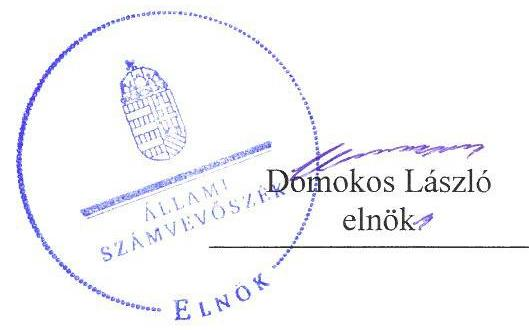
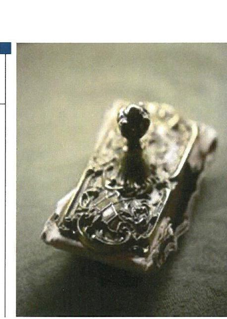

---

|   | AZ ELLENŐRZÉST FELÜGYELTE:  |
| --- | --- |
|   | SALAMON ILDIKÓ felügyeleti vezető  |
|   | AZ ELLENŐRZÉST VEZETTE ÉS A VÉGREHAJTÁSÁÉRT FELELŐS:  |
|   | KOVÁTS T. BALÁZS ellenőrzésvezető  |
|   | A PROGRAM ÖSSZEÁLLÍTÁSÁÉRT FELELŐS:  |
|   | JANIK JÓZSEF osztályvezető  |
|   | A TÉMÁHOZ KAPCSOLÓDÓ KORÁBBI SZÁMVEVŐSZÉKI JELENTÉSEK:  |
|   | - címe: Jelentés Magyarország 2014. évi központi költségvetése végrehajtásának ellenőrzéséről  |
|   | - sorszáma: 15167  |
|  Jelentéseink az Országgyűlés számítógépes hálózatán és az Interneten a www.asz.hu címen is olvashatóak. | - címe: Jelentés Magyarország 2015. évi központi költségvetése végrehajtásának ellenőrzéséről  |
|   | - sorszáma: 16163  |
|   | IKTATÓSZÁM: V-1149-153/2016.  |
|   | TÉMASZÁM: 2183  |
|   | ELLENŐRZÉS-AZONOSÍTÓ SZÁM: V076002  |

---

# TARTALOMJEGYZÉK 

■ ÖSSZEGZÉS ..... 5
■ AZ ELLENŐRZÉS CÉLJA ..... 7
■ AZ ELLENŐRZÉS TERÜLETE ..... 8
■ AZ ELLENŐRZÉS HÁTTERE, INDOKOLTSÁGA ..... 9
■ A JELENTÉS LÉNYEGES KÉRDÉSKÖREI ..... 10
■ ELLENŐRZÉS HATÓKÖRE ÉS MÓDSZEREI ..... 11
■ MEGÁLLAPÍTÁSOK ..... 14
■ JAVASLATOK ..... 30
■ KÖVETKEZTETÉSEK ..... 34
■ MELLÉKLETEK ..... 35
I. sz. melléklet: Értelmező szótár ..... 35
II. sz. melléklet: A kiegészítő teljesítmény-ellenőrzési modul megállapításai ..... 38
III. sz. melléklet: A belső kontrollrendszer kialakításának és müködtetésének értékelése a 2012-2015. években ..... 39
IV. sz. melléklet: Mérlegadatok a 2012-2015. években (M Ft-ban) ..... 40
V. sz. melléklet: Az integritás szemlélet érvényesítésével és az integritás kontrollrendszer kiépítettségével kapcsolatos megállapítások ..... 41
■ FÜGGELÉK: ÉSZREVÉTELEK ..... 43
■ RÖVIDÍTÉSEK JEGYZÉKE ..... 55

---

.

---

# ÖSSZEGZÉS 

Az irányító és középirányító szervek feladatellátása - Kisvárda Város Önkormányzata feladatellátása kivételével - nem felelt meg a jogszabályi előírásoknak. A Felső-Szabolcsi Kórház vezetője által kialakított belső kontroll rendszer nem biztositotta a szabályszerű, átlátható és elszámoltatható közpénzfelhasználás feltételeit. A pénzügyi gazdálkodás nem volt szabályszerű. A vagyongazdálkodás - a vagyonkezelési szerződés és a vagyonhasznosítási szerződések hiányosságai miatt - nem felelt meg a jogszabályi előírásoknak. A Kórház vezetője nem építette ki a megfelelő védelmet a korrupciós veszélyekkel szemben.

## Az ellenőrzés társadalmi indokoltsága

Az államháztartás központi alrendszerének közpénz felhasználása, az intézmények által ellátott közfeladatok sokrétűsége, valamint a feladatellátásához rendelt vagyon nagyságrendje indokolja, hogy az Állami Számvevőszék ellenőrzéseket folytasson a pénzügyi és vagyongazdálkodás területén. Az Állami Számvevőszék az ellenőrzései során feltárja a gazdálkodást, a központi alrendszer intézményei átalakulását, átszervezését érintő szabályozások esetleges hiányosságait, a szabályozással nem érintett gazdálkodási területeket, rámutathat a vagyongazdálkodási tevékenység ezen belül a tulajdonosi joggyakorlás és vagyonkezelés - esetleges szabálytalanságaira, értékeli az állami vagyon nyilvántartására és elszámolására vonatkozó eljárásokat. Az ellenőrzésünkkel hozzá kívánunk járulni a központi intézmények pénzügyi helyzetének pontosabb megítéléséhez, a jó gyakorlat kialakításán és terjesztésén keresztül az ellenőrzéseink elősegíthetik a gazdálkodás szabályszerűségének javítását.

Az egészségügyi ellátások költsége folyamatosan a társadalmi érdeklődés középpontjában áll. A központi költségvetésből az egyik legjelentősebb kiadást az egészségügyi ellátásokra fordított adóforintok jelentik, amelyekből a kórházak kapják a legtöbb támogatást. Ezért indokolt, hogy az Állami Számvevőszék az egészségügyi intézmények pénzügyi és vagyongazdálkodását, az esetleges átalakulások szabályszerűségét rendszeresen több évre kiterjedően ellenőrizze.

A társadalmi igénnyel összhangban az államháztartásról szóló 2011. évi CXCV. törvény és a költségvetési szervek belső kontrollrendszeréről és belső ellenőrzéséről szóló 370/2011. (XII.31.) Kormányrendelet is előírja a költségvetési szerv részére, hogy a költségvetési szerv valamennyi tevékenysége és célja összhangban legyen a gazdaságosság, hatékonyság és eredményesség követelményeivel. Az Állami Számvevőszék jelen ellenőrzés során értékeli, hogy a Felső-Szabolcsi Kórháznál a célokat kialakították-e, tettek-e intézkedéseket a célok végrehajtása céljából, a kitűzött célok teljesültek-e.

## Főbb megállapítások, következtetések, javaslatok

Az irányítószervi, alapítói jogosultságokat 2012. január 1-jétől 2012. április 30-áig Kisvárda Város Önkormányzata a jogszabályi előírásoknak megfelelően gyakorolta. Az alapítói jogosultságokat 2012 májusától az emberi erőforrások minisztere nem a jogszabályi előírásoknak megfelelően gyakorolta. A középirányítói és fenntartói jogokat 2012. május 1-jétől a Gyógyszerészeti és Egészségügyi Minőség- és Szervezetfejlesztési Intézet, míg 2015. március 1-jétől az Állami Egészségügyi Ellátó Központ nem a jogszabályi előírásoknak megfelelően gyakorolta.

A Felső-Szabolcsi Kórház belső kontrollrendszerének kialakítása és müködtetése nem felelt meg a jogszabályi előírásoknak, nem biztosította a szabályszerű, átlátható és elszámoltatható közpénzfelhasználás feltételeit. A belső kontrollrendszeren belül a kockázatkezelési rendszer kialakítása és működtetése, a kontrolltevékenység működtetése, valamint az információs és kommunikációs rendszer működtetése nem volt szabályszerű, míg a kontrollkörnyezet kialakítása és a monitoring rendszer kialakítása és működése megfelelt a jogszabályi előírásoknak. A kockázatkezelési rendszer keretében nem mérték fel a tevékenységben rejlő kockázatokat és nem határozták meg az egyes kockáza-

---

tokkal kapcsolatban szükséges intézkedéseket, valamint azok teljesítésének folyamatos nyomon követésének módját. A kontrolltevékenységek működtetése a gazdálkodási jogkörök gyakorlásánál, a megkötött visszterhes szerződéseknél, adott megbízásoknál, megrendeléseknél, a közbeszerzési szabályok betartásánál és a vagyonhasznosításnál feltárt hiányosságok miatt nem volt megfelelő. Az információs és kommunikációs rendszer működtetése keretében a közzétételi kötelezettségüknek nem teljes körűen tettek eleget, továbbá az adatszolgáltatási kötelezettségüket rendszeresen a jogszabály által előírt határidőt követően teljesítették.

A pénzügyi gazdálkodás összességében nem volt szabályszerű. Az elemi költségvetés és az előirányzatok megállapítása, a bevételi és kiadási előirányzatok módosítása, átcsoportosítása valamint az éves költségvetési beszámoló elkészítése és a beszámolási kötelezettség teljesítése összességében megfelelt a jogszabályi előírásoknak. A bevételek beszedése és elszámolása megfelelt, azonban a kiadási előirányzatok felhasználása nem felelt meg a jogszabályi előírásoknak. Évközi korlátozó intézkedés nem érintette, azonban az eszközbeszerzések tilalmára vonatkozó előírásokat nem tartották be.

A vagyongazdálkodás összességében nem volt szabályszerű. A vagyon értékének megőrzését, gyarapítását szolgáló vagyongazdálkodás feltételeinek kialakítása - a vagyonkezelési szerződés tartalmi hiányosságai miatt - nem felelt meg a jogszabályi előírásoknak. A mérlegben kimutatott eszközök és források nyilvántartása, értékelése, leltározása megfelelt a jogszabályi előírásoknak. Az értékmegőrzési, állagmegóvási kötelezettséget teljesítették, azonban a vagyonelemek hasznosítása - a bérbeadási szerződések hiányossága és az átláthatóságra vonatkozó nyilatkozatok hiányában kötött szerződések miatt - nem volt megfelelő. Az eredményszemléletű számvitel bevezetésével kapcsolatos feladatok végrehajtása megfelelt a jogszabályi előírásoknak.

A Felső-Szabolcsi Kórház tett erőfeszítéseket az integritás szemlélet érvényesítésére, azonban a korrupciós veszélyekkel szembeni védettséget növelő integritás kontrollok kiépítettsége alacsony volt.

A Kórház a gazdálkodás folyamatában alakított ki mérhető célokat, célértékeket, azonban az elérésük érdekében meghatározott intézkedések végrehajtásával a szándékolt eredményeket nem minden évben érték el.

---

# AZ ELLENŐRZÉS CÉLJA 

A MEGFELELŐSÉGI ELLENŐRZÉS célja annak megítélése volt, hogy az ellenőrzött intézményre vonatkozó irányító szervi feladatellátás a jogszabályi előírások betartásával történt-e; az intézménynél a belső kontrollrendszer kialakítása és múködtetése szabályszerű volt-e; kialakították-e az erőforrásokkal való szabályszerű, gazdaságos, hatékony és eredményes gazdálkodás követelményeit; szabályszerű volt-e a beszámolási és adatszolgáltatási kötelezettségek teljesítése; az intézmény pénzügyi és vagyongazdálkodása megfelelt-e a jogszabályi előírásoknak és belső szabályzatainak; az intézmény átalakításának vagy átszervezésének lebonyolítása szabályszerűen történt-e.

Az ellenőrzés keretében értékeltük az intézmény korrupciós kockázatainak kezelését szolgáló integritás kontrollok kiépítettségét és az integritás szemlélet érvényesülését.

A KIEGÉSZÍTŐ TELJESÍTMÉNY-ELLENŐRZÉSI MODUL célja annak értékelése volt, hogy a gazdálkodás folyamatában a gazdaságossági, hatékonysági és eredményességi célok kialakítása megtörtént-e, a célok elérése érdekében tettek-e intézkedéseket, a célkitűzéseket elérték-e; a szándékolt eredményeket elérték-e.

---

# **AZ ELLENŐRZÉS TERÜLETE**

## **Felső-Szabolcsi Kórház**

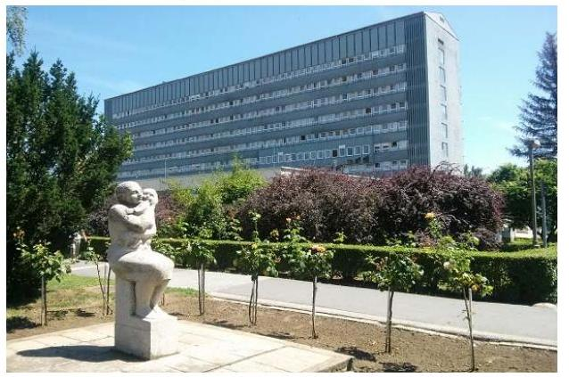

A Kórház¹ az ellenőrzött időszakban önállóan működő és gazdálkodó költségvetési szerv volt, 2012. január 1-je és április 30-a között önkormányzati alrendszerbe tartozott, az Önkormányzat² fenntartásában működött, az irányítószervi feladatokat az Önkormányzat látta el. A Kórház által az egészségügyi feladatellátáshoz használt önkormányzati vagyon és vagyoni értékű jog 2012. május 1-jétől a Ttv.³ alapján, a törvény erejénél fogva állami tulajdonba került. Az állami egészségügyi feladatellátást szolgáló átkerült vagyon tekintetében 2012. május 1-jétől a GYEMSZI⁴, 2015. március 1-jétől az ÁEEK⁵, mint tulajdonosi joggyakorló járt el. Az irányítószervi feladatokat a nemzeti erőforrás miniszter, illetve emberi erőforrások minisztere a Minisztériumon⁶ keresztül gyakorolta. A Kórház középirányító szerve 2012. május 1-jétől a GYEMSZI, illetve 2015. március 1-jétől az ÁEEK volt.

A Kórház bővített alapszakmás városi kórház és rendelőintézet, amely 2007-től 378 finanszírozott aktív és 221 krónikus ágyon fogad betegeket, járóbeteg ellátás területén 69 szakrendelést végeznek, továbbá széles körű diagnosztikai tevékenységet látnak el. A fekvő betegek gyógyszerellátását intézeti gyógyszertár biztosítja.

A Kórházat az ellenőrzött időszakban főigazgató vezette, a főigazgató munkáját orvos igazgató, ápolási igazgató, gazdasági igazgató, minőségbiztosítási vezető és kontrolling vezető segítette. Az ellenőrzött időszakban a főigazgató és gazdasági igazgató személyében nem következett be változás. Az intézményt szervezeti, szerkezeti átalakítás nem érintette.

A Kórház engedélyezett létszáma 2012-ben 882 fő volt, ami 2015-re 81 fővel, 801 főre csökkent. A végrehajtott beruházások következtében a Kórház vagyona a 2012. évi 3569,4 M Ft-ról 2015. évre 8272,5 M Ft-ra nőtt. A Kórház teljesített költségvetési és finanszírozási bevétele – a beruházások megvalósításához megpályázott EU-s programokból származó bevételek következtében – a 2012. évi 3675,9 M Ft-ról a 2015. évre 8453,0 M Ft-ra, a teljesített költségvetési és finanszírozási kiadások a 2012. évi 2821,1 M Ft-ról a 2015. évre 8235,7 M Ft-ra emelkedtek. A maradvány igénybevételt is figyelembe véve a Kórháznak a 2012. évben 854,8 M Ft, a 2013. évben 431,4 M Ft, a 2014. évben 325,7 M Ft, a 2015. évben 217,2 M Ft többlete keletkezett.

---

# AZ ELLENŐRZÉS HÁTTERE, INDOKOLTSÁGA 

Az Alaptörvény ${ }^{7}$ rendelkezése szerint a nemzeti vagyon megőrzésének, védelmének és a nemzeti vagyonnal való felelős gazdálkodásnak a követelményeit sarkalatos törvény, az Nvtv. ${ }^{8}$ rögzíti. A tulajdonosi joggyakorlás és vagyonkezelés általános és speciális szabályait, az állami vagyon nyilvántartására és elszámolására vonatkozó eljárásokat, a vagyonkezelési szerződés feltételrendszerét, valamint az éves beszámoló készítési és könyvvezetési kötelezettségeket kormányrendelet írja elő.

A központi alrendszer egyes intézményei közfeladat-ellátásának változásait, a közfeladatok átadásából és átvételéből adódó módosításait, előirányzat gazdálkodására ható tényezőit az Áht. ${ }^{9}$ 11. §-a és az Ávr. ${ }^{10}$ 14. §-a írja elő. A közfeladatok megszűnéséből, intézmény átszervezéséből, belső szerkezeti korszerűsítéséből, vagy más hasonló okból adódó módosításai miatt szerepeltetendő szerkezeti változásokat, valamint a szerkezeti változásként beépült közfeladatok szintre hozásként történő számításba vételét az Ávr. 15. § (2)-(3) bekezdései határozzák meg.

A társadalmi igénnyel összhangban Áht. és a Bkr. ${ }^{11}$ előírja a költségvetési szerv részére, hogy olyan szabályozásokat, eljárásokat, folyamatokat alakítson ki, amelyek biztosítják a múködés, gazdálkodás, az erőforrások felhasználása során a gazdaságosság, hatékonyság és eredményesség érvényesülését. A gazdaságos, hatékony és eredményes gazdálkodáshoz szükség van a teljesítménymérés feltételeinek kialakítására, úgymint az egyértelmú és mérhető célokra, mutatószámokra és az ezekhez rendelt követelményekre.

AZ ELLENŐRZÉS EREDMÉNYEKÉPPEN nemcsak az ellenőrzött intézmények gazdálkodása javulhat, hanem átfogó képet kaphatunk a központi alrendszerbe tartozó költségvetési szervek gazdálkodásának hiányosságairól, de a jó gyakorlatokról is. Ellenőrzéseivel, javaslataival és megállapításaival az ÁSZ ${ }^{12}$ elősegítheti a költségvetési szervek pénzügyi és vagyongazdálkodása szabályozásának javítását és hozzájárulhat a jó kormányzáshoz. Az ellenőrzés az ellenőrzött számára visszajelzést ad a pénzügyi és vagyongazdálkodásában feltárt hiányosságokról, javaslataival hozzájárul azok kiküszöböléséhez, amely csökkentheti a későbbi ellenőrzések gyakoriságát. Az ellenőrzés megállapításait és javaslatait más szervezetek is hasznosíthatják a rendezett gazdálkodási keretek kialakításához.

---

# A JELENTÉS LÉNYEGES KÉRDÉSKÖREI 

1.     - Az irányító szerv Kórházra vonatkozó feladatellátása szabályszerű volt-e?
2.     - A belső kontrollrendszer kialakítása és müködtetése biztosította-e a közpénzekkel és a nemzeti vagyonnal történő szabályszerű, gazdaságos, hatékony és eredményes gazdálkodást, illetve a beszámolási és adatszolgáltatási kötelezettségek szabályszerű teljesítését?
3.     - A Kórház pénzügyi gazdálkodása szabályszerű volt-e?
4.     - A Kórház vagyongazdálkodása szabályszerű volt-e?
5.     - Érvényesült-e az integritás szemlélet és ennek megfelelően ki-építették-e az integritás kontrollrendszert a Kórháznál?
6.     - A Kórház a gazdálkodás folyamatában kialakított-e célokat, célértékeket, azok elérése érdekében meghatározott-e intézkedéseket, feladatokat, elérte-e a szándékolt eredményeket?

---

# ELLENŐRZÉS HATÓKÖRE ÉS MÓDSZEREI 

## Az ellenőrzés típusa

Megfelelőségi ellenőrzés, amelyet teljesítmény-ellenőrzési modul egészített ki.

## Az ellenőrzött időszak

Az ellenőrzött időszak 2012. január 1-jétől 2015. december 31-ig terjedő időszak volt.

## Az ellenőrzés tárgya

Az ellenőrzött szervezetre vonatkozó irányító szervi feladatok ellátása. Az intézmény belső kontroll rendszerének kialakítása és múködtetése. A pénzügyi és vagyongazdálkodás szabályszerűsége. Az intézmény beszámolási és adatszolgáltatási kötelezettségének teljesítése.

A teljesítmény-ellenőrzési kiegészítő modul esetében az intézmény gazdálkodási folyamatában a gazdaságossági, hatékonysági és eredményességi célok és célértékek kialakítása, a kapcsolódó intézkedések meghatározása, a célkitűzések elérésének értékelése.

Az ellenőrzés kiterjedt minden olyan körülményre és adatra, amely az ÁSZ jogszabályban meghatározott feladatainak teljesítéséhez, valamint a program végrehajtása folyamán felmerült újabb összefüggések feltárásához szükséges volt.

## Az ellenőrzött szervezet

Felső-Szabolcsi Kórház, Kisvárda Város Önkormányzata, Állami Egészségügyi Ellátó Központ (Gyógyszerészeti és Egészségügyi Minőség- és Szervezetfejlesztési Intézet), Emberi Erőforrások Minisztériuma (Nemzeti Erőforrás Minisztérium).

Az ellenőrzésre a központi alrendszer ellenőrzött intézményének és irányító/felügyeleti szervének, illetve középirányító szervének székhelyén, telephelyén, a gazdálkodási feladatait ellátó szervezetének székhelyén került sor.

## Az ellenőrzés jogalapja

Az ellenőrzés jogszabályi alapját az ÁSZ tv ${ }^{13} 1 . \S$ (3) bekezdése, az 5. § (2)(6) bekezdései, valamint az Áht. 61. § (2) bekezdésének előírásai képezték.

---

# Az ellenőrzés módszerei 

Az ellenőrzést az ellenőrzési program szempontjai, az ellenőrzött időszakban hatályos jogszabályok, az ellenőrzés szakmai szabályai, a jelen ellenőrzésre irányadó ÁSZ módszertanok figyelembevételével végeztük.

Az ellenőrzés ideje alatt az ellenőrzött szervezettel történő kapcsolattartást az ÁSZ SZMSZ ${ }^{14}$-ének vonatkozó előírásai alapján biztosítottuk.

Az ellenőrzési kérdések megválaszolásához szükséges bizonyítékok megszerzése az ellenőrzött által rendelkezésre bocsátott dokumentumokra, adatokra alapozva megfigyelés, szemle (szemrevételezés), kérdésfeltevés (információkérés), mintavételezés, valamint elemző eljárás útján történt. Az ellenőrzési bizonyítékként felhasználható adatforrások közé tartoztak egyrészt az ellenőrzési program részletes szempontjainál felsorolt adatforrások, másrészt minden egyéb - az ellenőrzés folyamán feltárt, az ellenőrzés szempontjából információt tartalmazó - dokumentum.

Az ellenőrzés lefolytatásához az ellenőrzött szervezetek a tanúsítványok kitöltésével, valamint az ÁSZ által kért dokumentumok megküldésével szolgáltatott adatokat. A rendelkezésre bocsátott adatok, információk kontrollja az ellenőrzés keretében történt meg.

Az ÁSZ a belső kontrollrendszer jogszabályi előírások szerinti kialakításának és működtetésének szabályszerűségét az erre irányuló ellenőrzési kérdésekre adott válaszok összesítése alapján, a lényegességi szempontok figyelembe vételével évente pillérenként (kontrollkörnyezet, kockázatkezelési rendszer, kontrolltevékenységek, információs és kommunikációs rendszer, monitoring rendszer) és összesítetten is minősítette. Az ÁSZ a pénzügyi gazdálkodás és a vagyongazdálkodás kialakításának és működtetésének szabályszerűségét az erre irányuló ellenőrzési kérdésekre adott válaszok összesítése alapján, a lényegességi szempontok figyelembe vételével évenkénti bontásban minősítette. „Megfelelő"-nek értékelte az ellenőrzött területet, amennyiben a szabályozás, illetve végrehajtás során a jogszabályi követelményeket maradéktalanul, vagy kisebb hiányosságok mellett érvényesítették, „nem megfelelő"-nek értékelte, amennyiben a szabályozás hiányosságai nem biztosították a szabályszerű működés feltételeit, illetve a gazdálkodás folyamatában jelentkező hibák lényegesek, nagyszámúak, vagy rendszerszerűek voltak.

Mintavétellel ellenőriztük a Kórháznál a kiadások előirányzatai felhasználásának, a tárgyi eszközök nyilvántartásba vételének (üzembe helyezés, értékelés, nyilvántartás), a vagyon hasznosítási bevételek beszedésének és elszámolásának, a vagyonelemek elidegenítésének és hasznosításának szabályszerűségét. A minta alapján a sokaságban előforduló hibaarányt becsültük. Az értékelés eredményeként kétféle, "Megfelelő" és "Nem megfelelő" minősítést alkalmaztunk. „Megfelelő"-nek értékeltünk egy ellenőrzött területet, amennyiben a hibaarány a teljes sokaságban 95\%-os bizonyossággal legfeljebb 10\% arányt képviselt. Abban az esetben, ha adott sokaság tekintetében a 10\%-os hibaarány küszöbérték átlépése megítélésének megbízhatósága nem érte el a 95\%-ot, annak elérése érdekében értékelésünket lényegességi alapon további szempontokkal egészítettük ki, és figyelembe vettük a feltárt hibák értékét.

Az integritás szemlélet érvényesülésének értékelése az intézmény önbevallás útján kitöltött tanúsítványa alapján történt.

---

Az alapprogram alapján ellenőriztük, hogy a költségvetési szerv vezetője megtette-e nyilatkozatát arról, hogy gondoskodott a költségvetési szerv tevékenységében a hatékonyság, eredményesség és a gazdaságosság követelményeinek érvényesítéséről. A teljesítmény-ellenőrzési kiegészítő modul végrehajtása során értékeltük, hogy az ellenőrzött szervezet a gazdálkodás folyamatában a gazdaságossági, hatékonysági és eredményességi célokat és célértékeket kialakította-e, a célkitűzéseket elérte-e. A kiegészítő modul a gazdálkodási feladatokra terjedt ki, a szakmai feladatellátást nem értékelte.

A gazdálkodási feladatok értékelése az alábbi területekre terjedt ki:
pénzügyi gazdálkodási (nem szakmai, adminisztratív) feladatok: költségvetés-, beszámoló-készítés, könyvvezetés, adatszolgáltatások, előirányzat-gazdálkodás, kötelezettségvállalások nyilvántartása, kezelése, bevételkezelés, bér- és illetményszámfejtés;
$\longrightarrow$ vagyongazdálkodási (logisztikai) feladatok: közbeszerzések és közbeszerzési értékhatárt el nem érő beszerzések, készletgazdálkodás, nyomtatók, fénymásolók üzemeltetése, épület- és ingatlanüzemeltetés, karbantartás, hibabejelentés, gépjármú és flottamenedzsment.
Az ellenőrzés során minden olyan körülményt és adatot is ellenőriztünk, amely a program végrehajtása kapcsán felmerült újabb összefüggéseknek az ellenőrzés céljaival összhangban lévő feltárásához szükséges volt. A tel-jesítmény-ellenőrzési kiegészítő programmodulban megfogalmazott ellenőrzési cél megválaszolásához az alapprogram végrehajtása során megfogalmazott megállapításokat is figyelembe vettük.

---

# 1. Az irányító szerv Kórházra vonatkozó feladatellátása szabályszerű volt-e? 

Összegző megállapítás

Az irányító és középirányító szervek feladatellátása - az alapítói jogok gyakorlásának és a hatékonysági követelmények érvényesítésének hiányosságai miatt - összességében nem felelt meg a jogszabályi előírásoknak.
1.1. számú megállapítás

Az alapítással kapcsolatos jogosultságok gyakorlása - az Önkormányzat feladatellátása kivételével - nem felelt meg a jogszabályi előírásoknak.

A Kórházat érintően az alapítói jogosultságokat 2012. január 1-je és 2012. április 30-a között az Önkormányzat gyakorolta. Az államháztartás önkormányzati alrendszeréből a központi alrendszerbe történt átsorolást követően, 2012. május 1-jétől az alapítói jogosultságokat a nemzeti erőforrás miniszter és az emberi erőforrások minisztere gyakorolta.

A Kórház a jogszabályi előírásoknak megfelelően rendelkezett alapító okirattal ${ }^{15}$, melyet az Önkormányzat határozattal fogadott el, 2012. és 2014. években az emberi erőforrások minisztere adott ki. Az EMMI ${ }^{16}$ az alapító okiratot - a Ttv. 6. § (1) bekezdésében előírtak ellenére - a 2012. május 1-jei átvételt követő 45 napon belül nem készítette el és nyújtotta be a Kincstár ${ }^{17}$ által vezetett törzskönyvi nyilvántartáshoz. Az alapító okirat 2012. december 15-i kiadásához az államháztartásért felelős miniszter előzetes egyetértése - az Áht. 8. § (7) bekezdésében előírtak ellenére - nem állt rendelkezésre, az egyetértő levelet 2012. december 21-én adta ki.

Az alapító okiratot 2012. évben egységes szerkezetben adták ki és a kormányzati funkció megadása miatt 2014. január 1-jei hatállyal sor került az alapító okirat kiegészítésére. Az alapító okirat tartalma megfelelt a jogszabályi előírásoknak, tartalmazta többek között a működési körét, közfeladatát, alaptevékenységét, szakfeladatrendjét, szakágazati besorolását, vezetőjének kinevezési rendjét, a foglalkoztatottjai jogviszonyának megjelölését, az irányítói, középirányítói jogok gyakorlására jogosultak megjelölését.
1.2. számú megállapítás

A Kórházzal kapcsolatos egyéb irányítási, felügyeleti és ellenőrzési jogosultságok gyakorlása megfelelő volt, azonban jogszabályi előírások ellenére a középirányító szervek nem érvényesítették, nem kérték számon és nem ellenőrizték a hatékony gazdálkodás követelményeit.

Az Önkormányzat és az EMMI előírta az elemi költségvetési beszámoló, az éves számszaki beszámoló és a szöveges beszámoló indokolásának tartalmi követelményeit, elkészítésének határidejét, ellenőrizte és jóváhagyta a

---

### 1.3. számú megállapítás

Kórház elemi költségvetéseit, éves beszámolóit és előirányzat-maradványát. A GYEMSZI a szabályszerű gazdálkodáshoz szükséges követelményeket - jogszabályi előírásoknak megfelelően - kialakította és számon kérte. Figyelemmel kísérte a bevételi és kiadási előirányzatokkal való gazdálkodást, rendszeres beszámolási kötelezettséget írt elő. Az Önkormányzat, a GYEMSZI és az ÁEEK a jogszabályi előírásoknak megfelelően jóváhagyta a Kórház SZMSZ-ét ${ }^{18}$ és annak módosításait. A közfeladat ellátásához kapcsolódó erőforrást (vagyongazdálkodást) érintő szabályszerűségi követelményeket a GYEMSZI az építésügyi hatósági eljárásról szóló körlevélben ${ }^{19}$, az ingatlanok bérbeadásáról szóló iránymutatásban ${ }^{20}$, a gépjárművek értékesítéséről szóló körlevélben ${ }^{21}$, illetve a tárgyi eszközök selejtezéséről szóló tájékoztatóban ${ }^{22}$ határozta meg. A 2012. év februárjától webes ügymenetkezelő (ügyköri) rendszert vezetett be az irányításhoz szükséges ügyek kezelésére.

Az irányító, középirányító szervek az éves és időszaki beszámolók számszaki részének és szöveges indoklásának felülvizsgálata és jóváhagyása révén végeztek ellenőrzési feladatokat, továbbá a GYEMSZI a 2013. évben ellenőrizte a Kórház szabályzatainak meglétét, továbbá a 2014. évben a Kórház belső kontrollrendszerének múködését.

A GYEMSZI - az 59/2011. (IV. 12.) Korm. rendelet ${ }^{23}$ 2/A. § a) pontjában előírtak ellenére - a 2012. május 1-je és 2015. február 28-a között, míg az ÁEEK - a 27/2015. (II. 25.) Korm. rendelet ${ }^{24}$ 5. § (1) bekezdés a) pontjában foglaltak ellenére - 2015. március 1-től a Kórház vonatkozásában nem érvényesítette az erőforrásokkal - így az előirányzatokkal, a létszámokkal és a vagyonnal - való hatékony gazdálkodás követelményeit, továbbá nem kérte számon és nem ellenőrizte e követelmények érvényre juttatását.

## Az irányításért felelős szervek a munkáltatói jogosultságaikat szabályszerűen gyakorolták.

A GYEMSZI a Kórház 2012. május 1-jei központi alrendszerbe kerülését követően - a Ttv.-ben foglaltaknak megfelelően - az intézményvezetői, valamint gazdasági igazgatói álláshelyek betöltésére 2012. július 29. napján írt ki pályázatot, a pályázati eljárás lefolytatását követően a pályázatokat eredménytelennek nyilvánították.

A Kórház főigazgatójának és gazdasági igazgatójának vezetői megbízása - a jogszabályi előírásoknak megfelelően - az ellenőrzött időszak végéig fennmaradt.

---

# 2. A belső kontrollrendszer kialakítása és múködtetése biztosította-e a közpénzekkel és a nemzeti vagyonnal történő szabályszerű, gazdaságos, hatékony és eredményes gazdálkodást, illetve a beszámolási és adatszolgáltatási kötelezettségek szabályszerű teljesítését? 

Összegző megállapítás

A belső kontrollrendszer kialakítása és múködtetése nem biztosította a közpénzekkel és a nemzeti vagyonnal történő szabályszerű, hatékony és eredményes gazdálkodás, illetve a beszámolási és adatszolgáltatási kötelezettségek szabályszerű teljesítése feltételeit.

A belső kontrollrendszer kialakítása és múködtetése szabályszerűségének értékelését a III. sz. melléklet tartalmazza.

### 2.1. számú megállapítás

A Kórház a kontrollkörnyezetét összességében a jogszabályi előírásoknak megfelelően alakította ki.

A Kórház rendelkezett hatályos, egységes szerkezetbe foglalt alapító okirattal.

A Kórház rendelkezett az irányítószervek által jóváhagyott SZMSZ-szel. Az SZMSZ 2012. január 1-jétől 2014. november 27-ig nem tartalmazta - az Ávr. 13. § (1) bekezdése b) és e) pontjában előírtak ellenére - a hatályos, egységes szerkezetbe foglalt alapító okiratának keltét, számát és az alapítás időpontját, valamint a szervezeti ábrát, 2014. január 1-jétől 2014. november 27-ig - az Ávr. 13. § (1) bekezdése c) pontjában előírtak ellenére - nem az alapító okirat kiegészítésének megfelelően tartalmazta az ellátandó, és a kormányzati funkció szerint besorolt alaptevékenység megjelölését. A 2015. március 31-től hatályos SZMSZ megfelelt a jogszabályi előírásoknak.

A Kórház gazdaság szervezete 2012. január 1-től 2012. augusztus 29-ig - az Ávr. 9. § (5) bekezdésében előírtak ellenére - nem rendelkezett ügyrenddel. A gazdasági szervezet ügyrendjének ${ }^{25}$ 2012. augusztus 30-áig történő elfogadásáig, a jogszabály által előírt feladatok meghatározását a hatályos SZMSZ tartalmazta.

A Kórház 2012. január 1-je és december 31-e között - a Kjt. ${ }^{26}$ 2. § (1) bekezdésében előírtak ellenére - közalkalmazotti szabályzattal nem rendelkezett. A humánerőforrás-kezelés múködtetésének szabályait a 2013. január 1-jétől kiadott humánpolitikai szabályzat ${ }^{27}$ tartalmazta. A Kórháznál 2012. január 1-je és december 31-e között a szervezet minden szintjén - a Bkr. 6. § (1) bekezdés c) pontjában előírtak ellenére - nem határoztak meg az etikai elvárásokat. A Kórháznál a szervezet minden szintjére érvényes etikai elvárásokat az etikai kódexben ${ }^{28} 2013$. január 1-jétől határozták meg.

A Kórház rendelkezett számviteli politikával ${ }^{29}$, amely az ellenőrzött időszakban tartalmazta a jogszabályban előírt szabályozásokat, a gazdálkodóra jellemző szabályokat, előírásokat, módszereket, azonban a törvényben biztosított választási lehetőségek alkalmazása estén - a Sztv. ${ }^{30}$ 14. § (4) bekezdésében, az Áhsz. ${ }^{31}$ 8. § (3) bekezdésében és az Áhsz. ${ }^{32}$ 50. § (1)

---

bekezdésében előírtak ellenére - nem szabályozta, hogy az alkalmazott gyakorlatot milyen okok miatt kell megváltoztatni. A számviteli politika keretében elkészítették az eszközök és a források leltározási és leltárkészítési szabályzatát ${ }^{33}$, az eszközök és források értékelési szabályzatát ${ }^{34}$, az önköltségszámítás rendjére vonatkozó önköltség-számítási szabályzatot ${ }^{35}$ és a pénzkezelési szabályzatot ${ }^{36}$, továbbá rendelkeztek számlarenddel ${ }^{37}$ és a számlarendben foglaltakat alátámasztó bizonylati renddel ${ }^{38}$. A Számlarendben a 2015. évtől nem szabályozták - az Áhsz. 2 51. § (3) bekezdésében foglaltak ellenére - az összesítő bizonylatok tartalmi és formai követelményeit.

A leltározási és leltárkészítési szabályzat a 2012-2013. években az eszközök - kivéve az immateriális javak és a követelések - esetében két évenként írta elő a mennyiségi felvétel elvégzését, amelyhez - az Áhsz. 1 37. § (7) bekezdésében előírtak ellenére - az irányító szerv engedélyével nem rendelkeztek, a 2014. évtől a kétévenkénti mennyiségi felvétel előírása megfelelt az Sztv. és az Áhsz. 2 előírásainak. A pénzkezelési szabályzat - az Sztv. 14. § (8) bekezdésében és az Áhsz. 2 50. § (6) bekezdésében előírtak ellenére - nem tartalmazta a napi készpénz záró állomány maximális mértékét.

A Kórház 2013. január 27-ig - a Kbt. ${ }^{39}$ 22. § (1)-(2) bekezdésében előírtak ellenére - nem rendelkezett közbeszerzési szabályzattal ${ }^{40}$, továbbá 2013. február 3-ig - az Ávr. 13. § (2) bekezdés b) pontjában előírtak ellenére - belső szabályzatban nem rendezte a közbeszerzési törvény hatálya alá nem tartozó beszerzések lebonyolításának rendjét, beszerzési szabályzattal ${ }^{41}$ csak ezt követően rendelkezett. A Kórház 2013. január 8-ig - az Ávr. 13. § (2) bekezdés c) pontjában foglaltak ellenére - belső szabályzatban nem szabályozta a belföldi és külföldi kiküldetések elrendelésével és lebonyolításával, elszámolásával kapcsolatos kérdéseket, kiküldetési szabályzattal ${ }^{42}$ csak ezt követően rendelkezett. A Kórház 2013. szeptember 1-jéig - az Ávr. 13. § (2) bekezdés e) pontjában előírtak ellenére - belső szabályzatban nem szabályozta a reprezentációs kiadások felosztását, azok elszámolását, reprezentációs szabályzatot ${ }^{43}$ csak ezt követően adták ki.

A gazdálkodás részletes rendjét gazdálkodási szabályzatban ${ }^{44}$ határozták meg, amely megfelelt a jogszabályi előírásoknak. A Kórház 2012. január 12-ig - a Bkr. 6. § (3) bekezdésében előírtak ellenére - ellenőrzési nyomvonallal ${ }^{45}$, továbbá 2013. január 31-ig - a Bkr. 6. § (4) bekezdésében előírtak ellenére - szabálytalanságkezelési eljárásrenddel ${ }^{46}$ nem rendelkezett, a szabályzatokat csak ezt követően adták ki.

# 2.2. számú megállapítás 

## A kockázatkezelési rendszer kialakítása és múködtetése nem felelt meg a jogszabályi előírásoknak.

A Kórház 2013. január 31-től hatályos kockázatkezelési szabályzata ${ }^{47}$ tartalmazta a kockázatok azonosítási módját, elemzésének, értékelésének módját, a kockázati kitettség mérséklésének módszerét, a kezelésük érdekében szükséges intézkedések teljesítésének folyamatos nyomon követési módját.

A Kórház főigazgatója a 2012-2015. években - a Bkr. 7. § (1)-(2) bekezdésében előírtak ellenére - nem működtetett kockázatkezelési rendszert, mivel intézményi szinten nem mérték fel a költségvetési szerv tevékenységében, gazdálkodásában rejlő kockázatokat, nem határozták meg az egyes

---

# 2.3. számú megállapítás 

kockázatokkal kapcsolatos intézkedéseket, valamint azok teljesítésének folyamatos nyomon követésének módját.

A kontrolltevékenységek kialakítása összességében megfelelt, míg a gyakorlása, múködtetése nem felelt meg a jogszabályokban és a belső szabályzatokban foglaltaknak.

A gazdálkodási szabályzatban meghatározták a kötelezettség vállalás, a kötelezettségvállalás ellenjegyzése, a teljesítésigazolás, az érvényesítés, az utalványozás és az utalványozás ellenjegyzése gyakorlásának módjával, eljárási és dokumentációs részlet szabályaival, valamint az ezeket végző személyek kijelölésének rendjével kapcsolatos belső előírásokat, továbbá biztosították a gazdasági események elszámolása vonatkozásában a feladatköri elkülönítését, a kontrolltevékenységek részeként a pénzügyi döntések dokumentumainak elkészítését. A gazdálkodási jogköröket gyakorló személyekről és aláírás mintájukról az ellenőrzött időszakban - az Ávr. 60. § (3) bekezdésében előírtak ellenére - naprakész nyilvántartást nem vezettek. Biztosították a kontrolltevékenységek részeként a pénzügyi döntések dokumentumainak elkészítését, ennek keretében rendelkeztek a kötelezettségvállalások, valamint a szerződések nyilvántartásával.

A kontrolltevékenységek múködtetése összességében nem felelt meg a jogszabályi előírásoknak. A Kórháznál a személyi juttatások, a múködési kiadások, a felhalmozási kiadások felhasználása során a gazdálkodási jogkörök gyakorlása - a feltárt hiányosságok kivételével - megfelelően múködött, azonban a megkötött visszterhes szerződések, adott megbízások, megrendelések szabályszerűsége a 2014-2015. években nem volt megfelelő, valamint a 2012., 2014. és 2015. években több esetben megsértették a közbeszerzési szabályokat. A bevételek elszámolása megfelelt, azonban a 2012-2015. években a bérbeadási szerződések megkötése, tartalma nem felelt meg a jogszabályi előírásoknak. A feltárt hiányosságok miatt a költségvetési gazdálkodás során az előzetes és utólagos pénzügyi ellenőrzés, a pénzügyi döntések szabályszerűségi szempontból történő jóváhagyása, illetve ellenjegyzése során - a Bkr. 8. § (2) bekezdés c) pontjában előírtak ellenére - nem volt biztosított a folyamatba épített, előzetes, utólagos és vezetői ellenőrzés.
2.4. számú megállapítás

Az információs és kommunikációs folyamatok kialakítása megfelelt, azonban a múködtetése összességében nem felelt meg a jogszabályi előírásoknak.

AZ INFORMÁCIÓ ÁRAMLÁS RENDSZERÉT a szervezeten belül a Bkr.-ben előírtakkal összhangban alakították ki. Az információáramlás biztosításával kapcsolatos feladatokat az SZMSZ-ben, a szervezeti egységek ügyrendjében és az ellenőrzési nyomvonalban rögzítették, továbbá 2013. december 3-tól rendelkeztek információs és kommunikációs szabályzattal ${ }^{48}$. A Kórház rendelkezett az Info. tv. ${ }^{49}$ által előírt adatvédelmi szabályzattal ${ }^{50}$, amely tartalmazta a közérdekú adatok megismerésére irányuló igények teljesítésének rendjét, valamint a kötelezően közzéteendő adatok nyilvánosságra hozatalának rendjét. Rendelkeztek az illetékes közlevéltár által jóváhagyott irattári és iratkezelési szabályzattal ${ }^{51}$, az iratok ik-

---

tatásával, az iratforgalom dokumentálásával biztosították, hogy az ügyintézés folyamata, az iratok szervezeten belüli útja követhető és ellenőrizhető, az iratok holléte naprakészen megállapítható legyen.

A Kórház az ellenőrzött időszakban - az Info. tv. 33. § (1) és (3) bekezdéseiben és a 37. § (1) bekezdésében előírtak ellenére - elektronikus közzétételi kötelezettségének nem teljes körűen tett eleget, mivel az Info. tv. 1. melléklete szerinti általános közzétételi listában lévő I. rész 11. pontjában, a II. rész 1., 12., 13., 15. pontjaiban, a III. rész 1., 2., 4., 7. és 8 pontjaiban meghatározott adatokat nem tette közzé.

A Kórház az adatszolgáltatási kötelezettségének - mind a Kincstár, mind az irányító szerv felé - eleget tett, azonban a jogszabályban előírt határidőket nem minden esetben tartotta be:
$\longrightarrow$ az éves költségvetési beszámolók esetében a 2012-2014. évekre vonatkozó adatszolgáltatási kötelezettségüket - az Áhsz. 10. § (1) és az Áhsz. 2 32. § (1) bekezdésében előírtak ellenére - február 28-a után teljesítették,
az időközi mérlegjelentések esetében az adatszolgáltatási kötelezettségüket a 2012. évben három alkalommal, a 2013. évben három alkalommal, a 2014. évben négy alkalommal, míg a 2015. évben három alkalommal - az Ávr. 170. § (2) bekezdésében, 7. melléklet 27. pontjában, illetve 2015. évtől az 5. melléklet 22. pontjában előírtak ellenére - a tárgynegyedévet követő hónap 20. napja után teljesítették.

# 2.5. számú megállapítás 

A Kórház föigazgatója összességében a jogszabályi előírásoknak megfelelően alakította ki a szervezet tevékenységének, a célok megvalósításának folyamatos- és eseti nyomon követését biztosító rendszerét.

A Kórháznál kialakították az operatív tevékenységek folyamatos és eseti nyomon követési rendszerét. Az SZMSZ-ben rögzítetteknek megfelelően szakmai testületek, munkabizottságok múködtek, a vezetői irányítási feladatok végrehajtása keretében rendszeres vezetői értekezleteket tartottak. A minőségbiztosítási osztály kezelésében ISO 9001-2009 minőségirányítási rendszert múködtettek. Az alkalmazott szabvány minőségirányítási rendszer kiterjedt a Kórházban fellehető összes folyamat szabályozására.

A Kórháznál a független belső ellenőrzés kialakítása és múködtetése megfelelt a jogszabályi előírásoknak. A belső ellenőrzési rendszer múködtetéséről a Kórház állományába tartozó főfoglalkozású közalkalmazott belső ellenőr megbízásával gondoskodtak, aki rendelkezett az előírt általános és szakmai követelmények szerinti képesítéssel, gyakorlattal. A belső ellenőrzés az SZMSZ-ben előírtak szerint a Kórház főigazgatójának közvetlenül alárendelve múködött, feladatait és jogállását az SZMSZ-ben, illetve belső ellenőrzési kézikönyvben ${ }^{52}$ határozták meg, melyet kétévente aktualizáltak, a belső ellenőrzés szervezeti és funkcionális függetlensége biztosított volt. A Kórház rendelkezett - a vonatkozó jogszabályi- és az útmutató előírásainak figyelembevételével elkészített - éves belső ellenőrzési tervvel, melyet minden évben végrehajtottak. A belső ellenőr az elvégzett belső ellenőrzésekről éves bontásban nyilvántartást vezetett, amelyek tar-

---

#### Abstract

talmazták a belső ellenőrzési jelentésekben tett megállapításokat, javaslatokat, a vonatkozó intézkedési terveket és azok végrehajtását nyomon követték.

A külső ellenőrzések nyilvántartásáról a Kórház főigazgatója a 20132014. években - a Bkr. 14. § (1) bekezdésében előírtak ellenére - nem gondoskodott. A Kórház főigazgatója a külső ellenőrzésekről vezetett nyilvántartás alapján a 2012-2015. évekről - a Bkr. 14. § (2) bekezdésében foglaltak ellenére - a tárgyévet követő év január 31-ig nem számolt be a fejezetet irányító költségvetési szerv vezetőjének és a fejezetet irányító szerv belső ellenőrzési vezetőjének.

A Kórház főigazgatója a költségvetési szerv belső kontrollrendszerének minőségét - a Bkr.-ben előírtaknak megfelelően - a 2012-2015. évekre vonatkozóan nyilatkozatban értékelte. A nyilatkozatot a költségvetési beszámolóval egyidejűleg megküldte az irányítószerv részére.

# 2.6. számú megállapítás 

A Kórház főigazgatója alakított ki a célok elérését szolgáló követelményeket a rendelkezésre álló források gazdaságos, hatékony és eredményes felhasználásához.

A Kórház főigazgatója szabályzatokat adott ki, folyamatokat alakított ki és működtetett a források szabályozott, gazdaságos, hatékony és eredményes felhasználásához. A Kórháznál a minőségbiztosítási osztály kezelésében MSZ EN ISO 9001:2009 minőségirányítási rendszert működtettek, amely tartalmazta az intézmény céljait, melyek között kiemelt helyen szerepel a gazdasági stabilitás fenntartása és az erőforrások hatékony felhasználása. Az alkalmazott szabvány minőségirányítási rendszer kiterjedt a Kórházban fellehető összes folyamat szabályozására, éves belső minőségügyi audit tervek és audit ellenőrzési listák készültek az elérendő célokról, az audit ellenőrzéseket a minőségbiztosítási vezető és a belső auditorok végezték.

A 2012-2014. években végzett - a következő évben kiértékelt - betegelégedettség mérésének célja az volt, hogy többletköltség nélkül hatékonyabb és eredményesebb szolgáltatást nyújtson a Kórház a fekvőbeteg és a járóbeteg-ellátás területén. Ennek mérése kérdőívek kitöltése és értékelése révén valósult meg a minőségügyi vezető irányítása mellett és az ápolási igazgató koordinálásával. A kitűzött célokat mindhárom esztendőben elérték.

A 2013. évben a Kórház célul tűzte ki, hogy egy új MR ${ }^{53}$ berendezés beszerzésével csökkentse a vizsgált betegek röntgensugár-terhelését. Az átdolgozott projekt 2014-ben indult és 2015. december 23-án üzembe helyezték az új MR berendezést.

A 2015. évben célul tűzték ki egy új energiatakarékos $\mathrm{CT}^{54}$ berendezés beszerzését, amellyel jobb minőségű leletet lehetett előállítani, továbbá az energiafelhasználás csökkentését. A beszerzés 2015 decemberében megvalósult és a 29-én készült mérési jegyzőkönyv tanúsága szerint a kitűzött célt elérték.

A gazdasági igazgató 2015. január 29-én körlevélben tájékoztatta a vezetőket a kitűzött gazdaságossági célokról:
megújuló energiaforrások alkalmazása, egy 300 kW csatlakozási teljesítményű napelemes rendszer építése, villamos energia megtakarítás elérése;

---

- a vásárolt energia árában 1,5 Ft/kW-os "Fizetési határidő tartási kedvezmény" elérése.
A megvalósult napelemes rendszer 2015 novemberében lett üzembe helyezve, a fizetési kedvezményt elérték, amely költségmegtakarítást jelentett.

# 3. A Kórház pénzügyi gazdálkodása szabályszerű volt-e? 

## Összegző megállapítás

3.1. számú megállapítás
3.2. számú megállapítás

A Kórház pénzügyi gazdálkodása összességében nem felelt meg a jogszabályi előírásoknak.

Az elemi költségvetés készítése és az előirányzatok megállapítása során betartották a jogszabályi előírásokat és a belső szabályzatokban foglaltakat.

A KÉTKÖRÖS TERVEZÉS keretében az előzetes és a végleges költségvetés készítésének folyamata az Ávr.-ben foglaltaknak megfelelt. Az elemi költségvetés készítésével kapcsolatos feladatokat - a jogszabályi előírásoknak megfelelően - az SZMSZ, a gazdasági szervezet ügyrendje, az ellenőrzési nyomvonal és a pénzügyi-számviteli területen dolgozók munkaköri leírásai tartalmazták. Az elemi költségvetés és a kincstári költségvetés adatai közötti egyezőség minden ellenőrzött évben fennállt.

SZÁMÍTÁSOKKAL támasztották alá a Kórháznál az elemi költségvetés tervezése során a bevételek és a kiadások összegét, amelyek a szervezeti egységek adatszolgáltatásán alapultak. A Kórház a költségvetés elkészítésével kapcsolatos adatszolgáltatási kötelezettségét az Ávr.-ben és a középirányító szerve által előírtaknak megfelelően teljesítette. A Kórházat az ellenőrzött időszakban szervezeti átalakítás, átszervezés, illetve (évközi) új feladatellátás nem érintette.

A bevételi és kiadási előirányzatok módosítása, átcsoportosítása
megfelelt a jogszabályi előírásoknak.

AZ ELŐIRÁNYZATOK MÓDOSÍTÁSA az ellenőrzött időszakban szabályszerűen történt. A Kórház az Áhsz.1-2 és az Áht. előírásainak megfelelően rendelkezett az előirányzat módosításokhoz, átcsoportosításokhoz kapcsolódó előirányzat-nyilvántartással. Az előirányzat-nyilvántartás tartalmazta az előirányzatok módosításának jogcímét, összegét, hatáskörét, a Kincstárhoz történő bejelentésének azonosításához szükséges adatokat. A 2012-2013. években az éves beszámoló 23. űrlapján és az előirányzat nyilvántartásokban, a 2014-2015. években az előirányzat nyilvántartásokban szereplő előirányzat módosítások megegyeztek a főkönyvi könyvelés szerinti előirányzat változásokkal. Az előirányzat módosítások dokumentáltan történtek.

Az előző évi maradvány előirányzatosítása az ellenőrzött időszakban megfelelt az irányító szerv által jóváhagyott maradvány összegének. Az előirányzat más költségvetési szervhez, fejezeti kezelésű előirányzathoz történő átcsoportosítására, bevételi és kiadási előirányzat zárolására nem került sor. A Kórház előirányzatait kormányzati, irányító szervi és intézményi

---

# 3.3. számú megállapítás 

hatáskörben többször módosították, a módosítások döntő hányada intézményi hatáskörben történt, Országgyűlési hatáskörű előirányzat-módosításra nem került sor.

## A bevételek beszedése és elszámolása megfelelt, míg a kiadási előirányzatok felhasználása nem felelt meg a jogszabályi előírásoknak.

A bevételek teljesítése 2012-ben 306,0 M Ft-tal (9,1\%-kal), 2013-ban 81,6 M Ft-tal (1,5\%-kal), míg 2014-ben 57,9 M Ft-tal (1,2\%-kal) meghaladta, míg a 2015. évben 50,6 M Ft-tal ( $0,6 \%$-kal) elmaradt a módosított előirányzattól.

A főbb kiadási előirányzatok teljesítése - az Áht.-ban foglaltaknak megfelelően - egyik évben sem lépte túl a módosított előirányzatot. A teljesített kiadások 2012-ben 16,3\%-kal, 2013-ban 6,6\%-kal, 2014-ben 2,8\%-kal, míg 2015-ben 3,1\%-kal maradtak el a módosított előirányzattól.

A Kórház bevételeinek és kiadásainak alakulását az alábbi ábra szemlélteti:

1. ábra
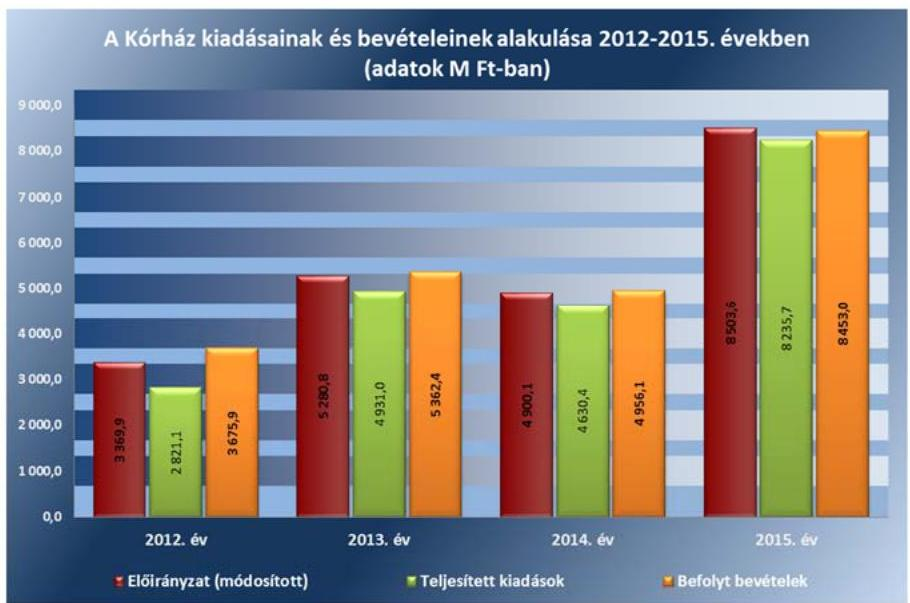

Forrás: Kórház 2012-2015. évi költségvetési beszámolói

## A VAGYONHASZNOSÍTÁSI BEVÉTELEK beszedése és

elszámolása megfelelt a jogszabályi előírásoknak, ezen bevételek elszámolásához a gazdálkodási szabályzatában - az Ávr. 57. § (2) és az 59. § (5) bekezdésére tekintettel, a B402 szolgáltatások ellenértéke rovaton elszámolt költségvetési bevételek esetében - nem írták elő a teljesítésigazolást és az utalványozást. A bevételeket - az Áht.-ban és az Áhsz.1.2-ben - előírt könyvvezetési szabályoknak megfelelő főkönyvi számlákon számolták el. A bérleti díjak beszedése, az analitikus és főkönyvi nyilvántartásokban való rögzítése a szolgáltatást igénybe vevők számára kiállított számla alapján történt, a bevétel beszedését alátámasztó számlák rendelkezésre álltak. A kiszámlázott bevételek teljes összegükben realizálódtak.

A KIADÁSI előirányzatok felhasználásánál a gazdálkodási jogkörök gyakorlása - a 2014. év kivételével - nem megfelelő volt. (1. táblázat)

---

2. táblázat

A KIADÁSOK FELHASZNÁLÁSÁNÁL A MEGKÖTÖTT VISSZTERHES SZERZŐDÉSEK, ADOTT MEGBÍZÁSOK, MEGRENDELÉSEK SZABÁLYSZERŰSÉGÉNEK MINŐSÍTÉSE

| Ellenőrzött év | Minőstés |
| :--: | :--: |
| 2012. év | megfelelő |
| 2013. év | megfelelő |
| 2014. év | nem megfelelő |
| 2015. év | nem megfelelő |

Forrás: ÁSZ értékelés
3.4. számú megállapítás

Az ellenőrzés a gazdálkodási jogkörök gyakorlásánál az alábbi hibákat tárta fel: Rendszeresen előfordult, hogy a kötelezettségvállalást - az Ávr. 52. § (1) bekezdésében előírtak ellenére - nem az arra írásban felhatalmazott személy végezte el. Rendszeresen előfordult, hogy a pénzügyi ellenjegyzést, a teljesítésigazolást és az érvényesítést - az Ávr. 52. § (1) bekezdésében, az Ávr. 55. § (1) bekezdésében, az Ávr. 57. § (3) bekezdésében és az Ávr. 58. § (4) bekezdésében előírtak ellenére - nem az arra írásban kijelölt személy végezte el. A 2012-2015. években előfordult, hogy a teljesítés igazolására - az Ávr. 57. § (1) bekezdésében előírtak ellenére - a kiadás teljesítésének jogosságát, összegszerűségét alátámasztó, ellenőrizhető okmányok hiányában került sor. A 2012-2015. években előfordult, hogy - az Áht. 37. § (1) bekezdésében előírtak ellenére -a kötelezettségvállalás pénzügyi ellenjegyzése hiányzott. A hiányosságokkal érintett esetekben az érvényesítő - az Ávr. 58. § (1)-(2) bekezdésében foglaltak ellenére - nem ellenőrizte és nem jelezte az utalványozónak a megelőző ügymenetben a jogszabályi előírások be nem tartását.

A kiadási előirányzatok felhasználásánál a megkötött visszterhes szerződések, adott megbízások, megrendelések szabályszerűsége a 20122013. években megfelelő, míg a 2014-2015. években nem megfelelő volt. (2. táblázat)

A megkötött visszterhes szerződéseknél, adott megbízásoknál, megrendeléseknél az ellenőrzés az alábbi hibákat tárta fel: A 2012., 2014. és 2015 években előfordult, hogy a költségvetési szerv állományába tartozó dolgozóval kötött megbízási szerződés alapján - az Ávr. 51. § (2) bekezdésében előírtak ellenére - a dolgozónak a munkaköri leírása szerint számára előírt feladatára történt a megbízási díj kifizetése. A 2012-2015. években a költségvetési szerv állományába tartozó dolgozóval kötött megbízási szerződéseknél többször előfordult, hogy a szerződésekben - az Ávr. 51. § (2) bekezdésében előírtak ellenére - nem kötötték ki, hogy a díj kizárólag abban az esetben illeti meg a költségvetési szerv állományába tartozó személyt, ha a szerződésben rögzített feladat mellett a munkakörébe tartozó feladatainak is maradéktalanul eleget tett. A 2012-2015. években megbízási szerződéseknél rendszeresen elmulasztották előírni - az Ávr. 50. § (1) bekezdés a) és b) pontjában előírtak ellenére - a szakmai, műszaki teljesítés mennyiségi és minőségi jellemzőinek meghatározását, továbbá a pénzügyi teljesítés módját és feltételeit.

A kiadások felhasználásánál a 2012-2013. és 2015. években rendszeresen előfordult, hogy - a Kbt. 5. §-ában, 19. § (1) bekezdésében és a 119. §ában előírtak ellenére - a közbeszerzési eljárások lefolytatását elmulasztották.

## A Kórház összességében a jogszabályi előírásoknak megfelelően készítette el éves költségvetési beszámolóját és teljesítette beszámolási kötelezettségét.

Az éves költségvetési beszámolókat az Áhsz.1-2 előírásainak megfelelő bontásban és formában készítették el, a beszámolók aláírása szabályszerűen, az előírt követelményeknek megfelelően történt. A beszámolókat a Minisztérium minden ellenőrzött évben ellenőrizte és elfogadta.

A 2012. és 2013. I. féléves elemi költségvetési beszámolókat az Áhsz.1nek megfelelően készítették el és küldték meg a GYEMSZI-nek. A 2014-

---

2015. évekre vonatkozóan féléves elemi költségvetési beszámoló készítési kötelezettséget jogszabály már nem írt elő.

Az időközi mérlegjelentési és a tartozásállományra vonatkozó adatszolgáltatási kötelezettségének eleget tettek. Az Áhsz. 2 5. § (1) bekezdésében, valamint az Áhsz. ${ }_{2}$ kötelező egyezőségére vonatkozó 17. számú mellékletében előírtak ellenére a 2015. évben előfordult, hogy nem biztosították az éves költségvetési beszámoló adatának részletező nyilvántartással való alátámasztását. A könyvviteli mérleg eszköz és forrás oldala megegyezett egymással, továbbá az előző évi záró adatok mérlegsoronként megegyeztek a tárgyévi nyitó adatokkal.

# 3.5. számú megállapítás 

A Kórház a befizetési kötelezettségét teljesítette, azonban az eszközbeszerzések tilalmára vonatkozó előírásokat nem tartották be.

A Kórház a folyamatos fizetőképesség biztosítása érdekében több esetben nem készített likviditási tervek, továbbá az évközi egyensúlyjavító intézkedéseket sem tartották be.

LIKVIDITÁSI TERVET a Kórháznál - az Áht. 78. § (2) bekezdésében előírtak ellenére - 2012. január-április, 2014. január-december és 2015. január hónapokra nem készítettek. A 2012. május-december és 2013. január-december hónapokra készített likviditási tervek - az Ávr. 122. § (1) bekezdésében előírtak ellenére - nem tartalmaztak a tárgyhónap vonatkozásában a teljesíthető kiadásokra dekádonkénti ütemezést. A 2015. februártól készített likviditási tervek megfeleltek a jogszabályi előírásoknak. A Kórház a likviditási tervre vonatkozó 2015. januári adatszolgáltatását - az Ávr. 122. § (1) bekezdése előírásának ellenére - az előírt január 10-ei határidőt követően küldték meg a Kincstár, valamint a Minisztérium részére.

A Kórháznál az intézményi beruházás keretében történő bútor és informatikai eszköz beszerzés tilalmára vonatkozó előírásokat nem tartották be. A 2012-2013. években - a 1036/2012. (II. 21.) Korm. határozat ${ }^{55}$ 6. pontjában előírtak ellenére -, míg a 2014-2015. években - az 1982/2013. (XII. 29.) Korm. határozat ${ }^{56}$ 1. pontjában előírtak ellenére - a beszerzési tilalom alá eső tárgyi eszközöket szereztek be.

ÉVKÖZI KORLÁTOZÓ intézkedés, zárolás vagy maradványtartás, korlátozó intézkedésekhez kapcsolódó, a költségvetési törvényben meghatározott fizetési kötelezettség a Kórházat nem érintette. Az esedékességet követő hatvan napon túli szállítói tartozása a Kórháznak nem volt.

AZ ELŐIRÁNYZAT-MARADVÁNY megállapítása 2015-ben nem felelt meg a jogszabályi előírásoknak, mivel adatait a kapcsolódó részletező nyilvántartások (nyilvántartási számlák) nem támasztották alá az Áhsz. 2 5. § (1) bekezdésében foglaltak ellenére.

Az intézmény előirányzat-maradványából a központi költségvetést megillető, elvonandó előirányzat-maradvány 2012. évben 56,3 M Ft, a 2013. évben 1,2 M Ft volt, melyet a Kórház az Ávr.-ben előírtaknak megfelelően befizetett.

A Kórház az előirányzat-maradványra vonatkozó adatszolgáltatási kötelezettségének az előírt tartalommal elkészített éves költségvetési beszámoló irányító szerv felé történt benyújtásával teljesítette, azonban ennek

---

a 2012-2014. évekre vonatkozóan - az Áhsz. 1 10. § (1) bekezdésében, illetve az Áhsz. 2 32. § (1) bekezdésében előírtak ellenére - a február 28-ai határidőt követően tett eleget. Az előirányzat-maradványok jóváhagyásáról az irányító szerv értesítésével rendelkeztek.

# 4. A Kórház vagyongazdálkodása szabályszerű volt-e? 

## Összegző megállapítás

### 4.1. számú megállapítás

A Kórház vagyongazdálkodása összességében nem felelt meg a jogszabályi előírásoknak.

A vagyon értékének megőrzését, gyarapítását szolgáló vagyongazdálkodás feltételeinek kialakítása - a vagyonkezelési szerződés hiányosságai miatt - nem felelt meg a jogszabályi előírásoknak.

A Kórház 2012. január 01. - 2012. április 30. között az államháztartás önkormányzati alrendszerébe tartozott. A vagyon feletti rendelkezési jogosultságokat az Önkormányzat által kiadott alapító okirat 14. pontja szabályozta, miszerint az állami egészségügyi feladatellátást szolgáló vagyont a Kórház az önkormányzati vagyongazdálkodási rendeletben ${ }^{57}$ meghatározottak szerint használta. A Kórház - a Ttv. alapján - 2012. május 1-től az államháztartás központi alrendszerébe került át, az átvett vagyon feletti tulajdonosi jogokat a GYEMSZI, 2015. március 1-től az ÁEEK gyakorolta.

VAGYONKEZELÉSI SZERZŐDÉS ${ }^{58}$ megkötésére a Kórház és a GYEMSZI között 2012. május 1-jei hatállyal került sor. A Kórház a vagyonkezelési szerződést a GYEMSZI-vel, mint középirányító szervével kötötte.

A vagyonkezelési szerződés 2014. március 15 -től - a Vtvr. ${ }^{59}$ 14. § (3) bekezdésében előírtak ellenére - nem tartalmazta, hogy a vagyonkezelő a tulajdonosi joggyakorló vagyon-nyilvántartási szabályzatát megismerte és magára nézve kötelező érvényűnek ismeri el, továbbá - a Vtvr. 20. § (1) bekezdésében előírtak ellenére - nem tartalmazta, hogy a tulajdonosi ellenőrzés eljárásrendjét a felek a szerződés részének tekintik. A vagyonkezelési szerződésben 2013. június 28 -tól - a Vtv. ${ }^{60}$ hatályos 27. § (9) bekezdésében előírtak ellenére - nem rögzítették a visszapótlási kötelezettség alóli mentesülés tényét. A Kórház a vagyonkezelési szerződés megkötésétől számított 30 napon belül - a Vtvr. 7. § (2) bekezdésében és a vagyonkezelési szerződés 1.2 pontjában foglaltak ellenére - nem kezdeményezte a vagyonkezelői jog bejegyzését az ingatlan nyilvántartásba, annak kezdeményezése csak 2013. április 24-én történt meg.

A vagyonkezelési szerződésben - a Vtvr. előírásának megfelelően meghatározták a vagyonelemek rendeltetését és a vagyonkezelő ehhez kapcsolódó kötelezettségeit, az értéknövelő beruházás, felújítás, valamint a létrehozott új eszköz értékével kapcsolatos adatszolgáltatás módját és gyakoriságát, annak rendjét és tartalmát, valamint, a felek jogait és kötelezettségeit a felek a szerződés részének tekintik. A vagyonkezelési szerződés módosítására, megszüntetésére az ellenőrzött időszakban nem került sor.

A Kórház a Vtv.-ben, valamint az Nvtv.-ben foglalt előírások szerint járt el, a múködéséhez szükséges, adásvételi szerződéssel vásárolt vagyonelemek az állam tulajdonába és a Kórház vagyonkezelésébe kerültek, saját vagyonnal nem rendelkeztek.

---

NYILVÁNTARTÁSI kötelezettségének a Kórház eleget tett, számviteli politikáját és analitikus nyilvántartásait úgy alakította ki, hogy azok biztosítsák a tulajdonosi joggyakorló felé történő adatszolgáltatás pontosságát és ellenőrizhetőségét. A tulajdonosi joggyakorló a vagyonkezelési szerződésben a vagyon nyilvántartására vonatkozóan további előírásokat nem határozott meg. A Kórház vagyonnyilvántartása tartalmazta a vagyonelemek azonosító adatait, a lényeges számviteli adatokat és az évente felülvizsgált állományi adatokat. A tárgyi eszközökről és a készletekről a Kórház folyamatos nyilvántartást vezetett mennyiségben és értékben. A főkönyvi és az analitikus nyilvántartások adatai között az egyezőség a naptári évek végén fennállt.

A Kórház a vagyonkezelt vagyonról szóló adatszolgáltatási kötelezettségének - a Vtvr. 14. § (1) bekezdésében és a vagyonkezelési szerződés 3.4. pontjában előírtak ellenére - a 2012-2014. években nem tett eleget. A vagyonkezelési szerződés tárgyát képező ingatlan ingatlan-nyilvántartási adataiban 2015. október 15. napján változás következett be, azonban a Kórház az ingatlan-nyilvántartásba való bejegyzését követő 30 napon belül és azt követően - a Vtvr. 14. § (6) bekezdés b) pontjában előírtak ellenére - a változást nem jelentette be a tulajdonosi joggyakorlónak, a bejegyzési határozat hivatalból megküldésre került a tulajdonosi joggyakorló részére.
4.2. számú megállapítás

A mérlegben kimutatott eszközök és források értékelése, leltározása összességében a jogszabályok és a belső szabályzatok előírásainak megfelelően történt.

# A MÉRLEGBEN KIMUTATOTT ESZKÖZÖK ÉV VÉGI 

ÉRTÉKELÉSE, a bekerülési értékének megállapítása és az értékcsökkenés elszámolása - a vevők és adósok minősítése kivételével - megfelelt a jogszabályi és a belső szabályzatok előírásainak.

A Kórház a 2012-2015. években a vevők és adósok minősítését - a Sztv. 55. (1) bekezdésében, az Áhsz. 1 31. § (2) bekezdésében és az Áhsz. 2 18. § (1) bekezdésében, illetve 2015. január 5-től az eszközök és források értékelési szabályzat 2.3.2 pontjában előírtak ellenére - nem végezte el, továbbá nem számolt el értékvesztést. A követelések állományi számláinak vezetése, a negyedévenkénti összegző kimutatás elkészítése és főkönyvi feladása megfelelt a jogszabályi előírásoknak. Követelésről nem mondtak le, behajthatatlan követelés nem volt. A kötelezettségek, kötelezettségvállalások analitikus nyilvántartását az Áhsz.1-2 előírásának megfelelően, folyamatosan vezették. A kötelezettségek állományának főkönyvi számláinak vezetése, a negyedévenkénti összegző kimutatások készítése és a főkönyvi feladás megfelelt a jogszabályi előírásának. A Kórház a 2012-2015. években 60 napon túli tartozásállománnyal nem rendelkezett.

A mérlegek a naptári évek végén az analitikus és a főkönyvi számlákkal egyezően mutatták az eszközök és források értékét. A számviteli politikában megfelelően határozták meg az értékcsökkenési leírás módszerét, és az elszámolásának gyakoriságát. Az értékcsökkenés elszámolása - egy eset kivételével - megfelelt a jogszabályi előírásoknak. A 2012. évben egy számítástechnikai eszköz esetében - a számviteli politika III. fejezet 6.1-es pontjában előírtak ellenére - 33\% helyett 14,5\%-os leírási kulcsot alkalmaztak.

---

A bekerülési érték megállapítása a tárgyi eszközök és immateriális javak esetében a jogszabályokban és belső szabályzatban előírtaknak megfelelően történt. Azonban az üzembe helyezés dokumentálása nem felelt meg a számviteli politikában előírtaknak, mivel a tárgyi eszközök nyilvántartásba vételénél a 2012-2014. években, több esetben - a Sztv. 52. § (2) bekezdésében és a számviteli politika III. fejezet 8. pontjában előírtak ellenére - a tárgyi eszközök üzembe helyezését hitelt érdemlően nem dokumentálták, a belső szabályzat által előírt üzembe helyezési okmánnyal nem rendelkeztek, az állományba vételi bizonylathoz a szállítói számlát csatolták.

LELTÁRRAL támasztották alá minden évben az éves beszámoló könyvviteli mérlegében kimutatott eszközöket és forrásokat. A leltározás végrehajtása a jogszabályi előírásoknak megfelelően történt. A Kórház - a leltározási és leltárkészítési szabályzat 5.1. pontjában előírtaktól eltérően - a jogszabályi előírásoknak megfelelve az ellenőrzött időszakban a tárgyi eszközeit és a készleteit mennyiségi felvétellel, az immateriális javak, követelések, pénzeszközök, egyéb aktív pénzügyi elszámolások, saját tőke és a kötelezettségek mérlegelemeket egyeztetéssel leltározta. A leltárak tartalmazták tételesen és ellenőrizhető módon a tárgyi eszközöket és készleteket mennyiségben és értékben, a többi eszközt és forrásokat értékben. A leltározásokat az arra kijelölt munkavállalók a leltározási ütemterv és leltározási utasítás alapján hajtották végre. A leltárakat kiértékelték, azonban a leltárak kiértékelése során a 2013-2015. években feltárt csekély összegű eltérések okainak kivizsgálását - a leltározási és leltárkészítési szabályzat 7. pontjában előírtak ellenére - nem végezték el.

A RENDEZŐ MÉRLEG elkészítése a 36/2013. (IX. 13.) NGM rendeletben előírtaknak megfelelően történt. Az eredményszemléletű számvitelre történő áttérést megelőzően a 2013. december 31-i mérleg fordulónappal végzett leltározás megfelelt a jogszabályi előírásoknak. A 2013. évi mérleg elkészítését megelőzően a függő- átfutó kiadásokat és bevételeket azonosították, a mérlegben szereplő értékadatokat rendező, technikai tételek elszámolásával módosították. A rendező mérleg alapján az öszszehasonlíthatóság a 2013. évi mérleg és a 2014. évi nyitómérleg között biztosított volt.

# 4.3. számú megállapítás 

A Kórház az értékmegőrzési, állagmegóvási kötelezettségét teljesítette, azonban a vagyonelemek hasznosítása - a bérleti szerződések hiányosságai miatt - nem felelt meg a jogszabályokban és belső szabályzatokban előírtaknak.

ÉRTÉKMEGŐRZÉSI, ÁLLAGMEGÓVÁSI kötelezettségének a Vtv.-ben, az önkormányzati vagyonrendeletben, illetve vagyonkezelési szerződésben foglaltak szerint eleget tett. A Kórház a visszapótlási kötelezettsége alól - a Vtv. alapján 2013. június 28-tól - mentesült.

A Kórház az állami tulajdonú eszközökön végzett beruházás, felújítás, karbantartás során betartotta a jogszabályi előírásokat, a vagyonkezelt vagyontárgyak értékét megőrizte, állagának megóvásáról, karbantartásáról, működtetéséről gondoskodott. A tervezett beruházásokról, felújításokról éves beruházási, karbantartási terveket készített, Az épületek állapotáról nyilvántartást vezettek, a szükséges felújítási munkákról az irányító szervnek beszámoltak. A Kórháznál az ellenőrzési időszakban összesen 4 037,2

---

M Ft beruházást és felújítást végeztek. A Kórház vagyonának alakulását az IV. sz. melléklet mutatja be.

A VAGYONELEMEK HASZNOSÍTÁSÁNAK szabályszerűsége - a bérleti szerződések hiányosságai miatt - nem volt megfelelő. A bérbeadási bevételek vállalkozói betegellátás közreműködői szerződés tárgyi minimumfeltételek biztosítására kötött használati szerződésekből, továbbá szolgálati lakások és helyiségek tartós bérbeadásából származtak. Az ingatlanokat egyéni, valamint társas vállalkozások, továbbá a Kórházzal közalkalmazotti jogviszonyban álló természetes személyek bérelték.

Az ellenőrzés az alábbi hiányosságokat tárta fel:
2012. április 30-ig egy esetben vállalkozói betegellátás közreműködői szerződés tárgyi minimumfeltételek biztosítására kötött bérleti szerződés határozatlan időtartamra történő megkötéséhez - az önkormányzati vagyongazdálkodási rendelet 28. § (1) bekezdésében előírtak ellenére - nem rendelkeztek az Önkormányzat engedélyével,
a 2012-2014. években rendszeresen előfordult, hogy a bérleti szerződésekben nem kötötték ki - a vagyonkezelési szerződés 3.7. pontjában előírtak ellenére - harmadik személy kárfelelősségét,
a 2012-2014. években rendszeresen előfordult, hogy a bérleti szerződésekben - az ingatlanok bérbeadásáról szóló iránymutatás 2014. július 16-ig 2. pontjában, míg azt követően II. 2. pontjában előírtak ellenére - nem került külön-külön feltüntetésre a bérleti díj összege és a bérlethez kapcsolódó közüzemi díjak, illetve egyéb költségek, továbbá nem kötötték ki a bérleti díj inflációkövetését,
az ellenőrzött időszakban rendszeresen előfordult, hogy a megkötött bérleti szerződésekben - az Nvtv. 11. § (11) bekezdés a)-c) pontjában előírtak ellenére - nem kötötték ki, hogy a bérbevevők vállalják az előírt beszámolási kötelezettségek teljesítését, a bérlők az átengedett nemzeti vagyont a szerződés előírásainak és a tulajdonosi rendelkezéseknek megfelelően használják, továbbá a hasznosításban harmadik félként kizárólag természetes személyek vagy átlátható szervezetek vesznek részt,
az ellenőrzött időszakban rendszeresen előfordult, hogy a bérbeadási folyamatok során - az Nvtv. 11. § (10) bekezdésében előírtak ellenére - úgy kötöttek szerződést, hogy a szerződő fél - az Nvtv. 3. § (2) bekezdésében előírt - átláthatóságára vonatkozó nyilatkozatával nem rendelkeztek.
Az MNV Zrt., illetve irányító szerv engedélyéhez kötött értékesítés nem volt, vagyonkezelői jogot harmadik személyre nem ruháztak át.

---

# 5. Érvényesült-e az integritás szemlélet és ennek megfelelően ki- 

építették-e az integritás kontrollrendszert a Kórháznál?

Összegző megállapítás

A Kórház tett erőfeszítéseket az integritás szemlélet érvényesítésére, azonban az integritás kontrollok kiépítettsége nem volt egyensúlyban a korrupciós kockázatok szintjével.

A Kórház 2014. és 2015. években is részt vett az ÁSZ Integritás Projektjében ${ }^{61}$.

A Kórház stratégiájában célul tűzte ki az integritás erősítését.
A Kórház a jogszabályok által is előírt szabályossági kontrollokat összességében kiépítette, azonban a korrupciós veszélyekkel szembeni védettséget növelő integritás kontrollok kiépítettsége alacsony volt.

Az integritás kontrollrendszer kiépítettségével kapcsolatos megállapításokat az V. sz. melléklet tartalmazza.

## 6. A Kórház a gazdálkodás folyamatában kialakított-e célokat, célértékeket, azok elérése érdekében meghatározott-e intézkedéseket, feladatokat, elérte-e a szándékolt eredményeket?

Összegző megállapítás

A Kórház a gazdálkodás folyamatában alakított ki mérhető célokat, célértékeket, azonban az elérésük érdekében meghatározott intézkedések végrehajtásával a szándékolt eredményeket nem minden évben érték el.

A Kórház a pénzügyi és vagyongazdálkodás folyamataiban határozott meg számszerűsített, mérhető célokat, célértékeket.

A Kórház a kitűzött célok, célértékek elérése érdekében intézkedéseket, feladatokat, felelősöket és határidőket határozott meg.

A Kórháznál a kitűzött célokkal kapcsolatos intézkedéseket a felelősök végrehajtották, azonban a végrehajtott intézkedésekkel a szándékolt eredményeket, a kitűzött célokat nem minden évben érték el.

A teljesítmény-ellenőrzés megállapításait részletesen a II. sz. melléklet tartalmazza.

---

# JAVASLATOK 

Az ÁSZ tv. 33. § (1) bekezdésében foglaltak értelmében az ellenőrzött szervezet vezetője köteles a jelentésben foglalt megállapításokhoz kapcsolódó intézkedési tervet összeállítani és azt a jelentés kézhezvételétől számított 30 napon belül az ÁSZ részére megküldeni. Amennyiben az ellenőrzött szervezet vezetője nem küldi meg határidőben az intézkedési tervet, vagy továbbra sem elfogadható intézkedési tervet küld, az Állami Számvevőszék elnöke az ÁSZ tv. 33. § (3) bekezdése a) és b) pontjaiban foglaltakat érvényesítheti.

## az emberi erőforrások miniszterének

1. Intézkedjen a Kormány határozatában megjelölt tárgyi eszközök beszerzési tilalmának betartására.
(3.5. számú megállapítás 3. bekezdése alapján)

## az Állami Egészségügyi Ellátó Központ főigazgatójának

1. Intézkedjen a Kórház vonatkozásában az erőforrásokkal - így az előirányzatokkal, a létszámokkal és a vagyonnal - való hatékony gazdálkodás követelményeinek érvényesítésére, kérje számon és ellenőrizze e követelmények érvényre juttatását.
(1.2. számú megállapítás 3. bekezdése alapján)

## a Kórház föigazgatójának

1. Intézkedjen, hogy a jogszabályi előírásoknak megfelelően
a) a számviteli politika tartalmazza, hogy a törvényben biztosított választási lehetőségek alkalmazása esetén, az alkalmazott gyakorlatot milyen okok miatt kell megváltoztatni;
b) a pénzkezelési szabályzat a jogszabályi előírásoknak megfelelően tartalmazza a napi készpénz záró állomány maximális mértékét;
c) a számlarendben szabályozzák az összesítő bizonylatok tartalmi és formai követelményeit.
(a 2.1. számú megállapítás 5. bekezdés 1. és 3. mondata és a 6. bekezdés 2. mondata alapján)

---

2. Intézkedjen a jogszabályban előirt integrált kockázatkezelési rendszer müködtetésére.
(a 2.2. számú megállapítás 2. bekezdése alapján)
3. Intézkedjen a jogszabályi előírásnak megfelelően a gazdálkodási jogköröket gyakorló személyekről és aláírás mintájukról naprakész nyilvántartás vezetésére.
(2.3. számú megállapítás 1. bekezdés 2. mondata alapján)
4. Intézkedjen a közérdekü adatok teljes körü közzétételére a vonatkozó jogszabályi előírásokkal összhangban.
(2.4. számú megállapítás 2. bekezdése alapján)
5. Intézkedjen, hogy a Kórház a jogszabályban elöirt határidőben tegyen eleget adatszolgáltatási kötelezettségeinek.
(2.4. számú megállapítás 3. bekezdése és a
3.5. számú megállapítás 7. bekezdése alapján)
6. Intézkedjen - a külső ellenőrzésekről vezetett nyilvántartás alapján a jogszabályban elöirt beszámolási kötelezettségének teljesitésére a fejezetet irányító szerv vezetőjének és a fejezetet irányító szerv belső ellenőrzési vezetöjének.
(2.5. számú megállapítás 3. bekezdés 2. mondata alapján)
7. Intézkedjen, hogy a gazdálkodási jogkörök gyakorlása során a jogszabályi előírásoknak megfelelően
a) a pénzügyi ellenjegyzés megtörténjen, és azt az arra írásban kijelölt személy végezze el;
b) az érvényesítést az arra kijelölt személy, a jogszabályban elöirt ellenőrzési és jelzési kötelezettségének eleget téve végezze el,
c) teljesités igazolását a kötelezettségvállaló által írásban kijelölt személy, a jogszabályban elöirtak betartásával végezze el.
(3.3. számú megállapítás 6. bekezdés 3-6. mondata alapján)
8. Intézkedjen, hogy kötelezettségvállalásra a jogszabályban megjelölt, vagy az általa írásban felhatalmazott személy által kerüljön sor.
(3.3. számú megállapítás 6. bekezdés 2. mondata alapján)

---

9. Intézkedjen a jogszabályi előírásoknak megfelelően
a) a saját dolgozóval kötött megbizási szerződésekben annak előírására, hogy a díj kizárólag abban az esetben illeti meg a költségvetési szerv állományába tartozó személyt, ha a szerződésben rögzített feladat mellett a munkakörébe tartozó feladatainak is maradéktalanul eleget tett;
b) a megbizási szerződésekben annak elöírására, hogy tartalmazzák a szakmai, müszaki teljesités mennyiségi és minöségi jellemzőinek meghatározását, továbbá a pénzügyi teljesités módját és feltételeit.
(3.3. számú megállapítás 8. bekezdés 3-4. mondata alapján)
10. Intézkedjen a jogszabályban meghatározott esetekben a közbeszerzési eljárások lefolytatására.
(3.3. számú megállapítás 9. bekezdés alapján)
11. Tegyen intézkedéseket a közbeszerzési eljárások lefolytatásának elmulasztásával kapcsolatban feltárt szabálytalanságok tekintetében a felelősség tisztázása érdekében, és szükség szerint intézkedjen a felelősség érvényesitésére.
(3.3. számú megállapítás 9. bekezdés alapján)
12. Kezdeményezze, hogy a vagyonkezelői szerződés a jogszabályi előírásokkal összhangban tartalmazza
a) a vagyonkezelő a tulajdonosi joggyakorló vagyon-nyilvántartási szabályzatát megismerte és magára nézve kötelező érvényünek ismeri el;
b) a tulajdonosi ellenőrzés eljárásrendjét a felek a szerződés részének tekintik;
c) a visszapótlási kötelezettség alóli mentesülés tényét.
(4.1. számú megállapítás 3. bekezdés 1-2. mondata alapján)
13. Intézkedjen, hogy a vagyonkezelési szerződés tárgyát képező ingatlannyilvántartási adataiban bekövetkezett változás bejelentését a jogszabályban elöirt határidőben teljesitse a tulajdonosi joggyakorló részére.
(4.1. számú megállapítás 7. bekezdés 2. mondata alapján)
14. Intézkedjen, hogy a vevők és adósok minősitését a jogszabályok és a belső szabályzat elöírásaival összhangban végezzék el és indokolt esetben számolják el az értékvesztést.
(4.2. számú megállapítás 2. bekezdés 1. mondata alapján)

---

15. Intézkedjen, hogy a jogszabály és a belső szabályzat előírásaival összhangban a tárgyi eszközök üzembe helyezését hitelt érdemlően dokumentálják.
(4.2. számú megállapítás 4. bekezdés 2. mondata alapján)
16. Intézkedjen a bérleti szerződésekben a jogszabályi előírásoknak megfelelően annak kikötésre, hogy
a) a bérbevevők vállalják az előírt beszámolási kötelezettségek teljesítését;
b) a bérlők az átengedett nemzeti vagyont a szerződés előírásainak és a tulajdonosi rendelkezéseknek megfelelően használják; továbbá
c) a hasznosításban harmadik félként kizárólag természetes személyek vagy átlátható szervezetek vesznek részt.
(4.3. számú megállapítás 4. bekezdés 4. pontja alapján)
17. Intézkedjen
a) a jogszabályban előírtak ellenére, a szerződő fél átláthatóságára vonatkozó nyilatkozat hiányában kötött szerződések esetében a hiányzó nyilatkozatok beszerzésére;
b) a jövőben a bérbeadási folyamatok során a jogszabályi előírások betartására.
(4.3. számú megállapítás 4. bekezdés 5. pontja alapján)

---

# KÖVETKEZTETÉSEK 

Az ellenőrzött időszakban a Kórházat vezető főigazgató munkaviszonya az ellenőrzött időszakot követően megszűnt, ezért az ÁSZ a feltárt hiányosságok tekintetében a költségvetési szerv vezetője felelősségének a tisztázására vonatkozó javaslatot nem fogalmazott meg.

Nem szabályszerűen történt a feladatellátás a belső kontrollrendszer kialakítása és működtetése, a pénzügyi-és vagyongazdálkodás - kiemelten a közbeszerzések - területén.

A szabályszerű, átlátható és elszámoltatható közpénzfelhasználás biztosítása érdekében az ellenőrzés által jelzett területeken a hibák kijavítása szükséges, az ÁSZ jelentés megállapításainak figyelembevételével.

---

# MELLÉKLETEK 

- I. SZ. MELLÉKLET: ÉRTELMEZŐ SZÓTÁR
állami vagyon
állami vagyonnak minősül:
a) az állam tulajdonában lévő dolog, valamint a dolog módjára hasznosítható természeti erő,
b) az a) pont hatálya alá nem tartozó mindazon vagyon, amely vonatkozásában törvény az állam kizárólagos tulajdonjogát nevesíti,
c) az állam tulajdonában lévő tagsági jogviszonyt megtestesítő értékpapír, illetve az államot megillető egyéb társasági részesedés,
d) az államot megillető olyan immateriális, vagyoni értékkel rendelkező jogosultság, amelyet jogszabály vagyoni értékű jogként nevesít. (Forrás: Vtv. 1. § (2) bekezdése)
állami vagyon értékesítése
állami vagyon használója
állami vagyon használója
állami vagyon hasznosítása
állami vagyon hasznosítására kötött szerződés
állami vagyon kezelője /vagyonkezelő

ÁSZ Integritás Projekt

Állami vagyonnak minősül:
a) az állam tulajdonában lévő dolog, valamint a dolog módjára hasznosítható természeti erő,
b) az a) pont hatálya alá nem tartozó mindazon vagyon, amely vonatkozásában törvény az állam kizárólagos tulajdonjogát nevesíti,
c) az állam tulajdonában lévő tagsági jogviszonyt megtestesítő értékpapír, illetve az államot megillető egyéb társasági részesedés,
d) az államot megillető olyan immateriális, vagyoni értékkel rendelkező jogosultság, amelyet jogszabály vagyoni értékű jogként nevesít. (Forrás: Vtv. 1. § (2) bekezdése)
Állami vagyon tulajdonjogának bármely jogcímen történő, visszterhes átruházása. (Forrás: Vtvr. 1. § (7) bekezdés d) pontja)
Az a természetes vagy jogi személy, jogi személyiséggel nem rendelkező szervezet, aki, vagy amely törvény vagy szerződés alapján, bármely jogcímen (bérlet, haszonbérlet, használat stb.) állami vagyont birtokol, használ, szedi annak használt, hasznosít, ide nem értve a haszonélvezőt, a vagyonkezelőt és a tulajdonosi jogok gyakorlóját". (Forrás: Vtvr. 1. § (7) bekezdés a) pontja)
Az állami vagyont az MNV Zrt. maga kezeli, vagy szerződés - így különösen bérlet, haszonbérlet, megbízás - alapján központi költségvetési szervnek, természetes vagy jogi személynek, vagy jogi személyiséggel nem rendelkező gazdálkodó szervezetnek hasznosításra átengedi.
(Forrás: Vtv. 23. § (1) bekezdése, hatályos 2012. január 1-jétől)
Az állami vagyonnal a tulajdonosi joggyakorló maga gazdálkodik, vagy szerződés - így különösen bérlet, haszonbérlet, megbízás - alapján hasznosításra átengedi, illetőleg vagyonkezelésbe, haszonélvezetbe adja. (Forrás: Vtv. 23. § (1) bekezdése, hatályos 2013. június 28-ától)
Az állami vagyon hasznosítására kötött szerződések elsődleges célja az állami vagyon hatékony működtetése, állagának védelme, értékének megőrzése, illetve gyarapítása, az állami és közfeladatok ellátásának elősegítése. (Forrás: Vtv. 23. § (2) bekezdése)
Az állami vagyont az MNV Zrt. maga kezeli, vagy szerződés - így különösen bérlet, haszonbérlet, megbízás - alapján központi költségvetési szervnek, természetes vagy jogi személynek, vagy jogi személyiséggel nem rendelkező gazdálkodó szervezetnek hasznosításra átengedi." Az állami vagyonra vonatkozóan az MNV Zrt. kizárólag az Nvtv.-ben meghatározott személyekkel köthet vagyonkezelési szerződést. (Forrás: Vtv. 27. § (1) bekezdése, hatályos 2012. január 1-jétől)
Az Állami Számvevőszék 2009-ben indította el a „Korrupciós kockázatok feltérképezése - Integritás alapú közigazgatási kultúra terjesztése" című, európai uniós forrásból megvalósított kiemelt projektjét (Integritás Projekt). Az Integritás Projekt célja, hogy felmérje a közszféra intézményei korrupciós kockázatoknak való kitettségét, illetőleg az azok mérséklésére hivatott kontrollok szintjét. Az Állami Számvevőszék a projekt révén az integritás szemlélet minél szélesebb körrel történő megismertetését, gyakorlatba ültetését kívánja elérni. Az integritás követelményeinek megfelelő szervezeti működést előnyben részesítő közigazgatási kultúra elterjesztését és a korrupció elleni fellépést az ÁSZ önmagára nézve is stratégiai jelentőségű célként fogalmazta meg. A projekt a felmérésben résztvevő intézmények számára helyzetükről

---

|  | egyfajta „tükörképet" mutat be, ami alapot teremt a jövőbeni pozitív irányú elmozduláshoz. (Forrás: a http://integritas.asz.hu honlapon közzétett, a 2013. évi Integritás felmérés eredményeiről készült összefoglaló tanulmány) |
| :--: | :--: |
| belső ellenőrzés | Független, tárgyilagos bizonyosságot adó és tanácsadó tevékenység, amelynek célja, hogy az ellenőrzött szervezet múködését fejlessze és eredményességét növelje, az ellenőrzött szervezet céljai elérése érdekében rendszerszemléletű megközelítéssel és módszeresen értékeli, illetve fejleszti az ellenőrzött szervezet irányítási és belső kontrollrendszerének hatékonyságát. (Forrás: Bkr. 2. § b) pontja) |
| belső kontrollrendszer | A belső kontrollrendszer a kockázatok kezelése és tárgyilagos bizonyosság megszerzése érdekében kialakított folyamatrendszer, amely azt a célt szolgálja, hogy a múködés és gazdálkodás során a tevékenységeket szabályszerűen, gazdaságosan, hatékonyan, eredményesen hajtsák végre, az elszámolási kötelezettségeket teljesítsék, megvédjék az erőforrásokat a veszteségektől, károktól és nem rendeltetésszerű használattól. (Forrás: Áht. 69. § (1) bekezdése) |
| belső kontrollrendszer területei | A kontrollkörnyezet, a kockázatkezelési rendszer, a kontrolltevékenységek, az információs és kommunikációs rendszer, valamint a nyomon követési (monitoring) rendszer. (Forrás: Bkr. 3. §-a) |
| felújítás | Az elhasználódott tárgyi eszköz eredeti állaga (kapacitása, pontossága) helyreállítását szolgáló időszakonként visszatérő olyan tevékenység, melynek során az eszköz élettartama megnövekszik, minősége, használata jelentősen javul, így a pótlólagos ráfordításból a jövőben gazdasági előnyök származnak. (Forrás: Sztv. 3. § (4) bekezdés 8. pontja) |
| hasznosítás | A nemzeti vagyon birtoklásának, használatának, hasznok szedése jogának bármely a tulajdonjog átruházását nem eredményező - jogcímen történő átengedése, ide nem értve a vagyonkezelésbe adást, valamint a haszonélvezeti jog alapítását. (Forrás: Nvtv. 3. § (1) bekezdés 4. pontja) |
| információs és kommunikációs rendszer | A költségvetési szerv vezetője által kialakított és múködtetett olyan rendszer, mely biztosítja, hogy a megfelelő információk a megfelelő időben eljutnak az illetékes szervezethez, szervezeti egységhez, illetve személyhez. (Forrás: Bkr. 9. § (1) bekezdés) |
| integritás | Az integritás az elvek, értékek, cselekvések, módszerek, intézkedések konzisztenciáját jelenti, vagyis olyan magatartásmódot, amely meghatározott értékeknek megfelel. (Forrás: Nemzetgazdasági Minisztérium: Magyarországi államháztartási belső kontroll standardok Útmutató 1.6.1. pontja, 2012. december) |
| irányító szerv/felügyeleti szerv | A költségvetési szerv tekintetében az e törvényben meghatározott irányítási hatáskört gyakorló szerv. (Forrás: Áht. 1. § 9. pontja) |
| kincstári költségvetés | A központi költségvetésről szóló törvény elfogadását követően a fejezetet irányító szerv az államháztartás központi alrendszerébe tartozó költségvetési szerv és a fejezeti kezelésű előirányzat kiemelt előirányzatait, valamint az elkülönített állami pénzalapok és a társadalombiztosítás pénzügyi alapjai jogszabályi előírás szerinti bevételeit és kiadásait kincstári költségvetés kiadásával állapítja meg. (Forrás: Áht. 28. § (2) bekezdés) |
| kockázat | A kockázat annak a valószínűségét jelenti, hogy egy vagy több esemény vagy intézkedés nem kívánt módon befolyásolja a rendszer múködését, céljainak megvalósulását. (Forrás: Javaslatok a korrupciós kockázatok kezelésére - Kockázatkezelési és ellenőrzési módszertan 35. oldal, ÁSZ) |
| kockázatkezelési rendszer | Olyan irányítási eszközök és módszerek összessége, melynek elemei a szervezeti célok elérését veszélyeztető tényezők (kockázatok) azonosítása, elemzése, csoportosítása, nyomon követése, valamint szükség esetén a kockázati kitettség mérséklése. (Forrás: Bkr. 2. § m) pontja) |

---

kontrollkörnyezet

kontrolltevékenységek
kommunikáció
középirányító szerv
közfeladat
monitoring
monitoring-rendszer
tulajdonosi joggyakorló
vagyongazdálkodás

A költségvetési szerv vezetője által kialakított olyan elvek, eljárások, belső szabályzatok összessége, amelyben világos a szervezeti struktúra, egyértelműek a felelősségi, hatásköri viszonyok és feladatok, meghatározottak az etikai elvárások a szervezet minden szintjén, átlátható a humánerőforrás-kezelés. (Forrás: Bkr. 6. § (1) bekezdés)
A költségvetési szerv vezetője által a szervezeten belül kialakított (kontroll) tevékenységek, melyek biztosítják a kockázatok kezelését, hozzájárulnak a szervezet céljainak eléréséhez. (Forrás: Bkr. 8. § (1) bekezdés)
Az a tevékenység, melynek során információ továbbítása valósul meg. A kommunikációs folyamat résztvevői között tájékoztatás történik, mely során tényeket, ezek magyarázatát közlik.
A költségvetési szerv tekintetében törvény vagy kormányrendelet alapján meghatározott, átruházott irányítási hatásköröket gyakorló szerv. (Forrás: Áht. 9. § (4) bekezdés)
Jogszabályban meghatározott állami vagy önkormányzati feladat, amit az arra kötelezett közérdekből, a jogszabályban meghatározott követelményeknek és feltételeknek megfelelve végez, ideértve a lakosság közszolgáltatásokkal való ellátását, továbbá az állam nemzetközi szerződésekben vállalt kötelezettségeiből adódó közérdekű feladatokat, valamint e feladatok ellátásakor szükséges infrastruktúra biztosítását is. (Forrás: Nvtv. 3. § (1) bekezdés 7. pontja)
A monitoring általánosságban a különböző szintű szervezeti célok megvalósításának folyamatát kíséri figyelemmel, melynek során a releváns eseményekről és tevékenységekről (együtt: folyamatokról) rendszeres jelleggel, strukturált, döntéstámogató információkhoz jutnak a szervezet vezetői. (Forrás: NGM Útmutató a költségvetési szervek monitoring rendszeréhez 2011. november)
A költségvetési szerv vezetője köteles olyan monitoring rendszert működtetni, mely lehetővé teszi a szervezet tevékenységének, a célok megvalósításának nyomon követését. A költségvetési szerv monitoring rendszere az operatív tevékenységek keretében megvalósuló folyamatos és eseti nyomon követésből, valamint az operatív tevékenységektől függetlenül működő belső ellenőrzésből áll. (Forrás: Bkr. 10. §)
Aki a nemzeti vagyon felett az államot vagy a helyi önkormányzatot megillető tulajdonosi jogok és kötelezettségek összességének gyakorlására jogosult. (Forrás: Nvtv. 3. § (1) bekezdés 17. pontja)

A nemzeti vagyongazdálkodás feladata a nemzeti vagyon rendeltetésének megfelelő, az állam, az önkormányzat mindenkori teherbíró képességéhez igazodó, elsődlegesen a közfeladatok ellátásához és a mindenkori társadalmi szükségletek kielégítéséhez szükséges, egységes elveken alapuló, átlátható, hatékony és költségtakarékos működtetése, értékének megőrzése, állagának védelme, értéknövelő használata, hasznosítása, gyarapítása, továbbá az állam vagy a helyi önkormányzat feladatának ellátása szempontjából feleslegessé váló vagyontárgyak elidegenítése. (Forrás: Nvtv. 7. § (2) bekezdése)

---

A Kórház a pénzügyi és vagyongazdálkodás folyamataiban határozott meg gazdaságossági és hatékonysági célokat, célértékeket.

A Kórház a 2013. évben a pénzügyi gazdálkodás folyamataiban (a téves adatszolgáltatás és az elmaradt bevételek kezelése területén) határoztak meg javítandó területeket. A 2015. évben a vagyongazdálkodás területén, az épületüzemeltetéshez kapcsolódóan célként tűzték ki megújuló energia használását, új energiatakarékos eszközök beszerzését, valamint a pénzügyi gazdálkodás folyamataiban az energiaszolgáltatónál fizetési kedvezmény elérését, ezáltal az energiaköltségek csökkentését. Az ellenőrzött időszakban kitűzött célokat belső szabályzatban rögzítették, a belső ellenőri jelentésre készített intézkedési tervek, gazdasági igazgatói körlevelek és megvalósíthatósági tanulmányok tartalmazták.

A Kórház a kitűzött célok, célértékek elérése érdekében intézkedéseket, feladatokat, felelősöket és határidőket határozott meg. A 2013. évben a pénzügyi gazdálkodás folyamataiban kitűzött célok megvalósítása érdekében meghatározott feladatok végrehajtásáért a Controlling Osztály és Pénzügyi és Számviteli Osztály felelt. A 2015. évben a megújuló energiaforrások használatát lehetővé tevő projekt megvalósításáért és a költségtakarékos berendezés beszerzéséért és üzembe helyezéséért a Műszaki Osztály felelt. Az ún. "Fizetési határidő tartási kedvezmény" elérése a Pénzügyi és Számviteli Osztály feladata volt.

A Kórháznál a kitűzött célokkal kapcsolatos intézkedéseket a felelősök végrehajtották, azonban a végrehajtott intézkedésekkel a szándékolt eredményeket, a kitűzött célokat nem minden évben érték el. A 2013. évben a pénzügyi gazdálkodás folyamataiban kitűzött, a téves adatszolgáltatások csökkentését tartalmazó célkitűzést elérték, azonban a bevételi elmaradás nem a kitűzött célnak megfelelő mértékben csökkent. A 2015. évben a vagyongazdálkodás területéhez kapcsolódóan kitűzött célokat elérték, a megújuló energiafelhasználás érdekében napelemes erőművet helyeztek üzembe, továbbá korszerű, energiatakarékos CT berendezés beszerzése történt meg. A 2015. évben pénzügyi gazdálkodás területén a Kórház által kitűzött "Fizetési határidő tartási kedvezmény"-t elérték.

---

III. SZ. MELLÉKLET: A BELSŐ KONTROLLRENDSZER KIALAKÍTÁSÁNAK ÉS MŰKÖDTETÉSÉNEK ÉRTÉKELÉSE A 2012-2015. ÉVEKBEN

| Ssz. | Megnevezés | 2012. év | 2013. év | 2014. év | 2015. év | 2012-2015.   évek |
| :--: | :--: | :--: | :--: | :--: | :--: | :--: |
| 1. | Kontrollkörnyezet | szabályszerű | szabályszerű | szabályszerű | szabályszerű | szabályszerű |
| 2. | Kockázatkezelési rendszer | nem   szabályszerű | nem   szabályszerű | nem   szabályszerű | nem   szabályszerű | nem   szabályszerű |
| 3. | Kontrolltevékenység | nem   szabályszerű | nem   szabályszerű | nem   szabályszerű | nem   szabályszerű | nem   szabályszerű |
| 4. | Információs és kommunikációs rendszer | nem   szabályszerű | nem   szabályszerű | nem   szabályszerű | nem   szabályszerű | nem   szabályszerű |
| 5. | Monitoring rendszer | szabályszerű | szabályszerű | szabályszerű | szabályszerű | szabályszerű |
| A belsó kontrollrendszer összevont értékelése |  | nem   szabályszerű | nem   szabályszerű | nem   szabályszerű | nem   szabályszerű | nem   szabályszerű |

Formás: ÁSZ értékelés.

---

|   | 2012. év | 2013. év | 2014. év | 2015. év  |
| --- | --- | --- | --- | --- |
|  IMMATERIÁLIS JAVAK | 116,3 | 68,2 | 20,3 | 70,4  |
|  TÁRGYI ESZKÖZÖK | 2208,0 | 2081,2 | 2069,2 | 7138,7  |
|  BEFEKTETETT PÉNZÜGYI ESZKÖZÖK | 0,0 | 0,0 | 0,0 | 0,0  |
|  ÜZEMELTETÉSRE KEZELÉSRE ÁTADOTT VAGYONKEZELÉSBE VETT ESZKÖZÖK (2014.01.01-jétől eszközfajtánként beolvadt az A és B fejezetbe tartozó eszközök közé)/
KONCESSZIÓBA, VAGYONKEZELÉSBE ADOTT ESZKÖZÖK | 0,0 | 0,0 | 0,0 | 0,0  |
|  KÉSZLETEK | 170,0 | 132,6 | 119,6 | 131,1  |
|  KÖVETELÉSEK (2014.01.01-től teljesen újrastrukturált, az összetétel nem összehasonlítható az előző időszakkal) | 16,5 | 11,1 | 53,0 | 695,1  |
|  ÉRTÉKPAPÍROK | 0,0 | 0,0 | 0,0 | 0,0  |
|  PÉNZESZKÖZÖK (tartalma bővült, összetétele változott 2014.01.01jétől) | 867,5 | 439,3 | 155,7 | 94,3  |
|  EGYÉB SAJÁTOS ESZKÖZOLDALI ELSZÁMOLÁSOK (2014.01.01-jétől) | - | - | 119,3 | 121,9  |
|  EGYÉB AKTÍV PÉNZÜGYI ELSZÁMOLÁSOK (2013.12.31-ig) | 191,1 | 90,7 | - | -  |
|  AKTÍV IDŐBELI ELHATÁROLÁSOK (2014.01.01-jétől) | - | - | 703,9 | 21,0  |
|  ESZKÖZÖK ÖSSZESEN | 3569,4 | 2823,1 | 3241,0 | 8272,5  |
|  SAJÁT TÖKE (2014.01.01-jétől tartalma bővült, szerkezete megváltozott, idetartoznak a tartalékok is) | 2373,3 | 2245,1 | 2786,9 | 7723,8  |
|  Tartós tőke 2013.12.31-ig | 2059,3 | 2059,3 | - | -  |
|  Tőkeváltozások 2013.12.31-ig (2014.01.01-jétől Felhalmozott eredmény mérlegsorba tartozik) | 314,1 | 185,9 | $-2269,7$ | $-2269,7$  |
|  Értékelési tartalék 2013.12.31-ig (2014.01.01-jétől Eszközök értékhelyesbítésének forrása mérlegsorba tartozik) | 0,0 | 0,0 | 0,0 | 0,0  |
|  Mérleg szerinti eredmény (2014.01.01-jétől) | - | - | 110,3 | 145,3  |
|  TARTALÉKOK (2014.01.01.-jétől a saját tőke része, az Egyéb eszközök induláskori értéke és változásai mérlegsorba tartozik) | 854,8 | 431,4 | 4946,2 | 9848,1  |
|  Hosszú lejáratú kötelezettségek 2013.12.31-ig (2014.01.01-jétől Költségvetési évet követően esedékes kötelezettségek) | 0,0 | 0,0 | 136,7 | 136,9  |
|  Rövid lejáratú kötelezettségek 2013.12.31-ig (2014.01.01-jétől Költségvetési évben esedékes kötelezettségek) | 66,6 | 47,9 | 131,5 | 130,9  |
|  Kötelezettségek áruszáll.,szolg. (szállítók) | 66,6 | 47,9 | 0,0 | 0,0  |
|  Egyéb kötelezettségek | - | - | 0,5 | 0,5  |
|  EGYÉB SAJÁTOS FORRÁSOLDALI ELSZÁMOLÁSOK (2014.01.01-jétől) | - | - | 0,0 | 0,0  |
|  KINCSTÁRI SZÁMLAVEZETÉSSEL KAPCSOLATOS ELSZÁMOLÁSOK (2014.01.01-jétől) | - | - | 0,0 | 0,0  |
|  EGYÉB PASSZÍV PÉNZÜGYI ELSZÁMOLÁSOK 2013.12.31-ig | 274,7 | 98,6 | - | -  |
|  PASSZÍV IDŐBELI ELHATÁROLÁSOK (2014.01.01-jétől) | - | - | 185,5 | 280,4  |
|  FORRÁSOK ÖSSZESEN | 3569,4 | 2823,1 | 3241,0 | 8272,5  |

Forrás: 2012-2015. évi intézményi éves beszámolók.

---

# V. SZ. MELLÉKLET: AZ INTEGRITÁS SZEMLÉLET ÉRVÉNYESÍTÉSÉVEL ÉS AZ INTEGRITÁS KONTROLLRENDSZER KIÉPÍTETTSÉGÉVEL KAPCSOLATOS MEGÁLLAPÍTÁSOK 

Az intézmény által a 2015. évben kitöltött integritás tanúsítvány alapján - öt kockázati területen - a kialakított kontrollokat értékeltük. Az intézménynél az integritás kontrollrendszer kialakítása összességében alacsony volt.

| AZ INTEGRITÁS KONTROLLOK ÉRTÉKELÉSE |  |  |  |  |
| :--: | :--: | :--: | :--: | :--: |
| Sorszám | Megnevezés | Maximum elérhető pontszám | Elért pontszám | Értékelés   (magas, közepes, alacsony) |
| 1. | Összeférhetetlenség és etikai elvárások | 5 | 5 | magas |
| 2. | Humánerőforrás gazdálkodás | 5 | 4 | közepes |
| 3. | Szervezet vagyonának megvédésére tett intézkedések | 5 | 4 | közepes |
| 4. | A nem kívánatos dolgozói magatartással szembeni intézkedések és azok érvényesülése | 5 | 3 | alacsony |
| 5. | Az integritás erősítése, annak tudatosítása, valamint a kockázatelemzések alkalmazása | 5 | 1 | alacsony |
|  | Összesítő értékelés | 25 | 17 | alacsony   Forrás: ÁSZ értékelés. |

Az összeférhetetlenség és etikai elvárások kockázati területen a kontrollok kialakítása magas volt. Az intézmény szabályozta az összeférhetetlenség kérdését és a különféle ajándékok elfogadásának feltételeit, rendelkezett etikai szabályzattal. A munkatársaknak kötelező nyilatkozniuk a gazdasági érdekeltségeikről, vagy egyéb, a szervezet tevékenysége szempontjából releváns összeférhetetlenségről és indult munkatárs ellen etikai eljárás kötelezettségszegés miatt az elmúlt 3 évben.

A humánerőforrás-gazdálkodás kockázati területen a kontrollok kialakítása közepes volt. A Kórház minden alkalmazottja rendelkezett munkaköri leírással, amennyiben azok meglétét jogszabály vagy egyéb belső szabályzat írta elő. A kiválasztására szolgáló eljárást minden jelölt esetében alkalmazták, ellenőrizték az állásra jelentkezők által benyújtott pályázati dokumentumok (önéletrajzok, diplomák, referenciák stb.) hitelességét a felvételi eljárás során, az objektív megítélést lehetővé tevő, általánosan elfogadott módszert (egyéni beszélgetés (állásinterjú), tudásszintmérő vagy pszichológiai teszt) alkalmaztak a megfelelő felkészültségű szakemberek kiválasztásához. Azonban az új munkatársak kiválasztásakor nem minden esetben írtak ki álláspályázatot.

A Kórház vagyonának megvédésére tett intézkedések kockázati területen a kontrollok kialakítása közepes volt. Rendelkeztek az egyes eszközök használatára vonatkozó szabályokkal, a vonatkozó jogszabályi előírásokkal összhangban álló iratkezelési szabályzattal, adatkezelési, titokvédelmi (minősített adatok kezelésére vonatkozó) és informatikai szabályzattal, alkalmazták a négy szem elvét, azonban nem szabályozták a külső személyekkel való kapcsolattartást.

A nem kívánatos dolgozói magatartással szembeni intézkedések és azok érvényesülése kockázati területen a kontrollok kialakítása alacsony volt. Rendelkeztek belső szabályzattal a szervezeten belüli bejelentést tevők megfelelő védelmének biztosítására, működtettek közérdekű bejelentéseket kezelő, valamint a szervezeten kívülről érkező panaszokat és közérdekű bejelentéseket kezelő rendszert. Azonban nem működtettek egyéni teljesítményértékelési rendszert, melynek során készített teljesítményértékelések befolyásolták volna az alkalmazottak éves jövedelmének alakulását.

Az integritás erősítése, annak tudatosítása, valamint a kockázatelemzések alkalmazása kockázati területen a kontrollok kialakítása alacsony volt. A Kórháznál rendszeresen végeztek kockázatelemzést a belső ellenőrzési tervek megalapozásához. Azonban nem rendelkeztek nyilvánosan közzétett stratégiával, a szervezetnél nem volt korrupcióellenes képzés az elmúlt 3 évben, illetve nem végeztek rendszeres korrupciós kockázatelemzést.

---

.

---

# FÜGGELÉK: ÉSZREVÉTELEK 

Az Állami Számvevőszék a jelentéstervezetet 15 napos észrevételezésre megküldte az ellenőrzött szervezetek vezetőinek az ÁSZ tv. 29. $\left.{ }^{*}\right)^{*}$ (1) bekezdése előírásának megfelelően.

Az ellenőrzés megállapításaira a Felső-Szabolcsi Kórház föigazgatója, valamint Kisvárda Város Önkormányzatának polgármestere tett észrevételt. Az észrevételek alapján az Állami Számvevőszék nem módosította a jelentést.
A függelék tartalmazza az ellenőrzött szervezetek vezetőinek az észrevételeit és az azokra adott válaszokat, a figyelembe nem vett észrevételekről, azok indokairól szóló tájékoztatásokat.

[^0]
[^0]:    * 29. § (1) Az Állami Számvevőszék az ellenőrzési megállapításait megküldi az ellenőrzött szervezet vezetőjének vagy az általa megbízott személynek, és annak, akinek személyes felelősségét állapította meg.
    (2) Az ellenőrzött szervezet vezetője és a felelősként megjelölt személy az ellenőrzés megállapításaira tizenöt napon belül írásban észrevételt tehet.
    (3) Az Állami Számvevőszék az észrevételre a beérkezésétől számított harminc napon belül írásban válaszol. A figyelembe nem vett észrevételeket köteles a jelentésben feltüntetni, és megindokolni, hogy azokat miért nem fogadta el.

---

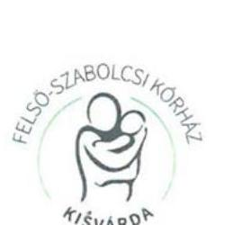

Állami Számvevőszék
Domokos László
elnök úr részére

Iktatószám: 698-1/2017.
Hivatkozási szám: V-1149-088/2016.

# Tisztelt Elnök Úr! 

Hivatkozással a V-1149-086/2016. iktatószámon nyilvántartott a „A központi alrendszer egyes intézményei pénzügyi és vagyongazdálkodásának ellenőrzése - Felső Szabolcsi Kórház 2017." címmel készített jelentéstervezetre, a következő észrevételt kívánjuk tenni:

1. 2.1. számú megállapítás 6. bekezdés 2. mondata értelmében „A pénzkezelési szabályzat - az Sztv. 14. § (8) bekezdésében és az Áhsz. 50. § (6) bekezdésében előírtak ellenére nem tartalmazza a napi készpénz záró állomány maximális mértékét."
A 2010. 02. 01-től hatályos többször módosított Pénzkezelési szabályzat 3.2. pontja előírja, hogy a házipénztárban pénztár zárlatkor 2000000 Ft összegnél több nem lehet. A házipénztári pénzkészlet keretet meghaladó részt még pénztárzárlat előtt az intézmény elszámolási számlájára be kell fizetni.
2. Az integritás szemlélet érvényesítésével és az integritás kontrollrendszer kiépítettségével kapcsolatos megállapítások (V. számú melléklet) 5. bekezdés 3. mondata kifogásolja, hogy a Kórház nem múködtetett egyéni teljesítményértékelési rendszert, melynek során készített teljesítményértékelések befolyásolták volna az alkalmazottak éves jövedelmének alakulását.

Az Intézmény 2014. március hónapban egységesen minden dolgozóra vonatkozóan elkészítette a Kjt.-ben előírt minősítést. A minősítés szempontjai többek között kitértek a dolgozó szakmai ismereteire, felelősség- és hivatástudatára, a munkavégzéssel kapcsolatos pontosságára,

---

igyekezetére, szorgalmára. A jövedelmek ily módú befolyásolására (jutalom) a szigorú központi bér előirányzat betartása mellett nincs lehetőségünk.

Kisvárda, 2017-03-14.

Tisztelettel:
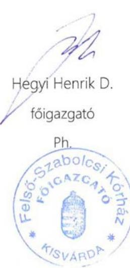

---

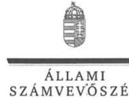

ELNÖK

Ikt.szám: V-1149-101/2016.

# Hegyi Henrik úr 

föigazgató
Felső-Szabolcsi Kórház

## Kisvárda

## Tisztelt Föigazgató Úr!

Köszönettel megkaptam a 2017. március 17. napján az Állami Számvevőszékhez érkezett „A központi alrendszer egyes intézményei pénzügyi és vagyongazdálkodásának ellenörzése-Felsö-Szabolcsi Kórház" címủ számvevőszéki jelentéstervezetben foglalt megállapításokra írásban tett észrevételeit.

Tájékoztatom Főigazgató urat, hogy a jelentésben - az Állami Számvevőszékről szóló 2011. évi LXVI. törvény 29. § (3) bekezdése alapján - a figyelembe nem vett észrevételeket szerepeltetjük az elutasítás indokainak feltüntetésével együtt.

Az Állami Számvevőszék észrevételekre vonatkozó álláspontjáról a felügyeleti vezető által készített részletes tájékoztatást mellékelten megküldöm.

Budapest, 2017. 03 hó. 31 nap
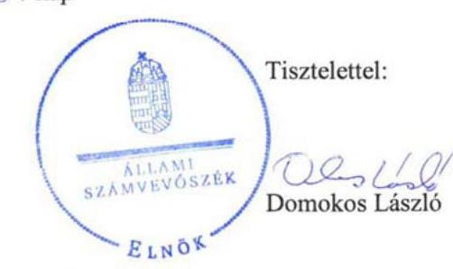

Melléklet: Tájékoztatás a figyelembe nem vett észrevételekről

---

# Tájékoztatás a figyelembe nem vett észrevételekról 

|  | Észrevétel: | A pénzkezelési szabályzatban a napi készpénz záró állomány maximális mértékének meghatározásához kapcsolódóan (2.1. számú megállapítás 6 . bekezdés második mondata alapján). Az észrevétel érinti a Kórház föigazgatójának címzett 1. b) számú javaslatot. |
| :--: | :--: | :--: |
|  | Válasz: | Az Állami Számvevőszék az észrevételt nem fogadja el. |
| 1. | Indoklás: | A dokumentumok ismételt áttekintése alapján, az észrevétel nem megalapozott.   A Felsö-Szabolcsi Kórház 2010. február 1-jétől hatályos pénzkezelési szabályzat III. (Alkalmazható fizetési módok) fejezet 3. 2. pontja valóban tartalmazta a házipénztár napi készpénz záró állományának maximális mértékét, amit 2000000 Ft összegben határoztak meg.   Azonban a pénzkezelési szabályzat 2012. november 7 -től hatályos 4. számú módosítása érintette III. (Alkalmazható fizetési módok) fejezetet, továbbá egy újabb, a korábban hatályos szabályzatban nem szereplő IV. (Pénzkezelés szabályai) fejezettel került kiegészítésre. A módosítás nem tartalmazta, hogy a III. (Alkalmazható fizetési módok) fejezetben a továbbiakban is szerepelnek a házipénztári pénzkezelésre vonatkozó szabályok, továbbá a IV. (Pénzkezelés szabályai) fejezetbe sem emelt át a korábbi III. fejezetből szabályokat.   Mindezek következtében az észrevételben is hivatkozott III. 3. 2. pontja csak 2012. november 6 -ig tartalmazta napi készpénz záró állományának maximális mértékét. A 4. számú módosítást követően a pénzkezelési szabályzat IV. fejezet 3.1.2 pontja 2012. november 7 -től azt tartalmazza, hogy „az Intézmény házipénztárában a készpénzkeretet meghaladó összeget be kell fizetni az Elöirányzat felhasználási keretszámlára", azonban a házipénztár napi készpénz záró állományának maximális mértékét nem szabályozza.   A fentiekre tekintettel, a megállapítás, valamint a Kórház föigazgatójának címzett 1. b) számú javaslat módosítása nem indokolt. |

---

| 2. | Észrevétel: | Az integritás szemlélet érvényesitésével és az integritás kontrollrendszer kiépitésével kapcsolatosan, az egyéni teljesítményértékelési rendszer müködtetése megállapításhoz kapcsolódóan (V. számú melléklet 5. bekezdés 3. mondat). |
| :--: | :--: | :--: |
|  | Válasz: | Az Állami Számvevőszék az észrevételt nem fogadja el. |
|  | Indoklás: | Az észrevétel nem megalapozott. Az V. számú melléklet 5. bekezdés 3. mondatában tett megállapítás nem azt kifogásolta, hogy a Kórház nem készítette el a dolgozókra vonatkozóan a közalkalmazottak jogállásról szóló 1992. évi XXXIII. törvényben (Kjt.) elöírt minösitést. A megállapítás arra vonatkozott, hogy a Kórház olyan teljesítményértékelési rendszert nem müködtetett, melynek során készített teljesítményértékelések befolyásolták volna az alkalmazottak éves jövedelmének alakulását.   A megállapítást az észrevétel is megerősíti, amely tartalmazza, hogy „a jövedelmek ily módú befolyásolására (jutalom) a szigorú bér elöirányzat betartása mellett nincs lehetőségünk".   A fentiekre tekintettel az ellenőrzési megállapítás módosítása nem indokolt. |

Budapest, 2017. 03 hó 3 nap
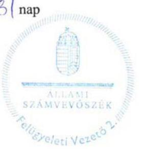

Salamon Ildiko
felügyeleti vezető

---

# 460 Salamon 1. 

Kisvárda Város Polgármesterétól
4600 Kisvárda, Szent László u. 7.-11.
Telefon: 45/500-751
Ügyiratszám: ..... 2017.
Állami Számvevőszék
Domokos László elnök úr részére
1052 Budapest,
Apáczai Csere János utca 10.
1364 Budapest, Pf. 54.

Kelt: Kisvárda, 2017. 03.16.
Ikt.szám: V-1149-091/2016.
Tárgy: észrevétel
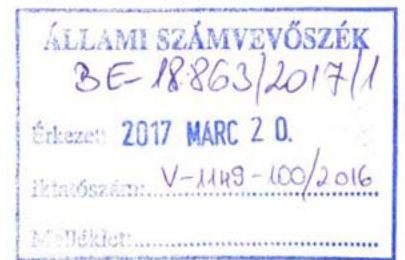

## Tisztelt Elnök Úr!

Kisvárda Város Önkormányzatának képviseletében alulírott Leleszi Tibor polgármester tájékoztatom, hogy a „A központi alrendszer egyes intézményei pénzügyi és vagyongazdálkodásának ellenőrzése Felső-Szabolcsi Kórház" címmel készített számvevőszéki jelentéstervezetet Önkormányzatunk 2017. 03. 02. napján megkapta.

A jelentéstervezet áttanulmányozását követően az Állami Számvevőszékről szóló 2011. évi LXVI. törvény 29. §. (2) bekezdésében biztosított észrevételezési jogkörömre figyelemmel az alábbi észrevételt kívánom tenni:

Először is: büszkeséggel tölt el, hogy a vizsgált időszaknak az önkormányzati fenntartás idejére eső részében a Tisztelt Állami Számvevőszék lényeges hiányosságot nem tárt fel az ellenőrzés folyamán. Emiatt a kollégáimat és természetesen a Kórházat is elismerés illeti, és megerősít abban, hogy az Önkormányzat a jogszabályok rendelkezéseit betartva, törvényesen jár el.

Másodsorban: az ellenőrzés pénzügyi gazdálkodásának szabályszerűségére vonatkozó vizsgálati anyaggal kapcsolatosan észrevételünk a következő:

Előzményként tájékoztatnom kell a Tisztelt Állami Számvevőszéket, hogy az Állami Számvevőszék részéről 43/4 szám alatt vizsgálatot folytatott Kisvárda Város Önkormányzata pénzügyi helyzetének ellenőrzése tárgyában 2007. január 01.-2011. június 30. közötti időszakra vonatkozóan. A vizsgálat alapján jelentés kiadására került sor, mely megállapítást és javaslatot tartalmazott az Önkormányzat, illetve a Polgármester részére arra vonatkozóan, hogy a Felső-Szabolcsi Kórháztól 305.012.000.- Ft pénzmaradványt az Önkormányzat vonjon el a rövid távú tartozásainak fedezetére.

A megállapítás és javaslat alapján Kisvárda Város Önkormányzat Képviselő-testülete 62/2012. (IV.19.) ÖKT. határozatában az Önkormányzat 2011. évi zárszámadásának elfogadásával egyidejűleg döntött a 2011. évi CXCV. tv. 86. §. (5) bekezdése alapján a Felső-Szabolcsi Kórház 2011. évi pénzmaradványából 305.012 eFt. végleges elvonásáról az Önkormányzat rövid lejáratú kötelezettségeinek teljesítésére, egyben a határozat 3. pontjában foglaltak szerint utasította a FelsőSzabolcsi Kórház főigazgatóját, hogy az elvont pénzmaradványt haladéktalanul utalja át az Önkormányzat pénzintézeti számlájára.

2012 tavaszán az elvont pénzmaradvány kifizetése érdekében felvettük a kapcsolatot a FelsőSzabolcsi Kórházzal, kérve annak átutalását. 2012. 06. 04. napján a fenntartóváltásra tekintettel lefolytatott átadás-átvétel alapján a Gyógyszerészeti és Egészségügyi Minőség- és Szervezetfejlesztési Intézet (GYEMSZI), mint fenntartó részére szintén bejelentettük az elvont pénzmaradvány megfizetése iránti igényünket. 2014. novemberében ugyanezen személyek részére küldött azonos

---

tartalmú levelünkkel egyidejúleg kértük az Emberi Eröforrások Minisztériuma Egészségügyért Felelős Államtitkárának Dr. Zombor Gábor úrnak a közremüködését az igényünk teljesítése érdekében.

Az Önkormányzat fenti határozatának végrehajtása érdekében több ízben kerestük meg az akkori fenntartó, a GYEMSZI Föigazgatóját, illetve a Felső-Szabolcsi Kórház Föigazgatóját, de a pénzmaradvány megfizetésére annak ellenére a mai napig nem került sor, hogy sem a Kórház, sem a fenntartó nem vitatta az igényünk jogalapját és összegszerűségét.

A 2012. szeptemberi levelezés során a GYEMSZI még azt közölte, hogy a követelés szakértői véleményezése folyamatban van, azonban e téren egyéb nem történt, a szakértői véleményt a GYEMSZI nem hozta az Önkormányzat tudomására, illetve a pénzmaradvány átutalásáról sem döntött.

Az ügyben 2014. novemberében, illetve decemberében újabb levélváltásra került sor, amikor az EMMI Egészségügyért Felelős Államtitkárának, Dr. Zombor Gábornak a megkeresésével egyidejúleg megkerestük Dr. Önodi-Szücs Zoltán Föigazgató Urat is a GYEMSZI-nél érdemi döntés meghozatala érdekében.

Dr. Önodi-Szücs Zoltán 2014. 12. 23.-án küldött e-mailjében biztosította a várost arról, hogy a szabályok betartása mellett a pénzmaradványt át fogja utalni a GYEMSZI.

A Felső-Szabolcsi Kórház vonatkozásában időközben bekövetkezett újabb fenntartóváltásra figyelemmel a jelenlegi fenntartó az Állami Egészségügyi Ellátó Központ.

Erre tekintettel Kisvárda Város Önkormányzata 2017. februárjában ismét megkereste a Kórházat és az új fenntartót, a fenti igényének teljesítése érdekében. Megkeresésünkre válasz a mai napig nem érkezett.

Mindezen előzményeket követően észrevételünk a Kórház pénzügyi gazdálkodás szabályszerűségére vonatkozó megállapítások körében van, az alábbiak szerint:

A számvevőszéki jelentéstervezet 21-24. oldalai foglalkoznak az előirányzatok teljesítésével.
„3.2. számú megállapítás - A bevételi és kiadási előirányzatok módosítása, átcsoportosítása megfelelt a jogszabályi előírásoknak.

Az előző évi maradvány előirányzatosítása az ellenőrzött időszakban megfelelt az irányító szerv által jóváhagyott maradvány összegének. Az előirányzat más költségvetési szervhez, fejezeti kezelésű előirányzathoz történő átcsoportosítására, bevételi és kiadási előirányzat zárolására nem került sor." ( 21. oldal)

Majd a 24. oldalon az előirányzat-maradványra vonatkozó megállapításnál található a következő: „Az intézmény előirányzat-maradványából a központi költségvetést megillető, elvonandó előirányzatmaradvány 2012. évben $56,3 \mathrm{M} \mathrm{Ft}, 2013$. évben $1,2 \mathrm{M} \mathrm{Ft}$ volt, melyet a Kórház az Ávr.-ben előírtaknak megfelelően befizetett."

Mindezekkel kapcsolatban az észrevételünk az, hogy az Önkormányzat által a 2011. évi CXCV. tv. 86. §. (5) bekezdése alapján a 62/2012. (IV.19.) ÖKT. határozattal eldöntött pénzmaradvány elvonásáról semmilyen adatot, információt nem tartalmaz a jelentéstervezet. Nem egyértelmű számunkra, hogy a Kórház pénzügyi gazdálkodásának vizsgálata körében ez a tény milyen okból maradt figyelmen kívül.

---

A Tisztelt Számvevőszék részére a Kórház 2011-es pénzmaradványából 305.012.000.- Ft elvonásával kapcsolatban keletkezett iratanyagot jelen észrevételünkhöz mellékelten megküldjük.

Kérjük, hogy a jelentést ezen anyag felhasználásával szíveskedjenek a pénzmaradvány elvonására, illetve arra vonatkozóan kiegészíteni, hogy az elvont pénzmaradvány Önkormányzatunk részére történő megfizetésére a mai napig nem került sor. Kérjük, hogy ezen vonatkozásban a kifizetési kötelezettségre megállapítást és javaslatot is szíveskedjenek a Kórház részére megfogalmazni.

Kelt: Kisvárda, 2017. 03. 16.
Tisztelettel:

Kisvárda Város Önkormányzatának képviseletében:
Leleszi Tibor polgármester

# Mellékletek: 

- a 305.012.e Ft pénzmaradvány elvonásával kapcsolatban keletkezett iratanyag másolatban

---

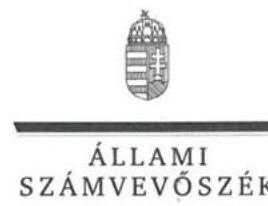

ELNÖK

Ikt.szám: V-1149-102/2016.

# Leleszi Tibor úr 

polgármester
Kisvárda Város Önkormányzata

## Kisvárda

## Tisztelt Polgármester Úr!

Köszönettel megkaptam a 2017. március 20. napján az Állami Számvevőszékhez érkezett „A központi alrendszer egyes intézményei pénzügyi és vagyongazdálkodásának ellenörzése-Felsö-Szabolcsi Kórház" címủ számvevőszéki jelentéstervezetben foglalt megállapításokra írásban tett észrevételét.

Tájékoztatom Polgármester urat, hogy a jelentésben - az Állami Számvevőszékről szóló 2011. évi LXVI. törvény 29. § (3) bekezdése alapján - a figyelembe nem vett észrevételt szerepeltetjük az elutasítás indokainak feltüntetésével együtt.

Az Állami Számvevőszék észrevételre vonatkozó álláspontjáról a felügyeleti vezető által készített részletes tájékoztatást mellékelten megküldőm.

Budapest, 2017. 03 hó 28 nap
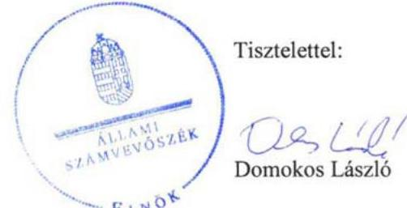

Melléklet: Tájékoztatás a figyelembe nem vett észrevételről

---

# Tájékoztatás   a figyelembe nem vett észrevételről 

|  | Észrevétel: | A Kórház 2011. évi pénzmaradvány megállapításához, illetve az abból történt elvonáshoz kapcsolódóan (3.2. számú megállapítás, a 2. bekezdés első mondata, valamint a 3.5. számú megállapítás 6 . bekezdése). |
| :--: | :--: | :--: |
|  | Válasz: | Az Állami Számvevőszék az észrevételt nem fogadja el. |
| 1. | Indoklás: | A Felső-Szabolcsi Kórház (továbbiakban: Kórház) ellenőrzése - az Ellenőrzési programban foglaltakkal összhangban, amint az a jelentéstervezetben is szerepel - a 2012. január 1-től a 2015. december 31-ig terjedő időszakra irányult.   Az észrevételben szereplő, Kisvárda Város Önkormányzata 62/2012. (IV. 19.) ÖKT. határozattal hozott döntése a Kórház 2011. évi pénzmaradványát érintette, az abból történt elvonást tartalmazta.   Az ellenőrzés - tekintettel a fenti ellenőrzött időszakra - a Kórház 2012., 2013., 2014. és 2015. évi előirányzatmaradvány elszámolására terjedt ki. A jelentéstervezet a Kórház 2011. évi pénzmaradvány megállapítására és elvonására vonatkozóan nem tartalmaz megállapítást, mivel a 2011. év - és így a 2011. évi pénzmaradvány - az ellenőrzött időszakon kívül esett.   A Kórház 2011. évi pénzmaradványából történt elvonással, és az azt követően megtett intézkedéseivel kapcsolatos információkat köszönettel vettük, azonban annak a jelentéstervezetben történő szerepeltetése fentiekre tekintettel nem indokolt. |

Budapest, 2017. 03 hó 28 -nap
Sálamon fidikó
felügyeleti vezető

---

.

---

# RÖVIDÍTÉSEK JEGYZÉKE 

${ }^{1}$ Kórház
${ }^{2}$ Önkormányzat
${ }^{3}$ Ttv.
${ }^{4}$ GYEMSZI
${ }^{5}$ ÁEEK
${ }^{6}$ Minisztérium
${ }^{7}$ Alaptörvény
${ }^{8}$ Nvtv.
${ }^{9}$ Áht.
${ }^{10}$ Ávr.
${ }^{11}$ Bkr.
${ }^{12}$ ÁSZ
${ }^{13}$ ÁSZ tv.
${ }^{14}$ ÁSZ SZMSZ
${ }^{15}$ Alapító okirat
${ }^{16}$ EMMI
${ }^{17}$ Kincstár
${ }^{18}$ SZMSZ
${ }^{19}$ Építésügyi hatósági eljárásról szóló körlevél
${ }^{20}$ Ingatlanok bérbeadásáról szóló iránymutatás

Felső-Szabolcsi Kórház
Kisvárda Város Önkormányzata
a települési önkormányzatok fekvőbeteg-szakellátó intézményeinek átvételéről és az átvételhez kapcsolódó egyes törvények módosításáról szóló 2012. évi XXXVIII. törvény

Gyógyszerészeti és Egészségügyi Minőség- és Szervezetfejlesztési Intézet
Állami Egészségügyi Ellátó Központ
Nemzeti Erőforrás Minisztérium (2012. január 1-től 2012. május 13-ig)
Emberi Erőforrások Minisztériuma (2012. május 14-től)
Magyarország Alaptörvénye (hatályos 2012. január 1-jétől)
a nemzeti vagyonról szóló 2011. évi CXCVI. törvény (hatályos 2012. január 1jétől)
az államháztartásról szóló 2011. évi CXCV. törvény (hatályos: 2012. január 1től)
az államháztartásról szóló törvény végrehajtásáról szóló 368/2011. (XII. 31.) Korm. rendelet (hatályos 2012. január 1-jétől)
a költségvetési szervek belső kontrollrendszeréről és belső ellenőrzéséről szóló 370/2011. (XII. 31.) Korm. rendelet (hatályos 2012. január 1-jétől)
Állami Számvevőszék
az Állami Számvevőszékről szóló 2011. évi LXVI. törvény (hatályos: 2011. július 1-től)
Állami Számvevőszék Szervezeti és Működési Szabályzata
Kisvárda Város Önkormányzat 228/2011.(X.24.) ÖKT határozatának 1. mellékletében egységes szerkezetben foglalt Alapító Okirat (hatályos: 2011. október 24-től 2012. április 25-ig),
Kisvárda Város 64/2012. (IV.26.) ÖKT határozata (hatályos: 2012. április 26-tól 2012. április 30-ig),
az emberi erőforrások minisztere által 2012. december 15-én kibocsátott Alapító Okirat (hatályos: 2012. május 1-től),
az emberi erőforrások minisztere által 2014. február 27.-én kibocsátott Alapító Okirat kiegészítés (hatályos: 2014. január 1-től).
Emberi Erőforrások Minisztériuma
Magyar Államkincstár
Felső-Szabolcsi Kórház Szervezeti és Működési Szabályzata (hatályos: 1997. március 10-től 2014. november 27-ig) Szervezeti és Múködési Szabályzat (hatályos: 2014. november 28-tól 2015. március 30-ig)
Szervezeti és Múködési Szabályzat (hatályos: 2015. március 31-től 2016. május 2-ig)

Az építésügyi hatósági eljáráshoz adott meghatalmazásról szóló körlevél (hatályos: 2012. június 26-tól)

Iránymutatás az egészségügyi intézmények által használt állami tulajdonban lévő ingatlanok bérbeadásához (hatályos: 2012. június 28-tól 2014. június 16ig);

---

${ }^{21}$ Gépjárművek értékesítéséről szóló körlevél
${ }^{22}$ Tárgyi eszközök selejtezéséről szóló tájékoztatás
${ }^{23}$ 59/2011. (IV.12.) Korm. rendelet
${ }^{24}$ 27/2015. (II.25.) Korm. rendelet
${ }^{25}$ Gazdasági szervezet ügyrendje
${ }^{26} \mathrm{Kjt}$.
${ }^{27}$ Humánpolitikai szabályzat
${ }^{28}$ Etikai kódex
${ }^{29}$ Számviteli politika
${ }^{30}$ Sztv.
${ }^{31}$ Áhsz. 1
${ }^{32}$ Áhsz. 2
${ }^{33}$ Leltározási és leltárkészítési szabályzat
${ }^{34}$ Eszközök és források értékelési szabályzata
${ }^{35}$ Önköltség-számítási szabályzat
${ }^{36}$ Pénzkezelési szabályzat

Iránymutatás a Magyar Állam tulajdonában lévő és a GYEMSZI tulajdonosi joggyakorlása alá tartozó, a GYEMSZI által az egészségügyi intézmények kezelésébe adott ingatlanok hasznosításához (hatályos: 2014. június 17-től)

A vagyonkezelésbe adott gépjárművek értékesítésének eljárásrendjéről szóló körlevél (hatályos: 2013. június 7-től)

Tájékoztatás a tárgyi eszközök selejtezésével kapcsolatban (hatályos: 2015. október 22-től)
a Gyógyszerészeti és Egészségügyi Minőség- és Szervezetfejlesztési Intézetről szóló 59/2011. (IV.12.) Korm. rendelet (hatályos: 2011. április 13-tól 2015. február 28-ig)
az Állami Egészségügyi Ellátó Központról szóló 27/2015. (II.25.) Korm. rendelet (hatályos: 2015. március 1-től)
Ügyrend - Az intézmény gazdasági szervezetének gazdálkodással összefüggő feladataira (hatályos: 2012. augusztus 30-tól)
a közalkalmazottak jogállásáról szóló 1992. évi XXXIII. törvény (hatályos: 1992. július 1-től)

Humánpolitikai tevékenység szabályozása, a munkavállalók foglalkoztatására, javadalmazására vonatkozó szabályzat (hatályos: 2013. január 1-től)
Etikai Kódex (hatályos: 2013. január 1-től)
Számviteli politika (hatályos: 2010. február 1-jétől)
Számviteli politika 1. módosítás (hatályos: 2010. szeptember 23-tól)
Számviteli politika 2. módosítás (hatályos: 2013. július 2-től)
Számviteli politika 3. módosítás (hatályos: 2014. március 20-tól)
Számviteli politika 4. módosítás (hatályos: 2014. március 24-től)
a számvitelről szóló 2000. évi C. törvény (hatályos: 2001. január 1-jétől)
az államháztartás szervezetei beszámolási és könyvvezetési kötelezettségének sajátosságairól szóló 249/2000. (XII. 24.) Korm. rendelet (hatálytalan: 2014. január 1-től)
az államháztartás számviteléről szóló 4/2013. (I. 11.) Korm. rendelet (hatályos: 2014. január 1-től)
Leltárkészítési és leltározási szabályzat (hatályos: 2005. november 14-től 2015. január 4-ig)
Leltárkészítési és leltározási szabályzat 1. sz. módosítása (hatályos: 2010. március 19-től 2015. január 4-ig)
Leltározási és leltárkészítési szabályzat (hatályos: 2015. január 5-től)
Eszközök és források értékelési szabályzata (hatályos: 2010. március 10-től 2015. január 4-ig)
Eszközök és források értékelési szabályzat 1. sz. módosítása (hatályos: 2010. szeptember 24-től 2015. január 4-ig)
Eszközök és források értékelési szabályzata (hatályos: 2015. január 5-től)
Önköltség-számítási szabályzat (hatályos: 2010. szeptember 1-től 2015. január 4-ig)
Önköltség-számítási szabályzat (hatályos: 2015. január 5-től)
Pénzkezelési szabályzat (hatályos: 2010. február 1-jétől)
Pénzkezelési szabályzat 1. sz. módosítása (hatályos: 2010. szeptember 24-től)
Pénzkezelési szabályzat 2. sz. módosítása (hatályos: 2010. december 8-tól)
Pénzkezelési szabályzat 3. sz. módosítása (hatályos: 2011. május 5-től)

---

Pénzkezelési szabályzat 4. sz. módosítása (hatályos: 2012. november 7-től)
Pénzkezelési szabályzat 5. sz. módosítása (hatályos: 2015. július 31-től)
Számlarend (hatályos: 2012. január 4-től 2012. augusztus 29-ig)
Számlarend (hatályos: 2012. augusztus 30-tól 2014.március 19-ig)
Számlarend (hatályos: 2014. március 20-ig 2014.december 31-ig)
Számlarend (hatályos: 2015. január 1-jétől)
Bizonylati szabályzat (hatályos: 2005. január 1-től 2013. január 1-ig)
Bizonylati szabályzat módosítása (hatályos: 2011. május 5-től)
Bizonylati szabályzat kiegészítése (hatályos: 2011. május 16-tól)
Bizonylati szabályzat (hatályos: 2013. január 2-től)
2011. évi CVIII. törvény a közbeszerzésekről (hatályos: 2011.augusztus 21-től 2015.október 31-ig)
Közbeszerzési szabályzat (hatályos: 2013. január 28-tól 2015. december 8-ig)
Közbeszerzési szabályzat (hatályos: 2015. december 9-től)
Beszerzési szabályzat (hatályos: 2013. február 4-től)
Beszerzési szabályzat 1. sz. módosítása (hatályos: 2015. december 1-től)
Kiküldetési szabályzat (hatályos: 2013. január 9.-től)
Reprezentációs szabályzat (hatályos: 2013. február 2-től 2015. január 29-ig)
Reprezentációs szabályzat (hatályos: 2015. január 30-tól)
Kötelezettségvállalás, utalványozás, ellenjegyzés, érvényesítés rendjének szabályzata (hatályos: 2005. október 19-től 2010.március 19-ig)

1. módosítás (hatályos: 2010. március 20-tól 2011. március 17-ig.),
2. módosítás (hatályos: 2010. március 18-tól 2013. szeptember 16-ig)

Kötelezettségvállalás, ellenjegyzés, érvényesítés, utalványozás rendjének szabályzata (hatályos: 2013. szeptember 16-tól 2013. november 13-ig)
Gazdálkodási szabályzat a kötelezettségvállalás, pénzügyi ellenjegyzés, teljesítésigazolás, érvényesítés, utalványozás és adatszolgáltatás rendjéről (hatályos: 2013. november 14-től)

1. módosítás (hatályos: 2015. január 19.-től)

Felső-Szabolcsi Kórház Ellenőrzési nyomvonal (hatályos 2012. január 13-tól)
Szabálytalanságkezelési eljárásrend (hatályos: 2013. február 1-től 2015. január 4-ig)
Szabálytalanságkezelési eljárásrend (hatályos: 2015. január 5-től.
Felső-Szabolcsi Kórház Kockázatkezelési szabályzata (hatályos 2013. január 31-től)
Információs és kommunikációs szabályzat (hatályos: 2013. december 3-tól) az információs önrendelkezési jogról és az információ szabadságról szóló 2011. évi CXII. tv (hatályos: 2012. január 1-től)

Adatvédelmi és számítástechnikai védelmi szabályzat (hatályos 2010. január 18-tól 2014.október 22-ig)
Adatvédelmi és számítástechnikai védelmi szabályzat (hatályos 2014. október 22-től)
Iratkezelési szabályzat (hatályos: 2010. január 2-től 2014. október 21-ig)
Iratkezelési szabályzat (hatályos: 2014. október 22-től)
Belső ellenőrzési kézikönyv (hatályos: 2011. május 1-től 2014. január 12-ig)

1. módosítás (hatályos 2012. július 2-től)

Belső ellenőrzési kézikönyv (hatályos: 2014. január 13-tól)

---

${ }^{53} \mathrm{MR}$
${ }^{54} \mathrm{CT}$
${ }^{55}$ 1036/2012. (II.21.) Korm. határozat
${ }^{56}$ 1982/2013. (XII.29.) Korm. határozat
${ }^{57}$ Vagyongazdálkodási rendelet
${ }^{58}$ Vagyonkezelési szerződés
${ }^{59}$ Vtvr.
${ }^{60}$ Vtv.
${ }^{61}$ ÁSZ Integritás Projekt
mágneses rezonanciás képalkotó diagnosztikai berendezés
Komputertomográf (szeletelő röntgen) diagnosztikai berendezés
a Kormány irányítása alá tartozó fejezetek költségvetési szerveinek eszközbeszerzéseiről szóló 1036/2012. (II.21.) Korm. határozat (hatályos: 2012. február 21-től 2013. december 31-ig)
a Kormány irányítása alá tartozó fejezetek költségvetési szerveinek eszközbeszerzéseiről szóló 1982/2013. (XII.29.) Korm. határozat (hatályos: 2014. január 1-től)

Kisvárda Város Önkormányzata Képviselőtestületének 11/2011. (V.12.) sz. önkormányzati rendelete az önkormányzat vagyonáról és a vagyongazdálkodás szabályairól (hatályos: 2011. május 12-től)
a GYEMSZI-vel, mint tulajdonosi joggyakorlóval 2013. március 18-án megkötött vagyonkezelési szerződés (hatályos: 2012. május 1-jétől) az állami vagyonnal való gazdálkodásról szóló 254/2007. (X. 4.) Korm. rendelet
az állami vagyonról szóló 2007. évi CVI. törvény (hatályos: 2007. szeptember 25-től)
az ÁSZ 2009-ben indított „Korrupciós kockázatok feltérképezése - Integritás alapú közigazgatási kultúra terjesztése" című kiemelt projektje (http://integritas.asz.hu/).

---

ÁLLAMI SZÁMVEVŐSZÉK
1052 Budapest, Apáczai Csere János utca 10.
Levélcím: 1364 Budapest 4. Pf. 54
Telefon: +36 14849100 Telefax: +36 14849200
www.asz.hu