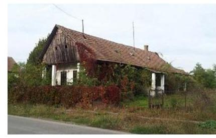

# Jelenetés 

## Önkormányzati adósságrendezés ellenőrzése

Kisnamény Község Önkormányzata adósságrendezési eljárásának ellenőrzése 2017.

---

# Jellentés 

## Önkormányzati adósságrendezés ellenőrzése

Kisnamény Község Önkormányzata adósságrendezési eljárásának ellenőrzése 2017. április hó 13. nap

---

# AZ ELLENŐRZÉST FELÜGYELTE:

- RENKŐ ZSUZSANNA felügyeleti vezető
- AZ ELLENŐRZÉST VEZETTE ÉS A VÉGREHAJTÁSÁÉRT FELELŐS:
  - BAJNAI ZSUZSANNA ellenőrzésvezető
  - A PROGRAM ÖSSZEÁLLÍTÁSÁÉRT FELELŐS:
    - JANIK JÓZSEF LÁSZLÓ osztályvezető

**IKTATÓSZÁM:** V-1243-107/2016

**TÉMASZÁM:** 2277

**ELLENŐRZÉS-AZONOSÍTÓ SZÁM:** V073911

Jelentéseink az Országgyűlés számítógépes hálózatán és az Interneta a www.asz.hu címen is olvashatóak.

---

# TARTALOMJEGYZÉK 

■ ÖSSZEGZÉS ..... 5
■ AZ ELLENŐRZÉS CÉLJA ..... 6
■ AZ ELLENŐRZÉS TERÜLETE ..... 7
■ AZ ELLENŐRZÉS HÁTTERE, INDOKOLTSÁGA ..... 8
■ A JELENTÉS LÉNYEGES KÉRDÉSKÖREI ..... 9
■ ELLENŐRZÉS HATÓKÖRE ÉS MÓDSZEREI ..... 10
■ MEGÁLLAPÍTÁSOK ..... 12
■ JAVASLATOK ..... 20
■ MELLÉKLETEK ..... 21
I. sz. melléklet: Értelmező szótár ..... 21
■ FÜGGELÉK: ÉSZREVÉTELEK ..... 23
■ RÖVIDÍTÉSEK JEGYZÉKE ..... 25

---

.

---

# ÖSSZEGZÉS 

Kisnamény Község Önkormányzata adósságrendezési eljárásának végrehajtása során a szabálytalan feladatellátás veszélyeztette az adósságrendezés céljainak elérését. A hitelezői igények teljes körü kielégitésére nem került sor. A fizetőképesség helyreállításának teljesülése és az önkormányzat pénzügyi egyensúlyának fenntarthatósága nem volt értékelhető megbizható adatok hiányában.

## Az ellenőrzés társadalmi indokoltsága

Kisnamény Község Önkormányzatánál 2009. január 8-tól 2010. január 4-ig adósságrendezés folyt, amely során a hitelezők 11,9 millió Ft kötelezettség teljesítésére nyújtottak be igényt. Ez a kötelezettségállomány az önkormányzat vagyonának mintegy tizedét jelentette, így indokolt ellenőrizni, hogy az adósságrendezési eljárás elérte-e a célját, az eljárás szereplői eleget tettek-e a törvényben meghatározott feladataiknak a fizetőképesség helyreállítása, a hitelezőknek hatékony jogvédelem nyújtása és az átgondolt, felelősségteljes gazdálkodás elősegítése érdekében.

## Főbb megállapítások, következtetések

Az adósságrendezési eljárás szabálytalan végrehajtása veszélyeztette az eljárás céljainak elérését. Az adósságrendezés megindításakor elmaradt a hitelezői igények kielégítéséhez felhasználható vagyon meghatározása, és a valós pénzügyi helyzet megismerése, mert nem készült vagyonleltár és éves beszámoló. Nem készült válságköltségvetés, a reorganizációs program elkészítésére és az egyezség megkötésére nyitva álló határidő eredménytelenségéről a bíróság nem értesült, így nem rendelkezhetett az eljárásnak a vagyon bírósági felosztásának szabályai szerinti folytatásáról. Az adósságrendezési eljárás végén az egyezség a jogszabályban meghatározott határidőt követően, szabálytalanul jött létre.

Az egyezségben szereplő hitelezői követelések 4,8\%-át - 0,4 millió Ft-ot - az önkormányzat nem fizetett ki. A tartozások kiegyenlítése nem saját erőből történt, mivel a reorganizációs programban elhatározott bevételnövelő intézkedéseket nem valósították meg, a kiadáscsökkentésre vonatkozó döntések nem voltak tartós hatásúak.

A számviteli rend megsértése és a szabálytalan könyvvezetés következtében a 2009-2014. évi költségvetési beszámolók nem adtak megbízható és valós összképet az önkormányzat vagyonáról, ezért a fizetőképesség és a pénzügyi egyensúly alakulása nem volt értékelhető.

---

# AZ ELLENŐRZÉS CÉLJA 

Az ellenőrzés célja annak megállapítása volt, hogy az adósságrendezési eljárás megindítása, lefolytatása szabályszerű volt-e, az önkormányzat gazdálkodása az adósságrendezési eljárás alatt megfelelt-e a jogszabályi előírásoknak; az eljárás szereplői - kiemelten a pénzügyi gondnok - a jogszabályokban foglaltak szerint jártak-e el az adósságrendezés során. A lefolytatott eljárás elérte-e a törvényben kitűzött célokat; az adósságrendezési eljárás alatt az önkormányzat folyamatosan teljesítette-e kötelező feladatait, a hitelezők követelését vagyonarányosan kielégítette-e, helyre állt-e fizetőképessége.

---

# AZ ELLENŐRZÉS TERÜLETE 

## Kisnamény Község Önkormányzata

Kisnamény Szabolcs-Szatmár-Bereg megyében található. Állandó lakosainak száma 2009. január 1-jén 344 fő, 2014. december 31-én 311 fő volt.

Az önkormányzat ${ }^{1}$ képviselő-testülete ${ }^{2}$ 2009. január 1-jén öt fővel, egy állandó bizottsággal látta el feladatait. A 2014. év végén a képviselő-testület létszáma négy fő volt, és továbbra is egy állandó bizottság múködött. A jelenlegi polgármester a 2010. évi önkormányzati választások óta tölti be tisztségét, a jegyző személye három alkalommal változott az ellenőrzött időszakban, a jelenlegi jegyző 2013. március 1-jétől látja el feladatait.

Az igazgatási, gazdálkodási feladatokat az önkormányzat hivatala ${ }^{3}$ látta el, amely elkülönült gazdasági szervezettel nem rendelkezett.

Az önkormányzat fenntartása alá 2009. január 1-jén kettő, 2014. december 31-én egy intézmény tartozott.

A 2009. évről a 2014. évre a foglalkoztatottak létszáma - a közfoglalkoztatottakkal együtt - 18 főről 22 főre nőtt.

Gazdasági társasággal az ellenőrzött időszakban nem rendelkeztek.
Az adósságrendezési eljárást az önkormányzat kezdeményezte, jelentős, szállítók felé fennálló tartozására hivatkozva. A bíróság ${ }^{4}$ végzése az adósságrendezés megindításáról 2009. január 8-án jelent meg a Cégközlönyben. Az adósságrendezés 2010. január 4-én egyezség megkötésével zárult.

A pénzügyi gondnoki feladatok ellátására a Mátraholding Zrt.-t5 jelölte ki a bíróság. A Mátraholding Zrt. 2014-ben kikerült a pénzügyi gondnokok névjegyzékéből.

---

# AZ ELLENŐRZÉS HÁTTERE, INDOKOLTSÁGA 

Az önkormányzatok finanszírozásának, gazdálkodásának keretei és feladatellátása jelentős változásokon ment keresztül a Har. tv. ${ }^{6}$ hatálybalépésétől eltelt időszakban.

Az önkormányzati eladósodást 2011-ig csak az Ötv.-ben ${ }^{7}$ meghatározott hitelfelvételi korlát szabályozta, a korlát megsértését azonban jogszabályok nem szankcionálták. 2012. évtől jelentős szigorítás lépett életbe. A korábbi passzív szabályozást a Stabilitási tv. ${ }^{8}$ hatálybalépésével az aktív kontroll váltotta fel. A törvény előírásai alapján az önkormányzatok hitelfelvételei engedélykötelessé váltak.

1996-ban a hitelfelvételi korlát bevezetése mellett az önkormányzatok adósságrendezésének szabályozására is sor került. Az adósságrendezési eljárás részben a lakosság védelmét szolgálta azzal, hogy biztosította az önkormányzatok által nyújtott kötelező közfeladatokhoz való hozzájutást az önkormányzat fizetésképtelensége esetén is. A Har. tv. alapján - 1996 és 2013 júniusa között - ugyanakkor elenyésző számú, mindösszesen 64 adósságrendezési eljárás indult. Az eljárások közel 60\%-a egyezséggel, 40\%-a vagyonfelosztással zárult.

Az adósságrendezés első időszakában (2009. évig) a forráshiányból eredeztethető eladósodás tette indokolttá az eljárások jelentős hányadának megindítását.

A második időszakban az eljárás alá vont önkormányzatok között megjelentek a nagyobb költségvetéssel és több intézménnyel is rendelkező települések. Az adósságrendezést szükségessé tevő problémák speciális pénzügyi elemekkel, a devizaalapú kötvénnyel történő finanszírozás begyűrűző hatásaival, valamint az anyagi lehetőségeket meghaladó, túlméretezett fejlesztésekkel összefüggő kötelezettségvállalásokkal egészültek ki, de a beruházások esetében fontos tényező volt a kellő szakértelem hiánya és a pénzügyi nehézségek szakszerűtlen kezelése is.

Az ÁSZ ${ }^{9}$ önkormányzati alrendszert érintő ellenőrzései, elemzései során számos ponton mutatott rá azokra a területekre, ahol a „szabályozás" módosításra, korrekcióra szorul. Az ellenőrzés alapján megfogalmazott javaslatok e területen is segítséget nyújthatnak a kormányzat és az Országgyűlés törvényhozó munkájában, hozzájárulhatnak az irányítói tevékenység erősítéséhez, végső soron a közpénzügyek átláthatóságához és a közvagyon védelméhez. Az ellenőrzés során tett megállapításaink megerősíthetik egy „megelőző monitoring funkció" kialakításának szükségességét a helyi önkormányzatok fizetésképtelenségének megelőzése érdekében.

---

# A JELENTÉS LÉNYEGES KÉRDÉSKÖREI 

1. Az adósságrendezési eljárás folyamata, végrehajtása során szabályszerű volt-e az önkormányzat és a pénzügyi gondnok feladatellátása?
2. A lefolytatott adósságrendezési eljárás elérte-e a törvényben kitüzött célokat?
3. Az adósságrendezési eljárást követően biztosított és fenntartható volt-e a pénzügyi egyensúly?

---

# ELLENŐRZÉS HATÓKÖRE ÉS MÓDSZEREI 

## Az ellenőrzés típusa

Rendszerellenőrzés.

## Az ellenőrzött időszak

2009. január 1. és 2015. június 30. közötti időszak.

## Az ellenőrzés tárgya

A Har. tv. által szabályozott adósságrendezési eljárás.

## Az ellenőrzött szervezet

Kisnamény Község Önkormányzata és a pénzügyi gondnoki feladatok ellátásával összefüggésben a Mátraholding Zrt.

## Az ellenőrzés jogalapja

Az Állami Számvevőszékről szóló 2011. évi LXVI. törvény 5. § (2) bekezdése.

## Az ellenőrzés módszerei

Az ellenőrzés szakmai módszertana az ÁSZ hivatalos honlapján (www.asz.hu) közzétett szakmai szabályokon alapult, amelyek irányadónak tekintették a Legfőbb Ellenőrző Intézmények Nemzetközi Szervezete (INTOSAI) által kiadott nemzetközi (ISSAI) standardokat.

Az ellenőrzés alapját az ellenőrzött önkormányzatoktól bekért tanúsítványok, szabályzatok, szerződések, bírósági végzések, határozatok és egyéb dokumentumok, kimutatások, valamint az önkormányzati beszámolók adatai képezték. Az ellenőrzési kérdések megválaszolásához szükséges bizonyítékok megszerzése, összegyűjtése, az ellenőrzött által rendelkezésre bocsátott dokumentumok, adatok elemzés módszerével végrehajtott értékelésével történt, kiegészítve a megfigyelés, a szemle (szemrevételezés), a kérdésfeltevés (információkérés), mintavételezés módszerével. Az ellenőrzés keretében értékeltük az ellenőrzéshez elkészített tanúsítványok adatainak valódiságát.

---

Az adósságrendezési eljárás szabályszerűségét a bírósági végzések, határozatok, a testületi előterjesztések, jegyzőkönyvek, határozatok, a válságköltségvetés, a beszámolók adatai, az értesítések, közzétételek, kimutatás a hitelezőkről, jelentések, egyezségi javaslat, belső szabályzatok, pénzügyi bizonylatok, kötelezettségvállalások és további releváns dokumentumok alapján ellenőriztük. A minősítés szempontja a dokumentumok határidőben és tartalmilag a vonatkozó előírásoknak megfelelő elkészítése volt.

A kontrolltevékenység múködésének ellenőrzésével értékeltük, hogy az adósságrendezési eljárás alatt vállalt kötelezettségek és teljesített kifizetések szabályszerűen történtek-e, a válságköltségvetés alatt a források szabályszerűen, rendeltetésszerűen lettek-e felhasználva a Har. tv.-ben előírt és az önkormányzat által ellátott kötelező feladatellátás során.

A kontrolltevékenységek támogató szerepét a kötelezettségvállalások és a szakmai teljesítés igazolása/utalvány ellenjegyzése, a teljesítés igazolása/érvényesítés, valamint a pénzügyi gondnok által gyakorolt ellenjegyzés múködésének ellenőrzésén keresztül ítéltük meg. A véletlen minta alapján a sokaságra vonatkozó hibaarányt becsültük. „Megfelelőnek" értékeltük az ellenőrzött területet, amennyiben 95\%-os bizonyossággal a teljes sokaságban a hibaarány legfeljebb 10\%, „részben megfelelőnek" értékeltük, ha a hibaarány 10-30\% között volt, „nem megfelelőnek" pedig akkor, ha a mintavételi eredmények alapján a sokaságbeli hibaarány meghaladta a 30\%-ot. A becsült hibaaránytól függetlenül nem értékeltük szabályosnak az önkormányzatnál a válságköltségvetésen alapuló kifizetéseket, amenynyiben egyetlen esetben is hiányzott a pénzügyi gondnok ellenjegyzése a kötelezettségvállalás vagy pénzügyi kifizetés dokumentumáról.

Az önkormányzatok adósságrendezési eljárása és az azt követő gazdálkodási tevékenysége hibáinak kijavítására, a közpénzekkel való felelős gazdálkodás segítésére irányuló javaslatok kidolgozásakor a hatályos jogszabályok voltak az irányadóak.

---

# MEGÁLLAPÍTÁSOK 

## 1. Az adósságrendezési eljárás folyamata, végrehajtása során szabályszerű volt-e az önkormányzat és a pénzügyi gondnok feladatellátása?

Összegző megállapítás

Az adósságrendezés végrehajtása a feladatellátás hiányosságai miatt nem volt szabályszerű, így az eljárás nem biztosított a hitelezők számára hatékony jogvédelmet. A pénzügyi gondnok nem tájékoztatta a bíróságot a mulasztásokról, ezért az nem dönthetett az eljárás típusának módosításáról. A belső szabályzatok elkészítésével kapcsolatos mulasztás, a kontrollrendszer elégtelen múködése miatt a hibák feltárásának és megelőzésének elmaradása hozzájárult az eladósodáshoz.
1.1. számú megállapítás

A pénzügyi gondnok nem az előírt határidőben vette nyilvántartásba a hitelezőket, továbbá nem tájékoztatta őket követeléseik elfogadásáról, ezáltal a hitelezői érdekek sérültek.

A HITELEZŐKNEK SZÓLÓ FELHÍVÁS két országos napilapban való megjelenéséről az adósságrendezés Cégközlönyben való közzétételét követően a polgármester ${ }^{10}$ határidőn belül gondoskodott, azonban azt nem hirdette ki a helyben szokásos módon a Har. tv. 10. § (3) bekezdése ellenére.

NEM VETTE NYILVÁNTARTÁSBA a pénzügyi gondnok a Har. tv. 15. § (1) bekezdése ellenére a határidőben bejelentkező hitelezőket az igény bejelentésekor. Az igénybejelentésre nyitva álló határidő 2009. március 9-én lejárt, a pénzügyi gondnok a nyilvántartást csak később, 2009. október 13-án készítette el. A hitelezőket nem tájékoztatta követeléseik elfogadásáról a Har. tv. 15. § (1) bekezdése ellenére a bejelentkezésre nyitva álló határidő lejáratát követő 15 napon belül, illetve azt követően sem.

Az eljárásban 13 hitelező vett részt, követeléseik összege 11,9 millió Ft volt.

---

1.2. számú megállapítás

Nem készült vagyonleltár és éves beszámoló, a polgármester nem adta át a pénzügyi gondnoknak a jogszabály által előírt további dokumentumokat sem. A valós vagyoni-pénzügyi helyzet felmérésének, megismerésének elmaradása veszélyeztette a hitelezők kielégítését, a fizetőképesség helyreállítását.

NEM KÉSZÜLT VAGYONLELTÁR ÉS ÉVES BESZÁ-
MOLÓ az adósságrendezés megindításának időpontját megelőző nappal, így a polgármester nem adta át azokat a pénzügyi gondnoknak ${ }^{11}$ a Har. tv. 13. § (2) bekezdés b) pontjában előírtak ellenére.

A polgármester nem adta át a pénzügyi gondnoknak a Har. tv. 13. § (2) bekezdés a), c-e) és g) pontjainak előírása ellenére a jogszabályban rögzített határidőben és azt követően sem a kötelezően előírt, az önként vállalt feladatainak és hatáskörének helyi ellátási formáiról, valamint ezek pénzügyi finanszírozásáról szóló jelentését, a válságköltségvetési rendelettervezetet, mert a jegyző ${ }^{12}$ nem készítette el a Har. tv. 18. § (1) bekezdése ellenére, a folyamatban lévő bírósági eljárásokról készített részletes összefoglalót, az önkormányzat vagyonára vonatkozó szerződéseket, kötelezettségvállaló nyilatkozatokat, az intézményeiről, azok gazdasági helyzetéről, tartozásaikról, követeléseikről szóló részletes tájékoztatást.

A polgármester nem értesítette a Har. tv. 10. § (4) bekezdés ellenére a közigazgatási hivatalt, a kincstárt, a pénzforgalmi szolgáltatókat, az illetékes adó- és vámhatóságot a nyugdíjbiztosítási igazgatási szervet, valamint az egészségbiztosítási szervet.

A pénzügyi gondnok nem jelentette be a bíróságnak, hogy nem készült az előírásoknak megfelelő válságköltségvetési rendelet, ezért a bíróság nem rendelkezhetett az eljárásnak a vagyon bírósági felosztás szabályai szerinti folytatásáról. A tervezett hitelfelvétellel, a válság előtti döntési jogkörök meghagyásával, önként vállalt feladatok finanszírozásával megsértették a takarékos gazdálkodásra vonatkozó törvényi követelményt.

NEM TÁJÉKOZTATTA a pénzügyi gondnok a Har. tv. 14. § (2) bekezdés g) pontja ellenére a kormányhivatalt, és a 19. § (4) bekezdése ellenére nem jelentette be a bíróságnak, hogy a képviselő-testület válságköltségvetési rendeletet nem fogadott el az adósságrendezés megindítását követő 60 napon belül, 2009. március 9-ig. A bejelentési kötelezettség elmulasztása miatt nem került sor arra, hogy a bíróság rendelkezzen az eljárásnak a vagyon bírósági felosztásának szabályai szerinti folytatásáról.

AZ ADÓSSÁGRENDEZÉSI BIZOTTSÁG - amely a jogszabályi előírásoknak megfelelő határidőben és összetételben megalakult 2009. március 13-án megtárgyalta a jegyző által elkészített és a polgármester által március 9-én előterjesztett, az Áht. 165 .§-a szerinti költségvetési rendelettervezetet, majd az általa szükségesnek tartott módosításokat követően jóváhagyta.

A pénzügyi gondnok a Har. tv. 14. § (1) bekezdésének előírása ellenére nem készített a költségvetést érintő előterjesztéshez csatolható véleményt.

---

A VÁLSÁGKÖLTSÉGVETÉSSEL kapcsolatos jogszabályi előírásoknak nem felelt meg a képviselő-testület a 2/2009. (III. 24.) számú rendeletével elfogadott 2009. évi költségvetés, mert
$\longrightarrow$ a Har. tv. 13. § (1) bekezdés d) és a 31. § (1) bekezdés a) pontjában foglaltak ellenére tartalmazott nem rendszeres személyi jellegú juttatásokra is előirányzatot;
a Har. tv. 16. § (3) bekezdésében előírtakkal ellentétes volt a többletbevétel felhasználásának szabályozása, mivel azt az adósságrendezési bizottság döntése helyett költségvetési szervei hatáskörében hagyta;
$\longrightarrow$ a Har. tv. 18. § (2) bekezdésében foglaltak ellenére tartalmazott önként vállalt feladat finanszírozására kiadási előirányzatot, valamint az adósságrendezés megindítása előtt felvett múködési célú hiteltörlesztést;
$\longrightarrow$ a Har. tv. 13. § (1) bekezdés a) pontja ellenére 24,2 millió Ft múködési célú hitelfelvételt tartalmazott.
1.4. számú megállapítás

Az adósságrendezési bizottság helyett a pénzügyi gondnok által a jogszabályban meghatározott határidőn túl összeállított, a képviselő-testület által elfogadott reorganizációs program tartalma nem felelt meg az előírásoknak. Az egyezség létrehozására rendelkezésre álló határidő eredménytelenül telt el, de ezt a pénzügyi gondnok nem jelentette be a bíróságnak, így az nem dönthetett az eljárás más szabályok szerinti folytatásáról.

REORGANIZÁCIÓS PROGRAMOT ÉS EGYEZSÉGI JAVASLATOT nem készített az adósságrendezési bizottság a Har. tv. 20. § (1) bekezdésének előírása ellenére. A reorganizációs program és az egyezségi javaslat elkészítésére rendelkezésre álló 150 napos határidő 2009. június 8 -án letelt, de erről a pénzügyi gondnok a Har. tv. 22. § (1) bekezdése ellenére nem értesítette a hitelezőket, így nem értesültek arról, hogy hitelezői egyezségi tervet készíthetnek.

A pénzügyi gondnok nem jelentette be a bíróságnak a Har. tv. 22. § (5) bekezdése ellenére, hogy egyezségi javaslat nem készült. A bejelentési kötelezettség elmulasztása következtében a bíróság nem rendelkezhetett az eljárásnak a vagyon bírósági felosztásának szabályai szerinti folytatásáról.

A pénzügyi gondnok által 2009. július 22-én összeállított reorganizációs program és egyezségi javaslat elfogadására a polgármester nem hívott öszsze 8 napon belüli időpontra képviselő-testületi ülést a Har. tv. 21. §-ában előírtak ellenére, arra csak később, 2009. augusztus 11-én került sor.

A képviselő-testület által elfogadott reorganizációs program a Har. tv. 20. § (2) bekezdése ellenére nem tartalmazta az önkormányzat gazdasági helyzetének részletes leírását. Meghatározásra kerültek tervezett intézkedések:
$\longrightarrow$ a kommunális és ingatlanadó kismértékú emelése;
$\longrightarrow$ az idősek otthona és az óvoda társulási formában történő múködtetése;
$\longrightarrow$ a meglévő körjegyzői együttműködés felülvizsgálata;

---

$\longrightarrow$ az önkormányzat részvényeinek értékesítése;
$\longrightarrow$ a forgalomképes ingatlanok eladása érdekében pályázat kiírása.
A Har. tv. 20. § (2) bekezdéseinek előírása ellenére a reorganizációs programban nem számszerűsítették - a részvény és az ingatlan értékesítés kivételével, - hogy a tervezett intézkedések által az önkormányzat milyen bevételekhez juthat.

A pénzügyi gondnok a Har. tv. 14. § (2) bekezdés e) pontja ellenére nem kezdeményezte az önkormányzat esedékessé vált követeléseinek behajtását.
1.5. számú megállapítás

Az egyezségi javaslatot a hitelezők annak hiányosságai miatt elutasították, hitelezői egyezségi tervet készítettek. Az egyezség megkötésére a jogszabályban meghatározott határidőt követően, szabálytalanul került sor.

EGYEZSÉG az adósságrendezés megindításának időpontjától számított 210 napon belül - 2009. augusztus 6-ig - nem jött létre, a pénzügyi gondnok a Har. tv. 25. § (5) bekezdése ellenére ezt nem jelentette be a bíróságnak.

A bíróság 2009. augusztus 19-én, majd ezt követően szeptember 15-én felhívta a pénzügyi gondnokot annak bejelentésére, hogy létrejött-e az egyezség.

A bíróság második felhívását követően, az abban meghatározott határidőn belül 2009. szeptember 29-én egyezségi tárgyalást tartottak. A jelen lévő hat hitelező az előterjesztett egyezségi javaslatot nem fogadta el, hitelezői egyezségi tervet készítettek. A képviselő-testület a hitelezői egyezségi tervet 2009. november 2-án hagyta jóvá.

Az egyezséghez az adósságrendezés időpontjában fennálló követeléssel rendelkező hitelezőknek több mint a fele hozzájárult, ezen hitelezők összes követelése elérte az összes bejelentett és nem vitatott hitelezői követelés kétharmadát. Az egyezség a Har. tv. 24. § a) pontja ellenére nem tartalmazta a végrehajtás és ellenőrzés módját, továbbá a Har. tv. 25. § (1) bekezdése ellenére a jegyző aláírását.

Az egyezség alapján az önkormányzat fizetési haladékot ért el, valamint a tőketartozásának a 30\%-át, 3,6 millió Ft-ot a hitelezők elengedtek.
1.6. számú megállapítás

Nem alakították ki a megfelelő kontrollkörnyezetet, mert nem készítették el a múködésre és gazdálkodásra vonatkozó szabályzatokat. A kifizetésekhez kapcsolódó kontrolltevékenységek nem biztosították az ÁSZ ellenőrzése által feltárt hibák megelőzését. A hibák, hiányosságok hozzájárultak az eladósodáshoz, mivel a döntéshozók nem rendelkeztek pontos adatokkal a pénzügyi helyzetről.

A KONTROLLKÖRNYEZETET az Áht. ${ }^{13}$ 120/B. § (2) bekezdés
a) pontjában foglaltak ellenére nem alakították ki megfelelően, mert
$\longrightarrow$ a képviselő-testület az önkormányzati vagyonnal történő gazdálkodás szabályait a Htv. ${ }^{14} 138$. § (1) bekezdés j) pontjában előírtak ellenére nem fogadta el;

---

$\longrightarrow$ az önkormányzat hivatala nem rendelkezett az Ámr. ${ }^{15}$ 13/A. § (1) és az Ámr. ${ }^{16}$ 20. § (1) bekezdéseiben előírt szervezeti és múködési szabályzattal;
$\longrightarrow$ nem készítették el a - Számv. tv. ${ }^{17}$ 14. § (4), (5) és az Áhsz. ${ }^{18}$ 8. § (3), (4) bekezdéseiben előírt - számviteli politikát, és annak keretében a leltározási és leltárkészítési szabályzatot, az eszközök és források értékelési szabályzatát, a pénzkezelési szabályzatot, továbbá a Számv. tv. 161. § (1) és az Áhsz. ${ }_{1} 49 . \S$ (1) bekezdéseiben előírt számlarendet;
nem adtak ki olyan belső szabályzatokat a gazdálkodási jogkörök gyakorlására vonatkozóan az Áht. ${ }_{1}$ 121. § (1) bekezdése ellenére, amelyek biztosították a rendelkezésre álló források szabályszerű, szabályozott felhasználását.
Az önkormányzat az adósságrendezés időszakában rendelkezett múködésének részletes szabályait tartalmazó SZMSZ ${ }^{19}$-szel.

A KONTROLLTEVÉKENYSÉGEK - gazdálkodási jogkörök, pénzügyi gondnoki ellenjegyzés - gyakorlása „nem megfelelő" volt az adósságrendezés időszakában. A gazdálkodási jogkörök gyakorlásának ellenőrzése során tapasztalt további hiányosságokat az 1. táblázat tartalmazza.

1. táblázat

# A GAZDÁLKODÁSI JOGKÖRÖK GYAKORLÁSÁNAK ELLENŐRZÉSE SORÁN TAPASZTALT HIÁNYOSSÁGOK 

| Sorszám | Gazdálkodási jogkör | Megállapított szabálytalanság | Megsértett jogszabály |
| :--: | :--: | :--: | :--: |
| 1. | kötelezettségvállalás | A beszerzések előzetes írásbeli kötelezettségvállalás nélkül történtek.   A kötelezettségvállalás nem volt szabályszerű, mert ellenjegyzés nélkül történt,   nem előirányzat felhasználási terven alapultak. | Áht. ${ }_{1}$ 100/8. § (1) és Ámr. ${ }_{1}$ 134. § (8) bekezdése   Ámr. ${ }_{1}$ 134. § (8) bekezdése   Ámr. ${ }_{1}$ 134. § (7) bekezdése |
| 2. | szakmai teljesítés igazolása | A szakmai teljesítés igazolását nem végezték el. | Ámr. ${ }_{1}$ 135. § (1) bekezdése |
| 3. | érvényesítés | Az érvényesítést nem végezték el, így nem ellenőrizték az összegszerűséget, a fedezet meglétét, az előírt követelmények betartását. | Ámr. ${ }_{1}$ 135. § (3) bekezdés |
| 4. | utalvány ellenjegyzése | Az utalvány ellenjegyzését nem végezték el. | Ámr. ${ }_{1}$ 137. § (3) bekezdése |

A jegyző nem juttatta el a Har. vhr. ${ }^{20}$ 16. §-ában előírtak ellenére a pénzügyi gondnok ellenjegyzéshez szükséges aláírási címpéldányát az adósságrendezés megindításával egyidejűleg a számlavezető pénzügyi intézményhez.

A pénzügyi gondnok ellenjegyezése nélkül került sor kötelezettségvállalásokra és kifizetések teljesítésére a Har. tv. 14. § (1) bekezdésének előírása ellenére.

A kötelezettségvállalásokhoz kapcsolódóan nem vezettek olyan analitikus nyilvántartást az Ámr. ${ }_{1}$ 134. § (13) bekezdése ellenére, amelyből megállapítható volt az évenkénti kötelezettségvállalás összege.

A költségvetésből kiadási előirányzat alapján a Har. tv. 18. § (2) bekezdése ellenére önként vállalt feladat finanszírozására is sor került.

---

A KÖNYVVITELI NYILVÁNTARTÁSBA adatot bizonylat nélkül rögzítettek a Számv. tv. 165. § (1) bekezdése ellenére, továbbá a készpénzfizetés esetén a bizonylatokat nem a pénzmozgással egyidejúleg könyvelték a Számv. tv. 165. § (3) bekezdése a) pontja ellenére. A könyvvezetés során a Számv. tv. 167. § (1) bekezdés h) és i) pontjaiban foglalt, a könyvviteli elszámolást közvetlenül alátámasztó bizonylat általános alaki és tartalmi kellékeire vonatkozó előírásoknak nem tettek eleget, mert nem tüntették fel a könyvviteli számlákra történő hivatkozást, a nyilvántartásokban történt rögzítés időpontját, igazolását. A könyvelés során nem tüntették fel a Számv. tv. 167. § (1) bekezdés a) pontja ellenére a bizonylat sorszámát vagy egyéb más azonosítóját, ezáltal nem biztosították a főkönyvi könyvelés, az analitikus nyilvántartások és a bizonylatok adatai közötti egyeztetés és ellenőrzés lehetőségét, a logikailag zárt rendszert a Számv. tv. 165. § (4) bekezdés előírása ellenére.

Az ellenőrzés által feltárt hiányosságok miatt sérült a Számv. tv. 15. § (3) bekezdésében foglalt valódiság alapelve.

Az önkormányzat az Ámr. 18. § (3) bekezdése ellenére külső szolgáltató igénybevételével biztosította a 2009. évben a könyvelést.

A BELSŐ ELLENŐRZÉS működtetéséről társulás ${ }^{21}$ munkaszervezetének igénybevételével gondoskodtak.

A 2009. évi belső ellenőrzési tervet nem hagyták jóvá a Ber. ${ }^{22}$ 18. §ában foglaltak ellenére.

A Ber. 32. § (1) bekezdésében foglaltak ellenére az elvégzett ellenőrzésekről nem vezettek nyilvántartást és nem gondoskodtak az ellenőrzési dokumentumok megőrzéséről, ezáltal a belső ellenőrzés nem nyújtott támogatást a szabályszerű múködéshez.

# 2. A lefolytatott adósságrendezési eljárás elérte-e a törvényben kitüzött célokat? 

Összegző megállapítás

A kötelező feladatok folyamatos teljesítésére vonatkozó törvényi célkitúzés teljesült, azonban az egyezségben vállalt fizetési kötelezettség 4,8\%-át nem elégítették ki. Az önkormányzat tartós hatású intézkedésekkel nem járult hozzá fizetőképességének megteremtéséhez. Likvidítása nem volt értékelhető az elemzéshez szükséges megbízható adatok hiányában.

A KÖTELEZŐ FELADATOKAT folyamatosan teljesítették az adósságrendezés alatt az önkormányzat hivatalán keresztül, társulásokkal, gazdasági társaságokkal kötött megállapodások révén.

Az adósságrendezés ideje alatt a képviselő-testület döntött az óvodai nevelés feladatainak, az idősek bentlakásos intézményének, a szociális étkeztetés és a házi segítségnyújtás biztosításának társulás részére történő átadásáról, továbbá arról, hogy az önkormányzat igazgatási és gazdálkodási feladatait a szomszédos településsel közösen lássák el.

---

A HITELEZŐK FELÉ FENNÁLLÓ TARTOZÁSBÓL az egyezségben vállalt határidőn belül, 2011. január 4-ig 31,4\%-ot, 2,6 millió Ft-ot elégítették ki. Az ellenőrzött időszak végéig további 5,3 millió Ft értékű követelés kiegyenlítése történt meg. Az egyezségben foglaltak ellenére - három hitelező részére - 2015. június 30-ig követeléseik értékéből 0,4 millió Ft-ot $-4,8 \%$-ot - nem fizettek ki.

A kifizetett hitelezői igény - 7,9 millió Ft - teljes összegét eseti állami támogatásból finanszírozták.

A REORGANIZÁCIÓS PROGRAMBAN vállalt bevételnövelő intézkedéseket nem valósították meg, azonban az adósságrendezést követő évben a képviselő-testület döntött a bevételek növelése érdekében az étkezési térítési díjak módosításáról, amelyből a 2010-2014. évben öszszesen 1,3 millió Ft többletbevételt értek el.

A reorganizációs program alapján végrehajtott kiadáscsökkentő intézkedésekből - intézmény és feladatátadások - a 2009-2010. években az önkormányzat számítása szerint 24,3 millió Ft megtakarítás keletkezett. A végrehajtott intézkedések csak rövidtávon hatottak, mivel a szociális feladatokat a 2011. évben visszavették, így összességében kimutatásuk szerint az intézkedések együttes hatása 0,2 millió Ft többletkiadást eredményezett a 2013. év végéig.

LIKVIDITÁSI TERVET NEM KÉSZÍTETTEK a 2009. évben az Ámr. 1 139. § (1) bekezdésében, a 2010-2011. évben az Ámr. 2 201. § (1) bekezdésében, a 2012. évben az Ávr. ${ }^{23}$ 122. § (1)-(2) bekezdéseiben foglaltak ellenére. A likviditási tervet nem vizsgálták felül havonta az Ávr. 122. § (3) bekezdése ellenére a 2013-2015. I. féléve között. Likviditási tervek, illetve aktualizált tervek hiányában a fizetőképesség alakulását nem kísérték figyelemmel, így nem volt információjuk arról, hogy a kiadások teljesítéséhez a megfelelő pénzügyi fedezet rendelkezésre áll-e, ezáltal nem volt biztosítva a tartozások kialakulásának megelőzése.

A FIZETŐKÉPESSÉG HELYREÁLLÍTÁSA nem volt értékelhető, mert a 2009-2014. évi beszámolók nem nyújtottak megbízható, valós összképet az önkormányzat vagyonáról, annak összetételéről:
nem gondoskodtak az Áhsz. 1 49. § (1) bekezdésében és a 9. számú mellékletének 4. d) ${ }^{*}$ pontjában illetve az Áhsz. 2 39. § (3) bekezdésében és a 14. mellékletének II. pontjában előírt kötelezettségekhez kapcsolódó analitikus, illetve részletező nyilvántartás vezetéséről, továbbá az Áhsz. 1 49. § (1) bekezdésében és a 9. számú mellékletének 2. ca) pontjában, illetve az Áhsz. 2 39 § (3) bekezdésében, valamint a 14. mellékletének III. pontjában előírt követelésekhez kapcsolódó analitikus nyilvántartás vezetéséről;
a költségvetési beszámolók mérlegében nem a valóságnak megfelelően mutatták ki a 2009-2011. években a rövid- és a hosszúlejáratú hiteleket az Áhsz. 1 26. § (2) bekezdése ellenére, az aktív pénzügyi elszámolásokat az Áhsz. 1 21. § (7) bekezdése ellenére a 2009-

[^0]
[^0]:    * A 2011. január 1-től hatályos szabályozás szerint da) pont

---

2012. években, a részesedések állományát* az Áhsz. 1 19. § (2) és az Áhsz. 1 11. § (8) bekezdése ellenére a 2009-2014. években, továbbá a 2013. évben olyan korábbi évek kötelezettségeit könyvelték le az Áhsz. 1 26.§ (1) bekezdése ellenére, amelyeket a keletkezés évében nem rögzítettek a számviteli nyilvántartásukban;
—_ a mérleg fordulónapjain az eszközök és források leltározását a 20092013. években az Áhsz. 1 37. § (1) bekezdésében, a 2014. évben az Áhsz. ${ }^{24}$ 22. § (1) bekezdésében foglaltak ellenére nem végezték el.

# 3. Az adósságrendezési eljárást követően biztosított és fenntartható volt-e a pénzügyi egyensúly? 

Összegző megállapítás A pénzügyi egyensúly megítéléséhez megbízható adatok nem álltak rendelkezésre a számvitel rendjére vonatkozóan feltárt hiányosságok miatt.

A PÉNZÜGYI EGYENSÚLY FENNTARTHATÓSÁGA nem volt értékelhető a számvitel rendjét érintő - az 1.6 számú megállapítás 8. bekezdésében és a 2. számú megállapítás 8. bekezdésében részletezett - hiányosságok miatt.

[^0]
[^0]:    * A villamos közművek privatizációját követő vagyonátadáskor önkormányzati tulajdonba került részesedés.

---

# JAVASLATOK 

Az ÁSZ tv. 33. § (1) bekezdésében foglaltak értelmében az ellenőrzött szervezet vezetője köteles a jelentésben foglalt megállapításokhoz kapcsolódó intézkedési tervet összeállítani és azt a jelentés kézhezvételétől számított 30 napon belül az ÁSZ részére megküldeni. Amennyiben az ellenőrzött szervezet vezetője nem küldi meg határidőben az intézkedési tervet, vagy továbbra sem elfogadható intézkedési tervet küld, az Állami Számvevőszék elnöke az ÁSZ tv. 33. § (3) bekezdése a) és b) pontjaiban foglaltakat érvényesítheti.

## Csaholci Közös Önkormányzati Hivatal jegyzőjének:

1. Intézkedjen a likviditási terv jogszabályi előirásoknak megfelelő felülvizsgálatáról.
(2. számú megállapítás 7. bekezdés 2. mondata alapján)
2. Intézkedjen a követelésekhez és kötelezettségekhez kapcsolódó részletező nyilvántartások vezetéséről.
(2. számú megállapítás 8. bekezdés 1. pontja alapján)
3. Intézkedjen az éves költségvetési beszámoló mérlegében kimutatott eszközök és források jogszabályi előirásoknak megfelelő leltárral történő alátámasztásáról.
(2. számú megállapítás 8. bekezdés 3. pontja alapján)

---

# MELLÉKLETEK 

## I. SZ. MELLÉKLET: ÉRTELMEZŐ SZÓTÁR

adósságrendezés
adósságrendezésbe vonható vagyon
adósságrendezési bizottság
adósságrendezési eljárás
adósságrendezési eljárás kezdő időpontja
adósságrendezés megindításának időpontja
bíróság
egyezségi javaslat
egyezségi tárgyalás
hitelező
közfeladat
pénzügyi gondnok
reorganizációs program

Az adósságrendezési eljárás azon szakasza, amely a bíróság adósságrendezést megindító végzésének Cégközlönyben való közzétételével [10. § (1) bekezdés] kezdődik, és az adósságrendezési eljárás befejezését elrendelő bírósági végzés Cégközlönyben való közzétételének napjáig tart. (Forrás: Har. tv. 2. § b) pontja és 32. § (6) bekezdése)

Törvényben meghatározott forgalomképteIen törzsvagyon feletti, valamint a hatósági feladatok és az alapvető lakossági szolgáltatások ellátásához szükséges vagyon feletti forgalomképes vagyonrész. (Forrás: Har. tv. 2.§ f) pontja)
Az adósságrendezési eljárás megindítását követően megalakult bizottság, melynek tagjai: az önkormányzat polgármestere, a jegyző, a pénzügyi bizottság elnöke, egy önkormányzati képviselő, elnöke a pénzügyi gondnok. (Forrás: Har. tv. 16. § (1) bekezdése)

A helyi önkormányzat székhelye szerint illetékes törvényszék (2011. december 31-ig a fővárosi, megyei bíróságok) hatáskörébe tartozó nem peres eljárás, amely a helyi önkormányzatok fizetőképességének helyreállítására irányul. (Forrás: Har. tv. 3. § (1) bekezdése)
Az a nap, amelyen a kérelem a bírósághoz érkezik. (Forrás: Har. tv. 4. § (1) bekezdése)
A végzés Cégközlönyben való megjelenésének napja. (Forrás: Har .tv. 10. § (1) bekezdés d) pontja)
Az adósságrendezési eljárás során eljáró törvényszék, 2011. XII. 31-ig a megyei (fővárosi) bíróság.
Az adósságrendezési bizottság által készített dokumentum az önkormányzat hitelezőinek a követeléséről, mely tartalmazza az indoklással alátámasztott egyezségi javaslatot. (Forrás: Har. tv. 20. § (3) bekezdése)
A képviselő-testület által elfogadott egyezségi javaslat alapján lefolytatott tárgyalás, mely egyezséggel vagy az adósságrendezési eljárásnak vagyonfelosztással történő folytatásának bírósági elrendelésével zárulhat.
Az adósságrendezés megindításának időpontjáig az, akinek a helyi önkormányzattal, vagy annak költségvetési szervével szemben vagyoni követelése áll fenn; az adósságrendezés megindításának időpontját követően az, aki a követelését a hitelezői igény bejelentésére nyitva álló határidő alatt bejelentette, és azt a pénzügyi gondnok elfogadta, illetve követelésének jogerős elbírálásáig az is, akinek az igénye vitatott. (Forrás: Har. tv. 2.§ c) pontja)
Jogszabályban meghatározott állami vagy önkormányzati feladat, amit az arra kötelezett közérdekből, a jogszabályban meghatározott követelményeknek és feltételeknek megfelelve végez, ideértve a lakosság közszolgáltatásokkal való ellátását, továbbá az állam nemzetközi szerződésekben vállalt kötelezettségeiből adódó közérdekű feladatokat, valamint e feladatok ellátásakor szükséges infrastruktúra biztosítását is. (Forrás: Nvtv. ${ }^{25}$ 3. § (1) bekezdés 7. pontja)
Az adósságrendezési eljárás lefolytatására, a bíróság által kijelölt, a pénzügyi gondnokok névjegyzékében szereplő személy, vagy szervezet.
A helyi önkormányzat gazdasági helyzetét bemutató dokumentum, mely tartalmazza továbbá az adósságrendezésbe vonható vagyon hasznosítására, valamint az önkormányzat adósságrendezéssel kapcsolatosan tervezett intézkedéseire vonatkozó javaslatot annak megjelölésével, hogy ezzel milyen bevételhez juthat. (Forrás: Har. tv. 20.§ (2) bekezdése)

---

válságköltségvetés

A helyi önkormányzat az adósságrendezési eljárás ideje alatt a képviselő-testület által elfogadott válságköltségvetés alapján gazdálkodik. A jegyző az adósságrendezés megindításának időpontját követő 30 napon belül készíti el a válság-költségvetési rendelettervezetet. A válságköltségvetésből az önkormányzat a Har. tv. 18. § (2) bekezdésében és a 19. § (3) bekezdésében foglalt kiadásokat finanszírozhatja. Amennyiben nem kerül elfogadásra válságköltségvetés a Har. tv. 29. § (2) bekezdése alapján az önkormányzat az adósságrendezési eljárás alatt, a pénzügyi gondnok által kidolgozott múködési válságterv alapján kell, hogy múködjön. (Forrás: Mötv. ${ }^{26}$ 122. §-a, Har. tv. 18. § (1)-(2) bekezdése, 19. § (2) bekezdése, 29. § (2) bekezdése)

---

# FÜGGELÉK: ÉSZREVÉTELEK 

A jelentéstervezetet a Számvevőszék 15 napos észrevételezésre megküldte az ellenőrzött szervezetek vezetőinek az ÁSZ tv. 29. §' (1) bekezdése előírásának megfelelően.

Az önkormányzat polgármestere, valamint a pénzügyi gondnoki feladatokat ellátó szervezet vezetője az ÁSZ tv. 29. § (2) bekezdésében foglalt észrevételezési jogával nem élt.

[^0]
[^0]:    ${ }^{7}$ 29. § (1) Az Állami Számvevőszék az ellenőrzési megállapításait megküldi az ellenőrzött szervezet vezetőjének vagy az általa megbízott személynek, és annak, akinek személyes felelősségét állapította meg.
    (2) Az ellenőrzött szervezet vezetője és a felelősként megjelölt személy az ellenőrzés megállapításaira tizenöt napon belül írásban észrevételt tehet.
    (3) Az Állami Számvevőszék az észrevételre a beérkezésétől számított harminc napon belül írásban válaszol. A figyelembe nem vett észrevételeket köteles a jelentésben feltüntetni, és megindokolni, hogy azokat miért nem fogadta el.

---

.

---

# RÖVIDÍTÉSEK JEGYZÉKE 

${ }^{1}$ önkormányzat
${ }^{2}$ képviselő-testület
${ }^{3}$ önkormányzat hivatala
${ }^{4}$ bíróság
${ }^{5}$ Mátraholding Zrt.
${ }^{6}$ Har. tv.
${ }^{7}$ Ötv.
${ }^{8}$ Stabilitási tv.
${ }^{9}$ ÁSZ
${ }^{10}$ polgármester
${ }^{11}$ pénzügyi gondnok
${ }^{12}$ jegyző
${ }^{13}$ Áht. 1
${ }^{14} \mathrm{Htv}$.
${ }^{15}$ Ámr. 1
${ }^{16}$ Ámr. 2
${ }^{17}$ Számv. tv.
${ }^{18}$ Áhsz. 1
${ }^{19}$ SZMSZ
${ }^{20}$ Har. vhr.
${ }^{21}$ társulás
${ }^{22}$ Ber.
${ }^{23}$ Ávr.
${ }^{24}$ Áhsz. 2
${ }^{25}$ Nvtv.
${ }^{26}$ Mötv.

Kisnamény Község Önkormányzata
Kisnamény Község Önkormányzata Képviselő-testülete
Jánkmajtis-Kisnamény-Darnó Község Körjegyzősége 2009. december 31-ig
2010. január 1-jétől Gacsály-Kisnamény Községek Körjegyzősége
2013. március 1-jétől Csaholci Közös Önkormányzati Hivatal

Szabolcs-Szatmár-Bereg Megyei Bíróság, elnevezése 2012. január 1-től Nyíregyházi Törvényszékre változott
Mátraholding Gazdasági Tanácsadó Zártkörűen Működő Részvénytársaság
1996. évi XXV. törvény a helyi önkormányzatok adósságrendezési eljárásáról
1990. évi LXV. törvény a helyi önkormányzatokról (hatálytalan: a 2014. évi általános önkormányzati választások napjától)
2011. évi CXCIV. törvény Magyarország gazdasági stabilitásáról

Állami Számvevőszék
Kisnamény Község Önkormányzat polgármestere 2010. október 2-ig
Mátraholding Gazdasági Tanácsadó Zártkörűen Működő Részvénytársaság
Jánkmajtis-Kisnamény-Darnó Községek Körjegyzőségének körjegyzője 2009. december 31-ig
1992. évi XXXVIII. törvény az államháztartásról (hatálytalan 2012. január 1-jétől)
1991. évi XX. törvény a helyi önkormányzatok és szerveik, a köztársasági megbízottak, valamint egyes centrális alárendeltségű szervek feladat- és hatásköreiről
217/1998. (XII. 30.) Korm. rendelet az államháztartás működési rendjéről (hatálytalan: 2010. január 1-jétől)
292/2009. (XII. 30.) Korm. rendelet az államháztartás működési rendjéről (hatálytalan:2012. január 1-jétől)
2000. évi C. törvény a számvitelről

249/2000. (XII. 24.) Korm. rendelet az államháztartás szervezetei beszámolási és könyvvezetési kötelezettségének sajátosságairól (hatálytalan 2014. január 1-jétől)
Kisnamény Község Önkormányzatának Szervezeti és Működési Szabályzata 95/1996. (VII. 4.) Korm. rendelet a helyi önkormányzatok adósságrendezési eljárásáról szóló 1996. évi XXV. törvény végrehajtásának egyes kérdéseiről Felső-Tisza Vidéki Többcélú Kistérségi Társulás
193/2003. (XI. 26.) Korm. rendelet a költségvetési szervek belső ellenőrzéséről (hatálytalan 2012. január 1-jétől)
368/2011. (XII. 31) Korm. rendelet az államháztartásról szóló törvény végrehajtásáról
4/2013. (I. 11.) Korm. rendelet az államháztartás számviteléről (hatályos 2014. január 1-jétől)
2011. évi CXCVI. törvény a nemzeti vagyonról
2011. évi CLXXXIX. törvény Magyarország helyi önkormányzatairól

---

ÁLLAMI SZÁMVEVŐSZÉK
1052 Budapest, Apáczai Csere János utca 10.
Levélcím: 1364 Budapest 4. Pf. 54
Telefon: +36 14849100 Telefax: +36 14849200
www.asz.hu