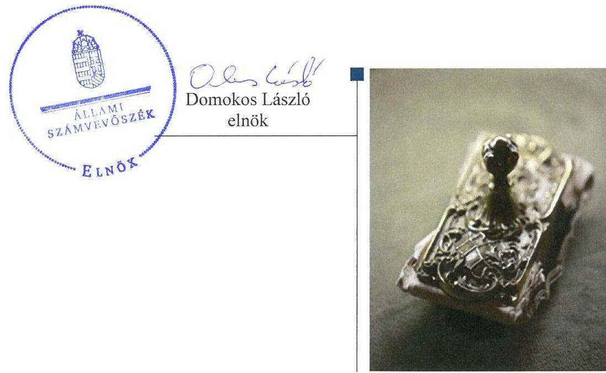
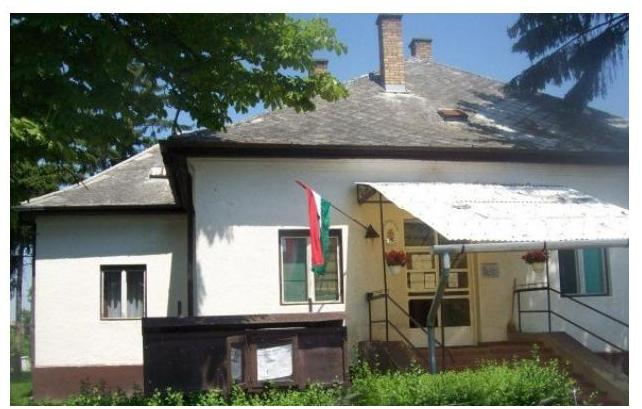

# Jelenetés 

## Önkormányzati adósságrendezés ellenőrzése

Gacsály Község Önkormányzata adósságrendezési eljárásának ellenőrzése 2017. április hó 13. nap

---

# AZ ELLENŐRZÉST FELÜGYELTE:

- RENKŐ ZSUZSANNA felügyeleti vezető
- AZ ELLENŐRZÉST VEZETTE ÉS A VÉGREHAJTÁSÁÉRT FELELŐS:
  - BAJNAI ZSUZSANNA ellenőrzésvezető
  - A PROGRAM ÖSSZEÁLLÍTÁSÁÉRT FELELŐS:
    - JANIK JÓZSEF LÁSZLÓ osztályvezető

**IKTATÓSZÁM:** V-1254-111/2016

**TÉMASZÁM:** 2288

**ELLENŐRZÉS-AZONOSÍTÓ SZÁM:** V073912

Jelentéseink az Országgyűlés számítógépes hálózatán és az Interneten a www.asz.hu címen is olvashatóak.

---

# TARTALOMJEGYZÉK 

■ ÖSSZEGZÉS ..... 5
■ AZ ELLENŐRZÉS CÉLJA ..... 6
■ AZ ELLENŐRZÉS TERÜLETE ..... 7
■ AZ ELLENŐRZÉS HÁTTERE, INDOKOLTSÁGA ..... 8
■ A JELENTÉS LÉNYEGES KÉRDÉSKÖREI ..... 9
■ ELLENŐRZÉS HATÓKÖRE ÉS MÓDSZEREI ..... 10
■ MEGÁLLAPÍTÁSOK ..... 12
■ JAVASLATOK ..... 19
■ MELLÉKLETEK ..... 21
I. sz. melléklet: Értelmező szótár ..... 21
■ FÜGGELÉK: ÉSZREVÉTELEK ..... 23
■ RÖVIDÍTÉSEK JEGYZÉKE ..... 25

---

.

---

# ÖSSZEGZÉS 

Gacsály Község Önkormányzata adósságrendezési eljárásának végrehajtása során a szabálytalan feladatellátás veszélyeztette az adósságrendezés céljainak elérését. Az eljárás során a hitelezői igények teljes körű kielégítésére nem került sor. A fizetőképesség helyreállításának teljesülése, valamint a pénzügyi egyensúly fenntarthatósága megbízható adatok hiányában nem volt megállapítható.

## Az ellenőrzés társadalmi indokoltsága

Pénzügyi egyensúlyi helyzetének, fizetőképességének megromlása miatt Gacsály Község Önkormányzatánál 2012. február 22-től 2012. december 6-ig adósságrendezés folyt, amely során a hitelezők 57,8 millió Ft igényt jelentettek be. Ez a kötelezettségállomány az önkormányzat vagyonának több mint tizedét jelentette, így indokolt ellenőrizni, hogy az adósságrendezési eljárás elérte-e a célját, az eljárás szereplői eleget tettek-e törvényben meghatározott feladataiknak a fizetőképesség helyreállítása, a hitelezőknek hatékony jogvédelem nyújtása és az átgondolt, felelősségteljes gazdálkodás elősegítése érdekében.

## Főbb megállapítások, következtetések

Az adósságrendezési eljárás szabálytalan végrehajtása veszélyeztette az eljárás céljainak elérését. Az adósságrendezés megindításakor elmaradt a hitelezői igények kielégítéséhez felhasználható vagyon felmérése, és a valós pénzügyi helyzet megismerése, mert nem készült vagyonleltár és éves beszámoló. A hitelezőket a jogszabályban rögzített határidőt követően vették nyilvántartásba, elkésett igényeket is elfogadtak. A válságköltségvetés hiányáról a bíróság nem értesült, így nem rendelkezhetett az eljárásnak a vagyon bírósági felosztásának szabályai szerinti folytatásáról, ezért az eljárás szabálytalanul zárult egyezséggel.

Az egyezségben szereplő hitelezői követelések 1,7%-át - 1,0 millió Ft-ot - az önkormányzat nem fizetett ki. A kiegyenlített tartozásoknak csak alig egy ötöde származott saját forrásból, mivel a reorganizációs program bevételnövelő és kiadáscsökkentő intézkedéseit nem valósították meg.

A számviteli rend megsértése és a szabálytalan könyvvezetés következtében a 2009-2014. évi költségvetési beszámolók nem adtak megbízható és valós összképet az önkormányzat vagyonáról, ezért a fizetőképesség és a pénzügyi egyensúly alakulása nem volt értékelhető.

---

# AZ ELLENŐRZÉS CÉLJA 

Az ellenőrzés célja annak megállapítása volt, hogy az adósságrendezési eljárás megindítása, lefolytatása szabályszerű volt-e, az önkormányzat gazdálkodása az adósságrendezési eljárás alatt megfelelt-e a jogszabályi előírásoknak; az eljárás szereplői - kiemelten a pénzügyi gondnok - a jogszabályokban foglaltak szerint jártak-e el az adósságrendezés során. A lefolytatott eljárás elérte-e a törvényben kitűzött célokat; az adósságrendezési eljárás alatt az önkormányzat folyamatosan teljesítette-e kötelező közfeladatait, a hitelezők követelését vagyonarányosan kielégítette-e, helyreállt-e fizetőképessége.

---

# AZ ELLENŐRZÉS TERÜLETE 

## Gacsály Község Önkormányzata

Gacsály község Szabolcs-Szatmár-Bereg megye keleti részén fekszik. Állandó lakosainak száma 2009. január 1-jén 890 fő, 2014. december 31-én 918 fő volt.

Az önkormányzat ${ }^{1}$ képviselő-testülete ${ }^{2}$ 2009. január 1-jétől hét fővel, a 2010. évi önkormányzati választásokat követően öt fővel működött, az állandó bizottság száma - egy - nem módosult. A polgármester ${ }^{3}$ személye nem, a jegyzőé ${ }^{4}$ négy alkalommal változott az ellenőrzött időszak alatt.

A gazdálkodási feladatokat az önkormányzat hivatala ${ }^{5}$ látta el, amely elkülönített gazdasági szervezettel nem rendelkezett.

Az önkormányzat által fenntartott költségvetési szervek száma a 2009. január 1-jén meglévő háromról 2014. december 31-ére egyre csökkent.
2009. évről 2014. évre a foglalkoztatott köztisztviselők száma hét főről egy főre, a közalkalmazottak létszáma 27 főről 15 főre csökkent, a közfoglalkoztatottak száma 9 főről 59 főre nőtt.

Az ellenőrzött időszakban az önkormányzat egy gazdasági társaságban rendelkezett 20%-os tulajdonrésszel.

Az adósságrendezési eljárást egy hitelező - gazdasági társaság - kezdeményezte 2011. december 6-án, mivel az önkormányzat lejárt tartozását nem fizette ki. A bíróság ${ }^{6}$ végzése az adósságrendezés megindításáról 2012. február 22-én jelent meg a Cégközlönyben. Az eljárás egyezség megkötésével 2012. december 6-án zárult.

A pénzügyi gondnoki feladatok ellátására a bíróság a KERSZI Zrt.-t ${ }^{7}$ jelölte ki.

---

# AZ ELLENŐRZÉS HÁTTERE, INDOKOLTSÁGA 

Az önkormányzatok finanszírozásának, gazdálkodásának keretei és feladatellátása jelentős változásokon ment keresztül a Har. tv. ${ }^{8}$ hatálybalépésétől eltelt időszakban.

Az önkormányzati eladósodást 2011-ig csak az Ötv.-ben ${ }^{9}$ meghatározott hitelfelvételi korlát szabályozta, a korlát megsértését azonban jogszabályok nem szankcionálták. 2012. évtől jelentős szigorítás lépett életbe. A korábbi passzív szabályozást a Stabilitási tv. ${ }^{10}$ hatálybalépésével az aktív kontroll váltotta fel. A törvény előírásai alapján az önkormányzatok hitelfelvételei engedélykötelessé váltak.

1996-ban a hitelfelvételi korlát bevezetése mellett az önkormányzatok adósságrendezésének szabályozására is sor került. Az adósságrendezési eljárás részben a lakosság védelmét szolgálta azzal, hogy biztosította az önkormányzatok által nyújtott kötelező közfeladatokhoz való hozzájutást az önkormányzat fizetésképtelensége esetén is. A Har. tv. alapján - 1996 és 2013 júniusa között - ugyanakkor elenyésző számú, mindösszesen 64 adósságrendezési eljárás indult. Az eljárások közel 60%-a egyezséggel, 40%-a vagyonfelosztással zárult.

Az adósságrendezés első időszakában (2009. évig) a forráshiányból eredeztethető eladósodás tette indokolttá az eljárások jelentős hányadának megindítását.

A második időszakban az eljárás alá vont önkormányzatok között megjelentek a nagyobb költségvetéssel és több intézménnyel is rendelkező települések. Az adósságrendezést szükségessé tevő problémák speciális pénzügyi elemekkel, a devizaalapú kötvényel történő finanszírozás begyűrűző hatásaival, valamint az anyagi lehetőségeket meghaladó, túlméretezett fejlesztésekkel összefüggő kötelezettségvállalásokkal egészültek ki, de a beruházások esetében fontos tényező volt a kellő szakértelem hiánya és a pénzügyi nehézségek szakszerűtlen kezelése is.

Az ÁSZ ${ }^{11}$ önkormányzati alrendszert érintő ellenőrzései, elemzései során számos ponton mutatott rá azokra a területekre, ahol a „szabályozás” módosításra, korrekcióra szorul. Az ellenőrzés alapján megfogalmazott javaslatok e területen is segítséget nyújthatnak a kormányzat és az Országgyűlés törvényhozó munkájában, hozzájárulhatnak az irányítói tevékenység erősítéséhez, végső soron a közpénzügyek átláthatóságához és a közvagyon védelméhez. Az ellenőrzés során tett megállapításaink megerősíthetik egy „megelőző monitoring funkció” kialakításának szükségességét a helyi önkormányzatok fizetésképtelenségének megelőzése érdekében.

---

# A JELENTÉS LÉNYEGES KÉRDÉSKÖREI 

1. Az adósságrendezési eljárás folyamata, végrehajtása során szabályszerű volt-e az önkormányzat és a pénzügyi gondnok feladatellátása?
2. A lefolytatott adósságrendezési eljárás elérte-e a törvényben kitűzött célokat?
3. Az adósságrendezési eljárást követően biztosított és fenntartható volt-e a pénzügyi egyensúly?

---

# ELLENŐRZÉS HATÓKÖRE ÉS MÓDSZEREI 

## Az ellenőrzés típusa

Rendszerellenőrzés.

## Az ellenőrzött időszak

A 2009. január 1. és 2015. június 30. közötti időszak.

## Az ellenőrzés tárgya

A Har. tv. által szabályozott adósságrendezési eljárás.

## Az ellenőrzött szervezet

Gacsály Község Önkormányzata és a pénzügyi gondnoki feladatok ellátásával összefüggésben a KERSZI Zrt.

## Az ellenőrzés jogalapja

Az Állami Számvevőszékről szóló 2011. évi LXVI. törvény 5. § (2) bekezdése.

## Az ellenőrzés módszerei

Az ellenőrzés szakmai módszertana az ÁSZ hivatalos honlapján (www.asz.hu) közzétett szakmai szabályokon alapult, amelyek irányadónak tekintették a Legfőbb Ellenőrző Intézmények Nemzetközi Szervezete (INTOSAI) által kiadott nemzetközi (ISSAI) standardokat.

Az ellenőrzés alapját az ellenőrzött önkormányzatoktól bekért tanúsítványok, szabályzatok, szerződések, bírósági végzések, határozatok és egyéb dokumentumok, kimutatások, valamint az önkormányzati beszámolók adatai képezték. Az ellenőrzési kérdések megválaszolásához szükséges bizonyítékok megszerzése, összegyűjtése, az ellenőrzött által rendelkezésre bocsátott dokumentumok, adatok elemzés módszerével végrehajtott értékelésével történt, kiegészítve a megfigyelés, a szemle (szemrevételezés), a kérdésfeltevés (információkérés), mintavételezés módszerével. Az ellenőrzés keretében értékeltük az ellenőrzéshez elkészített tanúsítványok adatainak valódiságát.

---

Az adósságrendezési eljárás szabályszerűségét a bírósági végzések, határozatok, a testületi előterjesztések, jegyzőkönyvek, határozatok, a válságköltségvetés, a beszámolók adatai, az értesítések, közzétételek, kimutatás a hitelezőkről, jelentések, vagyonfelosztási javaslat, belső szabályzatok, pénzügyi bizonylatok, kötelezettségvállalások és további releváns dokumentumok alapján ellenőriztük. A minősítés szempontja a dokumentumok határidőben és tartalmilag a vonatkozó előírásoknak megfelelő elkészítése volt.

A kontrolltevékenység működésének ellenőrzésével értékeltük, hogy az adósságrendezési eljárás alatt vállalt kötelezettségek és teljesített kifizetések szabályszerűen történtek-e, a válságköltségvetés alatt a források szabályszerűen, rendeltetésszerűen lettek-e felhasználva a Har. tv.-ben előírt és az önkormányzat által ellátott kötelező feladatellátás során.

A kontrolltevékenységek támogató szerepét a kötelezettségvállalások és a szakmai teljesítés igazolása/utalvány ellenjegyzése, a teljesítés igazolása/érvényesítés, valamint a pénzügyi gondnok által gyakorolt ellenjegyzés működésének ellenőrzésén keresztül ítéltük meg. A véletlen minta alapján a sokaságra vonatkozó hibaarányt becsültük. „Megfelelőnek” értékeltük az ellenőrzött területet, amennyiben 95%-os bizonyossággal a teljes sokaságban a hibaarány legfeljebb 10%, „részben megfelelőnek” értékeltük, ha a hibaarány 10-30% között volt, „nem megfelelőnek” pedig akkor, ha a mintavételi eredmények alapján a sokaságbeli hibaarány meghaladta a 30%-ot. A becsült hibaaránytól függetlenül nem értékeltük szabályosnak az önkormányzatnál a válságköltségvetésen alapuló kifizetéseket, amennyiben egyetlen esetben is hiányzott a pénzügyi gondnok ellenjegyzése a kötelezettségvállalás vagy pénzügyi kifizetés dokumentumáról.

Az önkormányzatok adósságrendezési eljárása és az azt követő gazdálkodási tevékenysége hibáinak kijavítására, a közpénzekkel való felelős gazdálkodás segítésére irányuló javaslatok kidolgozásakor a hatályos jogszabályok voltak az irányadóak.

---

# 1. Az adósságrendezési eljárás folyamata, végrehajtása során szabályszerű volt-e az önkormányzat és a pénzügyi gondnok feladatellátása? 

Összegző megállapítás

Az adósságrendezés végrehajtása a feladatellátás hiányosságai miatt nem volt szabályszerű, így az eljárás nem biztosított a hitelezők számára hatékony jogvédelmet. A belső szabályzatok elkészítésével kapcsolatos mulasztás, a kontrolltevékenységek elégtelen működése miatt a hibák feltárásának és megelőzésének elmaradása hozzájárult az eladósodáshoz, mivel a döntéshozók nem rendelkeztek pontos információval a valós pénzügyi helyzetről.

Nem határozták meg pontosan a hitelezői igény benyújtásának határidejét, a hitelezőket nem vették nyilvántartásba az előírt időben, nem tájékoztatták valamennyit követelésük elfogadásáról, ezért a hitelezői érdekek sérültek.

A HITELEZŐKNEK SZÓLÓ FELHÍVÁS az adósságrendezésről szóló végzés Cégközlönyben történt közzétételét követően határidőben megjelent két országos napilapban, és a helyben szokásos módon is kihirdették. A polgármester nem pontosan határozta meg a hitelezői igény bejelentésére nyitva álló határidőt a felhívásokban a Har. tv. 10. § (3) bekezdésében és a 10. § (2) bekezdés e) pontjában foglaltak ellenére, mivel a hirdetményekben a - 2012. február 22-ei - időpontot az adósságrendezési eljárás, és nem az adósságrendezés kezdő időpontjaként tüntette fel.

A polgármester egyéb jogszabály által előírt tájékoztatási kötelezettségének eleget tett.

NEM VETTE NYILVÁNTARTÁSBA a pénzügyi gondnok a Har. tv. 15. § (1) bekezdése ellenére a határidőben bejelentkező hitelezőket az igény bejelentésekor, arra csak később, 2012. július 5-én került sor.

Nem utasította el hét személy követelését 1,1 millió Ft értékben, annak ellenére, hogy a Har. tv. 15. § (1) bekezdése és a 10. § (2) bekezdés e) pontjában meghatározott határidőn túl - 2012. április 23-át követően - jelentették be igényüket.

A követelések megvizsgálását követően elutasította
 két hitelező igényét - 6,3 millió Ft - értékben, akik követelésük érvényesítése érdekében az általános hatáskörű bírósághoz keresetet nyújtottak be.

A hitelezőket - hat kivételével - nem tájékoztatta követeléseik elfogadásáról a Har. tv. 15. § (1) bekezdése ellenére a bejelentkezésre nyitva álló határidő lejáratát követő 15 napon belül.

---

1.2. számú megállapítás

A kimutatásban a két vitatott hitelezői igénnyel együtt összesen 30 tétel, 57,8 millió Ft-os értékben szerepelt.

Az önkormányzat vagyonát nem mérték fel, a polgármester nem adta át a pénzügyi gondnoknak az összes jogszabály által előírt dokumentumot, ezáltal az adósságrendezéshez vezető okok feltárása, a valós vagyoni-pénzügyi helyzet felmérése, megismerése elmaradt, veszélyeztetve a hitelezők kielégítését, a fizetőképesség helyreállítását.

NEM KÉSZÜLT VAGYONLELTÁR ÉS ÉVES BESZÁMOLÓ az adósságrendezés megindításának időpontját megelőző nappal, így a polgármester nem adta át azokat a pénzügyi gondnoknak ${ }^{12}$ a Har. tv. 13. § (2) bekezdés b) pontjában előírtak ellenére. A vagyonleltár helyett egy kimutatást készítettek 2012 júliusában - négy hónappal később a jogszabályban rögzített határidőhöz képest - amely nem terjedt ki a teljes vagyoni körre, mivel nem tartalmazta az immateriális javakat, készleteket, követeléseket, pénzeszközöket, továbbá a kimutatásban szereplő eszközök tételes, értékbeli adatait.

A polgármester nem adta át a pénzügyi gondnoknak a feladata elvégzéséhez szükséges a Har. tv. 13. § (2) bekezdés c-f) pontjaiban előírt dokumentumokat; a válságköltségvetési rendelettervezetet, mert a jegyző a Har. tv. 18. § (1) bekezdése ellenére nem készítette el, a folyamatban lévő bírósági, hatósági eljárásokról készített részletes összefoglalót, az önkormányzat vagyonára vonatkozó szerződéseket, kötelezettségvállaló nyilatkozatokat, az önkormányzat részvételével működő gazdasági társaságról szóló részletes tájékoztatást.

Az önként vállalt és jogszabályban kötelezően előírt feladatok helyi ellátási formáiról, valamint ezek pénzügyi finanszírozásáról szóló jelentést, az intézményekről, azok gazdasági helyzetéről szóló részletes tájékoztatást a polgármester határidőben küldte meg a pénzügyi gondnoknak.

A pénzügyi gondnok nem tárta fel, hogy milyen okok vezettek az adósságrendezési eljárás megindításához a Har. tv. 14.§ (2) bekezdés a) pontja ellenére.
1.3. számú megállapítás

Nem készült válságköltségvetés. A tervezett hitelfelvétellel, az adósságrendezés előtti döntési jogkörök meghagyásával megsértették a takarékos gazdálkodásra vonatkozó törvényi követelményt. A pénzügyi gondnok nem jelentette be a bíróságnak a válságköltségvetés hiányát, ezért az nem rendelkezhetett az eljárásnak a bírósági vagyonfelosztás szabályai szerinti folytatásáról.

A VÁLSÁGKÖLTSÉGVETÉSSEL kapcsolatos jogszabályi előírásoknak nem felelt meg tartalmilag a képviselő-testület által 2012. március 9-én elfogadott 2012. évi költségvetési rendelet, mert
$\longrightarrow$ a Har. tv. 16. § (3) bekezdésében előírtak ellenére az adósságrendezési bizottság helyett az előirányzatok átcsoportosítását a polgármester és a költségvetési szervek hatáskörében hagyta;
$\longrightarrow$ a Har. tv. 13. § (1) bekezdés d) pontja és a Har. tv. 18. § (2) bekezdésében foglaltak ellenére tartalmazott az adósságrendezés megindítása előtt felvett felhalmozási és működési célú hiteltörlesztést;

---

- a Har. tv. 13. § (1) bekezdés d) pontja és a 31. § (1) bekezdés a) pontjában meghatározott előírások ellenére nem rendszeres személyi jellegű juttatás kifizetésére adott lehetőséget;
- a Har. tv. 13. § (1) bekezdés a) pontja ellenére 43,1 millió Ft hitelfelvételt tartalmazott.
A pénzügyi gondnok a Har. tv. 14. § (1) bekezdésének előírása ellenére nem készített a költségvetést érintő előterjesztéshez csatolható véleményt, továbbá a Har. tv. 14. § (2) bekezdés c) pontja ellenére nem vett részt a képviselő-testületi és az adósságrendezési bizottság 2012. évi költségvetést tárgyaló ülésein.

NEM TÁJÉKOZTATTA a pénzügyi gondnok a Har. tv. 14. § (2) bekezdés g) pontja ellenére a kormányhivatalt, a Har. tv. 19. § (4) bekezdése ellenére nem jelentette be a bíróságnak, hogy a képviselő-testület nem fogadott el válságköltségvetési rendeletet az adósságrendezés megindítását követő 90 napon belül. A bejelentési kötelezettség elmulasztása miatt nem került sor arra, hogy a bíróság rendelkezzen az eljárásnak a vagyon bírósági felosztásának szabályai szerinti folytatásáról.

# 1.4. számú megállapítás 

A képviselő-testület nem fogadta el a jogszabály által előírt határidőben a reorganizációs programot és az egyezségi javaslatot, hátráltatva az eljárás határidőben - 240 napon belül - történő befejezését. Az egyezség tartalmilag megfelelt a törvény előírásainak.

A REORGANIZÁCIÓS PROGRAMOT ÉS EGYEZSÉGI JAVASLATOT a képviselő-testület nem fogadta el az adósságrendezés megindításának időpontjától számított 180 napon belül, 2009. augusztus 21-ig. A Har. tv. 28. §-ában előírt határidő lejárata után 2012. szeptember 7-én kérelem nyújtottak be a bíróságnak a reorganizációs program és egyezségi javaslat kidolgozására rendelkezésre álló határidő meghosszabbítása érdekében, amelyet az engedélyezett.

A képviselő-testület által 2012. szeptember 25-én elfogadott reorganizációs program és egyezségi javaslat tartalmát tekintve megfelelt az előírásoknak. A reorganizációs programban célként fogalmazták meg a takarékos gazdálkodást, amelyből 38,9 millió Ft megtakarítást számszerűsítettek. A követelések behajtásából 19,5 millió Ft, a vagyon értékesítéséből 5,8 millió Ft bevételt terveztek.

Az egyezségi javaslatban a hitelezőket négy csoportba sorolták, a különböző csoportok tekintetében azonos javaslatot hagytak jóvá, a tőkekövetelés maradéktalan kiegyenlítését, a késedelmi kamat elengedését.

AZ EGYEZSÉG nem jött létre az adósságrendezés megindításának időpontjától számított 240 napon belül - 2012. október 19-ig - de a jogszabály által lehetővé tett határidő-hosszabbítást a bíróság engedélyezte.

A hitelezők meghívása az egyezségi tárgyalásra előírás szerint történt.
Az egyezség 2012. október 29-én létrejött, a tartalmában megfelelt a törvényben foglalt követelményeknek.

---

### 1.5. számú megállapítás

Nem alakították ki a megfelelő kontrollkörnyezetet, mert nem készítették el a működésre és gazdálkodásra vonatkozó szabályzatokat. A kifizetésekhez kapcsolódó kontrolltevékenységek nem biztosították az ÁSZ ellenőrzése által feltárt hibák megelőzését. A hibák, hiányosságok hozzájárultak az eladósodáshoz, mivel a döntéshozók nem rendelkeztek pontos adatokkal a pénzügyi helyzetről.

A KONTROLLKÖRNYEZETET nem alakították ki a Bkr. ${ }^{13} 3 . \S$ a) pontjában foglaltak ellenére a válságköltségvetés időszakában, mert
$\longrightarrow$ az önkormányzat hivatala nem rendelkezett az Áht. ${ }^{14} 10 . \S$ (5) bekezdése ellenére feladatai ellátásának részletes belső rendjét és módját megállapító szervezeti és működési szabályzattal;
$\longrightarrow$ nem készítették el a - Számv. tv. ${ }^{15}$ 14. § (4), (5) és az Áhsz. ${ }^{16}$ 8. § (3)-(4) bekezdéseiben előírt - számviteli politikát, annak keretében az eszközök és a források leltározási és leltárkészítési szabályzatát, az eszközök és források értékelési szabályzatát, a pénzkezelési szabályzatot, továbbá a Számv. tv. 161. § (1) és az Áhsz. ${ }^{1} 49 . \S$ (1) bekezdéseiben előírt számlarendet;
$\longrightarrow$ nem rendezték belső szabályzatban - az Ávr. ${ }^{17}$ 13. § (2) bekezdés a) pontjában foglaltak ellenére - a gazdálkodási jogkörök (a kötelezettségvállalás, ellenjegyzés, a teljesítésigazolás, az érvényesítés, utalványozás) gyakorlásának módjával, eljárási és dokumentációs részletszabályaival, valamint az ezeket végző személyek kijelölésének rendjével és az adatszolgáltatási feladatok teljesítésével kapcsolatos belső előírásokat, feltételeket.
Az önkormányzat az adósságrendezés időszakában rendelkezett működésének részletes szabályait tartalmazó SZMSZ ${ }^{18}$-szel és vagyongazdálkodási rendelettel ${ }^{19}$.

A KONTROLLTEVÉKENYSÉGEK - gazdálkodási jogkörök, pénzügyi gondnoki ellenjegyzés - gyakorlása „nem megfelelő" volt az adósságrendezés időszakában.

A jegyző nem juttatta el a Har. vhr. ${ }^{20}$ 16. §-ában előírtak ellenére a pénzügyi gondnok ellenjegyzéshez szükséges aláírási címpéldányát az adósságrendezés megindításával egyidejűleg a számlavezető pénzügyi intézményhez, helyette számla felett rendelkezésre jogosult személyként jelölte ki őt.

A pénzügyi gondnok nem jegyezte ellen a Har. tv. 14. § (1) bekezdésének előírása ellenére a kötelezettségvállalásokat. A kifizetéseket ellenjegyzésével teljesítették.

Az önkormányzat hivatala az Ávr. 56.§ (1) bekezdései ellenére a kötelezettségvállalásokat nem vette nyilvántartásba. A gazdálkodási jogkörök gyakorlásának ellenőrzése során tapasztalt további hiányosságokat az 1. táblázat tartalmazza.

---

1. táblázat

# A GAZDÁLKODÁSI JOGKÖRÖK GYAKORLÁSÁNAK ELLENŐRZÉSE SORÁN TAPASZTALT HIÁNYOSSÁGOK 

| Sorszám | Gazdálkodási jogkör | Megállapított szabálytalanság | Megsértett jogszabály |
| :--: | :--: | :--: | :--: |
| 1. | kötelezettségvállalás | A beszerzések előzetes írásbeli kötelezettségvállalás nélkül történtek, annak ellenére, hogy a százezer forintot el nem érő előzetes írásbeli kötelezettségvállalást nem igénylő kifizetések rendjét belső szabályzatban nem rögzítették. | Áht. 37. § (1) és az Ávr.   53. § (2) bekezdései |
| 2. | teljesítés igazolása | A teljesítés igazolását nem végezték el. | Áht. 38. § (1) és az Ávr.   57. § (1) bekezdései |
| 3 | érvényesítés | Az érvényesítést nem végezték el.   Az elvégzett érvényesítés nem volt szabályszerű, mert   az érvényesítés kijelölés hiányában jogosulatlanul történt,   az érvényesítésnél nem jelezték az utalványozónak, hogy előzetes írásbeli   kötelezettségvállalásra nem került sor, továbbá a teljesítésigazolást nem   végezték el. | Áht. 38. § (1) és az Ávr.   58. § (1) bekezdése   Ávr. 58. § (4) bekezdése   Ávr. 58. § (2) bekezdése |
| 4. | utalványozás | Az utalványozásra nem az érvényesített okmány alapján került sor. | Ávr. 59. § (1) bekezdése   Forrás: ÁSZ megállapítás |

A KÖNYVVITELI NYILVÁNTARTÁSBA bizonylat nélkül rögzítettek adatot a Számv. tv. 165. § (1) bekezdése ellenére. Nem szabályszerűen kiállított bizonylat alapján jegyeztek be adatot a Számv. tv. 165. § (2) bekezdése ellenére, mert a számlákon a 2009. december 31-én megszűnt „Polgármesteri Hivatal" szerepelt vevőként, továbbá a készpénzfizetési számlákat nem a pénzmozgással egyidejűleg könyvelték a Számv. tv. 165. § (3) bekezdés a) pontja ellenére. A könyvvezetés során a Számv. tv. 167. § (1) bekezdés h) és i) pontjában foglalt, a könyvviteli elszámolást közvetlenül alátámasztó bizonylat általános alaki és tartalmi kellékeire vonatkozó előírásoknak nem tettek eleget, mert nem tüntették fel a könyvviteli számlákra történő hivatkozást, a nyilvántartásokban történt rögzítés időpontját, igazolását. A könyvelés során nem tüntették fel a Számv. tv. 167 § (1) bekezdés a) pontja ellenére a bizonylat sorszámát vagy egyéb más azonosítóját, ezáltal nem biztosították a főkönyvi könyvelés, az analitikus nyilvántartások és a bizonylatok adatai közötti egyeztetés és ellenőrzés lehetőségét, a logikailag zárt rendszert a Számv. tv. 165.§ (4) bekezdés előírása ellenére. A hiányosságok miatt sérült a Számv. tv 15. § (3) bekezdésében foglalt valódiság alapelve.

Az önkormányzat az Ávr. 10. § (1) bekezdése ellenére a beszámolási feladatokat külső szolgáltató igénybevételével látta el.

A BELSŐ ELLENŐRZÉST a kistérségi társulás ${ }^{21}$ keretében biztosították.

A képviselő-testület a Bkr. 32 § (4) bekezdésében foglaltak ellenére nem hagyta jóvá a 2012. évi belső ellenőrzési tervet.

A Bkr. 47. § (1) bekezdésében foglaltak ellenére nem vezettek éves bontásban nyilvántartást, amellyel a belső ellenőrzési jelentésekben tett megállapításoknak, javaslatoknak, a vonatkozó intézkedési terveknek és azok végrehajtásának nyomon követése biztosított lett volna, ezáltal a belső ellenőrzés nem támogatta a szabályszerű forrásfelhasználást, a javaslatok nem hasznosultak.

---

# 2. A lefolytatott adósságrendezési eljárás elérte-e a törvényben kitűzött célokat? 

Összegző megállapítás

A kötelező feladatok folyamatos teljesítésére vonatkozó törvényi célkitűzés teljesült, azonban az egyezségben vállalt fizetési kötelezettség 1,7%-át nem elégítették ki. A reorganizációs programban vállalt intézkedéseket nem hajtották végre, így az önkormányzat nem járult hozzá
 fizetőképessége helyreállításához. Likvidítása nem volt értékelhető az elemzéshez szükséges megbízható adatok hiányában.

A kötelező feladatokat folyamatosan teljesítették az adósságrendezés alatt az önkormányzat hivatalán keresztül, társulásokkal, gazdasági társaságokkal kötött megállapodások révén.

Feladat átadás-átvétel nem történt az eljárás ideje alatt.
A reorganizációs program bevételnövelő és kiadáscsökkentő intézkedéseit nem valósították meg. A gazdasági stabilitás és a jövőbeli zavartalan működés érdekében saját erőből tett intézkedések elmaradása miatt az önkormányzat nem járult hozzá a fizetőképesség törvényi célkitűzésének eléréséhez, a hitelezők követelésének kiegyenlítéséhez.

Az adósságrendezést követően a közös önkormányzati hivatal létrehozásával a 2013. évben az önkormányzat számítása szerint összesen 23,0 millió Ft megtakarítást értek el.

A hitelezőknek nem fizettek ki 1,0 millió Ft-ot az ellenőrzött időszak végéig az egyezségi megállapodásban szereplő 57,8 millió Ft-os összegből.

A kiegyenlített 56,8 millió Ft 86,2%-át eseti állami támogatásból finanszírozták. A hitelezői igényeknek az ellenőrzött időszak végéig történő teljesítését hitelezői csoportonként a 2. táblázat szemlélteti.
2. táblázat

A HITELEZŐI IGÉNYEK KIEGYENLÍTÉSÉNEK ALAKULÁSA (MILLIÓ FT)

| csoport | Egyezség   szerinti összeg | Vállalt határidő | Kiegyenlített   hitelezői igény | Teljesítés   időpontja |
| :-- | :--: | :--: | :--: | :--: |
| I. csoport, személyi jellegű kiadási elmaradások | 6,8 | 2013.01.31. | 6,7 | 2013.02.28. |
| II. csoport, zálogjoggal biztosított követelés | 28,3 | 2026.05.31. | 28,3 | 2012.12.31. |
| III. csoport, önkormányzati kötelező feladatokhoz kapcsolódó igények | 16,4 | 2013.06.30. | 15,5 | 2014.02.14. |
| Összesen: | 51,5 |  | 50,5 |  |
| Vitatott | 6,3 | jogerős ítélet | 6,3 | 2014.04.22. |
| Mindösszesen | 57,8 |  | 56,8 |  |

Likviditási tervet nem készítettek a 2009. évben az Ámr. ${ }^{22}$ 139. § (1) bekezdésében, a 2010-2011. évben az Ámr. ${ }^{23}$ 201. § (1) bekezdésében, a 2012-2015. I. féléve között az Ávr. 122. § (1)-(2) bekezdéseiben foglaltak ellenére. Likviditási tervek hiányában a fizetőképesség alakulását nem kísérték figyelemmel, nem volt információjuk

---

arról, hogy a kiadások teljesítéséhez a megfelelő pénzügyi fedezet rendelkezésre áll-e, ezáltal nem volt biztosítva a tartozások kialakulásának megelőzése.

A fizetőképesség helyreállítása nem volt értékelhető, mert a 2009-2014. évi beszámolók nem nyújtottak megbízható, valós összképet az önkormányzat vagyonáról, annak összetételéről:
$\longrightarrow$ nem gondoskodtak az Áhsz. 1 49. § (1) bekezdésében és a 9. számú mellékletének 4. d)* pontjában, illetve az Áhsz. 2 39. § (3) bekezdésében és a 14. mellékletének II. pontjában előírt kötelezettségekhez kapcsolódó analitikus, illetve részletező nyilvántartás vezetéséről, továbbá az Áhsz. 1 49. § (1) bekezdésében és a 9. számú mellékletének 2. ca) pontjában, illetve az Áhsz. 2 39 § (3) bekezdésében és a 14. mellékletének III. pontjában előírt követelésekhez kapcsolódó analitikus, illetve részletező nyilvántartás vezetéséről;
$\longrightarrow$ a költségvetési beszámolók nem tartalmazták a belvízrendezési beruházásához kapcsolódó saját forrás megelőlegezéseként kapott vállalkozói kölcsönt az Áhsz. 1 26. § (2) és a Számv. tv. 42. § (2) bekezdésében foglaltak ellenére, továbbá nem mutatták ki a gazdasági társaságukban lévő tulajdoni részesedést a 2009-2013. években az Áhsz. 1 19. § (2) bekezdése ellenére;
$\longrightarrow$ a mérleg fordulónapjain a követelések és kötelezettségek leltárazását a 2009-2013. években az Áhsz. 1 37. § (1) bekezdésében, a 2014. évben az Áhsz. $2^{24}$ 22. § (1) bekezdésében foglaltak ellenére nem végezték el.

# 3. Az adósságrendezési eljárást követően biztosított és fenntartható volt-e a pénzügyi egyensúly? 

Összegző megállapítás A pénzügyi egyensúly megítéléséhez megbízható adatok nem álltak rendelkezésre a számvitel rendjére vonatkozóan feltárt hiányosságok miatt.

A pénzügyi egyensúly fenntarthatósága nem volt értékelhető a számvitel rendjét érintő - az 1.5 számú megállapítás 7. bekezdésében és a 2. összegző megállapítás 8. bekezdésében részletezett - hiányosságok miatt.

[^0]
[^0]:    * A 2011. január 1-től hatályos szabályozás szerint da) pont

---

# JAVASLATOK 

Az ÁSZ tv. 33. § (1) bekezdésében foglaltak értelmében az ellenőrzött szervezet vezetője köteles a jelentésben foglalt megállapításokhoz kapcsolódó intézkedési tervet összeállítani és azt a jelentés kézhezvételétől számított 30 napon belül az ÁSZ részére megküldeni. Amennyiben az ellenőrzött szervezet vezetője nem küldi meg határidőben az intézkedési tervet, vagy továbbra sem elfogadható intézkedési tervet küld, az Állami Számvevőszék elnöke az ÁSZ tv. 33. § (3) bekezdése a) és b) pontjaiban foglaltakat érvényesítheti.

## a Rozsályi Közös Önkormányzati Hivatal jegyzőjének:

1. Intézkedjen a likviditási terv jogszabályi előírásoknak megfelelő elkészítéséről.
(2. számú megállapítás 7. bekezdés 1. mondata alapján)
2. Intézkedjen a követelésekhez és kötelezettségekhez kapcsolódó részletező nyilvántartások jogszabályi előírásoknak megfelelő vezetéséről, illetve a vállalkozói kölcsön jogszabályi előírásoknak megfelelő rögzítéséről a számviteli (főkönyvi és részletező) nyilvántartásokban.
(2. számú megállapítás 8. bekezdés 1. pontja és a
3. pont 1. mondatrésze alapján)
4. Intézkedjen az éves költségvetési beszámoló mérlegében kimutatott követelések és kötelezettségek jogszabályi előírásoknak megfelelő leltárral történő alátámasztásáról.
(2. számú megállapítás 8. bekezdés 3. pontja alapján)

---

.

---

# MELLÉKLETEK 

- I. SZ. MELLÉKLET: ÉRTELMEZŐ SZÓTÁR
adósságrendezés
adósságrendezésbe vonható vagyon
adósságrendezési bizottság
adósságrendezési eljárás
adósságrendezési eljárás kezdő időpontja
adósságrendezés megindításának időpontja
bíróság
egyezségi javaslat
egyezségi tárgyalás
hitelező
közfeladat
pénzügyi gondnok
reorganizációs program

Az adósságrendezési eljárás azon szakasza, amely a bíróság adósságrendezést megindító végzésének Cégközlönyben való közzétételével [10. § (1) bekezdés] kezdődik, és az adósságrendezési eljárás befejezését elrendelő bírósági végzés Cégközlönyben való közzétételének napjáig tart. (Forrás: Har. tv. 2.§ b) pontja és 32. § (6) bekezdése).

Törvényben meghatározott forgalomképtelen törzsvagyon feletti, valamint a hatósági feladatok és az alapvető lakossági szolgáltatások ellátásához szükséges vagyon feletti forgalomképes vagyonrész. (Forrás: Har. tv. 2.§ f) pontja)
Az adósságrendezési eljárás megindítását követően megalakult bizottság, melynek tagjai: az önkormányzat polgármestere, a jegyző, a pénzügyi bizottság elnöke, egy önkormányzati képviselő. Elnöke a pénzügyi gondnok. (Forrás: Har. tv. 16. § (1) bekezdése)

A helyi önkormányzat székhelye szerint illetékes törvényszék (2011. XII. 31.-ig a fővárosi, megyei bíróságok) hatáskörébe tartozó nem peres eljárás, amely a helyi önkormányzatok fizetőképességének helyreállítására irányul. (Forrás: Har. tv. 3. § (1) bekezdése)

Az a nap, amelyen a kérelem a bírósághoz érkezik. (Forrás: Har. tv. 4. § (1) bekezdése)
A végzés Cégközlönyben való megjelenésének napja. (Forrás: Har. tv. 10. § (1) bekezdés d) pontja)
Az adósságrendezési eljárás során eljáró törvényszék, 2011. XII. 31-ig a megyei (fővárosi) bíróság.
Az adósságrendezési bizottság által készített dokumentum az önkormányzat hitelezőinek a követeléséről, mely tartalmazza az indoklással alátámasztott egyezségi javaslatot. (Forrás: Har. tv. 20. § (3) bekezdése)
A képviselő-testület által elfogadott egyezségi javaslat alapján lefolytatott tárgyalás, mely egyezséggel vagy az adósságrendezési eljárásnak vagyonfelosztással történő folytatásának bírósági elrendelésével zárulhat.
Az adósságrendezés megindításának időpontjáig az, akinek a helyi önkormányzattal, vagy annak költségvetési szervével szemben vagyoni követelése áll fenn; az adósságrendezés megindításának időpontját követően az, aki a követelését a hitelezői igény bejelentésére nyitva álló határidő alatt bejelentette, és azt a pénzügyi gondnok elfogadta, illetve követelésének jogerős elbírálásáig az is, akinek az igénye vitatott. (Forrás: Har. tv. 2.§ c) pontja)
Jogszabályban meghatározott állami vagy önkormányzati feladat, amit az arra kötelezett közérdekből, a jogszabályban meghatározott követelményeknek és feltételeknek megfelelve végez, ideértve a lakosság közszolgáltatásokkal való ellátását, továbbá az állam nemzetközi szerződésekben vállalt kötelezettségeiből adódó közérdekű feladatokat, valamint e feladatok ellátásakor szükséges infrastruktúra biztosítását is. (Forrás: Nvtv. ${ }^{25}$ 3. § (1) bekezdés 7. pontja)
Az adósságrendezési eljárás lefolytatására, a bíróság által kijelölt, a pénzügyi gondnokok névjegyzékében szereplő személy, vagy szervezet.
A helyi önkormányzat gazdasági helyzetét bemutató dokumentum, mely tartalmazza továbbá az adósságrendezésbe vonható vagyon hasznosítására, valamint az önkormányzat adósságrendezéssel kapcsolatosan tervezett intézkedéseire vonatkozó javaslatot annak megjelölésével, hogy ezzel milyen bevételhez juthat. (Forrás: Har. tv. 20.§ (2) bekezdése)

---

válságköltségvetés

A helyi önkormányzat az adósságrendezési eljárás ideje alatt a képviselő-testület által elfogadott válságköltségvetés alapján gazdálkodik. A jegyző az adósságrendezés megindításának időpontját követő 30 napon belül készíti el a válságköltségvetési rendelettervezetet. A válságköltségvetésből az önkormányzat a Har. tv. 18. § (2) bekezdésében és a 19. § (3) bekezdésében foglalt kiadásokat finanszírozhatja. Amennyiben nem kerül elfogadásra válságköltségvetés a Har. tv. 29. § (2) bekezdése alapján az önkormányzat az adósságrendezési eljárás alatt, a pénzügyi gondnok által kidolgozott működési válságterv alapján kell, hogy működjön. (Forrás: Mótv. ${ }^{26}$ 122. §-a, Har. tv. 18. § (1)-(2) bekezdése, 19. § (2) bekezdése, 29. § (2) bekezdése)

---

# FÜGGELÉK: ÉSZREVÉTELEK 

A jelentéstervezetet a Számvevőszék 15 napos észrevételezésre megküldte az ellenőrzött szervezetek vezetőinek az ÁSZ tv. 29. § (1) bekezdése előírásának megfelelően.

Az ellenőrzött szervezetek vezetői az ÁSZ tv. 29. § (2) bekezdésében foglalt észrevételezési jogukkal nem éltek, a jelentéstervezetre észrevételt nem tettek.

[^0]
[^0]:    ${ }^{7}$ 29. § (1) Az Állami Számvevőszék az ellenőrzési megállapításait megküldi az ellenőrzött szervezet vezetőjének vagy az általa megbízott személynek, és annak, akinek személyes felelősségét állapította meg.
    (2) Az ellenőrzött szervezet vezetője és a felelősként megjelölt személy az ellenőrzés megállapításaira tizenöt napon belül írásban észrevételt tehet.
    (3) Az Állami Számvevőszék az észrevételre a beérkezésétől számított harminc napon belül írásban válaszol. A figyelembe nem vett észrevételeket köteles a jelentésben feltüntetni, és megindokolni, hogy azokat miért nem fogadta el.

---

.

---

# RÖVIDÍTÉSEK JEGYZÉKE 

${ }^{1}$ önkormányzat
${ }^{2}$ önkormányzat képviselő-testülete
${ }^{3}$ polgármester
${ }^{4}$ jegyző
${ }^{5}$ önkormányzat hivatala
${ }^{6}$ bíróság
${ }^{7}$ KERSZI Zrt.
${ }^{8}$ Har. tv.
${ }^{9}$ Ötv.
${ }^{10}$ Stabilitási tv.
${ }^{11}$ ÁSZ
${ }^{12}$ pénzügyi gondnok
${ }^{13}$ Bkr.
${ }^{14}$ Áht.
${ }^{15}$ Számv. tv.
${ }^{16}$ Áhsz. 1
${ }^{17}$ Ávr.
${ }^{18}$ SZMSZ
${ }^{19}$ vagyongazdálkodási rendelet
${ }^{20}$ Har. vhr.
${ }^{21}$ kistérségi társulás
${ }^{22}$ Ámr. 1
${ }^{23}$ Ámr. 2
${ }^{24}$ Áhsz. 2
${ }^{25}$ Nvtv.
${ }^{26}$ Mötv.

Gacsály Község Önkormányzata
Gacsály Község Önkormányzata képviselő-testülete
Gacsály Község Önkormányzata polgármestere
Gacsály község önkormányzati hivatalának jegyzője
2009. január 1-jétől 2009. december 31. Gacsály Község Polgármesteri Hivatala 2010. január 1-jétől 2013. február 28-ig Gacsály-Kisnamény Községek Körjegyzősége
2013. március 1-jétől Rozsályi Közös Önkormányzati Hivatal

Szabolcs-Szatmár-Bereg Megyei Bíróság, 2012. január 1-jétől Nyíregyházi Törvényszék
KERSZI Kereskedelmi és Pénzügyi Szervezési- Tanácsadó Zártkörűen Működő Részvénytársaság
1996. évi XXV. törvény a helyi önkormányzatok adósságrendezési eljárásáról
1990. évi LXV. törvény a helyi önkormányzatokról
2011. évi CXCIV. törvény Magyarország gazdasági stabilitásáról

Állami Számvevőszék
KERSZI Kereskedelmi és Pénzügyi Szervezési- Tanácsadó Zártkörűen Működő Részvénytársaság
370/2011. (XII. 31.) Korm. rendelet a költségvetési szervek belső kontrollrendszeréről és belső ellenőrzéséről (hatályos 2012. január 1-jétől)
2011. évi CXCV. törvény az államháztartásról
2000. évi C. törvény a számvitelről
249/2000. (XII. 24.) Korm. rendelet az államháztartás szervezetei beszámolási és könyvvezetési kötelezettségének sajátosságairól (hatálytalan 2014. január 1-jétől)
368/2011. (XII. 31.) Korm. rendelet az államháztartásról szóló törvény végrehajtásáról (hatályos: 2012. január 1-jétől)
Gacsály Község Önkormányzat Képviselő-testületének szervezeti és működési szabályzata
Gacsály Község Önkormányzat Képviselő-testületének 8/2004. (IV.29.) Kt, számú rendelete az önkormányzat vagyonáról és a vagyongazdálkodás szabályairól, melyet módosított a 7/2010. (VIII.12. ) és a 6/2012.
 (VI.1.) rendelet
95/1996. (VII. 4.) Korm. rendelet a helyi önkormányzatok adósságrendezési eljárásáról szóló 1996. évi XXV. törvény végrehajtásának egyes kérdéseiről
Felső-Tisza Vidéki Többcélú Kistérségi Társulás
217/1998. (XII. 30.) Korm. rendelet az államháztartás működési rendjéről (hatálytalan: 2010. január 1-jétől)
292/2009. (XII. 30.) Korm. rendelet az államháztartás működési rendjéről (hatálytalan: 2012. január 1-jétől)
4/2013. (I. 11.) Korm. rendelet az államháztartás számviteléről (hatályos 2014. január 1-jétől)
2011. évi CXCVI. törvény a nemzeti vagyonról
2011. évi CLXXXIX. törvény Magyarország helyi önkormányzatairól

---

ÁLLAMI SZÁMVEVŐSZÉK
1052 Budapest, Apáczai Csere János utca 10.
Levélcím: 1364 Budapest Pf. 54
Telefon: +36 1 4849100 Telefax: +36 1 4849200
www.asz.hu
