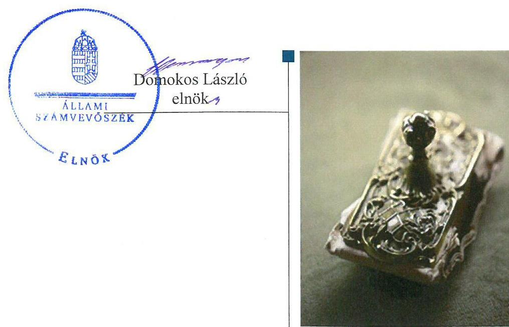
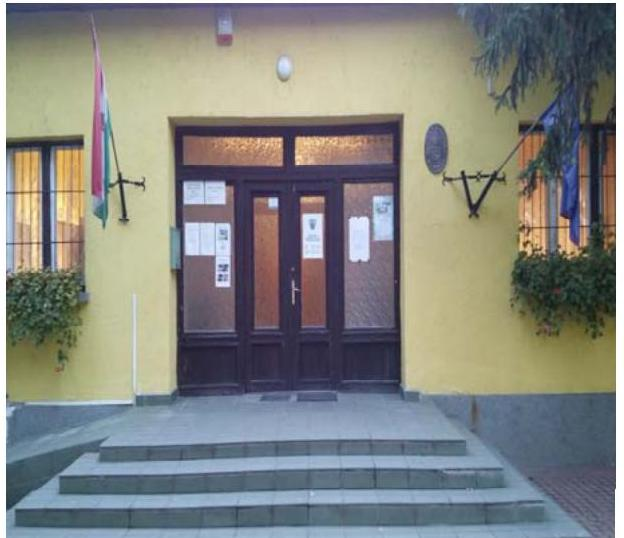
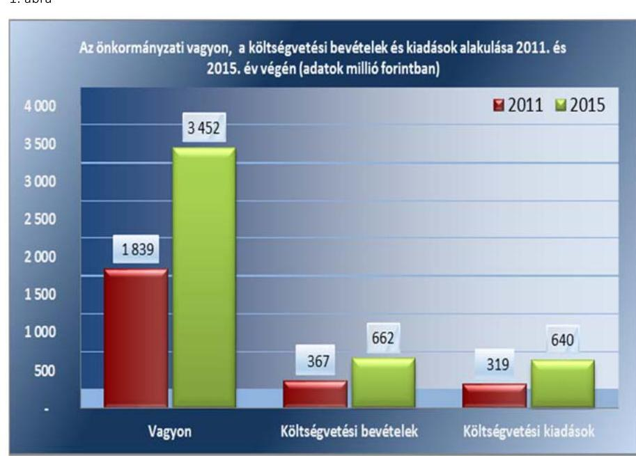
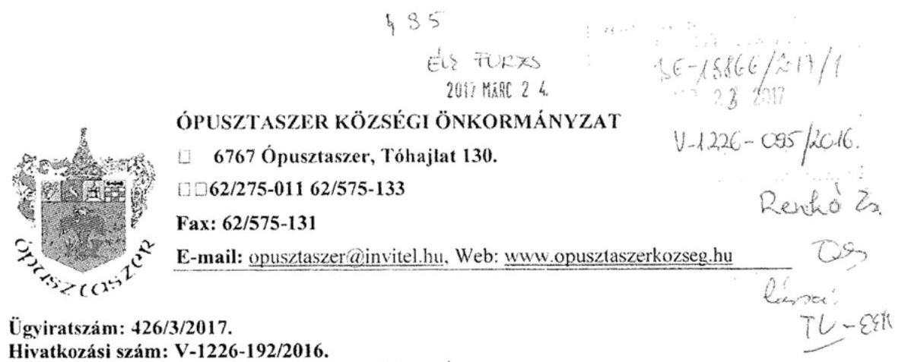
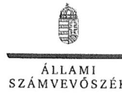
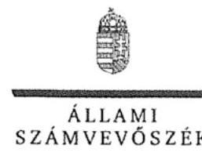
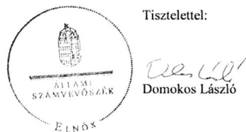

# Jelenetés 

## Önkormányzatok belső kontrollrendszere

Az önkormányzatok belső kontrollrendszere kialakításának és működtetésének ellenőrzése - Ópusztaszer 2017.

---

# Jelenés 

## Önkormányzatok belső kontrollrendszere

Az önkormányzatok belső kontrollrendszere kialakításának és működtetésének ellenőrzése - Ópusztaszer
2017.  

---

AZ ELLENŐRZÉST FELÜGYELTE:
RENKÓ ZSUZSANNA felügyeleti vezető

AZ ELLENŐRZÉST VEZETTE ÉS A VÉGREHAJTÁSÁÉRT FELELŐS:
SZALAYNÉ OSTORHÁZI MÁRIA ellenőrzésvezető

A PROGRAM ÖSSZEÁLLÍTÁSÁÉRT FELELŐS:
JANIK JÓZSEF LÁSZLÓ osztályvezető

IKTATÓSZÁM: V-1226-105/2016.
TÉMASZÁM: 2260
ELLENŐRZÉS-AZONOSÍTÓ SZÁM: V-076408

Jelentéseink az Országgyűlés számítógépes hálózatán és az Interneten a www.asz.hu címen is olvashatóak.

---

# TARTALOMJEGYZÉK 

■ ÖSSZEGZÉS ..... 5
■ AZ ELLENŐRZÉS CÉLJA ..... 6
■ AZ ELLENŐRZÉS TERÜLETE ..... 7
■ AZ ELLENŐRZÉS HÁTTERE, INDOKOLTSÁGA ..... 8
■ A JELENTÉS LÉNYEGES KÉRDÉSKÖREI ..... 10
■ ELLENŐRZÉS HATÓKÖRE ÉS MÓDSZEREI ..... 11
■ MEGÁLLAPÍTÁSOK ..... 13
■ JAVASLATOK ..... 19
■ MELLÉKLETEK ..... 21
I. Sz. melléklet: Értelmező szótár ..... 21
II. Sz. melléklet: Az önkormányzati befektetési jegyek adatai ..... 23
III. Sz. melléklet: Az Integritás érvényesítése érdekében kialakított és működtetett kontrollrendszer ..... 24
■ FÜGGELÉK: ÉSZREVÉTELEK ..... 27
■ RÖVIDÍTÉSEK JEGYZÉKE ..... 45

---

.

---

# ÖSSZEGZÉS 

Ópusztaszer Községi Önkormányzat belső kontrollrendszer kialakításának és működtetésének hiányosságai miatt a közpénzfelhasználás szabályossága nem volt biztosított, a közvagyon körültekintő befektetését nem támogatta. A befektetések számviteli elszámolása, a nyilvántartás hiányosságai miatt a befektetett közvagyon összegét az Önkormányzat beszámolója nem a valóságnak megfelelően mutatta be. Az Önkormányzatnak az integritás szemlélet érvényesülése érdekében még erőfeszítéseket kell tennie.

## Az ellenőrzés társadalmi indokoltsága

Magyarország Alaptörvénye az önkormányzatoktól, mint az államháztartás alanyaitól elvárja a kiegyensúlyozott, átlátható és fenntartható költségvetési gazdálkodás elvének érvényesítését. A nemzeti vagyonról szóló törvény szerint a nemzeti vagyonnal felelős módon, rendeltetésszerűen kell gazdálkodni. A nemzeti vagyongazdálkodás feladata a nemzeti vagyon rendeltetésének megfelelő, átlátható, hatékony és költségtakarékos működtetése, ugyanakkor értékének megőrzését, értéknövelő használatát, hasznosítását, gyarapítását is elvárja.

Ópusztaszer Községi Önkormányzat beszámolójában 2015. december 31-én 2,6 millió Ft üzleti célú ingatlant, 0,3 millió Ft üzleti célú részesedést és 14,8 millió Ft értékpapír állományt mutatott ki. Az Állami Számvevőszék az Önkormányzatnál még nem ellenőrizte a közpénzfelhasználás szabályosságát és a felelős vagyongazdálkodást, így indokolt volt annak megítélése, hogy a belső kontrollrendszer kialakítása és működtetése biztosítja-e közvagyon megóvását, annak gyarapítását.

## Főbb megállapítások, következtetések

Az belső kontrollrendszer kialakítása és működtetése nem volt szabályszerű, így nem segítette elő a szabálykövető működést és gazdálkodást. Nem készítették el a Hivatal szervezeti és működési szabályzatát. Nem mérték fel és nem határozták meg a szervezet tevékenységében, gazdálkodásában rejlő kockázatokat, az Önkormányzat befektetési tevékenységével összefüggő kockázatokat sem elemezték, ezáltal nem volt biztosított a vagyonnal való felelős gazdálkodás.

Az üzleti célú ingatlan, a befektetési jegyek vásárlásakor nem készültek gazdaságossági, célszerűségi számítások. Az üzleti célú ingatlan szerződés kötésekor és a 2015. december 30.-i befektetési jegy vásárlásakor nem történt meg a pénzügyi ellenjegyzés, nem biztosították a pénzügyi folyamatok szabályosságát. A részesedések és befektetési jegyek értékelését, a befektetési jegyek leltározását nem végezték el, így a befektetett közvagyon összegét az Önkormányzat beszámolója nem a valóságnak megfelelően mutatta be.

Az integritás szemlélet erősítése érdekében - a belső kontrollrendszer kialakításában és működtetésében feltárt hiányosságok és hibák megszűntetésével - az Önkormányzatnak még erőfeszítéseket kell tennie.

---

# AZ ELLENŐRZÉS CÉLJA 

Az ellenőrzés célja annak megállapítása volt, hogy szabályszerűen történt-e az Önkormányzat belső kontrollrendszerének kialakítása és működtetése, az biztosította-e az Önkormányzatnál a közpénzfelhasználás szabályosságát, a közpénzekkel és a nemzeti vagyonnal történő szabályszerű és felelős gazdálkodást, a beszámolási és adatszolgáltatási kötelezettségek szabályszerű teljesítését. Az ellenőrzés keretében értékeltük az Önkormányzat korrupciós kockázatainak kezelését szolgáló integritás kontrollok kiépítettségét és az integritás szemlélet érvényesülését.

A befektetési tevékenység ellenőrzésének célja volt annak értékelése, hogy a jogszabályi előírásoknak megfelelően alakították-e ki a belső kontrollrendszert, a kontrollkörnyezet támogatta-e a befektetési tevékenységek szabályszerű végzését. Megítéltük, hogy az egyes befektetési tevékenységekkel kapcsolatos döntéshozatal és a döntések végrehajtása, valamint az egyes befektetések számviteli elszámolása, nyilvántartása szabályszerű volt-e, és a belső és külső ellenőrzések hozzájárultak-e az egyes befektetési tevékenységek szabályszerűségéhez.

---

# **AZ ELLENŐRZÉS TERÜLETE**

## **Ópusztaszer Községi Önkormányzat**

Csongrád megyében lévő Ópusztaszer község állandó lakosainak száma 2015. január 1-jén 2229 fő volt. A 2015. évben az Önkormányzat1 hét tagú Képviselő-testületének2 munkáját három állandó bizottság segítette. Az Önkormányzat a Hivatalon3 kívül egy intézménnyel, továbbá egy többségi tulajdoni részesedésű gazdasági társasággal rendelkezett. A településen nemzetiségi Önkormányzat nem működött.

A polgármester4 a 2002. évi önkormányzati választások óta tölti be tisztségét. A jegyző5 személye 2015. évben változott, a jegyző6 2015. január 6-tól látja el feladatait. A Hivatal nem tagolódott szervezeti egységre, elkülönített gazdasági szervezettel nem rendelkezett. A Hivatalban foglalkoztatott köztisztviselők száma 2015. év végén 5 fő volt. A Hivatalnál 2015. évben szervezeti változás nem történt.

Az Önkormányzat vagyonának, költségvetési bevételeinek és kiadásainak alakulását 2011. és 2015. év végén az 1. ábra mutatja be:

*Forrás: a 2011. és 2015. évi éves költségvetési beszámolók*

---

# AZ ELLENŐRZÉS HÁTTERE, INDOKOLTSÁGA 

A demokratikus társadalmakban alapvető igény, hogy a közpénzeket, a közvagyont használók tevékenységükről elszámoljanak, ahhoz egyértelmű és érvényesíthető felelősségi szabályok társuljanak. Ennek a jogos igénynek az érvényesítéséhez meg kell teremteni azokat a folyamatokat, rendszereket, amelyek nélkülözhetetlenek az elszámoltatáshoz. Az elszámoltatás eredményes működtetéséhez szükség van a megfelelő információs, kontroll-, értékelési - és beszámolási rendszerek kialakítására. A belső kontrollok kiépítettsége hozzájárul az integritási szemlélet kialakításához és érvényesüléséhez. A belső kontrollrendszer kialakítása és működtetése nélkül nem valósítható meg a közpénzek, a közvagyon szabályos, gazdaságos, hatékony és eredményes felhasználása.

A BELSŐ KONTROLLRENDSZER azt a célt szolgálja, hogy az államháztartás szervei működésük és gazdálkodásuk során a tevékenységeket szabályszerűen, gazdaságosan, hatékonyan, eredményesen hajtsák végre, teljesítsék elszámolási kötelezettségeiket és megvédjék az erőforrásokat a veszteségektől, a károktól, a nem rendeltetésszerű használattól. A belső kontrollrendszer magában foglalja mindazon szabályokat, eljárásokat, gyakorlati módszereket és szervezeti struktúrákat, kockázatkezelési technikákat, kontrolltevékenységeket, amelyek segítséget nyújtanak a szervezetnek céljai eléréséhez. A belső kontrollrendszer szabályozása háromszintű, a törvényi előírásokat az Áht. ${ }^{6}$ és a Mötv. ${ }^{7}$, a rendeleti szintű szabályozást az Ávr. ${ }^{8}$ és a Bkr. ${ }^{9}$ tartalmazza, amelyeket útmutatói szinten az $\mathrm{NGM}^{10}$ által kiadott standardok és kézikönyvek támogatnak.

A megfelelő belső kontrollrendszer jelentősen csökkenti a hibák és szabálytalanságok kockázatát. Az ÁSZ ${ }^{11}$ célja, hogy javuljon az ellenőrzött önkormányzatok belső kontrollrendszerének szabályozottsága, működésének megfelelősége, szabályszerűsége, hozzájárulva ezzel az egyensúlyi helyzet fenntarthatóságának biztosításához, biztosítva az önkormányzatnál a közpénzfelhasználás szabályosságát, a közpénzekkel és a nemzeti vagyonnal történő szabályszerű, gazdaságos, hatékony és eredményes gazdálkodást. Az ÁSZ ellenőrzés tapasztalatai nem csupán a közvetlenül ellenőrzött önkormányzatokat támogathatják, hanem a „jó gyakorlat” elterjesztésével azok az önkormányzatok is átvehetik a pozitív példákat, ahol nem végez ellenőrzést az ÁSZ.

A közszféra integritás alapú kultúrájának kialakítása, megerősítése és működése szorosan összefügg a belső kontrollrendszer működésével, ezért az ellenőrzés kiterjed annak értékelésére is, hogy a belső kontrollrendszer kialakítása és működtetése hogyan hatott az integritás szemlélet érvényesülésére.

## AZ ÖNKORMÁNYZATI VAGYONGAZDÁLKODÁS

KERETÉBEN az önkormányzatok átmenetileg szabad pénzeszközeinek befektetését jogszabály nem tiltja, a befektetések jellege nem korlátozott, a pénzpiaci szolgáltatók közül az önkormányzatok a kínált szolgáltatás és annak költségei alapján, szabadon választhatnak, azonban a veszteséges gazdálkodás kockázatai és következményei az önkormányzatokat terhelik.

---

A szabad pénzeszközök felhasználása során kiemelten fontos a felelős gazdálkodás érvényesülése, amely összhangban kell, hogy legyen, az önkormányzati gazdálkodás alapelveivel.
2015. első felében az MNB ${ }^{12}$ három befektetési szolgáltató tevékenységi engedélyét vonta vissza és kezdeményezte a vállalkozások felszámolását a működéssel kapcsolatos szabálytalanságok, hiányosságok miatt. A befektetési vállalkozások problémás helyzetbe kerülése jelentős veszteségekhez vezetett számos önkormányzat esetében. A korábbi évek ellenőrzési tapasztalatai alapján fennáll a lehetősége annak, hogy az önkormányzatok befektetési döntései, továbbá a döntések végrehajtása és számviteli elszámolása nem voltak teljes mértékben szabályszerűek, és a kapcsolódó külső és belső kontroll rendszerek sem működtek minden esetben megfelelően.

Az ellenőrzéssel feltárásra kerülhetnek azok a kockázatok, amelyek az önkormányzatok gazdálkodásával, ezen belül befektetési tevékenységeivel, kontrollkörnyezetével kapcsolatosak és a befektetési tevékenységek szabályszerű végrehajtását befolyásolják. Az ellenőrzéssel az önkormányzatok befektetési/vagyongazdálkodási döntéseinek összessége értékelhetővé válik, és megalapozott megállapítás tehető arra vonatkozóan, hogy milyen hatást gyakoroltak az önkormányzat vagyonára a képviselő-testület döntései.

# AZ ELLENŐRZÉS VÁRHATÓ HASZNOSULÁSA 

NÉGY SZINTEN valósul meg.

- A törvényalkotás számára összegzett tapasztalatok állnak rendelkezésre a belső kontrollrendszer önkormányzati területen való kialakításáról, működtetéséről és hatásairól.
- Az ellenőrzés az ellenőrzött számára visszajelzést ad a belső kontrollrendszer kialakításában és működésében lévő hiányosságokról, javaslataival hozzájárul azok kiküszöböléséhez.
- Az ellenőrzés megállapításait és javaslatait más szervezetek is hasznosíthatják a rendezett gazdálkodási keretek kialakításához.
- A társadalom számára jelzi, hogy közpénz nem maradhat ellenőrizetlenül, az ÁSZ értékteremtő rend kialakításához és megőrzéséhez hozzájáruló tevékenysége pozitív hatással lesz a szervezetről kialakított összkép formálásában.

---

# A JELENTÉS LÉNYEGES KÉRDÉSKÖREI 

1.     - Az Önkormányzat belső kontrollrendszerének kialakítása és működtetése szabályszerű volt-e, az biztosította-e az Önkormányzatnál a közpénzfelhasználás szabályosságát, a nemzeti vagyonnal történő felelős gazdálkodást 2015 évben?
2.     - A belső kontrollrendszer egyes pillérei biztosították-e a befektetési tevékenységek szabályszerű végzését 2011 - 2015.évben?
3.     - Az Önkormányzat egyes befektetéseivel kapcsolatos döntéshozatala és a döntések végrehajtása szabályszerű volt-e?
4.     - Az egyes befektetések számviteli elszámolása, nyilvántartása szabályszerű volt-e?
5.     - Érvényesült-e az integritás szemlélet és ennek megfelelően kiépítették-e az integritás kontrollrendszert az Önkormányzatnál?

---

# ELLENŐRZÉS HATÓKÖRE ÉS MÓDSZEREI 

## Az ellenőrzés típusa

A belső kontrollrendszer ellenőrzése esetében megfelelőségi ellenőrzés, a befektetési tevékenységnél szabályszerűségi ellenőrzés.

## Az ellenőrzött időszak

A belső kontrollrendszer kialakításának és működtetésének ellenőrzése a 2015. január 1. és 2015. december 31. közötti időszakra terjedt ki. A befektetési tevékenység ellenőrzési időszaka a 2011. január 1. - 2015. december 31. közötti időszak. Ezen felül az önkormányzat befektetésekkel kapcsolatos döntés-előkészítésének és a döntéshozatalának szabályszerűségét ellenőrizni kellett a 2011. január 1. előtti időszakra tekintettel is, amennyiben a 2015. december 31-én meglévő befektetésekkel kapcsolatos döntéshozatalra a 2011. január 1. előtti időszakban került sor.

## Az ellenőrzés tárgya

Az Önkormányzatnak, mint éves költségvetési beszámoló készítésére kötelezett szervezetnek és Hivatalának belső kontrollrendszere, valamint az integritás szemlélet érvényesülése.

Az Önkormányzat 2015. december 31-én meglévő, a Számv. tv. ${ }^{13}$ 3. § (6) bekezdés 2. és 3. pontja szerint az értékpapírokban megtestesülő befektetései, lekötött betétei. Továbbá a 2015. december 31-én meglévő, az Önkormányzat szabad pénzeszközei terhére, adásvételi szerződés keretében megszerzett, a kötelező feladatok ellátását nem szolgáló, az Önkormányzat üzleti vagyonába tartozó, az ellenőrzött időszakban (2011-2015.) megszerzett ingatlanok, továbbá az - időkorlátozás nélkül megszerzett kulturális javak (műtárgyak, műalkotások, stb.), illetve egyéb értéktárgyak (pl. ékszerek, befektetési nemesfém).

Az ellenőrzés kiterjed minden olyan körülményre és adatra, amely az ÁSZ jogszabályban meghatározott feladatainak teljesítéséhez, valamint a program végrehajtása
 folyamán felmerült újabb összefüggések feltárásához szükséges.

## Az ellenőrzött szervezet

Ópusztaszer Községi Önkormányzat
Ópusztaszeri Polgármesteri Hivatal

---

# Az ellenőrzés jogalapja 

Az ÁSZ tv. ${ }^{14}$ 1. § (3) bekezdésében foglaltak alapján az ÁSZ általános hatáskörrel végzi a közpénzekkel és az állami és önkormányzati vagyonnal való felelős gazdálkodás ellenőrzését. Az ÁSZ tv. 5. § (2) bekezdése alapján az államháztartás gazdálkodásának ellenőrzése keretében az ÁSZ ellenőrzi a helyi önkormányzatok gazdálkodását, valamint az ÁSZ tv. 5. § (6) bekezdése alapján ellenőrzése során értékeli az államháztartás számviteli rendjének betartását és a belső kontrollrendszer működését.

## Az ellenőrzés módszerei

## AZ ELLENŐRZÉST A NEMZETKÖZI STANDARDOKAT IRÁNYADÓNAK TEKINTVE az ellenőrzési program ellenőrzési kérdései, az ellenőrzött időszakban hatályos jogszabályok, az ellenőrzés szakmai szabályok és módszertanok figyelembe vételével végeztük.

Az ellenőrzés ideje alatt az ellenőrzött szervezettel történő kapcsolattartást az ÁSZ SZMSZ ${ }_{1,2}{ }^{15}$-ének vonatkozó előírásai alapján biztosítottuk.

Az ellenőrzési kérdések megválaszolásához szükséges bizonyítékok megszerzése az ellenőrzött által rendelkezésre bocsátott dokumentumokra, adatokra alapozva megfigyelés, szemle (szemrevételezés), valamint elemző eljárással történt. A minták kiválasztása rétegzett, véletlen mintavételi eljárással történt.

Az ellenőrzés lefolytatásához az Önkormányzat a tanúsítványok kitöltésével, valamint az ÁSZ által kért dokumentumok elektronikus megküldésével szolgáltatott adatokat. A rendelkezésre bocsátott adatok, információk kontrollja és a munkalapok kitöltése az ellenőrzés keretében történt.

Az Önkormányzat belső kontrollrendszere jogszabályi előírások szerinti kialakításának és működtetésének szabályszerűségét, az erre irányuló ellenőrzési kérdésekre adott válaszok összesítése alapján a 2015. január 1. és december 31. közötti időszakra összesítetten értékeltük. Az Önkormányzat belső kontrollrendszer kialakítása és működtetése értékelése a lényeges szempontok alapján történt.

Az integritás szemlélet érvényesülésének értékelése az önkormányzat által kitöltött tanúsítvány alapján történt.

---

# MEGÁLLAPÍTÁSOK 

## 1. Az Önkormányzat belső kontrollrendszerének kialakítása és működtetése szabályszerű volt-e, az biztosította-e az Önkormányzatnál a közpénzfelhasználás szabályosságát, a nemzeti vagyonnal történő felelős gazdálkodást 2015 évben?

Összegző megállapítás

A belső kontrollrendszer kialakítása és működtetése az egyes pilléreknél feltárt hiányosságok miatt 2015. évben nem volt szabályszerű. Az Önkormányzat belső kontrollrendszere nem biztosította a közpénzfelhasználás szabályosságát, a nemzeti vagyonnal történő felelős gazdálkodást.

A KONTROLLKÖRNYEZET kialakítása teljes körűen nem történt meg, mivel

- a Hivatal nem rendelkezett a szervezetét, feladatai ellátásának részletes belső rendjét és módját megállapító szervezeti és működési szabályzattal az Áht. 10. § (5) bekezdésben előírtak ellenére,
- nem alakították ki a Hivatalnál az egyértelmű felelősségi, hatásköri viszonyokat és feladatokat, az átlátható humánerőforrás kezelést a Bkr. 6. § (1) bekezdés (b) és (d) pontjában foglaltak ellenére,
- a Hivatal köztisztviselőire irányadó hivatásetikai alapelvek részletes tartalmát és az etikai eljárás szabályait - a Kttv. ${ }^{16}$ 231. § (1) bekezdésének előírása ellenére - nem szabályozták,
- a pénzkezelési szabályzat ${ }^{17}$ nem rendelkezett a készpénzben és a bankszámlán tartott pénzeszközök közötti forgalomról, illetve a napi készpénz záró állomány maximális mértékéről a Számv. tv. 14. § (8) bekezdésében rögzítettek ellenére,
- a Hivatal gazdasági szervezettel nem rendelkezett. A jegyző írásban jelölte ki a gazdasági feladatokat ellátó köztisztviselőt, de a feladatok ellátására kijelölt személy nem rendelkezett a gazdasági vezetőre meghatározott követelményekkel, amely ellentétes az Ávr. 12. § (1) bekezdésében előírtakkal. A gazdasági feladatokat ellátó személy közszolgálati jogviszonya 2015. július 1-én megszűnt és 2015. július 3-tól az Önkormányzat munkaszerződés keretében foglalkoztatta. 2015. július 1-től nem jelöltek ki a Hivatal állományába tartozó köztisztviselőt a kötelezettségvállalás pénzügyi ellenjegyzésére az Ávr. 55. § (2) bekezdés f) pontjában előírtak ellenére, ezáltal nem biztosították a gazdálkodási folyamat szabályszerűségét.
A hiányosságok ellenére a kontrollkörnyezet összességében szabályszerű volt.

A KOCKÁZATKEZELÉSI RENDSZERT a Bkr. 7. § (1) és (2) bekezdésének előírásai ellenére nem működtették. Nem mérték fel és nem

---

állapították meg a szervezet tevékenységében, gazdálkodásában rejlő kockázatokat, nem határozták meg az egyes kockázatokkal kapcsolatban szükséges intézkedéseket, valamint azok teljesítésének folyamatos nyomon követésének módját. A Bkr. 6. § (4) bekezdésének előírása ellenére nem szabályozták a szabálytalanságok kezelésének eljárásrendjét. A hiányosságok miatt a kockázatkezelési rendszer nem volt szabályszerű.

A KONTROLLTEVÉKENYSÉG részeként a gazdálkodási jogkör gyakorlása nem volt megfelelő, mert
$\longrightarrow$ a teljesítést nem az arra jogosult személy aláírásával igazolták az Ávr. 57. § (3) bekezdésében és a gazdálkodási szabályzat ${ }^{18}{ }_{1,2} 5$. számú mellékletben rögzítettek ellenére,
$\longrightarrow$ az Ávr. 57. § (1) bekezdésében előírtak ellenére a teljesítésigazolás során ellenőrizhető okmányok alapján nem ellenőrizték és igazolták a kiadások teljesítésének jogosságát, összegszerűségét,
$\longrightarrow$ az Ávr. 58. § (2) bekezdésében és a gazdálkodási szabályzat ${ }_{1,2} 2.4$. pontjában rögzítettek ellenére az érvényesítő nem jelezte az utalványozónak, hogy a teljesítés igazolónak nincs felhatalmazása,
$\longrightarrow$ az utalványozó nem szerepelt a gazdálkodási szabályzat ${ }_{1,2} 3.6$ pontja szerinti naprakész nyilvántartásban az Ávr. 60. § (3) bekezdésben előírtak ellenére.
A szabálytalanságok által nem volt biztosított az egyértelmű, átlátható pénzügyi folyamat, ezáltal a kontrolltevékenység nem volt szabályszerű.

# AZ INFORMÁCIÓS ÉS KOMMUNIKÁCIÓS RENDSZER nem volt szabályszerű. Nem tettek eleget az Info ${ }^{19}$ tv. 37. § (1) bekezdésében és az 1. melléklet II/1. pontjában foglaltaknak, nem tették közzé az Önkormányzat szervezeti és működési szabályzatát, az Info tv. 1. melléklet III/1. pontja alapján az éves költségvetést, az éves költségvetési beszámolót. 

Az Info tv. 24. § (3) bekezdésében rögzítettekkel ellentétben nem készítették el az adatvédelmi és adatbiztonsági szabályzatot.

A MONITORING RENDSZER keretében nem alakították ki az operatív tevékenységek keretében megvalósuló folyamatos és eseti nyomon követést a Bkr. 10. §-ban rögzítettek ellenére.

A belső ellenőrzés által feltárt hiányosságok megszüntetésére megtették a szükséges intézkedéseket, de a Bkr. 28.§ (c) pontjában előírtak ellenére saját hatáskörükbe tartozóan intézkedési tervet nem készítettek.

A külső ellenőrzések javaslatai alapján készült intézkedési tervek végrehajtásáról éves bontásban nem vezettek nyilvántartást a Bkr. 14. § (1) bekezdésében rögzítettek ellenére és a külső ellenőrzések során tett javaslatokhoz kapcsolódóan intézkedési tervet nem készítettek a Bkr. 13. § (2) bekezdésében foglaltak ellenére.

A feltárt hiányosságok miatt a monitoring rendszer nem volt szabályszerű.

Az erőforrásokkal való hatékony gazdálkodáshoz szükséges folyamatok, szabályzatok értékeléséhez a Képviselő-testület az alakuló ülését követő hat hónapon belül nem fogadta el Önkormányzat 2015-2019. évekre

---

szóló gazdasági programját a Mötv. 116. § (5) bekezdésében előírtak ellenére.

A Bkr. 11. § (1) bekezdésében rögzítettek ellenére a Bkr. 1. sz. melléklet szerinti nyilatkozatban nem értékelték a belső kontrollrendszer minőségét. A belső ellenőrzés nem elemezte, vizsgálta a rendelkezésre álló erőforrásokkal való gazdálkodást a Bkr. 21. § (2) bekezdése b) pontjában foglalt előírás ellenére.

# 2. A belső kontrollrendszer egyes pillérei biztosították-e a befektetési tevékenységek szabályszerű végzését 2011-2015.évben? 

Összegző megállapítás

A 2011-2015. években a közvagyon biztonságos és körültekintő befektetése a belső kontrollrendszer kialakításának és működtetésének hiányosságai miatt nem biztosított.

A KONTROLLKÖRNYEZET kialakítása során a Képviselő-testület a vagyongazdálkodási rendeletben ${ }_{1}^{20}$-ben rögzítette, hogy a vállalkozói vagyon hasznosítása az önkormányzat vagyongazdálkodási irányelveivel, illetve az éves költségvetési rendeletben előírtakkal összhangban történik, a vagyongazdálkodási rendelet ${ }_{2}{ }^{21}$ szabályozta, hogy az önkormányzati vagyon hasznosításának előkészítésekor előzetes célszerűségi vizsgálatokat kell végezni, vizsgálni kell a jövedelmezőséget és a lehetséges alternatívák közül a legmegfelelőbb hasznosítási formát kell választani. A Képviselő-testület a költségvetési rendelet ${ }_{1-5}{ }^{22}$-ben felhatalmazta a polgármestert, hogy az átmenetileg fel nem használt pénzeszközöket - értékhatár nélkül - tartós vagy rövid lejáratú betétbe, értékpapírba helyezze el vagy onnan kivegye.

A számlarend ${ }^{23}$-ben az Áhsz. 51. § (3) bekezdésében foglaltakkal ellentétben nem került rögzítésre a részletező nyilvántartások vezetésének módja, azoknak a kapcsolódó könyvviteli és nyilvántartási számlákkal való egyeztetése, annak dokumentálása, valamint a részletező nyilvántartások és az egységes rovatrend rovataihoz kapcsolódóan vezetett nyilvántartási számlák adataiból pénzügyi könyvvezetéshez készült összesítő bizonylatok elkészítésének rendje, illetve az összesítő bizonylatok tartalmi és formai követelményei.

A KOCKÁZATKEZELÉSI RENDSZERT az Ámr. ${ }^{24}$ 157. § (1) bekezdésében és a Bkr. 7. (1) bekezdésében foglaltak ellenére nem működtették. 2011. december 31-ig az Ámr. 157. § (2)-(3) bekezdéseiben, 2012. január 1-jétől a Bkr. 7. § (2) bekezdésében rögzítettek ellenére nem mérték fel és állapították meg a Hivatal tevékenységében, gazdálkodásában rejlő kockázatokat, nem határozták meg az egyes kockázatokkal kapcsolatos intézkedéseket és megtételük módját, valamint az egyes kockázatokkal kapcsolatban szükséges intézkedéseket, azok teljesítésének folyamatos nyomon követésének módját. A konkrét kockázatok meghatározásának hiányában nem történt meg a részesedések, befektetési jegyek és üzleti célú ingatlan vásárlással kapcsolatos kockázatok azonosítása, felmérése.

---

A KONTROLLTEVÉKENYSÉG részeként a befektetési jegy vásárlásoknál a kötelezettségvállalást jelentő vételi nyilatkozaton és az ingatlan vásárlásakor az adásvételi szerződésen nem történt meg az ellenjegyzés, pénzügyi ellenjegyzés az Ámr. 74. § (1) bekezdés és az Áht. 37. § (1) bekezdésében előírtak ellenére, így nem győződtek meg arról, hogy a szabad előirányzat rendelkezésre áll, a tervezett kifizetés időpontokban a pénzügyi fedezet biztosított, és a kötelezettségvállalás nem sérti a gazdálkodásra vonatkozó szabályokat.

## AZ INFORMÁCIÓ ÉS KOMMUNIKÁCIÓS RENDSZER részeként nem tették közzé az ötmillió Ft-ot elérő vagy azt meghaladó befektetési jegy vásárlások szerződéseinek megnevezését, tárgyát, a szerződést kötő felek nevét és a szerződés értékét 2011. évben az Eisztv ${ }^{25}$. 6. § (1) bekezdésben hivatkozott melléklet III/4 pontjában és 2012-2015. években az Info tv. 37. § (1) bekezdésének és az 1. melléklet III/4. pontjának előírása ellenére.

A MONITORING RENDSZER keretében működő belső ellenőrzés nem támogatta a befektetési tevékenység szabályszerű végzését. A belső ellenőrzés ellenőrizte az Önkormányzat beszámolóját, vagyongazdálkodását, de nem tárta fel az ÁSZ ellenőrzés során feltárt hiányosságokat. Az Önkormányzat által megbízott könyvvizsgáló a 2011., 2012. és a 2014. évi beszámolókkal kapcsolatosan kiadott jelentéseiben nem jelezte, hogy a beszámolókat mennyiségi felvételen alapuló leltárral nem támasztották alá, ezen szabálytalanságok ellenére a beszámolókat auditálta. A külső ellenőrzések ellenőrzései a befektetési tevékenységre nem terjedtek ki.

# 3. Az Önkormányzat egyes befektetéseivel kapcsolatos döntéshozatala és a döntések végrehajtása szabályszerű volt-e? 

## Összegző megállapítás

1. táblázat

| BEFEKTETÉSEK 2015.12.31-ÉN   (MILLIÓ FT-BAN) |  |  |
| :-- | :--: | :--: |
| Megnevezés | Érték | Megszerzés   éve |
| Üzleti célú in-   gatlan | 2,6 | 2013. |
| Részesedések | 0,3 | 2009. |
| Befektetési   jegy | 14,8 | 2015. |

Forrás: az Önkormányzat adatszolgáltatása

Az Önkormányzatnak az üzleti célú ingatlan vásárlásakor és a befektetési jegyek vásárlásakor és visszaváltásakor a döntése nem volt szabályszerű, ez nem biztosította a felelős gazdálkodást.

Az Önkormányzat tulajdonát képező 2015.12.31-én fennálló, nem közfeladat-ellátást szolgáló befektetések fő jellemzőit az 1. táblázat, a befektetési jegyek adatait a II. sz. melléklet tartalmazza. Az Önkormányzat kulturális javakkal, egyéb értéktárgyakkal nem rendelkezett. Az Önkormányzat a befektetésekkel kapcsolatos szabályait a költségvetési rendelet ${ }_{1,2}$-ben és a vagyongazdálkodási rendelet ${ }_{1,2}$-ben rögzítette.

Az Önkormányzat egy 2013. évben vásárolt üzleti
 ingatlannal rendelkezett, amelynek a döntés előkészítése során a vagyongazdálkodási rendelet ${ }_{2}$ 5. § (7) bekezdésben rögzítettek ellenére célszerűségi vizsgálatot nem végeztek.

Az Önkormányzat egy nem közfeladat ellátását szolgáló - 70% tulajdonrész arányú - részesedését 2009-ben szerezte. A képviselő-testület a vagyongazdálkodási rendelet ${ }_{1}$-ben rögzítettek szerint hozta meg döntését a

---

többségi tulajdonú gazdasági társaság megalapításáról. A Képviselő-testület felhatalmazása alapján járt el a polgármester a gazdasági társaság alapításakor.

A befektetési jegyeket 3-12 hónapra vásárolták. A befektetési jegyek vásárlása és visszaváltása során a vagyongazdálkodási rendelet 5. § (7) bekezdésében rögzítettek szerinti feladat végrehajtása - a lehetőségek, feltételek ismeretében vizsgálni kell a jövedelmezőséget, ki kell választani a lehetséges alternatívák közül a legmegfelelőbb hasznosítási formát - nem történt meg, ezzel nem tartották be a Képviselő-testület döntését.

# 4. Az egyes befektetések számviteli elszámolása, nyilvántartása szabályszerű volt-e? 

## Összegző megállapítás

A részesedések és befektetési jegyek értékelését nem végezték el, a befektetési jegyeket nem a bekerülési értéken mutatták ki és annak leltárazását nem végezték el, ezáltal a befektetések mérlegben szereplő adatainak megbízhatósága nem volt biztosított.

Az Önkormányzat tartós részesedését a tényleges bekerülési értéken tartotta nyilván. A részesedések értékelése az értékelési szabályzat ${ }^{26}{ }_{1.2}$ II. 9. pontjában előírtak ellenére nem történt meg. A tartós részesedés leltárazását a leltározási szabályzat ${ }^{27}{ }_{1.2}$-ben rögzítetteknek megfelelően egyeztetéssel végezték el.

Az Önkormányzatnál a 2014. és 2015. évben a befektetési jegyeket a mérlegben az Áhsz. ${ }^{28} 21. §$ (4) bekezdésében rögzítettek ellenére nem bekerülési értéken mutatták ki, az eltérés összege nem volt jelentős. A befektetési jegyek egyedi értékelése nem történt meg a Számv. tv. 46. § (3) bekezdésében előírtak ellenére, nem végezték el a leltárazást és ezen évek mérlegforduló napjára nem készült el az értékpapírok mérlegtételének alátámasztására a főkönyvi könyvelés és az analitikus nyilvántartás közötti egyeztetés a Számv.tv. 69. § (1) és (2) bekezdésében rögzítettek ellenére.

Az értékpapírok analitikus nyilvántartása vásárlásonként és beváltásonként összevont adatokat tartalmazott, nem tartalmazta az Áhsz. 14. számú melléklet VIII. pont 1. a-j pontjaiban az értékpapírok nyilvántartásával kapcsolatban rögzített adatokat.

Az üzleti célú ingatlan leltárazását 2013. évben mennyiségi leltár felvételével, 2014. és 2015. évben a Számv. tv. szerint a főkönyv és az analitikus nyilvántartás egyeztetésével végezték el. Az értékcsökkenési leírást a Számv. tv. előírása szerint számolták el.

---

# 5. Érvényesült-e az integritás szemlélet és ennek megfelelően kiépítették-e az integritás kontrollrendszert az Önkormányzatnál? 

Összegző megállapítás Önkormányzatnál nem érvényesült az integritás szemlélet, az integritás kontrollrendszert nem építették ki megfelelően.

Az ÁSZ Integritás Projektjében az Önkormányzat a 2015. évben nem vett részt, az integritás szemlélet érvényesülésének ellenőrzéséhez tanúsítványon szolgáltattak adatokat. Az Önkormányzat adatszolgáltatásának az előírt szempontok alapján végzett kiértékelését „az Integritás érvényesítése érdekében kialakított és működtetett kontrollrendszer" című III.sz. melléklet tartalmazza.

---

# JAVASLATOK 

Az ÁSZ tv. 33. § (1) bekezdésében foglaltak értelmében az ellenőrzött szervezet vezetője köteles a jelentésben foglalt megállapításokhoz kapcsolódó intézkedési tervet összeállítani és azt a jelentés kézhezvételétől számított 30 napon belül az ÁSZ részére megküldeni. Amennyiben az ellenőrzött szervezet vezetője nem küldi meg határidőben az intézkedési tervet, vagy továbbra sem elfogadható intézkedési tervet küld, az Állami Számvevőszék elnöke az ÁSZ tv. 33. § (3) bekezdése a) és b) pontjaiban foglaltakat érvényesítheti.

## a polgármesternek:

1. Intézkedjen a Hivatal köztisztviselőire vonatkozó hivatásetikai alapelvek részletes tartalmát, valamint az etikai eljárás szabályait megállapító előterjesztés Képviselő-testület elé terjesztéséről.
(1. számú megállapítás Összegző megállapítását követő 1. bekezdés 3. pontja alapján)
2. Intézkedjen a Hivatal szervezeti és működési szabályzatának Képviselő-testület általi jóváhagyásáról.
(1. számú megállapítás Összegző megállapítását követő 1. bekezdés 1. pontja alapján)
3. Intézkedjen az Állami Számvevőszék ellenőrzése során feltárt hiányosságok és/vagy szabálytalanságok tekintetében a munkajogi felelősség tisztázására irányuló eljárás megindításáról, és az eljárás eredményének ismeretében tegye meg a szükséges intézkedéseket.
(1. számú megállapítás Összegző megállapítását követő 1. bekezdés 1-2, 4. pontjai és 5. pont utolsó mondata, 3., 7-8. bekezdései, 2. számú megállapítás Összegző megállapítását követő 2-3. bekezdései alapján)

## a jegyzőnek:

1. Intézkedjen a belső kontrollrendszer egyes elemei jogszabályi előírásoknak megfelelő kialakításáról és működtetéséről, valamint a gazdálkodási jogkörök gyakorlása során a jogszabályi és a belső előírások, a befektetésekkel kapcsolatos döntések előkészítése során a jogszabályi előírások betartásáról.
(1. számú megállapítás Összegző megállapítását követő 1. bekezdés 2., 4. pontjai és 5. pont utolsó mondata, 3-4., 6-10., 13. bekezdései, 2. számú megállapítás Összegző megállapítását követő 2-5. bekezdései, 3. számú megállapítás Összegző megállapítását követő 2., 4. bekezdései alapján)

---

2. Intézkedjen a Hivatal köztisztviselőire vonatkozó hivatásetikai alapelvek részletes tartalmát, valamint az etikai eljárás szabályait megállapító előterjesztés elkészítéséről.
(1. számú megállapítás Összegző megállapítását követő 1. bekezdés 3. pontja alapján)
3. Intézkedjen a Hivatal szervezeti és működési szabályzatának elkészítéséről és kezdeményezze annak polgármester általi jóváhagyását.
(1. számú megállapítás Összegző megállapítását követő 1. bekezdés 1. pontja alapján)
4. Intézkedjen az éves költségvetési beszámolók mérlegében kimutatott eszközök (befektetési jegyek) bekerülési értéken történő kimutatásáról, a jogszabályi előírásoknak megfelelő értékeléséről, leltárral történő alátámasztásáról, a főkönyvi és az analitikus nyilvántartás közötti egyeztetés elvégzéséről.
(4. számú megállapítás Összegző megállapítását követő 2. bekezdése alapján)
5. Intézkedjen az értékpapírokhoz kapcsolódó analitikus (részletező) nyilvántartás jogszabályi előírásoknak megfelelő vezetéséről.
(4. számú megállapítás Összegző megállapítását követő 3. bekezdése alapján)
6. Intézkedjen az Állami Számvevőszék ellenőrzése során feltárt hiányosságok és/vagy szabálytalanságok tekintetében a munkajogi felelősség tisztázására irányuló eljárás megindításáról, és az eljárás eredményének ismeretében tegye meg a szükséges intézkedéseket.
(1. számú megállapítás Összegző megállapítását követő 4. és 6. bekezdései, 2. számú megállapítás Összegző megállapítását követő 4-5. bekezdései, 4. számú megállapítás Összegző megállapítását követő 2. bekezdése alapján)

---

# MELLÉKLETEK 

- I. SZ. MELLÉKLET: ÉRTELMEZŐ SZÓTÁR
ÁSZ Integritás Projekt
belső ellenőrzés
belső kontrollrendszer
belső kontrollrendszer pillérei, kontrollterületei
információs és kommunikációs rendszer
integritás
kockázatkezelési rendszer
kontrollkörnyezet
kontrollkörnyezet
kontrolltevékenységek
kulturális javak

Az Állami Számvevőszék 2009-ben indította el a „Korrupciós kockázatok feltérképezése Integritás alapú közigazgatási kultúra terjesztése" című, európai uniós forrásból megvalósított kiemelt projektjét (Integritás Projekt). Az Integritás Projekt célja, hogy felmérje a közszféra intézményei korrupciós kockázatoknak való kitettségét, illetőleg az azok mérséklésére hivatott kontrollok szintjét. Az Állami Számvevőszék a projekt révén az integritás szemlélet minél szélesebb körrel történő megismertetését, gyakorlatba ültetését kívánja elérni. Az integritás követelményeinek megfelelő szervezeti működést előnyben részesítő közigazgatási kultúra elterjesztését és a korrupció elleni fellépést az ÁSZ önmagára nézve is stratégiai jelentőségű célként fogalmazta meg. A projekt a felmérésben résztvevő intézmények számára helyzetükről egyfajta „tükörképet" mutat be, ami alapot teremt a jövőbeni pozitív irányú elmozduláshoz. (Forrás: a http://integritas.asz.hu honlapon közzétett, a 2013. évi Integritás felmérés eredményeiről készült összefoglaló tanulmány)
Független, tárgyilagos bizonyosságot adó és tanácsadó tevékenység, amelynek célja, hogy az ellenőrzött szervezet működését fejlessze és eredményességét növelje, az ellenőrzött szervezet céljai elérése érdekében rendszerszemléletű megközelítéssel és módszeresen értékeli, illetve fejleszti az ellenőrzött szervezet irányítási és belső kontrollrendszerének hatékonyságát. (Forrás: Bkr. 2. § b) pontja)
A belső kontrollrendszer a kockázatok kezelése és tárgyilagos bizonyosság megszerzése érdekében kialakított folyamatrendszer, amely azt a célt szolgálja, hogy a működés és gazdálkodás során a tevékenységeket szabályszerűen, gazdaságosan, hatékonyan, eredményesen hajtsák végre, az elszámolási kötelezettségeket teljesítsék, megvédjék az erőforrásokat a veszteségektől, károktól és nem rendeltetésszerű használattól. (Forrás: Áht. 69. § (1) bekezdése)

A kontrollkörnyezet, a kockázatkezelési rendszer, a kontrolltevékenységek, az információs és kommunikációs rendszer, valamint a nyomon követési (monitoring) rendszer. (Forrás: Bkr. 3. §-a)
A költségvetési szerv vezetője által kialakított és működtetett olyan rendszer, mely biztosítja, hogy a megfelelő információk a megfelelő időben eljutnak az illetékes szervezethez, szervezeti egységhez, illetve személyhez. (Forrás: Bkr. 9. § (1) bekezdés)
Az integritás elvek, értékek, cselekvések, módszerek, intézkedések konzisztenciáját jelenti: olyan magatartásmódot, amely meghatározott értékeknek felel meg. Az integritás a közszféra esetében a társadalom által elvárt nyilvánossági, átláthatósági, illetve jogi/etikai normáknak történő megfelelést jelenti.(Forrás: a http://integritas.asz.hu honlapon közzétett „A 2012. évi integritás felmérés eredményeinek összefoglalója" című dokumentum 3. oldal 1. bekezdése)
Olyan irányítási eszközök és módszerek összessége, melynek elemei a szervezeti célok elérését veszélyeztető tényezők (kockázatok) azonosítása, elemzése, csoportosítása, nyomon követése, valamint szükség esetén a kockázati kitettség mérséklése. (Forrás: Bkr. 2. § m) pontja)
A költségvetési szerv vezetője által kialakított olyan elvek, eljárások, belső szabályzatok összessége, amelyben világos a szervezeti struktúra, egyértelműek a felelősségi, hatásköri viszonyok és feladatok, meghatározottak az etikai elvárások a szervezet minden szintjén, átlátható a humánerőforrás-kezelés. (Forrás: Bkr. 6. § (1) bekezdés)
A költségvetési szerv vezetője által a szervezeten belül kialakított (kontroll) tevékenységek, melyek biztosítják a kockázatok kezelését, hozzájárulnak a szervezet céljainak eléréséhez. (Forrás: Bkr. 8. § (1) bekezdés)
az élettelen és élő természet keletkezésének, fejlődésének, az emberiség, a magyar nemzet, Magyarország történelmének kiemelkedő és jellemző tárgyi, képi, hangrögzített, írásos emlékei és egyéb bizonyítékai - az ingatlanok kivételével -, valamint a művészeti alkotások (a kulturális örökség védelméről szóló 2001. évi LXIV. törvény)

---

üzleti vagyon
vagyongazdálkodás
a nemzeti vagyon azon része, amely nem tartozik az önkormányzati vagyon esetén a törzsvagyonba (Nvtv. 3. § (1) bekezdés 18. pontja)
a nemzeti vagyongazdálkodás feladata a nemzeti vagyon rendeltetésének megfelelő, az állam, az önkormányzat mindenkori teherbíró képességéhez igazodó, elsődlegesen a közfeladatok ellátásához és a mindenkori társadalmi szükségletek kielégítéséhez szükséges, egységes elveken alapuló, átlátható, hatékony és költségtakarékos működtetés, értékének megőrzése, állagának védelme, értéknövelő használata, hasznosítása, gyarapítása, továbbá az állam vagy a helyi önkormányzat feladatának ellátása szempontjából feleslegessé váló vagyontárgyak elidegenítése (Nvtv. 7. § (2) bekezdése)

---

II. SZ. MELLÉKLET: AZ ÖNKORMÁNYZATI BEFEKTETÉSI JEGYEK ADATAI

Az önkormányzati befektetési jegyek adatai 2011-2015. években

|  Sorszám | Megnevezés | 2011.12.31 | 2012.12.31 | 2013.12.31 | 2014.12.31 | 2015.12.31  |
| --- | --- | --- | --- | --- | --- | --- |
|  1. | Befektetés dátuma | 2009.12.30 | 2009.12.30 | 2012.12.05 | 2014.09.30 | 2014.12.30  |
|   | Befektetett összeg (ezer Ft) | 166 | 166 | 2051 | 9051 | 2837  |
|  2. | Befektetés dátuma | 2010.12.21 | 2010.12.21 | 2013.03.21 | 2014.12.30 | 2015.12.30  |
|   | Befektetett összeg (ezer Ft) | 6000 | 6000 | 5000 | 5786 | 12000  |
|  3. | Befektetés dátuma |  | 2012.12.05 | 2013.04.02 |  |   |
|   | Befektetett összeg (ezer Ft) |  | 21000 | 16000 |  |   |

Forrás: az Önkormányzat adatszolgáltatása

Befektetési jegyek éves költségvetési beszámolók mérlegeiben szereplő értéke és azok bekerülési értéken számított állományi értékek közötti különbség

|  Megnevezés | 2011.12.31 | 2012.12.31 | 2013.12.31 |

 2014.12.31 | 2015.12.31  |
|---|---|---|---|---|---|
| Befektetés mérleg szerinti értéke összesen (ezer Ft) | 6166 | 27166 | 23051 | 14837 | 14837  |
| Befektetés záró állománya beszerzési áron (ezer Ft) | 6166 | 27166 | 23051 | 14830 | 14888  |
| Eltérés +/- (ezer Ft) | 0 | 0 | 0 | +7 | -51  |

Forrás: az ÁSZ ellenőrzése

---

# III. SZ. MELLÉKLET: AZ INTEGRITÁS ÉRVÉNYESÍTÉSE ÉRDEKÉBEN KIALAKÍTOTT ÉS MŰKÖDTETETT KONTROLLRENDSZER 

Elvégeztük Ópusztaszer Községi Önkormányzat által kitöltött integritás-tanúsítvány egyes kérdéseire adott válaszok kontrollját abból a szempontból, hogy azokat az ellenőrzés folyamán szolgáltatott adatok alátámasztották-e. Megállapítottuk, hogy az Önkormányzat saját értékelése alapján kialakított válaszai minden egyes, az integritás kontrollrendszer szempontjából releváns kérdés esetében dokumentumokkal igazolhatóak, illetve azokban az esetekben, amelyeknél az Önkormányzat nemleges választ adott, a kontroll eredménye is megerősítette az adott integritás-terület kialakításának hiányát. Az integritás kontrollrendszert a 2015. évre vonatkozóan öt fő csoportba soroltuk. Ezek a következők:

1. Összeférhetetlenség és etikai elvárások
2. Humánerőforrás-gazdálkodás
3. Szervezet vagyonának megvédésére tett intézkedések
4. A nemkívánatos dolgozói magatartással szembeni intézkedések és azok érvényesülése
5. Az integritás erősítése, annak tudatosítása, valamint a kockázatelemzések alkalmazása

Az egyes területek bemutatott értékelésének (alacsony, közepes, magas) meghatározásához viszonyítási alapként a 2015. évi Integritás felmérésben válaszadó helyi önkormányzatokra számított értékek számtani átlaga szolgált.

| Ópusztaszer Községi Önkormányzat integritás kontrollrendszerének területenkénti és összesített értékelése |  |
| :--: | :--: |
| 2015. évben |  |
| Területek megnevezése | Értékelés |
| Összeférhetetlenség és etikai elvárások | Alacsony |
| Humánerőforrás-gazdálkodás | Közepes |
| Szervezet vagyonának megvédésére tett intézkedések | Alacsony |
| A nemkívánatos dolgozói magatartással szembeni intézkedések és azok érvényesülése | Alacsony |
| Az integritás erősítése, annak tudatosítása, valamint a kockázatelemzések alkalmazása | Alacsony |
| ÖSSZESÍTETT ÉRTÉKELÉS | ALACSONY |

Az integritás kontrollrendszer első pillére, az összeférhetetlenség és az etikai elvárások területe alacsony értéket ért el. Az Önkormányzat nem szabályozta az összeférhetetlenség kérdését, a szervezet munkatársai kötelezően nem nyilatkoztak az összeférhetetlenségről. Az Önkormányzat nem rendelkezik etikai szabályzattal. A szervezet nem szabályozta a különféle ajándékok, meghívások, utaztatás elfogadásának feltételeit.

A humán erőforrás-gazdálkodás értékelése közepes. Minden alkalmazott rendelkezett munkaköri leírással, új munkatársak kiválasztásakor nem minden esetben írtak ki álláspályázatot. Az Önkormányzat ugyanakkor nem ellenőrizte a jelentkezők által benyújtott pályázati dokumentumok hitelességét. Az állásinterjún túl más, az objektív megítélést lehetővé tevő módszert nem alkalmaztak a megfelelő felkészültségű szakemberek kiválasztásához.

A szervezet vagyonának megvédésére tett intézkedések körében az Önkormányzat meghatározta a munkáltató tulajdonában, kezelésében lévő gépjárművek használatát. Nem szabályozták a külső személyekkel való kapcsolattartást és nem rendelkeztek a minősített adatok kezelésére vonatkozó szabályzattal és nem alkalmazták a négy szem elvét.

A nemkívánatos dolgozói magatartással szembeni intézkedések és azok érvényesülése területen az integritás értéke alacsony. Nem rendelkeztek belső szabályzattal a szervezeten belüli közérdekű bejelentők védelmére vonatkozóan, és nem működtettek közérdekű bejelentéseket kezelő rendszert. Nem működtették az egyéni teljesítményértékelési rendszert.

---

Az integritás erősítése, annak tudatosítása, valamint a kockázatkezelések alkalmazása terén szintén alacsony a kontrollrendszer értékelése. Az Önkormányzat nem fogalmazta meg stratégiai célként a szervezeti kultúra javítását, az integritás erősítését és a korrupció elleni fellépést. Az Önkormányzatnál nem végeztek rendszeres korrupciós kockázatelemzést és nem tartottak korrupcióellenes képzést az elmúlt 3 évben.

Az integritás kontrollrendszer összesített értékelése alacsony. Jelen ellenőrzés is alátámasztotta, hogy a kiépített integritás kontrollrendszer nem képes hatékonyan kezelni az önkormányzati működés és a Hivatal feladatellátása során fellépő korrupciós kockázatokat, ezért az Önkormányzatnak még további lépéseket kell tennie az integritás szemlélet megfelelő érvényesülése érdekében.

---

.

---

# FÜGGELÉK: ÉSZREVÉTELEK 

A jelentéstervezetet a Számvevőszék 15 napos észrevételezésre megküldte az ellenőrzött szervezetek vezetőinek az ÁSZ tv. 29. § (1) bekezdése előírásának megfelelően.

A függelék tartalmazza az ellenőrzött szervezetek észrevételeit, illetve az el nem fogadott észrevételek elutasításának indoklását.

[^0]
[^0]:    * 29. § (1) Az Állami Számvevőszék az ellenőrzési megállapításait megküldi az ellenőrzött szervezet vezetőjének vagy az általa megbízott személynek, és annak, akinek személyes felelősségét állapította meg.
    (2) Az ellenőrzött szervezet vezetője és a felelősként megjelölt személy az ellenőrzés megállapításaira tizenöt napon belül írásban észrevételt tehet.
    (3) Az Állami Számvevőszék az észrevételre a beérkezésétől számított harminc napon belül írásban válaszol. A figyelembe nem vett észrevételeket köteles a jelentésben feltüntetni, és megindokolni, hogy azokat miért nem fogadta el.

---

Ügyiratszám: 426/3/2017.
Hivatkozási szám: V-1226-192/2016.
Tárgy: Észrevétel

# Állami Számvevőszék 

Budapest
Pf. 54.
1364

## Tisztelt Cimzett!

Fenti iktatószámra hivatkozással az „Önkormányzatok belső kontrollrendszere - Az önkormányzatok belső kontrollrendszere kialakításának és működtetésének ellenőrzése - Ópusztaszer" címû jelentéstervezetben megfogalmazott megállapításokra az alábbi észrevételt kívánom tenni.

1. Az Önkormányzat belső kontrollrendszerének kialakítására és működtetésére, a közpénzfelhasználás szabályosságára és a nemzeti vagyon felelős gazdálkodására vonatkozóan megfogalmazott összegzö megállapítást megalapozatlannak tartjuk az alábbiak miatt.

A Kontrollkörnyezet kialakítása vonatkozásában:
a) Megállapítás: Nem alakították ki a hivatalnál az egyértelmű felelősségi és hatásköri viszonyokat és feladatokat, az átlátható humánerőforrás kezelést a Bkr. 6. § (1) bekezdés b), d) pontja szerint.

A megállapításhoz képest az alábbi dokumentum tartalmazta a fentiekben részletezetteket.
A felelősségi és hatásköri viszonyokat az Önöknek bemutatott ellenőrzési nyomvonal tartalmazza, mely a Belső kontroll Szabályzat melléklete és 2015.01.03-tól hatályos:
Az ellenőrzési nyomvonal tartalmazza a:

- feladatot ellátó nevét
- ellenőrzésért felelős nevét
- ellenőrzés időpontját, dokumentációját
- folyamatba épített ellenőrzésért felelős nevét
- folyamatba épített ellenőrzés dátumát
- folyamatba épített ellenőrzés dokumentumát
- vezetői ellenőrzés nevét
- vezetői ellenőrzés időpontját, dokumentációját

---

A neveket a táblázatban kódszámokkal helyettesítettük, így az ügyintéző változásnál, csak a kódszám melletti nevet kell módosítani.

Költői kérdésként merült fel Bennünk, hogy a központi költségvetésből a település lélekszámához rendelet 6,47 fővel finanszirozott és foglalkoztatott köztisztviselői létszámból, osztott munkakörökkel (a kollegák 4-5 munkakört is kénytelenek ellátni), hogyan biztosítható a Bkr. által megkövetelt átlátható humánerőforrás kezelés? A köztisztviselők munkaköri leírása tartalmazza az ellátott feladatokat!

Bízva abban, hogy az ellenőrzést lezáró jegyzőkönyvben erre is megkapjuk válaszukat!
b) Megállapítás: Pénzkezelési szabályzat nem rendelkezett a készpénzben és a bankszámla közötti pénzforgalomról, illetve a napi maximális záró pénzkészletről a Számv. tv. 14. § (8) bekezdése szerint.

# Pénzkezelési Szabályzat az alábbiakat tartalmazza 

1.3. A házipénztár pénzellátása
1.3.1. A szükséges pénzkészlet biztosítása

A házipénztár pénzszükséglete a pénztárba befolyt készpénzbevételből, valamint a fizetési számláról felvett készpénz útján biztosítható.
1.4. A napi készpénz záró állományának maximális mértéke

A pénztárban a napi készpénz záró állományának maximális mértéke 500.000 Ft.
A pénztár engedélyezett napi záró állományát meghaladó összeget vissza kell fizetni a fizetési számlára.
c) A Polgármesteri Hivatal 2016. augusztus 4. napjától rendelkezik Szervezeti és Működési Szabályzattal, mely az Önök részére is bemutatásra került. Ez tartalmazza a Hivatal szervezeti egységeit, a feladatellátás részletes leírási rendjét és módját.
d) A Hivatal köztisztviselői részére előírt hivatásetikai alapelvek bár nincsenek szabályzatban rögzítve, de példaértékű hivatástudattal rendelkeznek és dolgoznak - leterheltségük folytán - rendszerint napi 10-12 órában.

A Kockázatkezelési rendszer vonatkozásában:
A kockázatkezelési rendszer nem volt szabályszerű, mert a Bkr. 7.§ (1) és (2) bekezdéseinek ellenére nem működtették azt. Nem mérték fel és nem állapították meg a szervezet tevékenységében rejlő kockázatokat, nem határozták meg az egyes kockázatokkal kapcsolatos intézkedéseket, valamint azok teljesítésének, folyamatos nyomon követésének módját:

A hatályos Kockázatkezelési Szabályzat az alábbiakat tartalmazza:
Kockázatkezelési Szabályzat tartalmazza:
I. A kockázat fogalma
II. A kockázat kezelője
III. A kockázatkezelési hatókör
IV. Végrehajtás szabályai:

- a kockázat azonosítása,

---

- a kockázatkezelés,
- a kockázatkezelés időtartama,
- a kockázatok és intézkedések nyilvántartása.

A Képviselő-testület által elfogadott ellenőrzési program 1. számú melléklete minden évben, így 2015. évben is tartalmazta a kockázatelemzést.

Kockázatelemzés Ópusztaszer Község Önkormányzat 2015. évi belső ellenőrzési munkatervéhez

| Sor szám | Kockázati tényezők | Önkormányzat |  |  | Polgármesteri |  |  |  |  |   |
|---|---|---|---|---|---|---|---|---|---|---|
|   |  | Súly | Kockázat | Összesen | Súly | Kockázat | Összesen | Súly | Kockázat | Összesen  |
|  1 | Kontrollok hiányosságai | 4 | 3 | 8 | 3 | 2 | 6 | 4 | 2 | 8  |
|  2 | Változás, átszervezés | 2 | 2 | 4 | 2 | 4 | 8 | 2 | 3 | 6  |
|  3 | Rendszer komplexitása | 2 | 2 | 4 | 2 | 3 | 6 | 3 | 2 | 6  |
|  4 | Kölcsönhatás más rendszerekkel | 2 | 3 | 6 | 2 | 3 | 6 | 4 | 3 | 12  |
|  5 | Pénzügyi hatás | 4 | 3 | 12 | 4 | 8 | 4 | 3 | 3 | 9  |
|  6 | Külső fő által gyakorolt befolyás | 3 | 3 | 6 | 2 | 3 | 6 | 2 | 2 | 4  |
|  7 | Előző ellenőrzés óta eltelt idő | 2 | 2 | 4 | 2 | 1 | 2 | 2 | 2 | 4  |
|  8 | Vezetőség aggályai a rendszer működésével kapcsolatosan | 2 | 2 | 4 | 2 | 2 | 4 | 2 | 2 | 4  |
|  9 | Pénzügyi szabálytalanságok valószínűsége | 3 | 3 | 9 | 3 | 3 | 9 | 3 | 3 | 9  |
|  10 | Jövőbeni döntésekre gyakorolt hatás | 3 | 3 | 6 | 3 | 3 | 9 | 3 | 2 | 6  |
|  11 | Munkatársak tapasztalata, képzettsége | 3 | 2 | 5 | 3 | 2 | 6 | 3 | 2 | 6  |
|  12 | Közzététel hiányosságai | 2 | 2 | 4 | 1 | 3 | 3 | 2 | 2 | 4  |
|  Összesen: |  |  |  | 72 |  |  | 69 |  |  | 78  |

Kockázatkezelési mátrix Ópusztaszer Község Önkormányzat 2015. évi belső ellenőrzési munkatervéhez

| Valószínűség | Magas (8-16) biztos bekövetkezés |  |  |  |  |  |  |  |
|---|---|---|---|---|---|---|---|---|

 |
|  |   |   |   |   |   |   |   |   |
|   |  | Közepes (5-7) esetleges bekövetkezés | Nem vizsgálandó terület |  |  |  |  |   |
|   |  |  |  |  |  |  |  |  |
|   | Alacsony (0-4) ritka bekövetkezés | Nem vizsgálandó terület |  |  |  |  |  |   |
|   |  |  |  |  |  |  |  | Magas (76-100) nagy  |
|   |  |  | Alacsony (1-50) jelentéktelen |  |  |  |  |   |

---

A Belső ellenőrzési Kézikönyv IV. pontja tartalmazza „A tervezés megalapozásához alkalmazott kockázatelemzési módszertant”, valamint a „Kockázatfelmérés és az éves munkaterv” szabályait.

Az információs és kommunikációs rendszer keretében helyben szokásos módon (Polgármesteri Hivatal hirdetőtábláján) illetve az önkormányzat honlapján elérhetőek a szükséges dokumentumok.

# A belső ellenőrzés nem elemezte, vizsgálta a rendelkezésre álló erőforrásokkal való gazdálkodást a Bkr. 21.§ (2) bekezdés b) pontjában foglaltak ellenére: 

Az éves képviselő-testület elé terjesztett belső ellenőrzési összefoglalók tartalmazzák a Bkr. 21.§-ban foglaltakat, így a 2015. évi összefoglaló is: „A belső kontrollrendszer működésének értékelése ellenőrzési tapasztalatok alapján az alábbiak szerint:

- a belső kontrollrendszer szabályszerűségének, gazdaságosságának, hatékonyságának és eredményességének növelése, javítása érdekében tett fontosabb javaslatok;
- a belső kontrollrendszer öt elemének értékelése.”

2. A belső kontrollrendszer egyes pillérei biztosították-e a befektetési tevékenységek szabályszerű végzését 2011-2015. évben?

Álláspontunk szerint az önkormányzat megfelelő kontrollkörnyezetet alakított ki a befektetési tevékenységek folytatásához, a befektetések csak nyereséget termeltek. A befektetési tevékenység kockázatkezelése az önkormányzat érdekei szerint, a település javát szolgálva. Képviselő-testület döntéseit követően, vagy polgármesterre átruházott hatáskörben kerültek befektetésre, melyet az évente számottevően gyarapodó közvagyon értéke vitathatatlanul bizonyít.
3. Az önkormányzat egyes befektetéseivel kapcsolatos döntéshozatala és a döntések végrehajtása szabályszerű volt-e?

Az önkormányzat valamennyi ingatlana megvásárlása előtt megfelelő célszerűségi vizsgálatot végez a képviselő-testület ülése keretében. A befektetési jegyek vásárlásakor a pénzintézet előzetes ajánlata alapján került sor a befektetésekre. Az önkormányzati többségi tulajdonú gazdasági társaság alapítása is megfelelt a jogszabályoknak.

## 4. Az egyes befektetések számviteli elszámolása, nyilvántartása szabályszerű volt-e?

Önkormányzat 2014. és 2015. év végi mérlegében az értékpapírok valóban helytelenül kerültek kimutatásra, ezzel megsértve az államháztartás számviteléről szóló 4/2013. (I. 11.) Kormányrendelet 21. § (2) bekezdését. A mérlegben piaci értéken került kimutatásra a tényleges bekerülési érték helyett. Az eltérés 2014. évben +7000 Ft. 2015-ben -51000 Ft. Ez a tény megállapításra került a könyvvizsgálat részéről is, de írásos rögzítésre nem került, mivel az egyik esetben sem haladta meg a mérlegfőösszeg 2%-át. Visszamenőleg javítani már nem lehetett, mivel a Kincstár felé leadásra került. A jogszabályt betartva a 2016. évi mérlegben a helyes összeg kerül beállításra.

Az Önkormányzatnál a 2011., 2012., 2014. évi beszámoló mennyiségi felvételen alapuló leltárral nem voltak alátámasztva. A könyvvizsgálat minden évben az alábbiak szerint dolgozott:

---

A mennyiségi nyilvántartás leltározásánál a saját konyha december 30-ai fordulónappal történő helyszíni leltározásánál voltam jelen, ahol a raktári készletállomány tételesen került felvételre és ellenőrzésre. Mindhárom évre a beszámolóhoz csatolt dokumentumok rendelkezésre álltak. A konyha december 31-vel leállt, ezért előtte való napon történik a teljes körű élelmiszer leltározás.
Az Önkormányzat vagyonának legnagyobb részét az ingatlanok és vagyoni értékű jogok állománya teszi ki. Ennek mennyiségi ellenőrzése - helyszínen szúrópróbaszerűen - a mindhárom évre a beszámolóhoz csatolt ingatlanvagyonkataszter alapján került ellenőrzésre a tulajdoni lapok beazonosításával. Erről külön papíralapú kimutatás valóban nem készült. A jövőre vonatkozóan a jogszabályi előírásnak megfeleltetve külön kimutatás készül.

Összegzö megállapítás az ellenőrzés vonatkozásában részünkről és egyben „hiányosság” számunkra, hogy a „Hogyan tudunk még egyáltalán ennyi köztisztviselői létszámmal így is működni?” kérdés, továbbá „Az egyetlen fillér sem hiányzik a kasszából!” megállapítás nem került bele a jelentés-tervezetbe!

Ópusztaszer, 2017. március 21.

Tisztelettel

Makrá József
polgármester

Dr. Lajkó Norbert
jegyző

# Erről értesül: 

1. Címzett
2. Irattár

---

# Makra József úr 

polgármester
Ópusztaszer Községi Önkormányzat

## Ópusztaszer

## Tisztelt Polgármester Úr!

Köszönettel megkaptam „Önkormányzatok belső kontrollrendszere - Az önkormányzatok belső kontrollrendszere kialakításának és működtetésének ellenőrzése - Ópusztaszer” című jelentéstervezet megállapításaira az Ópusztaszeri Polgármesteri Hivatal jegyzőjével közösen elkészített észrevételét.

Az ellenőrzési megállapításokra vonatkozó észrevételét az Állami Számvevőszékről szóló 2011. évi LXVI. törvény 29. § (2) bekezdésében meghatározott tizenöt napos határidőn belül küldte meg. Az Állami Számvevőszék észrevétellel kapcsolatos álláspontját a mellékletként csatolt, a felügyeleti vezető által készített indokolás tartalmazza.

Budapest, 2017. 04. hó 1. nap

Tisztelettel:

Domokos László

Melléklet: Észrevételre adott válasz

---

„Önkormányzatok belső kontrollrendszere - Az önkormányzatok belső kontrollrendszere kialakításának és működtetésének ellenőrzése - Ópusztaszer” című jelentéstervezetre tett észrevételekre adott válasz

| Észrevétel: | 1. számú összegző megállapítás és azt követő 1. bekezdés 2. pontja   Megállapítás: Nem alakították ki a Hivatalnál az egyértelmű felelősségi, hatásköri viszonyokat és feladatokat, az átlátható humánerőforrás kezelést a Bkr. 6. § (1) bekezdés b) és d) pontja ellenére.   Észrevétel (1.a):A felelősségi és hatásköri viszonyokat az ellenőrzés részére bemutatott ellenőrzési nyomvonal tartalmazza, mely a Belső kontroll Szabályzat melléklete és 2015. 01. 03-tól hatályos. A köztisztviselők munkaköri leírása tartalmazza az ellátott feladatokat. |
| :--: | :--: |
| Válasz: | Az Állami Számvevőszék az észrevételt nem fogadja el. |
| Indoklás: | Az Áht. 10. § (5) bekezdése ellenére a Hivatal 2015. évben nem rendelkezett a szervezetét, feladat-ellátásának részletes belső rendjét és módját megállapító szabályzással (SZMSZ-el), amelynek hiányában a 2015. évben nem volt biztosított a felelősségi szintek, a hatáskörök és feladatok meghatározása a Bkr. 6. § (1) bekezdés b) pontjában foglalt előírásoknak megfelelően. A szabályozási hiányosság következtében a pénzügyi-számviteli területen dolgozó köztisztviselők munkaköri leírásai nem a szervezeti egység funkcióinak, feladatainak figyelembevételével kerültek kialakításra, illetve a munkaköri leírások a Kttv. 75.§ (1) bekezdés d) pontjával ellentétben nem tartalmazták a munkakör betöltésével kapcsolatos követelményeket, ezért a Bkr. 6. § (1) bekezdés d) pontjában foglaltakat megsértve nem kerültek kialakításra az átlátható humánerőforrás kezelés szabályai. Az észrevételben hivatkozott ellenőrzési nyomvonal a fentiekben részletezettekre tekintettel sem feleltethető meg a Bkr. 6. § (1) bekezdés b) pontjában előírt egyértelmű felelősségi, hatásköri viszonyok és feladatok szabályozásának. |
| Észrevétel: | 1. számú összegző megállapítást követő 1. bekezdés 4. pontja   Megállapítás: A pénzkezelési-szabályzat nem rendelkezett a készpénzben és a bankszámlán tartott pénzeszközök közötti forgalomról, illetve a napi készpénz záró állomány maximális mértékéről.   Észrevétel (1.b): A Pénzkezelési Szabályzat 1.3.1 és a 1.4 pontja tartalmazza a hiányolt szabályozást. |
| Válasz: | Az Állami Számvevőszék az észrevételt nem fogadja el. |
| Indoklás: | Az észrevételben nem jelölték meg, hogy a jelzett pontok szerinti szabályozás mikortól hatályos pénzkezelési szabályzatban kerültek meghatározásra. Az ellenőrzés részére átadott, 2011. január 1-jétől hatályos Pénzkezelési Szabályzat nem tartalmazta az észrevételben jelzett pontok szerinti szabályozást. Az ellenőrzés részére átadott, dr. Faragó Zsolt mb. jegyző által kiadott Pénz és Értékkezelési Szabályzat - |

---

|  | amely ugyan tartalmazta a napi készpénz záró állományát és rendelkezett a készpénzben és a bankszámlán tartott pénzeszközök közötti forgalomról - hatályára vonatkozóan információt nem tartalmazott. |
| :--: | :--: |
| Észrevétel: | 1. számú összegző megállapítást követő 1. bekezdés 1. pontja   Megállapítás: a Hivatal nem rendelkezett a szervezetét, feladatai ellátásának részletes belső rendjét és módját megállapító szervezeti és működési szabályzattal   Észrevétel (1.c): A Polgármesteri Hivatal 2016. augusztus 4. napjától rendelkezik SZMSZ-el, amely tartalmazza a Hivatal szervezeti egységeit, a feladatellátás részletes belső rendjét és módját. A dokumentum az ÁSZ részére bemutatásra került. |
| Válasz: | Az Állami Számvevőszék az észrevételt nem fogadja el. |
| Indoklás: | Az észrevételben jelzett szabályozást - hatályosságára tekintettel - nem lehetett az ellenőrzés során figyelembe venni, tekintettel arra, hogy a 2015. évben a belső kontrollrendszer kialakítása és működtetése szabályszerűségére vonatkozó megállapítások a 2015. január 1. és december 31. közötti időszakban hatályos szabályozások figyelembevételével történt. |
| Észrevétel: | 1. számú összegző megállapítást követő 1. bekezdés 3. pontja   Megállapítás: a Hivatal köztisztviselőire irányadó hivatásetikai alapelvek részletes tartalmát és az etikai eljárás szabályait nem szabályozták   Észrevétel (1.d): A Hivatal köztisztviselői részére előírt hivatásetikai alapelvek bár nincsenek szabályzatba rögzítve, de példaértékű hivatástudattal rendelkeznek és dolgoznak rendszerint napi 10-12 órában. |
| Válasz: | Az Állami Számvevőszék az észrevételt nem fogadja el. |
| Indoklás: | Az észrevételben elismerik, hogy a Hivatal köztisztviselői részére a hivatásetikai alapelveket nem szabályozták. A megállapításban foglaltakat nem vitatták. |
| Észrevétel: | 1. számú összegző megállapítást követő 3. bekezdés   Megállapítás: A kockázatkezelési rendszer nem volt szabályszerű, mert nem működtették azt. Nem mérték fel és nem állapították meg a szervezet tevékenységében, gazdálkodásában rejlő kockázatokat, nem határozták meg az egyes kockázatokkal kapcsolatban szükséges intézkedéseket, valamint azok teljesítésének folyamatos nyomon követésének módját.   Észrevétel: A hatályos Kockázatkezelési Szabályzat I.-IV. fejezete tartalmazza a kifogásolt részeket. A Képviselő-testület által elfogadott ellenőrzési program 1. számú melléklete minden évben, így 2015. évben is tartalmazza a kockázatelemzést. A Belső ellenőrzési Kézikönyv IV. pontja tartalmazza a „tervezés megalapozásához alkalmazott kockázatelemzési módszertan” valamint a „kockázatfelmérés és az éves munkaterv” szabályait. |
| Válasz: | Az Állami Számvevőszék az észrevételt nem fogadja el. |
| Indoklás: | Az észrevétel egy részében jelzett szabályozások a kockázatkezelési rendszer kialakítására vonatkoztak, azonban a megállapítás nem a kockázatkezelési rendszer kialakítására, hanem annak nem megfelelő működtetésére irányult. Az észrevételben |

---

|  | hivatkozott kockázatelemzés a 2015. évi belső ellenőrzési munkatervhez kapcsolódott, amely a Bkr. 29. § (1), illetve 31. § (2) bekezdéseiben a belső ellenőrzési vezető feladataként meghatározott kockázatelemzés eredményét mutatta be. A Bkr. 7. § (1) és (2) bekezdései a kockázatkezelési rendszer működtetése keretében a költségvetési szerv vezetője részére írják elő, hogy költségvetési szerv tevékenységében, gazdálkodásában rejlő kockázatokat a kockázatkezelési tevékenység keretében fel kell mérni és meg kell állapítani, valamint meg kell határozni az egyes kockázatokkal kapcsolatban szükséges intézkedéseket, valamint azok teljesítésének folyamatos nyomon követésének módját. Ilyen dokumentumot sem az észrevételben nem jelöltek meg, sem az ellenőrzés részére nem adtak át. |
| :--: | :--: |
| Észrevétel: | 1. számú összegző megállapítást követő 6. bekezdés   Megállapítás: nem tették közzé az Önkormányzat szervezeti és működési szabályzatát, az éves költségvetést, az éves költségvetési beszámolót.   Észrevétel: Az információs és kommunikációs rendszer keretében helyben

 szokásos módon (Polgármesteri Hivatal hirdetőtábláján) illetve az önkormányzat honlapján elérhetőek a szükséges dokumentumok. |
| Válasz: | Az Állami Számvevőszék az észrevételt nem fogadja el. |
| Indoklás: | Az önkormányzati honlapon (http://www.opusztaszerkozseg.hu) az Info tv. 37. § (1) bekezdése ellenére a törvény 1. melléklete szerinti általános közzétételi listában meghatározott adatok nem voltak elérhetőek. |
| Észrevétel: | 1. számú megállapítás utolsó bekezdés 2. mondata   Megállapítás: A belső ellenőrzés nem elemezte, vizsgálta a rendelkezésre álló erőforrásokkal való gazdálkodást a Bkr. 21. § (2) bekezdése b) pontjában foglalt előírás ellenére.   Észrevétel: Az éves képviselő-testület elé terjesztett belső ellenőrzési összefoglalók tartalmazzák a Bkr. 21. §-ban foglaltakat, így a 2015. évi összefoglaló is tartalmazza a belső kontrollrendszer működésének értékelését az ellenőrzési tapasztalatok alapján. |
| Válasz: | Az Állami Számvevőszék az észrevételt nem fogadja el. |
| Indoklás: | Az észrevételben jelzett 2015. évi belső ellenőrzésről szóló éves összefoglaló jelentés a belső kontrollrendszer működésének értékelését a Bkr. 21. § (2) bekezdés a) pontja szerint tartalmazza (ezt nem is kifogásolta az ÁSZ ellenőrzés), azonban a Bkr. 21. § (2) bekezdés b) pontja szerint ellátandó feladatok közül a rendelkezésre álló erőforrásokkal való gazdálkodás elemzésére, vizsgálatára vonatkozó ellenőrzés nem irányult, amely miatt a megállapítás helytálló. |
| Észrevétel: | 2. számú megállapítás   Megállapítás: A 2011-2015. években a közvagyon biztonságos és körültekintő befektetése a belső kontrollrendszer kialakításának és működtetésének hiányosságai miatt nem biztosított.   Észrevétel (2): Az önkormányzat megfelelő kontrollkörnyezetet alakított ki a befektetési tevékenysége folytatásához, a befektetések csak nyereséget termeltek. A befektetési tevékenység kockázatkezelése az önkormányzat érdekei szerint, a település |

---

|  | javát szolgálva, Képviselő-testület döntéseit követően, vagy Polgármesterre átruházott hatáskörben kerültek befektetésre, melyet az évente számottevően gyarapodó közvagyon értéke elvitathatatlanul bizonyít. |
| :--: | :--: |
| Válasz: | Az Állami Számvevőszék az észrevételt nem fogadja el. |
| Indoklás: | A jelentéstervezet 2. számú megállapításaihoz tett észrevétel általános jellegű, konkrétumokkal nem alátámasztott. |
| Észrevétel: | 3. számú megállapítás   Megállapítás: Az önkormányzat egy 2013. évben vásárolt üzleti ingatlannal rendelkezett, amelynek a döntés előkészítése során a vagyongazdálkodási rendeletben rögzítettek ellenére célszerűségi vizsgálatot nem végeztek. A befektetési jegyek vásárlása és visszaváltása során a vagyongazdálkodási rendeletben rögzítettek szerinti feladat végrehajtása - a lehetőségek, feltételek ismeretében vizsgálni kell a jövedelmezőséget, ki kell választani a lehetséges alternatívák közül a legmegfelelőbb hasznosítási formát - nem történt meg, ezzel nem tartották be a Képviselő-testület döntését. A képviselő-testület a vagyongazdálkodási rendeletben rögzítettek szerint hozta meg döntését a többségi tulajdonú gazdasági társaság megalapításáról.   Észrevétel (3): Az önkormányzat valamennyi ingatlana megvásárlása előtt megfelelő célszerűségi vizsgálatot végez a képviselő-testület ülése keretében. A befektetési jegyek vásárlásakor a pénzintézet előzetes ajánlata alapján került sor a befektetésekre. Az önkormányzati többségi tulajdonú gazdasági társaság alapítása is megfelelt a jogszabályoknak. |
| Válasz: | Az Állami Számvevőszék az észrevételt nem fogadja el. |
| Indoklás: | Az észrevétel az önkormányzat valamennyi ingatlana megvásárlása előtti célszerűségi vizsgálatra vonatkozott, az ellenőrzés megállapítása azonban egy 2013. évben vásárolt üzleti ingatlanhoz kapcsolódott, amelynek célszerűségi vizsgálatára vonatkozó dokumentumot az ellenőrzés részére nem adtak át. A befektetési jegyek vásárlásával kapcsolatban nem volt választási lehetőségük a vagyongazdálkodási rendeletben meghatározott legmegfelelőbb hasznosítási forma, alternatíva kiválasztására, hiszen elismerik, hogy egy pénzintézet előzetes ajánlata alapján döntöttek. Az önkormányzat többségi tulajdonú gazdasági társasága alapítására vonatkozó ellenőrzési megállapítás szerint az megfelelt az előírásoknak, ezért az erre vonatkozó észrevétel nem releváns. |
| Észrevétel: | 4. számú megállapítás 2. bekezdés első mondata   Megállapítás: A 2014. és a 2015. évben befektetési jegyeket nem a bekerülési értéken mutatták ki, az eltérés összege nem volt jelentős.   Észrevétel (4): Önkormányzat 2014. és 2015. év végi mérlegeiben az értékpapírok valóban helytelenül kerültek kimutatásra, a tényleges bekerülési érték helyett piaci értéken. A tény megállapításra került a könyvvizsgálat részéről is, de írásos rögzítésre nem került, mivel egyik évben sem haladta meg a mérlegfőösszeg 2%-át. A 2016. évi mérlegben a helyes összeg kerül beállításra. |
| Válasz: | Az Állami Számvevőszék az észrevételt nem fogadja el. |

---

| Indoklás: | A megállapítást nem vitatták. A bekerülési érték helyes összegre történő kijavítását utóellenőrzés keretében van lehetőség értékelni. |
| :--: | :--: |
| Észrevétel: | Megállapítás: Az Önkormányzat által megbízott könyvvizsgáló a 2011., 2012. és a 2014. évi beszámolókkal kapcsolatosan kiadott jelentéseiben nem jelezte, hogy a beszámolókat mennyiségi felvételen alapuló leltárral nem támasztották alá, ezen szabálytalanságok ellenére a beszámolókat auditálta.   Észrevétel: A könyvvizsgálat minden évben az alábbiak szerint dolgozott: saját konyha raktári készletállománya tételesen került felvételre és ellenőrzésre, tehát teljes körű az élelmiszer leltározás. Az ingatlanok és vagyoni értékű jogok az ingatlan-vagyon-kataszter alapján kerül ellenőrzésre a tulajdoni lapok beazonosításával, de erről valóban nem készült papír alapú kimutatás. A jövőre vonatkozóan a jogszabályi előírásoknak megfeleltetve külön kimutatás készül. |
| Válasz: | Az Állami Számvevőszék az észrevételt nem fogadja el. |
| Indoklás: | Az önkormányzat polgármestere, jegyzője és gazdasági vezetője által aláírt nyilatkozat (832-12/2016. számú) szerint mennyiségi leltárfelvétel csak a 2013. évben történt, tehát az ellenőrzött szervezet a 2011., 2012. és a 2014. évi beszámolóját mennyiségi felvételen alapuló leltárral nem támasztotta alá. 2013. december 31-ig az államháztartás szervezetei beszámolási és könyvvezetési kötelezettségének sajátosságairól szóló 249/2000. (XII. 24.) Korm.rendelet 37. § (3) bekezdése előírta, hogy az eszközök leltározását (kivéve az immateriális javakat és követeléseket) mennyiségi felvétellel kell végrehajtani, míg a 37. § (7) bekezdése lehetőséget biztosított a kétévenkénti mennyiségi leltározásra önkormányzati rendelet (határozat) alapján, de ilyen előírással az önkormányzat nem rendelkezett. 2014-től az Áhsz. 22. § (2) bekezdése a leltározás végrehajtására a Számv.tv. 69. §-ra utal, amelynek (3) bekezdése lehetőséget biztosít a háromévenkénti mennyiségi leltározásra a leltárkészítési és leltározási szabályzat alapján, azonban az önkormányzat leltározási szabályzata nem tartalmazott előírást a mennyiségi leltározás gyakoriságára vonatkozóan. |
| Észrevétel: | Észrevétel: Nem került bele a jelentéstervezetbe az észrevétel utolsó bekezdésében feltett kérdésre a válasz, illetve a megállapítás. |
| Válasz: | Az Állami Számvevőszék az észrevételt nem fogadja el. |
| Indoklás: | Az észrevételben jelzettek nem voltak megfeleltethetők az ellenőrzés lényeges kérdésköreivel, ezért azokat nem szerepeltetjük a megállapítások között. |

Tájékoztatom Polgármester Urat, hogy az Állami Számvevőszékről szóló 2011. évi LXVI. törvény 29. § (3) bekezdése alapján az Állami Számvevőszék a figyelembe nem vett észrevételeket köteles a jelentésben feltüntetni, és megindokolni, hogy azokat miért nem fogadta el.

Budapest, 2017.

---

ELNÖK

Ikt. szám: V-1226-097/2016.

# Dr. Lajkó Norbert úr 

jegyző

Ópusztaszeri Polgármesteri Hivatal

## Ópusztaszer

## Tisztelt Jegyző Úr!

Köszönettel megkaptam ,,Önkormányzatok belső kontrollrendszere - Az önkormányzatok belső kontrollrendszere kialakításának és működtetésének ellenőrzése - Opusztaszer" címû jelentéstervezet megállapításaira az Ópusztaszer Községi Önkormányzat polgármesterével közösen elkészített észrevételét.

Az ellenőrzési megállapításokra vonatkozó észrevételét az Állami Számvevőszékről szóló 2011. évi LXVI. törvény 29. § (2) bekezdésében meghatározott tizenöt napos határidőn belül küldte meg. Az Állami Számvevőszék észrevétellel kapcsolatos álláspontját a mellékletként csatolt, a felügyeleti vezető által készített indokolás tartalmazza.

Budapest, 2017. C4 hónap 1. nap

Melléklet: Észrevételre adott válasz

---

„Önkormányzatok belső kontrollrendszere - Az önkormányzatok belső kontrollrendszere kialakításának és működtetésének ellenőrzése - Opusztaszer" címú jelentéstervezetre tett észrevételekre adott válasz

| Észrevétel: | 1. számú összegző megállapítás és azt követő 1. bekezdés 2. pontja   Megállapítás: Nem alakították ki a Hivatalnál az egyértelmű felelősségi, hatásköri viszonyokat és feladatokat, az átlátható humánerőforrás kezelést a Bkr. 6. § (1) bekezdés b) és d) pontja ellenére.   Észrevétel (1.a):A felelősségi és hatásköri viszonyokat az ellenőrzés részére bemutatott ellenőrzési nyomvonal tartalmazza, mely a Belső kontroll Szabályzat melléklete és 2015. 01.03-tól hatályos. A köztisztviselők munkaköri leírása tartalmazza az ellátott feladatokat. |
| :--: | :--: |
| Válasz: | Az Állami Számvevőszék az észrevételt nem fogadja el. |
| Indoklás: | Az Áht. 10. § (5) bekezdése ellenére a Hivatal 2015. évben nem rendelkezett a szervezetét, feladat-ellátásának részletes belső rendjét és módját megállapító szabályzással (SZMSZ-el), amelynek hiányában a 2015. évben nem volt biztosított a felelősségi szintek, a hatáskörök és feladatok meghatározása a Bkr. 6. § (1) bekezdés b) pontjában foglalt előírásoknak megfelelően. A szabályozási hiányosság következtében a pénzügyi-számviteli területen dolgozó köztisztviselők munkaköri leírásai nem a szervezeti egység funkcióinak, feladatainak figyelembevételével kerültek kialakításra, illetve a munkaköri leírások a Kttv. 75.§ (1) bekezdés d) pontjával ellentétben nem tartalmazták a munkakör betöltésével kapcsolatos követelményeket, ezért a Bkr. 6. § (1) bekezdés d) pontjában foglaltakat megsértve nem kerültek kialakításra az átlátható humánerőforrás kezelés szabályai. Az észrevételben hivatkozott ellenőrzési nyomvonal a fentiekben részletezettekre tekintettel sem feleltethető meg a Bkr. 6. § (1) bekezdés b) pontjában előírt egyértelmű felelősségi, hatásköri viszonyok és feladatok szabályozásának. |
| Észrevétel: | 1. számú összegző megállapítást követő 1. bekezdés 4. pontja   Megállapítás: A pénzkezelési-szabályzat nem rendelkezett a készpénzben és a bankszámlán tartott pénzeszközök közötti forgalomról, illetve a napi készpénz záró állomány maximális mértékéről.   Észrevétel (1.h): A Pénzkezelési Szabályzat 1.3.1 és a 1.4 pontja tartalmazza a hiányolt szabályozást. |
| Válasz: | Az Állami Számvevőszék az észrevételt nem fogadja el. |
| Indoklás: | Az észrevételben nem jelölték meg, hogy a jelzett pontok szerinti szabályozás mikortól hatályos pénzkezelési szabályzatban kerültek meghatározásra. Az ellenőrzés részére átadott, 2011. január 1-jétől hatályos Pénzkezelési Szabályzat nem tartalmazta az észrevételben jelzett pontok szerinti szabályozást. Az ellenőrzés részére átadott, dr. Faragó Zsolt mb. jegyző által kiadott Pénz és Értékkezelési Szabályzat - |

---

|  | amely ugyan tartalmazta a napi készpénz záró állományát és rendelkezett a készpénzben és a bankszámlán tartott pénzeszközök közötti forgalomról - hatályára vonatkozóan információt nem tartalmazott. |
| :--: | :--: |
| Észrevétel: | 1. számú összegző megállapítást követő 1. bekezdés 1. pontja   Megállapítás: a Hivatal nem rendelkezett a szervezetét, feladatai ellátásának részletes belső rendjét és módját megállapító szervezeti és működési szabályzattal   Észrevétel (1.c): A Polgármesteri Hivatal 2016. augusztus 4. napjától rendelkezik SZMSZ-el, amely tartalmazza a Hivatal szervezeti egységeit, a feladatellátás részletes belső rendjét és módját. A dokumentum az ÁSZ részére bemutatásra került. |
| Válasz: | Az Állami Számvevőszék az észrevételt nem fogadja el. |
| Indoklás: | Az észrevételben jelzett szabályozást - hatályosságára tekintettel - nem lehetett az ellenőrzés során figyelembe venni, tekintettel arra, hogy a 2015. évben a belső kontrollrendszer kialakítása és működtetése szabályszerűségére vonatkozó megállapítások a 2015. január 1. és december 31. közötti időszakban hatályos szabályozások figyelembevételével történt. |
| Észrevétel:

 | 1. számú összegző megállapítást követő 1. bekezdés 3. pontja   Megállapítás: a Hivatal köztisztviselőire irányadó hivatásetikai alapelvek részletes tartalmát és az etikai eljárás szabályait nem szabályozták   Észrevétel (1.d): A Hivatal köztisztviselői részére előírt hivatásetikai alapelvek bár nincsenek szabályzatba rögzítve, de példaértékű hivatástudattal rendelkeznek és dolgoznak rendszerint napi 10-12 órában. |
| Válasz: | Az Állami Számvevőszék az észrevételt nem fogadja el. |
| Indoklás: | Az észrevételben elismerik, hogy a Hivatal köztisztviselői részére a hivatásetikai alapelveket nem szabályozták. A megállapításban foglaltakat nem vitatták. |
| Észrevétel: | 1. számú összegző megállapítást követő 3. bekezdés   Megállapítás: A kockázatkezelési rendszer nem volt szabályszerű, mert nem működtették azt. Nem mérték fel és nem állapították meg a szervezet tevékenységében, gazdálkodásában rejlő kockázatokat, nem határozták meg az egyes kockázatokkal kapcsolatban szükséges intézkedéseket, valamint azok teljesítésének folyamatos nyomon követésének módját.   Észrevétel: A hatályos Kockázatkezelési Szabályzat I.-IV. fejezete tartalmazza a kifogásolt részeket. A Képviselő-testület által elfogadott ellenőrzési program 1. számú melléklete minden évben, így 2015. évben is tartalmazza a kockázatelemzést. A Belső ellenőrzési Kézikönyv IV. pontja tartalmazza a „tervezés megalapozásához alkalmazott kockázatelemzési módszertan" valamint a „kockázatfelmérés és az éves munkaterv" szabályait. |
| Válasz: | Az Állami Számvevőszék az észrevételt nem fogadja el. |
| Indoklás: | Az észrevétel egy részében jelzett szabályozások a kockázatkezelési rendszer kialakítására vonatkoztak, azonban a megállapítás nem a kockázatkezelési rendszer kialakítására, hanem annak nem megfelelő működtetésére irányult. Az észrevételben |

---

|  | hivatkozott kockázatelemzés a 2015. évi belső ellenőrzési munkatervhez kapcsolódott, amely a Bkr. 29. § (1), illetve 31. § (2) bekezdéseiben a belső ellenőrzési vezető feladataként meghatározott kockázatelemzés eredményét mutatta be. A Bkr. 7. § (1) és (2) bekezdései a kockázatkezelési rendszer működtetésé keretében a költségvetési szerv vezetője részére írják elő, hogy költségvetési szerv tevékenységében, gazdálkodásában rejlő kockázatokat a kockázatkezelési tevékenység keretében fel kell mérni és meg kell állapítani, valamint meg kell határozni az egyes kockázatokkal kapcsolatban szükséges intézkedéseket, valamint azok teljesítésének folyamatos nyomon követésének módját. Ilyen dokumentumot sem az észrevételben nem jelöltek meg, sem az ellenőrzés részére nem adtak át. |
| :--: | :--: |
| Észrevétel: | 1. számú összegző megállapítást követő 6. bekezdés   Megállapítás: nem tették közzé az Önkormányzat szervezeti és működési szabályzatát, az éves költségvetést, az éves költségvetési beszámolót.   Észrevétel: Az információs és kommunikációs rendszer keretében helyben szokásos módon (Polgármesteri Hivatal hirdetőtábláján) illetve az önkormányzat honlapján elérhetőek a szükséges dokumentumok. |
| Válasz: | Az Állami Számvevőszék az észrevételt nem fogadja el. |
| Indoklás: | Az önkormányzati honlapon (http://www.opusztaszerkozseg.hu) az Info tv. 37. § (1) bekezdése ellenére a törvény 1. melléklete szerinti általános közzétételi listában meghatározott adatok nem voltak elérhetőek. |
| Észrevétel: | 1. számú megállapítás utolsó bekezdés 2. mondata   Megállapítás: A belső ellenőrzés nem elemezte, vizsgálta a rendelkezésre álló erőforrásokkal való gazdálkodást a Bkr. 21. § (2) bekezdés b) pontjában foglalt előírás ellenére.   Észrevétel: Az éves képviselő-testület elé terjesztett belső ellenőrzési összefoglalók tartalmazzák a Bkr. 21. §-ban foglaltakat, így a 2015. évi összefoglaló is tartalmazza a belső kontrollrendszer működésének értékelését az ellenőrzési tapasztalatok alapján. |
| Válasz: | Az Állami Számvevőszék az észrevételt nem fogadja el. |
| Indoklás: | Az észrevételben jelzett 2015. évi belső ellenőrzésről szóló éves összefoglaló jelentés a belső kontrollrendszer működésének értékelését a Bkr. 21. § (2) bekezdés a) pontja szerint tartalmazza (ezt nem is kifogásolta az ÁSZ ellenőrzés), azonban a Bkr. 21. § (2) bekezdés b) pontja szerint ellátandó feladatok közül a rendelkezésre álló erőforrásokkal való gazdálkodás elemzésére, vizsgálatára vonatkozó ellenőrzés nem irányult, amely miatt a megállapítás helytálló. |
| Észrevétel: | 2. számú megállapítás   Megállapítás: A 2011 - 2015. években a közvagyon biztonságos és körültekintő befektetése a belső kontrollrendszer kialakításának és működtetésének hiányosságai miatt nem biztosított.   Észrevétel (2): Az önkormányzat megfelelő kontrollkörnyezetet alakított ki a befektetési tevékenysége folytatásához, a befektetések csak nyereséget termeltek. A befektetési tevékenység kockázatkezelése az önkormányzat érdekei szerint, a település |

---

|  | javát szolgálva, Képviselő-testület döntéseit követően, vagy Polgármesterre átruházott hatáskörben kerültek befektetésre, melyet az évente számottevően gyarapodó közvagyon értéke elvitathatatlanul bizonyít. |
| :--: | :--: |
| Válasz: | Az Állami Számvevőszék az észrevételt nem fogadja el. |
| Indoklás: | A jelentéstervezet 2. számú megállapításaihoz tett észrevétel általános jellegű, konkrétumokkal nem alátámasztott. |
| Észrevétel: | 3. számú megállapítás   Megállapítás: Az önkormányzat egy 2013. évben vásárolt üzleti ingatlannal rendelkezett, amelynek a döntés előkészítése során a vagyongazdálkodási rendeletben rögzítettek ellenére célszerűségi vizsgálatot nem végeztek. A befektetési jegyek vásárlása és visszaváltása során a vagyongazdálkodási rendeletben rögzítettek szerinti feladat végrehajtása - a lehetőségek, feltételek ismeretében vizsgálni kell a jövedelmezőséget, ki kell választani a lehetséges alternatívák közül a legmegfelelőbb hasznosítási formát - nem történt meg, ezzel nem tartották be a Képviselő-testület döntését. A képviselő-testület a vagyongazdálkodási rendeletben rögzítettek szerint hozta meg döntését a többségi tulajdonú gazdasági társaság megalapításáról.   Észrevétel (3): Az önkormányzat valamennyi ingatlana megvásárlása előtt megfelelő célszerűségi vizsgálatot végez a képviselő-testület ülése keretében. A befektetési jegyek vásárlásakor a pénzintézet előzetes ajánlata alapján került sor a befektetésekre. Az önkormányzati többségi tulajdonú gazdasági társaság alapítása is megfelelt a jogszabályoknak. |
| Válasz: | Az Állami Számvevőszék az észrevételt nem fogadja el. |
| Indoklás: | Az észrevétel az önkormányzat valamennyi ingatlana megvásárlása előtti célszerűségi vizsgálatra vonatkozott, az ellenőrzés megállapítása azonban egy 2013. évben vásárolt üzleti ingatlanhoz kapcsolódott, amelynek célszerűségi vizsgálatára vonatkozó dokumentumot az ellenőrzés részére nem adtak át. A befektetési jegyek vásárlásával kapcsolatban nem volt választási lehetőségük a vagyongazdálkodási rendeletben meghatározott legmegfelelőbb hasznosítási forma, alternatíva kiválasztására, hiszen elismerik, hogy egy pénzintézet előzetes ajánlata alapján döntöttek. Az önkormányzat többségi tulajdonú gazdasági társasága alapítására vonatkozó ellenőrzési megállapítás szerint az megfelelt az előírásoknak, ezért az erre vonatkozó észrevétel nem releváns. |
| Észrevétel: | 4. számú megállapítás 2. bekezdés első mondata   Megállapítás: A 2014. és a 2015. évben befektetési jegyeket nem a bekerülési értéken mutatták ki, az eltérés összege nem volt jelentős.   Észrevétel (4): Önkormányzat 2014. és 2015. év végi mérlegeiben az értékpapírok valóban helytelenül kerültek kimutatásra, a tényleges bekerülési érték helyett piaci értéken. A tény megállapításra került a könyvvizsgálat részéről is, de írásos rögzítésre nem került, mivel egyik évben sem haladta meg a mérlegfőösszeg 2%-át. A 2016. évi mérlegben a helyes összeg kerül beállításra. |
| Válasz: | Az Állami Számvevőszék az észrevételt nem fogadja el. |

---

| Indoklás: | A megállapítást nem vitatták. A bekerülési érték helyes összegre történő kijavítását utóellenőrzés keretében van lehetőség értékelni. |
| :--: | :--: |
| Észrevétel: | Megállapítás: Az Önkormányzat által megbízott könyvvizsgáló a 2011., 2012. és a 2014. évi beszámolókkal kapcsolatosan kiadott jelentéseiben nem jelezte, hogy a beszámolókat mennyiségi felvételen alapuló leltárral nem támasztották alá, ezen szabálytalanságok ellenére a beszámolókat auditálta.   Észrevétel: A könyvvizsgálat minden évben az alábbiak szerint dolgozott: saját konyha raktári készletállománya tételesen került felvételre és ellenőrzésre, tehát teljes körű az élelmiszer leltározás. Az ingatlanok és vagyoni értékű jogok az ingatlan-vagyon-kataszter alapján kerül ellenőrzésre a tulajdoni lapok beazonosításával, de erről valóban nem készült papír alapú kimutatás. A jövőre vonatkozóan a jogszabályi előírásoknak megfeleltetve külön kimutatás készül. |
| Válasz: | Az Állami Számvevőszék az észrevételt nem fogadja el. |
| Indoklás: | Az önkormányzat polgármestere, jegyzője és gazdasági vezetője által aláirt nyilatkozat (832-12/2016. számú) szerint mennyiségi leltárfelvétel csak a 2013. évben történt, tehát az ellenőrzött szervezet a 2011., 2012. és a 2014. évi beszámolóját mennyiségi felvételen alapuló leltárral nem támasztotta alá. 2013. december 31-ig az államháztartás szervezetei beszámolási és könyvvezetési kötelezettségének sajátosságairól szóló 249/2000. (XII. 24.) Korm.rendelet 37. § (3) bekezdése előírta, hogy az eszközök leltározását (kivéve az immateriális javakat és követeléseket) mennyiségi felvétellel kell végrehajtani, míg a 37. § (7) bekezdése lehetőséget biztosított a kétévenkénti mennyiségi leltározásra önkormányzati rendelet (határozat) alapján, de ilyen előírással az önkormányzat nem rendelkezett. 2014-től az Áhsz. 22. § (2) bekezdése a leltározás végrehajtására a Számv.tv. 69. §-ra utal, amelynek (3) bekezdése lehetőséget biztosít a háromévenkénti mennyiségi leltározásra a leltárkészítési és leltározási szabályzat alapján, azonban az önkormányzat leltározási szabályzata nem tartalmazott előírást a mennyiségi leltározás gyakoriságára vonatkozóan. |
| Észrevétel: | Észrevétel: Nem került bele a jelentéstervezetbe az észrevétel utolsó bekezdésében feltett kérdésre a válasz, illetve a megállapítás. |
| Válasz: | Az Állami Számvevőszék az észrevételt nem fogadja el. |
| Indoklás: | Az észrevételben jelzettek nem voltak megfeleltethetők az ellenőrzés lényeges kérdésköreivel, ezért azokat nem szerepeltetjük a megállapítások között. |

Tájékoztatom Jegyző Urat, hogy az Állami Számvevőszékről szóló 2011. évi LXVI. törvény 29. § (3) bekezdése alapján az Állami Számvevőszék a figyelembe nem vett észrevételeket köteles a jelentésben feltüntetni, és megindokolni, hogy azokat miért nem fogadta el.

Budapest, 2017.

---

# RÖVIDÍTÉSEK JEGYZÉKE 

${ }^{1}$ Önkormányzat
${ }^{2}$ Képviselő-testület
${ }^{3}$ Hivatal
${ }^{4}$ polgármester
${ }^{5}$ jegyző $_{1}$
jegyző
${ }^{6}$ Áht.
${ }^{7}$ Mótv.
${ }^{8}$ Ávr.
${ }^{9}$ Bkr.
${ }^{10}$ NGM
${ }^{11}$ ÁSZ
${ }^{12}$ MNB
${ }^{13}$ Számv.tv.
${ }^{14}$ ÁSZ tv.
${ }^{15}$ ÁSZ SZMSZ $_{1}$

ÁSZ SZMSZ $_{2}$
${ }^{16}$ Kttv.
${ }^{17}$ pénzkezelési szabályzat
${ }^{18}$ gazdálkodási szabályzat $_{1}$
gazdálkodási szabályzat $_{2}$
${ }^{19}$ Info tv.
${ }^{20}$ vagyongazdálkodási rendelet $_{1}$
${ }^{21}$ vagyongazdálkodási rendelet $_{2}$
${ }^{22}$ költségvetési rendelet $_{1}$

Ópusztaszer Községi Önkormányzat
Ópusztaszer Községi Önkormányzatának Képviselő-testülete
Ópusztaszeri Polgármesteri Hivatal
Ópusztaszer Községi Önkormányzatának polgármestere
Ópusztaszer Községi Önkormányzatának jegyzője (2011. január 17-től 2015. január 5-ig)
Ópusztaszer Községi Önkormányzatának jegyzője 2015. január 6-tól
2011. évi CXCV. törvény az államháztartásról (hatályos 2012. január 1-jétől)
2011. évi CLXXXIX. törvény Magyarország helyi önkormányzatairól (hatályos 2012. január 1-jétől)

368/2011. (XII. 31.) Korm. rendelet az államháztartásról szóló törvény végrehajtásáról (hatályos 2012. január 1-jétől)
370/2011. (XII. 31.) Korm. rendelet a költségvetési szervek belső kontrollrendszeréről és belső ellenőrzéséről (hatályos 2012. január 1-jétől)
Nemzetgazdasági Minisztérium
Állami Számvevőszék
Magyar Nemzeti Bank
2000. évi C. törvény a számvitelről
2011. évi LXVI. törvény - az Állami Számvevőszékről

Az Állami Számvevőszék elnökének 3/2015. (XII.30.) ÁSZ utasítása az Állami Számvevőszék Szervezeti és Működési Szabályzatáról (hatályos: 2016. január 1-jétől)
Az Állami Számvevőszék elnökének 3/2016 (XII.29.) ÁSZ utasítása az Állami Számvevőszék Szervezeti és Működési Szabályzatáról (hatályos: 2017. január 1-től)
2011. évi CXCIX. törvény a közszolgálati tisztviselőkről (hatályos: 2012. január 1-től)
Ópusztaszer Község Önkormányzata, Polgármesteri Hivatala és Község Könyvtár pénzkezelési szabályzata (hatályos 2011. január 1-től)
Ópusztaszer Község Önkormányzatának a pénzgazdálkodással kapcsolatos kötelezettségvállalás, utalványozás, érvényesítés és ellenjegyzés hatásköri rendjéről

 szóló szabályzat (hatályos: 2015. január 6-tól)
Ópusztaszer Község Önkormányzatának a pénzgazdálkodással kapcsolatos kötelezettségvállalás, utalványozás, érvényesítés és ellenjegyzés hatásköri rendjéről szóló szabályzat (hatályos: 2015. július 3-tól)
az információs önrendelkezési jogról és az információszabadságról szóló 2011. évi CXII. törvény (Hatályos: 2012. január 1-től)
Ópusztaszer Község Önkormányzat Képviselő-testületének 10/2004. (V.03.) önkormányzati rendelete az önkormányzat vagyona feletti tulajdonosi jog gyakorlásának szabályairól (hatályos: 2004. május 3-tól 2013. május 27-ig)
Ópusztaszer Község Önkormányzat Képviselő-testületének 5/2013. (V.27.) önkormányzati rendelete az önkormányzat vagyonáról és a vagyonnal való gazdálkodás szabályairól (hatályos 2013. május 28-tól)
Ópusztaszer Község Képviselő-testületének 4/2011. (II.25.) számú rendelete az Önkormányzat 2011. évi költségvetéséről

---

| költségvetési rendelet ${ }_{2}$ | Ópusztaszer Község Képviselő-testületének 2/2012. (II.21.) számú rendelete az Önkormányzat 2012. évi költségvetéséről |
| :--: | :--: |
| költségvetési rendelet ${ }_{3}$ | Ópusztaszer Község Képviselő-testületének 2/2013. (II.21.) számú rendelete az Önkormányzat 2013. évi költségvetéséről |
| költségvetési rendelet ${ }_{4}$ | Ópusztaszer Község Önkormányzat Képviselő-testülete 2/2014. (II.11.) számú önkormányzati rendelet az Önkormányzat 2014. évi költségvetéséről |
| költségvetési rendelet ${ }_{5}$ | Ópusztaszer Község Önkormányzat Képviselő-testületének 1/2015. (II.16.) számú önkormányzati rendelet az Önkormányzat és intézményei 2015. évi költségvetéséről |
| ${ }^{23}$ számlarend | Ópusztaszer Község Önkormányzatának számlarendje (hatályos: 2015. január 1-jétől) |
| ${ }^{24}$ Ámr. | az államháztartás működési rendjéről szóló 292/2009. (XII. 19.) Korm. rendelet |
| ${ }^{25}$ Eisztv. | az elektronikus információszabadságról szóló 2005. évi XC. törvény (hatályos 2011. december 31-ig) |
| ${ }^{26}$ értékelési szabályzat ${ }_{1}$ | Eszközök és források értékelési szabályzata (hatályos 2011. január 1-től) |
| értékelési szabályzat ${ }_{2}$ | Eszközök és források értékelési szabályzata (hatályos 2012. január 1-től) |
| ${ }^{27}$ leltározási szabályzat ${ }_{3}$ | Ópusztaszer Község Önkormányzata, Polgármesteri Hivatala és Község Könyvtár leltározási szabályzata (hatályos 2011. január 1.-jétől) |
| leltározási szabályzat ${ }_{2}$ | Ópusztaszer Község Önkormányzat és Polgármesteri Hivatal leltározási és leltárkészítési szabályzata (hatályos 2015. január 1.-jétől) |
| ${ }^{28}$ Áhsz. | 4/2013. (I.11) Korm. rendelet az államháztartás számviteléről (hatályos 2014. január 1.-től) |

---

ÁLLAMI SZÁMVEVŐSZÉK
1052 Budapest, Apáczai Csere János utca 10.
Levélcím: 1364 Budapest 4. Pf. 54
Telefon: +36 14849100 Telefax: +36 14849200
www.asz.hu
