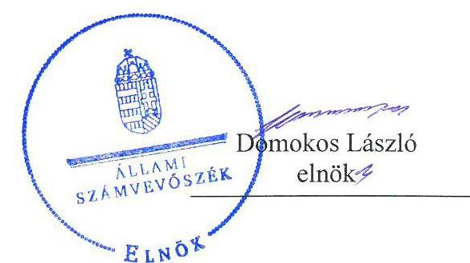
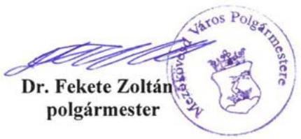
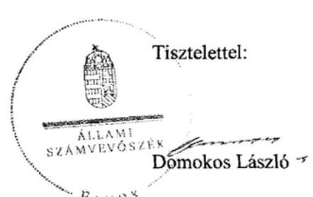
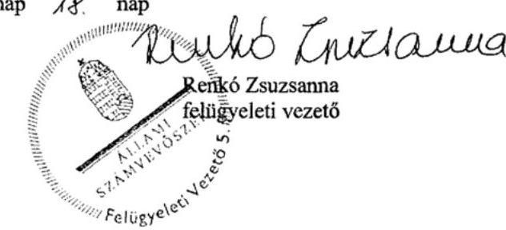

# Jelenetés 

## Önkormányzatok belső kontrollrendszere

Az önkormányzatok belső kontrollrendszere kialakításának és működtetésének ellenőrzése - Mezőkövesd 2017.

---

# Jelentés 

## Önkormányzatok belső kontrollrendszere

Az önkormányzatok belső kontrollrendszere kialakításának és működtetésének ellenőrzése - Mezőkövesd
2017. 05. hó 18. nap

---

# AZ ELLENŐRZÉST FELÜGYELTE:

- RENKŐ ZSUZSANNA felügyeleti vezető

- AZ ELLENŐRZÉST VEZETTE ÉS A VÉGREHAJTÁSÁÉRT FELELŐS:
  - DÉR LÍVIA ellenőrzésvezető
  - A PROGRAM ÖSSZEÁLLÍTÁSÁÉRT FELELŐS:
    - JANIK JÓZSEF osztályvezető

- IKTATÓSZÁM: V-1225-068/2016.
- TÉMASZÁM: 2259
- ELLENŐRZÉS-AZONOSÍTÓ SZÁM: V-076407

Jelentéseink az Országgyűlés számítógépes hálózatán és az Interneten a www.asz.hu címen is olvashatóak.

---

# TARTALOMJEGYZÉK 

■ ÖSSZEGZÉS ..... 5
■ AZ ELLENŐRZÉS CÉLJA ..... 6
■ AZ ELLENŐRZÉS TERÜLETE ..... 7
■ AZ ELLENŐRZÉS HÁTTERE, INDOKOLTSÁGA ..... 8
■ A JELENTÉS LÉNYEGES KÉRDÉSKÖREI ..... 10
■ ELLENŐRZÉS HATÓKÖRE ÉS MÓDSZEREI ..... 11
■ MEGÁLLAPÍTÁSOK ..... 14
■ JAVASLATOK ..... 20
■ MELLÉKLETEK ..... 23
I. sz. melléklet: Értelmező szótár ..... 23
II. sz. melléklet: Az integritás szemlélet érvényesítése érdekében kialakított és működtetett kontrollrendszer ..... 26
■ FÜGGELÉK: ÉSZREVÉTELEK ..... 27
■ RÖVIDÍTÉSEK JEGYZÉKE ..... 41

---

.

---

# ÖSSZEGZÉS 

Mezőkövesd Város Önkormányzata belső kontrollrendszere kialakításának és működtetésének hiányosságai miatt a közpénzfelhasználás szabályossága nem volt biztosított, a befektetési tevékenységek szabályszerű végzését, elszámoltathatóságát nem támogatta. A befektetési döntéshozatal szabályszerű volt. Az Önkormányzat beszámolója nem a valóságnak megfelelően mutatta be a befektetett közvagyon nagyságát, ezáltal a mérlegben szereplő adatok megbízhatósága a befektetések vonatkozásában nem volt biztosított. Az Önkormányzat az integritás szemlélet érvényesülése érdekében nem tett erőfeszítéseket.

## Az ellenőrzés társadalmi indokoltsága

Magyarország Alaptörvénye az önkormányzatoktól is elvárja a kiegyensúlyozott, átlátható és fenntartható költségvetési gazdálkodás elvének érvényesítését. A korábbi évek ellenőrzési tapasztalatai, az önkormányzatok által betöltött társadalmi szerep, az általuk kezelt közpénz nagysága, a nemzeti vagyon átruházására vagy hasznosítására vonatkozó döntéseik sokrétűsége egyaránt indokolttá tették a számvevőszéki ellenőrzések folytatását. A belső kontrollrendszer kialakítása és működtetése nélkül nem valósítható meg a közpénzek, a közvagyon szabályos, gazdaságos, hatékony és eredményes felhasználása.

Mezőkövesd Város Önkormányzata 2015. december 31-én 1,8 millió Ft névértékű részvénnyel, 78,1 millió Ft vételi áron nyilvántartott tőkegarantált pénzpiaci befektetési jeggyel és 1475,6 millió Ft összegű lekötött betéttel rendelkezett.

## Főbb megállapítások, következtetések

Az egyes befektetések vonatkozásában 2011-2015. között, a gazdálkodás egészét érintően a 2015. évben a belső kontrollrendszer kialakítása és működtetése a pillérek összesített értékelése alapján nem volt szabályszerű. A kontrolltevékenységek működése nem volt megfelelő, ezért azok nem biztosították a közpénzfelhasználás szabályosságát, nem járultak hozzá a hibák megelőzéséhez, feltárásához. A befektetésekkel kapcsolatosan 2011-2015. között nem mérték fel a tevékenységben, gazdálkodásban rejlő kockázatokat, nem határozták meg ezen kockázatokkal kapcsolatban szükséges intézkedéseket, valamint azok teljesítése folyamatos nyomon követésének módját, emiatt a kockázatkezelési rendszer nem támogatta a befektetési tevékenység szabályszerű, kockázatokat minimalizáló végzését.

A 2008. évi befektetési jegy vásárlásával, továbbá a 2015. évi betétlekötéssel kapcsolatos döntést az arra jogosult hozta meg. A számviteli elszámolásban, nyilvántartásban feltárt hibák miatt nem biztosították, hogy megbízható információk álljanak rendelkezésre az Önkormányzat befektetéseiről.

Az integritás szemlélet erősítése érdekében - a belső kontrollrendszer kialakításában és működésében feltárt hiányosságok és hibák megszüntetésével - az Önkormányzatnak még erőfeszítéseket kell tennie.

---

# AZ ELLENŐRZÉS CÉLJA 

Az ellenőrzés célja annak megállapítása volt, hogy szabályszerűen történt-e az Önkormányzat belső kontrollrendszerének kialakítása és működtetése, az biztosította-e az Önkormányzatnál a közpénzfelhasználás szabályosságát, a közpénzekkel és a nemzeti vagyonnal történő szabályszerű és felelős gazdálkodást, a beszámolási és adatszolgáltatási kötelezettségek szabályszerű teljesítését. Az ellenőrzés keretében értékeltük az Önkormányzat korrupciós kockázatainak kezelését szolgáló integritás kontrollok kiépítettségét és az integritás szemlélet érvényesülését.

Az Önkormányzat egyes befektetési tevékenységeinek ellenőrzése során az ellenőrzés célja volt, hogy a kialakított kontrollkörnyezet biztosította-e a befektetési tevékenységek szabályszerű végzését. Megítéltük, hogy az Önkormányzat egyes befektetési döntései és azok végrehajtása, elszámolása megfelelt-e a vonatkozó jogszabályoknak és belső szabályozásoknak, a kialakított kontrollrendszer támogatta-e a befektetési tevékenység szabályszerűségét.

---

# **AZ ELLENŐRZÉS TERÜLETE**

## **Mezőkövesd Város Önkormányzata**

Borsod-Abaúj-Zemplén megyében fekvő Mezőkövesd város állandó lakosainak száma 2015. január 1-jén 16 613 fő volt. Az ellenőrzött időszakban az Önkormányzat¹ 12 tagú képviselő-testületének munkáját 2013. október 31-ig négy, azt követően két állandó bizottság segítette. Az Önkormányzat a 2015. évben négy intézménnyel rendelkezett.

A polgármester a 2010. évi önkormányzati választások óta tölti be tisztségét. A jegyző 2011 óta látja el feladatait. Az Önkormányzat működésével, valamint az államigazgatási ügyek döntésre való előkészítésével, végrehajtásával kapcsolatos feladatokat a Mezőkövesdi Közös Önkormányzati Hivatal látta el. A Hivatal szervezeti egységekre tagolódott, de elkülönített gazdasági szervezettel nem rendelkezett. A Hivatalban foglalkoztatott köztisztviselők száma 2015. év végén 69 fő volt.

Az Önkormányzat a 2015. évi éves költségvetési beszámolója szerint 4562,8 millió Ft költségvetési bevételt ért el, valamint 4826,4 millió Ft költségvetési kiadást teljesített. A hiányt az előző évi 2003,0 millió Ft maradvány felhasználásából fedezték. Az eszközvagyon értéke 2015. december 31-én 20 049,2 millió Ft volt, amelyből a tartós befektetések 173,4 millió Ft-ot tettek ki. A forrásokon belül a költségvetési évben esedékes kötelezettség állomány 70,9 millió Ft volt, a költségvetési évet követően esedékes kötelezettség állomány 52,3 millió Ft-ot tett ki, pénzintézettel szembeni kötelezettségük nem volt. Az Önkormányzat a 2013. évben 2331,4 millió Ft, 2014-ben 991,1 millió Ft adósságkonszolidációs támogatásban részesült.

---

# AZ ELLENŐRZÉS HÁTTERE, INDOKOLTSÁGA 

A demokratikus társadalmakban alapvető igény, hogy a közpénzeket, a közvagyont használók tevékenységükről elszámoljanak, ahhoz egyértelmű és érvényesíthető felelősségi szabályok társuljanak. Ennek a jogos igénynek az érvényesítéséhez meg kell teremteni azokat a folyamatokat, rendszereket, amelyek nélkülözhetetlenek az elszámoltatáshoz. Az elszámoltatás eredményes működtetéséhez szükség van a megfelelő információs, kontroll-, értékelési - és beszámolási rendszerek kialakítására. A belső kontrollok kiépítettsége hozzájárul az integritási szemlélet kialakításához és érvényesüléséhez. A belső kontrollrendszer kialakítása és működtetése nélkül nem valósítható meg a közpénzek, a közvagyon szabályos, gazdaságos, hatékony és eredményes felhasználása.

A BELSŐ KONTROLLRENDSZER azt a célt szolgálja, hogy az államháztartás szervei működésük és gazdálkodásuk során a tevékenységeket szabályszerűen, gazdaságosan, hatékonyan, eredményesen hajtsák végre, teljesítsék elszámolási kötelezettségeiket és megvédjék az erőforrásokat a veszteségektől, a károktól, a nem rendeltetésszerű használattól. A belső kontrollrendszer magába foglalja mindazon szabályokat, eljárásokat, gyakorlati módszereket és szervezeti struktúrákat, kockázatkezelési technikákat, kontrolltevékenységeket, amelyek segítséget nyújtanak a szervezetnek céljai eléréséhez. A belső kontrollrendszer szabályozása háromszintű, a törvényi előírásokat az Áht². és a Mötv³. a rendeleti szintű szabályozást az Ávr. ${ }^{4}$ és a Bkr. ${ }^{5}$ tartalmazza, amelyeket útmutatói szinten az NGM által kiadott standardok és kézikönyvek támogatnak.

A megfelelő belső kontrollrendszer jelentősen csökkenti a hibák és szabálytalanságok kockázatát. Az ÁSZ ${ }^{6}$ célja, hogy javuljon az ellenőrzött önkormányzatok belső kontrollrendszerének szabályozottsága, működésének megfelelősége, szabályszerűsége, hozzájárulva ezzel az egyensúlyi helyzet fenntarthatóságának biztosításához, biztosítva az önkormányzatnál a közpénzfelhasználás szabályosságát, a közpénzekkel és a nemzeti vagyonnal történő szabályszerű, gazdaságos, hatékony és eredményes gazdálkodást. Az ÁSZ ellenőrzés tapasztalatai nem csupán a közvetlenül ellenőrzött önkormányzatokat támogathatják, hanem a „jó gyakorlat” elterjesztésével azok az önkormányzatok is átvehetik a pozitív példákat, ahol nem végez ellenőrzést az ÁSZ.

A közszféra integritás alapú kultúrájának kialakítása, megerősítése és működése szorosan összefügg a belső kontrollrendszer működésével, ezért az ellenőrzés kiterjed annak értékelésére is, hogy a belső kontrollrendszer kialakítása és működtetése hogyan hatott az integritás szemlélet érvényesülésére.

## AZ ÖNKORMÁNYZATOK ÁTMENETILEG SZABAD

PÉNZESZKÖZEINEK BEFEKTETÉSÉT jogszabály nem tiltja, a befektetések jellege nem korlátozott, a pénzpiaci szolgáltatók közül az önkormányzatok a kínált szolgáltatás és annak költségei alapján, szabadon választhatnak, azonban a veszteséges gazdálkodás kockázatai és kö-

---

vetkezményei az önkormányzatokat terhelik. A szabad pénzeszközök felhasználása során kiemelten fontos a felelős gazdálkodás érvényesülése, amely összhangban kell, hogy legyen az önkormányzati gazdálkodás alapelveivel.
2015. első felében az MNB három befektetési szolgáltató tevékenységi engedélyét vonta vissza és kezdeményezte a vállalkozások felszámolását a működéssel kapcsolatos szabálytalanságok, hiányosságok miatt. A befektetési vállalkozások problémás helyzetbe kerülése jelentős veszteségekhez vezetett számos önkormányzat esetében. A korábbi évek ellenőrzési tapasztalatai alapján fennáll a lehetősége annak, hogy az önkormányzatok befektetési döntései, továbbá a döntések végrehajtása és számviteli elszámolása nem voltak teljes mértékben szabályszerűek, és a kapcsolódó külső és belső kontroll rendszerek sem működtek minden esetben megfelelően.

Az ellenőrzéssel feltárásra kerülhetnek azok a kockázatok, amelyek az önkormányzatok gazdálkodásával, ezen belül befektetési tevékenységeivel, kontrollkörnyezetével kapcsolatosak és a befektetési tevékenységek szabályszerű végrehajtását befolyásolják. Az ellenőrzéssel az önkormányzatok befektetési/vagyongazdálkodási döntéseinek összessége értékelhetővé válik, és megalapozott megállapítás tehető arra vonatkozóan, hogy milyen hatást gyakoroltak az önkormányzat vagyonára a képviselő-testület döntései.

# AZ ELLENŐRZÉS VÁRHATÓ HASZNOSULÁSA 

NÉGY SZINTEN valósul meg. A törvényalkotás számára összegzett tapasztalatok állnak rendelkezésre a belső kontrollrendszer önkormányzati területen való kialakításáról, működtetéséről és hatásairól. Az ellenőrzés az ellenőrzött számára visszajelzést ad a belső kontrollrendszer kialakításában és működésében lévő hiányosságokról, javaslataival hozzájárul azok kiküszöböléséhez. Az ellenőrzés megállapításait és javaslatait más szervezetek is hasznosíthatják a rendezett gazdálkodási keretek kialakításához. A társadalom számára jelzi, hogy közpénz nem maradhat ellenőrizetlenül, az ÁSZ értékteremtő rend kialakításához és megőrzéséhez hozzájáruló tevékenysége pozitív hatással lesz a szervezetről kialakított összkép formálásában.

---

# A JELENTÉS LÉNYEGES KÉRDÉSKÖREI 

1.     - A belső kontrollrendszer egyes pillérei biztosították-e a befektetési tevékenységek szabályszerű végzését a 2011 - 2015. években?
2.     - Az Önkormányzat belső kontrollrendszerének kialakítása és működtetése a 2015. évben szabályszerű volt-e, az biztosította-e a közpénzfelhasználás szabályosságát, a nemzeti vagyonnal történő felelős gazdálkodást?
3.     - Az egyes befektetésekkel kapcsolatos döntéshozatal és a döntések végrehajtása szabályszerű volt-e?
4.     - Az egyes befektetések számviteli elszámolása, nyilvántartása szabályszerű volt-e?

---

# ELLENŐRZÉS HATÓKÖRE ÉS MÓDSZEREI 

## Az ellenőrzés típusa

A belső kontrollrendszer ellenőrzése esetében megfelelőségi ellenőrzés, a befektetési tevékenységnél szabályszerűségi ellenőrzés

## Az ellenőrzött időszak

A belső kontrollrendszer kialakításának és működtetésének ellenőrzése a 2015. január 1. és december 31. közötti időszakra terjedt ki. Az önkormányzatok egyes befektetési tevékenységeinek ellenőrzése tekintetében az ellenőrzött időszak a 2011. január 1. - 2015. december 31. közötti időszak. Ezen felül az önkormányzat befektetésekkel kapcsolatos döntés-előkészítésének és döntéshozatalának szabályszerűségét a 2011. január 1. előtti időszakra visszanyúlóan is ellenőriztük, amennyiben a 2015. december 31-én meglévő befektetéseire 2011. január 1-je előtt került sor. Az integritás szemlélet érvényesülését a 2015. évre vonatkozó adatszolgáltatás alapján értékeltük.

## Az ellenőrzés tárgya

A helyi önkormányzatnak, mint éves költségvetési beszámoló készítésére kötelezett szervezetnek és polgármesteri hivatalának belső kontrollrendszere. Az integritás szemlélet érvényesülése.

Az önkormányzat 2015. december 31-én meglévő, értékpapírokban megtestesülő befektetései, lekötött betétei, valamint a szabad pénzeszközei terhére, adásvételi szerződés keretében megszerzett, a kötelező feladatok ellátását nem szolgáló, az önkormányzat üzleti vagyonába tartozó, az ellenőrzött időszakban (2011-2015.) megszerzett ingatlanok, továbbá időkorlátozás nélkül megszerzett -kulturális javak (műtárgyak, műalkotások, stb.), illetve a feladatellátást nem szolgáló
 egyéb értéktárgyak (pl. ékszerek, befektetési nemesfém).

Az ellenőrzés kiterjedt minden olyan körülményre és adatra, amely az ÁSZ jogszabályban meghatározott feladatainak teljesítéséhez, valamint a program végrehajtása folyamán felmerült újabb összefüggések feltárásához szükséges volt.

## Az ellenőrzött szervezet

Mezőkövesd Város Önkormányzata és az önkormányzati működéshez kapcsolódó feladatokat ellátó Hivatal.

---

# Az ellenőrzés jogalapja 

Az ÁSZ tv. ${ }^{8}$ 1. § (3) bekezdésében foglaltak alapján az ÁSZ általános hatáskörrel végzi a közpénzekkel és az állami és önkormányzati vagyonnal való felelős gazdálkodás ellenőrzését. Az ÁSZ tv. 5. § (2) bekezdése alapján az államháztartás gazdálkodásának ellenőrzése keretében az ÁSZ ellenőrzi a helyi önkormányzatok gazdálkodását, valamint az ÁSZ tv. 5. § (6) bekezdése alapján ellenőrzése során értékeli az államháztartás számviteli rendjének betartását és a belső kontrollrendszer működését.

## Az ellenőrzés módszerei

Az ellenőrzést a nemzetközi standardokat irányadónak tekintve az ellenőrzési program szempontjai, kérdései, az ellenőrzött időszakban hatályos jogszabályok, az ellenőrzés szakmai szabályok és módszertanok figyelembe vételével végeztük.

Az ellenőrzés ideje alatt az ellenőrzött szervezettel történő kapcsolattartást az ÁSZ SZMSZ-ének ${ }^{9}$ vonatkozó előírásai alapján biztosítottuk.

Az ellenőrzési kérdések megválaszolásához szükséges bizonyítékok megszerzése az ellenőrzöttek által rendelkezésre bocsátott dokumentumokra, adatokra alapozva megfigyelés, szemle (szemrevételezés), kérdésfeltevés (információkérés), valamint elemző eljárással történt. A minták kiválasztása rétegzett, véletlen mintavételi eljárással történt.

Az ellenőrzési bizonyítékként felhasználható adatforrások közé tartoznak egyrészt az ellenőrzési program részletes szempontjainál felsorolt adatforrások, másrészt minden - az ellenőrzés folyamán feltárt, az ellenőrzés szempontjából információt tartalmazó - dokumentum.

Az ellenőrzés lefolytatásához az önkormányzat a tanúsítványok elektronikus kitöltésével, valamint az ÁSZ által kért dokumentumok elektronikus megküldésével szolgáltat adatokat. A rendelkezésre bocsátott adatok, információk kontrollja az ellenőrzés keretében történt.

A jelentésben használt fogalmak magyarázatát az I. számú melléklet, továbbá a Rövidítések jegyzéke tartalmazza.

Az önkormányzat belső kontrollrendszere jogszabályi előírások szerinti kialakításának és működtetésének szabályszerűségét, az erre irányuló ellenőrzési kérdésekre adott válaszok összesítése alapján a 2015. január 1. és december 31. közötti időszakra, pillérenként (kontrollkörnyezet, kockázatkezelési rendszer, kontrolltevékenységek, információs és kommunikációs rendszer, monitoring rendszer) és összesítetten is értékeljük. Az önkormányzat belső kontrollrendszere egyes pilléreinek kialakítása és működtetése „szabályszerű", amennyiben az értékelt területen az elért igen válaszok százalékban kifejezett, egész számra kerekített aránya meghaladja a 85%-ot, „részben szabályszerű", ha a 85%-ot nem haladja meg, de 60%-nál nagyobb, „nem szabályszerű", ha nem haladja meg a 60%-ot. Az önkormányzat belső kontrollrendszerének összesített értékelése megegyezik a pillérenként (kontrollterületenként) alkalmazott százalékos értékelésekkel, a következő eltérésekkel. A kontrollrendszer egésze esetében a „szabályszerű" értékelésnek a százalékos értéken felül további feltétele, hogy egyik kontrollterület sem kaphat „nem szabályszerű" értékelést, a

---

„részben szabályszerű" értékelés további feltétele, hogy legfeljebb egy ellenőrzött kontrollterület lehet „nem szabályszerű" értékelésű. Az összesített értékelés a százalékos értéktől függetlenül „nem szabályszerű", ha az ellenőrzött kontrollterületek közül több mint egynek „nem szabályszerű" az értékelése.

A kontrolltevékenységek működésének megfelelőségét a foglalkoztatottak személyi juttatásaival, a külső személyi juttatásokkal, a működési kiadásokkal és a felhalmozási célú kiadásokkal kapcsolatos kifizetések esetében mintavétellel ellenőriztük. „Megfelelőnek" értékeltünk egy ellenőrzött területet, amennyiben 95%-os bizonyossággal a teljes sokaságban a hibaarány legfeljebb 10%, „nem megfelelőnek", amennyiben 10%-nál magasabb arányt képviselt. Abban az esetben, ha a teljes sokaság tekintetében a 10%-os hibaarányhoz való viszony megítélésének megbízhatósága nem érte el a 95%-ot, annak elérése érdekében értékelésünket további szempontokkal egészítettük ki, és figyelembe vettük a feltárt hibák értékét.

Az integritás szemlélet érvényesülésének értékelése az önkormányzat által kitöltött tanúsítvány alapján történt a 2015. évre vonatkozóan a II. sz. melléklet alapján.

---

# 1. A belső kontrollrendszer egyes pillérei biztosították-e a befektetési tevékenységek szabályszerű végzését a 2011 - 2015. években? 

Összegző megállapítás

Az egyes befektetési tevékenységeket érintően a 2011-2015. között a belső kontrollrendszer kialakításának és működtetésének hiányosságai következtében nem volt biztosított az átláthatóság és az elszámoltathatóság.

A KONTROLLKÖRNYEZET kialakítása nem támogatta a befektetési tevékenység szabályszerű végzését, mivel nem volt teljes körű összhang az önkormányzati SZMSZ ${ }_{3}{ }^{10}$ a vagyongazdálkodási rendelet ${ }_{1-2}{ }^{11}$, illetve a költségvetési rendeletek végrehajtási szabályai között a 2011. január 1-je és 2015. december 31-e közötti időszakban az átmenetileg szabad pénzeszközök befektetésére vonatkozóan.

KOCKÁZATKEZELÉSI RENDSZERT az Ámr. ${ }_{2}{ }^{12}$ 157. § (1)-(3) bekezdéseiben és a Bkr. 7. § (1)-(2) bekezdéseiben foglaltak ellenére nem működtettek, a befektetési tevékenységgel kapcsolatban nem állapították meg a kockázatokat, nem határozták meg az egyes kockázatokkal kapcsolatban szükséges intézkedéseket, valamint azok teljesítésének folyamatos nyomon követésének módját.

A KONTROLLTEVÉKENYSÉGEK részeként a befektetések vonatkozásában nem biztosították a költségvetési gazdálkodás során az előzetes pénzügyi ellenőrzést, mivel a befektetési jegyek vásárlására és visszaváltására vonatkozó aláírt kötelezettségvállalási dokumentummal az Ámr. ${ }_{1}{ }^{13} 134 . \S$ (8) bekezdésének előírása ellenére nem rendelkeztek. A befektetési jegyek vételárának teljesítését megelőzően a szakmai teljesítésigazolás az Ámr. ${ }_{1} 135 . \S$ (1) bekezdése előírásával ellentétesen nem történt meg, így a kifizetésre előzetes írásbeli kötelezettségvállalás és szakmai teljesítésigazolás nélkül került sor. Az érvényesítésre az Ámr. ${ }_{1} 135 . \S$ (3) bekezdése ellenére nem a szakmai teljesítésigazolás alapján került sor, az utalványokon az Ámr. ${ }_{1} 136 . \S$ (4) bekezdés h) pontjában előírtak ellenére a kötelezettségvállalás nyilvántartási számát nem tüntették fel.

## AZ INFORMÁCIÓS ÉS KOMMUNIKÁCIÓS RENDSZER nem biztosította, hogy megfelelő, pontos és naprakész információk álljanak rendelkezésre az Önkormányzat működésével kapcsolatosan, mivel nem alakították ki az egyes befektetésekkel kapcsolatos információk esetében a szervezeten belüli információ áramlás rendjét, a szervezeten kívülre történő információátadás rendszerét, nem határozták meg a beszámolási szinteket, határidőket, módokat az Ámr. ${ }_{2}$ 159. § (1)-2) bekezdése, a Bkr. 9. § (1)-(2) bekezdése előírásai ellenére.

---

A MONITORING RENDSZER keretén belül működő belső ellenőrzés az Önkormányzat irányítási, belső kontroll és ellenőrzési eljárásai eredményességének növelését a befektetési tevékenység vonatkozásában nem biztosította, mivel nem végeztek a befektetésekkel kapcsolatos belső ellenőrzést. A külső ellenőrzések a befektetési tevékenységre nem terjedtek ki, ezért nem támogatták a befektetési tevékenység szabályszerű végzését.

# 2. Az Önkormányzat belső kontrollrendszerének kialakítása és működtetése a 2015. évben szabályszerű volt-e, az biztosította-e a közpénzfelhasználás szabályosságát, a nemzeti vagyonnal történő felelős gazdálkodást? 

Összegző megállapítás

A gazdálkodás egészét érintően a 2015. évben a belső kontrollrendszer nem biztosította a szabályszerű működést, a gazdaságosság, hatékonyság és eredményesség követelményeinek érvényesülését.

A KONTROLLKÖRNYEZET kialakítása nem volt teljes körű, mivel , figyelemmel Áhsz. ${ }^{14}$ 2. § (1) bekezdésre és 51. § (2) bekezdésre is az Önkormányzat nem rendelkezett a számlarendet alátámasztó, a Számv. tv. 161. § (2) bekezdés d) pontja szerinti bizonylati renddel.

A Hivatal alapító okirata az Ávr. 5. § (1) bekezdés f) pontja ellenére az alaptevékenységeket nem a kormányzati funkciók szerinti megjelöléssel tartalmazta.

A számviteli politikában a Számv. tv. ${ }^{15}$ 14. § (4) bekezdése ellenére - a nem jelentős maradványérték, a jelentős összegű hiba és a részesedések, a hosszú lejáratú értékpapírok és a követelések értékvesztésének elszámolása körében a jelentős összeg meghatározása kivételével - nem került rögzítésre, hogy a számviteli elszámolás, értékelés szempontjából mit tekintenek lényegesnek, nem lényegesnek, jelentősnek nem jelentősnek, továbbá nem került meghatározásra, hogy az alkalmazott gyakorlatot milyen okok miatt kell megváltoztatni. A számviteli politika aktualizálása nem történt meg a Számv. tv. 14. § (4) bekezdésének 2015. július 4-én életbe lépett módosítását követő 90 napon belül a Számv. tv. 14. § (11) bekezdése ellenére, mivel nem rögzítették azokat a szabályokat, amelyekkel meghatározzák, hogy mit tekintenek kivételes nagyságú vagy előfordulású bevételnek, költségnek, ráfordításnak.

Az Áhsz. 51. § (3) bekezdésében előírtak ellenére a számlarend nem tartalmazta a részletező nyilvántartásoknak a kapcsolódó könyvviteli és nyilvántartási számlákkal való egyeztetésének dokumentálását, valamint a részletező nyilvántartások és az egységes rovatrend rovataihoz kapcsolódóan vezetett nyilvántartási számlák adataiból a pénzügyi könyvvezetéshez készült összesítő bizonylatok (feladások) elkészítésének rendjét, az összesítő bizonylat tartalmi és formai követelményeit.

A Hivatalnál az Ávr. 13. § (2) bekezdés c) és f) pontjában előírtak ellenére belső szabályzatban nem rendezték a belföldi és külföldi kiküldetések elrendelésével és lebonyolításával, elszámolásával kapcsolatos kérdéseket,

---

valamint a hivatali gépjárművek igénybevételének és használatának rendjét.

Az Önkormányzat javára történő ingyenes vagyonlemondás vonatkozásában az vagyongazdálkodási rendelet ${ }_{2}$, és az önkormányzati SZMSZ ${ }_{3}$ rendelkezései nem voltak összhangban.

A KOCKÁZATKEZELÉSI RENDSZERT a Bkr. 7. § (1) és (2) bekezdésének előírásai ellenére a Hivatal nem működtette. Nem mérték fel és nem állapították meg a tevékenységben, gazdálkodásban rejlő kockázatokat, nem határozták meg az egyes kockázatokkal kapcsolatban szükséges intézkedéseket.

A KONTROLLTEVÉKENYSÉGEK nem biztosították a kockázatok kezelését, nem járultak hozzá a szervezet céljainak eléréséhez. A gazdálkodási szabályzatban az Önkormányzat feladatellátására vonatkozó kötelezettségvállalások esetében a teljesítésigazoló kijelölése nem az Ávr. 52. § (6) bekezdése és az 57. § (4) bekezdése szerint történt, mert nem a kötelezettségvállalásra jogosult polgármester jelölte ki a teljesítésigazolót, hanem a jegyző. A kontrolltevékenységek keretében a pénzügyi ellenjegyzést, a teljesítés igazolását és az érvényesítést az Áht. 37. § (1) bekezdése és a 38. § (1) bekezdése ellenére nem, vagy nem az Ávr. 55. §, (1) bekezdése, továbbá az 57-58. § előírásainak megfelelően végezték el. A teljesítés igazolás és az érvényesítés elmaradása, illetve nem szabályszerű végrehajtásának eredményeként nem történt meg a kiadások összegszerűségének, a fedezet meglétének és a megelőző ügymenetben az Áht., az Áhsz2. és az Ávr., továbbá a belső szabályzatok előírásai betartásának az ellenőrzése. Emiatt a kontrolltevékenységek nem biztosították a kiadásokkal kapcsolatban a hibák megelőzését és feltárását, a közpénzfelhasználás szabályosságát.

# AZ INFORMÁCIÓS ÉS KOMMUNIKÁCIÓS RENDSZER kialakítása és működtetése körében a Bkr. 9. § (1)-(2) bekezdésének előírása ellenére a Hivatalban nem alakítottak ki és nem működtettek olyan rendszereket, amelyek biztosítják, hogy a megfelelő információk a megfelelő időben eljutnak az illetékes szervezethez, szervezeti egységhez, illetve személyhez. A beszámolási szinteket, határidőket, módokat nem határozták meg. 

A MONITORING RENDSZER keretében az operatív tevékenységek során megvalósuló folyamatos és eseti nyomon követést a Hivatalban a Bkr. 10. §-ában foglaltak ellenére nem alakították ki és nem működtették.

A 4/2013. (V.3.) jegyzői utasítással kiadott Belső ellenőrzési kézikönyv felülvizsgálatára a Bkr. 17. § (4) bekezdése ellenére dokumentáltan nem került sor. A belső ellenőrzés során a 2015. évi belső ellenőrzéseket teljes körűen nem a tervnek megfelelően hajtották végre. A 2015. és 2016. évi ellenőrzési tervek a Bkr. 31. § (4) bekezdés a) pontjában foglalt követelmények ellenére nem tartalmazták az ellenőrzési tervet megalapozó elemzések és a kockázatelemzés összefoglaló bemutatását. Az intézkedési tervet a Bkr. 45. § (3) bekezdése ellenére nem minden esetben készítették el a jogszabályban meghatározott 8 napos határidőn belül. A Bkr. 47. § (1) be-

---

kezdése ellenére éves bontásban nem vezettek olyan nyilvántartást, amelylyel
 a belső ellenőrzési jelentésekben tett megállapításokat, javaslatokat, a vonatkozó intézkedési terveket és azok végrehajtását nyomon követhették volna. A 2015. évi éves ellenőrzési jelentést a Bkr. 49. § (3a) bekezdése ellenére nem a polgármester terjesztette a Képviselő-testület elé.

A jegyző nem tett eleget a Bkr. 11. § (1) bekezdése előírásainak, mert nyilatkozatban nem értékelte a költségvetési szerv belső kontrollrendszerének minőségét.

# A HELYI NEMZETISÉGI ÖNKORMÁNYZATTAL KAPCSOLATOS FELADATOK KERETÉBEN az együttműködésre vonatkozó megállapodást ${ }^{16}$ megkötötték. A Hivatal által előkészített, az Önkormányzat és a Nemzetiségi Önkormányzat ${ }^{17}$ által kötött együttműködési megállapodás nem tartalmazta a Nemzetiségi Önkormányzat ellenőrzésével kapcsolatos feladatokat. 

A Nemzetiségi Önkormányzat kiadásaihoz kapcsolódó teljesítés igazoló személyt az Ávr. 57. § (4) bekezdés előírásai ellenére nem az Ávr. 52. § (7) bekezdése szerinti kötelezettségvállaló, hanem a jegyző jelölte ki. A Hivatal nem készítette el a Nemzetiségi Önkormányzat ellenőrzési nyomvonalát, a szabálytalanságok kezelésének eljárásrendjét a Bkr. 6. § (3) és (4) bekezdései előírása ellenére. A Nemzetiségi Önkormányzat 2015. évi belső ellenőrzéséről a Bkr. 10. §-ában foglaltak ellenére a Hivatal nem gondoskodott.

AZ INTEGRITÁS SZEMLÉLET érvényesítését az Önkormányzat belső kontrollrendszerének kialakítása és működtetése nem támogatta. Az Önkormányzat az integritás szemlélet érvényesülésének felméréséhez jelen ellenőrzés keretében szolgáltatott adatokat. Az értékelés eredményét a jelentéstervezet II. számú melléklete mutatja be.

## 3. Az egyes befektetésekkel kapcsolatos döntéshozatal és a döntések végrehajtása szabályszerű volt-e?

Összegző megállapítás A befektetési jegyek 2008. évi vásárlásával, továbbá a 2015. évi betétlekötéssel kapcsolatos döntéshozatal az előírásoknak megfelelően történt.

Az Önkormányzatnak 2015. december 31-én 1,8 millió Ft névértékú önkormányzati közfeladat-ellátást nem szolgáló gazdasági társaságban lévő részvénye, 78,1 millió Ft vételi áron nyilvántartott tőkegarantált pénzpiaci befektetési jegye és 1475,6 millió Ft összegű lekötött betéte volt. Üzleti célú ingatlannal, kulturális javakkal, egyéb értéktárgyakkal az Önkormányzat nem rendelkezett.

A befektetésekre vonatkozó döntések előkészítését érintően az Önkormányzat belső szabályokat nem rögzített, ezáltal nem biztosították, hogy a befektetési tevékenység összhangban legyen a gazdaságosság, hatékonyság és eredményesség követelményeivel.

---

A befektetési döntéshozatal megfelelt a jogszabályi előírásoknak. A 2008. évi vásárlás és 2010. évi visszaváltás eredményeként kialakult befektetési jegy állományról a polgármester a 2008. és a 2010. évi költségvetési rendeletek felhatalmazása alapján jogszerűen döntött. Az átmenetileg szabad pénzeszközök betétként való elhelyezéséről szóló döntést az önkormányzati SZMSZ-ben, a vagyongazdálkodási rendeletben ${ }_{2}$ és a 2015. évi költségvetési rendeletben rögzített átruházott hatáskörben hozta meg. A részvényhez az Önkormányzat 1997-ben a privatizáció során ingyenes vagyonátadás kapcsán jutott.

A Pénzügyi Bizottság 2011. január 1. és 2015. december 31. között a jogszabályban előírt feladatát nem látta el, mivel az Ötv. 92. § (13) bekezdése b) pontjának és az Mötv. 120. § (1) bekezdése b) pontjának előírása ellenére az értékpapírokban tartott vagyon változásának alakulását nem kísérte figyelemmel, a változást előidéző okokat nem értékelte.

# 4. Az egyes befektetések számviteli elszámolása, nyilvántartása szabályszerű volt-e? 

Összegző megállapítás

A befektetési jegyek számviteli elszámolásának hibái miatt a 2011-2014. évek mérlege a befektetéseket nem a valós értéken tartalmazta. A leltározási feladatok szabálytalan végrehajtása következtében a befektetések mérlegben szereplő adatainak megbízhatósága nem volt biztosított.

A BEFEKTETÉSEK NYILVÁNTARTÁSA során a befektetési jegyek 2010. évi visszaváltásakor az analitikus és főkönyvi nyilvántartásban téves összegben számolták el a befektetési jegyek állományának csökkenését. Ennek következtében az Önkormányzat tulajdonában levő befektetési jegyek tényleges beszerzési áron nyilvántartott értéke 2011-2014. között az analitikus és főkönyvi nyilvántartásban 15198919 Ft-tal kevesebb volt, mint ami ténylegesen az értékpapír számlakivonatok szerint az Önkormányzat tulajdonában állt, ezzel megsértették az Áhsz. ${ }^{18}$ 15. § (1) bekezdésében és a Számv. tv. 23. § (1) bekezdésében foglalt rendelkezéseket. Az Áhsz. ${ }_{1}$ 22. § (5) bekezdésében foglaltak ellenére nem mutatták ki a számviteli nyilvántartásban az Önkormányzat értékpapír számláján nyilvántartott, de a Mezőkövesdi Többcélú Kistérségi Társulás tulajdonát képező 25,0 millió Ft beszerzési értékű befektetési jegyek állományát. Ezáltal nem tettek eleget a Számv. tv. 15. § (2) bekezdése szerinti teljesség elve érvényesülésének, mert nem biztosították, hogy minden gazdasági esemény könyvelése megtörténjen, ezáltal az eszközökre és forrásokra gyakorolt hatásai a beszámolóban kimutathatóak legyenek.

A befektetési jegyeket a 2011-2013. évi mérlegek nem a Számv. tv. 3. § (6) bekezdés 3. pontjának megfelelően tartalmazták, azokat a befektetett pénzügyi eszközök között, részesedésként kellett volna szerepeltetni, ennek ellenére tartós hitelviszonyt megtestesítő befektetett pénzügyi eszközként mutatták ki. A részesedések és a lekötött betétek besorolása, mérlegben történő bemutatása megfelelt a jogszabályi előírásoknak.

A befektetett pénzügyi eszközökről vezetett analitikus nyilvántartások szabálytalanok voltak, mert nem tartalmazták a 2011-2013. közötti

---

időszakban az Áhsz. 9. melléklet 1/h. és 1/k. pontja, valamint a 2014-2015. években az Áhsz. 14. melléklet VIII. 1-2. pontjában előírt tartalmi elemeket.

A lekötött bankbetétek esetében a főkönyvi számlákhoz nem kapcsolódott analitikus (részletező) nyilvántartás a Számv. tv. 69. § (2) bekezdésében előírt kötelezettség teljesíthetősége érdekében, illetve az Áhsz. 39. § (3) bekezdése és a 45.§ (3) bekezdése, valamint a 14. melléklet V/1. pontjának előírása ellenére.

A BEFEKTETÉSEK LELTÁROZÁSA során a részvények mennyiségi felvétellel történő leltározását az ellenőrzött időszak minden évében december 31-i fordulónappal elvégezték. A befektetési jegyek esetében a mérleget alátámasztó leltárban és ebből következően a 2011-2014. évi mérlegekben a pénzügyi befektetések között kimutatott hitelviszonyt megtestesítő értékpapírok állományi értéke nem egyezett meg a mérlegek fordulónapjára vonatkozó értékpapír számlakivonatokban kimutatott tényleges bekerülési értékkel, ezért megsértették a Számv. tv. 15. § (3) szerinti valódiság számviteli alapelvét. A lekötött betétek egyeztetéssel történő leltározása az analitikus/részletező nyilvántartások hiányában nem felelt meg az Áhsz. 37. § (3) bekezdésben, illetve a Számv. tv. 69. § (2)-(3) bekezdéseiben az egyeztetéssel történő leltározás követelményének.

A befektetések év végi számviteli feladatai közül a részvények értékelését a Számv. tv., az Áhsz. előírásainak megfelelően a mérlegkészítést megelőzően elvégezték. Az értékvesztés számviteli elszámolása az Áhsz előírásainak megfelelően történt.

---

# JAVASLATOK 

Az ÁSZ tv. 33. § (1) bekezdésében foglaltak értelmében az ellenőrzött szervezet vezetője köteles a jelentésben foglalt megállapításokhoz kapcsolódó intézkedési tervet összeállítani és azt a jelentés kézhezvételétől számított 30 napon belül az ÁSZ részére megküldeni. Amennyiben az ellenőrzött szervezet vezetője nem küldi meg határidőben az intézkedési tervet, vagy továbbra sem elfogadható intézkedési tervet küld, az Állami Számvevőszék elnöke az ÁSZ tv. 33. § (3) bekezdése a) és b) pontjaiban foglaltakat érvényesítheti.

## a polgármesternek

1. Intézkedjen az Önkormányzat javára történő ingyenes vagyonlemondásra vonatkozó szabályozások közötti összhangot biztosító előterjesztés Képviselő-testület elé terjesztéséről.
(2. számú megállapítás 6. bekezdése alapján)
2. Intézkedjen az Állami Számvevőszék ellenőrzése során feltárt hiányosságok és/vagy szabálytalanságok tekintetében a munkajogi felelősség kivizsgálására irányuló eljárás megindításáról és eljárás eredményének ismeretében tegye meg a szükséges intézkedéseket.
(2. számú megállapítás 12. bekezdése alapján)

## a jegyzőnek

1. Intézkedjen a belső kontrollrendszer egyes elemei jogszabályi előírásnak megfelelő kialakításáról és működtetéséről, valamint a gazdálkodási jogkörök gyakorlása során a jogszabályi előírások betartásáról.
(1. számú megállapítás 2-4. bekezdései,
2. számú megállapítás 1-5., 7., 8. bekezdés 2-3. mondatai, 9-10. bekezdése, 11. bekezdés 1. és 3-6. mondatai és 12. bekezdése alapján)
3. Intézkedjen a befektetésekhez kapcsolódó részletező nyilvántartások jogszabályi előírásoknak megfelelő vezetéséről.
(4. számú megállapítás 3-4. bekezdései alapján)
4. Intézkedjen a jogszabályi előírásoknak megfelelően az éves költségvetési beszámoló mérlegében kimutatott eszközök leltárral történő alátámasztásáról.
(4. számú megállapítás 5. bekezdés 2-3. mondatai alapján)

---

4. Intézkedjen az Állami Számvevőszék ellenőrzése során feltárt hiányosságok és/vagy szabálytalanságok tekintetében a munkajogi felelősség tisztázására irányuló eljárás megindításáról és ennek eredménye ismeretében tegye meg a szükséges intézkedéseket.
(1. számú megállapítás 3. bekezdése,
5. számú megállapítás 8. bekezdés 3. mondata,
6. számú megállapítás 3-4. bekezdései és 5. bekezdés
2-3. mondatai alapján)

---

.

---

# MELLÉKLETEK 

- I. SZ. MELLÉKLET: ÉRTELMEZŐ SZÓTÁR

ÁSZ Integritás Projekt
belső ellenőrzés
belső kontrollrendszer
belső kontrollrendszer pillérei, kontrollterületei
betét
betétszerződés
dematerializált értékpapír
értékpapírszámla
forgatási célú értékpapír
helyi önkormányzat

Az Állami Számvevőszék 2009-ben indította el a „Korrupciós kockázatok feltérképezése - Integritás alapú közigazgatási kultúra terjesztése" című, európai uniós forrásból megvalósított kiemelt projektjét (Integritás Projekt). Az Integritás Projekt célja, hogy felmérje a közszféra intézményei korrupciós kockázatoknak való kitettségét, illetőleg az azok mérséklésére hivatott kontrollok szintjét. Az Állami Számvevőszék a projekt révén az integritás szemlélet minél szélesebb körrel történő megismertetését, gyakorlatba ültetését kívánja elérni. Az integritás követelményeinek megfelelő szervezeti működést előnyben részesítő közigazgatási kultúra elterjesztését és a korrupció elleni fellépést az ÁSZ önmagára nézve is stratégiai jelentőségű célként fogalmazta meg. A projekt a felmérésben résztvevő intézmények számára helyzetükről egyfajta „tükörképet" mutat be, ami alapot teremt a jövőbeni pozitív irányú elmozduláshoz. (Forrás: a http://integritas.asz.hu honlapon közzétett, a 2013. évi Integritás felmérés eredményeiről készült összefoglaló tanulmány)
Független, tárgyilagos bizonyosságot adó és tanácsadó tevékenység, amelynek célja, hogy az ellenőrzött szervezet működését fejlessze és eredményességét növelje, az ellenőrzött szervezet céljai elérése érdekében rendszerszemléletű megközelítéssel és módszeresen értékeli, illetve fejleszti az ellenőrzött szervezet irányítási és belső kontrollrendszerének hatékonyságát. (Forrás: Bkr. 2. § b) pontja)
A belső kontrollrendszer a kockázatok kezelése és tárgyilagos bizonyosság megszerzése érdekében kialakított folyamatrendszer, amely azt a célt szolgálja, hogy a működés és gazdálkodás során a tevékenységeket szabályszerűen, gazdaságosan, hatékonyan, eredményesen hajtsák végre, az elszámolási kötelezettségeket teljesítsék, megvédjék az erőforrásokat a veszteségektől, károktól és nem rendeltetésszerű használattól. (Forrás: Áht. 69. § (1) bekezdése)
A kontrollkörnyezet, a kockázatkezelési rendszer, a kontrolltevékenységek, az információs és kommunikációs rendszer, valamint a nyomon követési (monitoring) rendszer. (Forrás: Bkr. 3. §-a)
a Ptk. szerinti betétszerződés vagy a takarékbetétről szóló 1989. évi 2. törvényerejű rendelet szerinti takarékbetét-szerződés alapján fennálló tartozás, ideértve a hitelintézetnél a fizetésiszámla-szerződés alapján fennálló pozitív számlaegyenleget is (Hpt. 6. § (1) bekezdés 8. pont).
betétszerződés alapján a betétes jogosult a bank számára meghatározott pénzösszeget fizetni, a bank köteles a betétes által felajánlott pénzösszeget elfogadni, ugyanakkora pénzösszeget későbbi időpontban visszafizetni, valamint kamatot fizetni (Ptk. 6:390. § (1) bekezdés);
a Tpt.-ben és külön jogszabályban meghatározott módon, elektronikus úton létrehozott, rögzített, továbbított és nyilvántartott, az értékpapír tartalmi kellékeit azonosítható módon tartalmazó adatösszesség (Tpt. 5. § (1) bekezdés 29. pont)
a dematerializált értékpapírról és a hozzá kapcsolódó jogokról az értékpapír-tulajdonos javára vezetett nyilvántartás (Tpt. 5. § (1) bekezdés 46. pont)
azok az értékpapírok, amelyeket forgatási célból, kamatbevétel, illetve árfolyamnyereség elérése érdekében szereztek be, továbbá azokat, amelyek a tárgyévet követő üzleti évben lejárnak (Számv. tv. 30. § (5) bekezdés)
A helyi önkormányzat jogi személy. Az önkormányzati feladatok ellátását a képviselő-testület és szervei biztosítják. A képviselőtestület szervei: a polgármester, a fő-

---

hitelviszonyt megtestesítő értékpapír
hosszú lejáratú kötelezettség
információs és kommunikációs rendszer
integritás
irányító szerv és annak vezetője
kockázatkezelési rendszer
polgármester, a megyei közgyűlés elnöke, a képviselő-testület bizottságai, a részönkormányzat testülete, a polgármesteri hivatal, a megyei önkormányzati hivatal, a közös önkormányzati hivatal, a jegyző, továbbá a társulás. A képviselő-testület a feladatkörébe
 tartozó közszolgáltatások ellátására - jogszabályban meghatározottak szerint - költségvetési szervet, a Polgári perrendtartásról szóló 1952. évi III. törvény szerinti gazdálkodó szervezetet (a továbbiakban: gazdálkodó szervezet), nonprofit szervezetet és egyéb szervezetet (a továbbiakban együtt: intézmény) alapíthat, továbbá szerződést köthet természetes és jogi személlyel vagy jogi személyiséggel nem rendelkező szervezettel. A helyi önkormányzat éves költségvetési beszámolója magába foglalja a helyi önkormányzat - nem költségvetési szerveihez tartozó - feladataihoz kapcsolódó bevételeket és kiadásokat. A helyi önkormányzat összevont (konszolidált) költségvetési beszámolóját a helyi önkormányzatra és költségvetési szerveire vonatkozóan külön-külön beérkezett éves költségvetési beszámolók alapján a Kincstár készíti el és küldi meg az önkormányzatnak. (Forrás: Mötv. 41. § (1), (2), (6) bekezdései; Áhsz. 22. § (1) bekezdése, 6. § (1) bekezdés a) és f) pontja, 30. §-a, 37. § (1) és (6) bekezdése)
minden olyan értékpapír, illetve törvény által értékpapírnak minősített, jogot megtestesítő okirat, amelyben a kibocsátó (adós) meghatározott pénzösszeg rendelkezésére bocsátását elismerve arra kötelezi magát, hogy a pénz (kölcsön) összegét, valamint annak meghatározott módon számított kamatát vagy egyéb hozamát, és az általa esetleg vállalt egyéb szolgáltatásokat az értékpapír birtokosának (a hitelezőnek) a megjelölt időben és módon megfizeti, illetve teljesíti. Ide tartozik különösen: a kötvény, a kincstárjegy, a letéti jegy, a pénztárjegy, a célrészjegy, a takaréklevél, a jelzáloglevél, a hajóraklevél, a közraktárjegy, az árujegy, a zálogjegy, a kárpótlási jegy, a határozott idejű befektetési alap által kibocsátott befektetési jegy (Számv. tv. (6) bekezdés 2. pont)
az egy üzleti évnél hosszabb lejáratra kapott kölcsön (ideértve a kötvénykibocsátást is) és hitel, a mérleg fordulónapját követő egy üzleti éven belül esedékes törlesztések levonásával, továbbá az egyéb hosszú lejáratú kötelezettség (Számv. tv. 42. § (2) bekezdés)

A költségvetési szerv vezetője által kialakított és működtetett olyan rendszer, mely biztosítja, hogy a megfelelő információk a megfelelő időben eljutnak az illetékes szervezethez, szervezeti egységhez, illetve személyhez. (Forrás: Bkr. 9. § (1) bekezdés)
Az integritás elvek, értékek, cselekvések, módszerek, intézkedések konzisztenciáját jelenti: olyan magatartásmódot, amely meghatározott értékeknek felel meg. Az integritás a közszféra esetében a társadalom által elvárt nyilvánossági, átláthatósági, illetve jogi/etikai normáknak történő megfelelést jelenti. (Forrás: a http://integritas.asz.hu honlapon közzétett „A 2012. évi integritás felmérés eredményeinek összefoglalója" című dokumentum 3. oldal 1. bekezdése)
A közös önkormányzati hivatal kivételével a helyi önkormányzat által irányított költségvetési szerv esetén a képviselő-testület, közgyűlés és a polgármester, főpolgármester, megyei közgyűlés elnöke. A közös önkormányzati hivatal esetén a közös önkormányzati hivatal székhelye szerinti helyi önkormányzat képviselő-testülete és annak polgármestere.(Forrás: Áht. 2. § (1) bekezdés i), ia) és ib) pontja)
Olyan irányítási eszközök és módszerek összessége, melynek elemei a szervezeti célok elérését veszélyeztető tényezők (kockázatok) azonosítása, elemzése, csoportosítása, nyomon követése, valamint szükség esetén a kockázati kitettség mérséklése. (Forrás: Bkr. 2. § m) pontja)

---

kontrollkörnyezet

kontrolltevékenységek
kulturális javak
részvény
tartós hitelviszonyt megtestesítő értékpapír
tulajdonosi részesedést jelentő befektetés
üzleti vagyon
vagyongazdálkodás

A költségvetési szerv vezetője által kialakított olyan elvek, eljárások, belső szabályzatok összessége, amelyben világos a szervezeti struktúra, egyértelműek a felelősségi, hatásköri viszonyok és feladatok, meghatározottak az etikai elvárások a szervezet minden szintjén, átlátható a humánerőforrás-kezelés. (Forrás: Bkr. 6. § (1) bekezdés)
A költségvetési szerv vezetője által a szervezeten belül kialakított (kontroll) tevékenységek, melyek biztosítják a kockázatok kezelését, hozzájárulnak a szervezet céljainak eléréséhez. (Forrás: Bkr. 8. § (1) bekezdés)
az élettelen és élő természet keletkezésének, fejlődésének, az emberiség, a magyar nemzet, Magyarország történelmének kiemelkedő és jellemző tárgyi, képi, hangrögzített, írásos emlékei és egyéb bizonyítékai - az ingatlanok kivételével -, valamint a művészeti alkotások (a kulturális örökség védelméről szóló 2001. évi LXIV. törvény)
a kibocsátó részvénytársaságban gyakorolható tagsági jogokat megtestesítő, névre szóló, névértékkel rendelkező, forgalomképes értékpapír (Ptk. 3:213. § (1) bekezdés)
tartós hitelviszonyt megtestesítő értékpapír

## 25

---

# II. SZ. MELLÉKLET: AZ INTEGRITÁS SZEMLÉLET ÉRVÉNYESÍTÉSE ÉRDEKÉBEN KIALAKÍTOTT ÉS MŰKÖDTETETT KONTROLLRENDSZER 

Az államháztartás szervezetei korrupciós kockázatoknak való kitettségét, valamint az azzal szembeni ellenálló képességüket az ÁSZ az integritás projekt keretében feltérképezi és értékeli. Az Önkormányzat az ÁSZ integritás projektjéhez a 2015. évben nem csatlakozott, ezért az ellenőrzés során töltötte ki az integritás tanúsítványt. Az integritás szemlélet érvényesülésének értékelése az Önkormányzat által szolgáltatott adatok felülvizsgálata alapján történt, az értékelést az alábbi táblázat tartalmazza.

| AZ INTEGRITÁS KONTROLLRENDSZERÉNEK ÉRTÉKELÉSE |  |  |  |  |
| :--: | :--: | :--: | :--: | :--: |
| Sorszám | Megnevezés | Maximum elér-   hetö pontszámek | Elért   pontszámek | Ertékelés |
| 1. | Összeférhetetlenség és etikai elvárások | 5 | 4 | közepes |
| 2. | Humánerőforrás-gazdálkodás | 5 | 5 | magas |
| 3. | A szervezet vagyonának megvédésére tett intézkedések | 5 | 2 | alacsony |
| 4. | A nemkívánatos dolgozói magatartással szembeni intézkedések és azok érvényesülése | 5 | 3 | alacsony |
| 5. | Az integritás erősítése, annak tudatosítása, valamint a kockázatelemzések alkalmazása | 5 | 1 | alacsony |
|  | Összesítő értékelés | 25 | 15 | alacsony |

Az integritási kontrollrendszer kiépítettsége az Önkormányzatnál összességében alacsony volt. A humánerőforrásgazdálkodással kapcsolatos kockázatok kezelésére kiépített kontrollok megfeleltek a követelményeknek, ezen túl az összeférhetetlenség és etikai elvárások szintje közepes mértékű volt. A kontrollok kiépítettségének főbb hiányosságai az alábbiak voltak:

1. a speciális korrupcióellenes rendszerek és eljárások tekintetében az Önkormányzatnál:

- nem működtettek közérdekű bejelentéseket kezelő, valamint a szervezeten kívülről érkező panaszokat és közérdekű bejelentéseket kezelő rendszert;
- nem végeztek rendszeres korrupciós kockázatelemzéseket;
- nem volt korrupcióellenes képzés az elmúlt 3 évben;
- szervezet stratégiájában nem szerepel a szervezeti kultúra javítása, az integritás erősítése, a korrupció elleni fellépés;
- nem végeztek kockázatelemzést a belső ellenőrzési tervek megalapozásához.

2. a „lágy" kontrollok (a szervezeti által önként bevezetett, kialakított szabályok, követelmények) kialakítását érintően az Önkormányzatnál:

- nem szabályozták az ajándékok, meghívások, utaztatás elfogadásának feltételeit;
- nem határozták meg a szervezet tulajdonában álló egyes eszközök használatára vonatkozó szabályokat;
- nem szabályozták a külső személyekkel való kapcsolattartást;
- nem alkalmazták a „négy szem" elvét.

Az integritás kontrollok kiépítettségének színvonala alapján az Önkormányzatnál az integritás szemlélet érvényesítése további intézkedéseket igényel.

---

# FÜGGELÉK: ÉSZREVÉTELEK 

A jelentéstervezetet a Számvevőszék 15 napos észrevételezésre megküldte az ellenőrzött szervezetek vezetőinek az ÁSZ tv. 29. § (1) bekezdése előírásának megfelelően.
Az elfogadott észrevételek alapján a Számvevőszék módosította a jelentést.

A függelék tartalmazza az ellenőrzött szervezetek észrevételeit, illetve az el nem fogadott észrevételek elutasításának indoklását.

[^0]
[^0]:    * 29. § (1) Az Állami Számvevőszék az ellenőrzési megállapításait megküldi az ellenőrzött szervezet vezetőjének vagy az általa megbízott személynek, és annak, akinek személyes felelősségét állapította meg.
    (2) Az ellenőrzött szervezet vezetője és a felelősként megjelölt személy az ellenőrzés megállapításaira tizenöt napon belül írásban észrevételt tehet.
    (3) Az Állami Számvevőszék az észrevételre a beérkezésétől számított harminc napon belül írásban válaszol. A figyelembe nem vett észrevételeket köteles a jelentésben feltüntetni, és megindokolni, hogy azokat miért nem fogadta el.

---

# 546 

## 546

## 54

## MEZŐKÖVESD VÁROS POLGÁRMESTERÉTŐL

$\boxtimes 3400$, Mezőkövesd, Mátyás király u. 112.
(00-36) 49/511-500, 511-511 Fax(00-36) 49/511-561
e-mail: polgarmester@mezokovesd.hu

3-4.025-2/2017.

## Tárgy: Vizsgálati jelentésben foglaltakra reagálás

## Domokos László Elnök Úr   Állami Számvevőszék

Budapest 4.
Pf.: 54.
1364

Tisztelt Elnök Úr!

Az „Önkormányzatok belső kontrollrendszere - Az önkormányzatok belső kontrollrendszere kialakításának és működtetésének ellenőrzése - Mezőkövesd" című jelentéstervezetet megismertem, és az ellenőrzés megállapításaira vonatkozóan az alábbi észrevételeket teszem:

1. megállapítás 5. bekezdését nem tudom elfogadni, tekintettel arra, hogy nincs olyan központi előírás, ami kötelezővé tenné a befektetési tevékenység évenkénti belső, vagy külső ellenőrzését
2. megállapítás 2. bekezdését nem fogadom el, tekintettel arra, hogy a 27/2015.(II.25) határozat, valamint a 274/2015. (XII.16.) határozat 2. mellékletének 4.4. pontja, tartalmazza a Közös Hivatal alaptevékenységeit kormányzati funkciók szerinti megjelöléssel („Közös Hivatal alapító okirat 2013-tól" dokumentum 7-es, és 23-as oldala). A Magyar Államkincstár törzskönyvi nyilvántartó rendszere által biztosított közhiteles nyilvántartás alábbiakban elérhető adata szerint is tartalmazza a Közös Hivatal alapító okirata a kormányzati funkciók szerinti alaptevékenységet (http://www.allamkincstar.gov.hu/hu/ext/torzskonyv/1/?ktsearch=1\&ktpar2=807810\& ktpar1=0).
3. megállapítás 3. bekezdését részben fogadom el, ugyanis a Számviteli politika 8. oldal 5. Maradványérték meghatározása, illetve 10. oldal 8. Jelentős összegű hiba meghatározása tartalmazza, hogy az államháztartás szervezeténél mi minősül jelentősnek, illetve nem jelentősnek. Az eszközök és források értékelési szabályzatának 8. oldala, 8. Az értékvesztés elszámolásának visszaírásának feltételrendszere rendelkezik a Gazdasági társaságban lévő tulajdoni részesedést jelentő befektetések, a hitelviszonyt megtestesítő, egy évnél hosszabb lejáratú értékpapírok, és a követelések esetében a jelentős összeg fogalmának meghatározásáról.

---

- 2. megállapítás 4. bekezdésében foglaltakat részben fogadom el, tekintettel arra, hogy a számlarend Pl:158-as, 161-es, 165-ös oldalai rögzítik a főkönyvi számlák és az analitikus nyilvántartás kapcsolatát, illetve a IV. Könyvviteli zárlat (számlarend 255-258. oldal) került szabályozásra a főkönyvi könyvelés és az analitikus nyilvántartás egyeztetési kötelezettsége, mely során külön kitétel nem szerepel az összesítő bizonylat tartalmi és formai követelményeire.
- 2. megállapítás 5. bekezdésében foglaltakat nem tudom elfogadni, mert a pénzkezelési szabályzat 1.3. A házipénztár pénzellátása pontjában szabályozza a fizetési számláról felveendő pénzeszköz összegének meghatározására vonatkozó számbavételt, a pénz szállításának módját, annak a házipénztárban történő elhelyezését, az engedélyezett napi pénzkészlet záró állományát meghaladó összeg esetén szükséges eljárásrendet.
- 2. megállapítás 9. bekezdésének 3. mondatában foglaltakat nem tudom elfogadni, tekintettel arra, hogy a 2015. évi kiadásoknál minden esetben megtörtént a pénzügyi ellenjegyzés, a teljesítés igazolása, és az érvényesítés, melyet az ellenőrzés rendelkezésére bocsátott bizonylatok is alátámasztanak.
- 2. megállapítás 12. bekezdését részben tudom elfogadni, mert az Önkormányzat feladatfinanszirozása nem nyújt fedezetet a Mezőkövesdi Közös Önkormányzati Hivatalnál főállású belső ellenőr alkalmazására, illetve nincs a szervezetben ilyen végzettséggel rendelkező személy. A feladatellátás kontrolját a személyes egyeztetések és aláírások biztosítják, valamint a kiadmányozásról szóló szabályzat alapján a hivatal vezetője személyesen írja alá a méltányossági, az elutasító illetve a bírságot kiszabó határozatokat.
- 2. megállapítás 14. bekezdését részben tudom elfogadni, tekintettel arra, hogy a Mezőkövesdi Roma Nemzetiségi Önkormányzat és Mezőkövesd Város Önkormányzata között létrejött együttműködési megállapodások és azok 1. melléklete tartalmazta a Nemzetiségi Önkormányzat kötelezettségvállalásaival kapcsolatos Önkormányzatot terhelő gazdálkodási jogkörök ellátására vonatkozó feladatokat, azok felelősei kijelölését, valamint a gazdálkodási eljárásrendet. A megállapodás I.-II. pontja rögzíti a működéshez szükséges tárgyi és személyi feltételeket, a III. pontjai rögzítik az adatszolgáltatási feladatok teljesítésével kapcsolatos előírásokat, a IV. pontja pedig az operatív gazdálkodásra vonatkozó előírásokat.
- 3. megállapítás 2. bekezdését nem tudom elfogadni, mert az Önkormányzat 2009. január 5-től rendelkezik Likvid pénzeszköz- és kockázatkezelési szabályzattal, melyben a döntés előkészítési jogkör, és a döntési jogkör szabályozásra került.
- 3. megállapítás 4. bekezdésében foglaltakat csak részben tudom elfogadni, mert

 az adott évi gazdálkodásról készült féléves, háromnegyedéves, éves beszámolók, tájékoztatók minden esetben tartalmazták az önkormányzat befektetéseinek, betétlekötéseinek eredményét, így a Pénzügyi Bizottság ellátta az Ötv. 92. § (13) bekezdés b) pontjában, és az MÖtv. 120. § (1) bekezdés b) pontjában feladatát, vagyis „figyelemmel kísérte a költségvetési bevételek alakulását, különös tekintettel a saját bevételekre, a vagyonváltozás (vagyon növekedés, - csökkenés) alakulását.”

---

A megállapításnak azt a részét tudom elfogadni, hogy a Bizottság nem készített külön értékelést a költségvetési bevételek, és a vagyon alakulásáról.

- 4. megállapítás 1. bekezdésében foglaltakkal kapcsolatosan az alábbi észrevételt kívánom tenni: A Mezőkövesdi Többcélú Kistérségi Társulás a Mezőkövesdi Önkormányzat részben önálló intézményeként működött, ezért önálló értékpapírszámlával nem rendelkezhetett az OTP befektetési jegyek vásárlásakor. Amikor a Társulás önállóvá vált, azért, hogy a meglévő befektetési jegyeit ne kelljen visszaváltani, és új befektetési jegyeket vásárolni (ezáltal a hozamokat elvesztette volna a társulás), az önkormányzatnak az értékpapírszámláján maradt továbbra is a befektetés, és a Társulás a saját befektetését szerepeltette a beszámolójában, és az önkormányzat is csak az Önkormányzat által vásárolt befektetési jegyeket mutatta ki befektetett pénzügyi eszközként 2011-2014. években. 2015. évben a számviteli előírásoknak (teljesség elve) eleget téve került sor a Társulás befektetési jegyének letéti kezelésre átvett eszközként történő szerepeltetése az Önkormányzatnál, a Társulásnál pedig letéti kezelésre átadott eszközként történő bemutatása. A 2016. évi beszámolót alátámasztó leltár készítésekor derült fény arra, hogy a 2015. évi leltározás során tévesen került az Önkormányzat könyveibe leltártöbbletként felvételre a 15.198.919 Ft értékpapír, tekintettel arra, hogy az a Mezőkövesdi Többcélú Társulás tulajdona, tehát nem befektetett eszközként kellett volna 2015. évben a beszámolóban szerepeltetni, hanem a letéti kezelésre átvett eszköz értékét kellett volna ezzel a 15.198.919 Ft-tal megnövelni.

A 2016. évi beszámoló valós értéken történő bemutatása érdekében ezt a hibát, mind a Többcélú Kistérségi Társulásnál, mind Mezőkövesd Város Önkormányzatánál korrigáljuk, amennyiben erre a Nemzetgazdasági Minisztérium engedélyét megkapjuk.

- 4. megállapítás 2. - 3. bekezdésében foglaltakat nem tudom elfogadni, mert az államháztartás szervezetei beszámolási és könyvvezetési kötelezettségének sajátosságairól szóló 249/2000. (XII.24.) Korm. rendelet 9. melléklet 1/h pontja alapján az önkormányzat nem szerzett tulajdoni részesedést, tartós befolyást, irányítást, és ellenőrzési lehetőséget az OTP Tökegarantált pénzpiaci befektetési jegy vásárlásával, ezért nem szerepeltettük a könyveinkben a tartós részesedések között az értékpapírokat. A számvitelről szóló 2000. évi törvény 3.§ (6) bekezdés 3. pontjában foglalt alábbi meghatározás „a kibocsátó …arra kötelezi magát, hogy ezen értékpapír, okirat birtokosának meghatározott vagyoni és egyéb jogokat biztosít.” nem valósul meg. A befektetési jegy kibocsátója csak arra vállal kötelezettséget, hogy az értékpapír megvásárlójának a rövidebb futamidőre rendelkezésre álló pénzeszközök számára, kiszámítható árfolyam alakulású, rugalmas, bármikor hozzáférhető, a lekötött bankbetéteket megközelítő hozamú befektetési lehetőséget biztosít, nagyon alacsony kockázat mellett.
- 4. megállapítás utolsó bekezdését nem tudom elfogadni, mert a 249/2000. (XII.24.) Korm. rendelet 9. melléklet 3.a) pontja nem rögzíti, hogy a lekötött bankbetétek esetében milyen részletező nyilvántartást kellene vezetni, valamint az államháztartás számviteléről szóló 4/2013.(I.11) Korm. rendelet 14. melléklet V/1 pontja szerint "A

---

fizetési számlákra befolyt bevételeket és a teljesített kiadásokat a kapott számlakivonat alapján kell nyilvántartani.", és önkormányzatunk ennek a szabálynak megfelelt.

Kérem, Tisztelt Elnök Urat, hogy a fenti észrevételeket a végleges vizsgálati jelentés elkészítésénél szíveskedjen figyelembe venni.

Mezőkövesd, 2017. március 29.

Tisztelettel:

---

ELNÖK

Ikt. szám: V-1225-064/2016.

# Dr. Fekete Zoltán úr 

polgármester
Mezőkövesd Város Önkormányzata

## Mezőkövesd

## Tisztelt Polgármester Úr!

Köszönettel megkaptam az „Önkormányzatok belső kontrollrendszere - Az önkormányzatok belső kontrollrendszere kialakításának és működtetésének ellenőrzése - Mezőkövesd” címû jelentéstervezet megállapításaira tett észrevételét.

Az ellenőrzési megállapításokra vonatkozó észrevételét az Állami Számvevőszékről szóló 2011. évi LXVI. törvény 29. § (2) bekezdésében meghatározott tizenöt napos határidőn belül küldte meg. Az Állami Számvevőszék észrevétellel kapcsolatos álláspontját a mellékletként csatolt, a felügyeleti vezető által készített indokolás tartalmazza.

Budapest, 2017.

Melléklet: Észrevételre adott válasz

---

„Önkormányzatok belső kontrollrendszere - Az önkormányzatok belső kontrollrendszere kialakításának és működtetésének ellenőrzése - Mezőkövesd” címû jelentéstervezetre tett észrevételekre adott válasz

| Észrevétel: | 1. számú megállapítás 5. bekezdése   Megállapítás: A monitoring rendszer keretén belül működő belső ellenőrzés az Önkormányzat irányítási, belső kontroll és ellenőrzési eljárásai eredményességének növelését a befektetési tevékenység vonatkozásában nem biztosította, mivel nem végeztek a befektetésekkel kapcsolatos belső ellenőrzést. A külső ellenőrzések a befektetési tevékenységre nem terjedtek ki, ezért nem támogatták a befektetési tevékenység szabályszerű végzését.   Észrevétel: Nincs olyan előírás, ami kötelezővé tenné a befektetési tevékenység évenkénti belső, vagy külső ellenőrzését. |
| :--: | :--: |
| Válasz: | Az Állami Számvevőszék az észrevételt nem fogadja el. |
| Indoklás: | A megállapításban szereplő tényt, miszerint a 2011-2015. években sem belső, sem külső ellenőrzés nem történt, nem vitatták. |
| Észrevétel: | 2. számú megállapítás 2. bekezdése   Megállapítás: A Hivatal alapító okirata az Ávr. 5. § (1) bekezdés f) pontja ellenére az alaptevékenységeket nem a kormányzati funkciók szerinti megjelöléssel tartalmazta.   Észrevétel: A 27/2015. (II.25.) határozat, valamint a 274/2015. (XII.16.) határozat 2. mellékletének 4.4. pontja tartalmazza. A Magyar Államkincstár törzskönyvi nyilvántartó rendszere által biztosított közhiteles nyilvántartás adata szerint is tartalmazza a Közös hivatal alapító okirata a kormányzati funkciók szerinti alaptevékenységet. |
| Válasz: | Az Állami Számvevőszék az észrevételt nem fogadja el. |
| Indoklás: | Az Önkormányzat által az ÁSZ rendelkezésére bocsátott és az észrevételben is hivatkozott dokumentum nem tekinthető érvényes alapító okiratnak, mivel az alapítók aláírását nem tartalmazza. Az alapítók aláírását is tartalmazó alapító okirat 2016. január 27-én kelt (ez megegyezik a Magyar Államkincstár törzskönyvi nyilvántartásának adatával is), míg az ÁSZ észrevétellel érintett megállapítása a 2015. évre vonatkozik. |

---

|  | 2. számú megállapítás 3. bekezdés 1. mondata   Megállapítás: A számviteli politikában a Számv. tv. 14. § (4) bekezdése ellenére nem   került rögzítetésre, hogy a számviteli elszámolás, értékelés szempontjából mit tekin-   tenek lényegesnek, nem lényegesnek, jelentősnek nem jelentősnek, továbbá nem ke-   rült meghatározásra, hogy az alkalmazott gyakorlatot milyen okok miatt kell meg-   változtatni. |
| :--: | :-- |
| Észrevétel: | Észrevétel: A számviteli politika 8. oldal 5. Maradványérték meghatározása, illetve   10. oldal 8. Jelentős összegű hiba meghatározása tartalmazza, hogy az államháztartás   szervezeténél mi minősül jelentősnek, illetve nem jelentősnek. Az eszközök és for-   rások értékelési szabályzatának 8. oldala 8. Az értékvesztés elszámolásának vissza-   írásának feltételrendszere rendelkezik a Gazdasági társaságban lévő tulajdoni részes-   sedést jelentő befektetések, a hitelviszonyt megtestesítő, egy évnél hosszabb lejáratú   értékpapírok, és a követelések esetében a jelentős összeg fogalmának meghatározá-   sáról. |
| Válasz: | Az Állami Számvevőszék az észrevételt részben fogadja el. |
| Indoklás: | A dokumentum felülvizsgálata során megállapítottuk, hogy abban szerepel a nem   jelentős maradványérték, a jelentős összegű hiba és a részesedések, a hosszú lejáratú   értékpapírok és a követelések értékvesztésének elszámolása körében a jelentős ösz-   szeg meghatározása, így ezzel a megállapítás pontosításra került. |
| Észrevétel: | 2. számú megállapítás 4. bekezdése   Megállapítás: Az Áhsz. 51. § (3) bekezdésében előírtak ellenére a számlarend nem   tartalmazta a részletező nyilvántartásoknak a kapcsolódó könyvviteli és nyilvántar-   tási számlákkal való egyeztetését, annak dokumentálását, valamint a részletező nyil-   vántartások és az egységes rovatrend rovataihoz kapcsolódóan vezetett nyilvántar-   tási számlák adataiból a pénzügyi könyvvezetéshez készült összesítő bizonylatok   (feladások) elkészítésének rendjét, az összesítő bizonylat tartalmi és formai követel-   ményeit.   Észrevétel: A számlarend pl. 158-as, 165-ös oldalai rögzítik a főkönyvi számlák és   az analitikus nyilvántartás kapcsolatát, illetve a IV. Könyvviteli zárlat (számlarend   255-258 oldal) került szabályozásra a főkönyvi könyvelés és az analitikus nyilvánta   tartás egyeztetési kötelezettsége. |
| Válasz: | Az Állami Számvevőszék az észrevételt részben elfogadja. |
| Indoklás: | A számlarend áttekintése alapján megállapítottuk, hogy az tartalmazta az egyeztetési   kötelezettséget, de nem tartalmazta az egyeztetés dokumentálásának kötelezettségét,   szabályait. A megállapítást pontosítottuk. |
| Észrevétel: | 2. számú megállapítás 5. bekezdése   Megállapítás: A pénzkezelési szabályzat a Számv. tv. 14. § (8) bekezdése előírása   ellenére nem tartalmazta a készpénzben és a bankszámlán tartott pénzeszközök kö-   zötti forgalom szabályait.   Észrevétel: A pénzkezelési szabályzat 1.3 A házipénztár pénzellátása pontjában sza-   bályozza. |

---

| Válasz: | Az Állami Számvevőszék az észrevételt elfogadja. |
| :--: | :--: |
| Indoklás: | A dokumentumok áttekintése alapján a megállapítás törlésre került. |
| Észrevétel: | 2. számú megállapítás 9. bekezdés 3. mondata   Megállapítás: A kontrolltevékenységek keretében a pénzügyi ellenjegyzést, a teljesítés igazolását és az érvényesítést az Áht. 37. § (1) bekezdése és a 38. § (1) bekezdése ellenére nem, vagy nem az Ávr. 55. §, (1) bekezdése, továbbá az 57-58. § előírásainak megfelelően végezték el.   Észrevétel: A 2015. évi kiadásoknál minden esetben megtörtént a pénzügyi ellenjegyzés, a teljesítés igazolása és az érvényesítés, melyet az ellenőrzés rendelkezésére bocsátott dokumentumok is alátámasztanak. |
| Válasz: | Az Állami Számvevőszék az észrevételt nem fogadja el. |
| Indoklás: | A kontrolltevékenységek gyakorlása és működtetése - az ellenőrzés rendelkezésére bocsátott dokumentumok alapján - nem felelt meg a jogszabályokban és a belső szabályzatokban foglaltaknak az alábbi hiányosságok miatt:   - az Ávr. 55. § (1) bekezdésében foglaltak ellenére a pénzügyi ellenjegyzés nem szerepelt a kötelezettségvállalás dokumentumán, illetve nem tartalmazta a pénzügyi ellenjegyzés dátumát és a pénzügyi ellenjegyzés tényére történő utalást;   - a teljesítésigazolás nem szabályszerűen történt, mert a teljesítés igazoló kijelölése nem az Ávr. 57. § (4) bekezdésében foglaltaknak megfelelően történt, ezért az jogszerű kijelölés hiányában jogosulatlanul látta el feladatát;   - a teljesítésigazolást megalapozó dokumentumok nem minden esetben álltak rendelkezésre, ezért a teljesítés igazolása az Ávr. 57. § (1) bekezdésének előírása ellenére ellenőrizhető okmányok alapján nem ellenőrizhették és igazolhatták a kiadások teljesítésének jogosságát, összegszerűségét, ellenszolgáltatást is magában foglaló kötelezettségvállalás esetében annak teljesítését;   - az érvényesítő az 58. § (1) bekezdése előírása ellenére nem ellenőrizte, hogy a megelőző ügymenetben a jogszabályokban, továbbá a belső szabályzatokban foglaltakat megtartották-e, mert az Ávr. 58. §. (2) bekezdés előírása ellenére nem jelezte az utalványozónak, hogy a teljesítésigazolást az arra szabályszerű kijelöléssel nem rendelkező személy végezte, hogy a teljesítésigazolást megalapozó dokumentumok nem álltak rendelkezésre, valamint, hogy a kötelezettségvállalás dokumentumán nem, vagy nem szabályosan szerepel a pénzügyi ellenjegyzés;   - a rendszeres személyi juttatások kifizetései esetében utalványrendelet hiányában az Ávr.58. § (1) és (3) bekezdése előírása ellenére az érvényesítés, illetve
 az Ávr. 59. § (1)–(2) bekezdése előírása ellenére az utalványozás dokumentáltan nem történt meg;   - a 100 ezer Ft-ot el nem érő kifizetések rendjének szabályozása hiányában a gazdálkodási jogkörök gyakorlása nem volt szabályszerű, mivel a teljesítésigazolás esetén az Ávr. 57. § (1) bekezdésében előírt ellenőrzési feladat, az érvényesítés esetén az Ávr. 58. § (1) bekezdése szerinti ellenőrzési feladat alapját jelentő dokumentum nem volt meghatározva.   Az észrevétel nem tartalmazott olyan dokumentumot, illetve nem is hivatkozott olyan, az ellenőrzés rendelkezésére bocsátott dokumentumra, ami az észrevételt alátámasztaná és a jelentéstervezet módosítását indokolná. |

---

|  | 2. számú megállapítás 12. bekezdése   Megállapítás: A 4/2013. (V.3.) jegyzői utasítással kiadott Belső ellenőrzési kézikönyv felülvizsgálatára a Bkr. 17. § (4) bekezdése ellenére dokumentáltan nem került sor. A belső ellenőrzés során a 2015. évi belső ellenőrzéseket teljes körűen nem a tervnek megfelelően hajtották végre. A 2015. és 2016. évi ellenőrzési tervek a Bkr. 31. § (4) bekezdés a) pontjában foglalt követelmények ellenére nem tartalmazták az ellenőrzési tervet megalapozó elemzéseket és a kockázatelemzés összefoglaló bemutatását. Az intézkedési tervet a Bkr. 45. § (3) bekezdése ellenére nem minden esetben készítették el a jogszabályban meghatározott 8 napos határidőn belül. A Bkr. 47. § (1) bekezdése ellenére éves bontásban nem vezettek olyan nyilvántartást, amellyel a belső ellenőrzési jelentésekben tett megállapításokat, javaslatokat, a vonatkozó intézkedési terveket és azok végrehajtását nyomon követhették volna. A 2015. évi éves ellenőrzési jelentést a Bkr. 49. § (3a) bekezdése ellenére nem a polgármester terjesztette a Képviselő-testület elé.   Észrevétel: A feladatfinanszírozás nem nyújt fedezetet főállású belső ellenőr alkalmazására, illetve nincs a szervezetben ilyen végzettséggel rendelkező személy. A feladatellátás kontrollját a személyes egyeztetések és aláírások biztosítják, valamint a kiadmányozásról szóló szabályzat alapján a hivatal vezetője személyesen írja alá a méltányossági, az elutasító, illetve a bírságot kiszabó határozatokat. |
| :--: | :--: |
| Válasz: | Az Állami Számvevőszék az észrevételt nem fogadja el. |
| Indoklás: | Az észrevétel a megállapítást nem vitatta. |
|  | 2. számú megállapítás 14. bekezdése   Megállapítás: A helyi nemzetiségi önkormányzattal kapcsolatos feladatok keretében az együttműködésre vonatkozó megállapodást megkötötték. A Hivatal által előkészített, az Önkormányzat és a Nemzetiségi Önkormányzat által kötött együttműködési megállapodás a Nek. tv. 80. § (3) bekezdés b) és d) pontjának ellenére nem tartalmazta a Nemzetiségi Önkormányzat kötelezettségvállalásaival kapcsolatosan az Önkormányzatot terhelő gazdálkodási jogkörök ellátására vonatkozó feladatokat, azok felelőseinek jelölését, valamint a Nemzetiségi Önkormányzat működési feltételeinek és gazdálkodásának eljárási és dokumentációs részletszabályait, illetve az Áht. 6/C. § (2) bekezdés b) pontja ellenére a Nemzetiségi Önkormányzat ellenőrzésével kapcsolatos feladatokat.   Észrevétel: Az észrevétel szerint az együttműködési megállapodás és az 1. melléklete tartalmazta a Nemzetiségi Önkormányzat kötelezettségvállalásaival kapcsolatban az Önkormányzatot terhelő gazdálkodási jogkörök ellátására vonatkozó feladatokat, azok felelőseinek kijelölését, valamint a gazdálkodási eljárásrendet. A megállapodás I–II. pontja rögzíti a működéshez szükséges tárgyi és személyi feltételeket, a III. pontjai rögzítik az adatszolgáltatási feladatok teljesítésével kapcsolatos előírásokat, a IV. pontja pedig az operatív gazdálkodásra vonatkozó előírásokat. |
| Válasz: | Az Állami Számvevőszék az észrevételt elfogadja. |
| Indoklás: | A dokumentumok áttekintése alapján a megállapítás pontosításra került. |

---

| Észrevétel: | 3. számú megállapítás 2. bekezdése   Megállapítás: A befektetésekre vonatkozó döntések előkészítését érintően az Önkormányzat belső szabályokat nem rögzített, ezáltal nem biztosították, hogy a befektetési tevékenység összhangban legyen a gazdaságosság, hatékonyság és eredményesség követelményeivel.   Észrevétel: Az észrevétel alapján az Önkormányzat 2009. január 5-től rendelkezik Likvid pénzeszköz- és kockázatkezelési szabályzattal, melyben a döntés előkészítési és a döntési jogkör szabályozásra került. |
| :--: | :--: |
| Válasz: | Az Állami Számvevőszék az észrevételt nem fogadja el. |
| Indoklás: | A szabályzat csak a döntés-előkészítési, javaslattételi és döntési jogkör gyakorlóit nevezte meg. Nem tartalmazott azonban semmilyen olyan konkrét szabályt, előírást, eljárásrendet, amelyet a jogkörgyakorlóknak követni kellene a gazdaságosság, hatékonyság és eredményesség érdekében. |
| Észrevétel: | 3. számú megállapítás 4. bekezdése   Megállapítás: A Pénzügyi Bizottság 2011. január 1. és 2015. december 31. között a jogszabályban előírt feladatát nem látta el, mivel az Ötv. 92. § (13) bekezdés b) pontjának és az Mötv. 120. § (1) bekezdés b) pontjának előírása ellenére az értékpapírokban tartott vagyon változásának alakulását nem kísérte figyelemmel, a változást előidéző okokat nem értékelte.   Észrevétel: Az észrevétel szerint az adott évi gazdálkodásról készült féléves, háromnegyedéves, éves beszámolók, tájékoztatók minden esetben tartalmazták az Önkormányzati befektetéseinek, betétlekötéseinek eredményét, így a Pénzügyi Bizottság figyelemmel kísérte a költségvetési bevételek alakulását, különös tekintettel a saját bevételekre, a vagyonváltozás alakulását. |
| Válasz: | Az Állami Számvevőszék az észrevételt nem fogadja el. |
| Indoklás: | Az ellenőrzés rendelkezésére bocsátott dokumentumok között nem szerepelt olyan, amely alátámasztaná, hogy a Pénzügyi Bizottság az értékpapírokban tartott vagyon változásának alakulását figyelemmel kísérte, a változást előidéző okokat értékelte volna. Ezt alátámasztó dokumentumot az észrevétel sem hivatkozott. |
| Észrevétel: | 4. számú megállapítás 1. bekezdése   Megállapítás: 2011–2014. között az analitikus és főkönyvi nyilvántartásban 15 198 919 Ft-tal kevesebb volt, mint ami ténylegesen az értékpapír számlakivonatok szerint az Önkormányzat tulajdonában állt, ezzel megsértették az Áhsz. 15. § (1) bekezdésében és a Számv. tv. 23. § (1) bekezdésében foglalt rendelkezéseket. Az Áhsz. 22. § (5) bekezdésében foglaltak ellenére nem mutatták ki a számviteli nyilvántartásban az Önkormányzat értékpapír számláján nyilvántartott, de a Mezőkövesdi Többcélú társulás tulajdonát képező 25,0 millió Ft beszerzési értékű befektetési jegyek állományát.   Észrevétel: Az észrevétel szerint a 2016. évi beszámolót alátámasztó leltár készítésekor derült fény arra, hogy a 2015. évi leltározás során tévesen került az Önkormányzat könyveibe leltártöbbletként felvételre a 15 198 919 Ft értékpapír, tekintettel arra, hogy az a Mezőkövesdi Többcélú Kistérségi Társulás tulajdona, tehát nem |

---

|  | befektetett eszközként kellett volna 2015. évben a beszámolóban szerepeltetni, hanem a letéti kezelésre átvett eszköz értékét kellett volna ezzel a 15 198 919 Ft-tal megnövelni. |
| :--: | :--: |
| Válasz: | Az Állami Számvevőszék az észrevételt nem fogadja el. |
| Indoklás: | Az észrevétellel érintett megállapítás az Önkormányzat tulajdonában lévő befektetési jegyekre vonatkozott, nem a Mezőkövesdi Többcélú Kistérségi Társulás tulajdonában lévő befektetésekre. Az ellenőrzés rendelkezésére bocsátott dokumentumok alapján a befektetési jegyek 2010. évi visszaváltásakor az analitikus és nyilvántartásokban nem szereplő, 2006. évben vásárolt befektetési jegyeket tévesen a 2008. évben vásárolt befektetési jegyek analitikus és főkönyvi nyilvántartásának állományából vezették ki. Ennek következtében az Önkormányzat tulajdonában levő befektetési jegyek 2011–2014. december 31-i tényleges beszerzési áron nyilvántartott értéke az analitikus és főkönyvi nyilvántartás szerint 37 864 758 Ft volt, ami 15 198 919 Ft-tal kevesebb volt, mint ami ténylegesen az Önkormányzat tulajdonában állt. |
| Észrevétel: | 4. számú megállapítás 2. bekezdése   Megállapítás: A befektetési jegyeket a 2011–2013. évi mérlegek nem a Számv. tv. 3. § (6) bekezdés 3. pontjának megfelelően tartalmazták, azokat a befektetett pénzügyi eszközök között, részesedésként kellett volna szerepeltetni, ennek ellenére tartós hitelviszonyt megtestesítő befektetett pénzügyi eszközként mutatták ki. A részesedések és a lekötött betétek besorolása, mérlegben történő bemutatása megfelelt a jogszabályi előírásoknak.   Észrevétel: Az Áhsz. 19. melléklet 1/h pontja alapján az Önkormányzat nem szerzett tulajdoni részesedést, tartós befolyást, irányítást és ellenőrzési lehetőséget az OTP tőkegarantált piaci jegy vásárlásával, ezért nem szerepeltettük a könyveinkben a tartós részesedések között az értékpapírokat. A Számv. tv. 3. § (6) bekezdés 3. pontjában foglalt „a kibocsátó … arra kötelezi magát, hogy ezen értékpapír, okirat birtokosának meghatározott vagyoni és egyéb jogokat biztosít” nem valósult meg. |
| Válasz: | Az Állami Számvevőszék az észrevételt nem fogadja el. |
| Indoklás: | A Számv. tv. hivatkozott pontja konkrétan nevesíti a befektetési jegyet, mint tulajdoni részesedést jelentő befektetést. |
| Észrevétel: | 4. számú megállapítás 4. bekezdése   Megállapítás: A lekötött bankbetétek esetében a főkönyvi számlákhoz nem kapcsolódott analitikus (részletező) nyilvántartás az Áhsz. 19. sz. melléklet 3. a) pontjának, az Áhsz. 239.§ (3) bekezdésének és a 45.§ (3) bekezdésének, valamint a 14. melléklet V/1. pontjának előírása ellenére.   Észrevétel: Az Áhsz. 19. sz. melléklet 3. a) pontja nem rögzíti, hogy a lekötött bankbetétek esetében milyen részletező nyilvántartást kellene vezetni. Az Áhsz. 214. melléklet V/1. pontja szerint „A fizetési számlákra befolyt bevételeket és teljesített kiadásokat a kapott számlakivonat alapján kell nyilvántartani” és az Önkormányzat ennek a szabálynak az észrevétel szerint megfelelt. |
| Válasz: | Az Állami Számvevőszék az észrevételt részben elfogadja. |

---

| Indoklás: | A Számv. tv. 69. § (2) bekezdése rögzíti, hogy a leltározási kötelezettség teljesítése keretében a vállalkozónak a főkönyvi könyvelés és az analitikus nyilvántartások adatai közötti egyeztetést az üzleti év mérlegfordulónapjára vonatkozóan el kell végeznie. Analitikus nyilvántartás hiányában az Önkormányzat ezen kötelezettségének nem tudott eleget tenni. Az Áhsz. 149. § (3) bekezdése rögzíti, hogy az analitikus nyilvántartások – ideértve az egyéb kiegészítő és részletező számviteli nyilvántartásokat is – formáját, tartalmát, azok vezetésének módját, a kapcsolódó főkönyvi nyilvántartásokkal való egyeztetést és annak dokumentálását az államháztartás szervezete saját hatáskörben szabályozza. A leírtak alapján a jogszabályi hivatkozás a jelentéstervezetben pontosításra került.   Az Áhsz. 239.§ (3) bekezdése egyértelműen kimondja, hogy a 14. melléklet a részletező nyilvántartások minimum tartalmát állapítja meg. Ezek szerint az észrevéteiben idézett jogszabályrészlet azt jelenti, hogy a részletező nyilvántartásban a számlakivonatok alapján kell nyilvántartani a bevételeket és kiadásokat. Az önkormányzatnál a lekötött bankbetétekről semmilyen részletező nyilvántartást nem vezettek. |
| :--: | :--: |

Tájékoztatom Polgármester Urat, hogy az Állami Számvevőszékről szóló 2011. évi LXVI. törvény 29. § (3) bekezdése alapján az Állami Számvevőszék a figyelembe nem vett észrevételeket köteles a jelentésben feltüntetni, és megindokolni, hogy azokat miért nem fogadta el.

Budapest, 2017. OH hónap 18. nap

---

.

---

# RÖVIDÍTÉSEK JEGYZÉKE 

${ }^{1}$ Önkormányzat
${ }^{2}$ Áht.
${ }^{3}$ Mötv.
${ }^{4}$ Ávr.
${ }^{5}$ Bkr.
${ }^{6}$ ÁSZ
${ }^{7}$ Hivatal
${ }^{8}$ ÁSZ tv
${ }^{9}$ ÁSZ SZMSZ
${ }^{10}$ önkormányzati SZMSZ ${ }_{1}$
önkormányzati SZMSZ ${ }_{2}$
önkormányzati SZMSZ ${ }_{3}$
${ }^{11}$ vagyongazdálkodási rendelet ${ }_{1}$
vagyongazdálkodási rendelet ${ }_{2}$
${ }^{12}$ Ámr. ${ }_{2}$
${ }^{13}$ Ámr. ${ }_{1}$
${ }^{14}$ Áhsz. ${ }_{2}$
${ }^{15}$ Számv. tv.
${ }^{16}$ együttműködési megállapodás
${ }^{17}$ Nemzetiségi Önkormányzat

Mezőkövesd Város Önkormányzata
az államháztartásról szóló 2011. évi CXCV. törvény
Magyarország helyi önkormányzatairól szóló 2011. évi CLXXXIX. törvény
368/2011. ((XII. 31.) Korm. rendelet az államháztartásról szóló törvény végrehajtásáról
370/2011. (XII. 31.) Korm. rendelet a költségvetési szervek belső kontrollrendszeréről

 és belső ellenőrzéséről (hatályos 2012. január 1-jétől)
Állami Számvevőszék
Mezőkövesdi Közös Önkormányzati Hivatal
az Állami Számvevőszéktől szóló 2011. évi LXV. törvény
Az Állami Számvevőszék elnökének 3/2015. (XII. 30.) ÁSZ utasítása az Állami Számvevőszék Szervezeti és Működési Szabályzatáról (hatálytalan: 2016. január 1-jétől)

Az Állami Számvevőszék elnökének 3/2016. (XII. 29.) ÁSZ utasítása az Állami Számvevőszék Szervezeti és Működési Szabályzatáról (hatályos: 2017. január 1-jétől)

Mezőkövesd Város Önkormányzatának 28/2010. (XI. 18.) számú rendelete az Önkormányzat Szervezeti és Működési Szabályzatáról (hatályos: 2010. szeptember 18-tól 2011. február 24-éig)

Mezőkövesd Város Önkormányzatának 5/2011. (II. 23.) számú rendelete az Önkormányzat Szervezeti és Működési Szabályzatáról (hatályos: 2011. február 25-től 2013. október 31-éig)

Mezőkövesd Város Önkormányzatának 24/2013. (II. 23.) számú rendelete az Önkormányzat Szervezeti és Működési Szabályzatáról (hatályos: 2013. november 1-jétől)

Mezőkövesd Város Önkormányzatának 12/2007. (III. 29.) számú rendelete a vagyonáról és a vagyongazdálkodás szabályairól (hatályos: 2007. március 29-étől 2012. március 29-éig)

Mezőkövesd Város Önkormányzatának 9/2012. (III. 29.) számú rendelete a vagyonáról és a vagyongazdálkodás szabályairól (hatályos: 2012. március 30-ától) 292/2009. (XII. 19.) Korm. rendelet az államháztartás működési rendjéről (hatálytalan 2012. január 1-jétől)
217/1998 (XII. 30.) Korm. rendelet az államháztartás működésének rendjéről (hatálytalan: 2009. január 1-jétől)
4/2013. (I. 11.) Korm. rendelet az államháztartás számviteléről (hatályos: 2014. január 1-jétől)
a számvitelről szóló 2000. évi C. törvény (hatályos: 2001. január 1-jétől)
Mezőkövesd Város Önkormányzata és a Mezőkövesdi Roma Nemzetiségi Önkormányzat között 2014. december 1-jétől hatályos együttműködési megállapodás
Mezőkövesd Város Önkormányzata és a Mezőkövesdi Roma Nemzetiségi Önkormányzat között 2015. február 1-jétől hatályos együttműködési megállapodás
Mezőkövesdi Roma Nemzetiségi Önkormányzat

---

${ }^{18}$ Áhsz. 1

249/2000. (XII. 24.) Korm. rendelet az államháztartás szervezetei beszámolási és könyvvezetési kötelezettségének sajátosságairól (hatálytalan 2014. január 1-jétől)

---

ÁLLAMI SZÁMVEVŐSZÉK
1052 Budapest, Apáczai Csere János utca 10.
Levélcím: 1364 Budapest 4. Pf. 54
Telefon: +36 14849100 Telefax: +36 14849200
www.asz.hu
