# Jelentés 

## A központi alrendszer intézményei

A központi alrendszer egyes intézményei pénzügyi és vagyongazdálkodásának ellenőrzése - Közbeszerzési és Ellátási Főigazgatóság
2017.

---

# Jelentés 

## A központi alrendszer intézményei

A központi alrendszer egyes intézményei pénzügyi és vagyongazdálkodásának ellenőrzése - Közbeszerzési és Ellátási Főigazgatóság
2017. 06. hó 06. nap
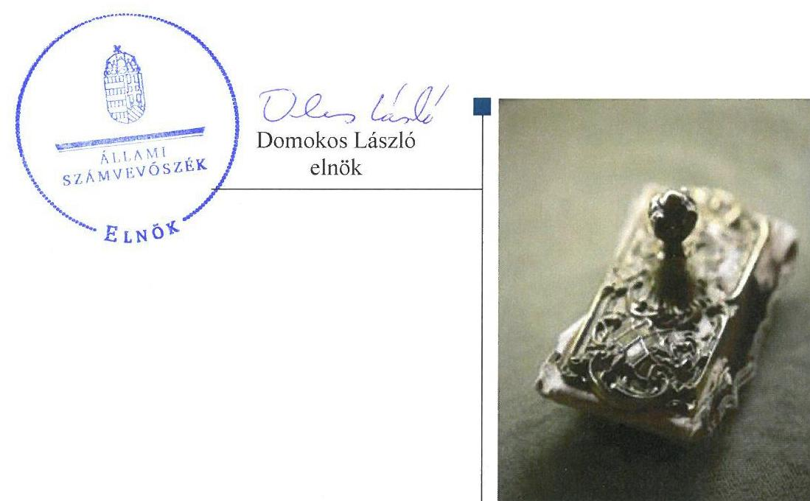

---

# AZ ELLENŐRZÉST FELÜGYELTE: 

DR. BENEDEK MÁRIA felügyeleti vezető

## AZ ELLENŐRZÉST VEZETTE ÉS A VÉGREHAJTÁSÁÉRT FELELŐS:

DR. LÁNG ÁGNES KRISZTINA ellenőrzésvezető

## A PROGRAM ÖSSZEÁLLÍTÁSÁÉRT FELELŐS:

JANIK JÓZSEF LÁSZLÓ osztályvezető

## A TÉMÁHOZ KAPCSOLÓDÓ KORÁBBI SZÁMVEVŐSZÉKI JELENTÉSEK:

- címe: Jelentés Magyarország 2015. évi központi költségvetése végrehajtásának ellenőrzéséről
- sorszáma 16163
- címe: Magyarország 2013. évi költségvetése végrehajtásának ellenőrzéséről
- sorszáma 14207

IKTATÓSZÁM: V-1155-133/2016
TÉMASZÁM: 2189.
ELLENŐRZÉS-AZONOSÍTÓ SZÁM: V076001

---

# TARTALOMJEGYZÉK 

■ ÖSSZEGZÉS ..... 5
■ AZ ELLENŐRZÉS CÉLJA ..... 7
■ AZ ELLENŐRZÉS TERÜLETE ..... 8
■ AZ ELLENŐRZÉS HÁTTERE, INDOKOLTSÁGA ..... 9
■ A JELENTÉS LÉNYEGES KÉRDÉSKÖREI ..... 10
■ ELLENŐRZÉS HATÓKÖRE ÉS MÓDSZEREI ..... 11
■ MEGÁLLAPÍTÁSOK ..... 14
■ JAVASLATOK ..... 34
■ MELLÉKLETEK ..... 37
I. Sz. melléklet: Értelmező szótár ..... 37
II. Sz. melléklet: A KEF Pénzügyi és vagyongazdálkodásának teljesítmény-ellenőrzése ..... 40
III. Sz. melléklet: A belső kontrollrendszer kialakításának és működtetésének értékelése a 2012-2015. években ..... 41
IV. Sz. melléklet: Az integritás szemlélet érvényesítésével és az integritás kontrollrendszer kiépítettségével kapcsolatos megállapítások ..... 42
■ FÜGGELÉK: ÉSZREVÉTELEK ..... 43
■ RÖVIDÍTÉSEK JEGYZÉKE ..... 49

---

.

---

# ÖSSZEGZÉS 

A Közbeszerzési és Ellátási Főigazgatóság irányító szerveinek feladatellátása szabályszerű volt. A belső kontrollrendszer kialakítása és működtetése megfelel a jogszabályi előírásoknak, a pénzügyi gazdálkodás összességében szabályszerű volt. A vagyongazdálkodás feltételeinek kialakítása és a vagyonelemek hasznosítására kötött szerződések nem feleltek meg a jogszabályi előírásoknak. Az integritás kontrollok kiépítettsége összességében alacsony volt.

## Az ellenőrzés társadalmi indokoltsága

A központi alrendszer részét képező intézmények alapvető rendeltetése a közfeladatok ellátásának biztosítása. A közpénzek felhasználásában meghatározó, központi alrendszerbe tartozó intézmények pénzügyi és vagyongazdálkodási tevékenységük és/vagy feladatellátásuk súlya miatt jelentős hatást gyakorolhatnak a költségvetés egyensúlyának fenntartására. Hatással vannak továbbá az állami vagyonnal való gazdálkodás minőségére, a kormányzati (szak)politikák végrehajtására, illetve közfeladat ellátásuk vonatkozásában az állampolgárok életminőségére, jogaik és kötelezettségeik gyakorlására. E szervezetekkel szemben társadalmi igény, hogy tevékenységükről a döntéshozók és a nyilvánosság felé elszámoljanak.

## Főbb megállapítások, következtetések, javaslatok

Az intézményalapítással kapcsolatos, továbbá az egyéb irányítási, felügyeleti és ellenőrzési, munkáltatói jogosultságokat 2014. október 2-ig a Nemzeti Fejlesztési Minisztérium, azt követően a Nemzetgazdasági Minisztérium, mint irányító szervek, szabályszerűen gyakorolták.

A belső kontrollrendszer kialakítása és működtetése az ellenőrzött években összességében biztosította a közpénzekkel és a nemzeti vagyonnal történő szabályszerű, gazdaságos, hatékony és eredményes gazdálkodást, illetve a beszámolási és adatszolgáltatási kötelezettségek szabályszerű teljesítését. A kontrollkörnyezet kialakítása a számviteli politika 2014-2015. évi és a számlarend 2012-2013. évi kisebb hiányossága, a 2012-2014. években a belföldi kiküldetések elszámolásának, továbbá az ellenőrzött években a vezetékes telefonok használatának szabályozása kivételével - megfelel a jogszabályi előírásoknak. A kockázatkezelési rendszer kialakítása és működtetése - a 2012. évi működtetés kivételével - megfelelő volt. A kontrolltevékenység kialakítása és működtetése szabályszerű volt. Az információs és kommunikációs folyamatok kialakítása és működtetése - kisebb hiányosságok mellett - megfelel a jogszabályi előírásoknak, azonban a beszámolási szinteket, határidőket nem határozták meg. A főigazgató az ellenőrzött időszakban a jogszabályi előírásoknak megfelelően alakította ki a szervezet tevékenységének, a célok megvalósításának folyamatos- és eseti nyomon követését biztosító rendszerét. A rendelkezésre álló források gazdaságos, hatékony és eredményes felhasználását biztosító követelményeket szabályzatok kiadásával és folyamatok kialakításával, azok működésének nyomon követésével alakították ki.

A Közbeszerzési és Ellátási Főigazgatóság pénzügyi gazdálkodása összességében szabályszerű volt. Az elemi költségvetés és az előirányzatok megállapítása során betartották a jogszabályi előírásokat és a belső szabályzatokban foglaltakat. A bevételi és a kiadási előirányzatok módosítása, átcsoportosítása szabályszerűen történt. A bevételi előirányzatok teljesítése, továbbá a kiadási előirányzatok felhasználása során - a gazdálkodási jogkörök működtetésének eseti hiányosságai, valamint a 2014. és 2015. évi közbeszerzési szabálytalanságok kivételével - a jogszabályi előírásokat betartották. A Közbeszerzési és Ellátási Főigazgatóság a jogszabályi előírásoknak megfelelően készítette el éves költségvetési beszámolóját és teljesítette beszámolási kötelezettségét. Az előirányzat felhasználáshoz kapcsolódó évközi korlátozó intézkedéseket végrehajtották, a befizetési kötelezettségeket teljesítették. Az előirányzat maradvány megállapítása, felhasználása szabályszerű volt.

---

A Közbeszerzési és Ellátási Főigazgatóság vagyongazdálkodása az ellenőrzött időszakban összességében nem volt szabályszerű. A vagyonkezelési szerződés tartalma 2015. július 7-éig nem felelt meg a jogszabályi előírásoknak. A mérlegben kimutatott eszközök és források nyilvántartása, értékelése szabályszerű volt. A leltározás a 2012. évben nem felelt meg, a 2013-2015. években megfelelt a jogszabályok és a belső szabályzatok előírásainak. A Közbeszerzési és Ellátási Főigazgatóság az ellenőrzött időszakban a jogszabályban előírt feladatai körébe nem tartozó vagyongazdálkodási feladatokat is ellátott az informatikai és telekommunikációs eszközök vonatkozásában. A Közbeszerzési és Ellátási Főigazgatóság az értékmegőrzési, állagmegóvási kötelezettségeit a jogszabály és a vagyonkezelési szerződés előírásai szerint teljesítette.

A vagyonelemek hasznosítása azonban - a szerződések tartalmi hiányosságai, valamint esetenként az átláthatóságra vonatkozó nyilatkozatok hiányában kötött szerződések miatt - nem a jogszabályok előírásainak megfelelően történt.

Az ellenőrzött időszakban a Közbeszerzési és Ellátási Főigazgatóságnál átalakítás, átszervezés nem történt.
A Közbeszerzési és Ellátási Főigazgatóságnál az értékelt integritási kontrollok kiépítettsége összességében alacsony volt.

---

# AZ ELLENŐRZÉS CÉLJA 

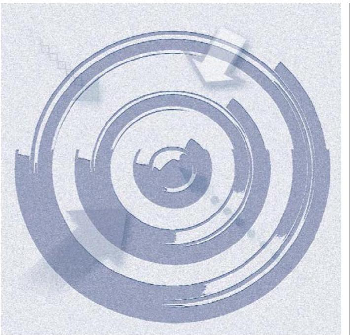

## A MEGFELELŐSÉGI ELLENŐRZÉS

CÉLJA annak megítélése volt, hogy a KEF-re vonatkozó irányító szervi feladatellátás a jogszabályi előírások betartásával történt-e; a KEF-nél a belső kontrollrendszer kialakítása és működtetése szabályszerű volt-e; kialakították-e az erőforrásokkal való szabályszerű, gazdaságos, hatékony és eredményes gazdálkodás követelményeit; szabályszerű volt-e a beszámolási és adatszolgáltatási kötelezettségek teljesítése; a KEF pénzügyi és vagyongazdálkodása megfelelt-e a jogszabályi előírásoknak és belső szabályzatainak; a KEF átalakításának vagy átszervezésének lebonyolítása szabályszerűen történt-e.

Az ellenőrzés keretében értékeltük a KEF korrupciós kockázatainak kezelését szolgáló integritás kontrollok kiépítettségét és az integritás szemlélet érvényesülését.

A KIEGÉSZÍTŐ TELJESÍTMÉNY-ELLENŐRZÉSI MODUL célja annak értékelése volt, hogy a gazdálkodás folyamatában a gazdaságossági, hatékonysági és eredményességi célok kialakítása megtörtént-e, a célok elérése érdekében tettek-e intézkedéseket, a célkitűzéseket elérték-e; a szándékolt eredményeket elérték-e.

---

# AZ ELLENŐRZÉS TERÜLETE 

## Közbeszerzési és Ellátási Főigazgatóság (KEF)

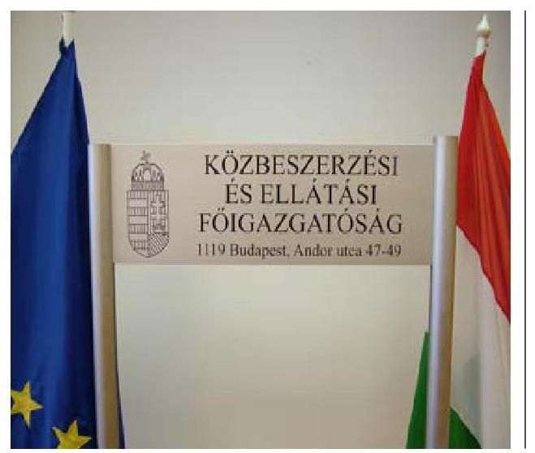

A KEF-et a Miniszterelnökség Közbeszerzési és Gazdasági Igazgatósága néven a Kormány hozta létre 1996-ban. Elnevezése 2004. január 1-jétől Központi Szolgáltatási Főigazgatóságra, majd 2011. május 1-jétől Közbeszerzési és Ellátási Főigazgatóságra változott. A 2012. január 1.-2014. október 2. között a NFM², 2014. október 3-tól az NGM³ által irányított KEF központi költségvetési szerv. Jogállását, közfeladatait, hatáskörét és területi illetékességét az 53/2011. (III.31.) Korm. rendelet ${ }^{4}$ illetve a 250/2014.(X.2.) Korm. rendelet ${ }^{5}$ határozta meg az ellenőrzött időszakban.

A KEF átalakítására, átszervezésére a 2012-2015. években nem került sor.

A KEF-et az irányító szerv ${ }_{1,2}{ }^{6}$ vezetője által kinevezett főigazgató vezette, munkáját gazdasági igazgató segítette. Az ellenőrzött időszakban a főigazgató személyében három alkalommal történt változás, a munkakört jelenleg betöltő főigazgató 2014. december 1-jétől látta el feladatait. A főigazgató javaslatára az irányító szerv ${ }_{1,2}$ vezetője által kinevezett gazdasági igazgató személyében az ellenőrzött időszakban három alkalommal, legutóbb 2015. június 15-én történt változás.

A KEF kettő alapfeladatot látott el: központi beszerző szervként végezte a központosított közbeszerzési eljárások lebonyolítását, a központosított közbeszerzési rendszer működtetését, továbbá biztosította - a Honvédelmi Minisztérium és a Külgazdasági és Külügyminisztérium külképviseleteinek kivételével - a minisztériumok és a Miniszterelnökség működéséhez szükséges munkakörnyezetet, ennek keretében gondoskodott az említett szervek épületeinek és gépjárműveinek üzemeltetéséről, a munkavégzéshez szükséges tárgyi eszközökkel történő ellátásáról. A KEF az ellenőrzött időszakban vállalkozási tevékenységet nem végzett.

Az éves költségvetési beszámolók alapján a KEF teljesített költségvetési bevétele a 2012. évi 11352,2 M Ft-ról 2015. évre 20 978,9 M Ft-ra, a teljesített költségvetési kiadása a 2012. évi 10291,6 M Ft-ról a 2015. évben 16 747,0 M Ft-ra emelkedett. A 2012. évben foglalkoztatott 507 főről 2015. évre a létszám 620 főre nőtt.

A KEF könyvviteli mérleg szerinti vagyona a 2012. év eleji 40 647,0 M Ft-ról a 2015. év végére 14,4 %-kal 46 516,8 M Ft-ra nőtt, a befektetett eszközök mérlegértéke a 2012. év eleji 39 092,1 M Ft-ról 5,6 %-kal 41 288,0 M Ft-ra nőtt az ellenőrzött időszakban. A 2012. év eleji értékről 2015. év végére a saját tőke 39 337,5 M Ft-ról 44 417,3 M Ft-ra, a tartalékok 868,6 M Ft-ról 1911,8 M Ft-ra, a kötelezettségek összege 440,8 M Ft-ról 1621,5 M Ft-ra növekedett. A lejárt szállítói tartozásállomány összege a 2012. év eleji 0,6 M Ft-ról 2015. év végére 33,4 M Ft-ra emelkedett.

---

# AZ ELLENŐRZÉS HÁTTERE, INDOKOLTSÁGA 

Az Alaptörvény rendelkezése szerint a nemzeti vagyon megőrzésének, védelmének és a nemzeti vagyonnal való felelős gazdálkodásnak a követelményeit sarkalatos törvény, az Nvtv. ${ }^{7}$ rögzíti. A vagyonkezelés általános és speciális szabályait, az állami vagyon nyilvántartására és elszámolására vonatkozó eljárásokat, a vagyonkezelési szerződés feltételrendszerét, valamint az éves beszámoló készítési és könyvvezetési kötelezettségeket kormányrendelet írja elő. A központi alrendszer egyes intézményei közfeladat-ellátásának változásait, a közfeladatok átadásából és átvételéből adódó módosításait, előirányzat gazdálkodására ható tényezőit az Áht. ${ }^{8}$ 11. §-a és az Ávr. ${ }^{9}$ 14. §-a írja elő. A közfeladatok megszűnéséből, intézmény átszervezéséből, belső szerkezeti korszerűsítéséből, vagy más hasonló okból adódó módosításai miatt szerepeltetendő szerkezeti változásokat, valamint a szerkezeti változásként beépült közfeladatok szintre hozásként történő számításba vételét az Ávr. 15. § (2)-(3) bekezdése határozza meg.

AZ ELLENŐRZÉS EREDMÉNYEKÉPPEN nemcsak az ellenőrzött intézmények gazdálkodása javulhat, hanem átfogó képet kaphatunk a központi alrendszerbe tartozó költségvetési szervek gazdálkodásának hiányosságairól, de a jó gyakorlatokról is. Ellenőrzéseivel, javaslataival és megállapításaival az ÁSZ elősegítheti a költségvetési szervek pénzügyi és vagyongazdálkodása szabályozásának javítását és hozzájárulhat a jó kormányzáshoz. Az ellenőrzés az ellenőrzött számára visszajelzést ad a pénzügyi és vagyongazdálkodásában feltárt hiányosságokról, javaslataival hozzájárul azok kiküszöböléséhez, amely csökkentheti a későbbi ellenőrzések gyakoriságát. Az ellenőrzés megállapításait és javaslatait a rendezett gazdálkodási keretek kialakítása során más szervezetek is hasznosíthatják.

---

# A JELENTÉS LÉNYEGES KÉRDÉSKÖREI 

1.- Az irányító szerv KEF-re vonatkozó feladatellátása szabályszerű volt-e?
2.- A belső kontrollrendszer kialakítása és működtetése biztosította-e a közpénzekkel és a nemzeti vagyonnal történő szabályszerű, gazdaságos, hatékony és eredményes gazdálkodást, illetve a beszámolási és adatszolgáltatási kötelezettségek szabályszerű teljesítését?
3.- A KEF pénzügyi gazdálkodása szabályszerű volt-e?
4.- A KEF vagyongazdálkodása szabályszerű volt-e?
5.- Érvényesült-e az integritás szemlélet és ennek megfelelően kiépítették-e az integritás kontrollrendszert a KEF-nél?

---

# ELLENŐRZÉS HATÓKÖRE ÉS MÓDSZEREI 

## Az ellenőrzés típusa

Megfelelőségi és teljesítmény-ellenőrzés.

## Az ellenőrzött időszak

Az ellenőrzött időszak 2012. január 1-jétől 2015. december 31-ig tartott.

## Az ellenőrzés tárgya

Az ellenőrzött szervezetre vonatkozó irányító szervi feladatok ellátása. Az intézmény belső kontroll rendszerének kialakítása és működtetése. A pénzügyi és vagyongazdálkodás szabályszerűsége. Az intézmény beszámolási és adatszolgáltatási kötelezettségének teljesítése. Az intézmény átalakításának vagy átszervezésének lebonyolítása szabályszerűsége.

A teljesítmény-ellenőrzési kiegészítő modul esetében az intézmény
 gazdálkodási folyamatában a gazdaságossági, hatékonysági és eredményességi célok és célértékek kialakítása, a kapcsolódó intézkedések meghatározása, a célkitűzések elérésének értékelése.

Az ellenőrzés kiterjedt minden olyan körülményre és adatra, amely az ÁSZ jogszabályban meghatározott feladatainak teljesítéséhez, valamint a program végrehajtása folyamán felmerült újabb összefüggések feltárásához szükséges volt.

## Az ellenőrzött szervezet

Közbeszerzési és Ellátási Főigazgatóság, valamint 2012. január 1-jétől 2014. október 2-áig a Nemzeti Fejlesztési Minisztérium, 2014. október 3-ától 2015. december 31-ig a Nemzetgazdasági Minisztérium.

## Az ellenőrzés jogalapja

Az ellenőrzés jogszabályi alapját az ÁSZ tv. 1. § (3) bekezdés, 5. § (2)-(6) bekezdései, valamint Áht. 61. § (2) bekezdésének előírásai képezték.

---

# Az ellenőrzés módszerei 

Az ellenőrzést az ÁSZ az ellenőrzési program szempontjai, az ellenőrzött időszakban hatályos jogszabályok, az ellenőrzés szakmai szabályai, a megfelelőségi ellenőrzéshez kapcsolódó ÁSZ módszertanok figyelembe vételével végezte. A gazdálkodás hibáinak kijavítására irányuló javaslatok kidolgozásakor a hatályos jogszabályokat tekintette irányadónak.

Az ellenőrzés ideje alatt a KEF-fel történő kapcsolattartást az ÁSZ az SZMSZ ${ }^{10}$-ének vonatkozó előírásai alapján biztosította.

Az ellenőrzési kérdések megválaszolásához szükséges bizonyítékok megszerzése az ellenőrzött által rendelkezésre bocsátott dokumentumokra, adatokra alapozva megfigyelés, szemle (szemrevételezés), kérdésfeltevés (információkérés), mintavételezés, valamint elemző eljárás útján történt. Az ellenőrzési bizonyítékként felhasználható adatforrások közé tartoztak egyrészt az ellenőrzési program részletes szempontjainál felsorolt adatforrások, másrészt minden egyéb az ellenőrzés folyamán feltárt, az ellenőrzés szempontjából információt tartalmazó dokumentum.

Az ellenőrzés lefolytatásához a KEF a tanúsítványok elektronikus kitöltésével, valamint az ÁSZ által kért dokumentumok elektronikus megküldésével szolgáltatott adatokat. A rendelkezésre bocsátott adatok, információk kontrollja az ellenőrzés keretében történt.

Az integritás szemlélet érvényesülésének értékelését a KEF önbevallás útján kitöltött tanúsítványa alapozta meg.

Az ÁSZ a belső kontrollrendszer jogszabályi előírások szerinti kialakításának és működtetésének szabályszerűségét az erre irányuló ellenőrzési kérdésekre adott válaszok összesítése alapján, a lényegességi szempontok figyelembe vételével évente pillérenként (kontrollkörnyezet, kockázatkezelési rendszer, kontrolltevékenységek, információs és kommunikációs rendszer, monitoring rendszer) és összesítetten is minősítette. Az ÁSZ a pénzügyi gazdálkodás és a vagyongazdálkodás kialakításának és működtetésének szabályszerűségét az erre irányuló ellenőrzési kérdésekre adott válaszok összesítése alapján, a lényegességi szempontok figyelembe vételével évenkénti bontásban minősítette. "Megfelelő"-nek értékelte az ellenőrzött területet, amennyiben a szabályozás, illetve végrehajtás során a jogszabályi követelményeket maradéktalanul, vagy kisebb hiányosságok mellett érvényesítették, „Nem megfelelő"-nek értékelte, amennyiben a szabályozás hiányosságai nem biztosították a szabályszerű működés feltételeit, illetve a gazdálkodás folyamatában jelentkező hibák lényegesek, nagyszámúak, vagy rendszerszerűek voltak.

Mintavételi eljárás alapján ellenőrizte az ÁSZ a KEF-nél a foglalkoztatottak személyi juttatásai és a külső személyi juttatások, a dologi és felhalmozási kiadások, a vagyonelemek hasznosítása, a közbeszerzési díj elszámolása, a pénzgazdálkodáshoz kapcsolódó kontrolltevékenységek, a vagyonkezelési szerződés módosítása szabályszerűségét. A minta alapján a sokaságban előforduló hibaarányt statisztikai becslés módszerével állapította meg. Az értékelés eredményeként kétféle, "Megfelelő" és "Nem megfelelő" minősítést alkalmazott. "Megfelelő"-nek értékelt egy ellenőrzött területet, amennyiben a hibaarány a teljes sokaságban 95%-os

---

bizonyossággal legfeljebb 10% arányt képviselt. Abban az esetben, ha adott sokaság tekintetében a 10%-os hibaarány küszöbérték átlépése megítélésének megbízhatósága nem érte el a 95%-ot, annak elérése érdekében az értékelést lényegességi alapon további szempontokkal egészítette ki, és figyelembe vette a feltárt hibák értékét. A közbeszerzési eljárások esetében az ÁSZ az ellenőrzött tételeket értékelte.

A teljesítményellenőrzés során a számvevőszéki ellenőrzés szakmai szabályai szerint, a megfelelőségi ellenőrzést kiegészítve, a teljesítményellenőrzés módszerével, a vonatkozó nemzetközi standardok figyelembe vételével értékelte az ÁSZ, hogy a gazdálkodás folyamatában a gazdaságossági, hatékonysági és eredményességi célok kialakítása megtörtént-e, a célok elérése érdekében tettek-e intézkedéseket, a célkitűzéseket elérték-e; a szándékolt eredményeket elérték-e. Az ellenőrzés a gazdálkodási feladatokra terjedt ki, a szakmai feladatellátást nem értékelte.

A teljesítmény-ellenőrzési kiegészítő programmodulban megfogalmazott ellenőrzési cél megválaszolásához az alapprogram végrehajtása során megfogalmazott megállapításokat is figyelembe vette.

A jelentéstervezetben használt fogalmak magyarázatát az I. számú melléklet, a teljesítmény-ellenőrzés eredményét a II. számú melléklet tartalmazza.

---

# 1. Az irányító szerv KEF-re vonatkozó feladatellátása szabályszerű volt-e? 

## Összegző megállapítás

### 1.1. számú megállapítás

### 1.2. számú megállapítás

Az irányító szerv ${ }_{1,2}$ KEF-re vonatkozó feladatellátása szabályszerű volt.

Az intézményalapítással kapcsolatos jogosultságok gyakorlása a jogszabályi előírásoknak megfelelően történt.

Az irányító szerv ${ }_{1,2}$ a KEF-fel kapcsolatos alapítói jogosultságokat az Áht. és az Ávr. előírásainak megfelelően, szabályszerűen gyakorolta, az alapító okirat ${ }_{1-3}{ }^{11}$ egységes szerkezetű kiadásáról, módosításáról az előírásoknak megfelelő tartalommal és határidőben gondoskodott.

Az alapító okirat módosításait az irányító szervek, illetve a KEF-ről szóló jogszabály változása és az alaptevékenység kormányzati funkciók szerinti besorolásának jogszabályi változása indokolta.

A KEF-el kapcsolatos egyéb irányítási, felügyeleti és ellenőrzési jogosultságok gyakorlása szabályszerű volt.

Az irányító szerv ${ }_{1,2}$ az ellenőrzött időszakban a KEF-fel kapcsolatos egyéb ellenőrzési, irányítási jogosultságait szabályszerűen gyakorolta.

Az NFM és az NGM irányítószervi hatáskörét az SZMSZ ${ }_{1-3}{ }^{12}$ módosításainak jóváhagyásával az Áht.-ben adott felhatalmazások szerint gyakorolta. Az Alapító okirat ${ }_{1-3}$-mal összhangban volt az irányító szerv ${ }_{1,2}$ által jóváhagyott SZMSZ ${ }_{1-3}$. Az SZMSZ ${ }_{1-3}$ módosításokra az alapító okirat ${ }_{1-3}$ változása és egyéb a KEF működését meghatározó, az SZMSZ ${ }_{1-3}$-ban hivatkozott jogszabályok változása, valamint a szervezeti felépítés változása miatt került sor. Az ellenőrzött időszakban hatályos SZMSZ ${ }_{1-3}$ megfelelt az Ávr. előírásainak.

Az irányító szerv ${ }_{1,2}$ az Ávr.-nek megfelelően kiadta az általánosan és kötelezően érvényesítendő költségvetés-tervezési követelményeket és jóváhagyta a KEF elemi költségvetését.

Az irányító szerv ${ }_{1,2}$ - jelentések, adatszolgáltatások felülvizsgálatával illetve az előirányzat módosítások engedélyezésével - az Áht.-ben előírtaknak megfelelően rendszeresen figyelemmel kísérte a KEF bevételi és kiadási előirányzatokkal, valamint erőforrásokkal való hatékony gazdálkodását. A közfeladat ellátását veszélyeztető körülményt az irányító szerv ${ }_{1,2}$ nem tárt fel. Az irányító szerv ${ }_{1,2}$ a KEF működésének hatékonyabbá, ésszerűbbé tétele érdekében több alkalommal intézkedett, kezdeményezte a Kormánynál a KEF-ről, a közbeszerzésről szóló jogszabályok módosítását. Az irányító szerv ${ }_{2}$ értékelte a KEF szakmai munkáját és a hatékonyabb közfeladat ellátás érdekében stratégiai célokat fogalmazott meg számára. A KEF végleges elhelyezését biztosító épület és

---

logisztikai központ kialakításához szükséges irányító szervi intézkedéseket megtette.

Az irányító szerv ${ }_{1,2}$ rendszeresen beszámoltatta a KEF vezetőjét az éves gazdálkodásról és a szakmai feladatellátásról az Áht.-ben előírtak szerint. Az irányító szerv ${ }_{1,2}$ a KEF éves költségvetési beszámolóit jóváhagyta, a szakmai tevékenységéről szóló jelentéseit elfogadta.

Az ellenőrzött időszak alatt az irányító szerv ${ }_{1}$ ellenőrizte a KEF 2011. évi pénzügyi beszámolóját és 2015. év végén, az irányító szerv ${ }_{2}$ a vagyonkezelésben lévő nagy és kis-értékű tárgyi eszközök selejtezési és hasznosítási gyakorlatát. Az ellenőrzések megállapításait, javaslatait követő intézkedések hatására a gazdálkodás szabályozottsága pozitív irányba változott.
1.3. számú megállapítás

Az irányításért felelős szerv a munkáltatói jogosultságait szabályszerűen gyakorolta.

Az ellenőrzött időszak alatt a KEF-et három kinevezett és egy megbízott főigazgató, gazdálkodását három kinevezett és egy megbízott gazdasági igazgató vezette. Az irányító szerv ${ }_{1,2}$ irányítói jogkörét a főigazgatói és a gazdasági igazgatói kinevezések, felmentések, kinevezés módosítások alkalmával az Áht.-nek megfelelően gyakorolta.

# 2. A belső kontrollrendszer kialakítása és működtetése biztosította-e a közpénzekkel és a nemzeti vagyonnal történő szabályszerű, gazdaságos, hatékony és eredményes gazdálkodást, illetve a beszámolási és adatszolgáltatási kötelezettségek szabályszerű teljesítését? 

Összegző megállapítás

A belső kontrollrendszer kialakítása és működtetése az ellenőrzött években összességében biztosította a közpénzekkel és a nemzeti vagyonnal történő szabályszerű, gazdaságos, hatékony és eredményes gazdálkodást, illetve a beszámolási és adatszolgáltatási kötelezettségek szabályszerű teljesítését.

A belső kontrollrendszer kialakítása és működtetése szabályszerűségének értékelését a III. sz. melléklet tartalmazza.
2.1. számú megállapítás

A kontrollkörnyezet kialakítása a 2012-2015. években - kisebb hiányosságok mellett - szabályszerű volt.

| 1. ábra |  |  |  |  |  |
| :--: | :--: | :--: | :--: | :--: | :--: |
| Kontrollkörnyezet | 2012. év | 2013. év | 2014. év | 2015. év |  |
| szabályszerű   nem szabályszerű |  |  |  |  |  |

A KEF MŰKÖDÉSE SZERVEZETI KERETEINEK KIALAKÍTÁSA a Bkr ${ }^{13}$., az Áht., valamint az Ávr. előírásait

---

figyelembe véve, kisebb hiányosságok mellett, szabályszerűen történt a 2012-2015. években.

Az Alapító okirat ${ }_{1-3}$-at az irányító szerv $_{1,2}$ az Ávr.-ben előírt tartalommal adta ki.

Az SZMSZ $_{1-3}$-ban az Áht. és az Ávr. előírásainak megfelelően meghatározták a szervezeti felépítést, a szervezeti ábrát, a szervezet működési rendjét, a szervezeti egységek megnevezését, feladatait, a munkakörökhöz tartozó feladat- és hatásköröket, a helyettesítés rendjét, a kapcsolódó felelősségi szabályokat, valamint a munkáltatói jogok gyakorlásának - ideértve az átruházott munkáltatói jogokat is - rendjét.

A Gazdasági szervezet ügyrendje ${ }_{1-6},{ }^{14}$ az Áht. és az Ávr. előírásainak megfelelően tartalmazta a gazdálkodással kapcsolatos feladatok munkafolyamatainak leírását, a gazdasági szervezet vezetőinek és alkalmazottainak feladat- és hatáskörét, a helyettesítés rendjét, továbbá a gazdasági szervezet költségvetési szerven belüli belső és külső kapcsolattartásának módját, szabályait.

A Kollektív szerződés ${ }_{1,2}{ }^{15}$-ben szabályozták a foglalkoztatási jogviszony megszűnése és változása, valamint a munkakör átadással kapcsolatos feladatokat. A Munka tv. ${ }_{1,2}{ }^{16}$ előírásaival összhangban a gazdálkodási területen foglalkoztatott dolgozók rendelkeztek munkaköri leírással.

A főigazgató ${ }_{1-4}{ }^{17}$ a Bkr. előírásaira figyelemmel, az Etikai szabályzat ${ }_{1-3}{ }^{18}$ ban meghatározta az etikai elvárásokat.

A KEF-nél az ellenőrzött években - a szabályzatok tartalmára vonatkozó kisebb hiányosságok mellett - rendelkezésre álltak a gazdálkodási folyamatokat meghatározó, a Számv. tv ${ }^{19}$-ben, az Áhsz ${ }_{1,2}{ }^{20}$-ben és Bkr-ben előírt tartalmú belső szabályzatok.

A Számviteli politika ${ }_{1-3}{ }^{21}$ a 2012-2013. években megfelelt, a Számviteli politika ${ }_{4,5}{ }^{22}$ a 2014-2015. években kisebb hiányosságok mellett felelt meg a Számv. tv. és az Áhsz ${ }_{1,2}$ előírásainak. A Számviteli politika ${ }_{3-5}$ keretében a Számv. tv.-ben előírt tartalommal elkészült az Értékelési szabályzat ${ }_{1-6}{ }^{23}$, a Pénzkezelési szabályzat ${ }_{1-5}{ }^{24}$, az Önköltségszámítási szabályzat ${ }_{1-3}{ }^{25}$, továbbá - a 2012. évi kisebb hiányosságok mellett - a Leltározási szabályzat ${ }_{1-4}{ }^{26}$.

A Bizonylati szabályzat ${ }_{1-4}{ }^{27}$ alátámasztotta a Számlarend ${ }_{3-5}{ }^{28}$-ben foglaltakat, tekintettel a Számv. tv. és az Áhsz ${ }_{1,2}$ előírásaira.

A Számlarend ${ }_{3-3}$ - kisebb hiányosság mellett - megfelelt, a Számlarend ${ }_{4,5}$ megfelelt a Számv. tv.-ben és az Áhsz. ${ }_{1,2}$-ben előírt követelményeknek.

A Közbeszerzési szabályzat ${ }_{1,2}{ }^{29}$ a Kbt. ${ }_{1,2}$ előírásait figyelembe véve, míg a Beszerzési szabályzat ${ }_{1-3}{ }^{30}$ az Ávr. előírásaival összhangban készült el.

A Gazdálkodási szabályzat ${ }_{1-12}{ }^{31}$ az Áht.-nak és az Ávr.-nek megfelelően tartalmazta a kötelezettségvállalás, a pénzügyi ellenjegyzés, a teljesítésigazolás, az érvényesítés és az utalványozás gyakorlásának módjával kapcsolatos belső előírásokat, az eljárási és dokumentációs részletszabályokat, az előzetes írásbeli kötelezettségvállalást nem igénylő kifizetések rendjét.

A KEF az Ávr.
 előírásai ellenére a 2012-2014. években nem szabályozta a belföldi kiküldetések elszámolásával kapcsolatos kérdéseket, valamint a 2012-2015. években a vezetékes telefonok használatának rendjét.

---

Az Ellenőrzési nyomvonal ${ }_{1,2}{ }^{32}$ a Bkr. előírásainak és a KEF működési folyamatainak megfelelően 2012. november 3-ától tartalmazta a kontroll eljárásokat, a felelősségi-, valamint információs szinteket és kapcsolatokat, valamint az irányítási és ellenőrzési folyamatokat is.

A Bkr.-ben előírt szabálytalanságkezelési eljárásrendet az SZMSZ ${ }_{1-3}$-ban és a Szabálytalanság kezelési szabályzatban ${ }^{33}$ határozták meg.

A kontrollkörnyezet kialakításával kapcsolatos szabálytalanságokat az 1. táblázat tartalmazza.

1. táblázat

# A KONTROLLKÖRNYEZET KIALAKÍTÁSÁVAL KAPCSOLATOS SZABÁLYTALANSÁGOK 

| Sorszám | Részmegállapítás | Megjegyzés |
| :--: | :--: | :--: |
| 1. | A Számv. tv. 14. § (4) bekezdésében előírtak ellenére a 2014-2015. években a Számviteli politika 4.5-ben nem rögzítették azokat a gazdálkodóra jellemző szabályokat, előírásokat, módszereket, amelyekkel meghatározzák, hogy mit tekintenek a számviteli elszámolás, az értékelés szempontjából lényegesnek, nem lényegesnek. | Az összesítő bizonylatok tartalmi és formai követelményeit a Számlarend 4.5. 2014. október 6-ától már meghatározta. |
| 2. | Az Áhsz. 51. § (1) bekezdés b) pontjában foglaltak ellenére a 2012-2013. években a Számlarend ${ }_{1-3}$ nem tartalmazta az analitikus nyilvántartások adataiból készült összesítő bizonylatok tartalmi és formai követelményeit. | Az összesítő bizonylatok tartalmi és formai követelményeit a Számlarend 4.5. 2014. október 6-ától már meghatározta. |
| 3. | Az Áhsz. 37. § (6)-(7) bekezdésében előírtak ellenére a 2012. évben a Leltározási szabályzat ${ }_{1}$-ben nem határozták meg a használt, de a mérlegben értékkel nem szereplő immateriális javak, tárgyi eszközök, készletek leltározási módját, továbbá az irányító szerv ${ }_{1}$ egyetértési joga gyakorlásának módját. | A használt, de a mérlegben értékkel nem szereplő immateriális javak, tárgyi eszközök, készletek leltározási módját, továbbá az irányító szerv ${ }_{1,2}$ egyetértési joga gyakorlásának módját a Leltározási szabályzat 2.4. 2013. december 31-étől már szabályozta. |
| 4. | A KEF a 2012-2014. években az Ávr. 13. § (2) bekezdésének c) pontja ellenére nem szabályozta a belföldi kiküldetések elszámolásával kapcsolatos kérdéseket, valamint az Ávr. 13. § (2) bekezdésének g) pontjában foglaltak ellenére a 2012-2015. években nem szabályozta a vezetékes telefonok használatának rendjét. | A belföldi kiküldetések elszámolásával kapcsolatos kérdéseket a 2015. szeptember 9-étől hatályos Belföldi kiküldetések szabályzata ${ }^{34}$ már tartalmazta. |
| 5. | A Bkr. 6. § (3) bekezdésében foglaltak ellenére 2012. november 2-ig a főigazgató ${ }_{1,2}$ nem gondoskodott az ellenőrzési nyomvonal elkészítéséről. | Az ellenőrzési nyomvonal 2012. november 3-án lépett hatályba. |

Forrás: ÁSZ

## 2.2. számú megállapítás

A kockázatkezelési rendszer kialakítása az ellenőrzött időszakban megfelelt a jogszabályi előírásoknak, a működtetése a 2012. évben nem volt szabályszerű, a 2013-2015. években szabályszerű volt.
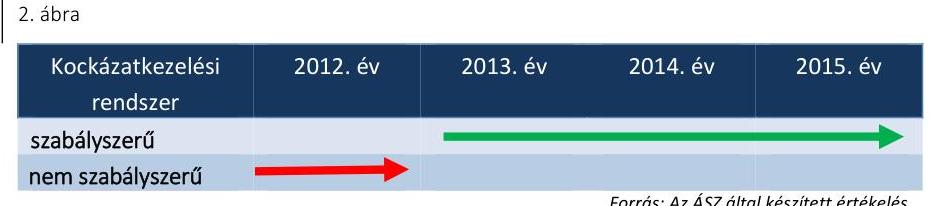

A KOCKÁZATKEZELÉSI RENDSZER kialakítása az Áht. és a Bkr. előírásaival összhangban, szabályszerűen történt az ellenőrzött években. A Kockázatkezelési szabályzat ${ }_{1,2}{ }^{35}$ a Bkr. előírásainak megfelelően tartalmazta a kockázatok azonosításának, elemzésének, értékelésének és

---

csoportosításának a módját, a kockázati kitettség mérséklésének módszerét, valamint a kockázatok kezelése érdekében szükséges intézkedések teljesítésének folyamatos nyomon követési módját.

A főigazgató ${ }_{1,2}$ a 2012. évben nem a Bkr.-ben előírtak szerint működtette a kockázatkezelési rendszert. A 2013-2015. években a KEF az integritási és korrupciós kockázatok kivételével - felmérte és értékelte a belső és külső környezet kockázatainak bekövetkezési valószínűségét, a hatásuk jelentőségét, valamint a kockázatkezelés módjait.

A belső ellenőrzés a 2014. évben ellenőrizte a kockázatkezelési rendszer működését és kialakítását, amelynek alapján javasolta a Kockázatkezelési szabályzat ${ }_{1}$ kiegészítését és pontosítását. A belső ellenőrzés javaslatainak eleget téve a Kockázatkezelési szabályzat ${ }_{2}$-ben a szükséges kiegészítéseket elvégezték.

A kockázatkezelési rendszer működtetésével kapcsolatos szabálytalanságot a 2. táblázat tartalmazza.
2. táblázat

# A KOCKÁZATKEZELÉSI RENDSZER MŰKÖDTETÉSÉVEL KAPCSOLATOS SZABÁLYTALANSÁG 

## 1. A Bkr. 7. § (2) bekezdésében foglaltak ellenére a 2012. évben a főigazgató ${ }_{1,2}$ nem mérte fel és nem állapította meg a KEF tevékenységében, gazdálkodásában rejlő kockázatokat, nem határozta meg az egyes kockázatokkal kapcsolatban szükséges intézkedéseket.

A kockázatkezelési rendszer működtetése a 2013-2015. években megfelelő volt.

Forrás: ÁSZ
2.3. számú megállapítás

A kontrolltevékenység kialakítása és működtetése - a közbeszerzési díjakhoz kapcsolódó bevételek elszámolása kivételével - megfelelt a jogszabályokban és a belső szabályzatokban foglaltaknak.
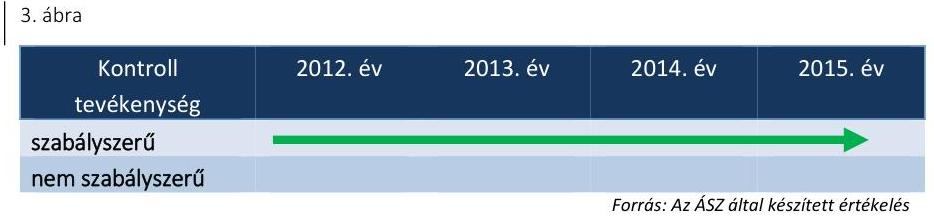

A FŐIGAZGATÓ ${ }_{1-4}$ a Gazdálkodási szabályzat ${ }_{1-12}$-ben és az Ellenőrzési nyomvonal ${ }_{1,2}$ mellékleteiben kialakította a kontrolltevékenységeket és biztosította azok feladatköri elkülönítését. A főigazgató ${ }_{1-4}$ az Áht. és az Ávr. előírásainak megfelelően írásban adott felhatalmazást kötelezettségvállalásra (igazgatók, egyes főosztályvezetők) és utalványozásra (gazdasági igazgató ${ }_{1-4}{ }^{36}$, egyes főosztályvezetők), illetve a kötelezettségvállaló írásban jelölte ki a teljesítésigazolásra jogosultakat.

A gazdasági igazgató ${ }_{1-4}$ az Áht. és az Ávr. előírásai szerint írásban jelölt ki érvényesítési feladatra a KEF állományába tartozó dolgozót.

A KEF a Gazdálkodási szabályzat ${ }_{1-12}$-ben előírtakkal összhangban, az Áht. és az Ávr. előírásainak megfelelően naprakész nyilvántartást vezetett a pénzgazdálkodási jogkörök gyakorlóinak aláírás mintáiról.

A KEF a Bkr., az Áht. és az Ávr. előírásaival összhangban rendelkezett a kötelezettségvállalások és a szerződések nyilvántartásával.

---

# 2.4. számú megállapítás 

A pénzgazdálkodáshoz kapcsolódó kontrolltevékenységének gyakorlása a személyi juttatásokkal kapcsolatos kiadások, a működési és felhalmozási kiadások, valamint a bérbeadásból és az értékesítésből származó bevételek vonatkozásában - kisebb hiányosságok mellett - szabályszerűen, míg a közbeszerzési díjakhoz kapcsolódó bevételek esetében az Áht., az Ávr. előírásai ellenére, nem szabályszerűen történt az ellenőrzött időszakban. A kontrolltevékenység gyakorlása során feltárt konkrét hiányosságokat a 3.3. pont tartalmazza.

Az információs és kommunikációs folyamatok kialakítása és működtetése - kisebb hiányosságok mellett - a 2012-2015. években szabályszerű volt.
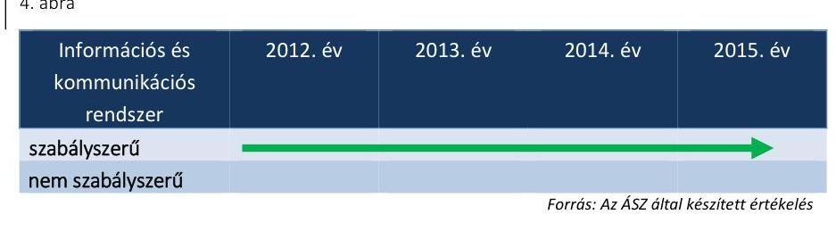

AZ INFORMÁCIÓS ÉS KOMMUNIKÁCIÓS
RENDSZER kialakítása keretében a főigazgató ${ }_{1-4}$ az SZMSZ ${ }_{1-3}$-ban szabályozta az értekezletek és tanácskozások, a munkaszervezeten belüli kommunikáció, valamint a kapcsolattartás rendjét.

Az Info tv. ${ }^{37}$ és az Ávr. előírásainak megfelelően, a Közzétételi szabályzat ${ }_{3-3}{ }^{38}$ tartalmazta a kötelezően közzéteendő adatok nyilvánosságra hozatalának, valamint a közérdekű adatok megismerésére irányuló igények teljesítésének a rendjét.

A KEF-nél a 2012. évben hatályos szabályozás kivételével az iratkezelés szabályait az Ltv. ${ }^{39}$-ben meghatározott rendben adták ki. Az Iratkezelési szabályzat ${ }_{3-5}{ }^{40}$ az Lkr.-ben előírtak szerint határozta meg az iratok iktatásának, kiadmányozásának, valamint irattározásának rendjét.

A KEF a 2012-2015. években eleget tett az Info tv.-ben előírt közzétételi kötelezettségének.

A KEF az elemi költségvetést a 2013-2014. években határidőben, a 2012. és 2015. években határidőn túl küldte meg az irányító szerv ${ }_{1,2}$-nek.

A KEF az ellenőrzött időszakban a szállítói tartozásállományra vonatkozó havi adatszolgáltatási, továbbá negyedévente az időközi mérlegjelentési kötelezettségét az Ávr. előírásainak megfelelően teljesítette a Kincstár ${ }^{41}$ felé.

A KEF a 2012. és 2014. években határidőben, a 2013. és 2015. években határidőn túl tett eleget az Áhsz ${ }_{1,2}$-ben előírt, az éves költségvetési beszámolóval és a költségvetési maradvány megállapításával kapcsolatos adatszolgáltatási kötelezettségének. A zárszámadáshoz kapcsolódó szöveges és számszaki adatszolgáltatási kötelezettséget az Ávr.-ben előírtaknak megfelelően teljesítették az irányító szerv ${ }_{1,2}$ felé.

Az információs és kommunikációs folyamatok kialakításával és működtetésével kapcsolatos szabálytalanságokat a 3. táblázat tartalmazza.

---

# AZ INFORMÁCIÓS ÉS KOMMUNIKÁCIÓS FOLYAMATOK KIALAKÍTÁSÁVAL ÉS MŰKÖDTETÉSÉVEL KAPCSOLATOS SZABÁLYTALANSÁGOK 

| Sorszám | Részmegállapítás | Megjegyzés |
| :--: | :--: | :--: |
| 1. | A Bkr. 9. § (2) bekezdésében foglaltak ellenére a KEF-nél az ellenőrzött időszakban a beszámolási szinteket, határidőket nem határozták meg. |  |
| 2. | Az Ltv. 10. § (1) bekezdés a) pontjában előírtak ellenére a 2012. évben hatályos Iratkezelési szabályzat ${ }_{1}$ nem az illetékes közlevéltárral egyetértésben került kiadásra. | Az Iratkezelési szabályzat ${ }_{2-5}$ 2013. január 1-jétől már az illetékes közlevéltárral egyetértésben került kiadásra. |
| 3. | Az Ávr. 32. § (1) bekezdésében foglaltak ellenére a KEF a 2012. és a 2015. években az elemi költségvetést az irányító szerv ${ }_{1,2}$ által meghatározott határidőt követően kettő, illetve hat nappal később küldte meg az irányító szerv ${ }_{1,2}$-nek. |  |
| 4. | A KEF az Áhsz. 10. § (1) bekezdésben foglaltak ellenére a 2013. évi költségvetési beszámolót az előírt határidőt követően öt nappal később küldte meg az irányító szerv ${ }_{1}$-nek. | A KEF a 2014-2015. években már határidőben küldte meg a költségvetési beszámolót. |
| 5. | A KEF a 2015. évi költségvetési beszámoló adatait az Áhsz. 32. § (1) bekezdésben előírt határidőt követően, 53 nap késedelemmel töltötte fel a Kincstár által működtetett adatszolgáltató rendszerbe. |  |

Forrás: ÁSZ
2.5. számú megállapítás

A főigazgató ${ }_{1-4}$ a 2012-2015. években a jogszabályi előírásoknak megfelelően alakította ki a szervezet tevékenységének, a célok megvalósításának folyamatos- és eseti nyomon követését biztosító rendszerét.
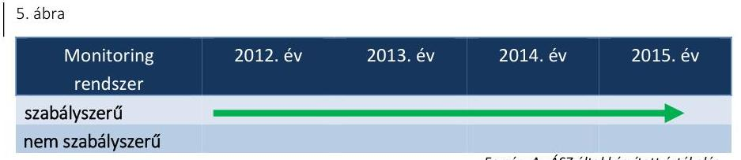

A főigazgató ${ }_{1-4}$ figyelemmel a Bkr. és az Áht. előírásaira az ellenőrzött években a Gazdálkodási szabályzat ${ }_{7-12}$-ben, az Ellenőrzési nyomvonal ${ }_{1,2}$-ben és a Belső kontrollrendszer szabályzatban ${ }^{42}$ alakította ki a KEF tevékenységének folyamatos- és eseti nyomon követését biztosító rendszerét.

A főigazgató ${ }_{1-4}$ a 2012-2015. években a Bkr. előírásainak megfelelően gondoskodott a KEF gazdálkodása, működése körében meghatározott követelmények teljesülésének nyomon követéséről.

A főigazgató ${ }_{1-4}$ az Áht. és a Bkr. előírásait betartva az SZMSZ ${ }_{1-3}$-ban közvetlen irányítása alá tartozó szervezeti egység létrehozásával gondoskodott a belső ellenőrzés kialakításáról, szervezeti és funkcionális függetlenségéről. A Bkr.-ben rögzítetteknek megfelelően a belső ellenőrök rendelkeztek az általános és szakmai követelmények szerinti képesítéssel.

A KEF az ellenőrzött években rendelkezett a Bkr.-ben előírt, érvényes Belső ellenőrzési kézikönyv ${ }_{1-3}{ }^{43}$-mal, amelynek felülvizsgálatára azonban határidőn túl került sor.

---

A Bkr.-ben előírtaknak megfelelően a 2012-2015. évek mindegyikében gondoskodtak a belső ellenőrzési tervek elkészítéséről, amelyek az éves ellenőrzési jelentésekben foglaltak szerint meg is valósultak. A belső ellenőrzési vezető a Bkr. előírásaival összhangban, éves bontásban vezetett nyilvántartásokat az elvégzett belső ellenőrzésekről, amelyekben a belső ellenőrzési jelentésekben tett megállapításokat, javaslatokat, a vonatkozó intézkedési terveket és azok végrehajtását nyomon követte.

A KEF-nél - a Bkr.-ben foglaltak szerint - a külső ellenőrzések javaslatai alapján készült intézkedési tervek végrehajtásáról éves bontásban nyilvántartást vezettek. A nyilvántartás alapján az irányító szerv ${ }_{1,2}$ felé teljesítendő beszámolási kötelezettségüknek - a 2012. évről szóló költségvetési beszámoló kivételével - határidőben tettek eleget.

A főigazgató ${ }_{1-4}$ a Bkr. előírásainak megfelelően az ellenőrzött években értékelte a költségvetési szerv belső kontrollrendszerének minőségét a Bkr. 1. számú melléklete szerinti nyilatkozatában. Fejlesztendő területként az ellenőrzési nyomvonal ${ }_{1,2}$-ben előírtak betartásának az ellenőrzése, szükség esetén a vezetői és a folyamatba épített ellenőrzés erősítése, továbbá a szervezet céljait veszélyeztető tényezőkre való fokozottabb odafigyelés jelent meg a nyilatkozatokban.

A monitoring rendszer kialakításával kapcsolatos szabálytalanságokat a 4. táblázat tartalmazza.
4. táblázat

# A MONITORING RENDSZER
 KIALAKÍTÁSÁVAL KAPCSOLATOS SZABÁLYTALANSÁGOK 

| Sorszám | Részmegállapítás | Megjegyzés |
| :--: | :--: | :--: |
| 1. | A Bkr. 17. § (4) bekezdésében előírtak ellenére, a Belső ellenőrzési kézikönyv ${ }_{2}$ kétévenkénti felülvizsgálata, aktualizálása nem történt meg, mivel a 2012. december 20-tól hatályos Belső ellenőrzési kézikönyv 2-t a 2014. év során nem vizsgálták felül. | A Belső ellenőrzési kézikönyv 2-t 2015. decemberében aktualizálták. |
| 2. | A Bkr. 14. § (2) bekezdésében foglaltak ellenére a Főigazgató ${ }_{1-2}$ a 2012. évi külső ellenőrzések javaslatai alapján tett intézkedésekről szóló beszámolási kötelezettségét a tárgyévet követő év január 31-i határidőn túl, 2013. február 22-én teljesítette az NFM felé. | A 2013-2015. években lefolytatott külső ellenőrzések alapján a beszámolás határidőben megtörtént. |

Forrás: ÁSZ
2.6. számú megállapítás

A Főigazgató ${ }_{1-4}$ kialakította a célok elérését szolgáló követelményeket, amelyek biztosítják a rendelkezésre álló források gazdaságos, hatékony és eredményes felhasználását.

A KEF a rendelkezésre álló források szabályszerű, gazdaságos, hatékony és eredményes felhasználását a belső szabályzatok kiadásával, folyamatok kialakításával és azok működésének folyamatos nyomon követésével, valamint a belső ellenőrzés általi ellenőrzésekkel törekedett elérni.

A belső kontrollrendszer működését a főigazgató ${ }_{1-4}$ mellett a belső ellenőrzés is rendszeresen értékelte. A belső kontrollrendszer szabályszerűségének, gazdaságosságának, hatékonyságának és eredményességének növelése érdekében javaslatokat fogalmazott meg a belső kontrollrendszer működésének javítására, jelezte a követelmények érvényesülésével kapcsolatban felmerült kockázatokat.

---

# 3. A KEF pénzügyi gazdálkodása szabályszerű volt-e? 

## Összegző megállapítás

### 3.1. számú megállapítás

### 3.2. számú megállapítás

## A KEF pénzügyi gazdálkodása összességében szabályszerű volt.

Az elemi költségvetés és az előirányzatok megállapítása során betartották a jogszabályi előírásokat és a belső szabályzatokban foglaltakat.

A KEF éves elemi költségvetése, az eredeti előirányzatok megállapítása megfelel az Áht., az Ávr., az NGM rendelet ${ }_{1,2}{ }^{44}$ és az irányító szerv ${ }_{1,2}$ tervezési követelményeinek, valamint a Gazdasági szervezet Ügyrendje ${ }_{1-6}$ ban és a Költségvetési tervezési szabályzat ${ }^{45}$-ban foglalt előírásoknak.

A KEF a költségvetési javaslata elkészítése során minden évben figyelembe vette az előirányzatok megállapításakor az (évközi) új feladatellátásból adódó szerkezeti változások és szintre hozások hatásait és mellékszámításokkal megalapozta azt.

A bevételi és kiadási előirányzatok módosítása, átcsoportosítása
megfelelt a jogszabályi előírásoknak.
Az előirányzat-módosítások a 2012-2015. években megfeleltek az Áht. és az Ávr. előírásainak. A KEF bevételi és kiadási előirányzatainak évközi módosításait hatáskör szerinti bontásban az 5. táblázat foglalja össze.
5. táblázat

ELŐIRÁNYZAT-MÓDOSÍTÁSOK HATÁSKÖRÖK SZERINT (M FT-BAN)

| Év | Kormányzati | Irányító-szervi | Saját | Összesen |
| :--: | :--: | :--: | :--: | :--: |
| 2012. év | $-53,0$ | 151,0 | 1165,7 | 1263,7 |
| 2013. év | 171,9 | 642,5 | 1575,9 | 2390,3 |
| 2014. év | 227,2 | 804,6 | 2582,4 | 3614,2 |
| 2015. év | 986,9 | 1068,5 | 8307,9 | 10363,3 |
| Összesen | 1333,0 | 2666,6 | 13631,9 | 17631,5 |

A évközi előirányzat-módosítások Kormány, irányító szervi, valamint saját hatáskörben meghozott döntések alapján történtek, amelyekre az előző évi maradványok előirányzatosítása, bérkompenzáció folyósítása, EU-s pályázatok alapján támogatások felhasználása, továbbá személyi juttatások és felhalmozási előirányzatok terhére dologi kiadások megemelése miatt került sor. Az irányító szerv ${ }_{1,2}$ által engedélyezett többletbevétel előirányzatosítása az Ávr. előírásainak megfelelő.

Az előirányzat-módosításokhoz kapcsolódó analitikus nyilvántartások megfeleltek az Áht. és az Áhsz. ${ }_{1,2}$ vonatkozó előírásainak.

A 2012-2013. években az éves költségvetési beszámolóban kimutatott előirányzat-módosítások összege és jogcíme megegyezett a főkönyvi könyvelés szerinti előirányzat-változásokkal. A költségvetési beszámoló kiegészítő melléklete az Áhsz. ${ }_{1}$ előírásainak megfelelően szöveges és számszaki levezetéssel mutatta be az évközi előirányzat-változásokat. A 2014-2015. években az előirányzat nyilvántartásban szereplő előirányzatmódosítások megegyeztek a főkönyvi könyvelés szerinti előirányzatváltozásokkal, megfeleltek az Áhsz. ${ }_{2}$ előírásainak.

---

### 3.3. számú megállapítás

Az ellenőrzött időszakban a bevételek beszedése és elszámolása szabályszerűen történt. A személyi jellegű juttatások előirányzata, valamint a felhalmozási és a működési kiadási előirányzatok felhasználása során - a 2014. és 2015. évi közbeszerzési szabálytalanságok kivételével - betartották a jogszabályi előírásokat.

A KEF teljesített összes bevétele - támogatásokkal és előző évi maradvánnyal együtt - a 2012. évi 11352,2 M Ft-ról a 2015. évre 20 978,9 M Ft-ra, 84,8%-kal emelkedett. A KEF 2012-2015. évi bevételi előirányzatainak alakulását a 6. ábra szemlélteti.
6. ábra
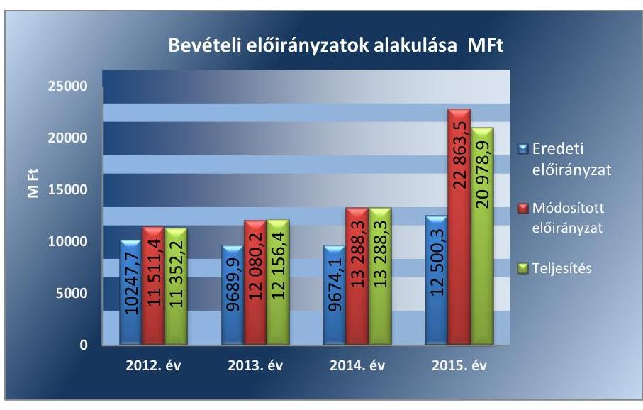

Forrás: 2012-2015. évi költségvetési beszámolók
A bevétel évről-évre történő növekedésének elsődleges oka a többletbevételekből, előző évek előirányzat-maradványaiból, megállapodásokon alapuló előirányzat-átvételekből származó bevételek emelkedése volt. A 2015. évi módosított bevételi előirányzat és a teljesített bevétel kiugróan magas növekedésének oka a KEF végleges elhelyezését biztosító épület és logisztikai központ kialakításához szükséges 5100,0 M Ft egyéb működési célú támogatás, amelyről a Kormány az 1519/2015.(VII.27.) határozattal döntött. A 2015. évi bevételi elmaradás oka az uniós pályázatok utófinanszírozása.

A 2012-2015. évi intézményi működési bevétel összegének és azon belül az ellenőrzött bevételi források arányának alakulását a 6. táblázat mutatja be.
6. táblázat

A 2012-2015. ÉVI INTÉZMÉNYI MŰKÖDÉSI BEVÉTEL ALAKULÁSA

| Megnevezés | 2012. év | 2013. év | 2014. év | 2015. év |
| :-- | :--: | :--: | :--: | :--: |
| intézményi működési bevétel | 2381,3 M Ft | 2342,2 M Ft | 2552,5 M Ft | 3111,4 M Ft |
| bérleti dijból származó bevétel   aránya | $17,6 \%$ | $8,7 \%$ | $12 \%$ | $9,4 \%$ |
| eszközértékesítésből származó   bevétel aránya | $0,34 \%$ | $0,18 \%$ | $0,01 \%$ | $0,01 \%$ |
| közbeszerzési dijból származó   bevétel aránya | $41,4 \%$ | $51,5 \%$ | $36,2 \%$ | $47,5 \%$ |

Forrás: 2012-2015. évi költségvetési beszámolók, főkönyvek, ÁSZ

---

A vagyonelemek hasznosításából (bérbeadás, értékesítés) származó bevételek, továbbá a közbeszerzési díjak beszedése és elszámolása során a pénzgazdálkodáshoz kapcsolódó belső kontrollokat az Áht. és az Ávr. előírásainak megfelelően, a Gazdálkodási szabályzat ${ }_{1-12}$-ben foglaltakkal összhangban működtették.

A KEF 2012-2015. évi kiadási előirányzatainak alakulását a 7. ábra szemlélteti.
7. ábra
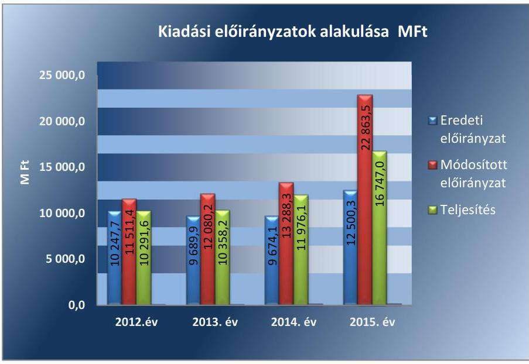

Forrás: 2012-2015. évi költségvetési beszámolók
A 2012-2015. években a KEF a kiemelt kiadási előirányzatokat nem lépte túl.

A KEF teljesített összes kiadása a 2012. évi 10 291,6 M Ft-ról 2015. évre 16 747,0 M Ft-ra, 62,7%-kal emelkedett. A kiadások növekedésének az oka, a KEF létszámának növekedése, a KEF végleges elhelyezését biztosító épület és logisztikai központ kialakításának 2015. évi megkezdése, számos más fejezettel kötött megállapodásokon alapuló előirányzat-átvételekhez, többek között az NFÜ ${ }^{46}$ jogutódláshoz, uniós programhoz kapcsolódó kiadásnövekedés.

A 2012-2015. években az ellenőrzött kiadások kiadási főösszeghez viszonyított arányának alakulását a 7. táblázat mutatja be.
7. táblázat

# AZ ELLENŐRZÖTT KIADÁSOK KIADÁSI FŐÖSSZEGHEZ VISZONYÍTOTT ARÁNYÁNAK ALAKULÁSA 

| Megnevezés | 2012. év | 2013. év | 2014. év | 2015. év |
| :-- | :--: | :--: | :--: | :--: |
| személyi juttatások   aránya | $18,4 \%$ | $19,5 \%$ | $16 \%$ | $13,4 \%$ |
| működési kiadások   aránya | $73,1 \%$ | $68,4 \%$ | $71,7 \%$ | $67,4 \%$ |
| felhalmozási   kiadások aránya | $3,6 \%$ | $7,8 \%$ | $7 \%$ | $14,4 \%$ |

Forrás: 2012-2015. évi költségvetési beszámolók, ÁSZ

---

A teljesített személyi juttatások összege a 2012. évről a 2015. évre 18%-kal emelkedett, amit a KEF alkalmazotti létszámának növekedése okozott.

A KEF-nél a működési kiadás tette ki a legnagyobb hányadot a kiadási tételek között. A teljesített működési kiadások összege a 2012. évről a 2015. évre 50,1%-kal emelkedett. A működési kiadások növekedését elsősorban a KEF által ellátott intézmények körének folyamatos bővülése okozta.

A teljesített felhalmozási kiadások összege a 2012. évről a 2015. évre több mint hatszorosára emelkedett, egyrészt a KEF által ellátott intézmények körének folyamatos bővülése, másrészt a KEF végleges elhelyezését biztosító épület és logisztikai központ kialakításának 2015. évi megkezdése miatt.

A kiadások teljesítése során a pénzgazdálkodáshoz kapcsolódó belső kontrollokat (kötelezettségvállalás, pénzügyi ellenjegyzés, teljesítésigazolás, érvényesítés) - az eseti hiányosságok kivételével összességében és évente értékelve az Áht., az Ávr. előírásainak megfelelően, a Gazdálkodási szabályzat ${ }_{1-12}$-ben foglaltakkal összhangban gyakorolták. A kifizetések elszámolása szabályszerűen történt.

A KEF a 2015. évi felhalmozási és a 2014-2015. évi működési kiadási előirányzatok felhasználásához kapcsolódóan a Kbt. ${ }^{47}$ 18. §-ában meghatározott egybeszámítási szabályokra figyelemmel több esetben megsértette a Kbt. 5. §-ában és a 19. §-ában előírt közbeszerzési eljárás lefolytatására vonatkozó kötelezettségét.

A bevételi és a kiadási előirányzatok teljesítésével, valamint a kiadási előirányzatok felhasználásával kapcsolatos szabálytalanságokat a 8. számú táblázat tartalmazza.
8. táblázat

# A BEVÉTELI ÉS A KIADÁSI ELŐIRÁNYZATOK TELJESÍTÉSÉVEL, VALAMINT A KIADÁSI ELŐIRÁNYZATOK FELHASZNÁLÁSÁVAL KAPCSOLATOS SZABÁLYTALANSÁGOK 

| Sorszám | Részmegállapítás | Megjegyzés |
| :--: | :--: | :--: |
| 1. | A rendszeres, valamint a külső személyi juttatások kifizetése során a 2012-2015. években, néhány esetben az Áht. 37. § (1) bekezdésében foglaltak ellenére a kötelezettségvállalásra pénzügyi ellenjegyzés nélkül került sor, illetve a pénzügyi ellenjegyzés dátumát az Ávr. 55. § (1) bekezdésben előírtak ellenére nem tüntették fel. |  |
| 2. | A 2012-2015. években felhalmozási és a működési kiadásokkal kapcsolatos kifizetések során néhány esetben a Beszerzési szabályzat 3.3.9. pontjában, a Beszerzési szabályzat 4.1.17. pontjában és a Beszerzési szabályzat ${ }_{2}$ III. fejezet 4. cím 64. pontjában foglaltak ellenére a kötelezettségvállalás dátumát nem tüntették fel. |  |
| 3. | Az Ávr. 55. § (1) bekezdésében, továbbá a Gazdálkodási szabályzat 30. pontjában előírtak ellenére a felhalmozási és a működési kiadásokkal kapcsolatos kifizetések során a 2012-2015. években, néhány esetben a pénzügyi ellenjegyző nem rögzítette a kötelezettségvállalási dokumentumon a pénzügyi ellenjegyzés időpontját. |  |
| 4. | Az Áht. 37. § (1) bekezdésében és a Gazdálkodási szabályzat ${ }_{7-12}$ 5. pontjában előírtak ellenére a felhalmozási kiadásokkal kapcsolatos kifizetések során a 2014-2015. |  |

---

| Sorszám | Részmegállapítás | Megjegyzés |
| :--: | :--: | :--: |
|  | években, egy-egy esetben, a működési kiadások felhasználása során a 2015. évben egy esetben a kötelezettségvállaló a kötelezettségvállalási dokumentumot a pénzügyi ellenjegyzést megelőzően látta el aláírásával. |  |
| 5. | A felhalmozási kiadásokhoz kapcsolódóan a 2012. évben egy esetben, a működési kiadásokhoz kapcsolódóan a 2013. évben egy esetben nem végezték el az Ávr. 58. § (1) bekezdésében előírt érvényesítést és az Ávr. 59. § (1) bekezdésében előírt utalványozást, a külön írásbeli rendelkezések (utalványrendeletek) nem tartalmazták az Ávr. 59. § (3) bekezdés g) pontjában előírtak ellenére az utalványozó keltezéssel ellátott aláírását, valamint az Ávr. 59. § (3) bekezdés h) pontjában előírt érvényesítést. |  |
| 6. | A KEF a 2015. évi felhalmozási és a 2014-2015. évi működési kiadásokkal kapcsolatos kifizetések során a Kbt.
 18. § (2) bekezdésében meghatározott egybeszámítási szabályokra figyelemmel több esetben megsértette a Kbt. 5. §-ában és a 19. § (1) bekezdésében előírt közbeszerzési eljárás lefolytatására vonatkozó kötelezettségét. |  |

A KEF az ellenőrzött időszakban a jogszabályi előírásoknak megfelelően készítette el éves költségvetési beszámolóját és teljesítette beszámolási kötelezettségét.

A KEF az éves elemi költségvetési beszámolóját a 2012-2013. években az Áhsz. 1, a 2014-2015. években pedig az Áhsz. 2 szerinti tartalmi és formai követelményeknek megfelelően állította össze.

A Számv. tv.-nek megfelelően fennállt az egyezőség a költségvetési beszámoló adatai, a főkönyvi könyvelés és az analitikus nyilvántartás adatai között.

# 3.5. számú megállapítás 

A KEF-nél a 2012-2015. években az előirányzat felhasználáshoz kapcsolódó korlátozó intézkedések végrehajtása, a befizetési kötelezettségek teljesítése és az előirányzat maradvány megállapítása, felhasználása szabályszerű volt. Likviditási tervet a 2012-2014. években nem készítettek.

A KEF az előirányzat korlátozó intézkedéseket, a zárolást és a zárolás feloldását, valamint a zárolt összegnek megfelelő előirányzat csökkentését az Áht. előírásainak megfelelően, szabályszerűen hajtotta végre.

A KEF költségvetéséből 2013. évben 111,0 M Ft került zárolásra és végleges elvonásra, míg a 2014. évi 120,3 M Ft zárolása ideiglenes volt, felhasználását év végén engedélyezték. A KEF a 2012-2013. évi költségvetési törvényekben meghatározott 1,7 M Ft-2,6 M Ft befizetési kötelezettségét szabályszerűen teljesítette.

A KEF a folyamatos fizetőképessége biztosítása érdekében az Áht.-ben és az Ávr.-ben előírt likviditási tervet - 2015. év kivételével - az ellenőrzött években nem készített. Fizetőképessége, likviditása fenntartása érdekében intézkedett a fennálló követelései behajtására, szabad kapacitású ingatlanait bérbe adta, továbbá költségcsökkentési intézkedéseket hajtott

---

végre. Az éves költségvetési beszámolókban kimutatott követelésállományát az Áhsz. 1, 2-ben foglaltaknak megfelelő analitikus nyilvántartással alátámasztotta.

A szállítói számlák, egyéb kötelezettségek határidőre történő kiegyenlítése az ellenőrzött időszakban nem volt teljes körűen biztosított. A hatvan napon túli lejárt szállítói tartozásállomány a 2012. januári $0,6 \mathrm{M}$ Ft-ról év végére megszűnt és 2013. december 31-én sem volt, ugyanakkor a 2014. év végére 9,1 M Ft-ra, 2015. december 31-re 33,4 M Ft-ra emelkedett. A lejárt szállítói tartozásból átütemezési megállapodással érintett összeg nem volt.

A költségvetési évben esedékes rövid lejáratú kötelezettség arányát az ellenőrzött években a 9. táblázat mutatja be.
9. táblázat

# A KÖLTSÉGVETÉSI ÉVBEN ESEDÉKES RÖVID LEJÁRATÚ KÖTELEZETTSÉG ARÁNYÁNAK ALAKULÁSA 2012-2015. ÉVEKBEN 

| Megjegyzés | 2012. év | 2013. év | 2014. év | 2015. év |
| :--: | :--: | :--: | :--: | :--: |
| rövid lejáratú kötelezettség | 179,0 M Ft | 0,0 M Ft | - | - |
| költségvetési évben   esedékes kötelezettség | - | - | 324,9 M Ft | 1220,4 M Ft |
| mérlegfőösszeg | 40 944,2 M Ft | 37 380,0 M Ft | 43 088,4 M Ft | 46 516,8 M Ft |
| költségvetési évben   esedékes rövid lejáratú   kötelezettség aránya | $0,4 \%$ | $0,0 \%$ | $0,8 \%$ | $2,6 \%$ |

Forrás: 2012-2015. évi költségvetési beszámolók
A KEF tárgyévi előirányzat-maradvány megállapítása során betartotta az Áhsz. 1, 2 előírásait. Az ellenőrzött időszakban a KEF kötelezettségvállalással terhelt maradvány megállapítása megfelelt az Ávr. előírásainak. A KEF betartotta az Áhsz. 1, 2-ben előírtakat, a 2012-2015. években az éves költségvetési beszámolókban és a kapcsolódó főkönyvi számlákon kimutatott előirányzat-maradvány megegyezett. A KEF az ellenőrzött időszakban a költségvetési maradványt az Ávr. szerint az éves költségvetési beszámoló készítésekor az Áhsz. 1, 2 előírásainak megfelelően megállapította és az irányító szerv ${ }_{1,2}$ az Ávr. előírásainak megfelelően jóváhagyta.

A likviditás érdekében tett intézkedésekkel kapcsolatos szabálytalanságot a 10. táblázat tartalmazza.
10. táblázat

## A LIKVIDITÁS ÉRDEKÉBEN TETT INTÉZKEDÉSEKKEL KAPCSOLATOS SZABÁLYTALANSÁG

Sorszám
1. 

Részmegállapítás
Az Áht. 78. § (2) bekezdésében és az Ávr. 122. § (1) bekezdésben előírtak ellenére a KEF a 2012-2014. években likviditási tervet nem készített.

Forrás: ÁSZ

---

# 4. A KEF vagyongazdálkodása szabályszerű volt-e? 

## Összegző megállapítás

### 4.1. számú megállapítás

A KEF vagyongazdálkodása összességében nem volt szabályszerű.

A vagyon értékének megőrzését, gyarapítását szolgáló vagyongazdálkodás feltételeinek kialakítása az ellenőrzött időszakban nem felelt meg a jogszabályi előírásoknak.

A KEF a vagyonkezelői tevékenységét jogelődjének, a Miniszterelnökség Közbeszerzési és Gazdasági Igazgatóságának a Kincstári Vagyoni Igazgatósággal 1998. április 28-án kötött vagyonkezelési szerződése ${ }^{48}$ alapján végezte, amelyet az ellenőrzött időszakban összesen 63 alkalommal módosítottak.

Az állami vagyon kezelésére vonatkozó szerződés tartalmának meghatározása 2015. július 7-éig nem felelt meg a Vtvr. ${ }^{49}$-ben foglalt előírásoknak. A vagyonkezelési szerződés 2015. július 7-i módosításának tartalmi elemeit kiterjesztették valamennyi vagyonkezelési jogviszonyra, így biztosítva a vagyonkezelési szerződés hatályos jogszabályokkal - Vtv. ${ }^{50}$, Nvtv., Vtvr. - való összhangját.

Az ingóságok vagyonkezelői jogának központi költségvetési szervek közötti átruházását követően a KEF, mint új vagyonkezelő, a Vtvr. előírásai ellenére nem minden esetben értesítette a tulajdonosi joggyakorló MNV Zrt-t ${ }^{51}$ az átruházás megtörténtéről.

Az ellenőrzéssel érintett 2012-2015. években az állam javára megvásárolt immateriális javak és tárgyi eszközök külön vagyonkezelési szerződés megkötése nélkül kerültek a KEF vagyonkezelésébe, amely megfelelt az Nvtv. előírásainak.

A KEF a 2012-2015. években a Vtvr. előírásai szerint átlátható, naprakész vagyonnyilvántartással rendelkezett. A vagyonnyilvántartásban - a Vtvr. mellékletében és az MNV Zrt. hatályos Vagyonnyilvántartási Szabályzatában foglaltaknak - megfelelően történt az egyes vagyonelemek besorolása a befektetett eszközök közé.

A 2012-2015. években a főkönyvi számlákhoz kapcsolódóan - az Áhsz. 1, 2 és a Számlarend 1-ben foglaltaknak megfelelően - a tárgyi eszközök, a követelések, a kötelezettségvállalások és más fizetés kötelezettségek analitikus nyilvántartása rendelkezésre állt. Az analitikus, részletező nyilvántartásoknak a kapcsolódó főkönyvi és nyilvántartási számlákkal való év végi egyeztetését dokumentált módon elvégezték. Az ellenőrzött időszakban a főkönyvi számlák és a kapcsolódó analitikus nyilvántartás év végi értékadatai számszerűen megegyeztek az eszközökforrások esetében.

A Vtvr.-ben és a vagyonkezelési szerződésben előírt adatszolgáltatási kötelezettséget a vagyon hasznosítására kötött jogviszony létesítésekor nem tartották be.

A vagyongazdálkodás feltételeinek kialakításával kapcsolatos szabálytalanságokat a 11. táblázat tartalmazza.

---

# VAGYONGAZDÁLKODÁS FELTÉTELEINEK KIALAKÍTÁSÁVAL KAPCSOLATOS SZABÁLYTALANSÁGOK 

| Sorszám | Részmegállapítás | Megjegyzés |
| :--: | :--: | :--: |
| 1. | A Vtvr. 8. § (2), a 11. § (6) és 12. § (8) bekezdésének rendelkezései ellenére - a vagyonkezelési szerződés hatálya alá tartozó vagyontárgyak körének változását követően - 60 napon belül nem készült el a módosításokkal egységes szerkezetbe foglalt vagyonkezelési szerződés. | A Vtvr. hivatkozott rendelkezései 2015. szeptember 8-ig voltak hatályosak. |
| 2. | A Vtvr. 11. § (2) bekezdésében foglaltak ellenére a KEF az ingóságok vagyonkezelői jogának jogutódlásáról nem minden esetben értesítette a tulajdonosi joggyakorlót. | Az értesítési kötelezettséget 2014. március 14-ig a Vtvr. 11. § (5) bekezdése, 2014. március 15-2015. szeptember 8. között a Vtvr. 11. § (6) bekezdése írta elő. |
| 3. | A Vtvr. 7. § (2) bekezdésében és a vagyonkezelési szerződés módosításaiban foglaltak ellenére a KEF az ingatlanok vagyonkezelésbe vétele során a 2013-2014. években egy-egy esetben nem gondoskodott a vagyonkezelési szerződés megkötésétől számított 30 napon belül a vagyonkezelői jog ingatlan-nyilvántartásba történő bejegyeztetéséről, továbbá a 2013-2015. években a földhivatali jogerős bejegyző határozatot sem küldte meg minden esetben a tulajdonosi joggyakorlónak. |  |
| 4. | A Vtvr. 20. § (1) bekezdésének előírása ellenére a vagyonkezelési szerződés 2012-2015. évi módosításaiban több esetben nem rögzítették, hogy a felek a tulajdonosi ellenőrzés eljárásrendjét, a felek jogait, kötelezettségeit a felek a szerződés részének tekintik. | A szabálytalanság 2015. július 7-e után nem állt fenn. |
| 5. | A Vtvr. 14. § (3) bekezdésében foglaltak ellenére a vagyonkezelési szerződés 2012-2015. évi módosításaiban több esetben nem rögzítették, hogy a KEF az MNV Zrt. Vagyonnyilvántartási Szabályzatát megismerte és magára nézve kötelező érvényűnek ismeri el. | A szabálytalanság 2015. július 7-e után nem állt fenn. |
| 6. | A Vtvr. 14. § (1) bekezdésében és a Vtvr. melléklete II. 5. pontjában, továbbá a 2015. július 7-én aláírt vagyonkezelési szerződésmódosítás 6.3. pontjában foglaltaknak ellenére a KEF a 2012-2015. években a vagyon hasznosítására kötött új jogviszony létesítésekor, bérleti szerződés megkötésekor nem értesítette a tulajdonosi joggyakorlót. |  |

A 2. számú megállapítás

A mérlegben kimutatott eszközök és források értékelése szabályszerű volt. A leltározás a 2012. évben nem felelt meg, a 2013-2015. években megfelelt a jogszabályok és a belső szabályzatok előírásainak. A KEF a rendező mérleget nem a jogszabályi előírásoknak megfelelően készítette el.

A KEF az ellenőrzött években elvégezte az eszközök és források év végi értékelését. A mérlegben kimutatott eszközök és források bekerülési értékének megállapítása, állományba vétele, év végi értékelése, az értékcsökkenés elszámolása a Számv. tv., az Áhsz. 1, 2, az Ávr. és a belső szabályzatok előírásainak megfelelt.

A mérlegek a naptári évek végén az analitikus és a főkönyvi számlákkal egyezően mutatták az eszközök és a források értékét. Az eszközök bekerülési értékét szabályszerűen, a Számv. tv.-nek és az Értékelési

---

szabályzat ${ }_{1-6}$-nak megfelelően állapították meg, az eszközök üzembe helyezését dokumentálták.

Az éves költségvetési beszámoló elkészítéséhez, a mérleg tételeinek alátámasztásához a leltárakat összeállították.

A KEF a 2012. évben az Áhsz. ${ }_{1}$-ben és a Leltározási szabályzat ${ }_{1}$-ben foglaltak ellenére az irányító szerv ${ }_{1}$ engedélye nélkül nem teljes körű leltározást végzett, mert a mennyiségben leltározandó eszközök tényleges felmérése nem terjedt ki a személyhez, partnerhez és a költséghelyhez köthető leltárkörzetekre.

A 2013. évben a KEF három ütemben, összességében minden leltári körzetre, 302 ezer eszközre kiterjedő leltározást végzett. A 2014. évben az Áhsz. 2 és a Leltározási szabályzat ${ }_{2,3}$ alapján egyeztetéssel végezték a leltározást. A 2015. évben öt ütemben, minden leltári körzetre kiterjedő mennyiségi leltározás volt.

A leltározásokat minden évben a leltározási utasításban az arra kijelölt munkavállalók ütemterv alapján hajtották végre. A leltározásokat leltárkörzetenként készült összefoglaló szakmai jelentésben értékelték ki, amelyekhez csatolták a hiányok-és többletek jegyzékét. A leltárhiányok kivezetése a Főigazgató ${ }_{1-4}$ engedélye alapján megtörtént.

Az összefoglaló szakmai jelentésekben, illetve a leltárhiányok okainak tisztázására indult eljárások során rögzítették, hogy a leltárhiányok jellemzően nem a KEF működését szolgáló vagyontárgyak körében keletkeztek, hanem a KEF által ellátott, mintegy hatvan minisztériumi épületben, központi költségvetési szervnél, valamint a NISZ Zrt. ${ }^{52}$ számára 2011. májusban használatba adott eszközök körében.

A leltárfelelősség megállapíthatósága érdekében a Leltározási szabályzat ${ }_{3}$-ban előírták, hogy a KEF által jogszabály alapján kötelezően ellátandó intézményekkel kötendő szolgáltatási megállapodásokban szabályozni kell a leltár eltérések kivizsgálását, felelősségét. A minisztériumokkal a 2015. évben újrakötött szolgáltatási megállapodások már tartalmazták az eszközmozgatásra, illetve a műtárgyak megőrzésére és elhelyezésére, valamint a minisztériumi ellátottak által okozott károk megtérítésére vonatkozó szabályokat.

Az 53/2011. (III. 31.) Korm. rendelet alapján a 2011. május 1. előtt a KEF által nyújtott informatikai és telekommunikációs szolgáltatások jogutódja a NISZ Zrt.
 A vagyonkezelői joga megszüntetéséig a KEF 2011. májusban 104 ezer db eszköz használatára a NISZ Zrt.-vel használati szerződést kötött. A KEF ezen eszközökre vonatkozó vagyonkezelői jogának megszüntetése - 2015. december 31-ig - csak részben történt meg. A KEF 2015. december 31-i kimutatása szerint 64 ezer db eszközre vonatkozóan továbbra is ellátta a vagyongazdálkodási feladatokat, annak ellenére, hogy a 250/2014. (X. 2.) Korm. rendelet alapján az informatikai és telekommunikációs szolgáltatások nem tartoztak a KEF feladatkörébe. A NISZ Zrt. együttműködésének hiányában a leltáreltérések jelentős részét a NISZ Zrt.-nek használatba adott eszközökről vissza nem küldött/be nem érkezett tárolási nyilatkozatok okozták, melyeket nem tudtak feldolgozni.

A KEF az államháztartás számvitelének 2014. évi megváltozásával kapcsolatos feladatok végrehajtása körében a rendező mérleget nem a jogszabályi előírásoknak megfelelően készítette el. A rendező mérleg elkészítéséhez 2013. december 31-ei mérleg-fordulónappal valamennyi eszközt és forrást felleltároztak, azonban a

---

36/2013. (IX.13.) NGM rendelet $^{53}$-ben előírtak ellenére nem végezték el a követelések leltárában azok költségvetési évben esedékes és költségvetési évet követő években esedékes bontását.

A rendező mérleget a 36/2013. (IX.13.) NGM rendeletben meghatározott, 2014. március 31-i határidő után készítették el. A rendező mérleg elkészítéséig a könyvvezetés nem felelt meg az NGM rendelet előírásainak, mert az Áhsz. előírása szerinti nyitó tételeket az előírt 2014. január 31-i határidőt követően, a rendező mérleg elfogadása után rögzítették.

A mérlegben kimutatott eszközök és források értékelésével, valamint leltárazásával kapcsolatos szabálytalanságokat a 12. táblázat tartalmazza.
12. táblázat

# A MÉRLEGBEN KIMUTATOTT ESZKÖZÖK ÉS FORRÁSOK ÉRTÉKELÉSÉVEL, VALAMINT LELTÁROZÁSÁVAL KAPCSOLATOS SZABÁLYTALANSÁGOK 

| Sorszám | Bészmegállapítás | Megjegyzés |
| :--: | :--: | :--: |
| 1. | Az Áhsz. 37. § (6) bekezdésében, valamint a Leltározási   szabályzat I. fejezet 2.) pontjában foglaltak ellenére a KEF a   leltározási kötelezettségének 2012. évben nem teljes   körűen tett eleget, mert a mennyiségben leltárazandó   eszközök tényleges felmérése - az irányító szerv engedélye   nélkül - nem terjedt ki a személyhez, partnerhez és a   költséghelyhez köthető leltárkörzetekre. | Az irányító szerv engedélyét a 2013. évben beszerezték. |
| 2. | A 250/2014. (X.2.) Korm. rendelet 3. § (1) bekezdés a) és b)   pontjában foglaltak ellenére a KEF olyan informatikai-   telekommunikációs eszközökkel összefüggő   vagyongazdálkodási feladatokat is ellátott, amely   vagyonelemekkel kapcsolatos vagyongazdálkodási   feladatok nem tartoztak a feladatkörébe. |  |
| 3. | A KEF a rendező mérleget a 36/2013. (IX.13.) NGM rendelet   8. § 2. bekezdés a) pontjában meghatározott, 2014. március   31-i határidő után, 2014. május 22-én készítette el. A KEF-  nél a 36/2013. (IX.13.) NGM rendelet 9. § (1) bekezdésében   foglaltak ellenére a költségvetési számvitel nyilvántartási   számlák nyitó tételeit az előírt 2014. január 31-i határidőn   túl, csak a rendező mérleg elfogadása után rögzítették. |  |

A KEF az értékmegőrzési, állagmegóvási kötelezettségét a jogszabály és a vagyonkezelési szerződés előírásai szerint teljesítette. A vagyonelemek hasznosítására kötött szerződések nem voltak szabályszerűek.

A KEF mérleg szerinti vagyona 2012. év végén 40 944,2 M Ft volt, mely 2015. év végére 13,5%-kal nőtt. A befektetett eszközök részaránya 2012. év végén az eszközökön belül 94,6% volt, mely 2015. év végére 88,7%-ra csökkent, annak ellenére, hogy az ellenőrzött időszak alatt e vagyoncsoportba tartozó eszközök értéke 2 567,2 M Ft-tal emelkedett. Az ellenőrzött időszakban a KEF-nél a mérleg szerinti vagyon alakulására hatással volt, hogy az európai uniós programok lebonyolítását támogató intézményrendszer területi programjait kezelő közreműködő szervezetek a minisztériumokba integrálódtak, így a KEF ellátotti köre bővült.

---

A vagyon alakulását befolyásolták továbbá a 2012-2015. évi beruházások (3 434,6 M Ft) és felújítások (941,2 M Ft), melyek eredményeképpen az eszközök használhatósági foka a 2012. évi 48,5%-ról 61,1%-ra emelkedett 2015. év végére.

A KEF vagyoni helyzetének alakulását, a tárgyi eszközök használhatósági fok és elhasználódási szint változását a 13. táblázat szemlélteti.
13. táblázat

| A KEF VAGYONI HELYZETÉNEK ALAKULÁSA |  |  |  |  |
| :--: | :--: | :--: | :--: | :--: |
| Megnevezés | 2012. év | 2013. év | 2014. év | 2015. év |
| saját tőke aránya mutató-Tőkeerősség (saját tőke összesen/források összesen) | 96,2% | 94,8% | 97,8% | 95,5% |
| használhatósági fok (tárgyi eszközök nettó értéke × 100 / tárgyi eszközök bruttó értéke | 48,5% | 60,4% | 62,4% | 61,1% |
| elhasználódási szint (tárgyi eszközök elszámolt értékcsökkenése × 100 / tárgyi eszközök záró bruttó értéke | 51,5% | 39,6% | 37,6% | 38,9% |

A KEF a kezelt vagyon állagmegóvása érdekében - a költségvetési forrásait figyelembe véve - Vtv.-ben előírtak alapján az eszközök karbantartásáról, a vagyontárgyak állagának megóvásáról, meghatározott célnak megfelelő használatáról, működtetéséről folyamatosan gondoskodott.

A vagyonelemekben bekövetkezett változások számviteli nyilvántartásban való rögzítése szabályszerűen kiállított bizonylatok alapján történt.

A vagyonelemek hasznosítása során a bérleti, hasznosítási szerződések megkötésekor az Nvtv. előírásait nem tartották be.

A vagyonelemek hasznosításával kapcsolatos szabálytalanságokat a 14. táblázat tartalmazza.
14. táblázat

# A VAGYONELEMEK HASZNOSÍTÁSÁVAL KAPCSOLATOS SZABÁLYTALANSÁGOK 

| Sorszám | Részmegállapítás | Megjegyzés |
| :--: | :--: | :--: |
| 1. | Az ellenőrzött időszakban esetenként előfordult, hogy az Nvtv. 11. § (10) bekezdésében előírtak ellenére úgy kötöttek nem természetes személyekkel bérleti szerződést, hogy a szerződő fél az Nvtv. 3. § (2) bekezdésében előírt átláthatóságra vonatkozó nyilatkozatával nem rendelkeztek. |  |
| 2. | Az Nvtv. 11. § (11) bekezdés a) pontjában előírtak ellenére a nem természetes személyekkel kötött vagyonhasznosítási szerződésekben nem írták elő a beszámolási, nyilvántartási, adatszolgáltatási kötelezettséget. |  |

---

# 5. Érvényesült-e az integritás szemlélet és ennek megfelelően kiépítették-e az integritás kontrollrendszert a KEF-nél? 

Összegző megállapítás Az ellenőrzött időszakban a KEF-nél az integritás szemlélet nem érvényesült.
5.1. számú megállapítás Az ellenőrzött időszakban a KEF-nél az integritási kontrollok kiépítettsége összességében alacsony volt.

A KEF a 2015. évben nem vett részt az ÁSZ Integritás Projektjében $^{54}$. Az integritás kontrollrendszer kiépítettségének értékelése a KEF által az ellenőrzés keretében kitöltött integritás tanúsítvány alapján öt kockázati terület kiértékelésével történt. Az integritás kontrollrendszer kiépítettségével kapcsolatos megállapításokat a IV. sz. melléklet tartalmazza.

---

# JAVASLATOK 

Az ÁSZ tv. 33. § (1) bekezdésében foglaltak értelmében az ellenőrzött szervezet vezetője köteles a jelentésben foglalt megállapításokhoz kapcsolódó intézkedési tervet összeállítani és azt a jelentés kézhezvételétől számított 30 napon belül az ÁSZ részére megküldeni. Amennyiben az ellenőrzött szervezet vezetője nem küldi meg határidőben az intézkedési tervet, vagy továbbra sem elfogadható intézkedési tervet küld, az Állami Számvevőszék elnöke az ÁSZ tv. 33. § (3) bekezdése a) és b) pontjaiban foglaltakat érvényesítheti.

## Az NGM Miniszternek:

1. Tegyen intézkedéseket a feltárt szabálytalanságok tekintetében a felelősség tisztázása érdekében, és szükség szerint intézkedjen a felelősség érvényesítéséről.
(8. számú táblázat 6. sz. megállapítás alapján)

## A KEF Föigazgatójának:

1. Tegyen intézkedéseket a feltárt szabálytalanságok tekintetében a felelősség tisztázása érdekében, és szükség szerint intézkedjen a felelősség érvényesítéséről;
(8. számú táblázat 6. sz. megállapítás alapján)
2. Intézkedjen a Számv. tv.-ben foglalt előírások betartására a tekintetben, hogy a számviteli politikájában kerüljenek rögzítésre azok a gazdálkodóra jellemző szabályok, előírások, módszerek, amelyekkel meghatározza, hogy a számviteli elszámolás, értékelés szempontjából a KEF mit tekint lényegesnek, illetve nem lényegesnek;
(1. számú táblázat 1. sz. megállapítás alapján)
3. Intézkedjen az Ávr.-ben előírtak alapján, hogy
a) szabályozza a vezetékes telefonok használatának rendjét;
(1. számú táblázat 4. sz. megállapítás alapján)
b) az elemi költségvetést a KEF az irányító szerv által meghatározott határidőben küldje meg az irányító szervnek;
(3. számú táblázat 3. sz. megállapítás alapján)

---

c) a felhalmozási és működési kiadások kifizetésére az érvényesítést és utalványozást követően kerüljön sor;
(8. számú táblázat 5. sz. megállapítás alapján)
4. Intézkedjen, hogy az információs rendszerek keretében működtetett beszámolási rendszereknél a Bkr.-ben foglaltak szerint határozzák meg a beszámolási szinteket, határidőket;
(3. számú táblázat 1. sz. megállapítás alapján)
5. Intézkedjen, hogy a KEF a beszámoló adatait az Áhsz.2-ben előírt határidőben töltse fel a Kincstár által működtetett adatszolgáltató rendszerbe;
(3. számú táblázat 5. sz. megállapítás alapján)
6. Intézkedjen az Áht.-ban és az Ávr.-ben előírtak alapján, hogy a rendszeres, valamint a külső személyi juttatásokhoz kapcsolódó kötelezettségvállalásra szabályszerűen végrehajtott pénzügyi ellenjegyzést követően kerüljön sor;
(8. számú táblázat 1. sz. megállapítás alapján)
7. Intézkedjen, hogy a Beszerzési szabályzatában előírtak alapján a felhalmozási és működési kiadásokhoz kapcsolódó kötelezettségvállalások esetében a kötelezettségvállaló tüntesse fel a kötelezettségvállalás dátumát;
(8. számú táblázat 2. sz. megállapítás alapján)
8. Intézkedjen az Ávr.-ben és a Gazdálkodási szabályzatban előírtak alapján, hogy felhalmozási és működési kiadásokhoz kapcsolódó kötelezettségvállalásra szabályszerűen végrehajtott pénzügyi ellenjegyzést követően kerüljön sor;
(8. számú táblázat 3. sz. megállapítás alapján)
9. Intézkedjen, hogy a felhalmozási és működési kiadási előirányzatok felhasználása során a kötelezettségvállalásra az Áht. és a Gazdálkodási szabályzat előírásainak megfelelően elvégzett pénzügyi ellenjegyzést követően kerüljön sor;
(8. számú táblázat 4. sz. megállapítás alapján)

---

10. 

Intézkedjen a vagyongazdálkodás szabályszerűsége érdekében a Vtvr.-ben előírtak alapján arról, hogy
a) az ingóságok vagyonkezelői jogának központi költségvetési szervek közötti átruházását követően a KEF, mint új vagyonkezelő, a jogutódlásról értesítse a tulajdonosi joggyakorlót;
(11. számú táblázat 2. sz. megállapítás alapján)
b) a vagyonkezelői jog az ingatlan-nyilvántartásba a vagyonkezelési szerződés megkötését követő harminc napon belül bejegyeztetésre, továbbá a jogerős bejegyző határozat a tulajdonosi joggyakorló részére a kézhezvételt követően haladéktalanul megküldésre kerüljön;
(11. számú táblázat 3. sz. megállapítás alapján)
11. Intézkedjen, hogy a Vtvr.-ben és a 2015. július 7-én aláirt vagyonkezelési szerződés módosításban előírtak alapján a vagyon hasznosítására kötött új jogviszony létesítésekor a tulajdonosi joggyakorló értesítése az előírt határidőig megtörténjen;
(11. számú táblázat 6. sz. megállapítás alapján)
12. Intézkedjen a 250/2014. (X. 2.) Korm. rendeletben előírtakkal összhangban az informatikai-telekommunikációs eszközökkel összefüggő vagyongazdálkodási feladatok megszüntetéséről, mivel ezen vagyonelemekhez kapcsolódó vagyongazdálkodási feladatok nem tartoznak a KEF feladatkörébe;
(12. számú táblázat 2. sz. megállapítás alapján)
13. Intézkedjen az Nvtv.-ben előírtak alapján a nem természetes személyekkel kötött bérleti, használati szerződések esetében az átláthatóság követelményének érvényesítéséről, valamint a vagyon hasznosításra vonatkozó szerződésekben a beszámolási, nyilvántartási és adatszolgáltatási kötelezettség előírásáról;
(14. számú táblázat 1. és 2. sz. megállapítás alapján)

---

# MELLÉKLETEK 

- I. SZ. MELLÉKLET: ÉRTELMEZŐ SZÓTÁR
állami vagyon
állami vagyon használója
állami vagyon értékesítése
állami vagyon hasznosítása
állami vagyon hasznosítására kötött szerződés
állami vagyon kezelője /vagyonkezelő

ÁSZ Integritás Projekt

Állami vagyonnak minősül:
a) az állam tulajdonában lévő dolog, valamint a dolog módjára hasznosítható természeti erő,
b) az a) pont hatálya alá nem tartozó mindazon vagyon, amely vonatkozásában törvény az állam kizárólagos tulajdonjogát nevesíti,
c) az állam tulajdonában lévő tagsági jogviszonyt megtestesítő értékpapír, illetve az államot megillető egyéb társasági részesedés,
d) az államot megillető olyan
 immateriális, vagyoni értékkel rendelkező jogosultság, amelyet jogszabály vagyoni értékű jogként nevesít. (Forrás: Vtv. 1. § (2) bekezdése)
Az a természetes vagy jogi személy, jogi személyiséggel nem rendelkező szervezet, aki, vagy amely törvény vagy szerződés alapján, bármely jogcímen (bérlet, haszonbérlet, használat stb.) állami vagyont birtokol, használ, szedi annak hasznait, hasznosít, ide nem értve a haszonélvezőt, a vagyonkezelőt és a tulajdonosi jogok gyakorlóját. (Forrás: Vtvr. 1. § (7) bekezdés a) pontja)
Állami vagyon tulajdonjogának bármely jogcímen történő, visszterhes átruházása. (Forrás: Vtvr. 1. § (7) bekezdés d) pontja)
Az állami vagyont az MNV Zrt. maga kezeli, vagy szerződés - így különösen bérlet, haszonbérlet, megbízás - alapján központi költségvetési szervnek, természetes vagy jogi személynek, vagy jogi személyiséggel nem rendelkező gazdálkodó szervezetnek hasznosításra átengedi.
(Forrás: Vtv. 23. § (1) bekezdése, hatályos 2012. január 1-jétől)
Az állami vagyonnal a tulajdonosi joggyakorló maga gazdálkodik, vagy szerződés - így különösen bérlet, haszonbérlet, megbízás - alapján hasznosításra átengedi, illetőleg vagyonkezelésbe, haszonélvezetbe adja. (Forrás: Vtv. 23. § (1) bekezdése, hatályos 2013. június 28-ától)

Az állami vagyon hasznosítására kötött szerződések elsődleges célja az állami vagyon hatékony működtetése, állagának védelme, értékének megőrzése, illetve gyarapítása, az állami és közfeladatok ellátásának elősegítése. (Forrás: Vtv. 23. § (2) bekezdése)
Az állami vagyont az MNV Zrt. maga kezeli, vagy szerződés - így különösen bérlet, haszonbérlet, megbízás - alapján központi költségvetési szervnek, természetes vagy jogi személynek, vagy jogi személyiséggel nem rendelkező gazdálkodó szervezetnek hasznosításra átengedi. Az állami vagyonra vonatkozóan az MNV Zrt. kizárólag az Nvtv-ben meghatározott személyekkel köthet vagyonkezelési szerződést. (Forrás: Vtv. 27. § (1) bekezdése, hatályos 2012. január 1-jétől)
Az Állami Számvevőszék 2009-ben indította el a „Korrupciós kockázatok feltérképezése - Integritás alapú közigazgatási kultúra terjesztése" című, európai uniós forrásból megvalósított kiemelt projektjét (Integritás Projekt). Az Integritás Projekt célja, hogy felmérje a közszféra intézményei korrupciós kockázatoknak való kitettségét, illetőleg az azok mérséklésére hivatott kontrollok szintjét. Az Állami Számvevőszék a projekt révén az integritás szemlélet minél szélesebb körrel történő megismertetését, gyakorlatba ültetését kívánja elérni. Az integritás követelményeinek megfelelő szervezeti működést előnyben részesítő közigazgatási kultúra elterjesztését és a korrupció elleni fellépést az ÁSZ önmagára nézve is stratégiai jelentőségű célként fogalmazta meg. A projekt a felmérésben résztvevő

---

belső ellenőrzés
belső kontrollrendszer
belső kontrollrendszer területei
felújítás
hasznosítás
információs és
kommunikációs rendszer
integritás
irányító szerv/felügyeleti szerv
kockázatkezelési rendszer
kontrollkörnyezet
kontrolltevékenységek
intézmények számára helyzetükről egyfajta „tükörképet" mutat be, ami alapot teremt a jövőbeni pozitív irányú elmozduláshoz. (Forrás: a http://integritas.asz.hu honlapon közzétett, a 2013. évi Integritás felmérés eredményeiről készült összefoglaló tanulmány)
Független, tárgyilagos bizonyosságot adó és tanácsadó tevékenység, amelynek célja, hogy az ellenőrzött szervezet működését fejlessze és eredményességét növelje, az ellenőrzött szervezet céljai elérése érdekében rendszerszemléletű megközelítéssel és módszeresen értékeli, illetve fejleszti az ellenőrzött szervezet irányítási és belső kontrollrendszerének hatékonyságát. (Forrás: Bkr. 2. § b) pontja)
A belső kontrollrendszer a kockázatok kezelése és tárgyilagos bizonyosság megszerzése érdekében kialakított folyamatrendszer, amely azt a célt szolgálja, hogy a működés és gazdálkodás során a tevékenységeket szabályszerűen, gazdaságosan, hatékonyan, eredményesen hajtsák végre, az elszámolási kötelezettségeket teljesítsék, megvédjék az erőforrásokat a veszteségektől, károktól és nem rendeltetésszerű használattól. (Forrás: Áht. 69. § (1) bekezdése)
A kontrollkörnyezet, a kockázatkezelési rendszer, a kontrolltevékenységek, az információs és kommunikációs rendszer, valamint a nyomon követési (monitoring) rendszer. (Forrás: Bkr. 3. §-a)
Az elhasználódott tárgyi eszköz eredeti állaga (kapacitása, pontossága) helyreállítását szolgáló időszakonként visszatérő olyan tevékenység, melynek során az eszköz élettartama megnövekszik, minősége, használata jelentősen javul, így a pótlólagos ráfordításból a jövőben gazdasági előnyök származnak. (Forrás: Számv. tv. 3. § (4) bekezdés 8. pontja)
A nemzeti vagyon birtoklásának, használatának, hasznok szedése jogának bármely a tulajdonjog átruházását nem eredményező jogcímen történő átengedése, ide nem értve a vagyonkezelésbe adást, valamint a haszonélvezeti jog alapítását. (Forrás: Nvtv. 3. § (1) bekezdés 4. pontja)
A költségvetési szerv vezetője által kialakított és működtetett olyan rendszer, mely biztosítja, hogy a megfelelő információk a megfelelő időben eljutnak az illetékes szervezethez, szervezeti egységhez, illetve személyhez. (Forrás: Bkr. 9. § (1) bekezdés)
Az integritás az elvek, értékek, cselekvések, módszerek, intézkedések konzisztenciáját jelenti, vagyis olyan magatartásmódot, amely meghatározott értékeknek megfelel. (Forrás: Nemzetgazdasági Minisztérium: Magyarországi államháztartási belső kontroll standardok Útmutató 1.6.1. pontja, 2012. december)
A költségvetési szerv tekintetében az e törvényben meghatározott irányítási hatáskört gyakorló szerv. (Forrás: Áht. 1. § 9. pontja)
Olyan irányítási eszközök és módszerek összessége, melynek elemei a szervezeti célok elérését veszélyeztető tényezők (kockázatok) azonosítása, elemzése, csoportosítása, nyomon követése, valamint szükség esetén a kockázati kitettség mérséklése. (Forrás: Bkr. 2. § m) pontja)
A költségvetési szerv vezetője által kialakított olyan elvek, eljárások, belső szabályzatok összessége, amelyben világos a szervezeti struktúra, egyértelműek a felelősségi, hatásköri viszonyok és feladatok, meghatározottak az etikai elvárások a szervezet minden szintjén, átlátható a humánerőforrás-kezelés. (Forrás: Bkr. 6. § (1) bekezdés)
A költségvetési szerv vezetője által a szervezeten belül kialakított (kontroll) tevékenységek, melyek biztosítják a kockázatok kezelését, hozzájárulnak a szervezet céljainak eléréséhez. (Forrás: Bkr. 8. § (1) bekezdés)

---

| kommunikáció | Az a tevékenység, melynek során információ továbbítása valósul meg. A kommunikációs folyamat résztvevői között tájékoztatás történik, mely során tényeket, ezek magyarázatát közlik. |
| :--: | :--: |
| közfeladat | Jogszabályban meghatározott állami vagy önkormányzati feladat, amit az arra kötelezett közérdekből, a jogszabályban meghatározott követelményeknek és feltételeknek megfelelve végez, ideértve a lakosság közszolgáltatásokkal való ellátását, továbbá az állam nemzetközi szerződésekben vállalt kötelezettségeiből adódó közérdekű feladatokat, valamint e feladatok ellátásakor szükséges infrastruktúra biztosítását is. (Forrás: Nvtv. 3. § (1) bekezdés 7. pontja) |
| monitoring | A monitoring általánosságban a különböző szintű szervezeti célok megvalósításának folyamatát kíséri figyelemmel, melynek során a releváns eseményekről és tevékenységekről (együtt: folyamatokról) rendszeres jelleggel, strukturált, döntéstámogató információkhoz jutnak a szervezet vezetői. (Forrás: NGM Útmutató a költségvetési szervek monitoring rendszeréhez 2011. november) |
| monitoring-rendszer | A költségvetési szerv vezetője köteles olyan monitoring rendszert működtetni, mely lehetővé teszi a szervezet tevékenységének, a célok megvalósításának nyomon követését. A költségvetési szerv monitoring rendszere az operatív tevékenységek keretében megvalósuló folyamatos és eseti nyomon követésből, valamint az operatív tevékenységektől függetlenül működő belső ellenőrzésből áll. (Forrás: Bkr. 10. §) |
| tulajdonosi joggyakorló | Aki a nemzeti vagyon felett az államot vagy a helyi önkormányzatot megillető tulajdonosi jogok és kötelezettségek összességének gyakorlására jogosult. (Forrás: Nvtv. 3. § (1) bekezdés 17. pontja) |
| vagyongazdálkodás | A nemzeti vagyongazdálkodás feladata a nemzeti vagyon rendeltetésének megfelelő, az állam, az önkormányzat mindenkori teherbíró képességéhez igazodó, elsődlegesen a közfeladatok ellátásához és a mindenkori társadalmi szükségletek kielégítéséhez szükséges, egységes elveken alapuló, átlátható, hatékony és költségtakarékos működtetése, értékének megőrzése, állagának védelme, értéknövelő használata, hasznosítása, gyarapítása, továbbá az állam vagy a helyi önkormányzat feladatának ellátása szempontjából feleslegessé váló vagyontárgyak elidegenítése. (Forrás: Nvtv. 7. § (2) bekezdése) |

---

# II. SZ. MELLÉKLET: A KEF PÉNZÜGYI ÉS VAGYONGAZDÁLKODÁSÁNAK TELJESÍTMÉNY-ELLENŐRZÉSE 

Az ÁSZ a KEF pénzügyi és vagyongazdálkodásának ellenőrzése keretében ellenőrizte:

1. Az ellenőrzött szervezet meghatározott-e célokat, célértékeket a gazdálkodási folyamatok tekintetében?
2. Az ellenőrzött szervezet a kitűzött célok és célértékek elérése érdekében meghatározott-e intézkedéseket, feladatokat az ellenőrzött időszakban?
3. Az ellenőrzött szervezet a kitűzött célokat és célértékeket teljesítette-e?

Az ellenőrzés a teljesítmény-ellenőrzési modul tekintetében megállapította, hogy a KEF a gazdálkodás folyamatában számszerűsített, mérhető célokat, célértékeket nem határozott meg.

---

III. SZ. MELLÉKLET: A BELSŐ KONTROLLRENDSZER KIALAKÍTÁSÁNAK ÉS MŰKÖDTETÉSÉNEK ÉRTÉKELÉSE A 2012-2015. ÉVEKBEN

| Megnevezés | 2012. év | 2013. év | 2014. év | 2015. év | 2012-2015. évek |
| :-- | :--: | :--: | :--: | :--: | :--: |
| Kontrollkörnyezet | szabályszerű | szabályszerű | szabályszerű | szabályszerű | szabályszerű |
| Kockázatkezelés | nem szabályszerű | szabályszerű | szabályszerű | szabályszerű | szabályszerű |
| Kontroll-tevékenységek | szabályszerű | szabályszerű | szabályszerű | szabályszerű | szabályszerű |
| Információ és kommunikáció | szabályszerű | szabályszerű | szabályszerű | szabályszerű | szabályszerű |
| Monitoring | szabályszerű | szabályszerű | szabályszerű | szabályszerű | szabályszerű |
| A belső kontrollrendszer   összevont értékelése | nem szabályszerű | szabályszerű | szabályszerű | szabályszerű | szabályszerű |

Forrás: Az ÁSZ által készített értékelés

---

# - IV. SZ. MELLÉKLET: AZ INTEGRITÁS SZEMLÉLET ÉRVÉNYESÍTÉSÉVEL ÉS AZ INTEGRITÁS KONTROLLRENDSZER KIÉPÍTETTSÉGÉVEL KAPCSOLATOS MEGÁLLAPÍTÁSOK 

A KEF által kitöltött integritás tanúsítvány alapján - öt kockázati területen - a kialakított kontrollokat értékeltük. Az intézménynél az integritás kontrollrendszer kialakítása összességében alacsony volt.

| AZ INTEGRITÁS KONTROLLOK ÉRTÉKELÉSE |  |  |  |  |  |
| :--: | :--: | :--: | :--: | :--: | :--: |
| Sorszám | Megnevezés |  | Maximum elérhető pontszám | Elért pontszám | Értékelés (magas, közepes, alacsony) |
| 1. | Összeférhetetlenség és etikai elvárások |  | 5 | 5 | magas |
| 2. | Humánerőforrás gazdálkodás |  | 5 | 5 | magas |
| 3. | Szervezet vagyonának megvédésére tett intézkedések |  | 5 | 5 | magas |
| 4. | A nem kívánatos dolgozói magatartással szembeni intézkedések és azok érvényesülése |  | 5 | 2 | alacsony |
| 5. | Az integritás erősítése, annak tudatosítása, valamint a kockázatelemzések alkalmazása |  | 5 | 1 | alacsony |
|  | Összesítő értékelés |  | 25 | 18 | alacsony |

Az integritási kontrollok kiépítettsége annak ellenére alacsony volt, hogy az összeférhetetlenség és etikai elvárások, a humánerőforrás gazdálkodás és a szervezet vagyonának megvédésére tett intézkedések kontrolljainak kiépítettsége magas volt, mivel az ellenőrzés a nemkívánatos dolgozói magatartással szembeni intézkedések vonatkozásában, továbbá az integritás erősítése, annak tudatosítása, valamint a kockázatelemzések alkalmazásának területein kontroll hiányosságokat tárt fel.

Az összeférhetetlenség és etikai elvárások kontrolljainak kiépítettsége magas volt, mivel az etikai és az összeférhetetlenségi szabályokat, továbbá az ajándékok elfogadásának feltételeit meghatározták, a munkatársak nyilatkoztak az összeférhetetlenségről és az elmúlt három évben etikai eljárás sem indult.

A humánerőforrás gazdálkodás kontrolljainak kiépítettsége magas volt, mivel az alkalmazottak rendelkeztek munkaköri leírással, az új munkatársak kiválasztásához álláspályázatot írtak ki. A pályázati dokumentumok hitelességét ellenőrizték, a megfelelő felkészültségű szakemberek kiválasztásához alkalmaztak objektív megítélést lehetővé tevő, általánosan elfogadott módszert.

A szervezet vagyonának megvédésére tett intézkedések kontrolljainak kiépítettsége magas volt, mivel a KEF meghatározta a munkáltató tulajdonában, kezelésében lévő egyes eszközök használatára vonatkozó szabályokat. Rendelkeztek iratkezelési-, adatkezelésre vonatkozó és informatikai szabályzattal is. Szabályozták a külső személyekkel való kapcsolattartást, alkalmazták a "négy szem elve" minőségbiztosítási kontrollt.

A nemkívánatos dolgozói magatartással szembeni intézkedések kontrolljainak kiépítettsége alacsony volt, mert a KEF nem rendelkezett a szervezeten belüli közérdekű bejelentők védelmére vonatkozó szabályozással, nem működtettek közérdekű bejelentéseket kezelő, továbbá a
 szervezeten kívülről érkező panaszokat és közérdekű bejelentéseket kezelő rendszert sem.

Az integritás erősítése, annak tudatosítása, valamint a kockázatelemzések alkalmazása kontrolljainak kiépítettsége alacsony volt, mert a KEF nem rendelkezett nyilvánosan közzétett stratégiával, az elmúlt három évben korrupcióellenes képzést nem szerveztek és rendszeres korrupciós kockázatelemzést sem végeztek.

---

# FÜGGELÉK: ÉSZREVÉTELEK 

A jelentéstervezetet a Számvevőszék 15 napos észrevételezésre megküldte az ellenőrzött szervezetek vezetőinek az ÁSZ tv. 29. § (1) bekezdése előírásának megfelelően.

A Nemzeti Fejlesztési Minisztérium és a Nemzetgazdasági Minisztérium az ÁSZ tv. 29. § (2) bekezdésében foglalt észrevételezési jogával nem élt. A Közbeszerzési és Ellátási Főigazgatóság főigazgatója az ellenőrzés megállapításaira írásban észrevételt tett.
Az elfogadott észrevétel alapján a Számvevőszék módosította a jelentést.
A függelék tartalmazza az ellenőrzött szervezet észrevételét, illetve az elfogadott és el nem fogadott észrevétel indoklását.

[^0]
[^0]:    * 29. § (1) Az Állami Számvevőszék az ellenőrzési megállapításait megküldi az ellenőrzött szervezet vezetőjének vagy az általa megbízott személynek, és annak, akinek személyes felelősségét állapította meg.
    (2) Az ellenőrzött szervezet vezetője és a felelősként megjelölt személy az ellenőrzés megállapításaira tizenöt napon belül írásban észrevételt tehet.
    (3) Az Állami Számvevőszék az észrevételre a beérkezésétől számított harminc napon belül írásban válaszol. A figyelembe nem vett észrevételeket köteles a jelentésben feltüntetni, és megindokolni, hogy azokat miért nem fogadta el.

---

# KÉ 

KÖZBESZERZÉSI ÉS ELLÁTÁSI FŐIGAZGATÓSÁG FŐIGAZGATÓ

Iktatószám: GIG/26/1/2017.
Úgyintéző: Pálffyné Suhajda Erzsébet

## Domokos László

elnök részére

## Állami Számvevőszék

Budapest
Pf: 54.
1364

Tárgy: „A központi alrendszer intézményei - A központi alrendszer egyes intézményei pénzügyi és vagyongazdálkodásának ellenőrzése - Közbeszerzési és Ellátási Főigazgatóság" című ellenőrzésről készített számvevőszéki jelentéstervezet véleményezése

## Tisztelt Elnök Úr!

Hivatkozással a V-115-126/2016. számú levelére tájékoztatom, hogy „A központi alrendszer intézményei - A központi alrendszer egyes intézményei pénzügyi és vagyongazdálkodásának ellenőrzése - Közbeszerzési és Ellátási Főigazgatóság" című jelentéstervezetet áttekintettük, melyhez kapcsolódóan az alábbi észrevételeket tesszük:

1. A 2.4. számú megállapítás szerint a KEF 2013. és 2015. években nem adta le határidőben az elemi költségvetést és az intézményi költségvetési beszámolót. Ezen megállapításhoz kapcsolódóan szükségesnek tartom megemlíteni, hogy az elemi költségvetés és a különböző beszámolók leadása a Magyar Államkincstár (továbbiakban: MÁK) által működtetett KGR K11 adatszolgáltatási rendszeren keresztül történik. Az informatikai rendszer - a jelentős mennyiségű és gyakoriságú jogszabályi változások miatt - az elmúlt években a jogszabályban meghatározott határidőre nem állt készen arra, hogy az intézmény által elkészített beszámoló feladott státuszba tehető legyen, ami az elkészítettséget jelenti. A rendszer gyakran szorult még a jogszabályi határidőt követően is fejlesztésre, többszöri verzióváltásra, amelyek miatt a MÁK többször is módosította a beszámoló feladásának határidejét. A programmódosítás miatti verzióváltást követően MÁK által módosított határidő és a jogszabályban előírt határidő között jelentős eltérés volt, így alakult ki a 2015. évben megállapított 53 napos késés intézményünk esetében. Álláspontunk szerint a jogszabályban előírt határidő elmulasztása nem az intézményünk, hanem a KGR K11 rendszer hibás működése miatt következett be. Mindez természetesen dokumentumokkal alátámasztható. A KEF részére a 2015. évben határidő módosítás miatti késésből eredően a MÁK bírságot nem szabott ki.

---

2. A 3.3. számú megállapítás szerint a közbeszerzési díjakból származó bevételeket utalványozás nélkül számolta el a KEF. Álláspontunk szerint az Ávr. 59. § (5) pontja szerint ezeket a bevételeket nem kell utalványozni. Az ide vonatkozó szabályzatainkat 2017. évben áttekintjük és a szükséges pontosításokat átvezetjük.

Az ellenőrzési jelentésben foglalt megállapításokat áttekintve tájékoztatni szeretném, hogy azokat az intézményünk mindennapi gyakorlatába, illetve az azt szabályozó normarendszerünkbe beépítjük. Jelenleg is folyamatosan dolgozunk a belső szabályozási rendszerünk pontosításán, hogy a feladatainkat az elvárt bizonylati fegyelemmel és hatékonysággal tudjuk ellátni.

Szeretném ezúton én is megköszönni Önnek és munkatársainak az intézményünk irányába mutatott konstruktív együttműködésüket.

Budapest, 2017. március „, ,, ,, ,"

Készült: 3 példányban
Kapják: Címzett
Ügyintéző
Irattár

Tisztelettel:
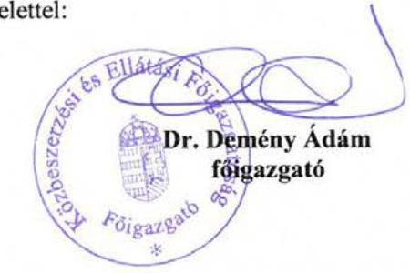

---

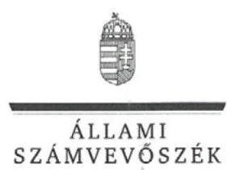

ELNÖK

# Dr. Demény Ádám Imre úr 

Főigazgató
Közbeszerzési és Ellátási Főigazgatóság

## Budapest

## Tisztelt Főigazgató Úr!

Köszönettel megkaptam az Állami Számvevőszékhez 2017. március 8. napján érkezett "A központi alrendszer intézményei - A központi alrendszer egyes intézményei pénzügyi és vagyongazdálkodásának ellenőrzése - Közbeszerzési és Ellátási Főigazgatóság" című számvevőszéki jelentéstervezetben foglalt megállapításokra tett észrevételét.

Tájékoztatom Főigazgató urat, hogy az elfogadott észrevétel a jelentésben átvezetésre került, az el nem fogadott észrevételt - az Állami Számvevőszékről szóló 2011. évi LXVI. törvény 29. § (3) bekezdése alapján - a jelentésben szerepeltetjük az elutasítás indokának feltüntetésével együtt.

Az Állami Számvevőszék észrevételekre vonatkozó álláspontjáról a felügyeleti vezető által készített részletes tájékoztatást csatoltan megküldöm.

Budapest, 2017. 03. hó 23. nap
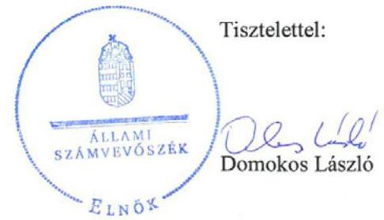

Melléklet: Tájékoztatás az elfogadott és el nem fogadott észrevételről, annak indokáról

---

# 1. számú melléklet 

a V-1155-130/2016. ikt. számú levélhez

## Tájékoztatás

az elfogadott és el nem fogadott észrevételről, azok indokairól

| 1. | Észrevétel: | Az észrevétel 1. oldalán az. 1. sorszámú észrevétel szerint: „A 2.4. számú megállapítás szerint a KEF 2013. és 2015. években nem adta le határidőben az elemi költségvetést és az intézményi költségvetési beszámolót. Ezen megállapításhoz kapcsolódóan szükségesnek tartom megemlíteni, hogy az elemi költségvetés és a különböző beszámolók leadása a Magyar Államkincstár (továbbiakban: MÁK) által működtetett KGR K11 adatszolgáltatási rendszeren keresztül történik. Az informatikai rendszer - a jelentős mennyiségű és gyakoriságú jogszabályi változások miatt - az elmúlt években a jogszabályban meghatározott határidőre nem állt készen arra, hogy az intézmény által elkészített beszámoló feladott státuszba tehető legyen, ami az elkészítettséget jelenti. A rendszer gyakran szorult még a jogszabályi határidőt követően is fejlesztésre, többszöri verzióváltásra, amelyek miatt a MÁK többször is módosította a beszámoló feladásának határidejét. A programmódosítás miatti verzióváltást követően MÁK által módosított határidő és a jogszabályban előírt határidő között jelentős eltérés volt, így alakult ki a 2015. évben megállapított 53 napos késés intézményünk esetében.   Álláspontunk szerint a jogszabályban előírt határidő elmulasztása nem az intézményünk, hanem a KGR K11 rendszer hibás működése miatt következett be. Mindez természetesen dokumentumokkal alátámasztható. A KEF részére a 2015. évben határidő módosítás miatti késésből eredően a MÁK bírságot nem szabott ki." |
| :--: | :--: | :--: |
|  | Válasz: | Az ÁSZ az észrevételt nem fogadja el. |
|  | Indokolás: | Az észrevétel nem megalapozott. Az ÁSZ az észrevételezett megállapítást az ellenőrzés részére rendelkezésre bocsátott dokumentumok alapján állapította meg. Az ÁSZ részére az észrevételben hivatkozott „A programmódosítás miatti verzióváltást követően a MÁK által módosított határidő és a |

---

|  |  | jogszabályban előírt határidő közötti jelentős eltérés"-t igazoló dokumentumot az ellenőrzött szervezet nem adott át. Az ÁSZ ellenőrzés részére a 2016. október 14-i keltezésű teljességi és hitelességi nyilatkozatban sem szerepelnek az észrevételben hivatkozott dokumentumok. Fentiek figyelembevételével az ÁSZ továbbra is fenntartja a jelentéstervezetben tett, a 2015. évi költségvetési beszámoló MÁK által működtetett adatszolgáltatási rendszerbe való feltöltésének késedelmes feltöltésére vonatkozó megállapítását és a hozzá kapcsolódóan megfogalmazott javaslatát. |
| :--: | :--: | :--: |
| 2. | Észrevétel: | Az észrevétel 2. oldalán a 2. sorszámú észrevétel szerint: „A 3.3. számú megállapítás szerint a közbeszerzési díjakból származó bevételeket utalványozás nélkül számolta el a KEF. Álláspontunk szerint az Ávr. 59. § (5) pontja szerint ezeket a bevételeket nem kell utalványozni. Az ide vonatkozó szabályzatainkat 2017. évben áttekintjük és a szükséges pontosításokat átvezetjük. |
|  | Válasz: | Az ÁSZ az észrevételt elfogadja. |
|  | Indokolás: | Az észrevétel megalapozott. Az ÁSZ az észrevételben foglaltak és az ellenőrzés során rendelkezésre bocsátott dokumentumok (közbeszerzési díjbevételi iratok, Gazdálkodási szabályzat $_{1-12}$) felülvizsgálata alapján elfogadja, hogy a KEF a 2012-2015. években a közbeszerzési díjakból származó bevételeket az Ávr. 59. § (5) bekezdés a) pontjában előírtaknak megfelelően utalványozás nélkül számolta el. A KEF közbeszerzési díjakból származó bevételeinek 2012-2015. évi beszedése és elszámolása a KEF által kibocsátott számlák alapján, a 2014. évtől kezdődően a B402. Szolgáltatások ellenértéke rovatra könyvelve történt. Ennek figyelembe vételével az ÁSZ módosítja a jelentéstervezet erre vonatkozó megállapítását és törli a megállapítás vonatkozásában megfogalmazott javaslatát. |

Budapest, 2017. március 23.
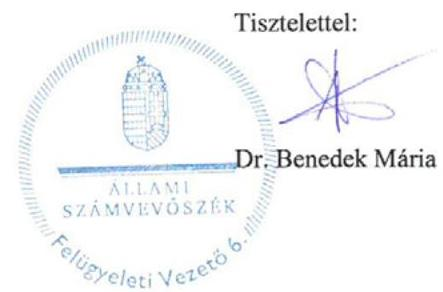

---

# RÖVIDÍTÉSEK JEGYZÉKE 

${ }^{1}$ KEF
${ }^{2}$ NFM
${ }^{3}$ NGM
${ }^{4}$ 53/2011.(III.31.) Korm. rendelet
${ }^{5}$ 250/2014.(X.2.) Korm. rendelet
${ }^{6}$ irányító szerv $_{1}$
irányító szerv $_{2}$
${ }^{7}$ Nvtv.
${ }^{8}$ Áht.
${ }^{9}$ Ávr.
${ }^{10}$ ÁSZ SZMSZ
${ }^{11}$ Alapító okirat $_{1}$
Alapító okirat $_{2}$
Alapító okirata $_{3}$
${ }^{12}$ SZMSZ $_{1}$
SZMSZ $_{2}$
SZMSZ $_{3}$
${ }^{13}$ Bkr.
${ }^{14}$ Gazdasági szervezet ügyrendje $_{1}$
Gazdasági szervezet ügyrendje $_{2}$
Gazdasági szervezet ügyrendje $_{3}$
Gazdasági szervezet ügyrendje $_{4}$
Gazdasági szervezet ügyrendje $_{5}$
Gazdasági szervezet ügyrendje $_{6}$

Közbeszerzési és Ellátási Főigazgatóság
Nemzeti Fejlesztési Minisztérium
Nemzetgazdasági Minisztérium
53/2011. (III.31.) Korm. rendelet a Közbeszerzési és Ellátási Főigazgatóságról (Hatályos:2011. 05.01.-2014.10.02-ig)
250/2014. (X.2.) Korm. rendelet a Közbeszerzés és Ellátási Főigazgatóságról, (Hatályos 2014. 10.03-tól)
Nemzeti Fejlesztési Minisztérium 2014. 10. 02-ig
Nemzetgazdasági Minisztérium 2014. 10. 03-tól
2011. évi CXCVI. törvény a nemzeti vagyonról
2011. évi CXCV. törvény az államháztartásról

368/2011. (XII. 31.) Korm. rendelet az államháztartásról szóló törvény végrehajtásáról
Állami Számvevőszék Szervezeti és Működési Szabályzata
Közbeszerzési és Ellátási Főigazgatóság Alapító okirata egységes szerkezetben NFM/42/26/2011. (Hatályos: 2011.05.16-től 2014.10.02-ig)
Közbeszerzési és Ellátási Főigazgatóság Alapító okirat kiegészítés
ISZF/2452-6/2014-NFM (Hatályos: 2014.01.01-től 2014.10.02-ig)
Közbeszerzési és Ellátási Főigazgatóság Alapító Okirata (a módosításokkal egységes szerkezetben) NGM/21918/2/2014. (Hatályos: 2014.10.03-tól)
8/2011. számú főigazgatói utasítás a Közbeszerzési és Ellátási Főigazgatóság szervezeti és működési szabályzatának kiadásáról (Hatályos: 2011.07.11-től 2013.12.31-ig)
19/2013. számú főigazgatói utasítás a Közbeszerzési és Ellátási Főigazgatóság szervezeti és működési szabályzatának kiadásáról (Hatályos: 2014.01.01-től 2015.02.28-ig)
2/2015. sz. főigazgatói utasítás a Közbeszerzési és Ellátási Főigazgatóság szervezeti és működési szabályzatának kiadásáról (Hatályos: 2015.03.01-től) 370/2011. (XII. 31.) Korm. rendelet a költségvetési szervek belső kontrollrendszeréről és belső ellenőrzésről (Hatályos: 2012. 01.01-től) Közbeszerzési és Ellátási Főigazgatóság Gazdasági Igazgatóságának Ügyrendje (Hatályos: 2011.10.01-től 2014.03.03-ig)
Közbeszerzési és Ellátási Főigazgatóság Gazdasági Igazgatóság Ügyrendjének módosítása (Hatályos: 2012.04.21-től 2014.03.03-ig)
Közbeszerzési és Ellátási Főigazgatóság Gazdasági Igazgatóság Ügyrendjének 2. sz. módosítása (Hatályos: 2013.02.01-től 2014.03.03-ig)

Közbeszerzési és Ellátási Főigazgatóság Gazdasági Igazgatóságűgyrendjének 2. sz. módosítása (Hatályos: 2013.02.01-től 2014.03.03-ig)

Közbeszerzési és Ellátási Főigazgatóság Gazdasági Igazgatóságűgyrendjének 2. sz. módosítása (Hatályos: 2013.02.01-től 2014.03.03-ig)

Közbeszerzési és Ellátási Főigazgatóság Gazdasági Igazgatóságűgyrendjének 1. sz. módosítása (Hatályos: 2015.07.07-től)

---

${ }^{15}$ Kollektív szerződés $_{1}$

Kollektív szerződés $_{2}$
${ }^{16}$ Munka tv. 1
Munka tv. 2
${ }^{17}$ főigazgató $_{1}$
főigazgató $_{2}$
főigazgató $_{3}$
főigazgató $_{4}$
${ }^{18}$ Etikai szabályzat $_{1}$

Etikai szabályzat $_{2}$

Etikai szabályzat $_{3}$
${ }^{19}$ Számv. tv.
${ }^{20}$ Áhsz $_{1}$
Áhsz $_{2}$
${ }^{21}$ Számviteli politika $_{1}$
Számviteli politika $_{2}$

Számviteli politika $_{3}$
${ }^{22}$ Számviteli politika $_{4}$

Számviteli politika $_{5}$
${ }^{23}$ Értékelési szabályzat $_{1}$
Értékelési szabályzat $_{2}$
Értékelési szabályzat $_{3}$
Értékelési szabályzat $_{4}$
Értékelési szabályzat $_{5}$

A Központi Szolgáltatási Főigazgatóság Kollektív szerződése (a módosításokkal egységes szerkezetbe foglalt) (Hatályos: 2009.01.01-től 2013.09.30-ig)
A Közbeszerzési és Ellátási

 Főigazgatóság Kollektív szerződése (Hatályos: 2013.10.01-től)
1992. évi XXII. törvény a Munka Törvénykönyvéről (Hatálytalan: 2013.01.01-től)
2012. évi I. törvény a munka törvénykönyvéről (Hatályos: 2012.07.01-től)

Közbeszerzési és Ellátási Főigazgatóság vezetője (2010.12.01–2012.06.30.)
Közbeszerzési és Ellátási Főigazgatóság vezetője (2012.07.01–2014.10.13.)
Közbeszerzési és Ellátási Főigazgatóság megbízott vezetője (2014.10.14–2014.11.30.)

Közbeszerzési és Ellátási Főigazgatóság vezetője (2014.12.01-től)
2/2000. számú főigazgatói utasítás az MKGI közbeszerzési etikai szabályzat (Hatályos: 2000.04.01-től 2014.10.31-ig)
4/2005. számú főigazgatói utasítás A Közbeszerzési etikai szabályzatról szóló 2/2000. számú főigazgatói utasítás módosításáról (Hatályos: 2005.03.18-tól 2014.10.31-ig)

26/2014. számú főigazgatói utasítás a KEF Etikai Kódexéről (Hatályos: 2014.11.01-jétől)
2000. évi C. törvény a számvitelről

249/2000. (XII. 24.) Korm. rendelet az államháztartás szervezetei beszámolási és könyvvezetési kötelezettségének sajátosságairól (Hatálytalan: 2014.01.01-től)
4/2013. (I. 11.) Korm. rendelet az államháztartás számviteléről (Hatályos: 2014.01.01-től)

10/2004. sz. főigazgatói utasítás a számviteli politikáról (Hatályos: 2004.09.20-tól 2013.04.29-ig)
7/2007. sz. főigazgatói utasítás a számviteli politikáról szóló 10/2004. sz. főigazgatói utasítás módosításáról (egységes szerkezetben a 21/2004., a 15/2005., 3/2006. számú főigazgatói utasítással) (Hatályos: 2007.12.27-től 2013.04.29-ig)
4/2013. sz. főigazgatói utasítás a Közbeszerzési és Ellátási Főigazgatóság számviteli politikájának kiadásáról (Hatályos: 2013.04.30-tól 2014.10.06-ig)
4/2014. sz. főigazgatói utasítás a Közbeszerzési és Ellátási Főigazgatóság számviteli politikájának kiadásáról szóló 4/2013. sz. főigazgatói utasítás módosításáról (Hatályos: 2014.03.01-től 2014.10.06-ig)
19/2014. számú főigazgatói utasítás a Közbeszerzési és Ellátási Főigazgatóság számviteli politikájának kiadásáról (Hatályos: 2014.10.07-től)
11/2004. sz. főigazgatói utasítás a KSZF Eszközei és Forrásai Értékelésének Szabályzata (Hatályos: 2004.09.20-tól 2013.04.29-ig)
4/2006. sz. főigazgatói utasítás a KSZF Eszközei és Forrásai Értékelésének Szabályzatáról szóló 11/2004. sz. főigazgatói utasítás módosításáról (Hatályos: 2004.04.10-től 2013.04.29-ig)
7/2013. sz. főigazgatói utasítás a Közbeszerzési és Ellátási Főigazgatóság értékelési szabályzatának kiadásáról (Hatályos: 2013.04.30-tól 2014.10.06-ig)
21/2013. sz. főigazgatói utasítás a Közbeszerzési és Ellátási Főigazgatóság értékelési szabályzatának kiadásáról szóló 7/2013. sz. főigazgatói utasítás módosításáról (Hatályos: 2014.01.01-től 2014.10.06-ig)
5/2014. sz. főigazgatói utasítás a Közbeszerzési és Ellátási Főigazgatóság értékelési szabályzatának kiadásáról szóló 7/2013. sz. főigazgatói utasítás módosításáról (Hatályos: 2014.03.01-től 2014.10.06-ig)

---

| Értékelési szabályzat ${ }_{6}$ | 28/2014. sz. főigazgatói utasítás a Közbeszerzési és Ellátási Főigazgatóság értékelési szabályzatának kiadásáról (Hatályos: 2014.10.07-től) |
| :--: | :--: |
| ${ }^{24}$ Pénzkezelési szabályzat ${ }_{1}$ | 5/2008. számú főigazgatói utasítás A számviteli politika 2. sz. melléklete Pénzkezelési szabályzat (Hatályos: 2008.05.15-től 2013.04.29-ig) |
| Pénzkezelési szabályzat ${ }_{2}$ | 10/2008. számú főigazgatói utasítás a KSZF házipénztárában, pénzkezelő helyén, valamint a bankszámlákon lebonyolított pénzforgalom kezelésével összefüggő feladatokról szóló (Pénzkezelési szabályzat) 5/2008. számú főigazgatói utasítás módosításáról (Hatályos: 2008.10.13-tól 2013.04.29-ig) |
| Pénzkezelési szabályzat ${ }_{3}$ | 28/2009. főigazgatói utasítás a KSZF házipénztárában, pénzkezelő helyén, valamint a bankszámlákon lebonyolított pénzforgalom kezelésével összefüggő feladatokról szóló (pénzkezelési szabályzat) 5/2008. számú főigazgatói utasítás módosításáról (Hatályos: 2009.12.02-től 2013.04.29-ig) |
| Pénzkezelési szabályzat ${ }_{4}$ | 5/2013. sz. főigazgatói utasítás a Közbeszerzési és Ellátási Főigazgatóság pénzkezelési szabályzatának kiadásáról (Hatályos: 2013.04.30-tól 2014.05.29-ig) |
| Pénzkezelési szabályzat ${ }_{5}$ | 13/2014. sz. főigazgatói utasítás a Közbeszerzési és Ellátási Főigazgatóság pénzkezelési szabályzatának kiadásáról (Hatályos: 2014.05.30-tól) |
| ${ }^{25}$ Önköltségszámítási szabályzat ${ }_{1}$ | 13/2004. számú főigazgatói utasítás A számviteli politika 4. sz. melléklete Önköltségszámítási szabályzat (Hatályos: 2004.09.20-tól 2013.04.29-ig) |
| Önköltségszámítási szabályzat ${ }_{2}$ | 29/2009. számú főigazgatói utasítás a 2004. évi Önköltségszámítási szabályzatról szóló 13/2004. számú főigazgatói utasítás módosításáról (Hatályos: 2009.12.08-tól 2013.04.29-ig) |
| Önköltségszámítási szabályzat ${ }_{3}$ | 8/2013. sz. főigazgatói utasítás a Közbeszerzési és Ellátási Főigazgatóság önköltségszámítási szabályzatának kiadásáról (Hatályos: 2013.04.30-tól) |
| ${ }^{26}$ Leltározási szabályzat ${ }_{1}$ | 22/2009. sz. főigazgatói utasítás a Központi Szolgáltatási Főigazgatóság vagyonának leltározásáról szóló 3/2008. sz. főigazgatói utasítás módosításáról (egységes szerkezetben) (Hatályos: 2009.11.12-től 2013.12.30-ig) |
| Leltározási szabályzat ${ }_{2}$ | melléklet a 20/2013. sz. főigazgatói utasításhoz A Közbeszerzési és Ellátási Főigazgatóság leltárkészítési és leltározási szabályzata (Hatályos: 2013.12.31-től 2014.10.05-ig) |
| Leltározási szabályzat ${ }_{3}$ | 24/2014. sz. főigazgatói utasítás a Közbeszerzési és Ellátási Főigazgatóság leltározási és leltárkészítési szabályzatának kiadásáról (Hatályos: 2014.10.06-tól) |
| Leltározási szabályzat ${ }_{4}$ | 44/2014. sz. főigazgatói utasítás (a KEF leltározási és leltárkészítési szabályzatának kiadásáról szóló 24/2014. sz. főigazgatói utasítás módosításáról) (Hatályos: 2014.12.29-től) |
| ${ }^{27}$ Bizonylati szabályzat ${ }_{1}$ | 17/2004. számú főigazgatói utasítás Bizonylati szabályzat és album (Hatályos: 2004.09.20-tól 2013.05.12-ig) |
| Bizonylati szabályzat ${ }_{2}$ | 34/2009. számú főigazgatói utasítás a Bizonylati szabályzat és bizonylati albumról szóló 17/2004. számú főigazgatói utasítás módosításáról kiadásáról (Hatályos: 2009.12.31-től 2013.05.12-ig) |
| Bizonylati szabályzat ${ }_{3}$ | 10/2013. sz. főigazgatói utasítás a Közbeszerzési és Ellátási Főigazgatóság bizonylati szabályzatának és bizonylati albumának kiadásáról (Hatályos: 2013.05.13-tól 2014.10.05-ig) |
| Bizonylati szabályzat ${ }_{4}$ | 29/2014. sz. főigazgatói utasítás a Közbeszerzési és Ellátási Főigazgatóság bizonylati szabályzatának és bizonylati albumának kiadásáról (Hatályos: 2014.10.06-tól) |
| ${ }^{28}$ Számlarend ${ }_{1}$ | 15/2004. számú főigazgatói utasítás Számlarend (Hatályos: 2014.10.05-ig) |
| Számlarend ${ }_{2}$ | 12/2006. számú főigazgatói utasítás a Számlarendről szóló 15/2004. számú főigazgatói utasítás módosításáról (Hatályos: 2006.12.10-től 2014.10.05-ig) |
| Számlarend ${ }_{3}$ | 12/2013. számú főigazgatói utasítás a számlarendről szóló 15/2004. számú főigazgatói utasítás módosításáról (Hatályos: 2013.06.29-től 2014.10.05-ig) |

---

| Számlarend 4 | 20/2014. számú főigazgatói utasítás a Közbeszerzési és Ellátási Főigazgatóság számlarendjéről (Hatályos: 2014.10.06-tól) |
| :--: | :--: |
| Számlarend 5 | 45/2014. számú főigazgatói utasítás a Közbeszerzési és Ellátási Főigazgatóság számlarendjéről szóló 20/2014. sz. főigazgatói utasítás módosításáról (Hatályos: 2014.12.30-tól) |
| ${ }^{29}$ Közbeszerzési szabályzat ${ }_{1}$ | 17/2009. számú főigazgatói utasítás a központosított közbeszerzési eljárások lebonyolítási rendjéről (Hatályos: 2009.09.05-től 2014.08.29-ig) |
| Közbeszerzési szabályzat ${ }_{2}$ | 16/2014. számú főigazgatói utasítás a központosított közbeszerzési rendszer körébe tartozó közbeszerzési eljárások lebonyolítási rendjéről (Hatályos: 2014.08.30-tól) |
| ${ }^{30}$ Beszerzési szabályzat ${ }_{1}$ | 2/2010. számú főigazgatói utasítás a Központi Szolgáltatási Főigazgatóság által kötött egyes szerződések megkötésének rendjéről, továbbá a beszerzések nyilvántartásáról (Hatályos: 2010.02.22-től 2012.08.26-ig) |
| Beszerzési szabályzat ${ }_{2}$ | 12/2012. számú főigazgatói utasítás a Közbeszerzési és Ellátási Főigazgatóság szerződéseinek megkötéséről és nyilvántartásáról (Hatályos: 2012.08.27-től 2014.04.13-ig) |
| Beszerzési szabályzat ${ }_{3}$ | 9/2014. számú főigazgatói utasítás a beszerzés rendjéről (Hatályos: 2014.04.14-től) |
| ${ }^{31}$ Gazdálkodási szabályzat ${ }_{1}$ | 14/2004. számú főigazgatói utasítás a gazdálkodási jogkörök szabályozása (Hatályos: 2004.09.20-tól 2012.02.28-ig) |
| Gazdálkodási szabályzat ${ }_{2}$ | 6/2005. számú főigazgatói utasítás a gazdálkodási jogkörök szabályozásáról szóló 14/2004. számú főigazgatói utasítás módosításáról (Hatályos: 2005.04.28-tól 2012.02.28-ig) |
| Gazdálkodási szabályzat ${ }_{3}$ | 16/2005. számú főigazgatói utasítás a gazdálkodási jogkörök szabályozásáról szóló 14/2004. sz. főigazgatói utasítás módosításáról (Hatályos: 2005.12.05-től 2012.02.28-ig) |
| Gazdálkodási szabályzat ${ }_{4}$ | 2/2009. főigazgatói utasítás a gazdálkodási jogkörök szabályozásáról szóló 14/2004. főigazgatói utasítás módosításáról (Hatályos: 2009.03.24-től 2012.02.28-ig) |
| Gazdálkodási szabályzat ${ }_{5}$ | 4/2010. sz. főigazgatói utasítás a gazdálkodási jogkörök szabályozásáról szóló 14/2004. sz. főigazgatói utasítás módosításáról (Hatályos: 2010.05.28-tól 2012.02.28-ig) |
| Gazdálkodási szabályzat ${ }_{6}$ | 18/2011. sz. főigazgatói utasítás a gazdálkodási jogkörök szabályozásáról szóló 14/2004. sz. főigazgatói utasítás módosításáról (Hatályos: 2011.12.07-től 2012.02.28-ig) |
| Gazdálkodási szabályzat ${ }_{7}$ | 5/2012. számú főigazgatói utasítás a gazdálkodási jogkörök szabályozásáról (Hatályos: 2012.02.29-től) |
| Gazdálkodási szabályzat ${ }_{8}$ | 14/2013. számú főigazgatói utasítás a gazdálkodási jogkörök szabályozásáról szóló 5/2012. számú főigazgatói utasítás módosításáról (Hatályos: 2013.08.22-től) |
| Gazdálkodási szabályzat ${ }_{9}$ | 6/2014. számú főigazgatói utasítás a gazdálkodási jogkörök szabályozásáról szóló 5/2012. számú főigazgatói utasítás módosításáról (Hatályos: 2014.03.01-től) |
| Gazdálkodási szabályzat ${ }_{10}$ | 35/2014. számú főigazgatói utasítás a gazdálkodási jogkörök szabályozásáról szóló 5/2012. számú főigazgatói utasítás módosításáról (Hatályos: 2014.12.04-től) |
| Gazdálkodási szabályzat ${ }_{11}$ | 39/2014. sz. főigazgatói utasítás a gazdálkodási jogkörök szabályozásáról szóló 5/2012. számú főigazgatói utasítás módosításáról (Hatályos: 2014.12.21-től) |
| Gazdálkodási szabályzat ${ }_{12}$ | 5/2012. számú főigazgatói utasítás a gazdálkodási jogkörök szabályozásáról (egységes szerkezetben a 14/2013., a 6/2014., a 35/2014., a 39/2014. és a 8/2015. számú főigazgatói utasításokkal, valamint a 8/2014. sz. főigazgatói utasítás 4. pontjában foglaltakkal) (Hatályos: 2015.04.20-tól) |
| ${ }^{32}$ Ellenőrzési nyomvonal ${ }_{1}$ | 15/2012. sz. főigazgatói utasítás a Közbeszerzési és Ellátási Főigazgatóság ellenőrzési nyomvonalának kiadásáról (Hatályos: 2012.11.03-tól 2014.11.28-ig) |

---

Ellenőrzési nyomvonal ${ }_{2}$
${ }^{33}$ Szabálytalanság kezelési szabályzat
${ }^{34}$ Belföldi kiküldetések szabályzata
${ }^{35}$ Kockázatkezelési szabályzat ${ }_{1}$

Kockázatkezelési szabályzat ${ }_{2}$
${ }^{36}$ gazdasági igazgató ${ }_{1}$
gazdasági igazgató ${ }_{2}$
gazdasági igazgató ${ }_{3}$
gazdasági igazgató 4
${ }^{37}$ Info tv.
${ }^{38}$ Közzétételi szabályzat ${ }_{1}$

Közzétételi szabályzat ${ }_{2}$

Közzétételi szabályzat ${ }_{3}$
${ }^{39}$ Ltv.
${ }^{40}$ Iratkezelési szabályzat ${ }_{1}$

Iratkezelési szabályzat ${ }_{2}$

Iratkezelési szabályzat ${ }_{3}$
Iratkezelési szabályzat 4
Iratkezelési szabályzat 5
${ }^{41}$ Kincstár

34/2014. sz. főigazgatói utasítás a Közbeszerzési és Ellátási Főigazgatóság ellenőrzési nyomvonalának kiadásáról szóló 15/2012. sz. főigazgatói utasítás módosításáról (Hatályos: 2014.11.29-től)
7/2014. számú főigazgatói utasítás a szabálytalanságok kezelésének eljárásrendjéről (Hatályos: 2014.03.05-től)
18/2015. sz. főigazgatói utasítás a Belföldi kiküldetések rendjéről (Hatályos: 2015.09.09-től)

18/2012. sz. főigazgatói utasítás a Közbeszerzési és Ellátási Főigazgatóság kockázatkezelési szabályzatának kiadásáról (Hatályos: 2012.12.27-től 2014.11.19-ig)
32/2014. sz. főigazgatói utasítás a Közbeszerzési és Ellátási Főigazgatóság kockázatkezelési szabályzatának kiadásáról (Hatályos: 2014.11.20-tól)
Közbeszerzési és Ellátási Főigazgatóság gazdasági vezetője (2011.02.15–2012.09.30.)

Közbeszerzési és Ellátási Főigazgatóság megbízott gazdasági vezetője (2012.10.01–2013.05.31.)

Közbeszerzési és Ellátási Főigazgatóság gazdasági vezetője (2013.06.01–2015.06.14.)

Közbeszerzési és Ellátási Főigazgatóság gazdasági vezetője (2015.06.15-től) az információs önrendelkezési jogról és az információszabadságról szóló 2011. évi CXII. törvény
18/2009. főigazgatói utasítás a Központi Szolgáltatási Főigazgatóság honlapján történő közzététel, valamint a közérdekű adatok megismerésére irányuló igények teljesítésének rendjéről (Hatályos: 2009.09.29-től 2013.09.10-ig)
8/2010. sz. főigazgatói utasítás a Központi Szolgáltatási Főigazgatóság belső intranet hálózatán, valamint az Ellátási Portálon történő publikálás rendjéről (Hatályos: 2010.08.27-től 2013.09.10-ig)
15/2013. sz. főigazgatói utasítás a kötelezően közzéteendő adatok nyilvánosságra hozatalának, továbbá közérdekű adatok megismerésére irányuló kérelmek intézésének rendjéről (Hatályos: 2013.09.11-től)
1995. évi LXVI. törvény a köziratokról, a közlevéltárakról és a magánlevéltári anyag védelméről
A Központi Szolgáltatási Főigazgatóság főigazgatójának 32/2009. számú utasítása a Központi Szolgáltatási Főigazgatóság egyedi iratkezelési szabályzatának kiadásáról (Hatályos: 2009.12.31-től 2012.12.31-ig)
11/2013. számú főigazgatói utasítás a Közbeszerzési és Ellátási Főigazgatóság Egyedi Iratkezelési Szabályzatának kiadásáról (Hatályos: 2013.01.01-től 2015.02.28-ig)
30/2014. számú főigazgatói utasítás a Közbeszerzési és Ellátási Főigazgatóság Egyedi Iratkezelési Szabályzatának kiadásáról szóló 11/2013. számú főigazgatói utasítás módosításáról (Hatályos: 2014.11.01-től 2015.02.28-ig)
4/2015. számú főigazgatói utasítás a Közbeszerzési és Ellátási Főigazgatóság Egyedi Iratkezelési Szabályzatának kiadásáról (egységes szerkezetben a módosítására kiadott 12/2015. számú főigazgatói utasítással) (Hatályos: 2015.03.01-től)

12/2015. számú főigazgatói utasítás a Közbeszerzési és Ellátási Főigazgatóság Egyedi Iratkezelési Szabályzatának kiadásáról szóló 4/2015. számú főigazgatói utasítás módosításáról (Hatályos: 2015.05.01-től)
Magyar Államkincstár

---

${ }^{42}$ Belső kontrollrendszer szabályzat
${ }^{43}$ Belső ellenőrzési kézikönyv 1

Belső ellenőrzési kézikönyv 2

Belső ellenőrzési kézikönyv 3
${ }^{44}$ NGM rendelet ${ }_{1}$
NGM rendelet ${ }_{2}$
${ }^{45}$ Költségvetési tervezési szabályzat
${ }^{46}$ NFÜ
${ }^{47}$ Kbt.
${ }^{48}$ vagyonkezelési szerződés
${ }^{49}$ Vtvr.
${ }^{50}$ Vtv.
${ }^{51}$ MNV Zrt.
${ }^{52}$ NISZ Zrt.
${ }^{53}$ 36/2013. (IX. 13.) NGM rendelet
${ }^{54}$ ÁSZ Integritás Projekt

17/2012. sz. főigazgatói utasítás a Közbeszerzési és Ellátási Főigazgatóság belső kontrollrendszeréről (Hatályos: 2012.12.14-től)
13/2011. sz. főigazgatói utasítás a Közbeszerzési és Ellátási Főigazgatóság belső ellenőrzési kézikönyvének
 kiadásáról (Hatályos:2011.10.26-tól 2012.12.19-ig)
Közbeszerzési és Ellátási Főigazgatóság belső ellenőrzési kézikönyve (Hatályos: 2012.12.20-tól 2015.12.21-ig)

Közbeszerzési és Ellátási Főigazgatóság belső ellenőrzési kézikönyve (Hatályos: 2015.12.22-től)

5/2012. (III.1.) NGM rendelet az állami költségvetésről
10/2013.(III.13.) NGM rendelet az állami költségvetésről
21/2014. számú főigazgatói utasítás a Közbeszerzési és Ellátási Főigazgatóság költségvetésének tervezéséről, az előirányzatok módosításáról, átcsoportosításáról és felhasználásáról (Hatályos: 2014.10.07-től)
Nemzeti Fejlesztési Ügynökség
2011. évi CVIII. törvény a közbeszerzésekről (Hatályos: 2011. 08. 21-től)
a Miniszterelnökség Közbeszerzési és Gazdasági Igazgatóságának a Kincstári Vagyoni Igazgatósággal 1998. április 28-án megkötött - 100025/1998/2015 számú - vagyonkezelési szerződése
254/2007. (X. 4.) Korm. rendelet az állami vagyonnal való gazdálkodásról
2007. évi CVI. törvény az állami vagyonról

Magyar Nemzeti Vagyonkezelő Zártkörű részvénytársaság
Nemzeti Infokommunikációs Szolgáltató Zártkörű részvénytársaság
36/2013. (IX.13.) NGM rendelet az államháztartás számvitelének 2014. évi megváltozásával kapcsolatos feladatokról
az ÁSZ 2009-ben indított „Korrupciós kockázatok feltérképezése - Integritás alapú közigazgatási kultúra terjesztése" című kiemelt projektje (http://integritas.asz.hu/).

---

ÁLLAMI SZÁMVEVŐSZÉK
1052 Budapest, Apáczai Csere János utca 10.
Levélcím: 1364 Budapest 4. Pf. 54
Telefon: +36 14849100 Telefax: +36 14849200
www.asz.hu
