# Jelentés 

## Az önkormányzatok gazdasági társaságai

Az önkormányzatok többségi tulajdonában lévő gazdasági társaságok gazdálkodásának ellenőrzése - Miskolc Holding Önkormányzati Vagyonkezelő Zrt.
2017.

---

# Jelentés 

## Az önkormányzatok gazdasági társaságai

Az önkormányzatok többségi tulajdonában lévő gazdasági társaságok gazdálkodásának ellenőrzése - Miskolc Holding Önkormányzati Vagyonkezelő Zrt.
2017. áprtus hó 18. nap
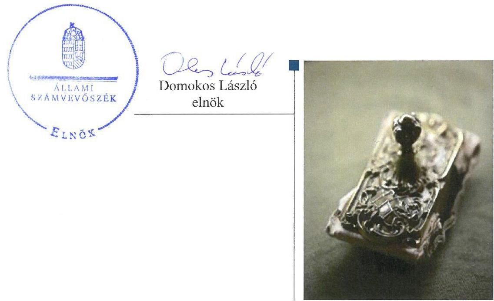

---

# AZ ELLENŐRZÉST FELÜGYELTE:

- BÖRÖCZ IMRE felügyeleti vezető

# AZ ELLENŐRZÉST VEZETTE ÉS A VÉGREHAJTÁSÁÉRT FELELŐS:

- FÉSÜS NÓRA ellenőrzésvezető
- GÁCSER JÓZSEF ellenőrzésvezető
- SALAMIN VIKTOR ellenőrzésvezető

# A PROGRAM ÖSSZEÁLLÍTÁSÁÉRT FELELŐS:

- JANIK JÓZSEF LÁSZLÓ osztályvezető

# IKTATÓSZÁM: V-1085-177/2016.

- Jelentéseink az Országgyűlés számítógépes hálózatán és az Interneten a www.asz.hu címen is olvashatóak.

# TÉMASZÁM: 2119.

# ELLENŐRZÉS-AZONOSÍTÓ SZÁM: V070749

---

# TARTALOMJEGYZÉK 

■ ÖSSZEGZÉS ..... 5
■ AZ ELLENŐRZÉS CÉLJA ..... 6
■ AZ ELLENŐRZÉS TERÜLETE ..... 7
■ AZ ELLENŐRZÉS HÁTTERE, INDOKOLTSÁGA ..... 10
■ A JELENTÉS LÉNYEGES KÉRDÉSKÖREI ..... 11
■ ELLENŐRZÉS HATÓKÖRE ÉS MÓDSZEREI ..... 12
■ MEGÁLLAPÍTÁSOK ..... 14
■ JAVASLATOK ..... 26
■ MELLÉKLETEK ..... 27
I. Sz. melléklet: Értelmező szótár ..... 27
II. Sz. melléklet: Miskolc Holding Zrt. konszolidációba bevont leányvállalatai ..... 29
III. Sz. melléklet: A társaság vagyoni helyzet (M Ft) ..... 30
IV. Sz. melléklet: A rövid lejáratú kötelezettségek összetétele (M Ft/ \%) ..... 31
■ FÜGGELÉK: ÉSZREVÉTELEK ..... 33
■ RÖVIDÍTÉSEK JEGYZÉKE ..... 51

---

.

---

# ÖSSZEGZÉS 

Miskolc Megyei Jogú Város Önkormányzata 2011-2014. között a feladatellátást az előírásoknak megfelelően szervezte meg, tulajdonosi jogait vagyonrendeletének megfelelően gyakorolta. A Miskolc Holding Önkormányzati Vagyonkezelő Zrt. vagyongazdálkodásában az üzletrészek átruházása és megszerzése nem volt szabályszerű a Társaság legfőbb szervének döntése nélküli ügyletek miatt. Az előírt beszámolási és adatszolgáltatási kötelezettségét az előírásoknak megfelelően teljesítette, az adatok védelmét és átláthatóságát biztosította. A Társaság és tagvállalatai kötelezettségállományának nagysága kedvezőtlen volt a gazdálkodás stabilitása szempontjából. Az ellátott feladatok bevételei, ráfordításai elszámolása szabályszerű volt, az önköltségszámítás és az árképzés a belső előírásoknak megfelelt.

## Az ellenőrzés társadalmi indokoltsága

Az Állami Számvevőszék kiemelt célja, hogy a helyi önkormányzatok gazdálkodásában rejlő pénzügyi kockázatok feltárásával, az államháztartáson kívülre nyújtott költségvetési támogatások és ingyenes vagyonjuttatások, valamint az államháztartáson kívül múködő feladat-ellátó rendszerek ellenőrzéseivel hozzájáruljon ahhoz, hogy a közpénzeket az államháztartáson kívül múködő szervezetek is átlátható, rendezett módon használják fel.

A Magyarországon az intézmény-centrikus közfeladat-ellátás jellemző, de egyre jelentősebb a költségvetésen kívüli feladatellátás térnyerése. Ennek legfontosabb szereplői - a nonprofit szervezetek mellett - az önkormányzati tulajdonú gazdasági társaságok. Az önkormányzatok szervezetalakítási szabadságának következménye, hogy a korábban is vállalati formában múködő közszolgáltatások mellett, mind a kötelező, mind az önként vállalt feladatok ellátásában a gazdasági társaságok kiemelt fontosságú szerephez jutottak.

## Főbb megállapítások, következtetések, javaslatok

Az Önkormányzat rendeletalkotási kötelezettségének eleget tett, a feladat-ellátást az előírásoknak megfelelően szervezte meg. A Társaság feletti tulajdonosi jogait az Önkormányzat vagyonrendeletének megfelelően gyakorolta, ennek keretében eleget tett a beszámoltatási- és felügyeleti rendszer múködtetési kötelezettségének.

A Társaság az előírt szabályzatokat az önköltség-számítási szabályzat kivételével határidőben elkészítette, azok összességében megfeleltek a jogszabályi előírásoknak. A Társaság vagyongazdálkodásában nem volt szabályszerű, hogy egyes üzletrészek átruházása és megszerzése során a tulajdonos jóváhagyását nem szerezték be, arról szabálytalanul saját hatáskörben döntöttek. A belső ellenőrzési rendszer nyilvántartási hiányosság miatt nem támogatta megfelelően a belső ellenőrzési megállapítások hasznosulását. Az előírt beszámolási és adatszolgáltatási kötelezettséget az előírásoknak és a tulajdonosi elvárásoknak megfelelően teljesítették, a mérlegadatokat leltárral alátámasztották. Az adatok védelmét és átláthatóságát biztosították.

Az adósságállomány 90\%-a az ellenőrzött időszakot megelőzően keletkezett, azonban az eladósodottság mértéke az ellenőrzött időszakban tartósan magas, a gazdálkodás stabilitása szempontjából kedvezőtlen volt.

A Társaság bevételeinek, ráfordításainak, beruházásainak és felújításainak elszámolása szabályszerű volt. A Társaság által a tagvállalatoknak nyújtott menedzsment és szakértői szolgáltatások önköltség-kalkulációja és árképzése a belső előírásoknak megfelelt.

Az ÁSZ a Miskolc Holding Zrt. vezérigazgatójának fogalmazott meg javaslatokat, amelyek alapján köteles intézkedési tervet összeállítani és azt a jelentés kézhezvételétől számított 30 napon belül az ÁSZ részére megküldeni.

---

# AZ ELLENŐRZÉS CÉLJA 

Az ellenőrzés célja annak értékelése volt, hogy az önkormányzat vagyongazdálkodási tevékenysége során szabályszerűen gyakorolta-e tulajdonosi jogait; a gazdasági társaság szabályozottsága, gazdálkodása és vagyongazdálkodási tevékenysége, bevételeinek és ráfordításainak elszámolása megfelelt-e a jogszabályi és tulajdonosi előírásoknak; a gazdasági társaság kötelezettségállománya jelentett-e kockázatot a múködésre, valamint a gazdálkodás átláthatósága és elszámoltathatósága érdekében biztosítva volt-e a szolgáltatás dijának megalapozottsága szabályszerű önköltségszámítással.

---

# AZ ELLENŐRZÉS TERÜLETE 

## Miskolc Megyei Jogú Város Önkormányzata és a Miskolc Holding Önkormányzati Vagyonkezelő Zrt.

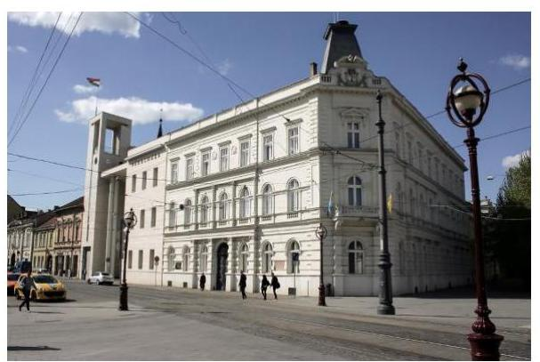

A MISKOLC HOLDING ZRT.-t¹ az Önkormányzat², mint részvényes 30 millió Ft jegyzett tőkével 2006-ban alapította. A jegyzett tőke formája pénzbetét volt. A jegyzett tőke a megalapítást követően felemelésre került az egyes önkormányzati tulajdonú társaságok apportálásával. Az apport 16251 millió Ft összegben valósult meg, amelyet 16251 db 1 millió Ft névértékű részvény alkotott.

A Társaság ${ }^{3}$ alapításának célja az Önkormányzat által alapított gazdasági társaságok egységes irányítását megvalósító holdingszervezet létrehozása volt. A Társaság alapvető feladata a Cégcsoport ${ }^{4}$-ba tartozó tagvállalatok múködése hatékonyságának, eredményességének és átláthatóságának javítása, ennek keretében egységes stratégiai irányítás és kontroll kialakításával a (köz)szolgáltatások színvonalának javítása, továbbá városfejlesztésben való közremúködés volt.

A Társaság érdekeltségi körébe tartozó vállalkozások 2014. december 31-i állapot szerinti kapcsolati szerkezetét az 1. ábra tartalmazza. A konszolidációba be nem vont leányvállalatok a bevont leányvállalatok kizárólagos tulajdonában álltak. A konszolidációba be nem vont társult vállalkozásokban a Társaság és leányvállalatai kisebbségi tulajdoni hányaddal és 20\%$47 \%$ közötti szavazati aránnyal rendelkeztek. Az egyéb részesedési viszonyban álló vállalkozások esetében a Társaság és leányvállalatai 0,25\%-17,93\% közötti tulajdoni hányaddal rendelkeztek.

[^0]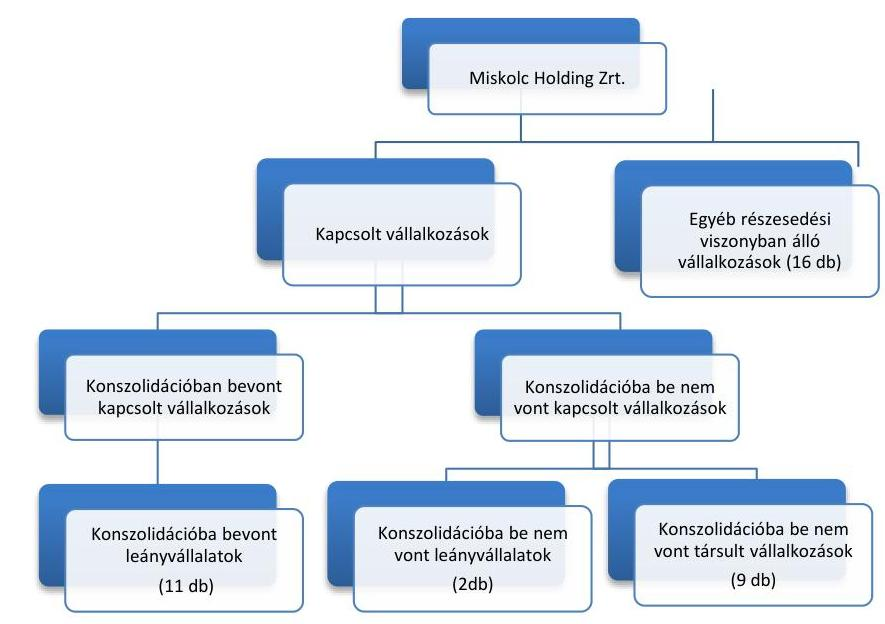

Fornós: 2014. évi konszolidált beszámoló

[^0]:    1. ábra

---

1. táblázat

|  |   |   |
| --- | --- | --- |
|  GAZDÁLKODÁSI ADATOK (MFT) |  |   |
|   | 2011 | 2014  |
|  Társaság |  |   |
|  Éves árbevétel | 565,0 | 1036,6  |
|  Követelések | 899,0 | 337,7  |
|  Kötelezettségek | 833,2 | 919,4  |
|  Cégcsoport (konszolidált) |  |   |
|  Éves árbevétel | 21000,1 | 19866,8  |
|  Követelések | 10900,1 | 9799,7  |
|  Kötelezettségek | 26320,7 | 34770,6  |
|  Forrás: Társaság éves és konszolidált éves beszámolói |  |   |

1. táblázat

|  RÉSZESEDÉSEK ÉRTÉKÉNEK |  |  |   |
| --- | --- | --- | --- |
|  ALAKULÁSA (MFT) |  |  |   |
|  |   |   |   |
|  |   |   |   |
|  |   |   |   |
|  |   |   |   |
|  |   |   |   |

|  Jogcím | 2011-2014  |
| --- | --- |
|  alapítás, vásárlás | 52,7  |
|  tőkeemelés | 1.905,2  |
|  értékvesztés visszaírás | 8,2  |
|  növekedés összesen | 1.966,1  |
|  értékvesztés elszámolás | 6.669,3  |
|  beolvadás, megszűnés | 515,0  |
|  értékesítés | 0,2  |
|  csökkenés összesen | 7.184,5  |
|  Forrás: A Társaság éves beszámolói |   |

A konszolidációba bevont leányvállalatok (11 db) a Társaság kizárólagos tulajdonában álltak, többek között víziközmű- és távhőszolgáltatási, szennyvízkezelési, turisztikai, ingatlankezelési, mezőgazdasági tevékenységeket láttak el a II. számú mellékletben részletezettek szerint. A Társaság a fő tevékenységként megjelölt vagyonkezelést a társasági részesedésekből fakadó tulajdonosi jogosultságára alapítva látta el a közfeladatot vagy egyéb önkormányzati feladatot ellátó gazdasági társaságok felett.

A Társaság és a Cégcsoport gazdálkodása főbb adatainak ellenőrzött időszakban történő változását a 1. táblázat mutatja be. A Társaság esetében az értékesítés nettó árbevételnek mintegy 70 \%-át 2014-ben a tagvállalatok felé számlázott menedzsment díjai alkották. A Társaságnak hosszú lejáratú kötelezettsége nem keletkezett, a rövid lejáratú kötelezettségek állománya érdemben nem, csak összetételében változott. A Cégcsoport konszolidált éves nettó árbevétele az ellenőrzött időszakban 5,4\%-kal, a követelésállomány 10,1\%-kal csökkent. A kötelezettségek jelentős, 32,1\%os növekedése mögött a közművagyon kezelésbe vétele állt.

A TÁRSASÁG VAGYONI HELYZETÉNEK 2011-2014. évi alakulását a III. számú melléklet szemlélteti. A Társaság kezelésében a vállalati részesedéseken felül nem volt önkormányzati vagyonelem, vagyonkezelési szerződést az Önkormányzattal nem kötött az ellenőrzött időszakban. A Társaság az ellenőrzött időszakban nem rendelkezett használatra, működtetésre, hasznosításra átvett önkormányzati vagyonnal, az alapító okiratban foglalt feladatait saját eszközeivel látta el.

A Társaság eszközein belül az ellenőrzött időszak egészében meghatározó volt a tartós részesedések aránya, amely 2011-ben 95 \%-os, 2014-ben 80 \%-os arányt képviselt. A részesedések könyv szerinti értéke 2014-re öszszességében 5 218,4 M Ft-tal maradt el a 2011. évi értékhez képest. A részesedések értéke alapítás, vásárlás, meglévő társaságokban történő tőkeemelés, valamint értékvesztés visszaírása címén emelkedett. A tartós részesedések értékére jelentős hatással volt 2012. évben a közlekedésfejlesztési nagyprojekthez, illetve 2014-ben a turisztikai ágazathoz és a stadionrekonstrukcióhoz kapcsolódó tőkeemelés. A részesedések értékét a víziközmű vagyon átadásából származó értékvesztés 2013. évi elszámolása, továbbá beolvadás, megszűnés és egy tagvállalat értékesítése csökkentette. A részesedések változását az ellenőrzött időszakban a 2. táblázat részletezi.

Az ellenőrzött időszakban a Társaságnál összesen 4 314,2 M Ft tőkevesztés következett be, amely a jogszabályon alapuló vagyonátadás következménye (3. táblázat). A saját tőke összes forráson belüli aránya a 2011. évi 95,3 \%-ról 2014-re 86,2 \%-ra csökkent. 3. táblázat

|  A SAJÁT TŐKE ÖSSZETÉTELE (M FT) |  |  |  |   |
| --- | --- | --- | --- | --- |
|  Megnevezés | 2011 | 2012 | 2013 | 2014  |
|  |   |   |   |   |
|  Jegyzett tőke | 17498,0 | 17848,0 | 18422,0 | 12003,0  |
|  Jegyzett, de be nem fizetett tőke | - | $-96,5$ | - | -  |
|  Tőketartalék | 740,0 | 740,0 | 740,0 | 2036,7  |
|  Eredménytartalék | 27,9 | 91,5 | 1296,8 | $-119,3$  |
|  Lekötött tartalék | 1,5 | - | - | -  |
|  Mérleg szerinti eredmény | 63,6 | 1443,5 | $-6601,3$ | 96,2  |
|  Saját tőke | 18331,0 | 20026,5 | 13857,5 | 14016,8  |
|   |  |  | Forrás: A Társaság éves beszámolói |   |

---

4. táblázat

JEGYZETT TŐKE VÁLTOZÁS (M FT)

| Tipusa | Kelte | Összége |
| :-- | --: | --: |
| emelés | 2012.03 .01 | 350 |
| emelés | 2013.03 .01 | 60 |
| emelés | 2013.04 .18 | 514 |
| leszállítás | 2014.05 .29 | -6600 |
| emelés | 2014.11 .13 | 181 |
| egyenleg |  | -5495 |

A saját tőke alakulását befolyásoló, jegyzett tőkét érintő változásokat a 4. táblázat részletezi. A közlekedésfejlesztési nagyprojekthez kapcsolódóan a Közgyűlés 2012. évben egy alkalommal, majd 2013. évben két alkalommal döntött tőkeemelésről. 2014. évben a Közgyűlés a DVTK Futball akadémia létrehozásával összefüggésben a Társaság alaptőkéjének felemeléséről határozott. A Közgyűlés az alaptőke emelések során kibocsátandó új részvények ellenértékét ingatlanok apportként történő rendelkezésre bocsátásával szolgáltatta a Társaság részére.

A jegyzett tőke 2014. évi leszállítása a víziközmű vagyontárgyak Önkormányzat részére történő térítésmentes átadásához kötődött. A Vksztv. ${ }^{5}$ alapján végrehajtott vagyonátadás a MIVÍZ Kft. ${ }^{6}$-nek 2013. évben veszteséget és saját tőke csökkenést okozott, amely a Társaságnál 2013. évben értékvesztés elszámolását tette szükségessé, ezáltal veszteséget okozott. A Társaságot ért veszteség rendezése érdekében a Társaság alaptőkéjének 6.600 millió Ft-tal történő leszállításáról határoztak.

A Társaság és a Cégcsoport eredményének változását a 2. ábra mutatja be. A Társaság a 2013. évi veszteség kivételével nyereségesen működött, ugyanakkor a Cégcsoport konszolidált mérleg szerinti eredménye folyamatosan negatív volt.
2. ábra
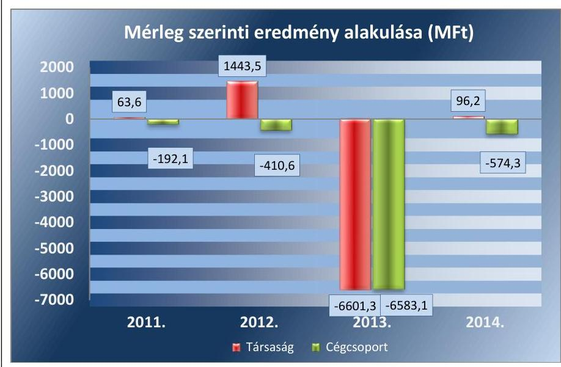

Forrás: A Társaság éves és konszolidált éves beszámolói
Miskolc Város lakosságának száma 2014. január 1-jén 161265 fő volt*. Az ellenőrzött időszakban a polgármester ${ }^{7}$ személye nem változott, a 2010. évi önkormányzati választások óta tölti be tisztségét. A helyszíni ellenőrzés időszakban munkakört betöltő jegyző ${ }^{8}$ 2011. május 1-jétől látja el feladatait. A Társaság vezérigazgatójának személye és az igazgatóság személyi összetétele az ellenőrzött időszakban változott.

A Társaság az ellenőrzött időszakban nem tartozott a kormányzati szektorba sorolt egyéb szervezetek körébe.

[^0]
[^0]:    * Központi Statisztikai Hivatal, Magyarország Közigazgatási helynév könyve, Miskolc 2014. január 1-jei adata

---

# AZ ELLENŐRZÉS HÁTTERE, INDOKOLTSÁGA 

AZ ÖNKORMÁNYZATI TULAJDONÚ GAZDASÁGI TÁRSASÁGOK ellenőrzése kiemelten fontos a vagyon megőrzése, megóvása érdekében, a társaságokkal szemben alapvető követelmény, hogy gazdálkodásuk, múködésük szabályszerű, az általuk szolgáltatott adatok minél megbízhatóbbak legyenek. A feladatellátás költségeinek, ráfordításainak alakulása, színvonala hatással van a lakosság elégedettségére.

A törvényalkotás számára - az észlelt problémák, szabálytalanságok, vagy egyéb nem kívánatos jelenségek felszínre kerülésével - az ellenőrzés megállapításai segítséget nyújthatnak az államháztartáson kívüli feladat/közfeladat-ellátás értékeléséhez, jogszabályi keretei pontosításához, átláthatóságot biztosító szabályozásához. Meghatározhatóvá válnak az önkormányzati feladatellátásban részt vevő államháztartáson kívüli szervezeteknek - az önkormányzat költségvetését, pénzügyi helyzetét is befolyásoló - kockázatai, lehetővé válik ezen kockázatok csökkentése. Ellenőrzéseink feltárhatják, hogy az önkormányzat feladat-ellátási kötelezettségének szabályszerűen tett-e eleget, a feladatellátáshoz rendelt vagyonkezelésbe vett és saját vagyon múködtetését az elvárható gondossággal, szabályszerűen szervezte-e meg és a tulajdonosi felügyelete hozzájárult-e a feladatellátásához. Az ellenőrzés rávilágíthat arra, hogy a gazdasági társaság a feladat-ellátási, közszolgáltatási szerződésben foglaltak betartásával, a vagyon használatával biztosította-e a szolgáltatás folytatásának feltételeit, a feladat ellátását. Ezzel az ellenőrzöttek és a helyi döntéshozók számára visszajelzést ad feladatszervezési, feladat-ellátási kockázataikról, alapot ad a meglévő hibák megszüntetéséhez, a jobb feladatellátás biztosításához. Fokozza a fegyelmet, igazolja, hogy lejárt a következmények nélküli ellenőrzések időszaka. Az ÁSZ ${ }^{9}$ értékteremtő rend kialakításához és megőrzéséhez hozzájáruló tevékenysége pozitív hatással van a szervezetről kialakított összkép formálására.

---

# A JELENTÉS LÉNYEGES KÉRDÉSKÖREI 

1. Az Önkormányzat közfeladat megszervezéséről szóló döntése, valamint tulajdonosi joggyakorlása szabályszerű volt-e?
2. A gazdasági társaság vagyongazdálkodása szabályszerű volt-e, kötelezettségállománya jelent-e kockázatot a müködésre, illetve a közfeladat ellátására?
3. A gazdasági társaságnál az ellátott közfeladat bevételei és ráfordításai elszámolása, valamint az önköltségszámítás és árképzés szabályszerű volt-e?

---

# ELLENŐRZÉS HATÓKÖRE ÉS MÓDSZEREI 

## Az ellenőrzés típusa

Megfelelőségi ellenőrzés.

## Az ellenőrzött időszak

Az ellenőrzött időszak 2011. január 1-jétől 2014. december 31-ig tart.

## Az ellenőrzés tárgya

A Miskolc Holding Önkormányzati Vagyonkezelő Zrt. feletti tulajdonosi joggyakorlás, valamint a gazdasági társaság gazdálkodásának szabályozottsága és szabályszerűsége.

Az ellenőrzés kiterjed minden olyan körülményre és adatra, amely az ÁSZ jogszabályban meghatározott feladatainak teljesítéséhez, valamint a program végrehajtása folyamán felmerült újabb összefüggések feltárásához szükséges.

## Az ellenőrzött szervezet

Miskolc Megyei Jogú Város Önkormányzata és Miskolc Holding Önkormányzati Vagyonkezelő Zrt.

## Az ellenőrzés jogalapja

Az ellenőrzés jogszabályi alapját az ÁSZ tv. ${ }^{10}$ 1. § (3) bekezdése és 5. § (3)(4)-(5) bekezdései képezik.

## Az ellenőrzés módszerei

Az ellenőrzést a nemzetközi standardokat irányadónak tekintve az ellenőrzési program ellenőrzési kérdései, az ellenőrzött időszakban hatályos jogszabályok, az ellenőrzés szakmai szabályok és módszertanok figyelembe vételével végeztük.

Az ellenőrzés ideje alatt az ellenőrzött szervezettel történő kapcsolattartást az ÁSZ Szervezeti és Múködési Szabályzatának vonatkozó előírásai alapján biztosítottuk.

Az ellenőrzési kérdések megválaszolásához szükséges bizonyítékok megszerzése a következő ellenőrzési eljárások alkalmazásával történt:

---

megfigyelés, kérdésfeltevés (információkérés), összehasonlítás, valamint elemző eljárás. Az ellenőrzési bizonyítékként felhasználható adatforrások közé tartoztak egyrészt a szakmai programban felsorolt adatforrások, másrészt adatforrás még minden - az ellenőrzés folyamán - feltárt, az ellenőrzés szempontjából információkat tartalmazó dokumentum.

Az ellenőrzést a kérdésekre adott válaszok kiértékelésével, valamint a megjelölt adatforrások, a tanúsítványok felhasználásával, továbbá az adott időszakban hatályos jogszabályok figyelembe vételével folytattuk le.

A bevételek és ráfordítások elszámolása, valamint a vagyonnyilvántartás terén a szabályszerű múködést véletlen mintavétellel ellenőriztük. A mintavétellel ellenőrzött területek esetében minden egyes tétel vonatkozásában a szabályszerűségre vonatkozó kérdéseket tettünk fel, amelyek eredménye összesítésre került. Az értékcsökennési leírás elszámolása esetében a megállapításokat, csak az ellenőrzött mintatételekre vonatkozóan fogalmaztuk meg. Megfelelőnek értékeltünk egy ellenőrzött területet, amennyiben 95\%-os bizonyossággal a teljes sokaságban a hibaarány legfeljebb 10\%, nem megfelelőnek, amennyiben 10\%-nál magasabb arányt képviselt. Abban az esetben, ha a teljes sokaság tekintetében a 10\%-os hibaarányhoz való viszony megítélésnek megbízhatósága nem érte el a 95\%ot, annak elérése érdekében értékelésünket további szempontokkal egészítettük ki, és figyelembe vettük a feltárt hibák típusát és súlyát. A ráfordítások elszámolására és a vagyonnyilvántartásra vonatkozó véletlen mintavételt kockázati alapú kiválasztással egészítettük ki, amelynek során évente a három legnagyobb összegű tételt választottuk ki.

---

# 1. Az Önkormányzat közfeladat megszervezéséről szóló döntése, valamint tulajdonosi joggyakorlása szabályszerű volt-e? 

Összegző megállapítás

Az Önkormányzat az ellenőrzött időszakban a feladatellátást az előírásoknak megfelelően szervezte meg, tulajdonosi jogait vagyonrendeletének megfelelően gyakorolta.
1.1. számú megállapítás

Az Önkormányzat rendeletalkotási kötelezettségének eleget tett, a feladatellátást az előírásoknak megfelelően szervezte meg.

AZ ÖNKORMÁNYZAT GAZDASÁGI PROGRAMJÁT ${ }^{11}$ a Közgyűlés ${ }^{12}$ az Ötv. ${ }^{13}$ 91. § (6)-(7) bekezdéseiben meghatározott tartalommal és határidőben elfogadta.

Az Önkormányzat az Nvtv. ${ }^{14}$ 9. § (1) bekezdésében foglaltak szerint, 2012. június 21-én jóváhagyta a közép- és hosszú távú vagyongazdálkodási tervét ${ }^{15}$. A Közgyűlés 2014. szeptember 18-án döntött a 2014-2020 közötti időszak integrált településfejlesztési stratégiájáról. Az ebben meghatározottak - a 314/2012. (XI. 8.) Korm. rendelet ${ }^{16}$ 5. és 6. §-aival összhangban - tartalmazták a Társaságnak az önkormányzati feladatellátásban, illetve városfejlesztésben kitűzött közreműködési kötelezettségeit, fejlesztési tevékenységben való részvételét.

A FELADAT MEGSZERVEZÉSÉRŐL az Önkormányzat az ellenőrzött időszak előtt döntött. Az alapító okiratban a Társaság fő feladataként az egységes irányítási rendszer létrehozását jelölték meg az általa tulajdonolt, vagy kezelt gazdasági társaságok vonatkozásában. További cél volt, hogy átláthatóbbá váljon az önkormányzati gazdasági társaságok müködése, biztosítható legyen az egységes stratégiai irányítás és kontroll.

VAGYONRENDELETBEN ${ }^{17} 2^{18}$-ben szabályozta az Önkormányzat a tulajdonával való jogszerű gazdálkodás kereteit, amelyben a gazdasági társaságokra vonatkozóan külön szabályokat is meghatározott. Többek között a Közgyűlés hatáskörét fenntartva meghatározta a gazdasági társaság igazgatóságában és felügyelőbizottságában való képviseletét.

Az Ötv. 18. § (1) bekezdése, valamint az Mötv. ${ }^{19}$ 53. § (1) bekezdése alapján önkormányzati SZMSZ ${ }^{10}$-ben határozták meg a Közgyűlés működésének részletes szabályait, így többek között rendelkeztek az átruházott hatáskörökről, bizottságokról és azok feladatairól.

KEZESSÉGVÁLLALÁSRA az Önkormányzat részéről a Társaság által felvett működési célú folyószámla-hitelhez kapcsolódóan került sor. A 2013. évben, 2000 M Ft értékben vállalt önkormányzati kezesség nem tartozott a Stabilitási tv. ${ }^{21}$ 10. § (1) bekezdése alá, mert a Stabilitási tv. 10. §

---

(2) bekezdés c) pontjában nevesített likvid hitelhez kapcsolódott. A Közgyűlés a Vagyonrendelet ${ }_{2}$ 19. §-a alapján szabályszerűen kizárólagos hatáskörében határozott ${ }^{22}$.

# 1.2. számú megállapítás 

A Társaság feletti tulajdonosi jogait az Önkormányzat vagyonrendeletének megfelelően gyakorolta, ennek keretében eleget tett a beszámoltatási- és felügyeleti rendszer müködtetési kötelezettségének.

A TULAJ DONOSI JOGOK gyakorlásának rendjét az Önkormányzat a Vagyonrendelet ${ }_{1,2}$-ben, az önkormányzati SZMSZ-ben, valamint a Társaság alapító okiratában rögzítette és annak megfelelően gyakorolta.

## AZ IGAZGATÓSÁG ÉS A FELÜGYELŐBIZOTTSÁG

működését ügyrendben szabályozták a Gt. ${ }^{23}$ tv. 243. § (2) bekezdésének és a 34. § (4) bekezdésének, valamint a Ptk. ${ }^{24}$ 3:122. § (3) és a 3:344. § (2) bekezdéseinek megfelelően. Az FB ${ }^{25}$ tagjainak száma megfelelt az alapító okiratban foglaltaknak, valamint a Gt. 34. § (1) bekezdése, továbbá a Ptk. 3:121. § (1) bekezdése előírásainak. Az FB hatáskörébe tartozott az ügyvezetés ellenőrzése, az éves beszámoló írásban történő véleményezése, üzletpolitikai döntésekhez kapcsolódóan javaslatok készítése.

AZ ANYAGI ÉRDEKELTSÉGI RENDSZER elemeit - a Taktv ${ }^{26}$. 5. § (3) bekezdésében foglaltaknak megfelelően - a Közgyűlés illetékes bizottsága által határozattal elfogadott javadalmazási szabályzatban ${ }^{27}$ rögzítették. A javadalmazási szabályzat kiterjedt az ügyvezető és a tisztségviselők (FB) vonatkozó javadalmazási elveire és szabályaira, a prémium fizetés feltételeire és mértékére, a költségtérítés szabályozására. A Társaságnál a prémium feltételeket minden évben meghatározták. Az adott évi prémiumok a teljesítés kiértékelése alapján kerültek kifizetésre.

Az Igazgatóság ${ }^{28}$ és az FB által megtárgyalt és határozattal elfogadott üzleti terveket ${ }^{29}$ a Vagyonrendelet ${ }_{1,2}$ szerinti tulajdonosi joggyakorló határozattal hagyta jóvá.

AZ ÉVES SZÁMVITELI BESZÁMOLÓK elfogadásáról a tulajdonosi joggyakorló a Gt. 35. § (3) bekezdésének és a Ptk. 3:120. § (2) bekezdésének előírásait betartva az FB és a könyvvizsgáló írásos jelentésének birtokában döntött. A Vagyonrendelet ${ }_{1,2}$ szerinti tulajdonosi joggyakorló az ellenőrzött időszak minden évében megtárgyalta a társaság éves beszámolóját és döntött az éves eredményfelosztásra vonatkozóan. Az ellenőrzött időszakban osztalék kifizetésére nem került sor, minden nyereséges üzleti évben a mérleg szerinti eredmény eredménytartalékba helyezéséről döntöttek.

A Társaság vagyona a víziközmű vagyonátadással összefüggésben jelentősen csökkent 2013. évben. A Társaságot ért veszteség rendezése érdekében a Vagyonrendelet ${ }_{2}$ szerinti tulajdonosi joggyakorló határozattal az alaptőke 6.600 millió Ft összegű, 2014. május 29-ei hatállyal történő leszállításáról döntött.

A Vagyonrendelet ${ }_{1,2}$ szerinti tulajdonosi joggyakorló a Cégcsoport konszolidált éves számviteli beszámolóit az ellenőrzési időszak minden évében megtárgyalta és elfogadta.

---

# AZ ÖNKORMÁNYZAT FÜGGETLENÍTETT BELSŐ 

ELLENŐRZÉSE egy alkalommal, 2012. évben végzett ellenőrzést az Ötv. 92. § (11) bekezdés b) pontja alapján, de annak keretében nem vizsgálta a Társaság feladatellátását biztosító vagyongazdálkodást, illetve az alapító okiratban meghatározott feladatai teljesítését.

A vagyonváltozást eredményező, vagyongazdálkodást érintő döntéseket és a vagyonváltozás elszámolásának szabályszerűségét a tulajdonosi joggyakorló az FB útján ellenőrizte. Az FB 2011-ben végzett a menedzsment díjra vonatkozó ellenőrzést, illetve a könyvvizsgáló az éves könyvvizsgálatai során a menedzsmentdíj kalkulációkat ellenőrizte, jelentéseiben az árak kalkulációira vonatkozó negatív megállapítást nem tett.

A külső szakértői ellenőrzések mindegyike valamely támogatási program keretében megvalósuló fejlesztéshez kapcsolódott.

## 2. A gazdasági társaság vagyongazdálkodása szabályszerű volt-e, kötelezettségállománya jelent-e kockázatot a múködésre, illetve a közfeladat ellátására?

Összegző megállapítás

A Társaság vagyongazdálkodásának lényeges elemét jelentő üzletrészek átruházása és megszerzése nem volt szabályszerű a Társaság legfőbb szervének döntése nélküli ügyletek miatt. A Cégcsoport kötelezettségállománya a gazdálkodás stabilitása szempontjából kedvezőtlenül magas volt.
2.1. számú megállapítás

A Társaság az előírt szabályzatokat az önköltségszámítási szabályzat kivételével határidőben elkészítette, azok a feltárt hiányosságok ellenére összességében megfeleltek a jogszabályi előírásoknak.

A Holding az ellenőrzött időszak minden évére elkészítette üzleti tervét, melyek a tulajdonosi követelményeknek megfeleltek. Az üzleti tervek összhangban álltak az Önkormányzat 2011-2014 közötti gazdasági programjának gazdaságfejlesztési célkitűzéseivel.

A Társaság irányítási rendszerét, szervezeti felépítését, a működését meghatározó szabályokat és ellenőrző szerveit az SZMSZ tartalmazta, melyet az Igazgatóság hagyott jóvá.

A SZÁMVITELI POLITIKA KERETÉBEN elkészítendő szabályzatokkal a Társaság, a Számv. tv. ${ }^{30}$ 14. § (5) bekezdésnek megfelelően - az önköltségszámítási szabályzat ${ }^{31}$ kivételével - rendelkezett.

Az évente aktualizált számviteli politika összességében megfelelt a Számv. tv. 14. §-ban rögzített követelményeknek. A Számv. tv. 14. § (4) bekezdésében foglaltakkal szemben azonban nem rögzítették teljes körűen, hogy a Számv. tv.-ben biztosított választási lehetőségek közül a Társaság melyeket, milyen feltételek fennállása esetén alkalmaz. A halasztott bevételek feloldása során annak ellenére éltek a Számv. tv. 86. § (5) bekezdése szerinti elszámolási lehetőséggel, hogy arról a számviteli politika keretében nem rendelkeztek.

---

A Társaság kialakította és írásba foglalta az eszközök és források értékelési szabályzatát, melyet 2014. évben aktualizáltak. A szabályzat előírásai megfeleltek a Számv. tv. vonatkozó előírásainak.

A Társaság a Számv.tv. 161. § (1) bekezdésében foglalt előírások szerint rendelkezett számlarenddel. A Számlarend aktualizálása a Számv.tv. 161. § (4) bekezdésében előírt folyamatos karbantartási kötelezettséggel ellentétben a 2012-2014. évekre vonatkozóan nem történt meg. A személyi jellegű ráfordítások, az egyéb ráfordítások és egyéb bevételek körében több főkönyvi számla esetében a számlarend és a főkönyvi kivonat szerinti számlaszám és annak tartalma eltért. A számviteli előírások, valamint a Társaság által 2012. júliustól használt új könyvelési szoftver bevezetése miatt szükségessé vált a számlarend aktualizálása.

A Társaság számlarendje nem tartalmazta a Számv.tv. 161. § (2) bekezdése a), b), c) pontjában előírt minden, az új könyvelési szoftverben alkalmazásra kijelölt
— számla számjelét és megnevezését,
— a számla tartalmát, ha az a számla megnevezéséből egyértelműen nem következett, a számla értéke növekedésének, csökkenésének jogcímeit, a számlát érintő gazdasági eseményeket, azok más számlákkal való kapcsolatát,
— a főkönyvi számla és az analitikus nyilvántartás kapcsolatát.
A Társaság pénzkezelési szabályzattal a Számv.tv. 14. § (5) bekezdés d) pontjában foglaltak szerint rendelkezett, melyet az ellenőrzött időszakban több alkalommal módosítottak. A módosításokat a bankszámla feletti rendelkezési jogosultság, illetve a pályázati projektek megvalósítása érdekében új devizaszámlák nyítása indokolta.

A pénzkezelési szabályzat nem felelt meg teljes körűen a Számv.tv. 14. § (8) bekezdésének, mivel nem tartalmazta megfelelően a pénzforgalom lebonyolítás rendjét. A Társaság cash-pool rendszerben működtette a tagvállalatok bankszámláit, de a cash-pool rendszer sajátosságaira vonatkozó előírásokat a pénzkezelési szabályzat nem tartalmazott.

A Társaság a Számv. tv. 14. § (5) bekezdés a) pontjának megfelelően az eszközök és források leltárkészítési és leltározási szabályzattal rendelkezett. A leltározással összefüggő eljárási rendet megfelelően tartalmazta, azon ellenőrzött időszakban azon nem változtattak.

A Számv.tv. 14. § (5) bekezdés c) pontjában foglaltakkal szemben önköltségszámítási szabályzattal a Társaság csak 2013. január 1. hatállyal rendelkezett. A Társaság költségnemek szerinti költségeinek együttes öszszege az ellenőrzött időszakban meghaladta a Számv.tv. 14. § (7) bekezdésében előírt 500 millió Ft-os értékhatárt, ezért szabályzat készítésére kötelezett volt.

---

### 2.2. számú megállapítás

5. táblázat

|  PÓTBEFIZETÉSEK (M FT) |  |   |
| --- | --- | --- |
|  tagvállalat |  | Bv  |
|  MIBERSZOLG Kft | 2011. | 1,5  |
|  Városgazda NKft. | 2013. | 162,3  |
|  Diósgyőri FC Kft | 2013. | 75,9  |
|  MIKOM NKft. | 2014. | 92,4  |
|  Biogas-Miskolc Kft. | 2014. | 10,0  |

Formás: Igazgatósági határozatok

A Társaság a mérlegadatokat leltárral alátámasztotta. A részesedések átruházása és megszerzése során a Társaságnál a jogszabályi előírást nem tartották be. A belső ellenőrzési rendszer nem támogatta megfelelően a belső ellenőrzési megállapítások hasznosulását.

## LELTÁRRAL ALÁTÁMASZTOTTA a Társaság a beszámoló-

ban és a számviteli nyilvántartásokban szereplő vagyonelemek állományát, a leltározási szabályzatban foglaltaknak megfelelő módon.

A Társaság leltározási feladatainak végrehajtása megfelelt a Számv. tv. 69. § (3) bekezdésében foglalt mennyiségi felvételre és értékegyeztetésre vonatkozó előírásoknak.

A Társaság a saját vagyonát képező immateriális javak és tárgyi eszközök nyilvántartását a Számv. tv. előírásainak megfelelően vezette. Az eszközök bekerülési értékének meghatározása, az értékcsökkenés elszámolása megfelelt a Számv. tv. 47. §, 52. § előírásainak. A 2014. évi térítés nélküli készletátvételt az erről szóló megállapodás szerinti piaci értéken számolta el a Társaság könyveiben a Számv. tv. 50. § (4) bekezdésében foglalt előírásának megfelelően.

A VAGYONGAZDÁLKODÁSI DÖNTÉSEK végrehajtása során a Társaság három alkalommal megsértette az Nvtv. 8. § (14) bekezdésének b) pontját, mert — a 2013. évben, 0,2 millió Ft könyv szerinti értéken végrehajtott üzletrész átruházása igazgatósági határozaton ${ }^{32}$ alapult; a 2012. évben, 1,0 millió Ft jegyzési és 16,7 millió Ft bekerülési értéken végrehajtott üzletrész megszerzése igazgatósági határozaton ${ }^{33}$ alapult; a 2012. évben, 40,5 millió Ft jegyzési és 35,0 millió Ft bekerülési értéken végrehajtott részesedés megszerzése igazgatósági határozaton ${ }^{34}$ alapult annak ellenére, hogy ezek a döntések kizárólag a legfőbb szerv hatáskörébe tartozhatnak.

2011, 2014. évben üzletrész értékesítésére, illetve vásárlására nem került sor.

A SAJÁT TÖKE a 2013. évi negatív mérleg szerinti eredmény miatt összességében csökkent az ellenőrzött időszakban. A víziközmű vagyonátadás után 2013. évben a MIVÍZ Kft.-nek vesztesége keletkezett, mely a Társaság esetében a részesedések 6.622,1 M Ft összegű értékvesztésében jelentkezett. Ez hozzájárult ahhoz, hogy a Társaságnál 2013. évben összességében 6.601,3 M Ft negatív mérleg szerinti eredmény keletkezett. Pozitív hatást gyakorolt a saját tőke állományára a 2012. évi és a 2014. évi nyereség. Ugyanakkor több tagvállalat részére az eredménytartalék terhére a Gt. ${ }^{35}$ 120. § (1) bekezdése szerinti pótbefizetésekre került sor, melyek öszszesen 342,1 M Ft összegben csökkentették a saját tőkét. A veszteségrendezés érdekében végrehajtott pótbefizetéseket az 5. táblázat részletezi.

---

A SAJÁT VAGYON ELIDEGENÍTÉSÉRE vonatkozó jogszabályok és a belső szabályzatok előírásait a Társaság betartotta az ellenőrzési időszakban.

Saját vagyonából 2011-2014. években tárgyi eszköz értékesítés címén összesen 413,4 M Ft egyéb bevételt realizált. A tárgyi eszköz értékesítésből származó egyéb bevétel $98 \%$-a az apportként kapott 514 M Ft értékű beépítetlen terület egy részének értékesítéséből származott, melyet szabályszerűen közgyűlési és igazgatósági határozatokkal hagytak jóvá. Az egyéb tárgyi eszközök kapcsán realizált bevétele 4,5 M Ft-ot, az eszközök könyv szerinti értéke 3,2 M Ft-ot tett ki az ellenőrzési időszakban. A tárgyi eszközök értékesítése megfelelt a vonatkozó belső szabályozásnak. A tárgyi eszköz értékesítésből származó bevételeket a Számv.tv. 77. § (3) bekezdés e) pontjával összhangban az egyéb bevételek között számolták el.

A Társaság eszközeinek egy részét (ingatlan, szoftver és egyéb eszközök) bérbeadás útján hasznosította. A bérleti díj bevételként realizált öszszeg 2011-2012. években jelentéktelen volt, 2013. évben 10 M Ft-ot, 2014ben 22,7 M Ft-ot tett ki.

A Társaság az ellenőrzött időszakban összesen 119,4 M Ft-ot fordított vissza nem térítendő támogatás kifizetésére, melynek elszámolása a Számv.tv. 86. § (7) bekezdés c) pontjának megfelelően a rendkívüli ráfordítások között történt. A kifizetéseket az Önkormányzat vagyonrendeletének megfelelően Közgyűlési és Igazgatósági Határozatok támasztották alá.

# A SAJÁT VAGYONT ÉRINTŐ FEJLESZTÉSEKET a 

tulajdonosi joggyakorló az üzleti tervek részeként, beruházási tervek keretében fogadta el. Az ellenőrzött időszakban nem valósult meg olyan fejlesztés, amely a Társaság jegyzett tőkéjének $5 \%$-át meghaladta és az éves üzleti tervben nem szerepelt, ezért a beruházásokhoz egyedi alapítói jóváhagyás nem kapcsolódott. Az 5\%-os értékhatár alatti kötelezettségvállalásokat, ha azok nem szerepeltek az üzleti tervekben, az Igazgatóság volt jogosult jóváhagyni. Az elvégzett fejlesztéseket az éves beszámolók, üzleti jelentések tartalmazták.

A KÖTELEZŐEN ELŐÍRT, JEGYZETT TÖKE szintjét a Társaság saját tőkéje az ellenőrzött időszak minden évében meghaladta. A Gt. 207. § (1) bekezdése és a Ptk. 3:212. § (2) bekezdése szerinti minimum jegyzett tőke ( 5 M Ft ) összegét, így a Gt. 51. § (1) bekezdésében és a Ptk. 3:189. § (1) bekezdésében előírt, a tőkeminimumra vonatkozó követelményeket a Társaság az ellenőrzött időszakban teljesítette.

Az ellenőrzött időszakban 2013. év kivételével a fordulónapi saját tőke meghaladta a jegyzett tőkét. 2013. évben a saját tőke a jegyzett tőke $75,2 \%$-át tette ki, azaz közel $25,0 \%$-os vagyonvesztés következett be a tárgyévi jelentős veszteség miatt. A 2013. évi tőkevesztés a Gt. 245. § (1) a) pontjában és a Ptk. 3:189. § (1) bekezdésében rögzített mértéket nem érte el, ezért az Igazgatóság, az FB és a tulajdonos intézkedését a tőkehelyzet rendezésére vonatkozó jogszabályi előírások nem tették kötelezővé.

A jegyzett tőkét érintő tőkeemelések a Gt. 248-256. § és a Ptk. 3:293298. § előírásainak figyelembevételével történtek. A nem pénzbeli betéteket az Alapító a Társaságnak átadta, az apportot a könyvvizsgáló által megállapított értéken nyilvántartásba vették. A pénzbeli betétek átutalását bankbizonylatok támasztották alá. A Társaság nyilvántartásaiban szereplő

---

jegyzett tőke állományváltozások a cégkivonat szerinti adatokkal egyezőek voltak.

BELSŐ ELLENŐRZÉSI RENDSZER működtetésére a Társaság a Ber. ${ }^{36}$ 1. § (2) bekezdés e) pontja és a Bkr. ${ }^{37}$ 1. § (2) bekezdése c) pontja alapján volt kötelezett, mint az Önkormányzat által alapított vagyonkezelő szervezet. A Társaság belső ellenőrzési rendszerét 2011. évben alakította ki, ennek keretében elkészítette a Belső Ellenőrzési Szabályzatot és a Belső Ellenőrzési Kézikönyvet. 2012. évben döntött a Társaság központosított belső ellenőrzési szervezet létrehozásáról. A Társaság belső ellenőrzési rendszere a Társaság tagvállalatainál is végzett ellenőrzéseket. A Társaság 2012. december 11-től hatályos SZMSZ-e tartalmazta a belső ellenőrzési szervezetre vonatkozó előírásokat. A belső ellenőrzés vezetője félévente, illetve szükség szerint beszámolt az FB-nek.

2011-2014. között az ellenőrzött társaságok vezetői a megfogalmazott javaslatokkal összefüggésben a Ber. 29. § (1) bekezdésében, illetve a Bkr. 45. § (1) bekezdésében előírt kötelezettségük ellenére intézkedési tervet nem készítettek.

A belső ellenőri megállapítások hasznosulásának nyomon követése nem volt megfelelő, mivel a Ber. 29/A. § (1)-(2) bekezdéseivel és a 8. § f) pontjával, illetve a Bkr. 47. § (1)-(2) bekezdéseivel és a 21. § (2) bekezdés d) pontjával szemben a Társaságnál nem vezettek olyan nyilvántartást, mely alkalmas lett volna a belső ellenőrzési jelentésekben tett megállapítások, javaslatok és a belső ellenőrzési jelentések alapján megtett intézkedések végrehajtása nyomon követésére.

# 2.3. számú megállapítás 

A Cégcsoport kötelezettségállománya a gazdálkodás stabilitása szempontjából kedvezőtlenül magas volt.

## A CÉGCSOPORT KONSZOLIDÁLT ELADÓSODOTTSÁGI MUTATÓI alakulását jelentősen torzította a víziközmű vagyonátadásból eredő hatás, mely a saját tőke értékét csökkentette és a kötelezettség állományát növelte. A 6. táblázat a vagyonátadásból eredő torzító tényezők kiszűrésével határozza meg az eladósodottsági mutatókat. A mutatók alakulása pozitív tendenciákat is jelzett, ugyanakkor az eladósodottság mértéke és a nettó eladósodottság a korrigált adatokkal kalkulálva is magas szinten állt. A saját tőke év végi állományát minden évben meghaladta a kötelezettségek év végi állománya, több évben a kintlévőségekkel csökkentett kötelezettségek állománya is.

Az adósságállomány 90\%-a az ellenőrzött időszakot megelőzően keletkezett, azonban az eladósodottság mértéke az ellenőrzött időszakban tartósan magas volt.
6. táblázat

KONSZOLIDÁLT ÉS KORRIGÁLT ELADÓSODOTTSÁG (ARÁNY)

| Megnevezés | Referencia | 2011. | 2012. | 2013. | 2014. |
| :-- | :--: | :--: | :--: | :--: | :--: |
| eladósodottsági mutató | $<0,6$ | 0,44 | 0,43 | 0,41 | 0,33 |
| eladósodottság mértéke | $<1$ | 1,43 | 1,45 | 1,33 | 1,31 |
| nettó eladósodottság | $<0$ | 0,84 | 0,93 | 0,9 | 0,83 |
| adósságfedezeti mutató | $2,0<$ | 2,18 | 2,24 | 2,38 | 2,97 |
| árbevételre vetített eladósodottság | $<0$ | 0,46 | 0,61 | 0,56 | 0,48 |

Forrás: A Társaság és tagvállalatai éves konszolidált beszámolói

---

# A CÉGCSOPORT KONSZOLIDÁLT KÖTELEZETTSÉGEINEK alakulását a 7. táblázat részletezi. A hosszú lejáratú kötelezettségek konszolidált állományának alakulását elsődlegesen a víziközmű vagyon kezelésbe vétele határozta meg. A vagyonkezelésbe vétel torzító hatásától eltekintve a hosszú lejáratú kötelezettségek esetében kisebb csökkenés volt tapasztalható az ellenőrzött időszakban. A kötvénykibocsátásból származó kötelezettségek értéke érdemben nem változott, ugyanakkor a fejlesztési hitelek állománya csökkent.

A rövid lejáratú kötelezettségek konszolidált állományának alakulására az egyéb kötelezettségek mértéke meghatározó hatást gyakorolt. A villamos nagyprojektre 2012. évben kapott 3.974,9 millió Ft összegű előleg miatt a rövid lejáratú kötelezettségek állománya növekedést mutatott, majd a 2014. évben végrehajtott elszámolás hatására csökkent. A szállítói állomány 2011-2014. közötti 1.437,5 millió Ft összegű csökkenését ellensúlyozta a rövid lejáratú hitelállomány 1.600,8 millió Ft összegű növekedése. 7. táblázat

|  A CÉGCSOPORT KONSZOLIDÁLT KÖTELEZETTSÉGEINEK ALAKULÁSA (MFT) |  |  |  |   |
| --- | --- | --- | --- | --- |
|  Meanyuatás | 2011. | 2012. | 2013. | 2014.  |
|  HOSSZÚ LEIÁRATÚ KÖTELEZETTSÉ-
GEK | 9.068,1 | 8.492,1 | 7.935,8 | 16.028,8  |
|  ebből: tartozás kötvénykibocsátás | 5.758,0 | 5.423,8 | 5.448,1 | 5.891,6  |
|  beruházási és fejlesztési hitel | 2.059,4 | 2.124,6 | 1.553,7 | 1.513,2  |
|  kezelésbe vett víziközmú vagyon | 0,0 | 0,0 | 0,0 | 7.651,3  |
|  RÖVID LEIÁRATÚ KÖTELEZETTSÉ-
GEK | 17.014,7 | 19.862,8 | 19.934,8 | 18.501,5  |
|  ebből: rövid lejáratú hitelek (cash-pool) | 7.478,7 | 7.552,4 | 7.434,8 | 9.079,5  |
|  szállítói kötelezettségek | 5.184,7 | 3.820,1 | 3.479,2 | 3.747,2  |
|  egyéb rész-i visz.váll-sal sz. kötel. | 1.959,4 | 2.103,4 | 2.038,7 | 2.360,6  |
|  egyéb kötelezettségek | 2.267,6 | 6.186,6 | 6.647,5 | 2.827,5  |

Forrás: A Társaság és tagvállalatai éves konszolidált beszámolói

A Társaság finanszírozási helyzetét alapvetően határozta meg, hogy a cégcsoport 6.000 millió Ft-os hitelkeretből gazdálkodott, és a rendelkezésre álló pénzeszközök felosztása a megadott igények alapján a cash-pool rendszert vezető Társaságnál került meghatározásra. A likviditási helyzetre negatív hatással volt, hogy az Önkormányzat és intézményei jelentős tartozást halmoztak fel a Társaság és tagvállalatai felé. A késedelmes pénzügyi teljesítés miatt a partnerek felé felmerült késedelmi kamat összege azonban alacsony volt, így az eredményre nem gyakorolt lényeges hatást.

## 2.4. számú megállapítás

A Társaság a beszámolási és adatszolgáltatási kötelezettségét az előírásoknak és a tulajdonosi elvárásoknak megfelelően teljesítette. Az adatok védelmét és átláthatóságát a Társaságnál biztosították.

A beszámolási, adatszolgáltatási és egyéb tájékoztatási kötelezettségeit a Társaság a Számv. tv., az alapító okirat és az SZMSZ előírásainak megfelelően teljesítette az ellenőrzött időszakban.

A TÁRSASÁG ÉVES BESZÁMOLÓIT az ellenőrzött időszakban minden évben elkészítette, melyet az FB megtárgyalt. Az Igazgatóság az FB és a könyvvizsgáló írásbeli jelentésének birtokában határozott az

---

éves beszámoló jóváhagyásáról és az adózott eredmény felhasználásáról. Az Igazgatóság elnöke által előterjesztett beszámolókat a Vagyonrende-let ${ }_{1,2}$ szerinti tulajdonosi joggyakorló arra jogosult szerv határozattal elfogadta. A könyvvizsgáló a beszámolót tárgyaló bizottsági üléseken részt vett. Az éves beszámolókat a könyvvizsgáló minden évben hitelesítő záradékkal látta el. A Számv.tv. 153. § (1) bekezdésében előírt letétbe helyezési és a 154. § (1) bekezdése szerinti közzétételi kötelezettségének az éves beszámoló, a független könyvvizsgálói jelentés, valamint az adózott eredmény felhasználására vonatkozó határozat céginformációs szolgálatnak való megküldésével a Társaság határidőben eleget tett.

A Társaság az alapító okirat, az SZMSZ szerinti adatszolgáltatási, beszámolási és egyéb tájékoztatási kötelezettségeinek eleget tett. Ennek keretében az Igazgatóság a Társaság vagyoni helyzetéről és az üzleti tervek teljesüléséről készült jelentéseket évente egyszer az éves beszámolók keretében az Önkormányzat és negyedévente a FB elé terjesztette.

# A CÉGCSOPORT ÉVES KONSZOLIDÁLT BESZÁ- 

MOLÓIT a Társaság az ellenőrzött időszakban minden évben elkészítette, melyet az FB megtárgyalt. Az Igazgatóság az FB és a könyvvizsgáló írásbeli jelentésének birtokában hozott határozott a konszolidált éves beszámoló jóváhagyásáról. A Vagyonrendelet ${ }_{1,2}$ szerinti tulajdonosi joggyakorló a konszolidált beszámolókat hatáskörében elfogadta. Az éves konszolidált beszámolókat a könyvvizsgáló minden évben hitelesítő záradékkal látta el.

AZ ADATOK VÉDELMÉT ÉS ÁTLÁTHATÓSÁGÁT a Társaság biztosította. A Társaság az Avtv. ${ }^{38}$ 20. § (8) bekezdésében előírt, közérdekű adatok megismerésére irányuló igények teljesítésének rendjét rögzítő szabályzattal, valamint az Avtv. 31/A. § (3) bekezdésében előírt adatvédelmi és adatbiztonsági szabályzattal 2011. évben nem rendelkezett. Az Info.tv. ${ }^{39}$ 24. § (3) bekezdésében foglaltaknak eleget téve 2012-ben elkészítette adatvédelmi és adatbiztonsági szabályzatát. E szabályzatában rendelkezett az Info tv. 30. § (6) bekezdésében foglaltaknak megfelelően a közérdekű adatok megismerésére irányuló igények teljesítésének rendjéről. A Társaság az Avtv. 19. § (2) bekezdésében és az Info.tv. 37. § (1) bekezdésében, meghatározott adatok közzétételi kötelezettségeinek az ellenőrzött időszakban eleget tett.

---

# 3. A gazdasági társaságnál az ellátott közfeladat bevételei és ráfordításai elszámolása, valamint az önköltségszámítás és árképzés szabályszerű volt-e? 

Összegző megállapítás

A Társaságnál ellátott feladat bevételei, ráfordításai elszámolása szabályszerű volt, az önköltségszámítás és az árképzés a belső előírásoknak megfelelt.

### 3.1. számú megállapítás

A Társaság bevételeinek, ráfordításainak, beruházásainak és felújításainak elszámolása szabályszerű volt.

Az ellenőrzött időszak főkönyvi kivonataiból megállapítható volt, hogy a Társaságnál az egyes tevékenységek bevételeit elkülönítetten könyvelték. Az önköltség-számítási szabályzatban meghatározottaknak megfelelően biztosították továbbá a ráfordítások tevékenységenkénti csoportosítását. A számviteli elszámolás során szabályszerűen alkalmazták a tevékenységek analitikus kódjait, és a szervezeti egységek elszámolási kódjait.

AZ ANYAGJELLEGŰ RÁFORDÍTÁSOK számviteli elszámolása szabályszerű volt, megfelelt a Számv. tv. 78. § előírásainak. A gazdasági események megfelelően dokumentáltak voltak, a számviteli bizonylatok megfeleltek a Számv. tv. 166. §-ban meghatározott követelményeknek.

A számlákat teljesítésigazolások támasztották alá. A beérkezett számlák igazolása megfelelt a számlák ellenőrzéséről és igazolásáról szóló vezérigazgatói utasításnak.

AZ ÉRTÉKESÍTÉS NETTÓ ÁRBEVÉTELE elszámolása szabályszerű volt, megfelelt a Számv. tv. 72. § (1) és (2) bekezdése előírásainak. A bevételek kiszámlázása a szerződésekkel egyezően, a számlázásról szóló belső szabályozásnak megfelelően történt, megfelelt a Tagvállalatok közötti számlázások szabályzatának.

Az ellátott feladatokhoz kapcsolódó bevételeket elkülönítetten számolták el. A bevételeket a Számv.tv. 167. § (1) bekezdés h) pontjának megfelelően hivatkozott főkönyvi számlákra könyvelték. Az ellenőrzött időszakban a szerződésekben meghatározott áron, teljesített óraszámok alapján, valamint az önköltségszámítási szabályzatnak megfelelően számláztak.

AZ ÉRTÉKCSÖKKENÉS ELSZÁMOLÁSA az ellenőrzött mintatételek esetében megfelelő volt. A tárgyi eszközök értékcsökkenésének elszámolása és könyvelése az amortizációs politikában előírtaknak megfelelően történt.

A BERUHÁZÁSOK, FELŰJÍTÁSOK ELSZÁMOLÁSA megfelelő volt. A költségelszámolást megalapozó dokumentumok rendelkezésre álltak. A kontírozás, a számviteli besorolás a Számv. tv. 24. § és 26. § előírásainak megfelelő volt, az állományba vétel, az üzembe helyezés megtörtént, az eszközök a tárgyévi leltárban megtalálhatóak voltak.

---

A 2011-2014. évek éves beszámolóinak kiegészítő mellékletében a Számv. tv. 92. § (1) bekezdésében előírt részletezettséggel bemutatták eszközcsoportonként a bruttó értéket, az elszámolt értékcsökkenés és a nettó érték alakulását.

A kiemelt eszközök mutatóinak alakulását a 8. táblázat mutatja be.
8. táblázat

KIEMELT ESZKÖZÖK MUTATÓI

| Megnevezés | 2011. | 2012. | 2013. | 2014. |
| :-- | --: | --: | --: | --: |
| Használhatósági fok \% |  |  |  |  |
| immateriális javak | 13,3 | 27,1 | 67,1 | 52,6 |
| ingatlanok | 60,0 | 91,7 | 97,9 | 96,9 |
| egyéb berendezések | 25,2 | 36,5 | 49,0 | 57,2 |
| Átlagos életkor év |  |  |  |  |
| immateriális javak | 4,3 | 3,6 | 1,6 | 2,4 |
| ingatlanok | 20,0 | 4,2 | 1,0 | 1,5 |
| egyéb berendezések | 5,2 | 4,4 | 3,5 | 3,0 |

Az eszközök pótlása, felújítása a Társaság szintjén az elszámolt értékcsökkenést meghaladó mértékben valósult meg. A 2012. évtől megvalósított fejlesztések eredményeként a három legjelentősebb eszközcsoportban jelentősen javult az eszközök használhatósági foka és az átlagos életkora. Az ingatlanok esetében a központi irodaépület 2012. évi, 350,0 millió Ft értékű felújítása határozta meg a mérlegérték növekedését.

# A TÁRSASÁG KÖVETELÉSÁLLOMÁNYÁNAK alakul- 

sát az ellenőrzött időszakban a kapcsolt vállalkozásokkal szembeni követelések volumene határozta meg. A követelésállomány szerkezetét a 9. táblázat mutatja be.
9. táblázat

A TÁRSASÁG KÖVETELÉSEINEK ALAKULÁSA (MFT)

| Megnevezés | 2011. | 2012. | 2013. | 2014. |
| :-- | --: | --: | --: | --: |
| Követelések | 899,0 | 2855,3 | 1024,3 | 337,7 |
| vevők | 102,4 | 109,4 | 50,0 | 91,0 |
| kapcsolt vállalkozással szemben | 431,9 | 2416,7 | 880,3 | 142,3 |
| egyéb részesedési viszonyban állóval szemben | 0 | 3,8 | 0 | 3,8 |
| egyéb | 364,6 | 325,3 | 93,9 | 100,6 |

A kapcsolt vállalkozással szembeni követelések több, mint háromnegyed része, 2011., 2013. években a pénzeszközök kölcsönadásából (tőke, kamat) származott, 2012. évben pedig a kapcsolt vállalkozások egyéb elszámolásaiból eredt. A 2012. évi követelésállományt a Társaság leányvállalataival szemben fennálló 1.944,2 millió Ft összegű követelés határozta meg. Az egyéb követelések állományának meghatározó hányada jelzáloggal fedezett kölcsön és kapcsolódó kamat követelésből eredt.

A KONSZOLIDÁLT KÖVETELÉSÁLLOMÁNY az ellenőrzött időszakban érdemben nem változott, alakulását az Önkormányzattal szembeni követelések alakulása határozta meg. A követelésállomány részletes adatait a 10. táblázat részletezi.

---

10. táblázat

# A CÉGCSOPORT KONSZOLIDÁLT KÖVETELÉSEINEK ALAKULÁSA (MFT) 

| Megnevezés | 2011. | 2012. | 2013. | 2014. |
| :-- | --: | --: | --: | --: |
| Követelések | 10900,1 | 10299,4 | 9064,3 | 9799,7 |
| ebből vevők | 4598,6 | 4132,8 | 3505,9 | 3194,9 |
| önkormányzattal szembeni | 1762,6 | 1321,3 | 582,0 | 993,2 |
| egyéb partnerrel szembeni | 2835,9 | 2811,5 | 2923,8 | 2201,8 |
| ebből egyéb követelések | 6039,9 | 5833,2 | 5351,9 | 6119,1 |
| önkormányzati elszámolások | 4089,0 | 3750,2 | 3548,9 | 4137,5 |

A CÉGCSOPORT KONSZOLIDÁLT KÖVETELÉSEINEK ALAKULÁSA (MFT)

Az összes vevőkövetelésen belül az önkormányzattal szemben fennálló követelések aránya a 2011. évi 38,3\%-ról, 2014. évre 31,1\%-ra csökkent, ezzel párhuzamosan az egyéb partnerrel szembeni követelések aránya a 2011. évi 61,7 \%-ról, 2014. évre 68,9 \%-ra nőtt. Az egyéb vevő követeléseken belül az önkormányzati elszámolások magas (kétharmados) aránya az ellenőrzött időszakban nem változott. Az önkormányzati elszámolási számlák egyenlege az önkormányzati ingatlangazdálkodási feladatok ellátása keretében végzett tevékenységek pénzügyi egyenlegeit és a kötvény elszámolási egyenlegből származó követelésállományt tartalmazta.

## 3.2. számú megállapítás

## A Társaság által nyújtott menedzsment és szakértői szolgáltatások önköltség-kalkulációja és árképzése a belső előírásoknak megfelelt.

A menedzsment és szakértői szolgáltatási díjak alapját képező önköltséget a menedzsment szerződésekben rögzítettek szerint a mindenkori kalkulációs módszer alapján határozták meg. A kalkulációs módszert és a menedzsment szerződések tartalmát az ellenőrzött időszak alatt egy alkalommal változtatták meg.

A 2013-tól hatályos önköltségszámítási szabályzat összhangban állt a menedzsment díjakra vonatkozó kalkulációs szabályokkal. Az önköltségszámítási szabályzatban a Számv.tv. 51. § (4) bekezdésének megfelelően definiálták a közvetlen és közvetett költségeket. Rögzítették az elő- és utókalkuláció tartalmát és a költségfelosztás szabályait.

A 2011. évben alkalmazott kalkulációs módszer megfelelőségét a Társaság kérelmére kiadott 2010. évi NAV ${ }^{40}$ határozat erősítette meg, mely megállapította, hogy a szokásos piaci árképzésének módszere alkalmas a nyújtott szolgáltatás ellenértékének a meghatározására.

A 2012. évtől a kalkuláció módszerét, igazgatósági jóváhagyás mellett megváltoztatták. A vezérigazgató a változtatást a tevékenység bővülésével, a stratégiai jelentőségű változásokkal és az új analitikus nyilvántartási rendszer bevezetésével indokolta előterjesztésében. A menedzsment és szakértői szolgáltatási díjakat 2012. évtől funkcionális területenként (törzskar, jog, beszerzés, humán, marketing, gazdasági igazgatóság) eltérő arányszámokkal és súlyszámokkal határozták meg. 2012-2014. között a kalkulációs módszer nem változott.

Az ellenőrzött időszakban a gazdasági társaság által számlázott menedzser szolgáltatás önköltsége nem tartalmazott az önköltségszámítási szabályzat alapján el nem számolható költségelemet. Az egyes szolgáltatások árának meghatározása összhangban volt a Társaság belső szabályozásával és a menedzsment szerződésekkel. Az ellenőrzött időszakban rendelkezésre álltak a szolgáltatási díjakat alátámasztó részletes költségkalkulációk.

---

# JAVASLATOK 

Az ÁSZ tv. 33. § (1) bekezdésében foglaltak értelmében az ellenőrzött szervezet vezetője köteles a jelentésben foglalt megállapításokhoz kapcsolódó intézkedési tervet összeállítani és azt a jelentés kézhezvételétől számított 30 napon belül az ÁSZ részére megküldeni. Amennyiben az ellenőrzött szervezet vezetője nem küldi meg határidőben az intézkedési tervet, vagy továbbra sem elfogadható intézkedési tervet küld, az Állami Számvevőszék elnöke az ÁSZ tv. 33. § (3) bekezdése a) és b) pontjaiban foglaltakat érvényesítheti.

## a Miskolc Holding Önkormányzati Vagyonkezelő Zrt. vezérigazgatójának

1. Intézkedjen arról, hogy a számlarend tartalma megfeleljen a jogszabályi előírásoknak.
(2.1. sz. megállapítás 7. bekezdése alapján)
2. Intézkedjen arról, hogy a pénzkezelési szabályzat tartalma megfeleljen a jogszabályi előírásnak.
(2.1. sz. megállapítás 9. bekezdése alapján)
3. Intézkedjen arról, hogy részesedés megszerzésére, átruházására a jogszabályi előírás betartásával kerüljön sor.
(2.2. sz. megállapítás 4. bekezdése alapján)
4. Intézkedjen arról, hogy a belső ellenőrzési jelentések alapján megtett intézkedéseket a jogszabályi előírásnak megfelelően tartsák nyilván és kövessék nyomon.
(2.2. sz. megállapítás 17. bekezdése alapján)

---

# MELLÉKLETEK 

## I. SZ. MELLÉKLET: ÉRTELMEZŐ SZÓTÁR

adósságfedezeti mutató
eladósodottság mértéke
eladósodottsági mutató (tőkeáttétel)
gazdasági társaság
kezesség
közfeladat
közszolgáltatás
(befektetett eszközök+forgó eszközök)/idegen forrás
Azt mutatja, hogy 1 Ft adósságra hány Ft vagyon jut. Általánosságban véve kedvező, ha értéke 2 körül van, de nagy eszközberuházás-igényű iparágakban értéke kisebb is lehet.
kötelezettségek / saját tőke
Fontos szerepet játszik ez a mutató egy vállalat megítélésében. Azt mutatja, hogy a saját források a kötelezettségek hány százalékát fedezik. Törekedni kell, hogy a mutató tartósan (jelentősen) 1 alatti értéket érjen el.
idegen tőke / összes forrás
Egészségesnek mondható egy olyan mértékű áttétel, amelyet az üzleti tervek szerint és az elmúlt időszak tapasztalatai alapján a társaság megfelelő biztonsággal ki tud termelni. Nagy eszközberuházás-igényű iparágakban értéke magasabb, azaz magasabb eladósodottság is elfogadható, de 75-85 \%-ot meghaladó értéknél már itt is erős, sőt túlzott külső finanszírozottságról beszélhetünk. Általánosságban véve kedvező, ha értéke kisebb, mint 0,6 .
A gazdasági társaságok üzletszerű közös gazdasági tevékenység folytatására, a tagok vagyoni hozzájárulásával létrehozott, jogi személyiséggel rendelkező vállalkozások, amelyekben a tagok a nyereségből közösen részesednek, és a veszteséget közösen viselik (Ptk. 3:88. § (1) bekezdése).
A kezességre vonatkozó előírásokat a Ptk. 6:416-430. §-ai tartalmazzák. Kezességi szerződéssel a kezes kötelezettséget vállal a jogosulttal szemben, hogyha a kötelezett nem teljesít, maga fog helyette a jogosultnak teljesíteni. Kezesség egy vagy több, fennálló vagy jövőbeli, feltétlen vagy feltételes, meghatározott vagy meghatározható összegű pénzkövetelés vagy pénzben kifejezhető értékkel rendelkező egyéb kötelezettség biztosítására vállalható. A Ptk. szerint kezességet csak írásban lehet vállalni. A kezes kötelezettsége ahhoz a kötelezettséghez igazodik, amelyért kezességet vállalt. A kezes kötelezettsége nem válhat terhesebbé, mint amilyen elvállalásakor volt, kiterjed azonban a kötelezett szerződésszegésének jogkövetkezményeire és a kezesség elvállalása után esedékessé váló mellékkövetelésekre is.
Jogszabályban meghatározott állami vagy önkormányzati feladat, amit az arra kötelezett közérdekből, jogszabályban meghatározott követelményeknek és feltételeknek megfelelve végez, ideértve a lakosság közszolgáltatásokkal való ellátását, továbbá az állam nemzetközi szerződésekben vállalt kötelezettségeiből adódó közérdekű feladatokat, valamint e feladatok ellátásához szükséges infrastruktúra biztosítását is (Nvtv. 3. § (1) bekezdés 7. pont).
A közszolgáltatás: „közcélú, illetőleg közérdekú szolgáltatást jelent, amely egy nagyobb közösség (állam, település) minden tagjára nézve megközelítőleg azonos feltételek mellett vehető igénybe, ezért valamilyen mértékig közösségi megszervezést, illetve szabályozást, ellenőrzést igényel." Az Ebktv. 3. § d) pontja a következőképpen határozza meg a közszolgáltatást: „szerződéskötési kötelezettség alapján a lakosság alapvető szükségleteinek ellátására irányuló szolgáltatás, így különösen a villamos energia-, gáz-, hő-, víz-, szennyvíz- és hulladékkezelési, köztisztasági, postai és távközlési szolgáltatás, továbbá a menetrend alapján közlekedő járművekkel végzett közforgalmú személyszállítás"

---

meghatározó befolyás
nemzeti vagyon
nettó eladósodottság
többségi befolyás
tulajdonosi joggyakorló
cash-pool rendszer

A Ptk. 8:2. § (2) bekezdése szerint „A befolyással rendelkező akkor rendelkezik egy jogi személyben meghatározó befolyással, ha annak tagja vagy részvényese, és
a) jogosult e jogi személy vezető tisztségviselői vagy felügyelőbizottsága tagjai többségének megválasztására, illetve visszahívásra; vagy
b) a jogi személy más tagjai, illetve részvényesei a befolyással rendelkezővel kötött megállapodás alapján a befolyással rendelkezővel azonos tartalommal szavaznak, vagy a befolyással rendelkezőn keresztül gyakorolják szavazati jogukat, feltéve, hogy együtt a szavazatok több mint felével rendelkeznek."
Az Nvtv. 1. § (2) bekezdés c) pontja szerint „az állam vagy a helyi önkormányzatot tulajdonában lévő pénzügyi eszközök, továbbá az államot vagy a helyi önkormányzatot megillető társasági részesedések"
(kötelezettségek-követelések)/saját tőke
Azt mutatja, hogy a kintlévőségekkel csökkentett kötelezettségeket milyen mértékben fedezi a saját forrás. Ez feltételezi, hogy a követelések pénzügyileg előbb realizálódnak, mint ahogy a kötelezettségeket teljesíteni kell. A mutató minél kisebb, csökkenő értéke a kedvező.
A Ptk. 8:2. § (1) bekezdése szerint „többségi befolyás az olyan kapcsolat, amelynek révén természetes személy vagy jogi személy (befolyással rendelkező) egy jogi személyben a szavazatok több mint felével vagy meghatározó befolyással rendelkezik."
Aki a nemzeti vagyon felett az államot vagy a helyi önkormányzatot megillető tulajdonosi jogok és kötelezettségek összességének gyakorlására jogosult (Nvtv. 3. § (1) bekezdés 17. pont).
A kapcsolt vállalkozások által egyik gyakran alkalmazott hatékonyság-növelő és likviditási előnyöket biztosító rendszere a cash-pool, azaz a csoportos számlavezetés. Lényege, hogy közös számlavezetési rendszert tesz lehetővé a cégcsoport tagvállalatai részére és ezzel előnyök érhetőek el a finanszírozás területén. A közös számlavezetés egy hitelintézet bevonásával történik úgy, hogy a bank egy főszámlán összesíti a tagvállalatok folyószámláinak egyenlegét.

---

II. SZ. MELLÉKLET: MISKOLC HOLDING ZRT. KONSZOLIDÁCIÓBA BEVONT LEÁNYVÁLLALATAI

| Megnevezés | Bejegyzés   belte | Túlajdani   hányad   (m) | Fötevékenység 2014. december 31-én |
| :-- | :-- | :-- | :-- |
| MIK Miskolci Ingatlangazdálkodó Zrt. | 2007.06.19. | 100,0 | 6832'08 Ingatlankezelés |
| MIVÍZ Miskolci Vízmú Kft. | 2007.06.19. | 100,0 | 3600'08 Viztermelés, -kezelés, -ellátás |
| „Régió Park Miskolc" Parkolási Kft. | 2007.06.19. | 100,0 | 5221'08 Szárazföldi szállítást kieg. szolgáltatás |
| MIHŐ Miskolci Hőszolgáltató Kft. | 2007.06.19. | 100,0 | 3530'08 Gőzellátás, légkondicionálás |
| Miskolci Turisztikai Idegenforgalmi és Szolgáltató Kft. | 2007.06.19. | 100,0 | 9604'08 Fizikai közérzetet javító szolgáltatás |
| MIVIKŐ Miskolc Kft. | 2008.04.26 | 100,0 | 3700 '08 Szennyvíz gyüjtése, kezelése |
| MVK Miskolci Városi Közlekedési Zrt. | 2011.02.03. | 100,0 | 4931'08 Városi szárazföldi személyszállítás |
| MIKOM Miskolci Kommunikációs Nonprofit Kft. | 2011.02.03. | 100,0 | 6020'08 TV összeállítása, szolgáltatása |
| Miskolci Városgazda Városgazdálkodási Nonprofit Kft. | 2011.02.03. | 100,0 | 0161'08 Növénytermesztési szolgáltatás |
| MIPRODUKT Reklám- és Nyomdaipari Szolgáltató Kft. | 2014.02.28.- | 100,0 | 1814'08 Könyvkötés, kapcsolódó szolgáltatás |
| Miskolci Agrokultúra Kft. | 2012.01.24. | 100,0 | 0113'08 Zöldségféle, gumós növény termesztése |

Forrás: A Társaság adatszolgáltatása

---

|  Megnevezés | 2011.01.01. | 2011.12.31. | 2012.12.31. | 2013.12.31. | 2014.12.31.  |
| --- | --- | --- | --- | --- | --- |
|  I. Befektetett eszközök | 18 448,7 | 18 243,1 | 18 368,4 | 12 162,7 | 15 386,8  |
|  ebből: tartós részesedések | 18 205,6 | 18 205,6 | 18 067,9 | 11 531,9 | 12 957,1  |
|  II. Forgóeszközök | 697,1 | 936,2 | 2 887,6 | 2 189,2 | 853,4  |
|  ebből: kapcsolt vállalkozással szembeni követelés | 469,8 | 432,0 | 2 416,7 | 880,3 | 142,3  |
|  ebből: pénzeszközök | 65,8 | 33,6 | 18,1 | 1 159,0 | 205,2  |
|  III. Aktív időbeli elhatárolások | 8,2 | 47,4 | 52,8 | 82,0 | 28,2  |
|  ESZKÖZÖK ÖSSZESEN | 19 154,0 | 19 226,7 | 21 308,8 | 14 433,8 | 16 268,3  |
|  IV. Saját tőke | 17 398,8 | 18 331,0 | 20 026,5 | 13 857,5 | 14 016,8  |
|  ebből: jegyzett tőke | 17 498,0 | 17 498,0 | 17 848,0 | 18 422,0 | 12 003,0  |
|  ebből: mérleg szerinti eredmény | 34,0 | 63,6 | 1 443,5 | -6 601,3 | 96,2  |
|  V. Céltartalékok | 24,7 | - | - | 0,4 | 47,3  |
|  VI. Kötelezettségek | 1 687,6 | 833,2 | 1 169,9 | 418,3 | 919,4  |
|  ebből: rövid lejáratú hitel | 721,4 | 686,2 | 818,0 | - | 96,8  |
|  ebből: szállítók | 19,3 | 79,1 | 102,8 | 127,2 | 684,4  |
|  ebből: kapcsolt váll. szembeni kötelezettség | 880,1 | 28,5 | 135,2 | 25,2 | 25,8  |
|  VII. Passzív időbeli elhatárolások | 42,9 | 62,5 | 112,4 | 157,6 | 1 284,9  |
|  ebből: halasztott bevételek | - | 2,0 | 1,2 | 18,9 | 1 128,9  |
|  FORRÁSOK ÖSSZESEN | 19 154,0 | 19 226,7 | 21 308,8 | 14 433,8 | 16 268,3  |

*Forrás: A Társaság éves beszámolói*

---

| Ev | 2011. |  | 2012. |  | 2013. |  | 2014. |  |
| :--: | :--: | :--: | :--: | :--: | :--: | :--: | :--: | :--: |
| Megnevezés | Összeg | Arány | Összeg | Arány | Összeg | Arány | Összeg | Arány |
| Rövid lejáratú hitelek | 686,2 | 82,4\% | 818,0 | 69,9\% | - | 0,0\% | 96,8 | 10,5\% |
| Vevőtől kapott előleg | - |  | - |  | 78,2 | 18,7\% | - |  |
| Szállítók | 79,1 | 9,5\% | 102,8 | 8,8\% | 127,2 | 30,4\% | 684,4 | 74,5\% |
| Rövid lejáratú köt. kapcsolt vállalkozással szemben | 28,5 | 3,4\% | 135,2 | 11,6\% | 25,2 | 6,0\% | 25,8 | 2,8\% |
| Rövid lej. köt. egyéb részesedési visz. lévő váll. szemben | - |  | 1,2 | 0,1\% | - | 0\% | 2,1 | 0,2\% |
| Egyéb rövid lejáratú kötelezettségek | 39,4 | 4,7\% | 112,7 | 9,6\% | 187,8 | 44,9\% | 110,2 | 12,0\% |
| Rövid lejáratú kötelezettségek összesen | 833,2 | 100,0\% | 1169,9 | 100,0\% | 418,3 | 100,0\% | 919,4 | 100,0\% |

Forrás: A Társaság éves beszámolói

---

.

---

# FÜGGELÉK: ÉSZREVÉTELEK 

A jelentéstervezetet a Számvevőszék 15 napos észrevételezésre megküldte az ellenőrzött szervezet vezetőjének az ÁSZ tv. 29. §̊ (1) bekezdése előírásának megfelelően.
Az elfogadott észrevételek alapján a Számvevőszék módosította a jelentést.

A függelék tartalmazza az ellenőrzött észrevételeit, illetve az el nem fogadott észrevételek elutasításának indoklását.
$\longrightarrow$ Miskolc Holding Önkormányzati Vagyonkezelő Zrt. vezérigazgatójának írásban tett észrevétele (mellékletek nélkül)
$\longrightarrow$ Tájékoztatás a vezérigazgatónak az észrevételek kezeléséről
$\longrightarrow$ Miskolc Megyei Jogú Város polgármesterének írásban tett nemleges észrevétele

[^0]
[^0]:    ${ }^{1}$ 29. § (1) Az Állami Számvevőszék az ellenőrzési megállapításait megküldi az ellenőrzött szervezet vezetőjének vagy az általa megbízott személynek, és annak, akinek személyes felelősségét állapította meg.
    (2) Az ellenőrzött szervezet vezetője és a felelősként megjelölt személy az ellenőrzés megállapításaira tizenöt napon belül írásban észrevételt tehet.
    (3) Az Állami Számvevőszék az észrevételre a beérkezésétől számított harminc napon belül írásban válaszol. A figyelembe nem vett észrevételeket köteles a jelentésben feltüntetni, és megindokolni, hogy azokat miért nem fogadta el.

---

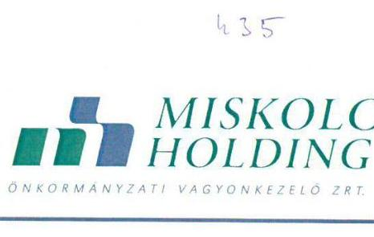

Böröz 1.
Alami Számvevőszék
Domokos László elnök

# Budapest 

Apáczai Csere János u. 10.
1052
Iktatószám: MH-JOG-15-1/2017.
Hiv.szám: V-1085-164/2016.

Tisztelt Elnök Úr!
„Az önkormányzatok gazdasági társaságai - Az önkormányzatok többségi tulajdonában lévő gazdasági társaságok gazdálkodásának ellenőrzése - Miskolc Holding Önkormányzati Vagyonkezelő Zrt" címmel készített és a Miskolc Holding Zrt. vezérigazgatójához megküldött Számvevőszéki jelentéstervezetre a megadott határidőben a Társaság nevében az alábbi írásbeli észrevételeket teszem.

## Megállapítások:

2. A gazdasági társaság vagyongazdálkodása szabályszerű volt-e, kötelezettségállománya jelent-e kockázatot a müködésre, illetve a közfeladat ellátásra?

## Összegző megállapítás:

A Társaság vagyongazdálkodása nem volt szabályszerű. A Cégcsoport kötelezettségállománya veszélyeztette a gazdálkodás stabilitását.
2.2. számú megállapítás: A Társaság a mérlegadatokat leltárral alátámasztotta.

A részesedések átruházása és megszerzése során a Társaságnál a jogszabályi és tulajdonosi előírásokat nem tartották be.

A belső ellenőrzési rendszer nem támogatta megfelelően a Cégcsoport müködését.

## I. ÉSZREVÉTEL

A Jelentéstervezet Összegzés pontjára (5. oldal), 2. pont Összegző megállapítására, és a 2.2 számú megállapítás második mondatára:- „A részesedések átruházása és megszerzése során a Társaságnál a jogszabályi és tulajdonosi előírásokat nem tartották be.", a Társaság nevében az alábbi észrevételt teszem:

---

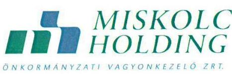

Nem kívánom vitatni, hogy a jelentéstervezetben foglalt három esetben a részesedés megszerzése, illetve átruházása nem a Társaság legfőbb szervének döntésén alapult.

A jelentéstervezet 18. oldalán „A vagyongazdálkodási döntések végrehajtása" bekezdése az alábbi megállapítást tartalmazza:
„A vagyongazdálkodási döntések végrehajtása során a tulajdonosi jogok nem érvényesültek maradéktalanul. A Társaság három alkalommal megsértette az Nvtv. 8. § (14) bekezdésének b) pontját, az alapító okirat IX/3.1 h) pontját, a vagyonrendelet 25. § (2) bekezdése c) pontját, a vagyonrendelet 27. § (2) bekezdése d) pontját, valamint az Alapszabály 7.1.v) pontját, mert a részesedés megszerzése, illetve átruházása nem a Társaság legföbb szervének döntésén alapult."

A 2013. évben 0,2 millió Ft könyvszerinti értéken végrehajtott üzletrész értékesités nem alapitói hatáskörben történt. A Társaság nem rendelkezett a részvény átruházásához szükséges tulajdonosi hozzájárulással, az átruházás igazgatósági határozaton alapult.

A 2012. évben 1,0 millió Ft jegyzési és 16,7 millió Ft bekerülési értéken végrehajtott üzletrész megvásárlás nem az alapitói hatáskörben történt. A Társaság nem rendelkezett a részvény megszerzéséhez szükséges tulajdonosi hozzájárulással, a vásárlás igazgatósági határozaton alapult.

A 2012. évben 40,5 millió Ft jegyzési és 35,0 millió Ft bekerülési értéken végrehajtott részesedés vásárlás nem alapitói hatáskörben történt. A társaság nem rendelkezett a részvény megszerzéséhez szükséges tulajdonosi hozzájárulással, a vásárlás, igazgatósági határozaton alapult."

A jelentéstervezet ezen bekezdése megállapítja azt is, hogy "2011., 2014. évben üzletrész értékesitésre, illetve vásárlásra nem került sor."

A jelen levelemhez 1. számú mellékletként csatolt táblázatban be kívánom mutatni, hogy a vizsgált időszakban, 2011. év január 1-től 2014. év december 31-ig a „vagyongazdálkodási döntések végrehajtása" körében a részesedésekkel történő vagyongazdálkodási körben, hány darab és milyen összegủ vagyongazdálkodási döntés történt.

A táblázatból megállapítható, hogy a Társaság által 2011-2014. években szerzett részesedések és tőkeemelések cégbíróság által bejegyzett összesített értéke 1.962.717.716,Ft volt. Ez 27 „vagyongazdálkodási döntést" jelentett.

A Holding által 2011-2014. években értékesített részesedések cégbíróság által bejegyzett értéke 200.000,- Ft volt, amely egy vagyongazdálkodási döntést jelentett.

---

# 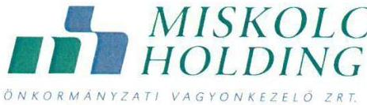 

Összeolvadás 2 ízben történt 741.150.000,- Ft értékben.
Összesítés: szerzés + értékesítés + tőkeemelés + beolvadás: 30 vagyongazdálkodási döntés érintett érték: 2.704.067.716,- Ft.

A megállapításban szereplő 3 vagyongazdálkodási döntés összesített értéke 41.700.000,Ft, amelynek aránya a teljes értékhez, a 2.704.067.716,- Ft-hoz képest 1,54 \%.

Egy társaság vagyongazdálkodása, jelen esetben a Miskolc Holding Zrt. vagyongazdálkodása, mely rendkívül összetett, sokrétű folyamat, nem szűkíthető le csupán az üzletrészek adásvételére, a részesedések átruházására és megszerzésére, az a vagyongazdálkodás egy része, szelete. A vagyongazdálkodás pedig nem választható el a társaság gazdálkodásától, azt egységben kell kezelni.

A Társaság, a Holding vagyongazdálkodása magában foglalja a köztulajdonban álló gazdasági társaságok működéshez szükséges szabályzatok jogszabályoknak megfelelően kialakított rendszerét, - létesítő okirat, SZMSZ, gazdasági szabályzatok, és egyéb jogszabályban előírt szabályzatok, illetve jogszabályban elő nem írt szabályzatok meglétét -, és annak megfelelő működést.

A Társaság, a Holding vagyongazdálkodása magában foglalja a társaság üzleti terveinek elkészítését, amely első lépése a vagyonnal való gazdálkodás megtervezésének, az éves beszámolóinak az elkészítését, mely a vagyonnal történő gazdálkodás tükre, az éves vagyonnal történő gazdálkodásról történő beszámolás.

A vagyongazdálkodás eleme a saját tőke és a jegyzett tőke arányának biztosítása, jegyzett tőkét érintő intézkedések szabályossága, a saját vagyon elidegenítésére vonatkozó szabályok, szabályzatok szerinti müködés, mely érinti a saját vagyont érintő fejlesztéseket, beruházásokat, a bevételek és a ráfordítások, az önköltségszámítás és az árképzés szabályszerűségét, szabályozottságát.

A vagyongazdálkodás magában foglalja az adatszolgáltatási kötelezettség teljesítését, az adatok védelmét és az átláthatóságot.

A vagyongazdálkodás magában foglalja a Társaság, a Holding fő tevékenységeként megjelölt vagyonkezelést, amelyet a Holding a társasági részesedésekből fakadó tulajdonosi jogosultságokra alapítva látja el a közfeladatot, vagy egyéb önkormányzati feladatot ellátó gazdasági társaságok felett.

A Számvevőszéki jelentéstervezet Megállapítások részének a gazdasági társaság vagyongazdálkodásának szabályszerűségével foglalkozó 2. pontjának:

---

# MISKOLC   HOLDING 

2.1. számú megállapítása alapján:

A Holding az ellenőrzött időszak minden évére elkészítette az üzleti tervét, melyek a tulajdonosi elvárásoknak megfeleltek. A Társaság irányítási rendszerét, szervezeti felépitését, müködését meghatározó szabályokat és ellenőrző szerveit az SZMSZ tartalmazta, melyet az Igazgatóság hagyott jóvá.

A számviteli politika keretében az elkészítendő szabályzatokkal a Társaság, a Számv. tv. 14.§ (5) bekezdésének megfelelően, az önkölségszámítási szabályzat kivételével rendelkezett.
2.2. számú megállapítása alapján:

Leltárral alátámasztotta a Társaság a beszámolóban és a számviteli nyilvántartásokban szereplő vagyonelemek állományát, a leltározási szabályzatban foglaltaknak megfelelő módon.

A Társaság a saját vagyonát képező immateriális javak és tárgyi eszközök nyilvántartását a Számv.tv. előirásainak megfelelően vezette.

A saját vagyon elidegenitésére vonatkozó jogszabályok és belső szabályzatok előirásait a Társaság betartotta az ellenőrzési időszakban.

A tárgyi eszköz értékesítésből származó egyéb bevétel 98\%-a az apportként kapott 514M Ft értékü beépítetlen terület egy részének értékesitéséből származott, melyet szabályszerüen közgyülési és igazgatósági határozatokkal hagytak jóvá.

A saját vagyont érintő fejlesztéseket a tulajdonosi joggyakorló az üzleti tervek részeként, beruházási tervek keretében fogadta el. Az elvégzett fejlesztéseket az éves beszámolók, üzleti jelentések tartalmazták.

A kötelezően elöirt, jegyzett tőke szintjét a Társaság saját tőkéje az ellenőrzött időszak minden évében meghaladta.

A jegyzett tőkét érintő emelések a Gt. 248-256.§ és a Ptk. 3:293-298.§ elöirásainak figyelembe vételével történtek.
2.4. számú megállapítása alapján:

A Társaság a beszámolási és adatszolgáltatási kötelezettségét az előírásoknak és a tulajdonosi elvárásoknak megfelelően teljesítette. Az adatok védelmét és átláthatóságát a Társaságnál biztosították.

---

# MISKOLC HOLDING 

A Miskolc Holding Zrt. Társaság vizsgálatával egy időben folyt, illetve folyik a cégcsoportba tartozó társaságok, a MIHŐ Kft., a MIVÍZ Kft., a Miskolci Városgazda Nonprofit Kft. és a Régió Park Miskolc Nonprofit Kft. számvevőszéki vizsgálata. A MIHŐ Kft., a MIVÍZ Kft., és a Miskolci Városgazda Nonprofit Kft. esetében lezárt vizsgálatok alapján született Jelentések megállapították, hogy a Miskolc Holding Zrt. mindhárom társaság esetében tulajdonosi jogait szabályszerűen gyakorolta, a társaságok vagyongazdálkodása szabályszerű volt.

Meg szeretném jegyezni továbbá, hogy a megállapításban megjelölt üzletrész értékesítéskor és vásárláskor hatályos Alapító okirat IX/3.1. h) pontja alá és a vagyonrendelet 25. § (2) bekezdése c) pontja, valamint 27. § (2) bekezdés d) pontja alá nem tartoztak az üzletrész értékesítések és vásárlások a vagyonrendelet 27. § (2) bekezdés d) pontjában foglalt rendelkezés alapján, mivel ezek az üzletrészek nem voltak olyan üzletrészek, amely olyan gazdasági társaság jegyzett/alaptőkéjére lettek kibocsátva, létesítve, amely(ek) közszolgáltatási tevékenységet végeznek és/vagy kötelező önkormányzati feladatot látnak el, és mely társasági részesedéseket az Alapító nem pénzbeli betét szolgáltatásával bocsátott a részvénytársaság tulajdonába. Jelezzük, hogy a Miskolc Holding Zrt. tekintetében a legfőbb szerv hatáskörébe tartozó, üzletrésszel történő rendelkezést érintő jogokra vonatkozó szabályozást a vagyonrendelet 25 . §-a nem tartalmaz.

Meg kívánom jegyezni továbbá azt is, hogy az üzletrészek értékesítésével és vásárlásával a Társaság nem sértette meg az Alapszabály 7.1. v) pontját, mert a három, megállapítással érintett üzletrész értékesítés és vásárlás időpontjában az Alapszabály és annak 7.1. v) pontja még nem volt hatályos, az 2014. április 29. naptól hatályos, az értékesítésekre és vásárlásokra pedig 2012. évben és 2013. évben került sor.

Meg kívánom jegyezni azt is, hogy mindhárom esetben üzletrész vásárlásról és értékesítésről volt szó, egyetlen esetben sem került sor részvényvásárlásra, és részvényértékesítésre, ahogy azt a jelentéstervezet tartalmazza.

Mindezek alapján kérem, hogy a Jelentéstervezet Összegzés szövegét, megállapítását (5. oldal), a Főbb megállapítások, következtetések (5.) oldal és Megállapítások 2. Összegzö megállapítás, és a 2.2. számú megállapítást, mely szerint a Társaság vagyongazdálkodása összességében nem volt szabályszerű, a fent leírt észrevételek alapján módosítani szíveskedjen.

A három döntés nem vitatottan igazgatósági döntésen alapult, a tulajdonosi döntés hiánya megállapítható, de az a Társaság gazdálkodásának, vagyongazdálkodásának nagyságrendjéhez viszonyítottan nem képvisel nagy százalékot, így abból a teljes

---

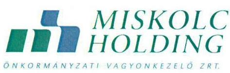
vagyongazdálkodás nem szabályszerű működésére, főleg a Társaság müködésének összegzésénél következtetni véleményem szerint nem lehet.

# II. ÉSZREVÉTEL 

A 2.2 számú megállapítás harmadik mondatára: „A belső ellenőrzési rendszer nem támogatta megfelelően a Cégesoport müködését"
és
a 2.2 számú megállapításainak a belső ellenőrzési rendszerre vonatkozó megállapításainak (jelentéstervezet 20. oldal) harmadik bekezdés megállapítására: -„, $A$ belső ellenőri megállapítások hasznosulásának nyomon követése nem volt megfelelő, mivel a Ber. 29/A. § (1)-(2) bekezdéseivel és a 8. § f) pontjával, illetve a Bkr.47.§ (1)-(2) bekezdéseivel és a 21.§ (2) bekezdés d) pontjával szemben a Társaságnál nem vezettek olyan nyilvántartást, mely alkalmas lett volna a belső ellenőrzési jelentésekben tett megállapítások, javaslatok és a belső ellenőrzési jelentések alapján megtett intézkedések végrehajtása nyomon követésére. " -
és a
negyedik bekezdés megállapítására: -" A társaság belső ellenőrzése 2011-2014. évek vonatkozásában a Ber. 8. § c) pontjában és a Bkr. 21. § (2) bekezdés b) pontjában foglaltak ellenére nem elemezte, illetve vizsgálta a vagyon megóvását és gyarapítását. "-

## a Társaság nevében az alábbi észrevételt teszem:

A vizsgált időszakot - 2011. január 1- 2014. december 31.- megelőzően, a társaság 2006. évi alapításától 2011. évig belső ellenőrzés nem került kialakításra, belső ellenőrzés nem müködött sem a Társaság saját szervezetére, sem a cégesoportra vonatkozóan.

A Társaság menedzsmentje és a Felügyelőbizottság súlyos működési kockázatként és hiányosságként értékelte a belső ellenőrzés hiányát, különös tekintettel a közpénzekkel történő gazdálkodás átláthatóságának és szabályosságának követelményére.

Ennek megfelelően a Miskolc Holding Zrt. menedzsmentje a Felügyelőbizottsággal együttműködve létrehozta a Központi Belső Ellenőrzést az alábbi a szempontok érvényesítése mellett:

- a működési, gazdálkodási kockázatok feltárása,
- a jogszabályi előírásoknak való megfelelés ellenőrzése,

---

- javaslat a feltárt hiányosságok kijavítására,
- a Zrt. vagyonának védelme.

A Felügyelőbizottságon és a Központi Belső ellenőrzésen nyugvó, kiépített rendszer átfogja a Társaság és a cégcsoport belső ellenőrzési tevékenységét.

A 2011-2014. években a Társaság Felügyelőbizottsága és Belső ellenőrzése számos olyan vizsgálatot végzett, mely ellenőrzések közvetlenül és közvetetten a vagyon megóvását és gyarapítását szolgálták. A vizsgált időszakban a belső ellenőrzések mellett számos felügyelőbizottsági ellenőrzés történt. A Felügyelőbizottság, mint testület felügyelte, irányította és rendszeresen, évente két alkalommal beszámoltatta a Miskolc Holding Zrt. és tagvállalatai belső ellenőreit munkájukról. A feltárt hiányosságok kiküszöbölése érdekében, mind a belső ellenőrzés, mind a felügyelőbizottsági ellenőrzések során tett megállapítások hasznosulásának nyomon követése megtörtént.

Ennek fórumai a felügyelőbizottsági és igazgatósági ülések voltak, ahol az elvégzett ellenőrzések megállapításait a testületek megtárgyalták, a megállapítások alapján tett intézkedésekről az érintett tagvállalatok vezetői írásban beszámoltak, számukra az ellenőrzéssel összefüggésben feladatok kerültek kitűzésre, meghatározásra. Ezen intézkedésekről a felügyelőbizottság és igazgatóság határozatokat hozott. A Miskolc Holding Zrt. és tagvállalatai tekintetében hozott igazgatósági határozatok végrehajtásának ellenőrzése rendszeresen megtörtént.

Jelen levelemhez 2. számú mellékletként csatolom a belső ellenőrzés és a Felügyelőbizottság által a vagyongazdálkodás körében végzett ellenőrzéseiről szóló kimutatást.

Az ellenőrzési jelentések, mind a Felügyelőbizottsági, mind a belső ellenőrzésről készült jelentések, a vizsgálatot végző Állami Számvevőszék részére elektronikusan megküldésre és papír alapon is átadásra kerültek.

Kérem, hogy a fenti észrevételnek helyt adva, az abban foglaltakat értékelve, a Miskolc Holding Zrt. által létrehozott ellenőrzési rendszernek, és az elvégzett munkának az ismeretében azt a megállapítást, megállapításokat, hogy:
„A belső ellenőrzési rendszer nem támogatta megfelelően a Cégcsoport működését."
„A belső ellenőri megállapítások hasznosulásának nyomon követése nem volt megfelelő, mivel a Ber. 29/A.§ (1)-(2) bekezdéseivel és a 8. § f) pontjával, illetve a Bkr. 47.§ (1)-(2) bekezdéseivel és a 21. § (2) bekezdés d) pontjával szemben a Társaságnál nem vezettek olyan nyilvántartást, mely alkalmas lett volna a belső ellenőrzési jelentésekben tett megállapítások,

---

# MISKOLC HOLDING 

javaslatok és a belső ellenőrzési jelentések alapján megtett intézkedések végrehajtása nyomon követésére."
„A társaság belső ellenőrzése 2011-2014. évek vonatkozásában a Ber. 8. § c) pontjában és a Bkr. 21. § (2) bekezdés b) pontjában foglaltak ellenére nem elemezte, illetve vizsgálta a vagyon megóvását és gyarapítását."

## felülvizsgálni szíveskedjenek.

Kérem, hogy a jelentéstervezet Főbb megállapítások, következtetések részéből (5. oldal) és a 2.2. számú megállapítás belső ellenőri rendszerre vonatkozó megállapításaiból (20.) kivenni szíveskedjenek azt a következtetést, hogy a megjelölt nyilvántartás és elemzés hiánya miatt a belső ellenőrzési rendszer nem támogatta megfelelően a cégcsoport müködését, és a társaság belső ellenőrzése nem vizsgálta a vagyon megóvását és gyarapítását.

A fent leírt észrevétel és tények alapján látható, hogy az ellenőrzött időszakban kiépítésre került a Cégcsoportot átfogó ellenőrzési rendszer, és azt a Társaság, Felügyelőbizottság folyamatosan müködtette, folyamatosan ellenőrizte a Társaság és cégcsoport tagvállalatainak a vagyongazdálkodását, a vagyon megóvását és gyarapítását.

A Cégcsoportba tartozó azon társaságok esetén, ahol már a számvevőszéki vizsgálat lezárult, azaz a MIHŐ Kft., a Miskolci Városgazda Nonprofit Kft. és a MIVÍZ Kft. esetén a Jelentések rögzítették, hogy a belső ellenőrzési rendszert a Holding müködtette. A MIHŐ Kft. és a MIVÍZ Kft. esetében a Jelentések nem fogalmaztak meg javaslatot intézkedési terv kidolgozására a belső ellenőrzési rendszert illetően.

A fentieket támasztja alá az is, hogy a MIHŐ Kft. esetében a Jelentés megállapította, hogy a Holding által működtetett belső ellenőrzési rendszer által végzett vizsgálatokat követően a Holding az ellenőrzési jelentés alapján intézkedési terv készítési kötelezettséget írt elő.

A MIVÍZ Kft. esetében a Jelentés megállapította, hogy tulajdonosi ellenőrzést a Felügyelőbizottság és a Holding központi belső ellenőrzési egysége végzett a társaságnál. A Felügyelőbizottság tevékenységét az általa elfogadott éves munkatervek alapján végezte. Folyamatosan figyelemmel kísérte a társaság belső ellenőrzését is, 2012. februárról állandó napirendi pontként szerepelt ülésein a beszámoló a belső ellenőrzés által végzett vizsgálatokról. A megállapításokkal kapcsolatban tett javaslatok megvalósulását a Holding a Felügyelőbizottság közreműködésével követte nyomon. A társaság belső ellenőrzést működtetett, annak ellenére, hogy arra vonatkozó jogszabályi kötelezettsége nem volt. Az ellenőrzések kapcsán intézkedési tervek készültek, az intézkedések végrehajtását ellenőrizték. A belső ellenőri javaslatokat a társaság figyelembe vette és a hiányosságokat megszüntette.

---

# III. ÉSZREVÉTEL 

A Jelentéstervezet Összegzés pontjára (5. oldal), Főbb megállapítások, következtetések2. pont Összegző megállapítására, és a 2.3 számú megállapításra: -„A Cégesoport kötelezettségállománya veszélyeztette a gazdálkodás stabilitását"-.

## a Társaság nevében az alábbi észrevételt teszem:

A 2.3. számú megállapítással, mely szerint „A Cégcsoport kötelezettségállománya veszélyeztette a gazdálkodás stabilitását" nem értünk egyet, mivel a gazdálkodási adatok és körülmények nem teljes körű elemzéséből, hanem csak egy szempontból, az eladósodottság mutatóinak alakulásából levont következtetés.

A gazdasági társaság működését több tényező befolyásolja, a gazdálkodás stabilitására is több mutató együttes elemzéséből lehet következtetést levonni. A közgazdasági mutatók közül egy kiragadott tényező elemzése, az adatok csak egy bizonyos szempontú, szűk körének vizsgálata téves, nem megalapozott következtetést eredményezhet.

Az eladósodottság és a kötelezettségállomány elemzését az ÁSZ vizsgálatot végző szakemberek nem a teljes vizsgálati időszakra vonatkoztatva tették meg. A mutatók számításánál és a Cégcsoport kötelezettségeinek alakulásának vizsgálatakor a kezdő időpontnak 2011. évi mérleg adatokat vették.

Ezzel az eljárással a teljes 2011. üzletei évet kihagyták az elemzésből, azaz a vizsgálati programban szereplő 4 év helyett 3 év adataiból lett következtetés levonva a gazdálkodás stabilitására vonatkozóan, ezért az így levont következtetések, megállapítások teljesen tévesen ítélik meg a Társaság müködését, gazdálkodását, az eladósodottság és a kötelezettségállományát.

A Miskolc Holding Zrt. és a konszolidációba bevont társaságainak (továbbiakban Cégcsoport) kötelezettségeinek és a gazdálkodás stabilitásának vizsgálatánál szükségszerű kiszűrni a víziközmű vagyonkezelésbe történő átadásának hatását, mint ahogy ez a jelentéstervezetben is megtörtént.

A vizsgálat megállapításaival ellentétben az alábbiakban kívánom bemutatni a cégcsoport konszolidált mérlegének főbb adatait a teljes vizsgálattal érintett időszakra 2011. január 1-től 2014.év december 31-ig.

---

# MISKOLC HOLDING 

A Cégcsoport konszolidált mérlegének föbb adatait a teljes vizsgált időszakra vonatkozóan az alábbi táblázat tartalmazza ${ }^{1}$ :

KONSZOLIDÁLT MÉRLEG
adatok eFI-ban

| A tetel megnevezése | 2011.01 .01 | 2011 | 2012 | 2013 | 2014 korr. | 2014 korr. 2011.01 .01 | 2014 korr. 2011.01 .01 |
| :--: | :--: | :--: | :--: | :--: | :--: | :--: | :--: |
| A. Befektetett eszközök | 36267070 | 40823842 | 48280696 | 42637056 | 62969646 | 26702676 | 173,63\% |
| I. BIMATERIÁLIS JAVAK | 336646 | 238985 | 231808 | 312802 | 978905 |  |  |
| II. TÁRÚYI ESZKÖZÖK | 35184233 | 40213240 | 47493568 | 41668069 | 61010754 |  |  |
| III.BEFEKTETETT PÉNZÜGYI ESZKÖZÖK | 746191 | 371617 | 555222 | 555585 | 979987 |  |  |
| B. Forgieszközök | 18041726 | 16635189 | 15827959 | 16796036 | 17650476 | $-391249$ | 97,83\% |
| I. KÉSZLETEK | 852527 | 1259994 | 545159 | 702090 | 1057962 |  |  |
| X. KOVETELÉSEK | 9228379 | 10900130 | 10299366 | 9064284 | 9799736 |  |  |
| III.ÉRTÉKPAPROK | 458 | 0 | 0 | 0 | 0 |  |  |
| IV. PÉNZESZKÖZÖK | 7960362 | 4479065 | 4883434 | 6989655 | 6792878 |  |  |
| C. Aktív időbeli elhatárolások | 973687 | 2186691 | 1731637 | 2037989 | 1918710 | 946123 | 197,08\% |
| ESZKÖZÖK (ARTÍVÁK) ÖSSZESÉN | 56282382 | 59649722 | 65840094 | 61331086 | 62636832 | 27286450 | 149,30\% |
| D. Saját tőke (EK-70) | 17203472 | 18417373 | 19767276 | 13558888 | 20764284 | 3660812 | 120,70\% |
| I. JEGYZETT TÖKE | 17498000 | 17498000 | 17846000 | 18422000 | 18422000 |  |  |
| II. JEGYZETT, BE NEMFIZETETT TÖKE (-) | $-868575$ | 0 | $-96529$ | 0 | 0 |  |  |
| III. TÖKETARTALÉK | 740000 | 740000 | 740000 | 740000 | 2036824 |  |  |
| IV.EREZMÉNYTARTALÉK | $-346585$ | $-539353$ | $-649198$ | 611239 | $-584803$ |  |  |
| V. LEKÖTÖTT TARTALÉK | 0 | 1474 | 0 | 0 | 0 |  |  |
| VII. MÉRLEG SZERINTIEREZMÉNY | $-1334574$ | $-192128$ | $-410554$ | $-6583066$ | $-574255$ |  |  |
| VIII. LEÁNYVÁLL - I SALÁTTÖKE-VÁLTOZÁS | 1515207 | 909380 | 2335557 | 368715 | 1464518 |  |  |
| F. Gőfertetékok | 1333655 | 1151673 | 1032024 | 797096 | 737074 | $-596581$ | 55,27\% |
| F. Kötelezettségek | 26197697 | 26320738 | 28592799 | 28108607 | 27119267 | $-2078336$ | 93,69\% |
| I. HÁTRAGOROLT KÖTELEZETTSÉGEK | 237994 | 237994 | 237994 | 237994 | 240280 |  |  |
| II. HOSSZÚ LEJÁRATÚ KÖTELEZETTSÉGEK | 9179125 | 9068095 | 8492053 | 7935787 | 8377447 |  |  |
| III. RÖVID LEJÁRATÚ KÖTELEZETTSÉGEK | 19780477 | 17014654 | 19862752 | 19934826 | 18501540 |  |  |
| G. Pesszív időbeli elhatárolások | 7547658 | 13759938 | 16447995 | 18066499 | 23918207 | 26270646 | 449,29\% |
| FORRÁSOK (PÁSSZÍVÁK) ÖSSZESÉN | 55282382 | 59649722 | 65840094 | 61331086 | 62636832 | 27286450 | 149,30\% |

Korrekciós tételek:

- kezelésbe vett viskózmű vegyen (MVIZ)
- jegyezt tőke (MH)
- kezelésbe vett viskózmű vegyen (MVIZ)
- kezelésbe vett viskózmű vegyen (MVIZ)
- kezelésbe vett viskózmű vegyen (MVIZ)

7651306 hosszú lejárati kötelezettség 6419000 eredménytartalék
rendkivüli ráforditás
rendkivüli bevétel

A jelentéstervezetben az eladósodottságot jellemző mutatók értékéből az a következtetés került levonásra, hogy „a saját tőke nem nyújtott megfelelő fedezetet a kötelezettségekre és a kintlévőségekkel csökkentett kötelezettségekre sem". Ez a megállapítás így nem helytálló. Ezek a mutatók nem határozzák meg a „megfelelő fedezet" mértékét, azonban a források összetételére, az idegen és saját forrás arányára, azok változására adnak információt, melyböl az egyéb tényezők együttes vizsgálatával lehet következtetést levonni.

[^0]
[^0]:    ${ }^{1}$ Jelen észrevételben a korrekciót a 2014. évi mérleg adatoknál jelenítjük meg.

---

# MISKOLC HOLDING 

Az alábbi táblázat a teljes vizsgálati időszakra vonatkozóan tartalmaz néhány közgazdasági jellemzőt - a jelentés 6. táblázatában szereplő eladósodottsági mutatók mellett:

| Megnevezés | $\begin{gathered} 2011 . \\ \text { (1.0) } \end{gathered}$ | 2011. | 2012. | 2013. | $\begin{gathered} 2014 . \\ \text { korr. } \end{gathered}$ | $\begin{gathered} 2014 . \text { korr. } \\ 2011.01 .01 \end{gathered}$ | m.e. | számítási mód |
| :--: | :--: | :--: | :--: | :--: | :--: | :--: | :--: | :--: |
| Vagyoni helyzetet bemutató mutatók |  |  |  |  |  |  |  |  |
| Saját tőke növekedési mutató | 98,32 | 105,25 | 110,75 | 73,60 | 112,71 | 14,40 | \% | saját tőke/jegysett tőke*100 |
| Befektetett eszközök aránya | 65,60 | 68,44 | 73,33 | 69,36 | 76,29 | 10,69 | \% | befektetett eszközösszes eszköz*100 |
| Pénsügyi, likviditási helvect mutatói |  |  |  |  |  |  |  |  |
| Likviditási mutató | 91,21 | 97,79 | 79,69 | 84,05 | 95,40 | 4,19 | \% | forgóeszközök/óvid lej. kötelezettségek*100 |
| Hitelfedezettségi mutató | 46,65 | 64,06 | 51,85 | 45,47 | 52,97 | 6,31 | \% | követeléssék/óvid lej. kötelezettségek*100 |
| Müködő tőke | $-1738752$ | $-375465$ | $-4034793$ | $-3178791$ | $-851064$ | 887688 | e Ft | forgóeszközök-óvid lej. kötelezettségek |
| Eladósodottság jellemzői (jelentésben szereplő mutatók) |  |  |  |  |  |  |  |  |
| Adósságfedezeti mutató | 1,86 | 2,18 | 2,24 | 2,11 | 2,97 | 1,11 |  | Defektetett eszköz-forgó eszköz)/idegen forrás |
| Eladósodottság méltéke | 1,70 | 1,43 | 1,45 | 2,07 | 1,31 | $-0,39$ |  | kötelezettség/saját tőke |
| Eladósodottság mutató | 0,53 | 0,44 | 0,43 | 0,46 | 0,33 | $-0,20$ |  | idegen tőke / összes forrás |
| Nettó eladósodottság | 1,16 | 0,84 | 0,93 | 1,40 | 0,83 | $-0,33$ |  | kötelezettség-követelés2/saját tőke |

A Cégcsoportra vonatkoztatva az eladósodottsági mutatók mindegyike javulást mutat a négy év viszonylatában. Az idegen tőke aránya csökkent, az adósságfedezeti érték jelentősen nőtt, az eladósodottság csökkent.

Az adósságfedezeti mutató és az eladósodottsági mutató értéke a referencia értéken belül alakult. (A referencia értéket a Jelentés I.sz. melléklete tartalmazza.)

Az eladósodottsági mutatókon felül a likviditási és hitelfedezettségi mutatók is pozitív tendenciát mutatnak. A Cégcsoport működő tőkéje negatív ugyan, mivel jelentős finanszírozási forrást a cashpool hitelkeret biztosít, azonban a vizsgált időszakban jelentős nagyságrendű emelkedés történt a működő tőke összegében.

Mindezek ismeretében nem fogadható el a jelentés azon megállapítása, hogy „az ellenőrzött időszakban sem történt érdemi előrelépés az eladósodottság szintjének csökkentése kapcsán".

A Cégcsoport konszolidált kötelezettségei a vizsgált időszakban 2.078.330 eFt-tal, 7,12 \%-kal csökkentek. A kötelezettségeken belül a hosszú és rövid lejáratú kölcsönök és hitelek együttes összege 3.792.693 eFt-tal, 26,26 \%-kal csökkentek.

---

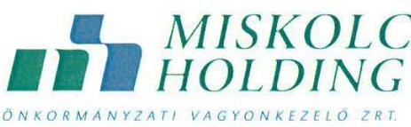

A hitelek összetételét az alábbi táblázat tartalmazza:
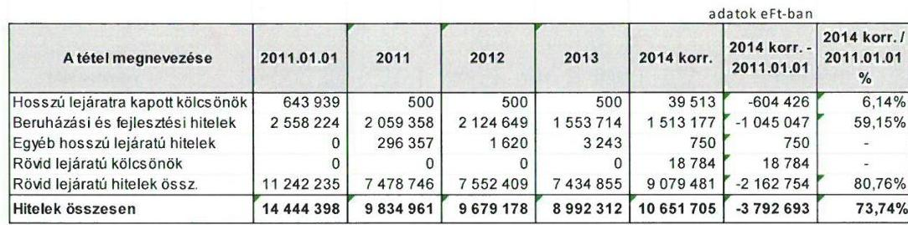

A kötelezettségek 7,12 \%-os csökkenése mellett a nagy volumenủ beruházások eredményeként a befektetett eszközök értéke $73,63 \%$-kal nőtt, ezáltal az eszközök (mérleg föösszeg) $49,30 \%$-kal emelkedett.

A vizsgált időszakban a Cégcsoport saját tőkéje 3.560 .812 eFt-tal, azaz 20,70 \%-kal emelkedett.

Mindezek alapján nem helytálló a vizsgálati jelentés azon megállapítása, hogy „a Cégcsoport kötelezettségállománya veszélyeztette a gazdálkodás stabilitását".

A Cégcsoport a vizsgált időszakban jelentős beruházásokat, fejlesztéseket hajtott végre, jelentős tőkenövekedést ért el oly módon, hogy közben a kötelezettségei, a hitelei csökkentek, vagyoni helyzete, likviditása - kis mértékben ugyan, de - javult.

Mindezek alapján kérem, hogy a Jelentéstervezet Összegzés szövegét, megállapítását (5. oldal), a Főbb megállapítások, következtetések (5.) oldal és Megállapítások 2. Összegzö megállapítás, és a 2.3. számú megállapítást, mely szerint: "...a Társaság és tagvállalatai kötelezettségállománya a gazdálkodás stabilitását veszélyeztette. Az adósságállomány $90 \%$-a az ellenőrzött időszakot megelőzően keletkezett, ugyanakkor az ellenőrzött időszakban sem történt érdemi előrelépés az eladósodottság szintjének csökkentése kapcsán. A cégcsoport kötelezettségállománya veszélyeztette a gazdálkodás stabilitását." a fent leírt észrevételek alapján módosítani szíveskedjen.

A Jelentéstervezet Megállapítások 1.2. sz. „A Társaság feletti tulajdonosi jogait az önkormányzat vagyonrendeletének megfelelően gyakorolta, ennek keretében eleget tett a beszámoltatási- és felügyeleti rendszer működtetési kötelezettségének" megállapításban szerepel, hogy „Az FB egyharmada munkavállalók képviselöiböl állt a Gt. 38. § (1) bekezdésében, valamint a Ptk. 3:124. § (1) bekezdésében elöirtak szerint."

---

# MISKOLC HOLDING 

Ennek kapcsán észrevételezzük, hogy a Miskolc Holding Zrt. teljes munkaidőben foglalkoztatott munkavállalói éves átlagos létszáma 2011. évben 31 fő, 2012. évben 84 fő, 2013. évben 108 fő, 2014. évben 115,2 fő volt, ezért a Jelentéstervezetben is megjelölt jogszabályok alapján a Holding Felügyelőbizottságába munkavállalói küldött tag választására nem került sor.

Észrevételünkben részletesen kifejtett indokok alapján kérem, hogy a Társaság vagyongazdálkodása, a belső ellenőrzési rendszer és a cégcsoport kötelezettségállománya tekintetében a Jelentéstervezetet és a Miskolc Holding Zrt. vezérigazgatójának tett Javaslatokat felülvizsgálni és módosítani szíveskedjenek.

Miskolc, 2017. március 2.

Tisztelettel:
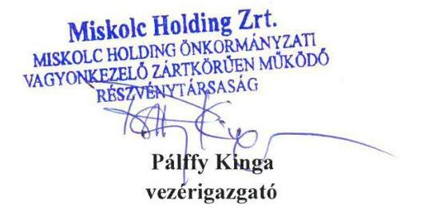

Pálffy Kinga
vezérigazgató
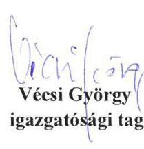

Szélyes Domokos
igazgatósági tag
igazgatósági tag

---

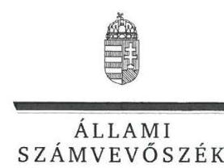

# Pálffy Kinga úrhölgy 

vezérigazgató
Miskolc Holding Önkormányzati Vagyonkezelő Zrt.

## Miskolc

## Tisztelt Vezérigazgató Úrhölgy!

Az önkormányzatok gazdasági társaságai - Az önkormányzatok többségi tulajdonában lévő gazdasági társaságok gazdálkodásának ellenőrzése - Miskolc Holding Önkormányzati Vagyonkezelő Zrt. címmel készített számvevőszéki jelentéstervezetre tett észrevételeit köszönettel megkaptam.
Az Állami Számvevőszék észrevételekre vonatkozó álláspontjáról a felügyeleti vezető által készített részletes tájékoztatást csatoltan megküldöm.

Tájékoztatom Vezérigazgató úrhölgyet, hogy a számvevőszéki jelentésben - az Állami Számvevőszékről szóló 2011. évi LXVI. törvény 29. § (3) bekezdése alapján - a figyelembe nem vett észrevételeket szerepeltetjük, annak indoklásával, hogy azokat az Állami Számvevőszék miért nem fogadta el.

Budapest, 2017. O3. hó 24. nap
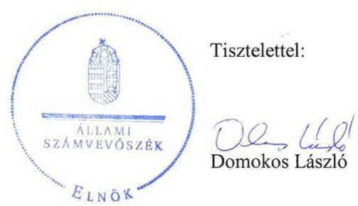

Melléklet: Tájékoztatás az észrevételek kezeléséről

---

# Tájékoztatás   az észrevételek kezeléséről 

Az önkormányzatok gazdasági társaságai - Az önkormányzatok többségi tulajdonában lévő gazdasági társaságok gazdálkodásának ellenőrzése - Miskolc Holding Önkormányzati Vagyonkezelő Zrt. címú jelentéstervezetre tett (2017. március 2-án kelt, március 6-án postára adott, és az Állami Számvevőszékhez március 8-án érkezett) észrevételeit áttekintettük, azok kezelésével kapcsolatban a következő tájékoztatást adom.

## 1. Az Összegzésre, a 2. Összegző megállapításra és a 2.2. számú megállapítás 2. mondatára az üzletrészekkel kapcsolatban tett észrevételhez

Az észrevétel megerősítette, hogy a részesedések átruházása és megszerzése a jelentéstervezetben foglalt három esetben nem a társaság legfőbb szervének döntésén alapult. Jelezte, hogy mindhárom esetben üzletrész (nem pedig részvény) vásárlásra, illetve értékesítésre került sor. A rendelkezésre álló dokumentumok felülvizsgálata alapján a részvényre vonatkozó megfogalmazásokat (a 2.2. számú megállapítást alátámasztó 4. bekezdésből) töröltük. Ezzel összefüggésben a belső előírásokra történő hivatkozásokat is felülvizsgáltuk és töröltük (a 2.2. számú megállapítás 2 . mondatából, az alátámasztó 4 . bekezdéséből és a 3 . számú javaslatból is), mert nem relevánsak a három üzletrészre vonatkozóan. A jogszabályi előírás be nem tartását az észrevétel sem vitatta.
Az észrevétel szerint a három ügylet értéke a társaság vagyongazdálkodásának nagyságrendjéhez viszonyítva nem képvisel akkora arányt, amely alapján a teljes vagyongazdálkodás szabályszerűtlen müködésére lehessen következtetni. Az ügyletek értékétől, arányától függetlenül a vagyonkezelő szervezet vonatkozásában a feltárt hiányosságokat az ÁSZ lényegesnek értékelte, ezért azokat a vagyongazdálkodási tevékenység hiányosságaként továbbra is szerepeltetjük. Az elvégzett felülvizsgálat alapján a vagyongazdálkodás szabályszerűségére vonatkozó megállapítást az üzletrészekkel kapcsolatos ügyletek jogszabályi előírástól való eltérésére pontosítottuk az Összegzés 1. bekezdés 2. mondatában és a Főbb megállapítások, következtetések 2. bekezdés 2. mondatában, továbbá a 2. Összegző megállapítás 1. mondatában.
2. A Főbb megállapítások, következtetésekre, a 2.2. számú megállapítás 3. mondatára, és az alátámasztó 17-18. bekezdésekre a belső ellenőrzéssel kapcsolatban tett észrevételhez
Az észrevétel jelezte, hogy a társaság - a felügyelőbizottság ellenőrzései mellett - müködtetett belső ellenőrzést, és nyomon követte a belső ellenőrzési megállapítások hasznosulását. Nem vitatta ugyanakkor, hogy az ellenőrzéshez rendelkezésre bocsátott adatszolgáltatásban megjelölt és az észrevétel 2. számú mellékletében ismételten felsorolt belső ellenőrzések alapján megtett intézkedésekről - a jogszabályi előírások ellenére - nyilvántartást nem vezetett. Ezért a nyilvántartás hiányára vonatkozó megállapítás (a 2.2. számú megállapítást alátámasztó 17. bekezdés) módosítása nem indokolt.
Az ellenőrzéshez rendelkezésre bocsátott adatszolgáltatásban megjelölt és az észrevétel 2. számú mellékletében ismételten felsorolt belső ellenőrzések tekintetében a dokumentumokat ismételten áttekintettük és a vagyon megóvása és gyarapítása vizsgálatának hiányára vonatkozó megállapítást (a 2.2. számú megállapítást alátámasztó 18. bekezdés) törőltük, továbbá ezzel összefüggésben azt a megállapítást, miszerint a belső ellenőrzési rendszer nem támogatta megfelelően a Cégcsoport müködését, pontositottuk a Főbb megállapítások, következtetések 2. bekezdés 3. mondatában és a 2.2. számú megállapítás 3 . mondatában. Fentiekre tekintettel az 5 . számú javaslat törlésre került.

---

# 3. Az Összegzésre, a Főbb megállapítások, következtetésekre, a 2. Összegző megállapításra, a 2.3. számú megállapításra a kötelezettségállománnyal kapcsolatban tett észrevételhez 

Az észrevétel szerint a jelentéstervezetben az eladósodottságot jellemző mutatók értékéből levont következtetés (miszerint a saját tőke nem nyújtott megfelelő fedezetet a kötelezettségekre és a kintlévőségekkel csökkentett kötelezettségekre sem) nem helytálló. Az összefüggések ismételt értékelését követően a jelentéstervezet szövegezését pontosítottuk, nem a mutatókból levont következtetésként, hanem önálló tényként rögzítettük a kötelezettségek saját tőkét meghaladó mértékét (a 2.3. számú megállapítást alátámasztó 1. bekezdés utolsó mondatában).
Az észrevétel nem tartja elfogadhatónak azt a megállapítást, hogy az ellenőrzött időszakban nem történt érdemi előrelépés az eladósodottság szintjének csökkentésében. Az adatok ismételt áttekintését követően, figyelembe véve a 2011. év eleji állapothoz képest történő változásokat, a kötelezettségek csökkentését, a jelentéstervezet megállapítását (a Főbb megállapítások, következtetések 3. bekezdés 1-2. mondatát és a 2.3. számú megállapítást alátámasztó 2. bekezdést) pontosítottuk.

Az észrevétel szerint a társaság nem ért egyet a 2.3. számú megállapítással, miszerint a cégcsoport kötelezettségállománya veszélyeztette a gazdálkodás stabilitását (kizárólag az eladósodottság mutatóinak alakulásából levont következtetésként), mert 2011. év elejéhez képest a kötelezettségek csökkenése mellett az eszközök és a saját tőke értéke emelkedett 2014. év végére. Az adatok ismételt elemzését követően megállapítottuk, hogy a jelentéstervezetben szereplő egyes mutatatóknál, vagy akár a konszolidált mérlegek adataiból számítható további mutatóknál - így például az észrevételben hivatkozott likviditási- és hitelfedezettségi mutatóknál is - előfordult javuló tendencia, ugyanakkor az ellenőrzött időszak éves mérlegadatai alapján a kötelezettségek állománya magas volt, meghaladta a saját tőke állományának értékét. Ennek megfelelően az Összegzés első bekezdésének 4. mondata, a Főbb megállapítások, következtetések 3. bekezdése, a 2. Összegző megállapítás 2. mondata és a 2.3. számú megállapítás megfogalmazása pontosításra került.

## 4. Az 1.2. számú megállapítást alátámasztó 2. bekezdés 3. mondatára a felügyelőbizottság összetételével kapcsolatban tett észrevételhez

Az észrevétel jelezte, hogy a felügyelőbizottságba munkavállalói küldött tag választására nem került sor, erre vonatkozó jogszabályi kötelezettsége a társaságnak nem volt. A rendelkezésre álló adatok ismételt felülvizsgálatát követően az erre vonatkozó megállapítás (1.2. számú megállapítást alátámasztó 2 . bekezdés 3 . mondata) a jelentéstervezetből törlésre került.
Tájékoztatom, hogy a számvevőszéki jelentés függelékeként szerepeltetjük a jelentéstervezethez tett észrevételeit, valamint az azokra adott válaszunkat.

Budapest, 2017. 03. hó 24. nap

Böröcz Imre felügyeleti vezető

---

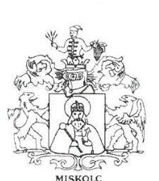

MISKOLC MEGYEI JOGÚ VÁROS POLGARMESTERE

VA: 723.840-1/2017.

# Állami Számvevőszék 

## Domokos László

## Elnök

Budapest
Apáczai Csere János u. 10.
1052

## Tisztelt Elnök Úr!

Köszönettel megkaptuk „Az önkormányzatok gazdasági társaságai - Az önkormányzatok többségi tulajdonában lévő gazdasági társaságok gazdálkodásának ellenőrzése - Miskolc Holding Önkormányzati Vagyonkezelő Zrt." címmel készített számvevőszéki jelentéstervezetüket.

A jelentéstervezettel kapcsolatosan- Miskolc Megyei Jogú Város Önkormányzatát érintően észrevételt tenni nem kívánok.

A Miskolc Holding önkormányzatai Vagyonkezelő Zrt. vagyongazdálkodásának szabályszerűségével, a belső ellenőrzési rendszer működésével összefüggő megállapításokra vonatkozóan a társaság Vezérigazgatója által megfogalmazott észrevételekről tájékoztatást kaptam, az azokban foglaltakkal egyetértek.

Kérem a fentiek szíves tudomásulvételét.

Miskolc, 2017. március „..."

---

# RÖVIDÍTÉSEK JEGYZÉKE 

${ }^{1}$ Miskolc Holding Zrt.
${ }^{2}$ Önkormányzat
${ }^{3}$ Társaság
${ }^{4}$ Cégcsoport
${ }^{5}$ Vksztv.
${ }^{6}$ MIVÍZ Kft.
${ }^{7}$ polgármester
${ }^{8}$ jegyző
${ }^{9}$ ÁSZ
${ }^{10}$ ÁSZ tv.
${ }^{11}$ gazdasági program
${ }^{12}$ Közgyűlés
${ }^{13}$ Ötv.
${ }^{14}$ Nvtv.
${ }^{15}$ vagyongazdálkodási terv
${ }^{16}$ 314/2012. (XI. 8.) Korm. rendelet
${ }^{17}$ vagyonrendelet ${ }_{1}$
${ }^{18}$ vagyonrendelet ${ }_{2}$
${ }^{19}$ Mötv.
${ }^{20}$ SZMSZ
${ }^{21}$ Stabilitási tv.
${ }^{22}$ a VI-114/4968/2013. határozat
${ }^{23}$ Gt.
${ }^{24}$ Ptk.
${ }^{25}$ FB
${ }^{26}$ Taktv.
${ }^{27}$ javadalmazási szabályzat
${ }^{28}$ Igazgatóság
${ }^{29}$ Üzleti terveket jóváhagyó határozatok
${ }^{30}$ Számv. tv.

Miskolc Holding Önkormányzati Vagyonkezelő Zártkörűen működő részvénytársaság.
Miskolc Megyei Jogú Város Önkormányzata
Miskolc Holding Zrt.
Miskolc Holding Zrt. és tagvállalatai
2011. évi CCIX. törvény a víziközmű-szolgáltatásról

MIVÍZ Miskolci Vízmú Korlátolt Felelősségű Társaság
Miskolc Megyei Jogú Város Önkormányzatának polgármestere
Miskolc Megyei Jogú Város jegyzője
Állami Számvevőszék
2011. évi LXVI. törvény az Állami Számvevőszékről

A Közgyűlés II-24/22.308/2011. számú határozatával elfogadott Miskolc Megyei Jogú Város Önkormányzatának 2011-2014. közötti gazdasági programja
Miskolc Megyei Jogú Város Önkormányzatának Közgyűlése
1990. évi LXV. törvény a helyi önkormányzatokról (hatálytalan: 2014. október 12-től)
2011. évi CXCVI. törvény a nemzeti vagyonról (hatályos: 2011. december 31-től)

A Közgyűlés VI-156/3019/2012. számú határozatával jóváhagyott Miskolc Megyei Jogú Város Önkormányzata vagyongazdálkodási koncepciója, közép- és hosszú távú terve, 2012-2022. évekre
314/2012. (XI. 8.) Korm. rendelet a településfejlesztési koncepcióról, az integrált településfejlesztési stratégiáról és a településrendezési eszközökről, valamint egyes településrendezési sajátos jogintézményekről (hatályos: 2012. november 9 -étől)
MMJV Önkormányzatának 1/2005.(II.10.) sz. rendelete az Önkormányzat vagyonának meghatározásáról, a vagyon feletti rendelkezési és tulajdonosi jogok gyakorlásának szabályairól, a vagyongazdálkodás rendjéről, valamint a vagyonkimutatási rendszer kialakításáról
40/2012. (XII.15.) önkormányzati rendelete az Önkormányzat vagyonáról és a vagyongazdálkodásáról
2011. évi CLXXXIX. törvény Magyarország helyi önkormányzatairól
Szervezeti és Müködési Szabályzat
2011. évi CXCIV. törvény Magyarország gazdasági stabilitásáról

Önkormányzat kezességvállalásáról a Holding Cash-Pool hiteléhez
2006. évi IV. törvény a gazdasági társaságokról (hatályos: 2014. március 14-ig)
2013. évi V. törvény a Polgári Törvénykönyvről (hatályos: 2014. március 15-től) a Holding Zrt. felügyelőbizottsága
2009. évi CXXII. törvény a köztulajdonban álló gazdasági társaságok takarékosabb müködéséről
a Miskolc Holding Zrt. javadalmazási szabályzata (2010. február 26-tól hatályos, melyet 2012. június 14. hatállyal módosítottak)
Miskolc Holding Zrt. Igazgatósága
34/2011. sz., 22/2012.(VI.14.) sz., 27/2013.(VI.27.) sz. és 19/2014.(V.29.) sz. a számvitelről szóló 2000. évi C. törvény

---

${ }^{31}$ önköltségszámítási szabályzat
${ }^{32}$ 349/2013.(IX.28.) IT. határozat,
${ }^{33}$ 374/2012.(XI.26.) IT határozat
${ }^{34}$ 389/2013.(IX.28.) IT. határozat
${ }^{35} \mathrm{Gt}$.
${ }^{36}$ Ber.
${ }^{37}$ Bkr.
${ }^{38}$ Avtv.
${ }^{39}$ Info tv.
${ }^{40} \mathrm{NAV}$
a Miskolc Holding Zrt. önköltségszámítás rendje (2013. január 1-jétől hatályos), továbbá a Miskolc Holding Zrt. önköltségszámítási szabályzata (2014. január 1-jétől hatályos)
NANOPOLIS Kft. részesedéseinek az eladása
A BIOGAS részesedés megvásárlásról szóló IT határozat
Energie AG Kft részesedés megvásárlásáról szóló IT határozat
2006. évi IV. törvény a gazdasági társaságokról

193/2003. (XI.26.) Korm.rendelet a költségvetési szervek belső ellenőrzéséről
370/2011. (XII. 31.) Korm. rendelet a költségvetési szervek belső
kontrollrendszeréről és belső ellenőrzéséről
1992. évi LXIII. törvény a személyes adatok védelméről és a közérdekú adatok nyilvánosságáról (hatályos 2011. december 31-ig)
2011. évi CXII. törvény az információs önrendelkezési jogról és az információszabadságról (hatályos: 2011. július 27-től)
Nemzeti Adó- és Vámhivatal

---

ÁLLAMI SZÁMVEVŐSZÉK
1052 Budapest, Apáczai Csere János utca 10.
Levélcím: 1364 Budapest 4. Pf. 54
Telefon: +36 14849100 Telefax: +36 14849200
www.asz.hu