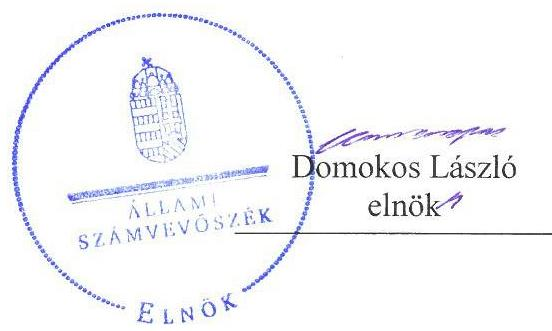
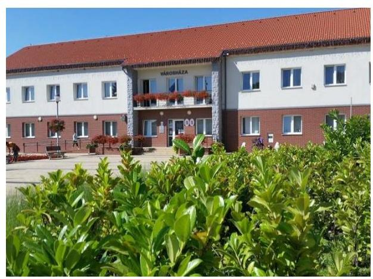
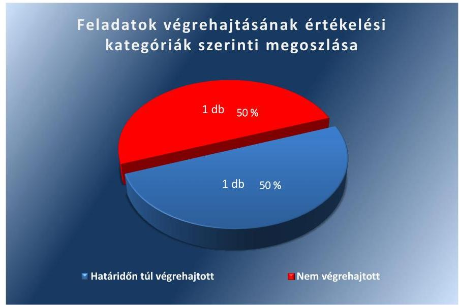

# Jelentés 

## Utóellenőrzések

Polgár Város Önkormányzata vagyongazdálkodása
szabályszerűségének utóellenőrzése 2017.

---

# Jelentés 

## Utóellenőrzések

Polgár Város Önkormányzata vagyongazdálkodása
szabályszerűségének utóellenőrzése
2017. Október 21. nap

---

# AZ ELLENŐRZÉST FELÜGYELTE:

DR. BENEDEK MÁRIA felügyeleti vezető

# AZ ELLENŐRZÉST VEZETTE ÉS A VÉGREHAJTÁSÁÉRT FELELŐS:

MOLNÁR ZSUZSANNA ellenőrzésvezető

# A PROGRAM ÖSSZEÁLLÍTÁSÁÉRT FELELŐS:

JANIK JÓZSEF LÁSZLÓ osztályvezető

# A TÉMÁHOZ KAPCSOLÓDÓ KORÁBBI SZÁMVEVŐSZÉKI JELENTÉSEK:

- címe: Jelentés az önkormányzati vagyongazdálkodás szabályszerűségi ellenőrzéséről – Polgár
- sorszáma: 13069

Jelentéseink az Országgyűlés számítógépes hálózatán és az Interneten a www.asz.hu címen is olvashatóak.

|  IKTATÓSZÁM: V-1321-048/2016. | |
| --- | --- |
|  TÉMASZÁM: 2355 | |
|  ELLENŐRZÉS-AZONOSÍTÓ SZÁM: V075580 | |

---

# TARTALOMJEGYZÉK 

■ ÖSSZEGZÉS ..... 5
■ AZ ELLENŐRZÉS CÉLJA ..... 6
■ AZ ELLENŐRZÉS TERÜLETE ..... 7
■ AZ ELLENŐRZÉS HÁTTERE, INDOKOLTSÁGA ..... 8
■ A JELENTÉS LÉNYEGES KÉRDÉSKÖRE ..... 9
■ ELLENŐRZÉS HATÓKÖRE ÉS MÓDSZEREI ..... 10
■ MEGÁLLAPÍTÁSOK ..... 12
■ KÖVETKEZTETÉSEK ..... 14
■ MELLÉKLETEK ..... 15
I. Sz. melléklet: Az ÁSZ 13069. számú jelentéséhez kapcsolódó intézkedési terv végrehajtása ..... 15
■ FÜGGELÉK: ÉSZREVÉTELEK ..... 17
■ RÖVIDÍTÉSEK JEGYZÉKE ..... 19

---

.

---

# ÖSSZEGZÉS 

Az Állami Számvevőszék Polgár Város Önkormányzata vagyongazdálkodása szabályszerűségének utóellenőrzése megállapította, hogy az intézkedési tervben meghatározott határidőn túl gondoskodott a hitelszerződések és a kapcsolódó képviselő-testületi döntések módosításáról. Az ingatlanvagyon kataszter adatai és a földhivatal ingatlan-nyilvántartásának azonos tartalmú adataival történő egyezőséget nem teremtette meg, ezáltal a vagyonnal való elszámoltathatóság feltételei nem biztosítottak, a vagyongyarapodás nem megítélhető.

## Az ellenőrzés társadalmi indokoltsága

Az Állami Számvevőszék stratégiájában célul tűzte ki a számvevőszéki munka hasznosulásának javítását. Ezzel összhangban ellenőrzi, hogy az ellenőrzött szervezetek megvalósították-e a korábbi ellenőrzései által feltárt hibák, hiányosságok és szabálytalanságok megszüntetése céljából kialakított intézkedési terveikben foglaltakat. A rendszeres utóellenőrzések hozzájárulnak a szükséges intézkedések tényleges végrehajtásához, ezáltal a közpénzügyek rendezettségének javulásához, igazolják, hogy lezárult a következmények nélküli ellenőrzések időszaka.

## Főbb megállapítások, következtetések

Az intézkedési tervben meghatározott két feladatból Polgár Város Önkormányzata egyet határidőn túl, egyet pedig nem hajtott végre. Így az Állami Számvevőszék által korábban azonosított hiányosságok egy része továbbra is fennáll.

A jegyző az intézkedési tervben meghatározott határidőben gondoskodott a felhalmozási célú hitelszerződésekhez kapcsolódó képviselő-testületi határozatok módosításáról és határidőn túl a hozzájuk tartozó hitelszerződések módosításának végrehajtásáról.

A jegyző nem intézkedett arról, hogy a jogszabályban előírt egyezőség biztosított legyen az ingatlanvagyon kataszter ingatlan adatlapjai és a földhivatal ingatlan-nyilvántartásának azonos tartalmú adatai között, ezáltal a vagyonnyilvántartás szabályszerűsége továbbra sem biztosított.

A jegyző az intézkedési tervben meghatározott feladatok végrehajtásáról a jogszabály szerinti nyilvántartást éves bontásban vezette, de annak tartalma nem felelt meg a jogszabályban előírtaknak.

---

# AZ ELLENŐRZÉS CÉLJA 

Az ellenőrzés célja annak értékelése volt, hogy a számvevőszéki jelentésben foglalt intézkedést igénylő megállapításokkal és javaslatokkal összhangban készített intézkedési tervben meghatározott feladatokat az Önkormányzat végrehajtotta-e.

---

# **AZ ELLENŐRZÉS TERÜLETE**

## **Polgár Város Önkormányzata**

Polgár város három megye - Borsod-Abaúj-Zemplén, Hajdu-Bihar és Szabolcs-Szatmár-Bereg - határán, Hajdú-Bihar megye északnyugati részén található. A KSH1 által közzétett adatok szerint állandó lakosainak száma 2016. január 1-jén 7 908 fő volt.

A polgármester2 a 2006. évi önkormányzati választások óta tölti be hivatalát, a jegyző3 2000. óta látja el feladatát.

Az Önkormányzat a 2015. évi éves költségvetési beszámolója szerint 1 379,2 millió forint költségvetési bevételt ért el, valamint 595,2 millió forint költségvetési kiadást teljesített. A 2015. december 31-ei mérlegfőösszege 3 045,2 millió forint, melynek 85,8%-át a nemzeti vagyonba tartozó befektetett eszközök tették ki. A költségvetési évben kimutatott követelés állománya 162,1 millió forint, a kötelezettség állomány 76,1 millió forint volt.

Az ÁSZ4 az önkormányzati vagyongazdálkodás szabályszerűségi ellenőrzéséről készített 13069. számú jelentését5 2013. augusztus 27-én tette közzé, amely a 2007. január 1. és 2011. december 31. közötti időszakra terjedt ki, az egyes közbeszerzési eljárások lefolytatásának ellenőrzése a 2011. évet és a 2012. évi I. negyedévét érintette. A 2013-ban zárult ellenőrzés célja az önkormányzati vagyongazdálkodási tevékenység törvényességének, szabályszerűségének ellenőrzése volt.

Az utóellenőrzés – 2013. augusztus 27-től 2016. december 9-ig végrehajtott feladatokat figyelembe véve – az ÁSZ jelentésben a jegyző részére megfogalmazott intézkedést igénylő megállapításokra és javaslatok készített, az ÁSZ részére megküldött intézkedési tervben foglalt feladatok megvalósításának ellenőrzésére, illetve értékelésére fókuszált.

---

# AZ ELLENŐRZÉS HÁTTERE, INDOKOLTSÁGA 

Az ÁSZ tv. ${ }^{6}$ 33. § (1) bekezdése értelmében a számvevőszéki jelentések intézkedést igénylő megállapításaihoz és javaslataihoz kapcsolódóan az ellenőrzött szervezet vezetője intézkedési tervet köteles összeállítani, és az ÁSZ részére megküldeni. Az intézkedési tervben foglaltak megvalósítását az ÁSZ tv. 33. § (7) bekezdésében foglaltak alapján - az ÁSZ utóellenőrzés keretében - ellenőrizheti. Az intézkedések megvalósulásának értékelése során az ÁSZ figyelembe vette az ellenőrzött szervezetek működési feltételeiben, valamint a jogszabályi előírásokban bekövetkezett változásokat.

Az intézkedési tervben foglalt feladatok hiányos, illetve késedelmes végrehajtása, valamint megvalósításának elmaradása azt mutatja, hogy az ellenőrzés során feltárt hibák, hiányosságok és szabálytalanságok megszüntetése nem kapott kellő hangsúlyt. Ez a szabályszerű működés és a felelős vezetői magatartás vonatkozásában kockázatot hordoz. E kockázatok feltárásával az ÁSZ utóellenőrzési rendszere fokozza a fegyelmet, és igazolja, hogy a közpénzzel való szabályos gazdálkodás felelőssége elől nem lehet kitérni.

Az utóellenőrzés négy szinten hasznosulhat:
$\longrightarrow$ A társadalom szintjén az utóellenőrzés jelzi, hogy a számvevőszéki ellenőrzés megállapításainak van következménye: a hiányosságok megszüntetésére az ellenőrzött szervezet által meghatározott intézkedések végrehajtását is számon kéri az ÁSZ.
$\longrightarrow$ Az ellenőrzött terület szintjén az utóellenőrzés tájékoztatást nyújt a terület döntéshozóinak a hiányosságok kiküszöbölésének jó gyakorlatairól, ezzel lehetőséget biztosítva arra, hogy az ÁSZ ellenőrzési megállapításai, javaslatai a terület nem ellenőrzött szervezeteinek a működése során is hasznosuljanak.
$\longrightarrow$ Az ellenőrzött szervezet szintjén az utóellenőrzés feltárja, hogy a szervezet az intézkedések végrehajtásával hasznosította-e a korábbi ellenőrzési jelentésben a hiányosságok megszüntetése, illetve a kockázatok kezelése érdekében megfogalmazott javaslatokat.
$\longrightarrow$ Az ÁSZ szintjén az utóellenőrzés visszacsatolást ad az ellenőrzési jelentések hasznosulásáról, az intézkedések elmaradása vagy részleges megvalósulása a további ellenőrzésekhez kockázati jelzésként szolgál.

---

# A JELENTÉS LÉNYEGES KÉRDÉSKÖRE 

Az Önkormányzat az intézkedési tervben foglaltakat az előírt határidőben végrehajtotta-e?

---

# ELLENŐRZÉS HATÓKÖRE ÉS MÓDSZEREI 

## Az ellenőrzés típusa

Megfelelőségi ellenőrzés.

## Az ellenőrzött időszak

Az utóellenőrzés alapját képező számvevőszéki jelentés közzétételének napjától (2013. augusztus 27.) az ellenőrzésről szóló kiértesítő levél keltének napjáig (2016. december 9.) tartó időszak.

## Az ellenőrzés tárgya

Az ÁSZ tv. 2011. július 1-jei hatálybalépését követően a számvevőszéki jelentésben foglalt intézkedést igénylő megállapításokkal és javaslatokkal összhangban - az ellenőrzött szervezet által - készített intézkedési tervben foglaltak végrehajtásának ellenőrzése.

Az ellenőrzés kiterjedt minden olyan körülményre és adatra, amely az ÁSZ jogszabályban meghatározott feladatainak teljesítéséhez, valamint a program végrehajtása folyamán felmerült újabb összefüggések feltárásához szükséges.

## Az ellenőrzött szervezet

Polgár Város Önkormányzata

## Az ellenőrzés jogalapja

Az Alaptörvény ${ }^{7}$ 43. cikk (1) bekezdése alapján az ÁSZ az Országgyűlés pénzügyi és gazdasági ellenőrző szerve. Az ÁSZ törvényben meghatározott feladatkörében ellenőrzi a központi költségvetés végrehajtását, az államháztartás gazdálkodását, az államháztartásból származó források felhasználását és a nemzeti vagyon kezelését.

Az ÁSZ tv. 1. § (3) bekezdése szerint az ÁSZ általános hatáskörrel végzi a közpénzekkel és az állami és önkormányzati vagyonnal való felelős gazdálkodás ellenőrzését.

Az ÁSZ tv. 33. § (7) bekezdés alapján a 33. § (1)-(2) bekezdése szerinti intézkedési tervben foglaltak megvalósítását az ÁSZ utóellenőrzés keretében ellenőrizheti.

---

# Az ellenőrzés módszerei 

Az ÁSZ az ellenőrzést a nemzetközi standardokat irányadónak tekintve az ellenőrzési program ellenőrzési kérdései, az ellenőrzött időszakban hatályos jogszabályok, az ellenőrzés szakmai szabályok és módszertanok figyelembevételével, önálló ellenőrzés keretében végezte.

Az ÁSZ az ellenőrzés ideje alatt az Önkormányzattal történő kapcsolattartást az ÁSZ SZMSZ ${ }^{8}$-ének vonatkozó előírásai alapján biztosította.

Az utóellenőrzés megállapításait elsősorban az ÁSZ rendelkezésére álló, valamint az Önkormányzattól elektronikusan bekért dokumentumok alapozták meg.

Az ellenőrzési bizonyítékként felhasználható adatforrások közé tartoztak egyrészt a szakmai programban felsorolt adatforrások, másrészt minden - az ellenőrzés folyamán feltárt, az ellenőrzés szempontjából információt tartalmazó - dokumentum.

Az intézkedési tervben előírt feladatokat azok végrehajthatósága, illetve végrehajtása szempontjából az alábbiak szerint értékelte az ÁSZ:
"határidőben végrehajtott" a feladat, ha a teljesítés dokumentáltan, az intézkedési tervben előírt határidőben és tartalommal megtörtént;
"határidőn túl végrehajtott" a feladat, ha annak teljesítése az intézkedési tervben meghatározott módon, de az előírt határidőn túl történt meg;
"részben végrehajtott" a feladat, ha végrehajtása teljes körűen az intézkedési tervben előírt módon nem történt meg;
"nem végrehajtott" ha a végrehajtás nem történt meg, vagy amenynyiben a teljesítést nem dokumentálták;
"okafogyottá vált" a feladat, ha végrehajtására - meghatározott esemény bekövetkezése, továbbá külső körülmény, a működést érintő feltétel változása miatt - már nincs szükség, illetve lehetőség, és egyértelműen megállapítható, hogy az intézkedést szükségessé tevő körülmény a jövőben nem fordulhat elő;
"nem időszerű" az a feladat, amelynek ellenőrzési időszakon belüli végrehajtására azért nem került (kerülhetett) sor, mert az intézkedés alapjául szolgáló esemény nem következett be, de annak jövőbeni előfordulása lehetséges, a végrehajtása nem volt esedékes, vagy a végrehajtás határideje még nem járt le.
Az ellenőrzés lefolytatásához az Önkormányzat a tanúsítványok elektronikus kitöltésével, valamint az ÁSZ által kért dokumentumok elektronikus megküldésével szolgáltatott adatokat, amelyek valódiságát és teljes körűségét az ellenőrzött szervezet vezetője által tett teljességi és hitelességi nyilatkozat igazolta. Az így rendelkezésre bocsátott adatok, információk kontrollja az ellenőrzés keretében történt meg.

---

# MEGÁLLAPÍTÁSOK 

## Az Önkormányzat az intézkedési tervben foglaltakat az előírt határidőben végrehajtotta-e?

Összegző megállapítás

Az Önkormányzat az intézkedési tervben meghatározott feladatok közül egy feladatot határidőn túl, egyet pedig nem hajtott végre. Az intézkedési tervben rögzített feladatok végrehajtásáról a jogszabályban előírt nyilvántartást vezette, annak tartalma azonban nem felelt meg a jogszabályban előírt követelményeknek.

A számvevőszéki jelentés ${ }^{9}$ az Önkormányzat vagyongazdálkodása szabályszerű működésének biztosítása érdekében két intézkedést igénylő javaslatot fogalmazott meg a jegyző számára. A polgármester által megküldött - Képviselő-testület ${ }^{10}$ által elfogadott - intézkedési tervben két feladat került meghatározásra a jegyző, illetve az egyik feladat esetében a jegyző és a polgármester számára.

Az intézkedési tervben meghatározott feladatokat, határidőket, felelősöket és a feladatok végrehajtását az 1. számú melléklet mutatja be.

A jegyző az intézkedési terv végrehajtásáról - a Bkr. ${ }^{11}$ 14. § (1) bekezdésének megfelelően - éves bontásban vezette a nyilvántartást, de annak tartalma nem felelt meg teljes körűen a Bkr. 47. § (2) bekezdésében előírtaknak, mivel nem tartalmazta az ÁSZ jelentésben szereplő javaslatokat.

Az Önkormányzat intézkedési tervében meghatározott feladatok végrehajtásának értékelési kategóriák szerinti megoszlását az 1. ábra szemlélteti.

1. ábra

---

# HATÁRIDŐN TÚL VÉGREHAJTOTT FELADAT: 

A jegyző az Önkormányzat intézkedési tervében meghatározott 2013. október 30-i határidőre gondoskodott a hitelfelvételekhez kapcsolódó négy képviselőtestületi határozat módosításáról, a kapcsolódó hitelszerződések közül egyet az előírt határidőben, hármat határidőn túl - 2013. november 12-én - módosítottak.

## NEM VÉGREHAJTOTT FELADAT:

A jegyző az Mötv. ${ }^{12}$ 81. § (3) bekezdés c) pontjában előírtak ellenére nem gondoskodott az Önkormányzat működésével kapcsolatos feladatok
 ellátásáról, mivel az ingatlanvagyon kataszter és a földhivatali ingatlan-nyilvántartás azonos tartalmú adatainak az Inyr. ${ }^{13} 1$. § (2) bekezdésében előírt egyezőségét nem biztosította.

---

# KÖVETKEZTETÉSEK 

A jegyző nem gondoskodott az Önkormányzat működésével kapcsolatos feladatok ellátásáról, mivel az ingatlanvagyon kataszter és a földhivatali ingatlan-nyilvántartás azonos tartalmú adatai közötti egyezőséget nem teremtette meg, ami jelentős kockázatot jelent a vagyonnal való elszámoltathatóság feltételeinek biztosítása és a vagyongyarapodás megítélése szempontjából. Így a végre nem hajtott feladat indokolja a feltárt hiányosság és szabálytalanság tekintetében a munkajogi felelősség tisztázására irányuló eljárás megindítását, és az eljárás eredményének ismeretében a szükséges intézkedések megtételét.

---

# MELLÉKLETEK

- I. SZ. MELLÉKLET: AZ ÁSZ 13069. SZÁMÚ JELENTÉSÉHEZ KAPCSOLÓDÓ INTÉZKEDÉSI TERV VÉGREHAJTÁSA

|  1. | Intézkedési tervben meghatározott határidő | Az intézkedési tervben meghatározott feladatok felelőse | A feladat végrehajtása  |
| --- | --- | --- | --- |
|  1. |  |  | 4.  |
|  1. A Képviselő-testület a 148/2009. (XI.24.) sz. Kt. határozat 6. pontjában, a 164/2009 (X.30.) sz. Kt. határozat 5. pontjában, az 57/2010. (IV. 29.) sz. Kt. határozat 5. pontjában és a 32/2012. (II. 23.) sz. Kt. határozat 4. pontjában megjelölt hitel, a hitel biztosítékul szolgáló bevételek közül a „költségvetési bevételek" helyébe az „önkormányzat saját bevételei" kifejezés kerül. A képviselő-testület felhatalmazza a polgármestert, hogy az Intézkedési terv 2. pontjában foglaltak szerint módosított hitelszerződéseket Polgár Város Önkormányzata nevében aláírja. | 2013. október 30. | jegyző, polgármester | A jegyző gondoskodott a fejlesztés megvalósításához kapcsolódó felhalmozási célú hitelfelvételről szóló 148/2009. (XI.24.), a 164/2009 (X.30.), az 57/2010. (IV. 29.), a 32/2012. (II. 23.) számú képviselő-testületi határozatoknak az intézkedési tervben meghatározottak szerinti módon, a 2013. október 30-ra előírt határidőre történő módosításáról. A képviselőtestületi határozatokhoz kapcsolódó kölcsönszerződések közül egy szerződést az intézkedési tervben meghatározott határidőn belül, 2013. október 24-én, hármat pedig határidőn túl 2013. november 12-én módosítottak a felek.  |
|  2. A jegyző intézkedjen, hogy a 147/1992. (XI. 6.) Korm. rendelet 1. § (2) bekezdésében rögzítetteknek megfelelően az ingatlanvagyon kataszter adatai egyezzenek meg a földhivatal ingatlan-nyilvántartásának azonos tartalmú adataival. | 2014. április 30. | jegyző | A jegyző nem gondoskodott arról, hogy az Önkormányzat ingatlanvagyon kataszter ingatlan adatlapjainak, valamint betétlapjainak az adatai megegyezzenek a földhivatal ingatlan-nyilvántartásának azonos tartalmú adataival. - Az Önkormányzat által 2014. április 18-tól végzett adategyeztetés nem terjedt ki minden az Önkormányzat tulajdonában álló ingatlanra. Az Önkormányzat három, nem a Hajdúböszörményi Földhivatal illetékességi területén lévő ingatlana esetében az ingatlan fekvése szerinti földhivatalt adategyeztetési céllal nem kereste meg. - Az Önkormányzat által végzett egyeztetés nem terjedt ki minden - az ingatlanvagyon kataszter és a földhivatali nyilvántartásban szereplő azonos tartalmú adatra. Az ingatlanvagyon kataszter és a földhivatali nyilvántartás azonos tartalmú adatainak teljes körű, dokumentált egyeztetését és az adatok egyezését az Önkormányzat nem igazolta.  |

---

.

---

# FÜGGELÉK: ÉSZREVÉTELEK 

A jelentéstervezetet a Számvevőszék 15 napos észrevételezésre megküldte az ellenőrzött szervezet vezetőjének az ÁSZ tv. 29. § (1) bekezdése előírásának megfelelően. Az ellenőrzött szervezet vezetője az ÁSZ tv. 29. § (2) bekezdésében foglalt észrevételezési jogával nem élt, a jelentéstervezetre észrevételt nem tett.

[^0]
[^0]:    * 29. § (1) Az Állami Számvevőszék az ellenőrzési megállapításait megküldi az ellenőrzött szervezet vezetőjének vagy az általa megbízott személynek, és annak, akinek személyes felelősségét állapította meg.
    (2) Az ellenőrzött szervezet vezetője és a felelősként megjelölt személy az ellenőrzés megállapításaira tizenöt napon belül írásban észrevételt tehet.
    (3) Az Állami Számvevőszék az észrevételre a beérkezésétől számított harminc napon belül írásban válaszol. A figyelembe nem vett észrevételeket köteles a jelentésben feltüntetni, és megindokolni, hogy azokat miért nem fogadta el.

---

.

---

# RÖVIDÍTÉSEK JEGYZÉKE 

${ }^{1}$ KSH
${ }^{2}$ polgármester
${ }^{3}$ jegyző
${ }^{4}$ ÁSZ
${ }^{5} 13069$. számú jelentés
${ }^{6}$ ÁSZ tv.
${ }^{7}$ Alaptörvény
${ }^{8}$ ÁSZ SZMSZ
${ }^{9}$ számvevőszéki jelentés
${ }^{10}$ Képviselő-testület
${ }^{11}$ Bkr.
${ }^{12}$ Mötv.
${ }^{13}$ Inyr.

Központi Statisztikai Hivatal
Polgár Város Önkormányzatának polgármestere
Polgár Város Önkormányzatának jegyzője
Állami Számvevőszék
ÁSZ 13069. számú Jelentés az önkormányzati vagyongazdálkodás szabályszerűségi ellenőrzéséről - Polgár
2011. évi LXVI. törvény az Állami Számvevőszékről, hatályos 2011. július 1-jétől Magyarország Alaptörvénye, kihirdetve 2011. április 25-én
Az Állami Számvevőszék elnökének 3/2016. (XII.29.) ÁSZ utasítása az Állami Számvevőszék Szervezeti és Működési Szabályzatáról (Hatályos: 2017. január 1-től) ÁSZ 13069. számú, Jelentés az önkormányzati vagyongazdálkodás szabályszerűségi ellenőrzéséről- Polgár, melynek közzétételi időpontja: 2013. augusztus 27.
Polgár Város Önkormányzata Képviselő-testülete
370/2011. (XII. 31.) Korm. rendelet a költségvetési szervek belső kontrollrendszeréről és belső ellenőrzéséről
2011. évi CLXXXIX. törvény Magyarország helyi önkormányzatairól

147/1992. (XI. 6.) Korm. rendelet az önkormányzatok tulajdonában lévő ingatlanvagyon nyilvántartási és adatszolgáltatási rendjéről

---

# ÁLLAMI SZÁMVEVŐSZÉK 

1052 Budapest, Apáczai Csere János utca 10.
Levélcím: 1364 Budapest 4. Pf. 54
Telefon: +36 14849100 Telefax: +36 14849200
www.asz.hu
