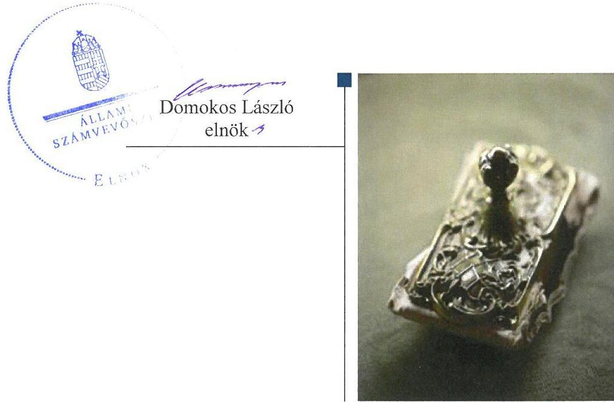
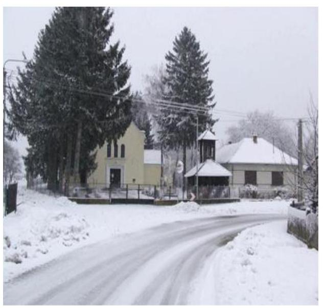
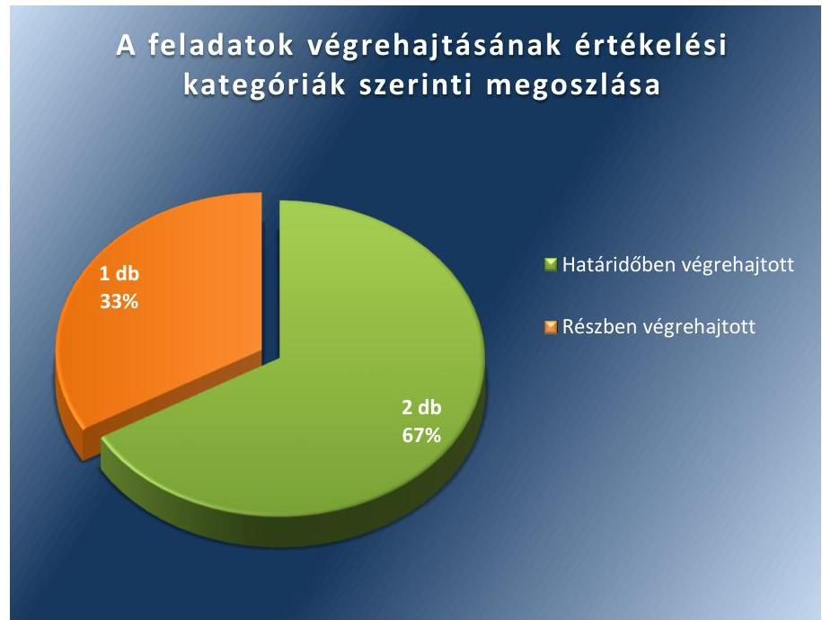

# Jelentés 

## Utóellenőrzések

Pusztaszentlászló Község Önkormányzata vagyongazdálkodása szabályszerűségének utóellenőrzése 2017.

---

# Jelenetés 

## Utóellenőrzések

Pusztaszentlászló Község Önkormányzata vagyongazdálkodása szabályszerűségének utóellenőrzése
2017. 0 h hó 3. nap

---

# AZ ELLENŐRZÉST FELÜGYELTE: 

DR. BENEDEK MÁRIA felügyeleti vezető

## AZ ELLENŐRZÉST VEZETTE ÉS A VÉGREHAJTÁSÁÉRT FELELŐS:

SZILÁGYI GÁBOR ANTAL ellenőrzésvezető

## A PROGRAM ÖSSZEÁLLÍTÁSÁÉRT FELELŐS:

JANIK JÓZSEF LÁSZLÓ osztályvezető

## A TÉMÁHOZ KAPCSOLÓDÓ KORÁBBI SZÁMVEVŐSZÉKI JELENTÉSEK:

- címe: Jelentés az önkormányzati vagyongazdálkodás szabályszerűségi ellenőrzéséről - Pusztaszentlászló
- sorszáma: 13070

IKTATÓSZÁM: V-1319-040/2016.
TÉMASZÁM: 2353
ELLENŐRZÉS-AZONOSÍTÓ SZÁM: V075578

---

# TARTALOMJEGYZÉK 

■ ÖSSZEGZÉS ..... 5
■ AZ ELLENŐRZÉS CÉLJA ..... 6
■ AZ ELLENŐRZÉS TERÜLETE ..... 7
■ AZ ELLENŐRZÉS HÁTTERE, INDOKOLTSÁGA ..... 8
■ A JELENTÉS LÉNYEGES KÉRDÉSKÖRE ..... 9
■ ELLENŐRZÉS HATÓKÖRE ÉS MÓDSZEREI ..... 10
■ MEGÁLLAPÍTÁSOK ..... 12
■ KÖVETKEZTETÉSEK ..... 14
■ MELLÉKLETEK ..... 15
I. Sz. melléklet: Az ÁSZ 13070. számú jelentéséhez kapcsolódó intézkedési terv végrehajtása ..... 15
■ FÜGGELÉK: ÉSZREVÉTELEK ..... 17
■ RÖVIDÍTÉSEK JEGYZÉKE ..... 19

---

.

---

# ÖSSZEGZÉS 

Az Állami Számvevőszék Pusztaszentlászló Község Önkormányzata vagyongazdálkodása szabályszerűségének utóellenőrzése megállapította, hogy az intézkedési tervben vállalt feladatok többségét végrehajtotta. A 2015. évre vonatkozó, fordulónappal történő leltározás elmaradása miatt, a vagyongazdálkodás szabályszerűsége és elszámoltathatósága, a közpénzekkel történő felelős gazdálkodás nem volt biztositott.

## Az ellenőrzés társadalmi indokoltsága

Az Állami Számvevőszék stratégiájában célul tűzte ki a számvevőszéki munka hasznosulásának javítását. Ezzel összhangban ellenőrzi, hogy az ellenőrzött szervezetek megvalósították-e a korábbi ellenőrzései által feltárt hibák, hiányosságok és szabálytalanságok megszüntetése céljából elkészített intézkedési terveikben foglaltakat. A rendszeres utóellenőrzések hozzájárulnak a szükséges intézkedések tényleges végrehajtáshoz, ezáltal a közpénzügyek rendezettségének javulásához, igazolják, hogy lezárult a következmények nélküli ellenőrzések időszaka.

## Főbb megállapítások, következtetések

Pusztaszentlászló Község Önkormányzatának polgármestere az intézkedési tervet megküldte az Állami Számvevőszék részére.

Az intézkedési tervben meghatározott három feladatból kettőt határidőben végrehajtott, megtörtént a földterületek értékének szabályszerűen kiállított bizonylattal - értékbecsléssel - történő alátámasztása, az ingatlanok elidegenítése előtt a forgalmi érték értékbecsléssel történő meghatározása. Egy feladatot részben hajtott végre, a 2013. és 2014. évekre vonatkozóan elvégezte a tárgyi eszközök mennyiségi felvétellel történő, kiértékelését is magában foglaló leltározást az eszközcsoport valódiságának jogszabályban előírtak szerinti alátámasztásához, azonban a 2015. évben nem gondoskodott a tárgyi eszközök leltározásának végrehajtásáról, aminek következtében nem valósult meg maradéktalanul a felelős vagyongazdálkodás.

Az intézkedési tervben rögzített feladatok végrehajtásáról nem vezette a jogszabályi előírásnak megfelelő nyilvántartást.

---

# AZ ELLENŐRZÉS CÉLJA 

Az ellenőrzés célja annak értékelése volt, hogy a számvevőszéki jelentésben ${ }^{1}$ foglalt intézkedést igénylő megállapításokkal és javaslatokkal összhangban készített intézkedési tervben meghatározott feladatokat az ellenőrzött szervezet végrehajtotta-e.

---

# **AZ ELLENŐRZÉS TERÜLETE**

## **Pusztaszentlászló Község Önkormányzata**

Pusztaszentlászló Község Zala megyében, a zalaegerszegi járásban, a Válicka patak völgyében fekszik. Lakosainak száma a KSH által közzétett népességi adatok szerint 2015. januárjában 575 fő volt.

A polgármester² a 2008. évi időközi önkormányzati választások óta (2008.08.24.) látja el feladatait. A jegyző³ személye az ellenőrzött időszakban három alkalommal változott, a jelenlegi jegyző 2015. október 15-től látja el feladatait.

Az Önkormányzat⁴ a 2015. évi költségvetési beszámolója szerint 93,8 M Ft költségvetési bevételt ért el és 74,1 M Ft költségvetési kiadást teljesített. 2015. december 31-én a könyvviteli mérleg szerinti követelések állományi értéke 0,4 M Ft, a kötelezettségek állományi értéke 1,2 M Ft volt. Az Önkormányzat nemzeti vagyonba tartozó befektetett eszközeinek állománya 788,2 M Ft, mérleg főösszege 807,2 M Ft volt.

Az Állami Számvevőszék 2013. évben ellenőrizte Pusztaszentlászló Község Önkormányzatánál az önkormányzati vagyongazdálkodás szabályszerűségét a 2007. január 1. és 2011. december 31. közötti időszak vonatkozásában. Az erről szóló 13070. számú jelentését az ÁSZ⁵ 2013. augusztus 29-én tette közzé. Az ellenőrzés célja annak értékelése volt, hogy a vagyongazdálkodási tevékenységet, annak szervezeti kereteit szabályozták-e, a vagyongazdálkodás törvényességét, szabályszerűségét biztosították-e a döntések előkészítése és végrehajtása során, jogszerű döntéseken alapult-e a vagyon értékének és összetételének változása, a belső ellenőrzés elősegítette-e a vagyongazdálkodás szabályszerű működését, valamint hasznosultak-e a korábbi külső ellenőrzések által tett javaslatok. Az ÁSZ jelentésben foglalt javaslatok végrehajtása érdekében az Önkormányzat Képviselő-testülete⁶ a 74/2013. (IX.10.) számú határozattal intézkedési tervet fogadott el.

Az utóellenőrzés – a 2013. augusztus 29. és 2016. december 3. között végrehajtott feladatokat figyelembe véve – az ÁSZ jelentésben a körjegyző részére megfogalmazott intézkedést igénylő megállapításokra és javaslatokra készített, ÁSZ részére megküldött intézkedési tervben foglalt feladatok megvalósításának ellenőrzésére, illetve értékelésére fókuszált.

---

# AZ ELLENŐRZÉS HÁTTERE, INDOKOLTSÁGA 

Az ÁSZ tv. ${ }^{7}$ 33. § (1) bekezdése értelmében a számvevőszéki jelentések intézkedést igénylő megállapításaihoz és javaslataihoz kapcsolódóan az ellenőrzött szervezet vezetője intézkedési tervet köteles összeállítani, és az ÁSZ részére megküldeni. Az intézkedési tervben foglaltak megvalósítását az ÁSZ tv. 33. § (7) bekezdésében foglaltak alapján - az ÁSZ utóellenőrzés keretében ellenőrizheti. Az intézkedések megvalósulásának értékelése során az ÁSZ figyelembe veszi az ellenőrzött szervezetek működési feltételeiben, valamint a jogszabályi előírásokban bekövetkezett változásokat.

Az intézkedési tervben foglalt feladatok hiányos, illetve késedelmes végrehajtása, valamint megvalósításának elmaradása azt mutatja, hogy az ellenőrzések során feltárt hibák, hiányosságok és szabálytalanságok megszüntetése nem kapott kellő hangsúlyt. Ez a szabályszerű működés és a felelős vezetői magatartás vonatkozásában kockázatot hordoz. E kockázatok feltárásával az ÁSZ utóellenőrzési rendszere fokozza a fegyelmet, és igazolja, hogy a közpénzzel való szabályos gazdálkodás felelőssége elől nem lehet kitérni.

Az utóellenőrzés négy szinten hasznosulhat:
$\longrightarrow$ A társadalom szintjén az utóellenőrzés jelzi, hogy a számvevőszéki ellenőrzés megállapításainak van következménye: a hiányosságok megszüntetésére az ellenőrzött szervezet által meghatározott intézkedések végrehajtását is számon kéri az ÁSZ.
$\longrightarrow$ Az ellenőrzött terület szintjén az utóellenőrzés tájékoztatást nyújt a terület döntéshozóinak a hiányosságok kiküszöbölésének jó gyakorlatairól, ezzel lehetőséget biztosítva arra, hogy az ÁSZ ellenőrzési megállapításai, javaslatai a terület nem ellenőrzött szervezeteinek a működése során is hasznosuljanak.
$\longrightarrow$ Az ellenőrzött szervezet szintjén az utóellenőrzés feltárja, hogy a szervezet az intézkedések végrehajtásával hasznosította-e a korábbi ellenőrzési jelentésben a hiányosságok megszüntetése, illetve a kockázatok kezelése érdekében megfogalmazott javaslatokat.
$\longrightarrow$ Az ÁSZ szintjén az utóellenőrzés visszacsatolást ad az ellenőrzési jelentések hasznosulásáról, az intézkedések elmaradása vagy részleges megvalósulása a további ellenőrzésekhez kockázati jelzésként szolgál.

---

# A JELENTÉS LÉNYEGES KÉRDÉSKÖRE 

Az Önkormányzat az intézkedési tervben foglaltakat az elöirt határidőben végrehajtotta-e?

---

# ELLENŐRZÉS HATÓKÖRE ÉS MÓDSZEREI 

## Az ellenőrzés típusa

Megfelelőségi ellenőrzés.

## Az ellenőrzött időszak

Az utóellenőrzés alapját képező ÁSZ jelentés közzétételének napjától (2013. augusztus 29.) az ellenőrzésről szóló kiértesítő levél keltének napjáig (2016. december 3.) tartó időszak.

## Az ellenőrzés tárgya

A számvevőszéki jelentésben foglalt intézkedést igénylő megállapításokkal és javaslatokkal összhangban - az Önkormányzat által - készített intézkedési tervben foglaltak végrehajtásának ellenőrzése.

Az ellenőrzés kiterjedt minden olyan körülményre és adatra, amely az ÁSZ jogszabályban meghatározott feladatainak teljesítéséhez, valamint a program végrehajtása folyamán felmerült újabb összefüggések feltárásához szükséges.

## Az ellenőrzött szervezet

Pusztaszentlászló Község Önkormányzata

## Az ellenőrzés jogalapja

Az Alaptörvény ${ }^{8}$ 43. cikk (1) bekezdése alapján az ÁSZ az Országgyűlés pénzügyi és gazdasági ellenőrző szerve. Az ÁSZ törvényben meghatározott feladatkörében ellenőrzi a központi költségvetés végrehajtását, az államháztartás gazdálkodását, az államháztartásból származó források felhasználását és a nemzeti vagyon kezelését.

Az ÁSZ tv. 1. § (3) bekezdése szerint az ÁSZ általános hatáskörrel végzi a közpénzekkel és az állami és önkormányzati vagyonnal való felelős gazdálkodás ellenőrzését.

Az ÁSZ tv. 33. § (7) bekezdése alapján a 33. § (1)-(2) bekezdése szerinti intézkedési tervben foglaltak megvalósítását az ÁSZ utóellenőrzés keretében ellenőrizheti.

---

# Az ellenőrzés módszerei 

Az ÁSZ az ellenőrzést a nemzetközi standardokat irányadónak tekintve az ellenőrzési program ellenőrzési kérdései, az ellenőrzött időszakban hatályos jogszabályok, az ellenőrzés szakmai szabályok és módszertanok figyelembevételével, önálló ellenőrzés keretében végezte.

Az ÁSZ az ellenőrzés ideje alatt az Önkormányzattal történő kapcsolattartást az ÁSZ SZMSZ²-ének vonatkozó előírásai alapján biztosította.

Az utóellenőrzés megállapításait elsősorban az ÁSZ rendelkezésére álló, valamint az ellenőrzött szervezetektől elektronikusan bekért dokumentumok alapozták meg.

Az ellenőrzési bizonyítékként felhasználható adatforrások közé tartoznak egyrészt a szakmai programban felsorolt adatforrások, másrészt minden - az ellenőrzés folyamán feltárt, az ellenőrzés szempontjából információt tartalmazó - dokumentum.

Az intézkedési tervben előírt feladatokat, azok végrehajthatósága, illetve végrehajtása szempontjából az alábbiak szerint értékelte az ÁSZ:
"határidőben végrehajtott" a feladat, ha a teljesítés dokumentáltan, az intézkedési tervben előírt határidőben és tartalommal megtörtént;
"határidőn túl végrehajtott" a feladat, ha annak teljesítése az intézkedési tervben meghatározott módon, de az előírt határidőn túl történt meg;
"részben végrehajtott" a feladat, ha végrehajtása teljes körűen az intézkedési tervben előírt módon nem történt meg;
"nem végrehajtott" a feladat, ha a végrehajtás nem történt meg, vagy amennyiben a teljesítést nem dokumentálták;
"okafogyottá vált" a feladat, ha végrehajtására - meghatározott esemény bekövetkezése, továbbá külső körülmény, a működést érintő feltétel változása miatt - már nincs szükség, illetve lehetőség, és egyértelműen megállapítható, hogy az intézkedést szükségessé tevő körülmény a jövőben nem fordulhat elő;
"nem időszerű" az a feladat, amelynek ellenőrzési időszakon belüli végrehajtására azért nem került (kerülhetett) sor, mert az intézkedés alapjául szolgáló esemény nem következett be, de annak jövőbeni előfordulása lehetséges, a végrehajtása nem volt esedékes, vagy a végrehajtás határideje még nem járt le.
Az ellenőrzés lefolytatásához az ellenőrzött szervezet a tanúsítványok elektronikus kitöltésével, valamint az ÁSZ által kért dokumentumok elektronikus megküldésével szolgáltatott adatokat, amelyek valódiságát és teljes körűségét az ellenőrzött szervezet vezetője által tett teljességi és hitelességi nyilatkozat igazolta. Az így rendelkezésre bocsátott adatok, információk kontrollja az ellenőrzés keretében történt.

---

# MEGÁLLAPÍTÁSOK 

## Az Önkormányzat az intézkedési tervben foglaltakat az előírt határidőben végrehajtotta-e?

Összegző megállapítás

Az Önkormányzat az intézkedési tervben meghatározott három feladatból kettőt határidőben, egyet részben hajtott végre. Az intézkedési tervben rögzített feladatok végrehajtásáról nem vezetett a jogszabályi előírásoknak megfelelő nyilvántartást.

Az ÁSZ a jelentésében a körjegyző részére három javaslatot fogalmazott meg. A Képviselő-testület által elfogadott és az ÁSZ részére a polgármester által megküldött intézkedési tervben a hiányosságok, szabálytalanságok megszüntetésére három feladatot határoztak meg, a feladatok végrehajtásának felelőseként két esetben a jegyzőt, egy esetben pedig a pénzügyigazdálkodási ügyintézőt jelölték meg.

Az intézkedési tervben meghatározott feladatokat, határidőket, felelősöket és a feladatok végrehajtását az I. számú melléklet mutatja be.

Az ÁSZ javaslatai alapján készített intézkedési tervben rögzített feladatok végrehajtásáról a jegyző nem vezette a Bkr. ${ }^{10}$ előírásainak megfelelő nyilvántartást.

Az Önkormányzat az intézkedési tervében meghatározott feladatok végrehajtásának értékelési kategóriák szerinti megoszlását az 1. ábra szemlélteti.

1. ábra

---

# HATÁRIDŐBEN VÉGREHAJTOTT feladatok: 

1. A jegyző intézkedett az Önkormányzat korábban érték nélkül nyilvántartott ingatlan vagyonát képező 46 db földterület 2010. évben megállapított értékeinek - a Számv. tv. ${ }^{11}$ előírása szerinti - szabályszerűen kiállított bizonylattal (értékbecsléssel) történő alátámasztásáról.
2. A jegyző intézkedett - a vagyongazdálkodási rendeletben ${ }^{12}$ előírtak szerinti - az ingatlanok elidegenítése előtt a vagyontárgyak forgalmi értékének értékbecsléssel történő meghatározásáról. Vagyonértékesítés esetében versenyeztetési eljárást nem kellett lefolytatni, mivel egy vagyonértékesítés történt, amelynek értékbecsléssel megállapított értéke nem érte el a vagyongazdálkodási rendeletben előírt 5,0 M Ft-os értékhatárt.

## RÉSZBEN VÉGREHAJTOTT feladat:

3. A jegyző a 2013. és 2014. évekre vonatkozóan - a leltározási szabályzata ${ }^{13}$ alapján - gondoskodott a tárgyi eszközök leltározásának mennyiségi felvétellel történő és a kiértékelést is magában foglaló végrehajtásáról. A jegyző azonban a Mötv. ${ }^{14}$ 81. § (3) bekezdés c) pontjában előírtak ellenére nem gondoskodott az Önkormányzat múködésével kapcsolatos feladatok ellátásáról, mivel a 2015. évre vonatkozóan a tárgyi eszközök leltározása - az Áhsz. ${ }^{15}$ 22. § (1)-(2) bekezdéseiben és a leltározási szabályzatban előírtak ellenére - nem történt meg.

---

# KÖVETKEZTETÉSEK 

A jegyző 2015. évben nem gondoskodott a tárgyi eszközök mennyiségi felvétellel történő, kiértékelését is magában foglaló leltározásáról, ami jelentős kockázatot jelent a vagyongazdálkodás szabályszerűsége és elszámoltathatósága szempontjából, így a végre nem hajtott feladat indokolja a feltárt hiányosság és szabálytalanság tekintetében a munkajogi felelősség tisztázására irányuló eljárás megindítását, és eredményének ismeretében a szükséges intézkedések megtételét.

---

# MELLÉKLETEK

- I. SZ. MELLÉKLET: AZ ÁSZ 13070. SZÁMÚ JELENTÉSÉHEZ KAPCSOLÓDÓ INTÉZKEDÉSI TERV VÉGREHAJTÁSA

|  1. | Intézkedési tervben meghatározott feladat | Az intézkedési tervben meghatározott határidő | Az intézkedési tervben meghatározott feladat felelőse | A feladat végrehajtása  |
| --- | --- | --- | --- | --- |
|   | 1. | 2. | 3. | 4.  |
|  Katáridőben végrehajtott feladat |  |  |  |   |
|  1. | A korábban érték nélkül nyilvántartott 46 földterület 2010-ben megállapított értékeinek a Számv. tv. 165. § (2) bekezdése szerinti szabályszerűen kiállított bizonylattal - értékbecslési dokumentummal - való alátámasztása. | 2013. december 31. | jegyző | A jegyző gondoskodott az Önkormányzat korábban érték nélkül nyilvántartott ingatlan vagyonát képező 46 db földterület 2010. évben megállapított értékeinek - a Számv. tv. 165. § (2) bekezdésében foglaltaknak megfelelően - szabályszerűen kiállított bizonylattal (értékbecsléssel) történő alátámasztásáról. Az analitikus nyilvántartásokban beazonosítható módon szerepeltek az értékbecslésben felsorolt ingatlanok, az értékbecslésben meghatározott értékkel.  |
|  2. | A vagyonértékesítés és vagyonhasznosítás esetében a vagyongazdálkodási rendeletben előírt versenyeztetési kötelezettség betartása, továbbá az ingatlanok elidegenítése előtt a vagyontárgyak forgalmi (piaci) értékének értékbecsléssel történő meghatározása. | Folyamatos a vagyonértékesítési és hasznosítási döntések előkészítése során | jegyző | Az Önkormányzatnál az ellenőrzött időszakban egy alkalommal került sor vagyonértékesítésre. Az értékesített ingatlanok értékbecslő által meghatározott forgalmi értéke (4,2 M Ft) nem haladta meg az 5,0 M Ft-ot, ezért a vagyongazdálkodási rendelet 12. § (14) bekezdésben foglaltak szerint versenyeztetési eljárást nem kellett lefolytatni. Az ingatlanok forgalmi értékének megállapítása - a vagyongazdálkodási rendelet 13. § (5) bekezdés a) pontjában rögzítettek szerint - független ingatlanforgalmi értékbecslő által meghatározott, hat hónapnál nem régebbi forgalmi értékbecslés alapján történt. Új vagyon hasznosítás nem történt.  |
|  Részben végrehajtott feladat |  |  |  |   |
|  3. | A tárgyi eszközök leltározásának az Áhsz. ${ }_{1}$ 37. § (3) bekezdésében és a leltározási szabályzatban foglalt előírásoknak megfelelően mennyiségi felvétellel történő és a kiértékelést is magában foglaló végrehajtása, az eszközcsoport valódiságának az Áhsz. ${ }_{1}$ 37. § (2) bekezdésének megfelelő alátámasztása. | 2013. december 31-i fordulónappal történő leltárkészítés, illetve folyamatos a további években készítendő leltározások során a mindenkor hatályos vonatkozó jogszabályi előírások szerint. | pénzügyi-gazdasági ügyintéző | A jegyző a 2013. és 2014. évekre vonatkozóan - az Áhsz. ${ }_{1}{ }^{16} 37 . \S$ (3) bekezdésében, az Áhsz. ${ }_{2}$ 22. § (2) bekezdésében és a leltározási szabályzat 2.3. A) pontjában foglaltaknak megfelelően - gondoskodott a tárgyi eszközök mennyiségi leltárfelvételéről és a leltárak kiértékeléséről. A jegyző azonban 2015. évre vonatkozóan nem gondoskodott az Önkormányzatnál a tárgyi eszközök leltárral történő alátámasztásról az Áhsz. ${ }_{2}$ 22. § (1) bekezdésében és a leltározási szabályzat 2.3. A) pontjában foglalt előírások ellenére.  |

---

.

---

# FÜGGELÉK: ÉSZREVÉTELEK 

A jelentéstervezetet a Számvevőszék 15 napos észrevételezésre megküldte az ellenőrzött szervezet vezetőjének az ÁSZ tv. 29. §* (1) bekezdése előírásának megfelelően.
Az ellenőrzött szervezet vezetője az ÁSZ tv. 29. § (2) bekezdésében foglalt észrevételezési jogával nem élt, a jelentéstervezetre észrevételt nem tett.

[^0]
[^0]:    * 29. § (1) Az Állami Számvevőszék az ellenőrzési megállapításait megküldi az ellenőrzött szervezet vezetőjének vagy az általa megbízott személynek, és annak, akinek személyes felelősségét állapította meg.
    (2) Az ellenőrzött szervezet vezetője és a felelősként megjelölt személy az ellenőrzés megállapításaira tizenöt napon belül írásban észrevételt tehet.
    (3) Az Állami Számvevőszék az észrevételre a beérkezésétől számított harminc napon belül írásban válaszol. A figyelembe nem vett észrevételeket köteles a jelentésben feltüntetni, és megindokolni, hogy azokat miért nem fogadta el.

---

.

---

# RÖVIDÍTÉSEK JEGYZÉKE 

${ }^{1}$ számvevőszéki jelentés
${ }^{2}$ polgármester
${ }^{3}$ jegyző
${ }^{4}$ Önkormányzat
${ }^{5}$ ÁSZ
${ }^{6}$ Képviselő-testület
${ }^{7}$ ÁSZ tv.
${ }^{8}$ Alaptörvény
${ }^{9}$ SZMSZ
${ }^{10}$ Bkr.
${ }^{11}$ Számv. tv.
${ }^{12}$ vagyongazdálkodási rendelet
${ }^{13}$ leltározási szabályzat
${ }^{14}$ Mötv.
${ }^{15}$ Áhsz. 2
${ }^{16}$ Áhsz. 1

Az ÁSZ 13070. számú jelentése - Jelentés az önkormányzati vagyongazdálkodás szabályszerűségi ellenőrzéséről - Pusztaszentlászló (elérhető a www.asz.hu honlapon)
Pusztaszentlászló Község Önkormányzatának polgármestere
Söjtöri Közös Önkormányzati Hivatal jegyzője
Pusztaszentlászló Község Önkormányzata
Állami Számvevőszék
Pusztaszentlászló Község Önkormányzatának Képviselő-testülete
2011. évi LXVI. törvény az Állami Számvevőszékről (hatályos: 2011. július 1-jétől)

Magyarország Alaptörvénye, kihirdetve 2011. április 25-én
Az Állami Számvevőszék elnökének 3/2016. (XII.29.) ÁSZ utasítása az Állami
Számvevőszék Szervezeti és Működési Szabályzatáról (hatályos: 2017. január 1-jétől)
370/2011. (XII.31.) Korm. rendelet a költségvetési szervek belső
kontrollrendszeréről és belső ellenőrzéséről (hatályos: 2012. január 1-jétől)
2000. évi C. törvény a számvitelről (hatályos 2001. január 1-jétől

Pusztaszentlászló Község Önkormányzata Képviselő-testületének
5/2013. (V.29.) önkormányzati rendelete az Önkormányzat vagyonáról és a vagyongazdálkodás szabályairól szóló 7/2008. (VIII.22.) önkormányzati rendelet módosításáról (hatályos: 2013. május 30-tól 2014. május 30-ig)
Söjtör-Pusztaszentlászló Körjegyzőség leltárkészítési és leltározási szabályzata (hatályos 2007. szeptember 1-jétől - 2016. június 1-jéig)
2011. évi CLXXXIX. törvény Magyarország helyi önkormányzatairól (hatályos 2012. január 1-jétől)

4/2013. (I. 11.) Kormány rendelet az államháztartás számviteléről (hatályos 2014. január 1-jétől)
249/2000. (XII.24.) Kormány rendelet az államháztartás szervezetei beszámolási és könyvvezetési kötelezettségének sajátosságairól (hatályos 2001. január 1-jétől - 2013. december 31-ig)

---

# ÁLLAMI SZÁMVEVŐSZÉK 

1052 Budapest, Apáczai Csere János utca 10.
Levélcím: 1364 Budapest 4. Pf. 54
Telefon: +36 14849100 Telefax: +36 14849200
www.asz.hu