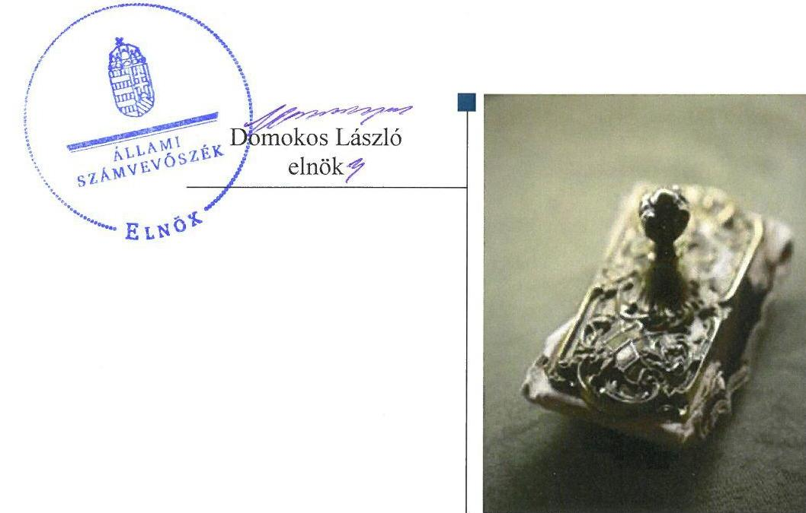
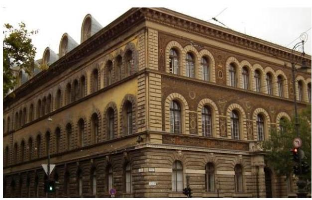
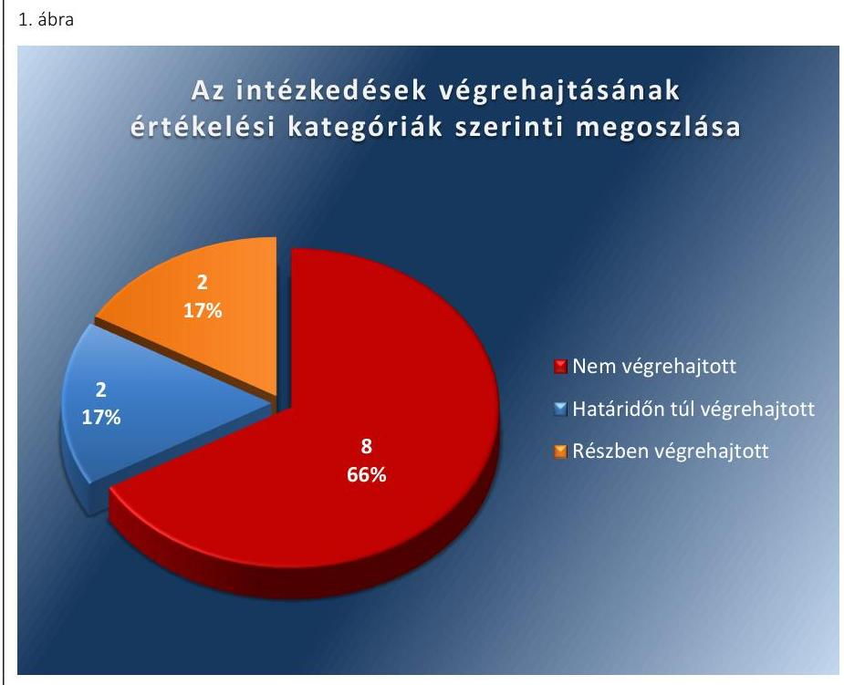
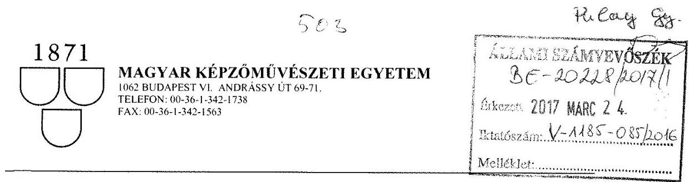
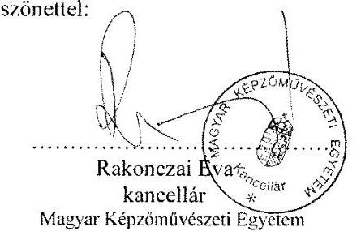
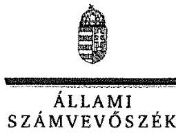

# Jelentés 

## Utóellenőrzések

Az állami felsőoktatási intézmények gazdálkodásának, működésének ellenőrzéséről készült jelentések utóellenőrzése - Magyar Képzőművészeti Egyetem
2017.

---

# J elentés 

## Utóellenőrzések

Az állami felsőoktatási intézmények gazdálkodásának, múködésének ellenőrzéséről készült jelentések utóellenőrzése - Magyar Képzőmúvészeti Egyetem
2017. O5. hó 02. nap

---

# AZ ELLENŐRZÉST FELÜGYELTE: 

DR. PULAY GYULA felügyeleti vezető

## AZ ELLENŐRZÉST VEZETTE ÉS A VÉGREHAJTÁSÁÉRT FELELŐS:

RÁCZKEVI KATALIN ellenőrzésvezető

## A PROGRAM ÖSSZEÁLLÍTÁSÁÉRT FELELŐS:

JANIK JÓZSEF osztályvezető

## A TÉMÁHOZ KAPCSOLÓDÓ KORÁBBI SZÁMVEVŐSZÉKI JELENTÉSEK:

- címe: Jelentés a Magyar Képzőművészeti Egyetem ellenőrzéséről - Az állami felsőoktatási intézmények gazdálkodásának, működésének ellenőrzése
- sorszáma: 14199

IKTATÓSZÁM: V-1185-091/2016.
TÉMASZÁM: 2219
ELLENŐRZÉS-AZONOSÍTÓ SZÁM: V075531

---

# TARTALOMJEGYZÉK 

■ ÖSSZEGZÉS ..... 5
■ AZ ELLENŐRZÉS CÉLJA ..... 6
■ AZ ELLENŐRZÉS TERÜLETE ..... 7
■ AZ ELLENŐRZÉS HÁTTERE, INDOKOLTSÁGA ..... 8
■ A JELENTÉS LÉNYEGES KÉRDÉSKÖRE ..... 9
■ ELLENŐRZÉS HATÓKÖRE ÉS MÓDSZEREI ..... 10
■ MEGÁLLAPÍTÁSOK ..... 13
■ MELLÉKLETEK ..... 17
I. Sz. melléklet: Az ÁSZ 14199. számú jelentéséhez kapcsolódó Egyetem intézkedési terv végrehajtása ..... 17
II. Sz. melléklet: Az ÁSZ 14199. számú jelentéséhez kapcsolódó EMMI intézkedési terv végrehajtása ..... 22
■ FÜGGELÉK: ÉSZREVÉTELEK ..... 23
■ RÖVIDÍTÉSEK JEGYZÉKE ..... 35

---

.

---

# ÖSSZEGZÉS 

Az utóellenőrzés megállapította, hogy a korábbi számvevőszéki jelentés javaslatai alapján az Egyetem rektora és kancellárja által meghatározott intézkedési tervben szereplő tizenkettő feladat többségét nem hajtották végre. Az Egyetem belső kontrollrendszerének kialakítása és müködtetése, a pénzügyi gazdálkodás, a vagyongazdálkodás terén az ÁSZ által korábban azonosított hiányosságok többsége továbbra is fennáll. A jelentős szabályozási hiányosságok súlyos veszélyt jelentenek az Egyetemre bízott közpénzek szabályos felhasználása és a közvagyon megőrzése szempontjából. Az Emberi Erőforrások Minisztériuma mint a fenntartói jogkör gyakorlója - az intézkedési tervében foglalt feladatot végrehajtotta.

## Az ellenőrzés társadalmi indokoltsága

Az ÁSZ ${ }^{1}$ stratégiájában célul tűzte ki a számvevőszéki munka hasznosulásának javítását. Ezzel összhangban ellenőrzi, hogy az ellenőrzött szervezetek megvalósították-e a korábbi ellenőrzései által feltárt hibák, hiányosságok és szabálytalanságok megszüntetése céljából elkészített intézkedési terveikben foglaltakat. A rendszeres utóellenőrzések hozzájárulnak a szükséges intézkedések tényleges végrehajtáshoz, ezáltal a közpénzügyek rendezettségének javulásához.

## Főbb megállapítások, következtetések

Az Egyetem az intézkedési tervét egy alkalommal kiegészítette, melyet az ÁSZ elfogadott.
Az Egyetem az intézkedési tervében meghatározott 12 feladatból kettő feladatot határidőn túl, kettő feladatot részben, nyolc feladatot nem hajtott végre. Az Egyetem az intézkedési tervben vállalt feladatokra vonatkozó határidőket saját hatáskörben jelentős mértékben módosította. Az eredetileg vállalt határidők későbbre halasztása a szervezet szabályos működésének helyreállítása szempontjából súlyos kockázatot jelentett. Az Egyetem a határidők módosításáról az ÁSZ-t nem értesítette. Az ellenőrzés az intézkedési tervben foglalt feladatok végrehajtását az eredeti határidőkhöz viszonyítva értékelte.

A kancellár intézkedett a belső ellenőr kinevezéséről.
Az Egyetem működését és gazdálkodását meghatározó szabályzatok jelentős részének a kancellári rendszer bevezetésével összefüggő aktualizálást nem végezték el. Az Egyetem gazdálkodásának szempontjából fontos szabályzatok aktualizálására még nem került sor.

Az oktatási és az egyéb tevékenységek költségeinek elkülönítése érdekében az önköltség-számítási szabályzatot nem aktualizálták, a számviteli politika kiegészítése nem történt meg. A hallgatói követelések kimutatásának szabályszerűségére irányuló soron kívüli ellenőrzést nem rendelték el.

A kancellár nem intézkedett az intézmény valamennyi működési folyamatának felülvizsgálata, valamint a vezetői információs rendszer továbbfejlesztése érdekében.

A 2015. évi vagyongazdálkodási tervet nem készítették el, a 2016. évi vagyongazdálkodási tervet a Szenátus nem fogadta el, a fenntartó egyetértésével nem rendelkeztek.

Az Egyetem az intézkedési tervben rögzített feladatok végrehajtásáról a Bkr. előírásainak megfelelő nyilvántartást hiányosságokkal vezette.

Az EMMI az intézkedési tervében meghatározott feladatot végrehajtotta.

---

# AZ ELLENŐRZÉS CÉLJA 

Az ellenőrzés célja annak értékelése volt, hogy a számvevőszéki jelentésben foglalt intézkedést igénylő megállapításokkal és javaslatokkal összhangban készített intézkedési tervben meghatározott feladatokat az ellenőrzött szervezetek végrehajtották-e.

---

# **AZ ELLENŐRZÉS TERÜLETE**

## **Magyar Képzőművészeti Egyetem**

A Magyar Képzőművészeti Egyetem jogelődje az 1871-ben miniszteri rendelettel létesített Országos Magyar Királyi Mintarajztanoda és Rajztanárképezde. Többszöri átszervezés után 1908-tól a Magyar Királyi Képzőművészeti Főiskola nevet viselte az intézmény. 1971-ben egyetemi főiskolának, majd 1986-ben egyetemnek nyilvánították. Jelenlegi nevén 2000. január 1. napjától működik az Egyetem². Képzési kínálatában képzőművész képzés, tanárképzés és restaurátor-művész képzés szerepel.

Az utóellenőrzéssel érintett időszak alatt a rektor³ személye változott. A jelenleg hivatalban lévő rektor tisztségét 2016. február 22. óta tölti be, a kancellár⁴ 2014. november 15-ével látja el feladatait.

Az Egyetem 2015. évi költségvetési beszámolója szerint 1794,4 millió Ft költségvetési bevételt, 164,3 millió Ft finanszírozási bevételt ért el, valamint 1785,5 millió Ft költségvetési kiadást teljesített. A 2015. december 31-i könyvviteli mérleg szerint az Egyetem eszközei 1387,7 millió Ft-ot tettek ki.

Az Egyetem gazdálkodásának és működésének ellenőrzését az ÁSZ a 2009-2012. közötti időszakra végezte el, az erről szóló 14199. számú jelentést 2014. augusztus 7-én tette közzé. Az ellenőrzés célja annak értékelése volt, hogy szabályos volt-e az Egyetem pénzügyi és vagyongazdálkodása, biztosított volt-e a vagyonnal való szabályszerű gazdálkodás követelményének érvényesülése, a jogszabályi előírásoknak megfelelően működötte a belső kontrollrendszer, az irányító szerv tevékenysége a jogszabályoknak megfelelő volt-e.

Az Emberi Erőforrások Minisztériuma az állami felsőoktatási intézmények, így az Egyetem fenntartói jogkörének gyakorlója.

Az utóellenőrzés az ÁSZ jelentésben a rektor és a miniszter⁵ részére megfogalmazott intézkedést igénylő megállapításokra és javaslatokra készített, az ÁSZ részére megküldött intézkedési tervben foglalt feladatok megvalósításának ellenőrzésére, illetve értékelésére fókuszált.

---

# AZ ELLENŐRZÉS HÁTTERE, INDOKOLTSÁGA 

Az ÁSZ tv6. 33. § (1) bekezdése értelmében a számvevőszéki jelentések intézkedést igénylő megállapításaihoz és javaslataihoz kapcsolódóan az ellenőrzött szervezet vezetője intézkedési tervet köteles összeállítani, és az ÁSZ részére megküldeni. Az intézkedési tervben foglaltak megvalósítását az ÁSZ tv. 33. § (7) bekezdésében foglaltak alapján - az ÁSZ utóellenőrzés keretében ellenőrizheti. Az intézkedések megvalósulásának értékelése során az ÁSZ figyelembe veszi az ellenőrzött szervezetek működési feltételeiben, valamint a jogszabályi előírásokban bekövetkezett változásokat.

Az intézkedési tervekben foglalt feladatok hiányos, illetve késedelmes végrehajtása, valamint megvalósításának elmaradása azt mutatja, hogy az ellenőrzések során feltárt hibák, hiányosságok és szabálytalanságok megszüntetése nem kapott kellő hangsúlyt. Ez a szabályszerű működés és a felelős vezetői magatartás vonatkozásában kockázatot hordoz. E kockázatok feltárásával az ÁSZ utóellenőrzési rendszere fokozza a fegyelmet, és igazolja, hogy a közpénzzel való szabályos gazdálkodás felelőssége elől nem lehet kitérni.

## AZ UTÓELLENŐRZÉS VÁRHATÓ HASZNOSULÁSA

Az utóellenőrzés négy szinten hasznosulhat:
$\longrightarrow$ A társadalom szintjén az utóellenőrzés jelzi, hogy a számvevőszéki ellenőrzés megállapításainak van következménye: a hiányosságok megszüntetésére az ellenőrzött szervezet által meghatározott intézkedések végrehajtását is számon kéri az ÁSZ.
$\longrightarrow$ Az ellenőrzött terület szintjén az utóellenőrzés tájékoztatást nyújt a terület döntéshozóinak a hiányosságok kiküszöbölésének jó gyakorlatairól, ezzel lehetőséget biztosítva arra, hogy az ÁSZ ellenőrzési megállapításai, javaslatai a terület nem ellenőrzött szervezeteinek a működése során is hasznosuljanak.
$\longrightarrow$ Az ellenőrzött szervezet szintjén az utóellenőrzés feltárja, hogy a szervezet az intézkedések végrehajtásával hasznosította-e a korábbi ellenőrzési jelentésben a hiányosságok megszüntetése, illetve a kockázatok kezelése érdekében megfogalmazott javaslatokat.
$\longrightarrow$ Az ÁSZ szintjén az utóellenőrzés visszacsatolást ad az ellenőrzési jelentések hasznosulásáról, az intézkedések elmaradása vagy részleges megvalósulása a további ellenőrzésekhez kockázati jelzésként szolgál.

---

# A JELENTÉS LÉNYEGES KÉRDÉSKÖRE 

1. Az ellenőrzött szervezetek az intézkedési tervben foglaltakat az előirt határidőben végrehajtották-e?

---

# ELLENŐRZÉS HATÓKÖRE ÉS MÓDSZEREI 

## Az ellenőrzés típusa

Megfelelőségi ellenőrzés.

## Az ellenőrzött időszak

Az utóellenőrzés alapját képező ÁSZ jelentés közzétételének napjától (2014. augusztus 07.) az ellenőrzésről szóló kiértesítő levél keltének napjáig (2016. október 10.) tartó időszak.

## Az ellenőrzés tárgya

A számvevőszéki jelentésben foglalt intézkedést igénylő megállapításokkal és javaslatokkal összhangban - az Egyetem és az EMMI ${ }^{7}$ által - készített intézkedési tervben foglaltak végrehajtásának ellenőrzése.

Az ellenőrzés kiterjed minden olyan körülményre és adatra, amely az ÁSZ jogszabályban meghatározott feladatainak teljesítéséhez, valamint a program végrehajtása folyamán felmerült újabb összefüggések feltárásához szükséges.

## Az ellenőrzött szervezet

Magyar Képzőművészeti Egyetem és Emberi Erőforrások Minisztériuma

## Az ellenőrzés jogalapja

Az ÁSZ az Országgyűlés pénzügyi és gazdasági ellenőrző szerve. Az ÁSZ törvényben meghatározott feladatkörében ellenőrzi a központi költségvetés végrehajtását, az államháztartás gazdálkodását, az államháztartásból származó források felhasználását és a nemzeti vagyon kezelését.

Az ÁSZ tv. 1. § (3) bekezdése szerint az ÁSZ általános hatáskörrel végzi a közpénzekkel és az állami és önkormányzati vagyonnal való felelős gazdálkodás ellenőrzését.

Az ÁSZ tv. 33. § (7) bekezdése alapján az ÁSZ tv. 33. § (1)-(2) bekezdése szerinti intézkedési tervben foglaltak megvalósítását az ÁSZ utóellenőrzés keretében ellenőrizheti.

---

# Az ellenőrzés módszerei 

Az ÁSZ az utóellenőrzést a nemzetközi standardokat irányadónak tekintve az ellenőrzési program ellenőrzési kérdései, az ellenőrzött időszakban hatályos jogszabályok, az ellenőrzés szakmai szabályok és módszertanok figyelembevételével, önállóan végezte.

Az ÁSZ az ellenőrzés ideje alatt az Egyetemmel és az EMMI-vel történő kapcsolattartást az ÁSZ SZMSZ ${ }^{8}$-ének vonatkozó előírásai alapján biztosította.

Az utóellenőrzés megállapításait elsősorban az ÁSZ rendelkezésére álló, valamint az ellenőrzött szervezetektől elektronikusan bekért dokumentumok alapozták meg.

Az ellenőrzési bizonyítékként felhasználható adatforrások közé tartoznak egyrészt a szakmai programban felsorolt adatforrások, másrészt minden - az ellenőrzés folyamán feltárt, az ellenőrzés szempontjából információt tartalmazó - dokumentum.

Az intézkedési tervben foglalt feladatok végrehajtását a díjbevételek és a kiadások állományából mintavétellel kiválasztott tétel alapján értékelte az ÁSZ. A kiválasztott tételek esetében azt ellenőrizte, hogy az Egyetem az intézkedési tervben meghatározott feladatok végrehajtása során biztosí-totta-e a jogszabályok és a belső szabályzatok előírásainak megfelelő működtetést.

Az intézkedési tervekben előírt feladatokat, azok végrehajthatósága, illetve végrehajtása szempontjából az alábbiak szerint értékelte az ÁSZ:
"határidőben végrehajtott" a feladat, ha a teljesítés dokumentáltan, az intézkedési tervben előírt határidőben és tartalommal megtörtént;
"határidőn túl végrehajtott" a feladat, ha annak teljesítése az intézkedési tervben meghatározott módon, de az előírt határidőn túl történt meg;
"részben végrehajtott" a feladat, ha végrehajtása teljes körűen az intézkedési tervben előírt módon nem történt meg;
"nem végrehajtott" a feladat, ha a végrehajtás nem történt meg, vagy amennyiben a teljesítést nem dokumentálták;
"okafogyottá vált" a feladat, ha végrehajtására - meghatározott esemény bekövetkezése, továbbá külső körülmény, a működést érintő feltétel változása miatt - már nincs szükség, illetve lehetőség, és egyértelműen megállapítható, hogy az intézkedést szükségessé tevő körülmény a jövőben nem fordulhat elő;
"nem időszerű" az a feladat, amelynek ellenőrzési időszakon belüli végrehajtására azért nem került (kerülhetett) sor, mert az intézkedés alapjául szolgáló esemény nem következett be, de annak jövőbeni előfordulása lehetséges, a végrehajtása nem volt esedékes, vagy a végrehajtás határideje még nem járt le.
Az utóellenőrzés lefolytatásához az ellenőrzött szervezetek a tanúsítványok elektronikus kitöltésével, valamint az ÁSZ által kért dokumentumok elektronikus megküldésével szolgáltattak adatokat, amelyek valódiságát és

---

teljes körűségét az ellenőrzött szervezet vezetője által tett teljességi és hitelességi nyilatkozat igazolta. Az így rendelkezésre bocsátott adatok, információk kontrollja az ellenőrzés keretében történt.

---

# 1. Az ellenőrzött szervezetek az intézkedési tervben foglaltakat az előírt határidőben végrehajtották-e? 

Összegző megállapítás

Az Egyetem az intézkedési tervben meghatározott 12 feladatból kettő feladatot határidőn túl, kettő feladatot részben, nyolc feladatot nem hajtott végre. Az intézkedési tervben rögzített feladatok végrehajtásáról a $\mathrm{Bkr}^{9}$. előírásainak megfelelő nyilvántartást hiányosságokkal vezették. Az EMMI az intézkedési tervben meghatározott egy feladatot határidőben végrehajtotta.

Az ÁSZ a jelentésében a rektor részére három, a miniszter részére egy javaslatot fogalmazott meg.

Az Egyetem által összeállított és az ÁSZ részére megküldött intézkedési tervben a hiányosságok, szabálytalanságok megszüntetésére 12 feladatot határoztak meg. A feladatok elvégzésének felelőseit megjelölték. Az intézkedési tervet egy alkalommal kiegészítették. Az Egyetem az intézkedési tervben vállalt feladatokra vonatkozó határidőket saját hatáskörben módosította.

A feladat végrehajtására vállalt határidő módosítása az intézmény szabályos múködését veszélyeztető kockázatot jelentett a szabályozottság, a kontrolltevékenységek, a vagyongazdálkodás területén.

A határidők módosításáról a kancellár az ÁSZ elnökét nem tájékoztatta.
A feladatok elvégzésének felelőseit megjelölték.
Az EMMI által összeállított és az ÁSZ részére megküldött intézkedési tervben a miniszter egy feladatot határozott meg.

Az ÁSZ javaslatai alapján készített intézkedési tervben rögzített feladatok végrehajtásáról az Egyetem a Bkr. előírásainak megfelelő nyilvántartást hiányosságokkal vezette.

Az intézkedési tervben meghatározott feladatokat, határidőket, a feladatok végrehajtásáért felelős személyt és a feladatok végrehajtását az I. és a II. számú melléklet mutatja be.

Az Egyetem intézkedési tervében tervezett feladatok végrehajtásának értékelési kategóriák szerinti megoszlását az 1. ábra szemlélteti.

---

*Forrás: ÁSZ*

# HATÁRIDŐN TÚL VÉGREHAJTOTT feladatok:

- A kancellár az intézkedési tervben meghatározott határidőn túl intézkedett a belső ellenőr kinevezéséről, az Nftv.10 előírásának megfelelően, 2016. február 1-jén szerződést kötöttek a belső ellenőrrel. A kancellár az intézkedési tervben vállalt 2015. május 31-i határidőn túl, 2016. július 29-én intézkedett a hiányosságos felszámolását célzó intézkedési terv elkészítésről és jóváhagyásáról.
- A kancellár az Nftv. 13/A. § (2) e) pontjában meghatározott munkáltatói jogkörében eljárva intézkedett az ÁSZ ellenőrzés során feltárt közbeszerzési szabálytalansághoz kapcsolódó munkajogi felelősség kivizsgálására irányuló eljárás megindítására. A témát érintő belső ellenőrzés lefolytatását követően 2015. szeptember 22-án kelt belső ellenőrzési jelentés készült, amely a volt gazdasági főigazgató személyes felelősségét állapította meg.

# RÉSZBEN VÉGREHAJTOTT feladatok:

Az Egyetem az intézkedési tervben vállalt határidőn túl intézkedett egyes szabályzatainak és dokumentumainak felülvizsgálatáról. Elkészült a Szervezeti és működési rend, a Szenátus Ügyrendje, a Foglalkoztatási szabályzat, a hallgatói követelményrendszerhez kapcsolódó szabályzatok, Habilitációs Szabályzat, a Doktori képzésről és a doktori fokozat (DLA) megszerzéséről szóló szabályzat, a Könyvtár, Levéltár és Művészeti gyűjtemények ügyrendje, a Demonstrátori szabályzat, az Adatvédelmi szabályzat, az Iratkezelési szabályzat, Kollégiumi szabályzat, HÖK11 Alapszabály. Nem történt intézkedés a Minőségirányítási szabályzat, a Közalkalmazotti szabályzat, a Munkavédelmi szabályzat, a Tűzvédelmi szabályzat, a Minőségfejlesztési program elkészítéséről, valamint az Egyetem gazdálkodási szabályzatainak felülvizsgálata és aktualizálása érdekében.

---

- A kancellár az intézkedési tervben vállalt határidőn túl intézkedett a kancellári rendszer bevezetésével összefüggésben az Egyetem egyes szabályzatainak felülvizsgálatáról. Elkészült a Közbeszerzési szabályzat, valamint a kancellár kiadta az 1/2016. számú - A vezetékes és mobiltelefonok és mobil internet használatának rendjéről- és a 2/2016. számú - a Vagyonnyilatkozat tételről szóló -utasítást. Az Egyetem gazdálkodási és pénzügyi vonatkozású szabályzatainak elkészítéséről, valamint a Belső kontrollrendszerek és Belső ellenőri szabályzat elkészítéséről és Szenátus által történő elfogadásáról a kancellár nem intézkedett.

NEM VÉGREHAJTOTT feladatok:

- Az Egyetem nem intézkedett az intézmény valamennyi múködési folyamatának felülvizsgálata, valamint a vezeti információs rendszer továbbfejlesztése érdekében.
- Az Egyetem nem rendelkezett a kontrolltevékenységek múködtetése érdekében a jogszabályokban foglaltaknak megfelelően aktualizált, a szenátus által jóváhagyott Kötelezettségvállalási szabályzattal, valamint Gazdálkodási szabályzattal. Az ellenőrzés rendelkezésére bocsátott dokumentumok alapján a kontrolltevékenységek múködtetésének ellenőrzése a szabályzatok hiányában nem volt értékelhető.
- Az Egyetem nem intézkedett az oktatási és az egyéb tevékenységek költségeinek az Áhsz. ${ }^{12}$. 50. § (5) bekezdésében előírtak szerinti elkülönítése érdekében. Nem történt intézkedés az önköltségszámítás belső rendjére vonatkozó szabályozás kiegészítése, a térítési díjak és a költségtérítés önköltségszámítással történő megalapozása érdekében. A számviteli politika kiegészítése a költségek elkülönítésére vonatkozó szabályozásra való tekintettel nem történt meg.
- Az Egyetem hatályos önköltség-számítási szabályzattal nem rendelkezett a díjtételek teljes körére vonatkozóan, valamint szabályozás hiányában az képzésekre elkészített önköltség kalkulációs séma megfelelősége nem ellenőrizhető.
- 2015. évre vagyongazdálkodási tervet nem készítettek. A 2016. évi vagyongazdálkodási tervet az intézkedési tervben vállalt határidőn túl, 2016. június 20-án elkészítették, melyet a fenntartó véleményét figyelembe véve módosítottak. Az Egyetem vagyongazdálkodási tervvel nem rendelkezett, mely nem felel meg az Nftv. 12. § (3) bekezdés gb) pontban foglaltaknak.
- Az Egyetem nem intézkedett a hallgatói követelések kimutatásának szabályszerűségére irányuló soron kívüli ellenőrzés elrendeléséről. A követelések vonatkozásában a tartozásállomány 2014. október 31-i fordulónappal történő leltározását nem végezték el. A hallgatói követelések állományát 2016. október 31-i időpontra vonatkozóan mutatták ki, az egyéb vevőkkel szembeni követelések vonatkozásában leltározást, valamint a partnerrel történő egyeztetést nem végeztek.
- Az Egyetem nem intézkedett a hallgatói tartozásoknak a hallgatói juttatások és kötelezettségek elszámolási szabályzat szerinti behajtása érdekében.

---

$\longrightarrow$ Az Egyetem nem intézkedett az eszközök bérbeadással történő hasznosítása során az Ávr. ${ }^{13} 50 . \S$ (1a) bekezdésének megfelelő átláthatóság követelményének érvényesítése érdekében.

# EMMI HATÁRIDŐBEN VÉGREHAJTOTT feladat: 

$\longrightarrow$ A miniszter az Nftv.-ben meghatározott munkáltatói jogkörében eljárva intézkedett a közbeszerzési szabálytalanságokhoz kapcsolódó munkajogi felelősséggel kapcsolatos körülmények kivizsgálására irányuló eljárás megindítása lehetőségének kivizsgálásáról.

---

# MELLÉKLETEK

- I. SZ. MELLÉKLET: AZ ÁSZ 14199. SZÁMÚ JELENTÉSÉHEZ KAPCSOLÓDÓ EGYETEM INTÉZKEDÉSI TERV VÉGREHAJTÁSA

|  Sorszám | Az intézkedési tervben rögzített feladat
1. | Az intézkedési tervben meghatározott határidő
2. | A feladatok elvégzésének felelőse
3. | A feladat végrehajtása
4.  |
| --- | --- | --- | --- | --- |
|  1. | "1/C. A kontrollkörnyezet, a kockázatkezelési rendszer, a kontrolltevékenységek, az információs, a kommunikációs és a monitoring rendszer hiányosságainak megszüntetése szükségessé teszi egy, az intézményi belső kontroll kialakításában és müködtetésében tapasztalt belső ellenőr alkalmazását." „Elkészült a hiányosságok felszámolását célzó intézkedési terv." | 2015. április 30. az intézkedési terv vonatkozásában: 2015. május 31. | kancellár | Az Egyetem 2013. december hónaptól nem rendelkezett belső ellenőrrel. A pályázat alapján kiválasztott 2015. augusztus 3-ától müködő belső ellenőr november 11-én - próbaidő alatt - megszüntette jogviszonyát, ezért az Egyetem a fenntartó EMMI Nftv. 75. § (4) bekezdés b) pontja szerinti egyetértése mellett megbízási szerződéssel foglalkoztatott belső ellenőrzési vezetőt. Az Nftv. hivatkozott előírásának megfelelően a Kancellár által 2016. február 1-jén aláírt szerződés alapján a megbízott a tevékenységét a 2016. január 1-től, majd 2016. április 01-től kinevezéssel látta el feladatát.
A kancellár az intézkedési tervben vállalt 2015. május 31-i határidőn túl, 2016. július 29-én intézkedett a hiányosságos felszámolását célzó intézkedési terv elkészítésről és jóváhagyásáról.  |
|  2. | „4. A közbeszerzési szabálytalansághoz kapcsolódó munkajogi felelősség kivizsgálására irányuló eljárás megindítása és a vizsgálat eredményének ismeretében szükséges intézkedések megtétele.
Az ÁSZ által az intézmény 2009-2012. évi közbeszerzéseinek lebonyolításával és ezen belül kiemelten kezelve a szükséges közbeszerzések elmaradásával kapcsolatban vizsgálatot kell folytatni, és ha szükséges a személyi felelősség megállapítására intézkedést kell hozni." | 2015. március 31. | kancellár | A kancellár az Nftv. 13/A. § (2) bekezdés e) pontjában meghatározott munkáltatói jogkörében eljárva intézkedett az ÁSZ ellenőrzés során feltárt közbeszerzési szabálytalansághoz kapcsolódó munkajogi felelősség kivizsgálására irányuló eljárás megindítására. A témát érintő belső ellenőrzés lefolytatását követően 2015. szeptember 22-án kelt belső ellenőrzési jelentés készült, amely a volt gazdasági főigazgató személyes felelősségét állapította meg.
Az Egyetem a vizsgálat eredményének ismeretében 2016. április 11-i keltezéssel kereseti kérelmet nyújtott be a Fővárosi Közigazgatási és Munkaügyi Bírósághoz, az eljárás befejezéséről az utóellenőrzés időszakában nem állt rendelkezésre dokumentum.  |

---

|  3. | „1/A. Az intézmény valamennyi szabályzatának felülvizsgálata, aktualizálása, a hatályos jogszabályi rendelkezésekkel történő összehangolása. A hiányzó szabályzatok elkészítése. A szabályzatok érintettekkel történő megismertetése, betartása. A szabályzatok elkészítése, aktualizálása során figyelembe kell venni az Állami Számvevőszéki (továbbiakban ÁSZ) jelentés intézményi szabályzatokkal kapcsolatos megállapításait is. (közérdekủ bejelentések, integritás kontrollterület szabályozása, ill. meglévő szabályzatok tartalmi hiányosságai) A hatályba léptetett szabályzatokat igazolt módon kell megismertetni a végrehajtásban érintettekkel." | folyamatos, de legkésőbb 2014. december 31-ig | a rektor által a 6/2014. sz. külön utasításban megjelölt vezetők, kancellári hivatalvezető | Határidőn túl végrehajtott feladatrész: Az Egyetem az intézkedési tervben vállalt határidőn túl, a 6/2014. (VII. 28.) számú „a Magyar Képzőművészeti Egyetem dokumentumainak felülvizsgálatáról" szóló rektori utasításban foglaltak szerint a következő szabályzatok, ill. szabályozási területek vonatkozásában hajtotta végre a felülvizsgálatot: Elkészült a Szervezeti és működési rend, a Szenátus Ügyrendje, a Foglalkoztatási szabályzat, a hallgatói követelményrendszerhez kapcsolódó szabályzatok - a Hallgatói munkavédelmi szabályzat kivételével. Intézkedtek a Habilitációs Szabályzat, a Doktori képzésről és a doktori fokozat (DLA) megszerzéséről szóló szabályzat, a Könyvtár, Levéltár és Művészeti gyűjtemények ügyrendje, a Demonstrátori szabályzat, az Adatvédelmi szabályzat, az Iratkezelési szabályzat, Kollégiumi szabályzat, HÖK Alapszabály aktualizálásáról és elkészítéséről. A szabályzatok Szenátus által történt elfogadásáról, valamint egyes szabályzatok hatályban tartásáról a kancellár nyilatkozata állt rendelkezésre. Nem végrehajtott feladatrész: Az Egyetem nem intézkedett a Minőségirányítási szabályzat, a Közalkalmazotti szabályzat, a Munkavédelmi szabályzat, a Tűzvédelmi szabályzat, a Minőségfejlesztési program elkészítéséről, valamint az Egyetem gazdálkodási szabályzatainak felülvizsgálata és aktualizálása érdekében. A szabályzatokat a végrehajtásban érintettekkel igazolt módon nem ismertették meg. |   |
| --- | --- | --- | --- | --- |
|  4. | "1/B. A kancellári rendszer, illetve az ezzel kapcsolatos jogszabályváltozás a szabályzatok újabb felülvizsgálatát teszi szükségessé." | 2015. június 30. | kancellár | Határidőn túl végrehajtott feladatrész: A kancellár az intézkedési tervben vállalt határidőn túl intézkedett a kancellári rendszer bevezetésével összefüggésben az Egyetem egyes szabályzatainak felülvizsgálatáról, mert elkészült a Közbeszerzési szabályzat. A kancellár kiadta továbbá az 1/2016. számú - A vezetékes és mobiltelefonok és mobil internet használatának rendjéről - valamint a 2/2016. számú - a Vagyonnyilatkozat tételről szóló - utasítást.  |

---

|  Az intézkedési tervben rögzített feladat | Az intézkedési tervben meghatározott határidő | A feladatok elvégzésének felelőse | A feladat végrehajtása  |
| --- | --- | --- | --- |
|  1. | 2. | 3. | 4.  |
|   |  |  | Nem végrehajtott feladatrész:  |
|   |  |  | A kancellár nem intézkedett a kancellári rendszer bevezetésével összefüggésben az Egyetem gazdálkodási és pénzügyi vonatkozású szabályzatainak felülvizsgálatáról, és aktualizálásáról. Nem került sor a Kötelezettségvállalási szabályzat, a Leltározási és selejtezési szabályzat, a Gazdálkodási Szabályzat, a Számviteli politika, az Önköltség-számítási szabályzat, az Eszközök és források értékelési szabályzata, a Pénz- és értékkezelési szabályzat, a Számlarend, a Személyi juttatások rendjének szabályzata, a Gépjárművek igénybevételének és használatának szabályzata, a Belső kontrollrendszerek szabályzata, valamint Belső ellenőrzési szabályzat elkészítésére és szenátus által történő elfogadására. A kancellár nem intézkedett a Reprezentációs szabályokról szóló, valamint a Bel- és külföldi kiküldetések rendjéről szóló kancellári utasítás kiadása érdekében. A kancellár nyilatkozata alapján a szabályzatok egy része átdolgozásra került, azonban szenátusi jóváhagyása nem történt meg.  |
|   |  |  | Nem végrehajtott feladatok  |
|  5. | "2. Az aktualizált szabályzatokban foglaltakra is figyelemmel az intézmény valamennyi működési folyamatának felülvizsgálata. Vezetői, információs rendszer továbbfejlesztése. A folyamatok (szöveges, táblázatos, vagy folyamatábrákkal szemléltetett) leírása. Folyamatleírások elemzése. A szükséges ellenőrzési pontok és módszerek meghatározása. A gazdasági ágazat által elkészített folyamatleírások (a hozzá kapcsolódó kockázati besorolásokkal és ellenőrzési módszerek rögzítésével) a megváltozott körülményekhez, ill. működési rendhez igazodó aktualizálása." | folyamatos, de legkésőbb 2015. június 30-ig az adott működési folyamatban érintett rektor, rektorhelyettesek, gazdasági igazgató | Az Egyetem által az intézkedési tervben vállalt feladatot nem hajtotta végre. Az utóellenőrzés időszaka alatt az Egyetem 2016. október 28-ai nyilatkozata szerint a végrehajtása folyamatban van, azonban ennek alátámasztására dokumentum nem állt rendelkezésre.  |

---

|  5. | Az intézkedési tervben rögzített feladat | Az intézkedési tervben meghatározott határidő | A feladatok elvégzésének felelőse | A feladat végrehajtása  |
| --- | --- | --- | --- | --- |
|   | 1. | 2. | 3. | 4.  |
|  6. | „3. A kontrolltevékenységek megfelelő működtetése, a jogszabályban és az intézményi szabályzatban foglalt kötelező tartalmi és formai előírások maradéktalan betartása, kiemelten az ÁSZ által jelzett kulcskontrollok ellátása:
- a kötelezettségvállalás,
- az ellenjegyzés,
- a teljesítésigazolás,
- az érvényesítés és
- az utalványozás területén." | 2014. december 31. majd folyamatos | rektor | Az Egyetem nem rendelkezett a gazdálkodást érintően a jogszabályokban foglaltaknak megfelelően aktualizált, a szenátus által jóváhagyott Kötelezettségvállalási szabályzattal, valamint Gazdálkodási szabályzattal.
Az ellenőrzés rendelkezésére bocsátott dokumentumok alapján a kontrolltevékenységek működtetésének ellenőrzése a szabályzatok hiányában nem volt értékelhető.  |
|  7. | „5. A hatályos jogszabályoknak megfelelően az oktatási és az egyéb tevékenységek költségeinek elkülönítése az önköltségszámítás belső rendjére vonatkozó szabályozás kiegészítése, a térítési díjak és a költségtérítés önköltségszámítással történő megalapozása. Az oktatási és egyéb tevékenységek költségeit el kell különíteni a számviteli rendszerben, az önköltség számítási szabályzatot pedig ki kell egészíteni a térítési és hallgatói költségtérítési díjak önköltségre alapozott kalkulációs rendszere részletes leírásával." | 2014. október 31. | gazdasági főigazgató | Az Egyetem nem intézkedett az oktatási és az egyéb tevékenységek költségeinek elkülönítése, az önköltségszámítás belső rendjére vonatkozó szabályozás kiegészítése, a térítési díjak és a költségtérítés önköltségszámítással történő megalapozása érdekében. Az Egyetem az önköltségszámítási szabályzatát nem egészítette ki a térítési és hallgatói költségtérítési díjak önköltségre alapozott kalkulációs rendszere részletes leírásával, valamint az Áhsz. 50. § (5) bekezdésében előírtak szerint az oktatási és egyéb tevékenységek költségeinek elkülönítésére vonatkozó szabályozással.
A számviteli politika kiegészítése a költségek elkülönítésére vonatkozó szabályozásra való tekintettel nem történt meg.  |
|  8. | „6. A díjbevételek teljes körére vonatkozóan az önköltségszámítással történő kalkulációs módszer érvényesítése." | 2015. február 28., ezt követően folyamatos | az adott bevételszerző tevékenységgel kapcsolatos feladat végrehajtásáért felelős szervezeti egységek vezetői | Az Egyetem nem intézkedett a díjbevételek teljes körére vonatkozóan az önköltségszámítással történő kalkulációs módszer érvényesítése érdekében. Az Egyetem hatályos önköltség-számítási szabályzattal nem rendelkezett, szabályozás hiányában a „Festőművész mesterképzési szak egységes, osztatlan képzésre" és „Regionális Tehetségkutató Program 2015/2016 tanév második félévi kurzus tanfolyami képzésre" elkészített önköltség kalkulációs módszer megfelelősége nem volt ellenőrizhető.  |

---

|  9. | „7. A vagyongazdálkodást érintő szabálytalanság megszüntetése. A vagyongazdálkodási terv elkészítése, annak elfogadása. A középtávú Intézményfejlesztési Tervre alapozva el kell készíteni azok évenkénti végrehajtását részletező Vagyongazdálkodási Tervet." | 2015. január 1. majd minden évben az éves költségvetési előterjesztéssel egyidejűleg | 2015. évre vagyongazdálkodási tervet nem készítettek. A 2016. évi vagyongazdálkodási tervet az intézkedési tervben vállalt határidőn túl, 2016. június 20-án elkészítették, melyet a fenntartó véleményét figyelembe véve módosítottak. Az Egyetem vagyongazdálkodási tervvel nem rendelkezett, mely nem felel meg az Nftv 12. § (3) bekezdés gb) pontban foglaltaknak. A fenntartó egyetértését tartalmazó elektronikus e-mail az ellenőrzési időszakon túl, 2016. október 25-én érkezett meg az EMMI részéről.  |
| --- | --- | --- | --- |
|  10. | „8. A követelések kimutatásának szabályszerűségére irányuló soron kívüli ellenőrzés. Valamennyi követelés (hallgatókkal szembeni és az egyéb vevőkkel kapcsolatos követelések) vonatkozásában a 2014. október 31-i zárással összefüggésben el kell végezni a leltározást, a partnerrel történő egyeztetést a felelőssége elismerését." | a 2014. október 31-i fordulónapra vonatkozóan 2014. november 30. Azt követően pedig az éves fordulónapi állapotra vonatkozóan a mérlegzárás időpontjáig | az Egyetem nem intézkedett a hallgatói követelések kimutatásának szabályszerűségére irányuló soron kívüli ellenőrzés elrendeléséről. A követelések vonatkozásában a tartozásállományt 2014. október 31-i fordulónappal nem mutatták ki. A hallgatói követelésállományt 2016. október 31-i időpontra vonatkozóan mutatták ki, az egyéb vevőkkel szembeni követelések vonatkozásában leltározást, valamint a partnerrel történő egyeztetést nem végeztek.  |
|  11. | „9. A hallgatói tartozások behajtásának végrehajtása, a hallgatói juttatások és kötelezettségek elszámolási szabályzata szerint." | régebbi tartozások esetében 2014. december 31. Újonnan képződött tartozás esetében folyamatos | az Egyetem nem intézkedett a hallgatói tartozások behajtásának végrehajtása érdekében. A Hallgatói Térítési és Juttatási Szabályzatot 2016. május 10-én elkészítették.  |
|  12. | „10. Az eszközök bérbeadásval történő hasznosítása során az átláthatóság követelményének érvényesítése, a szerződő felek utólagos nyilatkoztatásának megtétele. A jogszabályoknak megfelelő átláthatósági nyilatkozatot az intézmény infrastruktúráját igénybe vevő cégek esetében utólag be kell kérni, azt követően pedig gondoskodni kell a szerződéskötéskor a nyilatkozat partner általi megtételéről." | 2014. október 31. ezt követően folyamatos | az Egyetem nem intézkedett az eszközök bérbeadásval történő hasznosítása során az átláthatóság követelményeinek érvényesítése érdekében, az érvényes szerződésekhez az Ávr. 50.§ (1a) bekezdése szerinti átláthatósági nyilatkozat nem került becsatolásra.  |

*Forrás: ÁSZ által készített táblázat*

---

# II. SZ. MELLÉKLET: AZ ÁSZ 14199. SZÁMÚ JELENTÉSÉHEZ KAPCSOLÓDÓ EMMI INTÉZKEDÉSI TERV VÉGREHAJTÁSA

|  Sorszám | Az intézkedési tervben rögzített feladat | Az intézkedési tervben meghatározott határidő | A feladatok elvégzésének felelőse | A feladat végrehajtása  |
| --- | --- | --- | --- | --- |
|   | 1. | 2. | 3. | 4.  |
|   | Határidőben végrehajtott feladat |  |  |   |
|  1. | „A közbeszerzési szabálytalanságokhoz kapcsolódó munka-
jogi felelősség kivizsgálása, a szükséges intézkedések kezdeményezése." | 2015. december 31. | Belső Ellenőrzési Főosztály | A miniszter az Nftv. 73. § (3) bekezdés e) pontja által meghatározott munkáltatói jogkörében eljárva intézkedett az ÁSZ ellenőrzés során feltárt szabálytalanságok tekintetében a munkajogi felelősséggel kapcsolatos körülmények kivizsgálására irányuló eljárás megindítása lehetőségének kivizsgálásáról.
Az EMMI Belső Ellenőrzési Főosztálya felmérte a felsőoktatási intézmények rektorai személyében történt változásokat az ÁSZ által vizsgált, illetve az azt követő időszakban, majd az Egyetem vonatkozásában a következő megállapítást tette: A rektor kinevezésére az ÁSZ ellenőrzést követően került sor, így az EMMI a munkajogi felelősségével kapcsolatos körülmények kivizsgálására irányuló eljárás megindítását okafogyottá nyilvánította.  |

---

# FÜGGELÉK: ÉSZREVÉTELEK 

A jelentéstervezetet a Számvevőszék 15 napos észrevételezésre megküldte az ellenőrzött szervezetek vezetőinek az ÁSZ tv. 29. §* (1) bekezdése előírásának megfelelően.
A beérkezett észrevételek alapján a Számvevőszék nem módosította a jelentést.

A függelék tartalmazza a Magyar Képzőmúvészeti Egyetem kancellárja által megküldött észrevételeket, az azokra adott válaszokat, illetve az el nem fogadott észrevételek elutasításának indoklását.

[^0]
[^0]:    * 29. § (1) Az Állami Számvevőszék az ellenőrzési megállapításait megküldi az ellenőrzött szervezet vezetőjének vagy az általa megbízott személynek, és annak, akinek személyes felelősségét állapította meg.
    (2) Az ellenőrzött szervezet vezetője és a felelősként megjelölt személy az ellenőrzés megállapításaira tizenöt napon belül írásban észrevételt tehet.
    (3) Az Állami Számvevőszék az észrevételre a beérkezésétől számított harminc napon belül írásban válaszol. A figyelembe nem vett észrevételeket köteles a jelentésben feltüntetni, és megindokolni, hogy azokat miért nem fogadta el.

---

Tárgy: „Az állami felsőoktatási intézmények gazdálkodásának, müködésének ellenőrzéséről készült jelentések utóellenőrzése - Magyar Képzömüvészeti Egyetem" címü jelentéstervezet észrevételei
Ügyintéző: Gömzsik Csabáné
Iktatószám: MKE/544-1 /2017.

# Budapest 

Apácai Csere János utca 10.
1052

## Tisztelt Elnök Úr!

Hivatkozással V-1185-082/2016. iktatószámú levelére ,,Az állami felsőoktatási intézmények gazdálkodásának, müködésének ellenőrzéséről készült jelentések utóellenőrzése - Magyar Képzömüvészeti Egyetem" címủ jelentéstervezetet köszönettel megkaptuk, megállapításaira tett észrevételeinket ezúton megküldöm.

Kérem Elnök Urat, hogy a mellékletben szereplő észrevételeinket a jelentéstervezet véglegesítésénél szíveskedjenek figyelembe venni.

Végezetül köszönjük Elnök Úrnak és munkatársainak, hogy megállapításaikkal segítik a Magyar Képzömüvészeti Egyetem szabályosabb gazdálkodását és müködését.

Kőszönettel:

Budapest, 2017.március 24.
Melléklet: 1 db

---

Melléklet
„Az állami felsőoktatási intézmények gazdálkodásának, müködésének ellenőrzéséről készült jelentések utóellenőrzése - Magyar Képzőmüvészeti Egyetem" címü jelentéstervezet észrevételei

# ÖSSZEGZÉS (5. oldal) 

## Föbb megállapítások, következtetések

- hetedik bekezdés: ,, A 2015. évi vagyongazdálkodási tervet nem készitették el, a 2016. évi vagyongazdálkodási tervet a Szenátus nem fogadta el, a fenntartó egyetértésével nem rendelkeztek"

Kérjük a fenti megállapítás pontositását a jelentés tervezet I.sz. Melléklet 9. pontjával összhangban, és az alábbi észrevételünk figyelembevételével:

A 2016. évi vagyongazdálkodási tervet a Fenntartó által elöirt formában és ütemterv szerint kellett elkészíteni. Ennek megfelelően a Konzisztórium 2016. június 20 -án fogadta el a vagyongazdálkodási tervet, amellyel kapcsolatosan a Fenntartó július 22-én módositásokat kért. A módositott tervet az EMMI 2016. október 25-én hagyta jóvá, ezt követően kerülhetett az Egyetem Szenátusa elé 2016. november 16-án, amikor elfogadása megtörtént.

## MEGÁLLAPÍTÁSOK (13. oldal)

Határidőn túl végrehajtott feladatok (14. oldal)

- első bekezdés:" A kancellár az intézkedési tervben meghatározott határidőn túl intézkedett a belső ellenőr kinevezéséről a Nftv. elöirásainak megfelelően, 2016. február 1-én szerződést kötöttek a belső ellenőrrel. A kancellár az intézkedési tervben vállalt 2015. május 31-i határidőn túl intézkedett a hiányosságok felszámolását célzó intézkedései terv elkészitéséről és jóváhagyásáról."

Kérjük a fenti megállapítás kiegészítését a jelentés tervezet I.sz. Melléklet 1. pontjában szereplő részletes feladat végrehajtással (17. oldal) összhangban, különös tekintettel a 2015. augusztus 3-ától működő belső ellenőrre vonatkozó feladat végrehajtás szerepeltetésére, amely korábbi és határidőben végrehajtott kancellári intézkedést igazol.
A 2015. augusztus 3-ától működő belső ellenőri pályázat kiírására az intézkedési tervben meghatározott 2015. május 31.-i időpont előtt sor került. A felhívás 2015. február 23-án jelent meg a Belügyminisztérium „KÖZIGÁLLÁS" honlapján.

Ennek figyelembevételével kérjük a feladat végrehajtást Határidőben végrehajtott feladatként elfogadni.

---

# LSZ. MELLÉKLET (17. oldal) 

## Részben végrehajtott feladatok:

3. pont (18. oldal)

## Határidőn túl végrehajtott feladatrész:

A feladat végrehajtásával kapcsolatos alábbi észrevétel figyelembevételét és a melléklet rész kiegészítését kérjük:

A HÖK Alapszabályát a Szenátus 2015. február 25-én elfogadta. A Könyvtár, Levéltár és Müvészeti Gyüjtemény Úgyrendjét, a Demonstrátori szabályzatot és a Kollégiumi szabályzatot a Szenátus 2015. június 1-jén elfogadta.

## Nem végrehajtott feladatrész:

A feladat végrehajtásával kapcsolatos alábbi észrevétel figyelembevételét kérjük:
A Szenátus által elfogadott valamennyi szabályzatot dokumentálható és visszakereshető módon megismertetjük valamennyi egyetemi polgárral. Ennek módja az információs önrendelkezési jogról és az információszabadságról szóló 2011. évi CXII. törvény 1. sz. mellékletében meghatározott közzétételi lista alapján történő közzététel a honlapon, valamint az egyetemi belső hálózatra történő feltöltés, ahol minden dolgozó szabadon elérheti és megismerheti a szabályzatokat és azok korábbi verzióit is.
4. pont (18. oldal)

## Részben végrehajtott feladatok

## Határidőn túl végrehajtott feladatrész:

A feladat végrehajtásával kapcsolatos alábbi észrevétel figyelembevételét kérjük:
A vezetékes és mobiltelefonok és mobil internet használatának rendjéről szóló kancellári utasítás elfogadása már 2015 júliusában megtörtént - 2/2015. sz. kancellári utasítás), ahogyan az a vizsgálat során elektronikus formában átadott dokumentumokból is kiderül.
2016. december 14-én fogadta el a Szenátus az Integrált kockázatkezelési szabályzatot, valamint az Integritást sértő események kezelésének eljárásrendjét.

Fentiek alapján a kancellári intézkedést, kérjük határidőben történt feladatrészként elfogadni.

---

# Nem végrehajtott feladatok: 

5. pont (19. oldal)

A feladat végrehajtásával kapcsolatos alábbi észrevétel figyelembevételét és elfogadását kérjük:

A vezetői információs rendszer müködtetésének egyik formája az Egységes Vezetői Számviteli Adatszolgáltatás (EVSZA) irányító szerv által jóváhagyott formátumú kimutatásai, amely az Egyetem vezetői számára is tájékoztatást nyújtanak az egyes szervezeti egységek, oktatási egységek (tanszékek), támogatói területek, Szakgimnázium, HÖK és egyéb egységek szerint a bevételek és kiadások részleteiről adott időszakra vonatkozóan.
6. pont (20. oldal)

A feladat végrehajtásával kapcsolatos alábbi észrevétel figyelembevételét és elfogadását kérjük:

Az Egyetem kontrolltevékenysége során- a szabályzati aktualizálások csúszása mellett- a gazdálkodási jogkörök gyakorlását az Ávr. rendelkezéseinek figyelembevételével végzi, különösen az alábbi kulcskontrollok tekintetében:

- kötelezettségvállalás,
- ellenjegyzés,
- teljesitésigazolás,
- érvényesités,
- utalványozás
7. pont (20. oldal)

A feladat végrehajtásával kapcsolatos alábbi észrevétel figyelembevételét kérjük:
Az Egyetem gazdasági szervezete az oktatási és egyéb tevékenységek költségeit a számviteli rendszerben szervezeti egységködokon - témaszámokat és költséghely-kódokat is felhasználva - elkülönitve tartja nyilván.

Fenti feladatellátást kérjük részben teljesített feladatként elfogadni.
11. pont (21. oldal)

A feladat végrehajtásával kapcsolatos alábbi észrevétel figyelembevételét kérjük:
A hallgatói tartozások behajtására tett intézkedés alapján menetrendet dolgoztunk ki. 2017. február 23-án minden adósunknak írásos fizetési felszólítást postáztunk tértivevénnyel. Ennek hatására Egyetemünk 2017. március 1-jéig 136.250,-forint ellátási dijat, 322.500,-forint költségtérítést és 91.826,-forint késedelmi kamatot szedett be. Több izben lehetőséget adtunk részletfizetésre.
A kialakított menetrend szerint az újonnan képződött tartozások behajtása folyamatos.

---

Fenti feladatellátást kérjük teljesitett feladatként elfogadni.
12. pont (21. oldal)

A feladat végrehajtásával kapcsolatos alábbi észrevétel figyelembevételét kérjük, tekintettel a vezető váltásra és észrevételünk elfogadását kérjük a feladat végrehajtásban:

A bérbeadással történő hasznosításhoz szükséges átláthatósági nyilatkozatok visszamenőleges bekérését 2016. november 14-én megtettük. Az érintett cégek felétől a kitöltött nyilatkozatokat, azóta visszakaptuk.

---

ELNÖK

Ikt. szám: V-1185-087/2016.

Rakonczai Éva úrhölgy
kancellár
Magyar Képzőművészeti Egyetem

Budapest

Tisztelt Kancellár Úrhölgy!

Köszönettel megkaptam a „Az állami felsőoktatási intézmények gazdálkodásának, működésének ellenőrzéséről készült jelentések utóellenőrzése - Magyar Képzőművészeti Egyetem" című jelentéstervezet megállapításaira tett, az MKE/544-1/2017. iktatószámú levelében küldött észrevételét.

Az Állami Számvevőszék észrevétellel kapcsolatos álláspontját a mellékletként csatolt, a felügyeleti vezető által készített indokolás tartalmazza.

Tájékoztatom Kancellár úrhölgyet, hogy az Állami Számvevőszékről szóló 2011. évi LXVI. törvény 29. § (3) bekezdése alapján az Állami Számvevőszék a figyelembe nem vett észrevételeket köteles a jelentésben feltüntetni, és megindokolni, hogy azokat miért nem fogadta el.

Budapest, 2017. áprtár hó 10. nap

Tisztelettel:

Domokos László

Melléklet: Észrevételre adott válasz

1052 BUDAPEST, APACZAI CSERE JANOS STCA 10. 1364 Budapest 4. Pf. 54 telefon: 484 9101 fax: 484 9201

---

# Függelék: Észrevételek

1. számú melléklet a V-1185-087/2016. számú levélhez

"Az állami felsőoktatási intézmények gazdálkodásának, működésének ellenőrzéséről készült jelentések utóellenőrzése - Magyar Képzőművészeti Egyetem" című jelentéstervezetre tett észrevételre adott válasz

|   | MKE észrevétel | Észrevétel elfogadása | Észrevételre adott válasz, indoklás | A jelentés módosított szövegrésze  |
| --- | --- | --- | --- | --- |
|  1. | ÖSSZEGZÉS (5. oldal)
Főbb megállapítások, következtetések
- hotelik bekezdés: „A 2015. évi vagyongazdálkodást tervet nem bántottáit el, a 2016. évi vagyongazdálkodást tervet a Szeménus nem fogadás el, a fenntartó egzetérebéssel nem rendelkeztek"
Kérjük a fenti megállapítás pontosítását a jelentés tervezet 1.sz. Melléklet 9. pontjával összhangban, és az alábbi észrevételünk figyelembevételével:
A 2016. évi vagyongazdálkodást tervet a Fenntartó által elölött formában és ütemterv szerint kellett elkészíteni. Ennek megfelelően a Koncisztérium 2016. június 20-án fogadás el a vagyongazdálkodást tervet, amellyel kapcsolatosan a Fenntartó július 22-án módosításokat kért. A módosított tervet az EMMI 2016. október 25-án hagyta jóná, ezt követően kerülhetett az Egyetem Szeménusa elé 2016. november 16-án, amikor elfogadásra megtörtént. | Nem | Köszönjük észrevételét, azonban ez alapján a jelentéstervezet összegző részében szereplő megállapítást nem módosítjuk az alábbiak miatt:
- A módosított 2016. évi vagyongazdálkodást tervet észrevételle szerint az EMMI 2016. október 25-én hagyta jóná, majd ezt követően történt meg - 2016. november 16-án - az Egyetem Szeménusa általi elfogadása. Mindkét időpont ellenőrzött időszakra túli, ezért a jelentéstervezet véglegesítése során nem tudjuk figyelembe venni. | -  |
|  2. | MEGÁLLAPÍTÁSOK (13. oldal)
Határidőn túl végrehajtott feladatuk (14. oldal)
- első bekezdés:" A kancellár az intézkedési tervben meghatározott határidőn túl intézkedett a belső ellenőr észrevételéről a főfiv. elölésüutnak megfelelően. 2016. február 1-án szerződést kitétunk a belső ellenőrrel. A kancellár az intézkedési tervben vállalt 2015. május 31-i határidőn túl intézkedett a bádnyozsópok felszámolását célzó intézkedései terv elkészítéséről és jóváhagyásáról.
Kérjük a fenti megállapítás kiegészítését a jelentős tervezet 1.sz. Melléklet 1. pontjában szereplő részletes feladat végrehajtással (17. oldal) összhangban, különös tekintettel a 2015. augusztus 5-ánól működő belső ellenőrre vonatkozó feladat végrehajtás szerepelletésére, amely korábbi és határidőben végrehajtott kancellári intézkedést igazol.
A 2015. augusztus 3-ánól működő belső ellenőri pályázat kiírására az intézkedési tervben meghatározott 2015. május 31.-i időpont előtt sor került. A felhívás 2015. február 23-án jelent meg a Bellégyminisztérium „KÖZIGÁLLÁS" honlapján.
Eszek figyelembevételével kérjük a feladat végrehajtást Határidőben végrehajtott feladatként elfogadni. | Nem | Köszönjük észrevételét, tudomásul vettük, hogy a belső ellenőri pályázat kiírására az intézkedési tervben meghatározott határidő előtt került sor, azonban a belső ellenőr alkalmazására vonatkozó megállapításunkat fenntartjuk, a jelentéstervezetet nem módosítjuk, mert az intézkedési tervükben a belső ellenőr alkalmazását írták elő feladatként és nem az erre vonatkozó pályázati kiírást. | -  |

---

# Függelék: Észrevételek

## 1. számú melléklet

a V-1185-087/2016. számú levélhez

"Az állami felsőoktatási intézmények gazdálkodásának, működésének ellenőrzéséről készült jelentések utóellenőrzése - Magyar Képzőművészeti Egyetem" című jelentéstervezetre tett észrevételre adott válasz

|  3. | **LSZ. MELLEKLET (17. oldal)**
Részben végrehajtott feladatok:
3. pont (18. oldal)
Határidőn túl végrehajtott feladatrész:
A feladat végrehajtásával kapcsolatos alábbi észrevétel figyelembevételét és a melléklet rész kiegészítését kérjük:
A HÖK Alapcsabályát a Szemitus 2015. február 23-én elfogadta. A Könyvtár, Levéltár és Művészeti Gyűjtemény Ügyrendjét, a Demonstrátori szabályzatot és a Kollégiumi szabályzatot a Szemitus 2015. június 1-jén elfogadta.
Nem végrehajtott feladatrész:
A feladat végrehajtásával kapcsolatos alábbi észrevétel figyelembevételét kérjük:
A Szemitus által elfogadott valamennyi szabályzatot dokumentálható és visszakereshető módon megismerhetjük valamennyi egyetemi polgárral. Ennek módja az információs önrendelkezési jogról és az információszabadságról szóló 2011. évi CXII. törvény 1. sz. mellékleteiben meghatározott közzétételi lista alapján történő közzététel a honlapon, valamint az egyetemi belső hálózatra történő feltöltés, ahol minden dolgozó szabadan elérheti és megismerheti a szabályzatokat és azok korábbi verzióit is. | Nem | Észrevételek közzétjük, azonban a jelentéstervezet a felsorolt szabályzatok Szemitus által elfogadott időpontjának megjelenítésével való kiegészítése ez alapján nem indokolt, mert a "határidőn túl végrehajtott feladatrész" minősítésen nem változtat.
Megjegyezzük, hogy a jelentéstervezet 17. oldalán a 3. pontban az észrevételében jelzett szabályzatok mind felsorolásra kerültek:
"Az Egyetem az intézkedési tervben vállalt határidőn túl, a 6/2014. (VII. 28.) számú "a Magyar Képzőművészeti Egyetem dokumentumainak felülvizsgálatáról" szóló rektori cserélésben foglaltak szerint a következő szabályzatok, ill. szabályozási területek vonatkozásában hajtotta végre a felülvizsgálatot. Elkészült a Szervezeti és működési rend, a Szemitus Ügyrendje, a Foglalkoztatási szabályzat, a bultgatói követelményrendszerhez kapcsolódó szabályzatok - a Hálózatói munkevédeleti szabályzat kivételével. Intézkedtek a Habilitációs Szabályzat, a Doktori képzésről és a doktori fokozat (DLA) megszerzéséről szóló szabályzat, a Könyvtár, Levéltár és Művészeti gyüjtemények ügyrendje, a Demonstrátori szabályzat, az Adatvédelmi szabályzat, az Irakkezelési szabályzat, Kollégiumi szabályzat, HÖK Alapcsabály aktualizálásáról és elkészítéséről."
Észrevételeinek második részét sem tudjuk figyelembe venni, a jelentéstervezetet az alapján nem módosítjuk, mert sem az ellenőrzés során, sem az észrevételéhez nem csatolt dokumentumot, ami az észrevételében foglaltakat alátámasztotta volna. | - |

---

# Függelék: Észrevételek

1. számú melléklet a V-1185-087/2016. számú levélhuz

"Az állami felsőoktatási intézmények gazdálkodásának, működésének ellenőrzéséről készült jelentések utóellenőrzése - Magyar Képzőművészeti Egyetem" című jelentéstervezetre tett észrevételre adott válasz

|  4. | 4. pont (18. oldal)
Részben végrehajtott feladatok
Határidőn túl végrehajtott feladatrész:
A feladat végrehajtásával kapcsolatos alábbi észrevétel figyelembevételét kérjük:
A vezetékes és mobiltelefonuk és mobil internet használatának rendjéről szóló kancellári utasítás elfogadású már 2015. júliusában megtörsött - 2/2015. sz. kancellári utasítás), ahogyan az a vizsgálat során elektronikus formában átadott dokumentumokból is kiderül.
2016. december 14-én fogadta el a Szombat az Integrált kockázatkételéti szabályzatot, valamint az Integritást sértő események kezelésének eljárásrendjét.
Fentiek alapján a kancellári intézkedést, kérjük határidőben történt feladatrészként elfogadni. | Nem | Észrevételét köszönjük, azonban az észrevételében jelzett feladatot nem tudjuk határidőben végrehajtott feladatnak tekinteni, figyelemmel arra, hogy a feladat végrehajtása az intézkedési tervben meghatározott határidőn (2015. június 30.) túl történt meg.  |
| --- | --- | --- | --- |
|  5. | Nem végrehajtott feladatok:
5. pont (19. oldal)
A feladat végrehajtásával kapcsolatos alábbi észrevétel figyelembevételét és elfogadását kérjük:
A vezetői információs rendszer működatésének egyik formája az Egységes Vezetői Számviteli Adatszolgáltatás (EVSZA) irányító szerv által jóváhagyott formátumú kimutatásai, amely az Egyetem vezetői számára is tájékoztatást nyújtanak az egyes szervezeti egységek, oktatási egységek (tanszékok), támogatói területek, Szakgimnazium, HÖK és egyéb egységek szerint a bevételek és kiadások részleteiről adott időszakra vonatkozóan. | Nem | A vezetői információs rendszer működatésére vonatkozó tájékoztatását köszönjük, azonban a jelentéstervezet módosítása az alapján nem szükséges. Az utóellenőrzés időszaka alatt tett nyilatkozata alapján az intézkedési tervben vállalt feladat végrehajtása folyamatban van, azonban ennek alátámasztására sem csatoltak dokumentumot.  |

---

# 1. számú melléklet

a V-1185-087/2016. számú levélhez

"Az állami felsőoktatási intézmények gazdálkodásának, működésének ellenőrzéséről készült jelentések utóellenőrzése - Magyar Képzőművészeti Egyetem" című jelentéster-vezetre tett észrevételre adott válasz

|  6 | 7. pont (20. oldal)
A feladat végrehajtásával kapcsolatos alábbi észrevétel figyelembevételét és elfogadását
kérjük:
Az Egyetem kontrolltevékenysége során - a szabályzati aktualitálások császása mellett - a
gazdálkodási jogkörök gyakorlását az Ávr. rendelkezésének figyelembevételével végzi,
különösen az alábbi kulcskontrollok tekintetében:
- kötelezettségnálódás,
- előrégsgyűsz,
- teljesítésségezzéde,
- érvényesítés,
- utalványozás | Nem | Észrevételét köszönjük, azonban azt nem tudjuk figye-
lembe venni a jelentéstervezet véglegesítése során, te-
kintve, hogy az Egyetem nem rendelkezett a gazdálko-
dást érintően a jogszabályokban foglaltaknak megfelelő-
en aktualizált, a szimátus által jóváhagyott Kötelezettségnálódás - valamint Gazdálkodási szabályzatát. A
szabályzatok aktualizálásának elmaradása következtében
nem volt értékelhető a gazdálkodási jogkörök gyakorlása
jogszabályi elbírásoknak megfelelő módja. Megjegyezzük, hogy az utóellenőrzés részére beosztott, a belső
ellenőr kinevezéséről szóló dokumentumon a kötelezettségnálódás időpontja több nappal megelőzi a pénzügyi
fedezetet igazoló előrégsgyűsz időpontját. Ez épp nem
támasztja alá a gazdálkodási jogkörök gyakorlásakor az
Ávr. rendelkezésének figyelembevételét.  |
| --- | --- | --- | --- |
|  7. | 8. pont (20. oldal)
A feladat végrehajtásával kapcsolatos alábbi észrevétel figyelembevételét kérjük:
Az Egyetem gazdasági szervezete az oktatási és egyéb tevékenységek költségeit a
számviteli rendszerben szervezeti egységködőkön - témuszámokat és költséghely-kódokat
is felhasználva - elkülönítve tartja nyilván.
Fenti feladatellátást kérjük részben teljesített feladatként elfogadni. | Nem | Köszönettel vettük észrevételét, azonban nem tudjuk
elfogadni és figyelembe venni, mert az oktatási és egyéb
tevékenységek költségeinek a számviteli rendszerben
történő elkülönítését az egyetem dokumentumokkal nem
igazotta, nem bocsátotta azokat az utóellenőrzés rendelkezésére. A számviteli politika kiegészítése a költségek
elkülönítésére vonatkozó szabályozásra való tekintettel
nem történt meg.  |

33

---

# Függelék: Észrevételek

1. számú melléklet a V-1185-087/2016. számú levélhez

„Az állami felsőoktatási intézmények gazdálkodásának, működésének ellenőrzéséről készült jelentések utóellenőrzése - Magyar Képzőművészeti Egyetem” című jelentéster- vezetre tett észrevételre adott válasz

|  8. | 11. pont (21. oldal) A feladat végrehajtásával kapcsolatos alábbi észrevétel figyelembevételét kérjük: A hallgatói tartozások behajtására tett intézkedés alapján menetrendet dolgoztunk ki, 2017. február 23-án minden adónombnak írásra fizetési felszólétást postáztunk tértivevényei. Ennek hatására Egyetemünk 2017. március 1-jáig 136.250.-. forint ellátási díjat, 322.500.-. forint költségtérítést év 91.926.-. forint késesleltől komatot szedett be. Több tchen lehetőséget adtunk részletfizetésre. A kialakított menetrend szerint az újonnan képződött tartozások behajtása folyamatos. Fenti feladatellátást kérjük teljesített feladatként elfogadni. | Nem | A hallgatói tartozások behajtására tett intézkedéseiről szóló tájékoztatását köszönjük, azonban - az intézkedési tervben meghatározott határidő és az ellenőrzött időszak után - 2017-ben végrehajtott feladatot nem tudjuk a je- lentéstervezetben teljesített feladatként elfogadni. | -  |
| --- | --- | --- | --- | --- |
|  9. | 12. pont (21. oldal) A feladat végrehajtásával kapcsolatos alábbi észrevétel figyelembevételét kérjük, tekintettel a vezető váltásra és észrevételünk elfogadását kérjük a feladat végrehajtásban: A bérbeadásral történő hasznosításhoz szükséges álláshatósági nyilatkozatok visszamenőleges bekerését 2016. november 14-én megtettük. Az érintett cégek felétől a kitöltött nyilatkozatokat, azóta visszakaptuk. | Nem | Tájékoztatását köszönjük, azonban a jelentéstervezetet ez alapján nem módosítjuk, mert sem az intézkedési tervben meghatározott határidőig, sem az ellenőrzött időszakban nem történt meg az álláshatósági nyilatkozatok bekerése. | -  |

Tájékoztatom Kancellár úrhölgyet, hogy az Állami Számvevőszékről szóló 2011. évi LXVI. törvény 29. § (3) bekezdése alapján az Állami Számvevőszék a figyelembe nem vett észrevételeket köteles a jelentésben feltüntetni, és megindokolni, hogy azokat miért nem fogadta el.

Budapest, 2017. április hónap 10. nap

Dr. Pulay Gyula felügyeleti vezető

34

---

# RÖVIDÍTÉSEK JEGYZÉKE 

${ }^{1}$ ÁSZ
${ }^{2}$ Egyetem
${ }^{3}$ rektor
${ }^{4}$ kancellár
${ }^{5}$ miniszter
${ }^{6}$ ÁSZ tv.
${ }^{7}$ EMMI
${ }^{8}$ ÁSZ SZMSZ
${ }^{9}$ Bkr.
${ }^{10}$ Nftv.
${ }^{11}$ HÖK
${ }^{12}$ Áhsz
${ }^{13}$ Ávr.

Állami Számvevőszék
Magyar Képzőművészeti Egyetem
a Magyar Képzőművészeti Egyetem rektora
a Magyar Képzőművészeti Egyetem kancellárja
az Emberi Erőforrások Minisztériumának minisztere
2011. évi LXVI. törvény az Állami Számvevőszékről (hatályos 2011. július 1-jétől)
Emberi Erőforrások Minisztériuma
az Állami Számvevőszék Szervezeti és Működési Szabályzata
a költségvetési szervek belső kontrollrendszeréről és belső ellenőrzéséről szóló 370/2011. (XII. 31.) Korm. rendelet
a nemzeti felsőoktatásról szóló 2011. évi CCIV. törvény
Hallgatói Önkormányzat
4/2013. (I. 11.) Korm. rendelet az államháztartás számviteléről
368/2011. (XII. 31.) Korm. rendelet az államháztartásról szóló törvény végrehajtásáról (hatályos 2012. január 1-jétől)

---

# ÁLLAMI SZÁMVEVŐSZÉK 

1052 Budapest, Apáczai Csere János utca 10.
Levélcím: 1364 Budapest 4. Pf. 54
Telefon: +36 14849100 Telefax: +36 14849200
www.asz.hu