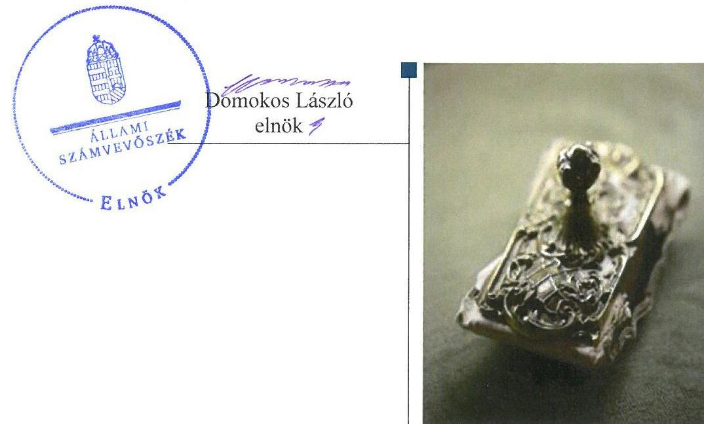
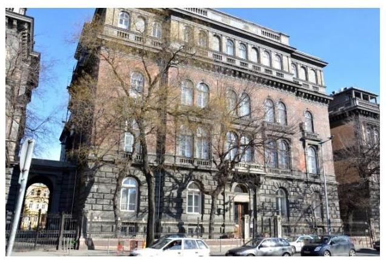
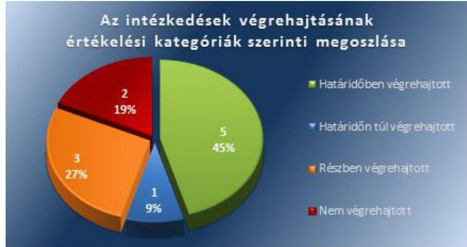
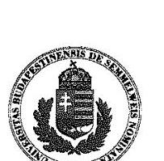
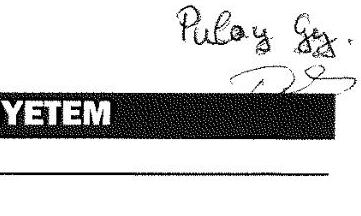
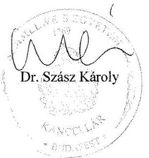
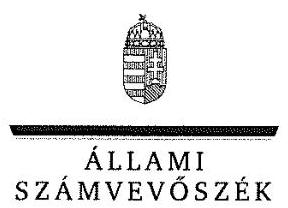
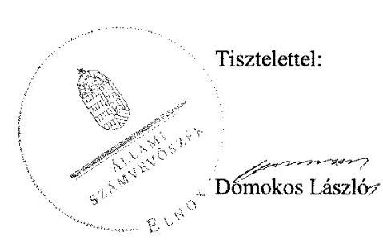

# Jelentés 

## Utóellenőrzések

Az állami felsőoktatási intézmények gazdálkodásának, működésének ellenőrzéséről készült jelentések utóellenőrzése - Semmelweis Egyetem 2017.

---

# Jelentés 

## Utóellenőrzések

Az állami felsőoktatási intézmények gazdálkodásának, működésének ellenőrzéséről készült jelentések utóellenőrzése - Semmelweis Egyetem 2017. 01. hó 02. nap

---

# AZ ELLENŐRZÉST FELÜGYELTE: 

DR. PULAY GYULA ZOLTÁN felügyeleti vezető

## AZ ELLENŐRZÉST VEZETTE ÉS A VÉGREHAJTÁSÁÉRT FELELŐS:

RÁCZKEVI KATALIN ellenőrzésvezető

## A PROGRAM ÖSSZEÁLLÍTÁSÁÉRT FELELŐS:

JANIK JÓZSEF osztályvezető

## A TÉMÁHOZ KAPCSOLÓDÓ KORÁBBI SZÁMVEVŐSZÉKI JELENTÉSEK:

- címe: Jelentés a Semmelweis Egyetem ellenőrzéséről Az állami felsőoktatási intézmények gazdálkodásának, működésének ellenőrzése
- sorszáma: 15053

IKTATÓSZÁM: V-1262-072/2016.
TÉMASZÁM: 2296
ELLENŐRZÉS-AZONOSÍTÓ SZÁM: V075556

---

# TARTALOMJEGYZÉK 

■ ÖSSZEGZÉS ..... 5
■ AZ ELLENŐRZÉS CÉLJA ..... 6
■ AZ ELLENŐRZÉS TERÜLETE ..... 7
■ AZ ELLENŐRZÉS HÁTTERE, INDOKOLTSÁGA ..... 8
■ A JELENTÉS LÉNYEGES KÉRDÉSKÖREI ..... 9
■ ELLENŐRZÉS HATÓKÖRE ÉS MÓDSZEREI ..... 10
■ MEGÁLLAPÍTÁSOK ..... 12
■ MELLÉKLETEK ..... 17
I. Sz. melléklet: Az ÁSZ 15053. számú jelentéséhez kapcsolódó Egyetem intézkedési terv végrehajtása ..... 17
II. Sz. melléklet: Az ÁSZ 15053. számú jelentéséhez kapcsolódó EMMI intézkedési terv végrehajtása ..... 23
■ FÜGGELÉK: ÉSZREVÉTELEK ..... 25
■ RÖVIDÍTÉSEK JEGYZÉKE ..... 31

---

.

---

# ÖSSZEGZÉS 

Az utóellenőrzés megállapította, hogy a korábbi számvevőszéki jelentés javaslatai alapján a Semmelweis Egyetem rektora és kancellárja által meghatározott intézkedési tervben szereplő feladatokat nem teljes körűen hajtották végre. Az Egyetem gazdálkodását és müködését érintő szabályzatok egy részének felülvizsgálata és aktualizálása elmaradt. A belső kontrollrendszer jogszabályoknak megfelelő müködtetése területén az ÁSZ által korábban azonosított hiányosságok egy része továbbra is fennáll. Az Emberi Erőforrások Minisztériuma - mint a fenntartói jogkör gyakorlója - az intézkedési tervében foglalt feladatokat végrehajtotta.

## Az ellenőrzés társadalmi indokoltsága

Az ÁSZ ${ }^{1}$ stratégiájában célul tűzte ki a számvevőszéki munka hasznosulásának javítását. Ezzel összhangban ellenőrzi, hogy az ellenőrzött szervezetek megvalósították-e a korábbi ellenőrzései által feltárt hibák, hiányosságok és szabálytalanságok megszüntetése céljából elkészített intézkedési terveikben foglaltakat. A rendszeres utóellenőrzések hozzájárulnak a szükséges intézkedések tényleges végrehajtáshoz, ezáltal a közpénzügyek rendezettségének javulásához.

## Főbb megállapítások, következtetések, javaslatok

Az Egyetem az intézkedési tervben rögzített feladatok végrehajtásáról a Bkr. által előírt nyilvántartást vezetett.
Az Egyetem intézkedési tervében meghatározott tizenegy feladatból öt feladatot határidőben, egy feladatot határidőn túl, három feladatot részben, továbbá kettő feladatot nem hajtott végre.

Az Egyetem múködését és gazdálkodását érintő szabályzatok felülvizsgálatát és aktualizálását a kancellári rendszer bevezetésére tekintettel megkezdték, azok jelentős része az utóellenőrzés időszakáig nem fejeződött be.

A kancellár projektet hozott létre az önköltségszámítás egyetemi szintű alkalmazásának megvalósításához. A bérjellegú kötelezettségvállalások egyetemi szintű kezelésére informatikai fejlesztést kezdeményeztek.

A gazdálkodási jogkörök gyakorlói részére a felhatalmazásokat nem teljes körűen adták ki, a jogosultságok nyilvántartásba vétele szintén nem volt teljes körű. A dologi kiadások teljesítése során előfordult, hogy a hatályos Kbt. előírásait nem tartották be.

Az ellenőrzési nyomvonalak aktualizálása részben történt meg, mely kockázatot hordoz az Egyetem szabályos múködésében.

Az EMMI az intézkedési tervében meghatározott feladatokat végrehajtotta.

---

# AZ ELLENŐRZÉS CÉLJA 

Az ellenőrzés célja annak értékelése volt, hogy a számvevőszéki jelentésben² foglalt intézkedést igénylő megállapításokkal és javaslatokkal összhangban készített intézkedési tervben meghatározott feladatokat az ellenőrzött szervezetek végrehajtották-e.

---

# AZ ELLENŐRZÉS TERÜLETE 

## Semmelweis Egyetem

A budapesti Semmelweis Egyetem Magyarország egyik legrégebben alapított felsőoktatási intézménye, melynek gyökerei 1769-ig nyúlnak vissza. Tevékenysége három pillérre épült: oktatás, kutatás és gyógyítás. Az Egyetemen ${ }^{3}$ általános orvosi, fogorvosi, gyógyszerészeti valamint egészségtudományi képzés folyik. Jelenleg az Egyetem öt karán - Általános Orvostudományi Kar, Fogorvos-tudományi Kar, Gyógyszerésztudományi Kar, Egészség-tudományi Kar, Egészségügyi Közszolgálati Kar folyik oktatás.

A rektor ${ }^{4}$ 2012. július 1-jétől tölti be tisztségét, a kancellár ${ }^{5}$ 2014. november 05-től látja el feladatait.

Az Egyetem 2015. évi költségvetési beszámolója szerint 62 930,2 millió Ft költségvetési bevételt, 18 990,3 millió Ft finanszírozási bevételt ért el, valamint 72.872,8 millió Ft költségvetési kiadást teljesített. A 2015. december 31-i könyvviteli mérleg szerint az Egyetem eszközeinek értéke 56 132,9 millió Ft-ot tett ki.

Az Egyetem gazdálkodásának és múködésének ellenőrzését az ÁSZ a 2009-2013. közötti időszakra végezte el, az erről szóló 15053. számú jelentést 2015. április 02-án tette közzé. Az ellenőrzés célja annak értékelése volt, hogy szabályos volt-e az Egyetem pénzügyi és vagyongazdálkodása, biztosított volt-e a vagyonnal való gazdálkodás követelményének érvényesülése, a jogszabályi előírásoknak megfelelően múködött-e a belső kontrollrendszer, az irányító szerv tevékenysége a jogszabályoknak megfelelő volt-e.

Az Emberi Erőforrások Minisztériuma az állami felsőoktatási intézmények, így az Egyetem fenntartói jogkörének gyakorlója.

Az utóellenőrzés az ÁSZ jelentésben a rektor és a miniszter ${ }^{6}$ részére megfogalmazott intézkedést igénylő megállapításokra és javaslatokra készített, az ÁSZ részére megküldött intézkedési tervben foglalt feladatok megvalósításának ellenőrzésére, illetve értékelésére fókuszált.

---

# AZ ELLENŐRZÉS HÁTTERE, INDOKOLTSÁGA 

Az ÁSZ tv7. 33. § (1) bekezdése értelmében a számvevőszéki jelentések intézkedést igénylő megállapításaihoz és javaslataihoz kapcsolódóan az ellenőrzött szervezet vezetője intézkedési tervet köteles összeállítani, és az ÁSZ részére megküldeni. Az intézkedési tervben foglaltak megvalósítását az ÁSZ tv. 33. § (7) bekezdésében foglaltak alapján - az ÁSZ utóellenőrzés keretében ellenőrizheti. Az intézkedések megvalósulásának értékelése során az ÁSZ figyelembe veszi az ellenőrzött szervezetek működési feltételeiben, valamint a jogszabályi előírásokban bekövetkezett változásokat.

Az intézkedési tervekben foglalt feladatok hiányos, illetve késedelmes végrehajtása, valamint megvalósításának elmaradása azt mutatja, hogy az ellenőrzések során feltárt hibák, hiányosságok és szabálytalanságok megszüntetése nem kapott kellő hangsúlyt. Ez a szabályszerű működés és a felelős vezetői magatartás vonatkozásában kockázatot hordoz. E kockázatok feltárásával az ÁSZ utóellenőrzési rendszere fokozza a fegyelmet, és igazolja, hogy a közpénzzel való szabályos gazdálkodás felelőssége elől nem lehet kitérni.

## AZ UTÓELLENŐRZÉS VÁRHATÓ HASZNOSULÁSA

Az utóellenőrzés négy szinten hasznosulhat:

- A társadalom szintjén az utóellenőrzés jelzi, hogy a számvevőszéki ellenőrzés megállapításainak van következménye: a hiányosságok megszüntetésére az ellenőrzött szervezet által meghatározott intézkedések végrehajtását is számon kéri az ÁSZ.
- Az ellenőrzött terület szintjén az utóellenőrzés tájékoztatást nyújt a terület döntéshozóinak a hiányosságok kiküszöbölésének jó gyakorlatairól, ezzel lehetőséget biztosítva arra, hogy az ÁSZ ellenőrzési megállapításai, javaslatai a terület nem ellenőrzött szervezeteinek a működése során is hasznosuljanak.
- Az ellenőrzött szervezet szintjén az utóellenőrzés feltárja, hogy a szervezet az intézkedések végrehajtásával hasznosította-e a korábbi ellenőrzési jelentésben a hiányosságok megszüntetése, illetve a kockázatok kezelése érdekében megfogalmazott javaslatokat.
- Az ÁSZ szintjén az utóellenőrzés visszacsatolást ad az ellenőrzési jelentések hasznosulásáról, az intézkedések elmaradása vagy részleges megvalósulása a további ellenőrzésekhez kockázati jelzésként szolgál.

---

# A JELENTÉS LÉNYEGES KÉRDÉSKÖREI 

1. Az ellenőrzött szervezetek az intézkedési tervben foglaltakat az előírt határidőben végrehajtották-e?

---

# ELLENŐRZÉS HATÓKÖRE ÉS MÓDSZEREI 

## Az ellenőrzés típusa

Megfelelőségi ellenőrzés.

## Az ellenőrzött időszak

Az utóellenőrzés alapját képező ÁSZ jelentés közzétételének napjától (2015. április 02-án.) az ellenőrzésről szóló kiértesítő levél keltének napjáig (2016. október 24.) tartó időszak.

## Az ellenőrzés tárgya

A számvevőszéki jelentésben foglalt intézkedést igénylő megállapításokkal és javaslatokkal összhangban - az Egyetem és az EMMI ${ }^{8}$ által - készített intézkedési tervben foglaltak végrehajtásának ellenőrzése.

Az ellenőrzés kiterjed minden olyan körülményre és adatra, amely az ÁSZ jogszabályban meghatározott feladatainak teljesítéséhez, valamint a program végrehajtása folyamán felmerült újabb összefüggések feltárásához szükséges.

## Az ellenőrzött szervezet

Semmelweis Egyetem és az Emberi Erőforrások Minisztériuma.

## Az ellenőrzés jogalapja

Az ÁSZ tv. 1. § (3) bekezdése szerint az ÁSZ általános hatáskörrel végzi a közpénzekkel és az állami és önkormányzati vagyonnal való felelős gazdálkodás ellenőrzését.

Az ÁSZ tv. 33. § (7) bekezdése alapján az ÁSZ tv. 33. § (1)-(2) bekezdése szerinti intézkedési tervben foglaltak megvalósítását az ÁSZ utóellenőrzés keretében ellenőrizheti.

## Az ellenőrzés módszerei

Az ÁSZ az utóellenőrzést a nemzetközi standardokat irányadónak tekintve az ellenőrzési program ellenőrzési kérdései, az ellenőrzött időszakban hatályos jogszabályok, az ellenőrzés szakmai szabályok és módszertanok figyelembevételével, önállóan végezte.

---

Az ÁSZ az ellenőrzés ideje alatt az Egyetemmel és az EMMI-vel történő kapcsolattartást az ÁSZ SZMSZ²-ének vonatkozó előírásai alapján biztosította.

Az utóellenőrzés megállapításait elsősorban az ÁSZ rendelkezésére álló, valamint az ellenőrzött szervezetektől elektronikusan bekért dokumentumok alapozták meg.

Az ellenőrzési bizonyítékként felhasználható adatforrások közé tartoznak egyrészt a szakmai programban felsorolt adatforrások, másrészt minden - az ellenőrzés folyamán feltárt, az ellenőrzés szempontjából információt tartalmazó - dokumentum.

A pénzügyi folyamatokban kulcsszerepet betöltő kontrollokra vonatkozóan az intézkedési tervben foglalt feladatok végrehajtását a dologi kiadások állományából, valamint az intézmény által kötött szerződések és az előirányzat módosítások állományából 10-10 véletlen mintavétellel kiválasztott tétel alapján értékelte az ÁSZ. A kiválasztott tételek esetében azt ellenőrizte, hogy az Egyetem az intézkedési tervben meghatározott feladatok végrehajtása során biztosította-e a jogszabályok és a belső szabályzatok előírásainak megfelelő működtetést.

Az intézkedési tervekben előírt feladatokat, azok végrehajthatósága, illetve végrehajtása szempontjából az alábbiak szerint értékelte az ÁSZ:
— „határidőben végrehajtott" a feladat, ha a teljesítés dokumentáltan, az intézkedési tervben előírt határidőben és tartalommal megtörtént;
— „határidőn túl végrehajtott" a feladat, ha annak teljesítése az intézkedési tervben meghatározott módon, de az előírt határidőn túl történt meg;
— „részben végrehajtott" a feladat, ha végrehajtása teljes körűen az intézkedési tervben előírt módon nem történt meg;
— „nem végrehajtott" a feladat, ha a végrehajtás nem történt meg, vagy amennyiben a teljesítést nem dokumentálták;
— „okafogyottá vált" a feladat, ha végrehajtására - meghatározott esemény bekövetkezése, továbbá külső körülmény, a működést érintő feltétel változása miatt - már nincs szükség, illetve lehetőség, és egyértelműen megállapítható, hogy az intézkedést szükségessé tevő körülmény a jövőben nem fordulhat elő;
— „nem időszerű" az a feladat, amelynek ellenőrzési időszakon belüli végrehajtására azért nem került (kerülhetett) sor, mert az intézkedés alapjául szolgáló esemény nem következett be, de annak jövőbeni előfordulása lehetséges, a végrehajtása nem volt esedékes, vagy a végrehajtás határideje még nem járt le.
Az utóellenőrzés lefolytatásához az ellenőrzött szervezetek a tanúsítványok elektronikus kitöltésével, valamint az ÁSZ által kért dokumentumok elektronikus megküldésével szolgáltattak adatokat, amelyek valódiságát és teljes körűségét az ellenőrzött szervezet vezetője által tett teljességi és hitelességi nyilatkozat igazolta. Az így rendelkezésre bocsátott adatok, információk kontrollja az ellenőrzés keretében történt.

---

# MEGÁLLAPÍTÁSOK 

## 1. Az ellenőrzött szervezetek az intézkedési tervben foglaltakat az előírt határidőben végrehajtották-e?

Összegző megállapítás

Az Egyetem az intézkedési tervben meghatározott tizenegy feladatból öt feladatot határidőben, egy feladatot határidőn túl, három feladatot részben hajtott végre, továbbá kettő feladat végrehajtására nem került sor. Az intézkedési tervben rögzített feladatok végrehajtásáról a Bkr. ${ }^{10}$ előírásainak megfelelő nyilvántartást vezettek. Az EMMI az intézkedési tervben meghatározott kettő feladatot határidőben végrehajtotta.

Az ÁSZ a jelentésében a rektor részére három, a miniszter részére kettő javaslatot fogalmazott meg.

Az Egyetem által összeállított és az ÁSZ részére megküldött intézkedési terv a hiányosságok, szabálytalanságok megszüntetésére tizenegy feladatot határozott meg. Az intézkedési tervet egy alkalommal kiegészítették, melyet az ÁSZ részére megküldtek. Az EMMI az intézkedési tervében két feladatot határozott meg. A feladatok elvégzésének felelőseit megjelölték.

Az ÁSZ javaslatai alapján készített intézkedési tervben rögzített feladatok végrehajtásáról az Egyetem a Bkr. előírásainak megfelelő nyilvántartást vezetett.

Az Egyetem intézkedési tervében meghatározott feladatokat, határidőket, a feladatok végrehajtásáért felelős személyt és a feladatok végrehajtását az I. számú melléklet, az EMMI intézkedési tervében meghatározott feladat végrehajtását a II. számú melléklet mutatja be.

Az Egyetem intézkedési tervében tervezett feladatok végrehajtásának értékelési kategóriák szerinti megoszlását az 1. ábra szemlélteti.
1. ábra

Fonás: ÁSZ

---

# HATÁRIDŐBEN VÉGREHAJTOTT feladatok: 

- A kancellár határidőben intézkedett az önköltségszámítás egyetemi szintű kialakításának feltételeiről, projektet hozott létre. A team feladata, hogy kidolgozza egyetemi szinten az önköltségszámítás alkalmazásának és megvalósításának feltételrendszerét, az azt alátámasztó szükséges informatikai fejlesztéseket.
- A kancellár az intézkedési tervben meghatározott határidőn belül, 2015. május 6-án elrendelte a belső vizsgálatot a közbeszerzéshez és a rendszeres személyi juttatásokhoz kapcsolódó kötelezettségvállalási szabálytalanságok tekintetében. Az ellenőrzéseket lefolytatták, az Ellenőrzési igazgató határidőn belül 2016. szeptember 30-ára elkészítette a jelentéseket. A kancellár munkajogi következmény érvényesítésére vonatkozó javaslatot nem tett a felelősként megjelölt személyek közalkalmazotti, illetve egyéb jogviszonyának megszűnése miatt.
- Az Emberierőforrás-gazdálkodási főigazgató a 2015. március 4-én KS/HUM/161-16/2015. számmal javaslatot tett a kancellár részére a bérjellegú kötelezettségvállalások egyetemi szintű kezelésére. A javaslatot követően az informatikai rendszer fejlesztését megkezdték.
- Az Egyetem intézkedett a külföldi hallgatók által fizetett térítési díjak jogszabálynak megfelelő elszámolásáról. A hallgatói díjak elszámolásában együttműködő IS International Studies A.G. intézménnyel kötött szerződést felülvizsgálták, majd a Szenátus 100/2016 (IX. 1.) számú határozatában a Szegedi Tudományegyetemmel közös gazdasági társaság alapításáról döntöttek, melyhez az Nftv. előírásainak megfelelően a fenntartó egyetértésével rendelkeztek.
- Az Egyetem az Intézkedési tervben meghatározott határidőn belül 2016. március 8 -ai dátummal elkészítette a Vagyongazdálkodási terv tervezetét, amelyre a Konzisztórium ${ }^{11}$ a 8/2016 (III. 22.) számú határozatában 2016. április 6 -ai dátummal egyetértését megadta. A Szenátus 28/2016. (III. 30.) számú határozatában 2016. április 8 -ai dátummal az előterjesztést elfogadta. A fenntartó a vagyongazdálkodási tervhez egyetértését megadta.

## HATÁRIDŐN TÚL VÉGREHAJTOTT feladat:

- Az Eszközök és források értékelési szabályzat módosítását a Kancellár az intézkedési tervben meghatározott 2015. június 30 -ai határidőn túl, a K/8/2016. (II. 18) számú határozatában elfogadta. A mér legtételekkel kapcsolatos hiányosságok megszüntetését folyamatosan végezték.

## RÉSZBEN VÉGREHAJTOTT feladatok:

- Az Egyetem a teljes belső kontrollrendszerre vonatkozó szabályzatainak felülvizsgálatát megkezdte, amely az utóellenőrzés időszakában még folyamatban volt. A belső kontrollrendszerre vonatkozó szabályzatait nem teljes körűen, esetenként a jogszabályi környezetnek nem megfelelően aktualizálta. A kancellár a kontrolltevékenység hiányosságainak megszüntetésére belső ellenőrzések lefolytatását kezdeményezte.

---

- A kancellár a gazdálkodási jogkörök szabályszerű gyakorlásának érvényesítésére vonatkozó intézkedéseket részben végrehajtotta. Az egyetemi gazdálkodási jogköröket meghatározó belső szabályzatokat határidőben módosította. Az SZMSZ ${ }^{12}$ alapján a gazdálkodási jogkörök az Nftv. ${ }^{13}$ módosításával bevezetett kancellári rendszerrel összhangba kerültek. A Szenátus ${ }^{14}$ által módosított Kötelezettségvállalási szabályzat 2015. március 18 -tól összhangban volt az Egyetem SZMSZ-ével. A gazdálkodási jogkörök gyakorlóinak felhatalmazásait a jogosultak részére nem teljes körűen adták ki, a jogosultságok nyilvántartásba vétele nem volt teljes körű, amely nem felelt meg az Ávr ${ }^{15}$. 60. §. (3) bekezdésében foglaltaknak. Egy beszerzés esetében a kiadási tételnél a Kbt. 131. § (2) bekezdése ellenére a szerződés eltért az ajánlat tartalmától, továbbá a szerződés teljesítése során azzal, hogy a szerződés tartalmával ellentétes számlát fogadtak be, megsértették a Kbt. ${ }^{16}$ 142. §-ának (1) bekezdésében foglaltakat.
- A Kancellár 2015. május 12-én intézkedett a Beszerzési Szabályzat felülvizsgálatáról és körlevélben hívta fel minden szervezeti egység vezetőjének figyelmét az abban megfogalmazott feladatok, szabályok betartására és betartatására. A Szerződéskötési Szabályzat kialakítása nem készült el. Az Egyetem döntött az informatikai rendszer fejlesztéséről, a rendszer bevezetése a Szerződéskötési Szabályzat véglegezését követően történhet meg. Egy beszerzés esetében a közbeszerzési eljárás keretében kötött szerződés módosításakor a Kbt. 132 §. (1) bekezdésben foglaltakat, továbbá az 5. §. és 19. §ában foglalt rendelkezéseket nem tartották be.

# NEM VÉGREHAJTOTT feladat: 

- A Szerződéskötési szabályzat nem készült el, kialakítása folyamatban van, az utóellenőrzés időszaka alatt nem került elfogadásra. A Jogi és Igazgatási Főigazgatóság kidolgozta a 16785-12/KSJIF/2016 iktatószámú Szerződéskötési szabályzat tervezetét, melyet 2016. szeptember 03-ai dátummal megküldött belső véleményezésre.
- A Pénzkezelési Szabályzat módosítását a kancellár a K/2/2016. (I. 5.) számú határozatában elfogadta, azonban a bevételi és kiadási előirányzatok saját hatáskörben végrehajtott módosítására vonatkozóan a szabályzat nem rendelkezett.

## EMMI HATÁRIDŐBEN VÉGREHAJTOTT feladatok:

- Az EMMI Belső Ellenőrzési Főosztálya 2015. október 5-27. között szabályszerűségi ellenőrzést végzett az Egyetemnél „Az ÁSZ javaslatai alapján készült intézkedési terv végrehajtása" tárgyában, amelyről Jelentését 2015. október 30-án 49675-13/2015/ELL. iktatószámon adta ki. A Jelentés II. 2. pontja tartalmazta a kincstári körön kívüli számlevezetés miatt megállapított szabálytalan pénzkezeléshez kapcsolódó munkajogi felelősség kivizsgálását. Ez alapján a vizsgálók nem javasoltak a rektort érintő fenntartói intézkedést. Az Nftv. 73. § (3) bekezdés e) pontja alapján az egyetem rektora tekintetében munkáltatói jogkört gyakorló emberi erőforrások minisztere a 49675-13/2015/ELL. iktatószámú jelentés javaslata alapján nem kezdeményezett munkajogi eljárást az Egyetem rektorával szemben.

---

Az EMMI Belső Ellenőrzési Főosztálya 2015. október 5-27. között szabályszerűségi ellenőrzést végzett az Egyetemnél „Az ÁSZ javaslatai alapján készült intézkedési terv végrehajtása" tárgyában, amelynek Jelentését 2015. október 30-án 49675-13/2015/ELL. iktatószámon elkészítette. A Jelentés II. 1. pontja tartalmazta a Belső kontrollrendszer kialakításával és működtetésével, a pénzügyi és vagyongazdálkodással összefüggésben feltárt szabálytalanságokhoz kapcsolódó munkajogi felelősség kivizsgálását. Az Nftv. 73. § (3) bekezdés e) pontja alapján az egyetem rektora tekintetében munkáltatói jogkört gyakorló emberi erőforrások miniszter a 49675-13/2015/ELL. iktatószámú jelentés javaslata alapján nem kezdeményezett munka¡ogi eljárást az Egyetem rektorával szemben

---

.

---

# MELLÉKLETEK

- I. SZ. MELLÉKLET: AZ ÁSZ 15053. SZÁMÚ JELENTÉSÉHEZ KAPCSOLÓDÓ EGYETEM INTÉZKEDÉSI TERV VÉGREHAJTÁSA

|  1. | Az intézkedési tervben rögzített feladat | Az intézkedési tervben meghatározott határidő | Az intézkedési tervben meghatározott feladatok elvégzésének felelőse | A feladat végrehajtása  |
| --- | --- | --- | --- | --- |
|   | 1. | 2. | 3. | 4.  |
|  Határidőben végrehajtott feladatok |  |  |  |   |
|  1. | „2.2. Az egyetem kancellária intézkedett az önköltségszámitás egyetemi szintü kialakításának feltételeiről, projektet hozott létre. A team feladata, hogy kidolgozza egyetemi szinten az önköltségszámitás alkalmazásának és megvalósításának feltételrendszerét, az azt alátámasztó szükséges informatikai fejlesztéseket." | 2016. február 28. | Kancellár, Rektor | A kancellár az önköltségszámitás egyetemi szintű alkalmazásának és megvalósításának feltételrendszerét kidolgozó projekt létrehozásáról a 2015. július 17-én kelt 16/2015. sz. kancellári körlevélben adott tájékoztatást. A projekt 2016. február 29-ig tartó működéséhez meghatározták a célokat, a felelősöket, a munkacsoportokat és a munkafázisokat. Az önköltségszámitásához szükséges adatokat az érintett szervezeti egységektől a 2015. július 3-án kelt 12/2015. (VII. 3.) sz. kancellári utasításban kérték be.  |
|  2. | „2.3.1. Belső ellenőrzés kerül elrendelésre a közbeszerzési és a rendszeres személyi juttatásokhoz kapcsolódó kötelezettségvállalási szabálytalanságok kivizsgálására irányulóan. Az ellenőrzés megállapításainak ismeretében születik a döntés az esetleges munkajogi következményekről." | az ellenőrzés elrendeléséről:
2015. május 20
az ellenőrzés végrehajtásáért: 2015. szeptember 30. | az ellenőrzés elrendeléséről: Kancellár
az ellenőrzés végrehajtásáért: Ellenőrzési igazgató | A kancellár az intézkedési tervben meghatározott határidőn belül, 2015. május 6-án elrendelte a belső vizsgálatot a közbeszerzési és személyi juttatásokhoz kapcsolódó kötelezettségvállalási szabálytalanságok tekintetében. Az Ellenőrzési igazgatóság az intézkedési tervben meghatározott határidőn belül 2016. szeptember 30-ára elkészítette a KS/ELL/69-12/2015. számú ellenőrzési jelentést a közbeszerzési szabálytalanságok, valamint a KS/ELL 70-5/2015 számú ellenőrzési jelentést a rendszeres személyi juttatásokhoz kapcsolódó kötelezettségvállalási szabálytalanságok kivizsgálásáról. Az ellenőrzési jelentések alapján a kancellár munkajogi következmény érvényesítésére vonatkozó javaslatot nem tett a felelősként megjelölt személyek közalkalmazotti, illetve egyéb jogviszonyának megszűnése miatt.  |
|  3. | „2.3.3. Az Emberierőforrás-gazdálkodási Főigazgató javaslatot készített a bérjellegú kötelezettségvállalások egyetemi szintű kezelésére 2015 márciusában a kancellár részére. A javaslatban szereplő, a szabályozott eljárás feltételét biztosító informatikai rendszer fejlesztési igénye | 2015. szeptember 30. | Kancellár | Az Emberierőforrás-gazdálkodási főigazgató az intézkedési tervben meghatározott határidőn belül 2015. március 4-én KS/HUM/161-16/2015. számmal javaslatot tett a bérjellegú kötelezettségvállalások egyetemi szintű kezelésére a kancellár részére. A Szenátus elfogadta a szabályozott eljárás feltételét biztosító informatikai rendszer fejlesztési igényét. A fejlesztés I. üteme Kancellár 2015. június 25-én kelt 14/2015.  |

---

|  Sorszám | Az intézkedési tervben rögzített feladat | Az intézkedési tervben meghatározott határidő | Az intézkedési tervben meghatározott feladatok elvégzésének felelőse  |
| --- | --- | --- | --- |
|   | 1. | 2. | 3.  |
|   | jóváhagyásra került, amelynek célja a keretgazdálkodás hatékonyságát szabályozó, szükséges intézkedés megtétele. A megrendelt fejlesztése átfogóan tartalmazza mindazon szükséges intézkedés megtételét, amely biztositja egyetemi szinten a rendszeres személyi juttatásokhoz kapcsolódó kötelezettségvállalás szabályozottságát." |  |   |
|  4. | „2.4. A Semmelweis Egyetem felülvizsgálja az IS International Studies A. G. intézménnyel kötött szerződését. A 2016/2017. évi tanévtől megteremti annak feltételét, hogy a külföldi hallgatók által fizetett térítési díjak a jogszabálynak megfelelően az egyetem Magyar Államkincstárnál vezetett számláján kerüljön közvetlenül jóváírásra." | 2016. szeptember 30. | Kancellár, Rektor  |
|  5. | „3.1. Az Egyetem elkészíti az Intézményfejlesztési Terv előírásaihoz szorosan kapcsolódó vagyongazdálkodási terv tervezetét. Az egyetemi eljárásrendeknek megfelelően az Nftv. előírásait figyelembe véve egyezteti a fenntartóval, majd előterjeszti jóváhagyásra az Egyetem Szenátusára." | 2016. március 30. | Kancellár  |

|  Az intézkedési tervben meghatározott határidő | A feladat végrehajtása  |
| --- | --- |
|  2. | 4.  |

számú körlevele alapján megvalósult. Az Emberierőforrás-gazdálkodási Főigazgató által 2015. július 24-én kiadott KS/HUM/404/2015. számú Útmutató és eljárásrend tartalmazza a bérjellegű kötelezettségvállalások SAP rendszerben történő kezelésével, valamint a kapcsolódó fejlesztéssel szemben támasztott követelményeket.

Az Egyetem felülvizsgálta a külföldi székhelyű céggel 2009. december 29-ei dátummal, idegen nyelvű képzések tekintetében kötött megállapodását. A külföldi székhelyű céggel való együttműködés leépítésében egyeztek meg a felek. A kancellár és a Konzisztórium 2016. augusztus 18-ai dátummal szenátusi előterjesztésben kezdeményezze a Szegedi Tudományegyetemmel közös gazdasági társaság alapítását. A Szenátus 100/2016 (IX. 1.) számú határozatában elfogadta az előterjesztést, és az Nftv. előírásainak megfelelően a fenntartó egyetértésével döntött intézményi gazdasági társaság alapításáról. Az Egyetem beszámolója alapján a társaság létrehozásával az új elszámolási rendre történő átállást a 2017/2018. évi tanévtől lehetséges megvalósítani.

A kancellár intézkedett a vagyongazdálkodási terv elkészítéséről, 2016. március 8-ai dátummal elkészítette a Vagyongazdálkodási terv tervezetét, amelyre a Konzisztórium a 8/2016 (III. 22.) számú határozatában 2016. április 6-ai dátummal egyetértését megadta. A Szenátus 28/2016. (III. 30.) számú határozatában 2016. április 8-ai dátummal az előterjesztést elfogadta. A fenntartó 2016. április 11-én elektronikus levélben tájékoztatta az Egyetemet arról, hogy jogszabályváltozások miatt megkezdte a vagyongazdálkodási tervek elkészítésére vonatkozó eljárásrend kidolgozását. Az Nftv. 12 §. 3) bekezdés gb) pontja előírásait figyelembe véve az egyetem az Intézkedési tervben meghatározott határidő után 2016. május 31-ei dátummal megküldte egyetértésre a fenntartónak a Vagyongazdálkodási terv tervezetét. Az EMMI módosítási javaslatait 2016. augusztus 19-ei dátummal megküldte az egyetem részére. A módosított Vagyongazdálkodási tervet az egyetem 2016. szeptember 9-ei dátummal újból megküldte, az EMMI az érintett szakterületek bevonásával áttekintette, és arra

---

|  Az intézkedési tervben rögzített feladat | Az intézkedési tervben meghatározott határidő | Az intézkedési tervben meghatározott feladatok elvégzésének felelőse | A feladat végrehajtása  |
| --- | --- | --- | --- |
|  1. | 2. | 3. | 4.  |
|   |  |  | érdemi átdolgozást igénylő megállapítást 2016. október 25-ei dátummal nem tett, az abban foglaltakkal egyetértett.  |
|  Határidőn túl végrehajtott feladatok |  |  |   |
|  6. „3.2.1. A mérlegtételekkel kapcsolatban feltárt hiányosságok megszüntetése folyamatos, a 2014. évi beszámoló az értékelési szabályoknak megfelelően készült el. Az Eszközök és források értékelési szabályzata módosításra kerül a hatályos jogszabályoknak megfelelően." | 2015. június 30. | Gazdasági Főigazgató | A kancellár az intézkedési tervben vállalt 2015. június 30-i határidőn túl intézkedett az Eszközök és források értékelési szabályzatának módosítása érdekében, a K/8/2016. (II. 18) számú határozatában elfogadta az Eszközök és források értékelési szabályzatát. A mérlegtételekkel kapcsolatos hiányosságok megszüntetését folyamatosan végezték. Az értékvesztéssel kapcsolatban feltárt hiányosságokat az egyetem a 2013. évi beszámolóban javította, a 2014. évi beszámoló vonatkozásban az értékvesztés elszámolás és visszaírás menetét kimutatással alátámasztotta. A tulajdonában lévő gazdasági társaságaitól kapott osztalékot teljes körűen a befektetett eszközök között mutatta ki. A devizában nyilvántartott követelések értékelését az egyetem elvégezte. A NEPTUN adatai alapján kimutatott hallgatói tartozásállomány év végi egyeztetését végrehajtották. A devizában nyilvántartott kötelezettségek értékelését elvégezték. Az aktív és passzív pénzügyi elszámolások tekintetében az egyetem eleget tett analitikus nyilvántartási kötelezettségének. Az egyes szállítói tartozások kapcsán felmerülő késedelmi kamatot az Áhsz ${ }^{17}$. előírásai szerint rendezték.  |
|  Részben végrehajtott feladatok |  |  |   |
|  7. „1. Az egyetem a teljes belső kontrollrendszerre vonatkozó szabályzatait felülvizsgálja (11) a jogszabályi környezetnek megfelelően és átdolgozza azokat (12). Kiemelt figyelmet fordít az eddig hiányos, vagy nem megfelelően müködő kontrolltevékenységre (13), monitoring rendszerre (14), az információs és kommunikációs rendszerre (15). Ellenőrzi a kontrollrendszerre vonatkozó szabályzatokban meghatározott feladatok megvalósítását (16), a kontrolltevékenység részeként megerősíti a folyamatba épített előzetes, utólagos és vezetői ellenőrzést (17)." | 2015. december 31. | Kancellár,
Rektor | Határidőben végrehajtott feladatrész:
Az Egyetem a teljes belső kontrollrendszerre vonatkozó szabályzatainak felülvizsgálatát megkezdte.
Az Egyetem Szenátusa határozatban elrendelte az Egyetem belső szabályzatainak felülvizsgálatát, melyben kijelölték a felülvizsgálandó szabályzatokat, a felülvizsgálat felelőseit és a felülvizsgálat elvégzésének részhatáridőit. A kijelölt 99 meglévő szabályzat közül 34 felülvizsgálatára határidőn belül, 19-re határidőn túl került sor.
A kancellár a hiányos, vagy nem megfelelően müködő kontrolltevékenységre figyelemmel az Nftv.-ben meghatározott jogkörében eljárva 2015 évben több belső ellenőrzés lefolytatását kezdeményezte.
A monitoring rendszert alapvetően meghatározó szabályzatok felülvizsgálatát és átdolgozását az intézkedési tervben vállalt határidőn túl végezték el.  |

---

|  Az intézkedési tervben rögzített feladat | Az intézkedési tervben meghatározott határidő | Az intézkedési tervben meghatározott feladatok elvégzésének felelőse | A feladat végrehajtása  |
| --- | --- | --- | --- |
|  1. | 2. | 3. | 4.  |
|   |  |  | Meghatározták a belső ellenőrzési feladatok ellátását végző Ellenőrzési Igazgatóság jogállását, feladatait, a rektor és a kancellár határidőben jóváhagyta Belső Ellenőrzési Kézikönyvet. Az egyetem minőségirányítással kapcsolatos kötelezettségeinek teljes körű menedzselését az Orvos-szakmai, Finanszírozási és Minőségbiztosítási Főigazgatóság Minőségbiztosítási Osztálya látta el.
A kancellár és a rektor kiemelt figyelmet fordított az információs és kommunikációs rendszerre, azonban a kancellár határidőn túl fogadta el az Iratkezelési szabályzatot, az Informatikai Biztonsági Szabályzatot.
A kancellár és a rektor a kontrollrendszerre és a kontrolltevékenységre vonatkozó szabályzatokban meghatározott feladatok megvalósításának ellenőrzését az Ellenőrzési Igazgatóság ellenőrzéseivel végrehajtotta. A kancellár a vezetői ellenőrzéseket belső ellenőrzések keretében erősítette meg.
A kancellár és a rektor a kontrolltevékenység részeként a folyamatba épített előzetes, utólagos és vezetői ellenőrzés keretében az intézkedési tervek elkészítését és annak végrehajtását figyelemmel kísérte. A folyamatba épített és a vezetői ellenőrzés területén megállapított hiányosságok megszüntetésére a kancellár körlevelekben hívta fel a szervezeti egységek vezetőinek figyelmét.  |
|   |  |  | Nem végrehajtott feladatrész:
Az Egyetem belső kontrollrendszeréhez szorosan kapcsolódó szabályzatok átdolgozására 14 esetben határidőn túl került sor, valamint az ellenőrzési időszak végéig nem dolgozták át: a Szerződéskötési szabályzatot; az Adatvédelmi szabályzatot; Bizonylati szabályzatot, Etikai Kódexet; Gazdálkodási szabályzatot; Gazdálkodó szervezetek alapításának és gazdálkodó szervezetekben való részesedés szerzésének szabályait; Neptun szabályzatot; Versenyeztetési szabályzatot.
A felülvizsgálatot követően kiadott új szabályzatok eseteként nem feleltek meg a hatályos jogszabályok előírásainak: a Szerződéskötések rendjéről szóló szabályzat az ellenőrzött időszakban nem készült el. A Pénzkezelési Szabályzat nem tartalmazta a bevételi és kiadási előirányzatok saját hatáskörben végrehajtott módosítására vonatkozóan rendelkezéseket és az eljárásban alkalmazandó formanyomtatványt. Az SZMSZ  |

---

|  8. | „2.1. A kancelláriarendszer egyetemi szervezetben történő kialakításával megkezdődött az intézmény szerkezei és szervezeti átalakítása a jogszabályokban meghatározottak szerint. Ezt rögzíti a Szenátus által 2015. február 19-én elfogadott SZMSZ. A gazdálkodási jogkörök teljes felülvizsgálata már a kancellár kinevezésével (2014. 11.05.) egy időben elkezdődött, az SZMSZ életbe léptetésével, majd a módosított kötelezettségvállalási szabályzat elfogadásával egyetemi szinten a szabályozottság feltételei kialakultak. Az új szervezeti struktúrának megfelelően a jogosultak részére kiadásra kerültek a kötelezettségvállalási, ellenjegyzési, egyetértési jogkör gyakorlására szóló felhatalmazások. Ennek teljes körű dokumentálása jelenleg is folyamatban van." | 2015. június 30. | Kancellár | 2016. szeptember 29-ig nem felelt meg az Ávr. 13. § (1) bekezdés b) pontja előírásának, mert az Alapító Okirat adatait nem teljes körűen tartalmazta. Az Önköltségszámítás rendjéről szóló szabályzat az ellenőrzési időszak végéig tartalmilag nem felelt meg az Áhsz. 50. § (5) bekezdés előírásának. Az Ellenőrzési nyomvonalak szabályzata 2012. január 1-jétől hatályos, amelynek az Egyetem szervezeti egységeinek megfelelően történő aktualizálását 2016. december 31-ig tervezték.  |
| --- | --- | --- | --- |
|  9. | „2.3.2. Annak érdekében, hogy a Semmelweis Egyetem biztosítsa az egybeszámítással kapcsolatos kötelezettségeinek teljesülését, valamint hogy a közbeszerzésekről szóló 2011. évi CVIII. törvény (Kbt.) 18. §-ának előírásai alapján a mindenkori költségvetési törvényben meghatározott közbeszerzési értékhatárt elérő beszerzéseinél | 2015. december 31. | Kancellár  |
|   |  |  | 2015. december 31.  |

|  Az intézkedési tervben rögzített feladat | Az intézkedési tervben meghatározott határidő | Az intézkedési tervben meghatározott feladatok elvégzésének felelőse  |
| --- | --- | --- |
|  2. | 3. | 4.  |

2016. szeptember 29-ig nem felelt meg az Ávr. 13. § (1) bekezdés b) pontja előírásának, mert az Alapító Okirat adatait nem teljes körűen tartalmazta. Az Önköltségszámítás rendjéről szóló szabályzat az ellenőrzési időszak végéig tartalmilag nem felelt meg az Áhsz. 50. § (5) bekezdés előírásának. Az Ellenőrzési nyomvonalak szabályzata 2012. január 1-jétől hatályos, amelynek az Egyetem szervezeti egységeinek megfelelően történő aktualizálását 2016. december 31-ig tervezték.

## Határidőben végrehajtott feladat:

A kancellár intézkedett a gazdálkodási jogköröket meghatározó belső szabályzatok módosításáról. Az SZMSZ alapján az egyetemi gazdálkodási jogkörök az Nftv. módosításával bevezetett kancellári rendszerrel összhangba kerültek. A Szenátus által módosított a Kötelezettségvállalási szabályzat 2015. március 18-tól összhangban volt az Egyetem SZMSZ-ével. A kancellár a pénzgazdálkodási jogkörök gyakorlásának kontrollját a 2015. évben elrendelt és az egyetem Ellenőrzési Igazgatósága által végrehajtott belső ellenőrzésekkel, valamint az intézkedési tervekben foglaltak végrehajtásának vezetői ellenőrzésével erősítette.

## Nem végrehajtott feladat:

A gazdálkodási jogkörök gyakorlóinak felhatalmazásait a jogosultak részére nem teljes körűen adták ki, a jogosultságok nyilvántartásba vétele nem volt teljes körű. Egy beszerzés esetében a kiadási tételnél a Kbt. 131. § (2) bekezdése ellenére a szerződés eltért az ajánlat tartalmától, továbbá a szerződés teljesítése során azzal, hogy a szerződés tartalmával ellentétes számlát fogadtak be, megsértették a Kbt. 142 §. (1) bekezdésben foglaltakat.

## Határidőben végrehajtott feladat:

A Kancellár intézkedett a Beszerzési Szabályzat felülvizsgálata érdekében. A Beszerzési Szabályzatot a Szenátus 30/2015. (V. 7.) számú határozatba elfogadta. Az abban megfogalmazott feladatok, szabályok betartására és betartatására 11/2015. számú körlevélben hívta fel minden szervezeti egység vezetőjének figyelmét.

## Nem végrehajtott feladat:

---

|  Sorszám | Az intézkedési tervben rögzített feladat | Az intézkedési tervben meghatározott határidő | Az intézkedési tervben meghatározott feladatok elvégzésének felelőse  |
| --- | --- | --- | --- |
|   | 1. | 2. | 3.  |
|   | minden esetben lefolytassa a közbeszerzési eljárást, szükséges a Beszerzési Szabályzatban foglaltak felülvizsgálata, az abban megfogalmazott feladatok, szabályok betartásának és betartatásának folyamatba épített kontrolljának megerősítésével. Új egyetemi szabályzatként kerül kialakításra a Szerződéskötési szabályzat a nyilvántartási és informatikai rendszer ilyen irányú fejlesztésével egyidejűleg." |  |   |
|   |  |  | A Szerződéskötési szabályzat kialakítása és az informatikai rendszer vonatkozó fejlesztése határidőre nem készült el. A Jogi és Igazgatási Főigazgatóság kidolgozta a 16785-12/KSJIF/2016 iktatószámú Szerződéskötési szabályzat tervezetét, aminek a véleményezése jelenleg folyamatban van. A vonatkozó informatikai rendszer fejlesztéséről az Egyetem döntött, a rendszer bevezetése a Szerződéskötési Szabályzat véglegezését követően történik meg.
Egy beszerzés esetében a közbeszerzési eljárás keretében kötött szerződés módosításakor a Kbt. 132 §. (1) bekezdésben foglaltakat, továbbá az 5. §. és 19. §-ában foglalt rendelkezéseket nem tartották be.  |
|   |  | Nem végrehajtott feladatok |   |
|  10. | „2.5. A szerződéskötések rendjéről szóló szabályzat rögzítse a megbízási szerződésekre vonatkozó azon követelményt, hogy a szerződések minden esetben megfelelő részlegességgel határozzák meg a szakmai teljesítés mennyiségi és minőségi jellemzőit. A Szabályzat ennek megfelelően definiálni fogja a kötelezően alkalmazandó szerződésmintákat." | 2015. szeptember 30. | Kancellár  |
|  11. | „3.2.2. A bevételi és kiadási előirányzatok saját hatáskörben végrehajtott módosítására vonatkozóan a Pénzkezelési Szabályzat módosítása kapcsán szükséges rendelkezni. A megfelelő formanyomtatvány elkészült, amely a szabályzat mellékletét fogja képezni." | 2015. május 31. | Gazdasági főigazgató  |

Forrás: ÁSZ által készített táblázat

---

# II. SZ. MELLÉKLET: AZ ÁSZ 15053. SZÁMÚ JELENTÉSÉHEZ KAPCSOLÓDÓ EMMI INTÉZKEDÉSI TERV VÉGREHAJTÁSA

|  Sorszám | Az intézkedési tervben rögzített feladat | Az intézkedési tervben meghatározott határidő | A feladatok elvégzésének felelőse | A feladat végrehajtása  |
| --- | --- | --- | --- | --- |
|   | 1. | 2. | 3. | 4.  |
|   | Határidőben végrehajtott feladatok |  |  |   |
|  1. | „A kincstári körön kívüli számlavezetés miatt megállapított szabálytalan pénzkezeléshez kapcsolódó munkajogi felelősség kivizsgálása, a szükséges intézkedések kezdeményezése." | 2015. december 31. | belső ellenőrzési igazgatóság | Az EMMI Belső Ellenőrzési Főosztálya 2015. október 5-27. között szabályszerűségi ellenőrzést végzett az Egyetemnél „Az ÁSZ javaslatai alapján készült intézkedési terv végrehajtása" tárgyában, amelyről Jelentését 2015. október 30-án 49675-13/2015/ELL. iktatószámon adta ki. A Jelentés II. 2. pontja tartalmazta a kincstári körön kívüli számlevezetés miatt megállapított szabálytalan pénzkezeléshez kapcsolódó munkajogi felelősség kivizsgálását. Ez alapján a vizsgálók nem javasoltak a rektort érintő fenntartói intézkedést. Az Nftv. 73. § (3) bekezdés e) pontja alapján az Egyetem rektora tekintetében munkáltatói jogkört gyakorló EMMI miniszter a 49675-13/2015/ELL. iktatószámon Jelentés javaslata alapján nem kezdeményezett munkajogi eljárást az Egyetem rektorával szemben. |   |
|  2. | „A belső kontrollrendszer kialakításával és müködtetésével, a pénzügyi és vagyongazdálkodással, vagyonelemek kimutatásával és az értékesítés beszámítási értékével összefüggésben feltárt szabálytalanságokhoz kapcsolódóan a munkajogi felelősség kivizsgálása, a szükséges intézkedések kezdeményezése." | 2015. december 31. | belső ellenőrzési igazgatóság | Az EMMI Belső Ellenőrzési Főosztálya 2015. október 5-27. között szabályszerűségi ellenőrzést végzett az Egyetemnél „Az ÁSZ javaslatai alapján készült intézkedési terv végrehajtása" tárgyában, amelynek Jelentését 2015. október 30-án 49675-13/2015/ELL. ikt. számon elkészítette. A Jelentés II. 1. pontja tartalmazta a Belső kontrollrendszer kialakításával és müködtetésével, a pénzügyi és vagyongazdálkodással összefüggésben feltárt szabálytalanságokhoz kapcsolódó munkajogi felelősség kivizsgálását. Az Nftv. 73. § (3) bekezdés e) pontja alapján az Egyetem rektora tekintetében munkáltatói jogkört gyakorló EMMI miniszter a 49675-13/2015/ELL. ikt. számon Jelentés javaslata alapján nem kezdeményezett munkajogi eljárást az Egyetem rektorával szemben.  |

---

.

---

# FÜGGELÉK: ÉSZREVÉTELEK 

A jelentéstervezetet a Számvevőszék 15 napos észrevételezésre megküldte az ellenőrzött szervezetek vezetőinek az ÁSZ tv. 29. §* (1) bekezdése előírásának megfelelően.
Az elfogadott észrevételek alapján a Számvevőszék módosította a jelentést.

A függelék tartalmazza a Semmelweis Egyetem kancellárja által megküldött észrevételeket és az azokra adott válaszokat.

[^0]
[^0]:    * 29. § (1) Az Állami Számvevőszék az ellenőrzési megállapításait megküldi az ellenőrzött szervezet vezetőjének vagy az általa megbízott személynek, és annak, akinek személyes felelősségét állapította meg.
    (2) Az ellenőrzött szervezet vezetője és a felelősként megjelölt személy az ellenőrzés megállapításaira tizenöt napon belül írásban észrevételt tehet.
    (3) Az Állami Számvevőszék az észrevételre a beérkezésétől számított harminc napon belül írásban válaszol. A figyelembe nem vett észrevételeket köteles a jelentésben feltüntetni, és megindokolni, hogy azokat miért nem fogadta el.

---

563

Iktatószám: 2132-14/KKAB/2017.

Domokos László úr
Elnök

Állami Számvevőszék

Tisztelt Elnök Úr!

Az Állami Számvevőszék V-1262-063/2016. iktatószámú, "Az állami felsőoktatási
intézmények gazdálkodásának, működésének ellenőrzéséről készült jelentések utóellenőrzése –
Semmelweis Egyetem" című számvevőszéki jelentéstervezetet köszönettel megkaptam, ahhoz
az alábbi pontosító észrevételeket teszem.

1. A jelentéstervezet 5. oldal Főbb megállapítások, következtetések, javaslatok részhez:

„Az ellenőrzési nyomvonalak aktualizálása nem történt meg” megfogalmazás helyett
kérem, hogy a jelentésben „Az ellenőrzési nyomvonalak aktualizálása részben történt
meg” megállapítást szíveskedjenek rögzíteni, mivel az utóellenőrzés során az Állami
Számvevőszék részére adatszolgáltatásként átadásra került valamennyi felülvizsgált
belső szabályzat – a szabályzat részeként – tartalmazza az új ellenőrzési nyomvonalat
is, amely a benyújtott dokumentumok alapján ellenőrizhető.

2. A jelentéstervezet 20. oldal Részben végrehajtott feladatok 7. Nem végrehajtott
feladatrészhez:

„A felülvizsgálatot követően kiadott új szabályzatok esetenként nem feleltek meg a
hatályos jogszabályi előírásoknak: a Szerződéskötések rendjéről szóló szabályzat az
ellenőrzött időszakban nem készült el, ezért az Ávr. 50. § (1) bekezdés a) pontja
előírásainak megfelelő tartalmú szerződésmintákat az ellenőrzési időszakban nem
alkalmazhatták.”

A megállapítással kapcsolatban megjegyezzük, hogy az Ávr. 50.§ (1) bekezdés
érvényesítését a Szerződéskötési szabályzat hiánya nem akadályozta, mivel a
Kötelezettségvállalási Szabályzat 1. sz. melléklete tartalmazza a szerződések kötelező
tartalmi elemei között az Ávr-ben felsoroltakat.

A Kötelezettségvállalási Szabályzat az ÁSZ adatszolgáltatás részeként megküldésre
került.

1085 Budapest, Üllői út 26.: 1428 Budapest, Pf. 2.
Tel.: (06-1) 459-1552, (06-1) 459-1500/55452
E-mail: kancellar@semmelweis-univ.hu

---

Kérem, hogy pontositó észrevételeimet a jelentés véglegesítésénél figyelembe venni szíveskedjenek.

Elnök Urat egyúttal tájékoztatni szeretném arról, hogy az EMMI Belső Ellenőrzési Főosztálya az Egyetem kötelezettségvállalókról vezetett nyilvántartását „Az állami felsőoktatási intézményeknél a kötelezettségvállaláshoz kapcsolódó szabályzatok ellenörzésekor" rendszerellenőrzés keretében vizsgálta, és azt a 2017. március 8-i jelentéstervezetében kiemelkedően jónak értékelte.
A megállapítás azért is értékes a számunkra, mivel visszaigazolja az ÁSZ ellenőrzést követő, a nyilvántartásaink minőségének javítására tett erőfeszítéseinket.

Végezetül pedig engedje meg Elnök Úr, hogy megköszönjem számvevő munkatársainak az ellenőrzés során végzett munkáját, felvetéseiket, amelyeket a későbbiekben is hasznosítani kívánunk.

Budapest, 2017. március 30.

Tisztelettel:

[^0]
[^0]:    1085 Budapest, Útói út 26.; 1428 Budapest, Pf. 2.
    Tel.: (06-1) 459-1552, (06-1) 459-1500/55452
    E-mail: kancellar@semmelweis-univ.hu

---

ELNÖK

Ikt. szám: V-1262-069/2016.

Dr. Szász Károly úr
kancellár
Semmelweis Egyetem

# Budapest 

## Tisztelt Kancellár Úr!

Köszönettel megkaptam a ,,Az állami felsőoktatási intézmények gazdálkodásának, müködésének ellenőrzéséről készült jelentések utóellenőrzése - Semmelweis Egyetem" címủ jelentéstervezet megállapításaira tett, az 2132-14/KKAB/2017. iktatószámú levelében küldött észrevételét.

Az Állami Számvevőszék észrevétellel kapcsolatos álláspontját a mellékletként csatolt, a felügyeleti vezető által készített indokolás tartalmazza.

Tájékoztatom Kancellár urat, hogy az Állami Számvevőszékről szóló 2011. évi LXVI. törvény 29. § (3) bekezdése alapján az Állami Számvevőszék a figyelembe nem vett észrevételeket köteles a jelentésben feltüntetni, és megindokolni, hogy azokat miért nem fogadta el.

Budapest, 2017. oporlis
hó 19 nap

Melléklet: Észrevételre adott válasz

---

# Függelék: Észrevételek

## 1. számú melléklet

a V-1262-069/2016. számú levélhez

"Az állami felsőoktatási intézmények gazdálkodásának, működésének ellenőrzéséről készült jelentések utóellenőrzése - Semmelweis Egyetem" című jelentéstervezetre tett észrevételre adott válasz

|   | SE észrevétel | Észrevétel elfogadása | Észrevételre adott válasz, indoklás | A jelentés módosított szövegrésze  |
| --- | --- | --- | --- | --- |
|  1. | 1. A jelentéstervezet 5. oldal Főbb megállapítások, következtetések, javaslatok részhez:
"Az ellenőrzési nyomvonalak aktualizálása nem történt meg" megfogalmazás helyett kérem, hogy a jelentésben "Az ellenőrzési nyomvonalak aktualizálása részben történt meg" megállapítást szíveskedjenek rögzíteni, mivel az utóellenőrzés során az Állami Számvevőszék részére adatszolgáltatásként átadásra került valamennyi felülvizsgált belső szabályzat - a szabályzat részeként - tartalmazza az új ellenőrzési nyomvonalat is, amely a benyújtott dokumentumok alapján ellenőrizhető. | Igen | Köszönjük észrevételét, a jelentéstervezet 5. oldal Főbb megállapítások, következtetések, javaslatok részében szereplő - ellenőrzési nyomvonalakra vonatkozó - megállapítást módosítjuk. | "Az ellenőrzési nyomvonalak aktualizálása részben történt meg, mely kockázatot hordoz az Egyetem szabályos működésében."  |
|  2. | 2. A jelentéstervezet 20. oldal Részben végrehajtott feladatok 7. Nem végrehajtott feladatrészhez:
"A felülvizsgálatot követően kiadott új szabályzatok esetenként nem feleltek meg a hatályos jogszabályi előírásoknak: a Szerződéskötések rendjéről szóló szabályzat az ellenőrzött időszakban nem készült el, ezért az Ávr. 50. § (1) bekezdés a) pontja előírásainak megfelelő tartalmú szerződésmintákat az ellenőrzési időszakban nem alkalmazhatták."
A megállapítással kapcsolatban megjegyezzük, hogy az Ávr. 50.§ (1) bekezdés érvényesítését a Szerződéskötési szabályzat hiánya nem akadályozza, mivel a Kötelezettségvállalási Szabályzat 1. sz. melléklete tartalmazza a szerződések kötelező tartalmi elemei között az Ávr-ben felsoroltakat.
A Kötelezettségvállalási Szabályzat az ÁSZ adatszolgáltatás részeként megküldésre került. | Igen | Köszönjük észrevételét, a jelentéstervezet 20. oldal Részben végrehajtott feladatok 7. pontban szereplő Nem végrehajtott feladatrész 2. bekezdésében szereplő 2. mondatrészt töröljük.
Ennek megfelelően törlésre került: "ezért az Ávr. 50. § (1) bekezdés a) pontja előírásainak megfelelő tartalmú szerződésmintákat az ellenőrzési időszakban nem alkalmazhatták." | "a Szerződéskötések rendjéről szóló szabályzat az ellenőrzött időszakban nem készült el."  |

Budapest, 2017. 2016. hónap 25 nap

Dr. Pulay Gyula felügyeleti vezető

---

.

---

# RÖVIDÍTÉSEK JEGYZÉKE 

${ }^{1}$ ÁSZ
${ }^{2}$ számvevőszéki jelentés
${ }^{3}$ Egyetem
${ }^{4}$ rektor
${ }^{5}$ kancellár
${ }^{6}$ miniszter
${ }^{7}$ ÁSZ tv.
${ }^{8}$ EMMI
${ }^{9}$ ÁSZ SZMSZ
${ }^{10}$ Bkr.
${ }^{11}$ Konzisztórium
${ }^{12}$ SZMSZ
${ }^{13} \mathrm{Nftv}$.
${ }^{14}$ Szenátus
${ }^{15}$ Ávr.
${ }^{16} \mathrm{Kbt}$.
${ }^{17}$ Áhsz.

Állami Számvevőszék
a 15053. számú jelentés a Semmelweis Egyetem ellenőrzéséről - Az állami felsőoktatási intézmények gazdálkodásának, működésének ellenőrzése
Semmelweis Egyetem
a Semmelweis Egyetem rektora
a Semmelweis Egyetem kancellárja
az Emberi Erőforrások Minisztériumának minisztere
2011. évi LXVI. törvény az Állami Számvevőszékről (hatályos 2011. július 1-jétől)

Emberi Erőforrások Minisztériuma
az Állami Számvevőszék Szervezeti és Működési Szabályzata
a költségvetési szervek belső kontrollrendszeréről és belső ellenőrzéséről szóló 370/2011. (XII. 31.) Korm. rendelet
a Semmelweis Egyetem Konzisztóriuma
a Semmelweis Egyetem Szervezeti és Müködési Szabályzata
(hatályos: 2015. február 05-től)
2011. évi CCIV. törvény a nemzeti felsőoktatásról
(hatályos: /részlegesen/ 2012. január 1-jétől)
Semmelweis Egyetemen szenátusa
368/2011. (XII. 31.) Korm. rendelet az államháztartásról szóló törvény végrehajtásáról
a közbeszerzésekről szóló 2011. évi CVIII. törvény
4/2013. (I.11.) Korm. rendelet az államháztartás számviteléről

---

# ÁLLAMI SZÁMVEVŐSZÉK 

1052 Budapest, Apáczai Csere János utca 10.
Levélcím: 1364 Budapest 4. Pf. 54
Telefon: +36 14849100 Telefax: +36 14849200
www.asz.hu