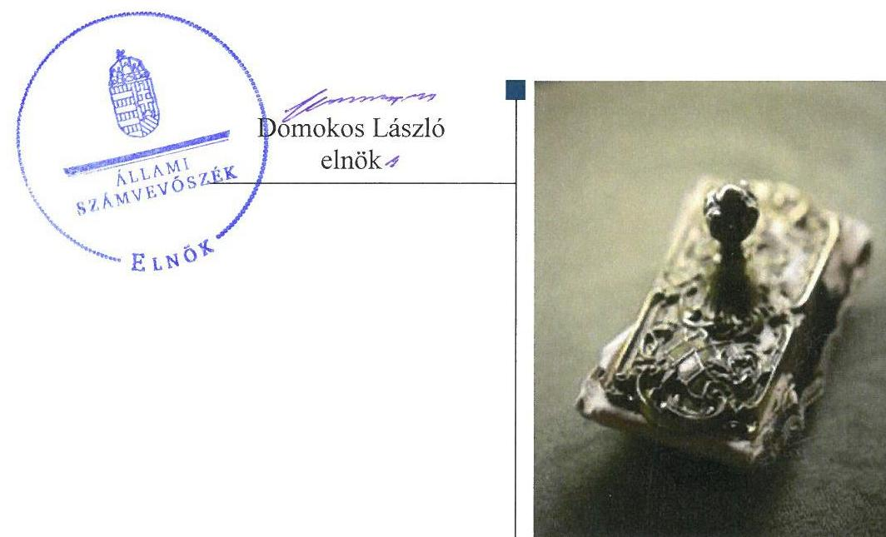
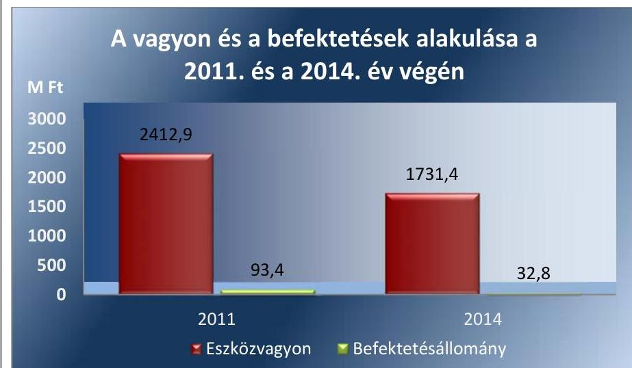
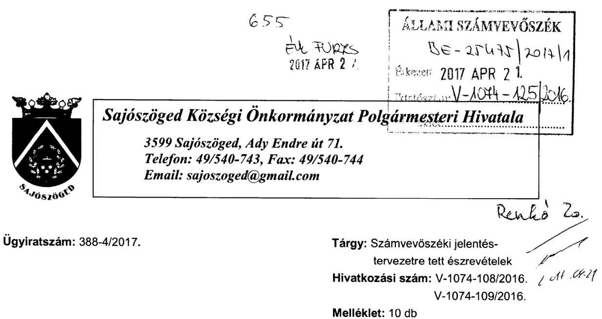
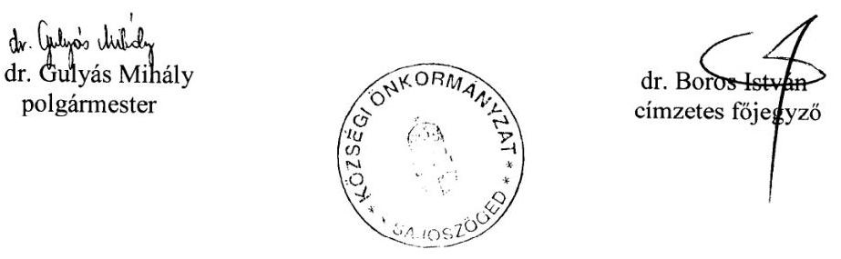
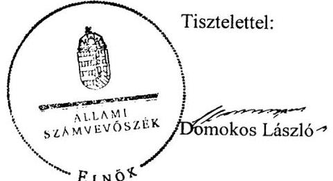
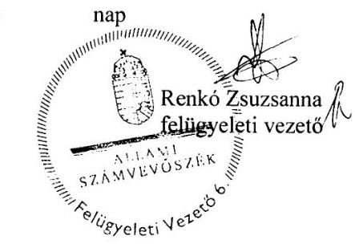
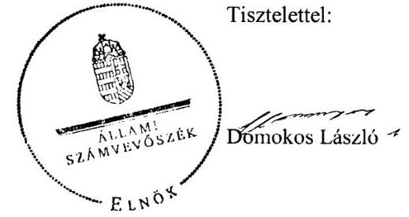
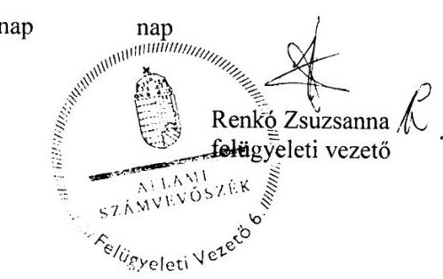

# Jelentés 

## Önkormányzatok belső kontrollrendszere

Az önkormányzatok belső kontrollrendszere kialakításának és működtetésének ellenőrzése - Sajószöged 2017.

---

# Jelentés 

## Önkormányzatok belső kontrollrendszere

Az önkormányzatok belső kontrollrendszere kialakításának és működtetésének ellenőrzése - Sajószöged
2017. 05. hó 23. nap

---

# AZ ELLENŐRZÉST FELÜGYELTE: 

RENKÓ ZSUZSANNA felügyeleti vezető

## AZ ELLENŐRZÉST VEZETTE ÉS A VÉGREHAJTÁSÁÉRT FELELŐS:

DR. TIMÁR BALÁZS ellenőrzésvezető

## A PROGRAM ÖSSZEÁLLÍTÁSÁÉRT FELELŐS:

JANIK JÓZSEF LÁSZLÓ osztályvezető

IKTATÓSZÁM: V-1074-118/2016.
TÉMASZÁM: 2107

## ELLENŐRZÉS-AZONOSÍTÓ SZÁM: V071818, V073818

Jelentéseink az Országgyűlés számítógépes hálózatán és az Interneten a www.asz.hu címen is olvashatóak.

---

# TARTALOMJEGYZÉK 

■ ÖSSZEGZÉS ..... 5
■ AZ ELLENŐRZÉS CÉLJA ..... 6
■ AZ ELLENŐRZÉS TERÜLETE ..... 7
■ AZ ELLENŐRZÉS HÁTTERE, INDOKOLTSÁGA ..... 8
■ A JELENTÉS LÉNYEGES KÉRDÉSKÖREI ..... 10
■ ELLENŐRZÉS HATÓKÖRE ÉS MÓDSZEREI ..... 11
■ MEGÁLLAPÍTÁSOK ..... 14
■ JAVASLATOK ..... 20
■ MELLÉKLETEK ..... 23
I. sz. melléklet: Értelmező szótár ..... 23
II. sz. melléklet: Az integritás érvényesítése érdekében kialakított és működtetett kontrollrendszer ..... 26
III. sz. melléklet: A befektetési jegyekkel kapcsolatos üzletkötések (2011. január 1. - 2015. április 30.) ..... 28
IV. sz. melléklet: Tartós részesedéssel kapcsolatos további információ ..... 29
■ FÜGGELÉK: ÉSZREVÉTELEK ..... 31
■ RÖVIDÍTÉSEK JEGYZÉKE ..... 55

---

.

---

# ÖSSZEGZÉS 

Sajószöged Községi Önkormányzatnál a közvagyon biztonságos, körültekintő befektetése nem volt biztosított, mivel a befektetésekkel kapcsolatos kockázatokat nem mérték fel. A befektetési jegyek vásárlása során sérült a Képviselő-testület önkormányzati tulajdon feletti rendelkezési joga. Az önkormányzati közvagyonnal való gazdálkodás nyilvánosságát és átláthatóságát nem biztosították. Az Önkormányzat mérlege nem a valóságnak megfelelő értékben tartalmazta a befektetett közvagyon nagyságát.

## Az ellenőrzés társadalmi indokoltsága

Magyarország Alaptörvénye az önkormányzatoktól is elvárja a kiegyensúlyozott, átlátható és fenntartható költségvetési gazdálkodás elvének érvényesítését. A korábbi évek ellenőrzési tapasztalatai, az önkormányzatok által betöltött társadalmi szerep, az általuk kezelt közpénz nagysága, a nemzeti vagyon átruházására vagy hasznosítására vonatkozó döntéseik sokrétűsége egyaránt indokolttá tették a számvevőszéki ellenőrzések folytatását. A belső kontrollrendszer jogszabályoknak megfelelő kialakítása és működtetése nélkül nem valósítható meg a közpénzek, a közvagyon szabályos, gazdaságos, hatékony és eredményes felhasználása.

A Sajószöged Községi Önkormányzat 2015. április 30-án 12,8 millió Ft üzleti célú részesedéssel és 58,9 millió Ft befektetési jeggyel rendelkezett. Felmerült, hogy a belső kontrollrendszer kialakítása és működtetése nem biztosította a közvagyon megóvását, körültekintő, biztonságos befektetését, a befektetési döntések végrehajtása és számviteli elszámolása nem volt szabályszerű.

## Főbb megállapítások, következtetések

A belső kontrollrendszer szabálytalan működtetése következtében a közpénzekkel való felelős, rendeltetésszerű gazdálkodás nem volt biztosított. A teljesítésigazolási és érvényesítési jogkörök szabálytalan gyakorlása miatt a kialakított kontrolltevékenységek nem járultak hozzá a hibák megelőzéséhez, feltárásához. Nem mérték fel és nem határozták meg a Hivatal tevékenységében, gazdálkodásában rejlő kockázatokat, az Önkormányzat befektetési tevékenységével összefüggő kockázatokat nem elemezték, ezáltal nem volt biztosított a közvagyon értékének megőrzése és gyarapítása.

A befektetésekkel kapcsolatos döntések előkészítésére szabályozás nem volt. A befektetési jegyek megszerzésére irányuló döntéseket nem az arra jogosult Képviselő-testület hozta meg, ezáltal a közvagyon szabályos, körültekintő befektetését nem volt biztosították.

A részesedések bekerülési értékének helytelen meghatározása miatt a mérlegekben a befektetett vagyon értékét nem a valóságnak megfelelően mutatták be, ezáltal a döntéshozóknak a vagyonnal kapcsolatos döntéseik meghozatalát megelőzően nem állt megfelelő információ a rendelkezésükre.

Az Önkormányzatnak az integritás szemlélet erősítése érdekében - a belső kontrollrendszer kialakításában és működésében feltárt hiányosságok és hibák megszüntetésével - még további intézkedéseket kell megtennie.

---

# AZ ELLENŐRZÉS CÉLJA 

Az ellenőrzés célja annak megállapítása volt, hogy az önkormányzat belső kontrollrendszerének kialakítása, továbbá egyes elemeinek működtetése biztosította-e a közpénz felhasználás szabályosságát. Az erőforrásokkal való szabályszerű és hatékony gazdálkodáshoz szükséges követelmények érvényesítése, számonkérése, ellenőrzése megtörtént-e az önkormányzatnál. A belső kontrollrendszer kialakítása és működtetése támogatta-e az integritás szemlélet érvényesülését. Az ellenőrzés során értékeltük a belső kontrollrendszer kialakításának és működtetésének szabályszerűségét. Feltártuk azokat a lényeges szabályozási és működési hiányosságokat, amelyek miatt az ellenőrzött kulcskontrollok nem nyújtottak elegendő védelmet a lehetséges hibákkal szemben. Rámutattunk arra, ha a kulcskontrollok valamely hibát nem előznek meg, nem tárnak fel, vagy nem javítanak ki, valamint minősítjük működésük megfelelőségét. Ellenőriztük, hogy az önkormányzat egyes befektetési döntései és azok végrehajtása, elszámolása megfelelt-e a vonatkozó jogszabályoknak és belső szabályozásoknak, a kialakított kontrollrendszer támogatta-e a befektetési tevékenység szabályszerűségét.

---

# **AZ ELLENŐRZÉS TERÜLETE**

## **Sajószöged Községi Önkormányzat**

Sajószöged község Borsod-Abaúj-Zemplén megyében található, állandó lakosainak száma 2015. január 1-jén 2211 fő volt. Az Önkormányzat¹ az ellenőrzött időszakban hét tagú Képviselő-testülettel² rendelkezett, melynek munkáját két állandó bizottság segítette. Az Önkormányzat a Hivatalon³ kívül egy intézménnyel, valamint egy 100%-os tulajdoni részesedésű gazdasági társasággal látta el a feladatait.

A községben az ellenőrzött időszakban nemzetiségi önkormányzat nem működött.

A Polgármester⁴ a 2012. áprilisi 21-ei időközi önkormányzati választás óta tölti be tisztségét. A Jegyző⁵ 1999. október 1. óta látja el feladatait. A Hivatal két, egymással mellérendeltségi viszonyban álló csoportra tagolódott (Pénzügyi csoport és Igazgatási csoport), elkülönített gazdasági szervezettel nem rendelkezett, ennek feladatait a Pénzügyi csoport látta el. A Hivatalban foglalkoztatott köztisztviselők száma 2014. év végén hat fő volt. A Hivatalnál 2014. január 1. óta szervezeti változás nem következett be.

Az Önkormányzat a 2014. évi összevont éves költségvetési beszámoló szerint 286,5 millió Ft költségvetési bevételt ért el, valamint 304,2 millió Ft költségvetési kiadást teljesített. A hiányt az értékpapírok beváltásának bevételeiből (83,1 M Ft) és az előző évi pénzmaradvány igénybevételéből (3,8 M Ft) finanszírozták. Az eszközvagyon értéke 2014. december 31-én 1 731 millió Ft volt, a költségvetési évben esedékes kötelezettség állomány 0,02 millió Ft-ot, a költségvetési évet követően esedékes kötelezettség állomány 2,2 millió Ft-ot tett ki.

Az Önkormányzat vagyonának és befektetéseinek alakulását a 2011. év és a 2014. év végén az 1. ábra mutatja be.

1. ábra

*Forrás: Az Önkormányzat költségvetési beszámolói*

---

# AZ ELLENŐRZÉS HÁTTERE, INDOKOLTSÁGA 

Az ÁSZ tv. ${ }^{6}$ szerint az ÁSZ ${ }^{7}$ feladata a jól irányított állam kiépítésének elősegítése. Az ÁSZ Stratégiájában ezért hangsúlyos szerepet szánt annak, hogy szilárd szakmai alapon álló, értékteremtő ellenőrzéseivel előmozdítsa a közpénzügyek átláthatóságát, rendezettségét. A számvevőszéki ellenőrzés nemzetközi alapelvei is rögzítik, hogy a megfelelő belső kontrollrendszer minimálisra csökkenti a hibák és szabálytalanságok kockázatát. A belső kontrollrendszer azt a célt szolgálja, hogy a költségvetési szervek működésük és gazdálkodásuk során a tevékenységeket szabályszerűen, gazdaságosan, hatékonyan, eredményesen hajtsák végre, teljesítsék elszámolási kötelezettségeiket és megvédjék az erőforrásokat a veszteségektől, a károktól és a nem rendeltetésszerű használattól. A belső kontrollrendszer magában foglalja mindazon szabályokat, eljárásokat, gyakorlati módszereket, szervezeti struktúrákat, kockázatkezelési technikákat és kontrolltevékenységeket, amelyek segítséget nyújtanak a szervezetnek céljai eléréséhez. A belső kontrollrendszer szabályozása háromszintű: a törvényi előírásokat az Áht. ${ }^{8}$ és a Mötv. ${ }^{9}$, a rendeleti szintű szabályozást az Ávr. ${ }^{10}$ és a Bkr. ${ }^{11}$ tartalmazza, amelyeket útmutatói szinten az NGM ${ }^{12}$ által kiadott standardok és kézikönyvek támogatnak. Az ellenőrzött időszak meghatározása lehetőséget teremtett a 2014. október 12-i önkormányzati választásokat megelőző és követő ciklus belső kontrollrendszere működésének elkülönült értékelésére, valamint a változások nyomon követésére.

A BELSŐ KONTROLLRENDSZER kialakításának és működtetésének általános értékelése mellett a teljesítésigazolás és érvényesítés kontrollok kiemelt ellenőrzésének szükségességét alátámasztja, hogy 2012. évtől a pénzügyi folyamatokban kulcsszerepet betöltő belső kontrollok rendszere módosult és azok működtetésében az önkormányzatoknál hiányosságok mutatkoztak a 2012. év óta elvégzett ÁSZ ellenőrzések alapján.

Az önkormányzatok belső kontrollrendszerének ellenőrzése az ÁSZ "jó kormányzással" kapcsolatos stratégiai céljainak megvalósítását is szolgálja. Az ÁSZ célja, hogy javuljon az ellenőrzött önkormányzatok belső kontrollrendszerének szabályozottsága, működésének megfelelősége, hozzájárulva ezzel az egyensúlyi helyzet fenntarthatóságának biztosításához, azaz az adósság újratermelődésének megakadályozásához. Az ÁSZ ellenőrzés tapasztalatai nem csupán a közvetlenül ellenőrzött önkormányzatokat segíthetik, hanem a ,,jó gyakorlat" elterjesztésével azok az önkormányzatok is átvehetik a pozitív példákat, ahol nem végez ellenőrzést az ÁSZ.

Az $\mathrm{MNB}^{13}$ három befektetési szolgáltató tevékenységi engedélyét 2015. első felében visszavonta és kezdeményezte a vállalkozások felszámolását a működéssel kapcsolatos szabálytalanságok, hiányosságok miatt. A befektetési vállalkozások problémás helyzetbe kerülése jelentős veszteségekhez vezetett számos önkormányzat esetében. A korábbi évek ellenőrzési tapasztalatai alapján fennáll a lehetősége annak, hogy az önkormányzatok befektetési döntései, továbbá a döntések végrehajtása és számviteli elszámolása nem voltak teljes mértékben szabályszerűek, a

---

belső kontrollrendszer és a kapcsolódó külső ellenőrzések sem működtek minden esetben megfelelően.

# AZ ÖNKORMÁNYZATOK ÁTMENETILEG SZABAD 

PÉNZESZKÖZEINEK BEFEKTETÉSÉT jogszabály nem tiltja, a pénzpiaci szolgáltatók közül az önkormányzatok a kínált szolgáltatás és annak költségei alapján szabadon választhatnak, a veszteséges gazdálkodás kockázatai és következményei azonban az önkormányzatokat terhelik. A szabad pénzeszközök felelős hasznosítása összhangban áll az önkormányzati gazdálkodás alapelveivel.

A közintézmények integritás alapú kultúrájának kialakítása, megerősítése és működése szorosan összefügg a belső kontrollrendszer működésével, ezért az ellenőrzés kiterjed annak értékelésére is, hogy a belső kontrollrendszer kialakítása és működtetése hogyan hatott az integritás szemlélet érvényesülésére.

## AZ ELLENŐRZÉS VÁRHATÓ HASZNOSULÁSA

NÉGY SZINTEN valósul meg. A törvényalkotás számára összegzett tapasztalatok állnak rendelkezésre a belső kontrollrendszer önkormányzati területen való kialakításáról, működtetéséről és hatásairól. Az ellenőrzés az ellenőrzött számára visszajelzést ad a belső kontrollrendszer kialakításában és működésében lévő hiányosságokról, javaslataival hozzájárul azok kiküszöböléséhez. Az ellenőrzés megállapításait és javaslatait más szervezetek is hasznosíthatják a rendezett gazdálkodási keretek kialakításához. A társadalom számára jelzi, hogy közpénz nem maradhat ellenőrizetlenül, az ÁSZ értékteremtő rend kialakításához és megőrzéséhez hozzájáruló tevékenysége pozitív hatással lesz a szervezetről kialakított összkép formálásában.

Az ÁSZ az ellenőrzéseivel hozzájárul ahhoz, hogy az egyes önkormányzati befektetésekkel kapcsolatos kockázatok, a szabályozási és kontroll mechanizmusok fejlesztésével mérsékelhetők legyenek. Feltárja az önkormányzati befektetési tevékenységet meghatározó szabályozások összhangjának hiányosságait, a szabályozással nem érintett gazdálkodási területeket, valamint az egyes befektetési tevékenységek esetleges szabálytalanságait.

Az ellenőrzés megállapításaival összefüggő javaslatok hasznosítása esetén javulhat az önkormányzat gazdálkodásának, egyes befektetési tevékenységének szabályozottsága, valamint a „jó gyakorlatok" terjesztésén keresztül azok az önkormányzatok is átvehetik a pozitív példákat, ahol nem végez ellenőrzést az ÁSZ.

---

# A JELENTÉS LÉNYEGES KÉRDÉSKÖREI 

1. Az önkormányzat belső kontrollrendszerének egyes pillérei 2011. január 1. és 2015. április 30. között támogatták-e a befektetési tevékenység szabályszerű végzését?
2. A gazdálkodás egészét tekintve a belső kontrollrendszer kialakítása és működtetése szabályszerű volt-e 2014. január 1. és 2015. április 30. között?
3. Az egyes befektetésekkel kapcsolatos döntéshozatal és a döntések végrehajtása szabályszerű volt-e?
4. Az egyes befektetések számviteli elszámolása, nyilvántartása szabályszerű volt-e?

---

# ELLENŐRZÉS HATÓKÖRE ÉS MÓDSZEREI 

## Az ellenőrzés típusa

A belső kontrollrendszer ellenőrzése esetében megfelelőségi ellenőrzés, a befektetési tevékenységnél szabályszerűségi ellenőrzés.

## Az ellenőrzött időszak

A belső kontrollrendszer kialakításának és működtetésének ellenőrzése a 2014. január 1. és 2015. április 30. közötti időszakra terjedt ki. Ezen belül a belső kontrollrendszer kialakításának és működtetésének megfelelőségét a 2014. január 1. és október 12., valamint a 2014. október 13. és 2015. április 30. közötti időszakra vonatkozóan külön-külön értékeltük. Az önkormányzatok

 egyes befektetési tevékenységeinek ellenőrzése tekintetében az ellenőrzött időszak a 2011. január 1. - 2015. április 30. közötti időszak. Ezen felül az önkormányzat befektetésekkel kapcsolatos döntés-előkészítésének és döntéshozatalának szabályszerűségét a 2011. január 1. előtti időszakra visszanyúlóan is ellenőriztük, amennyiben a 2014. június 30-án, illetve 2015. április 30-án meglévő befektetéseire 2011. január 1-je előtt került sor. Az integritás szemlélet érvényesülését a 2014. évre vonatkozó adatszolgáltatás alapján értékeltük.

## Az ellenőrzés tárgya

A helyi önkormányzatnak, mint éves költségvetési beszámoló készítésére kötelezett szervezetnek és Polgármesteri hivatalának belső kontrollrendszere.

Az erőforrásokkal való szabályszerű és hatékony gazdálkodáshoz szükséges követelmények érvényesítése, számonkérés, ellenőrzése. Az integritás szemlélet érvényesülése.

Az önkormányzat 2014. június 30-án, illetve 2015. április 30-án meglévő értékpapírokban megtestesülő befektetései, lekötött betétei, valamint az önkormányzat üzleti vagyonába tartozó ingatlanok, kulturális javak (műtárgyak, műalkotások, stb.), illetve a feladatellátást nem szolgáló egyéb értéktárgyak (pl. ékszerek, befektetési nemesfém).

## Az ellenőrzött szervezet

Sajószöged Községi Önkormányzat és a Sajószögedi Polgármesteri Hivatal.

---

# Az ellenőrzés jogalapja 

Az ÁSZ tv. 1. § (3) bekezdésében foglaltak alapján az ÁSZ általános hatáskörrel végzi a közpénzekkel és az állami és önkormányzati vagyonnal való felelős gazdálkodás ellenőrzését. Az ÁSZ tv. 5. § (2) bekezdése alapján az államháztartás gazdálkodásának ellenőrzése keretében az ÁSZ ellenőrzi a helyi önkormányzatok gazdálkodását, valamint az ÁSZ tv. 5. § (6) bekezdése alapján ellenőrzése során értékeli az államháztartás számviteli rendjének betartását és a belső kontrollrendszer működését.

## Az ellenőrzés módszerei

Az ellenőrzést a nemzetközi standardokat irányadónak tekintve az ellenőrzési program ellenőrzési kérdései, az ellenőrzött időszakban hatályos jogszabályok, az ellenőrzés szakmai szabályok és módszertanok figyelembe vételével végeztük.

Az ellenőrzés lefolytatásához az Önkormányzat a tanúsítványok kitöltésével, valamint az ÁSZ által kért dokumentumok elektronikus megküldésével szolgáltatott adatokat. A rendelkezésre bocsátott adatok, információk kontrollja és a munkalapok kitöltése az ellenőrzés keretében történt. A jelentésben használt fogalmak magyarázatát az I. számú melléklet, az integritás érvényesítése érdekében kialakított és működtetett kontrollrendszer minősítését a IV. számú melléklet tartalmazza.

A belső kontrollrendszer jogszabályi előírások szerinti kialakításának és működtetésének szabályszerűségét az erre irányuló ellenőrzési kérdésekre adott válaszok összesítése alapján külön-külön értékeltük a 2014. január 1. és október 12., valamint a 2014. október 13. és 2015. április 30. közötti időszakra. A belső kontrollrendszert egy-egy ellenőrzött időszakra pillérenként (kontrollkörnyezet, kockázatkezelési rendszer, kontrolltevékenységek, információs és kommunikációs rendszer, monitoring rendszer) és összesítetten is értékeltük.

## A BELSŐ KONTROLLRENDSZER EGYES PILLÉRE-

INEK KIALAKÍTÁSA ÉS MŰKÖDTETÉSE „szabályszerű volt", amennyiben az értékelt területen az elért és elérhető pontok százalékban kifejezett, egész számra kerekített hányadosa meghaladta a 84%-ot, „részben szabályszerű volt", ha 61-84% közé esett, „nem szabályszerű volt", ha nem haladta meg a 60%-ot. A belső kontrollrendszer összesített értékelése megegyezett a pillérenként (kontrollterületenként) alkalmazott százalékos értékelésekkel, a következő eltérésekkel. A kontrollrendszer egésze esetében a „szabályszerű" értékelésnek a százalékos értéken felül további feltétele volt, hogy egyik kontrollterület sem kaphat „nem szabályszerű" értékelést, a „részben szabályszerű" értékelés további feltétele volt, hogy legfeljebb egy ellenőrzött kontrollterület lehet „nem szabályszerű" értékelésű. Az összesített értékelés a százalékos értéktől függetlenül „nem szabályszerű volt", ha az ellenőrzött kontrollterületek közül több mint egynek „nem szabályszerű volt" az értékelése.

---

# A GAZDÁLKODÁS FOLYAMATÁBAN A KÉT 

KULCSKONTROLL - teljesítésigazolás, érvényesítés - működésének megfelelőségét a személyi juttatásokkal, a dologi kiadásokkal, a beruházási, felújítási kiadásokkal és az ellátottak pénzbeli juttatásaival kapcsolatos kifizetések esetében mintavétellel ellenőriztük. A mintavétel során külön értékeltük a 2014. január 1. és 2014. október 12. közötti időszakban és a 2014. október 13. és 2015. április 30. közötti időszakban teljesített kifizetéseket. „Megfelelőnek" értékeltük a gazdálkodási jogkörök gyakorlását, amennyiben 95%-os bizonyossággal a teljes sokaságban a hibaarány legfeljebb 10%, „részben megfelelőnek" értékeltük, ha a hibaarány felső határa 10-30% között volt, „nem megfelelőnek" pedig akkor, ha a mintavételi eredmények alapján a sokaságbeli hibaarány felső határa meghaladta a 30%-ot.

Az integritás szemlélet érvényesülésének értékelése az önkormányzat által kitöltött tanúsítvány alapján történt.

---

# 1. Az önkormányzat belső kontrollrendszerének egyes pillérei 2011. január 1. és 2015. április 30. között támogatták-e a befektetési tevékenység szabályszerű végzését? 

Összegző megállapítás

1. táblázat

## 5 MILLIÓ FT FELETTI BEFEKTETÉSEGY VÁSÁRLÁS (2012-2015)

| Megbízás időpontja | Összeg
(ezer Ft) |
| :-- | :--: |
| 2012. április 5. | 34000 |
| 2012. október 9. | 40000 |
| 2012. december 28. | 15000 |
| 2013. április 9. | 48000 |
| 2014. április 25. | 30000 |
| 2014. szeptember 29. | 35000 |
| 2015. március 19. | 55000 |
| 2015. április 28. | 10000 |
| Forrás: ÁSZ saját kimutatás az Önkormányzat adat- |  |
| szolgáltatása alapján |  |

2. táblázat

## BEFEKTETÉSI JEGYEK VISSZAVÁLTÁSA (2012-2015)

| Év | 5 millió Ft
feletti
transzációk
száma | Összvolumen
(ezer Ft) |
| :--: | :--: | :--: |
| 2012. | 4 | 28000 |
| 2013. | 6 | 48000 |
| 2014. | 10 | 73100 |
| 2015. | 2 | 14000 |
| Forrás: ÁSZ saját kimutatás az Önkormányzat adat- |  |  |
| szolgáltatása alapján |  |  |

A belső kontrollrendszer egyes pillérei 2011. január 1. és 2015. április 30. között nem támogatták a befektetési tevékenység szabályszerű végzését, a befektetésekben meglévő önkormányzati közvagyon megóvása és gyarapítása nem volt biztosított.

A KONTROLLKÖRNYEZET kialakítása nem támogatta a befektetési tevékenység szabályszerű végzését, mivel a képviselő-testületi SZMSZ$_{1-3}$$^{14}$ a jogszabályi előírásoknak megfelelően ruházták át a Polgármesterre az átmenetileg szabad pénzeszközök lekötésére vonatkozó döntési hatáskört, a Képviselő-testület azonban nem élt az Ötv.$^{15}$ 9. § (3) bekezdésében és az Mötv. 41. § (4) bekezdésében foglalt jogával, az átruházott hatáskör gyakorlásához külön utasítást nem adott és az így meghozott döntésekkel kapcsolatos beszámolás rendjét sem határozta meg. Ennek hiányában nem volt biztosított, hogy megfelelő, pontos és naprakész információk álljanak a Képviselő-testület rendelkezésre az Önkormányzat vagyonával kapcsolatosan.

KOCKÁZATKEZELÉSI RENDSZERT az Ámr.$^{16}$ 157. § (1) bekezdésének és a Bkr. 7. § (1) bekezdésének előírása ellenére nem működtettek. A 2011. évben az Ámr. 157. § (2)-(3) bekezdései ellenére nem határozták meg az egyes kockázatokkal kapcsolatos intézkedéseket és megtételük módját a befektetések vonatkozásában. A 2012-2015. években a Bkr. 7. § (2) bekezdésében foglaltak ellenére a befektetési tevékenységgel kapcsolatban nem mérték fel és nem állapították meg a kockázatokat, nem határozták meg az egyes kockázatokkal kapcsolatban szükséges intézkedéseket, valamint azok teljesítésének, folyamatos nyomon követésének módját.

## AZ INFORMÁCIÓS ÉS KOMMUNIKÁCIÓS RENDSZER keretében 2012. január 1. és 2015. április 30. között - az 1. táblázatban bemutatott időpontokban és összegekkel - befektetési jegyek megvásárlására, továbbá ugyanebben az időszakban - a 2. táblázat szerinti volumenben - befektetési jegy visszaváltására adott megbízások tekintetében a megbízások megnevezését (típusát), tárgyát, a szerződő fél (megbízott) nevét, a szerződés (megbízás) értékét - az Info. tv.$^{17}$ 37. § (1) bekezdésének és 1. melléklete III/4. pontjának előírása ellenére - az Önkormányzat honlapján nem tették közzé, ezáltal az önkormányzati közvagyonnal való gazdálkodás nyilvánosságát és átláthatóságát nem biztosították.

---

A MONITORING RENDSZER keretén belül működő belső ellenőrzés a befektetésekre nem terjedt ki, ezért az - bizonyosságot adó tevékenysége körében - nem volt képes a kockázati tényezőket, hiányosságokat megszüntetni, kiküszöbölni vagy csökkenteni, a jelen ellenőrzés által megállapított szabálytalanságokat megelőzni, illetve feltárni. A külső ellenőrzések a befektetési tevékenységre nem terjedtek ki, ezért nem támogatták a befektetési tevékenység szabályszerű végzését.

A Pénzügyi Bizottság az Ötv. 92. § (13) bekezdése b) pontjának és az Mötv. 120. § (1) bekezdése b) pontjának előírásai ellenére az értékpapírokban tartott vagyon változásának alakulását nem kísérte figyelemmel, a változást előidéző okokat nem értékelte.

# 2. A gazdálkodás egészét tekintve a belső kontrollrendszer kialakítása és működtetése szabályszerű volt-e 2014. január 1. és 2015. április 30. között? 

Összegző megállapítás
2014. január 1. és 2015. április 30. között az Önkormányzat és a Hivatal gazdálkodásának egészét tekintve a belső kontrollrendszer kialakítása és működtetése nem volt szabályszerű, a felelős gazdálkodás és az elszámoltathatóság nem érvényesült.

A KONTROLLKÖRNYEZET kialakítása nem volt szabályszerű, mivel a 2014. november 1-től hatályos Hivatali SZMSZ$^{18}$ az Ávr. 13. § (1) bekezdése b), e) és i) pontjai előírásainak ellenére nem tartalmazta a Hivatal alapító okiratának keltét, az alapítás időpontját, az ÁMK$^{19}$-t, mint a Hivatalhoz rendelt költségvetési szervet és 2014. december 31-ig a Hivatal szervezeti egységeinek engedélyezett létszámát.

A köztisztviselők munkaköri leírásában a Kttv.$^{20}$ 75.§ (1) bekezdés d) pontja ellenére - figyelemmel a 226. § (1) bekezdésében foglaltakra is - nem határozták meg egyértelműen a munkakör betöltésével kapcsolatos, végzettségre, szakképzettségre vonatkozó követelményeket.

A Hivatalnál a pénzügyi-számviteli területen foglalkoztatott köztisztviselők közül egy-egy fő távozott, illetve érkezett, azonban a Kttv. 74. § (1) bekezdésében előírtak ellenére - figyelemmel a Kttv. 226. § (1) bekezdésében foglaltakra is - dokumentáltan nem történt meg a munkakör át-adás-átvétele.

KOCKÁZATKEZELÉSI RENDSZERT a Bkr. 7. § (1) bekezdésének előírásai ellenére nem működtettek. A Bkr. 7. § (2) bekezdése ellenére nem mérték fel és nem állapították meg a tevékenységben, gazdálkodásban rejlő kockázatokat, nem határozták meg az egyes kockázatokkal kapcsolatban szükséges intézkedéseket.

Az önkormányzati bizottságok nem képviselő tagjainak vagyonnyilatkozat-tételére vonatkozó kötelezettségét a Vnytv.$^{21}$ 4. § d) pontjában foglaltak ellenére a képviselő-testületi SZMSZ$_{2,3}$ nem tartalmazta. A nem képviselő bizottsági tagok esetében a Pénzügyi Bizottság$^{22}$ - a Vnytv. 11. §

---

(6) bekezdésének rendelkezése ellenére - a vagyonnyilatkozatok átadására, nyilvántartására, a vagyonnyilatkozatban foglalt személyes adatok védelmére belső szabályzatban további szabályokat nem állapított meg.

A KONTROLLTEVÉKENYSÉGEK közül a teljesítés igazolását és az érvényesítést az Áht. 2 38. § (1) bekezdése ellenére nem, vagy nem az Ávr. előírásainak megfelelően végezték el, mivel
$\longrightarrow$ a 2014. november 30-ig vállalt kötelezettségek terhére végrehajtott kifizetések esetében az Ávr. 57. § (4) bekezdésében foglaltak ellenére a teljesítés igazolását végző személy nem rendelkezett a kötelezettségvállaló általi felhatalmazással ezen gazdálkodási jogkör gyakorlására.
$\longrightarrow$ az Ávr. 57. § (3) és 58. § (4) bekezdésének előírása ellenére - a teljesítés igazolását és az érvényesítést nem az arra jogosult végezte, mivel az aláírás nem egyezett meg a gazdálkodási szabályzat$_{1,2}$$^{23}$ mellékletei szerinti aláírásokkal.
$\longrightarrow$ az érvényesítés során - az Ávr. 58. § (2) bekezdésében foglaltak ellenére - nem jelezték az utalványozónak, hogy a megelőző ügymenetben a teljesítésigazolást nem az Ávr. 57. § (3) bekezdésében foglaltak szerint végezték.
A 2014. január 1. és november 30. között az érvényesítést végző személy az Ávr. 58. § (4) bekezdésének előírása ellenére nem rendelkezett az Ávr. 55. § (3) bekezdésében előírt végzettséggel. Emiatt

 a kontrolltevékenységek nem biztosították a döntések szabályszerűségi szempontból történő jóváhagyásával, a gazdasági események elszámolásával kapcsolatos kockázatok csökkentését.

Az Önkormányzat által 2014. október 18-án kötött gépjármű-adásvételi szerződés megkötésére a Képviselő-testület utólagosan adott felhatalmazást annak ellenére, hogy a képviselő-testületi SZMSZ-ben a Polgármesterre átruházott hatáskörök között beruházással kapcsolatos döntéshozatal nem szerepelt, továbbá a vagyonrendelet sem tartalmazott a Polgármester által megköthető beruházási szerződésekkel kapcsolatos rendelkezést. Ugyanezen szerződés pénzügyi ellenjegyzésére az Áht. 2. 37. § (1) bekezdésében és az Ávr. 55. § (1) bekezdésében foglaltak ellenére nem került sor.

# AZ INFORMÁCIÓS ÉS KOMMUNIKÁCIÓS RENDSZER kialakítása és működtetése nem volt szabályszerű, mert 

$\longrightarrow$ a Bkr. 9. § (2) bekezdésének előírása ellenére a beszámolási szinteket, határidőket, módokat nem határozták meg.
$\longrightarrow$ az Info tv. 35. § (3) bekezdésében foglaltak ellenére nem állapították meg a közzétételi kötelezettség teljesítésének részletes szabályait belső szabályzatban.
$\longrightarrow$ az adatvédelmi és adatbiztonsági szabályzatot az Info. tv. 37. § (1) bekezdésében és 1. mellékletének II/1. pontjában foglaltak ellenére, az éves költségvetési beszámolót az Info. tv. 37. § (1) bekezdésében és 1. mellékletének III/1. pontjában foglaltak ellenére nem tették közzé.

---

Az iratkezelés szabályzatot az Ltv. ${ }^{24} 10 . \S$ (1) bekezdés c) pontjában foglaltak ellenére nem a Magyar Nemzeti Levéltár, valamint az illetékes megyei kormányhivatal egyetértésével adták ki. Az iratkezelési szabályzat nem tartalmazott az lkr. ${ }^{25} 37$. és 38. §-ainak megfelelő szabályozást az iratoknak a munkahelyről történő kivitelére, tanulmányozására, feldolgozására, tárolására, illetve a személyes adatok kezeléséhez való hozzájárulást tartalmazó kérelmek kezelésére vonatkozóan. Az iratkezelési szabályzat aktualizálását az lkr. 3. § (1) bekezdése ellenére nem végezték el.

A MONITORING RENDSZER keretében a szervezet tevékenységének, a célok megvalósításának nyomon követését biztosító rendszer keretében az operatív tevékenységek során megvalósuló folyamatos és eseti nyomon követést a Bkr. 10. §-ában foglaltak ellenére nem alakították ki.

A belső ellenőrzés működtetése során a 2014. és 2015. évi ellenőrzési tervek a Bkr. 31. § (4) bekezdés a) és d) pontjaiban foglalt követelmények ellenére nem tartalmazták az ellenőrzési tervet megalapozó elemzéseket, a kockázatelemzés eredményének összefoglaló bemutatását, valamint az ellenőrizendő időszak pontos meghatározását.

A belső ellenőrzési vezető a Bkr. 22. § (1) bekezdés b) pontjának előírása ellenére kockázatelemzéssel alátámasztott stratégiai ellenőrzési tervet nem készített. A 2014. évi belső ellenőrzéshez program készült, azt azonban a Bkr. 33. § (2) bekezdés j) pontjának előírása ellenére nem a belső ellenőrzési vezető írta alá.

# AZ ERŐFORRÁSOKKAL VALÓ HATÉKONY GAZDÁLKODÁSHOZ SZÜKSÉGES KÖVETELMÉNYEKET a Képviselő-testület nem alakította ki, vagyis 2014-ben az Áht. 2. 9. § (1) bekezdésének f) pontjában, 2015. január 1-től április 30-ig az Áht. 2. 9. § eb) pontjában előírtak ellenére az erőforrásokkal való szabályszerű és hatékony gazdálkodáshoz szükséges követelmények érvényesítése, számonkérése, ellenőrzése nem történt meg. Ezáltal az Önkormányzat nem biztosította a rendelkezésre álló források gazdaságos, hatékony és eredményes felhasználását. A belső ellenőrzés a rendelkezésre álló erőforrásokkal való gazdálkodást - a Bkr. 21. § (2) bekezdés b) pontjában foglalt előírás ellenére - nem vizsgálta és nem elemezte.

Az Önkormányzat hatályos Szociális Szolgáltatástervezési Koncepciója a Szoc.tv. ${ }^{26}$ 92. § (4) bekezdés b) pontjának előírása ellenére ütemtervet nem tartalmazott. Önálló, települési környezetvédelmi programot a Kvtv. ${ }^{27}$ 46. § (1) bekezdés b) pontjának előírása ellenére az Önkormányzat nem dolgozott ki.

AZ INTEGRITÁS SZEMLÉLET érvényesítését az Önkormányzat belső kontrollrendszerének kialakítása és működtetése nem támogatta. Az Önkormányzat az integritás szemlélet érvényesülésének felméréséhez jelen ellenőrzés keretében szolgáltatott adatokat. Az értékelés eredményét a II. számú mellékletben mutatjuk be.

---

# 3. Az egyes befektetésekkel kapcsolatos döntéshozatal és a döntések végrehajtása szabályszerű volt-e? 

## Összegző megállapítás

A befektetési jegyek megszerzésére vonatkozó döntések során a közvagyon szabályszerű és körültekintő befektetése nem volt biztosított.
3. táblázat

SAJÓSZÖGED ÉRTÉKPAPÍR ÁLLOMÁNYA 2015. 04. 30-ÁN

| Megnevezés | Érték   (ezer Ft) | Megszer-   zés éve |
| :-- | :--: | :--: |
| Tartós része-   sedés (EHEP) | 9200 | 1997. |
| Tartós része-   sedés   (KÖZVIL) | 3640 | 2005. |
| Befektetési   jegy | 58900 | 2015. |
| Összesen | 71740 |  |
| Forrás: ÁSZ saját kigyűjtése az Önkormányzat adat-   szolgáltatása alapján |  |  |

Az Önkormányzat 2015. április 30-án fennálló értékpapír-befektetéseit a 3. táblázat mutatja. Üzleti célú ingatlant 26170 ezer Ft értékben tartott nyilván, lekötött betéttel, kulturális javakkal, egyéb értéktárgyakkal nem rendelkeztek.

Az Önkormányzat a befektetési döntések előkészítésére vonatkozó szabályozást nem alakított ki, ezáltal a befektetések tekintetében a rendelkezésre álló források átlátható, szabályozott, hatékony és eredményes felhasználása nem volt biztosított. A befektetések kockázatait a döntések meghozatalát megelőzően nem mérték fel. A tartós részesedések és az üzleti célú ingatlan megszerzése minden esetben szabályszerűen, a Képviselő-testület előzetes jóváhagyása mellett történt.

A befektetési jegyek megszerzéséről a képviselő-testületi SZMSZ-ben rögzített hatásköri szabályozásnak nem megfelelően hoztak döntést. A tőkegarantált befektetési jegyekkel kapcsolatos üzletkötéseket a III. számú mellékletben mutatjuk be.

## 4. Az egyes befektetések számviteli elszámolása, nyilvántartása szabályszerű volt-e?

Összegző megállapítás

A részesedésesek bekerülési értékének szabálytalan meghatározása miatt a mérleg a befektetéseket nem a valós értéken tartalmazta. A leltározási feladatok szabálytalan végrehajtása következtében a befektetések mérlegben szereplő adatainak megbízhatósága nem volt biztosított.

A BEFEKTETÉSEK NYILVÁNTARTÁSA során az Önkormányzat az Áhsz. ${ }^{28}$ 29. § (1) bekezdésének, valamint az Áhsz. ${ }^{29}$ 16. § (5) bekezdésének előírása ellenére a KÖZVIL részvények bekerülési értékét nem a szerződés szerinti vételárban, hanem a névértéken határozta meg. Az 2011-2013. években kimutatott eltérés - melyet részletesen a IV. sz. mellékletben mutatunk be - az Áhsz. 1. 5. § 7. b) alpontjában meghatározottak szerint jelentős eltérésnek minősült. A könyvvizsgáló az Önkormányzatnak a 2011. évi és a 2012. évi beszámolóit úgy auditálta, hogy a hivatkozott szabálytalanságot nem észrevételezte.

A BEFEKTETÉSEK LELTÁROZÁSA során a Hivatal a Számv. tv. 69. § (3) bekezdésében és az Áhsz. 1. 37. § (3) bekezdésében foglaltak ellenére a 2011-2014. években az idegen helyen tárolt EHEP ${ }^{30}$ részvények egyeztetéssel történő leltározását nem végezte el.

---

A 2011-2013. évekre vonatkozó leltározások során a Hivatal - az Áhsz. 1. 37. § (1) bekezdésének és (3) bekezdés 1. mondatrészének előírása ellenére, mely szerint eszközeinek leltározását évente mennyiségi felvétellel kell elvégeznie - a nem csak értékben kimutatott, materializált KÖZVIL-részvényeket és az ingatlanokat minden évben egyeztetéssel leltározta. A 2014. évben a Hivatal az Áhsz. 2. 22. § (2) bekezdése ellenére - mely szerint a leltározás végrehajtását a Számv. tv. 69. §-a szerint, legalább háromévente mennyiségi felvétellel kell elvégezni - a KÖZVIL-részvényeket és az ingatlanokat szintén egyeztetéssel leltározta. Tekintve, hogy a 2011-2013. években nem került sor mennyiségi felvételre, ennek végrehajtása az új jogszabályi előírást figyelembe véve már a 2014. évben esedékes lett volna.

A befektetési jegyek leltározása a jogszabályoknak megfelelően történt, az Önkormányzat 2011-2013. években rendelkezett a befektetési jegyek feletti tulajdonosi jogait igazoló, mérleg-fordulónapra vonatkozó értékpapír-számlakivonattal, 2014. december 31-re vonatkozóan portfólió-kimutatással.

AZ ÉV VÉGI ÉRTÉKELÉSEK a 2011-2014. közötti időszakban a mérlegben kimutatott tartós részesedések és forgóeszközök tekintetében a Számv. tv.-nek és az Áhsz. 1, 2-nek megfelelően történtek. Az EHEP részvények esetében a jogszabályoknak megfelelően számoltak el értékvesztést.

---

# JAVASLATOK 

Az ÁSZ tv. 33. § (1) bekezdésében foglaltak értelmében az ellenőrzött szervezet vezetője köteles a jelentésben foglalt megállapításokhoz kapcsolódó intézkedési tervet összeállítani és azt a jelentés kézhezvételétől számított 30 napon belül az ÁSZ részére megküldeni. Amennyiben az ellenőrzött szervezet vezetője nem küldi meg határidőben az intézkedési tervet, vagy továbbra sem elfogadható intézkedési tervet küld, az Állami Számvevőszék elnöke az ÁSZ tv. 33. § (3) bekezdés a) és b) pontjaiban foglaltakat érvényesítheti.

## a polgármesternek:

1. Intézkedjen az önkormányzati bizottságok nem képviselő tagjainak vagyonnyilatkozat tételére vonatkozó kötelezettségét tartalmazó képviselő-testületi SZMSZ-tervezet Képviselő-testület elé terjesztéséről.
(2. számú megállapítás 5. bekezdés 1. mondata alapján)
2. Intézkedjen a jogszabályi előírásnak megfelelő környezetvédelmi program-tervezet Képviselő-testület elé terjesztéséről.
(2. számú megállapítás 15. bekezdés 2. mondata alapján)
3. Intézkedjen a jogszabályi előírásoknak megfelelően kiegészített hivatali SZMSZ-tervezet jóváhagyásáról.
(2. számú megállapítás 1. bekezdése alapján)
4. Intézkedjen az Állami Számvevőszék ellenőrzése során feltárt hiányosságok és/vagy szabálytalanságok tekintetében a munkajogi felelősség kivizsgálására irányuló eljárás megindításáról, és az eljárás eredményének ismeretében tegye meg a szükséges intézkedéseket.
(1. számú megállapítás 2. bekezdése,
5. számú megállapítás 2-4., 7., 9-11. bekezdései alapján)

---

# a jegyzőnek: 

1. Intézkedjen az ellenőrzés során a belső kontrollrendszer egyes elemei jogszabályi előírásnak megfelelő kialakításáról és működtetéséről, valamint a gazdálkodási jogkörök gyakorlása során a jogszabályi előírások betartásáról.
(1. számú megállapítás 2-3. bekezdései, 2. számú megállapítás 2-4., 6-7., 9-13. bekezdései alapján)
2. Intézkedjen a jogszabályi előírásoknak megfelelően kiegészített hivatali SZMSZ-tervezet elkészítéséről és jóváhagyás céljából a polgármester elé terjesztéséről.
(2. számú megállapítás 1. bekezdése alapján)
3. Intézkedjen a befektetésekkel kapcsolatos gazdasági események jogszabályi előírásoknak megfelelő rögzítéséről a számviteli nyilvántartásokban.
(4. számú megállapítás 1. bekezdése alapján)
4. Intézkedjen az éves költségvetési beszámoló mérlegében kimutatott részvények és ingatlanok jogszabályi előírásoknak megfelelő leltárral történő alátámasztásáról.
(4. számú megállapítás 2-3. bekezdései alapján)
5. Intézkedjen az Állami Számvevőszék ellenőrzése során feltárt hiányosságok és/vagy szabálytalanságok tekintetében a munkajogi felelősség tisztázására irányuló eljárás megindításáról, és ennek eredménye ismeretében tegye meg a szükséges intézkedéseket.
(1. számú megállapítás 3. bekezdése alapján, 2. számú megállapítás 6. bekezdése, 4. számú megállapítás 1-3. bekezdései)

---

.

---

# MELLÉKLETEK 

- I. SZ. MELLÉKLET: ÉRTELMEZŐ SZÓTÁR
befektetési szolgáltatási tevékenység
befektetési vállalkozás
betét
dematerializált értékpapír
eredendő veszélyeztetettségi tényező
értékpapír letéti számla
értékpapir-számla
forgatási célú értékpapír
hasznosítás
rendszeres gazdasági tevékenység keretében, pénzügyi eszközre vonatkozóan végzett megbízás felvétele és továbbítása, megbízás végrehajtása az ügyfél javára, sajátszámlás kereskedés, portfóliókezelés, befektetési tanácsadás, pénzügyi eszköz elhelyezése az eszköz (értékpapír vagy egyéb pénzügyi eszköz) vételére vonatkozó kötelezettségvállalással (jegyzési garanciavállalás), pénzügyi eszköz elhelyezése az eszköz (pénzügyi eszköz) vételére vonatkozó kötelezettségvállalás nélkül, és multilaterális kereskedési rendszer működtetése (Bszt. 5. § (1) bekezdés)
a Bszt. szerinti, tevékenység végzésére jogosító engedély alapján, harmadik személy részére, ellenérték fejében, rendszeres gazdasági tevékenysége keretében befektetési szolgáltatást nyújt vagy befektetési tevékenységet végez, ide nem értve a 3. §-ban meghatározottakat (Bszt. 4. § (2) bekezdés 10. pont)
a Ptk. szerinti betétszerződés vagy a takarékbetétről szóló 1989. évi 2. törvényerejű rendelet szerinti takarékbetét-szerződés alapján fennálló tartozás, ideértve a hitelintézetnél a fizetésiszámla-szerződés alapján fennálló pozitív számlaegyenleget is (Hpt. 6. § (1) bekezdés 8. pont).
a Tpt.-ben és külön jogszabályban meghatározott módon, elektronikus úton létrehozott, rögzített, továbbított és nyilvántartott, az értékpapír tartalmi kellékeit azonosítható módon tartalmazó adatösszesség (Tpt. 5. § (1) bekezdés 29. pont)
Az eredendő veszélyeztetettségi tényezők index a szervezetek jogállásától és feladatköreitől függő eredendő veszélyeztetettség összetevőit teszi mérhetővé. Olyan tényezők határozzák meg, amelyek alakítása az alapítószerv jogalkotási hatáskörébe tartozik, így például a hatósági
 jogalkalmazás, a (jogi) szabályozás, vagy a különféle (oktatási, egészségügyi, szociális és kulturális) közszolgáltatások nyújtása.
az ügyfél számára vezetett, az ügyféltől letéti őrzésre átvett értékpapír nyilvántartására szolgáló számla (Bszt. 4. § (2) bekezdés 25. pont)
a dematerializált értékpapírról és a hozzá kapcsolódó jogokról az értékpapír-tulajdonos javára vezetett nyilvántartás (Tpt. 5. § (1) bekezdés 46. pont)
azok az értékpapírok, amelyeket forgatási célból, kamatbevétel, illetve árfolyamnyereség elérése érdekében szereztek be, továbbá azokat, amelyek a tárgyévet követő üzleti évben lejárnak (Számv. tv. 30. § (5) bekezdés)
a nemzeti vagyon birtoklásának, használatának, hasznok szedése jogának bármely - a tulajdonjog átruházását nem eredményező jogcímen történő átengedése, ide nem értve a vagyonkezelésbe adást, valamint a haszonélvezeti jog alapítását (Nvtv. 3. § (1) bekezdés 4. pontja)

---

hitelviszonyt megtestesítő értékpapír
kamat
kockázatokat mérséklő kontrollok tényezője
korrupciós veszélyeket növelő tényezők
kulturális javak
pénzügyi eszköz
minden olyan értékpapír, illetve törvény által értékpapírnak minősített, jogot megtestesítő okirat, amelyben a kibocsátó (adós) meghatározott pénzösszeg rendelkezésére bocsátását elismerve arra kötelezi magát, hogy a pénz (kölcsön) összegét, valamint annak meghatározott módon számított kamatát vagy egyéb hozamát, és az általa esetleg vállalt egyéb szolgáltatásokat az értékpapír birtokosának (a hitelezőnek) a megjelölt időben és módon megfizeti, illetve teljesíti. Ide tartozik különösen: a kötvény, a kincstárjegy, a letéti jegy, a pénztárjegy, a célrészjegy, a takaréklevél, a jelzáloglevél, a hajóraklevél, a közraktárjegy, az árujegy, a zálogjegy, a kárpótlási jegy, a határozott idejű befektetési alap által kibocsátott befektetési jegy (Számv. tv. (6) bekezdés 2. pont) az adós által a kölcsönnyújtónak (betételhelyezőnek) az elfogadott betét vagy az igénybe vett kölcsön használatáért, kockázatáért fizetendő, a betét- vagy kölcsönösszeg százalékában meghatározott, időarányosan térítendő (elszámolandó) pénzösszeg vagy egyéb hozadék (Hpt. 6. § (1) bekezdés 52. pont)
A kockázatokat mérséklő kontrollok tényezője index azt tükrözi, hogy az adott szervezetnél léteznek-e intézményesült kontrollok, illetőleg, hogy ezek ténylegesen működnek-e, betöltik-e a rendeltetésüket. Ehhez az indexhez olyan faktorok tartoznak, mint a szervezet belső szabályozása, a belső ellenőrzés, valamint az egyéb integritás kontrollok: etikai követelmények meghatározása, összeférhetetlenségi helyzetek kezelése, a bejelentések, panaszok kezelése, rendszeres kockázatelemzés és tudatos stratégiai menedzsment.
A korrupciós veszélyeket növelő tényezőket növelő index az egyes intézmények napi működésétől függő - az eredendő veszélyeztetettséget növelő - összetevőket jeleníti meg. Leképezi a költségvetési szervek jogi/intézményi környezetének jellemzőit, működésük kiszámíthatóságát, stabilitását, továbbá az intézmények működtetése során jelentkező - alapvetően a mindenkori menedzsment döntéseitől befolyásolt - olyan változó tényezőket, mint a stratégiai célok meghatározása, a szervezeti struktúra és kultúra alakítása, valamint a személyi és költségvetési erőforrásokkal, illetve közbeszerzésekkel való gazdálkodás.
az élettelen és élő természet keletkezésének, fejlődésének, az emberiség, a magyar nemzet, Magyarország történelmének kiemelkedő és jellemző tárgyi, képi, hangrögzített, írásos emlékei és egyéb bizonyítékai - az ingatlanok kivételével -, valamint a művészeti alkotások (a kulturális örökség védelméről szóló 2001. évi LXIV. törvény)
az átruházható értékpapír, a kollektív befektetési forma által kibocsátott értékpapír, az értékpapírhoz, devizához, kamatlábhoz vagy hozamhoz kapcsolódó opció, határidős ügylet, csereügylet, határidős kamatláb-megállapodás, valamint bármely más származtatott ügylet, eszköz, pénzügyi index vagy intézkedés, amely fizikai leszállítással teljesíthető vagy pénzben kiegyenlíthető; az áruhoz kapcsolódó opció, határidős ügylet, csereügylet, határidős kamatláb-megállapodás, valamint bármely más származtatott ügylet, eszköz, amelyet pénzben kell kiegyenlíteni vagy az ügyletben résztvevő felek valamelyikének választása szerint pénzben kiegyenlíthető, ide nem értve a teljesítési határidő lejártát vagy más megszűnési okot stb. (Bszt. 6. §)

---

portfólió
részvény
tartós hitelviszonyt megtestesítő értékpapír
törzsvagyon
ügyfélszámla
üzleti vagyon
vagyongazdálkodás
a portfólió-kezelési tevékenységet végző számára átadott eszközök, illetőleg ezen eszközökből a portfólió-kezelési tevékenységet végző által összeállított, többféle vagyonelemet tartalmazó eszközök összessége (Tpt. 5. § (1) bekezdés 105. pont)
a kibocsátó részvénytársaságban gyakorolható tagsági jogokat megtestesítő, névre szóló, névértékkel rendelkező, forgalomképes értékpapír (Ptk. 3:213. § (1) bekezdés)
tartós hitelviszonyt megtestesítő értékpapírként azokat a befektetési céllal beszerzett értékpapírokat kell kimutatni, amelyek lejárata, beváltása a tárgyévet követő üzleti évben még nem esedékes, és a vállalkozó azokat a tárgyévet követő üzleti évben nem szándékozik értékesíteni (Számv. tv. 27. § (7) bekezdés)
A törzsvagyon körébe tartozó tulajdon vagy forgalomképtelen, vagy korlátozottan forgalomképes. (Forrás: Otv. 78. § és 79. §-ai) A helyi Önkormányzat tulajdonában lévő azon vagyon, amely közvetlenül a kötelező Önkormányzati feladatkör ellátását vagy hatáskör gyakorlását szolgálja, és amelyet
a) az Nvtv. kizárólagos Önkormányzati tulajdonban álló vagyonnak minősít;
b) törvény vagy a helyi Önkormányzat rendelete nemzetgazdasági szempontból kiemelt jelentőségű nemzeti vagyonnak minősít;
c) törvény vagy a helyi Önkormányzat rendelete korlátozottan forgalomképes vagyonelemként állapít meg. (Forrás: Nvtv. 5. § (2) bekezdése)
az ügyfél pénzeszközeinek nyilvántartására szolgáló, befektetési vállalkozás, hitelintézet, árutőzsdei szolgáltató, befektetési alapkezelő által vezetett számla (Tpt. 5. § (1) bekezdés 130. pont) a nemzeti vagyon azon része, amely nem tartozik az Önkormányzati vagyon esetén a törzsvagyonba (Nvtv. 3. § (1) bekezdés 18. pontja)
a nemzeti vagyongazdálkodás feladata a nemzeti vagyon rendeltetésének megfelelő, az állam, az Önkormányzat mindenkori teherbíró képességéhez igazodó, elsődlegesen a közfeladatok ellátásához és a mindenkori társadalmi szükségletek kielégítéséhez szükséges, egységes elveken alapuló, átlátható, hatékony és költségtakarékos működtetése, értékének megőrzése, állagának védelme, értéknövelő használata, hasznosítása, gyarapítása, továbbá az állam vagy a helyi Önkormányzat feladatának ellátása szempontjából feleslegessé váló vagyontárgyak elidegenítése (Nvtv. 7. § (2) bekezdése)

---

# II. SZ. MELLÉKLET: AZ INTEGRITÁS ÉRVÉNYESÍTÉSE ÉRDEKÉBEN KIALAKÍTOTT ÉS MŰKÖDTETETT KONTROLLRENDSZER 

Sajószöged Község Önkormányzata által kitöltött tanúsítvány adatai alapján három indexérték meghatározására került sor. Ezek a következők:
Az Eredendő Veszélyeztetettségi Tényezők (EVT) index a szervezetek jogállásától és feladatköreitől függő - eredendő - veszélyeztetettség összetevőit teszi mérhetővé. Olyan tényezők határozzák meg, amelyek alakítása az alapító szerv jogalkotási hatáskörébe tartozik, így például a hatósági jogalkalmazás, a (jogi) szabályozás, vagy a különféle (oktatási, egészségügyi, szociális és kulturális) közszolgáltatások nyújtása.

A Korrupciós Veszélyeket Növelő Tényezők (KVNT) index az egyes intézmények napi működésétől függő - az eredendő veszélyeztetettséget növelő - összetevőket jeleníti meg. Leképezi a költségvetési szervek jogi/intézményi környezetének jellemzőit, működésük kiszámíthatóságát, stabilitását, továbbá az intézmények működtetése során jelentkező - alapvetően a mindenkori menedzsment döntéseitől befolyásolt - olyan változó tényezőket, mint a stratégiai célok meghatározása, a szervezeti struktúra és kultúra alakítása, valamint a személyi és költségvetési erőforrásokkal, illetve a közbeszerzésekkel való gazdálkodás.

A Kockázatokat Mérséklő Kontrollok Tényezője (KMKT) index azt tükrözi, hogy az adott szervezetnél léteznek-e intézményesült kontrollok, illetőleg, hogy ezek ténylegesen működnek-e, betöltik-e rendeltetésüket. Ehhez az indexhez olyan faktorok tartoznak, mint a szervezet belső szabályozása, a belső ellenőrzés, valamint az egyéb integritás kontrollok: etikai követelmények meghatározása, összeférhetetlenségi helyzetek kezelése, a bejelentések, panaszok kezelése, rendszeres kockázatelemzés.
Az egyes indexértékek szintjének (alacsony, közepes, magas) meghatározásához viszonyítási pontként a 2014. évi Integritás felmérésben válaszadó helyi önkormányzatokra számított indexértékek számtani átlaga szolgált.
A tanúsítványon szolgáltatott adatok alapján az ellenőrzött szervezetre kiszámolt indexértékek, illetve a 2014. évi Integritás felmérésben a helyi önkormányzatokra kalkulált átlagos mutatószámok összevetése alapján megállapítható, hogy Sajószöged Község Önkormányzatánál:
az eredendő veszélyeztetettségi (EVT) szintje alacsony,
a kockázatokat növelő tényező (KVNT) szintje alacsony, illetve
a szervezetnél kiépült, kockázatok kezelésére hivatott kontrollok (KMKT) szintje alacsony volt.
Az ellenőrzött szervezet indexértékeit, illetve azok szintjét a 2014. évi Integritás felmérésben adatszolgáltató helyi önkormányzatokra számolt átlagos mutatószámainak tükrében a következő táblázat szemlélteti.

A 2014. évi Integritás felmérésben válaszadó helyi önkormányzatok átlagos mutatószámai

| Index   neve | A 2014. évi Integritás felmérésben válaszadó helyi   önkormányzatok átlagos indexértékei | Sajószöged Község Önkormányzata |  |
| :-- | :-- | :-- | :-- |
|  |  | A tanúsítványok alapján   számított indexértékek | Indexértékek szintje |
| EVT | $53,76 \%$ | $4,29 \%$ | ALACSONY |
| KVNT | $25,62 \%$ | $-8,70 \%$ | ALACSONY |
| KMKT | $61,15 \%$ | $2,68 \%$ | ALACSONY |

Az Önkormányzat indexértékei szintjének meghatározását követően külön-külön összevetettük az eredendő veszélyeztetettségi, illetve a korrupciós veszélyeztetettséget növelő tényezők szintjét a kockázatok mérséklő kontrollok szintjével. Megállapítottuk, hogy a szervezetnél jelenlévő kockázatokat növelő tényező szintje ugyan nem haladta meg az azok kezelésére kiépülő kontrollok szintjét, de a kockázatokat mérséklő kontrollok tényezője az átlagosnál többszörösen alacsony értéket mutat.

---

A mutatószámok összevetésének eredményét az alábbi táblázat szemlélteti.

A 2014. évi Integritás felmérés összetett mutatószámainak eredménye

| Összevetett   mutatószámok | A kockázati tényezők és a kiépült kontrollok szintjének együttes értékelése   (fejlesztendő, megfelelő, kiváló) |
| :-- | :-- |
| EVT - KMKT | MEGFELELŐ |
| KVNT - KMKT | MEGFELELŐ |

Az ellenőrzés során a kontrollrendszer kialakításában és működtetésében feltárt hiányosságok, a pénzügyi folyamatokban kulcsszerepet betöltő belső kontrollok (teljesítésigazolás és érvényesítés) működésében feltárt hibák arra utalnak, hogy az Önkormányzatnak még erőfeszítéseket kell tenni az integritás szemlélet érvényesülésében.

---

III. SZ. MELLÉKLET: A BEFEKTETÉSI JEGYEKKEL KAPCSOLATOS ÜZLETKÖTÉSEK (2011. JANUÁR 1. - 2015. ÁPRILIS 30.)

|  Megbízás időpontja | Megbízás tárgya | Megbízás összege (Ft)  |
| --- | --- | --- |
|  2011. január 31. | Visszaváltás | 4500000  |
|  2011. március 1. | Visszaváltás | 5000000  |
|  2011. december 30. | Vétel | 17000000  |
|  2012. január 31. | Visszaváltás | 5000000  |
|  2012. február 8. | Visszaváltás | 3000000  |
|  2012. február 29. | Visszaváltás | 6000000  |
|  2012. április 5. | Vétel | 34000000  |
|  2012. április 25. | Visszaváltás | 7000000  |
|  2012. május 14. | Visszaváltás | 2000000  |
|  2012. május 30. | Visszaváltás | 28000000  |
|  2012. október 9. | Vétel | 40000000  |
|  2012. november 30. | Visszaváltás | 10000000  |
|  2012. december 28. | Vétel | 15000000  |
|  2013. február 4. | Visszaváltás | 3500000  |
|  2013. április 9. | Vétel | 48000000  |
|  2013. május 21. | Visszaváltás | 3500000  |
|  2013. május 30. | Visszaváltás | 5000000  |
|  2013. június 24. | Visszaváltás | 8000000  |
|  2013. július 29. | Visszaváltás | 13000000  |
|  2013. augusztus 15. | Visszaváltás | 3000000  |
|  2013. augusztus 28. | Visszaváltás | 11000000  |
|  2013. szeptember 2. | Visszaváltás | 6000000  |
|  2013. december 12. | Visszaváltás | 5000000  |
|  2014. január 29. | Visszaváltás | 5000000  |
|  2014. február 12. | Visszaváltás | 3000000  |
|  2014. február 27. | Visszaváltás | 5500000  |
|  2014. április 25. | Vétel | 30000000  |
|  2014. május 28. | Visszaváltás |
 10000000  |
|  2014. június 13. | Visszaváltás | 6500000  |
|  2014. június 30. | Visszaváltás | 3000000  |
|  2014. július 22. | Visszaváltás | 7000000  |
|  2014. július 30. | Visszaváltás | 5500000  |
|  2014. szeptember 29. | Vétel | 35000000  |
|  2014. október 14. | Visszaváltás | 4000000  |
|  2014. november 3. | Visszaváltás | 8000000  |
|  2014. november 21. | Visszaváltás | 5000000  |
|  2014. november 27. | Visszaváltás | 15600000  |
|  2014. december 16. | Visszaváltás | 5000000  |
|  2015. január 30. | Visszaváltás | 3000000  |
|  2015. február 9. | Visszaváltás | 3500000  |
|  2015. február 27. | Visszaváltás | 6000000  |
|  2015. március 10. | Visszaváltás | 1500000  |
|  2015. március 19. | Vétel | 55000000  |
|  2015. április 3. | Vétel | 10000000  |
|  2015. április 28. | Visszaváltás | 8000000  |

---

IV. SZ. MELLÉKLET: TARTÓS RÉSZESEDÉSSEL KAPCSOLATOS TOVÁBBI INFORMÁCIÓ

|  A KÖZVIL ZRT. RÉSZVÉNYEK JEGYZÉSE ÉS NYILVÁNTARTÁSA 2011-2014 |  |  |  |  |   |
| --- | --- | --- | --- | --- | --- |
|  Év | Átadott részvény (db) | Átadott részvény névértéke (Ft) | Részesedés nyilvántartott értéke (Ft) | Bekerülési érték (Ft) | Eltérés (Ft)  |
|  2011-ig | 97 | 970000 | 970000 | 1836070 | 866070  |
|  2012 | 0 | 0 | 970000 | 1836070 | 866070  |
|  2013 | 267 | 2670000 | 3640000 | 6889996 | 3249996  |
|  2014 | 0 | 0 | 3640000 | 6889996 | 3249996  |
|  Összesen | 364 | 3640000 |  |  |   |

---

.

---

# FÜGGELÉK: ÉSZREVÉTELEK 

A jelentéstervezetet a Számvevőszék 15 napos észrevételezésre megküldte az ellenőrzött szervezetek vezetőinek az ÁSZ tv. 29. § (1) bekezdése előírásának megfelelően.

Az elfogadott észrevételek alapján a Számvevőszék módosította a jelentést.
A függelék tartalmazza az ellenőrzött észrevételeit, illetve az el nem fogadott észrevételek elutasításának indoklását.

[^0]
[^0]:    * 29. § (1) Az Állami Számvevőszék az ellenőrzési megállapításait megküldi az ellenőrzött szervezet vezetőjének vagy az általa megbízott személynek, és annak, akinek személyes felelősségét állapította meg.
    (2) Az ellenőrzött szervezet vezetője és a felelősként megjelölt személy az ellenőrzés megállapításaira tizenöt napon belül írásban észrevételt tehet.
    (3) Az Állami Számvevőszék az észrevételre a beérkezésétől számított harminc napon belül írásban válaszol. A figyelembe nem vett észrevételeket köteles a jelentésben feltüntetni, és megindokolni, hogy azokat miért nem fogadta el.

---

Ügyiratszám: 388-4/2017.

Tárgy: Számvevőszéki jelentés-
tervezetre tett észrevételek
Hivatkozási szám: V-1074-108/2016.
V-1074-109/2016.
Melléklet: 10 db

Domokos László elnök úr
részére

# Állami Számvevőszék 

Budapest
Apáczai Csere János utca 10.
1052

## Tisztelt Elnök Úr!

Az „Önkormányzatok belső kontrollrendszere - Az önkormányzatok belső kontrollrendszerének kialakításának és működtetésének ellenőrzése - Sajószöged" című számvevőszéki jelentéstervezetben foglalt megállapítások vonatkozásában az Állami Számvevőszékről szóló 2011. évi LXVI. törvény 29. § (2) bekezdése alapján az alábbi észrevételeket tesszük:

## 1. számú megállapítás 1. bekezdés:

A jelentéstervezet leszögezi, hogy a képviselő-testület a jogszabályi előírásoknak megfelelően ruházta át a polgármesterre az átmenetileg szabad pénzeszközeinek lekötésére vonatkozó döntési hatáskörét, mégis azt a következtetést vonta le, hogy a kontrollkörnyezet kialakítása nem támogatta a befektetési tevékenység szabályszerű végzését, mert a képviselő-testület nem élt a helyi önkormányzatokról szóló 1990. évi LXV. törvény (a továbbiakban: Ötv.) 9. § (3) bekezdésében és a Magyarország helyi önkormányzatairól szóló 2011. évi CLXXXIX. törvény (a továbbiakban: Mötv.) 41. § (4) bekezdésében foglalt jogával, vagyis nem adott további utasítást az átruházott hatáskör gyakorlásához és az így meghozott döntésekkel kapcsolatos beszámolási rendet sem határozta meg.
A hivatkozott jogszabályhelyek azonban csupán a további utasítások adásának lehetőségét rögzítik, arra vonatkozóan kötelezettséget nem állapítanak meg, ezért az, hogy a képviselőtestület nem élt e jogával - megítélésünk szerint - nem jogszerűtlen; azt hiányosságként, vagy szabálytalanságként megalapozottan megállapítani nem lehet.

---

Az átruházott hatáskörben meghozott döntésekkel kapcsolatos beszámolási rend meghatározására vonatkozóan sincs jogszabályi kötelezettség, így annak hiánya sem eredményezhet jogszerűtlenséget.
A képviselő-testület megfelelő tájékoztatása - a településen kialakult gyakorlat szerint - a képviselő-testület és bizottságai ülésein a tárgyalt napirendekhez kapcsolódóan, valamint a bizottság elnökeinek és a települési képviselőknek a Polgármesteri Hivatalban, hivatali munkaidőben a polgármesteren, a jegyzőn és - tőlük kapott megbízás alapján - a hivatal köztisztviselőin keresztül valósult meg.

Fentiekre hivatkozással szeretnénk észrevételt tenni az Összegzés 2. mondatára is, mely szerint „A befektetési jegyek vásárlása során sérült a Képviselő-testület önkormányzati tulajdon feletti rendelkezési joga.".
Az önkormányzat Képviselő-testülete a 2017. február 23-i ülésén meghozta a 16/2017. (II.23.) határozatát (1. melléklet), amelyben egyértelművé tette, hogy az a gyakorlat, amelyet az átmenetileg szabad pénzeszközök lekötésére vonatkozóan folytatott a polgármester megfelel SZMSZ 1.3-ban rögzített hatásköri szabályoknak, ezáltal megegyezik a képviselő-testület, mint jogalkotó szándékával, amiből egyértelműen következik, hogy az intézkedések jogszerűek voltak. Ennek megfelelően az átruházott hatáskörben hozott polgármesteri döntésekkel nem sérült a Képviselő-testületet, mint tulajdonost megillető rendelkezési jog, hiszen a polgármester a képviselő-testület - önkormányzati tulajdonra vonatkozó - rendelkezései szerint járt el.

# 1. számú megállapítás 2. bekezdés: 

Megítélésünk szerint túlzó az a megállapítás, mely szerint kockázatkezelési rendszert nem működtettünk, tekintettel arra, hogy a 2008. november 27-én kiadott Sajószöged Község Önkormányzata Polgármesteri Hivatala belső pénzügyi ellenőrzésének folyamatba épített, előzetes és utólagos vezetői ellenőrzési eljárásrendjéről szóló belső szabályzat részletesen szabályozta a kockázatkezelés rendszerének kialakítását és a szabálytalanságok kezelésének eljárásrendjét. A munkaköri leírások (2-3. melléklet) egy része a vizsgált időszakban is tartalmazta a köztisztviselő azon kötelezettségét, amelynek megfelelően jelzéssel kell élnie felettesei felé, ha a saját munkaterületén ellentmondásokat, a munkavégzést hátráltató folyamatokat észlel.
Azt, hogy a kockázatkezelési rendszer nem megfelelően működött nem vitatjuk.
Ahogyan a jelentéstervezetben fogalmaznak a „befektetési tevékenységgel" kapcsolatban azért nem végeztünk kockázatfelmérést, mert az csupán az átmenetileg szabad pénzeszközök lekötésére terjedt ki, hosszú távú befektetésekre nem került sor. Az önkormányzat és szervei működését szolgáló saját bevételek ideiglenes, a működésre történő felhasználás időpontjáig terjedő, rövidtávú lekötése OTP tőkegarantált pénzpiaci befektetési jegyekben valósult meg, amelynek a banki garanciavállalásra tekintettel a pénzpiaci kockázata minimális, emiatt megítélésünk szerint - nem volt reális esélye annak, hogy ezek a döntések negatív irányban befolyásolják a szervezeti célok elérését.

## 1. számú megállapítás 5. bekezdés:

Nem tartjuk pontosnak azt a megfogalmazást, amely azt rögzíti, hogy a Pénzügyi Bizottság a vonatkozó törvényi előírások ellenére nem kísérte figyelemmel az értékpapírokban tartott vagyon változásának alakulását. A Pénzügyi Bizottság e feladatának a bizottság mindenkori elnökén keresztül tett eleget, aki a Polgármesteri Hivatalban, hivatali munkaidőben a

---

polgármestertől és a jegyzőtől kapott információt a befektetési jegyek vételére és visszaváltására vonatkozó döntésekről. A befektetési tevékenység során nem várt vagyonváltozásra nem került sor, ezért az azt előidéző okok értékelésére - tekintve, hogy ilyen okok nem álltak fenn - nem is kerülhetett sor.

# 2. számú megállapítás 1. bekezdés: 

Nem értünk egyet azzal a megállapítással, mely szerint a Polgármesteri Hivatal feladatai ellátásának belső rendjét és módját 2014. október 31-ig szervezeti és működési szabályzat nem állapította meg.
A 2012. január 1-én hatályba lépő, az államháztartásról szóló 2011. évi CXCV. törvény (a továbbiakban: Áht.) 10. § (5) bekezdésének második mondatából, amely kimondja, hogy a szervezeti egységekre vonatkozó szabályokat a költségvetési szerv szervezeti és működési szabályzatában vagy a szervezeti egységek ügyrendjében kell meghatározni, valóban az következik, hogy a költségvetési szerv szervezeti és működési szabályzattal, a szervezeti egység pedig ügyrenddel rendelkezik, de ezt a két fogalmat a jogi terminológiában sokáig egymás szinonimájaként alkalmazták. Az Áht. hatályba lépése előtt jogszabály nem adott eligazítást e két fogalom megkülönböztetésére, amelyet jól példáznak a 2012. február 29. napjáig hatályban lévő, a köztisztviselők jogállásáról szóló 1992. évi XXIII. törvény rendelkezései. E törvénynek a 11/A. § (2) bekezdése, 32. § (3) bekezdése és a 48/A. § (3) bekezdése úgy rendelkezett, hogy a politikai főtanácsadói, politikai tanácsadói, főtanácsadói, tanácsadói munkaköröket, valamint a képzettségi pótlékra jogosító munkaköröket és képzettségeket a szervezeti és működési szabályzat (ügyrend) mellékletében kell feltüntetni. Ezt az álláspontot támasztja alá az Alkotmánybíróság is a 3/2005. (II. 25.) AB határozatában, amikor a képzettségi pótlékra jogosító munkakörök és képzettségek megállapítására vonatkozó szabályozás kapcsán kimondja, hogy „A képviselőtestület hivatalának, a polgármesteri hivatalnak is van szervezeti és működési szabályzata vagy ügyrendje, mivel az Ötv. 35. § (2) bekezdés c) pontja alapján a polgármester a jegyző javaslatára előterjesztést nyújt be a képviselő-testületnek a hivatal belső szervezeti tagozódásának, munkarendjének, valamint ügyfélfogadási rendjének meghatározására. A hivatalnak ez a szervezeti és működési szabályzata, vagy ügyrendje. Ezt is a képviselőtestület állapítja meg...". A Sajószögedi Polgármesteri Hivatal a vizsgált időszakban rendelkezett a képviselő-testület által jóváhagyott Ügyrenddel (4. melléklet), amely tartalmában a hivatal szervezeti és működési szabályzatának felelt meg, még akkor is, ha nem tartalmazta valamennyi, az államháztartás működési rendjéről szóló 292/2009. (XII. 19.) Korm. rendelet 20. § (2) bekezdésében vagy az államháztartásról szóló törvény végrehajtásáról rendelkező 368/2011. (XII. 31.) Kormányrendelet (a továbbiakban: Ávr.) 13. § (1) bekezdésében meghatározott kötelező tartalmi elemet. Ezt a szabályozási hiányosságot a képviselő-testület már korrigálta és a 68/2016. (IX.12.) határozatával elfogadta a Polgármesteri Hivatal jelenleg is hatályban lévő Szervezeti és Működési Szabályzatát (5. melléklet).
Megjegyezzük továbbá, hogy az e pontban jelzett szabályozási hiányosságok közül sem állt fenn valamennyi. A szervezeti és működési szabályzatban nevesített munkakörökhöz tartozó feladat- és hatásköröket, a hatáskörök gyakorlásának módját, a helyettesítés rendjét, az ezekhez kapcsolódó felelősségi szabályokat a munkaköri leírások tartalmazták, amelyek az Ügyrendnek és a 2014. november 01-től hatályos SzMSz-nek is a mellékletét képezték.

---

- Az Ávr. 13.§ (2) bekezdés a) pontja szerinti beszámolási feladatok teljesítésével kapcsolatos belső előírásokat a számviteli politika 15-19. oldalon található 2. pontja tartalmazza.
- A költségvetési szervek belső kontrollrendszeréről és belső ellenőrzéséről szóló 370/2011. (XII. 31.) Korm. rendelet 8.§ (4) bekezdés a) - c) pontjainak végrehajtásaként a felelősségi körök meghatározásával az engedélyezési, jóváhagyási és kontrolleljárásokra vonatkozó helyi előírások a
kötelezettségvállalási szabályzatban, a pénzkezelési szabályzatban, a számviteli politikában és az adott területre (kiküldetés, selejtezés, leltározás) vonatkozó egyéb szabályzatokban került megfogalmazásra.

# 2. számú megállapítás 3. bekezdés: 

Téves az ellenőrzés azon megállapítása, mely szerint a pénzkezelési szabályzat a számvitelről szóló 2000. évi C. törvény 14. §
 (8) bekezdésében előírtak ellenére nem tartalmazta a napi készpénz záróállomány maximális mértékét.
A vizsgált időszakban a napi készpénz záróállományának mértéke 1.000.000 Ft volt a 2008. január 01. napján kiadott pénzkezelési szabályzat 14. oldalán található 3.2. pontjának és a 2013. december 31. napján kiadott pénzkezelési szabályzat 16. oldalán található 3.2. pontjának megfelelően (6-7. melléklet).

## 2. számú megállapítás 6. bekezdés:

A kockázatkezelési rendszer működtetésének hiányára vonatkozó megállapítással kapcsolatban fenntartjuk az 1. számú megállapítás 2. bekezdéséhez írt észrevételünket.

## 2. számú megállapítás 7. bekezdés:

Jogalkotói mulasztásként értékelte az Állami Számvevőszék, hogy az önkormányzati bizottságok nem képviselő tagjainak vagyonnyilatkozat-tételére vonatkozó kötelezettségét az egyes vagyonnyilatkozat-tételi kötelezettségekről szóló 2007. évi CLII. törvény (a továbbiakban: Vnytv.) 4. § d) pontjában foglaltak ellenére a képviselő-testület szervezeti és működési szabályzata nem tartalmazza.

Megítélésünk szerint a nem képviselő bizottsági tagok vagyonnyilatkozat-tételi kötelezettségére vonatkozóan nem egyértelműek a magasabb szintű jogszabályok rendelkezései. Jól mutatja ezt a Belügyminisztérium Önkormányzati Helyettes Államtitkárának e tárgyban írt, BM/131202/2014. iktatószámú levele is (8. melléklet), mely szerint a bizottság nem képviselő bizottsági tagjának vagyonnyilatkozat-tételi kötelezettsége az Mótv. 57. §-ában foglalt rendelkezésen alapszik, de -álláspontja szerint - ,...konkrét rendező szabályként lehet figyelembe venni ... az egyes vagyonnyilatkozat-tételi kötelezettségekről szóló 2007. évi CLII. törvény 3. § (3) bekezdés ea) pontjában írt feladatokhoz kötődő vagyonnyilatkozat-tételi kötelezettséget a nem képviselő bizottsági tag esetében is."

Az ismertetett szakmai vélemény az alábbi jogalkalmazási kérdéseket veti fel: Miért csak a Vnytv. 3. § (3) bekezdés ea) alpontjában foglalt feladatokhoz kötődik a nem képviselő bizottsági tag vagyonnyilatkozat-tételi kötelezettsége, amikor az eb-ed) alpontokban foglalt feladatokat is elláthat önkormányzati bizottság. Sajószöged Község Önkormányzatának Pénzügyi és

---

Ügyrendi Bizottsága, valamint a Szociális és Egészségügyi Bizottsága éppen a Vnytv 3. § (3) bekezdés eb) alpontja szerinti feladatokat látja el. Fentiek ismeretében hogyan lehet mindkét törvényi kötelezettséget irányadónak tekinteni, amikor az Mótv. 39. § (1) bekezdésének megfelelően a vagyonnyilatkozat-tételi kötelezettség évente terheli az önkormányzati képviselőt, míg a Vnytv. 3. § (3) bekezdés e) pont eb)-ed) alpontjaiban meghatározott személy esetében kétévenként áll fenn e kötelezettség.

Az Mótv. 57. §-ának alkalmazhatósága a vagyonnyilatkozat-tételi kötelezettség tekintetében nem egyértelmű azért sem, mert annak az (1) bekezdése utolsó mondata pontosan azt mondja ki, hogy a nem önkormányzati képviselő tag jogai és kötelezettségei a bizottság ülésein megegyeznek az önkormányzati képviselő bizottsági tag jogaival és kötelezettségeivel. A „bizottság ülésein" kifejezés alkalmazása - megítélésem szerint - nem teszi lehetővé, hogy ebbe a mondatba általános jelleggel minden kötelezettséget bele lehessen érteni. Ezt támasztják alá az Mótv. 40. §-ának azon rendelkezései is, amelyek szerint a képviselő-testület bizottságának nem képviselő tagja tekintetében az önkormányzati képviselőkre irányadó összeférhetetlenségi, méltatlansági és a díjazásra vonatkozó szabályokat alkalmazni kell. Ebből következik, hogy a jogalkotó konkrétan kimondja a törvényben, ha valamely önkormányzati képviselőre vonatkozó szabályt a nem képviselő bizottsági tagra is alkalmazni rendel, a vagyonnyilatkozat-tételi kötelezettségre azonban nincs ilyen konkrét törvényi előírás az Mótv-ben.

A Vnytv. 4. § d) pontja úgy rendelkezik, hogy a vagyonnyilatkozat-tételi kötelezettséget a 3. § (3) bekezdés e) pontjában meghatározott személyek esetében az őket ilyen minőségükben alkalmazó szervezet szervezeti és működési szabályzatában fel kell tüntetni. Ez az előírás azonban - álláspontunk szerint - nem önkormányzati rendelet alkotására vonatkozó törvényi felhatalmazás az alábbiakra tekintettel:

A nem képviselő bizottsági tag nem áll az önkormányzat alkalmazásában. A Vnytv. 4. § d) pontjának előzőekben ismertetett szövegezéséből következően az ott megjelölt szervezeti és működési szabályzat valamely közigazgatási (költségvetési) szerv szervezeti és működési szabályzata lehet, ami nem azonos - bár az elnevezése megegyezik - az önkormányzat képviselő-testülete által megalkotott szervezeti és működési szabályzattal. A költségvetési szervek és a települési önkormányzatok szervezeti és működési szabályzata közötti lényegi különbség, hogy a költségvetési szervek szervezeti és működési szabályzata közjogi szervezetszabályozó eszközként kerül kiadásra, míg az önkormányzat szervezeti és működési szabályzata jogszabály, amelyre alkalmazni kell a jogalkotásra vonatkozó törvényi előírásokat. A jogalkotásról szóló 2010. évi CXXX. törvény (a továbbiakban: Jat.) 3. §-a kimondja, hogy az azonos vagy hasonló életviszonyokat azonos vagy hasonló módon, szabályozási színtenként lehetőleg ugyanabban a jogszabályban kell szabályozni. A szabályozás nem lehet indokolatlanul párhuzamos vagy többszintű.

Álláspontunk szerint, amennyiben a jogalkotó szándéka az, hogy a nem képviselő bizottsági tagra is vonatkozzon az önkormányzati képviselőt terhelő vagyonnyilatkozat-tételi kötelezettség, úgy azt az Mótv-ben kell kimondania.

---

A vagyonnyilatkozat-tételi kötelezettségre vonatkozó Mötv-ben és Vnytv-ben található szabályozás előzőekben ismertetett eltérő rendelkezései nagyfokú jogbizonytalanságot teremtettek e területen, ezért az egységes jogalkalmazás kialakítása érdekében szükséges lenne a vonatkozó jogszabályok megfelelő - a jogalkotó szándékát egyértelműen kifejező - módosítása.

Az Mótv. 57. § (1) bekezdés utolsó mondatának megfelelően, mely szerint a nem önkormányzati képviselő tag jogai és kötelezettségei a bizottság ülésein megegyeznek az önkormányzati képviselő bizottsági tag jogaival és kötelezettségeivel, egyértelműen megállapítható, hogy az önkormányzati képviselő bizottsági tag és a nem önkormányzati képviselő bizottsági tag azonos szabályozási körbe tartozó jogalanyi kör, hiszen ugyan azoknak a döntéseknek a meghozatalában vesznek részt a bizottság ülésein.
Álláspontunk szerint amennyiben önkormányzati rendelet a nem önkormányzati képviselő bizottsági tag vonatkozásában az Mötv. 39. § (1) bekezdésében foglaltaktól eltérő módon - a Vnytv. előírásainak megfelelően - szabályozza a vagyonnyilatkozat-tételi kötelezettséget, az nem csak az előzőekben kifejtett párhuzamos jogalkotás tilalmába ütközne, hanem a hátrányos megkülönböztetés tilalmára vonatkozó alkotmányos alapelvnek sem felelne meg.

A fentiekben jelzett jogszabályi kollízióra, valamint az Mótv 39. §-ában és az 57. § (1) bekezdésében foglalt rendelkezésekre tekintettel az sem egyértelmű, hogy a Pénzügyi Bizottság vonatkozásában fennáll-e a Vnytv. 11. § (6) bekezdésében megállapított szabályozási kötelezettség.

# 2. számú megállapítás 9. bekezdés: 

Hiányosságként állapították meg, hogy a 2014. január 1. és november 30. között érvényesítést végző személy az Ávr. 58. § (4) bekezdésének előírása ellenére nem rendelkezett az Ávr. 55. § (3) bekezdésében előírt végzettséggel. A jelzett időszakban Móriczné Vinnai Beatrix köztisztviselő látta el az érvényesítői feladatokat, aki főiskolai közgazdász diplomával, vállalkozási szakon szerzett mérlegképes könyvelői és pénzügyi ügyintézői szakképesítéssel rendelkezik (9-10. melléklet).
Az Ávr. hivatkozott rendelkezéseinek megfelelően az érvényesítési feladatokat ellátó személynek a felsőoktatásban szerzett gazdasági szakképzettséggel, vagy legalább középfokú iskolai végzettséggel és emellett pénzügyi-számviteli képesítéssel kell rendelkeznie. Ennek a jogszabályi előírásnak - megítélésünk szerint - Móriczné Vinnai Beatrix köztisztviselő megfelel.

A vizsgált 153 db dokumentum közül öt esetben fordult elő, hogy adminisztrációs hiba (tévedés) folytán az érvényesítő helyett a polgármester írta alá a bizonylatot. Arra, hogy a megfelelő személy aláírása a megfelelő helyen szerepeljen a jövőben nagyobb gondot fordítunk majd. Ez a néhány eset azonban nem indokolja azt a megállapítást, mely szerint „Emiatt a kontrolltevékenységek nem biztosították a döntések szabályszerűségi szempontból történő jóváhagyását, a gazdasági események elszámolásával kapcsolatos kockázatok csökkentését.". Úgy gondoljuk, hogy az érvényesítést az esetek döntő többségében megfelelő végzettséggel rendelkező személy végezte és a kontrolltevékenységek megfelelően működtek.

---

# 3. számú megállapítás 3. bekezdés: 

E megállapítás kimondja, hogy „A befektetési jegyek megszerzéséről a képviselő-testületi SZMSZ 1.3-ban rögzített hatásköri szabályoknak nem megfelelően hoztak döntést." Ezzel szemben az 1. számú megállapítás 1. bekezdésében korábban már leszögezték, hogy ,...a képviselő-testületi SZMSZ 1.3-ban a jogszabályi előírásoknak megfelelően ruházták át a Polgármesterre az átmenetileg szabad pénzeszközök lekötésére vonatkozó döntési hatáskört..."
Az 1. számú megállapítás 1-2. bekezdéseihez füzött észrevételeinkre és a jelentésben rejlő, fenti ellentmondásra hivatkozva nem tartjuk megalapozottnak az összegző megállapítást, mely szerint „A befektetési jegyek megszerzésére vonatkozó döntések során a közvagyon szabályszerű és körültekintő befektetése nem volt biztosított.".

## Tisztelt Elnök Úr!

Az Állami Számvevőszék által településünkön, az önkormányzat belső kontrollrendszere kialakításának és működtetésének tárgyában végzett ellenőrzése számos - az önkormányzat működésére is kiható - hiányosságra hívta fel figyelmünket.
Munkánk során mindig arra törekedtünk, hogy a település érdekeit szem előtt tartva, a jogszabályi előírásokat betartva, „jó gazda" módjára használjuk fel az önkormányzat erőforrásait, az Önkormányzat és Hivatala működése a település lakosságának megelégedését szolgálja. Erre és az észrevételeinkben leírtakra hivatkozva nem értünk egyet az Összegzésben és az Összegző megállapításokban leírt azon mondatokkal, amelyek szerint az önkormányzati közvagyon biztonságos, szabályszerű és körültekintő befektetése, megóvása és gyarapítása nem volt biztosított.
A számvevőszéki jelentéstervezetben megfogalmazott, legtöbbször szabályozási hiányosságra és a belső kontrollrendszer működtetésére vonatkozó észrevételeik, javaslataik alapján megtesszük a szükséges intézkedéseket azok kijavítása érdekében. Biztosak vagyunk abban, hogy az ellenőrzés által feltárt hiányosságok felszámolása során jól hasznosíthatjuk majd a jelentésben foglaltakat, amelyek hozzájárulnak működésünk szabályszerűbbé tételéhez. Bízunk benne, hogy észrevételeinket elfogadják és nem vonnak le az ellenőrzés alapján olyan következtetést, amely megkérdőjelezi az Önkormányzat felelős gazdálkodását, tekintettel arra, hogy működésünk során vagyonvesztés nem következett be, sőt az átmenetileg szabad pénzeszközök rövidtávú lekötésével tovább gyarapítottuk az önkormányzati vagyon mértékét.

Sajószöged, 2017. április 13.

---

ELNÖK

Ikt. szám: V-1074-126/2016.

# dr. Gulyás Mihály úr 

polgármester

Sajószöged Községi Önkormányzat

## Sajószöged

## Tisztelt Polgármester Úr!

Köszönettel megkaptam az „Önkormányzatok belső kontrollrendszere - Az önkormányzatok belső kontrollrendszere kialakításának és működtetésének ellenőrzése - Sajószöged" című jelentéstervezet megállapításaira tett észrevételét.

Az ellenőrzési megállapításokra vonatkozó észrevételét az Állami Számvevőszékről szóló 2011. évi LXVI. törvény (a továbbiakban: ÁSZ tv.) 29. § (2) bekezdésében meghatározott tizenöt napos határidőn belül küldte meg. Az Állami Számvevőszék észrevétellel kapcsolatos álláspontját a mellékletként csatolt, a felügyeleti vezető által készített indokolás tartalmazza. Tájékoztatom, hogy az ÁSZ tv. 29. § (3) bekezdése szerint az ÁSZ a figyelembe nem vett észrevételeket feltüntetni az észrevétel elutasításának indoklásával együtt.

Budapest, 2017. OJ hónap 16 nap

Melléklet: Észrevételre adott válasz

---

„Önkormányzatok belső kontrollrendszere - Az önkormányzatok belső kontrollrendszere kialakításának és működtetésének ellenőrzése - Sajószöged" című jelentéstervezetre tett észrevételekre adott válasz

|  | 1. számú megállapítás 1. bekezdése   Megállapítás: A kontrollkörnyezet kialakítása nem támogatta a befektetési tevékenység szabályszerű végzését, mivel a képviselő-testületi SZMSZ 1.3-ban a jogszabályi előírásoknak megfelelően ruházták át a Polgármesterre az átmenetileg szabad pénzeszközök lekötésére vonatkozó döntési hatáskört, a Képviselő-testület azonban nem élt a helyi önkormányzatokról szóló 1990. évi LXV. törvény 9. § (3) bekezdésében és Magyarország helyi önkormányzatairól szóló 2011. évi CLXXXIX. törvény (a továbbiakban: Mötv.) 41. § (4) bekezdésében foglalt jogával, az átruházott hatáskör gyakorlásához külön utasítást nem adott és az így meghozott döntésekkel kapcsolatos beszámolás rendjét sem határozta meg. Ennek hiányában nem volt biztosított, hogy megfelelő, pontos és naprakész információk álljanak a Képviselő-testület rendelkezésre az Önkormányzat vagyonával kapcsolatosan.   Összegzés 2. mondata   A befektetési jegyek vásárlása során sérült a Képviselő-testület önkormányzati tulajdon feletti rendelkezési joga. |
| :--: | :--: |
| Észrevétel: | Észrevétel: Az észrevétel szerint a hivatkozott jogszabályhely a további utasítások adásának lehetőségét rögzítik,

 arra vonatkozóan kötelezettséget nem állapítanak meg. Az átruházott hatáskörben meghozott döntésekkel kapcsolatos beszámolási rend meghatározására vonatkozóan sincs jogszabályi kötelezettség, így annak hiánya sem eredményezhet jogszerűtlenséget. A képviselő-testület megfelelő tájékoztatása a képviselő-testület és bizottságai ülésein a tárgyalt napirendekhez kapcsolódóan, valamint a bizottság elnökeinek és a települési képviselőknek a Polgármesteri Hivatalban a polgármesteren, a jegyzőn és a hivatal köztisztviselőin keresztül valósult meg. Az önkormányzat Képviselő-testülete 2017. február 23-i ülésén hozott határozatában egyértelművé tette, hogy az a gyakorlat, amelyet az átmenetileg szabad pénzeszközök lekötésére vonatkozóan folytatott a polgármester megfelel az képviselő-testületi SZMSZ ${ }_{1-3}$-ban rögzített hatásköri szabályoknak, ezáltal megegyezik a képviselő-testület, mint jogalkotó szándékával, amiből egyértelműen következik, hogy az intézkedések jogszerűek voltak. Ennek megfelelően az átruházott hatáskörben hozott polgármesteri döntéseknél nem sérült a Képviselő-testületet, mint tulajdonost megillető rendelkezési jog, hiszen a polgármester a képviselő-testület - önkormányzati tulajdonra vonatkozó - rendelkezései szerint járt el. |
| Válasz: | Az Állami Számvevőszék az észrevételt nem fogadja el. |

[^0]
[^0]:    ${ }^{1}$ képviselő-testületi SZMSZ ${ }_{1}$ 8/2007. (IV.26.) önkormányzati rendelet a képviselő-testület és szervei szervezeti és működési szabályairól, hatályos 2007. április 27-étől 2011. szeptember 4-éig
    képviselő-testületi SZMSZ $2_{2}$ 11/2011. (IX. 1.) önkormányzati rendelet a képviselő-testület és szervei szervezeti és működési szabályairól, hatályos 2011. szeptember 5-étől 2014. október 31-éig
    képviselő-testületi SZMSZ $2_{3}$ 11/2014. (X. 31.) önkormányzati rendelet a képviselő-testület és szervei szervezeti és működési szabályairól, hatályos 2014. november 1-jétől

---

| Indoklás: | Az ellenőrzött időszakot követően, az önkormányzat Képviselő-testülete 2017. február 23-i ülésén hozott határozata nem igazolja, hogy az ellenőrzött időszakban a polgármester eljárása jogszerű volt.   1. számú megállapítás 1. bekezdésében szereplő megállapításhoz   Az Mötv. 119. § (3) bekezdése előírja, hogy „A jegyző köteles - a jogszabályok alapján meghatározott - belső kontrollrendszert működtetni, amely biztosítja a helyi önkormányzat rendelkezésére álló források szabályszerű, gazdaságos, hatékony és eredményes felhasználását." A költségvetési szervek belső kontrollrendszeréről és belső ellenőrzéséről szóló 370/2011. (XII. 31.) Korm. rendelet (a továbbiakban: Bkr.) 4. § c) pontja rögzíti, hogy a belső kontrollrendszer tartalmazza mindazon elveket, eljárásokat és belső szabályzatokat, melyek biztosítják, hogy megfelelő, pontos és naprakész információk álljanak rendelkezésre a költségvetési szerv működésével kapcsolatosan. A Bkr. 8. § (4) bekezdés c) pontja határozza meg, hogy a költségvetési szerv vezetője köteles a költségvetési szerv belső szabályzataiban a felelősségi körök meghatározásával a beszámolási eljárásokat szabályozni. A Bkr. 2. § nd) pontja kimondja, hogy a Bkr. alkalmazásában költségvetési szerv vezetője a települési önkormányzat esetén a jegyző.   Összegzés 2. mondatához   A képviselő-testületi SZMSZ ${ }_{1-3}$-ban az átmenetileg szabad pénzeszközök lekötésére és a lekötött pénzeszközök felbontására vonatkozó döntési hatáskört ruházták át a Polgármesterre. Az átruházott hatáskör, azaz a szabad pénzeszközök lekötése és a lekötött pénzeszközök felbontása azonban nem azonos a befektetési jegyek vásárlásával és visszaváltásával, mivel a pénzeszközök lekötése lekötött betétet eredményez, amit az államháztartás számviteléről szóló 4/2013. (I. 11.) Korm. rendelet (a továbbiakban: Áhsz.2) 13. § (2) bekezdése alapján a mérlegben a pénzeszközök között kell kimutatni, míg a befektetési jegy forgatási célú hitelviszonyt megtestesítő értékpapírnak minősül az Áhsz. 2 12. § (12) bekezdése alapján. |
| :--: | :--: |
| Észrevétel: | 1. számú megállapítás 2. bekezdése   Megállapítás: Kockázatkezelési rendszert nem működtettek. A 2011. évben nem határozták meg az egyes kockázatokkal kapcsolatos intézkedéseket és megtételük módját a befektetések vonatkozásában. A 2012-2015. években a befektetési tevékenységgel kapcsolatban nem mérték fel és nem állapították meg a kockázatokat, nem határozták meg az egyes kockázatokkal kapcsolatban szükséges intézkedéseket, valamint azok teljesítésének, folyamatos nyomon követésének módját.   Észrevétel: Az észrevétel szerint túlzó az a megállapítás, mely szerint kockázatkezelési rendszert nem működtettek, tekintettel arra, hogy a 2008. november 27-én kiadott Sajószöged Község Önkormányzata Polgármesteri Hivatala belső pénzügyi ellenőrzésének folyamatba épített, előzetes és utólagos vezetői ellenőrzési eljárásrendjéről szóló belső részletesen szabályozta a kockázatkezelés rendszerének kialakítását és a szabálytalanságok kezelésének eljárásrendjét. A munkaköri leírások egy része a vizsgált időszakban is tartalmazta a köztisztviselő azon kötelezettségét, amelynek megfelelően jelzéssel kell élnie felettesei felé, ha a saját munkaterületén ellentmondásokat, a munkavégzést hátráltató folyamatokat észlel. A befektetési tevékenységgel kapcsolatban az észrevétel szerint azért nem végeztek kockázatfelmérést, mert az csupán az átmenetileg szabad pénzeszközök lekötésére terjedt ki, hosszú távú be- |

---

|  | fektetésekre nem került sor. A saját bevételek ideiglenes lekötése tőkegarantált befektetési jegyekben valósult meg, amelynek a banki garanciavállalásra tekintettel a pénzpiaci kockázata minimális. |
| :--: | :--: |
| Válasz: | Az Állami Számvevőszék az észrevételt nem fogadja el. |
| Indoklás: | Az Mötv. 119. § (3) bekezdése előírja, hogy „A jegyző köteles - a jogszabályok alapján meghatározott - belső kontrollrendszert működtetni, amely biztosítja a helyi önkormányzat rendelkezésére álló források szabályszerű, gazdaságos, hatékony és eredményes felhasználását." A Bkr. 3. § b) pontja rögzíti, hogy a költségvetési szerv vezetője felelős a belső kontrollrendszer keretében - a szervezet minden szintjén érvényesülő - megfelelő kockázatkezelési rendszer kialakításáért, működtetéséért. A Bkr. 2. § nd) pontja kimondja, hogy a Bkr. alkalmazásában költségvetési szerv vezetője a települési önkormányzat esetén a jegyző. Az észrevételben hivatkozott szabályozások, munkaköri leírások kizárólag a kockázatkezelési rendszer kialakítására vonatkoznak. A kockázatkezelési rendszer működtetésével kapcsolatban az észrevétel is rögzíti, hogy nem végeztek kockázatfelmérést. |
| Észrevétel: | 1. számú megállapítás 5. bekezdése   Megállapítás: A Pénzügyi Bizottság az értékpapírokban tartott vagyon változásának alakulását nem kísérte figyelemmel, a változást előidéző okokat nem értékelte.   Észrevétel: Az észrevétel szerint a Pénzügyi Bizottság e feladatának a bizottság mindenkori elnökén keresztül tett eleget, aki a Polgármesteri Hivatalban, hivatali munkaidőben a polgármestertől és a jegyzőtől kapott információt a befektetési jegyek vételére és visszaváltására vonatkozó döntésekről. A befektetési tevékenység során nem várt vagyonváltozásra nem került sor, ezért az azt előidéző okok értékelésére tekintve, hogy ilyen okok nem álltak fenn - nem is kerülhetett sor. |
| Válasz: | Az Állami Számvevőszék az észrevételt nem fogadja el. |
| Indoklás: | Az Mötv. 60. §-a rögzíti, hogy „A bizottság ülésének összehívására, működésére, nyilvánosságára, határozatképességére és határozathozatalára, döntésének végrehajtására, a bizottság tagjainak kizárására, a bizottság üléséről készített jegyzőkönyv tartalmára a képviselő-testületre vonatkozó szabályokat kell megfelelően alkalmazni azzal az eltéréssel, hogy a kizárásról a bizottság dönt, továbbá a jegyzőkönyvet a bizottság elnöke és egy tagja írja alá." Fentiek alapján - figyelembe véve az Mötv. 41. § (3) bekezdésében foglaltakat is -a Pénzügyi Bizottság feladatát elnökére átruházhatta, azonban ezt alátámasztó dokumentumra az észrevétel nem hivatkozott. Az észrevétel nem tartalmaz hivatkozást és az ellenőrzés során az ÁSZ rendelkezésére bocsátott dokumentumok között sem szerepel olyan dokumentum, amely alátámasztaná, hogy a Pénzügyi Bizottság e feladatának a bizottság mindenkori elnökén keresztül tett eleget. |
| Észrevétel: | 2. számú megállapítás 1. bekezdése   Megállapítás: A kontrollkörnyezet kialakítása nem volt szabályszerű, mivel 2014. október 31-ig a Hivatal feladatai ellátásának részletes belső rendjét és módját szervezeti és működési szabályzat nem állapította meg. A 2014. november 1-tól hatályos 11/2014. (X. 31.) önkormányzati rendelet a képviselő-testület és szervei szervezeti és működési szabályairól (képviselő-testületi SZMSZ3) 6. függeléke (a továbbiakban: Hivatali SZMSZ) nem tartalmazta a Hivatal alapító okiratának keltét, az |

---

|  | alapítás időpontját, a szervezeti és működési szabályzatban nevesített munkakörökhöz tartozó feladat- és hatásköröket, a hatáskörök gyakorlásának módját, a helyettesítés rendjét, az ezekhez kapcsolódó felelősségi szabályokat, a Sajószögedi Általános Művelődési Központot, mint a Hivatalhoz rendelt költségvetési szervet és 2014. december 31-ig a Hivatal szervezeti egységeinek engedélyezett létszámát. Ezen kívül belső szabályzatban nem rendezték   - az államháztartásról szóló törvény végrehajtásáról szóló 368/2011. (XII. 31.) Korm. rendelet (a továbbiakban: Ávr.) 13. § (2) bekezdés a) pontjában előírtak ellenére - figyelemmel az Ávr. 13. § (3a) bekezdés a) pontjában foglaltakra is - az Önkormányzat és a Hivatal működéséhez kapcsolódó, pénzügyi kihatással bíró, jogszabályban nem szabályozott kérdések közül a beszámolási feladatok teljesítésével kapcsolatos belső előírásokat, feltételeket,   - a Bkr. 8. § (4) bekezdés a)-c) pontjaiban foglaltak ellenére a felelősségi körök meghatározásával az engedélyezési, jóváhagyási és kontroll eljárásokat, a dokumentumokhoz és információkhoz való hozzáférést és a beszámolási eljárásokat.   Észrevétel: Az észrevétel szerint még az Alkotmánybíróság határozata is az SZMSZ szinonimájaként használja az ügyrend fogalmát. Az észrevétel szerint 2014. október 31-ig a Hivatal rendelkezett a képviselő-testület által jóváhagyott Ügyrenddel, amely tartalmában a hivatal szervezeti és működési szabályzatának felelt meg, még akkor is, ha nem tartalmazta valamennyi (...) kötelező tartalmi elemet. A 2014. november 1-jétől hatályos Hivatali SZMSZ mellékletét képező munkaköri leírások tartalmazták az észrevétel szerint a Hivatali SZMSZ-ben nevesített munkakörökhöz tartozó feladat- és hatásköröket, a hatáskörök gyakorlásának módját, a helyettesítés rendjét, az ezekhez kapcsolódó felelősségi szabályokat.   Az észrevétel szerint az Ávr. 13. § (2) bekezdés a) pontja szerinti beszámolási feladatok teljesítésével kapcsolatos belső előírásokat a számviteli politika 15-19. oldalon található 2. pontja tartalmazta.   Az észrevétel szerint a Bkr. 8. § (4) bekezdés a)-c) pontjainak végrehajtásaként a felelősségi körök meghatározásával az engedélyezési, jóváhagyási és kontroll eljárásokra vonatkozó helyi előírásokat az észrevétel szerint a kötelezettségvállalási szabályzatban, a pénzkezelési szabályzatban, a számviteli politikában és az adott területre (kiküldetés, selejtezés, leltározás) vonatkozó egyéb szabályzatokban fogalmazták meg. |
| :--: | :--: |
| Válasz: | Az Állami Számvevőszék az észrevételt elfogadja. |
| Indoklás: | Az észrevételben hivatkozott és az ellenőrzés rendelkezésére bocsátott dokumentumok felülvizsgálata alapján a megállapítások törlésre kerültek. |
| Észrevétel: | 2. számú megállapítás 3. bekezdése   Megállapítás: A Hivatal a jogszabályoknak megfelelően rendelkezett számviteli politikával, azonban az ennek keretében megalkotott pénzkezelési szabályzat nem tartalmazta a napi készpénz záró állomány maximális mértékét.   Észrevétel: Az észrevétel szerint a 2008. január 1-jén és 2013. december 31-én kiadott pénzkezelési szabályzatok 3.2. pontja tartalmazta a napi készpénz záró állomány maximális mértékét. |

---

| Válasz: | Az Állami Számvevőszék az észrevételt elfogadja. |
| :--: | :--: |
| Indoklás: | Az észrevételben hivatkozott és az ellenőrzés rendelkezésére bocsátott dokumentumok felülvizsgálata alapján a megállapítás törlésre került. |
| Észrevétel: | 2. számú megállapítás 6. bekezdése   Megállapítás: Kockázatkezelési rendszert nem működtettek. Nem mérték fel és nem állapították meg a tevékenységben, gazdálkodásban rejlő kockázatokat, nem határozták meg az egyes kockázatokkal kapcsolatban szükséges intézkedéseket.   Észrevétel: Az észrevételben fenntartják az 1. számú megállapítás 2. bekezdéséhez írt észrevételüket.

 |
| Válasz: | Az Állami Számvevőszék az észrevételt nem fogadja el. |
| Indoklás: | Az MÖtv. 119. § (3) bekezdése előírja, hogy „A jegyző köteles - a jogszabályok alapján meghatározott - belső kontrollrendszert működtetni, amely biztosítja a helyi önkormányzat rendelkezésére álló források szabályszerű, gazdaságos, hatékony és eredményes felhasználását." A Bkr. 3. § b) pontja rögzíti, hogy a költségvetési szerv vezetője felelős a belső kontrollrendszer keretében - a szervezet minden szintjén érvényesülő - megfelelő kockázatkezelési rendszer kialakításáért, működtetéséért. A Bkr. 2. § nd) pontja kimondja, hogy a Bkr. alkalmazásában költségvetési szerv vezetője a települési önkormányzat esetén a jegyző. Az észrevételben hivatkozott szabályozások, munkaköri leírások kizárólag a kockázatkezelési rendszer kialakítására vonatkoznak. A kockázatkezelési rendszer működtetésével kapcsolatban az észrevétel is rögzíti, hogy nem végeztek kockázatfelmérést. |
| Észrevétel: | 2. számú megállapítás 7. bekezdése   Megállapítás: Az önkormányzati bizottságok nem képviselő tagjainak vagyonnyilatkozat-tételére vonatkozó kötelezettségét a képviselő-testületi SZMSZ2,3 nem tartalmazta. A nem képviselő bizottsági tagok esetében a Pénzügyi Bizottság a vagyonnyilatkozatok átadására, nyilvántartására, a vagyonnyilatkozatban foglalt személyes adatok védelmére belső szabályzatban további szabályokat nem állapított meg.   Észrevétel: Az észrevétel szerint az egyes vagyonnyilatkozat-tételi kötelezettségekről szóló 2007. évi CLII. törvény (a továbbiakban: Vnytv.) 4. § d) pontja a költségvetési szervek szervezeti és működési szabályzatára vonatkozik, ami közjogi szervezetszabályozóként kerül kiadásra, míg az önkormányzat szervezeti és működési szabályzata jogszabály, amelyre alkalmazni kell a jogalkotásról szóló 2010. évi CXXX. törvény 3. §-át, amely kimondja, hogy azonos vagy hasonló életviszonyokat azonos vagy hasonló módon, szabályozási szintenként lehetőleg ugyanabban a jogszabályban kell szabályozni. Álláspontjuk szerint amennyiben a jogalkotó szándéka az, hogy a nem képviselő bizottsági tagra is vonatkozzon az önkormányzati képviselőt terhelő vagyonnyilatkozat-tételi kötelezettség, úgy azt az MÖtv-ben kell kimondani. Továbbá észrevételük szerint a nem képviselő bizottsági tagok vagyonnyilatkozat-tételi kötelezettségére vonatkozóan a magasabb szintű jogszabályok rendelkezései nem egyértelműek. Álláspontjuk szerint amennyiben önkormányzati rendelet a nem önkormányzati képviselő bizottsági tag vonatkozásában az MÖtv. 39. § (1) bekezdésében foglaltaktól eltérő módon - a Vnytv. előírásainak megfelelően - szabá- |

---

| lyozza a vagyonnyilatkozat-tételi kötelezettséget, az a párhuzamos jogalkotás tilalmába ütközne és a hátrányos megkülönböztetés tilalmára vonatkozó alkotmányos alapelvnek sem felelne meg. |
| :--: | :--: |
| Válasz: | Az Állami Számvevőszék az észrevételt nem fogadja el. |
| Indoklás: | Az észrevétel a megállapítást nem vitatta. |
| Észrevétel: | 2. számú megállapítás 9. bekezdése   Megállapítás: A 2014. január 1. és november 30. között az érvényesítést végző személy nem rendelkezett az Ávr. 55. § (3) bekezdésében előírt végzettséggel. Emiatt a kontrolltevékenységek nem biztosították a döntések szabályszerűségi szempontból történő jóváhagyásával, a gazdasági események elszámolásával kapcsolatos kockázatok csökkentését.   Észrevétel: Az érvényesítést öt esetben végezte el az érvényesítő helyett a polgármester, aki nem rendelkezett az Ávr. 55. § (3) bekezdésében előírt végzettséggel. Az észrevétel alapján ez a néhány eset nem indokolja a 9. bekezdés 2. mondatában szereplő megállapítást. |
| Válasz: | Az Állami Számvevőszék az észrevételt nem fogadja el. |
| Indoklás: | Az ellenőrzés rendelkezésére bocsátott dokumentumok alapján 2014. január 1. és 2014. november 30. közötti időszakban a Jegyző volt érvényesítésre jogosult a gazdálkodási szabályzat 6. számú melléklete alapján, azonban az Ávr. 55. § (3) bekezdésében és az 58. § (4) bekezdésében előírt végzettséggel - felsőoktatásban szerzett pénzügyi-számviteli végzettséggel, vagy legalább középfokú iskolai végzettséggel és emellett pénzügyi-számviteli képesítéssel - nem rendelkezett. |
| Észrevétel: | 3. számú megállapítás 3. bekezdése   Megállapítás: A befektetési jegyek megszerzéséről a képviselő-testületi SZMSZ1-3-ban rögzített hatásköri szabályozásnak nem megfelelően hoztak döntést.   Összegző megállapítás 1. mondata   Sajószöged Községi Önkormányzatnál a közvagyon biztonságos, körültekintő befektetése nem volt biztosított, mivel a befektetésekkel kapcsolatos kockázatokat nem mérték fel.   Észrevétel: Az észrevétel az 1. számú megállapítás 1-2. bekezdéséhez füzött észrevételeikre hivatkozik. |
| Válasz: | Az Állami Számvevőszék az észrevételt nem fogadja el. |
| Indoklás: | A képviselő-testületi SZMSZ1-3-ban az átmenetileg szabad pénzeszközök lekötésére és a lekötött pénzeszközök felbontására vonatkozó döntési hatáskört ruházták át a Polgármesterre. Az átruházott hatáskör, azaz a szabad pénzeszközök lekötése és a lekötött pénzeszközök felbontása azonban nem azonos a befektetési jegyek vásárlásával és visszaváltásával, mivel a pénzeszközök lekötése lekötött betétet eredményez, amit az Áhsz. 13. § (2) bekezdése alapján a mérlegben a pénzeszközök között kell kimutatni, míg a befektetési jegy forgatási célú hitelviszonyt megtestesítő értékpapírnak minősül az Áhsz. 12. § (12) bekezdése alapján. |

---

Az MÖtv. 119. § (3) bekezdése előírja, hogy „A jegyző köteles - a jogszabályok alapján meghatározott - belső kontrollrendszert működtetni, amely biztosítja a helyi önkormányzat rendelkezésére álló források szabályszerű, gazdaságos, hatékony és eredményes felhasználását." A Bkr. 3. § b) pontja rögzíti, hogy a költségvetési szerv vezetője felelős a belső kontrollrendszer keretében - a szervezet minden szintjén érvényesülő - megfelelő kockázatkezelési rendszer kialakításáért, működtetéséért. A Bkr. 2. § nd) pontja kimondja, hogy a Bkr. alkalmazásában költségvetési szerv vezetője a települési önkormányzat esetén a jegyző. Az észrevételben hivatkozottak kizárólag a kockázatkezelési rendszer kialakítására vonatkoznak. Az észrevétel nem vitatta, hogy a kockázatkezelési rendszert nem működtették.

Tájékoztatom Polgármester Urat, hogy az Állami Számvevőszékről szóló 2011. évi LXVI. törvény 29. § (3) bekezdése alapján az Állami Számvevőszék a figyelembe nem vett észrevételeket köteles a jelentésben feltüntetni, és megindokolni, hogy azokat miért nem fogadta el.

Budapest, 2017.
hónap

---

ELNÖK

Ikt. szám: V-1074-127/2016.

# Boros István úr 

jegyző

Sajószögedi Polgármesteri Hivatal

## Sajószöged

## Tisztelt Jegyző Úr!

Köszönettel megkaptam az „Önkormányzatok belső kontrollrendszere - Az önkormányzatok belső kontrollrendszere kialakításának és működtetésének ellenőrzése - Sajószöged" című jelentéstervezet megállapításaira tett észrevételét.

Az ellenőrzési megállapításokra vonatkozó észrevételét az Állami Számvevőszékről szóló 2011. évi LXVI. törvény (a továbbiakban: ÁSZ tv.) 29. § (2) bekezdésében meghatározott tizenöt napos határidőn belül küldte meg. Az Állami Számvevőszék észrevétellel kapcsolatos álláspontját a mellékletként csatolt, a felügyeleti vezető által készített indokolás tartalmazza. Tájékoztatom, hogy az ÁSZ tv. 29. § (3) bekezdése szerint az ÁSZ a figyelembe nem vett észrevételeket feltüntetni az észrevétel elutasításának indoklásával együtt.

Budapest, 2017. 05 hónap 10 nap

Melléklet: Észrevételre adott válasz

---

# „Önkormányzatok belső kontrollrendszere - Az önkormányzatok belső kontrollrendszere kialakításának és működtetésének ellenőrzése - Sajószöged" című jelentéstervezetre tett észrevételekre adott válasz 

## 1. számú megállapítás 1. bekezdése

Megállapítás: A kontrollkörnyezet kialakítása nem támogatta a befektetési tevékenység szabályszerű végzését, mivel a képviselő-testületi SZMSZ1-3-ban1 a jogszabályi előírásoknak megfelelően ruházták át a Polgármesterre az átmenetileg szabad pénzeszközök lekötésére vonatkozó döntési hatáskört, a Képviselő-testület azonban nem élt a helyi önkormányzatokról szóló 1990. évi LXV. törvény 9. § (3) bekezdésében és Magyarország helyi önkormányzatairól szóló 2011. évi CLXXXIX. törvény (a továbbiakban: MÖtv.) 41. § (4) bekezdésében foglalt jogával, az átruházott hatáskör gyakorlásához külön utasítást nem adott és az így meghozott döntésekkel kapcsolatos beszámolás rendjét sem határozta meg. Ennek hiányában nem volt biztosított, hogy megfelelő, pontos és naprakész információk álljanak a Képviselő-testület rendelkezésre az Önkormányzat vagyonával kapcsolatosan.

## Összegzés 2. mondata

A befektetési jegyek vásárlása során sérült a Képviselő-testület önkormányzati tulajdon feletti rendelkezési joga.
Észrevétel: Észrevétel: Az észrevétel szerint a hivatkozott jogszabályhely a további utasítások adásának lehetőségét rögzítik, arra vonatkozóan kötelezettséget nem állapítanak meg. Az átruházott hatáskörben meghozott döntésekkel kapcsolatos beszámolási rend meghatározására vonatkozóan sincs jogszabályi kötelezettség, így annak hiánya sem eredményezhet jogszerűtlenséget. A képviselő-testület megfelelő tájékoztatása a képviselő-testület és bizottságai ülésein a tárgyalt napirendekhez kapcsolódóan, valamint a bizottság elnökeinek és a települési képviselőknek a Polgármesteri Hivatalban a polgármesteren, a jegyzőn és a hivatal köztisztviselőin keresztül valósult meg. Az önkormányzat Képviselő-testülete 2017. február 23-i ülésén hozott határozatában egyértelművé tette, hogy az a gyakorlat, amelyet az átmenetileg szabad pénzeszközök lekötésére vonatkozóan folytatott a polgármester megfelel az képviselő-testületi SZMSZ1-3-ban rögzített hatásköri szabályoknak, ezáltal megegyezik a képviselő-testület, mint jogalkotó szándékával, amiből egyértelműen következik, hogy az intézkedések jogszerűek voltak. Ennek megfelelően az átruházott hatáskörben hozott polgármesteri döntéseknél nem sérült a Képviselő-testületet, mint tulajdonost megillető rendelkezési jog, hiszen a polgármester a képviselő-testület - önkormányzati tulajdonra vonatkozó - rendelkezései szerint járt el.

Válasz: Az Állami Számvevőszék az észrevételt nem fogadja el.

[^0]
[^0]:    1 képviselő-testületi SZMSZ1 8/2007. (IV.26.) önkormányzati rendelet a képviselő-testület és szervei szervezeti és működési szabályairól, hatályos 2007. április 27-étől 2011. szeptember 4-éig
    képviselő-testületi SZMSZ2 11/2011. (IX. 1.) önkormányzati rendelet a képviselő-testület és szervei szervezeti és működési szabályairól, hatályos 2011. szeptember 5-étől 2014. október 31-éig
    képviselő-testületi SZMSZ3 11/2014. (X. 31.) önkormányzati rendelet a képviselő-testület és szervei szervezeti és működési szabályairól, hatályos 2014. november 1-jétől

---

| Indoklás: | Az ellenőrzött időszakot követően, az önkormányzat Képviselő-testülete 2017. február 23-i ülésén hozott határozata nem igazolja, hogy az ellenőrzött időszakban a polgármester eljárása jogszerű volt.   1. számú megállapítás 1. bekezdésében szereplő megállapításhoz   Az MÖtv. 119. § (3) bekezdése előírja, hogy „A jegyző köteles - a jogszabályok alapján meghatározott - belső kontrollrendszert működtetni, amely biztosítja a helyi önkormányzat rendelkezésére álló források szabályszerű, gazdaságos, hatékony és eredményes felhasználását." A költségvetési szervek belső kontrollrendszeréről és belső ellenőrzéséről szóló 370/2011. (XII. 31.) Korm. rendelet (a továbbiakban: Bkr.) 4. § c) pontja rögzíti, hogy a belső kontrollrendszer tartalmazza mindazon elveket, eljárásokat és belső szabályzatokat, melyek biztosítják, hogy megfelelő, pontos és naprakész információk álljanak rendelkezésre a költségvetési szerv működésével kapcsolatosan. A Bkr. 8. § (4) bekezdés c) pontja határozza meg, hogy a költségvetési szerv vezetője köteles a költségvetési szerv belső szabályzataiban a felelősségi körök meghatározásával a beszámolási eljárásokat szabályozni. A Bkr. 2. § nd) pontja kimondja, hogy a Bkr. alkalmazásában költségvetési szerv vezetője a települési önkormányzat esetén a jegyző.   Összegzés 2. mondatához   A képviselő-testületi SZMSZ1-3-ban az átmenetileg szabad pénzeszközök lekötésére és a lekötött pénzeszközök felbontására vonatkozó döntési hatáskört ruházták át a Polgármesterre. Az átruházott hatáskör, azaz a szabad pénzeszközök lekötése és a lekötött pénzeszközök felbontása azonban nem azonos a befektetési jegyek vásárlásával és visszaváltásával, mivel a pénzeszközök lekötése lekötött betétet eredményez, amit az államháztartás számviteléről szóló 4/2013. (I. 11.) Korm. rendelet (a továbbiakban: Áhsz.2) 13. § (2) bekezdése alapján a mérlegben a pénzeszközök között kell kimutatni, míg a befektetési jegy forgatási célú hitelviszonyt megtestesítő értékpapírnak minősül az Áhsz. 2 12. § (12) bekezdése alapján. |
| :--: | :--: |
|

 Észrevétel: | 1. számú megállapítás 2. bekezdése   Megállapítás: Kockázatkezelési rendszert nem működtettek. A 2011. évben nem határozták meg az egyes kockázatokkal kapcsolatos intézkedéseket és megtételük módját a befektetések vonatkozásában. A 2012-2015. években a befektetési tevékenységgel kapcsolatban nem mérték fel és nem állapították meg a kockázatokat, nem határozták meg az egyes kockázatokkal kapcsolatban szükséges intézkedéseket, valamint azok teljesítésének, folyamatos nyomon követésének módját.   Észrevétel: Az észrevétel szerint túlzó az a megállapítás, mely szerint kockázatkezelési rendszert nem működtettek, tekintettel arra, hogy a 2008. november 27-én kiadott Sajószöged Község Önkormányzata Polgármesteri Hivatala belső pénzügyi ellenőrzésének folyamatba épített, előzetes és utólagos vezetői ellenőrzési eljárásrendjéről szóló belső részletesen szabályozta a kockázatkezelés rendszerének kialakítását és a szabálytalanságok kezelésének eljárásrendjét. A munkaköri leírások egy része a vizsgált időszakban is tartalmazta a köztisztviselő azon kötelezettségét, amelynek megfelelően jelzéssel kell élnie felettesei felé, ha a saját munkaterületén ellentmondásokat, a munkavégzést hátráltató folyamatokat észlel. A befektetési tevékenységgel kapcsolatban az észrevétel szerint azért nem végeztek kockázatfelmérést, mert az csupán az átmenetileg szabad pénzeszközök lekötésére terjedt ki, hosszú távú be- |

---

|  | fektetésekre nem került sor. A saját bevételek ideiglenes lekötése tőkegarantált befektetési jegyekben valósult meg, amelynek a banki garanciavállalásra tekintettel a pénzpiaci kockázata minimális. |
| :--: | :--: |
| Válasz: | Az Állami Számvevőszék az észrevételt nem fogadja el. |
| Indoklás: | Az Mötv. 119. § (3) bekezdése előírja, hogy „A jegyző köteles - a jogszabályok alapján meghatározott - belső kontrollrendszert működtetni, amely biztosítja a helyi önkormányzat rendelkezésére álló források szabályszerű, gazdaságos, hatékony és eredményes felhasználását." A Bkr. 3. § b) pontja rögzíti, hogy a költségvetési szerv vezetője felelős a belső kontrollrendszer keretében - a szervezet minden szintjén érvényesülő - megfelelő kockázatkezelési rendszer kialakításáért, működtetéséért. A Bkr. 2. § nd) pontja kimondja, hogy a Bkr. alkalmazásában költségvetési szerv vezetője a települési önkormányzat esetén a jegyző. Az észrevételben hivatkozott szabályozások, munkaköri leírások kizárólag a kockázatkezelési rendszer kialakítására vonatkoznak. A kockázatkezelési rendszer működtetésével kapcsolatban az észrevétel is rögzíti, hogy nem végeztek kockázatfelmérést. |
| Észrevétel: | 1. számú megállapítás 5. bekezdése   Megállapítás: A Pénzügyi Bizottság az értékpapírokban tartott vagyon változásának alakulását nem kísérte figyelemmel, a változást előidéző okokat nem értékelte.   Észrevétel: Az észrevétel szerint a Pénzügyi Bizottság e feladatának a bizottság mindenkori elnökén keresztül tett eleget, aki a Polgármesteri Hivatalban, hivatali munkaidőben a polgármestertől és a jegyzőtől kapott információt a befektetési jegyek vételére és visszaváltására vonatkozó döntésekről. A befektetési tevékenység során nem várt vagyonváltozásra nem került sor, ezért az azt előidéző okok értékelésére tekintve, hogy ilyen okok nem álltak fenn - nem is kerülhetett sor. |
| Válasz: | Az Állami Számvevőszék az észrevételt nem fogadja el. |
| Indoklás: | Az Mötv. 60. §-a rögzíti, hogy „A bizottság ülésének összehívására, működésére, nyilvánosságára, határozatképességére és határozathozatalára, döntésének végrehajtására, a bizottság tagjainak kizárására, a bizottság üléséről készített jegyzőkönyv tartalmára a képviselő-testületre vonatkozó szabályokat kell megfelelően alkalmazni azzal az eltéréssel, hogy a kizárásról a bizottság dönt, továbbá a jegyzőkönyvet a bizottság elnöke és egy tagja írja alá." Fentiek alapján - figyelembe véve az Mötv. 41. § (3) bekezdésében foglaltakat is -a Pénzügyi Bizottság feladatát elnökere átruházhatta, azonban ezt alátámasztó dokumentumra az észrevétel nem hivatkozott. Az észrevétel nem tartalmaz hivatkozást és az ellenőrzés során az ÁSZ rendelkezésére bocsátott dokumentumok között sem szerepel olyan dokumentum, amely alátámasztaná, hogy a Pénzügyi Bizottság e feladatának a bizottság mindenkori elnökén keresztül tett eleget. |
| Észrevétel: | 2. számú megállapítás 1. bekezdése   Megállapítás: A kontrollkörnyezet kialakítása nem volt szabályszerű, mivel 2014. október 31-ig a Hivatal feladatai ellátásának részletes belső rendjét és módját szervezeti és működési szabályzat nem állapította meg. A 2014. november 1-től hatályos 11/2014. (X. 31.) önkormányzati rendelet a képviselő-testület és szervei szervezeti és működési szabályairól (képviselő-testületi $\mathrm{SZMSZ}_{3}$ ) 6. függeléke (a továbbiakban: Hivatali SZMSZ) nem tartalmazta a Hivatal alapító okiratának keltét, az |

---

|  | alapítás időpontját, a szervezeti és működési szabályzatban nevesített munkakörökhöz tartozó feladat- és hatásköröket, a hatáskörök gyakorlásának módját, a helyettesítés rendjét, az ezekhez kapcsolódó felelősségi szabályokat, a Sajószögedi Általános Művelődési Központot, mint a Hivatalhoz rendelt költségvetési szervet és 2014. december 31-ig a Hivatal szervezeti egységeinek engedélyezett létszámát. Ezen kívül belső szabályzatban nem rendezték   - az államháztartásról szóló törvény végrehajtásáról szóló 368/2011. (XII. 31.) Korm. rendelet (a továbbiakban: Ávr.) 13. § (2) bekezdés a) pontjában előírtak ellenére - figyelemmel az Ávr. 13. § (3a) bekezdés a) pontjában foglaltakra is - az Önkormányzat és a Hivatal működéséhez kapcsolódó, pénzügyi kihatással bíró, jogszabályban nem szabályozott kérdések közül a beszámolási feladatok teljesítésével kapcsolatos belső előírásokat, feltételeket,   - a Bkr. 8. § (4) bekezdése a)-c) pontjaiban foglaltak ellenére a felelősségi körök meghatározásával az engedélyezési, jóváhagyási és kontroll eljárásokat, a dokumentumokhoz és információkhoz való hozzáférést és a beszámolási eljárásokat.   Észrevétel: Az észrevétel szerint még az Alkotmánybíróság határozata is az SZMSZ szinonimájaként használja az ügyrend fogalmát. Az észrevétel szerint 2014. október 31-ig a Hivatal rendelkezett a képviselő-testület által jóváhagyott Ügyrenddel, amely tartalmában a hivatal szervezeti és működési szabályzatának felelt meg, még akkor is, ha nem tartalmazta valamennyi (...) kötelező tartalmi elemet. A 2014. november 1-jétől hatályos Hivatali SZMSZ mellékletét képező munkaköri leírások tartalmazták az észrevétel szerint a Hivatali SZMSZ-ben nevesített munkakörökhöz tartozó feladat- és hatásköröket, a hatáskörök gyakorlásának módját, a helyettesítés rendjét, az ezekhez kapcsolódó felelősségi szabályokat.   Az észrevétel szerint az Ávr. 13. § (2) bekezdés a) pontja szerinti beszámolási feladatok teljesítésével kapcsolatos belső előírásokat a számviteli politika 15-19. oldalon található 2. pontja tartalmazta.   Az észrevétel szerint a Bkr. 8. § (4) bekezdés a)-c) pontjainak végrehajtásaként a felelősségi körök meghatározásával az engedélyezési, jóváhagyási és kontroll eljárásokra vonatkozó helyi előírásokat az észrevétel szerint a kötelezettségvállalási szabályzatban, a pénzkezelési szabályzatban, a számviteli politikában és az adott területre (kiküldetés, selejtezés, leltározás) vonatkozó egyéb szabályzatokban fogalmazták meg. |
| :--: | :--: |
| Válasz: | Az Állami Számvevőszék az észrevételt elfogadja. |
| Indoklás: | Az észrevételben hivatkozott és az ellenőrzés rendelkezésére bocsátott dokumentumok felülvizsgálata alapján a megállapítások törlésre kerültek. |
| Észrevétel: | 2. számú megállapítás 3. bekezdése   Megállapítás: A Hivatal a jogszabályoknak megfelelően rendelkezett számviteli politikával, azonban az ennek keretében megalkotott pénzkezelési szabályzat nem tartalmazta a napi készpénz záró állomány maximális mértékét.   Észrevétel: Az észrevétel szerint a 2008. január 1-jén és 2013. december 31-én kiadott pénzkezelési szabályzatok 3.2. pontja tartalmazta a napi készpénz záró állomány maximális mértékét. |

---

| Válasz: | Az Állami Számvevőszék az észrevételt elfogadja. |
| :--: | :--: |
| Indoklás: | Az észrevételben hivatkozott és az ellenőrzés rendelkezésére bocsátott dokumentumok felülvizsgálata alapján a megállapítás törlésre került. |
| Észrevétel: | 2. számú megállapítás 6. bekezdése   Megállapítás: Kockázatkezelési rendszert nem működtettek. Nem mérték fel és nem állapították meg a tevékenységben, gazdálkodásban rejlő kockázatokat, nem határozták meg az egyes kockázatokkal kapcsolatban szükséges intézkedéseket.   Észrevétel: Az észrevételben fenntartják az 1. számú megállapítás 2. bekezdéséhez írt észrevételüket. |
| Válasz: | Az Állami Számvevőszék az észrevételt nem fogadja el. |
| Indoklás: | Az Mötv. 119. § (3) bekezdése előírja, hogy „A jegyző köteles - a jogszabályok alapján meghatározott - belső kontrollrendszert működtetni, amely biztosítja a helyi önkormányzat rendelkezésére álló források szabályszerű, gazdaságos, hatékony és eredményes felhasználását." A Bkr. 3. § b) pontja rögzíti, hogy a költségvetési szerv vezetője felelős a belső kontrollrendszer keretében - a szervezet minden szintjén érvényesülő - megfelelő kockázatkezelési rendszer kialakításáért, működtetéséért. A Bkr. 2. § nd) pontja kimondja, hogy a Bkr. alkalmazásában költségvetési szerv vezetője a települési önkormányzat esetén a jegyző. Az észrevételben hivatkozott szabályozások, munkaköri leírások kizárólag a kockázatkezelési rendszer kialakítására vonatkoznak. A kockázatkezelési rendszer működtetésével kapcsolatban az észrevétel is rögzíti, hogy nem végeztek kockázatfelmérést. |
| Észrevétel: | 2. számú megállapítás 7. bekezdése   Megállapítás: Az önkormányzati bizottságok nem képviselő tagjainak vagyonnyilatkozat-tételére vonatkozó kötelezettségét a képviselő-testületi SZMSZ2.3 nem tartalmazta. A nem képviselő bizottsági tagok esetében a Pénzügyi Bizottság a vagyonnyilatkozatok átadására, nyilvántartására, a vagyonnyilatkozatban foglalt személyes adatok védelmére belső szabályzatban további szabályokat nem állapított meg.   Észrevétel: Az észrevétel szerint az egyes vagyonnyilatkozat-tételi kötelezettségekről szóló 2007. évi CLII. törvény (a továbbiakban: Vnytv.) 4. § d) pontja a költségvetési szervek szervezeti és működési szabályzatára vonatkozik, ami közjogi szervezetszabályozóként kerül kiadásra, míg az önkormányzat szervezeti és működési szabályzata jogszabály, amelyre alkalmazni kell a jogalkotásról szóló 2010. évi CXXX. törvény 3. §-át, amely kimondja, hogy azonos vagy hasonló életviszonyokat azonos vagy hasonló módon, szabályozási szintenként lehetőleg ugyanabban a jogszabályban kell szabályozni. Álláspontjuk szerint amennyiben a jogalkotó szándéka az, hogy a nem képviselő bizottsági tagra is vonatkozzon az önkormányzati képviselőt terhelő vagyonnyilatkozat-tételi kötelezettség, úgy azt az Mötv-ben kell kimondani. Továbbá észrevételük szerint a nem képviselő bizottsági tagok vagyonnyilatkozat-tételi kötelezettségére vonatkozóan a magasabb szintű jogszabályok rendelkezései nem egyértelműek. Álláspontjuk szerint amennyiben önkormányzati rendelet a nem önkormányzati képviselő bizottsági tag vonatkozásában az Mötv. 39. § (1) bekezdésében foglaltaktól eltérő módon - a Vnytv. előírásainak megfelelően - szabá- |

---

|  | lyozza a vagyonnyilatkozat-tételi kötelezettséget, az a párhuzamos jogalkotás tilalmába ütközne és a hátrányos megkülönböztetés tilalmára vonatkozó alkotmányos alapelvnek sem felelne meg. |
| :--: | :--: |
| Válasz: | Az Állami Számvevőszék az észrevételt nem fogadja el. |
| Indoklás: | Az észrevétel a megállapítást nem vitatta. |
| Észrevétel: | 2. számú megállapítás 9. bekezdése   Megállapítás: A 2014. január 1. és november 30. között az érvényesítést végző személy nem rendelkezett az Ávr. 55. § (3) bekezdésében előírt végzettséggel. Emiatt a kontrolltevékenységek nem biztosították a döntések szabályszerűségi szempontból történő jóváhagyásával, a gazdasági események elszámolásával kapcsolatos kockázatok csökkentését.   Észrevétel: Az érvényesítést öt esetben végezte el az érvényesítő helyett a polgármester, aki nem rendelkezett az Ávr. 55. § (3) bekezdésében előírt végzettséggel. Az észrevétel alapján ez a néhány eset nem indokolja a 9. bekezdés 2. mondatában szereplő megállapítást. |
| Válasz: | Az Állami Számvevőszék az észrevételt nem fogadja el. |
| Indoklás: | Az ellenőrzés rendelkezésére bocsátott dokumentumok alapján 2014. január 1. és 2014. november 30. közötti időszakban a Jegyző volt érvényesítésre jogosult a gazdálkodási szabályzat1 6. számú melléklete alapján, azonban az Ávr.

 55. § (3) bekezdésében és az 58. § (4) bekezdésében előírt végzettséggel - felsőoktatásban szerzett pénzügyi-számviteli végzettséggel, vagy legalább középfokú iskolai végzettséggel és emellett pénzügyi-számviteli képesítéssel - nem rendelkezett. |
| Észrevétel: | 3. számú megállapítás 3. bekezdése   Megállapítás: A befektetési jegyek megszerzéséről a képviselő-testületi SZMSZ${ }_{1-3}$ban rögzített hatásköri szabályozásnak nem megfelelően hoztak döntést.   Összegzö megállapítás 1. mondata   Sajószöged Községi Önkormányzatnál a közvagyon biztonságos, körültekintő befektetése nem volt biztosított, mivel a befektetésekkel kapcsolatos kockázatokat nem mérték fel.   Észrevétel: Az észrevétel az 1. számú megállapítás 1-2. bekezdéséhez füzött észrevételeikre hivatkozik. |
| Válasz: | Az Állami Számvevőszék az észrevételt nem fogadja el. |
| Indoklás: | A képviselő-testületi SZMSZ${ }_{1-3}$-ban az átmenetileg szabad pénzeszközök lekötésére és a lekötött pénzeszközök felbontására vonatkozó döntési hatáskört ruházták át a Polgármesterre. Az átruházott hatáskör, azaz a szabad pénzeszközök lekötése és a lekötött pénzeszközök felbontása azonban nem azonos a befektetési jegyek vásárlásával és visszaváltásával, mivel a pénzeszközök lekötése lekötött betétet eredményez, amit az Áhsz. 2 13. § (2) bekezdése alapján a mérlegben a pénzeszközök között kell kimutatni, míg a befektetési jegy forgatási célú hitelviszonyt megtestesítő értékpapírnak minősül az Áhsz. 2 12. § (12) bekezdése alapján. |

---

Az Mötv. 119. § (3) bekezdése előírja, hogy „A jegyző köteles - a jogszabályok alapján meghatározott - belső kontrollrendszert működtetni, amely biztosítja a helyi önkormányzat rendelkezésére álló források szabályszerű, gazdaságos, hatékony és eredményes felhasználását." A Bkr. 3. § b) pontja rögzíti, hogy a költségvetési szerv vezetője felelős a belső kontrollrendszer keretében - a szervezet minden szintjén érvényesülő - megfelelő kockázatkezelési rendszer kialakításáért, működtetéséért. A Bkr. 2. § nd) pontja kimondja, hogy a Bkr. alkalmazásában költségvetési szerv vezetője a települési önkormányzat esetén a jegyző. Az észrevételben hivatkozottak kizárólag a kockázatkezelési rendszer kialakítására vonatkoznak. Az észrevétel nem vitatta, hogy a kockázatkezelési rendszert nem működtették.

Tájékoztatom Jegyző Urat, hogy az Állami Számvevőszékről szóló 2011. évi LXVI. törvény 29. § (3) bekezdése alapján az Állami Számvevőszék a figyelembe nem vett észrevételeket köteles a jelentésben feltüntetni, és megindokolni, hogy azokat miért nem fogadta el.

Budapest, 2017.

---

# RÖVIDÍTÉSEK JEGYZÉKE 

${ }^{1}$ Önkormányzat
${ }^{2}$ Képviselő-testület
${ }^{3}$ Hivatal
${ }^{4}$ Polgármester
${ }^{5}$ Jegyző
${ }^{6}$ ÁSZ tv.
${ }^{7}$ ÁSZ
${ }^{8}$ Áht. ${ }_{2}$
${ }^{9}$ Mötv.
${ }^{10}$ Ávr.
${ }^{11}$ Bkr.
${ }^{12}$ NGM
${ }^{13}$ MNB
${ }^{14}$ képviselő-testületi SZMSZ ${ }_{1}$
képviselő-testületi SZMSZ ${ }_{2}$
képviselő-testületi SZMSZ ${ }_{3}$
${ }^{15}$ Ötv.
${ }^{16}$ Ámr.
${ }^{17}$ Info. tv.
${ }^{18}$ Hivatali SZMSZ
${ }^{19}$ ÁMK
${ }^{20}$ Kttv.
${ }^{21}$ Vnytv.
${ }^{22}$ Pénzügyi Bizottság
${ }^{23}$ gazdálkodási szabályzat ${ }_{1}$
gazdálkodási szabályzat ${ }_{2}$
${ }^{24}$ Ltv.
${ }^{25}$ Ikr.
${ }^{26}$ Szoc. tv.
${ }^{27}$ Kvtv.

Sajószöged Községi Önkormányzat
Sajószöged Községi Önkormányzat Képviselő-testülete
Sajószögedi Polgármesteri Hivatal
Sajószöged Községi Önkormányzat polgármestere
Sajószöged Községi Önkormányzat jegyzője
2011. évi LXVI. törvény az Állami Számvevőszékről

Állami Számvevőszék
az államháztartásról szóló 2011. évi CXCV. törvény (hatályos 2012. január 1-jétől)
Magyarország helyi önkormányzatairól szóló 2011. évi CLXXIX. törvény
az államháztartásról szóló törvény végrehajtásáról szóló 368/2011. (XII. 31.) Korm. rendelet (hatályos 2012. január 1-jétől)
a költségvetési szervek belső kontrollrendszeréről és belső ellenőrzéséről szóló 370/2011. (XII. 31.) Korm. rendelet (hatályos 2012. január 1-jétől)
Nemzetgazdasági Minisztérium
Magyar Nemzeti Bank
8/2007. (IV.26.) önkormányzati rendelet a képviselő-testület és szervei szervezeti és működési szabályairól, hatályos 2007. április 27-étől 2011. szeptember 4-éig 11/2011. (IX. 1.) önkormányzati rendelet a képviselő-testület és szervei szervezeti és működési szabályairól, hatályos 2011. szeptember 5-étől 2014. október 31-éig 11/2014. (X. 31.) önkormányzati rendelet a képviselő-testület és szervei szervezeti és működési szabályairól, hatályos 2014. november 1-jétől
a helyi önkormányzatokról szóló 1990. évi LXV. törvény (hatálytalan: 2014. október 12-től)
az államháztartás működési rendjéről szóló 292/2009 (XII.19) Korm. rendelet (hatálytalan: 2012. január 1-től)
az információs önrendelkezési jogról és az információszabadságról szóló 2011. évi CXII. törvény (hatályos 2012. január 1-jétől)
11/2014. (X. 31.) önkormányzati rendelet a képviselő-testület és szervei szervezeti és működési szabályairól (képviselő-testületi SZMSZ${ }_{3}$) 6. függeléke
Sajószögedi Általános Művelődési Központ
a közszolgálati tisztviselőkről szóló 2011. évi CXCIX. törvény
egyes vagyonnyilatkozat-tételi kötelezettségekről szóló 2007. évi CLII. törvény
Sajószöged Községi Önkormányzat Képviselő-testülete Pénzügyi és Ügyrendi Bizottsága
Kötelezettségvállalás, utalványozás, ellenjegyzés, érvényesítés rendjének szabályzata, hatályos 2008. január 1-jétől 2014. november 30-áig)
Gazdálkodási szabályzat, hatályos 2014. december 1-jétől
a közokiratokról, a közlevéltárakról és a magánlevéltári anyagok védelméről szóló 1995. évi LXVI. törvény
a közfeladatot ellátó szervek iratkezelésének általános követelményeiről szóló 335/2005. (XII. 29.) Korm. rendelet
a szociális igazgatásról és szociális ellátásokról szóló 1993. évi III. törvény
a környezet védelmének általános szabályairól szóló 1995. évi LIII. tv.

---

${ }^{28}$ Áhsz. 1
${ }^{29}$ Áhsz. 2
${ }^{30}$ EHEP
az államháztartás szervezetei beszámolási és könyvvezetési kötelezettségének sajátosságairól szóló 249/2000 (XII.24.) Korm. rendelet (hatálytalan: 2014. január 1-től)
az államháztartás számviteléről szóló 4/2013 (I.11.) Korm. rendelet (hatályos: 2014. január 1-től)

Első Hazai Energiaportfolió Részvénytársaság

---

ÁLLAMI SZÁMVEVŐSZÉK
1052 Budapest, Apáczai Csere János utca 10.
Levélcím: 1364 Budapest 4. Pf. 54
Telefon: +36 1 4849100 Telefax: +36 1 4849200
www.asz.hu

