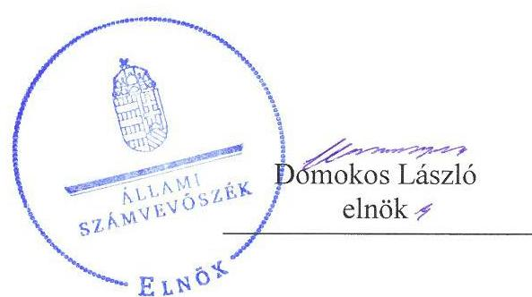
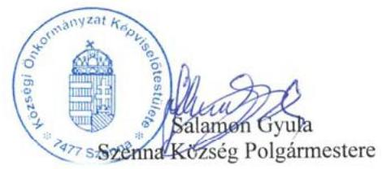
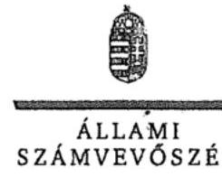
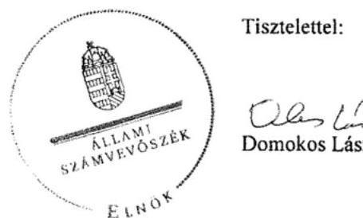
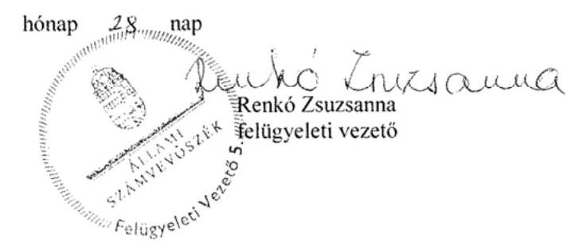

# Jelenetés 

## Önkormányzatok belső kontrollrendszere

Az önkormányzatok belső kontrollrendszere kialakításának és működtetésének ellenőrzése - Szenna
2017.

---

# Jelenetés 

## Önkormányzatok belső kontrollrendszere

Az önkormányzatok belső kontrollrendszere kialakításának és működtetésének ellenőrzése - Szenna
2017. ๑5 hó 23 nap

---

# AZ ELLENŐRZÉST FELÜGYELTE:

- RENKŐ ZSUZSANNA felügyeleti vezető

- AZ ELLENŐRZÉST VEZETTE ÉS A VÉGREHAJTÁSÁÉRT FELELŐS:
  - HORVÁTH JÓZSEF ellenőrzésvezető
  - A PROGRAM ÖSSZEÁLLÍTÁSÁÉRT FELELŐS:
    - JANIK JÓZSEF LÁSZLÓ osztályvezető

- IKTATÓSZÁM: V-1222-061/2016
- TÉMASZÁM: 2256
- ELLENŐRZÉS-AZONOSÍTÓ SZÁM: V076404, V076504

Jelentéseink az Országgyűlés számítógépes hálózatán és az Interneten a www.asz.hu címen is olvashatóak.

---

# TARTALOMJEGYZÉK 

■ ÖSSZEGZÉS ..... 5
■ AZ ELLENŐRZÉS CÉLJA ..... 6
■ AZ ELLENŐRZÉS TERÜLETE ..... 7
■ AZ ELLENŐRZÉS HÁTTERE, INDOKOLTSÁGA ..... 8
■ A JELENTÉS LÉNYEGES KÉRDÉSKÖREI ..... 10
■ ELLENŐRZÉS HATÓKÖRE ÉS MÓDSZEREI ..... 11
■ MEGÁLLAPÍTÁSOK ..... 14
■ JAVASLATOK ..... 21
■ MELLÉKLETEK ..... 23
I. sz. melléklet: Értelmező szótár ..... 23
II. sz. melléklet: Az integritás érvényesítése érdekében kialakított és működtetett kontrollrendszer ..... 24
■ FÜGGELÉK: ÉSZREVÉTELEK ..... 27
■ RÖVIDÍTÉSEK JEGYZÉKE ..... 35

---

.

---

# ÖSSZEGZÉS 

Szenna Község Önkormányzatánál az ellentmondásos szabályozás miatt a szabad pénzeszközök szabályszerű hasznosítása, a befektetésekkel kapcsolatos kockázatok felmérésének elmulasztása miatt a közvagyon biztonságos, körültekintő befektetése nem volt biztosított. Az Önkormányzat feladatellátása során nem érvényesült a nemzeti vagyonnal történő felelős gazdálkodás. Az Önkormányzat mérlege nem a valóságnak megfelelő értékben tartalmazta a befektetett közvagyon nagyságát.

## Az ellenőrzés társadalmi indokoltsága

Magyarország Alaptörvénye az önkormányzatoktól is elvárja a kiegyensúlyozott, átlátható és fenntartható költségvetési gazdálkodás elvének érvényesítését. A korábbi évek ellenőrzési tapasztalatai, az önkormányzatok által betöltött társadalmi szerep, az általuk kezelt közpénz nagysága, a nemzeti vagyon átruházására vagy hasznosítására vonatkozó döntéseik sokrétűsége egyaránt indokolttá tették a számvevőszéki ellenőrzések folytatását. A belső kontrollrendszer kialakítása és működtetése nélkül nem valósítható meg a közpénzek, a közvagyon szabályos, gazdaságos, hatékony és eredményes felhasználása.

Szenna Község Önkormányzata 2015. december 31-én 8814,2 ezer Ft EHEP részvénnyel és 60 447,7 ezer Ft tőkegarantált befektetési jeggyel rendelkezett. Felmerült, hogy a belső kontrollrendszer kialakítása és működtetése nem biztosította a közvagyon megóvását, körültekintő, biztonságos befektetését, a befektetési döntések, azok végrehajtása és számviteli elszámolása nem volt szabályszerű.

## Főbb megállapítások, következtetések

A belső kontrollrendszer kialakításának és működtetésének hiányosságai következtében a közvagyon biztonságos és körültekintő befektetése nem volt biztosított, mivel nem mérték fel a tevékenységében, gazdálkodásában, köztük a befektetésekben rejlő kockázatokat. A kialakított szabályozások ellentmondásokat tartalmaztak, így nem voltak egyértelműek a felelősségi és hatásköri viszonyok. A kontrolltevékenységek nem előzték meg és nem tárták fel a szabálytalanságokat, a gazdálkodási jogkörök szabálytalan gyakorlása növelte a jogosulatlan kifizetések kockázatát.

A gazdasági társaság alapítása, illetve az egyes pénzügyi befektetések során célszerűségi, gazdaságossági, hatékonysági és eredményességi számításokat nem végeztek. Az egyes befektetésekkel kapcsolatos kockázatok feltárására, kezelésére vonatkozóan nem dolgoztak ki intézkedéseket.

A Képviselő-testület döntéseihez a befektetésekkel kapcsolatban nem álltak rendelkezésre megbízható és valós információk, mivel a részesedéseket a nyilvántartásokban és a beszámolókban nem, illetve hiányosan mutatták ki. A befektetések leltározása nem volt szabályszerű, nem hajtották végre a befektetések év végi értékelését, ezáltal a mérlegben szereplő adatok megbízhatósága a befektetések vonatkozásában nem volt biztosított.

Az integritás szemlélet érvényesítése érdekében az Önkormányzatnak még fejlődést kell elérnie.

---

# AZ ELLENŐRZÉS CÉLJA 

Az ellenőrzés célja annak megállapítása volt, hogy az önkormányzat belső kontrollrendszerének kialakítása, továbbá egyes elemeinek működtetése biztosította-e a közpénz felhasználás szabályosságát. Az erőforrásokkal való szabályszerű és hatékony gazdálkodáshoz szükséges követelmények érvényesítése, számonkérése, ellenőrzése megtörtént-e az önkormányzatnál. A belső kontrollrendszer kialakítása és működtetése támogatta-e az integritás szemlélet érvényesülését. Az ellenőrzés során értékeltük a belső kontrollrendszer kialakításának és működtetésének szabályszerűségét. Feltártuk azokat a lényeges szabályozási és működési hiányosságokat, amelyek miatt az ellenőrzött kulcskontrollok nem nyújtottak elegendő védelmet a lehetséges hibákkal szemben. Rámutattunk arra, ha a kulcskontrollok valamely hibát nem előznek meg, nem tárnak fel, vagy nem javítanak ki, valamint minősítettük működésük megfelelőségét.

Ellenőriztük, hogy az önkormányzat egyes befektetési döntései és azok végrehajtása, elszámolása megfelelt-e a vonatkozó jogszabályoknak és belső szabályozásoknak, a kialakított kontrollrendszer támogatta-e a befektetési tevékenység szabályszerűségét.

---

# AZ ELLENŐRZÉS TERÜLETE 

## Szenna Község Önkormányzata

A Somogy megyei Szenna község állandó lakosainak száma 2016. január 1-jén 762 fő volt. Az Önkormányzat ${ }^{1}$ az ellenőrzött időszakban öttagú Képviselő-testülettel² rendelkezett. A Képviselő-testület munkáját egy állandó bizottság segítette.

A Polgármester ${ }^{3}$ a 2006. évi önkormányzati választások óta töltötte be tisztségét. A Hivatal 2011. január 1. és 2015. december 31. között két szervezeti formában (Szenna Körjegyzőség - Szenna, Zselickisfalud, Szilvásszentmárton és Patca községek körjegyzősége, 2013. január 1-jétől Simonfai Közös Önkormányzati Hivatal ${ }^{4}$ - Szenna, Bőszénfa, Zselickislak, Zselicszentpál, Patca, Szilvásszentmárton, Zselickisfalud, Sántos és Simonfa községek közös hivatala) látta el feladatait. A Hivatalban az ellenőrzött időszakban két Jegyző ${ }_{1,2}{ }^{5}$ látta el a feladatot. A településen az ellenőrzött időszakban Roma Nemzetiségi Önkormányzat ${ }^{6}$ működött.

Az Önkormányzat egy gazdasági társaságban többségi tulajdonnal rendelkezett.
A Hivatal nem tagolódott szervezeti egységekre, elkülönült gazdasági szervezettel nem rendelkezett. A gazdasági szervezet feladatait a Hivatal látta el. A Hivatalban foglalkoztatott köztisztviselők száma 2015. év végén tíz fő volt.

Az Önkormányzat a 2015. évi éves költségvetési beszámoló szerint 179005 ezer Ft költségvetési bevételt ért el, valamint 164619 ezer Ft költségvetési kiadást teljesített. Az eszközvagyon értéke 2015. december 31-én 704300 ezer Ft volt, a költségvetési évben esedékes kötelezettség állomány 622 ezer Ft volt, a költségvetési évet követően esedékes kötelezettség állomány 1436 ezer Ft-ot tett ki.

---

# AZ ELLENŐRZÉS HÁTTERE, INDOKOLTSÁGA 

A demokratikus társadalmakban alapvető igény, hogy a közpénzeket, a közvagyont használók tevékenységükről elszámoljanak, ahhoz egyértelmű és érvényesíthető felelősségi szabályok társuljanak. Ennek a jogos igénynek az érvényesítéséhez meg kell teremteni azokat a folyamatokat, rendszereket, amelyek nélkülözhetetlenek az elszámoltatáshoz. Az elszámoltatás eredményes működtetéséhez szükség van a megfelelő információs, kontroll-, értékelési - és beszámolási rendszerek kialakítására. A belső kontrollok kiépítettsége hozzájárul az integritási szemlélet kialakításához és érvényesüléséhez. A belső kontrollrendszer kialakítása és működtetése nélkül nem valósítható meg a közpénzek, a közvagyon szabályos, gazdaságos, hatékony és eredményes felhasználása.

A BELSŐ KONTROLLRENDSZER azt a célt szolgálja, hogy az államháztartás szervei működésük és gazdálkodásuk során a tevékenységeket szabályszerűen, gazdaságosan, hatékonyan, eredményesen hajtsák végre, teljesítsék elszámolási kötelezettségeiket és megvédjék az erőforrásokat a veszteségektől, a károktól, a nem rendeltetésszerű használattól. A belső kontrollrendszer magába foglalja mindazon szabályokat, eljárásokat, gyakorlati módszereket és szervezeti struktúrákat, kockázatkezelési technikákat, kontrolltevékenységeket, amelyek segítséget nyújtanak a szervezetnek céljai eléréséhez. A belső kontrollrendszer szabályozása háromszintű, a törvényi előírásokat az Áht. ${ }^{7}$ és a Mötv. ${ }^{8}$, a rendeleti szintű szabályozást az Ávr. ${ }^{9}$ és a Bkr. ${ }^{10}$ tartalmazza, amelyeket útmutatói szinten az NGM${ }^{11}$ által kiadott standardok és kézikönyvek támogatnak.

A megfelelő belső kontrollrendszer jelentősen csökkenti a hibák és szabálytalanságok kockázatát. Az ÁSZ ${ }^{12}$ célja, hogy javuljon az ellenőrzött önkormányzatok belső kontrollrendszerének szabályozottsága, működésének megfelelősége, szabályszerűsége, hozzájárulva ezzel az egyensúlyi helyzet fenntarthatóságának biztosításához, biztosítva az önkormányzatnál a közpénzfelhasználás szabályosságát, a közpénzekkel és a nemzeti vagyonnal történő szabályszerű, gazdaságos, hatékony és eredményes gazdálkodást. Az ÁSZ ellenőrzés tapasztalatai nem csupán a közvetlenül ellenőrzött önkormányzatokat támogathatják, hanem a „jó gyakorlat” elterjesztésével azok az önkormányzatok is átvehetik a pozitív példákat, ahol nem végez ellenőrzést az ÁSZ.

A közszféra integritás alapú kultúrájának kialakítása, megerősítése és működése szorosan összefügg a belső kontrollrendszer működésével, ezért az ellenőrzés kiterjed annak értékelésére is, hogy a belső kontrollrendszer kialakítása és működtetése hogyan hatott az integritás szemlélet érvényesülésére.

## AZ ÖNKORMÁNYZATI VAGYONGAZDÁLKODÁS

KERETÉBEN az önkormányzatok átmenetileg szabad pénzeszközeinek befektetését jogszabály nem tiltja, a befektetések jellege nem korlátozott, a pénzpiaci szolgáltatók közül az önkormányzatok a kínált szolgáltatás és annak költségei alapján, szabadon választhatnak, azonban a veszteséges gazdálkodás kockázatai és következményei az önkormányzatokat terhelik.

---

A szabad pénzeszközök felhasználása során kiemelten fontos a felelős gazdálkodás érvényesülése, amely összhangban kell, hogy legyen, az önkormányzati gazdálkodás alapelveivel.
2015. első felében az MNB ${ }^{13}$ három befektetési szolgáltató tevékenységi engedélyét vonta vissza és kezdeményezte a vállalkozások felszámolását a működéssel kapcsolatos szabálytalanságok, hiányosságok miatt. A befektetési vállalkozások problémás helyzetbe kerülése jelentős veszteségekhez vezetett számos önkormányzat esetében. A korábbi évek ellenőrzési tapasztalatai alapján fennáll a lehetősége annak, hogy az önkormányzatok befektetési döntései, továbbá a döntések végrehajtása és számviteli elszámolása nem voltak teljes mértékben szabályszerűek, és a kapcsolódó külső és belső kontroll rendszerek sem működtek minden esetben megfelelően.

Az ellenőrzéssel feltárásra kerülhetnek azok a kockázatok, amelyek az önkormányzatok gazdálkodásával, ezen belül befektetési tevékenységeivel, kontrollkörnyezetével kapcsolatosak és a befektetési tevékenységek szabályszerű végrehajtását befolyásolják. Az ellenőrzéssel az önkormányzatok befektetési/vagyongazdálkodási döntéseinek összessége értékelhetővé válik, és megalapozott megállapítás tehető arra vonatkozóan, hogy milyen hatást gyakoroltak az önkormányzat vagyonára a képviselő-testület döntései.

# AZ ELLENŐRZÉS VÁRHATÓ HASZNOSULÁSA 

NÉGY SZINTEN valósul meg:

- a törvényalkotás számára összegzett tapasztalatok állnak rendelkezésre a belső kontrollrendszer önkormányzati területen való kialakításáról, működtetéséről és hatásairól.
- az ellenőrzött számára visszajelzést ad a belső kontrollrendszer kialakításában és működésében lévő hiányosságokról, javaslataival hozzájárul azok kiküszöböléséhez.
- az ellenőrzés megállapításait és javaslatait más szervezetek is hasznosíthatják a rendezett gazdálkodási keretek kialakításához.
- a társadalom számára jelzi, hogy közpénz nem maradhat ellenőrizetlenül, az ÁSZ értékteremtő rend kialakításához és megőrzéséhez hozzájáruló tevékenysége pozitív hatással lesz a szervezetről kialakított összkép formálásában.

---

# A JELENTÉS LÉNYEGES KÉRDÉSKÖREI 

1. Az önkormányzat kialakított belső kontrollrendszere összességében biztosította-e a befektetési tevékenységek szabályszerű végzését a 2011-2015. években?
2. Az önkormányzat belső kontrollrendszerének kialakítása és működtetése a 2015. évben szabályszerű volt-e, az biztosította-e a közpénzfelhasználás szabályosságát, a nemzeti vagyonnal történő felelős gazdálkodást?
3. Az egyes befektetésekkel kapcsolatos döntéshozatal és a döntések végrehajtása szabályszerű volt-e?
4. Az egyes befektetések számviteli elszámolása, nyilvántartása szabályszerű volt-e?

---

# ELLENŐRZÉS HATÓKÖRE ÉS MÓDSZEREI 

## Az ellenőrzés típusa

Megfelelőségi ellenőrzés, a befektetési tevékenység esetében szabályszerűségi ellenőrzés.

## Az ellenőrzött időszak

A belső kontrollrendszer kialakításának és működtetésének ellenőrzése a 2015. január 1. és 2015. december 31. közötti időszakra terjedt ki. Az önkormányzatok egyes befektetési tevékenységeinek ellenőrzése tekintetében az ellenőrzött időszak a 2011. január 1. - 2015. december 31. közötti időszak. Ezen felül az önkormányzat befektetésekkel kapcsolatos döntéselőkészítésének és döntéshozatalának szabályszerűségét a 2011. január 1. előtti időszakra visszanyúlóan is ellenőriztük, amennyiben a 2015. december 31-én meglévő befektetéseire 2011. január 1-je előtt került sor. Az integritás szemlélet érvényesülését a 2015. évre vonatkozó adatszolgáltatás alapján értékeltük.

## Az ellenőrzés tárgya

A helyi önkormányzatnak, mint éves költségvetési beszámoló készítésére kötelezett szervezetnek és Hivatalának belső kontrollrendszere. Az integritás szemlélet érvényesülése.

Az önkormányzat 2015. december 31-én meglévő, a Számv. tv. ${ }^{14} 3 . \S$ (6) bekezdés 2. és 3. pontja szerint az értékpapírokban megtestesülő befektetései, lekötött betétei.

 Továbbá a 2015. december 31-én meglévő, az önkormányzat szabad pénzeszközei terhére, adásvételi szerződés keretében megszerzett, a kötelező feladatok ellátását nem szolgáló, az önkormányzat üzleti vagyonába tartozó, az ellenőrzött időszakban (2011-2015.) megszerzett ingatlanok, továbbá az - időkorlátozás nélkül megszerzett - kulturális javak (műtárgyak, műalkotások, stb.), illetve egyéb értéktárgyak (pl. ékszerek, befektetési nemesfém).

Az ellenőrzésnek nem tárgya az önkormányzati közfeladat-ellátást szolgáló gazdasági társaságokban lévő üzletrészek, részesedések, a törzsvagyonba tartozó, közfeladat-ellátást, közvetlen működést szolgáló eszközök, az ingatlanokhoz kapcsolódó vagyoni értékű jogok, a beruházások, felújítások. Nem képezik az ellenőrzés tárgyát azok a vagyonelemek, amelyek törvényi vagy más jogszabályi kötelezettség teljesítése keretében kerültek az önkormányzat üzleti vagyonába; amelyek beszerzése bármilyen módon összefügg a kötelező feladatok ellátásával (pl. köztéri szobrok); illetve azon vagyonelemek sem, amelyek javadalmazási, ajándékozási céllal kerültek beszerzésre (pl. önkormányzati díj adományozásához kapcsolódó, nyugdíjazással összefüggő ajándéktárgyak, értéktárgyak).

---

Az ellenőrzés kiterjedt minden olyan körülményre és adatra, amely az ÁSZ jogszabályban meghatározott feladatainak teljesítéséhez, valamint a program végrehajtása folyamán felmerült újabb összefüggések feltárásához szükséges volt.

# Az ellenőrzött szervezet 

- Szenna Község Önkormányzata
- Szennai Körjegyzőség és a Simonfai Közös Önkormányzati Hivatal

## Az ellenőrzés jogalapja

Az ÁSZ tv. 1. § (3) bekezdésében foglaltak alapján az ÁSZ általános hatáskörrel végzi a közpénzekkel és az állami és önkormányzati vagyonnal való felelős gazdálkodás ellenőrzését. Az ÁSZ tv. 5. § (2) bekezdése alapján az államháztartás gazdálkodásának ellenőrzése keretében az ÁSZ ellenőrzi a helyi önkormányzatok gazdálkodását, valamint az ÁSZ tv. 5. § (6) bekezdése alapján ellenőrzése során értékeli az államháztartás számviteli rendjének betartását és a belső kontrollrendszer működését.

## Az ellenőrzés módszerei

Az ellenőrzést a nemzetközi standardokat irányadónak tekintve az ellenőrzési program szempontjai, kérdései, az ellenőrzött időszakban hatályos jogszabályok, az ellenőrzés szakmai szabályok és módszertanok figyelembe vételével végeztük. A gazdálkodás hibáinak kijavítására, a közpénzekkel való felelős gazdálkodás elősegítésére irányuló javaslatok kidolgozásakor a hatályos jogszabályok voltak az irányadóak.

Az ellenőrzés ideje alatt az ellenőrzött szervezettel történő kapcsolattartást az ÁSZ SZMSZ ${ }^{15}$-ének vonatkozó előírásai alapján biztosítottuk.

Az ellenőrzési kérdések megválaszolásához szükséges bizonyítékok megszerzése az ellenőrzöttek által rendelkezésre bocsátott dokumentumokra, adatokra alapozva megfigyelés, szemle (szemrevételezés), kérdésfeltevés (információkérés), valamint elemző eljárással történt. A minták kiválasztása rétegzett, véletlen mintavételi eljárással történt.

Az ellenőrzés lefolytatásához az önkormányzat a tanúsítványok elektronikus kitöltésével, valamint az ÁSZ által kért dokumentumok elektronikus megküldésével szolgáltatott adatokat. A rendelkezésre bocsátott adatok, információk kontrollja az ellenőrzés keretében történt.

Az önkormányzat belső kontrollrendszere jogszabályi előírások szerinti kialakításának és működtetésének szabályszerűségét, az erre irányuló ellenőrzési kérdésekre adott válaszok összesítése alapján a 2015. január 1. és december 31. közötti időszakra, pillérenként (kontrollkörnyezet, kockázatkezelési rendszer, kontrolltevékenységek, információs és kommunikációs rendszer, monitoring rendszer) és összesítetten is értékeltük. Az önkormányzat belső kontrollrendszere egyes pilléreinek kialakítása és működtetése „szabályszerű", amennyiben az értékelt területen az elért igen

---

válaszok százalékban kifejezett, egész számra kerekített aránya meghaladja a $85 \%$-ot, „részben szabályszerű", ha a $85 \%$-ot nem haladja meg, de $60 \%$-nál nagyobb, „nem szabályszerű", ha nem haladja meg a $60 \%$-ot. Az önkormányzat belső kontrollrendszerének összesített értékelése megegyezik a pillérenként (kontrollterületenként) alkalmazott százalékos értékelésekkel, a következő eltérésekkel. A kontrollrendszer egésze esetében a „szabályszerű" értékelésnek a százalékos értéken felül további feltétele, hogy egyik kontrollterület sem kaphat „nem szabályszerű" értékelést, a „részben szabályszerű" értékelés további feltétele, hogy legfeljebb egy ellenőrzött kontrollterület lehet „nem szabályszerű" értékelésű. Az összesített értékelés a százalékos értéktől függetlenül „nem szabályszerű", ha az ellenőrzött kontrollterületek közül több mint egynek „nem szabályszerű" az értékelése.

A kontrolltevékenységek működésének megfelelőségét a foglalkoztatottak személyi juttatásaival, a külső személyi juttatásokkal, a működési kiadásokkal és a felhalmozási célú kiadásokkal kapcsolatos kifizetések esetében mintavétellel ellenőriztük. „Megfelelőnek" értékeltünk egy ellenőrzött területet, amennyiben 95%-os bizonyossággal a teljes sokaságban a hibaarány legfeljebb 10%, „nem megfelelőnek", amennyiben 10%-nál magasabb arányt képviselt. Abban az esetben, ha a teljes sokaság tekintetében a 10%-os hibaarányhoz való viszony megítélésének megbízhatósága nem érte el a 95%-ot, annak elérése érdekében értékelésünket további szempontokkal egészítettük ki, és figyelembe vettük a feltárt hibák értékét.

Az integritás szemlélet érvényesülésének értékelése az önkormányzat által kitöltött kérdőív alapján, az abban foglalt válaszok megalapozottságának kontrollja mellett történt.

A jelentésben használt fogalmak magyarázatát az I. számú melléklet tartalmazza.

---

# 1. Az önkormányzat kialakított belső kontrollrendszere összességében biztosította-e a befektetési tevékenységek szabályszerű végzését a 2011-2015. években?

|  1. táblázat |  |   |
| --- | --- | --- |
|  A SZABAD PÉNZESZKÖZÖK HASZNOSÍTÁSÁNAK SZABÁLYOZÁSA (EZER FT) |  |   |
|  év | Vagyonrendelet | Éves költségvetési rendelet  |
|  2011. | 2000 | 500  |
|  2012. | 2000 | 2000  |
|  2013. 04. 16-ig | 2000 | 500  |
|  2013. 04. 17-től | 500 | 500  |
|  2014. | 500 | 20000  |
|  2015. | 500 | 20000  |

Fonrás: Önkormányzat rendeletei alapján

2011. január 1. és 2015. december 31. közötti időszakban a belső kontrollrendszer kialakításának és működtetésének hiányosságai következtében nem volt biztosított a közvagyon biztonságos és körültekintő befektetése.

A KONTROLLKÖRNYEZET a 2012. év és 2013. április 17. - 2013. december 31. időszak kivételével az ellentmondásos szabályozás következtében nem biztosította a befektetési tevékenység szabályszerű végzését. Az eszközök hasznosítására vonatkozó felhatalmazásokat a Jat. ${ }^{16} 2 . \S$ (1) bekezdésében foglaltak ellenére nem egyértelmű szabályozási tartalommal határozták meg, mert a Vagyonrendelet ${ }_{1,2}$-ben, valamint az éves költségvetési rendelet ${ }_{1,2,4,5,6}$-ben a vagyon, illetve a szabad pénzeszközök hasznosítására a Polgármesternek adott felhatalmazás összegében eltért egymástól. A szabad pénzeszközök hasznosításának szabályozását a 1. táblázat mutatja be.

A KOCKÁZATKEZELÉSI RENDSZER keretében az Ámr. ${ }^{17}$ 157. § (2) bekezdése és a Bkr. 7. § ellenére nem történt meg a (tartós és forgatási célú) befektetésekkel kapcsolatos kockázatok felmérése és megállapítása. A befektetésekkel kapcsolatban az Ámr. 157. § (2), valamint a Bkr. 7 § (2) bekezdésében foglaltak ellenére nem határozták meg az egyes kockázatokkal kapcsolatban szükséges intézkedéseket, továbbá a 2012-2015. években azok teljesítésének folyamatos nyomon követésének módját.

A KONTROLLTEVÉKENYSÉGEK közül a Bkr. 8. § (2) bekezdésében foglaltaknak ellenére a befektetési tevékenységekre vonatkozóan nem biztosították a folyamatba épített előzetes, utólagos és vezetői ellenőrzést. A befektetési jegy vételére szóló megbízási szerződések ellenjegyzése, pénzügyi ellenjegyzése az Áht. ${ }^{18} 100 /$ C. § (3) és az Áht. ${ }_{2} 37 . \S$ (1) bekezdése ellenére nem történt meg.

## AZ INFORMÁCIÓS ÉS KOMMUNIKÁCIÓS RENDSZER keretén belül 2012. január 1. és 2015. április 30. között a befektetési jegyek megvásárlására, továbbá visszaváltására adott megbízások tekintetében a megbízások megnevezését (típusát), tárgyát, a szerződő fél (megbízott) nevét, a szerződés (megbízás) értékét - az Info. tv. 37. § (1) bekezdésének és 1. melléklete III/4. pontjának előírása ellenére - az Önkormányzat honlapján nem tették közzé. Ezáltal nem biztosították az Info tv. 1. §-ában meghatározott törvényi célkitűzés, a közügyek átláthatóságának

---

érvényesülését az Önkormányzat működésével, befektetési tevékenységével kapcsolatban.

A MONITORING RENDSZER keretén belül működő belső ellenőrzés a befektetési tevékenységgel kapcsolatban ellenőrzést nem végzett. A külső ellenőrzések a befektetési tevékenységre nem terjedtek ki, ezért nem támogatták a befektetési tevékenység szabályszerű végzését.

# 2. Az önkormányzat belső kontrollrendszerének kialakítása és működtetése a 2015. évben szabályszerű volt-e, az biztosította-e a közpénzfelhasználás szabályosságát, a nemzeti vagyonnal történő felelős gazdálkodást? 

Összegző megállapítás
2015. január 1. és 2015. december 31. közötti időszakban a belső kontrollrendszer a gazdálkodás egészét érintően nem biztosította a szabályszerű működést, a gazdaságosság, hatékonyság és eredményesség követelményeinek érvényesülését.

A KONTROLLKÖRNYEZET KIALAKÍTÁSA az Önkormányzat és a Hivatal tevékenységének hiányos szabályozása következtében nem volt szabályszerű, mert
$\longrightarrow$ a Hivatali SZMSZ ${ }_{2}{ }^{19}$ az Ávr. 13. § (1) bekezdés g) és e) pontjai ellenére - a gazdasági feladatellátás kivételével - nem tartalmazta a szervezeti és működési szabályzatban nevesített munkakörökhöz tartozó feladat- és hatásköröket, valamint a Hivatal szervezeti ábráját;
$\longrightarrow$ a Képviselő-testület a Kttv. ${ }^{20}$ 231. § (1) bekezdésében foglaltakkal ellentétben nem határozta meg a köztisztviselőkre vonatkozó hivatásetikai alapelvek részletes tartalmát, valamint az etikai eljárás szabályait;
$\longrightarrow$ a Számv. tv. 161. § (1) bekezdése előírásai ellenére nem rendelkeztek érvényes számlarenddel, továbbá figyelemmel az Ávr. 13. § (3a) bekezdés a) pontjára is, az Ávr. 13. § (2) bekezdés c), e) és f) pontja szerinti érvényes belső szabályzatban nem rendezték a belföldi és külföldi kiküldetések elrendelésével és lebonyolításával elszámolásával kapcsolatos kérdéseket, a reprezentációs kiadások felosztását, azok teljesítésének és elszámolásának szabályait, a gépjárművek igénybevételének és használatának rendjét, valamint a Bkr. 6. § (4) bekezdéseiben foglaltak ellenére Szabálytalanságkezelési eljárásrenddel, mivel azokat a költségvetési szerv vezetője helyett a Polgármester adta ki;
$\longrightarrow$ a Hivatal ellenőrzési nyomvonalát a Bkr. 6. § (3) bekezdésében foglaltak ellenére nem készítették el;
$\longrightarrow$ a költségvetési rendelet ${ }_{6}$-ben az Áht. 2 23. § (2) bekezdés ab) pontja ellenére a költségvetési bevételi és kiadási előirányzatok kötelező és önként vállalt feladatok és államigazgatási feladatok szerinti megbontása nem történt meg;

---

- a Hivatal a Roma Nemzetiségi Önkormányzat sajátos tervezési, gazdálkodási, ellenőrzési, finanszírozási, adatszolgáltatási és beszámolási feladatairól szóló, érvényes szabályzatot nem készített az Ávr. 13. § (3a) bekezdésében foglaltak ellenére, mivel a Gazdálkodási szabályzatot a költségvetési szerv vezetője helyett a Roma Nemzetiségi Önkormányzat elnöke hagyta jóvá;
- a Hivatal a 2015. évben a Roma Nemzetiségi Önkormányzattal kötött együttműködési megállapodás felülvizsgálatát a Nek. tv. 80. § (2) bekezdésében meghatározott határidőig nem végezte el.

KOCKÁZATKEZELÉSI RENDSZERT a Bkr. 7. § (1) bekezdésében foglalt előírás ellenére nem működtettek. A Bkr. 7. § (2) bekezdésében foglaltak ellenére - figyelemmel az 1. § (2) bekezdés a) pontjában foglaltakra - nem mérték fel és nem állapították meg az Önkormányzat és a Hivatal tevékenységében, gazdálkodásában rejlő kockázatokat, nem határozták meg az egyes kockázatokkal kapcsolatban szükséges intézkedéseket.

A KONTROLLTEVÉKENYSÉGEK kialakítása során az Ávr. 13. § (2) bekezdés a) pontjában foglaltak ellenére belső szabályzatban nem rendezték a gazdálkodási jogkörök gyakorlásának módját, eljárási és dokumentációs részletszabályait, valamint az ezeket végző személyek kijelölésének rendjével kapcsolatos belső előírásokat, feltételeket.

A 2015. évi költségvetési kiadások pénzügyi folyamatában kulcsszerepet betöltő gazdálkodási jogkörök gyakorlása során az ellenőrzés az alábbi hiányosságokat tárta fel:
—_ a kötelezettségvállalás nem felelt meg az Áht. 2 37. § (1) bekezdésében foglaltaknak, mivel az pénzügyi ellenjegyzés nélkül történt meg.
—_ a pénzügyi ellenjegyzés elmaradása következtében az Áht. 2 37. § (1) bekezdésében foglaltak ellenére nem győződtek meg arról, hogy a szabad előirányzat rendelkezésre állt-e, a tervezett kifizetési időpontokban a pénzügyi fedezet biztosított volt-e, és a kötelezettségvállalás nem sérti-e a gazdálkodásra vonatkozó szabályokat.
—_
 A teljesítés igazolása

- 1. nem történt meg, ezáltal az Ávr. 57. §. (1) bekezdésében foglaltak ellenére nem ellenőrizték a kiadások teljesítésének jogosságát és összegszerűségét, az ellenszolgáltatást is magába foglaló kötelezettségvállalás esetében annak teljesítését;
- 2. során az Ávr. 57. §. (3) bekezdésében foglaltak ellenére a teljesítésigazolás dátumát nem tüntették fel, ezért nem igazolható, hogy a kifizetésre a teljesítés igazolását követően került sor.
—_ Az érvényesítés során
- 1. az Ávr. 58. § (2) bekezdésben foglaltak ellenére nem jelezték az utalványozónak a megelőző ügymenetben a jogszabályokban, belső szabályzatokban foglalt előírások be nem tartását, így a kötelezettségvállalás és a teljesítésigazolás hiányosságait;
- 2. az érvényesítő az Ávr. 58. § (4) bekezdésében foglaltak ellenére az érvényesítési feladat elvégzésére kijelöléssel nem rendelkezett, ezért az érvényesítést nem az arra jogosult végezte el.

---

- az utalványozás az Ávr. 59. § (1) bekezdésében foglaltakat megsértve nem érvényesített okmány alapján történt.

# AZ INFORMÁCIÓS ÉS KOMMUNIKÁCIÓS RENDSZER kialakítása és működtetése nem volt szabályszerű. A Bkr. 9. § (2) bekezdésében foglaltak ellenére az információs és kommunikációs rendszer keretében nem működtettek úgy beszámolási rendszereket, hogy azok hatékonyak, megbízhatóak, pontosak és összehasonlíthatóak legyenek, a beszámolási szintek, határidők és módok világosan meg legyenek határozva. Az Ávr. 13. § (2) bekezdés h) pontja ellenére, figyelemmel a (3a) bekezdés a) pont helyi önkormányzatra vonatkozó részében foglaltakra is, nem rendelkeztek érvényes, a közérdekű adatok megismerésére irányuló kérelmek intézésének rendjével, mert a szabályzatot a költségvetési szerv vezetője helyett a Polgármester adta ki. A közzétételi kötelezettség teljesítésének részletes szabályait belső szabályzatban az Info. tv. 35. § (3) bekezdésében foglaltak ellenére nem állapították meg.

Az Önkormányzat 2015. évi költségvetési beszámolójának közzétételéről az Info. tv. 37. §, valamint annak az 1. melléklet III/1. pontjában előírtak ellenére nem gondoskodtak. Az Önkormányzat az Info. tv. ${ }^{21}$ 24. § (3) bekezdésében foglaltak ellenére nem rendelkezett Adatvédelmi és adatbiztonsági szabályzattal.

A MONITORING RENDSZER keretében a szervezet tevékenységének, a célok megvalósításának nyomon követését biztosító rendszert a Bkr. 10. §-ában foglaltak ellenére nem alakítottak ki.

Az Önkormányzat belső ellenőrzési feladatai ellátásáról az Áht. ${ }_{2}$-ben előírtaknak megfelelően gondoskodtak. A 2015. évi belső ellenőrzési tervet a Képviselő-testület az Mötv. 119. § (5) bekezdése és a Bkr. 32. § (4) bekezdésében foglaltak ellenére nem hagyta jóvá. A Belső ellenőrzési kézikönyvet a költségvetési szerv vezetője a Bkr. 17. § (1) bekezdésében foglaltakkal ellentétesen nem hagyta jóvá. A négyéves stratégiai ellenőrzési tervet, a Bkr. 29.§ (1) bekezdésében foglaltakat megsértve, a költségvetési szerv vezetője helyett a Polgármester hagyta jóvá a 2013. évben.

A belső ellenőrzési vezető az Önkormányzatnál végzett belső ellenőrzésekről a Bkr. 50.§ (1) bekezdése ellenére nyilvántartást nem vezetett. A költségvetési szerv vezetője a Bkr. 14. § (1) bekezdésében foglaltak ellenére nem vezetett nyilvántartást a külső ellenőrzések javaslatai alapján készült intézkedési tervek végrehajtásáról.

## A BELSŐ KONTROLLRENDSZER MINŐSÉGÉRŐL

szóló, a Bkr. 1. számú melléklete szerinti nyilatkozatát a Jegyző 2015. évben a belső kontrollrendszer egyes pilléreinek részletes értékelése kivételével elkészítette.

A Jegyző nyilatkozata tartalmazta, hogy a Hivatalnál gondoskodott a belső kontrollrendszer kialakításáról, valamint annak szabályszerű, eredményes, gazdaságos és hatékony működéséről. Jelen ellenőrzés nem támasztotta alá a Jegyző nyilatkozatát.

AZ INTEGRITÁS SZEMLÉLET érvényesülésének értékeléséhez az Önkormányzat jelen ellenőrzés keretében szolgáltatott adatokat. Az

---

integritás szemlélet érvényesítésében még fejlődést kell elérnie. Az értékelés eredményét részletesen a II. sz. melléklet tartalmazza.

# 3. Az egyes befektetésekkel kapcsolatos döntéshozatal és a döntések végrehajtása szabályszerű volt-e? 

Összegző megállapítás

2. táblázat

ÜZLETI CÉLÚ BEFEKTETÉSÁLLOMÁNY

| Befektetés | 2015.12. 31.   (e Ft) |
| :-- | --: |
| Kft üzletrész | 500,0 |
| EHEP | 8814,2 |
| Befektetési jegy | 60447,7 |
| Összesen | 69761,9 |

A befektetésekkel kapcsolatos döntéshozatal megfelelt a jogszabályi előírásoknak, azonban a döntések végrehajtása a jogellenes értékpapír-vásárlás következtében nem volt szabályszerű.

## A BEFEKTETÉSEKKEL KAPCSOLATOS DÖNTÉSHOZATAL az Önkormányzat tartós részesedéseit és befektetési jegyeit érintette. Az Önkormányzat 2015. december 31-én meglévő befektetett eszközeinek állománya egy 500 ezer Ft törzstőkével alapított Kft. ${ }^{22}$ üzletrészből, 8814,2 ezer Ft EHEP ${ }^{23}$ részvényből és 60447,7 ezer Ft tőkegarantált befektetési jegyekből tevődött össze. Az Önkormányzat üzleti célú befektetési állományát a 2. táblázat mutatja be.

Üzleti vagyonba tartozó ingatlannal, kulturális javakkal, egyéb értéktárgyakkal az Önkormányzat nem rendelkezett. Kötelező feladatai ellátásához kapcsolódóan a KAVÍZ Kft-ben 701 ezer Ft üzletrésze volt.

## A BEFEKTETÉSI CÉLÚ DÖNTÉSEK VÉGREHAJTÁSA

során az Önkormányzatnál a Számv. tv. 169. § (2) bekezdésében foglaltak ellenére a könyvviteli elszámolást közvetlenül alátámasztó számviteli bizonylatokat visszakereshető módon legalább 8 évig nem őrizték meg. Az EHEP részesedésre vonatkozó dokumentumokat, a pénzügyi szolgáltatóval kötött szerződést, az értékpapírszámla kivonatokat, valamint a nyilvántartás vezetésére vonatkozó elszámolást, a pénzügyi szolgáltató képviseletében eljáró felszámoló levelét az Önkormányzatot megillető pénzeszközállományról, illetve a letétkezelő felé fennálló tartozásáról szóló 2015. március 4-ei egyenlegközlőt nem tudta az ellenőrzés rendelkezésére bocsátani.

Az Önkormányzat a 2012. és 2013. évben a Vagyonrendelet ${ }_{1,2}{ }^{24}$-ben és a költségvetési rendelet ${ }_{3,4}{ }^{25}$-ben meghatározott felhatalmazással ellentétesen vásárolt befektetési jegyet.

---

# 4. Az egyes befektetések számviteli elszámolása, nyilvántartása szabályszerű volt-e? 

Összegző megállapítás

2011. január 1. és 2015. december 31. közötti időszakban az Önkormányzat befektetéseinek elszámolása, nyilvántartása, év végi értékelése és leltározása nem felelt meg a jogszabályi előírásoknak, az nem biztosította a vagyonnal való felelős gazdálkodás, az elszámoltathatóság követelményének érvényesülését.

A befektetések számviteli besorolása a saját tulajdonú Kft., illetve a forgatási céllal beszerzett befektetési jegyek esetében megfelelt a jogszabályi előírásoknak.

Az Önkormányzat a Számv. tv. 15. § (2) bekezdés ellenére 2011-2015. években a kötelező feladatait ellátó KAVÍZ Kft-ben 701 ezer Ft, valamint 2011-2014. években az EHEP Rt-ben lévő 8 814,2 ezer Ft értékű részesedését analitikus nyilvántartásaiban, főkönyvi nyilvántartásaiban és beszámolóiban nem szerepeltette. A hibák nagysága nem befolyásolta a beszámolók megbízhatóságát.

Az EHEP részesedéseket az Önkormányzat 2015. december 31-én vette állományba, azonban azok besorolása nem felelt meg a Számv. tv. 27. § (1), illetve az Áhsz. 11. § (9) bekezdésében foglaltaknak, mivel a részesedéseket az egyéb forgatási célú hitelviszonyt megtestesítő értékpapírok közé sorolta be a tartós részesedések helyett.

Az Önkormányzatnál a részesedésekről, befektetési jegyekről analitikus és részletező nyilvántartást az Áhsz. ${ }^{26} 49 . \S$ (1), valamint az Áhsz. 2 39. § (3) bekezdésében foglaltakat ellenére nem vezettek, ezzel nem biztosították a Számv. tv. 165. § (4) bekezdés ellenére a főkönyvi könyvelés, az analitikus nyilvántartások és a bizonylatok adatai közötti egyeztetés és ellenőrzés lehetőségét.

A befektetési jegyek hozamát - az Áhsz. 1 51.§ (1) bekezdésének a) pontjában, valamint az Áhsz. 2 53.§ (2) bekezdésében foglaltakkal ellentétben az arról szóló bizonylat beérkezését követően haladéktalanul nem vették nyilvántartásba, azokat év végén, illetve egy esetben a következő évben számolták el.

Az Önkormányzat a KAVÍZ Kft-ben lévő részesedése után 2013. évben beszámolójában 482 ezer Ft osztalékbevételt mutatott ki. Azonban a Számv. tv. 165. § (1)-(2) bekezdésében foglaltak ellenére 241 ezer Ft értékű osztalékbevétel elszámolására vonatkozóan alátámasztó dokumentáció nem volt, ezzel megsértették a Számv. tv. 15.§ (3) bekezdésben foglalt valódiság elvét.

Az Önkormányzat beszámolóiban 2011-2015. években kimutatott saját tulajdonú Kft. üzletrészének, az EHEP részesedésének, valamint a befektetési jegyeinek leltározása az analitikus nyilvántartás hiánya miatt nem felelt meg a Számv. tv. 69. (1)-(2) bekezdéseiben foglaltaknak.

Az Önkormányzat az EHEP Rt-ben meglévő részesedései után a Számv. tv. 54.§ (1)- (2) bekezdéseiben és az Értékelési szabályzat2 III. fejezet 8.1. pontjában foglaltakkal ellentétben az értékvesztést annak ellenére

---

nem számolta el, hogy azt a részvények tőzsdei árfolyamának tartós tendenciája, illetve a részvénytársaság tőke megfelelősége indokolta. Az EHEP Rt. saját tőkéje jelentős mértékben a jegyzett tőke alá csökkent.

---

# JAVASLATOK 

Az ÁSZ tv. 33. § (1) bekezdésében foglaltak értelmében az ellenőrzött szervezet vezetője köteles a jelentésben foglalt megállapításokhoz kapcsolódó intézkedési tervet összeállítani és azt a jelentés kézhezvételétől számított 30 napon belül az ÁSZ részére megküldeni. Amennyiben az ellenőrzött szervezet vezetője nem küldi meg határidőben az intézkedési tervet, vagy továbbra sem elfogadható intézkedési tervet küld, az Állami Számvevőszék elnöke az ÁSZ tv. 33. § (3) bekezdés a) és b) pontjaiban foglaltakat érvényesítheti.

## a polgármesternek:

1. Intézkedjen az eszközök hasznosítására vonatkozó, polgármester részére adott felhatalmazások egyértelmű szabályozási tartalommal történő meghatározását tartalmazó előterjesztés Képviselő-testület elé terjesztéséről.
(1. számú megállapítás 1. bekezdés 2. mondata alapján)
2. Intézkedjen a köztisztviselőkre vonatkozó hivatásetikai alapelvek részletes tartalmát, valamint az etikai eljárás szabályait tartalmazó előterjesztés Képviselő-testület elé terjesztéséről.
(2. számú megállapítás 1. bekezdés 2. pontja alapján)

## a jegyzőnek:

1. Intézkedjen az eszközök hasznosítására vonatkozó, polgármester részére adott felhatalmazások egyértelmű szabályozási tartalommal történő meghatározását tartalmazó előterjesztés elkészítéséről.
(1. számú megállapítás 1. bekezdés 2. mondata alapján)
2. Intézkedjen a jogszabályi előírásoknak megfelelően kiegészített hivatali SZMSZ-tervezet elkészítéséről és jóváhagyásra a polgármester elé terjesztéséről.
(2. számú megállapítás 1. bekezdés 1. pontja alapján)
3. Intézkedjen a köztisztviselőkre vonatkozó hivatásetikai alapelvek részletes tartalmát, valamint az etikai eljárás szabályait tartalmazó előterjesztés elkészítéséről.
(2. számú megállapítás 1. bekezdés 2. pontja alapján)

---

4. Intézkedjen a belső kontrollrendszer egyes elemei jogszabályi előírásnak megfelelő kialakításáról és működtetéséről, valamint a befektetésekkel kapcsolatos döntések előkészítése és végrehajtása, valamint a gazdálkodási jogkörök gyakorlása során a jogszabályi előírások betartásáról.
(1. számú megállapítás 2-4. bekezdései,
5. számú megállapítás 1. bekezdés 3-7. pontjai, 2-7. bekezdései, 8. bekezdés 3-4. mondatai és 9-10. bekezdései alapján)
5. Intézkedjen a befektetésekkel kapcsolatos gazdasági eseményekkel kapcsolatban a könyvviteli elszámolást közvetlenül alátámasztó számviteli bizonylatok visszakereshető módon történő megőrzéséről.
(3. számú megállapítás 3. bekezdése alapján)
6. Intézkedjen a befektetésekkel kapcsolatos gazdasági események jogszabályi előírásoknak megfelelő bizonylatokkal történő alátámasztásáról, valamint rögzítéséről és elszámolásáról a számviteli (főkönyvi és részletező) nyilvántartásokban.
(4. számú megállapítás 2. bekezdés 1. mondata és 3-6. bekezdései alapján)
7. Intézkedjen az éves költségvetési beszámoló mérlegében kimutatott eszközök jogszabályi előírásoknak megfelelő leltárral történő alátámasztásáról.
(4. számú megállapítás 7. bekezdése alapján)
8. Intézkedjen az éves költségvetési beszámoló mérlegében kimutatott részesedések jogszabályi előírásoknak megfelelő értékeléséről.
(4. számú megállapítás 8. bekezdése alapján)
9. Intézkedjen az Állami Számvevőszék ellenőrzése során feltárt hiányosságok és/vagy szabálytalanságok tekintetében a munkajogi felelősség tisztázására irányuló eljárás megindításáról, és ennek eredménye ismeretében tegye meg a szükséges intézkedéseket.
(1. számú megállapítás 3. bekezdés 2. mondata és 4. bekezdés, 2. számú megállapítás 4. bekezdés 2-4. pontjai és 6. bekezdés 1. mondata, 3. számú megállapítás 3. bekezdése, 4. számú megállapítás 2. bekezdés 1. mondata és 3-8. bekezdései alapján)

---

# MELLÉKLETEK 

- I. SZ. MELLÉKLET: ÉRTELMEZŐ SZÓTÁR
eredendő veszélyeztetettségi tényező
kockázatokat mérséklő kontrollok tényezője
korrupciós veszélyeket növelő tényezők
részvény
üzleti vagyon
vagyongazdálkodás

Az eredendő veszélyeztetettségi tényezők index a szervezetek jogállásától és feladatköreitől függő eredendő veszélyeztetettség összetevőit teszi mérhetővé. Olyan tényezők határozzák meg, amelyek alakítása az alapítószerv jogalkotási hatáskörébe tartozik, így

 például a hatósági jogalkalmazás, a (jogi) szabályozás, vagy a különféle (oktatási, egészségügyi, szociális és kulturális) közszolgáltatások nyújtása.
A kockázatokat mérséklő kontrollok tényezője index azt tükrözi, hogy az adott szervezetnél léteznek-e intézményesült kontrollok, illetőleg, hogy ezek ténylegesen működnek-e, betöltik-e a rendeltetésüket. Ehhez az indexhez olyan faktorok tartoznak, mint a szervezet belső szabályozása, a belső ellenőrzés, valamint az egyéb integritás kontrollok, etikai követelmények meghatározása, összeférhetetlenségi helyzetek kezelése, a bejelentések, panaszok kezelése, rendszeres kockázatelemzés és tudatos stratégiai menedzsment.
A korrupciós veszélyeket növelő tényezőket növelő index az egyes intézmények napi működésétől függő - az eredendő veszélyeztetettséget növelő - összetevőket jeleníti meg. Leképezi a költségvetési szervek jogi/intézményi környezetének jellemzőit, működésük kiszámíthatóságát, stabilitását, továbbá az intézmények működtetése során jelentkező - alapvetően a mindenkori menedzsment döntéseitől befolyásolt - olyan változó tényezőket, mint a stratégiai célok meghatározása, a szervezeti struktúra és kultúra alakítása, valamint a személyi és költségvetési erőforrásokkal, illetve közbeszerzésekkel való gazdálkodás.
a kibocsátó részvénytársaságban gyakorolható tagsági jogokat megtestesítő, névre szóló, névértékkel rendelkező, forgalomképes értékpapír (Ptk. ${ }^{27}$ 3:213. § (1) bekezdés)
a nemzeti vagyon azon része, amely nem tartozik az Önkormányzati vagyon esetén a törzsvagyonba (Nvtv. ${ }^{28}$ 3. § (1) bekezdés 18. pontja)
a nemzeti vagyongazdálkodás feladata a nemzeti vagyon rendeltetésének megfelelő, az állam, az Önkormányzat mindenkori teherbíró képességéhez igazodó, elsődlegesen a közfeladatok ellátásához és a mindenkori társadalmi szükségletek kielégítéséhez szükséges, egységes elveken alapuló, átlátható, hatékony és költségtakarékos működtetése, értékének megőrzése, állagának védelme, értéknövelő használata, hasznosítása, gyarapítása, továbbá az állam vagy a helyi Önkormányzat feladatának ellátása szempontjából feleslegessé váló vagyontárgyak elidegenítése (Nvtv. 7. § (2) bekezdése)

---

# II. SZ. MELLÉKLET: AZ INTEGRITÁS ÉRVÉNYESÍTÉSE ÉRDEKÉBEN KIALAKÍTOTT ÉS MŰKÖDTETETT KONTROLLRENDSZER 

Elvégeztük Szenna Község Önkormányzata által kitöltött integritás-tanúsítvány egyes kérdéseire adott válaszok kontrollját abból a szempontból, hogy azokat az ellenőrzés folyamán szolgáltatott adatok alátámasztották-e. Megállapítottuk, hogy az Önkormányzat saját értékelése alapján kialakított válaszai minden egyes, az integritás kontrollrendszer szempontjából releváns kérdés esetében dokumentumokkal igazolhatók, illetve azokban az esetekben, amelyeknél az Önkormányzat nemleges választ adott, a kontroll eredménye is megerősítette az adott integritás-terület kialakításának hiányát. Az integritás kontrollrendszert a 2015. évre vonatkozóan öt blokkba soroltuk. Ezek a következők:

1. Összeférhetetlenség és etikai elvárások
2. Humánerőforrás-gazdálkodás
3. Szervezet vagyonának megvédésére tett intézkedések
4. A nemkívánatos dolgozói magatartással szembeni intézkedések és azok érvényesülése
5. Az integritás erősítése, annak tudatosítása, valamint a kockázatelemzések alkalmazása

Az alábbi táblázatban bemutatott blokkok értékelési szintjének (alacsony, közepes) meghatározásához viszonyítási pontként a 2015. évi Integritás felmérésben válaszadó helyi önkormányzatokra számított értékek számtani átlaga szolgált.

## SZENNA KÖZSÉGI ÖNKORMÁNYZAT INTEGRITÁS KONTROLLRENDSZERÉNEK BLOKKONKÉNTI ÉS ÖSSZESÍTETT ÉRTÉKELÉSE 2015. ÉVBEN

| Blokk megnevezése | Értékelés |
| :-- | :-- |
| Összeférhetetlenség és etikai elvárások | Alacsony |
| Humánerőforrás-gazdálkodás | Közepes |
| Szervezet vagyonának megvédésére tett intézkedések | Alacsony |
| A nemkívánatos dolgozói magatartással szembeni intézkedések és azok érvényesülése | Alacsony |
| Az integritás erősítése, annak tudatosítása, valamint a kockázatelemzések alkalmazása | Alacsony |
| ÖSSZESÍTETT ÉRTÉKELÉS | Alacsony |

Forrás: Saját adat a belső kontroll munkalapok alapján

Az integritás kontrollrendszer első pillére, az összeférhetetlenség és az etikai elvárások területe alacsony értéket ért el, mivel az egyes részterületek szabályozása nem volt megfelelő. Az összeférhetetlenség kérdését a gazdálkodás részletes rendje szabályzatban határozták meg, azonban azt nem az Önkormányzat működéséért, gazdálkodásáért felelős vezető adta ki, így az nem volt hatályos. A szervezet nem tette kötelezővé a munkatársak nyilatkozatát a gazdasági érdekeltségeiről vagy egyéb, a szervezet tevékenysége szempontjából releváns összeférhetetlenségről. Az Önkormányzat nem rendelkezett etikai szabályzattal. Egyetlen munkatárssal szemben sem indult szakmai etikai eljárás kötelezettségszegés miatt. A különféle ajándékok, meghívások, utaztatás elfogadásának feltételeiről szóló szabályozás nem volt hatályos, mivel azt nem a gazdálkodásért felelős hatáskörrel rendelkező vezető adta ki.

A humán erőforrás területén az új munkatársak kiválasztásakor nem minden esetben írtak ki álláspályázatot. A jelentkezők által benyújtott pályázati dokumentumok hitelességét az Önkormányzat ellenőrizte.

A szervezet vagyonának megvédésére tett intézkedések körében kiemelendő, hogy az Önkormányzat gépjármű igénybevételének rendjét erre hatáskörrel nem rendelkező vezető szabályozta, illetve nem szabályozta a külső személyekkel való kapcsolattartást, továbbá nem alkalmazta a „négy szem elvét".

---

A nemkívánatos dolgozói magatartással szembeni intézkedések és azok érvényesülése területén az integritás értéke alacsony. Nem rendelkeztek belső szabályzattal a szervezeten belüli közérdekű bejelentők védelmére vonatkozóan, és nem működtettek közérdekű bejelentéseket kezelő rendszert, valamint egyéni teljesítményérdekeltségi rendszert.

Az integritás erősítése, annak tudatosítása, valamint a kockázatkezelések alkalmazása terén szintén alacsony a kontrollrendszer értékelése. Az Önkormányzatnak nincs nyilvános, közzétett stratégiája. Az Önkormányzatnál nem volt korrupcióellenes képzés és nem végeztek rendszeres korrupciós kockázatelemzést sem.

Az integritás kontrollrendszer az összesített értékelés alapján alacsony. Jelen ellenőrzés is alátámasztotta, hogy a kiépített integritás kontrollrendszer nem képes hatékonyan kezelni az önkormányzati működés és a Hivatal feladatellátása során fellépő korrupciós kockázatokat, ezért az Önkormányzatnak még további erőfeszítést kell tennie az integritás szemlélet megfelelő érvényesítése érdekében.

---

.

---

# FÜGGELÉK: ÉSZREVÉTELEK 

A jelentéstervezetet a Számvevőszék 15 napos észrevételezésre megküldte az ellenőrzött szervezetek vezetőinek az ÁSZ tv. 29. § (1) bekezdése előírásának megfelelően.

Az elfogadott észrevétel alapján a Számvevőszék módosította a jelentést.
A függelék tartalmazza az ellenőrzött észrevételeit, illetve az el nem fogadott észrevételek elutasításának indoklását.

[^0]
[^0]:    * 29. § (1) Az Állami Számvevőszék az ellenőrzési megállapításait megküldi az ellenőrzött szervezet vezetőjének vagy az általa megbízott személynek, és annak, akinek személyes felelősségét állapította meg.
    (2) Az ellenőrzött szervezet vezetője és a felelősként megjelölt személy az ellenőrzés megállapításaira tizenöt napon belül írásban észrevételt tehet.
    (3) Az Állami Számvevőszék az észrevételre a beérkezésétől számított harminc napon belül írásban válaszol. A figyelembe nem vett észrevételeket köteles a jelentésben feltüntetni, és megindokolni, hogy azokat miért nem fogadta el.

---

# SZENNA KÖZSÉG ÖNKORMÁNYZAT POLGÁRMESTERÉTŐL 

Szenna, Rákóczi u. 8.
Tel: (82) 584 - 024; Fax: (82) 584 - 025
$1-1222-072 / 228$

Sz.: 996-3/2017/Ik.
Tárgy: Észrevétel Számvevőszéki jelentés-
tervezetre
Állami Számvevőszék
Budapest, Apáczai Csere János utca 10.

Tisztelt Állami Számvevőszék!
„Az önkormányzatok belső kontrollrendszere kialakításának és működtetésének ellenőrzése - Szenna" tárgyú ellenőrzésükhöz kapcsolódóan 2017. március 27. napján kézhez vett jelentéstervetben foglaltakhoz az alábbi észrevételeket teszem:

1. Az önkormányzat kialakított belső kontrollrendszere összességében biztosította-e a befektetési tevékenységek szabályszerű végzését a 2011-2015. években? Észrevétel:

- A 2013. április 16. napig hatályos vagyonrendelet a szabad pénzeszközök hasznosítására vonatkozóan nem tartalmazott rendelkezést, azt egyedül az éves költségvetési rendelet szabályozta, majd a 2013. április 17-tól hatályos vagyonrendelet ennek a szabályozásában az éves költségvetési rendelet szabályaira hivatkozik, így bizonytalanság nem áll fenn, a szabályozást egyértelműen az éves költségvetési rendeletek tartalmazták.
- Az Önkormányzat befektetési tevékenysége -a számlavezető pénzintézet közreműködésével történő- tőkegarantált befektetési jegy vásárlásban merült ki, amely konstrukciójának köszönhetően a lehetséges befektetések közül a legkisebb kockázatot jelentette, a tranzakciók pénzügyi fedezete szabad pénzeszközökben mindig rendelkezésre állt.

2. Az önkormányzat belső kontrollrendszerének kialakítása és működtetése a 2015. évben szabályszerű volt-e, az biztosította-e a közpénzfelhasználás szabályosságát, a nemzeti vagyonnal történő felelős gazdálkodást? Észrevétel:

- A Hivatal szervezeti ábráját az SZMSZ 2. számú melléklete, a nevesített munkakörökhöz kapcsolódó feladat- és hatásköröket a 2. számú függelék tartalmazza, a pénzügy-számviteli területen dolgozó köztisztviselők mindegyike rendelkezett munkaköri leírással.
- A szabályzatok kiadásával kapcsolatban a 2013. évben végzett belső ellenőrzés nem jelezte a szabályzatok érvénytelenségét, a kiadásuk jogszerűtlenségét.
- A Roma Nemzetiségi Önkormányzat és a települési Önkormányzat által kötött megállapodást a szerződő felek vizsgálják felül, de 2015. évben a Roma Nemzetiségi Önkormányzat a Nek. tv.-ben megállapított határidőig -külföldi munkavállalás miatt- nem tudott határozatképes ülést tartani, de az akadály megszünését követően haladéktalanul felülvizsgálta és azt elfogadásra a települési Önkormányzat képviselő-testületének elfogadásra ajánlotta.

---

- Az érvényesítési feladat elvégzésére jogosult minden esetben rendelkezett kijelöléssel, a teljesítésigazolás a jogosult részéről minden esetben megtörtént, amelyet aláírásával igazolt.
- Az Önkormányzat 2015. évi költségvetési beszámolójának közzétételéről a zárszámadási rendelet (5/2016.(IV.23.)) közzétételével gondoskodtunk, 2013. január 1-jétől hatályos -jegyző által kiadott- adatvédelmi szabályzattal rendelkezünk.

A jelentéstervezet egyéb megállapításaihoz észrevétellel nem élünk, a javaslatok alapján elkészített intézkedési tervet a jelentés kézhezvételétől számított 30 napos határidőn belül az Állami Számvevőszék részére megküldjük.

Szenna, 2017. április 11.

Dr. Horváth László címzetes főjegyző egyetértésével:

---

# E L K Ö K 

Ikt. szám: V-1222-073/2016.

## Salamon Gyula úr

polgármester

Szenna Község Önkormányzata

## Szenna

## Tisztelt Polgármester Úr!

Köszönettel megkaptam az ,,Önkormányzatok belső kontrollrendszere - Az önkormányzatok belső kontrollrendszere kialakításának és működtetésének ellenőrzése - Szenna" című jelentéstervezet megállapításaira tett észrevételét.

Az ellenőrzési megállapításokra vonatkozó észrevételét az Állami Számvevőszékről szóló 2011. évi LXVI. törvény 29. § (2) bekezdésében meghatározott tizenöt napos határidőn belül küldte meg. Az Állami Számvevőszék észrevétellel kapcsolatos álláspontját a mellékletként csatolt, a felügyeleti vezető által készített indokolás tartalmazza.

Budapest, 2017. 04 hónap 28 nap

Tisztelettel:

## Comokos László

Melléklet: Észrevételre adott válasz

---

# „Önkormányzatok belső kontrollrendszere - Az önkormányzatok belső kontrollrendszere kialakításának és működtetésének ellenőrzése - Szenna" című jelentéstervezetre tett észrevételekre adott válasz 

|  | 1. számú megállapítás 1. bekezdése   Megállapítás: A kontrollkörnyezet a 2012. év és 2013. április 17-2013.december 31. időszak kivételével az ellentmondásos szabályozás következtében nem biztosította a befektetési tevékenység szabályszerű végzését. Az eszközök hasznosítására vonatkozó felhatalmazásokat nem egyértelmű szabályozási tartalommal határozták meg, mert a Vagyonrendelet ${ }_{1,2}$-ben, valamint az éves költségvetési rendelet ${ }_{1,2,4,5,6}$-ben a vagyon, illetve a szabad pénzeszközök hasznosítására a Polgármesternek adott felhatalmazás összegében eltért egymástól.   Észrevétel: A 2013. április 16. napig hatályos vagyonrendelet a szabad pénzeszközök hasznosítására vonatkozóan nem tartalmazott rendelkezést, azt egyedül az éves költségvetési rendelet szabályozta, majd a 2013. április 17-tól hatályos vagyonrendelet ennek a szabályozásában az éves költségvetési rendelet szabályaira hivatkozik, így bizonytalanság nem áll fenn, a szabályozást egyértelműen az éves költségvetési rendeletek tartalmazták. |
| :--: | :--: |
| Válasz: | Az Állami Számvevőszék az észrevételt nem fogadja el. |
| Indoklás: | Az ellenőrzés rendelkezésére bocsátott 2013. április 16-ig hatályos vagyonrendelet 6. § (2) bekezdése rögzítette, hogy „A polgármester saját hatáskörében az Önkormányzata vagyonát vagy tulajdonát érintő ügyekben 2.000.000 Ft értékhatáridőig köthet szerződéseket, vállalhat kötelezettségeket, írhat alá megállapodásokat."   Az ellenőrzés rendelkezésére bocsátott 2013. április 17-tól hatályos vagyonrendelet 2. § a) pontja határozza meg, hogy a vagyonrendelet alkalmazásában vagyon a könyvviteli mérlegben kimutatandó vagyon. A vagyonrendelet 10. § (4) bekezdés b) pontja úgy rendelkezett, hogy ,,a polgármester dönt a 500.000,- Ft értékhatárt el nem érő vagyon értékesítéséről". |
| Észrevétel: | 1. számú megállapítás 2. bekezdése   Megállapítás: A kockázatkezelési rendszer keretében nem történt meg a (tartós és forgatási célú) befektetésekkel kapcsolatos kockázatok felmérése és megállapítása. A befektetésekkel kapcsolatban nem határozták meg az egyes kockázatokkal kapcsolatban szükséges intézkedéseket, továbbá a

 2012-2015. években azok teljesítésének folyamatos nyomon követésének módját.   Észrevétel: Az Önkormányzat befektetési tevékenysége - a számlavezető pénzintézet közreműködésével történő - tőkegarantált befektetési jegy vásárlásban merült ki, amely konstrukciójának köszönhetően a lehetséges befektetések közül a legkisebb kockázatot jelentette, a tranzakciók pénzügyi fedezete szabad pénzeszközökben mindig rendelkezésre állt. |
| Válasz: | Az Állami Számvevőszék az észrevételt nem fogadja el. |
| Indoklás: | Az észrevétel a megállapítást nem vitatta. |

---

|  | 2. számú megállapítás 1. bekezdés 1. és 5. pontjai   Megállapítás: A kontrollkörnyezet kialakítása az Önkormányzat és a Hivatal tevékenységének hiányos szabályozása következtében nem volt szabályszerű, mert   - a Hivatali SZMSZ2 - a gazdasági feladatellátás kivételével - nem tartalmazta a szervezeti és működési szabályzatban nevesített munkakörökhöz tartozó feladatköröket és hatásköröket, valamint a Hivatal szervezeti ábráját;   - a Hivatalnál a pénzügy-számviteli területen dolgozó köztisztviselők közül egy fő nem rendelkezett munkaköri leírással;   Észrevétel: A Hivatal szervezeti ábráját az SZMSZ 2. számú melléklete, a nevesített munkakörökhöz kapcsolódó feladat- és hatásköröket a 2. számú függelék tartalmazza, a pénzügy-számviteli területen dolgozó köztisztviselők mindegyike rendelkezett munkaköri leírással. |
| :--: | :--: |
| Válasz: | Az Állami Számvevőszék az észrevételt részben elfogadja. |
| Indoklás: | Az ellenőrzés rendelkezésére bocsátott, 2015. január 1-jétől hatályos Hivatali SZMSZ nem tartalmaz 2. számú mellékletet, a 2. számú függelék a kiadmányozás rendjét határozza meg. A pénzügy-számviteli területen dolgozó köztisztviselők munkaköri leírására vonatkozó megállapítás törlésre került. |
|  | 2. számú megállapítás 1. bekezdés 3. pontja   Megállapítás: A kontrollkörnyezet kialakítása az Önkormányzat és a Hivatal tevékenységének hiányos szabályozása következtében nem volt szabályszerű, mert nem rendelkeztek érvényes számlarenddel, továbbá érvényes belső szabályzatban nem rendezték a belföldi és külföldi kiküldetések elrendelésével és lebonyolításával, elszámolásával kapcsolatos kérdéseket, a reprezentációs kiadások felosztását, azok teljesítésének és elszámolásának szabályait, a gépjárművek igénybevételének és használatának rendjét, valamint a Szabálytalanságkezelési eljárásrenddel, mivel azokat a költségvetési szerv vezetője helyett a Polgármester adta ki.   Észrevétel: A szabályzatok kiadásával kapcsolatban a 2013. évben végzett belső ellenőrzés nem jelezte a szabályzatok érvénytelenségét, a kiadásuk jogszerűtlenségét. |
| Válasz: | Az Állami Számvevőszék az észrevételt nem fogadja el. |
| Indoklás: | Az észrevétel nem vitatta, hogy az érintett szabályzatokat a polgármester adta ki annak ellenére, hogy a helyi önkormányzatok és szerveik, a köztársasági megbízottak, valamint egyes centrális alárendeltségű szervek feladat- és hatásköreiről szóló 1991. évi XX. törvény 140. § (1) bekezdés c) pontja, illetve az Ávr. 13. § (2) bekezdése, valamint Bkr. 6. § (4) bekezdése alapján erre a jegyző volt jogosult, ezért nem tekinthetők érvényesnek. |
|  | 2. számú megállapítás 1. bekezdés 8. pontja   Megállapítás: A Hivatal a 2015. évben a Roma Nemzetiségi Önkormányzattal kötött együttműködési megállapodás felülvizsgálatát a Nek. tv. 80. § (2) bekezdésében meghatározott határidőig nem végezte el   Észrevétel: A Roma Nemzetiségi Önkormányzat és a települési Önkormányzat által kötött megállapodást a szerződő felek vizsgálják felül, de 2015. évben a Roma Nem- |

---

|  | zetiségi Önkormányzat a Nek. tv.-ben megállapított határidőig -külföldi munkavállalás miatt- nem tudott határozatképes ülést tartani, de az akadály megszünését követően haladéktalanul felülvizsgálta és azt elfogadásra a települési Önkormányzat képviselő-testületének elfogadásra ajánlotta. |
| :--: | :--: |
| Válasz: | Az Állami Számvevőszék az észrevételt nem fogadja el. |
| Indoklás: | Az észrevétel a megállapítást nem vitatta. |
| Észrevétel: | 2. számú megállapítás 4. bekezdés 3. pont 1. alpontja és 4. pont 2. alpontja   Megállapítás: A teljesítés igazolása nem történt meg, ezáltal nem ellenőrizték a kiadások teljesítésének jogosságát és összegszerűségét, az ellenszolgáltatást is magába foglaló kötelezettségvállalás esetében annak teljesítését.   Az érvényesítő az érvényesítési feladat elvégzésére kijelöléssel nem rendelkezett, ezért az érvényesítést nem az arra jogosult végezte el.   Észrevétel: Az érvényesítési feladat elvégzésére jogosult minden esetben rendelkezett kijelöléssel, a teljesítésigazolás a jogosult részéről minden esetben megtörtént, amelyet aláírásával igazolt. |
| Válasz: | Az Állami Számvevőszék az észrevételt nem fogadja el. |
| Indoklás: | Az ellenőrzés rendelkezésére bocsátott dokumentumok alapján pl. a személyi juttatások kifizetésénél nem történt meg a teljesítés igazolása, a teljesítés igazolásának megtörténtét igazoló dokumentumot az észrevétel sem tartalmaz.   Az érvényesítést végző személy kijelölését nem bocsátották az ellenőrzés rendelkezésére pl. a személyi juttatások 2015. december 2-án teljesített kifizetése esetében, erre vonatkozó dokumentumot az észrevétel sem tartalmaz. |
| Észrevétel: | 2. számú megállapítás 6. bekezdése   Megállapítás: Az Önkormányzat 2015. évi költségvetési beszámolójának közzétételéről az Info. tv. 37. §, valamint annak az 1. melléklet III/1. pontjában előírtak ellenére nem gondoskodtak. Az Önkormányzat az Info. tv. 24. § (3) bekezdésében foglaltak ellenére nem rendelkezett Adatvédelmi és adatbiztonsági szabályzattal.   Észrevétel: Az Önkormányzat 2015. évi költségvetési beszámolójának közzétételéről a zárszámadási rendelet (5/2016.(IV.23.)) közzétételével gondoskodtunk, 2013. január 1-jétől hatályos - jegyző által kiadott - adatvédelmi szabályzattal rendelkezünk. |
| Válasz: | Az Állami Számvevőszék az észrevételt nem fogadja el. |
| Indoklás: | Az Önkormányzatnak az Áht.; 87. § értelmében a számviteli jogszabályok szerinti éves költségvetési beszámolót, illetve az éves költségvetési beszámolók alapján évente, az elfogadott költségvetéssel összehasonlítható módon, az év utolsó napján érvényes szervezeti, besorolási rendnek megfelelő záró számadást (a továbbiakban: zárszámadás) kell készíteni. Az Info. tv. 37. §, valamint annak az 1. melléklet III/1. pontjában előírtak alapján nem a zárszámadási rendeletet, hanem az éves költségvetési beszámolót kell az Önkormányzatnak közzétennie. |

---

A 2013. január 1-jétől hatályos Adatvédelmi szabályzat hatályát a Jegyző; az Info. tv. 24. § (3) bekezdése ellenére nem terjesztette ki az Önkormányzatra, mint adatkezelőre, illetve az Önkormányzatra vonatkozóan külön sem szabályozta.

Tájékoztatom Polgármester Urat, hogy az Állami Számvevőszékről szóló 2011. évi LXVI. törvény 29. § (3) bekezdése alapján az Állami Számvevőszék a figyelembe nem vett észrevételeket köteles a jelentésben feltüntetni, és megindokolni, hogy azokat miért nem fogadta el.

Budapest. 2017.

---

# RÖVIDÍTÉSEK JEGYZÉKE 

[^0]
[^0]:    1 Önkormányzat
    2 Képviselő-testület
    3 Polgármester
    4 Hivatal
    5 Jegyző1
    Jegyző2
    6 Nemzetiségi Önkormányzat
    7 Áht.2
    8 Mótv.
    9 Ávr.
    10 Bkr.
    11 NGM
    12 ÁSZ
    13 MNB
    14 Számv. tv.
    15 ÁSZ SZMSZ
    16 Jat.
    17 Ámr.
    18 Áht.1
    19 Hivatali SZMSZ1

    Hivatali SZMSZ2
    20 Kttv.
    21 Info tv.
    22 Kft.
    23 EHEP részvény
    24 Vagyonrendelet1

    Szenna Község Önkormányzata
    Szenna Község Önkormányzata Képviselő-testülete
    Szenna Község Önkormányzata Polgármestere
    2011. január 1-től Szenna Körjegyzőség - Szenna, Zselickisfalud, Szilvásszentmárton és Patca községek körjegyzősége, majd 2013. január 1-től Simonfai Közös Önkormányzati Hivatal (Szenna, Bőszénfa, Zselickislak, Zselicszentpál, Patca, Szilvásszentmárton, Zselickisfalud, Sántos és Simonfa községek közös hivatala)
    Szennai Körjegyzőség Jegyzője 2006. január 10. - 2012. december 31.
    Simonfai Közös Önkormányzati Hivatal Jegyzője 2013. január 1-től
    Szenna Roma Nemzetiségi Önkormányzat
    2011. évi CXCV. törvény az államháztartásról (hatályos 2012. január 1-jétől)
    2011. évi CLXXXIX. törvény Magyarország helyi önkormányzatairól (hatályos 2012. január 1-jétől).

    368/2011. (XII. 31.) Korm. rendelet az államháztartásról szóló törvény végrehajtásáról (hatályos 2012. január 1-jétől).
    370/2011. (XII. 31.) Korm. rendelet a költségvetési szervek belső kontrollrendszeréről és belső ellenőrzéséről (hatályos 2012. január 1-jétől)
    Nemzetgazdasági Minisztérium.
    Állami Számvevőszék
    Magyar Nemzeti Bank
    2000. évi C. törvény a számvitelről
    Állami Számvevőszék Szervezeti és Működési Szabályzata
    a jogalkotásról szóló 2010. évi CXXX. törvény
    292/2009. (XII. 19.) Korm. rendelet az államháztartás működési rendjéről (hatálytalan: 2012. január 1-jétől)
    az államháztartásról szóló 1992. évi XXXVIII. törvény
    Szenna Község Önkormányzat Képviselő-testületének 16/2013. (II. 25). sz. határozata Simonfai Közös Önkormányzati Hivatal SZMSZ-éről (hatályos 2013. január 1-jétől 2015. január 1-jéig)

    Szenna Község Önkormányzat Képviselő-testületének 58/2014. (XII. 10.) sz. határozata Simonfai Közös Önkormányzati Hivatal egységes szerkezetű SZMSZ-éről (hatályos 2015. január 1-jétől)
    2011. évi CXCIX. törvény a közszolgálati tisztviselőkről (hatályos: 2011. december 30-ától)
    2011. évi CXII. törvény az információs önrendelkezési jogról és az információszabadságról
    Szennai Település-üzemeltetési, Szolgáltatási és Kereskedelmi Kft.
    Első Hazai Energia-portfólió Rt által kibocsátott részvények
    Szenna Község Önkormányzat Képviselő-testületének 3/2003. (XII. 11.). számú önkormányzati rendeletével módosított 6/1996. (X. 25.) számú önkormányzati rendelete az önkormányzat vagyonáról és vagyongazdálkodásáról (hatálytalan: 2013. április 17-től)

---

Vagyonrendelet2
25 költségvetési rendelet1
költségvetési rendelet2
költségvetési rendelet3
költségvetési rendelet4
költségvetési rendelet5
költségvetési rendelet6
26 Áhsz.1
27 Ptk.
28 Nvtv.

Szenna Község Önkormányzat Képviselő-testületének 4/2013. (IV. 16.) számú önkormányzati rendelete az önkormányzat vagyonáról és vagyongazdálkodásáról (hatályos: 2013. április 17-től)
Szenna Község Önkormányzat Képviselő-testületének 1/2010. (II. 25.) számú rendelete az Önkormányzat 2010. évi költségvetéséről
Szenna Község Önkormányzat Képviselő-testületének 2/2011. (II. 16.) számú önkormányzati rendelete az Önkormányzat 2011. évi költségvetéséről
Szenna Község Önkormányzat Képviselő-testületének 1/2012. (II. 28.) számú önkormányzati rendelete az Önkormányzat 2012. évi költségvetéséről
Szenna Község Önkormányzat Képviselő-testületének 2/2013. (II. 16.) számú önkormányzati rendelete az Önkormányzat 2013. évi költségvetéséről
Szenna Község Önkormányzat Képviselő-testületének 2/2014. (II. 04.) számú önkormányzati rendelete az Önkormányzat 2014. évi költségvetéséről
Szenna Község Önkormányzat Képviselő-testületének 1/2015. (II. 13.) számú önkormányzati rendelete az Önkormányzat 2015. évi költségvetéséről
249/2000. (XII. 24.) Korm. rendelet az államháztartás szervezetei beszámolási és könyvvezetési kötelezettségének sajátosságairól
2013. évi V. törvény a Polgári Törvénykönyvről
2011. évi CXCVI. törvény a nemzeti vagyonról

---

ÁLLAMI SZÁMVEVŐSZÉK
1052 Budapest, Apáczai Csere János utca 10.
Levélcím: 1364 Budapest 4. Pf. 54
Telefon: +36 14849100 Telefax: +36 14849200
www.asz.hu

