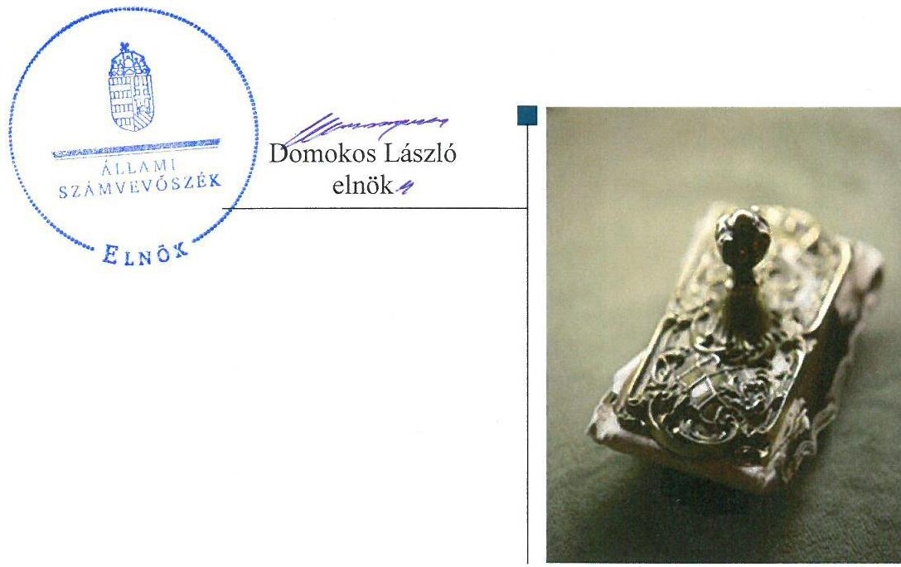

# Jelentés 

## Önkormányzati adósságrendezés ellenőrzése

Biri Község Önkormányzata adósságrendezési eljárásának ellenőrzése 2017.

---

# Jelentés 

## Önkormányzati adósságrendezés ellenőrzése

Biri Község Önkormányzata adósságrendezési eljárásának ellenőrzése 2017. ๑ hó 24 nap

---

# AZ ELLENŐRZÉST FELÜGYELTE:

- RENKŐ ZSUZSANNA felügyeleti vezető
- AZ ELLENŐRZÉST VEZETTE ÉS A VÉGREHAJTÁSÁÉRT FELELŐS:
  - BAJNAI ZSUZSANNA ellenőrzésvezető
  - A PROGRAM ÖSSZEÁLLÍTÁSÁÉRT FELELŐS:
    - JANIK JÓZSEF LÁSZLÓ osztályvezető

**IKTATÓSZÁM:** V-1242-140/2016

**TÉMASZÁM:** 2276

**ELLENŐRZÉS-AZONOSÍTÓ SZÁM:** V073910

Jelentéseink az Országgyűlés számítógépes hálózatán és az Interneten a www.asz.hu címen is olvashatóak.

---

# TARTALOMJEGYZÉK 

■ ÖSSZEGZÉS ..... 5
■ AZ ELLENŐRZÉS CÉLJA ..... 6
■ AZ ELLENŐRZÉS TERÜLETE ..... 7
■ AZ ELLENŐRZÉS HÁTTERE, INDOKOLTSÁGA ..... 8
■ A JELENTÉS LÉNYEGES KÉRDÉSKÖREI ..... 9
■ ELLENŐRZÉS HATÓKÖRE ÉS MÓDSZEREI ..... 10
■ MEGÁLLAPÍTÁSOK ..... 12
■ JAVASLATOK ..... 19
■ MELLÉKLETEK ..... 21
I. sz. melléklet: Értelmező szótár ..... 21
■ FÜGGELÉK: ÉSZREVÉTELEK ..... 23
■ RÖVIDÍTÉSEK JEGYZÉKE ..... 33

---

.

---

# ÖSSZEGZÉS 

Biri Község Önkormányzata adósságrendezési eljárásának végrehajtása során a nem szabályszerű feladatellátás veszélyeztette az adósságrendezés céljainak elérését. A hitelezők követelését teljes körűen kielégítették. Az önkormányzat pénzügyi egyensúlyának és fizetőképességének fenntarthatósága megbízható adatok hiányában nem volt értékelhető.

## Az ellenőrzés társadalmi indokoltsága

Biri Község Önkormányzatánál 2009. február 24-től 2009. december 10-ig adósságrendezés folyt, amely során a hitelezők mindösszesen 63,3 millió Ft kötelezettség teljesítésére nyújtottak be igényt. Ez a kötelezettségállomány az önkormányzat vagyonának mintegy tizedét jelentette, így indokolt volt ellenőrizni, hogy az adósságrendezési eljárás elérte-e a célját, az eljárás szereplői eleget tettek-e a törvényben meghatározott feladataiknak a fizetőképesség helyreállítása, a hitelezőknek hatékony jogvédelem nyújtása és az átgondolt, felelősségteljes gazdálkodás elősegítése érdekében.

## Főbb megállapítások, következtetések

Az adósságrendezési eljárás szabálytalan végrehajtása veszélyeztette az eljárás céljainak elérését. Az adósságrendezés megindításakor elmaradt a hitelezői igények kielégítéséhez felhasználható vagyon felmérése, és a valós pénzügyi helyzet megismerése, mert nem készült vagyonleltár és éves beszámoló. A hitelezők nem, illetve késve kaptak tájékoztatást követeléseik elfogadásáról a jogszabályban meghatározott határidőhöz képest. A képviselő-testület a reorganizációs programot és az egyezségi javaslatot a törvényben meghatározott határidőt követően fogadta el, ami hátráltatta az eljárás határidőben történő befejezését. A pénzügyi gondnok nem jelentette be a bíróságnak, hogy az egyezség megkötésére nyitva álló határidő eredménytelenül telt el, így a bíróság nem rendelkezhetett az eljárásnak a vagyon bírósági felosztásának szabályai szerinti folytatásáról, ezért az adósságrendezés végén az egyezség a jogszabályban meghatározott határidőt követően, szabálytalanul jött létre.

Az egyezségben szereplő hitelezői követeléseket maradéktalanul kielégítették, teljes egészében saját forrásból.
A számviteli szabálytalanságok következtében a 2009-2014. évi költségvetési beszámolók nem adtak megbízható és valós összképet az önkormányzat vagyonáról, ezért a fizetőképesség és a pénzügyi egyensúly alakulása nem volt értékelhető.

---

# AZ ELLENŐRZÉS CÉLJA 

Az ellenőrzés célja annak megállapítása volt, hogy az adósságrendezési eljárás lefolytatása szabályszerű volt-e, az önkormányzat gazdálkodása az adósságrendezési eljárás alatt megfelelt-e a jogszabályi előírásoknak; az eljárás szereplői - kiemelten a pénzügyi gondnok - a jogszabályokban foglaltak szerint jártak-e el az adósságrendezés során. A lefolytatott eljárás elérte-e a törvényben kitűzött célokat; az adósságrendezési eljárás alatt az önkormányzat folyamatosan teljesítette-e kötelező feladatait, a hitelezők követelését vagyonarányosan kielégítette-e, helyreállt-e fizetőképessége.

---

# AZ ELLENŐRZÉS TERÜLETE 

## Biri Község Önkormányzata

Biri Község Szabolcs-Szatmár-Bereg megyében helyezkedik el. Állandó lakosainak száma 2009. január 1-jén 1447 fő, 2014. december 31-én 1388 fő volt. Az önkormányzat ${ }^{1}$ képviselő-testülete ${ }^{2}$ 2009-ben 10 fővel, három állandó bizottsággal, 2014-ben hat fővel és két állandó bizottsággal látta el feladatát.

A jelenlegi polgármester 2009. augusztus 2. napjától tölti be tisztségét, a jegyző személye az ellenőrzött időszakban nem változott.

Az igazgatási, gazdálkodási feladatokat a polgármesteri hivatal ${ }^{3}$ látta el, amely elkülönült gazdasági szervezettel nem rendelkezett.

Az önkormányzatnak a polgármesteri hivatalon kívül önállóan gazdálkodó intézménye, gazdasági társasága az ellenőrzött időszakban nem volt.

A foglalkoztatottak létszáma - a közfoglalkoztatottakkal együtt - 2009. január 1-jén 35 fő, 2014. december 31-én 44 fő volt.

Az adósságrendezési eljárást az önkormányzat kezdeményezte, jelentős, szállítók felé fennálló tartozására hivatkozva. A bíróság ${ }^{4}$ végzése az adósságrendezés megindításáról 2009. február 24-én jelent meg a Cégközlönyben. Az adósságrendezés 2009. december 10-én egyezség megkötésével zárult.

A bíróság a BAREX Kft. ${ }^{5}$-t jelölte ki a pénzügyi gondnoki feladatok ellátására.

---

# AZ ELLENŐRZÉS HÁTTERE, INDOKOLTSÁGA 

Az önkormányzatok finanszírozásának, gazdálkodásának keretei és feladatellátása jelentős változásokon ment keresztül a Har. tv. ${ }^{6}$ hatályba lépésétől eltelt időszakban.

Az önkormányzati eladósodást 2011-ig csak az Ötv.-ben ${ }^{7}$ meghatározott hitelfelvételi korlát szabályozta, a korlát megsértését azonban jogszabályok nem szankcionálták. A 2012. évtől jelentős szigorítás lépett életbe, a korábbi passzív szabályozást a Stabilitási tv. ${ }^{8}$ hatályba lépésével az aktív kontroll váltotta fel, a törvény előírásai alapján az önkormányzatok hitelfelvételei engedélykötelessé váltak.

1996-ban a hitelfelvételi korlát bevezetése mellett az önkormányzatok adósságrendezésének szabályozására is sor került. Az adósságrendezési eljárás részben a lakosság védelmét szolgálta azzal, hogy biztosította az önkormányzatok által nyújtott kötelező közfeladatokhoz való hozzájutást az önkormányzat fizetésképtelensége esetén is. A Har. tv. alapján - 1996 és 2013 júniusa között - ugyanakkor elenyésző számú, mindösszesen 64 adósságrendezési eljárás indult. Az eljárások közel 60\%-a egyezséggel, 40\%-a vagyonfelosztással zárult.

Az adósságrendezés első időszakában (2009. évig) a forráshiányból eredeztethető eladósodás tette indokolttá az eljárások jelentős hányadának megindítását.

A második időszakban az eljárás alá vont önkormányzatok között megjelentek a nagyobb költségvetéssel és több intézménnyel is rendelkező települések. Az adósságrendezést szükségessé tevő problémák speciális pénzügyi elemekkel, a devizaalapú kötvénnyel történő finanszírozás begyűrűző hatásaival, valamint az anyagi lehetőségeket meghaladó, túlméretezett fejlesztésekkel összefüggő kötelezettségvállalásokkal egészültek ki, de a beruházások esetében fontos tényező volt a kellő szakértelem hiánya és a pénzügyi nehézségek szakszerűtlen kezelése is.

Az ÁSZ ${ }^{9}$ önkormányzati alrendszert érintő ellenőrzései, elemzései során számos ponton mutatott rá azokra a területekre, ahol a „szabályozás" módosításra, korrekcióra szorul. Az ellenőrzés alapján megfogalmazott javaslatok e területen is segítséget nyújthatnak a kormányzat és az Országgyűlés törvényhozó munkájában, hozzájárulhatnak az irányítói tevékenység erősítéséhez, végső soron a közpénzügyek átláthatóságához és a közvagyon védelméhez. Az ellenőrzés során tett megállapításaink megerősíthetik egy „megelőző monitoring funkció" kialakításának szükségességét a helyi önkormányzatok fizetésképtelenségének megelőzése érdekében.

---

# A JELENTÉS LÉNYEGES KÉRDÉSKÖREI 

1. Az adósságrendezési eljárás folyamata, végrehajtása során szabályszerű volt-e az önkormányzat és a pénzügyi gondnok feladatellátása?
2. A lefolytatott adósságrendezési eljárás elérte-e a törvényben kitűzött célokat?
3. Az adósságrendezési eljárást követően biztosított és fenntartható volt-e a pénzügyi egyensúly?

---

# ELLENŐRZÉS HATÓKÖRE ÉS MÓDSZEREI 

## Az ellenőrzés típusa

Rendszerellenőrzés.

## Az ellenőrzött időszak

2009. január 1. és 2015. június 30. közötti időszak.

## Az ellenőrzés tárgya

A Har. tv. által szabályozott adósságrendezési eljárás.

## Az ellenőrzött szervezet

Biri Község Önkormányzata és a pénzügyi gondnoki feladatok ellátásával összefüggésben a BAREX Gazdasági Tanácsadó, Kereskedő és Szolgáltató Korlátolt Felelősségű Társaság

## Az ellenőrzés jogalapja

Az Állami Számvevőszékről szóló 2011. évi LXVI. törvény 5. § (2) bekezdése.

## Az ellenőrzés módszerei

Az ellenőrzés szakmai módszertana az ÁSZ hivatalos honlapján (www.asz.hu) közzétett szakmai szabályokon alapult, amelyek irányadónak tekintették a Legfőbb Ellenőrző Intézmények Nemzetközi Szervezete (INTOSAI) által kiadott nemzetközi (ISSAI) standardokat.

Az ellenőrzés alapját az ellenőrzött önkormányzattól bekért tanúsítványok, szabályzatok, szerződések, bírósági végzések, határozatok és egyéb dokumentumok, kimutatások, valamint az önkormányzati beszámolók adatai képezték. Az ellenőrzési kérdések megválaszolásához szükséges bizonyítékok megszerzése, összegyűjtése, az ellenőrzött által rendelkezésre bocsátott dokumentumok, adatok elemzés módszerével végrehajtott értékelésével történt, kiegészítve a megfigyelés, a szemle (szemrevételezés), a kérdésfeltevés (információkérés), mintavételezés módszerével. Az ellenőrzés keretében értékeltük az ellenőrzéshez elkészített tanúsítványok adatainak valódiságát.

---

Az adósságrendezési eljárás szabályszerűségét a bírósági végzések, határozatok, a testületi előterjesztések, jegyzőkönyvek, határozatok, a válságköltségvetés, a beszámolók adatai, az értesítések, közzétételek, kimutatás a hitelezőkről, jelentések, belső szabályzatok, pénzügyi bizonylatok, kötelezettségvállalások és további releváns dokumentumok alapján ellenőriztük. A minősítés szempontja a dokumentumok határidőben és tartalmilag a vonatkozó előírásoknak megfelelő elkészítése volt.

A kontrolltevékenység működésének ellenőrzésével értékeltük, hogy az adósságrendezési eljárás alatt vállalt kötelezettségek és teljesített kifizetések szabályszerűen történtek-e, a válságköltségvetés alatt a forrásokat szabályszerűen, rendeltetésszerűen használták-e fel a Har. tv.-ben előírt és az önkormányzat által ellátott kötelező feladatellátás során.

A kontrolltevékenységek támogató szerepét a kötelezettségvállalások és a szakmai teljesítés igazolása/utalvány ellenjegyzése, a teljesítés igazolása/érvényesítés, valamint a pénzügyi gondnok által gyakorolt ellenjegyzés működésének ellenőrzésén keresztül ítéltük meg. A véletlen minta alapján a sokaságra vonatkozó hibaarányt becsültük. „Megfelelőnek" értékeltük az ellenőrzött területet, amennyiben 95\%-os bizonyossággal a teljes sokaságban a hibaarány legfeljebb 10\%, „részben megfelelőnek" értékeltük, ha a hibaarány 10-30\% között volt, „nem megfelelőnek" pedig akkor, ha a mintavételi eredmények alapján a sokaságbeli hibaarány meghaladta a 30\%-ot. A becsült hibaaránytól függetlenül nem értékeltük szabályosnak az önkormányzatnál a válságköltségvetésen alapuló kifizetéseket, amennyiben egyetlen esetben is hiányzott a pénzügyi gondnok ellenjegyzése a kötelezettségvállalás vagy pénzügyi kifizetés dokumentumáról.

Az önkormányzatok adósságrendezési eljárása és az azt követő gazdálkodási tevékenysége hibáinak kijavítására, a közpénzekkel való felelős gazdálkodás segítésére irányuló javaslatok kidolgozásakor a hatályos jogszabályok voltak az irányadóak.

---

# MEGÁLLAPÍTÁSOK 

## 1. Az adósságrendezési eljárás folyamata, végrehajtása során szabályszerű volt-e az önkormányzat és a pénzügyi gondnok feladatellátása?

Összegző megállapítás

Az adósságrendezési eljárás végrehajtása a feladatellátás hiányosságai miatt nem volt szabályszerű, ezért a hitelezői érdekek sérültek. A bíróság a törvény által előírt tájékoztatást nem kapta meg, ezért nem dönthetett az eljárás lefolytatásának módosításáról. A belső szabályzatok elkészítésével kapcsolatos mulasztás, a kontrollrendszer elégtelen működése miatt a hibák feltárásának és megelőzésének elmaradása hozzájárult az eladósodáshoz.
1.1. számú megállapítás

Nem határozták meg pontosan a hitelezői igény benyújtásának határidejét, a hitelezőket nem, illetve késedelmesen tájékoztatták követeléseik elfogadásáról, ezért a törvény által előírt hitelezői jogvédelem nem érvényesült maradéktalanul.

A HITELEZŐKNEK SZÓLÓ FELHÍVÁS az adósságrendezés Cégközlönyben való közzétételét követően, határidőben megjelent két országos napilapban, és a felhívást a helyben szokásos módon is kihirdették. A polgármester ${ }^{10}$ a felhívásban nem pontosan, a törvény előírásai szerint határozta meg a hitelezői igény bejelentésére nyitva álló határidőt a Har. tv. 10. § (3) bekezdésében és a 10. § (2) bekezdés e) pontjában foglaltak ellenére, mivel 2009. április 24-ét jelölte meg 2009. április 27-e helyett. A határidő előírásoktól eltérő meghatározása nem okozott hátrányt a hitelezők számára.

A polgármester ${ }_{1}$ eleget tett a jogszabály által előírt egyéb tájékoztatási kötelezettségének.

A HITELEZŐKET NYILVÁNTARTÁSBA VETTE a pénzügyi gondnok. Követeléseik megvizsgálása után két hitelezői igényt 2,1 millió Ft értékben - megalapozatlanság miatt - elutasított, így az adósságrendezésben 54 hitelező vett részt, követeléseik együttes összege 61,2 millió Ft volt.

A pénzügyi gondnok nem tájékoztatott 40 hitelezőt követeléseik elfogadásáról a Har. tv. 15. § (1) bekezdése ellenére, 16 hitelezőt a jogszabályban meghatározott 15 napos - 2009. május 12-ei - határidőhöz képest több mint egy hetes késedelemmel értesített.

---

1.2. számú megállapítás

Nem készült vagyonleltár és a jogszabályban előírt éves beszámoló.
 A valós vagyoni-pénzügyi helyzet felmérésének elmaradása veszélyeztette a hitelezői igények kielégítését, a fizetőképesség helyreállítását.

## NEM KÉSZÜLT VAGYONLELTÁR ÉS ÉVES BESZÁ-

MOLÓ az adósságrendezés megindításának időpontját megelőző nappal, így a polgármester ${ }_{1}$ nem adta át azokat a Har. tv. 13. § (2) bekezdés b) pontjának előírása ellenére a pénzügyi gondnoknak. A vagyonleltár helyett egy kimutatást állítottak össze a 2009. február 23-ai fordulónapra, amely nem tartalmazta a befektetett pénzügyi eszközöket, a követeléseket és a pénzeszközöket.

Az önként vállalt és jogszabályban kötelezően előírt feladatainak és hatáskörének helyi ellátási formáiról, valamint ezek pénzügyi finanszírozásáról szóló jelentést, a válságköltségvetési rendelettervezetet, a folyamatban lévő bírósági, más hatósági eljárásokról készített részletes összefoglalót, a vagyonra vonatkozó, az adósságrendezési eljárás kezdő időpontját megelőző egy éven belül és az azóta kötött szerződéseket megkapta a pénzügyi gondnok.
1.3. számú megállapítás

A válságköltségvetési rendelet nem felelt meg a törvényi előírásoknak. A képviselő-testület az egyezségi javaslatot és a tartalmában nem megfelelő reorganizációs programot a törvényben meghatározott határidőt követően fogadta el, a késedelem hátráltatta az egyezség határidőn belüli létrehozását.

AZ ADÓSSÁGRENDEZÉSI BIZOTTSÁG a jogszabályi előírásoknak megfelelő határidőben és összetételben megalakult, a válságköltségvetési rendelettervezetet megtárgyalta és elfogadta.

A VÁLSÁGKÖLTSÉGVETÉSI RENDELET nem felelt meg a jogszabályi előírásoknak, mert
$\longrightarrow$ a Har. tv. 13. § (1) bekezdés d) és a 31. § (1) bekezdés a) pontjában foglaltak ellenére nem rendszeres személyi jellegű juttatások kifizetésére is lehetőséget biztosított;
$\longrightarrow$ a Har. tv. 16. § (3) bekezdésében előírtak ellenére az adósságrendezési bizottság helyett a polgármester hatáskörébe utalta egymillió Ft értékhatárig a hitel-, valamint az átmenetileg szabad pénzeszközök lekötésével kapcsolatos szerződések megkötését;
$\longrightarrow$ a Har. tv. 18. § (2) bekezdésében foglaltak ellenére tartalmazott önként vállalt feladatok - mezőőr, tanyagondnoki szolgálat - finanszírozására kiadási előirányzatot.
A pénzügyi gondnok a Har. tv. 14. § (1) bekezdésének előírása ellenére nem készített a költségvetést érintő előterjesztéshez csatolható véleményt, azonban a képviselő-testületi ülésen álláspontját szóban ismertette.

## A REORGANIZÁCIÓS PROGRAM ÉS EGYEZSÉGI

JAVASLAT képviselő-testületi elfogadására rendelkezésre álló 150 napos határidő 2009. július 23-án letelt, de erről a pénzügyi gondnok a Har. tv. 22. § (1) bekezdése ellenére nem értesítette a hitelezőket.

---

A pénzügyi gondnok 2009. augusztus 10-én terjesztette elő a képviselőtestületnek elfogadásra a reorganizációs programot és egyezségi javaslatot. A polgármester, ${ }^{11}$ az előterjesztést követően nem hívott össze nyolc napon belüli időpontra képviselő-testületi ülést a Har. tv. 21. §-ában előírtak ellenére, arra csak később, 2009. augusztus 28-án került sor, amikor mind a reorganizációs programot, mind az egyezségi javaslatot elfogadták.

A reorganizációs program tartalmazta az adósságrendezéshez vezető okokat, az önkormányzat gazdasági helyzetének részletes leírását, az adósságrendezésbe vonható vagyon hasznosítására vonatkozó javaslatot. Az adósságrendezésbe vonható vagyon elemei között a Har. tv. 2. § f) pontja ellenére olyan korlátozottan forgalomképes ingatlanokat - községháza, vízmű-telep, általános iskola - is feltüntettek, amelyek hatósági feladatok és az alapvető lakossági szolgáltatások ellátásához voltak szükségesek. Meghatározásra kerültek egyéb tervezett intézkedések: létszámcsökkentés, adóhátralék behajtása, az önkormányzat által nem használt ingatlanok bérbeadással történő hasznosítása, a szociális juttatások és a különféle jogcímeken nyújtható támogatások szűkítése, korlátozása. A bérbeadással történő hasznosításra és a támogatásokra vonatkozó javaslatoknál a Har. tv. 20. § (2) bekezdése ellenére nem jelölték meg, hogy az önkormányzat ilyen módon milyen bevételekhez juthat. A reorganizációs program az előzőekben felsoroltak miatt nem felelt meg tartalmilag valamennyi törvényi követelménynek.

Az egyezségi javaslat tartalmában megfelelt a jogszabályi előírásoknak.
1.4. számú megállapítás

A hitelezőket nem szabályszerűen hívták meg az első egyezségi tárgyalásra. Az egyezség létrehozására rendelkezésre álló határidő eredménytelenül telt el, de ezt a pénzügyi gondnok nem jelentette be a bíróságnak, így az nem dönthetett az eljárás bírósági vagyonfelosztás szabályai szerinti folytatásáról. Az egyezség megkötésére a jogszabályban meghatározott határidőt követően, szabálytalanul került sor.

EGYEZSÉGI TÁRGYALÁSRA első alkalommal a pénzügyi gondnok Har. tv. 23. § (1) bekezdése ellenére nem hívta meg valamennyi hitelezőt, a meghívottak részére nem a jogszabályban meghatározott nyolc nappal korábban juttatta el a meghívót. Továbbá a reorganizációs programot és az egyezségi javaslatot nem mellékelte. A következő egyezségi tárgyalásra a hitelezők meghívása az előírásoknak megfelelően történt.

A pénzügyi gondnok a Har. tv. 25. § (5) bekezdése ellenére nem jelentette be a bíróságnak, hogy az adósságrendezés megindításának időpontjától számított 210 napon belül - 2009. szeptember 21-ig - nem jött létre egyezség. A bejelentési kötelezettség elmulasztása következtében a bíróság nem rendelkezhetett az eljárásnak a vagyon bírósági felosztásának szabályai szerinti folytatásáról.

AZ EGYEZSÉGET 2009. december 1-jén kötötték meg. Az egyezséghez az adósságrendezés időpontjában fennálló követeléssel rendelkező hitelezőknek több mint a fele hozzájárult, ezen hitelezők összes követelése elérte az összes bejelentett hitelezői követelés kétharmadát. Az egyezséget írásba foglalták, amely tartalmazta a jogszabály által előírt elemeket.

---

### 1.5. számú megállapítás

A megfelelő kontrollkörnyezet nem alakították ki, mert nem készítették el a gazdálkodásra vonatkozó szabályzatokat. A kifizetéshez kapcsolódó kontrolltevékenységek nem biztosították a hibák feltárását és megelőzését. A hiányosságok hozzájárultak az eladósodáshoz, mivel a döntéshozók nem rendelkeztek pontos adatokkal a szabad előirányzatokról.

A KONTROLLKÖRNYEZET kialakítása nem volt megfelelő, mert
nem rendelkeztek érvényes - a Számv. tv. ${ }^{12}$ 14. § (4)-(5) bekezdéseiben és az Áhsz. ${ }^{13} 8 . \S$ (3) bekezdés a-b) pontjaiban előírt - számviteli politikával, és az annak keretében elkészítendő leltározási és leltárkészítési szabályzattal, az eszközök és források értékelési szabályzatával, továbbá a Számv. tv. 161. § (1) és az Áhsz. ${ }_{1} 49 . \S$ (1) bekezdéseiben előírt számlarenddel;
nem adtak ki belső szabályzatokat a gazdálkodási jogkörök gyakorlására vonatkozóan az Áht. ${ }^{14}$ 121. § (1) bekezdése ellenére, így nem biztosították a rendelkezésre álló források szabályszerű, szabályozott felhasználását.
A 2009. évben - a válságköltségvetés végrehajtásának időszakában - rendelkeztek a képviselő-testület és a polgármesteri hivatal működésének részletes szabályait tartalmazó önkormányzati SZMSZ ${ }^{15}$-szel és hivatali SZMSZ ${ }^{16}$-szel.

A képviselő-testület a vagyonrendeletben ${ }^{17}$ megalkotta az önkormányzati vagyonnal történő gazdálkodás szabályait, amely megfelelt a hatályos jogszabályoknak.

A KONTROLLTEVÉKENYSÉGEK - gazdálkodási jogkörök, pénzügyi gondnoki ellenjegyzés - gyakorlása „nem megfelelő" volt a válságköltségvetés időszakában.

A pénzügyi gondnok nem jegyezte ellen a Har. tv. 14. § (1) bekezdésének előírása ellenére a kötelezettségvállalásokat és a kifizetések teljesítését.

A kötelezettségvállalásokhoz kapcsolódóan nem vezettek olyan analitikus nyilvántartást az Ámr. ${ }^{18}$ 134. § (13) bekezdése ellenére, amelyből megállapítható lett volna az évenkénti kötelezettségvállalás összege.

A gazdálkodási jogkörök gyakorlásának ellenőrzése során tapasztalt további hiányosságokat az 1. táblázat tartalmazza.

1. táblázat

# A GAZDÁLKODÁSI JOGKÖRÖK GYAKORLÁSÁNAK ELLENŐRZÉSE SORÁN TAPASZTALT HIÁNYOSSÁGOK 

| Sorszám | Gazdálkodási jogkör | Megállapított szabálytalanság | Megsértett jogszabály |
| :--: | :--: | :--: | :--: |
| 1. | kötelezettségvállalás | Az előzetes írásbeli kötelezettségvállalást nem igénylő kifizetések esetében nem rögzítették belső szabályzatban a kötelezettségvállalás rendjét és nyilvántartási formáját, továbbá   a beszerzések előzetes írásbeli kötelezettségvállalás nélkül történtek. | Áhr. ${ }_{1} 134 . \S$ (3) bekezdése   Áht. 100/8. § (3) és Ámr. ${ }_{1} 134 . \S$   (8) bekezdései |
| 2. | szakmai teljesítés igazolása | A szakmai teljesítés igazolását nem végezték el. | Ámr. ${ }_{1} 135 . \S$ (1) bekezdése |

---

| Sorszám | Gazdálkodási jogkör | Megállapított szabálytalanság | Megsértett jogszabály |
| :--: | :--: | :--: | :--: |
| 3. | érvényesítés | Az érvényesítést nem végezték el,   az elvégzett érvényesítés nem volt szabályszerű, mert nem ellen-   őrizték az összegszerűséget és az előírt követelmények betartását. | Ámr. 135. § (3) bekezdés |
| 4. | utalvány ellenjegyzése | Az utalvány ellenjegyzését nem végezték el. | Ámr. 137. § (3) bekezdése |

A KÖNYVVITELI NYILVÁNTARTÁSBA bizonylat nélkül rögzítettek adatokat a Számv. tv. 165. § (1) bekezdése ellenére. A könyvvezetés során a Számv. tv. 167. § (1) bekezdés h) és i) pontjában foglalt, a könyvviteli elszámolást közvetlenül alátámasztó bizonylat általános alaki és tartalmi kellékeire vonatkozó előírásoknak nem tettek eleget, mert nem tüntették fel a könyvviteli számlákra történő hivatkozást, a nyilvántartásokban történt rögzítés időpontját, igazolását. A könyvelés során továbbá nem tüntették fel a Számv. tv. 167 § (1) bekezdés a) pontja ellenére a bizonylat sorszámát vagy egyéb más azonosítóját, ezáltal nem biztosították a főkönyvi könyvelés, az analitikus nyilvántartások és a bizonylatok adatai közötti egyeztetés és ellenőrzés lehetőségét, a logikailag zárt rendszert a Számv. tv. 165. § (4) bekezdés előírása ellenére. A hiányosságok miatt sérült a Számv. tv. 15. § (3) bekezdésében foglalt valódiság alapelve.

Az önkormányzat az Ámr. 18. § (3) bekezdése ellenére külső szolgáltató igénybevételével biztosította a 2009. évi könyvelést.

A BELSŐ ELLENŐRZÉST társulás ${ }^{19}$ keretében biztosították.
A Ber. ${ }^{20}$ 29. § (1) bekezdése ellenére a belső ellenőrzés által megfogalmazott intézkedést igénylő javaslatokra és megállapításokra nem készítettek intézkedési tervet, a megállapítások, javaslatok nem hasznosultak, ezért a monitoring rendszer részét képező belső ellenőrzés nem támogatta a válságköltségvetésen alapuló kifizetések szabályszerű végrehajtását.

A Ber. 32. § (1) bekezdésében foglaltak ellenére az elvégzett ellenőrzésekről nem vezetettek nyilvántartást és nem gondoskodtak az ellenőrzési dokumentumok megőrzéséről.

# 2. A lefolytatott adósságrendezési eljárás elérte-e a törvényben kitűzött célokat? 

Összegző megállapítás

A kötelező feladatok adósságrendezési eljárás alatti folyamatos teljesítésére és a hitelezők követelésének kielégítésére vonatkozó törvényi célkitűzés teljesült. A fizetőképesség fenntarthatósága nem volt értékelhető az elemzéshez szükséges megbízható adatok hiányában.

A KÖTELEZŐ FELADATOKAT folyamatosan ellátták az adósságrendezés alatt a polgármesteri hivatal szervezetén keresztül, társulással, gazdasági társaságokkal kötött megállapodások révén.

Az óvodai nevelés és az általános iskolai oktatás feladatainak ellátásában változás történt az eljárás alatt, 2009. szeptember 1-jétől gazdasági társasággal kötöttek oktatási megállapodást ${ }^{21}$.

---

A HITELEZŐI IGÉNYEKET az egyezségben vállalt határidőn belül, maradéktalanul kielégítették. A kifizetett 61,2 millió Ft - az egyezségben szereplő hitelezői követelések 100\%-a - teljes egészében önkormányzati forrásból teljesült.

A hitelezői követelések kielégítésének fedezetét vagyonértékesítéssel biztosították, amely az Áht. 108. § (1) bekezdés, valamint az abban hivatkozott 2008. évi CII. törvény ${ }^{22}$ 9. § (1) bekezdésében foglalt előírása ellenére versenyeztetés nélkül történt. Továbbá az Ötv. 79. § (2) bekezdés b) pontjában, a vagyonrendelet 2. § (1) bekezdés és az abban hivatkozott 2. számú mellékletben, a Har. tv. 2. § f) pontjában foglaltakra tekintettel szabálytalan volt, mivel korlátozottan forgalomképes ingatlant érintett.

A REORGANIZÁCIÓS PROGRAMBAN szereplő intézkedéseket - az ingatlanértékesítés, adóhátralék beszedés kivételével - nem hajtották végre. Az ingatlan értékesítéséből egyszeri, 80,0 millió Ft bevétel származott.

A pénzügyi gondnok a Har. tv. 14. § (2) bekezdés e) pontja ellenére nem kezdeményezte az önkormányzat esedékessé váló követeléseinek behajtását az adósságrendezés időszakában.

LIKVIDITÁSI TERVET nem készítettek a 2009. évben az Ámr. 139. § (1) bekezdésében,
 a 2010-2011. évben az Ámr. ${ }^{23}$ 201. § (1) bekezdésében, a 2012-2015. I. félévében az Ávr. ${ }^{24}$ 122. § (1)-(2) bekezdéseiben foglaltak ellenére. Likviditási tervek hiányában a fizetőképesség alakulását nem kísérték figyelemmel, így nem rendelkeztek információval arról, hogy a kiadások teljesítéséhez a megfelelő pénzügyi fedezet rendelkezésre áll-e, ezáltal nem volt biztosítva a tartozások kialakulásának megelőzése.

A fizetőképesség nem volt értékelhető. A 2009-2014. évi beszámolók nem nyújtottak megbízható, valós összképet az önkormányzat vagyonáról, annak összetételéről. A könyvvezetésben feltárt szabálytalanságok az önkormányzat vagyoni helyzetének áttekintését meghiúsították, mivel
$\longrightarrow$ a kötelezettségekhez kapcsolódó analitikus nyilvántartások vezetéséről nem gondoskodtak a 2009-2012. években, a 2013. évben nem vezették folyamatosan az Áhsz. 1 49. § (1) bekezdésében és a 9. számú mellékletének 4. d)* pontjában előírtak ellenére. 2014. év végén a könyvviteli zárlat során nem végezték el a Számv. tv. 69. § (2) bekezdésében foglaltak ellenére az egyeztetést a részletező nyilvántartás és a főkönyvi kivonat adatai között, mert az elemi költségvetési beszámolóban a kötelezettségek összege magasabb volt az analitikában szereplő összegnél;
$\longrightarrow$ a követelésekhez kapcsolódó analitikus nyilvántartás vezetéséről nem gondoskodtak a 2009-2013. években az Áhsz. 1 49. § (1) bekezdésében és a 9. számú mellékletének 2. ca) pontjában előírtak ellenére. 2014. évben az Áhsz. 2 39. § (3) bekezdésében, és a 14. melléklet III. pontjában előírtaknak megfelelő részletező nyilvántartást

[^0]
[^0]:    * A 2011. január 1-től hatályos szabályozás szerint da) pont

---

nem vezették az előírások szerint, mivel az analitika csak a követelések közhatalmi bevételre mérlegadatot támasztotta alá, a teljes követelésállományét nem;
a 2009. évben az önkormányzat által feltárt, de a Számv. tv. 165. § (1)-(2) bekezdése ellenére bizonylat nélkül, nem előírásszerűen javított - a beruházási és fejlesztési hiteleket érintő jelentős összegű - hiba miatt sérült a Számv. tv. 15. § (3) bekezdésében előírt valódiság alapelve;
a mérlegek fordulónapján a követelések és kötelezettségek leltárazását a 2009-2013. években az Áhsz. 3 37. § (1) bekezdésében, a 2014. évben az Áhsz. ${ }^{25}$ 22. § (1) bekezdésében foglaltak ellenére nem végezték el.

# 3. Az adósságrendezési eljárást követően biztosított és fenntartható volt-e a pénzügyi egyensúly? 

Összegző megállapítás A pénzügyi egyensúly megítéléséhez megbízható adatok nem álltak rendelkezésre.

A teljesített összes bevétel és teljesített összes kiadás éves költségvetési beszámolóban szereplő adatai - 2009. év kivételével - nem egyeztek meg a zárszámadási rendeletekben szereplő adatokkal. Az önkormányzat pénzügyi egyensúlyának fenntarthatósága a rendelkezésre bocsátott adatok ellentmondásai, valamint az 1.5. számú megállapítás 8. bekezdésében és a 2. összegző megállapítás 8. bekezdésében a feltárt hiányosságok miatt nem volt értékelhető.

---

# JAVASLATOK 

Az ÁSZ tv. 33. § (1) bekezdésében foglaltak értelmében az ellenőrzött szervezet vezetője köteles a jelentésben foglalt megállapításokhoz kapcsolódó intézkedési tervet összeállítani és azt a jelentés kézhezvételétől számított 30 napon belül az ÁSZ részére megküldeni. Amennyiben az ellenőrzött szervezet vezetője nem küldi meg határidőben az intézkedési tervet, vagy továbbra sem elfogadható intézkedési tervet küld, az Állami Számvevőszék elnöke az ÁSZ tv. 33. § (3) bekezdése a) és b) pontjaiban foglaltakat érvényesítheti.

## a Geszterédi Közös Önkormányzati Hivatal jegyzőjének:

1. Intézkedjen a likviditási terv jogszabályi előírásoknak megfelelő elkészítéséről.
(2. sz. megállapítás 7. bekezdése alapján)
2. Intézkedjen az éves költségvetési beszámoló mérlegében kimutatott követelések és kötelezettségek jogszabályi előírásoknak megfelelő leltárral történő alátámasztásáról, illetve a kötelezettségek vonatkozásában a leltárazás keretében a főkönyvi könyvelés és a részletező nyilvántartások adatai közötti egyeztetés elvégzéséről.
(2. számú megállapítás 8. bekezdés 1. és 4. pontjai alapján)
3. Intézkedjen a feltárt hiányosságok és/vagy szabálytalanságok tekintetében a munkajogi felelősség tisztázására irányuló eljárás megindításáról, és ennek eredménye ismeretében tegye meg a szükséges intézkedéseket.
(2. sz. megállapítás 8. bekezdés 1-2. és 4. pontjai alapján)

---

.

---

# MELLÉKLETEK 

- I. SZ. MELLÉKLET: ÉRTELMEZŐ SZÓTÁR
adósságrendezés
adósságrendezésbe vonható vagyon
adósságrendezési bizottság
adósságrendezési eljárás
adósságrendezési eljárás kezdő időpontja
adósságrendezés megindításának időpontja
bíróság
egyezségi javaslat
egyezségi tárgyalás
hitelező
közfeladat
pénzügyi gondnok
pénzügyi pozíció
reorganizációs program

Az adósságrendezési eljárás azon szakasza, amely a bíróság adósságrendezést megindító végzésének Cégközlönyben való közzétételével [10. § (1) bekezdés] kezdődik és az adósságrendezési eljárás befejezését elrendelő bírósági végzés Cégközlönyben való közzétételének napjáig tart. (Forrás: Har. tv. 2. § b) pontja és 32. § (6) bekezdése).

Törvényben meghatározott forgalomképtelen törzsvagyon feletti, valamint a hatósági feladatok és az alapvető lakossági szolgáltatások ellátásához szükséges vagyon feletti forgalomképes vagyonrész. (Forrás: Har. tv. 2.§ f) pontja)
Az adósságrendezési eljárás megindítását követően megalakult bizottság, melynek tagjai: az önkormányzat polgármestere, a jegyző, a pénzügyi bizottság elnöke, egy önkormányzati képviselő. Elnöke a pénzügyi gondnok. (Forrás: Har. tv. 16. § (1) bekezdése)

A helyi önkormányzat székhelye szerint illetékes törvényszék (2011. XII. 31.-ig a fővárosi, megyei bíróságok) hatáskörébe tartozó nem peres eljárás, amely a helyi önkormányzatok fizetőképességének helyreállítására irányul. (Forrás: Har. tv. 3. § (1) bekezdése)
az a nap, amelyen a kérelem a bírósághoz érkezik. (Forrás: Har. tv. 4. § (1) bekezdése)
a végzés Cégközlönyben való megjelenésének napja. (Forrás: Har. tv. 10. § (1) bekezdés d) pontja)
az adósságrendezési eljárás során eljáró törvényszék, 2011. XII. 31-ig a megyei (fővárosi) bíróság
Az adósságrendezési bizottság által készített dokumentum az önkormányzat hitelezőinek a követeléséről, mely tartalmazza az indoklással alátámasztott egyezségi javaslatot. (Forrás: Har. tv. 20. § (3) bekezdése)
A képviselő-testület által elfogadott egyezségi javaslat alapján lefolytatott tárgyalás, mely egyezséggel vagy az adósságrendezési eljárásnak vagyonfelosztással történő folytatásának bírósági elrendelésével zárulhat.
Az adósságrendezés megindításának időpontjáig az, akinek a helyi önkormányzattal, vagy annak költségvetési szervével szemben vagyoni követelése áll fenn; az adósságrendezés megindításának időpontját követően az, aki a követelését a hitelezői igény bejelentésére nyitva álló határidő alatt bejelentette, és azt a pénzügyi gondnok elfogadta, illetve követelésének jogerős elbírálásáig az is, akinek az igénye vitatott. (Forrás: Har. tv. 2.§ c) pontja)
Jogszabályban meghatározott állami vagy önkormányzati feladat, amit az arra kötelezett közérdekből, a jogszabályban meghatározott követelményeknek és feltételeknek megfelelve végez, ideértve a lakosság közszolgáltatásokkal való ellátását, továbbá az állam nemzetközi szerződésekben vállalt kötelezettségeiből adódó közérdekű feladatokat, valamint e feladatok ellátásakor szükséges infrastruktúra biztosítását is. (Forrás: Nvtv. 3. § (1) bekezdés 7. pontja)
Az adósságrendezési eljárás lefolytatására, a bíróság által kijelölt, a pénzügyi gondnokok névjegyzékében szereplő szakember.
A tárgyévi GFS pozíció és a finanszírozási műveletek összevont egyenlege.
A helyi önkormányzat gazdasági helyzetét bemutató dokumentum, mely tartalmazza továbbá az adósságrendezésbe vonható vagyon hasznosítására, valamint

---

válságköltségvetés
az önkormányzat adósságrendezéssel kapcsolatosan tervezett intézkedéseire vonatkozó javaslatot annak megjelölésével, hogy ezzel milyen bevételhez juthat. (Forrás: Har. tv. 20.§ (2) bekezdése)
A helyi önkormányzat az adósságrendezési eljárás ideje alatt a képviselő-testület által elfogadott válság-költségvetés alapján gazdálkodik. A jegyző az adósságrendezés megindításának időpontját követő 30 napon belül készíti el a válság-költségvetési rendelettervezetet. A válság-költségvetésből az önkormányzat a Har. tv. 18. § (2) bekezdésében és a 19. § (3) bekezdésében foglalt kiadásokat finanszírozhatja. Amennyiben nem kerül elfogadásra válság-költségvetés a Har. tv. 29. § (2) bekezdése alapján az önkormányzat az adósságrendezési eljárás alatt, a pénzügyi gondnok által kidolgozott működési válságterv alapján kell, hogy működjön. (Forrás: Mötv. 122. §-a, Har. tv. 18. § (1)-(2) bekezdése, 19. § (2) bekezdése, 29. § (2) bekezdése)

---

# FÜGGELÉK: ÉSZREVÉTELEK 

A jelentéstervezetet a Számvevőszék 15 napos észrevételezésre megküldte az ellenőrzött szervezetek vezetőinek az ÁSZ tv. 29. § (1) bekezdése előírásának megfelelően.

A függelék tartalmazza az ellenőrzött észrevételeit, illetve az el nem fogadott észrevételek elutasításának indoklását.

[^0]
[^0]:    ${ }^{7}$ 29. § (1) Az Állami Számvevőszék az ellenőrzési megállapításait megküldi az ellenőrzött szervezet vezetőjének vagy az általa megbízott személynek, és annak, akinek személyes felelősségét állapította meg.
    (2) Az ellenőrzött szervezet vezetője és a felelősként megjelölt személy az ellenőrzés megállapításaira tizenöt napon belül írásban észrevételt tehet.
    (3) Az Állami Számvevőszék az észrevételre a beérkezésétől számított harminc napon belül írásban válaszol. A figyelembe nem vett észrevételeket köteles a jelentésben feltüntetni, és megindokolni, hogy azokat miért nem fogadta el.

---

# Tisztelt Domokos László Elnök Úr! 

Az Állami Számvevőszék 2016. évben ellenőrizte Biri Község Önkormányzatának 2009. évben indult adósságrendezési eljárását, és az Állami Számvevőszékről szóló 2011. évi LXVI. törvény (a továbbiakban: ÁSZ tv.) 29. § (1) bekezdésében foglaltak alapján a 2017. március 16. napján kelt, és 2017. március 21-én érkeztetetten megküldte az ,,Önkormányzati adósságrendezés ellenőrzése" - Biri Község Önkormányzata adósságrendezési eljárásának ellenőrzése 2017." című jelentéstervezetét.

Az ÁSZ tv. 29. § (2) bekezdése alapján a jelentéstervezetre a következő észrevételeket teszem:

Általános észrevételként - az ÁSZ-nak az ellenőrzés módszereit elfogadva és tudomásul véve - azt kívánom elmondani, hogy (2008. év végén, 2009. évben) nem igazán volt országos tapasztalat az adósságrendezési eljárás lefolytatásával kapcsolatban, hiszen tudomásunk szerint abban az időszakban csak kisebb önkormányzatoknál volt előzőleg ilyen eljárás.

Hozzá szeretném még füzni, hogy az adósságrendezési eljárás megindítását még az előző polgármester kezdeményezte, aki időközben munkaviszonyának megszüntetését kérte egészségi állapotára hivatkozással, ezt követően az alpolgármester, és a pénzügyi gondnok koordinálásával bonyolították le az eljárást.

---

# 1.1. számú megállapításhoz: 

Nem határozták meg pontosan a hitelezői igény benyújtásának határidejét, a hitelezőket nem, illetve késedelmesen tájékoztatták követeléseik elfogadásáról, ezért a törvény által előírt hitelezői jogvédelem nem érvényesült maradéktalanul.

Valóban a megjelentett két országos napilapban a határidő az előírásoktól eltért, de ez nem okozott hátrányt a hitelezők számára.

## 1.2. számú megállapításhoz:

Nem készült vagyonleltár és a jogszabályban előírt éves beszámoló. A valós vagyoni-pénzügyi helyzet felmérésének elmaradása veszélyeztette a hitelezői igények kielégítését, a fizetőképesség helyreállítását.

Vagyonleltár nem, de azzal egyenértékű kimutatás 2009. február 23-i fordulónappal átadásra került a pénzügyi gondnok részére.
A hitelezői igények kielégítését ez nem befolyásolta, azok véleményünk szerint nem sérültek, mivel minden olyan a jogszabályban előírt és hatáskörének ellátási formáiról, ezek pénzügyi finanszírozásáról szóló jelentést, a válság-költségvetési rendelet-tervezetet, illetve minden olyan hatósági eljárásról készített összefoglalók, az adósságrendezési eljárás kezdő időpontját megelőző éven belül kötött szerződések, mind átadásra kerültek a pénzügyi gondnok részére.

## 1.3. számú megállapításhoz:

A válság-költségvetési rendelet nem felelt meg a törvényi előírásoknak. A képviselő-testület az egyezségi javaslatot és a tartalmában nem megfelelő reorganizációs programot a törvényben meghatározott határidőt követően fogadta el, a késedelem hátráltatta az egyezség határidőn belüli létrehozását.

A reorganizációs program tartalmazta az adósságrendezéshez vezető okokat, az önkormányzat gazdasági helyzetének részletes leírását, illetve a javaslatokat a vagyon hasznosítására vonatkozóan. Véleményünk szerint az egyezségi javaslat megfelelt a jogszabályi előírásoknak.

## 1.4. számú megállapításhoz:

Nincs észrevétel.

---

# 1.5. számú megállapításhoz: 

A megfelelő kontrollkörnyezetet nem alakították ki, mert nem készítették el a gazdálkodásra vonatkozó szabályzatokat. A kifizetéshez kapcsolódó kontrolltevékenységek nem biztosították a hibák feltárását és megelőzését. A hiányosságok hozzájárultak az eladósodáshoz, mivel a döntéshozók nem rendelkeztek pontos adatokkal a szabad előirányzatokról.

Rendelkezett
 önkormányzatunk a képviselő-testület és a Polgármesteri Hivatal működésének részletes szabályait tartalmazó Szervezeti és Működési Szabályzattal. A vagyonrendeletünkben szabályozva volt a vagyonnal történő gazdálkodás. Az eladósodást ez nem befolyásolhatta, ami valójában okozója volt: az oktatási és nevelési intézmények alulfinanszirozottsága, melyhez az önkormányzatoknak kellett biztosítani a hiányzó fedezetet az amúgy is szűkös állami normatíváiból, valamint a helyi bevételekből, mely önkormányzatunk esetében elenyésző volt, a település adottságaiból kifolyólag. Ez az, ami valójában az eladósodáshoz vezetett. Mióta ezen intézmények kikerültek (gazdasági társasággal köznevelési megállapodás keretén belül működtetjük, illetve állami irányítással) fenntartásunkból az óta az önkormányzat működése stabil, likviditási problémánk nincs.
2. számú összegző megállapításhoz:

A kötelező feladatok adósságrendezési eljárás alatti folyamatos teljesítésére és a hitelezők követelésének kielégítésére vonatkozó törvényi célkitűzés teljesült. A fizetőképesség fenntarthatósága nem volt értelmezhető az elemzéshez szükséges megbízható adatok hiányában.

Folyamatosan elláttuk a kötelező feladatainkat, az óvodai és általános iskolai oktatást gazdasági társasággal kötött oktatási megállapodás útján biztosítottuk.
A hitelezői igényeket maradéktalanul kiegyenlítettük. Jelen időpontig senki semmiféle utólagos igénnyel nem jelentkezett, de nem is jelentkezhetett, mert néhány esetben a hitelezők felé nem csak hogy a 100%-os igény került kiegyenlítésre, hanem a felmerült kamatok is.
A vizsgált időszakban (2009 - 2015. június 30.), és az óta is a működőképesség megőrzésén munkálkodunk önkormányzatunknál, mi sem bizonyítja ezt jobban, mint hogy likviditási gondjaink nincsenek, sőt adósságkonszolidációban sem részesültünk.
3. számú összegző megállapításhoz:

A pénzügyi egyensúly megítéléséhez megbízható adatok nem álltak rendelkezésre.
Jelenleg is, de a vizsgált időszakban is a pénzügyi egyensúly biztosítása volt a fő cél önkormányzatunknál, ezt alátámasztja az 1.5. számú megállapításhoz fűzött indokolásunk is, mely szerint: „az eladósodás okozója az oktatási és nevelési intézmények alulfinanszirozottsága, melyhez az önkormányzatoknak kellett biztosítani a hiányzó fedezetet az amúgy is szűkös állami normatíváiból, valamint a helyi bevételekből, mely önkormányzatunk esetében elenyésző volt, a település adottságaiból kifolyólag. Ez az, ami valójában az eladósodáshoz vezetett. Mióta ezen intézmények kikerültek (gazdasági társasággal köznevelési megállapodás keretén belül működtetjük, illetve állami irányítással) fenntartásunkból az óta az önkormányzat működése stabil, likviditási problémánk nincs."

---

A Geszterédi Közös Önkormányzati hivatal jegyzőjének figyelmét felhívtam, hogy intézkedjen:

1. a likviditási terv jogszabályi előírásoknak megfelelő elkészítéséről a (2. számú megállapítás 7. bekezdése alapján)
2. az éves költségvetési beszámoló mérlegében kimutatott követelések és kötelezettségek jogszabályi előírásoknak megfelelő leltárral történő alátámasztásáról, illetve a részletező adatok közötti egyeztetések elvégzéséről. (2. számú megállapítás 8. bekezdés 1. és 4. pontjai alapján)
3. a feltárt hiányosságok tekintetében tegye meg a munkajogi felelősség tisztázására irányuló eljárás megindításáról, és ennek eredménye ismeretében tegye meg a szükséges intézkedéseket.

# Tisztelt Elnök Úr! 

Az Ász által elvégzett vizsgálatokhoz kapcsolódóan jelezni kívánom, hogy az önkormányzat gazdálkodásának pénzügyi egyensúlyát az adósságrendezés befejezését követően, és jelenleg is biztosítjuk.
Ugyanakkor bízom abban, hogy a vizsgálat során tett megállapításokat a további működésünk során hasznosítani tudjuk, és a tervezet megfogalmazása számunkra kedvezően módosul.

Biri, 2017. március 30.

Tisztelettel:

## Almási Katalin

polgármester

---

ELNÖK

# Almási Katalin úrhölgy 

polgármester

Biri Község Önkormányzata

## Biri

## Tisztelt Polgármester Úrhölgy!

Köszönettel megkaptam az ,,Önkormányzati adósságrendezés ellenőrzése - Biri Község Önkormányzata adósságrendezési eljárásának ellenőrzése" című jelentéstervezet megállapításaira tett észrevételét.

Az ellenőrzési megállapításokra vonatkozó észrevételét az Állami Számvevőszékről szóló 2011. évi LXVI. törvény 29. § (2) bekezdésében meghatározott tizenöt napos határidőn belül küldte meg. Az Állami Számvevőszék észrevétellel kapcsolatos álláspontját a mellékletként csatolt, a felügyeleti vezető által készített indokolás tartalmazza.

Budapest, 2017. 09 hónap 12 nap

Melléklet: Észrevételre adott válasz

---

az „Önkormányzati adósságrendezés ellenőrzése - Biri Község Önkormányzata adósságrendezési eljárásának ellenőrzése" című jelentéstervezetre tett észrevételekre adott válasz

| Észrevétel: | 1.1. számú megállapítás   Megállapítás: Nem határozták meg pontosan a hitelezői igény benyújtásának határidejét, a hitelezőket nem, illetve késedelmesen tájékoztatták követeléseik elfogadásáról, ezért a törvény által előírt hitelezői jogvédelem nem érvényesült maradéktalanul.   Észrevétel: A megjelentetett két országos napilapban a határidő az előírásoktól eltérő volt, de ez nem okozott hátrányt a hitelezők számára. |
| :--: | :--: |
| Válasz: | Az Állami Számvevőszék az észrevételt nem fogadja el. |
| Indoklás: | Az észrevétel a megállapítást nem vitatta, a megállapításban foglaltakat elismerte. |
| Észrevétel: | 1.2. számú megállapítás   Megállapítás: Nem készült vagyonleltár és a jogszabályban előírt éves beszámoló. A valós vagyoni-pénzügyi helyzet felmérésének elmaradása veszélyeztette a hitelezői igények kielégítését, a fizetőképesség helyreállítását.   Észrevétel: Vagyonleltár nem, de azzal egyenértékű kimutatás 2009. február 23-i fordulónappal átadásra került a pénzügyi gondnok részére. A hitelezői igények kielégítését ez nem befolyásolta, azok véleményünk szerint nem sérültek, mivel minden olyan a jogszabályban előírt és hatáskörének ellátási formáiról, ezek pénzügyi finanszírozásáról szóló jelentést, a válságköltségvetési rendelet-tervezetet, illetve minden olyan hatósági eljárásról készített összefoglalók, az adósságrendezési eljárás kezdő időpontját megelőző éven belül kötött szerződések, mind átadásra kerültek a pénzügyi gondnok részére. |
| Válasz: | Az Állami Számvevőszék az észrevételt nem fogadja el. |
| Indoklás: | Az észrevételben hivatkozott 2009. február 23-i fordulónappal készített kimutatást sem az ellenőrzés során, sem az észrevétel mellékleteként nem bocsátotta az Önkormányzat az ÁSZ rendelkezésére. Az észrevétel nem vitatta, hogy vagyonleltár nem készült. |
| Észrevétel: | 1.3. számú megállapítás   Megállapítás: A válságköltségvetési rendelet nem felelt meg a törvényi előírásoknak. A képviselő-testület az egyezségi javaslatot és a tartalmában nem megfelelő reorganizációs programot a törvényben meghatározott határidőt követően fogadta el, a késedelem hátráltatta az egyezség határidőn belüli létrehozását.   Észrevétel: A reorganizációs program tartalmazta az adósságrendezéshez vezető okokat, az önkormányzat gazdasági helyzetének részletes leírását, illetve a javaslatokat a vagyon hasznosítására vonatkozóan. Az észrevétel szerint az egyezségi javaslat megfelelt az előírásoknak. |

---

| Válasz: | Az Állami Számvevőszék az észrevételt nem fogadja el. |
| :--: | :--: |
| Indoklás: | A reorganizációs program az adósságrendezésbe vonható vagyon elemei között forgalomképes ingatlanokat tartalmazott, továbbá a bérbeadással történő hasznosításra és a támogatásokra vonatkozó javaslatoknál nem jelölték meg, hogy az önkormányzat ilyen módon milyen bevételekhez juthat, ezért nem felelt meg tartalmilag valamennyi törvényi követelménynek. Ezeket a megállapításokat az észrevétel nem vitatta. Az egyezségi javaslat - ahogy az a jelentéstervezetben is szerepelt - tartalmában megfelelt az előírásoknak, de elfogadására a jogszabályban meghatározott határidőn túl került sor, ezzel kapcsolatban az észrevétel azt megcáfoló konkrétumot nem tartalmazott. |
| Észrevétel: | 1.5. számú megállapítás   Megállapítás: A megfelelő kontrollkörnyezetet nem alakították ki, mert nem készítették el a gazdálkodásra vonatkozó szabályzatokat. A kifizetéshez kapcsolódó kontrolltevékenységek nem biztosították a hibák feltárását és megelőzését. A hiányosságok hozzájárultak az eladósodáshoz, mivel a döntéshozók nem rendelkeztek pontos adatokkal a szabad előirányzatokról.   Észrevétel: Az észrevétel szerint a képviselő-testület és a Polgármesteri Hivatal rendelkezett szervezeti és működési szabályzattal. A vagyonrendeletben szabályozva volt a vagyonnal történő gazdálkodást. Az eladósodást az észrevétel szerint ez nem befolyásolhatta. |
| Válasz: | Az Állami Számvevőszék az észrevételt nem fogadja el. |
| Indoklás: | A megállapítás a gazdálkodási szabályzatra és a kontrolltevékenységekre vonatkozott, erre azonban nem tett észrevételt az Önkormányzat. |
| Észrevétel: | 2. számú összegző megállapítás   Megállapítás: A kötelező feladatok adósságrendezési eljárás alatti folyamatos teljesítésére és a hitelezők követelésének kielégítésére vonatkozó törvényi célkitűzés teljesült. A fizetőképesség fenntarthatósága nem volt értékelhető az elemzéshez szükséges megbízható adatok hiányában.   Észrevétel: Az észrevétel szerint folyamatosan ellátták kötelező feladataikat, maradéktalanul kiegyenlítették hitelezői igényeiket. A vizsgált időszakban és azóta is a működőképesség megőrzésén munkálkodnak az önkormányzatnál. |
| Válasz: | Az Állami Számvevőszék az észrevételt nem fogadja el. |
| Indoklás: | Az észrevétel a megállapítást nem vitatta, a kötelező feladatellátással és a hitelezői igények kielégítésére vonatkozó megállapításban foglaltakat elismerte. A fizetőképesség fenntarthatóságához szükséges megbízható adatok hiányára észrevételt nem tettek. |
| Észrevétel: | 3. számú összegző megállapítás   Megállapítás: A pénzügyi egyensúly megítéléséhez megbízható adatok nem álltak rendelkezésre. |

---

|  | Észrevétel: Az észrevétel szerint jelenleg is, de a vizsgált időszakban is a pénzügyi   egyensúly biztosítása volt a fő cél az Önkormányzatnál. |
| :-- | :-- |
| Válasz: | Az Állami Számvevőszék az észrevételt nem fogadja el. |
| Indoklás: | A pénzügyi egyensúly megítéléséhez szükséges megbízható adatok hiányát megcá-   foló tényt az észrevétel nem tartalmazott. |

Tájékoztatom Polgármester Úrhölgyet, hogy az Állami Számvevőszékről szóló 2011. évi LXVI. törvény 29. § (3) bekezdése alapján az Állami Számvevőszék a figyelembe nem vett észrevételeket köteles a jelentésben feltüntetni, és megindokolni, hogy azokat miért nem fogadta el.

Budapest, 2017. 04 hónap 19 nap

---

.

---

# RÖVIDÍTÉSEK JEGYZÉKE 

${ }^{1}$ önkormányzat
${ }^{2}$ képviselő-testület
${ }^{3}$ polgármesteri hivatal
${ }^{4}$ bíróság
${ }^{5}$ BAREX Kft.
${ }^{6}$ Har. tv.
${ }^{7}$ Ötv.
${ }^{8}$ Stabilitási tv.
${ }^{9}$ ÁSZ
${ }^{10}$ polgármester ${ }_{1}$
${ }^{11}$ polgármester ${ }_{2}$
${ }^{12}$ Számv. tv.
${ }^{13}$ Áhsz. ${ }_{1}$
${ }^{14}$ Áht.
${ }^{15}$ önkormányzati SZMSZ
${ }^{16}$ hivatali SZMSZ
${ }^{17}$ vagyonrendelet
${ }^{18}$ Ámr. $_{1}$
${ }^{19}$ társulás
${ }^{20}$ Ber.
${ }^{21}$ oktatási megállapodás
${ }^{22}$ 2008. évi CII. törvény
${ }^{23}$ Ámr. $_{2}$
${ }^{24}$ Ávr.
${ }^{25}$ Áhsz. ${ }_{2}$

Biri Község Önkormányzata
Biri Község Önkormányzatának Képviselő-testülete
Biri Község Önkormányzat Polgármesteri Hivatala 2013. február 28-ig
2013. március 1-jétől Geszterédi Közös Önkormányzati Hivatal

Szabolcs-Szatmár-Bereg Megyei Bíróság, elnevezése 2012. január 1-jétől Nyíregyházi Törvényszékre változott
BAREX Gazdasági Tanácsadó, Kereskedő és Szolgáltató Korlátolt Felelősségű Társaság
1996. évi XXV. törvény a helyi önkormányzatok adósságrendezési eljárásáról
1990. évi LXV. törvény a helyi önkormányzatokról (hatálytalan 2014. október 12-től)
2011. évi CXCIV. törvény Magyarország gazdasági stabilitásáról

Állami Számvevőszék
Biri Község Önkormányzatának polgármestere 2009. április 6-ig
Biri Község Önkormányzatának polgármestere 2009. augusztus 2. napjától
2000. évi C. törvény a számvitelről

249/2000. (XII.24.) Korm. rendelet az államháztartás szervezetei beszámolási és könyvvezetési kötelezettségének sajátosságairól (hatálytalan 2014. január 1-jétől) 1992. évi XXXVIII. törvény az államháztartásról (hatálytalan 2012. január 1-jétől)

Biri Község Önkormányzat Képviselő-testületének 5/2007. (IV.15.) önkormányzati rendelete a képviselő-testület és szervei szervezeti és működési szabályzatáról hatályos 2007. április 15-től 2011.március 30-ig.)
74/2007. (XI. 25.) K.T. határozat Biri Község Önkormányzat Képviselő-testülete Hivatalának (Polgármesteri Hivatal) Szervezeti és Működési Szabályzatáról (hatályos 2007. november 25-től 2013. április 28-ig)
Biri Község Önkormányzat 11/2004 (IV.15) rendelete az önkormányzati vagyonról, kezeléséről és hasznosításáról, módosítva a 10/2009. (VIII. 28.) számú rendelettel (a módosításokkal hatályos 2012. szeptember 30-ig)
217/1998. (XII.30.) Korm. rendelet az államháztartás működési rendjéről (hatálytalan 2010. január 1-jétől)
Dél-Nyírségi Többcélú Önkormányzati Kistérségi Társulás
193/2003. (XI. 26.) Korm. rendelet a költségvetési szervek belső ellenőrzéséről (hatálytalan 2012. január 1-jétől)
Biri Község Önkormányzata és a Közös Kincs Oktatási, Szolgáltató Nonprofit Kft. között 2009. április 27-én létrejött megállapodás
2008. évi CII. törvény a Magyar Köztársaság 2009. évi költségvetéséről

292/2009. (XII. 19.) Korm. rendelet az államháztartás működési rendjéről (hatálytalan 2009. január 1-jétől)
368/2011. (XII. 31) Korm. rendelet az államháztartásról szóló törvény végrehajtásáról
4/2013. (I. 11.) Korm. rendelet az államháztartás számviteléről (hatályos 2014.
 január 1-jétől)

---

ÁLLAMI SZÁMVEVŐSZÉK
1052 Budapest, Apáczai Csere János utca 10.
Levélcím: 1364 Budapest Pf. 54
Telefon: +36 1 4849100 Telefax: +36 1 4849200
www.asz.hu
