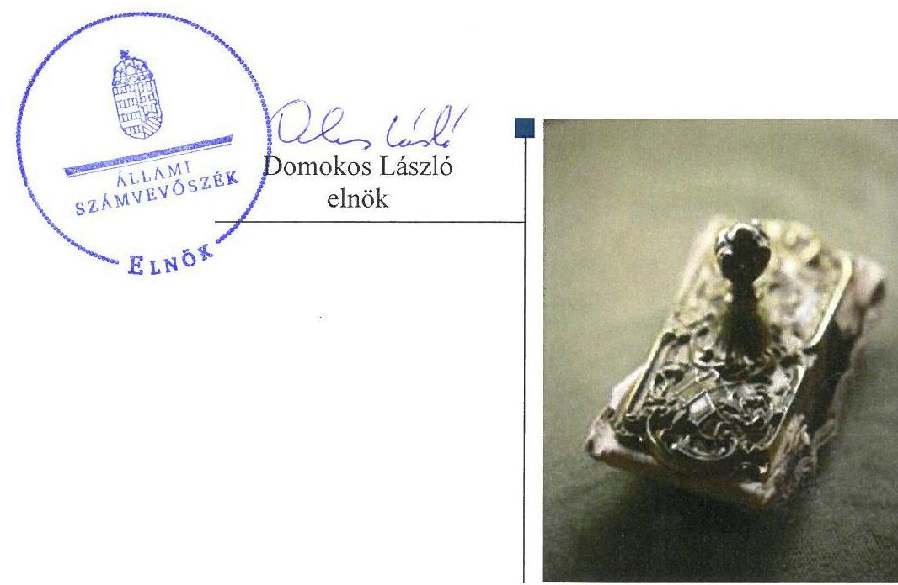
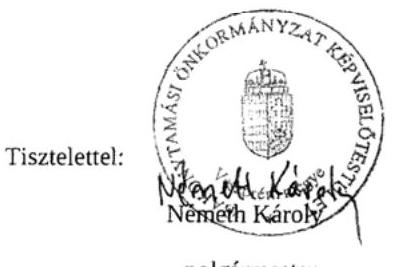
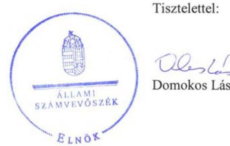

# Jelenetés 

## Önkormányzatok belső kontrollrendszere

Az önkormányzatok belső kontrollrendszere kialakításának és működtetésének ellenőrzése - Bakonytamási 2017.

---

# Jelentés 

## Önkormányzatok belső kontrollrendszere

Az önkormányzatok belső kontrollrendszere kialakításának és működtetésének ellenőrzése - Bakonytamási
2017. 06. hó 13. nap

---

# AZ ELLENŐRZÉST FELÜGYELTE: 

RENKÓ ZSUZSANNA felügyeleti vezető

## AZ ELLENŐRZÉST VEZETTE ÉS A VÉGREHAJTÁSÁÉRT FELELŐS:

DÉR LÍVIA ellenőrzésvezető

## A PROGRAM ÖSSZEÁLLÍTÁSÁÉRT FELELŐS:

JANIK JÓZSEF osztályvezető

IKTATÓSZÁM: V-1256-071/2016.
TÉMASZÁM: 2290

## ELLENŐRZÉS-AZONOSÍTÓ SZÁM: V-076415

Jelentéseink az Országgyűlés számítógépes hálózatán és az Interneten a www.asz.hu címen is olvashatóak.

---

# TARTALOMJEGYZÉK 

■ ÖSSZEGZÉS ..... 5
■ AZ ELLENŐRZÉS CÉLJA ..... 6
■ AZ ELLENŐRZÉS TERÜLETE ..... 7
■ AZ ELLENŐRZÉS HÁTTERE, INDOKOLTSÁGA ..... 8
■ A JELENTÉS LÉNYEGES KÉRDÉSKÖREI ..... 10
■ ELLENŐRZÉS HATÓKÖRE ÉS MÓDSZEREI ..... 11
■ MEGÁLLAPÍTÁSOK ..... 13
■ JAVASLATOK ..... 18
■ MELLÉKLETEK ..... 19
I. sz. melléklet: Értelmező szótár ..... 19
II. sz. melléklet: Az integritás szemlélet érvényesítése érdekében kialakított és működtetett kontrollrendszer ..... 21
■ FÜGGELÉK: ÉSZREVÉTELEK ..... 23
■ RÖVIDÍTÉSEK JEGYZÉKE ..... 33

---

.

---

# ÖSSZEGZÉS 

Bakonytamási Község Önkormányzatánál a közpénzfelhasználás szabályossága, a közvagyon biztonságos és körültekintő befektetése nem volt biztosított. A befektetési döntések során sérült a Képviselő-testület önkormányzati vagyonnal való rendelkezési joga. A befektetések vonatkozásában nem álltak rendelkezésre megbízható adatok.

## Az ellenőrzés társadalmi indokoltsága

Magyarország Alaptörvénye az önkormányzatoktól is elvárja a kiegyensúlyozott, átlátható és fenntartható költségvetési gazdálkodás elvének érvényesítését. A korábbi évek ellenőrzési tapasztalatai, az önkormányzatok által betöltött társadalmi szerep, az általuk kezelt közpénz nagysága, a nemzeti vagyon átruházására vagy hasznosítására vonatkozó döntéseik sokrétűsége egyaránt indokolttá tették a számvevőszéki ellenőrzések folytatását. A belső kontrollrendszer kialakítása és működtetése nélkül nem valósítható meg a közpénzek, a közvagyon szabályos, gazdaságos, hatékony és eredményes felhasználása. A kockázatok alapján fennáll a lehetősége annak, hogy az önkormányzatok befektetési döntései, továbbá a döntések végrehajtása és számviteli elszámolása nem voltak teljes mértékben szabályszerűek, és a kapcsolódó külső és belső kontrollrendszerek sem működtek minden esetben megfelelően.

Bakonytamási Község Önkormányzata 2015. december 31-én 12,0 millió Ft vételi áron nyilvántartott tőkegarantált befektetési jeggyel rendelkezett.

## Főbb megállapítások, következtetések

Az egyes befektetések vonatkozásában 2011-2015. között, a gazdálkodás egészét érintően a 2015. évben a belső kontrollrendszer kialakítása és működtetése nem volt szabályszerű, ezért az nem biztosította a közpénzfelhasználás szabályosságát. A kontrolltevékenységek nem járultak hozzá a hibák megelőzéséhez, feltárásához. A befektetések vonatkozásában a 2011-2015. között a kockázatkezelési rendszert nem működtették, nem mérték fel a kockázatokat, nem határozták meg ezen kockázatokkal kapcsolatban szükséges intézkedéseket, valamint azok teljesítése folyamatos nyomon követésének módját. Az önkormányzati gazdálkodás átláthatóságát nem biztosították, mivel nem tették közzé a befektetési jegyek vásárlására és visszaváltására vonatkozó adatokat.

A forgatási célú értékpapírok adás-vételére irányuló döntéseket nem az arra jogosult hozta meg. A döntések végrehajtása során - az értékpapír ügyletek végzésére a számlavezetővel kötött szerződések szabálytalan pénzügyi ellenjegyzése miatt - nem volt biztosított a vagyonnal való felelős gazdálkodás.

A befektetési jegyekről nem vezettek a jogszabályban meghatározott tartalmi követelményeknek megfelelő részletező nyilvántartást, ezáltal az egyeztetéssel történő leltározás feltételeit nem teremtették meg.

Az integritás szemlélet erősítése érdekében az Önkormányzatnak még erőfeszítéseket kell tennie.

---

# AZ ELLENŐRZÉS CÉLJA 

Az ellenőrzés célja annak megállapítása volt, hogy szabályszerűen történt-e az Önkormányzat belső kontrollrendszerének kialakítása és működtetése, az biztosította-e az Önkormányzatnál a közpénzfelhasználás szabályosságát, a közpénzekkel és a nemzeti vagyonnal történő szabályszerű és felelős gazdálkodást, a beszámolási és adatszolgáltatási kötelezettségek szabályszerű teljesítését. Az ellenőrzés keretében értékeltük az Önkormányzat korrupciós kockázatainak kezelését szolgáló integritás kontrollok kiépítettségét és az integritás szemlélet érvényesülését.

Az Önkormányzat egyes befektetési tevékenységeinek ellenőrzése során az ellenőrzés célja az volt, hogy a kialakított kontrollkörnyezet biztosította-e a befektetési tevékenységek szabályszerű végzését. Megítéltük, hogy az egyes befektetési tevékenységekkel kapcsolatos döntéshozatal és a döntések végrehajtása, valamint az egyes befektetések számviteli elszámolása, nyilvántartása szabályszerű volt-e, és a belső és külső ellenőrzések hozzájárultak-e az egyes befektetési tevékenységek szabályszerűségéhez.

---

# **AZ ELLENŐRZÉS TERÜLETE**

## **Bakonytamási Község Önkormányzata**

A Veszprém megyében fekvő Bakonytamási Község állandó lakosainak száma 2015. december 31-én 656 fő volt. Az Önkormányzat1 öt tagú Képviselő-testületének2 munkáját három fős ügyrendi bizottság segítette.

A polgármester a 2002. évi önkormányzati választások óta tölti be tisztségét. A Hivatal13,24-ben a jegyző13 2012. december 31-éig töltötte be tisztségét, jelenleg a Hivatal36 aljegyzője. A jegyző27 2013. január 1-je óta látja el feladatait.

A Hivatal3 2013. január 1-jével jött létre, melynek irányító szerve Csót Község Önkormányzatának Képviselő-testülete. A Hivatal szervezeti egységekre nem tagolódott, elkülönült gazdasági szervezettel nem rendelkezett. A Hivatal3-ban foglalkoztatott köztisztviselők száma 2015. december 31-én 8 fő volt. A településen Nemzetiségi Önkormányzat8 működik.

Az Önkormányzat a 2015. évi költségvetési beszámoló szerint 55,3 millió Ft költségvetési bevételt ért el, valamint 53,3 millió Ft költségvetési kiadást teljesített. Az eszközvagyon értéke 2015. december 31-én 196,2 millió Ft volt, amelyből a tartós részesedések 2,3 millió Ft-ot, a forgatási célú értékpapírok 12,0 millió Ft-ot tettek ki. A forrásokon belül a költségvetési évben esedékes kötelezettség állomány 0,4 millió Ft-ra, a költségvetési évet követően esedékes kötelezettség állomány 0,9 millió Ft-ra alakult, pénzintézettel szembeni kötelezettségük nem volt. A 2011-2015. évek között adósságkonszolidációs támogatásban nem részesültek.

---

# AZ ELLENŐRZÉS HÁTTERE, INDOKOLTSÁGA 

A demokratikus társadalmakban alapvető igény, hogy a közpénzeket, a közvagyont használók tevékenységükről elszámoljanak, ahhoz egyértelmű és érvényesíthető felelősségi szabályok társuljanak. Ennek a jogos igénynek az érvényesítéséhez meg kell teremteni azokat a folyamatokat, rendszereket, amelyek nélkülözhetetlenek az elszámoltatáshoz. Az elszámoltatás eredményes működtetéséhez szükség van a megfelelő információs, kontroll-, értékelési - és beszámolási rendszerek kialakítására. A belső kontrollok kiépítettsége hozzájárul az integritási szemlélet kialakításához és érvényesüléséhez. A belső kontrollrendszer kialakítása és működtetése nélkül nem valósítható meg a közpénzek, a közvagyon szabályos, gazdaságos, hatékony és eredményes felhasználása.

A BELSŐ KONTROLLRENDSZER azt a célt szolgálja, hogy az államháztartás szervei működésük és gazdálkodásuk során a tevékenységeket szabályszerűen, gazdaságosan, hatékonyan, eredményesen hajtsák végre, teljesítsék elszámolási kötelezettségeiket és megvédjék az erőforrásokat a veszteségektől, a károktól, a nem rendeltetésszerű használattól. A belső kontrollrendszer magába foglalja mindazon szabályokat, eljárásokat, gyakorlati módszereket és szervezeti struktúrákat, kockázatkezelési technikákat, kontrolltevékenységeket, amelyek segítséget nyújtanak a szervezetnek céljai eléréséhez. A belső kontrollrendszer szabályozása háromszintű, a törvényi előírásokat az Áht ${ }^{9}$. és a Mötv ${ }^{10}$. a rendeleti szintű szabályozást az Ávr. ${ }^{11}$ és a Bkr. ${ }^{12}$ tartalmazza, amelyeket útmutatói szinten az NGM által kiadott standardok és kézikönyvek támogatnak.

A megfelelő belső kontrollrendszer jelentősen csökkenti a hibák és szabálytalanságok kockázatát. Az ÁSZ ${ }^{13}$ célja, hogy javuljon az ellenőrzött önkormányzatok belső kontrollrendszerének szabályozottsága, működésének megfelelősége, szabályszerűsége, hozzájárulva ezzel az egyensúlyi helyzet fenntarthatóságának biztosításához, biztosítva az önkormányzatnál a közpénzfelhasználás szabályosságát, a közpénzekkel és a nemzeti vagyonnal történő szabályszerű, gazdaságos, hatékony és eredményes gazdálkodást. Az ÁSZ ellenőrzés tapasztalatai nem csupán a közvetlenül ellenőrzött önkormányzatokat támogathatják, hanem a „jó gyakorlat” elterjesztésével azok az önkormányzatok is átvehetik a pozitív példákat, ahol nem végez ellenőrzést az ÁSZ.

A közszféra integritás alapú kultúrájának kialakítása, megerősítése és működése szorosan összefügg a belső kontrollrendszer működésével, ezért az ellenőrzés kiterjed annak értékelésére is, hogy a belső kontrollrendszer kialakítása és működtetése hogyan hatott az integritás szemlélet érvényesülésére.

## AZ ÖNKORMÁNYZATOK ÁTMENETILEG SZABAD

PÉNZESZKÖZEINEK BEFEKTETÉSÉT jogszabály nem tiltja, a befektetések jellege nem korlátozott, a pénzpiaci szolgáltatók közül az önkormányzatok a kínált szolgáltatás és annak költségei alapján, szabadon választhatnak, azonban a veszteséges gazdálkodás kockázatai és kö-

---

vetkezményei az önkormányzatokat terhelik. A szabad pénzeszközök felhasználása során kiemelten fontos a felelős gazdálkodás érvényesülése, amely összhangban kell, hogy legyen, az önkormányzati gazdálkodás alapelveivel.
2015. első felében az MNB három befektetési szolgáltató tevékenységi engedélyét vonta vissza és kezdeményezte a vállalkozások felszámolását a működéssel kapcsolatos szabálytalanságok, hiányosságok miatt. A befektetési vállalkozások problémás helyzetbe kerülése jelentős veszteségekhez vezetett számos önkormányzat esetében. A korábbi évek ellenőrzési tapasztalatai alapján fennáll a lehetősége annak, hogy az önkormányzatok befektetési döntései, továbbá a döntések végrehajtása és számviteli elszámolása nem voltak teljes mértékben szabályszerűek, és a kapcsolódó külső és belső kontroll rendszerek sem működtek minden esetben megfelelően.

Az ellenőrzéssel feltárásra kerülhetnek azok a kockázatok, amelyek az önkormányzatok gazdálkodásával, ezen belül befektetési tevékenységeivel, kontrollkörnyezetével kapcsolatosak és a befektetési tevékenységek szabályszerű végrehajtását befolyásolják. Az ellenőrzéssel az önkormányzatok befektetési/vagyongazdálkodási döntéseinek összessége értékelhetővé válik, és megalapozott megállapítás tehető arra vonatkozóan, hogy milyen hatást gyakoroltak az önkormányzat vagyonára a képviselő-testület döntései.

# AZ ELLENŐRZÉS VÁRHATÓ HASZNOSULÁSA 

NÉGY SZINTEN valósul meg. A törvényalkotás számára összegzett tapasztalatok állnak rendelkezésre a belső kontrollrendszer önkormányzati területen való kialakításáról, működtetéséről és hatásairól. Az ellenőrzés az ellenőrzött számára visszajelzést ad a belső kontrollrendszer kialakításában és működésében lévő hiányosságokról, javaslataival hozzájárul azok kiküszöböléséhez. Az ellenőrzés megállapításait és javaslatait más szervezetek is hasznosíthatják a rendezett gazdálkodási keretek kialakításához. A társadalom számára jelzi, hogy közpénz nem maradhat ellenőrizetlenül, az ÁSZ értékteremtő rend kialakításához és megőrzéséhez hozzájáruló tevékenysége pozitív hatással lesz a szervezetről kialakított összkép formálásában.

---

# A JELENTÉS LÉNYEGES KÉRDÉSKÖREI 

1.     - A belső kontrollrendszer egyes pillérei biztosították-e a befektetési tevékenységek szabályszerű végzését a 2011 - 2015. években?
2.     - Az Önkormányzat belső kontrollrendszerének kialakítása és működtetése a 2015. évben szabályszerű volt-e, az biztosította-e a közpénzfelhasználás szabályosságát, a nemzeti vagyonnal történő felelős gazdálkodást?
3.     - Az egyes befektetésekkel kapcsolatos döntéshozatal és a döntések végrehajtása szabályszerű volt-e?
4.     - Az egyes befektetések számviteli elszámolása, nyilvántartása szabályszerű volt-e?

---

# ELLENŐRZÉS HATÓKÖRE ÉS MÓDSZEREI 

## Az ellenőrzés típusa

A belső kontrollrendszer ellenőrzése esetében megfelelőségi ellenőrzés, a befektetési tevékenységnél szabályszerűségi ellenőrzés.

## Az ellenőrzött időszak

A belső kontrollrendszer kialakításának és működtetésének ellenőrzése a 2015. január 1. és december 31. közötti időszakra terjedt ki. Az önkormányzatok egyes befektetési tevékenységeinek ellenőrzése tekintetében az ellenőrzött időszak a 2011. január 1. - 2015. december 31. közötti időszak. Ezen felül az Önkormányzat befektetésekkel kapcsolatos döntés-előkészítésének és döntéshozatalának szabályszerűségét a 2011. január 1. előtti időszakra visszanyúlóan is ellenőriztük, amennyiben a 2015. december 31-én meglévő befektetésire 2011. január 1-je előtt került sor. Az integritás szemlélet érvényesülését a 2015. évre vonatkozó adatszolgáltatás alapján értékeltük.

## Az ellenőrzés tárgya

A helyi önkormányzatnak, mint éves költségvetési beszámoló készítésére kötelezett szervezetnek és polgármesteri hivatalának belső kontrollrendszere. Az integritás szemlélet érvényesülése.

Az önkormányzat 2015. december 31-én meglévő, értékpapírokban megtestesülő befektetései, lekötött betétei, valamint a szabad pénzeszközei terhére, adásvételi szerződés keretében megszerzett, a kötelező feladatok ellátását nem szolgáló, az önkormányzat üzleti vagyonába tartozó, az ellenőrzött időszakban (2011-2015.) megszerzett ingatlanok, továbbá időkorlátozás nélkül megszerzett -kulturális javak (műtárgyak, műalkotások, stb.), illetve a feladatellátást nem szolgáló egyéb értéktárgyak (pl. ékszerek, befektetési nemesfém).

Az ellenőrzés kiterjedt minden olyan körülményre és adatra,
 amely az ÁSZ jogszabályban meghatározott feladatainak teljesítéséhez, valamint a program végrehajtása folyamán felmerült újabb összefüggések feltárásához szükséges volt.

## Az ellenőrzött szervezet

Bakonytamási Község Önkormányzata és az önkormányzati működéshez kapcsolódó feladatokat ellátó Hivatal ${ }_{1-3}$.

---

# Az ellenőrzés jogalapja 

Az ÁSZ tv. ${ }^{14}$ 1. § (3) bekezdésében foglaltak alapján az ÁSZ általános hatáskörrel végzi a közpénzekkel és az állami és önkormányzati vagyonnal való felelős gazdálkodás ellenőrzését. Az ÁSZ tv. 5. § (2) bekezdése alapján az államháztartás gazdálkodásának ellenőrzése keretében az ÁSZ ellenőrzi a helyi önkormányzatok gazdálkodását, valamint az ÁSZ tv. 5. § (6) bekezdése alapján ellenőrzése során értékeli az államháztartás számviteli rendjének betartását és a belső kontrollrendszer működését.

## Az ellenőrzés módszerei

Az ellenőrzést a nemzetközi standardokat irányadónak tekintve az ellenőrzési program szempontjai, kérdései, az ellenőrzött időszakban hatályos jogszabályok, az ellenőrzés szakmai szabályok és módszertanok figyelembe vételével végeztük.

Az ellenőrzés ideje alatt az ellenőrzött szervezettel történő kapcsolattartást az ÁSZ SZMSZ-ének vonatkozó előírásai alapján biztosítottuk.

Az ellenőrzési kérdések megválaszolásához szükséges bizonyítékok megszerzése az ellenőrzöttek által rendelkezésre bocsátott dokumentumokra, adatokra alapozva megfigyelés, szemle (szemrevételezés), kérdésfeltevés (információkérés), valamint elemző eljárással történt. A minták kiválasztása rétegzett, véletlen mintavételi eljárással történt.

Az ellenőrzési bizonyítékként felhasználható adatforrások közé tartoznak egyrészt az ellenőrzési program részletes szempontjainál felsorolt adatforrások, másrészt minden - az ellenőrzés folyamán feltárt, az ellenőrzés szempontjából információt tartalmazó - dokumentum.

Az ellenőrzés lefolytatásához az Önkormányzat a tanúsítványok elektronikus kitöltésével, valamint az ÁSZ által kért dokumentumok elektronikus megküldésével szolgáltat adatokat. A rendelkezésre bocsátott adatok, információk kontrollja az ellenőrzés keretében történt.

A jelentésben használt fogalmak magyarázatát az I. sz. melléklet, továbbá a Rövidítések jegyzéke tartalmazza.

Az integritás szemlélet érvényesülésének értékelése az Önkormányzat által kitöltött tanúsítvány alapján történt a 2015. évre vonatkozóan.

---

# 1. A belső kontrollrendszer egyes pillérei biztosították-e a befektetési tevékenységek szabályszerű végzését a 2011 - 2015. években? 

Összegző megállapítás

Az egyes befektetési tevékenységeket érintően 2011-2015. között a belső kontrollrendszer egyes pillérei kialakításának és működtetésének hiányosságai következtében azok nem biztosították a közvagyon biztonságos és körültekintő befektetését.

A KONTROLLKÖRNYEZET a Bkr. 4. § a) pontjában foglaltak ellenére nem biztosította az értékpapírokkal kapcsolatos tevékenység szabályszerű, szabályozott végzését, mivel a döntés előkészítési, továbbá a 2. számú megállapítás 1. bekezdésében részletezettek miatt a számviteli szabályokat a befektetések elszámolásával, nyilvántartásával, értékelésével kapcsolatban nem határozták meg.

KOCKÁZATKEZELÉSI RENDSZERT az Ámr. ${ }^{15}$ 157. § (1)-(3) bekezdéseiben és a Bkr. 7. § (1)-(2) bekezdéseiben foglaltak ellenére nem működtettek, a befektetési tevékenységgel kapcsolatban nem mérték fel, nem állapították meg a kockázatokat, nem határozták meg az egyes kockázatokkal kapcsolatban szükséges intézkedéseket, valamint azok teljesítésének folyamatos nyomon követésének módját.

A KONTROLLTEVÉKENYSÉGEK részeként a befektetések vonatkozásában nem biztosították a költségvetési gazdálkodás során az előzetes pénzügyi ellenőrzést. A befektetési jegyek vételére vonatkozó kötelezettségvállalások pénzügyi ellenjegyzése nem felelt meg az Ávr. 55. § (1) bekezdésében foglaltaknak, mert a pénzügyi ellenjegyző feladatát jogosulatlanul látta el, mivel nem rendelkezett a jegyző általi írásos kijelöléssel.

AZ INFORMÁCIÓS ÉS KOMMUNIKÁCIÓS RENDSZER nem biztosította az átláthatóságot, mivel az Önkormányzat honlapján nem tette közzé a befektetési jegyek megvásárlására, továbbá visszaváltására adott megbízások tekintetében a szerződések megnevezését (típusát), tárgyát, a szerződő fél (megbízott) nevét, a szerződés (megbízás) értékét - az Info. tv. ${ }^{16}$ 37. § (1) bekezdésének és 1. melléklete III/4. pontjának előírása ellenére.

A MONITORING RENDSZER keretén belül működő belső ellenőrzés az Önkormányzat irányítási, belső kontroll és ellenőrzési eljárásainak fejlesztését a befektetési tevékenység vonatkozásában nem támogatta, mivel nem végeztek a befektetésekkel kapcsolatos belső ellenőrzést.

---

A külső ellenőrzések a befektetési tevékenységre nem terjedtek ki, ezért nem támogatták a befektetési tevékenység szabályszerű végzését.

# 2. Az Önkormányzat belső kontrollrendszerének kialakítása és működtetése a 2015. évben szabályszerű volt-e, az biztosította-e a közpénzfelhasználás szabályosságát, a nemzeti vagyonnal történő felelős gazdálkodást? 

## Összegző megállapítás

A gazdálkodás egészét érintően a 2015. évben a belső kontrollrendszer nem biztosította a szabályszerű működést, a gazdaságosság, hatékonyság és eredményesség követelményének érvényesülését.

A KONTROLLKÖRNYEZET kialakítása nem volt szabályszerű. A számviteli politikát, a leltározási és leltárkészítési szabályzatot, az eszközök és források értékelési szabályzatát, a pénzkezelési szabályzatot, továbbá a számlarendet a Bkr. 6 § (2) bekezdésében foglaltakkal ellentétesen nem az arra jogosult adta ki. Ezért az Önkormányzat nem rendelkezett számviteli szabályzatokkal.

Nem rendezték az Ávr. 13.§ (2) bekezdés b)-e) és g)-h) pontjaiban foglaltak ellenére a működéséhez kapcsolódó, pénzügyi kihatással bíró, jogszabályban nem szabályozott kérdéseket: a beszerzések lebonyolításával kapcsolatos eljárásrendet, a belföldi és külföldi kiküldetések elrendelésével és lebonyolításával, elszámolásával kapcsolatos kérdéseket, az anyag- és eszközgazdálkodás számviteli politikában nem szabályozott kérdéseit, a reprezentációs kiadások felosztását, azok teljesítésének és elszámolásának szabályait, a vezetékes és rádiótelefonok használatát, a közérdekű adatok megismerésére irányuló kérelmek intézésének, továbbá a kötelezően közzéteendő adatok nyilvánosságra hozatalának rendjét.

A KOCKÁZATKEZELÉSI RENDSZER működtetése nem volt szabályszerű. A Bkr. 7. § (1) és (2) bekezdésének előírásai ellenére nem mérték fel és nem állapították meg a tevékenységben, gazdálkodásban rejlő kockázatokat, nem határozták meg az egyes kockázatokkal kapcsolatban szükséges intézkedéseket.

A KONTROLLTEVÉKENYSÉGEK KERETEI kialakítása és működtetése nem volt szabályszerű, és nem biztosította a kockázatok kezelését, nem járult hozzá a szervezet céljainak eléréséhez.

A kontrolltevékenységek keretében a pénzügyi ellenjegyzést, a teljesítés igazolását és az érvényesítést az Áht. 37. § (1) bekezdése és a 38. § (1) bekezdése ellenére nem, vagy nem az Ávr. előírásainak megfelelően végezték el:
az Önkormányzat kiadásai terhére vállalt kötelezettségvállalások esetére az Ávr. 55. § (2) bekezdés f) pontjában és az 58. § (4) bekezdésében foglaltak ellenére a pénzügyi ellenjegyző, továbbá az érvényesítő nem rendelkezett a jegyző általi írásos felhatalmazással ezen gazdálkodási jogkör gyakorlására;

---

$\longrightarrow$ az Ávr. 57. § (3) bekezdésének előírása ellenére a személyi juttatások kifizetéséhez kapcsolódó bizonylatokon a teljesítésigazoló aláírása helyett monogram szerepelt, ami nem egyezett meg a gazdálkodási szabályzat melléklete szerinti aláírás mintával, így nem volt megállapítható, hogy a teljesítés igazolását az arra jogosult végezte el;
— az Áht. 37. § (1) bekezdésében foglaltak ellenére a kifizetésre több esetben előzetes írásbeli kötelezettségvállalás nélkül került sor;
— a kötelezettségvállalások nyilvántartásáról az Ávr. 56. § (1) bekezdésében foglaltak ellenére nem gondoskodtak. Nyilvántartás hiányában az Áht. 37. § (1) bekezdésében foglaltak ellenére a pénzügyi ellenjegyző nem tudott arról meggyőződni, hogy a szabad előirányzat rendelkezésre állt-e.
A teljesítésigazolás és az érvényesítés nem szabályszerű végrehajtásának eredményeként nem történt meg a kiadások összegszerűségének, a fedezet meglétének és a megelőző ügymenetben az Áht., az Áhsz. és az Ávr., továbbá a belső szabályzatok előírásai betartásának az ellenőrzése. Emiatt a kontrolltevékenységek nem biztosították a kiadásokkal kapcsolatban a hibák megelőzését és feltárását, a közpénzfelhasználás szabályosságát.

# AZ INFORMÁCIÓS ÉS KOMMUNIKÁCIÓS RENDSZER kialakítása és működtetése nem volt szabályszerű, mert: 

a Bkr. 9. § (2) bekezdésének előírása ellenére a beszámolási szinteket, határidőket, módokat nem határozták meg;
— az Info tv. 24. § (3) bekezdése ellenére nem rendelkeztek a jogosult vezető által aláírt adatvédelmi és adatbiztonsági szabályzattal;
— az Info tv. 33. § (1) és a 37. § (1) bekezdéseiben és az 1. melléklete III/1. pontjában foglaltak ellenére a költségvetési beszámolóknak az Önkormányzat honlapján történő közzétételéről nem gondoskodtak.
— az iratkezelés szabályzatot az Ltv. ${ }^{17} 10 . \S$ (1) bekezdés c) pontjában foglaltak ellenére nem a Magyar Nemzeti Levéltár egyetértésével adták ki.

A MONITORING RENDSZER kialakítása és működtetése nem volt szabályszerű. Az operatív tevékenységek során megvalósuló folyamatos és eseti nyomon követést a Bkr. 10. §-ában foglaltak ellenére nem alakították ki és nem működtették.

A belső ellenőrzés nem biztosította a működés fejlesztését és az eredményesség növelését, mivel belső ellenőrzés lefolytatására a 2015. évben nem került sor. A Bkr. 22. § (1) bekezdés b) pont, a 29. § (1) bekezdés és a 31. § (1) bekezdés ellenére az Önkormányzat 2015. évi ellenőrzési tervét nem készítették el. A Bkr. 14. § (1) bekezdésében előírtak ellenére nem gondoskodtak az elvégzett külső ellenőrzések javaslatai alapján készült intézkedési tervek végrehajtásának nyilvántartásáról.

A jegyző nem tett eleget a Bkr. 11. § (1) bekezdése előírásainak, mert nyilatkozatban nem értékelte a költségvetési szerv belső kontrollrendszerének minőségét.

---

A HELYI NEMZETISÉGI ÖNKORMÁNYZATTAL KAPCSOLATOS FELADATOK KERETÉBEN az együttműködésre vonatkozó megállapodást megkötötték. A Nemzetiségi Önkormányzat 2015. évi belső ellenőrzéséről a Bkr. 10. §-ában foglaltak ellenére a Hivatal nem gondoskodott.

AZ INTEGRITÁS SZEMLÉLET érvényesítését az Önkormányzat belső kontrollrendszerének kialakítása és működtetése nem támogatta. Az Önkormányzat az integritás szemlélet érvényesülésének felméréséhez jelen ellenőrzés keretében szolgáltatott adatokat. Az értékelés eredményét a jelentéstervezet II. számú melléklete mutatja be.

# 3. Az egyes befektetésekkel kapcsolatos döntéshozatal és a döntések végrehajtása szabályszerű volt-e? 

Összegző megállapítás A befektetési jegyek adás-vételével kapcsolatos döntést nem az arra jogosult hozta meg, emiatt a 2011. és 2015. között a közpénzfelhasználás szabályossága nem volt biztosított.

Az Önkormányzatnak 2015. december 31-én 12,0 millió Ft vételi áron nyilvántartott tőkegarantált befektetési jegye volt. Üzleti célú ingatlannal, lekötött betéttel, kulturális javakkal, egyéb értéktárgyakkal az Önkormányzat nem rendelkezett.

A befektetésekre vonatkozó döntések előkészítését nem szabályozták, ezáltal a Bkr. 4. § a) pontjában foglaltak ellenére nem biztosították, hogy a befektetési tevékenység összhangban legyen a gazdaságosság, hatékonyság és eredményesség követelményeivel.

A befektetési jegyek adás-vételére vonatkozó döntések nem feleltek meg az Mötv. 107. §-ában foglaltaknak és az önkormányzati rendelet hatásköri szabályozásának.

A Képviselő-testület az értékpapír vagyon változásának alakulásáról a féléves és éves beszámolók keretében kapott tájékoztatást.

## 4. Az egyes befektetések számviteli elszámolása, nyilvántartása szabályszerű volt-e?

## Összegző megállapítás

A befektetési jegyek hiányosan vezetett analitikus nyilvántartása és a leltározási feladatok szabálytalan végrehajtása következtében a befektetések mérlegben szereplő adatainak megbízhatósága 2011-2015 között nem volt biztosított.

A BEFEKTETÉSEK NYILVÁNTARTÁSA során a forgatási célú hitelviszonyt megtestesítő értékpapírok közé történő besorolása és a bekerülési érték meghatározása megfelelt az Áhsz. ${ }^{18}$ előírásainak. A befektetési jegyekről nem vezettek az Áhsz. 14. számú melléklet VIII. 1. pont a) - i) alpontjában meghatározott tartalmi követelményeknek megfelelő

---

részletező nyilvántartást, ezáltal az egyeztetéssel történő leltározás feltételeit nem teremtették meg.

A BEFEKTETÉSEK LELTÁROZÁSA a hiányosan vezetett analitikus nyilvántartás miatt nem felelt meg az Áhsz. 22. § (2) bekezdésében, továbbá a Számv.tv. 69. § (1) - (2) bekezdéseiben foglaltaknak.

---

# JAVASLATOK 

Az ÁSZ tv. 33. § (1) bekezdésében foglaltak értelmében az ellenőrzött szervezet vezetője köteles a jelentésben foglalt megállapításokhoz kapcsolódó intézkedési tervet összeállítani és azt a jelentés kézhezvételétől számított 30 napon belül az ÁSZ részére megküldeni. Amennyiben az ellenőrzött szervezet vezetője nem küldi meg határidőben az intézkedési tervet, vagy továbbra sem elfogadható intézkedési tervet küld, az Állami Számvevőszék elnöke az ÁSZ tv. 33. § (3) bekezdés a) és b) pontjaiban foglaltakat érvényesítheti.

## a
 jegyzőnek:

1. Intézkedjen a belső kontrollrendszer egyes elemei jogszabályi előírásnak megfelelő kialakításáról és működtetéséről, valamint a gazdálkodási jogkörök gyakorlása során a jogszabályi előírások betartásáról.
(1. számú megállapítás 2-4. bekezdései,
2. számú megállapítás 1-5. és 7. bekezdései, 8. bekezdés 2. mondata, 9-10. bekezdései alapján)
3. Intézkedjen a jogszabályi előírásoknak megfelelően a befektetésekkel kapcsolatos gazdasági események rögzítéséről és elszámolásáról a részletező nyilvántartásokban.
(4. számú megállapítás 1. bekezdés 2. mondata alapján)
4. Intézkedjen az éves költségvetési beszámoló mérlegében kimutatott befektetések jogszabályi előírásoknak megfelelő leltárral történő alátámasztásáról.
(4. számú megállapítás 2. bekezdése alapján)
5. Intézkedjen az Állami Számvevőszék ellenőrzése során feltárt hiányosságok és/vagy szabálytalanságok tekintetében a munkajogi felelősség tisztázására irányuló eljárás megindításáról, és ennek eredménye ismeretében tegye meg a szükséges intézkedéseket.
(1. számú megállapítás 3. bekezdése,
6. számú megállapítás 5. bekezdés 4. pontja
7. számú megállapítás 1. bekezdés 2. mondata és
8. bekezdése alapján)

---

# MELLÉKLETEK 

- I. SZ. MELLÉKLET: ÉRTELMEZŐ SZÓTÁR
belső ellenőrzés
belső kontrollrendszer
belső kontrollrendszer pillérei, kontrollterületei
betét
dematerializált értékpapír
értékpapírszámla
forgatási célú értékpapír
helyi önkormányzat

Független, tárgyilagos bizonyosságot adó és tanácsadó tevékenység, amelynek célja, hogy az ellenőrzött szervezet működését fejlessze és eredményességét növelje, az ellenőrzött szervezet céljai elérése érdekében rendszerszemléletű megközelítéssel és módszeresen értékeli, illetve fejleszti az ellenőrzött szervezet irányítási és belső kontrollrendszerének hatékonyságát. (Forrás: Bkr. 2. § b) pontja)
A belső kontrollrendszer a kockázatok kezelése és tárgyilagos bizonyosság megszerzése érdekében kialakított folyamatrendszer, amely azt a célt szolgálja, hogy a működés és gazdálkodás során a tevékenységeket szabályszerűen, gazdaságosan, hatékonyan, eredményesen hajtsák végre, az elszámolási kötelezettségeket teljesítsék, megvédjék az erőforrásokat a veszteségektől, károktól és nem rendeltetésszerű használattól. (Forrás: Áht. 69. § (1) bekezdése)
A kontrollkörnyezet, a kockázatkezelési rendszer, a kontrolltevékenységek, az információs és kommunikációs rendszer, valamint a nyomon követési (monitoring) rendszer. (Forrás: Bkr. 3. §-a)
a Ptk. szerinti betétszerződés vagy a takarékbetétről szóló 1989. évi 2. törvényerejű rendelet szerinti takarékbetét-szerződés alapján fennálló tartozás, ideértve a hitelintézetnél a fizetésiszámla-szerződés alapján fennálló pozitív számlaegyenleget is (Hpt. ${ }^{19}$ 6. § (1) bekezdés 8. pont).
a Tpt.-ben és külön jogszabályban meghatározott módon, elektronikus úton létrehozott, rögzített, továbbított és nyilvántartott, az értékpapír tartalmi kellékeit azonosítható módon tartalmazó adatösszesség (Tpt. ${ }^{20}$ 5. § (1) bekezdés 29. pont)
a dematerializált értékpapírról és a hozzá kapcsolódó jogokról az értékpapír-tulajdonos javára vezetett nyilvántartás (Tpt. 5. § (1) bekezdés 46. pont)
azok az értékpapírok, amelyeket forgatási célból, kamatbevétel, illetve árfolyamnyereség elérése érdekében szereztek be, továbbá azokat, amelyek a tárgyévet követő üzleti évben lejárnak (Számv. tv. 30. § (5) bekezdés)
A helyi önkormányzat jogi személy. Az önkormányzati feladatok ellátását a képviselő-testület és szervei biztosítják. A képviselőtestület szervei: a polgármester, a főpolgármester, a megyei közgyűlés elnöke, a képviselő-testület bizottságai, a részönkormányzat testülete, a polgármesteri hivatal, a megyei önkormányzati hivatal, a közös önkormányzati hivatal, a jegyző, továbbá a társulás. A képviselő-testület a feladatkörébe tartozó közszolgáltatások ellátására - jogszabályban meghatározottak szerint - költségvetési szervet, a Polgári perrendtartásról szóló 1952. évi III. törvény szerinti gazdálkodó szervezetet (a továbbiakban: gazdálkodó szervezet), nonprofit szervezetet és egyéb szervezetet (a továbbiakban együtt: intézmény) alapíthat, továbbá szerződést köthet természetes és jogi személlyel vagy jogi személyiséggel nem rendelkező szervezettel. A helyi önkormányzat éves költségvetési beszámolója magába foglalja a helyi önkormányzat - nem költségvetési szerveihez tartozó - feladataihoz kapcsolódó bevételeket és kiadásokat. A helyi önkormányzat összevont (konszolidált) költségvetési beszámolóját a helyi önkormányzatra és költségvetési szerveire vonatkozóan külön-külön beérkezett éves költségvetési beszámolók alapján a Kincstár készíti el és küldi meg az önkormányzatnak. (Forrás: Mötv. 41. § (1), (2), (6) bekezdései; Áhsz. 2. § (1) bekezdése, 6. § (1) bekezdés a) és f) pontja, 30. §-a, 37. § (1) és (6) bekezdése)

---

hitelviszonyt megtestesítő értékpapír
információs és kommunikációs rendszer
integritás
irányító szerv és annak vezetője
kockázatkezelési rendszer
kontrollkörnyezet
kulturális javak
üzleti vagyon
minden olyan értékpapír, illetve törvény által értékpapírnak minősített, jogot megtestesítő okirat, amelyben a kibocsátó (adós) meghatározott pénzösszeg rendelkezésére bocsátását elismerve arra kötelezi magát, hogy a pénz (kölcsön) összegét, valamint annak meghatározott módon számított kamatát vagy egyéb hozamát, és az általa esetleg vállalt egyéb szolgáltatásokat az értékpapír birtokosának (a hitelezőnek) a megjelölt időben és módon megfizeti, illetve teljesíti. Ide tartozik különösen: a kötvény, a kincstárjegy, a letéti jegy, a pénztárjegy, a célrészjegy, a takaréklevél, a jelzáloglevél, a hajóraklevél, a közraktárjegy, az árujegy, a zálogjegy, a kárpótlási jegy, a határozott idejű befektetési alap által kibocsátott befektetési jegy (Számv. tv. (6) bekezdés 2. pont)
A költségvetési szerv vezetője által kialakított és működtetett olyan rendszer, mely biztosítja, hogy a megfelelő információk a megfelelő időben eljutnak az illetékes szervezethez, szervezeti egységhez, illetve személyhez. (Forrás: Bkr. 9. § (1) bekezdés)
Az integritás elvek, értékek, cselekvések, módszerek, intézkedések konzisztenciáját jelenti: olyan magatartásmódot, amely meghatározott értékeknek felel meg. Az integritás a közszféra esetében a társadalom által elvárt nyilvánossági, átláthatósági, illetve jogi/etikai normáknak történő megfelelést jelenti.
(Forrás: a http://integritas.asz.hu honlapon közzétett „A 2012. évi integritás felmérés eredményeinek összefoglalója" című dokumentum 3. oldal 1. bekezdése)
A közös önkormányzati hivatal kivételével a helyi önkormányzat által irányított költségvetési szerv esetén a képviselő-testület, közgyűlés és a polgármester, főpolgármester, megyei közgyűlés elnöke. A közös önkormányzati hivatal esetén a közös önkormányzati hivatal székhelye szerinti helyi önkormányzat képviselő-testülete és annak polgármestere. (Forrás: Áht. 2. § (1) bekezdés i), ia) és ib) pontja)
Olyan irányítási eszközök és módszerek összessége, melynek elemei a szervezeti célok elérését veszélyeztető tényezők (kockázatok) azonosítása, elemzése, csoportosítása, nyomon követése, valamint szükség esetén a kockázati kitettség mérséklése. (Forrás: Bkr. 2. § m) pontja)
A költségvetési szerv vezetője által kialakított olyan elvek, eljárások, belső szabályzatok összessége, amelyben világos a szervezeti struktúra, egyértelműek a felelősségi, hatásköri viszonyok és feladatok, meghatározottak az etikai elvárások a szervezet minden szintjén, átlátható a humánerőforrás-kezelés. (Forrás: Bkr. 6. § (1) bekezdés)
A költségvetési szerv vezetője által a szervezeten belül kialakított (kontroll) tevékenységek, melyek biztosítják a kockázatok kezelését, hozzájárulnak a szervezet céljainak eléréséhez. (Forrás: Bkr. 8. § (1) bekezdés)
az élettelen és élő természet keletkezésének, fejlődésének, az emberiség, a magyar nemzet, Magyarország történelmének kiemelkedő és jellemző tárgyi, képi, hangrögzített, írásos emlékei és egyéb bizonyítékai - az ingatlanok kivételével -, valamint a művészeti alkotások (a kulturális örökség védelméről szóló 2001. évi LXIV. törvény)
a nemzeti vagyon azon része, amely nem tartozik az önkormányzati vagyon esetén a törzsvagyonba (Nvtv. ${ }^{21}$ 3. § (1) bekezdés 18. pontja)

---

# II. SZ. MELLÉKLET: AZ INTEGRITÁS SZEMLÉLET ÉRVÉNYESÍTÉSE ÉRDEKÉBEN KIALAKÍTOTT ÉS MŰKÖDTETETT KONTROLLRENDSZER 

Az Önkormányzat az ÁSZ integritás projektjéhez a 2015. évben nem csatlakozott, ezért az ellenőrzés során töltötte ki az integritás tanúsítványt. Az integritás szemlélet érvényesülésének értékelése az Önkormányzat által szolgáltatott adatok felülvizsgálata alapján történt, az értékelést az alábbi táblázat tartalmazza.

| AZ INTEGRITÁS KONTROLLRENDSZERÉNEK ÉRTÉKELÉSE |  |  |  |  |
| :--: | :--: | :--: | :--: | :--: |
| Sorszám | Megnevezés | Maximum elér-   hetó pontszámok | Elért   pontszámok | Értekelés |
| 1. | Összeférhetetlenség és etikai elvárások | 5 | 3 | alacsony |
| 2. | Humánerőforrás-gazdálkodás | 5 | 3 | alacsony |
| 3. | A szervezet vagyonának megvédésére tett intézkedések | 5 | 0 | alacsony |
| 4. | A nemkívánatos dolgozói magatartással szembeni intézkedések és azok érvényesülése | 5 | 1 | alacsony |
| 5. | Az integritás erősítése, annak tudatosítása, valamint a kockázatelemzések alkalmazása | 5 | 0 | alacsony |
|  | Összesítő értékelés | 25 | 7 | alacsony |

Az integritási kontrollrendszer kiépítettsége az Önkormányzatnál alacsony volt. A kontrollok kiépítettségének főbb hiányosságai az alábbiak voltak:

1. a speciális korrupcióellenes rendszerek és eljárások tekintetében az Önkormányzatnál:

- nem működtettek közérdekű bejelentéseket kezelő, valamint a szervezeten kívülről érkező panaszokat és közérdekű bejelentéseket kezelő rendszert;
- nem végeztek rendszeres korrupciós kockázatelemzéseket;
- nem volt korrupcióellenes képzés az elmúlt 3 évben;
- a szervezet nem rendelkezik nyilvánosan közzétett stratégiával;

2. a „lágy" kontrollok (a szervezeti által önként bevezetett, kialakított szabályok, követelmények) kialakítását érintően az Önkormányzatnál:

- nem szabályozták az ajándékok, meghívások, utaztatás elfogadásának feltételeit;
- nem határozták meg a szervezet tulajdonában álló egyes eszközök használatára vonatkozó szabályokat;
- nem szabályozták a külső személyekkel való kapcsolattartást;
- nem alkalmazták a „négy szem" elvét.

Az integritás kontrollok kiépítettségének színvonala alapján az Önkormányzatnál az integritás szemlélet érvényesítése további intézkedéseket igényel.

---

.

---

# FÜGGELÉK: ÉSZREVÉTELEK 

A jelentéstervezetet a Számvevőszék 15 napos észrevételezésre megküldte az ellenőrzött szervezetek vezetőinek az ÁSZ tv. 29. § (1) bekezdése előírásának megfelelően.
Az elfogadott észrevételek alapján a Számvevőszék módosította a jelentést.

A függelék tartalmazza az ellenőrzött észrevételeit, illetve az el nem fogadott észrevételek elutasításának indoklását.

[^0]
[^0]:    * 29. § (1) Az Állami Számvevőszék az ellenőrzési megállapításait megküldi az ellenőrzött szervezet vezetőjének vagy az általa megbízott személynek, és annak, akinek személyes felelősségét állapította meg.
    (2) Az ellenőrzött szervezet vezetője és a felelősként megjelölt személy az ellenőrzés megállapításaira tizenöt napon belül írásban észrevételt tehet.
    (3) Az Állami Számvevőszék az észrevételre a beérkezésétől számított harminc napon belül írásban válaszol. A figyelembe nem vett észrevételeket köteles a jelentésben feltüntetni, és megindokolni, hogy azokat miért nem fogadta el.

---

# Bakonytamási Község Önkormányzata 8555 Bakonytamási Széchenyi u. 1.   Tel/Fax: 89/352-255; e-mail: bakonytamasi@globonet.hu 

Szám: 72/2017.
Tárgy: Észrevétel megtétele ellenőrzési megállapításokhoz
Hiv. szám: V-1256-055/2016.

Címzett:

Állami Számvevőszék
Domokos László Elnök Úr
BUDAPEST 4.
Pf.: 54
1364

Tisztelt Elnök Úr!

Megkaptuk az „Önkormányzatok belső kontrollrendszere Az önkormányzatok belső kontrollrendszere kialakításának és működtetésének ellenőrzése - Bakonytamási 2017." című jelentéstervezetet.
Bakonytamási Község Önkormányzatánál mindig törekedtünk arra, hogy a vonatkozó előírások alapján végezzük a gazdálkodást, és a rendelkezésre álló eszközök segítségével elősegítsük a község fejlődését, gyarapodását, településképi helyzetét. Aki ellátogat községünkbe, mindezen erőfeszítéseink eredményét személyesen is tapasztalhatja. Az önkormányzat gazdálkodását a takarékosság jegyében végeztük, jelzi ezt a község nagyságához mérten jelentősnek mondható megtakarítás is, mellyel rendelkezik falunk.
A jelentéstervezet megállapításaihoz a következő észrevételeket tesszük:

1. 1.3. megállapításhoz: a pénzügyi ellenjegyzés ellátó kolléga a feladatát a jegyző felhatalmazása alapján az aljegyző által kiadott szabályzatban és a munkaköri leírása alapján látta el, a kijelölés a szabályzatból és a munkaköri leírásból egyértelműen kitűnik, így vitatjuk, hogy jogosulatlanul látta volna el feladatát.
2. 1.4. megállapításhoz: A befektetési jegyek vásárlására nem voltak külön szerződések, azok beszerzésére nem bíztunk meg külső szakembert, céget, álláspontunk szerint a hivatkozott Info.tv. 1. melléklete III/4. pontja ezen vásárlásokra nem vonatkozik.
3. 2.1. megállapításhoz: álláspontunk szerint az aljegyző által a jegyző felhatalmazása alapján kiadott szabályzatok érvényes szabályzatok, így álláspontunk szerint az önkormányzat rendelkezett számviteli szabályzatokkal, melyeket használt, és melyek alapján a gazdálkodást végezte.

---

4. 2.3. megállapításhoz: álláspontunk szerint -
 az 1. pontban kifejtettek szerint - a pénzügyi ellenjegyző és az érvényesítő rendelkezett érvényes kijelöléssel a szabályzat és a munkaköri leírás alapján.
A teljesítés igazolása az eredeti számlán teljes névvel történő aláírással szerepel minden esetben, így egyértelműen megállapítható, hogy az arra jogosult végezte el. A kötelezettségvállalások nyilvántartása 2011-2013. években a TATIGAZD, 2014-2015. években az EPER programmal történt.
5. 2.4. megállapításhoz: a rendeleteket az önkormányzat honlapján közzétettük táblázatok nélkül, a teljes rendelet szövege a Nemzeti Jogszabálytárban elérhető.
6. 2.5. megállapításhoz: a 2015. év belső ellenőrzésére 2016. november hónapjában került sor a Társulás ütemterve szerint, erről a jelentést 2017. februárjában kaptuk meg.
7. 2.6. megállapításhoz: a nemzetiségi önkormányzattal kötött együttműködési szerződés felülvizsgálatára 2014. október és november hónapjában került sor, a helyhatósági választások után, az új testületek felállását követően, így a két hónap múlva történő ismételt felülvizsgálatot nem tartottuk indokoltnak. Viszont 2016. év elején ezt megtettük.
8. 3. megállapításhoz: a testület a beszámolók alkalmával a beszámolók keretében tájékoztatást kapott a befektetési jegyek adás-vételéről. Miután a testület elfogadta a beszámolót, az egyes döntéseket is jóváhagyta. Tekintettel arra, hogy az ország legnagyobb bankjától történt vásárlás névértékgarantált értékpapírokból és megfelelő hozamot eredményeztek ezek a befektetések, álláspontunk szerint a befektetési tevékenység összhangban volt a gazdaságosság, hatékonyság és eredményesség követelményével, tekintettel arra, hogy tőkegarantált befektetések eredményeképp 2.289.000,- forinttal nőtt az önkormányzat felhasználható vagyona.
9. 4.1. megállapításhoz: rendelkeztünk részletező nyilvántartással, illetőleg álláspontunk szerint a vonatkozó rendelkezések az értékpapír számlát is nyilvántartásnak tekintik.

Tisztelt Elnök Úr!
Kérjük, hogy a végleges jelentés elkészítésekor észrevételeinket figyelembe venni szíveskedjenek.

Bakonytamási, 2017. április 6.

polgármester

---

ELNÖK

Ikt. szám: V-1256-064/2016.

# Németh Károly úr 

polgármester

Bakonytamási Község Önkormányzata

## Bakonytamási

## Tisztelt Polgármester Úr!

Köszönettel megkaptam az „Önkormányzatok belső kontrollrendszere - Az önkormányzatok belső kontrollrendszere kialakításának és működtetésének ellenőrzése - Bakonytamási" című jelentéstervezet megállapításaira tett észrevételét.

Az ellenőrzési megállapításokra vonatkozó észrevételét az Állami Számvevőszékről szóló 2011. évi LXVI. törvény 29. § (2) bekezdésében meghatározott tizenöt napos határidőn belül küldte meg. Az Állami Számvevőszék észrevétellel kapcsolatos álláspontját a mellékletként csatolt, a felügyeleti vezető által készített indokolás tartalmazza.

Budapest, 2017. 04. hó 26. nap

Tisztelettel:

Melléklet: Észrevételre adott válasz

Domokos László

---

# „Önkormányzatok belső kontrollrendszere - Az önkormányzatok belső kontrollrendszere kialakításának és működtetésének ellenőrzése - Bakonytamási" című jelentéstervezetre tett észrevételekre adott válasz 

| Észrevétel: | 1. számú megállapítás 3. bekezdés   Megállapítás: A kontrolltevékenységek részeként a befektetések vonatkozásában nem biztosították a költségvetési gazdálkodás során az előzetes pénzügyi ellenőrzést. A befektetési jegyek vételére vonatkozó kötelezettségvállalások pénzügyi ellenjegyzése nem felelt meg az Ávr. 55. § (1) bekezdésében foglaltaknak, mert a pénzügyi ellenjegyző feladatát jogosulatlanul látta el, mivel nem rendelkezett a jegyző általi írásos kijelöléssel.   Észrevétel: A pénzügyi ellenjegyzést ellátó kolléga a feladatát a jegyző felhatalmazása alapján az aljegyző által kiadott szabályzatban és a munkaköri leírása alapján látta el, a kijelölés a szabályzatból és a munkaköri leírásból egyértelműen kitűnik, így az észrevételben vitatják, hogy jogosulatlanul látta volna el feladatát. |
| :--: | :--: |
| Válasz: | Az Állami Számvevőszék az észrevételt nem fogadja el. |
| Indoklás: | A kérdéses szabályozás a Bkr. 6. § (2) bekezdése, az Ávr. 13. § (2) bekezdése, valamint a Csóti Közös Önkormányzati hivatal 2014. február 3-án aláírt Szervezeti és Működési Szabályzata alapján a költségvetési szerv vezetőjének hatáskörébe tartozik. Továbbá a jegyző 2014. március 5-én hatalmazta fel az aljegyzőt a „szükséges szabályzatok" elkészítésére és kiadására. Az aljegyző azonban a fenti felhatalmazás előtt, önálló jogkörében eljárva már 2014. január 15-én kiadta a Kötelezettségvállalás, utalványozás, ellenjegyzés, érvényesítés, szakmai teljesítés igazolás rendjének szabályzatát. |
| Észrevétel: | 1. számú megállapítás 4. bekezdés   Megállapítás: Az információs és kommunikációs rendszer nem biztosította az átláthatóságot, mivel az Önkormányzat honlapján nem tette közzé a befektetési jegyek megvásárlására, továbbá visszaváltására adott megbízások tekintetében a szerződések megnevezését (típusát), tárgyát, a szerződő fél (megbízott) nevét, a szerződés (megbízás) értékét - az Info. tv. 37. § (1) bekezdésének és 1. melléklete III/4. pontjának előírása ellenére.   Észrevétel: A befektetési jegyek vásárlására nem voltak külön szerződések, azok beszerzésére - az észrevétel szerint - nem bíztak meg külső szakembert, céget, ezért álláspontjuk szerint a hivatkozott Info tv. 1. melléklet III/4. pontja ezen vásárlásokra nem vonatkozik. |
| Válasz: | Az Állami Számvevőszék az észrevételt nem fogadja el. |
| Indoklás: | Az ellenőrzés rendelkezésére bocsátott befektetési jegy vételére vonatkozó megbízások tartalmuk alapján a Polgári Törvénykönyvről szóló 1959. évi IV. törvény XL. fejezet 1. pontja, illetve 2014. március 15-től a Polgári Törvénykönyvről szóló a 2013. évi V. törvény XXXIX. Fejezete alapján megbízási szerződésnek minősül, |

---

|  | így vonatkozik rájuk az Info. tv. 37. § (1) bekezdésének és 1. melléklete III/4. pontjának előírása szerinti közzétételi kötelezettség. |
| :--: | :--: |
| Észrevétel: | 2. számú megállapítás 1. bekezdés   Megállapítás: A kontrollkörnyezet kialakítása nem volt szabályszerű. A számviteli politikát, a leltározási és leltárkészítési szabályzatot, az eszközök és források értékelési szabályzatát, a pénzkezelési szabályzatot, továbbá a számlarendet a Bkr. 6 § (2) bekezdésében foglaltakkal ellentétesen nem az arra jogosult adta ki. Ezért az Önkormányzat nem rendelkezett számviteli szabályzatokkal.   Észrevétel: Az aljegyző által a jegyző felhatalmazása alapján kiadott szabályzatok az észrevétel szerint érvényesek, álláspontjuk szerint az Önkormányzat rendelkezett számviteli szabályzatokkal, melyeket használt és melyek alapján a gazdálkodást végezte. |
| Válasz: | Az Állami Számvevőszék az észrevételt nem fogadja el. |
| Indoklás: | A kérdéses szabályozások a Bkr. 6. § (2) bekezdése, az Ávr. 13. § (2) bekezdése, az Áhsz. 31. § (1) bekezdése és az 50. § (1) bekezdése, valamint a Csóti Közös Önkormányzati hivatal 2014. február 3-án aláírt Szervezeti és Működési Szabályzata alapján a költségvetési szerv vezetőjének hatáskörébe tartoznak. Továbbá a jegyző 2014. március 5-én hatalmazta fel az aljegyzőt a „szükséges szabályzatok" elkészítésére és kiadására. Az aljegyző azonban a fenti felhatalmazás hiányában, önálló jogkörében eljárva már 2014. január 15-én kiadta a pénzkezelési szabályzatot, illetve a számlarend a kiadás dátumát nem tartalmazza, így nem dokumentált, hogy annak kiadására a jegyző felhatalmazását követően került sor. |
| Észrevétel: | 2. számú megállapítás 5. bekezdés 1-2. és 4. pontja   Megállapítás: A kontrolltevékenységek keretében a pénzügyi ellenjegyzést, a teljesítés igazolását és az érvényesítést az Áht. 37. § (1) bekezdése és a 38. § (1) bekezdése ellenére nem, vagy nem az Ávr. előírásainak megfelelően végezték el:   - az Önkormányzat kiadásai terhére vállalt kötelezettségvállalások esetére az Ávr. 55. § (2) bekezdés f) pontjában és az 58. § (4) bekezdésében foglaltak ellenére a pénzügyi ellenjegyző, továbbá az érvényesítő nem rendelkezett a jegyző általi írásos felhatalmazással ezen gazdálkodási jogkör gyakorlására;   - az Ávr. 57. § (3) bekezdésének előírása ellenére a teljesítésigazoló aláírása helyett monogram szerepelt, ami nem egyezett meg a gazdálkodási szabályzat melléklete szerinti aláírás mintával, így nem volt megállapítható, hogy a teljesítés igazolását az arra jogosult végezte el;   - a kötelezettségvállalások nyilvántartásáról az Ávr. 56. § (1) bekezdésében foglaltak ellenére nem gondoskodtak. Nyilvántartás hiányában az Áht. 37. § (1) bekezdésében foglaltak ellenére a pénzügyi ellenjegyző nem tudott arról meggyőződni, hogy a szabad előirányzat rendelkezésre állt-e.   Észrevétel: A pénzügyi ellenjegyző és az érvényesítő - az 1. észrevételben kifejtettek szerint - rendelkezett érvényes kijelöléssel a szabályzat és a munkaköri leírás alapján. A teljesítés igazolása az eredeti számlán teljes névvel történő aláírással szerepel minden esetben, így az észrevétel szerint egyértelműen megállapítható, hogy az arra jogosult végezte el. A kötelezettségvállalások nyilvántartása 2011-2013. években a TATIGAZD, 2014-2015. években az EPER programmal történt. |

---

| Válasz: | Az Állami Számvevőszék az észrevételt részben elfogadja. |
| :--: | :--: |
| Indoklás: | A kérdéses szabályozás a Bkr. 6. § (2) bekezdése, az Ávr. 13. § (2) bekezdése, valamint a Csóti Közös Önkormányzati hivatal 2014. február 3-án aláírt Szervezeti és Működési Szabályzata alapján a költségvetési szerv vezetőjének hatáskörébe tartozik. Továbbá a jegyző 2014. március 5-én hatalmazta fel az aljegyzőt a „szükséges szabályzatok" elkészítésére és kiadására. Az aljegyző azonban a fenti felhatalmazás hiányában, önálló jogkörében eljárva már 2014. január 15-én kiadta a Kötelezettségvállalás, utalványozás, ellenjegyzés, érvényesítés, szakmai teljesítés igazolás rendjének szabályzatát.   A teljesítés igazolására vonatkozó megállapítás pontosításra került, mivel az észrevételben foglaltak és az ellenőrzés rendelkezésére bocsátott dokumentumok alapján a személyi juttatások kivételével a teljesítés igazolása a számlákon az arra jogosult teljes nevével történő aláírással szerepelt.   Az ellenőrzés rendelkezésére bocsátott és az észrevételben hivatkozott dokumentum nem minősült az Ávr. 56. § (1) bekezdésében hivatkozott, az Áhsz. 14. melléklet II. 4. pontja szerinti kötelezettségvállalások, más fizetési kötelezettségek nyilvántartásának, mivel nem tartalmazta   a) pont ellenére a kötelezettségvállalás, más fizetési kötelezettség keltét, a pénzügyi ellenjegyzésre vonatkozó adatokat,   d) pont előírása ellenére a kötelezettségvállalás, más fizetési kötelezettség tárgyát, összegét (értékét) az egységes rovatrend rovatai szerint,   e) pont ellenére a kötelezettségvállalás, más fizetési kötelezettség évek szerinti megoszlását,   g) pont előírása ellenére a pénzügyi teljesítések egységes rovatrend szerint besorolását, az utalványozás Ávr. 59. § (2) bekezdése szerinti dokumentumának azonosításához szükséges adatokat,   h) pont előírása ellenére a kötelezettségvállalás, más fizetési kötelezettség végleges vagy nem végleges jellegét, végleges kötelezettségvállalás, más fizetési kötelezettség esetén annak módosulásait, a pénzügyi teljesítési adatok könyvviteli számlákon történő elszámolásának időpontjait és a könyvviteli számlák megnevezését, |
|  | 2. számú megállapítás 7. bekezdés 3. pontja   Megállapítás: Az információs és kommunikációs rendszer kialakítása és működtetése nem volt szabályszerű, mert ... az Info tv. 33. § (1) és a 37. § (1) bekezdéseiben és az 1. melléklete III/1. pontjában foglaltak ellenére a költségvetési beszámolóknak az Önkormányzat honlapján történő közzétételéről nem gondoskodtak.   Észrevétel: A rendeleteket az észrevétel szerint az Önkormányzat honlapján közzétették táblázatok nélkül, a teljes rendelet szövege a Nemzeti Jogszabálytárban elérhető. |
| Válasz: | Az Állami Számvevőszék az észrevételt nem fogadja el. |
| Indoklás: | Az észrevétel a tényt, miszerint a költségvetési beszámolók nem lettek közzétéve nem tagadja, az észrevételben szerepeltetett rendeletek közzététele nem helyettesíti az éves költségvetési beszámolók közzétételét. |

---

| Észrevétel: | 2. számú megállapítás 9. bekezdés   Megállapítás: A belső ellenőrzés nem biztosította a működés fejlesztését és az eredményesség növelését, mivel belső ellenőrzés lefolytatására a 2015. évben nem került sor.   Észrevétel: A 2015. év belső ellenőrzésére 2016. november hónapjában került sor. |
| :--: | :--: |
| Válasz: | Az Állami
 Számvevőszék az észrevételt nem fogadja el. |
| Indoklás: | Az észrevétel nem vitatta, hogy belső ellenőrzés lefolytatására a 2015. évben nem került sor. |
| Észrevétel: | 2. számú megállapítás 11. bekezdése   Megállapítás: A helyi nemzetiségi önkormányzattal kapcsolatos feladatok keretében az együttműködésre vonatkozó megállapodást megkötötték, de a Nek.tv. 80. § (2) bekezdésben foglaltak ellenére a felülvizsgálat nem történt meg.   Észrevétel: A nemzetiségi önkormányzattal kötött együttműködési szerződés felülvizsgálatára 2014. október és november hónapjában került sor, így a két hónap múlva történő ismételt felülvizsgálatot nem tartottuk indokoltnak. |
| Válasz: | Az Állami Számvevőszék az észrevételt elfogadja. |
| Indoklás: | A nemzetiségi önkormányzattal kapcsolatos feladatok keretében az együttműködésre vonatkozó megállapodás felülvizsgálata az általános választást követően megtörtént. |
| Észrevétel: | 3. számú megállapítás   Megállapítás: A befektetési jegyek adás-vételével kapcsolatos döntést nem az arra jogosult hozta meg, emiatt a 2011. és 2015. között a közpénzfelhasználás szabályossága nem volt biztosított.   Észrevétel: A testület a beszámolók alkalmával a beszámolók keretében kapott tájékoztatást a befektetési jegyek adás-vételéről. Miután a testület elfogadta a beszámolót, az egyes döntéseket is jóváhagyta. |
| Válasz: | Az Állami Számvevőszék az észrevételt nem fogadja el. |
| Indoklás: | Az észrevétel nem vitatta, hogy a befektetési jegyek adás-vételével kapcsolatos döntést nem az arra jogosult hozta meg, mivel a döntések utólagos jóváhagyása nem azonos magával a döntéssel. |
| Észrevétel: | 4. számú 1. bekezdés 2. mondata   Megállapítás: A befektetési jegyekről nem vezettek az Áhsz. 14. számú melléklet VIII. 1. pont a) - i) alpontjában meghatározott tartalmi követelményeknek megfelelő részletező nyilvántartást, ezáltal az egyeztetéssel történő leltározás feltételeit nem teremtették meg.   Észrevétel: Az észrevétel szerint rendelkeztek részletező nyilvántartással, illetve álláspontjuk szerint a vonatkozó rendelkezések az értékpapír számlát is nyilvántartásnak tekintik. |

---

| Válasz: | Az Állami Számvevőszék az észrevételt nem fogadja el. |
| :-- | :-- |
| Indoklás: | Az észrevételben hivatkozott dokumentumok nem tekinthetők részletező nyilvántartásnak, mivel nem felelnek meg az Áhsz. 14. számú melléklet VIII. 1. pont a)-i) alpontjában meghatározott tartalmi követelményeknek. |

Tájékoztatom Polgármester Urat, hogy az Állami Számvevőszékről szóló 2011. évi LXVI. törvény 29. § (3) bekezdése alapján az Állami Számvevőszék a figyelembe nem vett észrevételeket köteles a jelentésben feltüntetni, és megindokolni, hogy azokat miért nem fogadta el.

Budapest, 2017. 04. hónap 26. nap

---

.

---

# RÖVIDÍTÉSEK JEGYZÉKE 

${ }^{1}$ Önkormányzat
${ }^{2}$ Képviselő-testület
${ }^{3}$ Hivatal ${ }_{1}$
${ }^{4}$ Hivatal ${ }_{2}$
${ }^{5}$ Jegyző $_{1}$

## ${ }^{6}$ Hivatal $_{3}$

${ }^{7}$ Jegyző $_{2}$
${ }^{8}$ Nemzetiségi Önkormányzat
${ }^{9}$ Áht.
${ }^{10}$ Mötv.
${ }^{11}$ Ávr.
${ }^{12}$ Bkr.
${ }^{13}$ ÁsZ
${ }^{14}$ ÁsZ tv
${ }^{15}$ Ámr.
${ }^{16}$ Info. tv.
${ }^{17}$ Ltv.
${ }^{18}$ Áhsz.
${ }^{19}$ Hpt.
${ }^{20}$ Tpt.
${ }^{21}$ Nvtv.

Bakonytamási Község Önkormányzata
Bakonytamási Község Önkormányzatának Képviselő-testülete
Pápateszér - Bakonytamási Községek Körjegyzősége 2011. december 31-éig
Bakonytamási - Nagydém Községek Körjegyzősége 2012. január 1-jétől 2012. december 31-éig
Pápateszér - Bakonytamási Községek Körjegyzőség jegyzője 2011. december 31-éig, Bakonytamási - Nagydém Községek Körjegyzőség jegyzője 2012. január 1-jétől 2012. december 31-éig
Csóti Közös Önkormányzati Hivatal 2013. január 1-jétől
Csóti Közös Önkormányzati Hivatal jegyzője
Bakonytamási Cigány Nemzetiségi Önkormányzat
Az államháztartásról szóló 2011. évi CXCV. törvény
Magyarország helyi önkormányzatairól szóló 2011. évi CLXXXIX. törvény
368/2011. ((XII. 31.) Korm. rendelet az államháztartásról szóló törvény végrehajtásáról
370/2011. (XII. 31.) Korm. rendelet a költségvetési szervek belső kontrollrendszeréről és belső ellenőrzéséről (hatályos 2012. január 1-jétől)
Állami Számvevőszék
az Állami Számvevőszékről szóló 2011. évi LXV. törvény
292/2009. (XII. 19.) Korm. rendelet az államháztartás működési rendjéről (hatálytalan 2012. január 1-jétől)
2011. évi CXII. törvény az információs önrendelkezési jogról és az információszabadságról (hatályos 2012. január 1-jétől)
1995. évi LXVI. törvény a közokiratokról, a közlevéltárakról és a magánlevéltári anyag védelméről (hatályos: 1996. január 1-jétől)
4/2013. (I. 11.) Korm. rendelet az államháztartás számviteléről (hatályos: 2014. január 1-jétől)
2013. évi CCXXXVII. törvény a hitelintézetekről és a pénzügyi vállalkozásokról (hatályos 2014. január 1.)
2001. évi CXX. törvény a tőkepiacról
2011. évi CXCVI. törvény a nemzeti vagyonról

---

ÁLLAMI SZÁMVEVŐSZÉK
1052 Budapest, Apáczai Csere János utca 10.
Levélcím: 1364 Budapest 4. Pf. 54
Telefon: +36 14849100 Telefax: +36 14849200
www.asz.hu
