# Jelenetés 

## Önkormányzatok belső kontrollrendszere

Az önkormányzatok belső kontrollrendszere kialakításának és múködtetésének ellenőrzése - Ózd 2017.

---

# Jelenctés 

## Önkormányzatok belső kontrollrendszere

Az önkormányzatok belső kontrollrendszere kialakításának és múködtetésének ellenőrzése - Ózd
2017. 05 hó 23 nap
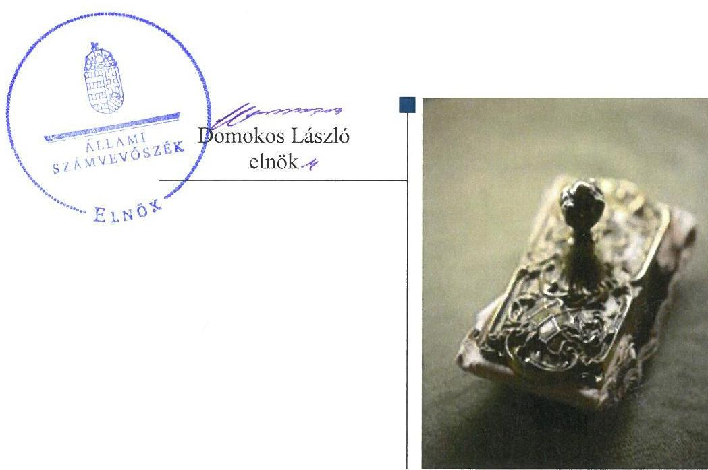

---

# AZ ELLENŐRZÉST FELÜGYELTE: 

RENKÓ ZSUZSANNA felügyeleti vezető

## AZ ELLENŐRZÉST VEZETTE ÉS A VÉGREHAJTÁSÁÉRT FELELŐS:

HORVÁTH JÓZSEF ellenőrzésvezető

## A PROGRAM ÖSSZEÁLLÍTÁSÁÉRT FELELŐS:

JANIK JÓZSEF LÁSZLÓ osztályvezető

IKTATÓSZÁM: V-1221-075/2016
TÉMASZÁM: 2291
ELLENŐRZÉS-AZONOSÍTÓ SZÁM: V076416, V076516

---

# TARTALOMJEGYZÉK 

■ ÖSSZEGZÉS ..... 5
■ AZ ELLENŐRZÉS CÉLJA ..... 6
■ AZ ELLENŐRZÉS TERÜLETE ..... 7
■ AZ ELLENŐRZÉS HÁTTERE, INDOKOLTSÁGA ..... 8
■ A JELENTÉS LÉNYEGES KÉRDÉSKÖREI ..... 10
■ ELLENŐRZÉS HATÓKÖRE ÉS MÓDSZEREI ..... 11
■ MEGÁLLAPÍTÁSOK ..... 14
■ JAVASLATOK ..... 21
■ MELLÉKLETEK ..... 23
I. Sz. melléklet: Értelmező szótár ..... 23
II. Sz. melléklet: Az integritás érvényesítése érdekében kialakított és müködtetett kontrollrendszer ..... 24
■ FÜGGELÉK: ÉSZREVÉTELEK ..... 27
■ RÖVIDÍTÉSEK JEGYZÉKE ..... 49

---

.

---

# ÖSSZEGZÉS 

Özd Város Önkormányzata belső kontrollrendszere kialakításának és müködtetésének hiányosságai következtében a befektetési tevékenységek szabályszerű végzését, elszámoltathatóságát nem biztosították. A befektetett közvagyon számviteli adatainak megbizhatósága sérült, mert a fökönyvi könyvelés, az analitikus nyilvántartás, és a bizonylatok adatai közötti egyeztetés és az ellenőrzés lehetőségét nem érvényesítették.

## Az ellenőrzés társadalmi indokoltsága

Magyarország Alaptörvénye az önkormányzatoktól is elvárja a kiegyensúlyozott, átlátható és fenntartható költségvetési gazdálkodás elvének érvényesítését. A korábbi évek ellenőrzési tapasztalatai, az önkormányzatok által betöltött társadalmi szerep, az általuk kezelt közpénz nagysága, a nemzeti vagyon átruházására vagy hasznosítására vonatkozó döntéseik sokrétűsége egyaránt indokolttá tették a számvevőszéki ellenőrzések folytatását. A belső kontrollrendszer kialakítása és müködtetése nélkül nem valósítható meg a közpénzek, a közvagyon szabályos, gazdaságos, hatékony és eredményes felhasználása.

Özd Város Önkormányzata 2015. december 31-én 10795 ezer Ft befektetési jeggyel, valamint 68591 ezer Ft üzleti célú részesedéssel rendelkezett.

## Főbb megállapítások, következtetések

2011. január 1. és 2015. december 31. között a befektetési tevékenységek szabályszerű végzését a belső kontrollrendszer kialakítása és múködtetése nem támogatta. A közvagyonnal való felelős gazdálkodás nem volt biztosított, mert a kontrollkörnyezet kialakítása nem volt megfelelő, az Önkormányzatnál eltérő szabályozási tartalommal határozták meg a pénzeszközök felhasználását, kockázatkezelési rendszert nem múködtettek. A befektetések vonatkozásában az Önkormányzatnál nem biztosították a folyamatba épített előzetes és utólagos vezetői ellenőrzést, illetve a külső és belső ellenőrzések a befektetési tevékenység végzésére nem terjedtek ki. Az információs és kommunikációs rendszer nem biztosította a megfelelő, naprakész információk rendelkezésre állását. A befektetések analitikus és részletező nyilvántartása hiányos volt, ezért nem biztosította a jogszabályban előírt egyeztetési és ellenőrzési feladatok elvégzését.
2015. évben a belső kontrollrendszer kialakítása és múködtetése nem biztosította a szabályszerű közpénzfelhasználást. A kontrollkörnyezet kialakítása nem volt teljes körű, a hivatásetikai alapelveket, az etikai eljárás szabályait nem alakították ki, az ellenőrzési nyomvonal tartalma nem felelt meg a jogszabályi előírásoknak. A gazdálkodási jogkörök gyakorlása során megsértették a jogszabályban és a belső előírásokban foglaltakat. Az információs és kommunikációs rendszer keretében nem határozták meg a beszámolási szinteket, határidőket, módokat, valamint nem tettek eleget a kötelezően közzéteendő közérdekú adatok nyilvánosságra hozatalának. Monitoring rendszert a szervezeti tevékenységek és célok elérésének folyamatos és eseti nyomon követésére nem alakítottak ki. Az integritás szemlélet érvényesítésében az Önkormányzatnak még fejlődést kell elérnie.

---

# AZ ELLENŐRZÉS CÉLJA 

Az ellenőrzés célja annak megállapítása volt, hogy az önkormányzat belső kontrollrendszerének kialakítása, továbbá egyes elemeinek működtetése biztosította-e a közpénz felhasználás szabályosságát. Az erőforrásokkal való szabályszerű és hatékony gazdálkodáshoz szükséges követelmények érvényesítése, számonkérése, ellenőrzése megtörtént-e az önkormányzatnál. A belső kontrollrendszer kialakítása és működtetése támogatta-e az integritás szemlélet érvényesülését. Az ellenőrzés során értékeltük a belső kontrollrendszer kialakításának és működtetésének szabályszerűségét. Feltártuk azokat a lényeges szabályozási és múködési hiányosságokat, amelyek miatt az ellenőrzött kulcskontrollok nem nyújtottak elegendő védelmet a lehetséges hibákkal szemben. Rámutattunk arra, ha a kulcskontrollok valamely hibát nem előznek meg, nem tárnak fel, vagy nem javítanak ki, valamint minősítettük múködésük megfelelőségét.

Ellenőriztük, hogy az önkormányzat egyes befektetési döntései és azok végrehajtása, elszámolása megfelelt-e a vonatkozó jogszabályoknak és belső szabályozásoknak, a kialakított kontrollrendszer támogatta-e a befektetési tevékenység szabályszerűségét.

---

# **AZ ELLENŐRZÉS TERÜLETE**

## **Ózd Város Önkormányzata**

A Borsod-Abaúj-Zemplén megyében elhelyezkedő Ózd város állandó lakosainak száma 2015. január 1-jén 36 223 fő volt. Az Önkormányzat¹ a 2014. évi általános választását megelőzően és követően tizennégy tagú Képviselő-testülettel² rendelkezett. A Képviselő-testület munkáját a 2014. évi önkormányzati választást megelőzően öt, majd négy állandó bizottság segítette.

A Polgármester³ a 2014. évi önkormányzati választások óta töltötte be tisztségét. Az ellenőrzött időszakban a Jegyző⁴ személye nem változott, a Hivatal⁵ önálló Polgármesteri Hivatalként látta el feladatát.

Az Önkormányzat a Hivatalon kívül 2015. január 1-jén tíz, 2015. december 31-én nyolc költségvetési intézménnyel rendelkezett. 2015. január 1-jén öt, 2015. december 31-én hat gazdasági társaságban volt többségi tulajdona.

A Hivatal három szervezeti egységre – Jegyzői Iroda, Önkormányzati Iroda és Hatósági Iroda – tagolódott.

Az Önkormányzat gazdasági feladatait a Hivatal látta el. A Hivatalban foglalkoztatott köztisztviselők száma 2015. év elején hetvenkilenc fő volt.

Ózd városában 2015. évben Roma és Német Nemzetiségi Önkormányzat működött.

Az Önkormányzat a 2015. évi éves beszámoló szerint 8 875 742 E Ft költségvetési bevételt ért el, valamint 6 059 572 E Ft költségvetési kiadást teljesített. Az eszközvagyon értéke 2015. december 31-én 13 051 353 E Ft volt, a költségvetési évben esedékes kötelezettség állomány 172 312 E Ft, a költségvetési évet követően esedékes kötelezettség állomány 84 469 E Ft, a befektetett pénzügyi eszközök állománya 1 005 264 E Ft volt. A vagyon, a befektetett pénzügyi eszközök és a költségvetési bevételek alakulását az 1. ábra mutatja be.

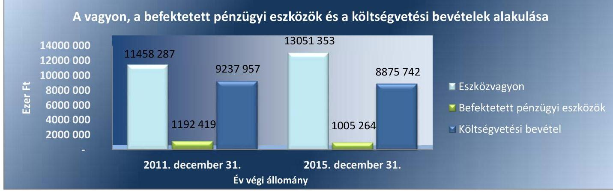

*Forrás: Ózd Város Önkormányzata 2011. és 2015. évi éves beszámolója*

---

# AZ ELLENŐRZÉS HÁTTERE, INDOKOLTSÁGA 

A demokratikus társadalmakban alapvető igény, hogy a közpénzeket, a közvagyont használók tevékenységükről elszámoljanak, ahhoz egyértelmű és érvényesíthető felelősségi szabályok társuljanak. Ennek a jogos igénynek az érvényesítéséhez meg kell teremteni azokat a folyamatokat, rendszereket, amelyek nélkülözhetetlenek az elszámoltatáshoz. Az elszámoltatás eredményes működtetéséhez szükség van a megfelelő információs, kontroll-, értékelési - és beszámolási rendszerek kialakítására. A belső kontrollok kiépítettsége hozzájárul az integritási szemlélet kialakításához és érvényesüléséhez. A belső kontrollrendszer kialakítása és működtetése nélkül nem valósítható meg a közpénzek, a közvagyon szabályos, gazdaságos, hatékony és eredményes felhasználása.

A BELSŐ KONTROLLRENDSZER azt a célt szolgálja, hogy az államháztartás szervei működésük és gazdálkodásuk során a tevékenységeket szabályszerűen, gazdaságosan, hatékonyan, eredményesen hajtsák végre, teljesítsék elszámolási kötelezettségeiket és megvédjék az erőforrásokat a veszteségektől, a károktól, a nem rendeltetésszerű használattól. A belső kontrollrendszer magában foglalja mindazon szabályokat, eljárásokat, gyakorlati módszereket és szervezeti struktúrákat, kockázatkezelési technikákat, kontrolltevékenységeket, amelyek segítséget nyújtanak a szervezetnek céljai eléréséhez. A belső kontrollrendszer szabályozása háromszintű, a törvényi előírásokat az Áht. ${ }^{6}$ és a Mötv. ${ }^{7}$, a rendeleti szintű szabályozást az Ávr. ${ }^{8}$ és a Bkr. ${ }^{9}$ tartalmazza, amelyeket útmutatói szinten az $\mathrm{NGM}^{10}$ által kiadott standardok és kézikönyvek támogatnak.

A megfelelő belső kontrollrendszer jelentősen csökkenti a hibák és szabálytalanságok kockázatát. Az ÁSZ ${ }^{11}$ célja, hogy javuljon az ellenőrzött önkormányzatok belső kontrollrendszerének szabályozottsága, működésének megfelelősége, szabályszerűsége, hozzájárulva ezzel az egyensúlyi helyzet fenntarthatóságának biztosításához, biztosítva az önkormányzatnál a közpénzfelhasználás szabályosságát, a közpénzekkel és a nemzeti vagyonnal történő szabályszerű, gazdaságos, hatékony és eredményes gazdálkodást. Az ÁSZ ellenőrzés tapasztalatai nem csupán a közvetlenül ellenőrzött önkormányzatokat támogathatják, hanem a ,jó gyakorlat" elterjesztésével azok az önkormányzatok is átvehetik a pozitív példákat, ahol nem végez ellenőrzést az ÁSZ.

A közszféra integritás alapú kultúrájának kialakítása, megerősítése és működése szorosan összefügg a belső kontrollrendszer működésével, ezért az ellenőrzés kiterjed annak értékelésére is, hogy a belső kontrollrendszer kialakítása és működtetése hogyan hatott az integritás szemlélet érvényesülésére.

## AZ ÖNKORMÁNYZATI VAGYONGAZDÁLKODÁS

KERETÉBEN az önkormányzatok átmenetileg szabad pénzeszközeinek befektetését jogszabály nem tiltja, a befektetések jellege nem korlátozott, a pénzpiaci szolgáltatók közül az önkormányzatok a kínált szolgáltatás és annak költségei alapján, szabadon választhatnak, azonban a veszteséges gazdálkodás kockázatai és következményei az önkormányzatokat terhelik.

---

A szabad pénzeszközök felhasználása során kiemelten fontos a felelős gazdálkodás érvényesülése, amely összhangban kell, hogy legyen, az önkormányzati gazdálkodás alapelveivel.
2015. első felében az $\mathrm{MNB}^{12}$ három befektetési szolgáltató tevékenységi engedélyét vonta vissza és kezdeményezte a vállalkozások felszámolását a múködéssel kapcsolatos szabálytalanságok, hiányosságok miatt. A befektetési vállalkozások problémás helyzetbe kerülése jelentős veszteségekhez vezetett számos önkormányzat esetében. A korábbi évek ellenőrzési tapasztalatai alapján fennáll a lehetősége annak, hogy az önkormányzatok befektetési döntései, továbbá a döntések végrehajtása és számviteli elszámolása nem voltak teljes mértékben szabályszerűek, és a kapcsolódó külső és belső kontroll rendszerek sem múködtek minden esetben megfelelően.

Az ellenőrzéssel feltárásra kerülhetnek azok a kockázatok, amelyek az önkormányzatok gazdálkodásával, ezen belül befektetési tevékenységeivel, kontrollkörnyezetével kapcsolatosak és a befektetési tevékenységek szabályszerű végrehajtását befolyásolják. Az ellenőrzéssel az önkormányzatok befektetési/vagyongazdálkodási döntéseinek összessége értékelhetővé válik, és megalapozott megállapítás tehető arra vonatkozóan, hogy milyen hatást gyakoroltak az önkormányzat vagyonára a képviselő-testület döntései.

# AZ ELLENŐRZÉS VÁRHATÓ HASZNOSULÁSA 

NÉGY SZINTEN valósul meg:

- a törvényalkotás számára összegzett tapasztalatok állnak rendelkezésre a belső kontrollrendszer önkormányzati területen való kialakításáról, múködtetéséről és hatásairól.
- az ellenőrzött számára visszajelzést ad a belső kontrollrendszer kialakításában és múködésében lévő hiányosságokról, javaslataival hozzájárul azok kiküszöböléséhez.
- az ellenőrzés megállapításait és javaslatait más szervezetek is hasznosíthatják a rendezett gazdálkodási keretek kialakításához.
- a társadalom számára jelzi, hogy közpénz nem maradhat ellenőrizetlenül, az ÁSZ értékteremtő rend kialakításához és megőrzéséhez hozzájáruló tevékenysége pozitív hatással lesz a szervezetről kialakított összkép formálásában.

---

# A JELENTÉS LÉNYEGES KÉRDÉSKÖREI 

1.     - Az önkormányzat kialakított belső kontrollrendszere összességében biztositotta-e a befektetési tevékenységek szabályszerü végzését a 2011-2015. években?
2.     - Az önkormányzat belső kontrollrendszerének kialakítása és müködtetése a 2015. évben szabályszerü volt-e, az biztositotta-e a közpénzfelhasználás szabályosságát, a nemzeti vagyonnal történő felelős gazdálkodást?
3.     - Az egyes befektetésekkel kapcsolatos döntéshozatal és a döntések végrehajtása szabályszerü volt-e?
4.     - Az egyes befektetések számviteli elszámolása, nyilvántartása szabályszerü volt-e?

---

# ELLENŐRZÉS HATÓKÖRE ÉS MÓDSZEREI 

## Az ellenőrzés típusa

Megfelelőségi ellenőrzés, a befektetési tevékenység esetében szabályszerűségi ellenőrzés.

## Az ellenőrzött időszak

A belső kontrollrendszer kialakításának és működtetésének ellenőrzése a 2015. január 1. és 2015. december 31. közötti időszakra terjedt ki. Az önkormányzatok egyes befektetési tevékenységeinek ellenőrzése tekintetében az ellenőrzött időszak a 2011. január 1. - 2015. december 31. közötti időszak. Ezen felül az önkormányzat befektetésekkel kapcsolatos döntéselőkészítésének és döntéshozatalának szabályszerűségét a 2011. január 1. előtti időszakra visszanyúlóan is ellenőriztük, amennyiben a 2015. december 31-én meglévő befektetéseire 2011. január 1-je előtt került sor. Az integritás szemlélet érvényesülését a 2015. évre vonatkozó adatszolgáltatás alapján értékeltük.

## Az ellenőrzés tárgya

A helyi önkormányzatnak, mint éves költségvetési beszámoló készítésére kötelezett szervezetnek és Hivatalának belső kontrollrendszere. Az integritás szemlélet érvényesülése.

Az önkormányzat 2015. december 31-én meglévő, a Számv. tv. ${ }^{13} 3 . \S$ (6) bekezdés 2. és 3. pontja szerint az értékpapírokban megtestesülő befektetései, lekötött betétei. Továbbá a 2015. december 31-én meglévő, az önkormányzat szabad pénzeszközei terhére, adásvételi szerződés keretében megszerzett, a kötelező feladatok ellátását nem szolgáló, az önkormányzat üzleti vagyonába tartozó, az ellenőrzött időszakban (2011-2015.) megszerzett ingatlanok, továbbá az - időkorlátozás nélkül megszerzett - kulturális javak (műtárgyak, műalkotások, stb.), illetve egyéb értéktárgyak (pl. ékszerek, befektetési nemesfém).

Az ellenőrzésnek nem tárgya az önkormányzati közfeladat-ellátást szolgáló gazdasági társaságokban lévő üzletrészek, részesedések, a törzsvagyonba tartozó, közfeladat-ellátást, közvetlen működést szolgáló eszközök, az ingatlanokhoz kapcsolódó vagyoni értékű jogok, a beruházások, felújítások. Nem képezik az ellenőrzés tárgyát azok a vagyonelemek, amelyek törvényi vagy más jogszabályi kötelezettség teljesítése keretében kerültek az önkormányzat üzleti vagyonába; amelyek beszerzése bármilyen módon összefügg a kötelező feladatok ellátásával (pl. köztéri szobrok); illetve azon vagyonelemek sem, amelyek javadalmazási, ajándékozási céllal kerültek beszerzésre (pl. önkormányzati díj adományozásához kapcsolódó, nyugdíjazással összefüggő ajándéktárgyak, értéktárgyak).

---

Az ellenőrzés kiterjedt minden olyan körülményre és adatra, amely az ÁSZ jogszabályban meghatározott feladatainak teljesítéséhez, valamint a program végrehajtása folyamán felmerült újabb összefüggések feltárásához szükséges volt.

# Az ellenőrzött szervezet 

Özd Város Önkormányzata
Özd Város Önkormányzat Polgármesteri Hivatala

## Az ellenőrzés jogalapja

Az ÁSZ tv. 1. § (3) bekezdésében foglaltak alapján az ÁSZ általános hatáskörrel végzi a közpénzekkel és az állami és önkormányzati vagyonnal való felelős gazdálkodás ellenőrzését. Az ÁSZ tv. 5. § (2) bekezdése alapján az államháztartás gazdálkodásának ellenőrzése keretében az ÁSZ ellenőrzi a helyi önkormányzatok gazdálkodását, valamint az ÁSZ tv. 5. § (6) bekezdése alapján ellenőrzése során értékeli az államháztartás számviteli rendjének betartását és a belső kontrollrendszer múködését.

## Az ellenőrzés módszerei

Az ellenőrzést a nemzetközi standardokat irányadónak tekintve az ellenőrzési program szempontjai, kérdései, az ellenőrzött időszakban hatályos jogszabályok, az ellenőrzés szakmai szabályok és módszertanok figyelembe vételével végeztük. A gazdálkodás hibáinak kijavítására, a közpénzekkel való felelős gazdálkodás elősegítésére irányuló javaslatok kidolgozásakor a hatályos jogszabályok voltak az irányadóak.

Az ellenőrzés ideje alatt az ellenőrzött szervezettel történő kapcsolattartást az ÁSZ SZMSZ ${ }^{14}$-ének vonatkozó előírásai alapján biztosítottuk.

Az ellenőrzési kérdések megválaszolásához szükséges bizonyítékok megszerzése az ellenőrzöttek által rendelkezésre bocsátott dokumentumokra, adatokra alapozva megfigyelés, szemle (szemrevételezés), kérdésfeltevés (információkérés), valamint elemző eljárással történt. A minták kiválasztása rétegzett, véletlen mintavételi eljárással történt.

Az ellenőrzés lefolytatásához az önkormányzat a tanúsítványok elektronikus kitöltésével, valamint az ÁSZ által kért dokumentumok elektronikus megküldésével szolgáltatott adatokat. A rendelkezésre bocsátott adatok, információk kontrollja az ellenőrzés keretében történt.

Az önkormányzat belső kontrollrendszere jogszabályi előírások szerinti kialakításának és múködtetésének szabályszerűségét, az erre irányuló ellenőrzési kérdésekre adott válaszok összesítése alapján a 2015. január 1. és december 31. közötti időszakra, pillérenként (kontrollkörnyezet, kockázatkezelési rendszer, kontrolltevékenységek, információs és kommunikációs rendszer, monitoring rendszer) és összesítetten is értékeljük. Az önkormányzat belső kontrollrendszere egyes pilléreinek kialakítása és múködtetése „szabályszerü", amennyiben az értékelt területen az elért igen

---

válaszok százalékban kifejezett, egész számra kerekített aránya meghaladja a $85 \%$-ot, „részben szabályszerű", ha a $85 \%$-ot nem haladja meg, de $60 \%$-nál nagyobb, „nem szabályszerű", ha nem haladja meg a $60 \%$-ot. Az önkormányzat belső kontrollrendszerének összesített értékelése megegyezik a pillérenként (kontrollterületenként) alkalmazott százalékos értékelésekkel, a következő eltérésekkel. A kontrollrendszer egésze esetében a „szabályszerü" értékelésnek a százalékos értéken felül további feltétele, hogy egyik kontrollterület sem kaphat „nem szabályszerű" értékelést, a „részben szabályszerű" értékelés további feltétele, hogy legfeljebb egy ellenőrzött kontrollterület lehet „nem szabályszerű" értékelésű. Az összesített értékelés a százalékos értéktől függetlenül „nem szabályszerű", ha az ellenőrzött kontrollterületek közül több mint egynek „nem szabályszerű" az értékelése.

A kontrolltevékenységek működésének megfelelőségét a foglalkoztatottak személyi juttatásaival, a külső személyi juttatásokkal, a működési kiadásokkal és a felhalmozási célú kiadásokkal kapcsolatos kifizetések esetében mintavétellel ellenőriztük. „Megfelelőnek" értékeltünk egy ellenőrzött területet, amennyiben $95 \%$-os bizonyossággal a teljes sokaságban a hibaarány legfeljebb 10\%, „nem megfelelőnek", amennyiben 10\%-nál magasabb arányt képviselt. Abban az esetben, ha a teljes sokaság tekintetében a 10\%-os hibaarányhoz való viszony megítélésének megbízhatósága nem érte el a $95 \%$-ot, annak elérése érdekében értékelésünket további szempontokkal egészítettük ki, és figyelembe vettük a feltárt hibák értékét.

Az integritás szemlélet érvényesülésének értékelése az önkormányzat által kitöltött kérdőív alapján, az abban foglalt válaszok megalapozottságának kontrollja mellett történt.

A jelentésben használt fogalmak magyarázatát az I. számú melléklet tartalmazza.

---

# 1. Az önkormányzat kialakított belső kontrollrendszere összességében biztosította-e a befektetési tevékenységek szabályszerű végzését a 2011-2015. években? 

Összegző megállapítás

2011. január 1. és 2015. december 31. közötti időszakban a belső kontrollrendszer kialakításának és müködtetésének hiányosságai következtében nem volt biztosított a közvagyon biztonságos és körültekintő befektetése.

A KONTROLLKÖRNYEZET kialakítása nem támogatta a befektetési tevékenység szabályszerű végzését. Az Önkormányzat szervezeti és szabályozási kereteit, működését és gazdálkodását meghatározó szabályzatok közül a 2011. március 31-ig hatályos Önkormányzati SZMSZ ${ }_{1}{ }^{15}$, valamint a 2013. február 26-ig hatályos Vagyonrendelet ${ }_{1}{ }^{16}$ nem tartalmazta a kiadmányozási joggal rendelkező személy saját kezű aláírását, a szerv hivatalos bélyegzőlenyomatát vagy a kiadmányozó neve mellett az „S.k." jelzést és a hitelesítésre felhatalmazott személy aláírását, illetve a szerv hivatalos bélyegzőlenyomatát. Ezzel az Önkormányzatnál nem tettek eleget az lkr. 53. §. (1) bekezdés a) és b) pontjaiban foglalt követelményeknek. Az Önkormányzati SZMSZ ${ }_{1}$ és Vagyonrendelet ${ }_{1}$ esetében az Ötv. ${ }^{17}$ 16. §. (3) bekezdésében foglaltak ellenére a rendeletek nem tartalmazták az akkor hivatalban lévő Polgármester és Jegyző aláírását.

A 2011. április 2-ától 2013. február 26-ig a Polgármester ${ }_{1}$-re átruházott hatáskörök Önkormányzati SZMSZ ${ }_{2}{ }^{18}$ függelékében történő szabályozása nem felelt meg az IRM rendelet ${ }^{19} 3$. § (1) bekezdésében foglaltaknak. A 2013. február 28-tól hatályos Vagyonrendeletben ${ }_{2}{ }^{20}$, illetve a Költségvetési rendelet ${ }_{2-5}{ }^{21}$-ben szabályozták az Önkormányzat vagyonának és pénzforrásainak felhasználását. A Vagyonrendelet ${ }_{2}$ szerint a Polgármester ${ }_{1,2}$ az Önkormányzat vagyonát és tulajdonát érintő ügyekben a mindenkori éves költségvetésben jóváhagyott előirányzatok keretén belül 4000 ezer Ft erejéig kötelezettséget vállalhat. A Költségvetési rendeletek ${ }_{2-5}$ a Polgármester ${ }_{1,2}$-t értékhatár nélkül hatalmazták fel a finanszírozási bevételekkel és kiadásokkal kapcsolatos hatáskör gyakorlására. A Költségvetési rendeletek ${ }_{2-5}$-ben „a Polgármester ${ }_{1,2}$ jogkörébe utalt, az átmenetileg szabad pénzeszközök értékhatár nélküli betétként való elhelyezésére vonatkozó döntési hatáskört a Pénzkezelési szabályzat ${ }_{1-2}$-ban a Pénzügyi Osztályvezetőre ruházták tovább, ezzel megsértették az Ötv. 9. § (3) és a Mötv. 41. § (4) és (5) bekezdésében foglaltakat, mivel nem vették figyelembe, hogy az átruházott hatáskör tovább nem ruházható.

KOCKÁZATKEZELÉSI RENDSZERT az Ámr. ${ }^{22}$ 157. § (1) bekezdésében és a Bkr. 7. § (1) bekezdésében foglaltak ellenére nem működtettek. Az Ámr. 157. § (2)-(3) bekezdéseiben és a Bkr. 7. § (2) bekezdésében foglaltak ellenére a tevékenységében, gazdálkodásában

---

rejlő kockázatok közül a befektetési tevékenységgel kapcsolatban nem állapították meg a kockázatokat, nem határozták meg az egyes kockázatokkal kapcsolatban szükséges intézkedéseket, valamint azok teljesítése folyamatos nyomon követésének módját.

A KONTROLLTEVÉKENYSÉGEK részeként a befektetések vonatkozásában az Önkormányzatnál nem biztosították a folyamatba épített előzetes és utólagos vezetői ellenőrzést, ezzel megsértették a Bkr. 8. § (2) bekezdésének a) pontjában foglaltakat. 2015. évben az OTP Nyrt-vel kötött betéti szerződések pénzügyi ellenjegyzése Áht. 37. § (1) bekezdése ellenére nem történt meg.

# AZ INFORMÁCIÓS ÉS KOMMUNIKÁCIÓS RENDSZER nem biztosította, hogy megfelelő, pontos és naprakész információk álljanak rendelkezésre az Önkormányzat múködésével kapcsolatosan, mivel az Önkormányzat közzétételi kötelezettségének nem tett eleget. Az Eisztv. ${ }^{23}$ mellékletének III./4. pontja, illetve Info. ${ }^{24}$ tv. 37. § (1) bekezdésének és 1. melléklete III/4. pontja előírásainak ellenére honlapján nem tette közzé az ellenőrzött időszakban a befektetési tevékenységgel összefüggésben a pénzeszközök lekötésére vonatkozó betéti szerződések adatait, megnevezését (típusát), tárgyát, a szerződő fél (megbízott) nevét, a szerződés (megbízás) értékét és időtartamát.

A MONITORING RENDSZER keretén belül múködő belső ellenőrzési tevékenység a befektetésekre nem terjedt ki, ezért nem volt képes a jelen ellenőrzés által megállapított hiányosságokat, szabálytalanságokat megelőzni, illetve feltárni. A külső ellenőrzések a befektetési tevékenységre nem terjedtek ki.

## 2. Az önkormányzat belső kontrollrendszerének kialakítása és múködtetése a 2015. évben szabályszerű volt-e, az biztosította-e a közpénzfelhasználás szabályosságát, a nemzeti vagyonnal történő felelős gazdálkodást?

Összegző megállapítás
2015. január 1. és 2015. december 31. közötti időszakban a gazdálkodás egészét érintően a belső kontrollrendszer nem biztosította a szabályszerű múködést, a gazdaságosság, hatékonyság és eredményesség követelményeinek érvényesülését.

A KONTROLLKÖRNYEZET kialakítása és múködtetése az Önkormányzat tevékenységének szabályozása nem volt teljes körű, mivel

- a gazdasági szervezet feladatait a Pénzügyi és Gazdasági Osztály és a Kincstári és Gondnoksági Csoport látta el. A Hivatali SZMSZ ${ }_{1,2}$ szerint a Pénzügyi és Gazdasági Osztály az Önkormányzati Iroda, a Kincstári és Gondnoksági Csoport a Jegyzői Iroda keretén belül múködik. A gazdasági vezető irányítási és ellenőrzési joga az Ávr. 11. § (1) be-

---

kezdésében foglaltakkal ellentétben nem terjed ki a Hivatal gazdálkodási feladatait végző Kincstári és Gondnoksági Csoport tevékenységére. A feladatellátás tekintetében a két szervezeti egység feladataiban az Ávr. 9. § (3) bekezdésében foglaltak ellenére párhuzamosságok találhatóak;
—_ a Hivatali SZMSZ ${ }_{1,2}{ }^{25}$

- nem tartalmazta a nevesített munkakörökhöz kapcsolódó felelősségi szabályokat az Ávr. 13. § (1) bekezdés g) pontja előírásai ellenére;
- nem nevesíti a gazdasági szervezetet, 2014. december 31-ig annak engedélyezett létszámát az Ávr. 13. § (1) bekezdés e) pontja előírásai ellenére;
- a gazdasági szervezeti feladatot ellátó Kincstári és Gondnoksági csoport az Ávr. 9. § (5), az Ávr. 13. § (5), Ávr. 10/A. §-ában bekezdésében foglaltak ellenére Ügyrenddel nem rendelkezett;
- a köztisztviselőkre vonatkozó hivatásetikai alapelveket, valamint az etikai eljárás szabályait a Kttv. 231. § (1) bekezdésében foglaltakkal ellentétben a Képviselő-testület nem állapította meg;
— a 2015. január 1-jétől hatályos jogszabályi változásokat a Számv. tv. ${ }^{26}$ 14. § (11) bekezdésében foglaltakkal ellentétben a Számviteli politikában, a Leltározási szabályzat ${ }^{27}$-ban, a Pénzkezelési szabály-zat ${ }^{28}$-ban, az Értékelési szabályzat ${ }^{29}$-ban és az Önköltség-számítási szabályzat ${ }^{30}$-ban 2015. május 6-án vezették át;
— az Önkormányzat és a Hivatal Számlarendje 2015. évben az Áhsz. ${ }_{2}$ 51. § (3) bekezdésében foglaltak ellenére nem szabályozta a főkönyvi számla és az analitikus nyilvántartások közötti egyeztetés módját, formáját, dokumentálását, valamint a Számv. tv. 161. § (2) d) pontjában foglaltakkal ellentétben a számlarendet alátámasztó bizonylati rendet;
— a vezetékes és rádiótelefonok használatát az Ávr. 13. § (2) bekezdés g) pontjában foglaltak ellenére nem szabályozta;
— Ellenőrzési nyomvonal ${ }^{31}$ nem felelt meg a Bkr. 6. § (3) bekezdésében foglaltaknak, mert nem tartalmazta a felelősségi és információs szinteket és kapcsolatokat, irányítási és ellenőrzési folyamatokat, azok nyomon követését és utólagos ellenőrzését.
A szabályozási hiányosságok miatt a Bkr. 6. § (1) bekezdés b) pontja ellenére nem voltak egyértelmúek a felelősségi, hatásköri viszonyok és feladatok.

A Roma és a Német Nemzetiségi Önkormányzattal kötött 2015. évi együttműködési megállapodások az Áht. 6. /C. § (2) bekezdés b) pontja ellenére nem rögzítették, hogy a helyi nemzetiségi önkormányzatok bevételeivel és kiadásaival kapcsolatos ellenőrzési feladatok ellátásról az Önkormányzat Polgármesteri Hivatala gondoskodik.

KOCKÁZATKEZELÉSI RENDSZERT a Bkr. 7. § (1) bekezdésének előírásai ellenére nem múködtettek. A Bkr. 7. § (2) bekezdésének előírásai ellenére nem mérték fel és nem állapították meg az Önkormányzat és a Hivatal tevékenységében, gazdálkodásában rejlő kockázatokat, nem határozták meg az egyes kockázatokkal kapcsolatban szükséges intézkedéseket.

---

A KONTROLLTEVÉKENYSÉGEK gyakorlása során az Ávr. 13. § (2) bekezdés a) pontjában foglaltak ellenére nem határozták meg a gazdálkodási jogkörök gyakorlásának módját, eljárási és dokumentációs részletszabályait, valamint az ezeket végző személyek kijelölésének rendjével kapcsolatos, jogszabályban nem szabályozott belső előírásokat, feltételeket.

Az Önkormányzatra, valamint a Német és Roma Nemzetiségi önkormányzatra vonatkozó gazdálkodási jogkörök kijelölésekor az érvényesítőt az Ávr. 58. § (4) bekezdésében foglaltaktól eltérően az Önkormányzatnál a gazdasági vezető helyett a Polgármester ${ }_{2}$ és a Jegyző, a Nemzetiségi Önkormányzatoknál a gazdasági vezető helyett a Jegyző jelölte ki.

A pénzügyi folyamatokban kulcsszerepet betöltő gazdálkodási jogkörök gyakorlása során az alábbi hiányosságok fordultak elő:
— a kötelezettségvállalás esetében az Ávr. 52. § (6) bekezdésében foglaltak ellenére a kötelezettségvállaló nem rendelkezett a jogkör gyakorlására vonatkozó felhatalmazással;
— a pénzügyi ellenjegyzésre az Áht. 37. § (1) bekezdésében foglaltak ellenére a kötelezettségvállalást követően került sor, illetve az Ávr. 55. § (2) bekezdés a) pontjában foglaltakat megsértve a jogkört nem a gazdasági vezető által felhatalmazott személy gyakorolta;
— a teljesítésigazolásnál a teljesítést igazoló nem rendelkezett az Ávr. 57. § (4) bekezdéseiben foglaltak ellenére a kötelezettségvállaló általi felhatalmazással, illetve az Ávr. 57. § (1) bekezdésével ellentétben a kiadások teljesítésének jogosságát ellenőrizhető okmánnyal nem támasztották alá;
— az érvényesítésre jogosultak kijelölése az Ávr. 58. § (4) bekezdésében foglaltaktól eltérően nem a gazdasági vezető által történt, vagy az érvényesítő nem rendelkezett a jogkör gyakorlására vonatkozó kijelöléssel. Az érvényesítő nem jelezte az utalványozónak a megelőző ügymenetben az Áht-ban, az Ávr-ben és az Áhsz-ben, valamint a belső szabályzatokban foglaltak megsértését. Az Ávr. 58. § (3) bekezdésében foglaltak ellenére az érvényesítés az utalványozás előtt nem történt meg, mert az utalványrendelet nem tartalmazta az érvényesítésre utaló megjelölést, és az érvényesítő keltezéssel ellátott aláírását;
—az utalványozó nem rendelkezett az Ávr. 59. § (1) bekezdésében foglalt kijelöléssel a jogkör gyakorlására, továbbá az utalványozás nem felelt meg az Ávr. 59. § (3) bekezdés g) pontjában foglaltaknak, mert nem tartalmazta az utalványozó keltezéssel ellátott aláírását. Az utalványozás során megsértették az Ávr. 59.§ (1) bekezdését, mert a kiadások utalványozása nem érvényesített okmány alapján történt.
A kontrolltevékenység kialakítása és múködtetése a 2015. január 1. és 2015. december 31. közötti időszakban ez előzőekben felsorolt hiányosságok következtében nem volt szabályszerű.

# AZ INFORMÁCIÓS ÉS KOMMUNIKÁCIÓS RENDSZER működtetése során 

a Bkr. 3. § d) pontja és 9. § (2) bekezdésének előírása ellenére nem múködtettek hatékony, megbízható, pontos beszámolási rendszereket;

---

$\longrightarrow$ az Info tv. 33. § (1) és (3) bekezdéseiben, 37. § (1) bekezdésében, valamint az I. melléklete III/1. pontjában foglaltak ellenére nem tettek eleget a kötelezően közzéteendő közérdekű adatok nyilvánosságra hozatalának, mivel a 2015. évi beszámoló és a költségvetés adatainak közzétételéről nem gondoskodtak.

A MONITORING RENDSZERT a szervezeti tevékenységek és célok elérésének folyamatos és eseti nyomon követésére a Bkr. 10. §-ában foglaltak ellenére nem alakítottak ki.

Az Önkormányzat belső ellenőrzési feladatai ellátásáról az Áht.-ban előírtaknak megfelelően gondoskodott.

A belső ellenőrzésekről vezetett nyilvántartás során nem tartották be a Bkr. 47. § (1) és (2) bekezdéseiben foglaltakat, mert a nyilvántartás az intézkedési tervek végrehajtásának nyomon követését, az intézkedési terv alapján végrehajtott intézkedések rövid leírását, a végre nem hajtott intézkedések okát nem tartalmazta.

A külső ellenőrzésekről vezetett nyilvántartás nem felelt a Bkr. 14. § (1), valamint a 47. § (2) bekezdésében foglaltaknak, mert nem tartalmazta az ellenőrzési javaslatokat, az intézkedési terveket, a végrehajtott intézkedések rövid leírását és a végre nem hajtott intézkedések okát.

A belső ellenőrzési vezető a Bkr. 30. § (1) bekezdésében foglaltak ellenére nem készítette el a 2014-2017. évekre vonatkozó stratégiai ellenőrzési tervet.

A BELSŐ KONTROLLRENDSZER minősítéséről szóló, a Bkr. 1. számú melléklete szerinti nyilatkozatot a Jegyző 2015. évre vonatkozóan elkészítette.

A Jegyző nyilatkozata tartalmazta, hogy a Hivatalnál gondoskodott a belső kontrollrendszer kialakításáról, annak szabályszerű, eredményes, gazdaságos és hatékony működéséről. A Jegyző nyilatkozatát jelen ellenőrzés nem erősítette meg, mert a kontrollrendszer kialakításánál és működtetésénél hiányosságokat állapított meg.

A 2015. évi összefoglaló belső ellenőrzési jelentésben értékelték a belső kontrollrendszer múködését, melyben a kontrollkörnyezet, valamint a kontrolltevékenységek gyakorlását nem értékelték teljes körűnek.

AZ INTEGRITÁS SZEMLÉLET érvényesítését az Önkormányzat belső kontrollrendszerének kialakítása és működtetése nem támogatta. Az Önkormányzat részt vett az ÁSZ integritás szemlélet érvényesülésének 2015. évi felmérésében, így az értékeléshez a felmérésben szolgáltatott adatokat vettük figyelembe. Az értékelés eredményét a II. számú mellékletben mutatjuk be.

---

# 3. Az egyes befektetésekkel kapcsolatos döntéshozatal és a döntések végrehajtása szabályszerű volt-e? 

Összegző megállapítás

1. táblázat

ÜZLETI CÉLÚ BEFEKTETÉSÁLLOMÁNY

| Üzleti célú   befektetések | Mérlegben   kimutatott   értéke   2010.12 .31   (e Ft) |
| :--: | :--: |
| OTP befektetési jegy | 10795 |
| Részesedések | 68591 |
| Özdi Vizmú Kft. | 16852 |
| Özdi Hulladékgazd. Kft. | 13730 |
| Özdi Kommunikációs NKft. | 4000 |
| ÖZDSZOLG Nonprofit Kft. | 33840 |
| BORSODVÍZ Zrt. | 50 |
| Özdi Szoc. Szöv. | 79 |
| HÉTVÖLGY Szoc. Szöv. | 40 |
| Forrás: Önkormányzat adatszolgáltatása |  |

2011-2015. években a befektetéseknél a döntéshozatal támogatta a vagyonnal történő felelős gazdálkodást, azonban a betétlekötéssel kapcsolatos feladatokat jogszabályellenes felhatalmazás alapján végezték.

Az Önkormányzat 2015. december 31-én hét gazdasági társaságban rendelkezett üzleti célú részesedéssel. Ezek 2015. december 31-ei mérlegben kimutatott értéke 68591 E Ft volt. Ezen kívül még 2015. december 31-én 10795 E Ft értékű OTP befektetési jeggyel rendelkezett, melyet 2008-ban vásároltak (1. táblázat). Üzleti vagyonba tartozó ingatlannal, kulturális javakkal, egyéb értéktárgyakkal az Önkormányzat nem rendelkezett.

Az OTP befektetési jegyek vásárlására vonatkozó döntéshozatal és annak végrehajtása megfelelt a jogszabályi előírásoknak.

A 2011. január 1. - és 2015. december 31. közötti időszakban a gazdasági társaságok jegyzett tőkéjének emeléséről, illetve csökkentéséről az Önkormányzat a jogszabályi előírásoknak megfelelően határozatban döntött és felhatalmazta a Polgármestert a határozatokban foglaltak végrehajtására. Az Önkormányzat Képviselő-testületének 2011. és 2015. évek közötti üzleti célú döntéseinek végrehajtása a határozatokban foglaltaknak megfelelően történt meg.

Az Önkormányzat szabad pénzeszközeit 2011-2015. években időszakosan a számlavezető pénzintézeténél lekötött betétben helyezte el, azonban 2015. december 31-én az Önkormányzat lekötött betétállománnyal nem rendelkezett. A betétlekötésekre a szerződéskötést - figyelmen kívül hagyva, hogy az Ötv. 9. § (3) és a Mötv. 41. § (4) és (5) bekezdései ellenére a képviselő-testület által a polgármesterre átruházott döntési hatáskör tovább nem ruházható - a jogszabállyal ellentétes felhatalmazással a Pénzügyi osztályvezető hajtotta végre. 2015. évben a betétlekötésre vonatkozó szerződések megkötése az Áht. 37. § (1) bekezdésében foglalt előírások ellenére pénzügyi ellenjegyzés nélkül történt meg.

A 2011. és 2015. évek között üzleti célú befektetések az Önkormányzat kötelező feladatainak ellátását nem veszélyeztették.

---

# 4. Az egyes befektetések számviteli elszámolása, nyilvántartása szabályszerű volt-e? 

## Összegző megállapítás

A befektetések analitikus és részletező nyilvántartásainak hiányos vezetése miatt nem volt biztosított a főkönyvi könyvelés, az analitikus nyilvántartás, a bizonylatok adatai közötti egyeztetés és az ellenőrzés lehetősége.

Az Önkormányzatnál a részesedések és az értékpapírok (OTP befektetési jegyek) és lekötött betétek besorolása, bekerülési értékének meghatározása a Számv. tv. és az Áhsz. ${ }_{12}{ }^{32}$ előírásainak megfelelően történt.
2011. január 1. és 2015. december 31. közötti időszakban a befektetési jegyekről - az Áhsz. 1 9. számú melléklet 1. k) pontjában és az Áhsz. 14 . számú melléklet VIII/1. pontjában foglaltak ellenére - analitikus nyilvántartást nem vezettek, továbbá a részesedésekről vezetett analitikus, részletező nyilvántartás nem felelt meg az Áhsz. 149. § (1) bekezdésében, valamint az Áhsz. 2 14. számú melléklet VIII. pont 2. pontja a), c), e), és h) alpontjaiban foglaltaknak. Ennek következtében a Számv. tv. 165. § (4) bekezdésében foglaltak ellenére nem volt biztosított a főkönyvi könyvelés, az analitikus nyilvántartás és a bizonylatok adatai közötti egyeztetés és ellenőrzés lehetősége.

A befektetési jegyek leltározása az analitikus nyilvántartás hiánya miatt nem felelt meg az Áhsz. 1 37. § (3) és az Áhsz. 2 22. § (2) bekezdéseiben, továbbá a Számv. tv. 69. § (1) - (2) bekezdéseiben foglaltaknak.

A 2011-2015. években a befektetési jegyekkel kapcsolatban értékvesztés elszámolását a jogszabályi előírások nem indokolták, a részesedéseket érintően az értékvesztés elszámolása Számv. tv. előírásainak megfelelően megtörtént.

---

# JAVASLATOK 

Az ÁSZ tv. 33. § (1) bekezdésében foglaltak értelmében az ellenőrzött szervezet vezetője köteles a jelentésben foglalt megállapításokhoz kapcsolódó intézkedési tervet összeállítani és azt a jelentés kézhezvételétől számított 30 napon belül az ÁSZ részére megküldeni. Amennyiben az ellenőrzött szervezet vezetője nem küldi meg határidőben az intézkedési tervet, vagy továbbra sem elfogadható intézkedési tervet küld, az Állami Számvevőszék elnöke az ÁSZ tv. 33. § (3) bekezdése a) és b) pontjaiban foglaltakat érvényesítheti.

## a polgármesternek:

1. Intézkedjen a Hivatal szervezeti és müködési szabályzatának jóváhagyásáról.
(2. számú megállapítás 1. bekezdés 3. pontja alapján)
2. Intézkedjen a köztisztviselőkre vonatkozó hivatásetikai alapelvek részletes tartalmát, valamint az etikai eljárás szabályait megállapító előterjesztés Képviselő-testület elé terjesztéséről.
(2. számú megállapítás 1. bekezdés 5. pontja alapján)
3. Intézkedjen az Állami Számvevőszék ellenőrzése során feltárt hiányosságok és/vagy szabálytalanságok tekintetében a munkajogi felelősség tisztázására irányuló eljárás megindításáról, és ennek eredménye ismeretében tegye meg a szükséges intézkedéseket.
(1. számú megállapítás 2. bekezdés utolsó mondata, a 3-4. bekezdései, 2. számú megállapítás 1. bekezdés 4. és a 7-9. pontjai, a 4-5. bekezdései alapján)

## a jegyzőnek:

1. Intézkedjen a belső kontrollrendszer egyes elemei jogszabályi előírásoknak megfelelő kialakítására és müködtetésére, valamint a gazdálkodási jogkörök gyakorlása során a jogszabályi előírások betartására.
(1. számú megállapítás 2. bekezdés utolsó mondata, 3-4. bekezdései, az 5. bekezdés 2. mondata, 2. számú megállapítás 1. bekezdés 4., 7-9. pontjai, a 2-7., 9-10., és a 12-14. bekezdései, a 3. számú megállapítás 4. bekezdés 3. mondata alapján)

---

2. Intézkedjen a Hivatal jogszabályi előírásoknak megfelelő tartalmú szervezeti és müködési szabályzatának elkészitéséről, és kezdeményezze annak polgármester általi jóváhagyását.
(2. számú megállapítás 1. bekezdés 3. pontja alapján)
3. Intézkedjen a köztisztviselőkre vonatkozó hivatásetikai alapelvek részletes tartalmát, valamint az etikai eljárás szabályait tartalmazó előterjesztés elkészitéséről.
(2. számú megállapítás 1. bekezdés 5. pontja alapján)
4. Intézkedjen a befektetési jegyek és részesedések adatai jogszabályi előírásoknak megfelelő rögzitéséről a részletező nyilvántartásokban.
(4. számú megállapítás 2. bekezdés 1. mondata alapján)
5. Intézkedjen az éves költségvetési beszámolók mérlegében kimutatott befektetési jegyek jogszabályi előírásoknak megfelelő leltározásáról.
(4. számú megállapítás 3. bekezdése alapján)
6. Intézkedjen az Állami Számvevőszék ellenőrzése során feltárt hiányosságok és/vagy szabálytalanságok tekintetében a munkajogi felelősség tisztázására irányuló eljárás megindításáról, és ennek eredménye ismeretében tegye meg a szükséges intézkedéseket.
(1. számú megállapítás 5. bekezdés 2. mondata, az 2. számú megállapítás 7. és 9. bekezdés 4. pontja, a 12-14. bekezdései, valamint a 3. számú megállapítás 4. bekezdés 3. mondata, valamint a 4. számú megállapítás 2. bekezdés 1. mondata és 3. bekezdése alapján)

---

# MELLÉKLETEK 

- I. SZ. MELLÉKLET: ÉRTELMEZŐ SZÓTÁR
belső ellenőrzés
belső kontrollrendszer
belső kontrollrendszer pillérei, kontrollterületei
finanszírozási kiadások és bevételek
információs és kommunikációs rendszer
integritás
kockázat

Független, tárgyilagos bizonyosságot adó és tanácsadó tevékenység, amelynek célja, hogy az ellenőrzött szervezet működését fejlessze és eredményességét növelje, az ellenőrzött szervezet céljai elérése érdekében rendszerszemléletű megközelítéssel és módszeresen értékeli, illetve fejleszti az ellenőrzött szervezet irányítási és belső kontrollrendszerének hatékonyságát. (Bkr. 2. § b) pontja)
A belső kontrollrendszer a kockázatok kezelése és tárgyilagos bizonyosság megszerzése érdekében kialakított folyamatrendszer, amely azt a célt szolgálja, hogy a múködés és gazdálkodás során a tevékenységeket szabályszerűen, gazdaságosan, hatékonyan, eredményesen hajtsák végre, az elszámolási kötelezettségeket teljesítsék, megvédjék az erőforrásokat a veszteségektől, károktól és nem rendeltetésszerű használattól. (Áht. 69. § (1) bekezdése)
A kontrollkörnyezet, a kockázatkezelési rendszer, a kontrolltevékenységek, az információs és kommunikációs rendszer, valamint a nyomon követési (monitoring) rendszer. (Bkr. 3. §-a)
a Magyarország gazdasági stabilitásáról szóló 2011. évi CXCIV. törvény 3. § (1) bekezdés a)-e) pontja szerinti ügyletből származó bevételek és kiadások, továbbá a hitelviszonyt megtestesítő értékpapírok vásárlásából, értékesítéséből, beváltásából származó bevételek és kiadások, a szabad pénzeszközök betétként való elhelyezése és visszavonása, az államháztartás önkormányzati alrendszerében irányító szervi támogatásként folyósított támogatás kiutalása és fizetési számlán történő jóváírása, finanszírozási bevétel a költségvetési maradvány, vállalkozási maradvány. (Áht. 6. § (7) bekezdés a) pont)
A költségvetési szerv vezetője által kialakított és múködtetett olyan rendszer, mely biztosítja, hogy a megfelelő információk a megfelelő időben eljutnak az illetékes szervezethez, szervezeti egységhez, illetve személyhez. (Bkr. 9. § (1) bekezdés)
Az integritás elvek, értékek, cselekvések, módszerek, intézkedések konzisztenciáját jelenti: olyan magatartásmódot, amely meghatározott értékeknek felel meg. Az integritás a közszféra esetében a társadalom által elvárt nyilvánossági, átláthatósági, illetve jogi/etikai normáknak történő megfelelést jelenti.
(Forrás: a http://integritas.asz.hu honlapon közzétett „A 2012. évi integritás felmérés eredményeinek összefoglalója" című dokumentum 3. oldal 1. bekezdése)
A kockázat annak a valószínűségét jelenti, hogy egy vagy több esemény vagy intézkedés nem kívánt módon befolyásolja a rendszer múködését, céljainak megvalósulását.
(Javaslatok a korrupciós kockázatok kezelésére - Kockázatkezelési és ellenőrzési módszertan 35. oldal, ÁSZ)

---

# II. SZ. MELLÉKLET: AZ INTEGRITÁS ÉRVÉNYESÍTÉSE ÉRDEKÉBEN KIALAKÍTOTT ÉS MŰKÖDTETETT KONTROLLRENDSZER 

Elvégeztük Ózd Város Önkormányzata által az ÁSZ integritás-felmérésében való részvétel során kitöltött kérdőív egyes kérdéseire adott válaszok kontrollját abból a szempontból, hogy azokat az ellenőrzés folyamán szolgáltatott adatok alátámasztották-e. Megállapítottuk, hogy az Önkormányzat saját értékelése alapján kialakított válaszai - két, a belső ellenőrzéssel kapcsolatos kérdés kivételével - dokumentumokkal igazolhatók, illetve azokban az esetekben, amelyeknél az Önkormányzat nemleges választ adott, a kontroll eredménye is megerősítette az adott integritásterület kialakításának hiányát.
Eltérés a következő kérdésekben mutatkozott:

- a belső ellenőrzés ellátására vonatkozóan a kérdőíven külső szakemberekkel való ellátást jelölte meg az Önkormányzat, de az ellenőrzés megállapítása szerint önálló belső ellenőrzési csoport látja el az Önkormányzat belső ellenőrzési feladatait;
- a kérdőív válasza szerint a belső ellenőrzés által megfogalmazott javaslatokra készültek dokumentálható módon intézkedési tervek. Az ellenőrzés az Önkormányzat által rendelkezésre bocsátott 2. számú tanúsítvány, illetve az ellenőrzési vezető által készített nyilvántartás alapján megállapította, hogy az intézkedési terv készítése nem volt teljes körű. A dokumentált négy ellenőrzésre vonatkozó intézkedési terven felül további ellenőrzési jelentések - Ózd Városi Önkormányzat pályázatainak ellenőrzése, Közterület-felügyelet vagyonkimutatás ellenőrzése - is tartalmaztak olyan megállapításokat, melyek intézkedési terv készítését indokolták volna,

Az integritás kontrollrendszert a 2015. évre vonatkozóan öt blokkba soroltuk. Az alábbi táblázatban bemutatott blokkok értékelési szintjének (alacsony, közepes, magas) meghatározásához viszonyítási pontként a 2015. évi Integritás felmérésben válaszadó helyi önkormányzatokra számított értékek számtani átlaga szolgált.

Az alábbi táblázatban bemutatott blokkok értékelési szintjének (alacsony, közepes) meghatározásához viszonyítási pontként a 2015. évi Integritás felmérésben válaszadó helyi önkormányzatokra számított értékek számtani átlaga szolgált.

## ÓZD VÁROS ÖNKORMÁNYZATA INTEGRITÁS KONTROLLRENDSZERÉNEK BLOKKONKÉNTI ÉS ÖSSZESÍTETT ÉRTÉKELÉSE 2015. ÉVBEN

| Blokk megnevezése | Értékelés |
| :-- | :--: |
| Összeférhetetlenség és etikai elvárások | Alacsony |
| Humánerőforrás-gazdálkodás | Közepes |
| Szervezet vagyonának megvédésére tett intézkedések | Közepes |
| A nemkívánatos dolgozói magatartással szembeni intézkedések és azok érvényesülése | Alacsony |
| Az integritás erősítése, annak tudatosítása, valamint a kockázatelemzések alkalmazása | Alacsony |
| ÖSSZESÍTETT ÉRTÉKELÉS | ALACSONY |

Az integritás kontrollrendszer első pillére, az összeférhetetlenség és az etikai elvárások területe alacsony értéket ért el, mivel csak az összeférhetetlenség kérdésének szabályozása történt meg. Az Önkormányzat Etikai szabályzattal nem rendelkezett, és a különféle ajándékok, meghívások, utaztatás elfogadásának feltételeit sem szabályozták. A szervezet munkatársai részére nem írták elő kötelezően, hogy nyilatkozzanak az összeférhetetlenségről. Egyetlen munkatárssal szemben sem indult szakmai etikai eljárás kötelezettségszegés miatt.

A humán erőforrás területén az önkormányzat minősítése közepes értéket mutatott. A dolgozók rendelkeztek munkaköri leírással. Az új munkatársak kiválasztásakor nem minden esetben írtak ki álláspályázatot, de az új munkatársak kiválasztásakor állásinterjút minden esetben alkalmaztak. Az Önkormányzat ellenőrizte a jelentkezők által benyújtott pályázati dokumentumok hitelességét is.

---

A szervezet vagyonának megvédésére tett intézkedések körében kiemelendő, hogy az Önkormányzat meghatározta a munkáltató tulajdonában, kezelésében lévő eszközök használatát és szabályozta a külső személyekkel való kapcsolattartást, továbbá alkalmazta a „négy szem elvét". Az Önkormányzat nem rendelkezett minősített adatok kezelésére vonatkozó szabályozással. A szervezet vagyonának megvédésére tett intézkedések pillér minősítése az előzőek alapján közepes volt.

A nemkívánatos dolgozói magatartással szembeni intézkedések és azok érvényesülése területen az integritás értéke alacsony. Nem rendelkeztek belső szabályzattal a szervezeten belüli közérdekű bejelentők védelmére vonatkozóan, és nem működtettek közérdekű, illetve a szervezeten kívülről érkező bejelentéseket kezelő rendszert.
Az integritás erősítése, annak tudatosítása, valamint a kockázatkezelések alkalmazása terén szintén alacsony a kontrollrendszer értékelése. Az Önkormányzat nem rendelkezett nyilvánosan közzétett stratégiával. Az Önkormányzatnál nem volt korrupcióellenes képzés, és nem végeztek rendszeres korrupciós kockázatelemzést sem.

Az integritás kontrollrendszer összesített értékelése szerint alacsony. Jelen ellenőrzés is alátámasztotta, hogy a kiépített integritás kontrollrendszer nem képes hatékonyan kezelni az önkormányzati múködés és a Hivatal feladatellátása során fellépő korrupciós kockázatokat, ezért az Önkormányzatnak még további erőfeszítést kell tennie az integritás szemlélet megfelelő érvényesülése érdekében.

---

.

---

# FÜGGELÉK: ÉSZREVÉTELEK 

A jelentéstervezetet a Számvevőszék 15 napos észrevételezésre megküldte az ellenőrzött szervezet vezetőjének az ÁSZ tv. 29. §* (1) bekezdése előírásának megfelelően.
Az elfogadott észrevételek alapján a Számvevőszék módosította a jelentést.

A függelék tartalmazza az ellenőrzött észrevételeit, illetve az el nem fogadott észrevételek elutasításának indoklását.

[^0]
[^0]:    * 29. § (1) Az Állami Számvevőszék az ellenőrzési megállapításait megküldi az ellenőrzött szervezet vezetőjének vagy az általa megbízott személynek, és annak, akinek személyes felelősségét állapította meg.
    (2) Az ellenőrzött szervezet vezetője és a felelősként megjelölt személy az ellenőrzés megállapításaira tizenöt napon belül írásban észrevételt tehet.
    (3) Az Állami Számvevőszék az észrevételre a beérkezésétől számított harminc napon belül írásban válaszol. A figyelembe nem vett észrevételeket köteles a jelentésben feltüntetni, és megindokolni, hogy azokat miért nem fogadta el.

---

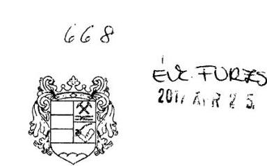

# ÖZD VÁROS ÖNKORMÁNYZATA 

H-3600 Özd, Városház tér 1. Telefon: (48) 574-111 | Fax:|48| 574-198 Email: janiczak.david@ozd.hu

JANICZAK DÁVID
Özd város polgármestere

Állami Számvevőszék
T.

Domokos László
Elnök Úr részére

BUDAPEST 4.
Ikt. szám:
V-1257-058/2016.
Pf.: 54
1364

Tisztelt Elnök Úr!
Az „Önkormányzatok belső kontrollrendszere - Az önkormányzatok belső kontrollrendszere kialakításának és múködtetésének ellenőrzése - Özd" címú, fenti iktatási szám alatt megküldött jelentéstervezet megállapításaira, a törvényben megadott határidőben, az alábbi észrevételeket kívánom tenni:

Az Állami Számvevőszék vizsgálata túlnyomórészt, közel 75\%-ban a 2011-2015 közötti időszakban az önkormányzati befektetések vizsgálatára irányult. Özd Város Önkormányzatának 2011-2015 években pénzkiadással járó befektetési tevékenysége nem volt. Az Önkormányzat egyetlen OTP befektetési jeggyel rendelkezik, melynek értéke 10.795 ezer forint. Ezen befektetési jegynek a megvásárlása 2008. előtt történt. Az Önkormányzat a 2015-ös magyarországi brókerbotrányban semmilyen formában nem volt érintett. Megítélésem szerint ebből az következik, hogy sem az előző ciklusban - amely a vizsgálati időszak $80 \%$-át teszi ki -, sem pedig a vizsgált időszak $20 \%$-át kitevő 2015-ös évben, ezen a területen a vagyonát érintő kockázat nem merült föl. Az Önkormányzat mindkét ciklusban csak biztonságosnak tekinthető pénzügyi tevékenységet végzett, szabad forrásait nem kockáztatta. Ami az Önkormányzat gazdasági társaságokban való tulajdoni részesedését illeti, arra vonatkozó tevékenysége a jogszabályi előírásoknak megfelelően történt.

---

# I. 

1. A vizsgált időszakban az Önkormányzat befektetési tevékenysége az alábbi elemekből tevődött össze:

- Önkormányzatunk 10.795 ezer forint névértékủ OTP befektetési jeggyel rendelkezett, amelynek megvásárlására 2008. előtt került sor. Ezekkel a befektetési jegyekkel a vásárlást követően az Önkormányzat semmilyen pénzügyi tranzakciót nem végzett, azt csupán könyveiben kimutatta.
- Az üzleti célú befektetési állomány olyan gazdasági társaságokban való részesedésben (üzletrész, szövetkezeti részjegy) testesült meg, amelyek vagy 100\%-os mértékű önkormányzati tulajdonban vannak (Özdi Vízmú Kft., Özdi Kommunikációs Nonprofit Kft., ÖZDSZOLG Nonprofit Kft.), vagy nem kizárólagosan önkormányzati tulajdonúak, de kötelező önkormányzati feladatot látnak el (Özdi Hulladékgazdálkodási Kft., BORSODVÍZ Zrt.). A két szociális szövetkezetben meglévő részjegy minimális értékű ( 79 illetve 40 ezer forint névértékű), ezek a szociális szövetkezetek elsősorban önkormányzati kezdeményezésre, foglalkoztatási céllal jöttek létre. Látható, hogy a 100\%-os önkormányzati tulajdonú gazdasági társaságok esetében az üzleti döntések meghozatala az önkormányzat, mint egyedüli tag kompetenciájába tartozik, míg egyéb társasági tagság esetén éppen az egyéb tag személye, vagy a kis összegű részesedés garantálja a befektetés alacsony üzleti kockázatát.
- A betétlekötések esetében is szinte kizárt az üzleti kockázat, hiszen mind a régi, mind az új Ptk. betétszerződésre vonatkozó rendelkezései kamatfizetési kötelezettséget írnak elő a bank számára, aki a pénzösszeget egy későbbi időpontban köteles visszafizetni a betétes részére. A betétes a betét összegének visszafizetését a szerződésben meghatározott idő előtt is jogosult kérni, és azt a bank köteles visszafizetni. Fontos megjegyezni, hogy az Önkormányzat folyószámláit az OTP Bank Nyrt.-nél vezeti, amely nyilvánvalóan hazánk egyik legtökeerősebb és legmegbízhatóbb pénzintézete. Ilyenformán a betétlekötések pénzügyi kockázata szinte a nullával egyelő.

Maga a jelentés-tervezet is megfogalmazza, hogy mind a befektetési jegy vásárlásakor, mind a gazdasági társaságok jegyzett tőkéjével kapcsolatos döntések meghozatalakor az Önkormányzat Képviselő-testülete a jogszabályoknak megfelelően hozott döntést, és azok végrehajtása is törvényszerú volt, azaz a kontrollrendszer hiányosságai ellenére a befektetési tevékenységek döntő többségükben szabályszerűek voltak.

Mindezekre tekintettel, véleményem szerint az 1. számú összegző megállapítás úgy felel meg a valóságnak, hogy a befektetési tevékenységek szabályszerű végzését a belső kontrollrendszer kialakítása és múködtetése ugyan nem támogatta, de az Önkormányzat befektetési szokásai, gyakorlata, valamint a szabályszerű múködés és döntés-végrehajtás következtében egy esetleges kár bekövetkezésének reális veszélye nem állt fenn.

---

2. A 2. számú összegző megállapítás első bekezdés 1. pontjához észrevételem, hogy az nem felel meg a valóságnak, hiszen Ózd Város Önkormányzata 4/2013.(II.27) önkormányzati rendeletében szabályozza Szervezeti és Múködési Szabályzatát, melynek 52.§ (2) bekezdése kimondja, hogy a jegyző gondoskodik az Önkormányzat munkájával összefüggő, az Mötv. 81.§ (3) bekezdésében meghatározott feladatok ellátásáról. Az idézett törvényi rendelkezés e) pontja a tevékenységek körében felsorolja a jegyző jelzési kötelezettségét, amennyiben jogszabálysértést észlel. Az SZMSZ ezzel a visszautaló szabállyal tehát tartalmazza a jegyző jelzési kötelezettségét.
3. A 2. számú megállapítás első bekezdés 5. pontja fogalmazza meg, hogy meg kell alkotni a köztisztviselőkre vonatkozó hivatás etikai alapelveket. Itt szeretném jelezni, és ezt a vizsgálat során is jeleztük többször, hogy Ózd Város Önkormányzatának Képviselő-testülete 2016. október 27. napján a 212/2016.(X.27.) határozatával a hivatásetikai alapelveket elfogadta.
4. A 2. számú megállapítás utolsó bekezdéséhez kapcsolódóan - amely az integritás szemléletről szól - szeretném hangsúlyozni, hogy Ózd Város Önkormányzata az önkéntesség elve alapján részt vett az Önök által összeállított integritás kérdőív kitöltésében, bizonyítva azt, hogy Önkormányzatunk elkötelezett a korrupció elleni küzdelemben, és igyekszik profitálni az Állami Számvevőszék által ezen felmérés alapján kiadott tanulmányokból és jelen vizsgálat megállapításaiból is.
5. A 3. számú összegző megállapítással túlnyomórészt egyetértek, a megállapítás negyedik bekezdéséhez viszont - amely a jogszabályellenes felhatalmazás kifejezést használja - szeretném megjegyezni, hogy ez a tevékenység azonnali reagálást igénylő, operatív intézkedéseket feltételez, amelynek végrehajtása, figyelembe véve a választott tisztségviselők, valamint bizottságok összetételét és múködését, rendkívül nehezen oldható meg. Az elmúlt években ezen napi operatív pénzgazdálkodás eredményeként az Önkormányzat vagyona jelentősen, az elmúlt három évet tekintve közel 80 millió forinttal növekedett. Ez számomra azt jelenti, hogy a belső kontrollrendszer céljai pontosan azáltal valósultak meg, hogy a gyors intézkedések következtében sikerült megvédeni az Önkormányzat erőforrásait a veszteségektől. Jobb meggyőződésünk ellenére az Önök által javasolt módosítást jelen levelem megírása előtt egy nappal a Képviselő-testület elé terjesztettem, és a Képviselő-testület azon jogszabályi rendelkezést, amely a Pénzügyi Osztályvezető Önök által kifogásolt feladat- és hatáskörét szabályozta, hatályon kívül helyezte.
6. A 4. számú összegző megállapítással kapcsolatban meg kívánom jegyezni, hogy az OTP befektetési jegyek több mint tíz éve vannak változatlan névértéken az Önkormányzat tulajdonában. A befektetési jegyek folyamatosan, minden évben szerepelnek a főkönyvi könyvelésben és az önkormányzat mérlegében. A befektetési jegyek állományáról a pénzintézet a tárgyévet követően értesítőt küld. A főkönyvi kivonattal történő egyeztetésről és a leltárról a tárgyévet követően jegyzőkönyv készül. Mindezek alapján véleményem az, hogy az egyes befektetések számviteli elszámolása, nyilvántartása biztosított.

---

# II. 

Az Önök által részemre megfogalmazott javaslatok vonatkozásában a következő észrevételeket teszem:

1. Az előzőekben kifejtettek alapján kérem az 1. számú javaslat törlését, hiszen az az Önkormányzat SZMSZ-ében szerepel.
2. A 2. számú ponttal kapcsolatban, tekintettel arra, hogy a Polgármesteri Hivatal rendelkezik SZMSZ-szel, a meglévő SZMSZ módosításáról tudok gondoskodni, az Önök által leírtaknak megfelelően.
3. Kérem a javaslat 3. pontjánál figyelembe venni, hogy a hivatásetikai alapelvekkel az Önkormányzat rendelkezik, így ezen javaslatnak a megvalósítása okafogyottá vált.
4. A végleges jelentés birtokában a 4. pontban foglalt intézkedések megtételéről gondoskodom.

## Tisztelt Elnök Úr!

Végezetül szeretném megköszönni Önnek és munkatársainak a munkáját, amelyből meggyőződésem szerint, a jövőre nézve hasznos következtetéseket tudtunk levonni. Bízom benne, hogy az észrevételemben foglaltakat a végleges jelentés elkészítése során megfontolják és elfogadják.

Ózd, 2017. április 21.

Tisztelettel:
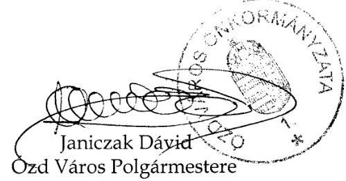

---

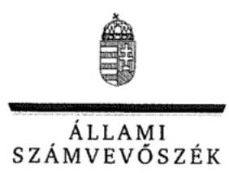

ELNÖK

Ikt. szám: V-1257-068/2016.

# Janiczak Dávid úr 

polgármester
Özd Város Önkormányzata

## Özd

## Tisztelt Polgármester Úr!

Köszönettel megkaptam „Önkormányzatok belső kontrollrendszere - Az önkormányzatok belső kontrollrendszere kialakításának és müködtetésének ellenörzése - Özd" címủ jelentéstervezet megállapításaira elkészített észrevételét.

Az ellenőrzési megállapításokra vonatkozó észrevételét az Állami Számvevőszékről szóló 2011. évi LXVI. törvény (a továbbiakban: ÁSZ tv.) 29. § (2) bekezdésében meghatározott tizenöt napos határidőn belül küldte meg. Az Állami Számvevőszék észrevétellel kapcsolatos álláspontját a mellékletként csatolt, a felügyeleti vezető által készített indokolás tartalmazza. Tájékoztatom, hogy az ÁSZ tv. 29. § (3) bekezdése szerint a figyelembe nem vett észrevételeket az ÁSZ a jelentésben feltünteti az észrevétel elutasításának indokolásával együtt.

Budapest, 2017.
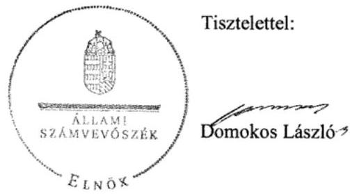

Melléklet: Észrevételre adott válasz

---

# „Önkormányzatok belsö kontrollrendszere - Az önkormányzatok belsö kontrollrendszere kialakításának és müködtetésének ellenörzése - Özd" című jelentéstervezetre tett észrevételekre adott válasz 

|  | 1. számú összegző megállapítás   Megállapítás: 2011. január 1. és 2015. december 31. közötti időszakban a belső kontrollrendszer kialakításának és müködtetésének hiányosságai következtében nem volt biztosított a közvagyon biztonságos és körültekintő befektetése.   Észrevétel (1): Az észrevétel szerint a 2008. előtt megvásárolt befektetési jegyekkel a vásárlást követően az Önkormányzat semmilyen pénzügyi tranzakciót nem végzett. Az üzleti célú befektetési állomány olyan gazdasági társaságokban való részesedésekben testesült meg, amelyek vagy $100 \%$-os mértékủ önkormányzati tulajdonban vannak, vagy nem kizárólagosan önkormányzati tulajdonúak, de kötelező önkormányzati feladatot látnak el. A két szociális szövetkezetben meglévő részjegy minimális értékủ. Az észrevétel szerint a $100 \%$-os önkormányzati tulajdonú gazdasági társaságok esetében az üzleti döntések meghozatala az önkormányzat kompetenciájába tartozik, míg egyéb tagság esetén éppen az egyéb tag személye, vagy a kis összegű részesedés garantálja a befektetés alacsony üzleti kockázatát. Az észrevétel szerint az 1. számú összegző megállapítás úgy felel meg a valóságnak, hogy a belső kontrollrendszer kialakítása és müködtetése ugyan nem támogatta a befektetési tevékenység szabályszerű végzését, de az önkormányzat befektetési szokásai, gyakorlata, valamint a szabályszerű működés és döntés végrehajtás következtében egy esetleges kár bekövetkezésének reális veszélye nem állt fenn. |
| :--: | :--: |
| Válasz: | Az Állami Számvevőszék az észrevételt nem fogadja el. |
| Indoklás: | A jelentéstervezet 1. számú megállapításaihoz tett észrevételek a belső kontrollrendszer kialakításának és müködtetésének hiányosságait nem vitatják. Az észrevételben jelzett összegző következtetések a jelentéstervezet 1. számú megállapítását alátámasztó bekezdéseken, illetve a Főbb megállapítások, következtetések fejezetben foglaltakon alapulnak (az Önkormányzatnál eltérő szabályozási tartalommal határozták meg a pénzeszközök felhasználását, kockázatkezelési rendszert nem müködtettek, a befektetések vonatkozásában nem biztosították a folyamatba épített előzetes és utólagos vezetői ellenőrzést, illetve a külső és belső ellenőrzések a befektetési tevékenység végzésére nem terjedtek ki. Az információs és kommunikációs rendszer nem biztosította a megfelelő, naprakész információk rendelkezésre állását). A következtetést megalapozó megállapításokat az észrevétel nem vitatta, ezért a következtetés módosítása nem indokolt. |

---

| Észrevétel: | 2. számú összegző megállapítást követő 1. bekezdés 1. pontja   Megállapítás: az Önkormányzati SZMSZ3 ban ${ }^{1}$ és a Magyarország helyi önkormányzatairól szóló 2011. évi CLXXXIX. törvény (a továbbiakban: Mötv.) 53. § (1) bekezdés k) pontjában foglaltak ellenére nem rendelkeztek a Jegyzőnek a jogszabálysértő döntések, müködés jelzésére irányuló kötelezettségéről.   Észrevétel (2): az Önkormányzati SZMSZ3 52. § (2) bekezdése tartalmazza, hogy a jegyző gondoskodik a Mötv. 81. § (3) bekezdésében meghatározott feladatok ellátásáról, amelynek e) pontja tartalmazza a jegyző jogszabálysértés észlelése esetén a jelzési kötelezettségét. Az SZMSZ3 ezzel a visszautaló szabállyal tehát tartalmazza a jegyző jelzési kötelezettségét. |
| :--: | :--: |
| Válasz: | Az Állami Számvevőszék az észrevételt elfogadja. |
| Indoklás: | A dokumentumok újbóli áttekintése alapján megállapítást nyert, hogy az Önkormányzati SZMSZ3-ban rendelkeztek a Mőtv. 53. § (1) bekezdés k) pontja szerint a jegyzőnek a jogszabálysértő döntések, müködés jelzésére irányuló kötelezettségéről, mert az Önkormányzati SZMSZ3 52. § (2) bekezdése tartalmazta a Mötv. 81.§ (3) bekezdésében meghatározott feladatokra történő hivatkozást, amelynek e) pontja nevesíti a feladatot. A megállapítást, és ennek alapján a polgármesternek címzett 1. számú és a jegyzőnek címzett 2 . számú javaslatot a jelentéstervezetből töröltük. |
| Észrevétel: | 2. számú összegző megállapítást követő 1. bekezdés 5. pontja   Megállapítás: a köztisztviselőkre vonatkozó hivatásetikai alapelveket, valamint az etikai eljárás szabályait a Köztisztviselők jogállásáról szóló 2011. évi CXCIX. törvény 231. § (1) bekezdésében foglaltakkal ellentétben a Képviselő-testület nem állapította meg.   Észrevétel (3): Az önkormányzat Képviselő-testülete 2016. október 27. napján a 212/2016.(X.27.) határozatával a hivatásetikai alapelveket elfogadta. |
| Válasz: | Az Állami Számvevőszék az észrevételt nem fogadja el. |
| Indoklás: | Az észrevételben jelzett szabályozást - abból adódóan, hogy az ellenőrzött időszakot követően keletkezett és a keletkezését megelőző időszakra a jogalkotásról szóló 2010. évi CXXX. törvény 2. § (2) bekezdése alapján jogszabály a hatálybalépését megelőző időre nem állapíthat meg kötelezettséget - nem lehetett az ellenőrzés során figyelembe venni, tekintettel arra, hogy a 2015. évben a belső kontrollrendszer kialakítása és müködtetése szabályszerűségére vonatkozó megállapítások a 2015. január 1. és december 31 közötti időszakban hatályos szabályozások figyelembevételével történt. Az ellenőrzött időszakot követően keletkezett dokumentumok meglétét, jogszabályi előírásoknak való megfelelőségét a jelentésben nem értékeltük. |

[^0]
[^0]:    ${ }^{1}$ Ózd Város Önkormányzata Képviselő-testületének 4/2013. (II. 27.) rendelete Ózd Város Önkormányzata Képviselő-testületének Szervezeti és Müködési Szabályzatáról

---

|  | 2. számú megállapítás utolsó bekezdés   Megállapítás: Az integritás szemlélet érvényesitését az Önkormányzat belső kontrollrendszerének kialakítása és müködtetése nem támogatta. Az Önkormányzat részt vett az ÁSZ integritás szemlélet érvényesülésének 2015. évi felmérésében, így az értékeléshez a felmérésben szolgáltatott adatokat vettük figyelembe. Az értékelés eredményét a II. számú mellékletben mutatjuk be.   Észrevétel (4): Az önkormányzat az önkéntesség elve alapján vett részt az ÁSZ integritás kérdőív kitöltésében, bizonyítva azt, hogy elkötelezett a korrupció elleni küzdelemben. |
| :--: | :--: |
| Válasz: | Az Állami Számvevőszék az észrevételt nem fogadja el. |
| Indoklás: | Az észrevétel a megállapítást - miszerint a belső kontrollrendszer kialakítása és müködtetése nem támogatta az integritás szemlélet érvényesitését - nem vitatta. |
|  | 3. számú összegző megállapítást követő 4. bekezdés   Megállapítás: A betétlekötésekre a szerződéskötést - figyelmen kívül hagyva, hogy a helyi önkormányzatokról szóló 1990. évi LXV. törvény 9. § (3) és a Mötv. 41. § (4) és (5) bekezdései ellenére a képviselő-testület által a polgármesterre átruházott döntési hatáskör tovább nem ruházható - a jogszabállyal ellentétes felhatalmazással a Pénzügyi osztályvezető hajtotta végre.   Észrevétel (5): A tevékenység azonnali reagálást igénylő, operatív intézkedéseket feltételez, amelynek végrehajtása rendkívül nehezen oldható meg. A megállapítás hatására a Képviselő-testület hatályon kívül helyezte azt a rendelkezést, amely a pénzügyi osztályvezető feladat- és hatáskörét jogszabállyal ellentétes módon szabályozta. |
| Válasz: | Az Állami Számvevőszék az észrevételt nem fogadja el. |
| Indoklás: | A megállapítást nem vitatták. Az észrevételben jelzett szabályozás hatályon kívül helyezését - abból adódóan, hogy az ellenőrzött időszakot követően történt - nem lehetett az ellenőrzés során figyelembe venni, tekintettel arra, hogy a 2015. évben a belső kontrollrendszer kialakítása és müködtetése szabályszerűségére vonatkozó megállapítások a 2015. január 1. és december 31 közötti időszakban hatályos szabályozások figyelembevételével történt. A hatályon kívül helyezett szabályozást követő betétlekötésre vonatkozó szerződéskötés gyakorlatát utóellenőrzés keretében van lehetőség értékelni. |
|  | 4. számú összegző megállapítás   Megállapítás: A befektetések analitikus és részletező nyilvántartásainak hiányos vezetése miatt nem volt biztosított a fökönyvi könyvelés, az analitikus nyilvántartás, a bizonylatok adatai közötti egyeztetés és az ellenőrzés lehetősége.   Észrevétel (6): A befektetési jegyek több mint tíz éve vannak változatlan névértéken a tulajdonukba, és minden évben szerepelnek a fökönyvi könyvelésben és a mérlegben. A fökönyvi kivonattal történő egyeztetésről és a leltárról jegyzőkönyv készül, amely alapján a befektetések számviteli elszámolása, nyilvántartása biztosított. |
| Válasz: | Az Állami Számvevőszék az észrevételt nem fogadja el. |

---

| Indoklás: | Az észrevételben nem kifogásolták a befektetések analitikus (részletező) nyilvántartásainál feltárt hiányosságokat. A hiányosságok miatt helytálló az a megállapítás, hogy a Számvitelről szóló 2000. évi C. törvény 165. § (4) bekezdésében foglaltak ellenére nem volt biztosított a fökönyvi könyvelés, az analitikus nyilvántartás és a bizonylatok adatai közötti egyeztetés és ellenőrzés lehetősége. |
| :--: | :--: |
| Észrevétel: | Polgármester részére megfogalmazott javaslatok   Észrevétel: Az 1. és 3. számú javaslat törlését az észrevételben foglaltak alapján kérik. A 2. számú javaslatnál a Hivatal rendelkezik SZMSZ-el, ezért csak a meglevő szabályozás módosításáról lehet gondoskodni. A végleges jelentés birtokában a 4. számú javaslatban foglalt intézkedések megtételét vállalják. |
| Válasz: | Az Állami Számvevőszék az észrevételt részben fogadja el. |
| Indoklás: | A polgármesternek címzett 1. számú javaslatot az észrevétel 2. pontjában foglaltak alapján töröltük. A polgármesternek címzett 2. számú javaslatnál nincs relevanciája, hogy a polgármester a meglévő Hivatali SZMSZ módosítása alapján, vagy új szervezeti és müködési szabályzat jóváhagyásával tesz eleget a javaslatban foglaltaknak, ezért a javaslatot nem pontosítjuk. A polgármesternek címzett 3. számú javaslatot továbbra is fenntartjuk az észrevétel 3. pontjára adott indoklás miatt. A polgármesternek címzett 4. számú javaslatot fenntartjuk, tekintettel arra, hogy azzal kapcsolatban észrevételt nem tettek. |

Tájékoztatom Polgármester Urat, hogy az Állami Számvevőszékről szóló 2011. évi LXVI. törvény 29. § (3) bekezdése alapján az Állami Számvevőszék a figyelembe nem vett észrevételeket köteles a jelentésben feltüntetni, és megindokolni, hogy azokat miért nem fogadta el.

Budapest, 2017. Or hónap $\mu$. nap
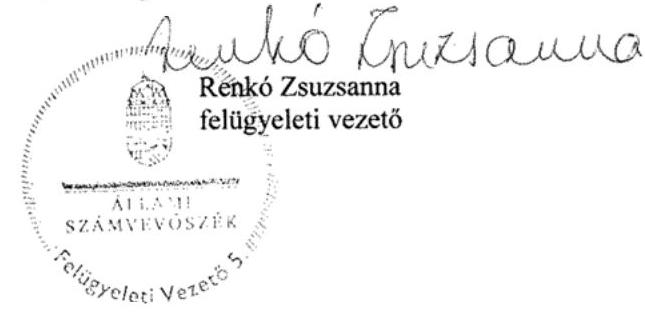

---

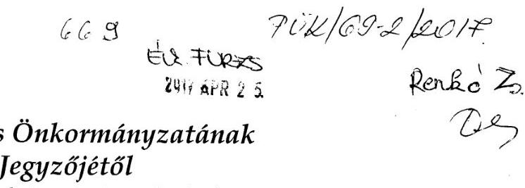

# Özd Város Önkormányzatának 

## Jegyzöjétöl

3600 Ózd, Városház tér 1., tel.: (48) 574-100

## Állami Számvevőszék   T.   Domokos László   Elnök Úr részére

BUDAPEST 4.
Pf.: 54
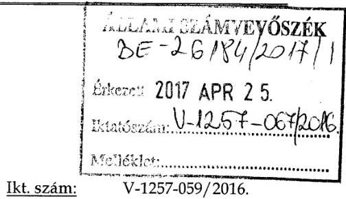

Ikt. szám:
V-1257-059/2016.

## 1364

## Tisztelt Elnök Úr!

Az „Önkormányzatok belső kontrollrendszere - Az önkormányzatok belső kontrollrendszere kialakításának és múködtetésének ellenőrzése - Ózd" címú, fenti iktatási szám alatt megküldött jelentéstervezet megállapításaira, a törvényben megadott határidőben, az alábbi észrevételeket kívánom tenni:

## I. Észrevételek a jelentés-tervezet megállapításaihoz

## Az 1. számú összegző megállapításhoz:

A vizsgált időszakban az Önkormányzat befektetési tevékenysége az alábbi elemekből tevődött össze:

- Önkormányzatunk 10.795 ezer forint névértékủ OTP befektetési jeggyel rendelkezett, amelynek megvásárlására 2008 előtt került sor. Ezekkel a befektetési jegyekkel a vásárlást követően az Önkormányzat semmilyen pénzügyi tranzakciót nem végzett, azt csupán könyveiben kimutatta.
- Az üzleti célú befektetési állomány olyan gazdasági társaságokban való részesedésben (üzletrész, szövetkezeti részjegy) testesült meg, amelyek vagy 100\%-os mértékủ önkormányzati tulajdonban vannak (Özdi Vízmú Kft., Özdi Kommunikációs Nonprofit Kft., ÖZDSZOLG Nonprofit Kft.), vagy nem kizárólagosan önkormányzati tulajdonúak, de kötelező önkormányzati feladatot látnak el (Özdi Hulladékgazdálkodási Kft., BORSODVÍZ Zrt.). A két szociális szövetkezetben meglévő részjegy minimális értékủ ( 79 illetve 40 ezer forint névértékủ), ezek a szociális szövetkezetek elsősorban önkormányzati kezdeményezésre, foglalkoztatási céllal jöttek létre. Látható, hogy a 100\%-os önkormányzati tulajdonú gazdasági társaságok esetében az üzleti döntések meghozatala az önkormányzat, mint egyedüli tag kompetenciájába tartozik,

---

míg egyéb társasági tagság esetén éppen az egyéb tag személye, vagy a kis összegű részesedés garantálja a befektetés alacsony üzleti kockázatát.

- A betétlekötések esetében is szinte kizárt az üzleti kockázat, hiszen mind a régi, mind az új Ptk. betétszerződésre vonatkozó rendelkezései kamatfizetési kötelezettséget írnak elő a bank számára, aki a pénzösszeget egy későbbi időpontban köteles visszafizetni a betétes részére. A betétes a betét összegének visszafizetését a szerződésben meghatározott idő előtt is jogosult kérni, és azt a bank köteles visszafizetni. Fontos megjegyezni, hogy az Önkormányzat folyószámláit az OTP Bank Nyrt.-nél vezeti, amely nyilvánvalóan hazánk egyik legtökeerősebb és legmegbízhatóbb pénzintézete. Ilyenformán a betétlekötések pénzügyi kockázata szinte a nullával egyelő.

Maga a jelentés-tervezet is megfogalmazza, hogy mind a befektetési jegy vásárlásakor, mind a gazdasági társaságok jegyzett tőkéjével kapcsolatos döntések meghozatalakor az Önkormányzat Képviselő-testülete a jogszabályoknak megfelelően hozott döntést, és azok végrehajtása is törvényszerű volt, azaz a kontrollrendszer hiányosságai ellenére a befektetési tevékenységek döntő többségükben szabályszerűek voltak.

Mindezekre tekintettel, véleményem szerint az 1. számú összegző megállapítás úgy felel meg a valóságnak, hogy a befektetési tevékenységek szabályszerű végzését a belső kontrollrendszer kialakítása és múködtetése ugyan nem támogatta, de az Önkormányzat befektetési szokásai, gyakorlata, valamint a szabályszerű múködés és döntés-végrehajtás következtében a kár bekövetkezésének reális veszélye nem állt fenn.

# A 2. számú megállapításhoz: 

a.) Az első bekezdés (kontrollkörnyezet) 1. pontjához észrevételem, hogy Ózd Város Önkormányzatának Képviselő-testülete a 4/2013.(II.27) önkormányzati rendeletében határozta meg Szervezeti és Múködési Szabályzatát, melynek 52.§ (2) bekezdése kimondja, hogy a jegyző gondoskodik az Önkormányzat munkájával összefüggő, az Mötv. 81.§ (3) bekezdésében meghatározott feladatok ellátásáról. Az idézett törvényi rendelkezés e) pontja a tevékenységek körében felsorolja a jegyző jelzési kötelezettségét, amennyiben jogszabálysértést észlel. Az SZMSZ ezzel a visszautaló szabállyal tehát tartalmazza a jegyző jelzési kötelezettségét.
b.) Az első bekezdés 5. pontja fogalmazza meg, hogy meg kell alkotni a köztisztviselőkre vonatkozó hivatás etikai alapelveket. Itt szeretném jelezni, és ezt a vizsgálat során is jeleztük többször, hogy Ózd Város Önkormányzatának Képviselő-testülete 2016. október 27. napján a 212/2016.(X.27.) határozatával a hivatásetikai alapelveket elfogadta.
c.) A 2. számú megállapítás kockázatkezelési rendszerre vonatkozó bekezdéséhez kapcsolódóan meg kívánom jegyezni, hogy Ózd Város Önkormányzata rendelkezik - és a vizsgált időszakban is rendelkezett - kockázatkezelési szabályzattal, mely részletesen szabályozza a kockázat fogalmát, a

---

kockázatkezelés rendjét, valamint a kockázatkezelés folyamatát. A kockázatkezelési szabályzatban foglaltakat az Önkormányzat és a Polgármesteri Hivatal a döntés előkészítés és a végrehajtás során folyamatosan érvényesíti.
d.) A 2. számú megállapítás információs és kommunikációs rendszerre vonatkozó megállapításai - a második bekezdés kivételével - nem felelnek meg a valóságnak. Ahogyan azt a 2016. október 14-én az ÁSZ részére tett nyilatkozatom 3. pontja is tartalmazza, írásos kommunikációs stratégiával ugyan nem rendelkezett az Önkormányzat és a Polgármesteri Hivatal, de az egyes kötelező feladatok kommunikációja, illetve az azokhoz való hozzáférés az önkormányzat honlapján, illetve a belső kommunikációs felületen megtalálhatók.
A Polgármesteri Hivatal SZMSZ-e meghatározza a belső kapcsolattartás legfőbb formáit: dolgozói értekezlet évente legalább egy alkalommal, eseti munkacsoport értekezlet szükség szerint, munkaértekezlet osztályvezetőknek, osztályértekezlet, valamint a Polgármesteri Hivatal belső honlapján keresztül napi információi áramlás. Ezáltal a Bkr. 9. § (1) bekezdésével összhangban a megfelelő információk a megfelelő időben eljutnak az illetékes szervezethez, szervezeti egységhez, illetve személyhez.

A közzétételi kötelezettség rendjéről a vizsgált időszakban a 10/2013. (VII.22.) jegyzői utasítás rendelkezett, mely az ÁSZ vizsgálathoz megküldésre került.

A 2015. évi költségvetés és beszámoló a város honlapján a rendeletek között megtalálható, az Info tv. szabályainak megfelelő közzétételi kötelezettségének az Önkormányzat eleget tett.
e.) A belső kontrollrendszerrel és az integritás szemlélettel kapcsolatos megállapításokkal kapcsolatban a következők szerint kívánok észrevételt tenni.
A Bkr. 1. számú melléklete szerinti jegyzői nyilatkozat a valóságnak megfelel, mivel az Önkormányzatnál a nyilatkozatban leírt folyamatok a gyakorlatban múködnek és a vizsgált időszakban is múködtek. A belső kontrollrendszer múködéséről rendelkezett a korábban már említett Szervezeti és Múködési Szabályzat, a kockázatkezelési szabályzat, a közzétételi kötelezettségről rendelkező jegyzői utasítás, ezen kívül szabályozásra került a közérdekú adatok megismerésének rendje. Az egyes tevékenységek monitoringozására az Önkormányzat és a Polgármesteri Hivatal belső szabályzattal nem rendelkezik, ezeket a feladatokat az Önkormányzat egyes bizottságai a határozat elfogadása előtt írásban, esetenként szóban végzik.

Megítélésem szerint nem felel meg a valóságnak a jelentés tervezet azon megállapítása, miszerint a belső ellenőrzés 2015. évi összefoglaló jelentésében a belső kontrollrendszer múködését nem teljes körűnek értékelték, tekintettel arra, hogy az Önök számára is megküldött vezetői összefoglaló egyrészt nem tartalmaz ilyen sommás megállapítást, de ha a jelentés egészét is vizsgáljuk, ez az állítás azért sem igaz, mert az összefoglaló belső jelentés nem csak az ellenőrzés tárgyául szolgáló Önkormányzatra és Polgármesteri Hivatalra terjed ki, hanem az egész önkormányzati intézményrendszerre (intézmény és gazdasági társaság, összesen 13). Kérem a jelentés ezen részének a vezetői összefoglaló szerinti módosítását.

---

Az Önkormányzat csalás és korrupciós kockázatok felmérésére vonatkozóan külön dokumentummal nem rendelkezik, viszont az egyes önkormányzati döntések hatástanulmányánál, illetve az előkészítés folyamatában ennek veszélye elemzés és értékelés alá esik. Az integritás melletti elköteleződésünket bizonyítja az ÁSZ 2015. évi integritás felmérésében való önkéntes részvétel is.
Az Önkormányzat és a Polgármesteri Hivatal a beszámolási rendszert (szintek, határidők, módok) írásban nem szabályozta, az egyes állami intézmények felé kötelezően teljesítendő adatszolgáltatást, beszámolást azonban a jogszabályok alapján teljesítjük, így nem helytálló az a megállapítás, hogy a közpénzfelhasználás szabályossága, a nemzeti vagyonnal való felelős gazdálkodás nem volt biztosított, hiszen a magasabb rendú jogszabályok alkalmazása és betartása önmagában is biztosítja a közpénzfelhasználás és nemzeti vagyonnal való gazdálkodás szabályosságát. Véleményem szerint - és ezt több évtizedes gyakorlati tapasztalaton alapul - meghatározott szabályzatok esetleges hiánya minden kétséget kizáróan nem okozza - nem okozhatja - azt a tényt, hogy a nemzeti vagyonnal való gazdálkodás és a közpénzfelhasználás nem szabályos. A tényeket és az eredményeket kell ezen megállapításnál figyelembe venni. (Ha valakinek lejárt a vezetői engedélye, de több éve vezet, azért még tud vezetni.)

# A 3. számú összegző megállapításhoz: 

A 3. számú összegző megállapítással túlnyomórészt egyetértek, a megállapítás negyedik bekezdéséhez viszont - amely a jogszabályellenes felhatalmazás kifejezést használja - szeretném megjegyezni, hogy ez a tevékenység azonnali reagálást igénylő, operatív intézkedéseket feltételez, amelynek végrehajtása, figyelembe véve a választott tisztségviselők, valamint bizottságok összetételét és múködését, rendkívül nehezen oldható meg. Az elmúlt években ezen napi operatív pénzgazdálkodás eredményeként az Önkormányzat vagyona jelentősen, az elmúlt három évet tekintve közel 80 millió forinttal növekedett. Ez számomra azt jelenti, hogy a belső kontrollrendszer céljai pontosan azáltal valósultak meg, hogy a gyors intézkedések következtében sikerült megvédeni az Önkormányzat erőforrásait a veszteségektől. Az Önök által javasolt módosítást jelen levelem megírása előtt egy nappal a Polgármester a Képviselő-testület elé terjesztette, és a Képviselő-testület azon jogszabályi rendelkezést, amely a Pénzügyi Osztályvezető Önök által kifogásolt feladat- és hatáskörét szabályozta, hatályon kívül helyezte.

## A 4. számú összegző megállapításhoz:

A 4. számú összegző megállapítással kapcsolatban meg kívánom jegyezni, hogy az OTP befektetési jegyek közel tíz éve vannak változatlan névértéken az Önkormányzat tulajdonában. A befektetési jegyek folyamatosan, minden évben szerepelnek a főkönyvi könyvelésben és az önkormányzat mérlegében. A befektetési jegyek állományáról a pénzintézet a tárgyévet követően értesítőt küld. A főkönyvi kivonattal történő egyeztetésről és a leltárról a tárgyévet követően jegyzőkönyv készül, melyet az ÁSZ ellenőrzéshez is megküldtünk.

---

# II. Észrevételek a jelentés-tervezet javaslataihoz: 

1. Az 1. számú javaslattal kapcsolatban a korábbiakban észrevételeztem, hogy a jegyző jelzési kötelezettségét a Képviselő-testület szervezeti és múködési szabályzata tartalmazza.
2. A 2. számú javaslattal kapcsolatban, tekintettel arra, hogy a Polgármesteri Hivatal rendelkezik SZMSZ-szel, a meglévő SZMSZ módosításáról tudok gondoskodni, és azt - jóváhagyás érdekében - a Képviselő-testület elé terjeszteni.
3. Kérem a javaslat 3. pontjánál figyelembe venni, hogy hivatásetikai alapelvekkel az Önkormányzat rendelkezik, így ezen javaslatnak a megvalósítása okafogyottá vált.
4. A végleges jelentés birtokában a 4. pontban foglalt intézkedések megtételéről gondoskodom.

Kérem, hogy az észrevételemben foglaltakat tanulmányozzák át, és az abban foglaltakat fogadják el.

Segítő munkájukat ezúton is köszönöm!
Ö z d, 2017. április 21.

Tisztelettel:
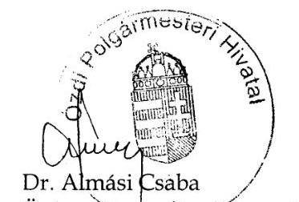

Özd Város Önkormányzatának Jegyzöje

---

ELKÖK

Ikt. szám: V-1257-069/2016.

# Dr. Almási Csaba úr 

jegyzó

Özdi Polgármesteri Hivatal

## Özd

## Tisztelt Jegyző Úr!

Köszönettel megkaptam „Önkormányzatok belső kontrollrendszere - Az önkormányzatok belső kontrollrendszere kialakításának és müködtetésének ellenörzése - Özd" címủ jelentéstervezet megállapításaira elkészített észrevételét.

Az ellenőrzési megállapításokra vonatkozó észrevételét az Állami Számvevőszékről szóló 2011. évi LXVI. törvény 29. § (2) bekezdésében meghatározott tizenöt napos határidőn belül küldte meg. Az Állami Számvevőszék észrevétellel kapcsolatos álláspontját a mellékletként csatolt, a felügyeleti vezető által készített indokolás tartalmazza. Tájékoztatom, hogy az ÁSZ tv. 29. § (3) bekezdése szerint a figyelembe nem vett észrevételeket az ÁSZ a jelentésben feltünteti az észrevétel elutasításának indokolásával együtt.

Budapest, 2017. 05 hónap 40 nap

Melléklet: Észrevételre adott válasz
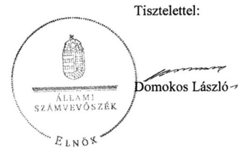

---

# „Önkormányzatok belsö kontrollrendszere - Az önkormányzatok belsö kontrollrendszere kialakításának és müködtetésének ellenörzése - Özd" címü jelentéstervezetre tett észrevételekre adott válasz 

|  | 1. számú összegző megállapítás   Megállapítás: 2011. január 1. és 2015. december 31. közötti időszakban a belső kontrollrendszer kialakításának és müködtetésének hiányosságai következtében nem volt biztosított a közvagyon biztonságos és körültekintő befektetése.   Észrevétel: Az észrevétel szerint a 2008. előtt megvásárolt befektetési jegyekkel a vásárlást követően az Önkormányzat semmilyen pénzügyi tranzakciót nem végzett. Az üzleti célú befektetési állomány olyan gazdasági társaságokban való részesedésekben testesült meg, amelyek vagy $100 \%$-os mértékủ önkormányzati tulajdonban vannak, vagy nem kizárólagosan önkormányzati tulajdonúak, de kötelező önkormányzati feladatot látnak el. A két szociális szövetkezetben meglévő részjegy minimális értékủ. Az észrevétel szerint a $100 \%$-os önkormányzati tulajdonú gazdasági társaságok esetében az üzleti döntések meghozatala az önkormányzat kompetenciájába tartozik, míg egyéb tagság esetén éppen az egyéb tag személye, vagy a kis öszszegủ részesedés garantálja a befektetés alacsony üzleti kockázatát. Az észrevétel szerint a betétlekötések esetében is szinte kizárt az üzleti kockázat, hiszen mind a régi, mind az új Ptk. betétszerződésre vonatkozó rendelkezései kamatfizetési kötelezettséget írnak elő a bank számára. Az észrevétel szerint az 1. számú összegző megállapítás úgy felel meg a valóságnak, hogy a belső kontrollrendszer kialakítása és müködtetése ugyan nem támogatta a befektetési tevékenység szabályszerű végzését, de az önkormányzat befektetési szokásai, gyakorlata, valamint a szabályszerű müködés és döntés végrehajtás következtében egy esetleges kár bekövetkezésének reális veszélye nem állt fenn. |
| :--: | :--: |
| Válasz: | Az Állami Számvevőszék az észrevételt nem fogadja el. |
| Indoklás: | A jelentéstervezet 1. számú megállapításaihoz tett észrevételek a belső kontrollrendszer kialakításának és müködtetésének hiányosságait nem vitatják. Az észrevételben jelzett összegző következtetések a jelentéstervezet 1. számú megállapítását alátámasztó bekezdéseken, illetve a Főbb megállapítások, következtetések fejezetben foglaltakon alapulnak (az Önkormányzatnál eltérő szabályozási tartalommal határozták meg a pénzeszközök felhasználását, kockázatkezelési rendszert nem müködtettek, a befektetések vonatkozásában nem biztosították a folyamatba épített előzetes és utólagos vezetői ellenőrzést, illetve a külső és belső ellenőrzések a befektetési tevékenység végzésére nem terjedtek ki. Az információs és kommunikációs rendszer nem biztosította a megfelelő, naprakész információk rendelkezésre állását). A következtetést megalapozó megállapításokat az észrevétel nem vitatta, ezért a következtetés módosítása nem indokolt. |

---

| Észrevétel: | 2. számú összegző megállapítást követő 1. bekezdés 1. pontja   Megállapítás: az Önkormányzati SZMSZ3-ban ${ }^{1}$ és a Magyarország helyi önkormányzatairól szóló 2011. évi CLXXXIX. törvény (a továbbiakban: Mötv.) 53. § (1) bekezdés k) pontjában foglaltak ellenére nem rendelkeztek a Jegyzőnek a jogszabálysértő döntések, müködés jelzésére irányuló kötelezettségéről.   Észrevétel (2/a): az Önkormányzati SZMSZ3 52. § (2) bekezdése tartalmazza, hogy a jegyző gondoskodik a Mötv. 81. § (3) bekezdésében meghatározott feladatok ellátásáról, amelynek e) pontja tartalmazza a jegyző jogszabálysértés észlelése esetén a jelzési kötelezettségét. Az Önkormányzati SZMSZ3 ezzel a visszautaló szabályal tehát tartalmazza a jegyző jelzési kötelezettségét. |
| :--: | :--: |
| Válasz: | Az Állami Számvevőszék az észrevételt elfogadja. |
| Indoklás: | A dokumentumok újbóli áttekintése alapján megállapítást nyert, hogy az Önkormányzati SZMSZ3-ban rendelkeztek a Mötv. 53. § (1) bekezdés k) pontja szerint a jegyzőnek a jogszabálysértő döntések, müködés jelzésére irányuló kötelezettségéről, mert az Önkormányzati SZMSZ3 52. § (2) bekezdése tartalmazta a Mötv. 81.§ (3) bekezdésében meghatározott feladatokra történő hivatkozást, amelynek e) pontja nevesíti a feladatot. A megállapítást, és ennek alapján a polgármesternek címzett 1. számú és a jegyzőnek címzett 2 . számú javaslatot a jelentéstervezetből töröltük. |
| Észrevétel: | 2. számú összegző megállapítást követő 1. bekezdés 5. pontja   Megállapítás: a köztisztviselőkre vonatkozó hivatásetikai alapelveket, valamint az etikai eljárás szabályait a Köztisztviselők jogállásáról szóló 2011. évi CXCIX. törvény 231. § (1) bekezdésében foglaltakkal ellentétben a Képviselő-testület nem állapította meg.   Észrevétel (2/b): Az önkormányzat Képviselő-testülete 2016. október 27. napján a 212/2016.(X.27.) határozatával a hivatásetikai alapelveket elfogadta. |
| Válasz: | Az Állami Számvevőszék az észrevételt nem fogadja el. |
| Indoklás: | Az észrevételben jelzett szabályozást - abból adódóan, hogy az ellenőrzött időszakot követően keletkezett és a keletkezését megelőző időszakra a jogalkotásról szóló 2010. évi CXXX. törvény 2. § (2) bekezdése alapján jogszabály a hatálybalépését megelőző időre nem állapíthat meg kötelezettséget - nem lehetett az ellenőrzés során figyelembe venni, tekintettel arra, hogy a 2015. évben a belső kontrollrendszer kialakítása és müködtetése szabályszerűségére vonatkozó megállapítások a 2015. január 1. és december 31 közötti időszakban hatályos szabályozások figyelembevételével történt. Az ellenőrzött időszakot követően keletkezett dokumentumok meglétét, jogszabályi előírásoknak való megfelelőségét a jelentésben nem értékeltük. |
| Észrevétel: | 2. számú megállapítás kockázatkezelési rendszerre vonatkozó bekezdés   Megállapítás: Kockázatkezelési rendszert A költségvetési szervek belső kontrollrendszeréről és belső ellenőrzéséről szóló 370/2011. (XII. 31.) Korm. rendelet (a továbbiakban: Bkr.) 7. § (1) bekezdésének előírásai ellenére nem müködtettek. A |

[^0]
[^0]:    ${ }^{1}$ Ózd Város Önkormányzata Képviselő-testületének 4/2013. (II. 27.) rendelete Ózd Város Önkormányzata Képviselő-testületének Szervezeti és Müködési Szabályzatáról

---

|  | Bkr. 7. § (2) bekezdésének elöírásai ellenére nem mérték fel és nem állapították meg az Önkormányzat és a Hivatal tevékenységében, gazdálkodásában rejlő kockázatokat, nem határozták meg az egyes kockázatokkal kapcsolatban szükséges intézkedéseket.   Észrevétel (2/c): Az önkormányzat a vizsgált időszakban rendelkezett kockázatkezelési szabályzattal, amelyben foglaltakat a döntés előkészités és a végrehajtás során folyamatosan érvényesíti. |
| :--: | :--: |
| Válasz: | Az Állami Számvevőszék az észrevételt nem fogadja el. |
| Indoklás: | A megállapítás nem a kockázatkezelési szabályzat hiányára, hanem a kockázatkezelési rendszer müködtetésére irányult. Müködtetésre vonatkozó dokumentumot sem az észrevételben nem jelöltek meg, sem az ellenőrzés részére nem adtak át. |
|  | 2. számú megállapítás információs és kommunikációs rendszerre vonatkozó bekezdés   Megállapítás: információs és kommunikációs rendszert nem alakítottak ki és nem müködtettek, nem biztosították, hogy a megfelelő információk a megfelelő időben eljussanak az illetékes szervezethez, szervezeti egységhez, illetve személyhez; közzétételi kötelezettség rendjéről nem rendelkeztek, a 2015. évi beszámoló és a költségvetés adatainak közzétételéről nem gondoskodtak.   Észrevétel (2/d): Az egyes kötelező feladatok kommunikációja, illetve az azokhoz való hozzáférés az önkormányzat honlapján, illetve a belső kommunikációs felületen megtalálhatók. A Polgármesteri Hivatal SZMSZ²-e meghatározza a belső kapcsolattartás fö formáit. Belső kapcsolattartás a Hivatal belső honlapján keresztül, továbbá értekezletek alkalmával történik, amely alapján a Bkr. 9. § (1) bekezdésével összhangban biztosított, hogy az információk a megfelelő időben eljussanak az illetékes szervezethez, személyhez. Ezt az ellenőrzés részére átadott, 2016. október 14-i jegyzői nyilatkozat is tartalmazta. A közzétételi kötelezettség rendjéről a 10/2013. (VII. 22.) jegyzői utasítás rendelkezett, amely az ellenőrzés részére átadásra került. A város honlapján a rendeletek között található meg a 2015. évi költségvetés és beszámoló. |
| Válasz: | Az Állami Számvevőszék az észrevételt részben fogadja el. |
| Indoklás: | Az információs és kommunikációs rendszer kialakítására, a közzétételi kötelezettség rendjére vonatkozó szabályozás hiányára vonatkozó megállapításokat az észrevétel 2/d pontja alapján töröltük. Az információs és kommunikációs rendszer müködtetésére vonatkozó megállapítás helytálló, mert az önkormányzati honlapon, a közérdekü adatok felületen (http://ozd.hu/content.php?cid=cont_4d78bbc54eae76.89900743 ) nem volt megtalálható az információs önrendelkezési jogról és az információszabadságról szóló 2011. évi CXII. törvény 37. § (1) bekezdése és a törvény 1. melléklet III/1 pontja ellenére a 2015. évi költségvetés és beszámoló. A város honlapján a 2015. évi költségvetés és beszámoló rendeletek közötti közzététele nem felel meg a közzétételi |

[^0]
[^0]:    ${ }^{2}$ Ózd Város Önkormányzata Képviselő-testületének 43/2013 (II.26) számú határozat 1. melléklete az Özdi Polgármesteri Hivatal Szervezeti és Müködési Szabályzatáról Ózd Város Önkormányzata Képviselő-testületének 257/2015 (II.26.) számú határozat 1. melléklete az Özdi Polgármesteri Hivatal Szervezeti és Müködési Szabályzatáról

---

|  | kötelezettség teljesítésének, mivel a közérdekủ adatok elektronikus közzétételére, az egységes közadatkereső rendszerre, valamint a központi jegyzék adattartalmára, az adatintegrációra vonatkozó részletes szabályokról szóló 305/2005. (XII. 25.) Korm. rendelet 5. § (6) bekezdése úgy rendelkezik, hogy „Az Infotv. vagy más jogszabály alapján a szerv honlapján közzéteendő közérdekü adatokat és közérdekböl nyilvános adatokat a szerv honlapjának nyitólapjáról közvetlenül, a Közérdekü adatok hivatkozás alatt elérhető oldalon kell közzétenni." |
| :--: | :--: |
| Észrevétel: | 2. számú megállapítás belső kontrollrendszerrel és az integritás szemlélettel kapcsolatos megállapítások   Megállapítás: A Jegyző nyilatkozatával ellentétben jelen ellenőrzés megállapította, hogy a kontrollrendszerrel kapcsolatban tett megállapítások alapján a közpénzfelhasználás szabályossága, a nemzeti vagyonnal való felelős gazdálkodás nem volt biztosított. A 2015. évi összefoglaló belső ellenőrzési jelentésben értékelték a belső kontrollrendszer müködését, melyben a kontrollkörnyezet, az információs és kommunikációs rendszerek kialakítását, valamint a kontrolltevékenységek gyakorlását nem értékelték teljes körünek. Az integritás szemlélet érvényesítését az Önkormányzat belső kontrollrendszerének kialakítása és müködtetése nem támogatta. Az Önkormányzat részt vett az ÁSZ integritás szemlélet érvényesülésének 2015. évi felmérésében, így az értékeléshez a felmérésben szolgáltatott adatokat vettük figyelembe. Az értékelés eredményét a II. számú mellékletben mutatjuk be.   Észrevétel (2/e): A Bkr. 1. számú melléklete szerinti jegyzői nyilatkozatot és a belső ellenőr 2015. évi összefoglaló értékelésre vonatkozó megállapítást vitatják, mert a nyilatkozatban leírt folyamatok a gyakorlatban müködtek. A belső kontrollrendszer müködéséről rendelkezett a Polgármesteri Hivatal SZMSZ-e, a kockázatkezelési szabályzat, a közzétételi kötelezettségről rendelkező jegyzői utasítás, továbbá szabályozták a közérdekủ adatok megismerésének rendje. Az észrevételben az egyes tevékenységek monitorizálásával kapcsolatban azt rögzítették, hogy erre vonatkozó szabályzattal nem rendelkeznek, e feladatokat határozat elfogadása előtt az Önkormányzat bizottságai írásban, esetenként szóban végzik. Észrevételezték továbbá, hogy a belső ellenőri összefoglaló jelentés nem tartalmaz ilyen sommás megállapítást és nem csak a jelen ellenőrzés tárgyául szolgáló Önkormányzatra és a Polgármesteri Hivatalra, hanem az egész önkormányzati intézményrendszerre és gazdasági társaságokra terjed ki. Az integritás melletti elköteleződést bizonyítja az ÁSZ 2015. évi integritás kérdőív kitöltésében való önkéntes részvétel. A beszámolási rendszert írásban nem szabályozták, de az adatszolgáltatásokat jogszabályok alapján teljesítik, ezért nem helytálló az a megállapítás, hogy a közpénzfelhasználás szabályossága, a nemzeti vagyonnal való felelős gazdálkodás nem volt biztosított. |
| Válasz: | Az Állami Számvevőszék az észrevételt részben fogadja el. |
| Indoklás: | A Bkr. szerinti jegyzői nyilatkozatban foglaltakat az ÁSZ ellenőrzés nem erősítette meg, mert voltak hiányosságok a belső kontrollrendszer kialakításánál és müködtetésénél, ezért a megállapítások között - törölve a következtetést - ez került rögzítésre. A belső ellenőri összefoglaló jelentésre vonatkozó megállapításból törölttük az információs és kommunikációs rendszerek kialakítására vonatkozó megállapítást, azonban a kontrollkörnyezetre és a kontrolltevékenységekre a belső ellenőri jelentés is tartalmazta, hogy voltak hiányosságok. Az integritásra tett észrevétel a megállapítást - miszerint a belső kontrollrendszer kialakítása és müködtetése nem támogatta az integritás szemlélet érvényesítését - nem vitatta. |

---

|  | 3. számú összegző megállapítást követő 4. bekezdés   Megállapítás: A betétlekötésekre a szerződéskötést - figyelmen kívül hagyva, hogy   a helyi önkormányzatokról szóló 1990. évi LXV. törvény 9. § (3) és a Mötv. 41. §   (4) és (5) bekezdései ellenére a képviselő-testület által a polgármesterre átruházott   döntési hatáskör tovább nem ruházható - a jogszabállyal ellentétes felhatalmazással   a Pénzügyi osztályvezető hajtotta végre.   Észrevétel: A tevékenység azonnali reagálást igénylő, operatív intézkedéseket felté-   telez, amelynek végrehajtása rendkívül nehezen oldható meg. A megállapítás hatá-   sára a Képviselő-testület hatályon kívül helyezte azt a rendelkezést, amely a pénz-   ügyi osztályvezető feladat- és hatáskörét jogszabállyal ellentétes módon szabályozta. |
| :--: | :--: |
| Válasz: | Az Állami Számvevőszék az észrevételt nem fogadja el. |
| Indoklás: | A megállapítást nem vitatták. A hatályon kívül helyezett szabályozást követő betét-   lekötésre vonatkozó gyakorlatot utóellenőrzés keretében van lehetőség értékelni. |
|  | 4. számú összegző megállapítás   Megállapítás: A befektetések analitikus és részletező nyilvántartásainak hiányos ve-   zetése miatt nem volt biztosított a fökönyvi könyvelés, az analitikus nyilvántartás, a   bizonylatok adatai közötti egyeztetés és az ellenőrzés lehetősége.   Észrevétel: A befektetési jegyek több mint tíz éve vannak változatlan névértéken a   tulajdonukba, és minden évben szerepelnek a fökönyvi könyvelésben és a mérleg-   ben. A fökönyvi kivonattal történő egyeztetésről és a leltárról jegyzőkönyv készül,   amelyet az ÁSZ ellenőrzéshez is megküldtek. |
| Válasz: | Az Állami Számvevőszék az észrevételt nem fogadja el. |
| Indoklás: | Az észrevételben nem kifogásolták a befektetések analitikus (részletező) nyilvántar-   tásainál feltárt hiányosságokat. A hiányosságok miatt helytálló az a megállapítás,   hogy a Számvitelről szóló 2000. évi C. törvény 165. § (4) bekezdésében foglaltak   ellenére nem volt biztosított a fökönyvi könyvelés, az analitikus nyilvántartás és a   bizonylatok adatai közötti egyeztetés és ellenőrzés lehetősége. |
|  | Javaslatok   Észrevétel (II.): Az 1. és 3. számú javaslat törlését az észrevételben foglaltak alapján   kérik. A 2. számú javaslatnál a Hivatal rendelkezik SZMSZ-el, ezért csak a meglevő   szabályozás módosításáról lehet gondoskodni. A végleges jelentés birtokában a 4.   számú javaslatban foglalt intézkedések megtételét vállalják. |
| Válasz: | Az Állami Számvevőszék az észrevételt részben fogadja el. |
| Indoklás: | A polgármesternek címzett 1. számú és a jegyzőnek címzett 2. számú javaslatot az   észrevétel 2./a pontjában foglaltak alapján töröltük. A polgármesternek címzett 2.   számú javaslatnál nincs relevanciája, hogy a polgármester a meglévő Hivatali   SZMSZ módosítása alapján, vagy új szervezeti és müködési szabályzat jóváhagyá-   sával tesz eleget a javaslatban foglaltaknak, ezért a javaslatot nem pontosítjuk. A   polgármesternek címzett 3. számú javaslatot továbbra is fenntartjuk az észrevétel   2/b. pontjára adott indoklás miatt. A polgármesternek címzett 4. számú javaslatot   fenntartjuk, tekintettel arra, hogy azzal kapcsolatban észrevételt nem tettek. |

---

Tájékoztatom Jegyző Urat, hogy az Állami Számvevőszékről szóló 2011. évi LXVI. törvény 29. § (3) bekezdése alapján az Állami Számvevőszék a figyelembe nem vett észrevételeket köteles a jelentésben feltüntetni, és megindokolni, hogy azokat miért nem fogadta el.

Budapest, 2017.
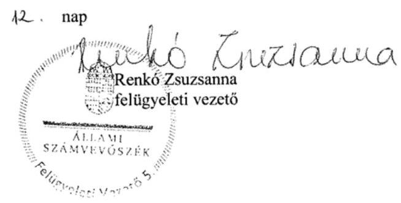

---

# RÖVIDÍTÉSEK JEGYZÉKE 

${ }^{1}$ Önkormányzat
${ }^{2}$ Képviselő-testület
${ }^{3}$ Polgármester ${ }_{1}$

Polgármester ${ }_{2}$
${ }^{4}$ Jegyző
${ }^{5}$ Hivatal
${ }^{6}$ Áht.
${ }^{7}$ Mótv.
${ }^{8}$ Ávr.
${ }^{9}$ Bkr.
${ }^{10}$ NGM
${ }^{11}$ ÁSZ
${ }^{12}$ MNB
${ }^{13}$ Számv. tv.
${ }^{14}$ ÁSZ SZMSZ
${ }^{15}$ Önkormányzati SZMSZ ${ }_{1}$
${ }^{16}$ Vagyonrendelet ${ }_{1}$
${ }^{17}$ Ötv.
${ }^{18}$ Önkormányzati SZMSZ ${ }_{2}$
${ }^{19}$ IRM rendelet
${ }^{20}$ Vagyonrendelet ${ }_{2}$
${ }^{21}$ Költségvetési rendelet ${ }_{1}$
Költségvetési rendelet ${ }_{2}$
Költségvetési rendelet ${ }_{3}$
Költségvetési rendelet ${ }_{4}$
Költségvetési rendelet ${ }_{5}$
${ }^{22}$ Ámr.
${ }^{23}$ Eisztv.

Özd Város Önkormányzata
Özd Város Önkormányzata Képviselő-testülete
Özd Város Önkormányzata Polgármestere az ellenőrzött időszak kezdetétől 2014. október 27 -éig
Özd Város Önkormányzata Polgármestere 2014. október 28-ától az ellenőrzött időszak végéig
Özd Város Önkormányzata Jegyzője
Özd Város Önkormányzata Polgármesteri Hivatal
az államháztartásról szóló 2011. évi CXCV. törvény (hatályos 2012. január 1-jétől)
2011. évi CLXXXIX. törvény Magyarország helyi önkormányzatairól (hatályos 2012. január 1-jétől).

368/2011. (XII. 31.) Korm. rendelet az államháztartásról szóló törvény végrehajtásáról (hatályos 2012. január 1-jétől).
370/2011. (XII. 31.) Korm. rendelet a költségvetési szervek belső kontrollrendszeréről és belső ellenőrzéséről (hatályos 2012. január 1-jétől)
Nemzetgazdasági Minisztérium.
Állami Számvevőszék
Magyar Nemzeti Bank
2000. évi C. törvény a számvitelről

Állami Számvevőszék Szervezeti és Működési Szabályzata
Özd Város Önkormányzata Képviselő-testületének 17/2008. (VI. 2.) rendelete Özd Város Önkormányzata Képviselő-testületének Szervezeti és Müködési Szabályzatáról
Özd Város Önkormányzatának tulajdonáról és a vagyongazdálkodás főbb szabályairól szóló 1/2009. (II. 27.) Kt. rendelet
a helyi önkormányzatokról szóló 1990. évi LXV. törvény
Özd Város Önkormányzata Képviselő-testületének 7/2011. (III. 31.) rendelete Özd Város Önkormányzata Képviselő-testületének Szervezeti és Müködési Szabályzatáról a jogszabályszerkesztésről szóló 61/2009. (XII.14.) IRM rendelet
Özd Város Önkormányzatának tulajdonáról és a vagyongazdálkodás főbb szabályairól szóló 3/2013. (II. 27.) Kt. rendelet
Özd Város Önkormányzata Képviselő-testületének 3/2011. (II. 28.) önkormányzati rendelete Özd Város Önkormányzata 2011. évi költségvetéséről
Özd Város Önkormányzata Képviselő-testületének 2/2012. (II. 17.) önkormányzati rendelete Özd Város Önkormányzata 2012. évi költségvetéséről
Özd Város Önkormányzata Képviselő-testületének 2/2013. (II. 22.) önkormányzati rendelete Özd Város Önkormányzata 2013. évi költségvetéséről
Özd Város Önkormányzata Képviselő-testületének 1/2014. (II. 14.) önkormányzati rendelete Özd Város Önkormányzata 2014. évi költségvetéséről
Özd Város Önkormányzata Képviselő-testületének 3/2015. (II. 20.) önkormányzati rendelete Özd Város Önkormányzata 2015. évi költségvetéséről
az államháztartás működési rendjéről szóló 292/2009. (XII. 19.) Korm. rendelet (hatályos 2011. december 31-ig)
az elektronikus információszabadságról szóló 2005. évi XC. törvény

---

${ }^{24}$ Info tv.
${ }^{25}$ Hivatali SZMSZ ${ }_{1}$

Hivatali SZMSZ ${ }_{2}$
${ }^{26}$ Számv. tv.
${ }^{27}$ Leltározási szabályzat
${ }^{28}$ Pénzkezelési szabályzat ${ }_{1}$
Pénzkezelési szabályzat ${ }_{2}$
${ }^{29}$ Értékelési szabályzat
${ }^{30}$ Önköltség-számítási szabályzat
${ }^{31}$ Ellenőrzési nyomvonal
${ }^{32}$ Áhsz. 1

Áhsz. 2
az információs önrendelkezési jogról és az információszabadságról szóló 2011. évi CXII. törvény
Özd Város Önkormányzata Képviselő-testületének 43/2013 (II.26) számú határozat 1. melléklete az Özdi Polgármesteri Hivatal Szervezeti és Múködési Szabályzatáról Özd Város Önkormányzata Képviselő-testületének 257/2015 (II.26.) számú határozat 1. melléklete az Özdi Polgármesteri Hivatal Szervezeti és Múködési Szabályzatáról a számvitelről szóló 2000. évi C. törvény
Özd Város Önkormányzata Leltárkészítési és leltározási szabályzat (hatályos 2015. január 1-jétől)
Özdi Polgármesteri Hivatal pénzkezelési szabályzata (hatályos 2009. május 1-jétől)
Özdi Polgármesteri Hivatal pénzkezelési szabályzata (hatályos 2015. január 1-jétől)
Özd Város Önkormányzata, Özdi Polgármesteri Hivatal Eszközök és források értékelési szabályzata (hatályos 2015. január 1-jétől, kiadva 2015. május 6.)
Özd Város Önkormányzata Özdi Polgármesteri Hivatal Önköltség-számítási szabályzat (hatályos: 2015. január 1-től)
Özd Város Önkormányzata Ellenőrzési nyomvonal (kiadva 2015. január 6-án)
az államháztartás szervezetei, beszámolási és könyvvezetési kötelezettségeinek sajátosságairól szóló 249/2000. (XII.24.) Korm. rendelet
az államháztartás számviteléről szóló 4/2013. (I. 11.) Korm. rendelet

---

ÁLLAMI SZÁMVEVŐSZÉK
1052 Budapest, Apáczai Csere János utca 10.
Levélcím: 1364 Budapest 4. Pf. 54
Telefon: +36 14849100 Telefax: +36 14849200
www.asz.hu