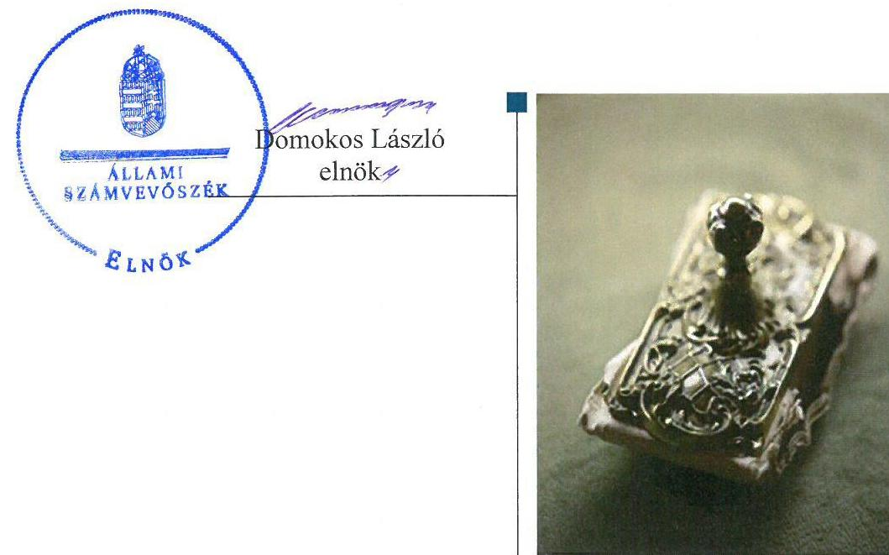
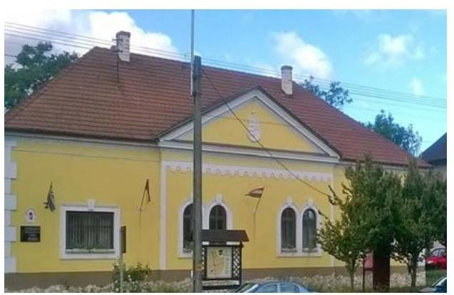
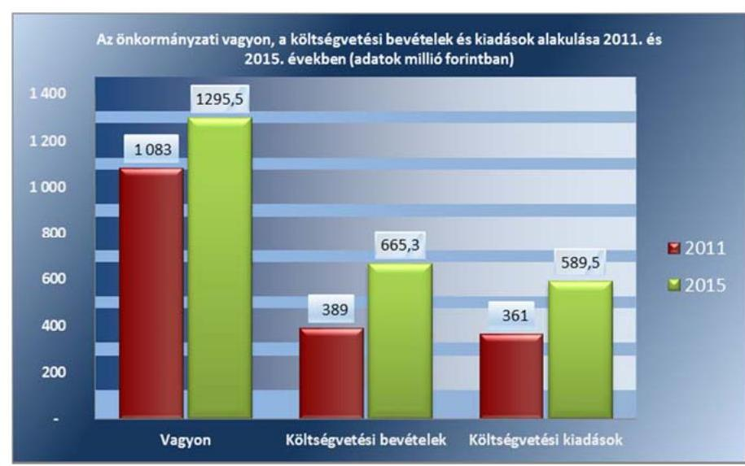

# Jelenetés 

## Önkormányzatok belső kontrollrendszere

Az önkormányzatok belső kontrollrendszere kialakításának és működtetésének ellenőrzése - Kéthely
2017.

---

# Jelenetés 

## Önkormányzatok belső kontrollrendszere

Az önkormányzatok belső kontrollrendszere kialakításának és működtetésének ellenőrzése - Kéthely
2017. 06. hó 18. nap

---

AZ ELLENŐRZÉST FELÜGYELTE:
RENKÓ ZSUZSANNA felügyeleti vezető

AZ ELLENŐRZÉST VEZETTE ÉS A VÉGREHAJTÁSÁÉRT FELELŐS:
SZALAYNÉ OSTORHÁZI MÁRIA ellenőrzésvezető

A PROGRAM ÖSSZEÁLLÍTÁSÁÉRT FELELŐS:
JANIK JÓZSEF LÁSZLÓ osztályvezető

IKTATÓSZÁM: V-1223-102/2016.
TÉMASZÁM: 2257

Jelentéseink az Országgyűlés számítógépes hálózatán és az Interneten a www.asz.hu címen is olvashatóak.

---

# TARTALOMJEGYZÉK 

■ ÖSSZEGZÉS ..... 5
■ AZ ELLENŐRZÉS CÉLJA ..... 6
■ AZ ELLENŐRZÉS TERÜLETE ..... 7
■ AZ ELLENŐRZÉS HÁTTERE, INDOKOLTSÁGA ..... 8
■ A JELENTÉS LÉNYEGES KÉRDÉSKÖREI ..... 10
■ ELLENŐRZÉS HATÓKÖRE ÉS MÓDSZEREI ..... 11
■ MEGÁLLAPÍTÁSOK ..... 13
■ JAVASLATOK ..... 18
■ MELLÉKLETEK ..... 21
I. sz. melléklet: Értelmező szótár ..... 21
II. sz. melléklet: A 2015.12.31-én az Önkormányzat tulajdonában lévő értékpapírok adatai ..... 23
III. sz. melléklet: Az integritás érvényesítése érdekében kialakított és működtetett kontrollrendszer ..... 24
■ FÜGGELÉK: ÉSZREVÉTELEK ..... 27
■ RÖVIDÍTÉSEK JEGYZÉKE ..... 29

---

.

---

# ÖSSZEGZÉS 

A belső kontrollrendszer kialakításának és működtetésének hiányosságai következtében a közpénz felhasználás szabályossága, a vagyon biztonságos és körültekintő befektetése nem volt biztosított. Az értékpapírok beszerzésekor a döntéshozó felhatalmazás nélküli jogkörgyakorlása sértette a Képviselő-testület önkormányzati vagyon feletti rendelkezési jogát. Az év végi értékelési és leltározási feladatok elmulasztása miatt az Önkormányzat mérlegében kimutatott befektetések adatainak megbízhatósága nem volt biztosított. Az Önkormányzatnak az integritás szemlélet érvényesülése érdekében még erőfeszítéseket kell tennie.

## Az ellenőrzés társadalmi indokoltsága

Magyarország Alaptörvénye az önkormányzatoktól, mint az államháztartás alanyaitól elvárja a kiegyensúlyozott, átlátható és fenntartható költségvetési gazdálkodás elvének érvényesítését. A nemzeti vagyonról szóló törvény szerint a nemzeti vagyonnal felelős módon, rendeltetésszerűen kell gazdálkodni. A nemzeti vagyongazdálkodás feladata a nemzeti vagyon rendeltetésének megfelelő, átlátható, hatékony és költségtakarékos működtetése, ugyanakkor értékének megőrzését, értéknövelő használatát, hasznosítását, gyarapítását is elvárja.

Kéthely Község Önkormányzata 2015. december 31-én 61,6 millió Ft értékű üzleti célú ingatlannal, 0,6 millió Ft értékű üzleti célú részesedéssel és 60,0 millió Ft értékű értékpapír állománnyal rendelkezett. Az Állami Számvevőszék az Önkormányzatnál még nem ellenőrizte a közpénzfelhasználás szabályosságát és a felelős vagyongazdálkodást, így indokolt volt annak megítélése, hogy a belső kontrollrendszer kialakítása és működtetése biztosítja-e közvagyon megóvását, annak gyarapítását.

## Főbb megállapítások, következtetések

Az Önkormányzat összességében megalkotta a jogszabályok által előírt belső szabályokat, kialakította a szervezeti struktúrát, de nem működtette a kockázatkezelési rendszert, a kontrolltevékenység gyakorlása hiányosságokkal valósult meg, ezáltal a közpénzfelhasználás szabályosságát nem biztosította.

A Képviselő-testület az önkormányzati rendeletekben rögzítette a befektetésekkel kapcsolatban felmerülő döntések hatásköri szabályait. Az értékpapír befektetések döntés előkészítése során nem készültek gazdaságossági, célszerűségi számítások, nem mérték fel és nem határozták meg a befektetések kockázatát, ezáltal a szabad pénzeszközök felhasználása során nem érvényesült a felelős gazdálkodás. Az értékpapír befektetésekkel kapcsolatos döntéseknél nem valósult meg a pénzügyi ellenjegyzés, a döntéseket a vagyonrendeletben rögzített összeghatárt meghaladóan nem a Képviselő-testület hozta meg. A befektetések leltározását és értékelését nem végezték el, így a befektetett közvagyon összegét az Önkormányzat beszámolója nem a valóságnak megfelelően mutatta be.

A belső kontrollrendszer kialakítása és működtetése nem támogatta az integritás szemlélet érvényesülését, emiatt az Önkormányzatnak az integritás szemlélet érvényesítésében még fejlődést kell elérnie.

---

# AZ ELLENŐRZÉS CÉLJA 

Az ellenőrzés célja annak megállapítása volt, hogy szabályszerűen történt-e az önkormányzat belső kontrollrendszerének kialakítása és működtetése, az biztosította-e az önkormányzatnál a közpénzfelhasználás szabályosságát, a közpénzekkel és a nemzeti vagyonnal történő szabályszerű és felelős gazdálkodást, a beszámolási és adatszolgáltatási kötelezettségek szabályszerű teljesítését. Az ellenőrzés keretében értékeltük az önkormányzat korrupciós kockázatainak kezelését szolgáló integritás kontrollok kiépítettségét és az integritás szemlélet érvényesülését.

A befektetési tevékenység ellenőrzésének célja volt annak értékelése, hogy a kontrollkörnyezet támogatta-e a befektetési tevékenységek szabályszerű végzését. Megítéltük, hogy az egyes befektetési tevékenységekkel kapcsolatos döntéshozatal és a döntések végrehajtása, valamint az egyes befektetések számviteli elszámolása, nyilvántartása szabályszerű volt-e, és a belső és külső ellenőrzések hozzájárultak-e az egyes befektetési tevékenységek szabályszerűségéhez.

---

# AZ ELLENŐRZÉS TERÜLETE 

## Kéthely Község Önkormányzata

Kéthely község Somogy megyében, a Marcali járásban fekszik, a Balatontól 7 km távolságra, állandó lakosainak száma 2015. január 1-én 2338 fő volt. A polgármester ${ }^{1}$ a 2014. évi önkormányzati választások óta tölti be tisztségét, a jegyző ${ }^{2}$ 2015. február 1-től látja el közszolgálati feladatait. A képviselőtestületnek három állandó bizottsága van. Az Önkormányzat ${ }^{3}$ gazdálkodási feladatait a Hivatal ${ }^{4}$ látja el. Kéthely községben a 2014. évi választásokat követően nemzetiségi önkormányzat nem működik.

Az Önkormányzat a 2015. évi költségvetési beszámolója szerint 665,3 millió Ft költségvetési bevételt ért el, valamint 589,5 millió Ft költségvetési kiadást teljesített, amelyből felhalmozási célú kiadás 211,1 millió Ft volt. Az eszközvagyon értéke 2015. december 31-én 1295,5 millió Ft volt.

Az Önkormányzat vagyonának, költségvetési bevételeinek és kiadásainak alakulását 2011. és 2015. évekre az 1. ábra mutatja be:
1. ábra

Forrás: a 2011. és 2015. évi éves költségvetési beszámolók

---

# AZ ELLENŐRZÉS HÁTTERE, INDOKOLTSÁGA 

A demokratikus társadalmakban alapvető igény, hogy a közpénzeket, a közvagyont használók tevékenységükről elszámoljanak, ahhoz egyértelmű és érvényesíthető felelősségi szabályok társuljanak. Ennek a jogos igénynek az érvényesítéséhez meg kell teremteni azokat a folyamatokat, rendszereket, amelyek nélkülözhetetlenek az elszámoltatáshoz. Az elszámoltatás eredményes működtetéséhez szükség van a megfelelő információs, kontroll-, értékelési és beszámolási rendszerek kialakítására. A belső kontrollok kiépítettsége hozzájárul az integritási szemlélet kialakításához és érvényesüléséhez. A belső kontrollrendszer kialakítása és működtetése nélkül nem valósítható meg a közpénzek, a közvagyon szabályos, gazdaságos, hatékony és eredményes felhasználása.

A BELSŐ KONTROLLRENDSZER azt a célt szolgálja, hogy az államháztartás szervei működésük és gazdálkodásuk során a tevékenységeket szabályszerűen, gazdaságosan, hatékonyan és eredményesen hajtsák végre, teljesítsék elszámolási kötelezettségeiket és megvédjék az erőforrásokat a veszteségektől, a károktól, valamint a nem rendeltetésszerű használattól. A belső kontrollrendszer magába foglalja mindazon szabályokat, eljárásokat, gyakorlati módszereket és szervezeti struktúrákat, kockázatkezelési technikákat, kontrolltevékenységeket, amelyek segítséget nyújtanak a szervezetnek céljai eléréséhez. A belső kontrollrendszer szabályozása háromszintű, a törvényi előírásokat az Áht. ${ }_{1,2}{ }^{5}$ és a Mötv. ${ }^{6}$, a rendeleti szintű szabályozást az Ávr. ${ }^{7}$ és a Bkr. ${ }^{8}$ tartalmazza, amelyeket útmutatói szinten az NGM${ }^{9}$ által kiadott standardok és kézikönyvek támogatnak.

A megfelelő belső kontrollrendszer jelentősen csökkenti a hibák és szabálytalanságok kockázatát. Az ÁSZ ${ }^{10}$ célja, hogy javuljon az ellenőrzött önkormányzatok belső kontrollrendszerének szabályozottsága, működésének megfelelősége, szabályszerűsége, hozzájárulva ezzel az egyensúlyi helyzet fenntarthatóságához, biztosítva az önkormányzatnál a közpénzfelhasználás szabályosságát, a közpénzekkel és a nemzeti vagyonnal történő szabályszerű, gazdaságos, hatékony és eredményes gazdálkodást. Az ÁSZ ellenőrzés tapasztalatai nem csupán a közvetlenül ellenőrzött önkormányzatokat támogathatják, hanem a „jó gyakorlat” elterjesztésével azok az önkormányzatok is átvehetik a pozitív példákat, ahol nem végez ellenőrzést az ÁSZ.

A közszféra integritás alapú kultúrájának kialakítása, megerősítése és működése szorosan összefügg a belső kontrollrendszer működésével, ezért az ellenőrzés kiterjed annak értékelésére is, hogy a belső kontrollrendszer kialakítása és működtetése hogyan hatott az integritás szemlélet érvényesülésére.

## AZ ÖNKORMÁNYZATI VAGYONGAZDÁLKODÁS

KERETÉBEN az önkormányzatok átmenetileg szabad pénzeszközeinek befektetését jogszabály nem tiltja, a befektetések jellege nem korlátozott, a pénzpiaci szolgáltatók közül az önkormányzatok a kínált szolgáltatás és annak költségei alapján, szabadon választhatnak, azonban a veszteséges gazdálkodás kockázatai és következményei az önkormányzatokat terhelik.

---

A szabad pénzeszközök felhasználása során kiemelten fontos a felelős gazdálkodás érvényesülése, amely összhangban kell, hogy legyen az önkormányzati gazdálkodás alapelveivel.
2015. első felében az MNB${ }^{11}$ három befektetési szolgáltató tevékenységi engedélyét vonta vissza és kezdeményezte a vállalkozások felszámolását a működéssel kapcsolatos szabálytalanságok, hiányosságok miatt. A befektetési vállalkozások problémás helyzetbe kerülése jelentős veszteségekhez vezetett számos önkormányzat esetében. A korábbi évek ellenőrzési tapasztalatai alapján fennáll a lehetősége annak, hogy az önkormányzatok befektetési döntései, továbbá a döntések végrehajtása és számviteli elszámolása nem volt teljes mértékben szabályszerű, és a kapcsolódó külső és belső kontroll rendszerek sem működtek minden esetben megfelelően.

Az ellenőrzéssel feltárásra kerülhetnek azok a kockázatok, amelyek az önkormányzatok gazdálkodásával, ezen belül befektetési tevékenységeivel, valamint a kontrollkörnyezetével kapcsolatosak és a befektetési tevékenységek szabályszerű végrehajtását befolyásolják. Az ellenőrzéssel az önkormányzatok befektetési/vagyongazdálkodási döntéseinek összessége értékelhetővé válik és megalapozott megállapítás tehető arra vonatkozóan, hogy milyen hatást gyakoroltak az önkormányzat vagyonára a képviselő-testület döntései.

# AZ ELLENŐRZÉS VÁRHATÓ HASZNOSULÁSA négy 

szinten valósul meg.

- A törvényalkotás számára összegzett tapasztalatok állnak rendelkezésre a belső kontrollrendszer önkormányzati területen való kialakításáról, működtetéséről és hatásairól.
- Az ellenőrzés az ellenőrzött számára visszajelzést ad a belső kontrollrendszer kialakításában és működésében lévő hiányosságokról, javaslataival hozzájárul azok kiküszöböléséhez.
- Az ellenőrzés megállapításait és javaslatait más szervezetek is hasznosíthatják a rendezett gazdálkodási keretek kialakításához.
- A társadalom számára jelzi, hogy közpénz nem maradhat ellenőrizetlenül, az ÁSZ értékteremtő rend kialakításához és megőrzéséhez hozzájáruló tevékenysége pozitív hatással lesz a szervezetről kialakított összkép formálásában.

---

# A JELENTÉS LÉNYEGES KÉRDÉSKÖREI 

1.     - A belső kontrollrendszer egyes pillérei biztosították-e a befektetési tevékenységek szabályszerű végzését a 2011-2015. években?
2.     - Az Önkormányzat belső kontrollrendszerének kialakítása és működtetése szabályszerű volt-e, az biztosította-e az Önkormányzatnál a közpénzfelhasználás szabályosságát, a nemzeti vagyonnal történő felelős gazdálkodást a 2015. évben?
3.     - Az Önkormányzat egyes befektetéseivel kapcsolatos döntéshozatal és a döntések végrehajtása szabályszerű volt-e?
4.     - Az egyes befektetések számviteli elszámolása, nyilvántartása szabályszerű volt-e?

---

# ELLENŐRZÉS HATÓKÖRE ÉS MÓDSZEREI 

## Az ellenőrzés típusa

A belső kontrollrendszer ellenőrzése esetében megfelelőségi ellenőrzés, a befektetési tevékenységnél szabályszerűségi ellenőrzés.

## Az ellenőrzött időszak

A belső kontrollrendszer kialakításának és működtetésének ellenőrzése a 2015. január 1. és 2015. december 31. közötti időszakra terjedt ki. A befektetési tevékenység ellenőrzési időszaka a 2011. január 1. 2015. december 31. közötti időszak. Ezen felül az Önkormányzat befektetésekkel kapcsolatos döntés-előkészítésének és döntéshozatalának szabályszerűségét ellenőriztük a 2011. január 1. előtti időszakra tekintettel is, amennyiben a 2015. december 31-én meglévő befektetésekkel kapcsolatos döntéshozatalra a 2011. január 1. előtti időszakban került sor.

## Az ellenőrzés tárgya

Az Önkormányzatnak, mint éves költségvetési beszámoló készítésére kötelezett szervezetnek és Hivatalának belső kontrollrendszere, valamint az integritás szemlélet érvényesülése.

Az Önkormányzat 2015. december 31-én meglévő, a Számv. tv. ${ }^{12}$ 3. § (6) bekezdés 2. és 3. pontja szerint az értékpapírokban megtestesülő befektetései, lekötött betétei. Továbbá a 2015. december 31-én meglévő, az Önkormányzat szabad pénzeszközei terhére, adásvételi szerződés keretében megszerzett, a kötelező feladatok ellátását nem szolgáló, az Önkormányzat üzleti vagyonába tartozó, az ellenőrzött időszakban (2011-2015.) megszerzett ingatlanok, továbbá az - időkorlátozás nélkül megszerzett kulturális javak (műtárgyak, műalkotások, stb.), illetve egyéb értéktárgyak (pl. ékszerek, befektetési nemesfém).

Az ellenőrzés kiterjedt minden olyan körülményre és adatra, amely az ÁSZ jogszabályban meghatározott feladatainak teljesítéséhez, valamint a program végrehajtása folyamán felmerült újabb
 összefüggések feltárásához szükséges.

## Az ellenőrzött szervezet

Kéthely Község Önkormányzata
Kéthelyi Közös Önkormányzati Hivatal

---

# Az ellenőrzés jogalapja 

Az ÁSZ tv. ${ }^{13}$ 1. § (3) bekezdésében foglaltak alapján az ÁSZ általános hatáskörrel végzi a közpénzekkel és az állami és önkormányzati vagyonnal való felelős gazdálkodás ellenőrzését. Az ÁSZ tv. 5. § (2) bekezdése alapján az államháztartás gazdálkodásának ellenőrzése keretében az ÁSZ ellenőrzi a helyi önkormányzatok gazdálkodását, valamint az ÁSZ tv. 5. § (6) bekezdése alapján ellenőrzése során értékeli az államháztartás számviteli rendjének betartását és a belső kontrollrendszer működését.

## Az ellenőrzés módszerei

## AZ ELLENŐRZÉST A NEMZETKÖZI STANDARDOKAT IRÁNYADÓNAK TEKINTVE, az ellenőrzési program ellenőrzési kérdései, az ellenőrzött időszakban hatályos jogszabályok, az ellenőrzés szakmai szabályok és módszertanok figyelembe vételével végeztük.

Az ellenőrzés ideje alatt az ellenőrzött szervezettel történő kapcsolattartást az ÁSZ SZMSZ ${ }_{1,2}{ }^{14}$-ének vonatkozó előírásai alapján biztosítottuk.

Az ellenőrzési kérdések megválaszolásához szükséges bizonyítékok megszerzése az ellenőrzött által rendelkezésre bocsátott dokumentumokra, adatokra alapozva megfigyelés, szemle (szemrevételezés), valamint elemző eljárással történt. A minták kiválasztása rétegzett, véletlen mintavételi eljárással történt.

Az ellenőrzés lefolytatásához az Önkormányzat a tanúsítványok kitöltésével, valamint az ÁSZ által kért dokumentumok elektronikus megküldésével szolgáltatott adatokat. A rendelkezésre bocsátott adatok, információk kontrollja és a munkalapok kitöltése az ellenőrzés keretében történt.

Az Önkormányzat belső kontrollrendszere jogszabályi előírások szerinti kialakításának és működtetésének szabályszerűségét, az erre irányuló ellenőrzési kérdésekre adott válaszok összesítése alapján a 2015. január 1. és december 31. közötti időszakra összesítetten értékeltük. Az Önkormányzat belső kontrollrendszer kialakítása és működtetése értékelése a lényeges szempontok alapján történt.

Az integritás szemlélet érvényesülésének értékelése az Önkormányzat által kitöltött tanúsítvány alapján történt.

---

# 1. A belső kontrollrendszer egyes pillérei biztosították-e a befektetési tevékenységek szabályszerű végzését a 2011-2015. években? 

Összegző megállapítás

A 2011-2015. években a belső kontrollrendszer egyes pillérei a kontrollkörnyezet szabályszerű kialakítása ellenére nem biztosították a közvagyon biztonságos és körültekintő befektetését.

A KONTROLLKÖRNYEZET kialakítása támogatta a befektetési tevékenység szabályszerű végzését, mivel a Képviselő-testület az önkormányzati SZMSZ ${ }^{15}$ 1-ben meghatározta, hogy átruházott hatáskörben 10 millió Ft-ig a polgármester dönt a betét lekötésről. A vagyonrendelet ${ }^{16}{ }_{1,2}$ tartalmazta az önkormányzati vagyonnal történő gazdálkodás szabályait a teljes vagyoni körre kiterjedően és előírta, hogy a vagyon megszerzése előtt a polgármesternek számításokkal alátámasztott döntés előkészítést kell készítenie. A Képviselő-testület a költségvetési rendelet ${ }^{17}{ }_{1-5}$-ben felhatalmazta a polgármestert 10 millió Ft értékhatárig az értékpapír vásárlások lebonyolítására és előírta részére, hogy a megtett intézkedésekről a következő képviselő-testületi ülésen adjon tájékoztatást.

A KOCKÁZATKEZELÉSI RENDSZERT az Ámr ${ }^{18}$. 157. § (1) bekezdésében és a Bkr. 7. (1) bekezdésében foglaltak ellenére nem működtették. Az Ámr. 157. § (2)-(3) bekezdéseiben és a Bkr. 7. § (2) bekezdésében rögzítettek ellenére nem mérték fel és állapították meg a gazdálkodási tevékenységbe értendő befektetési tevékenységben rejlő kockázatokat, nem határozták meg az egyes kockázatokkal kapcsolatban szükséges intézkedéseket és azok megtételének módját, valamint azok teljesítésének folyamatos nyomon követésének módját.

A KONTROLLTEVÉKENYSÉGEK részeként az értékpapír vásárlásoknál a kötelezettségvállalást jelentő vételi nyilatkozaton nem történt meg a pénzügyi ellenjegyzés az Áht. 2 37. § (1) bekezdésében előírtak ellenére, így nem győződtek meg arról, hogy a szabad előirányzat rendelkezésre áll, a tervezet kifizetési időpontokban a pénzügyi fedezet biztosított, és a kötelezettségvállalás nem sérti a gazdálkodásra vonatkozó szabályokat.

AZ INFORMÁCIÓS ÉS KOMMUNIKÁCIÓS RENDSZER működtetése során, az Önkormányzat honlapján nem tették közzé az ötmillió Ft-ot elérő vagy azt meghaladó értékpapír vásárlások szerződéseinek megnevezését, tárgyát, a szerződést kötő felek nevét és a szerződés értékét az Info tv ${ }^{19}$. 37. § (1) bekezdésének és az 1. melléklet III/4. pontjának előírása ellenére.

---

A MONITORING RENDSZER keretében működő belső ellenőrzés az Önkormányzat befektetéseit nem ellenőrizte, így nem tárta fel a gazdálkodási jogkör gyakorlás során elkövetett hibákat, a befektetések leltározásának hiányát. A külső ellenőrzések a befektetési tevékenységre nem terjedtek ki, ezért nem támogatták a befektetési tevékenység szabályszerű végzését.

# 2. Az Önkormányzat belső kontrollrendszerének kialakítása és működtetése szabályszerű volt-e, az biztosította-e az Önkormányzatnál a közpénzfelhasználás szabályosságát, a nemzeti vagyonnal történő felelős gazdálkodást a 2015. évben? 

## Összegző megállapítás

A gazdálkodás egészét érintően a belső kontrollrendszer a 2015. évben nem biztosította a szabályszerű működést, a gazdaságosság, hatékonyság és eredményesség követelményeinek érvényesülését a rendelkezésre álló erőforrások felhasználása során.

A KONTROLLKÖRNYEZET összességében szabályszerű volt, annak ellenére, hogy az Önkormányzat és a Hivatal tevékenységének szabályozása teljes körűen nem történt meg, mivel
$\longrightarrow$ a Számv. tv. 14. § (4) bekezdésének előírása ellenére nem rögzítették azokat az Önkormányzatra és Hivatalra jellemző szabályokat, előírásokat, módszereket, amelyekkel meghatározzák, hogy mit tekintenek a számviteli elszámolás, értékelés szempontjából lényegesnek, jelentősnek, amely által meghatározható többek között az értékvesztés elszámolásának indokoltsága az egyes befektetéseknél,
$\longrightarrow$ a Hivatal 2015. január 01. - január 31. között nem rendelkezett reprezentációs kiadások felosztását, valamint azok teljesítésének és elszámolásának szabályait tartalmazó szabályzattal, és a közérdekű adatok megismerésére irányuló kérelmek intézésének, továbbá a kötelezően közzéteendő adatok nyilvánosságra hozatalának rendjét tartalmazó szabályzattal, ezzel megsértették az Ávr. 13. § (2) bekezdés e) és h) pontját,
$\longrightarrow$ a Kttv. ${ }^{20}$ 231. § (1) bekezdésében előírtaktól eltérően 2015. február 15-től jegyzői utasításban határozták meg a Hivatal köztisztviselőire vonatkozó hivatásetikai alapelvek részletes tartalmát és az etikai eljárás szabályait, és azokat nem a Képviselő-testület állapította meg,
$\longrightarrow$ a Hivatal köztisztviselőinek munkaköri leírásában a Kttv. 75. § (1) bekezdés d) pontja ellenére, figyelemmel a 226. § (1) bekezdésében foglaltakra is, nem határozták meg egyértelműen a munkakör betöltésével kapcsolatos végzettségre, szakképzettségre vonatkozó követelményeket.

A KOCKÁZATKEZELÉSI RENDSZER nem volt szabályszerű, mert a Bkr. 7. § (1) és (2) bekezdésének előírásai ellenére nem működtették. Nem mérték fel és nem állapították meg az Önkormányzat és a 

---

Hivatal tevékenységében, gazdálkodásában rejlő kockázatokat, nem határozták meg az egyes kockázatokkal kapcsolatban szükséges intézkedéseket, valamint azok teljesítésének folyamatos nyomon követésének módját.

A KONTROLLTEVÉKENYSÉG részeként a pénzügyi dokumentumok elkészítése, jóváhagyása és kontrollja során összességében biztosították a folyamatba épített, előzetes, utólagos és vezetői ellenőrzést. Az Ávr.-ben foglalt lehetőséggel élve rögzítették, hogy a 100 ezer Ft-ot el nem érő kifizetések teljesítéséhez nem szükséges előzetes írásbeli kötelezettségvállalás, de az Ávr. 53. § (2) bekezdésének előírása ellenére belső szabályzatban nem rögzítették ezen kiadási tételek kifizetésének rendjét. Az előzetes kötelezettségvállalást nem igénylő kifizetéseknél az írásbeli kötelezettségvállalási dokumentum rendelkezésre állt, a teljesítés igazolása és utalványozása szabályszerű volt.

A kontrolltevékenységek keretében a pénzügyi ellenjegyzést az Áht. 37. § (1) bekezdése ellenére nem végezték el, az érvényesítés során az Ávr. 58. § (2) bekezdésében foglaltak ellenére nem jelezték az utalványozónak, hogy a megelőző ügymenetben az Ávr. 55. § (1) bekezdésének előírásával ellentétesen a kötelezettségvállalásra a pénzügyi ellenjegyzés hiányában került sor.

A kontrolltevékenység gyakorlása során nem volt biztosított a hibák, szabálytalanságok megelőzése, ezáltal a kontrolltevékenység nem volt szabályszerű.

# AZ INFORMÁCIÓS ÉS KOMMUNIKÁCIÓS RENDSZER kialakítása és működtetése keretében a szervezeten belüli információáramlás és információátadás rendszerét, beszámolási szinteket, módokat a jogszabályoknak megfelelően alakították ki, de az adatvédelmi és adatbiztonsági szabályzatot az Info tv. 37. § (1) bekezdésében és az 1. melléklet II/1. pontjában előírtak ellenére nem tették közzé. 

Az információs és kommunikációs rendszer összességében szabályszerű volt.

A MONITORING RENDSZER keretében a szervezeti tevékenységek és célok folyamatos és eseti nyomon követését a Bkr.-ben előírtaknak megfelelően szabályozták.

A belső ellenőrzési feladatok ellátásáról az Önkormányzat Társulás ${ }^{21}$ keretein belül gondoskodott az SZMSZ-ben rögzítettekkel összhangban.

A Társulás elkészítette az Önkormányzat 2015. évi - kockázatértékelés alapján összeállított - belső ellenőrzési tervét és az abban szereplő ellenőrzéseket végrehajtották. A belső ellenőrzési tervet a Mötv. 119. § (5) bekezdésében rögzítettek ellenére a Képviselő-testület nem hagyta jóvá.

A 2015. évről készített éves összefoglaló belső ellenőrzési jelentést a Képviselő-testület határozatával fogadta el.

A belső ellenőrzés által feltárt hiányosságok megszüntetésére megtették az intézkedéseket, de a Bkr. 28. § (c) pontjában előírtak ellenére saját hatáskörükbe tartozóan intézkedési tervet nem készítettek.

A külső ellenőrzésekhez kapcsolódóan intézkedési tervet nem készítettek a Bkr. 13. § (2) bekezdésében foglaltak ellenére.

---

A jegyző az Áht.-ben előírtaknak megfelelően, a Bkr. 1. sz. mellékletében foglaltak szerinti nyilatkozatában értékelte az Önkormányzat belső kontrollrendszerének minőségét 2015. évre, amely szerint a szabályzatok a jogszabályi előírásoknak megfelelően módosításra kerültek, a kockázatkezelési tevékenységet elvégezték, de ezen megállapításokat az ÁSZ ellenőrzése nem támasztotta alá.

A feltárt hiányosságok miatt a monitoring rendszer nem volt szabályszerű.

AZ INTEGRITÁS KONTROLLRENDSZERT nem építették ki, az Önkormányzatnál nem érvényesült az integritás szemlélet. Az Önkormányzat adatszolgáltatásának kiértékelését „Az integritás érvényesítése érdekében kialakított és működtetett kontrollrendszer" című, III. sz. melléklete tartalmazza.

# 3. Az Önkormányzat egyes befektetéseivel kapcsolatos döntéshozatala és a döntések végrehajtása szabályszerű volt-e? 

Összegző megállapítás

1. táblázat

## BEFEKTETÉSEK

2015.12.31-ÉN (MILLIÓ FT-BAN)

| Megnevezés | Érték | Megszerzés |
| :-- | :--: | :--: |
|  |  |  |
| Üzleti ingat- |  |  |
| lan | 61,6 | 1993.- |
| Részesedés | 0,6 | 2010. |
| Értékpapír | 60,0 | 1993. |
|  |  | 2015. |

Az értékpapírokkal kapcsolatos döntéshozó személy szabálytalan jogkörgyakorlása miatt az értékpapírokkal kapcsolatos döntések nem voltak szabályszerűek.

Az Önkormányzatnál, 2015. december 31-én befektetésként 61,6 millió Ft üzleti célú ingatlant, 0,6 millió Ft értékű nem közfeladat ellátását szolgáló tartós részesedést és 60,0 millió Ft értékpapírt tartottak nyilván. Az Önkormányzat befektetéseit 2015. 12. 31-én az 1. táblázat, az értékpapírok adatait a II. sz. melléklet mutatja be.

Az Önkormányzat tulajdonába az ellenőrzött időszakban az ellenőrzés tárgyát képező üzleti célú ingatlan nem került. Az Önkormányzat az egy, nem közfeladat ellátását szolgáló gazdasági társaságban fennálló, 0,583%-os mértékű üzletrészét - főtevékenysége szennyeződésmentesítés, egyéb hulladékkezelés - 1993.10.13-án szerezte. A tartós részesedés állományában az ellenőrzött időszakban változás nem volt, döntést nem hoztak.

A befektetésekre vonatkozó döntésekkel kapcsolatos belső szabályokat az Önkormányzat az SZMSZ ${ }_{1}$-ben, a költségvetési rendelet ${ }_{4,5}$-ben és a vagyongazdálkodási rendelet ${ }_{1,2}$-ben rögzítette.

Az Önkormányzat nevében eljáró polgármester 2015. évben négy alkalommal adott megbízást a számlavezető pénzintézetének értékpapírok vásárlására. A vásárlások szabálytalanul történtek, mert a vásárlásokat nem előzte meg a számításokkal alátámasztott döntés előkészítés a vagyonrendelet 2 3. § (3) bekezdésében rögzítettek ellenére.

Három szerződés megkötése szabálytalanul történt, mert nem vették figyelembe a költségvetési rendelet 4,5 5. § (2)-(3) bekezdésének előírásait, mely szerint a 10 millió Ft-ot meghaladó összeg felhasználásáról a Képviselő-testület dönt.

---

# 4. Az egyes befektetések számviteli elszámolása, nyilvántartása szabályszerű volt-e? 

## Összegző megállapítás

A befektetések leltározását és értékelését nem végezték el. A befektetések mérlegben szereplő adatainak megbízhatósága nem volt biztosított.

A befektetések nyilvántartása során az Önkormányzat a tartós részesedését az ellenőrzött időszakban az Áhsz.1,2 ${
 }^{22}$-ben előírtaknak megfelelően sorolta be, azt a tényleges bekerülési értéken tartotta nyilván.

Az Önkormányzat a 2011-2015. közötti években a tartós részesedéséről, a forgatási célú értékpapírjairól és az üzleti célú ingatlanjairól a Számv. tv. előírásainak megfelelő analitikus, részletező nyilvántartásokat vezette.

A 2015. évben vásárolt értékpapírok az Áhsz. 2-ben előírtaknak megfelelően, bekerülési értéken, a forgatási célú hitelviszonyt megtestesítő értékpapírok közé kerültek besorolásra.

Az Áhsz. 5. § (1) bekezdése ellenére - figyelemmel a 6. § (2) bekezdés ba) pontjára - a 2015. évi költségvetési beszámoló részeként a mérleg "A/III/2 Tartós hitelviszonyt megtestesítő értékpapírok" és "B/II/2 Forgatási célú hitelviszonyt megtestesítő értékpapírok" sorait folyamatosan vezetett részletező nyilvántartásokkal, illetve a könyvviteli zárlat során készített főkönyvi kivonattal nem támasztották alá. A mérlegben tartós hitelviszonyt megtestesítő értékpapírt mutattak ki, de ilyennel nem rendelkeztek. A forgatási célú hitelviszonyt megtestesítő értékpapír mérlegsoron 60 millió Ft helyett 40 millió Ft-ot mutattak ki.

Az Önkormányzat az értékpapír után járó kamatot és a bank által felszámított díjat 2015. évben összevontan rögzítette könyvelésében, ezzel megsértette a Számv. tv. 85. § (5) bekezdését, valamint a Számv. tv. 15. § (9) bekezdésébe foglalt bruttó elszámolás elvét, ezáltal az értékpapírokkal kapcsolatos bevételek és ráfordítások nem a valóságnak megfelelően kerültek bemutatásra.

Az Áhsz. 137. § (1) és a Számv. tv. 69. § (3) bekezdésében rögzítettek ellenére a tartós részesedések, az értékpapírok és az üzleti célú ingatlanok leltárazását nem végezték el.

Az Önkormányzat a befektetések egyedi értékelését nem végezte el a Számv. tv. 46. §. (3) bekezdésében előírtak ellenére.

---

# JAVASLATOK 

Az ÁSZ tv. 33. § (1) bekezdésében foglaltak értelmében az ellenőrzött szervezet vezetője köteles a jelentésben foglalt megállapításokhoz kapcsolódó intézkedési tervet összeállítani és azt a jelentés kézhezvételétől számított 30 napon belül az ÁSZ részére megküldeni. Amennyiben az ellenőrzött szervezet vezetője nem küldi meg határidőben az intézkedési tervet, vagy továbbra sem elfogadható intézkedési tervet küld, az Állami Számvevőszék elnöke az ÁSZ tv. 33. § (3) bekezdés a) és b) pontjaiban foglaltakat érvényesítheti.

## a polgármesternek:

1. Intézkedjen a feltárt hiányosságok és/vagy szabálytalanságok tekintetében a munkajogi felelősség tisztázására irányuló eljárás megindításáról, és ennek eredménye ismeretében tegye meg a szükséges intézkedéseket.
(1. számú megállapítás 2. bekezdése,
2. számú megállapítás 1-2. bekezdései, 3. bekezdés
3. mondatának utolsó mondatrésze és 12-13. bekezdései)

## a jegyzőnek:

1. Intézkedjen a belső kontrollrendszer egyes elemei jogszabályi előírásnak megfelelő kialakításáról és működtetéséről, valamint a gazdálkodási jogkörök gyakorlása során a jogszabályi előírások betartásáról.
(1. számú megállapítás 2-4. bekezdései,
2. számú megállapítás 1-2. bekezdései, 3. bekezdés
3. mondatának utolsó mondatrésze, 4. bekezdése, 6. bekezdés utolsó mondatrésze és 12-13. bekezdései)
4. Intézkedjen a mérleg sorainak alátámasztására folyamatosan vezetett részletező nyilvántartásokkal, illetve a könyvviteli zárlat során készített főkönyvi kivonattal.
(4. számú megállapítás 4. bekezdése alapján)
5. Intézkedjen a befektetésekkel kapcsolatos gazdasági események jogszabályi előírásoknak megfelelő elszámolásáról a számviteli nyilvántartásokban.
(4. számú megállapítás 5. bekezdése alapján)

---

4. Intézkedjen az éves költségvetési beszámoló mérlegében kimutatott tartós részesedések, értékpapírok és üzleti célú ingatlanok jogszabályi előírásoknak megfelelő leltárral történő alátámasztásáról.
(4. számú megállapítás 6. bekezdése alapján)
5. Intézkedjen az éves költségvetési beszámoló mérlegében kimutatott befektetések jogszabályi előírásoknak megfelelő értékeléséről.
(4. számú megállapítás 7. bekezdése alapján)
6. Intézkedjen az Állami Számvevőszék ellenőrzése során feltárt hiányosságok és/vagy szabálytalanságok tekintetében a munkajogi felelősség tisztázására irányuló eljárás megindításáról, és ennek eredménye ismeretében tegye meg a szükséges intézkedéseket.
(1. számú megállapítás 3-4. bekezdései, 2. számú megállapítás 4. bekezdése, 6. bekezdés utolsó mondatrésze, 4. számú megállapítás 4-7. bekezdései alapján)

---

.

---

# MELLÉKLETEK 

- I. SZ. MELLÉKLET: ÉRTELMEZŐ SZÓTÁR

ÁSZ Integritás Projekt
befektetési vállalkozás
belső ellenőrzés
belső kontrollrendszer
belső kontrollrendszer pillérei, kontrollterületei
betét
forgatási célú értékpapír
hasznosítás
helyi önkormányzat

Az Állami Számvevőszék 2009-ben indította el a „Korrupciós kockázatok feltérképezése Integritás alapú közigazgatási kultúra terjesztése" című, európai uniós forrásból megvalósított kiemelt projektjét (Integritás Projekt). Az Integritás Projekt célja, hogy felmérje a közszféra intézményei korrupciós kockázatoknak való kitettségét, illetőleg az azok mérséklésére hivatott kontrollok szintjét. Az Állami Számvevőszék a projekt révén az integritás szemlélet minél szélesebb körrel történő megismertetését, gyakorlatba ültetését kívánja elérni. Az integritás követelményeinek megfelelő szervezeti működést előnyben részesítő közigazgatási kultúra elterjesztését és a korrupció elleni fellépést az ÁSZ önmagára nézve is stratégiai jelentőségű célként fogalmazta meg. A projekt a felmérésben résztvevő intézmények számára helyzetükről egyfajta „tükörképet" mutat be, ami alapot teremt a jövőbeni pozitív irányú elmozduláshoz. (Forrás: a http://integritas.asz.hu honlapon közzétett, a 2013. évi Integritás felmérés eredményeiről készült összefoglaló tanulmány)
a Bszt. szerinti, tevékenység végzésére jogosító engedély alapján, harmadik személy részére, ellenérték fejében, rendszeres gazdasági tevékenysége keretében befektetési szolgáltatást nyújt vagy befektetési tevékenységet végez, ide nem értve a 3. §-ban meghatározottakat (Bszt. 4. § (2) bekezdés 10. pont)
Független, tárgyilagos bizonyosságot adó és tanácsadó tevékenység, amelynek célja, hogy az ellenőrzött szervezet működését fejlessze és eredményességét növelje, az ellenőrzött szervezet céljai elérése érdekében rendszerszemléletű megközelítéssel és módszeresen értékeli, illetve fejleszti az ellenőrzött szervezet irányítási és belső kontrollrendszerének hatékonyságát. (Forrás: Bkr. 2. § b) pontja)
A belső kontrollrendszer a kockázatok kezelése és tárgyilagos bizonyosság megszerzése érdekében kialakított folyamatrendszer, amely azt a célt szolgálja, hogy a működés és gazdálkodás során a tevékenységeket szabályszerűen, gazdaságosan, hatékonyan, eredményesen hajtsák végre, az elszámolási kötelezettségeket teljesítsék, megvédjék az erőforrásokat a veszteségektől, károktól és nem rendeltetésszerű használattól. (Forrás: Áht. 69. § (1) bekezdése)

A kontrollkörnyezet, a kockázatkezelési rendszer, a kontrolltevékenységek, az információs és kommunikációs rendszer, valamint a nyomon követési (monitoring) rendszer. (Forrás: Bkr. 3. §-a)
a Ptk. szerinti betétszerződés vagy a takarékbetétről szóló 1989. évi 2. törvényerejű rendelet szerinti takarékbetét-szerződés alapján fennálló tartozás, ideértve a hitelintézetnél a fizetésiszámla-szerződés alapján fennálló pozitív számlaegyenleget is (Hpt. 6. § (1) bekezdés 8. pont).
azok az értékpapírok, amelyeket forgatási célból, kamatbevétel, illetve árfolyamnyereség elérése érdekében szereztek be, továbbá azokat, amelyek a tárgyévet követő üzleti évben lejárnak (Számv. tv. 30. § (5) bekezdés)
a nemzeti vagyon birtoklásának, használatának, hasznok szedése jogának bármely - a tulajdonjog átruházását nem eredményező - jogcímen történő átengedése, ide nem értve a vagyonkezelésbe adást, valamint a haszonélvezeti jog alapítását (Nvtv. 3. § (1) bekezdés 4. pontja)

A helyi önkormányzat jogi személy. Az önkormányzati feladatok ellátását a képviselő-testület és szervei biztosítják. A képviselőtestület szervei: a polgármester, a főpolgármester, a megyei közgyűlés elnöke, a képviselő-testület bizottságai, a részönkormányzat testülete, a polgármesteri hivatal, a megyei önkormányzati hivatal, a közös önkormányzati hivatal, a jegyző, továbbá a társulás. A képviselő-testület a feladatkörébe tartozó közszolgáltatások ellátására - jogszabályban meghatározottak szerint - költségvetési szervet, a Polgári perrendtartásról szóló 1952. évi III. törvény szerinti gazdálkodó szervezetet (a továbbiakban: gazdálkodó szervezet), nonprofit szervezetet és egyéb szervezetet (a továbbiakban együtt: intézmény) alapíthat, továbbá szerződést köthet természetes és jogi személlyel vagy jogi személyiséggel nem rendelkező szervezettel. A helyi önkormányzat éves költségvetési beszámolója magába foglalja a helyi önkormányzat - nem költségvetési szerveihez tartozó - feladataihoz kapcsolódó bevételeket és kiadásokat. A helyi önkormányzat összevont (konszolidált) költségvetési beszámolóját a helyi önkormányzatra és költségvetési szerveire vonatkozóan külön-külön beérkezett éves költségvetési beszámolók alapján a Kincstár készíti el és küldi meg az önkormányzatnak. (Forrás: Mötv. 41. § (1), (2), (6) bekezdései; Áhsz. 2. § (1) bekezdése, 6. § (1) bekezdés a) és f) pontja, 30. §-a, 37. § (1) és (6) bekezdése)
minden olyan értékpapír, illetve törvény által értékpapírnak minősített, jogot megtestesítő okirat, amelyben a kibocsátó (adós) meghatározott pénzösszeg rendelkezésére bocsátását elismerve arra kötelezi magát, hogy a pénz (kölcsön) összegét, valamint annak meghatározott módon számított kamatát vagy egyéb hozamát, és az általa esetleg vállalt egyéb szolgáltatásokat az értékpapír birtokosának (a hitelezőnek) a megjelölt időben és módon megfizeti, illetve teljesíti. Ide tartozik különösen: a kötvény, a kincstárjegy, a letéti jegy, a pénztárjegy, a célrészjegy, a takaréklevél, a jelzáloglevél, a hajóraklevél, a közraktárjegy, az árujegy, a zálogjegy, a kárpótlási jegy, a határozott idejű befektetési alap által kibocsátott befektetési jegy (Számv. tv. (6) bekezdés 2. pont)
A költségvetési szerv vezetője által kialakított és működtetett olyan rendszer, mely biztosítja, hogy a megfelelő információk a megfelelő időben eljutnak az illetékes szervezethez, szervezeti egységhez, illetve személyhez. (Forrás: Bkr. 9. § (1) bekezdés)
Az integritás elvek, értékek, cselekvések, módszerek, intézkedések konzisztenciáját jelenti: olyan magatartásmódot, amely meghatározott értékeknek felel meg. Az integritás a közszféra esetében a társadalom által elvárt nyilvánossági, átláthatósági, illetve jogi/etikai normáknak történő megfelelést jelenti.(Forrás: a http://integritas.asz.hu honlapon közzétett „A 2012. évi integritás felmérés eredményeinek összefoglalója" című dokumentum 3. oldal 1. bekezdése)
az adós által a kölcsönnyújtónak (betételhelyezőnek) az elfogadott betét vagy az igénybe vett kölcsön használatáért, kockázatáért fizetendő, a betét- vagy kölcsönösszeg százalékában meghatározott, időarányosan térítendő (elszámolandó) pénzösszeg vagy egyéb hozadék (Hpt. 6. § (1) bekezdés 52. pont)
Olyan irányítási eszközök és módszerek összessége, melynek elemei a szervezeti célok elérését veszélyeztető tényezők (kockázatok) azonosítása, elemzése, csoportosítása, nyomon követése, valamint szükség esetén a kockázati kitettség mérséklése. (Forrás: Bkr. 2. § m) pontja)

A költségvetési szerv vezetője által kialakított olyan elvek, eljárások, belső szabályzatok összessége, amelyben világos a szervezeti struktúra, egyértelműek a felelősségi, hatásköri viszonyok és feladatok, meghatározottak az etikai elvárások a szervezet minden szintjén, átlátható a humánerőforrás-kezelés. (Forrás: Bkr. 6. § (1) bekezdés)
A költségvetési szerv vezetője által a szervezeten belül kialakított (kontroll) tevékenységek, melyek biztosítják a kockázatok kezelését, hozzájárulnak a szervezet céljainak eléréséhez. (Forrás: Bkr. 8. § (1) bekezdés)
az élettelen és élő természet keletkezésének, fejlődésének, az emberiség, a magyar nemzet, Magyarország történelmének kiemelkedő és jellemző tárgyi, képi, hangrögzített, írásos emlékei és egyéb bizonyítékai - az ingatlanok kivételével -, valamint a művészeti alkotások (a kulturális örökség védelméről szóló 2001. évi LXIV. törvény)
a nemzeti vagyon azon része, amely nem tartozik az önkormányzati vagyon esetén a törzsvagyonba (Nvtv. 3. § (1) bekezdés 18. pontja)
a nemzeti vagyongazdálkodás feladata a nemzeti vagyon rendeltetésének megfelelő, az állam, az önkormányzat mindenkori teherbíró képességéhez igazodó, elsődlegesen a közfeladatok ellátásához és a mindenkori társadalmi szükségletek kielégítéséhez szükséges, egységes elveken alapuló, átlátható, hatékony és költségtakarékos működtetése, értékének megőrzése, állagának védelme, értéknövelő használata, hasznosítása, gyarapítása, továbbá az állam vagy a helyi önkormányzat feladatának ellátása szempontjából feleslegessé váló vagyontárgyak elidegenítése (Nvtv. 7. § (2) bekezdése)

---

II. SZ. MELLÉKLET: A 2015.12.31-ÉN AZ ÖNKORMÁNYZAT TULAJDONÁBAN LÉVŐ ÉRTÉKPAPÍROK ADATAI

| Sorszám | Értékpapír típusa | Értékpapír azonosítója | Szerzéskötés ideje | Szerzés időtartama | Értékpapír jellemzője | Értékpapír árfolyamára a szerzéskötéskövetke (szer.fe) |
| :--: | :--: | :--: | :--: | :--: | :--: | :--: |
| 1. | Kincstárjegy | K160330 | 2015.03.31 | 2015.03.31 - 2016.03.31 | kamatozó kincstárjegy (hozam 3\%) |

 10000 |
| 2. | Kincstárjegy | K160407 | 2015.04.08 | 2015.04.08 - 2016.04.08 | kamatozó kincstárjegy (hozam 3%) | 20000 |
| 3. | Kincstárjegy | F160608 | 2015.12.04 | 2015.12.04 - 2016.12.04 | kamatozó kincstárjegy (hozam 2,5%) | 15000 |
| 4. | Befektetési jegy | F15MOB033251 | 2015.12.04 | 2015.12.08 - 2016.12.08 | mérsékelten kockázatvállaló | 15000 |
| Összesen: |  |  |  |  |  | 60000 |

forrás: az Önkormányzat adatszolgáltatása

---

# III. SZ. MELLÉKLET: AZ INTEGRITÁS ÉRVÉNYESÍTÉSE ÉRDEKÉBEN KIALAKÍTOTT ÉS MŰKÖDTETETT KONTROLLRENDSZER 

Elvégeztük Kéthely Község Önkormányzata által kitöltött integritás-tanúsítvány egyes kérdéseire adott válaszok kontrollját abból a szempontból, hogy azokat az ellenőrzés folyamán szolgáltatott adatok alátámasztották-e. Megállapítottuk, hogy az Önkormányzat saját értékelése alapján kialakított válaszai minden egyes, az integritás kontrollrendszer szempontjából releváns kérdés esetében dokumentumokkal igazolhatóak, illetve azokban az esetekben, amelyeknél az Önkormányzat nemleges választ adott, a kontroll eredménye is megerősítette az adott integritás-terület kialakításának hiányát. Az integritás kontrollrendszert a 2015. évre vonatkozóan öt fő csoportba soroltuk. Ezek a következők:

1. Összeférhetetlenség és etikai elvárások
2. Humánerőforrás-gazdálkodás
3. A Szervezet vagyonának megvédésére tett intézkedések
4. A nemkívánatos dolgozói magatartással szembeni intézkedések és azok érvényesülése
5. Az integritás erősítése, annak tudatosítása, valamint a kockázatelemzések alkalmazása

Az egyes területek bemutatott értékelésének (alacsony, közepes, magas) meghatározásához viszonyítási alapként a 2015. évi Integritás felmérésben válaszadó helyi önkormányzatokra számított értékek számtani átlaga szolgált.

| Kéthely Község Önkormányzata integritás kontrollrendszerének területenkénti és összesített értékelése |  |
| :--: | :--: |
| 2015. évben |  |
| Terület megnevezése | Értékelés |
| Összeférhetetlenség és etikai elvárások | Magas |
| Humánerőforrás-gazdálkodás | Közepes |
| Szervezet vagyonának megvédésére tett intézkedések | Alacsony |
| A nemkívánatos dolgozói magatartással szembeni intézkedések és azok érvényesülése | Alacsony |
| Az integritás erősítése, annak tudatosítása, valamint a kockázatelemzések alkalmazása | Alacsony |
| ÖSSZESÍTETT ÉRTÉKELÉS | Alacsony |

Az integritás kontrollrendszer első pillére, az összeférhetetlenség és az etikai elvárások területe magas értéket ért el. A szervezet szabályozta az összeférhetetlenség kérdését, a szervezet munkatársai kötelezően nyilatkoztak az összeférhetetlenségről. Egyetlen munkatárssal szemben sem indult szakmai etikai eljárás kötelezettségszegés miatt. A szervezet szabályozta a különféle ajándékok elfogadásának tilalmát, a korrupcióra okot adó kérések visszautasítását.

A humán erőforrás-gazdálkodás értékelése közepes. Minden alkalmazott rendelkezett munkaköri leírással, új munkatársak kiválasztásakor minden esetben írtak ki álláspályázatot. Az Önkormányzat ugyanakkor nem ellenőrizte a jelentkezők által benyújtott pályázati dokumentumok hitelességét. Az állásinterjún túl más, az objektív megítélést lehetővé tevő módszert nem alkalmaztak a megfelelő felkészültségű szakemberek kiválasztásához.

A szervezet vagyonának megvédésére tett intézkedések körében az Önkormányzat meghatározta a munkáltató tulajdonában, kezelésében lévő gépjárművek használatát. Nem szabályozták a külső személyekkel való kapcsolattartást és nem rendelkeztek a minősített adatok kezelésére vonatkozó szabályzattal.

A nemkívánatos dolgozói magatartással szembeni intézkedések és azok érvényesülése területen az integritás értéke alacsony. Nem rendelkeztek belső szabályzattal a szervezeten belüli közérdekű bejelentők védelmére vonatkozóan, és nem működtettek közérdekű bejelentéseket kezelő rendszert.

---

Az integritás erősítése, annak tudatosítása, valamint a kockázatkezelések alkalmazása terén szintén alacsony a kontrollrendszer értékelése. Az Önkormányzat nem fogalmazta meg stratégiai célként a szervezeti kultúra javítását, az integritás erősítését és a korrupció elleni fellépést. Az Önkormányzatnál nem végeztek rendszeres korrupciós kockázatelemzést sem.

Az integritás kontrollrendszer összesített értékelése alacsony. Jelen ellenőrzés is alátámasztotta, hogy a kiépített integritás kontrollrendszer nem képes hatékonyan kezelni az önkormányzati működés és a Hivatal feladatellátása során fellépő korrupciós kockázatokat, ezért az Önkormányzatnak még további lépéseket kell tennie az integritás szemlélet megfelelő érvényesülése érdekében.

---

.

---

# FÜGGELÉK: ÉSZREVÉTELEK 

A jelentéstervezetet a Számvevőszék 15 napos észrevételezésre megküldte az ellenőrzött szervezetek vezetőinek az ÁSZ tv. 29. § (1) bekezdése előírásának megfelelően.

Az ellenőrzött szervezetek vezetői az ÁSZ tv. 29. § (2) bekezdésében foglalt észrevételezési jogukkal nem éltek, a jelentéstervezetre észrevételt nem tettek.

[^0]
[^0]:    * 29. § (1) Az Állami Számvevőszék az ellenőrzési megállapításait megküldi az ellenőrzött szervezet vezetőjének vagy az általa megbízott személynek, és annak, akinek személyes felelősségét állapította meg.
    (2) Az ellenőrzött szervezet vezetője és a felelősként megjelölt személy az ellenőrzés megállapításaira tizenöt napon belül írásban észrevételt tehet.
    (3) Az Állami Számvevőszék az észrevételre a beérkezésétől számított harminc napon belül írásban válaszol. A figyelembe nem vett észrevételeket köteles a jelentésben feltüntetni, és megindokolni, hogy azokat miért nem fogadta el.

---

.

---

# RÖVIDÍTÉSEK JEGYZÉKE 

${ }^{1}$ polgármester
${ }^{2}$ jegyző
${ }^{3}$ Önkormányzat
${ }^{4}$ Hivatal
${ }^{5}$ Áht. 1

Áht. 2
${ }^{6}$ Mótv.
${ }^{7}$ Ávr.
${ }^{8}$ Bkr.
${ }^{9}$ NGM
${ }^{10}$ ÁSZ
${ }^{11}$ MNB
${ }^{12}$ Számv. tv.
${ }^{13}$ ÁSZ tv.
${ }^{14}$ ÁSZ SZMSZ1
ÁSZ SZMSZ2
${ }^{15}$ SZMSZ
SZMSZ1
SZMSZ2
${ }^{16}$ Vagyonrendelet ${ }_{1}$

Vagyonrendelet ${ }_{2}$
${ }^{17}$ Költségvetési rendelet ${ }_{1}$
Költségvetési rendelet ${ }_{2}$
Költségvetési rendelet ${ }_{3}$
Költségvetési rendelet ${ }_{4}$
Költségvetési rendelet ${ }_{5}$
${ }^{18}$ Ámr.

Kéthely Község polgármestere
Kéthely Község Önkormányzat jegyzője, Kéthely Közös Önkormányzati Hivatal vezetője
Kéthely Község Önkormányzata
Kéthelyi Közös Önkormányzati Hivatal
az államháztartásról szóló 1992. évi XXXVIII. törvény (Hatálytalan: 2012. január 1-től)
2011. évi CXCV. törvény az államháztartásról (hatályos 2012. január 1-től)
2011. évi CLXXXIX. törvény Magyarország helyi önkormányzatairól (hatályos 2012. január 1-től)

368/2011. (XII. 31.) Korm. rendelet az államháztartásról szóló törvény végrehajtásáról (hatályos 2012. január 1-től)
370/2011. (XII. 31.) Korm. rendelet a költségvetési szervek belső kontrollrendszeréről és belső ellenőrzéséről (hatályos 2012. január 1-től)
Nemzetgazdasági Minisztérium
Állami Számvevőszék
Magyar Nemzeti Bank
2000. évi C. törvény a számvitelről (hatályos 2011. január 1-től)
2011. évi LXVI. törvény az Állami Számvevőszékről (hatályos 2011. július 1-től)
az Állami Számvevőszék elnökének 3/2015 (XII.30.) ÁSZ utasítása az Állami Számvevőszék Szervezeti és Működési Szabályzatáról (hatályos 2016. január 1-től) az Állami Számvevőszék elnökének 3/2016 (XII.29.) ÁSZ utasítása az Állami Számvevőszék Szervezeti és Működési Szabályzatáról (hatályos 2017. január 1-től) Szervezeti és Működési Szabályzat
Kéthely Község Önkormányzatának Szervezeti és Működési Szabályzatáról szóló 6/1999. (IV.29.) önkormányzati rendelet (hatálytalan 2014. november 5-től)
Kéthely Község Önkormányzatának Szervezeti és Működési Szabályzatáról szóló 18/2014. (XI.5.) önkormányzati rendelet (hatályos 2014. november 5-től) az önkormányzati tulajdon és a vagyongazdálkodás szabályairól szóló 5/2004. (IV.15.) önkormányzati rendelet (hatálytalan 2012. október 31-től) az önkormányzati tulajdon és a vagyongazdálkodás szabályairól szóló 15/2012. (X.31.) önkormányzati rendelet (hatályos 2012. október 31-től)
Kéthely Község Önkormányzatának a 2011. évi költségvetéséről szóló 4/2011. (II.15.) számú rendelete
Kéthely Község Önkormányzatának a 2012. évi költségvetéséről szóló 2/2012. (II.21.) számú rendelete
Kéthely Község Önkormányzatának a 2013. évi költségvetéséről szóló 3/2013. (II.19.) számú rendelete
Kéthely Község Önkormányzatának a 2014. évi költségvetéséről szóló 2/2014. (II.26.) számú rendelete
Kéthely Község Önkormányzatának a 2015. évi költségvetéséről szóló 2/2015. (II.12.) számú rendelete
az államháztartás működési rendjéről szóló 292/2009. (XII. 19.) Korm. rendelet (hatálytalan 2012. január 1-től)

---

${ }^{19}$ Info tv.
${ }^{20}$ Kttv.
${ }^{21}$ Társulás
${ }^{22}$ Áhsz. 1

Áhsz. 2
az információs önrendelkezési jogról és az információszabadságról szóló 2011. évi CXII. törvény (hatályos 2012. január 1-től)
2011. évi CXCIX. törvény a közszolgálati tisztviselőkről (hatályos 2012. január 1-től) Marcali Kistérség Többcélú Társulása
az államháztartás szervezetei beszámolási és könyvvezetési kötelezettségének sajátosságairól szóló 249/2000. (XII. 24.) Korm. rendelet (hatálytalan 2014. január 1-től)
4/2013. (I.11) Korm. rendelet az államháztartás számviteléről (hatályos 2014. január 1-től)

---

ÁLLAMI SZÁMVEVŐSZÉK
1052 Budapest, Apáczai Csere János utca 10.
Levélcím: 1364 Budapest 4. Pf. 54
Telefon: +36 14849100 Telefax: +36 14849200
www.asz.hu
