# Jelentés

## A központi alrendszer egyes intézményei pénzügyi és vagyongazdálkodásának ellenőrzése

Országos Orvosi Rehabilitációs Intézet 2017.

---

# Jelentés

## A központi alrendszer egyes intézményei pénzügyi és vagyongazdálkodásának ellenőrzése

Országos Orvosi Rehabilitációs Intézet
2017.
hó 10. nap
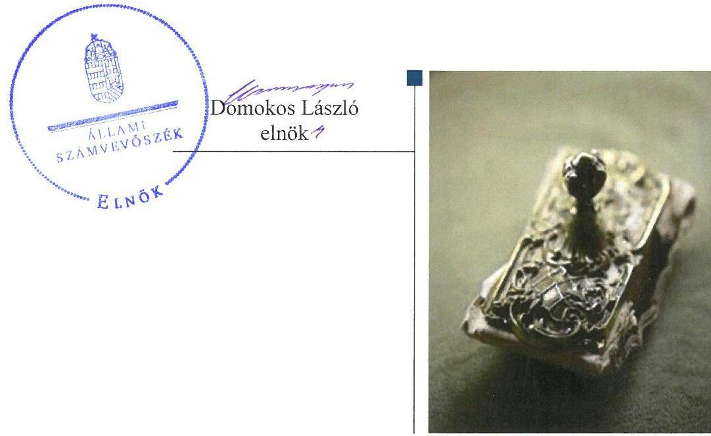

---

|  J | AZ ELLENŐRZÉST FELÜGYELTE:  |
| --- | --- |
|   | MAKKAI MÁRIA felügyeleti vezető  |
|   | AZ ELLENŐRZÉST VEZETTE ÉS A VÉGREHAJTÁSÁÉRT FELELŐS:  |
|   | DR. KOVÁCS DIÁNA ellenőrzésvezető  |
|   | A PROGRAM ÖSSZEÁLLÍTÁSÁÉRT FELELŐS:  |
|   | JANIK JÓZSEF LÁSZLÓ osztályvezető  |
|   | A TÉMÁHOZ KAPCSOLÓDÓ KORÁBBI SZÁMVEVŐSZÉKI JELENTÉSEK:  |
|  - címe: | 2015. évi zárszámadás - Magyarország 2015. évi központi költségvetése végrehajtásának ellenőrzése  |
|  - sorszáma: | 16163  |
|  - címe: | 2014. évi zárszámadás - Magyarország 2014. évi központi költségvetése végrehajtásának ellenőrzéséről  |
|  - sorszáma: | 15167  |
|  |   |
|   | IKTATÓSZÁM: V-0938-175/2016  |
|   | TÉMASZÁM: 1771  |
|   | ELLENŐRZÉS-AZONOSÍTÓ SZÁM: V076004  |

---

# TARTALOMJEGYZÉK

■ ÖSSZEGZÉS ..... 5
■ AZ ELLENŐRZÉS CÉLJA ..... 6
■ AZ ELLENŐRZÉS TERÜLETE ..... 7
■ AZ ELLENŐRZÉS HÁTTERE, INDOKOLTSÁGA ..... 9
■ A JELENTÉS LÉNYEGES KÉRDÉSKÖREI ..... 10
■ ELLENŐRZÉS HATÓKÖRE ÉS MÓDSZEREI ..... 11
■ MEGÁLLAPÍTÁSOK ..... 13
■ JAVASLATOK ..... 29
■ MELLÉKLETEK ..... 31
I. sz. melléklet: Értelmező szótár ..... 31
II. sz. melléklet: A teljesítmény-ellenőrzési kiegészítő modul megállapításai ..... 35
III. sz. melléklet: Az integritás kontrollrendszer értékelése. ..... 36
■ FÜGGELÉK: ÉSZREVÉTELEK ..... 37
■ RÖVIDÍTÉSEK JEGYZÉKE ..... 67

---

.

---

# ÖSSZEGZÉS

Az irányító szervek és a középirányító szervek Országos Orvosi Rehabilitációs Intézetre vonatkozó, 2005. és 2015. közötti feladatellátása nem volt szabályszerű. Az Intézet belső kontrollrendszerének kialakítása és működtetése 2012. és 2014. között nem volt szabályszerű, ezzel nem biztosította az átláthatóságot, csak 2015. évtől biztosította a szabályszerű, átlátható és elszámoltatható közpénzfelhasználást. Az Intézet pénzügyi és vagyongazdálkodása összességében szabályszerű volt. Az Intézetnek az integritás kontrollrendszerének kiépítettsége érdekében további erőfeszítéseket kell tennie.

## Az ellenőrzés társadalmi indokoltsága

A közpénzek felhasználásában és az állami vagyonnal való gazdálkodásban a központi alrendszer egyes intézményei meghatározó súlyt képviselnek. E szervezetekkel szemben társadalmi igény, hogy tevékenységükről a döntéshozók és a nyilvánosság felé elszámoljanak. Ezzel a társadalmi igénnyel és az ÁSZ Stratégiájával összhangban, a közpénzügyek átláthatóságának előmozdítása, a közvagyon védelme érdekében került sor az Intézet pénzügyi- és vagyongazdálkodásának ellenőrzésére.

## Főbb megállapítások, következtetések, javaslatok

Az irányító szervek és a középirányító szervek Intézetre vonatkozó feladatellátása az SZMSZ jóváhagyásának tíz éven keresztül történő elmulasztása és a munkáltatói joggyakorlás területén tapasztalt hiányosságok miatt nem volt szabályszerű.

Az Intézet belső kontrollrendszerének kialakítása és működtetése 2012. és 2014. között nem felelt meg a jogszabályi előírásoknak. A kontrollkörnyezet kialakítása, a kockázatkezelési rendszer és a kontrolltevékenységek működtetése nem volt szabályszerű. Az Intézet nem rendelkezett SZMSZ-szel, a gazdasági szervezetre vonatkozó ügyrenddel, a teljes foglalkoztatotti körre érvényes etikai kódexszel, a gazdálkodási szabályzatok nem feleltek meg maradéktalanul a jogszabályi előírásoknak. A főigazgató 2012-2014-ben nem jelölte ki írásban a teljesítésigazolásra, érvényesítésre és utalványozásra jogosult személyeket. 2015. évtől a belső kontrollrendszer a közpénzekkel és a nemzeti vagyonnal történő szabályszerű, gazdaságos, hatékony és eredményes gazdálkodást, illetve a beszámolási és adatszolgáltatási kötelezettség szabályszerű teljesítését biztosította.

Az Intézet pénzügyi gazdálkodása összességében szabályszerű volt. A bevételek beszedése és elszámolása, a kiadási előirányzatok felhasználása során ugyanakkor a gazdálkodási jogkörgyakorlás nem volt megfelelő. Az Intézet egy szerződéskötést megelőzően nem folytatott le közbeszerzési eljárást.

Az Intézet vagyongazdálkodása összességében szabályszerű volt. A vagyonelemek elidegenítése és hasznosítása nem felelt meg a jogszabályi előírásoknak, mivel nem álltak rendelkezésre a független szakértői szakvélemények, illetve az Intézet a bérleti szerződések esetén nem győződött meg a szerződő felek átláthatóságáról.

Az Intézet integritás kontrollrendszer kiépítettsége alacsony szintet mutat.

---

# AZ ELLENŐRZÉS CÉLJA

AZ ELLENŐRZÉS CÉLJA annak megítélése volt, hogy az ellenőrzött intézményre vonatkozó irányító szervi feladatellátás a jogszabályi előírások betartásával történt-e; az intézménynél a belső kontrollrendszer kialakítása és működtetése szabályszerű volt-e; kialakították-e az erőforrásokkal való szabályszerű, gazdaságos, hatékony és eredményes gazdálkodás követelményeit; szabályszerű volt-e a beszámolási és adatszolgáltatási kötelezettségek teljesítése; az intézmény pénzügyi és vagyongazdálkodása megfelelt-e a jogszabályi előírásoknak és belső szabályzatainak.

Az ellenőrzés keretében értékeltük az intézmény korrupciós kockázatainak kezelését szolgáló integritás kontrollok kiépítettségét és az integritás szemlélet érvényesülését.

Továbbá az ellenőrzés azt is értékelte, hogy a gazdálkodás folyamatában a gazdaságossági, hatékonysági és eredményességi célok kialakítása megtörtént-e, a célok elérése érdekében tettek-e intézkedéseket, a célkitűzéseket elérték-e; a szándékolt eredményeket elérték-e.

---

# AZ ELLENŐRZÉS TERÜLETE

## Országos Orvosi Rehabilitációs Intézet

Az Intézet ${ }^{1}$ közfeladata az Eütv. ${ }^{2}$ alapján járó- és fekvőbeteg-ellátás keretében mozgásszervi és pszichiátriai rehabilitáció, valamint azt támogató aktív fekvőbeteg-ellátás nyújtása az ellátási területére kiterjedően.

Az Intézet a 2005-2015. években önállóan működő és gazdálkodó, az előirányzatok felett teljes jogkörrel rendelkező költségvetési szerv volt. Az Intézet irányító szerve a Minisztérium ${ }^{3}$ volt. Az egyes fenntartói, irányítói, valamint középirányítói jogokat 2012. évtől a GYEMSZI4, majd annak jogutódjaként 2015. március 1. napjától az ÁEEK ${ }^{5}$ látta el.

Az ÁSZ az irányító szervi feladatellátást a 2005. január 1-jétől 2015. december 31-ig, az Intézet belső kontroll rendszerének kialakítását és működtetését, valamint a pénzügyi és vagyongazdálkodás szabályszerűségét a 2012. január 1. és 2015. december 31. között ellenőrizte.

Az Intézetet a 2005-2015. években a főigazgató ${ }^{6}$ vezette. A főigazgató és a gazdasági igazgató ${ }^{7}$ személye az ellenőrzött időszakban több alkalommal változott.

Az aktív betegellátással, valamint rehabilitációt, utókezelést és gondozást nyújtó fekvőbeteg-ellátással kapcsolatos ágyak átlagos állománya 2005-ben 357 db, 2015-ben pedig 358 db volt azzal, hogy az aktív ágyszám csökkent, a rehabilitációs kapacitás pedig bővült.

Az Intézet működését 2005. január 1. időpontban 9.063,4 millió Ft mérleg szerinti vagyon szolgálta, ami 2015. december 31-én 16.191,7 millió Ft volt, az ellenőrzött időszakban 78,6 %-kal növekedett.

Az Intézet vagyonának alakulását az ellenőrzött időszakban az 1. ábra mutatja be.

---

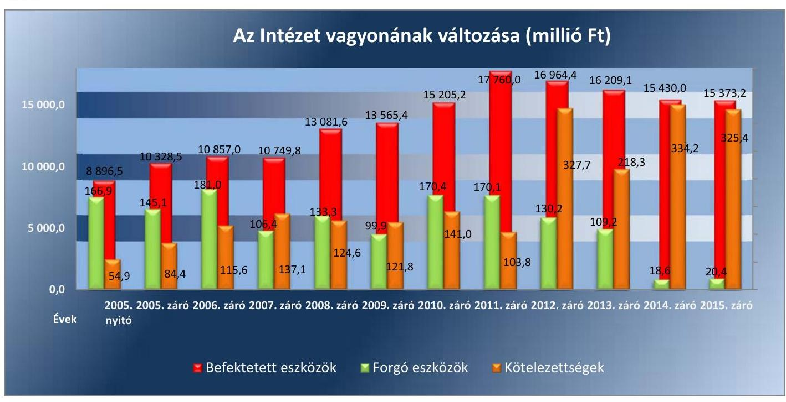

*Forrás: Az Intézet 2005-2015. évi költségvetési beszámolói*

Az Intézet által teljesített költségvetési bevételek és kiadások alakulását a 2. ábra mutatja be.

2.  ábra

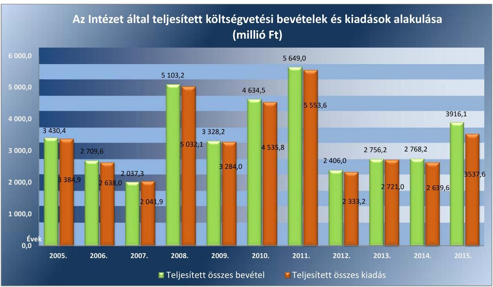

*Forrás: Az Intézet 2005-2015. évi költségvetési beszámolói*

A 2005-2015. években az Intézetnél szervezeti, szerkezeti átalakítás nem történt.

---

# AZ ELLENŐRZÉS HÁTTERE, INDOKOLTSÁGA

Az államháztartás központi alrendszerének közpénz felhasználása, az intézmények által ellátott közfeladatok sokrétűsége, valamint a feladatellátásához rendelt vagyon nagyságrendje indokolja, hogy az ÁSZ ${ }^{8}$ ellenőrzéseket folytasson a pénzügyi és vagyongazdálkodás területén. Az ÁSZ az ellenőrzései során feltárja a gazdálkodást, a központi alrendszer intézményei átalakulását, átszervezését érintő szabályozások esetleges hiányosságait, a szabályozással nem érintett gazdálkodási területeket, rámutathat a vagyongazdálkodási tevékenység - ezen belül a tulajdonosi joggyakorlás és vagyonkezelés - esetleges szabálytalanságaira, értékeli az állami vagyon nyilvántartására és elszámolására vonatkozó eljárásokat.

Az ellenőrzés várhatóan hozzájárul a központi intézmények pénzügyi helyzetének pontosabb megítéléséhez és a jó gyakorlat kialakításán és terjesztésén keresztül az ellenőrzések elősegíthetik a gazdálkodás szabályszerűségének javítását.

Az ÁSZ teljesítmény-ellenőrzési kiegészítő modul alapján elvégzett ellenőrzése a döntéshozók, ellenőrzöttek, irányító szervek, a társadalom számára objektív visszajelzést ad a gazdálkodás területén végrehajtott szervezeti, szervezési intézkedésekről, a közfeladat-ellátásnak keretet adó gazdálkodási tevékenységek folyamatában kialakított célokról, intézkedésekről, azok teljesítéséről. Az ÁSZ értékteremtő elemzéseivel, tanácsadó szerepét erősítve támogatja a szervezetek önértékelő, alkalmazkodó (óntanuló) tevékenységét. Irányt mutat az ellenőrzött intézmények gazdálkodási és kapcsolódó adminisztratív folyamatainak optimalizációjához. Támogatja a központi költségvetési szervek felügyelhetőségét, a „jó gyakorlatok" elterjesztésével támogatja a „jó kormányzást".

---

# A JELENTÉS LÉNYEGES KÉRDÉSKÖREI

1.  - Az irányító szerv ellenőrzött költségvetési szervre vonatkozó feladatellátása szabályszerű volt-e?
2.  - A belső kontrollrendszer kialakítása és működtetése biztosította-e a közpénzekkel és a nemzeti vagyonnal történő szabályszerű, gazdaságos, hatékony és eredményes gazdálkodást, illetve a beszámolási és adatszolgáltatási kötelezettségek szabályszerű teljesítését?
3.  - A költségvetési szerv pénzügyi gazdálkodása szabályszerű volt-e?
4.  - A költségvetési szerv vagyongazdálkodása szabályszerű volt-e?
5.  Érvényesült-e az integritás szemlélet és ennek megfelelően kiépítették-e az integritás kontrollrendszert az intézménynél?

---

# ELLENŐRZÉS HATÓKÖRE ÉS MÓDSZEREI

## Az ellenőrzés típusa

Megfelelőségi ellenőrzés.

## Az ellenőrzött időszak

Az ellenőrzött időszak a 2005. január 1-jétől 2015. december 31-ig terjedő időszak volt az irányító szervi feladatellátás tekintetében. 2012. január 1. és 2015. december 31. közötti időszakra terjedt ki az Intézet belső kontroll rendszerének kialakítása és működtetése, valamint a pénzügyi és vagyongazdálkodás szabályszerűségének ellenőrzése.

## Az ellenőrzés tárgya

Az Intézetre vonatkozó irányító szervi feladatok ellátása. Az Intézet belső kontroll rendszerének kialakítása és működtetése. A pénzügyi és vagyongazdálkodás szabályszerűsége. Az Intézet beszámolási és adatszolgáltatási kötelezettségének teljesítése. Az Intézetre vonatkozóan a gazdálkodás folyamatában a gazdaságossági, hatékonysági és eredményességi célok és célértékek kialakítása, a kapcsolódó intézkedések meghatározása, a célkitűzések elérésének értékelése.

Az ellenőrzés kiterjedt minden olyan körülményre és adatra, amely az ÁSZ jogszabályban meghatározott feladatainak teljesítéséhez, valamint a program végrehajtása folyamán felmerült újabb összefüggések feltárásához szükséges.

## Az ellenőrzött szervezet

Országos Orvosi Rehabilitációs Intézet, Emberi Erőforrások Minisztériuma (Egészségügyi Minisztérium, Nemzeti Erőforrás Minisztérium) mint irányító szerv, Állami Egészségügyi Ellátó Központ (Gyógyszerészeti és Egészségügyi Minőség- és Szervezetfejlesztési Intézet) mint középirányító szerv.

Az ellenőrzésre az Intézet és az irányító, illetve középirányító szervének székhelyén, telephelyén került sor.

## Az ellenőrzés jogalapja

Az ellenőrzés jogszabályi alapját az ÁSZ tv. ${ }^{9} 1$. § (3) bekezdés, 5. § (2)-(6) bekezdései, valamint Áht. ${ }^{10} 61 . \S$ (2) bekezdésének előírásai képezték.

---

# Az ellenőrzés módszerei

Az ellenőrzést az ellenőrzési program szempontjai, az ellenőrzött időszakban hatályos jogszabályok, az ellenőrzés szakmai szabályai, a jelen ellenőrzésre irányadó ÁSZ módszertanok figyelembevételével végeztük.

Az ellenőrzési kérdések megválaszolásához szükséges bizonyítékok megszerzése az Intézet által rendelkezésre bocsátott dokumentumokra, adatokra alapozva megfigyelés, szemle (szemrevételezés), kérdésfeltevés (információkérés), mintavételezés, valamint elemző eljárás útján történt. Az ellenőrzési bizonyítékként felhasználható adatforrások közé tartoznak egyrészt az ellenőrzési program részletes szempontjainál felsorolt adatforrások, másrészt minden egyéb - az ellenőrzés folyamán feltárt, az ellenőrzés szempontjából információt tartalmazó - dokumentum.

Az ellenőrzés lefolytatásához az Intézet a tanúsítványok kitöltésével, valamint az ÁSZ által kért dokumentumok megküldésével szolgáltatott adatokat.

Az Intézet kiadási előirányzatai felhasználásának, a vagyonhasznosítási bevételi előirányzatok teljesítésének és a tartozásállomány kialakulásának szabályszerűségét, valamint ezekhez kapcsolódóan a gazdálkodási jogkörök gyakorlásának szabályszerűségét mintavételezéssel ellenőriztük. A minta alapján a sokaságban előforduló hibaarányt becsültük. Az értékelés eredményeként kétféle, "Megfelelő" és "Nem megfelelő" minősítést alkalmaztunk. „Megfelelő"-nek értékeltünk egy ellenőrzött területet, amennyiben a hibaarány a teljes sokaságban 95\%-os bizonyossággal legfeljebb 10\%-os arányt képviselt. Abban az esetben, ha adott sokaság tekintetében a 10\%-os hibaarány küszöbérték átlépése megítélésének megbízhatósága nem érte el a 95\%-ot, annak elérése érdekében értékelésünket lényegességi alapon további szempontokkal egészítettük ki, és figyelembe vettük a feltárt hibák értékét. Az ellenőrzött időszakon belüli változás esetében a változás trendjét értékeltük.

Az integritás szemlélet érvényesülésének értékelése az Intézet önbevallás útján kitöltött tanúsítványa alapján, a kockázatkezelési rendszer keretében történt.

A teljesítmény-ellenőrzési kiegészítő modul ellenőrzése során értékeltük, hogy az Intézet a gazdálkodás folyamatában a gazdaságossági, hatékonysági és eredményességi célokat és célértékeket kialakította-e, a célkitűzéseket elérte-e.

---

# 1. Az irányító szerv ellenőrzött költségvetési szervre vonatkozó feladatellátása szabályszerű volt-e? 

## Összegző megállapítás

### 1.1. számú megállapítás

Az intézet alapító okiratainak hatályba lépése
2014.10.03
2013.05.23
2010.11.07
2008.07.01
2006.05.15
1997.09.10
1997. 2008. 2009. 2010. 2011. 2012. 2013. 2014. 2015. 2016. 2017. 2018. 2019. 2020. 2021. 2022. 2023. 2024.

Az irányító szerv ${ }_{1-3}{ }^{11}$ és a középirányító szerv ${ }_{1-2}{ }^{12}$ Intézetre vonatkozó feladatellátása nem volt szabályszerű.

Az irányító szerv ${ }_{1-3}$ alapítással kapcsolatos jogosultságok gyakorlása összességében szabályszerű volt.

AZ ALAPÍTÓ OKIRAT ${ }_{1-6}{ }^{13}$-ot az irányító szerv ${ }_{1-3}$ 2005-2011. években az Áht. ${ }_{1}{ }^{14}$ és a Kt ${ }^{15}$., 2012-2015. években az Áht. ${ }_{2}$ előírásainak megfelelően adta ki és gondoskodott annak módosításáról, közzétételéről, illetve az egységes szerkezetbe foglalt alapító okiratnak a törzskönyvi nyilvántartásba vétel érdekében a Kincstár ${ }^{16}$ részére történő továbbításáról.

Az alapító okirat módosításához az irányító szerv ${ }_{1}$ 2008-ban az Ámr. ${ }_{1}{ }^{17}$, az irányító szerv ${ }_{2-3}$ 2012.-2014. években az Áht. ${ }_{2}$ előírása alapján rendelkezett a pénzügyminiszter, illetve az államháztartásért felelős miniszter egyetértésével.

Az Alapító okirat ${ }_{4}$ 10. záró rendelkezés e) pontjában visszamenőleges hatályba léptető rendelkezések szerepeltek például az irányító szerv megnevezésére, az alapítás előzményére, illetve a vezetőjének kinevezési rendjére vonatkozóan, amely nem felel meg az Áht. ${ }_{1}$ 18/I. § (5) bekezdésében előírtaknak.

Az irányító szerv ${ }_{3}$ nem hajtotta végre az Intézet alapító okiratának módosítását az 59/2011. (IV.12.) Korm. rendelet ${ }^{18}$ 2/A. §-ának felhatalmazása alapján a GYEMSZI-nek mint a gyógyító-megelőző ellátás országos szakintézetei középirányító szervének megjelenítésével, megsértve ezzel 2012. január 1. és 2013. május 23. között az Ávr. ${ }^{19}$ 6. §-át.

Az irányító szerv ${ }_{1-3}$ és a középirányító szerv ${ }_{1-2}$ Intézettel kapcsolatos egyéb irányítási, felügyeleti és ellenőrzési jogosultságának gyakorlása nem volt szabályszerű.

A KÖZFELADATAI ELLÁTÁSÁRA VONATKOZÓ, az erőforrásokkal való szabályszerű és hatékony gazdálkodáshoz szükséges követelményeket, így különösen az előirányzatokkal, a létszámokkal és a vagyonnal való szabályszerű és hatékony gazdálkodás követelményeit, érvényesítését, számonkérését, ellenőrzését az irányító szerv ${ }_{1-2}$ az Intézet irányítása keretében teljesítette.

AZ ÉVES TERVEZETT BEVÉTELEK megállapításához az irányító szerv ${ }_{1-3}$ az Áht. ${ }_{2}$, az Ámr. ${ }_{2}{ }^{20}$ és az Ávr. szerint kiadta az általános és kötelezően érvényesítendő tervezési követelményeket tartalmazó iránymutatását.

---

AZ ÉVES ELEMI KÖLTSÉGVETÉST, azzal egyidejűleg az Intézet éves létszám-előirányzatát az irányítószerv1-3 ellenőrizte és jóváhagyta, elfogadta.

AZ ÉVES BESZÁMOLÓKAT az irányítószerv1-2 2005-2011. években az Áht. 1 szerint felülvizsgálta és értékelte, az irányító szerv 2 20102011. években jóváhagyta. 2012-2013. években az Áhsz. ${ }^{21}$ szerint a felülvizsgált beszámolóról az adatszolgáltatást a Kincstár részére az irányító szerv ${ }_{2-3}$ benyújtotta. 2014-2015. években az Áhsz. ${ }^{22}$-nek megfelelően az Intézet éves költségvetési beszámolóját az irányító szerv ${ }_{3}$ vezetője jóváhagyta.

AZ ELŐIRÁNYZAT-MARADVÁNYT az irányító szerv ${ }_{1-3}$ az Áht. 1 és az Ávr. szerint jóváhagyta.

AZ INTÉZET NEM RENDELKEZETT JÓVÁHAGYOTT SZMSZ-SZEL 2005. január 1-jétől 2015. október 14-ig. Az irányító szerv ${ }_{1-3}$ megsértette 2005-2007. években az Ámr. 1 10. § (4) bekezdés, 2008. évben az Ámr. 1 10. § (5) bekezdés, 2009. évben a Kt. 8. § (2) bekezdés a) pontjának, 2010-2011. években az Áht. 1 93. § (1) bekezdés a) pontjának, 2012. évben az Áht. 2 9. § (1) bekezdés e) pontjának, 2013. július 5 -ig az Áht. 2 9. § (1) bekezdés a) pontjának előírását.

Az 59/2011. (IV.12.) Korm. rendelet 2/A. §-ának n) pontja 2013. július 6-tól a középirányító szerv $_{1}$ hatáskörébe utalta az irányítása alá tartozó költségvetési szerv szervezeti és működési szabályzatának jóváhagyását, aminek a középirányító szerv $_{1}$ nem tett eleget. Az Intézet SZMSZ-ének a középirányító szerv $_{2}$ által, 2015. október 15-i hatályba lépéssel történt jóváhagyása a 27/2015.(II.15.) Korm. rend. ${ }^{23}$ 4. §-ában rögzített felhatalmazás alapján történt.

AZ IRÁNYÍTÓ SZERV1-3 BESZÁMOLTATTA az Intézet vezetőjét az éves gazdálkodásról és a szakmai feladatellátásról, a beszámolók elkészítéséhez irányelveket adott ki.

# A KÖZÉRDEKŰ ÉS KÖZÉRDEKBŐL NYILVÁNOS 

ADATOK kötelező közzétételének, illetve erre irányuló igényre történő szolgáltatásának végrehajtását az irányító szerv ${ }_{2-3}$ 2010. évben, valamint 2014. évben az Intézet működésének rendszerellenőrzése keretében ellenőrizte és hiányosságokat állapított meg az Intézet honlapjának a kialakítása, annak működtetése kapcsán. 2009., 2011-2013. években és 2015. évben ezzel a lehetőséggel az irányító szerv $_{1-3}$ nem élt.
1.3. számú megállapítás

Az ellenőrzött időszakban az irányító szerv ${ }_{1-3}$ az Intézet főigazgató ${ }_{1-}$ ${ }^{4}$ -já ${ }^{24}$, gazdasági igazgató ${ }_{1-3}$-ja feletti munkáltatói jogkört nem szabályszerűen gyakorolta.

NÉGY FŐIGAZGATÓ LÁTTA EL az Intézet főigazgatói feladatait az ellenőrzött időszakban, amely időszak alatt folyamatosan volt kinevezett vagy megbízott főigazgatója az Intézetnek.

Főigazgatói pályázatot a Kjt. ${ }^{25}$ 23. § (2) bekezdésében előírtakkal szemben 2006. május 26. és 2007. június 28. között az irányító szerv $_{1}$ nem írt ki,

---

a főigazgató ${ }_{2}$ esetében az irányító szerv ${ }_{1}$ nem folytatta le a Kjt. 23. § (2) bekezdésében előírt pályázati eljárást.

HÁROM GAZDASÁGI IGAZGATÓ LÁTTA EL az ellenőrzött időszakban az Intézet gazdasági igazgatói feladatait, az időszakban folyamatos volt felelős vezetői megbízással, kinevezéssel a feladatkör ellátása.

Az irányító szerv ${ }_{2}$ 2012. január 1. és 2013. március 1. között nem intézkedett a gazdasági igazgató ${ }_{1}$ közös megegyezéssel történő jogviszony megszüntetését követően a gazdasági igazgatói pályázat kiírásáról, amelynek következtében megsértette a Kjt. 20/B. § (1) bekezdésében foglalt előírásokat.

A 2015. évben a gazdasági igazgatói beosztás ellátására az irányító szerv $_{3}$ nem írta ki a Kjt. 20/B. § (1) bekezdésében előírtak szerinti pályázatot. A gazdasági igazgató ${ }_{3}$ a feladatkört 2015. április 1-től pályázati kiírás eredményes lezárásáig tartó meghatározott időtartamra szóló megbízással látja el, a pályázat kiírására a helyszíni ellenőrzés lezárásáig nem került sor.

# 2. A belső kontrollrendszer kialakítása és működtetése biztosította-e a közpénzekkel és a nemzeti vagyonnal történő szabályszerű, gazdaságos, hatékony és eredményes gazdálkodást, illetve a beszámolási és adatszolgáltatási kötelezettségek szabályszerű teljesítését? 

Összegző megállapítás

A belső kontrollrendszer kialakítása és működtetése a 20122014. években nem felelt meg, a 2015. évben megfelelt a jogszabályi előírásoknak és a belső szabályozásnak.

A belső kontrollrendszer évenkénti és összesített értékelését az 1. számú táblázat tartalmazza.

1.  táblázat

AZ INTÉZET BELSŐ KONTROLLRENDSZERE KIALAKÍTÁSÁNAK ÉS MŰKÖDTETÉSÉNEK ÉRTÉKELÉSE 2012-2015. ÉVEK KÖZÖTT

| Év | Kontrollkörnyezet | Kockázatkezelési rendszer   Kialakítása | Kontrolltevékenységek   Kialak-   tása | Információ és   kommunikáció | Monitoring | ÖSSZESEN |
| :--: | :--: | :--: | :--: | :--: | :--: | :--: |
| 2012. | nem   szabályszerű | szabályszerű | nem szabály-   szerű | szabály-   szerű | szabályszerű | nem   szabályszerű |
| 2013. | nem   szabályszerű | szabályszerű | nem szabály-   szerű | szabály-   szerű | nem szabály-   szerű | nem   szabályszerű |
| 2014. | nem   szabályszerű | szabályszerű | nem szabály-   szerű | szabály-   szerű | nem szabály-   szerű | nem   szabályszerű |
| 2015. | szabályszerű | szabályszerű | nem szabály-   szerű | szabály-   szerű | nem szabály-   szerű | nem   szabályszerű |

---

# 2.1. számú megállapítás 

## A kontrollkörnyezet kialakítása - a 2015. év kivételével - nem felelt meg a jogszabályi előírásoknak.

Az Intézet rendelkezett az Áht. 2 és az Ávr. előírásainak megfelelő, hatályos Alapító Okirat4-6-tal. Az Alapító Okirat4 2012. január 1-től az Ávr. 5. § (1) bekezdés c) pontjával ellentétesen nem tartalmazta a tevékenységek államháztartás szakfeladatrendje szerinti megjelölését.

Az Intézet az Áht. 2 10. § (5) bekezdésében meghatározottak ellenére 2015. október 14-ig nem rendelkezett a feladatai ellátásának részletes belső rendjét és módját meghatározó SZMSZ ${ }^{26}$-szel, ezáltal az átláthatóság és elszámoltathatóság alapvető feltételeit nem biztosította.

Az Intézet gazdasági szervezete 2012-2014. években az Ávr. 9. § (5) bekezdése, 2015. évben az Ávr. 10/A. § ellenére nem rendelkezett ügyrenddel.

Az Intézet a 2012-2015. években rendelkezett a Kjt. szerinti Közalkalmazotti Szabályzat ${ }^{27}$-tal és a gazdasági szervezet pénzügyi, számviteli területen foglalkoztatott dolgozói munkaköri leírásával. A pénzügyi, számviteli területen dolgozó munkatársak végzettsége megfelelt az Ávr.-ben megfogalmazott követelményeknek.

Az Intézet a Bkr. 6. § (1) bekezdés c) pontjában foglalt előírás ellenére nem alakított ki olyan kontrollkörnyezetet, amelyben a szervezet minden szintjén meghatározottak az etikai elvárások. Az Intézet az egészségügyi szakdolgozók tekintetében a 2014. április 16-án hatályba lépett Magyar Egészségügyi Szakdolgozói Kamara Etikai Kódexét tekintette irányadónak.

Az Intézet a 2012-2015. években rendelkezett a Számv.tv. ${ }^{28}$ és az Áhsz.1,2 előírásainak megfelelően gazdálkodási szabályzatokkal. A Számviteli Politika ${ }^{29}{ }_{1,2}$, a Bizonylati Rend ${ }^{30}$, az Eszközök és Források Értékelési Szabályzata ${ }^{31}$, a Pénzkezelési Szabályzat ${ }^{32}{ }_{1,2}$ és önköltségszámítás rendjére vonatkozó szabályzat megfelelő tartalommal készült.

A Számlarend ${ }^{33}$ 2012- 2015. években nem tartalmazta a részletező nyilvántartások vezetési módját, a pénzügyi könyveléshez készült összesítő bizonylatok (feladások) elkészítésének rendjét, illetve tartalmi és formai követelményeit, megsértve ezzel az Áhsz. 1 49. § (3) és (5) bekezdéseiben, valamint az Áhsz. 2 51. § (3) bekezdésében előírtakat.

Az Intézet a 2012-2015. években rendelkezett Közbeszerzési Szabályzat ${ }^{34}{ }_{1,2}$-tal, valamint a Kbt. ${ }_{1,2}{ }^{35}$ hatálya alá nem tartozó beszerzésekre vonatkozó Beszerzési Szabályzat ${ }^{36}{ }_{1,2}$-tal. Az Intézet a 2012-2015. években az Áht. és az Ávr. előírásainak megfelelően belső szabályzataiban rendezte a belföldi és külföldi kiküldetések elszámolásával kapcsolatos kérdéseket, a reprezentációs kiadások felosztását, azok elszámolásának szabályait, a gépjármű igénybevételének és használatának rendjét, valamint a vezetékes és mobiltelefonok használatának rendjét.

Az Intézet a 2012-2015. években az Áht. és az Ávr. előírásaival összhangban rendelkezett a gazdálkodás részletes rendjét meghatározó szabályzattal. A Kötelezettségvállalási Szabályzat ${ }^{37}{ }_{1,2}$ az Ávr. előírásainak megfelelően tartalmazta a kötelezettségvállalás, a pénzügyi ellenjegyzés, a teljesítésigazolás, az érvényesítés és az utalványozás gyakorlásának módjával (kijelölésével) kapcsolatos belső előírásokat, feltételeket, valamint eljárási és dokumentációs részletszabályait. A Kötelezettségvállalási Szabályzat ${ }_{1,2}$-ban rögzítették az Áht. és az Ávr. előírásaival összhangban a 100 ezer Ft

---

alatti kifizetések előzetes írásbeli kötelezettségvállalás nélküli teljesítés eseteire vonatkozó szabályokat.

Az Intézet a 2012-2014. években a Bkr. ${ }^{38}$ 6. § (3) bekezdésében megfogalmazottak ellenére nem rendelkezett a működési folyamatai egészére érvényes ellenőrzési nyomvonallal. 2015. január 1-től elkészült a Szakmai tevékenységek ellenőrzési nyomvonala és 2015. február 1-től a gazdálkodási terület folyamatleírása és ellenőrzési nyomvonala, amelyek a működési folyamatok egészére érvényesek voltak.

# 2.2. számú megállapítás

## A kockázatkezelési rendszer kialakítása a 2012-2015. években sza-

bályszerű volt, azonban annak működtetése nem felelt meg a jogszabályi előírásoknak.

Az Intézet az ellenőrzött időszakban rendelkezett a Bkr. előírásainak megfelelő Kockázatkezelési Szabályzat ${ }^{39}{ }_{1,2}$-tal.

A főigazgató3-4 a 2012-2015. években nem működtetett az Intézet egészére vonatkozó kockázatkezelési rendszert, nem mérte fel és nem állapította meg az Intézet tevékenységében, gazdálkodásában rejlő kockázatokat, valamint nem határozta meg az egyes kockázatokkal kapcsolatban szükséges intézkedéseket, azok teljesítésének folyamatos nyomon követési módját. Ezzel megsértette a Bkr. 7. §-ában megfogalmazottakat. A Kockázatkezelési Szabályzat ${ }_{1}$ IX. fejezet Záró rendelkezésekben előírta, hogy a belső szabályozásban foglaltak végrehajtásáról az éves szakmai és gazdasági és belső ellenőrzési beszámolókban számot kell adni. A IX. fejezet Záró rendelkezések rész azt is tartalmazta, hogy a szabályzatban foglalt előírásokat az érintett munkatársak megismerjék, annak tényét a szabályzathoz csatolt íven (megismerési nyilatkozat) aláírásukkal igazolják. Ezen előírások végrehajtásának elmulasztásával az Intézet nem tartotta be a belső szabályozásában foglaltakat.

Az Intézet 2014. november 15-től rendelkezett Szabálytalanságok kezelésének rendje ${ }^{40}$-vel, amely a szabálytalanságok vonatkozásában, összhangban volt a Kockázatkezelési Szabályzat ${ }_{1,2}$-tal. 2012 és 2015 között az Intézetnél szabálytalanság (annak gyanúja) bejelentése, észlelése nem történt.

## 2.3. számú megállapítás

## A kontrolltevékenység kialakítása a 2012-2015. közötti években kisebb hiányosságok mellett - megfelelő volt.

## AZ INTÉZETBEN A KONTROLLTEVÉKENYSÉGEK

részeként biztosították a pénzügyi döntések dokumentumainak elkészítését, rendelkeztek a kötelezettségvállalások és szerződések nyilvántartásával.

Az Áht. 2 és az Ávr. előírásainak megfelelően, a gazdálkodás részletes rendjét meghatározó Kötelezettségvállalási Szabályzattal az Intézet rendelkezett.

Az Intézetben 2012-2015. években biztosított volt a Bkr. 8. § (2) bekezdés a), c) és d) pontjaiban meghatározott tevékenységek feladatköri elkülönítése.

A gazdálkodási jogkörök gyakorlására vonatkozó felhatalmazások csak 2015. évtől álltak teljes körűen rendelkezésre.

---

# 2.4. számú megállapítás

A gazdálkodási jogkörök gyakorlása nem felelt meg a jogszabályi előírásoknak, amelyről részletesen a 3.3. számú megállapítás szól.

Az Intézet a 2012-2015. években az információs és kommunikációs rendszerét a jogszabályi előírásoknak megfelelően alakította ki.

Az Intézet a Bkr. előírásait figyelembe véve az információs és kommunikációs rendszerét a különböző belső szabályzataiban alakította ki. A Kommunikációs Szabályzat ${ }^{41}$ a belső és külső kommunikáció rendjét tartalmazta, amit 2015. évben kiegészített a 2/2015. számú Gazdasági Igazgatói Utasítás, amely a gazdálkodási területen az adatszolgáltatásért felelős személyek kijelölését tartalmazta.

Az Intézet a 2012-2013. években nem szabályozta a kötelezően közzéteendő adatok nyilvánosságra hozatalának rendjét, ezzel megsértette az Info tv. ${ }^{42}$ 35. § (3) bekezdés, az Ávr. 13. § (2) bekezdés h) pontja, és a 305/2005 (XII. 25.) Korm. rendelet ${ }^{43}$ 3. § előírásait. A 2014. június 7-től hatályos Közzétételi Szabályzat ${ }^{44}$ ezt a hiányt pótolta. Az Intézet az ellenőrzött időszakban rendelkezett az Info tv. rendelkezéseinek megfelelő Panaszkezelési Szabályzattal ${ }^{45}$, valamint hatályos Adatvédelmi Szabályzattal ${ }^{46}$.

Az Intézet 2012-2015. években rendelkezett Iratkezelési Szabályzattal ${ }^{47}$, azt a Magyar Országos Levéltárral egyetértésben adta ki.

Az Intézet az Info tv.-ben meghatározott közzétételi és adatszolgáltatási kötelezettségét 2012. és 2015. között minden évben teljesítette, az Intézet honlapján 2015. évtől a Szervezeti és Működési Szabályzatát, az Adatvédelmi Szabályzatát, éves költségvetését, az előző éves költségvetés teljesítéséről szóló beszámolóját mindenki számára hozzáférhető módon közzétette.

Az Intézet tevékenységének, a célok megvalósításának folyamatos és eseti nyomon követését biztosító monitoring rendszert - a 2012. év kivételével - a jogszabályi előírásoknak megfelelően alakították ki.

Az operatív tevékenységektől független belső ellenőrzés kialakítása, működtetése a jogszabályi előírásoknak megfelelő volt.

A főigazgató3-4 az Áht. 2 és a Bkr. előírásainak megfelelően kialakította az Intézet belső ellenőrzését, biztosította annak funkcionális függetlenségét. A belső ellenőr rendelkezett a Bkr.-ben előírt általános és szakmai követelmények szerinti képesítéssel.

A belső ellenőrzés működéséhez az Intézet a 2012. évben nem rendelkezett belső ellenőrzési kézikönyvvel, ezzel megsértette a Bkr. 17. § (1) bekezdése, és a 22. § (1) bekezdés a) pontja előírásait.

Az Intézet 2012-2015. között rendelkezett kockázatelemzésen alapuló éves ellenőrzési tervvel, valamint a 2014-2018. évekre stratégiai ellenőrzési tervvel. Az Intézet megvalósította a tárgyévi, illetve módosított ellenőrzési tervben foglalt feladatokat. Az Intézet rendelkezett a Bkr. előírásaival összhangban éves bontásban vezetett nyilvántartással az elvégzett belső ellenőrzésekről, megtörtént a belső ellenőrzési jelentésekben tett megállapítások, javaslatok, a vonatkozó intézkedési tervek és azok végrehajtása nyomon követése.

---

A főigazgató3 a 2012. évben a Bkr. 1. számú mellékletét képező nyilatkozatban nem értékelte a költségvetési szerv belső kontrollrendszerének minőségét, valamint a 2013. évben csak a január 1-je és október 31-e közötti időszakra vonatkozóan tett nyilatkozatot. A főigazgató4 megsértette a Bkr. 11. § (1) bekezdésének előírásait azzal, hogy 2013. november 1. és december 31. között nem nyilatkozott. A 2014-2015. években a főigazgató4 ezt a feladatot a Bkr. előírásainak megfelelően teljesítette.
2.6. számú megállapítás Az Intézet a források gazdaságos, hatékony és eredményes felhasználását biztosító szabályozást kialakította, a célok elérését szolgáló, mérhető követelményeket nem határozott meg.

A főigazgató3-4 a rendelkezésre álló források szabályszerű, szabályozott felhasználása feltételeit a Számviteli Politikában és más belső szabályzatokban (Kötelezettségvállalási Szabályzat ${ }_{1,2}$, Leltározási és Leltárkészítési Szabályzat ${ }_{1,2}$ ) alakította ki. Az erőforrások gazdaságos, hatékony és eredményes felhasználását biztosító követelményeket nem határozott meg. A szabályzatokban előírtak érvényesülésének nyomon követésére a főigazgató3-4 heti rendszerességgel beszámoltatta a gazdasági és szakmai területek vezetőit és érintett munkatársait az elvégzett feladatokról. Ezekről a vezetői értekezletekről jegyzőkönyv készült.

# 3. A költségvetési szerv pénzügyi gazdálkodása szabályszerű volt-e?

Összegző megállapítás

Az Intézet pénzügyi gazdálkodása összességében szabályszerű volt.

Az Intézet az elemi költségvetés és az előirányzatok megállapítása során összességében a jogszabályi előírásokat és a belső szabályzatokban foglaltakat betartotta.

A KÖLTSÉGVETÉSI JAVASLAT elkészítése során az Intézet az előirányzatokat - egy új feladat kivételével - az Ávr. előírásai alapján állapította meg.

A 2012-2015. években két feladatátadásra és két új feladat megkezdésére került sor. A 2014. évi költségvetési javaslat elkészítésénél az Ávr. 15. § (3) bekezdésben előírtak ellenére az új Kóma centrum és Gerincvelősérültek kiemelt ellátását végző részleget mint új feladatot figyelmen kívül hagyták.

AZ ELEMI KÖLTSÉGVETÉS, az előirányzatok megállapítása a felhalmozási előirányzat tervezés számításokkal történő alátámasztásának elmaradása kivételével - az Áht.2, az Ávr., az Áhsz.1,2 előírásainak összességében megfelelt.

Az Intézet a 2012-2015. évi elemi költségvetését a tervezési tájékoztatóval közzétett űrlapokon az Áhsz.1,2 szerinti bontásban állította össze, amit a felhalmozási előirányzat kivételével számításokkal alátámasztott. 2015. kivételével az elemi költségvetést az irányító szerv által körlevélben meghatározott határidőben küldte meg, 2015. évben hat napos késedelemmel

---

teljesítette, megsértve ezzel az Ávr. 32. § (1) bekezdésében foglaltakat. Az Intézet az elemi költségvetéssel kapcsolatos adatszolgáltatási kötelezettségét az államháztartás információs rendszerébe a Kincstár felé teljesítette.

# 3.2. számú megállapítás

Az Intézet a bevételi és kiadási előirányzatok módosítását, átcsoportosítását - az analitikus nyilvántartás tartalmi hiányosságainak kivételével - a jogszabályi előírásoknak megfelelően végezte.

## AZ ELŐIRÁNYZAT MÓDOSÍTÁSOKRÓL, ÁTCSOPORTOSÍTÁSOKRÓL a 2012-2015. években az Áhsz.1,2 alapján

analitikus nyilvántartást vezettek. A főigazgató3 a 2012-2013. években az analitikus nyilvántartások formáját, tartalmát, azok vezetésének módját a számviteli politika ${ }_{1}$-ben szabályozta, nyomtatvány használatát rendelte el, azonban a számviteli politika ${ }_{1}$ a nyomtatványt nem tartalmazta. A számviteli politika ${ }_{2}$ a nyilvántartás kötelező minimum tartalmát az Áhsz. ${ }_{2}$ szerint határozta meg.

A 2012-2015. években az előirányzat-módosításokhoz kapcsolódó analitikus nyilvántartás az előirányzat módosítások, átcsoportosítások összegét, hatáskörét és a MÁK ${ }^{48}$-hoz történő bejelentés azonosítóját tartalmazta. A nyilvántartásban tartalmi hiányosságként mutatkozott, hogy az előirányzat változás jogcímét 2015. évben, az előirányzat módosításokat, átcsoportosításokat elrendelő dokumentum azonosításához szükséges adatokat 2014. években részben, a 2015. évben nem tartalmazta, megsértve ezzel az Áhsz. 14. sz. melléklet I/2. b) pontjában foglaltakat.

A 2012-2015. években az éves beszámolóban szereplő előirányzat-módosítások megegyeztek a főkönyvi könyvelés szerinti előirányzat-változásokkal és az analitikával.

Az Intézet a 2012-2015. években az előző évi maradvány Ávr. 36. § (1) bekezdés szerinti előirányzatosítását az irányító szerv által jóváhagyott maradvány összeggel egyezően hajtotta végre.

Az Intézet a 2012-2015. években a személyi juttatások kiemelt előirányzat emelését az Ávr. 36. § (2) bekezdésben meghatározott követelményeknek megfelelően hajtotta végre.
2. táblázat

ELŐIRÁNYZAT-MÓDOSÍTÁSOK HATÁSKÖRÖNKÉNTI MEGOSZLÁSA A 2012-2015. ÉVEKBEN

| Év | Előirányzat változás (MFt) | Eredeti előirányzathoz   viszonyított változás (\%) | Előirányzat-módosítások hatáskörönként (MFt) |  |  |  |  |
| :--: | :--: | :--: | :--: | :--: | :--: | :--: | :--: |
|  |  |  | Országgyűlés | Kormány | Irányítószerv | Intézet |
| 2012. | 257,0 | 11,2 | 0,0 | 45,5 | 0,0 | 211,5 |
| 2013. | 580,4 | 23,6 | 0,0 | 32,4 | 1,0 | 547,0 |
| 2014. | 239,1 | 9,1 | 0,0 | 72,7 | 0,0 | 166,4 |
| 2015. | 1451,6 | 55,5 | 0,0 | 40,4 | 151,6 | 1259,5 |

Kiemelkedő összegű módosításra a 2015. évben került sor, irányító szervi hatáskörben 151,6 MFt-tal megemelkedett az egyéb dologi kiadások előirányzata, illetve 1259,5 MFt intézményi hatáskörben történt előirányzat-módosítás. A módosított és eredeti előirányzat közötti kiugróan magas növekedést az Intézet KEOP ${ }^{49}$ forrásból kapott közel 730,0 MFt felújítási kerete okozta.

---

# 3.3. számú megállapítás

A bevételek beszedése és elszámolása, a kiadási előirányzatok felhasználása nem felelt meg a jogszabályi előírásoknak a gazdálkodási jogkörgyakorlás szabálytalansága miatt.

A BEVÉTELEK eredeti előirányzata 2015-ben a 2005. évihez képest 1088,4 millió Ft-tal (72,0 %-kal) növekedett, míg a módosított előirányzat esetében a növekedés 561,5 millió Ft volt (16,4 %-os növekedés). A befolyt bevétel 405,5 millió Ft-tal (11,8 %-kal) növekedett. A bevétel 2008-2011. évi kiemelkedő értékét az új kórházépület megépítéséhez nyújtott központi támogatás szakaszos folyósítása okozta.

Az Intézet befolyt bevétele a 2012-2015. évi módosított bevételi előirányzatát nem érte el, a várt bevétel elmaradása ellenére nem tett eleget az Áht ${ }_{2} 30$. § (3) foglaltak szerint az előirányzat csökkentési kötelezettségének.

A bevételek pénzügyi kontrolltevékenysége 2012-2014. években megfelelt a jogszabályi előírásoknak. Az Intézet a 2012-2014. években hatályos kötelezettségvállalási szabályzat ${ }^{50}$-ben az Ávr. 57. § (2) bekezdés által adott lehetőség alapján a bevételek meghatározott körére teljesítés igazolási kötelezettséget nem írt elő. A 2015. évben hatályos kötelezettségvállalási szabályzat ${ }^{51} 5$. pontja előírta, hogy a bevételek elszámolására a teljesítés igazolását követően kerülhet sor, azonban a bevételek teljesítés igazolását a belső szabályzatban rögzítettek ellenére az Intézet nem hajtotta végre.

A bevételeknél az elszámolás szabályszerűsége 2012-2015. években nem volt megfelelő. A
 bérbeadásból származó bevétel beszedését alátámasztó, annak összegét beazonosítható módon meghatározó szerződés, illetve megállapodás az Ávr. 50. § (1) bekezdés b) pontjában foglalt előírásnak nem minden esetben felelt meg 2012-2015. években.

A bérbeadásból és eszközértékesítésből származó bevételek előírása a vevő nevére kiállított számla alapján történt. A 2012-2015. években több esetben előfordult, hogy a bevétel a számlán meghatározott fizetési határidőn túl teljesült, a késedelmes fizetések a bérbeadás esetében merültek fel.

Az Intézet a bevételek könyvelését 2012-2015. években a Számv. tv. és az Áhsz. ${ }_{1,2}$ előírásainak, valamint a gazdálkodással kapcsolatos belső szabályozásnak megfelelően végezte.

A KIADÁSOKON belül a felhalmozási kiadások emelkedtek jelentősen, ami 2008-ban 2664,2 millió Ft-ra, 2011-ben 3102,7 millió Ft-ra nőtt, elsősorban az építési beruházás költségei, valamint a korszerű műszerezettség kialakítása miatt.

A 2012-2015. években a gazdálkodási jogkörök kontrolltevékenységének szabályszerűsége a kiadások esetén nem volt megfelelő, amit részletesen a 3. táblázat mutat be.

---

# A GAZDÁLKODÁSI JOGKÖRÖK GYAKORLÁSÁNAK HIÁNYOSSÁGAI A 2012-2015. ÉVEKBEN 

| Gazdálkodási jogkör | Megállapított szabálytalanság |
| :--: | :--: |
| Felhatalmazás, kijelölés | 2012-2014. évben a gazdálkodási jogkörök gyakorlóit az Ávr. 55. § (2) bekezdés a) pontja, 57. § (4) bekezdés, az 58. § (4) bekezdés, 59. § (1) bekezdés, továbbá a kötelezettségvállalási szabályzat; 3. pontja ellenére nem jelölték ki. 2015-től a gazdálkodási jogkörök gyakorlói közül a kötelezettségvállaló felhatalmazással, a pénzügyi ellenjegyző, az érvényesítő és az utalványozó kijelöléssel rendelkeztek. |
| Kötelezettségvállalás | A 2012-2013. években a dologi és egyéb működési kiadások esetében a kötelezettségvállalást a főigazgató-n kívül - az Ávr. 52. § (1) bekezdés a) pontjában foglaltakkal ellentétben - a kötelezettséget vállaló szerv vezetője által írásban adott felhatalmazás hiányában is gyakorolták. 2012-2015. között előfordult, hogy nem álltak rendelkezésre a dologi és egyéb működési, valamint a felhalmozási kiadások kötelezettségvállalási dokumentumai, ezzel az Intézet megsértette az Áht. 37.§ (1) bekezdésében és a Kötelezettségvállalási Szabályzat 2.13. pontjában foglaltakat. |
| Pénzügyi ellenjegyzés | Az ellenőrzött időszakban - az Ávr. 55. § (1) bekezdése és a belső szabályozás ellenére -a személyi juttatások esetén rendszeresen előfordult, hogy a pénzügyi ellenjegyzés hiányzott, és a felhalmozási kiadások esetén a pénzügyi ellenjegyzés nem minden esetben történt meg. A dologi és egyéb működési kiadások esetén az Ávr. 55. § (1) bekezdésében előírtakkal ellentétben a pénzügyi ellenjegyzés során a kötelezettségvállalás dokumentumán a pénzügyi ellenjegyzés dátumát nem tüntették fel. |
| Teljesítésigazolás | A rendszeres személyi juttatások esetén a jelenléti ívek többségén az Ávr. 57. § (1) bekezdésében előírtakkal szemben a teljesítésigazolás nem történt meg. A kötelezettségvállalás alapját jelentő visszterhes szerződés, adott megbízás, megrendelés tartalma termékbeszerzések esetében az ellenőrzött években nem felelt meg teljes körűen az Ávr. 50.§ (1) bekezdés b) pontban foglalt előírásoknak, mivel nem tartalmazták a kifizetendő összeget, a számlázás alapjául szolgáló egységárat, így a teljesítésigazolás az Ávr. 57. § (1) bekezdésében foglaltak szerint nem volt elvégezhető. A felhalmozási kiadások esetén a teljesítés igazolásának kelte nem minden esetben szerepelt a dokumentumokon, ami nem felelt meg az Ávr. 57. § (3) bekezdés előírásának. |
| Érvényesítés és utalványozás | A 2012-2013. években rendszeresen előfordult a személyi juttatások kifizetése esetén, hogy az utalvány rendeletet az érvényesítő és az utalványozó az aláíráskor nem látta el dátummal az Ávr. 58. § (3) bekezdése és 59. § (3) bekezdés g) pontja és a belső szabályozás ellenére. A 2015. évben az érvényesítés és az utalványozás nem minden esetben történt meg az Ávr. 58. § (1) bekezdése és 59. § (2) bekezdése és a belső szabályozás ellenére. |

Forrás: Az Intézet adatszolgáltatása alapján készített ÁSZ összesítő kimutatás

A személyi, dologi és egyéb működési, valamint a felhalmozási kiadások szabályszerűsége nem volt megfelelő a 2013-2014. években, megfelelt a jogszabályoknak a 2012. és 2015. évben.

Az Ávr. 50. § (1a) bekezdésében foglaltak ellenére dologi és egyéb működési, valamint a felhalmozási kiadások esetén a jogi személlyel kötött szerződéseknél a 2014-2015. években nem minden esetben állt rendelkezésre a szervet képviselőjének nyilatkozata arra vonatkozóan, hogy átlátható szervezetnek minősül.

A személyi juttatások kifizetett összege az elszámolást megalapozó számfejtési bizonylattal egyezőséget mutatott. A 2012-2015. években a kinevezési okiratokon és a megbízási szerződéseken a kötelezettségvállalást az arra jogosult végezte el.

A külső személyi juttatások között előfordult, hogy a pénzügyi, műszaki, informatikai feladatok esetében megbízási szerződéseket kötöttek. Ez nem felelt meg az Ávr. 50. § (2) bekezdésében foglalt követelményeknek.

A Kvtv.3.4 ${ }^{52}$ által meghatározott összeghatárt meghaladó nagyságú beszerzések esetében - egy eset kivételével - a közbeszerzési eljárásokat a Kbt. előírásainak megfelelően lefolytatták, a nyertesként kihirdetett pályázókkal a közbeszerzési ajánlatban szereplő tartalmú szerződéseket kötöttek. Az Intézet nem folytatott le közbeszerzési eljárást az egészségügyi-

---

# Megállapítások 

## 3.4. számú megállapítás

## 3.5. számú megállapítás

## Az Intézet a jogszabályi előírásoknak megfelelően készítette el éves költségvetési beszámolóját és teljesítette beszámolási kötelezettségét.

A költségvetési beszámolót az Áhsz.1,2 által előírt formában és tartalommal készítették el. Az Áhsz.1,2 előírása szerint az analitikus nyilvántartással, leltárral alátámasztott mérleg és a pénzforgalmi jelentés, valamint a kiegészítő melléklet adatai a 2012-2015. évben megegyeztek a főkönyvi kivonat adataival.

Az Intézet a 2012-2013. évi költségvetési beszámolóját az Áhsz. 1 szerint meghatározott határidőre készítette el, éves költségvetési beszámolóját az Áhsz. 30/A. § által meghatározott határidőn túl - időben jelezve a pénzügyi informatikai rendszer zavarát - küldte az irányítószerv részére a 2014. és 2015. évben.

Az Intézet teljesítette a 2012-2015. évi időszakban az Ámr. és Ávr. előírásának megfelelően az irányítószerv felé a tájékoztatójában kért, a zárszámadáshoz kapcsolódó szöveges és számszaki adatszolgáltatási kötelezettségét. A Kincstárnak az éves költségvetési beszámolót az Áhsz.1,2 szerinti határidőre benyújtotta az Ávr. előírása szerint az államháztartás információs rendszerén keresztül, illetve eleget tett az Ávr. előírásainak megfelelően negyedévente a költségvetési jelentési és időközi mérlegjelentés készítési kötelezettségének is. A tartozásállományra vonatkozó adatszolgáltatási kötelezettséget egy hónap kivételével megfelelően teljesítette.

Az Intézet végrehajtotta az előirányzat felhasználáshoz kapcsolódó évközi korlátozó intézkedéseket, teljesítette a befizetési kötelezettségeket, az előirányzat maradvány megállapítása összességében szabályos volt.

Az Intézetnek a 2012-2015. években nem volt a költségvetési törvényben meghatározott befizetési kötelezettsége, egyéb költségvetési befizetési kötelezettségeit teljesítette. A kormányzati létszámcsökkentésről hozott 1004/2012. (II. 01.) Korm. határozat ${ }^{53}$ alapján zárolt létszámhely kiadási előirányzatát a 2012. év közben elvonták, a következő években a további befizetési kötelezettségeket a zárolt státuszok után teljesítették. Az Intézetnek az államháztartást megillető egyéb befizetése teljesítése szabályszerű volt.

A FOLYAMATOS FIZETŐKÉPESSÉG biztosítása érdekében az Intézet a jogszabályi előírásoknak megfelelően a 2012-2015. évek-

---

ben készített likviditási tervet. A Kincstár és az irányító szerv felé az adatszolgáltatást az előirányzat-felhasználási terv megküldésével teljesítette az Intézet.

Az Intézet fizetőképessége a 2012-2015 közötti időszakban kedvezőtlen tendenciát mutatott, a forgóeszközök és a pénzeszközök csökkenő mértékben voltak megfelelőek a rövid távú kötelezettségek fedezésére a fizetési határidőig. A 2012. évben a pénzeszközök állományának 98,4\%-os csökkenése miatt a pénzeszköz likviditási mutató értéke 0,17 volt. Ez a fizetőképesség romlását jelezte, egyben az Intézet lejárt szállítói tartozásai növekedtek. Egyensúlyvesztéshez vezettek a bér- és dologi többletterhek. A korszerű kórházépület fenntartása magas többletköltségekkel járt (lift, légkondicionálás, előírt tűzvédelmi felszerelés). Mindkét likviditási mutató kritikus lett 2014-ben, amelynek elsődleges oka az egészségügyi szolgáltatások nyújtásához szükséges szakmai minimumfeltételek megváltozása. Többlet szakdolgozói közreműködés, eszközfejlesztés vált szükségessé, amit a finanszírozás nem kompenzált.

A likviditás romlását a 2014-2015. évben nem kísérte a kinnlevőségek növekedése.
3. ábra
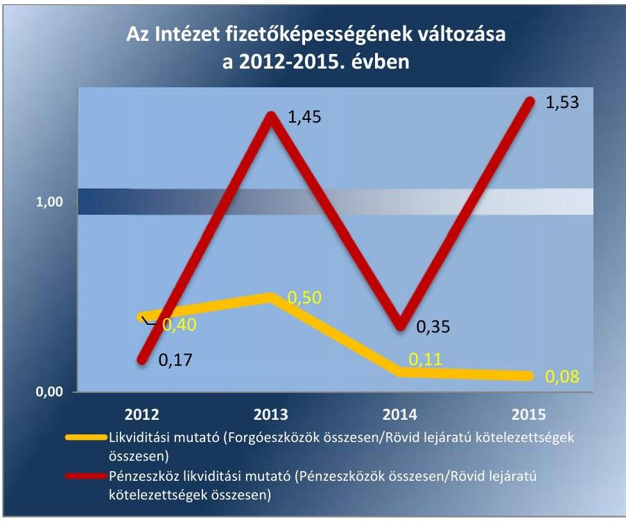

Forrás: Intézeti beszámolók adatai

EGYENSÚLYJAVÍTÓ INTÉZKEDÉSKÉNT valósult meg 2012. és 2015. között a készletek lecsökkentése kétheti szükségletet biztosító szintre; az Intézet az ügyeleti, szakápolási feladatokat kiszervezte; a közmű és más szállítói szerződéseket felülvizsgálta, energiaracionalizálást szolgáló, EU forrás felhasználásával megvalósított alternatív energiatermelést alakított ki vásárolt energia kiváltására.

Az aktív ágyak és a járóbeteg-ellátás finanszírozásának korábbi mérséklését 305,5 millió Ft-tal ellensúlyozta a kapacitások módosítása, amit az In-

---

tézet kezdeményezett az OEP ${ }^{54}$-nél. Ennek eredményeként mind a krónikus, mind a rehabilitációs ágyak egy részének szakmai szorzója jelentősen nőtt.

AZ ELŐIRÁNYZAT-MARADVÁNY megállapítása során az Intézet betartotta a jogszabályi előírásokat, azonban az előirányzat-maradványáról a 2014. és a 2015. évre vonatkozóan az Áhsz. 32. § (1) bekezdésében előírt február 28-i határidőt követően szolgáltatott adatot.

A 2012-2013. években Áhsz. ${ }_{1}$ előírásának megfelelően az éves beszámolóban és a főkönyvi kivonaton, a 2014-2015. években pedig az Áhsz. ${ }_{2}$ szabályainak megfelelve a maradvány kimutatásban és a kapcsolódó főkönyvi számlákon kimutatott előirányzat-maradvány megegyezett.

A kötelezettségvállalással terhelt maradvány megállapítása megfelelt az Ávr. 150. §-ában foglaltaknak. A maradvány bizonylatolási szabályait az Intézet olyan módon alakította ki, hogy alkalmas legyen a beszámoló alátámasztására.

# 4. A költségvetési szerv vagyongazdálkodása szabályszerű volt-e? 

## Összegző megállapítás

### 4.1. számú megállapítás

A költségvetési szerv vagyongazdálkodása - kisebb hiányosságokkal - szabályszerű volt.

A vagyon értékének megőrzését, gyarapítását szolgáló vagyongazdálkodás feltételeinek kialakítása szabályszerű volt.

Az állami tulajdon változatlan fennállása mellett az Intézet által kezelt vagyon feletti tulajdonosi joggyakorlás 2012. május 1-jével a középirányító szerv $_{1}$-hez került az MNV Zrt. ${ }^{55}$-től. A 2012. évi XXXVIII. tv. ${ }^{56}$ 13. § (1) bekezdés c) pontja alapján a középirányító szerv $_{1}$ vagyonkezelési szerződést kötött az intézettel 2013. április 26-án.

A vagyonkezelési szerződés a Vtvr. ${ }^{57}$ előírásainak megfelelően tartalmazta a tulajdonosi joggyakorlás és vagyongazdálkodási feladatok szabályozott és átlátható módon történő végrehajtását, valamint a vagyon használatának ellenőrzését. A Vtvr. 14. § (3) bekezdésében megfogalmazottak ellenére a vagyon kezelésére kötött szerződésben nem rögzítették, hogy az Intézet, mint szerződő partner a középirányító, mint tulajdonosi joggyakorló vagyon-nyilvántartási szabályzatát megismerte, és magára nézve kötelező érvényűnek ismeri el.

Az Intézet 2012-2015. években rendelkezett a Vtvr. előírásaival összhangban álló, átlátható, naprakész vagyon-nyilvántartással, amelynek tartalma is megfelelt az előírásoknak.

Az Intézet a Vtvr., valamint a vagyonkezelési szerződés szerinti adatszolgáltatási kötelezettségét a középirányító szerv által kialakított on-line felületen, illetve eseti adatbekérések alapján teljesítette.

---

### 4.2. számú megállapítás

## A mérlegben kimutatott eszközök és források valódiságát leltárral alátámasztották. A mérlegben kimutatott eszközök és források értékelése a jogszabályok előírásainak nem felelt meg.

A rendelkezésre álló felhalmozási kiadási dokumentumok alapján összességében megállapítható, hogy a beszerzett, létesített immateriális javak és tárgyi eszközök bekerülési értékének meghatározása, besorolása, állományba vétele szabályos volt. Az állománynövekedések elszámolása, dokumentálása szabályszerű volt, az értékcsökkenések elszámolása a jogszabályoknak megfelelően történt.

A mérlegtételek értékeinek megállapítása - a követelések kivételével -az Áhsz.1,2-nek megfelelő volt. A követelések elismertségét bizonyító egyeztetést az Intézet nem folytatta le, a mérlegkészítés előtt a vevőknek egyenlegközlő leveleket nem küldött. Ezzel nem teljesült a Számv. tv. 65. § (1) bekezdésének előírása, miszerint csak elismert követelést lehet a mérlegben szerepeltetni.

A mérlegben kimutatott eszközök és források
 év végi értékelése nem volt szabályszerű, mivel a követeléseknél a 2012. és a 2013. években nem számoltak el értékvesztést, ezáltal az Áhsz. 1 31. § (2) bekezdésében foglaltaknak nem tettek eleget. 2014-től a kétes értékű követelések után az Áhsz.-nek megfelelően elszámoltak értékvesztést.

A könyvviteli mérlegben kimutatott eszközök és források valódiságát az Áhsz.1,2 előírásainak megfelelően leltárral alátámasztották. Az analitikus nyilvántartások záró adatai a főkönyvi számlák záró egyenlegével megegyeztek, valamint a főkönyvi kivonatok számláinak egyenlege és a mérlegben kimutatott adatok egyezősége is fennállt.

A leltározási tevékenység során - a 2013. év kivételével - a mennyiségben és értékben nyilvántartott eszközöket tényleges mennyiségi felvétellel leltározták a belső szabályozás szerint. A tárgyi eszközöket és a készleteket ütemtervben meghatározottak alapján folyamatosan leltározták.

A LEJÁRT SZÁLLÍTÓI TARTOZÁSOKNÁL a 2014. és 2015. évi dokumentumok alapján megállapítható, hogy összességében érvényesültek a kötelezettségvállalásra és annak pénzügyi ellenjegyzésére vonatkozó belső kontrollok, mindössze 1 esetben hiányzott az aláírás mellől az ellenjegyzés tényére történő utalás az Ávr. 55. § (1) bekezdésének előírása ellenére.

A kötelezettségvállalás alapját jelentő megkötött visszterhes szerződések, adott megbízások tartalma az Ávr.-nek megfelelő volt. A kötelezettségvállalásokat az adott kiadáshoz tartozó szabad előirányzat terhére valamennyi esetben szabályosan nyilvántartásba vették, a lekötéseket rögzítették.

Néhány esetben előfordult, hogy a kötelezettségvállalások dokumentumai nem álltak rendelkezésre. Az Intézet megsértette az Áht. 2 37.§ (1) bekezdésében és a Kötelezettségvállalási Szabályzat 2.13. pontjában foglaltakat.

A 2013-2015 közötti 60 napon túli lejárt szállítóállomány csekély mértékű, nagyságrendileg 0-15\% körül mozgott a mérleg szerinti szállítói kötelezettséghez viszonyítva, ez az arány az ágazat többi szereplőjéhez képest is alacsony.

---

AZ EREDMÉNYSZEMLÉLETŰ SZÁMVITEL bevezetésével kapcsolatos feladatok végrehajtása során az Intézet nem tartotta be teljes körűen az NGM rendelet ${ }^{58}$ előírásait. Az Intézet az NGM rendelet 8. § (2) bekezdés a) pontjában meghatározott 2014. március 31-i határidőre a rendező mérleget nem állította össze, az csak 2014. július 10-én készült el. Az előkészítő feladatok közül az NGM rendelet 2. § (1) bekezdése szerinti teljes körű leltározást nem hajtotta végre az Intézet, a mennyiségben és értékben nyilvántartott eszközöket tényleges mennyiségi felvétellel nem leltározták teljes körűen 2013. december 31-i mérlegfordulónappal. A rendező mérleget az NGM rendeletben előírt tartalommal elkészítette az Intézet, és elvégezte a 2014. évi nyitást követő rendezési feladatokat is.
4.3. számú megállapítás

Az Intézet eleget tett az előírt állagmegóvási kötelezettségének. A vagyonkezelői jog átruházása szabályszerűen történt. A vagyonelemek elidegenítése és hasznosítása nem felelt meg a jogszabályi előírásoknak.

AZ INTÉZET A VAGYONKEZELT VAGYON ÁLLAGMEGÓVÁSÁVAL kapcsolatban rendelkezett karbantartási szerződésekkel, az eszközök karbantartásáról, működtetéséről folyamatosan gondoskodott.

A vagyonkezelői jogot harmadik személyre egyetlen esetben - szabályszerűen - ruházta át az Intézet. 2014. szeptember 4-én - az Nvtv. 11. § (9) bekezdésében foglalt lehetőséggel élve - vagyonkezelési átruházási szerződést kötöttek a Petz Aladár Megyei Oktató Kórházzal, két orvosi műszert adtak át részére. Ennek megfelelően módosították a vagyonkezelési szerződést is a középirányító szervvel.

A vagyonelemek elidegenítése és hasznosítása nem volt szabályszerű.
Az értékesített tárgyi eszközök vonatkozásában a tulajdonosi joggyakorló előzetes hozzájárulása nem volt szükséges, mivel azok bruttó értéke a 25 M Ft-os értékhatárt nem haladta meg. Az Intézet a tárgyi eszközöket - a Vtv. 35. § (2) bekezdés i) pontban foglaltak alapján szabályosan - versenyeztetés mellőzésével értékesítette. A versenyeztetés nélküli értékesítés során - a Vtvr. 48. § (1) bekezdésben foglaltak ellenére - a forgalmi érték megállapításáról szóló független szakértői szakvéleményt az eljárás irataihoz nem csatolt.

A bérleti szerződések megkötésekor - egy eset kivételével - nem állt rendelkezésre a szerződő fél nyilatkozata arról, hogy a Nvtv. 3. § (2) bekezdésében, a 11. § (10) bekezdésében meghatározottak szerint átlátható szervezetnek minősül-e. A 2012-2015. évben kötött bérleti szerződések tartalma megfelelő volt, a beszámolási, nyilvántartási és adatszolgáltatási kötelezettségeket, illetve a meghatározott célra történő használatot rögzítették. A helyiségek bérbeadását a saját honlapon történő hirdetés útján, illetve egyedi megkeresés alapján végezték.

---

# 5. Érvényesült-e az integritás szemlélet és ennek megfelelően ki-

építették-e az integritás kontrollrendszert az intézménynél?

Összegző megállapítás Az Intézetnél a 2015. évben az integritás szemlélet érvényesült, de az integritás kontrollrendszer kiépítettségi szintje alacsony.

Az ÁSZ Integritás Projektjében az Intézet részt vett. Az ÁSZ az Intézet integritás kontrollrendszer egészének kiépítettségi szintjét alacsonyra értékelte, amelyet részletesen a III. számú melléklet mutat be.

---

# JAVASLATOK

Az ÁSZ tv. 33. § (1) bekezdésében foglaltak értelmében az ellenőrzött szervezet vezetője köteles a jelentésben foglalt megállapításokhoz kapcsolódó intézkedési tervet összeállítani és azt a jelentés kézhezvételétől számított 30 napon belül az ÁSZ részére megküldeni. Amennyiben az ellenőrzött szervezet vezetője nem küldi meg határidőben az intézkedési tervet, vagy továbbra sem elfogadható intézkedési tervet küld, az Állami Számvevőszék elnöke az ÁSZ tv. 33. § (3) bekezdése a) és b) pontjaiban foglaltakat érvényesítheti.

## az Emberi Erőforrások Miniszterének

1.  Tegyen intézkedéseket az Intézet SZMSZ-ével összefüggésben feltárt szabálytalanság tekintetében a felelősség tisztázása érdekében, és szükség szerint intézkedjen a felelősség érvényesítéséről.
(1.2. sz. megállapítás 6-7. bekezdései alapján)

## az Országos Orvosi Rehabilitációs Intézet főigazgatójának

1.  Intézkedjen az Ávr.-ben előírtaknak megfelelően a gazdasági szervezet ügyrendjének elkészítéséről.
(2.1. sz. megállapítás 3. bekezdés alapján)
2.  Intézkedjen a Számlarend módosításáról, hogy teljes körűen megfeleljen az Áhsz.-ben előírtaknak.
(2.1. sz. megállapítás 7. bekezdése alapján)
3.  Intézkedjen az Intézet egészére vonatkozó a Bkr.-ben előírtak szerinti integrált kockázatkezelési rendszer működtetéséről.
(2.2. sz. megállapítás 2. bekezdés 1-2. mondatai alapján)
4.  Intézkedjen a szabályszerű költségvetési gazdálkodás érdekében a befolyt bevételek tervezettől történő elmaradása esetén a jogszabályban előírtak betartására.
(3.3. sz. megállapítás 2. bekezdés alapján)

---

5.  Intézkedjen a gazdálkodási jogkörök jogszabályi előírásoknak és a belső szabályozásnak megfelelő gyakorlására.
(3.3. sz. megállapítás 3. táblázat alapján)
6.  Intézkedjen a jogi személyekkel már megkötött és a jövőben megkötendő szerződések esetében, hogy a szerződő fél nyilatkozata rendelkezésre álljon, arról, hogy átlátható szervezetnek minősül.
(3.3. sz. megállapítás 10. bekezdése és a 4.3. sz. megállapítás
7.  bekezdése alapján)
8.  Intézkedjen arról, hogy az Intézet mérlegében a vevők által elismert követelés szerepeljen a Számv. tv.-ben előírtaknak megfelelően.
(4.2. sz. megállapítás 2. bekezdés 2-3. mondatai alapján)
9.  Intézkedjen a feltárt szabálytalanságok tekintetében a felelősség tisztázása érdekében, és szükség szerint intézkedjen a felelősség érvényesítéséről.
(3.3. sz. megállapítás 3. táblázat, a 3.3. sz. megállapítás 10. bekezdése és a 4.3 sz. megállapítás 5. bekezdése alapján)

---

# MELLÉKLETEK

-   I. SZ. MELLÉKLET: ÉRTELMEZŐ SZÓTÁR
    állami vagyon
    állami vagyonnak minősül:
    a) az állam tulajdonában lévő dolog, valamint a dolog módjára hasznosítható természeti erő,
    b) az a) pont hatálya alá nem tartozó mindazon vagyon, amely vonatkozásában törvény az állam kizárólagos tulajdonjogát nevesíti,
    c) az állam tulajdonában lévő tagsági jogviszonyt megtestesítő értékpapír, illetve az államot megillető egyéb társasági részesedés,
    d) az államot megillető olyan immateriális, vagyoni értékkel rendelkező jogosultság, amelyet jogszabály vagyoni értékű jogként nevesít. (Forrás: Vtv. 1. § (2) bekezdése)
    állami vagyon értékesítése
    állami vagyon használója
    állami vagyon használója
    állami vagyon hasznosítása
    állami vagyon hasznosítására kötött szerződés
    állami vagyon kezelője /vagyonkezelő
    Állami vagyonnak minősül:
    a) az állam tulajdonában lévő dolog, valamint a dolog módjára hasznosítható természeti erő,
    b) az a) pont hatálya alá nem tartozó mindazon vagyon, amely vonatkozásában törvény az állam kizárólagos tulajdonjogát nevesíti,
    c) az állam tulajdonában lévő tagsági jogviszonyt megtestesítő értékpapír, illetve az államot megillető egyéb társasági részesedés,
    d) az államot megillető olyan immateriális, vagyoni értékkel rendelkező jogosultság, amelyet jogszabály vagyoni értékű jogként nevesít. (Forrás: Vtv. 1. § (2) bekezdése)
    Állami vagyon tulajdonjogának bármely jogcímen történő, visszterhes átruházása. (Forrás: Vtvr. 1. § (7) bekezdés d) pontja)
    Az a természetes vagy jogi személy, jogi személyiséggel nem rendelkező szervezet, aki, vagy amely törvény vagy szerződés alapján, bármely jogcímen (bérlet, haszonbérlet, használat stb.) állami vagyont birtokol, használ, szedi annak hasznait, hasznosít, ide nem értve a haszonélvezőt, a vagyonkezelőt és a tulajdonosi jogok gyakorlóját". (Forrás: Vtvr. 1. § (7) bekezdés a) pontja)
    Az állami vagyont az MNV Zrt. maga kezeli, vagy szerződés - így különösen bérlet, haszonbérlet, megbízás - alapján központi költségvetési szervnek, természetes vagy jogi személynek, vagy jogi személyiséggel nem rendelkező gazdálkodó szervezetnek hasznosításra átengedi.
    (Forrás: Vtv. 23. § (1) bekezdése, hatályos 2012. január 1-jétől)
    Az állami vagyonnal a tulajdonosi joggyakorló maga gazdálkodik, vagy szerződés - így különösen bérlet, haszonbérlet, megbízás - alapján hasznosításra átengedi, illetőleg vagyonkezelésbe, haszonélvezetbe adja. (Forrás: Vtv. 23. § (1) bekezdése, hatályos 2013. június 28-ától)
    Az állami vagyon hasznosítására kötött szerződések elsődleges célja az állami vagyon hatékony működtetése, állagának védelme, értékének megőrzése, illetve gyarapítása, az állami és közfeladatok ellátásának elősegítése. (Forrás: Vtv. 23. § (2) bekezdése)
    Az állami vagyont az MNV Zrt. maga kezeli, vagy szerződés - így különösen bérlet, haszonbérlet, megbízás - alapján központi költségvetési szervnek, természetes vagy jogi személynek, vagy jogi személyiséggel nem rendelkező gazdálkodó szervezetnek hasznosításra átengedi." Az állami vagyonra vonatkozóan az MNV Zrt. kizárólag az Nvtv-ben meghatározott személyekkel köthet vagyonkezelési szerződést. (Forrás: Vtv. 27. § (1) bekezdése, hatályos 2012. január 1-jétől)

---

| ÁSZ Integritás Projekt | Az Állami Számvevőszék 2009-ben indította el a „Korrupciós kockázatok feltérképezése - Integritás alapú közigazgatási kultúra terjesztése" című, európai uniós forrás- |
| :----------------------: | :---------------------------------------------------------------------------------------------------------------------------------------------------------------------------------------------------------------------------------------------------------------------------------------------------------------------------------------------------------------------------------------------------------------------------------------------------------------------------------------------------------------------------------------------------------------------------------------------------------------------------------------------------------------------------------------------------------------------------------------------------------------------------------------------------------------------------------------------------------------------------------------------------------------------------------------------------------------------------------------------------------------------------------------------------------------------------------------------------------------------------------------------------------------------------------------------------------------------------------------------------------------------------------------------------------------------------------------------------------------------------------------------------------------------------------------------------------------------------------------------------------------------------------------------------------------------------------------------------------------------------------------------------------------------------------------------------------------------------------------------------------------------------------------------------------------------------------------------------------------------------------------------------------------------------------------------------------------------------------------------------------------------------------------------------------------------------------------------------------------------------------------------------------------------------------------------------------------------------------------------------------------------------------------------------------------------------------------------------------------------------------------------------------------------------------------------------------------------------------------------------------------------------------------------------------------------------------------------------------------------------------------------------------------------------------------------------------------------------------------------------------------------------------------------------------------------------------------------------------------------------------------------------------------------------------------------------------------------------------------------------------------------------------------------------------------------------------------------------------------------------------------------------------------------------------------------------------------------------------------------------------------------------------------------------------------------------------------------------------------------------------------------------------------------------------------------------------------------------------------------------------------------------------------------------------------------------------------------------------------------------------------------------------------------------------------------------------------------------------------------------------------------------------------------------------------------------------------------------------------------------------------------------------------------------------------------------------------------------------------------------------------------------------------------------------------------------------------------------------------------------------------------------------------------------------------------------------------------------------------------------------------------------------------------------------------------------------------------------------------------------------------------------------------------------------------------------------------------------------------------------------------------------------------------------------------------------------------------------------------------------------------------------------------------------------------------------------------------------------------------------------------------------------------------------------------------------------------------------------------------------------------------------------------------------------------------------------------------------------------------------------------------------------------------------------------------------------------------------------------------------------------------------------------------------------------------------------------------------------------------------------------------------------------------------------------------------------------------------------------------------------------------------------------------------------------------------------------------------------------------------------------------------------------------------------------------------------------------------------------------------------------------------------------------------------------------------------------------------------------------------------------------------------------------------------------------------------------------------------------------------------------------------------------------------------------------------------------------------------------------------------------------------------------------------------------------------------------------------------------------------------------------------------------------------------------------------------------------------------------------------------------------------------------------------------------------------------------------------------------------------------------------------------------------------------------------------------------------------------------------------------------------------------------------------------------------------------------------------------------------------------------------------------------------------------------------------------------------------------------------------------------------------------------------------------------------------------------------------------------------------------------------------------------------------------------------------------------------------------------------------------------------------------------------------------------------------------------------------------------------------------------------------------------------------------------------------------------------------------------------------------------------------------------------------------------------------------------------------------------------------------------------------------------------------------------------------------------------------------------------------------------------------------------------------------------------------------------------------------------------------------------------------------------------------------------------------------------------------------------------------------------------------------------------------------------------------------------------------------------------------------------------------------------------------------------------------------------------------------------------------------------------------------------------------------------------------------------------------------------------------------------------------------------------------------------------------------------------------------------------------------------------------------------------------------------------------------------------------------------------------------------------------------------------------------------------------------------------------------------------------------------------------------------------------------------------------------------------------------------------------------------------------------------------------------------------------------------------------------------------------------------------------------------------------------------------------------------------------------------------------------------------------------------------------------------------------------------------------------------------------------------------------------------------------------------------------------------------------------------------------------------------------------------------------------------------------------------------------------------------------------------------------------------------------------------------------------------------------------------------------------------------------------------------------------------------------------------------------------------------------------------------------------------------------------------------------------------------------------------------------------------------------------------------------------------------------------------------------------------------------------------------------------------------------------------------------------------------------------------------------------------------------------------------------------------------------------------------------------------------------------------------------------------------------------------------------------------------------------------------------------------------------------------------------------------------------------------------------------------------------------------------------------------------------------------------------------------------------------------------------------------------------------------------------------------------------------------------------------------------------------------------------------------------------------------------------------------------------------------------------------------------------------------------------------------------------------------------------------------------------------------------------------------------------------------------------------------------------------------------------------------------------------------------------------------------------------------------------------------------------------------------------------------------------------------------------------------------------------------------------------------------------------------------------------------------------------------------------------------------------------------------------------------------------------------------------------------------------------------------------------------------------------------------------------------------------------------------------------------------------------------------------------------------------------------------------------------------------------------------------------------------------------------------------------------------------------------------------------------------------------------------------------------------------------------------------------------------------------------------------------------------------------------------------------------------------------------------------------------------------------------------------------------------------------------------------------------------------------------------------------------------------------------------------------------------------------------------------------------------------------------------------------------------------------------------------------------------------------------------------------------------------------------------------------------------------------------------------------------------------------------------------------------------------------------------------------------------------------------------------------------------------------------------------------------------------------------------------------------------------------------------------------------------------------------------------------------------------------------------------------------------------------------------------------------------------------------------------------------------------------------------------------------------------------------------------------------------------------------------------------------------------------------------------------------------------------------------------------------------------------------------------------------------------------------------------------------------------------------------------------------------------------------------------------------------------------------------------------------------------------------------------------------------------------------------------------------------------------------------------------------------------------------------------------------------------------------------------------------------------------------------------------------------------------------------------------------------------------------------------------------------------------------------------------------------------------------------------------------------------------------------------------------------------------------------------------------------------------------------------------------------------------------------------------------------------------------------------------------------------------------------------------------------------------------------------------------------------------------------------------------------------------------------------------------------------------------------------------------------------------------------------------------------------------------------------------------------------------------------------------------------------------------------------------------------------------------------------------------------------------------------------------------------------------------------------------------------------------------------------------------------------------------------------------------------------------------------------------------------------------------------------------------------------------------------------------------------------------------------------------------------------------------------------------------------------------------------------------------------------------------------------------------------------------------------------------------------------------------------------------------------------------------------------------------------------------------------------------------------------------------------------------------------------------------------------------------------------------------------------------------------------------------------------------------------------------------------------------------------------------------------------------------------------------------------------------------------------------------------------------------------------------------------------------------------------------------------------------------------------------------------------------------------------------------------------------------------------------------------------------------------------------------------------------------------------------------------------------------------------------------------------------------------------------------------------------------------------------------------------------------------------------------------------------------------------------------------------------------------------------------------------------------------------------------------------------------------------------------------------------------------------------------------------------------------------------------------------------------------------------------------------------------------------------------------------------------------------------------------------------------------------------------------------------------------------------------------------------------------------------------------------------------------------------------------------------------------------------------------------------------------------------------------------------------------------------------------------------------------------------------------------------------------------------------------------------------------------------------------------------------------------------------------------------------------------------------------------------------------------------------------------------------------------------------------------------------------------------------------------------------------------------------------------------------------------------------------------------------------------------------------------------------------------------------------------------------------------------------------------------------------------------------------------------------------------------------------------------------------------------------------------------------------------------------------------------------------------------------------------------------------------------------------------------------------------------------------------------------------------------------------------------------------------------------------------------------------------------------------------------------------------------------------------------------------------------------------------------------------------------------------------------------------------------------------------------------------------------------------------------------------------------------------------------------------------------------------------------------------------------------------------------------------------------------------------------------------------------------------------------------------------------------------------------------------------------------------------------------------------------------------------------------------------------------------------------------------------------------------------------------------------------------------------------------------------------------------------------------------------------------------------------------------------------------------------------------------------------------------------------------------------------------------------------------------------------------------------------------------------------------------------------------------------------------------------------------------------------------------------------------------------------------------------------------------------------------------------------------------------------------------------------------------------------------------------------------------------------------------------------------------------------------------------------------------------------------------------------------------------------------------------------------------------------------------------------------------------------------------------------------------------------------------------------------------------------------------------------------------------------------------------------------------------------------------------------------------------------------------------------------------------------------------------------------------------------------------------------------------------------------------------------------------------------------------------------------------------------------------------------------------------------------------------------------------------------------------------------------------------------------------------------------------------------------------------------------------------------------------------------------------------------------------------------------------------------------------------------------------------------------------------------------------------------------------------------------------------------------------------------------------------------------------------------------------------------------------------------------------------------------------------------------------------------------------------------------------------------------------------------------------------------------------------------------------------------------------------------------------------------------------------------------------------------------------------------------------------------------------------------------------------------------------------------------------------------------------------------------------------------------------------------------------------------------------------------------------------------------------------------------------------------------------------------------------------------------------------------------------------------------------------------------------------------------------------------------------------------------------------------------------------------------------------------------------------------------------------------------------------------------------------------------------------------------------------------------------------------------------------------------------------------------------------------------------------------------------------------------------------------------------------------------------------------------------------------------------------------------------------------------------------------------------------------------------------------------------------------------------------------------------------------------------------------------------------------------------------------------------------------------------------------------------------------------------------------------------------------------------------------------------------------------------------------------------------------------------------------------------------------------------------------------------------------------------------------------------------------------------------------------------------------------------------------------------------------------------------------------------------------------------------------------------------------------------------------------------------------------------------------------------------------------------------------------------------------------------------------------------------------------------------------------------------------------------------------------------------------------------------------------------------------------------------------------------------------------------------------------------------------------------------------------------------------------------------------------------------------------------------------------------------------------------------------------------------------------------------------------------------------------------------------------------------------------------------------------------------------------------------------------------------------------------------------------------------------------------------------------------------------------------------------------------------------------------------------------------------------------------------------------------------------------------------------------------------------------------------------------------------------------------------------------------------------------------------------------------------------------------------------------------------------------------------------------------------------------------------------------------------------------------------------------------------------------------------------------------------------------------------------------------------------------------------------------------------------------------------------------------------------------------------------------------------------------------------------------------------------------------------------------------------------------------------------------------------------------------------------------------------------------------------------------------------------------------------------------------------------------------------------------------------------------------------------------------------------------------------------------------------------------------------------------------------------------------------------------------------------------------------------------------------------------------------------------------------------------------------------------------------------------------------------------------------------------------------------------------------------------------------------------------------------------------------------------------------------------------------------------------------------------------------------------------------------------------------------------------------------------------------------------------------------------------------------------------------------------------------------------------------------------------------------------------------------------------------------------------------------------------------------------------------------------------------------------------------------------------------------------------------------------------------------------------------------------------------------------------------------------------------------------------------------------------------------------------------------------------------------------------------------------------------------------------------------------------------------------------------------------------------------------------------------------------------------------------------------------------------------------------------------------------------------------------------------------------------------------------------------------------------------------------------------------------------------------------------------------------------------------------------------------------------------------------------------------------------------------------------------------------------------------------------------------------------------------------------------------------------------------------------------------------------------------------------------------------------------------------------------------------------------------------------------------------------------------------------------------------------------------------------------------------------------------------------------------------------------------------------------------------------------------------------------------------------------------------------------------------------------------------------------------------------------------------------------------------------------------------------------------------------------------------------------------------------------------------------------------------------------------------------------------------------------------------------------------------------------------------------------------------------------------------------------------------------------------------------------------------------------------------------------------------------------------------------------------------------------------------------------------------------------------------------------------------------------------------------------------------------------------------------------------------------------------------------------------------------------------------------------------------------------------------------------------------------------------------------------------------------------------------------------------------------------------------------------------------------------------------------------------------------------------------------------------------------------------------------------------------------------------------------------------------------------------------------------------------------------------------------------------------------------------------------------------------------------------------------------------------------------------------------------------------------------------------------------------------------------------------------------------------------------------------------------------------------------------------------------------------------------------------------------------------------------------------------------------------------------------------------------------------------------------------------------------------------------------------------------------------------------------------------------------------------------------------------------------------------------------------------------------------------------------------------------------------------------------------------------------------------------------------------------------------------------------------------------------------------------------------------------------------------------------------------------------------------------------------------------------------------------------------------------------------------------------------------------------------------------------------------------------------------------------------------------------------------------------------------------------------------------------------------------------------------------------------------------------------------------------------------------------------------------------------------------------------------------------------------------------------------------------------------------------------------------------------------------------------------------------------------------------------------------------------------------------------------------------------------------------------------------------------------------------------------------------------------------------------------------------------------------------------------------------------------------------------------------------------------------------------------------------------------------------------------------------------------------------------------------------------------------------------------------------------------------------------------------------------------------------------------------------------------------------------------------------------------------------------------------------------------------------------------------------------------------------------------------------------------------------------------------------------------------------------------------------------------------------------------------------------------------------------------------------------------------------------------------------------------------------------------------------------------------------------------------------------------------------------------------------------------------------------------------------------------------------------------------------------------------------------------------------------------------------------------------------------------------------------------------------------------------------------------------------------------------------------------------------------------------------------------------------------------------------------------------------------------------------------------------------------------------------------------------------------------------------------------------------------------------------------------------------------------------------------------------------------------------------------------------------------------------------------------------------------------------------------------------------------------------------------------------------------------------------------------------------------------------------------------------------------------------------------------------------------------------------------------------------------------------------------------------------------------------------------------------------------------------------------------------------------------------------------------------------------------------------------------------------------------------------------------------------------------------------------------------------------------------------------------------------------------------------------------------------------------------------------------------------------------------------------------------------------------------------------------------------------------------------------------------------------------------------------------------------------------------------------------------------------------------------------------------------------------------------------------------------------------------------------------------------------------------------------------------------------------------------------------------------------------------------------------------------------------------------------------------------------------------------------------------------------------------------------------------------------------------------------------------------------------------------------------------------------------------------------------------------------------------------------------------------------------------------------------------------------------------------------------------------------------------------------------------------------------------------------------------------------------------------------------------------------------------------------------------------------------------------------------------------------------------------------------------------------------------------------------------------------------------------------------------------------------------------------------------------------------------------------------------------------------------------------------------------------------------------------------------------- §-a) |
| felújítás | Az elhasználódott tárgyi eszköz eredeti állaga (kapacitása, pontossága) helyreállítását szolgáló időszakonként visszatérő olyan tevékenység, melynek során az eszköz élettartama megnövekszik, minősége, használata jelentősen javul, így a pótlólagos ráfordításból a jövőben gazdasági előnyök származnak. (Forrás: Számv. tv. 3. § (4) bekezdés 8. pontja) |
| hasznosítás | A nemzeti vagyon birtoklásának, használatának, hasznok szedése jogának bármely a tulajdonjog átruházását nem eredményező - jogcímen történő átengedése, ide nem értve a vagyonkezelésbe adást, valamint a haszonélvezeti jog alapítását. (Forrás: Nvtv. 3. § (1) bekezdés 4. pontja) |
| információs és kommunikációs rendszer | A költségvetési szerv vezetője által kialakított és működtetett olyan rendszer, mely biztosítja, hogy a megfelelő információk a megfelelő időben eljutnak az illetékes szervezethez, szervezeti egységhez, illetve személyhez. (Forrás: Bkr. 9. § (1) bekezdés) |
| integritás | Az integritás az elvek, értékek, cselekvések, módszerek, intézkedések konzisztenciáját jelenti, vagyis olyan magatartásmódot, amely meghatározott értékeknek megfelel. (Forrás: Nemzetgazdasági Minisztérium: Magyarországi államháztartási belső kontroll standardok Útmutató 1.6.1. pontja, 2012. december) |
| irányító szerv/felügyeleti szerv | A költségvetési szerv tekintetében az e törvényben meghatározott irányítási hatáskört gyakorló szerv. (Forrás: Áht.; 1. § 9. pontja) |
| kincstári biztos | A kincstári biztos kijelölését az államháztartásért felelős miniszternél a Kincstár kezdeményezi. A kincstári biztos köteles figyelemmel kísérni megbízatásának időpontjától kezdve a költségvetési szerv tervezését, gazdálkodását, beszámolását, a jogszabályokban előírt feladatainak ellátását, feltárni azokat az okokat, amelyek a tartós fizetésképtelenséghez vezettek, a szükséges intézkedések azonnali végrehajtására irányuló intézkedési tervet készíteni, azonnali intézkedéseket kezdeményezni és írásbeli |

---

kincstári költségvetés
kockázat
kockázatkezelési rendszer
kontrollkörnyezet
kontrolltevékenységek
kommunikáció
költségvetési főfelügyelő, felügyelő
középirányító szerv
közfeladat
monitoring
utasításokat kiadni a tartozásállomány felszámolására, a gazdálkodás egyensúlyának biztosítására, a követelések behajtására. (Forrás: Ávr. 116-117. § hatályos 2013. augusztus 18-ig)
A központi költségvetésről szóló törvény elfogadását követően a fejezetet irányító szerv az államháztartás központi alrendszerébe tartozó költségvetési szerv és a fejezeti kezelésű előirányzat kiemelt előirányzatait, valamint az elkülönített állami pénzalapok és a társadalombiztosítás pénzügyi alapjai jogszabályi előírás szerinti bevételeit és kiadásait kincstári költségvetés kiadásával állapítja meg. (Forrás: Áht. 28. § (2) bekezdés)
A kockázat annak a valószínűségét jelenti, hogy egy vagy több esemény vagy intézkedés nem kívánt módon befolyásolja a rendszer működését, céljainak megvalósulását. (Forrás: Javaslatok a korrupciós kockázatok kezelésére - Kockázatkezelési és ellenőrzési módszertan 35. oldal, ÁSZ)
Olyan irányítási eszközök és módszerek összessége, melynek elemei a szervezeti célok elérését veszélyeztető tényezők (kockázatok) azonosítása, elemzése, csoportosítása, nyomon követése, valamint szükség esetén a kockázati kitettség mérséklése. (Forrás: Bkr. 2. § m) pontja)
A költségvetési szerv vezetője által kialakított olyan elvek, eljárások, belső szabályzatok összessége, amelyben világos a szervezeti struktúra, egyértelműek a felelősségi, hatásköri viszonyok és feladatok, meghatározottak az etikai elvárások a szervezet minden szintjén, átlátható a humánerőforrás-kezelés. (Forrás: Bkr. 6. § (1) bekezdés)
A költségvetési szerv vezetője által a szervezeten belül kialakított (kontroll) tevékenységek, melyek biztosítják a kockázatok kezelését, hozzájárulnak a szervezet céljainak eléréséhez. (Forrás: Bkr. 8. § (1) bekezdés)
Az a tevékenység, melynek során információ továbbítása valósul meg. A kommunikációs folyamat résztvevői között tájékoztatás történik, mely során tényeket, ezek magyarázatát közlik.
Az államháztartásért felelős miniszter a Kormány irányítása alá tartozó fejezetet irányító szervhez, a Kormány irányítása vagy felügyelete alá tartozó költségvetési szervhez, valamint az elkülönített állami pénzalapok és a társadalombiztosítás pénzügyi alapjai kezelő szerveihez költségvetési főfelügyelőt, felügyelőt rendelhet ki. A költségvetési főfelügyelő, felügyelő a gazdálkodás költségvetés-politikával való összhangja és a takarékos, szabályszerű, eredményes működés érdekében a Kormány rendeletében meghatározott intézkedéseket tehet, így különösen előzetesen véleményezi a kötelezettségvállalásra irányuló eljárásokat és a nagy összegű kötelezettségvállalások tekintetében kifogással élhet. (Forrás: Áht. 39. § (1)-(2) bekezdés)
A költségvetési szerv tekintetében törvény vagy kormányrendelet alapján meghatározott, átruházott irányítási hatásköröket gyakorló szerv. (Forrás: Áht. 9. § (4) bekezdés)
Jogszabályban meghatározott állami vagy önkormányzati feladat, amit az arra kötelezett közérdekből, a jogszabályban meghatározott követelményeknek és feltételeknek megfelelve végez, ideértve a lakosság közszolgáltatásokkal való ellátását, továbbá az állam nemzetközi szerződésekben vállalt kötelezettségeiből adódó közérdekű feladatokat, valamint e feladatok ellátásakor szükséges infrastruktúra biztosítását is. (Forrás: Nvtv. 3. § (1) bekezdés 7. pontja)
A monitoring általánosságban a különböző szintű szervezeti célok megvalósításának folyamatát kíséri figyelemmel, melynek során a releváns eseményekről és tevékenységekről (együtt: folyamatokról) rendszeres jelleggel, strukturált, döntéstámogató információkhoz jutnak a szervezet vezetői. (Forrás: NGM Útmutató a költségvetési szervek monitoring rendszeréhez 2011. november)

---

monitoring-rendszer

A költségvetési szerv vezetője köteles olyan monitoring rendszert működtetni, mely lehetővé teszi a szervezet tevékenységének, a célok megvalósításának nyomon követését. A költségvetési szerv monitoring rendszere az operatív tevékenységek keretében megvalósuló folyamatos és eseti nyomon követésből, valamint az operatív tevékenységektől függetlenül működő belső ellenőrzésből áll. (Forrás: Bkr. 10. §)
tulajdonosi joggyakorló

Vagyongazdálkodás

Aki a nemzeti vagyon felett az államot vagy a helyi önkormányzatot megillető tulajdonosi jogok és kötelezettségek összességének gyakorlására jogosult. (Forrás: Nvtv. 3. § (1) bekezdés 17. pontja)

A nemzeti vagyongazdálkodás feladata a nemzeti vagyon rendeltetésének megfelelő, az állam, az önkormányzat mindenkori teherbíró képességéhez igazodó, elsődlegesen a közfeladatok ellátásához és a mindenkori társadalmi szükségletek kielégítéséhez szükséges, egységes elveken alapuló, átlátható, hatékony és költségtakarékos működtetése, értékének megőrzése, állagának védelme, értéknövelő használata, hasznosítása, gyarapítása, továbbá az állam vagy a helyi önkormányzat feladatának ellátása szempontjából feleslegessé váló vagyontárgyak elidegenítése. (Forrás: Nvtv. 7. § (2) bekezdése)

---

# - II. SZ. MELLÉKLET: A TELJESÍTMÉNY-ELLENŐRZÉSI KIEGÉSZÍTŐ MODUL MEGÁLLAPÍTÁSAI

Gazdaságossági, hatékonysági és eredményességi követelményeket a pénzügyi és a vagyongazdálkodás folyamatában az Intézet nem alakított ki. A teljesítmény-ellenőrzési kiegészítő modul ellenőrzése nem volt lefolytatható.

---

A humánerőforrás-gazdálkodás, a szervezet vagyonának megvédése, a nemkívánatos dolgozói magatartással szembeni intézkedések és azok érvényesülése területén az integritás kontrollrendszer kiépítettségi szintjét az ÁSZ magasnak értékelte.

Az összeférhetetlenség és etikai elvárások, az integritás erősítése, annak tudatosítása, valamint a kockázatelemzések alkalmazása esetén az integritás kontrollrendszer kiépítettsége alacsony szintet mutat.

Összességében az Intézet integritás kontrollrendszer kiépítettségét az ÁSZ alacsonynak értékelte.
Az Intézet adatszolgáltatása alapján a korrupciós kockázat az összeférhetetlenségi és etikai elvárások értékelése során merült fel. Az Intézet nem rendelkezett az etikai elvárásokat, eljárásrendet tartalmazó szabályzattal. 2014. április 16-án hatályba lépett az egészségügyi szakdolgozók tekintetében a Magyar Egészségügyi Szakdolgozói Kamara Etikai Kódexe, ezt tekintették irányadónak, de az nem vonatkozik az Intézet összes dolgozójára. Az Intézet nem rögzítette a különféle ajándékok, meghívások, utaztatás elfogadásának szabályait.

Az Intézet tíz éven keresztül nem rendelkezett az irányítószerv által jóváhagyott SZMSZ-szel.
Az Intézet nem mérte fel a közép- és hosszú távú tervek végrehajtását és nem értékelte a nyilvánosan megismerhető mutatókat. A főigazgató nem működtetett az Intézet egészére vonatkozó kockázatkezelési rendszert, nem mérte fel és nem állapította meg az Intézet tevékenységében, gazdálkodásában rejlő kockázatokat, valamint nem határozta meg az egyes kockázatokkal kapcsolatban szükséges intézkedéseket, azok teljesítésének folyamatos nyomon követési módját.

Az Intézet munkatársai körében az elmúlt 3 évben korrupcióellenes képzés nem volt, nem rendelkezik nyilvánosan közzétett stratégiával, így intézkedés sem történt a szervezeti kultúra javítására, integritás erősítésére, a korrupció elleni fellépésre.

Az Intézet nem hangsúlyozta következetesen, illetve nem tudatosította az alkalmazottakban az integritás fontosságát, nem szabályozta, illetve nem hívta fel a korrupciós szempontból veszélyeztetett beosztásban dolgozó alkalmazottak figyelmét a jellemző kockázatokra és a kockázatokat megelőző intézkedésekre.

---

# FÜGGELÉK: ÉSZREVÉTELEK

A jelentéstervezetet a Számvevőszék 15 napos észrevételezésre megküldte az ellenőrzött szervezetek vezetőinek az ÁSZ tv. 29. § (1) bekezdése előírásának megfelelően.

Az ÁSZ a jelentéstervezetet észrevételezésre megküldte az Emberi Erőforrások Minisztériuma miniszterének, az Állami Egészségügyi Ellátó Központ főigazgatójának és az Országos Orvosi Rehabilitációs Intézet főigazgatójának.

Az Emberi Erőforrások Minisztériuma miniszterének nemleges észrevételét, valamint az Országos Orvosi Rehabilitációs Intézet főigazgatója és az Állami Egészségügyi Ellátó Központ főigazgatója észrevételeit és az arra adott válaszokat a függelék alább tartalmazza.

[^0]
[^0]: * 29. § (1) Az Állami Számvevőszék az ellenőrzési megállapításait megküldi az ellenőrzött szervezet vezetőjének vagy az általa megbízott személynek, és annak, akinek személyes felelősségét állapította meg.
    (2) Az ellenőrzött szervezet vezetője és a felelősként megjelölt személy az
 ellenőrzés megállapításaira tizenöt napon belül írásban észrevételt tehet.
    (3) Az Állami Számvevőszék az észrevételre a beérkezésétől számított harminc napon belül írásban válaszol. A figyelembe nem vett észrevételeket köteles a jelentésben feltüntetni, és megindokolni, hogy azokat miért nem fogadta el.

---

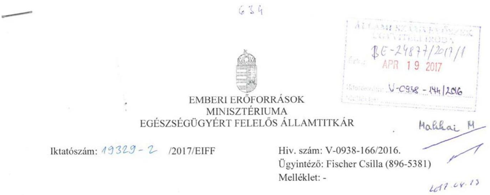

Domokos László részére
elnök

Állami Számvevőszék
Budapest
Apáczai Csere János u. 10.
1052

Tárgy: „A központi alrendszer egyes intézményei pénzügyi és vagyongazdálkodásának ellenőrzése - Országos Orvosi Rehabilitációs Intézet" című számvevőszéki jelentéstervezet véleményezése

Tisztelt Elnök Úr!
Hivatkozással a V-0938-166/2016. iktatószámon továbbított „A központi alrendszer egyes intézményei pénzügyi és vagyongazdálkodásának ellenőrzése - Országos Orvosi Rehabilitációs Intézet" című jelentéstervezetre, az alábbiakról tájékoztatom.

Az Emberi Erőforrások Minisztériuma által áttekintésre került jelentéstervezettel kapcsolatban észrevételt nem kívánok tenni.

Budapest, 2017. április 10.
Üdvözlettel:
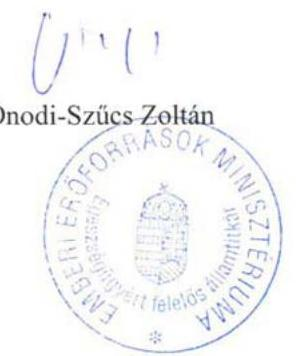

Cím:1051 Budapest, Arany J. u. 6-8. Tel: 061/795-1280, Fax: 061/795-0157
E-mail: euallamtitkar@emmi.gov.hu

---

# 521 

## 1121. Budapest, Szanatórium u. 19. Tel: $+36 / 1 / 391-1901$, Fax: $+36 / 1 / 200-2642$ Főigazgatóság e-mail: oorifoig@rehabint.hu

Állami Számvevőszék
Domokos László elnök úr részére

## BUDAPEST

Apáczai Csere János u. 10.
1052

Iktatószám: Ig/178/2/2017
Tárgy: észrevételek
Hiv.szám: V-0938-164/2016
A. 2017. 2017. 2017. 2017. 2017. 2017. 2017. 2017. 2017. 2017. 2017. 2017. 2017. 2017. 2017. 2017. 2017. 2017. 2017. 2017. 2017. 2017. 2017. 2017. 2017. 2017. 2017. 2017. 2017. 2017. 2017. 2017. 2017. 2017. 2017. 2017. 2017. 2017. 2017. 2017. 2017. 2017. 2017. 2017. 2017. 2017. 2017. 2017. 2017. 2017. 2017. 2017. 2017. 2017. 2017. 2017. 2017. 2017. 2017. 2017. 2017. 2017. 2017. 2017. 2017. 2017. 2017. 2017. 2017. 2017. 2017. 2017. 2017. 2017. 2017. 2017. 2017. 2017. 2017. 2017. 2017. 2017. 2017. 2017. 2017. 2017. 2017. 2017. 2017. 2017. 2017. 2017. 2017. 2017. 2017. 2017. 2017. 2017. 2017. 2017. 2017. 2017. 2017. 2017. 2017. 2017. 2017. 2017. 2017. 2017. 2017. 2017. 2017. 2017. 2017. 2017. 2017. 2017. 2017. 2017. 2017. 2017. 2017. 2017. 2017. 2017. 2017. 2017. 2017. 2017. 2017. 2017. 2017. 2017. 2017. 2017. 2017. 2017. 2017. 2017. 2017. 2017. 2017. 2017. 2017. 2017. 2017. 2017. 2017. 2017. 2017. 2017. 2017. 2017. 2017. 2017. 2017. 2017. 2017. 2017. 2017. 2017. 2017. 2017. 2017. 2017. 2017. 2017. 2017. 2017. 2017. 2017. 2017. 2017. 2017. 2017. 2017. 2017. 2017. 2017. 2017. 2017. 2017. 2017. 2017. 2017. 2017. 2017. 2017. 2017. 2017. 2017. 2017. 2017. 2017. 2017. 2017. 2017. 2017. 2017. 2017. 2017. 2017. 2017. 2017. 2017. 2017. 2017. 2017. 2017. 2017. 2017. 2017. 2017. 2017. 2017. 2017. 2017. 2017. 2017. 2017. 2017. 2017. 2017. 2017. 2017. 2017. 2017. 2017. 2017. 2017. 2017. 2017. 2017. 2017. 2017. 2017. 2017. 2017. 2017. 2017. 2017. 2017. 2017. 2017. 2017. 2017. 2017. 2017. 2017. 2017. 2017. 2017. 2017. 2017. 2017. 2017. 2017. 2017. 2017. 2017. 2017. 2017. 2017. 2017. 2017. 2017. 2017. 2017. 2017. 2017. 2017. 2017. 2017. 2017. 2017. 2017. 2017. 2017. 2017. 2017. 2017. 2017. 2017. 2017. 2017. 2017. 2017. 2017. 2017. 2017. 2017. 2017. 2017. 2017. 2017. 2017. 2017. 2017. 2017. 2017. 2017. 2017. 2017. 2017. 2017. 2017. 2017. 2017. 2017. 2017. 2017. 2017. 2017. 2017. 2017. 2017. 2017. 2017. 2017. 2017. 2017. 2017. 2017. 2017. 2017. 2017. 2017. 2017. 2017. 2017. 2017. 2017. 2017. 2017. 2017. 2017. 2017. 2017. 2017. 2017. 2017. 2017. 2017. 2017. 2017. 2017. 2017. 2017. 2017. 2017. 2017. 2017. 2017. 2017. 2017. 2017. 2017. 2017. 2017. 2017. 2017. 2017. 2017. 2017. 2017. 2017. 2017. 2017. 2017. 2017. 2017. 2017. 2017. 2017. 2017. 2017. 2017. 2017. 2017. 2017. 2017. 2017. 2017. 2017. 2017. 2017. 2017. 2017. 2017. 2017. 2017. 2017. 2017. 2017. 2017. 2017. 2017. 2017. 2017. 2017. 2017. 2017. 2017. 2017. 2017. 2017. 2017. 2017. 2017. 2017. 2017. 2017. 2017. 2017. 2017. 2017. 2017. 2017. 2017. 2017. 2017. 2017. 2017. 2017. 2017. 2017. 2017. 2017. 2017. 2017. 2017. 2017. 2017. 2017. 2017. 2017. 2017. 2017. 2017. 2017. 2017. 2017. 2017. 2017. 2017. 2017. 2017. 2017. 2017. 2017. 2017. 2017. 2017. 2017. 2017. 2017. 2017. 2017. 2017. 2017. 2017. 2017. 2017. 2017. 2017. 2017. 2017. 2017. 2017. 2017. 2017. 2017. 2017. 2017. 2017. 2017. 2017. 2017. 2017. 2017. 2017. 2017. 2017. 2017. 2017. 2017. 2017. 2017. 2017. 2017. 2017. 2017. 2017. 2017. 2017. 2017. 2017. 2017. 2017. 2017. 2017. 2017. 2017. 2017. 2017. 2017. 2017. 2017. 2017. 2017. 2017. 2017. 2017. 2017. 2017. 2017. 2017. 2017. 2017. 2017. 2017. 2017. 2017. 2017. 2017. 2017. 2017. 2017. 2017. 2017. 2017. 2017. 2017. 2017. 2017. 2017. 2017. 2017. 2017. 2017. 2017. 2017. 2017. 2017. 2017. 2017. 2017. 2017. 2017. 2017. 2017. 2017. 2017. 2017. 2017. 2017. 2017. 2017. 2017. 2017. 2017. 2017. 2017. 2017. 2017. 2017. 2017. 2017. 2017. 2017. 2017. 2017. 2017. 2017. 2017. 2017. 2017. 2017. 2017. 2017. 2017. 2017. 2017. 2017. 2017. 2017. 2017. 2017. 2017. 2017. 2017. 2017. 2017. 2017. 2017. 2017. 2017. 2017. 2017. 2017. 2017. 2017. 2017. 2017. 2017. 2017. 2017. 2017. 2017. 2017. 2017. 2017. 2017. 2017. 2017. 2017. 2017. 2017. 2017. 2017. 2017. 2017. 2017. 2017. 2017. 2017. 2017. 2017. 2017. 2017. 2017. 2017. 2017. 2017. 2017. 2017. 2017. 2017. 2017. 2017. 2017. 2017. 2017. 2017. 2017. 2017. 2017. 2017. 2017. 2017. 2017. 2017. 2017. 2017. 2017. 2017. 2017. 2017. 2017. 2017. 2017. 2017. 2017. 2017. 2017. 2017. 2017. 2017. 2017. 2017. 2017. 2017. 2017. 2017. 2017. 2017. 2017. 2017. 2017. 2017. 2017. 2017. 2017. 2017. 2017. 2017. 2017. 2017. 2017. 2017. 2017. 2017. 2017. 2017. 2017. 2017. 2017. 2017. 2017. 2017. 2017. 2017. 2017. 2017. 2017. 2017. 2017. 2017. 2017. 2017. 2017. 2017. 2017. 2017. 2017. 2017. 2017. 2017. 2017. 2017. 2017. 2017. 2017. 2017. 2017. 2017. 2017. 2017. 2017. 2017. 2017. 2017. 2017. 2017. 2017. 2017. 2017. 2017. 2017. 2017. 2017. 2017. 2017. 2017. 2017. 2017. 2017. 2017. 2017. 2017. 2017. 2017. 2017. 2017. 2017. 2017. 2017. 2017. 2017. 2017. 2017. 2017. 2017. 2017. 2017. 2017. 2017. 2017. 2017. 2017. 2017. 2017. 2017. 2017. 2017. 2017. 2017. 2017. 2017. 2017. 2017. 2017. 2017. 2017. 2017. 2017. 2017. 2017. 2017. 2017. 2017. 2017. 2017. 2017. 2017. 2017. 2017. 2017. 2017. 2017. 2017. 2017. 2017. 2017. 2017. 2017. 2017. 2017. 2017. 2017. 2017. 2017. 2017. 2017. 2017. 2017. 2017. 2017. 2017. 2017. 2017. 2017. 2017. 2017. 2017. 2017. 2017. 2017. 2017. 2017. 2017. 2017. 2017. 2017. 2017. 2017. 2017. 2017. 2017. 2017. 2017. 2017. 2017. 2017. 2017. 2017. 2017. 2017. 2017. 2017. 
 2017. 2017. 2017. 2017. 2017. 2017. 2017. 2017. 2017. 2017. 2017. 2017. 2017. 2017. 2017. 2017. 2017. 2017. 2017. 2017. 2017. 2017. 2017. 2017. 2017. 2017. 2017. 2017. 2017. 2017. 2017. 2017. 2017. 2017. 2017. 2017. 2017. 2017. 2017. 2017. 2017. 2017. 2017. 2017. 2017. 2017. 2017. 2017. 2017. 2017. 2017. 2017. 2017. 2017. 2017. 2017. 2017. 2017. 2017. 2017. 2017. 2017. 2017. 2017. 2017. 2017. 2017. 2017. 2017. 2017. 2017. 2017. 2017. 2017. 2017. 2017. 2017. 2017. 2017. 2017. 2017. 2017. 2017. 2017. 2017. 2017. 2017. 2017. 2017. 2017. 2017. 2017. 2017. 2017. 2017. 2017. 2017. 2017. 2017. 2017. 2017. 2017. 2017. 2017. 2017. 2017. 2017. 2017. 2017. 2017. 2017. 2017. 2017. 2017. 2017. 2017. 2017. 2017. 2017. 2017. 2017. 2017. 2017. 2017. 2017. 2017. 2017. 2017. 2017. 2017. 2017. 2017. 2017. 2017. 2017. 2017. 2017. 2017. 2017. 2017. 2017. 2017. 2017. 2017. 2017. 2017. 2017. 2017. 2017. 2017. 2017. 2017. 2017. 2017. 2017. 2017. 2017. 2017. 2017. 2017. 2017. 2017. 2017. 2017. 2017. 2017. 2017. 2017. 2017. 2017. 2017. 2017. 2017. 2017. 2017. 2017. 2017. 2017. 2017. 2017. 2017. 2017. 2017. 2017. 2017. 2017. 2017. 2017. 2017. 2017. 2017. 2017. 2017. 2017. 2017. 2017. 2017. 2017. 2017. 2017. 2017. 2017. 2017. 2017. 2017. 2017. 2017. 2017. 2017. 2017. 2017. 2017. 2017. 2017. 2017. 2017. 2017. 2017. 2017. 2017. 2017. 2017. 2017. 2017. 2017. 2017. 2017. 2017. 2017. 2017. 2017. 2017. 2017. 2017. 2017. 2017. 2017. 2017. 2017. 2017. 2017. 2017. 2017. 2017. 2017. 2017. 2017. 2017. 2017. 2017. 2017. 2017. 2017. 2017. 2017. 2017. 2017. 2017. 2017. 2017. 2017. 2017. 2017. 2017. 2017. 2017. 2017. 2017. 2017. 2017. 2017. 2017. 2017. 2017. 2017. 2017. 2017. 2017. 2017. 2017. 2017. 2017. 2017. 2017. 2017. 2017. 2017. 2017. 2017. 2017. 2017. 2017. 2017. 2017. 2017. 2017. 2017. 2017. 2017. 2017. 2017. 2017. 2017. 2017. 2017. 2017. 2017. 2017. 2017. 2017. 2017. 2017. 2017. 2017. 2017. 2017. 2017. 2017. 2017. 2017. 2017. 2017. 2017. 2017. 2017. 2017. 2017. 2017. 2017. 2017. 2017. 2017. 2017. 2017. 2017. 2017. 2017. 2017. 2017. 2017. 2017. 2017. 2017. 2017. 2017. 2017. 2017. 2017. 2017. 2017. 2017. 2017. 2017. 2017. 2017. 2017. 2017. 2017. 2017. 2017. 2017. 2017. 2017. 2017. 2017. 2017. 2017. 2017. 2017. 2017. 2017. 2017. 2017. 2017. 2017. 2017. 2017. 2017. 2017. 2017. 2017. 2017. 2017. 2017. 2017. 2017. 2017. 2017. 2017. 2017. 2017. 2017. 2017. 2017. 2017. 2017. 2017. 2017. 2017.
 2017. 2017. 2017. 2017. 2017. 2017. 2017. 2017. 2017. 2017. 2017. 2017. 2017. 2017. 2017. 2017. 2017. 2017. 2017. 2017. 2017. 2017. 2017. 2017. 2017. 2017. 2017. 2017. 2017. 2017. 2017. 2017. 2017. 2017. 2017. 2017. 2017. 2017. 2017. 2017. 2017. 2017. 2017. 2017. 2017. 2017. 2017. 2017. 2017. 2017. 2017. 2017. 2017. 2017. 2017. 2017. 2017. 2017. 2017. 2017. 2017. 2017. 2017. 2017. 2017. 2017. 2017. 2017. 2017. 2017. 2017. 2017. 2017. 2017. 2017. 2017. 2017. 2017. 2017. 2017. 2017. 2017. 2017. 2017. 2017. 2017. 2017. 2017. 2017. 2017. 2017. 2017. 2017. 2017. 2017. 2017. 2017. 2017. 2017. 2017. 2017. 2017. 2017. 2017. 2017. 2017. 2017. 2017. 2017. 2017. 2017. 2017. 2017. 2017. 2017. 2017. 2017. 2017. 2017. 2017. 2017. 2017. 2017. 2017. 2017. 2017. 2017. 2017. 2017. 2017. 2017. 2017. 2017. 2017. 2017. 2017. 2017. 2017. 2017. 2017. 2017. 2017. 2017. 2017. 2017. 2017. 2017. 2017. 2017. 2017. 2017. 2017. 2017. 2017. 2017. 2017. 2017. 2017. 2017. 2017. 2017. 2017. 2017. 2017. 2017. 2017. 2017. 2017. 2017. 2017. 2017. 2017. 2017. 2017. 2017. 2017. 2017. 2017. 2017. 2017. 2017. 2017. 2017. 2017. 2017. 2017. 2017. 2017. 2017. 2017. 2017. 2017. 2017. 2017. 2017. 2017. 2017. 2017. 2017. 2017. 2017. 2017. 2017. 2017. 2017. 2017. 2017. 2017. 2017. 2017. 2017. 2017. 2017. 2017. 2017. 2017. 2017. 2017. 2017. 2017. 2017. 2017. 2017. 2017. 2017. 2017. 2017. 2017. 2017. 2017. 2017. 2017. 2017. 2017. 2017. 2017. 2017. 2017. 2017. 2017. 2017. 2017. 2017. 2017. 2017. 2017. 2017. 2017. 2017. 2017. 2017. 2017. 2017. 2017. 2017. 2017. 2017. 2017. 2017. 2017. 2017. 2017. 2017. 2017. 2017. 2017. 2017. 2017. 2017. 2017. 2017. 2017. 2017. 2017. 2017. 2017. 2017. 2017. 2017. 2017. 2017. 2017. 2017. 2017. 2017. 2017. 2017. 2017. 2017. 2017. 2017. 2017. 2017. 2017. 2017. 2017. 2017. 2017. 2017. 2017. 2017. 2017. 2017. 2017. 2017. 2017. 2017. 2017. 2017. 2017. 2017. 2017. 2017. 2017. 2017. 2017. 2017. 2017. 2017. 2017. 2017. 2017. 2017. 2017. 2017. 2017. 2017. 2017. 2017. 2017. 2017. 2017. 2017. 2017. 2017. 2017. 2017. 2017. 2017. 2017. 2017. 2017. 2017. 2017. 2017. 2017. 2017. 2017. 2017. 2017. 2017. 2017. 2017. 2017. 2017. 2017. 2017. 2017. 2017. 2017. 2017. 2017. 2017. 2017. 2017. 2017. 2017. 2017. 2017. 2017. 2017. 2017. 2017. 2017. 2017. 2017. 2017. 2017. 2017. 2017. 2017. 2017. 2017. 2017. 2017. 2017. 2017. 2017. 2017. 2017. 2017. 2017. 2017. 2017. 2017. 2017. 2017. 2017. 2017. 2017. 2017. 2017. 2017. 2017. 2017. 2017. 2017. 2017. 2017. 2017. 2017. 2017. 2017. 2017. 2017. 2017. 2017. 2017. 2017. 2017. 2017. 2017. 2017. 2017. 2017. 2017. 2017. 2017. 2017. 2017. 2017. 2017. 2017. 2017. 2017. 2017. 2017. 2017. 2017. 2017. 2017. 2017. 2017. 2017. 2017. 2017. 2017. 2017. 2017. 2017. 2017. 2017. 2017. 2017. 2017. 2017. 2017. 2017. 2017. 2017. 2017. 2017. 2017. 2017. 2017. 
---

- a dokumentációs feladatok ellátásának folyamatos monitoring kötelezettsége;
- az emberi erőforrás monitoringjának folyamatos kötelezettsége;
- az informatikai feladatok ellátásának folyamatos kötelezettsége;
- a belső ellenőrzés által feltárt hiányosságok - beleértve a gazdálkodási és pénzügyi, hibák kijavításának folyamatos monitoring kötelezettsége.

Az említetteken túl, a Monitoring Stratégiában rögzítésre került a kapcsolódó egyes indikátorok folyamatos monitoringjának, értékelésének, felülvizsgálatának kötelezettsége többek között a következők szerint:

- „a pénzügyi teljesítmények monitoringja havi rendszerességgel mutatja be
- a maradvány, az előirányzatok nyitó-, változási- és záróadatait, illetve számít várható értékeket a költségvetési év hátralévő időszakára;
- a követelések és kötelezettség állományának, a pénzeszközök, a kötelezettségvállalások adatait;
- a peres ügyekkel kapcsolatos pénzügyi teljesítményeket;
- a beruházások, felújítások tervezett és tényleges adatait, illetve
- az eszközök állományában bekövetkezett változások értékadatait.
- az ingatlankataszter monitoringja havi rendszerességgel mutatja be az egyes telephelyek, ingatlanok vonatkozásában a beruházásokat, felújításokat, karbantartásokat előző időszaki, illetve tárgyidőszaki bontásban.
- az energiakataszter monitoringja havi rendszerességgel mutatja be az egyes telephelyek, ingatlanok vonatkozásában az elektromos áram, a víz- és csatorna, illetve a gázfogyasztás fajlagos, illetve normához mért felhasználását.
- az igazgatási feladatok ellátásának monitoringja havi rendszerességgel mutatja be az iktatási rendszerben keletkezett teljesítményeket, illetve azok változásait.
- a dokumentációs feladatok ellátásának monitoringja havi rendszerességgel mutatja be a betegdokumentációs-, a működési dokumentációs teljesítményeket, illetve az ezekhez rendelt utazásokat, ügyintézőkre történt bontásban. Ugyanitt a keresésekhez kapcsolható bevételek is számbavételre kerülnek.
- az emberi erőforrás monitoringja havi rendszerességgel mutatja be az intézet létszámadatait, a bekövetkezett változásokat, ad tájékoztatást a szervezeti egységek létszámával kapcsolatosan, illetve bemutatja az átlagbér esetleges változásait.
- az informatikai feladatok ellátásának monitoringja havi rendszerességgel mutatja be informatikai problémákra bontva a kiesett idő, illetve a javítási idő megbontásában, előző időszak, tárgyhó, illetve kummulált adatokkal az informatikai teljesítményeket.
- a belső ellenőrzés által feltárt hiányosságok, hibák kijavításának monitoringja havi rendszerességgel mutatja be a belső- illetve külső ellenőrzési megállapítások, javaslatok felsorolásával a javaslatok alapján előírt feladatokat, illetve azok felelőseit, a végrehajtási határidőket, a teljesítés dátumát, illetve a(z) - esetleges nem teljesítés okát."

A Monitoring Stratégiában továbbá meghatározásra kerültek az eltérések elemzésére, okok megszüntetésére és a szükséges intézkedések megtételére irányadó rendelkezések. Utóbbiak alapján 2015. évtől már eljárásrendben foglaltan megvalósult az Intézetben a monitoring rendszer részeként történő beszámoltatás, illetve az indikátorok értékelése, amely lehetőséget nyújtott a bázis-, fajlagos-, illetve egyéb értékekkel történő összemérésre, az eltérések okainak feltárására, továbbá a megszüntetéséhez szükséges vezetői döntések megalapozott előkészítésére. A monitoring rendszer eredményeként feltárt eltérések okainak megszüntetési, továbbá a kapcsolódó intézkedések eredményének folyamatos értékelési kötelezettségét a felelősök pontos meghatározása mellett szintén tartalmazza a hivatkozott intézeti Monitoring Stratégia.

Összességében az előzőekben részletezettek alapján 2015. évre vonatkoztatva már nem a tényeket tükrözi az az ÁSZ megállapítás, mely szerint a pénzügyi és vagyongazdálkodási

---

folyamatok vonatkozásában a gazdaságossági, hatékonysági és eredményességi kritériumokat az Intézet nem határozta meg. Ennek árnyaltabb megfogalmazása álláspontunk szerint indokolt lenne.
2.) A jelentéstervezet 16-18. oldala a következőket rögzíti:

| 2.1. számú megállapítás | A kontrollkörnyezet kialakítása - a 2015. év kivételével - nem felelt meg a jogszabályi előírásoknak. |
| :--: | :--: |

Az Intézet rendelkezett az Áht. 3 és az Ávr. előírásainak megfelelő, hatályos ALAPÍTÓ OKIRAT ${ }_{40}$-tal. Az Alapító Okirata 2012. január 1-től az Ávr. 5. § (1) bekezdés c) pontjával ellentétesen nem tartalmazta a tevékenységek államháztartás szakfeladatrendje szerinti megakölését.

Az Intézet az Áht. 10. § (5) bekezdésében meghatározottak ellenére 2015. október 14-ig nem rendelkezett a feladatai ellátásának részletes belső rendjét és módját meghatározó SZMSZ ${ }^{26}$-szel, ezáltal az átláthatóság és elszámoltathatóság alapvető feltételeit nem biztosította.

Az Intézet gazdasági szervezete 2012-2014. években az Ávr. 9. § (5) bekezdése, 2015. évben az Ávr. 10/A. § ellenére nem rendelkezett ügyrenddel.

Az Intézet a 2012-2015. években rendelkezett a Kjt. szerinti Közalkalmazotti Szabályzat ${ }^{75}$-tal és a gazdasági szervezet pénzügyi, számviteli területen foglalkoztatott dolgozói munkaköri leírásával. A pénzügyi, számviteli területen dolgozó munkatársak végzettsége megfelelő az Ávr.-ben megfogalmazott követelményeknek.

---

Az Intézet a 2012-2015. években rendelkezett a Számv.tv. ${ }^{23}$ és az Áhsz.1,2 előírásainak megfelelően GAZDÁLKODÁSI SZABÁLY-ZATOK-kal. A Számviteli Politika ${ }^{30}{ }_{1,2}$, a Bizonylati Rend ${ }^{31}$ és önköltségszámítás rendjére vonatkozó szabályzat megfelelő tartalommal készült.

A gazdálkodási szabályzatok hiányosságai az alábbiak. A Számlarend ${ }^{32}$. 2012- 2015. években nem tartalmazta a részletező nyilvántartások vezetési módját, a pénzügyi könyveléshez készült összesítő bizonylatok (feladások) elkészítésének rendjét, illetve tartalmi és formai követelményeit, megsértve ezzel az Áhsz. 149. § (3) és (5) bekezdéselben, valamint az Áhsz. 2 51. § (3) bekezdésében előírtakat. Az Eszközök és Források Értékelési Szabályzata ${ }^{33}$ az Áhsz. 1 8. § (17) bekezdés a) pontja és az Áhsz. 2 50. § (2) bekezdés a) pontja ellenére nem tartalmazta a követelések értékelésének elveit, szempontjait. A Számv.tv. 14. § (8) bekezdés előírásai ellenére a Pénzkezelési Szabályzat ${ }^{34}{ }_{1,2}$ nem tartalmazta a készpénzállomány ellenőrzésekor követendő eljárást, valamint a Pénzkezelési Szabályzat; nem tartalmazta a készpénzállomány ellenőrzésének gyakoriságát.

Az Intézet a 2012-2015. években rendelkezett Közbeszerzési Szabály-zat ${ }^{35}{ }_{1,2}$-tal, valamint a Kbt. ${ }_{1,2}{ }^{36}$ hatálya alá nem tartozó beszerzésekre vonatkozó Beszerzési Szabályzat ${ }^{37}{ }_{1,2}$ tal. Az Intézet a 2012-2015. években az Áht. és az Ávr. előírásainak megfelelően belső szabályzataiban rendezte a belföldi és külföldi kiküldetések elszámolásával kapcsolatos kérdéseket, a reprezentációs kiadások felosztását, azok elszámolásának szabályait, a gépjármű igénybevételének és használatának rendjét, valamint a vezetékes és mobiltelefonok használatának rendjét.

---

Az Intézet a 2012-2015. években az Áht. és az Ávr. előírásaival összhangban rendelkezett a gazdálkodás részletes rendjét meghatározó szabályzattal. A Kötelezettségvállalási Szabályzat ${ }^{38}{ }_{1,2}$ az Ávr. előírásainak megfelelően tartalmazta a kötelezettségvállalás, a pénzügyi ellenjegyzés, a teljesítésigazolás, az érvényesítés és az utalványozás gyakorlásának módjával (kijelölésével) kapcsolatos belső előírásokat, feltételeket, valamint eljárási és dokumentációs részletszabályait. A Kötelezettségvállalási Szabályzat ${ }_{1,2}$-ban rögzítették az Áht. és az Ávr. előírásaival összhangban a 100 ezer Ft alatti kifizetések előzetes írásbeli kötelezettségvállalás nélküli teljesítés esetére vonatkozó szabályokat.

Az Intézet a 2012-2014. években a Bkr. ${ }^{39} 6 . \S$ (3) bekezdésében megfogalmazottak ellenére nem rendelkezett a működési folyamatai egészére érvényes ellenőrzési nyomvonallal. 2015. január 1-től elkészült a Szakmai tevékenységek ellenőrzési nyomvonala és 2015. február 1-től a gazdálkodási terület folyamatleírása és ellenőrzési nyomvonala, amelyek a működési folyamatok egészére érvényesek voltak.

Összességében az alábbiakban részletezett intézeti észrevételek alapján az ÁSZ jelentéstervezet 2.1 pontjában az intézeti belső kontrollkörnyezet kialakítására vonatkozó azon megállapítások módosítása indokolt, mely szerint kizárólag 2015. évben felelt meg az intézeti kontrollkörnyezet kialakítása a jogszabályoknak, továbbá álláspontunk szerint a 2014. évre irányadó nem szabályszerű minősítés módosítása is indokolt.

Részletes megállapítások az ÁSZ jelentéstervezet 2.1 pontjában leírtakkal összefüggésben, továbbá a jelentéstervezet 15. oldalán szerepeltetett intézeti kontrollkörnyezet összesített értékelésére vonatkozóan.

A jelentéstervezet hivatkozott része az intézeti kontrollkörnyezetet indokolatlan módon szinte kizárólag a belső szabályzatok tárgykörére és az egységes etikai kódex meglétére szűkíti le, ugyanakkor a költségvetési szervek belső kontrollrendszeréről és belső ellenőrzéséről szóló 370/2011. (XII. 31.) Korm. rendelet (továbbiakban: Bkr.) alapján ide tartozik a vizsgált mintavétellel érintett időszakból, például: az átlátható humánerőforrás kezelés, az intézeti stratégia megléte, indikátorok meghatározása (lásd a korábbiakban hivatkozott intézeti monitoring stratégiában megfogalmazottak), munkaköri leírások megléte stb.

Bkr. „6. § (1) A költségvetési szerv vezetője köteles olyan kontrollkörnyezetet kialakítani, amelyben
a) világos a szervezeti struktúra,
b) egyértelműek a felelősségi, hatásköri viszonyok és feladatok,
c) meghatározottak az etikai elvárások a szervezet minden szintjén,
d) átlátható a humánerőforrás-kezelés.
(2) A költségvetési szerv vezetője köteles olyan szabályzatokat kiadni, folyamatokat kialakítani és működtetni a szervezeten belül, amelyek biztosítják a rendelkezésre álló források szabályszerű, szabályozott, gazdaságos, hatékony és eredményes felhasználását."

A világos szervezeti struktúra és az egyértelmű felelősségi, hatásköri viszonyok és feladatok vonatkozásában az ÁSZ jelentéstervezet nem tesz negatív kifogást az említett tárgyköröket

---

(szervezeti struktúrához való kapcsolódási pontok, felelősségi és hatáskörök stb.) is magába foglaló, a gazdasági szervezeti egység vonatkozásában hivatkozott gazdálkodási szabályzatok esetében (így például a tervezet szövegében kiemelt Számviteli Politika, Kötelezettségvállalási Szabályzat, Beszerzési Szabályzat, Kiküldetési Szabályzat, Reprezentációs Szabályzat kapcsán). A vizsgált időszakban a gazdasági ügyrendek összeállítása a megalapozó feltételek hiánya miatt nem valósulhatott meg, tekintve, hogy a jelentéstervezetben (14. oldal) is kiemelt módon az ügyrend alapját képező intézeti szervezeti és működési
 szabályzat csak 2015. október 15-én került jóváhagyásra annak ellenére, hogy az Intézet részéről már 2015. január 22. napján az erre a célra kialakított online felületen (ügykör) feltöltésre került a hivatkozott dokumentum. Az előzőekből adódóan az ügyrendek kialakítására a szervezeti és működési szabályzat elfogadását követően kerülhetett sor. Továbbá a következőkben idézetteknek megfelelően (ÁSZ jelentéstervezet 6. oldal) a munkaköri leírások rendelkezésre állása, illetőleg a gazdasági szervezet vonatkozásában az átlátható humánerőforrás kezelés ténye is megerősítést nyert a jelentésben.

Az Intézet a 2012-2015. években rendelkezett a Kjt. szerinti Közalkalmazotti Szabályzattal ${ }^{23}$ és a gazdasági szervezet pénzügyi, számviteli területen foglalkoztatott dolgozói munkaköri leírásával. A pénzügyi, számviteli területen dolgozó munkatársak végzettsége megfelelt az Ávr.-ben megfogalmazott követelményeknek.

A vizsgált időszakban hatályos Bkr. 5. § (1) bekezdése alapján, a költségvetési szervek belső kontrollrendszerét az államháztartásért felelős miniszter által közzétett módszertani útmutatók megfelelő alkalmazásával kell kialakítani és működtetni.

A 2012. december hónapban az intézeti belső kontrollrendszer kialakítására irányadó, az államháztartásért felelős miniszter által kiadott Magyarországi államháztartási belső kontroll standardok többek között a következőket rögzítik a kontrollkörnyezet vonatkozásában.
„Magyarországi államháztartási belső kontrollok 1.1.1.:
1.1.1. A költségvetési szerv hatékony feladatellátása érdekében stratégiai és operatív célrendszerét írásban kell rögzíteni"

A Bkr. 6 §-ában rögzített, a magyarországi államháztartási belső kontroll standardokban is előírt, írásban kidolgozott és összefogott stratégiai és operatív célrendszert tartalmazó Fejlesztési terv 2013. év negyedik negyedévében készült el. Utóbbiakra vonatkozóan (beleértve a stratégiai célok szükségességét is) nem történik utalás az ÁSZ jelentéstervezet intézeti kontrollkörnyezetet minősítő részében.
„Magyarországi államháztartási belső kontrollok 1.2.2.:
1.2.2. A mérhetőség és a számonkérhetőség érdekében ajánlott a költségvetési szerven belül az alapvető célok teljesítésének előrehaladását jelző indikátorrendszer kialakítása"

A fentiekben hivatkozott magyarországi államháztartási belső kontroll standardnak megfelelően, 2015. január 1-én az Ig/21/2015 iktatószámon hatályba lépett az alapvető célok teljesítésének előrehaladását jelző intézeti indikátorrendszert megalapozó Monitoring Stratégia címet viselő belső szabályzó dokumentum. Utóbbiakra vonatkozóan nem történik utalás az ÁSZ jelentéstervezet intézeti kontrollkörnyezetet minősítő részében.
„Magyarországi államháztartási belső kontrollok 1.3.1. továbbá 1.3.3.:

---

1.3.1. A szervezeti célok teljesítése érdekében elvégzendő alapvető feladatokat írásban kell rögzíteni.
1.3.3. A költségvetési szerv minden munkatársának rendelkeznie kell munkaköri leírással, amelyeket az adott szervezeti egység funkcióinak figyelembevételével kell kialakítani"

A fentiekben hivatkozott magyarországi államháztartási belső kontroll standardnak megfelelően, és a már leírtak szerint az ÁSZ jelentéstervezet nem tesz negatív kifogást az említett tárgyköröket (szervezeti struktúrához való kapcsolódási pontok, felelősségi és hatáskörök, alapvető feladatok végrehajtása stb.) a gazdasági szervezeti egység vonatkozásában magába foglaló - a tervezetben hivatkozott - gazdálkodási szabályzatok esetében. Továbbá a tervezet maga a munkaköri leírások rendelkezésre állásának a tényét is rögzíti (ÁSZ jelentéstervezet 6. oldal).
„Magyarországi államháztartási belső kontrollok 1.5.2. továbbá 1.5.3.:
1.5.2. A jogszabályokkal összhangban minden egyes munkakör esetében meg kell határozni a betöltésükhöz szükséges elvárt tudást és képességeket
1.5.3. A munkaerő kiválasztás során maximálisan figyelembe kell venni a meghirdetett pozícióval szemben támasztott képzettségi és egyéb megfelelőségi követelményeket."

A fentiekben hivatkozott magyarországi államháztartási belső kontroll standardnak megfelelően, az Intézet az ÁSZ által vizsgált gazdálkodási munkakörökben - a jelentéstervezetben is megerősített módon - a jogszabályokkal összhangban határozta meg az egyes vizsgált munkakörhöz kapcsolódó szükséges elvárt tudást és képességeket, továbbá a munkaerő kiválasztás során maximálisan figyelembe vette a meghirdetett pozícióval szemben támasztott képzettségi és egyéb megfelelőségi követelményeket.

Az Intézet a 2012-2015. években rendelkezett a Kjt. szerinti Közalkalmazotti Szabályzattal ${ }^{27}$ és a gazdasági szervezet pénzügyi, számviteli területen foglalkoztatott dolgozói munkaköri leírásával. A pénzügyi, számviteli területen dolgozó munkatársak végzettsége megfelelt az Ávr.-ben megfogalmazott követelményeknek.

Fentieken túl az intézet 2015.04.01. napjától kezdődő hatállyal rendelkezik kiválasztási és toborzási stratégiával is (iktatószáma: 148/1/2015), amely részletesen meghatározza a munkaerő kiválasztással összefüggő intézeti irányelveket. Ezen dokumentum azonban az ellenőrzés részéről nem került bekérésre, így becsatolásra sem került, ezért erre vonatkozóan nem történik utalás az ÁSZ jelentéstervezet intézeti kontrollkörnyezetet minősítő részében.
„Magyarországi államháztartási belső kontrollok 1.5.9.:
1.5.9. Minden munkatárs munkateljesítményét legalább évente egyszer a munkáltatói jogkör gyakorlójának mérlegelési jogkörében eljárva írásban értékelnie és minősítését el kell végeznie."

A minősítés eljárásrendje a 2015.01.01. napján hatályba lépett, Ig.33/1/2015. számon kiadott minősítési szabályzatban kialakításra került, a szabályzat a helyben szokásos módon közzétételre került. A minősítések az intézeti HR munkatárs koordinálása mellett, az általa elkészített és a gazdasági igazgató által jóváhagyott ütemterv alapján folyamatosan történnek, azzal, hogy első körben a Főigazgatóság szervezeti egységébe tartozó közalkalmazottak vonatkozásában került sor a minősítések elkészítésére. Utóbbiakra vonatkozóan nem történik utalás az ÁSZ jelentéstervezet intézeti kontrollkörnyezetet minősítő részében.
„Magyarországi államháztartási belső kontrollok 1.2.1. továbbá 1.2.4.; 1.2.6.; 1.2.7.:

---

1.2.1. Komplex szabályzatrendszer kialakítása szükséges a szervezet megfelelő működtetése érdekében, ideértve a költségvetési szerv munkatársainak biztonságát szolgáló szabályzatokat (pl. tűzvédelmi rend, munkavédelmi rend, katasztrófa elhárítási terv, informatikai biztonsági szabályzat)
1.2.4. Elengedhetetlen minden olyan folyamat, tevékenység, feladat részletes szabályainak meghatározása, amely különféle kötelezettségeket, illetve jogokat állapít meg az egyes munkatársak számára.
1.2.6. Az informatikai szolgáltatások egyre szélesebb körű használata - a költségvetési szervek esetében is - változó és mindig megújuló kockázatot jelent. A kockázati tényezők hatékony kezelése érdekében egységes értelmezéseket, iránymutatásokat ajánlott biztosítani az informatikai eszközök felhasználói számára, rögzítve azokat a szabályokat, melyeket a munkakörükhöz rendelt adatok kezelése során követniük kell.
1.2.7. A szabályzatok között kiemelt fontosságú a jogszabályi szinten előírt, a költségvetési szerven belül felmerült szabálytalanságok feltárásával, kivizsgálásával és kezelésével kapcsolatos eljárásokat tartalmazó szabálytalanságok kezelésének eljárásrendje, melynek elkészítéséért a költségvetési szerv vezetője a felelős."

A jelentéstervezet 2.1 pontja három - nem is teljes körűen megkifogásolt - gazdálkodási szabályzat/belső szabályzó dokumentum alapján gyakorlatilag leminősíti a teljes gazdálkodási szabályozási környezetet, beleértve, hogy utóbbi 2.1 pont alapján a jelentés tervezet 15. oldalán szerepeltetett intézeti kontrollkörnyezet összesített értékelésére irányadó megállapítás is a nem szabályszerű minősítést tartalmazza részben ezáltal. A fentiekkel összefüggésben kiemelendő azonban, hogy az intézeti kontrollkörnyezetet gazdálkodási szempontból a vizsgált időszakban is legalább 15 db szabályzat alkotta/alkotja (lásd: Számviteli Politika és annak keretében kötelezően elkészítendő szabályzatok, illetőleg az Ávr 13. § (2) bekezdésében foglalt 8 db szabályzat, továbbá egyéb jogszabályok által előírt szabályzatok (pl.: közbeszerzések belső eljárásrendjének kötelező belső szabályozása), amelyekkel az OORI jellemzően rendelkezett (utóbbiakat igazolja, hogy a jelentés tervezet 2.1 pontja, kizárólag a nem gazdálkodási szabályzatnak minősülő ellenőrzési nyomvonalak/az etikai kódex hiányát nevesíti még a tervezet hivatkozott részében).

Az előzőeken túl továbbá a jelentéstervezet 2.1 pontjában megkifogásolt szabályzatok vonatkozásában nem megalapozott észrevételt fogalmaz meg a jelentéstervezet a Pénzkezelési Szabályzattal és az Eszközök és Források Értékelési Szabályzatával összefüggésben a következők szerint.
51. § (3) bekezdésében előírtakat. Az Eszközök és Források Értékelési Szabályzata ${ }^{33}$ az Áhsz. 8. § (17) bekezdés a) pontja és az Áhsz. 2 50. § (2) bekezdés a) pontja ellenére nem tartalmazta a követelések értékelésének elveit, szempontjait. A Számv.tv. 14. § (8) bekezdés előírásai ellenére a Pénzkezelési Szabályzat ${ }^{34}$ L2 nem tartalmazta a készpénzállomány ellenőrzésekor követendő eljárást, valamint a Pénzkezelési Szabályzat; nem tartalmazta a készpénzállomány ellenőrzésének gyakoriságát.

Az előzőekben hivatkozott ÁSZ jelentéstervezetben rögzítettekkel ellentétben a vizsgált időszakban hatályos Pénzkezelési Szabályzat tartalmazta a készpénzállomány ellenőrzésekor követendő eljárást, illetőleg a készpénzállomány ellenőrzése gyakoriságának módját (lásd pl.: 2015.01.01-től hatályos szabályzat 5.5, 5.6 pontjai, 2011.12.01-2015.01.01-ig hatályos szabályzat 2.3.4., 2.4.6. pontjai, 2001.02 hónaptól-2011.12.01-ig hatályos szabályzat 2.4.4., 2.5.3. pontjai).

---

Az előzőekben hivatkozott ÁSZ jelentés tervezetben rögzítettekkel ellentétben a vizsgált időszakban hatályos Eszközök és Források Értékelési Szabályzata tartalmazta a követelések értékelésének elveit, szempontjait (lásd pl.: 2011.12.01-2017.01.01-ig hatályos szabályzat 2.4.4., pontja illetve a szabályzat 1. és 2. számú melléklete, 2001.03 hónaptól-2011.12.01-ig hatályos szabályzat D.1.2.2., pontja).

Az előzőekben részletezetteken túl a jelentéstervezet 15. oldalán szerepeltetett intézeti kontrollkörnyezet összesített értékelésére irányadó megállapítás legalább a 2014. évre irányadó nem szabályszerű minősítésének módosítását indokolja az a tény is, hogy a magyarországi államháztartási belső kontroll standardoknak (1.2.1 pont) megfelelően az Intézetben - a belső kontrollkörnyezet részeként - megtörtént olyan komplex szabályzatrendszer kialakítása, amely tartalmazza az Intézet munkatársainak biztonságát szolgáló szabályzatokat is /lásd pl., a vizsgált időszakban az Intézet rendelkezett többek között tűzvédelmi renddel/szabályzattal, munkavédelmi szabályzattal, katasztrófa elhárítási tervvel, informatikai biztonsági szabályzattal). Utóbbiakra vonatkozóan ugyanakkor nem történik utalás az ÁSZ jelentéstervezet intézeti kontrollkörnyezetet minősítő részében.

A jelentéstervezet 15. oldalán szerepeltetett intézeti kontrollkörnyezet összesített értékelésére irányadó megállapítás legalább 2014. évre irányadó nem szabályszerű minősítésének módosítását indokolja továbbá az a tény is, hogy a magyarországi államháztartási belső kontroll standardoknak (1.2.6. pont) megfelelően az Intézet az intézeti belső kontrollkörnyezet részeként a vizsgált időszakban rendelkezett olyan belső szabályzatokkal, amelyek részletesen meghatározták az intézeti informatikai szolgáltatásokkal összefüggő belső feladat és hatásköröket, a kapcsolódó intézeti eljárásrendeket, kötelező szabályokat (pl.: Informatikai Üzemeltetési Szabályzat, Informatikai Licenckezelési Szabályzat, Informatikai Biztonsági Szabályzat, Adatvédelmi Szabályzat stb.) Utóbbiakra vonatkozóan ugyanakkor nem történik utalás az ÁSZ jelentéstervezet intézeti kontrollkörnyezetet minősítő részében.

A jelentéstervezet 15. oldalán szerepeltetett intézeti kontrollkörnyezet összesített értékelésére irányadó megállapítás legalább 2014. évre irányadó nem szabályszerű minősítésének módosítását indokolja továbbá az a tény is, hogy a Bkr. 6. § (4) bekezdésének és a magyarországi államháztartási belső kontroll standardoknak (1.2.7. pont) megfelelően az Intézet a belső kontrollkörnyezet részeként az ÁSZ jelentéstervezetben is megerősített módon elkészítette a Szabálytalanságok Kezelésének Rendjét.

A jelentéstervezet 15. oldalán szerepeltetett intézeti kontrollkörnyezet összesített értékelésére irányadó megállapítás legalább 2014. évre irányadó nem szabályszerű minősítésének módosítását indokolja továbbá az a tény is, hogy a Bkr. 7. § (1) bekezdésének illetőleg a magyarországi államháztartási belső kontroll standardoknak (2.1.1. pont) megfelelően az Intézet a belső kontrollkörnyezet részeként az ÁSZ jelentéstervezetben is megerősített módon elkészítette a Kockázatkezelési Szabályzatát.
„Magyarországi államháztartási belső kontrollok 1.6.1.:
1.6.1. Ajánlott és hasznos, ha rendelkezésre áll egy, a költségvetési szerv számára alkalmazható etikai kódex, amely pontosan körülhatárolja - többek között - az etikus magatartással és az integritással kapcsolatos elvárásokat."

Az ÁSZ jelentéstervezet az etikai kódex vonatkozásában a következőket rögzíti:
A 105/2009. (XII. 21.) OGY határozatban ${ }^{28}$ foglaltak ellenére az Intézet nem rendelkezett a teljes foglalkoztatotti körre érvényes etikai alapelveket meghatározó kódexszel, az egészségügyi szakdolgozók tekintetében a 2014. április 16-án hatályba lépett Magyar Egészségügyi Szakdolgozói Kamara Etikai Kódexét tekintették irányadónak.

---

A tervezetben leírtakkal ellentétben a közszféra alapvető etikai követelményeiről szóló 105/2009 (XII.21) OGY határozat a közszférában egységes elveken alapuló központilag megalkotott etikai kódexek kialakítását írja elő a határozatban nevesített államigazgatási és további irányítói feladatköröket betöltő szervezetek részére (tehát nem az említett szervezetek által irányított költségvetési és egyéb szervezetek számára) a következők szerint:
.. 105/2009 (XII.21) OGY határozat
2. Az Országgyűlés felkéri az Országos Igazságszolgáltatási Tanács elnökét, az Állami Számvevőszék elnökét, a legfőbb ügyészt, a Kormányt és a Magyar Nemzeti Bank elnökét, hogy
 az e határozatban foglalt alapelvek figyelembevételével 2010. február 28-ig alakítsák ki vagy módosítsák az általuk irányított, igazgatott vagy alárendelt szervezetek etikai normáknak megfelelő működéshez szükséges etikai kódexeket.
3. Az Országgyűlés felkéri a köztestületeket, az önkormányzati érdekszövetségeket, az érdekképviseleti szervezeteket, valamint a szakmai szervezeteket, hogy tagjaik - elsősorban a közpénzek felhasználására irányuló - tevékenységével összefüggésben az etikai követelményeikben érvényesítsék a fenti elveket, valamint az általuk elfogadott etikai kódexeket hozzák összhangba a fent meghatározott minimum-elvárásokkal."

Fentiekkel összefüggésben kiemelendő, hogy a költségvetési szervek belső kontrollrendszerének kialakítása tárgyában a költségvetési szerv vezetője szempontjából releváns és kötelező dokumentum, azaz a Magyarországi államháztartási belső kontrollok standard vonatkozó része alapján csak ajánlott és hasznos az egységes etikai kódex kialakítása a költségvetési szerv részére. A tárgyban továbbá megjegyzendő, hogy az EMMI jogelőd Egészségügyi Minisztérium 2010. február 28-ig egységes etikai kódex mintát nem alkotott meg az általa irányított egészségügyi intézmények számára. Fontos azonban kiemelni, hogy az ÁSZ által vizsgált időszakban hatályos egyes intézeti szabályzatok részeként az Intézet esetében hivatkozásra kerültek az etikus magatartással és az integritással kapcsolatos elvárások (pl.: Szabálytalanságok Kezelésének Rendje, Belső Ellenőrzési Kézikönyv, Kockázatkezelési szabályzat).

# 3.) A jelentéstervezet 18. oldala a következőket rögzíti: 

hatályos Közzétételi Szabályzat ${ }^{65}$ ezt a hiányt pótolta. Az Intézet az ellenőrzött időszakban rendelkezett az Info tv. rendelkezéseinek megfelelő Panaszkezelési Szabályzattal ${ }^{66}$, valamint hatályos Adatvédelmi Szabályzattal ${ }^{67}$.

Fentiekben hivatkozott kijelentés pontosítást igényel, tekintve, hogy a Panaszkezelési Szabályzat elkészítése nem az Info tv., hanem az egészségügyről szóló 1997. évi CLIV. törvény 29. § (3) bekezdése alapján kötelező az Intézet részére.
4.) A jelentéstervezet 19. oldala a következőket rögzíti:

---

# 2.6. számú megállapítás 

Az Intézet a források gazdaságos, hatékony és eredményes felhasználását biztosító szabályozást kialakította, a célok elérését szolgáló, mérhető követelményeket nem határozott meg.

A főigazgatóság a rendelkezésre álló források szabályszerű, szabályozott felhasználása feltételeit a Számviteli Politikában és más belső szabályzatokban (Kötelezettségvállalási Szabályzat, Leltározási és Leltárkészítési Szabályzat) alakította ki. Az erőforrások gazdaságos, hatékony és eredményes felhasználását biztosító követelményeket nem határozott meg. A szabályzatokban előírtak érvényesülésének nyomon követésére a főigazgatóság heti rendszerességgel beszámoltatta a gazdasági és szakmai területek vezetőit és érintett munkatársait az elvégzett feladatokról. Ezekről a vezetői értekezletekről jegyzőkönyv készült.

A fentiekben hivatkozott kijelentés pontosítást igényel, tekintve, hogy 2015.01.01-jén az Ig/21/2015 iktatószámon hatályba lépett a Monitoring Stratégia címet viselő belső szabályzó dokumentum. Az említett Monitoring Stratégia részeként az intézeti monitoring rendszer az alábbi pontok kimunkálásával kerül szabályozásra:

- a szervezeti célok megvalósításának monitoringja, ezen belül
- a monitoring stratégia kialakítása;
- az egyes indikátorok folyamatos monitoringja, értékelése, felülvizsgálata;
- eltérések elemzése, okok megszüntetése, intézkedések megtétele;
- a belső kontrollok értékelése, ezen belül
- a belső kontrollok időszakos (legalább évenkénti) felülvizsgálata belső, illetve lehetőség szerint külső értékelő bevonásával;
- a belső ellenőrzés, illetve külső értékelő által feltárt, a belső kontrollrendszert érintő hibák kijavítása, intézkedések megtétele.

Fentieknek megfelelően a hivatkozott belső szabályzó dokumentumban 2015. évtől a pénzügyi és vagyongazdálkodási folyamatok vonatkozásában is rögzítésre került a gazdaságossági, hatékonysági és eredményességi kritériumok érvényesítésének a követelménye a következők szerint.

Az Intézeten belüli operatív feladatok alapján a monitoring rendszer részeként meghatározásra került többek között:

- a pénzügyi teljesítmények monitoringjának folyamatos kötelezettsége;
- az ingatlankataszter monitoringjának folyamatos kötelezettsége;
- az energiakataszter monitoringjának folyamatos kötelezettsége;
- az igazgatási feladatok ellátásának folyamatos monitoring kötelezettsége;
- a dokumentációs feladatok ellátásának folyamatos monitoring kötelezettsége;
- az emberi erőforrás monitoringjának folyamatos kötelezettsége;
- az informatikai feladatok ellátásának folyamatos monitoring kötelezettsége;
- a belső ellenőrzés által feltárt hiányosságok - beleértve a gazdálkodási és pénzügyi, hibák kijavításának folyamatos monitoring kötelezettsége.

Az említetteken túl, a Monitoring Stratégiában rögzítésre került a kapcsolódó egyes indikátorok folyamatos monitoringjának, értékelésének, felülvizsgálatának kötelezettsége többek között a következők szerint:

- a pénzügyi teljesítmények monitoringja havi rendszerességgel mutatja be
- a maradvány, az előirányzatok nyitó-, változási- és záróadatait, illetve számít várható értékeket a költségvetési év hátralévő időszakára;
- a követelések és kötelezettség állományának, a pénzeszközök, a kötelezettségvállalások adatait;
- a peres ügyekkel kapcsolatos pénzügyi teljesítményeket;

---

- a beruházások, felújítások tervezett és tényleges adatait, illetve
- az eszközök állományában bekövetkezett változások értékadatait.
- az ingatlankataszter monitoringja havi rendszerességgel mutatja be az egyes telephelyek, ingatlanok vonatkozásában a beruházásokat, felújításokat, karbantartásokat előző időszaki, illetve tárgyidőszaki bontásban.
- az energiakataszter monitoringja havi rendszerességgel mutatja be az egyes telephelyek, ingatlanok vonatkozásában az elektromos áram, a víz- és csatorna, illetve a gázfogyasztás fajlagos, illetve normához mért felhasználását.
- az igazgatási feladatok ellátásának monitoringja havi rendszerességgel mutatja be az iktatási rendszerben keletkezett teljesítményeket, illetve azok változásait.
- a dokumentációs feladatok ellátásának monitoringja havi rendszerességgel mutatja be a betegdokumentációs-, a működési dokumentációs teljesítményeket, illetve az ezekhez rendelt utazásokat, ügyintézőkre történt bontásban. Ugyanitt a keresésekhez kapcsolható bevételek is számbavételre kerülnek.
- az emberi erőforrás monitoringja havi rendszerességgel mutatja be az intézet létszámadatait, a bekövetkezett változásokat, ad tájékoztatást a szervezeti egységek létszámával kapcsolatosan, illetve bemutatja az átlagbér esetleges változásait.
- az informatikai feladatok ellátásának monitoringja havi rendszerességgel mutatja be informatikai problémákra bontva a kiesett idő, illetve a javítási idő megbontásában, előző időszak, tárgyhó, illetve kummulált adatokkal az informatikai teljesítményeket.
- a belső ellenőrzés által feltárt hiányosságok, hibák kijavításának monitoringja havi rendszerességgel mutatja be a belső- illetve külső ellenőrzési megállapítások, javaslatok felsorolásával a javaslatok alapján előírt feladatokat, illetve azok felelőseit, a végrehajtási határidőket, a teljesítés dátumát, illetve a(z) - esetleges nem teljesítés okát."

A Monitoring Stratégiában továbbá meghatározásra kerültek az eltérések elemzésére, az okok megszüntetésére, a szükséges intézkedések megtételére irányadó rendelkezések. Utóbbiak alapján 2015. évtől már eljárásrendben foglaltan megvalósult az Intézetben a monitoring rendszer részeként történő beszámoltatás, illetve az indikátorok értékelése, amely lehetőséget nyújtott a bázis-, fajlagos-, illetve egyéb értékekhez történő összemérésre, az eltérések okainak feltárására, továbbá a megszüntetéséhez szükséges vezetői döntések megalapozott előkészítésére. A monitoring rendszer eredményeként feltárt eltérések okainak megszüntetési, továbbá a kapcsolódó intézkedések eredményének folyamatos értékelési kötelezettségét a felelősök pontos meghatározása mellett szintén tartalmazza hivatkozott intézeti Monitoring Stratégia.

Összességében az előzőekben részletezettek alapján a 2015. évre vonatkoztatva már nem a tényeket tükrözi az az ÁSZ megállapítás, amely szerint a pénzügyi és vagyongazdálkodási folyamatok vonatkozásában a gazdaságossági, hatékonysági és eredményességi kritériumokat az Intézet nem határozta meg.
5.) A jelentéstervezet 15. oldala a következőket rögzíti:

---

AZ INTÉZET BELSŐ KONTROLLRENDSZERE KIALAKÍTÁSÁNAK ÉS MŰKÖDTETÉSÉNEK ÉRTÉKELÉSE 2012-2015. ÉVEK KÖZÖTT
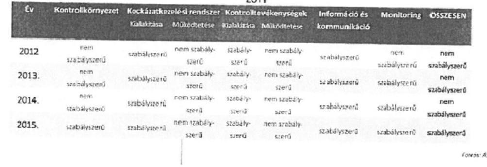

16

Az Intézet álláspontja alapján - a következőkben részletesen kifejtettek szerint - 2012. évnél a kontrolltevékenység működtetése sor esetében a jelentéstervezetben leírtak alapján szabályszerű minősítés rögzítése az indokolt, ekkor a szabályszerű halmaz 2012. évre vonatkozóan négy eleművé válik, a nem szabályszerű pedig három eleművé. Utóbbiakból adódóan a táblázat „ÖSSZESEN" is szabályszerű lesz.

Részletes megállapítások az ÁSZ jelentéstervezet 15. oldalán szerepeltetett, az intézeti kontrolltevékenységek összesített értékelésére vonatkozóan.

A jelentéstervezetben leírtak szerint a kontrolltevékenység kialakítása megfelelő volt, de a működtetése nem, hivatkozva arra, hogy a jelentéstervezet 3.3-ban rögzítettek miatt nem szabályszerű a kontrolltevékenységek működtetése:

# 2.3. számú megállapítás 

A kontrolltevékenység kialakítása a 2012-2015. közötti években kisebb hiányosságok mellett - megfelelő volt.

Az Intézetben a KONTROLLTEVÉKENYSÉGEK részeként biztosították a pénzügyi döntések dokumentumainak elkészítését, rendelkeztek a kötelezettségvállalások és szerződések nyilvántartásával.

---

Az Áht. és az Ávr. előírásainak megfelelően, a gazdálkodás részletes rendjét meghatározó Kötelezettségvállalási Szabályzattal az Intézet rendelkezett.

Az Intézetben 2012-2015. években biztosított volt a Bkr. 8. § (2) bekezdés a), c) és d) pontjaiban meghatározott tevékenységek feladatköri elkülönítése.

A gazdálkodási jogkörök gyakorlására vonatkozó felhatalmazások csak 2015. évtől álltak teljes körűen rendelkezésre.

A gazdálkodási jogkörök gyakorlása nem felelt meg a jogszabályi előírásoknak, amelyről részletesen a 3.3. számú megállapítás szól.

Holott a jelentéstervezet említett 3.3 pontjában kinyilatkozásra kerül, hogy a bevételek alapvetően megfeleltek az előírásoknak (lásd: 3.3 pont harmadik bekezdés „A bevételek pénzügyi kontrolltevékenysége 2012-2014. években megfelelt a jogszabályi előírásoknak."

#### Abstract

3.3. számú megállapítás

A bevételek beszedése és elszámolása, a kiadási előirányzatok felhasználása nem felelt meg a jogszabályi előírásoknak a gazdálkodási jogkörgyakorlás szabálytalansága miatt.

A BEVÉTELEK eredeti előirányzata 2015-ben a 2005. évihez képest 1088,4 millió Ft-tal (72,0%-kal) növekedett, míg a módosított előirányzat esetében a növekedés 561,5 millió Ft volt (16,4%-os növekedés). A befolyt bevétel 405,5 millió Ft-tal (11,8%-kal) növekedett. A bevétel 2008-2011. évi kiemelkedő értékét az új kórházópület megépítéséhez nyújtott központi támogatás szakaszos folyósítása okozta.

Az Intézet befolyt bevétele a 2012-2015. évi módosított bevételi előirányzatát nem érte el, a várt bevétel elmaradása ellenére nem tett eleget az Áht. 30. § (3) foglaltai szerint az előirányzat csökkentési kötelezettségének.

A bevételek pénzügyi kontrolltevékenysége 2012-2014. években megfelel a jogszabályi előírásoknak. Az intézet a 2012-2014. években hatályos kötelezettségvállalási szabályzatában az Ávr. 57. § (2) bekezdés által adott lehetőség alapján a bevételek meghatározott körére teljesítés igazolási kötelezettséget nem írt elő. A 2015. évben hatályos kötelezettségvállalási szabályzat 5. pontja előírta, hogy a bevételek elszámolására a teljesítés igazolását követően kerülhet sor, azonban a bevételek teljesítés igazolását a belső szabályzatban rögzítették ellenére az intézet nem hajtotta végre.

A bevételeknél az elszámolás szabályszerűsége 2012-2015. években nem volt megfelelő. A bérbeadásból származó bevétel beszedését alátámasztó, annak összegét beazonosítható módon meghatározó szerződés, illetve megállapodás az Ávr. 50. § (1) bekezdés b) pontjában foglalt előírásnak nem minden esetben felelt meg 2012-2015. években.

A bérbeadásból és eszközértékesítésből származó bevételek előírása a vevő nevére kiállított számla alapján történt. A 2012-2015. években több esetben előfordult, hogy a bevétel a számlán meghatározott fizetési határidőn túl teljesült, a késedelmes fizetések a bérbeadás esetében merültek fel.

Fentieken túl továbbá, a jelentéstervezet említett 3.3 pontjában a könyvelést is megfelelőnek minősítik a következők szerint: „Az Intézet a bevételek könyvelését 2012-2015. években a Számv. tv. és az Áhsz. előírásainak, valamint a gazdálkodással kapcsolatos belső szabályozásnak megfelelően végezte." (22. oldal első bekezdés)

---

# Megállapítások 

Az Intézet a bevételek könyvelését 2012-2015. években a Számv. tv. és az Áhsz. előírásának, valamint a gazdálkodással kapcsolatos belső szabályozóknak megfelelően végezte.

A KIADÁSOKON belül a felhalmozási kiadások emelkedtek jelentősen, ami 2008-ban 2664,2 millió ftra, 2011-ben 3.102,7 millió ftra nőtt, elsősorban az építési beruházás költségei, valamint a korszerű műszerezettség kialakítása miatt.

A 2012-2015. években a gazdálkodási jogkörök kontrolltevékenységének szabályszerűsége a kiadások esetén nem volt megfelelő, amit részletesen a 2. számú táblázat mutat be.

Továbbá a jelentéstervezet 3.3 pontja alapján ,,A személyi, dologi és egyéb működési kiadások valamint felhalmozási kiadások szabályszerűsége nem volt megfelelő a 2013-2014. években, megfelelt a jogszabályoknak 2012. és 2015. évben."

A személyi, dologi és egyéb működési, valamint a felhalmozási kiadások szabályszerűsége nem volt megfelelő a 2013-2014. években, megfelelt a jogszabályoknak a 2012. és 2015. évben.

Az Ávr. 50. § (1a) bekezdésében foglaltak
 ellenére dologi és egyéb működési, valamint a felhalmozási kiadások esetén a jogi személyek között szerződéseknél a 2014-2015. években nem minden esetben állt rendelkezésre a szerinti képviselőjének nyilatkozata arra vonatkozóan, hogy átlátható szervezetnek minősül.

Összegezve tehát a jelentéstervezetből idézett megállapításokat, ha a bevételeknél minden vizsgált év vonatkozásában a kontrolltevékenység működtetése alapvetően szabályszerű volt, a kiadásoknál pedig a 2012. és 2015. éveké volt szabályszerű, akkor a 15. oldalon szerepeltetett minősítő táblázat vonatkozó sorában a 2012. év vonatkozásában a kontrolltevékenység működtetése sor is szabályszerű minősítést kell, hogy kapjon. Utóbbiakból adódóan 2012. évnél a szabályszerű halmaz négy eleművé válik (kockázatkezelési rendszer kialakítása, kontrolltevékenység kialakítása, működtetése, információ és kommunikáció) a nem szabályszerű halmaz pedig három eleművé (kontrollkörnyezet, kockázatkezelési rendszer működtetése, monitoring). Az előzőekben leírtakból következik, az, hogy a 15. oldalon szereplő minősítő táblázat „ÖSSZESEN" sora is szabályszerű lesz 2012. év vonatkozásában.
6.) A jelentéstervezet 5. oldala továbbá 28. oldala a következőket rögzíti:

Az Intézet integritás kontrollrendszer kiépítettsége alacsony szintet mutat.

---

# Összegző megállapítás Az Intézetnél a 2015. évben az integritás szemlélet érvényesült, de az integritás kontrollrendszer kiépítettségi szintje alacsony. 

Az ÁSZ Integritás Projektjében az Intézet részt vett. Az ÁSZ az Intézet integritás kontrollrendszer egészének kiépítettségi szintjét alacsonyra értékelte, amelyet részletesen a III. számú melléklet mutat be.

Észrevételezzük, hogy 2012-2015. év közötti időszakra vonatkozóan olyan jogszabályi rendelkezéseket alkalmaznak az Intézet szervezetére vonatkozóan, amelynek a hatálya nem terjedt ki az Intézetre, tekintve, hogy az államigazgatási szervek integritásirányítási rendszeréről és az érdekérvényesítők fogadásának rendjéről szóló 50/2013. (II. 25.) Korm. rendelet kifejezetten az államigazgatási szervekre hatályos, ugyanakkor az OORI a vizsgált időszakban nem/sem minősül/minősült államigazgatási szervnek. Az OORI nem rendelkezik igazgatási jogosítványokkal, ami az államigazgatási szervek egyik jellemzője. Az előzőeket támasztja alá az a tény is, hogy az államigazgatási szervek munkatársai a közszolgálati tisztviselőkről szóló 2011. évi CXCIX. törvény 1.§ a-c) pontja alá tartoznak - a törvény ki is emeli, hogy ez a három pont vonatkozik az államigazgatási szervekre -, ezzel szemben az OORI munkatársai a közalkalmazottak jogállásáról szóló 1992. évi XXXIII. törvény 1. §-ának hatálya alá tartoznak. Fentiek alapján a hivatkozott megállapítások pontosítása indokolt.

Továbbá, a Nemzeti Korrupcióellenes Program és az azzal összefüggő intézkedések 2015-2016. évre vonatkozó terve elfogadásáról szóló 1336/2015. (V. 27.) Korm. határozat 4. pont d) alpontja előírta, hogy meg kell teremteni a belső kontrollrendszer és a korrupciómegelőzést szolgáló belső intézkedések összhangját az államigazgatási/közigazgatási/államháztartási alrendszereket alkotó költségvetési szervek szervezeti működésének egészére vonatkozóan - beleértve a reál és gazdálkodási folyamatokat -, továbbá az ehhez szükséges jogszabályokat ki kell dolgozni. A korábbiakban a kapcsolódó rendelkezéseket a már említett, az államigazgatási szervek integritásirányítási rendszeréről és az érdekérvényesítők fogadásának rendjéről szóló 50/2013. (II. 25.) Korm. rendelet (továbbiakban: Intr.) tartalmazta a Kormány irányítása vagy felügyelete alatt álló államigazgatási szervek vonatkozásában, illetőleg az utóbbiakba nem tartozó további intézményi kör esetében (lásd például OORI mint központi költségvetési szerv) a Bkr. tartalmazta a tárgyban releváns rendelkezéseket. A fentiekkel összhangban 2015. évben megkezdődött a Bkr. és az Intr. módosításának előkészítése, amelynek célja a párhuzamosságok kiszűrése és az összhang megteremtése volt a két rendelet között az integritás tárgykörére vonatkozóan. Az említettek eredményeképpen az integritással összefüggő rendelkezések egységesítése a hivatkozott jogszabályok szintjén megtörtént, illetőleg a Bkr. részeként 2016. év októberétől beépítésre kerültek az integritásirányítási rendszer szervezeti kialakítására, működtetésére irányadó rendelkezések. Az előzőekben részletezetteknek megfelelően az OORI részére kizárólag 2016. október 1-től jelennek meg konkrét jogszabályi kötelezettségként az integritással, korrupció megelőzéssel összefüggő rendelkezések a Bkr. szintjén, többek között az alábbiak szerint:

Bkr.
„3. § A költségvetési szerv vezetője felelős a belső kontrollrendszer keretében - a szervezet minden szintjén érvényesülő - megfelelő
a) kontrollkörnyezet,
b) integrált kockázatkezelési rendszer,
c) kontrolltevékenységek,
d) információs és kommunikációs rendszer, és
e) nyomon követési rendszer (monitoring)
kialakításáért, működtetéséért és fejlesztéséért.
6. § (4) A költségvetési szerv vezetője köteles szabályozni a szervezeti integritást sértő események kezelésének eljárásrendjét, valamint az integrált kockázatkezelés eljárásrendjét.

---

# 6. § (5) A költségvetési szerv vezetőjének felelőssége olyan belső kontrollrendszer kialakítása, amely minden tevékenységi kör esetében alkalmas az etikai értékek és az integritás érvényesítésének biztosítására." 

A fentiektől függetlenül az egyes intézeti szabályzatok keretében már 2014. évtől (pl.: Szabálytalanságok Kezelésének Rendje 5.2 pont. illetőleg 1. számú melléklet) kiemelt figyelemmel kezelte az Intézet a csalás/korrupció megelőzés tárgyköreit, illetőleg az intézeti beszerzések vonatkozásában a verseny tisztaságának biztosítását, továbbá az összeférhetetlenségre irányadó belső intézeti szabályok deklarálását (pl: Szerződéskötési Szabályzat 6.1 pont, Beszerzési Szabályzat 6.11 pont, Közbeszerzési szabályzat 3. pont, Kockázatkezelési Szabályzat 1. melléklet). Az előzőekben leírtaknak megfelelően, ellentétben a jelentéstervezetben foglaltakkal, az Intézet már a belső kontrollkörnyezetének kialakítása során is kiemelt figyelemmel kezelte az integritással összefüggő szabályok betartása fontosságának kommunikálását a munkavállalók irányába, felhívva az érintettek figyelmét az egyes szabályzatokban a kapcsolódó kockázatokra illetőleg annak megelőzésére. Az intézeti munkatársak számára kifejezett korrupcióellenes továbbképzés megtartására ugyan nem került sor - ezt azonban nem is írta elő jogszabály az OORI részére kötelezettségként -, ugyanakkor az Intézet belső ellenőre részére biztosított volt olyan, az irányító illetőleg a középirányító szerv által megtartott továbbképzéseken a részvétel, amelyeken kiemelt figyelemmel kezelték az integritásirányítással/csalás és korrupció megelőzéssel összefüggő ismeretek átadását. Az említett továbbképzések/előadások anyaga a belső ellenőrzés részéről az intézeti munkatársak irányába folyamatosan kommunikálásra került.

Kérjük fenti észrevételeink szíves átvezetését.
Köszönjük, hogy munkájuk eredményeképpen elkészített összefoglaló jelentésben tett megállapításaikkal elősegítették Intézetünk működésének szabályszerűségét.

Budapest, 2017. március 28.
Tisztelettel:
Dr. Cserháti Péter PhD
főigazgató

---

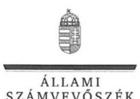

ELNÖK

Ikt.szám: V-0938-170/2016.

# Dr. Cserháti Péter úr 

főigazgató
Országos Orvosi Rehabilitációs Intézet

## Budapest

## Tisztelt Főigazgató Úr!

„A központi alrendszer egyes intézményei pénzügyi és vagyongazdálkodásának ellenőrzése Országos Orvosi Rehabilitációs Intézet" címmel készített számvevőszéki jelentéstervezetre tett észrevételét köszönettel megkaptam.

Az Állami Számvevőszék észrevételre vonatkozó álláspontjáról a felügyeleti vezető által készített részletes tájékoztatást csatoltan megküldöm.

Tájékoztatom Főigazgató urat, hogy a számvevőszéki jelentésben - az Állami Számvevőszékről szóló 2011. évi LXVI. törvény 29. § (3) bekezdése alapján - a figyelembe nem vett észrevételt szerepeltetjük az elutasítás indokának feltüntetésével.

Budapest, 2017. 09 hó 21 nap
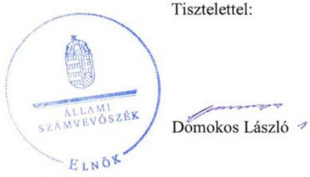

Melléklet: Tájékoztatás az elfogadott és el nem fogadott észrevételről

---

# Tájékoztatás   az elfogadott és el nem fogadott észrevételről 

„A központi alrendszer egyes intézményei pénzügyi és vagyongazdálkodásának ellenőrzése Országos Orvosi Rehabilitációs Intézet" című jelentéstervezetre 2017. március 29-én érkezett észrevételt áttekintettük, annak kezelésével kapcsolatban a következő tájékoztatást adom.

## 1. A „II. sz. melléklet: A teljesítmény-ellenőrzési kiegészítő modul megállapításai" vonatkozásában tett észrevételre adott válasz

Az ÁSZ érintett megállapítása szerint „Gazdaságossági, hatékonysági és eredményességi követelményeket a pénzügyi és a vagyongazdálkodás folyamatában az Intézet nem alakított ki. A teljesítmény-ellenőrzési kiegészítő modul ellenőrzése nem volt lefolytatható." Köszönettel vettük az ÁSZ megállapítását megerősítő észrevételüket, amely szerint nem bocsátottak az ÁSZ rendelkezésére rövid, közép és hosszú távú célokat és programokat tartalmazó dokumentációt. Az észrevételben a Monitoring Stratégiáról, azon belül az egyes indikátorok folyamatos monitoringjáról, értékeléséről és felülvizsgálatáról adnak tájékoztatást. A leírtak nem tartalmaznak indikátorokat és azt sem jelölik meg, hogy azt mely dokumentum rögzíti. Az ÁSZ megállapítását az ellenőrzési bizonyítékokon túl erősíti az a tény is, hogy Önök „a gazdálkodás területe vonatkozásában meghatározott számszerű és nem számszerű célokról, részcélokról és azokhoz kapcsolódó intézkedésekről" szóló 1. számú tanúsítványt nemlegesen töltötték ki, azaz nem határoztak meg célokat, részcélokat a gazdálkodásuk területén. A hivatkozott tanúsítványt mellékeljük.
A fentiek szerint az ellenőrzés megállapításának módosítása nem indokolt.

## 2. A 2.1 számú megállapításra tett észrevételre adott válasz

Az észrevételük 2. pontja a kontrollkörnyezet összefoglaló értékelésére vonatkozott, amely szerint „A kontrollkörnyezet kialakítása - a 2015. év kivételével - nem felelt meg a jogszabályi előírásoknak. ".
Észrevételük nem érintette és nem cáfolta az ÁSZ azon megállapítását, amely szerint 2015. október 14-ig nem rendelkeztek Szervezeti és Működési Szabályzattal és ezáltal az átláthatóság és elszámoltathatóság alapvető feltételei nem voltak biztosítva.
A „világos szervezeti struktúra és az egyértelmű felelősségi, hatásköri viszonyok és feladatok" kialakítottságára vonatkozó észrevétel az SZMSZ hiányára - és a megállapított egyéb szabályozásbeli hiányosságokra - tekintettel nem helytálló. Az államháztartásról 2011. évi CXCV. törvény a 10. § (5) bekezdésében rögzíti, hogy a költségvetési szerv szervezetét, feladatai ellátásának részletes belső rendjét és módját az SZMSZ állapítja meg. Ezt egyéb szabályzatok nem helyettesítik. Az észrevételükkel ellentétben a jelentéstervezet nem szűkíti le a kontrollkörnyezet minősítését, hanem a lényeges hiányosságokra helyezi a hangsúlyt. Az

---

SZMSZ az ellenőrzött időszak közel egészét lefedő hiánya olyan lényeges hiányosság a világos szervezeti struktúra és a felelősségi, hatásköri viszonyok kialakítását illetően, hogy önmagában is a kontrollkörnyezet nem megfelelő minősítését eredményezi.
Köszönjük a belső kontroll standardok részletes bemutatását. Az ÁSZ előtt ismertek a belső kontrollrendszer kialakítására vonatkozó módszertani útmutatók, azonban ezek nem jogszabályok, nem minősülnek szabályszerűségi ellenőrzés esetében kritériumnak. Mindezek alapján az ellenőrzés 2.1 számú megállapításának módosítása nem indokolt.
A pénzkezelési szabályzatra és az Eszközök és Források értékelési szabályzatára vonatkozó, 89. oldalon található észrevételük alapján, a dokumentumok ismételt áttekintését követően a jelentéstervezetből mindkettő érintett megállapítást töröljük, valamint az OORI főigazgatójának szóló 2 . számú javaslatot pontosítjuk.
Az etikai alapelveket meghatározó kódexszel kapcsolatban tett, 9-10. oldalon szereplő észrevételükben idézett rendelkezéseket a 105/2009. (XII.21.) OGY határozat valóban tartalmazza. Fel szeretnénk azonban hívni a figyelmüket arra, hogy az idézett rendelkezéseket megelőzően a hivatkozott határozat a közszféra alapvető etikai követelményeit fogalmazza meg, amelyeket „a közszférában egységes elveken alapuló etikai kódexekben szükséges rögzíteni". A megállapítás megfogalmazását az egyértelműség érdekében pontosítjuk és kiegészítjük a költségvetési szervek belső kontrollrendszeréről és belső ellenőrzéséről szóló 370/2011. (XII. 31.) Korm. rendelet 6. § (1) bekezdés c) pontjára való hivatkozással.

# 3. A Panaszkezelési Szabályzat vonatkozásában tett észrevételre adott válasz 

Az észrevételük tájékoztatást tartalmaz arra vonatkozóan, hogy mely jogszabály alapján kötelező Önök számára a „Panaszkezelési Szabályzat" elkészítése. Az ÁSZ megállapítása nem azt rögzíti, hogy mely ágazati jogszabály írta elő a panaszkezelési szabályzat elkészítését, hanem azt tartalmazza, hogy ,,az Info tv. előírásainak megfelelő Panaszkezelési Szabályzattal" rendelkeztek. Az Info tv. a személyes adatok védelmére vonatkozóan rendelkezést tartalmaz, amelynek többek között a Panaszkezelési Szabályzatnak is meg kell felelnie. A megfelelést a jelentéstervezet pozitív tényként rögzíti.
Az ÁSZ megállapításának módosítása, pontosítása a fentiek alapján nem indokolt.

## 4. A 2.6 számú megállapításra tett észrevételre adott válasz

Az ÁSZ megállapítása azt rögzíti, hogy ,, a célok elérését szolgáló mérhető követelményeket nem határoztak meg" az erőforrások gazdaságos, hatékony, eredményes felhasználásának biztosítása érdekében.
Az ,,erőforrásokkal való gazdaságos, hatékony és eredményes gazdálkodás követelményeiről" szóló 1. számú tanúsítványt nemlegesen töltötték ki, tehát a célok elérését szolgáló mérhető követelményeket nem határoztak meg. A hivatkozott tanúsítványt mellékeljük. A Monitoring Stratégia észrevételükben idézett részei mérhető követelményeket nem tartalmaznak, amely megerősíti a tanúsítványban tett nyilatkozatukat. A megállapítás módosítása nem indokolt.

---

# 5. A jelentéstervezet 15. oldalán szereplő táblázatra tett észrevételre adott válasz 

Az észrevétel alapvetően a kontrolltevékenységek 2012. évi működtetésének értékelésére és ezáltal a 2012. évi belső kontrollrendszer összesítő értékelésére vonatkozott. Az észrevétel a táblázatban foglaltakat megalapozó részletes megállapításokat nem érinti, hanem módszertanilag kérdőjelezi meg a táblázatban szereplő 2012. évi értékeléseket. Köszönjük a módszertani észrevételeiket, azonban fel szeretnénk hívni a figyelmüket, hogy az Állami Számvevőszékről szóló 2011. évi LXVI. törvény alapján a számvevőszéki ellenőrzés szakmai szabályait, módszereit az ÁSZ saját maga alakítja ki és minden intézményre egyformán alkalmazza.

Az észrevétel példálózó jelleggel emeli ki a jelentéstervezet egyes részletes megállapításait és az alapján von le következtetést. Nem tartalmazza azonban például azon megállapítás kiemelését, hogy „A bevételeknél az elszámolás szabályszerűsége 2012-2015. években nem volt megfelelő." és nem tér ki arra a lényeges megállapításra sem, hogy „A 2012-2015. években a gazdálkodási jogkörök kontrolltevékenységének szabályszerűsége a kiadások esetében nem volt megfelelő." Ezen két megállapítás - amelyet az észrevétel nem emel ki - már önmagában is megalapozza a kontroll tevékenységek működtetésének táblázatban szereplő, „nem szabályszerű" minősítését.

A fentieken túl ki kell emelni, hogy az ÁSZ jelentéstervezetében szereplő minősítések „Az ellenőrzés módszerei" között megtalálható statisztikai módszertan szerint kerültek meghatározásra.

Mindezek alapján a jelentéstervezet érintett részének módosítása nem indokolt.

## 6. A jelentéstervezet integritás kontrollrendszer kiépítettségére vonatkozó megállapításra tett észrevételre adott válasz

Az észrevétel az integritással kapcsolatos jogszabályi környezet változását mutatja be. A jogszabályi környezetet a téma kezelésénél az ÁSZ figyelembe veszi. Így az integritás kontrollrendszert az ÁSZ nemcsak a jogszabályok által is előírt szabályossági kontrollok alapján, hanem az integritás szemlélet érvényesítés érdekében a szervezet által - önként - tett erőfeszítések alapján is értékeli. Ezt a módszert indokolja, hogy a szervezeti integritás egy szervezetnek a rá vonatkozó szabályoknak, valamint a részére vagy általa meghatározott értékeknek és elveknek megfelelő működését jelenti.
A 2015. évi integritás felmérésben az Intézet önként részt vett. Az integritás kontrollrendszer kiépítettségének értékelése az Önök által kitöltött kérdőív felhasználásával és az ellenőrzési tapasztalatok alapján történt.
E témához kapcsolódó észrevételükben sem cáfolták az SZMSZ közel teljes ellenőrzött időszakra vonatkozó hiányát, ami által az átláthatóság és elszámoltathatóság alapvető feltételei nem voltak biztosítva. Észrevételükben nem vitatták azt sem, hogy nem mérték fel és nem állapították meg az Intézet tevékenységében, gazdálkodásában rejlő kockázatokat, valamint

---

nem határozták meg az egyes kockázatokkal kapcsolatban szükséges intézkedéseket, azok teljesítésének folyamatos nyomon követési módját. Az integritás szemlélet akkor érvényesülhet, ha az intézmény vezetője kockázatelemzéssel feltárja az általa vezetett szervezetet fenyegető, kapcsolódó korrupciós kockázatokat, veszélyeket és azokat tudatosítja, majd kezeli.
A fentiekből adódóan az integritás kontrollrendszer jelentéstervezetben szereplő értékelése helytálló, a jelentéstervezet megállapításának módosítása nem indokolt.

Budapest, 2017. 04. hó 21. nap

Makkai Mária
felügyeleti vezető

Mellékletek:

1. számú tanúsítvány az ellenőrzött szervezet illetve irányító szerve által a gazdálkodás területe vonatkozásában meghatározott számszerű és nem számszerűsíthető célokról, részcélokról és az azokhoz kapcsolódó intézkedésekről
2. számú tanúsítvány az erőforrásokkal való gazdaságos, hatékony és eredményes gazdálkodás követelményeiről

---

# Domokos László úr 

elnök

Állami Számvevőszék

Budapest
Apáczai Csere János utca 10.
1052

Tárgy: Észrevételek - Az Országos Orvosi Rehabilitációs Intézet pénzügy és vagyongazdálkodásának az Állami Számvevőszék által lefolytatott ellenőrzési jelentéstervezete kapcsán

Tisztelt Elnök Úr!

Az Országos Orvosi Rehabilitációs Intézet pénzügy és vagyongazdálkodásának az Állami Számvevőszék által lefolytatott ellenőrzési jelentéstervezete kapcsán.

### 1.2. Megállapítás 6-7 bekezdés:

A települési önkormányzatok fekvőbeteg-szakellátó intézményeinek átvételéről és az átvételhez kapcsolódó egyes törvények módosításáról szóló 2012. évi XXXVIII. törvény 4. számú melléklet 4. pontja, valamint a Gyógyszerészeti és Egészségügyi Minőség- és Szervezetfejlesztési Intézetről szóló 59/2011. (IV. 12.) Korm. rendelet 2/A.§ alapján a Gyógyszerészeti és Egészségügyi, Minőség- és Szervezetfejlesztési Intézet 2012.04.28. napjától lett az OORI középirányító szerve. Tehát a jelentés szerinti 2005.01.01.-2012.04.28. közötti időszakban a GYEMSZI/ ÁEEK nem rendelkezett ráhatással az országos intézetekre, így nem követhette el a jelentésben hivatkozott Áht. szerinti mulasztást sem, a kérdéses időszakban.

Az OORI GYEMSZI középirányítása alá kerülését követő időszakra (2012.04.28.-2015.10.15) az alábbi az észrevételünk:

Az államháztartásról szóló 2011. évi CXCV. törvény (Áht.) hivatkozott 9.§ (1) e.) illetve (2013.07.05-ét követően) a.) pontjai alapján a költségvetési szerv irányítása a következő hatáskörök gyakorlását jelenti:

2012:
„ a) a költségvetési szerv átalakítása és megszüntetése,
e) a költségvetési szerv szervezeti és működési szabályzatának jóváhagyása,"
2013.07.05-ét követően:
„a) a költségvetési szerv alapító okiratának kiadása, szervezeti és működési szabályzatának jóváhagyása, átalakítása és megszüntetése,"

Az egyes egészségügyi és egészségbiztosítási tárgyú kormányrendeletek módosításáról szóló 254/2013. (VII. 5.) Korm. rendelet 62.§ (1) bekezdésében meghatározott (2013.07.06. napján hatályba lépő) változás jogosította fel az ÁEEK-et a középirányítása alá tartozó intézmények tekintetében az irányítói jogok közül az intézmények szervezeti és működési szabályzatainak jóváhagyására.

---

Álláspontunk szerint azonban ez nem vonta maga után a már meglévő és hatályos SzMSz-ek felülvizsgálatának kötelezettségét, pusztán a jövőben jóváhagyásra jogosult szervet „változtatta meg" a hatálybalépést követően az intézmény által kezdeményezett módosítások jóváhagyása tekintetében. Kötelezettség hiányában pedig nem állapítható meg az Áht. hivatkozott rendelkezéseinek GYEMSZI általi megsértése.

A GYEMSZI (későbbi nevén ÁEEK) elsősorban az Ügykörök rendszeren keresztül hajtja végre a fenntartása alá tartozó intézmények fenntartó felé benyújtandó dokumentumainak jóváhagyását. Az OORI 2015. január 22-én nyújtotta be jóváhagyásra az új SzMSz tervezetét a GYEMSZI felé. Az ÁEEK észrevételeinek megfelelően ismételten benyújtott SzMSz tervezetet a kórház 2015. 09.21-én töltötte fel az Ügykörök rendszerbe.
A kért korrekciók elvégzését követő jóváhagyás eredményeként az OORI új SzMSZ-e elfogadásra került a középirányító által, 2015. október 06-án került aláírásra, és 2015. október 15-én lépett hatályba.

# 1.2. Megállapítás 9. bekezdés: 

Az intézmények ellenőrzésének keretében előre meghatározott, a jogszabályi előírásoknak megfelelő, ellenőrzési terv alapján dolgoznak az ellenőrök. Nincs lehetőség és mód arra, hogy minden intézményt minden évben ellenőrizzenek.

### 1.3. Megállapítás 5. bekezdés:

A gazdasági igazgató kinevezésére a mai napig nem került sor, jelenleg is megbízottként látja el feladatait. Téves a megállapítás, miszerint pályázat kiírása nélkül került kinevezésre.

### 4.1. Megállapítás:

A vagyonkezelői szerződések 2016. évben módosításra kerültek, az aláírások az intézmények és az ÁEEK részéről is megtörténtek. A módosítás tartalmazza a megállapításban jelzett hiba javítását is.

Kérjük fenti észrevételek elfogadását és a jelentéstervezeten történő átvezetését.

Budapest, 2017. április „12".
Tisztelettel:
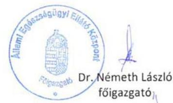

---

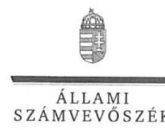

ELNÖK

Ikt.szám: V-0938-178/2016.

# Dr. Németh László úr   főigazgató 

Állami Egészségügyi Ellátó Központ

## Budapest

## Tisztelt Főigazgató Úr!

„A központi alrendszer egyes intézményei pénzügyi és vagyongazdálkodásának ellenőrzése Országos Orvosi Rehabilitációs Intézet" címmel készített számvevőszéki jelentéstervezetre tett észrevételét köszönettel megkaptam.

Az Állami Számvevőszék észrevételre vonatkozó álláspontjáról a felügyeleti vezető által készített részletes tájékoztatást csatoltan megküldöm.

Tájékoztatom Főigazgató urat, hogy a számvevőszéki jelentésben - az Állami Számvevőszékről szóló 2011. évi LXVI. törvény 29. § (3) bekezdése alapján - a figyelembe nem vett észrevételt szerepeltetjük az elutasítás indokának feltüntetésével.

Budapest, 2017. 2017. hó 2. nap
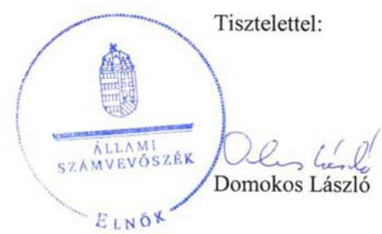

Melléklet: Tájékoztatás az elfogadott és el nem fogadott észrevételről

---

# Tájékoztatás   az elfogadott és el nem fogadott észrevételről 

„A központi alrendszer egyes intézményei pénzügyi és vagyongazdálkodásának ellenőrzése Országos Orvosi Rehabilitációs Intézet" című jelentéstervezetre 2017. április 21-én érkezett észrevételt áttekintettük, annak kezelésével kapcsolatban a következő tájékoztatást adom.

## 1. Az 1.2. Megállapítás 6-7. bekezdésével kapcsolatban tett észrevételre adott válasz

Az ÁSZ 2005. évtől 2013. július 5-ig terjedő időszakra vonatkozó, 6. bekezdésben szereplő megállapítása az észrevételben foglaltakkal szemben nem a középirányító szervet (GYEMSZI/ÁEEK), hanem az irányító szervet érinti. Ezért az észrevételben foglaltak az ÁSZ megállapítását nem cáfolják, az érintett megállapítás módosítása nem indokolt.
Az észrevétellel érintett 7. bekezdés az észrevétellel egyezően a 2013. július 6-tól kezdődő időszakban a középirányító szervre vonatkozóan állapítja meg a szabálytalanságot. Az 59/2011. (IV.12.) Korm. rendelet 2/A. §-ának n) pontja az észrevétellel ellentétben nem „az intézmény által kezdeményezett módosítások" esetében írta elő a jóváhagyást, hanem azt rögzítette, hogy a középirányító „jóváhagyja az irányítása alá tartozó egészségügyi intézmények szervezeti és működési szabályzatát". A jóváhagyást szükségessé tette egyrészt, hogy az Intézet nem rendelkezett jóváhagyott SZMSZ-szel, amelyről a GYEMSZI - az észrevétellel ellentétben, a rendelkezésre bocsátott dokumentumok alapján - tudomással bírt ugyanis az SZMSZ jóváhagyás céljából 2014. január 23-án megküldésre került a GYEMSZI részére, másrészt az irányítószervi struktúrában bekövetkezett változások az SZMSZ módosítását és jóváhagyását szükségessé tették a 2013. július 6-tól kezdődő időszakban. Ebből adódóan az ÁSZ megállapítás megalapozott, módosítása nem indokolt.

## 2. Az 1.2. Megállapítás 9. bekezdésével kapcsolatban tett észrevételre adott válasz

Az ÁSZ megállapítása az irányító szervre vonatkozóan azt rögzíti, hogy az ellenőrzés lehetőségével nem élt. Az észrevétel ennek okáról ad tájékoztatást. A megállapításban foglaltakat nem érinti, a megállapítás módosítása nem indokolt.

## 3. Az 1.3. Megállapítás 5. bekezdésével kapcsolatban tett észrevételre adott válasz

Az észrevételt köszönjük, az megerősíti a gazdasági igazgatói feladatkör betöltésére vonatkozó pályázati kiírás elmaradását. Az egyértelműség érdekében a megállapítás megfogalmazását pontosítjuk, mely szerint a 2015. évben a gazdasági igazgatói beosztás ellátására az irányító szerv nem írta ki a Kjt. 20/B. § (1) bekezdésében előírtak szerinti pályázatot.

---

# 4. A 4.1. Megállapítással kapcsolatban tett észrevételre adott válasz 

Az észrevételben megfogalmazott, ellenőrzött időszakon túli intézkedésről a tájékoztatást köszönjük. Az ÁSZ megállapításai az ellenőrzött időszakra vonatkoznak, ebből adódóan a megállapítás módosítása nem indokolt.

Budapest, 2017. 11. hó 2. nap

Makkai Mária
felügyeleti vezető

---

.

---

# RÖVIDÍTÉSEK JEGYZÉKE 

${ }^{1}$ Intézet ${ }^{2}$ Eütv. ${ }^{3}$ Minisztérium

${ }^{4}$ GYEMSZI ${ }^{5}$ ÁEEK ${ }^{6}$ főigazgató ${ }^{7}$ gazdasági igazgató ${ }^{8}$ ÁSZ ${ }^{9}$ ÁSZ tv. ${ }^{10}$ Áht. 2 ${ }^{11}$ irányító szerv $_{1}$ irányító szerv $_{2}$ irányító szerv $_{3}$ ${ }^{12}$ középirányító szerv $_{1}$

középirányító szerv $_{2}$
${ }^{13}$ Alapító okirat $_{1}$

Alapító okirat $_{2}$

Alapító okirat $_{3}$

Alapító okirat $_{4}$

Alapító okirat $_{5}$

Alapító okirat $_{6}$
${ }^{14}$ Áht. $1$
${ }^{15} \mathrm{Kjt}$.
${ }^{16}$ Kincstár
${ }^{17}$ Ámr. $1$
${ }^{18}$ 59/2011. (IV.12.) Korm.rendelet

Országos Orvosi Rehabilitációs Intézet
az egészségügyről szóló 1997. évi CLIV. törvény
Egészségügyi Minisztérium 2005. január 01. és 2010. május 27. között;
Nemzeti Erőforrás Minisztérium 2010. május 28. és 2012. május 13. között;
Emberi Erőforrások Minisztériuma 2012. május 14. napjától jelenleg is
Gyógyszerészeti és Egészségügyi Minőség- és Szervezetfejlesztési Intézet
Állami Egészségügyi Ellátó Központ
az Intézet főigazgatója
az Intézet gazdasági vezetője
Állami Számvevőszék
az Állami Számvevőszékről szóló 2011. évi LXVI. törvény
az államháztartásról szóló 2011. évi CXCV. törvény
Egészségügyi Minisztérium 2005. január 01. és 2010. május 27. között
Nemzeti Erőforrás Minisztérium 2010. május 28. és 2012. május 13. között
Emberi Erőforrások Minisztériuma 2012. május 14. napjától jelenleg is
Gyógyszerészeti és Egészségügyi Minőség- és Szervezetfejlesztési Intézet (2012.
január 1. és 2015. február 28. között)
Állami Egészségügyi Ellátó Központ (2015. március 1-től jelenleg is)
Alapító okirat ${ }_{1}$ : Országos Orvosi Rehabilitációs Intézet Népjóléti Közlöny 1997. évi
16. számában közzétett Alapító Okirata (hatályos: 1997. 09. 10-től 2008. 05. 30-
áig)
Alapító okirat ${ }_{2}$ : Országos Orvosi Rehabilitációs Intézet Egészségügyi Közlöny
2008. évi 12. számában közzétett Alapító Okirat módosítás alapján egységes
szerkezetbe foglalt Alapító Okirat (hatályos: 2008. 05. 31-től 2009. 06. 30-ig)
Alapító okirat ${ }_{3}$ : Országos Orvosi Rehabilitációs Intézet Alapító Okirata (6220-
26/2009-0006KTF., hatályos: 2009. 07. 01-től 2010. 11. 01-ig)
Alapító okirat ${ }_{4}$ : Országos Orvosi Rehabilitációs Intézet Alapító Okirata (16274-
26/2010-0004JKF., hatályos 2010. 11. 02-től 2013. 05. 22-ig)
Alapító okirat ${ }_{5}$ : Országos Orvosi Rehabilitációs Intézet Alapító Okirata (19155-
5/2013/JOGI., hatályos 2013. 05. 23-tól 2014.04. 08-ig) Országos Orvosi
Rehabilitációs Intézet Alapító Okirata kiegészítése (a 12266-8/2014/JOGI.;
hatályos: 2014. 04. 9-től 2014. 09. 30-ig)
Alapító okirat ${ }_{6}$ : Országos Orvosi Rehabilitációs Intézet Alapító Okirata (41377-
16/2014/JOGI., hatályos 2014.10. 01-től)
az államháztartásról szóló 1992. évi XXXVIII. törvény (hatályos 2011. december
31-ig)
2008. évi CV. törvény a költségvetési szervek jogállásáról és gazdálkodásáról
(hatályos: 2009.01.01-től 2010.08.15-ig)
Magyar Államkincstár
az államháztartás működési rendjéről szóló 217/1998. (XII.30.) Korm.rendelet
(hatályos 2009. december 31-ig)
a Gyógyszerészeti és Egészségügyi Minőség- és Szervezetfejlesztési Intézetről
szóló 59/2011. (IV.12.) Korm.rendelet (hatályos 2015. február 28-ig)

---

${ }^{19}$ Ávr.
${ }^{20}$ Ámr. 2
${ }^{21}$ Áhsz. 1
${ }^{22}$ Áhsz. 2
${ }^{23}$ 27/2015. (II.25.) Korm.rendelet
${ }^{24}$ főigazgató ${ }_{1}$
főigazgató ${ }_{2}$
főigazgató ${ }_{3}$
főigazgató ${ }_{4}$
${ }^{25} \mathrm{Kjt}$.
${ }^{26}$ SZMSZ
${ }^{27}$ Közalkalmazotti Szabályzat
${ }^{28}$ Számv.tv.
${ }^{29}$ Számviteli Politika ${ }_{1}$
Számviteli Politika ${ }_{2}$
${ }^{30}$ Bizonylati rend
${ }^{31}$ Eszközök és Források Értékelési Szabályzata Az Országos Orvosi Rehabilitációs Intézet Számviteli Politikája, hatályos: 2012. január 1-től
${ }^{32}$ Pénzkezelési Szabályzat ${ }_{1}$
Pénzkezelési Szabályzat ${ }_{2}$
${ }^{33}$ Számlarend
${ }^{34}$ Közbeszerzési Szabályzat ${ }_{1}$

Közbeszerzési Szabályzat ${ }_{2}$
${ }^{35} \mathrm{Kbt} .{ }_{1}$

Kbt. 2
${ }^{36}$ Beszerzési Szabályzat ${ }_{1}$
Beszerzési Szabályzat ${ }_{2}$
${ }^{37}$ Kötelezettségvállalási Szabályzat ${ }_{1}$
az államháztartásról szóló törvény végrehajtásáról szóló 368/2011. (XII. 31.) Korm. rendelet (hatályos: 2012. 01. 01-jétől)
az államháztartás működési rendjéről szóló 292/2009. (XII.19.) Korm.rendelet (hatályos 2011. december 31-ig)
az államháztartás szervezetei beszámolási és könyvvezetési kötelezettségének sajátosságairól szóló 249/2000. (XII. 24.) Korm. rendelet (hatályos 2013. december 31-ig)
az államháztartás számviteléről szóló 4/2013. (I. 11.) Korm. rendelet (hatályos 2014. január 1-től)
az Állami Egészségügyi Ellátó Központról szóló 27/2015. (II.25.) Korm.rendelet
az Intézet főigazgatója 1991-től 2006. május 25-ig
az Intézet mb. főigazgatója 2006. május 26. és 2007. december 31-ig
az Intézet főigazgatója 2008. január 1. és 2013. október 31. között
az Intézet főigazgatója 2013. november 1-jétől jelenleg is
a közalkalmazottak jogállásáról szóló 1992. évi XXXIII. törvény
Az Országos Orvosi Rehabilitációs Intézet Szervezeti és Működési Szabályzata (444/1/2015., (hatályos: 2015. október 15-től)
Az Országos Orvosi Rehabilitációs Intézet Közalkalmazotti Szabályzata, hatályos: 2011. szeptember 20-tól
a számvitelről szóló 2000. évi C. törvény
Országos Orvosi Rehabilitációs Intézet Számviteli Politikája, hatályos: 2012. január 1-től
Országos Orvosi Rehabilitációs Intézet Számviteli Politikája, hatályos 2014. január 1-től voltak
Az Országos Orvosi Rehabilitációs Intézet Bizonylati Szabályzata, hatályos: 2012. január 1-től
Az Országos Orvosi Rehabilitációs Intézet Eszközök és Források Értékelési Szabályzata, hatályos: 2012. január 1-től
Országos Orvosi Rehabilitációs Intézet Pénzkezelési Szabályzata, hatályos: 2012. január 1-től
Országos Orvosi Rehabilitációs Intézet Pénz és Értékkezelési Szabályzata (Ig21/1/2015.), hatályos: 2015. január 1-től
Országos Orvosi Rehabilitációs Intézet Számlarend és Számlatükör, hatályos: 2012. január 1-től
Az Országos Orvosi Rehabilitációs Intézet Közbeszerzési Szabályzat, hatályos: 2011. április 1-től
Az Országos Orvosi Rehabilitációs Intézet Közbeszerzési Szabályzat, hatályos: 2011. április 1-től
Az Országos Orvosi Rehabilitációs Intézet Közbeszerzési Szabályzat, 1(Ig349/1/2014.), hatályos: 2014. július 1-től
a közbeszerzésekről szóló 2011. évi CVIII. törvény (hatályos 2011. augusztus 11-től)
a közbeszerzésekről szóló 2015. évi CXLIII. törvény (hatályos 2015. november 1-től)
Árubeszerzés, építési beruházás, felújítás és szolgáltatás igénybevételének szabályzata, hatályos: 2001. október 19-től
Beszerzési Szabályzat (Ig146/1/2015.), hatályos: 2015. március 24-től
Az Országos Orvosi Rehabilitációs Intézet szabályzata a Pénzgazdálkodással Kapcsolatos Kötelezettségvállalás, Utalványozás, Érvényesítés és Ellenjegyzés Hatásköri Rendjéről, hatályos: 2012. január 1-től

---

Kötelezettségvállalási Szabályzat ${ }_{2}$

Az Országos Orvosi Rehabilitációs Intézet Kötelezettségvállalási Szabályzata (Ig70/1/2015.), hatályos: 2015. február 1-től
a költségvetési szervek belső kontrollrendszeréről és belső ellenőrzéséről szóló 370/2011. (XII.31.) Korm.rendelet
Kockázatkezelési Szabályzat ${ }_{1}$

Az Országos Orvosi Rehabilitációs Intézet Kockázatkezelési Szabályzata, hatályos: 2012. január 1-től
Az Országos Orvosi Rehabilitációs Intézet Kockázatkezelési Szabályzata,(Ig583/2014.), hatályos: 2015. január 1-től
Szabálytalanságok kezelésének rendje (Ig 524/1/2014., hatályos: 2014. november 15-től
Az Országos Orvosi Rehabilitációs Intézet Kommunikációs Szabályzata, hatályos: 2008 (pontos dátum megjelölést a dokumentum nem tartalmaz)
az információs önrendelkezési jogról és az információszabadságról szóló 2011. évi CXII. törvény (hatályos: 2012. január 1-től)
a közérdekű adatok elektronikus közzétételére, az egységes közadatkereső rendszerre, valamint a központi jegyzék adattartalmára, az adatintegrációra vonatkozó részletes szabályokról szóló 305/2005 (XII. 25. ) Korm. rendelet
Közzétételi szabályzat, Ig287/1/2014.), hatályos: 2014. június 7-től
Országos Orvosi Rehabilitációs Intézet Panaszkezelési szabályzata (Ig487/1/2014.), hatályos: 2014. október 15-től
Az Országos Orvosi Rehabilitációs Intézet Adatvédelmi Szabályzata, hatályos: 2010. január 22-től

Az Országos Orvosi Rehabilitációs Intézet Iratkezelési Szabályzata, hatályos: 2009. január 1-től
Magyar Államkincstár
Környezet és Energia Operatív Program
Országos Orvosi Rehabilitációs Intézet szabályzata a Pénzgazdálkodással
Kapcsolatos Kötelezettségvállalás, Utalványozás, Érvényesítés és Ellenjegyzés Hatásköri Rendjéről (hatályos 2012. január 1-től)
Ig70/1/2015. számú Országos Orvosi Rehabilitációs Intézet Kötelezettségvállalási Szabályzata (hatályos 2015. február 1-től)
Magyarország 2012. évi központi költségvetéséről szóló 2011. évi CLXXXVIII. törvény
Magyarország 2013. évi központi költségvetéséről szóló 2012. évi CCIV. törvény
Magyarország 2014. évi központi költségvetéséről szóló 2013. évi CCXXX. törvény
Magyarország 2015. évi központi költségvetéséről szóló 2014. évi C. törvény
a kormányzati létszámcsökkentésről szóló 1004/2012. (II. 01.) Korm. határozat
Országos Egészségbiztosítási Pénztár
Magyar Nemzeti Vagyonkezelő Zrt.
a települési önkormányzatok fekvőbeteg-szakellátó intézményeinek átvételéről és az átvételhez kapcsolódó egyes törvények módosításáról szóló 2012. évi XXXVIII. törvény
az állami vagyonnal való gazdálkodásról szóló 254/2007. (X.4.) Korm.rendelet
az államháztartás számvitelének 2014. évi megváltozásával kapcsolatos feladatokról szóló 36/2013. (IX. 13.) NGM rendelet

---

# ÁLLAMI SZÁMVEVŐSZÉK 

1052 Budapest, Apáczai Csere János utca 10.
Levélcím: 1364 Budapest 4. Pf. 54
Telefon: +36 14849100 Telefax: +36 14849200
www.asz.hu
